Linux in Australia - Hardware Trends
------------------------------------

A project to identify most popular hardware characteristics and track their change
over time based on data collected by Linux users at https://Linux-Hardware.org.

Anyone can contribute to this report by the [hw-probe](https://github.com/linuxhw/hw-probe) tool:

    sudo -E hw-probe -all -upload

This is a report for all computer types. See also reports for [desktops](/Location/Australia/Desktop/README.md) and [notebooks](/Location/Australia/Notebook/README.md).

Period: Mar, 2023.

Contents
--------

* [ System ](#system)
  - [ OS                       ](#os)
  - [ OS Family                ](#os-family)
  - [ Kernel                   ](#kernel)
  - [ Kernel Family            ](#kernel-family)
  - [ Kernel Major Ver.        ](#kernel-major-ver)
  - [ Arch                     ](#arch)
  - [ DE                       ](#de)
  - [ Display Server           ](#display-server)
  - [ Display Manager          ](#display-manager)
  - [ OS Lang                  ](#os-lang)
  - [ Boot Mode                ](#boot-mode)
  - [ Filesystem               ](#filesystem)
  - [ Part. scheme             ](#part-scheme)
  - [ Dual Boot with Linux/BSD ](#dual-boot-with-linuxbsd)
  - [ Dual Boot (Win)          ](#dual-boot-win)

* [ Board ](#board)
  - [ Vendor                   ](#vendor)
  - [ Model                    ](#model)
  - [ Model Family             ](#model-family)
  - [ MFG Year                 ](#mfg-year)
  - [ Form Factor              ](#form-factor)
  - [ Secure Boot              ](#secure-boot)
  - [ Coreboot                 ](#coreboot)
  - [ RAM Size                 ](#ram-size)
  - [ RAM Used                 ](#ram-used)
  - [ Total Drives             ](#total-drives)
  - [ Has CD-ROM               ](#has-cd-rom)
  - [ Has Ethernet             ](#has-ethernet)
  - [ Has WiFi                 ](#has-wifi)
  - [ Has Bluetooth            ](#has-bluetooth)

* [ Location ](#location)
  - [ Country                  ](#country)
  - [ City                     ](#city)

* [ Drives ](#drives)
  - [ Drive Vendor             ](#drive-vendor)
  - [ Drive Model              ](#drive-model)
  - [ HDD Vendor               ](#hdd-vendor)
  - [ SSD Vendor               ](#ssd-vendor)
  - [ Drive Kind               ](#drive-kind)
  - [ Drive Connector          ](#drive-connector)
  - [ Drive Size               ](#drive-size)
  - [ Space Total              ](#space-total)
  - [ Space Used               ](#space-used)
  - [ Malfunc. Drives          ](#malfunc-drives)
  - [ Malfunc. Drive Vendor    ](#malfunc-drive-vendor)
  - [ Malfunc. HDD Vendor      ](#malfunc-hdd-vendor)
  - [ Malfunc. Drive Kind      ](#malfunc-drive-kind)
  - [ Failed Drives            ](#failed-drives)
  - [ Failed Drive Vendor      ](#failed-drive-vendor)
  - [ Drive Status             ](#drive-status)

* [ Storage controller ](#storage-controller)
  - [ Storage Vendor           ](#storage-vendor)
  - [ Storage Model            ](#storage-model)
  - [ Storage Kind             ](#storage-kind)

* [ Processor ](#processor)
  - [ CPU Vendor               ](#cpu-vendor)
  - [ CPU Model                ](#cpu-model)
  - [ CPU Model Family         ](#cpu-model-family)
  - [ CPU Cores                ](#cpu-cores)
  - [ CPU Sockets              ](#cpu-sockets)
  - [ CPU Threads              ](#cpu-threads)
  - [ CPU Op-Modes             ](#cpu-op-modes)
  - [ CPU Microcode            ](#cpu-microcode)
  - [ CPU Microarch            ](#cpu-microarch)

* [ Graphics ](#graphics)
  - [ GPU Vendor               ](#gpu-vendor)
  - [ GPU Model                ](#gpu-model)
  - [ GPU Combo                ](#gpu-combo)
  - [ GPU Driver               ](#gpu-driver)
  - [ GPU Memory               ](#gpu-memory)

* [ Monitor ](#monitor)
  - [ Monitor Vendor           ](#monitor-vendor)
  - [ Monitor Model            ](#monitor-model)
  - [ Monitor Resolution       ](#monitor-resolution)
  - [ Monitor Diagonal         ](#monitor-diagonal)
  - [ Monitor Width            ](#monitor-width)
  - [ Aspect Ratio             ](#aspect-ratio)
  - [ Monitor Area             ](#monitor-area)
  - [ Pixel Density            ](#pixel-density)
  - [ Multiple Monitors        ](#multiple-monitors)

* [ Network ](#network)
  - [ Net Controller Vendor    ](#net-controller-vendor)
  - [ Net Controller Model     ](#net-controller-model)
  - [ Wireless Vendor          ](#wireless-vendor)
  - [ Wireless Model           ](#wireless-model)
  - [ Ethernet Vendor          ](#ethernet-vendor)
  - [ Ethernet Model           ](#ethernet-model)
  - [ Net Controller Kind      ](#net-controller-kind)
  - [ Used Controller          ](#used-controller)
  - [ NICs                     ](#nics)
  - [ IPv6                     ](#ipv6)

* [ Bluetooth ](#bluetooth)
  - [ Bluetooth Vendor         ](#bluetooth-vendor)
  - [ Bluetooth Model          ](#bluetooth-model)

* [ Sound ](#sound)
  - [ Sound Vendor             ](#sound-vendor)
  - [ Sound Model              ](#sound-model)

* [ Memory ](#memory)
  - [ Memory Vendor            ](#memory-vendor)
  - [ Memory Model             ](#memory-model)
  - [ Memory Kind              ](#memory-kind)
  - [ Memory Form Factor       ](#memory-form-factor)
  - [ Memory Size              ](#memory-size)
  - [ Memory Speed             ](#memory-speed)

* [ Printers & scanners ](#printers--scanners)
  - [ Printer Vendor           ](#printer-vendor)
  - [ Printer Model            ](#printer-model)
  - [ Scanner Vendor           ](#scanner-vendor)
  - [ Scanner Model            ](#scanner-model)

* [ Camera ](#camera)
  - [ Camera Vendor            ](#camera-vendor)
  - [ Camera Model             ](#camera-model)

* [ Security ](#security)
  - [ Fingerprint Vendor       ](#fingerprint-vendor)
  - [ Fingerprint Model        ](#fingerprint-model)
  - [ Chipcard Vendor          ](#chipcard-vendor)
  - [ Chipcard Model           ](#chipcard-model)

* [ Unsupported ](#unsupported)
  - [ Unsupported Devices      ](#unsupported-devices)
  - [ Unsupported Device Types ](#unsupported-device-types)

System
------

OS
--

Installed operating systems

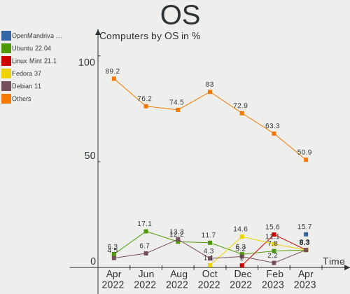

| Name                      | Computers | Percent |
|---------------------------|-----------|---------|
| Ubuntu 22.04              | 13        | 11.61%  |
| Fedora 37                 | 12        | 10.71%  |
| OpenMandriva 23.03        | 8         | 7.14%   |
| Pop!_OS 22.04             | 6         | 5.36%   |
| Linux Mint 21.1           | 6         | 5.36%   |
| Debian 11                 | 6         | 5.36%   |
| Ubuntu 22.10              | 5         | 4.46%   |
| Linux Mint 20.3           | 5         | 4.46%   |
| Arch Rolling              | 5         | 4.46%   |
| Zorin 16                  | 4         | 3.57%   |
| Ubuntu MATE 22.04         | 3         | 2.68%   |
| Ubuntu 20.04              | 2         | 1.79%   |
| SteamOS 3.4.6             | 2         | 1.79%   |
| OpenMandriva 23.01        | 2         | 1.79%   |
| MX 21                     | 2         | 1.79%   |
| Kubuntu 22.10             | 2         | 1.79%   |
| KDE neon 22.04            | 2         | 1.79%   |
| Gentoo 2.9                | 2         | 1.79%   |
| Xubuntu 16.04             | 1         | 0.89%   |
| Rocky Linux 8.7           | 1         | 0.89%   |
| QTS 4.3.3                 | 1         | 0.89%   |
| Pop!_OS 20.04             | 1         | 0.89%   |
| Parrot 5.2                | 1         | 0.89%   |
| openSUSE Microos-XXXXXXXX | 1         | 0.89%   |
| openSUSE Leap-15.4        | 1         | 0.89%   |
| OpenMandriva 4.2          | 1         | 0.89%   |
| Nobara 37                 | 1         | 0.89%   |
| Manjaro 22.0.4            | 1         | 0.89%   |
| Manjaro                   | 1         | 0.89%   |
| LMDE 5                    | 1         | 0.89%   |
| Linux Mint 20.2           | 1         | 0.89%   |
| Gentoo 2.13               | 1         | 0.89%   |
| Feren OS 20.04            | 1         | 0.89%   |
| Fedora 36                 | 1         | 0.89%   |
| Fedora 35                 | 1         | 0.89%   |
| EndeavourOS Rolling       | 1         | 0.89%   |
| Elementary 7              | 1         | 0.89%   |
| Debian 12                 | 1         | 0.89%   |
| Debian                    | 1         | 0.89%   |
| ClearOS 7                 | 1         | 0.89%   |

OS Family
---------

OS without a version

| Name         | Computers | Percent |
|--------------|-----------|---------|
| Ubuntu       | 20        | 17.86%  |
| Fedora       | 14        | 12.5%   |
| Linux Mint   | 12        | 10.71%  |
| OpenMandriva | 11        | 9.82%   |
| Debian       | 8         | 7.14%   |
| Pop!_OS      | 7         | 6.25%   |
| Arch         | 5         | 4.46%   |
| Zorin        | 4         | 3.57%   |
| Ubuntu MATE  | 3         | 2.68%   |
| Gentoo       | 3         | 2.68%   |
| SteamOS      | 2         | 1.79%   |
| openSUSE     | 2         | 1.79%   |
| MX           | 2         | 1.79%   |
| Manjaro      | 2         | 1.79%   |
| Kubuntu      | 2         | 1.79%   |
| KDE neon     | 2         | 1.79%   |
| Xubuntu      | 1         | 0.89%   |
| Rocky Linux  | 1         | 0.89%   |
| QTS          | 1         | 0.89%   |
| Parrot       | 1         | 0.89%   |
| Nobara       | 1         | 0.89%   |
| LMDE         | 1         | 0.89%   |
| Feren OS     | 1         | 0.89%   |
| EndeavourOS  | 1         | 0.89%   |
| Elementary   | 1         | 0.89%   |
| ClearOS      | 1         | 0.89%   |
| ChimeraOS    | 1         | 0.89%   |
| CentOS       | 1         | 0.89%   |
| ArcoLinux    | 1         | 0.89%   |

Kernel
------

Version of the Linux kernel

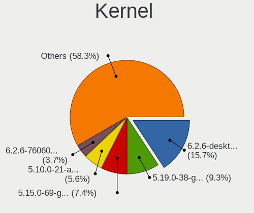

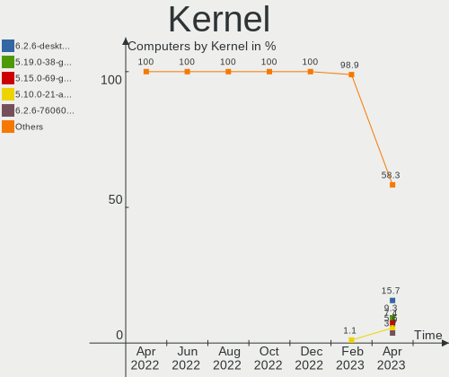

| Version                      | Computers | Percent |
|------------------------------|-----------|---------|
| 5.19.0-35-generic            | 13        | 11.61%  |
| 5.15.0-67-generic            | 11        | 9.82%   |
| 6.2.6-desktop-1omv2390       | 6         | 5.36%   |
| 5.4.0-144-generic            | 5         | 4.46%   |
| 5.19.0-38-generic            | 5         | 4.46%   |
| 6.1.18-200.fc37.x86_64       | 4         | 3.57%   |
| 6.1.14-200.fc37.x86_64       | 4         | 3.57%   |
| 6.2.0-76060200-generic       | 3         | 2.68%   |
| 5.19.0-32-generic            | 3         | 2.68%   |
| 5.15.0-69-generic            | 3         | 2.68%   |
| 5.15.0-60-generic            | 3         | 2.68%   |
| 5.10.0-20-amd64              | 3         | 2.68%   |
| 6.2.7-arch1-1                | 2         | 1.79%   |
| 6.2.2-gentoo                 | 2         | 1.79%   |
| 6.2.2-desktop-1omv2390       | 2         | 1.79%   |
| 6.1.11-arch1-1               | 2         | 1.79%   |
| 6.1.0-6-amd64                | 2         | 1.79%   |
| 6.0.7-301.fc37.x86_64        | 2         | 1.79%   |
| 5.13.0-valve36-1-neptune     | 2         | 1.79%   |
| 5.10.0-21-amd64              | 2         | 1.79%   |
| 6.2.7-200.fc37.x86_64        | 1         | 0.89%   |
| 6.2.6-76060206-generic       | 1         | 0.89%   |
| 6.2.6-1-default              | 1         | 0.89%   |
| 6.2.2-arch1-g14-1            | 1         | 0.89%   |
| 6.2.2-arch1-1                | 1         | 0.89%   |
| 6.2.0-060200-generic         | 1         | 0.89%   |
| 6.1.8-200.fc37.x86_64        | 1         | 0.89%   |
| 6.1.4-desktop-1omv2301       | 1         | 0.89%   |
| 6.1.3-gentoo                 | 1         | 0.89%   |
| 6.1.20-1-lts                 | 1         | 0.89%   |
| 6.1.15-100.fc36.x86_64       | 1         | 0.89%   |
| 6.1.14-201.fsync.fc37.x86_64 | 1         | 0.89%   |
| 6.1.12-arch1-1               | 1         | 0.89%   |
| 6.1.1-desktop-1omv2290       | 1         | 0.89%   |
| 6.1.0-t2                     | 1         | 0.89%   |
| 6.0.6-76060006-generic       | 1         | 0.89%   |
| 6.0.12-76060012-generic      | 1         | 0.89%   |
| 6.0.12-76060006-generic      | 1         | 0.89%   |
| 6.0.12-100.fc35.x86_64       | 1         | 0.89%   |
| 6.0.0-12parrot1-amd64        | 1         | 0.89%   |

Kernel Family
-------------

Linux kernel without a distro release

| Version  | Computers | Percent |
|----------|-----------|---------|
| 5.19.0   | 21        | 18.75%  |
| 5.15.0   | 18        | 16.07%  |
| 6.2.6    | 8         | 7.14%   |
| 6.2.2    | 6         | 5.36%   |
| 5.10.0   | 6         | 5.36%   |
| 6.1.14   | 5         | 4.46%   |
| 5.4.0    | 5         | 4.46%   |
| 6.2.0    | 4         | 3.57%   |
| 6.1.18   | 4         | 3.57%   |
| 6.2.7    | 3         | 2.68%   |
| 6.1.0    | 3         | 2.68%   |
| 6.0.12   | 3         | 2.68%   |
| 6.1.11   | 2         | 1.79%   |
| 6.0.7    | 2         | 1.79%   |
| 5.13.0   | 2         | 1.79%   |
| 3.10.0   | 2         | 1.79%   |
| 6.1.8    | 1         | 0.89%   |
| 6.1.4    | 1         | 0.89%   |
| 6.1.3    | 1         | 0.89%   |
| 6.1.20   | 1         | 0.89%   |
| 6.1.15   | 1         | 0.89%   |
| 6.1.12   | 1         | 0.89%   |
| 6.1.1    | 1         | 0.89%   |
| 6.0.6    | 1         | 0.89%   |
| 6.0.0    | 1         | 0.89%   |
| 5.9.16   | 1         | 0.89%   |
| 5.19.7   | 1         | 0.89%   |
| 5.15.85  | 1         | 0.89%   |
| 5.15.102 | 1         | 0.89%   |
| 5.14.21  | 1         | 0.89%   |
| 5.10.60  | 1         | 0.89%   |
| 5.10.14  | 1         | 0.89%   |
| 4.4.0    | 1         | 0.89%   |
| 4.18.0   | 1         | 0.89%   |

Kernel Major Ver.
-----------------

Linux kernel major version

| Version | Computers | Percent |
|---------|-----------|---------|
| 5.19    | 22        | 19.64%  |
| 6.2     | 21        | 18.75%  |
| 6.1     | 21        | 18.75%  |
| 5.15    | 20        | 17.86%  |
| 5.10    | 8         | 7.14%   |
| 6.0     | 7         | 6.25%   |
| 5.4     | 5         | 4.46%   |
| 5.13    | 2         | 1.79%   |
| 3.10    | 2         | 1.79%   |
| 5.9     | 1         | 0.89%   |
| 5.14    | 1         | 0.89%   |
| 4.4     | 1         | 0.89%   |
| 4.18    | 1         | 0.89%   |

Arch
----

OS architecture (x86_64, i586, etc.)

| Name   | Computers | Percent |
|--------|-----------|---------|
| x86_64 | 112       | 100%    |

DE
--

Desktop Environment

| Name             | Computers | Percent |
|------------------|-----------|---------|
| GNOME            | 43        | 38.39%  |
| KDE5             | 27        | 24.11%  |
| X-Cinnamon       | 11        | 9.82%   |
| Cinnamon         | 8         | 7.14%   |
| MATE             | 7         | 6.25%   |
| XFCE             | 6         | 5.36%   |
| Unknown          | 6         | 5.36%   |
| Pantheon         | 1         | 0.89%   |
| LXQt             | 1         | 0.89%   |
| lightdm-xsession | 1         | 0.89%   |
| Hyprland         | 1         | 0.89%   |

Display Server
--------------

X11 or Wayland

| Name    | Computers | Percent |
|---------|-----------|---------|
| X11     | 72        | 64.29%  |
| Wayland | 30        | 26.79%  |
| Tty     | 9         | 8.04%   |
| Unknown | 1         | 0.89%   |

Display Manager
---------------

SDDM, LightDM, etc.

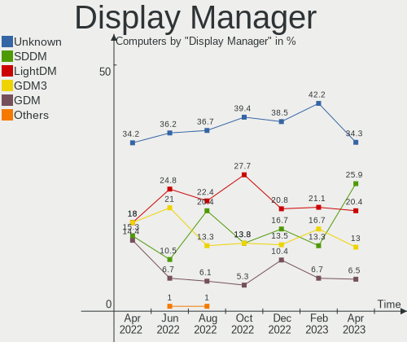

| Name    | Computers | Percent |
|---------|-----------|---------|
| Unknown | 47        | 41.96%  |
| SDDM    | 23        | 20.54%  |
| LightDM | 18        | 16.07%  |
| GDM3    | 17        | 15.18%  |
| GDM     | 7         | 6.25%   |

OS Lang
-------

Language

| Lang        | Computers | Percent |
|-------------|-----------|---------|
| en_AU       | 88        | 78.57%  |
| en_US       | 14        | 12.5%   |
| en_GB       | 4         | 3.57%   |
| C           | 2         | 1.79%   |
| it_IT       | 1         | 0.89%   |
| en_CA       | 1         | 0.89%   |
| en_AU.UFT-8 | 1         | 0.89%   |
| Unknown     | 1         | 0.89%   |

Boot Mode
---------

EFI or BIOS

| Mode | Computers | Percent |
|------|-----------|---------|
| EFI  | 61        | 54.46%  |
| BIOS | 51        | 45.54%  |

Filesystem
----------

Type of filesystem

| Type    | Computers | Percent |
|---------|-----------|---------|
| Ext4    | 80        | 71.43%  |
| Btrfs   | 19        | 16.96%  |
| Xfs     | 6         | 5.36%   |
| Overlay | 6         | 5.36%   |
| Ext2    | 1         | 0.89%   |

Part. scheme
------------

Scheme of partitioning

| Type    | Computers | Percent |
|---------|-----------|---------|
| GPT     | 56        | 50%     |
| Unknown | 41        | 36.61%  |
| MBR     | 15        | 13.39%  |

Dual Boot with Linux/BSD
------------------------

Hosting more than one Linux/BSD

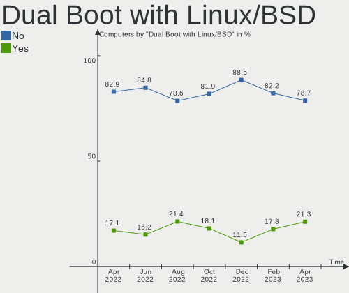

| Dual boot | Computers | Percent |
|-----------|-----------|---------|
| No        | 94        | 83.93%  |
| Yes       | 18        | 16.07%  |

Dual Boot (Win)
---------------

Hosting Linux and Windows

| Dual boot | Computers | Percent |
|-----------|-----------|---------|
| No        | 95        | 84.82%  |
| Yes       | 17        | 15.18%  |

Board
-----

Vendor
------

Motherboard manufacturer

| Name                | Computers | Percent |
|---------------------|-----------|---------|
| Lenovo              | 15        | 13.39%  |
| Gigabyte Technology | 15        | 13.39%  |
| ASUSTek Computer    | 15        | 13.39%  |
| Dell                | 13        | 11.61%  |
| Hewlett-Packard     | 12        | 10.71%  |
| Apple               | 8         | 7.14%   |
| MSI                 | 6         | 5.36%   |
| ASRock              | 5         | 4.46%   |
| Acer                | 5         | 4.46%   |
| Valve               | 2         | 1.79%   |
| Intel               | 2         | 1.79%   |
| Toshiba             | 1         | 0.89%   |
| SONIQ Digital Media | 1         | 0.89%   |
| ReachingTech        | 1         | 0.89%   |
| QIYIDA              | 1         | 0.89%   |
| Microsoft           | 1         | 0.89%   |
| Maibenben           | 1         | 0.89%   |
| MACHINIST           | 1         | 0.89%   |
| HUAWEI              | 1         | 0.89%   |
| Huanan              | 1         | 0.89%   |
| Google              | 1         | 0.89%   |
| Fanless Mini PC     | 1         | 0.89%   |
| Biostar             | 1         | 0.89%   |
| AMI                 | 1         | 0.89%   |
| Unknown             | 1         | 0.89%   |

Model
-----

Motherboard model

| Name                                                    | Computers | Percent |
|---------------------------------------------------------|-----------|---------|
| Dell OptiPlex 9020                                      | 3         | 2.68%   |
| Valve Jupiter                                           | 2         | 1.79%   |
| Dell XPS 15 9570                                        | 2         | 1.79%   |
| Dell G3 3590                                            | 2         | 1.79%   |
| Toshiba TECRA Z50-C                                     | 1         | 0.89%   |
| SONIQ Digital Media Soniq 11.6inch Convertible Notebook | 1         | 0.89%   |
| ReachingTech DreamQuest Pro 2022                        | 1         | 0.89%   |
| QIYIDA X99-H9 V2.0                                      | 1         | 0.89%   |
| MSI MS-7D46                                             | 1         | 0.89%   |
| MSI MS-7C94                                             | 1         | 0.89%   |
| MSI MS-7C37                                             | 1         | 0.89%   |
| MSI MS-7B89                                             | 1         | 0.89%   |
| MSI MS-7142                                             | 1         | 0.89%   |
| MSI Delta 15 A5EFK                                      | 1         | 0.89%   |
| Microsoft Surface Laptop 3                              | 1         | 0.89%   |
| Maibenben P748                                          | 1         | 0.89%   |
| MACHINIST X99-RS9 V2.0                                  | 1         | 0.89%   |
| Lenovo V14-ADA 82C6                                     | 1         | 0.89%   |
| Lenovo ThinkStation D30 42234T7                         | 1         | 0.89%   |
| Lenovo ThinkPad T14 Gen 1 20UDS11900                    | 1         | 0.89%   |
| Lenovo ThinkPad P15s Gen 2i 20W6S04Y00                  | 1         | 0.89%   |
| Lenovo ThinkPad L13 Yoga 20R6S1MG00                     | 1         | 0.89%   |
| Lenovo ThinkPad E590 20NBA000AU                         | 1         | 0.89%   |
| Lenovo ThinkCentre M720q 10T8SEYP00                     | 1         | 0.89%   |
| Lenovo IdeaPadFlex 5 14ARE05 81X2                       | 1         | 0.89%   |
| Lenovo IdeaPad 520-15IKB 81BF                           | 1         | 0.89%   |
| Lenovo IdeaPad 5 Pro 14ARH7 82SJ                        | 1         | 0.89%   |
| Lenovo IdeaPad 5 15IAL7 82SF                            | 1         | 0.89%   |
| Lenovo IdeaPad 320-15AST 80XV                           | 1         | 0.89%   |
| Lenovo IdeaPad 3 15IGL05 81WQ                           | 1         | 0.89%   |
| Lenovo H50-55 90BF005HAU                                | 1         | 0.89%   |
| Lenovo H50-50 90B6009AAU                                | 1         | 0.89%   |
| Intel NUC12DCMi7                                        | 1         | 0.89%   |
| Intel DB85FL AAG89861-203                               | 1         | 0.89%   |
| HUAWEI NBD-WXX9                                         | 1         | 0.89%   |
| Huanan X99-AD3 GAMING V2.0                              | 1         | 0.89%   |
| HP Z600 Workstation                                     | 1         | 0.89%   |
| HP Stream Laptop 11-ah1XX                               | 1         | 0.89%   |
| HP Spectre x360 2-in-1 Laptop 14-ef0xxx                 | 1         | 0.89%   |
| HP Spectre x2 Detachable 12-c0XX                        | 1         | 0.89%   |

Model Family
------------

Motherboard model prefix

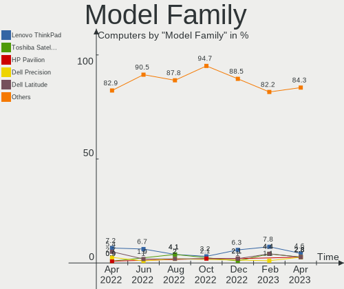

| Name                      | Computers | Percent |
|---------------------------|-----------|---------|
| Lenovo IdeaPad            | 5         | 4.46%   |
| Lenovo ThinkPad           | 4         | 3.57%   |
| ASUS PRIME                | 4         | 3.57%   |
| HP ProBook                | 3         | 2.68%   |
| Dell XPS                  | 3         | 2.68%   |
| Dell OptiPlex             | 3         | 2.68%   |
| Valve Jupiter             | 2         | 1.79%   |
| HP Spectre                | 2         | 1.79%   |
| Gigabyte X570             | 2         | 1.79%   |
| Dell Precision            | 2         | 1.79%   |
| Dell Inspiron             | 2         | 1.79%   |
| Dell G3                   | 2         | 1.79%   |
| ASUS Maximus              | 2         | 1.79%   |
| Apple iMac14              | 2         | 1.79%   |
| Toshiba TECRA             | 1         | 0.89%   |
| SONIQ Digital Media Soniq | 1         | 0.89%   |
| ReachingTech DreamQuest   | 1         | 0.89%   |
| QIYIDA X99-H9             | 1         | 0.89%   |
| MSI MS-7D46               | 1         | 0.89%   |
| MSI MS-7C94               | 1         | 0.89%   |
| MSI MS-7C37               | 1         | 0.89%   |
| MSI MS-7B89               | 1         | 0.89%   |
| MSI MS-7142               | 1         | 0.89%   |
| MSI Delta                 | 1         | 0.89%   |
| Microsoft Surface         | 1         | 0.89%   |
| Maibenben P748            | 1         | 0.89%   |
| MACHINIST X99-RS9         | 1         | 0.89%   |
| Lenovo V14-ADA            | 1         | 0.89%   |
| Lenovo ThinkStation       | 1         | 0.89%   |
| Lenovo ThinkCentre        | 1         | 0.89%   |
| Lenovo IdeaPadFlex        | 1         | 0.89%   |
| Lenovo H50-55             | 1         | 0.89%   |
| Lenovo H50-50             | 1         | 0.89%   |
| Intel NUC12DCMi7          | 1         | 0.89%   |
| Intel DB85FL              | 1         | 0.89%   |
| HUAWEI NBD-WXX9           | 1         | 0.89%   |
| Huanan X99-AD3            | 1         | 0.89%   |
| HP Z600                   | 1         | 0.89%   |
| HP Stream                 | 1         | 0.89%   |
| HP Pavilion               | 1         | 0.89%   |

MFG Year
--------

Motherboard manufacture year

| Year | Computers | Percent |
|------|-----------|---------|
| 2020 | 18        | 16.07%  |
| 2021 | 14        | 12.5%   |
| 2018 | 12        | 10.71%  |
| 2022 | 10        | 8.93%   |
| 2019 | 9         | 8.04%   |
| 2013 | 7         | 6.25%   |
| 2015 | 6         | 5.36%   |
| 2014 | 6         | 5.36%   |
| 2012 | 6         | 5.36%   |
| 2010 | 6         | 5.36%   |
| 2016 | 5         | 4.46%   |
| 2017 | 4         | 3.57%   |
| 2011 | 3         | 2.68%   |
| 2008 | 3         | 2.68%   |
| 2007 | 1         | 0.89%   |
| 2006 | 1         | 0.89%   |
| 2005 | 1         | 0.89%   |

Form Factor
-----------

Physical design of the computer

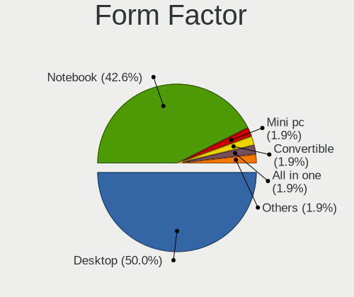

| Name        | Computers | Percent |
|-------------|-----------|---------|
| Desktop     | 53        | 47.32%  |
| Notebook    | 41        | 36.61%  |
| Mini pc     | 7         | 6.25%   |
| Convertible | 5         | 4.46%   |
| All in one  | 4         | 3.57%   |
| Tablet      | 2         | 1.79%   |

Secure Boot
-----------

Enabled or disabled

| State    | Computers | Percent |
|----------|-----------|---------|
| Disabled | 103       | 91.96%  |
| Enabled  | 9         | 8.04%   |

Coreboot
--------

Have coreboot on board

| Used | Computers | Percent |
|------|-----------|---------|
| No   | 111       | 99.11%  |
| Yes  | 1         | 0.89%   |

RAM Size
--------

Total RAM memory

| Size in GB  | Computers | Percent |
|-------------|-----------|---------|
| 16.01-24.0  | 28        | 25%     |
| 4.01-8.0    | 23        | 20.54%  |
| 8.01-16.0   | 21        | 18.75%  |
| 32.01-64.0  | 19        | 16.96%  |
| 3.01-4.0    | 10        | 8.93%   |
| 64.01-256.0 | 6         | 5.36%   |
| 1.01-2.0    | 3         | 2.68%   |
| 24.01-32.0  | 2         | 1.79%   |

RAM Used
--------

Used RAM memory

| Used GB    | Computers | Percent |
|------------|-----------|---------|
| 1.01-2.0   | 36        | 32.14%  |
| 2.01-3.0   | 23        | 20.54%  |
| 4.01-8.0   | 22        | 19.64%  |
| 3.01-4.0   | 18        | 16.07%  |
| 8.01-16.0  | 6         | 5.36%   |
| 24.01-32.0 | 2         | 1.79%   |
| 0.51-1.0   | 2         | 1.79%   |
| 0.01-0.5   | 2         | 1.79%   |
| 32.01-64.0 | 1         | 0.89%   |

Total Drives
------------

Number of drives on board

| Drives | Computers | Percent |
|--------|-----------|---------|
| 1      | 53        | 47.32%  |
| 2      | 40        | 35.71%  |
| 4      | 8         | 7.14%   |
| 5      | 4         | 3.57%   |
| 3      | 3         | 2.68%   |
| 6      | 2         | 1.79%   |
| 10     | 1         | 0.89%   |
| 8      | 1         | 0.89%   |

Has CD-ROM
----------

Has CD-ROM on board

| Presented | Computers | Percent |
|-----------|-----------|---------|
| No        | 83        | 74.11%  |
| Yes       | 29        | 25.89%  |

Has Ethernet
------------

Has Ethernet on board

| Presented | Computers | Percent |
|-----------|-----------|---------|
| Yes       | 91        | 81.25%  |
| No        | 21        | 18.75%  |

Has WiFi
--------

Has WiFi module

| Presented | Computers | Percent |
|-----------|-----------|---------|
| Yes       | 84        | 75%     |
| No        | 28        | 25%     |

Has Bluetooth
-------------

Has Bluetooth module

| Presented | Computers | Percent |
|-----------|-----------|---------|
| Yes       | 76        | 67.86%  |
| No        | 36        | 32.14%  |

Location
--------

Country
-------

Geographic location (country)

| Country   | Computers | Percent |
|-----------|-----------|---------|
| Australia | 112       | 100%    |

City
----

Geographic location (city)

| City          | Computers | Percent |
|---------------|-----------|---------|
| Sydney        | 36        | 32.14%  |
| Melbourne     | 24        | 21.43%  |
| Perth         | 14        | 12.5%   |
| Brisbane      | 14        | 12.5%   |
| Adelaide      | 5         | 4.46%   |
| Canberra      | 3         | 2.68%   |
| Newcastle     | 2         | 1.79%   |
| Greenwich     | 2         | 1.79%   |
| Shepparton    | 1         | 0.89%   |
| Nyngan        | 1         | 0.89%   |
| North Sydney  | 1         | 0.89%   |
| Leinster      | 1         | 0.89%   |
| Lara          | 1         | 0.89%   |
| Lancefield    | 1         | 0.89%   |
| Hobart        | 1         | 0.89%   |
| Gold Coast    | 1         | 0.89%   |
| Central Coast | 1         | 0.89%   |
| Campbellfield | 1         | 0.89%   |
| Cairns        | 1         | 0.89%   |
| Caddens       | 1         | 0.89%   |

Drives
------

Drive Vendor
------------

Hard drive vendors

| Vendor                         | Computers | Drives | Percent |
|--------------------------------|-----------|--------|---------|
| Samsung Electronics            | 34        | 42     | 17.89%  |
| Seagate                        | 24        | 41     | 12.63%  |
| WDC                            | 17        | 22     | 8.95%   |
| Crucial                        | 13        | 13     | 6.84%   |
| Toshiba                        | 12        | 12     | 6.32%   |
| Unknown                        | 11        | 13     | 5.79%   |
| Kingston                       | 9         | 10     | 4.74%   |
| Sandisk                        | 6         | 6      | 3.16%   |
| Phison Electronics             | 5         | 5      | 2.63%   |
| SPCC                           | 4         | 5      | 2.11%   |
| SK hynix                       | 4         | 4      | 2.11%   |
| Micron Technology              | 4         | 4      | 2.11%   |
| Intel                          | 4         | 4      | 2.11%   |
| Hitachi                        | 4         | 4      | 2.11%   |
| Apple                          | 4         | 5      | 2.11%   |
| Micron/Crucial Technology      | 3         | 3      | 1.58%   |
| T-FORCE                        | 2         | 2      | 1.05%   |
| Solid State Storage            | 2         | 2      | 1.05%   |
| Kingston Technology Company    | 2         | 2      | 1.05%   |
| A-DATA Technology              | 2         | 2      | 1.05%   |
| Unknown                        | 2         | 2      | 1.05%   |
| ZXIC MMC                       | 1         | 1      | 0.53%   |
| Vaseky                         | 1         | 1      | 0.53%   |
| Solid State Storage Technology | 1         | 1      | 0.53%   |
| QNAP                           | 1         | 2      | 0.53%   |
| Patriot                        | 1         | 1      | 0.53%   |
| OCZ                            | 1         | 1      | 0.53%   |
| NGFF                           | 1         | 1      | 0.53%   |
| Maxtor                         | 1         | 1      | 0.53%   |
| MAXIO Technology (Hangzhou)    | 1         | 1      | 0.53%   |
| LITEONIT                       | 1         | 1      | 0.53%   |
| LITEON                         | 1         | 1      | 0.53%   |
| Lexar                          | 1         | 1      | 0.53%   |
| KUIJIA                         | 1         | 1      | 0.53%   |
| Kingmax                        | 1         | 1      | 0.53%   |
| KingFast                       | 1         | 1      | 0.53%   |
| JMicron Technology             | 1         | 1      | 0.53%   |
| IET                            | 1         | 1      | 0.53%   |
| Corsair                        | 1         | 1      | 0.53%   |
| China                          | 1         | 1      | 0.53%   |

Drive Model
-----------

Hard drive models

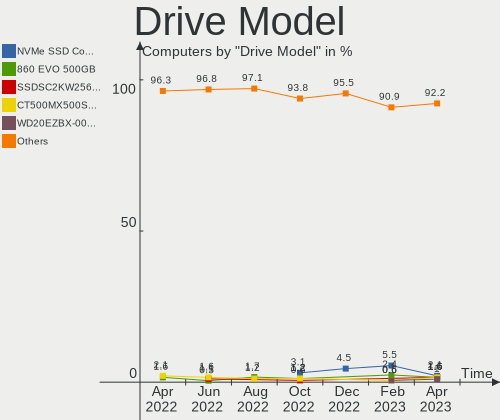

| Model                                               | Computers | Percent |
|-----------------------------------------------------|-----------|---------|
| Samsung NVMe SSD Controller SM981/PM981/PM983 250GB | 7         | 3.43%   |
| Phison PS5013 E13 NVMe Controller 256GB             | 4         | 1.96%   |
| Crucial CT500MX500SSD1 500GB                        | 4         | 1.96%   |
| Samsung NVMe SSD Controller SM961/PM961/SM963 256GB | 3         | 1.47%   |
| Kingston SA400S37480G 480GB SSD                     | 3         | 1.47%   |
| WDC WD10EZEX-00BN5A0 1TB                            | 2         | 0.98%   |
| WDC WD10EARS-00Y5B1 1TB                             | 2         | 0.98%   |
| Unknown SD/MMC/MS PRO 64GB                          | 2         | 0.98%   |
| Unknown MMC Card  64GB                              | 2         | 0.98%   |
| Unknown MMC Card  256GB                             | 2         | 0.98%   |
| Toshiba MQ04ABF100 1TB                              | 2         | 0.98%   |
| T-FORCE 2TB                                         | 2         | 0.98%   |
| SPCC M.2 PCIe SSD 1TB                               | 2         | 0.98%   |
| Solid State Storage CL1-3D512-Q11 NVMe SSSTC 512GB  | 2         | 0.98%   |
| Seagate ST500DM002-1BD142 500GB                     | 2         | 0.98%   |
| Seagate ST2000LM007-1R8174 2TB                      | 2         | 0.98%   |
| Seagate ST2000DM006-2DM164 2TB                      | 2         | 0.98%   |
| Seagate ST2000DM001-1ER164 2TB                      | 2         | 0.98%   |
| Seagate ST1000DM010-2EP102 1TB                      | 2         | 0.98%   |
| Samsung SSD 850 EVO 500GB                           | 2         | 0.98%   |
| Samsung NVMe SSD Controller PM9A1/PM9A3/980PRO 1TB  | 2         | 0.98%   |
| Kingston SV300S37A120G 120GB SSD                    | 2         | 0.98%   |
| Crucial CT1000P1SSD8 1TB                            | 2         | 0.98%   |
| Unknown                                             | 2         | 0.98%   |
| ZXIC MMC Storage 2.31 128GB                         | 1         | 0.49%   |
| WDC WDS480G2G0B-00EPW0 480GB SSD                    | 1         | 0.49%   |
| WDC WD5001AALS-00L3B2 500GB                         | 1         | 0.49%   |
| WDC WD5001AALS-00J7B1 500GB                         | 1         | 0.49%   |
| WDC WD40EZRZ-00GXCB0 4TB                            | 1         | 0.49%   |
| WDC WD30EZRX-00D8PB0 3TB                            | 1         | 0.49%   |
| WDC WD20EZRZ-00Z5HB0 2TB                            | 1         | 0.49%   |
| WDC WD20EARX-008FB0 2TB                             | 1         | 0.49%   |
| WDC WD2003FZEX-00SRLA0 2TB                          | 1         | 0.49%   |
| WDC WD1200JD-00HBB0 120GB                           | 1         | 0.49%   |
| WDC WD10SPZX-00Z10T0 1TB                            | 1         | 0.49%   |
| WDC WD10EZEX-60M2NA0 1TB                            | 1         | 0.49%   |
| WDC WD10EZEX-22MFCA0 1TB                            | 1         | 0.49%   |
| WDC WD10EZEX-08WN4A0 1TB                            | 1         | 0.49%   |
| WDC WD10EURX-63UY4Y0 1TB                            | 1         | 0.49%   |
| WDC WD10EFRX-68PJCN0 1TB                            | 1         | 0.49%   |

HDD Vendor
----------

Hard disk drive vendors

| Vendor              | Computers | Drives | Percent |
|---------------------|-----------|--------|---------|
| Seagate             | 24        | 41     | 38.1%   |
| WDC                 | 16        | 21     | 25.4%   |
| Toshiba             | 8         | 8      | 12.7%   |
| Hitachi             | 4         | 4      | 6.35%   |
| Apple               | 3         | 3      | 4.76%   |
| Unknown             | 2         | 2      | 3.17%   |
| Samsung Electronics | 2         | 6      | 3.17%   |
| QNAP                | 1         | 2      | 1.59%   |
| Maxtor              | 1         | 1      | 1.59%   |
| IET                 | 1         | 1      | 1.59%   |
| ASMT                | 1         | 2      | 1.59%   |

SSD Vendor
----------

Solid state drive vendors

| Vendor              | Computers | Drives | Percent |
|---------------------|-----------|--------|---------|
| Samsung Electronics | 11        | 11     | 20.75%  |
| Crucial             | 10        | 10     | 18.87%  |
| Kingston            | 6         | 7      | 11.32%  |
| SanDisk             | 3         | 3      | 5.66%   |
| SPCC                | 2         | 2      | 3.77%   |
| Micron Technology   | 2         | 2      | 3.77%   |
| Intel               | 2         | 2      | 3.77%   |
| A-DATA Technology   | 2         | 2      | 3.77%   |
| WDC                 | 1         | 1      | 1.89%   |
| Vaseky              | 1         | 1      | 1.89%   |
| Patriot             | 1         | 1      | 1.89%   |
| OCZ                 | 1         | 1      | 1.89%   |
| NGFF                | 1         | 1      | 1.89%   |
| LITEONIT            | 1         | 1      | 1.89%   |
| LITEON              | 1         | 1      | 1.89%   |
| Lexar               | 1         | 1      | 1.89%   |
| KUIJIA              | 1         | 1      | 1.89%   |
| Kingmax             | 1         | 1      | 1.89%   |
| KingFast            | 1         | 1      | 1.89%   |
| JMicron Technology  | 1         | 1      | 1.89%   |
| Corsair             | 1         | 1      | 1.89%   |
| China               | 1         | 1      | 1.89%   |
| Apple               | 1         | 1      | 1.89%   |

Drive Kind
----------

HDD or SSD

| Kind    | Computers | Drives | Percent |
|---------|-----------|--------|---------|
| NVMe    | 52        | 66     | 32.1%   |
| HDD     | 52        | 91     | 32.1%   |
| SSD     | 44        | 54     | 27.16%  |
| MMC     | 11        | 13     | 6.79%   |
| Unknown | 3         | 3      | 1.85%   |

Drive Connector
---------------

SATA, SAS, NVMe, etc.

| Type | Computers | Drives | Percent |
|------|-----------|--------|---------|
| SATA | 72        | 132    | 50.35%  |
| NVMe | 52        | 66     | 36.36%  |
| MMC  | 11        | 13     | 7.69%   |
| SAS  | 8         | 16     | 5.59%   |

Drive Size
----------

Size of hard drive

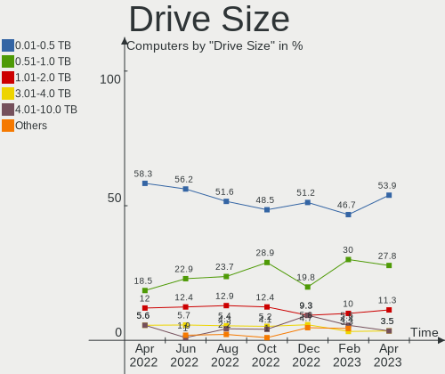

| Size in TB | Computers | Drives | Percent |
|------------|-----------|--------|---------|
| 0.01-0.5   | 49        | 70     | 49%     |
| 0.51-1.0   | 29        | 41     | 29%     |
| 1.01-2.0   | 15        | 22     | 15%     |
| 4.01-10.0  | 4         | 9      | 4%      |
| 2.01-3.0   | 2         | 2      | 2%      |
| 3.01-4.0   | 1         | 1      | 1%      |

Space Total
-----------

Amount of disk space available on the file system

| Size in GB     | Computers | Percent |
|----------------|-----------|---------|
| 101-250        | 28        | 25%     |
| 251-500        | 23        | 20.54%  |
| 501-1000       | 15        | 13.39%  |
| 1001-2000      | 14        | 12.5%   |
| 51-100         | 12        | 10.71%  |
| More than 3000 | 10        | 8.93%   |
| 1-20           | 5         | 4.46%   |
| 21-50          | 2         | 1.79%   |
| 2001-3000      | 2         | 1.79%   |
| Unknown        | 1         | 0.89%   |

Space Used
----------

Amount of used disk space

| Used GB        | Computers | Percent |
|----------------|-----------|---------|
| 1-20           | 41        | 36.61%  |
| 21-50          | 19        | 16.96%  |
| 101-250        | 15        | 13.39%  |
| 51-100         | 10        | 8.93%   |
| 251-500        | 9         | 8.04%   |
| 501-1000       | 9         | 8.04%   |
| More than 3000 | 3         | 2.68%   |
| 2001-3000      | 2         | 1.79%   |
| 1001-2000      | 2         | 1.79%   |
| 0              | 1         | 0.89%   |
| Unknown        | 1         | 0.89%   |

Malfunc. Drives
---------------

Drive models with a malfunction

| Model                                     | Computers | Drives | Percent |
|-------------------------------------------|-----------|--------|---------|
| WDC WD10EADS-00P8B0 1TB                   | 1         | 1      | 12.5%   |
| Seagate ST500DM002-1BD142 500GB           | 1         | 4      | 12.5%   |
| Maxtor 6Y080L0 82GB                       | 1         | 1      | 12.5%   |
| Intel SSDSC2CT120A3 120GB                 | 1         | 1      | 12.5%   |
| Intel SSDSA2M080G2LE 80GB                 | 1         | 1      | 12.5%   |
| Crucial CT525MX300SSD1 528GB              | 1         | 1      | 12.5%   |
| Biwin Storage Technology HP SSD EX900 1TB | 1         | 1      | 12.5%   |
| Apple HDD WDC WD10EALX-408EA0 1TB         | 1         | 1      | 12.5%   |

Malfunc. Drive Vendor
---------------------

Vendors of faulty drives

| Vendor                   | Computers | Drives | Percent |
|--------------------------|-----------|--------|---------|
| Intel                    | 2         | 2      | 25%     |
| WDC                      | 1         | 1      | 12.5%   |
| Seagate                  | 1         | 4      | 12.5%   |
| Maxtor                   | 1         | 1      | 12.5%   |
| Crucial                  | 1         | 1      | 12.5%   |
| Biwin Storage Technology | 1         | 1      | 12.5%   |
| Apple                    | 1         | 1      | 12.5%   |

Malfunc. HDD Vendor
-------------------

Vendors of faulty HDD drives

| Vendor  | Computers | Drives | Percent |
|---------|-----------|--------|---------|
| WDC     | 1         | 1      | 25%     |
| Seagate | 1         | 4      | 25%     |
| Maxtor  | 1         | 1      | 25%     |
| Apple   | 1         | 1      | 25%     |

Malfunc. Drive Kind
-------------------

Kinds of faulty drives

| Kind | Computers | Drives | Percent |
|------|-----------|--------|---------|
| HDD  | 4         | 7      | 50%     |
| SSD  | 3         | 3      | 37.5%   |
| NVMe | 1         | 1      | 12.5%   |

Failed Drives
-------------

Failed drive models

Zero info for selected period =(

Failed Drive Vendor
-------------------

Failed drive vendors

Zero info for selected period =(

Drive Status
------------

Number of failed and malfunc. drives

| Status   | Computers | Drives | Percent |
|----------|-----------|--------|---------|
| Detected | 66        | 123    | 51.97%  |
| Works    | 54        | 93     | 42.52%  |
| Malfunc  | 7         | 11     | 5.51%   |

Storage controller
------------------

Storage Vendor
--------------

Storage controller vendors

| Vendor                         | Computers | Percent |
|--------------------------------|-----------|---------|
| Intel                          | 61        | 38.13%  |
| AMD                            | 25        | 15.63%  |
| Samsung Electronics            | 22        | 13.75%  |
| Micron/Crucial Technology      | 6         | 3.75%   |
| Phison Electronics             | 5         | 3.13%   |
| Kingston Technology Company    | 5         | 3.13%   |
| ASMedia Technology             | 5         | 3.13%   |
| Toshiba America Info Systems   | 4         | 2.5%    |
| SK hynix                       | 4         | 2.5%    |
| Solid State Storage Technology | 3         | 1.88%   |
| SanDisk                        | 3         | 1.88%   |
| Silicon Motion                 | 2         | 1.25%   |
| Micron Technology              | 2         | 1.25%   |
| Marvell Technology Group       | 2         | 1.25%   |
| JMicron Technology             | 2         | 1.25%   |
| VIA Technologies               | 1         | 0.63%   |
| ULi Electronics                | 1         | 0.63%   |
| Silicon Image                  | 1         | 0.63%   |
| Realtek Semiconductor          | 1         | 0.63%   |
| Nvidia                         | 1         | 0.63%   |
| MAXIO Technology (Hangzhou)    | 1         | 0.63%   |
| Biwin Storage Technology       | 1         | 0.63%   |
| Apple                          | 1         | 0.63%   |
| 3ware                          | 1         | 0.63%   |

Storage Model
-------------

Storage controller models

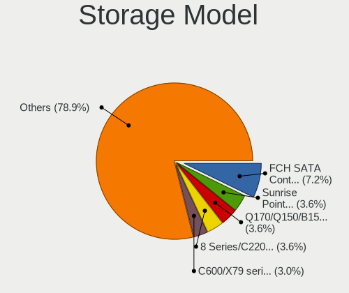

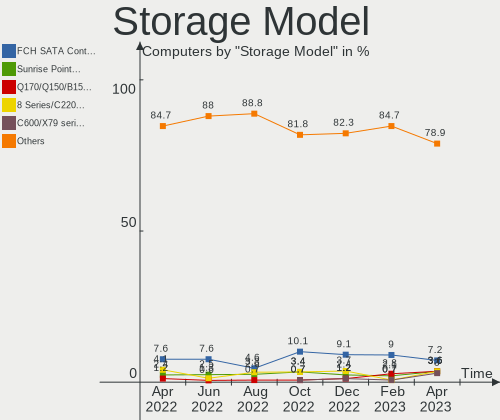

| Model                                                                          | Computers | Percent |
|--------------------------------------------------------------------------------|-----------|---------|
| AMD FCH SATA Controller [AHCI mode]                                            | 19        | 10.67%  |
| Intel 8 Series/C220 Series Chipset Family 6-port SATA Controller 1 [AHCI mode] | 11        | 6.18%   |
| Samsung NVMe SSD Controller SM981/PM981/PM983                                  | 9         | 5.06%   |
| Samsung NVMe SSD Controller PM9A1/PM9A3/980PRO                                 | 5         | 2.81%   |
| Intel Cannon Lake Mobile PCH SATA AHCI Controller                              | 5         | 2.81%   |
| Samsung NVMe SSD Controller 980                                                | 4         | 2.25%   |
| Phison PS5013 E13 NVMe Controller                                              | 4         | 2.25%   |
| AMD 500 Series Chipset SATA Controller                                         | 4         | 2.25%   |
| AMD 400 Series Chipset SATA Controller                                         | 4         | 2.25%   |
| Toshiba America Info Systems XG5 NVMe SSD Controller                           | 3         | 1.69%   |
| Solid State Storage Non-Volatile memory controller                             | 3         | 1.69%   |
| Samsung NVMe SSD Controller SM961/PM961/SM963                                  | 3         | 1.69%   |
| Micron/Crucial P2 NVMe PCIe SSD                                                | 3         | 1.69%   |
| Intel Sunrise Point-LP SATA Controller [AHCI mode]                             | 3         | 1.69%   |
| Intel Q170/Q150/B150/H170/H110/Z170/CM236 Chipset SATA Controller [AHCI Mode]  | 3         | 1.69%   |
| Intel Celeron/Pentium Silver Processor SATA Controller                         | 3         | 1.69%   |
| Intel Alder Lake-S PCH SATA Controller [AHCI Mode]                             | 3         | 1.69%   |
| Intel 82801 Mobile SATA Controller [RAID mode]                                 | 3         | 1.69%   |
| Intel 7 Series/C210 Series Chipset Family 6-port SATA Controller [AHCI mode]   | 3         | 1.69%   |
| ASMedia ASM1062 Serial ATA Controller                                          | 3         | 1.69%   |
| AMD SB7x0/SB8x0/SB9x0 SATA Controller [AHCI mode]                              | 3         | 1.69%   |
| SK hynix BC501 NVMe Solid State Drive                                          | 2         | 1.12%   |
| Silicon Motion SM2263EN/SM2263XT SSD Controller                                | 2         | 1.12%   |
| Micron/Crucial NVMe Storage Controller                                         | 2         | 1.12%   |
| Micron NVMe Storage Controller                                                 | 2         | 1.12%   |
| Kingston Company NVMe Controller                                               | 2         | 1.12%   |
| JMicron JMB363 SATA/IDE Controller                                             | 2         | 1.12%   |
| Intel Volume Management Device NVMe RAID Controller                            | 2         | 1.12%   |
| Intel SATA Controller [RAID mode]                                              | 2         | 1.12%   |
| Intel Celeron N3350/Pentium N4200/Atom E3900 Series SATA AHCI Controller       | 2         | 1.12%   |
| Intel C600/X79 series chipset IDE-r Controller                                 | 2         | 1.12%   |
| Intel C600/X79 series chipset 6-Port SATA AHCI Controller                      | 2         | 1.12%   |
| Intel Atom Processor E3800 Series SATA AHCI Controller                         | 2         | 1.12%   |
| Intel 82801HM/HEM (ICH8M/ICH8M-E) SATA Controller [AHCI mode]                  | 2         | 1.12%   |
| Intel 82801HM/HEM (ICH8M/ICH8M-E) IDE Controller                               | 2         | 1.12%   |
| Intel 500 Series Chipset Family SATA AHCI Controller                           | 2         | 1.12%   |
| AMD FCH IDE Controller                                                         | 2         | 1.12%   |
| VIA VT82C586A/B/VT82C686/A/B/VT823x/A/C PIPC Bus Master IDE                    | 1         | 0.56%   |
| ULi ULi M5288 SATA                                                             | 1         | 0.56%   |
| ULi M5229 IDE                                                                  | 1         | 0.56%   |

Storage Kind
------------

Kind of storage controller (IDE, SATA, NVMe, SAS, ...)

| Kind | Computers | Percent |
|------|-----------|---------|
| SATA | 78        | 51.32%  |
| NVMe | 52        | 34.21%  |
| IDE  | 12        | 7.89%   |
| RAID | 9         | 5.92%   |
| SAS  | 1         | 0.66%   |

Processor
---------

CPU Vendor
----------

Processor vendors

| Vendor | Computers | Percent |
|--------|-----------|---------|
| Intel  | 76        | 67.86%  |
| AMD    | 36        | 32.14%  |

CPU Model
---------

Processor models

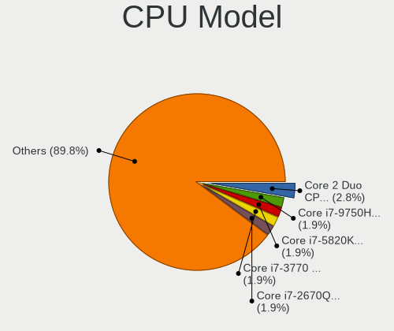

| Model                                   | Computers | Percent |
|-----------------------------------------|-----------|---------|
| Intel Core i7-4790 CPU @ 3.60GHz        | 4         | 3.57%   |
| Intel Core i7-9750H CPU @ 2.60GHz       | 3         | 2.68%   |
| Intel Core i7-8550U CPU @ 1.80GHz       | 3         | 2.68%   |
| Intel 12th Gen Core i7-12700            | 3         | 2.68%   |
| Intel 11th Gen Core i7-1165G7 @ 2.80GHz | 3         | 2.68%   |
| Intel Core i7-8750H CPU @ 2.20GHz       | 2         | 1.79%   |
| Intel Core i7-7560U CPU @ 2.40GHz       | 2         | 1.79%   |
| Intel Core i7-6700K CPU @ 4.00GHz       | 2         | 1.79%   |
| Intel Core i7-3770 CPU @ 3.40GHz        | 2         | 1.79%   |
| Intel Core i5-6400 CPU @ 2.70GHz        | 2         | 1.79%   |
| Intel Celeron J4125 CPU @ 2.00GHz       | 2         | 1.79%   |
| Intel Celeron CPU N3350 @ 1.10GHz       | 2         | 1.79%   |
| AMD Ryzen 7 5700U with Radeon Graphics  | 2         | 1.79%   |
| AMD Ryzen 5 5600X 6-Core Processor      | 2         | 1.79%   |
| AMD FX-8320 Eight-Core Processor        | 2         | 1.79%   |
| AMD Custom APU 0405                     | 2         | 1.79%   |
| Intel Xeon CPU E5620 @ 2.40GHz          | 1         | 0.89%   |
| Intel Xeon CPU E5-2678 v3 @ 2.50GHz     | 1         | 0.89%   |
| Intel Xeon CPU E5-2670 0 @ 2.60GHz      | 1         | 0.89%   |
| Intel Xeon CPU E5-2620 v3 @ 2.40GHz     | 1         | 0.89%   |
| Intel Xeon CPU E5-1650 v3 @ 3.50GHz     | 1         | 0.89%   |
| Intel Xeon CPU E5-1620 v2 @ 3.70GHz     | 1         | 0.89%   |
| Intel Pentium Dual CPU T2370 @ 1.73GHz  | 1         | 0.89%   |
| Intel Pentium CPU G4560 @ 3.50GHz       | 1         | 0.89%   |
| Intel Pentium CPU G3420 @ 3.20GHz       | 1         | 0.89%   |
| Intel Core i7-8700B CPU @ 3.20GHz       | 1         | 0.89%   |
| Intel Core i7-7820HQ CPU @ 2.90GHz      | 1         | 0.89%   |
| Intel Core i7-6500U CPU @ 2.50GHz       | 1         | 0.89%   |
| Intel Core i7-4790K CPU @ 4.00GHz       | 1         | 0.89%   |
| Intel Core i7-4771 CPU @ 3.50GHz        | 1         | 0.89%   |
| Intel Core i7-4510U CPU @ 2.00GHz       | 1         | 0.89%   |
| Intel Core i7-2635QM CPU @ 2.00GHz      | 1         | 0.89%   |
| Intel Core i7-10750H CPU @ 2.60GHz      | 1         | 0.89%   |
| Intel Core i7-10700K CPU @ 3.80GHz      | 1         | 0.89%   |
| Intel Core i5-9500T CPU @ 2.20GHz       | 1         | 0.89%   |
| Intel Core i5-8265U CPU @ 1.60GHz       | 1         | 0.89%   |
| Intel Core i5-6300U CPU @ 2.40GHz       | 1         | 0.89%   |
| Intel Core i5-4570S CPU @ 2.90GHz       | 1         | 0.89%   |
| Intel Core i5-4570R CPU @ 2.70GHz       | 1         | 0.89%   |
| Intel Core i5-4570 CPU @ 3.20GHz        | 1         | 0.89%   |

CPU Model Family
----------------

Processor model prefix

| Model              | Computers | Percent |
|--------------------|-----------|---------|
| Intel Core i7      | 27        | 24.11%  |
| Other              | 13        | 11.61%  |
| Intel Core i5      | 12        | 10.71%  |
| Intel Celeron      | 9         | 8.04%   |
| AMD Ryzen 7        | 8         | 7.14%   |
| AMD Ryzen 5        | 7         | 6.25%   |
| Intel Xeon         | 6         | 5.36%   |
| AMD Ryzen 9        | 4         | 3.57%   |
| Intel Core i3      | 3         | 2.68%   |
| Intel Core 2 Duo   | 3         | 2.68%   |
| Intel Pentium      | 2         | 1.79%   |
| Intel Core 2 Quad  | 2         | 1.79%   |
| AMD FX             | 2         | 1.79%   |
| AMD A4             | 2         | 1.79%   |
| AMD A10            | 2         | 1.79%   |
| Intel Pentium Dual | 1         | 0.89%   |
| Intel Atom         | 1         | 0.89%   |
| AMD Sempron        | 1         | 0.89%   |
| AMD Ryzen Embedded | 1         | 0.89%   |
| AMD Ryzen 5 PRO    | 1         | 0.89%   |
| AMD E2             | 1         | 0.89%   |
| AMD Athlon II      | 1         | 0.89%   |
| AMD Athlon 64 X2   | 1         | 0.89%   |
| AMD A8             | 1         | 0.89%   |
| AMD A6             | 1         | 0.89%   |

CPU Cores
---------

Number of processor cores

| Number | Computers | Percent |
|--------|-----------|---------|
| 4      | 40        | 35.71%  |
| 2      | 29        | 25.89%  |
| 6      | 18        | 16.07%  |
| 8      | 12        | 10.71%  |
| 12     | 4         | 3.57%   |
| 16     | 3         | 2.68%   |
| 1      | 3         | 2.68%   |
| 10     | 2         | 1.79%   |
| 5      | 1         | 0.89%   |

CPU Sockets
-----------

Number of sockets

| Number | Computers | Percent |
|--------|-----------|---------|
| 1      | 110       | 98.21%  |
| 2      | 2         | 1.79%   |

CPU Threads
-----------

Threads per core (Hyper-Threading)

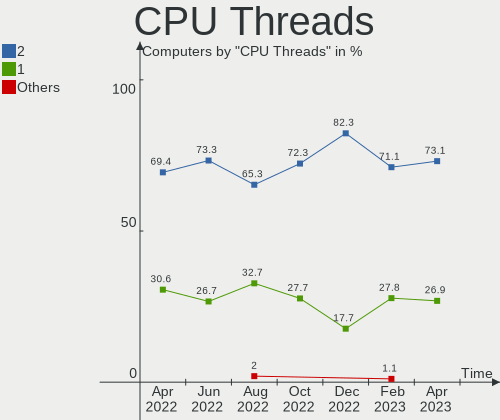

| Number | Computers | Percent |
|--------|-----------|---------|
| 2      | 80        | 71.43%  |
| 1      | 32        | 28.57%  |

CPU Op-Modes
------------

CPU Operation Modes (32-bit, 64-bit)

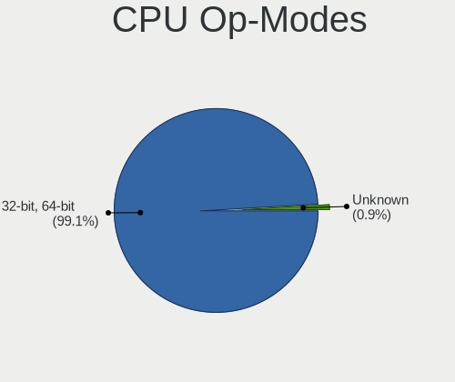

| Op mode        | Computers | Percent |
|----------------|-----------|---------|
| 32-bit, 64-bit | 112       | 100%    |

CPU Microcode
-------------

Microcode number

| Number     | Computers | Percent |
|------------|-----------|---------|
| Unknown    | 55        | 49.11%  |
| 0x806c1    | 3         | 2.68%   |
| 0x306c3    | 3         | 2.68%   |
| 0x306a9    | 3         | 2.68%   |
| 0x706a8    | 2         | 1.79%   |
| 0x506e3    | 2         | 1.79%   |
| 0x30678    | 2         | 1.79%   |
| 0x1067a    | 2         | 1.79%   |
| 0x0a201016 | 2         | 1.79%   |
| 0x06003106 | 2         | 1.79%   |
| 0x06001119 | 2         | 1.79%   |
| 0xa0655    | 1         | 0.89%   |
| 0x906a4    | 1         | 0.89%   |
| 0x90672    | 1         | 0.89%   |
| 0x806ec    | 1         | 0.89%   |
| 0x806eb    | 1         | 0.89%   |
| 0x806ea    | 1         | 0.89%   |
| 0x706e5    | 1         | 0.89%   |
| 0x706a1    | 1         | 0.89%   |
| 0x6fd      | 1         | 0.89%   |
| 0x6fb      | 1         | 0.89%   |
| 0x506c9    | 1         | 0.89%   |
| 0x406e3    | 1         | 0.89%   |
| 0x40651    | 1         | 0.89%   |
| 0x306f2    | 1         | 0.89%   |
| 0x306e4    | 1         | 0.89%   |
| 0x206d7    | 1         | 0.89%   |
| 0x10677    | 1         | 0.89%   |
| 0x10676    | 1         | 0.89%   |
| 0x0a601203 | 1         | 0.89%   |
| 0x0a50000d | 1         | 0.89%   |
| 0x0a50000c | 1         | 0.89%   |
| 0x0a404102 | 1         | 0.89%   |
| 0x08701021 | 1         | 0.89%   |
| 0x08701013 | 1         | 0.89%   |
| 0x08608103 | 1         | 0.89%   |
| 0x08600104 | 1         | 0.89%   |
| 0x08600103 | 1         | 0.89%   |
| 0x08200103 | 1         | 0.89%   |
| 0x08001138 | 1         | 0.89%   |

CPU Microarch
-------------

Microarchitecture

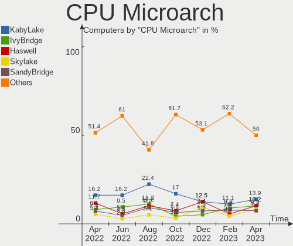

| Name             | Computers | Percent |
|------------------|-----------|---------|
| KabyLake         | 16        | 14.29%  |
| Haswell          | 14        | 12.5%   |
| Unknown          | 10        | 8.93%   |
| Zen 3            | 7         | 6.25%   |
| Zen 2            | 7         | 6.25%   |
| Skylake          | 6         | 5.36%   |
| IvyBridge        | 5         | 4.46%   |
| TigerLake        | 4         | 3.57%   |
| Piledriver       | 4         | 3.57%   |
| Penryn           | 4         | 3.57%   |
| Goldmont plus    | 4         | 3.57%   |
| Zen              | 3         | 2.68%   |
| Silvermont       | 3         | 2.68%   |
| SandyBridge      | 3         | 2.68%   |
| Excavator        | 3         | 2.68%   |
| Alderlake Hybrid | 3         | 2.68%   |
| Westmere         | 2         | 1.79%   |
| Steamroller      | 2         | 1.79%   |
| K8 Hammer        | 2         | 1.79%   |
| IceLake          | 2         | 1.79%   |
| Goldmont         | 2         | 1.79%   |
| Core             | 2         | 1.79%   |
| CometLake        | 2         | 1.79%   |
| K10              | 1         | 0.89%   |
| Bonnell          | 1         | 0.89%   |

Graphics
--------

GPU Vendor
----------

Vendors of graphics cards

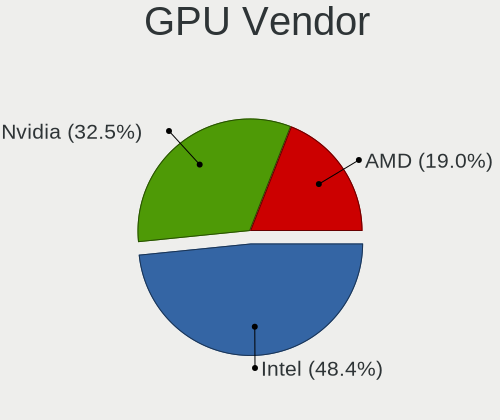

| Vendor           | Computers | Percent |
|------------------|-----------|---------|
| Intel            | 54        | 40.3%   |
| Nvidia           | 45        | 33.58%  |
| AMD              | 34        | 25.37%  |
| VIA Technologies | 1         | 0.75%   |

GPU Model
---------

Graphics card models

| Model                                                                       | Computers | Percent |
|-----------------------------------------------------------------------------|-----------|---------|
| Intel Xeon E3-1200 v3/4th Gen Core Processor Integrated Graphics Controller | 6         | 4.32%   |
| Intel CoffeeLake-H GT2 [UHD Graphics 630]                                   | 6         | 4.32%   |
| Intel TigerLake-LP GT2 [Iris Xe Graphics]                                   | 4         | 2.88%   |
| Intel GeminiLake [UHD Graphics 600]                                         | 4         | 2.88%   |
| AMD Ellesmere [Radeon RX 470/480/570/570X/580/580X/590]                     | 4         | 2.88%   |
| Intel UHD Graphics 620                                                      | 3         | 2.16%   |
| Intel HD Graphics 530                                                       | 3         | 2.16%   |
| AMD Renoir                                                                  | 3         | 2.16%   |
| Nvidia TU117GLM [Quadro T1000 Mobile]                                       | 2         | 1.44%   |
| Nvidia TU117 [GeForce GTX 1650]                                             | 2         | 1.44%   |
| Nvidia TU116M [GeForce GTX 1660 Ti Mobile]                                  | 2         | 1.44%   |
| Nvidia GP107M [GeForce GTX 1050 Ti Mobile]                                  | 2         | 1.44%   |
| Nvidia GP107 [GeForce GTX 1050]                                             | 2         | 1.44%   |
| Nvidia GM108M [GeForce 930MX]                                               | 2         | 1.44%   |
| Nvidia GM107 [GeForce GTX 750 Ti]                                           | 2         | 1.44%   |
| Nvidia GK208B [GeForce GT 710]                                              | 2         | 1.44%   |
| Nvidia GF108 [GeForce GT 630]                                               | 2         | 1.44%   |
| Nvidia GA104 [GeForce RTX 3060]                                             | 2         | 1.44%   |
| Intel Skylake GT2 [HD Graphics 520]                                         | 2         | 1.44%   |
| Intel Iris Plus Graphics 640                                                | 2         | 1.44%   |
| Intel HD Graphics 500                                                       | 2         | 1.44%   |
| Intel Atom Processor Z36xxx/Z37xxx Series Graphics & Display                | 2         | 1.44%   |
| Intel AlderLake-S GT1                                                       | 2         | 1.44%   |
| Intel Alder Lake-UP3 GT2 [Iris Xe Graphics]                                 | 2         | 1.44%   |
| Intel 2nd Generation Core Processor Family Integrated Graphics Controller   | 2         | 1.44%   |
| AMD VanGogh [AMD Custom GPU 0405]                                           | 2         | 1.44%   |
| AMD Stoney [Radeon R2/R3/R4/R5 Graphics]                                    | 2         | 1.44%   |
| AMD Rembrandt [Radeon 680M]                                                 | 2         | 1.44%   |
| AMD Oland [Radeon HD 8570 / R5 430 OEM / R7 240/340 / Radeon 520 OEM]       | 2         | 1.44%   |
| AMD Navi 22 [Radeon RX 6700/6700 XT/6750 XT / 6800M/6850M XT]               | 2         | 1.44%   |
| AMD Lucienne                                                                | 2         | 1.44%   |
| AMD Cezanne [Radeon Vega Series / Radeon Vega Mobile Series]                | 2         | 1.44%   |
| VIA Technologies K8M800/K8N800/K8N800A [S3 UniChrome Pro]                   | 1         | 0.72%   |
| Nvidia TU117M [GeForce GTX 1650 Mobile / Max-Q]                             | 1         | 0.72%   |
| Nvidia TU117GLM [Quadro T500 Mobile]                                        | 1         | 0.72%   |
| Nvidia TU117 [GeForce GTX 1630]                                             | 1         | 0.72%   |
| Nvidia TU116 [GeForce GTX 1660]                                             | 1         | 0.72%   |
| Nvidia TU116 [GeForce GTX 1650 SUPER]                                       | 1         | 0.72%   |
| Nvidia TU106M [GeForce RTX 2060 Mobile]                                     | 1         | 0.72%   |
| Nvidia MCP89 [GeForce 320M]                                                 | 1         | 0.72%   |

GPU Combo
---------

Combinations of graphics cards

| Name           | Computers | Percent |
|----------------|-----------|---------|
| 1 x Intel      | 37        | 33.04%  |
| 1 x Nvidia     | 25        | 22.32%  |
| 1 x AMD        | 22        | 19.64%  |
| Intel + Nvidia | 14        | 12.5%   |
| AMD + Nvidia   | 6         | 5.36%   |
| 2 x AMD        | 4         | 3.57%   |
| Intel + AMD    | 2         | 1.79%   |
| Other          | 1         | 0.89%   |
| 1 x VIA        | 1         | 0.89%   |

GPU Driver
----------

Free vs proprietary

| Driver      | Computers | Percent |
|-------------|-----------|---------|
| Free        | 90        | 80.36%  |
| Proprietary | 18        | 16.07%  |
| Unknown     | 4         | 3.57%   |

GPU Memory
----------

Total video memory

| Size in GB | Computers | Percent |
|------------|-----------|---------|
| Unknown    | 71        | 63.39%  |
| 0.01-0.5   | 12        | 10.71%  |
| 1.01-2.0   | 10        | 8.93%   |
| 3.01-4.0   | 9         | 8.04%   |
| 7.01-8.0   | 4         | 3.57%   |
| 0.51-1.0   | 4         | 3.57%   |
| 8.01-16.0  | 2         | 1.79%   |

Monitor
-------

Monitor Vendor
--------------

Monitor vendors

| Vendor               | Computers | Percent |
|----------------------|-----------|---------|
| BOE                  | 14        | 11.97%  |
| Samsung Electronics  | 12        | 10.26%  |
| Dell                 | 9         | 7.69%   |
| AU Optronics         | 9         | 7.69%   |
| Chimei Innolux       | 7         | 5.98%   |
| Sharp                | 6         | 5.13%   |
| Hewlett-Packard      | 6         | 5.13%   |
| Goldstar             | 6         | 5.13%   |
| AOC                  | 6         | 5.13%   |
| Acer                 | 6         | 5.13%   |
| Apple                | 5         | 4.27%   |
| LG Display           | 4         | 3.42%   |
| Ancor Communications | 4         | 3.42%   |
| Philips              | 3         | 2.56%   |
| Lenovo               | 3         | 2.56%   |
| Valve                | 2         | 1.71%   |
| Unknown              | 2         | 1.71%   |
| Gigabyte Technology  | 2         | 1.71%   |
| BenQ                 | 2         | 1.71%   |
| Unknown (XXX)        | 1         | 0.85%   |
| Toshiba              | 1         | 0.85%   |
| PANDA                | 1         | 0.85%   |
| MiTAC                | 1         | 0.85%   |
| Kogan                | 1         | 0.85%   |
| Impression           | 1         | 0.85%   |
| GKK                  | 1         | 0.85%   |
| GDH                  | 1         | 0.85%   |
| Eizo                 | 1         | 0.85%   |

Monitor Model
-------------

Monitor models

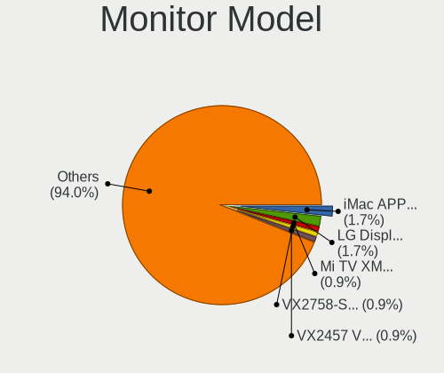

| Model                                                                | Computers | Percent |
|----------------------------------------------------------------------|-----------|---------|
| Valve ANX7530 U VLV3001 800x1280 100x150mm 7.1-inch                  | 2         | 1.64%   |
| Goldstar HDR 4K GSM7706 3840x2160 600x340mm 27.2-inch                | 2         | 1.64%   |
| Dell E228WFP DELD014 1680x1050 473x296mm 22.0-inch                   | 2         | 1.64%   |
| BOE LCD Monitor BOE0819 1920x1080 344x194mm 15.5-inch                | 2         | 1.64%   |
| Unknown LCDTV16 0101 1920x1080 1600x900mm 72.3-inch                  | 1         | 0.82%   |
| Unknown LCD Monitor FFFF 2288x1287 2550x2550mm 142.0-inch            | 1         | 0.82%   |
| Unknown (XXX) Beyond TV XXX2851 1920x1080 1209x680mm 54.6-inch       | 1         | 0.82%   |
| Toshiba TV TSB002F 3840x2160 1872x1053mm 84.6-inch                   | 1         | 0.82%   |
| Sharp LQ156M1JW03 SHP155D 1920x1080 344x194mm 15.5-inch              | 1         | 0.82%   |
| Sharp LQ135P1JX51 SHP14B3 2256x1504 285x190mm 13.5-inch              | 1         | 0.82%   |
| Sharp LCD Monitor SHP14D0 3840x2400 336x210mm 15.6-inch              | 1         | 0.82%   |
| Sharp LCD Monitor SHP149A 1920x1080 344x194mm 15.5-inch              | 1         | 0.82%   |
| Sharp LCD Monitor SHP148D 3840x2160 344x194mm 15.5-inch              | 1         | 0.82%   |
| Sharp LCD Monitor SHP144A 3200x1800 294x165mm 13.3-inch              | 1         | 0.82%   |
| Samsung Electronics SyncMaster SAM0587 1920x1200 518x324mm 24.1-inch | 1         | 0.82%   |
| Samsung Electronics SyncMaster SAM01D3 1440x900 408x225mm 18.3-inch  | 1         | 0.82%   |
| Samsung Electronics SMART TV SAM7129 3840x2160 1210x680mm 54.6-inch  | 1         | 0.82%   |
| Samsung Electronics S27E310 SAM0C31 1920x1080 598x336mm 27.0-inch    | 1         | 0.82%   |
| Samsung Electronics S24E390 SAM0C1A 1920x1080 521x293mm 23.5-inch    | 1         | 0.82%   |
| Samsung Electronics LCD Monitor SyncMaster                           | 1         | 0.82%   |
| Samsung Electronics LCD Monitor SEC5441 1366x768 344x194mm 15.5-inch | 1         | 0.82%   |
| Samsung Electronics LCD Monitor SDC5441 1366x768 309x174mm 14.0-inch | 1         | 0.82%   |
| Samsung Electronics LCD Monitor S23B300 5760x1080                    | 1         | 0.82%   |
| Samsung Electronics LCD Monitor S23B300                              | 1         | 0.82%   |
| Samsung Electronics C34H89x SAM0E25 3440x1440 797x333mm 34.0-inch    | 1         | 0.82%   |
| Samsung Electronics C32F391 SAM0D34 1920x1080 698x393mm 31.5-inch    | 1         | 0.82%   |
| Samsung Electronics C27JG5x SAM0F58 2560x1440 597x336mm 27.0-inch    | 1         | 0.82%   |
| Samsung Electronics C27HG7x SAM0E16 2560x1440 598x336mm 27.0-inch    | 1         | 0.82%   |
| Philips PHL 243V7 PHLC155 1920x1080 527x296mm 23.8-inch              | 1         | 0.82%   |
| Philips PHL 241V8 PHLC212 1920x1080 527x296mm 23.8-inch              | 1         | 0.82%   |
| Philips 32 LCD TV PHL4650 1280x1024 760x450mm 34.8-inch              | 1         | 0.82%   |
| PANDA LCD Monitor NCP0035 1920x1080 309x174mm 14.0-inch              | 1         | 0.82%   |
| MiTAC TV MTCEE01 1920x1080                                           | 1         | 0.82%   |
| LG Display LCD Monitor LGD056D 1920x1080 382x215mm 17.3-inch         | 1         | 0.82%   |
| LG Display LCD Monitor LGD055D 3000x2000 260x173mm 12.3-inch         | 1         | 0.82%   |
| LG Display LCD Monitor LGD04D5 1920x1080 344x194mm 15.5-inch         | 1         | 0.82%   |
| LG Display LCD Monitor LGD02D9 1920x1080 344x194mm 15.5-inch         | 1         | 0.82%   |
| Lenovo TIO24Gen3 LEN10B4 1920x1080 527x296mm 23.8-inch               | 1         | 0.82%   |
| Lenovo LCD Monitor LEN40BA 1920x1080 344x194mm 15.5-inch             | 1         | 0.82%   |
| Lenovo D27-30 LEN66B8 1920x1080 597x336mm 27.0-inch                  | 1         | 0.82%   |

Monitor Resolution
------------------

Monitor screen resolution

| Resolution         | Computers | Percent |
|--------------------|-----------|---------|
| 1920x1080 (FHD)    | 49        | 42.61%  |
| 3840x2160 (4K)     | 14        | 12.17%  |
| 1366x768 (WXGA)    | 11        | 9.57%   |
| 2560x1440 (QHD)    | 8         | 6.96%   |
| 3440x1440          | 4         | 3.48%   |
| 1680x1050 (WSXGA+) | 3         | 2.61%   |
| Unknown            | 3         | 2.61%   |
| 800x1280           | 2         | 1.74%   |
| 3840x2400          | 2         | 1.74%   |
| 1600x900 (HD+)     | 2         | 1.74%   |
| 1440x900 (WXGA+)   | 2         | 1.74%   |
| 5760x1080          | 1         | 0.87%   |
| 3840x1100          | 1         | 0.87%   |
| 3200x1800 (QHD+)   | 1         | 0.87%   |
| 3200x1080          | 1         | 0.87%   |
| 3000x2000          | 1         | 0.87%   |
| 2880x1800          | 1         | 0.87%   |
| 2580x1440          | 1         | 0.87%   |
| 2560x1600          | 1         | 0.87%   |
| 2288x1287          | 1         | 0.87%   |
| 2256x1504          | 1         | 0.87%   |
| 2240x1400          | 1         | 0.87%   |
| 1920x1280          | 1         | 0.87%   |
| 1920x1200 (WUXGA)  | 1         | 0.87%   |
| 1280x800 (WXGA)    | 1         | 0.87%   |
| 1280x768           | 1         | 0.87%   |

Monitor Diagonal
----------------

Diagonal size in inches

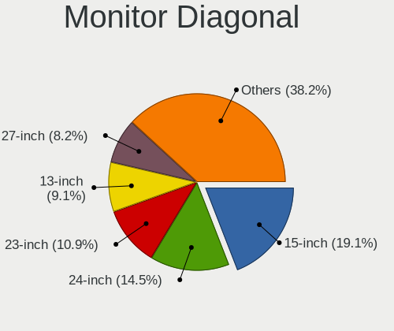

| Inches  | Computers | Percent |
|---------|-----------|---------|
| 15      | 24        | 20.34%  |
| 27      | 13        | 11.02%  |
| 24      | 10        | 8.47%   |
| 21      | 8         | 6.78%   |
| 31      | 7         | 5.93%   |
| 23      | 7         | 5.93%   |
| 14      | 7         | 5.93%   |
| 13      | 7         | 5.93%   |
| Unknown | 6         | 5.08%   |
| 34      | 4         | 3.39%   |
| 17      | 4         | 3.39%   |
| 19      | 3         | 2.54%   |
| 84      | 2         | 1.69%   |
| 72      | 2         | 1.69%   |
| 22      | 2         | 1.69%   |
| 11      | 2         | 1.69%   |
| 7       | 2         | 1.69%   |
| 142     | 1         | 0.85%   |
| 54      | 1         | 0.85%   |
| 52      | 1         | 0.85%   |
| 35      | 1         | 0.85%   |
| 29      | 1         | 0.85%   |
| 20      | 1         | 0.85%   |
| 16      | 1         | 0.85%   |
| 12      | 1         | 0.85%   |

Monitor Width
-------------

Physical width

| Width in mm    | Computers | Percent |
|----------------|-----------|---------|
| 301-350        | 32        | 27.83%  |
| 501-600        | 27        | 23.48%  |
| 401-500        | 14        | 12.17%  |
| 601-700        | 9         | 7.83%   |
| 201-300        | 8         | 6.96%   |
| Unknown        | 6         | 5.22%   |
| 351-400        | 5         | 4.35%   |
| 701-800        | 4         | 3.48%   |
| 1501-2000      | 4         | 3.48%   |
| 1001-1500      | 2         | 1.74%   |
| 1-100          | 2         | 1.74%   |
| More than 2000 | 1         | 0.87%   |
| 801-900        | 1         | 0.87%   |

Aspect Ratio
------------

Proportional relationship between the width and the height

| Ratio   | Computers | Percent |
|---------|-----------|---------|
| 16/9    | 76        | 72.38%  |
| 16/10   | 13        | 12.38%  |
| Unknown | 5         | 4.76%   |
| 21/9    | 4         | 3.81%   |
| 3/2     | 3         | 2.86%   |
| 0.67    | 2         | 1.9%    |
| 3.40    | 1         | 0.95%   |
| 1.00    | 1         | 0.95%   |

Monitor Area
------------

Area in inch

| Area in inch | Computers | Percent |
|----------------|-----------|---------|
| 101-110        | 24        | 20.69%  |
| 201-250        | 20        | 17.24%  |
| 301-350        | 13        | 11.21%  |
| 351-500        | 12        | 10.34%  |
| 81-90          | 10        | 8.62%   |
| More than 1000 | 7         | 6.03%   |
| 151-200        | 6         | 5.17%   |
| Unknown        | 6         | 5.17%   |
| 121-130        | 4         | 3.45%   |
| 71-80          | 3         | 2.59%   |
| 51-60          | 3         | 2.59%   |
| 251-300        | 3         | 2.59%   |
| 1-40           | 2         | 1.72%   |
| 61-70          | 1         | 0.86%   |
| 111-120        | 1         | 0.86%   |
| 501-1000       | 1         | 0.86%   |

Pixel Density
-------------

Pixels per inch

| Density       | Computers | Percent |
|---------------|-----------|---------|
| 51-100        | 36        | 32.14%  |
| 121-160       | 26        | 23.21%  |
| 101-120       | 23        | 20.54%  |
| 161-240       | 11        | 9.82%   |
| Unknown       | 6         | 5.36%   |
| More than 240 | 5         | 4.46%   |
| 1-50          | 5         | 4.46%   |

Multiple Monitors
-----------------

Total monitors connected

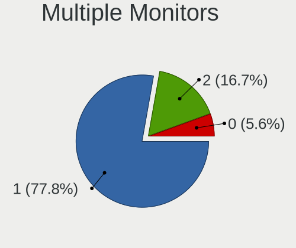

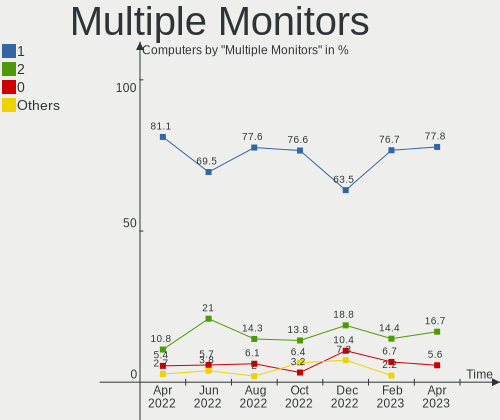

| Total | Computers | Percent |
|-------|-----------|---------|
| 1     | 78        | 69.64%  |
| 2     | 23        | 20.54%  |
| 0     | 10        | 8.93%   |
| 3     | 1         | 0.89%   |

Network
-------

Net Controller Vendor
---------------------

Controller vendors

| Vendor                     | Computers | Percent |
|----------------------------|-----------|---------|
| Intel                      | 57        | 33.14%  |
| Realtek Semiconductor      | 56        | 32.56%  |
| Qualcomm Atheros           | 16        | 9.3%    |
| Broadcom                   | 11        | 6.4%    |
| Ralink Technology          | 4         | 2.33%   |
| Aquantia                   | 4         | 2.33%   |
| MediaTek                   | 3         | 1.74%   |
| Marvell Technology Group   | 3         | 1.74%   |
| DisplayLink                | 3         | 1.74%   |
| Broadcom Limited           | 3         | 1.74%   |
| ZTE WCDMA Technologies MSM | 1         | 0.58%   |
| VIA Technologies           | 1         | 0.58%   |
| Sierra Wireless            | 1         | 0.58%   |
| Ralink                     | 1         | 0.58%   |
| Prolific Technology        | 1         | 0.58%   |
| Motorola PCS               | 1         | 0.58%   |
| ICS Advent                 | 1         | 0.58%   |
| Edimax Technology          | 1         | 0.58%   |
| D-Link System              | 1         | 0.58%   |
| D-Link                     | 1         | 0.58%   |
| AVM                        | 1         | 0.58%   |
| Apple                      | 1         | 0.58%   |

Net Controller Model
--------------------

Controller models

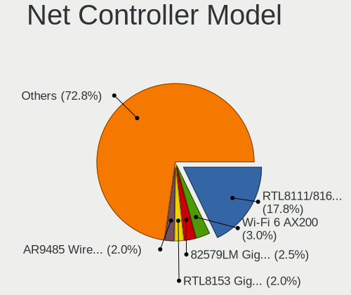

| Model                                                             | Computers | Percent |
|-------------------------------------------------------------------|-----------|---------|
| Realtek RTL8111/8168/8411 PCI Express Gigabit Ethernet Controller | 38        | 18.81%  |
| Intel Wi-Fi 6 AX200                                               | 9         | 4.46%   |
| Intel Wireless 8265 / 8275                                        | 5         | 2.48%   |
| Realtek RTL8821CE 802.11ac PCIe Wireless Network Adapter          | 4         | 1.98%   |
| Realtek RTL8125 2.5GbE Controller                                 | 4         | 1.98%   |
| Realtek RTL810xE PCI Express Fast Ethernet controller             | 4         | 1.98%   |
| Intel Wi-Fi 6 AX210/AX211/AX411 160MHz                            | 4         | 1.98%   |
| Intel Wi-Fi 6 AX201                                               | 4         | 1.98%   |
| Intel 82579LM Gigabit Network Connection (Lewisville)             | 4         | 1.98%   |
| Broadcom NetXtreme BCM57766 Gigabit Ethernet PCIe                 | 4         | 1.98%   |
| Realtek RTL8822CE 802.11ac PCIe Wireless Network Adapter          | 3         | 1.49%   |
| Realtek RTL8153 Gigabit Ethernet Adapter                          | 3         | 1.49%   |
| Qualcomm Atheros QCA6174 802.11ac Wireless Network Adapter        | 3         | 1.49%   |
| Qualcomm Atheros Killer E220x Gigabit Ethernet Controller         | 3         | 1.49%   |
| Intel I211 Gigabit Network Connection                             | 3         | 1.49%   |
| Intel Ethernet Controller I225-V                                  | 3         | 1.49%   |
| Intel Ethernet Connection I217-LM                                 | 3         | 1.49%   |
| Broadcom Limited BCM4331 802.11a/b/g/n                            | 3         | 1.49%   |
| Realtek RTL8821AE 802.11ac PCIe Wireless Network Adapter          | 2         | 0.99%   |
| Realtek RTL-8100/8101L/8139 PCI Fast Ethernet Adapter             | 2         | 0.99%   |
| Ralink MT7601U Wireless Adapter                                   | 2         | 0.99%   |
| Qualcomm Atheros QCA9565 / AR9565 Wireless Network Adapter        | 2         | 0.99%   |
| Qualcomm Atheros QCA9377 802.11ac Wireless Network Adapter        | 2         | 0.99%   |
| Qualcomm Atheros AR8151 v2.0 Gigabit Ethernet                     | 2         | 0.99%   |
| MediaTek MT7921 802.11ax PCI Express Wireless Network Adapter     | 2         | 0.99%   |
| Intel Wireless-AC 9260                                            | 2         | 0.99%   |
| Intel Wireless 7265                                               | 2         | 0.99%   |
| Intel Ice Lake-LP PCH CNVi WiFi                                   | 2         | 0.99%   |
| Intel Ethernet Connection (2) I219-V                              | 2         | 0.99%   |
| Intel Dual Band Wireless-AC 3168NGW [Stone Peak]                  | 2         | 0.99%   |
| Intel Alder Lake-P PCH CNVi WiFi                                  | 2         | 0.99%   |
| Intel 82574L Gigabit Network Connection                           | 2         | 0.99%   |
| Broadcom NetXtreme BCM57765 Gigabit Ethernet PCIe                 | 2         | 0.99%   |
| Broadcom BCM4360 802.11ac Wireless Network Adapter                | 2         | 0.99%   |
| Aquantia FastLinQ Edge 10Gbit Network Adapter                     | 2         | 0.99%   |
| Aquantia AQC107 NBase-T/IEEE 802.3bz Ethernet Controller [AQtion] | 2         | 0.99%   |
| ZTE WCDMA MSM ZTE BLADE A530                                      | 1         | 0.5%    |
| VIA VT6102/VT6103 [Rhine-II]                                      | 1         | 0.5%    |
| Sierra Wireless EM7305                                            | 1         | 0.5%    |
| Realtek USB 10/100/1G/2.5G LAN                                    | 1         | 0.5%    |

Wireless Vendor
---------------

Wireless vendors

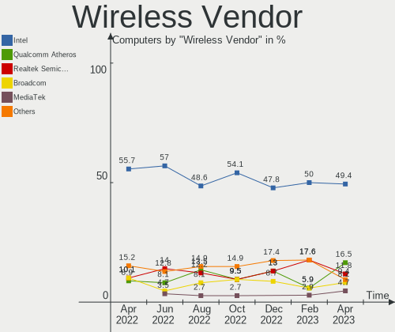

| Vendor                | Computers | Percent |
|-----------------------|-----------|---------|
| Intel                 | 43        | 48.86%  |
| Realtek Semiconductor | 12        | 13.64%  |
| Qualcomm Atheros      | 11        | 12.5%   |
| Broadcom              | 8         | 9.09%   |
| Ralink Technology     | 4         | 4.55%   |
| MediaTek              | 3         | 3.41%   |
| Broadcom Limited      | 3         | 3.41%   |
| Sierra Wireless       | 1         | 1.14%   |
| Ralink                | 1         | 1.14%   |
| Edimax Technology     | 1         | 1.14%   |
| AVM                   | 1         | 1.14%   |

Wireless Model
--------------

Wireless models

| Model                                                                   | Computers | Percent |
|-------------------------------------------------------------------------|-----------|---------|
| Intel Wi-Fi 6 AX200                                                     | 9         | 10.23%  |
| Intel Wireless 8265 / 8275                                              | 5         | 5.68%   |
| Realtek RTL8821CE 802.11ac PCIe Wireless Network Adapter                | 4         | 4.55%   |
| Intel Wi-Fi 6 AX210/AX211/AX411 160MHz                                  | 4         | 4.55%   |
| Intel Wi-Fi 6 AX201                                                     | 4         | 4.55%   |
| Realtek RTL8822CE 802.11ac PCIe Wireless Network Adapter                | 3         | 3.41%   |
| Qualcomm Atheros QCA6174 802.11ac Wireless Network Adapter              | 3         | 3.41%   |
| Broadcom Limited BCM4331 802.11a/b/g/n                                  | 3         | 3.41%   |
| Realtek RTL8821AE 802.11ac PCIe Wireless Network Adapter                | 2         | 2.27%   |
| Ralink MT7601U Wireless Adapter                                         | 2         | 2.27%   |
| Qualcomm Atheros QCA9565 / AR9565 Wireless Network Adapter              | 2         | 2.27%   |
| Qualcomm Atheros QCA9377 802.11ac Wireless Network Adapter              | 2         | 2.27%   |
| MediaTek MT7921 802.11ax PCI Express Wireless Network Adapter           | 2         | 2.27%   |
| Intel Wireless-AC 9260                                                  | 2         | 2.27%   |
| Intel Wireless 7265                                                     | 2         | 2.27%   |
| Intel Ice Lake-LP PCH CNVi WiFi                                         | 2         | 2.27%   |
| Intel Dual Band Wireless-AC 3168NGW [Stone Peak]                        | 2         | 2.27%   |
| Intel Alder Lake-P PCH CNVi WiFi                                        | 2         | 2.27%   |
| Broadcom BCM4360 802.11ac Wireless Network Adapter                      | 2         | 2.27%   |
| Sierra Wireless EM7305                                                  | 1         | 1.14%   |
| Realtek RTL8822BE 802.11a/b/g/n/ac WiFi adapter                         | 1         | 1.14%   |
| Realtek RTL8812AE 802.11ac PCIe Wireless Network Adapter                | 1         | 1.14%   |
| Realtek RTL-8185 IEEE 802.11a/b/g Wireless LAN Controller               | 1         | 1.14%   |
| Ralink RT5370 Wireless Adapter                                          | 1         | 1.14%   |
| Ralink RT3572 Wireless Adapter                                          | 1         | 1.14%   |
| Ralink RT5392 PCIe Wireless Network Adapter                             | 1         | 1.14%   |
| Qualcomm Atheros AR9485 Wireless Network Adapter                        | 1         | 1.14%   |
| Qualcomm Atheros AR9287 Wireless Network Adapter (PCI-Express)          | 1         | 1.14%   |
| Qualcomm Atheros AR5416 Wireless Network Adapter [AR5008 802.11(a)bgn]  | 1         | 1.14%   |
| Qualcomm Atheros AR242x / AR542x Wireless Network Adapter (PCI-Express) | 1         | 1.14%   |
| MediaTek MT7922 802.11ax PCI Express Wireless Network Adapter           | 1         | 1.14%   |
| Intel Wireless 8260                                                     | 1         | 1.14%   |
| Intel Wireless 3165                                                     | 1         | 1.14%   |
| Intel Wireless 3160                                                     | 1         | 1.14%   |
| Intel Gemini Lake PCH CNVi WiFi                                         | 1         | 1.14%   |
| Intel Dual Band Wireless-AC 3165 Plus Bluetooth                         | 1         | 1.14%   |
| Intel Comet Lake PCH-LP CNVi WiFi                                       | 1         | 1.14%   |
| Intel Comet Lake PCH CNVi WiFi                                          | 1         | 1.14%   |
| Intel Centrino Wireless-N 2230                                          | 1         | 1.14%   |
| Intel Centrino Ultimate-N 6300                                          | 1         | 1.14%   |

Ethernet Vendor
---------------

Ethernet vendors

| Vendor                     | Computers | Percent |
|----------------------------|-----------|---------|
| Realtek Semiconductor      | 51        | 47.22%  |
| Intel                      | 28        | 25.93%  |
| Broadcom                   | 7         | 6.48%   |
| Qualcomm Atheros           | 5         | 4.63%   |
| Aquantia                   | 4         | 3.7%    |
| Marvell Technology Group   | 3         | 2.78%   |
| DisplayLink                | 3         | 2.78%   |
| ZTE WCDMA Technologies MSM | 1         | 0.93%   |
| VIA Technologies           | 1         | 0.93%   |
| Motorola PCS               | 1         | 0.93%   |
| ICS Advent                 | 1         | 0.93%   |
| D-Link System              | 1         | 0.93%   |
| D-Link                     | 1         | 0.93%   |
| Apple                      | 1         | 0.93%   |

Ethernet Model
--------------

Ethernet models

| Model                                                             | Computers | Percent |
|-------------------------------------------------------------------|-----------|---------|
| Realtek RTL8111/8168/8411 PCI Express Gigabit Ethernet Controller | 38        | 33.63%  |
| Realtek RTL8125 2.5GbE Controller                                 | 4         | 3.54%   |
| Realtek RTL810xE PCI Express Fast Ethernet controller             | 4         | 3.54%   |
| Intel 82579LM Gigabit Network Connection (Lewisville)             | 4         | 3.54%   |
| Broadcom NetXtreme BCM57766 Gigabit Ethernet PCIe                 | 4         | 3.54%   |
| Realtek RTL8153 Gigabit Ethernet Adapter                          | 3         | 2.65%   |
| Qualcomm Atheros Killer E220x Gigabit Ethernet Controller         | 3         | 2.65%   |
| Intel I211 Gigabit Network Connection                             | 3         | 2.65%   |
| Intel Ethernet Controller I225-V                                  | 3         | 2.65%   |
| Intel Ethernet Connection I217-LM                                 | 3         | 2.65%   |
| Realtek RTL-8100/8101L/8139 PCI Fast Ethernet Adapter             | 2         | 1.77%   |
| Qualcomm Atheros AR8151 v2.0 Gigabit Ethernet                     | 2         | 1.77%   |
| Intel Ethernet Connection (2) I219-V                              | 2         | 1.77%   |
| Intel 82574L Gigabit Network Connection                           | 2         | 1.77%   |
| Broadcom NetXtreme BCM57765 Gigabit Ethernet PCIe                 | 2         | 1.77%   |
| Aquantia FastLinQ Edge 10Gbit Network Adapter                     | 2         | 1.77%   |
| Aquantia AQC107 NBase-T/IEEE 802.3bz Ethernet Controller [AQtion] | 2         | 1.77%   |
| ZTE WCDMA MSM ZTE BLADE A530                                      | 1         | 0.88%   |
| VIA VT6102/VT6103 [Rhine-II]                                      | 1         | 0.88%   |
| Realtek USB 10/100/1G/2.5G LAN                                    | 1         | 0.88%   |
| Realtek RTL8150 Fast Ethernet Adapter                             | 1         | 0.88%   |
| Realtek Realtek Ethernet controller                               | 1         | 0.88%   |
| Motorola PCS moto g pure                                          | 1         | 0.88%   |
| Marvell Group 88E8058 PCI-E Gigabit Ethernet Controller           | 1         | 0.88%   |
| Marvell Group 88E8056 PCI-E Gigabit Ethernet Controller           | 1         | 0.88%   |
| Marvell Group 88E8053 PCI-E Gigabit Ethernet Controller           | 1         | 0.88%   |
| Marvell Group 88E8001 Gigabit Ethernet Controller                 | 1         | 0.88%   |
| Intel I210 Gigabit Network Connection                             | 1         | 0.88%   |
| Intel Ethernet Connection I219-LM                                 | 1         | 0.88%   |
| Intel Ethernet Connection I217-V                                  | 1         | 0.88%   |
| Intel Ethernet Connection (7) I219-V                              | 1         | 0.88%   |
| Intel Ethernet Connection (5) I219-V                              | 1         | 0.88%   |
| Intel Ethernet Connection (17) I219-V                             | 1         | 0.88%   |
| Intel Ethernet Connection (13) I219-V                             | 1         | 0.88%   |
| Intel Ethernet Connection (10) I219-V                             | 1         | 0.88%   |
| Intel 82575EB Gigabit Network Connection                          | 1         | 0.88%   |
| Intel 82557/8/9/0/1 Ethernet Pro 100                              | 1         | 0.88%   |
| Intel 82546GB Gigabit Ethernet Controller                         | 1         | 0.88%   |
| Intel 82546EB Gigabit Ethernet Controller (Copper)                | 1         | 0.88%   |
| ICS Advent DM9601 Fast Ethernet Adapter                           | 1         | 0.88%   |

Net Controller Kind
-------------------

Ethernet, WiFi or modem

| Kind     | Computers | Percent |
|----------|-----------|---------|
| Ethernet | 90        | 51.43%  |
| WiFi     | 84        | 48%     |
| Modem    | 1         | 0.57%   |

Used Controller
---------------

Currently used network controller

| Kind     | Computers | Percent |
|----------|-----------|---------|
| WiFi     | 66        | 55.93%  |
| Ethernet | 52        | 44.07%  |

NICs
----

Total network controllers on board

| Total | Computers | Percent |
|-------|-----------|---------|
| 2     | 55        | 49.11%  |
| 1     | 47        | 41.96%  |
| 3     | 8         | 7.14%   |
| 5     | 1         | 0.89%   |
| 4     | 1         | 0.89%   |

IPv6
----

IPv6 vs IPv4

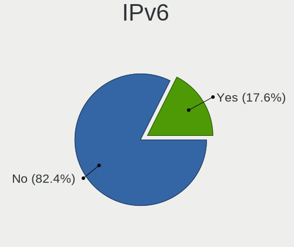

| Used | Computers | Percent |
|------|-----------|---------|
| No   | 87        | 77.68%  |
| Yes  | 25        | 22.32%  |

Bluetooth
---------

Bluetooth Vendor
----------------

Controller vendors

| Vendor                          | Computers | Percent |
|---------------------------------|-----------|---------|
| Intel                           | 38        | 48.1%   |
| Realtek Semiconductor           | 12        | 15.19%  |
| Apple                           | 7         | 8.86%   |
| Qualcomm Atheros Communications | 6         | 7.59%   |
| Cambridge Silicon Radio         | 4         | 5.06%   |
| Broadcom                        | 4         | 5.06%   |
| Lite-On Technology              | 2         | 2.53%   |
| IMC Networks                    | 2         | 2.53%   |
| Foxconn / Hon Hai               | 2         | 2.53%   |
| TP-Link                         | 1         | 1.27%   |
| Dell                            | 1         | 1.27%   |

Bluetooth Model
---------------

Controller models

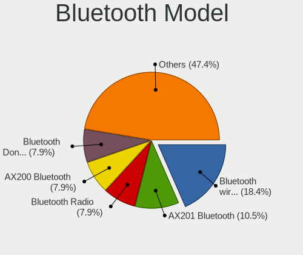

| Model                                               | Computers | Percent |
|-----------------------------------------------------|-----------|---------|
| Intel Bluetooth wireless interface                  | 11        | 13.92%  |
| Intel AX201 Bluetooth                               | 9         | 11.39%  |
| Realtek Bluetooth Radio                             | 8         | 10.13%  |
| Intel AX200 Bluetooth                               | 8         | 10.13%  |
| Cambridge Silicon Radio Bluetooth Dongle (HCI mode) | 4         | 5.06%   |
| Apple Bluetooth Host Controller                     | 4         | 5.06%   |
| Qualcomm Atheros  Bluetooth Device                  | 3         | 3.8%    |
| Intel AX210 Bluetooth                               | 3         | 3.8%    |
| Realtek RTL8821A Bluetooth                          | 2         | 2.53%   |
| Realtek  Bluetooth 4.2 Adapter                      | 2         | 2.53%   |
| Qualcomm Atheros QCA61x4 Bluetooth 4.0              | 2         | 2.53%   |
| Intel Wireless-AC 3168 Bluetooth                    | 2         | 2.53%   |
| Intel Bluetooth Device                              | 2         | 2.53%   |
| IMC Networks Bluetooth Radio                        | 2         | 2.53%   |
| Foxconn / Hon Hai Wireless_Device                   | 2         | 2.53%   |
| Broadcom BCM20702A0 Bluetooth 4.0                   | 2         | 2.53%   |
| Apple Bluetooth USB Host Controller                 | 2         | 2.53%   |
| TP-Link UB500 Adapter                               | 1         | 1.27%   |
| Qualcomm Atheros AR3012 Bluetooth 4.0               | 1         | 1.27%   |
| Lite-On Wireless_Device                             | 1         | 1.27%   |
| Lite-On Atheros AR3012 Bluetooth                    | 1         | 1.27%   |
| Intel Wireless-AC 9260 Bluetooth Adapter            | 1         | 1.27%   |
| Intel Centrino Bluetooth Wireless Transceiver       | 1         | 1.27%   |
| Intel Bluetooth 9460/9560 Jefferson Peak (JfP)      | 1         | 1.27%   |
| Dell DW375 Bluetooth Module                         | 1         | 1.27%   |
| Broadcom HP Portable SoftSailing                    | 1         | 1.27%   |
| Broadcom BCM43142A0 Bluetooth Device                | 1         | 1.27%   |
| Apple Bluetooth HCI                                 | 1         | 1.27%   |

Sound
-----

Sound Vendor
------------

Sound card vendors

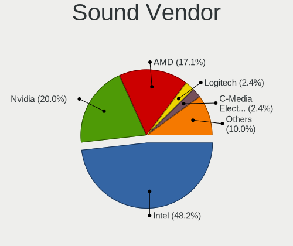

| Vendor                  | Computers | Percent |
|-------------------------|-----------|---------|
| Intel                   | 74        | 44.31%  |
| AMD                     | 41        | 24.55%  |
| Nvidia                  | 34        | 20.36%  |
| Texas Instruments       | 2         | 1.2%    |
| Logitech                | 2         | 1.2%    |
| C-Media Electronics     | 2         | 1.2%    |
| XMOS                    | 1         | 0.6%    |
| VIA Technologies        | 1         | 0.6%    |
| ULi Electronics         | 1         | 0.6%    |
| Plantronics             | 1         | 0.6%    |
| No brand                | 1         | 0.6%    |
| Lenovo                  | 1         | 0.6%    |
| JMTek                   | 1         | 0.6%    |
| GN Netcom               | 1         | 0.6%    |
| Focusrite-Novation      | 1         | 0.6%    |
| Creative Labs           | 1         | 0.6%    |
| Cambridge Silicon Radio | 1         | 0.6%    |
| Apple                   | 1         | 0.6%    |

Sound Model
-----------

Sound card models

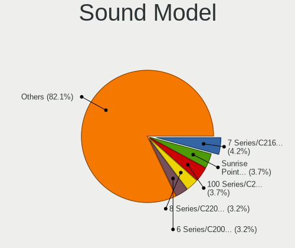

| Model                                                                      | Computers | Percent |
|----------------------------------------------------------------------------|-----------|---------|
| AMD Family 17h/19h HD Audio Controller                                     | 13        | 6.63%   |
| Intel 8 Series/C220 Series Chipset High Definition Audio Controller        | 11        | 5.61%   |
| AMD Starship/Matisse HD Audio Controller                                   | 8         | 4.08%   |
| Intel Sunrise Point-LP HD Audio                                            | 7         | 3.57%   |
| Intel Cannon Lake PCH cAVS                                                 | 7         | 3.57%   |
| AMD Renoir Radeon High Definition Audio Controller                         | 7         | 3.57%   |
| Intel Xeon E3-1200 v3/4th Gen Core Processor HD Audio Controller           | 6         | 3.06%   |
| AMD Rembrandt Radeon High Definition Audio Controller                      | 5         | 2.55%   |
| Nvidia TU116 High Definition Audio Controller                              | 4         | 2.04%   |
| Nvidia TU107 GeForce GTX 1650 High Definition Audio Controller             | 4         | 2.04%   |
| Intel Tiger Lake-LP Smart Sound Technology Audio Controller                | 4         | 2.04%   |
| Intel Celeron/Pentium Silver Processor High Definition Audio               | 4         | 2.04%   |
| Intel 7 Series/C216 Chipset Family High Definition Audio Controller        | 4         | 2.04%   |
| Intel 100 Series/C230 Series Chipset Family HD Audio Controller            | 4         | 2.04%   |
| AMD FCH Azalia Controller                                                  | 4         | 2.04%   |
| AMD Ellesmere HDMI Audio [Radeon RX 470/480 / 570/580/590]                 | 4         | 2.04%   |
| Nvidia GK208 HDMI/DP Audio Controller                                      | 3         | 1.53%   |
| Nvidia GK104 HDMI Audio Controller                                         | 3         | 1.53%   |
| Nvidia GA104 High Definition Audio Controller                              | 3         | 1.53%   |
| Intel Alder Lake-S HD Audio Controller                                     | 3         | 1.53%   |
| AMD Navi 21/23 HDMI/DP Audio Controller                                    | 3         | 1.53%   |
| AMD Family 15h (Models 60h-6fh) Audio Controller                           | 3         | 1.53%   |
| Nvidia GP107GL High Definition Audio Controller                            | 2         | 1.02%   |
| Nvidia GM107 High Definition Audio Controller [GeForce 940MX]              | 2         | 1.02%   |
| Nvidia GF108 High Definition Audio Controller                              | 2         | 1.02%   |
| Nvidia GA106 High Definition Audio Controller                              | 2         | 1.02%   |
| Intel NM10/ICH7 Family High Definition Audio Controller                    | 2         | 1.02%   |
| Intel Ice Lake-LP Smart Sound Technology Audio Controller                  | 2         | 1.02%   |
| Intel Celeron N3350/Pentium N4200/Atom E3900 Series Audio Cluster          | 2         | 1.02%   |
| Intel C600/X79 series chipset High Definition Audio Controller             | 2         | 1.02%   |
| Intel Atom Processor Z36xxx/Z37xxx Series High Definition Audio Controller | 2         | 1.02%   |
| Intel Alder Lake PCH-P High Definition Audio Controller                    | 2         | 1.02%   |
| Intel 82801H (ICH8 Family) HD Audio Controller                             | 2         | 1.02%   |
| Intel 6 Series/C200 Series Chipset Family High Definition Audio Controller | 2         | 1.02%   |
| Intel 200 Series PCH HD Audio                                              | 2         | 1.02%   |
| AMD SBx00 Azalia (Intel HDA)                                               | 2         | 1.02%   |
| AMD Oland/Hainan/Cape Verde/Pitcairn HDMI Audio [Radeon HD 7000 Series]    | 2         | 1.02%   |
| AMD High Definition Audio Controller                                       | 2         | 1.02%   |
| AMD Baffin HDMI/DP Audio [Radeon RX 550 640SP / RX 560/560X]               | 2         | 1.02%   |
| XMOS iFi (by AMR) HD USB Audio                                             | 1         | 0.51%   |

Memory
------

Memory Vendor
-------------

Memory module vendors

| Vendor              | Computers | Percent |
|---------------------|-----------|---------|
| Samsung Electronics | 12        | 17.91%  |
| Micron Technology   | 12        | 17.91%  |
| Unknown             | 8         | 11.94%  |
| SK hynix            | 8         | 11.94%  |
| Crucial             | 8         | 11.94%  |
| G.Skill             | 4         | 5.97%   |
| Corsair             | 4         | 5.97%   |
| Kingston            | 2         | 2.99%   |
| Unknown (ABCD)      | 1         | 1.49%   |
| Transcend           | 1         | 1.49%   |
| Team                | 1         | 1.49%   |
| Silicon Power       | 1         | 1.49%   |
| Ramaxel Technology  | 1         | 1.49%   |
| Patriot             | 1         | 1.49%   |
| Elpida              | 1         | 1.49%   |
| A-DATA Technology   | 1         | 1.49%   |
| Unknown             | 1         | 1.49%   |

Memory Model
------------

Memory module models

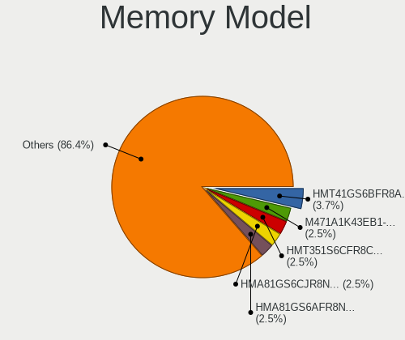

| Model                                                            | Computers | Percent |
|------------------------------------------------------------------|-----------|---------|
| SK hynix RAM HMA81GS6CJR8N-VK 8GB SODIMM DDR4 2667MT/s           | 3         | 4.35%   |
| Unknown RAM Module 4GB DIMM DDR3 1333MT/s                        | 2         | 2.9%    |
| Micron RAM 8ATF1G64HZ-2G6D1 8GB SODIMM DDR4 2667MT/s             | 2         | 2.9%    |
| G.Skill RAM F3-12800CL8-4GBXM 4GB DIMM DDR3 1600MT/s             | 2         | 2.9%    |
| Unknown RAM Module 8192MB DIMM                                   | 1         | 1.45%   |
| Unknown RAM Module 4GB DIMM 400MT/s                              | 1         | 1.45%   |
| Unknown RAM Module 2GB SODIMM DDR2 800MT/s                       | 1         | 1.45%   |
| Unknown RAM Module 2GB DIMM 1333MT/s                             | 1         | 1.45%   |
| Unknown RAM Module 2048MB DIMM 800MT/s                           | 1         | 1.45%   |
| Unknown RAM Module 1GB DIMM DDR 333MT/s                          | 1         | 1.45%   |
| Unknown (ABCD) RAM 123456789012345678 1GB DIMM DDR3 2400MT/s     | 1         | 1.45%   |
| Transcend RAM TS2GSH64V6B 16GB SODIMM DDR4 2667MT/s              | 1         | 1.45%   |
| Team RAM TEAMGROUP-SD4-3200 32GB SODIMM DDR4 3200MT/s            | 1         | 1.45%   |
| SK hynix RAM Module 4GB SODIMM DDR3 1600MT/s                     | 1         | 1.45%   |
| SK hynix RAM HMT84GL7DMR4A-PB 32GB DIMM DDR3 1600MT/s            | 1         | 1.45%   |
| SK hynix RAM HMT451U6BFR8C-PB 4GB DIMM DDR3 1600MT/s             | 1         | 1.45%   |
| SK hynix RAM HMT42GR7AFR4A 16GB DIMM DDR3 1600MT/s               | 1         | 1.45%   |
| SK hynix RAM HMT41GU6BFR8C-PB 8GB DIMM DDR3 1600MT/s             | 1         | 1.45%   |
| SK hynix RAM HMA82GS6DJR8N-XN 16GB SODIMM DDR4 3200MT/s          | 1         | 1.45%   |
| Silicon Power RAM SP008GLSTU160N02 8GB SODIMM DDR3 1600MT/s      | 1         | 1.45%   |
| Samsung RAM Module 1GB SODIMM DDR2 800MT/s                       | 1         | 1.45%   |
| Samsung RAM Module 16GB SODIMM DDR4 3200MT/s                     | 1         | 1.45%   |
| Samsung RAM M471B5273DH0-YK0 4GB SODIMM DDR3 1600MT/s            | 1         | 1.45%   |
| Samsung RAM M471B1G73DB0-YK0 8GB SODIMM DDR3 1600MT/s            | 1         | 1.45%   |
| Samsung RAM M471A2K43DB1-CWE 16GB SODIMM DDR4 3200MT/s           | 1         | 1.45%   |
| Samsung RAM M471A1K43DB1-CWE 8GB Row Of Chips DDR4 2400MT/s      | 1         | 1.45%   |
| Samsung RAM M391B5773CH0-YH9 2GB DIMM DDR3 1333MT/s              | 1         | 1.45%   |
| Samsung RAM M378B5173QH0-CK0 4GB DIMM DDR3 1600MT/s              | 1         | 1.45%   |
| Samsung RAM M378B1G73EB0-YK0 8GB DIMM DDR3 1600MT/s              | 1         | 1.45%   |
| Samsung RAM K4UBE3D4AA-MGCR 8GB SODIMM LPDDR4 4266MT/s           | 1         | 1.45%   |
| Samsung RAM K4EBE304EB-EGCF 8GB SODIMM LPDDR3 1867MT/s           | 1         | 1.45%   |
| Samsung RAM K4A4G165WE-BCRC 2GB Row Of Chips DDR4 2400MT/s       | 1         | 1.45%   |
| Ramaxel RAM RMR5030KD68F9F1600 4GB DIMM DDR3 1600MT/s            | 1         | 1.45%   |
| Patriot RAM PSD34G133381 4GB DIMM DDR3 1333MT/s                  | 1         | 1.45%   |
| Micron RAM MT62F1G32D4DR-031 WT 4GB Row Of Chips LPDDR5 6400MT/s | 1         | 1.45%   |
| Micron RAM MT53E1G32D2NQ-046:B 8GB Row Of Chips LPDDR4 4267MT/s  | 1         | 1.45%   |
| Micron RAM MT52L1G32D4PG-093 8GB Row Of Chips LPDDR3 2133MT/s    | 1         | 1.45%   |
| Micron RAM MT40A1G16RC-062E:B 8GB Row Of Chips DDR4 3200MT/s     | 1         | 1.45%   |
| Micron RAM Module 4GB Row Of Chips LPDDR4 4267MT/s               | 1         | 1.45%   |
| Micron RAM Module 1GB SODIMM DDR2 800MT/s                        | 1         | 1.45%   |

Memory Kind
-----------

Memory module kinds

| Kind    | Computers | Percent |
|---------|-----------|---------|
| DDR4    | 23        | 38.98%  |
| DDR3    | 20        | 33.9%   |
| LPDDR4  | 4         | 6.78%   |
| Unknown | 4         | 6.78%   |
| LPDDR3  | 2         | 3.39%   |
| DDR2    | 2         | 3.39%   |
| DDR     | 2         | 3.39%   |
| LPDDR5  | 1         | 1.69%   |
| DDR5    | 1         | 1.69%   |

Memory Form Factor
------------------

Physical design of the memory module

| Name         | Computers | Percent |
|--------------|-----------|---------|
| DIMM         | 28        | 47.46%  |
| SODIMM       | 22        | 37.29%  |
| Row Of Chips | 9         | 15.25%  |

Memory Size
-----------

Memory module size

| Size  | Computers | Percent |
|-------|-----------|---------|
| 8192  | 20        | 33.33%  |
| 4096  | 17        | 28.33%  |
| 16384 | 8         | 13.33%  |
| 32768 | 7         | 11.67%  |
| 2048  | 6         | 10%     |
| 1024  | 2         | 3.33%   |

Memory Speed
------------

Memory module speed

| Speed   | Computers | Percent |
|---------|-----------|---------|
| 1600    | 18        | 28.57%  |
| 3200    | 9         | 14.29%  |
| 2667    | 7         | 11.11%  |
| 1333    | 5         | 7.94%   |
| 2400    | 3         | 4.76%   |
| 800     | 3         | 4.76%   |
| 4267    | 2         | 3.17%   |
| 2133    | 2         | 3.17%   |
| 59392   | 1         | 1.59%   |
| 6400    | 1         | 1.59%   |
| 4800    | 1         | 1.59%   |
| 4266    | 1         | 1.59%   |
| 4133    | 1         | 1.59%   |
| 3600    | 1         | 1.59%   |
| 3466    | 1         | 1.59%   |
| 3400    | 1         | 1.59%   |
| 2733    | 1         | 1.59%   |
| 1867    | 1         | 1.59%   |
| 1866    | 1         | 1.59%   |
| 400     | 1         | 1.59%   |
| 333     | 1         | 1.59%   |
| Unknown | 1         | 1.59%   |

Printers & scanners
-------------------

Printer Vendor
--------------

Printer device vendors

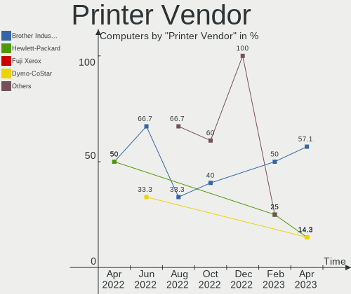

| Vendor             | Computers | Percent |
|--------------------|-----------|---------|
| Brother Industries | 3         | 60%     |
| Hewlett-Packard    | 1         | 20%     |
| Canon              | 1         | 20%     |

Printer Model
-------------

Printer device models

| Model                    | Computers | Percent |
|--------------------------|-----------|---------|
| HP OfficeJet 5200 series | 1         | 20%     |
| Canon PIXMA TS6250       | 1         | 20%     |
| Brother MFC-J4440DW      | 1         | 20%     |
| Brother MFC-1810         | 1         | 20%     |
| Brother DCP-J140W        | 1         | 20%     |

Scanner Vendor
--------------

Scanner device vendors

| Vendor           | Computers | Percent |
|------------------|-----------|---------|
| Salix Technology | 1         | 100%    |

Scanner Model
-------------

Scanner device models

| Model              | Computers | Percent |
|--------------------|-----------|---------|
| Salix USB Scanner. | 1         | 100%    |

Camera
------

Camera Vendor
-------------

Camera device vendors

| Vendor                                 | Computers | Percent |
|----------------------------------------|-----------|---------|
| Chicony Electronics                    | 9         | 16.07%  |
| Microdia                               | 6         | 10.71%  |
| Logitech                               | 6         | 10.71%  |
| Acer                                   | 5         | 8.93%   |
| Quanta                                 | 4         | 7.14%   |
| IMC Networks                           | 4         | 7.14%   |
| Apple                                  | 4         | 7.14%   |
| Syntek                                 | 3         | 5.36%   |
| Suyin                                  | 2         | 3.57%   |
| Realtek Semiconductor                  | 2         | 3.57%   |
| Microsoft                              | 2         | 3.57%   |
| Cheng Uei Precision Industry (Foxlink) | 2         | 3.57%   |
| Primax Electronics                     | 1         | 1.79%   |
| MacroSilicon                           | 1         | 1.79%   |
| Luxvisions Innotech Limited            | 1         | 1.79%   |
| Lite-On Technology                     | 1         | 1.79%   |
| Hopewin Electronic Material            | 1         | 1.79%   |
| Generalplus Technology                 | 1         | 1.79%   |
| Alcor Micro                            | 1         | 1.79%   |

Camera Model
------------

Camera device models

| Model                                                   | Computers | Percent |
|---------------------------------------------------------|-----------|---------|
| Chicony Integrated Camera                               | 4         | 7.14%   |
| Apple FaceTime HD Camera (Built-in)                     | 3         | 5.36%   |
| Syntek EasyCamera                                       | 2         | 3.57%   |
| Microdia Integrated_Webcam_HD                           | 2         | 3.57%   |
| Logitech Webcam C270                                    | 2         | 3.57%   |
| Logitech HD Webcam C615                                 | 2         | 3.57%   |
| IMC Networks USB2.0 HD UVC WebCam                       | 2         | 3.57%   |
| Chicony HD User Facing                                  | 2         | 3.57%   |
| Acer Integrated Camera                                  | 2         | 3.57%   |
| Syntek USB 2.0 UVC PC Camera                            | 1         | 1.79%   |
| Suyin Integrated_Webcam_HD                              | 1         | 1.79%   |
| Suyin HP Truevision HD                                  | 1         | 1.79%   |
| Realtek Integrated_Webcam_HD                            | 1         | 1.79%   |
| Realtek FULL HD 1080P Webcam                            | 1         | 1.79%   |
| Quanta USB2.0 HD UVC WebCam                             | 1         | 1.79%   |
| Quanta HP TrueVision HD Camera                          | 1         | 1.79%   |
| Quanta HP HD Camera                                     | 1         | 1.79%   |
| Quanta HD User Facing                                   | 1         | 1.79%   |
| Primax HP HD Webcam [Fixed]                             | 1         | 1.79%   |
| Microsoft Surface Camera Front                          | 1         | 1.79%   |
| Microsoft LifeCam Cinema                                | 1         | 1.79%   |
| Microdia USB 2.0 Camera                                 | 1         | 1.79%   |
| Microdia Integrated Webcam HD                           | 1         | 1.79%   |
| Microdia Camera                                         | 1         | 1.79%   |
| Microdia 1.3 MPixel Integrated Webcam                   | 1         | 1.79%   |
| MacroSilicon USB Video                                  | 1         | 1.79%   |
| Luxvisions Innotech Limited Integrated Camera           | 1         | 1.79%   |
| Logitech Webcam C925e                                   | 1         | 1.79%   |
| Logitech HD Pro Webcam C920                             | 1         | 1.79%   |
| Lite-On HP HD Camera                                    | 1         | 1.79%   |
| IMC Networks Integrated Camera                          | 1         | 1.79%   |
| IMC Networks HD Camera                                  | 1         | 1.79%   |
| Hopewin Electronic Material FULL HD 1080P Webcam        | 1         | 1.79%   |
| Generalplus 808 Camera #9 (web-cam mode)                | 1         | 1.79%   |
| Chicony TOSHIBA Web Camera - FHD                        | 1         | 1.79%   |
| Chicony HP Webcam                                       | 1         | 1.79%   |
| Chicony HD Webcam                                       | 1         | 1.79%   |
| Cheng Uei Precision Industry (Foxlink) HP Truevision HD | 1         | 1.79%   |
| Cheng Uei Precision Industry (Foxlink) HP HD Camera     | 1         | 1.79%   |
| Apple Built-in iSight                                   | 1         | 1.79%   |

Security
--------

Fingerprint Vendor
------------------

Fingerprint sensor vendors

| Vendor                     | Computers | Percent |
|----------------------------|-----------|---------|
| Validity Sensors           | 6         | 42.86%  |
| Synaptics                  | 5         | 35.71%  |
| Shenzhen Goodix Technology | 2         | 14.29%  |
| LighTuning Technology      | 1         | 7.14%   |

Fingerprint Model
-----------------

Fingerprint sensor models

| Model                                             | Computers | Percent |
|---------------------------------------------------|-----------|---------|
| Validity Sensors VFS495 Fingerprint Reader        | 2         | 14.29%  |
| Synaptics WBDI                                    | 2         | 14.29%  |
| Synaptics Prometheus MIS Touch Fingerprint Reader | 2         | 14.29%  |
| Validity Sensors VFS7552 Touch Fingerprint Sensor | 1         | 7.14%   |
| Validity Sensors VFS491                           | 1         | 7.14%   |
| Validity Sensors VFS Fingerprint sensor           | 1         | 7.14%   |
| Validity Sensors Swipe Fingerprint Sensor         | 1         | 7.14%   |
| Synaptics  WBDI                                   | 1         | 7.14%   |
| Shenzhen Goodix  Fingerprint Device               | 1         | 7.14%   |
| Shenzhen Goodix FingerPrint                       | 1         | 7.14%   |
| LighTuning EgisTec Touch Fingerprint Sensor       | 1         | 7.14%   |

Chipcard Vendor
---------------

Chipcard module vendors

| Vendor      | Computers | Percent |
|-------------|-----------|---------|
| Broadcom    | 1         | 50%     |
| Alcor Micro | 1         | 50%     |

Chipcard Model
--------------

Chipcard module models

| Model                                          | Computers | Percent |
|------------------------------------------------|-----------|---------|
| Broadcom BCM5880 Secure Applications Processor | 1         | 50%     |
| Alcor Micro AU9540 Smartcard Reader            | 1         | 50%     |

Unsupported
-----------

Unsupported Devices
-------------------

Total unsupported devices on board

| Total | Computers | Percent |
|-------|-----------|---------|
| 0     | 76        | 67.86%  |
| 1     | 24        | 21.43%  |
| 2     | 10        | 8.93%   |
| 5     | 1         | 0.89%   |
| 3     | 1         | 0.89%   |

Unsupported Device Types
------------------------

Types of unsupported devices

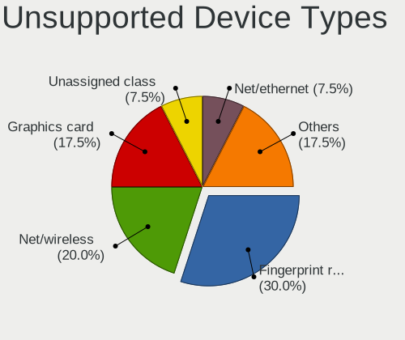

| Type                     | Computers | Percent |
|--------------------------|-----------|---------|
| Fingerprint reader       | 14        | 28%     |
| Graphics card            | 13        | 26%     |
| Net/wireless             | 4         | 8%      |
| Multimedia controller    | 3         | 6%      |
| Communication controller | 3         | 6%      |
| Bluetooth                | 3         | 6%      |
| Net/ethernet             | 2         | 4%      |
| Camera                   | 2         | 4%      |
| Unassigned class         | 1         | 2%      |
| Storage                  | 1         | 2%      |
| Sound                    | 1         | 2%      |
| Network                  | 1         | 2%      |
| Modem                    | 1         | 2%      |
| Chipcard                 | 1         | 2%      |

