Linux in Brazil - Hardware Trends
---------------------------------

A project to identify most popular hardware characteristics and track their change
over time based on data collected by Linux users at https://Linux-Hardware.org.

Anyone can contribute to this report by the [hw-probe](https://github.com/linuxhw/hw-probe) tool:

    sudo -E hw-probe -all -upload

This is a report for all computer types. See also reports for [desktops](/Location/Brazil/Desktop/README.md) and [notebooks](/Location/Brazil/Notebook/README.md).

Period: Dec, 2025.

Contents
--------

* [ System ](#system)
  - [ OS                       ](#os)
  - [ OS Family                ](#os-family)
  - [ Kernel                   ](#kernel)
  - [ Kernel Family            ](#kernel-family)
  - [ Kernel Major Ver.        ](#kernel-major-ver)
  - [ Arch                     ](#arch)
  - [ DE                       ](#de)
  - [ Display Server           ](#display-server)
  - [ Display Manager          ](#display-manager)
  - [ OS Lang                  ](#os-lang)
  - [ Boot Mode                ](#boot-mode)
  - [ Filesystem               ](#filesystem)
  - [ Part. scheme             ](#part-scheme)
  - [ Dual Boot with Linux/BSD ](#dual-boot-with-linuxbsd)
  - [ Dual Boot (Win)          ](#dual-boot-win)

* [ Board ](#board)
  - [ Vendor                   ](#vendor)
  - [ Model                    ](#model)
  - [ Model Family             ](#model-family)
  - [ MFG Year                 ](#mfg-year)
  - [ Form Factor              ](#form-factor)
  - [ Secure Boot              ](#secure-boot)
  - [ Coreboot                 ](#coreboot)
  - [ RAM Size                 ](#ram-size)
  - [ RAM Used                 ](#ram-used)
  - [ Total Drives             ](#total-drives)
  - [ Has CD-ROM               ](#has-cd-rom)
  - [ Has Ethernet             ](#has-ethernet)
  - [ Has WiFi                 ](#has-wifi)
  - [ Has Bluetooth            ](#has-bluetooth)

* [ Location ](#location)
  - [ Country                  ](#country)
  - [ City                     ](#city)

* [ Drives ](#drives)
  - [ Drive Vendor             ](#drive-vendor)
  - [ Drive Model              ](#drive-model)
  - [ HDD Vendor               ](#hdd-vendor)
  - [ SSD Vendor               ](#ssd-vendor)
  - [ Drive Kind               ](#drive-kind)
  - [ Drive Connector          ](#drive-connector)
  - [ Drive Size               ](#drive-size)
  - [ Space Total              ](#space-total)
  - [ Space Used               ](#space-used)
  - [ Malfunc. Drives          ](#malfunc-drives)
  - [ Malfunc. Drive Vendor    ](#malfunc-drive-vendor)
  - [ Malfunc. HDD Vendor      ](#malfunc-hdd-vendor)
  - [ Malfunc. Drive Kind      ](#malfunc-drive-kind)
  - [ Failed Drives            ](#failed-drives)
  - [ Failed Drive Vendor      ](#failed-drive-vendor)
  - [ Drive Status             ](#drive-status)

* [ Storage controller ](#storage-controller)
  - [ Storage Vendor           ](#storage-vendor)
  - [ Storage Model            ](#storage-model)
  - [ Storage Kind             ](#storage-kind)

* [ Processor ](#processor)
  - [ CPU Vendor               ](#cpu-vendor)
  - [ CPU Model                ](#cpu-model)
  - [ CPU Model Family         ](#cpu-model-family)
  - [ CPU Cores                ](#cpu-cores)
  - [ CPU Sockets              ](#cpu-sockets)
  - [ CPU Threads              ](#cpu-threads)
  - [ CPU Op-Modes             ](#cpu-op-modes)
  - [ CPU Microcode            ](#cpu-microcode)
  - [ CPU Microarch            ](#cpu-microarch)

* [ Graphics ](#graphics)
  - [ GPU Vendor               ](#gpu-vendor)
  - [ GPU Model                ](#gpu-model)
  - [ GPU Combo                ](#gpu-combo)
  - [ GPU Driver               ](#gpu-driver)
  - [ GPU Memory               ](#gpu-memory)

* [ Monitor ](#monitor)
  - [ Monitor Vendor           ](#monitor-vendor)
  - [ Monitor Model            ](#monitor-model)
  - [ Monitor Resolution       ](#monitor-resolution)
  - [ Monitor Diagonal         ](#monitor-diagonal)
  - [ Monitor Width            ](#monitor-width)
  - [ Aspect Ratio             ](#aspect-ratio)
  - [ Monitor Area             ](#monitor-area)
  - [ Pixel Density            ](#pixel-density)
  - [ Multiple Monitors        ](#multiple-monitors)

* [ Network ](#network)
  - [ Net Controller Vendor    ](#net-controller-vendor)
  - [ Net Controller Model     ](#net-controller-model)
  - [ Wireless Vendor          ](#wireless-vendor)
  - [ Wireless Model           ](#wireless-model)
  - [ Ethernet Vendor          ](#ethernet-vendor)
  - [ Ethernet Model           ](#ethernet-model)
  - [ Net Controller Kind      ](#net-controller-kind)
  - [ Used Controller          ](#used-controller)
  - [ NICs                     ](#nics)
  - [ IPv6                     ](#ipv6)

* [ Bluetooth ](#bluetooth)
  - [ Bluetooth Vendor         ](#bluetooth-vendor)
  - [ Bluetooth Model          ](#bluetooth-model)

* [ Sound ](#sound)
  - [ Sound Vendor             ](#sound-vendor)
  - [ Sound Model              ](#sound-model)

* [ Memory ](#memory)
  - [ Memory Vendor            ](#memory-vendor)
  - [ Memory Model             ](#memory-model)
  - [ Memory Kind              ](#memory-kind)
  - [ Memory Form Factor       ](#memory-form-factor)
  - [ Memory Size              ](#memory-size)
  - [ Memory Speed             ](#memory-speed)

* [ Printers & scanners ](#printers--scanners)
  - [ Printer Vendor           ](#printer-vendor)
  - [ Printer Model            ](#printer-model)
  - [ Scanner Vendor           ](#scanner-vendor)
  - [ Scanner Model            ](#scanner-model)

* [ Camera ](#camera)
  - [ Camera Vendor            ](#camera-vendor)
  - [ Camera Model             ](#camera-model)

* [ Security ](#security)
  - [ Fingerprint Vendor       ](#fingerprint-vendor)
  - [ Fingerprint Model        ](#fingerprint-model)
  - [ Chipcard Vendor          ](#chipcard-vendor)
  - [ Chipcard Model           ](#chipcard-model)

* [ Unsupported ](#unsupported)
  - [ Unsupported Devices      ](#unsupported-devices)
  - [ Unsupported Device Types ](#unsupported-device-types)

System
------

OS
--

Installed operating systems

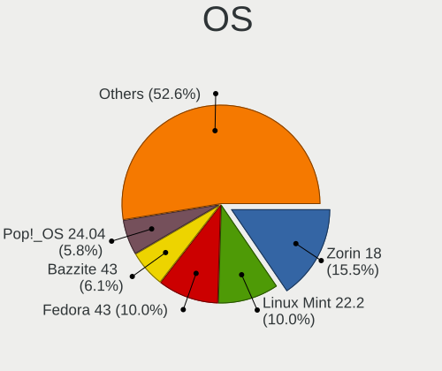

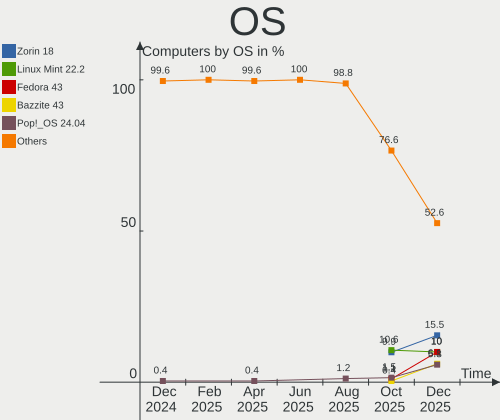

| Name                | Computers | Percent |
|---------------------|-----------|---------|
| Zorin 18            | 48        | 15.48%  |
| Linux Mint 22.2     | 31        | 10%     |
| Fedora 43           | 31        | 10%     |
| Bazzite 43          | 19        | 6.13%   |
| Pop!_OS 24.04       | 18        | 5.81%   |
| Arch Rolling        | 17        | 5.48%   |
| Ubuntu 24.04        | 13        | 4.19%   |
| Ubuntu 25.10        | 11        | 3.55%   |
| OpenMandriva 6.0    | 10        | 3.23%   |
| OpenMandriva 25.90  | 10        | 3.23%   |
| Debian 13           | 8         | 2.58%   |
| ROSA 13.1           | 7         | 2.26%   |
| OpenMandriva 25.11  | 5         | 1.61%   |
| CachyOS             | 5         | 1.61%   |
| Pop!_OS 22.04       | 4         | 1.29%   |
| OpenMandriva 25.06  | 4         | 1.29%   |
| Linux Mint 22.1     | 4         | 1.29%   |
| Kubuntu 25.10       | 4         | 1.29%   |
| Debian 12           | 4         | 1.29%   |
| CachyOS Rolling     | 4         | 1.29%   |
| Zorin 17            | 3         | 0.97%   |
| Nobara 43           | 3         | 0.97%   |
| KDE neon 24.04      | 3         | 0.97%   |
| Bazzite 42          | 3         | 0.97%   |
| Ubuntu 25.04        | 2         | 0.65%   |
| OpenMandriva 24.12  | 2         | 0.65%   |
| LMDE 7              | 2         | 0.65%   |
| Endless 6.0.8       | 2         | 0.65%   |
| EndeavourOS Rolling | 2         | 0.65%   |
| BigLinux 25.0.10    | 2         | 0.65%   |
| BigLinux            | 2         | 0.65%   |
| Void Linux Rolling  | 1         | 0.32%   |
| Vanilla 2.0         | 1         | 0.32%   |
| Ultramarine 43      | 1         | 0.32%   |
| Ubuntu MATE 22.04   | 1         | 0.32%   |
| Ubuntu MATE 20.04   | 1         | 0.32%   |
| Ubuntu 24.10        | 1         | 0.32%   |
| Ubuntu 22.04        | 1         | 0.32%   |
| Ubuntu 21.04        | 1         | 0.32%   |
| SteamOS 3.7.17      | 1         | 0.32%   |

OS Family
---------

OS without a version

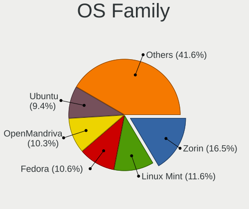

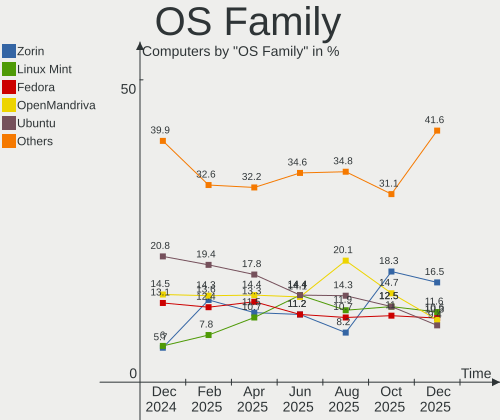

| Name         | Computers | Percent |
|--------------|-----------|---------|
| Zorin        | 51        | 16.45%  |
| Linux Mint   | 36        | 11.61%  |
| Fedora       | 33        | 10.65%  |
| OpenMandriva | 32        | 10.32%  |
| Ubuntu       | 29        | 9.35%   |
| Pop!_OS      | 22        | 7.1%    |
| Bazzite      | 22        | 7.1%    |
| Arch         | 17        | 5.48%   |
| Debian       | 14        | 4.52%   |
| CachyOS      | 9         | 2.9%    |
| ROSA         | 7         | 2.26%   |
| Kubuntu      | 4         | 1.29%   |
| BigLinux     | 4         | 1.29%   |
| Nobara       | 3         | 0.97%   |
| KDE neon     | 3         | 0.97%   |
| Ubuntu MATE  | 2         | 0.65%   |
| Manjaro      | 2         | 0.65%   |
| LMDE         | 2         | 0.65%   |
| Endless      | 2         | 0.65%   |
| EndeavourOS  | 2         | 0.65%   |
| Void Linux   | 1         | 0.32%   |
| Vanilla      | 1         | 0.32%   |
| Ultramarine  | 1         | 0.32%   |
| SteamOS      | 1         | 0.32%   |
| Rocky Linux  | 1         | 0.32%   |
| Parrot       | 1         | 0.32%   |
| openSUSE     | 1         | 0.32%   |
| NixOS        | 1         | 0.32%   |
| MX           | 1         | 0.32%   |
| Lubuntu      | 1         | 0.32%   |
| Kali         | 1         | 0.32%   |
| Fly          | 1         | 0.32%   |
| antiX        | 1         | 0.32%   |
| Agate        | 1         | 0.32%   |

Kernel
------

Version of the Linux kernel

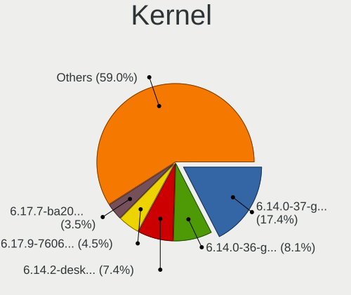

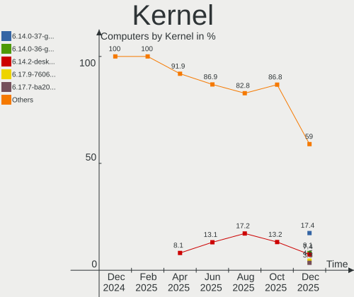

| Version                        | Computers | Percent |
|--------------------------------|-----------|---------|
| 6.14.0-37-generic              | 54        | 17.42%  |
| 6.14.0-36-generic              | 25        | 8.06%   |
| 6.14.2-desktop-3omv2590        | 23        | 7.42%   |
| 6.17.9-76061709-generic        | 14        | 4.52%   |
| 6.17.7-ba20.fc43.x86_64        | 11        | 3.55%   |
| 6.17.9-300.fc43.x86_64         | 10        | 3.23%   |
| 6.17.12-300.fc43.x86_64        | 10        | 3.23%   |
| 6.17.7-ba19.fc43.x86_64        | 9         | 2.9%    |
| 6.12.57+deb13-amd64            | 9         | 2.9%    |
| 6.8.0-90-generic               | 8         | 2.58%   |
| 6.17.9-arch1-1                 | 7         | 2.26%   |
| 6.12.47-generic-5rosa13-x86_64 | 7         | 2.26%   |
| 6.17.1-300.fc43.x86_64         | 6         | 1.94%   |
| 6.17.0-8-generic               | 5         | 1.61%   |
| 6.17.0-7-generic               | 5         | 1.61%   |
| 6.17.4-76061704-generic        | 4         | 1.29%   |
| 6.17.10-300.fc43.x86_64        | 4         | 1.29%   |
| 6.8.0-88-generic               | 3         | 0.97%   |
| 6.18.2-zen2-1-zen              | 3         | 0.97%   |
| 6.18.2-arch2-1                 | 3         | 0.97%   |
| 6.17.9-2-cachyos               | 3         | 0.97%   |
| 6.17.0-5-generic               | 3         | 0.97%   |
| 6.16.4-116.bazzite.fc42.x86_64 | 3         | 0.97%   |
| 6.14.0-29-generic              | 3         | 0.97%   |
| 6.8.0-87-generic               | 2         | 0.65%   |
| 6.18.0-desktop-1omv2590        | 2         | 0.65%   |
| 6.18.0-3-cachyos               | 2         | 0.65%   |
| 6.17.9-zen1-1-zen              | 2         | 0.65%   |
| 6.14.0-35-generic              | 2         | 0.65%   |
| 6.14.0-33-generic              | 2         | 0.65%   |
| 6.14.0-17-generic              | 2         | 0.65%   |
| 6.12.61-1-MANJARO              | 2         | 0.65%   |
| 6.12.48-1-MANJARO              | 2         | 0.65%   |
| 6.12.38+deb13-amd64            | 2         | 0.65%   |
| 6.12.1-desktop-1omv2490        | 2         | 0.65%   |
| 6.9.3-76060903-generic         | 1         | 0.32%   |
| 6.8.4-060804-generic           | 1         | 0.32%   |
| 6.8.0-52-generic               | 1         | 0.32%   |
| 6.6.2-desktop-1omv2390         | 1         | 0.32%   |
| 6.5.0-41-generic               | 1         | 0.32%   |

Kernel Family
-------------

Linux kernel without a distro release

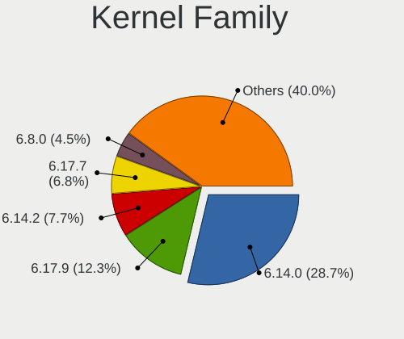

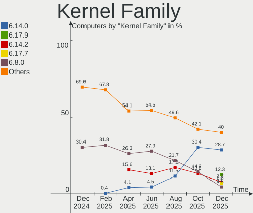

| Version | Computers | Percent |
|---------|-----------|---------|
| 6.14.0  | 89        | 28.71%  |
| 6.17.9  | 38        | 12.26%  |
| 6.14.2  | 24        | 7.74%   |
| 6.17.7  | 21        | 6.77%   |
| 6.8.0   | 14        | 4.52%   |
| 6.17.0  | 14        | 4.52%   |
| 6.17.12 | 12        | 3.87%   |
| 6.12.57 | 9         | 2.9%    |
| 6.18.2  | 7         | 2.26%   |
| 6.18.0  | 7         | 2.26%   |
| 6.17.10 | 7         | 2.26%   |
| 6.12.47 | 7         | 2.26%   |
| 6.17.1  | 6         | 1.94%   |
| 6.17.4  | 5         | 1.61%   |
| 6.17.11 | 5         | 1.61%   |
| 6.17.8  | 3         | 0.97%   |
| 6.16.4  | 3         | 0.97%   |
| 6.12.48 | 3         | 0.97%   |
| 6.1.0   | 3         | 0.97%   |
| 6.12.63 | 2         | 0.65%   |
| 6.12.61 | 2         | 0.65%   |
| 6.12.38 | 2         | 0.65%   |
| 6.12.1  | 2         | 0.65%   |
| 5.15.0  | 2         | 0.65%   |
| 6.9.3   | 1         | 0.32%   |
| 6.8.4   | 1         | 0.32%   |
| 6.6.2   | 1         | 0.32%   |
| 6.5.0   | 1         | 0.32%   |
| 6.4.0   | 1         | 0.32%   |
| 6.2.0   | 1         | 0.32%   |
| 6.18.1  | 1         | 0.32%   |
| 6.17.3  | 1         | 0.32%   |
| 6.17.13 | 1         | 0.32%   |
| 6.16.3  | 1         | 0.32%   |
| 6.15.0  | 1         | 0.32%   |
| 6.14.7  | 1         | 0.32%   |
| 6.12.62 | 1         | 0.32%   |
| 6.12.32 | 1         | 0.32%   |
| 6.12.10 | 1         | 0.32%   |
| 6.12.0  | 1         | 0.32%   |

Kernel Major Ver.
-----------------

Linux kernel major version

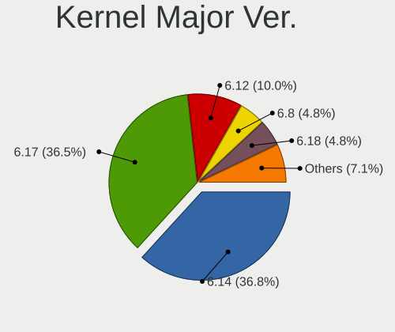

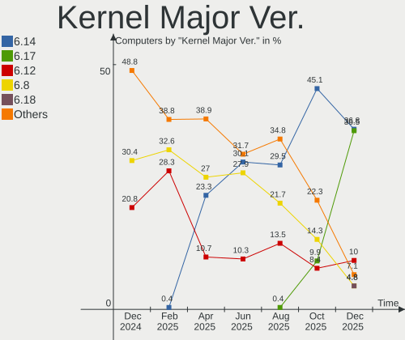

| Version | Computers | Percent |
|---------|-----------|---------|
| 6.14    | 114       | 36.77%  |
| 6.17    | 113       | 36.45%  |
| 6.12    | 31        | 10%     |
| 6.8     | 15        | 4.84%   |
| 6.18    | 15        | 4.84%   |
| 6.16    | 4         | 1.29%   |
| 6.1     | 3         | 0.97%   |
| 6.11    | 2         | 0.65%   |
| 5.15    | 2         | 0.65%   |
| 5.10    | 2         | 0.65%   |
| 6.9     | 1         | 0.32%   |
| 6.6     | 1         | 0.32%   |
| 6.5     | 1         | 0.32%   |
| 6.4     | 1         | 0.32%   |
| 6.2     | 1         | 0.32%   |
| 6.15    | 1         | 0.32%   |
| 6.10    | 1         | 0.32%   |
| 6.0     | 1         | 0.32%   |
| 5.11    | 1         | 0.32%   |

Arch
----

OS architecture (x86_64, i586, etc.)

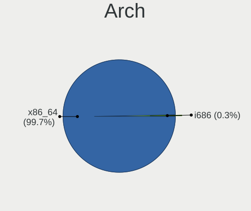

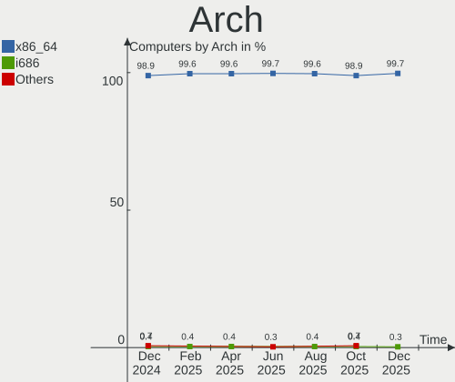

| Name   | Computers | Percent |
|--------|-----------|---------|
| x86_64 | 309       | 99.68%  |
| i686   | 1         | 0.32%   |

DE
--

Desktop Environment

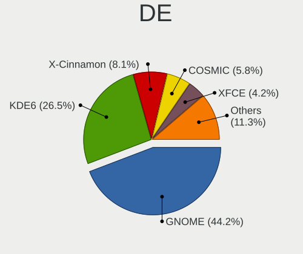

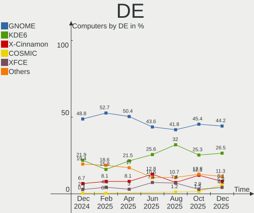

| Name            | Computers | Percent |
|-----------------|-----------|---------|
| GNOME           | 137       | 44.19%  |
| KDE6            | 82        | 26.45%  |
| X-Cinnamon      | 25        | 8.06%   |
| COSMIC          | 18        | 5.81%   |
| XFCE            | 13        | 4.19%   |
| MATE            | 8         | 2.58%   |
| Hyprland        | 5         | 1.61%   |
| KDE             | 4         | 1.29%   |
| Unknown         | 3         | 0.97%   |
| LXQt            | 2         | 0.65%   |
| KDE5            | 2         | 0.65%   |
| KDE4            | 2         | 0.65%   |
| i3              | 2         | 0.65%   |
| Endless:GNOME   | 2         | 0.65%   |
| Trinity         | 1         | 0.32%   |
| sway            | 1         | 0.32%   |
| niri            | 1         | 0.32%   |
| icewm           | 1         | 0.32%   |
| GNOME Flashback | 1         | 0.32%   |

Display Server
--------------

X11 or Wayland

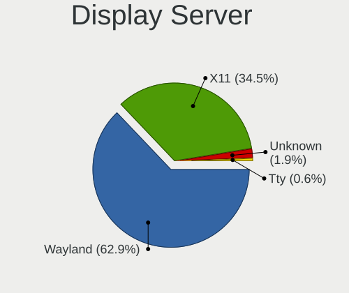

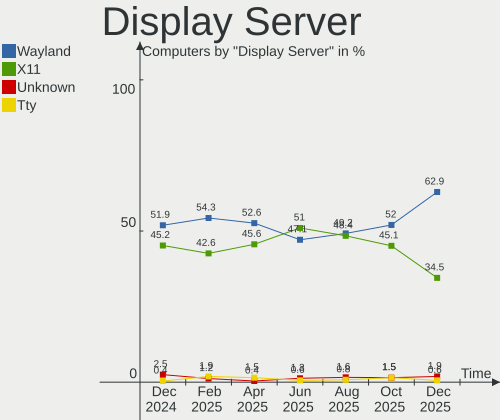

| Name    | Computers | Percent |
|---------|-----------|---------|
| Wayland | 195       | 62.9%   |
| X11     | 107       | 34.52%  |
| Unknown | 6         | 1.94%   |
| Tty     | 2         | 0.65%   |

Display Manager
---------------

SDDM, LightDM, etc.

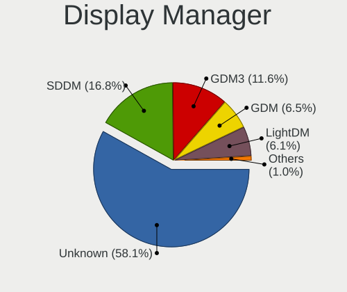

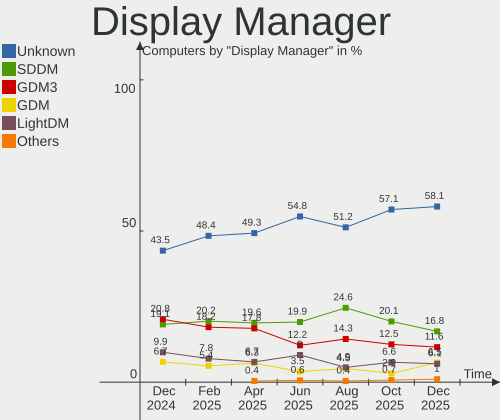

| Name           | Computers | Percent |
|----------------|-----------|---------|
| Unknown        | 180       | 58.06%  |
| SDDM           | 52        | 16.77%  |
| GDM3           | 36        | 11.61%  |
| GDM            | 20        | 6.45%   |
| LightDM        | 19        | 6.13%   |
| TDM            | 1         | 0.32%   |
| GREETD         | 1         | 0.32%   |
| COSMIC-GREETER | 1         | 0.32%   |

OS Lang
-------

Language

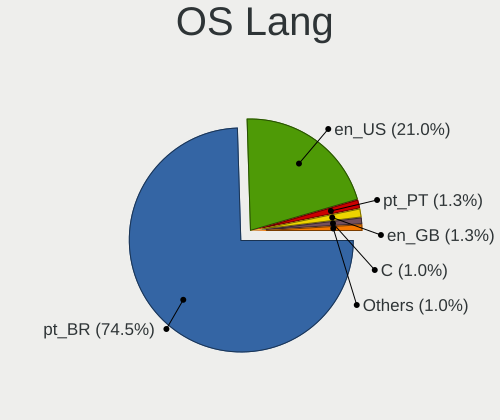

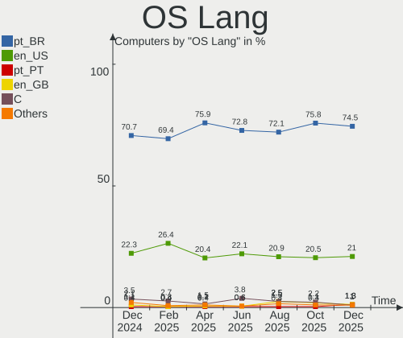

| Lang        | Computers | Percent |
|-------------|-----------|---------|
| pt_BR       | 231       | 74.52%  |
| en_US       | 65        | 20.97%  |
| pt_PT       | 4         | 1.29%   |
| en_GB       | 4         | 1.29%   |
| C           | 3         | 0.97%   |
| de_DE       | 2         | 0.65%   |
| pt_BR.UFT-8 | 1         | 0.32%   |

Boot Mode
---------

EFI or BIOS

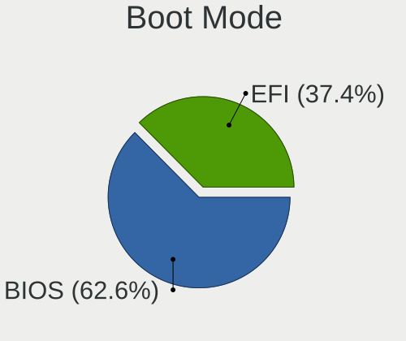

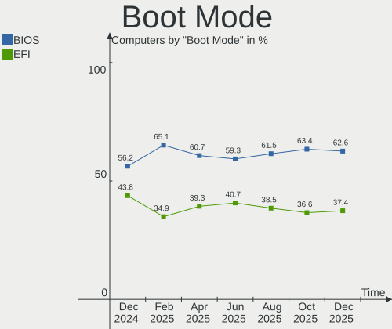

| Mode | Computers | Percent |
|------|-----------|---------|
| BIOS | 194       | 62.58%  |
| EFI  | 116       | 37.42%  |

Filesystem
----------

Type of filesystem

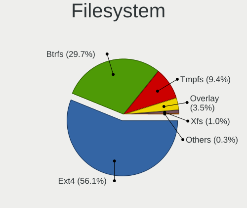

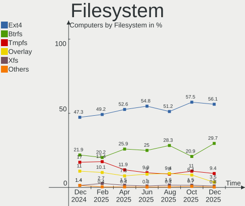

| Type    | Computers | Percent |
|---------|-----------|---------|
| Ext4    | 174       | 56.13%  |
| Btrfs   | 92        | 29.68%  |
| Tmpfs   | 29        | 9.35%   |
| Overlay | 11        | 3.55%   |
| Xfs     | 3         | 0.97%   |
| F2fs    | 1         | 0.32%   |

Part. scheme
------------

Scheme of partitioning

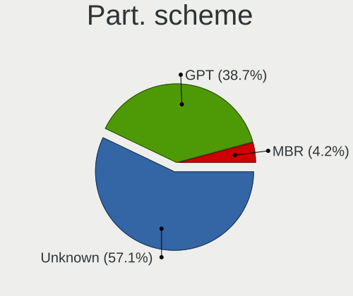

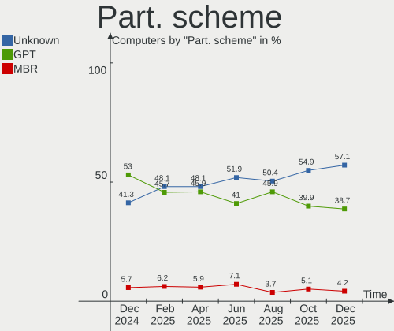

| Type    | Computers | Percent |
|---------|-----------|---------|
| Unknown | 177       | 57.1%   |
| GPT     | 120       | 38.71%  |
| MBR     | 13        | 4.19%   |

Dual Boot with Linux/BSD
------------------------

Hosting more than one Linux/BSD

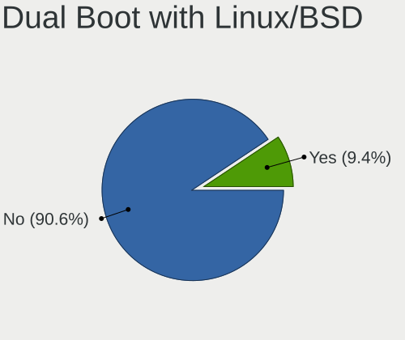

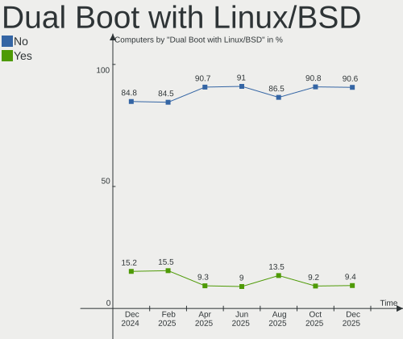

| Dual boot | Computers | Percent |
|-----------|-----------|---------|
| No        | 281       | 90.65%  |
| Yes       | 29        | 9.35%   |

Dual Boot (Win)
---------------

Hosting Linux and Windows

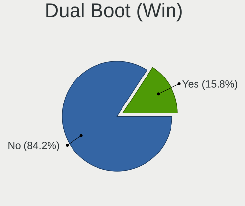

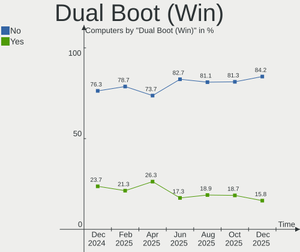

| Dual boot | Computers | Percent |
|-----------|-----------|---------|
| No        | 261       | 84.19%  |
| Yes       | 49        | 15.81%  |

Board
-----

Vendor
------

Motherboard manufacturer

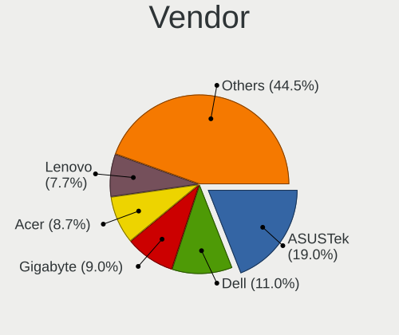

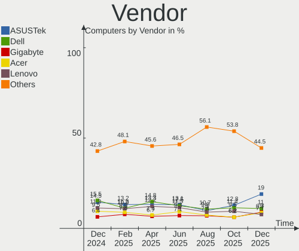

| Name                                 | Computers | Percent |
|--------------------------------------|-----------|---------|
| ASUSTek Computer                     | 59        | 19.03%  |
| Dell                                 | 34        | 10.97%  |
| Gigabyte Technology                  | 28        | 9.03%   |
| Acer                                 | 27        | 8.71%   |
| Lenovo                               | 24        | 7.74%   |
| Intel                                | 19        | 6.13%   |
| Hewlett-Packard                      | 15        | 4.84%   |
| Samsung Electronics                  | 11        | 3.55%   |
| MSI                                  | 11        | 3.55%   |
| Positivo                             | 9         | 2.9%    |
| ASRock                               | 8         | 2.58%   |
| Apple                                | 7         | 2.26%   |
| Unknown                              | 5         | 1.61%   |
| Sony                                 | 4         | 1.29%   |
| MACHINIST                            | 4         | 1.29%   |
| Avell                                | 4         | 1.29%   |
| Itautec                              | 3         | 0.97%   |
| Semp Toshiba                         | 2         | 0.65%   |
| Positivo Bahia - VAIO                | 2         | 0.65%   |
| Multilaser                           | 2         | 0.65%   |
| MAXSUN                               | 2         | 0.65%   |
| Huanan                               | 2         | 0.65%   |
| Google                               | 2         | 0.65%   |
| Biostar                              | 2         | 0.65%   |
| Alienware                            | 2         | 0.65%   |
| ZRD                                  | 1         | 0.32%   |
| ZR                                   | 1         | 0.32%   |
| VX                                   | 1         | 0.32%   |
| VSAP                                 | 1         | 0.32%   |
| TGT                                  | 1         | 0.32%   |
| SZMZ                                 | 1         | 0.32%   |
| Supermicro                           | 1         | 0.32%   |
| Standard                             | 1         | 0.32%   |
| Shenzhen Meigao Electronic Equipment | 1         | 0.32%   |
| Login Informatica                    | 1         | 0.32%   |
| LG Electronics                       | 1         | 0.32%   |
| HPE                                  | 1         | 0.32%   |
| Gateway                              | 1         | 0.32%   |
| Fujitsu                              | 1         | 0.32%   |
| DUEX                                 | 1         | 0.32%   |

Model
-----

Motherboard model

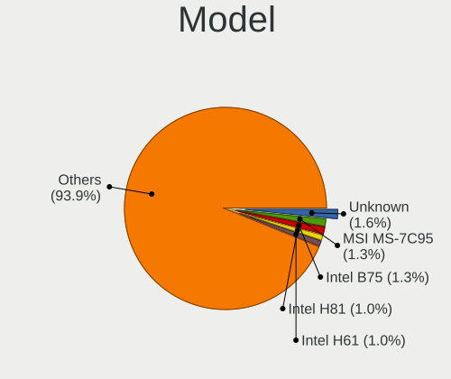

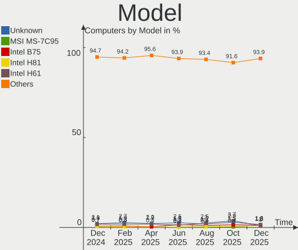

| Name                                     | Computers | Percent |
|------------------------------------------|-----------|---------|
| Unknown                                  | 5         | 1.61%   |
| MSI MS-7C95                              | 4         | 1.29%   |
| Intel B75                                | 4         | 1.29%   |
| Intel H81                                | 3         | 0.97%   |
| Intel H61                                | 3         | 0.97%   |
| Gigabyte A520M K V2                      | 3         | 0.97%   |
| ASUS TUF Gaming B650M-E WIFI             | 3         | 0.97%   |
| ASUS TUF Gaming B550M-PLUS               | 3         | 0.97%   |
| ASUS M5A78L-M PLUS/USB3                  | 3         | 0.97%   |
| ASUS All Series                          | 3         | 0.97%   |
| Semp Toshiba IS 1442                     | 2         | 0.65%   |
| Samsung 550XDA                           | 2         | 0.65%   |
| MSI MS-7C56                              | 2         | 0.65%   |
| Lenovo IdeaPad 1 15AMN7 82X5             | 2         | 0.65%   |
| Intel H110                               | 2         | 0.65%   |
| Huanan X99-QD4 V1.0                      | 2         | 0.65%   |
| HP G42                                   | 2         | 0.65%   |
| HP 256R 15.6 inch G9 Notebook PC         | 2         | 0.65%   |
| Gigabyte B550M AORUS ELITE               | 2         | 0.65%   |
| Gigabyte B450M GAMING                    | 2         | 0.65%   |
| Gigabyte B450M DS3H V2                   | 2         | 0.65%   |
| Dell Latitude 3540                       | 2         | 0.65%   |
| Dell Inspiron 7460                       | 2         | 0.65%   |
| Dell G15 5530                            | 2         | 0.65%   |
| Avell 560                                | 2         | 0.65%   |
| ASUS VivoBook_ASUSLaptop X515EA_X515EA   | 2         | 0.65%   |
| ASUS VivoBook_ASUSLaptop K3605ZF_K3605ZF | 2         | 0.65%   |
| ASUS TUF Gaming X570-PLUS_BR             | 2         | 0.65%   |
| ASUS PRIME B450M-GAMING/BR               | 2         | 0.65%   |
| ASUS PRIME A320M-K/BR                    | 2         | 0.65%   |
| ASRock B450M Steel Legend                | 2         | 0.65%   |
| Apple MacBookPro8,1                      | 2         | 0.65%   |
| Alienware 16 Aurora AC16250              | 2         | 0.65%   |
| Acer Aspire AG15-51P                     | 2         | 0.65%   |
| Acer Aspire A515-45                      | 2         | 0.65%   |
| Acer Aspire A514-54                      | 2         | 0.65%   |
| Acer Aspire A315-53                      | 2         | 0.65%   |
| Acer Aspire A315-23G                     | 2         | 0.65%   |
| ZRD H618D3G V10                          | 1         | 0.32%   |
| ZR B450M-F                               | 1         | 0.32%   |

Model Family
------------

Motherboard model prefix

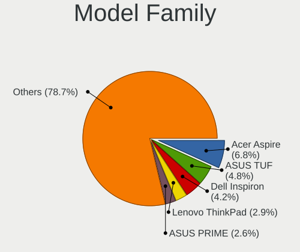

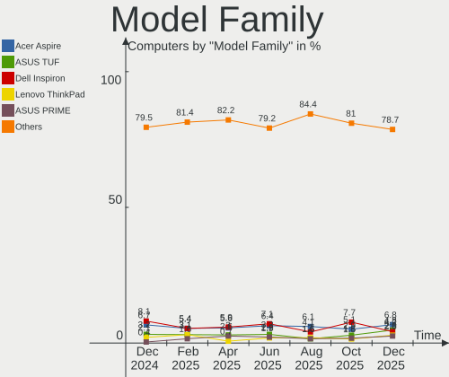

| Name                 | Computers | Percent |
|----------------------|-----------|---------|
| Acer Aspire          | 21        | 6.77%   |
| ASUS TUF             | 15        | 4.84%   |
| Dell Inspiron        | 13        | 4.19%   |
| Lenovo ThinkPad      | 9         | 2.9%    |
| ASUS PRIME           | 8         | 2.58%   |
| Lenovo IdeaPad       | 7         | 2.26%   |
| ASUS VivoBook        | 7         | 2.26%   |
| Gigabyte B450M       | 5         | 1.61%   |
| ASUS M5A78L-M        | 5         | 1.61%   |
| Unknown              | 5         | 1.61%   |
| MSI MS-7C95          | 4         | 1.29%   |
| Intel B75            | 4         | 1.29%   |
| HP ProBook           | 4         | 1.29%   |
| Gigabyte B550M       | 4         | 1.29%   |
| Dell OptiPlex        | 4         | 1.29%   |
| Dell Latitude        | 4         | 1.29%   |
| Dell G15             | 4         | 1.29%   |
| ASUS ROG             | 4         | 1.29%   |
| Lenovo ThinkCentre   | 3         | 0.97%   |
| Intel H81            | 3         | 0.97%   |
| Intel H61            | 3         | 0.97%   |
| Gigabyte A520M       | 3         | 0.97%   |
| Dell Vostro          | 3         | 0.97%   |
| ASUS P8H61-M         | 3         | 0.97%   |
| ASUS ASUS            | 3         | 0.97%   |
| ASUS All             | 3         | 0.97%   |
| Semp Toshiba IS      | 2         | 0.65%   |
| Samsung 550XDA       | 2         | 0.65%   |
| Positivo Positivo    | 2         | 0.65%   |
| MSI MS-7C56          | 2         | 0.65%   |
| MAXSUN MS-Challenger | 2         | 0.65%   |
| MACHINIST X99-RS9    | 2         | 0.65%   |
| MACHINIST X99        | 2         | 0.65%   |
| Itautec Infoway      | 2         | 0.65%   |
| Intel H110           | 2         | 0.65%   |
| Huanan X99-QD4       | 2         | 0.65%   |
| HP Pavilion          | 2         | 0.65%   |
| HP G42               | 2         | 0.65%   |
| HP 256R              | 2         | 0.65%   |
| HP 240               | 2         | 0.65%   |

MFG Year
--------

Motherboard manufacture year

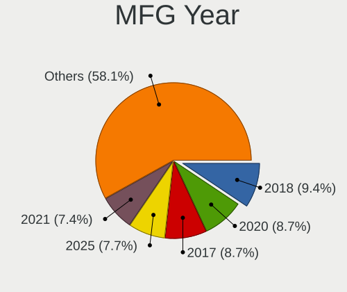

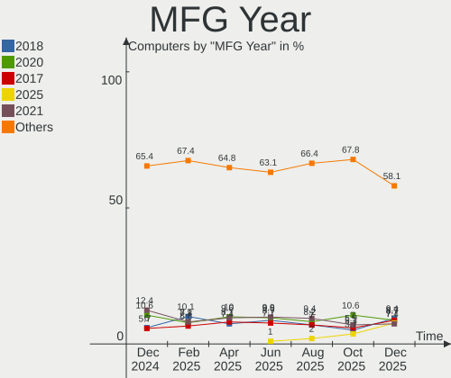

| Year | Computers | Percent |
|------|-----------|---------|
| 2018 | 29        | 9.35%   |
| 2020 | 27        | 8.71%   |
| 2017 | 27        | 8.71%   |
| 2025 | 24        | 7.74%   |
| 2021 | 23        | 7.42%   |
| 2023 | 22        | 7.1%    |
| 2022 | 22        | 7.1%    |
| 2024 | 21        | 6.77%   |
| 2019 | 20        | 6.45%   |
| 2012 | 16        | 5.16%   |
| 2016 | 15        | 4.84%   |
| 2013 | 15        | 4.84%   |
| 2011 | 12        | 3.87%   |
| 2014 | 8         | 2.58%   |
| 2010 | 8         | 2.58%   |
| 2009 | 8         | 2.58%   |
| 2015 | 7         | 2.26%   |
| 2007 | 3         | 0.97%   |
| 2008 | 2         | 0.65%   |
| 2006 | 1         | 0.32%   |

Form Factor
-----------

Physical design of the computer

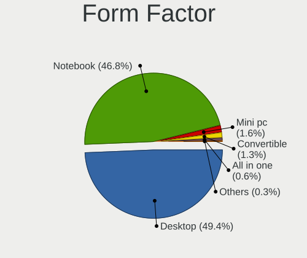

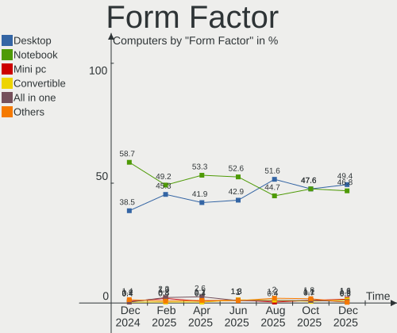

| Name        | Computers | Percent |
|-------------|-----------|---------|
| Desktop     | 153       | 49.35%  |
| Notebook    | 145       | 46.77%  |
| Mini pc     | 5         | 1.61%   |
| Convertible | 4         | 1.29%   |
| All in one  | 2         | 0.65%   |
| Server      | 1         | 0.32%   |

Secure Boot
-----------

Enabled or disabled

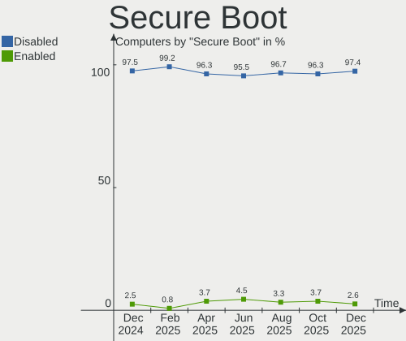

| State    | Computers | Percent |
|----------|-----------|---------|
| Disabled | 302       | 97.42%  |
| Enabled  | 8         | 2.58%   |

Coreboot
--------

Have coreboot on board

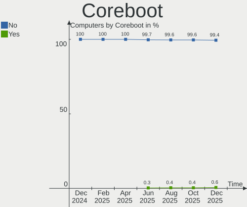

| Used | Computers | Percent |
|------|-----------|---------|
| No   | 308       | 99.35%  |
| Yes  | 2         | 0.65%   |

RAM Size
--------

Total RAM memory

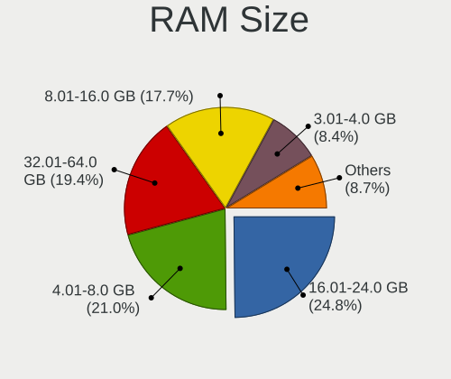

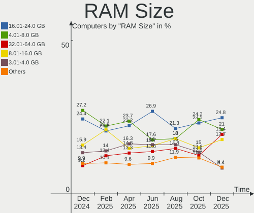

| Size in GB  | Computers | Percent |
|-------------|-----------|---------|
| 16.01-24.0  | 77        | 24.84%  |
| 4.01-8.0    | 65        | 20.97%  |
| 32.01-64.0  | 60        | 19.35%  |
| 8.01-16.0   | 55        | 17.74%  |
| 3.01-4.0    | 26        | 8.39%   |
| 24.01-32.0  | 12        | 3.87%   |
| 64.01-256.0 | 7         | 2.26%   |
| 1.01-2.0    | 6         | 1.94%   |
| 2.01-3.0    | 2         | 0.65%   |

RAM Used
--------

Used RAM memory

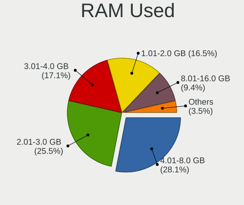

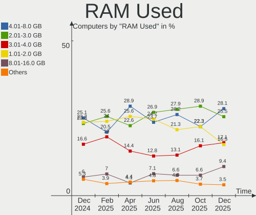

| Used GB    | Computers | Percent |
|------------|-----------|---------|
| 4.01-8.0   | 87        | 28.06%  |
| 2.01-3.0   | 79        | 25.48%  |
| 3.01-4.0   | 53        | 17.1%   |
| 1.01-2.0   | 51        | 16.45%  |
| 8.01-16.0  | 29        | 9.35%   |
| 0.51-1.0   | 9         | 2.9%    |
| 32.01-64.0 | 1         | 0.32%   |
| 16.01-24.0 | 1         | 0.32%   |

Total Drives
------------

Number of drives on board

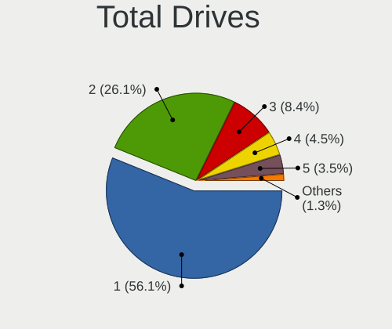

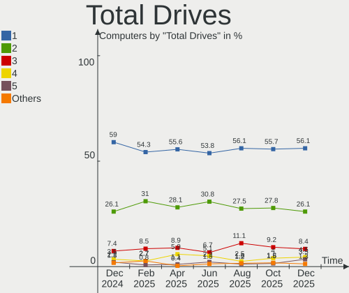

| Drives | Computers | Percent |
|--------|-----------|---------|
| 1      | 174       | 56.13%  |
| 2      | 81        | 26.13%  |
| 3      | 26        | 8.39%   |
| 4      | 14        | 4.52%   |
| 5      | 11        | 3.55%   |
| 6      | 2         | 0.65%   |
| 8      | 1         | 0.32%   |
| 7      | 1         | 0.32%   |

Has CD-ROM
----------

Has CD-ROM on board

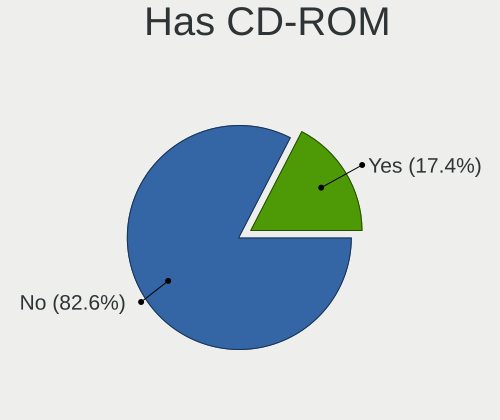

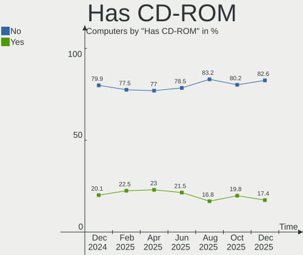

| Presented | Computers | Percent |
|-----------|-----------|---------|
| No        | 256       | 82.58%  |
| Yes       | 54        | 17.42%  |

Has Ethernet
------------

Has Ethernet on board

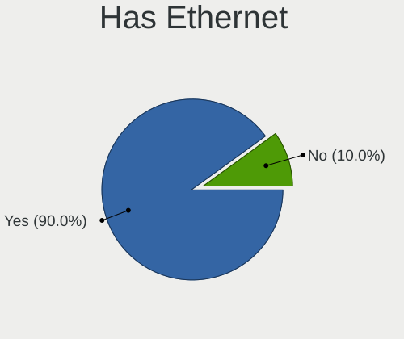

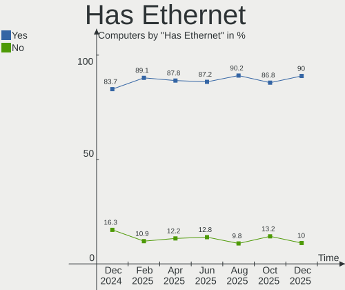

| Presented | Computers | Percent |
|-----------|-----------|---------|
| Yes       | 279       | 90%     |
| No        | 31        | 10%     |

Has WiFi
--------

Has WiFi module

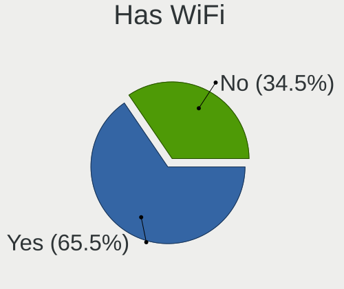

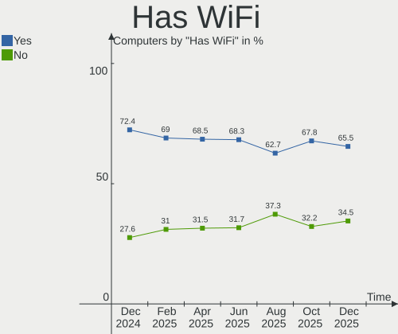

| Presented | Computers | Percent |
|-----------|-----------|---------|
| Yes       | 203       | 65.48%  |
| No        | 107       | 34.52%  |

Has Bluetooth
-------------

Has Bluetooth module

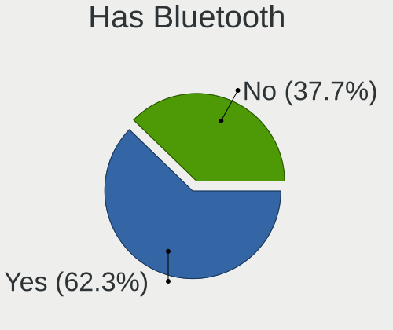

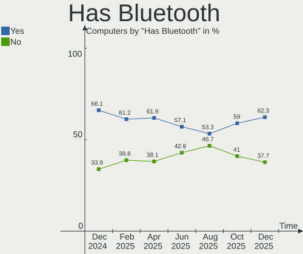

| Presented | Computers | Percent |
|-----------|-----------|---------|
| Yes       | 193       | 62.26%  |
| No        | 117       | 37.74%  |

Location
--------

Country
-------

Geographic location (country)

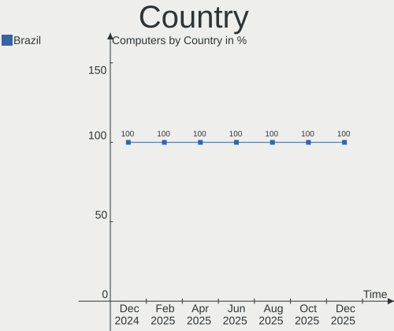

| Country | Computers | Percent |
|---------|-----------|---------|
| Brazil  | 310       | 100%    |

City
----

Geographic location (city)

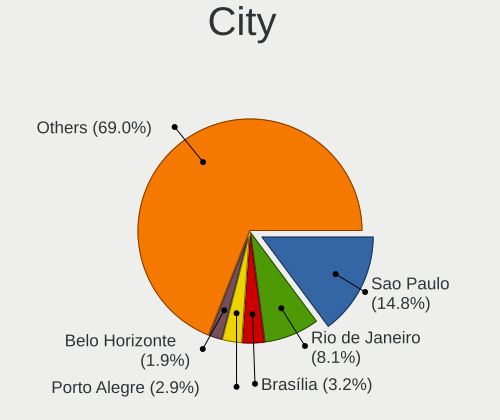

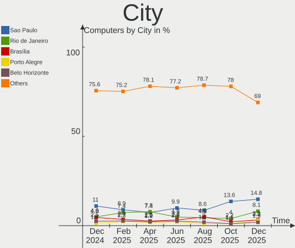

| City                  | Computers | Percent |
|-----------------------|-----------|---------|
| Sao Paulo             | 46        | 14.84%  |
| Rio de Janeiro        | 25        | 8.06%   |
| Brasília             | 10        | 3.23%   |
| Porto Alegre          | 9         | 2.9%    |
| Belo Horizonte        | 6         | 1.94%   |
| Osasco                | 5         | 1.61%   |
| Curitiba              | 5         | 1.61%   |
| Caxias do Sul         | 5         | 1.61%   |
| Vila Velha            | 4         | 1.29%   |
| Sao José dos Campos  | 4         | 1.29%   |
| Sao Goncalo           | 4         | 1.29%   |
| Manaus                | 4         | 1.29%   |
| Fortaleza             | 4         | 1.29%   |
| Campinas              | 4         | 1.29%   |
| Sorocaba              | 3         | 0.97%   |
| Sao Jose              | 3         | 0.97%   |
| Maringá              | 3         | 0.97%   |
| Goiânia              | 3         | 0.97%   |
| Franca                | 3         | 0.97%   |
| Canoas                | 3         | 0.97%   |
| Bauru                 | 3         | 0.97%   |
| Várzea Grande        | 2         | 0.65%   |
| Valparaiso de Goias   | 2         | 0.65%   |
| Teresina              | 2         | 0.65%   |
| Sao Bernardo do Campo | 2         | 0.65%   |
| Salvador              | 2         | 0.65%   |
| Rio do Sul            | 2         | 0.65%   |
| Ribeirao Preto        | 2         | 0.65%   |
| Porto Nacional        | 2         | 0.65%   |
| Palhoça              | 2         | 0.65%   |
| Nova Iguaçu          | 2         | 0.65%   |
| Niterói              | 2         | 0.65%   |
| Natal                 | 2         | 0.65%   |
| Mogi das Cruzes       | 2         | 0.65%   |
| Maua                  | 2         | 0.65%   |
| Limeira               | 2         | 0.65%   |
| Lages                 | 2         | 0.65%   |
| Jundiaí              | 2         | 0.65%   |
| Juazeiro do Norte     | 2         | 0.65%   |
| Itatiba               | 2         | 0.65%   |

Drives
------

Drive Vendor
------------

Hard drive vendors

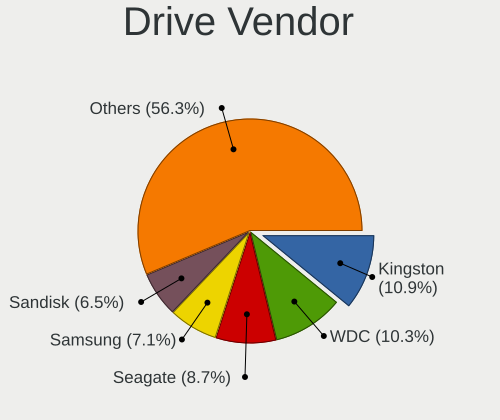

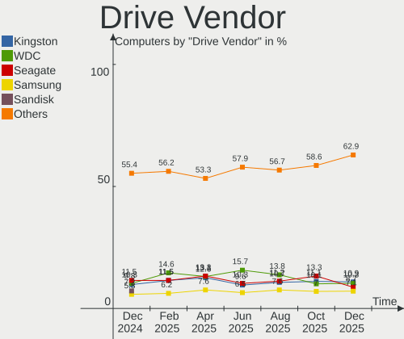

| Vendor                         | Computers | Drives | Percent |
|--------------------------------|-----------|--------|---------|
| Kingston                       | 55        | 63     | 10.91%  |
| WDC                            | 52        | 60     | 10.32%  |
| Seagate                        | 44        | 54     | 8.73%   |
| Samsung Electronics            | 36        | 41     | 7.14%   |
| Sandisk                        | 33        | 35     | 6.55%   |
| China                          | 22        | 23     | 4.37%   |
| A-DATA Technology              | 20        | 20     | 3.97%   |
| ADATA Technology               | 19        | 19     | 3.77%   |
| MAXIO Technology (Hangzhou)    | 17        | 19     | 3.37%   |
| Kingston Technology Company    | 16        | 16     | 3.17%   |
| Toshiba                        | 13        | 13     | 2.58%   |
| Realtek Semiconductor          | 13        | 13     | 2.58%   |
| Crucial                        | 12        | 12     | 2.38%   |
| Silicon Motion                 | 10        | 10     | 1.98%   |
| Micron Technology              | 9         | 9      | 1.79%   |
| Unknown                        | 8         | 10     | 1.59%   |
| Patriot                        | 7         | 7      | 1.39%   |
| KingSpec                       | 7         | 8      | 1.39%   |
| XrayDisk                       | 6         | 6      | 1.19%   |
| SK hynix                       | 6         | 6      | 1.19%   |
| KIOXIA                         | 6         | 6      | 1.19%   |
| Unknown                        | 6         | 7      | 1.19%   |
| Shenzhen Longsys Electronics   | 5         | 5      | 0.99%   |
| Phison Electronics             | 5         | 5      | 0.99%   |
| Lexar                          | 5         | 5      | 0.99%   |
| JMicron Technology             | 5         | 5      | 0.99%   |
| Hitachi                        | 5         | 6      | 0.99%   |
| Solid State Storage Technology | 4         | 4      | 0.79%   |
| Micron/Crucial Technology      | 4         | 4      | 0.79%   |
| HGST                           | 3         | 4      | 0.6%    |
| WALRAM                         | 2         | 2      | 0.4%    |
| T-FORCE                        | 2         | 2      | 0.4%    |
| Lite-On Technology             | 2         | 2      | 0.4%    |
| KingFast                       | 2         | 2      | 0.4%    |
| Intel                          | 2         | 2      | 0.4%    |
| HUSKY                          | 2         | 2      | 0.4%    |
| Hewlett-Packard                | 2         | 2      | 0.4%    |
| AMD                            | 2         | 3      | 0.4%    |
| ZADAK                          | 1         | 1      | 0.2%    |
| UP                             | 1         | 1      | 0.2%    |

Drive Model
-----------

Hard drive models

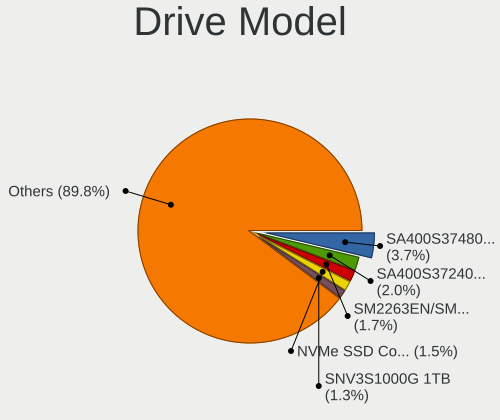

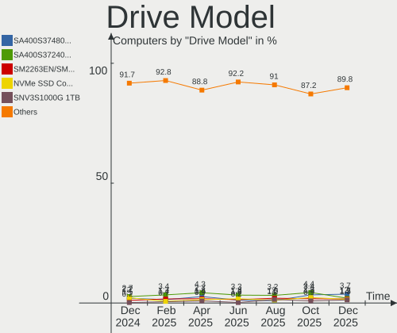

| Model                                                              | Computers | Percent |
|--------------------------------------------------------------------|-----------|---------|
| Kingston SA400S37480G 480GB SSD                                    | 20        | 3.71%   |
| Kingston SA400S37240G 240GB SSD                                    | 11        | 2.04%   |
| Silicon Motion SM2263EN/SM2263XT SSD Controller 512GB              | 9         | 1.67%   |
| MAXIO (Hangzhou) NVMe SSD Controller MAP1202 2TB                   | 8         | 1.48%   |
| Kingston Company SNV3S1000G 1TB                                    | 7         | 1.3%    |
| Kingston SA400S37960G 960GB SSD                                    | 7         | 1.3%    |
| Seagate ST500DM002-1BD142 500GB                                    | 6         | 1.11%   |
| Unknown                                                            | 6         | 1.11%   |
| Seagate ST1000DM010-2EP102 1TB                                     | 5         | 0.93%   |
| SanDisk SSD PLUS 240GB                                             | 5         | 0.93%   |
| Kingston Company SNV2S1000G 1TB                                    | 5         | 0.93%   |
| Kingston SNVS500G 500GB                                            | 4         | 0.74%   |
| Kingston SA400S37120G 120GB SSD                                    | 4         | 0.74%   |
| JMicron Generic 320GB                                              | 4         | 0.74%   |
| Crucial CT1000BX500SSD1 1TB                                        | 4         | 0.74%   |
| WDC WD10SPZX-35Z10T0 1TB                                           | 3         | 0.56%   |
| WDC WD10SPZX-21Z10T0 1TB                                           | 3         | 0.56%   |
| Unknown MMC Card  32GB                                             | 3         | 0.56%   |
| Toshiba MQ01ABF050 500GB                                           | 3         | 0.56%   |
| Seagate ST500LM012 HN-M500MBB 500GB                                | 3         | 0.56%   |
| Sandisk WD Blue SN550 NVMe SSD 1024GB                              | 3         | 0.56%   |
| SanDisk SSD PLUS 1000GB                                            | 3         | 0.56%   |
| Samsung NVMe SSD Controller SM981/PM981/PM983 1TB                  | 3         | 0.56%   |
| Samsung NVMe SSD Controller PM9A1/PM9A3/980PRO 1TB                 | 3         | 0.56%   |
| Samsung HM321HI 320GB                                              | 3         | 0.56%   |
| Micron/Crucial P2 NVMe PCIe SSD 2TB                                | 3         | 0.56%   |
| Kingston SV300S37A120G 120GB SSD                                   | 3         | 0.56%   |
| Kingston SNV3S500G 500GB                                           | 3         | 0.56%   |
| KingSpec P3-128 128GB SSD                                          | 3         | 0.56%   |
| China SSD 128GB                                                    | 3         | 0.56%   |
| ADATA XPG SX8200 Pro PCIe Gen3x4 M.2 2280 Solid State Drive 1024GB | 3         | 0.56%   |
| XrayDisk 1TB SSD                                                   | 2         | 0.37%   |
| WDC WDS240G2G0B-00EPW0 240GB SSD                                   | 2         | 0.37%   |
| WDC WD5000AAKX-08U6AA0 500GB                                       | 2         | 0.37%   |
| WDC WD5000AAKX-00U6AA0 500GB                                       | 2         | 0.37%   |
| WDC WD10SPZX-24Z10 1TB                                             | 2         | 0.37%   |
| WDC WD10PURZ-85U8XY0 1TB                                           | 2         | 0.37%   |
| WDC WD10JPCX-24UE4T0 1TB                                           | 2         | 0.37%   |
| WDC WD10EARS-00Y5B1 1TB                                            | 2         | 0.37%   |
| WDC WD Green 2.5 480GB                                             | 2         | 0.37%   |

HDD Vendor
----------

Hard disk drive vendors

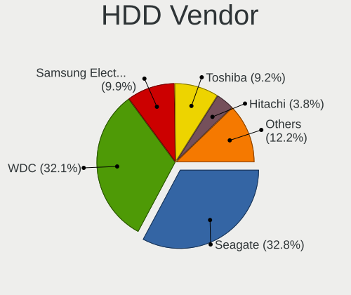

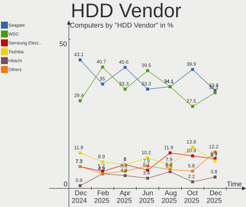

| Vendor              | Computers | Drives | Percent |
|---------------------|-----------|--------|---------|
| Seagate             | 43        | 53     | 32.82%  |
| WDC                 | 42        | 47     | 32.06%  |
| Samsung Electronics | 13        | 15     | 9.92%   |
| Toshiba             | 12        | 12     | 9.16%   |
| Hitachi             | 5         | 6      | 3.82%   |
| JMicron Technology  | 4         | 4      | 3.05%   |
| HGST                | 3         | 4      | 2.29%   |
| T-FORCE             | 2         | 2      | 1.53%   |
| Hewlett-Packard     | 2         | 2      | 1.53%   |
| SAGE                | 1         | 1      | 0.76%   |
| Min Yi U            | 1         | 1      | 0.76%   |
| Maxtor              | 1         | 1      | 0.76%   |
| MARVELL             | 1         | 2      | 0.76%   |
| ExcelStor           | 1         | 1      | 0.76%   |

SSD Vendor
----------

Solid state drive vendors

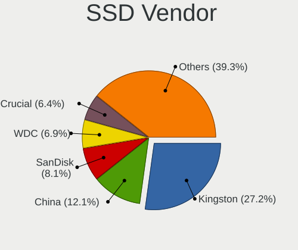

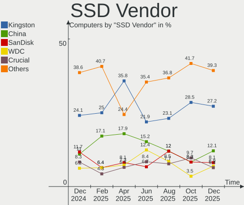

| Vendor              | Computers | Drives | Percent |
|---------------------|-----------|--------|---------|
| Kingston            | 47        | 50     | 27.17%  |
| China               | 21        | 22     | 12.14%  |
| SanDisk             | 14        | 14     | 8.09%   |
| WDC                 | 12        | 12     | 6.94%   |
| Crucial             | 11        | 11     | 6.36%   |
| A-DATA Technology   | 11        | 11     | 6.36%   |
| Samsung Electronics | 8         | 8      | 4.62%   |
| Patriot             | 7         | 7      | 4.05%   |
| KingSpec            | 6         | 7      | 3.47%   |
| Lexar               | 5         | 5      | 2.89%   |
| Unknown             | 5         | 5      | 2.89%   |
| XrayDisk            | 3         | 3      | 1.73%   |
| HUSKY               | 2         | 2      | 1.16%   |
| ZADAK               | 1         | 1      | 0.58%   |
| WALRAM              | 1         | 1      | 0.58%   |
| UP                  | 1         | 1      | 0.58%   |
| Seagate             | 1         | 1      | 0.58%   |
| SABRENT             | 1         | 1      | 0.58%   |
| PNY                 | 1         | 1      | 0.58%   |
| OCZ                 | 1         | 1      | 0.58%   |
| MSI                 | 1         | 1      | 0.58%   |
| Micron Technology   | 1         | 1      | 0.58%   |
| LITEON              | 1         | 1      | 0.58%   |
| KODAK               | 1         | 1      | 0.58%   |
| KingFast            | 1         | 1      | 0.58%   |
| KBM                 | 1         | 1      | 0.58%   |
| HS-SSD-WAVE(S)      | 1         | 1      | 0.58%   |
| FNX                 | 1         | 1      | 0.58%   |
| Emtec               | 1         | 1      | 0.58%   |
| Corsair             | 1         | 1      | 0.58%   |
| BHT                 | 1         | 1      | 0.58%   |
| Apple               | 1         | 1      | 0.58%   |
| Apacer              | 1         | 1      | 0.58%   |
| AFOX                | 1         | 1      | 0.58%   |

Drive Kind
----------

HDD or SSD

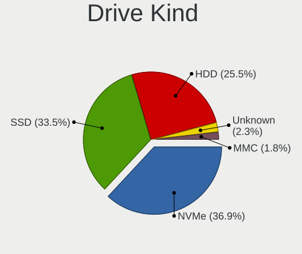

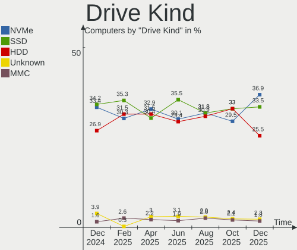

| Kind    | Computers | Drives | Percent |
|---------|-----------|--------|---------|
| NVMe    | 161       | 197    | 36.93%  |
| SSD     | 146       | 178    | 33.49%  |
| HDD     | 111       | 151    | 25.46%  |
| Unknown | 10        | 12     | 2.29%   |
| MMC     | 8         | 10     | 1.83%   |

Drive Connector
---------------

SATA, SAS, NVMe, etc.

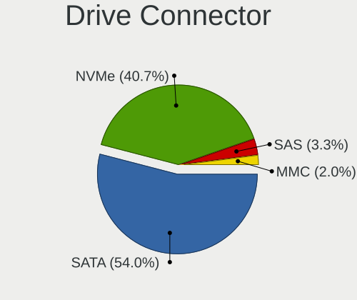

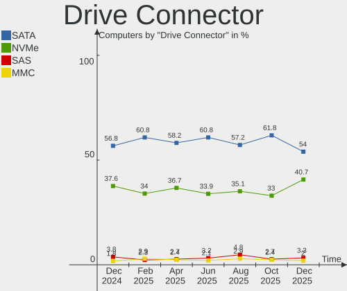

| Type | Computers | Drives | Percent |
|------|-----------|--------|---------|
| SATA | 214       | 325    | 54.04%  |
| NVMe | 161       | 196    | 40.66%  |
| SAS  | 13        | 17     | 3.28%   |
| MMC  | 8         | 10     | 2.02%   |

Drive Size
----------

Size of hard drive

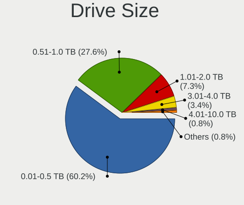

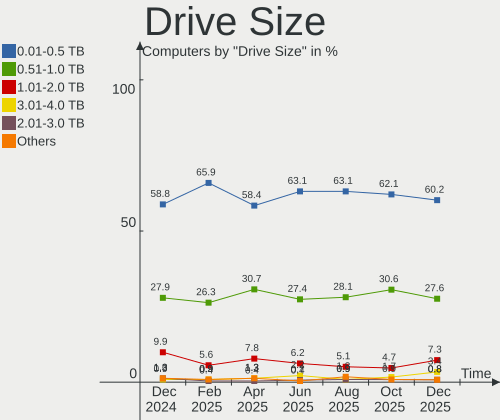

| Size in TB | Computers | Drives | Percent |
|------------|-----------|--------|---------|
| 0.01-0.5   | 157       | 208    | 60.15%  |
| 0.51-1.0   | 72        | 86     | 27.59%  |
| 1.01-2.0   | 19        | 19     | 7.28%   |
| 3.01-4.0   | 9         | 10     | 3.45%   |
| 2.01-3.0   | 2         | 2      | 0.77%   |
| 4.01-10.0  | 2         | 4      | 0.77%   |

Space Total
-----------

Amount of disk space available on the file system

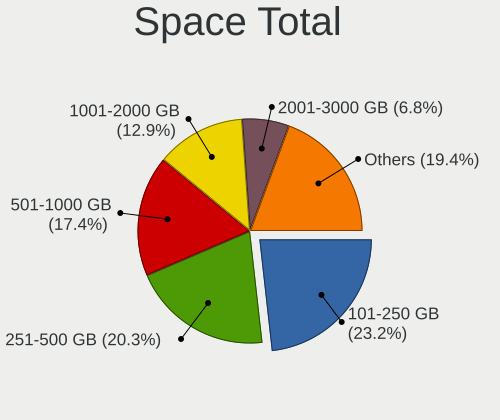

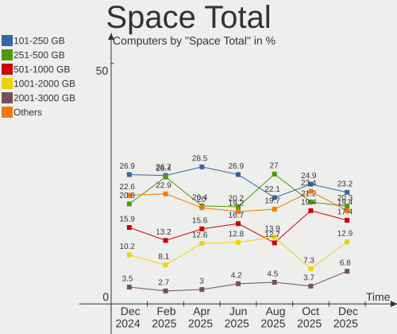

| Size in GB     | Computers | Percent |
|----------------|-----------|---------|
| 101-250        | 72        | 23.23%  |
| 251-500        | 63        | 20.32%  |
| 501-1000       | 54        | 17.42%  |
| 1001-2000      | 40        | 12.9%   |
| 2001-3000      | 21        | 6.77%   |
| More than 3000 | 19        | 6.13%   |
| 1-20           | 16        | 5.16%   |
| 21-50          | 9         | 2.9%    |
| 51-100         | 9         | 2.9%    |
| Unknown        | 7         | 2.26%   |

Space Used
----------

Amount of used disk space

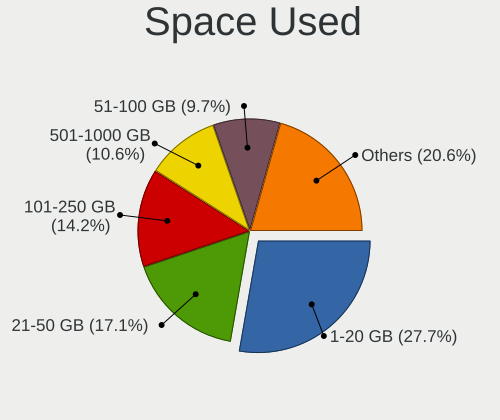

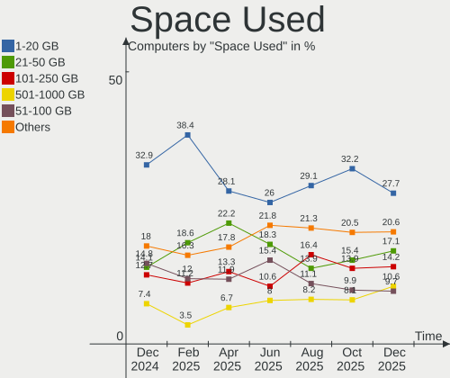

| Used GB        | Computers | Percent |
|----------------|-----------|---------|
| 1-20           | 86        | 27.74%  |
| 21-50          | 53        | 17.1%   |
| 101-250        | 44        | 14.19%  |
| 501-1000       | 33        | 10.65%  |
| 51-100         | 30        | 9.68%   |
| 251-500        | 25        | 8.06%   |
| 1001-2000      | 17        | 5.48%   |
| More than 3000 | 8         | 2.58%   |
| Unknown        | 7         | 2.26%   |
| 2001-3000      | 5         | 1.61%   |
| 0              | 2         | 0.65%   |

Malfunc. Drives
---------------

Drive models with a malfunction

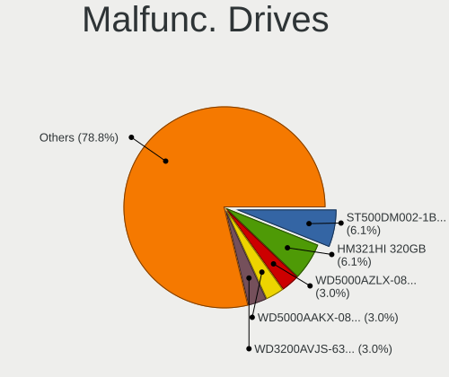

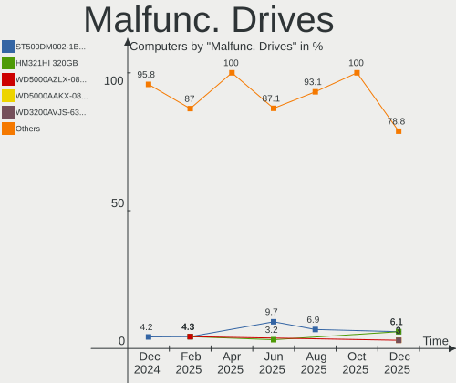

| Model                                                         | Computers | Drives | Percent |
|---------------------------------------------------------------|-----------|--------|---------|
| Seagate ST500DM002-1BD142 500GB                               | 2         | 2      | 6.06%   |
| Samsung Electronics HM321HI 320GB                             | 2         | 2      | 6.06%   |
| WDC WD5000AZLX-08K2TA0 500GB                                  | 1         | 1      | 3.03%   |
| WDC WD5000AAKX-08U6AA0 500GB                                  | 1         | 1      | 3.03%   |
| WDC WD3200AVJS-63B6A0 320GB                                   | 1         | 1      | 3.03%   |
| WDC WD10SPZX-35Z10T0 1TB                                      | 1         | 1      | 3.03%   |
| WDC WD10EZRX-00D8PB0 1TB                                      | 1         | 1      | 3.03%   |
| WDC WD10EARS-00Y5B1 1TB                                       | 1         | 1      | 3.03%   |
| SSSTC CL4-8D256-Q79 256GB                                     | 1         | 1      | 3.03%   |
| Solid State Storage Technology SSSTC CL4-8D256-Q79 256GB      | 1         | 1      | 3.03%   |
| Seagate ST98823AS 80GB                                        | 1         | 1      | 3.03%   |
| Seagate ST4000DM000-1F2168 4TB                                | 1         | 1      | 3.03%   |
| Seagate ST2000DM001-9YN164 2TB                                | 1         | 1      | 3.03%   |
| Seagate ST2000DM001-1CH164 2TB                                | 1         | 1      | 3.03%   |
| Seagate ST1000VM002-1ET162 1TB                                | 1         | 1      | 3.03%   |
| Seagate ST1000LX015-1U7172 1TB                                | 1         | 1      | 3.03%   |
| Seagate ST1000LM024 HN-M101MBB 1TB                            | 1         | 1      | 3.03%   |
| Seagate ST1000DM003-1CH162 1TB                                | 1         | 1      | 3.03%   |
| SanDisk SSD PLUS 240GB                                        | 1         | 1      | 3.03%   |
| Samsung Electronics NVMe SSD Controller SM981/PM981/PM983 1TB | 1         | 1      | 3.03%   |
| Samsung Electronics HM320II 320GB                             | 1         | 1      | 3.03%   |
| Samsung Electronics HD502IJ 500GB                             | 1         | 1      | 3.03%   |
| Min Yi U YZWY_TECH 1TB                                        | 1         | 1      | 3.03%   |
| Micron Technology MTFDDAK512MAY-1AE1ZABHA 512GB SSD           | 1         | 1      | 3.03%   |
| Kingston SUV500240G 240GB SSD                                 | 1         | 1      | 3.03%   |
| Crucial CT120BX500SSD1 120GB                                  | 1         | 1      | 3.03%   |
| Crucial CT1050MX300SSD1 1050GB                                | 1         | 1      | 3.03%   |
| Corsair Force LE SSD 480GB                                    | 1         | 1      | 3.03%   |
| China SSD 360GB                                               | 1         | 1      | 3.03%   |
| China SSD 240GB                                               | 1         | 1      | 3.03%   |
| AFOX SSD 120GB                                                | 1         | 1      | 3.03%   |

Malfunc. Drive Vendor
---------------------

Vendors of faulty drives

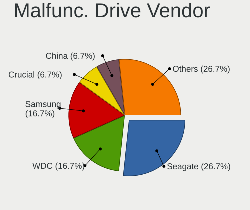

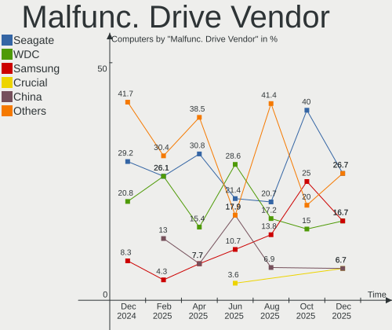

| Vendor                         | Computers | Drives | Percent |
|--------------------------------|-----------|--------|---------|
| Seagate                        | 8         | 10     | 26.67%  |
| WDC                            | 5         | 6      | 16.67%  |
| Samsung Electronics            | 5         | 5      | 16.67%  |
| Crucial                        | 2         | 2      | 6.67%   |
| China                          | 2         | 2      | 6.67%   |
| SSSTC                          | 1         | 1      | 3.33%   |
| Solid State Storage Technology | 1         | 1      | 3.33%   |
| SanDisk                        | 1         | 1      | 3.33%   |
| Min Yi U                       | 1         | 1      | 3.33%   |
| Micron Technology              | 1         | 1      | 3.33%   |
| Kingston                       | 1         | 1      | 3.33%   |
| Corsair                        | 1         | 1      | 3.33%   |
| AFOX                           | 1         | 1      | 3.33%   |

Malfunc. HDD Vendor
-------------------

Vendors of faulty HDD drives

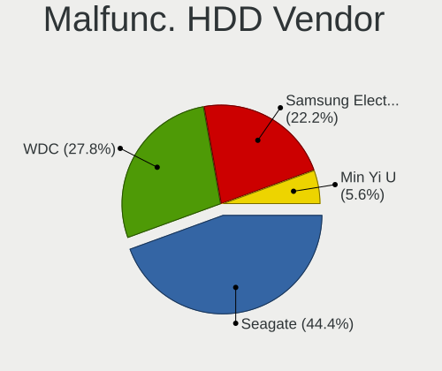

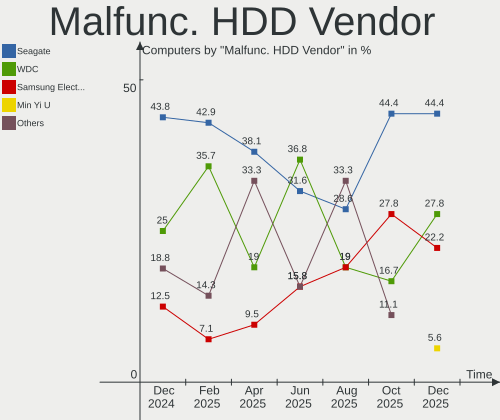

| Vendor              | Computers | Drives | Percent |
|---------------------|-----------|--------|---------|
| Seagate             | 8         | 10     | 44.44%  |
| WDC                 | 5         | 6      | 27.78%  |
| Samsung Electronics | 4         | 4      | 22.22%  |
| Min Yi U            | 1         | 1      | 5.56%   |

Malfunc. Drive Kind
-------------------

Kinds of faulty drives

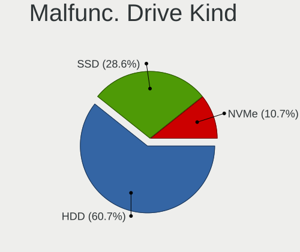

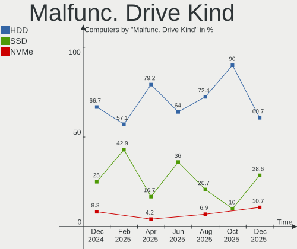

| Kind | Computers | Drives | Percent |
|------|-----------|--------|---------|
| HDD  | 17        | 21     | 60.71%  |
| SSD  | 8         | 9      | 28.57%  |
| NVMe | 3         | 3      | 10.71%  |

Failed Drives
-------------

Failed drive models

Zero info for selected period =(

Failed Drive Vendor
-------------------

Failed drive vendors

Zero info for selected period =(

Drive Status
------------

Number of failed and malfunc. drives

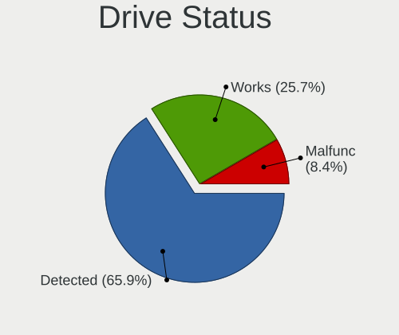

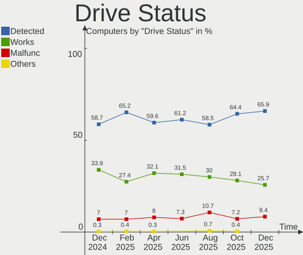

| Status   | Computers | Drives | Percent |
|----------|-----------|--------|---------|
| Detected | 213       | 386    | 65.94%  |
| Works    | 83        | 129    | 25.7%   |
| Malfunc  | 27        | 33     | 8.36%   |

Storage controller
------------------

Storage Vendor
--------------

Storage controller vendors

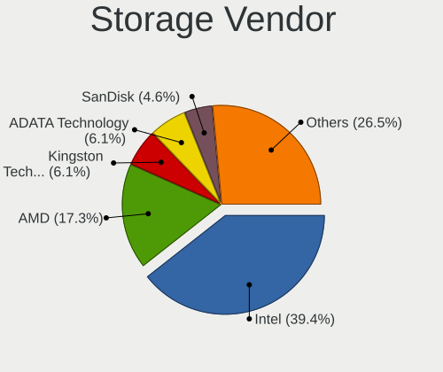

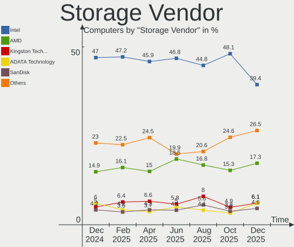

| Vendor                                  | Computers | Percent |
|-----------------------------------------|-----------|---------|
| Intel                                   | 180       | 39.39%  |
| AMD                                     | 79        | 17.29%  |
| Kingston Technology Company             | 28        | 6.13%   |
| ADATA Technology                        | 28        | 6.13%   |
| SanDisk                                 | 21        | 4.6%    |
| MAXIO Technology (Hangzhou)             | 18        | 3.94%   |
| Samsung Electronics                     | 17        | 3.72%   |
| Realtek Semiconductor                   | 14        | 3.06%   |
| Silicon Motion                          | 10        | 2.19%   |
| Micron Technology                       | 9         | 1.97%   |
| SK hynix                                | 6         | 1.31%   |
| Shenzhen Longsys Electronics            | 6         | 1.31%   |
| Phison Electronics                      | 6         | 1.31%   |
| KIOXIA                                  | 6         | 1.31%   |
| Solid State Storage Technology          | 5         | 1.09%   |
| Micron/Crucial Technology               | 4         | 0.88%   |
| Marvell Technology Group                | 3         | 0.66%   |
| INNOGRIT                                | 3         | 0.66%   |
| ASMedia Technology                      | 3         | 0.66%   |
| Nvidia                                  | 2         | 0.44%   |
| Lite-On Technology                      | 2         | 0.44%   |
| JMicron Technology                      | 2         | 0.44%   |
| Hosin Global Electronics                | 2         | 0.44%   |
| Toshiba America Info Systems            | 1         | 0.22%   |
| Shenzhen Unionmemory Information System | 1         | 0.22%   |
| Broadcom / LSI                          | 1         | 0.22%   |

Storage Model
-------------

Storage controller models

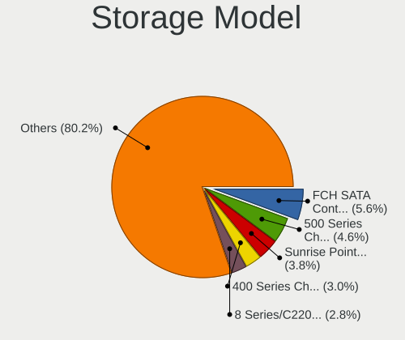

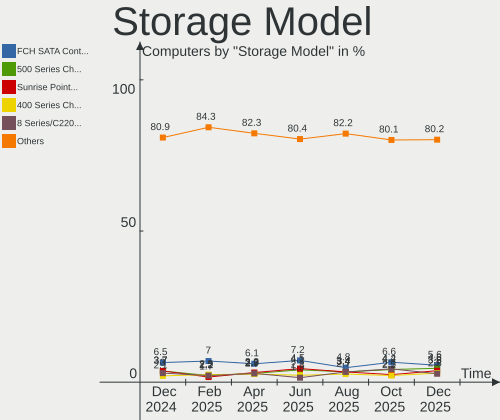

| Model                                                                                   | Computers | Percent |
|-----------------------------------------------------------------------------------------|-----------|---------|
| AMD FCH SATA Controller [AHCI mode]                                                     | 28        | 5.6%    |
| AMD 500 Series Chipset SATA Controller                                                  | 23        | 4.6%    |
| Intel Sunrise Point-LP SATA Controller [AHCI mode]                                      | 19        | 3.8%    |
| AMD 400 Series Chipset SATA Controller                                                  | 15        | 3%      |
| Intel 8 Series/C220 Series Chipset Family 6-port SATA Controller 1 [AHCI mode]          | 14        | 2.8%    |
| Intel 7 Series/C210 Series Chipset Family 6-port SATA Controller [AHCI mode]            | 13        | 2.6%    |
| AMD 600 Series Chipset SATA Controller                                                  | 13        | 2.6%    |
| Realtek RTS5765DL NVMe SSD Controller (DRAM-less)                                       | 11        | 2.2%    |
| Silicon Motion SM2263EN/SM2263XT (DRAM-less) NVMe SSD Controllers                       | 10        | 2%      |
| MAXIO (Hangzhou) NVMe SSD Controller MAP1202 (DRAM-less)                                | 10        | 2%      |
| SanDisk WD Green SN350 240GB (DRAM-less) / SN560E NVMe SSD                              | 9         | 1.8%    |
| Intel Q170/Q150/B150/H170/H110/Z170/CM236 Chipset SATA Controller [AHCI Mode]           | 9         | 1.8%    |
| Kingston Company NV2 NVMe SSD [SM2267XT] (DRAM-less)                                    | 8         | 1.6%    |
| Intel 7 Series Chipset Family 6-port SATA Controller [AHCI mode]                        | 8         | 1.6%    |
| Intel 6 Series/C200 Series Chipset Family 6 port Mobile SATA AHCI Controller            | 8         | 1.6%    |
| Intel 6 Series/C200 Series Chipset Family 6 port Desktop SATA AHCI Controller           | 8         | 1.6%    |
| MAXIO (Hangzhou) NVMe SSD Controller MAP1602 (DRAM-less)                                | 7         | 1.4%    |
| Intel Volume Management Device NVMe RAID Controller                                     | 6         | 1.2%    |
| Intel Tiger Lake-LP SATA Controller                                                     | 6         | 1.2%    |
| Intel RST Volume Management Device Controller                                           | 6         | 1.2%    |
| ADATA IM2P33F8 series NVMe SSD (DRAM-less)                                              | 6         | 1.2%    |
| Samsung NVMe SSD Controller 980 (DRAM-less)                                             | 5         | 1%      |
| KIOXIA NVMe SSD Controller BG5 (DRAM-less)                                              | 5         | 1%      |
| Kingston Company NV3 NVMe SSD [SM2268XT2] (DRAM-less)                                   | 5         | 1%      |
| Intel Alder Lake-S PCH SATA Controller [AHCI Mode]                                      | 5         | 1%      |
| AMD SB7x0/SB8x0/SB9x0 IDE Controller                                                    | 5         | 1%      |
| ADATA SM2P41C8 NVMe SSD (DRAM-less)                                                     | 5         | 1%      |
| Solid State Storage CL4-8D512 NVMe SSD M.2 (DRAM-less)                                  | 4         | 0.8%    |
| Samsung NVMe SSD Controller SM981/PM981/PM983                                           | 4         | 0.8%    |
| Intel Wildcat Point-LP SATA Controller [AHCI Mode]                                      | 4         | 0.8%    |
| Intel Celeron/Pentium Silver Processor SATA Controller                                  | 4         | 0.8%    |
| Intel Cannon Lake PCH SATA AHCI Controller                                              | 4         | 0.8%    |
| Intel 82801IBM/IEM (ICH9M/ICH9M-E) 4 port SATA Controller [AHCI mode]                   | 4         | 0.8%    |
| Intel 82801 Mobile SATA Controller [RAID mode]                                          | 4         | 0.8%    |
| Intel 8 Series SATA Controller 1 [AHCI mode]                                            | 4         | 0.8%    |
| Intel 6 Series/C200 Series Chipset Family Desktop SATA Controller (IDE mode, ports 4-5) | 4         | 0.8%    |
| Intel 6 Series/C200 Series Chipset Family Desktop SATA Controller (IDE mode, ports 0-3) | 4         | 0.8%    |
| Intel 5 Series/3400 Series Chipset 4 port SATA AHCI Controller                          | 4         | 0.8%    |
| AMD SB7x0/SB8x0/SB9x0 SATA Controller [IDE mode]                                        | 4         | 0.8%    |
| AMD A320 Chipset SATA Controller [AHCI mode]                                            | 4         | 0.8%    |

Storage Kind
------------

Kind of storage controller (IDE, SATA, NVMe, SAS, ...)

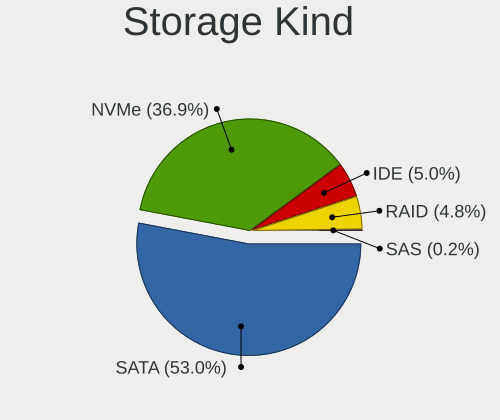

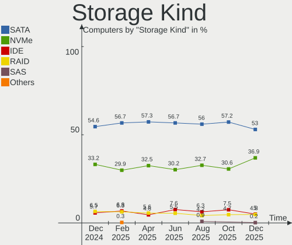

| Kind | Computers | Percent |
|------|-----------|---------|
| SATA | 231       | 52.98%  |
| NVMe | 161       | 36.93%  |
| IDE  | 22        | 5.05%   |
| RAID | 21        | 4.82%   |
| SAS  | 1         | 0.23%   |

Processor
---------

CPU Vendor
----------

Processor vendors

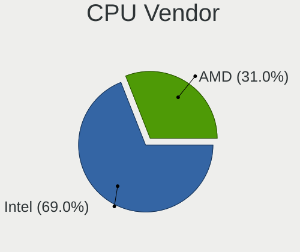

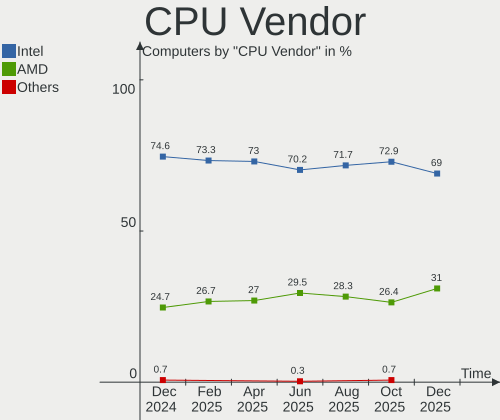

| Vendor | Computers | Percent |
|--------|-----------|---------|
| Intel  | 214       | 69.03%  |
| AMD    | 96        | 30.97%  |

CPU Model
---------

Processor models

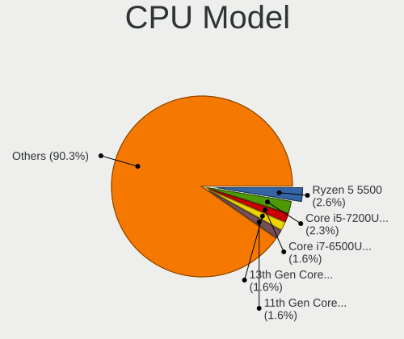

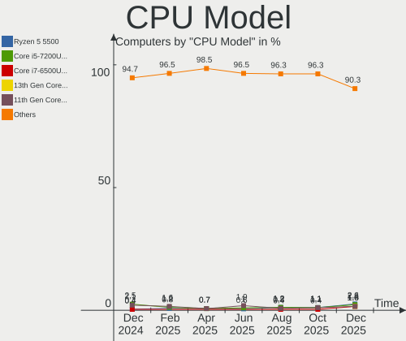

| Model                                         | Computers | Percent |
|-----------------------------------------------|-----------|---------|
| AMD Ryzen 5 5500                              | 8         | 2.58%   |
| Intel Core i5-7200U CPU @ 2.50GHz             | 7         | 2.26%   |
| Intel Core i7-6500U CPU @ 2.50GHz             | 5         | 1.61%   |
| Intel 13th Gen Core i5-1334U                  | 5         | 1.61%   |
| Intel 11th Gen Core i5-1135G7 @ 2.40GHz       | 5         | 1.61%   |
| AMD Ryzen 7 5700X 8-Core Processor            | 5         | 1.61%   |
| AMD Ryzen 5 5600GT with Radeon Graphics       | 5         | 1.61%   |
| AMD Ryzen 7 9800X3D 8-Core Processor          | 4         | 1.29%   |
| AMD Ryzen 7 5700U with Radeon Graphics        | 4         | 1.29%   |
| AMD Ryzen 7 5700G with Radeon Graphics        | 4         | 1.29%   |
| AMD Ryzen 5 5600G with Radeon Graphics        | 4         | 1.29%   |
| Intel Core i9-14900HX                         | 3         | 0.97%   |
| Intel Core i7-4790 CPU @ 3.60GHz              | 3         | 0.97%   |
| Intel Core i5-3470 CPU @ 3.20GHz              | 3         | 0.97%   |
| Intel Core i5-2310 CPU @ 2.90GHz              | 3         | 0.97%   |
| Intel Core i3-3220 CPU @ 3.30GHz              | 3         | 0.97%   |
| Intel Core i3-2310M CPU @ 2.10GHz             | 3         | 0.97%   |
| AMD Ryzen 7 5700X3D 8-Core Processor          | 3         | 0.97%   |
| AMD Ryzen 7 3700U with Radeon Vega Mobile Gfx | 3         | 0.97%   |
| AMD Ryzen 5 5600X 6-Core Processor            | 3         | 0.97%   |
| AMD Ryzen 5 3600 6-Core Processor             | 3         | 0.97%   |
| Intel Xeon CPU E5-2680 v4 @ 2.40GHz           | 2         | 0.65%   |
| Intel Core i7-8700 CPU @ 3.20GHz              | 2         | 0.65%   |
| Intel Core i7-7500U CPU @ 2.70GHz             | 2         | 0.65%   |
| Intel Core i5-8365U CPU @ 1.60GHz             | 2         | 0.65%   |
| Intel Core i5-8350U CPU @ 1.70GHz             | 2         | 0.65%   |
| Intel Core i5-6600K CPU @ 3.50GHz             | 2         | 0.65%   |
| Intel Core i5-6500T CPU @ 2.50GHz             | 2         | 0.65%   |
| Intel Core i5-5200U CPU @ 2.20GHz             | 2         | 0.65%   |
| Intel Core i5-4440 CPU @ 3.10GHz              | 2         | 0.65%   |
| Intel Core i5-3337U CPU @ 1.80GHz             | 2         | 0.65%   |
| Intel Core i5-3210M CPU @ 2.50GHz             | 2         | 0.65%   |
| Intel Core i5-2410M CPU @ 2.30GHz             | 2         | 0.65%   |
| Intel Core i3-3240 CPU @ 3.40GHz              | 2         | 0.65%   |
| Intel Core i3 CPU M 370 @ 2.40GHz             | 2         | 0.65%   |
| Intel Core 7 240H                             | 2         | 0.65%   |
| Intel Celeron N4020 CPU @ 1.10GHz             | 2         | 0.65%   |
| Intel Celeron N4000 CPU @ 1.10GHz             | 2         | 0.65%   |
| Intel Atom x5-Z8350 CPU @ 1.44GHz             | 2         | 0.65%   |
| Intel 13th Gen Core i7-13620H                 | 2         | 0.65%   |

CPU Model Family
----------------

Processor model prefix

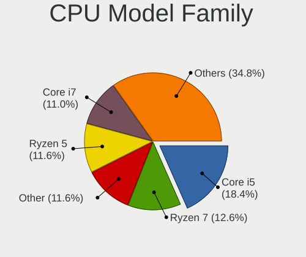

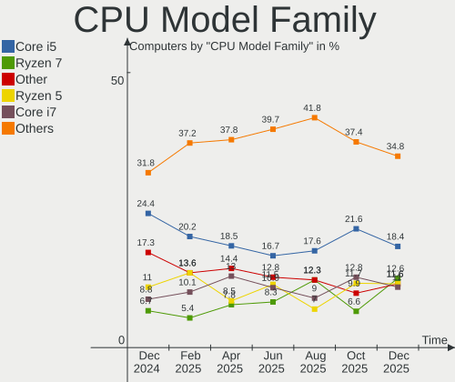

| Model                   | Computers | Percent |
|-------------------------|-----------|---------|
| Intel Core i5           | 57        | 18.39%  |
| AMD Ryzen 7             | 39        | 12.58%  |
| Other                   | 36        | 11.61%  |
| AMD Ryzen 5             | 36        | 11.61%  |
| Intel Core i7           | 34        | 10.97%  |
| Intel Core i3           | 27        | 8.71%   |
| Intel Xeon              | 18        | 5.81%   |
| Intel Celeron           | 10        | 3.23%   |
| Intel Core i9           | 6         | 1.94%   |
| Intel Core 2 Duo        | 6         | 1.94%   |
| AMD Ryzen 9             | 6         | 1.94%   |
| Intel Core              | 5         | 1.61%   |
| AMD FX                  | 5         | 1.61%   |
| Intel Pentium Dual-Core | 4         | 1.29%   |
| Intel Pentium           | 4         | 1.29%   |
| Intel Atom              | 4         | 1.29%   |
| AMD Ryzen 3             | 3         | 0.97%   |
| Intel Core 2            | 2         | 0.65%   |
| Intel Pentium Gold      | 1         | 0.32%   |
| Intel Genuine           | 1         | 0.32%   |
| AMD Ryzen Threadripper  | 1         | 0.32%   |
| AMD PRO A10             | 1         | 0.32%   |
| AMD Phenom II X4        | 1         | 0.32%   |
| AMD Opteron             | 1         | 0.32%   |
| AMD Athlon              | 1         | 0.32%   |
| AMD A6                  | 1         | 0.32%   |

CPU Cores
---------

Number of processor cores

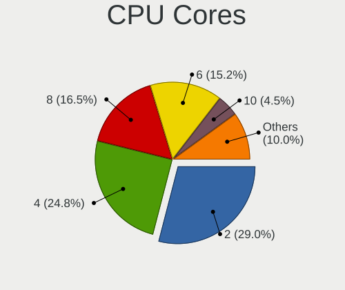

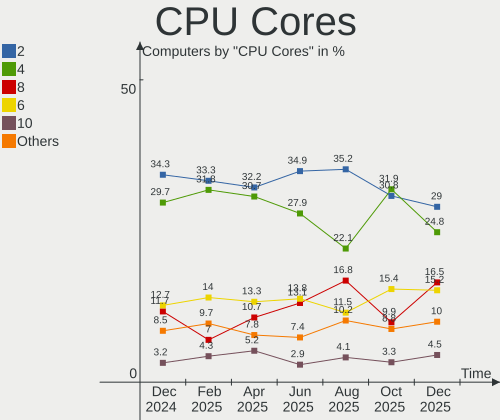

| Number | Computers | Percent |
|--------|-----------|---------|
| 2      | 90        | 29.03%  |
| 4      | 77        | 24.84%  |
| 8      | 51        | 16.45%  |
| 6      | 47        | 15.16%  |
| 10     | 14        | 4.52%   |
| 12     | 12        | 3.87%   |
| 16     | 5         | 1.61%   |
| 14     | 5         | 1.61%   |
| 24     | 3         | 0.97%   |
| 20     | 2         | 0.65%   |
| 1      | 2         | 0.65%   |
| 32     | 1         | 0.32%   |
| 3      | 1         | 0.32%   |

CPU Sockets
-----------

Number of sockets

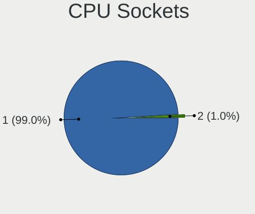

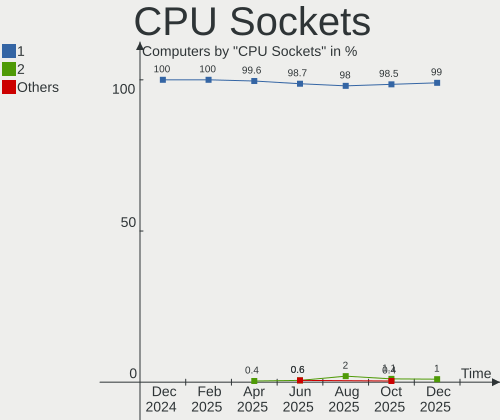

| Number | Computers | Percent |
|--------|-----------|---------|
| 1      | 307       | 99.03%  |
| 2      | 3         | 0.97%   |

CPU Threads
-----------

Threads per core (Hyper-Threading)

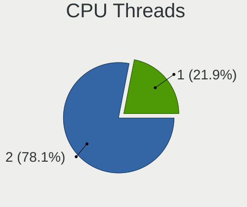

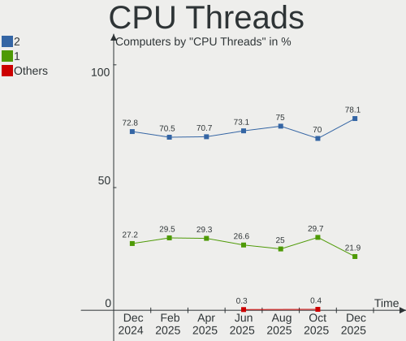

| Number | Computers | Percent |
|--------|-----------|---------|
| 2      | 242       | 78.06%  |
| 1      | 68        | 21.94%  |

CPU Op-Modes
------------

CPU Operation Modes (32-bit, 64-bit)

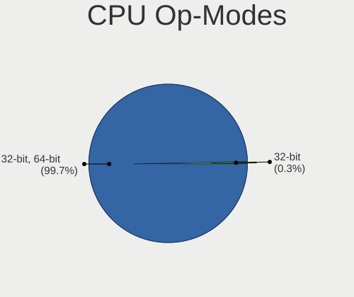

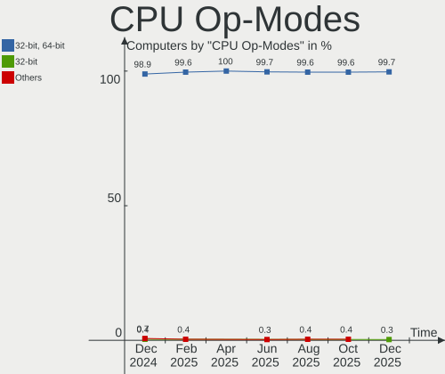

| Op mode        | Computers | Percent |
|----------------|-----------|---------|
| 32-bit, 64-bit | 309       | 99.68%  |
| 32-bit         | 1         | 0.32%   |

CPU Microcode
-------------

Microcode number

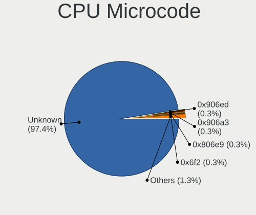

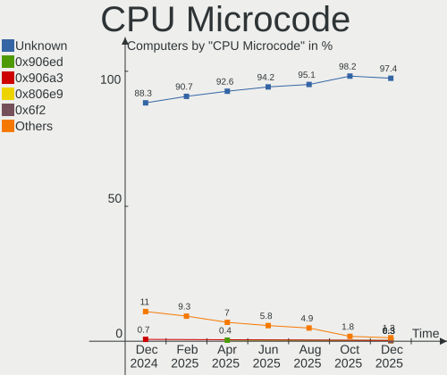

| Number     | Computers | Percent |
|------------|-----------|---------|
| Unknown    | 302       | 97.42%  |
| 0x906ed    | 1         | 0.32%   |
| 0x906a3    | 1         | 0.32%   |
| 0x806e9    | 1         | 0.32%   |
| 0x6f2      | 1         | 0.32%   |
| 0x306a9    | 1         | 0.32%   |
| 0x30661    | 1         | 0.32%   |
| 0x1067a    | 1         | 0.32%   |
| 0x0600063e | 1         | 0.32%   |

CPU Microarch
-------------

Microarchitecture

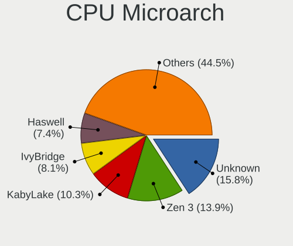

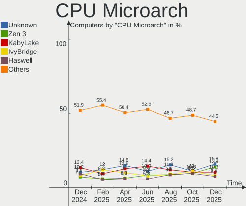

| Name              | Computers | Percent |
|-------------------|-----------|---------|
| Unknown           | 49        | 15.81%  |
| Zen 3             | 43        | 13.87%  |
| KabyLake          | 32        | 10.32%  |
| IvyBridge         | 25        | 8.06%   |
| Haswell           | 23        | 7.42%   |
| SandyBridge       | 21        | 6.77%   |
| Skylake           | 15        | 4.84%   |
| Alderlake Hybrid  | 15        | 4.84%   |
| Zen+              | 9         | 2.9%    |
| TigerLake         | 9         | 2.9%    |
| Penryn            | 9         | 2.9%    |
| CometLake         | 7         | 2.26%   |
| Broadwell         | 7         | 2.26%   |
| Zen 2             | 6         | 1.94%   |
| Westmere          | 6         | 1.94%   |
| Silvermont        | 6         | 1.94%   |
| Goldmont plus     | 5         | 1.61%   |
| Piledriver        | 4         | 1.29%   |
| Excavator         | 3         | 0.97%   |
| Core              | 3         | 0.97%   |
| Nehalem           | 2         | 0.65%   |
| Meteorlake Hybrid | 2         | 0.65%   |
| IceLake           | 2         | 0.65%   |
| Zen               | 1         | 0.32%   |
| Lunarlake Hybrid  | 1         | 0.32%   |
| K10               | 1         | 0.32%   |
| Gracemont         | 1         | 0.32%   |
| Goldmont          | 1         | 0.32%   |
| Bulldozer         | 1         | 0.32%   |
| Bonnell           | 1         | 0.32%   |

Graphics
--------

GPU Vendor
----------

Vendors of graphics cards

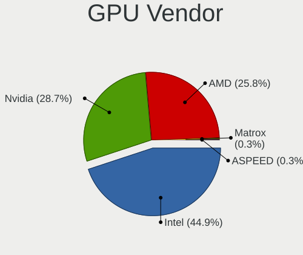

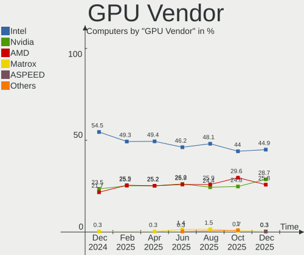

| Vendor                     | Computers | Percent |
|----------------------------|-----------|---------|
| Intel                      | 160       | 44.94%  |
| Nvidia                     | 102       | 28.65%  |
| AMD                        | 92        | 25.84%  |
| Matrox Electronics Systems | 1         | 0.28%   |
| ASPEED Technology          | 1         | 0.28%   |

GPU Model
---------

Graphics card models

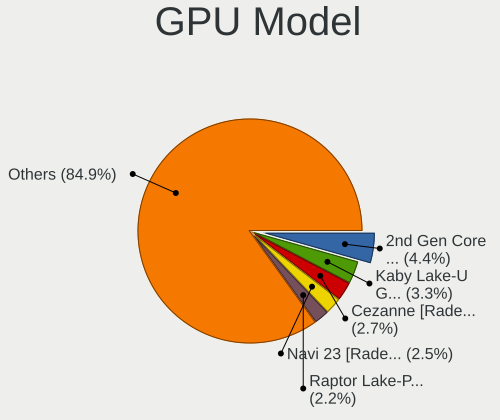

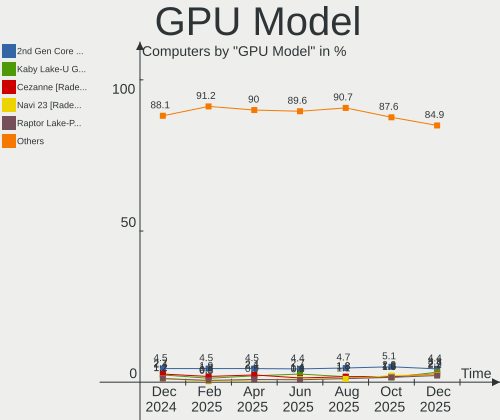

| Model                                                                                    | Computers | Percent |
|------------------------------------------------------------------------------------------|-----------|---------|
| Intel 2nd Generation Core Processor Family Integrated Graphics Controller                | 16        | 4.38%   |
| Intel Kaby Lake-U GT2 [HD Graphics 620]                                                  | 12        | 3.29%   |
| AMD Cezanne [Radeon Vega Series / Radeon Vega Mobile Series]                             | 10        | 2.74%   |
| AMD Navi 23 [Radeon RX 6600/6600 XT/6600M]                                               | 9         | 2.47%   |
| Intel Raptor Lake-P [UHD Graphics]                                                       | 8         | 2.19%   |
| Intel 3rd Gen Core processor Graphics Controller                                         | 8         | 2.19%   |
| AMD Polaris 20 XL [Radeon RX 580 2048SP]                                                 | 7         | 1.92%   |
| Intel Xeon E3-1200 v2/3rd Gen Core processor Graphics Controller                         | 6         | 1.64%   |
| Intel TigerLake-LP GT2 [Iris Xe Graphics]                                                | 6         | 1.64%   |
| Intel Skylake-U GT2 [HD Graphics 520]                                                    | 6         | 1.64%   |
| AMD Picasso/Raven 2 [Radeon Vega Series / Radeon Vega Mobile Series]                     | 6         | 1.64%   |
| AMD Lucienne                                                                             | 6         | 1.64%   |
| Nvidia GA106 [GeForce RTX 3060 Lite Hash Rate]                                           | 5         | 1.37%   |
| Intel WhiskeyLake-U GT2 [UHD Graphics 620]                                               | 5         | 1.37%   |
| Intel Haswell-ULT Integrated Graphics Controller                                         | 5         | 1.37%   |
| Intel GeminiLake [UHD Graphics 600]                                                      | 5         | 1.37%   |
| Intel Core Processor Integrated Graphics Controller                                      | 5         | 1.37%   |
| Nvidia GA107BM / GN20-P0-R-K2 [GeForce RTX 3050 6GB Laptop GPU]                          | 4         | 1.1%    |
| Intel Skylake-S GT2 [HD Graphics 530]                                                    | 4         | 1.1%    |
| Intel Raptor Lake-S UHD Graphics                                                         | 4         | 1.1%    |
| Intel Kaby Lake-R GT2 [UHD Graphics 620]                                                 | 4         | 1.1%    |
| Intel Broadwell-U GT2 [HD Graphics 5500]                                                 | 4         | 1.1%    |
| Intel Atom/Celeron/Pentium Processor x5-E8000/J3xxx/N3xxx Integrated Graphics Controller | 4         | 1.1%    |
| AMD Mendocino [Radeon 610M]                                                              | 4         | 1.1%    |
| AMD Lexa PRO [Radeon 540/540X/550/550X / RX 540X/550/550X]                               | 4         | 1.1%    |
| AMD Granite Ridge [Radeon Graphics]                                                      | 4         | 1.1%    |
| Nvidia GT218 [GeForce G210]                                                              | 3         | 0.82%   |
| Nvidia GP107 [GeForce GTX 1050 Ti]                                                       | 3         | 0.82%   |
| Nvidia GM108M [GeForce 940MX]                                                            | 3         | 0.82%   |
| Nvidia AD107 [GeForce RTX 4060]                                                          | 3         | 0.82%   |
| Intel Xeon E3-1200 v3/4th Gen Core Processor Integrated Graphics Controller              | 3         | 0.82%   |
| Intel Tiger Lake-LP GT2 [UHD Graphics G4]                                                | 3         | 0.82%   |
| Intel Raptor Lake-S GT1 [UHD Graphics 770]                                               | 3         | 0.82%   |
| Intel Raptor Lake-P [Iris Xe Graphics]                                                   | 3         | 0.82%   |
| Intel Mobile 4 Series Chipset Integrated Graphics Controller                             | 3         | 0.82%   |
| Intel IvyBridge GT2 [HD Graphics 4000]                                                   | 3         | 0.82%   |
| Intel Alder Lake-UP3 GT2 [Iris Xe Graphics]                                              | 3         | 0.82%   |
| AMD Wani [Radeon R5/R6/R7 Graphics]                                                      | 3         | 0.82%   |
| AMD Topaz XT [Radeon R7 M260/M265 / M340/M360 / M440/M445 / 530/535 / 620/625 Mobile]    | 3         | 0.82%   |
| AMD Navi 32 [Radeon RX 7700 XT / 7800 XT]                                                | 3         | 0.82%   |

GPU Combo
---------

Combinations of graphics cards

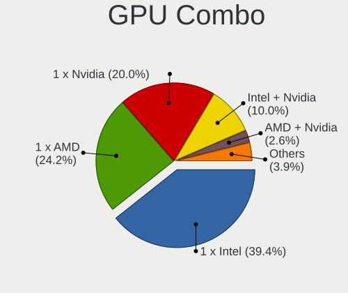

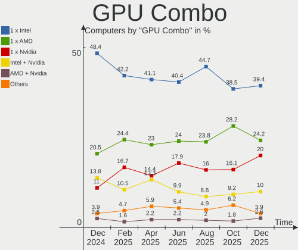

| Name            | Computers | Percent |
|-----------------|-----------|---------|
| 1 x Intel       | 122       | 39.35%  |
| 1 x AMD         | 75        | 24.19%  |
| 1 x Nvidia      | 62        | 20%     |
| Intel + Nvidia  | 31        | 10%     |
| AMD + Nvidia    | 8         | 2.58%   |
| 2 x AMD         | 7         | 2.26%   |
| Intel + AMD     | 2         | 0.65%   |
| 2 x Intel       | 1         | 0.32%   |
| Nvidia + ASPEED | 1         | 0.32%   |
| 1 x Matrox      | 1         | 0.32%   |

GPU Driver
----------

Free vs proprietary

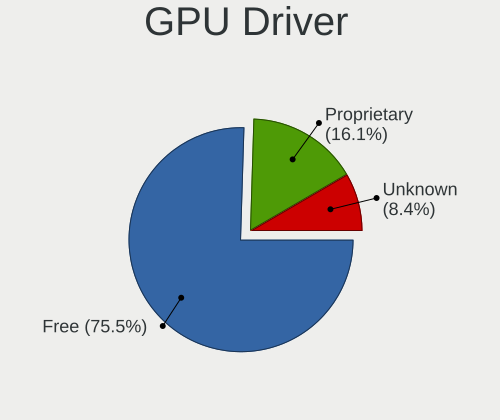

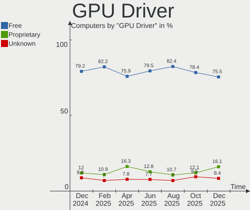

| Driver      | Computers | Percent |
|-------------|-----------|---------|
| Free        | 234       | 75.48%  |
| Proprietary | 50        | 16.13%  |
| Unknown     | 26        | 8.39%   |

GPU Memory
----------

Total video memory

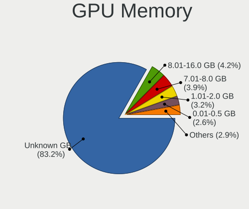

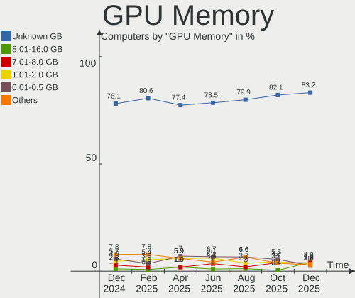

| Size in GB     | Computers | Percent |
|----------------|-----------|---------|
| Unknown        | 258       | 83.23%  |
| 8.01-16.0      | 13        | 4.19%   |
| 7.01-8.0       | 12        | 3.87%   |
| 1.01-2.0       | 10        | 3.23%   |
| 0.01-0.5       | 8         | 2.58%   |
| 3.01-4.0       | 6         | 1.94%   |
| More than 64.0 | 1         | 0.32%   |
| 5.01-6.0       | 1         | 0.32%   |
| 0.51-1.0       | 1         | 0.32%   |

Monitor
-------

Monitor Vendor
--------------

Monitor vendors

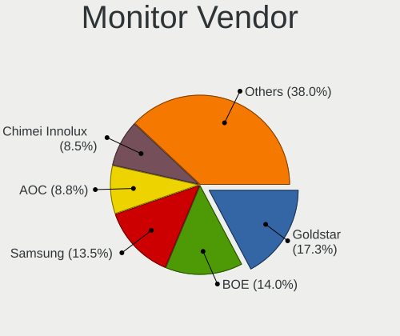

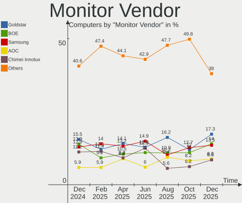

| Vendor              | Computers | Percent |
|---------------------|-----------|---------|
| Goldstar            | 59        | 17.25%  |
| BOE                 | 48        | 14.04%  |
| Samsung Electronics | 46        | 13.45%  |
| AOC                 | 30        | 8.77%   |
| Chimei Innolux      | 29        | 8.48%   |
| AU Optronics        | 22        | 6.43%   |
| LG Display          | 15        | 4.39%   |
| Dell                | 12        | 3.51%   |
| Philips             | 6         | 1.75%   |
| Lenovo              | 6         | 1.75%   |
| VIE                 | 5         | 1.46%   |
| Unknown (XXX)       | 5         | 1.46%   |
| Sony                | 4         | 1.17%   |
| PANDA               | 4         | 1.17%   |
| Unknown             | 3         | 0.88%   |
| SGT                 | 3         | 0.88%   |
| InfoVision          | 3         | 0.88%   |
| Apple               | 3         | 0.88%   |
| Acer                | 3         | 0.88%   |
| VIZTA               | 2         | 0.58%   |
| SKG                 | 2         | 0.58%   |
| Sharp               | 2         | 0.58%   |
| MSI                 | 2         | 0.58%   |
| MSD                 | 2         | 0.58%   |
| LRX                 | 2         | 0.58%   |
| Hewlett-Packard     | 2         | 0.58%   |
| Denver              | 2         | 0.58%   |
| ZTR                 | 1         | 0.29%   |
| YZA                 | 1         | 0.29%   |
| Unknown (BBC)       | 1         | 0.29%   |
| Toshiba             | 1         | 0.29%   |
| SuperFrame          | 1         | 0.29%   |
| STD                 | 1         | 0.29%   |
| STA                 | 1         | 0.29%   |
| SLD                 | 1         | 0.29%   |
| Semp Toshiba        | 1         | 0.29%   |
| Pixio               | 1         | 0.29%   |
| Panasonic           | 1         | 0.29%   |
| MYS                 | 1         | 0.29%   |
| LG Electronics      | 1         | 0.29%   |

Monitor Model
-------------

Monitor models

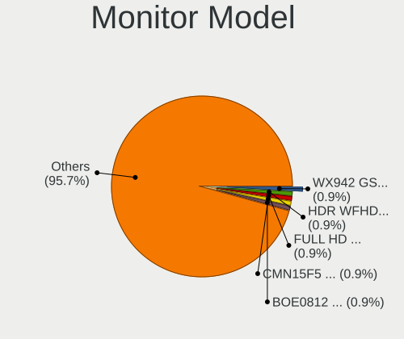

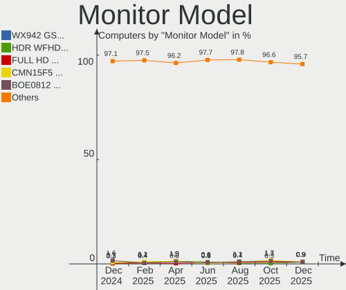

| Model                                                                | Computers | Percent |
|----------------------------------------------------------------------|-----------|---------|
| Goldstar WX942 GSM4B80 1440x900 410x260mm 19.1-inch                  | 3         | 0.86%   |
| Goldstar HDR WFHD GSM7714 2560x1080 798x334mm 34.1-inch              | 3         | 0.86%   |
| Goldstar FULL HD GSM5BFB 1920x1080 480x270mm 21.7-inch               | 3         | 0.86%   |
| Chimei Innolux LCD Monitor CMN15F5 1920x1080 344x193mm 15.5-inch     | 3         | 0.86%   |
| BOE LCD Monitor BOE0812 1920x1080 344x194mm 15.5-inch                | 3         | 0.86%   |
| AOC 1970W AOC1970 1366x768 410x230mm 18.5-inch                       | 3         | 0.86%   |
| VIZTA 27HQ CURVO JRY2700 1920x1080 698x393mm 31.5-inch               | 2         | 0.57%   |
| VIE ATHEN V3 27 VIE2700 1920x1080 597x236mm 25.3-inch                | 2         | 0.57%   |
| VIE ATHEN U2L 21 VIE2150 1920x1080 476x268mm 21.5-inch               | 2         | 0.57%   |
| Unknown LCD Monitor FFFF 2288x1287 2550x2550mm 142.0-inch            | 2         | 0.57%   |
| Samsung Electronics LF27T35 SAM707F 1920x1080 598x337mm 27.0-inch    | 2         | 0.57%   |
| Samsung Electronics LF24T35 SAM707D 1920x1080 528x297mm 23.9-inch    | 2         | 0.57%   |
| Samsung Electronics LCD Monitor SAM0E90 1366x768 609x347mm 27.6-inch | 2         | 0.57%   |
| Samsung Electronics LC34G55T SAM711A 3440x1440 798x334mm 34.1-inch   | 2         | 0.57%   |
| PANDA LCD Monitor NCP005F 1920x1080 344x194mm 15.5-inch              | 2         | 0.57%   |
| LRX HDMI LRX2281 1920x1200 409x230mm 18.5-inch                       | 2         | 0.57%   |
| Lenovo LCD Monitor LEN9050 1366x768 344x193mm 15.5-inch              | 2         | 0.57%   |
| Goldstar ULTRAWIDE GSM7768 3440x1440 800x334mm 34.1-inch             | 2         | 0.57%   |
| Goldstar ULTRAWIDE GSM76F9 2560x1080 531x298mm 24.0-inch             | 2         | 0.57%   |
| Goldstar ULTRAGEAR GSM5C8C 1920x1080 600x340mm 27.2-inch             | 2         | 0.57%   |
| Goldstar LG ULTRAWIDE GSM59F1 2560x1080 670x280mm 28.6-inch          | 2         | 0.57%   |
| Goldstar HDR WFHD GSM7715 2560x1080 798x334mm 34.1-inch              | 2         | 0.57%   |
| Goldstar HD GSM5ACD 1366x768 410x230mm 18.5-inch                     | 2         | 0.57%   |
| Goldstar FULL HD GSM5B55 1920x1080 480x270mm 21.7-inch               | 2         | 0.57%   |
| Goldstar E2011 GSM4ED4 1600x900 443x249mm 20.0-inch                  | 2         | 0.57%   |
| Goldstar AIO GSM5ADE 1920x1080 509x286mm 23.0-inch                   | 2         | 0.57%   |
| Goldstar 25UM58G GSM5B98 2560x1080 673x284mm 28.8-inch               | 2         | 0.57%   |
| Goldstar 22MP55 GSM5A26 1920x1080 477x268mm 21.5-inch                | 2         | 0.57%   |
| Dell SE2216H DELF071 1920x1080 476x268mm 21.5-inch                   | 2         | 0.57%   |
| Dell P2422H DELA1C5 1920x1080 527x296mm 23.8-inch                    | 2         | 0.57%   |
| Chimei Innolux LCD Monitor CMN15E6 1366x768 344x193mm 15.5-inch      | 2         | 0.57%   |
| Chimei Innolux LCD Monitor CMN1541 1366x768 344x193mm 15.5-inch      | 2         | 0.57%   |
| Chimei Innolux LCD Monitor CMN14C3 1366x768 309x173mm 13.9-inch      | 2         | 0.57%   |
| Chimei Innolux LCD Monitor CMN1470 1366x768 309x174mm 14.0-inch      | 2         | 0.57%   |
| BOE NV153WUM-N41 BOE0CEA 1920x1200 329x206mm 15.3-inch               | 2         | 0.57%   |
| BOE NE160QDM-NYL BOE0D5E 2560x1600 345x215mm 16.0-inch               | 2         | 0.57%   |
| BOE LCD Monitor BOE0D39 1920x1080 344x194mm 15.5-inch                | 2         | 0.57%   |
| BOE LCD Monitor BOE0AF7 1920x1080 344x194mm 15.5-inch                | 2         | 0.57%   |
| BOE LCD Monitor BOE08C7 1920x1080 309x174mm 14.0-inch                | 2         | 0.57%   |
| BOE LCD Monitor BOE0868 1920x1080 309x174mm 14.0-inch                | 2         | 0.57%   |

Monitor Resolution
------------------

Monitor screen resolution

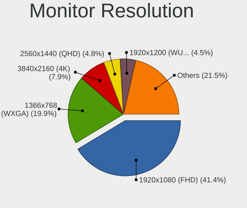

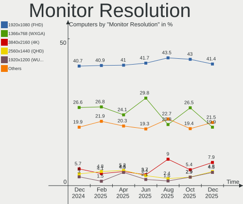

| Resolution         | Computers | Percent |
|--------------------|-----------|---------|
| 1920x1080 (FHD)    | 137       | 41.39%  |
| 1366x768 (WXGA)    | 66        | 19.94%  |
| 3840x2160 (4K)     | 26        | 7.85%   |
| 2560x1440 (QHD)    | 16        | 4.83%   |
| 1920x1200 (WUXGA)  | 15        | 4.53%   |
| 1440x900 (WXGA+)   | 14        | 4.23%   |
| 2560x1080          | 11        | 3.32%   |
| 1600x900 (HD+)     | 10        | 3.02%   |
| 2560x1600          | 7         | 2.11%   |
| 3440x1440          | 6         | 1.81%   |
| 1024x768 (XGA)     | 4         | 1.21%   |
| 1680x1050 (WSXGA+) | 3         | 0.91%   |
| 1360x768           | 3         | 0.91%   |
| 1280x800 (WXGA)    | 3         | 0.91%   |
| 2288x1287          | 2         | 0.6%    |
| 1920x540           | 2         | 0.6%    |
| 1280x1024 (SXGA)   | 2         | 0.6%    |
| 3840x1080          | 1         | 0.3%    |
| 2880x1800          | 1         | 0.3%    |
| 1920x1280          | 1         | 0.3%    |
| 1280x720 (HD)      | 1         | 0.3%    |

Monitor Diagonal
----------------

Diagonal size in inches

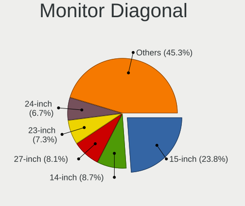

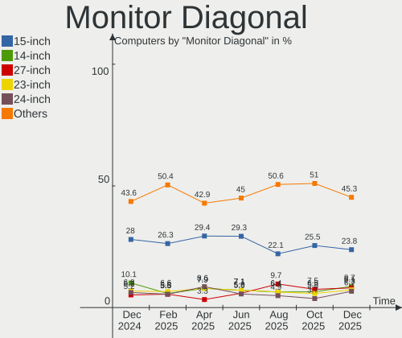

| Inches  | Computers | Percent |
|---------|-----------|---------|
| 15      | 82        | 23.84%  |
| 14      | 30        | 8.72%   |
| 27      | 28        | 8.14%   |
| 23      | 25        | 7.27%   |
| 24      | 23        | 6.69%   |
| 13      | 22        | 6.4%    |
| 21      | 21        | 6.1%    |
| 31      | 17        | 4.94%   |
| 18      | 16        | 4.65%   |
| 34      | 11        | 3.2%    |
| 20      | 10        | 2.91%   |
| 16      | 9         | 2.62%   |
| 19      | 8         | 2.33%   |
| 84      | 7         | 2.03%   |
| 72      | 3         | 0.87%   |
| 63      | 3         | 0.87%   |
| 54      | 3         | 0.87%   |
| 28      | 3         | 0.87%   |
| 26      | 3         | 0.87%   |
| 17      | 3         | 0.87%   |
| 142     | 2         | 0.58%   |
| 48      | 2         | 0.58%   |
| 22      | 2         | 0.58%   |
| 11      | 2         | 0.58%   |
| Unknown | 2         | 0.58%   |
| 65      | 1         | 0.29%   |
| 58      | 1         | 0.29%   |
| 49      | 1         | 0.29%   |
| 46      | 1         | 0.29%   |
| 37      | 1         | 0.29%   |
| 32      | 1         | 0.29%   |
| 12      | 1         | 0.29%   |

Monitor Width
-------------

Physical width

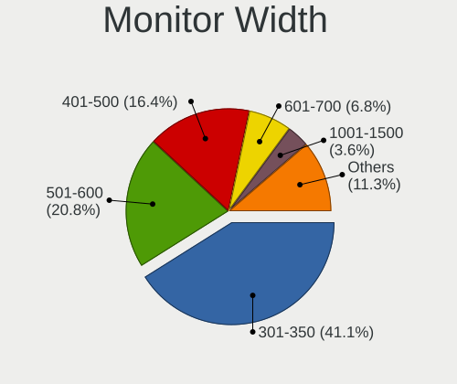

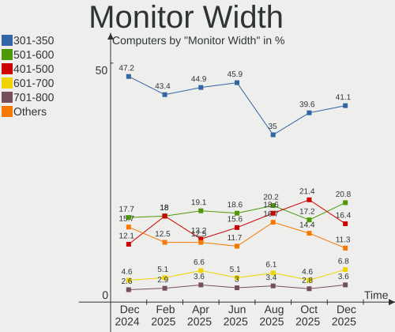

| Width in mm    | Computers | Percent |
|----------------|-----------|---------|
| 301-350        | 138       | 41.07%  |
| 501-600        | 70        | 20.83%  |
| 401-500        | 55        | 16.37%  |
| 601-700        | 23        | 6.85%   |
| 701-800        | 12        | 3.57%   |
| 1001-1500      | 12        | 3.57%   |
| 1501-2000      | 10        | 2.98%   |
| 201-300        | 8         | 2.38%   |
| 351-400        | 3         | 0.89%   |
| More than 2000 | 2         | 0.6%    |
| Unknown        | 2         | 0.6%    |
| 801-900        | 1         | 0.3%    |

Aspect Ratio
------------

Proportional relationship between the width and the height

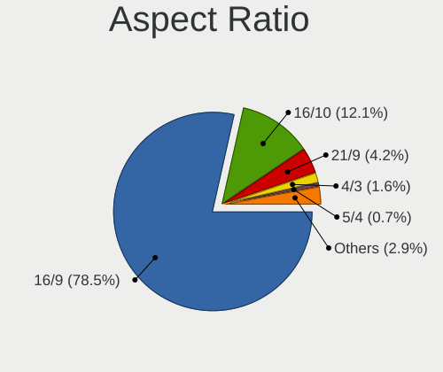

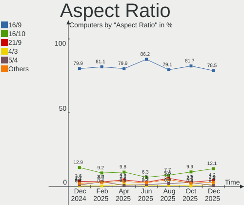

| Ratio   | Computers | Percent |
|---------|-----------|---------|
| 16/9    | 241       | 78.5%   |
| 16/10   | 37        | 12.05%  |
| 21/9    | 13        | 4.23%   |
| 4/3     | 5         | 1.63%   |
| 5/4     | 2         | 0.65%   |
| 32/9    | 2         | 0.65%   |
| 3/2     | 2         | 0.65%   |
| 2.00    | 2         | 0.65%   |
| 1.00    | 2         | 0.65%   |
| Unknown | 1         | 0.33%   |

Monitor Area
------------

Area in inch²

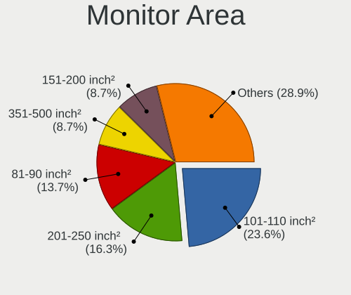

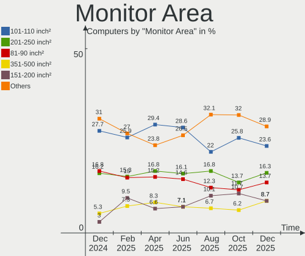

| Area in inch² | Computers | Percent |
|----------------|-----------|---------|
| 101-110        | 81        | 23.62%  |
| 201-250        | 56        | 16.33%  |
| 81-90          | 47        | 13.7%   |
| 351-500        | 30        | 8.75%   |
| 151-200        | 30        | 8.75%   |
| 301-350        | 29        | 8.45%   |
| More than 1000 | 21        | 6.12%   |
| 141-150        | 13        | 3.79%   |
| 251-300        | 11        | 3.21%   |
| 111-120        | 8         | 2.33%   |
| 71-80          | 5         | 1.46%   |
| 501-1000       | 4         | 1.17%   |
| 51-60          | 2         | 0.58%   |
| 121-130        | 2         | 0.58%   |
| 91-100         | 2         | 0.58%   |
| Unknown        | 2         | 0.58%   |

Pixel Density
-------------

Pixels per inch

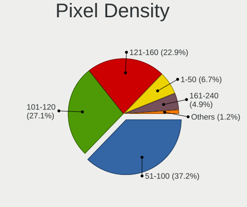

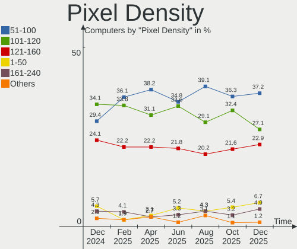

| Density       | Computers | Percent |
|---------------|-----------|---------|
| 51-100        | 122       | 37.2%   |
| 101-120       | 89        | 27.13%  |
| 121-160       | 75        | 22.87%  |
| 1-50          | 22        | 6.71%   |
| 161-240       | 16        | 4.88%   |
| More than 240 | 2         | 0.61%   |
| Unknown       | 2         | 0.61%   |

Multiple Monitors
-----------------

Total monitors connected

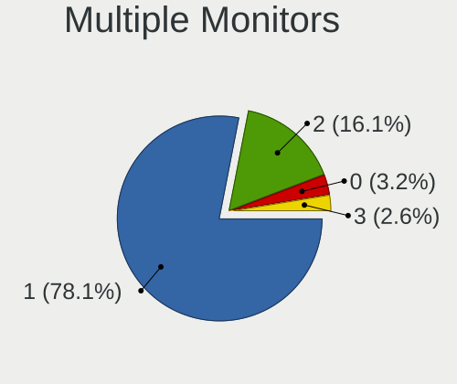

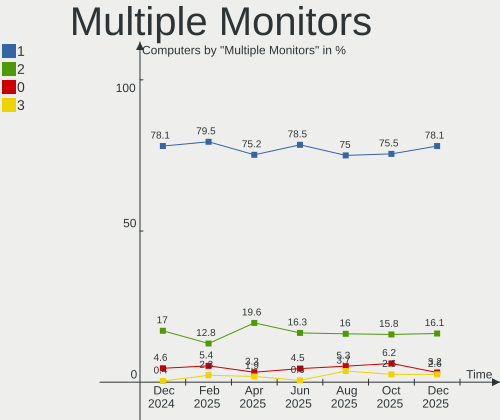

| Total | Computers | Percent |
|-------|-----------|---------|
| 1     | 242       | 78.06%  |
| 2     | 50        | 16.13%  |
| 0     | 10        | 3.23%   |
| 3     | 8         | 2.58%   |

Network
-------

Net Controller Vendor
---------------------

Controller vendors

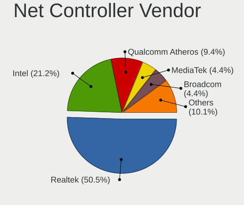

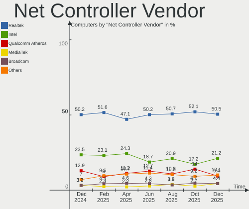

| Vendor                          | Computers | Percent |
|---------------------------------|-----------|---------|
| Realtek Semiconductor           | 231       | 50.55%  |
| Intel                           | 97        | 21.23%  |
| Qualcomm Atheros                | 43        | 9.41%   |
| MediaTek                        | 20        | 4.38%   |
| Broadcom                        | 20        | 4.38%   |
| TP-Link                         | 10        | 2.19%   |
| Samsung Electronics             | 5         | 1.09%   |
| Ralink Technology               | 5         | 1.09%   |
| Ralink                          | 3         | 0.66%   |
| Motorcomm Microelectronics.     | 3         | 0.66%   |
| Marvell Technology Group        | 3         | 0.66%   |
| Broadcom Limited                | 3         | 0.66%   |
| Qualcomm Technologies           | 2         | 0.44%   |
| Qualcomm Atheros Communications | 2         | 0.44%   |
| Nvidia                          | 2         | 0.44%   |
| ASIX Electronics                | 2         | 0.44%   |
| Xiaomi                          | 1         | 0.22%   |
| U-Blox                          | 1         | 0.22%   |
| QinHeng Electronics             | 1         | 0.22%   |
| OCZ Technology                  | 1         | 0.22%   |
| Motorola PCS                    | 1         | 0.22%   |
| Microsoft                       | 1         | 0.22%   |

Net Controller Model
--------------------

Controller models

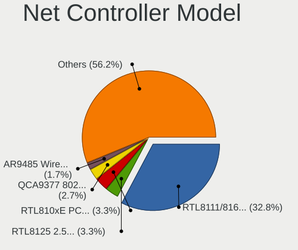

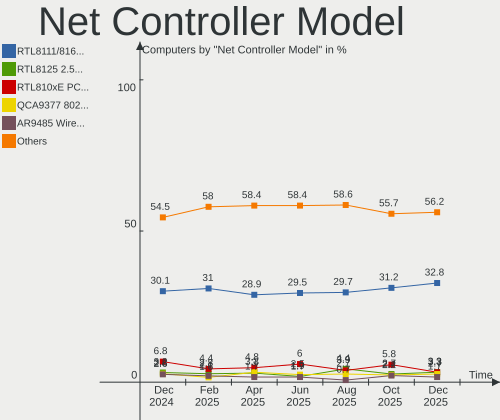

| Model                                                                           | Computers | Percent |
|---------------------------------------------------------------------------------|-----------|---------|
| Realtek RTL8111/8168/8211/8411 PCI Express Gigabit Ethernet Controller          | 169       | 32.75%  |
| Realtek RTL8125 2.5GbE Controller                                               | 17        | 3.29%   |
| Realtek RTL810xE PCI Express Fast Ethernet controller                           | 17        | 3.29%   |
| Qualcomm Atheros QCA9377 802.11ac Wireless Network Adapter                      | 14        | 2.71%   |
| Qualcomm Atheros AR9485 Wireless Network Adapter                                | 9         | 1.74%   |
| Realtek 802.11ac NIC                                                            | 8         | 1.55%   |
| MediaTek MT7902 802.11ax PCIe Wireless Network Adapter [Filogic 310]            | 8         | 1.55%   |
| Realtek RTL8821CE 802.11ac PCIe Wireless Network Adapter                        | 7         | 1.36%   |
| Intel Wireless 7265                                                             | 7         | 1.36%   |
| Intel Wi-Fi 6 AX201                                                             | 7         | 1.36%   |
| Realtek RTL8852BE PCIe 802.11ax Wireless Network Controller                     | 6         | 1.16%   |
| Realtek RTL8153 Gigabit Ethernet Adapter                                        | 6         | 1.16%   |
| Qualcomm Atheros QCA9565 / AR9565 Wireless Network Adapter                      | 6         | 1.16%   |
| Intel Wi-Fi 6E(802.11ax) AX210/AX1675* 2x2 [Typhoon Peak]                       | 6         | 1.16%   |
| Intel Wi-Fi 6 AX200                                                             | 6         | 1.16%   |
| Intel Raptor Lake PCH CNVi WiFi                                                 | 6         | 1.16%   |
| Intel Alder Lake-P PCH CNVi WiFi                                                | 6         | 1.16%   |
| Qualcomm Atheros QCA6174 802.11ac Wireless Network Adapter                      | 5         | 0.97%   |
| Intel Cannon Point-LP CNVi [Wireless-AC]                                        | 5         | 0.97%   |
| Intel 700 Series Chipset CNVi WiFi                                              | 5         | 0.97%   |
| Realtek RTL8188EUS 802.11n Wireless Network Adapter                             | 4         | 0.78%   |
| Intel Wireless 8265 / 8275                                                      | 4         | 0.78%   |
| Samsung GT-I9070 (network tethering, USB debugging enabled)                     | 3         | 0.58%   |
| Realtek RTL8922AE 802.11be PCIe Wireless Network Adapter                        | 3         | 0.58%   |
| Motorcomm Microelectronics. YT6801 Gigabit Ethernet Controller                  | 3         | 0.58%   |
| MediaTek MT7925 802.11be 160MHz 2x2 PCIe Wireless Network Adapter [Filogic 360] | 3         | 0.58%   |
| MediaTek MT7922 802.11ax PCI Express Wireless Network Adapter                   | 3         | 0.58%   |
| MediaTek MT7921 802.11ax PCIe Wireless Network Adapter [Filogic 330]            | 3         | 0.58%   |
| Intel Wireless 3165                                                             | 3         | 0.58%   |
| Intel PRO/Wireless 3945ABG [Golan] Network Connection                           | 3         | 0.58%   |
| Intel Gemini Lake PCH CNVi WiFi                                                 | 3         | 0.58%   |
| Intel Ethernet Connection (6) I219-LM                                           | 3         | 0.58%   |
| Intel Ethernet Connection (4) I219-LM                                           | 3         | 0.58%   |
| Intel Ethernet Connection (2) I219-V                                            | 3         | 0.58%   |
| Intel Ethernet Connection (17) I219-LM                                          | 3         | 0.58%   |
| Intel Comet Lake PCH CNVi WiFi                                                  | 3         | 0.58%   |
| Intel Alder Lake-S PCH CNVi WiFi                                                | 3         | 0.58%   |
| Broadcom NetLink BCM57785 Gigabit Ethernet PCIe                                 | 3         | 0.58%   |
| Broadcom BCM4331 802.11a/b/g/n                                                  | 3         | 0.58%   |
| Broadcom BCM4313 802.11bgn Wireless Network Adapter                             | 3         | 0.58%   |

Wireless Vendor
---------------

Wireless vendors

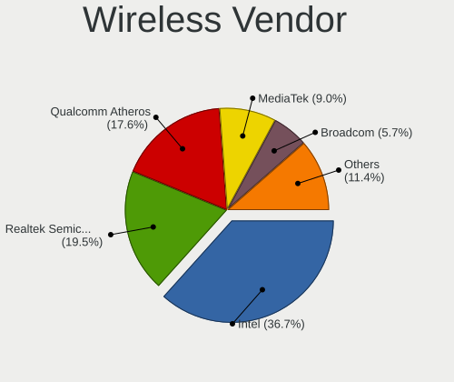

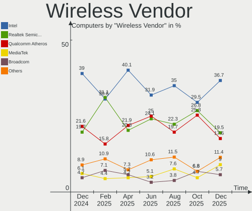

| Vendor                          | Computers | Percent |
|---------------------------------|-----------|---------|
| Intel                           | 77        | 36.67%  |
| Realtek Semiconductor           | 41        | 19.52%  |
| Qualcomm Atheros                | 37        | 17.62%  |
| MediaTek                        | 19        | 9.05%   |
| Broadcom                        | 12        | 5.71%   |
| TP-Link                         | 9         | 4.29%   |
| Ralink Technology               | 5         | 2.38%   |
| Ralink                          | 3         | 1.43%   |
| Broadcom Limited                | 3         | 1.43%   |
| Qualcomm Atheros Communications | 2         | 0.95%   |
| Qualcomm Technologies           | 1         | 0.48%   |
| Microsoft                       | 1         | 0.48%   |

Wireless Model
--------------

Wireless models

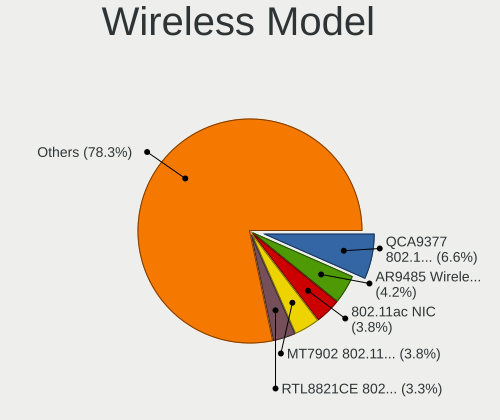

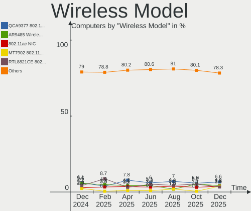

| Model                                                                           | Computers | Percent |
|---------------------------------------------------------------------------------|-----------|---------|
| Qualcomm Atheros QCA9377 802.11ac Wireless Network Adapter                      | 14        | 6.6%    |
| Qualcomm Atheros AR9485 Wireless Network Adapter                                | 9         | 4.25%   |
| Realtek 802.11ac NIC                                                            | 8         | 3.77%   |
| MediaTek MT7902 802.11ax PCIe Wireless Network Adapter [Filogic 310]            | 8         | 3.77%   |
| Realtek RTL8821CE 802.11ac PCIe Wireless Network Adapter                        | 7         | 3.3%    |
| Intel Wireless 7265                                                             | 7         | 3.3%    |
| Intel Wi-Fi 6 AX201                                                             | 7         | 3.3%    |
| Qualcomm Atheros QCA9565 / AR9565 Wireless Network Adapter                      | 6         | 2.83%   |
| Intel Wi-Fi 6E(802.11ax) AX210/AX1675* 2x2 [Typhoon Peak]                       | 6         | 2.83%   |
| Intel Wi-Fi 6 AX200                                                             | 6         | 2.83%   |
| Intel Raptor Lake PCH CNVi WiFi                                                 | 6         | 2.83%   |
| Qualcomm Atheros QCA6174 802.11ac Wireless Network Adapter                      | 5         | 2.36%   |
| Intel Cannon Point-LP CNVi [Wireless-AC]                                        | 5         | 2.36%   |
| Intel 700 Series Chipset CNVi WiFi                                              | 5         | 2.36%   |
| Realtek RTL8188EUS 802.11n Wireless Network Adapter                             | 4         | 1.89%   |
| Intel Wireless 8265 / 8275                                                      | 4         | 1.89%   |
| Intel Alder Lake-P PCH CNVi WiFi                                                | 4         | 1.89%   |
| Realtek RTL8852BE PCIe 802.11ax Wireless Network Controller                     | 3         | 1.42%   |
| MediaTek MT7925 802.11be 160MHz 2x2 PCIe Wireless Network Adapter [Filogic 360] | 3         | 1.42%   |
| MediaTek MT7921 802.11ax PCIe Wireless Network Adapter [Filogic 330]            | 3         | 1.42%   |
| Intel Wireless 3165                                                             | 3         | 1.42%   |
| Intel PRO/Wireless 3945ABG [Golan] Network Connection                           | 3         | 1.42%   |
| Intel Gemini Lake PCH CNVi WiFi                                                 | 3         | 1.42%   |
| Intel Comet Lake PCH CNVi WiFi                                                  | 3         | 1.42%   |
| Broadcom BCM4331 802.11a/b/g/n                                                  | 3         | 1.42%   |
| Broadcom BCM4313 802.11bgn Wireless Network Adapter                             | 3         | 1.42%   |
| TP-Link Archer T2U PLUS [RTL8821AU]                                             | 2         | 0.94%   |
| Realtek RTL88x2bu [AC1200 Techkey]                                              | 2         | 0.94%   |
| Realtek RTL8192CU 802.11n WLAN Adapter                                          | 2         | 0.94%   |
| Realtek RTL8191SEvA Wireless LAN Controller                                     | 2         | 0.94%   |
| Realtek RTL8188CE 802.11b/g/n WiFi Adapter                                      | 2         | 0.94%   |
| Ralink RT5370 Wireless Adapter                                                  | 2         | 0.94%   |
| Ralink MT7601U Wireless Adapter                                                 | 2         | 0.94%   |
| Qualcomm Atheros AR9271 802.11n                                                 | 2         | 0.94%   |
| MediaTek MT7922 802.11ax PCI Express Wireless Network Adapter                   | 2         | 0.94%   |
| MediaTek MT7921K (RZ608) Wi-Fi 6E 80MHz                                         | 2         | 0.94%   |
| Intel Wireless 8260                                                             | 2         | 0.94%   |
| Intel Wireless 7260                                                             | 2         | 0.94%   |
| Intel Meteor Lake PCH CNVi WiFi                                                 | 2         | 0.94%   |
| Broadcom Limited BCM4360 802.11ac Dual Band Wireless Network Adapter            | 2         | 0.94%   |

Ethernet Vendor
---------------

Ethernet vendors

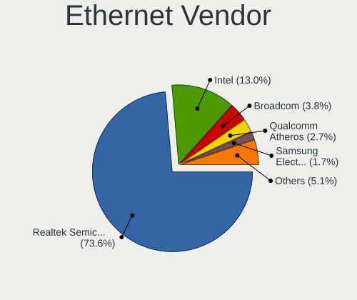

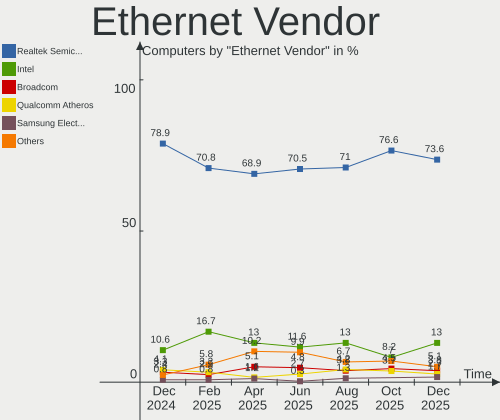

| Vendor                      | Computers | Percent |
|-----------------------------|-----------|---------|
| Realtek Semiconductor       | 215       | 73.63%  |
| Intel                       | 38        | 13.01%  |
| Broadcom                    | 11        | 3.77%   |
| Qualcomm Atheros            | 8         | 2.74%   |
| Samsung Electronics         | 5         | 1.71%   |
| Motorcomm Microelectronics. | 3         | 1.03%   |
| Marvell Technology Group    | 3         | 1.03%   |
| Nvidia                      | 2         | 0.68%   |
| ASIX Electronics            | 2         | 0.68%   |
| Xiaomi                      | 1         | 0.34%   |
| TP-Link                     | 1         | 0.34%   |
| Qualcomm Technologies       | 1         | 0.34%   |
| Motorola PCS                | 1         | 0.34%   |
| MediaTek                    | 1         | 0.34%   |

Ethernet Model
--------------

Ethernet models

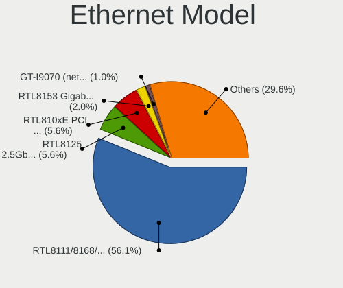

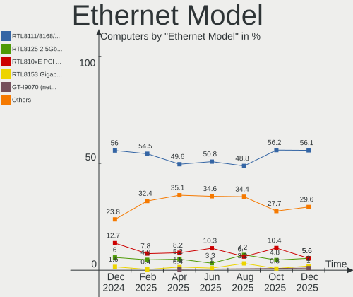

| Model                                                                  | Computers | Percent |
|------------------------------------------------------------------------|-----------|---------|
| Realtek RTL8111/8168/8211/8411 PCI Express Gigabit Ethernet Controller | 169       | 56.15%  |
| Realtek RTL8125 2.5GbE Controller                                      | 17        | 5.65%   |
| Realtek RTL810xE PCI Express Fast Ethernet controller                  | 17        | 5.65%   |
| Realtek RTL8153 Gigabit Ethernet Adapter                               | 6         | 1.99%   |
| Samsung GT-I9070 (network tethering, USB debugging enabled)            | 3         | 1%      |
| Realtek RTL8852BE PCIe 802.11ax Wireless Network Controller            | 3         | 1%      |
| Motorcomm Microelectronics. YT6801 Gigabit Ethernet Controller         | 3         | 1%      |
| Intel Ethernet Connection (6) I219-LM                                  | 3         | 1%      |
| Intel Ethernet Connection (4) I219-LM                                  | 3         | 1%      |
| Intel Ethernet Connection (2) I219-V                                   | 3         | 1%      |
| Intel Ethernet Connection (17) I219-LM                                 | 3         | 1%      |
| Broadcom NetLink BCM57785 Gigabit Ethernet PCIe                        | 3         | 1%      |
| Samsung Galaxy series, misc. (tethering mode)                          | 2         | 0.66%   |
| Realtek RTL8922AE 802.11be PCIe Wireless Network Adapter               | 2         | 0.66%   |
| Realtek RTL8126 5GbE Controller                                        | 2         | 0.66%   |
| Realtek Killer E3000 2.5GbE Controller                                 | 2         | 0.66%   |
| Qualcomm Atheros AR8152 v2.0 Fast Ethernet                             | 2         | 0.66%   |
| Marvell Group 88E8039 PCI-E Fast Ethernet Controller                   | 2         | 0.66%   |
| Intel Ethernet Connection I217-LM                                      | 2         | 0.66%   |
| Intel Ethernet Connection (7) I219-V                                   | 2         | 0.66%   |
| Intel Ethernet Connection (2) I219-LM                                  | 2         | 0.66%   |
| Intel Ethernet Connection (11) I219-LM                                 | 2         | 0.66%   |
| Intel Alder Lake-S PCH CNVi WiFi                                       | 2         | 0.66%   |
| Intel Alder Lake-P PCH CNVi WiFi                                       | 2         | 0.66%   |
| Intel 82574L Gigabit Network Connection                                | 2         | 0.66%   |
| Broadcom NetXtreme BCM57766 Gigabit Ethernet PCIe                      | 2         | 0.66%   |
| Broadcom NetXtreme BCM57765 Gigabit Ethernet PCIe                      | 2         | 0.66%   |
| ASIX AX88179 Gigabit Ethernet                                          | 2         | 0.66%   |
| Xiaomi Mi/Redmi series (RNDIS)                                         | 1         | 0.33%   |
| TP-Link UE300 10/100/1000 LAN (ethernet mode) [Realtek RTL8153]        | 1         | 0.33%   |
| Realtek USB 10/100/1G/2.5 LAN                                          | 1         | 0.33%   |
| Realtek RTL-8110SC/8169SC Gigabit Ethernet                             | 1         | 0.33%   |
| Realtek Killer E2500 Gigabit Ethernet Controller                       | 1         | 0.33%   |
| Qualcomm WCN785x Wi-Fi 7(802.11be) 320MHz 2x2 [FastConnect 7800]       | 1         | 0.33%   |
| Qualcomm Atheros Killer E2500 Gigabit Ethernet Controller              | 1         | 0.33%   |
| Qualcomm Atheros Killer E2400 Gigabit Ethernet Controller              | 1         | 0.33%   |
| Qualcomm Atheros Killer E220x Gigabit Ethernet Controller              | 1         | 0.33%   |
| Qualcomm Atheros Ethernet controller                                   | 1         | 0.33%   |
| Qualcomm Atheros Attansic L1 Gigabit Ethernet                          | 1         | 0.33%   |
| Qualcomm Atheros AR8151 v1.0 Gigabit Ethernet                          | 1         | 0.33%   |

Net Controller Kind
-------------------

Ethernet, WiFi or modem

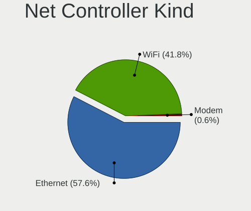

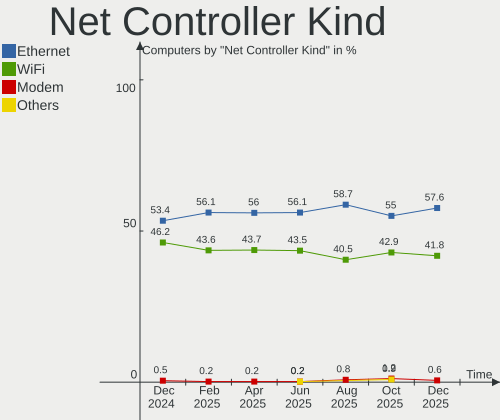

| Kind     | Computers | Percent |
|----------|-----------|---------|
| Ethernet | 278       | 57.56%  |
| WiFi     | 202       | 41.82%  |
| Modem    | 3         | 0.62%   |

Used Controller
---------------

Currently used network controller

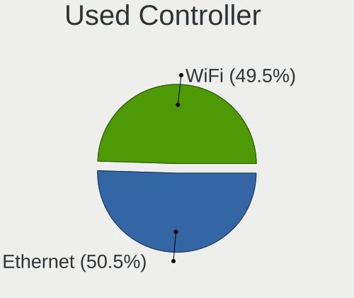

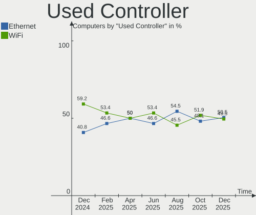

| Kind     | Computers | Percent |
|----------|-----------|---------|
| Ethernet | 156       | 50.49%  |
| WiFi     | 153       | 49.51%  |

NICs
----

Total network controllers on board

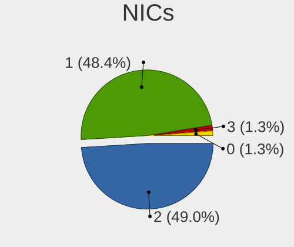

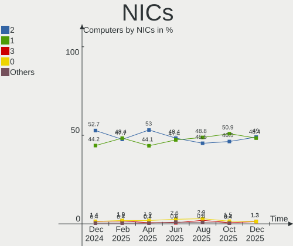

| Total | Computers | Percent |
|-------|-----------|---------|
| 2     | 152       | 49.03%  |
| 1     | 150       | 48.39%  |
| 3     | 4         | 1.29%   |
| 0     | 4         | 1.29%   |

IPv6
----

IPv6 vs IPv4

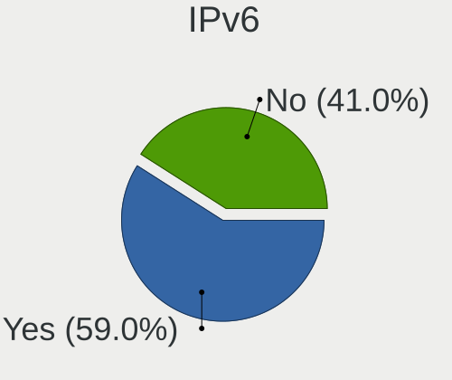

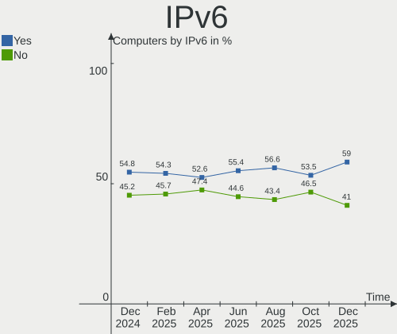

| Used | Computers | Percent |
|------|-----------|---------|
| Yes  | 183       | 59.03%  |
| No   | 127       | 40.97%  |

Bluetooth
---------

Bluetooth Vendor
----------------

Controller vendors

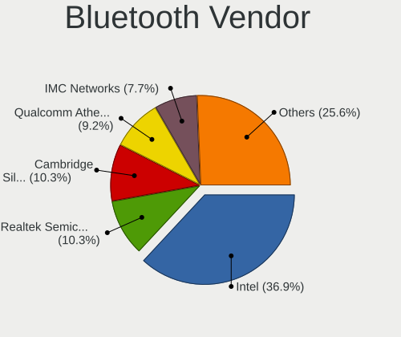

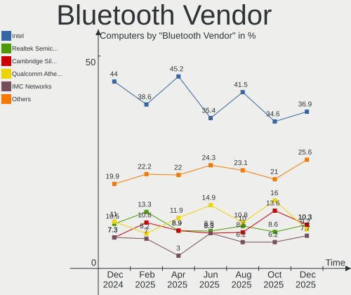

| Vendor                          | Computers | Percent |
|---------------------------------|-----------|---------|
| Intel                           | 72        | 36.92%  |
| Realtek Semiconductor           | 20        | 10.26%  |
| Cambridge Silicon Radio         | 20        | 10.26%  |
| Qualcomm Atheros Communications | 18        | 9.23%   |
| IMC Networks                    | 15        | 7.69%   |
| Lite-On Technology              | 10        | 5.13%   |
| Foxconn / Hon Hai               | 9         | 4.62%   |
| Apple                           | 7         | 3.59%   |
| TP-Link                         | 6         | 3.08%   |
| MediaTek                        | 4         | 2.05%   |
| Broadcom                        | 3         | 1.54%   |
| Unknown                         | 3         | 1.54%   |
| Smart Modular Technologies      | 2         | 1.03%   |
| ASUSTek Computer                | 2         | 1.03%   |
| Realtek                         | 1         | 0.51%   |
| Ralink                          | 1         | 0.51%   |
| Askey Computer                  | 1         | 0.51%   |
| Actions                         | 1         | 0.51%   |

Bluetooth Model
---------------

Controller models

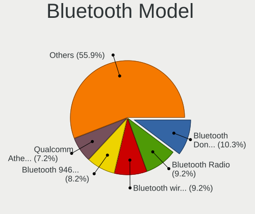

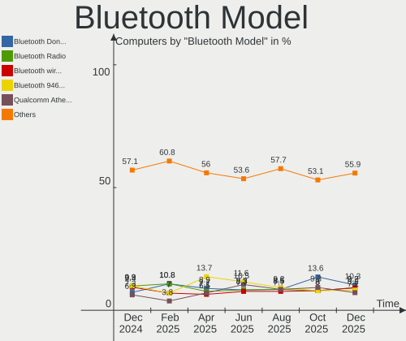

| Model                                               | Computers | Percent |
|-----------------------------------------------------|-----------|---------|
| Cambridge Silicon Radio Bluetooth Dongle (HCI mode) | 20        | 10.26%  |
| Realtek Bluetooth Radio                             | 18        | 9.23%   |
| Intel Bluetooth wireless interface                  | 18        | 9.23%   |
| Intel Bluetooth 9460/9560 Jefferson Peak (JfP)      | 16        | 8.21%   |
| Qualcomm Atheros  Bluetooth Device                  | 14        | 7.18%   |
| Intel AX201 Bluetooth                               | 14        | 7.18%   |
| Intel Bluetooth Device                              | 11        | 5.64%   |
| IMC Networks Wireless_Device                        | 10        | 5.13%   |
| TP-Link TP-T@- UB500 Adapter                        | 6         | 3.08%   |
| Lite-On Qualcomm Atheros QCA9377 Bluetooth          | 6         | 3.08%   |
| Intel AX210 Bluetooth                               | 5         | 2.56%   |
| MediaTek Wireless_Device                            | 4         | 2.05%   |
| Intel AX200 Bluetooth                               | 4         | 2.05%   |
| IMC Networks Bluetooth Radio                        | 4         | 2.05%   |
| Apple Bluetooth Host Controller                     | 4         | 2.05%   |
| Foxconn / Hon Hai Bluetooth Device                  | 3         | 1.54%   |
| Unknown                                             | 3         | 1.54%   |
| Smart Modular Bluetooth Device                      | 2         | 1.03%   |
| Qualcomm Atheros Bluetooth USB Host Controller      | 2         | 1.03%   |
| Lite-On Bluetooth Device                            | 2         | 1.03%   |
| Foxconn / Hon Hai BCM43142A0                        | 2         | 1.03%   |
| Apple Built-in Bluetooth 2.0+EDR HCI                | 2         | 1.03%   |
| Realtek  Bluetooth 4.2 Adapter                      | 1         | 0.51%   |
| Realtek Bluetooth 5.3 Radio                         | 1         | 0.51%   |
| Realtek Bluetooth Radio                             | 1         | 0.51%   |
| Ralink RT3290 Bluetooth                             | 1         | 0.51%   |
| Qualcomm Atheros AR3012 Bluetooth 4.0               | 1         | 0.51%   |
| Qualcomm Atheros AR3011 Bluetooth                   | 1         | 0.51%   |
| Lite-On Wireless_Device                             | 1         | 0.51%   |
| Lite-On Qualcomm Atheros Bluetooth                  | 1         | 0.51%   |
| Intel Wireless-AC 9260 Bluetooth Adapter            | 1         | 0.51%   |
| Intel Wireless-AC 3168 Bluetooth                    | 1         | 0.51%   |
| Intel Centrino Bluetooth Wireless Transceiver       | 1         | 0.51%   |
| Intel Bluetooth                                     | 1         | 0.51%   |
| IMC Networks Atheros AR3012 Bluetooth 4.0 Adapter   | 1         | 0.51%   |
| Foxconn / Hon Hai Wireless_Device                   | 1         | 0.51%   |
| Foxconn / Hon Hai MediaTek MT7921 Bluetooth         | 1         | 0.51%   |
| Foxconn / Hon Hai MediaTek Bluetooth Adapter        | 1         | 0.51%   |
| Foxconn / Hon Hai Bluetooth Radio                   | 1         | 0.51%   |
| Broadcom BCM2070 Bluetooth Device                   | 1         | 0.51%   |

Sound
-----

Sound Vendor
------------

Sound card vendors

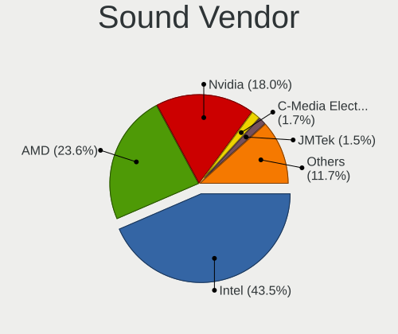

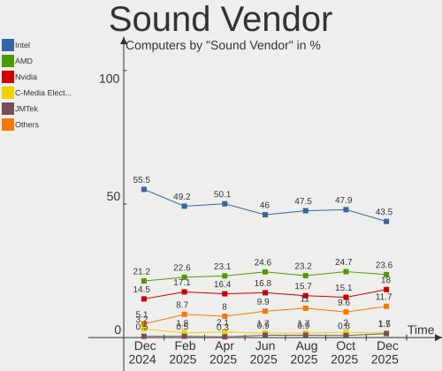

| Vendor                                       | Computers | Percent |
|----------------------------------------------|-----------|---------|
| Intel                                        | 208       | 43.51%  |
| AMD                                          | 113       | 23.64%  |
| Nvidia                                       | 86        | 17.99%  |
| C-Media Electronics                          | 8         | 1.67%   |
| JMTek                                        | 7         | 1.46%   |
| Logitech                                     | 5         | 1.05%   |
| Weltrend Semiconductor                       | 4         | 0.84%   |
| Generalplus Technology                       | 4         | 0.84%   |
| Kingston Technology                          | 3         | 0.63%   |
| Corsair                                      | 3         | 0.63%   |
| Zoran Co. Personal Media Division (Nogatech) | 2         | 0.42%   |
| SteelSeries ApS                              | 2         | 0.42%   |
| Sony                                         | 2         | 0.42%   |
| Realtek Semiconductor                        | 2         | 0.42%   |
| Razer USA                                    | 2         | 0.42%   |
| MV-SILICON                                   | 2         | 0.42%   |
| ASUSTek Computer                             | 2         | 0.42%   |
| Unknown                                      | 2         | 0.42%   |
| XING WEI 2.4G USB                            | 1         | 0.21%   |
| Texas Instruments                            | 1         | 0.21%   |
| Soundprese                                   | 1         | 0.21%   |
| RODE Microphones                             | 1         | 0.21%   |
| Plantronics                                  | 1         | 0.21%   |
| Micro Star International                     | 1         | 0.21%   |
| liyuany                                      | 1         | 0.21%   |
| KTMicro                                      | 1         | 0.21%   |
| Jieli Technology                             | 1         | 0.21%   |
| Hewlett-Packard                              | 1         | 0.21%   |
| Harman International                         | 1         | 0.21%   |
| Goldvish                                     | 1         | 0.21%   |
| GN Netcom                                    | 1         | 0.21%   |
| Ensoniq                                      | 1         | 0.21%   |
| EDFIER                                       | 1         | 0.21%   |
| DSEA A/S                                     | 1         | 0.21%   |
| Dell                                         | 1         | 0.21%   |
| Creative Technology                          | 1         | 0.21%   |
| Compx                                        | 1         | 0.21%   |
| Audient                                      | 1         | 0.21%   |
| Asahi Kasei Microsystems                     | 1         | 0.21%   |

Sound Model
-----------

Sound card models

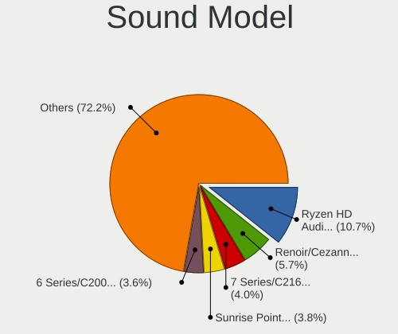

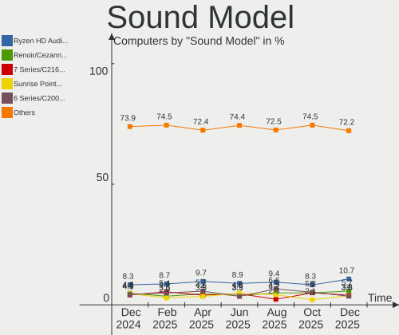

| Model                                                                      | Computers | Percent |
|----------------------------------------------------------------------------|-----------|---------|
| AMD Ryzen HD Audio Controller                                              | 62        | 10.69%  |
| AMD Renoir/Cezanne HDMI/DP Audio Controller                                | 33        | 5.69%   |
| Intel 7 Series/C216 Chipset Family High Definition Audio Controller        | 23        | 3.97%   |
| Intel Sunrise Point-LP HD Audio                                            | 22        | 3.79%   |
| Intel 6 Series/C200 Series Chipset Family High Definition Audio Controller | 21        | 3.62%   |
| AMD Starship/Matisse HD Audio Controller                                   | 21        | 3.62%   |
| AMD Navi 21/23 HDMI/DP Audio Controller                                    | 17        | 2.93%   |
| Intel 8 Series/C220 Series Chipset High Definition Audio Controller        | 16        | 2.76%   |
| AMD Radeon High Definition Audio Controller                                | 14        | 2.41%   |
| Intel Raptor Lake-P/U/H cAVS                                               | 13        | 2.24%   |
| AMD Ellesmere HDMI Audio [Radeon RX 470/480 / 570/580/590]                 | 10        | 1.72%   |
| Intel Tiger Lake-LP Smart Sound Technology Audio Controller                | 9         | 1.55%   |
| Intel 100 Series/C230 Series Chipset Family HD Audio Controller            | 9         | 1.55%   |
| Nvidia GA107 High Definition Audio Controller                              | 8         | 1.38%   |
| Nvidia GA106 High Definition Audio Controller                              | 8         | 1.38%   |
| Intel Raptor Lake High Definition Audio Controller                         | 7         | 1.21%   |
| Intel Alder Lake-S HD Audio Controller                                     | 7         | 1.21%   |
| Intel Alder Lake PCH-P High Definition Audio Controller                    | 7         | 1.21%   |
| Intel 5 Series/3400 Series Chipset High Definition Audio                   | 7         | 1.21%   |
| AMD Raven/Raven2/Fenghuang HDMI/DP Audio Controller                        | 7         | 1.21%   |
| Intel Cannon Lake PCH cAVS                                                 | 6         | 1.03%   |
| AMD Navi 31 HDMI/DP Audio                                                  | 6         | 1.03%   |
| Nvidia High Definition Audio Controller                                    | 5         | 0.86%   |
| Nvidia GP107GL High Definition Audio Controller                            | 5         | 0.86%   |
| Nvidia GB206 High Definition Audio Controller                              | 5         | 0.86%   |
| Nvidia AD107 High Definition Audio Controller                              | 5         | 0.86%   |
| Intel NM10/ICH7 Family High Definition Audio Controller                    | 5         | 0.86%   |
| Intel Haswell-ULT HD Audio Controller                                      | 5         | 0.86%   |
| Intel Celeron/Pentium Silver Processor High Definition Audio               | 5         | 0.86%   |
| Intel Cannon Point-LP High Definition Audio Controller                     | 5         | 0.86%   |
| Intel 82801I (ICH9 Family) HD Audio Controller                             | 5         | 0.86%   |
| Intel 8 Series HD Audio Controller                                         | 5         | 0.86%   |
| AMD SBx00 Azalia (Intel HDA)                                               | 5         | 0.86%   |
| Weltrend Semiconductor H848 Wireless headset                               | 4         | 0.69%   |
| Nvidia TU116 High Definition Audio Controller                              | 4         | 0.69%   |
| Nvidia GA104 High Definition Audio Controller                              | 4         | 0.69%   |
| Intel Xeon E3-1200 v3/4th Gen Core Processor HD Audio Controller           | 4         | 0.69%   |
| Intel Wildcat Point-LP High Definition Audio Controller                    | 4         | 0.69%   |
| Intel Broadwell-U Audio Controller                                         | 4         | 0.69%   |
| Generalplus Technology USB Audio Device                                    | 4         | 0.69%   |

Memory
------

Memory Vendor
-------------

Memory module vendors

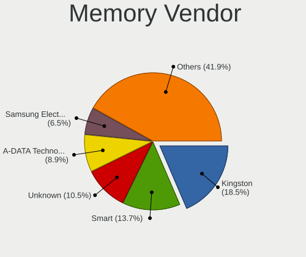

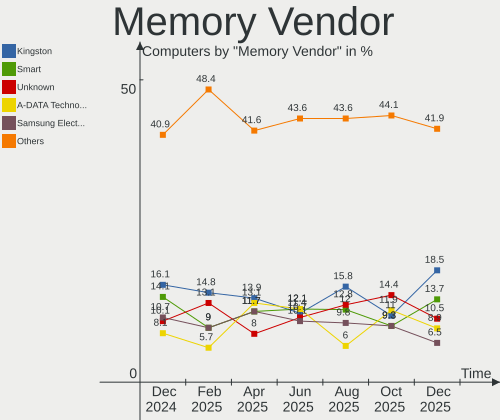

| Vendor                 | Computers | Percent |
|------------------------|-----------|---------|
| Kingston               | 23        | 18.55%  |
| Smart                  | 17        | 13.71%  |
| Unknown                | 13        | 10.48%  |
| A-DATA Technology      | 11        | 8.87%   |
| Samsung Electronics    | 8         | 6.45%   |
| Micron Technology      | 8         | 6.45%   |
| SK hynix               | 6         | 4.84%   |
| Unknown                | 6         | 4.84%   |
| Corsair                | 5         | 4.03%   |
| Unknown (0x0B5E)       | 4         | 3.23%   |
| Crucial                | 4         | 3.23%   |
| Unknown (ABCD)         | 2         | 1.61%   |
| TeamGroup              | 2         | 1.61%   |
| Team                   | 2         | 1.61%   |
| PUSKILL                | 2         | 1.61%   |
| Unknown (0x0F94)       | 1         | 0.81%   |
| Unknown (0000000080CE) | 1         | 0.81%   |
| Smart Brazil           | 1         | 0.81%   |
| Nanya Technology       | 1         | 0.81%   |
| Multilaser             | 1         | 0.81%   |
| Juhor                  | 1         | 0.81%   |
| High Bridge            | 1         | 0.81%   |
| Asgard                 | 1         | 0.81%   |
| Apacer                 | 1         | 0.81%   |
| 83130000802C           | 1         | 0.81%   |
| 4ea5                   | 1         | 0.81%   |

Memory Model
------------

Memory module models

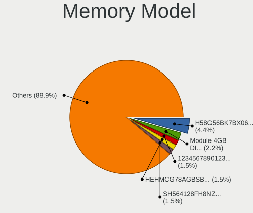

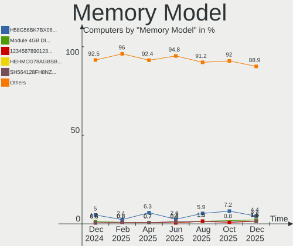

| Model                                                                 | Computers | Percent |
|-----------------------------------------------------------------------|-----------|---------|
| Unknown                                                               | 6         | 4.44%   |
| Unknown RAM Module 4GB DIMM DDR3 1333MT/s                             | 3         | 2.22%   |
| Unknown (ABCD) RAM 123456789012345678 2GB SODIMM LPDDR4 2400MT/s      | 2         | 1.48%   |
| Unknown (0x0B5E) RAM HEHMCG78AGBSBA0BN 16GB SODIMM DDR5 5600MT/s      | 2         | 1.48%   |
| Smart RAM SH564128FH8NZQNSCG 4GB SODIMM DDR3 1600MT/s                 | 2         | 1.48%   |
| Smart RAM SF564128CJ8NWMNSEG 4GB SODIMM DDR3 1600MT/s                 | 2         | 1.48%   |
| Smart RAM SF4641G8CK8IEHLSBG 8GB SODIMM DDR4 2667MT/s                 | 2         | 1.48%   |
| SK hynix RAM HMA82GS6AFR8N-UH 16GB SODIMM DDR4 2667MT/s               | 2         | 1.48%   |
| Samsung RAM M471A1G44BB0-CWE 8GB SODIMM DDR4 3200MT/s                 | 2         | 1.48%   |
| Micron RAM 4ATF51264HZ-2G3B1 4GB SODIMM DDR4 3200MT/s                 | 2         | 1.48%   |
| Kingston RAM Module 8GB SODIMM DDR3 1600MT/s                          | 2         | 1.48%   |
| Kingston RAM KF560C30-16 16GB DIMM DDR5 6000MT/s                      | 2         | 1.48%   |
| A-DATA RAM Module 16GB SODIMM DDR4 3200MT/s                           | 2         | 1.48%   |
| Unknown RAM Module 8GB SODIMM DDR4 2667MT/s                           | 1         | 0.74%   |
| Unknown RAM Module 8GB SODIMM DDR3                                    | 1         | 0.74%   |
| Unknown RAM Module 8GB DIMM DDR3 1866MT/s                             | 1         | 0.74%   |
| Unknown RAM Module 4GB SODIMM DDR4 2133MT/s                           | 1         | 0.74%   |
| Unknown RAM Module 4GB SODIMM DDR3                                    | 1         | 0.74%   |
| Unknown RAM Module 4GB DIMM SDRAM                                     | 1         | 0.74%   |
| Unknown RAM Module 4GB DIMM DDR4 2133MT/s                             | 1         | 0.74%   |
| Unknown RAM Module 4GB DIMM 1333MT/s                                  | 1         | 0.74%   |
| Unknown RAM Module 2GB SODIMM DDR2 667MT/s                            | 1         | 0.74%   |
| Unknown RAM Module 2GB SODIMM DDR2                                    | 1         | 0.74%   |
| Unknown RAM Module 2GB DIMM DDR3 1333MT/s                             | 1         | 0.74%   |
| Unknown RAM Module 2GB DIMM 1333MT/s                                  | 1         | 0.74%   |
| Unknown (0x0F94) RAM ZMS5WMC8C2J0B46SPG 16GB SODIMM DDR5 5600MT/s     | 1         | 0.74%   |
| Unknown (0x0B5E) RAM HEMA82GS6DJR8N-XN 16GB SODIMM DDR4 3200MT/s      | 1         | 0.74%   |
| Unknown (0x0B5E) RAM HEMA81GS6DJR8N-XN 8GB SODIMM DDR4 3200MT/s       | 1         | 0.74%   |
| Unknown (0000000080CE) RAM K4UBE3D4AA-MGCR 8GB SODIMM LPDDR4 4266MT/s | 1         | 0.74%   |
| TeamGroup RAM UD5-6400 16GB DIMM DDR5 6400MT/s                        | 1         | 0.74%   |
| TeamGroup RAM UD5-6000 16GB DIMM DDR5 6000MT/s                        | 1         | 0.74%   |
| Team RAM TEAMGROUP-UD4-3200 8GB DIMM DDR4 3733MT/s                    | 1         | 0.74%   |
| Team RAM TEAMGROUP-UD4-2666 8GB DIMM DDR4 3000MT/s                    | 1         | 0.74%   |
| Smart RAM SMS4WEC3C0K0446SCG 4GB SODIMM DDR4 3200MT/s                 | 1         | 0.74%   |
| Smart RAM SMS4TDC8C1K0446FCG 8GB DDR4 2667MT/s                        | 1         | 0.74%   |
| Smart RAM SH564568FJ8NZRNSDR 2GB SODIMM DDR3 1600MT/s                 | 1         | 0.74%   |
| Smart RAM SH564568FH8NWPHSFG 2GB SODIMM DDR3 1333MT/s                 | 1         | 0.74%   |
| Smart RAM SH5641G8FJ8NWRNSQR 8GB SODIMM DDR3 1600MT/s                 | 1         | 0.74%   |
| Smart RAM SH564128FJ8NWRNSQG 4GB SODIMM DDR3 1600MT/s                 | 1         | 0.74%   |
| Smart RAM SH564128FH8NZPHSCR 4GB SODIMM DDR3 1334MT/s                 | 1         | 0.74%   |

Memory Kind
-----------

Memory module kinds

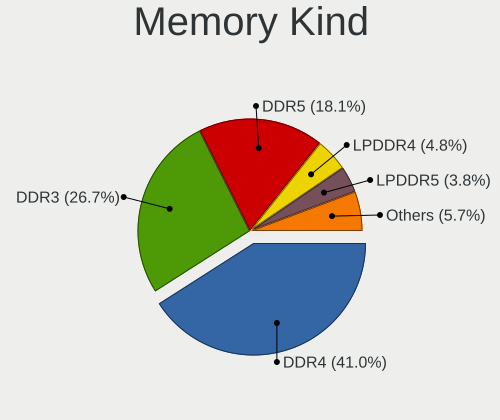

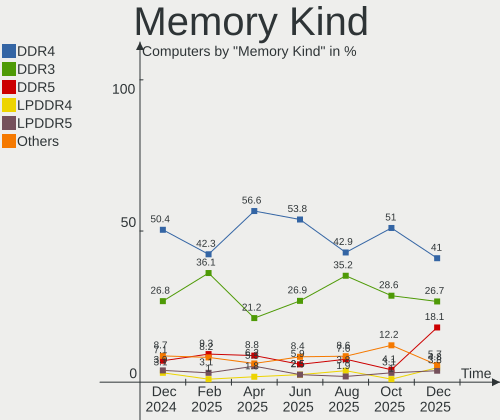

| Kind    | Computers | Percent |
|---------|-----------|---------|
| DDR4    | 43        | 40.95%  |
| DDR3    | 28        | 26.67%  |
| DDR5    | 19        | 18.1%   |
| LPDDR4  | 5         | 4.76%   |
| LPDDR5  | 4         | 3.81%   |
| DDR2    | 3         | 2.86%   |
| SDRAM   | 1         | 0.95%   |
| LPDDR3  | 1         | 0.95%   |
| Unknown | 1         | 0.95%   |

Memory Form Factor
------------------

Physical design of the memory module

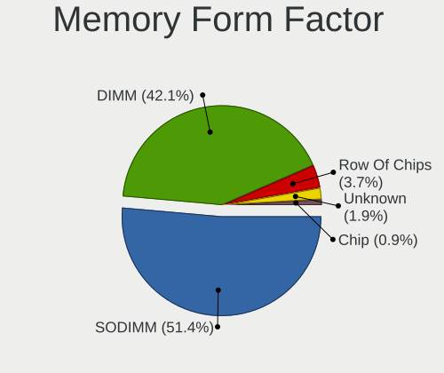

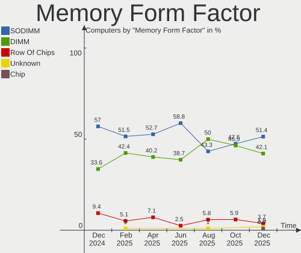

| Name         | Computers | Percent |
|--------------|-----------|---------|
| SODIMM       | 55        | 51.4%   |
| DIMM         | 45        | 42.06%  |
| Row Of Chips | 4         | 3.74%   |
| Unknown      | 2         | 1.87%   |
| Chip         | 1         | 0.93%   |

Memory Size
-----------

Memory module size

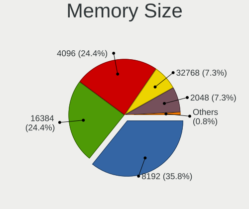

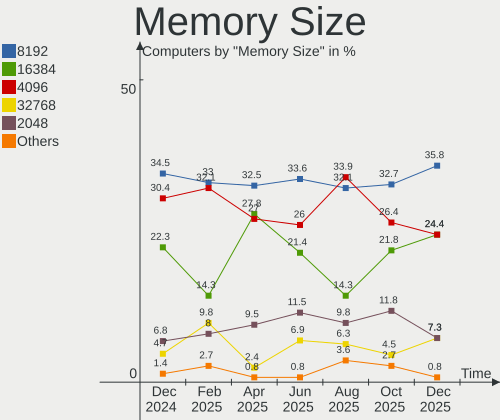

| Size  | Computers | Percent |
|-------|-----------|---------|
| 8192  | 44        | 35.77%  |
| 16384 | 30        | 24.39%  |
| 4096  | 30        | 24.39%  |
| 32768 | 9         | 7.32%   |
| 2048  | 9         | 7.32%   |
| 65536 | 1         | 0.81%   |

Memory Speed
------------

Memory module speed

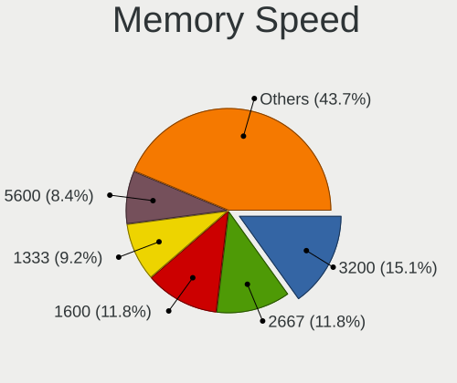

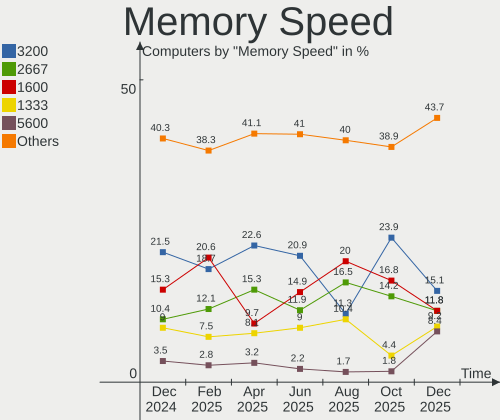

| Speed   | Computers | Percent |
|---------|-----------|---------|
| 3200    | 18        | 15.13%  |
| 2667    | 14        | 11.76%  |
| 1600    | 14        | 11.76%  |
| 1333    | 11        | 9.24%   |
| 5600    | 10        | 8.4%    |
| 2400    | 9         | 7.56%   |
| Unknown | 6         | 5.04%   |
| 6000    | 5         | 4.2%    |
| 2133    | 5         | 4.2%    |
| 4800    | 4         | 3.36%   |
| 3600    | 3         | 2.52%   |
| 6400    | 2         | 1.68%   |
| 3800    | 2         | 1.68%   |
| 1334    | 2         | 1.68%   |
| 8533    | 1         | 0.84%   |
| 8532    | 1         | 0.84%   |
| 7500    | 1         | 0.84%   |
| 4267    | 1         | 0.84%   |
| 4266    | 1         | 0.84%   |
| 3733    | 1         | 0.84%   |
| 3000    | 1         | 0.84%   |
| 2666    | 1         | 0.84%   |
| 1867    | 1         | 0.84%   |
| 1866    | 1         | 0.84%   |
| 1067    | 1         | 0.84%   |
| 1066    | 1         | 0.84%   |
| 800     | 1         | 0.84%   |
| 667     | 1         | 0.84%   |

Printers & scanners
-------------------

Printer Vendor
--------------

Printer device vendors

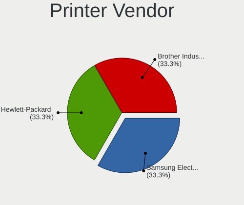

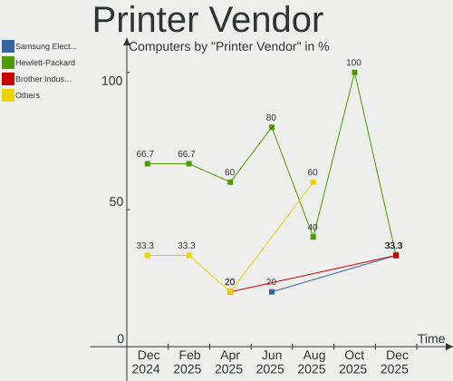

| Vendor              | Computers | Percent |
|---------------------|-----------|---------|
| Samsung Electronics | 1         | 33.33%  |
| Hewlett-Packard     | 1         | 33.33%  |
| Brother Industries  | 1         | 33.33%  |

Printer Model
-------------

Printer device models

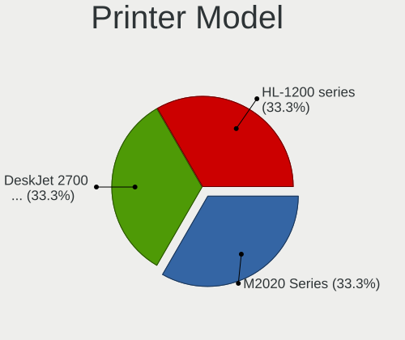

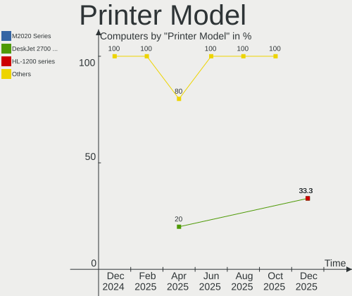

| Model                  | Computers | Percent |
|------------------------|-----------|---------|
| Samsung M2020 Series   | 1         | 33.33%  |
| HP DeskJet 2700 series | 1         | 33.33%  |
| Brother HL-1200 series | 1         | 33.33%  |

Scanner Vendor
--------------

Scanner device vendors

Zero info for selected period =(

Scanner Model
-------------

Scanner device models

Zero info for selected period =(

Camera
------

Camera Vendor
-------------

Camera device vendors

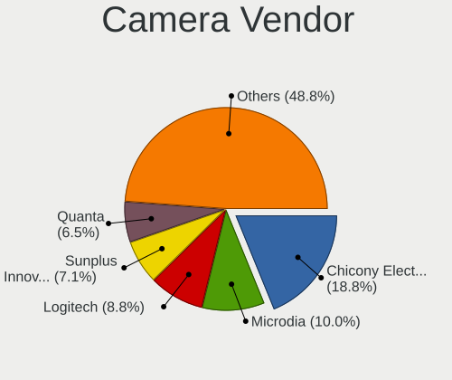

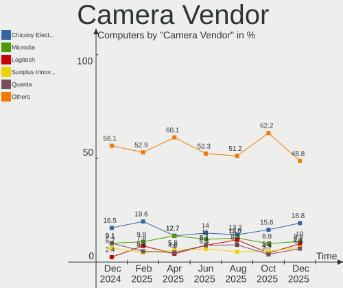

| Vendor                                 | Computers | Percent |
|----------------------------------------|-----------|---------|
| Chicony Electronics                    | 32        | 18.82%  |
| Microdia                               | 17        | 10%     |
| Logitech                               | 15        | 8.82%   |
| Sunplus Innovation Technology          | 12        | 7.06%   |
| Quanta                                 | 11        | 6.47%   |
| IMC Networks                           | 10        | 5.88%   |
| Realtek Semiconductor                  | 8         | 4.71%   |
| Silicon Motion                         | 7         | 4.12%   |
| Bison Electronics                      | 5         | 2.94%   |
| Unknown                                | 5         | 2.94%   |
| Syntek                                 | 4         | 2.35%   |
| Apple                                  | 4         | 2.35%   |
| SunplusIT                              | 3         | 1.76%   |
| Sonix Technology                       | 3         | 1.76%   |
| Generalplus Technology                 | 3         | 1.76%   |
| Cheng Uei Precision Industry (Foxlink) | 3         | 1.76%   |
| Alcor Micro                            | 3         | 1.76%   |
| Shinetech                              | 2         | 1.18%   |
| Luxvisions Innotech Limited            | 2         | 1.18%   |
| Lite-On Technology                     | 2         | 1.18%   |
| Aveo Technology                        | 2         | 1.18%   |
| ALi                                    | 2         | 1.18%   |
| Z-Star Microelectronics                | 1         | 0.59%   |
| Suyin                                  | 1         | 0.59%   |
| Sunplus Technology                     | 1         | 0.59%   |
| Shine-optics                           | 1         | 0.59%   |
| Samsung Electronics                    | 1         | 0.59%   |
| Ricoh                                  | 1         | 0.59%   |
| Pixart Imaging                         | 1         | 0.59%   |
| MacroSilicon                           | 1         | 0.59%   |
| kingcome                               | 1         | 0.59%   |
| GEMBIRD                                | 1         | 0.59%   |
| eMeet                                  | 1         | 0.59%   |
| Elgato Systems                         | 1         | 0.59%   |
| Cubeternet                             | 1         | 0.59%   |
| Anker PowerConf C200                   | 1         | 0.59%   |
| A4Tech                                 | 1         | 0.59%   |

Camera Model
------------

Camera device models

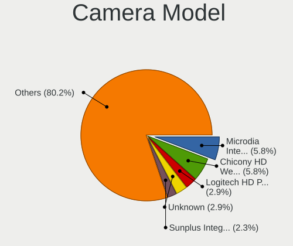

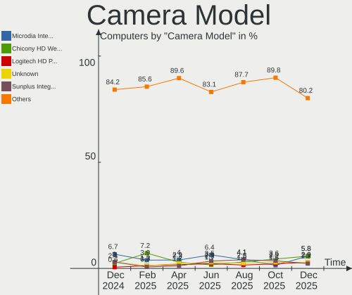

| Model                                         | Computers | Percent |
|-----------------------------------------------|-----------|---------|
| Microdia Integrated_Webcam_HD                 | 10        | 5.81%   |
| Chicony HD WebCam                             | 10        | 5.81%   |
| Logitech HD Pro Webcam C920                   | 5         | 2.91%   |
| Unknown                                       | 5         | 2.91%   |
| Sunplus Integrated_Webcam_HD                  | 4         | 2.33%   |
| Silicon Motion Web Camera                     | 4         | 2.33%   |
| Realtek Integrated_Webcam_HD                  | 4         | 2.33%   |
| Quanta VGA WebCam                             | 4         | 2.33%   |
| Logitech Webcam C270                          | 4         | 2.33%   |
| Logitech C922 Pro Stream Webcam               | 4         | 2.33%   |
| IMC Networks USB2.0 HD UVC WebCam             | 4         | 2.33%   |
| Syntek Integrated Camera                      | 3         | 1.74%   |
| IMC Networks Integrated Camera                | 3         | 1.74%   |
| Chicony ACER HD User Facing                   | 3         | 1.74%   |
| Bison Integrated Camera                       | 3         | 1.74%   |
| Sunplus SPCA2281 Web Camera                   | 2         | 1.16%   |
| Sunplus Integrated_Webcam_FHD                 | 2         | 1.16%   |
| Sonix USB2.0 HD UVC WebCam                    | 2         | 1.16%   |
| Realtek Integrated Webcam                     | 2         | 1.16%   |
| Quanta HP TrueVision HD Camera                | 2         | 1.16%   |
| Quanta HD User Facing                         | 2         | 1.16%   |
| Quanta ACER HD User Facing                    | 2         | 1.16%   |
| Luxvisions Innotech Limited Integrated Camera | 2         | 1.16%   |
| Lite-On HP HD Camera                          | 2         | 1.16%   |
| Chicony USB2.0 HD UVC WebCam                  | 2         | 1.16%   |
| Chicony Integrated Camera (1280x720@30)       | 2         | 1.16%   |
| Chicony Integrated Camera                     | 2         | 1.16%   |
| Chicony HP HD Camera                          | 2         | 1.16%   |
| Chicony HD User Facing                        | 2         | 1.16%   |
| Chicony ACER FHD User Facing                  | 2         | 1.16%   |
| Bison EasyCamera                              | 2         | 1.16%   |
| Apple iPhone 5/5C/5S/6/SE/7/8/X               | 2         | 1.16%   |
| Apple FaceTime HD Camera                      | 2         | 1.16%   |
| Z-Star Venus USB2.0 Camera                    | 1         | 0.58%   |
| Syntek EasyCamera                             | 1         | 0.58%   |
| Suyin HP Webcam-101                           | 1         | 0.58%   |
| SunplusIT FHD Webcam                          | 1         | 0.58%   |
| SunplusIT 720p HD Camera                      | 1         | 0.58%   |
| SunplusIT 1080p FHD Camera                    | 1         | 0.58%   |
| Sunplus 1.3M HD WebCam                        | 1         | 0.58%   |

Security
--------

Fingerprint Vendor
------------------

Fingerprint sensor vendors

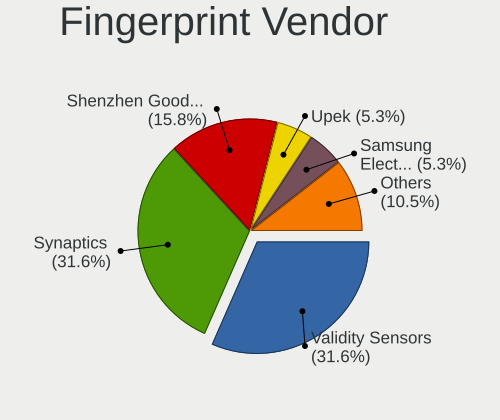

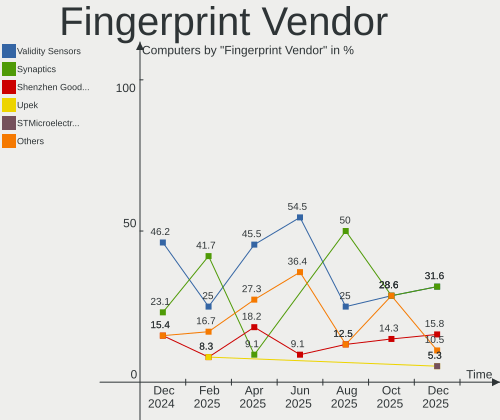

| Vendor                     | Computers | Percent |
|----------------------------|-----------|---------|
| Validity Sensors           | 6         | 31.58%  |
| Synaptics                  | 6         | 31.58%  |
| Shenzhen Goodix Technology | 3         | 15.79%  |
| Upek                       | 1         | 5.26%   |
| STMicroelectronics         | 1         | 5.26%   |
| Samsung Electronics        | 1         | 5.26%   |
| AuthenTec                  | 1         | 5.26%   |

Fingerprint Model
-----------------

Fingerprint sensor models

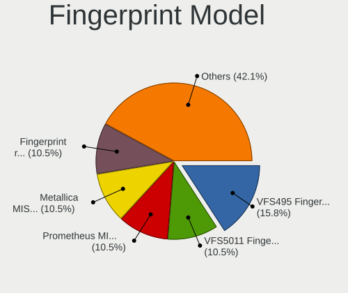

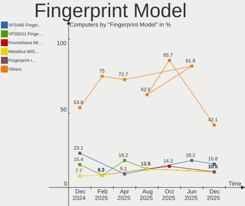

| Model                                                  | Computers | Percent |
|--------------------------------------------------------|-----------|---------|
| Validity Sensors VFS495 Fingerprint Reader             | 3         | 15.79%  |
| Validity Sensors VFS5011 Fingerprint Reader            | 2         | 10.53%  |
| Synaptics Prometheus MIS Touch Fingerprint Reader      | 2         | 10.53%  |
| Synaptics Metallica MIS Touch Fingerprint Reader       | 2         | 10.53%  |
| Synaptics Fingerprint reader [HP G6]                   | 2         | 10.53%  |
| Shenzhen Goodix Fingerprint Reader                     | 2         | 10.53%  |
| Validity Sensors VFS7500 Touch Fingerprint Sensor      | 1         | 5.26%   |
| Upek Biometric Touchchip/Touchstrip Fingerprint Sensor | 1         | 5.26%   |
| STMicroelectronics Fingerprint Reader                  | 1         | 5.26%   |
| Shenzhen Goodix  FingerPrint Device                    | 1         | 5.26%   |
| Samsung Fingerprint Device                             | 1         | 5.26%   |
| AuthenTec AES2501 Fingerprint Sensor                   | 1         | 5.26%   |

Chipcard Vendor
---------------

Chipcard module vendors

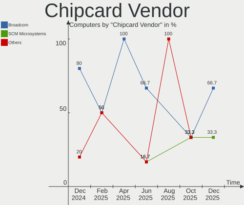

| Vendor           | Computers | Percent |
|------------------|-----------|---------|
| Broadcom         | 2         | 66.67%  |
| SCM Microsystems | 1         | 33.33%  |

Chipcard Model
--------------

Chipcard module models

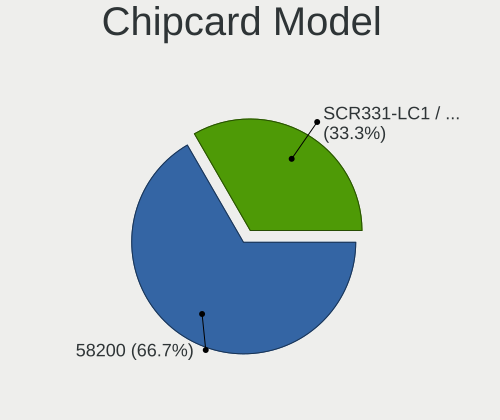

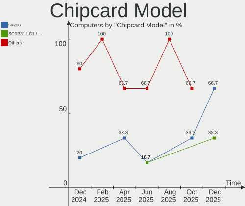

| Model                                                  | Computers | Percent |
|--------------------------------------------------------|-----------|---------|
| Broadcom 58200                                         | 2         | 66.67%  |
| SCM Microsystems SCR331-LC1 / SCR3310 SmartCard Reader | 1         | 33.33%  |

Unsupported
-----------

Unsupported Devices
-------------------

Total unsupported devices on board

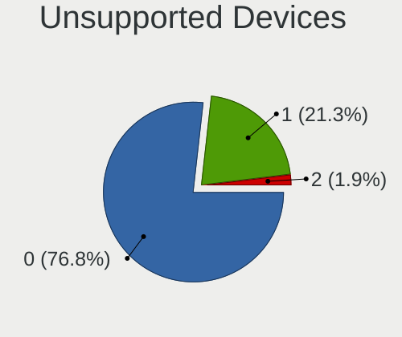

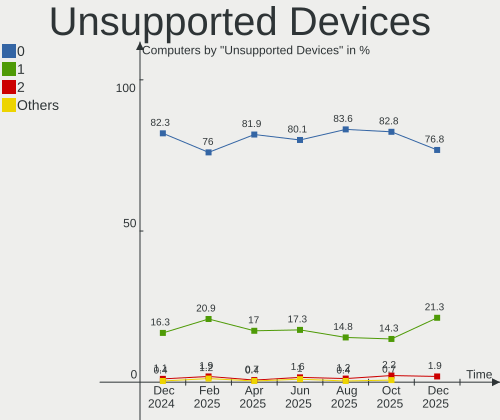

| Total | Computers | Percent |
|-------|-----------|---------|
| 0     | 238       | 76.77%  |
| 1     | 66        | 21.29%  |
| 2     | 6         | 1.94%   |

Unsupported Device Types
------------------------

Types of unsupported devices

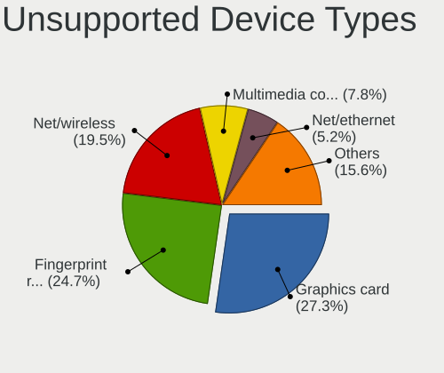

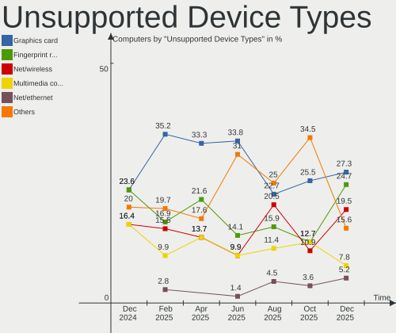

| Type                     | Computers | Percent |
|--------------------------|-----------|---------|
| Graphics card            | 21        | 27.27%  |
| Fingerprint reader       | 19        | 24.68%  |
| Net/wireless             | 15        | 19.48%  |
| Multimedia controller    | 6         | 7.79%   |
| Net/ethernet             | 4         | 5.19%   |
| Communication controller | 3         | 3.9%    |
| Chipcard                 | 3         | 3.9%    |
| Unassigned class         | 2         | 2.6%    |
| Storage/raid             | 1         | 1.3%    |
| Storage                  | 1         | 1.3%    |
| Camera                   | 1         | 1.3%    |
| Bluetooth                | 1         | 1.3%    |

