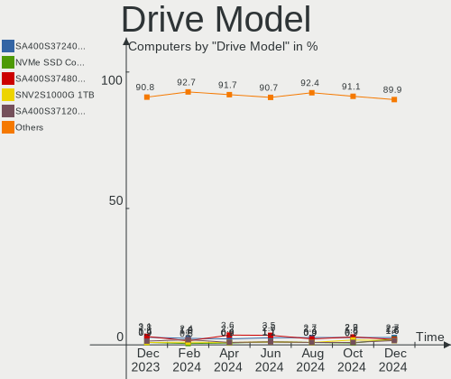
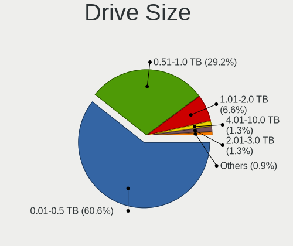
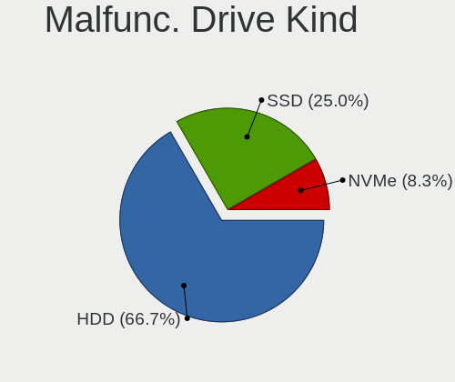
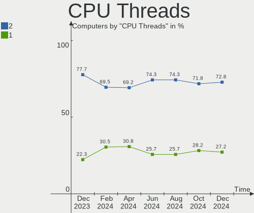
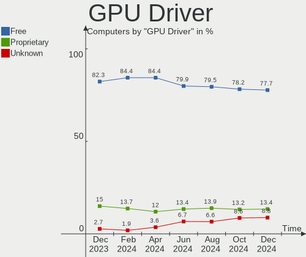
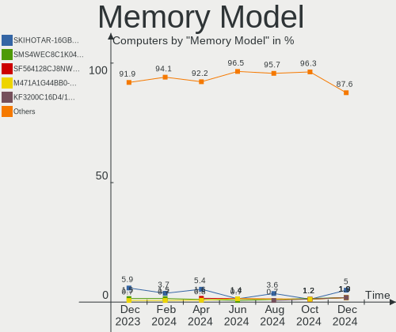
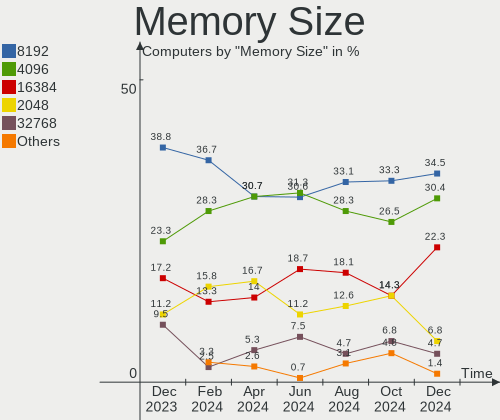
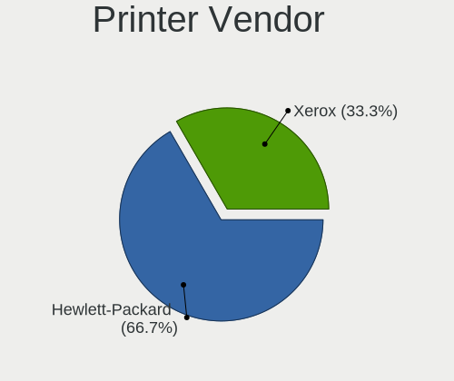
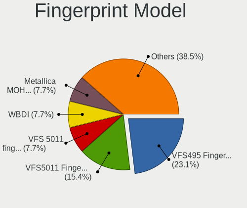

Linux in Brazil - Hardware Trends
---------------------------------

A project to identify most popular hardware characteristics and track their change
over time based on data collected by Linux users at https://Linux-Hardware.org.

Anyone can contribute to this report by the [hw-probe](https://github.com/linuxhw/hw-probe) tool:

    sudo -E hw-probe -all -upload

This is a report for all computer types. See also reports for [desktops](/Location/Brazil/Desktop/README.md) and [notebooks](/Location/Brazil/Notebook/README.md).

Contents
--------

* [ System ](#system)
  - [ OS                       ](#os)
  - [ OS Family                ](#os-family)
  - [ Kernel                   ](#kernel)
  - [ Kernel Family            ](#kernel-family)
  - [ Kernel Major Ver.        ](#kernel-major-ver)
  - [ Arch                     ](#arch)
  - [ DE                       ](#de)
  - [ Display Server           ](#display-server)
  - [ Display Manager          ](#display-manager)
  - [ OS Lang                  ](#os-lang)
  - [ Boot Mode                ](#boot-mode)
  - [ Filesystem               ](#filesystem)
  - [ Part. scheme             ](#part-scheme)
  - [ Dual Boot with Linux/BSD ](#dual-boot-with-linuxbsd)
  - [ Dual Boot (Win)          ](#dual-boot-win)

* [ Board ](#board)
  - [ Vendor                   ](#vendor)
  - [ Model                    ](#model)
  - [ Model Family             ](#model-family)
  - [ MFG Year                 ](#mfg-year)
  - [ Form Factor              ](#form-factor)
  - [ Secure Boot              ](#secure-boot)
  - [ Coreboot                 ](#coreboot)
  - [ RAM Size                 ](#ram-size)
  - [ RAM Used                 ](#ram-used)
  - [ Total Drives             ](#total-drives)
  - [ Has CD-ROM               ](#has-cd-rom)
  - [ Has Ethernet             ](#has-ethernet)
  - [ Has WiFi                 ](#has-wifi)
  - [ Has Bluetooth            ](#has-bluetooth)

* [ Location ](#location)
  - [ Country                  ](#country)
  - [ City                     ](#city)

* [ Drives ](#drives)
  - [ Drive Vendor             ](#drive-vendor)
  - [ Drive Model              ](#drive-model)
  - [ HDD Vendor               ](#hdd-vendor)
  - [ SSD Vendor               ](#ssd-vendor)
  - [ Drive Kind               ](#drive-kind)
  - [ Drive Connector          ](#drive-connector)
  - [ Drive Size               ](#drive-size)
  - [ Space Total              ](#space-total)
  - [ Space Used               ](#space-used)
  - [ Malfunc. Drives          ](#malfunc-drives)
  - [ Malfunc. Drive Vendor    ](#malfunc-drive-vendor)
  - [ Malfunc. HDD Vendor      ](#malfunc-hdd-vendor)
  - [ Malfunc. Drive Kind      ](#malfunc-drive-kind)
  - [ Failed Drives            ](#failed-drives)
  - [ Failed Drive Vendor      ](#failed-drive-vendor)
  - [ Drive Status             ](#drive-status)

* [ Storage controller ](#storage-controller)
  - [ Storage Vendor           ](#storage-vendor)
  - [ Storage Model            ](#storage-model)
  - [ Storage Kind             ](#storage-kind)

* [ Processor ](#processor)
  - [ CPU Vendor               ](#cpu-vendor)
  - [ CPU Model                ](#cpu-model)
  - [ CPU Model Family         ](#cpu-model-family)
  - [ CPU Cores                ](#cpu-cores)
  - [ CPU Sockets              ](#cpu-sockets)
  - [ CPU Threads              ](#cpu-threads)
  - [ CPU Op-Modes             ](#cpu-op-modes)
  - [ CPU Microcode            ](#cpu-microcode)
  - [ CPU Microarch            ](#cpu-microarch)

* [ Graphics ](#graphics)
  - [ GPU Vendor               ](#gpu-vendor)
  - [ GPU Model                ](#gpu-model)
  - [ GPU Combo                ](#gpu-combo)
  - [ GPU Driver               ](#gpu-driver)
  - [ GPU Memory               ](#gpu-memory)

* [ Monitor ](#monitor)
  - [ Monitor Vendor           ](#monitor-vendor)
  - [ Monitor Model            ](#monitor-model)
  - [ Monitor Resolution       ](#monitor-resolution)
  - [ Monitor Diagonal         ](#monitor-diagonal)
  - [ Monitor Width            ](#monitor-width)
  - [ Aspect Ratio             ](#aspect-ratio)
  - [ Monitor Area             ](#monitor-area)
  - [ Pixel Density            ](#pixel-density)
  - [ Multiple Monitors        ](#multiple-monitors)

* [ Network ](#network)
  - [ Net Controller Vendor    ](#net-controller-vendor)
  - [ Net Controller Model     ](#net-controller-model)
  - [ Wireless Vendor          ](#wireless-vendor)
  - [ Wireless Model           ](#wireless-model)
  - [ Ethernet Vendor          ](#ethernet-vendor)
  - [ Ethernet Model           ](#ethernet-model)
  - [ Net Controller Kind      ](#net-controller-kind)
  - [ Used Controller          ](#used-controller)
  - [ NICs                     ](#nics)
  - [ IPv6                     ](#ipv6)

* [ Bluetooth ](#bluetooth)
  - [ Bluetooth Vendor         ](#bluetooth-vendor)
  - [ Bluetooth Model          ](#bluetooth-model)

* [ Sound ](#sound)
  - [ Sound Vendor             ](#sound-vendor)
  - [ Sound Model              ](#sound-model)

* [ Memory ](#memory)
  - [ Memory Vendor            ](#memory-vendor)
  - [ Memory Model             ](#memory-model)
  - [ Memory Kind              ](#memory-kind)
  - [ Memory Form Factor       ](#memory-form-factor)
  - [ Memory Size              ](#memory-size)
  - [ Memory Speed             ](#memory-speed)

* [ Printers & scanners ](#printers--scanners)
  - [ Printer Vendor           ](#printer-vendor)
  - [ Printer Model            ](#printer-model)
  - [ Scanner Vendor           ](#scanner-vendor)
  - [ Scanner Model            ](#scanner-model)

* [ Camera ](#camera)
  - [ Camera Vendor            ](#camera-vendor)
  - [ Camera Model             ](#camera-model)

* [ Security ](#security)
  - [ Fingerprint Vendor       ](#fingerprint-vendor)
  - [ Fingerprint Model        ](#fingerprint-model)
  - [ Chipcard Vendor          ](#chipcard-vendor)
  - [ Chipcard Model           ](#chipcard-model)

* [ Unsupported ](#unsupported)
  - [ Unsupported Devices      ](#unsupported-devices)
  - [ Unsupported Device Types ](#unsupported-device-types)

System
------

OS
--

Installed operating systems

| Name                         | Computers | Percent |
|------------------------------|-----------|---------|
| Ubuntu 22.04                 | 30        | 10.99%  |
| Linux Mint 20.3              | 28        | 10.26%  |
| OpenMandriva 4.3             | 23        | 8.42%   |
| Fedora 36                    | 21        | 7.69%   |
| Pop!_OS 22.04                | 18        | 6.59%   |
| Ubuntu 20.04                 | 16        | 5.86%   |
| Zorin 16                     | 15        | 5.49%   |
| KDE neon 20.04               | 12        | 4.4%    |
| Debian 11                    | 7         | 2.56%   |
| Fedora 35                    | 6         | 2.2%    |
| Manjaro 21.2.6               | 5         | 1.83%   |
| Manjaro                      | 5         | 1.83%   |
| Endless 4.0.6                | 5         | 1.83%   |
| OpenMandriva 4.2             | 4         | 1.47%   |
| LMDE 5                       | 4         | 1.47%   |
| Endless 3.9.7                | 4         | 1.47%   |
| Arch                         | 4         | 1.47%   |
| Ubuntu Budgie 22.04          | 3         | 1.1%    |
| ROSA 12.2                    | 3         | 1.1%    |
| openSUSE Tumbleweed-XXXXXXXX | 3         | 1.1%    |
| Kubuntu 11                   | 3         | 1.1%    |
| ArcoLinux Rolling            | 3         | 1.1%    |
| Ubuntu MATE 20.04            | 2         | 0.73%   |
| Raspbian 11                  | 2         | 0.73%   |
| Parrot 5.0                   | 2         | 0.73%   |
| Lubuntu 20.04                | 2         | 0.73%   |
| Linux Mint 20.2              | 2         | 0.73%   |
| Linux Mint 20.1              | 2         | 0.73%   |
| Elementary 6.1               | 2         | 0.73%   |
| Arch Rolling                 | 2         | 0.73%   |
| Zorin 15                     | 1         | 0.37%   |
| Xubuntu 22.04                | 1         | 0.37%   |
| Ubuntu Studio 20.04          | 1         | 0.37%   |
| Ubuntu MATE 22.04            | 1         | 0.37%   |
| Ubuntu 18.04                 | 1         | 0.37%   |
| Ubuntu 14.04                 | 1         | 0.37%   |
| SteamOS Snapshot             | 1         | 0.37%   |
| Sparky 6.3                   | 1         | 0.37%   |
| Raspbian 10                  | 1         | 0.37%   |
| Q4OS 4                       | 1         | 0.37%   |
| Pop!_OS 21.10                | 1         | 0.37%   |
| Pop!_OS 20.04                | 1         | 0.37%   |
| openSUSE Leap-15.4           | 1         | 0.37%   |
| Lubuntu 22.04                | 1         | 0.37%   |
| LinuxFX 11                   | 1         | 0.37%   |
| Linux Mint 20                | 1         | 0.37%   |
| Linux Mint 19.2              | 1         | 0.37%   |
| Kubuntu 22.04                | 1         | 0.37%   |
| Kubuntu 21.10                | 1         | 0.37%   |
| Kali 2022.2                  | 1         | 0.37%   |
| Garuda Linux                 | 1         | 0.37%   |
| Fedora 34                    | 1         | 0.37%   |
| Endless 4.0.4                | 1         | 0.37%   |
| Endless 3.9.1                | 1         | 0.37%   |
| Endless 3.8.7-nexthw2        | 1         | 0.37%   |
| Endless 3.8.3-nexthw1        | 1         | 0.37%   |
| EndeavourOS Rolling          | 1         | 0.37%   |
| EndeavourOS                  | 1         | 0.37%   |
| Devuan 4                     | 1         | 0.37%   |
| Debian Unstable              | 1         | 0.37%   |

OS Family
---------

OS without a version

| Name          | Computers | Percent |
|---------------|-----------|---------|
| Ubuntu        | 48        | 17.58%  |
| Linux Mint    | 34        | 12.45%  |
| Fedora        | 28        | 10.26%  |
| OpenMandriva  | 27        | 9.89%   |
| Pop!_OS       | 20        | 7.33%   |
| Zorin         | 16        | 5.86%   |
| Endless       | 13        | 4.76%   |
| KDE neon      | 12        | 4.4%    |
| Manjaro       | 10        | 3.66%   |
| Debian        | 10        | 3.66%   |
| Arch          | 6         | 2.2%    |
| Kubuntu       | 5         | 1.83%   |
| openSUSE      | 4         | 1.47%   |
| LMDE          | 4         | 1.47%   |
| Ubuntu MATE   | 3         | 1.1%    |
| Ubuntu Budgie | 3         | 1.1%    |
| ROSA          | 3         | 1.1%    |
| Raspbian      | 3         | 1.1%    |
| Lubuntu       | 3         | 1.1%    |
| ArcoLinux     | 3         | 1.1%    |
| Parrot        | 2         | 0.73%   |
| EndeavourOS   | 2         | 0.73%   |
| Elementary    | 2         | 0.73%   |
| Clear Linux   | 2         | 0.73%   |
| Xubuntu       | 1         | 0.37%   |
| Ubuntu Studio | 1         | 0.37%   |
| SteamOS       | 1         | 0.37%   |
| Sparky        | 1         | 0.37%   |
| Q4OS          | 1         | 0.37%   |
| LinuxFX       | 1         | 0.37%   |
| Kali          | 1         | 0.37%   |
| Garuda Linux  | 1         | 0.37%   |
| Devuan        | 1         | 0.37%   |
| Artix         | 1         | 0.37%   |

Kernel
------

Version of the Linux kernel

| Version                            | Computers | Percent |
|------------------------------------|-----------|---------|
| 5.16.7-desktop-1omv4003            | 23        | 8.42%   |
| 5.13.0-41-generic                  | 17        | 6.23%   |
| 5.13.0-40-generic                  | 17        | 6.23%   |
| 5.4.0-110-generic                  | 15        | 5.49%   |
| 5.17.5-76051705-generic            | 15        | 5.49%   |
| 5.15.0-30-generic                  | 12        | 4.4%    |
| 5.15.0-27-generic                  | 12        | 4.4%    |
| 5.13.0-44-generic                  | 12        | 4.4%    |
| 5.8.0-14-generic                   | 6         | 2.2%    |
| 5.11.0-35-generic                  | 6         | 2.2%    |
| 5.17.5-300.fc36.x86_64             | 5         | 1.83%   |
| 5.15.0-25-generic                  | 5         | 1.83%   |
| 5.10.0-14-amd64                    | 5         | 1.83%   |
| 5.4.0-113-generic                  | 4         | 1.47%   |
| 5.17.9-300.fc36.x86_64             | 4         | 1.47%   |
| 5.16.19-76051619-generic           | 4         | 1.47%   |
| 5.15.0-33-generic                  | 4         | 1.47%   |
| 5.13.0-39-generic                  | 4         | 1.47%   |
| 5.4.0-91-generic                   | 3         | 1.1%    |
| 5.17.9-arch1-1                     | 3         | 1.1%    |
| 5.17.7-300.fc36.x86_64             | 3         | 1.1%    |
| 5.17.6-300.fc36.x86_64             | 3         | 1.1%    |
| 5.17.5-zen1-1-zen                  | 3         | 1.1%    |
| 5.17.5-200.fc35.x86_64             | 3         | 1.1%    |
| 5.17.11-300.fc36.x86_64            | 3         | 1.1%    |
| 5.15.32-1-MANJARO                  | 3         | 1.1%    |
| 5.13.0-27-generic                  | 3         | 1.1%    |
| 5.10.74-generic-2rosa2021.1-x86_64 | 3         | 1.1%    |
| 5.10.14-desktop-1omv4002           | 3         | 1.1%    |
| 5.10.0-13-amd64                    | 3         | 1.1%    |
| 5.4.0-109-generic                  | 2         | 0.73%   |
| 5.4.0-107-generic                  | 2         | 0.73%   |
| 5.17.8-300.fc36.x86_64             | 2         | 0.73%   |
| 5.17.7-zen1-1-zen                  | 2         | 0.73%   |
| 5.17.4-200.fc35.x86_64             | 2         | 0.73%   |
| 5.17.4-1-default                   | 2         | 0.73%   |
| 5.16.0-12parrot1-amd64             | 2         | 0.73%   |
| 5.15.38-1-MANJARO                  | 2         | 0.73%   |
| 5.15.32-v7+                        | 2         | 0.73%   |
| 5.13.0-35-generic                  | 2         | 0.73%   |
| 5.8.0-3-amd64                      | 1         | 0.37%   |
| 5.6.0-7-generic                    | 1         | 0.37%   |
| 5.4.0-99-generic                   | 1         | 0.37%   |
| 5.4.0-109-lowlatency               | 1         | 0.37%   |
| 5.4.0-1071-gke                     | 1         | 0.37%   |
| 5.17.9-100.fc34.x86_64             | 1         | 0.37%   |
| 5.17.9-1-default                   | 1         | 0.37%   |
| 5.17.8-zen1-1-zen                  | 1         | 0.37%   |
| 5.17.8-200.fc35.x86_64             | 1         | 0.37%   |
| 5.17.6-1-MANJARO                   | 1         | 0.37%   |
| 5.17.5-arch1-1                     | 1         | 0.37%   |
| 5.17.3-sparky-amd64                | 1         | 0.37%   |
| 5.17.3-302.fc36.x86_64             | 1         | 0.37%   |
| 5.17.1-3-MANJARO                   | 1         | 0.37%   |
| 5.17.0-9.1-liquorix-amd64          | 1         | 0.37%   |
| 5.17.0-3-amd64                     | 1         | 0.37%   |
| 5.17.0-1-amd64                     | 1         | 0.37%   |
| 5.17.0-051700rc7-generic           | 1         | 0.37%   |
| 5.16.13-1132.native                | 1         | 0.37%   |
| 5.16.0-kali7-amd64                 | 1         | 0.37%   |

Kernel Family
-------------

Linux kernel without a distro release

| Version  | Computers | Percent |
|----------|-----------|---------|
| 5.13.0   | 58        | 21.25%  |
| 5.15.0   | 34        | 12.45%  |
| 5.4.0    | 29        | 10.62%  |
| 5.17.5   | 27        | 9.89%   |
| 5.16.7   | 23        | 8.42%   |
| 5.10.0   | 10        | 3.66%   |
| 5.17.9   | 9         | 3.3%    |
| 5.11.0   | 8         | 2.93%   |
| 5.8.0    | 7         | 2.56%   |
| 5.17.7   | 5         | 1.83%   |
| 5.15.32  | 5         | 1.83%   |
| 5.17.8   | 4         | 1.47%   |
| 5.17.6   | 4         | 1.47%   |
| 5.17.4   | 4         | 1.47%   |
| 5.17.0   | 4         | 1.47%   |
| 5.16.19  | 4         | 1.47%   |
| 5.17.11  | 3         | 1.1%    |
| 5.16.0   | 3         | 1.1%    |
| 5.14.0   | 3         | 1.1%    |
| 5.10.74  | 3         | 1.1%    |
| 5.10.14  | 3         | 1.1%    |
| 5.17.3   | 2         | 0.73%   |
| 5.15.38  | 2         | 0.73%   |
| 5.6.0    | 1         | 0.37%   |
| 5.17.1   | 1         | 0.37%   |
| 5.16.13  | 1         | 0.37%   |
| 5.15.5   | 1         | 0.37%   |
| 5.15.41  | 1         | 0.37%   |
| 5.15.37  | 1         | 0.37%   |
| 5.15.36  | 1         | 0.37%   |
| 5.15.35  | 1         | 0.37%   |
| 5.15.10  | 1         | 0.37%   |
| 5.14.21  | 1         | 0.37%   |
| 5.13.19  | 1         | 0.37%   |
| 5.11.12  | 1         | 0.37%   |
| 5.10.93  | 1         | 0.37%   |
| 5.10.60  | 1         | 0.37%   |
| 5.10.113 | 1         | 0.37%   |
| 5.10.109 | 1         | 0.37%   |
| 4.4.0    | 1         | 0.37%   |
| 4.19.118 | 1         | 0.37%   |
| 4.15.0   | 1         | 0.37%   |

Kernel Major Ver.
-----------------

Linux kernel major version

| Version | Computers | Percent |
|---------|-----------|---------|
| 5.17    | 63        | 23.08%  |
| 5.13    | 59        | 21.61%  |
| 5.15    | 47        | 17.22%  |
| 5.16    | 31        | 11.36%  |
| 5.4     | 29        | 10.62%  |
| 5.10    | 20        | 7.33%   |
| 5.11    | 9         | 3.3%    |
| 5.8     | 7         | 2.56%   |
| 5.14    | 4         | 1.47%   |
| 5.6     | 1         | 0.37%   |
| 4.4     | 1         | 0.37%   |
| 4.19    | 1         | 0.37%   |
| 4.15    | 1         | 0.37%   |

Arch
----

OS architecture (x86_64, i586, etc.)

| Name   | Computers | Percent |
|--------|-----------|---------|
| x86_64 | 266       | 97.44%  |
| i686   | 4         | 1.47%   |
| armv7l | 3         | 1.1%    |

DE
--

Desktop Environment

| Name          | Computers | Percent |
|---------------|-----------|---------|
| GNOME         | 130       | 47.62%  |
| KDE5          | 61        | 22.34%  |
| X-Cinnamon    | 35        | 12.82%  |
| XFCE          | 17        | 6.23%   |
| Unknown       | 7         | 2.56%   |
| MATE          | 6         | 2.2%    |
| LXQt          | 6         | 2.2%    |
| Pantheon      | 2         | 0.73%   |
| Budgie        | 2         | 0.73%   |
| awesome       | 2         | 0.73%   |
| Unity         | 1         | 0.37%   |
| LXDE          | 1         | 0.37%   |
| GNOME Classic | 1         | 0.37%   |
| Deepin        | 1         | 0.37%   |
| Cinnamon      | 1         | 0.37%   |

Display Server
--------------

X11 or Wayland

| Name    | Computers | Percent |
|---------|-----------|---------|
| X11     | 211       | 77.29%  |
| Wayland | 56        | 20.51%  |
| Tty     | 3         | 1.1%    |
| Unknown | 3         | 1.1%    |

Display Manager
---------------

SDDM, LightDM, etc.

| Name    | Computers | Percent |
|---------|-----------|---------|
| Unknown | 139       | 50.92%  |
| SDDM    | 44        | 16.12%  |
| GDM3    | 43        | 15.75%  |
| LightDM | 29        | 10.62%  |
| GDM     | 17        | 6.23%   |
| SLiM    | 1         | 0.37%   |

OS Lang
-------

Language

| Lang    | Computers | Percent |
|---------|-----------|---------|
| pt_BR   | 202       | 73.99%  |
| en_US   | 57        | 20.88%  |
| C       | 5         | 1.83%   |
| en_GB   | 3         | 1.1%    |
| pt_PT   | 2         | 0.73%   |
| Unknown | 2         | 0.73%   |
| fr_FR   | 1         | 0.37%   |
| es_ES   | 1         | 0.37%   |

Boot Mode
---------

EFI or BIOS

| Mode | Computers | Percent |
|------|-----------|---------|
| BIOS | 155       | 56.78%  |
| EFI  | 118       | 43.22%  |

Filesystem
----------

Type of filesystem

| Type    | Computers | Percent |
|---------|-----------|---------|
| Ext4    | 187       | 68.5%   |
| Btrfs   | 50        | 18.32%  |
| Overlay | 31        | 11.36%  |
| Zfs     | 4         | 1.47%   |
| F2fs    | 1         | 0.37%   |

Part. scheme
------------

Scheme of partitioning

| Type    | Computers | Percent |
|---------|-----------|---------|
| Unknown | 173       | 63.37%  |
| GPT     | 68        | 24.91%  |
| MBR     | 32        | 11.72%  |

Dual Boot with Linux/BSD
------------------------

Hosting more than one Linux/BSD

| Dual boot | Computers | Percent |
|-----------|-----------|---------|
| No        | 246       | 90.11%  |
| Yes       | 27        | 9.89%   |

Dual Boot (Win)
---------------

Hosting Linux and Windows

| Dual boot | Computers | Percent |
|-----------|-----------|---------|
| No        | 220       | 80.59%  |
| Yes       | 53        | 19.41%  |

Board
-----

Vendor
------

Motherboard manufacturer

| Name                    | Computers | Percent |
|-------------------------|-----------|---------|
| Dell                    | 40        | 14.65%  |
| ASUSTek Computer        | 35        | 12.82%  |
| Acer                    | 28        | 10.26%  |
| Lenovo                  | 27        | 9.89%   |
| Samsung Electronics     | 22        | 8.06%   |
| Positivo                | 22        | 8.06%   |
| Intel                   | 19        | 6.96%   |
| Gigabyte Technology     | 16        | 5.86%   |
| Hewlett-Packard         | 15        | 5.49%   |
| ASRock                  | 7         | 2.56%   |
| Avell High Performance  | 5         | 1.83%   |
| Raspberry Pi Foundation | 3         | 1.1%    |
| MSI                     | 3         | 1.1%    |
| LG Electronics          | 3         | 1.1%    |
| Compaq                  | 3         | 1.1%    |
| Apple                   | 3         | 1.1%    |
| Sony                    | 2         | 0.73%   |
| Positivo Bahia - VAIO   | 2         | 0.73%   |
| Philco                  | 2         | 0.73%   |
| Pegatron                | 2         | 0.73%   |
| Gateway                 | 2         | 0.73%   |
| Toshiba                 | 1         | 0.37%   |
| Supermicro              | 1         | 0.37%   |
| Standard                | 1         | 0.37%   |
| Semp Toshiba            | 1         | 0.37%   |
| Multilaser              | 1         | 0.37%   |
| Login Informatica       | 1         | 0.37%   |
| JINGSHA                 | 1         | 0.37%   |
| Itautec                 | 1         | 0.37%   |
| ECS                     | 1         | 0.37%   |
| Biostar                 | 1         | 0.37%   |
| AMI                     | 1         | 0.37%   |
| Unknown                 | 1         | 0.37%   |

Model
-----

Motherboard model

| Name                                        | Computers | Percent |
|---------------------------------------------|-----------|---------|
| Samsung 550XDA                              | 8         | 2.93%   |
| ASUS All Series                             | 7         | 2.56%   |
| Acer Nitro AN515-44                         | 6         | 2.2%    |
| Unknown                                     | 4         | 1.47%   |
| Positivo POS-PIQ57BQ                        | 3         | 1.1%    |
| Lenovo IdeaPad S145-15IWL 81S9              | 3         | 1.1%    |
| Intel H61                                   | 3         | 1.1%    |
| Intel H55                                   | 3         | 1.1%    |
| Gigabyte H410M H V3                         | 3         | 1.1%    |
| Dell Inspiron 5566                          | 3         | 1.1%    |
| Dell Inspiron 15-3567                       | 3         | 1.1%    |
| ASUS VivoBook_ASUSLaptop X515JA_X515JA      | 3         | 1.1%    |
| Samsung 550XCJ/550XCR                       | 2         | 0.73%   |
| Samsung 340XAA/350XAA/550XAA                | 2         | 0.73%   |
| RPi Raspberry Pi 3 Model B Rev 1.2          | 2         | 0.73%   |
| Positivo S14CT01                            | 2         | 0.73%   |
| Positivo POS-PIH81DI                        | 2         | 0.73%   |
| Positivo POS-PIG41BA                        | 2         | 0.73%   |
| Positivo POS-MI945AA                        | 2         | 0.73%   |
| Philco 10D                                  | 2         | 0.73%   |
| Lenovo IdeaPad 310-14ISK 80UG               | 2         | 0.73%   |
| HP Pavilion g4                              | 2         | 0.73%   |
| Gateway NV55C                               | 2         | 0.73%   |
| Dell Vostro 5470                            | 2         | 0.73%   |
| Dell Inspiron 5557                          | 2         | 0.73%   |
| Dell Inspiron 3583                          | 2         | 0.73%   |
| Compaq Presario CQ-25                       | 2         | 0.73%   |
| Avell High Performance B.ON                 | 2         | 0.73%   |
| Avell High Performance A70 MOB              | 2         | 0.73%   |
| Acer Aspire E1-532                          | 2         | 0.73%   |
| Toshiba Satellite M55                       | 1         | 0.37%   |
| Supermicro SSG-6047R-E1CR36N                | 1         | 0.37%   |
| Standard B14HM21                            | 1         | 0.37%   |
| Sony VPCEB23FM                              | 1         | 0.37%   |
| Sony VPCCA17FX                              | 1         | 0.37%   |
| Semp Toshiba IS 1413G                       | 1         | 0.37%   |
| Samsung RV415/RV515                         | 1         | 0.37%   |
| Samsung RV411/RV511/E3511/S3511/RV711/E3411 | 1         | 0.37%   |
| Samsung RV411/RV511/E3511/S3511/RV711       | 1         | 0.37%   |
| Samsung RF511/RF411/RF711                   | 1         | 0.37%   |
| Samsung 800G5M/800G5W                       | 1         | 0.37%   |
| Samsung 740U3M                              | 1         | 0.37%   |
| Samsung 670Z5E                              | 1         | 0.37%   |
| Samsung 530XBB                              | 1         | 0.37%   |
| Samsung 270E5J/2570EJ                       | 1         | 0.37%   |
| Samsung 270E5G/270E5U                       | 1         | 0.37%   |
| RPi Raspberry Pi 2 Model B Rev 1.1          | 1         | 0.37%   |
| Positivo S15KL                              | 1         | 0.37%   |
| Positivo POS-PIH77CM                        | 1         | 0.37%   |
| Positivo POS-PARS760GCD                     | 1         | 0.37%   |
| Positivo POS-EIBTPDC                        | 1         | 0.37%   |
| Positivo Mobile                             | 1         | 0.37%   |
| Positivo I541TB                             | 1         | 0.37%   |
| Positivo H14BU08                            | 1         | 0.37%   |
| Positivo DA18HV1                            | 1         | 0.37%   |
| Positivo CHT14B                             | 1         | 0.37%   |
| Positivo C41TB                              | 1         | 0.37%   |
| Positivo C14CR21TV                          | 1         | 0.37%   |
| Positivo Bahia - VAIO VJFE51F11X-B0111H     | 1         | 0.37%   |
| Positivo Bahia - VAIO VJFE43F11X-XXXXXX     | 1         | 0.37%   |

Model Family
------------

Motherboard model prefix

| Name                         | Computers | Percent |
|------------------------------|-----------|---------|
| Dell Inspiron                | 22        | 8.06%   |
| Acer Aspire                  | 20        | 7.33%   |
| Lenovo IdeaPad               | 13        | 4.76%   |
| Samsung 550XDA               | 8         | 2.93%   |
| Dell Vostro                  | 8         | 2.93%   |
| ASUS All                     | 7         | 2.56%   |
| Acer Nitro                   | 7         | 2.56%   |
| Lenovo ThinkPad              | 6         | 2.2%    |
| HP Pavilion                  | 6         | 2.2%    |
| Dell Latitude                | 5         | 1.83%   |
| ASUS VivoBook                | 5         | 1.83%   |
| ASUS PRIME                   | 5         | 1.83%   |
| Unknown                      | 4         | 1.47%   |
| RPi Raspberry                | 3         | 1.1%    |
| Positivo POS-PIQ57BQ         | 3         | 1.1%    |
| Lenovo ThinkCentre           | 3         | 1.1%    |
| Intel H61                    | 3         | 1.1%    |
| Intel H55                    | 3         | 1.1%    |
| Gigabyte H410M               | 3         | 1.1%    |
| ASUS TUF                     | 3         | 1.1%    |
| Samsung RV411                | 2         | 0.73%   |
| Samsung 550XCJ               | 2         | 0.73%   |
| Samsung 340XAA               | 2         | 0.73%   |
| Positivo S14CT01             | 2         | 0.73%   |
| Positivo POS-PIH81DI         | 2         | 0.73%   |
| Positivo POS-PIG41BA         | 2         | 0.73%   |
| Positivo POS-MI945AA         | 2         | 0.73%   |
| Philco 10D                   | 2         | 0.73%   |
| Intel B75                    | 2         | 0.73%   |
| HP ProBook                   | 2         | 0.73%   |
| Gateway NV55C                | 2         | 0.73%   |
| Dell Precision               | 2         | 0.73%   |
| Compaq Presario              | 2         | 0.73%   |
| Avell High Performance B.ON  | 2         | 0.73%   |
| Avell High Performance A70   | 2         | 0.73%   |
| ASUS P8H61-M                 | 2         | 0.73%   |
| Toshiba Satellite            | 1         | 0.37%   |
| Supermicro SSG-6047R-E1CR36N | 1         | 0.37%   |
| Standard B14HM21             | 1         | 0.37%   |
| Sony VPCEB23FM               | 1         | 0.37%   |
| Sony VPCCA17FX               | 1         | 0.37%   |
| Semp Toshiba IS              | 1         | 0.37%   |
| Samsung RV415                | 1         | 0.37%   |
| Samsung RF511                | 1         | 0.37%   |
| Samsung 800G5M               | 1         | 0.37%   |
| Samsung 740U3M               | 1         | 0.37%   |
| Samsung 670Z5E               | 1         | 0.37%   |
| Samsung 530XBB               | 1         | 0.37%   |
| Samsung 270E5J               | 1         | 0.37%   |
| Samsung 270E5G               | 1         | 0.37%   |
| Positivo S15KL               | 1         | 0.37%   |
| Positivo POS-PIH77CM         | 1         | 0.37%   |
| Positivo POS-PARS760GCD      | 1         | 0.37%   |
| Positivo POS-EIBTPDC         | 1         | 0.37%   |
| Positivo Mobile              | 1         | 0.37%   |
| Positivo I541TB              | 1         | 0.37%   |
| Positivo H14BU08             | 1         | 0.37%   |
| Positivo DA18HV1             | 1         | 0.37%   |
| Positivo CHT14B              | 1         | 0.37%   |
| Positivo C41TB               | 1         | 0.37%   |

MFG Year
--------

Motherboard manufacture year

| Year    | Computers | Percent |
|---------|-----------|---------|
| 2021    | 31        | 11.36%  |
| 2020    | 30        | 10.99%  |
| 2016    | 26        | 9.52%   |
| 2019    | 24        | 8.79%   |
| 2018    | 20        | 7.33%   |
| 2011    | 20        | 7.33%   |
| 2014    | 19        | 6.96%   |
| 2013    | 19        | 6.96%   |
| 2010    | 19        | 6.96%   |
| 2017    | 18        | 6.59%   |
| 2012    | 15        | 5.49%   |
| 2008    | 10        | 3.66%   |
| 2009    | 8         | 2.93%   |
| 2015    | 5         | 1.83%   |
| 2007    | 5         | 1.83%   |
| 2006    | 2         | 0.73%   |
| Unknown | 2         | 0.73%   |

Form Factor
-----------

Physical design of the computer

| Name           | Computers | Percent |
|----------------|-----------|---------|
| Notebook       | 170       | 62.27%  |
| Desktop        | 93        | 34.07%  |
| System on chip | 3         | 1.1%    |
| Mini pc        | 2         | 0.73%   |
| All in one     | 2         | 0.73%   |
| Server         | 2         | 0.73%   |
| Convertible    | 1         | 0.37%   |

Secure Boot
-----------

Enabled or disabled

| State    | Computers | Percent |
|----------|-----------|---------|
| Disabled | 248       | 90.84%  |
| Enabled  | 25        | 9.16%   |

Coreboot
--------

Have coreboot on board

| Used | Computers | Percent |
|------|-----------|---------|
| No   | 273       | 100%    |

RAM Size
--------

Total RAM memory

| Size in GB  | Computers | Percent |
|-------------|-----------|---------|
| 4.01-8.0    | 75        | 27.47%  |
| 3.01-4.0    | 61        | 22.34%  |
| 8.01-16.0   | 51        | 18.68%  |
| 16.01-24.0  | 49        | 17.95%  |
| 1.01-2.0    | 12        | 4.4%    |
| 32.01-64.0  | 7         | 2.56%   |
| 2.01-3.0    | 6         | 2.2%    |
| 24.01-32.0  | 4         | 1.47%   |
| 64.01-256.0 | 4         | 1.47%   |
| 0.51-1.0    | 4         | 1.47%   |

RAM Used
--------

Used RAM memory

| Used GB    | Computers | Percent |
|------------|-----------|---------|
| 1.01-2.0   | 94        | 34.43%  |
| 2.01-3.0   | 72        | 26.37%  |
| 4.01-8.0   | 41        | 15.02%  |
| 3.01-4.0   | 37        | 13.55%  |
| 0.51-1.0   | 13        | 4.76%   |
| 8.01-16.0  | 11        | 4.03%   |
| 0.01-0.5   | 4         | 1.47%   |
| 16.01-24.0 | 1         | 0.37%   |

Total Drives
------------

Number of drives on board

| Drives | Computers | Percent |
|--------|-----------|---------|
| 1      | 178       | 65.2%   |
| 2      | 68        | 24.91%  |
| 3      | 18        | 6.59%   |
| 4      | 3         | 1.1%    |
| 0      | 3         | 1.1%    |
| 6      | 2         | 0.73%   |
| 5      | 1         | 0.37%   |

Has CD-ROM
----------

Has CD-ROM on board

| Presented | Computers | Percent |
|-----------|-----------|---------|
| No        | 183       | 67.03%  |
| Yes       | 90        | 32.97%  |

Has Ethernet
------------

Has Ethernet on board

| Presented | Computers | Percent |
|-----------|-----------|---------|
| Yes       | 244       | 89.38%  |
| No        | 29        | 10.62%  |

Has WiFi
--------

Has WiFi module

| Presented | Computers | Percent |
|-----------|-----------|---------|
| Yes       | 207       | 75.82%  |
| No        | 66        | 24.18%  |

Has Bluetooth
-------------

Has Bluetooth module

| Presented | Computers | Percent |
|-----------|-----------|---------|
| Yes       | 154       | 56.41%  |
| No        | 119       | 43.59%  |

Location
--------

Country
-------

Geographic location (country)

| Country | Computers | Percent |
|---------|-----------|---------|
| Brazil  | 273       | 100%    |

City
----

Geographic location (city)

| City                    | Computers | Percent |
|-------------------------|-----------|---------|
| Sao Paulo               | 54        | 19.78%  |
| Rio de Janeiro          | 14        | 5.13%   |
| Recife                  | 8         | 2.93%   |
| Santo André            | 5         | 1.83%   |
| Salvador                | 5         | 1.83%   |
| Brasília               | 5         | 1.83%   |
| Londrina                | 4         | 1.47%   |
| Curitiba                | 4         | 1.47%   |
| Ribeirao Preto          | 3         | 1.1%    |
| Porto Alegre            | 3         | 1.1%    |
| Natal                   | 3         | 1.1%    |
| Maceió                 | 3         | 1.1%    |
| Jundiaí                | 3         | 1.1%    |
| Juiz de Fora            | 3         | 1.1%    |
| Guarulhos               | 3         | 1.1%    |
| Fortaleza               | 3         | 1.1%    |
| Campinas                | 3         | 1.1%    |
| Americana               | 3         | 1.1%    |
| Vitória                | 2         | 0.73%   |
| Vila Velha              | 2         | 0.73%   |
| Várzea Grande          | 2         | 0.73%   |
| Valparaiso de Goias     | 2         | 0.73%   |
| Teresina                | 2         | 0.73%   |
| Serra                   | 2         | 0.73%   |
| Sao Jose                | 2         | 0.73%   |
| Praia Grande            | 2         | 0.73%   |
| Pontes e Lacerda        | 2         | 0.73%   |
| Piracicaba              | 2         | 0.73%   |
| Novo Gama               | 2         | 0.73%   |
| Maringá                | 2         | 0.73%   |
| Joinville               | 2         | 0.73%   |
| Itajaí                 | 2         | 0.73%   |
| Florianópolis          | 2         | 0.73%   |
| Cotia                   | 2         | 0.73%   |
| Catunda                 | 2         | 0.73%   |
| Cariacica               | 2         | 0.73%   |
| Belo Horizonte          | 2         | 0.73%   |
| Bagé                   | 2         | 0.73%   |
| Araraquara              | 2         | 0.73%   |
| Volta Redonda           | 1         | 0.37%   |
| Vitória da Conquista   | 1         | 0.37%   |
| Viamao                  | 1         | 0.37%   |
| Veranopolis             | 1         | 0.37%   |
| Venancio Aires          | 1         | 0.37%   |
| Varginha                | 1         | 0.37%   |
| Valinhos                | 1         | 0.37%   |
| Uberlândia             | 1         | 0.37%   |
| Tatuí                  | 1         | 0.37%   |
| Tabira                  | 1         | 0.37%   |
| Sumaré                 | 1         | 0.37%   |
| Sirinhaem               | 1         | 0.37%   |
| Sertaozinho             | 1         | 0.37%   |
| Serra da Raiz           | 1         | 0.37%   |
| Sapucaia do Sul         | 1         | 0.37%   |
| Sao Vicente             | 1         | 0.37%   |
| Sao Luís               | 1         | 0.37%   |
| Sao José dos Campos    | 1         | 0.37%   |
| Sao Jose do Rio Preto   | 1         | 0.37%   |
| Sao Joao de Meriti      | 1         | 0.37%   |
| Sao Goncalo do Amarante | 1         | 0.37%   |

Drives
------

Drive Vendor
------------

Hard drive vendors

| Vendor                         | Computers | Drives | Percent |
|--------------------------------|-----------|--------|---------|
| Seagate                        | 61        | 75     | 17.04%  |
| WDC                            | 56        | 63     | 15.64%  |
| Samsung Electronics            | 31        | 35     | 8.66%   |
| Kingston                       | 24        | 25     | 6.7%    |
| SanDisk                        | 15        | 16     | 4.19%   |
| Crucial                        | 15        | 16     | 4.19%   |
| Silicon Motion                 | 14        | 14     | 3.91%   |
| China                          | 13        | 14     | 3.63%   |
| A-DATA Technology              | 13        | 13     | 3.63%   |
| Unknown                        | 12        | 14     | 3.35%   |
| Toshiba                        | 12        | 12     | 3.35%   |
| Solid State Storage Technology | 7         | 7      | 1.96%   |
| Hitachi                        | 7         | 7      | 1.96%   |
| SK Hynix                       | 6         | 7      | 1.68%   |
| XPG                            | 5         | 5      | 1.4%    |
| Phison                         | 5         | 5      | 1.4%    |
| LITEON                         | 5         | 5      | 1.4%    |
| ADATA Technology               | 5         | 5      | 1.4%    |
| Netac                          | 4         | 4      | 1.12%   |
| Lexar                          | 4         | 4      | 1.12%   |
| Intel                          | 4         | 4      | 1.12%   |
| SSSTC                          | 3         | 3      | 0.84%   |
| S3+                            | 3         | 3      | 0.84%   |
| JMicron                        | 3         | 3      | 0.84%   |
| walram                         | 2         | 2      | 0.56%   |
| Team                           | 2         | 2      | 0.56%   |
| Patriot                        | 2         | 2      | 0.56%   |
| KIOXIA                         | 2         | 2      | 0.56%   |
| KingSpec                       | 2         | 2      | 0.56%   |
| HGST                           | 2         | 2      | 0.56%   |
| Gigabyte Technology            | 2         | 2      | 0.56%   |
| Fujitsu                        | 2         | 2      | 0.56%   |
| Shenzhen Longsys Electronics   | 1         | 1      | 0.28%   |
| sage                           | 1         | 1      | 0.28%   |
| RZX                            | 1         | 1      | 0.28%   |
| Realtek Semiconductor          | 1         | 1      | 0.28%   |
| MACROVIP                       | 1         | 1      | 0.28%   |
| Lite-On                        | 1         | 1      | 0.28%   |
| KingDian                       | 1         | 1      | 0.28%   |
| HS-SSD-C100                    | 1         | 1      | 0.28%   |
| Hewlett-Packard                | 1         | 1      | 0.28%   |
| FORESEE                        | 1         | 1      | 0.28%   |
| EMTEC                          | 1         | 1      | 0.28%   |
| Corsair                        | 1         | 1      | 0.28%   |
| BHT                            | 1         | 1      | 0.28%   |
| Apple                          | 1         | 2      | 0.28%   |
| Unknown                        | 1         | 1      | 0.28%   |

Drive Model
-----------

Hard drive models

| Model                                    | Computers | Percent |
|------------------------------------------|-----------|---------|
| Kingston SA400S37240G 240GB SSD          | 12        | 3.1%    |
| Crucial CT240BX500SSD1 240GB             | 7         | 1.81%   |
| Seagate ST500DM002-1BD142 500GB          | 6         | 1.55%   |
| Seagate ST1000LM024 HN-M101MBB 1TB       | 6         | 1.55%   |
| Seagate ST1000DM010-2EP102 1TB           | 6         | 1.55%   |
| Solid State Storage NVMe SSD Drive 256GB | 5         | 1.29%   |
| Silicon Motion NVMe SSD Drive 512GB      | 5         | 1.29%   |
| Silicon Motion NVMe SSD Drive 256GB      | 5         | 1.29%   |
| Seagate ST1000DM003-1ER162 1TB           | 5         | 1.29%   |
| Kingston SA400S37480G 480GB SSD          | 5         | 1.29%   |
| WDC WDS240G2G0A-00JH30 240GB SSD         | 4         | 1.03%   |
| Unknown MMC Card  32GB                   | 4         | 1.03%   |
| Toshiba MQ01ABF050 500GB                 | 4         | 1.03%   |
| SanDisk SSD PLUS 120GB                   | 4         | 1.03%   |
| Sandisk NVMe SSD Drive 512GB             | 4         | 1.03%   |
| Phison NVMe SSD Drive 256GB              | 4         | 1.03%   |
| Crucial CT480BX500SSD1 480GB             | 4         | 1.03%   |
| ADATA NVMe SSD Drive 256GB               | 4         | 1.03%   |
| WDC WD5000LPCX-24VHAT0 500GB             | 3         | 0.78%   |
| WDC WD3200BPVT-22JJ5T0 320GB             | 3         | 0.78%   |
| WDC WD10SPZX-24Z10 1TB                   | 3         | 0.78%   |
| WDC WD10SPZX-21Z10T0 1TB                 | 3         | 0.78%   |
| WDC WD10EZEX-00WN4A0 1TB                 | 3         | 0.78%   |
| Toshiba MQ04ABF100 1TB                   | 3         | 0.78%   |
| SSSTC CL1-8D256 256GB                    | 3         | 0.78%   |
| SK Hynix NVMe SSD Drive 256GB            | 3         | 0.78%   |
| Seagate ST9500325AS 500GB                | 3         | 0.78%   |
| Seagate ST500LM012 HN-M500MBB 500GB      | 3         | 0.78%   |
| Seagate ST2000DM006-2DM164 2TB           | 3         | 0.78%   |
| Samsung SSD 850 EVO 500GB                | 3         | 0.78%   |
| Samsung HD502HI 500GB                    | 3         | 0.78%   |
| Kingston SA400S37120G 120GB SSD          | 3         | 0.78%   |
| Hitachi HTS543232A7A384 320GB            | 3         | 0.78%   |
| China SSD 256GB                          | 3         | 0.78%   |
| A-DATA SU650 120GB SSD                   | 3         | 0.78%   |
| WDC WD5000LPVX-22V0TT0 500GB             | 2         | 0.52%   |
| WDC WD5000BPVT-22HXZT3 500GB             | 2         | 0.52%   |
| WDC WD3200AAJS-00YZCA0 320GB             | 2         | 0.52%   |
| WDC WD10SPZX-35Z10T0 1TB                 | 2         | 0.52%   |
| WDC WD10EURX-63C57Y0 1TB                 | 2         | 0.52%   |
| Unknown SD16G  64GB                      | 2         | 0.52%   |
| Unknown SB64G  64GB                      | 2         | 0.52%   |
| Unknown MMC Card  16GB                   | 2         | 0.52%   |
| Toshiba MQ01ABD100 1TB                   | 2         | 0.52%   |
| Silicon Motion NVMe SSD Drive 1TB        | 2         | 0.52%   |
| Seagate ST9250315AS 250GB                | 2         | 0.52%   |
| Seagate ST500VT000-1DK142 500GB          | 2         | 0.52%   |
| Seagate ST4000DM004-2CV104 4TB           | 2         | 0.52%   |
| Seagate ST320LM001 HN-M320MBB 320GB      | 2         | 0.52%   |
| Seagate ST2000DM008-2FR102 2TB           | 2         | 0.52%   |
| Seagate ST1000VM002-1CT162 1TB           | 2         | 0.52%   |
| Seagate ST1000LM035-1RK172 1TB           | 2         | 0.52%   |
| SanDisk SSD PLUS 240GB                   | 2         | 0.52%   |
| Samsung SSD 860 EVO 250GB                | 2         | 0.52%   |
| Samsung HD154UI 1TB                      | 2         | 0.52%   |
| LITEON CV3-8D128-11 SATA 128GB SSD       | 2         | 0.52%   |
| LITEON CA3-8D256 256GB                   | 2         | 0.52%   |
| JMicron Generic 128GB                    | 2         | 0.52%   |
| China SSD 120GB                          | 2         | 0.52%   |
| China SATA SSD 120GB                     | 2         | 0.52%   |

HDD Vendor
----------

Hard disk drive vendors

| Vendor              | Computers | Drives | Percent |
|---------------------|-----------|--------|---------|
| Seagate             | 60        | 74     | 41.1%   |
| WDC                 | 45        | 49     | 30.82%  |
| Samsung Electronics | 16        | 19     | 10.96%  |
| Toshiba             | 12        | 12     | 8.22%   |
| Hitachi             | 7         | 7      | 4.79%   |
| HGST                | 2         | 2      | 1.37%   |
| Fujitsu             | 2         | 2      | 1.37%   |
| sage                | 1         | 1      | 0.68%   |
| Apple               | 1         | 1      | 0.68%   |

SSD Vendor
----------

Solid state drive vendors

| Vendor              | Computers | Drives | Percent |
|---------------------|-----------|--------|---------|
| Kingston            | 23        | 24     | 19.01%  |
| Crucial             | 15        | 16     | 12.4%   |
| China               | 13        | 14     | 10.74%  |
| SanDisk             | 11        | 11     | 9.09%   |
| Samsung Electronics | 11        | 11     | 9.09%   |
| WDC                 | 9         | 9      | 7.44%   |
| A-DATA Technology   | 5         | 5      | 4.13%   |
| Netac               | 4         | 4      | 3.31%   |
| Lexar               | 4         | 4      | 3.31%   |
| S3+                 | 3         | 3      | 2.48%   |
| LITEON              | 3         | 3      | 2.48%   |
| Team                | 2         | 2      | 1.65%   |
| Patriot             | 2         | 2      | 1.65%   |
| KingSpec            | 2         | 2      | 1.65%   |
| JMicron             | 2         | 2      | 1.65%   |
| Gigabyte Technology | 2         | 2      | 1.65%   |
| walram              | 1         | 1      | 0.83%   |
| Seagate             | 1         | 1      | 0.83%   |
| RZX                 | 1         | 1      | 0.83%   |
| KingDian            | 1         | 1      | 0.83%   |
| Hewlett-Packard     | 1         | 1      | 0.83%   |
| FORESEE             | 1         | 1      | 0.83%   |
| EMTEC               | 1         | 1      | 0.83%   |
| BHT                 | 1         | 1      | 0.83%   |
| Apple               | 1         | 1      | 0.83%   |
| Unknown             | 1         | 1      | 0.83%   |

Drive Kind
----------

HDD or SSD

| Kind    | Computers | Drives | Percent |
|---------|-----------|--------|---------|
| HDD     | 137       | 167    | 40.53%  |
| SSD     | 108       | 124    | 31.95%  |
| NVMe    | 77        | 81     | 22.78%  |
| MMC     | 12        | 15     | 3.55%   |
| Unknown | 4         | 4      | 1.18%   |

Drive Connector
---------------

SATA, SAS, NVMe, etc.

| Type | Computers | Drives | Percent |
|------|-----------|--------|---------|
| SATA | 211       | 286    | 68.95%  |
| NVMe | 77        | 81     | 25.16%  |
| MMC  | 12        | 15     | 3.92%   |
| SAS  | 6         | 9      | 1.96%   |

Drive Size
----------

Size of hard drive

| Size in TB | Computers | Drives | Percent |
|------------|-----------|--------|---------|
| 0.01-0.5   | 165       | 199    | 66.27%  |
| 0.51-1.0   | 70        | 73     | 28.11%  |
| 1.01-2.0   | 8         | 10     | 3.21%   |
| 3.01-4.0   | 4         | 7      | 1.61%   |
| 2.01-3.0   | 1         | 1      | 0.4%    |
| 4.01-10.0  | 1         | 1      | 0.4%    |

Space Total
-----------

Amount of disk space available on the file system

| Size in GB     | Computers | Percent |
|----------------|-----------|---------|
| 101-250        | 78        | 28.57%  |
| 251-500        | 68        | 24.91%  |
| 501-1000       | 35        | 12.82%  |
| 1-20           | 26        | 9.52%   |
| 1001-2000      | 20        | 7.33%   |
| 51-100         | 18        | 6.59%   |
| Unknown        | 9         | 3.3%    |
| 21-50          | 8         | 2.93%   |
| More than 3000 | 6         | 2.2%    |
| 2001-3000      | 5         | 1.83%   |

Space Used
----------

Amount of used disk space

| Used GB        | Computers | Percent |
|----------------|-----------|---------|
| 1-20           | 108       | 39.56%  |
| 21-50          | 51        | 18.68%  |
| 51-100         | 33        | 12.09%  |
| 101-250        | 30        | 10.99%  |
| 251-500        | 22        | 8.06%   |
| 501-1000       | 9         | 3.3%    |
| Unknown        | 9         | 3.3%    |
| 1001-2000      | 7         | 2.56%   |
| More than 3000 | 3         | 1.1%    |
| 2001-3000      | 1         | 0.37%   |

Malfunc. Drives
---------------

Drive models with a malfunction

| Model                              | Computers | Drives | Percent |
|------------------------------------|-----------|--------|---------|
| China SATA SSD 120GB               | 2         | 2      | 8.7%    |
| XPG GAMMIX S41 512GB               | 1         | 1      | 4.35%   |
| WDC WD5000BEVT-00A0RT0 500GB       | 1         | 1      | 4.35%   |
| WDC WD5000AAKX-00ERMA0 500GB       | 1         | 1      | 4.35%   |
| WDC WD5000AAKS-22V1A0 500GB        | 1         | 1      | 4.35%   |
| WDC WD3200BPVT-24JJ5T0 320GB       | 1         | 1      | 4.35%   |
| WDC WD3200AAJS-00YZCA0 320GB       | 1         | 1      | 4.35%   |
| WDC WD10JPVX-00JC3T0 1TB           | 1         | 1      | 4.35%   |
| Toshiba MQ01ABD100 1TB             | 1         | 1      | 4.35%   |
| Seagate ST500LT012-9WS142 500GB    | 1         | 1      | 4.35%   |
| Seagate ST500LM030-2E717D 500GB    | 1         | 1      | 4.35%   |
| Seagate ST500DM002-1BD142 500GB    | 1         | 1      | 4.35%   |
| Seagate ST2000DM008-2FR102 2TB     | 1         | 1      | 4.35%   |
| Seagate ST1000LM035-1RK172 1TB     | 1         | 1      | 4.35%   |
| Seagate ST1000LM024 HN-M101MBB 1TB | 1         | 1      | 4.35%   |
| Seagate ST1000DM010-2EP102 1TB     | 1         | 1      | 4.35%   |
| Samsung Electronics SP0842N 80GB   | 1         | 1      | 4.35%   |
| Samsung Electronics HM121HI 120GB  | 1         | 1      | 4.35%   |
| Samsung Electronics HD321HJ 320GB  | 1         | 1      | 4.35%   |
| Samsung Electronics HD080HJ 80GB   | 1         | 1      | 4.35%   |
| Kingston SA400S37240G 240GB SSD    | 1         | 1      | 4.35%   |
| China SSD 180GB                    | 1         | 1      | 4.35%   |

Malfunc. Drive Vendor
---------------------

Vendors of faulty drives

| Vendor              | Computers | Drives | Percent |
|---------------------|-----------|--------|---------|
| Seagate             | 7         | 7      | 30.43%  |
| WDC                 | 6         | 6      | 26.09%  |
| Samsung Electronics | 4         | 4      | 17.39%  |
| China               | 3         | 3      | 13.04%  |
| XPG                 | 1         | 1      | 4.35%   |
| Toshiba             | 1         | 1      | 4.35%   |
| Kingston            | 1         | 1      | 4.35%   |

Malfunc. HDD Vendor
-------------------

Vendors of faulty HDD drives

| Vendor              | Computers | Drives | Percent |
|---------------------|-----------|--------|---------|
| Seagate             | 7         | 7      | 38.89%  |
| WDC                 | 6         | 6      | 33.33%  |
| Samsung Electronics | 4         | 4      | 22.22%  |
| Toshiba             | 1         | 1      | 5.56%   |

Malfunc. Drive Kind
-------------------

Kinds of faulty drives

| Kind | Computers | Drives | Percent |
|------|-----------|--------|---------|
| HDD  | 18        | 18     | 78.26%  |
| SSD  | 4         | 4      | 17.39%  |
| NVMe | 1         | 1      | 4.35%   |

Failed Drives
-------------

Failed drive models

Zero info for selected period =(

Failed Drive Vendor
-------------------

Failed drive vendors

Zero info for selected period =(

Drive Status
------------

Number of failed and malfunc. drives

| Status   | Computers | Drives | Percent |
|----------|-----------|--------|---------|
| Detected | 182       | 260    | 63.86%  |
| Works    | 81        | 108    | 28.42%  |
| Malfunc  | 22        | 23     | 7.72%   |

Storage controller
------------------

Storage Vendor
--------------

Storage controller vendors

| Vendor                           | Computers | Percent |
|----------------------------------|-----------|---------|
| Intel                            | 210       | 61.76%  |
| AMD                              | 43        | 12.65%  |
| ADATA Technology                 | 17        | 5%      |
| Silicon Motion                   | 14        | 4.12%   |
| Sandisk                          | 10        | 2.94%   |
| Solid State Storage Technology   | 9         | 2.65%   |
| Samsung Electronics              | 6         | 1.76%   |
| Phison Electronics               | 6         | 1.76%   |
| SK Hynix                         | 5         | 1.47%   |
| Nvidia                           | 4         | 1.18%   |
| JMicron Technology               | 3         | 0.88%   |
| Realtek Semiconductor            | 2         | 0.59%   |
| Lite-On Technology               | 2         | 0.59%   |
| KIOXIA                           | 2         | 0.59%   |
| VIA Technologies                 | 1         | 0.29%   |
| Silicon Integrated Systems [SiS] | 1         | 0.29%   |
| Silicon Image                    | 1         | 0.29%   |
| Shenzhen Longsys Electronics     | 1         | 0.29%   |
| Marvell Technology Group         | 1         | 0.29%   |
| LSI Logic / Symbios Logic        | 1         | 0.29%   |
| Kingston Technology Company      | 1         | 0.29%   |

Storage Model
-------------

Storage controller models

| Model                                                                            | Computers | Percent |
|----------------------------------------------------------------------------------|-----------|---------|
| AMD FCH SATA Controller [AHCI mode]                                              | 31        | 7.87%   |
| Intel Sunrise Point-LP SATA Controller [AHCI mode]                               | 25        | 6.35%   |
| Silicon Motion SM2263EN/SM2263XT SSD Controller                                  | 13        | 3.3%    |
| Intel 7 Series Chipset Family 6-port SATA Controller [AHCI mode]                 | 13        | 3.3%    |
| ADATA Non-Volatile memory controller                                             | 13        | 3.3%    |
| Intel Tiger Lake-LP SATA Controller [AHCI mode]                                  | 12        | 3.05%   |
| Intel 8 Series SATA Controller 1 [AHCI mode]                                     | 12        | 3.05%   |
| Intel NM10/ICH7 Family SATA Controller [IDE mode]                                | 10        | 2.54%   |
| Intel 82801 Mobile SATA Controller [RAID mode]                                   | 10        | 2.54%   |
| Intel 6 Series/C200 Series Chipset Family 6 port Mobile SATA AHCI Controller     | 10        | 2.54%   |
| Intel 6 Series/C200 Series Chipset Family 6 port Desktop SATA AHCI Controller    | 10        | 2.54%   |
| Solid State Storage Non-Volatile memory controller                               | 9         | 2.28%   |
| Intel 82801G (ICH7 Family) IDE Controller                                        | 9         | 2.28%   |
| Intel 5 Series/3400 Series Chipset 6 port SATA AHCI Controller                   | 9         | 2.28%   |
| Intel 5 Series/3400 Series Chipset 4 port SATA AHCI Controller                   | 8         | 2.03%   |
| AMD SB7x0/SB8x0/SB9x0 SATA Controller [AHCI mode]                                | 8         | 2.03%   |
| Intel Volume Management Device NVMe RAID Controller                              | 7         | 1.78%   |
| Intel Cannon Point-LP SATA Controller [AHCI Mode]                                | 7         | 1.78%   |
| Intel Comet Lake SATA AHCI Controller                                            | 6         | 1.52%   |
| Intel Celeron/Pentium Silver Processor SATA Controller                           | 6         | 1.52%   |
| Intel 8 Series/C220 Series Chipset Family 6-port SATA Controller 1 [AHCI mode]   | 6         | 1.52%   |
| Intel 500 Series Chipset Family SATA AHCI Controller                             | 6         | 1.52%   |
| Intel 5 Series/3400 Series Chipset 4 port SATA IDE Controller                    | 6         | 1.52%   |
| Intel 5 Series/3400 Series Chipset 2 port SATA IDE Controller                    | 6         | 1.52%   |
| Sandisk WD Blue SN550 NVMe SSD                                                   | 5         | 1.27%   |
| Samsung NVMe SSD Controller SM981/PM981/PM983                                    | 5         | 1.27%   |
| Intel Atom/Celeron/Pentium Processor x5-E8000/J3xxx/N3xxx Series SATA Controller | 5         | 1.27%   |
| Intel 7 Series/C210 Series Chipset Family 6-port SATA Controller [AHCI mode]     | 5         | 1.27%   |
| Intel 5 Series/3400 Series Chipset PT IDER Controller                            | 4         | 1.02%   |
| AMD SB7x0/SB8x0/SB9x0 IDE Controller                                             | 4         | 1.02%   |
| AMD 400 Series Chipset SATA Controller                                           | 4         | 1.02%   |
| ADATA XPG SX8200 Pro PCIe Gen3x4 M.2 2280 Solid State Drive                      | 4         | 1.02%   |
| SK Hynix BC511                                                                   | 3         | 0.76%   |
| Phison PS5013 E13 NVMe Controller                                                | 3         | 0.76%   |
| Phison E12 NVMe Controller                                                       | 3         | 0.76%   |
| Intel Wildcat Point-LP SATA Controller [AHCI Mode]                               | 3         | 0.76%   |
| Intel Q170/Q150/B150/H170/H110/Z170/CM236 Chipset SATA Controller [AHCI Mode]    | 3         | 0.76%   |
| Intel NM10/ICH7 Family SATA Controller [AHCI mode]                               | 3         | 0.76%   |
| Intel C600/X79 series chipset 6-Port SATA AHCI Controller                        | 3         | 0.76%   |
| Intel 9 Series Chipset Family SATA Controller [AHCI Mode]                        | 3         | 0.76%   |
| Intel 82801IBM/IEM (ICH9M/ICH9M-E) 4 port SATA Controller [AHCI mode]            | 3         | 0.76%   |
| AMD FCH SATA Controller D                                                        | 3         | 0.76%   |
| Sandisk PC SN520 NVMe SSD                                                        | 2         | 0.51%   |
| Lite-On Non-Volatile memory controller                                           | 2         | 0.51%   |
| KIOXIA Non-Volatile memory controller                                            | 2         | 0.51%   |
| Intel SSD 660P Series                                                            | 2         | 0.51%   |
| Intel Ice Lake-LP SATA Controller [AHCI mode]                                    | 2         | 0.51%   |
| Intel Cannon Lake PCH SATA AHCI Controller                                       | 2         | 0.51%   |
| Intel C602 chipset 4-Port SATA Storage Control Unit                              | 2         | 0.51%   |
| Intel Atom Processor E3800 Series SATA AHCI Controller                           | 2         | 0.51%   |
| Intel 82801IR/IO/IH (ICH9R/DO/DH) 4 port SATA Controller [IDE mode]              | 2         | 0.51%   |
| Intel 82801I (ICH9 Family) 2 port SATA Controller [IDE mode]                     | 2         | 0.51%   |
| Intel 200 Series PCH SATA controller [AHCI mode]                                 | 2         | 0.51%   |
| AMD FCH IDE Controller                                                           | 2         | 0.51%   |
| AMD 500 Series Chipset SATA Controller                                           | 2         | 0.51%   |
| VIA VT82C586A/B/VT82C686/A/B/VT823x/A/C PIPC Bus Master IDE                      | 1         | 0.25%   |
| VIA VIA VT6420 SATA RAID Controller                                              | 1         | 0.25%   |
| SK Hynix Non-Volatile memory controller                                          | 1         | 0.25%   |
| SK Hynix Gold P31 SSD                                                            | 1         | 0.25%   |
| SK Hynix BC501 NVMe Solid State Drive                                            | 1         | 0.25%   |

Storage Kind
------------

Kind of storage controller (IDE, SATA, NVMe, SAS, ...)

| Kind | Computers | Percent |
|------|-----------|---------|
| SATA | 220       | 61.62%  |
| NVMe | 77        | 21.57%  |
| IDE  | 39        | 10.92%  |
| RAID | 19        | 5.32%   |
| SAS  | 2         | 0.56%   |

Processor
---------

CPU Vendor
----------

Processor vendors

| Vendor | Computers | Percent |
|--------|-----------|---------|
| Intel  | 225       | 82.42%  |
| AMD    | 45        | 16.48%  |
| ARM    | 3         | 1.1%    |

CPU Model
---------

Processor models

| Model                                         | Computers | Percent |
|-----------------------------------------------|-----------|---------|
| Intel 11th Gen Core i7-1165G7 @ 2.80GHz       | 7         | 2.56%   |
| Intel Core i5-7200U CPU @ 2.50GHz             | 6         | 2.2%    |
| Intel 11th Gen Core i5-1135G7 @ 2.40GHz       | 6         | 2.2%    |
| AMD Ryzen 7 4800H with Radeon Graphics        | 6         | 2.2%    |
| Intel Core i7-7500U CPU @ 2.70GHz             | 5         | 1.83%   |
| Intel Core i5-8265U CPU @ 1.60GHz             | 5         | 1.83%   |
| Intel Core i5-4200U CPU @ 1.60GHz             | 5         | 1.83%   |
| Intel Pentium CPU N3700 @ 1.60GHz             | 4         | 1.47%   |
| Intel Core i3-6006U CPU @ 2.00GHz             | 4         | 1.47%   |
| Intel Core i7-8565U CPU @ 1.80GHz             | 3         | 1.1%    |
| Intel Core i7-8550U CPU @ 1.80GHz             | 3         | 1.1%    |
| Intel Core i7-2600 CPU @ 3.40GHz              | 3         | 1.1%    |
| Intel Core i5-1035G1 CPU @ 1.00GHz            | 3         | 1.1%    |
| Intel Core i5 CPU 650 @ 3.20GHz               | 3         | 1.1%    |
| Intel Core i3 CPU M 380 @ 2.53GHz             | 3         | 1.1%    |
| ARM BCM2835 Processor                         | 3         | 1.1%    |
| AMD Ryzen 5 3500U with Radeon Vega Mobile Gfx | 3         | 1.1%    |
| Intel Pentium Dual CPU E2200 @ 2.20GHz        | 2         | 0.73%   |
| Intel Pentium CPU P6100 @ 2.00GHz             | 2         | 0.73%   |
| Intel Pentium CPU G2030 @ 3.00GHz             | 2         | 0.73%   |
| Intel Core i7-7700 CPU @ 3.60GHz              | 2         | 0.73%   |
| Intel Core i7-6500U CPU @ 2.50GHz             | 2         | 0.73%   |
| Intel Core i7-3770 CPU @ 3.40GHz              | 2         | 0.73%   |
| Intel Core i7-10750H CPU @ 2.60GHz            | 2         | 0.73%   |
| Intel Core i5-6200U CPU @ 2.30GHz             | 2         | 0.73%   |
| Intel Core i5-4210U CPU @ 1.70GHz             | 2         | 0.73%   |
| Intel Core i5-3230M CPU @ 2.60GHz             | 2         | 0.73%   |
| Intel Core i5-3210M CPU @ 2.50GHz             | 2         | 0.73%   |
| Intel Core i5-2450M CPU @ 2.50GHz             | 2         | 0.73%   |
| Intel Core i5-2410M CPU @ 2.30GHz             | 2         | 0.73%   |
| Intel Core i5-2400 CPU @ 3.10GHz              | 2         | 0.73%   |
| Intel Core i5-10210U CPU @ 1.60GHz            | 2         | 0.73%   |
| Intel Core i5 CPU M 460 @ 2.53GHz             | 2         | 0.73%   |
| Intel Core i3-3110M CPU @ 2.40GHz             | 2         | 0.73%   |
| Intel Core i3-2350M CPU @ 2.30GHz             | 2         | 0.73%   |
| Intel Core i3-2310M CPU @ 2.10GHz             | 2         | 0.73%   |
| Intel Core i3-2100 CPU @ 3.10GHz              | 2         | 0.73%   |
| Intel Core i3-1005G1 CPU @ 1.20GHz            | 2         | 0.73%   |
| Intel Core i3 CPU 540 @ 3.07GHz               | 2         | 0.73%   |
| Intel Celeron N4020 CPU @ 1.10GHz             | 2         | 0.73%   |
| Intel Celeron N4000 CPU @ 1.10GHz             | 2         | 0.73%   |
| Intel Celeron 2955U @ 1.40GHz                 | 2         | 0.73%   |
| Intel Atom x5-Z8350 CPU @ 1.44GHz             | 2         | 0.73%   |
| Intel Atom x5-Z8300 CPU @ 1.44GHz             | 2         | 0.73%   |
| Intel Atom CPU N2600 @ 1.60GHz                | 2         | 0.73%   |
| Intel 11th Gen Core i7-11800H @ 2.30GHz       | 2         | 0.73%   |
| Intel 11th Gen Core i3-1115G4 @ 3.00GHz       | 2         | 0.73%   |
| AMD Ryzen 5 5600G with Radeon Graphics        | 2         | 0.73%   |
| AMD Ryzen 5 1600 Six-Core Processor           | 2         | 0.73%   |
| AMD FX-8350 Eight-Core Processor              | 2         | 0.73%   |
| AMD FX-6300 Six-Core Processor                | 2         | 0.73%   |
| AMD A6-3420M APU with Radeon HD Graphics      | 2         | 0.73%   |
| Intel Xeon CPU X3430 @ 2.40GHz                | 1         | 0.37%   |
| Intel Xeon CPU E5645 @ 2.40GHz                | 1         | 0.37%   |
| Intel Xeon CPU E5420 @ 2.50GHz                | 1         | 0.37%   |
| Intel Xeon CPU E5-2690 0 @ 2.90GHz            | 1         | 0.37%   |
| Intel Xeon CPU E5-2689 0 @ 2.60GHz            | 1         | 0.37%   |
| Intel Xeon CPU E5-2667 v2 @ 3.30GHz           | 1         | 0.37%   |
| Intel Xeon CPU E5-2640 v3 @ 2.60GHz           | 1         | 0.37%   |
| Intel Xeon CPU E5-2420 0 @ 1.90GHz            | 1         | 0.37%   |

CPU Model Family
----------------

Processor model prefix

| Model                          | Computers | Percent |
|--------------------------------|-----------|---------|
| Intel Core i5                  | 61        | 22.34%  |
| Intel Core i3                  | 39        | 14.29%  |
| Intel Core i7                  | 34        | 12.45%  |
| Other                          | 20        | 7.33%   |
| Intel Celeron                  | 19        | 6.96%   |
| AMD Ryzen 5                    | 14        | 5.13%   |
| Intel Xeon                     | 10        | 3.66%   |
| Intel Pentium                  | 9         | 3.3%    |
| Intel Core 2 Duo               | 9         | 3.3%    |
| AMD Ryzen 7                    | 9         | 3.3%    |
| Intel Atom                     | 7         | 2.56%   |
| AMD FX                         | 4         | 1.47%   |
| Intel Pentium Dual-Core        | 3         | 1.1%    |
| Intel Pentium Dual             | 3         | 1.1%    |
| Intel Core 2 Quad              | 3         | 1.1%    |
| Intel Core 2                   | 3         | 1.1%    |
| ARM BCM                        | 3         | 1.1%    |
| AMD A6                         | 3         | 1.1%    |
| AMD A10                        | 3         | 1.1%    |
| Intel Pentium Gold             | 2         | 0.73%   |
| AMD Ryzen 3                    | 2         | 0.73%   |
| Intel Pentium M                | 1         | 0.37%   |
| Intel Pentium 4                | 1         | 0.37%   |
| Intel Core i9                  | 1         | 0.37%   |
| AMD Turion X2 Dual-Core Mobile | 1         | 0.37%   |
| AMD Sempron                    | 1         | 0.37%   |
| AMD Ryzen 9                    | 1         | 0.37%   |
| AMD Phenom II X6               | 1         | 0.37%   |
| AMD Phenom II X2               | 1         | 0.37%   |
| AMD Phenom II                  | 1         | 0.37%   |
| AMD E                          | 1         | 0.37%   |
| AMD Athlon II X4               | 1         | 0.37%   |
| AMD Athlon                     | 1         | 0.37%   |
| AMD A8                         | 1         | 0.37%   |

CPU Cores
---------

Number of processor cores

| Number | Computers | Percent |
|--------|-----------|---------|
| 2      | 135       | 49.45%  |
| 4      | 93        | 34.07%  |
| 6      | 17        | 6.23%   |
| 8      | 15        | 5.49%   |
| 1      | 6         | 2.2%    |
| 16     | 2         | 0.73%   |
| 12     | 2         | 0.73%   |
| 3      | 2         | 0.73%   |
| 10     | 1         | 0.37%   |

CPU Sockets
-----------

Number of sockets

| Number | Computers | Percent |
|--------|-----------|---------|
| 1      | 269       | 98.53%  |
| 2      | 4         | 1.47%   |

CPU Threads
-----------

Threads per core (Hyper-Threading)

| Number | Computers | Percent |
|--------|-----------|---------|
| 2      | 185       | 67.77%  |
| 1      | 88        | 32.23%  |

CPU Op-Modes
------------

CPU Operation Modes (32-bit, 64-bit)

| Op mode        | Computers | Percent |
|----------------|-----------|---------|
| 32-bit, 64-bit | 269       | 98.53%  |
| Unknown        | 3         | 1.1%    |
| 32-bit         | 1         | 0.37%   |

CPU Microcode
-------------

Microcode number

| Number     | Computers | Percent |
|------------|-----------|---------|
| Unknown    | 72        | 26.37%  |
| 0x206a7    | 18        | 6.59%   |
| 0x806c1    | 15        | 5.49%   |
| 0x40651    | 11        | 4.03%   |
| 0x306a9    | 11        | 4.03%   |
| 0x20655    | 10        | 3.66%   |
| 0x1067a    | 9         | 3.3%    |
| 0x306c3    | 7         | 2.56%   |
| 0x08600103 | 7         | 2.56%   |
| 0x806ec    | 6         | 2.2%    |
| 0x806ea    | 6         | 2.2%    |
| 0x406c3    | 6         | 2.2%    |
| 0x706e5    | 5         | 1.83%   |
| 0x406e3    | 5         | 1.83%   |
| 0x806e9    | 4         | 1.47%   |
| 0x206d7    | 4         | 1.47%   |
| 0xa0653    | 3         | 1.1%    |
| 0x906ea    | 3         | 1.1%    |
| 0x906e9    | 3         | 1.1%    |
| 0x706a8    | 3         | 1.1%    |
| 0x406c4    | 3         | 1.1%    |
| 0x306d4    | 3         | 1.1%    |
| 0x20652    | 3         | 1.1%    |
| 0x106e5    | 3         | 1.1%    |
| 0x08108109 | 3         | 1.1%    |
| 0x08001138 | 3         | 1.1%    |
| 0xa0652    | 2         | 0.73%   |
| 0x706a1    | 2         | 0.73%   |
| 0x6fb      | 2         | 0.73%   |
| 0x6f6      | 2         | 0.73%   |
| 0x30678    | 2         | 0.73%   |
| 0x30661    | 2         | 0.73%   |
| 0x10676    | 2         | 0.73%   |
| 0x0600611a | 2         | 0.73%   |
| 0x06000852 | 2         | 0.73%   |
| 0xf65      | 1         | 0.37%   |
| 0xa0671    | 1         | 0.37%   |
| 0xa0655    | 1         | 0.37%   |
| 0x906eb    | 1         | 0.37%   |
| 0x806d1    | 1         | 0.37%   |
| 0x806c2    | 1         | 0.37%   |
| 0x6fd      | 1         | 0.37%   |
| 0x6fa      | 1         | 0.37%   |
| 0x6d8      | 1         | 0.37%   |
| 0x506c9    | 1         | 0.37%   |
| 0x306e4    | 1         | 0.37%   |
| 0x106ca    | 1         | 0.37%   |
| 0x10677    | 1         | 0.37%   |
| 0x10661    | 1         | 0.37%   |
| 0x0a50000c | 1         | 0.37%   |
| 0x0a201016 | 1         | 0.37%   |
| 0x08701021 | 1         | 0.37%   |
| 0x08701013 | 1         | 0.37%   |
| 0x08608103 | 1         | 0.37%   |
| 0x08600106 | 1         | 0.37%   |
| 0x0810100b | 1         | 0.37%   |
| 0x0700010b | 1         | 0.37%   |
| 0x06003106 | 1         | 0.37%   |
| 0x06001119 | 1         | 0.37%   |
| 0x05000119 | 1         | 0.37%   |

CPU Microarch
-------------

Microarchitecture

| Name            | Computers | Percent |
|-----------------|-----------|---------|
| KabyLake        | 41        | 15.02%  |
| SandyBridge     | 26        | 9.52%   |
| Haswell         | 23        | 8.42%   |
| Westmere        | 21        | 7.69%   |
| TigerLake       | 19        | 6.96%   |
| IvyBridge       | 17        | 6.23%   |
| Penryn          | 13        | 4.76%   |
| Zen 2           | 11        | 4.03%   |
| Silvermont      | 11        | 4.03%   |
| Core            | 10        | 3.66%   |
| Skylake         | 9         | 3.3%    |
| IceLake         | 8         | 2.93%   |
| CometLake       | 8         | 2.93%   |
| Piledriver      | 6         | 2.2%    |
| Goldmont plus   | 6         | 2.2%    |
| Unknown         | 6         | 2.2%    |
| Zen+            | 5         | 1.83%   |
| Zen             | 5         | 1.83%   |
| K10             | 4         | 1.47%   |
| Zen 3           | 3         | 1.1%    |
| Nehalem         | 3         | 1.1%    |
| Broadwell       | 3         | 1.1%    |
| Bonnell         | 3         | 1.1%    |
| K10 Llano       | 2         | 0.73%   |
| Jaguar          | 2         | 0.73%   |
| Excavator       | 2         | 0.73%   |
| Steamroller     | 1         | 0.37%   |
| P6              | 1         | 0.37%   |
| NetBurst        | 1         | 0.37%   |
| K8 & K10 hybrid | 1         | 0.37%   |
| Goldmont        | 1         | 0.37%   |
| Bobcat          | 1         | 0.37%   |

Graphics
--------

GPU Vendor
----------

Vendors of graphics cards

| Vendor                           | Computers | Percent |
|----------------------------------|-----------|---------|
| Intel                            | 185       | 58.18%  |
| Nvidia                           | 71        | 22.33%  |
| AMD                              | 58        | 18.24%  |
| VIA Technologies                 | 1         | 0.31%   |
| Silicon Integrated Systems [SiS] | 1         | 0.31%   |
| Matrox Electronics Systems       | 1         | 0.31%   |
| ASPEED Technology                | 1         | 0.31%   |

GPU Model
---------

Graphics card models

| Model                                                                                    | Computers | Percent |
|------------------------------------------------------------------------------------------|-----------|---------|
| Intel Core Processor Integrated Graphics Controller                                      | 19        | 5.83%   |
| Intel 2nd Generation Core Processor Family Integrated Graphics Controller                | 18        | 5.52%   |
| Intel TigerLake-LP GT2 [Iris Xe Graphics]                                                | 15        | 4.6%    |
| Intel Haswell-ULT Integrated Graphics Controller                                         | 13        | 3.99%   |
| Intel HD Graphics 620                                                                    | 12        | 3.68%   |
| Intel Atom/Celeron/Pentium Processor x5-E8000/J3xxx/N3xxx Integrated Graphics Controller | 9         | 2.76%   |
| Intel 3rd Gen Core processor Graphics Controller                                         | 9         | 2.76%   |
| Intel WhiskeyLake-U GT2 [UHD Graphics 620]                                               | 8         | 2.45%   |
| AMD Renoir                                                                               | 8         | 2.45%   |
| Intel UHD Graphics 620                                                                   | 7         | 2.15%   |
| Intel Skylake GT2 [HD Graphics 520]                                                      | 7         | 2.15%   |
| Nvidia TU117M                                                                            | 6         | 1.84%   |
| Intel GeminiLake [UHD Graphics 600]                                                      | 6         | 1.84%   |
| Nvidia GM108M [GeForce MX110]                                                            | 5         | 1.53%   |
| Nvidia GF117M [GeForce 610M/710M/810M/820M / GT 620M/625M/630M/720M]                     | 5         | 1.53%   |
| Intel Iris Plus Graphics G1 (Ice Lake)                                                   | 5         | 1.53%   |
| AMD Picasso/Raven 2 [Radeon Vega Series / Radeon Vega Mobile Series]                     | 5         | 1.53%   |
| Nvidia GP107 [GeForce GTX 1050 Ti]                                                       | 4         | 1.23%   |
| Intel Xeon E3-1200 v3/4th Gen Core Processor Integrated Graphics Controller              | 4         | 1.23%   |
| Intel Tiger Lake UHD Graphics                                                            | 4         | 1.23%   |
| Intel HD Graphics 630                                                                    | 4         | 1.23%   |
| Intel 4 Series Chipset Integrated Graphics Controller                                    | 4         | 1.23%   |
| Intel Xeon E3-1200 v2/3rd Gen Core processor Graphics Controller                         | 3         | 0.92%   |
| Intel HD Graphics 5500                                                                   | 3         | 0.92%   |
| Intel CometLake-U GT2 [UHD Graphics]                                                     | 3         | 0.92%   |
| AMD Whistler [Radeon HD 6630M/6650M/6750M/7670M/7690M]                                   | 3         | 0.92%   |
| AMD Topaz XT [Radeon R7 M260/M265 / M340/M360 / M440/M445 / 530/535 / 620/625 Mobile]    | 3         | 0.92%   |
| AMD Ellesmere [Radeon RX 470/480/570/570X/580/580X/590]                                  | 3         | 0.92%   |
| AMD Caicos [Radeon HD 6450/7450/8450 / R5 230 OEM]                                       | 3         | 0.92%   |
| Nvidia TU117M [GeForce GTX 1650 Mobile / Max-Q]                                          | 2         | 0.61%   |
| Nvidia GT218 [GeForce 210]                                                               | 2         | 0.61%   |
| Nvidia GM108M [GeForce 930M]                                                             | 2         | 0.61%   |
| Nvidia GK208M [GeForce GT 740M]                                                          | 2         | 0.61%   |
| Nvidia GF108 [GeForce GT 630]                                                            | 2         | 0.61%   |
| Nvidia G92 [GeForce 9800 GT]                                                             | 2         | 0.61%   |
| Intel Mobile 4 Series Chipset Integrated Graphics Controller                             | 2         | 0.61%   |
| Intel HD Graphics 520                                                                    | 2         | 0.61%   |
| Intel CometLake-H GT2 [UHD Graphics]                                                     | 2         | 0.61%   |
| Intel Comet Lake UHD Graphics                                                            | 2         | 0.61%   |
| Intel CoffeeLake-S GT2 [UHD Graphics 630]                                                | 2         | 0.61%   |
| Intel CoffeeLake-H GT2 [UHD Graphics 630]                                                | 2         | 0.61%   |
| Intel Atom Processor Z36xxx/Z37xxx Series Graphics & Display                             | 2         | 0.61%   |
| Intel Atom Processor D2xxx/N2xxx Integrated Graphics Controller                          | 2         | 0.61%   |
| Intel 82G33/G31 Express Integrated Graphics Controller                                   | 2         | 0.61%   |
| Intel 4th Generation Core Processor Family Integrated Graphics Controller                | 2         | 0.61%   |
| AMD Wani [Radeon R5/R6/R7 Graphics]                                                      | 2         | 0.61%   |
| AMD Sumo [Radeon HD 6520G]                                                               | 2         | 0.61%   |
| AMD RS780L [Radeon 3000]                                                                 | 2         | 0.61%   |
| AMD Lucienne                                                                             | 2         | 0.61%   |
| AMD Lexa PRO [Radeon 540/540X/550/550X / RX 540X/550/550X]                               | 2         | 0.61%   |
| AMD Cezanne                                                                              | 2         | 0.61%   |
| AMD Cape Verde PRO [Radeon HD 7750/8740 / R7 250E]                                       | 2         | 0.61%   |
| AMD Baffin [Radeon RX 550 640SP / RX 560/560X]                                           | 2         | 0.61%   |
| VIA Technologies CN700/P4M800 Pro/P4M800 CE/VN800 Graphics [S3 UniChrome Pro]            | 1         | 0.31%   |
| Silicon Integrated Systems [SiS] 771/671 PCIE VGA Display Adapter                        | 1         | 0.31%   |
| Nvidia TU117M [GeForce MX450]                                                            | 1         | 0.31%   |
| Nvidia TU117M [GeForce GTX 1650 Ti Mobile]                                               | 1         | 0.31%   |
| Nvidia TU117GLM [Quadro T1000 Mobile]                                                    | 1         | 0.31%   |
| Nvidia TU106 [GeForce GTX 1650]                                                          | 1         | 0.31%   |
| Nvidia TU104 [GeForce RTX 2080 SUPER]                                                    | 1         | 0.31%   |

GPU Combo
---------

Combinations of graphics cards

| Name           | Computers | Percent |
|----------------|-----------|---------|
| 1 x Intel      | 144       | 52.75%  |
| 1 x AMD        | 38        | 13.92%  |
| Intel + Nvidia | 33        | 12.09%  |
| 1 x Nvidia     | 31        | 11.36%  |
| Intel + AMD    | 7         | 2.56%   |
| AMD + Nvidia   | 7         | 2.56%   |
| 2 x AMD        | 6         | 2.2%    |
| Other          | 3         | 1.1%    |
| 1 x VIA        | 1         | 0.37%   |
| 1 x SiS        | 1         | 0.37%   |
| 1 x Matrox     | 1         | 0.37%   |
| 1 x ASPEED     | 1         | 0.37%   |

GPU Driver
----------

Free vs proprietary

| Driver      | Computers | Percent |
|-------------|-----------|---------|
| Free        | 222       | 81.32%  |
| Proprietary | 35        | 12.82%  |
| Unknown     | 16        | 5.86%   |

GPU Memory
----------

Total video memory

| Size in GB | Computers | Percent |
|------------|-----------|---------|
| Unknown    | 194       | 71.06%  |
| 1.01-2.0   | 24        | 8.79%   |
| 0.51-1.0   | 20        | 7.33%   |
| 0.01-0.5   | 15        | 5.49%   |
| 3.01-4.0   | 13        | 4.76%   |
| 7.01-8.0   | 3         | 1.1%    |
| 8.01-16.0  | 3         | 1.1%    |
| 5.01-6.0   | 1         | 0.37%   |

Monitor
-------

Monitor Vendor
--------------

Monitor vendors

| Vendor                  | Computers | Percent |
|-------------------------|-----------|---------|
| BOE                     | 52        | 17.69%  |
| Samsung Electronics     | 42        | 14.29%  |
| Goldstar                | 37        | 12.59%  |
| AU Optronics            | 31        | 10.54%  |
| Chimei Innolux          | 28        | 9.52%   |
| LG Display              | 19        | 6.46%   |
| Dell                    | 13        | 4.42%   |
| AOC                     | 11        | 3.74%   |
| Philips                 | 10        | 3.4%    |
| PANDA                   | 7         | 2.38%   |
| Chi Mei Optoelectronics | 4         | 1.36%   |
| Lenovo                  | 3         | 1.02%   |
| InfoVision              | 3         | 1.02%   |
| Unknown                 | 2         | 0.68%   |
| SLD                     | 2         | 0.68%   |
| SKY                     | 2         | 0.68%   |
| RTK                     | 2         | 0.68%   |
| Hewlett-Packard         | 2         | 0.68%   |
| HB@                     | 2         | 0.68%   |
| HannStar                | 2         | 0.68%   |
| Apple                   | 2         | 0.68%   |
| Acer                    | 2         | 0.68%   |
| ZZZ                     | 1         | 0.34%   |
| XKX                     | 1         | 0.34%   |
| Unknown (XXX)           | 1         | 0.34%   |
| Toshiba                 | 1         | 0.34%   |
| Sony                    | 1         | 0.34%   |
| Positivo                | 1         | 0.34%   |
| LG Philips              | 1         | 0.34%   |
| InnoLux Display         | 1         | 0.34%   |
| HJC                     | 1         | 0.34%   |
| GDH                     | 1         | 0.34%   |
| Envision                | 1         | 0.34%   |
| CPT                     | 1         | 0.34%   |
| CCE                     | 1         | 0.34%   |
| ASUSTek Computer        | 1         | 0.34%   |
| AMG                     | 1         | 0.34%   |
| Unknown                 | 1         | 0.34%   |

Monitor Model
-------------

Monitor models

| Model                                                                    | Computers | Percent |
|--------------------------------------------------------------------------|-----------|---------|
| BOE LCD Monitor BOE0812 1920x1080 344x194mm 15.5-inch                    | 7         | 2.35%   |
| BOE LCD Monitor BOE0757 1366x768 344x194mm 15.5-inch                     | 4         | 1.34%   |
| PANDA LCD Monitor NCP004D 1920x1080 344x194mm 15.5-inch                  | 3         | 1.01%   |
| LG Display LCD Monitor LGD02DC 1366x768 344x194mm 15.5-inch              | 3         | 1.01%   |
| Goldstar W1943 GSM4BAD 1360x768 406x229mm 18.4-inch                      | 3         | 1.01%   |
| Goldstar L1742 GSM449B 1280x1024 338x270mm 17.0-inch                     | 3         | 1.01%   |
| Goldstar HDR WFHD GSM7714 2560x1080 798x334mm 34.1-inch                  | 3         | 1.01%   |
| Chimei Innolux LCD Monitor CMN15DB 1366x768 344x193mm 15.5-inch          | 3         | 1.01%   |
| BOE LCD Monitor BOE07AA 1366x768 344x194mm 15.5-inch                     | 3         | 1.01%   |
| BOE LCD Monitor BOE0671 1366x768 344x194mm 15.5-inch                     | 3         | 1.01%   |
| AU Optronics LCD Monitor AUOAF90 1920x1080 344x193mm 15.5-inch           | 3         | 1.01%   |
| AU Optronics LCD Monitor AUO71EC 1366x768 344x193mm 15.5-inch            | 3         | 1.01%   |
| SLD LCD Monitor SLD003C 1366x768 309x173mm 13.9-inch                     | 2         | 0.67%   |
| SKY TV-PHILCO SKY0104 1920x1080 885x498mm 40.0-inch                      | 2         | 0.67%   |
| Samsung Electronics SyncMaster SAM0598 1360x768 410x230mm 18.5-inch      | 2         | 0.67%   |
| Samsung Electronics LCD Monitor SEC5441 1366x768 309x174mm 14.0-inch     | 2         | 0.67%   |
| Samsung Electronics LCD Monitor SEC4542 1366x768 309x174mm 14.0-inch     | 2         | 0.67%   |
| Samsung Electronics LCD Monitor SAM0E90 1366x768 609x347mm 27.6-inch     | 2         | 0.67%   |
| Philips PHL 276E8V PHLC18F 3840x2160 597x336mm 27.0-inch                 | 2         | 0.67%   |
| Philips 191EL PHLC050 1366x768 410x230mm 18.5-inch                       | 2         | 0.67%   |
| LG Display LCD Monitor LGD0505 1366x768 344x194mm 15.5-inch              | 2         | 0.67%   |
| LG Display LCD Monitor LGD02E9 1366x768 309x174mm 14.0-inch              | 2         | 0.67%   |
| InfoVision LCD Monitor IVO03F4 1024x600 223x125mm 10.1-inch              | 2         | 0.67%   |
| HB@ HBTV-32D03HD HB@0B01 1920x540 708x398mm 32.0-inch                    | 2         | 0.67%   |
| HannStar HSD140PHW1 HSD0583 1366x768 309x174mm 14.0-inch                 | 2         | 0.67%   |
| Goldstar ULTRAWIDE GSM59F1 2560x1080 673x284mm 28.8-inch                 | 2         | 0.67%   |
| Goldstar FULL HD GSM5BDE 1920x1080 480x270mm 21.7-inch                   | 2         | 0.67%   |
| Goldstar FULL HD GSM5B54 1920x1080 480x270mm 21.7-inch                   | 2         | 0.67%   |
| Goldstar E2350 GSM5791 1920x1080 510x290mm 23.1-inch                     | 2         | 0.67%   |
| Goldstar 23MP55 GSM5A23 1920x1080 510x290mm 23.1-inch                    | 2         | 0.67%   |
| Dell SE2216H DELF071 1920x1080 476x268mm 21.5-inch                       | 2         | 0.67%   |
| Dell P2419H DELD0DA 1920x1080 527x296mm 23.8-inch                        | 2         | 0.67%   |
| Dell P2317H DEL40F4 1920x1080 509x286mm 23.0-inch                        | 2         | 0.67%   |
| Chimei Innolux LCD Monitor CMN15F5 1920x1080 344x193mm 15.5-inch         | 2         | 0.67%   |
| Chimei Innolux LCD Monitor CMN15E6 1366x768 344x193mm 15.5-inch          | 2         | 0.67%   |
| Chimei Innolux LCD Monitor CMN14D4 1920x1080 309x173mm 13.9-inch         | 2         | 0.67%   |
| Chimei Innolux LCD Monitor CMN14C8 1920x1080 309x173mm 13.9-inch         | 2         | 0.67%   |
| Chimei Innolux LCD Monitor CMN1476 1366x768 309x174mm 14.0-inch          | 2         | 0.67%   |
| Chi Mei Optoelectronics LCD Monitor CMO15A3 1366x768 344x193mm 15.5-inch | 2         | 0.67%   |
| BOE LCD Monitor BOE08F5 1920x1080 344x194mm 15.5-inch                    | 2         | 0.67%   |
| BOE LCD Monitor BOE0808 1366x768 344x194mm 15.5-inch                     | 2         | 0.67%   |
| BOE LCD Monitor BOE0698 1366x768 309x173mm 13.9-inch                     | 2         | 0.67%   |
| AU Optronics LCD Monitor AUO81EC 1366x768 344x193mm 15.5-inch            | 2         | 0.67%   |
| AU Optronics LCD Monitor AUO48EC 1366x768 344x193mm 15.5-inch            | 2         | 0.67%   |
| AU Optronics LCD Monitor AUO38ED 1920x1080 344x193mm 15.5-inch           | 2         | 0.67%   |
| AU Optronics LCD Monitor AUO26EC 1366x768 344x193mm 15.5-inch            | 2         | 0.67%   |
| AU Optronics LCD Monitor AUO103C 1366x768 309x173mm 13.9-inch            | 2         | 0.67%   |
| AOC 712Sa AOC1712 1280x1024 340x270mm 17.1-inch                          | 2         | 0.67%   |
| ZZZ HDMI ZZZE435 1600x900 442x240mm 19.8-inch                            | 1         | 0.34%   |
| XKX HDMI XKX0190 1440x900 368x207mm 16.6-inch                            | 1         | 0.34%   |
| Unknown SMART TV 0563 1920x1080 1209x680mm 54.6-inch                     | 1         | 0.34%   |
| Unknown LCD Monitor SAMSUNG 1366x768                                     | 1         | 0.34%   |
| Unknown (XXX) Union TV XXX2841 1920x1080 1209x680mm 54.6-inch            | 1         | 0.34%   |
| Toshiba H2C TSB8888 1280x1024 531x398mm 26.1-inch                        | 1         | 0.34%   |
| Sony TV SNY7F02 1360x768                                                 | 1         | 0.34%   |
| Samsung Electronics U32J59x SAM0F33 3840x2160 697x392mm 31.5-inch        | 1         | 0.34%   |
| Samsung Electronics U28E590 SAM0C4D 3840x2160 607x345mm 27.5-inch        | 1         | 0.34%   |
| Samsung Electronics U28D590 SAM0B80 3840x2160 607x345mm 27.5-inch        | 1         | 0.34%   |
| Samsung Electronics T20C310 SAM0AE8 1600x900 432x240mm 19.5-inch         | 1         | 0.34%   |
| Samsung Electronics SyncMaster SAM0604 1920x1080                         | 1         | 0.34%   |

Monitor Resolution
------------------

Monitor screen resolution

| Resolution         | Computers | Percent |
|--------------------|-----------|---------|
| 1366x768 (WXGA)    | 114       | 40.43%  |
| 1920x1080 (FHD)    | 94        | 33.33%  |
| 3840x2160 (4K)     | 13        | 4.61%   |
| 1280x1024 (SXGA)   | 12        | 4.26%   |
| 1360x768           | 10        | 3.55%   |
| 2560x1080          | 9         | 3.19%   |
| 1440x900 (WXGA+)   | 9         | 3.19%   |
| 1600x900 (HD+)     | 5         | 1.77%   |
| 1280x800 (WXGA)    | 5         | 1.77%   |
| 2560x1440 (QHD)    | 2         | 0.71%   |
| 1920x540           | 2         | 0.71%   |
| 1920x1200 (WUXGA)  | 2         | 0.71%   |
| 1680x1050 (WSXGA+) | 2         | 0.71%   |
| 1280x768           | 1         | 0.35%   |
| 1024x768 (XGA)     | 1         | 0.35%   |
| 1024x600           | 1         | 0.35%   |

Monitor Diagonal
----------------

Diagonal size in inches

| Inches  | Computers | Percent |
|---------|-----------|---------|
| 15      | 98        | 33.11%  |
| 13      | 36        | 12.16%  |
| 14      | 30        | 10.14%  |
| 21      | 17        | 5.74%   |
| 18      | 17        | 5.74%   |
| 27      | 14        | 4.73%   |
| 23      | 14        | 4.73%   |
| 17      | 12        | 4.05%   |
| 34      | 9         | 3.04%   |
| 24      | 7         | 2.36%   |
| Unknown | 6         | 2.03%   |
| 32      | 5         | 1.69%   |
| 19      | 5         | 1.69%   |
| 54      | 4         | 1.35%   |
| 31      | 3         | 1.01%   |
| 84      | 2         | 0.68%   |
| 47      | 2         | 0.68%   |
| 40      | 2         | 0.68%   |
| 20      | 2         | 0.68%   |
| 12      | 2         | 0.68%   |
| 72      | 1         | 0.34%   |
| 60      | 1         | 0.34%   |
| 46      | 1         | 0.34%   |
| 28      | 1         | 0.34%   |
| 26      | 1         | 0.34%   |
| 22      | 1         | 0.34%   |
| 16      | 1         | 0.34%   |
| 11      | 1         | 0.34%   |
| 10      | 1         | 0.34%   |

Monitor Width
-------------

Physical width

| Width in mm | Computers | Percent |
|-------------|-----------|---------|
| 301-350     | 166       | 56.46%  |
| 401-500     | 40        | 13.61%  |
| 501-600     | 31        | 10.54%  |
| 701-800     | 14        | 4.76%   |
| 601-700     | 9         | 3.06%   |
| 201-300     | 9         | 3.06%   |
| 1001-1500   | 8         | 2.72%   |
| 351-400     | 6         | 2.04%   |
| Unknown     | 6         | 2.04%   |
| 1501-2000   | 3         | 1.02%   |
| 801-900     | 2         | 0.68%   |

Aspect Ratio
------------

Proportional relationship between the width and the height

| Ratio   | Computers | Percent |
|---------|-----------|---------|
| 16/9    | 224       | 85.17%  |
| 16/10   | 14        | 5.32%   |
| 21/9    | 9         | 3.42%   |
| 5/4     | 8         | 3.04%   |
| 4/3     | 4         | 1.52%   |
| Unknown | 3         | 1.14%   |
| 3/2     | 1         | 0.38%   |

Monitor Area
------------

Area in inch²

| Area in inch² | Computers | Percent |
|----------------|-----------|---------|
| 101-110        | 97        | 32.77%  |
| 81-90          | 62        | 20.95%  |
| 201-250        | 35        | 11.82%  |
| 141-150        | 23        | 7.77%   |
| 351-500        | 18        | 6.08%   |
| 301-350        | 15        | 5.07%   |
| 151-200        | 13        | 4.39%   |
| More than 1000 | 8         | 2.7%    |
| Unknown        | 6         | 2.03%   |
| 501-1000       | 5         | 1.69%   |
| 71-80          | 4         | 1.35%   |
| 131-140        | 3         | 1.01%   |
| 61-70          | 2         | 0.68%   |
| 111-120        | 2         | 0.68%   |
| 51-60          | 1         | 0.34%   |
| 41-50          | 1         | 0.34%   |
| 251-300        | 1         | 0.34%   |

Pixel Density
-------------

Pixels per inch

| Density | Computers | Percent |
|---------|-----------|---------|
| 101-120 | 120       | 41.38%  |
| 51-100  | 86        | 29.66%  |
| 121-160 | 60        | 20.69%  |
| 1-50    | 11        | 3.79%   |
| 161-240 | 7         | 2.41%   |
| Unknown | 6         | 2.07%   |

Multiple Monitors
-----------------

Total monitors connected

| Total | Computers | Percent |
|-------|-----------|---------|
| 1     | 216       | 79.12%  |
| 2     | 41        | 15.02%  |
| 0     | 13        | 4.76%   |
| 3     | 3         | 1.1%    |

Network
-------

Net Controller Vendor
---------------------

Controller vendors

| Vendor                            | Computers | Percent |
|-----------------------------------|-----------|---------|
| Realtek Semiconductor             | 191       | 43.41%  |
| Intel                             | 102       | 23.18%  |
| Qualcomm Atheros                  | 66        | 15%     |
| Broadcom                          | 21        | 4.77%   |
| TP-Link                           | 7         | 1.59%   |
| Ralink Technology                 | 7         | 1.59%   |
| Ralink                            | 6         | 1.36%   |
| JMicron Technology                | 6         | 1.36%   |
| Nvidia                            | 4         | 0.91%   |
| Marvell Technology Group          | 4         | 0.91%   |
| D-Link                            | 4         | 0.91%   |
| Microchip Technology              | 3         | 0.68%   |
| Broadcom Limited                  | 3         | 0.68%   |
| Samsung Electronics               | 2         | 0.45%   |
| Xiaomi                            | 1         | 0.23%   |
| VIA Technologies                  | 1         | 0.23%   |
| Sundance Technology Inc / IC Plus | 1         | 0.23%   |
| Silicon Integrated Systems [SiS]  | 1         | 0.23%   |
| Qualcomm Atheros Communications   | 1         | 0.23%   |
| OPPO Electronics                  | 1         | 0.23%   |
| Motorola PCS                      | 1         | 0.23%   |
| Motorola                          | 1         | 0.23%   |
| Microsoft                         | 1         | 0.23%   |
| MEDIATEK                          | 1         | 0.23%   |
| Manta                             | 1         | 0.23%   |
| Lenovo                            | 1         | 0.23%   |
| Lakeview Research                 | 1         | 0.23%   |
| Accton Technology                 | 1         | 0.23%   |

Net Controller Model
--------------------

Controller models

| Model                                                                  | Computers | Percent |
|------------------------------------------------------------------------|-----------|---------|
| Realtek RTL8111/8168/8411 PCI Express Gigabit Ethernet Controller      | 117       | 24.48%  |
| Realtek RTL810xE PCI Express Fast Ethernet controller                  | 43        | 9%      |
| Qualcomm Atheros QCA9565 / AR9565 Wireless Network Adapter             | 19        | 3.97%   |
| Intel Wi-Fi 6 AX201                                                    | 19        | 3.97%   |
| Qualcomm Atheros QCA9377 802.11ac Wireless Network Adapter             | 14        | 2.93%   |
| Qualcomm Atheros AR9485 Wireless Network Adapter                       | 14        | 2.93%   |
| Intel Wi-Fi 6 AX200                                                    | 9         | 1.88%   |
| Realtek Killer E2600 Gigabit Ethernet Controller                       | 6         | 1.26%   |
| JMicron JMC250 PCI Express Gigabit Ethernet Controller                 | 6         | 1.26%   |
| Intel Dual Band Wireless-AC 3165 Plus Bluetooth                        | 6         | 1.26%   |
| Broadcom BCM4313 802.11bgn Wireless Network Adapter                    | 6         | 1.26%   |
| Realtek RTL88x2bu [AC1200 Techkey]                                     | 5         | 1.05%   |
| Qualcomm Atheros QCA6174 802.11ac Wireless Network Adapter             | 5         | 1.05%   |
| Qualcomm Atheros AR9285 Wireless Network Adapter (PCI-Express)         | 5         | 1.05%   |
| Intel Comet Lake PCH-LP CNVi WiFi                                      | 5         | 1.05%   |
| Realtek RTL8188CE 802.11b/g/n WiFi Adapter                             | 4         | 0.84%   |
| Realtek RTL8125 2.5GbE Controller                                      | 4         | 0.84%   |
| Intel Wireless 7260                                                    | 4         | 0.84%   |
| Intel Ice Lake-LP PCH CNVi WiFi                                        | 4         | 0.84%   |
| Intel I211 Gigabit Network Connection                                  | 4         | 0.84%   |
| Intel Cannon Point-LP CNVi [Wireless-AC]                               | 4         | 0.84%   |
| Realtek RTL8821CE 802.11ac PCIe Wireless Network Adapter               | 3         | 0.63%   |
| Realtek RTL8723BU 802.11b/g/n WLAN Adapter                             | 3         | 0.63%   |
| Realtek RTL8188EE Wireless Network Adapter                             | 3         | 0.63%   |
| Realtek RTL8187B Wireless 802.11g 54Mbps Network Adapter               | 3         | 0.63%   |
| Realtek RTL8153 Gigabit Ethernet Adapter                               | 3         | 0.63%   |
| Ralink MT7601U Wireless Adapter                                        | 3         | 0.63%   |
| Microchip SMSC9512/9514 Fast Ethernet Adapter                          | 3         | 0.63%   |
| Intel Wireless 3165                                                    | 3         | 0.63%   |
| Intel Gemini Lake PCH CNVi WiFi                                        | 3         | 0.63%   |
| Intel Ethernet Connection (2) I219-V                                   | 3         | 0.63%   |
| Intel Centrino Advanced-N 6200                                         | 3         | 0.63%   |
| Intel 82578DM Gigabit Network Connection                               | 3         | 0.63%   |
| Broadcom NetXtreme BCM57786 Gigabit Ethernet PCIe                      | 3         | 0.63%   |
| Broadcom NetLink BCM57785 Gigabit Ethernet PCIe                        | 3         | 0.63%   |
| TP-Link TL-WN823N v2/v3 [Realtek RTL8192EU]                            | 2         | 0.42%   |
| TP-Link Archer T3U [Realtek RTL8812BU]                                 | 2         | 0.42%   |
| Samsung Galaxy series, misc. (tethering mode)                          | 2         | 0.42%   |
| Realtek RTL8822CE 802.11ac PCIe Wireless Network Adapter               | 2         | 0.42%   |
| Realtek RTL8192EU 802.11b/g/n WLAN Adapter                             | 2         | 0.42%   |
| Realtek RTL8191SEvB Wireless LAN Controller                            | 2         | 0.42%   |
| Realtek RTL8188FTV 802.11b/g/n 1T1R 2.4G WLAN Adapter                  | 2         | 0.42%   |
| Ralink RT5370 Wireless Adapter                                         | 2         | 0.42%   |
| Ralink RT2870/RT3070 Wireless Adapter                                  | 2         | 0.42%   |
| Ralink RT3090 Wireless 802.11n 1T/1R PCIe                              | 2         | 0.42%   |
| Qualcomm Atheros AR8131 Gigabit Ethernet                               | 2         | 0.42%   |
| Qualcomm Atheros AR5416 Wireless Network Adapter [AR5008 802.11(a)bgn] | 2         | 0.42%   |
| Nvidia MCP79 Ethernet                                                  | 2         | 0.42%   |
| Intel Wireless 8265 / 8275                                             | 2         | 0.42%   |
| Intel Tiger Lake PCH CNVi WiFi                                         | 2         | 0.42%   |
| Intel Ethernet Connection (4) I219-LM                                  | 2         | 0.42%   |
| Intel Ethernet Connection (14) I219-V                                  | 2         | 0.42%   |
| Intel Dual Band Wireless-AC 3168NGW [Stone Peak]                       | 2         | 0.42%   |
| Intel Comet Lake PCH CNVi WiFi                                         | 2         | 0.42%   |
| Intel Centrino Wireless-N 1030 [Rainbow Peak]                          | 2         | 0.42%   |
| Intel 82578DC Gigabit Network Connection                               | 2         | 0.42%   |
| Intel 82577LM Gigabit Network Connection                               | 2         | 0.42%   |
| Intel 82566DM-2 Gigabit Network Connection                             | 2         | 0.42%   |
| D-Link 802.11n WLAN Adapter                                            | 2         | 0.42%   |
| Broadcom Limited NetLink BCM57780 Gigabit Ethernet PCIe                | 2         | 0.42%   |

Wireless Vendor
---------------

Wireless vendors

| Vendor                          | Computers | Percent |
|---------------------------------|-----------|---------|
| Intel                           | 78        | 36.11%  |
| Qualcomm Atheros                | 62        | 28.7%   |
| Realtek Semiconductor           | 34        | 15.74%  |
| Broadcom                        | 12        | 5.56%   |
| TP-Link                         | 7         | 3.24%   |
| Ralink Technology               | 7         | 3.24%   |
| Ralink                          | 6         | 2.78%   |
| D-Link                          | 4         | 1.85%   |
| Qualcomm Atheros Communications | 1         | 0.46%   |
| Microsoft                       | 1         | 0.46%   |
| MEDIATEK                        | 1         | 0.46%   |
| Marvell Technology Group        | 1         | 0.46%   |
| Broadcom Limited                | 1         | 0.46%   |
| Accton Technology               | 1         | 0.46%   |

Wireless Model
--------------

Wireless models

| Model                                                                                | Computers | Percent |
|--------------------------------------------------------------------------------------|-----------|---------|
| Qualcomm Atheros QCA9565 / AR9565 Wireless Network Adapter                           | 19        | 8.76%   |
| Intel Wi-Fi 6 AX201                                                                  | 19        | 8.76%   |
| Qualcomm Atheros QCA9377 802.11ac Wireless Network Adapter                           | 14        | 6.45%   |
| Qualcomm Atheros AR9485 Wireless Network Adapter                                     | 14        | 6.45%   |
| Intel Wi-Fi 6 AX200                                                                  | 9         | 4.15%   |
| Intel Dual Band Wireless-AC 3165 Plus Bluetooth                                      | 6         | 2.76%   |
| Broadcom BCM4313 802.11bgn Wireless Network Adapter                                  | 6         | 2.76%   |
| Realtek RTL88x2bu [AC1200 Techkey]                                                   | 5         | 2.3%    |
| Qualcomm Atheros QCA6174 802.11ac Wireless Network Adapter                           | 5         | 2.3%    |
| Qualcomm Atheros AR9285 Wireless Network Adapter (PCI-Express)                       | 5         | 2.3%    |
| Intel Comet Lake PCH-LP CNVi WiFi                                                    | 5         | 2.3%    |
| Realtek RTL8188CE 802.11b/g/n WiFi Adapter                                           | 4         | 1.84%   |
| Intel Wireless 7260                                                                  | 4         | 1.84%   |
| Intel Ice Lake-LP PCH CNVi WiFi                                                      | 4         | 1.84%   |
| Intel Cannon Point-LP CNVi [Wireless-AC]                                             | 4         | 1.84%   |
| Realtek RTL8821CE 802.11ac PCIe Wireless Network Adapter                             | 3         | 1.38%   |
| Realtek RTL8723BU 802.11b/g/n WLAN Adapter                                           | 3         | 1.38%   |
| Realtek RTL8188EE Wireless Network Adapter                                           | 3         | 1.38%   |
| Realtek RTL8187B Wireless 802.11g 54Mbps Network Adapter                             | 3         | 1.38%   |
| Ralink MT7601U Wireless Adapter                                                      | 3         | 1.38%   |
| Intel Wireless 3165                                                                  | 3         | 1.38%   |
| Intel Gemini Lake PCH CNVi WiFi                                                      | 3         | 1.38%   |
| Intel Centrino Advanced-N 6200                                                       | 3         | 1.38%   |
| TP-Link TL-WN823N v2/v3 [Realtek RTL8192EU]                                          | 2         | 0.92%   |
| TP-Link Archer T3U [Realtek RTL8812BU]                                               | 2         | 0.92%   |
| Realtek RTL8822CE 802.11ac PCIe Wireless Network Adapter                             | 2         | 0.92%   |
| Realtek RTL8192EU 802.11b/g/n WLAN Adapter                                           | 2         | 0.92%   |
| Realtek RTL8191SEvB Wireless LAN Controller                                          | 2         | 0.92%   |
| Realtek RTL8188FTV 802.11b/g/n 1T1R 2.4G WLAN Adapter                                | 2         | 0.92%   |
| Ralink RT5370 Wireless Adapter                                                       | 2         | 0.92%   |
| Ralink RT2870/RT3070 Wireless Adapter                                                | 2         | 0.92%   |
| Ralink RT3090 Wireless 802.11n 1T/1R PCIe                                            | 2         | 0.92%   |
| Qualcomm Atheros AR5416 Wireless Network Adapter [AR5008 802.11(a)bgn]               | 2         | 0.92%   |
| Intel Wireless 8265 / 8275                                                           | 2         | 0.92%   |
| Intel Tiger Lake PCH CNVi WiFi                                                       | 2         | 0.92%   |
| Intel Dual Band Wireless-AC 3168NGW [Stone Peak]                                     | 2         | 0.92%   |
| Intel Comet Lake PCH CNVi WiFi                                                       | 2         | 0.92%   |
| Intel Centrino Wireless-N 1030 [Rainbow Peak]                                        | 2         | 0.92%   |
| D-Link 802.11n WLAN Adapter                                                          | 2         | 0.92%   |
| Broadcom BCM4312 802.11b/g LP-PHY                                                    | 2         | 0.92%   |
| TP-Link TL-WN722N v2/v3 [Realtek RTL8188EUS]                                         | 1         | 0.46%   |
| TP-Link Archer T2U PLUS [RTL8821AU]                                                  | 1         | 0.46%   |
| TP-Link 802.11ac WLAN Adapter                                                        | 1         | 0.46%   |
| Realtek RTL8821AE 802.11ac PCIe Wireless Network Adapter                             | 1         | 0.46%   |
| Realtek RTL8723BE PCIe Wireless Network Adapter                                      | 1         | 0.46%   |
| Realtek RTL8191SU 802.11n WLAN Adapter                                               | 1         | 0.46%   |
| Realtek RTL8191SEvA Wireless LAN Controller                                          | 1         | 0.46%   |
| Realtek RTL8188EUS 802.11n Wireless Network Adapter                                  | 1         | 0.46%   |
| Realtek 802.11ac NIC                                                                 | 1         | 0.46%   |
| Ralink RT5390 Wireless 802.11n 1T/1R PCIe                                            | 1         | 0.46%   |
| Ralink RT3290 Wireless 802.11n 1T/1R PCIe                                            | 1         | 0.46%   |
| Ralink RT3060 Wireless 802.11n 1T/1R                                                 | 1         | 0.46%   |
| Ralink RT2561/RT61 802.11g PCI                                                       | 1         | 0.46%   |
| Qualcomm Atheros TP-Link TL-WN821N v3 / TL-WN822N v2 802.11n [Atheros AR7010+AR9287] | 1         | 0.46%   |
| Qualcomm Atheros AR9462 Wireless Network Adapter                                     | 1         | 0.46%   |
| Qualcomm Atheros AR928X Wireless Network Adapter (PCI-Express)                       | 1         | 0.46%   |
| Qualcomm Atheros AR922X Wireless Network Adapter                                     | 1         | 0.46%   |
| Microsoft Xbox 360 Wireless Adapter                                                  | 1         | 0.46%   |
| MEDIATEK MT7921 802.11ax PCI Express Wireless Network Adapter                        | 1         | 0.46%   |
| Marvell Group 88w8335 [Libertas] 802.11b/g Wireless                                  | 1         | 0.46%   |

Ethernet Vendor
---------------

Ethernet vendors

| Vendor                            | Computers | Percent |
|-----------------------------------|-----------|---------|
| Realtek Semiconductor             | 173       | 68.65%  |
| Intel                             | 35        | 13.89%  |
| Broadcom                          | 11        | 4.37%   |
| Qualcomm Atheros                  | 6         | 2.38%   |
| JMicron Technology                | 6         | 2.38%   |
| Nvidia                            | 4         | 1.59%   |
| Microchip Technology              | 3         | 1.19%   |
| Marvell Technology Group          | 3         | 1.19%   |
| Samsung Electronics               | 2         | 0.79%   |
| Broadcom Limited                  | 2         | 0.79%   |
| Xiaomi                            | 1         | 0.4%    |
| VIA Technologies                  | 1         | 0.4%    |
| Sundance Technology Inc / IC Plus | 1         | 0.4%    |
| Silicon Integrated Systems [SiS]  | 1         | 0.4%    |
| OPPO Electronics                  | 1         | 0.4%    |
| Motorola PCS                      | 1         | 0.4%    |
| Lenovo                            | 1         | 0.4%    |

Ethernet Model
--------------

Ethernet models

| Model                                                                          | Computers | Percent |
|--------------------------------------------------------------------------------|-----------|---------|
| Realtek RTL8111/8168/8411 PCI Express Gigabit Ethernet Controller              | 117       | 45.53%  |
| Realtek RTL810xE PCI Express Fast Ethernet controller                          | 43        | 16.73%  |
| Realtek Killer E2600 Gigabit Ethernet Controller                               | 6         | 2.33%   |
| JMicron JMC250 PCI Express Gigabit Ethernet Controller                         | 6         | 2.33%   |
| Realtek RTL8125 2.5GbE Controller                                              | 4         | 1.56%   |
| Intel I211 Gigabit Network Connection                                          | 4         | 1.56%   |
| Realtek RTL8153 Gigabit Ethernet Adapter                                       | 3         | 1.17%   |
| Microchip SMSC9512/9514 Fast Ethernet Adapter                                  | 3         | 1.17%   |
| Intel Ethernet Connection (2) I219-V                                           | 3         | 1.17%   |
| Intel 82578DM Gigabit Network Connection                                       | 3         | 1.17%   |
| Broadcom NetXtreme BCM57786 Gigabit Ethernet PCIe                              | 3         | 1.17%   |
| Broadcom NetLink BCM57785 Gigabit Ethernet PCIe                                | 3         | 1.17%   |
| Samsung Galaxy series, misc. (tethering mode)                                  | 2         | 0.78%   |
| Qualcomm Atheros AR8131 Gigabit Ethernet                                       | 2         | 0.78%   |
| Nvidia MCP79 Ethernet                                                          | 2         | 0.78%   |
| Intel Ethernet Connection (4) I219-LM                                          | 2         | 0.78%   |
| Intel Ethernet Connection (14) I219-V                                          | 2         | 0.78%   |
| Intel 82578DC Gigabit Network Connection                                       | 2         | 0.78%   |
| Intel 82577LM Gigabit Network Connection                                       | 2         | 0.78%   |
| Intel 82566DM-2 Gigabit Network Connection                                     | 2         | 0.78%   |
| Broadcom Limited NetLink BCM57780 Gigabit Ethernet PCIe                        | 2         | 0.78%   |
| Xiaomi Mi/Redmi series (RNDIS)                                                 | 1         | 0.39%   |
| VIA VT6102/VT6103 [Rhine-II]                                                   | 1         | 0.39%   |
| Sundance Inc / IC Plus IC Plus IP100A Integrated 10/100 Ethernet MAC + PHY     | 1         | 0.39%   |
| Silicon Integrated Systems [SiS] 191 Gigabit Ethernet Adapter                  | 1         | 0.39%   |
| Samsung GT-I9070 (network tethering, USB debugging enabled)                    | 1         | 0.39%   |
| Qualcomm Atheros AR8162 Fast Ethernet                                          | 1         | 0.39%   |
| Qualcomm Atheros AR8152 v2.0 Fast Ethernet                                     | 1         | 0.39%   |
| Qualcomm Atheros AR8152 v1.1 Fast Ethernet                                     | 1         | 0.39%   |
| Qualcomm Atheros AR8151 v2.0 Gigabit Ethernet                                  | 1         | 0.39%   |
| OPPO realme X50 5G                                                             | 1         | 0.39%   |
| Nvidia MCP73 Ethernet                                                          | 1         | 0.39%   |
| Nvidia MCP61 Ethernet                                                          | 1         | 0.39%   |
| Motorola PCS moto g(6) play                                                    | 1         | 0.39%   |
| Marvell Group Yukon Optima 88E8059 [PCIe Gigabit Ethernet Controller with AVB] | 1         | 0.39%   |
| Marvell Group 88E8055 PCI-E Gigabit Ethernet Controller                        | 1         | 0.39%   |
| Marvell Group 88E8036 PCI-E Fast Ethernet Controller                           | 1         | 0.39%   |
| Lenovo ThinkPad TBT 3 Dock                                                     | 1         | 0.39%   |
| Intel PRO/100 VE Network Connection                                            | 1         | 0.39%   |
| Intel I350 Gigabit Network Connection                                          | 1         | 0.39%   |
| Intel Ethernet Controller I225-V                                               | 1         | 0.39%   |
| Intel Ethernet Connection I218-LM                                              | 1         | 0.39%   |
| Intel Ethernet Connection (7) I219-V                                           | 1         | 0.39%   |
| Intel Ethernet Connection (7) I219-LM                                          | 1         | 0.39%   |
| Intel Ethernet Connection (6) I219-V                                           | 1         | 0.39%   |
| Intel Ethernet Connection (2) I218-V                                           | 1         | 0.39%   |
| Intel Ethernet Connection (13) I219-LM                                         | 1         | 0.39%   |
| Intel Ethernet Connection (11) I219-V                                          | 1         | 0.39%   |
| Intel Ethernet Connection (10) I219-LM                                         | 1         | 0.39%   |
| Intel 82579V Gigabit Network Connection                                        | 1         | 0.39%   |
| Intel 82579LM Gigabit Network Connection (Lewisville)                          | 1         | 0.39%   |
| Intel 82574L Gigabit Network Connection                                        | 1         | 0.39%   |
| Intel 82571EB/82571GB Gigabit Ethernet Controller D0/D1 (copper applications)  | 1         | 0.39%   |
| Intel 82567V-2 Gigabit Network Connection                                      | 1         | 0.39%   |
| Intel 82567LM-4 Gigabit Network Connection                                     | 1         | 0.39%   |
| Intel 82540EM Gigabit Ethernet Controller                                      | 1         | 0.39%   |
| Broadcom NetXtreme II BCM5716 Gigabit Ethernet                                 | 1         | 0.39%   |
| Broadcom NetXtreme II BCM5709 Gigabit Ethernet                                 | 1         | 0.39%   |
| Broadcom NetXtreme BCM57766 Gigabit Ethernet PCIe                              | 1         | 0.39%   |
| Broadcom NetXtreme BCM5754 Gigabit Ethernet PCI Express                        | 1         | 0.39%   |

Net Controller Kind
-------------------

Ethernet, WiFi or modem

| Kind     | Computers | Percent |
|----------|-----------|---------|
| Ethernet | 244       | 53.63%  |
| WiFi     | 207       | 45.49%  |
| Modem    | 3         | 0.66%   |
| Unknown  | 1         | 0.22%   |

Used Controller
---------------

Currently used network controller

| Kind     | Computers | Percent |
|----------|-----------|---------|
| WiFi     | 158       | 59.18%  |
| Ethernet | 109       | 40.82%  |

NICs
----

Total network controllers on board

| Total | Computers | Percent |
|-------|-----------|---------|
| 2     | 156       | 57.14%  |
| 1     | 101       | 37%     |
| 0     | 11        | 4.03%   |
| 4     | 3         | 1.1%    |
| 3     | 2         | 0.73%   |

IPv6
----

IPv6 vs IPv4

| Used | Computers | Percent |
|------|-----------|---------|
| No   | 145       | 53.11%  |
| Yes  | 128       | 46.89%  |

Bluetooth
---------

Bluetooth Vendor
----------------

Controller vendors

| Vendor                          | Computers | Percent |
|---------------------------------|-----------|---------|
| Intel                           | 72        | 46.15%  |
| Qualcomm Atheros Communications | 30        | 19.23%  |
| Lite-On Technology              | 11        | 7.05%   |
| Cambridge Silicon Radio         | 10        | 6.41%   |
| Broadcom                        | 9         | 5.77%   |
| IMC Networks                    | 6         | 3.85%   |
| Realtek Semiconductor           | 5         | 3.21%   |
| Hewlett-Packard                 | 3         | 1.92%   |
| Apple                           | 3         | 1.92%   |
| Unknown                         | 1         | 0.64%   |
| Ralink                          | 1         | 0.64%   |
| Qcom                            | 1         | 0.64%   |
| Foxconn International           | 1         | 0.64%   |
| Foxconn / Hon Hai               | 1         | 0.64%   |
| Dell                            | 1         | 0.64%   |
| Unknown                         | 1         | 0.64%   |

Bluetooth Model
---------------

Controller models

| Model                                               | Computers | Percent |
|-----------------------------------------------------|-----------|---------|
| Intel Bluetooth 9460/9560 Jefferson Peak (JfP)      | 26        | 16.67%  |
| Qualcomm Atheros  Bluetooth Device                  | 23        | 14.74%  |
| Intel Bluetooth wireless interface                  | 17        | 10.9%   |
| Intel AX201 Bluetooth                               | 13        | 8.33%   |
| Cambridge Silicon Radio Bluetooth Dongle (HCI mode) | 10        | 6.41%   |
| Intel AX200 Bluetooth                               | 9         | 5.77%   |
| Realtek Bluetooth Radio                             | 5         | 3.21%   |
| Lite-On Qualcomm Atheros QCA9377 Bluetooth          | 5         | 3.21%   |
| IMC Networks Bluetooth Radio                        | 4         | 2.56%   |
| Broadcom BCM2070 Bluetooth 2.1 + EDR                | 4         | 2.56%   |
| Qualcomm Atheros AR3012 Bluetooth 4.0               | 3         | 1.92%   |
| Qualcomm Atheros AR3011 Bluetooth                   | 3         | 1.92%   |
| Lite-On Qualcomm Atheros Bluetooth                  | 3         | 1.92%   |
| Intel Wireless-AC 3168 Bluetooth                    | 2         | 1.28%   |
| Intel Centrino Bluetooth Wireless Transceiver       | 2         | 1.28%   |
| Intel Centrino Advanced-N 6230 Bluetooth adapter    | 2         | 1.28%   |
| IMC Networks Bluetooth Device                       | 2         | 1.28%   |
| HP Bluetooth 2.0 Interface [Broadcom BCM2045]       | 2         | 1.28%   |
| Broadcom BCM2070 Bluetooth Device                   | 2         | 1.28%   |
| Apple Bluetooth Host Controller                     | 2         | 1.28%   |
| Unknown Bluetooth Device                            | 1         | 0.64%   |
| Ralink RT3290 Bluetooth                             | 1         | 0.64%   |
| Qualcomm Atheros Bluetooth USB Host Controller      | 1         | 0.64%   |
| Qcom Bluetooth USB                                  | 1         | 0.64%   |
| Lite-On Wireless_Device                             | 1         | 0.64%   |
| Lite-On Atheros Bluetooth                           | 1         | 0.64%   |
| Lite-On Atheros AR3012 Bluetooth                    | 1         | 0.64%   |
| Intel Wireless-AC 9260 Bluetooth Adapter            | 1         | 0.64%   |
| HP Broadcom 2070 Bluetooth Combo                    | 1         | 0.64%   |
| Foxconn International BCM43142A0 Bluetooth module   | 1         | 0.64%   |
| Foxconn / Hon Hai Bluetooth Device                  | 1         | 0.64%   |
| Dell Wireless 365 Bluetooth                         | 1         | 0.64%   |
| Broadcom HP Portable Bumble Bee                     | 1         | 0.64%   |
| Broadcom Bluetooth 3.0+HS USB Adapter               | 1         | 0.64%   |
| Broadcom BCM2046 Bluetooth Device                   | 1         | 0.64%   |
| Apple Built-in Bluetooth 2.0+EDR HCI                | 1         | 0.64%   |
| Unknown                                             | 1         | 0.64%   |

Sound
-----

Sound Vendor
------------

Sound card vendors

| Vendor                           | Computers | Percent |
|----------------------------------|-----------|---------|
| Intel                            | 213       | 62.28%  |
| AMD                              | 56        | 16.37%  |
| Nvidia                           | 45        | 13.16%  |
| C-Media Electronics              | 7         | 2.05%   |
| Generalplus Technology           | 4         | 1.17%   |
| Creative Labs                    | 3         | 0.88%   |
| VIA Technologies                 | 2         | 0.58%   |
| Texas Instruments                | 2         | 0.58%   |
| ZOOM                             | 1         | 0.29%   |
| Sony                             | 1         | 0.29%   |
| Silicon Integrated Systems [SiS] | 1         | 0.29%   |
| Realtek Semiconductor            | 1         | 0.29%   |
| Razer USA                        | 1         | 0.29%   |
| Lenovo                           | 1         | 0.29%   |
| Kingston Technology              | 1         | 0.29%   |
| GN Netcom                        | 1         | 0.29%   |
| Elite Silicon                    | 1         | 0.29%   |
| Corsair                          | 1         | 0.29%   |

Sound Model
-----------

Sound card models

| Model                                                                                             | Computers | Percent |
|---------------------------------------------------------------------------------------------------|-----------|---------|
| Intel Sunrise Point-LP HD Audio                                                                   | 28        | 7.04%   |
| Intel 5 Series/3400 Series Chipset High Definition Audio                                          | 22        | 5.53%   |
| Intel 6 Series/C200 Series Chipset Family High Definition Audio Controller                        | 21        | 5.28%   |
| Intel Tiger Lake-LP Smart Sound Technology Audio Controller                                       | 19        | 4.77%   |
| Intel 7 Series/C216 Chipset Family High Definition Audio Controller                               | 19        | 4.77%   |
| AMD Family 17h/19h HD Audio Controller                                                            | 18        | 4.52%   |
| Intel NM10/ICH7 Family High Definition Audio Controller                                           | 13        | 3.27%   |
| Intel Haswell-ULT HD Audio Controller                                                             | 13        | 3.27%   |
| Intel 8 Series HD Audio Controller                                                                | 13        | 3.27%   |
| Nvidia TU107 GeForce GTX 1650 High Definition Audio Controller                                    | 10        | 2.51%   |
| Nvidia GF108 High Definition Audio Controller                                                     | 8         | 2.01%   |
| Intel Cannon Point-LP High Definition Audio Controller                                            | 8         | 2.01%   |
| AMD SBx00 Azalia (Intel HDA)                                                                      | 8         | 2.01%   |
| Intel 8 Series/C220 Series Chipset High Definition Audio Controller                               | 7         | 1.76%   |
| AMD FCH Azalia Controller                                                                         | 7         | 1.76%   |
| Intel Xeon E3-1200 v3/4th Gen Core Processor HD Audio Controller                                  | 6         | 1.51%   |
| Intel Ice Lake-LP Smart Sound Technology Audio Controller                                         | 6         | 1.51%   |
| Intel Celeron/Pentium Silver Processor High Definition Audio                                      | 6         | 1.51%   |
| Intel 82801I (ICH9 Family) HD Audio Controller                                                    | 6         | 1.51%   |
| AMD Renoir Radeon High Definition Audio Controller                                                | 6         | 1.51%   |
| AMD Raven/Raven2/Fenghuang HDMI/DP Audio Controller                                               | 6         | 1.51%   |
| Nvidia GP107GL High Definition Audio Controller                                                   | 5         | 1.26%   |
| Intel Comet Lake PCH-LP cAVS                                                                      | 5         | 1.26%   |
| Intel Cannon Lake PCH cAVS                                                                        | 5         | 1.26%   |
| Intel Atom/Celeron/Pentium Processor x5-E8000/J3xxx/N3xxx Series High Definition Audio Controller | 5         | 1.26%   |
| AMD Baffin HDMI/DP Audio [Radeon RX 550 640SP / RX 560/560X]                                      | 5         | 1.26%   |
| Generalplus Technology Usb Audio Device                                                           | 4         | 1.01%   |
| AMD Starship/Matisse HD Audio Controller                                                          | 4         | 1.01%   |
| AMD Family 17h (Models 00h-0fh) HD Audio Controller                                               | 4         | 1.01%   |
| AMD Caicos HDMI Audio [Radeon HD 6450 / 7450/8450/8490 OEM / R5 230/235/235X OEM]                 | 4         | 1.01%   |
| Nvidia High Definition Audio Controller                                                           | 3         | 0.75%   |
| Nvidia GM107 High Definition Audio Controller [GeForce 940MX]                                     | 3         | 0.75%   |
| Intel Wildcat Point-LP High Definition Audio Controller                                           | 3         | 0.75%   |
| Intel Tiger Lake-H HD Audio Controller                                                            | 3         | 0.75%   |
| Intel Comet Lake PCH cAVS                                                                         | 3         | 0.75%   |
| Intel Broadwell-U Audio Controller                                                                | 3         | 0.75%   |
| Intel Audio device                                                                                | 3         | 0.75%   |
| Intel 9 Series Chipset Family HD Audio Controller                                                 | 3         | 0.75%   |
| Intel 100 Series/C230 Series Chipset Family HD Audio Controller                                   | 3         | 0.75%   |
| C-Media Electronics SADES Luna                                                                    | 3         | 0.75%   |
| AMD Oland/Hainan/Cape Verde/Pitcairn HDMI Audio [Radeon HD 7000 Series]                           | 3         | 0.75%   |
| AMD Kabini HDMI/DP Audio                                                                          | 3         | 0.75%   |
| AMD Ellesmere HDMI Audio [Radeon RX 470/480 / 570/580/590]                                        | 3         | 0.75%   |
| Texas Instruments PCM2902 Audio Codec                                                             | 2         | 0.5%    |
| Nvidia MCP79 High Definition Audio                                                                | 2         | 0.5%    |
| Nvidia GK208 HDMI/DP Audio Controller                                                             | 2         | 0.5%    |
| Nvidia GK106 HDMI Audio Controller                                                                | 2         | 0.5%    |
| Nvidia Audio device                                                                               | 2         | 0.5%    |
| Intel C600/X79 series chipset High Definition Audio Controller                                    | 2         | 0.5%    |
| Intel Atom Processor Z36xxx/Z37xxx Series High Definition Audio Controller                        | 2         | 0.5%    |
| Intel 200 Series PCH HD Audio                                                                     | 2         | 0.5%    |
| C-Media Electronics CMI8738/CMI8768 PCI Audio                                                     | 2         | 0.5%    |
| AMD RV710/730 HDMI Audio [Radeon HD 4000 series]                                                  | 2         | 0.5%    |
| AMD Navi 21/23 HDMI/DP Audio Controller                                                           | 2         | 0.5%    |
| AMD Family 15h (Models 60h-6fh) Audio Controller                                                  | 2         | 0.5%    |
| AMD Cedar HDMI Audio [Radeon HD 5400/6300/7300 Series]                                            | 2         | 0.5%    |
| AMD BeaverCreek HDMI Audio [Radeon HD 6500D and 6400G-6600G series]                               | 2         | 0.5%    |
| ZOOM Handy Recorder stereo mix                                                                    | 1         | 0.25%   |
| VIA Technologies VT8233/A/8235/8237 AC97 Audio Controller                                         | 1         | 0.25%   |
| VIA Technologies VT1720/24 [Envy24PT/HT] PCI Multi-Channel Audio Controller                       | 1         | 0.25%   |

Memory
------

Memory Vendor
-------------

Memory module vendors

| Vendor              | Computers | Percent |
|---------------------|-----------|---------|
| Unknown             | 25        | 19.69%  |
| Smart               | 20        | 15.75%  |
| Kingston            | 17        | 13.39%  |
| SK Hynix            | 12        | 9.45%   |
| Samsung Electronics | 9         | 7.09%   |
| A-DATA Technology   | 8         | 6.3%    |
| Teikon              | 5         | 3.94%   |
| Crucial             | 5         | 3.94%   |
| Micron Technology   | 4         | 3.15%   |
| Corsair             | 4         | 3.15%   |
| SMART Brazil        | 2         | 1.57%   |
| Patriot             | 2         | 1.57%   |
| Unknown             | 2         | 1.57%   |
| Unknown (8A02)      | 1         | 0.79%   |
| Team                | 1         | 0.79%   |
| Smart Modular       | 1         | 0.79%   |
| Puskill             | 1         | 0.79%   |
| Nanya Technology    | 1         | 0.79%   |
| MemoWise            | 1         | 0.79%   |
| Kreton              | 1         | 0.79%   |
| Kllisre             | 1         | 0.79%   |
| Kingmax             | 1         | 0.79%   |
| HT Micron           | 1         | 0.79%   |
| High Bridge         | 1         | 0.79%   |
| 0194808980CE        | 1         | 0.79%   |

Memory Model
------------

Memory module models

| Model                                                                          | Computers | Percent |
|--------------------------------------------------------------------------------|-----------|---------|
| Smart RAM SH564128FJ8NWRNSQG 4096MB SODIMM DDR3 1600MT/s                       | 4         | 2.8%    |
| Unknown RAM Module 8GB SODIMM DDR4 2667MT/s                                    | 3         | 2.1%    |
| Unknown RAM Module 4GB DIMM DDR3 1333MT/s                                      | 2         | 1.4%    |
| Unknown RAM Module 2GB SODIMM DDR3 1600MT/s                                    | 2         | 1.4%    |
| Unknown RAM Module 2GB DIMM DDR3 1333MT/s                                      | 2         | 1.4%    |
| Unknown RAM Module 2GB DIMM DDR2                                               | 2         | 1.4%    |
| Unknown RAM Module 2GB DIMM 800MT/s                                            | 2         | 1.4%    |
| Smart RAM SH5641G8FJ8NWRNSQG 8192MB SODIMM DDR3 1600MT/s                       | 2         | 1.4%    |
| SMART Brazil RAM SMS4TDC3C0K0446SCG 4GB SODIMM DDR4 2667MT/s                   | 2         | 1.4%    |
| Samsung RAM M471A5244BB0-CPB 4GB SODIMM DDR4 2400MT/s                          | 2         | 1.4%    |
| Micron RAM 53E512M32D2NP-046 1GB Row Of Chips LPDDR4 4267MT/s                  | 2         | 1.4%    |
| Unknown                                                                        | 2         | 1.4%    |
| Unknown RAM Module 8GB SODIMM DDR3                                             | 1         | 0.7%    |
| Unknown RAM Module 8192MB SODIMM DDR4 2667MT/s                                 | 1         | 0.7%    |
| Unknown RAM Module 8192MB DIMM 1333MT/s                                        | 1         | 0.7%    |
| Unknown RAM Module 512MB SODIMM DDR                                            | 1         | 0.7%    |
| Unknown RAM Module 4GB SODIMM DDR4 2400MT/s                                    | 1         | 0.7%    |
| Unknown RAM Module 4GB SODIMM DDR3 1333MT/s                                    | 1         | 0.7%    |
| Unknown RAM Module 4GB DIMM SDRAM                                              | 1         | 0.7%    |
| Unknown RAM Module 4GB DIMM                                                    | 1         | 0.7%    |
| Unknown RAM Module 4096MB SODIMM DDR4 2667MT/s                                 | 1         | 0.7%    |
| Unknown RAM Module 4096MB DIMM 1333MT/s                                        | 1         | 0.7%    |
| Unknown RAM Module 2GB SODIMM DRAM                                             | 1         | 0.7%    |
| Unknown RAM Module 2GB SODIMM DDR3                                             | 1         | 0.7%    |
| Unknown RAM Module 2GB SODIMM DDR2 667MT/s                                     | 1         | 0.7%    |
| Unknown RAM Module 2GB DIMM SDRAM                                              | 1         | 0.7%    |
| Unknown RAM Module 2GB DIMM DDR2 800MT/s                                       | 1         | 0.7%    |
| Unknown RAM Module 2GB DIMM DDR2 667MT/s                                       | 1         | 0.7%    |
| Unknown RAM Module 2GB DIMM DDR 800MT/s                                        | 1         | 0.7%    |
| Unknown RAM Module 2GB DIMM 667MT/s                                            | 1         | 0.7%    |
| Unknown RAM Module 1GB SODIMM DDR2 667MT/s                                     | 1         | 0.7%    |
| Unknown RAM Module 1GB SODIMM DDR                                              | 1         | 0.7%    |
| Unknown (8A02) RAM 8G2400MHz 8GB SODIMM DDR4 2667MT/s                          | 1         | 0.7%    |
| Teikon RAM TMT451U6BFR8C-PBHJ 4GB DIMM DDR3 1600MT/s                           | 1         | 0.7%    |
| Teikon RAM TMT451U6BFR8C-PBAJ 4GB DIMM DDR3 800MT/s                            | 1         | 0.7%    |
| Teikon RAM TMT451S6BFR8A-PBHJ 4GB SODIMM DDR3 1600MT/s                         | 1         | 0.7%    |
| Teikon RAM TMT41GU6AFR8C-PBHJ 8GB DIMM DDR3 1333MT/s                           | 1         | 0.7%    |
| Teikon RAM TMA851S6AFR6N-UHHC 4GB SODIMM DDR4 2400MT/s                         | 1         | 0.7%    |
| Team RAM TEAMGROUP-Ind-2400 4GB SODIMM DDR4 2400MT/s                           | 1         | 0.7%    |
| Smart RAM SMS4WEC8C1K0446FCG 8GB SODIMM DDR4 3200MT/s                          | 1         | 0.7%    |
| Smart RAM SMS4TDC3C0K0446SCG 4GB SODIMM DDR4 2667MT/s                          | 1         | 0.7%    |
| Smart RAM SH564568FH8NZPHSCR 2GB SODIMM DDR3 1333MT/s                          | 1         | 0.7%    |
| Smart RAM SH564568FH8NWPHSFR 2GB SODIMM DDR3 1334MT/s                          | 1         | 0.7%    |
| Smart RAM SH564568FH8N0QHSCG 2048MB DIMM DDR3 1333MT/s                         | 1         | 0.7%    |
| Smart RAM SH5641G8FJ8NWRNSQR 8GB SODIMM DDR3 1600MT/s                          | 1         | 0.7%    |
| Smart RAM SH564128FJ8NWRNSQR 4GB SODIMM DDR3 1600MT/s                          | 1         | 0.7%    |
| Smart RAM SH564128FH8NZPHSCG 4096MB SODIMM DDR3 1334MT/s                       | 1         | 0.7%    |
| Smart RAM SG564568FG8NWKFSQR 2GB SODIMM DDR2 800MT/s                           | 1         | 0.7%    |
| Smart RAM SG564568FG8NWKF-Z1 2GB SODIMM DDR2 800MT/s                           | 1         | 0.7%    |
| Smart RAM SF4641G8CKHIWDFSEG 8GB SODIMM DDR4 2133MT/s                          | 1         | 0.7%    |
| Smart RAM SF4641G8CK8IWGKSEG 8GB SODIMM DDR4 2400MT/s                          | 1         | 0.7%    |
| Smart RAM SF4641G8CK8IEGKSBG 8192MB SODIMM DDR4 2400MT/s                       | 1         | 0.7%    |
| Smart RAM SF4641G8CK8I8HLSBG 8192MB DIMM DDR4 2667MT/s                         | 1         | 0.7%    |
| Smart RAM SF464128CKHIWDFSEG 4GB SODIMM DDR4 2133MT/s                          | 1         | 0.7%    |
| Smart Modular RAM 53473536343634384647384E30494C2D5A31 512MB DIMM DDR2 667MT/s | 1         | 0.7%    |
| Smart Modular RAM 53473536343238384647384E364B46535152 1GB DIMM DDR2 667MT/s   | 1         | 0.7%    |
| SK Hynix RAM Module 8GB SODIMM DDR4 3200MT/s                                   | 1         | 0.7%    |
| SK Hynix RAM Module 4GB SODIMM DDR3 1600MT/s                                   | 1         | 0.7%    |
| SK Hynix RAM Module 2048MB SODIMM DDR3 1600MT/s                                | 1         | 0.7%    |
| SK Hynix RAM HYMP125F72CP8N3-Y5 2048MB FB-DIMM DDR2 667MT/s                    | 1         | 0.7%    |

Memory Kind
-----------

Memory module kinds

| Kind    | Computers | Percent |
|---------|-----------|---------|
| DDR4    | 41        | 39.42%  |
| DDR3    | 38        | 36.54%  |
| DDR2    | 8         | 7.69%   |
| Unknown | 6         | 5.77%   |
| SDRAM   | 4         | 3.85%   |
| LPDDR4  | 4         | 3.85%   |
| DDR     | 2         | 1.92%   |
| DRAM    | 1         | 0.96%   |

Memory Form Factor
------------------

Physical design of the memory module

| Name         | Computers | Percent |
|--------------|-----------|---------|
| SODIMM       | 60        | 59.41%  |
| DIMM         | 37        | 36.63%  |
| Row Of Chips | 3         | 2.97%   |
| FB-DIMM      | 1         | 0.99%   |

Memory Size
-----------

Memory module size

| Size  | Computers | Percent |
|-------|-----------|---------|
| 4096  | 42        | 34.71%  |
| 8192  | 38        | 31.4%   |
| 2048  | 24        | 19.83%  |
| 16384 | 10        | 8.26%   |
| 1024  | 4         | 3.31%   |
| 512   | 2         | 1.65%   |
| 32768 | 1         | 0.83%   |

Memory Speed
------------

Memory module speed

| Speed   | Computers | Percent |
|---------|-----------|---------|
| 1600    | 23        | 19.33%  |
| 2400    | 17        | 14.29%  |
| 2667    | 15        | 12.61%  |
| 1333    | 10        | 8.4%    |
| Unknown | 8         | 6.72%   |
| 3200    | 7         | 5.88%   |
| 800     | 7         | 5.88%   |
| 2133    | 6         | 5.04%   |
| 1334    | 5         | 4.2%    |
| 667     | 5         | 4.2%    |
| 4267    | 3         | 2.52%   |
| 1866    | 2         | 1.68%   |
| 1067    | 2         | 1.68%   |
| 41632   | 1         | 0.84%   |
| 4199    | 1         | 0.84%   |
| 3466    | 1         | 0.84%   |
| 3266    | 1         | 0.84%   |
| 2800    | 1         | 0.84%   |
| 2048    | 1         | 0.84%   |
| 1867    | 1         | 0.84%   |
| 1200    | 1         | 0.84%   |
| 1066    | 1         | 0.84%   |

Printers & scanners
-------------------

Printer Vendor
--------------

Printer device vendors

| Vendor          | Computers | Percent |
|-----------------|-----------|---------|
| Hewlett-Packard | 3         | 60%     |
| Seiko Epson     | 1         | 20%     |
| Canon           | 1         | 20%     |

Printer Model
-------------

Printer device models

| Model                        | Computers | Percent |
|------------------------------|-----------|---------|
| Seiko Epson L395 Series      | 1         | 20%     |
| HP OfficeJet Pro 7740 series | 1         | 20%     |
| HP DeskJet 2700 series       | 1         | 20%     |
| HP Deskjet 2050 J510         | 1         | 20%     |
| Canon G3000 series           | 1         | 20%     |

Scanner Vendor
--------------

Scanner device vendors

Zero info for selected period =(

Scanner Model
-------------

Scanner device models

Zero info for selected period =(

Camera
------

Camera Vendor
-------------

Camera device vendors

| Vendor                                 | Computers | Percent |
|----------------------------------------|-----------|---------|
| Chicony Electronics                    | 35        | 18.92%  |
| Realtek Semiconductor                  | 19        | 10.27%  |
| Silicon Motion                         | 17        | 9.19%   |
| Sunplus Innovation Technology          | 16        | 8.65%   |
| Microdia                               | 15        | 8.11%   |
| IMC Networks                           | 14        | 7.57%   |
| Quanta                                 | 11        | 5.95%   |
| Logitech                               | 11        | 5.95%   |
| Suyin                                  | 8         | 4.32%   |
| Cheng Uei Precision Industry (Foxlink) | 7         | 3.78%   |
| Acer                                   | 7         | 3.78%   |
| Syntek                                 | 5         | 2.7%    |
| Samsung Electronics                    | 5         | 2.7%    |
| Generalplus Technology                 | 3         | 1.62%   |
| Microsoft                              | 2         | 1.08%   |
| Apple                                  | 2         | 1.08%   |
| ALi                                    | 2         | 1.08%   |
| Alcor Micro                            | 2         | 1.08%   |
| Unknown                                | 1         | 0.54%   |
| Pixart Imaging                         | 1         | 0.54%   |
| Mimaki Engineering                     | 1         | 0.54%   |
| Jieli Technology                       | 1         | 0.54%   |

Camera Model
------------

Camera device models

| Model                                             | Computers | Percent |
|---------------------------------------------------|-----------|---------|
| Realtek Integrated_Webcam_HD                      | 9         | 4.86%   |
| Sunplus Integrated_Webcam_HD                      | 8         | 4.32%   |
| Silicon Motion Web Camera                         | 6         | 3.24%   |
| Microdia Integrated_Webcam_HD                     | 6         | 3.24%   |
| Chicony HD WebCam                                 | 6         | 3.24%   |
| Samsung Galaxy A5 (MTP)                           | 5         | 2.7%    |
| Quanta VGA WebCam                                 | 5         | 2.7%    |
| Quanta HD User Facing                             | 5         | 2.7%    |
| IMC Networks USB2.0 VGA UVC WebCam                | 5         | 2.7%    |
| Chicony Integrated Camera                         | 5         | 2.7%    |
| Cheng Uei Precision Industry (Foxlink) VGA Camera | 5         | 2.7%    |
| Syntek Integrated Camera                          | 4         | 2.16%   |
| Chicony HD User Facing                            | 4         | 2.16%   |
| Sunplus HD WebCam                                 | 3         | 1.62%   |
| Realtek Integrated Webcam                         | 3         | 1.62%   |
| Logitech Webcam C270                              | 3         | 1.62%   |
| IMC Networks VGA camera                           | 3         | 1.62%   |
| IMC Networks Integrated Camera                    | 3         | 1.62%   |
| Suyin Integrated_Webcam_HD                        | 2         | 1.08%   |
| Suyin HD WebCam                                   | 2         | 1.08%   |
| Silicon Motion WebCam SCB-0385N                   | 2         | 1.08%   |
| Silicon Motion HP Webcam-50                       | 2         | 1.08%   |
| Realtek USB2.0-Camera                             | 2         | 1.08%   |
| Realtek HD WebCam                                 | 2         | 1.08%   |
| Microsoft LifeCam Cinema                          | 2         | 1.08%   |
| Microdia USB 2.0 Camera                           | 2         | 1.08%   |
| Logitech HD Pro Webcam C920                       | 2         | 1.08%   |
| Logitech C922 Pro Stream Webcam                   | 2         | 1.08%   |
| Generalplus 808 Camera                            | 2         | 1.08%   |
| Chicony USB 2.0 Camera                            | 2         | 1.08%   |
| Chicony EasyCamera                                | 2         | 1.08%   |
| Chicony 1.3M HD WebCam                            | 2         | 1.08%   |
| Apple Built-in iSight                             | 2         | 1.08%   |
| Acer VGA WebCam                                   | 2         | 1.08%   |
| Acer EasyCamera                                   | 2         | 1.08%   |
| Unknown ATIV VGA CAMERA                           | 1         | 0.54%   |
| Syntek EasyCamera                                 | 1         | 0.54%   |
| Suyin Laptop_Integrated_Webcam_HD                 | 1         | 0.54%   |
| Suyin Integrated Webcam                           | 1         | 0.54%   |
| Suyin HP Truevision HD                            | 1         | 0.54%   |
| Suyin 1.3M HD WebCam                              | 1         | 0.54%   |
| Sunplus SunplusIT PC Camera                       | 1         | 0.54%   |
| Sunplus Laptop_Integrated_Webcam_FHD              | 1         | 0.54%   |
| Sunplus HP TrueVision HD                          | 1         | 0.54%   |
| Sunplus HK 1080P K20Pro                           | 1         | 0.54%   |
| Sunplus 1.3M HD WebCam                            | 1         | 0.54%   |
| Silicon Motion WebCam SCB-1100N                   | 1         | 0.54%   |
| Silicon Motion WebCam SC-10HDP12631N              | 1         | 0.54%   |
| Silicon Motion WebCam SC-10HDD12636N              | 1         | 0.54%   |
| Silicon Motion WebCam SC-0311139N                 | 1         | 0.54%   |
| Silicon Motion Lenovo EasyCamera                  | 1         | 0.54%   |
| Silicon Motion HD WebCam                          | 1         | 0.54%   |
| Silicon Motion 300k Pixel Camera                  | 1         | 0.54%   |
| Realtek USB Camera                                | 1         | 0.54%   |
| Realtek MTD camera                                | 1         | 0.54%   |
| Realtek HP Truevision HD integrated webcam        | 1         | 0.54%   |
| Quanta HP Webcam                                  | 1         | 0.54%   |
| Pixart Imaging VGA Webcam                         | 1         | 0.54%   |
| Mimaki Engineering HD WEB CAMERA                  | 1         | 0.54%   |
| Microdia Webcam Vitade AF                         | 1         | 0.54%   |

Security
--------

Fingerprint Vendor
------------------

Fingerprint sensor vendors

| Vendor                     | Computers | Percent |
|----------------------------|-----------|---------|
| Validity Sensors           | 7         | 53.85%  |
| Shenzhen Goodix Technology | 2         | 15.38%  |
| Upek                       | 1         | 7.69%   |
| Synaptics                  | 1         | 7.69%   |
| Samsung Electronics        | 1         | 7.69%   |
| AuthenTec                  | 1         | 7.69%   |

Fingerprint Model
-----------------

Fingerprint sensor models

| Model                                                  | Computers | Percent |
|--------------------------------------------------------|-----------|---------|
| Validity Sensors VFS5011 Fingerprint Reader            | 4         | 30.77%  |
| Validity Sensors VFS451 Fingerprint Reader             | 2         | 15.38%  |
| Validity Sensors Fingerprint scanner                   | 1         | 7.69%   |
| Upek Biometric Touchchip/Touchstrip Fingerprint Sensor | 1         | 7.69%   |
| Synaptics Prometheus MIS Touch Fingerprint Reader      | 1         | 7.69%   |
| Shenzhen Goodix  FingerPrint Device                    | 1         | 7.69%   |
| Shenzhen Goodix Fingerprint Reader                     | 1         | 7.69%   |
| Samsung Fingerprint Device                             | 1         | 7.69%   |
| AuthenTec AES1600                                      | 1         | 7.69%   |

Chipcard Vendor
---------------

Chipcard module vendors

| Vendor   | Computers | Percent |
|----------|-----------|---------|
| Broadcom | 1         | 100%    |

Chipcard Model
--------------

Chipcard module models

| Model          | Computers | Percent |
|----------------|-----------|---------|
| Broadcom 58200 | 1         | 100%    |

Unsupported
-----------

Unsupported Devices
-------------------

Total unsupported devices on board

| Total | Computers | Percent |
|-------|-----------|---------|
| 0     | 206       | 75.46%  |
| 1     | 55        | 20.15%  |
| 2     | 9         | 3.3%    |
| 8     | 1         | 0.37%   |
| 7     | 1         | 0.37%   |
| 3     | 1         | 0.37%   |

Unsupported Device Types
------------------------

Types of unsupported devices

| Type                     | Computers | Percent |
|--------------------------|-----------|---------|
| Graphics card            | 21        | 23.86%  |
| Net/wireless             | 16        | 18.18%  |
| Multimedia controller    | 15        | 17.05%  |
| Fingerprint reader       | 13        | 14.77%  |
| Bluetooth                | 5         | 5.68%   |
| Communication controller | 4         | 4.55%   |
| Camera                   | 4         | 4.55%   |
| Sound                    | 3         | 3.41%   |
| Card reader              | 3         | 3.41%   |
| Net/ethernet             | 1         | 1.14%   |
| Modem                    | 1         | 1.14%   |
| Firewire controller      | 1         | 1.14%   |
| Chipcard                 | 1         | 1.14%   |

