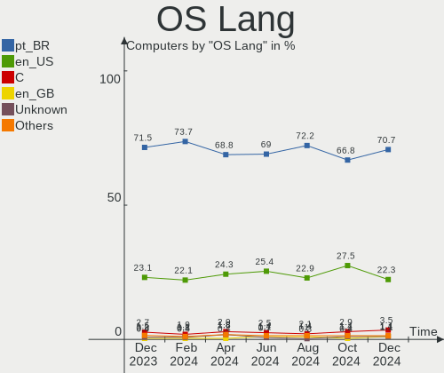
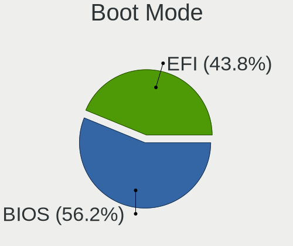
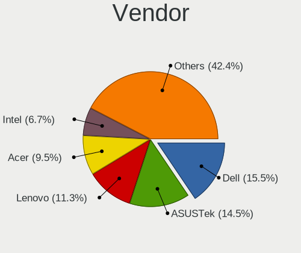
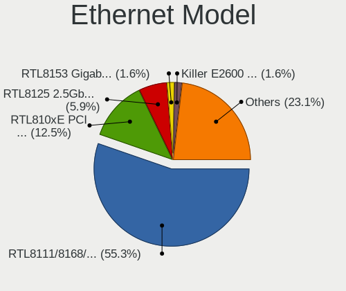
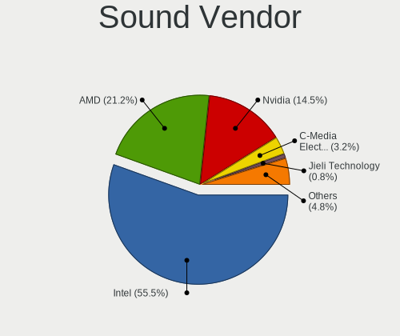

Linux in Brazil - Hardware Trends
---------------------------------

A project to identify most popular hardware characteristics and track their change
over time based on data collected by Linux users at https://Linux-Hardware.org.

Anyone can contribute to this report by the [hw-probe](https://github.com/linuxhw/hw-probe) tool:

    sudo -E hw-probe -all -upload

This is a report for all computer types. See also reports for [desktops](/Location/Brazil/Desktop/README.md) and [notebooks](/Location/Brazil/Notebook/README.md).

Period: Jul, 2022.

Contents
--------

* [ System ](#system)
  - [ OS                       ](#os)
  - [ OS Family                ](#os-family)
  - [ Kernel                   ](#kernel)
  - [ Kernel Family            ](#kernel-family)
  - [ Kernel Major Ver.        ](#kernel-major-ver)
  - [ Arch                     ](#arch)
  - [ DE                       ](#de)
  - [ Display Server           ](#display-server)
  - [ Display Manager          ](#display-manager)
  - [ OS Lang                  ](#os-lang)
  - [ Boot Mode                ](#boot-mode)
  - [ Filesystem               ](#filesystem)
  - [ Part. scheme             ](#part-scheme)
  - [ Dual Boot with Linux/BSD ](#dual-boot-with-linuxbsd)
  - [ Dual Boot (Win)          ](#dual-boot-win)

* [ Board ](#board)
  - [ Vendor                   ](#vendor)
  - [ Model                    ](#model)
  - [ Model Family             ](#model-family)
  - [ MFG Year                 ](#mfg-year)
  - [ Form Factor              ](#form-factor)
  - [ Secure Boot              ](#secure-boot)
  - [ Coreboot                 ](#coreboot)
  - [ RAM Size                 ](#ram-size)
  - [ RAM Used                 ](#ram-used)
  - [ Total Drives             ](#total-drives)
  - [ Has CD-ROM               ](#has-cd-rom)
  - [ Has Ethernet             ](#has-ethernet)
  - [ Has WiFi                 ](#has-wifi)
  - [ Has Bluetooth            ](#has-bluetooth)

* [ Location ](#location)
  - [ Country                  ](#country)
  - [ City                     ](#city)

* [ Drives ](#drives)
  - [ Drive Vendor             ](#drive-vendor)
  - [ Drive Model              ](#drive-model)
  - [ HDD Vendor               ](#hdd-vendor)
  - [ SSD Vendor               ](#ssd-vendor)
  - [ Drive Kind               ](#drive-kind)
  - [ Drive Connector          ](#drive-connector)
  - [ Drive Size               ](#drive-size)
  - [ Space Total              ](#space-total)
  - [ Space Used               ](#space-used)
  - [ Malfunc. Drives          ](#malfunc-drives)
  - [ Malfunc. Drive Vendor    ](#malfunc-drive-vendor)
  - [ Malfunc. HDD Vendor      ](#malfunc-hdd-vendor)
  - [ Malfunc. Drive Kind      ](#malfunc-drive-kind)
  - [ Failed Drives            ](#failed-drives)
  - [ Failed Drive Vendor      ](#failed-drive-vendor)
  - [ Drive Status             ](#drive-status)

* [ Storage controller ](#storage-controller)
  - [ Storage Vendor           ](#storage-vendor)
  - [ Storage Model            ](#storage-model)
  - [ Storage Kind             ](#storage-kind)

* [ Processor ](#processor)
  - [ CPU Vendor               ](#cpu-vendor)
  - [ CPU Model                ](#cpu-model)
  - [ CPU Model Family         ](#cpu-model-family)
  - [ CPU Cores                ](#cpu-cores)
  - [ CPU Sockets              ](#cpu-sockets)
  - [ CPU Threads              ](#cpu-threads)
  - [ CPU Op-Modes             ](#cpu-op-modes)
  - [ CPU Microcode            ](#cpu-microcode)
  - [ CPU Microarch            ](#cpu-microarch)

* [ Graphics ](#graphics)
  - [ GPU Vendor               ](#gpu-vendor)
  - [ GPU Model                ](#gpu-model)
  - [ GPU Combo                ](#gpu-combo)
  - [ GPU Driver               ](#gpu-driver)
  - [ GPU Memory               ](#gpu-memory)

* [ Monitor ](#monitor)
  - [ Monitor Vendor           ](#monitor-vendor)
  - [ Monitor Model            ](#monitor-model)
  - [ Monitor Resolution       ](#monitor-resolution)
  - [ Monitor Diagonal         ](#monitor-diagonal)
  - [ Monitor Width            ](#monitor-width)
  - [ Aspect Ratio             ](#aspect-ratio)
  - [ Monitor Area             ](#monitor-area)
  - [ Pixel Density            ](#pixel-density)
  - [ Multiple Monitors        ](#multiple-monitors)

* [ Network ](#network)
  - [ Net Controller Vendor    ](#net-controller-vendor)
  - [ Net Controller Model     ](#net-controller-model)
  - [ Wireless Vendor          ](#wireless-vendor)
  - [ Wireless Model           ](#wireless-model)
  - [ Ethernet Vendor          ](#ethernet-vendor)
  - [ Ethernet Model           ](#ethernet-model)
  - [ Net Controller Kind      ](#net-controller-kind)
  - [ Used Controller          ](#used-controller)
  - [ NICs                     ](#nics)
  - [ IPv6                     ](#ipv6)

* [ Bluetooth ](#bluetooth)
  - [ Bluetooth Vendor         ](#bluetooth-vendor)
  - [ Bluetooth Model          ](#bluetooth-model)

* [ Sound ](#sound)
  - [ Sound Vendor             ](#sound-vendor)
  - [ Sound Model              ](#sound-model)

* [ Memory ](#memory)
  - [ Memory Vendor            ](#memory-vendor)
  - [ Memory Model             ](#memory-model)
  - [ Memory Kind              ](#memory-kind)
  - [ Memory Form Factor       ](#memory-form-factor)
  - [ Memory Size              ](#memory-size)
  - [ Memory Speed             ](#memory-speed)

* [ Printers & scanners ](#printers--scanners)
  - [ Printer Vendor           ](#printer-vendor)
  - [ Printer Model            ](#printer-model)
  - [ Scanner Vendor           ](#scanner-vendor)
  - [ Scanner Model            ](#scanner-model)

* [ Camera ](#camera)
  - [ Camera Vendor            ](#camera-vendor)
  - [ Camera Model             ](#camera-model)

* [ Security ](#security)
  - [ Fingerprint Vendor       ](#fingerprint-vendor)
  - [ Fingerprint Model        ](#fingerprint-model)
  - [ Chipcard Vendor          ](#chipcard-vendor)
  - [ Chipcard Model           ](#chipcard-model)

* [ Unsupported ](#unsupported)
  - [ Unsupported Devices      ](#unsupported-devices)
  - [ Unsupported Device Types ](#unsupported-device-types)

System
------

OS
--

Installed operating systems

| Name                         | Computers | Percent |
|------------------------------|-----------|---------|
| Ubuntu 22.04                 | 35        | 12.96%  |
| Linux Mint 20.3              | 29        | 10.74%  |
| OpenMandriva 4.3             | 25        | 9.26%   |
| Fedora 36                    | 25        | 9.26%   |
| Ubuntu 20.04                 | 18        | 6.67%   |
| Pop!_OS 22.04                | 16        | 5.93%   |
| KDE neon 20.04               | 11        | 4.07%   |
| OpenMandriva 4.90            | 10        | 3.7%    |
| Zorin 16                     | 8         | 2.96%   |
| Arch                         | 8         | 2.96%   |
| Debian 11                    | 7         | 2.59%   |
| Manjaro                      | 5         | 1.85%   |
| Ubuntu 18.04                 | 4         | 1.48%   |
| Endless 4.0.7                | 4         | 1.48%   |
| Elementary 6.1               | 4         | 1.48%   |
| Xubuntu 22.04                | 3         | 1.11%   |
| Xubuntu 20.04                | 3         | 1.11%   |
| openSUSE Leap-15.4           | 3         | 1.11%   |
| Endless 3.9.7                | 3         | 1.11%   |
| BigLinux 21.3.5              | 3         | 1.11%   |
| ROSA 12.2                    | 2         | 0.74%   |
| PureOS 10                    | 2         | 0.74%   |
| LMDE 5                       | 2         | 0.74%   |
| Kali 2022.2                  | 2         | 0.74%   |
| Debian Testing               | 2         | 0.74%   |
| Ubuntu MATE 22.04            | 1         | 0.37%   |
| Ubuntu MATE 20.04            | 1         | 0.37%   |
| Ubuntu 21.10                 | 1         | 0.37%   |
| Ubuntu 16.04                 | 1         | 0.37%   |
| SteamOS 3.3                  | 1         | 0.37%   |
| Sparky 7                     | 1         | 0.37%   |
| Solus 4.3                    | 1         | 0.37%   |
| Regata OS 22                 | 1         | 0.37%   |
| PureOS 10.0                  | 1         | 0.37%   |
| Pop!_OS 20.10                | 1         | 0.37%   |
| Pop!_OS 20.04                | 1         | 0.37%   |
| Parrot 5.0                   | 1         | 0.37%   |
| org.kde.Platform 5.15-21.08  | 1         | 0.37%   |
| openSUSE Tumbleweed-XXXXXXXX | 1         | 0.37%   |
| OpenMandriva 4.2             | 1         | 0.37%   |
| Manjaro 21.3.5               | 1         | 0.37%   |
| Manjaro 21.3.4               | 1         | 0.37%   |
| Manjaro 21.3.3               | 1         | 0.37%   |
| Manjaro 21.3.1               | 1         | 0.37%   |
| Manjaro 21.2.6               | 1         | 0.37%   |
| Linux Mint 20.2              | 1         | 0.37%   |
| Linux Mint 20.1              | 1         | 0.37%   |
| Linux Mint 19.3              | 1         | 0.37%   |
| Linux Mint 18.3              | 1         | 0.37%   |
| Kubuntu 22.04                | 1         | 0.37%   |
| Kubuntu 21.04                | 1         | 0.37%   |
| Kubuntu 20.04                | 1         | 0.37%   |
| Kali 2022.3                  | 1         | 0.37%   |
| Fedora 37                    | 1         | 0.37%   |
| Endless 3.8.7-nexthw2        | 1         | 0.37%   |
| Clear Linux 36010            | 1         | 0.37%   |
| CentOS 8                     | 1         | 0.37%   |
| BuildRoot 2021.08.2          | 1         | 0.37%   |
| Artix Rolling                | 1         | 0.37%   |
| ArcoLinux Rolling            | 1         | 0.37%   |

OS Family
---------

OS without a version

| Name             | Computers | Percent |
|------------------|-----------|---------|
| Ubuntu           | 59        | 21.85%  |
| OpenMandriva     | 36        | 13.33%  |
| Linux Mint       | 33        | 12.22%  |
| Fedora           | 26        | 9.63%   |
| Pop!_OS          | 18        | 6.67%   |
| KDE neon         | 11        | 4.07%   |
| Manjaro          | 10        | 3.7%    |
| Debian           | 9         | 3.33%   |
| Zorin            | 8         | 2.96%   |
| Endless          | 8         | 2.96%   |
| Arch             | 8         | 2.96%   |
| Xubuntu          | 6         | 2.22%   |
| openSUSE         | 4         | 1.48%   |
| Elementary       | 4         | 1.48%   |
| PureOS           | 3         | 1.11%   |
| Kubuntu          | 3         | 1.11%   |
| Kali             | 3         | 1.11%   |
| BigLinux         | 3         | 1.11%   |
| Ubuntu MATE      | 2         | 0.74%   |
| ROSA             | 2         | 0.74%   |
| LMDE             | 2         | 0.74%   |
| SteamOS          | 1         | 0.37%   |
| Sparky           | 1         | 0.37%   |
| Solus            | 1         | 0.37%   |
| Regata OS        | 1         | 0.37%   |
| Parrot           | 1         | 0.37%   |
| org.kde.Platform | 1         | 0.37%   |
| Clear Linux      | 1         | 0.37%   |
| CentOS           | 1         | 0.37%   |
| BuildRoot        | 1         | 0.37%   |
| Artix            | 1         | 0.37%   |
| ArcoLinux        | 1         | 0.37%   |
| antiX            | 1         | 0.37%   |

Kernel
------

Version of the Linux kernel

| Version                                             | Computers | Percent |
|-----------------------------------------------------|-----------|---------|
| 5.15.0-41-generic                                   | 35        | 12.96%  |
| 5.16.7-desktop-1omv4003                             | 24        | 8.89%   |
| 5.4.0-122-generic                                   | 15        | 5.56%   |
| 5.13.0-52-generic                                   | 15        | 5.56%   |
| 5.17.15-76051715-generic                            | 12        | 4.44%   |
| 5.4.0-121-generic                                   | 11        | 4.07%   |
| 5.15.0-40-generic                                   | 11        | 4.07%   |
| 5.18.12-desktop-3omv4090                            | 10        | 3.7%    |
| 5.18.11-200.fc36.x86_64                             | 8         | 2.96%   |
| 5.15.55-1-MANJARO                                   | 5         | 1.85%   |
| 5.15.0-43-generic                                   | 5         | 1.85%   |
| 5.10.0-15-amd64                                     | 5         | 1.85%   |
| 5.8.0-14-generic                                    | 4         | 1.48%   |
| 5.4.0-91-generic                                    | 4         | 1.48%   |
| 5.18.13-200.fc36.x86_64                             | 4         | 1.48%   |
| 5.18.10-200.fc36.x86_64                             | 4         | 1.48%   |
| 5.11.0-35-generic                                   | 4         | 1.48%   |
| 5.18.9-200.fc36.x86_64                              | 3         | 1.11%   |
| 5.18.10-76051810-generic                            | 3         | 1.11%   |
| 5.14.21-150400.22-default                           | 3         | 1.11%   |
| 5.14.0-1045-oem                                     | 3         | 1.11%   |
| 5.18.9-arch1-1                                      | 2         | 0.74%   |
| 5.18.6-200.fc36.x86_64                              | 2         | 0.74%   |
| 5.18.13-arch1-1                                     | 2         | 0.74%   |
| 5.18.12-arch1-1                                     | 2         | 0.74%   |
| 5.18.0-2-amd64                                      | 2         | 0.74%   |
| 5.17.5-76051705-generic                             | 2         | 0.74%   |
| 5.17.5-300.fc36.x86_64                              | 2         | 0.74%   |
| 5.15.0-33-generic                                   | 2         | 0.74%   |
| 5.15.0-25-generic                                   | 2         | 0.74%   |
| 5.13.0-30-generic                                   | 2         | 0.74%   |
| 4.15.0-189-generic                                  | 2         | 0.74%   |
| 5.8.0-43-generic                                    | 1         | 0.37%   |
| 5.4.0-58-generic                                    | 1         | 0.37%   |
| 5.4.0-26-generic                                    | 1         | 0.37%   |
| 5.4.0-122-lowlatency                                | 1         | 0.37%   |
| 5.4.0-120-generic                                   | 1         | 0.37%   |
| 5.3.0-40-generic                                    | 1         | 0.37%   |
| 5.19.0-0.rc6.20220714git4a57a8400075.49.fc37.x86_64 | 1         | 0.37%   |
| 5.18.9-zen1-1-zen                                   | 1         | 0.37%   |
| 5.18.8-zen1-1-zen                                   | 1         | 0.37%   |
| 5.18.7-arch1-1                                      | 1         | 0.37%   |
| 5.18.7-200.fc36.x86_64                              | 1         | 0.37%   |
| 5.18.6-1-default                                    | 1         | 0.37%   |
| 5.18.3-sparky-amd64                                 | 1         | 0.37%   |
| 5.18.3-lp154.5-default                              | 1         | 0.37%   |
| 5.18.14-arch1-1                                     | 1         | 0.37%   |
| 5.18.13-051813-generic                              | 1         | 0.37%   |
| 5.18.10-250.vanilla.1.fc36.x86_64                   | 1         | 0.37%   |
| 5.18.10-1-MANJARO                                   | 1         | 0.37%   |
| 5.18.1-arch1_testHoloISO_20220606.1811              | 1         | 0.37%   |
| 5.18.0-kali5-amd64                                  | 1         | 0.37%   |
| 5.18.0-1parrot1-amd64                               | 1         | 0.37%   |
| 5.18.0-1-rt11-MANJARO                               | 1         | 0.37%   |
| 5.18.0-051800-generic                               | 1         | 0.37%   |
| 5.17.15-1-MANJARO                                   | 1         | 0.37%   |
| 5.17.0-1013-oem                                     | 1         | 0.37%   |
| 5.17.0-051700rc7-generic                            | 1         | 0.37%   |
| 5.16.13-desktop-1omv4003                            | 1         | 0.37%   |
| 5.16.13-1132.native                                 | 1         | 0.37%   |

Kernel Family
-------------

Linux kernel without a distro release

| Version  | Computers | Percent |
|----------|-----------|---------|
| 5.15.0   | 57        | 21.11%  |
| 5.4.0    | 34        | 12.59%  |
| 5.16.7   | 24        | 8.89%   |
| 5.13.0   | 18        | 6.67%   |
| 5.17.15  | 13        | 4.81%   |
| 5.18.12  | 12        | 4.44%   |
| 5.18.10  | 9         | 3.33%   |
| 5.10.0   | 9         | 3.33%   |
| 5.18.11  | 8         | 2.96%   |
| 5.18.13  | 7         | 2.59%   |
| 5.18.9   | 6         | 2.22%   |
| 5.18.0   | 6         | 2.22%   |
| 5.11.0   | 6         | 2.22%   |
| 5.8.0    | 5         | 1.85%   |
| 5.15.55  | 5         | 1.85%   |
| 5.14.0   | 5         | 1.85%   |
| 5.17.5   | 4         | 1.48%   |
| 5.18.6   | 3         | 1.11%   |
| 5.14.21  | 3         | 1.11%   |
| 4.15.0   | 3         | 1.11%   |
| 5.18.7   | 2         | 0.74%   |
| 5.18.3   | 2         | 0.74%   |
| 5.17.0   | 2         | 0.74%   |
| 5.16.13  | 2         | 0.74%   |
| 5.16.0   | 2         | 0.74%   |
| 5.15.50  | 2         | 0.74%   |
| 5.3.0    | 1         | 0.37%   |
| 5.19.0   | 1         | 0.37%   |
| 5.18.8   | 1         | 0.37%   |
| 5.18.14  | 1         | 0.37%   |
| 5.18.1   | 1         | 0.37%   |
| 5.15.49  | 1         | 0.37%   |
| 5.15.11  | 1         | 0.37%   |
| 5.13.19  | 1         | 0.37%   |
| 5.10.74  | 1         | 0.37%   |
| 5.10.60  | 1         | 0.37%   |
| 5.10.57  | 1         | 0.37%   |
| 5.10.14  | 1         | 0.37%   |
| 5.10.131 | 1         | 0.37%   |
| 5.10.124 | 1         | 0.37%   |
| 5.10.120 | 1         | 0.37%   |
| 5.10.118 | 1         | 0.37%   |
| 5.0.0    | 1         | 0.37%   |
| 4.9.0    | 1         | 0.37%   |
| 4.4.0    | 1         | 0.37%   |
| 4.18.0   | 1         | 0.37%   |
| 4.10.0   | 1         | 0.37%   |

Kernel Major Ver.
-----------------

Linux kernel major version

| Version | Computers | Percent |
|---------|-----------|---------|
| 5.15    | 66        | 24.44%  |
| 5.18    | 58        | 21.48%  |
| 5.4     | 34        | 12.59%  |
| 5.16    | 28        | 10.37%  |
| 5.17    | 19        | 7.04%   |
| 5.13    | 19        | 7.04%   |
| 5.10    | 17        | 6.3%    |
| 5.14    | 8         | 2.96%   |
| 5.11    | 6         | 2.22%   |
| 5.8     | 5         | 1.85%   |
| 4.15    | 3         | 1.11%   |
| 5.3     | 1         | 0.37%   |
| 5.19    | 1         | 0.37%   |
| 5.0     | 1         | 0.37%   |
| 4.9     | 1         | 0.37%   |
| 4.4     | 1         | 0.37%   |
| 4.18    | 1         | 0.37%   |
| 4.10    | 1         | 0.37%   |

Arch
----

OS architecture (x86_64, i586, etc.)

| Name   | Computers | Percent |
|--------|-----------|---------|
| x86_64 | 268       | 99.26%  |
| i686   | 2         | 0.74%   |

DE
--

Desktop Environment

| Name            | Computers | Percent |
|-----------------|-----------|---------|
| GNOME           | 129       | 47.78%  |
| KDE5            | 67        | 24.81%  |
| XFCE            | 25        | 9.26%   |
| X-Cinnamon      | 16        | 5.93%   |
| Unknown         | 10        | 3.7%    |
| MATE            | 9         | 3.33%   |
| Pantheon        | 4         | 1.48%   |
| Cinnamon        | 4         | 1.48%   |
| Unity           | 1         | 0.37%   |
| qtile           | 1         | 0.37%   |
| icewm           | 1         | 0.37%   |
| GNOME Flashback | 1         | 0.37%   |
| Budgie          | 1         | 0.37%   |
| bspwm           | 1         | 0.37%   |

Display Server
--------------

X11 or Wayland

| Name    | Computers | Percent |
|---------|-----------|---------|
| X11     | 209       | 77.41%  |
| Wayland | 54        | 20%     |
| Unknown | 7         | 2.59%   |

Display Manager
---------------

SDDM, LightDM, etc.

| Name    | Computers | Percent |
|---------|-----------|---------|
| Unknown | 121       | 44.81%  |
| SDDM    | 52        | 19.26%  |
| GDM3    | 48        | 17.78%  |
| LightDM | 25        | 9.26%   |
| GDM     | 23        | 8.52%   |
| SLIMSKI | 1         | 0.37%   |

OS Lang
-------

Language

| Lang    | Computers | Percent |
|---------|-----------|---------|
| pt_BR   | 183       | 67.78%  |
| en_US   | 76        | 28.15%  |
| C       | 5         | 1.85%   |
| Unknown | 5         | 1.85%   |
| pt_PT   | 1         | 0.37%   |

Boot Mode
---------

EFI or BIOS

| Mode | Computers | Percent |
|------|-----------|---------|
| BIOS | 138       | 51.11%  |
| EFI  | 132       | 48.89%  |

Filesystem
----------

Type of filesystem

| Type    | Computers | Percent |
|---------|-----------|---------|
| Ext4    | 185       | 68.52%  |
| Overlay | 39        | 14.44%  |
| Btrfs   | 37        | 13.7%   |
| Zfs     | 3         | 1.11%   |
| Xfs     | 3         | 1.11%   |
| Tmpfs   | 1         | 0.37%   |
| Ext2    | 1         | 0.37%   |
| Unknown | 1         | 0.37%   |

Part. scheme
------------

Scheme of partitioning

| Type    | Computers | Percent |
|---------|-----------|---------|
| Unknown | 155       | 57.41%  |
| GPT     | 89        | 32.96%  |
| MBR     | 26        | 9.63%   |

Dual Boot with Linux/BSD
------------------------

Hosting more than one Linux/BSD

| Dual boot | Computers | Percent |
|-----------|-----------|---------|
| No        | 230       | 85.19%  |
| Yes       | 40        | 14.81%  |

Dual Boot (Win)
---------------

Hosting Linux and Windows

| Dual boot | Computers | Percent |
|-----------|-----------|---------|
| No        | 208       | 77.04%  |
| Yes       | 62        | 22.96%  |

Board
-----

Vendor
------

Motherboard manufacturer

| Name                   | Computers | Percent |
|------------------------|-----------|---------|
| Dell                   | 43        | 15.93%  |
| ASUSTek Computer       | 43        | 15.93%  |
| Lenovo                 | 25        | 9.26%   |
| Acer                   | 21        | 7.78%   |
| Samsung Electronics    | 17        | 6.3%    |
| Gigabyte Technology    | 15        | 5.56%   |
| Positivo               | 13        | 4.81%   |
| Intel                  | 12        | 4.44%   |
| Hewlett-Packard        | 9         | 3.33%   |
| ASRock                 | 8         | 2.96%   |
| PCWare                 | 7         | 2.59%   |
| MSI                    | 7         | 2.59%   |
| Sony                   | 4         | 1.48%   |
| ECS                    | 4         | 1.48%   |
| LG Electronics         | 3         | 1.11%   |
| Digibras               | 3         | 1.11%   |
| Avell High Performance | 3         | 1.11%   |
| Unknown                | 3         | 1.11%   |
| Semp Toshiba           | 2         | 0.74%   |
| Pegatron               | 2         | 0.74%   |
| Huanan                 | 2         | 0.74%   |
| Compaq                 | 2         | 0.74%   |
| Biostar                | 2         | 0.74%   |
| TPVAOC                 | 1         | 0.37%   |
| PCChips                | 1         | 0.37%   |
| OEM                    | 1         | 0.37%   |
| Notebook               | 1         | 0.37%   |
| Multilaser             | 1         | 0.37%   |
| Megaware               | 1         | 0.37%   |
| MACHINIST              | 1         | 0.37%   |
| Login Informatica      | 1         | 0.37%   |
| Gateway                | 1         | 0.37%   |
| GALAX                  | 1         | 0.37%   |
| eMachines              | 1         | 0.37%   |
| Digiboard              | 1         | 0.37%   |
| Daten Tecnologia       | 1         | 0.37%   |
| Coradir                | 1         | 0.37%   |
| congatec               | 1         | 0.37%   |
| Clevo                  | 1         | 0.37%   |
| Chuwi                  | 1         | 0.37%   |
| Apple                  | 1         | 0.37%   |
| AMI                    | 1         | 0.37%   |
| A14CR                  | 1         | 0.37%   |

Model
-----

Motherboard model

| Name                                              | Computers | Percent |
|---------------------------------------------------|-----------|---------|
| Unknown                                           | 7         | 2.59%   |
| Lenovo IdeaPad S145-15API 81V7                    | 3         | 1.11%   |
| Intel H61                                         | 3         | 1.11%   |
| Dell Vostro 15 3510                               | 3         | 1.11%   |
| ASUS M5A78L-M/USB3                                | 3         | 1.11%   |
| ASRock B450M Steel Legend                         | 3         | 1.11%   |
| Samsung 550XBE/350XBE                             | 2         | 0.74%   |
| Samsung 340XAA/350XAA/550XAA                      | 2         | 0.74%   |
| Samsung 300E5M/300E5L                             | 2         | 0.74%   |
| Samsung 270E5G/270E5U                             | 2         | 0.74%   |
| Positivo C14CU51                                  | 2         | 0.74%   |
| Pegatron IPM41-D3                                 | 2         | 0.74%   |
| LG 22V280-L.BY31P1                                | 2         | 0.74%   |
| Lenovo IdeaPad 330-15IKB 81FE                     | 2         | 0.74%   |
| Lenovo IdeaPad 330-15IKB 81FD                     | 2         | 0.74%   |
| Lenovo IdeaPad 320-15IKB 80YH                     | 2         | 0.74%   |
| Lenovo IdeaPad 3 15ALC6 82MF                      | 2         | 0.74%   |
| Gigabyte B450 AORUS M                             | 2         | 0.74%   |
| ECS H61H2-M12                                     | 2         | 0.74%   |
| Digibras NH4CU03                                  | 2         | 0.74%   |
| Dell Vostro 5470                                  | 2         | 0.74%   |
| Dell Latitude 5420                                | 2         | 0.74%   |
| Dell Inspiron 3583                                | 2         | 0.74%   |
| Dell Inspiron 3501                                | 2         | 0.74%   |
| Compaq Presario CQ-23                             | 2         | 0.74%   |
| Avell High Performance B.ON                       | 2         | 0.74%   |
| ASUS VivoBook_ASUSLaptop X515JA_X515JA            | 2         | 0.74%   |
| ASUS VivoBook_ASUSLaptop X513EAN_X513EAN          | 2         | 0.74%   |
| ASUS STRIX B250F GAMING                           | 2         | 0.74%   |
| ASUS PRIME B450M-GAMING/BR                        | 2         | 0.74%   |
| ASUS All Series                                   | 2         | 0.74%   |
| ASRock A320M-HDV R4.0                             | 2         | 0.74%   |
| Acer Nitro AN515-44                               | 2         | 0.74%   |
| TPVAOC AA183M                                     | 1         | 0.37%   |
| Sony VPCEG27FM                                    | 1         | 0.37%   |
| Sony VPCCW13FB                                    | 1         | 0.37%   |
| Sony VJF153                                       | 1         | 0.37%   |
| Sony VGN-NW270F                                   | 1         | 0.37%   |
| Semp Toshiba IS-1253                              | 1         | 0.37%   |
| Semp Toshiba IS 1413G                             | 1         | 0.37%   |
| Samsung RV420/RV520/RV720/E3530/S3530/E3420/E3520 | 1         | 0.37%   |
| Samsung RV411/RV511/E3511/S3511/RV711/E3411       | 1         | 0.37%   |
| Samsung R430/R480/R440                            | 1         | 0.37%   |
| Samsung 550XDA                                    | 1         | 0.37%   |
| Samsung 500R5M/500R5W/501R5M                      | 1         | 0.37%   |
| Samsung 370E4K                                    | 1         | 0.37%   |
| Samsung 300E4C/300E5C/300E7C                      | 1         | 0.37%   |
| Samsung 300E4A/300E5A/300E7A/3430EA/3530EA        | 1         | 0.37%   |
| Samsung 270E5K/270E5Q/271E5K/2570EK               | 1         | 0.37%   |
| Positivo S14CT01                                  | 1         | 0.37%   |
| Positivo POS-PIQ77CL                              | 1         | 0.37%   |
| Positivo POS-MIG31AG                              | 1         | 0.37%   |
| Positivo POS-MI945AA                              | 1         | 0.37%   |
| Positivo POS-EIH61CE                              | 1         | 0.37%   |
| Positivo Mobile                                   | 1         | 0.37%   |
| Positivo J14AL11                                  | 1         | 0.37%   |
| Positivo H14BT58                                  | 1         | 0.37%   |
| Positivo DC8CR01TV                                | 1         | 0.37%   |
| Positivo D6200                                    | 1         | 0.37%   |
| Positivo C4128E-S                                 | 1         | 0.37%   |

Model Family
------------

Motherboard model prefix

| Name                        | Computers | Percent |
|-----------------------------|-----------|---------|
| Dell Inspiron               | 19        | 7.04%   |
| Lenovo IdeaPad              | 17        | 6.3%    |
| Acer Aspire                 | 16        | 5.93%   |
| Dell Vostro                 | 9         | 3.33%   |
| Dell Latitude               | 8         | 2.96%   |
| Unknown                     | 7         | 2.59%   |
| ASUS VivoBook               | 6         | 2.22%   |
| ASUS TUF                    | 5         | 1.85%   |
| ASUS PRIME                  | 5         | 1.85%   |
| Lenovo ThinkPad             | 4         | 1.48%   |
| Acer Nitro                  | 4         | 1.48%   |
| Intel H61                   | 3         | 1.11%   |
| HP Compaq                   | 3         | 1.11%   |
| Dell OptiPlex               | 3         | 1.11%   |
| ASUS ROG                    | 3         | 1.11%   |
| ASUS M5A78L-M               | 3         | 1.11%   |
| ASRock B450M                | 3         | 1.11%   |
| Samsung 550XBE              | 2         | 0.74%   |
| Samsung 340XAA              | 2         | 0.74%   |
| Samsung 300E5M              | 2         | 0.74%   |
| Samsung 270E5G              | 2         | 0.74%   |
| Positivo C14CU51            | 2         | 0.74%   |
| Pegatron IPM41-D3           | 2         | 0.74%   |
| LG 22V280-L.BY31P1          | 2         | 0.74%   |
| HP Pavilion                 | 2         | 0.74%   |
| Gigabyte B450               | 2         | 0.74%   |
| ECS H61H2-M12               | 2         | 0.74%   |
| Digibras NH4CU03            | 2         | 0.74%   |
| Compaq Presario             | 2         | 0.74%   |
| Avell High Performance B.ON | 2         | 0.74%   |
| ASUS STRIX                  | 2         | 0.74%   |
| ASUS P8H61-M                | 2         | 0.74%   |
| ASUS All                    | 2         | 0.74%   |
| ASRock A320M-HDV            | 2         | 0.74%   |
| TPVAOC AA183M               | 1         | 0.37%   |
| Sony VPCEG27FM              | 1         | 0.37%   |
| Sony VPCCW13FB              | 1         | 0.37%   |
| Sony VJF153                 | 1         | 0.37%   |
| Sony VGN-NW270F             | 1         | 0.37%   |
| Semp Toshiba IS-1253        | 1         | 0.37%   |
| Semp Toshiba IS             | 1         | 0.37%   |
| Samsung RV420               | 1         | 0.37%   |
| Samsung RV411               | 1         | 0.37%   |
| Samsung R430                | 1         | 0.37%   |
| Samsung 550XDA              | 1         | 0.37%   |
| Samsung 500R5M              | 1         | 0.37%   |
| Samsung 370E4K              | 1         | 0.37%   |
| Samsung 300E4C              | 1         | 0.37%   |
| Samsung 300E4A              | 1         | 0.37%   |
| Samsung 270E5K              | 1         | 0.37%   |
| Positivo S14CT01            | 1         | 0.37%   |
| Positivo POS-PIQ77CL        | 1         | 0.37%   |
| Positivo POS-MIG31AG        | 1         | 0.37%   |
| Positivo POS-MI945AA        | 1         | 0.37%   |
| Positivo POS-EIH61CE        | 1         | 0.37%   |
| Positivo Mobile             | 1         | 0.37%   |
| Positivo J14AL11            | 1         | 0.37%   |
| Positivo H14BT58            | 1         | 0.37%   |
| Positivo DC8CR01TV          | 1         | 0.37%   |
| Positivo D6200              | 1         | 0.37%   |

MFG Year
--------

Motherboard manufacture year

| Year | Computers | Percent |
|------|-----------|---------|
| 2019 | 31        | 11.48%  |
| 2018 | 31        | 11.48%  |
| 2021 | 28        | 10.37%  |
| 2020 | 26        | 9.63%   |
| 2011 | 24        | 8.89%   |
| 2017 | 23        | 8.52%   |
| 2013 | 21        | 7.78%   |
| 2012 | 15        | 5.56%   |
| 2016 | 14        | 5.19%   |
| 2014 | 12        | 4.44%   |
| 2010 | 12        | 4.44%   |
| 2009 | 12        | 4.44%   |
| 2008 | 8         | 2.96%   |
| 2015 | 5         | 1.85%   |
| 2022 | 3         | 1.11%   |
| 2007 | 3         | 1.11%   |
| 2006 | 2         | 0.74%   |

Form Factor
-----------

Physical design of the computer

| Name        | Computers | Percent |
|-------------|-----------|---------|
| Notebook    | 157       | 58.15%  |
| Desktop     | 105       | 38.89%  |
| All in one  | 4         | 1.48%   |
| Mini pc     | 2         | 0.74%   |
| Convertible | 1         | 0.37%   |
| Server      | 1         | 0.37%   |

Secure Boot
-----------

Enabled or disabled

| State    | Computers | Percent |
|----------|-----------|---------|
| Disabled | 250       | 92.59%  |
| Enabled  | 20        | 7.41%   |

Coreboot
--------

Have coreboot on board

| Used | Computers | Percent |
|------|-----------|---------|
| No   | 270       | 100%    |

RAM Size
--------

Total RAM memory

| Size in GB  | Computers | Percent |
|-------------|-----------|---------|
| 4.01-8.0    | 84        | 31.11%  |
| 3.01-4.0    | 50        | 18.52%  |
| 8.01-16.0   | 48        | 17.78%  |
| 16.01-24.0  | 46        | 17.04%  |
| 32.01-64.0  | 17        | 6.3%    |
| 1.01-2.0    | 15        | 5.56%   |
| 24.01-32.0  | 5         | 1.85%   |
| 2.01-3.0    | 2         | 0.74%   |
| 64.01-256.0 | 2         | 0.74%   |
| 0.51-1.0    | 1         | 0.37%   |

RAM Used
--------

Used RAM memory

| Used GB    | Computers | Percent |
|------------|-----------|---------|
| 1.01-2.0   | 94        | 34.81%  |
| 2.01-3.0   | 66        | 24.44%  |
| 4.01-8.0   | 45        | 16.67%  |
| 3.01-4.0   | 38        | 14.07%  |
| 0.51-1.0   | 14        | 5.19%   |
| 8.01-16.0  | 7         | 2.59%   |
| 16.01-24.0 | 3         | 1.11%   |
| 0.01-0.5   | 2         | 0.74%   |
| 24.01-32.0 | 1         | 0.37%   |

Total Drives
------------

Number of drives on board

| Drives | Computers | Percent |
|--------|-----------|---------|
| 1      | 168       | 62.22%  |
| 2      | 68        | 25.19%  |
| 3      | 18        | 6.67%   |
| 4      | 11        | 4.07%   |
| 5      | 3         | 1.11%   |
| 6      | 2         | 0.74%   |

Has CD-ROM
----------

Has CD-ROM on board

| Presented | Computers | Percent |
|-----------|-----------|---------|
| No        | 187       | 69.26%  |
| Yes       | 83        | 30.74%  |

Has Ethernet
------------

Has Ethernet on board

| Presented | Computers | Percent |
|-----------|-----------|---------|
| Yes       | 241       | 89.26%  |
| No        | 29        | 10.74%  |

Has WiFi
--------

Has WiFi module

| Presented | Computers | Percent |
|-----------|-----------|---------|
| Yes       | 203       | 75.19%  |
| No        | 67        | 24.81%  |

Has Bluetooth
-------------

Has Bluetooth module

| Presented | Computers | Percent |
|-----------|-----------|---------|
| Yes       | 143       | 52.96%  |
| No        | 127       | 47.04%  |

Location
--------

Country
-------

Geographic location (country)

| Country | Computers | Percent |
|---------|-----------|---------|
| Brazil  | 270       | 100%    |

City
----

Geographic location (city)

| City                     | Computers | Percent |
|--------------------------|-----------|---------|
| Sao Paulo                | 29        | 10.74%  |
| Rio de Janeiro           | 19        | 7.04%   |
| Belo Horizonte           | 11        | 4.07%   |
| Porto Alegre             | 10        | 3.7%    |
| Brasília                | 9         | 3.33%   |
| Fortaleza                | 8         | 2.96%   |
| Salvador                 | 4         | 1.48%   |
| Joao Pessoa              | 4         | 1.48%   |
| Guarulhos                | 4         | 1.48%   |
| Curitiba                 | 4         | 1.48%   |
| Campo Grande             | 4         | 1.48%   |
| Vitória                 | 3         | 1.11%   |
| Uberlândia              | 3         | 1.11%   |
| Sao Carlos               | 3         | 1.11%   |
| Recife                   | 3         | 1.11%   |
| Osasco                   | 3         | 1.11%   |
| Duque de Caxias          | 3         | 1.11%   |
| Contagem                 | 3         | 1.11%   |
| Campinas                 | 3         | 1.11%   |
| Aracaju                  | 3         | 1.11%   |
| Valparaiso de Goias      | 2         | 0.74%   |
| Teresina                 | 2         | 0.74%   |
| Serra                    | 2         | 0.74%   |
| Sao Luís                | 2         | 0.74%   |
| Sao José dos Campos     | 2         | 0.74%   |
| Rio Claro                | 2         | 0.74%   |
| Petrópolis              | 2         | 0.74%   |
| Pelotas                  | 2         | 0.74%   |
| Palmas                   | 2         | 0.74%   |
| Niterói                 | 2         | 0.74%   |
| Natal                    | 2         | 0.74%   |
| Maringá                 | 2         | 0.74%   |
| Maracanau                | 2         | 0.74%   |
| Manaus                   | 2         | 0.74%   |
| Luziania                 | 2         | 0.74%   |
| Limeira                  | 2         | 0.74%   |
| Itanhaem                 | 2         | 0.74%   |
| Itajaí                  | 2         | 0.74%   |
| Indaiatuba               | 2         | 0.74%   |
| Cuiabá                  | 2         | 0.74%   |
| Canoas                   | 2         | 0.74%   |
| Campos dos Goytacazes    | 2         | 0.74%   |
| Barueri                  | 2         | 0.74%   |
| Americana                | 2         | 0.74%   |
| Volta Redonda            | 1         | 0.37%   |
| Vitória da Conquista    | 1         | 0.37%   |
| Vila Velha               | 1         | 0.37%   |
| Videira                  | 1         | 0.37%   |
| Viamao                   | 1         | 0.37%   |
| Várzea Grande           | 1         | 0.37%   |
| Uberaba                  | 1         | 0.37%   |
| Toritama                 | 1         | 0.37%   |
| Timoteo                  | 1         | 0.37%   |
| Teixeira de Freitas      | 1         | 0.37%   |
| Taubate                  | 1         | 0.37%   |
| Taquari                  | 1         | 0.37%   |
| Sorocaba                 | 1         | 0.37%   |
| Sao Tome                 | 1         | 0.37%   |
| Sao Joao do Rio do Peixe | 1         | 0.37%   |
| Sao Goncalo do Amarante  | 1         | 0.37%   |

Drives
------

Drive Vendor
------------

Hard drive vendors

| Vendor                         | Computers | Drives | Percent |
|--------------------------------|-----------|--------|---------|
| WDC                            | 60        | 66     | 15.92%  |
| Seagate                        | 60        | 80     | 15.92%  |
| Kingston                       | 40        | 44     | 10.61%  |
| Samsung Electronics            | 33        | 38     | 8.75%   |
| Toshiba                        | 23        | 24     | 6.1%    |
| SanDisk                        | 23        | 24     | 6.1%    |
| A-DATA Technology              | 19        | 22     | 5.04%   |
| China                          | 12        | 13     | 3.18%   |
| ADATA Technology               | 7         | 7      | 1.86%   |
| SK hynix                       | 6         | 6      | 1.59%   |
| Silicon Motion                 | 6         | 6      | 1.59%   |
| Crucial                        | 6         | 7      | 1.59%   |
| Unknown                        | 5         | 7      | 1.33%   |
| Lexar                          | 5         | 5      | 1.33%   |
| PNY                            | 4         | 4      | 1.06%   |
| Phison                         | 4         | 4      | 1.06%   |
| LITEON                         | 4         | 4      | 1.06%   |
| KIOXIA                         | 4         | 4      | 1.06%   |
| Hitachi                        | 4         | 4      | 1.06%   |
| Maxtor                         | 3         | 3      | 0.8%    |
| Intel                          | 3         | 3      | 0.8%    |
| HGST                           | 3         | 3      | 0.8%    |
| XrayDisk                       | 2         | 3      | 0.53%   |
| Win Memory                     | 2         | 2      | 0.53%   |
| Team                           | 2         | 2      | 0.53%   |
| SSSTC                          | 2         | 2      | 0.53%   |
| ShiJi                          | 2         | 2      | 0.53%   |
| SAGE                           | 2         | 2      | 0.53%   |
| RZX                            | 2         | 2      | 0.53%   |
| Patriot                        | 2         | 2      | 0.53%   |
| Netac                          | 2         | 2      | 0.53%   |
| KingSpec                       | 2         | 2      | 0.53%   |
| Corsair                        | 2         | 2      | 0.53%   |
| Unknown                        | 2         | 2      | 0.53%   |
| ZTE                            | 1         | 1      | 0.27%   |
| XPG                            | 1         | 1      | 0.27%   |
| WALRAM                         | 1         | 1      | 0.27%   |
| SPCC                           | 1         | 1      | 0.27%   |
| Solid State Storage Technology | 1         | 1      | 0.27%   |
| MAXIO Technology (Hangzhou)    | 1         | 1      | 0.27%   |
| LITEONIT                       | 1         | 1      | 0.27%   |
| KingDian                       | 1         | 1      | 0.27%   |
| JMicron Technology             | 1         | 1      | 0.27%   |
| Innodisk                       | 1         | 1      | 0.27%   |
| HUSKY                          | 1         | 1      | 0.27%   |
| HS-SSD-E100N                   | 1         | 1      | 0.27%   |
| HS-SSD-C100                    | 1         | 1      | 0.27%   |
| Hikvision                      | 1         | 1      | 0.27%   |
| Gigabyte Technology            | 1         | 1      | 0.27%   |
| faspeed                        | 1         | 1      | 0.27%   |
| BIWIN                          | 1         | 1      | 0.27%   |
| BHT                            | 1         | 1      | 0.27%   |
| AEGO                           | 1         | 1      | 0.27%   |

Drive Model
-----------

Hard drive models

| Model                               | Computers | Percent |
|-------------------------------------|-----------|---------|
| Kingston SA400S37240G 240GB SSD     | 10        | 2.41%   |
| Kingston SA400S37480G 480GB SSD     | 9         | 2.17%   |
| Seagate ST500DM002-1BD142 500GB     | 7         | 1.69%   |
| ADATA NVMe SSD Drive 256GB          | 7         | 1.69%   |
| Seagate ST500LM012 HN-M500MBB 500GB | 6         | 1.45%   |
| Seagate ST1000DM010-2EP102 1TB      | 6         | 1.45%   |
| Seagate Expansion 1TB               | 6         | 1.45%   |
| WDC WD5000LPVX-22V0TT0 500GB        | 4         | 0.96%   |
| WDC WD10SPZX-21Z10T0 1TB            | 4         | 0.96%   |
| Toshiba MQ04ABF100 1TB              | 4         | 0.96%   |
| Toshiba MQ01ABF050 500GB            | 4         | 0.96%   |
| Toshiba MQ01ABD100 1TB              | 4         | 0.96%   |
| Seagate ST1000LM035-1RK172 1TB      | 4         | 0.96%   |
| SanDisk SSD PLUS 240GB              | 4         | 0.96%   |
| Kingston SV300S37A120G 120GB SSD    | 4         | 0.96%   |
| A-DATA IM2P33F3A NVMe 256GB         | 4         | 0.96%   |
| WDC WDS240G2G0A-00JH30 240GB SSD    | 3         | 0.72%   |
| WDC WD10JPVX-22JC3T0 1TB            | 3         | 0.72%   |
| Unknown MMC Card  32GB              | 3         | 0.72%   |
| Seagate ST1000LM024 HN-M101MBB 1TB  | 3         | 0.72%   |
| Seagate ST1000DM003-1ER162 1TB      | 3         | 0.72%   |
| Seagate ST1000DM003-1CH162 1TB      | 3         | 0.72%   |
| SanDisk SDSSDA120G 120GB            | 3         | 0.72%   |
| Kingston SA400S37960G 960GB SSD     | 3         | 0.72%   |
| Kingston SA400S37120G 120GB SSD     | 3         | 0.72%   |
| WDC WD5000AAKX-003CA0 500GB         | 2         | 0.48%   |
| WDC WD10SPZX-35Z10T0 1TB            | 2         | 0.48%   |
| WDC WD10SPZX-24Z10 1TB              | 2         | 0.48%   |
| Toshiba MQ01ABD050 500GB            | 2         | 0.48%   |
| Toshiba DT01ACA050 500GB            | 2         | 0.48%   |
| SK hynix NVMe SSD Drive 256GB       | 2         | 0.48%   |
| Seagate ST500LM030-2E717D 500GB     | 2         | 0.48%   |
| Seagate ST3320418AS 320GB           | 2         | 0.48%   |
| Seagate ST3250318AS 250GB           | 2         | 0.48%   |
| Seagate ST320LM001 HN-M320MBB 320GB | 2         | 0.48%   |
| Seagate ST3000NM0053 3TB            | 2         | 0.48%   |
| Seagate ST2000DX001-1CM164 2TB      | 2         | 0.48%   |
| Seagate ST2000DM008-2FR102 2TB      | 2         | 0.48%   |
| Seagate ST2000DM006-2DM164 2TB      | 2         | 0.48%   |
| Seagate ST1000VM002-1CT162 1TB      | 2         | 0.48%   |
| SanDisk SSD PLUS 480GB              | 2         | 0.48%   |
| SanDisk SDSSDA240G 240GB            | 2         | 0.48%   |
| SanDisk NVMe SSD Drive 500GB        | 2         | 0.48%   |
| SanDisk NVMe SSD Drive 480GB        | 2         | 0.48%   |
| SanDisk NVMe SSD Drive 240GB        | 2         | 0.48%   |
| Samsung SSD 850 EVO 500GB           | 2         | 0.48%   |
| Samsung NVMe SSD Drive 256GB        | 2         | 0.48%   |
| Samsung HM321HI 320GB               | 2         | 0.48%   |
| Samsung HM320II 320GB               | 2         | 0.48%   |
| Samsung HD502HJ 500GB               | 2         | 0.48%   |
| Samsung HD502HI 500GB               | 2         | 0.48%   |
| Samsung HD161GJ 160GB               | 2         | 0.48%   |
| Samsung HD080HJ/ 80GB               | 2         | 0.48%   |
| SAGE 3639S 1TB                      | 2         | 0.48%   |
| PNY CS900 120GB SSD                 | 2         | 0.48%   |
| Lexar 256GB SSD                     | 2         | 0.48%   |
| KIOXIA NVMe SSD Drive 128GB         | 2         | 0.48%   |
| Kingston SV300S37A240G 240GB SSD    | 2         | 0.48%   |
| Kingston SUV300S37A120G 120GB SSD   | 2         | 0.48%   |
| Hitachi HTS547550A9E384 500GB       | 2         | 0.48%   |

HDD Vendor
----------

Hard disk drive vendors

| Vendor              | Computers | Drives | Percent |
|---------------------|-----------|--------|---------|
| Seagate             | 60        | 80     | 35.93%  |
| WDC                 | 52        | 57     | 31.14%  |
| Toshiba             | 22        | 22     | 13.17%  |
| Samsung Electronics | 21        | 25     | 12.57%  |
| Hitachi             | 4         | 4      | 2.4%    |
| HGST                | 3         | 3      | 1.8%    |
| SAGE                | 2         | 2      | 1.2%    |
| Maxtor              | 2         | 2      | 1.2%    |
| Unknown             | 1         | 1      | 0.6%    |

SSD Vendor
----------

Solid state drive vendors

| Vendor              | Computers | Drives | Percent |
|---------------------|-----------|--------|---------|
| Kingston            | 36        | 37     | 29.27%  |
| SanDisk             | 14        | 15     | 11.38%  |
| China               | 12        | 13     | 9.76%   |
| WDC                 | 6         | 6      | 4.88%   |
| A-DATA Technology   | 6         | 6      | 4.88%   |
| Samsung Electronics | 5         | 5      | 4.07%   |
| Crucial             | 5         | 6      | 4.07%   |
| LITEON              | 4         | 4      | 3.25%   |
| Lexar               | 4         | 4      | 3.25%   |
| PNY                 | 3         | 3      | 2.44%   |
| Win Memory          | 2         | 2      | 1.63%   |
| Team                | 2         | 2      | 1.63%   |
| RZX                 | 2         | 2      | 1.63%   |
| Patriot             | 2         | 2      | 1.63%   |
| KingSpec            | 2         | 2      | 1.63%   |
| Corsair             | 2         | 2      | 1.63%   |
| Unknown             | 1         | 1      | 0.81%   |
| SPCC                | 1         | 1      | 0.81%   |
| SK hynix            | 1         | 1      | 0.81%   |
| Netac               | 1         | 1      | 0.81%   |
| Maxtor              | 1         | 1      | 0.81%   |
| LITEONIT            | 1         | 1      | 0.81%   |
| KingDian            | 1         | 1      | 0.81%   |
| Intel               | 1         | 1      | 0.81%   |
| Innodisk            | 1         | 1      | 0.81%   |
| HUSKY               | 1         | 1      | 0.81%   |
| HS-SSD-C100         | 1         | 1      | 0.81%   |
| Gigabyte Technology | 1         | 1      | 0.81%   |
| BIWIN               | 1         | 1      | 0.81%   |
| BHT                 | 1         | 1      | 0.81%   |
| AEGO                | 1         | 1      | 0.81%   |
| Unknown             | 1         | 1      | 0.81%   |

Drive Kind
----------

HDD or SSD

| Kind    | Computers | Drives | Percent |
|---------|-----------|--------|---------|
| HDD     | 153       | 196    | 44.22%  |
| SSD     | 109       | 127    | 31.5%   |
| NVMe    | 75        | 86     | 21.68%  |
| Unknown | 5         | 7      | 1.45%   |
| MMC     | 4         | 6      | 1.16%   |

Drive Connector
---------------

SATA, SAS, NVMe, etc.

| Type | Computers | Drives | Percent |
|------|-----------|--------|---------|
| SATA | 219       | 319    | 70.87%  |
| NVMe | 75        | 85     | 24.27%  |
| SAS  | 11        | 12     | 3.56%   |
| MMC  | 4         | 6      | 1.29%   |

Drive Size
----------

Size of hard drive

| Size in TB | Computers | Drives | Percent |
|------------|-----------|--------|---------|
| 0.01-0.5   | 166       | 208    | 64.09%  |
| 0.51-1.0   | 77        | 96     | 29.73%  |
| 1.01-2.0   | 12        | 12     | 4.63%   |
| 3.01-4.0   | 2         | 5      | 0.77%   |
| 2.01-3.0   | 2         | 2      | 0.77%   |

Space Total
-----------

Amount of disk space available on the file system

| Size in GB     | Computers | Percent |
|----------------|-----------|---------|
| 101-250        | 85        | 31.48%  |
| 251-500        | 53        | 19.63%  |
| 501-1000       | 36        | 13.33%  |
| 1-20           | 33        | 12.22%  |
| 1001-2000      | 25        | 9.26%   |
| 51-100         | 12        | 4.44%   |
| Unknown        | 9         | 3.33%   |
| More than 3000 | 7         | 2.59%   |
| 21-50          | 6         | 2.22%   |
| 2001-3000      | 4         | 1.48%   |

Space Used
----------

Amount of used disk space

| Used GB        | Computers | Percent |
|----------------|-----------|---------|
| 1-20           | 104       | 38.52%  |
| 21-50          | 48        | 17.78%  |
| 51-100         | 39        | 14.44%  |
| 101-250        | 28        | 10.37%  |
| 251-500        | 18        | 6.67%   |
| 501-1000       | 15        | 5.56%   |
| Unknown        | 9         | 3.33%   |
| 1001-2000      | 6         | 2.22%   |
| 2001-3000      | 2         | 0.74%   |
| More than 3000 | 1         | 0.37%   |

Malfunc. Drives
---------------

Drive models with a malfunction

| Model                                 | Computers | Drives | Percent |
|---------------------------------------|-----------|--------|---------|
| WDC WD5000LPVX-22V0TT0 500GB          | 2         | 2      | 5.26%   |
| Seagate ST500DM002-1BD142 500GB       | 2         | 2      | 5.26%   |
| Seagate ST1000VM002-1CT162 1TB        | 2         | 2      | 5.26%   |
| WDC WDS480G2G0B-00EPW0 480GB SSD      | 1         | 1      | 2.63%   |
| WDC WD800AAJS-75M0A0 80GB             | 1         | 1      | 2.63%   |
| WDC WD5000AURX-63UY4Y0 500GB          | 1         | 1      | 2.63%   |
| WDC WD5000AAKX-003CA0 500GB           | 1         | 1      | 2.63%   |
| Toshiba MQ01ABD100 1TB                | 1         | 1      | 2.63%   |
| Toshiba MK8046GSX 80GB                | 1         | 1      | 2.63%   |
| Toshiba MK1255GSX H 120GB             | 1         | 1      | 2.63%   |
| SK hynix HFS256G39TND-N210A 256GB SSD | 1         | 1      | 2.63%   |
| ShiJi 1TB                             | 1         | 1      | 2.63%   |
| Seagate ST500LT012-9WS142 500GB       | 1         | 1      | 2.63%   |
| Seagate ST500LT012-1DG142 500GB       | 1         | 1      | 2.63%   |
| Seagate ST500LM030-2E717D 500GB       | 1         | 1      | 2.63%   |
| Seagate ST500LM012 HN-M500MBB 500GB   | 1         | 1      | 2.63%   |
| Seagate ST3750525AS 752GB             | 1         | 1      | 2.63%   |
| Seagate ST3250318AS 250GB             | 1         | 1      | 2.63%   |
| Seagate ST320LM001 HN-M320MBB 320GB   | 1         | 1      | 2.63%   |
| Seagate ST2000NP0011 2TB              | 1         | 1      | 2.63%   |
| Seagate ST1000LM024 HN-M101MBB 1TB    | 1         | 1      | 2.63%   |
| Seagate ST1000DM003-1CH162 1TB        | 1         | 1      | 2.63%   |
| SanDisk SSD PLUS 480GB                | 1         | 1      | 2.63%   |
| Samsung Electronics HM500JJ 500GB     | 1         | 1      | 2.63%   |
| Samsung Electronics HD322HJ 320GB     | 1         | 1      | 2.63%   |
| Samsung Electronics HD161HJ 160GB     | 1         | 1      | 2.63%   |
| Samsung Electronics HD160JJ/ 160GB    | 1         | 1      | 2.63%   |
| PNY CS3030 500GB SSD                  | 1         | 1      | 2.63%   |
| Kingston SV300S37A120G 120GB SSD      | 1         | 1      | 2.63%   |
| Kingston SA400S37480G 480GB SSD       | 1         | 1      | 2.63%   |
| Hitachi HTS542525K9A300 250GB         | 1         | 1      | 2.63%   |
| Corsair Force LS SSD 120GB            | 1         | 1      | 2.63%   |
| China SSD 360GB                       | 1         | 1      | 2.63%   |
| China SSD 256GB                       | 1         | 1      | 2.63%   |
| China SSD 128GB                       | 1         | 1      | 2.63%   |

Malfunc. Drive Vendor
---------------------

Vendors of faulty drives

| Vendor              | Computers | Drives | Percent |
|---------------------|-----------|--------|---------|
| Seagate             | 12        | 14     | 33.33%  |
| WDC                 | 6         | 6      | 16.67%  |
| Samsung Electronics | 4         | 4      | 11.11%  |
| Toshiba             | 3         | 3      | 8.33%   |
| China               | 3         | 3      | 8.33%   |
| Kingston            | 2         | 2      | 5.56%   |
| SK hynix            | 1         | 1      | 2.78%   |
| ShiJi               | 1         | 1      | 2.78%   |
| SanDisk             | 1         | 1      | 2.78%   |
| PNY                 | 1         | 1      | 2.78%   |
| Hitachi             | 1         | 1      | 2.78%   |
| Corsair             | 1         | 1      | 2.78%   |

Malfunc. HDD Vendor
-------------------

Vendors of faulty HDD drives

| Vendor              | Computers | Drives | Percent |
|---------------------|-----------|--------|---------|
| Seagate             | 12        | 14     | 48%     |
| WDC                 | 5         | 5      | 20%     |
| Samsung Electronics | 4         | 4      | 16%     |
| Toshiba             | 3         | 3      | 12%     |
| Hitachi             | 1         | 1      | 4%      |

Malfunc. Drive Kind
-------------------

Kinds of faulty drives

| Kind | Computers | Drives | Percent |
|------|-----------|--------|---------|
| HDD  | 25        | 27     | 69.44%  |
| SSD  | 9         | 9      | 25%     |
| NVMe | 2         | 2      | 5.56%   |

Failed Drives
-------------

Failed drive models

| Model                  | Computers | Drives | Percent |
|------------------------|-----------|--------|---------|
| Toshiba MQ01ABD100 1TB | 1         | 1      | 100%    |

Failed Drive Vendor
-------------------

Failed drive vendors

| Vendor  | Computers | Drives | Percent |
|---------|-----------|--------|---------|
| Toshiba | 1         | 1      | 100%    |

Drive Status
------------

Number of failed and malfunc. drives

| Status   | Computers | Drives | Percent |
|----------|-----------|--------|---------|
| Detected | 161       | 242    | 55.71%  |
| Works    | 94        | 141    | 32.53%  |
| Malfunc  | 33        | 38     | 11.42%  |
| Failed   | 1         | 1      | 0.35%   |

Storage controller
------------------

Storage Vendor
--------------

Storage controller vendors

| Vendor                           | Computers | Percent |
|----------------------------------|-----------|---------|
| Intel                            | 198       | 57.89%  |
| AMD                              | 56        | 16.37%  |
| ADATA Technology                 | 21        | 6.14%   |
| SanDisk                          | 12        | 3.51%   |
| Silicon Motion                   | 9         | 2.63%   |
| Samsung Electronics              | 8         | 2.34%   |
| Kingston Technology Company      | 7         | 2.05%   |
| SK hynix                         | 5         | 1.46%   |
| Phison Electronics               | 5         | 1.46%   |
| KIOXIA                           | 4         | 1.17%   |
| Solid State Storage Technology   | 3         | 0.88%   |
| Realtek Semiconductor            | 3         | 0.88%   |
| Nvidia                           | 3         | 0.88%   |
| MAXIO Technology (Hangzhou)      | 2         | 0.58%   |
| Toshiba America Info Systems     | 1         | 0.29%   |
| Silicon Integrated Systems [SiS] | 1         | 0.29%   |
| Shenzhen Longsys Electronics     | 1         | 0.29%   |
| Micron/Crucial Technology        | 1         | 0.29%   |
| Marvell Technology Group         | 1         | 0.29%   |
| JMicron Technology               | 1         | 0.29%   |

Storage Model
-------------

Storage controller models

| Model                                                                                   | Computers | Percent |
|-----------------------------------------------------------------------------------------|-----------|---------|
| AMD FCH SATA Controller [AHCI mode]                                                     | 33        | 8.19%   |
| Intel Sunrise Point-LP SATA Controller [AHCI mode]                                      | 21        | 5.21%   |
| Intel 7 Series Chipset Family 6-port SATA Controller [AHCI mode]                        | 21        | 5.21%   |
| ADATA Non-Volatile memory controller                                                    | 17        | 4.22%   |
| AMD 400 Series Chipset SATA Controller                                                  | 12        | 2.98%   |
| Intel Tiger Lake-LP SATA Controller                                                     | 9         | 2.23%   |
| Intel Volume Management Device NVMe RAID Controller                                     | 8         | 1.99%   |
| Intel NM10/ICH7 Family SATA Controller [IDE mode]                                       | 8         | 1.99%   |
| Intel Cannon Point-LP SATA Controller [AHCI Mode]                                       | 8         | 1.99%   |
| Intel 8 Series/C220 Series Chipset Family 6-port SATA Controller 1 [AHCI mode]          | 8         | 1.99%   |
| Intel 8 Series SATA Controller 1 [AHCI mode]                                            | 8         | 1.99%   |
| Intel 6 Series/C200 Series Chipset Family Desktop SATA Controller (IDE mode, ports 4-5) | 8         | 1.99%   |
| Intel 6 Series/C200 Series Chipset Family Desktop SATA Controller (IDE mode, ports 0-3) | 8         | 1.99%   |
| Intel 6 Series/C200 Series Chipset Family 6 port Desktop SATA AHCI Controller           | 8         | 1.99%   |
| Silicon Motion SM2263EN/SM2263XT SSD Controller                                         | 7         | 1.74%   |
| SanDisk Non-Volatile memory controller                                                  | 7         | 1.74%   |
| Intel Celeron/Pentium Silver Processor SATA Controller                                  | 7         | 1.74%   |
| Intel 82801IBM/IEM (ICH9M/ICH9M-E) 4 port SATA Controller [AHCI mode]                   | 7         | 1.74%   |
| Intel 6 Series/C200 Series Chipset Family 6 port Mobile SATA AHCI Controller            | 7         | 1.74%   |
| AMD SB7x0/SB8x0/SB9x0 SATA Controller [IDE mode]                                        | 7         | 1.74%   |
| AMD SB7x0/SB8x0/SB9x0 IDE Controller                                                    | 7         | 1.74%   |
| Intel 82801 Mobile SATA Controller [RAID mode]                                          | 6         | 1.49%   |
| Samsung NVMe SSD Controller SM981/PM981/PM983                                           | 5         | 1.24%   |
| Intel Wildcat Point-LP SATA Controller [AHCI Mode]                                      | 5         | 1.24%   |
| Intel SATA Controller [RAID mode]                                                       | 5         | 1.24%   |
| Intel Atom Processor E3800 Series SATA AHCI Controller                                  | 5         | 1.24%   |
| Intel 82801G (ICH7 Family) IDE Controller                                               | 5         | 1.24%   |
| Intel 5 Series/3400 Series Chipset 4 port SATA AHCI Controller                          | 5         | 1.24%   |
| AMD FCH SATA Controller D                                                               | 5         | 1.24%   |
| AMD 500 Series Chipset SATA Controller                                                  | 5         | 1.24%   |
| KIOXIA NVMe SSD Controller BG4                                                          | 4         | 0.99%   |
| Intel 200 Series PCH SATA controller [AHCI mode]                                        | 4         | 0.99%   |
| AMD SB7x0/SB8x0/SB9x0 SATA Controller [AHCI mode]                                       | 4         | 0.99%   |
| Solid State Storage Non-Volatile memory controller                                      | 3         | 0.74%   |
| SanDisk WD Blue SN550 NVMe SSD                                                          | 3         | 0.74%   |
| Intel Q170/Q150/B150/H170/H110/Z170/CM236 Chipset SATA Controller [AHCI Mode]           | 3         | 0.74%   |
| Intel NM10/ICH7 Family SATA Controller [AHCI mode]                                      | 3         | 0.74%   |
| Intel HM170/QM170 Chipset SATA Controller [AHCI Mode]                                   | 3         | 0.74%   |
| Intel Comet Lake SATA AHCI Controller                                                   | 3         | 0.74%   |
| Intel Celeron N3350/Pentium N4200/Atom E3900 Series SATA AHCI Controller                | 3         | 0.74%   |
| Intel Cannon Lake PCH SATA AHCI Controller                                              | 3         | 0.74%   |
| Intel 5 Series/3400 Series Chipset 6 port SATA AHCI Controller                          | 3         | 0.74%   |
| Intel 400 Series Chipset Family SATA AHCI Controller                                    | 3         | 0.74%   |
| AMD 300 Series Chipset SATA Controller                                                  | 3         | 0.74%   |
| SK hynix BC511                                                                          | 2         | 0.5%    |
| SK hynix BC501 NVMe Solid State Drive                                                   | 2         | 0.5%    |
| Silicon Motion SM2262/SM2262EN SSD Controller                                           | 2         | 0.5%    |
| Samsung NVMe SSD Controller 980                                                         | 2         | 0.5%    |
| Realtek RTS5763DL NVMe SSD Controller                                                   | 2         | 0.5%    |
| Phison PS5013 E13 NVMe Controller                                                       | 2         | 0.5%    |
| Phison E12 NVMe Controller                                                              | 2         | 0.5%    |
| Nvidia MCP61 SATA Controller                                                            | 2         | 0.5%    |
| Nvidia MCP61 IDE                                                                        | 2         | 0.5%    |
| Kingston Company U-SNS8154P3 NVMe SSD                                                   | 2         | 0.5%    |
| Kingston Company Company Non-Volatile memory controller                                 | 2         | 0.5%    |
| Kingston Company A2000 NVMe SSD                                                         | 2         | 0.5%    |
| Intel SSD 660P Series                                                                   | 2         | 0.5%    |
| Intel Ice Lake-LP SATA Controller [AHCI mode]                                           | 2         | 0.5%    |
| Intel Cannon Lake Mobile PCH SATA AHCI Controller                                       | 2         | 0.5%    |
| Intel 82801HM/HEM (ICH8M/ICH8M-E) SATA Controller [AHCI mode]                           | 2         | 0.5%    |

Storage Kind
------------

Kind of storage controller (IDE, SATA, NVMe, SAS, ...)

| Kind | Computers | Percent |
|------|-----------|---------|
| SATA | 215       | 61.08%  |
| NVMe | 75        | 21.31%  |
| IDE  | 42        | 11.93%  |
| RAID | 20        | 5.68%   |

Processor
---------

CPU Vendor
----------

Processor vendors

| Vendor | Computers | Percent |
|--------|-----------|---------|
| Intel  | 207       | 76.67%  |
| AMD    | 63        | 23.33%  |

CPU Model
---------

Processor models

| Model                                         | Computers | Percent |
|-----------------------------------------------|-----------|---------|
| AMD Ryzen 5 3600 6-Core Processor             | 7         | 2.59%   |
| Intel Core i7-7500U CPU @ 2.70GHz             | 6         | 2.22%   |
| Intel 11th Gen Core i7-1165G7 @ 2.80GHz       | 6         | 2.22%   |
| Intel Core i5-8250U CPU @ 1.60GHz             | 5         | 1.85%   |
| Intel Core i3-3220 CPU @ 3.30GHz              | 5         | 1.85%   |
| AMD Ryzen 5 3500U with Radeon Vega Mobile Gfx | 5         | 1.85%   |
| Intel Core i7-8565U CPU @ 1.80GHz             | 4         | 1.48%   |
| Intel Core i5-7200U CPU @ 2.50GHz             | 4         | 1.48%   |
| Intel Core i3-3217U CPU @ 1.80GHz             | 4         | 1.48%   |
| Intel Celeron N4020 CPU @ 1.10GHz             | 4         | 1.48%   |
| Intel Core i7-8550U CPU @ 1.80GHz             | 3         | 1.11%   |
| Intel Core i5-8265U CPU @ 1.60GHz             | 3         | 1.11%   |
| Intel Core i5-4200U CPU @ 1.60GHz             | 3         | 1.11%   |
| Intel Core i5-3230M CPU @ 2.60GHz             | 3         | 1.11%   |
| Intel Core i5-1035G1 CPU @ 1.00GHz            | 3         | 1.11%   |
| Intel Core i3-3110M CPU @ 2.40GHz             | 3         | 1.11%   |
| Intel Core i3-2100 CPU @ 3.10GHz              | 3         | 1.11%   |
| Intel Celeron CPU 847 @ 1.10GHz               | 3         | 1.11%   |
| Intel 11th Gen Core i3-1115G4 @ 3.00GHz       | 3         | 1.11%   |
| AMD Ryzen 5 5500U with Radeon Graphics        | 3         | 1.11%   |
| Intel Core i7-7700 CPU @ 3.60GHz              | 2         | 0.74%   |
| Intel Core i7-4790K CPU @ 4.00GHz             | 2         | 0.74%   |
| Intel Core i7-4510U CPU @ 2.00GHz             | 2         | 0.74%   |
| Intel Core i7-4500U CPU @ 1.80GHz             | 2         | 0.74%   |
| Intel Core i7-2630QM CPU @ 2.00GHz            | 2         | 0.74%   |
| Intel Core i5-9400F CPU @ 2.90GHz             | 2         | 0.74%   |
| Intel Core i5-5200U CPU @ 2.20GHz             | 2         | 0.74%   |
| Intel Core i5-3470 CPU @ 3.20GHz              | 2         | 0.74%   |
| Intel Core i5-3210M CPU @ 2.50GHz             | 2         | 0.74%   |
| Intel Core i5-2430M CPU @ 2.40GHz             | 2         | 0.74%   |
| Intel Core i5 CPU 650 @ 3.20GHz               | 2         | 0.74%   |
| Intel Core i3-8100 CPU @ 3.60GHz              | 2         | 0.74%   |
| Intel Core i3-7020U CPU @ 2.30GHz             | 2         | 0.74%   |
| Intel Core i3-3240 CPU @ 3.40GHz              | 2         | 0.74%   |
| Intel Core i3-2310M CPU @ 2.10GHz             | 2         | 0.74%   |
| Intel Core i3 CPU M 350 @ 2.27GHz             | 2         | 0.74%   |
| Intel Core 2 Duo CPU T6600 @ 2.20GHz          | 2         | 0.74%   |
| Intel Celeron N4100 CPU @ 1.10GHz             | 2         | 0.74%   |
| Intel Celeron CPU N3350 @ 1.10GHz             | 2         | 0.74%   |
| Intel Celeron CPU N2830 @ 2.16GHz             | 2         | 0.74%   |
| Intel Atom CPU N2600 @ 1.60GHz                | 2         | 0.74%   |
| Intel 11th Gen Core i7-1185G7 @ 3.00GHz       | 2         | 0.74%   |
| Intel 11th Gen Core i5-1135G7 @ 2.40GHz       | 2         | 0.74%   |
| AMD Ryzen 9 5900HX with Radeon Graphics       | 2         | 0.74%   |
| AMD Ryzen 7 5700G with Radeon Graphics        | 2         | 0.74%   |
| AMD Ryzen 7 4800H with Radeon Graphics        | 2         | 0.74%   |
| AMD Ryzen 7 3700U with Radeon Vega Mobile Gfx | 2         | 0.74%   |
| AMD Ryzen 7 2700X Eight-Core Processor        | 2         | 0.74%   |
| AMD Ryzen 7 1800X Eight-Core Processor        | 2         | 0.74%   |
| AMD Ryzen 5 5600G with Radeon Graphics        | 2         | 0.74%   |
| AMD Ryzen 3 3200G with Radeon Vega Graphics   | 2         | 0.74%   |
| AMD FX-8120 Eight-Core Processor              | 2         | 0.74%   |
| AMD FX-6300 Six-Core Processor                | 2         | 0.74%   |
| Intel Xeon CPU X3470 @ 2.93GHz                | 1         | 0.37%   |
| Intel Xeon CPU L5420 @ 2.50GHz                | 1         | 0.37%   |
| Intel Xeon CPU E5-2650 v3 @ 2.30GHz           | 1         | 0.37%   |
| Intel Xeon CPU E5-2640 0 @ 2.50GHz            | 1         | 0.37%   |
| Intel Xeon CPU E5-2620 v3 @ 2.40GHz           | 1         | 0.37%   |
| Intel Xeon CPU E3-1270 V2 @ 3.50GHz           | 1         | 0.37%   |
| Intel Xeon CPU E3-1220 v3 @ 3.10GHz           | 1         | 0.37%   |

CPU Model Family
----------------

Processor model prefix

| Model                   | Computers | Percent |
|-------------------------|-----------|---------|
| Intel Core i5           | 51        | 18.89%  |
| Intel Core i3           | 38        | 14.07%  |
| Intel Core i7           | 37        | 13.7%   |
| Intel Celeron           | 27        | 10%     |
| AMD Ryzen 5             | 26        | 9.63%   |
| Other                   | 14        | 5.19%   |
| AMD Ryzen 7             | 12        | 4.44%   |
| Intel Core 2 Duo        | 10        | 3.7%    |
| Intel Xeon              | 8         | 2.96%   |
| AMD FX                  | 7         | 2.59%   |
| Intel Atom              | 5         | 1.85%   |
| Intel Pentium           | 4         | 1.48%   |
| Intel Pentium Dual      | 3         | 1.11%   |
| AMD Ryzen 9             | 3         | 1.11%   |
| AMD Ryzen 3             | 3         | 1.11%   |
| Intel Pentium Gold      | 2         | 0.74%   |
| Intel Pentium Dual-Core | 2         | 0.74%   |
| Intel Genuine           | 2         | 0.74%   |
| Intel Core i9           | 2         | 0.74%   |
| Intel Core 2 Quad       | 2         | 0.74%   |
| AMD Turion 64 X2 Mobile | 1         | 0.37%   |
| AMD Turion 64 Mobile    | 1         | 0.37%   |
| AMD Phenom II X6        | 1         | 0.37%   |
| AMD Phenom II X4        | 1         | 0.37%   |
| AMD Phenom II X2        | 1         | 0.37%   |
| AMD C-60                | 1         | 0.37%   |
| AMD Athlon Neo X2       | 1         | 0.37%   |
| AMD Athlon II X2        | 1         | 0.37%   |
| AMD Athlon 64 X2        | 1         | 0.37%   |
| AMD Athlon              | 1         | 0.37%   |
| AMD A4                  | 1         | 0.37%   |
| AMD A12                 | 1         | 0.37%   |

CPU Cores
---------

Number of processor cores

| Number | Computers | Percent |
|--------|-----------|---------|
| 2      | 133       | 49.26%  |
| 4      | 83        | 30.74%  |
| 6      | 31        | 11.48%  |
| 8      | 14        | 5.19%   |
| 3      | 3         | 1.11%   |
| 12     | 2         | 0.74%   |
| 10     | 2         | 0.74%   |
| 1      | 2         | 0.74%   |

CPU Sockets
-----------

Number of sockets

| Number | Computers | Percent |
|--------|-----------|---------|
| 1      | 270       | 100%    |

CPU Threads
-----------

Threads per core (Hyper-Threading)

| Number | Computers | Percent |
|--------|-----------|---------|
| 2      | 189       | 70%     |
| 1      | 81        | 30%     |

CPU Op-Modes
------------

CPU Operation Modes (32-bit, 64-bit)

| Op mode        | Computers | Percent |
|----------------|-----------|---------|
| 32-bit, 64-bit | 269       | 99.63%  |
| 32-bit         | 1         | 0.37%   |

CPU Microcode
-------------

Microcode number

| Number     | Computers | Percent |
|------------|-----------|---------|
| Unknown    | 68        | 25.19%  |
| 0x306a9    | 21        | 7.78%   |
| 0x206a7    | 17        | 6.3%    |
| 0x806c1    | 12        | 4.44%   |
| 0x1067a    | 11        | 4.07%   |
| 0x08108109 | 7         | 2.59%   |
| 0x906ea    | 6         | 2.22%   |
| 0x806ec    | 6         | 2.22%   |
| 0x806e9    | 6         | 2.22%   |
| 0x6fd      | 6         | 2.22%   |
| 0x40651    | 6         | 2.22%   |
| 0x706e5    | 5         | 1.85%   |
| 0x906e9    | 4         | 1.48%   |
| 0x806ea    | 4         | 1.48%   |
| 0x306c3    | 4         | 1.48%   |
| 0x20655    | 4         | 1.48%   |
| 0x0a50000c | 4         | 1.48%   |
| 0x08701021 | 4         | 1.48%   |
| 0xa0652    | 3         | 1.11%   |
| 0x706a1    | 3         | 1.11%   |
| 0x306d4    | 3         | 1.11%   |
| 0x20652    | 3         | 1.11%   |
| 0x08608103 | 3         | 1.11%   |
| 0x0800820d | 3         | 1.11%   |
| 0xa0655    | 2         | 0.74%   |
| 0x906eb    | 2         | 0.74%   |
| 0x806eb    | 2         | 0.74%   |
| 0x706a8    | 2         | 0.74%   |
| 0x506c9    | 2         | 0.74%   |
| 0x406e3    | 2         | 0.74%   |
| 0x406c4    | 2         | 0.74%   |
| 0x306f2    | 2         | 0.74%   |
| 0x30678    | 2         | 0.74%   |
| 0x30661    | 2         | 0.74%   |
| 0x08701013 | 2         | 0.74%   |
| 0x08600106 | 2         | 0.74%   |
| 0x08600103 | 2         | 0.74%   |
| 0x08001137 | 2         | 0.74%   |
| 0x06000852 | 2         | 0.74%   |
| 0x010000b6 | 2         | 0.74%   |
| 0xa0653    | 1         | 0.37%   |
| 0x906ec    | 1         | 0.37%   |
| 0x90672    | 1         | 0.37%   |
| 0x6fb      | 1         | 0.37%   |
| 0x6ec      | 1         | 0.37%   |
| 0x506e3    | 1         | 0.37%   |
| 0x30673    | 1         | 0.37%   |
| 0x206d7    | 1         | 0.37%   |
| 0x106e5    | 1         | 0.37%   |
| 0x106ca    | 1         | 0.37%   |
| 0x10676    | 1         | 0.37%   |
| 0x0a50000d | 1         | 0.37%   |
| 0x0a50000b | 1         | 0.37%   |
| 0x0a201016 | 1         | 0.37%   |
| 0x08701011 | 1         | 0.37%   |
| 0x08108102 | 1         | 0.37%   |
| 0x08001138 | 1         | 0.37%   |
| 0x0800111c | 1         | 0.37%   |
| 0x0600611a | 1         | 0.37%   |
| 0x06000822 | 1         | 0.37%   |

CPU Microarch
-------------

Microarchitecture

| Name             | Computers | Percent |
|------------------|-----------|---------|
| KabyLake         | 50        | 18.52%  |
| IvyBridge        | 27        | 10%     |
| SandyBridge      | 23        | 8.52%   |
| Haswell          | 19        | 7.04%   |
| Zen+             | 15        | 5.56%   |
| Zen 2            | 15        | 5.56%   |
| TigerLake        | 14        | 5.19%   |
| Penryn           | 14        | 5.19%   |
| Westmere         | 10        | 3.7%    |
| Zen 3            | 8         | 2.96%   |
| Silvermont       | 7         | 2.59%   |
| Goldmont plus    | 7         | 2.59%   |
| Core             | 7         | 2.59%   |
| CometLake        | 6         | 2.22%   |
| Broadwell        | 6         | 2.22%   |
| IceLake          | 5         | 1.85%   |
| Zen              | 4         | 1.48%   |
| Piledriver       | 4         | 1.48%   |
| K8 Hammer        | 4         | 1.48%   |
| K10              | 4         | 1.48%   |
| Skylake          | 3         | 1.11%   |
| Goldmont         | 3         | 1.11%   |
| Bulldozer        | 3         | 1.11%   |
| Bonnell          | 3         | 1.11%   |
| Unknown          | 3         | 1.11%   |
| Excavator        | 2         | 0.74%   |
| P6               | 1         | 0.37%   |
| Nehalem          | 1         | 0.37%   |
| Bobcat           | 1         | 0.37%   |
| Alderlake Hybrid | 1         | 0.37%   |

Graphics
--------

GPU Vendor
----------

Vendors of graphics cards

| Vendor                           | Computers | Percent |
|----------------------------------|-----------|---------|
| Intel                            | 176       | 56.05%  |
| AMD                              | 69        | 21.97%  |
| Nvidia                           | 67        | 21.34%  |
| Silicon Integrated Systems [SiS] | 1         | 0.32%   |
| Matrox Electronics Systems       | 1         | 0.32%   |

GPU Model
---------

Graphics card models

| Model                                                                                    | Computers | Percent |
|------------------------------------------------------------------------------------------|-----------|---------|
| Intel 2nd Generation Core Processor Family Integrated Graphics Controller                | 19        | 5.96%   |
| Intel 3rd Gen Core processor Graphics Controller                                         | 15        | 4.7%    |
| Intel HD Graphics 620                                                                    | 13        | 4.08%   |
| AMD Picasso/Raven 2 [Radeon Vega Series / Radeon Vega Mobile Series]                     | 11        | 3.45%   |
| Intel TigerLake-LP GT2 [Iris Xe Graphics]                                                | 10        | 3.13%   |
| Intel UHD Graphics 620                                                                   | 9         | 2.82%   |
| Intel Haswell-ULT Integrated Graphics Controller                                         | 9         | 2.82%   |
| AMD Ellesmere [Radeon RX 470/480/570/570X/580/580X/590]                                  | 9         | 2.82%   |
| Intel Xeon E3-1200 v2/3rd Gen Core processor Graphics Controller                         | 8         | 2.51%   |
| Intel Core Processor Integrated Graphics Controller                                      | 8         | 2.51%   |
| Intel WhiskeyLake-U GT2 [UHD Graphics 620]                                               | 7         | 2.19%   |
| Intel Mobile 4 Series Chipset Integrated Graphics Controller                             | 7         | 2.19%   |
| Intel GeminiLake [UHD Graphics 600]                                                      | 7         | 2.19%   |
| AMD Cezanne                                                                              | 6         | 1.88%   |
| Nvidia GM108M [GeForce 940MX]                                                            | 5         | 1.57%   |
| Intel Atom Processor Z36xxx/Z37xxx Series Graphics & Display                             | 5         | 1.57%   |
| Nvidia GP108M [GeForce MX250]                                                            | 4         | 1.25%   |
| Nvidia GP107 [GeForce GTX 1050 Ti]                                                       | 4         | 1.25%   |
| Nvidia GM108M [GeForce MX110]                                                            | 4         | 1.25%   |
| Intel Tiger Lake UHD Graphics                                                            | 4         | 1.25%   |
| Intel Iris Plus Graphics G1 (Ice Lake)                                                   | 4         | 1.25%   |
| Intel HD Graphics 5500                                                                   | 4         | 1.25%   |
| Intel CoffeeLake-S GT2 [UHD Graphics 630]                                                | 4         | 1.25%   |
| Intel 4 Series Chipset Integrated Graphics Controller                                    | 4         | 1.25%   |
| AMD RS780L [Radeon 3000]                                                                 | 4         | 1.25%   |
| AMD Renoir                                                                               | 4         | 1.25%   |
| Nvidia GP108M [GeForce MX150]                                                            | 3         | 0.94%   |
| Intel Xeon E3-1200 v3/4th Gen Core Processor Integrated Graphics Controller              | 3         | 0.94%   |
| Intel HD Graphics 630                                                                    | 3         | 0.94%   |
| Intel HD Graphics 500                                                                    | 3         | 0.94%   |
| Intel CometLake-H GT2 [UHD Graphics]                                                     | 3         | 0.94%   |
| AMD Topaz XT [Radeon R7 M260/M265 / M340/M360 / M440/M445 / 530/535 / 620/625 Mobile]    | 3         | 0.94%   |
| AMD Navi 23 [Radeon RX 6600/6600 XT/6600M]                                               | 3         | 0.94%   |
| AMD Lucienne                                                                             | 3         | 0.94%   |
| AMD Lexa PRO [Radeon 540/540X/550/550X / RX 540X/550/550X]                               | 3         | 0.94%   |
| Nvidia TU117M [GeForce GTX 1650 Mobile / Max-Q]                                          | 2         | 0.63%   |
| Nvidia TU117M                                                                            | 2         | 0.63%   |
| Nvidia GT218 [GeForce 210]                                                               | 2         | 0.63%   |
| Nvidia GP108M [GeForce MX330]                                                            | 2         | 0.63%   |
| Nvidia GM206 [GeForce GTX 960]                                                           | 2         | 0.63%   |
| Nvidia GM107 [GeForce GTX 750 Ti]                                                        | 2         | 0.63%   |
| Nvidia GK208M [GeForce GT 740M]                                                          | 2         | 0.63%   |
| Nvidia GF117M [GeForce 610M/710M/810M/820M / GT 620M/625M/630M/720M]                     | 2         | 0.63%   |
| Intel Skylake GT2 [HD Graphics 520]                                                      | 2         | 0.63%   |
| Intel Mobile GM965/GL960 Integrated Graphics Controller (secondary)                      | 2         | 0.63%   |
| Intel Mobile GM965/GL960 Integrated Graphics Controller (primary)                        | 2         | 0.63%   |
| Intel CometLake-U GT2 [UHD Graphics]                                                     | 2         | 0.63%   |
| Intel CoffeeLake-H GT2 [UHD Graphics 630]                                                | 2         | 0.63%   |
| Intel Atom/Celeron/Pentium Processor x5-E8000/J3xxx/N3xxx Integrated Graphics Controller | 2         | 0.63%   |
| Intel Atom Processor D2xxx/N2xxx Integrated Graphics Controller                          | 2         | 0.63%   |
| Intel 82G33/G31 Express Integrated Graphics Controller                                   | 2         | 0.63%   |
| Intel 82945G/GZ Integrated Graphics Controller                                           | 2         | 0.63%   |
| AMD RS482M [Mobility Radeon Xpress 200]                                                  | 2         | 0.63%   |
| AMD Oland PRO [Radeon R7 240/340 / Radeon 520]                                           | 2         | 0.63%   |
| AMD Juniper XT [Radeon HD 5770]                                                          | 2         | 0.63%   |
| Silicon Integrated Systems [SiS] 771/671 PCIE VGA Display Adapter                        | 1         | 0.31%   |
| Nvidia TU117M [GeForce MX450]                                                            | 1         | 0.31%   |
| Nvidia TU117 [GeForce GTX 1650]                                                          | 1         | 0.31%   |
| Nvidia TU116 [GeForce GTX 1660 Ti]                                                       | 1         | 0.31%   |
| Nvidia TU116 [GeForce GTX 1650]                                                          | 1         | 0.31%   |

GPU Combo
---------

Combinations of graphics cards

| Name           | Computers | Percent |
|----------------|-----------|---------|
| 1 x Intel      | 136       | 50.37%  |
| 1 x AMD        | 59        | 21.85%  |
| Intel + Nvidia | 36        | 13.33%  |
| 1 x Nvidia     | 26        | 9.63%   |
| Intel + AMD    | 4         | 1.48%   |
| AMD + Nvidia   | 4         | 1.48%   |
| 2 x AMD        | 2         | 0.74%   |
| 2 x Nvidia     | 1         | 0.37%   |
| 1 x SiS        | 1         | 0.37%   |
| 1 x Matrox     | 1         | 0.37%   |

GPU Driver
----------

Free vs proprietary

| Driver      | Computers | Percent |
|-------------|-----------|---------|
| Free        | 228       | 84.44%  |
| Proprietary | 36        | 13.33%  |
| Unknown     | 6         | 2.22%   |

GPU Memory
----------

Total video memory

| Size in GB | Computers | Percent |
|------------|-----------|---------|
| Unknown    | 180       | 66.67%  |
| 1.01-2.0   | 31        | 11.48%  |
| 0.01-0.5   | 21        | 7.78%   |
| 3.01-4.0   | 18        | 6.67%   |
| 7.01-8.0   | 9         | 3.33%   |
| 0.51-1.0   | 7         | 2.59%   |
| 5.01-6.0   | 3         | 1.11%   |
| 8.01-16.0  | 1         | 0.37%   |

Monitor
-------

Monitor Vendor
--------------

Monitor vendors

| Vendor                  | Computers | Percent |
|-------------------------|-----------|---------|
| Goldstar                | 47        | 15.67%  |
| BOE                     | 39        | 13%     |
| AU Optronics            | 36        | 12%     |
| Chimei Innolux          | 34        | 11.33%  |
| Samsung Electronics     | 32        | 10.67%  |
| AOC                     | 26        | 8.67%   |
| LG Display              | 19        | 6.33%   |
| Philips                 | 13        | 4.33%   |
| Dell                    | 13        | 4.33%   |
| Chi Mei Optoelectronics | 7         | 2.33%   |
| Sony                    | 3         | 1%      |
| Lenovo                  | 3         | 1%      |
| Acer                    | 3         | 1%      |
| RTK                     | 2         | 0.67%   |
| HB@                     | 2         | 0.67%   |
| ZZZ                     | 1         | 0.33%   |
| Unknown                 | 1         | 0.33%   |
| Toshiba                 | 1         | 0.33%   |
| SLD                     | 1         | 0.33%   |
| Sharp                   | 1         | 0.33%   |
| Positivo                | 1         | 0.33%   |
| PANDA                   | 1         | 0.33%   |
| MLT                     | 1         | 0.33%   |
| LG Philips              | 1         | 0.33%   |
| KTC                     | 1         | 0.33%   |
| JRY                     | 1         | 0.33%   |
| InnoLux Display         | 1         | 0.33%   |
| InfoVision              | 1         | 0.33%   |
| Hewlett-Packard         | 1         | 0.33%   |
| HBTV-24L06FD            | 1         | 0.33%   |
| GDH                     | 1         | 0.33%   |
| Envision                | 1         | 0.33%   |
| CPT                     | 1         | 0.33%   |
| BenQ                    | 1         | 0.33%   |
| Apple                   | 1         | 0.33%   |
| Ancor Communications    | 1         | 0.33%   |

Monitor Model
-------------

Monitor models

| Model                                                                    | Computers | Percent |
|--------------------------------------------------------------------------|-----------|---------|
| Goldstar ULTRAWIDE GSM76F9 2560x1080 531x298mm 24.0-inch                 | 4         | 1.31%   |
| Chimei Innolux LCD Monitor CMN15F5 1920x1080 344x193mm 15.5-inch         | 4         | 1.31%   |
| Chimei Innolux LCD Monitor CMN15E6 1366x768 344x193mm 15.5-inch          | 4         | 1.31%   |
| AU Optronics LCD Monitor AUO71EC 1366x768 344x193mm 15.5-inch            | 4         | 1.31%   |
| AU Optronics LCD Monitor AUO26EC 1366x768 344x193mm 15.5-inch            | 4         | 1.31%   |
| LG Display LCD Monitor LGD06FF 1920x1080 344x194mm 15.5-inch             | 3         | 0.98%   |
| LG Display LCD Monitor LGD0385 1366x768 309x174mm 14.0-inch              | 3         | 0.98%   |
| Goldstar FULL HD GSM5B55 1920x1080 480x270mm 21.7-inch                   | 3         | 0.98%   |
| Chimei Innolux LCD Monitor CMN15DB 1366x768 344x193mm 15.5-inch          | 3         | 0.98%   |
| Chimei Innolux LCD Monitor CMN14D4 1920x1080 309x173mm 13.9-inch         | 3         | 0.98%   |
| AU Optronics LCD Monitor AUO61ED 1920x1080 344x193mm 15.5-inch           | 3         | 0.98%   |
| AOC 1950w AOC1950 1366x768 410x230mm 18.5-inch                           | 3         | 0.98%   |
| Samsung Electronics SyncMaster SAM060B 1920x1080 510x290mm 23.1-inch     | 2         | 0.65%   |
| Samsung Electronics LCD Monitor SEC4542 1366x768 309x174mm 14.0-inch     | 2         | 0.65%   |
| Samsung Electronics C24F390 SAM0D2C 1920x1080 521x293mm 23.5-inch        | 2         | 0.65%   |
| RTK LG AIO FHD RTK2136 1920x1080 477x268mm 21.5-inch                     | 2         | 0.65%   |
| Philips TV PHL5035 1920x1080 640x360mm 28.9-inch                         | 2         | 0.65%   |
| Philips 236V4 PHLC0B3 1920x1080 510x287mm 23.0-inch                      | 2         | 0.65%   |
| Philips 196V4 PHLC0AF 1366x768 410x230mm 18.5-inch                       | 2         | 0.65%   |
| LG Display LCD Monitor LGD03B7 1366x768 309x174mm 14.0-inch              | 2         | 0.65%   |
| LG Display LCD Monitor LGD033C 1366x768 309x174mm 14.0-inch              | 2         | 0.65%   |
| Goldstar W2043 GSM4E9D 1600x900 443x249mm 20.0-inch                      | 2         | 0.65%   |
| Goldstar W1642C GSM3E89 1366x768 344x194mm 15.5-inch                     | 2         | 0.65%   |
| Goldstar W1642 GSM3E86 1360x768 344x194mm 15.5-inch                      | 2         | 0.65%   |
| Goldstar HDR WFHD GSM7714 2560x1080 798x334mm 34.1-inch                  | 2         | 0.65%   |
| Goldstar 23MP55 GSM5A23 1920x1080 510x290mm 23.1-inch                    | 2         | 0.65%   |
| Goldstar 22MP55 GSM5A26 1920x1080 477x268mm 21.5-inch                    | 2         | 0.65%   |
| Dell P2416D DELA0C3 2560x1440 527x296mm 23.8-inch                        | 2         | 0.65%   |
| Chimei Innolux LCD Monitor CMN1491 1366x768 309x174mm 14.0-inch          | 2         | 0.65%   |
| Chimei Innolux LCD Monitor CMN1490 1366x768 309x173mm 13.9-inch          | 2         | 0.65%   |
| Chimei Innolux LCD Monitor CMN1476 1366x768 309x174mm 14.0-inch          | 2         | 0.65%   |
| Chi Mei Optoelectronics LCD Monitor CMO15A3 1366x768 344x194mm 15.5-inch | 2         | 0.65%   |
| BOE LCD Monitor BOE0A23 1366x768 344x194mm 15.5-inch                     | 2         | 0.65%   |
| BOE LCD Monitor BOE08F5 1920x1080 344x194mm 15.5-inch                    | 2         | 0.65%   |
| BOE LCD Monitor BOE082E 1920x1080 309x174mm 14.0-inch                    | 2         | 0.65%   |
| BOE LCD Monitor BOE0812 1920x1080 344x194mm 15.5-inch                    | 2         | 0.65%   |
| BOE LCD Monitor BOE07AA 1366x768 344x194mm 15.5-inch                     | 2         | 0.65%   |
| BOE LCD Monitor BOE0757 1366x768 344x194mm 15.5-inch                     | 2         | 0.65%   |
| BOE LCD Monitor BOE06B4 1920x1080 344x194mm 15.5-inch                    | 2         | 0.65%   |
| BOE LCD Monitor BOE05B1 1366x768 309x173mm 13.9-inch                     | 2         | 0.65%   |
| AU Optronics LCD Monitor AUO81EC 1366x768 344x193mm 15.5-inch            | 2         | 0.65%   |
| AU Optronics LCD Monitor AUO44EC 1366x768 344x193mm 15.5-inch            | 2         | 0.65%   |
| AU Optronics LCD Monitor AUO38ED 1920x1080 344x193mm 15.5-inch           | 2         | 0.65%   |
| AU Optronics LCD Monitor AUO323C 1366x768 309x173mm 13.9-inch            | 2         | 0.65%   |
| AOC 27G2G4 AOC2702 1920x1080 598x336mm 27.0-inch                         | 2         | 0.65%   |
| AOC 2460G5 AOC246A 1920x1080 531x299mm 24.0-inch                         | 2         | 0.65%   |
| AOC 22B1W AOC2201 1920x1080 476x268mm 21.5-inch                          | 2         | 0.65%   |
| ZZZ PG_HDMI ZZZFFF6 1440x900 408x255mm 18.9-inch                         | 1         | 0.33%   |
| Unknown LCD Monitor FFFF 2288x1287 2550x2550mm 142.0-inch                | 1         | 0.33%   |
| Toshiba LCD-MONITOR LCD1885 1366x768 410x230mm 18.5-inch                 | 1         | 0.33%   |
| Sony TV SNY4402 1360x768                                                 | 1         | 0.33%   |
| Sony TV SNY4302 1920x1080                                                | 1         | 0.33%   |
| Sony LCD Monitor SNY05FA 1366x768 310x170mm 13.9-inch                    | 1         | 0.33%   |
| SLD LCD Monitor SLD003C 1366x768 309x173mm 13.9-inch                     | 1         | 0.33%   |
| Sharp LCD Monitor SHP14D6 3840x2400 366x229mm 17.0-inch                  | 1         | 0.33%   |
| Samsung Electronics T24B301 SAM098E 1920x1080 521x293mm 23.5-inch        | 1         | 0.33%   |
| Samsung Electronics T20C310 SAM0AE8 1600x900 432x240mm 19.5-inch         | 1         | 0.33%   |
| Samsung Electronics SyncMaster SAM0489 1680x1050                         | 1         | 0.33%   |
| Samsung Electronics SyncMaster SAM03E1 1440x900 410x257mm 19.1-inch      | 1         | 0.33%   |
| Samsung Electronics SyncMaster SAM0364 1360x768 344x194mm 15.5-inch      | 1         | 0.33%   |

Monitor Resolution
------------------

Monitor screen resolution

| Resolution         | Computers | Percent |
|--------------------|-----------|---------|
| 1366x768 (WXGA)    | 106       | 37.06%  |
| 1920x1080 (FHD)    | 104       | 36.36%  |
| 3840x2160 (4K)     | 13        | 4.55%   |
| 1600x900 (HD+)     | 10        | 3.5%    |
| 1360x768           | 10        | 3.5%    |
| 2560x1080          | 7         | 2.45%   |
| 1680x1050 (WSXGA+) | 6         | 2.1%    |
| 1280x800 (WXGA)    | 6         | 2.1%    |
| 1280x1024 (SXGA)   | 5         | 1.75%   |
| 2560x1440 (QHD)    | 4         | 1.4%    |
| 1440x900 (WXGA+)   | 4         | 1.4%    |
| 1024x768 (XGA)     | 3         | 1.05%   |
| 2288x1287          | 2         | 0.7%    |
| 1280x720 (HD)      | 2         | 0.7%    |
| 3840x2400          | 1         | 0.35%   |
| 3440x1440          | 1         | 0.35%   |
| 1920x1200 (WUXGA)  | 1         | 0.35%   |
| 1360x765           | 1         | 0.35%   |

Monitor Diagonal
----------------

Diagonal size in inches

| Inches  | Computers | Percent |
|---------|-----------|---------|
| 15      | 93        | 30.9%   |
| 14      | 38        | 12.62%  |
| 23      | 28        | 9.3%    |
| 13      | 24        | 7.97%   |
| 21      | 23        | 7.64%   |
| 18      | 16        | 5.32%   |
| 24      | 12        | 3.99%   |
| 34      | 8         | 2.66%   |
| 20      | 8         | 2.66%   |
| 17      | 8         | 2.66%   |
| 27      | 6         | 1.99%   |
| 19      | 5         | 1.66%   |
| 31      | 4         | 1.33%   |
| 11      | 4         | 1.33%   |
| 84      | 3         | 1%      |
| 72      | 3         | 1%      |
| 28      | 3         | 1%      |
| 22      | 3         | 1%      |
| Unknown | 3         | 1%      |
| 12      | 2         | 0.66%   |
| 142     | 1         | 0.33%   |
| 54      | 1         | 0.33%   |
| 52      | 1         | 0.33%   |
| 40      | 1         | 0.33%   |
| 32      | 1         | 0.33%   |
| 26      | 1         | 0.33%   |
| 16      | 1         | 0.33%   |

Monitor Width
-------------

Physical width

| Width in mm    | Computers | Percent |
|----------------|-----------|---------|
| 301-350        | 157       | 52.51%  |
| 401-500        | 53        | 17.73%  |
| 501-600        | 46        | 15.38%  |
| 701-800        | 9         | 3.01%   |
| 601-700        | 8         | 2.68%   |
| 201-300        | 7         | 2.34%   |
| 351-400        | 6         | 2.01%   |
| 1501-2000      | 6         | 2.01%   |
| Unknown        | 3         | 1%      |
| 1001-1500      | 2         | 0.67%   |
| More than 2000 | 1         | 0.33%   |
| 801-900        | 1         | 0.33%   |

Aspect Ratio
------------

Proportional relationship between the width and the height

| Ratio | Computers | Percent |
|-------|-----------|---------|
| 16/9  | 224       | 84.85%  |
| 16/10 | 22        | 8.33%   |
| 21/9  | 8         | 3.03%   |
| 5/4   | 5         | 1.89%   |
| 4/3   | 4         | 1.52%   |
| 1.00  | 1         | 0.38%   |

Monitor Area
------------

Area in inch²

| Area in inch² | Computers | Percent |
|----------------|-----------|---------|
| 101-110        | 91        | 30.43%  |
| 81-90          | 61        | 20.4%   |
| 201-250        | 52        | 17.39%  |
| 151-200        | 22        | 7.36%   |
| 141-150        | 19        | 6.35%   |
| 351-500        | 16        | 5.35%   |
| More than 1000 | 9         | 3.01%   |
| 301-350        | 6         | 2.01%   |
| 251-300        | 6         | 2.01%   |
| 51-60          | 4         | 1.34%   |
| 121-130        | 3         | 1%      |
| Unknown        | 3         | 1%      |
| 61-70          | 2         | 0.67%   |
| 91-100         | 2         | 0.67%   |
| 71-80          | 1         | 0.33%   |
| 131-140        | 1         | 0.33%   |
| 501-1000       | 1         | 0.33%   |

Pixel Density
-------------

Pixels per inch

| Density       | Computers | Percent |
|---------------|-----------|---------|
| 101-120       | 111       | 38.41%  |
| 51-100        | 102       | 35.29%  |
| 121-160       | 59        | 20.42%  |
| 1-50          | 11        | 3.81%   |
| Unknown       | 3         | 1.04%   |
| 161-240       | 2         | 0.69%   |
| More than 240 | 1         | 0.35%   |

Multiple Monitors
-----------------

Total monitors connected

| Total | Computers | Percent |
|-------|-----------|---------|
| 1     | 207       | 76.67%  |
| 2     | 57        | 21.11%  |
| 0     | 5         | 1.85%   |
| 3     | 1         | 0.37%   |

Network
-------

Net Controller Vendor
---------------------

Controller vendors

| Vendor                           | Computers | Percent |
|----------------------------------|-----------|---------|
| Realtek Semiconductor            | 193       | 46.17%  |
| Intel                            | 90        | 21.53%  |
| Qualcomm Atheros                 | 67        | 16.03%  |
| Broadcom                         | 14        | 3.35%   |
| Ralink Technology                | 9         | 2.15%   |
| TP-Link                          | 5         | 1.2%    |
| Marvell Technology Group         | 4         | 0.96%   |
| JMicron Technology               | 4         | 0.96%   |
| Samsung Electronics              | 3         | 0.72%   |
| Ralink                           | 3         | 0.72%   |
| Nvidia                           | 3         | 0.72%   |
| Broadcom Limited                 | 3         | 0.72%   |
| VIA Technologies                 | 2         | 0.48%   |
| Microsoft                        | 2         | 0.48%   |
| MediaTek                         | 2         | 0.48%   |
| ASIX Electronics                 | 2         | 0.48%   |
| ZTE WCDMA Technologies MSM       | 1         | 0.24%   |
| Xiaomi                           | 1         | 0.24%   |
| Silicon Integrated Systems [SiS] | 1         | 0.24%   |
| Sealevel Systems                 | 1         | 0.24%   |
| Qualcomm Atheros Communications  | 1         | 0.24%   |
| NetGear                          | 1         | 0.24%   |
| Motorola PCS                     | 1         | 0.24%   |
| Micro Star International         | 1         | 0.24%   |
| Lakeview Research                | 1         | 0.24%   |
| DisplayLink                      | 1         | 0.24%   |
| D-Link                           | 1         | 0.24%   |
| ASUSTek Computer                 | 1         | 0.24%   |

Net Controller Model
--------------------

Controller models

| Model                                                             | Computers | Percent |
|-------------------------------------------------------------------|-----------|---------|
| Realtek RTL8111/8168/8411 PCI Express Gigabit Ethernet Controller | 124       | 26.05%  |
| Realtek RTL810xE PCI Express Fast Ethernet controller             | 42        | 8.82%   |
| Qualcomm Atheros QCA9377 802.11ac Wireless Network Adapter        | 18        | 3.78%   |
| Intel Wi-Fi 6 AX201                                               | 14        | 2.94%   |
| Qualcomm Atheros QCA9565 / AR9565 Wireless Network Adapter        | 13        | 2.73%   |
| Intel Wi-Fi 6 AX200                                               | 11        | 2.31%   |
| Qualcomm Atheros AR9485 Wireless Network Adapter                  | 10        | 2.1%    |
| Realtek RTL88x2bu [AC1200 Techkey]                                | 7         | 1.47%   |
| Realtek RTL8188EE Wireless Network Adapter                        | 6         | 1.26%   |
| Qualcomm Atheros QCA6174 802.11ac Wireless Network Adapter        | 6         | 1.26%   |
| Qualcomm Atheros AR9285 Wireless Network Adapter (PCI-Express)    | 6         | 1.26%   |
| Intel Wireless 7260                                               | 6         | 1.26%   |
| Intel Dual Band Wireless-AC 3165 Plus Bluetooth                   | 6         | 1.26%   |
| Realtek RTL8188CE 802.11b/g/n WiFi Adapter                        | 5         | 1.05%   |
| Realtek RTL8125 2.5GbE Controller                                 | 5         | 1.05%   |
| Intel Ice Lake-LP PCH CNVi WiFi                                   | 5         | 1.05%   |
| Realtek Killer E2600 Gigabit Ethernet Controller                  | 4         | 0.84%   |
| Ralink RT5370 Wireless Adapter                                    | 4         | 0.84%   |
| Ralink MT7601U Wireless Adapter                                   | 4         | 0.84%   |
| Intel Wireless 7265                                               | 4         | 0.84%   |
| Intel I211 Gigabit Network Connection                             | 4         | 0.84%   |
| Intel Ethernet Connection (7) I219-V                              | 4         | 0.84%   |
| Intel Dual Band Wireless-AC 3168NGW [Stone Peak]                  | 4         | 0.84%   |
| Intel Comet Lake PCH CNVi WiFi                                    | 4         | 0.84%   |
| Broadcom NetLink BCM57785 Gigabit Ethernet PCIe                   | 4         | 0.84%   |
| TP-Link AC600 wireless Realtek RTL8811AU [Archer T2U Nano]        | 3         | 0.63%   |
| Samsung Galaxy series, misc. (tethering mode)                     | 3         | 0.63%   |
| Realtek RTL8821CE 802.11ac PCIe Wireless Network Adapter          | 3         | 0.63%   |
| Realtek RTL8191SEvB Wireless LAN Controller                       | 3         | 0.63%   |
| Realtek RTL8188EUS 802.11n Wireless Network Adapter               | 3         | 0.63%   |
| Qualcomm Atheros AR8162 Fast Ethernet                             | 3         | 0.63%   |
| Qualcomm Atheros AR8152 v2.0 Fast Ethernet                        | 3         | 0.63%   |
| Qualcomm Atheros AR8151 v2.0 Gigabit Ethernet                     | 3         | 0.63%   |
| Intel Wireless 8265 / 8275                                        | 3         | 0.63%   |
| Intel Ethernet Connection (2) I219-V                              | 3         | 0.63%   |
| Intel Cannon Point-LP CNVi [Wireless-AC]                          | 3         | 0.63%   |
| TP-Link 802.11ac NIC                                              | 2         | 0.42%   |
| Realtek RTL8822CE 802.11ac PCIe Wireless Network Adapter          | 2         | 0.42%   |
| Realtek RTL8723BU 802.11b/g/n WLAN Adapter                        | 2         | 0.42%   |
| Realtek RTL8723BE PCIe Wireless Network Adapter                   | 2         | 0.42%   |
| Realtek RTL8191SEvA Wireless LAN Controller                       | 2         | 0.42%   |
| Realtek RTL8153 Gigabit Ethernet Adapter                          | 2         | 0.42%   |
| Realtek RTL8152 Fast Ethernet Adapter                             | 2         | 0.42%   |
| Realtek 802.11n WLAN Adapter                                      | 2         | 0.42%   |
| Realtek 802.11ac NIC                                              | 2         | 0.42%   |
| Ralink RT3290 Wireless 802.11n 1T/1R PCIe                         | 2         | 0.42%   |
| Qualcomm Atheros AR9462 Wireless Network Adapter                  | 2         | 0.42%   |
| Qualcomm Atheros AR9287 Wireless Network Adapter (PCI-Express)    | 2         | 0.42%   |
| Nvidia MCP61 Ethernet                                             | 2         | 0.42%   |
| Microsoft Xbox 360 Wireless Adapter                               | 2         | 0.42%   |
| Marvell Group 88E8057 PCI-E Gigabit Ethernet Controller           | 2         | 0.42%   |
| JMicron JMC260 PCI Express Fast Ethernet Controller               | 2         | 0.42%   |
| JMicron JMC250 PCI Express Gigabit Ethernet Controller            | 2         | 0.42%   |
| Intel Ethernet Controller I225-V                                  | 2         | 0.42%   |
| Intel Ethernet Connection (4) I219-LM                             | 2         | 0.42%   |
| Intel Ethernet Connection (13) I219-LM                            | 2         | 0.42%   |
| Intel Centrino Advanced-N 6205 [Taylor Peak]                      | 2         | 0.42%   |
| Intel Cannon Lake PCH CNVi WiFi                                   | 2         | 0.42%   |
| Intel 82579V Gigabit Network Connection                           | 2         | 0.42%   |
| Intel 82579LM Gigabit Network Connection (Lewisville)             | 2         | 0.42%   |

Wireless Vendor
---------------

Wireless vendors

| Vendor                          | Computers | Percent |
|---------------------------------|-----------|---------|
| Intel                           | 73        | 34.27%  |
| Qualcomm Atheros                | 59        | 27.7%   |
| Realtek Semiconductor           | 44        | 20.66%  |
| Ralink Technology               | 9         | 4.23%   |
| Broadcom                        | 9         | 4.23%   |
| TP-Link                         | 5         | 2.35%   |
| Ralink                          | 3         | 1.41%   |
| Microsoft                       | 2         | 0.94%   |
| MediaTek                        | 2         | 0.94%   |
| Broadcom Limited                | 2         | 0.94%   |
| Qualcomm Atheros Communications | 1         | 0.47%   |
| NetGear                         | 1         | 0.47%   |
| Micro Star International        | 1         | 0.47%   |
| D-Link                          | 1         | 0.47%   |
| ASUSTek Computer                | 1         | 0.47%   |

Wireless Model
--------------

Wireless models

| Model                                                                                 | Computers | Percent |
|---------------------------------------------------------------------------------------|-----------|---------|
| Qualcomm Atheros QCA9377 802.11ac Wireless Network Adapter                            | 18        | 8.37%   |
| Intel Wi-Fi 6 AX201                                                                   | 14        | 6.51%   |
| Qualcomm Atheros QCA9565 / AR9565 Wireless Network Adapter                            | 13        | 6.05%   |
| Intel Wi-Fi 6 AX200                                                                   | 11        | 5.12%   |
| Qualcomm Atheros AR9485 Wireless Network Adapter                                      | 10        | 4.65%   |
| Realtek RTL88x2bu [AC1200 Techkey]                                                    | 7         | 3.26%   |
| Realtek RTL8188EE Wireless Network Adapter                                            | 6         | 2.79%   |
| Qualcomm Atheros QCA6174 802.11ac Wireless Network Adapter                            | 6         | 2.79%   |
| Qualcomm Atheros AR9285 Wireless Network Adapter (PCI-Express)                        | 6         | 2.79%   |
| Intel Wireless 7260                                                                   | 6         | 2.79%   |
| Intel Dual Band Wireless-AC 3165 Plus Bluetooth                                       | 6         | 2.79%   |
| Realtek RTL8188CE 802.11b/g/n WiFi Adapter                                            | 5         | 2.33%   |
| Intel Ice Lake-LP PCH CNVi WiFi                                                       | 5         | 2.33%   |
| Ralink RT5370 Wireless Adapter                                                        | 4         | 1.86%   |
| Ralink MT7601U Wireless Adapter                                                       | 4         | 1.86%   |
| Intel Wireless 7265                                                                   | 4         | 1.86%   |
| Intel Dual Band Wireless-AC 3168NGW [Stone Peak]                                      | 4         | 1.86%   |
| Intel Comet Lake PCH CNVi WiFi                                                        | 4         | 1.86%   |
| TP-Link AC600 wireless Realtek RTL8811AU [Archer T2U Nano]                            | 3         | 1.4%    |
| Realtek RTL8821CE 802.11ac PCIe Wireless Network Adapter                              | 3         | 1.4%    |
| Realtek RTL8191SEvB Wireless LAN Controller                                           | 3         | 1.4%    |
| Realtek RTL8188EUS 802.11n Wireless Network Adapter                                   | 3         | 1.4%    |
| Intel Wireless 8265 / 8275                                                            | 3         | 1.4%    |
| Intel Cannon Point-LP CNVi [Wireless-AC]                                              | 3         | 1.4%    |
| TP-Link 802.11ac NIC                                                                  | 2         | 0.93%   |
| Realtek RTL8822CE 802.11ac PCIe Wireless Network Adapter                              | 2         | 0.93%   |
| Realtek RTL8723BU 802.11b/g/n WLAN Adapter                                            | 2         | 0.93%   |
| Realtek RTL8723BE PCIe Wireless Network Adapter                                       | 2         | 0.93%   |
| Realtek RTL8191SEvA Wireless LAN Controller                                           | 2         | 0.93%   |
| Realtek 802.11n WLAN Adapter                                                          | 2         | 0.93%   |
| Realtek 802.11ac NIC                                                                  | 2         | 0.93%   |
| Ralink RT3290 Wireless 802.11n 1T/1R PCIe                                             | 2         | 0.93%   |
| Qualcomm Atheros AR9462 Wireless Network Adapter                                      | 2         | 0.93%   |
| Qualcomm Atheros AR9287 Wireless Network Adapter (PCI-Express)                        | 2         | 0.93%   |
| Microsoft Xbox 360 Wireless Adapter                                                   | 2         | 0.93%   |
| Intel Centrino Advanced-N 6205 [Taylor Peak]                                          | 2         | 0.93%   |
| Intel Cannon Lake PCH CNVi WiFi                                                       | 2         | 0.93%   |
| Broadcom BCM4360 802.11ac Wireless Network Adapter                                    | 2         | 0.93%   |
| Broadcom BCM4313 802.11bgn Wireless Network Adapter                                   | 2         | 0.93%   |
| Broadcom BCM4311 802.11b/g WLAN                                                       | 2         | 0.93%   |
| Realtek RTL8822BE 802.11a/b/g/n/ac WiFi adapter                                       | 1         | 0.47%   |
| Realtek RTL8192EU 802.11b/g/n WLAN Adapter                                            | 1         | 0.47%   |
| Realtek RTL8192CU 802.11n WLAN Adapter                                                | 1         | 0.47%   |
| Realtek RTL8192CE PCIe Wireless Network Adapter                                       | 1         | 0.47%   |
| Realtek RTL8188FTV 802.11b/g/n 1T1R 2.4G WLAN Adapter                                 | 1         | 0.47%   |
| Realtek RTL8187B Wireless 802.11g 54Mbps Network Adapter                              | 1         | 0.47%   |
| Ralink RT2870/RT3070 Wireless Adapter                                                 | 1         | 0.47%   |
| Ralink RT3090 Wireless 802.11n 1T/1R PCIe                                             | 1         | 0.47%   |
| Qualcomm Atheros AR9271 802.11n                                                       | 1         | 0.47%   |
| Qualcomm Atheros AR5418 Wireless Network Adapter [AR5008E 802.11(a)bgn] (PCI-Express) | 1         | 0.47%   |
| Qualcomm Atheros AR242x / AR542x Wireless Network Adapter (PCI-Express)               | 1         | 0.47%   |
| NetGear WNA1100 Wireless-N 150 [Atheros AR9271]                                       | 1         | 0.47%   |
| Micro Star International RT2573                                                       | 1         | 0.47%   |
| MediaTek MT7921 802.11ax PCI Express Wireless Network Adapter                         | 1         | 0.47%   |
| MediaTek MT7612U 802.11a/b/g/n/ac Wireless Adapter                                    | 1         | 0.47%   |
| Intel Wireless-AC 9260                                                                | 1         | 0.47%   |
| Intel Wireless 3165                                                                   | 1         | 0.47%   |
| Intel WiFi Link 5100                                                                  | 1         | 0.47%   |
| Intel PRO/Wireless 5100 AGN [Shiloh] Network Connection                               | 1         | 0.47%   |
| Intel PRO/Wireless 4965 AG or AGN [Kedron] Network Connection                         | 1         | 0.47%   |

Ethernet Vendor
---------------

Ethernet vendors

| Vendor                           | Computers | Percent |
|----------------------------------|-----------|---------|
| Realtek Semiconductor            | 175       | 70.28%  |
| Intel                            | 31        | 12.45%  |
| Qualcomm Atheros                 | 12        | 4.82%   |
| Broadcom                         | 7         | 2.81%   |
| Marvell Technology Group         | 4         | 1.61%   |
| JMicron Technology               | 4         | 1.61%   |
| Samsung Electronics              | 3         | 1.2%    |
| Nvidia                           | 3         | 1.2%    |
| VIA Technologies                 | 2         | 0.8%    |
| ASIX Electronics                 | 2         | 0.8%    |
| ZTE WCDMA Technologies MSM       | 1         | 0.4%    |
| Xiaomi                           | 1         | 0.4%    |
| Silicon Integrated Systems [SiS] | 1         | 0.4%    |
| Motorola PCS                     | 1         | 0.4%    |
| DisplayLink                      | 1         | 0.4%    |
| Broadcom Limited                 | 1         | 0.4%    |

Ethernet Model
--------------

Ethernet models

| Model                                                             | Computers | Percent |
|-------------------------------------------------------------------|-----------|---------|
| Realtek RTL8111/8168/8411 PCI Express Gigabit Ethernet Controller | 124       | 48.06%  |
| Realtek RTL810xE PCI Express Fast Ethernet controller             | 42        | 16.28%  |
| Realtek RTL8125 2.5GbE Controller                                 | 5         | 1.94%   |
| Realtek Killer E2600 Gigabit Ethernet Controller                  | 4         | 1.55%   |
| Intel I211 Gigabit Network Connection                             | 4         | 1.55%   |
| Intel Ethernet Connection (7) I219-V                              | 4         | 1.55%   |
| Broadcom NetLink BCM57785 Gigabit Ethernet PCIe                   | 4         | 1.55%   |
| Samsung Galaxy series, misc. (tethering mode)                     | 3         | 1.16%   |
| Qualcomm Atheros AR8162 Fast Ethernet                             | 3         | 1.16%   |
| Qualcomm Atheros AR8152 v2.0 Fast Ethernet                        | 3         | 1.16%   |
| Qualcomm Atheros AR8151 v2.0 Gigabit Ethernet                     | 3         | 1.16%   |
| Intel Ethernet Connection (2) I219-V                              | 3         | 1.16%   |
| Realtek RTL8153 Gigabit Ethernet Adapter                          | 2         | 0.78%   |
| Realtek RTL8152 Fast Ethernet Adapter                             | 2         | 0.78%   |
| Nvidia MCP61 Ethernet                                             | 2         | 0.78%   |
| Marvell Group 88E8057 PCI-E Gigabit Ethernet Controller           | 2         | 0.78%   |
| JMicron JMC260 PCI Express Fast Ethernet Controller               | 2         | 0.78%   |
| JMicron JMC250 PCI Express Gigabit Ethernet Controller            | 2         | 0.78%   |
| Intel Ethernet Controller I225-V                                  | 2         | 0.78%   |
| Intel Ethernet Connection (4) I219-LM                             | 2         | 0.78%   |
| Intel Ethernet Connection (13) I219-LM                            | 2         | 0.78%   |
| Intel 82579V Gigabit Network Connection                           | 2         | 0.78%   |
| Intel 82579LM Gigabit Network Connection (Lewisville)             | 2         | 0.78%   |
| Intel 82567LM-3 Gigabit Network Connection                        | 2         | 0.78%   |
| ASIX AX88179 Gigabit Ethernet                                     | 2         | 0.78%   |
| ZTE WCDMA MSM ZTE MSM                                             | 1         | 0.39%   |
| Xiaomi Mi/Redmi series (RNDIS + ADB)                              | 1         | 0.39%   |
| VIA VT6120/VT6121/VT6122 Gigabit Ethernet Adapter                 | 1         | 0.39%   |
| VIA VT6105/VT6106S [Rhine-III]                                    | 1         | 0.39%   |
| Silicon Integrated Systems [SiS] 191 Gigabit Ethernet Adapter     | 1         | 0.39%   |
| Realtek RTL-8100/8101L/8139 PCI Fast Ethernet Adapter             | 1         | 0.39%   |
| Realtek Killer E2500 Gigabit Ethernet Controller                  | 1         | 0.39%   |
| Qualcomm Atheros QCA8171 Gigabit Ethernet                         | 1         | 0.39%   |
| Qualcomm Atheros Killer E220x Gigabit Ethernet Controller         | 1         | 0.39%   |
| Qualcomm Atheros AR8132 Fast Ethernet                             | 1         | 0.39%   |
| Nvidia MCP67 Ethernet                                             | 1         | 0.39%   |
| Motorola PCS moto g(9) play                                       | 1         | 0.39%   |
| Marvell Group 88E8040 PCI-E Fast Ethernet Controller              | 1         | 0.39%   |
| Marvell Group 88E8039 PCI-E Fast Ethernet Controller              | 1         | 0.39%   |
| Intel PRO/100 VE Network Connection                               | 1         | 0.39%   |
| Intel I210 Gigabit Network Connection                             | 1         | 0.39%   |
| Intel Ethernet Controller I225-LM                                 | 1         | 0.39%   |
| Intel Ethernet Connection I218-LM                                 | 1         | 0.39%   |
| Intel Ethernet Connection I217-V                                  | 1         | 0.39%   |
| Intel Ethernet Connection I217-LM                                 | 1         | 0.39%   |
| Intel Ethernet Connection (2) I219-LM                             | 1         | 0.39%   |
| Intel Ethernet Connection (12) I219-V                             | 1         | 0.39%   |
| Intel 82567LM Gigabit Network Connection                          | 1         | 0.39%   |
| Intel 82557/8/9/0/1 Ethernet Pro 100                              | 1         | 0.39%   |
| DisplayLink Dell Universal Dock D6000                             | 1         | 0.39%   |
| Broadcom NetXtreme II BCM5716 Gigabit Ethernet                    | 1         | 0.39%   |
| Broadcom NetXtreme II BCM5709 Gigabit Ethernet                    | 1         | 0.39%   |
| Broadcom NetXtreme BCM5761 Gigabit Ethernet PCIe                  | 1         | 0.39%   |
| Broadcom Limited NetLink BCM57780 Gigabit Ethernet PCIe           | 1         | 0.39%   |
| Broadcom BCM4401-B0 100Base-TX                                    | 1         | 0.39%   |

Net Controller Kind
-------------------

Ethernet, WiFi or modem

| Kind     | Computers | Percent |
|----------|-----------|---------|
| Ethernet | 241       | 54.04%  |
| WiFi     | 203       | 45.52%  |
| Modem    | 2         | 0.45%   |

Used Controller
---------------

Currently used network controller

| Kind     | Computers | Percent |
|----------|-----------|---------|
| WiFi     | 158       | 56.43%  |
| Ethernet | 122       | 43.57%  |

NICs
----

Total network controllers on board

| Total | Computers | Percent |
|-------|-----------|---------|
| 2     | 154       | 57.04%  |
| 1     | 107       | 39.63%  |
| 0     | 7         | 2.59%   |
| 4     | 1         | 0.37%   |
| 3     | 1         | 0.37%   |

IPv6
----

IPv6 vs IPv4

| Used | Computers | Percent |
|------|-----------|---------|
| No   | 136       | 50.37%  |
| Yes  | 134       | 49.63%  |

Bluetooth
---------

Bluetooth Vendor
----------------

Controller vendors

| Vendor                          | Computers | Percent |
|---------------------------------|-----------|---------|
| Intel                           | 66        | 46.15%  |
| Qualcomm Atheros Communications | 35        | 24.48%  |
| Cambridge Silicon Radio         | 19        | 13.29%  |
| Lite-On Technology              | 6         | 4.2%    |
| Realtek Semiconductor           | 5         | 3.5%    |
| Ralink                          | 2         | 1.4%    |
| IMC Networks                    | 2         | 1.4%    |
| Broadcom                        | 2         | 1.4%    |
| Unknown                         | 1         | 0.7%    |
| SINO WEALTH                     | 1         | 0.7%    |
| MediaTek                        | 1         | 0.7%    |
| Hewlett-Packard                 | 1         | 0.7%    |
| Foxconn / Hon Hai               | 1         | 0.7%    |
| Apple                           | 1         | 0.7%    |

Bluetooth Model
---------------

Controller models

| Model                                               | Computers | Percent |
|-----------------------------------------------------|-----------|---------|
| Qualcomm Atheros  Bluetooth Device                  | 24        | 16.78%  |
| Intel Bluetooth wireless interface                  | 21        | 14.69%  |
| Cambridge Silicon Radio Bluetooth Dongle (HCI mode) | 19        | 13.29%  |
| Intel Bluetooth 9460/9560 Jefferson Peak (JfP)      | 18        | 12.59%  |
| Intel AX201 Bluetooth                               | 12        | 8.39%   |
| Intel AX200 Bluetooth                               | 10        | 6.99%   |
| Qualcomm Atheros AR3012 Bluetooth 4.0               | 6         | 4.2%    |
| Realtek Bluetooth Radio                             | 5         | 3.5%    |
| Lite-On Qualcomm Atheros QCA9377 Bluetooth          | 3         | 2.1%    |
| Intel Wireless-AC 3168 Bluetooth                    | 3         | 2.1%    |
| Ralink RT3290 Bluetooth                             | 2         | 1.4%    |
| Qualcomm Atheros Bluetooth USB Host Controller      | 2         | 1.4%    |
| Qualcomm Atheros AR3011 Bluetooth                   | 2         | 1.4%    |
| Lite-On Qualcomm Atheros Bluetooth                  | 2         | 1.4%    |
| IMC Networks Bluetooth Radio                        | 2         | 1.4%    |
| Unknown Bluetooth Device                            | 1         | 0.7%    |
| SINO WEALTH RK Bluetooth Keyboar                    | 1         | 0.7%    |
| Qualcomm Atheros AR9462 Bluetooth                   | 1         | 0.7%    |
| MediaTek Wireless_Device                            | 1         | 0.7%    |
| Lite-On Atheros AR3012 Bluetooth                    | 1         | 0.7%    |
| Intel Centrino Bluetooth Wireless Transceiver       | 1         | 0.7%    |
| Intel Bluetooth Device                              | 1         | 0.7%    |
| HP Atheros AR9285 Malbec Bluetooth Adapter          | 1         | 0.7%    |
| Foxconn / Hon Hai Bluetooth Device                  | 1         | 0.7%    |
| Broadcom BCM2070 Bluetooth Device                   | 1         | 0.7%    |
| Broadcom BCM2045B (BDC-2.1)                         | 1         | 0.7%    |
| Apple Bluetooth USB Host Controller                 | 1         | 0.7%    |

Sound
-----

Sound Vendor
------------

Sound card vendors

| Vendor                           | Computers | Percent |
|----------------------------------|-----------|---------|
| Intel                            | 203       | 58.5%   |
| AMD                              | 71        | 20.46%  |
| Nvidia                           | 38        | 10.95%  |
| C-Media Electronics              | 11        | 3.17%   |
| Generalplus Technology           | 6         | 1.73%   |
| Logitech                         | 3         | 0.86%   |
| JMTek                            | 2         | 0.58%   |
| Goldvish                         | 2         | 0.58%   |
| Tenx Technology                  | 1         | 0.29%   |
| Silicon Integrated Systems [SiS] | 1         | 0.29%   |
| Philips (or NXP)                 | 1         | 0.29%   |
| Microsoft                        | 1         | 0.29%   |
| GN Netcom                        | 1         | 0.29%   |
| Dell                             | 1         | 0.29%   |
| Creative Technology              | 1         | 0.29%   |
| Creative Labs                    | 1         | 0.29%   |
| Conexant Systems                 | 1         | 0.29%   |
| Cambridge Silicon Radio          | 1         | 0.29%   |
| Audient                          | 1         | 0.29%   |

Sound Model
-----------

Sound card models

| Model                                                                      | Computers | Percent |
|----------------------------------------------------------------------------|-----------|---------|
| AMD Family 17h/19h HD Audio Controller                                     | 26        | 6.21%   |
| Intel Sunrise Point-LP HD Audio                                            | 25        | 5.97%   |
| Intel 7 Series/C216 Chipset Family High Definition Audio Controller        | 25        | 5.97%   |
| Intel 6 Series/C200 Series Chipset Family High Definition Audio Controller | 24        | 5.73%   |
| Intel Tiger Lake-LP Smart Sound Technology Audio Controller                | 14        | 3.34%   |
| Intel NM10/ICH7 Family High Definition Audio Controller                    | 12        | 2.86%   |
| AMD Starship/Matisse HD Audio Controller                                   | 12        | 2.86%   |
| AMD SBx00 Azalia (Intel HDA)                                               | 12        | 2.86%   |
| AMD Renoir Radeon High Definition Audio Controller                         | 12        | 2.86%   |
| AMD Raven/Raven2/Fenghuang HDMI/DP Audio Controller                        | 11        | 2.63%   |
| Intel 5 Series/3400 Series Chipset High Definition Audio                   | 10        | 2.39%   |
| Intel Haswell-ULT HD Audio Controller                                      | 9         | 2.15%   |
| Intel 8 Series HD Audio Controller                                         | 9         | 2.15%   |
| AMD Ellesmere HDMI Audio [Radeon RX 470/480 / 570/580/590]                 | 9         | 2.15%   |
| Intel Cannon Point-LP High Definition Audio Controller                     | 8         | 1.91%   |
| Intel 82801I (ICH9 Family) HD Audio Controller                             | 8         | 1.91%   |
| Intel 8 Series/C220 Series Chipset High Definition Audio Controller        | 8         | 1.91%   |
| Intel Celeron/Pentium Silver Processor High Definition Audio               | 7         | 1.67%   |
| Intel Cannon Lake PCH cAVS                                                 | 7         | 1.67%   |
| AMD Oland/Hainan/Cape Verde/Pitcairn HDMI Audio [Radeon HD 7000 Series]    | 7         | 1.67%   |
| AMD Family 17h (Models 00h-0fh) HD Audio Controller                        | 7         | 1.67%   |
| Intel Wildcat Point-LP High Definition Audio Controller                    | 6         | 1.43%   |
| Intel Broadwell-U Audio Controller                                         | 6         | 1.43%   |
| Generalplus Technology USB Audio Device                                    | 6         | 1.43%   |
| Nvidia TU107 GeForce GTX 1650 High Definition Audio Controller             | 5         | 1.19%   |
| Nvidia GP107GL High Definition Audio Controller                            | 5         | 1.19%   |
| Intel Ice Lake-LP Smart Sound Technology Audio Controller                  | 5         | 1.19%   |
| Intel Atom Processor Z36xxx/Z37xxx Series High Definition Audio Controller | 5         | 1.19%   |
| Intel 200 Series PCH HD Audio                                              | 5         | 1.19%   |
| C-Media Electronics Audio Adapter (Unitek Y-247A)                          | 5         | 1.19%   |
| Nvidia TU106 High Definition Audio Controller                              | 4         | 0.95%   |
| Nvidia High Definition Audio Controller                                    | 4         | 0.95%   |
| Nvidia GM107 High Definition Audio Controller [GeForce 940MX]              | 4         | 0.95%   |
| Intel Xeon E3-1200 v3/4th Gen Core Processor HD Audio Controller           | 4         | 0.95%   |
| Intel Comet Lake PCH cAVS                                                  | 4         | 0.95%   |
| Intel 100 Series/C230 Series Chipset Family HD Audio Controller            | 4         | 0.95%   |
| AMD RS780 HDMI Audio [Radeon 3000/3100 / HD 3200/3300]                     | 4         | 0.95%   |
| AMD Navi 21/23 HDMI/DP Audio Controller                                    | 4         | 0.95%   |
| AMD Baffin HDMI/DP Audio [Radeon RX 550 640SP / RX 560/560X]               | 4         | 0.95%   |
| Nvidia GP106 High Definition Audio Controller                              | 3         | 0.72%   |
| Intel Celeron N3350/Pentium N4200/Atom E3900 Series Audio Cluster          | 3         | 0.72%   |
| C-Media Electronics USB Audio Device                                       | 3         | 0.72%   |
| Nvidia TU116 High Definition Audio Controller                              | 2         | 0.48%   |
| Nvidia MCP61 High Definition Audio                                         | 2         | 0.48%   |
| Nvidia GM206 High Definition Audio Controller                              | 2         | 0.48%   |
| JMTek USB PnP Audio Device                                                 | 2         | 0.48%   |
| Intel Comet Lake PCH-V cAVS                                                | 2         | 0.48%   |
| Intel Comet Lake PCH-LP cAVS                                               | 2         | 0.48%   |
| Intel CM238 HD Audio Controller                                            | 2         | 0.48%   |
| Intel 82801JD/DO (ICH10 Family) HD Audio Controller                        | 2         | 0.48%   |
| Intel 82801H (ICH8 Family) HD Audio Controller                             | 2         | 0.48%   |
| Goldvish H210                                                              | 2         | 0.48%   |
| C-Media Electronics CMI8788 [Oxygen HD Audio]                              | 2         | 0.48%   |
| C-Media Electronics BIRD UM1                                               | 2         | 0.48%   |
| AMD Juniper HDMI Audio [Radeon HD 5700 Series]                             | 2         | 0.48%   |
| AMD Family 15h (Models 60h-6fh) Audio Controller                           | 2         | 0.48%   |
| Tenx Technology USB AUDIO                                                  | 1         | 0.24%   |
| Silicon Integrated Systems [SiS] Azalia Audio Controller                   | 1         | 0.24%   |
| Philips (or NXP) UAC3553B                                                  | 1         | 0.24%   |
| Nvidia MCP67 High Definition Audio                                         | 1         | 0.24%   |

Memory
------

Memory Vendor
-------------

Memory module vendors

| Vendor              | Computers | Percent |
|---------------------|-----------|---------|
| Smart               | 30        | 20%     |
| Unknown             | 22        | 14.67%  |
| Kingston            | 15        | 10%     |
| A-DATA Technology   | 15        | 10%     |
| Samsung Electronics | 10        | 6.67%   |
| Corsair             | 9         | 6%      |
| Teikon              | 7         | 4.67%   |
| Micron Technology   | 5         | 3.33%   |
| Unknown             | 5         | 3.33%   |
| Team                | 4         | 2.67%   |
| Kllisre             | 4         | 2.67%   |
| Crucial             | 4         | 2.67%   |
| Smart Brazil        | 3         | 2%      |
| SK hynix            | 3         | 2%      |
| Elpida              | 2         | 1.33%   |
| Unknown (ABCD)      | 1         | 0.67%   |
| Transcend           | 1         | 0.67%   |
| Toshiba             | 1         | 0.67%   |
| PUSKILL             | 1         | 0.67%   |
| PLEXHD              | 1         | 0.67%   |
| Patriot             | 1         | 0.67%   |
| Kingmax             | 1         | 0.67%   |
| Innodisk            | 1         | 0.67%   |
| GLOWAY              | 1         | 0.67%   |
| GeIL                | 1         | 0.67%   |
| G.Skill             | 1         | 0.67%   |
| Atermiter           | 1         | 0.67%   |

Memory Model
------------

Memory module models

| Model                                                            | Computers | Percent |
|------------------------------------------------------------------|-----------|---------|
| Unknown                                                          | 5         | 3.16%   |
| Smart RAM SMS4TDC3C0K0446SCG 4GB SODIMM DDR4 2667MT/s            | 3         | 1.9%    |
| Smart RAM SH564128FJ8NWRNSQR 4GB SODIMM DDR3 1600MT/s            | 3         | 1.9%    |
| Smart RAM SH564128FH8NZPHSCR 4GB SODIMM DDR3 1333MT/s            | 3         | 1.9%    |
| Smart RAM SF4641G8CK8IEHLSBG 8GB SODIMM DDR4 2667MT/s            | 3         | 1.9%    |
| Unknown RAM Module 4GB DIMM DDR3 1333MT/s                        | 2         | 1.27%   |
| Unknown RAM Module 2GB DIMM DDR2                                 | 2         | 1.27%   |
| Teikon RAM TMT451S6BFR8A-PBHJ 4GB SODIMM DDR3 1600MT/s           | 2         | 1.27%   |
| Teikon RAM TMT325S6EFR8A-PBHJ 2GB SODIMM DDR3 1600MT/s           | 2         | 1.27%   |
| Team RAM TEAMGROUP-UD4-3200 16GB DIMM DDR4 3200MT/s              | 2         | 1.27%   |
| Smart RAM SMS4WEC8C1K0446FCG 8GB SODIMM DDR4 3200MT/s            | 2         | 1.27%   |
| Smart RAM SH5641G8FJ8NWRNSQG 8GB SODIMM DDR3 1600MT/s            | 2         | 1.27%   |
| Smart RAM SH564128FJ8NWRNSQG 4GB SODIMM DDR3 1600MT/s            | 2         | 1.27%   |
| Smart RAM SH564128FH8NZQNSCG 4GB SODIMM DDR3 1600MT/s            | 2         | 1.27%   |
| Smart Brazil RAM SMS4TDC3C0K0446SCG 4GB SODIMM DDR4 2667MT/s     | 2         | 1.27%   |
| Kingston RAM 99P5471-011.A00LF 4GB DIMM DDR3                     | 2         | 1.27%   |
| Corsair RAM CMR16GX4M2C3000C15 8GB DIMM DDR4 3066MT/s            | 2         | 1.27%   |
| A-DATA RAM Module 4GB SODIMM DDR3 1333MT/s                       | 2         | 1.27%   |
| A-DATA RAM AO1P32NCST2-B85S 16GB SODIMM DDR4 3200MT/s            | 2         | 1.27%   |
| Unknown RAM Module 8GB SODIMM DDR3 1333MT/s                      | 1         | 0.63%   |
| Unknown RAM Module 8GB DIMM DDR3 1066MT/s                        | 1         | 0.63%   |
| Unknown RAM Module 8GB DIMM 1600MT/s                             | 1         | 0.63%   |
| Unknown RAM Module 4GB SODIMM DDR3 1333MT/s                      | 1         | 0.63%   |
| Unknown RAM Module 4GB DIMM SDRAM                                | 1         | 0.63%   |
| Unknown RAM Module 4GB DIMM 667MT/s                              | 1         | 0.63%   |
| Unknown RAM Module 4GB DIMM 1600MT/s                             | 1         | 0.63%   |
| Unknown RAM Module 4GB DIMM 1333MT/s                             | 1         | 0.63%   |
| Unknown RAM Module 2GB SODIMM DDR3                               | 1         | 0.63%   |
| Unknown RAM Module 2GB SODIMM DDR2 667MT/s                       | 1         | 0.63%   |
| Unknown RAM Module 2GB SODIMM DDR2                               | 1         | 0.63%   |
| Unknown RAM Module 2GB DIMM SDRAM                                | 1         | 0.63%   |
| Unknown RAM Module 2GB DIMM                                      | 1         | 0.63%   |
| Unknown RAM Module 2048MB SODIMM DDR3 1067MT/s                   | 1         | 0.63%   |
| Unknown RAM Module 2048MB DIMM SDRAM                             | 1         | 0.63%   |
| Unknown RAM Module 2048MB DIMM DDR2 400MT/s                      | 1         | 0.63%   |
| Unknown RAM Module 1GB SODIMM DRAM                               | 1         | 0.63%   |
| Unknown RAM Module 1GB SODIMM DDR2 667MT/s                       | 1         | 0.63%   |
| Unknown RAM B8P94-0060-LOGIN. 2048MB DIMM DDR3 1333MT/s          | 1         | 0.63%   |
| Unknown (ABCD) RAM 123456789012345678 4GB SODIMM LPDDR4 2400MT/s | 1         | 0.63%   |
| Transcend RAM JM1333KLN-4G 4GB DIMM DDR3                         | 1         | 0.63%   |
| Toshiba RAM 9905711-015.A00G 4GB SODIMM DDR4 2400MT/s            | 1         | 0.63%   |
| Teikon RAM TMT451S6BFR8A-PBAJ 4GB SODIMM DDR3                    | 1         | 0.63%   |
| Teikon RAM TMT451S6AFR8A-PBSC 4GB SODIMM DDR3                    | 1         | 0.63%   |
| Teikon RAM TMT41GS6BFR8A-PBHC 8GB SODIMM DDR3 1600MT/s           | 1         | 0.63%   |
| Teikon RAM TML251S6EFR8A-PBHC 4GB SODIMM DDR3 1600MT/s           | 1         | 0.63%   |
| Teikon RAM TMA851S6AFR6N-UHHC 4096MB SODIMM DDR4 2400MT/s        | 1         | 0.63%   |
| Team RAM TEAMGROUP-UD4-3600 8GB DIMM DDR4 3600MT/s               | 1         | 0.63%   |
| Team RAM TEAMGROUP-SD4-3200 8GB SODIMM DDR4 3200MT/s             | 1         | 0.63%   |
| Smart RAM SH564568FH8NWPHSFR 2GB SODIMM DDR3 1334MT/s            | 1         | 0.63%   |
| Smart RAM SH564568FH8NWPHSFG 2048MB SODIMM DDR3 1333MT/s         | 1         | 0.63%   |
| Smart RAM SH564288FH8N6PHSF 1GB DIMM DDR3 1333MT/s               | 1         | 0.63%   |
| Smart RAM SH5641G8FH8N6TNSQG 8GB DIMM DDR3 1600MT/s              | 1         | 0.63%   |
| Smart RAM SH564128FJ8NZRNSDG 4GB SODIMM DDR3 1600MT/s            | 1         | 0.63%   |
| Smart RAM SH564128FH8NZPHSCG 4GB SODIMM DDR3 1334MT/s            | 1         | 0.63%   |
| Smart RAM SH564128FH8N0QHSCR 4GB DIMM DDR3                       | 1         | 0.63%   |
| Smart RAM SG564568FG8N6KFSQR 2GB DIMM DDR2 800MT/s               | 1         | 0.63%   |
| Smart RAM SF564128CJ8NWMNSEG 4GB SODIMM DDR3 1600MT/s            | 1         | 0.63%   |
| Smart RAM SF4641G8CK8IWGKSEG 8GB SODIMM DDR4 2400MT/s            | 1         | 0.63%   |
| Smart RAM SF464128CKHIWDFSEG 4GB SODIMM DDR4 2133MT/s            | 1         | 0.63%   |
| Smart Brazil RAM SMS4WEC3C0K0446SCG 4GB SODIMM DDR4 3200MT/s     | 1         | 0.63%   |

Memory Kind
-----------

Memory module kinds

| Kind    | Computers | Percent |
|---------|-----------|---------|
| DDR4    | 58        | 46.77%  |
| DDR3    | 46        | 37.1%   |
| DDR2    | 6         | 4.84%   |
| Unknown | 5         | 4.03%   |
| SDRAM   | 4         | 3.23%   |
| LPDDR4  | 4         | 3.23%   |
| DRAM    | 1         | 0.81%   |

Memory Form Factor
------------------

Physical design of the memory module

| Name         | Computers | Percent |
|--------------|-----------|---------|
| SODIMM       | 70        | 56.45%  |
| DIMM         | 49        | 39.52%  |
| Row Of Chips | 5         | 4.03%   |

Memory Size
-----------

Memory module size

| Size  | Computers | Percent |
|-------|-----------|---------|
| 4096  | 53        | 38.13%  |
| 8192  | 41        | 29.5%   |
| 2048  | 20        | 14.39%  |
| 16384 | 18        | 12.95%  |
| 32768 | 4         | 2.88%   |
| 1024  | 3         | 2.16%   |

Memory Speed
------------

Memory module speed

| Speed   | Computers | Percent |
|---------|-----------|---------|
| 1600    | 31        | 22.46%  |
| 2667    | 22        | 15.94%  |
| 1333    | 16        | 11.59%  |
| 3200    | 14        | 10.14%  |
| 2400    | 13        | 9.42%   |
| Unknown | 9         | 6.52%   |
| 1334    | 7         | 5.07%   |
| 3600    | 3         | 2.17%   |
| 3000    | 3         | 2.17%   |
| 2133    | 3         | 2.17%   |
| 4267    | 2         | 1.45%   |
| 3066    | 2         | 1.45%   |
| 1066    | 2         | 1.45%   |
| 667     | 2         | 1.45%   |
| 8400    | 1         | 0.72%   |
| 3733    | 1         | 0.72%   |
| 3466    | 1         | 0.72%   |
| 3400    | 1         | 0.72%   |
| 3334    | 1         | 0.72%   |
| 3333    | 1         | 0.72%   |
| 1067    | 1         | 0.72%   |
| 800     | 1         | 0.72%   |
| 400     | 1         | 0.72%   |

Printers & scanners
-------------------

Printer Vendor
--------------

Printer device vendors

| Vendor              | Computers | Percent |
|---------------------|-----------|---------|
| Seiko Epson         | 2         | 50%     |
| Samsung Electronics | 1         | 25%     |
| Canon               | 1         | 25%     |

Printer Model
-------------

Printer device models

| Model                    | Computers | Percent |
|--------------------------|-----------|---------|
| Seiko Epson L3210 Series | 1         | 25%     |
| Seiko Epson L220 Series  | 1         | 25%     |
| Samsung M2070 Series     | 1         | 25%     |
| Canon GX7000 series      | 1         | 25%     |

Scanner Vendor
--------------

Scanner device vendors

Zero info for selected period =(

Scanner Model
-------------

Scanner device models

Zero info for selected period =(

Camera
------

Camera Vendor
-------------

Camera device vendors

| Vendor                                 | Computers | Percent |
|----------------------------------------|-----------|---------|
| Chicony Electronics                    | 34        | 19.88%  |
| Microdia                               | 24        | 14.04%  |
| Silicon Motion                         | 15        | 8.77%   |
| Realtek Semiconductor                  | 14        | 8.19%   |
| Acer                                   | 12        | 7.02%   |
| Quanta                                 | 11        | 6.43%   |
| Logitech                               | 9         | 5.26%   |
| IMC Networks                           | 9         | 5.26%   |
| Sunplus Innovation Technology          | 8         | 4.68%   |
| Syntek                                 | 5         | 2.92%   |
| Z-Star Microelectronics                | 3         | 1.75%   |
| Suyin                                  | 3         | 1.75%   |
| Microsoft                              | 3         | 1.75%   |
| Jieli Technology                       | 3         | 1.75%   |
| Alcor Micro                            | 3         | 1.75%   |
| Sonix Technology                       | 2         | 1.17%   |
| Y Media                                | 1         | 0.58%   |
| WaveRider Communications               | 1         | 0.58%   |
| Unknown                                | 1         | 0.58%   |
| SunplusIT                              | 1         | 0.58%   |
| Samsung Electronics                    | 1         | 0.58%   |
| Ricoh                                  | 1         | 0.58%   |
| Lenovo                                 | 1         | 0.58%   |
| Intel                                  | 1         | 0.58%   |
| Importek                               | 1         | 0.58%   |
| icSpring                               | 1         | 0.58%   |
| GEMBIRD                                | 1         | 0.58%   |
| Cheng Uei Precision Industry (Foxlink) | 1         | 0.58%   |
| Aveo Technology                        | 1         | 0.58%   |

Camera Model
------------

Camera device models

| Model                                     | Computers | Percent |
|-------------------------------------------|-----------|---------|
| Microdia Integrated_Webcam_HD             | 11        | 6.43%   |
| Chicony HD WebCam                         | 10        | 5.85%   |
| Realtek Integrated_Webcam_HD              | 9         | 5.26%   |
| Silicon Motion Web Camera                 | 7         | 4.09%   |
| Quanta HD User Facing                     | 5         | 2.92%   |
| Chicony Integrated Camera                 | 5         | 2.92%   |
| Sunplus Integrated_Webcam_HD              | 4         | 2.34%   |
| IMC Networks USB2.0 VGA UVC WebCam        | 4         | 2.34%   |
| Chicony USB 2.0 Camera                    | 4         | 2.34%   |
| Quanta VGA WebCam                         | 3         | 1.75%   |
| Microdia HDP Webcam USB                   | 3         | 1.75%   |
| Jieli USB PHY 2.0                         | 3         | 1.75%   |
| Syntek Integrated Camera                  | 2         | 1.17%   |
| Syntek EasyCamera                         | 2         | 1.17%   |
| Sunplus Full HD webcam                    | 2         | 1.17%   |
| Quanta USB2.0 HD UVC WebCam               | 2         | 1.17%   |
| Microsoft LifeCam HD-3000                 | 2         | 1.17%   |
| Microdia Laptop_Integrated_Webcam_HD      | 2         | 1.17%   |
| Microdia Dell Laptop Integrated Webcam HD | 2         | 1.17%   |
| Logitech Webcam C270                      | 2         | 1.17%   |
| Logitech HD Pro Webcam C920               | 2         | 1.17%   |
| IMC Networks Integrated Camera            | 2         | 1.17%   |
| Chicony VGA WebCam                        | 2         | 1.17%   |
| Chicony LG HD WebCam                      | 2         | 1.17%   |
| Chicony EasyCamera                        | 2         | 1.17%   |
| Acer Integrated Camera                    | 2         | 1.17%   |
| Acer HD Webcam                            | 2         | 1.17%   |
| Acer EasyCamera                           | 2         | 1.17%   |
| Acer BisonCam, NB Pro                     | 2         | 1.17%   |
| Z-Star Webcam                             | 1         | 0.58%   |
| Z-Star Vimicro USB2.0 UVC PC Camera       | 1         | 0.58%   |
| Z-Star Vimicro USB Camera (Altair)        | 1         | 0.58%   |
| Y Media USB Camera                        | 1         | 0.58%   |
| WaveRider USB Live camera                 | 1         | 0.58%   |
| Unknown ATIV VGA CAMERA                   | 1         | 0.58%   |
| Syntek Lenovo EasyCamera                  | 1         | 0.58%   |
| Suyin HP Webcam 101                       | 1         | 0.58%   |
| Suyin HP TrueVision HD Integrated Webcam  | 1         | 0.58%   |
| Suyin 1.3M HD WebCam                      | 1         | 0.58%   |
| SunplusIT MTD camera                      | 1         | 0.58%   |
| Sunplus Laptop_Integrated_Webcam_FHD      | 1         | 0.58%   |
| Sunplus HD WebCam                         | 1         | 0.58%   |
| Sonix USB2.0 HD UVC WebCam                | 1         | 0.58%   |
| Sonix GENERAL WEBCAM                      | 1         | 0.58%   |
| Silicon Motion WebCam SCB-1100N           | 1         | 0.58%   |
| Silicon Motion WebCam SCB-0385N           | 1         | 0.58%   |
| Silicon Motion WebCam SC-13HDL11939N      | 1         | 0.58%   |
| Silicon Motion WebCam SC-10HDD12636N      | 1         | 0.58%   |
| Silicon Motion WebCam SC-0311139N         | 1         | 0.58%   |
| Silicon Motion LG 1.3M WebCam             | 1         | 0.58%   |
| Silicon Motion Lenovo EasyCamera          | 1         | 0.58%   |
| Silicon Motion ATIV VGA Camera            | 1         | 0.58%   |
| Samsung Galaxy A5 (MTP)                   | 1         | 0.58%   |
| Ricoh Sony Vaio Integrated Webcam         | 1         | 0.58%   |
| Realtek Lenovo EasyCamera                 | 1         | 0.58%   |
| Realtek Lenovo easy camera                | 1         | 0.58%   |
| Realtek Integrated Webcam                 | 1         | 0.58%   |
| Realtek HD WebCam                         | 1         | 0.58%   |
| Realtek Front Camera                      | 1         | 0.58%   |
| Quanta HD Webcam                          | 1         | 0.58%   |

Security
--------

Fingerprint Vendor
------------------

Fingerprint sensor vendors

| Vendor                     | Computers | Percent |
|----------------------------|-----------|---------|
| Shenzhen Goodix Technology | 5         | 31.25%  |
| Validity Sensors           | 4         | 25%     |
| Upek                       | 2         | 12.5%   |
| Synaptics                  | 2         | 12.5%   |
| AuthenTec                  | 2         | 12.5%   |
| LighTuning Technology      | 1         | 6.25%   |

Fingerprint Model
-----------------

Fingerprint sensor models

| Model                                                  | Computers | Percent |
|--------------------------------------------------------|-----------|---------|
| Validity Sensors VFS5011 Fingerprint Reader            | 3         | 18.75%  |
| Upek Biometric Touchchip/Touchstrip Fingerprint Sensor | 2         | 12.5%   |
| Shenzhen Goodix  FingerPrint Device                    | 2         | 12.5%   |
| Shenzhen Goodix Fingerprint Reader                     | 2         | 12.5%   |
| Validity Sensors VFS495 Fingerprint Reader             | 1         | 6.25%   |
| Synaptics Metallica MOH Touch Fingerprint Reader       | 1         | 6.25%   |
| Synaptics Metallica MIS Touch Fingerprint Reader       | 1         | 6.25%   |
| Shenzhen Goodix FingerPrint                            | 1         | 6.25%   |
| LighTuning ES603 Swipe Fingerprint Sensor              | 1         | 6.25%   |
| AuthenTec AES2810                                      | 1         | 6.25%   |
| AuthenTec AES2501 Fingerprint Sensor                   | 1         | 6.25%   |

Chipcard Vendor
---------------

Chipcard module vendors

| Vendor                | Computers | Percent |
|-----------------------|-----------|---------|
| Broadcom              | 3         | 60%     |
| Lenovo                | 1         | 20%     |
| Gemalto (was Gemplus) | 1         | 20%     |

Chipcard Model
--------------

Chipcard module models

| Model                                                                        | Computers | Percent |
|------------------------------------------------------------------------------|-----------|---------|
| Lenovo Integrated Smart Card Reader                                          | 1         | 20%     |
| Gemalto (was Gemplus) GemPC Twin SmartCard Reader                            | 1         | 20%     |
| Broadcom BCM5880 Secure Applications Processor with fingerprint swipe sensor | 1         | 20%     |
| Broadcom 5880                                                                | 1         | 20%     |
| Broadcom 58200                                                               | 1         | 20%     |

Unsupported
-----------

Unsupported Devices
-------------------

Total unsupported devices on board

| Total | Computers | Percent |
|-------|-----------|---------|
| 0     | 205       | 75.93%  |
| 1     | 54        | 20%     |
| 2     | 9         | 3.33%   |
| 5     | 1         | 0.37%   |
| 3     | 1         | 0.37%   |

Unsupported Device Types
------------------------

Types of unsupported devices

| Type                     | Computers | Percent |
|--------------------------|-----------|---------|
| Graphics card            | 21        | 27.27%  |
| Fingerprint reader       | 16        | 20.78%  |
| Net/wireless             | 13        | 16.88%  |
| Multimedia controller    | 6         | 7.79%   |
| Chipcard                 | 5         | 6.49%   |
| Bluetooth                | 4         | 5.19%   |
| Communication controller | 3         | 3.9%    |
| Unassigned class         | 2         | 2.6%    |
| Sound                    | 2         | 2.6%    |
| Camera                   | 2         | 2.6%    |
| Storage                  | 1         | 1.3%    |
| Net/ethernet             | 1         | 1.3%    |
| Flash memory             | 1         | 1.3%    |

