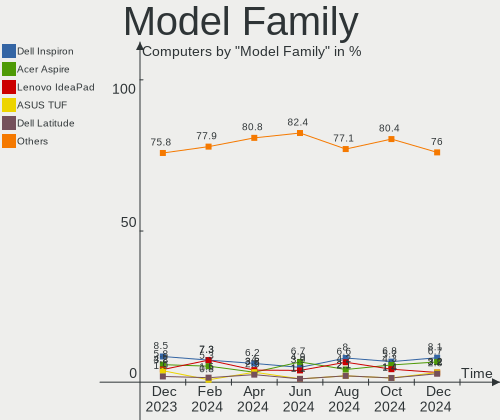
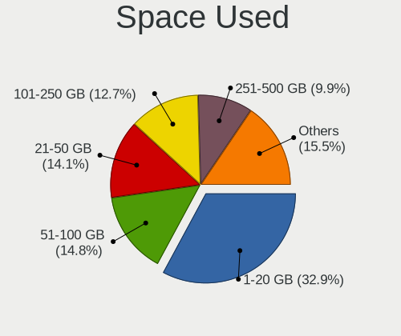
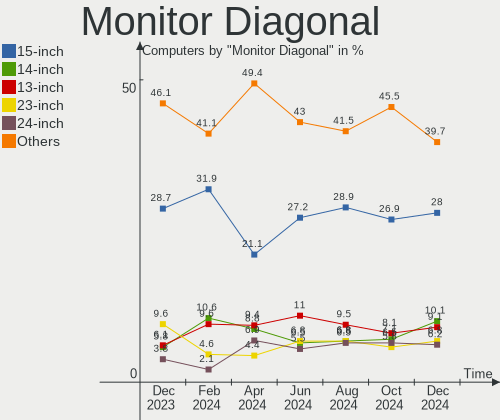
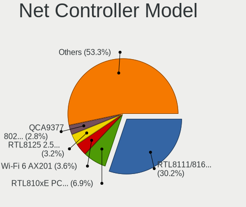
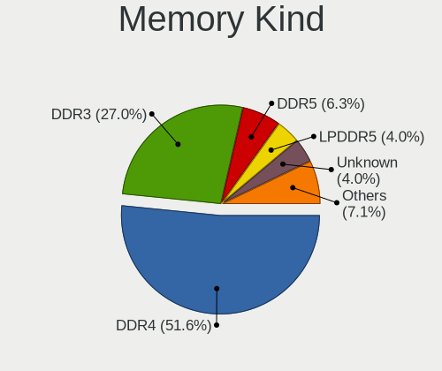

Linux in Brazil - Hardware Trends
---------------------------------

A project to identify most popular hardware characteristics and track their change
over time based on data collected by Linux users at https://Linux-Hardware.org.

Anyone can contribute to this report by the [hw-probe](https://github.com/linuxhw/hw-probe) tool:

    sudo -E hw-probe -all -upload

This is a report for all computer types. See also reports for [desktops](/Location/Brazil/Desktop/README.md) and [notebooks](/Location/Brazil/Notebook/README.md).

Period: Sep, 2023.

Contents
--------

* [ System ](#system)
  - [ OS                       ](#os)
  - [ OS Family                ](#os-family)
  - [ Kernel                   ](#kernel)
  - [ Kernel Family            ](#kernel-family)
  - [ Kernel Major Ver.        ](#kernel-major-ver)
  - [ Arch                     ](#arch)
  - [ DE                       ](#de)
  - [ Display Server           ](#display-server)
  - [ Display Manager          ](#display-manager)
  - [ OS Lang                  ](#os-lang)
  - [ Boot Mode                ](#boot-mode)
  - [ Filesystem               ](#filesystem)
  - [ Part. scheme             ](#part-scheme)
  - [ Dual Boot with Linux/BSD ](#dual-boot-with-linuxbsd)
  - [ Dual Boot (Win)          ](#dual-boot-win)

* [ Board ](#board)
  - [ Vendor                   ](#vendor)
  - [ Model                    ](#model)
  - [ Model Family             ](#model-family)
  - [ MFG Year                 ](#mfg-year)
  - [ Form Factor              ](#form-factor)
  - [ Secure Boot              ](#secure-boot)
  - [ Coreboot                 ](#coreboot)
  - [ RAM Size                 ](#ram-size)
  - [ RAM Used                 ](#ram-used)
  - [ Total Drives             ](#total-drives)
  - [ Has CD-ROM               ](#has-cd-rom)
  - [ Has Ethernet             ](#has-ethernet)
  - [ Has WiFi                 ](#has-wifi)
  - [ Has Bluetooth            ](#has-bluetooth)

* [ Location ](#location)
  - [ Country                  ](#country)
  - [ City                     ](#city)

* [ Drives ](#drives)
  - [ Drive Vendor             ](#drive-vendor)
  - [ Drive Model              ](#drive-model)
  - [ HDD Vendor               ](#hdd-vendor)
  - [ SSD Vendor               ](#ssd-vendor)
  - [ Drive Kind               ](#drive-kind)
  - [ Drive Connector          ](#drive-connector)
  - [ Drive Size               ](#drive-size)
  - [ Space Total              ](#space-total)
  - [ Space Used               ](#space-used)
  - [ Malfunc. Drives          ](#malfunc-drives)
  - [ Malfunc. Drive Vendor    ](#malfunc-drive-vendor)
  - [ Malfunc. HDD Vendor      ](#malfunc-hdd-vendor)
  - [ Malfunc. Drive Kind      ](#malfunc-drive-kind)
  - [ Failed Drives            ](#failed-drives)
  - [ Failed Drive Vendor      ](#failed-drive-vendor)
  - [ Drive Status             ](#drive-status)

* [ Storage controller ](#storage-controller)
  - [ Storage Vendor           ](#storage-vendor)
  - [ Storage Model            ](#storage-model)
  - [ Storage Kind             ](#storage-kind)

* [ Processor ](#processor)
  - [ CPU Vendor               ](#cpu-vendor)
  - [ CPU Model                ](#cpu-model)
  - [ CPU Model Family         ](#cpu-model-family)
  - [ CPU Cores                ](#cpu-cores)
  - [ CPU Sockets              ](#cpu-sockets)
  - [ CPU Threads              ](#cpu-threads)
  - [ CPU Op-Modes             ](#cpu-op-modes)
  - [ CPU Microcode            ](#cpu-microcode)
  - [ CPU Microarch            ](#cpu-microarch)

* [ Graphics ](#graphics)
  - [ GPU Vendor               ](#gpu-vendor)
  - [ GPU Model                ](#gpu-model)
  - [ GPU Combo                ](#gpu-combo)
  - [ GPU Driver               ](#gpu-driver)
  - [ GPU Memory               ](#gpu-memory)

* [ Monitor ](#monitor)
  - [ Monitor Vendor           ](#monitor-vendor)
  - [ Monitor Model            ](#monitor-model)
  - [ Monitor Resolution       ](#monitor-resolution)
  - [ Monitor Diagonal         ](#monitor-diagonal)
  - [ Monitor Width            ](#monitor-width)
  - [ Aspect Ratio             ](#aspect-ratio)
  - [ Monitor Area             ](#monitor-area)
  - [ Pixel Density            ](#pixel-density)
  - [ Multiple Monitors        ](#multiple-monitors)

* [ Network ](#network)
  - [ Net Controller Vendor    ](#net-controller-vendor)
  - [ Net Controller Model     ](#net-controller-model)
  - [ Wireless Vendor          ](#wireless-vendor)
  - [ Wireless Model           ](#wireless-model)
  - [ Ethernet Vendor          ](#ethernet-vendor)
  - [ Ethernet Model           ](#ethernet-model)
  - [ Net Controller Kind      ](#net-controller-kind)
  - [ Used Controller          ](#used-controller)
  - [ NICs                     ](#nics)
  - [ IPv6                     ](#ipv6)

* [ Bluetooth ](#bluetooth)
  - [ Bluetooth Vendor         ](#bluetooth-vendor)
  - [ Bluetooth Model          ](#bluetooth-model)

* [ Sound ](#sound)
  - [ Sound Vendor             ](#sound-vendor)
  - [ Sound Model              ](#sound-model)

* [ Memory ](#memory)
  - [ Memory Vendor            ](#memory-vendor)
  - [ Memory Model             ](#memory-model)
  - [ Memory Kind              ](#memory-kind)
  - [ Memory Form Factor       ](#memory-form-factor)
  - [ Memory Size              ](#memory-size)
  - [ Memory Speed             ](#memory-speed)

* [ Printers & scanners ](#printers--scanners)
  - [ Printer Vendor           ](#printer-vendor)
  - [ Printer Model            ](#printer-model)
  - [ Scanner Vendor           ](#scanner-vendor)
  - [ Scanner Model            ](#scanner-model)

* [ Camera ](#camera)
  - [ Camera Vendor            ](#camera-vendor)
  - [ Camera Model             ](#camera-model)

* [ Security ](#security)
  - [ Fingerprint Vendor       ](#fingerprint-vendor)
  - [ Fingerprint Model        ](#fingerprint-model)
  - [ Chipcard Vendor          ](#chipcard-vendor)
  - [ Chipcard Model           ](#chipcard-model)

* [ Unsupported ](#unsupported)
  - [ Unsupported Devices      ](#unsupported-devices)
  - [ Unsupported Device Types ](#unsupported-device-types)

System
------

OS
--

Installed operating systems

| Name                         | Computers | Percent |
|------------------------------|-----------|---------|
| Ubuntu 22.04                 | 36        | 11.8%   |
| OpenMandriva 23.08           | 34        | 11.15%  |
| Fedora 38                    | 30        | 9.84%   |
| OpenMandriva 23.09           | 16        | 5.25%   |
| Linux Mint 21.2              | 16        | 5.25%   |
| Debian 12                    | 13        | 4.26%   |
| ArcoLinux Rolling            | 13        | 4.26%   |
| Pop!_OS 22.04                | 12        | 3.93%   |
| Ubuntu 23.04                 | 10        | 3.28%   |
| Manjaro                      | 10        | 3.28%   |
| Zorin 16                     | 8         | 2.62%   |
| Arch Rolling                 | 8         | 2.62%   |
| Linux Mint 21.1              | 6         | 1.97%   |
| OpenMandriva 23.03           | 5         | 1.64%   |
| OpenMandriva 23.01           | 5         | 1.64%   |
| Ubuntu 20.04                 | 4         | 1.31%   |
| openSUSE Tumbleweed-XXXXXXXX | 4         | 1.31%   |
| openSUSE Leap-15.5           | 4         | 1.31%   |
| OpenMandriva 4.3             | 4         | 1.31%   |
| KDE neon 22.04               | 4         | 1.31%   |
| Debian 11                    | 4         | 1.31%   |
| Xubuntu 22.04                | 3         | 0.98%   |
| Xero Rolling                 | 3         | 0.98%   |
| SteamOS 3.4.10               | 3         | 0.98%   |
| OpenMandriva 4.2             | 3         | 0.98%   |
| Linux Mint 20.3              | 3         | 0.98%   |
| Endless 3.9.3-nexthw1        | 3         | 0.98%   |
| Ubuntu MATE 22.04            | 2         | 0.66%   |
| Ubuntu 18.04                 | 2         | 0.66%   |
| OpenMandriva 23.90           | 2         | 0.66%   |
| LMDE 5                       | 2         | 0.66%   |
| Kali 2023.3                  | 2         | 0.66%   |
| Garuda Linux Soaring         | 2         | 0.66%   |
| Endless 5.0.5                | 2         | 0.66%   |
| ChimeraOS 43-1               | 2         | 0.66%   |
| BigLinux 23.0.1              | 2         | 0.66%   |
| BigLinux 23.0.0              | 2         | 0.66%   |
| Ubuntu Budgie 22.04          | 1         | 0.33%   |
| Ubuntu 23.10                 | 1         | 0.33%   |
| SteamOS 4                    | 1         | 0.33%   |

OS Family
---------

OS without a version

| Name          | Computers | Percent |
|---------------|-----------|---------|
| OpenMandriva  | 70        | 22.95%  |
| Ubuntu        | 53        | 17.38%  |
| Linux Mint    | 30        | 9.84%   |
| Fedora        | 30        | 9.84%   |
| Debian        | 18        | 5.9%    |
| ArcoLinux     | 13        | 4.26%   |
| Pop!_OS       | 12        | 3.93%   |
| Manjaro       | 10        | 3.28%   |
| Zorin         | 8         | 2.62%   |
| openSUSE      | 8         | 2.62%   |
| Arch          | 8         | 2.62%   |
| Endless       | 6         | 1.97%   |
| SteamOS       | 4         | 1.31%   |
| KDE neon      | 4         | 1.31%   |
| BigLinux      | 4         | 1.31%   |
| Xubuntu       | 3         | 0.98%   |
| Xero          | 3         | 0.98%   |
| Ubuntu MATE   | 2         | 0.66%   |
| LMDE          | 2         | 0.66%   |
| Kali          | 2         | 0.66%   |
| Garuda Linux  | 2         | 0.66%   |
| ChimeraOS     | 2         | 0.66%   |
| Ubuntu Budgie | 1         | 0.33%   |
| Solus         | 1         | 0.33%   |
| ROSA          | 1         | 0.33%   |
| Nobara        | 1         | 0.33%   |
| NixOS         | 1         | 0.33%   |
| Lubuntu       | 1         | 0.33%   |
| Gentoo        | 1         | 0.33%   |
| EndeavourOS   | 1         | 0.33%   |
| Elementary    | 1         | 0.33%   |
| Devuan        | 1         | 0.33%   |
| BunsenLabs    | 1         | 0.33%   |

Kernel
------

Version of the Linux kernel

| Version                      | Computers | Percent |
|------------------------------|-----------|---------|
| 6.4.11-desktop-1omv2390      | 33        | 10.82%  |
| 6.2.0-32-generic             | 27        | 8.85%   |
| 5.15.0-83-generic            | 18        | 5.9%    |
| 6.4.15-200.fc38.x86_64       | 14        | 4.59%   |
| 6.2.0-33-generic             | 9         | 2.95%   |
| 6.5.0-desktop-1omv2390       | 8         | 2.62%   |
| 6.4.6-76060406-generic       | 8         | 2.62%   |
| 6.1.0-12-amd64               | 8         | 2.62%   |
| 6.4.12-arch1-1               | 7         | 2.3%    |
| 6.2.0-31-generic             | 7         | 2.3%    |
| 5.15.0-84-generic            | 7         | 2.3%    |
| 6.4.14-200.fc38.x86_64       | 5         | 1.64%   |
| 6.4.12-zen1-1-zen            | 5         | 1.64%   |
| 6.4.11-arch1-1               | 5         | 1.64%   |
| 6.2.6-desktop-1omv2390       | 5         | 1.64%   |
| 6.1.1-desktop-1omv2290       | 5         | 1.64%   |
| 6.4.8-desktop-2omv2390       | 4         | 1.31%   |
| 6.4.13-200.fc38.x86_64       | 4         | 1.31%   |
| 6.2.9-300.fc38.x86_64        | 4         | 1.31%   |
| 6.2.6-76060206-generic       | 4         | 1.31%   |
| 5.15.0-82-generic            | 4         | 1.31%   |
| 5.15.0-76-generic            | 4         | 1.31%   |
| 5.14.21-150500.55.19-default | 4         | 1.31%   |
| 6.5.5-200.fc38.x86_64        | 3         | 0.98%   |
| 6.5.3-1-MANJARO              | 3         | 0.98%   |
| 6.5.2-desktop-1omv2390       | 3         | 0.98%   |
| 6.2.0-34-generic             | 3         | 0.98%   |
| 6.1.51-1-MANJARO             | 3         | 0.98%   |
| 6.1.0-10-amd64               | 3         | 0.98%   |
| 5.16.13-desktop-1omv4003     | 3         | 0.98%   |
| 5.13.0-valve37-1-neptune     | 3         | 0.98%   |
| 5.11.0-12-generic            | 3         | 0.98%   |
| 5.10.14-desktop-1omv4002     | 3         | 0.98%   |
| 5.10.0-25-amd64              | 3         | 0.98%   |
| 6.5.5-arch1-1                | 2         | 0.66%   |
| 6.5.4-arch2-1                | 2         | 0.66%   |
| 6.5.3-desktop-1omv2390       | 2         | 0.66%   |
| 6.5.3-1-default              | 2         | 0.66%   |
| 6.5.1-desktop-1omv2390       | 2         | 0.66%   |
| 6.5.1-1-MANJARO              | 2         | 0.66%   |

Kernel Family
-------------

Linux kernel without a distro release

| Version | Computers | Percent |
|---------|-----------|---------|
| 6.2.0   | 49        | 16.07%  |
| 5.15.0  | 41        | 13.44%  |
| 6.4.11  | 39        | 12.79%  |
| 6.4.15  | 15        | 4.92%   |
| 6.4.12  | 14        | 4.59%   |
| 6.1.0   | 14        | 4.59%   |
| 6.5.0   | 12        | 3.93%   |
| 6.2.6   | 9         | 2.95%   |
| 6.5.5   | 8         | 2.62%   |
| 6.4.6   | 8         | 2.62%   |
| 6.5.3   | 7         | 2.3%    |
| 5.4.0   | 6         | 1.97%   |
| 6.5.1   | 5         | 1.64%   |
| 6.4.14  | 5         | 1.64%   |
| 6.2.9   | 5         | 1.64%   |
| 6.1.1   | 5         | 1.64%   |
| 5.10.0  | 5         | 1.64%   |
| 6.4.8   | 4         | 1.31%   |
| 6.4.13  | 4         | 1.31%   |
| 5.14.21 | 4         | 1.31%   |
| 6.5.4   | 3         | 0.98%   |
| 6.5.2   | 3         | 0.98%   |
| 6.1.53  | 3         | 0.98%   |
| 6.1.51  | 3         | 0.98%   |
| 5.16.13 | 3         | 0.98%   |
| 5.13.0  | 3         | 0.98%   |
| 5.11.0  | 3         | 0.98%   |
| 5.10.14 | 3         | 0.98%   |
| 6.4.9   | 2         | 0.66%   |
| 6.3.9   | 2         | 0.66%   |
| 5.19.0  | 2         | 0.66%   |
| 4.15.0  | 2         | 0.66%   |
| 6.4.0   | 1         | 0.33%   |
| 6.3.8   | 1         | 0.33%   |
| 6.1.8   | 1         | 0.33%   |
| 6.1.50  | 1         | 0.33%   |
| 6.1.49  | 1         | 0.33%   |
| 6.1.46  | 1         | 0.33%   |
| 6.1.38  | 1         | 0.33%   |
| 5.6.0   | 1         | 0.33%   |

Kernel Major Ver.
-----------------

Linux kernel major version

| Version | Computers | Percent |
|---------|-----------|---------|
| 6.4     | 92        | 30.16%  |
| 6.2     | 63        | 20.66%  |
| 5.15    | 43        | 14.1%   |
| 6.5     | 38        | 12.46%  |
| 6.1     | 30        | 9.84%   |
| 5.10    | 9         | 2.95%   |
| 5.4     | 6         | 1.97%   |
| 5.16    | 4         | 1.31%   |
| 5.14    | 4         | 1.31%   |
| 6.3     | 3         | 0.98%   |
| 5.19    | 3         | 0.98%   |
| 5.13    | 3         | 0.98%   |
| 5.11    | 3         | 0.98%   |
| 4.15    | 2         | 0.66%   |
| 5.6     | 1         | 0.33%   |
| 5.0     | 1         | 0.33%   |

Arch
----

OS architecture (x86_64, i586, etc.)

| Name    | Computers | Percent |
|---------|-----------|---------|
| x86_64  | 303       | 99.34%  |
| i686    | 1         | 0.33%   |
| aarch64 | 1         | 0.33%   |

DE
--

Desktop Environment

| Name       | Computers | Percent |
|------------|-----------|---------|
| GNOME      | 139       | 45.57%  |
| KDE5       | 93        | 30.49%  |
| X-Cinnamon | 23        | 7.54%   |
| XFCE       | 19        | 6.23%   |
| MATE       | 9         | 2.95%   |
| LXQt       | 7         | 2.3%    |
| Unknown    | 7         | 2.3%    |
| Pantheon   | 2         | 0.66%   |
| LXDE       | 1         | 0.33%   |
| i3         | 1         | 0.33%   |
| Cinnamon   | 1         | 0.33%   |
| chadwm     | 1         | 0.33%   |
| Budgie     | 1         | 0.33%   |
| awesome    | 1         | 0.33%   |

Display Server
--------------

X11 or Wayland

| Name    | Computers | Percent |
|---------|-----------|---------|
| X11     | 164       | 53.77%  |
| Wayland | 135       | 44.26%  |
| Unknown | 5         | 1.64%   |
| Tty     | 1         | 0.33%   |

Display Manager
---------------

SDDM, LightDM, etc.

| Name    | Computers | Percent |
|---------|-----------|---------|
| Unknown | 115       | 37.7%   |
| SDDM    | 87        | 28.52%  |
| GDM3    | 57        | 18.69%  |
| LightDM | 25        | 8.2%    |
| GDM     | 19        | 6.23%   |
| SLiM    | 1         | 0.33%   |
| LXDM    | 1         | 0.33%   |

OS Lang
-------

Language

| Lang  | Computers | Percent |
|-------|-----------|---------|
| pt_BR | 219       | 71.8%   |
| en_US | 75        | 24.59%  |
| C     | 6         | 1.97%   |
| UTF-8 | 1         | 0.33%   |
| fr_FR | 1         | 0.33%   |
| en_GB | 1         | 0.33%   |
| en_CA | 1         | 0.33%   |
| de_DE | 1         | 0.33%   |

Boot Mode
---------

EFI or BIOS

| Mode | Computers | Percent |
|------|-----------|---------|
| BIOS | 162       | 53.11%  |
| EFI  | 143       | 46.89%  |

Filesystem
----------

Type of filesystem

| Type    | Computers | Percent |
|---------|-----------|---------|
| Ext4    | 163       | 53.44%  |
| Btrfs   | 67        | 21.97%  |
| Tmpfs   | 36        | 11.8%   |
| Overlay | 34        | 11.15%  |
| Zfs     | 2         | 0.66%   |
| Xfs     | 2         | 0.66%   |
| Ext2    | 1         | 0.33%   |

Part. scheme
------------

Scheme of partitioning

| Type    | Computers | Percent |
|---------|-----------|---------|
| GPT     | 146       | 47.87%  |
| Unknown | 115       | 37.7%   |
| MBR     | 44        | 14.43%  |

Dual Boot with Linux/BSD
------------------------

Hosting more than one Linux/BSD

| Dual boot | Computers | Percent |
|-----------|-----------|---------|
| No        | 264       | 86.56%  |
| Yes       | 41        | 13.44%  |

Dual Boot (Win)
---------------

Hosting Linux and Windows

| Dual boot | Computers | Percent |
|-----------|-----------|---------|
| No        | 219       | 71.8%   |
| Yes       | 86        | 28.2%   |

Board
-----

Vendor
------

Motherboard manufacturer

| Name                | Computers | Percent |
|---------------------|-----------|---------|
| Dell                | 52        | 17.05%  |
| ASUSTek Computer    | 46        | 15.08%  |
| Lenovo              | 29        | 9.51%   |
| Samsung Electronics | 23        | 7.54%   |
| Acer                | 18        | 5.9%    |
| Gigabyte Technology | 17        | 5.57%   |
| Intel               | 15        | 4.92%   |
| Hewlett-Packard     | 14        | 4.59%   |
| Positivo            | 12        | 3.93%   |
| ASRock              | 11        | 3.61%   |
| MSI                 | 6         | 1.97%   |
| Biostar             | 5         | 1.64%   |
| Unknown             | 4         | 1.31%   |
| Valve               | 3         | 0.98%   |
| Huanan              | 3         | 0.98%   |
| Foxconn             | 3         | 0.98%   |
| Apple               | 3         | 0.98%   |
| Standard            | 2         | 0.66%   |
| Semp Toshiba        | 2         | 0.66%   |
| Pegatron            | 2         | 0.66%   |
| PCWare              | 2         | 0.66%   |
| Multilaser          | 2         | 0.66%   |
| LG Electronics      | 2         | 0.66%   |
| HOUTER              | 2         | 0.66%   |
| Digibras            | 2         | 0.66%   |
| Daten Tecnologia    | 2         | 0.66%   |
| Compaq              | 2         | 0.66%   |
| wpc                 | 1         | 0.33%   |
| Tectoy              | 1         | 0.33%   |
| Sony                | 1         | 0.33%   |
| QIYIDA              | 1         | 0.33%   |
| Philco              | 1         | 0.33%   |
| OEM                 | 1         | 0.33%   |
| Notebook            | 1         | 0.33%   |
| Microsoft           | 1         | 0.33%   |
| Megaware            | 1         | 0.33%   |
| MEGA                | 1         | 0.33%   |
| MACHINIST           | 1         | 0.33%   |
| Login Informatica   | 1         | 0.33%   |
| Kllisre             | 1         | 0.33%   |

Model
-----

Motherboard model

| Name                                     | Computers | Percent |
|------------------------------------------|-----------|---------|
| Intel H61                                | 7         | 2.3%    |
| Samsung 340XAA/350XAA/550XAA             | 4         | 1.31%   |
| ASRock A320M-HD                          | 4         | 1.31%   |
| Unknown                                  | 4         | 1.31%   |
| Valve Jupiter                            | 3         | 0.98%   |
| Samsung 550XDA                           | 3         | 0.98%   |
| Samsung 550XBE/350XBE                    | 3         | 0.98%   |
| Gigabyte B550M AORUS ELITE               | 3         | 0.98%   |
| ASUS VivoBook_ASUSLaptop X515EA_X515EA   | 3         | 0.98%   |
| ASUS TUF Gaming X570-PLUS_BR             | 3         | 0.98%   |
| Semp Toshiba STI                         | 2         | 0.66%   |
| Samsung 550XED                           | 2         | 0.66%   |
| Samsung 530XBB                           | 2         | 0.66%   |
| Positivo D3400                           | 2         | 0.66%   |
| Lenovo IdeaPad 310-15ISK 80UH            | 2         | 0.66%   |
| Huanan X99-F8 GAMING V5.0                | 2         | 0.66%   |
| HOUTER IPMH61R1                          | 2         | 0.66%   |
| HP Presario CQ43                         | 2         | 0.66%   |
| Gigabyte B450 AORUS M                    | 2         | 0.66%   |
| Dell Vostro 5470                         | 2         | 0.66%   |
| Dell Inspiron 5566                       | 2         | 0.66%   |
| Dell Inspiron 15 7000 Gaming             | 2         | 0.66%   |
| Dell G15 5520                            | 2         | 0.66%   |
| ASUS VivoBook_ASUSLaptop X515JA_X515JA   | 2         | 0.66%   |
| ASUS VivoBook_ASUSLaptop X513EAN_X513EAN | 2         | 0.66%   |
| ASUS PRIME A320M-K/BR                    | 2         | 0.66%   |
| ASUS M5A78L-M PLUS/USB3                  | 2         | 0.66%   |
| Acer Aspire E5-571                       | 2         | 0.66%   |
| wpc wpc616                               | 1         | 0.33%   |
| Tectoy Pense Bem Notebook                | 1         | 0.33%   |
| Standard MB45II/MB45IN                   | 1         | 0.33%   |
| Standard HBT-M Series                    | 1         | 0.33%   |
| Sony VGN-FZ140E                          | 1         | 0.33%   |
| Samsung RV415                            | 1         | 0.33%   |
| Samsung RF511/RF411/RF711                | 1         | 0.33%   |
| Samsung 960XFH                           | 1         | 0.33%   |
| Samsung 730QED                           | 1         | 0.33%   |
| Samsung 500R5L/501R5L/500R5P             | 1         | 0.33%   |
| Samsung 370E4K                           | 1         | 0.33%   |
| Samsung 300E5M/300E5L                    | 1         | 0.33%   |

Model Family
------------

Motherboard model prefix

| Name               | Computers | Percent |
|--------------------|-----------|---------|
| Dell Inspiron      | 19        | 6.23%   |
| Lenovo IdeaPad     | 14        | 4.59%   |
| Acer Aspire        | 14        | 4.59%   |
| ASUS TUF           | 10        | 3.28%   |
| Dell Vostro        | 9         | 2.95%   |
| Dell Latitude      | 9         | 2.95%   |
| ASUS VivoBook      | 9         | 2.95%   |
| ASUS PRIME         | 8         | 2.62%   |
| Intel H61          | 7         | 2.3%    |
| HP Compaq          | 5         | 1.64%   |
| Samsung 340XAA     | 4         | 1.31%   |
| Lenovo ThinkPad    | 4         | 1.31%   |
| Gigabyte B550M     | 4         | 1.31%   |
| Dell XPS           | 4         | 1.31%   |
| Dell OptiPlex      | 4         | 1.31%   |
| Dell G15           | 4         | 1.31%   |
| ASUS ROG           | 4         | 1.31%   |
| ASRock A320M-HD    | 4         | 1.31%   |
| Unknown            | 4         | 1.31%   |
| Valve Jupiter      | 3         | 0.98%   |
| Samsung 550XDA     | 3         | 0.98%   |
| Samsung 550XBE     | 3         | 0.98%   |
| Lenovo ThinkCentre | 3         | 0.98%   |
| ASUS M5A78L-M      | 3         | 0.98%   |
| Semp Toshiba STI   | 2         | 0.66%   |
| Samsung 550XED     | 2         | 0.66%   |
| Samsung 530XBB     | 2         | 0.66%   |
| Positivo D3400     | 2         | 0.66%   |
| Lenovo IdeaPadFlex | 2         | 0.66%   |
| Huanan X99-F8      | 2         | 0.66%   |
| HOUTER IPMH61R1    | 2         | 0.66%   |
| HP Presario        | 2         | 0.66%   |
| HP EliteBook       | 2         | 0.66%   |
| Gigabyte B450      | 2         | 0.66%   |
| Acer Nitro         | 2         | 0.66%   |
| wpc wpc616         | 1         | 0.33%   |
| Tectoy Pense       | 1         | 0.33%   |
| Standard MB45II    | 1         | 0.33%   |
| Standard HBT-M     | 1         | 0.33%   |
| Sony VGN-FZ140E    | 1         | 0.33%   |

MFG Year
--------

Motherboard manufacture year

| Year    | Computers | Percent |
|---------|-----------|---------|
| 2021    | 41        | 13.44%  |
| 2018    | 32        | 10.49%  |
| 2019    | 30        | 9.84%   |
| 2017    | 25        | 8.2%    |
| 2011    | 23        | 7.54%   |
| 2022    | 19        | 6.23%   |
| 2016    | 18        | 5.9%    |
| 2020    | 17        | 5.57%   |
| 2013    | 17        | 5.57%   |
| 2012    | 17        | 5.57%   |
| 2010    | 14        | 4.59%   |
| 2023    | 11        | 3.61%   |
| 2009    | 11        | 3.61%   |
| 2014    | 9         | 2.95%   |
| 2008    | 9         | 2.95%   |
| 2015    | 6         | 1.97%   |
| 2007    | 4         | 1.31%   |
| Unknown | 2         | 0.66%   |

Form Factor
-----------

Physical design of the computer

| Name           | Computers | Percent |
|----------------|-----------|---------|
| Notebook       | 160       | 52.46%  |
| Desktop        | 133       | 43.61%  |
| Convertible    | 4         | 1.31%   |
| All in one     | 3         | 0.98%   |
| Mini pc        | 2         | 0.66%   |
| System on chip | 1         | 0.33%   |
| Tablet         | 1         | 0.33%   |
| Server         | 1         | 0.33%   |

Secure Boot
-----------

Enabled or disabled

| State    | Computers | Percent |
|----------|-----------|---------|
| Disabled | 291       | 95.41%  |
| Enabled  | 14        | 4.59%   |

Coreboot
--------

Have coreboot on board

| Used | Computers | Percent |
|------|-----------|---------|
| No   | 304       | 99.67%  |
| Yes  | 1         | 0.33%   |

RAM Size
--------

Total RAM memory

| Size in GB  | Computers | Percent |
|-------------|-----------|---------|
| 4.01-8.0    | 81        | 26.56%  |
| 16.01-24.0  | 66        | 21.64%  |
| 3.01-4.0    | 65        | 21.31%  |
| 8.01-16.0   | 49        | 16.07%  |
| 32.01-64.0  | 20        | 6.56%   |
| 64.01-256.0 | 8         | 2.62%   |
| 1.01-2.0    | 7         | 2.3%    |
| 24.01-32.0  | 5         | 1.64%   |
| 2.01-3.0    | 4         | 1.31%   |

RAM Used
--------

Used RAM memory

| Used GB    | Computers | Percent |
|------------|-----------|---------|
| 1.01-2.0   | 100       | 32.79%  |
| 2.01-3.0   | 80        | 26.23%  |
| 4.01-8.0   | 49        | 16.07%  |
| 3.01-4.0   | 48        | 15.74%  |
| 0.51-1.0   | 14        | 4.59%   |
| 8.01-16.0  | 11        | 3.61%   |
| 24.01-32.0 | 1         | 0.33%   |
| 16.01-24.0 | 1         | 0.33%   |
| 0.01-0.5   | 1         | 0.33%   |

Total Drives
------------

Number of drives on board

| Drives | Computers | Percent |
|--------|-----------|---------|
| 1      | 177       | 58.03%  |
| 2      | 78        | 25.57%  |
| 3      | 23        | 7.54%   |
| 4      | 13        | 4.26%   |
| 6      | 5         | 1.64%   |
| 0      | 5         | 1.64%   |
| 5      | 4         | 1.31%   |

Has CD-ROM
----------

Has CD-ROM on board

| Presented | Computers | Percent |
|-----------|-----------|---------|
| No        | 223       | 73.11%  |
| Yes       | 82        | 26.89%  |

Has Ethernet
------------

Has Ethernet on board

| Presented | Computers | Percent |
|-----------|-----------|---------|
| Yes       | 260       | 85.25%  |
| No        | 45        | 14.75%  |

Has WiFi
--------

Has WiFi module

| Presented | Computers | Percent |
|-----------|-----------|---------|
| Yes       | 224       | 73.44%  |
| No        | 81        | 26.56%  |

Has Bluetooth
-------------

Has Bluetooth module

| Presented | Computers | Percent |
|-----------|-----------|---------|
| Yes       | 172       | 56.39%  |
| No        | 133       | 43.61%  |

Location
--------

Country
-------

Geographic location (country)

| Country | Computers | Percent |
|---------|-----------|---------|
| Brazil  | 305       | 100%    |

City
----

Geographic location (city)

| City                 | Computers | Percent |
|----------------------|-----------|---------|
| Sao Paulo            | 36        | 11.8%   |
| Rio de Janeiro       | 17        | 5.57%   |
| Curitiba             | 13        | 4.26%   |
| Brasília            | 12        | 3.93%   |
| Fortaleza            | 7         | 2.3%    |
| Porto Alegre         | 6         | 1.97%   |
| Osasco               | 6         | 1.97%   |
| Sao Vicente          | 5         | 1.64%   |
| Sao José dos Campos | 5         | 1.64%   |
| Marília             | 5         | 1.64%   |
| Campinas             | 5         | 1.64%   |
| Salvador             | 4         | 1.31%   |
| Recife               | 4         | 1.31%   |
| Manaus               | 4         | 1.31%   |
| Belo Horizonte       | 4         | 1.31%   |
| Santo André         | 3         | 0.98%   |
| Niterói             | 3         | 0.98%   |
| Joinville            | 3         | 0.98%   |
| Joao Pessoa          | 3         | 0.98%   |
| Goiânia             | 3         | 0.98%   |
| Florianópolis       | 3         | 0.98%   |
| Duque de Caxias      | 3         | 0.98%   |
| Belém               | 3         | 0.98%   |
| Vila Velha           | 2         | 0.66%   |
| Uberlândia          | 2         | 0.66%   |
| Teresina             | 2         | 0.66%   |
| Sobral               | 2         | 0.66%   |
| Sapucaia do Sul      | 2         | 0.66%   |
| Sao Luís            | 2         | 0.66%   |
| Santa Luzia          | 2         | 0.66%   |
| Ribeirao Preto       | 2         | 0.66%   |
| Pinhais              | 2         | 0.66%   |
| Palmas               | 2         | 0.66%   |
| Indaiatuba           | 2         | 0.66%   |
| Guarulhos            | 2         | 0.66%   |
| Fazenda Rio Grande   | 2         | 0.66%   |
| Cariacica            | 2         | 0.66%   |
| Campo Grande         | 2         | 0.66%   |
| Braganca Paulista    | 2         | 0.66%   |
| Araraquara           | 2         | 0.66%   |

Drives
------

Drive Vendor
------------

Hard drive vendors

| Vendor                         | Computers | Drives | Percent |
|--------------------------------|-----------|--------|---------|
| WDC                            | 69        | 72     | 15.2%   |
| Seagate                        | 55        | 72     | 12.11%  |
| Kingston                       | 52        | 63     | 11.45%  |
| Samsung Electronics            | 43        | 45     | 9.47%   |
| China                          | 24        | 24     | 5.29%   |
| Toshiba                        | 20        | 20     | 4.41%   |
| SanDisk                        | 19        | 20     | 4.19%   |
| Unknown                        | 14        | 16     | 3.08%   |
| Crucial                        | 12        | 15     | 2.64%   |
| A-DATA Technology              | 12        | 12     | 2.64%   |
| ADATA Technology               | 11        | 12     | 2.42%   |
| Kingston Technology Company    | 10        | 11     | 2.2%    |
| Silicon Motion                 | 8         | 8      | 1.76%   |
| MAXIO Technology (Hangzhou)    | 7         | 7      | 1.54%   |
| Phison Electronics             | 6         | 6      | 1.32%   |
| Intel                          | 6         | 6      | 1.32%   |
| Hitachi                        | 6         | 6      | 1.32%   |
| SK hynix                       | 5         | 5      | 1.1%    |
| LITEON                         | 5         | 5      | 1.1%    |
| KingSpec                       | 5         | 5      | 1.1%    |
| Netac                          | 4         | 4      | 0.88%   |
| WALRAM                         | 3         | 3      | 0.66%   |
| SSSTC                          | 3         | 3      | 0.66%   |
| Realtek Semiconductor          | 3         | 3      | 0.66%   |
| Patriot                        | 3         | 3      | 0.66%   |
| Maxtor                         | 3         | 3      | 0.66%   |
| HS-SSD-C100                    | 3         | 3      | 0.66%   |
| HGST                           | 3         | 3      | 0.66%   |
| XrayDisk                       | 2         | 2      | 0.44%   |
| Team                           | 2         | 2      | 0.44%   |
| Solid State Storage Technology | 2         | 2      | 0.44%   |
| Solid State Storage            | 2         | 2      | 0.44%   |
| PNY                            | 2         | 2      | 0.44%   |
| Micron/Crucial Technology      | 2         | 2      | 0.44%   |
| Micron Technology              | 2         | 2      | 0.44%   |
| Lexar                          | 2         | 2      | 0.44%   |
| Gigabyte Technology            | 2         | 2      | 0.44%   |
| Fujitsu                        | 2         | 2      | 0.44%   |
| Unknown                        | 2         | 2      | 0.44%   |
| Win Memory                     | 1         | 1      | 0.22%   |

Drive Model
-----------

Hard drive models

| Model                                                             | Computers | Percent |
|-------------------------------------------------------------------|-----------|---------|
| Kingston SA400S37480G 480GB SSD                                   | 20        | 4.14%   |
| Kingston SA400S37240G 240GB SSD                                   | 14        | 2.9%    |
| Seagate ST1000DM010-2EP102 1TB                                    | 6         | 1.24%   |
| Kingston Company SNV2S1000G 1TB                                   | 6         | 1.24%   |
| Silicon Motion SM2263EN/SM2263XT SSD Controller 512GB             | 5         | 1.04%   |
| Kingston SV300S37A120G 120GB SSD                                  | 5         | 1.04%   |
| Kingston SA400S37120G 120GB SSD                                   | 5         | 1.04%   |
| Crucial CT240BX500SSD1 240GB                                      | 5         | 1.04%   |
| ADATA SM2P32A8-256GC1 256GB                                       | 5         | 1.04%   |
| WDC WD10SPZX-35Z10T0 1TB                                          | 4         | 0.83%   |
| WDC WD10SPZX-21Z10T0 1TB                                          | 4         | 0.83%   |
| Seagate ST3500418AS 500GB                                         | 4         | 0.83%   |
| Seagate ST1000DM003-1ER162 1TB                                    | 4         | 0.83%   |
| Samsung HD322HJ 320GB                                             | 4         | 0.83%   |
| Kingston SA400S37960G 960GB SSD                                   | 4         | 0.83%   |
| China SSD 240GB                                                   | 4         | 0.83%   |
| WDC WDS240G2G0A-00JH30 240GB SSD                                  | 3         | 0.62%   |
| WDC WD5000LPVX-22V0TT0 500GB                                      | 3         | 0.62%   |
| WDC WD5000AAKX-00U6AA0 500GB                                      | 3         | 0.62%   |
| Unknown MMC Card  64GB                                            | 3         | 0.62%   |
| Unknown MMC Card  32GB                                            | 3         | 0.62%   |
| Seagate ST500LM012 HN-M500MBB 500GB                               | 3         | 0.62%   |
| Seagate ST1000LM035-1RK172 1TB                                    | 3         | 0.62%   |
| Seagate ST1000LM024 HN-M101MBB 1TB                                | 3         | 0.62%   |
| SanDisk SSD PLUS 120GB                                            | 3         | 0.62%   |
| Samsung HM500JI 500GB                                             | 3         | 0.62%   |
| Samsung HD161HJ 160GB                                             | 3         | 0.62%   |
| MAXIO (Hangzhou) NVMe SSD Controller MAP1202 512GB                | 3         | 0.62%   |
| Kingston Company SNV2S2000G 2TB                                   | 3         | 0.62%   |
| China SSD 128GB                                                   | 3         | 0.62%   |
| ADATA XPG SX8200 Pro PCIe Gen3x4 M.2 2280 Solid State Drive 256GB | 3         | 0.62%   |
| A-DATA SU650 240GB SSD                                            | 3         | 0.62%   |
| WDC WDS480G2G0B-00EPW0 480GB SSD                                  | 2         | 0.41%   |
| WDC WD5000BPVT-22HXZT3 500GB                                      | 2         | 0.41%   |
| WDC WD5000AZLX-00K2TA0 500GB                                      | 2         | 0.41%   |
| WDC WD5000AVCS-632DY1 500GB                                       | 2         | 0.41%   |
| WDC WD5000AAKX-003CA0 500GB                                       | 2         | 0.41%   |
| WDC WD10SPZX-75Z10T2 1TB                                          | 2         | 0.41%   |
| WDC WD10SPZX-75Z10T1 1TB                                          | 2         | 0.41%   |
| WDC WD10JPVX-75JC3T0 1TB                                          | 2         | 0.41%   |

HDD Vendor
----------

Hard disk drive vendors

| Vendor              | Computers | Drives | Percent |
|---------------------|-----------|--------|---------|
| WDC                 | 57        | 58     | 32.95%  |
| Seagate             | 55        | 72     | 31.79%  |
| Samsung Electronics | 26        | 27     | 15.03%  |
| Toshiba             | 18        | 18     | 10.4%   |
| Hitachi             | 6         | 6      | 3.47%   |
| Maxtor              | 3         | 3      | 1.73%   |
| HGST                | 3         | 3      | 1.73%   |
| Fujitsu             | 2         | 2      | 1.16%   |
| USB3.0              | 1         | 1      | 0.58%   |
| Unknown             | 1         | 1      | 0.58%   |
| Hewlett-Packard     | 1         | 1      | 0.58%   |

SSD Vendor
----------

Solid state drive vendors

| Vendor              | Computers | Drives | Percent |
|---------------------|-----------|--------|---------|
| Kingston            | 48        | 56     | 30.97%  |
| China               | 24        | 24     | 15.48%  |
| SanDisk             | 13        | 13     | 8.39%   |
| WDC                 | 12        | 13     | 7.74%   |
| Crucial             | 11        | 13     | 7.1%    |
| Samsung Electronics | 6         | 6      | 3.87%   |
| LITEON              | 5         | 5      | 3.23%   |
| KingSpec            | 5         | 5      | 3.23%   |
| A-DATA Technology   | 5         | 5      | 3.23%   |
| Patriot             | 3         | 3      | 1.94%   |
| Team                | 2         | 2      | 1.29%   |
| PNY                 | 2         | 2      | 1.29%   |
| Netac               | 2         | 2      | 1.29%   |
| Intel               | 2         | 2      | 1.29%   |
| HS-SSD-C100         | 2         | 2      | 1.29%   |
| XrayDisk            | 1         | 1      | 0.65%   |
| Win Memory          | 1         | 1      | 0.65%   |
| S3+                 | 1         | 1      | 0.65%   |
| Reeinno             | 1         | 1      | 0.65%   |
| OXYBR               | 1         | 1      | 0.65%   |
| NN                  | 1         | 1      | 0.65%   |
| KINGBANK            | 1         | 1      | 0.65%   |
| HUSKY               | 1         | 1      | 0.65%   |
| Gigabyte Technology | 1         | 1      | 0.65%   |
| EXRAM               | 1         | 1      | 0.65%   |
| Apple               | 1         | 1      | 0.65%   |
| AFOX                | 1         | 1      | 0.65%   |
| Unknown             | 1         | 1      | 0.65%   |

Drive Kind
----------

HDD or SSD

| Kind    | Computers | Drives | Percent |
|---------|-----------|--------|---------|
| HDD     | 148       | 192    | 36.54%  |
| SSD     | 138       | 166    | 34.07%  |
| NVMe    | 101       | 117    | 24.94%  |
| MMC     | 11        | 13     | 2.72%   |
| Unknown | 7         | 7      | 1.73%   |

Drive Connector
---------------

SATA, SAS, NVMe, etc.

| Type | Computers | Drives | Percent |
|------|-----------|--------|---------|
| SATA | 239       | 355    | 66.2%   |
| NVMe | 101       | 117    | 27.98%  |
| MMC  | 11        | 13     | 3.05%   |
| SAS  | 10        | 10     | 2.77%   |

Drive Size
----------

Size of hard drive

| Size in TB | Computers | Drives | Percent |
|------------|-----------|--------|---------|
| 0.01-0.5   | 186       | 241    | 64.58%  |
| 0.51-1.0   | 80        | 91     | 27.78%  |
| 1.01-2.0   | 12        | 12     | 4.17%   |
| 2.01-3.0   | 3         | 4      | 1.04%   |
| 4.01-10.0  | 3         | 3      | 1.04%   |
| 3.01-4.0   | 2         | 5      | 0.69%   |
| 10.01-20.0 | 2         | 2      | 0.69%   |

Space Total
-----------

Amount of disk space available on the file system

| Size in GB     | Computers | Percent |
|----------------|-----------|---------|
| 251-500        | 91        | 29.84%  |
| 101-250        | 60        | 19.67%  |
| 501-1000       | 43        | 14.1%   |
| 1-20           | 33        | 10.82%  |
| 1001-2000      | 25        | 8.2%    |
| More than 3000 | 14        | 4.59%   |
| 51-100         | 13        | 4.26%   |
| 21-50          | 10        | 3.28%   |
| 2001-3000      | 9         | 2.95%   |
| Unknown        | 7         | 2.3%    |

Space Used
----------

Amount of used disk space

| Used GB        | Computers | Percent |
|----------------|-----------|---------|
| 1-20           | 123       | 40.33%  |
| 21-50          | 48        | 15.74%  |
| 51-100         | 39        | 12.79%  |
| 101-250        | 35        | 11.48%  |
| 251-500        | 23        | 7.54%   |
| 501-1000       | 13        | 4.26%   |
| 1001-2000      | 9         | 2.95%   |
| Unknown        | 7         | 2.3%    |
| More than 3000 | 6         | 1.97%   |
| 2001-3000      | 2         | 0.66%   |

Malfunc. Drives
---------------

Drive models with a malfunction

| Model                                 | Computers | Drives | Percent |
|---------------------------------------|-----------|--------|---------|
| Samsung Electronics HM500JI 500GB     | 2         | 2      | 4.55%   |
| Samsung Electronics HD322HJ 320GB     | 2         | 2      | 4.55%   |
| China SSD 240GB                       | 2         | 2      | 4.55%   |
| WDC WDS480G2G0B-00EPW0 480GB SSD      | 1         | 1      | 2.27%   |
| WDC WDS240G2G0A-00JH30 240GB SSD      | 1         | 1      | 2.27%   |
| WDC WDS100T2B0A-00SM50 1TB SSD        | 1         | 1      | 2.27%   |
| WDC WD7500AADS-00M2B0 752GB           | 1         | 1      | 2.27%   |
| WDC WD5000AZLX-60K2TA1 500GB          | 1         | 1      | 2.27%   |
| WDC WD5000AZLX-00K2TA0 500GB          | 1         | 1      | 2.27%   |
| WDC WD5000AVDS-63U7B1 500GB           | 1         | 1      | 2.27%   |
| WDC WD5000AAKX-003CA0 500GB           | 1         | 1      | 2.27%   |
| WDC WD10SPZX-75Z10T2 1TB              | 1         | 1      | 2.27%   |
| WDC WD10SPZX-75Z10T1 1TB              | 1         | 1      | 2.27%   |
| Toshiba MK5059GSXP 500GB              | 1         | 1      | 2.27%   |
| Toshiba MK3259GSXP 320GB              | 1         | 1      | 2.27%   |
| Toshiba DT01ACA050 500GB              | 1         | 1      | 2.27%   |
| Seagate ST9500420AS 500GB             | 1         | 1      | 2.27%   |
| Seagate ST500DM002-9YN14C 500GB       | 1         | 1      | 2.27%   |
| Seagate ST500DM002-1BD142 500GB       | 1         | 1      | 2.27%   |
| Seagate ST500DM002-1BC142 500GB       | 1         | 1      | 2.27%   |
| Seagate ST31000528AS 1TB              | 1         | 1      | 2.27%   |
| Seagate ST2000DM005-2CW102 2TB        | 1         | 1      | 2.27%   |
| SanDisk SSD PLUS 120GB                | 1         | 1      | 2.27%   |
| Samsung Electronics SSD 960 EVO 500GB | 1         | 1      | 2.27%   |
| Samsung Electronics HM321HI 320GB     | 1         | 1      | 2.27%   |
| Samsung Electronics HD502IJ 500GB     | 1         | 1      | 2.27%   |
| Samsung Electronics HD502HJ 500GB     | 1         | 1      | 2.27%   |
| Samsung Electronics HD502HI 500GB     | 1         | 1      | 2.27%   |
| Samsung Electronics HD321HJ 320GB     | 1         | 1      | 2.27%   |
| Samsung Electronics HD154UI 1TB       | 1         | 1      | 2.27%   |
| Samsung Electronics HD080HJ 80GB      | 1         | 1      | 2.27%   |
| Reeinno FR256GB S5S3 SSD              | 1         | 1      | 2.27%   |
| Maxtor STM380815AS 80GB               | 1         | 1      | 2.27%   |
| Maxtor STM3250310AS 250GB             | 1         | 1      | 2.27%   |
| Maxtor STM3160215AS 160GB             | 1         | 1      | 2.27%   |
| LITEON CV8-8E128-HP 128GB SSD         | 1         | 1      | 2.27%   |
| Kingston SV300S37A120G 120GB SSD      | 1         | 1      | 2.27%   |
| Intel SSDSC2KW480H6 480GB             | 1         | 1      | 2.27%   |
| HGST HTS545050A7E680 500GB            | 1         | 1      | 2.27%   |
| HGST HCC545050A7E380 500GB            | 1         | 1      | 2.27%   |

Malfunc. Drive Vendor
---------------------

Vendors of faulty drives

| Vendor              | Computers | Drives | Percent |
|---------------------|-----------|--------|---------|
| Samsung Electronics | 12        | 12     | 27.27%  |
| WDC                 | 10        | 10     | 22.73%  |
| Seagate             | 6         | 6      | 13.64%  |
| Toshiba             | 3         | 3      | 6.82%   |
| Maxtor              | 3         | 3      | 6.82%   |
| HGST                | 2         | 2      | 4.55%   |
| China               | 2         | 2      | 4.55%   |
| SanDisk             | 1         | 1      | 2.27%   |
| Reeinno             | 1         | 1      | 2.27%   |
| LITEON              | 1         | 1      | 2.27%   |
| Kingston            | 1         | 1      | 2.27%   |
| Intel               | 1         | 1      | 2.27%   |
| EXRAM               | 1         | 1      | 2.27%   |

Malfunc. HDD Vendor
-------------------

Vendors of faulty HDD drives

| Vendor              | Computers | Drives | Percent |
|---------------------|-----------|--------|---------|
| Samsung Electronics | 11        | 11     | 34.38%  |
| WDC                 | 7         | 7      | 21.88%  |
| Seagate             | 6         | 6      | 18.75%  |
| Toshiba             | 3         | 3      | 9.38%   |
| Maxtor              | 3         | 3      | 9.38%   |
| HGST                | 2         | 2      | 6.25%   |

Malfunc. Drive Kind
-------------------

Kinds of faulty drives

| Kind | Computers | Drives | Percent |
|------|-----------|--------|---------|
| HDD  | 30        | 32     | 71.43%  |
| SSD  | 11        | 11     | 26.19%  |
| NVMe | 1         | 1      | 2.38%   |

Failed Drives
-------------

Failed drive models

Zero info for selected period =(

Failed Drive Vendor
-------------------

Failed drive vendors

Zero info for selected period =(

Drive Status
------------

Number of failed and malfunc. drives

| Status   | Computers | Drives | Percent |
|----------|-----------|--------|---------|
| Detected | 164       | 269    | 50.31%  |
| Works    | 122       | 182    | 37.42%  |
| Malfunc  | 40        | 44     | 12.27%  |

Storage controller
------------------

Storage Vendor
--------------

Storage controller vendors

| Vendor                         | Computers | Percent |
|--------------------------------|-----------|---------|
| Intel                          | 213       | 54.48%  |
| AMD                            | 61        | 15.6%   |
| ADATA Technology               | 18        | 4.6%    |
| Kingston Technology Company    | 16        | 4.09%   |
| Samsung Electronics            | 12        | 3.07%   |
| Silicon Motion                 | 11        | 2.81%   |
| Phison Electronics             | 8         | 2.05%   |
| MAXIO Technology (Hangzhou)    | 8         | 2.05%   |
| SanDisk                        | 7         | 1.79%   |
| Solid State Storage Technology | 6         | 1.53%   |
| SK hynix                       | 5         | 1.28%   |
| Nvidia                         | 5         | 1.28%   |
| Realtek Semiconductor          | 4         | 1.02%   |
| Micron/Crucial Technology      | 4         | 1.02%   |
| Toshiba America Info Systems   | 3         | 0.77%   |
| Micron Technology              | 2         | 0.51%   |
| JMicron Technology             | 2         | 0.51%   |
| TenaFe                         | 1         | 0.26%   |
| Shenzhen Longsys Electronics   | 1         | 0.26%   |
| O2 Micro                       | 1         | 0.26%   |
| Netac Technology               | 1         | 0.26%   |
| INNOGRIT                       | 1         | 0.26%   |
| ASMedia Technology             | 1         | 0.26%   |

Storage Model
-------------

Storage controller models

| Model                                                                          | Computers | Percent |
|--------------------------------------------------------------------------------|-----------|---------|
| AMD FCH SATA Controller [AHCI mode]                                            | 32        | 6.9%    |
| Intel Sunrise Point-LP SATA Controller [AHCI mode]                             | 26        | 5.6%    |
| Intel 7 Series Chipset Family 6-port SATA Controller [AHCI mode]               | 16        | 3.45%   |
| Intel 6 Series/C200 Series Chipset Family 6 port Desktop SATA AHCI Controller  | 15        | 3.23%   |
| Intel Volume Management Device NVMe RAID Controller                            | 13        | 2.8%    |
| Intel NM10/ICH7 Family SATA Controller [IDE mode]                              | 12        | 2.59%   |
| AMD FCH SATA Controller D                                                      | 12        | 2.59%   |
| Intel Tiger Lake-LP SATA Controller                                            | 11        | 2.37%   |
| Intel 82801 Mobile SATA Controller [RAID mode]                                 | 11        | 2.37%   |
| Silicon Motion SM2263EN/SM2263XT (DRAM-less) NVMe SSD Controllers              | 10        | 2.16%   |
| Kingston Company Company Non-Volatile memory controller                        | 10        | 2.16%   |
| Intel 82801G (ICH7 Family) IDE Controller                                      | 10        | 2.16%   |
| Intel 6 Series/C200 Series Chipset Family 6 port Mobile SATA AHCI Controller   | 9         | 1.94%   |
| AMD 500 Series Chipset SATA Controller                                         | 9         | 1.94%   |
| ADATA A Non-Volatile memory controller                                         | 8         | 1.72%   |
| Intel Cannon Point-LP SATA Controller [AHCI Mode]                              | 7         | 1.51%   |
| Intel Alder Lake-S PCH SATA Controller [AHCI Mode]                             | 7         | 1.51%   |
| Intel 8 Series/C220 Series Chipset Family 6-port SATA Controller 1 [AHCI mode] | 7         | 1.51%   |
| Intel 8 Series SATA Controller 1 [AHCI mode]                                   | 7         | 1.51%   |
| AMD SB7x0/SB8x0/SB9x0 IDE Controller                                           | 7         | 1.51%   |
| Intel Celeron/Pentium Silver Processor SATA Controller                         | 6         | 1.29%   |
| Intel Cannon Lake PCH SATA AHCI Controller                                     | 6         | 1.29%   |
| AMD SB7x0/SB8x0/SB9x0 SATA Controller [IDE mode]                               | 6         | 1.29%   |
| AMD 400 Series Chipset SATA Controller                                         | 6         | 1.29%   |
| Samsung NVMe SSD Controller 980                                                | 5         | 1.08%   |
| Intel Wildcat Point-LP SATA Controller [AHCI Mode]                             | 5         | 1.08%   |
| AMD SB7x0/SB8x0/SB9x0 SATA Controller [AHCI mode]                              | 5         | 1.08%   |
| SanDisk WD Green SN350 NVMe SSD 240GB (DRAM-less)                              | 4         | 0.86%   |
| MAXIO (Hangzhou) NVMe SSD Controller MAP1202                                   | 4         | 0.86%   |
| Intel 82801IBM/IEM (ICH9M/ICH9M-E) 4 port SATA Controller [AHCI mode]          | 4         | 0.86%   |
| Intel 82801HM/HEM (ICH8M/ICH8M-E) SATA Controller [AHCI mode]                  | 4         | 0.86%   |
| Intel 82801HM/HEM (ICH8M/ICH8M-E) IDE Controller                               | 4         | 0.86%   |
| Intel 5 Series/3400 Series Chipset 4 port SATA AHCI Controller                 | 4         | 0.86%   |
| AMD FCH IDE Controller                                                         | 4         | 0.86%   |
| ADATA IM2P33F3 NVMe SSD (DRAM-less)                                            | 4         | 0.86%   |
| Solid State Storage CL4-8D512 NVMe SSD M.2 (DRAM-less)                         | 3         | 0.65%   |
| Solid State Storage CL1-3D256-Q11 NVMe SSD M.2                                 | 3         | 0.65%   |
| Phison PS5013 E13 NVMe Controller                                              | 3         | 0.65%   |
| Micron/Crucial P2 [Nick P2] / P3 / P3 Plus NVMe PCIe SSD (DRAM-less)           | 3         | 0.65%   |
| Kingston Company NVMe Controller                                               | 3         | 0.65%   |

Storage Kind
------------

Kind of storage controller (IDE, SATA, NVMe, SAS, ...)

| Kind | Computers | Percent |
|------|-----------|---------|
| SATA | 236       | 57.99%  |
| NVMe | 101       | 24.82%  |
| IDE  | 41        | 10.07%  |
| RAID | 29        | 7.13%   |

Processor
---------

CPU Vendor
----------

Processor vendors

| Vendor | Computers | Percent |
|--------|-----------|---------|
| Intel  | 234       | 76.72%  |
| AMD    | 70        | 22.95%  |
| ARM    | 1         | 0.33%   |

CPU Model
---------

Processor models

| Model                                         | Computers | Percent |
|-----------------------------------------------|-----------|---------|
| AMD Ryzen 5 5600G with Radeon Graphics        | 7         | 2.3%    |
| Intel 11th Gen Core i5-1135G7 @ 2.40GHz       | 6         | 1.97%   |
| Intel Core i5-8250U CPU @ 1.60GHz             | 5         | 1.64%   |
| Intel Core i7-8565U CPU @ 1.80GHz             | 4         | 1.31%   |
| Intel Core i7-7500U CPU @ 2.70GHz             | 4         | 1.31%   |
| Intel Core i7-3770 CPU @ 3.40GHz              | 4         | 1.31%   |
| Intel Core i5-1035G1 CPU @ 1.00GHz            | 4         | 1.31%   |
| Intel Core i3-6006U CPU @ 2.00GHz             | 4         | 1.31%   |
| Intel 11th Gen Core i7-1165G7 @ 2.80GHz       | 4         | 1.31%   |
| Intel Pentium CPU N3700 @ 1.60GHz             | 3         | 0.98%   |
| Intel Core i7-8550U CPU @ 1.80GHz             | 3         | 0.98%   |
| Intel Core i7-7700HQ CPU @ 2.80GHz            | 3         | 0.98%   |
| Intel Core i7-6500U CPU @ 2.50GHz             | 3         | 0.98%   |
| Intel Core i7-3610QM CPU @ 2.30GHz            | 3         | 0.98%   |
| Intel Core i5-8265U CPU @ 1.60GHz             | 3         | 0.98%   |
| Intel Core i5-7200U CPU @ 2.50GHz             | 3         | 0.98%   |
| Intel Core i5-5200U CPU @ 2.20GHz             | 3         | 0.98%   |
| Intel Core i5-4200U CPU @ 1.60GHz             | 3         | 0.98%   |
| Intel Core i5-3470 CPU @ 3.20GHz              | 3         | 0.98%   |
| Intel Core i5-2410M CPU @ 2.30GHz             | 3         | 0.98%   |
| Intel Core i5-2400 CPU @ 3.10GHz              | 3         | 0.98%   |
| Intel Core 2 Quad CPU Q6600 @ 2.40GHz         | 3         | 0.98%   |
| Intel Core 2 Duo CPU E7500 @ 2.93GHz          | 3         | 0.98%   |
| Intel Celeron N4000 CPU @ 1.10GHz             | 3         | 0.98%   |
| Intel 12th Gen Core i5-1235U                  | 3         | 0.98%   |
| Intel 11th Gen Core i3-1115G4 @ 3.00GHz       | 3         | 0.98%   |
| AMD Ryzen 7 5700G with Radeon Graphics        | 3         | 0.98%   |
| AMD Ryzen 5 3500U with Radeon Vega Mobile Gfx | 3         | 0.98%   |
| AMD Ryzen 5 1600 Six-Core Processor           | 3         | 0.98%   |
| AMD Ryzen 3 3200G with Radeon Vega Graphics   | 3         | 0.98%   |
| AMD Phenom II X4 945 Processor                | 3         | 0.98%   |
| AMD Custom APU 0405                           | 3         | 0.98%   |
| Intel Xeon CPU E5-2650 v3 @ 2.30GHz           | 2         | 0.66%   |
| Intel Xeon CPU E5-2620 v3 @ 2.40GHz           | 2         | 0.66%   |
| Intel Pentium Gold G5400 CPU @ 3.70GHz        | 2         | 0.66%   |
| Intel Core i7-2630QM CPU @ 2.00GHz            | 2         | 0.66%   |
| Intel Core i7-2600 CPU @ 3.40GHz              | 2         | 0.66%   |
| Intel Core i5-4310U CPU @ 2.00GHz             | 2         | 0.66%   |
| Intel Core i5-4210U CPU @ 1.70GHz             | 2         | 0.66%   |
| Intel Core i5-3550 CPU @ 3.30GHz              | 2         | 0.66%   |

CPU Model Family
----------------

Processor model prefix

| Model                   | Computers | Percent |
|-------------------------|-----------|---------|
| Intel Core i5           | 70        | 22.95%  |
| Intel Core i7           | 40        | 13.11%  |
| Other                   | 37        | 12.13%  |
| Intel Core i3           | 25        | 8.2%    |
| Intel Celeron           | 20        | 6.56%   |
| AMD Ryzen 5             | 19        | 6.23%   |
| AMD Ryzen 7             | 15        | 4.92%   |
| Intel Core 2 Duo        | 14        | 4.59%   |
| Intel Xeon              | 12        | 3.93%   |
| Intel Pentium           | 6         | 1.97%   |
| AMD Ryzen 3             | 6         | 1.97%   |
| Intel Core 2 Quad       | 4         | 1.31%   |
| Intel Atom              | 4         | 1.31%   |
| AMD Phenom II X4        | 4         | 1.31%   |
| AMD FX                  | 4         | 1.31%   |
| AMD Ryzen 9             | 3         | 0.98%   |
| AMD A8                  | 3         | 0.98%   |
| Intel Pentium Gold      | 2         | 0.66%   |
| Intel Pentium Dual-Core | 2         | 0.66%   |
| AMD E                   | 2         | 0.66%   |
| AMD C-60                | 2         | 0.66%   |
| AMD A4                  | 2         | 0.66%   |
| AMD A10                 | 2         | 0.66%   |
| Intel Pentium Dual      | 1         | 0.33%   |
| Intel Genuine           | 1         | 0.33%   |
| AMD Ryzen 7 PRO         | 1         | 0.33%   |
| AMD Phenom II X6        | 1         | 0.33%   |
| AMD Phenom II X3        | 1         | 0.33%   |
| AMD Athlon              | 1         | 0.33%   |
| AMD A6                  | 1         | 0.33%   |

CPU Cores
---------

Number of processor cores

| Number  | Computers | Percent |
|---------|-----------|---------|
| 4       | 111       | 36.39%  |
| 2       | 110       | 36.07%  |
| 6       | 32        | 10.49%  |
| 8       | 19        | 6.23%   |
| 1       | 9         | 2.95%   |
| 10      | 8         | 2.62%   |
| 14      | 5         | 1.64%   |
| 12      | 4         | 1.31%   |
| 3       | 3         | 0.98%   |
| 16      | 2         | 0.66%   |
| 18      | 1         | 0.33%   |
| Unknown | 1         | 0.33%   |

CPU Sockets
-----------

Number of sockets

| Number  | Computers | Percent |
|---------|-----------|---------|
| 1       | 303       | 99.34%  |
| 2       | 1         | 0.33%   |
| Unknown | 1         | 0.33%   |

CPU Threads
-----------

Threads per core (Hyper-Threading)

| Number  | Computers | Percent |
|---------|-----------|---------|
| 2       | 216       | 70.82%  |
| 1       | 88        | 28.85%  |
| Unknown | 1         | 0.33%   |

CPU Op-Modes
------------

CPU Operation Modes (32-bit, 64-bit)

| Op mode        | Computers | Percent |
|----------------|-----------|---------|
| 32-bit, 64-bit | 303       | 99.34%  |
| 64-bit         | 1         | 0.33%   |
| 32-bit         | 1         | 0.33%   |

CPU Microcode
-------------

Microcode number

| Number     | Computers | Percent |
|------------|-----------|---------|
| Unknown    | 187       | 61.31%  |
| 0x206a7    | 9         | 2.95%   |
| 0x806c1    | 8         | 2.62%   |
| 0x0a50000d | 6         | 1.97%   |
| 0x40651    | 5         | 1.64%   |
| 0x1067a    | 5         | 1.64%   |
| 0x906ea    | 4         | 1.31%   |
| 0x0a20120a | 4         | 1.31%   |
| 0x08108109 | 4         | 1.31%   |
| 0x0800820d | 4         | 1.31%   |
| 0x90675    | 3         | 0.98%   |
| 0x806ea    | 3         | 0.98%   |
| 0x6fd      | 3         | 0.98%   |
| 0x6fb      | 3         | 0.98%   |
| 0x406e3    | 3         | 0.98%   |
| 0x306a9    | 3         | 0.98%   |
| 0xa0653    | 2         | 0.66%   |
| 0x906a3    | 2         | 0.66%   |
| 0x806e9    | 2         | 0.66%   |
| 0x706e5    | 2         | 0.66%   |
| 0x406c3    | 2         | 0.66%   |
| 0x20655    | 2         | 0.66%   |
| 0x0a50000c | 2         | 0.66%   |
| 0x08701021 | 2         | 0.66%   |
| 0x08608103 | 2         | 0.66%   |
| 0x05000101 | 2         | 0.66%   |
| 0x03000027 | 2         | 0.66%   |
| 0x906ed    | 1         | 0.33%   |
| 0x906eb    | 1         | 0.33%   |
| 0x906e9    | 1         | 0.33%   |
| 0x906a4    | 1         | 0.33%   |
| 0x806ec    | 1         | 0.33%   |
| 0x706a8    | 1         | 0.33%   |
| 0x406c4    | 1         | 0.33%   |
| 0x306f2    | 1         | 0.33%   |
| 0x306c3    | 1         | 0.33%   |
| 0x30678    | 1         | 0.33%   |
| 0x106e5    | 1         | 0.33%   |
| 0x10676    | 1         | 0.33%   |
| 0x10661    | 1         | 0.33%   |

CPU Microarch
-------------

Microarchitecture

| Name             | Computers | Percent |
|------------------|-----------|---------|
| KabyLake         | 48        | 15.74%  |
| SandyBridge      | 26        | 8.52%   |
| IvyBridge        | 24        | 7.87%   |
| Zen 3            | 20        | 6.56%   |
| Haswell          | 18        | 5.9%    |
| Zen+             | 13        | 4.26%   |
| TigerLake        | 13        | 4.26%   |
| Penryn           | 13        | 4.26%   |
| Alderlake Hybrid | 13        | 4.26%   |
| Unknown          | 13        | 4.26%   |
| Skylake          | 11        | 3.61%   |
| Core             | 11        | 3.61%   |
| IceLake          | 9         | 2.95%   |
| Westmere         | 8         | 2.62%   |
| Silvermont       | 8         | 2.62%   |
| Broadwell        | 7         | 2.3%    |
| Zen              | 6         | 1.97%   |
| K10              | 6         | 1.97%   |
| Goldmont plus    | 6         | 1.97%   |
| Piledriver       | 5         | 1.64%   |
| CometLake        | 5         | 1.64%   |
| Zen 2            | 4         | 1.31%   |
| Bobcat           | 4         | 1.31%   |
| Excavator        | 3         | 0.98%   |
| Bonnell          | 3         | 0.98%   |
| Steamroller      | 2         | 0.66%   |
| Nehalem          | 2         | 0.66%   |
| K10 Llano        | 2         | 0.66%   |
| NetBurst         | 1         | 0.33%   |
| Goldmont         | 1         | 0.33%   |

Graphics
--------

GPU Vendor
----------

Vendors of graphics cards

| Vendor                     | Computers | Percent |
|----------------------------|-----------|---------|
| Intel                      | 196       | 55.52%  |
| Nvidia                     | 80        | 22.66%  |
| AMD                        | 76        | 21.53%  |
| Matrox Electronics Systems | 1         | 0.28%   |

GPU Model
---------

Graphics card models

| Model                                                                                    | Computers | Percent |
|------------------------------------------------------------------------------------------|-----------|---------|
| Intel 2nd Generation Core Processor Family Integrated Graphics Controller                | 22        | 6.13%   |
| Intel 3rd Gen Core processor Graphics Controller                                         | 14        | 3.9%    |
| Intel UHD Graphics 620                                                                   | 10        | 2.79%   |
| Intel TigerLake-LP GT2 [Iris Xe Graphics]                                                | 10        | 2.79%   |
| AMD Cezanne [Radeon Vega Series / Radeon Vega Mobile Series]                             | 10        | 2.79%   |
| Intel WhiskeyLake-U GT2 [UHD Graphics 620]                                               | 9         | 2.51%   |
| Intel HD Graphics 620                                                                    | 9         | 2.51%   |
| Intel Haswell-ULT Integrated Graphics Controller                                         | 9         | 2.51%   |
| AMD Picasso/Raven 2 [Radeon Vega Series / Radeon Vega Mobile Series]                     | 8         | 2.23%   |
| Intel Skylake GT2 [HD Graphics 520]                                                      | 7         | 1.95%   |
| AMD Polaris 20 XL [Radeon RX 580 2048SP]                                                 | 7         | 1.95%   |
| Intel Iris Plus Graphics G1 (Ice Lake)                                                   | 6         | 1.67%   |
| Intel GeminiLake [UHD Graphics 600]                                                      | 6         | 1.67%   |
| Intel Core Processor Integrated Graphics Controller                                      | 6         | 1.67%   |
| Intel CoffeeLake-S GT2 [UHD Graphics 630]                                                | 6         | 1.67%   |
| Intel 4 Series Chipset Integrated Graphics Controller                                    | 6         | 1.67%   |
| Nvidia GM108M [GeForce MX110]                                                            | 5         | 1.39%   |
| Intel HD Graphics 630                                                                    | 5         | 1.39%   |
| Intel HD Graphics 5500                                                                   | 5         | 1.39%   |
| Intel Atom/Celeron/Pentium Processor x5-E8000/J3xxx/N3xxx Integrated Graphics Controller | 5         | 1.39%   |
| Intel 82G33/G31 Express Integrated Graphics Controller                                   | 5         | 1.39%   |
| Nvidia GM108M [GeForce 940MX]                                                            | 4         | 1.11%   |
| Intel Mobile GM965/GL960 Integrated Graphics Controller (secondary)                      | 4         | 1.11%   |
| Intel Mobile GM965/GL960 Integrated Graphics Controller (primary)                        | 4         | 1.11%   |
| Intel Mobile 4 Series Chipset Integrated Graphics Controller                             | 4         | 1.11%   |
| Intel Alder Lake-P Integrated Graphics Controller                                        | 4         | 1.11%   |
| Nvidia GP107M [GeForce GTX 1050 Mobile]                                                  | 3         | 0.84%   |
| Nvidia GK208M [GeForce GT 740M]                                                          | 3         | 0.84%   |
| Nvidia GA107BM [GeForce RTX 3050 Mobile]                                                 | 3         | 0.84%   |
| Nvidia GA104 [GeForce RTX 3060 Ti Lite Hash Rate]                                        | 3         | 0.84%   |
| Nvidia AD107M [GeForce RTX 4050 Max-Q / Mobile]                                          | 3         | 0.84%   |
| Intel Xeon E3-1200 v2/3rd Gen Core processor Graphics Controller                         | 3         | 0.84%   |
| Intel TigerLake-H GT1 [UHD Graphics]                                                     | 3         | 0.84%   |
| Intel Tiger Lake-LP GT2 [UHD Graphics G4]                                                | 3         | 0.84%   |
| Intel Atom Processor Z36xxx/Z37xxx Series Graphics & Display                             | 3         | 0.84%   |
| Intel Alder Lake-UP3 GT2 [Iris Xe Graphics]                                              | 3         | 0.84%   |
| Intel Alder Lake-S GT1 [UHD Graphics 730]                                                | 3         | 0.84%   |
| AMD VanGogh [AMD Custom GPU 0405]                                                        | 3         | 0.84%   |
| AMD Navi 23 [Radeon RX 6600/6600 XT/6600M]                                               | 3         | 0.84%   |
| AMD Navi 14 [Radeon RX 5500/5500M / Pro 5500M]                                           | 3         | 0.84%   |

GPU Combo
---------

Combinations of graphics cards

| Name           | Computers | Percent |
|----------------|-----------|---------|
| 1 x Intel      | 149       | 48.85%  |
| 1 x AMD        | 64        | 20.98%  |
| 1 x Nvidia     | 38        | 12.46%  |
| Intel + Nvidia | 37        | 12.13%  |
| Intel + AMD    | 5         | 1.64%   |
| AMD + Nvidia   | 5         | 1.64%   |
| 2 x Intel      | 3         | 0.98%   |
| 2 x AMD        | 2         | 0.66%   |
| Other          | 1         | 0.33%   |
| 1 x Matrox     | 1         | 0.33%   |

GPU Driver
----------

Free vs proprietary

| Driver      | Computers | Percent |
|-------------|-----------|---------|
| Free        | 253       | 82.95%  |
| Proprietary | 43        | 14.1%   |
| Unknown     | 9         | 2.95%   |

GPU Memory
----------

Total video memory

| Size in GB | Computers | Percent |
|------------|-----------|---------|
| Unknown    | 218       | 71.48%  |
| 1.01-2.0   | 22        | 7.21%   |
| 0.51-1.0   | 16        | 5.25%   |
| 0.01-0.5   | 16        | 5.25%   |
| 7.01-8.0   | 14        | 4.59%   |
| 3.01-4.0   | 14        | 4.59%   |
| 5.01-6.0   | 4         | 1.31%   |
| 16.01-24.0 | 1         | 0.33%   |

Monitor
-------

Monitor Vendor
--------------

Monitor vendors

| Vendor                  | Computers | Percent |
|-------------------------|-----------|---------|
| Goldstar                | 51        | 14.74%  |
| Samsung Electronics     | 44        | 12.72%  |
| AU Optronics            | 41        | 11.85%  |
| Chimei Innolux          | 33        | 9.54%   |
| BOE                     | 31        | 8.96%   |
| LG Display              | 24        | 6.94%   |
| AOC                     | 24        | 6.94%   |
| Dell                    | 16        | 4.62%   |
| Philips                 | 11        | 3.18%   |
| PANDA                   | 7         | 2.02%   |
| Positivo                | 5         | 1.45%   |
| Lenovo                  | 4         | 1.16%   |
| Valve                   | 3         | 0.87%   |
| Unknown (XXX)           | 3         | 0.87%   |
| Sony                    | 3         | 0.87%   |
| Pixio                   | 3         | 0.87%   |
| Hewlett-Packard         | 3         | 0.87%   |
| Chi Mei Optoelectronics | 3         | 0.87%   |
| Unknown                 | 2         | 0.58%   |
| Sharp                   | 2         | 0.58%   |
| RTK                     | 2         | 0.58%   |
| GDH                     | 2         | 0.58%   |
| ASUSTek Computer        | 2         | 0.58%   |
| Acer                    | 2         | 0.58%   |
| ZTR                     | 1         | 0.29%   |
| WAN                     | 1         | 0.29%   |
| VIE                     | 1         | 0.29%   |
| Toshiba                 | 1         | 0.29%   |
| STA                     | 1         | 0.29%   |
| SGT                     | 1         | 0.29%   |
| QTX                     | 1         | 0.29%   |
| Philco                  | 1         | 0.29%   |
| Panasonic               | 1         | 0.29%   |
| MStar                   | 1         | 0.29%   |
| MSD                     | 1         | 0.29%   |
| LG Electronics          | 1         | 0.29%   |
| Konka                   | 1         | 0.29%   |
| JRY                     | 1         | 0.29%   |
| ISS                     | 1         | 0.29%   |
| IPS                     | 1         | 0.29%   |

Monitor Model
-------------

Monitor models

| Model                                                                | Computers | Percent |
|----------------------------------------------------------------------|-----------|---------|
| Chimei Innolux LCD Monitor CMN15F5 1920x1080 344x193mm 15.5-inch     | 6         | 1.7%    |
| Goldstar HDR WFHD GSM7714 2560x1080 798x334mm 34.1-inch              | 5         | 1.42%   |
| Goldstar FULL HD GSM5B55 1920x1080 480x270mm 21.7-inch               | 5         | 1.42%   |
| AU Optronics LCD Monitor AUO71EC 1366x768 344x193mm 15.5-inch        | 5         | 1.42%   |
| BOE LCD Monitor BOE0757 1366x768 344x194mm 15.5-inch                 | 4         | 1.14%   |
| Valve ANX7530 U VLV3001 800x1280 100x150mm 7.1-inch                  | 3         | 0.85%   |
| Goldstar ULTRAWIDE GSM59F1 2560x1080 673x284mm 28.8-inch             | 3         | 0.85%   |
| BOE LCD Monitor BOE0812 1920x1080 344x194mm 15.5-inch                | 3         | 0.85%   |
| AU Optronics LCD Monitor AUO38ED 1920x1080 344x193mm 15.5-inch       | 3         | 0.85%   |
| AU Optronics LCD Monitor AUO103C 1366x768 309x173mm 13.9-inch        | 3         | 0.85%   |
| AOC 24V2W1G5 AOC2402 1920x1080 527x296mm 23.8-inch                   | 3         | 0.85%   |
| AOC 1970W AOC1970 1366x768 410x230mm 18.5-inch                       | 3         | 0.85%   |
| Unknown LCD Monitor FFFF 2288x1287 2550x2550mm 142.0-inch            | 2         | 0.57%   |
| Unknown (XXX) Union TV XXX2841 1920x1080 1209x680mm 54.6-inch        | 2         | 0.57%   |
| Samsung Electronics SyncMaster SAM02E3 1440x900 367x229mm 17.0-inch  | 2         | 0.57%   |
| Samsung Electronics SMT24A550 SAM07B5 1920x1080 531x299mm 24.0-inch  | 2         | 0.57%   |
| Samsung Electronics SMB1930N SAM0632 1366x768 410x230mm 18.5-inch    | 2         | 0.57%   |
| Samsung Electronics LF24T35 SAM707D 1920x1080 528x297mm 23.9-inch    | 2         | 0.57%   |
| Samsung Electronics LCD Monitor SDC5441 1366x768 309x174mm 14.0-inch | 2         | 0.57%   |
| Philips PHL 288P6L PHL08F2 3840x2160 621x341mm 27.9-inch             | 2         | 0.57%   |
| Philips PHL 242V8 PHLC219 1920x1080 527x296mm 23.8-inch              | 2         | 0.57%   |
| LG Display LCD Monitor LGD0385 1366x768 309x174mm 14.0-inch          | 2         | 0.57%   |
| Goldstar WX942 GSM4B80 1440x900 408x255mm 18.9-inch                  | 2         | 0.57%   |
| Goldstar E2050 GSM4EAD 1600x900 443x249mm 20.0-inch                  | 2         | 0.57%   |
| Goldstar 2D HD TV GSM59CA 1366x768 509x286mm 23.0-inch               | 2         | 0.57%   |
| Goldstar 25UM58G GSM5B98 2560x1080 673x284mm 28.8-inch               | 2         | 0.57%   |
| Goldstar 22EA53 GSM59A5 1920x1080 477x268mm 21.5-inch                | 2         | 0.57%   |
| Dell P2217H DELA0D8 1920x1080 476x267mm 21.5-inch                    | 2         | 0.57%   |
| Chimei Innolux LCD Monitor CMN15DC 1366x768 344x193mm 15.5-inch      | 2         | 0.57%   |
| Chimei Innolux LCD Monitor CMN15DB 1366x768 344x193mm 15.5-inch      | 2         | 0.57%   |
| Chimei Innolux LCD Monitor CMN15C6 1366x768 344x193mm 15.5-inch      | 2         | 0.57%   |
| Chimei Innolux LCD Monitor CMN14D6 1366x768 309x173mm 13.9-inch      | 2         | 0.57%   |
| Chimei Innolux LCD Monitor CMN1493 1366x768 309x173mm 13.9-inch      | 2         | 0.57%   |
| BOE LCD Monitor BOE0A06 1920x1080 344x194mm 15.5-inch                | 2         | 0.57%   |
| BOE LCD Monitor BOE0672 1366x768 344x194mm 15.5-inch                 | 2         | 0.57%   |
| AU Optronics LCD Monitor AUOED8F 1920x1080 344x193mm 15.5-inch       | 2         | 0.57%   |
| AU Optronics LCD Monitor AUO61ED 1920x1080 340x190mm 15.3-inch       | 2         | 0.57%   |
| AU Optronics LCD Monitor AUO40EC 1366x768 344x193mm 15.5-inch        | 2         | 0.57%   |
| AU Optronics LCD Monitor AUO2E3C 1366x768 309x173mm 13.9-inch        | 2         | 0.57%   |
| AU Optronics LCD Monitor AUO22EC 1366x768 344x193mm 15.5-inch        | 2         | 0.57%   |

Monitor Resolution
------------------

Monitor screen resolution

| Resolution         | Computers | Percent |
|--------------------|-----------|---------|
| 1920x1080 (FHD)    | 123       | 36.83%  |
| 1366x768 (WXGA)    | 104       | 31.14%  |
| 2560x1080          | 15        | 4.49%   |
| 3840x2160 (4K)     | 14        | 4.19%   |
| 2560x1440 (QHD)    | 13        | 3.89%   |
| 1600x900 (HD+)     | 13        | 3.89%   |
| 1440x900 (WXGA+)   | 11        | 3.29%   |
| 1360x768           | 9         | 2.69%   |
| 1280x800 (WXGA)    | 7         | 2.1%    |
| 800x1280           | 3         | 0.9%    |
| 2288x1287          | 3         | 0.9%    |
| 1920x540           | 3         | 0.9%    |
| 1280x1024 (SXGA)   | 3         | 0.9%    |
| 1680x1050 (WSXGA+) | 2         | 0.6%    |
| 1024x768 (XGA)     | 2         | 0.6%    |
| 3456x2160          | 1         | 0.3%    |
| 3440x1440          | 1         | 0.3%    |
| 3072x1920          | 1         | 0.3%    |
| 2880x1800          | 1         | 0.3%    |
| 2736x1824          | 1         | 0.3%    |
| 2160x1440          | 1         | 0.3%    |
| 1920x1200 (WUXGA)  | 1         | 0.3%    |
| 1280x960           | 1         | 0.3%    |
| 1280x720 (HD)      | 1         | 0.3%    |

Monitor Diagonal
----------------

Diagonal size in inches

| Inches  | Computers | Percent |
|---------|-----------|---------|
| 15      | 92        | 26.36%  |
| 14      | 32        | 9.17%   |
| 13      | 29        | 8.31%   |
| 21      | 28        | 8.02%   |
| 18      | 27        | 7.74%   |
| 23      | 22        | 6.3%    |
| 27      | 21        | 6.02%   |
| 34      | 13        | 3.72%   |
| 24      | 13        | 3.72%   |
| 19      | 8         | 2.29%   |
| 20      | 7         | 2.01%   |
| 31      | 6         | 1.72%   |
| 17      | 6         | 1.72%   |
| 54      | 4         | 1.15%   |
| 12      | 4         | 1.15%   |
| 11      | 4         | 1.15%   |
| 52      | 3         | 0.86%   |
| 32      | 3         | 0.86%   |
| 7       | 3         | 0.86%   |
| Unknown | 3         | 0.86%   |
| 142     | 2         | 0.57%   |
| 84      | 2         | 0.57%   |
| 72      | 2         | 0.57%   |
| 28      | 2         | 0.57%   |
| 25      | 2         | 0.57%   |
| 16      | 2         | 0.57%   |
| 75      | 1         | 0.29%   |
| 65      | 1         | 0.29%   |
| 58      | 1         | 0.29%   |
| 47      | 1         | 0.29%   |
| 37      | 1         | 0.29%   |
| 36      | 1         | 0.29%   |
| 26      | 1         | 0.29%   |
| 22      | 1         | 0.29%   |
| 10      | 1         | 0.29%   |

Monitor Width
-------------

Physical width

| Width in mm    | Computers | Percent |
|----------------|-----------|---------|
| 301-350        | 144       | 41.74%  |
| 401-500        | 69        | 20%     |
| 501-600        | 53        | 15.36%  |
| 201-300        | 19        | 5.51%   |
| 701-800        | 17        | 4.93%   |
| 601-700        | 12        | 3.48%   |
| 1001-1500      | 10        | 2.9%    |
| 351-400        | 7         | 2.03%   |
| 1501-2000      | 5         | 1.45%   |
| 1-100          | 3         | 0.87%   |
| Unknown        | 3         | 0.87%   |
| More than 2000 | 2         | 0.58%   |
| 801-900        | 1         | 0.29%   |

Aspect Ratio
------------

Proportional relationship between the width and the height

| Ratio   | Computers | Percent |
|---------|-----------|---------|
| 16/9    | 253       | 81.35%  |
| 16/10   | 26        | 8.36%   |
| 21/9    | 16        | 5.14%   |
| 4/3     | 4         | 1.29%   |
| 5/4     | 3         | 0.96%   |
| 0.67    | 3         | 0.96%   |
| 3/2     | 2         | 0.64%   |
| 1.00    | 2         | 0.64%   |
| 2.00    | 1         | 0.32%   |
| Unknown | 1         | 0.32%   |

Monitor Area
------------

Area in inch²

| Area in inch² | Computers | Percent |
|----------------|-----------|---------|
| 101-110        | 91        | 26.38%  |
| 201-250        | 55        | 15.94%  |
| 81-90          | 52        | 15.07%  |
| 151-200        | 26        | 7.54%   |
| 351-500        | 22        | 6.38%   |
| 141-150        | 22        | 6.38%   |
| 301-350        | 21        | 6.09%   |
| More than 1000 | 15        | 4.35%   |
| 71-80          | 9         | 2.61%   |
| 251-300        | 6         | 1.74%   |
| 51-60          | 4         | 1.16%   |
| 61-70          | 3         | 0.87%   |
| 1-40           | 3         | 0.87%   |
| 131-140        | 3         | 0.87%   |
| 121-130        | 3         | 0.87%   |
| 501-1000       | 3         | 0.87%   |
| Unknown        | 3         | 0.87%   |
| 111-120        | 2         | 0.58%   |
| 41-50          | 1         | 0.29%   |
| 91-100         | 1         | 0.29%   |

Pixel Density
-------------

Pixels per inch

| Density       | Computers | Percent |
|---------------|-----------|---------|
| 51-100        | 118       | 35.44%  |
| 101-120       | 117       | 35.14%  |
| 121-160       | 63        | 18.92%  |
| 1-50          | 16        | 4.8%    |
| 161-240       | 13        | 3.9%    |
| More than 240 | 3         | 0.9%    |
| Unknown       | 3         | 0.9%    |

Multiple Monitors
-----------------

Total monitors connected

| Total | Computers | Percent |
|-------|-----------|---------|
| 1     | 230       | 75.41%  |
| 2     | 65        | 21.31%  |
| 0     | 8         | 2.62%   |
| 3     | 2         | 0.66%   |

Network
-------

Net Controller Vendor
---------------------

Controller vendors

| Vendor                          | Computers | Percent |
|---------------------------------|-----------|---------|
| Realtek Semiconductor           | 219       | 48.03%  |
| Intel                           | 97        | 21.27%  |
| Qualcomm Atheros                | 64        | 14.04%  |
| Broadcom                        | 19        | 4.17%   |
| Ralink Technology               | 8         | 1.75%   |
| TP-Link                         | 6         | 1.32%   |
| Ralink                          | 5         | 1.1%    |
| MediaTek                        | 5         | 1.1%    |
| Marvell Technology Group        | 4         | 0.88%   |
| D-Link                          | 4         | 0.88%   |
| Samsung Electronics             | 3         | 0.66%   |
| QinHeng Electronics             | 3         | 0.66%   |
| Nvidia                          | 3         | 0.66%   |
| Broadcom Limited                | 3         | 0.66%   |
| Xiaomi                          | 2         | 0.44%   |
| Microsoft                       | 2         | 0.44%   |
| JMicron Technology              | 2         | 0.44%   |
| ASIX Electronics                | 2         | 0.44%   |
| Qualcomm Atheros Communications | 1         | 0.22%   |
| Linksys                         | 1         | 0.22%   |
| Lakeview Research               | 1         | 0.22%   |
| INGENICO                        | 1         | 0.22%   |
| D-Link System                   | 1         | 0.22%   |

Net Controller Model
--------------------

Controller models

| Model                                                             | Computers | Percent |
|-------------------------------------------------------------------|-----------|---------|
| Realtek RTL8111/8168/8411 PCI Express Gigabit Ethernet Controller | 151       | 29.15%  |
| Realtek RTL810xE PCI Express Fast Ethernet controller             | 44        | 8.49%   |
| Qualcomm Atheros QCA9565 / AR9565 Wireless Network Adapter        | 16        | 3.09%   |
| Qualcomm Atheros QCA9377 802.11ac Wireless Network Adapter        | 16        | 3.09%   |
| Intel Wi-Fi 6 AX201                                               | 12        | 2.32%   |
| Qualcomm Atheros QCA6174 802.11ac Wireless Network Adapter        | 9         | 1.74%   |
| Qualcomm Atheros AR9485 Wireless Network Adapter                  | 9         | 1.74%   |
| Realtek RTL8188FTV 802.11b/g/n 1T1R 2.4G WLAN Adapter             | 7         | 1.35%   |
| Realtek RTL8125 2.5GbE Controller                                 | 7         | 1.35%   |
| Intel Wi-Fi 6 AX210/AX211/AX411 160MHz                            | 7         | 1.35%   |
| Intel Alder Lake-P PCH CNVi WiFi                                  | 7         | 1.35%   |
| Realtek RTL8188CE 802.11b/g/n WiFi Adapter                        | 6         | 1.16%   |
| Intel Wireless 7260                                               | 6         | 1.16%   |
| Intel Ice Lake-LP PCH CNVi WiFi                                   | 6         | 1.16%   |
| Realtek RTL8822CE 802.11ac PCIe Wireless Network Adapter          | 5         | 0.97%   |
| Realtek RTL8153 Gigabit Ethernet Adapter                          | 5         | 0.97%   |
| Realtek 802.11ac NIC                                              | 5         | 0.97%   |
| Ralink MT7601U Wireless Adapter                                   | 5         | 0.97%   |
| Intel Wi-Fi 6 AX200                                               | 5         | 0.97%   |
| Intel 82579LM Gigabit Network Connection (Lewisville)             | 5         | 0.97%   |
| Realtek 802.11n WLAN Adapter                                      | 4         | 0.77%   |
| Qualcomm Atheros AR9285 Wireless Network Adapter (PCI-Express)    | 4         | 0.77%   |
| Intel Dual Band Wireless-AC 3165 Plus Bluetooth                   | 4         | 0.77%   |
| Realtek RTL88x2bu [AC1200 Techkey]                                | 3         | 0.58%   |
| Realtek RTL-8100/8101L/8139 PCI Fast Ethernet Adapter             | 3         | 0.58%   |
| Ralink RT5370 Wireless Adapter                                    | 3         | 0.58%   |
| Qualcomm Atheros AR8152 v2.0 Fast Ethernet                        | 3         | 0.58%   |
| MediaTek MT7921K (RZ608) Wi-Fi 6E 80MHz                           | 3         | 0.58%   |
| Intel Wireless 8265 / 8275                                        | 3         | 0.58%   |
| Intel I211 Gigabit Network Connection                             | 3         | 0.58%   |
| Intel Ethernet Connection (7) I219-V                              | 3         | 0.58%   |
| Broadcom NetLink BCM57785 Gigabit Ethernet PCIe                   | 3         | 0.58%   |
| Broadcom BCM4312 802.11b/g LP-PHY                                 | 3         | 0.58%   |
| Xiaomi MediaTek MT7601U [MI WiFi]                                 | 2         | 0.39%   |
| TP-Link AC600 wireless Realtek RTL8811AU [Archer T2U Nano]        | 2         | 0.39%   |
| Samsung GT-I9070 (network tethering, USB debugging enabled)       | 2         | 0.39%   |
| Realtek RTL8852BE PCIe 802.11ax Wireless Network Controller       | 2         | 0.39%   |
| Realtek RTL8852AE 802.11ax PCIe Wireless Network Adapter          | 2         | 0.39%   |
| Realtek RTL8821CE 802.11ac PCIe Wireless Network Adapter          | 2         | 0.39%   |
| Realtek RTL8812AU 802.11a/b/g/n/ac 2T2R DB WLAN Adapter           | 2         | 0.39%   |

Wireless Vendor
---------------

Wireless vendors

| Vendor                          | Computers | Percent |
|---------------------------------|-----------|---------|
| Intel                           | 80        | 34.19%  |
| Qualcomm Atheros                | 58        | 24.79%  |
| Realtek Semiconductor           | 47        | 20.09%  |
| Broadcom                        | 12        | 5.13%   |
| Ralink Technology               | 8         | 3.42%   |
| TP-Link                         | 6         | 2.56%   |
| Ralink                          | 5         | 2.14%   |
| MediaTek                        | 4         | 1.71%   |
| D-Link                          | 4         | 1.71%   |
| Xiaomi                          | 2         | 0.85%   |
| Microsoft                       | 2         | 0.85%   |
| Broadcom Limited                | 2         | 0.85%   |
| Qualcomm Atheros Communications | 1         | 0.43%   |
| Marvell Technology Group        | 1         | 0.43%   |
| Linksys                         | 1         | 0.43%   |
| D-Link System                   | 1         | 0.43%   |

Wireless Model
--------------

Wireless models

| Model                                                          | Computers | Percent |
|----------------------------------------------------------------|-----------|---------|
| Qualcomm Atheros QCA9565 / AR9565 Wireless Network Adapter     | 16        | 6.84%   |
| Qualcomm Atheros QCA9377 802.11ac Wireless Network Adapter     | 16        | 6.84%   |
| Intel Wi-Fi 6 AX201                                            | 12        | 5.13%   |
| Qualcomm Atheros QCA6174 802.11ac Wireless Network Adapter     | 9         | 3.85%   |
| Qualcomm Atheros AR9485 Wireless Network Adapter               | 9         | 3.85%   |
| Realtek RTL8188FTV 802.11b/g/n 1T1R 2.4G WLAN Adapter          | 7         | 2.99%   |
| Intel Wi-Fi 6 AX210/AX211/AX411 160MHz                         | 7         | 2.99%   |
| Intel Alder Lake-P PCH CNVi WiFi                               | 7         | 2.99%   |
| Realtek RTL8188CE 802.11b/g/n WiFi Adapter                     | 6         | 2.56%   |
| Intel Wireless 7260                                            | 6         | 2.56%   |
| Intel Ice Lake-LP PCH CNVi WiFi                                | 6         | 2.56%   |
| Realtek RTL8822CE 802.11ac PCIe Wireless Network Adapter       | 5         | 2.14%   |
| Realtek 802.11ac NIC                                           | 5         | 2.14%   |
| Ralink MT7601U Wireless Adapter                                | 5         | 2.14%   |
| Intel Wi-Fi 6 AX200                                            | 5         | 2.14%   |
| Realtek 802.11n WLAN Adapter                                   | 4         | 1.71%   |
| Qualcomm Atheros AR9285 Wireless Network Adapter (PCI-Express) | 4         | 1.71%   |
| Intel Dual Band Wireless-AC 3165 Plus Bluetooth                | 4         | 1.71%   |
| Realtek RTL88x2bu [AC1200 Techkey]                             | 3         | 1.28%   |
| Ralink RT5370 Wireless Adapter                                 | 3         | 1.28%   |
| MediaTek MT7921K (RZ608) Wi-Fi 6E 80MHz                        | 3         | 1.28%   |
| Intel Wireless 8265 / 8275                                     | 3         | 1.28%   |
| Broadcom BCM4312 802.11b/g LP-PHY                              | 3         | 1.28%   |
| Xiaomi MediaTek MT7601U [MI WiFi]                              | 2         | 0.85%   |
| TP-Link AC600 wireless Realtek RTL8811AU [Archer T2U Nano]     | 2         | 0.85%   |
| Realtek RTL8852BE PCIe 802.11ax Wireless Network Controller    | 2         | 0.85%   |
| Realtek RTL8852AE 802.11ax PCIe Wireless Network Adapter       | 2         | 0.85%   |
| Realtek RTL8821CE 802.11ac PCIe Wireless Network Adapter       | 2         | 0.85%   |
| Realtek RTL8812AU 802.11a/b/g/n/ac 2T2R DB WLAN Adapter        | 2         | 0.85%   |
| Ralink RT5390 Wireless 802.11n 1T/1R PCIe                      | 2         | 0.85%   |
| Qualcomm Atheros AR9287 Wireless Network Adapter (PCI-Express) | 2         | 0.85%   |
| Microsoft Xbox Wireless Adapter for Windows                    | 2         | 0.85%   |
| Intel Wireless-AC 9260                                         | 2         | 0.85%   |
| Intel Wireless 8260                                            | 2         | 0.85%   |
| Intel Wireless 7265                                            | 2         | 0.85%   |
| Intel Tiger Lake PCH CNVi WiFi                                 | 2         | 0.85%   |
| Intel Raptor Lake PCH CNVi WiFi                                | 2         | 0.85%   |
| Intel Gemini Lake PCH CNVi WiFi                                | 2         | 0.85%   |
| Intel Comet Lake PCH-LP CNVi WiFi                              | 2         | 0.85%   |
| Intel Comet Lake PCH CNVi WiFi                                 | 2         | 0.85%   |

Ethernet Vendor
---------------

Ethernet vendors

| Vendor                   | Computers | Percent |
|--------------------------|-----------|---------|
| Realtek Semiconductor    | 203       | 75.75%  |
| Intel                    | 29        | 10.82%  |
| Qualcomm Atheros         | 11        | 4.1%    |
| Broadcom                 | 10        | 3.73%   |
| Samsung Electronics      | 3         | 1.12%   |
| Nvidia                   | 3         | 1.12%   |
| Marvell Technology Group | 3         | 1.12%   |
| JMicron Technology       | 2         | 0.75%   |
| ASIX Electronics         | 2         | 0.75%   |
| MediaTek                 | 1         | 0.37%   |
| Broadcom Limited         | 1         | 0.37%   |

Ethernet Model
--------------

Ethernet models

| Model                                                             | Computers | Percent |
|-------------------------------------------------------------------|-----------|---------|
| Realtek RTL8111/8168/8411 PCI Express Gigabit Ethernet Controller | 151       | 54.12%  |
| Realtek RTL810xE PCI Express Fast Ethernet controller             | 44        | 15.77%  |
| Realtek RTL8125 2.5GbE Controller                                 | 7         | 2.51%   |
| Realtek RTL8153 Gigabit Ethernet Adapter                          | 5         | 1.79%   |
| Intel 82579LM Gigabit Network Connection (Lewisville)             | 5         | 1.79%   |
| Realtek RTL-8100/8101L/8139 PCI Fast Ethernet Adapter             | 3         | 1.08%   |
| Qualcomm Atheros AR8152 v2.0 Fast Ethernet                        | 3         | 1.08%   |
| Intel I211 Gigabit Network Connection                             | 3         | 1.08%   |
| Intel Ethernet Connection (7) I219-V                              | 3         | 1.08%   |
| Broadcom NetLink BCM57785 Gigabit Ethernet PCIe                   | 3         | 1.08%   |
| Samsung GT-I9070 (network tethering, USB debugging enabled)       | 2         | 0.72%   |
| Qualcomm Atheros AR8151 v2.0 Gigabit Ethernet                     | 2         | 0.72%   |
| Nvidia MCP61 Ethernet                                             | 2         | 0.72%   |
| JMicron JMC250 PCI Express Gigabit Ethernet Controller            | 2         | 0.72%   |
| Intel Ethernet Controller I225-V                                  | 2         | 0.72%   |
| Intel Ethernet Connection I218-LM                                 | 2         | 0.72%   |
| Intel 82567LM-3 Gigabit Network Connection                        | 2         | 0.72%   |
| Broadcom NetXtreme BCM57765 Gigabit Ethernet PCIe                 | 2         | 0.72%   |
| ASIX AX88179 Gigabit Ethernet                                     | 2         | 0.72%   |
| Samsung Galaxy series, misc. (tethering mode)                     | 1         | 0.36%   |
| Realtek RTL8169 PCI Gigabit Ethernet Controller                   | 1         | 0.36%   |
| Realtek Killer E3000 2.5GbE Controller                            | 1         | 0.36%   |
| Realtek Killer E2500 Gigabit Ethernet Controller                  | 1         | 0.36%   |
| Qualcomm Atheros Killer E220x Gigabit Ethernet Controller         | 1         | 0.36%   |
| Qualcomm Atheros Attansic L1 Gigabit Ethernet                     | 1         | 0.36%   |
| Qualcomm Atheros AR8162 Fast Ethernet                             | 1         | 0.36%   |
| Qualcomm Atheros AR8161 Gigabit Ethernet                          | 1         | 0.36%   |
| Qualcomm Atheros AR8152 v1.1 Fast Ethernet                        | 1         | 0.36%   |
| Qualcomm Atheros AR8131 Gigabit Ethernet                          | 1         | 0.36%   |
| Nvidia MCP79 Ethernet                                             | 1         | 0.36%   |
| MediaTek Infinix SMART 6 HD                                       | 1         | 0.36%   |
| Marvell Group 88E8057 PCI-E Gigabit Ethernet Controller           | 1         | 0.36%   |
| Marvell Group 88E8039 PCI-E Fast Ethernet Controller              | 1         | 0.36%   |
| Marvell Group 88E8036 PCI-E Fast Ethernet Controller              | 1         | 0.36%   |
| Intel Ethernet Connection (7) I219-LM                             | 1         | 0.36%   |
| Intel Ethernet Connection (6) I219-LM                             | 1         | 0.36%   |
| Intel Ethernet Connection (4) I219-LM                             | 1         | 0.36%   |
| Intel Ethernet Connection (17) I219-V                             | 1         | 0.36%   |
| Intel Ethernet Connection (14) I219-V                             | 1         | 0.36%   |
| Intel Ethernet Connection (13) I219-V                             | 1         | 0.36%   |

Net Controller Kind
-------------------

Ethernet, WiFi or modem

| Kind     | Computers | Percent |
|----------|-----------|---------|
| Ethernet | 260       | 53.28%  |
| WiFi     | 223       | 45.7%   |
| Modem    | 5         | 1.02%   |

Used Controller
---------------

Currently used network controller

| Kind     | Computers | Percent |
|----------|-----------|---------|
| WiFi     | 167       | 53.18%  |
| Ethernet | 147       | 46.82%  |

NICs
----

Total network controllers on board

| Total | Computers | Percent |
|-------|-----------|---------|
| 2     | 150       | 49.18%  |
| 1     | 145       | 47.54%  |
| 0     | 7         | 2.3%    |
| 3     | 2         | 0.66%   |
| 4     | 1         | 0.33%   |

IPv6
----

IPv6 vs IPv4

| Used | Computers | Percent |
|------|-----------|---------|
| Yes  | 160       | 52.46%  |
| No   | 145       | 47.54%  |

Bluetooth
---------

Bluetooth Vendor
----------------

Controller vendors

| Vendor                          | Computers | Percent |
|---------------------------------|-----------|---------|
| Intel                           | 73        | 41.95%  |
| Qualcomm Atheros Communications | 34        | 19.54%  |
| Realtek Semiconductor           | 15        | 8.62%   |
| Cambridge Silicon Radio         | 13        | 7.47%   |
| Lite-On Technology              | 8         | 4.6%    |
| IMC Networks                    | 6         | 3.45%   |
| Broadcom                        | 4         | 2.3%    |
| MediaTek                        | 3         | 1.72%   |
| Dell                            | 3         | 1.72%   |
| Apple                           | 3         | 1.72%   |
| Hewlett-Packard                 | 2         | 1.15%   |
| Foxconn International           | 2         | 1.15%   |
| Actions                         | 2         | 1.15%   |
| USI                             | 1         | 0.57%   |
| TP-Link                         | 1         | 0.57%   |
| Smart Modular Technologies      | 1         | 0.57%   |
| Ralink                          | 1         | 0.57%   |
| Marvell Semiconductor           | 1         | 0.57%   |
| Foxconn / Hon Hai               | 1         | 0.57%   |

Bluetooth Model
---------------

Controller models

| Model                                               | Computers | Percent |
|-----------------------------------------------------|-----------|---------|
| Qualcomm Atheros  Bluetooth Device                  | 25        | 14.37%  |
| Intel Bluetooth 9460/9560 Jefferson Peak (JfP)      | 24        | 13.79%  |
| Intel Bluetooth wireless interface                  | 17        | 9.77%   |
| Cambridge Silicon Radio Bluetooth Dongle (HCI mode) | 13        | 7.47%   |
| Realtek Bluetooth Radio                             | 12        | 6.9%    |
| Intel AX201 Bluetooth                               | 11        | 6.32%   |
| Intel AX210 Bluetooth                               | 6         | 3.45%   |
| Intel AX200 Bluetooth                               | 5         | 2.87%   |
| IMC Networks Bluetooth Radio                        | 5         | 2.87%   |
| Qualcomm Atheros AR9462 Bluetooth                   | 4         | 2.3%    |
| Intel Bluetooth Device                              | 4         | 2.3%    |
| Qualcomm Atheros AR3012 Bluetooth 4.0               | 3         | 1.72%   |
| MediaTek Wireless_Device                            | 3         | 1.72%   |
| Intel Wireless-AC 9260 Bluetooth Adapter            | 3         | 1.72%   |
| Lite-On Qualcomm Atheros QCA9377 Bluetooth          | 2         | 1.15%   |
| Lite-On Qualcomm Atheros Bluetooth                  | 2         | 1.15%   |
| Lite-On Bluetooth Device                            | 2         | 1.15%   |
| Lite-On Atheros AR3012 Bluetooth                    | 2         | 1.15%   |
| Intel Centrino Advanced-N 6230 Bluetooth adapter    | 2         | 1.15%   |
| HP Broadcom 2070 Bluetooth Combo                    | 2         | 1.15%   |
| Foxconn International BCM43142A0 Bluetooth module   | 2         | 1.15%   |
| Dell DW375 Bluetooth Module                         | 2         | 1.15%   |
| Apple Bluetooth USB Host Controller                 | 2         | 1.15%   |
| Actions general adapter                             | 2         | 1.15%   |
| USI Bluetooth Module BCM92070                       | 1         | 0.57%   |
| TP-Link UB5A Adapter                                | 1         | 0.57%   |
| Smart Modular Bluetooth Device                      | 1         | 0.57%   |
| Realtek RTL8822BE Bluetooth 4.2 Adapter             | 1         | 0.57%   |
| Realtek RTL8723A Bluetooth                          | 1         | 0.57%   |
| Realtek 802.11n WLAN Adapter                        | 1         | 0.57%   |
| Ralink RT3290 Bluetooth                             | 1         | 0.57%   |
| Qualcomm Atheros Bluetooth USB Host Controller      | 1         | 0.57%   |
| Qualcomm Atheros AR3011 Bluetooth                   | 1         | 0.57%   |
| Marvell Bluetooth and Wireless LAN Composite        | 1         | 0.57%   |
| Intel Wireless-AC 3168 Bluetooth                    | 1         | 0.57%   |
| IMC Networks Wireless_Device                        | 1         | 0.57%   |
| Foxconn / Hon Hai Bluetooth Device                  | 1         | 0.57%   |
| Dell BCM20702A0 Bluetooth Module                    | 1         | 0.57%   |
| Broadcom HP Portable SoftSailing                    | 1         | 0.57%   |
| Broadcom HP Bluetooth Module                        | 1         | 0.57%   |

Sound
-----

Sound Vendor
------------

Sound card vendors

| Vendor                                       | Computers | Percent |
|----------------------------------------------|-----------|---------|
| Intel                                        | 230       | 55.83%  |
| AMD                                          | 80        | 19.42%  |
| Nvidia                                       | 58        | 14.08%  |
| C-Media Electronics                          | 8         | 1.94%   |
| Logitech                                     | 4         | 0.97%   |
| Generalplus Technology                       | 4         | 0.97%   |
| Kingston Technology                          | 3         | 0.73%   |
| JMTek                                        | 3         | 0.73%   |
| JBL                                          | 2         | 0.49%   |
| DCMT Technology                              | 2         | 0.49%   |
| Zoran Co. Personal Media Division (Nogatech) | 1         | 0.24%   |
| SteelSeries ApS                              | 1         | 0.24%   |
| Sony                                         | 1         | 0.24%   |
| SAVITECH                                     | 1         | 0.24%   |
| Samsung Electronics                          | 1         | 0.24%   |
| Roland                                       | 1         | 0.24%   |
| Realtek Semiconductor                        | 1         | 0.24%   |
| Razer USA                                    | 1         | 0.24%   |
| Microchip Technology                         | 1         | 0.24%   |
| Meizu                                        | 1         | 0.24%   |
| Jieli Technology                             | 1         | 0.24%   |
| Focusrite-Novation                           | 1         | 0.24%   |
| fifine Microphone                            | 1         | 0.24%   |
| Elgato Systems                               | 1         | 0.24%   |
| Dell                                         | 1         | 0.24%   |
| BEHRINGER International                      | 1         | 0.24%   |
| Audio-Technica                               | 1         | 0.24%   |
| Anlya.cn                                     | 1         | 0.24%   |

Sound Model
-----------

Sound card models

| Model                                                                                             | Computers | Percent |
|---------------------------------------------------------------------------------------------------|-----------|---------|
| Intel Sunrise Point-LP HD Audio                                                                   | 29        | 6.04%   |
| Intel 6 Series/C200 Series Chipset Family High Definition Audio Controller                        | 28        | 5.83%   |
| AMD Family 17h/19h HD Audio Controller                                                            | 25        | 5.21%   |
| Intel 7 Series/C216 Chipset Family High Definition Audio Controller                               | 22        | 4.58%   |
| Intel NM10/ICH7 Family High Definition Audio Controller                                           | 14        | 2.92%   |
| AMD Renoir Radeon High Definition Audio Controller                                                | 14        | 2.92%   |
| Intel Tiger Lake-LP Smart Sound Technology Audio Controller                                       | 13        | 2.71%   |
| AMD SBx00 Azalia (Intel HDA)                                                                      | 12        | 2.5%    |
| AMD Starship/Matisse HD Audio Controller                                                          | 11        | 2.29%   |
| Intel Cannon Point-LP High Definition Audio Controller                                            | 10        | 2.08%   |
| Intel Cannon Lake PCH cAVS                                                                        | 10        | 2.08%   |
| AMD Raven/Raven2/Fenghuang HDMI/DP Audio Controller                                               | 10        | 2.08%   |
| Intel Haswell-ULT HD Audio Controller                                                             | 9         | 1.88%   |
| Intel 8 Series HD Audio Controller                                                                | 9         | 1.88%   |
| Nvidia GF108 High Definition Audio Controller                                                     | 8         | 1.67%   |
| Intel 5 Series/3400 Series Chipset High Definition Audio                                          | 8         | 1.67%   |
| AMD Family 17h (Models 00h-0fh) HD Audio Controller                                               | 8         | 1.67%   |
| AMD Ellesmere HDMI Audio [Radeon RX 470/480 / 570/580/590]                                        | 8         | 1.67%   |
| Nvidia Audio device                                                                               | 7         | 1.46%   |
| Intel Ice Lake-LP Smart Sound Technology Audio Controller                                         | 7         | 1.46%   |
| Intel Alder Lake-S HD Audio Controller                                                            | 7         | 1.46%   |
| Intel Alder Lake PCH-P High Definition Audio Controller                                           | 7         | 1.46%   |
| Intel 8 Series/C220 Series Chipset High Definition Audio Controller                               | 7         | 1.46%   |
| Intel Celeron/Pentium Silver Processor High Definition Audio                                      | 6         | 1.25%   |
| AMD FCH Azalia Controller                                                                         | 6         | 1.25%   |
| Nvidia High Definition Audio Controller                                                           | 5         | 1.04%   |
| Nvidia GP107GL High Definition Audio Controller                                                   | 5         | 1.04%   |
| Nvidia GA104 High Definition Audio Controller                                                     | 5         | 1.04%   |
| Intel Wildcat Point-LP High Definition Audio Controller                                           | 5         | 1.04%   |
| Intel Broadwell-U Audio Controller                                                                | 5         | 1.04%   |
| Intel 82801I (ICH9 Family) HD Audio Controller                                                    | 5         | 1.04%   |
| Nvidia GA106 High Definition Audio Controller                                                     | 4         | 0.83%   |
| Intel Tiger Lake-H HD Audio Controller                                                            | 4         | 0.83%   |
| Intel CM238 HD Audio Controller                                                                   | 4         | 0.83%   |
| Intel Atom/Celeron/Pentium Processor x5-E8000/J3xxx/N3xxx Series High Definition Audio Controller | 4         | 0.83%   |
| Intel 82801H (ICH8 Family) HD Audio Controller                                                    | 4         | 0.83%   |
| Generalplus Technology USB Audio Device                                                           | 4         | 0.83%   |
| AMD Navi 21/23 HDMI/DP Audio Controller                                                           | 4         | 0.83%   |
| AMD Navi 10 HDMI Audio                                                                            | 4         | 0.83%   |
| Nvidia TU106 High Definition Audio Controller                                                     | 3         | 0.63%   |

Memory
------

Memory Vendor
-------------

Memory module vendors

| Vendor                 | Computers | Percent |
|------------------------|-----------|---------|
| Kingston               | 28        | 15.73%  |
| Unknown                | 21        | 11.8%   |
| Smart                  | 21        | 11.8%   |
| Samsung Electronics    | 19        | 10.67%  |
| SK hynix               | 13        | 7.3%    |
| A-DATA Technology      | 10        | 5.62%   |
| Teikon                 | 8         | 4.49%   |
| Micron Technology      | 8         | 4.49%   |
| Crucial                | 5         | 2.81%   |
| Apacer                 | 5         | 2.81%   |
| Unknown                | 5         | 2.81%   |
| Unknown (ABCD)         | 3         | 1.69%   |
| High Bridge            | 3         | 1.69%   |
| Smart Brazil           | 2         | 1.12%   |
| Patriot                | 2         | 1.12%   |
| Multilaser             | 2         | 1.12%   |
| Kllisre                | 2         | 1.12%   |
| Corsair                | 2         | 1.12%   |
| Asgard                 | 2         | 1.12%   |
| Walton Chaintech       | 1         | 0.56%   |
| Unknown (00000000802C) | 1         | 0.56%   |
| Transcend              | 1         | 0.56%   |
| Team                   | 1         | 0.56%   |
| SpecTek Incorporated   | 1         | 0.56%   |
| Smart Modular          | 1         | 0.56%   |
| Ramaxel Technology     | 1         | 0.56%   |
| PNY                    | 1         | 0.56%   |
| Nanya Technology       | 1         | 0.56%   |
| MemoWise               | 1         | 0.56%   |
| HT Micron              | 1         | 0.56%   |
| HBS                    | 1         | 0.56%   |
| HANA                   | 1         | 0.56%   |
| GeIL                   | 1         | 0.56%   |
| G.Skill                | 1         | 0.56%   |
| Atermiter              | 1         | 0.56%   |
| 48spaces               | 1         | 0.56%   |

Memory Model
------------

Memory module models

| Model                                                                 | Computers | Percent |
|-----------------------------------------------------------------------|-----------|---------|
| Unknown                                                               | 5         | 2.69%   |
| Unknown (ABCD) RAM 123456789012345678 1GB SODIMM LPDDR4 2400MT/s      | 3         | 1.61%   |
| Smart RAM SH564128FH8NZPHSCG 4GB SODIMM DDR3 1334MT/s                 | 3         | 1.61%   |
| Smart RAM SF4641G8CK8IEGKSBG 8GB SODIMM DDR4 2400MT/s                 | 3         | 1.61%   |
| Unknown RAM Module 2GB DIMM SDRAM                                     | 2         | 1.08%   |
| Teikon RAM TMT451U6BFR8C-PBHJ 4GB DIMM DDR3 1600MT/s                  | 2         | 1.08%   |
| Smart RAM SMS4WEC8C1K0446FCG 8GB SODIMM DDR4 3200MT/s                 | 2         | 1.08%   |
| Smart RAM SMS4TDC3C0K0446SCG 4GB SODIMM DDR4 2667MT/s                 | 2         | 1.08%   |
| Smart RAM SH564568FH8N0QHSC 2GB DIMM DDR3 1333MT/s                    | 2         | 1.08%   |
| SK hynix RAM HMA81GS6AFR8N-UH 8GB SODIMM DDR4 2667MT/s                | 2         | 1.08%   |
| Samsung RAM M471A5244CB0-CWE 4GB Row Of Chips DDR4 3200MT/s           | 2         | 1.08%   |
| Kingston RAM Module 8GB SODIMM DDR3 1600MT/s                          | 2         | 1.08%   |
| Kingston RAM KF3600C17D4/8GX 8GB DIMM DDR4 3600MT/s                   | 2         | 1.08%   |
| Asgard RAM VMA45UG-MEC1U2AW2 8GB DIMM DDR4 3200MT/s                   | 2         | 1.08%   |
| Walton Chaintech RAM AU2G733-13GK905 2GB DIMM DDR3 1333MT/s           | 1         | 0.54%   |
| Unknown RAM Module 8GB SODIMM DDR4 3200MT/s                           | 1         | 0.54%   |
| Unknown RAM Module 8GB DIMM DDR4 3200MT/s                             | 1         | 0.54%   |
| Unknown RAM Module 8GB DIMM DDR4 2667MT/s                             | 1         | 0.54%   |
| Unknown RAM Module 8GB DIMM DDR3 1333MT/s                             | 1         | 0.54%   |
| Unknown RAM Module 8GB DIMM 1333MT/s                                  | 1         | 0.54%   |
| Unknown RAM Module 4GB SODIMM DDR4 2667MT/s                           | 1         | 0.54%   |
| Unknown RAM Module 4GB SODIMM DDR3 1333MT/s                           | 1         | 0.54%   |
| Unknown RAM Module 4GB Row Of Chips LPDDR4 4267MT/s                   | 1         | 0.54%   |
| Unknown RAM Module 4GB DIMM 1333MT/s                                  | 1         | 0.54%   |
| Unknown RAM Module 4GB DIMM                                           | 1         | 0.54%   |
| Unknown RAM Module 2GB DIMM DDR3 1067MT/s                             | 1         | 0.54%   |
| Unknown RAM Module 2GB DIMM DDR2 800MT/s                              | 1         | 0.54%   |
| Unknown RAM Module 2GB DIMM DDR2 667MT/s                              | 1         | 0.54%   |
| Unknown RAM Module 2GB DIMM DDR2 400MT/s                              | 1         | 0.54%   |
| Unknown RAM Module 2GB DIMM DDR2                                      | 1         | 0.54%   |
| Unknown RAM Module 2GB DIMM 667MT/s                                   | 1         | 0.54%   |
| Unknown RAM Module 2GB DIMM 5354MT/s                                  | 1         | 0.54%   |
| Unknown RAM Module 2GB DIMM 400MT/s                                   | 1         | 0.54%   |
| Unknown RAM Module 1GB DIMM 667MT/s                                   | 1         | 0.54%   |
| Unknown RAM 2400 C15 Series 16384MB DIMM DDR4 2133MT/s                | 1         | 0.54%   |
| Unknown (00000000802C) RAM HB3SU002GFM8DMA33 2GB SODIMM DDR3 1333MT/s | 1         | 0.54%   |
| Transcend RAM TS512MSK64V3N 4GB SODIMM DDR3 1333MT/s                  | 1         | 0.54%   |
| Teikon RAM TMT451S6BFR8A-PBHJ 4GB SODIMM DDR3 1600MT/s                | 1         | 0.54%   |
| Teikon RAM TMT451S6BFR8A-PBHC 4GB SODIMM DDR3 1600MT/s                | 1         | 0.54%   |
| Teikon RAM TMT451S6AFR8A-PBSC 4GB SODIMM DDR3 1600MT/s                | 1         | 0.54%   |

Memory Kind
-----------

Memory module kinds

| Kind    | Computers | Percent |
|---------|-----------|---------|
| DDR4    | 71        | 47.02%  |
| DDR3    | 50        | 33.11%  |
| Unknown | 7         | 4.64%   |
| LPDDR4  | 6         | 3.97%   |
| DDR2    | 5         | 3.31%   |
| SDRAM   | 3         | 1.99%   |
| LPDDR3  | 3         | 1.99%   |
| LPDDR5  | 2         | 1.32%   |
| DDR5    | 2         | 1.32%   |
| DRAM    | 1         | 0.66%   |
| DDR     | 1         | 0.66%   |

Memory Form Factor
------------------

Physical design of the memory module

| Name         | Computers | Percent |
|--------------|-----------|---------|
| SODIMM       | 76        | 50.67%  |
| DIMM         | 66        | 44%     |
| Row Of Chips | 8         | 5.33%   |

Memory Size
-----------

Memory module size

| Size  | Computers | Percent |
|-------|-----------|---------|
| 8192  | 63        | 37.72%  |
| 4096  | 56        | 33.53%  |
| 16384 | 22        | 13.17%  |
| 2048  | 20        | 11.98%  |
| 32768 | 3         | 1.8%    |
| 1024  | 3         | 1.8%    |

Memory Speed
------------

Memory module speed

| Speed   | Computers | Percent |
|---------|-----------|---------|
| 1600    | 30        | 17.86%  |
| 3200    | 25        | 14.88%  |
| 2667    | 23        | 13.69%  |
| 2400    | 18        | 10.71%  |
| 1333    | 16        | 9.52%   |
| 2133    | 7         | 4.17%   |
| 1334    | 7         | 4.17%   |
| Unknown | 5         | 2.98%   |
| 3600    | 4         | 2.38%   |
| 3000    | 3         | 1.79%   |
| 1066    | 3         | 1.79%   |
| 667     | 3         | 1.79%   |
| 6400    | 2         | 1.19%   |
| 4800    | 2         | 1.19%   |
| 4267    | 2         | 1.19%   |
| 3800    | 2         | 1.19%   |
| 1067    | 2         | 1.19%   |
| 800     | 2         | 1.19%   |
| 400     | 2         | 1.19%   |
| 8400    | 1         | 0.6%    |
| 5354    | 1         | 0.6%    |
| 4199    | 1         | 0.6%    |
| 3466    | 1         | 0.6%    |
| 3400    | 1         | 0.6%    |
| 3266    | 1         | 0.6%    |
| 2800    | 1         | 0.6%    |
| 2666    | 1         | 0.6%    |
| 1867    | 1         | 0.6%    |
| 533     | 1         | 0.6%    |

Printers & scanners
-------------------

Printer Vendor
--------------

Printer device vendors

| Vendor             | Computers | Percent |
|--------------------|-----------|---------|
| Hewlett-Packard    | 2         | 50%     |
| Seiko Epson        | 1         | 25%     |
| Brother Industries | 1         | 25%     |

Printer Model
-------------

Printer device models

| Model                       | Computers | Percent |
|-----------------------------|-----------|---------|
| Seiko Epson L380 Series     | 1         | 25%     |
| HP DeskJet Plus 6400 series | 1         | 25%     |
| HP DeskJet 2600 series      | 1         | 25%     |
| Brother DCP-T500W           | 1         | 25%     |

Scanner Vendor
--------------

Scanner device vendors

Zero info for selected period =(

Scanner Model
-------------

Scanner device models

Zero info for selected period =(

Camera
------

Camera Vendor
-------------

Camera device vendors

| Vendor                                 | Computers | Percent |
|----------------------------------------|-----------|---------|
| Chicony Electronics                    | 29        | 16.38%  |
| Microdia                               | 21        | 11.86%  |
| Realtek Semiconductor                  | 18        | 10.17%  |
| Silicon Motion                         | 15        | 8.47%   |
| Sunplus Innovation Technology          | 13        | 7.34%   |
| IMC Networks                           | 9         | 5.08%   |
| Bison Electronics                      | 8         | 4.52%   |
| Quanta                                 | 6         | 3.39%   |
| Syntek                                 | 5         | 2.82%   |
| Suyin                                  | 5         | 2.82%   |
| SunplusIT                              | 4         | 2.26%   |
| Logitech                               | 4         | 2.26%   |
| Generalplus Technology                 | 4         | 2.26%   |
| Cheng Uei Precision Industry (Foxlink) | 4         | 2.26%   |
| Acer                                   | 4         | 2.26%   |
| Unknown                                | 3         | 1.69%   |
| Sonix Technology                       | 3         | 1.69%   |
| Apple                                  | 3         | 1.69%   |
| Z-Star Microelectronics                | 2         | 1.13%   |
| Luxvisions Innotech Limited            | 2         | 1.13%   |
| Alcor Micro                            | 2         | 1.13%   |
| Sunplus Technology                     | 1         | 0.56%   |
| Samsung Electronics                    | 1         | 0.56%   |
| Ricoh                                  | 1         | 0.56%   |
| Primax Electronics                     | 1         | 0.56%   |
| Pixart Imaging                         | 1         | 0.56%   |
| Microsoft                              | 1         | 0.56%   |
| LeCroy                                 | 1         | 0.56%   |
| icSpring                               | 1         | 0.56%   |
| Hewlett-Packard                        | 1         | 0.56%   |
| Genesys Logic                          | 1         | 0.56%   |
| Arkmicro Technologies                  | 1         | 0.56%   |
| Anker PowerConf C200                   | 1         | 0.56%   |
| A4Tech                                 | 1         | 0.56%   |

Camera Model
------------

Camera device models

| Model                                             | Computers | Percent |
|---------------------------------------------------|-----------|---------|
| Silicon Motion Web Camera                         | 11        | 6.21%   |
| Microdia Integrated_Webcam_HD                     | 9         | 5.08%   |
| Realtek Integrated_Webcam_HD                      | 8         | 4.52%   |
| Sunplus Integrated_Webcam_HD                      | 7         | 3.95%   |
| Chicony Integrated Camera                         | 6         | 3.39%   |
| Realtek Integrated Webcam                         | 4         | 2.26%   |
| IMC Networks USB2.0 HD UVC WebCam                 | 4         | 2.26%   |
| Chicony HD WebCam                                 | 4         | 2.26%   |
| Syntek Integrated Camera                          | 3         | 1.69%   |
| SunplusIT 720p HD Camera                          | 3         | 1.69%   |
| Sonix USB2.0 HD UVC WebCam                        | 3         | 1.69%   |
| Microdia Integrated Webcam                        | 3         | 1.69%   |
| Generalplus 808 Camera                            | 3         | 1.69%   |
| Unknown ATIV VGA CAMERA                           | 2         | 1.13%   |
| Realtek USB2.0 camera                             | 2         | 1.13%   |
| Realtek HD WebCam                                 | 2         | 1.13%   |
| Quanta VGA WebCam                                 | 2         | 1.13%   |
| Quanta USB2.0 HD UVC WebCam                       | 2         | 1.13%   |
| Microdia Sonix Integrated Webcam                  | 2         | 1.13%   |
| Microdia Dell Laptop Integrated Webcam HD         | 2         | 1.13%   |
| Luxvisions Innotech Limited Integrated Camera     | 2         | 1.13%   |
| Logitech HD Pro Webcam C920                       | 2         | 1.13%   |
| Chicony HD User Facing                            | 2         | 1.13%   |
| Chicony EasyCamera                                | 2         | 1.13%   |
| Cheng Uei Precision Industry (Foxlink) VGA Camera | 2         | 1.13%   |
| Bison Integrated Camera                           | 2         | 1.13%   |
| Acer EasyCamera                                   | 2         | 1.13%   |
| Z-Star Venus USB2.0 Camera                        | 1         | 0.56%   |
| Z-Star Integrated Camera                          | 1         | 0.56%   |
| Unknown HD camera                                 | 1         | 0.56%   |
| Syntek USB Camera Device                          | 1         | 0.56%   |
| Syntek EasyCamera                                 | 1         | 0.56%   |
| Suyin UVC HD Webcam                               | 1         | 0.56%   |
| Suyin Integrated_Webcam_HD                        | 1         | 0.56%   |
| Suyin HP Webcam-101                               | 1         | 0.56%   |
| Suyin HP TrueVision HD Integrated Webcam          | 1         | 0.56%   |
| Suyin Acer CrystalEye Webcam                      | 1         | 0.56%   |
| SunplusIT MTD camera                              | 1         | 0.56%   |
| Sunplus 1.3M HD WebCam                            | 1         | 0.56%   |
| Sunplus Laptop_Integrated_Webcam_FHD              | 1         | 0.56%   |

Security
--------

Fingerprint Vendor
------------------

Fingerprint sensor vendors

| Vendor                     | Computers | Percent |
|----------------------------|-----------|---------|
| Validity Sensors           | 5         | 27.78%  |
| Synaptics                  | 5         | 27.78%  |
| Upek                       | 3         | 16.67%  |
| Shenzhen Goodix Technology | 3         | 16.67%  |
| Samsung Electronics        | 2         | 11.11%  |

Fingerprint Model
-----------------

Fingerprint sensor models

| Model                                                  | Computers | Percent |
|--------------------------------------------------------|-----------|---------|
| Validity Sensors VFS5011 Fingerprint Reader            | 4         | 22.22%  |
| Upek Biometric Touchchip/Touchstrip Fingerprint Sensor | 3         | 16.67%  |
| Synaptics WBDI                                         | 2         | 11.11%  |
| Synaptics  WBDI                                        | 2         | 11.11%  |
| Samsung Fingerprint Device                             | 2         | 11.11%  |
| Validity Sensors VFS491                                | 1         | 5.56%   |
| Synaptics Metallica MOH Touch Fingerprint Reader       | 1         | 5.56%   |
| Shenzhen Goodix  FingerPrint Device                    | 1         | 5.56%   |
| Shenzhen Goodix Fingerprint Reader                     | 1         | 5.56%   |
| Shenzhen Goodix FingerPrint                            | 1         | 5.56%   |

Chipcard Vendor
---------------

Chipcard module vendors

| Vendor   | Computers | Percent |
|----------|-----------|---------|
| Broadcom | 6         | 100%    |

Chipcard Model
--------------

Chipcard module models

| Model                                                                        | Computers | Percent |
|------------------------------------------------------------------------------|-----------|---------|
| Broadcom BCM5880 Secure Applications Processor with fingerprint swipe sensor | 2         | 33.33%  |
| Broadcom BCM5880 Secure Applications Processor                               | 2         | 33.33%  |
| Broadcom 5880                                                                | 1         | 16.67%  |
| Broadcom 58200                                                               | 1         | 16.67%  |

Unsupported
-----------

Unsupported Devices
-------------------

Total unsupported devices on board

| Total | Computers | Percent |
|-------|-----------|---------|
| 0     | 241       | 79.02%  |
| 1     | 51        | 16.72%  |
| 2     | 10        | 3.28%   |
| 3     | 3         | 0.98%   |

Unsupported Device Types
------------------------

Types of unsupported devices

| Type                     | Computers | Percent |
|--------------------------|-----------|---------|
| Fingerprint reader       | 18        | 23.68%  |
| Graphics card            | 16        | 21.05%  |
| Net/wireless             | 12        | 15.79%  |
| Chipcard                 | 6         | 7.89%   |
| Camera                   | 6         | 7.89%   |
| Multimedia controller    | 4         | 5.26%   |
| Communication controller | 4         | 5.26%   |
| Unassigned class         | 3         | 3.95%   |
| Storage                  | 3         | 3.95%   |
| Bluetooth                | 2         | 2.63%   |
| Storage/raid             | 1         | 1.32%   |
| Sound                    | 1         | 1.32%   |

