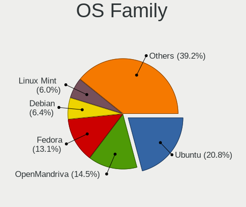
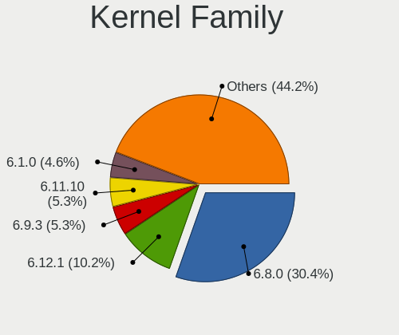
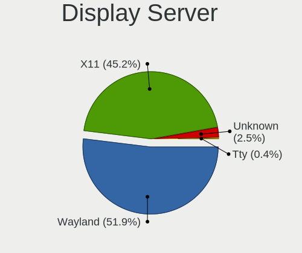
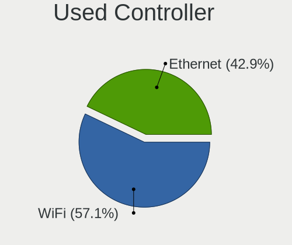
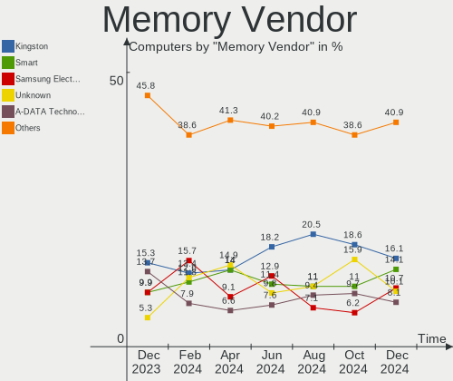
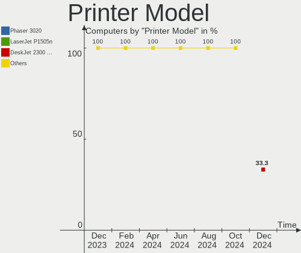
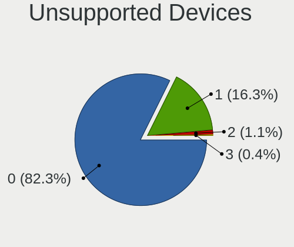

Linux in Brazil - Hardware Trends
---------------------------------

A project to identify most popular hardware characteristics and track their change
over time based on data collected by Linux users at https://Linux-Hardware.org.

Anyone can contribute to this report by the [hw-probe](https://github.com/linuxhw/hw-probe) tool:

    sudo -E hw-probe -all -upload

This is a report for all computer types. See also reports for [desktops](/Location/Brazil/Desktop/README.md) and [notebooks](/Location/Brazil/Notebook/README.md).

Contents
--------

* [ System ](#system)
  - [ OS                       ](#os)
  - [ OS Family                ](#os-family)
  - [ Kernel                   ](#kernel)
  - [ Kernel Family            ](#kernel-family)
  - [ Kernel Major Ver.        ](#kernel-major-ver)
  - [ Arch                     ](#arch)
  - [ DE                       ](#de)
  - [ Display Server           ](#display-server)
  - [ Display Manager          ](#display-manager)
  - [ OS Lang                  ](#os-lang)
  - [ Boot Mode                ](#boot-mode)
  - [ Filesystem               ](#filesystem)
  - [ Part. scheme             ](#part-scheme)
  - [ Dual Boot with Linux/BSD ](#dual-boot-with-linuxbsd)
  - [ Dual Boot (Win)          ](#dual-boot-win)

* [ Board ](#board)
  - [ Vendor                   ](#vendor)
  - [ Model                    ](#model)
  - [ Model Family             ](#model-family)
  - [ MFG Year                 ](#mfg-year)
  - [ Form Factor              ](#form-factor)
  - [ Secure Boot              ](#secure-boot)
  - [ Coreboot                 ](#coreboot)
  - [ RAM Size                 ](#ram-size)
  - [ RAM Used                 ](#ram-used)
  - [ Total Drives             ](#total-drives)
  - [ Has CD-ROM               ](#has-cd-rom)
  - [ Has Ethernet             ](#has-ethernet)
  - [ Has WiFi                 ](#has-wifi)
  - [ Has Bluetooth            ](#has-bluetooth)

* [ Location ](#location)
  - [ Country                  ](#country)
  - [ City                     ](#city)

* [ Drives ](#drives)
  - [ Drive Vendor             ](#drive-vendor)
  - [ Drive Model              ](#drive-model)
  - [ HDD Vendor               ](#hdd-vendor)
  - [ SSD Vendor               ](#ssd-vendor)
  - [ Drive Kind               ](#drive-kind)
  - [ Drive Connector          ](#drive-connector)
  - [ Drive Size               ](#drive-size)
  - [ Space Total              ](#space-total)
  - [ Space Used               ](#space-used)
  - [ Malfunc. Drives          ](#malfunc-drives)
  - [ Malfunc. Drive Vendor    ](#malfunc-drive-vendor)
  - [ Malfunc. HDD Vendor      ](#malfunc-hdd-vendor)
  - [ Malfunc. Drive Kind      ](#malfunc-drive-kind)
  - [ Failed Drives            ](#failed-drives)
  - [ Failed Drive Vendor      ](#failed-drive-vendor)
  - [ Drive Status             ](#drive-status)

* [ Storage controller ](#storage-controller)
  - [ Storage Vendor           ](#storage-vendor)
  - [ Storage Model            ](#storage-model)
  - [ Storage Kind             ](#storage-kind)

* [ Processor ](#processor)
  - [ CPU Vendor               ](#cpu-vendor)
  - [ CPU Model                ](#cpu-model)
  - [ CPU Model Family         ](#cpu-model-family)
  - [ CPU Cores                ](#cpu-cores)
  - [ CPU Sockets              ](#cpu-sockets)
  - [ CPU Threads              ](#cpu-threads)
  - [ CPU Op-Modes             ](#cpu-op-modes)
  - [ CPU Microcode            ](#cpu-microcode)
  - [ CPU Microarch            ](#cpu-microarch)

* [ Graphics ](#graphics)
  - [ GPU Vendor               ](#gpu-vendor)
  - [ GPU Model                ](#gpu-model)
  - [ GPU Combo                ](#gpu-combo)
  - [ GPU Driver               ](#gpu-driver)
  - [ GPU Memory               ](#gpu-memory)

* [ Monitor ](#monitor)
  - [ Monitor Vendor           ](#monitor-vendor)
  - [ Monitor Model            ](#monitor-model)
  - [ Monitor Resolution       ](#monitor-resolution)
  - [ Monitor Diagonal         ](#monitor-diagonal)
  - [ Monitor Width            ](#monitor-width)
  - [ Aspect Ratio             ](#aspect-ratio)
  - [ Monitor Area             ](#monitor-area)
  - [ Pixel Density            ](#pixel-density)
  - [ Multiple Monitors        ](#multiple-monitors)

* [ Network ](#network)
  - [ Net Controller Vendor    ](#net-controller-vendor)
  - [ Net Controller Model     ](#net-controller-model)
  - [ Wireless Vendor          ](#wireless-vendor)
  - [ Wireless Model           ](#wireless-model)
  - [ Ethernet Vendor          ](#ethernet-vendor)
  - [ Ethernet Model           ](#ethernet-model)
  - [ Net Controller Kind      ](#net-controller-kind)
  - [ Used Controller          ](#used-controller)
  - [ NICs                     ](#nics)
  - [ IPv6                     ](#ipv6)

* [ Bluetooth ](#bluetooth)
  - [ Bluetooth Vendor         ](#bluetooth-vendor)
  - [ Bluetooth Model          ](#bluetooth-model)

* [ Sound ](#sound)
  - [ Sound Vendor             ](#sound-vendor)
  - [ Sound Model              ](#sound-model)

* [ Memory ](#memory)
  - [ Memory Vendor            ](#memory-vendor)
  - [ Memory Model             ](#memory-model)
  - [ Memory Kind              ](#memory-kind)
  - [ Memory Form Factor       ](#memory-form-factor)
  - [ Memory Size              ](#memory-size)
  - [ Memory Speed             ](#memory-speed)

* [ Printers & scanners ](#printers--scanners)
  - [ Printer Vendor           ](#printer-vendor)
  - [ Printer Model            ](#printer-model)
  - [ Scanner Vendor           ](#scanner-vendor)
  - [ Scanner Model            ](#scanner-model)

* [ Camera ](#camera)
  - [ Camera Vendor            ](#camera-vendor)
  - [ Camera Model             ](#camera-model)

* [ Security ](#security)
  - [ Fingerprint Vendor       ](#fingerprint-vendor)
  - [ Fingerprint Model        ](#fingerprint-model)
  - [ Chipcard Vendor          ](#chipcard-vendor)
  - [ Chipcard Model           ](#chipcard-model)

* [ Unsupported ](#unsupported)
  - [ Unsupported Devices      ](#unsupported-devices)
  - [ Unsupported Device Types ](#unsupported-device-types)

System
------

OS
--

Installed operating systems

| Name                         | Computers | Percent |
|------------------------------|-----------|---------|
| Ubuntu 20.04                 | 34        | 11.49%  |
| OpenMandriva 4.3             | 25        | 8.45%   |
| Linux Mint 20.3              | 24        | 8.11%   |
| Fedora 35                    | 22        | 7.43%   |
| Ubuntu 22.04                 | 20        | 6.76%   |
| Pop!_OS 21.10                | 16        | 5.41%   |
| Zorin 16                     | 11        | 3.72%   |
| Ubuntu 21.10                 | 10        | 3.38%   |
| Debian 11                    | 9         | 3.04%   |
| Arch                         | 9         | 3.04%   |
| Pop!_OS 20.04                | 8         | 2.7%    |
| KDE neon 20.04               | 8         | 2.7%    |
| Pop!_OS 22.04                | 7         | 2.36%   |
| Endless 3.9.7                | 6         | 2.03%   |
| Endless 4.0.4                | 5         | 1.69%   |
| Ubuntu 18.04                 | 4         | 1.35%   |
| Manjaro                      | 4         | 1.35%   |
| Fedora 36                    | 3         | 1.01%   |
| Elementary 6.1               | 3         | 1.01%   |
| Arch Rolling                 | 3         | 1.01%   |
| Ubuntu MATE 20.04            | 2         | 0.68%   |
| Ubuntu 16.04                 | 2         | 0.68%   |
| OpenMandriva 4.2             | 2         | 0.68%   |
| Manjaro 21.2.5               | 2         | 0.68%   |
| Linux Mint 20.2              | 2         | 0.68%   |
| Linux Mint 19.3              | 2         | 0.68%   |
| Kubuntu 21.10                | 2         | 0.68%   |
| Kubuntu 20.04                | 2         | 0.68%   |
| Kali 2022.1                  | 2         | 0.68%   |
| Endless 4.0.6                | 2         | 0.68%   |
| Endless 4.0.3                | 2         | 0.68%   |
| Debian Testing               | 2         | 0.68%   |
| Debian 10                    | 2         | 0.68%   |
| ArcoLinux Rolling            | 2         | 0.68%   |
| Zorin 15                     | 1         | 0.34%   |
| Xubuntu 21.10                | 1         | 0.34%   |
| Xubuntu 20.04                | 1         | 0.34%   |
| UbuntuDDE 21.10              | 1         | 0.34%   |
| Ubuntu MATE 22.04            | 1         | 0.34%   |
| Ubuntu Budgie 22.04          | 1         | 0.34%   |
| Ubuntu Budgie 21.10          | 1         | 0.34%   |
| Ubuntu Budgie 20.04          | 1         | 0.34%   |
| Ubuntu 21.04                 | 1         | 0.34%   |
| Slackware 15.0               | 1         | 0.34%   |
| ROSA 12.2                    | 1         | 0.34%   |
| Raspbian 11                  | 1         | 0.34%   |
| Peppermint 10                | 1         | 0.34%   |
| Parrot 5.0                   | 1         | 0.34%   |
| openSUSE Tumbleweed-20220420 | 1         | 0.34%   |
| openSUSE Leap-15.4           | 1         | 0.34%   |
| openSUSE Leap-15.3           | 1         | 0.34%   |
| openSUSE 20220426            | 1         | 0.34%   |
| openSUSE 20220425            | 1         | 0.34%   |
| openSUSE 20220422            | 1         | 0.34%   |
| Mageia 8                     | 1         | 0.34%   |
| Lubuntu 21.10                | 1         | 0.34%   |
| LMDE 5                       | 1         | 0.34%   |
| LinuxFX 11                   | 1         | 0.34%   |
| LinuxFX 10                   | 1         | 0.34%   |
| Linux Mint 20                | 1         | 0.34%   |

OS Family
---------

OS without a version

| Name          | Computers | Percent |
|---------------|-----------|---------|
| Ubuntu        | 71        | 23.99%  |
| Pop!_OS       | 31        | 10.47%  |
| Linux Mint    | 29        | 9.8%    |
| OpenMandriva  | 27        | 9.12%   |
| Fedora        | 25        | 8.45%   |
| Endless       | 18        | 6.08%   |
| Debian        | 14        | 4.73%   |
| Zorin         | 12        | 4.05%   |
| Arch          | 12        | 4.05%   |
| KDE neon      | 8         | 2.7%    |
| openSUSE      | 6         | 2.03%   |
| Manjaro       | 6         | 2.03%   |
| Kubuntu       | 5         | 1.69%   |
| Elementary    | 4         | 1.35%   |
| Ubuntu MATE   | 3         | 1.01%   |
| Ubuntu Budgie | 3         | 1.01%   |
| Clear Linux   | 3         | 1.01%   |
| Xubuntu       | 2         | 0.68%   |
| LinuxFX       | 2         | 0.68%   |
| Kali          | 2         | 0.68%   |
| ArcoLinux     | 2         | 0.68%   |
| UbuntuDDE     | 1         | 0.34%   |
| Slackware     | 1         | 0.34%   |
| ROSA          | 1         | 0.34%   |
| Raspbian      | 1         | 0.34%   |
| Peppermint    | 1         | 0.34%   |
| Parrot        | 1         | 0.34%   |
| Mageia        | 1         | 0.34%   |
| Lubuntu       | 1         | 0.34%   |
| LMDE          | 1         | 0.34%   |
| Linux Lite    | 1         | 0.34%   |
| Funtoo        | 1         | 0.34%   |

Kernel
------

Version of the Linux kernel

| Version                      | Computers | Percent |
|------------------------------|-----------|---------|
| 5.13.0-39-generic            | 43        | 14.53%  |
| 5.16.7-desktop-1omv4003      | 25        | 8.45%   |
| 5.13.0-40-generic            | 22        | 7.43%   |
| 5.4.0-107-generic            | 15        | 5.07%   |
| 5.16.15-76051615-generic     | 15        | 5.07%   |
| 5.4.0-109-generic            | 13        | 4.39%   |
| 5.15.0-25-generic            | 11        | 3.72%   |
| 5.16.19-76051619-generic     | 10        | 3.38%   |
| 5.11.0-35-generic            | 10        | 3.38%   |
| 5.8.0-14-generic             | 8         | 2.7%    |
| 5.15.0-27-generic            | 8         | 2.7%    |
| 5.16.18-200.fc35.x86_64      | 7         | 2.36%   |
| 5.10.0-13-amd64              | 6         | 2.03%   |
| 5.4.0-91-generic             | 4         | 1.35%   |
| 5.17.4-200.fc35.x86_64       | 4         | 1.35%   |
| 5.17.1-arch1-1               | 4         | 1.35%   |
| 5.16.11-76051611-generic     | 4         | 1.35%   |
| 5.14.10-300.fc35.x86_64      | 4         | 1.35%   |
| 5.17.4-1-default             | 3         | 1.01%   |
| 5.16.0-6-amd64               | 3         | 1.01%   |
| 5.13.0-30-generic            | 3         | 1.01%   |
| 5.4.0-100-generic            | 2         | 0.68%   |
| 5.17.3-arch1-1               | 2         | 0.68%   |
| 5.17.1-zen1-1-zen            | 2         | 0.68%   |
| 5.17.1-300.fc36.x86_64       | 2         | 0.68%   |
| 5.16.20-200.fc35.x86_64      | 2         | 0.68%   |
| 5.16.19-200.fc35.x86_64      | 2         | 0.68%   |
| 5.16.13-1132.native          | 2         | 0.68%   |
| 5.16.0-kali6-amd64           | 2         | 0.68%   |
| 5.15.32-1-MANJARO            | 2         | 0.68%   |
| 5.15.28-1-MANJARO            | 2         | 0.68%   |
| 5.15.0-23-generic            | 2         | 0.68%   |
| 5.13.19-6-pve                | 2         | 0.68%   |
| 5.13.0-37-generic            | 2         | 0.68%   |
| 5.9.0-arm-64                 | 1         | 0.34%   |
| 5.4.21                       | 1         | 0.34%   |
| 5.4.0-94-generic             | 1         | 0.34%   |
| 5.4.0-72-generic             | 1         | 0.34%   |
| 5.4.0-26-generic             | 1         | 0.34%   |
| 5.3.18-150300.59.54-default  | 1         | 0.34%   |
| 5.17.5-arch1-1               | 1         | 0.34%   |
| 5.17.3-1-default             | 1         | 0.34%   |
| 5.17.2-arch3-1               | 1         | 0.34%   |
| 5.17.2                       | 1         | 0.34%   |
| 5.17.0-tkg-cacule            | 1         | 0.34%   |
| 5.17.0-0.rc7.116.fc36.x86_64 | 1         | 0.34%   |
| 5.16.18-rockchip64           | 1         | 0.34%   |
| 5.16.18-hardened1-1-hardened | 1         | 0.34%   |
| 5.16.17-1136.native          | 1         | 0.34%   |
| 5.16.16-200.fc35.x86_64      | 1         | 0.34%   |
| 5.16.15-201.fc35.x86_64      | 1         | 0.34%   |
| 5.16.14-1-MANJARO            | 1         | 0.34%   |
| 5.16.11-arch1-1              | 1         | 0.34%   |
| 5.16.10-xanmod1              | 1         | 0.34%   |
| 5.16.0-12parrot1-amd64       | 1         | 0.34%   |
| 5.15.36-xanmod1              | 1         | 0.34%   |
| 5.15.33-1-lts                | 1         | 0.34%   |
| 5.15.32-v7+                  | 1         | 0.34%   |
| 5.15.32-desktop-1.mga8       | 1         | 0.34%   |
| 5.15.15-76051515-generic     | 1         | 0.34%   |

Kernel Family
-------------

Linux kernel without a distro release

| Version  | Computers | Percent |
|----------|-----------|---------|
| 5.13.0   | 73        | 24.66%  |
| 5.4.0    | 37        | 12.5%   |
| 5.16.7   | 25        | 8.45%   |
| 5.15.0   | 21        | 7.09%   |
| 5.16.15  | 16        | 5.41%   |
| 5.11.0   | 13        | 4.39%   |
| 5.16.19  | 12        | 4.05%   |
| 5.16.18  | 9         | 3.04%   |
| 5.8.0    | 8         | 2.7%    |
| 5.17.1   | 8         | 2.7%    |
| 5.17.4   | 7         | 2.36%   |
| 5.10.0   | 7         | 2.36%   |
| 5.16.0   | 6         | 2.03%   |
| 5.16.11  | 5         | 1.69%   |
| 5.15.32  | 4         | 1.35%   |
| 5.14.10  | 4         | 1.35%   |
| 5.17.3   | 3         | 1.01%   |
| 4.15.0   | 3         | 1.01%   |
| 5.17.2   | 2         | 0.68%   |
| 5.17.0   | 2         | 0.68%   |
| 5.16.20  | 2         | 0.68%   |
| 5.16.13  | 2         | 0.68%   |
| 5.15.28  | 2         | 0.68%   |
| 5.14.0   | 2         | 0.68%   |
| 5.13.19  | 2         | 0.68%   |
| 5.9.0    | 1         | 0.34%   |
| 5.4.21   | 1         | 0.34%   |
| 5.3.18   | 1         | 0.34%   |
| 5.17.5   | 1         | 0.34%   |
| 5.16.17  | 1         | 0.34%   |
| 5.16.16  | 1         | 0.34%   |
| 5.16.14  | 1         | 0.34%   |
| 5.16.10  | 1         | 0.34%   |
| 5.15.36  | 1         | 0.34%   |
| 5.15.33  | 1         | 0.34%   |
| 5.15.15  | 1         | 0.34%   |
| 5.15.13  | 1         | 0.34%   |
| 5.14.21  | 1         | 0.34%   |
| 5.11.12  | 1         | 0.34%   |
| 5.10.93  | 1         | 0.34%   |
| 5.10.74  | 1         | 0.34%   |
| 5.10.14  | 1         | 0.34%   |
| 5.10.111 | 1         | 0.34%   |
| 5.10.105 | 1         | 0.34%   |
| 4.19.194 | 1         | 0.34%   |
| 4.19.0   | 1         | 0.34%   |

Kernel Major Ver.
-----------------

Linux kernel major version

| Version | Computers | Percent |
|---------|-----------|---------|
| 5.16    | 81        | 27.36%  |
| 5.13    | 75        | 25.34%  |
| 5.4     | 38        | 12.84%  |
| 5.15    | 31        | 10.47%  |
| 5.17    | 23        | 7.77%   |
| 5.11    | 14        | 4.73%   |
| 5.10    | 12        | 4.05%   |
| 5.8     | 8         | 2.7%    |
| 5.14    | 7         | 2.36%   |
| 4.15    | 3         | 1.01%   |
| 4.19    | 2         | 0.68%   |
| 5.9     | 1         | 0.34%   |
| 5.3     | 1         | 0.34%   |

Arch
----

OS architecture (x86_64, i586, etc.)

| Name    | Computers | Percent |
|---------|-----------|---------|
| x86_64  | 287       | 96.96%  |
| i686    | 6         | 2.03%   |
| aarch64 | 2         | 0.68%   |
| armv7l  | 1         | 0.34%   |

DE
--

Desktop Environment

| Name            | Computers | Percent |
|-----------------|-----------|---------|
| GNOME           | 157       | 53.04%  |
| KDE5            | 56        | 18.92%  |
| X-Cinnamon      | 22        | 7.43%   |
| XFCE            | 21        | 7.09%   |
| Unknown         | 12        | 4.05%   |
| MATE            | 9         | 3.04%   |
| Cinnamon        | 5         | 1.69%   |
| Pantheon        | 3         | 1.01%   |
| Budgie          | 3         | 1.01%   |
| Unity           | 2         | 0.68%   |
| LXDE            | 2         | 0.68%   |
| LXQt            | 1         | 0.34%   |
| i3              | 1         | 0.34%   |
| GNOME Flashback | 1         | 0.34%   |
| Deepin          | 1         | 0.34%   |

Display Server
--------------

X11 or Wayland

| Name    | Computers | Percent |
|---------|-----------|---------|
| X11     | 239       | 80.74%  |
| Wayland | 47        | 15.88%  |
| Tty     | 6         | 2.03%   |
| Unknown | 4         | 1.35%   |

Display Manager
---------------

SDDM, LightDM, etc.

| Name    | Computers | Percent |
|---------|-----------|---------|
| Unknown | 137       | 46.28%  |
| SDDM    | 45        | 15.2%   |
| GDM3    | 45        | 15.2%   |
| GDM     | 37        | 12.5%   |
| LightDM | 32        | 10.81%  |

OS Lang
-------

Language

| Lang    | Computers | Percent |
|---------|-----------|---------|
| pt_BR   | 211       | 71.28%  |
| en_US   | 74        | 25%     |
| C       | 3         | 1.01%   |
| Unknown | 3         | 1.01%   |
| en_GB   | 2         | 0.68%   |
| pt_PT   | 1         | 0.34%   |
| es_ES   | 1         | 0.34%   |
| en_CA   | 1         | 0.34%   |

Boot Mode
---------

EFI or BIOS

| Mode | Computers | Percent |
|------|-----------|---------|
| BIOS | 162       | 54.73%  |
| EFI  | 134       | 45.27%  |

Filesystem
----------

Type of filesystem

| Type    | Computers | Percent |
|---------|-----------|---------|
| Ext4    | 233       | 78.72%  |
| Btrfs   | 31        | 10.47%  |
| Overlay | 27        | 9.12%   |
| Zfs     | 2         | 0.68%   |
| Xfs     | 1         | 0.34%   |
| F2fs    | 1         | 0.34%   |
| Unknown | 1         | 0.34%   |

Part. scheme
------------

Scheme of partitioning

| Type    | Computers | Percent |
|---------|-----------|---------|
| Unknown | 178       | 60.14%  |
| GPT     | 92        | 31.08%  |
| MBR     | 26        | 8.78%   |

Dual Boot with Linux/BSD
------------------------

Hosting more than one Linux/BSD

| Dual boot | Computers | Percent |
|-----------|-----------|---------|
| No        | 264       | 89.19%  |
| Yes       | 32        | 10.81%  |

Dual Boot (Win)
---------------

Hosting Linux and Windows

| Dual boot | Computers | Percent |
|-----------|-----------|---------|
| No        | 238       | 80.41%  |
| Yes       | 58        | 19.59%  |

Board
-----

Vendor
------

Motherboard manufacturer

| Name                    | Computers | Percent |
|-------------------------|-----------|---------|
| Dell                    | 57        | 19.26%  |
| Lenovo                  | 31        | 10.47%  |
| Acer                    | 30        | 10.14%  |
| ASUSTek Computer        | 26        | 8.78%   |
| Positivo                | 19        | 6.42%   |
| Samsung Electronics     | 17        | 5.74%   |
| Gigabyte Technology     | 17        | 5.74%   |
| Hewlett-Packard         | 13        | 4.39%   |
| Intel                   | 10        | 3.38%   |
| MSI                     | 9         | 3.04%   |
| ASRock                  | 9         | 3.04%   |
| Unknown                 | 8         | 2.7%    |
| Avell High Performance  | 6         | 2.03%   |
| Itautec                 | 5         | 1.69%   |
| Apple                   | 4         | 1.35%   |
| Supermicro              | 3         | 1.01%   |
| Philco                  | 3         | 1.01%   |
| Pegatron                | 3         | 1.01%   |
| Multilaser              | 3         | 1.01%   |
| LG Electronics          | 3         | 1.01%   |
| Toshiba                 | 2         | 0.68%   |
| Sony                    | 2         | 0.68%   |
| Semp Toshiba            | 2         | 0.68%   |
| Positivo Bahia - VAIO   | 2         | 0.68%   |
| PCWare                  | 2         | 0.68%   |
| Google                  | 2         | 0.68%   |
| Raspberry Pi Foundation | 1         | 0.34%   |
| Megaware                | 1         | 0.34%   |
| JINGSHA                 | 1         | 0.34%   |
| Huanan                  | 1         | 0.34%   |
| Gateway                 | 1         | 0.34%   |
| GALAX                   | 1         | 0.34%   |
| Compaq                  | 1         | 0.34%   |
| Biostar                 | 1         | 0.34%   |

Model
-----

Motherboard model

| Name                                           | Computers | Percent |
|------------------------------------------------|-----------|---------|
| Unknown                                        | 11        | 3.72%   |
| Acer Nitro AN515-44                            | 8         | 2.7%    |
| Lenovo IdeaPad S145-15API 81V7                 | 4         | 1.35%   |
| ASUS PRIME B450M-GAMING/BR                     | 4         | 1.35%   |
| Samsung 340XAA/350XAA/550XAA                   | 3         | 1.01%   |
| Samsung 270E5J/2570EJ                          | 3         | 1.01%   |
| Positivo S14CT01                               | 3         | 1.01%   |
| Positivo Mobile                                | 3         | 1.01%   |
| Lenovo IdeaPad 330-15IKB 81FE                  | 3         | 1.01%   |
| Lenovo IdeaPad 320-15IKB 80YH                  | 3         | 1.01%   |
| Dell Latitude 5420                             | 3         | 1.01%   |
| Dell Inspiron 5458                             | 3         | 1.01%   |
| Dell Inspiron 15-3567                          | 3         | 1.01%   |
| Avell High Performance B.ON                    | 3         | 1.01%   |
| ASUS P8H61-M LX3 R2.0                          | 3         | 1.01%   |
| Supermicro X7DWT                               | 2         | 0.68%   |
| Samsung 550XDA                                 | 2         | 0.68%   |
| Positivo S14SL01                               | 2         | 0.68%   |
| Positivo N1250                                 | 2         | 0.68%   |
| Pegatron IPMH61P1                              | 2         | 0.68%   |
| MSI MS-7B84                                    | 2         | 0.68%   |
| Lenovo IdeaPad S145-15IWL 81S9                 | 2         | 0.68%   |
| Lenovo IdeaPad L340-15IRH Gaming 81TR          | 2         | 0.68%   |
| Intel X99                                      | 2         | 0.68%   |
| Intel H81                                      | 2         | 0.68%   |
| HP Pavilion dv6                                | 2         | 0.68%   |
| Gigabyte H55M-S2HP                             | 2         | 0.68%   |
| Gigabyte B450M DS3H                            | 2         | 0.68%   |
| Dell XPS 13 9310                               | 2         | 0.68%   |
| Dell Vostro 3560                               | 2         | 0.68%   |
| Dell OptiPlex 3050                             | 2         | 0.68%   |
| Dell Inspiron N4010                            | 2         | 0.68%   |
| Dell Inspiron 7559                             | 2         | 0.68%   |
| Dell Inspiron 5566                             | 2         | 0.68%   |
| Dell Inspiron 3583                             | 2         | 0.68%   |
| Dell Inspiron 1525                             | 2         | 0.68%   |
| Dell Inspiron 15 7000 Gaming                   | 2         | 0.68%   |
| ASUS P5KPL-AM-CKD-VISUM-SI                     | 2         | 0.68%   |
| ASUS All Series                                | 2         | 0.68%   |
| Acer Aspire A514-54                            | 2         | 0.68%   |
| Toshiba Satellite U845W                        | 1         | 0.34%   |
| Toshiba Satellite S55-C                        | 1         | 0.34%   |
| Supermicro SSG-6047R-E1CR36N                   | 1         | 0.34%   |
| Sony VPCEH25FM                                 | 1         | 0.34%   |
| Sony SVS13A25PBS                               | 1         | 0.34%   |
| Semp Toshiba STI                               | 1         | 0.34%   |
| Semp Toshiba IS 1413G                          | 1         | 0.34%   |
| Samsung RV415/RV515                            | 1         | 0.34%   |
| Samsung RV411/RV511/E3511/S3511/RV711/E3411    | 1         | 0.34%   |
| Samsung 670Z5E                                 | 1         | 0.34%   |
| Samsung 550XCJ/550XCR                          | 1         | 0.34%   |
| Samsung 530U3C/530U4C/532U3C                   | 1         | 0.34%   |
| Samsung 370E4K                                 | 1         | 0.34%   |
| Samsung 300V3A/300V4A/300V5A/200A4B/200A5B     | 1         | 0.34%   |
| Samsung 300E5EV/300E4EV/270E5EV/270E4EV/2470EV | 1         | 0.34%   |
| Samsung 300E4C/300E5C/300E7C                   | 1         | 0.34%   |
| RPi Raspberry Pi 3 Model B Rev 1.2             | 1         | 0.34%   |
| Positivo W942SW_SW1                            | 1         | 0.34%   |
| Positivo W940TU                                | 1         | 0.34%   |
| Positivo Q464C                                 | 1         | 0.34%   |

Model Family
------------

Motherboard model prefix

| Name                         | Computers | Percent |
|------------------------------|-----------|---------|
| Dell Inspiron                | 33        | 11.15%  |
| Lenovo IdeaPad               | 18        | 6.08%   |
| Acer Aspire                  | 18        | 6.08%   |
| Acer Nitro                   | 11        | 3.72%   |
| Unknown                      | 11        | 3.72%   |
| ASUS PRIME                   | 7         | 2.36%   |
| Lenovo ThinkPad              | 6         | 2.03%   |
| Dell Vostro                  | 6         | 2.03%   |
| Dell Latitude                | 6         | 2.03%   |
| Dell OptiPlex                | 5         | 1.69%   |
| HP Pavilion                  | 4         | 1.35%   |
| Dell XPS                     | 4         | 1.35%   |
| Samsung 340XAA               | 3         | 1.01%   |
| Samsung 270E5J               | 3         | 1.01%   |
| Positivo S14CT01             | 3         | 1.01%   |
| Positivo Mobile              | 3         | 1.01%   |
| Itautec Infoway              | 3         | 1.01%   |
| HP ProBook                   | 3         | 1.01%   |
| Avell High Performance B.ON  | 3         | 1.01%   |
| ASUS P8H61-M                 | 3         | 1.01%   |
| Toshiba Satellite            | 2         | 0.68%   |
| Supermicro X7DWT             | 2         | 0.68%   |
| Samsung 550XDA               | 2         | 0.68%   |
| Positivo S14SL01             | 2         | 0.68%   |
| Positivo N1250               | 2         | 0.68%   |
| Pegatron IPMH61P1            | 2         | 0.68%   |
| MSI MS-7B84                  | 2         | 0.68%   |
| Lenovo ThinkCentre           | 2         | 0.68%   |
| Intel X99                    | 2         | 0.68%   |
| Intel H81                    | 2         | 0.68%   |
| Gigabyte H55M-S2HP           | 2         | 0.68%   |
| Gigabyte B450M               | 2         | 0.68%   |
| Gigabyte B450                | 2         | 0.68%   |
| ASUS VivoBook                | 2         | 0.68%   |
| ASUS P5KPL-AM-CKD-VISUM-SI   | 2         | 0.68%   |
| ASUS M5A78L-M                | 2         | 0.68%   |
| ASUS All                     | 2         | 0.68%   |
| Supermicro SSG-6047R-E1CR36N | 1         | 0.34%   |
| Sony VPCEH25FM               | 1         | 0.34%   |
| Sony SVS13A25PBS             | 1         | 0.34%   |
| Semp Toshiba STI             | 1         | 0.34%   |
| Semp Toshiba IS              | 1         | 0.34%   |
| Samsung RV415                | 1         | 0.34%   |
| Samsung RV411                | 1         | 0.34%   |
| Samsung 670Z5E               | 1         | 0.34%   |
| Samsung 550XCJ               | 1         | 0.34%   |
| Samsung 530U3C               | 1         | 0.34%   |
| Samsung 370E4K               | 1         | 0.34%   |
| Samsung 300V3A               | 1         | 0.34%   |
| Samsung 300E5EV              | 1         | 0.34%   |
| Samsung 300E4C               | 1         | 0.34%   |
| RPi Raspberry                | 1         | 0.34%   |
| Positivo W942SW              | 1         | 0.34%   |
| Positivo W940TU              | 1         | 0.34%   |
| Positivo Q464C               | 1         | 0.34%   |
| Positivo POS-MI945AA         | 1         | 0.34%   |
| Positivo POS-EIBTDB          | 1         | 0.34%   |
| Positivo POS-ECIG41BS        | 1         | 0.34%   |
| Positivo NB50TH              | 1         | 0.34%   |
| Positivo H14BU08             | 1         | 0.34%   |

MFG Year
--------

Motherboard manufacture year

| Year    | Computers | Percent |
|---------|-----------|---------|
| 2018    | 32        | 10.81%  |
| 2019    | 31        | 10.47%  |
| 2020    | 27        | 9.12%   |
| 2021    | 23        | 7.77%   |
| 2017    | 23        | 7.77%   |
| 2011    | 22        | 7.43%   |
| 2013    | 20        | 6.76%   |
| 2012    | 20        | 6.76%   |
| 2016    | 19        | 6.42%   |
| 2015    | 15        | 5.07%   |
| 2014    | 14        | 4.73%   |
| 2010    | 14        | 4.73%   |
| 2008    | 13        | 4.39%   |
| 2009    | 11        | 3.72%   |
| Unknown | 7         | 2.36%   |
| 2022    | 2         | 0.68%   |
| 2007    | 1         | 0.34%   |
| 2005    | 1         | 0.34%   |
| 2004    | 1         | 0.34%   |

Form Factor
-----------

Physical design of the computer

| Name           | Computers | Percent |
|----------------|-----------|---------|
| Notebook       | 188       | 63.51%  |
| Desktop        | 100       | 33.78%  |
| System on chip | 3         | 1.01%   |
| Convertible    | 3         | 1.01%   |
| Mini pc        | 1         | 0.34%   |
| Server         | 1         | 0.34%   |

Secure Boot
-----------

Enabled or disabled

| State    | Computers | Percent |
|----------|-----------|---------|
| Disabled | 273       | 92.23%  |
| Enabled  | 23        | 7.77%   |

Coreboot
--------

Have coreboot on board

| Used | Computers | Percent |
|------|-----------|---------|
| No   | 294       | 99.32%  |
| Yes  | 2         | 0.68%   |

RAM Size
--------

Total RAM memory

| Size in GB  | Computers | Percent |
|-------------|-----------|---------|
| 4.01-8.0    | 85        | 28.72%  |
| 8.01-16.0   | 68        | 22.97%  |
| 3.01-4.0    | 55        | 18.58%  |
| 16.01-24.0  | 43        | 14.53%  |
| 1.01-2.0    | 16        | 5.41%   |
| 32.01-64.0  | 9         | 3.04%   |
| 2.01-3.0    | 9         | 3.04%   |
| 64.01-256.0 | 5         | 1.69%   |
| 24.01-32.0  | 4         | 1.35%   |
| 0.51-1.0    | 2         | 0.68%   |

RAM Used
--------

Used RAM memory

| Used GB    | Computers | Percent |
|------------|-----------|---------|
| 1.01-2.0   | 111       | 37.5%   |
| 2.01-3.0   | 76        | 25.68%  |
| 4.01-8.0   | 41        | 13.85%  |
| 3.01-4.0   | 35        | 11.82%  |
| 0.51-1.0   | 16        | 5.41%   |
| 8.01-16.0  | 13        | 4.39%   |
| 0.01-0.5   | 2         | 0.68%   |
| 32.01-64.0 | 1         | 0.34%   |
| 16.01-24.0 | 1         | 0.34%   |

Total Drives
------------

Number of drives on board

| Drives | Computers | Percent |
|--------|-----------|---------|
| 1      | 191       | 64.53%  |
| 2      | 87        | 29.39%  |
| 3      | 12        | 4.05%   |
| 5      | 3         | 1.01%   |
| 7      | 1         | 0.34%   |
| 4      | 1         | 0.34%   |
| 0      | 1         | 0.34%   |

Has CD-ROM
----------

Has CD-ROM on board

| Presented | Computers | Percent |
|-----------|-----------|---------|
| No        | 221       | 74.66%  |
| Yes       | 75        | 25.34%  |

Has Ethernet
------------

Has Ethernet on board

| Presented | Computers | Percent |
|-----------|-----------|---------|
| Yes       | 260       | 87.84%  |
| No        | 36        | 12.16%  |

Has WiFi
--------

Has WiFi module

| Presented | Computers | Percent |
|-----------|-----------|---------|
| Yes       | 216       | 72.97%  |
| No        | 80        | 27.03%  |

Has Bluetooth
-------------

Has Bluetooth module

| Presented | Computers | Percent |
|-----------|-----------|---------|
| Yes       | 160       | 54.05%  |
| No        | 136       | 45.95%  |

Location
--------

Country
-------

Geographic location (country)

| Country | Computers | Percent |
|---------|-----------|---------|
| Brazil  | 296       | 100%    |

City
----

Geographic location (city)

| City                     | Computers | Percent |
|--------------------------|-----------|---------|
| Sao Paulo                | 43        | 14.53%  |
| Rio de Janeiro           | 18        | 6.08%   |
| Brasília                | 10        | 3.38%   |
| Salvador                 | 7         | 2.36%   |
| Fortaleza                | 7         | 2.36%   |
| Curitiba                 | 7         | 2.36%   |
| Porto Alegre             | 5         | 1.69%   |
| Niterói                 | 5         | 1.69%   |
| Jundiaí                 | 4         | 1.35%   |
| Goiânia                 | 4         | 1.35%   |
| Vila Velha               | 3         | 1.01%   |
| Sao Luís                | 3         | 1.01%   |
| Ribeirao Preto           | 3         | 1.01%   |
| Recife                   | 3         | 1.01%   |
| Osasco                   | 3         | 1.01%   |
| Guarulhos                | 3         | 1.01%   |
| Belo Horizonte           | 3         | 1.01%   |
| Almirante Tamandare      | 3         | 1.01%   |
| Uberlândia              | 2         | 0.68%   |
| Teixeira de Freitas      | 2         | 0.68%   |
| Santo André             | 2         | 0.68%   |
| Santa Rita do Sapucai    | 2         | 0.68%   |
| Porto Velho              | 2         | 0.68%   |
| Porto Seguro             | 2         | 0.68%   |
| Ponta Grossa             | 2         | 0.68%   |
| Ourinhos                 | 2         | 0.68%   |
| Natal                    | 2         | 0.68%   |
| Mogi Guacu               | 2         | 0.68%   |
| Maringá                 | 2         | 0.68%   |
| Manaus                   | 2         | 0.68%   |
| Maceió                  | 2         | 0.68%   |
| Lajeado                  | 2         | 0.68%   |
| Itatiba                  | 2         | 0.68%   |
| Governador Valadares     | 2         | 0.68%   |
| Cotia                    | 2         | 0.68%   |
| Chapecó                 | 2         | 0.68%   |
| Caxias do Sul            | 2         | 0.68%   |
| Cariacica                | 2         | 0.68%   |
| Campinas                 | 2         | 0.68%   |
| Cabo Frio                | 2         | 0.68%   |
| Bauru                    | 2         | 0.68%   |
| Americana                | 2         | 0.68%   |
| Volta Redonda            | 1         | 0.34%   |
| Vitória da Conquista    | 1         | 0.34%   |
| Varzea Paulista          | 1         | 0.34%   |
| Varginha                 | 1         | 0.34%   |
| Uniao                    | 1         | 0.34%   |
| Ubatuba                  | 1         | 0.34%   |
| Uaua                     | 1         | 0.34%   |
| Tubarao                  | 1         | 0.34%   |
| Toritama                 | 1         | 0.34%   |
| Timon                    | 1         | 0.34%   |
| Teresina                 | 1         | 0.34%   |
| Teófilo Otoni           | 1         | 0.34%   |
| Taubate                  | 1         | 0.34%   |
| Suzano                   | 1         | 0.34%   |
| Sobral                   | 1         | 0.34%   |
| Sertaozinho              | 1         | 0.34%   |
| Sarandi                  | 1         | 0.34%   |
| Sao Sebastiao do Paraiso | 1         | 0.34%   |

Drives
------

Drive Vendor
------------

Hard drive vendors

| Vendor                         | Computers | Drives | Percent |
|--------------------------------|-----------|--------|---------|
| WDC                            | 72        | 76     | 18.6%   |
| Seagate                        | 67        | 80     | 17.31%  |
| Kingston                       | 42        | 45     | 10.85%  |
| SanDisk                        | 28        | 29     | 7.24%   |
| Samsung Electronics            | 28        | 30     | 7.24%   |
| Toshiba                        | 20        | 21     | 5.17%   |
| Unknown                        | 15        | 23     | 3.88%   |
| A-DATA Technology              | 15        | 15     | 3.88%   |
| Crucial                        | 12        | 13     | 3.1%    |
| China                          | 12        | 12     | 3.1%    |
| Hitachi                        | 8         | 8      | 2.07%   |
| ADATA Technology               | 8         | 10     | 2.07%   |
| Silicon Motion                 | 7         | 7      | 1.81%   |
| SK Hynix                       | 5         | 5      | 1.29%   |
| XPG                            | 4         | 4      | 1.03%   |
| MAXTOR                         | 4         | 4      | 1.03%   |
| SSSTC                          | 3         | 3      | 0.78%   |
| Phison                         | 3         | 4      | 0.78%   |
| Lexar                          | 3         | 3      | 0.78%   |
| KIOXIA                         | 3         | 3      | 0.78%   |
| Intel                          | 3         | 3      | 0.78%   |
| Unknown                        | 3         | 3      | 0.78%   |
| PNY                            | 2         | 2      | 0.52%   |
| LITEON                         | 2         | 2      | 0.52%   |
| KingSpec                       | 2         | 2      | 0.52%   |
| ZADAK                          | 1         | 1      | 0.26%   |
| WANGCHU                        | 1         | 1      | 0.26%   |
| Team                           | 1         | 1      | 0.26%   |
| Solid State Storage Technology | 1         | 1      | 0.26%   |
| OCZ                            | 1         | 1      | 0.26%   |
| Netac                          | 1         | 1      | 0.26%   |
| MAXIO Technology (Hangzhou)    | 1         | 1      | 0.26%   |
| KINGBANK                       | 1         | 1      | 0.26%   |
| HUSKY                          | 1         | 1      | 0.26%   |
| HS-SSD-C100                    | 1         | 1      | 0.26%   |
| HGST                           | 1         | 1      | 0.26%   |
| Hewlett-Packard                | 1         | 1      | 0.26%   |
| Gigabyte Technology            | 1         | 1      | 0.26%   |
| Apacer                         | 1         | 1      | 0.26%   |
| AFOX                           | 1         | 1      | 0.26%   |
| Acer                           | 1         | 1      | 0.26%   |

Drive Model
-----------

Hard drive models

| Model                                | Computers | Percent |
|--------------------------------------|-----------|---------|
| Kingston SA400S37240G 240GB SSD      | 22        | 5.33%   |
| Seagate ST1000LM024 HN-M101MBB 1TB   | 9         | 2.18%   |
| Sandisk NVMe SSD Drive 512GB         | 8         | 1.94%   |
| WDC WD10SPZX-24Z10 1TB               | 7         | 1.69%   |
| WDC WD10SPZX-21Z10T0 1TB             | 7         | 1.69%   |
| Kingston SA400S37480G 480GB SSD      | 7         | 1.69%   |
| Crucial CT240BX500SSD1 240GB         | 6         | 1.45%   |
| Unknown MMC Card  32GB               | 5         | 1.21%   |
| Seagate ST1000DM010-2EP102 1TB       | 5         | 1.21%   |
| SanDisk SSD PLUS 480GB               | 5         | 1.21%   |
| ADATA NVMe SSD Drive 256GB           | 5         | 1.21%   |
| SanDisk SSD PLUS 120GB               | 4         | 0.97%   |
| Kingston SA400S37120G 120GB SSD      | 4         | 0.97%   |
| WDC WDS240G2G0B-00EPW0 240GB SSD     | 3         | 0.73%   |
| WDC WD5000AAKX-003CA0 500GB          | 3         | 0.73%   |
| WDC WD10JPVX-75JC3T0 1TB             | 3         | 0.73%   |
| WDC WD10JPVX-22JC3T0 1TB             | 3         | 0.73%   |
| Unknown MMC Card  64GB               | 3         | 0.73%   |
| Toshiba MQ02ABD100H 1TB              | 3         | 0.73%   |
| Silicon Motion NVMe SSD Drive 512GB  | 3         | 0.73%   |
| Seagate ST9500325AS 500GB            | 3         | 0.73%   |
| Seagate ST500LM012 HN-M500MBB 500GB  | 3         | 0.73%   |
| Seagate ST500DM002-1BD142 500GB      | 3         | 0.73%   |
| Seagate ST3500413AS 500GB            | 3         | 0.73%   |
| Seagate ST2000DM006-2DM164 2TB       | 3         | 0.73%   |
| Seagate ST1000LM035-1RK172 1TB       | 3         | 0.73%   |
| Seagate ST1000DM003-1SB102 1TB       | 3         | 0.73%   |
| SanDisk SSD PLUS 240GB               | 3         | 0.73%   |
| Samsung HD161GJ 160GB                | 3         | 0.73%   |
| Kingston SUV300S37A240G 240GB SSD    | 3         | 0.73%   |
| Unknown                              | 3         | 0.73%   |
| WDC WD10SPZX-75Z10T2 1TB             | 2         | 0.48%   |
| WDC WD10SPZX-22Z10T0 1TB             | 2         | 0.48%   |
| WDC WD10EZEX-00WN4A0 1TB             | 2         | 0.48%   |
| WDC PC SN530 SDBPNPZ-512G-1114 512GB | 2         | 0.48%   |
| Unknown SB64G  64GB                  | 2         | 0.48%   |
| Unknown MMC Card  16GB               | 2         | 0.48%   |
| Toshiba NVMe SSD Drive 1024GB        | 2         | 0.48%   |
| Toshiba HDWD110 1TB                  | 2         | 0.48%   |
| SSSTC CL1-4D256 256GB                | 2         | 0.48%   |
| SK Hynix NVMe SSD Drive 512GB        | 2         | 0.48%   |
| SK Hynix NVMe SSD Drive 256GB        | 2         | 0.48%   |
| Silicon Motion NVMe SSD Drive 256GB  | 2         | 0.48%   |
| Seagate ST9160314AS 160GB            | 2         | 0.48%   |
| Seagate ST500LM030-2E717D 500GB      | 2         | 0.48%   |
| Seagate ST500LM021-1KJ152 500GB      | 2         | 0.48%   |
| Seagate ST3500418AS 500GB            | 2         | 0.48%   |
| Seagate ST320LM001 HN-M320MBB 320GB  | 2         | 0.48%   |
| Seagate ST1000LM048-2E7172 1TB       | 2         | 0.48%   |
| Seagate Expansion+ 2TB               | 2         | 0.48%   |
| Samsung SSD 850 EVO 500GB            | 2         | 0.48%   |
| Samsung NVMe SSD Drive 512GB         | 2         | 0.48%   |
| Samsung NVMe SSD Drive 256GB         | 2         | 0.48%   |
| Samsung HM500JI 500GB                | 2         | 0.48%   |
| Samsung HM160HI 160GB                | 2         | 0.48%   |
| Samsung HD103SJ 1TB                  | 2         | 0.48%   |
| Phison NVMe SSD Drive 256GB          | 2         | 0.48%   |
| China SATA SSD 32GB                  | 2         | 0.48%   |
| China SATA SSD 120GB                 | 2         | 0.48%   |
| ADATA NVMe SSD Drive 512GB           | 2         | 0.48%   |

HDD Vendor
----------

Hard disk drive vendors

| Vendor              | Computers | Drives | Percent |
|---------------------|-----------|--------|---------|
| Seagate             | 66        | 79     | 38.82%  |
| WDC                 | 59        | 61     | 34.71%  |
| Toshiba             | 16        | 17     | 9.41%   |
| Samsung Electronics | 16        | 18     | 9.41%   |
| Hitachi             | 8         | 8      | 4.71%   |
| MAXTOR              | 4         | 4      | 2.35%   |
| HGST                | 1         | 1      | 0.59%   |

SSD Vendor
----------

Solid state drive vendors

| Vendor              | Computers | Drives | Percent |
|---------------------|-----------|--------|---------|
| Kingston            | 41        | 43     | 31.3%   |
| SanDisk             | 17        | 18     | 12.98%  |
| Crucial             | 12        | 13     | 9.16%   |
| China               | 12        | 12     | 9.16%   |
| WDC                 | 10        | 10     | 7.63%   |
| Samsung Electronics | 7         | 7      | 5.34%   |
| A-DATA Technology   | 7         | 7      | 5.34%   |
| Lexar               | 3         | 3      | 2.29%   |
| Unknown             | 3         | 3      | 2.29%   |
| PNY                 | 2         | 2      | 1.53%   |
| KingSpec            | 2         | 2      | 1.53%   |
| Intel               | 2         | 2      | 1.53%   |
| WANGCHU             | 1         | 1      | 0.76%   |
| Team                | 1         | 1      | 0.76%   |
| Seagate             | 1         | 1      | 0.76%   |
| OCZ                 | 1         | 1      | 0.76%   |
| Netac               | 1         | 1      | 0.76%   |
| LITEON              | 1         | 1      | 0.76%   |
| KINGBANK            | 1         | 1      | 0.76%   |
| HUSKY               | 1         | 1      | 0.76%   |
| Hewlett-Packard     | 1         | 1      | 0.76%   |
| Gigabyte Technology | 1         | 1      | 0.76%   |
| Apacer              | 1         | 1      | 0.76%   |
| AFOX                | 1         | 1      | 0.76%   |
| Acer                | 1         | 1      | 0.76%   |

Drive Kind
----------

HDD or SSD

| Kind    | Computers | Drives | Percent |
|---------|-----------|--------|---------|
| HDD     | 154       | 188    | 41.96%  |
| SSD     | 125       | 135    | 34.06%  |
| NVMe    | 70        | 73     | 19.07%  |
| MMC     | 16        | 25     | 4.36%   |
| Unknown | 2         | 2      | 0.54%   |

Drive Connector
---------------

SATA, SAS, NVMe, etc.

| Type | Computers | Drives | Percent |
|------|-----------|--------|---------|
| SATA | 233       | 319    | 71.91%  |
| NVMe | 70        | 73     | 21.6%   |
| MMC  | 16        | 25     | 4.94%   |
| SAS  | 5         | 6      | 1.54%   |

Drive Size
----------

Size of hard drive

| Size in TB | Computers | Drives | Percent |
|------------|-----------|--------|---------|
| 0.01-0.5   | 180       | 212    | 64.98%  |
| 0.51-1.0   | 80        | 87     | 28.88%  |
| 1.01-2.0   | 13        | 17     | 4.69%   |
| 3.01-4.0   | 2         | 5      | 0.72%   |
| 2.01-3.0   | 1         | 1      | 0.36%   |
| 10.01-20.0 | 1         | 1      | 0.36%   |

Space Total
-----------

Amount of disk space available on the file system

| Size in GB     | Computers | Percent |
|----------------|-----------|---------|
| 101-250        | 99        | 33.45%  |
| 251-500        | 70        | 23.65%  |
| 501-1000       | 42        | 14.19%  |
| 1-20           | 23        | 7.77%   |
| 1001-2000      | 14        | 4.73%   |
| 51-100         | 14        | 4.73%   |
| 21-50          | 11        | 3.72%   |
| More than 3000 | 10        | 3.38%   |
| Unknown        | 8         | 2.7%    |
| 2001-3000      | 5         | 1.69%   |

Space Used
----------

Amount of used disk space

| Used GB        | Computers | Percent |
|----------------|-----------|---------|
| 1-20           | 104       | 35.14%  |
| 21-50          | 64        | 21.62%  |
| 51-100         | 43        | 14.53%  |
| 101-250        | 39        | 13.18%  |
| 251-500        | 17        | 5.74%   |
| 501-1000       | 11        | 3.72%   |
| Unknown        | 8         | 2.7%    |
| 2001-3000      | 4         | 1.35%   |
| More than 3000 | 3         | 1.01%   |
| 1001-2000      | 3         | 1.01%   |

Malfunc. Drives
---------------

Drive models with a malfunction

| Model                                        | Computers | Drives | Percent |
|----------------------------------------------|-----------|--------|---------|
| Seagate ST1000LM035-1RK172 1TB               | 2         | 2      | 7.69%   |
| XPG GAMMIX S11 Pro 512GB                     | 1         | 1      | 3.85%   |
| WDC WD800BD-00LRA1 80GB                      | 1         | 1      | 3.85%   |
| WDC WD10EADS-22M2B0 1TB                      | 1         | 1      | 3.85%   |
| Toshiba MQ02ABD100H 1TB                      | 1         | 1      | 3.85%   |
| Toshiba MQ01ABF032 320GB                     | 1         | 1      | 3.85%   |
| Toshiba MK1246GSX 120GB                      | 1         | 1      | 3.85%   |
| Seagate ST9500325AS 500GB                    | 1         | 1      | 3.85%   |
| Seagate ST9160314AS 160GB                    | 1         | 1      | 3.85%   |
| Seagate ST500LM012 HN-M500MBB 500GB          | 1         | 1      | 3.85%   |
| Seagate ST500DM002-1BD142 500GB              | 1         | 1      | 3.85%   |
| Seagate ST3500418AS 500GB                    | 1         | 1      | 3.85%   |
| Seagate ST3500413AS 500GB                    | 1         | 1      | 3.85%   |
| Seagate ST32000644NS 59Y5483 59Y1807IBMV 2TB | 1         | 1      | 3.85%   |
| Seagate ST31000524NS 1TB                     | 1         | 1      | 3.85%   |
| Seagate ST1000DM010-2EP102 1TB               | 1         | 1      | 3.85%   |
| Seagate ST1000DM003-9YN162 1TB               | 1         | 1      | 3.85%   |
| SanDisk SSD PLUS 240GB                       | 1         | 1      | 3.85%   |
| Samsung Electronics SP0842N 80GB             | 1         | 1      | 3.85%   |
| Samsung Electronics HM121HI 120GB            | 1         | 1      | 3.85%   |
| MAXTOR STM3160215AS 160GB                    | 1         | 1      | 3.85%   |
| Kingston SUV300S37A240G 240GB SSD            | 1         | 1      | 3.85%   |
| Kingston SA400S37480G 480GB SSD              | 1         | 1      | 3.85%   |
| Hitachi HTS547575A9E384 752GB                | 1         | 1      | 3.85%   |
| A-DATA Technology SSD 32GB                   | 1         | 1      | 3.85%   |

Malfunc. Drive Vendor
---------------------

Vendors of faulty drives

| Vendor              | Computers | Drives | Percent |
|---------------------|-----------|--------|---------|
| Seagate             | 12        | 12     | 46.15%  |
| Toshiba             | 3         | 3      | 11.54%  |
| WDC                 | 2         | 2      | 7.69%   |
| Samsung Electronics | 2         | 2      | 7.69%   |
| Kingston            | 2         | 2      | 7.69%   |
| XPG                 | 1         | 1      | 3.85%   |
| SanDisk             | 1         | 1      | 3.85%   |
| MAXTOR              | 1         | 1      | 3.85%   |
| Hitachi             | 1         | 1      | 3.85%   |
| A-DATA Technology   | 1         | 1      | 3.85%   |

Malfunc. HDD Vendor
-------------------

Vendors of faulty HDD drives

| Vendor              | Computers | Drives | Percent |
|---------------------|-----------|--------|---------|
| Seagate             | 12        | 12     | 57.14%  |
| Toshiba             | 3         | 3      | 14.29%  |
| WDC                 | 2         | 2      | 9.52%   |
| Samsung Electronics | 2         | 2      | 9.52%   |
| MAXTOR              | 1         | 1      | 4.76%   |
| Hitachi             | 1         | 1      | 4.76%   |

Malfunc. Drive Kind
-------------------

Kinds of faulty drives

| Kind | Computers | Drives | Percent |
|------|-----------|--------|---------|
| HDD  | 20        | 21     | 80%     |
| SSD  | 4         | 4      | 16%     |
| NVMe | 1         | 1      | 4%      |

Failed Drives
-------------

Failed drive models

Zero info for selected period =(

Failed Drive Vendor
-------------------

Failed drive vendors

Zero info for selected period =(

Drive Status
------------

Number of failed and malfunc. drives

| Status   | Computers | Drives | Percent |
|----------|-----------|--------|---------|
| Detected | 188       | 278    | 62.05%  |
| Works    | 91        | 119    | 30.03%  |
| Malfunc  | 24        | 26     | 7.92%   |

Storage controller
------------------

Storage Vendor
--------------

Storage controller vendors

| Vendor                           | Computers | Percent |
|----------------------------------|-----------|---------|
| Intel                            | 209       | 60.4%   |
| AMD                              | 51        | 14.74%  |
| ADATA Technology                 | 18        | 5.2%    |
| Sandisk                          | 15        | 4.34%   |
| Silicon Motion                   | 7         | 2.02%   |
| Samsung Electronics              | 5         | 1.45%   |
| Nvidia                           | 5         | 1.45%   |
| Toshiba America Info Systems     | 4         | 1.16%   |
| Solid State Storage Technology   | 4         | 1.16%   |
| SK Hynix                         | 4         | 1.16%   |
| JMicron Technology               | 4         | 1.16%   |
| Silicon Integrated Systems [SiS] | 3         | 0.87%   |
| Phison Electronics               | 3         | 0.87%   |
| Marvell Technology Group         | 3         | 0.87%   |
| KIOXIA                           | 3         | 0.87%   |
| Realtek Semiconductor            | 2         | 0.58%   |
| Kingston Technology Company      | 2         | 0.58%   |
| ASMedia Technology               | 2         | 0.58%   |
| MAXIO Technology (Hangzhou)      | 1         | 0.29%   |
| Lite-On Technology               | 1         | 0.29%   |

Storage Model
-------------

Storage controller models

| Model                                                                                   | Computers | Percent |
|-----------------------------------------------------------------------------------------|-----------|---------|
| AMD FCH SATA Controller [AHCI mode]                                                     | 36        | 8.89%   |
| Intel Sunrise Point-LP SATA Controller [AHCI mode]                                      | 30        | 7.41%   |
| Intel 7 Series Chipset Family 6-port SATA Controller [AHCI mode]                        | 20        | 4.94%   |
| Intel NM10/ICH7 Family SATA Controller [IDE mode]                                       | 14        | 3.46%   |
| ADATA Non-Volatile memory controller                                                    | 14        | 3.46%   |
| Intel 8 Series SATA Controller 1 [AHCI mode]                                            | 11        | 2.72%   |
| Sandisk WD Blue SN550 NVMe SSD                                                          | 10        | 2.47%   |
| Intel 82801G (ICH7 Family) IDE Controller                                               | 9         | 2.22%   |
| Intel 8 Series/C220 Series Chipset Family 6-port SATA Controller 1 [AHCI mode]          | 9         | 2.22%   |
| Intel 6 Series/C200 Series Chipset Family 6 port Mobile SATA AHCI Controller            | 9         | 2.22%   |
| AMD 400 Series Chipset SATA Controller                                                  | 9         | 2.22%   |
| Intel Wildcat Point-LP SATA Controller [AHCI Mode]                                      | 8         | 1.98%   |
| Intel Comet Lake SATA AHCI Controller                                                   | 7         | 1.73%   |
| Intel 6 Series/C200 Series Chipset Family 6 port Desktop SATA AHCI Controller           | 7         | 1.73%   |
| AMD SB7x0/SB8x0/SB9x0 SATA Controller [AHCI mode]                                       | 7         | 1.73%   |
| Silicon Motion SM2263EN/SM2263XT SSD Controller                                         | 6         | 1.48%   |
| Intel Tiger Lake-LP SATA Controller [AHCI mode]                                         | 6         | 1.48%   |
| Intel HM170/QM170 Chipset SATA Controller [AHCI Mode]                                   | 6         | 1.48%   |
| Intel 5 Series/3400 Series Chipset 4 port SATA IDE Controller                           | 6         | 1.48%   |
| Intel 5 Series/3400 Series Chipset 2 port SATA IDE Controller                           | 6         | 1.48%   |
| AMD FCH SATA Controller D                                                               | 6         | 1.48%   |
| Intel Cannon Point-LP SATA Controller [AHCI Mode]                                       | 5         | 1.23%   |
| Intel 82801IBM/IEM (ICH9M/ICH9M-E) 4 port SATA Controller [AHCI mode]                   | 5         | 1.23%   |
| Intel 82801 Mobile SATA Controller [RAID mode]                                          | 5         | 1.23%   |
| Intel 6 Series/C200 Series Chipset Family Desktop SATA Controller (IDE mode, ports 4-5) | 5         | 1.23%   |
| Intel 6 Series/C200 Series Chipset Family Desktop SATA Controller (IDE mode, ports 0-3) | 5         | 1.23%   |
| AMD SB7x0/SB8x0/SB9x0 SATA Controller [IDE mode]                                        | 5         | 1.23%   |
| AMD SB7x0/SB8x0/SB9x0 IDE Controller                                                    | 5         | 1.23%   |
| Solid State Storage Non-Volatile memory controller                                      | 4         | 0.99%   |
| JMicron JMB368 IDE controller                                                           | 4         | 0.99%   |
| Intel SATA Controller [RAID mode]                                                       | 4         | 0.99%   |
| Intel Celeron/Pentium Silver Processor SATA Controller                                  | 4         | 0.99%   |
| ADATA XPG SX8200 Pro PCIe Gen3x4 M.2 2280 Solid State Drive                             | 4         | 0.99%   |
| Toshiba America Info Systems XG6 NVMe SSD Controller                                    | 3         | 0.74%   |
| SK Hynix BC511                                                                          | 3         | 0.74%   |
| Silicon Integrated Systems [SiS] 5513 IDE Controller                                    | 3         | 0.74%   |
| Samsung NVMe SSD Controller 980                                                         | 3         | 0.74%   |
| Nvidia MCP61 SATA Controller                                                            | 3         | 0.74%   |
| KIOXIA Non-Volatile memory controller                                                   | 3         | 0.74%   |
| Intel Q170/Q150/B150/H170/H110/Z170/CM236 Chipset SATA Controller [AHCI Mode]           | 3         | 0.74%   |
| Intel NM10/ICH7 Family SATA Controller [AHCI mode]                                      | 3         | 0.74%   |
| Intel Cannon Lake PCH SATA AHCI Controller                                              | 3         | 0.74%   |
| Intel Cannon Lake Mobile PCH SATA AHCI Controller                                       | 3         | 0.74%   |
| Intel 82801HM/HEM (ICH8M/ICH8M-E) SATA Controller [AHCI mode]                           | 3         | 0.74%   |
| Intel 82801HM/HEM (ICH8M/ICH8M-E) IDE Controller                                        | 3         | 0.74%   |
| Intel 500 Series Chipset Family SATA AHCI Controller                                    | 3         | 0.74%   |
| Intel 5 Series/3400 Series Chipset 6 port SATA AHCI Controller                          | 3         | 0.74%   |
| Intel 5 Series/3400 Series Chipset 4 port SATA AHCI Controller                          | 3         | 0.74%   |
| Intel 4 Series Chipset PT IDER Controller                                               | 3         | 0.74%   |
| Intel 200 Series PCH SATA controller [AHCI mode]                                        | 3         | 0.74%   |
| Silicon Integrated Systems [SiS] SATA Controller / IDE mode                             | 2         | 0.49%   |
| Sandisk WD Blue SN500 / PC SN520 NVMe SSD                                               | 2         | 0.49%   |
| Phison PS5013 E13 NVMe Controller                                                       | 2         | 0.49%   |
| Nvidia MCP61 IDE                                                                        | 2         | 0.49%   |
| Intel Volume Management Device NVMe RAID Controller                                     | 2         | 0.49%   |
| Intel Celeron N3350/Pentium N4200/Atom E3900 Series SATA AHCI Controller                | 2         | 0.49%   |
| Intel C600/X79 series chipset 6-Port SATA AHCI Controller                               | 2         | 0.49%   |
| Intel Atom Processor E3800 Series SATA AHCI Controller                                  | 2         | 0.49%   |
| Intel 9 Series Chipset Family SATA Controller [AHCI Mode]                               | 2         | 0.49%   |
| Intel 7 Series/C210 Series Chipset Family 6-port SATA Controller [AHCI mode]            | 2         | 0.49%   |

Storage Kind
------------

Kind of storage controller (IDE, SATA, NVMe, SAS, ...)

| Kind | Computers | Percent |
|------|-----------|---------|
| SATA | 222       | 62.54%  |
| NVMe | 70        | 19.72%  |
| IDE  | 50        | 14.08%  |
| RAID | 12        | 3.38%   |
| SAS  | 1         | 0.28%   |

Processor
---------

CPU Vendor
----------

Processor vendors

| Vendor | Computers | Percent |
|--------|-----------|---------|
| Intel  | 236       | 79.73%  |
| AMD    | 57        | 19.26%  |
| ARM    | 3         | 1.01%   |

CPU Model
---------

Processor models

| Model                                         | Computers | Percent |
|-----------------------------------------------|-----------|---------|
| Intel Core i5-7200U CPU @ 2.50GHz             | 10        | 3.38%   |
| Intel Core i3-6006U CPU @ 2.00GHz             | 6         | 2.03%   |
| AMD Ryzen 7 4800H with Radeon Graphics        | 6         | 2.03%   |
| AMD Ryzen 5 3500U with Radeon Vega Mobile Gfx | 6         | 2.03%   |
| Intel Core i7-8550U CPU @ 1.80GHz             | 5         | 1.69%   |
| Intel Core i5-8250U CPU @ 1.60GHz             | 5         | 1.69%   |
| Intel Atom x5-Z8350 CPU @ 1.44GHz             | 5         | 1.69%   |
| Intel 11th Gen Core i7-1165G7 @ 2.80GHz       | 5         | 1.69%   |
| Intel 11th Gen Core i5-1135G7 @ 2.40GHz       | 5         | 1.69%   |
| Intel Core i7-8565U CPU @ 1.80GHz             | 4         | 1.35%   |
| Intel Core i5-10210U CPU @ 1.60GHz            | 4         | 1.35%   |
| Intel Core i3-2330M CPU @ 2.20GHz             | 4         | 1.35%   |
| Intel Core i7-4510U CPU @ 2.00GHz             | 3         | 1.01%   |
| Intel Core i5-6200U CPU @ 2.30GHz             | 3         | 1.01%   |
| Intel Core i5-4210U CPU @ 1.70GHz             | 3         | 1.01%   |
| Intel Core i5-3337U CPU @ 1.80GHz             | 3         | 1.01%   |
| Intel Core i5-3230M CPU @ 2.60GHz             | 3         | 1.01%   |
| Intel Core i3-5005U CPU @ 2.00GHz             | 3         | 1.01%   |
| Intel Core i3-2100 CPU @ 3.10GHz              | 3         | 1.01%   |
| Intel Celeron N4020 CPU @ 1.10GHz             | 3         | 1.01%   |
| Intel 11th Gen Core i7-1185G7 @ 3.00GHz       | 3         | 1.01%   |
| Intel 11th Gen Core i7-11800H @ 2.30GHz       | 3         | 1.01%   |
| AMD Ryzen 5 3400G with Radeon Vega Graphics   | 3         | 1.01%   |
| AMD Ryzen 3 2200G with Radeon Vega Graphics   | 3         | 1.01%   |
| AMD FX-6300 Six-Core Processor                | 3         | 1.01%   |
| Intel Core i7-7700 CPU @ 3.60GHz              | 2         | 0.68%   |
| Intel Core i7-6700HQ CPU @ 2.60GHz            | 2         | 0.68%   |
| Intel Core i7-5500U CPU @ 2.40GHz             | 2         | 0.68%   |
| Intel Core i7-3770 CPU @ 3.40GHz              | 2         | 0.68%   |
| Intel Core i7-3517U CPU @ 1.90GHz             | 2         | 0.68%   |
| Intel Core i5-7300HQ CPU @ 2.50GHz            | 2         | 0.68%   |
| Intel Core i5-5200U CPU @ 2.20GHz             | 2         | 0.68%   |
| Intel Core i5-4460 CPU @ 3.20GHz              | 2         | 0.68%   |
| Intel Core i5-4200U CPU @ 1.60GHz             | 2         | 0.68%   |
| Intel Core i5-3330 CPU @ 3.00GHz              | 2         | 0.68%   |
| Intel Core i5 CPU M 460 @ 2.53GHz             | 2         | 0.68%   |
| Intel Core i5 CPU 650 @ 3.20GHz               | 2         | 0.68%   |
| Intel Core i3-7020U CPU @ 2.30GHz             | 2         | 0.68%   |
| Intel Core i3-4005U CPU @ 1.70GHz             | 2         | 0.68%   |
| Intel Core i3-3240 CPU @ 3.40GHz              | 2         | 0.68%   |
| Intel Core 2 Duo CPU T7500 @ 2.20GHz          | 2         | 0.68%   |
| Intel Core 2 Duo CPU T7250 @ 2.00GHz          | 2         | 0.68%   |
| Intel Celeron CPU N3350 @ 1.10GHz             | 2         | 0.68%   |
| Intel Atom x5-Z8300 CPU @ 1.44GHz             | 2         | 0.68%   |
| Intel 11th Gen Core i5-1145G7 @ 2.60GHz       | 2         | 0.68%   |
| ARM Processor                                 | 2         | 0.68%   |
| AMD Ryzen 5 5600G with Radeon Graphics        | 2         | 0.68%   |
| AMD Ryzen 5 4600H with Radeon Graphics        | 2         | 0.68%   |
| AMD Ryzen 5 3600 6-Core Processor             | 2         | 0.68%   |
| Intel Xeon CPU X3430 @ 2.40GHz                | 1         | 0.34%   |
| Intel Xeon CPU E5-2690 0 @ 2.90GHz            | 1         | 0.34%   |
| Intel Xeon CPU E5-2682 v4 @ 2.50GHz           | 1         | 0.34%   |
| Intel Xeon CPU E5-2678 v3 @ 2.50GHz           | 1         | 0.34%   |
| Intel Xeon CPU E5-2667 v2 @ 3.30GHz           | 1         | 0.34%   |
| Intel Xeon CPU E5-2650 v3 @ 2.30GHz           | 1         | 0.34%   |
| Intel Xeon CPU E5-2630 v2 @ 2.60GHz           | 1         | 0.34%   |
| Intel Xeon CPU E3-1270 v3 @ 3.50GHz           | 1         | 0.34%   |
| Intel Xeon CPU E3-1230 v3 @ 3.30GHz           | 1         | 0.34%   |
| Intel Xeon CPU 5150 @ 2.66GHz                 | 1         | 0.34%   |
| Intel Xeon CPU 5120 @ 1.86GHz                 | 1         | 0.34%   |

CPU Model Family
----------------

Processor model prefix

| Model                   | Computers | Percent |
|-------------------------|-----------|---------|
| Intel Core i5           | 69        | 23.31%  |
| Intel Core i7           | 41        | 13.85%  |
| Intel Core i3           | 40        | 13.51%  |
| AMD Ryzen 5             | 22        | 7.43%   |
| Other                   | 20        | 6.76%   |
| Intel Celeron           | 19        | 6.42%   |
| Intel Atom              | 13        | 4.39%   |
| Intel Xeon              | 11        | 3.72%   |
| Intel Core 2 Duo        | 9         | 3.04%   |
| AMD Ryzen 7             | 7         | 2.36%   |
| AMD Ryzen 3             | 7         | 2.36%   |
| AMD FX                  | 7         | 2.36%   |
| Intel Pentium Dual-Core | 5         | 1.69%   |
| Intel Core 2 Quad       | 5         | 1.69%   |
| Intel Pentium           | 3         | 1.01%   |
| AMD E                   | 2         | 0.68%   |
| AMD Athlon II X2        | 2         | 0.68%   |
| AMD A4                  | 2         | 0.68%   |
| AMD A10                 | 2         | 0.68%   |
| Intel Pentium Dual      | 1         | 0.34%   |
| Intel Pentium 4         | 1         | 0.34%   |
| Intel Genuine           | 1         | 0.34%   |
| ARM BCM                 | 1         | 0.34%   |
| AMD Sempron             | 1         | 0.34%   |
| AMD Ryzen 3 PRO         | 1         | 0.34%   |
| AMD Phenom II X4        | 1         | 0.34%   |
| AMD Phenom II X2        | 1         | 0.34%   |
| AMD C-60                | 1         | 0.34%   |
| AMD Athlon Dual Core    | 1         | 0.34%   |

CPU Cores
---------

Number of processor cores

| Number | Computers | Percent |
|--------|-----------|---------|
| 2      | 133       | 44.93%  |
| 4      | 122       | 41.22%  |
| 6      | 14        | 4.73%   |
| 8      | 11        | 3.72%   |
| 1      | 8         | 2.7%    |
| 16     | 3         | 1.01%   |
| 3      | 3         | 1.01%   |
| 20     | 1         | 0.34%   |
| 12     | 1         | 0.34%   |

CPU Sockets
-----------

Number of sockets

| Number | Computers | Percent |
|--------|-----------|---------|
| 1      | 291       | 98.31%  |
| 2      | 5         | 1.69%   |

CPU Threads
-----------

Threads per core (Hyper-Threading)

| Number | Computers | Percent |
|--------|-----------|---------|
| 2      | 204       | 68.92%  |
| 1      | 92        | 31.08%  |

CPU Op-Modes
------------

CPU Operation Modes (32-bit, 64-bit)

| Op mode        | Computers | Percent |
|----------------|-----------|---------|
| 32-bit, 64-bit | 292       | 98.65%  |
| Unknown        | 3         | 1.01%   |
| 32-bit         | 1         | 0.34%   |

CPU Microcode
-------------

Microcode number

| Number     | Computers | Percent |
|------------|-----------|---------|
| Unknown    | 74        | 25%     |
| 0x306a9    | 20        | 6.76%   |
| 0x206a7    | 14        | 4.73%   |
| 0x1067a    | 13        | 4.39%   |
| 0x806ea    | 11        | 3.72%   |
| 0x806e9    | 9         | 3.04%   |
| 0x806c1    | 9         | 3.04%   |
| 0x40651    | 8         | 2.7%    |
| 0x08600103 | 8         | 2.7%    |
| 0x906e9    | 7         | 2.36%   |
| 0x406e3    | 7         | 2.36%   |
| 0x306c3    | 7         | 2.36%   |
| 0x20655    | 7         | 2.36%   |
| 0x806ec    | 6         | 2.03%   |
| 0x6fd      | 6         | 2.03%   |
| 0x306d4    | 6         | 2.03%   |
| 0x406c4    | 5         | 1.69%   |
| 0x08108109 | 4         | 1.35%   |
| 0x06000852 | 4         | 1.35%   |
| 0x08108102 | 3         | 1.01%   |
| 0x906ed    | 2         | 0.68%   |
| 0x906ea    | 2         | 0.68%   |
| 0x706e5    | 2         | 0.68%   |
| 0x706a8    | 2         | 0.68%   |
| 0x706a1    | 2         | 0.68%   |
| 0x6fb      | 2         | 0.68%   |
| 0x6f6      | 2         | 0.68%   |
| 0x506e3    | 2         | 0.68%   |
| 0x406c3    | 2         | 0.68%   |
| 0x306f2    | 2         | 0.68%   |
| 0x306e4    | 2         | 0.68%   |
| 0x30678    | 2         | 0.68%   |
| 0x30661    | 2         | 0.68%   |
| 0x206d7    | 2         | 0.68%   |
| 0x106ca    | 2         | 0.68%   |
| 0x0a50000c | 2         | 0.68%   |
| 0x08701021 | 2         | 0.68%   |
| 0x08600106 | 2         | 0.68%   |
| 0x08101016 | 2         | 0.68%   |
| 0x08001138 | 2         | 0.68%   |
| 0xf27      | 1         | 0.34%   |
| 0xa0660    | 1         | 0.34%   |
| 0xa0652    | 1         | 0.34%   |
| 0x906eb    | 1         | 0.34%   |
| 0x806eb    | 1         | 0.34%   |
| 0x806d1    | 1         | 0.34%   |
| 0x6fa      | 1         | 0.34%   |
| 0x506c9    | 1         | 0.34%   |
| 0x20652    | 1         | 0.34%   |
| 0x106e5    | 1         | 0.34%   |
| 0x10677    | 1         | 0.34%   |
| 0x10661    | 1         | 0.34%   |
| 0x0a50000b | 1         | 0.34%   |
| 0x08701013 | 1         | 0.34%   |
| 0x08608103 | 1         | 0.34%   |
| 0x08608102 | 1         | 0.34%   |
| 0x0700010f | 1         | 0.34%   |
| 0x0600611a | 1         | 0.34%   |
| 0x06003106 | 1         | 0.34%   |
| 0x0600081c | 1         | 0.34%   |

CPU Microarch
-------------

Microarchitecture

| Name          | Computers | Percent |
|---------------|-----------|---------|
| KabyLake      | 55        | 18.58%  |
| IvyBridge     | 27        | 9.12%   |
| Haswell       | 24        | 8.11%   |
| SandyBridge   | 21        | 7.09%   |
| TigerLake     | 16        | 5.41%   |
| Penryn        | 16        | 5.41%   |
| Zen 2         | 13        | 4.39%   |
| Skylake       | 13        | 4.39%   |
| Zen+          | 12        | 4.05%   |
| Core          | 12        | 4.05%   |
| Westmere      | 11        | 3.72%   |
| Silvermont    | 11        | 3.72%   |
| Broadwell     | 9         | 3.04%   |
| Piledriver    | 7         | 2.36%   |
| Unknown       | 7         | 2.36%   |
| Zen           | 6         | 2.03%   |
| Goldmont plus | 5         | 1.69%   |
| Bonnell       | 5         | 1.69%   |
| Zen 3         | 4         | 1.35%   |
| K10           | 4         | 1.35%   |
| IceLake       | 3         | 1.01%   |
| Bobcat        | 3         | 1.01%   |
| K8 Hammer     | 2         | 0.68%   |
| Goldmont      | 2         | 0.68%   |
| CometLake     | 2         | 0.68%   |
| Steamroller   | 1         | 0.34%   |
| NetBurst      | 1         | 0.34%   |
| Nehalem       | 1         | 0.34%   |
| K10 Llano     | 1         | 0.34%   |
| Jaguar        | 1         | 0.34%   |
| Excavator     | 1         | 0.34%   |

Graphics
--------

GPU Vendor
----------

Vendors of graphics cards

| Vendor                           | Computers | Percent |
|----------------------------------|-----------|---------|
| Intel                            | 199       | 57.02%  |
| Nvidia                           | 82        | 23.5%   |
| AMD                              | 65        | 18.62%  |
| Silicon Integrated Systems [SiS] | 2         | 0.57%   |
| Matrox Electronics Systems       | 1         | 0.29%   |

GPU Model
---------

Graphics card models

| Model                                                                                    | Computers | Percent |
|------------------------------------------------------------------------------------------|-----------|---------|
| Intel 3rd Gen Core processor Graphics Controller                                         | 17        | 4.79%   |
| Intel 2nd Generation Core Processor Family Integrated Graphics Controller                | 17        | 4.79%   |
| Intel TigerLake-LP GT2 [Iris Xe Graphics]                                                | 15        | 4.23%   |
| Intel UHD Graphics 620                                                                   | 13        | 3.66%   |
| Intel HD Graphics 620                                                                    | 12        | 3.38%   |
| Intel Haswell-ULT Integrated Graphics Controller                                         | 11        | 3.1%    |
| AMD Renoir                                                                               | 10        | 2.82%   |
| AMD Picasso/Raven 2 [Radeon Vega Series / Radeon Vega Mobile Series]                     | 10        | 2.82%   |
| Intel Core Processor Integrated Graphics Controller                                      | 9         | 2.54%   |
| Nvidia TU117M                                                                            | 8         | 2.25%   |
| Intel HD Graphics 630                                                                    | 8         | 2.25%   |
| Intel Atom/Celeron/Pentium Processor x5-E8000/J3xxx/N3xxx Integrated Graphics Controller | 8         | 2.25%   |
| Intel Skylake GT2 [HD Graphics 520]                                                      | 7         | 1.97%   |
| Intel HD Graphics 5500                                                                   | 7         | 1.97%   |
| Intel WhiskeyLake-U GT2 [UHD Graphics 620]                                               | 6         | 1.69%   |
| Intel CometLake-U GT2 [UHD Graphics]                                                     | 6         | 1.69%   |
| Intel Mobile 4 Series Chipset Integrated Graphics Controller                             | 5         | 1.41%   |
| Intel GeminiLake [UHD Graphics 600]                                                      | 5         | 1.41%   |
| Intel 4 Series Chipset Integrated Graphics Controller                                    | 5         | 1.41%   |
| AMD Topaz XT [Radeon R7 M260/M265 / M340/M360 / M440/M445 / 530/535 / 620/625 Mobile]    | 5         | 1.41%   |
| Nvidia GT218 [GeForce 210]                                                               | 4         | 1.13%   |
| Nvidia GP107 [GeForce GTX 1050 Ti]                                                       | 4         | 1.13%   |
| Nvidia GM108M [GeForce MX110]                                                            | 4         | 1.13%   |
| Intel HD Graphics 530                                                                    | 4         | 1.13%   |
| Intel 82G33/G31 Express Integrated Graphics Controller                                   | 4         | 1.13%   |
| AMD Raven Ridge [Radeon Vega Series / Radeon Vega Mobile Series]                         | 4         | 1.13%   |
| AMD Cezanne                                                                              | 4         | 1.13%   |
| Nvidia GP107M [GeForce GTX 1050 3 GB Max-Q]                                              | 3         | 0.85%   |
| Nvidia GM108M [GeForce 940MX]                                                            | 3         | 0.85%   |
| Nvidia GF117M [GeForce 610M/710M/810M/820M / GT 620M/625M/630M/720M]                     | 3         | 0.85%   |
| Intel Xeon E3-1200 v3/4th Gen Core Processor Integrated Graphics Controller              | 3         | 0.85%   |
| Intel Xeon E3-1200 v2/3rd Gen Core processor Graphics Controller                         | 3         | 0.85%   |
| Intel TigerLake-H GT1 [UHD Graphics]                                                     | 3         | 0.85%   |
| Intel Mobile GM965/GL960 Integrated Graphics Controller (secondary)                      | 3         | 0.85%   |
| Intel Mobile GM965/GL960 Integrated Graphics Controller (primary)                        | 3         | 0.85%   |
| Intel CoffeeLake-S GT2 [UHD Graphics 630]                                                | 3         | 0.85%   |
| Intel CoffeeLake-H GT2 [UHD Graphics 630]                                                | 3         | 0.85%   |
| Intel Atom Processor Z36xxx/Z37xxx Series Graphics & Display                             | 3         | 0.85%   |
| AMD RS780L [Radeon 3000]                                                                 | 3         | 0.85%   |
| AMD Ellesmere [Radeon RX 470/480/570/570X/580/580X/590]                                  | 3         | 0.85%   |
| AMD Baffin [Radeon RX 550 640SP / RX 560/560X]                                           | 3         | 0.85%   |
| Silicon Integrated Systems [SiS] 771/671 PCIE VGA Display Adapter                        | 2         | 0.56%   |
| Nvidia TU116 [GeForce GTX 1660]                                                          | 2         | 0.56%   |
| Nvidia GP108M [GeForce MX150]                                                            | 2         | 0.56%   |
| Nvidia GP107M [GeForce GTX 1050 Mobile]                                                  | 2         | 0.56%   |
| Nvidia GM204 [GeForce GTX 970]                                                           | 2         | 0.56%   |
| Nvidia GM107M [GeForce GTX 960M]                                                         | 2         | 0.56%   |
| Nvidia GM107 [GeForce GTX 750]                                                           | 2         | 0.56%   |
| Nvidia GK208B [GeForce GT 710]                                                           | 2         | 0.56%   |
| Nvidia GF108 [GeForce GT 730]                                                            | 2         | 0.56%   |
| Intel Iris Plus Graphics G1 (Ice Lake)                                                   | 2         | 0.56%   |
| Intel HD Graphics 520                                                                    | 2         | 0.56%   |
| Intel HD Graphics 500                                                                    | 2         | 0.56%   |
| Intel Atom Processor D4xx/D5xx/N4xx/N5xx Integrated Graphics Controller                  | 2         | 0.56%   |
| Intel Atom Processor D2xxx/N2xxx Integrated Graphics Controller                          | 2         | 0.56%   |
| AMD Wrestler [Radeon HD 6310]                                                            | 2         | 0.56%   |
| AMD Lucienne                                                                             | 2         | 0.56%   |
| AMD Lexa PRO [Radeon 540/540X/550/550X / RX 540X/550/550X]                               | 2         | 0.56%   |
| AMD ES1000                                                                               | 2         | 0.56%   |
| Nvidia TU117M [GeForce GTX 1650 Ti Mobile]                                               | 1         | 0.28%   |

GPU Combo
---------

Combinations of graphics cards

| Name           | Computers | Percent |
|----------------|-----------|---------|
| 1 x Intel      | 151       | 51.01%  |
| 1 x AMD        | 47        | 15.88%  |
| Intel + Nvidia | 37        | 12.5%   |
| 1 x Nvidia     | 35        | 11.82%  |
| AMD + Nvidia   | 9         | 3.04%   |
| Intel + AMD    | 6         | 2.03%   |
| Other          | 5         | 1.69%   |
| 2 x AMD        | 3         | 1.01%   |
| 1 x SiS        | 2         | 0.68%   |
| 1 x Matrox     | 1         | 0.34%   |

GPU Driver
----------

Free vs proprietary

| Driver      | Computers | Percent |
|-------------|-----------|---------|
| Free        | 238       | 80.41%  |
| Proprietary | 43        | 14.53%  |
| Unknown     | 15        | 5.07%   |

GPU Memory
----------

Total video memory

| Size in GB | Computers | Percent |
|------------|-----------|---------|
| Unknown    | 205       | 69.26%  |
| 0.01-0.5   | 29        | 9.8%    |
| 1.01-2.0   | 24        | 8.11%   |
| 3.01-4.0   | 19        | 6.42%   |
| 0.51-1.0   | 12        | 4.05%   |
| 7.01-8.0   | 4         | 1.35%   |
| 5.01-6.0   | 1         | 0.34%   |
| 2.01-3.0   | 1         | 0.34%   |
| 8.01-16.0  | 1         | 0.34%   |

Monitor
-------

Monitor Vendor
--------------

Monitor vendors

| Vendor                  | Computers | Percent |
|-------------------------|-----------|---------|
| BOE                     | 44        | 13.25%  |
| Chimei Innolux          | 43        | 12.95%  |
| AU Optronics            | 42        | 12.65%  |
| Samsung Electronics     | 40        | 12.05%  |
| Goldstar                | 40        | 12.05%  |
| LG Display              | 24        | 7.23%   |
| AOC                     | 22        | 6.63%   |
| Dell                    | 19        | 5.72%   |
| Philips                 | 7         | 2.11%   |
| PANDA                   | 5         | 1.51%   |
| Hewlett-Packard         | 4         | 1.2%    |
| Apple                   | 4         | 1.2%    |
| Acer                    | 4         | 1.2%    |
| SLD                     | 2         | 0.6%    |
| Sharp                   | 2         | 0.6%    |
| NCS                     | 2         | 0.6%    |
| LG Electronics          | 2         | 0.6%    |
| CPT                     | 2         | 0.6%    |
| Chi Mei Optoelectronics | 2         | 0.6%    |
| BenQ                    | 2         | 0.6%    |
| VIE                     | 1         | 0.3%    |
| Unknown                 | 1         | 0.3%    |
| STA                     | 1         | 0.3%    |
| Sony                    | 1         | 0.3%    |
| Semp Toshiba            | 1         | 0.3%    |
| RTK                     | 1         | 0.3%    |
| PNP                     | 1         | 0.3%    |
| Philco                  | 1         | 0.3%    |
| Panasonic               | 1         | 0.3%    |
| MSI                     | 1         | 0.3%    |
| JRY                     | 1         | 0.3%    |
| InnoLux Display         | 1         | 0.3%    |
| InfoVision              | 1         | 0.3%    |
| HannStar                | 1         | 0.3%    |
| GDH                     | 1         | 0.3%    |
| Envision                | 1         | 0.3%    |
| Compaq Computer         | 1         | 0.3%    |
| ASUSTek Computer        | 1         | 0.3%    |
| AGO                     | 1         | 0.3%    |
| Unknown                 | 1         | 0.3%    |

Monitor Model
-------------

Monitor models

| Model                                                                 | Computers | Percent |
|-----------------------------------------------------------------------|-----------|---------|
| Chimei Innolux LCD Monitor CMN15DB 1366x768 344x193mm 15.5-inch       | 5         | 1.48%   |
| AU Optronics LCD Monitor AUOAF90 1920x1080 344x193mm 15.5-inch        | 5         | 1.48%   |
| Chimei Innolux LCD Monitor CMN14C3 1366x768 309x173mm 13.9-inch       | 4         | 1.19%   |
| BOE LCD Monitor BOE0757 1366x768 344x194mm 15.5-inch                  | 4         | 1.19%   |
| AU Optronics LCD Monitor AUO71EC 1366x768 344x193mm 15.5-inch         | 4         | 1.19%   |
| PANDA LCD Monitor NCP004D 1920x1080 344x194mm 15.5-inch               | 3         | 0.89%   |
| Goldstar FULL HD GSM5B55 1920x1080 480x270mm 21.7-inch                | 3         | 0.89%   |
| Chimei Innolux LCD Monitor CMN14D4 1920x1080 309x173mm 13.9-inch      | 3         | 0.89%   |
| BOE LCD Monitor BOE08F5 1920x1080 344x194mm 15.5-inch                 | 3         | 0.89%   |
| BOE LCD Monitor BOE0812 1920x1080 344x194mm 15.5-inch                 | 3         | 0.89%   |
| BOE LCD Monitor BOE0696 1366x768 309x173mm 13.9-inch                  | 3         | 0.89%   |
| AU Optronics LCD Monitor AUO61ED 1920x1080 344x194mm 15.5-inch        | 3         | 0.89%   |
| AU Optronics LCD Monitor AUO48EC 1366x768 344x193mm 15.5-inch         | 3         | 0.89%   |
| AOC 2270W AOC2270 1920x1080 477x268mm 21.5-inch                       | 3         | 0.89%   |
| SLD LCD Monitor SLD003C 1366x768 309x173mm 13.9-inch                  | 2         | 0.59%   |
| Samsung Electronics SyncMaster SAM047D 1360x768 410x230mm 18.5-inch   | 2         | 0.59%   |
| Samsung Electronics SyncMaster SAM03E5 1680x1050 474x296mm 22.0-inch  | 2         | 0.59%   |
| Samsung Electronics SA300/SA350 SAM078E 1920x1080 477x268mm 21.5-inch | 2         | 0.59%   |
| Samsung Electronics LCD Monitor SEC5441 1366x768 309x174mm 14.0-inch  | 2         | 0.59%   |
| Samsung Electronics LCD Monitor SEC4449 1366x768 309x174mm 14.0-inch  | 2         | 0.59%   |
| Samsung Electronics LCD Monitor SAM07C0 1920x1080 480x270mm 21.7-inch | 2         | 0.59%   |
| Samsung Electronics C24F390 SAM0D2C 1920x1080 521x293mm 23.5-inch     | 2         | 0.59%   |
| Philips PHL 242V8 PHLC219 1920x1080 530x300mm 24.0-inch               | 2         | 0.59%   |
| Philips PHL 221V8 PHLC211 1920x1080 477x268mm 21.5-inch               | 2         | 0.59%   |
| LG Display LCD Monitor LGD05E5 1920x1080 344x194mm 15.5-inch          | 2         | 0.59%   |
| LG Display LCD Monitor LGD0458 1366x768 310x174mm 14.0-inch           | 2         | 0.59%   |
| LG Display LCD Monitor LGD03E3 1366x768 310x174mm 14.0-inch           | 2         | 0.59%   |
| LG Display LCD Monitor LGD038E 1366x768 344x194mm 15.5-inch           | 2         | 0.59%   |
| LG Display LCD Monitor LGD033B 1366x768 344x194mm 15.5-inch           | 2         | 0.59%   |
| LG Display LCD Monitor LGD02E9 1366x768 309x174mm 14.0-inch           | 2         | 0.59%   |
| Goldstar W1642C GSM3E89 1366x768 344x194mm 15.5-inch                  | 2         | 0.59%   |
| Goldstar LG ULTRAWIDE GSM59F1 2560x1080 800x340mm 34.2-inch           | 2         | 0.59%   |
| Goldstar HDR WFHD GSM7714 2560x1080 798x334mm 34.1-inch               | 2         | 0.59%   |
| Goldstar E2041 GSM4EC9 1600x900 443x249mm 20.0-inch                   | 2         | 0.59%   |
| Goldstar 25UM58G GSM5B98 2560x1080 673x284mm 28.8-inch                | 2         | 0.59%   |
| Goldstar 23MP55 GSM5A23 1920x1080 510x290mm 23.1-inch                 | 2         | 0.59%   |
| Dell SE2216H DELF071 1920x1080 480x270mm 21.7-inch                    | 2         | 0.59%   |
| Dell P2317H DEL40F4 1920x1080 509x286mm 23.0-inch                     | 2         | 0.59%   |
| CPT LCD Monitor CPT1415 1280x800 331x207mm 15.4-inch                  | 2         | 0.59%   |
| Chimei Innolux LCD Monitor CMN15F5 1920x1080 344x193mm 15.5-inch      | 2         | 0.59%   |
| Chimei Innolux LCD Monitor CMN15E6 1366x768 344x193mm 15.5-inch       | 2         | 0.59%   |
| Chimei Innolux LCD Monitor CMN15DC 1366x768 344x193mm 15.5-inch       | 2         | 0.59%   |
| Chimei Innolux LCD Monitor CMN15D5 1920x1080 344x193mm 15.5-inch      | 2         | 0.59%   |
| Chimei Innolux LCD Monitor CMN15C6 1366x768 344x193mm 15.5-inch       | 2         | 0.59%   |
| Chimei Innolux LCD Monitor CMN14C4 1366x768 309x173mm 13.9-inch       | 2         | 0.59%   |
| BOE LCD Monitor BOE06BD 1366x768 309x173mm 13.9-inch                  | 2         | 0.59%   |
| BOE LCD Monitor BOE0697 1366x768 309x173mm 13.9-inch                  | 2         | 0.59%   |
| BOE LCD Monitor BOE0674 1366x768 344x194mm 15.5-inch                  | 2         | 0.59%   |
| AU Optronics LCD Monitor AUO38ED 1920x1080 344x193mm 15.5-inch        | 2         | 0.59%   |
| AU Optronics LCD Monitor AUO183C 1366x768 309x173mm 13.9-inch         | 2         | 0.59%   |
| AOC 2460G5 AOC246A 1920x1080 531x299mm 24.0-inch                      | 2         | 0.59%   |
| AOC 2070W AOC2070 1600x900 434x236mm 19.4-inch                        | 2         | 0.59%   |
| AOC 1970W AOC1970 1366x768 410x230mm 18.5-inch                        | 2         | 0.59%   |
| AOC 1950w AOC1950 1366x768 410x230mm 18.5-inch                        | 2         | 0.59%   |
| VIE H238 VIE2380 1920x1080 521x293mm 23.5-inch                        | 1         | 0.3%    |
| Unknown LCD Monitor SAMSUNG 1360x768                                  | 1         | 0.3%    |
| STA SEMP LEDTV STA0030 1920x540                                       | 1         | 0.3%    |
| Sony TV SNY4302 1920x1080                                             | 1         | 0.3%    |
| Sharp LCD Monitor SHP14FA 3840x2400 288x180mm 13.4-inch               | 1         | 0.3%    |
| Sharp LCD Monitor SHP14F9 1920x1200 288x180mm 13.4-inch               | 1         | 0.3%    |

Monitor Resolution
------------------

Monitor screen resolution

| Resolution         | Computers | Percent |
|--------------------|-----------|---------|
| 1366x768 (WXGA)    | 121       | 38.17%  |
| 1920x1080 (FHD)    | 108       | 34.07%  |
| 1440x900 (WXGA+)   | 12        | 3.79%   |
| 2560x1080          | 11        | 3.47%   |
| 1600x900 (HD+)     | 11        | 3.47%   |
| 1360x768           | 10        | 3.15%   |
| 3840x2160 (4K)     | 8         | 2.52%   |
| 2560x1440 (QHD)    | 6         | 1.89%   |
| 1680x1050 (WSXGA+) | 6         | 1.89%   |
| 1280x800 (WXGA)    | 6         | 1.89%   |
| 1920x1200 (WUXGA)  | 3         | 0.95%   |
| 1280x1024 (SXGA)   | 3         | 0.95%   |
| Unknown            | 3         | 0.95%   |
| 1920x540           | 2         | 0.63%   |
| 3840x2400          | 1         | 0.32%   |
| 3360x1050          | 1         | 0.32%   |
| 3200x1080          | 1         | 0.32%   |
| 2560x1600          | 1         | 0.32%   |
| 1792x768           | 1         | 0.32%   |
| 1024x768 (XGA)     | 1         | 0.32%   |
| 1024x600           | 1         | 0.32%   |

Monitor Diagonal
----------------

Diagonal size in inches

| Inches  | Computers | Percent |
|---------|-----------|---------|
| 15      | 100       | 30.3%   |
| 13      | 41        | 12.42%  |
| 14      | 37        | 11.21%  |
| 23      | 22        | 6.67%   |
| 21      | 21        | 6.36%   |
| 18      | 19        | 5.76%   |
| 24      | 10        | 3.03%   |
| 34      | 8         | 2.42%   |
| 27      | 8         | 2.42%   |
| 19      | 8         | 2.42%   |
| 22      | 7         | 2.12%   |
| 20      | 7         | 2.12%   |
| 11      | 7         | 2.12%   |
| Unknown | 7         | 2.12%   |
| 17      | 5         | 1.52%   |
| 40      | 3         | 0.91%   |
| 28      | 3         | 0.91%   |
| 10      | 3         | 0.91%   |
| 84      | 2         | 0.61%   |
| 32      | 2         | 0.61%   |
| 31      | 2         | 0.61%   |
| 12      | 2         | 0.61%   |
| 72      | 1         | 0.3%    |
| 52      | 1         | 0.3%    |
| 46      | 1         | 0.3%    |
| 37      | 1         | 0.3%    |
| 29      | 1         | 0.3%    |
| 16      | 1         | 0.3%    |

Monitor Width
-------------

Physical width

| Width in mm | Computers | Percent |
|-------------|-----------|---------|
| 301-350     | 165       | 50.77%  |
| 401-500     | 59        | 18.15%  |
| 501-600     | 35        | 10.77%  |
| 201-300     | 23        | 7.08%   |
| 701-800     | 10        | 3.08%   |
| 601-700     | 10        | 3.08%   |
| 351-400     | 7         | 2.15%   |
| Unknown     | 7         | 2.15%   |
| 801-900     | 4         | 1.23%   |
| 1501-2000   | 3         | 0.92%   |
| 1001-1500   | 2         | 0.62%   |

Aspect Ratio
------------

Proportional relationship between the width and the height

| Ratio   | Computers | Percent |
|---------|-----------|---------|
| 16/9    | 234       | 80.14%  |
| 16/10   | 33        | 11.3%   |
| 21/9    | 12        | 4.11%   |
| Unknown | 6         | 2.05%   |
| 4/3     | 4         | 1.37%   |
| 5/4     | 3         | 1.03%   |

Monitor Area
------------

Area in inch²

| Area in inch² | Computers | Percent |
|----------------|-----------|---------|
| 101-110        | 101       | 30.79%  |
| 81-90          | 69        | 21.04%  |
| 201-250        | 50        | 15.24%  |
| 151-200        | 23        | 7.01%   |
| 141-150        | 18        | 5.49%   |
| 351-500        | 13        | 3.96%   |
| 71-80          | 10        | 3.05%   |
| 301-350        | 8         | 2.44%   |
| 51-60          | 7         | 2.13%   |
| Unknown        | 7         | 2.13%   |
| 251-300        | 6         | 1.83%   |
| 501-1000       | 5         | 1.52%   |
| More than 1000 | 4         | 1.22%   |
| 41-50          | 3         | 0.91%   |
| 121-130        | 2         | 0.61%   |
| 131-140        | 1         | 0.3%    |
| 111-120        | 1         | 0.3%    |

Pixel Density
-------------

Pixels per inch

| Density       | Computers | Percent |
|---------------|-----------|---------|
| 101-120       | 122       | 38.49%  |
| 51-100        | 101       | 31.86%  |
| 121-160       | 72        | 22.71%  |
| Unknown       | 8         | 2.52%   |
| 161-240       | 7         | 2.21%   |
| 1-50          | 6         | 1.89%   |
| More than 240 | 1         | 0.32%   |

Multiple Monitors
-----------------

Total monitors connected

| Total | Computers | Percent |
|-------|-----------|---------|
| 1     | 220       | 74.32%  |
| 2     | 60        | 20.27%  |
| 0     | 13        | 4.39%   |
| 3     | 3         | 1.01%   |

Network
-------

Net Controller Vendor
---------------------

Controller vendors

| Vendor                           | Computers | Percent |
|----------------------------------|-----------|---------|
| Realtek Semiconductor            | 207       | 45.3%   |
| Intel                            | 99        | 21.66%  |
| Qualcomm Atheros                 | 86        | 18.82%  |
| Broadcom                         | 17        | 3.72%   |
| TP-Link                          | 7         | 1.53%   |
| Ralink Technology                | 7         | 1.53%   |
| Ralink                           | 5         | 1.09%   |
| JMicron Technology               | 5         | 1.09%   |
| Marvell Technology Group         | 4         | 0.88%   |
| Silicon Integrated Systems [SiS] | 3         | 0.66%   |
| Xiaomi                           | 2         | 0.44%   |
| Nvidia                           | 2         | 0.44%   |
| ASIX Electronics                 | 2         | 0.44%   |
| SK Hynix                         | 1         | 0.22%   |
| Samsung Electronics              | 1         | 0.22%   |
| Qualcomm Atheros Communications  | 1         | 0.22%   |
| Motorola                         | 1         | 0.22%   |
| Microchip Technology             | 1         | 0.22%   |
| MEDIATEK                         | 1         | 0.22%   |
| Lakeview Research                | 1         | 0.22%   |
| Huawei Technologies              | 1         | 0.22%   |
| D-Link System                    | 1         | 0.22%   |
| Broadcom Limited                 | 1         | 0.22%   |
| 3Com                             | 1         | 0.22%   |

Net Controller Model
--------------------

Controller models

| Model                                                             | Computers | Percent |
|-------------------------------------------------------------------|-----------|---------|
| Realtek RTL8111/8168/8411 PCI Express Gigabit Ethernet Controller | 127       | 25.1%   |
| Realtek RTL810xE PCI Express Fast Ethernet controller             | 47        | 9.29%   |
| Qualcomm Atheros QCA9377 802.11ac Wireless Network Adapter        | 22        | 4.35%   |
| Qualcomm Atheros QCA9565 / AR9565 Wireless Network Adapter        | 21        | 4.15%   |
| Intel Wi-Fi 6 AX201                                               | 14        | 2.77%   |
| Qualcomm Atheros AR9485 Wireless Network Adapter                  | 11        | 2.17%   |
| Intel Wi-Fi 6 AX200                                               | 11        | 2.17%   |
| Qualcomm Atheros QCA6174 802.11ac Wireless Network Adapter        | 10        | 1.98%   |
| Realtek Killer E2600 Gigabit Ethernet Controller                  | 9         | 1.78%   |
| Ralink MT7601U Wireless Adapter                                   | 6         | 1.19%   |
| Qualcomm Atheros AR9285 Wireless Network Adapter (PCI-Express)    | 6         | 1.19%   |
| Realtek RTL8187B Wireless 802.11g 54Mbps Network Adapter          | 5         | 0.99%   |
| Realtek RTL8153 Gigabit Ethernet Adapter                          | 5         | 0.99%   |
| Intel Dual Band Wireless-AC 3165 Plus Bluetooth                   | 5         | 0.99%   |
| Intel Comet Lake PCH-LP CNVi WiFi                                 | 5         | 0.99%   |
| Realtek RTL8723BU 802.11b/g/n WLAN Adapter                        | 4         | 0.79%   |
| Realtek RTL8188CE 802.11b/g/n WiFi Adapter                        | 4         | 0.79%   |
| Intel Wireless 7265                                               | 4         | 0.79%   |
| Intel Dual Band Wireless-AC 3168NGW [Stone Peak]                  | 4         | 0.79%   |
| Realtek RTL88x2bu [AC1200 Techkey]                                | 3         | 0.59%   |
| Realtek RTL8192EE PCIe Wireless Network Adapter                   | 3         | 0.59%   |
| Realtek RTL8191SEvA Wireless LAN Controller                       | 3         | 0.59%   |
| Realtek RTL8188FTV 802.11b/g/n 1T1R 2.4G WLAN Adapter             | 3         | 0.59%   |
| Realtek RTL8125 2.5GbE Controller                                 | 3         | 0.59%   |
| Realtek 802.11ac NIC                                              | 3         | 0.59%   |
| Qualcomm Atheros AR8131 Gigabit Ethernet                          | 3         | 0.59%   |
| JMicron JMC260 PCI Express Fast Ethernet Controller               | 3         | 0.59%   |
| Intel Wireless 8265 / 8275                                        | 3         | 0.59%   |
| Intel Wireless 7260                                               | 3         | 0.59%   |
| Intel Wireless 3165                                               | 3         | 0.59%   |
| Intel Wireless 3160                                               | 3         | 0.59%   |
| Intel Tiger Lake PCH CNVi WiFi                                    | 3         | 0.59%   |
| Intel Ethernet Connection (13) I219-LM                            | 3         | 0.59%   |
| Intel Centrino Advanced-N 6235                                    | 3         | 0.59%   |
| Intel Centrino Advanced-N 6200                                    | 3         | 0.59%   |
| Intel Cannon Point-LP CNVi [Wireless-AC]                          | 3         | 0.59%   |
| Intel 82567LM-3 Gigabit Network Connection                        | 3         | 0.59%   |
| Broadcom NetXtreme BCM57765 Gigabit Ethernet PCIe                 | 3         | 0.59%   |
| Broadcom BCM4331 802.11a/b/g/n                                    | 3         | 0.59%   |
| Broadcom BCM4313 802.11bgn Wireless Network Adapter               | 3         | 0.59%   |
| Xiaomi Mi/Redmi series (RNDIS)                                    | 2         | 0.4%    |
| TP-Link 802.11ac WLAN Adapter                                     | 2         | 0.4%    |
| Silicon Integrated Systems [SiS] 191 Gigabit Ethernet Adapter     | 2         | 0.4%    |
| Realtek RTL8723BE PCIe Wireless Network Adapter                   | 2         | 0.4%    |
| Realtek RTL-8100/8101L/8139 PCI Fast Ethernet Adapter             | 2         | 0.4%    |
| Qualcomm Atheros QCA8171 Gigabit Ethernet                         | 2         | 0.4%    |
| Qualcomm Atheros AR928X Wireless Network Adapter (PCI-Express)    | 2         | 0.4%    |
| Qualcomm Atheros AR8161 Gigabit Ethernet                          | 2         | 0.4%    |
| Qualcomm Atheros AR8152 v2.0 Fast Ethernet                        | 2         | 0.4%    |
| Qualcomm Atheros AR8151 v2.0 Gigabit Ethernet                     | 2         | 0.4%    |
| Qualcomm Atheros AR8132 Fast Ethernet                             | 2         | 0.4%    |
| Qualcomm Atheros AR5212/5213/2414 Wireless Network Adapter        | 2         | 0.4%    |
| Nvidia MCP61 Ethernet                                             | 2         | 0.4%    |
| Marvell Group 88E8040 PCI-E Fast Ethernet Controller              | 2         | 0.4%    |
| JMicron JMC250 PCI Express Gigabit Ethernet Controller            | 2         | 0.4%    |
| Intel Wireless 8260                                               | 2         | 0.4%    |
| Intel Ice Lake-LP PCH CNVi WiFi                                   | 2         | 0.4%    |
| Intel Gemini Lake PCH CNVi WiFi                                   | 2         | 0.4%    |
| Intel Ethernet Connection I217-LM                                 | 2         | 0.4%    |
| Intel Ethernet Connection (7) I219-V                              | 2         | 0.4%    |

Wireless Vendor
---------------

Wireless vendors

| Vendor                          | Computers | Percent |
|---------------------------------|-----------|---------|
| Intel                           | 81        | 36%     |
| Qualcomm Atheros                | 75        | 33.33%  |
| Realtek Semiconductor           | 37        | 16.44%  |
| Broadcom                        | 9         | 4%      |
| TP-Link                         | 7         | 3.11%   |
| Ralink Technology               | 7         | 3.11%   |
| Ralink                          | 5         | 2.22%   |
| Qualcomm Atheros Communications | 1         | 0.44%   |
| MEDIATEK                        | 1         | 0.44%   |
| D-Link System                   | 1         | 0.44%   |
| Broadcom Limited                | 1         | 0.44%   |

Wireless Model
--------------

Wireless models

| Model                                                          | Computers | Percent |
|----------------------------------------------------------------|-----------|---------|
| Qualcomm Atheros QCA9377 802.11ac Wireless Network Adapter     | 22        | 9.69%   |
| Qualcomm Atheros QCA9565 / AR9565 Wireless Network Adapter     | 21        | 9.25%   |
| Intel Wi-Fi 6 AX201                                            | 14        | 6.17%   |
| Qualcomm Atheros AR9485 Wireless Network Adapter               | 11        | 4.85%   |
| Intel Wi-Fi 6 AX200                                            | 11        | 4.85%   |
| Qualcomm Atheros QCA6174 802.11ac Wireless Network Adapter     | 10        | 4.41%   |
| Ralink MT7601U Wireless Adapter                                | 6         | 2.64%   |
| Qualcomm Atheros AR9285 Wireless Network Adapter (PCI-Express) | 6         | 2.64%   |
| Realtek RTL8187B Wireless 802.11g 54Mbps Network Adapter       | 5         | 2.2%    |
| Intel Dual Band Wireless-AC 3165 Plus Bluetooth                | 5         | 2.2%    |
| Intel Comet Lake PCH-LP CNVi WiFi                              | 5         | 2.2%    |
| Realtek RTL8723BU 802.11b/g/n WLAN Adapter                     | 4         | 1.76%   |
| Realtek RTL8188CE 802.11b/g/n WiFi Adapter                     | 4         | 1.76%   |
| Intel Wireless 7265                                            | 4         | 1.76%   |
| Intel Dual Band Wireless-AC 3168NGW [Stone Peak]               | 4         | 1.76%   |
| Realtek RTL88x2bu [AC1200 Techkey]                             | 3         | 1.32%   |
| Realtek RTL8192EE PCIe Wireless Network Adapter                | 3         | 1.32%   |
| Realtek RTL8191SEvA Wireless LAN Controller                    | 3         | 1.32%   |
| Realtek RTL8188FTV 802.11b/g/n 1T1R 2.4G WLAN Adapter          | 3         | 1.32%   |
| Realtek 802.11ac NIC                                           | 3         | 1.32%   |
| Intel Wireless 8265 / 8275                                     | 3         | 1.32%   |
| Intel Wireless 7260                                            | 3         | 1.32%   |
| Intel Wireless 3165                                            | 3         | 1.32%   |
| Intel Wireless 3160                                            | 3         | 1.32%   |
| Intel Tiger Lake PCH CNVi WiFi                                 | 3         | 1.32%   |
| Intel Centrino Advanced-N 6235                                 | 3         | 1.32%   |
| Intel Centrino Advanced-N 6200                                 | 3         | 1.32%   |
| Intel Cannon Point-LP CNVi [Wireless-AC]                       | 3         | 1.32%   |
| Broadcom BCM4331 802.11a/b/g/n                                 | 3         | 1.32%   |
| Broadcom BCM4313 802.11bgn Wireless Network Adapter            | 3         | 1.32%   |
| TP-Link 802.11ac WLAN Adapter                                  | 2         | 0.88%   |
| Realtek RTL8723BE PCIe Wireless Network Adapter                | 2         | 0.88%   |
| Qualcomm Atheros AR928X Wireless Network Adapter (PCI-Express) | 2         | 0.88%   |
| Qualcomm Atheros AR5212/5213/2414 Wireless Network Adapter     | 2         | 0.88%   |
| Intel Wireless 8260                                            | 2         | 0.88%   |
| Intel Ice Lake-LP PCH CNVi WiFi                                | 2         | 0.88%   |
| Intel Gemini Lake PCH CNVi WiFi                                | 2         | 0.88%   |
| Intel Centrino Wireless-N 1030 [Rainbow Peak]                  | 2         | 0.88%   |
| Intel Cannon Lake PCH CNVi WiFi                                | 2         | 0.88%   |
| Broadcom BCM4312 802.11b/g LP-PHY                              | 2         | 0.88%   |
| TP-Link TL-WN822N Version 4 RTL8192EU                          | 1         | 0.44%   |
| TP-Link TL-WN821N Version 5 RTL8192EU                          | 1         | 0.44%   |
| TP-Link TL-WN722N v2/v3 [Realtek RTL8188EUS]                   | 1         | 0.44%   |
| TP-Link Archer T4U ver.3                                       | 1         | 0.44%   |
| TP-Link AC600 wireless Realtek RTL8811AU [Archer T2U Nano]     | 1         | 0.44%   |
| Realtek RTL8822CE 802.11ac PCIe Wireless Network Adapter       | 1         | 0.44%   |
| Realtek RTL8822BE 802.11a/b/g/n/ac WiFi adapter                | 1         | 0.44%   |
| Realtek RTL8821CE 802.11ac PCIe Wireless Network Adapter       | 1         | 0.44%   |
| Realtek RTL8723DE Wireless Network Adapter                     | 1         | 0.44%   |
| Realtek RTL8723AE PCIe Wireless Network Adapter                | 1         | 0.44%   |
| Realtek RTL8192EU 802.11b/g/n WLAN Adapter                     | 1         | 0.44%   |
| Realtek RTL8192CU 802.11n WLAN Adapter                         | 1         | 0.44%   |
| Realtek RTL8188EUS 802.11n Wireless Network Adapter            | 1         | 0.44%   |
| Realtek RTL8188EE Wireless Network Adapter                     | 1         | 0.44%   |
| Ralink RT5370 Wireless Adapter                                 | 1         | 0.44%   |
| Ralink RT5390 Wireless 802.11n 1T/1R PCIe                      | 1         | 0.44%   |
| Ralink RT3290 Wireless 802.11n 1T/1R PCIe                      | 1         | 0.44%   |
| Ralink RT3090 Wireless 802.11n 1T/1R PCIe                      | 1         | 0.44%   |
| Ralink RT2790 Wireless 802.11n 1T/2R PCIe                      | 1         | 0.44%   |
| Ralink RT2561/RT61 802.11g PCI                                 | 1         | 0.44%   |

Ethernet Vendor
---------------

Ethernet vendors

| Vendor                           | Computers | Percent |
|----------------------------------|-----------|---------|
| Realtek Semiconductor            | 191       | 70.74%  |
| Intel                            | 27        | 10%     |
| Qualcomm Atheros                 | 17        | 6.3%    |
| Broadcom                         | 12        | 4.44%   |
| JMicron Technology               | 5         | 1.85%   |
| Marvell Technology Group         | 4         | 1.48%   |
| Silicon Integrated Systems [SiS] | 3         | 1.11%   |
| Xiaomi                           | 2         | 0.74%   |
| Nvidia                           | 2         | 0.74%   |
| ASIX Electronics                 | 2         | 0.74%   |
| SK Hynix                         | 1         | 0.37%   |
| Samsung Electronics              | 1         | 0.37%   |
| Microchip Technology             | 1         | 0.37%   |
| Broadcom Limited                 | 1         | 0.37%   |
| 3Com                             | 1         | 0.37%   |

Ethernet Model
--------------

Ethernet models

| Model                                                             | Computers | Percent |
|-------------------------------------------------------------------|-----------|---------|
| Realtek RTL8111/8168/8411 PCI Express Gigabit Ethernet Controller | 127       | 46.18%  |
| Realtek RTL810xE PCI Express Fast Ethernet controller             | 47        | 17.09%  |
| Realtek Killer E2600 Gigabit Ethernet Controller                  | 9         | 3.27%   |
| Realtek RTL8153 Gigabit Ethernet Adapter                          | 5         | 1.82%   |
| Realtek RTL8125 2.5GbE Controller                                 | 3         | 1.09%   |
| Qualcomm Atheros AR8131 Gigabit Ethernet                          | 3         | 1.09%   |
| JMicron JMC260 PCI Express Fast Ethernet Controller               | 3         | 1.09%   |
| Intel Ethernet Connection (13) I219-LM                            | 3         | 1.09%   |
| Intel 82567LM-3 Gigabit Network Connection                        | 3         | 1.09%   |
| Broadcom NetXtreme BCM57765 Gigabit Ethernet PCIe                 | 3         | 1.09%   |
| Xiaomi Mi/Redmi series (RNDIS)                                    | 2         | 0.73%   |
| Silicon Integrated Systems [SiS] 191 Gigabit Ethernet Adapter     | 2         | 0.73%   |
| Realtek RTL-8100/8101L/8139 PCI Fast Ethernet Adapter             | 2         | 0.73%   |
| Qualcomm Atheros QCA8171 Gigabit Ethernet                         | 2         | 0.73%   |
| Qualcomm Atheros AR8161 Gigabit Ethernet                          | 2         | 0.73%   |
| Qualcomm Atheros AR8152 v2.0 Fast Ethernet                        | 2         | 0.73%   |
| Qualcomm Atheros AR8151 v2.0 Gigabit Ethernet                     | 2         | 0.73%   |
| Qualcomm Atheros AR8132 Fast Ethernet                             | 2         | 0.73%   |
| Nvidia MCP61 Ethernet                                             | 2         | 0.73%   |
| Marvell Group 88E8040 PCI-E Fast Ethernet Controller              | 2         | 0.73%   |
| JMicron JMC250 PCI Express Gigabit Ethernet Controller            | 2         | 0.73%   |
| Intel Ethernet Connection I217-LM                                 | 2         | 0.73%   |
| Intel Ethernet Connection (7) I219-V                              | 2         | 0.73%   |
| Intel Ethernet Connection (4) I219-LM                             | 2         | 0.73%   |
| Intel 82579V Gigabit Network Connection                           | 2         | 0.73%   |
| Intel 80003ES2LAN Gigabit Ethernet Controller (Copper)            | 2         | 0.73%   |
| Broadcom NetXtreme BCM57786 Gigabit Ethernet PCIe                 | 2         | 0.73%   |
| Broadcom NetLink BCM57785 Gigabit Ethernet PCIe                   | 2         | 0.73%   |
| ASIX AX88179 Gigabit Ethernet                                     | 2         | 0.73%   |
| SK Hynix Hynix Ethernet controller                                | 1         | 0.36%   |
| Silicon Integrated Systems [SiS] SiS900 PCI Fast Ethernet         | 1         | 0.36%   |
| Samsung Galaxy series, misc. (tethering mode)                     | 1         | 0.36%   |
| Realtek RTL8169 PCI Gigabit Ethernet Controller                   | 1         | 0.36%   |
| Realtek RTL8152 Fast Ethernet Adapter                             | 1         | 0.36%   |
| Qualcomm Atheros Killer E220x Gigabit Ethernet Controller         | 1         | 0.36%   |
| Qualcomm Atheros Attansic L2 Fast Ethernet                        | 1         | 0.36%   |
| Qualcomm Atheros AR8162 Fast Ethernet                             | 1         | 0.36%   |
| Qualcomm Atheros AR8152 v1.1 Fast Ethernet                        | 1         | 0.36%   |
| Microchip SMSC9512/9514 Fast Ethernet Adapter                     | 1         | 0.36%   |
| Marvell Group 88E8070 based Ethernet Controller                   | 1         | 0.36%   |
| Marvell Group 88E8055 PCI-E Gigabit Ethernet Controller           | 1         | 0.36%   |
| Intel I350 Gigabit Network Connection                             | 1         | 0.36%   |
| Intel I211 Gigabit Network Connection                             | 1         | 0.36%   |
| Intel Ethernet Connection I217-V                                  | 1         | 0.36%   |
| Intel Ethernet Connection (7) I219-LM                             | 1         | 0.36%   |
| Intel Ethernet Connection (5) I219-LM                             | 1         | 0.36%   |
| Intel Ethernet Connection (2) I219-V                              | 1         | 0.36%   |
| Intel Ethernet Connection (2) I219-LM                             | 1         | 0.36%   |
| Intel Ethernet Connection (2) I218-V                              | 1         | 0.36%   |
| Intel Ethernet Connection (10) I219-LM                            | 1         | 0.36%   |
| Intel 82577LM Gigabit Network Connection                          | 1         | 0.36%   |
| Intel 82574L Gigabit Network Connection                           | 1         | 0.36%   |
| Broadcom NetXtreme II BCM5716 Gigabit Ethernet                    | 1         | 0.36%   |
| Broadcom NetXtreme II BCM5709 Gigabit Ethernet                    | 1         | 0.36%   |
| Broadcom NetXtreme BCM5764M Gigabit Ethernet PCIe                 | 1         | 0.36%   |
| Broadcom NetXtreme BCM5761 Gigabit Ethernet PCIe                  | 1         | 0.36%   |
| Broadcom NetXtreme BCM5754 Gigabit Ethernet PCI Express           | 1         | 0.36%   |
| Broadcom NetLink BCM57781 Gigabit Ethernet PCIe                   | 1         | 0.36%   |
| Broadcom Limited NetXtreme BCM5761e Gigabit Ethernet PCIe         | 1         | 0.36%   |
| 3Com 3c905C-TX/TX-M [Tornado]                                     | 1         | 0.36%   |

Net Controller Kind
-------------------

Ethernet, WiFi or modem

| Kind     | Computers | Percent |
|----------|-----------|---------|
| Ethernet | 260       | 54.17%  |
| WiFi     | 216       | 45%     |
| Modem    | 4         | 0.83%   |

Used Controller
---------------

Currently used network controller

| Kind     | Computers | Percent |
|----------|-----------|---------|
| WiFi     | 187       | 61.72%  |
| Ethernet | 116       | 38.28%  |

NICs
----

Total network controllers on board

| Total | Computers | Percent |
|-------|-----------|---------|
| 2     | 168       | 56.76%  |
| 1     | 106       | 35.81%  |
| 0     | 16        | 5.41%   |
| 3     | 4         | 1.35%   |
| 4     | 2         | 0.68%   |

IPv6
----

IPv6 vs IPv4

| Used | Computers | Percent |
|------|-----------|---------|
| No   | 169       | 57.09%  |
| Yes  | 127       | 42.91%  |

Bluetooth
---------

Bluetooth Vendor
----------------

Controller vendors

| Vendor                          | Computers | Percent |
|---------------------------------|-----------|---------|
| Intel                           | 72        | 45%     |
| Qualcomm Atheros Communications | 45        | 28.13%  |
| Lite-On Technology              | 11        | 6.88%   |
| Cambridge Silicon Radio         | 8         | 5%      |
| Realtek Semiconductor           | 6         | 3.75%   |
| Broadcom                        | 5         | 3.13%   |
| Apple                           | 4         | 2.5%    |
| Unknown                         | 3         | 1.88%   |
| IMC Networks                    | 3         | 1.88%   |
| Ralink                          | 1         | 0.63%   |
| Hewlett-Packard                 | 1         | 0.63%   |
| Dell                            | 1         | 0.63%   |

Bluetooth Model
---------------

Controller models

| Model                                               | Computers | Percent |
|-----------------------------------------------------|-----------|---------|
| Qualcomm Atheros  Bluetooth Device                  | 29        | 18.13%  |
| Intel Bluetooth wireless interface                  | 21        | 13.13%  |
| Intel Bluetooth 9460/9560 Jefferson Peak (JfP)      | 15        | 9.38%   |
| Intel AX201 Bluetooth                               | 15        | 9.38%   |
| Intel AX200 Bluetooth                               | 11        | 6.88%   |
| Qualcomm Atheros AR3012 Bluetooth 4.0               | 8         | 5%      |
| Cambridge Silicon Radio Bluetooth Dongle (HCI mode) | 8         | 5%      |
| Realtek Bluetooth Radio                             | 5         | 3.13%   |
| Lite-On Qualcomm Atheros QCA9377 Bluetooth          | 5         | 3.13%   |
| Intel Centrino Bluetooth Wireless Transceiver       | 4         | 2.5%    |
| Unknown Bluetooth Device                            | 3         | 1.88%   |
| Qualcomm Atheros AR3011 Bluetooth                   | 3         | 1.88%   |
| Lite-On Bluetooth Device                            | 3         | 1.88%   |
| Intel Wireless-AC 3168 Bluetooth                    | 3         | 1.88%   |
| Intel Bluetooth Device                              | 3         | 1.88%   |
| Apple Bluetooth Host Controller                     | 3         | 1.88%   |
| Qualcomm Atheros Bluetooth USB Host Controller      | 2         | 1.25%   |
| Qualcomm Atheros AR9462 Bluetooth                   | 2         | 1.25%   |
| Lite-On Atheros AR3012 Bluetooth                    | 2         | 1.25%   |
| Broadcom BCM2070 Bluetooth 2.1 + EDR                | 2         | 1.25%   |
| Realtek 802.11n WLAN Adapter                        | 1         | 0.63%   |
| Ralink RT3290 Bluetooth                             | 1         | 0.63%   |
| Qualcomm Atheros QCA61x4 Bluetooth 4.0              | 1         | 0.63%   |
| Lite-On Wireless_Device                             | 1         | 0.63%   |
| IMC Networks Bluetooth Radio                        | 1         | 0.63%   |
| IMC Networks Bluetooth Device                       | 1         | 0.63%   |
| IMC Networks Bluetooth                              | 1         | 0.63%   |
| HP Broadcom 2070 Bluetooth Combo                    | 1         | 0.63%   |
| Dell Wireless 365 Bluetooth                         | 1         | 0.63%   |
| Broadcom Bluetooth                                  | 1         | 0.63%   |
| Broadcom BCM20702A0 Bluetooth 4.0                   | 1         | 0.63%   |
| Broadcom BCM2070 Bluetooth Device                   | 1         | 0.63%   |
| Apple Bluetooth USB Host Controller                 | 1         | 0.63%   |

Sound
-----

Sound Vendor
------------

Sound card vendors

| Vendor                           | Computers | Percent |
|----------------------------------|-----------|---------|
| Intel                            | 222       | 58.42%  |
| AMD                              | 59        | 15.53%  |
| Nvidia                           | 58        | 15.26%  |
| Generalplus Technology           | 7         | 1.84%   |
| C-Media Electronics              | 5         | 1.32%   |
| Texas Instruments                | 3         | 0.79%   |
| Silicon Integrated Systems [SiS] | 3         | 0.79%   |
| Kingston Technology              | 3         | 0.79%   |
| SteelSeries ApS                  | 2         | 0.53%   |
| Sony                             | 2         | 0.53%   |
| JMTek                            | 2         | 0.53%   |
| Tdlasunnic                       | 1         | 0.26%   |
| Samsung Electronics              | 1         | 0.26%   |
| Plantronics                      | 1         | 0.26%   |
| Philips (or NXP)                 | 1         | 0.26%   |
| Microfone Condensador Avalanche  | 1         | 0.26%   |
| Logitech                         | 1         | 0.26%   |
| JBL                              | 1         | 0.26%   |
| Focusrite-Novation               | 1         | 0.26%   |
| FIFINE Microphones               | 1         | 0.26%   |
| eMPIA Technology                 | 1         | 0.26%   |
| Elite Silicon                    | 1         | 0.26%   |
| Creative Technology              | 1         | 0.26%   |
| Creative Labs                    | 1         | 0.26%   |
| Corsair                          | 1         | 0.26%   |

Sound Model
-----------

Sound card models

| Model                                                                                   | Computers | Percent |
|-----------------------------------------------------------------------------------------|-----------|---------|
| Intel Sunrise Point-LP HD Audio                                                         | 35        | 7.87%   |
| AMD Family 17h/19h HD Audio Controller                                                  | 31        | 6.97%   |
| Intel 7 Series/C216 Chipset Family High Definition Audio Controller                     | 23        | 5.17%   |
| Intel 6 Series/C200 Series Chipset Family High Definition Audio Controller              | 22        | 4.94%   |
| Intel Tiger Lake-LP Smart Sound Technology Audio Controller                             | 16        | 3.6%    |
| Intel NM10/ICH7 Family High Definition Audio Controller                                 | 16        | 3.6%    |
| AMD Raven/Raven2/Fenghuang HDMI/DP Audio Controller                                     | 14        | 3.15%   |
| AMD SBx00 Azalia (Intel HDA)                                                            | 12        | 2.7%    |
| Intel Haswell-ULT HD Audio Controller                                                   | 11        | 2.47%   |
| Intel 8 Series HD Audio Controller                                                      | 11        | 2.47%   |
| Intel 5 Series/3400 Series Chipset High Definition Audio                                | 11        | 2.47%   |
| Nvidia TU107 GeForce GTX 1650 High Definition Audio Controller                          | 10        | 2.25%   |
| Nvidia GP107GL High Definition Audio Controller                                         | 10        | 2.25%   |
| Intel 8 Series/C220 Series Chipset High Definition Audio Controller                     | 10        | 2.25%   |
| Intel Wildcat Point-LP High Definition Audio Controller                                 | 8         | 1.8%    |
| Intel Broadwell-U Audio Controller                                                      | 8         | 1.8%    |
| AMD Renoir Radeon High Definition Audio Controller                                      | 8         | 1.8%    |
| Intel Comet Lake PCH-LP cAVS                                                            | 7         | 1.57%   |
| Intel Cannon Lake PCH cAVS                                                              | 7         | 1.57%   |
| Generalplus Technology Usb Audio Device                                                 | 7         | 1.57%   |
| Intel Cannon Point-LP High Definition Audio Controller                                  | 6         | 1.35%   |
| Intel 100 Series/C230 Series Chipset Family HD Audio Controller                         | 6         | 1.35%   |
| AMD Baffin HDMI/DP Audio [Radeon RX 550 640SP / RX 560/560X]                            | 6         | 1.35%   |
| Nvidia High Definition Audio Controller                                                 | 5         | 1.12%   |
| Nvidia GM107 High Definition Audio Controller [GeForce 940MX]                           | 5         | 1.12%   |
| Intel Xeon E3-1200 v3/4th Gen Core Processor HD Audio Controller                        | 5         | 1.12%   |
| Intel Celeron/Pentium Silver Processor High Definition Audio                            | 5         | 1.12%   |
| Intel 82801I (ICH9 Family) HD Audio Controller                                          | 5         | 1.12%   |
| Intel 200 Series PCH HD Audio                                                           | 5         | 1.12%   |
| Nvidia GK107 HDMI Audio Controller                                                      | 4         | 0.9%    |
| Nvidia GF108 High Definition Audio Controller                                           | 4         | 0.9%    |
| Texas Instruments PCM2902 Audio Codec                                                   | 3         | 0.67%   |
| Nvidia MCP61 High Definition Audio                                                      | 3         | 0.67%   |
| Nvidia GK208 HDMI/DP Audio Controller                                                   | 3         | 0.67%   |
| Intel Tiger Lake-H HD Audio Controller                                                  | 3         | 0.67%   |
| Intel CM238 HD Audio Controller                                                         | 3         | 0.67%   |
| Intel 82801JD/DO (ICH10 Family) HD Audio Controller                                     | 3         | 0.67%   |
| Intel 82801H (ICH8 Family) HD Audio Controller                                          | 3         | 0.67%   |
| AMD Wrestler HDMI Audio                                                                 | 3         | 0.67%   |
| AMD Starship/Matisse HD Audio Controller                                                | 3         | 0.67%   |
| AMD FCH Azalia Controller                                                               | 3         | 0.67%   |
| AMD Family 17h (Models 00h-0fh) HD Audio Controller                                     | 3         | 0.67%   |
| AMD Ellesmere HDMI Audio [Radeon RX 470/480 / 570/580/590]                              | 3         | 0.67%   |
| Silicon Integrated Systems [SiS] Azalia Audio Controller                                | 2         | 0.45%   |
| Nvidia TU116 High Definition Audio Controller                                           | 2         | 0.45%   |
| Nvidia GM204 High Definition Audio Controller                                           | 2         | 0.45%   |
| Nvidia GA104 High Definition Audio Controller                                           | 2         | 0.45%   |
| Nvidia Audio device                                                                     | 2         | 0.45%   |
| Intel USB PnP Sound Device                                                              | 2         | 0.45%   |
| Intel Ice Lake-LP Smart Sound Technology Audio Controller                               | 2         | 0.45%   |
| Intel Celeron N3350/Pentium N4200/Atom E3900 Series Audio Cluster                       | 2         | 0.45%   |
| Intel C610/X99 series chipset HD Audio Controller                                       | 2         | 0.45%   |
| Intel C600/X79 series chipset High Definition Audio Controller                          | 2         | 0.45%   |
| Intel Atom/Celeron/Pentium Processor x5-E8000/J3xxx/N3xxx Series Low Power Engine Audio | 2         | 0.45%   |
| Intel Atom Processor Z36xxx/Z37xxx Series High Definition Audio Controller              | 2         | 0.45%   |
| Intel 9 Series Chipset Family HD Audio Controller                                       | 2         | 0.45%   |
| C-Media Electronics Redragon Gaming Headset                                             | 2         | 0.45%   |
| AMD RV710/730 HDMI Audio [Radeon HD 4000 series]                                        | 2         | 0.45%   |
| AMD RS780 HDMI Audio [Radeon 3000/3100 / HD 3200/3300]                                  | 2         | 0.45%   |
| AMD Kabini HDMI/DP Audio                                                                | 2         | 0.45%   |

Memory
------

Memory Vendor
-------------

Memory module vendors

| Vendor              | Computers | Percent |
|---------------------|-----------|---------|
| Kingston            | 25        | 16.45%  |
| Unknown             | 20        | 13.16%  |
| Smart               | 18        | 11.84%  |
| Samsung Electronics | 16        | 10.53%  |
| A-DATA Technology   | 14        | 9.21%   |
| SK Hynix            | 11        | 7.24%   |
| Crucial             | 6         | 3.95%   |
| Corsair             | 6         | 3.95%   |
| Teikon              | 5         | 3.29%   |
| SMART Brazil        | 5         | 3.29%   |
| Unknown             | 5         | 3.29%   |
| Team                | 3         | 1.97%   |
| Micron Technology   | 3         | 1.97%   |
| Multilaser          | 2         | 1.32%   |
| Elpida              | 2         | 1.32%   |
| Unknown (ABCD)      | 1         | 0.66%   |
| Super Talent        | 1         | 0.66%   |
| Smart Modular       | 1         | 0.66%   |
| SanDisk             | 1         | 0.66%   |
| RZX                 | 1         | 0.66%   |
| Qimonda             | 1         | 0.66%   |
| Patriot             | 1         | 0.66%   |
| Nanya Technology    | 1         | 0.66%   |
| HT Micron           | 1         | 0.66%   |
| G.Skill             | 1         | 0.66%   |
| atermiter           | 1         | 0.66%   |

Memory Model
------------

Memory module models

| Model                                                               | Computers | Percent |
|---------------------------------------------------------------------|-----------|---------|
| Unknown                                                             | 5         | 3.01%   |
| Samsung RAM M471A5244CB0-CRC 4096MB SODIMM DDR4 2667MT/s            | 4         | 2.41%   |
| SMART Brazil RAM SMS4TDC3C0K0446SCG 4GB SODIMM DDR4 2667MT/s        | 3         | 1.81%   |
| Micron RAM 53E1G32D4NQ-046 2GB Row Of Chips LPDDR4 4267MT/s         | 3         | 1.81%   |
| Unknown RAM Module 4GB DIMM DDR3 1333MT/s                           | 2         | 1.2%    |
| Unknown RAM Module 2GB DIMM SDRAM                                   | 2         | 1.2%    |
| Teikon RAM TMA81GS6AFR8N-UHSC 8192MB SODIMM DDR4 2400MT/s           | 2         | 1.2%    |
| SK Hynix RAM HMA81GS6AFR8N-UH 8GB SODIMM DDR4 2667MT/s              | 2         | 1.2%    |
| Samsung RAM M4 70T5663QZ3-CF7 2GB SODIMM DDR2 2048MT/s              | 2         | 1.2%    |
| Kingston RAM Module 8GB DIMM DDR3 1600MT/s                          | 2         | 1.2%    |
| Kingston RAM Module 8192MB SODIMM DDR4 2400MT/s                     | 2         | 1.2%    |
| Kingston RAM KHX2400C15/8G 8GB DIMM DDR4 2933MT/s                   | 2         | 1.2%    |
| Crucial RAM CB16GS2666.C8ET 16384MB SODIMM DDR4 2667MT/s            | 2         | 1.2%    |
| A-DATA RAM AM1P26KC8T1-BAAS 8GB SODIMM DDR4 2667MT/s                | 2         | 1.2%    |
| A-DATA RAM AD4S3200J4G22-B 4GB SODIMM DDR4 3200MT/s                 | 2         | 1.2%    |
| A-DATA RAM 4JQA-0622AC 4GB SODIMM DDR4 3200MT/s                     | 2         | 1.2%    |
| Unknown RAM Module 4GB SODIMM DDR4 2667MT/s                         | 1         | 0.6%    |
| Unknown RAM Module 4GB DIMM DDR3 800MT/s                            | 1         | 0.6%    |
| Unknown RAM Module 4GB DIMM DDR3 667MT/s                            | 1         | 0.6%    |
| Unknown RAM Module 4GB DIMM 400MT/s                                 | 1         | 0.6%    |
| Unknown RAM Module 4GB DIMM 1600MT/s                                | 1         | 0.6%    |
| Unknown RAM Module 4GB DIMM 1333MT/s                                | 1         | 0.6%    |
| Unknown RAM Module 4096MB SODIMM DDR4 2400MT/s                      | 1         | 0.6%    |
| Unknown RAM Module 4096MB SODIMM DDR3                               | 1         | 0.6%    |
| Unknown RAM Module 2GB SODIMM DDR2 667MT/s                          | 1         | 0.6%    |
| Unknown RAM Module 2GB DIMM DDR2                                    | 1         | 0.6%    |
| Unknown RAM Module 2GB DIMM DDR 1333MT/s                            | 1         | 0.6%    |
| Unknown RAM Module 2GB DIMM 400MT/s                                 | 1         | 0.6%    |
| Unknown RAM Module 2GB DIMM 1333MT/s                                | 1         | 0.6%    |
| Unknown RAM Module 2048MB SODIMM DDR3                               | 1         | 0.6%    |
| Unknown RAM Module 2048MB SODIMM DDR2                               | 1         | 0.6%    |
| Unknown RAM Module 1GB SODIMM DRAM                                  | 1         | 0.6%    |
| Unknown RAM Module 1GB SODIMM DDR2 667MT/s                          | 1         | 0.6%    |
| Unknown RAM Module 1GB DIMM SDRAM                                   | 1         | 0.6%    |
| Unknown RAM Module 1GB DIMM DDR2 333MT/s                            | 1         | 0.6%    |
| Unknown RAM Module 16GB SODIMM DDR4 2133MT/s                        | 1         | 0.6%    |
| Unknown RAM B8P94-0060-LOGIN. 2048MB DIMM DDR3 1333MT/s             | 1         | 0.6%    |
| Unknown (ABCD) RAM 123456789012345678 2048MB SODIMM LPDDR4 2400MT/s | 1         | 0.6%    |
| Teikon RAM TMT451S6BFR8A-PBHC 4GB SODIMM DDR3 1600MT/s              | 1         | 0.6%    |
| Teikon RAM TMT41GS6BFR8A-PBHJ 8192MB SODIMM DDR3 1600MT/s           | 1         | 0.6%    |
| Teikon RAM TMT41GS6BFR8A-PBHC 8GB SODIMM DDR3 1600MT/s              | 1         | 0.6%    |
| Team RAM Vulcan-2133 4GB DIMM DDR3 2132MT/s                         | 1         | 0.6%    |
| Team RAM TEAMGROUP-UD4-3200 8GB DIMM DDR4 3200MT/s                  | 1         | 0.6%    |
| Team RAM TEAMGROUP-UD4-2666 8GB DIMM DDR4 2667MT/s                  | 1         | 0.6%    |
| Super Talent RAM SUPERTALENT02 2048MB DIMM DDR3 1600MT/s            | 1         | 0.6%    |
| Smart RAM SH564568FH8NWPHSFG 2048MB SODIMM DDR3 1333MT/s            | 1         | 0.6%    |
| Smart RAM SH564568FH8N6PHSF 2GB DIMM DDR3 1333MT/s                  | 1         | 0.6%    |
| Smart RAM SH564568FH8N0QHSCR 2GB DIMM DDR3 1333MT/s                 | 1         | 0.6%    |
| Smart RAM SH564568FH8N0QHSCG 2048MB DIMM DDR3 1333MT/s              | 1         | 0.6%    |
| Smart RAM SH564568FH8N0QHSC 2GB DIMM DDR3 1333MT/s                  | 1         | 0.6%    |
| Smart RAM SH564288FH8NWPHSFR 1024MB SODIMM DDR3 1067MT/s            | 1         | 0.6%    |
| Smart RAM SH5641G8FJ8NWRNSQR 8192MB SODIMM DDR3 1600MT/s            | 1         | 0.6%    |
| Smart RAM SH5641G8FJ8NWRNSQG 8GB SODIMM DDR3 1600MT/s               | 1         | 0.6%    |
| Smart RAM SH564128FJ8NWRNSQG 4GB SODIMM DDR3 1600MT/s               | 1         | 0.6%    |
| Smart RAM SH564128FJ8NWRNFBS 4GB SODIMM DDR3 1333MT/s               | 1         | 0.6%    |
| Smart RAM SH564128FH8NZQNSCG 4GB SODIMM DDR3 1600MT/s               | 1         | 0.6%    |
| Smart RAM SH564128FH8NZPHSCR 4GB SODIMM DDR3 1333MT/s               | 1         | 0.6%    |
| Smart RAM SH564128FH8NZPHSCG 4096MB SODIMM DDR3 1334MT/s            | 1         | 0.6%    |
| Smart RAM SH564128FH8N6TNSQR 4GB DIMM DDR3 1600MT/s                 | 1         | 0.6%    |
| Smart RAM SG564568FG8NWKFSQR 2GB SODIMM DDR2 800MT/s                | 1         | 0.6%    |

Memory Kind
-----------

Memory module kinds

| Kind         | Computers | Percent |
|--------------|-----------|---------|
| DDR3         | 50        | 41.32%  |
| DDR4         | 48        | 39.67%  |
| DDR2         | 7         | 5.79%   |
| SDRAM        | 5         | 4.13%   |
| LPDDR4       | 4         | 3.31%   |
| Unknown      | 4         | 3.31%   |
| DRAM         | 1         | 0.83%   |
| DDR2 FB-DIMM | 1         | 0.83%   |
| DDR          | 1         | 0.83%   |

Memory Form Factor
------------------

Physical design of the memory module

| Name         | Computers | Percent |
|--------------|-----------|---------|
| SODIMM       | 70        | 58.33%  |
| DIMM         | 45        | 37.5%   |
| Row Of Chips | 5         | 4.17%   |

Memory Size
-----------

Memory module size

| Size  | Computers | Percent |
|-------|-----------|---------|
| 4096  | 53        | 36.81%  |
| 8192  | 43        | 29.86%  |
| 2048  | 28        | 19.44%  |
| 16384 | 11        | 7.64%   |
| 1024  | 6         | 4.17%   |
| 32768 | 2         | 1.39%   |
| 512   | 1         | 0.69%   |

Memory Speed
------------

Memory module speed

| Speed   | Computers | Percent |
|---------|-----------|---------|
| 1600    | 26        | 19.4%   |
| 2667    | 23        | 17.16%  |
| 1333    | 15        | 11.19%  |
| 2400    | 13        | 9.7%    |
| 3200    | 10        | 7.46%   |
| Unknown | 6         | 4.48%   |
| 1334    | 4         | 2.99%   |
| 667     | 4         | 2.99%   |
| 4267    | 3         | 2.24%   |
| 3000    | 3         | 2.24%   |
| 2133    | 3         | 2.24%   |
| 1066    | 3         | 2.24%   |
| 800     | 3         | 2.24%   |
| 2933    | 2         | 1.49%   |
| 2048    | 2         | 1.49%   |
| 1867    | 2         | 1.49%   |
| 1067    | 2         | 1.49%   |
| 400     | 2         | 1.49%   |
| 4199    | 1         | 0.75%   |
| 3466    | 1         | 0.75%   |
| 3266    | 1         | 0.75%   |
| 3151    | 1         | 0.75%   |
| 2132    | 1         | 0.75%   |
| 1866    | 1         | 0.75%   |
| 1200    | 1         | 0.75%   |
| 333     | 1         | 0.75%   |

Printers & scanners
-------------------

Printer Vendor
--------------

Printer device vendors

| Vendor              | Computers | Percent |
|---------------------|-----------|---------|
| Hewlett-Packard     | 2         | 40%     |
| QinHeng Electronics | 1         | 20%     |
| Canon               | 1         | 20%     |
| Brother Industries  | 1         | 20%     |

Printer Model
-------------

Printer device models

| Model                  | Computers | Percent |
|------------------------|-----------|---------|
| QinHeng CH340S         | 1         | 20%     |
| HP DeskJet 2700 series | 1         | 20%     |
| HP DeskJet 2130 series | 1         | 20%     |
| Canon G3010 series     | 1         | 20%     |
| Brother HL-1200 series | 1         | 20%     |

Scanner Vendor
--------------

Scanner device vendors

Zero info for selected period =(

Scanner Model
-------------

Scanner device models

Zero info for selected period =(

Camera
------

Camera Vendor
-------------

Camera device vendors

| Vendor                                 | Computers | Percent |
|----------------------------------------|-----------|---------|
| Chicony Electronics                    | 45        | 21.63%  |
| Microdia                               | 25        | 12.02%  |
| Sunplus Innovation Technology          | 16        | 7.69%   |
| Realtek Semiconductor                  | 15        | 7.21%   |
| Quanta                                 | 15        | 7.21%   |
| Acer                                   | 14        | 6.73%   |
| Silicon Motion                         | 13        | 6.25%   |
| Logitech                               | 12        | 5.77%   |
| IMC Networks                           | 9         | 4.33%   |
| Syntek                                 | 6         | 2.88%   |
| Alcor Micro                            | 5         | 2.4%    |
| Suyin                                  | 4         | 1.92%   |
| Lite-On Technology                     | 3         | 1.44%   |
| GEMBIRD                                | 3         | 1.44%   |
| Cheng Uei Precision Industry (Foxlink) | 3         | 1.44%   |
| Apple                                  | 3         | 1.44%   |
| ALi                                    | 3         | 1.44%   |
| SunplusIT                              | 2         | 0.96%   |
| Jieli Technology                       | 2         | 0.96%   |
| Generalplus Technology                 | 2         | 0.96%   |
| Unknown                                | 1         | 0.48%   |
| Sunplus Technology                     | 1         | 0.48%   |
| Samsung Electronics                    | 1         | 0.48%   |
| OmniVision Technologies                | 1         | 0.48%   |
| Microsoft                              | 1         | 0.48%   |
| Luxvisions Innotech Limited            | 1         | 0.48%   |
| ARC International                      | 1         | 0.48%   |
| Alcorlink                              | 1         | 0.48%   |

Camera Model
------------

Camera device models

| Model                                   | Computers | Percent |
|-----------------------------------------|-----------|---------|
| Sunplus Integrated_Webcam_HD            | 12        | 5.77%   |
| Microdia Integrated_Webcam_HD           | 9         | 4.33%   |
| Quanta HD User Facing                   | 8         | 3.85%   |
| Chicony HD Webcam                       | 8         | 3.85%   |
| Chicony HD User Facing                  | 8         | 3.85%   |
| Realtek Integrated_Webcam_HD            | 7         | 3.37%   |
| Chicony Integrated Camera               | 7         | 3.37%   |
| Syntek Integrated Camera                | 4         | 1.92%   |
| Silicon Motion Web Camera               | 4         | 1.92%   |
| Chicony VGA WebCam                      | 4         | 1.92%   |
| Acer EasyCamera                         | 4         | 1.92%   |
| Quanta VGA WebCam                       | 3         | 1.44%   |
| Microdia Webcam SC-10HDD12636P          | 3         | 1.44%   |
| Microdia USB 2.0 Camera                 | 3         | 1.44%   |
| Logitech Webcam C270                    | 3         | 1.44%   |
| Logitech HD Pro Webcam C920             | 3         | 1.44%   |
| GEMBIRD USB2.0 PC CAMERA                | 3         | 1.44%   |
| Alcor Micro USB 2.0 Camera              | 3         | 1.44%   |
| Acer BisonCam, NB Pro                   | 3         | 1.44%   |
| Suyin Integrated_Webcam_HD              | 2         | 0.96%   |
| SunplusIT MTD camera                    | 2         | 0.96%   |
| Silicon Motion WebCam SC-0311139N       | 2         | 0.96%   |
| Realtek Integrated Webcam               | 2         | 0.96%   |
| Realtek EasyCamera                      | 2         | 0.96%   |
| Quanta HD Webcam                        | 2         | 0.96%   |
| Microdia Integrated Webcam HD           | 2         | 0.96%   |
| Microdia Integrated Webcam              | 2         | 0.96%   |
| Microdia 1.3 MPixel Integrated Webcam   | 2         | 0.96%   |
| Logitech Webcam C925e                   | 2         | 0.96%   |
| Jieli USB PHY 2.0                       | 2         | 0.96%   |
| IMC Networks Integrated Camera          | 2         | 0.96%   |
| IMC Networks EasyCamera                 | 2         | 0.96%   |
| Chicony USB2.0 HD UVC WebCam            | 2         | 0.96%   |
| Chicony USB2.0 Camera                   | 2         | 0.96%   |
| Chicony USB 2.0 Camera                  | 2         | 0.96%   |
| Chicony Integrated Camera (1280x720@30) | 2         | 0.96%   |
| Chicony HD WebCam (Acer)                | 2         | 0.96%   |
| Apple FaceTime HD Camera                | 2         | 0.96%   |
| ALi M5606 Video Camera Controller [UVC] | 2         | 0.96%   |
| Acer VGA WebCam                         | 2         | 0.96%   |
| Acer Lenovo EasyCamera                  | 2         | 0.96%   |
| Acer HP TrueVision HD Webcam            | 2         | 0.96%   |
| Unknown HD camera                       | 1         | 0.48%   |
| Syntek USB2.0 Camera                    | 1         | 0.48%   |
| Syntek EasyCamera                       | 1         | 0.48%   |
| Suyin HD WebCam                         | 1         | 0.48%   |
| Suyin Acer/Lenovo Webcam [CN0316]       | 1         | 0.48%   |
| Sunplus General Image Device            | 1         | 0.48%   |
| Sunplus Laptop_Integrated_Webcam_1.3M   | 1         | 0.48%   |
| Sunplus Integrated Webcam               | 1         | 0.48%   |
| Sunplus HP TrueVision HD Camera         | 1         | 0.48%   |
| Sunplus Dell HD Webcam                  | 1         | 0.48%   |
| Silicon Motion WebCam SCB-1100N         | 1         | 0.48%   |
| Silicon Motion WebCam SC-13HDL12131N    | 1         | 0.48%   |
| Silicon Motion WebCam SC-13HDL11939N    | 1         | 0.48%   |
| Silicon Motion WebCam SC-10HDP12631N    | 1         | 0.48%   |
| Silicon Motion WebCam SC-10HDD12636N    | 1         | 0.48%   |
| Silicon Motion LG HD WebCam             | 1         | 0.48%   |
| Silicon Motion ATIV VGA Camera          | 1         | 0.48%   |
| Samsung Galaxy A5 (MTP)                 | 1         | 0.48%   |

Security
--------

Fingerprint Vendor
------------------

Fingerprint sensor vendors

| Vendor                     | Computers | Percent |
|----------------------------|-----------|---------|
| Shenzhen Goodix Technology | 4         | 33.33%  |
| Validity Sensors           | 3         | 25%     |
| Synaptics                  | 3         | 25%     |
| LighTuning Technology      | 1         | 8.33%   |
| AuthenTec                  | 1         | 8.33%   |

Fingerprint Model
-----------------

Fingerprint sensor models

| Model                                                      | Computers | Percent |
|------------------------------------------------------------|-----------|---------|
| Shenzhen Goodix  FingerPrint Device                        | 2         | 16.67%  |
| Shenzhen Goodix FingerPrint                                | 2         | 16.67%  |
| Validity Sensors VFS7500 Touch Fingerprint Sensor          | 1         | 8.33%   |
| Validity Sensors VFS451 Fingerprint Reader                 | 1         | 8.33%   |
| Validity Sensors Fingerprint scanner                       | 1         | 8.33%   |
| Synaptics  WBDI                                            | 1         | 8.33%   |
| Synaptics  VFS7552 Touch Fingerprint Sensor with PurePrint | 1         | 8.33%   |
| Synaptics Metallica MOH Touch Fingerprint Reader           | 1         | 8.33%   |
| LighTuning ES603 Swipe Fingerprint Sensor                  | 1         | 8.33%   |
| AuthenTec AES1660 Fingerprint Sensor                       | 1         | 8.33%   |

Chipcard Vendor
---------------

Chipcard module vendors

| Vendor      | Computers | Percent |
|-------------|-----------|---------|
| Broadcom    | 4         | 66.67%  |
| Watchdata   | 1         | 16.67%  |
| Alcor Micro | 1         | 16.67%  |

Chipcard Model
--------------

Chipcard module models

| Model                               | Computers | Percent |
|-------------------------------------|-----------|---------|
| Broadcom 58200                      | 4         | 66.67%  |
| Watchdata USB Key                   | 1         | 16.67%  |
| Alcor Micro AU9540 Smartcard Reader | 1         | 16.67%  |

Unsupported
-----------

Unsupported Devices
-------------------

Total unsupported devices on board

| Total | Computers | Percent |
|-------|-----------|---------|
| 0     | 224       | 75.68%  |
| 1     | 58        | 19.59%  |
| 2     | 11        | 3.72%   |
| 3     | 2         | 0.68%   |
| 7     | 1         | 0.34%   |

Unsupported Device Types
------------------------

Types of unsupported devices

| Type                     | Computers | Percent |
|--------------------------|-----------|---------|
| Graphics card            | 21        | 23.6%   |
| Multimedia controller    | 17        | 19.1%   |
| Fingerprint reader       | 12        | 13.48%  |
| Net/wireless             | 8         | 8.99%   |
| Communication controller | 5         | 5.62%   |
| Chipcard                 | 5         | 5.62%   |
| Sound                    | 4         | 4.49%   |
| Bluetooth                | 4         | 4.49%   |
| Camera                   | 3         | 3.37%   |
| Unassigned class         | 2         | 2.25%   |
| Net/ethernet             | 2         | 2.25%   |
| Modem                    | 2         | 2.25%   |
| Card reader              | 2         | 2.25%   |
| Storage/ata              | 1         | 1.12%   |
| Firewire controller      | 1         | 1.12%   |

