Linux in Brazil - Hardware Trends
---------------------------------

A project to identify most popular hardware characteristics and track their change
over time based on data collected by Linux users at https://Linux-Hardware.org.

Anyone can contribute to this report by the [hw-probe](https://github.com/linuxhw/hw-probe) tool:

    sudo -E hw-probe -all -upload

This is a report for all computer types. See also reports for [desktops](/Location/Brazil/Desktop/README.md) and [notebooks](/Location/Brazil/Notebook/README.md).

Period: Dec, 2022.

Contents
--------

* [ System ](#system)
  - [ OS                       ](#os)
  - [ OS Family                ](#os-family)
  - [ Kernel                   ](#kernel)
  - [ Kernel Family            ](#kernel-family)
  - [ Kernel Major Ver.        ](#kernel-major-ver)
  - [ Arch                     ](#arch)
  - [ DE                       ](#de)
  - [ Display Server           ](#display-server)
  - [ Display Manager          ](#display-manager)
  - [ OS Lang                  ](#os-lang)
  - [ Boot Mode                ](#boot-mode)
  - [ Filesystem               ](#filesystem)
  - [ Part. scheme             ](#part-scheme)
  - [ Dual Boot with Linux/BSD ](#dual-boot-with-linuxbsd)
  - [ Dual Boot (Win)          ](#dual-boot-win)

* [ Board ](#board)
  - [ Vendor                   ](#vendor)
  - [ Model                    ](#model)
  - [ Model Family             ](#model-family)
  - [ MFG Year                 ](#mfg-year)
  - [ Form Factor              ](#form-factor)
  - [ Secure Boot              ](#secure-boot)
  - [ Coreboot                 ](#coreboot)
  - [ RAM Size                 ](#ram-size)
  - [ RAM Used                 ](#ram-used)
  - [ Total Drives             ](#total-drives)
  - [ Has CD-ROM               ](#has-cd-rom)
  - [ Has Ethernet             ](#has-ethernet)
  - [ Has WiFi                 ](#has-wifi)
  - [ Has Bluetooth            ](#has-bluetooth)

* [ Location ](#location)
  - [ Country                  ](#country)
  - [ City                     ](#city)

* [ Drives ](#drives)
  - [ Drive Vendor             ](#drive-vendor)
  - [ Drive Model              ](#drive-model)
  - [ HDD Vendor               ](#hdd-vendor)
  - [ SSD Vendor               ](#ssd-vendor)
  - [ Drive Kind               ](#drive-kind)
  - [ Drive Connector          ](#drive-connector)
  - [ Drive Size               ](#drive-size)
  - [ Space Total              ](#space-total)
  - [ Space Used               ](#space-used)
  - [ Malfunc. Drives          ](#malfunc-drives)
  - [ Malfunc. Drive Vendor    ](#malfunc-drive-vendor)
  - [ Malfunc. HDD Vendor      ](#malfunc-hdd-vendor)
  - [ Malfunc. Drive Kind      ](#malfunc-drive-kind)
  - [ Failed Drives            ](#failed-drives)
  - [ Failed Drive Vendor      ](#failed-drive-vendor)
  - [ Drive Status             ](#drive-status)

* [ Storage controller ](#storage-controller)
  - [ Storage Vendor           ](#storage-vendor)
  - [ Storage Model            ](#storage-model)
  - [ Storage Kind             ](#storage-kind)

* [ Processor ](#processor)
  - [ CPU Vendor               ](#cpu-vendor)
  - [ CPU Model                ](#cpu-model)
  - [ CPU Model Family         ](#cpu-model-family)
  - [ CPU Cores                ](#cpu-cores)
  - [ CPU Sockets              ](#cpu-sockets)
  - [ CPU Threads              ](#cpu-threads)
  - [ CPU Op-Modes             ](#cpu-op-modes)
  - [ CPU Microcode            ](#cpu-microcode)
  - [ CPU Microarch            ](#cpu-microarch)

* [ Graphics ](#graphics)
  - [ GPU Vendor               ](#gpu-vendor)
  - [ GPU Model                ](#gpu-model)
  - [ GPU Combo                ](#gpu-combo)
  - [ GPU Driver               ](#gpu-driver)
  - [ GPU Memory               ](#gpu-memory)

* [ Monitor ](#monitor)
  - [ Monitor Vendor           ](#monitor-vendor)
  - [ Monitor Model            ](#monitor-model)
  - [ Monitor Resolution       ](#monitor-resolution)
  - [ Monitor Diagonal         ](#monitor-diagonal)
  - [ Monitor Width            ](#monitor-width)
  - [ Aspect Ratio             ](#aspect-ratio)
  - [ Monitor Area             ](#monitor-area)
  - [ Pixel Density            ](#pixel-density)
  - [ Multiple Monitors        ](#multiple-monitors)

* [ Network ](#network)
  - [ Net Controller Vendor    ](#net-controller-vendor)
  - [ Net Controller Model     ](#net-controller-model)
  - [ Wireless Vendor          ](#wireless-vendor)
  - [ Wireless Model           ](#wireless-model)
  - [ Ethernet Vendor          ](#ethernet-vendor)
  - [ Ethernet Model           ](#ethernet-model)
  - [ Net Controller Kind      ](#net-controller-kind)
  - [ Used Controller          ](#used-controller)
  - [ NICs                     ](#nics)
  - [ IPv6                     ](#ipv6)

* [ Bluetooth ](#bluetooth)
  - [ Bluetooth Vendor         ](#bluetooth-vendor)
  - [ Bluetooth Model          ](#bluetooth-model)

* [ Sound ](#sound)
  - [ Sound Vendor             ](#sound-vendor)
  - [ Sound Model              ](#sound-model)

* [ Memory ](#memory)
  - [ Memory Vendor            ](#memory-vendor)
  - [ Memory Model             ](#memory-model)
  - [ Memory Kind              ](#memory-kind)
  - [ Memory Form Factor       ](#memory-form-factor)
  - [ Memory Size              ](#memory-size)
  - [ Memory Speed             ](#memory-speed)

* [ Printers & scanners ](#printers--scanners)
  - [ Printer Vendor           ](#printer-vendor)
  - [ Printer Model            ](#printer-model)
  - [ Scanner Vendor           ](#scanner-vendor)
  - [ Scanner Model            ](#scanner-model)

* [ Camera ](#camera)
  - [ Camera Vendor            ](#camera-vendor)
  - [ Camera Model             ](#camera-model)

* [ Security ](#security)
  - [ Fingerprint Vendor       ](#fingerprint-vendor)
  - [ Fingerprint Model        ](#fingerprint-model)
  - [ Chipcard Vendor          ](#chipcard-vendor)
  - [ Chipcard Model           ](#chipcard-model)

* [ Unsupported ](#unsupported)
  - [ Unsupported Devices      ](#unsupported-devices)
  - [ Unsupported Device Types ](#unsupported-device-types)

System
------

OS
--

Installed operating systems

| Name                         | Computers | Percent |
|------------------------------|-----------|---------|
| Ubuntu 22.04                 | 43        | 16.1%   |
| Fedora 37                    | 34        | 12.73%  |
| Linux Mint 21                | 27        | 10.11%  |
| Pop!_OS 22.04                | 19        | 7.12%   |
| OpenMandriva 4.3             | 15        | 5.62%   |
| Zorin 16                     | 11        | 4.12%   |
| Debian 11                    | 11        | 4.12%   |
| Ubuntu 22.10                 | 10        | 3.75%   |
| Arch Rolling                 | 8         | 3%      |
| openSUSE Tumbleweed-XXXXXXXX | 7         | 2.62%   |
| Linux Mint 20.3              | 6         | 2.25%   |
| Linux Mint 21.1              | 5         | 1.87%   |
| Ubuntu 20.04                 | 4         | 1.5%    |
| KDE neon 22.04               | 4         | 1.5%    |
| Endless 3.9.7                | 4         | 1.5%    |
| Manjaro                      | 3         | 1.12%   |
| Fedora 36                    | 3         | 1.12%   |
| Endless 4.0.13               | 3         | 1.12%   |
| Zorin 15                     | 2         | 0.75%   |
| Ubuntu 18.04                 | 2         | 0.75%   |
| Slackware 15.0               | 2         | 0.75%   |
| ROSA 12.3                    | 2         | 0.75%   |
| OpenMandriva 22.12           | 2         | 0.75%   |
| Kali 2022.4                  | 2         | 0.75%   |
| Endless 3.9.3-nexthw1        | 2         | 0.75%   |
| Xubuntu 22.10                | 1         | 0.37%   |
| Xubuntu 22.04                | 1         | 0.37%   |
| Ubuntu Unity 20.04           | 1         | 0.37%   |
| Ubuntu MATE 22.04            | 1         | 0.37%   |
| Ubuntu MATE 18.04            | 1         | 0.37%   |
| Ubuntu Budgie 22.10          | 1         | 0.37%   |
| SteamOS 3.4.4                | 1         | 0.37%   |
| SteamOS 3.4.2                | 1         | 0.37%   |
| SteamOS                      | 1         | 0.37%   |
| ROSA 12.2                    | 1         | 0.37%   |
| Raspbian 11                  | 1         | 0.37%   |
| Pop!_OS 20.04                | 1         | 0.37%   |
| openSUSE Leap-15.4           | 1         | 0.37%   |
| OpenMandriva 4.50            | 1         | 0.37%   |
| Nobara 36                    | 1         | 0.37%   |

OS Family
---------

OS without a version

| Name          | Computers | Percent |
|---------------|-----------|---------|
| Ubuntu        | 59        | 22.1%   |
| Linux Mint    | 40        | 14.98%  |
| Fedora        | 38        | 14.23%  |
| Pop!_OS       | 20        | 7.49%   |
| OpenMandriva  | 18        | 6.74%   |
| Zorin         | 13        | 4.87%   |
| Debian        | 13        | 4.87%   |
| Endless       | 12        | 4.49%   |
| openSUSE      | 8         | 3%      |
| Arch          | 8         | 3%      |
| Manjaro       | 4         | 1.5%    |
| KDE neon      | 4         | 1.5%    |
| SteamOS       | 3         | 1.12%   |
| ROSA          | 3         | 1.12%   |
| Xubuntu       | 2         | 0.75%   |
| Ubuntu MATE   | 2         | 0.75%   |
| Slackware     | 2         | 0.75%   |
| Kubuntu       | 2         | 0.75%   |
| Kali          | 2         | 0.75%   |
| Elementary    | 2         | 0.75%   |
| Ubuntu Unity  | 1         | 0.37%   |
| Ubuntu Budgie | 1         | 0.37%   |
| Raspbian      | 1         | 0.37%   |
| Nobara        | 1         | 0.37%   |
| Lubuntu       | 1         | 0.37%   |
| LMDE          | 1         | 0.37%   |
| Linux Lite    | 1         | 0.37%   |
| Gutta OS      | 1         | 0.37%   |
| Garuda Linux  | 1         | 0.37%   |
| CentOS        | 1         | 0.37%   |
| ArcoLinux     | 1         | 0.37%   |
| Android       | 1         | 0.37%   |

Kernel
------

Version of the Linux kernel

| Version                            | Computers | Percent |
|------------------------------------|-----------|---------|
| 5.15.0-56-generic                  | 78        | 29.21%  |
| 6.0.6-76060006-generic             | 13        | 4.87%   |
| 5.16.7-desktop-1omv4003            | 12        | 4.49%   |
| 5.19.0-26-generic                  | 9         | 3.37%   |
| 6.0.12-300.fc37.x86_64             | 8         | 3%      |
| 6.0.11-300.fc37.x86_64             | 8         | 3%      |
| 5.4.0-135-generic                  | 7         | 2.62%   |
| 6.0.12-1-default                   | 5         | 1.87%   |
| 6.0.10-300.fc37.x86_64             | 5         | 1.87%   |
| 5.11.0-35-generic                  | 5         | 1.87%   |
| 5.10.0-20-amd64                    | 5         | 1.87%   |
| 6.0.13-300.fc37.x86_64             | 4         | 1.5%    |
| 6.0.12-76060006-generic            | 4         | 1.5%    |
| 5.8.0-14-generic                   | 4         | 1.5%    |
| 5.15.0-41-generic                  | 4         | 1.5%    |
| 6.0.10-arch2-1                     | 3         | 1.12%   |
| 5.16.13-desktop-1omv4003           | 3         | 1.12%   |
| 5.15.0-53-generic                  | 3         | 1.12%   |
| 5.10.0-19-amd64                    | 3         | 1.12%   |
| 6.0.7-301.fc37.x86_64              | 2         | 0.75%   |
| 6.0.15-300.fc37.x86_64             | 2         | 0.75%   |
| 6.0.14-300.fc37.x86_64             | 2         | 0.75%   |
| 6.0.11-arch1-1                     | 2         | 0.75%   |
| 6.0.10-desktop-2omv22090           | 2         | 0.75%   |
| 6.0.10-1-default                   | 2         | 0.75%   |
| 6.0.0-kali5-amd64                  | 2         | 0.75%   |
| 6.0.0-0.deb11.2-amd64              | 2         | 0.75%   |
| 5.19.0-28-generic                  | 2         | 0.75%   |
| 5.15.75-generic-1rosa2021.1-x86_64 | 2         | 0.75%   |
| 5.15.0-57-generic                  | 2         | 0.75%   |
| 5.15.0-46-generic                  | 2         | 0.75%   |
| 5.15.0-43-generic                  | 2         | 0.75%   |
| 5.13.0-valve36-1-neptune           | 2         | 0.75%   |
| 5.11.0-12-generic                  | 2         | 0.75%   |
| 6.1.1-zen1-1-zen                   | 1         | 0.37%   |
| 6.1.1-225.vanilla.1.fc37.x86_64    | 1         | 0.37%   |
| 6.1.1-1-MANJARO                    | 1         | 0.37%   |
| 6.1.1                              | 1         | 0.37%   |
| 6.1.0-zen1-1-zen                   | 1         | 0.37%   |
| 6.0.9-300.fc37.x86_64              | 1         | 0.37%   |

Kernel Family
-------------

Linux kernel without a distro release

| Version  | Computers | Percent |
|----------|-----------|---------|
| 5.15.0   | 98        | 36.7%   |
| 6.0.12   | 18        | 6.74%   |
| 6.0.10   | 15        | 5.62%   |
| 6.0.6    | 13        | 4.87%   |
| 5.19.0   | 13        | 4.87%   |
| 5.16.7   | 12        | 4.49%   |
| 6.0.11   | 11        | 4.12%   |
| 5.4.0    | 11        | 4.12%   |
| 5.10.0   | 10        | 3.75%   |
| 5.11.0   | 7         | 2.62%   |
| 6.0.0    | 5         | 1.87%   |
| 6.1.1    | 4         | 1.5%    |
| 6.0.13   | 4         | 1.5%    |
| 5.8.0    | 4         | 1.5%    |
| 6.0.14   | 3         | 1.12%   |
| 5.16.13  | 3         | 1.12%   |
| 6.0.7    | 2         | 0.75%   |
| 6.0.15   | 2         | 0.75%   |
| 5.17.15  | 2         | 0.75%   |
| 5.17.0   | 2         | 0.75%   |
| 5.15.81  | 2         | 0.75%   |
| 5.15.75  | 2         | 0.75%   |
| 5.13.0   | 2         | 0.75%   |
| 6.1.0    | 1         | 0.37%   |
| 6.0.9    | 1         | 0.37%   |
| 6.0.2    | 1         | 0.37%   |
| 5.4.3    | 1         | 0.37%   |
| 5.3.0    | 1         | 0.37%   |
| 5.19.17  | 1         | 0.37%   |
| 5.19.12  | 1         | 0.37%   |
| 5.18.7   | 1         | 0.37%   |
| 5.17.5   | 1         | 0.37%   |
| 5.15.85  | 1         | 0.37%   |
| 5.15.79  | 1         | 0.37%   |
| 5.15.78  | 1         | 0.37%   |
| 5.15.76  | 1         | 0.37%   |
| 5.15.55  | 1         | 0.37%   |
| 5.14.21  | 1         | 0.37%   |
| 5.14.0   | 1         | 0.37%   |
| 5.10.142 | 1         | 0.37%   |

Kernel Major Ver.
-----------------

Linux kernel major version

| Version | Computers | Percent |
|---------|-----------|---------|
| 5.15    | 107       | 40.07%  |
| 6.0     | 75        | 28.09%  |
| 5.19    | 15        | 5.62%   |
| 5.16    | 15        | 5.62%   |
| 5.4     | 12        | 4.49%   |
| 5.10    | 12        | 4.49%   |
| 5.11    | 7         | 2.62%   |
| 6.1     | 5         | 1.87%   |
| 5.17    | 5         | 1.87%   |
| 5.8     | 4         | 1.5%    |
| 5.14    | 2         | 0.75%   |
| 5.13    | 2         | 0.75%   |
| 5.3     | 1         | 0.37%   |
| 5.18    | 1         | 0.37%   |
| 4.4     | 1         | 0.37%   |
| 4.15    | 1         | 0.37%   |
| 4.10    | 1         | 0.37%   |
| 3.10    | 1         | 0.37%   |

Arch
----

OS architecture (x86_64, i586, etc.)

| Name    | Computers | Percent |
|---------|-----------|---------|
| x86_64  | 263       | 98.5%   |
| aarch64 | 2         | 0.75%   |
| i686    | 1         | 0.37%   |
| armv7l  | 1         | 0.37%   |

DE
--

Desktop Environment

| Name       | Computers | Percent |
|------------|-----------|---------|
| GNOME      | 152       | 56.93%  |
| KDE5       | 48        | 17.98%  |
| X-Cinnamon | 33        | 12.36%  |
| XFCE       | 11        | 4.12%   |
| Unknown    | 9         | 3.37%   |
| MATE       | 4         | 1.5%    |
| LXQt       | 2         | 0.75%   |
| Budgie     | 2         | 0.75%   |
| Unity      | 1         | 0.37%   |
| Pantheon   | 1         | 0.37%   |
| LXDE       | 1         | 0.37%   |
| i3         | 1         | 0.37%   |
| Deepin     | 1         | 0.37%   |
| Cinnamon   | 1         | 0.37%   |

Display Server
--------------

X11 or Wayland

| Name    | Computers | Percent |
|---------|-----------|---------|
| X11     | 186       | 69.66%  |
| Wayland | 74        | 27.72%  |
| Unknown | 6         | 2.25%   |
| Tty     | 1         | 0.37%   |

Display Manager
---------------

SDDM, LightDM, etc.

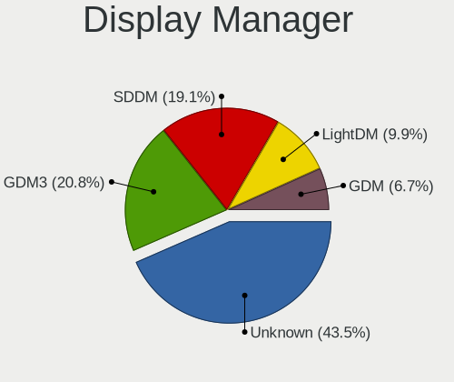

| Name    | Computers | Percent |
|---------|-----------|---------|
| Unknown | 125       | 46.82%  |
| GDM3    | 61        | 22.85%  |
| LightDM | 29        | 10.86%  |
| SDDM    | 26        | 9.74%   |
| GDM     | 25        | 9.36%   |
| XDM     | 1         | 0.37%   |

OS Lang
-------

Language

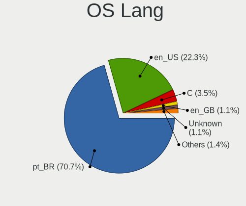

| Lang      | Computers | Percent |
|-----------|-----------|---------|
| pt_BR     | 202       | 75.66%  |
| en_US     | 56        | 20.97%  |
| C         | 3         | 1.12%   |
| pt_PT     | 2         | 0.75%   |
| pt_BRutf8 | 1         | 0.37%   |
| en_GB     | 1         | 0.37%   |
| de_DE     | 1         | 0.37%   |
| Unknown   | 1         | 0.37%   |

Boot Mode
---------

EFI or BIOS

| Mode | Computers | Percent |
|------|-----------|---------|
| BIOS | 135       | 50.56%  |
| EFI  | 132       | 49.44%  |

Filesystem
----------

Type of filesystem

| Type    | Computers | Percent |
|---------|-----------|---------|
| Ext4    | 190       | 71.16%  |
| Btrfs   | 53        | 19.85%  |
| Overlay | 16        | 5.99%   |
| Zfs     | 3         | 1.12%   |
| Xfs     | 2         | 0.75%   |
| Tmpfs   | 1         | 0.37%   |
| F2fs    | 1         | 0.37%   |
| Unknown | 1         | 0.37%   |

Part. scheme
------------

Scheme of partitioning

| Type    | Computers | Percent |
|---------|-----------|---------|
| GPT     | 122       | 45.69%  |
| Unknown | 117       | 43.82%  |
| MBR     | 28        | 10.49%  |

Dual Boot with Linux/BSD
------------------------

Hosting more than one Linux/BSD

| Dual boot | Computers | Percent |
|-----------|-----------|---------|
| No        | 242       | 90.64%  |
| Yes       | 25        | 9.36%   |

Dual Boot (Win)
---------------

Hosting Linux and Windows

| Dual boot | Computers | Percent |
|-----------|-----------|---------|
| No        | 215       | 80.52%  |
| Yes       | 52        | 19.48%  |

Board
-----

Vendor
------

Motherboard manufacturer

| Name                    | Computers | Percent |
|-------------------------|-----------|---------|
| Dell                    | 49        | 18.35%  |
| ASUSTek Computer        | 33        | 12.36%  |
| Acer                    | 25        | 9.36%   |
| Lenovo                  | 22        | 8.24%   |
| Samsung Electronics     | 18        | 6.74%   |
| Gigabyte Technology     | 14        | 5.24%   |
| Positivo                | 12        | 4.49%   |
| Intel                   | 12        | 4.49%   |
| Hewlett-Packard         | 9         | 3.37%   |
| ASRock                  | 6         | 2.25%   |
| PCWare                  | 5         | 1.87%   |
| LG Electronics          | 5         | 1.87%   |
| Avell High Performance  | 5         | 1.87%   |
| Apple                   | 5         | 1.87%   |
| Unknown                 | 5         | 1.87%   |
| Sony                    | 4         | 1.5%    |
| Positivo Bahia - VAIO   | 4         | 1.5%    |
| MSI                     | 4         | 1.5%    |
| Multilaser              | 3         | 1.12%   |
| Valve                   | 2         | 0.75%   |
| PERTOSA                 | 2         | 0.75%   |
| MACHINIST               | 2         | 0.75%   |
| ECS                     | 2         | 0.75%   |
| Chuwi                   | 2         | 0.75%   |
| Biostar                 | 2         | 0.75%   |
| Toshiba                 | 1         | 0.37%   |
| Semp Toshiba            | 1         | 0.37%   |
| Raspberry Pi Foundation | 1         | 0.37%   |
| QIYIDA                  | 1         | 0.37%   |
| Pegatron                | 1         | 0.37%   |
| Notebook                | 1         | 0.37%   |
| Megaware                | 1         | 0.37%   |
| Itautec                 | 1         | 0.37%   |
| HOUTER                  | 1         | 0.37%   |
| Gateway                 | 1         | 0.37%   |
| Digibras                | 1         | 0.37%   |
| Compaq                  | 1         | 0.37%   |
| Braview                 | 1         | 0.37%   |
| Alienware               | 1         | 0.37%   |
| ABIT                    | 1         | 0.37%   |

Model
-----

Motherboard model

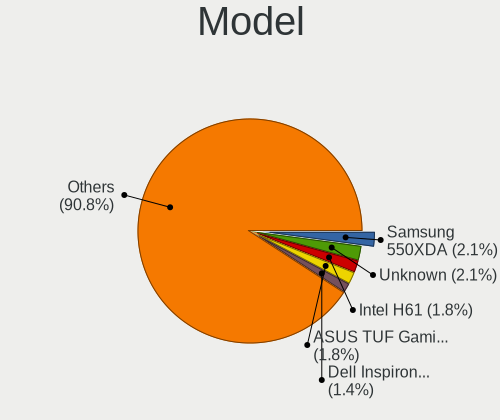

| Name                                   | Computers | Percent |
|----------------------------------------|-----------|---------|
| ASUS VivoBook_ASUSLaptop X515DA_X515DA | 5         | 1.87%   |
| Unknown                                | 5         | 1.87%   |
| Dell Inspiron 5566                     | 4         | 1.5%    |
| ASUS PRIME B450M-GAMING/BR             | 4         | 1.5%    |
| Samsung 730QED                         | 3         | 1.12%   |
| Lenovo IdeaPad 3 15ALC6 82MF           | 3         | 1.12%   |
| Dell Vostro 5490                       | 3         | 1.12%   |
| Dell Inspiron 3583                     | 3         | 1.12%   |
| Valve Jupiter                          | 2         | 0.75%   |
| Samsung 550XBE/350XBE                  | 2         | 0.75%   |
| Samsung 530U3C/530U4C/532U3C           | 2         | 0.75%   |
| Samsung 300E5M/300E5L                  | 2         | 0.75%   |
| Samsung 270E5J/2570EJ                  | 2         | 0.75%   |
| Positivo Mobile                        | 2         | 0.75%   |
| Positivo H14BT58                       | 2         | 0.75%   |
| LG 22V270-L.BJ31P1                     | 2         | 0.75%   |
| Lenovo IdeaPad S145-15API 81V7         | 2         | 0.75%   |
| Lenovo IdeaPad 320-15IKB 80YH          | 2         | 0.75%   |
| Intel X99                              | 2         | 0.75%   |
| Intel H61                              | 2         | 0.75%   |
| Gigabyte AB350M-DS3H V2                | 2         | 0.75%   |
| Dell OptiPlex 380                      | 2         | 0.75%   |
| Dell Inspiron N4050                    | 2         | 0.75%   |
| Dell Inspiron 5458                     | 2         | 0.75%   |
| Dell G5 5590                           | 2         | 0.75%   |
| Chuwi HeroBook Air                     | 2         | 0.75%   |
| Avell High Performance B.ON            | 2         | 0.75%   |
| ASUS VivoBook_ASUSLaptop X515EA_X515EA | 2         | 0.75%   |
| ASUS TUF Gaming B550M-PLUS             | 2         | 0.75%   |
| ASRock A320M-HD                        | 2         | 0.75%   |
| Acer Nitro AN515-54                    | 2         | 0.75%   |
| Acer Aspire A515-45                    | 2         | 0.75%   |
| Acer Aspire A514-54                    | 2         | 0.75%   |
| Acer Aspire A315-23G                   | 2         | 0.75%   |
| Toshiba PORTEGE Z930                   | 1         | 0.37%   |
| Sony VPCEA23FB                         | 1         | 0.37%   |
| Sony VPCCW21FX                         | 1         | 0.37%   |
| Sony SVF15213CBB                       | 1         | 0.37%   |
| Sony SVE14A18ECH                       | 1         | 0.37%   |
| Semp Toshiba IS 1442                   | 1         | 0.37%   |

Model Family
------------

Motherboard model prefix

| Name                        | Computers | Percent |
|-----------------------------|-----------|---------|
| Dell Inspiron               | 22        | 8.24%   |
| Acer Aspire                 | 15        | 5.62%   |
| Lenovo IdeaPad              | 12        | 4.49%   |
| ASUS VivoBook               | 11        | 4.12%   |
| Dell Vostro                 | 8         | 3%      |
| ASUS PRIME                  | 7         | 2.62%   |
| Dell OptiPlex               | 6         | 2.25%   |
| Dell Latitude               | 6         | 2.25%   |
| Lenovo ThinkPad             | 5         | 1.87%   |
| ASUS TUF                    | 5         | 1.87%   |
| Acer Nitro                  | 5         | 1.87%   |
| Unknown                     | 5         | 1.87%   |
| Samsung 730QED              | 3         | 1.12%   |
| Intel X99                   | 3         | 1.12%   |
| HP Pavilion                 | 3         | 1.12%   |
| Acer Predator               | 3         | 1.12%   |
| Valve Jupiter               | 2         | 0.75%   |
| Samsung 550XBE              | 2         | 0.75%   |
| Samsung 530U3C              | 2         | 0.75%   |
| Samsung 300E5M              | 2         | 0.75%   |
| Samsung 270E5J              | 2         | 0.75%   |
| Positivo Mobile             | 2         | 0.75%   |
| Positivo H14BT58            | 2         | 0.75%   |
| LG 22V270-L.BJ31P1          | 2         | 0.75%   |
| Intel H61                   | 2         | 0.75%   |
| HP ProBook                  | 2         | 0.75%   |
| Gigabyte AB350M-DS3H        | 2         | 0.75%   |
| Dell G5                     | 2         | 0.75%   |
| Chuwi HeroBook              | 2         | 0.75%   |
| Avell High Performance B.ON | 2         | 0.75%   |
| ASRock A320M-HD             | 2         | 0.75%   |
| Apple MacBookPro8           | 2         | 0.75%   |
| Toshiba PORTEGE             | 1         | 0.37%   |
| Sony VPCEA23FB              | 1         | 0.37%   |
| Sony VPCCW21FX              | 1         | 0.37%   |
| Sony SVF15213CBB            | 1         | 0.37%   |
| Sony SVE14A18ECH            | 1         | 0.37%   |
| Semp Toshiba IS             | 1         | 0.37%   |
| Samsung RV415               | 1         | 0.37%   |
| Samsung RF511               | 1         | 0.37%   |

MFG Year
--------

Motherboard manufacture year

| Year    | Computers | Percent |
|---------|-----------|---------|
| 2020    | 34        | 12.73%  |
| 2019    | 34        | 12.73%  |
| 2021    | 32        | 11.99%  |
| 2018    | 24        | 8.99%   |
| 2011    | 24        | 8.99%   |
| 2012    | 19        | 7.12%   |
| 2017    | 16        | 5.99%   |
| 2016    | 15        | 5.62%   |
| 2010    | 13        | 4.87%   |
| 2022    | 11        | 4.12%   |
| 2013    | 11        | 4.12%   |
| 2014    | 10        | 3.75%   |
| 2015    | 7         | 2.62%   |
| 2008    | 7         | 2.62%   |
| 2009    | 5         | 1.87%   |
| Unknown | 3         | 1.12%   |
| 2007    | 2         | 0.75%   |

Form Factor
-----------

Physical design of the computer

| Name           | Computers | Percent |
|----------------|-----------|---------|
| Notebook       | 162       | 60.67%  |
| Desktop        | 88        | 32.96%  |
| All in one     | 7         | 2.62%   |
| Convertible    | 4         | 1.5%    |
| System on chip | 2         | 0.75%   |
| Phone          | 1         | 0.37%   |
| Tablet         | 1         | 0.37%   |
| Mini pc        | 1         | 0.37%   |
| Server         | 1         | 0.37%   |

Secure Boot
-----------

Enabled or disabled

| State    | Computers | Percent |
|----------|-----------|---------|
| Disabled | 237       | 88.76%  |
| Enabled  | 30        | 11.24%  |

Coreboot
--------

Have coreboot on board

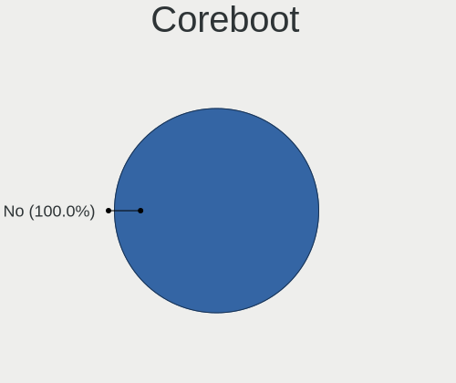

| Used | Computers | Percent |
|------|-----------|---------|
| No   | 267       | 100%    |

RAM Size
--------

Total RAM memory

| Size in GB  | Computers | Percent |
|-------------|-----------|---------|
| 4.01-8.0    | 91        | 34.08%  |
| 3.01-4.0    | 58        | 21.72%  |
| 16.01-24.0  | 54        | 20.22%  |
| 8.01-16.0   | 31        | 11.61%  |
| 32.01-64.0  | 21        | 7.87%   |
| 24.01-32.0  | 4         | 1.5%    |
| 1.01-2.0    | 4         | 1.5%    |
| 64.01-256.0 | 2         | 0.75%   |
| 2.01-3.0    | 1         | 0.37%   |
| 0.51-1.0    | 1         | 0.37%   |

RAM Used
--------

Used RAM memory

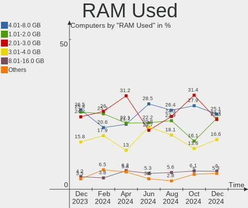

| Used GB    | Computers | Percent |
|------------|-----------|---------|
| 2.01-3.0   | 75        | 28.09%  |
| 1.01-2.0   | 72        | 26.97%  |
| 3.01-4.0   | 51        | 19.1%   |
| 4.01-8.0   | 46        | 17.23%  |
| 8.01-16.0  | 14        | 5.24%   |
| 0.51-1.0   | 5         | 1.87%   |
| 0.01-0.5   | 2         | 0.75%   |
| 32.01-64.0 | 1         | 0.37%   |
| 16.01-24.0 | 1         | 0.37%   |

Total Drives
------------

Number of drives on board

| Drives | Computers | Percent |
|--------|-----------|---------|
| 1      | 172       | 64.42%  |
| 2      | 67        | 25.09%  |
| 3      | 14        | 5.24%   |
| 4      | 8         | 3%      |
| 5      | 3         | 1.12%   |
| 0      | 2         | 0.75%   |
| 8      | 1         | 0.37%   |

Has CD-ROM
----------

Has CD-ROM on board

| Presented | Computers | Percent |
|-----------|-----------|---------|
| No        | 211       | 79.03%  |
| Yes       | 56        | 20.97%  |

Has Ethernet
------------

Has Ethernet on board

| Presented | Computers | Percent |
|-----------|-----------|---------|
| Yes       | 224       | 83.9%   |
| No        | 43        | 16.1%   |

Has WiFi
--------

Has WiFi module

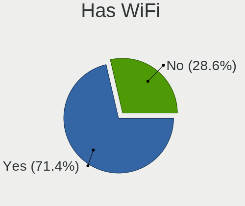

| Presented | Computers | Percent |
|-----------|-----------|---------|
| Yes       | 200       | 74.91%  |
| No        | 67        | 25.09%  |

Has Bluetooth
-------------

Has Bluetooth module

| Presented | Computers | Percent |
|-----------|-----------|---------|
| Yes       | 170       | 63.67%  |
| No        | 97        | 36.33%  |

Location
--------

Country
-------

Geographic location (country)

| Country | Computers | Percent |
|---------|-----------|---------|
| Brazil  | 267       | 100%    |

City
----

Geographic location (city)

| City                  | Computers | Percent |
|-----------------------|-----------|---------|
| Sao Paulo             | 25        | 9.36%   |
| Rio de Janeiro        | 13        | 4.87%   |
| Porto Alegre          | 10        | 3.75%   |
| Belo Horizonte        | 7         | 2.62%   |
| Sao Luís             | 6         | 2.25%   |
| Salvador              | 6         | 2.25%   |
| Fortaleza             | 6         | 2.25%   |
| Curitiba              | 6         | 2.25%   |
| Sao José dos Campos  | 5         | 1.87%   |
| Uberlândia           | 4         | 1.5%    |
| Sorocaba              | 4         | 1.5%    |
| Recife                | 4         | 1.5%    |
| Palmas                | 4         | 1.5%    |
| Sao Jose do Rio Preto | 3         | 1.12%   |
| Sao Bernardo do Campo | 3         | 1.12%   |
| Santo André          | 3         | 1.12%   |
| Manaus                | 3         | 1.12%   |
| Londrina              | 3         | 1.12%   |
| Contagem              | 3         | 1.12%   |
| Brasília             | 3         | 1.12%   |
| Vila Velha            | 2         | 0.75%   |
| Viamao                | 2         | 0.75%   |
| Valparaiso de Goias   | 2         | 0.75%   |
| Sumaré               | 2         | 0.75%   |
| Sao Jose              | 2         | 0.75%   |
| Santos                | 2         | 0.75%   |
| Presidente Prudente   | 2         | 0.75%   |
| Ponta Grossa          | 2         | 0.75%   |
| Pelotas               | 2         | 0.75%   |
| Maceió               | 2         | 0.75%   |
| Lorena                | 2         | 0.75%   |
| Limeira               | 2         | 0.75%   |
| Jundiaí              | 2         | 0.75%   |
| Itajuba               | 2         | 0.75%   |
| Guarulhos             | 2         | 0.75%   |
| Guaratingueta         | 2         | 0.75%   |
| Goncalves             | 2         | 0.75%   |
| Goiânia              | 2         | 0.75%   |
| Florianópolis        | 2         | 0.75%   |
| Cuiabá               | 2         | 0.75%   |

Drives
------

Drive Vendor
------------

Hard drive vendors

| Vendor                         | Computers | Drives | Percent |
|--------------------------------|-----------|--------|---------|
| WDC                            | 53        | 58     | 14.13%  |
| Seagate                        | 52        | 62     | 13.87%  |
| Kingston                       | 50        | 55     | 13.33%  |
| Samsung Electronics            | 37        | 39     | 9.87%   |
| A-DATA Technology              | 24        | 24     | 6.4%    |
| Toshiba                        | 20        | 20     | 5.33%   |
| Sandisk                        | 17        | 17     | 4.53%   |
| China                          | 14        | 14     | 3.73%   |
| Crucial                        | 11        | 12     | 2.93%   |
| ADATA Technology               | 10        | 11     | 2.67%   |
| Unknown                        | 9         | 9      | 2.4%    |
| SK hynix                       | 6         | 6      | 1.6%    |
| Hitachi                        | 6         | 7      | 1.6%    |
| Realtek Semiconductor          | 5         | 5      | 1.33%   |
| Intel                          | 5         | 5      | 1.33%   |
| Kingston Technology Company    | 4         | 4      | 1.07%   |
| KingSpec                       | 4         | 4      | 1.07%   |
| Silicon Motion                 | 3         | 3      | 0.8%    |
| Phison Electronics             | 3         | 3      | 0.8%    |
| HGST                           | 3         | 3      | 0.8%    |
| Solid State Storage            | 2         | 2      | 0.53%   |
| Netac                          | 2         | 2      | 0.53%   |
| Micron Technology              | 2         | 2      | 0.53%   |
| LITEON                         | 2         | 2      | 0.53%   |
| Lexar                          | 2         | 2      | 0.53%   |
| KingFast                       | 2         | 2      | 0.53%   |
| Unknown                        | 2         | 2      | 0.53%   |
| YS                             | 1         | 1      | 0.27%   |
| XrayDisk                       | 1         | 1      | 0.27%   |
| XPG                            | 1         | 1      | 0.27%   |
| WDC WDS2                       | 1         | 1      | 0.27%   |
| WALRAM                         | 1         | 1      | 0.27%   |
| Team                           | 1         | 1      | 0.27%   |
| T-FORCE                        | 1         | 1      | 0.27%   |
| STAR                           | 1         | 1      | 0.27%   |
| Solid State Storage Technology | 1         | 1      | 0.27%   |
| RZX                            | 1         | 1      | 0.27%   |
| PNY                            | 1         | 1      | 0.27%   |
| OSCOO                          | 1         | 1      | 0.27%   |
| NTC                            | 1         | 1      | 0.27%   |

Drive Model
-----------

Hard drive models

| Model                                                  | Computers | Percent |
|--------------------------------------------------------|-----------|---------|
| Kingston SA400S37240G 240GB SSD                        | 22        | 5.64%   |
| Kingston SA400S37480G 480GB SSD                        | 13        | 3.33%   |
| Kingston SA400S37120G 120GB SSD                        | 6         | 1.54%   |
| WDC WD10SPZX-21Z10T0 1TB                               | 5         | 1.28%   |
| Toshiba MQ01ABF050 500GB                               | 5         | 1.28%   |
| Toshiba MQ01ABD100 1TB                                 | 5         | 1.28%   |
| Seagate ST500LM012 HN-M500MBB 500GB                    | 5         | 1.28%   |
| Seagate ST1000DM010-2EP102 1TB                         | 5         | 1.28%   |
| Samsung NVMe SSD Controller SM981/PM981/PM983 500GB    | 5         | 1.28%   |
| Crucial CT240BX500SSD1 240GB                           | 5         | 1.28%   |
| ADATA SM2P32A8-256GC1 256GB                            | 5         | 1.28%   |
| Realtek RTS5763DL NVMe SSD Controller 512GB            | 4         | 1.03%   |
| China SATA SSD 120GB                                   | 4         | 1.03%   |
| Silicon Motion SM2263EN/SM2263XT SSD Controller 1024GB | 3         | 0.77%   |
| Seagate ST9500325AS 500GB                              | 3         | 0.77%   |
| Seagate ST500LT012-9WS142 500GB                        | 3         | 0.77%   |
| Seagate ST500DM002-1BD142 500GB                        | 3         | 0.77%   |
| Seagate ST1000LM035-1RK172 1TB                         | 3         | 0.77%   |
| Seagate ST1000LM024 HN-M101MBB 1TB                     | 3         | 0.77%   |
| Samsung MZALQ256HAJD-000L2 256GB                       | 3         | 0.77%   |
| Samsung HD502HJ 500GB                                  | 3         | 0.77%   |
| Kingston SNVS500G 500GB                                | 3         | 0.77%   |
| HGST HTS545050A7E380 500GB                             | 3         | 0.77%   |
| Crucial CT480BX500SSD1 480GB                           | 3         | 0.77%   |
| ADATA NVMe IM2P33F4 256GB                              | 3         | 0.77%   |
| A-DATA IM2P33F8ABR2-256GB                              | 3         | 0.77%   |
| A-DATA IM2P33F3 NVMe 256GB                             | 3         | 0.77%   |
| WDC WDS240G2G0A-00JH30 240GB SSD                       | 2         | 0.51%   |
| WDC WDS100T2B0A-00SM50 1TB SSD                         | 2         | 0.51%   |
| WDC WD5000LPCX-35VHAT0 500GB                           | 2         | 0.51%   |
| WDC WD10JPVX-75JC3T0 1TB                               | 2         | 0.51%   |
| WDC WD10JPVX-35JC3T0 1TB                               | 2         | 0.51%   |
| Unknown NVMe SSD Drive 512GB                           | 2         | 0.51%   |
| Unknown MMC Card  32GB                                 | 2         | 0.51%   |
| Toshiba MQ04ABF100 1TB                                 | 2         | 0.51%   |
| Solid State Storage SSSTC CL1-4D256 256GB              | 2         | 0.51%   |
| Seagate ST2000LM007-1R8174 2TB                         | 2         | 0.51%   |
| Seagate ST2000DM008-2FR102 2TB                         | 2         | 0.51%   |
| Seagate ST1000VM002-1CT162 1TB                         | 2         | 0.51%   |
| Seagate ST1000DM003-1ER162 1TB                         | 2         | 0.51%   |

HDD Vendor
----------

Hard disk drive vendors

| Vendor              | Computers | Drives | Percent |
|---------------------|-----------|--------|---------|
| Seagate             | 51        | 61     | 36.43%  |
| WDC                 | 43        | 47     | 30.71%  |
| Toshiba             | 19        | 19     | 13.57%  |
| Samsung Electronics | 16        | 17     | 11.43%  |
| Hitachi             | 6         | 7      | 4.29%   |
| HGST                | 3         | 3      | 2.14%   |
| Maxtor              | 1         | 1      | 0.71%   |
| Fujitsu             | 1         | 1      | 0.71%   |

SSD Vendor
----------

Solid state drive vendors

| Vendor              | Computers | Drives | Percent |
|---------------------|-----------|--------|---------|
| Kingston            | 44        | 48     | 36.07%  |
| China               | 14        | 14     | 11.48%  |
| Crucial             | 10        | 11     | 8.2%    |
| SanDisk             | 9         | 9      | 7.38%   |
| WDC                 | 7         | 8      | 5.74%   |
| Samsung Electronics | 5         | 5      | 4.1%    |
| A-DATA Technology   | 5         | 5      | 4.1%    |
| KingSpec            | 4         | 4      | 3.28%   |
| Netac               | 2         | 2      | 1.64%   |
| LITEON              | 2         | 2      | 1.64%   |
| Lexar               | 2         | 2      | 1.64%   |
| YS                  | 1         | 1      | 0.82%   |
| WDC WDS2            | 1         | 1      | 0.82%   |
| Toshiba             | 1         | 1      | 0.82%   |
| Team                | 1         | 1      | 0.82%   |
| T-FORCE             | 1         | 1      | 0.82%   |
| STAR                | 1         | 1      | 0.82%   |
| SK hynix            | 1         | 1      | 0.82%   |
| Seagate             | 1         | 1      | 0.82%   |
| RZX                 | 1         | 1      | 0.82%   |
| PNY                 | 1         | 1      | 0.82%   |
| OSCOO               | 1         | 1      | 0.82%   |
| NTC                 | 1         | 1      | 0.82%   |
| KingFast            | 1         | 1      | 0.82%   |
| KingDian            | 1         | 1      | 0.82%   |
| HS-SSD-C100         | 1         | 1      | 0.82%   |
| Corsair             | 1         | 2      | 0.82%   |
| Argon               | 1         | 1      | 0.82%   |
| Unknown             | 1         | 1      | 0.82%   |

Drive Kind
----------

HDD or SSD

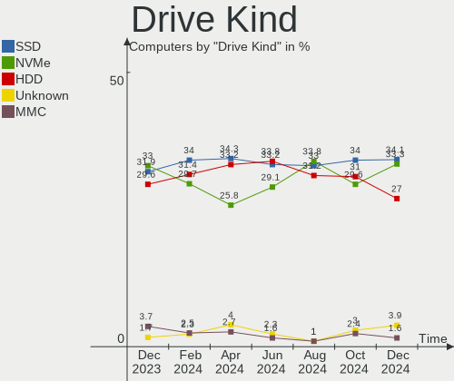

| Kind    | Computers | Drives | Percent |
|---------|-----------|--------|---------|
| HDD     | 124       | 156    | 36.26%  |
| SSD     | 108       | 129    | 31.58%  |
| NVMe    | 97        | 103    | 28.36%  |
| MMC     | 7         | 7      | 2.05%   |
| Unknown | 6         | 6      | 1.75%   |

Drive Connector
---------------

SATA, SAS, NVMe, etc.

| Type | Computers | Drives | Percent |
|------|-----------|--------|---------|
| SATA | 195       | 284    | 63.73%  |
| NVMe | 97        | 103    | 31.7%   |
| SAS  | 7         | 7      | 2.29%   |
| MMC  | 7         | 7      | 2.29%   |

Drive Size
----------

Size of hard drive

| Size in TB | Computers | Drives | Percent |
|------------|-----------|--------|---------|
| 0.01-0.5   | 153       | 190    | 66.23%  |
| 0.51-1.0   | 59        | 70     | 25.54%  |
| 1.01-2.0   | 12        | 13     | 5.19%   |
| 3.01-4.0   | 5         | 9      | 2.16%   |
| 2.01-3.0   | 1         | 1      | 0.43%   |
| 4.01-10.0  | 1         | 2      | 0.43%   |

Space Total
-----------

Amount of disk space available on the file system

| Size in GB     | Computers | Percent |
|----------------|-----------|---------|
| 251-500        | 78        | 29.21%  |
| 101-250        | 76        | 28.46%  |
| 501-1000       | 43        | 16.1%   |
| 1001-2000      | 20        | 7.49%   |
| 1-20           | 17        | 6.37%   |
| More than 3000 | 10        | 3.75%   |
| 2001-3000      | 6         | 2.25%   |
| 51-100         | 6         | 2.25%   |
| Unknown        | 6         | 2.25%   |
| 21-50          | 5         | 1.87%   |

Space Used
----------

Amount of used disk space

| Used GB        | Computers | Percent |
|----------------|-----------|---------|
| 1-20           | 81        | 30.34%  |
| 21-50          | 50        | 18.73%  |
| 101-250        | 48        | 17.98%  |
| 51-100         | 35        | 13.11%  |
| 251-500        | 21        | 7.87%   |
| 501-1000       | 14        | 5.24%   |
| 1001-2000      | 9         | 3.37%   |
| Unknown        | 6         | 2.25%   |
| More than 3000 | 3         | 1.12%   |

Malfunc. Drives
---------------

Drive models with a malfunction

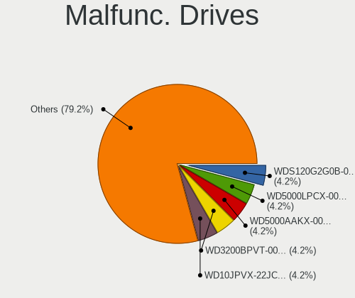

| Model                                 | Computers | Drives | Percent |
|---------------------------------------|-----------|--------|---------|
| Seagate ST9500325AS 500GB             | 2         | 2      | 6.45%   |
| Seagate ST2000LM007-1R8174 2TB        | 2         | 2      | 6.45%   |
| Kingston SA400S37480G 480GB SSD       | 2         | 2      | 6.45%   |
| XPG GAMMIX S41 512GB                  | 1         | 1      | 3.23%   |
| WDC WDS240G2G0A-00JH30 240GB SSD      | 1         | 1      | 3.23%   |
| WDC WD800JD-75MSA3 80GB               | 1         | 1      | 3.23%   |
| WDC WD5000AVVS-63H0B1 500GB           | 1         | 1      | 3.23%   |
| WDC WD5000AAKX-60U6AA0 500GB          | 1         | 1      | 3.23%   |
| WDC WD5000AAKX-603CA0 500GB           | 1         | 1      | 3.23%   |
| WDC WD3200AAKS-00UU3A0 320GB          | 1         | 1      | 3.23%   |
| WDC WD10EARS-00MVWB0 1TB              | 1         | 1      | 3.23%   |
| Seagate ST9160314AS 160GB             | 1         | 1      | 3.23%   |
| Seagate ST8000DM004-2CX188 8TB        | 1         | 1      | 3.23%   |
| Seagate ST4000NM0053 4TB              | 1         | 2      | 3.23%   |
| Seagate ST31000524AS 1TB              | 1         | 1      | 3.23%   |
| Seagate ST1000VM002-1CT162 1TB        | 1         | 1      | 3.23%   |
| Seagate ST1000LM035-1RK172 1TB        | 1         | 1      | 3.23%   |
| Seagate ST1000DM003-1ER162 1TB        | 1         | 1      | 3.23%   |
| Samsung Electronics SSD 960 EVO 500GB | 1         | 1      | 3.23%   |
| Samsung Electronics HD322HJ 320GB     | 1         | 1      | 3.23%   |
| Samsung Electronics HD322GJ 320GB     | 1         | 1      | 3.23%   |
| Samsung Electronics HD250HJ 250GB     | 1         | 1      | 3.23%   |
| Samsung Electronics HD154UI 1TB       | 1         | 1      | 3.23%   |
| Maxtor STM3250310AS 250GB             | 1         | 1      | 3.23%   |
| KingSpec ACSC2M256mSA 256GB SSD       | 1         | 1      | 3.23%   |
| HGST HTS545050A7E380 500GB            | 1         | 1      | 3.23%   |
| A-DATA Technology IM2P33F3 NVMe 512GB | 1         | 1      | 3.23%   |
| Unknown                               | 1         | 1      | 3.23%   |

Malfunc. Drive Vendor
---------------------

Vendors of faulty drives

| Vendor              | Computers | Drives | Percent |
|---------------------|-----------|--------|---------|
| Seagate             | 10        | 12     | 33.33%  |
| WDC                 | 7         | 7      | 23.33%  |
| Samsung Electronics | 5         | 5      | 16.67%  |
| Kingston            | 2         | 2      | 6.67%   |
| XPG                 | 1         | 1      | 3.33%   |
| Maxtor              | 1         | 1      | 3.33%   |
| KingSpec            | 1         | 1      | 3.33%   |
| HGST                | 1         | 1      | 3.33%   |
| A-DATA Technology   | 1         | 1      | 3.33%   |
| Unknown             | 1         | 1      | 3.33%   |

Malfunc. HDD Vendor
-------------------

Vendors of faulty HDD drives

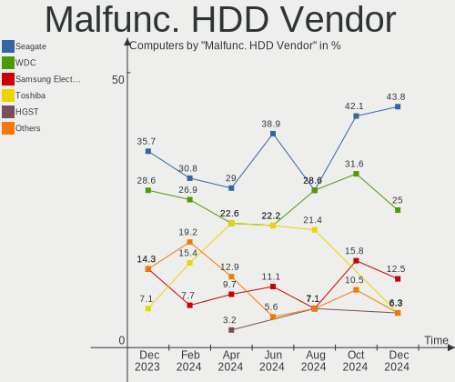

| Vendor              | Computers | Drives | Percent |
|---------------------|-----------|--------|---------|
| Seagate             | 10        | 12     | 45.45%  |
| WDC                 | 6         | 6      | 27.27%  |
| Samsung Electronics | 4         | 4      | 18.18%  |
| Maxtor              | 1         | 1      | 4.55%   |
| HGST                | 1         | 1      | 4.55%   |

Malfunc. Drive Kind
-------------------

Kinds of faulty drives

| Kind | Computers | Drives | Percent |
|------|-----------|--------|---------|
| HDD  | 19        | 24     | 70.37%  |
| SSD  | 5         | 5      | 18.52%  |
| NVMe | 3         | 3      | 11.11%  |

Failed Drives
-------------

Failed drive models

Zero info for selected period =(

Failed Drive Vendor
-------------------

Failed drive vendors

Zero info for selected period =(

Drive Status
------------

Number of failed and malfunc. drives

| Status   | Computers | Drives | Percent |
|----------|-----------|--------|---------|
| Detected | 170       | 250    | 60.71%  |
| Works    | 86        | 119    | 30.71%  |
| Malfunc  | 24        | 32     | 8.57%   |

Storage controller
------------------

Storage Vendor
--------------

Storage controller vendors

| Vendor                         | Computers | Percent |
|--------------------------------|-----------|---------|
| Intel                          | 196       | 56%     |
| AMD                            | 46        | 13.14%  |
| ADATA Technology               | 29        | 8.29%   |
| Samsung Electronics            | 18        | 5.14%   |
| SanDisk                        | 11        | 3.14%   |
| Kingston Technology Company    | 10        | 2.86%   |
| Realtek Semiconductor          | 6         | 1.71%   |
| Solid State Storage Technology | 5         | 1.43%   |
| Nvidia                         | 5         | 1.43%   |
| SK hynix                       | 4         | 1.14%   |
| Phison Electronics             | 4         | 1.14%   |
| ASMedia Technology             | 4         | 1.14%   |
| Silicon Motion                 | 3         | 0.86%   |
| Micron/Crucial Technology      | 2         | 0.57%   |
| Micron Technology              | 2         | 0.57%   |
| VIA Technologies               | 1         | 0.29%   |
| MAXIO Technology (Hangzhou)    | 1         | 0.29%   |
| Marvell Technology Group       | 1         | 0.29%   |
| KIOXIA                         | 1         | 0.29%   |
| Beijing Starblaze Technology   | 1         | 0.29%   |

Storage Model
-------------

Storage controller models

| Model                                                                          | Computers | Percent |
|--------------------------------------------------------------------------------|-----------|---------|
| AMD FCH SATA Controller [AHCI mode]                                            | 31        | 7.71%   |
| Intel Sunrise Point-LP SATA Controller [AHCI mode]                             | 18        | 4.48%   |
| Intel 7 Series Chipset Family 6-port SATA Controller [AHCI mode]               | 16        | 3.98%   |
| Intel Tiger Lake-LP SATA Controller                                            | 14        | 3.48%   |
| Intel 82801 Mobile SATA Controller [RAID mode]                                 | 14        | 3.48%   |
| Intel Volume Management Device NVMe RAID Controller                            | 13        | 3.23%   |
| Intel 6 Series/C200 Series Chipset Family 6 port Mobile SATA AHCI Controller   | 13        | 3.23%   |
| ADATA IM2P33F8ABR1 NVMe SSD                                                    | 11        | 2.74%   |
| Samsung NVMe SSD Controller 980                                                | 9         | 2.24%   |
| ADATA A Non-Volatile memory controller                                         | 9         | 2.24%   |
| Intel Cannon Point-LP SATA Controller [AHCI Mode]                              | 8         | 1.99%   |
| Intel 6 Series/C200 Series Chipset Family 6 port Desktop SATA AHCI Controller  | 8         | 1.99%   |
| ADATA Non-Volatile memory controller                                           | 8         | 1.99%   |
| SanDisk Non-Volatile memory controller                                         | 7         | 1.74%   |
| Intel NM10/ICH7 Family SATA Controller [IDE mode]                              | 7         | 1.74%   |
| Intel Celeron/Pentium Silver Processor SATA Controller                         | 7         | 1.74%   |
| Intel 8 Series/C220 Series Chipset Family 6-port SATA Controller 1 [AHCI mode] | 7         | 1.74%   |
| AMD 400 Series Chipset SATA Controller                                         | 7         | 1.74%   |
| Samsung NVMe SSD Controller SM981/PM981/PM983                                  | 6         | 1.49%   |
| Kingston Company Company Non-Volatile memory controller                        | 6         | 1.49%   |
| AMD SB7x0/SB8x0/SB9x0 IDE Controller                                           | 6         | 1.49%   |
| Solid State Storage Non-Volatile memory controller                             | 5         | 1.24%   |
| Realtek RTS5763DL NVMe SSD Controller                                          | 5         | 1.24%   |
| Intel Comet Lake SATA AHCI Controller                                          | 5         | 1.24%   |
| Intel Cannon Lake Mobile PCH SATA AHCI Controller                              | 5         | 1.24%   |
| Intel Atom Processor E3800 Series SATA AHCI Controller                         | 5         | 1.24%   |
| Intel 7 Series/C210 Series Chipset Family 6-port SATA Controller [AHCI mode]   | 5         | 1.24%   |
| Intel 400 Series Chipset Family SATA AHCI Controller                           | 5         | 1.24%   |
| AMD FCH SATA Controller D                                                      | 5         | 1.24%   |
| Intel Wildcat Point-LP SATA Controller [AHCI Mode]                             | 4         | 1%      |
| Intel Ice Lake-LP SATA Controller [AHCI mode]                                  | 4         | 1%      |
| Intel 82801IBM/IEM (ICH9M/ICH9M-E) 4 port SATA Controller [AHCI mode]          | 4         | 1%      |
| Intel 82801G (ICH7 Family) IDE Controller                                      | 4         | 1%      |
| Intel 500 Series Chipset Family SATA AHCI Controller                           | 4         | 1%      |
| Intel 200 Series PCH SATA controller [AHCI mode]                               | 4         | 1%      |
| AMD SB7x0/SB8x0/SB9x0 SATA Controller [AHCI mode]                              | 4         | 1%      |
| AMD 500 Series Chipset SATA Controller                                         | 4         | 1%      |
| Silicon Motion SM2263EN/SM2263XT SSD Controller                                | 3         | 0.75%   |
| SanDisk WD Blue SN550 NVMe SSD                                                 | 3         | 0.75%   |
| Phison PS5013 E13 NVMe Controller                                              | 3         | 0.75%   |

Storage Kind
------------

Kind of storage controller (IDE, SATA, NVMe, SAS, ...)

| Kind | Computers | Percent |
|------|-----------|---------|
| SATA | 208       | 57.14%  |
| NVMe | 97        | 26.65%  |
| RAID | 31        | 8.52%   |
| IDE  | 28        | 7.69%   |

Processor
---------

CPU Vendor
----------

Processor vendors

| Vendor   | Computers | Percent |
|----------|-----------|---------|
| Intel    | 210       | 78.65%  |
| AMD      | 54        | 20.22%  |
| ARM      | 2         | 0.75%   |
| Qualcomm | 1         | 0.37%   |

CPU Model
---------

Processor models

| Model                                         | Computers | Percent |
|-----------------------------------------------|-----------|---------|
| Intel 11th Gen Core i7-1165G7 @ 2.80GHz       | 9         | 3.37%   |
| Intel Core i5-7200U CPU @ 2.50GHz             | 8         | 3%      |
| Intel Core i7-9750H CPU @ 2.60GHz             | 7         | 2.62%   |
| AMD Ryzen 5 3500U with Radeon Vega Mobile Gfx | 7         | 2.62%   |
| Intel Core i7-8565U CPU @ 1.80GHz             | 5         | 1.87%   |
| Intel Core i7-10510U CPU @ 1.80GHz            | 5         | 1.87%   |
| Intel Core i5-1035G1 CPU @ 1.00GHz            | 5         | 1.87%   |
| Intel Celeron N4020 CPU @ 1.10GHz             | 5         | 1.87%   |
| Intel Xeon CPU E5-2620 v3 @ 2.40GHz           | 4         | 1.5%    |
| Intel Core i5-8265U CPU @ 1.60GHz             | 4         | 1.5%    |
| Intel 11th Gen Core i5-1135G7 @ 2.40GHz       | 4         | 1.5%    |
| Intel 11th Gen Core i3-1115G4 @ 3.00GHz       | 4         | 1.5%    |
| Intel Core i5-8250U CPU @ 1.60GHz             | 3         | 1.12%   |
| Intel Core i5-3570 CPU @ 3.40GHz              | 3         | 1.12%   |
| Intel Core i5-3337U CPU @ 1.80GHz             | 3         | 1.12%   |
| Intel Core i5-10400 CPU @ 2.90GHz             | 3         | 1.12%   |
| Intel Core i3-2100 CPU @ 3.10GHz              | 3         | 1.12%   |
| Intel 12th Gen Core i5-1235U                  | 3         | 1.12%   |
| Intel 11th Gen Core i7-11800H @ 2.30GHz       | 3         | 1.12%   |
| AMD Ryzen 7 5700U with Radeon Graphics        | 3         | 1.12%   |
| AMD Ryzen 5 3400G with Radeon Vega Graphics   | 3         | 1.12%   |
| Intel Pentium CPU G630 @ 2.70GHz              | 2         | 0.75%   |
| Intel Core i7-7500U CPU @ 2.70GHz             | 2         | 0.75%   |
| Intel Core i7-10750H CPU @ 2.60GHz            | 2         | 0.75%   |
| Intel Core i5-6200U CPU @ 2.30GHz             | 2         | 0.75%   |
| Intel Core i5-5200U CPU @ 2.20GHz             | 2         | 0.75%   |
| Intel Core i5-4210U CPU @ 1.70GHz             | 2         | 0.75%   |
| Intel Core i5-3320M CPU @ 2.60GHz             | 2         | 0.75%   |
| Intel Core i5-2430M CPU @ 2.40GHz             | 2         | 0.75%   |
| Intel Core i5-2410M CPU @ 2.30GHz             | 2         | 0.75%   |
| Intel Core i5 CPU 650 @ 3.20GHz               | 2         | 0.75%   |
| Intel Core i3-7020U CPU @ 2.30GHz             | 2         | 0.75%   |
| Intel Core i3-6006U CPU @ 2.00GHz             | 2         | 0.75%   |
| Intel Core i3-5005U CPU @ 2.00GHz             | 2         | 0.75%   |
| Intel Core i3-3217U CPU @ 1.80GHz             | 2         | 0.75%   |
| Intel Core i3-2310M CPU @ 2.10GHz             | 2         | 0.75%   |
| Intel Core i3-2120 CPU @ 3.30GHz              | 2         | 0.75%   |
| Intel Core i3 CPU M 380 @ 2.53GHz             | 2         | 0.75%   |
| Intel Core i3 CPU M 330 @ 2.13GHz             | 2         | 0.75%   |
| Intel Core 2 Quad CPU Q8400 @ 2.66GHz         | 2         | 0.75%   |

CPU Model Family
----------------

Processor model prefix

| Model                   | Computers | Percent |
|-------------------------|-----------|---------|
| Intel Core i5           | 61        | 22.85%  |
| Intel Core i7           | 36        | 13.48%  |
| Other                   | 33        | 12.36%  |
| Intel Core i3           | 33        | 12.36%  |
| AMD Ryzen 5             | 22        | 8.24%   |
| Intel Celeron           | 21        | 7.87%   |
| AMD Ryzen 7             | 11        | 4.12%   |
| Intel Xeon              | 9         | 3.37%   |
| Intel Core 2 Duo        | 6         | 2.25%   |
| AMD FX                  | 6         | 2.25%   |
| Intel Atom              | 4         | 1.5%    |
| Intel Pentium Dual-Core | 3         | 1.12%   |
| Intel Pentium           | 3         | 1.12%   |
| Intel Core 2 Quad       | 3         | 1.12%   |
| AMD Ryzen 9             | 3         | 1.12%   |
| Intel Pentium Gold      | 2         | 0.75%   |
| AMD Ryzen 3             | 2         | 0.75%   |
| AMD Athlon II X2        | 2         | 0.75%   |
| AMD A4                  | 2         | 0.75%   |
| ARM BCM                 | 1         | 0.37%   |
| AMD E                   | 1         | 0.37%   |
| AMD Athlon II X3        | 1         | 0.37%   |
| AMD Athlon 64 X2        | 1         | 0.37%   |
| AMD A6                  | 1         | 0.37%   |

CPU Cores
---------

Number of processor cores

| Number | Computers | Percent |
|--------|-----------|---------|
| 2      | 109       | 40.82%  |
| 4      | 97        | 36.33%  |
| 6      | 32        | 11.99%  |
| 8      | 12        | 4.49%   |
| 12     | 5         | 1.87%   |
| 10     | 5         | 1.87%   |
| 3      | 3         | 1.12%   |
| 1      | 3         | 1.12%   |
| 14     | 1         | 0.37%   |

CPU Sockets
-----------

Number of sockets

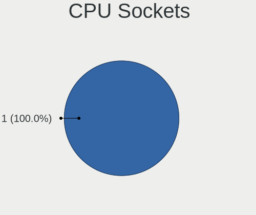

| Number | Computers | Percent |
|--------|-----------|---------|
| 1      | 267       | 100%    |

CPU Threads
-----------

Threads per core (Hyper-Threading)

| Number | Computers | Percent |
|--------|-----------|---------|
| 2      | 201       | 75.28%  |
| 1      | 66        | 24.72%  |

CPU Op-Modes
------------

CPU Operation Modes (32-bit, 64-bit)

| Op mode        | Computers | Percent |
|----------------|-----------|---------|
| 32-bit, 64-bit | 266       | 99.63%  |
| Unknown        | 1         | 0.37%   |

CPU Microcode
-------------

Microcode number

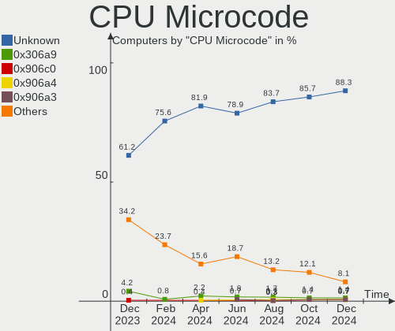

| Number     | Computers | Percent |
|------------|-----------|---------|
| Unknown    | 82        | 30.71%  |
| 0x206a7    | 21        | 7.87%   |
| 0x806c1    | 15        | 5.62%   |
| 0x306a9    | 13        | 4.87%   |
| 0x1067a    | 10        | 3.75%   |
| 0x08108109 | 9         | 3.37%   |
| 0x906ea    | 8         | 3%      |
| 0x806ec    | 8         | 3%      |
| 0x806e9    | 7         | 2.62%   |
| 0x306f2    | 6         | 2.25%   |
| 0x706a8    | 5         | 1.87%   |
| 0x706e5    | 4         | 1.5%    |
| 0x406e3    | 4         | 1.5%    |
| 0x30678    | 4         | 1.5%    |
| 0x806d1    | 3         | 1.12%   |
| 0x406c4    | 3         | 1.12%   |
| 0x20652    | 3         | 1.12%   |
| 0x08701021 | 3         | 1.12%   |
| 0x906ed    | 2         | 0.75%   |
| 0x906e9    | 2         | 0.75%   |
| 0x906a3    | 2         | 0.75%   |
| 0x806eb    | 2         | 0.75%   |
| 0x806ea    | 2         | 0.75%   |
| 0x706a1    | 2         | 0.75%   |
| 0x506e3    | 2         | 0.75%   |
| 0x40651    | 2         | 0.75%   |
| 0x306d4    | 2         | 0.75%   |
| 0x306c3    | 2         | 0.75%   |
| 0x20655    | 2         | 0.75%   |
| 0x106e5    | 2         | 0.75%   |
| 0x0a50000c | 2         | 0.75%   |
| 0x08608102 | 2         | 0.75%   |
| 0x06000822 | 2         | 0.75%   |
| 0xa0661    | 1         | 0.37%   |
| 0xa0653    | 1         | 0.37%   |
| 0xa0652    | 1         | 0.37%   |
| 0x906a4    | 1         | 0.37%   |
| 0x806c2    | 1         | 0.37%   |
| 0x6fd      | 1         | 0.37%   |
| 0x506c9    | 1         | 0.37%   |

CPU Microarch
-------------

Microarchitecture

| Name             | Computers | Percent |
|------------------|-----------|---------|
| KabyLake         | 52        | 19.48%  |
| SandyBridge      | 27        | 10.11%  |
| IvyBridge        | 21        | 7.87%   |
| TigerLake        | 19        | 7.12%   |
| Unknown          | 15        | 5.62%   |
| Zen+             | 14        | 5.24%   |
| Penryn           | 12        | 4.49%   |
| Haswell          | 12        | 4.49%   |
| Westmere         | 9         | 3.37%   |
| Skylake          | 9         | 3.37%   |
| Silvermont       | 9         | 3.37%   |
| Icelake          | 9         | 3.37%   |
| Zen 3            | 7         | 2.62%   |
| Goldmont plus    | 7         | 2.62%   |
| Zen 2            | 6         | 2.25%   |
| Piledriver       | 6         | 2.25%   |
| CometLake        | 6         | 2.25%   |
| Zen              | 5         | 1.87%   |
| Broadwell        | 4         | 1.5%    |
| K10              | 3         | 1.12%   |
| Alderlake Hybrid | 3         | 1.12%   |
| Nehalem          | 2         | 0.75%   |
| K10 Llano        | 2         | 0.75%   |
| Goldmont         | 2         | 0.75%   |
| Core             | 2         | 0.75%   |
| K8 Hammer        | 1         | 0.37%   |
| Bulldozer        | 1         | 0.37%   |
| Bonnell          | 1         | 0.37%   |
| Bobcat           | 1         | 0.37%   |

Graphics
--------

GPU Vendor
----------

Vendors of graphics cards

| Vendor                     | Computers | Percent |
|----------------------------|-----------|---------|
| Intel                      | 188       | 60.84%  |
| Nvidia                     | 67        | 21.68%  |
| AMD                        | 53        | 17.15%  |
| Matrox Electronics Systems | 1         | 0.32%   |

GPU Model
---------

Graphics card models

| Model                                                                                    | Computers | Percent |
|------------------------------------------------------------------------------------------|-----------|---------|
| Intel 2nd Generation Core Processor Family Integrated Graphics Controller                | 25        | 7.99%   |
| Intel TigerLake-LP GT2 [Iris Xe Graphics]                                                | 15        | 4.79%   |
| Intel HD Graphics 620                                                                    | 12        | 3.83%   |
| Intel 3rd Gen Core processor Graphics Controller                                         | 12        | 3.83%   |
| AMD Picasso/Raven 2 [Radeon Vega Series / Radeon Vega Mobile Series]                     | 12        | 3.83%   |
| Intel WhiskeyLake-U GT2 [UHD Graphics 620]                                               | 10        | 3.19%   |
| Intel CoffeeLake-H GT2 [UHD Graphics 630]                                                | 8         | 2.56%   |
| Intel Xeon E3-1200 v2/3rd Gen Core processor Graphics Controller                         | 7         | 2.24%   |
| Intel GeminiLake [UHD Graphics 600]                                                      | 7         | 2.24%   |
| Intel Core Processor Integrated Graphics Controller                                      | 7         | 2.24%   |
| Intel CometLake-U GT2 [UHD Graphics]                                                     | 6         | 1.92%   |
| Intel Atom Processor Z36xxx/Z37xxx Series Graphics & Display                             | 6         | 1.92%   |
| AMD Topaz XT [Radeon R7 M260/M265 / M340/M360 / M440/M445 / 530/535 / 620/625 Mobile]    | 6         | 1.92%   |
| Nvidia TU117M [GeForce GTX 1650 Mobile / Max-Q]                                          | 5         | 1.6%    |
| Intel UHD Graphics 620                                                                   | 5         | 1.6%    |
| Intel Skylake GT2 [HD Graphics 520]                                                      | 5         | 1.6%    |
| Intel Iris Plus Graphics G1 (Ice Lake)                                                   | 5         | 1.6%    |
| AMD RS780L [Radeon 3000]                                                                 | 5         | 1.6%    |
| AMD Lucienne                                                                             | 5         | 1.6%    |
| Intel TigerLake-H GT1 [UHD Graphics]                                                     | 4         | 1.28%   |
| Intel Tiger Lake-LP GT2 [UHD Graphics G4]                                                | 4         | 1.28%   |
| Intel Mobile 4 Series Chipset Integrated Graphics Controller                             | 4         | 1.28%   |
| Intel HD Graphics 630                                                                    | 4         | 1.28%   |
| Intel HD Graphics 5500                                                                   | 4         | 1.28%   |
| Intel Alder Lake-UP3 GT2 [Iris Xe Graphics]                                              | 4         | 1.28%   |
| AMD Ellesmere [Radeon RX 470/480/570/570X/580/580X/590]                                  | 4         | 1.28%   |
| Nvidia TU116M [GeForce GTX 1660 Ti Mobile]                                               | 3         | 0.96%   |
| Nvidia TU106M [GeForce RTX 2060 Mobile]                                                  | 3         | 0.96%   |
| Intel HD Graphics 530                                                                    | 3         | 0.96%   |
| Intel Haswell-ULT Integrated Graphics Controller                                         | 3         | 0.96%   |
| Intel Atom/Celeron/Pentium Processor x5-E8000/J3xxx/N3xxx Integrated Graphics Controller | 3         | 0.96%   |
| Intel 4 Series Chipset Integrated Graphics Controller                                    | 3         | 0.96%   |
| AMD Caicos [Radeon HD 6450/7450/8450 / R5 230 OEM]                                       | 3         | 0.96%   |
| Nvidia GP108M [GeForce MX330]                                                            | 2         | 0.64%   |
| Nvidia GP108M [GeForce MX250]                                                            | 2         | 0.64%   |
| Nvidia GP108M [GeForce MX230]                                                            | 2         | 0.64%   |
| Nvidia GP108 [GeForce GT 1030]                                                           | 2         | 0.64%   |
| Nvidia GP106 [GeForce GTX 1060 3GB]                                                      | 2         | 0.64%   |
| Nvidia GM108M [GeForce MX110]                                                            | 2         | 0.64%   |
| Nvidia GK208B [GeForce GT 710]                                                           | 2         | 0.64%   |

GPU Combo
---------

Combinations of graphics cards

| Name           | Computers | Percent |
|----------------|-----------|---------|
| 1 x Intel      | 147       | 55.06%  |
| 1 x AMD        | 41        | 15.36%  |
| Intel + Nvidia | 34        | 12.73%  |
| 1 x Nvidia     | 29        | 10.86%  |
| Intel + AMD    | 5         | 1.87%   |
| AMD + Nvidia   | 4         | 1.5%    |
| Other          | 3         | 1.12%   |
| 2 x AMD        | 3         | 1.12%   |
| 1 x Matrox     | 1         | 0.37%   |

GPU Driver
----------

Free vs proprietary

| Driver      | Computers | Percent |
|-------------|-----------|---------|
| Free        | 221       | 82.77%  |
| Proprietary | 39        | 14.61%  |
| Unknown     | 7         | 2.62%   |

GPU Memory
----------

Total video memory

| Size in GB | Computers | Percent |
|------------|-----------|---------|
| Unknown    | 194       | 72.66%  |
| 1.01-2.0   | 28        | 10.49%  |
| 0.01-0.5   | 17        | 6.37%   |
| 7.01-8.0   | 8         | 3%      |
| 5.01-6.0   | 6         | 2.25%   |
| 0.51-1.0   | 5         | 1.87%   |
| 3.01-4.0   | 4         | 1.5%    |
| 8.01-16.0  | 3         | 1.12%   |
| 2.01-3.0   | 2         | 0.75%   |

Monitor
-------

Monitor Vendor
--------------

Monitor vendors

| Vendor                  | Computers | Percent |
|-------------------------|-----------|---------|
| BOE                     | 47        | 15.88%  |
| Goldstar                | 40        | 13.51%  |
| AU Optronics            | 39        | 13.18%  |
| Chimei Innolux          | 29        | 9.8%    |
| Samsung Electronics     | 28        | 9.46%   |
| LG Display              | 18        | 6.08%   |
| Dell                    | 14        | 4.73%   |
| Philips                 | 11        | 3.72%   |
| AOC                     | 11        | 3.72%   |
| Acer                    | 7         | 2.36%   |
| RTK                     | 5         | 1.69%   |
| Apple                   | 4         | 1.35%   |
| Sony                    | 3         | 1.01%   |
| LG Electronics          | 3         | 1.01%   |
| Hewlett-Packard         | 3         | 1.01%   |
| XKX                     | 2         | 0.68%   |
| Valve                   | 2         | 0.68%   |
| SLD                     | 2         | 0.68%   |
| SKY                     | 2         | 0.68%   |
| PANDA                   | 2         | 0.68%   |
| NCS                     | 2         | 0.68%   |
| InfoVision              | 2         | 0.68%   |
| GDH                     | 2         | 0.68%   |
| Chi Mei Optoelectronics | 2         | 0.68%   |
| ___                     | 1         | 0.34%   |
| VIE                     | 1         | 0.34%   |
| Unknown                 | 1         | 0.34%   |
| STA                     | 1         | 0.34%   |
| PZG                     | 1         | 0.34%   |
| MYS                     | 1         | 0.34%   |
| LNV                     | 1         | 0.34%   |
| LG Philips              | 1         | 0.34%   |
| Lenovo                  | 1         | 0.34%   |
| ITE                     | 1         | 0.34%   |
| InnoLux Display         | 1         | 0.34%   |
| HB@                     | 1         | 0.34%   |
| GMX                     | 1         | 0.34%   |
| Envision Peripherals    | 1         | 0.34%   |
| ASUSTek Computer        | 1         | 0.34%   |
| Ancor Communications    | 1         | 0.34%   |

Monitor Model
-------------

Monitor models

| Model                                                                    | Computers | Percent |
|--------------------------------------------------------------------------|-----------|---------|
| BOE LCD Monitor BOE07AA 1366x768 344x194mm 15.5-inch                     | 7         | 2.33%   |
| Chimei Innolux LCD Monitor CMN15F5 1920x1080 344x193mm 15.5-inch         | 6         | 1.99%   |
| Goldstar ULTRAWIDE GSM59F1 2560x1080 798x334mm 34.1-inch                 | 5         | 1.66%   |
| Goldstar HDR WFHD GSM7714 2560x1080 798x334mm 34.1-inch                  | 5         | 1.66%   |
| RTK LG AIO FHD RTK2136 1920x1080 477x268mm 21.5-inch                     | 4         | 1.33%   |
| Chimei Innolux LCD Monitor CMN15E6 1366x768 344x193mm 15.5-inch          | 4         | 1.33%   |
| AU Optronics LCD Monitor AUO71EC 1366x768 344x193mm 15.5-inch            | 4         | 1.33%   |
| Samsung Electronics LCD Monitor SDC4156 1920x1080 294x165mm 13.3-inch    | 3         | 1%      |
| Philips PHL 242V8 PHLC219 1920x1080 527x296mm 23.8-inch                  | 3         | 1%      |
| Chimei Innolux LCD Monitor CMN15DB 1366x768 344x193mm 15.5-inch          | 3         | 1%      |
| BOE LCD Monitor BOE0671 1366x768 344x194mm 15.5-inch                     | 3         | 1%      |
| Valve ANX7530 U VLV3001 800x1280 100x150mm 7.1-inch                      | 2         | 0.66%   |
| SLD LCD Monitor SLD003C 1366x768 309x173mm 13.9-inch                     | 2         | 0.66%   |
| Samsung Electronics S22B300 SAM08AC 1920x1080 477x268mm 21.5-inch        | 2         | 0.66%   |
| Samsung Electronics LU28R55 SAM1017 3840x2160 630x360mm 28.6-inch        | 2         | 0.66%   |
| Samsung Electronics LCD Monitor SEC3649 1366x768 309x174mm 14.0-inch     | 2         | 0.66%   |
| Samsung Electronics C24F390 SAM0D2C 1920x1080 521x293mm 23.5-inch        | 2         | 0.66%   |
| Philips PHL 223V5LH PHLC114 1920x1080 477x268mm 21.5-inch                | 2         | 0.66%   |
| Philips PHL 193V5 PHLC0CD 1366x768 410x230mm 18.5-inch                   | 2         | 0.66%   |
| NCS LCD Monitor NCS2275 1920x1080 256x192mm 12.6-inch                    | 2         | 0.66%   |
| LG Display LCD Monitor LGD03E3 1366x768 310x174mm 14.0-inch              | 2         | 0.66%   |
| LG Display LCD Monitor LGD033F 1366x768 310x174mm 14.0-inch              | 2         | 0.66%   |
| Goldstar ULTRAWIDE GSM76F9 2560x1080 531x298mm 24.0-inch                 | 2         | 0.66%   |
| Goldstar HD GSM5ACB 1366x768 410x230mm 18.5-inch                         | 2         | 0.66%   |
| Goldstar 20EN33 GSM4EE1 1600x900 443x249mm 20.0-inch                     | 2         | 0.66%   |
| GDH PHILCO GDH0030 1920x540 708x398mm 32.0-inch                          | 2         | 0.66%   |
| Dell SE2216H DELF071 1920x1080 476x268mm 21.5-inch                       | 2         | 0.66%   |
| Chimei Innolux LCD Monitor CMN15DC 1366x768 344x193mm 15.5-inch          | 2         | 0.66%   |
| Chimei Innolux LCD Monitor CMN15C6 1366x768 344x193mm 15.5-inch          | 2         | 0.66%   |
| Chimei Innolux LCD Monitor CMN1469 1366x768 309x174mm 14.0-inch          | 2         | 0.66%   |
| Chi Mei Optoelectronics LCD Monitor CMO15A3 1366x768 344x193mm 15.5-inch | 2         | 0.66%   |
| BOE LCD Monitor BOE08F5 1920x1080 344x194mm 15.5-inch                    | 2         | 0.66%   |
| BOE LCD Monitor BOE082E 1920x1080 309x174mm 14.0-inch                    | 2         | 0.66%   |
| BOE LCD Monitor BOE0819 1920x1080 344x194mm 15.5-inch                    | 2         | 0.66%   |
| BOE LCD Monitor BOE0808 1366x768 344x194mm 15.5-inch                     | 2         | 0.66%   |
| BOE LCD Monitor BOE07F6 1920x1080 309x174mm 14.0-inch                    | 2         | 0.66%   |
| BOE LCD Monitor BOE0025 1366x768 309x173mm 13.9-inch                     | 2         | 0.66%   |
| AU Optronics LCD Monitor AUODF87 1920x1080 344x193mm 15.5-inch           | 2         | 0.66%   |
| AU Optronics LCD Monitor AUO61ED 1920x1080 344x194mm 15.5-inch           | 2         | 0.66%   |
| AU Optronics LCD Monitor AUO369F 1920x1080 344x194mm 15.5-inch           | 2         | 0.66%   |

Monitor Resolution
------------------

Monitor screen resolution

| Resolution         | Computers | Percent |
|--------------------|-----------|---------|
| 1920x1080 (FHD)    | 119       | 41.9%   |
| 1366x768 (WXGA)    | 94        | 33.1%   |
| 2560x1080          | 12        | 4.23%   |
| 3840x2160 (4K)     | 11        | 3.87%   |
| 1600x900 (HD+)     | 9         | 3.17%   |
| 1440x900 (WXGA+)   | 8         | 2.82%   |
| 1360x768           | 4         | 1.41%   |
| 1280x800 (WXGA)    | 4         | 1.41%   |
| 2560x1440 (QHD)    | 3         | 1.06%   |
| 1680x1050 (WSXGA+) | 3         | 1.06%   |
| 1280x1024 (SXGA)   | 3         | 1.06%   |
| 800x1280           | 2         | 0.7%    |
| 3440x1440          | 2         | 0.7%    |
| 1920x540           | 2         | 0.7%    |
| Unknown            | 2         | 0.7%    |
| 4480x1080          | 1         | 0.35%   |
| 3840x1080          | 1         | 0.35%   |
| 3520x1080          | 1         | 0.35%   |
| 2160x1350          | 1         | 0.35%   |
| 1920x1200 (WUXGA)  | 1         | 0.35%   |
| 1024x768 (XGA)     | 1         | 0.35%   |

Monitor Diagonal
----------------

Diagonal size in inches

| Inches  | Computers | Percent |
|---------|-----------|---------|
| 15      | 94        | 31.54%  |
| 14      | 30        | 10.07%  |
| 13      | 29        | 9.73%   |
| 23      | 19        | 6.38%   |
| 21      | 18        | 6.04%   |
| 27      | 15        | 5.03%   |
| 34      | 14        | 4.7%    |
| 18      | 12        | 4.03%   |
| 24      | 10        | 3.36%   |
| 20      | 10        | 3.36%   |
| 17      | 9         | 3.02%   |
| Unknown | 5         | 1.68%   |
| 12      | 4         | 1.34%   |
| 40      | 3         | 1.01%   |
| 32      | 3         | 1.01%   |
| 31      | 3         | 1.01%   |
| 52      | 2         | 0.67%   |
| 46      | 2         | 0.67%   |
| 28      | 2         | 0.67%   |
| 19      | 2         | 0.67%   |
| 16      | 2         | 0.67%   |
| 11      | 2         | 0.67%   |
| 7       | 2         | 0.67%   |
| 84      | 1         | 0.34%   |
| 72      | 1         | 0.34%   |
| 49      | 1         | 0.34%   |
| 43      | 1         | 0.34%   |
| 37      | 1         | 0.34%   |
| 22      | 1         | 0.34%   |

Monitor Width
-------------

Physical width

| Width in mm | Computers | Percent |
|-------------|-----------|---------|
| 301-350     | 143       | 48.31%  |
| 501-600     | 43        | 14.53%  |
| 401-500     | 41        | 13.85%  |
| 701-800     | 17        | 5.74%   |
| 201-300     | 17        | 5.74%   |
| 351-400     | 10        | 3.38%   |
| 601-700     | 6         | 2.03%   |
| 1001-1500   | 5         | 1.69%   |
| Unknown     | 5         | 1.69%   |
| 801-900     | 4         | 1.35%   |
| 1501-2000   | 2         | 0.68%   |
| 1-100       | 2         | 0.68%   |
| 901-1000    | 1         | 0.34%   |

Aspect Ratio
------------

Proportional relationship between the width and the height

| Ratio   | Computers | Percent |
|---------|-----------|---------|
| 16/9    | 219       | 83.91%  |
| 16/10   | 15        | 5.75%   |
| 21/9    | 14        | 5.36%   |
| Unknown | 4         | 1.53%   |
| 4/3     | 3         | 1.15%   |
| 5/4     | 2         | 0.77%   |
| 0.67    | 2         | 0.77%   |
| 32/9    | 1         | 0.38%   |
| 3/2     | 1         | 0.38%   |

Monitor Area
------------

Area in inch²

| Area in inch² | Computers | Percent |
|----------------|-----------|---------|
| 101-110        | 93        | 31.42%  |
| 81-90          | 50        | 16.89%  |
| 201-250        | 43        | 14.53%  |
| 351-500        | 21        | 7.09%   |
| 301-350        | 15        | 5.07%   |
| 141-150        | 14        | 4.73%   |
| 151-200        | 13        | 4.39%   |
| 71-80          | 11        | 3.72%   |
| 501-1000       | 8         | 2.7%    |
| Unknown        | 5         | 1.69%   |
| More than 1000 | 4         | 1.35%   |
| 121-130        | 4         | 1.35%   |
| 251-300        | 3         | 1.01%   |
| 131-140        | 3         | 1.01%   |
| 61-70          | 2         | 0.68%   |
| 51-60          | 2         | 0.68%   |
| 1-40           | 2         | 0.68%   |
| 111-120        | 2         | 0.68%   |
| 91-100         | 1         | 0.34%   |

Pixel Density
-------------

Pixels per inch

| Density | Computers | Percent |
|---------|-----------|---------|
| 101-120 | 105       | 35.84%  |
| 51-100  | 94        | 32.08%  |
| 121-160 | 69        | 23.55%  |
| 161-240 | 13        | 4.44%   |
| 1-50    | 7         | 2.39%   |
| Unknown | 5         | 1.71%   |

Multiple Monitors
-----------------

Total monitors connected

| Total | Computers | Percent |
|-------|-----------|---------|
| 1     | 203       | 76.03%  |
| 2     | 56        | 20.97%  |
| 0     | 7         | 2.62%   |
| 3     | 1         | 0.37%   |

Network
-------

Net Controller Vendor
---------------------

Controller vendors

| Vendor                          | Computers | Percent |
|---------------------------------|-----------|---------|
| Realtek Semiconductor           | 187       | 46.4%   |
| Intel                           | 91        | 22.58%  |
| Qualcomm Atheros                | 62        | 15.38%  |
| Broadcom                        | 19        | 4.71%   |
| Ralink Technology               | 6         | 1.49%   |
| Qualcomm Atheros Communications | 5         | 1.24%   |
| Marvell Technology Group        | 5         | 1.24%   |
| TP-Link                         | 4         | 0.99%   |
| JMicron Technology              | 4         | 0.99%   |
| Nvidia                          | 3         | 0.74%   |
| MediaTek                        | 3         | 0.74%   |
| Broadcom Limited                | 3         | 0.74%   |
| Samsung Electronics             | 2         | 0.5%    |
| Ralink                          | 2         | 0.5%    |
| Motorola PCS                    | 1         | 0.25%   |
| Lenovo                          | 1         | 0.25%   |
| Lakeview Research               | 1         | 0.25%   |
| ICS Advent                      | 1         | 0.25%   |
| D-Link System                   | 1         | 0.25%   |
| D-Link                          | 1         | 0.25%   |
| ASIX Electronics                | 1         | 0.25%   |

Net Controller Model
--------------------

Controller models

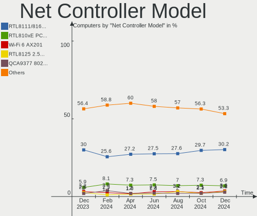

| Model                                                             | Computers | Percent |
|-------------------------------------------------------------------|-----------|---------|
| Realtek RTL8111/8168/8411 PCI Express Gigabit Ethernet Controller | 123       | 27.46%  |
| Realtek RTL810xE PCI Express Fast Ethernet controller             | 34        | 7.59%   |
| Intel Wi-Fi 6 AX201                                               | 18        | 4.02%   |
| Qualcomm Atheros QCA9377 802.11ac Wireless Network Adapter        | 17        | 3.79%   |
| Qualcomm Atheros QCA9565 / AR9565 Wireless Network Adapter        | 15        | 3.35%   |
| Realtek RTL8821CE 802.11ac PCIe Wireless Network Adapter          | 7         | 1.56%   |
| Qualcomm Atheros QCA6174 802.11ac Wireless Network Adapter        | 7         | 1.56%   |
| Qualcomm Atheros AR9285 Wireless Network Adapter (PCI-Express)    | 7         | 1.56%   |
| Intel Wi-Fi 6 AX200                                               | 7         | 1.56%   |
| Realtek RTL8188CE 802.11b/g/n WiFi Adapter                        | 6         | 1.34%   |
| Realtek RTL8125 2.5GbE Controller                                 | 6         | 1.34%   |
| Realtek 802.11n WLAN Adapter                                      | 6         | 1.34%   |
| Realtek 802.11ac NIC                                              | 6         | 1.34%   |
| Qualcomm Atheros AR9485 Wireless Network Adapter                  | 6         | 1.34%   |
| Intel Comet Lake PCH-LP CNVi WiFi                                 | 6         | 1.34%   |
| Intel Alder Lake-P PCH CNVi WiFi                                  | 6         | 1.34%   |
| Realtek RTL8822CE 802.11ac PCIe Wireless Network Adapter          | 5         | 1.12%   |
| Qualcomm Atheros AR9271 802.11n                                   | 5         | 1.12%   |
| Intel Cannon Point-LP CNVi [Wireless-AC]                          | 5         | 1.12%   |
| Intel 82579LM Gigabit Network Connection (Lewisville)             | 5         | 1.12%   |
| Broadcom BCM4313 802.11bgn Wireless Network Adapter               | 5         | 1.12%   |
| Ralink MT7601U Wireless Adapter                                   | 4         | 0.89%   |
| Intel Ice Lake-LP PCH CNVi WiFi                                   | 4         | 0.89%   |
| Intel Dual Band Wireless-AC 3168NGW [Stone Peak]                  | 4         | 0.89%   |
| Intel Centrino Advanced-N 6235                                    | 4         | 0.89%   |
| Realtek RTL8188FTV 802.11b/g/n 1T1R 2.4G WLAN Adapter             | 3         | 0.67%   |
| Realtek RTL8188EUS 802.11n Wireless Network Adapter               | 3         | 0.67%   |
| Intel Wireless 7265                                               | 3         | 0.67%   |
| Intel Wireless 3160                                               | 3         | 0.67%   |
| Intel Tiger Lake PCH CNVi WiFi                                    | 3         | 0.67%   |
| Broadcom NetXtreme BCM57765 Gigabit Ethernet PCIe                 | 3         | 0.67%   |
| Broadcom NetLink BCM57780 Gigabit Ethernet PCIe                   | 3         | 0.67%   |
| TP-Link AC600 wireless Realtek RTL8811AU [Archer T2U Nano]        | 2         | 0.45%   |
| Samsung Galaxy series, misc. (tethering mode)                     | 2         | 0.45%   |
| Realtek RTL8153 Gigabit Ethernet Adapter                          | 2         | 0.45%   |
| Realtek Killer E2600 Gigabit Ethernet Controller                  | 2         | 0.45%   |
| Realtek Killer E2500 Gigabit Ethernet Controller                  | 2         | 0.45%   |
| Qualcomm Atheros AR928X Wireless Network Adapter (PCI-Express)    | 2         | 0.45%   |
| Qualcomm Atheros AR8152 v2.0 Fast Ethernet                        | 2         | 0.45%   |
| Qualcomm Atheros AR8151 v2.0 Gigabit Ethernet                     | 2         | 0.45%   |

Wireless Vendor
---------------

Wireless vendors

| Vendor                          | Computers | Percent |
|---------------------------------|-----------|---------|
| Intel                           | 76        | 36.54%  |
| Qualcomm Atheros                | 57        | 27.4%   |
| Realtek Semiconductor           | 41        | 19.71%  |
| Broadcom                        | 12        | 5.77%   |
| Ralink Technology               | 6         | 2.88%   |
| Qualcomm Atheros Communications | 5         | 2.4%    |
| TP-Link                         | 4         | 1.92%   |
| MediaTek                        | 3         | 1.44%   |
| Ralink                          | 2         | 0.96%   |
| D-Link                          | 1         | 0.48%   |
| Broadcom Limited                | 1         | 0.48%   |

Wireless Model
--------------

Wireless models

| Model                                                          | Computers | Percent |
|----------------------------------------------------------------|-----------|---------|
| Intel Wi-Fi 6 AX201                                            | 18        | 8.53%   |
| Qualcomm Atheros QCA9377 802.11ac Wireless Network Adapter     | 17        | 8.06%   |
| Qualcomm Atheros QCA9565 / AR9565 Wireless Network Adapter     | 15        | 7.11%   |
| Realtek RTL8821CE 802.11ac PCIe Wireless Network Adapter       | 7         | 3.32%   |
| Qualcomm Atheros QCA6174 802.11ac Wireless Network Adapter     | 7         | 3.32%   |
| Qualcomm Atheros AR9285 Wireless Network Adapter (PCI-Express) | 7         | 3.32%   |
| Intel Wi-Fi 6 AX200                                            | 7         | 3.32%   |
| Realtek RTL8188CE 802.11b/g/n WiFi Adapter                     | 6         | 2.84%   |
| Realtek 802.11n WLAN Adapter                                   | 6         | 2.84%   |
| Realtek 802.11ac NIC                                           | 6         | 2.84%   |
| Qualcomm Atheros AR9485 Wireless Network Adapter               | 6         | 2.84%   |
| Intel Comet Lake PCH-LP CNVi WiFi                              | 6         | 2.84%   |
| Intel Alder Lake-P PCH CNVi WiFi                               | 6         | 2.84%   |
| Realtek RTL8822CE 802.11ac PCIe Wireless Network Adapter       | 5         | 2.37%   |
| Qualcomm Atheros AR9271 802.11n                                | 5         | 2.37%   |
| Intel Cannon Point-LP CNVi [Wireless-AC]                       | 5         | 2.37%   |
| Broadcom BCM4313 802.11bgn Wireless Network Adapter            | 5         | 2.37%   |
| Ralink MT7601U Wireless Adapter                                | 4         | 1.9%    |
| Intel Ice Lake-LP PCH CNVi WiFi                                | 4         | 1.9%    |
| Intel Dual Band Wireless-AC 3168NGW [Stone Peak]               | 4         | 1.9%    |
| Intel Centrino Advanced-N 6235                                 | 4         | 1.9%    |
| Realtek RTL8188FTV 802.11b/g/n 1T1R 2.4G WLAN Adapter          | 3         | 1.42%   |
| Realtek RTL8188EUS 802.11n Wireless Network Adapter            | 3         | 1.42%   |
| Intel Wireless 7265                                            | 3         | 1.42%   |
| Intel Wireless 3160                                            | 3         | 1.42%   |
| Intel Tiger Lake PCH CNVi WiFi                                 | 3         | 1.42%   |
| TP-Link AC600 wireless Realtek RTL8811AU [Archer T2U Nano]     | 2         | 0.95%   |
| Qualcomm Atheros AR928X Wireless Network Adapter (PCI-Express) | 2         | 0.95%   |
| MediaTek MT7921 802.11ax PCI Express Wireless Network Adapter  | 2         | 0.95%   |
| Intel Wireless-AC 9260                                         | 2         | 0.95%   |
| Intel Wireless 8265 / 8275                                     | 2         | 0.95%   |
| Intel Comet Lake PCH CNVi WiFi                                 | 2         | 0.95%   |
| Intel Centrino Wireless-N 1030 [Rainbow Peak]                  | 2         | 0.95%   |
| Intel Centrino Advanced-N 6205 [Taylor Peak]                   | 2         | 0.95%   |
| Broadcom BCM4331 802.11a/b/g/n                                 | 2         | 0.95%   |
| TP-Link Archer T4U ver.3                                       | 1         | 0.47%   |
| TP-Link Archer T3U [Realtek RTL8812BU]                         | 1         | 0.47%   |
| Realtek RTL88x2bu [AC1200 Techkey]                             | 1         | 0.47%   |
| Realtek RTL8852AE 802.11ax PCIe Wireless Network Adapter       | 1         | 0.47%   |
| Realtek RTL8822BE 802.11a/b/g/n/ac WiFi adapter                | 1         | 0.47%   |

Ethernet Vendor
---------------

Ethernet vendors

| Vendor                   | Computers | Percent |
|--------------------------|-----------|---------|
| Realtek Semiconductor    | 167       | 72.29%  |
| Intel                    | 25        | 10.82%  |
| Broadcom                 | 11        | 4.76%   |
| Qualcomm Atheros         | 7         | 3.03%   |
| Marvell Technology Group | 5         | 2.16%   |
| JMicron Technology       | 4         | 1.73%   |
| Nvidia                   | 3         | 1.3%    |
| Samsung Electronics      | 2         | 0.87%   |
| Broadcom Limited         | 2         | 0.87%   |
| Motorola PCS             | 1         | 0.43%   |
| Lenovo                   | 1         | 0.43%   |
| ICS Advent               | 1         | 0.43%   |
| D-Link System            | 1         | 0.43%   |
| ASIX Electronics         | 1         | 0.43%   |

Ethernet Model
--------------

Ethernet models

| Model                                                                          | Computers | Percent |
|--------------------------------------------------------------------------------|-----------|---------|
| Realtek RTL8111/8168/8411 PCI Express Gigabit Ethernet Controller              | 123       | 52.12%  |
| Realtek RTL810xE PCI Express Fast Ethernet controller                          | 34        | 14.41%  |
| Realtek RTL8125 2.5GbE Controller                                              | 6         | 2.54%   |
| Intel 82579LM Gigabit Network Connection (Lewisville)                          | 5         | 2.12%   |
| Broadcom NetXtreme BCM57765 Gigabit Ethernet PCIe                              | 3         | 1.27%   |
| Broadcom NetLink BCM57780 Gigabit Ethernet PCIe                                | 3         | 1.27%   |
| Samsung Galaxy series, misc. (tethering mode)                                  | 2         | 0.85%   |
| Realtek RTL8153 Gigabit Ethernet Adapter                                       | 2         | 0.85%   |
| Realtek Killer E2600 Gigabit Ethernet Controller                               | 2         | 0.85%   |
| Realtek Killer E2500 Gigabit Ethernet Controller                               | 2         | 0.85%   |
| Qualcomm Atheros AR8152 v2.0 Fast Ethernet                                     | 2         | 0.85%   |
| Qualcomm Atheros AR8151 v2.0 Gigabit Ethernet                                  | 2         | 0.85%   |
| Nvidia MCP61 Ethernet                                                          | 2         | 0.85%   |
| JMicron JMC260 PCI Express Fast Ethernet Controller                            | 2         | 0.85%   |
| JMicron JMC250 PCI Express Gigabit Ethernet Controller                         | 2         | 0.85%   |
| Intel I211 Gigabit Network Connection                                          | 2         | 0.85%   |
| Intel Ethernet Connection (7) I219-V                                           | 2         | 0.85%   |
| Intel Ethernet Connection (4) I219-LM                                          | 2         | 0.85%   |
| Intel Ethernet Connection (12) I219-V                                          | 2         | 0.85%   |
| Intel 82579V Gigabit Network Connection                                        | 2         | 0.85%   |
| Broadcom NetXtreme BCM5764M Gigabit Ethernet PCIe                              | 2         | 0.85%   |
| Broadcom Limited NetLink BCM57780 Gigabit Ethernet PCIe                        | 2         | 0.85%   |
| Realtek RTL-8100/8101L/8139 PCI Fast Ethernet Adapter                          | 1         | 0.42%   |
| Realtek Killer E3000 2.5GbE Controller                                         | 1         | 0.42%   |
| Qualcomm Atheros Killer E2500 Gigabit Ethernet Controller                      | 1         | 0.42%   |
| Qualcomm Atheros Attansic L2 Fast Ethernet                                     | 1         | 0.42%   |
| Qualcomm Atheros AR8131 Gigabit Ethernet                                       | 1         | 0.42%   |
| Nvidia MCP77 Ethernet                                                          | 1         | 0.42%   |
| Motorola PCS moto g(9) play                                                    | 1         | 0.42%   |
| Marvell Group Yukon Optima 88E8059 [PCIe Gigabit Ethernet Controller with AVB] | 1         | 0.42%   |
| Marvell Group 88E8058 PCI-E Gigabit Ethernet Controller                        | 1         | 0.42%   |
| Marvell Group 88E8057 PCI-E Gigabit Ethernet Controller                        | 1         | 0.42%   |
| Marvell Group 88E8040 PCI-E Fast Ethernet Controller                           | 1         | 0.42%   |
| Marvell Group 88E8039 PCI-E Fast Ethernet Controller                           | 1         | 0.42%   |
| Lenovo Powered Hub                                                             | 1         | 0.42%   |
| Intel Ethernet Controller I225-V                                               | 1         | 0.42%   |
| Intel Ethernet Connection (4) I219-V                                           | 1         | 0.42%   |
| Intel Ethernet Connection (2) I219-V                                           | 1         | 0.42%   |
| Intel Ethernet Connection (2) I218-V                                           | 1         | 0.42%   |
| Intel Ethernet Connection (13) I219-V                                          | 1         | 0.42%   |

Net Controller Kind
-------------------

Ethernet, WiFi or modem

| Kind     | Computers | Percent |
|----------|-----------|---------|
| Ethernet | 224       | 52.71%  |
| WiFi     | 200       | 47.06%  |
| Modem    | 1         | 0.24%   |

Used Controller
---------------

Currently used network controller

| Kind     | Computers | Percent |
|----------|-----------|---------|
| WiFi     | 170       | 62.27%  |
| Ethernet | 103       | 37.73%  |

NICs
----

Total network controllers on board

| Total | Computers | Percent |
|-------|-----------|---------|
| 2     | 144       | 53.93%  |
| 1     | 110       | 41.2%   |
| 0     | 11        | 4.12%   |
| 4     | 1         | 0.37%   |
| 3     | 1         | 0.37%   |

IPv6
----

IPv6 vs IPv4

| Used | Computers | Percent |
|------|-----------|---------|
| Yes  | 140       | 52.43%  |
| No   | 127       | 47.57%  |

Bluetooth
---------

Bluetooth Vendor
----------------

Controller vendors

| Vendor                          | Computers | Percent |
|---------------------------------|-----------|---------|
| Intel                           | 72        | 42.35%  |
| Qualcomm Atheros Communications | 31        | 18.24%  |
| Cambridge Silicon Radio         | 18        | 10.59%  |
| Realtek Semiconductor           | 12        | 7.06%   |
| Lite-On Technology              | 10        | 5.88%   |
| IMC Networks                    | 7         | 4.12%   |
| Broadcom                        | 5         | 2.94%   |
| Apple                           | 4         | 2.35%   |
| Foxconn / Hon Hai               | 3         | 1.76%   |
| Dell                            | 3         | 1.76%   |
| Unknown                         | 2         | 1.18%   |
| Ralink                          | 1         | 0.59%   |
| MediaTek                        | 1         | 0.59%   |
| ASUSTek Computer                | 1         | 0.59%   |

Bluetooth Model
---------------

Controller models

| Model                                                                               | Computers | Percent |
|-------------------------------------------------------------------------------------|-----------|---------|
| Qualcomm Atheros  Bluetooth Device                                                  | 25        | 14.71%  |
| Intel Bluetooth 9460/9560 Jefferson Peak (JfP)                                      | 25        | 14.71%  |
| Cambridge Silicon Radio Bluetooth Dongle (HCI mode)                                 | 18        | 10.59%  |
| Intel AX201 Bluetooth                                                               | 15        | 8.82%   |
| Realtek Bluetooth Radio                                                             | 11        | 6.47%   |
| Intel Bluetooth wireless interface                                                  | 9         | 5.29%   |
| Intel AX200 Bluetooth                                                               | 7         | 4.12%   |
| IMC Networks Bluetooth Radio                                                        | 7         | 4.12%   |
| Intel Bluetooth Device                                                              | 5         | 2.94%   |
| Intel Wireless-AC 3168 Bluetooth                                                    | 4         | 2.35%   |
| Qualcomm Atheros AR3012 Bluetooth 4.0                                               | 3         | 1.76%   |
| Qualcomm Atheros AR3011 Bluetooth                                                   | 3         | 1.76%   |
| Lite-On Bluetooth Device                                                            | 3         | 1.76%   |
| Intel Centrino Bluetooth Wireless Transceiver                                       | 3         | 1.76%   |
| Apple Bluetooth Host Controller                                                     | 3         | 1.76%   |
| Unknown Bluetooth Device                                                            | 2         | 1.18%   |
| Lite-On Wireless_Device                                                             | 2         | 1.18%   |
| Lite-On Qualcomm Atheros QCA9377 Bluetooth                                          | 2         | 1.18%   |
| Lite-On Qualcomm Atheros Bluetooth                                                  | 2         | 1.18%   |
| Intel Wireless-AC 9260 Bluetooth Adapter                                            | 2         | 1.18%   |
| Realtek  Bluetooth 4.2 Adapter                                                      | 1         | 0.59%   |
| Ralink RT3290 Bluetooth                                                             | 1         | 0.59%   |
| MediaTek Wireless_Device                                                            | 1         | 0.59%   |
| Lite-On Atheros AR3012 Bluetooth                                                    | 1         | 0.59%   |
| Intel Centrino Advanced-N 6230 Bluetooth adapter                                    | 1         | 0.59%   |
| Intel AX210 Bluetooth                                                               | 1         | 0.59%   |
| Foxconn / Hon Hai Foxconn T77H114 BCM2070 [Single-Chip Bluetooth 2.1 + EDR Adapter] | 1         | 0.59%   |
| Foxconn / Hon Hai Broadcom Bluetooth 2.1 Device                                     | 1         | 0.59%   |
| Foxconn / Hon Hai Bluetooth USB Host Controller                                     | 1         | 0.59%   |
| Dell Wireless 365 Bluetooth                                                         | 1         | 0.59%   |
| Dell Wireless 360 Bluetooth                                                         | 1         | 0.59%   |
| Dell DW375 Bluetooth Module                                                         | 1         | 0.59%   |
| Broadcom Bluetooth 2.0+eDR dongle                                                   | 1         | 0.59%   |
| Broadcom BCM20702A0                                                                 | 1         | 0.59%   |
| Broadcom BCM20702 Bluetooth 4.0 [ThinkPad]                                          | 1         | 0.59%   |
| Broadcom BCM2070 Bluetooth Device                                                   | 1         | 0.59%   |
| Broadcom BCM2070 Bluetooth 2.1 + EDR                                                | 1         | 0.59%   |
| ASUS Broadcom BCM20702A0 Bluetooth                                                  | 1         | 0.59%   |
| Apple Bluetooth HCI                                                                 | 1         | 0.59%   |

Sound
-----

Sound Vendor
------------

Sound card vendors

| Vendor                   | Computers | Percent |
|--------------------------|-----------|---------|
| Intel                    | 204       | 58.12%  |
| AMD                      | 58        | 16.52%  |
| Nvidia                   | 52        | 14.81%  |
| C-Media Electronics      | 13        | 3.7%    |
| Logitech                 | 3         | 0.85%   |
| Samson Technologies      | 2         | 0.57%   |
| Kingston Technology      | 2         | 0.57%   |
| Generalplus Technology   | 2         | 0.57%   |
| Texas Instruments        | 1         | 0.28%   |
| Samsung Electronics      | 1         | 0.28%   |
| Realtek Semiconductor    | 1         | 0.28%   |
| Plantronics              | 1         | 0.28%   |
| Midiplus                 | 1         | 0.28%   |
| Microsoft                | 1         | 0.28%   |
| Micro Star International | 1         | 0.28%   |
| Meizu                    | 1         | 0.28%   |
| JMTek                    | 1         | 0.28%   |
| Goldvish                 | 1         | 0.28%   |
| GN Netcom                | 1         | 0.28%   |
| Dell                     | 1         | 0.28%   |
| Creative Labs            | 1         | 0.28%   |
| BR25                     | 1         | 0.28%   |
| BEHRINGER International  | 1         | 0.28%   |

Sound Model
-----------

Sound card models

| Model                                                                      | Computers | Percent |
|----------------------------------------------------------------------------|-----------|---------|
| Intel 6 Series/C200 Series Chipset Family High Definition Audio Controller | 25        | 6.27%   |
| Intel Sunrise Point-LP HD Audio                                            | 24        | 6.02%   |
| Intel 7 Series/C216 Chipset Family High Definition Audio Controller        | 23        | 5.76%   |
| AMD Family 17h/19h HD Audio Controller                                     | 23        | 5.76%   |
| Intel Tiger Lake-LP Smart Sound Technology Audio Controller                | 19        | 4.76%   |
| AMD Raven/Raven2/Fenghuang HDMI/DP Audio Controller                        | 13        | 3.26%   |
| Intel Cannon Point-LP High Definition Audio Controller                     | 11        | 2.76%   |
| Intel Cannon Lake PCH cAVS                                                 | 10        | 2.51%   |
| AMD Starship/Matisse HD Audio Controller                                   | 10        | 2.51%   |
| Intel 5 Series/3400 Series Chipset High Definition Audio                   | 9         | 2.26%   |
| AMD Renoir Radeon High Definition Audio Controller                         | 9         | 2.26%   |
| Intel NM10/ICH7 Family High Definition Audio Controller                    | 8         | 2.01%   |
| Intel 8 Series/C220 Series Chipset High Definition Audio Controller        | 8         | 2.01%   |
| Intel Comet Lake PCH-LP cAVS                                               | 7         | 1.75%   |
| Intel Celeron/Pentium Silver Processor High Definition Audio               | 7         | 1.75%   |
| AMD SBx00 Azalia (Intel HDA)                                               | 7         | 1.75%   |
| Intel Ice Lake-LP Smart Sound Technology Audio Controller                  | 6         | 1.5%    |
| Intel Alder Lake PCH-P High Definition Audio Controller                    | 6         | 1.5%    |
| AMD Family 17h (Models 00h-0fh) HD Audio Controller                        | 6         | 1.5%    |
| Nvidia TU116 High Definition Audio Controller                              | 5         | 1.25%   |
| Nvidia TU107 GeForce GTX 1650 High Definition Audio Controller             | 5         | 1.25%   |
| Nvidia TU106 High Definition Audio Controller                              | 5         | 1.25%   |
| Intel Atom Processor Z36xxx/Z37xxx Series High Definition Audio Controller | 5         | 1.25%   |
| Nvidia GP106 High Definition Audio Controller                              | 4         | 1%      |
| Nvidia GF108 High Definition Audio Controller                              | 4         | 1%      |
| Nvidia GA104 High Definition Audio Controller                              | 4         | 1%      |
| Intel Wildcat Point-LP High Definition Audio Controller                    | 4         | 1%      |
| Intel Tiger Lake-H HD Audio Controller                                     | 4         | 1%      |
| Intel Broadwell-U Audio Controller                                         | 4         | 1%      |
| Intel 82801I (ICH9 Family) HD Audio Controller                             | 4         | 1%      |
| Intel 200 Series PCH HD Audio                                              | 4         | 1%      |
| Intel 100 Series/C230 Series Chipset Family HD Audio Controller            | 4         | 1%      |
| AMD Ellesmere HDMI Audio [Radeon RX 470/480 / 570/580/590]                 | 4         | 1%      |
| Nvidia TU104 HD Audio Controller                                           | 3         | 0.75%   |
| Nvidia High Definition Audio Controller                                    | 3         | 0.75%   |
| Nvidia GP107GL High Definition Audio Controller                            | 3         | 0.75%   |
| Nvidia GF119 HDMI Audio Controller                                         | 3         | 0.75%   |
| Logitech H390 headset with microphone                                      | 3         | 0.75%   |
| Intel Haswell-ULT HD Audio Controller                                      | 3         | 0.75%   |
| Intel Comet Lake PCH-V cAVS                                                | 3         | 0.75%   |

Memory
------

Memory Vendor
-------------

Memory module vendors

| Vendor                       | Computers | Percent |
|------------------------------|-----------|---------|
| Unknown                      | 17        | 13.18%  |
| Smart                        | 16        | 12.4%   |
| Kingston                     | 16        | 12.4%   |
| A-DATA Technology            | 16        | 12.4%   |
| Samsung Electronics          | 11        | 8.53%   |
| SK hynix                     | 8         | 6.2%    |
| Corsair                      | 6         | 4.65%   |
| Teikon                       | 5         | 3.88%   |
| Micron Technology            | 4         | 3.1%    |
| Unknown (ABCD)               | 3         | 2.33%   |
| Team                         | 3         | 2.33%   |
| PUSKILL                      | 3         | 2.33%   |
| Crucial                      | 3         | 2.33%   |
| Smart Brazil                 | 2         | 1.55%   |
| Unknown                      | 2         | 1.55%   |
| Unknown (0x094A)             | 1         | 0.78%   |
| Unknown (0x0080)             | 1         | 0.78%   |
| Transcend                    | 1         | 0.78%   |
| Super Talent                 | 1         | 0.78%   |
| RZX                          | 1         | 0.78%   |
| Patriot Memory (PDP Systems) | 1         | 0.78%   |
| Patriot                      | 1         | 0.78%   |
| Neo Forza                    | 1         | 0.78%   |
| Multilaser                   | 1         | 0.78%   |
| Kllisre                      | 1         | 0.78%   |
| High Bridge                  | 1         | 0.78%   |
| Elpida                       | 1         | 0.78%   |
| Atermiter                    | 1         | 0.78%   |
| Asgard                       | 1         | 0.78%   |

Memory Model
------------

Memory module models

| Model                                                            | Computers | Percent |
|------------------------------------------------------------------|-----------|---------|
| Unknown (ABCD) RAM 123456789012345678 2GB SODIMM LPDDR4 2400MT/s | 3         | 2.26%   |
| Kingston RAM KF2666C15S4/16G 16GB SODIMM DDR4 2667MT/s           | 3         | 2.26%   |
| Smart RAM SH5641G8FJ8NWRNSQR 8GB SODIMM DDR3 1600MT/s            | 2         | 1.5%    |
| Smart RAM SH564128FH8NZPHSCR 4GB SODIMM DDR3 1333MT/s            | 2         | 1.5%    |
| Smart RAM SF4642G8CK8IEHLSBG 16384MB SODIMM DDR4 2667MT/s        | 2         | 1.5%    |
| Smart Brazil RAM SMS4TDC3C0K0446SCG 4096MB SODIMM DDR4 2667MT/s  | 2         | 1.5%    |
| PUSKILL RAM PJ16TFK1GM8 16GB SODIMM DDR4 2667MT/s                | 2         | 1.5%    |
| Kingston RAM 9905471-017.A00LF 4GB DIMM DDR3 1333MT/s            | 2         | 1.5%    |
| A-DATA RAM DDR4 3200 16GB DIMM DDR4 3400MT/s                     | 2         | 1.5%    |
| A-DATA RAM AM1P26KC4U1-BACS 4GB SODIMM DDR4 2667MT/s             | 2         | 1.5%    |
| A-DATA RAM 4JQA-0622AC 4GB SODIMM DDR4 3200MT/s                  | 2         | 1.5%    |
| Unknown                                                          | 2         | 1.5%    |
| Unknown RAM Module 8GB SODIMM DDR4 2667MT/s                      | 1         | 0.75%   |
| Unknown RAM Module 8GB DIMM DDR4 2667MT/s                        | 1         | 0.75%   |
| Unknown RAM Module 4GB SODIMM DDR4 2400MT/s                      | 1         | 0.75%   |
| Unknown RAM Module 4GB SODIMM DDR3 1333MT/s                      | 1         | 0.75%   |
| Unknown RAM Module 4GB SODIMM DDR2 800MT/s                       | 1         | 0.75%   |
| Unknown RAM Module 4GB DIMM DDR3 1333MT/s                        | 1         | 0.75%   |
| Unknown RAM Module 4GB DIMM DDR2 800MT/s                         | 1         | 0.75%   |
| Unknown RAM Module 4GB DIMM 400MT/s                              | 1         | 0.75%   |
| Unknown RAM Module 4GB DIMM 1333MT/s                             | 1         | 0.75%   |
| Unknown RAM Module 4096MB DIMM SDRAM                             | 1         | 0.75%   |
| Unknown RAM Module 2GB DIMM SDRAM                                | 1         | 0.75%   |
| Unknown RAM Module 2GB DIMM DDR3 1333MT/s                        | 1         | 0.75%   |
| Unknown RAM Module 2GB DIMM DDR2                                 | 1         | 0.75%   |
| Unknown RAM Module 2GB DIMM 1066MT/s                             | 1         | 0.75%   |
| Unknown RAM Module 16GB SODIMM DDR4 2400MT/s                     | 1         | 0.75%   |
| Unknown RAM Module 16384MB DIMM DDR4 3200MT/s                    | 1         | 0.75%   |
| Unknown RAM Module 1024MB DIMM DDR2                              | 1         | 0.75%   |
| Unknown (0x094A) RAM Module 8GB DIMM DDR3 1333MT/s               | 1         | 0.75%   |
| Unknown (0x0080) RAM Module 8GB SODIMM DDR3 1333MT/s             | 1         | 0.75%   |
| Transcend RAM Module 2GB SODIMM DDR3 1067MT/s                    | 1         | 0.75%   |
| Teikon RAM TMT451S6FFR8A-PBEJ 4GB SODIMM DDR3 1600MT/s           | 1         | 0.75%   |
| Teikon RAM TMT451S6BFR8A-PBHJ 4GB SODIMM DDR3 1600MT/s           | 1         | 0.75%   |
| Teikon RAM TMA851S6AFR6N-UHSC 4GB SODIMM DDR4 2400MT/s           | 1         | 0.75%   |
| Teikon RAM TMA81GS6CJR8N-VKSC 8192MB SODIMM DDR4 2667MT/s        | 1         | 0.75%   |
| Teikon RAM TMA41GS6AFR8N-TFSC 8GB SODIMM DDR4 2133MT/s           | 1         | 0.75%   |
| Team RAM TEAMGROUP-UD4-3600 8GB DIMM DDR4 3733MT/s               | 1         | 0.75%   |
| Team RAM TEAMGROUP-UD4-2400 4GB DIMM DDR4 2400MT/s               | 1         | 0.75%   |
| Team RAM TEAMGROUP-UD3-1333 4GB DIMM DDR3 1333MT/s               | 1         | 0.75%   |

Memory Kind
-----------

Memory module kinds

| Kind    | Computers | Percent |
|---------|-----------|---------|
| DDR4    | 52        | 47.27%  |
| DDR3    | 39        | 35.45%  |
| DDR2    | 6         | 5.45%   |
| LPDDR4  | 4         | 3.64%   |
| SDRAM   | 3         | 2.73%   |
| Unknown | 3         | 2.73%   |
| DDR5    | 2         | 1.82%   |
| LPDDR5  | 1         | 0.91%   |

Memory Form Factor
------------------

Physical design of the memory module

| Name         | Computers | Percent |
|--------------|-----------|---------|
| SODIMM       | 69        | 63.89%  |
| DIMM         | 36        | 33.33%  |
| Row Of Chips | 3         | 2.78%   |

Memory Size
-----------

Memory module size

| Size  | Computers | Percent |
|-------|-----------|---------|
| 4096  | 43        | 35.25%  |
| 8192  | 36        | 29.51%  |
| 16384 | 24        | 19.67%  |
| 2048  | 14        | 11.48%  |
| 32768 | 3         | 2.46%   |
| 1024  | 2         | 1.64%   |

Memory Speed
------------

Memory module speed

| Speed   | Computers | Percent |
|---------|-----------|---------|
| 2667    | 24        | 19.51%  |
| 1600    | 20        | 16.26%  |
| 1333    | 17        | 13.82%  |
| 2400    | 15        | 12.2%   |
| 3200    | 13        | 10.57%  |
| 1334    | 7         | 5.69%   |
| 2133    | 4         | 3.25%   |
| 1066    | 4         | 3.25%   |
| Unknown | 4         | 3.25%   |
| 800     | 3         | 2.44%   |
| 4800    | 2         | 1.63%   |
| 3400    | 2         | 1.63%   |
| 6400    | 1         | 0.81%   |
| 4267    | 1         | 0.81%   |
| 3733    | 1         | 0.81%   |
| 3466    | 1         | 0.81%   |
| 3000    | 1         | 0.81%   |
| 1067    | 1         | 0.81%   |
| 975     | 1         | 0.81%   |
| 400     | 1         | 0.81%   |

Printers & scanners
-------------------

Printer Vendor
--------------

Printer device vendors

| Vendor                | Computers | Percent |
|-----------------------|-----------|---------|
| Seiko Epson           | 4         | 66.67%  |
| Lexmark International | 1         | 16.67%  |
| Hewlett-Packard       | 1         | 16.67%  |

Printer Model
-------------

Printer device models

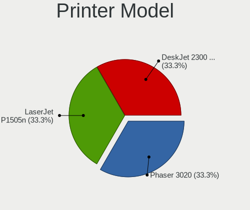

| Model                             | Computers | Percent |
|-----------------------------------|-----------|---------|
| Seiko Epson L355 Series           | 2         | 33.33%  |
| Seiko Epson L365 Series           | 1         | 16.67%  |
| Seiko Epson L220 Series           | 1         | 16.67%  |
| Lexmark International 2600 Series | 1         | 16.67%  |
| HP Deskjet 4610 series            | 1         | 16.67%  |

Scanner Vendor
--------------

Scanner device vendors

Zero info for selected period =(

Scanner Model
-------------

Scanner device models

Zero info for selected period =(

Camera
------

Camera Vendor
-------------

Camera device vendors

| Vendor                        | Computers | Percent |
|-------------------------------|-----------|---------|
| Chicony Electronics           | 30        | 16.48%  |
| Realtek Semiconductor         | 23        | 12.64%  |
| Microdia                      | 19        | 10.44%  |
| Sunplus Innovation Technology | 13        | 7.14%   |
| Silicon Motion                | 12        | 6.59%   |
| Quanta                        | 11        | 6.04%   |
| Logitech                      | 10        | 5.49%   |
| IMC Networks                  | 10        | 5.49%   |
| Acer                          | 8         | 4.4%    |
| Sonix Technology              | 6         | 3.3%    |
| Syntek                        | 5         | 2.75%   |
| SunplusIT                     | 5         | 2.75%   |
| Apple                         | 5         | 2.75%   |
| Suyin                         | 4         | 2.2%    |
| Y Media                       | 2         | 1.1%    |
| USB Camera                    | 2         | 1.1%    |
| GEMBIRD                       | 2         | 1.1%    |
| Alcor Micro                   | 2         | 1.1%    |
| YGTek                         | 1         | 0.55%   |
| Unknown                       | 1         | 0.55%   |
| Ricoh                         | 1         | 0.55%   |
| Primax Electronics            | 1         | 0.55%   |
| OYT Tech                      | 1         | 0.55%   |
| Microsoft                     | 1         | 0.55%   |
| Huawei Technologies           | 1         | 0.55%   |
| Generalplus Technology        | 1         | 0.55%   |
| Creative Technology           | 1         | 0.55%   |
| Aveo Technology               | 1         | 0.55%   |
| Anker PowerConf C200          | 1         | 0.55%   |
| ALi                           | 1         | 0.55%   |
| Unknown                       | 1         | 0.55%   |

Camera Model
------------

Camera device models

| Model                                  | Computers | Percent |
|----------------------------------------|-----------|---------|
| Realtek Integrated_Webcam_HD           | 15        | 8.24%   |
| Quanta HD User Facing                  | 7         | 3.85%   |
| Microdia Integrated_Webcam_HD          | 7         | 3.85%   |
| Sonix USB2.0 HD UVC WebCam             | 6         | 3.3%    |
| Chicony HD User Facing                 | 6         | 3.3%    |
| Sunplus Integrated_Webcam_HD           | 5         | 2.75%   |
| Silicon Motion Web Camera              | 5         | 2.75%   |
| Syntek Integrated Camera               | 4         | 2.2%    |
| Chicony USB 2.0 Camera                 | 4         | 2.2%    |
| Chicony Integrated Camera              | 4         | 2.2%    |
| SunplusIT 720p HD Camera               | 3         | 1.65%   |
| Microdia Laptop_Integrated_Webcam_1.3M | 3         | 1.65%   |
| IMC Networks USB2.0 HD UVC WebCam      | 3         | 1.65%   |
| IMC Networks Integrated Camera         | 3         | 1.65%   |
| Chicony LG HD WebCam                   | 3         | 1.65%   |
| Acer Integrated Camera                 | 3         | 1.65%   |
| Y Media USB Camera                     | 2         | 1.1%    |
| USB Camera USB Camera                  | 2         | 1.1%    |
| Suyin Integrated_Webcam_HD             | 2         | 1.1%    |
| SunplusIT MTD camera                   | 2         | 1.1%    |
| Sunplus Integrated Webcam              | 2         | 1.1%    |
| Sunplus HD WebCam                      | 2         | 1.1%    |
| Silicon Motion WebCam SCB-1100N        | 2         | 1.1%    |
| Silicon Motion WebCam SC-13HDL12131N   | 2         | 1.1%    |
| Realtek USB Camera                     | 2         | 1.1%    |
| Realtek Full HD webcam                 | 2         | 1.1%    |
| Quanta VGA WebCam                      | 2         | 1.1%    |
| Microdia Webcam SC-10HDD12636P         | 2         | 1.1%    |
| Microdia USB 2.0 Camera                | 2         | 1.1%    |
| Microdia Integrated Webcam HD          | 2         | 1.1%    |
| Logitech Webcam C930e                  | 2         | 1.1%    |
| Logitech Webcam C270                   | 2         | 1.1%    |
| Logitech HD Pro Webcam C920            | 2         | 1.1%    |
| Logitech C922 Pro Stream Webcam        | 2         | 1.1%    |
| IMC Networks EasyCamera                | 2         | 1.1%    |
| Chicony HD Webcam                      | 2         | 1.1%    |
| Apple FaceTime HD Camera               | 2         | 1.1%    |
| Apple Built-in iSight                  | 2         | 1.1%    |
| Alcor Micro Acer Integrated Webcam     | 2         | 1.1%    |
| Acer HD Webcam                         | 2         | 1.1%    |

Security
--------

Fingerprint Vendor
------------------

Fingerprint sensor vendors

| Vendor                     | Computers | Percent |
|----------------------------|-----------|---------|
| Validity Sensors           | 4         | 36.36%  |
| Synaptics                  | 2         | 18.18%  |
| Upek                       | 1         | 9.09%   |
| Shenzhen Goodix Technology | 1         | 9.09%   |
| Futronic Technology        | 1         | 9.09%   |
| Focal-systems.Corp         | 1         | 9.09%   |
| AuthenTec                  | 1         | 9.09%   |

Fingerprint Model
-----------------

Fingerprint sensor models

| Model                                                                      | Computers | Percent |
|----------------------------------------------------------------------------|-----------|---------|
| Validity Sensors VFS471 Fingerprint Reader                                 | 2         | 18.18%  |
| Validity Sensors VFS5011 Fingerprint Reader                                | 1         | 9.09%   |
| Validity Sensors Synaptics VFS7552 Touch Fingerprint Sensor with PurePrint | 1         | 9.09%   |
| Upek Biometric Touchchip/Touchstrip Fingerprint Sensor                     | 1         | 9.09%   |
| Synaptics Metallica MIS Touch Fingerprint Reader                           | 1         | 9.09%   |
| Shenzhen Goodix  FingerPrint Device                                        | 1         | 9.09%   |
| Futronic FS81 Fingerprint Scanner Module                                   | 1         | 9.09%   |
| Focal-systems.Corp FT9201Fingerprint.                                      | 1         | 9.09%   |
| AuthenTec Fingerprint Sensor                                               | 1         | 9.09%   |
| Unknown                                                                    | 1         | 9.09%   |

Chipcard Vendor
---------------

Chipcard module vendors

| Vendor                | Computers | Percent |
|-----------------------|-----------|---------|
| Broadcom              | 3         | 50%     |
| Upek                  | 1         | 16.67%  |
| O2 Micro              | 1         | 16.67%  |
| Gemalto (was Gemplus) | 1         | 16.67%  |

Chipcard Model
--------------

Chipcard module models

| Model                                                                        | Computers | Percent |
|------------------------------------------------------------------------------|-----------|---------|
| Upek TouchChip Fingerprint Coprocessor (WBF advanced mode)                   | 1         | 16.67%  |
| O2 Micro OZ776 CCID Smartcard Reader                                         | 1         | 16.67%  |
| Gemalto (was Gemplus) GemPC Twin SmartCard Reader                            | 1         | 16.67%  |
| Broadcom BCM5880 Secure Applications Processor with fingerprint swipe sensor | 1         | 16.67%  |
| Broadcom 5880                                                                | 1         | 16.67%  |
| Broadcom 58200                                                               | 1         | 16.67%  |

Unsupported
-----------

Unsupported Devices
-------------------

Total unsupported devices on board

| Total | Computers | Percent |
|-------|-----------|---------|
| 0     | 209       | 78.28%  |
| 1     | 53        | 19.85%  |
| 2     | 4         | 1.5%    |
| 3     | 1         | 0.37%   |

Unsupported Device Types
------------------------

Types of unsupported devices

| Type                     | Computers | Percent |
|--------------------------|-----------|---------|
| Graphics card            | 13        | 20.97%  |
| Net/wireless             | 12        | 19.35%  |
| Multimedia controller    | 12        | 19.35%  |
| Fingerprint reader       | 11        | 17.74%  |
| Chipcard                 | 4         | 6.45%   |
| Storage                  | 2         | 3.23%   |
| Net/ethernet             | 2         | 3.23%   |
| Communication controller | 2         | 3.23%   |
| Unassigned class         | 1         | 1.61%   |
| Sound                    | 1         | 1.61%   |
| Card reader              | 1         | 1.61%   |
| Bluetooth                | 1         | 1.61%   |

