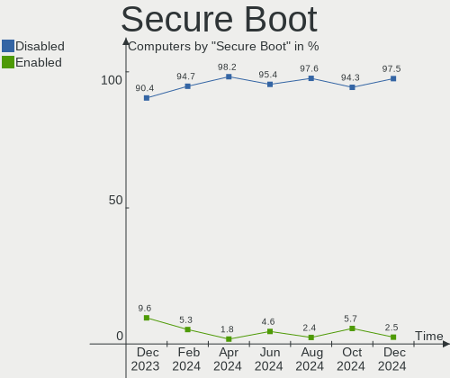
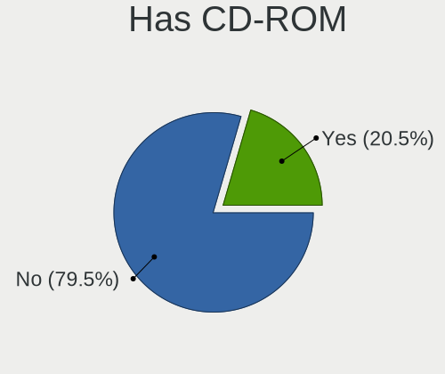
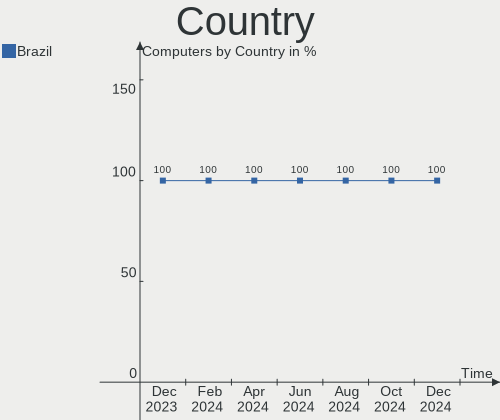
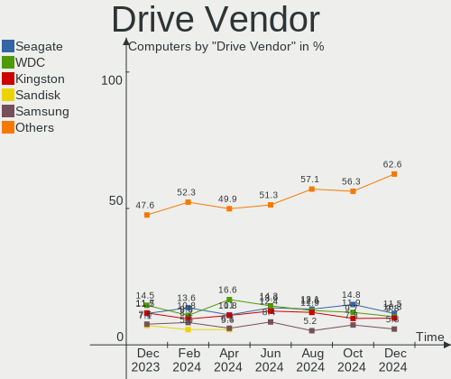
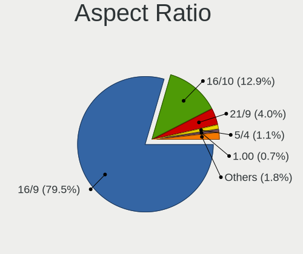
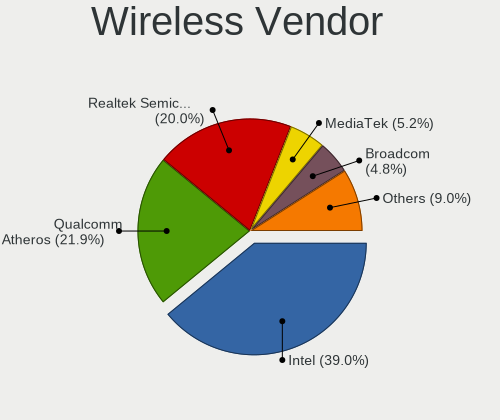
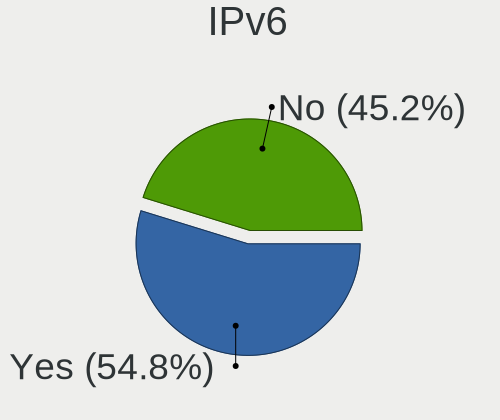
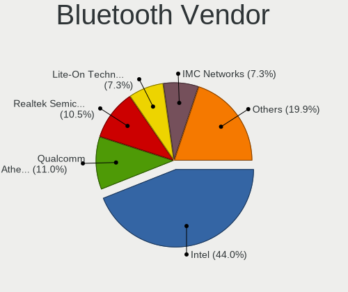
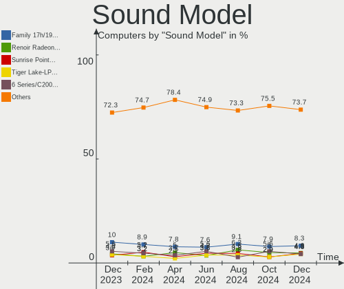

Linux in Brazil - Hardware Trends
---------------------------------

A project to identify most popular hardware characteristics and track their change
over time based on data collected by Linux users at https://Linux-Hardware.org.

Anyone can contribute to this report by the [hw-probe](https://github.com/linuxhw/hw-probe) tool:

    sudo -E hw-probe -all -upload

This is a report for all computer types. See also reports for [desktops](/Location/Brazil/Desktop/README.md) and [notebooks](/Location/Brazil/Notebook/README.md).

Period: Nov, 2023.

Contents
--------

* [ System ](#system)
  - [ OS                       ](#os)
  - [ OS Family                ](#os-family)
  - [ Kernel                   ](#kernel)
  - [ Kernel Family            ](#kernel-family)
  - [ Kernel Major Ver.        ](#kernel-major-ver)
  - [ Arch                     ](#arch)
  - [ DE                       ](#de)
  - [ Display Server           ](#display-server)
  - [ Display Manager          ](#display-manager)
  - [ OS Lang                  ](#os-lang)
  - [ Boot Mode                ](#boot-mode)
  - [ Filesystem               ](#filesystem)
  - [ Part. scheme             ](#part-scheme)
  - [ Dual Boot with Linux/BSD ](#dual-boot-with-linuxbsd)
  - [ Dual Boot (Win)          ](#dual-boot-win)

* [ Board ](#board)
  - [ Vendor                   ](#vendor)
  - [ Model                    ](#model)
  - [ Model Family             ](#model-family)
  - [ MFG Year                 ](#mfg-year)
  - [ Form Factor              ](#form-factor)
  - [ Secure Boot              ](#secure-boot)
  - [ Coreboot                 ](#coreboot)
  - [ RAM Size                 ](#ram-size)
  - [ RAM Used                 ](#ram-used)
  - [ Total Drives             ](#total-drives)
  - [ Has CD-ROM               ](#has-cd-rom)
  - [ Has Ethernet             ](#has-ethernet)
  - [ Has WiFi                 ](#has-wifi)
  - [ Has Bluetooth            ](#has-bluetooth)

* [ Location ](#location)
  - [ Country                  ](#country)
  - [ City                     ](#city)

* [ Drives ](#drives)
  - [ Drive Vendor             ](#drive-vendor)
  - [ Drive Model              ](#drive-model)
  - [ HDD Vendor               ](#hdd-vendor)
  - [ SSD Vendor               ](#ssd-vendor)
  - [ Drive Kind               ](#drive-kind)
  - [ Drive Connector          ](#drive-connector)
  - [ Drive Size               ](#drive-size)
  - [ Space Total              ](#space-total)
  - [ Space Used               ](#space-used)
  - [ Malfunc. Drives          ](#malfunc-drives)
  - [ Malfunc. Drive Vendor    ](#malfunc-drive-vendor)
  - [ Malfunc. HDD Vendor      ](#malfunc-hdd-vendor)
  - [ Malfunc. Drive Kind      ](#malfunc-drive-kind)
  - [ Failed Drives            ](#failed-drives)
  - [ Failed Drive Vendor      ](#failed-drive-vendor)
  - [ Drive Status             ](#drive-status)

* [ Storage controller ](#storage-controller)
  - [ Storage Vendor           ](#storage-vendor)
  - [ Storage Model            ](#storage-model)
  - [ Storage Kind             ](#storage-kind)

* [ Processor ](#processor)
  - [ CPU Vendor               ](#cpu-vendor)
  - [ CPU Model                ](#cpu-model)
  - [ CPU Model Family         ](#cpu-model-family)
  - [ CPU Cores                ](#cpu-cores)
  - [ CPU Sockets              ](#cpu-sockets)
  - [ CPU Threads              ](#cpu-threads)
  - [ CPU Op-Modes             ](#cpu-op-modes)
  - [ CPU Microcode            ](#cpu-microcode)
  - [ CPU Microarch            ](#cpu-microarch)

* [ Graphics ](#graphics)
  - [ GPU Vendor               ](#gpu-vendor)
  - [ GPU Model                ](#gpu-model)
  - [ GPU Combo                ](#gpu-combo)
  - [ GPU Driver               ](#gpu-driver)
  - [ GPU Memory               ](#gpu-memory)

* [ Monitor ](#monitor)
  - [ Monitor Vendor           ](#monitor-vendor)
  - [ Monitor Model            ](#monitor-model)
  - [ Monitor Resolution       ](#monitor-resolution)
  - [ Monitor Diagonal         ](#monitor-diagonal)
  - [ Monitor Width            ](#monitor-width)
  - [ Aspect Ratio             ](#aspect-ratio)
  - [ Monitor Area             ](#monitor-area)
  - [ Pixel Density            ](#pixel-density)
  - [ Multiple Monitors        ](#multiple-monitors)

* [ Network ](#network)
  - [ Net Controller Vendor    ](#net-controller-vendor)
  - [ Net Controller Model     ](#net-controller-model)
  - [ Wireless Vendor          ](#wireless-vendor)
  - [ Wireless Model           ](#wireless-model)
  - [ Ethernet Vendor          ](#ethernet-vendor)
  - [ Ethernet Model           ](#ethernet-model)
  - [ Net Controller Kind      ](#net-controller-kind)
  - [ Used Controller          ](#used-controller)
  - [ NICs                     ](#nics)
  - [ IPv6                     ](#ipv6)

* [ Bluetooth ](#bluetooth)
  - [ Bluetooth Vendor         ](#bluetooth-vendor)
  - [ Bluetooth Model          ](#bluetooth-model)

* [ Sound ](#sound)
  - [ Sound Vendor             ](#sound-vendor)
  - [ Sound Model              ](#sound-model)

* [ Memory ](#memory)
  - [ Memory Vendor            ](#memory-vendor)
  - [ Memory Model             ](#memory-model)
  - [ Memory Kind              ](#memory-kind)
  - [ Memory Form Factor       ](#memory-form-factor)
  - [ Memory Size              ](#memory-size)
  - [ Memory Speed             ](#memory-speed)

* [ Printers & scanners ](#printers--scanners)
  - [ Printer Vendor           ](#printer-vendor)
  - [ Printer Model            ](#printer-model)
  - [ Scanner Vendor           ](#scanner-vendor)
  - [ Scanner Model            ](#scanner-model)

* [ Camera ](#camera)
  - [ Camera Vendor            ](#camera-vendor)
  - [ Camera Model             ](#camera-model)

* [ Security ](#security)
  - [ Fingerprint Vendor       ](#fingerprint-vendor)
  - [ Fingerprint Model        ](#fingerprint-model)
  - [ Chipcard Vendor          ](#chipcard-vendor)
  - [ Chipcard Model           ](#chipcard-model)

* [ Unsupported ](#unsupported)
  - [ Unsupported Devices      ](#unsupported-devices)
  - [ Unsupported Device Types ](#unsupported-device-types)

System
------

OS
--

Installed operating systems

| Name                         | Computers | Percent |
|------------------------------|-----------|---------|
| Ubuntu 22.04                 | 37        | 12.67%  |
| Fedora 39                    | 26        | 8.9%    |
| Linux Mint 21.2              | 22        | 7.53%   |
| Debian 12                    | 15        | 5.14%   |
| Arch Rolling                 | 13        | 4.45%   |
| Pop!_OS 22.04                | 12        | 4.11%   |
| OpenMandriva 23.08           | 12        | 4.11%   |
| Ubuntu 23.10                 | 11        | 3.77%   |
| Zorin 16                     | 10        | 3.42%   |
| OpenMandriva 5.0             | 10        | 3.42%   |
| Fedora 38                    | 8         | 2.74%   |
| ArcoLinux Rolling            | 8         | 2.74%   |
| Manjaro                      | 6         | 2.05%   |
| openSUSE Tumbleweed-XXXXXXXX | 5         | 1.71%   |
| Linux Mint 20.3              | 5         | 1.71%   |
| Endless 5.0.6                | 5         | 1.71%   |
| Debian 11                    | 5         | 1.71%   |
| BigLinux                     | 5         | 1.71%   |
| OpenMandriva 4.3             | 4         | 1.37%   |
| Devuan 5                     | 4         | 1.37%   |
| Xero Rolling                 | 3         | 1.03%   |
| Ubuntu 20.04                 | 3         | 1.03%   |
| EndeavourOS Rolling          | 3         | 1.03%   |
| Ubuntu 23.04                 | 2         | 0.68%   |
| Ubuntu 18.04                 | 2         | 0.68%   |
| openSUSE Leap-15.4           | 2         | 0.68%   |
| OpenMandriva 23.10           | 2         | 0.68%   |
| LMDE 6                       | 2         | 0.68%   |
| Linux Mint 21.1              | 2         | 0.68%   |
| KDE neon 22.04               | 2         | 0.68%   |
| Garuda Linux Soaring         | 2         | 0.68%   |
| Endless 3.9.3-nexthw1        | 2         | 0.68%   |
| ChimeraOS 44-1               | 2         | 0.68%   |
| Zorin 15                     | 1         | 0.34%   |
| Xubuntu 23.10                | 1         | 0.34%   |
| Xubuntu 22.10                | 1         | 0.34%   |
| Xubuntu 22.04                | 1         | 0.34%   |
| Xubuntu 20.04                | 1         | 0.34%   |
| Void Linux Rolling           | 1         | 0.34%   |
| Ubuntu Studio 23.04          | 1         | 0.34%   |

OS Family
---------

OS without a version

| Name          | Computers | Percent |
|---------------|-----------|---------|
| Ubuntu        | 55        | 18.84%  |
| Fedora        | 34        | 11.64%  |
| Linux Mint    | 32        | 10.96%  |
| OpenMandriva  | 30        | 10.27%  |
| Debian        | 20        | 6.85%   |
| Arch          | 13        | 4.45%   |
| Pop!_OS       | 12        | 4.11%   |
| Zorin         | 11        | 3.77%   |
| Endless       | 9         | 3.08%   |
| BigLinux      | 9         | 3.08%   |
| openSUSE      | 8         | 2.74%   |
| ArcoLinux     | 8         | 2.74%   |
| Manjaro       | 7         | 2.4%    |
| Xubuntu       | 4         | 1.37%   |
| Devuan        | 4         | 1.37%   |
| Xero          | 3         | 1.03%   |
| SteamOS       | 3         | 1.03%   |
| LMDE          | 3         | 1.03%   |
| EndeavourOS   | 3         | 1.03%   |
| Ubuntu MATE   | 2         | 0.68%   |
| Ubuntu Budgie | 2         | 0.68%   |
| Nobara        | 2         | 0.68%   |
| KDE neon      | 2         | 0.68%   |
| Garuda Linux  | 2         | 0.68%   |
| ChimeraOS     | 2         | 0.68%   |
| Void Linux    | 1         | 0.34%   |
| Ubuntu Studio | 1         | 0.34%   |
| Peppermint    | 1         | 0.34%   |
| Pear OS       | 1         | 0.34%   |
| Parrot        | 1         | 0.34%   |
| NixOS         | 1         | 0.34%   |
| Linux Lite    | 1         | 0.34%   |
| Lenovo Lux    | 1         | 0.34%   |
| Elementary    | 1         | 0.34%   |
| CentOS        | 1         | 0.34%   |
| blendOS       | 1         | 0.34%   |
| Artix         | 1         | 0.34%   |

Kernel
------

Version of the Linux kernel

| Version                 | Computers | Percent |
|-------------------------|-----------|---------|
| 6.2.0-36-generic        | 28        | 9.59%   |
| 5.15.0-88-generic       | 21        | 7.19%   |
| 6.1.0-13-amd64          | 16        | 5.48%   |
| 6.6.1-arch1-1           | 11        | 3.77%   |
| 6.5.11-300.fc39.x86_64  | 11        | 3.77%   |
| 5.15.0-89-generic       | 11        | 3.77%   |
| 6.6.2-desktop-1omv2390  | 10        | 3.42%   |
| 6.4.11-desktop-1omv2390 | 10        | 3.42%   |
| 6.2.0-37-generic        | 9         | 3.08%   |
| 6.5.6-76060506-generic  | 8         | 2.74%   |
| 6.5.0-10-generic        | 8         | 2.74%   |
| 6.5.12-300.fc39.x86_64  | 6         | 2.05%   |
| 5.15.0-47-generic       | 5         | 1.71%   |
| 5.10.0-26-amd64         | 5         | 1.71%   |
| 6.5.6-300.fc39.x86_64   | 4         | 1.37%   |
| 6.5.11-1-MANJARO        | 4         | 1.37%   |
| 6.6.2-arch1-1           | 3         | 1.03%   |
| 6.5.9-arch2-1           | 3         | 1.03%   |
| 6.5.9-1-default         | 3         | 1.03%   |
| 6.5.4-76060504-generic  | 3         | 1.03%   |
| 6.5.10-200.fc38.x86_64  | 3         | 1.03%   |
| 6.5.0-13-generic        | 3         | 1.03%   |
| 6.4.8-desktop-2omv2390  | 3         | 1.03%   |
| 5.16.7-desktop-1omv4003 | 3         | 1.03%   |
| 6.6.2-201.fc39.x86_64   | 2         | 0.68%   |
| 6.6.2-1-default         | 2         | 0.68%   |
| 6.6.1-zen1-1-zen        | 2         | 0.68%   |
| 6.6.1-1-MANJARO         | 2         | 0.68%   |
| 6.5.9-200.fc38.x86_64   | 2         | 0.68%   |
| 6.5.8-200.fc38.x86_64   | 2         | 0.68%   |
| 6.5.6-chos1-chimeraos-1 | 2         | 0.68%   |
| 6.5.5-desktop-1omv2390  | 2         | 0.68%   |
| 6.5.5-1-MANJARO         | 2         | 0.68%   |
| 6.2.0-1016-lowlatency   | 2         | 0.68%   |
| 6.1.62-1-MANJARO        | 2         | 0.68%   |
| 6.1.62-1-lts            | 2         | 0.68%   |
| 6.1.0-10-amd64          | 2         | 0.68%   |
| 5.4.0-167-generic       | 2         | 0.68%   |
| 5.4.0-166-generic       | 2         | 0.68%   |
| 5.11.0-12-generic       | 2         | 0.68%   |

Kernel Family
-------------

Linux kernel without a distro release

| Version | Computers | Percent |
|---------|-----------|---------|
| 5.15.0  | 43        | 14.73%  |
| 6.2.0   | 41        | 14.04%  |
| 6.1.0   | 22        | 7.53%   |
| 6.6.2   | 20        | 6.85%   |
| 6.5.11  | 16        | 5.48%   |
| 6.6.1   | 15        | 5.14%   |
| 6.5.6   | 14        | 4.79%   |
| 6.5.0   | 13        | 4.45%   |
| 6.5.9   | 12        | 4.11%   |
| 6.4.11  | 10        | 3.42%   |
| 6.5.12  | 8         | 2.74%   |
| 5.10.0  | 8         | 2.74%   |
| 5.4.0   | 7         | 2.4%    |
| 6.5.10  | 5         | 1.71%   |
| 6.1.62  | 5         | 1.71%   |
| 6.5.5   | 4         | 1.37%   |
| 6.5.4   | 4         | 1.37%   |
| 6.5.8   | 3         | 1.03%   |
| 6.4.8   | 3         | 1.03%   |
| 5.19.0  | 3         | 1.03%   |
| 5.16.7  | 3         | 1.03%   |
| 5.14.21 | 3         | 1.03%   |
| 6.5.7   | 2         | 0.68%   |
| 6.1.55  | 2         | 0.68%   |
| 6.1.52  | 2         | 0.68%   |
| 5.11.0  | 2         | 0.68%   |
| 6.6.3   | 1         | 0.34%   |
| 6.6.0   | 1         | 0.34%   |
| 6.5.3   | 1         | 0.34%   |
| 6.4.12  | 1         | 0.34%   |
| 6.3.9   | 1         | 0.34%   |
| 6.3.7   | 1         | 0.34%   |
| 6.3.0   | 1         | 0.34%   |
| 6.2.6   | 1         | 0.34%   |
| 6.1.63  | 1         | 0.34%   |
| 6.1.61  | 1         | 0.34%   |
| 6.1.46  | 1         | 0.34%   |
| 6.0.6   | 1         | 0.34%   |
| 6.0.3   | 1         | 0.34%   |
| 5.8.0   | 1         | 0.34%   |

Kernel Major Ver.
-----------------

Linux kernel major version

| Version | Computers | Percent |
|---------|-----------|---------|
| 6.5     | 82        | 28.08%  |
| 5.15    | 44        | 15.07%  |
| 6.2     | 42        | 14.38%  |
| 6.6     | 37        | 12.67%  |
| 6.1     | 34        | 11.64%  |
| 6.4     | 14        | 4.79%   |
| 5.10    | 8         | 2.74%   |
| 5.4     | 7         | 2.4%    |
| 5.19    | 4         | 1.37%   |
| 5.16    | 4         | 1.37%   |
| 5.14    | 4         | 1.37%   |
| 6.3     | 3         | 1.03%   |
| 6.0     | 2         | 0.68%   |
| 5.11    | 2         | 0.68%   |
| 5.8     | 1         | 0.34%   |
| 5.13    | 1         | 0.34%   |
| 4.4     | 1         | 0.34%   |
| 4.15    | 1         | 0.34%   |
| 3.10    | 1         | 0.34%   |

Arch
----

OS architecture (x86_64, i586, etc.)

| Name    | Computers | Percent |
|---------|-----------|---------|
| x86_64  | 291       | 99.66%  |
| aarch64 | 1         | 0.34%   |

DE
--

Desktop Environment

| Name           | Computers | Percent |
|----------------|-----------|---------|
| GNOME          | 132       | 45.21%  |
| KDE5           | 72        | 24.66%  |
| XFCE           | 36        | 12.33%  |
| X-Cinnamon     | 23        | 7.88%   |
| MATE           | 8         | 2.74%   |
| Endless:GNOME  | 6         | 2.05%   |
| Unknown        | 5         | 1.71%   |
| Budgie         | 2         | 0.68%   |
| sway           | 1         | 0.34%   |
| Pantheon       | 1         | 0.34%   |
| LXQt           | 1         | 0.34%   |
| KDE            | 1         | 0.34%   |
| i3-with-shmlog | 1         | 0.34%   |
| i3             | 1         | 0.34%   |
| Enlightenment  | 1         | 0.34%   |
| Deepin         | 1         | 0.34%   |

Display Server
--------------

X11 or Wayland

| Name    | Computers | Percent |
|---------|-----------|---------|
| X11     | 175       | 59.93%  |
| Wayland | 109       | 37.33%  |
| Unknown | 5         | 1.71%   |
| Tty     | 3         | 1.03%   |

Display Manager
---------------

SDDM, LightDM, etc.

| Name    | Computers | Percent |
|---------|-----------|---------|
| Unknown | 144       | 49.32%  |
| GDM3    | 58        | 19.86%  |
| SDDM    | 53        | 18.15%  |
| LightDM | 28        | 9.59%   |
| GDM     | 8         | 2.74%   |
| Ly      | 1         | 0.34%   |

OS Lang
-------

Language

| Lang       | Computers | Percent |
|------------|-----------|---------|
| pt_BR      | 215       | 73.63%  |
| en_US      | 64        | 21.92%  |
| C          | 5         | 1.71%   |
| en_GB      | 3         | 1.03%   |
| pt_PT      | 1         | 0.34%   |
| en_ZA      | 1         | 0.34%   |
| en_IE.UTF8 | 1         | 0.34%   |
| en_CA      | 1         | 0.34%   |
| Unknown    | 1         | 0.34%   |

Boot Mode
---------

EFI or BIOS

| Mode | Computers | Percent |
|------|-----------|---------|
| BIOS | 155       | 53.08%  |
| EFI  | 137       | 46.92%  |

Filesystem
----------

Type of filesystem

| Type    | Computers | Percent |
|---------|-----------|---------|
| Ext4    | 158       | 54.11%  |
| Btrfs   | 70        | 23.97%  |
| Tmpfs   | 38        | 13.01%  |
| Overlay | 20        | 6.85%   |
| Xfs     | 3         | 1.03%   |
| Zfs     | 2         | 0.68%   |
| Ext3    | 1         | 0.34%   |

Part. scheme
------------

Scheme of partitioning

| Type    | Computers | Percent |
|---------|-----------|---------|
| Unknown | 136       | 46.58%  |
| GPT     | 133       | 45.55%  |
| MBR     | 23        | 7.88%   |

Dual Boot with Linux/BSD
------------------------

Hosting more than one Linux/BSD

| Dual boot | Computers | Percent |
|-----------|-----------|---------|
| No        | 255       | 87.33%  |
| Yes       | 37        | 12.67%  |

Dual Boot (Win)
---------------

Hosting Linux and Windows

| Dual boot | Computers | Percent |
|-----------|-----------|---------|
| No        | 215       | 73.63%  |
| Yes       | 77        | 26.37%  |

Board
-----

Vendor
------

Motherboard manufacturer

| Name                   | Computers | Percent |
|------------------------|-----------|---------|
| Dell                   | 47        | 16.1%   |
| ASUSTek Computer       | 38        | 13.01%  |
| Acer                   | 30        | 10.27%  |
| Lenovo                 | 27        | 9.25%   |
| Gigabyte Technology    | 23        | 7.88%   |
| Hewlett-Packard        | 21        | 7.19%   |
| Samsung Electronics    | 14        | 4.79%   |
| Intel                  | 12        | 4.11%   |
| MSI                    | 11        | 3.77%   |
| Positivo               | 8         | 2.74%   |
| ASRock                 | 7         | 2.4%    |
| Semp Toshiba           | 6         | 2.05%   |
| Apple                  | 5         | 1.71%   |
| Pegatron               | 3         | 1.03%   |
| MACHINIST              | 3         | 1.03%   |
| Valve                  | 2         | 0.68%   |
| Sony                   | 2         | 0.68%   |
| Philco                 | 2         | 0.68%   |
| Multilaser             | 2         | 0.68%   |
| Huanan                 | 2         | 0.68%   |
| Google                 | 2         | 0.68%   |
| ECS                    | 2         | 0.68%   |
| Digibras               | 2         | 0.68%   |
| Daten Tecnologia       | 2         | 0.68%   |
| Compaq                 | 2         | 0.68%   |
| Avell High Performance | 2         | 0.68%   |
| AMI                    | 2         | 0.68%   |
| raspberrypi,4-model-b  | 1         | 0.34%   |
| Phoenix/SiS            | 1         | 0.34%   |
| Notebook               | 1         | 0.34%   |
| LG Electronics         | 1         | 0.34%   |
| JHZD                   | 1         | 0.34%   |
| Itautec                | 1         | 0.34%   |
| HOUTER                 | 1         | 0.34%   |
| Foxconn                | 1         | 0.34%   |
| Compal                 | 1         | 0.34%   |
| Colorful Technology    | 1         | 0.34%   |
| Alienware              | 1         | 0.34%   |
| A14CR                  | 1         | 0.34%   |
| Unknown                | 1         | 0.34%   |

Model
-----

Motherboard model

| Name                                   | Computers | Percent |
|----------------------------------------|-----------|---------|
| Lenovo IdeaPad 3 15ALC6 82MF           | 4         | 1.37%   |
| Intel H61                              | 4         | 1.37%   |
| Intel B75                              | 4         | 1.37%   |
| ASUS PRIME B450M-GAMING/BR             | 4         | 1.37%   |
| Semp Toshiba STI                       | 3         | 1.03%   |
| Samsung 550XDA                         | 3         | 1.03%   |
| Lenovo IdeaPad S145-15API 81V7         | 3         | 1.03%   |
| Dell Inspiron 15 3515                  | 3         | 1.03%   |
| ASUS VivoBook_ASUSLaptop X515EA_X515EA | 3         | 1.03%   |
| Acer Nitro AN515-54                    | 3         | 1.03%   |
| Unknown                                | 3         | 1.03%   |
| Valve Jupiter                          | 2         | 0.68%   |
| Semp Toshiba IS 1412                   | 2         | 0.68%   |
| Samsung 960XFH                         | 2         | 0.68%   |
| Samsung 730QFG                         | 2         | 0.68%   |
| Positivo S14CT01                       | 2         | 0.68%   |
| Positivo POS-EIH61CE                   | 2         | 0.68%   |
| Positivo C41TF                         | 2         | 0.68%   |
| Philco 14H                             | 2         | 0.68%   |
| MSI MS-7C91                            | 2         | 0.68%   |
| Lenovo IdeaPad Gaming 3 15IMH05 82CG   | 2         | 0.68%   |
| Lenovo IdeaPad 320-15IKB 80YH          | 2         | 0.68%   |
| Gigabyte GA-78LMT-USB3 6.0             | 2         | 0.68%   |
| Gigabyte A520M DS3H                    | 2         | 0.68%   |
| Gigabyte A320M-S2H                     | 2         | 0.68%   |
| ECS H61H2-M2                           | 2         | 0.68%   |
| Digibras NH4CU53                       | 2         | 0.68%   |
| Dell OptiPlex 780                      | 2         | 0.68%   |
| Dell Latitude 3480                     | 2         | 0.68%   |
| Dell Latitude 3420                     | 2         | 0.68%   |
| Dell Inspiron 5547                     | 2         | 0.68%   |
| Dell Inspiron 5502                     | 2         | 0.68%   |
| ASUS VivoBook_ASUSLaptop X515JF_X515JF | 2         | 0.68%   |
| ASUS VivoBook_ASUSLaptop X515DA_X515DA | 2         | 0.68%   |
| ASUS TUF Gaming X570-PLUS_BR           | 2         | 0.68%   |
| ASUS P8H61-M LX3 R2.0                  | 2         | 0.68%   |
| Apple MacBookPro8,1                    | 2         | 0.68%   |
| Acer Predator PH315-52                 | 2         | 0.68%   |
| Acer Aspire A515-51G                   | 2         | 0.68%   |
| Acer Aspire A515-51                    | 2         | 0.68%   |

Model Family
------------

Motherboard model prefix

| Name                   | Computers | Percent |
|------------------------|-----------|---------|
| Lenovo IdeaPad         | 19        | 6.51%   |
| Dell Inspiron          | 18        | 6.16%   |
| Acer Aspire            | 17        | 5.82%   |
| Dell Vostro            | 11        | 3.77%   |
| ASUS PRIME             | 10        | 3.42%   |
| Dell Latitude          | 9         | 3.08%   |
| ASUS VivoBook          | 8         | 2.74%   |
| Acer Nitro             | 8         | 2.74%   |
| Lenovo ThinkPad        | 6         | 2.05%   |
| HP Pavilion            | 6         | 2.05%   |
| ASUS TUF               | 6         | 2.05%   |
| Intel H61              | 5         | 1.71%   |
| Intel B75              | 4         | 1.37%   |
| Dell OptiPlex          | 4         | 1.37%   |
| Semp Toshiba STI       | 3         | 1.03%   |
| Semp Toshiba IS        | 3         | 1.03%   |
| Samsung 550XDA         | 3         | 1.03%   |
| Gigabyte A520M         | 3         | 1.03%   |
| Acer Predator          | 3         | 1.03%   |
| Unknown                | 3         | 1.03%   |
| Valve Jupiter          | 2         | 0.68%   |
| Samsung 960XFH         | 2         | 0.68%   |
| Samsung 730QFG         | 2         | 0.68%   |
| Positivo S14CT01       | 2         | 0.68%   |
| Positivo POS-EIH61CE   | 2         | 0.68%   |
| Positivo C41TF         | 2         | 0.68%   |
| Philco 14H             | 2         | 0.68%   |
| MSI MS-7C91            | 2         | 0.68%   |
| HP Presario            | 2         | 0.68%   |
| HP Compaq              | 2         | 0.68%   |
| Gigabyte GA-78LMT-USB3 | 2         | 0.68%   |
| Gigabyte B450M         | 2         | 0.68%   |
| Gigabyte A320M-S2H     | 2         | 0.68%   |
| ECS H61H2-M2           | 2         | 0.68%   |
| Digibras NH4CU53       | 2         | 0.68%   |
| Dell G15               | 2         | 0.68%   |
| ASUS ROG               | 2         | 0.68%   |
| ASUS P8H61-M           | 2         | 0.68%   |
| ASUS M5A78L-M          | 2         | 0.68%   |
| Apple MacBookPro8      | 2         | 0.68%   |

MFG Year
--------

Motherboard manufacture year

| Year | Computers | Percent |
|------|-----------|---------|
| 2021 | 37        | 12.67%  |
| 2020 | 33        | 11.3%   |
| 2019 | 29        | 9.93%   |
| 2017 | 24        | 8.22%   |
| 2018 | 23        | 7.88%   |
| 2011 | 23        | 7.88%   |
| 2023 | 18        | 6.16%   |
| 2012 | 17        | 5.82%   |
| 2010 | 14        | 4.79%   |
| 2014 | 12        | 4.11%   |
| 2022 | 11        | 3.77%   |
| 2008 | 11        | 3.77%   |
| 2016 | 10        | 3.42%   |
| 2013 | 10        | 3.42%   |
| 2009 | 9         | 3.08%   |
| 2015 | 8         | 2.74%   |
| 2007 | 3         | 1.03%   |

Form Factor
-----------

Physical design of the computer

| Name           | Computers | Percent |
|----------------|-----------|---------|
| Notebook       | 169       | 57.88%  |
| Desktop        | 114       | 39.04%  |
| Convertible    | 3         | 1.03%   |
| Mini pc        | 2         | 0.68%   |
| All in one     | 2         | 0.68%   |
| System on chip | 1         | 0.34%   |
| Server         | 1         | 0.34%   |

Secure Boot
-----------

Enabled or disabled

| State    | Computers | Percent |
|----------|-----------|---------|
| Disabled | 274       | 93.84%  |
| Enabled  | 18        | 6.16%   |

Coreboot
--------

Have coreboot on board

| Used | Computers | Percent |
|------|-----------|---------|
| No   | 290       | 99.32%  |
| Yes  | 2         | 0.68%   |

RAM Size
--------

Total RAM memory

| Size in GB  | Computers | Percent |
|-------------|-----------|---------|
| 16.01-24.0  | 85        | 29.11%  |
| 4.01-8.0    | 74        | 25.34%  |
| 3.01-4.0    | 42        | 14.38%  |
| 8.01-16.0   | 39        | 13.36%  |
| 32.01-64.0  | 24        | 8.22%   |
| 1.01-2.0    | 10        | 3.42%   |
| 2.01-3.0    | 7         | 2.4%    |
| 64.01-256.0 | 6         | 2.05%   |
| 24.01-32.0  | 5         | 1.71%   |

RAM Used
--------

Used RAM memory

| Used GB    | Computers | Percent |
|------------|-----------|---------|
| 2.01-3.0   | 84        | 28.77%  |
| 1.01-2.0   | 75        | 25.68%  |
| 4.01-8.0   | 56        | 19.18%  |
| 3.01-4.0   | 46        | 15.75%  |
| 8.01-16.0  | 16        | 5.48%   |
| 0.51-1.0   | 11        | 3.77%   |
| 16.01-24.0 | 3         | 1.03%   |
| 0.01-0.5   | 1         | 0.34%   |

Total Drives
------------

Number of drives on board

| Drives | Computers | Percent |
|--------|-----------|---------|
| 1      | 166       | 56.85%  |
| 2      | 83        | 28.42%  |
| 3      | 27        | 9.25%   |
| 4      | 8         | 2.74%   |
| 5      | 5         | 1.71%   |
| 6      | 2         | 0.68%   |
| 0      | 1         | 0.34%   |

Has CD-ROM
----------

Has CD-ROM on board

| Presented | Computers | Percent |
|-----------|-----------|---------|
| No        | 220       | 75.34%  |
| Yes       | 72        | 24.66%  |

Has Ethernet
------------

Has Ethernet on board

| Presented | Computers | Percent |
|-----------|-----------|---------|
| Yes       | 247       | 84.59%  |
| No        | 45        | 15.41%  |

Has WiFi
--------

Has WiFi module

| Presented | Computers | Percent |
|-----------|-----------|---------|
| Yes       | 205       | 70.21%  |
| No        | 87        | 29.79%  |

Has Bluetooth
-------------

Has Bluetooth module

| Presented | Computers | Percent |
|-----------|-----------|---------|
| Yes       | 171       | 58.56%  |
| No        | 121       | 41.44%  |

Location
--------

Country
-------

Geographic location (country)

| Country | Computers | Percent |
|---------|-----------|---------|
| Brazil  | 292       | 100%    |

City
----

Geographic location (city)

| City                  | Computers | Percent |
|-----------------------|-----------|---------|
| Sao Paulo             | 33        | 11.3%   |
| Rio de Janeiro        | 22        | 7.53%   |
| Brasília             | 14        | 4.79%   |
| Porto Alegre          | 9         | 3.08%   |
| Curitiba              | 9         | 3.08%   |
| Fortaleza             | 7         | 2.4%    |
| Manaus                | 6         | 2.05%   |
| Belo Horizonte        | 5         | 1.71%   |
| Sao Carlos            | 4         | 1.37%   |
| Niterói              | 4         | 1.37%   |
| Joinville             | 4         | 1.37%   |
| Goiânia              | 4         | 1.37%   |
| Florianópolis        | 4         | 1.37%   |
| Campinas              | 4         | 1.37%   |
| Sao José dos Campos  | 3         | 1.03%   |
| Santos                | 3         | 1.03%   |
| Santo André          | 3         | 1.03%   |
| Salvador              | 3         | 1.03%   |
| Recife                | 3         | 1.03%   |
| Osasco                | 3         | 1.03%   |
| Oliveira              | 3         | 1.03%   |
| Londrina              | 3         | 1.03%   |
| Joao Pessoa           | 3         | 1.03%   |
| Farroupilha           | 3         | 1.03%   |
| Campo Grande          | 3         | 1.03%   |
| Vitória              | 2         | 0.68%   |
| Teresina              | 2         | 0.68%   |
| Sorocaba              | 2         | 0.68%   |
| Serra                 | 2         | 0.68%   |
| Sao Vicente           | 2         | 0.68%   |
| Sao Luís             | 2         | 0.68%   |
| Sao Jose do Rio Preto | 2         | 0.68%   |
| Ribeirao Preto        | 2         | 0.68%   |
| Petrolina             | 2         | 0.68%   |
| Pato Branco           | 2         | 0.68%   |
| Palmas                | 2         | 0.68%   |
| Mogi das Cruzes       | 2         | 0.68%   |
| Lorena                | 2         | 0.68%   |
| Limeira               | 2         | 0.68%   |
| Lencois               | 2         | 0.68%   |

Drives
------

Drive Vendor
------------

Hard drive vendors

| Vendor                         | Computers | Drives | Percent |
|--------------------------------|-----------|--------|---------|
| WDC                            | 59        | 65     | 13.47%  |
| Seagate                        | 52        | 62     | 11.87%  |
| Kingston                       | 51        | 60     | 11.64%  |
| Samsung Electronics            | 38        | 38     | 8.68%   |
| Toshiba                        | 25        | 27     | 5.71%   |
| A-DATA Technology              | 24        | 25     | 5.48%   |
| SanDisk                        | 22        | 22     | 5.02%   |
| China                          | 17        | 18     | 3.88%   |
| Silicon Motion                 | 14        | 14     | 3.2%    |
| Crucial                        | 13        | 14     | 2.97%   |
| Unknown                        | 12        | 12     | 2.74%   |
| Phison Electronics             | 8         | 8      | 1.83%   |
| ADATA Technology               | 8         | 8      | 1.83%   |
| SK hynix                       | 7         | 7      | 1.6%    |
| Realtek Semiconductor          | 6         | 7      | 1.37%   |
| MAXIO Technology (Hangzhou)    | 6         | 6      | 1.37%   |
| Kingston Technology Company    | 5         | 6      | 1.14%   |
| JMicron Technology             | 5         | 5      | 1.14%   |
| XrayDisk                       | 4         | 4      | 0.91%   |
| Micron Technology              | 4         | 4      | 0.91%   |
| Intel                          | 4         | 4      | 0.91%   |
| Solid State Storage            | 3         | 3      | 0.68%   |
| Patriot                        | 3         | 3      | 0.68%   |
| Lexar                          | 3         | 3      | 0.68%   |
| Hitachi                        | 3         | 4      | 0.68%   |
| Fujitsu                        | 3         | 3      | 0.68%   |
| Unknown                        | 3         | 3      | 0.68%   |
| SSSTC                          | 2         | 2      | 0.46%   |
| Maxtor                         | 2         | 2      | 0.46%   |
| LITEON                         | 2         | 2      | 0.46%   |
| KingSpec                       | 2         | 2      | 0.46%   |
| HUSKY                          | 2         | 2      | 0.46%   |
| HGST                           | 2         | 2      | 0.46%   |
| WISE                           | 1         | 1      | 0.23%   |
| WALRAM                         | 1         | 1      | 0.23%   |
| Teclast                        | 1         | 1      | 0.23%   |
| Team                           | 1         | 1      | 0.23%   |
| T-FORCE                        | 1         | 1      | 0.23%   |
| Solid State Storage Technology | 1         | 1      | 0.23%   |
| Seapiy                         | 1         | 1      | 0.23%   |

Drive Model
-----------

Hard drive models

| Model                                                 | Computers | Percent |
|-------------------------------------------------------|-----------|---------|
| Kingston SA400S37480G 480GB SSD                       | 15        | 3.26%   |
| Kingston SA400S37240G 240GB SSD                       | 13        | 2.83%   |
| Silicon Motion SM2263EN/SM2263XT SSD Controller 256GB | 10        | 2.17%   |
| WDC WD10SPZX-21Z10T0 1TB                              | 7         | 1.52%   |
| Toshiba MQ04ABF100 1TB                                | 7         | 1.52%   |
| Seagate ST1000DM010-2EP102 1TB                        | 7         | 1.52%   |
| SanDisk SSD PLUS 240GB                                | 7         | 1.52%   |
| WDC WD10SPZX-24Z10 1TB                                | 6         | 1.3%    |
| Kingston Company SNV2S1000G 1TB                       | 5         | 1.09%   |
| Kingston SNVS500G 500GB                               | 5         | 1.09%   |
| Crucial CT240BX500SSD1 240GB                          | 5         | 1.09%   |
| Seagate ST500LM012 HN-M500MBB 500GB                   | 4         | 0.87%   |
| Realtek RTS5763DL NVMe SSD Controller 512GB           | 4         | 0.87%   |
| China SSD 256GB                                       | 4         | 0.87%   |
| A-DATA IM2P33F3A NVMe 256GB                           | 4         | 0.87%   |
| WDC WDS240G2G0A-00JH30 240GB SSD                      | 3         | 0.65%   |
| WDC WD10EZEX-08WN4A0 1TB                              | 3         | 0.65%   |
| WDC WD10EARS-00Y5B1 1TB                               | 3         | 0.65%   |
| Unknown SD/MMC/MS PRO 128GB                           | 3         | 0.65%   |
| Unknown MMC Card  64GB                                | 3         | 0.65%   |
| Toshiba MQ01ABD100 1TB                                | 3         | 0.65%   |
| Seagate ST2000LM007-1R8174 2TB                        | 3         | 0.65%   |
| Seagate ST1000LM024 HN-M101MBB 1TB                    | 3         | 0.65%   |
| Samsung NVMe SSD Controller SM981/PM981/PM983 250GB   | 3         | 0.65%   |
| Phison PS5013 E13 NVMe Controller 512GB               | 3         | 0.65%   |
| Phison E12 NVMe Controller 512GB                      | 3         | 0.65%   |
| MAXIO (Hangzhou) NVMe SSD Controller MAP1202 1024GB   | 3         | 0.65%   |
| Kingston SV300S37A240G 240GB SSD                      | 3         | 0.65%   |
| Kingston SV300S37A120G 120GB SSD                      | 3         | 0.65%   |
| Kingston SUV400S37120G 120GB SSD                      | 3         | 0.65%   |
| Kingston SA400S37120G 120GB SSD                       | 3         | 0.65%   |
| JMicron Tech 250GB                                    | 3         | 0.65%   |
| Crucial CT480BX500SSD1 480GB                          | 3         | 0.65%   |
| A-DATA IM2S3338-128GD2 128GB SSD                      | 3         | 0.65%   |
| Unknown                                               | 3         | 0.65%   |
| WDC WDS480G2G0A-00JH30 480GB SSD                      | 2         | 0.43%   |
| WDC WDS120G2G0B-00EPW0 120GB SSD                      | 2         | 0.43%   |
| WDC WDS100T2B0A-00SM50 1TB SSD                        | 2         | 0.43%   |
| WDC WD10JPVX-22JC3T0 1TB                              | 2         | 0.43%   |
| Unknown MMC Card  32GB                                | 2         | 0.43%   |

HDD Vendor
----------

Hard disk drive vendors

| Vendor              | Computers | Drives | Percent |
|---------------------|-----------|--------|---------|
| Seagate             | 52        | 62     | 35.37%  |
| WDC                 | 43        | 47     | 29.25%  |
| Toshiba             | 23        | 25     | 15.65%  |
| Samsung Electronics | 15        | 15     | 10.2%   |
| Unknown             | 3         | 3      | 2.04%   |
| Hitachi             | 3         | 4      | 2.04%   |
| HGST                | 2         | 2      | 1.36%   |
| Fujitsu             | 2         | 2      | 1.36%   |
| XrayDisk            | 1         | 1      | 0.68%   |
| Maxtor              | 1         | 1      | 0.68%   |
| ExcelStor           | 1         | 1      | 0.68%   |
| Apple               | 1         | 1      | 0.68%   |

SSD Vendor
----------

Solid state drive vendors

| Vendor              | Computers | Drives | Percent |
|---------------------|-----------|--------|---------|
| Kingston            | 44        | 51     | 30.14%  |
| China               | 17        | 18     | 11.64%  |
| WDC                 | 15        | 16     | 10.27%  |
| Crucial             | 12        | 13     | 8.22%   |
| SanDisk             | 11        | 11     | 7.53%   |
| A-DATA Technology   | 11        | 11     | 7.53%   |
| Samsung Electronics | 6         | 6      | 4.11%   |
| XrayDisk            | 3         | 3      | 2.05%   |
| Patriot             | 3         | 3      | 2.05%   |
| Lexar               | 3         | 3      | 2.05%   |
| LITEON              | 2         | 2      | 1.37%   |
| KingSpec            | 2         | 2      | 1.37%   |
| JMicron Technology  | 2         | 2      | 1.37%   |
| HUSKY               | 2         | 2      | 1.37%   |
| Toshiba             | 1         | 1      | 0.68%   |
| Teclast             | 1         | 1      | 0.68%   |
| Team                | 1         | 1      | 0.68%   |
| T-FORCE             | 1         | 1      | 0.68%   |
| PNY                 | 1         | 1      | 0.68%   |
| Maxtor              | 1         | 1      | 0.68%   |
| Lenovo              | 1         | 1      | 0.68%   |
| KEEPDATA            | 1         | 1      | 0.68%   |
| Hikvision           | 1         | 1      | 0.68%   |
| GeIL                | 1         | 1      | 0.68%   |
| GALAX               | 1         | 1      | 0.68%   |
| Fanxiang            | 1         | 1      | 0.68%   |
| Corsair             | 1         | 1      | 0.68%   |

Drive Kind
----------

HDD or SSD

| Kind    | Computers | Drives | Percent |
|---------|-----------|--------|---------|
| HDD     | 136       | 164    | 34%     |
| SSD     | 129       | 156    | 32.25%  |
| NVMe    | 115       | 131    | 28.75%  |
| Unknown | 11        | 11     | 2.75%   |
| MMC     | 9         | 9      | 2.25%   |

Drive Connector
---------------

SATA, SAS, NVMe, etc.

| Type | Computers | Drives | Percent |
|------|-----------|--------|---------|
| SATA | 219       | 312    | 61%     |
| NVMe | 115       | 130    | 32.03%  |
| SAS  | 16        | 20     | 4.46%   |
| MMC  | 9         | 9      | 2.51%   |

Drive Size
----------

Size of hard drive

| Size in TB | Computers | Drives | Percent |
|------------|-----------|--------|---------|
| 0.01-0.5   | 160       | 201    | 59.26%  |
| 0.51-1.0   | 93        | 98     | 34.44%  |
| 1.01-2.0   | 13        | 14     | 4.81%   |
| 2.01-3.0   | 3         | 3      | 1.11%   |
| 3.01-4.0   | 1         | 4      | 0.37%   |

Space Total
-----------

Amount of disk space available on the file system

| Size in GB     | Computers | Percent |
|----------------|-----------|---------|
| 101-250        | 81        | 27.74%  |
| 251-500        | 53        | 18.15%  |
| 501-1000       | 49        | 16.78%  |
| 1001-2000      | 39        | 13.36%  |
| 1-20           | 17        | 5.82%   |
| More than 3000 | 13        | 4.45%   |
| 2001-3000      | 13        | 4.45%   |
| 51-100         | 12        | 4.11%   |
| 21-50          | 8         | 2.74%   |
| Unknown        | 7         | 2.4%    |

Space Used
----------

Amount of used disk space

| Used GB        | Computers | Percent |
|----------------|-----------|---------|
| 1-20           | 96        | 32.88%  |
| 21-50          | 49        | 16.78%  |
| 51-100         | 41        | 14.04%  |
| 101-250        | 40        | 13.7%   |
| 251-500        | 23        | 7.88%   |
| 501-1000       | 18        | 6.16%   |
| 1001-2000      | 13        | 4.45%   |
| Unknown        | 7         | 2.4%    |
| 2001-3000      | 3         | 1.03%   |
| More than 3000 | 2         | 0.68%   |

Malfunc. Drives
---------------

Drive models with a malfunction

| Model                                    | Computers | Drives | Percent |
|------------------------------------------|-----------|--------|---------|
| Seagate ST1000DM010-2EP102 1TB           | 3         | 3      | 8.82%   |
| Seagate ST500DM002-1BD142 500GB          | 2         | 2      | 5.88%   |
| WDC WDS480G2G0A-00JH30 480GB SSD         | 1         | 1      | 2.94%   |
| WDC WDS240G2G0A-00JH30 240GB SSD         | 1         | 1      | 2.94%   |
| WDC WD5000AAKX-083CA1 500GB              | 1         | 1      | 2.94%   |
| WDC WD30PURX-64P6ZY0 3TB                 | 1         | 1      | 2.94%   |
| WDC WD10JPVX-22JC3T0 1TB                 | 1         | 1      | 2.94%   |
| WDC WD10EARS-00Y5B1 1TB                  | 1         | 1      | 2.94%   |
| WDC WD10EADS-00L5B1 1TB                  | 1         | 1      | 2.94%   |
| WDC WD Green 2.5 480GB                   | 1         | 1      | 2.94%   |
| Toshiba MK5065GSXF 500GB                 | 1         | 1      | 2.94%   |
| Seagate ST95005620AS 500GB               | 1         | 2      | 2.94%   |
| Seagate ST750LM022 HN-M750MBB 752GB      | 1         | 1      | 2.94%   |
| Seagate ST3500413AS 500GB                | 1         | 1      | 2.94%   |
| Seagate ST3320418AS 320GB                | 1         | 1      | 2.94%   |
| Seagate ST2000LM007-1R8174 2TB           | 1         | 1      | 2.94%   |
| Seagate ST2000DM001-1CH164 2TB           | 1         | 1      | 2.94%   |
| Seagate ST1000LM035-1RK172 1TB           | 1         | 1      | 2.94%   |
| Seagate ST1000LM024 HN-M101MBB 1TB       | 1         | 1      | 2.94%   |
| Samsung Electronics HM500JI 500GB        | 1         | 1      | 2.94%   |
| Samsung Electronics HD502HI 500GB        | 1         | 1      | 2.94%   |
| Samsung Electronics HD322HJ 320GB        | 1         | 1      | 2.94%   |
| Samsung Electronics HD322GJ 320GB        | 1         | 1      | 2.94%   |
| Samsung Electronics HD103SJ 1TB          | 1         | 1      | 2.94%   |
| Maxtor STM380815AS 80GB                  | 1         | 1      | 2.94%   |
| Hitachi HDP725050GLA360 500GB            | 1         | 1      | 2.94%   |
| China SSD 240GB                          | 1         | 1      | 2.94%   |
| China SSD 1TB                            | 1         | 1      | 2.94%   |
| ADATA Technology XPG SPECTRIX S40G 256GB | 1         | 1      | 2.94%   |
| A-DATA Technology XM11 128GB-V3 SSD      | 1         | 1      | 2.94%   |
| A-DATA Technology SX8200PNP 512GB        | 1         | 1      | 2.94%   |

Malfunc. Drive Vendor
---------------------

Vendors of faulty drives

| Vendor              | Computers | Drives | Percent |
|---------------------|-----------|--------|---------|
| Seagate             | 13        | 14     | 38.24%  |
| WDC                 | 8         | 8      | 23.53%  |
| Samsung Electronics | 5         | 5      | 14.71%  |
| China               | 2         | 2      | 5.88%   |
| A-DATA Technology   | 2         | 2      | 5.88%   |
| Toshiba             | 1         | 1      | 2.94%   |
| Maxtor              | 1         | 1      | 2.94%   |
| Hitachi             | 1         | 1      | 2.94%   |
| ADATA Technology    | 1         | 1      | 2.94%   |

Malfunc. HDD Vendor
-------------------

Vendors of faulty HDD drives

| Vendor              | Computers | Drives | Percent |
|---------------------|-----------|--------|---------|
| Seagate             | 13        | 14     | 50%     |
| WDC                 | 5         | 5      | 19.23%  |
| Samsung Electronics | 5         | 5      | 19.23%  |
| Toshiba             | 1         | 1      | 3.85%   |
| Maxtor              | 1         | 1      | 3.85%   |
| Hitachi             | 1         | 1      | 3.85%   |

Malfunc. Drive Kind
-------------------

Kinds of faulty drives

| Kind | Computers | Drives | Percent |
|------|-----------|--------|---------|
| HDD  | 23        | 27     | 74.19%  |
| SSD  | 6         | 6      | 19.35%  |
| NVMe | 2         | 2      | 6.45%   |

Failed Drives
-------------

Failed drive models

Zero info for selected period =(

Failed Drive Vendor
-------------------

Failed drive vendors

Zero info for selected period =(

Drive Status
------------

Number of failed and malfunc. drives

| Status   | Computers | Drives | Percent |
|----------|-----------|--------|---------|
| Detected | 192       | 296    | 60.19%  |
| Works    | 97        | 140    | 30.41%  |
| Malfunc  | 30        | 35     | 9.4%    |

Storage controller
------------------

Storage Vendor
--------------

Storage controller vendors

| Vendor                           | Computers | Percent |
|----------------------------------|-----------|---------|
| Intel                            | 201       | 51.8%   |
| AMD                              | 59        | 15.21%  |
| ADATA Technology                 | 21        | 5.41%   |
| Samsung Electronics              | 17        | 4.38%   |
| Silicon Motion                   | 15        | 3.87%   |
| SanDisk                          | 13        | 3.35%   |
| Kingston Technology Company      | 13        | 3.35%   |
| Phison Electronics               | 9         | 2.32%   |
| SK hynix                         | 7         | 1.8%    |
| Solid State Storage Technology   | 6         | 1.55%   |
| Realtek Semiconductor            | 6         | 1.55%   |
| MAXIO Technology (Hangzhou)      | 6         | 1.55%   |
| Micron Technology                | 4         | 1.03%   |
| ASMedia Technology               | 3         | 0.77%   |
| Toshiba America Info Systems     | 1         | 0.26%   |
| Silicon Integrated Systems [SiS] | 1         | 0.26%   |
| Netac Technology                 | 1         | 0.26%   |
| Micron/Crucial Technology        | 1         | 0.26%   |
| Marvell Technology Group         | 1         | 0.26%   |
| KIOXIA                           | 1         | 0.26%   |
| Broadcom / LSI                   | 1         | 0.26%   |
| Beijing Starblaze Technology     | 1         | 0.26%   |

Storage Model
-------------

Storage controller models

| Model                                                                                   | Computers | Percent |
|-----------------------------------------------------------------------------------------|-----------|---------|
| AMD FCH SATA Controller [AHCI mode]                                                     | 32        | 7.27%   |
| Intel Sunrise Point-LP SATA Controller [AHCI mode]                                      | 20        | 4.55%   |
| Silicon Motion SM2263EN/SM2263XT (DRAM-less) NVMe SSD Controllers                       | 13        | 2.95%   |
| Intel 6 Series/C200 Series Chipset Family 6 port Desktop SATA AHCI Controller           | 13        | 2.95%   |
| Intel Volume Management Device NVMe RAID Controller                                     | 11        | 2.5%    |
| Intel Tiger Lake-LP SATA Controller                                                     | 11        | 2.5%    |
| Intel 82801 Mobile SATA Controller [RAID mode]                                          | 11        | 2.5%    |
| AMD 500 Series Chipset SATA Controller                                                  | 11        | 2.5%    |
| AMD 400 Series Chipset SATA Controller                                                  | 11        | 2.5%    |
| Intel 8 Series/C220 Series Chipset Family 6-port SATA Controller 1 [AHCI mode]          | 9         | 2.05%   |
| Intel 8 Series SATA Controller 1 [AHCI mode]                                            | 9         | 2.05%   |
| Intel 6 Series/C200 Series Chipset Family 6 port Mobile SATA AHCI Controller            | 9         | 2.05%   |
| Intel NM10/ICH7 Family SATA Controller [IDE mode]                                       | 8         | 1.82%   |
| Intel 7 Series Chipset Family 6-port SATA Controller [AHCI mode]                        | 8         | 1.82%   |
| AMD SB7x0/SB8x0/SB9x0 IDE Controller                                                    | 8         | 1.82%   |
| Intel 7 Series/C210 Series Chipset Family 6-port SATA Controller [AHCI mode]            | 7         | 1.59%   |
| ADATA IM2P33F8 series NVMe SSD (DRAM-less)                                              | 7         | 1.59%   |
| Intel Comet Lake SATA AHCI Controller                                                   | 6         | 1.36%   |
| AMD SB7x0/SB8x0/SB9x0 SATA Controller [IDE mode]                                        | 6         | 1.36%   |
| ADATA IM2P33F3 NVMe SSD (DRAM-less)                                                     | 6         | 1.36%   |
| Solid State Storage CL1-3D256-Q11 NVMe SSD M.2                                          | 5         | 1.14%   |
| Samsung NVMe SSD Controller 980 (DRAM-less)                                             | 5         | 1.14%   |
| Kingston Company NV2 NVMe SSD SM2267XT                                                  | 5         | 1.14%   |
| Intel 82801IBM/IEM (ICH9M/ICH9M-E) 4 port SATA Controller [AHCI mode]                   | 5         | 1.14%   |
| Intel 82801G (ICH7 Family) IDE Controller                                               | 5         | 1.14%   |
| Intel 6 Series/C200 Series Chipset Family Desktop SATA Controller (IDE mode, ports 4-5) | 5         | 1.14%   |
| Intel 6 Series/C200 Series Chipset Family Desktop SATA Controller (IDE mode, ports 0-3) | 5         | 1.14%   |
| Intel 5 Series/3400 Series Chipset 6 port SATA AHCI Controller                          | 5         | 1.14%   |
| Intel 5 Series/3400 Series Chipset 4 port SATA IDE Controller                           | 5         | 1.14%   |
| Intel 5 Series/3400 Series Chipset 2 port SATA IDE Controller                           | 5         | 1.14%   |
| Samsung NVMe SSD Controller SM981/PM981/PM983                                           | 4         | 0.91%   |
| Samsung NVMe SSD Controller PM9A1/PM9A3/980PRO                                          | 4         | 0.91%   |
| Realtek RTS5762 NVMe SSD Controller                                                     | 4         | 0.91%   |
| Phison PS5013-E13 PCIe3 NVMe Controller (DRAM-less)                                     | 4         | 0.91%   |
| Kingston Company NV1 NVMe SSD SM2263XT                                                  | 4         | 0.91%   |
| Intel Tiger Lake SATA AHCI Controller                                                   | 4         | 0.91%   |
| Intel Celeron/Pentium Silver Processor SATA Controller                                  | 4         | 0.91%   |
| Intel Cannon Lake PCH SATA AHCI Controller                                              | 4         | 0.91%   |
| Intel Cannon Lake Mobile PCH SATA AHCI Controller                                       | 4         | 0.91%   |
| Intel 500 Series Chipset Family SATA AHCI Controller                                    | 4         | 0.91%   |

Storage Kind
------------

Kind of storage controller (IDE, SATA, NVMe, SAS, ...)

| Kind | Computers | Percent |
|------|-----------|---------|
| SATA | 220       | 55.56%  |
| NVMe | 115       | 29.04%  |
| IDE  | 37        | 9.34%   |
| RAID | 23        | 5.81%   |
| SAS  | 1         | 0.25%   |

Processor
---------

CPU Vendor
----------

Processor vendors

| Vendor | Computers | Percent |
|--------|-----------|---------|
| Intel  | 223       | 76.37%  |
| AMD    | 68        | 23.29%  |
| ARM    | 1         | 0.34%   |

CPU Model
---------

Processor models

| Model                                         | Computers | Percent |
|-----------------------------------------------|-----------|---------|
| Intel 11th Gen Core i7-1165G7 @ 2.80GHz       | 8         | 2.74%   |
| Intel Core i5-7200U CPU @ 2.50GHz             | 6         | 2.05%   |
| AMD Ryzen 5 3500U with Radeon Vega Mobile Gfx | 6         | 2.05%   |
| Intel Core i7-7500U CPU @ 2.70GHz             | 5         | 1.71%   |
| Intel Core i5-10210U CPU @ 1.60GHz            | 5         | 1.71%   |
| Intel 11th Gen Core i5-1135G7 @ 2.40GHz       | 5         | 1.71%   |
| AMD Ryzen 5 3600 6-Core Processor             | 5         | 1.71%   |
| Intel 11th Gen Core i3-1115G4 @ 3.00GHz       | 4         | 1.37%   |
| AMD Ryzen 5 5600X 6-Core Processor            | 4         | 1.37%   |
| AMD Ryzen 5 5500U with Radeon Graphics        | 4         | 1.37%   |
| AMD Ryzen 5 3450U with Radeon Vega Mobile Gfx | 4         | 1.37%   |
| Intel Core i7-9750H CPU @ 2.60GHz             | 3         | 1.03%   |
| Intel Core i7-10750H CPU @ 2.60GHz            | 3         | 1.03%   |
| Intel Core i5-8265U CPU @ 1.60GHz             | 3         | 1.03%   |
| Intel Core i5-4210U CPU @ 1.70GHz             | 3         | 1.03%   |
| Intel Core i5-4200U CPU @ 1.60GHz             | 3         | 1.03%   |
| Intel Core i5-3570 CPU @ 3.40GHz              | 3         | 1.03%   |
| Intel Core i5-3470 CPU @ 3.20GHz              | 3         | 1.03%   |
| Intel Core i5-3317U CPU @ 1.70GHz             | 3         | 1.03%   |
| Intel Core i5-1035G1 CPU @ 1.00GHz            | 3         | 1.03%   |
| Intel Core i3-6006U CPU @ 2.00GHz             | 3         | 1.03%   |
| Intel Core i3-2100 CPU @ 3.10GHz              | 3         | 1.03%   |
| Intel Celeron N4020 CPU @ 1.10GHz             | 3         | 1.03%   |
| Intel Celeron CPU 847 @ 1.10GHz               | 3         | 1.03%   |
| Intel 13th Gen Core i5-1335U                  | 3         | 1.03%   |
| Intel 11th Gen Core i7-11800H @ 2.30GHz       | 3         | 1.03%   |
| Intel Xeon CPU E5-2666 v3 @ 2.90GHz           | 2         | 0.68%   |
| Intel Pentium Dual-Core CPU T4300 @ 2.10GHz   | 2         | 0.68%   |
| Intel Core i7-5500U CPU @ 2.40GHz             | 2         | 0.68%   |
| Intel Core i7-4790 CPU @ 3.60GHz              | 2         | 0.68%   |
| Intel Core i7-4510U CPU @ 2.00GHz             | 2         | 0.68%   |
| Intel Core i5-9300H CPU @ 2.40GHz             | 2         | 0.68%   |
| Intel Core i5-6200U CPU @ 2.30GHz             | 2         | 0.68%   |
| Intel Core i5-3330 CPU @ 3.00GHz              | 2         | 0.68%   |
| Intel Core i5-3210M CPU @ 2.50GHz             | 2         | 0.68%   |
| Intel Core i5-2435M CPU @ 2.40GHz             | 2         | 0.68%   |
| Intel Core i5-2410M CPU @ 2.30GHz             | 2         | 0.68%   |
| Intel Core i5-2400 CPU @ 3.10GHz              | 2         | 0.68%   |
| Intel Core i5-10400 CPU @ 2.90GHz             | 2         | 0.68%   |
| Intel Core i5 CPU M 520 @ 2.40GHz             | 2         | 0.68%   |

CPU Model Family
----------------

Processor model prefix

| Model                   | Computers | Percent |
|-------------------------|-----------|---------|
| Intel Core i5           | 66        | 22.6%   |
| Other                   | 40        | 13.7%   |
| Intel Core i7           | 35        | 11.99%  |
| AMD Ryzen 5             | 33        | 11.3%   |
| Intel Core i3           | 25        | 8.56%   |
| Intel Celeron           | 19        | 6.51%   |
| Intel Core 2 Duo        | 13        | 4.45%   |
| Intel Xeon              | 10        | 3.42%   |
| AMD Ryzen 7             | 9         | 3.08%   |
| Intel Atom              | 6         | 2.05%   |
| Intel Pentium           | 5         | 1.71%   |
| AMD Ryzen 9             | 5         | 1.71%   |
| AMD FX                  | 4         | 1.37%   |
| Intel Pentium Dual-Core | 3         | 1.03%   |
| Intel Pentium Dual      | 2         | 0.68%   |
| AMD Ryzen 5 PRO         | 2         | 0.68%   |
| AMD Ryzen 3             | 2         | 0.68%   |
| AMD A10                 | 2         | 0.68%   |
| Intel Core i9           | 1         | 0.34%   |
| Intel Core 2 Quad       | 1         | 0.34%   |
| AMD Ryzen 3 PRO         | 1         | 0.34%   |
| AMD Phenom II X4        | 1         | 0.34%   |
| AMD Phenom II X2        | 1         | 0.34%   |
| AMD E                   | 1         | 0.34%   |
| AMD C-60                | 1         | 0.34%   |
| AMD Athlon II X2        | 1         | 0.34%   |
| AMD Athlon II           | 1         | 0.34%   |
| AMD A8                  | 1         | 0.34%   |
| AMD A6                  | 1         | 0.34%   |

CPU Cores
---------

Number of processor cores

| Number  | Computers | Percent |
|---------|-----------|---------|
| 2       | 115       | 39.38%  |
| 4       | 99        | 33.9%   |
| 6       | 34        | 11.64%  |
| 8       | 19        | 6.51%   |
| 10      | 8         | 2.74%   |
| 12      | 7         | 2.4%    |
| 14      | 4         | 1.37%   |
| 1       | 2         | 0.68%   |
| 20      | 1         | 0.34%   |
| 16      | 1         | 0.34%   |
| 3       | 1         | 0.34%   |
| Unknown | 1         | 0.34%   |

CPU Sockets
-----------

Number of sockets

| Number  | Computers | Percent |
|---------|-----------|---------|
| 1       | 289       | 98.97%  |
| 2       | 2         | 0.68%   |
| Unknown | 1         | 0.34%   |

CPU Threads
-----------

Threads per core (Hyper-Threading)

| Number  | Computers | Percent |
|---------|-----------|---------|
| 2       | 207       | 70.89%  |
| 1       | 84        | 28.77%  |
| Unknown | 1         | 0.34%   |

CPU Op-Modes
------------

CPU Operation Modes (32-bit, 64-bit)

| Op mode        | Computers | Percent |
|----------------|-----------|---------|
| 32-bit, 64-bit | 292       | 100%    |

CPU Microcode
-------------

Microcode number

| Number     | Computers | Percent |
|------------|-----------|---------|
| Unknown    | 176       | 60.27%  |
| 0x306a9    | 9         | 3.08%   |
| 0x206a7    | 8         | 2.74%   |
| 0x806c1    | 7         | 2.4%    |
| 0x1067a    | 7         | 2.4%    |
| 0x08108109 | 7         | 2.4%    |
| 0x806e9    | 5         | 1.71%   |
| 0x40651    | 5         | 1.71%   |
| 0x20655    | 3         | 1.03%   |
| 0x08701030 | 3         | 1.03%   |
| 0x08608103 | 3         | 1.03%   |
| 0xa0653    | 2         | 0.68%   |
| 0x906ea    | 2         | 0.68%   |
| 0x706a8    | 2         | 0.68%   |
| 0x706a1    | 2         | 0.68%   |
| 0x406c3    | 2         | 0.68%   |
| 0x306f2    | 2         | 0.68%   |
| 0x106e5    | 2         | 0.68%   |
| 0x0800820d | 2         | 0.68%   |
| 0x06000852 | 2         | 0.68%   |
| 0x0600081c | 2         | 0.68%   |
| 0x05000119 | 2         | 0.68%   |
| 0x010000c8 | 2         | 0.68%   |
| 0xb06a3    | 1         | 0.34%   |
| 0xb06a2    | 1         | 0.34%   |
| 0xa0671    | 1         | 0.34%   |
| 0xa0652    | 1         | 0.34%   |
| 0x906c0    | 1         | 0.34%   |
| 0x906a4    | 1         | 0.34%   |
| 0x90672    | 1         | 0.34%   |
| 0x806ec    | 1         | 0.34%   |
| 0x806d1    | 1         | 0.34%   |
| 0x706e5    | 1         | 0.34%   |
| 0x6fd      | 1         | 0.34%   |
| 0x506e3    | 1         | 0.34%   |
| 0x506c9    | 1         | 0.34%   |
| 0x406e3    | 1         | 0.34%   |
| 0x406c4    | 1         | 0.34%   |
| 0x306d4    | 1         | 0.34%   |
| 0x30678    | 1         | 0.34%   |

CPU Microarch
-------------

Microarchitecture

| Name             | Computers | Percent |
|------------------|-----------|---------|
| KabyLake         | 43        | 14.73%  |
| Haswell          | 25        | 8.56%   |
| SandyBridge      | 23        | 7.88%   |
| IvyBridge        | 22        | 7.53%   |
| TigerLake        | 20        | 6.85%   |
| Unknown          | 19        | 6.51%   |
| Zen+             | 16        | 5.48%   |
| Zen 3            | 14        | 4.79%   |
| Penryn           | 14        | 4.79%   |
| Westmere         | 10        | 3.42%   |
| Zen 2            | 9         | 3.08%   |
| CometLake        | 9         | 3.08%   |
| IceLake          | 8         | 2.74%   |
| Core             | 8         | 2.74%   |
| Skylake          | 7         | 2.4%    |
| Silvermont       | 7         | 2.4%    |
| Zen              | 5         | 1.71%   |
| Goldmont plus    | 5         | 1.71%   |
| Alderlake Hybrid | 5         | 1.71%   |
| Piledriver       | 4         | 1.37%   |
| K10              | 4         | 1.37%   |
| Nehalem          | 3         | 1.03%   |
| Steamroller      | 2         | 0.68%   |
| Broadwell        | 2         | 0.68%   |
| Bonnell          | 2         | 0.68%   |
| Bobcat           | 2         | 0.68%   |
| Tremont          | 1         | 0.34%   |
| K10 Llano        | 1         | 0.34%   |
| Goldmont         | 1         | 0.34%   |
| Excavator        | 1         | 0.34%   |

Graphics
--------

GPU Vendor
----------

Vendors of graphics cards

| Vendor                           | Computers | Percent |
|----------------------------------|-----------|---------|
| Intel                            | 184       | 53.03%  |
| Nvidia                           | 85        | 24.5%   |
| AMD                              | 76        | 21.9%   |
| Silicon Integrated Systems [SiS] | 1         | 0.29%   |
| Matrox Electronics Systems       | 1         | 0.29%   |

GPU Model
---------

Graphics card models

| Model                                                                                    | Computers | Percent |
|------------------------------------------------------------------------------------------|-----------|---------|
| Intel 2nd Generation Core Processor Family Integrated Graphics Controller                | 21        | 5.95%   |
| Intel TigerLake-LP GT2 [Iris Xe Graphics]                                                | 16        | 4.53%   |
| AMD Picasso/Raven 2 [Radeon Vega Series / Radeon Vega Mobile Series]                     | 13        | 3.68%   |
| Intel HD Graphics 620                                                                    | 12        | 3.4%    |
| Intel Xeon E3-1200 v2/3rd Gen Core processor Graphics Controller                         | 9         | 2.55%   |
| Intel Haswell-ULT Integrated Graphics Controller                                         | 9         | 2.55%   |
| Intel Mobile 4 Series Chipset Integrated Graphics Controller                             | 8         | 2.27%   |
| Nvidia TU117M [GeForce GTX 1650 Mobile / Max-Q]                                          | 7         | 1.98%   |
| Intel CoffeeLake-H GT2 [UHD Graphics 630]                                                | 7         | 1.98%   |
| Intel 3rd Gen Core processor Graphics Controller                                         | 7         | 1.98%   |
| Intel Core Processor Integrated Graphics Controller                                      | 6         | 1.7%    |
| Intel Xeon E3-1200 v3/4th Gen Core Processor Integrated Graphics Controller              | 5         | 1.42%   |
| Intel UHD Graphics 620                                                                   | 5         | 1.42%   |
| Intel Raptor Lake-P [Iris Xe Graphics]                                                   | 5         | 1.42%   |
| Intel GeminiLake [UHD Graphics 600]                                                      | 5         | 1.42%   |
| Intel Atom/Celeron/Pentium Processor x5-E8000/J3xxx/N3xxx Integrated Graphics Controller | 5         | 1.42%   |
| AMD Polaris 20 XL [Radeon RX 580 2048SP]                                                 | 5         | 1.42%   |
| Intel WhiskeyLake-U GT2 [UHD Graphics 620]                                               | 4         | 1.13%   |
| Intel Tiger Lake-LP GT2 [UHD Graphics G4]                                                | 4         | 1.13%   |
| Intel Skylake GT2 [HD Graphics 520]                                                      | 4         | 1.13%   |
| Intel Iris Plus Graphics G1 (Ice Lake)                                                   | 4         | 1.13%   |
| Intel CometLake-U GT2 [UHD Graphics]                                                     | 4         | 1.13%   |
| AMD Topaz XT [Radeon R7 M260/M265 / M340/M360 / M440/M445 / 530/535 / 620/625 Mobile]    | 4         | 1.13%   |
| AMD Navi 23 [Radeon RX 6600/6600 XT/6600M]                                               | 4         | 1.13%   |
| AMD Lucienne                                                                             | 4         | 1.13%   |
| Nvidia GM108M [GeForce MX130]                                                            | 3         | 0.85%   |
| Nvidia GM108M [GeForce 940MX]                                                            | 3         | 0.85%   |
| Nvidia GM107 [GeForce GTX 750 Ti]                                                        | 3         | 0.85%   |
| Nvidia GA106M [GeForce RTX 3060 Mobile / Max-Q]                                          | 3         | 0.85%   |
| Intel TigerLake-H GT1 [UHD Graphics]                                                     | 3         | 0.85%   |
| Intel Mobile GM965/GL960 Integrated Graphics Controller (secondary)                      | 3         | 0.85%   |
| Intel Mobile GM965/GL960 Integrated Graphics Controller (primary)                        | 3         | 0.85%   |
| Intel CometLake-S GT2 [UHD Graphics 630]                                                 | 3         | 0.85%   |
| Intel CometLake-H GT2 [UHD Graphics]                                                     | 3         | 0.85%   |
| Intel CoffeeLake-S GT2 [UHD Graphics 630]                                                | 3         | 0.85%   |
| Intel 82G33/G31 Express Integrated Graphics Controller                                   | 3         | 0.85%   |
| AMD Lexa PRO [Radeon 540/540X/550/550X / RX 540X/550/550X]                               | 3         | 0.85%   |
| AMD Ellesmere [Radeon RX 470/480/570/570X/580/580X/590]                                  | 3         | 0.85%   |
| AMD Cezanne [Radeon Vega Series / Radeon Vega Mobile Series]                             | 3         | 0.85%   |
| AMD Caicos [Radeon HD 6450/7450/8450 / R5 230 OEM]                                       | 3         | 0.85%   |

GPU Combo
---------

Combinations of graphics cards

| Name           | Computers | Percent |
|----------------|-----------|---------|
| 1 x Intel      | 132       | 45.21%  |
| 1 x AMD        | 64        | 21.92%  |
| Intel + Nvidia | 40        | 13.7%   |
| 1 x Nvidia     | 39        | 13.36%  |
| Intel + AMD    | 5         | 1.71%   |
| AMD + Nvidia   | 5         | 1.71%   |
| 2 x AMD        | 2         | 0.68%   |
| Other          | 1         | 0.34%   |
| 2 x Nvidia     | 1         | 0.34%   |
| 2 x Intel      | 1         | 0.34%   |
| 1 x SiS        | 1         | 0.34%   |
| 1 x Matrox     | 1         | 0.34%   |

GPU Driver
----------

Free vs proprietary

| Driver      | Computers | Percent |
|-------------|-----------|---------|
| Free        | 237       | 81.16%  |
| Proprietary | 47        | 16.1%   |
| Unknown     | 8         | 2.74%   |

GPU Memory
----------

Total video memory

| Size in GB | Computers | Percent |
|------------|-----------|---------|
| Unknown    | 205       | 70.21%  |
| 1.01-2.0   | 30        | 10.27%  |
| 0.01-0.5   | 14        | 4.79%   |
| 7.01-8.0   | 13        | 4.45%   |
| 0.51-1.0   | 13        | 4.45%   |
| 3.01-4.0   | 9         | 3.08%   |
| 5.01-6.0   | 4         | 1.37%   |
| 8.01-16.0  | 4         | 1.37%   |

Monitor
-------

Monitor Vendor
--------------

Monitor vendors

| Vendor                  | Computers | Percent |
|-------------------------|-----------|---------|
| Goldstar                | 50        | 14.45%  |
| Samsung Electronics     | 43        | 12.43%  |
| BOE                     | 43        | 12.43%  |
| Chimei Innolux          | 42        | 12.14%  |
| AU Optronics            | 35        | 10.12%  |
| AOC                     | 24        | 6.94%   |
| LG Display              | 16        | 4.62%   |
| Dell                    | 11        | 3.18%   |
| Philips                 | 7         | 2.02%   |
| Lenovo                  | 6         | 1.73%   |
| Sony                    | 4         | 1.16%   |
| RTK                     | 4         | 1.16%   |
| Apple                   | 4         | 1.16%   |
| Acer                    | 4         | 1.16%   |
| InfoVision              | 3         | 0.87%   |
| GDH                     | 3         | 0.87%   |
| Chi Mei Optoelectronics | 3         | 0.87%   |
| ASUSTek Computer        | 3         | 0.87%   |
| Unknown                 | 2         | 0.58%   |
| SLD                     | 2         | 0.58%   |
| Philco                  | 2         | 0.58%   |
| PANDA                   | 2         | 0.58%   |
| Panasonic               | 2         | 0.58%   |
| NCS                     | 2         | 0.58%   |
| LRX                     | 2         | 0.58%   |
| LG Electronics          | 2         | 0.58%   |
| Beko                    | 2         | 0.58%   |
| Unknown                 | 2         | 0.58%   |
| ZZZ                     | 1         | 0.29%   |
| VIE                     | 1         | 0.29%   |
| Valve                   | 1         | 0.29%   |
| Unknown (XXX)           | 1         | 0.29%   |
| TXD                     | 1         | 0.29%   |
| STD                     | 1         | 0.29%   |
| Sharp                   | 1         | 0.29%   |
| SGT                     | 1         | 0.29%   |
| Positivo                | 1         | 0.29%   |
| PCH                     | 1         | 0.29%   |
| MTD                     | 1         | 0.29%   |
| MStar                   | 1         | 0.29%   |

Monitor Model
-------------

Monitor models

| Model                                                                    | Computers | Percent |
|--------------------------------------------------------------------------|-----------|---------|
| Chimei Innolux LCD Monitor CMN15F5 1920x1080 344x193mm 15.5-inch         | 9         | 2.55%   |
| Chimei Innolux LCD Monitor CMN15E6 1366x768 344x193mm 15.5-inch          | 5         | 1.42%   |
| Goldstar ULTRAWIDE GSM59F1 2560x1080 798x334mm 34.1-inch                 | 4         | 1.13%   |
| Goldstar HDR WFHD GSM7714 2560x1080 798x334mm 34.1-inch                  | 4         | 1.13%   |
| Chimei Innolux LCD Monitor CMN15DC 1366x768 344x193mm 15.5-inch          | 4         | 1.13%   |
| BOE LCD Monitor BOE0757 1366x768 344x194mm 15.5-inch                     | 4         | 1.13%   |
| AU Optronics LCD Monitor AUO10ED 1920x1080 344x193mm 15.5-inch           | 4         | 1.13%   |
| Lenovo LEN E2002bA LEN60BB 1600x900 432x240mm 19.5-inch                  | 3         | 0.85%   |
| Goldstar FULL HD GSM5B55 1920x1080 480x270mm 21.7-inch                   | 3         | 0.85%   |
| Goldstar 23MP55 GSM5A23 1920x1080 510x290mm 23.1-inch                    | 3         | 0.85%   |
| GDH Smart TV GDH0030 1920x1080 708x398mm 32.0-inch                       | 3         | 0.85%   |
| Chimei Innolux LCD Monitor CMN15E5 1920x1080 344x193mm 15.5-inch         | 3         | 0.85%   |
| BOE LCD Monitor BOE0812 1920x1080 344x194mm 15.5-inch                    | 3         | 0.85%   |
| AU Optronics LCD Monitor AUO2E3C 1366x768 309x173mm 13.9-inch            | 3         | 0.85%   |
| Acer V226HQL ACR032D 1920x1080 477x268mm 21.5-inch                       | 3         | 0.85%   |
| SLD LCD Monitor SLD003C 1366x768 309x173mm 13.9-inch                     | 2         | 0.57%   |
| Samsung Electronics SyncMaster SAM03E5 1680x1050 474x296mm 22.0-inch     | 2         | 0.57%   |
| Samsung Electronics LF24T35 SAM707D 1920x1080 528x297mm 23.9-inch        | 2         | 0.57%   |
| Samsung Electronics LCD Monitor SDC4185 2880x1800 344x215mm 16.0-inch    | 2         | 0.57%   |
| Samsung Electronics LCD Monitor SDC4156 1920x1080 294x165mm 13.3-inch    | 2         | 0.57%   |
| Samsung Electronics C24F390 SAM0D2C 1920x1080 521x293mm 23.5-inch        | 2         | 0.57%   |
| RTK HDMI RTK1560 1920x1080 345x194mm 15.6-inch                           | 2         | 0.57%   |
| Philips PHL 242V8 PHLC219 1920x1080 527x296mm 23.8-inch                  | 2         | 0.57%   |
| Philips PHL 221V8 PHLC211 1920x1080 477x268mm 21.5-inch                  | 2         | 0.57%   |
| NCS LCD Monitor NCS2275 1920x1080 256x192mm 12.6-inch                    | 2         | 0.57%   |
| LRX '' LRX2281 1600x900                                                  | 2         | 0.57%   |
| LG Display LCD Monitor LGD065A 1920x1080 344x194mm 15.5-inch             | 2         | 0.57%   |
| InfoVision LCD Monitor IVO03F4 1920x1080 309x173mm 13.9-inch             | 2         | 0.57%   |
| Goldstar W1752 GSM4490 1440x900 370x232mm 17.2-inch                      | 2         | 0.57%   |
| Goldstar HD GSM5ACB 1366x768 410x230mm 18.5-inch                         | 2         | 0.57%   |
| Goldstar E2011 GSM4ED3 1600x900 443x249mm 20.0-inch                      | 2         | 0.57%   |
| Chimei Innolux LCD Monitor CMN15E7 1920x1080 344x193mm 15.5-inch         | 2         | 0.57%   |
| Chimei Innolux LCD Monitor CMN15C6 1366x768 344x193mm 15.5-inch          | 2         | 0.57%   |
| Chimei Innolux LCD Monitor CMN14E6 1366x768 309x173mm 13.9-inch          | 2         | 0.57%   |
| Chi Mei Optoelectronics LCD Monitor CMO1113 1366x768 256x144mm 11.6-inch | 2         | 0.57%   |
| BOE LCD Monitor BOE0B02 1920x1080 344x194mm 15.5-inch                    | 2         | 0.57%   |
| BOE LCD Monitor BOE07AA 1366x768 344x194mm 15.5-inch                     | 2         | 0.57%   |
| BOE LCD Monitor BOE06BD 1366x768 309x173mm 13.9-inch                     | 2         | 0.57%   |
| BOE LCD Monitor BOE0672 1366x768 344x194mm 15.5-inch                     | 2         | 0.57%   |
| Beko B19WVJAZ1 BEK3233 1440x900 408x229mm 18.4-inch                      | 2         | 0.57%   |

Monitor Resolution
------------------

Monitor screen resolution

| Resolution         | Computers | Percent |
|--------------------|-----------|---------|
| 1920x1080 (FHD)    | 125       | 37.65%  |
| 1366x768 (WXGA)    | 89        | 26.81%  |
| 3840x2160 (4K)     | 15        | 4.52%   |
| 1600x900 (HD+)     | 13        | 3.92%   |
| 1440x900 (WXGA+)   | 13        | 3.92%   |
| 2560x1080          | 12        | 3.61%   |
| 1680x1050 (WSXGA+) | 10        | 3.01%   |
| 1280x800 (WXGA)    | 8         | 2.41%   |
| 2560x1440 (QHD)    | 7         | 2.11%   |
| 1360x768           | 7         | 2.11%   |
| 1280x1024 (SXGA)   | 7         | 2.11%   |
| 1920x1200 (WUXGA)  | 4         | 1.2%    |
| 2880x1800          | 3         | 0.9%    |
| 1024x768 (XGA)     | 3         | 0.9%    |
| Unknown            | 3         | 0.9%    |
| 3440x1440          | 2         | 0.6%    |
| 800x1280           | 1         | 0.3%    |
| 5760x2160          | 1         | 0.3%    |
| 5120x1440          | 1         | 0.3%    |
| 3520x1080          | 1         | 0.3%    |
| 2560x1600          | 1         | 0.3%    |
| 2400x1600          | 1         | 0.3%    |
| 2288x1287          | 1         | 0.3%    |
| 1920x540           | 1         | 0.3%    |
| 1600x1200          | 1         | 0.3%    |
| 1280x960           | 1         | 0.3%    |
| 1280x720 (HD)      | 1         | 0.3%    |

Monitor Diagonal
----------------

Diagonal size in inches

| Inches  | Computers | Percent |
|---------|-----------|---------|
| 15      | 105       | 30.35%  |
| 13      | 30        | 8.67%   |
| 14      | 25        | 7.23%   |
| 21      | 20        | 5.78%   |
| 23      | 19        | 5.49%   |
| 24      | 18        | 5.2%    |
| 18      | 16        | 4.62%   |
| 17      | 14        | 4.05%   |
| 34      | 12        | 3.47%   |
| 27      | 12        | 3.47%   |
| 19      | 10        | 2.89%   |
| 20      | 9         | 2.6%    |
| Unknown | 8         | 2.31%   |
| 22      | 6         | 1.73%   |
| 52      | 4         | 1.16%   |
| 32      | 4         | 1.16%   |
| 31      | 4         | 1.16%   |
| 16      | 4         | 1.16%   |
| 12      | 4         | 1.16%   |
| 11      | 4         | 1.16%   |
| 72      | 3         | 0.87%   |
| 28      | 3         | 0.87%   |
| 84      | 2         | 0.58%   |
| 54      | 2         | 0.58%   |
| 142     | 1         | 0.29%   |
| 75      | 1         | 0.29%   |
| 49      | 1         | 0.29%   |
| 46      | 1         | 0.29%   |
| 41      | 1         | 0.29%   |
| 40      | 1         | 0.29%   |
| 26      | 1         | 0.29%   |
| 7       | 1         | 0.29%   |

Monitor Width
-------------

Physical width

| Width in mm    | Computers | Percent |
|----------------|-----------|---------|
| 301-350        | 157       | 45.64%  |
| 401-500        | 59        | 17.15%  |
| 501-600        | 48        | 13.95%  |
| 701-800        | 16        | 4.65%   |
| 201-300        | 16        | 4.65%   |
| 351-400        | 14        | 4.07%   |
| 601-700        | 8         | 2.33%   |
| 1001-1500      | 8         | 2.33%   |
| Unknown        | 8         | 2.33%   |
| 1501-2000      | 6         | 1.74%   |
| More than 2000 | 1         | 0.29%   |
| 801-900        | 1         | 0.29%   |
| 901-1000       | 1         | 0.29%   |
| 1-100          | 1         | 0.29%   |

Aspect Ratio
------------

Proportional relationship between the width and the height

| Ratio   | Computers | Percent |
|---------|-----------|---------|
| 16/9    | 229       | 75.83%  |
| 16/10   | 34        | 11.26%  |
| 21/9    | 13        | 4.3%    |
| 5/4     | 9         | 2.98%   |
| 4/3     | 6         | 1.99%   |
| Unknown | 6         | 1.99%   |
| 6/5     | 1         | 0.33%   |
| 32/9    | 1         | 0.33%   |
| 3/2     | 1         | 0.33%   |
| 1.00    | 1         | 0.33%   |
| 0.67    | 1         | 0.33%   |

Monitor Area
------------

Area in inch²

| Area in inch² | Computers | Percent |
|----------------|-----------|---------|
| 101-110        | 105       | 30.7%   |
| 201-250        | 51        | 14.91%  |
| 81-90          | 48        | 14.04%  |
| 151-200        | 26        | 7.6%    |
| 351-500        | 20        | 5.85%   |
| 141-150        | 18        | 5.26%   |
| More than 1000 | 12        | 3.51%   |
| 301-350        | 12        | 3.51%   |
| 71-80          | 9         | 2.63%   |
| 251-300        | 9         | 2.63%   |
| Unknown        | 8         | 2.34%   |
| 131-140        | 5         | 1.46%   |
| 121-130        | 5         | 1.46%   |
| 51-60          | 4         | 1.17%   |
| 501-1000       | 4         | 1.17%   |
| 111-120        | 3         | 0.88%   |
| 61-70          | 2         | 0.58%   |
| 1-40           | 1         | 0.29%   |

Pixel Density
-------------

Pixels per inch

| Density | Computers | Percent |
|---------|-----------|---------|
| 51-100  | 116       | 35.26%  |
| 101-120 | 104       | 31.61%  |
| 121-160 | 75        | 22.8%   |
| 1-50    | 13        | 3.95%   |
| 161-240 | 13        | 3.95%   |
| Unknown | 8         | 2.43%   |

Multiple Monitors
-----------------

Total monitors connected

| Total | Computers | Percent |
|-------|-----------|---------|
| 1     | 205       | 70.21%  |
| 2     | 72        | 24.66%  |
| 0     | 8         | 2.74%   |
| 3     | 7         | 2.4%    |

Network
-------

Net Controller Vendor
---------------------

Controller vendors

| Vendor                           | Computers | Percent |
|----------------------------------|-----------|---------|
| Realtek Semiconductor            | 206       | 46.92%  |
| Intel                            | 93        | 21.18%  |
| Qualcomm Atheros                 | 65        | 14.81%  |
| Broadcom                         | 22        | 5.01%   |
| TP-Link                          | 8         | 1.82%   |
| Ralink Technology                | 6         | 1.37%   |
| Ralink                           | 5         | 1.14%   |
| MediaTek                         | 5         | 1.14%   |
| ASIX Electronics                 | 5         | 1.14%   |
| Samsung Electronics              | 3         | 0.68%   |
| Qualcomm Atheros Communications  | 3         | 0.68%   |
| Xiaomi                           | 2         | 0.46%   |
| Motorola PCS                     | 2         | 0.46%   |
| Marvell Technology Group         | 2         | 0.46%   |
| JMicron Technology               | 2         | 0.46%   |
| D-Link                           | 2         | 0.46%   |
| STMicroelectronics               | 1         | 0.23%   |
| Silicon Integrated Systems [SiS] | 1         | 0.23%   |
| Lakeview Research                | 1         | 0.23%   |
| ICS Advent                       | 1         | 0.23%   |
| Huawei Technologies              | 1         | 0.23%   |
| DisplayLink                      | 1         | 0.23%   |
| D-Link System                    | 1         | 0.23%   |
| Broadcom Limited                 | 1         | 0.23%   |

Net Controller Model
--------------------

Controller models

| Model                                                             | Computers | Percent |
|-------------------------------------------------------------------|-----------|---------|
| Realtek RTL8111/8168/8411 PCI Express Gigabit Ethernet Controller | 133       | 27.48%  |
| Realtek RTL810xE PCI Express Fast Ethernet controller             | 31        | 6.4%    |
| Qualcomm Atheros QCA9377 802.11ac Wireless Network Adapter        | 18        | 3.72%   |
| Intel Wi-Fi 6 AX201                                               | 17        | 3.51%   |
| Qualcomm Atheros QCA9565 / AR9565 Wireless Network Adapter        | 13        | 2.69%   |
| Realtek RTL8821CE 802.11ac PCIe Wireless Network Adapter          | 10        | 2.07%   |
| Realtek RTL8125 2.5GbE Controller                                 | 8         | 1.65%   |
| Intel Wi-Fi 6 AX200                                               | 8         | 1.65%   |
| Realtek RTL8822CE 802.11ac PCIe Wireless Network Adapter          | 7         | 1.45%   |
| Realtek Killer E2600 Gigabit Ethernet Controller                  | 6         | 1.24%   |
| Qualcomm Atheros AR9485 Wireless Network Adapter                  | 6         | 1.24%   |
| Intel Raptor Lake PCH CNVi WiFi                                   | 6         | 1.24%   |
| Realtek RTL8188CE 802.11b/g/n WiFi Adapter                        | 5         | 1.03%   |
| Intel Cannon Lake PCH CNVi WiFi                                   | 5         | 1.03%   |
| Broadcom BCM4313 802.11bgn Wireless Network Adapter               | 5         | 1.03%   |
| ASIX AX88179 Gigabit Ethernet                                     | 5         | 1.03%   |
| Qualcomm Atheros AR9285 Wireless Network Adapter (PCI-Express)    | 4         | 0.83%   |
| Qualcomm Atheros AR8152 v2.0 Fast Ethernet                        | 4         | 0.83%   |
| Intel Tiger Lake PCH CNVi WiFi                                    | 4         | 0.83%   |
| Intel Comet Lake PCH-LP CNVi WiFi                                 | 4         | 0.83%   |
| TP-Link AC600 wireless Realtek RTL8811AU [Archer T2U Nano]        | 3         | 0.62%   |
| Realtek RTL8723BU 802.11b/g/n WLAN Adapter                        | 3         | 0.62%   |
| Realtek RTL8191SEvA Wireless LAN Controller                       | 3         | 0.62%   |
| Realtek RTL8153 Gigabit Ethernet Adapter                          | 3         | 0.62%   |
| Realtek RTL8152 Fast Ethernet Adapter                             | 3         | 0.62%   |
| Realtek 802.11ac NIC                                              | 3         | 0.62%   |
| Ralink MT7601U Wireless Adapter                                   | 3         | 0.62%   |
| Qualcomm Atheros QCA6174 802.11ac Wireless Network Adapter        | 3         | 0.62%   |
| Qualcomm Atheros Killer E2500 Gigabit Ethernet Controller         | 3         | 0.62%   |
| Qualcomm Atheros Killer E220x Gigabit Ethernet Controller         | 3         | 0.62%   |
| Qualcomm Atheros AR9271 802.11n                                   | 3         | 0.62%   |
| Qualcomm Atheros AR8151 v2.0 Gigabit Ethernet                     | 3         | 0.62%   |
| Intel Wireless 7265                                               | 3         | 0.62%   |
| Intel I211 Gigabit Network Connection                             | 3         | 0.62%   |
| Intel Ethernet Connection (7) I219-V                              | 3         | 0.62%   |
| Intel Dual Band Wireless-AC 3168NGW [Stone Peak]                  | 3         | 0.62%   |
| Intel Comet Lake PCH CNVi WiFi                                    | 3         | 0.62%   |
| Intel Alder Lake-P PCH CNVi WiFi                                  | 3         | 0.62%   |
| Intel 82578DC Gigabit Network Connection                          | 3         | 0.62%   |
| Broadcom NetXtreme BCM57765 Gigabit Ethernet PCIe                 | 3         | 0.62%   |

Wireless Vendor
---------------

Wireless vendors

| Vendor                          | Computers | Percent |
|---------------------------------|-----------|---------|
| Intel                           | 77        | 36.32%  |
| Qualcomm Atheros                | 48        | 22.64%  |
| Realtek Semiconductor           | 45        | 21.23%  |
| Broadcom                        | 14        | 6.6%    |
| TP-Link                         | 8         | 3.77%   |
| Ralink Technology               | 6         | 2.83%   |
| Ralink                          | 5         | 2.36%   |
| MediaTek                        | 4         | 1.89%   |
| Qualcomm Atheros Communications | 3         | 1.42%   |
| D-Link                          | 2         | 0.94%   |

Wireless Model
--------------

Wireless models

| Model                                                          | Computers | Percent |
|----------------------------------------------------------------|-----------|---------|
| Qualcomm Atheros QCA9377 802.11ac Wireless Network Adapter     | 18        | 8.45%   |
| Intel Wi-Fi 6 AX201                                            | 17        | 7.98%   |
| Qualcomm Atheros QCA9565 / AR9565 Wireless Network Adapter     | 13        | 6.1%    |
| Realtek RTL8821CE 802.11ac PCIe Wireless Network Adapter       | 10        | 4.69%   |
| Intel Wi-Fi 6 AX200                                            | 8         | 3.76%   |
| Realtek RTL8822CE 802.11ac PCIe Wireless Network Adapter       | 7         | 3.29%   |
| Qualcomm Atheros AR9485 Wireless Network Adapter               | 6         | 2.82%   |
| Intel Raptor Lake PCH CNVi WiFi                                | 6         | 2.82%   |
| Realtek RTL8188CE 802.11b/g/n WiFi Adapter                     | 5         | 2.35%   |
| Intel Cannon Lake PCH CNVi WiFi                                | 5         | 2.35%   |
| Broadcom BCM4313 802.11bgn Wireless Network Adapter            | 5         | 2.35%   |
| Qualcomm Atheros AR9285 Wireless Network Adapter (PCI-Express) | 4         | 1.88%   |
| Intel Tiger Lake PCH CNVi WiFi                                 | 4         | 1.88%   |
| Intel Comet Lake PCH-LP CNVi WiFi                              | 4         | 1.88%   |
| TP-Link AC600 wireless Realtek RTL8811AU [Archer T2U Nano]     | 3         | 1.41%   |
| Realtek RTL8723BU 802.11b/g/n WLAN Adapter                     | 3         | 1.41%   |
| Realtek RTL8191SEvA Wireless LAN Controller                    | 3         | 1.41%   |
| Realtek 802.11ac NIC                                           | 3         | 1.41%   |
| Ralink MT7601U Wireless Adapter                                | 3         | 1.41%   |
| Qualcomm Atheros QCA6174 802.11ac Wireless Network Adapter     | 3         | 1.41%   |
| Qualcomm Atheros AR9271 802.11n                                | 3         | 1.41%   |
| Intel Wireless 7265                                            | 3         | 1.41%   |
| Intel Dual Band Wireless-AC 3168NGW [Stone Peak]               | 3         | 1.41%   |
| Intel Comet Lake PCH CNVi WiFi                                 | 3         | 1.41%   |
| Intel Alder Lake-P PCH CNVi WiFi                               | 3         | 1.41%   |
| Broadcom BCM4331 802.11a/b/g/n                                 | 3         | 1.41%   |
| TP-Link TL-WN821N v5/v6 [RTL8192EU]                            | 2         | 0.94%   |
| TP-Link Archer T2U PLUS [RTL8821AU]                            | 2         | 0.94%   |
| Realtek RTL88x2bu [AC1200 Techkey]                             | 2         | 0.94%   |
| Realtek RTL8192EE PCIe Wireless Network Adapter                | 2         | 0.94%   |
| Realtek RTL8187B Wireless 802.11g 54Mbps Network Adapter       | 2         | 0.94%   |
| Ralink RT3290 Wireless 802.11n 1T/1R PCIe                      | 2         | 0.94%   |
| Ralink RT2790 Wireless 802.11n 1T/2R PCIe                      | 2         | 0.94%   |
| MediaTek MT7922 802.11ax PCI Express Wireless Network Adapter  | 2         | 0.94%   |
| Intel Wireless 3160                                            | 2         | 0.94%   |
| Intel Wi-Fi 6 AX210/AX211/AX411 160MHz                         | 2         | 0.94%   |
| Intel Gemini Lake PCH CNVi WiFi                                | 2         | 0.94%   |
| Intel Dual Band Wireless-AC 3165 Plus Bluetooth                | 2         | 0.94%   |
| Intel Centrino Advanced-N 6235                                 | 2         | 0.94%   |
| Intel Cannon Point-LP CNVi [Wireless-AC]                       | 2         | 0.94%   |

Ethernet Vendor
---------------

Ethernet vendors

| Vendor                           | Computers | Percent |
|----------------------------------|-----------|---------|
| Realtek Semiconductor            | 182       | 70%     |
| Intel                            | 26        | 10%     |
| Qualcomm Atheros                 | 20        | 7.69%   |
| Broadcom                         | 11        | 4.23%   |
| ASIX Electronics                 | 5         | 1.92%   |
| Xiaomi                           | 2         | 0.77%   |
| Motorola PCS                     | 2         | 0.77%   |
| Marvell Technology Group         | 2         | 0.77%   |
| JMicron Technology               | 2         | 0.77%   |
| Silicon Integrated Systems [SiS] | 1         | 0.38%   |
| Samsung Electronics              | 1         | 0.38%   |
| MediaTek                         | 1         | 0.38%   |
| ICS Advent                       | 1         | 0.38%   |
| Huawei Technologies              | 1         | 0.38%   |
| DisplayLink                      | 1         | 0.38%   |
| D-Link System                    | 1         | 0.38%   |
| Broadcom Limited                 | 1         | 0.38%   |

Ethernet Model
--------------

Ethernet models

| Model                                                             | Computers | Percent |
|-------------------------------------------------------------------|-----------|---------|
| Realtek RTL8111/8168/8411 PCI Express Gigabit Ethernet Controller | 133       | 49.81%  |
| Realtek RTL810xE PCI Express Fast Ethernet controller             | 31        | 11.61%  |
| Realtek RTL8125 2.5GbE Controller                                 | 8         | 3%      |
| Realtek Killer E2600 Gigabit Ethernet Controller                  | 6         | 2.25%   |
| ASIX AX88179 Gigabit Ethernet                                     | 5         | 1.87%   |
| Qualcomm Atheros AR8152 v2.0 Fast Ethernet                        | 4         | 1.5%    |
| Realtek RTL8153 Gigabit Ethernet Adapter                          | 3         | 1.12%   |
| Realtek RTL8152 Fast Ethernet Adapter                             | 3         | 1.12%   |
| Qualcomm Atheros Killer E2500 Gigabit Ethernet Controller         | 3         | 1.12%   |
| Qualcomm Atheros Killer E220x Gigabit Ethernet Controller         | 3         | 1.12%   |
| Qualcomm Atheros AR8151 v2.0 Gigabit Ethernet                     | 3         | 1.12%   |
| Intel I211 Gigabit Network Connection                             | 3         | 1.12%   |
| Intel Ethernet Connection (7) I219-V                              | 3         | 1.12%   |
| Intel 82578DC Gigabit Network Connection                          | 3         | 1.12%   |
| Broadcom NetXtreme BCM57765 Gigabit Ethernet PCIe                 | 3         | 1.12%   |
| Realtek RTL-8100/8101L/8139 PCI Fast Ethernet Adapter             | 2         | 0.75%   |
| Qualcomm Atheros AR8131 Gigabit Ethernet                          | 2         | 0.75%   |
| Motorola PCS moto g62 5G                                          | 2         | 0.75%   |
| Intel Ethernet Connection (14) I219-V                             | 2         | 0.75%   |
| Intel Ethernet Connection (13) I219-V                             | 2         | 0.75%   |
| Intel 82579LM Gigabit Network Connection (Lewisville)             | 2         | 0.75%   |
| Intel 82567LM-3 Gigabit Network Connection                        | 2         | 0.75%   |
| Broadcom NetXtreme BCM57786 Gigabit Ethernet PCIe                 | 2         | 0.75%   |
| Xiaomi Mi/Redmi series (RNDIS)                                    | 1         | 0.37%   |
| Xiaomi Mi/Redmi series (RNDIS + ADB)                              | 1         | 0.37%   |
| Silicon Integrated Systems [SiS] 191 Gigabit Ethernet Adapter     | 1         | 0.37%   |
| Samsung Galaxy series, misc. (tethering mode)                     | 1         | 0.37%   |
| Realtek USB 10/100/1G/2.5G LAN                                    | 1         | 0.37%   |
| Qualcomm Atheros Attansic L2 Fast Ethernet                        | 1         | 0.37%   |
| Qualcomm Atheros AR8161 Gigabit Ethernet                          | 1         | 0.37%   |
| Qualcomm Atheros AR8152 v1.1 Fast Ethernet                        | 1         | 0.37%   |
| Qualcomm Atheros AR8151 v1.0 Gigabit Ethernet                     | 1         | 0.37%   |
| Qualcomm Atheros AR8121/AR8113/AR8114 Gigabit or Fast Ethernet    | 1         | 0.37%   |
| MediaTek X55                                                      | 1         | 0.37%   |
| Marvell Group 88E8055 PCI-E Gigabit Ethernet Controller           | 1         | 0.37%   |
| Marvell Group 88E8040 PCI-E Fast Ethernet Controller              | 1         | 0.37%   |
| JMicron JMC260 PCI Express Fast Ethernet Controller               | 1         | 0.37%   |
| JMicron JMC250 PCI Express Gigabit Ethernet Controller            | 1         | 0.37%   |
| Intel I210 Gigabit Network Connection                             | 1         | 0.37%   |
| Intel Ethernet Controller I226-V                                  | 1         | 0.37%   |

Net Controller Kind
-------------------

Ethernet, WiFi or modem

| Kind     | Computers | Percent |
|----------|-----------|---------|
| Ethernet | 247       | 54.17%  |
| WiFi     | 205       | 44.96%  |
| Modem    | 4         | 0.88%   |

Used Controller
---------------

Currently used network controller

| Kind     | Computers | Percent |
|----------|-----------|---------|
| WiFi     | 158       | 52.49%  |
| Ethernet | 143       | 47.51%  |

NICs
----

Total network controllers on board

| Total | Computers | Percent |
|-------|-----------|---------|
| 2     | 139       | 47.6%   |
| 1     | 139       | 47.6%   |
| 0     | 10        | 3.42%   |
| 3     | 3         | 1.03%   |
| 4     | 1         | 0.34%   |

IPv6
----

IPv6 vs IPv4

| Used | Computers | Percent |
|------|-----------|---------|
| Yes  | 151       | 51.71%  |
| No   | 141       | 48.29%  |

Bluetooth
---------

Bluetooth Vendor
----------------

Controller vendors

| Vendor                          | Computers | Percent |
|---------------------------------|-----------|---------|
| Intel                           | 72        | 42.11%  |
| Qualcomm Atheros Communications | 27        | 15.79%  |
| Cambridge Silicon Radio         | 19        | 11.11%  |
| Realtek Semiconductor           | 12        | 7.02%   |
| Lite-On Technology              | 11        | 6.43%   |
| IMC Networks                    | 7         | 4.09%   |
| Broadcom                        | 5         | 2.92%   |
| Apple                           | 4         | 2.34%   |
| Foxconn / Hon Hai               | 3         | 1.75%   |
| Dell                            | 3         | 1.75%   |
| Ralink                          | 2         | 1.17%   |
| Smart Modular Technologies      | 1         | 0.58%   |
| Realtek                         | 1         | 0.58%   |
| Ralink Technology               | 1         | 0.58%   |
| MediaTek                        | 1         | 0.58%   |
| ASUSTek Computer                | 1         | 0.58%   |
| Actions                         | 1         | 0.58%   |

Bluetooth Model
---------------

Controller models

| Model                                                                               | Computers | Percent |
|-------------------------------------------------------------------------------------|-----------|---------|
| Intel Bluetooth 9460/9560 Jefferson Peak (JfP)                                      | 23        | 13.45%  |
| Qualcomm Atheros  Bluetooth Device                                                  | 20        | 11.7%   |
| Cambridge Silicon Radio Bluetooth Dongle (HCI mode)                                 | 19        | 11.11%  |
| Intel AX201 Bluetooth                                                               | 17        | 9.94%   |
| Realtek Bluetooth Radio                                                             | 11        | 6.43%   |
| Intel Bluetooth wireless interface                                                  | 10        | 5.85%   |
| Lite-On Qualcomm Atheros QCA9377 Bluetooth                                          | 8         | 4.68%   |
| Intel Bluetooth Device                                                              | 7         | 4.09%   |
| Intel AX200 Bluetooth                                                               | 7         | 4.09%   |
| IMC Networks Bluetooth Radio                                                        | 7         | 4.09%   |
| Intel Wireless-AC 3168 Bluetooth                                                    | 3         | 1.75%   |
| Ralink RT3290 Bluetooth                                                             | 2         | 1.17%   |
| Qualcomm Atheros AR9462 Bluetooth                                                   | 2         | 1.17%   |
| Qualcomm Atheros AR3012 Bluetooth 4.0                                               | 2         | 1.17%   |
| Qualcomm Atheros AR3011 Bluetooth                                                   | 2         | 1.17%   |
| Intel Centrino Bluetooth Wireless Transceiver                                       | 2         | 1.17%   |
| Intel AX210 Bluetooth                                                               | 2         | 1.17%   |
| Foxconn / Hon Hai Wireless_Device                                                   | 2         | 1.17%   |
| Dell Wireless 365 Bluetooth                                                         | 2         | 1.17%   |
| Broadcom BCM2070 Bluetooth 2.1 + EDR                                                | 2         | 1.17%   |
| Apple Bluetooth Host Controller                                                     | 2         | 1.17%   |
| Smart Modular Bluetooth Device                                                      | 1         | 0.58%   |
| Realtek RTL8822BE Bluetooth 4.2 Adapter                                             | 1         | 0.58%   |
| Realtek Bluetooth Radio                                                             | 1         | 0.58%   |
| Ralink Motorola BC4 Bluetooth 3.0+HS Adapter                                        | 1         | 0.58%   |
| Qualcomm Atheros Bluetooth USB Host Controller                                      | 1         | 0.58%   |
| MediaTek Wireless_Device                                                            | 1         | 0.58%   |
| Lite-On Wireless_Device                                                             | 1         | 0.58%   |
| Lite-On Qualcomm Atheros Bluetooth                                                  | 1         | 0.58%   |
| Lite-On Atheros AR3012 Bluetooth                                                    | 1         | 0.58%   |
| Intel Wireless-AC 9260 Bluetooth Adapter                                            | 1         | 0.58%   |
| Foxconn / Hon Hai Foxconn T77H114 BCM2070 [Single-Chip Bluetooth 2.1 + EDR Adapter] | 1         | 0.58%   |
| Dell BCM20702A0 Bluetooth Module                                                    | 1         | 0.58%   |
| Broadcom BCM92045B3 ROM                                                             | 1         | 0.58%   |
| Broadcom BCM43142A0 Bluetooth Device                                                | 1         | 0.58%   |
| Broadcom BCM2070 Bluetooth Device                                                   | 1         | 0.58%   |
| ASUS BT-253 Bluetooth Adapter                                                       | 1         | 0.58%   |
| Apple Built-in Bluetooth 2.0+EDR HCI                                                | 1         | 0.58%   |
| Apple Bluetooth USB Host Controller                                                 | 1         | 0.58%   |
| Actions general adapter                                                             | 1         | 0.58%   |

Sound
-----

Sound Vendor
------------

Sound card vendors

| Vendor                           | Computers | Percent |
|----------------------------------|-----------|---------|
| Intel                            | 215       | 53.62%  |
| AMD                              | 87        | 21.7%   |
| Nvidia                           | 65        | 16.21%  |
| C-Media Electronics              | 8         | 2%      |
| Kingston Technology              | 5         | 1.25%   |
| Hewlett-Packard                  | 2         | 0.5%    |
| Generalplus Technology           | 2         | 0.5%    |
| VIA Technologies                 | 1         | 0.25%   |
| Texas Instruments                | 1         | 0.25%   |
| Silicon Motion                   | 1         | 0.25%   |
| Silicon Integrated Systems [SiS] | 1         | 0.25%   |
| Realtek Semiconductor            | 1         | 0.25%   |
| PreSonus Audio Electronics       | 1         | 0.25%   |
| Plantronics                      | 1         | 0.25%   |
| Meizu                            | 1         | 0.25%   |
| JMTek                            | 1         | 0.25%   |
| Focusrite-Novation               | 1         | 0.25%   |
| FIFINE Microphones               | 1         | 0.25%   |
| Edifier Technology               | 1         | 0.25%   |
| Dell                             | 1         | 0.25%   |
| Corsair                          | 1         | 0.25%   |
| Conexant Systems                 | 1         | 0.25%   |
| BR25                             | 1         | 0.25%   |
| Astro Gaming                     | 1         | 0.25%   |

Sound Model
-----------

Sound card models

| Model                                                                      | Computers | Percent |
|----------------------------------------------------------------------------|-----------|---------|
| AMD Family 17h/19h HD Audio Controller                                     | 30        | 6.41%   |
| Intel 6 Series/C200 Series Chipset Family High Definition Audio Controller | 26        | 5.56%   |
| Intel Sunrise Point-LP HD Audio                                            | 24        | 5.13%   |
| Intel Tiger Lake-LP Smart Sound Technology Audio Controller                | 20        | 4.27%   |
| Intel 7 Series/C216 Chipset Family High Definition Audio Controller        | 18        | 3.85%   |
| AMD Starship/Matisse HD Audio Controller                                   | 17        | 3.63%   |
| AMD Raven/Raven2/Fenghuang HDMI/DP Audio Controller                        | 15        | 3.21%   |
| Intel 8 Series/C220 Series Chipset High Definition Audio Controller        | 11        | 2.35%   |
| Intel 5 Series/3400 Series Chipset High Definition Audio                   | 11        | 2.35%   |
| Intel NM10/ICH7 Family High Definition Audio Controller                    | 10        | 2.14%   |
| Intel Cannon Lake PCH cAVS                                                 | 10        | 2.14%   |
| AMD SBx00 Azalia (Intel HDA)                                               | 10        | 2.14%   |
| Intel 8 Series HD Audio Controller                                         | 9         | 1.92%   |
| AMD Renoir Radeon High Definition Audio Controller                         | 9         | 1.92%   |
| Intel Haswell-ULT HD Audio Controller                                      | 8         | 1.71%   |
| Intel 82801I (ICH9 Family) HD Audio Controller                             | 8         | 1.71%   |
| AMD Ellesmere HDMI Audio [Radeon RX 470/480 / 570/580/590]                 | 8         | 1.71%   |
| Nvidia TU107 GeForce GTX 1650 High Definition Audio Controller             | 7         | 1.5%    |
| Nvidia High Definition Audio Controller                                    | 7         | 1.5%    |
| Nvidia GA106 High Definition Audio Controller                              | 7         | 1.5%    |
| Nvidia GA104 High Definition Audio Controller                              | 7         | 1.5%    |
| Nvidia GM107 High Definition Audio Controller [GeForce 940MX]              | 6         | 1.28%   |
| Intel Xeon E3-1200 v3/4th Gen Core Processor HD Audio Controller           | 6         | 1.28%   |
| Intel Raptor Lake-P/U/H cAVS                                               | 6         | 1.28%   |
| AMD Rembrandt Radeon High Definition Audio Controller                      | 6         | 1.28%   |
| AMD Navi 21/23 HDMI/DP Audio Controller                                    | 6         | 1.28%   |
| Nvidia GF108 High Definition Audio Controller                              | 5         | 1.07%   |
| Intel Tiger Lake-H HD Audio Controller                                     | 5         | 1.07%   |
| Intel Comet Lake PCH-LP cAVS                                               | 5         | 1.07%   |
| Intel Celeron/Pentium Silver Processor High Definition Audio               | 5         | 1.07%   |
| AMD Family 17h (Models 00h-0fh) HD Audio Controller                        | 5         | 1.07%   |
| Nvidia TU106 High Definition Audio Controller                              | 4         | 0.85%   |
| Nvidia GP107GL High Definition Audio Controller                            | 4         | 0.85%   |
| Intel Ice Lake-LP Smart Sound Technology Audio Controller                  | 4         | 0.85%   |
| Intel Comet Lake PCH cAVS                                                  | 4         | 0.85%   |
| Intel Cannon Point-LP High Definition Audio Controller                     | 4         | 0.85%   |
| Intel Alder Lake PCH-P High Definition Audio Controller                    | 4         | 0.85%   |
| Intel 100 Series/C230 Series Chipset Family HD Audio Controller            | 4         | 0.85%   |
| C-Media Electronics USB Audio Device                                       | 4         | 0.85%   |
| AMD Oland/Hainan/Cape Verde/Pitcairn HDMI Audio [Radeon HD 7000 Series]    | 4         | 0.85%   |

Memory
------

Memory Vendor
-------------

Memory module vendors

| Vendor              | Computers | Percent |
|---------------------|-----------|---------|
| Kingston            | 21        | 15.56%  |
| Samsung Electronics | 20        | 14.81%  |
| Unknown             | 18        | 13.33%  |
| Smart               | 12        | 8.89%   |
| A-DATA Technology   | 9         | 6.67%   |
| Crucial             | 7         | 5.19%   |
| Corsair             | 7         | 5.19%   |
| Teikon              | 4         | 2.96%   |
| SK hynix            | 4         | 2.96%   |
| Juhor               | 4         | 2.96%   |
| Team                | 3         | 2.22%   |
| Smart Brazil        | 3         | 2.22%   |
| Unknown             | 3         | 2.22%   |
| Micron Technology   | 2         | 1.48%   |
| Elpida              | 2         | 1.48%   |
| Unknown (ABCD)      | 1         | 0.74%   |
| Unknown (0x0B79)    | 1         | 0.74%   |
| Unknown (0B85)      | 1         | 0.74%   |
| Patriot             | 1         | 0.74%   |
| Nanya Technology    | 1         | 0.74%   |
| Kreton              | 1         | 0.74%   |
| Kllisre             | 1         | 0.74%   |
| Golden Empire       | 1         | 0.74%   |
| G.Skill             | 1         | 0.74%   |
| Daten Tecnologia    | 1         | 0.74%   |
| DATEN               | 1         | 0.74%   |
| Atermiter           | 1         | 0.74%   |
| Asgard              | 1         | 0.74%   |
| 947F0000000000      | 1         | 0.74%   |
| 7F850000000000      | 1         | 0.74%   |
| 4ea5                | 1         | 0.74%   |

Memory Model
------------

Memory module models

| Model                                                            | Computers | Percent |
|------------------------------------------------------------------|-----------|---------|
| Unknown RAM Module 8GB SODIMM DDR4 2667MT/s                      | 3         | 2.04%   |
| Juhor RAM JHD2666S1908JG 8GB SODIMM DDR4 2667MT/s                | 3         | 2.04%   |
| Unknown                                                          | 3         | 2.04%   |
| Unknown RAM Module 4GB DIMM 1600MT/s                             | 2         | 1.36%   |
| Unknown RAM Module 2GB DIMM 1600MT/s                             | 2         | 1.36%   |
| Team RAM TEAMGROUP-UD4-3200 16GB DIMM DDR4 3800MT/s              | 2         | 1.36%   |
| Smart RAM SH564568FH8NWPHSFG 2GB SODIMM DDR3 1333MT/s            | 2         | 1.36%   |
| Smart RAM SH564128FJ8NWRNSQR 4GB SODIMM DDR3 1600MT/s            | 2         | 1.36%   |
| Smart Brazil RAM SMS4WEC3C0K0446SCG 4GB SODIMM DDR4 3200MT/s     | 2         | 1.36%   |
| Smart Brazil RAM Module 4GB Row Of Chips DDR4 3200MT/s           | 2         | 1.36%   |
| Samsung RAM Module 8GB SODIMM DDR4 2667MT/s                      | 2         | 1.36%   |
| Samsung RAM M378B5673FH0-CH9 2GB DIMM DDR3 1600MT/s              | 2         | 1.36%   |
| Elpida RAM Module 2GB SODIMM DDR3 1600MT/s                       | 2         | 1.36%   |
| A-DATA RAM AM1P24HC4U1-BBGS 4GB SODIMM DDR4 2400MT/s             | 2         | 1.36%   |
| A-DATA RAM 11111111 4GB SODIMM DDR4 2400MT/s                     | 2         | 1.36%   |
| Unknown RAM WHS84S8AZAS 8192MB SODIMM DDR4 2667MT/s              | 1         | 0.68%   |
| Unknown RAM Module 8GB SODIMM DDR4 3200MT/s                      | 1         | 0.68%   |
| Unknown RAM Module 8GB DIMM DDR4 2133MT/s                        | 1         | 0.68%   |
| Unknown RAM Module 4GB SODIMM DDR3 1333MT/s                      | 1         | 0.68%   |
| Unknown RAM Module 4GB SODIMM DDR2                               | 1         | 0.68%   |
| Unknown RAM Module 4GB DIMM 1333MT/s                             | 1         | 0.68%   |
| Unknown RAM Module 4096MB DIMM DDR3 1333MT/s                     | 1         | 0.68%   |
| Unknown RAM Module 2GB SODIMM DDR3 1333MT/s                      | 1         | 0.68%   |
| Unknown RAM Module 2GB SODIMM DDR2 667MT/s                       | 1         | 0.68%   |
| Unknown RAM Module 2GB DIMM DDR3 1333MT/s                        | 1         | 0.68%   |
| Unknown RAM Module 2GB DIMM DDR2 800MT/s                         | 1         | 0.68%   |
| Unknown RAM Module 2GB DIMM DDR2 333MT/s                         | 1         | 0.68%   |
| Unknown RAM Module 2GB DIMM 800MT/s                              | 1         | 0.68%   |
| Unknown RAM Module 2GB DIMM 667MT/s                              | 1         | 0.68%   |
| Unknown RAM Module 1GB SODIMM DDR2 667MT/s                       | 1         | 0.68%   |
| Unknown (ABCD) RAM 123456789012345678 2GB SODIMM LPDDR4 2400MT/s | 1         | 0.68%   |
| Unknown (0x0B79) RAM BZRGBA8G4DLDND30 8GB DIMM DDR4 2727MT/s     | 1         | 0.68%   |
| Unknown (0B85) RAM Module 16GB SODIMM DDR4 2667MT/s              | 1         | 0.68%   |
| Teikon RAM TMT41GS6BFR8A-PBSC 8GB SODIMM DDR3 1600MT/s           | 1         | 0.68%   |
| Teikon RAM TMT41GS6BFR8A-PBHJ 8GB SODIMM DDR3 1600MT/s           | 1         | 0.68%   |
| Teikon RAM TMA81GS6AFR8N-UHHC 8GB SODIMM DDR4 2400MT/s           | 1         | 0.68%   |
| Teikon RAM TMA41GS6AFR8N-TFSC 8GB SODIMM DDR4 2133MT/s           | 1         | 0.68%   |
| Team RAM TEAMGROUP-UD4-3200 8GB DIMM DDR4 3733MT/s               | 1         | 0.68%   |
| Smart RAM SH564568FJ8NZRNSDR 2GB SODIMM DDR3 1600MT/s            | 1         | 0.68%   |
| Smart RAM SH564568FH8NZPHSCR 2GB SODIMM DDR3 1333MT/s            | 1         | 0.68%   |

Memory Kind
-----------

Memory module kinds

| Kind    | Computers | Percent |
|---------|-----------|---------|
| DDR4    | 54        | 47.37%  |
| DDR3    | 34        | 29.82%  |
| DDR2    | 9         | 7.89%   |
| SDRAM   | 4         | 3.51%   |
| Unknown | 4         | 3.51%   |
| LPDDR5  | 3         | 2.63%   |
| LPDDR4  | 3         | 2.63%   |
| DDR5    | 2         | 1.75%   |
| LPDDR3  | 1         | 0.88%   |

Memory Form Factor
------------------

Physical design of the memory module

| Name         | Computers | Percent |
|--------------|-----------|---------|
| SODIMM       | 59        | 51.3%   |
| DIMM         | 48        | 41.74%  |
| Row Of Chips | 7         | 6.09%   |
| Unknown      | 1         | 0.87%   |

Memory Size
-----------

Memory module size

| Size  | Computers | Percent |
|-------|-----------|---------|
| 8192  | 39        | 31.2%   |
| 4096  | 28        | 22.4%   |
| 2048  | 26        | 20.8%   |
| 16384 | 25        | 20%     |
| 32768 | 5         | 4%      |
| 1024  | 2         | 1.6%    |

Memory Speed
------------

Memory module speed

| Speed   | Computers | Percent |
|---------|-----------|---------|
| 2667    | 20        | 15.75%  |
| 1600    | 20        | 15.75%  |
| 1333    | 18        | 14.17%  |
| 3200    | 16        | 12.6%   |
| 2400    | 10        | 7.87%   |
| 800     | 6         | 4.72%   |
| Unknown | 4         | 3.15%   |
| 3800    | 3         | 2.36%   |
| 1334    | 3         | 2.36%   |
| 667     | 3         | 2.36%   |
| 6400    | 2         | 1.57%   |
| 4800    | 2         | 1.57%   |
| 3600    | 2         | 1.57%   |
| 2933    | 2         | 1.57%   |
| 2133    | 2         | 1.57%   |
| 975     | 2         | 1.57%   |
| 7467    | 1         | 0.79%   |
| 5600    | 1         | 0.79%   |
| 4267    | 1         | 0.79%   |
| 3733    | 1         | 0.79%   |
| 3266    | 1         | 0.79%   |
| 3000    | 1         | 0.79%   |
| 2727    | 1         | 0.79%   |
| 2666    | 1         | 0.79%   |
| 2048    | 1         | 0.79%   |
| 1800    | 1         | 0.79%   |
| 1066    | 1         | 0.79%   |
| 333     | 1         | 0.79%   |

Printers & scanners
-------------------

Printer Vendor
--------------

Printer device vendors

| Vendor          | Computers | Percent |
|-----------------|-----------|---------|
| Hewlett-Packard | 2         | 66.67%  |
| Seiko Epson     | 1         | 33.33%  |

Printer Model
-------------

Printer device models

| Model                   | Computers | Percent |
|-------------------------|-----------|---------|
| Seiko Epson L365 Series | 1         | 33.33%  |
| HP Deskjet 4610 series  | 1         | 33.33%  |
| HP DeskJet 4530 series  | 1         | 33.33%  |

Scanner Vendor
--------------

Scanner device vendors

Zero info for selected period =(

Scanner Model
-------------

Scanner device models

Zero info for selected period =(

Camera
------

Camera Vendor
-------------

Camera device vendors

| Vendor                                 | Computers | Percent |
|----------------------------------------|-----------|---------|
| Chicony Electronics                    | 35        | 19.13%  |
| Microdia                               | 29        | 15.85%  |
| Realtek Semiconductor                  | 13        | 7.1%    |
| Syntek                                 | 11        | 6.01%   |
| Quanta                                 | 11        | 6.01%   |
| Sunplus Innovation Technology          | 10        | 5.46%   |
| IMC Networks                           | 10        | 5.46%   |
| Silicon Motion                         | 7         | 3.83%   |
| Logitech                               | 7         | 3.83%   |
| Sonix Technology                       | 6         | 3.28%   |
| Alcor Micro                            | 6         | 3.28%   |
| Suyin                                  | 4         | 2.19%   |
| SunplusIT                              | 4         | 2.19%   |
| Apple                                  | 3         | 1.64%   |
| Z-Star Microelectronics                | 2         | 1.09%   |
| Samsung Electronics                    | 2         | 1.09%   |
| Primax Electronics                     | 2         | 1.09%   |
| Generalplus Technology                 | 2         | 1.09%   |
| Cheng Uei Precision Industry (Foxlink) | 2         | 1.09%   |
| Bison Electronics                      | 2         | 1.09%   |
| Y Media                                | 1         | 0.55%   |
| WaveRider Communications               | 1         | 0.55%   |
| Sunplus Technology                     | 1         | 0.55%   |
| Ricoh                                  | 1         | 0.55%   |
| Pixart Imaging                         | 1         | 0.55%   |
| Luxvisions Innotech Limited            | 1         | 0.55%   |
| LG Electronics                         | 1         | 0.55%   |
| Lenovo                                 | 1         | 0.55%   |
| kingcome                               | 1         | 0.55%   |
| GEMBIRD                                | 1         | 0.55%   |
| eMPIA Technology                       | 1         | 0.55%   |
| eMeet                                  | 1         | 0.55%   |
| Creative Technology                    | 1         | 0.55%   |
| A4Tech                                 | 1         | 0.55%   |
| Unknown                                | 1         | 0.55%   |

Camera Model
------------

Camera device models

| Model                                   | Computers | Percent |
|-----------------------------------------|-----------|---------|
| Microdia Integrated_Webcam_HD           | 11        | 6.01%   |
| Syntek Integrated Camera                | 8         | 4.37%   |
| Sonix USB2.0 HD UVC WebCam              | 6         | 3.28%   |
| Realtek Integrated_Webcam_HD            | 5         | 2.73%   |
| Quanta HD User Facing                   | 5         | 2.73%   |
| IMC Networks Integrated Camera          | 5         | 2.73%   |
| Chicony Integrated Camera               | 5         | 2.73%   |
| Chicony HD Webcam                       | 5         | 2.73%   |
| Sunplus Integrated_Webcam_HD            | 4         | 2.19%   |
| Chicony HD User Facing                  | 4         | 2.19%   |
| Silicon Motion Web Camera               | 3         | 1.64%   |
| IMC Networks USB2.0 VGA UVC WebCam      | 3         | 1.64%   |
| Chicony Integrated HD WebCam            | 3         | 1.64%   |
| Chicony HP Truevision HD camera         | 3         | 1.64%   |
| Syntek EasyCamera                       | 2         | 1.09%   |
| SunplusIT MTD camera                    | 2         | 1.09%   |
| SunplusIT 1080p FHD Camera              | 2         | 1.09%   |
| Samsung Galaxy series, misc. (MTP mode) | 2         | 1.09%   |
| Realtek Integrated Webcam               | 2         | 1.09%   |
| Quanta VGA WebCam                       | 2         | 1.09%   |
| Quanta HP HD Camera                     | 2         | 1.09%   |
| Microdia Webcam Vitade AF               | 2         | 1.09%   |
| Microdia USB Camera                     | 2         | 1.09%   |
| Microdia Laptop_Integrated_Webcam_2M    | 2         | 1.09%   |
| Microdia Integrated_Webcam_FHD          | 2         | 1.09%   |
| Logitech C922 Pro Stream Webcam         | 2         | 1.09%   |
| Generalplus GENERAL WEBCAM              | 2         | 1.09%   |
| Chicony VGA WebCam                      | 2         | 1.09%   |
| Chicony Integrated Camera (1280x720@30) | 2         | 1.09%   |
| Chicony ACER HD User Facing             | 2         | 1.09%   |
| Bison VGA WebCam                        | 2         | 1.09%   |
| Apple FaceTime HD Camera                | 2         | 1.09%   |
| Alcor Micro USB 2.0 PC Camera           | 2         | 1.09%   |
| Unknown                                 | 2         | 1.09%   |
| Z-Star Vega USB 2.0 Camera              | 1         | 0.55%   |
| Z-Star A4 TECH USB2.0 PC Camera E       | 1         | 0.55%   |
| Y Media USB Camera                      | 1         | 0.55%   |
| WaveRider USB 2.0 Camera                | 1         | 0.55%   |
| Syntek Lenovo EasyCamera                | 1         | 0.55%   |
| Suyin WebCam                            | 1         | 0.55%   |

Security
--------

Fingerprint Vendor
------------------

Fingerprint sensor vendors

| Vendor                     | Computers | Percent |
|----------------------------|-----------|---------|
| Validity Sensors           | 4         | 36.36%  |
| Synaptics                  | 3         | 27.27%  |
| Shenzhen Goodix Technology | 2         | 18.18%  |
| Upek                       | 1         | 9.09%   |
| Samsung Electronics        | 1         | 9.09%   |

Fingerprint Model
-----------------

Fingerprint sensor models

| Model                                                  | Computers | Percent |
|--------------------------------------------------------|-----------|---------|
| Shenzhen Goodix  FingerPrint Device                    | 2         | 18.18%  |
| Validity Sensors VFS5011 Fingerprint Reader            | 1         | 9.09%   |
| Validity Sensors VFS471 Fingerprint Reader             | 1         | 9.09%   |
| Validity Sensors VFS300 Fingerprint Reader             | 1         | 9.09%   |
| Validity Sensors Swipe Fingerprint Sensor              | 1         | 9.09%   |
| Upek Biometric Touchchip/Touchstrip Fingerprint Sensor | 1         | 9.09%   |
| Synaptics Metallica MOH Touch Fingerprint Reader       | 1         | 9.09%   |
| Synaptics Metallica MIS Touch Fingerprint Reader       | 1         | 9.09%   |
| Synaptics Fingerprint reader [HP G6]                   | 1         | 9.09%   |
| Samsung Fingerprint Device                             | 1         | 9.09%   |

Chipcard Vendor
---------------

Chipcard module vendors

| Vendor              | Computers | Percent |
|---------------------|-----------|---------|
| Giesecke & Devrient | 1         | 50%     |
| Broadcom            | 1         | 50%     |

Chipcard Model
--------------

Chipcard module models

| Model                              | Computers | Percent |
|------------------------------------|-----------|---------|
| Giesecke & Devrient StarSign CUT S | 1         | 50%     |
| Broadcom 58200                     | 1         | 50%     |

Unsupported
-----------

Unsupported Devices
-------------------

Total unsupported devices on board

| Total | Computers | Percent |
|-------|-----------|---------|
| 0     | 237       | 81.16%  |
| 1     | 47        | 16.1%   |
| 2     | 5         | 1.71%   |
| 3     | 2         | 0.68%   |
| 6     | 1         | 0.34%   |

Unsupported Device Types
------------------------

Types of unsupported devices

| Type                     | Computers | Percent |
|--------------------------|-----------|---------|
| Graphics card            | 18        | 26.87%  |
| Net/wireless             | 10        | 14.93%  |
| Fingerprint reader       | 10        | 14.93%  |
| Multimedia controller    | 8         | 11.94%  |
| Bluetooth                | 5         | 7.46%   |
| Communication controller | 3         | 4.48%   |
| Camera                   | 3         | 4.48%   |
| Unassigned class         | 2         | 2.99%   |
| Sound                    | 2         | 2.99%   |
| Net/ethernet             | 2         | 2.99%   |
| Storage                  | 1         | 1.49%   |
| Network                  | 1         | 1.49%   |
| Flash memory             | 1         | 1.49%   |
| Chipcard                 | 1         | 1.49%   |

