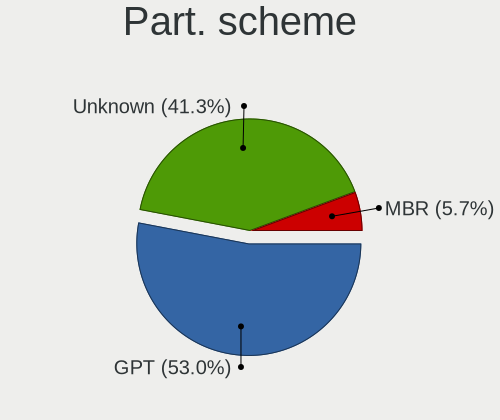
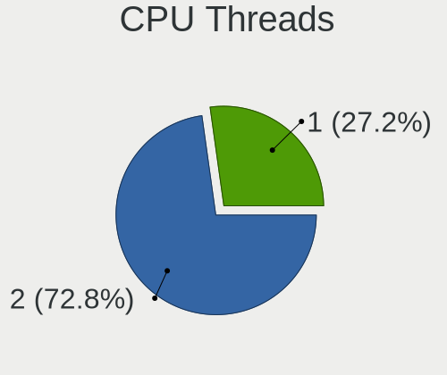
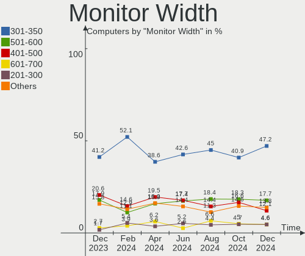
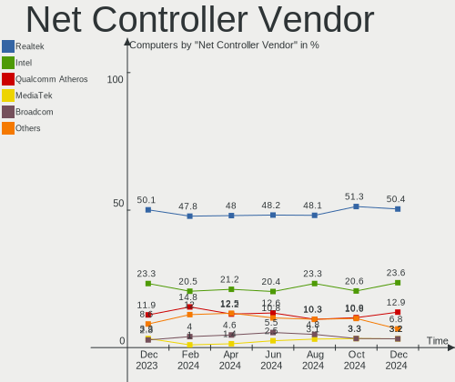
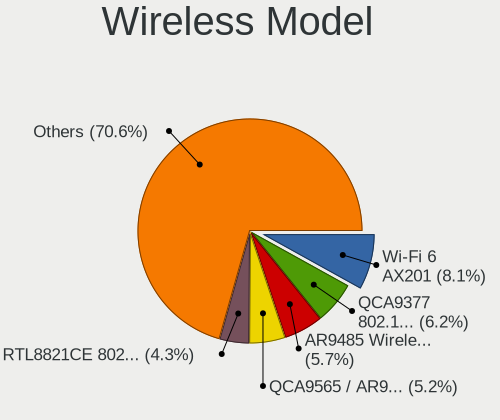
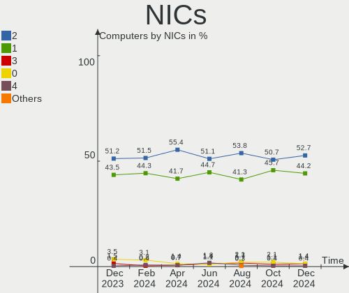

Linux in Brazil - Hardware Trends
---------------------------------

A project to identify most popular hardware characteristics and track their change
over time based on data collected by Linux users at https://Linux-Hardware.org.

Anyone can contribute to this report by the [hw-probe](https://github.com/linuxhw/hw-probe) tool:

    sudo -E hw-probe -all -upload

This is a report for all computer types. See also reports for [desktops](/Location/Brazil/Desktop/README.md) and [notebooks](/Location/Brazil/Notebook/README.md).

Period: Apr, 2024.

Contents
--------

* [ System ](#system)
  - [ OS                       ](#os)
  - [ OS Family                ](#os-family)
  - [ Kernel                   ](#kernel)
  - [ Kernel Family            ](#kernel-family)
  - [ Kernel Major Ver.        ](#kernel-major-ver)
  - [ Arch                     ](#arch)
  - [ DE                       ](#de)
  - [ Display Server           ](#display-server)
  - [ Display Manager          ](#display-manager)
  - [ OS Lang                  ](#os-lang)
  - [ Boot Mode                ](#boot-mode)
  - [ Filesystem               ](#filesystem)
  - [ Part. scheme             ](#part-scheme)
  - [ Dual Boot with Linux/BSD ](#dual-boot-with-linuxbsd)
  - [ Dual Boot (Win)          ](#dual-boot-win)

* [ Board ](#board)
  - [ Vendor                   ](#vendor)
  - [ Model                    ](#model)
  - [ Model Family             ](#model-family)
  - [ MFG Year                 ](#mfg-year)
  - [ Form Factor              ](#form-factor)
  - [ Secure Boot              ](#secure-boot)
  - [ Coreboot                 ](#coreboot)
  - [ RAM Size                 ](#ram-size)
  - [ RAM Used                 ](#ram-used)
  - [ Total Drives             ](#total-drives)
  - [ Has CD-ROM               ](#has-cd-rom)
  - [ Has Ethernet             ](#has-ethernet)
  - [ Has WiFi                 ](#has-wifi)
  - [ Has Bluetooth            ](#has-bluetooth)

* [ Location ](#location)
  - [ Country                  ](#country)
  - [ City                     ](#city)

* [ Drives ](#drives)
  - [ Drive Vendor             ](#drive-vendor)
  - [ Drive Model              ](#drive-model)
  - [ HDD Vendor               ](#hdd-vendor)
  - [ SSD Vendor               ](#ssd-vendor)
  - [ Drive Kind               ](#drive-kind)
  - [ Drive Connector          ](#drive-connector)
  - [ Drive Size               ](#drive-size)
  - [ Space Total              ](#space-total)
  - [ Space Used               ](#space-used)
  - [ Malfunc. Drives          ](#malfunc-drives)
  - [ Malfunc. Drive Vendor    ](#malfunc-drive-vendor)
  - [ Malfunc. HDD Vendor      ](#malfunc-hdd-vendor)
  - [ Malfunc. Drive Kind      ](#malfunc-drive-kind)
  - [ Failed Drives            ](#failed-drives)
  - [ Failed Drive Vendor      ](#failed-drive-vendor)
  - [ Drive Status             ](#drive-status)

* [ Storage controller ](#storage-controller)
  - [ Storage Vendor           ](#storage-vendor)
  - [ Storage Model            ](#storage-model)
  - [ Storage Kind             ](#storage-kind)

* [ Processor ](#processor)
  - [ CPU Vendor               ](#cpu-vendor)
  - [ CPU Model                ](#cpu-model)
  - [ CPU Model Family         ](#cpu-model-family)
  - [ CPU Cores                ](#cpu-cores)
  - [ CPU Sockets              ](#cpu-sockets)
  - [ CPU Threads              ](#cpu-threads)
  - [ CPU Op-Modes             ](#cpu-op-modes)
  - [ CPU Microcode            ](#cpu-microcode)
  - [ CPU Microarch            ](#cpu-microarch)

* [ Graphics ](#graphics)
  - [ GPU Vendor               ](#gpu-vendor)
  - [ GPU Model                ](#gpu-model)
  - [ GPU Combo                ](#gpu-combo)
  - [ GPU Driver               ](#gpu-driver)
  - [ GPU Memory               ](#gpu-memory)

* [ Monitor ](#monitor)
  - [ Monitor Vendor           ](#monitor-vendor)
  - [ Monitor Model            ](#monitor-model)
  - [ Monitor Resolution       ](#monitor-resolution)
  - [ Monitor Diagonal         ](#monitor-diagonal)
  - [ Monitor Width            ](#monitor-width)
  - [ Aspect Ratio             ](#aspect-ratio)
  - [ Monitor Area             ](#monitor-area)
  - [ Pixel Density            ](#pixel-density)
  - [ Multiple Monitors        ](#multiple-monitors)

* [ Network ](#network)
  - [ Net Controller Vendor    ](#net-controller-vendor)
  - [ Net Controller Model     ](#net-controller-model)
  - [ Wireless Vendor          ](#wireless-vendor)
  - [ Wireless Model           ](#wireless-model)
  - [ Ethernet Vendor          ](#ethernet-vendor)
  - [ Ethernet Model           ](#ethernet-model)
  - [ Net Controller Kind      ](#net-controller-kind)
  - [ Used Controller          ](#used-controller)
  - [ NICs                     ](#nics)
  - [ IPv6                     ](#ipv6)

* [ Bluetooth ](#bluetooth)
  - [ Bluetooth Vendor         ](#bluetooth-vendor)
  - [ Bluetooth Model          ](#bluetooth-model)

* [ Sound ](#sound)
  - [ Sound Vendor             ](#sound-vendor)
  - [ Sound Model              ](#sound-model)

* [ Memory ](#memory)
  - [ Memory Vendor            ](#memory-vendor)
  - [ Memory Model             ](#memory-model)
  - [ Memory Kind              ](#memory-kind)
  - [ Memory Form Factor       ](#memory-form-factor)
  - [ Memory Size              ](#memory-size)
  - [ Memory Speed             ](#memory-speed)

* [ Printers & scanners ](#printers--scanners)
  - [ Printer Vendor           ](#printer-vendor)
  - [ Printer Model            ](#printer-model)
  - [ Scanner Vendor           ](#scanner-vendor)
  - [ Scanner Model            ](#scanner-model)

* [ Camera ](#camera)
  - [ Camera Vendor            ](#camera-vendor)
  - [ Camera Model             ](#camera-model)

* [ Security ](#security)
  - [ Fingerprint Vendor       ](#fingerprint-vendor)
  - [ Fingerprint Model        ](#fingerprint-model)
  - [ Chipcard Vendor          ](#chipcard-vendor)
  - [ Chipcard Model           ](#chipcard-model)

* [ Unsupported ](#unsupported)
  - [ Unsupported Devices      ](#unsupported-devices)
  - [ Unsupported Device Types ](#unsupported-device-types)

System
------

OS
--

Installed operating systems

| Name                         | Computers | Percent |
|------------------------------|-----------|---------|
| Ubuntu 22.04                 | 33        | 11.96%  |
| Fedora 39                    | 29        | 10.51%  |
| Zorin 17                     | 21        | 7.61%   |
| Linux Mint 21.3              | 16        | 5.8%    |
| Pop!_OS 22.04                | 14        | 5.07%   |
| Fedora 40                    | 13        | 4.71%   |
| Debian 12                    | 13        | 4.71%   |
| OpenMandriva 23.08           | 12        | 4.35%   |
| Ubuntu 23.10                 | 10        | 3.62%   |
| OpenMandriva 5.0             | 9         | 3.26%   |
| Arch Rolling                 | 9         | 3.26%   |
| Kubuntu 22.04                | 8         | 2.9%    |
| Manjaro                      | 7         | 2.54%   |
| openSUSE Tumbleweed-XXXXXXXX | 4         | 1.45%   |
| Linux Mint 21.1              | 4         | 1.45%   |
| KDE neon 22.04               | 4         | 1.45%   |
| ArcoLinux Rolling            | 4         | 1.45%   |
| Ubuntu 20.04                 | 3         | 1.09%   |
| Nobara 39                    | 3         | 1.09%   |
| MX 23                        | 3         | 1.09%   |
| Linux Mint 20.3              | 3         | 1.09%   |
| Xubuntu 22.04                | 2         | 0.72%   |
| Ubuntu MATE 22.04            | 2         | 0.72%   |
| Ubuntu 24.04                 | 2         | 0.72%   |
| SteamOS 3.5.17               | 2         | 0.72%   |
| Lubuntu 22.04                | 2         | 0.72%   |
| Linux Mint 21.2              | 2         | 0.72%   |
| Kubuntu 24.04                | 2         | 0.72%   |
| Fedora 38                    | 2         | 0.72%   |
| Debian 11                    | 2         | 0.72%   |
| ArcoLinux                    | 2         | 0.72%   |
| Alpine 3.19.1                | 2         | 0.72%   |
| Zorin 16                     | 1         | 0.36%   |
| Vanilla 2.0                  | 1         | 0.36%   |
| Ultimate                     | 1         | 0.36%   |
| Ubuntu Core 22               | 1         | 0.36%   |
| Ubuntu Budgie 23.10          | 1         | 0.36%   |
| Ubuntu 23.04                 | 1         | 0.36%   |
| Ubuntu 22.10                 | 1         | 0.36%   |
| Ubuntu 20.10                 | 1         | 0.36%   |

OS Family
---------

OS without a version

| Name             | Computers | Percent |
|------------------|-----------|---------|
| Ubuntu           | 52        | 18.84%  |
| Fedora           | 44        | 15.94%  |
| Linux Mint       | 27        | 9.78%   |
| OpenMandriva     | 25        | 9.06%   |
| Zorin            | 22        | 7.97%   |
| Debian           | 15        | 5.43%   |
| Pop!_OS          | 14        | 5.07%   |
| Kubuntu          | 11        | 3.99%   |
| Arch             | 9         | 3.26%   |
| Manjaro          | 8         | 2.9%    |
| ArcoLinux        | 6         | 2.17%   |
| openSUSE         | 5         | 1.81%   |
| SteamOS          | 4         | 1.45%   |
| KDE neon         | 4         | 1.45%   |
| Nobara           | 3         | 1.09%   |
| MX               | 3         | 1.09%   |
| Xubuntu          | 2         | 0.72%   |
| Ubuntu MATE      | 2         | 0.72%   |
| NixOS            | 2         | 0.72%   |
| Lubuntu          | 2         | 0.72%   |
| Endless          | 2         | 0.72%   |
| BigLinux         | 2         | 0.72%   |
| Alpine           | 2         | 0.72%   |
| Vanilla          | 1         | 0.36%   |
| Ultimate         | 1         | 0.36%   |
| Ubuntu Budgie    | 1         | 0.36%   |
| ROSA             | 1         | 0.36%   |
| PCLinuxOS        | 1         | 0.36%   |
| org.kde.Platform | 1         | 0.36%   |
| Makulu           | 1         | 0.36%   |
| LMDE             | 1         | 0.36%   |
| Garuda Linux     | 1         | 0.36%   |
| Elementary       | 1         | 0.36%   |

Kernel
------

Version of the Linux kernel

| Version                             | Computers | Percent |
|-------------------------------------|-----------|---------|
| 6.5.0-27-generic                    | 31        | 11.23%  |
| 6.5.0-28-generic                    | 23        | 8.33%   |
| 6.5.0-26-generic                    | 22        | 7.97%   |
| 6.8.0-76060800daily20240311-generic | 13        | 4.71%   |
| 6.6.2-desktop-1omv2390              | 9         | 3.26%   |
| 6.4.11-desktop-1omv2390             | 9         | 3.26%   |
| 6.1.0-20-amd64                      | 8         | 2.9%    |
| 5.15.0-102-generic                  | 8         | 2.9%    |
| 5.15.0-101-generic                  | 8         | 2.9%    |
| 6.5.6-300.fc39.x86_64               | 7         | 2.54%   |
| 5.15.0-91-generic                   | 7         | 2.54%   |
| 6.8.7-300.fc40.x86_64               | 6         | 2.17%   |
| 6.8.6-200.fc39.x86_64               | 5         | 1.81%   |
| 6.8.4-200.fc39.x86_64               | 5         | 1.81%   |
| 6.8.5-301.fc40.x86_64               | 3         | 1.09%   |
| 6.8.5-1-default                     | 3         | 1.09%   |
| 6.8.2-zen2-1-zen                    | 3         | 1.09%   |
| 6.8.0-31-generic                    | 3         | 1.09%   |
| 6.7.11-200.fc39.x86_64              | 3         | 1.09%   |
| 6.6.26-1-MANJARO                    | 3         | 1.09%   |
| 6.4.8-desktop-2omv2390              | 3         | 1.09%   |
| 6.1.52-valve16-1-neptune-61         | 3         | 1.09%   |
| 6.1.0-18-amd64                      | 3         | 1.09%   |
| 5.15.0-105-generic                  | 3         | 1.09%   |
| 6.8.7-arch1-1                       | 2         | 0.72%   |
| 6.8.7-302.fsync.fc40.x86_64         | 2         | 0.72%   |
| 6.8.7-200.fc39.x86_64               | 2         | 0.72%   |
| 6.8.5-arch1-1                       | 2         | 0.72%   |
| 6.8.5-201.fc39.x86_64               | 2         | 0.72%   |
| 6.8.2-arch2-1                       | 2         | 0.72%   |
| 6.7.10-200.fc39.x86_64              | 2         | 0.72%   |
| 6.5.5-1-MANJARO                     | 2         | 0.72%   |
| 6.5.0-25-generic                    | 2         | 0.72%   |
| 6.5.0-18-generic                    | 2         | 0.72%   |
| 5.4.0-174-generic                   | 2         | 0.72%   |
| 5.15.0-83-generic                   | 2         | 0.72%   |
| 6.8.7-zen1-2-zen                    | 1         | 0.36%   |
| 6.8.7-lqx2-1-lqx                    | 1         | 0.36%   |
| 6.8.7-desktop-1omv2490              | 1         | 0.36%   |
| 6.8.7-200.fsync.fc39.x86_64         | 1         | 0.36%   |

Kernel Family
-------------

Linux kernel without a distro release

| Version | Computers | Percent |
|---------|-----------|---------|
| 6.5.0   | 85        | 30.8%   |
| 5.15.0  | 29        | 10.51%  |
| 6.8.7   | 16        | 5.8%    |
| 6.8.0   | 16        | 5.8%    |
| 6.1.0   | 13        | 4.71%   |
| 6.8.5   | 11        | 3.99%   |
| 6.6.2   | 9         | 3.26%   |
| 6.4.11  | 9         | 3.26%   |
| 6.8.4   | 8         | 2.9%    |
| 6.8.6   | 7         | 2.54%   |
| 6.8.2   | 7         | 2.54%   |
| 6.5.6   | 7         | 2.54%   |
| 5.4.0   | 4         | 1.45%   |
| 6.7.12  | 3         | 1.09%   |
| 6.7.11  | 3         | 1.09%   |
| 6.7.10  | 3         | 1.09%   |
| 6.6.26  | 3         | 1.09%   |
| 6.4.8   | 3         | 1.09%   |
| 6.1.52  | 3         | 1.09%   |
| 6.7.9   | 2         | 0.72%   |
| 6.6.25  | 2         | 0.72%   |
| 6.6.23  | 2         | 0.72%   |
| 6.6.13  | 2         | 0.72%   |
| 6.5.5   | 2         | 0.72%   |
| 5.19.0  | 2         | 0.72%   |
| 5.10.0  | 2         | 0.72%   |
| 6.7.6   | 1         | 0.36%   |
| 6.7.4   | 1         | 0.36%   |
| 6.7.3   | 1         | 0.36%   |
| 6.7.0   | 1         | 0.36%   |
| 6.6.28  | 1         | 0.36%   |
| 6.6.24  | 1         | 0.36%   |
| 6.6.20  | 1         | 0.36%   |
| 6.6.19  | 1         | 0.36%   |
| 6.6.12  | 1         | 0.36%   |
| 6.6.10  | 1         | 0.36%   |
| 6.4.10  | 1         | 0.36%   |
| 6.2.6   | 1         | 0.36%   |
| 6.2.0   | 1         | 0.36%   |
| 6.1.81  | 1         | 0.36%   |

Kernel Major Ver.
-----------------

Linux kernel major version

| Version | Computers | Percent |
|---------|-----------|---------|
| 6.5     | 94        | 34.06%  |
| 6.8     | 65        | 23.55%  |
| 5.15    | 29        | 10.51%  |
| 6.6     | 24        | 8.7%    |
| 6.1     | 19        | 6.88%   |
| 6.7     | 15        | 5.43%   |
| 6.4     | 13        | 4.71%   |
| 5.4     | 4         | 1.45%   |
| 5.19    | 3         | 1.09%   |
| 5.10    | 3         | 1.09%   |
| 6.2     | 2         | 0.72%   |
| 5.8     | 1         | 0.36%   |
| 5.18    | 1         | 0.36%   |
| 5.14    | 1         | 0.36%   |
| 5.11    | 1         | 0.36%   |
| 5.0     | 1         | 0.36%   |

Arch
----

OS architecture (x86_64, i586, etc.)

| Name   | Computers | Percent |
|--------|-----------|---------|
| x86_64 | 275       | 99.64%  |
| i686   | 1         | 0.36%   |

DE
--

Desktop Environment

| Name            | Computers | Percent |
|-----------------|-----------|---------|
| GNOME           | 146       | 52.9%   |
| KDE5            | 50        | 18.12%  |
| X-Cinnamon      | 19        | 6.88%   |
| XFCE            | 16        | 5.8%    |
| KDE6            | 12        | 4.35%   |
| MATE            | 10        | 3.62%   |
| Unknown         | 7         | 2.54%   |
| LXQt            | 3         | 1.09%   |
| sway            | 2         | 0.72%   |
| GNOME Flashback | 2         | 0.72%   |
| Cinnamon        | 2         | 0.72%   |
| Pantheon        | 1         | 0.36%   |
| LXDE            | 1         | 0.36%   |
| KDE4            | 1         | 0.36%   |
| Hyprland        | 1         | 0.36%   |
| Endless:GNOME   | 1         | 0.36%   |
| Deepin          | 1         | 0.36%   |
| Budgie          | 1         | 0.36%   |

Display Server
--------------

X11 or Wayland

| Name    | Computers | Percent |
|---------|-----------|---------|
| X11     | 138       | 50%     |
| Wayland | 133       | 48.19%  |
| Unknown | 4         | 1.45%   |
| Tty     | 1         | 0.36%   |

Display Manager
---------------

SDDM, LightDM, etc.

| Name    | Computers | Percent |
|---------|-----------|---------|
| Unknown | 145       | 52.54%  |
| GDM3    | 54        | 19.57%  |
| SDDM    | 40        | 14.49%  |
| LightDM | 24        | 8.7%    |
| GDM     | 12        | 4.35%   |
| XDM     | 1         | 0.36%   |

OS Lang
-------

Language

| Lang    | Computers | Percent |
|---------|-----------|---------|
| pt_BR   | 190       | 68.84%  |
| en_US   | 67        | 24.28%  |
| C       | 8         | 2.9%    |
| Unknown | 5         | 1.81%   |
| en_DK   | 2         | 0.72%   |
| it_IT   | 1         | 0.36%   |
| es_US   | 1         | 0.36%   |
| en_GB   | 1         | 0.36%   |
| en_CA   | 1         | 0.36%   |

Boot Mode
---------

EFI or BIOS

| Mode | Computers | Percent |
|------|-----------|---------|
| BIOS | 192       | 69.57%  |
| EFI  | 84        | 30.43%  |

Filesystem
----------

Type of filesystem

| Type    | Computers | Percent |
|---------|-----------|---------|
| Ext4    | 159       | 57.61%  |
| Btrfs   | 54        | 19.57%  |
| Tmpfs   | 44        | 15.94%  |
| Overlay | 14        | 5.07%   |
| Zfs     | 4         | 1.45%   |
| F2fs    | 1         | 0.36%   |

Part. scheme
------------

Scheme of partitioning

| Type    | Computers | Percent |
|---------|-----------|---------|
| Unknown | 139       | 50.36%  |
| GPT     | 117       | 42.39%  |
| MBR     | 20        | 7.25%   |

Dual Boot with Linux/BSD
------------------------

Hosting more than one Linux/BSD

| Dual boot | Computers | Percent |
|-----------|-----------|---------|
| No        | 244       | 88.41%  |
| Yes       | 32        | 11.59%  |

Dual Boot (Win)
---------------

Hosting Linux and Windows

| Dual boot | Computers | Percent |
|-----------|-----------|---------|
| No        | 217       | 78.62%  |
| Yes       | 59        | 21.38%  |

Board
-----

Vendor
------

Motherboard manufacturer

| Name                   | Computers | Percent |
|------------------------|-----------|---------|
| Dell                   | 44        | 15.94%  |
| ASUSTek Computer       | 38        | 13.77%  |
| Lenovo                 | 27        | 9.78%   |
| Gigabyte Technology    | 23        | 8.33%   |
| Intel                  | 19        | 6.88%   |
| Acer                   | 14        | 5.07%   |
| Positivo               | 13        | 4.71%   |
| Hewlett-Packard        | 13        | 4.71%   |
| Samsung Electronics    | 9         | 3.26%   |
| ASRock                 | 9         | 3.26%   |
| MSI                    | 7         | 2.54%   |
| Sony                   | 5         | 1.81%   |
| Apple                  | 5         | 1.81%   |
| Unknown                | 5         | 1.81%   |
| Semp Toshiba           | 4         | 1.45%   |
| Itautec                | 4         | 1.45%   |
| Avell High Performance | 4         | 1.45%   |
| Valve                  | 3         | 1.09%   |
| PCWare                 | 3         | 1.09%   |
| AZW                    | 3         | 1.09%   |
| Philco                 | 2         | 0.72%   |
| MACHINIST              | 2         | 0.72%   |
| Huanan                 | 2         | 0.72%   |
| Biostar                | 2         | 0.72%   |
| Alienware              | 2         | 0.72%   |
| Timi                   | 1         | 0.36%   |
| Quanta                 | 1         | 0.36%   |
| ONDA                   | 1         | 0.36%   |
| Notebook               | 1         | 0.36%   |
| NCR                    | 1         | 0.36%   |
| MANCER                 | 1         | 0.36%   |
| Login Informatica      | 1         | 0.36%   |
| DUEX                   | 1         | 0.36%   |
| Digibras               | 1         | 0.36%   |
| Digiboard              | 1         | 0.36%   |
| Daten Tecnologia       | 1         | 0.36%   |
| ANGXUN                 | 1         | 0.36%   |
| AMD                    | 1         | 0.36%   |
| ADLINK Technology      | 1         | 0.36%   |

Model
-----

Motherboard model

| Name                                   | Computers | Percent |
|----------------------------------------|-----------|---------|
| Unknown                                | 5         | 1.81%   |
| Samsung 550XDA                         | 4         | 1.45%   |
| Valve Jupiter                          | 3         | 1.09%   |
| Intel H81                              | 3         | 1.09%   |
| Intel B75                              | 3         | 1.09%   |
| ASRock B450M Steel Legend              | 3         | 1.09%   |
| Semp Toshiba STI                       | 2         | 0.72%   |
| Lenovo IdeaPad 3 15ALC6 82MF           | 2         | 0.72%   |
| Lenovo G470 20078                      | 2         | 0.72%   |
| Itautec ST 4265                        | 2         | 0.72%   |
| Intel X99                              | 2         | 0.72%   |
| Intel H61                              | 2         | 0.72%   |
| Intel H55                              | 2         | 0.72%   |
| Intel AB2L                             | 2         | 0.72%   |
| Gigabyte B760M AORUS ELITE             | 2         | 0.72%   |
| Gigabyte B450M GAMING                  | 2         | 0.72%   |
| Dell OptiPlex 7080                     | 2         | 0.72%   |
| Dell OptiPlex 3070                     | 2         | 0.72%   |
| Dell Inspiron N4050                    | 2         | 0.72%   |
| Dell Inspiron 5566                     | 2         | 0.72%   |
| Dell Inspiron 5448                     | 2         | 0.72%   |
| Dell Inspiron 15-3567                  | 2         | 0.72%   |
| Dell G15 5530                          | 2         | 0.72%   |
| AZW T4 PRO                             | 2         | 0.72%   |
| Avell High Performance B.ON            | 2         | 0.72%   |
| ASUS VivoBook_ASUSLaptop X515EA_X515EA | 2         | 0.72%   |
| ASUS TUF Gaming X570-PLUS_BR           | 2         | 0.72%   |
| ASUS PRIME A520M-E                     | 2         | 0.72%   |
| ASUS All Series                        | 2         | 0.72%   |
| Timi RedmiBook Pro 14S                 | 1         | 0.36%   |
| Sony VPCS131FM                         | 1         | 0.36%   |
| Sony VPCEH30EB                         | 1         | 0.36%   |
| Sony VPCEA3UFX                         | 1         | 0.36%   |
| Sony SVF14A15CLB                       | 1         | 0.36%   |
| Sony SVE14A16FBW                       | 1         | 0.36%   |
| Semp Toshiba STI NI 1401               | 1         | 0.36%   |
| Semp Toshiba IS 1414                   | 1         | 0.36%   |
| Samsung RV411/RV511/E3511/S3511/RV711  | 1         | 0.36%   |
| Samsung 960XFH                         | 1         | 0.36%   |
| Samsung 530U3C/530U4C/532U3C           | 1         | 0.36%   |

Model Family
------------

Motherboard model prefix

| Name                        | Computers | Percent |
|-----------------------------|-----------|---------|
| Dell Inspiron               | 17        | 6.16%   |
| Lenovo IdeaPad              | 11        | 3.99%   |
| ASUS TUF                    | 9         | 3.26%   |
| Acer Aspire                 | 9         | 3.26%   |
| Dell OptiPlex               | 7         | 2.54%   |
| Dell Latitude               | 7         | 2.54%   |
| Lenovo ThinkPad             | 5         | 1.81%   |
| Dell Vostro                 | 5         | 1.81%   |
| ASUS VivoBook               | 5         | 1.81%   |
| ASUS PRIME                  | 5         | 1.81%   |
| Unknown                     | 5         | 1.81%   |
| Samsung 550XDA              | 4         | 1.45%   |
| Lenovo ThinkCentre          | 4         | 1.45%   |
| Dell G15                    | 4         | 1.45%   |
| Valve Jupiter               | 3         | 1.09%   |
| Semp Toshiba STI            | 3         | 1.09%   |
| Itautec ST                  | 3         | 1.09%   |
| Intel X99                   | 3         | 1.09%   |
| Intel H81                   | 3         | 1.09%   |
| Intel B75                   | 3         | 1.09%   |
| Gigabyte B450M              | 3         | 1.09%   |
| Gigabyte A520M              | 3         | 1.09%   |
| ASUS ROG                    | 3         | 1.09%   |
| ASRock B450M                | 3         | 1.09%   |
| Acer Nitro                  | 3         | 1.09%   |
| Positivo Master             | 2         | 0.72%   |
| Lenovo G470                 | 2         | 0.72%   |
| Intel H61                   | 2         | 0.72%   |
| Intel H55                   | 2         | 0.72%   |
| Intel AB2L                  | 2         | 0.72%   |
| HP ProBook                  | 2         | 0.72%   |
| HP Compaq                   | 2         | 0.72%   |
| Gigabyte B760M              | 2         | 0.72%   |
| Dell PowerEdge              | 2         | 0.72%   |
| AZW T4                      | 2         | 0.72%   |
| Avell High Performance B.ON | 2         | 0.72%   |
| ASUS All                    | 2         | 0.72%   |
| ASRock B650E                | 2         | 0.72%   |
| Timi RedmiBook              | 1         | 0.36%   |
| Sony VPCS131FM              | 1         | 0.36%   |

MFG Year
--------

Motherboard manufacture year

| Year    | Computers | Percent |
|---------|-----------|---------|
| 2012    | 28        | 10.14%  |
| 2023    | 24        | 8.7%    |
| 2021    | 24        | 8.7%    |
| 2018    | 24        | 8.7%    |
| 2020    | 22        | 7.97%   |
| 2022    | 21        | 7.61%   |
| 2019    | 19        | 6.88%   |
| 2017    | 18        | 6.52%   |
| 2013    | 15        | 5.43%   |
| 2014    | 14        | 5.07%   |
| 2011    | 13        | 4.71%   |
| 2010    | 13        | 4.71%   |
| 2016    | 12        | 4.35%   |
| 2015    | 11        | 3.99%   |
| 2009    | 6         | 2.17%   |
| 2008    | 5         | 1.81%   |
| 2007    | 4         | 1.45%   |
| 2024    | 1         | 0.36%   |
| 2006    | 1         | 0.36%   |
| Unknown | 1         | 0.36%   |

Form Factor
-----------

Physical design of the computer

| Name        | Computers | Percent |
|-------------|-----------|---------|
| Notebook    | 134       | 48.55%  |
| Desktop     | 132       | 47.83%  |
| Mini pc     | 5         | 1.81%   |
| All in one  | 2         | 0.72%   |
| Server      | 2         | 0.72%   |
| Convertible | 1         | 0.36%   |

Secure Boot
-----------

Enabled or disabled

| State    | Computers | Percent |
|----------|-----------|---------|
| Disabled | 271       | 98.19%  |
| Enabled  | 5         | 1.81%   |

Coreboot
--------

Have coreboot on board

| Used | Computers | Percent |
|------|-----------|---------|
| No   | 276       | 100%    |

RAM Size
--------

Total RAM memory

| Size in GB  | Computers | Percent |
|-------------|-----------|---------|
| 4.01-8.0    | 68        | 24.64%  |
| 16.01-24.0  | 61        | 22.1%   |
| 3.01-4.0    | 53        | 19.2%   |
| 8.01-16.0   | 49        | 17.75%  |
| 32.01-64.0  | 30        | 10.87%  |
| 64.01-256.0 | 5         | 1.81%   |
| 1.01-2.0    | 5         | 1.81%   |
| 2.01-3.0    | 3         | 1.09%   |
| 24.01-32.0  | 2         | 0.72%   |

RAM Used
--------

Used RAM memory

| Used GB    | Computers | Percent |
|------------|-----------|---------|
| 2.01-3.0   | 86        | 31.16%  |
| 1.01-2.0   | 61        | 22.1%   |
| 4.01-8.0   | 60        | 21.74%  |
| 3.01-4.0   | 36        | 13.04%  |
| 8.01-16.0  | 17        | 6.16%   |
| 0.51-1.0   | 11        | 3.99%   |
| 16.01-24.0 | 3         | 1.09%   |
| 0.01-0.5   | 2         | 0.72%   |

Total Drives
------------

Number of drives on board

| Drives | Computers | Percent |
|--------|-----------|---------|
| 1      | 168       | 60.87%  |
| 2      | 55        | 19.93%  |
| 3      | 38        | 13.77%  |
| 5      | 7         | 2.54%   |
| 4      | 7         | 2.54%   |
| 7      | 1         | 0.36%   |

Has CD-ROM
----------

Has CD-ROM on board

| Presented | Computers | Percent |
|-----------|-----------|---------|
| No        | 204       | 73.91%  |
| Yes       | 72        | 26.09%  |

Has Ethernet
------------

Has Ethernet on board

| Presented | Computers | Percent |
|-----------|-----------|---------|
| Yes       | 257       | 93.12%  |
| No        | 19        | 6.88%   |

Has WiFi
--------

Has WiFi module

| Presented | Computers | Percent |
|-----------|-----------|---------|
| Yes       | 201       | 72.83%  |
| No        | 75        | 27.17%  |

Has Bluetooth
-------------

Has Bluetooth module

| Presented | Computers | Percent |
|-----------|-----------|---------|
| Yes       | 146       | 52.9%   |
| No        | 130       | 47.1%   |

Location
--------

Country
-------

Geographic location (country)

| Country | Computers | Percent |
|---------|-----------|---------|
| Brazil  | 276       | 100%    |

City
----

Geographic location (city)

| City                  | Computers | Percent |
|-----------------------|-----------|---------|
| Sao Paulo             | 33        | 11.96%  |
| Rio de Janeiro        | 24        | 8.7%    |
| Belo Horizonte        | 10        | 3.62%   |
| Fortaleza             | 7         | 2.54%   |
| Brasília             | 7         | 2.54%   |
| Porto Alegre          | 5         | 1.81%   |
| Palmas                | 5         | 1.81%   |
| Uberlândia           | 4         | 1.45%   |
| Sumaré               | 4         | 1.45%   |
| Recife                | 4         | 1.45%   |
| Niterói              | 4         | 1.45%   |
| Manaus                | 4         | 1.45%   |
| Florianópolis        | 4         | 1.45%   |
| Contagem              | 4         | 1.45%   |
| Sao Goncalo           | 3         | 1.09%   |
| Santo André          | 3         | 1.09%   |
| Salvador              | 3         | 1.09%   |
| Rio Grande            | 3         | 1.09%   |
| Londrina              | 3         | 1.09%   |
| Goiânia              | 3         | 1.09%   |
| Curitiba              | 3         | 1.09%   |
| Campinas              | 3         | 1.09%   |
| Volta Redonda         | 2         | 0.72%   |
| Sorocaba              | 2         | 0.72%   |
| Sao Jose do Rio Preto | 2         | 0.72%   |
| Sao Joao de Meriti    | 2         | 0.72%   |
| Sao Carlos            | 2         | 0.72%   |
| Santos                | 2         | 0.72%   |
| Ribeirao das Neves    | 2         | 0.72%   |
| Portao                | 2         | 0.72%   |
| Peruibe               | 2         | 0.72%   |
| Natal                 | 2         | 0.72%   |
| Mogi das Cruzes       | 2         | 0.72%   |
| Maringá              | 2         | 0.72%   |
| Limeira               | 2         | 0.72%   |
| Joinville             | 2         | 0.72%   |
| Joao Pessoa           | 2         | 0.72%   |
| Itabuna               | 2         | 0.72%   |
| Imperatriz            | 2         | 0.72%   |
| Governador Valadares  | 2         | 0.72%   |

Drives
------

Drive Vendor
------------

Hard drive vendors

| Vendor                         | Computers | Drives | Percent |
|--------------------------------|-----------|--------|---------|
| WDC                            | 71        | 78     | 16.63%  |
| Seagate                        | 47        | 56     | 11.01%  |
| Kingston                       | 46        | 51     | 10.77%  |
| Samsung Electronics            | 26        | 32     | 6.09%   |
| Sandisk                        | 24        | 25     | 5.62%   |
| China                          | 22        | 23     | 5.15%   |
| Toshiba                        | 18        | 18     | 4.22%   |
| Unknown                        | 13        | 13     | 3.04%   |
| A-DATA Technology              | 12        | 13     | 2.81%   |
| Silicon Motion                 | 11        | 11     | 2.58%   |
| SK hynix                       | 9         | 9      | 2.11%   |
| Unknown                        | 8         | 8      | 1.87%   |
| Kingston Technology Company    | 8         | 8      | 1.87%   |
| Hitachi                        | 8         | 8      | 1.87%   |
| ADATA Technology               | 8         | 8      | 1.87%   |
| Realtek Semiconductor          | 6         | 6      | 1.41%   |
| KingSpec                       | 6         | 6      | 1.41%   |
| JMicron Technology             | 5         | 5      | 1.17%   |
| HGST                           | 5         | 5      | 1.17%   |
| Crucial                        | 5         | 5      | 1.17%   |
| Phison Electronics             | 4         | 4      | 0.94%   |
| Lexar                          | 4         | 4      | 0.94%   |
| XrayDisk                       | 3         | 4      | 0.7%    |
| Netac                          | 3         | 3      | 0.7%    |
| MAXIO Technology (Hangzhou)    | 3         | 3      | 0.7%    |
| WALRAM                         | 2         | 2      | 0.47%   |
| SSSTC                          | 2         | 2      | 0.47%   |
| Solid State Storage Technology | 2         | 2      | 0.47%   |
| Pichau                         | 2         | 2      | 0.47%   |
| Micron/Crucial Technology      | 2         | 2      | 0.47%   |
| Lite-On Technology             | 2         | 2      | 0.47%   |
| KIOXIA                         | 2         | 2      | 0.47%   |
| KingDian                       | 2         | 2      | 0.47%   |
| KBM                            | 2         | 2      | 0.47%   |
| Intel                          | 2         | 2      | 0.47%   |
| HS-SSD-C100                    | 2         | 2      | 0.47%   |
| Apple                          | 2         | 3      | 0.47%   |
| Zheino                         | 1         | 1      | 0.23%   |
| USB3.0                         | 1         | 1      | 0.23%   |
| Union Memory (Shenzhen)        | 1         | 1      | 0.23%   |

Drive Model
-----------

Hard drive models

| Model                                                 | Computers | Percent |
|-------------------------------------------------------|-----------|---------|
| Kingston SA400S37480G 480GB SSD                       | 16        | 3.6%    |
| Unknown                                               | 13        | 2.92%   |
| Kingston SA400S37240G 240GB SSD                       | 10        | 2.25%   |
| Silicon Motion SM2263EN/SM2263XT SSD Controller 256GB | 8         | 1.8%    |
| WDC WD10SPZX-21Z10T0 1TB                              | 6         | 1.35%   |
| China SSD 128GB                                       | 6         | 1.35%   |
| WDC WDS240G2G0A-00JH30 240GB SSD                      | 5         | 1.12%   |
| Seagate ST1000DM010-2EP102 1TB                        | 5         | 1.12%   |
| SanDisk SSD PLUS 480GB                                | 5         | 1.12%   |
| WDC WD10EZEX-08WN4A0 1TB                              | 4         | 0.9%    |
| Toshiba MQ01ABF050 500GB                              | 4         | 0.9%    |
| Seagate ST500LM012 HN-M500MBB 500GB                   | 4         | 0.9%    |
| Kingston Company SNV2S1000G 1TB                       | 4         | 0.9%    |
| Kingston SV300S37A120G 120GB SSD                      | 4         | 0.9%    |
| Kingston SA400S37120G 120GB SSD                       | 4         | 0.9%    |
| Crucial CT480BX500SSD1 480GB                          | 4         | 0.9%    |
| Toshiba MQ01ABD050 500GB                              | 3         | 0.67%   |
| Seagate ST2000DM001-1CH164 2TB                        | 3         | 0.67%   |
| Seagate ST1000LM048-2E7172 1TB                        | 3         | 0.67%   |
| MAXIO (Hangzhou) NVMe SSD Controller MAP1202 256GB    | 3         | 0.67%   |
| JMicron Generic 320GB                                 | 3         | 0.67%   |
| China SSD 120GB                                       | 3         | 0.67%   |
| A-DATA IM2P33F3A NVMe 512GB                           | 3         | 0.67%   |
| WDC WDS120G2G0A-00JH30 120GB SSD                      | 2         | 0.45%   |
| WDC WDS100T2B0A-00SM50 1TB SSD                        | 2         | 0.45%   |
| WDC WD5000AAKX-60U6AA0 500GB                          | 2         | 0.45%   |
| WDC WD3200BPVT-22JJ5T0 320GB                          | 2         | 0.45%   |
| WDC WD1600BEVS-00VAT0 160GB                           | 2         | 0.45%   |
| WDC WD10SPZX-80Z10T2 1TB                              | 2         | 0.45%   |
| WDC WD10SPZX-35Z10T0 1TB                              | 2         | 0.45%   |
| WDC WD10SPZX-24Z10 1TB                                | 2         | 0.45%   |
| WDC WD10JPVX-75JC3T0 1TB                              | 2         | 0.45%   |
| WDC WD10EZEX-00WN4A0 1TB                              | 2         | 0.45%   |
| WDC WD10EARS-00Y5B1 1TB                               | 2         | 0.45%   |
| Unknown MMC Card  64GB                                | 2         | 0.45%   |
| SK hynix HFS256GEJ9X108N 256GB                        | 2         | 0.45%   |
| SK hynix BC511 256GB                                  | 2         | 0.45%   |
| Silicon Motion SM2262/SM2262EN SSD Controller 2TB     | 2         | 0.45%   |
| Seagate ST500LT012-1DG142 500GB                       | 2         | 0.45%   |
| Seagate ST3500413AS 500GB                             | 2         | 0.45%   |

HDD Vendor
----------

Hard disk drive vendors

| Vendor              | Computers | Drives | Percent |
|---------------------|-----------|--------|---------|
| WDC                 | 58        | 63     | 38.93%  |
| Seagate             | 46        | 55     | 30.87%  |
| Toshiba             | 18        | 18     | 12.08%  |
| Samsung Electronics | 11        | 13     | 7.38%   |
| Hitachi             | 8         | 8      | 5.37%   |
| HGST                | 5         | 5      | 3.36%   |
| JMicron Technology  | 3         | 3      | 2.01%   |

SSD Vendor
----------

Solid state drive vendors

| Vendor              | Computers | Drives | Percent |
|---------------------|-----------|--------|---------|
| Kingston            | 41        | 45     | 28.47%  |
| China               | 22        | 23     | 15.28%  |
| WDC                 | 14        | 14     | 9.72%   |
| SanDisk             | 13        | 13     | 9.03%   |
| KingSpec            | 6         | 6      | 4.17%   |
| Crucial             | 5         | 5      | 3.47%   |
| A-DATA Technology   | 5         | 5      | 3.47%   |
| Unknown             | 5         | 5      | 3.47%   |
| Samsung Electronics | 4         | 5      | 2.78%   |
| Lexar               | 4         | 4      | 2.78%   |
| XrayDisk            | 2         | 2      | 1.39%   |
| Pichau              | 2         | 2      | 1.39%   |
| KingDian            | 2         | 2      | 1.39%   |
| KBM                 | 2         | 2      | 1.39%   |
| WALRAM              | 1         | 1      | 0.69%   |
| USB3.0              | 1         | 1      | 0.69%   |
| Team                | 1         | 1      | 0.69%   |
| S3+                 | 1         | 1      | 0.69%   |
| OCZ                 | 1         | 1      | 0.69%   |
| Netac               | 1         | 1      | 0.69%   |
| Mushkin             | 1         | 1      | 0.69%   |
| LITEONIT            | 1         | 1      | 0.69%   |
| LITEON              | 1         | 1      | 0.69%   |
| KINGCOMP            | 1         | 1      | 0.69%   |
| HUSKY               | 1         | 1      | 0.69%   |
| Hewlett-Packard     | 1         | 1      | 0.69%   |
| Corsair             | 1         | 1      | 0.69%   |
| BIWIN               | 1         | 1      | 0.69%   |
| BHT                 | 1         | 1      | 0.69%   |
| Apple               | 1         | 1      | 0.69%   |
| AFOX                | 1         | 1      | 0.69%   |

Drive Kind
----------

HDD or SSD

| Kind    | Computers | Drives | Percent |
|---------|-----------|--------|---------|
| SSD     | 127       | 150    | 33.78%  |
| HDD     | 125       | 165    | 33.24%  |
| NVMe    | 97        | 115    | 25.8%   |
| Unknown | 17        | 18     | 4.52%   |
| MMC     | 10        | 11     | 2.66%   |

Drive Connector
---------------

SATA, SAS, NVMe, etc.

| Type | Computers | Drives | Percent |
|------|-----------|--------|---------|
| SATA | 211       | 319    | 63.36%  |
| NVMe | 97        | 114    | 29.13%  |
| SAS  | 15        | 15     | 4.5%    |
| MMC  | 10        | 11     | 3%      |

Drive Size
----------

Size of hard drive

| Size in TB | Computers | Drives | Percent |
|------------|-----------|--------|---------|
| 0.01-0.5   | 162       | 206    | 64.03%  |
| 0.51-1.0   | 63        | 77     | 24.9%   |
| 1.01-2.0   | 19        | 19     | 7.51%   |
| 3.01-4.0   | 5         | 8      | 1.98%   |
| 2.01-3.0   | 2         | 3      | 0.79%   |
| 4.01-10.0  | 2         | 2      | 0.79%   |

Space Total
-----------

Amount of disk space available on the file system

| Size in GB     | Computers | Percent |
|----------------|-----------|---------|
| 101-250        | 73        | 26.45%  |
| 251-500        | 69        | 25%     |
| 501-1000       | 47        | 17.03%  |
| 1-20           | 23        | 8.33%   |
| 1001-2000      | 19        | 6.88%   |
| More than 3000 | 12        | 4.35%   |
| 51-100         | 10        | 3.62%   |
| 21-50          | 9         | 3.26%   |
| 2001-3000      | 7         | 2.54%   |
| Unknown        | 7         | 2.54%   |

Space Used
----------

Amount of used disk space

| Used GB        | Computers | Percent |
|----------------|-----------|---------|
| 1-20           | 84        | 30.43%  |
| 21-50          | 61        | 22.1%   |
| 101-250        | 39        | 14.13%  |
| 51-100         | 37        | 13.41%  |
| 251-500        | 20        | 7.25%   |
| 501-1000       | 15        | 5.43%   |
| 1001-2000      | 7         | 2.54%   |
| Unknown        | 7         | 2.54%   |
| 2001-3000      | 4         | 1.45%   |
| More than 3000 | 2         | 0.72%   |

Malfunc. Drives
---------------

Drive models with a malfunction

| Model                                                 | Computers | Drives | Percent |
|-------------------------------------------------------|-----------|--------|---------|
| WDC WD1600BEVS-00VAT0 160GB                           | 2         | 2      | 4.76%   |
| WDC WD10JPVX-75JC3T0 1TB                              | 2         | 2      | 4.76%   |
| Seagate ST2000DM001-1CH164 2TB                        | 2         | 2      | 4.76%   |
| WDC WDS240G2G0A-00JH30 240GB SSD                      | 1         | 1      | 2.38%   |
| WDC WD5000LPLX-60ZNTT2 500GB                          | 1         | 1      | 2.38%   |
| WDC WD5000AAKX-603CA0 500GB                           | 1         | 1      | 2.38%   |
| WDC WD10EARS-00Y5B1 1TB                               | 1         | 1      | 2.38%   |
| Toshiba MQ01ABD100H 1TB                               | 1         | 1      | 2.38%   |
| Toshiba MQ01ABD050V -63 500GB                         | 1         | 1      | 2.38%   |
| Toshiba MQ01ABD050 500GB                              | 1         | 1      | 2.38%   |
| Toshiba MK8052GSX 80GB                                | 1         | 1      | 2.38%   |
| Toshiba MK3265GSX 320GB                               | 1         | 1      | 2.38%   |
| Toshiba MK2565GSXN 250GB                              | 1         | 1      | 2.38%   |
| Toshiba MK2565GSX 250GB                               | 1         | 1      | 2.38%   |
| Silicon Motion SM2263EN/SM2263XT SSD Controller 256GB | 1         | 1      | 2.38%   |
| Seagate ST500LT012-1DG142 500GB                       | 1         | 1      | 2.38%   |
| Seagate ST500LM034-2GH17A 500GB                       | 1         | 1      | 2.38%   |
| Seagate ST500LM021-1KJ152 500GB                       | 1         | 1      | 2.38%   |
| Seagate ST500LM012 HN-M500MBB 500GB                   | 1         | 1      | 2.38%   |
| Seagate ST3500312CS 500GB                             | 1         | 1      | 2.38%   |
| Seagate ST3160318AS 160GB                             | 1         | 1      | 2.38%   |
| Seagate ST3000DM008-2DM166 3TB                        | 1         | 1      | 2.38%   |
| Seagate ST1500DL003-9VT16L 1TB                        | 1         | 1      | 2.38%   |
| SanDisk SSD PLUS 120GB                                | 1         | 1      | 2.38%   |
| Samsung Electronics SSD 970 EVO 500GB                 | 1         | 1      | 2.38%   |
| Samsung Electronics SP2504C 250GB                     | 1         | 1      | 2.38%   |
| Samsung Electronics HM160HI 160GB                     | 1         | 1      | 2.38%   |
| Samsung Electronics HD502HI 500GB                     | 1         | 1      | 2.38%   |
| Mushkin MKNSSDTR1TB-3D                                | 1         | 1      | 2.38%   |
| Kingston SUV500240G 240GB SSD                         | 1         | 1      | 2.38%   |
| Kingston SA400S37120G 120GB SSD                       | 1         | 1      | 2.38%   |
| KINGCOMP SSD 256GB                                    | 1         | 1      | 2.38%   |
| Hitachi HUA723030ALA641 3TB                           | 1         | 1      | 2.38%   |
| Hitachi HTS545032B9A300 320GB                         | 1         | 1      | 2.38%   |
| Hitachi HTS541612J9SA00 120GB                         | 1         | 1      | 2.38%   |
| Hitachi HDP725050GLA360 500GB                         | 1         | 1      | 2.38%   |
| HGST HTS545050A7E380 500GB                            | 1         | 1      | 2.38%   |
| China SSD 480GB                                       | 1         | 1      | 2.38%   |
| China SSD 128GB                                       | 1         | 1      | 2.38%   |

Malfunc. Drive Vendor
---------------------

Vendors of faulty drives

| Vendor              | Computers | Drives | Percent |
|---------------------|-----------|--------|---------|
| Seagate             | 9         | 10     | 22.5%   |
| WDC                 | 8         | 8      | 20%     |
| Toshiba             | 7         | 7      | 17.5%   |
| Hitachi             | 4         | 4      | 10%     |
| Samsung Electronics | 3         | 4      | 7.5%    |
| Kingston            | 2         | 2      | 5%      |
| China               | 2         | 2      | 5%      |
| Silicon Motion      | 1         | 1      | 2.5%    |
| SanDisk             | 1         | 1      | 2.5%    |
| Mushkin             | 1         | 1      | 2.5%    |
| KINGCOMP            | 1         | 1      | 2.5%    |
| HGST                | 1         | 1      | 2.5%    |

Malfunc. HDD Vendor
-------------------

Vendors of faulty HDD drives

| Vendor              | Computers | Drives | Percent |
|---------------------|-----------|--------|---------|
| Seagate             | 9         | 10     | 29.03%  |
| WDC                 | 7         | 7      | 22.58%  |
| Toshiba             | 7         | 7      | 22.58%  |
| Hitachi             | 4         | 4      | 12.9%   |
| Samsung Electronics | 3         | 3      | 9.68%   |
| HGST                | 1         | 1      | 3.23%   |

Malfunc. Drive Kind
-------------------

Kinds of faulty drives

| Kind | Computers | Drives | Percent |
|------|-----------|--------|---------|
| HDD  | 27        | 32     | 72.97%  |
| SSD  | 8         | 8      | 21.62%  |
| NVMe | 2         | 2      | 5.41%   |

Failed Drives
-------------

Failed drive models

Zero info for selected period =(

Failed Drive Vendor
-------------------

Failed drive vendors

Zero info for selected period =(

Drive Status
------------

Number of failed and malfunc. drives

| Status   | Computers | Drives | Percent |
|----------|-----------|--------|---------|
| Detected | 194       | 305    | 64.45%  |
| Works    | 73        | 112    | 24.25%  |
| Malfunc  | 34        | 42     | 11.3%   |

Storage controller
------------------

Storage Vendor
--------------

Storage controller vendors

| Vendor                           | Computers | Percent |
|----------------------------------|-----------|---------|
| Intel                            | 197       | 53.68%  |
| AMD                              | 48        | 13.08%  |
| ADATA Technology                 | 15        | 4.09%   |
| Silicon Motion                   | 14        | 3.81%   |
| Samsung Electronics              | 13        | 3.54%   |
| Kingston Technology Company      | 13        | 3.54%   |
| SanDisk                          | 12        | 3.27%   |
| SK hynix                         | 8         | 2.18%   |
| Realtek Semiconductor            | 6         | 1.63%   |
| Solid State Storage Technology   | 5         | 1.36%   |
| Phison Electronics               | 5         | 1.36%   |
| ASMedia Technology               | 5         | 1.36%   |
| MAXIO Technology (Hangzhou)      | 4         | 1.09%   |
| Marvell Technology Group         | 3         | 0.82%   |
| JMicron Technology               | 3         | 0.82%   |
| Micron/Crucial Technology        | 2         | 0.54%   |
| Lite-On Technology               | 2         | 0.54%   |
| KIOXIA                           | 2         | 0.54%   |
| Union Memory (Shenzhen)          | 1         | 0.27%   |
| Solidigm                         | 1         | 0.27%   |
| Silicon Integrated Systems [SiS] | 1         | 0.27%   |
| Shenzhen Longsys Electronics     | 1         | 0.27%   |
| Nvidia                           | 1         | 0.27%   |
| Netac Technology                 | 1         | 0.27%   |
| Micron Technology                | 1         | 0.27%   |
| INNOGRIT                         | 1         | 0.27%   |
| Broadcom / LSI                   | 1         | 0.27%   |
| Apple                            | 1         | 0.27%   |

Storage Model
-------------

Storage controller models

| Model                                                                          | Computers | Percent |
|--------------------------------------------------------------------------------|-----------|---------|
| AMD FCH SATA Controller [AHCI mode]                                            | 28        | 6.91%   |
| Intel 7 Series Chipset Family 6-port SATA Controller [AHCI mode]               | 19        | 4.69%   |
| Intel 8 Series/C220 Series Chipset Family 6-port SATA Controller 1 [AHCI mode] | 14        | 3.46%   |
| Intel 7 Series/C210 Series Chipset Family 6-port SATA Controller [AHCI mode]   | 14        | 3.46%   |
| Silicon Motion SM2263EN/SM2263XT (DRAM-less) NVMe SSD Controllers              | 11        | 2.72%   |
| Intel Sunrise Point-LP SATA Controller [AHCI mode]                             | 11        | 2.72%   |
| AMD 500 Series Chipset SATA Controller                                         | 11        | 2.72%   |
| AMD 400 Series Chipset SATA Controller                                         | 10        | 2.47%   |
| Intel 6 Series/C200 Series Chipset Family 6 port Mobile SATA AHCI Controller   | 8         | 1.98%   |
| Intel 5 Series/3400 Series Chipset 4 port SATA AHCI Controller                 | 8         | 1.98%   |
| Intel Tiger Lake-LP SATA Controller                                            | 7         | 1.73%   |
| Intel 6 Series/C200 Series Chipset Family 6 port Desktop SATA AHCI Controller  | 7         | 1.73%   |
| Intel Wildcat Point-LP SATA Controller [AHCI Mode]                             | 6         | 1.48%   |
| Intel Q170/Q150/B150/H170/H110/Z170/CM236 Chipset SATA Controller [AHCI Mode]  | 6         | 1.48%   |
| Intel NM10/ICH7 Family SATA Controller [IDE mode]                              | 6         | 1.48%   |
| Intel 82801G (ICH7 Family) IDE Controller                                      | 6         | 1.48%   |
| Intel 82801 Mobile SATA Controller [RAID mode]                                 | 6         | 1.48%   |
| Kingston Company NV2 NVMe SSD E21T (DRAM-less)                                 | 5         | 1.23%   |
| Intel Volume Management Device NVMe RAID Controller                            | 5         | 1.23%   |
| Intel Comet Lake SATA AHCI Controller                                          | 5         | 1.23%   |
| Intel Cannon Lake PCH SATA AHCI Controller                                     | 5         | 1.23%   |
| Intel 400 Series Chipset Family SATA AHCI Controller                           | 5         | 1.23%   |
| Sandisk WD Black SN850X NVMe SSD                                               | 4         | 0.99%   |
| Samsung NVMe SSD Controller SM981/PM981/PM983                                  | 4         | 0.99%   |
| Realtek RTS5763DL NVMe SSD Controller (DRAM-less)                              | 4         | 0.99%   |
| Intel Volume Management Device NVMe RAID Controller Intel Corporation          | 4         | 0.99%   |
| Intel SATA Controller [RAID mode]                                              | 4         | 0.99%   |
| Intel Raptor Lake SATA AHCI Controller                                         | 4         | 0.99%   |
| Intel Celeron N3350/Pentium N4200/Atom E3900 Series SATA AHCI Controller       | 4         | 0.99%   |
| Intel Atom Processor E3800 Series SATA AHCI Controller                         | 4         | 0.99%   |
| Intel 82801HM/HEM (ICH8M/ICH8M-E) SATA Controller [AHCI mode]                  | 4         | 0.99%   |
| Intel 82801HM/HEM (ICH8M/ICH8M-E) IDE Controller                               | 4         | 0.99%   |
| Intel 5 Series/3400 Series Chipset 6 port SATA AHCI Controller                 | 4         | 0.99%   |
| Intel 200 Series PCH SATA controller [AHCI mode]                               | 4         | 0.99%   |
| ASMedia ASM1061/ASM1062 Serial ATA Controller                                  | 4         | 0.99%   |
| ADATA IM2P33F3 NVMe SSD (DRAM-less)                                            | 4         | 0.99%   |
| Solid State Storage CL1-3D256-Q11 NVMe SSD M.2                                 | 3         | 0.74%   |
| SK hynix Platinum P41/PC801 NVMe Solid State Drive                             | 3         | 0.74%   |
| SK hynix BC511 NVMe SSD                                                        | 3         | 0.74%   |
| Silicon Motion SM2262/SM2262EN SSD Controller                                  | 3         | 0.74%   |

Storage Kind
------------

Kind of storage controller (IDE, SATA, NVMe, SAS, ...)

| Kind | Computers | Percent |
|------|-----------|---------|
| SATA | 218       | 60.56%  |
| NVMe | 97        | 26.94%  |
| IDE  | 24        | 6.67%   |
| RAID | 21        | 5.83%   |

Processor
---------

CPU Vendor
----------

Processor vendors

| Vendor | Computers | Percent |
|--------|-----------|---------|
| Intel  | 215       | 77.9%   |
| AMD    | 61        | 22.1%   |

CPU Model
---------

Processor models

| Model                                       | Computers | Percent |
|---------------------------------------------|-----------|---------|
| AMD Ryzen 7 5700G with Radeon Graphics      | 5         | 1.81%   |
| Intel Core i5-3330 CPU @ 3.00GHz            | 4         | 1.45%   |
| Intel Core i5-3210M CPU @ 2.50GHz           | 4         | 1.45%   |
| Intel Core i3-6006U CPU @ 2.00GHz           | 4         | 1.45%   |
| Intel Core i3-3240 CPU @ 3.40GHz            | 4         | 1.45%   |
| Intel Celeron CPU N3350 @ 1.10GHz           | 4         | 1.45%   |
| AMD Ryzen 5 5500                            | 4         | 1.45%   |
| Intel Pentium Dual-Core CPU T4400 @ 2.20GHz | 3         | 1.09%   |
| Intel Core i7-5500U CPU @ 2.40GHz           | 3         | 1.09%   |
| Intel Core i7-10750H CPU @ 2.60GHz          | 3         | 1.09%   |
| Intel Core i5-2400 CPU @ 3.10GHz            | 3         | 1.09%   |
| Intel Core i5 CPU M 460 @ 2.53GHz           | 3         | 1.09%   |
| Intel Core i3-9100 CPU @ 3.60GHz            | 3         | 1.09%   |
| Intel Core i3-3110M CPU @ 2.40GHz           | 3         | 1.09%   |
| Intel Core i3-2350M CPU @ 2.30GHz           | 3         | 1.09%   |
| Intel Celeron CPU N3060 @ 1.60GHz           | 3         | 1.09%   |
| Intel 11th Gen Core i7-1165G7 @ 2.80GHz     | 3         | 1.09%   |
| Intel 11th Gen Core i5-1135G7 @ 2.40GHz     | 3         | 1.09%   |
| Intel 11th Gen Core i3-1115G4 @ 3.00GHz     | 3         | 1.09%   |
| AMD Ryzen 5 4600G with Radeon Graphics      | 3         | 1.09%   |
| AMD Ryzen 5 3600 6-Core Processor           | 3         | 1.09%   |
| AMD Custom APU 0405                         | 3         | 1.09%   |
| Intel Xeon CPU E5-2670 v3 @ 2.30GHz         | 2         | 0.72%   |
| Intel Xeon CPU E5-2620 v3 @ 2.40GHz         | 2         | 0.72%   |
| Intel Core i7-7500U CPU @ 2.70GHz           | 2         | 0.72%   |
| Intel Core i7-3770 CPU @ 3.40GHz            | 2         | 0.72%   |
| Intel Core i7-2600 CPU @ 3.40GHz            | 2         | 0.72%   |
| Intel Core i7-10700 CPU @ 2.90GHz           | 2         | 0.72%   |
| Intel Core i5-8265U CPU @ 1.60GHz           | 2         | 0.72%   |
| Intel Core i5-7400 CPU @ 3.00GHz            | 2         | 0.72%   |
| Intel Core i5-7200U CPU @ 2.50GHz           | 2         | 0.72%   |
| Intel Core i5-6500 CPU @ 3.20GHz            | 2         | 0.72%   |
| Intel Core i5-4570 CPU @ 3.20GHz            | 2         | 0.72%   |
| Intel Core i5-3470 CPU @ 3.20GHz            | 2         | 0.72%   |
| Intel Core i5-2450M CPU @ 2.50GHz           | 2         | 0.72%   |
| Intel Core i5-10400 CPU @ 2.90GHz           | 2         | 0.72%   |
| Intel Core i5-10310U CPU @ 1.70GHz          | 2         | 0.72%   |
| Intel Core i5 CPU M 480 @ 2.67GHz           | 2         | 0.72%   |
| Intel Core i5 CPU 650 @ 3.20GHz             | 2         | 0.72%   |
| Intel Core i3-7020U CPU @ 2.30GHz           | 2         | 0.72%   |

CPU Model Family
----------------

Processor model prefix

| Model                   | Computers | Percent |
|-------------------------|-----------|---------|
| Intel Core i5           | 63        | 22.83%  |
| Intel Core i3           | 36        | 13.04%  |
| Intel Core i7           | 34        | 12.32%  |
| Other                   | 29        | 10.51%  |
| AMD Ryzen 5             | 25        | 9.06%   |
| Intel Celeron           | 20        | 7.25%   |
| AMD Ryzen 7             | 13        | 4.71%   |
| Intel Xeon              | 11        | 3.99%   |
| Intel Core 2 Duo        | 9         | 3.26%   |
| Intel Pentium Dual-Core | 4         | 1.45%   |
| Intel Atom              | 4         | 1.45%   |
| AMD Ryzen 9             | 3         | 1.09%   |
| AMD Ryzen 3             | 3         | 1.09%   |
| AMD A8                  | 3         | 1.09%   |
| Intel Pentium Gold      | 2         | 0.72%   |
| Intel Pentium           | 2         | 0.72%   |
| Intel Core 2 Quad       | 2         | 0.72%   |
| AMD Ryzen 7 PRO         | 2         | 0.72%   |
| AMD Phenom II X4        | 2         | 0.72%   |
| Intel Genuine           | 1         | 0.36%   |
| Intel Celeron M         | 1         | 0.36%   |
| AMD Ryzen 5 PRO         | 1         | 0.36%   |
| AMD FX                  | 1         | 0.36%   |
| AMD C-70                | 1         | 0.36%   |
| AMD C-60                | 1         | 0.36%   |
| AMD A6                  | 1         | 0.36%   |
| AMD A4                  | 1         | 0.36%   |
| AMD A10                 | 1         | 0.36%   |

CPU Cores
---------

Number of processor cores

| Number | Computers | Percent |
|--------|-----------|---------|
| 2      | 109       | 39.49%  |
| 4      | 79        | 28.62%  |
| 6      | 37        | 13.41%  |
| 8      | 22        | 7.97%   |
| 12     | 8         | 2.9%    |
| 10     | 6         | 2.17%   |
| 1      | 6         | 2.17%   |
| 14     | 5         | 1.81%   |
| 24     | 2         | 0.72%   |
| 20     | 1         | 0.36%   |
| 3      | 1         | 0.36%   |

CPU Sockets
-----------

Number of sockets

| Number | Computers | Percent |
|--------|-----------|---------|
| 1      | 276       | 100%    |

CPU Threads
-----------

Threads per core (Hyper-Threading)

| Number | Computers | Percent |
|--------|-----------|---------|
| 2      | 191       | 69.2%   |
| 1      | 85        | 30.8%   |

CPU Op-Modes
------------

CPU Operation Modes (32-bit, 64-bit)

| Op mode        | Computers | Percent |
|----------------|-----------|---------|
| 32-bit, 64-bit | 273       | 98.91%  |
| Unknown        | 2         | 0.72%   |
| 32-bit         | 1         | 0.36%   |

CPU Microcode
-------------

Microcode number

| Number     | Computers | Percent |
|------------|-----------|---------|
| Unknown    | 226       | 81.88%  |
| 0x306a9    | 6         | 2.17%   |
| 0x20655    | 4         | 1.45%   |
| 0x806c1    | 2         | 0.72%   |
| 0x206a7    | 2         | 0.72%   |
| 0x08608103 | 2         | 0.72%   |
| 0x06003106 | 2         | 0.72%   |
| 0xb06a3    | 1         | 0.36%   |
| 0xb0671    | 1         | 0.36%   |
| 0xa0653    | 1         | 0.36%   |
| 0x906ed    | 1         | 0.36%   |
| 0x906ea    | 1         | 0.36%   |
| 0x906e9    | 1         | 0.36%   |
| 0x906a4    | 1         | 0.36%   |
| 0x90672    | 1         | 0.36%   |
| 0x90661    | 1         | 0.36%   |
| 0x806ea    | 1         | 0.36%   |
| 0x806e9    | 1         | 0.36%   |
| 0x6fb      | 1         | 0.36%   |
| 0x6ec      | 1         | 0.36%   |
| 0x506c9    | 1         | 0.36%   |
| 0x406c4    | 1         | 0.36%   |
| 0x40651    | 1         | 0.36%   |
| 0x306f2    | 1         | 0.36%   |
| 0x30678    | 1         | 0.36%   |
| 0x30661    | 1         | 0.36%   |
| 0x1067a    | 1         | 0.36%   |
| 0x0a601206 | 1         | 0.36%   |
| 0x0a50000d | 1         | 0.36%   |
| 0x0a50000c | 1         | 0.36%   |
| 0x08701030 | 1         | 0.36%   |
| 0x0860010c | 1         | 0.36%   |
| 0x08600109 | 1         | 0.36%   |
| 0x08600106 | 1         | 0.36%   |
| 0x08108109 | 1         | 0.36%   |
| 0x06001119 | 1         | 0.36%   |
| 0x06000852 | 1         | 0.36%   |
| 0x0500010d | 1         | 0.36%   |
| 0x010000c8 | 1         | 0.36%   |

CPU Microarch
-------------

Microarchitecture

| Name             | Computers | Percent |
|------------------|-----------|---------|
| KabyLake         | 34        | 12.32%  |
| IvyBridge        | 30        | 10.87%  |
| Unknown          | 24        | 8.7%    |
| SandyBridge      | 22        | 7.97%   |
| Haswell          | 20        | 7.25%   |
| Zen 3            | 17        | 6.16%   |
| Westmere         | 13        | 4.71%   |
| Penryn           | 13        | 4.71%   |
| Zen 2            | 12        | 4.35%   |
| CometLake        | 12        | 4.35%   |
| TigerLake        | 10        | 3.62%   |
| Silvermont       | 9         | 3.26%   |
| Broadwell        | 8         | 2.9%    |
| Zen+             | 7         | 2.54%   |
| Skylake          | 7         | 2.54%   |
| Core             | 5         | 1.81%   |
| Alderlake Hybrid | 5         | 1.81%   |
| Goldmont         | 4         | 1.45%   |
| Steamroller      | 3         | 1.09%   |
| Icelake          | 3         | 1.09%   |
| Piledriver       | 2         | 0.72%   |
| Nehalem          | 2         | 0.72%   |
| K10              | 2         | 0.72%   |
| Goldmont plus    | 2         | 0.72%   |
| Bonnell          | 2         | 0.72%   |
| Bobcat           | 2         | 0.72%   |
| Zen              | 1         | 0.36%   |
| Tremont          | 1         | 0.36%   |
| Puma             | 1         | 0.36%   |
| P6               | 1         | 0.36%   |
| Gracemont        | 1         | 0.36%   |
| Excavator        | 1         | 0.36%   |

Graphics
--------

GPU Vendor
----------

Vendors of graphics cards

| Vendor                           | Computers | Percent |
|----------------------------------|-----------|---------|
| Intel                            | 169       | 53.65%  |
| Nvidia                           | 73        | 23.17%  |
| AMD                              | 70        | 22.22%  |
| Matrox Electronics Systems       | 2         | 0.63%   |
| Silicon Integrated Systems [SiS] | 1         | 0.32%   |

GPU Model
---------

Graphics card models

| Model                                                                                    | Computers | Percent |
|------------------------------------------------------------------------------------------|-----------|---------|
| Intel 2nd Generation Core Processor Family Integrated Graphics Controller                | 18        | 5.59%   |
| Intel 3rd Gen Core processor Graphics Controller                                         | 14        | 4.35%   |
| Intel Core Processor Integrated Graphics Controller                                      | 12        | 3.73%   |
| Intel Xeon E3-1200 v2/3rd Gen Core processor Graphics Controller                         | 8         | 2.48%   |
| Intel Xeon E3-1200 v3/4th Gen Core Processor Integrated Graphics Controller              | 7         | 2.17%   |
| Intel TigerLake-LP GT2 [Iris Xe Graphics]                                                | 7         | 2.17%   |
| Intel HD Graphics 630                                                                    | 6         | 1.86%   |
| Intel HD Graphics 620                                                                    | 6         | 1.86%   |
| AMD Cezanne [Radeon Vega Series / Radeon Vega Mobile Series]                             | 6         | 1.86%   |
| Intel CometLake-S GT2 [UHD Graphics 630]                                                 | 5         | 1.55%   |
| Intel CoffeeLake-S GT2 [UHD Graphics 630]                                                | 5         | 1.55%   |
| Intel Atom/Celeron/Pentium Processor x5-E8000/J3xxx/N3xxx Integrated Graphics Controller | 5         | 1.55%   |
| AMD Renoir [Radeon RX Vega 6 (Ryzen 4000/5000 Mobile Series)]                            | 5         | 1.55%   |
| AMD Picasso/Raven 2 [Radeon Vega Series / Radeon Vega Mobile Series]                     | 5         | 1.55%   |
| AMD Lucienne                                                                             | 5         | 1.55%   |
| Nvidia TU117M [GeForce GTX 1650 Mobile / Max-Q]                                          | 4         | 1.24%   |
| Intel HD Graphics 5500                                                                   | 4         | 1.24%   |
| Intel HD Graphics 500                                                                    | 4         | 1.24%   |
| Intel Haswell-ULT Integrated Graphics Controller                                         | 4         | 1.24%   |
| Intel CoffeeLake-H GT2 [UHD Graphics 630]                                                | 4         | 1.24%   |
| Intel Atom Processor Z36xxx/Z37xxx Series Graphics & Display                             | 4         | 1.24%   |
| Intel 4 Series Chipset Integrated Graphics Controller                                    | 4         | 1.24%   |
| AMD Topaz XT [Radeon R7 M260/M265 / M340/M360 / M440/M445 / 530/535 / 620/625 Mobile]    | 4         | 1.24%   |
| AMD Polaris 20 XL [Radeon RX 580 2048SP]                                                 | 4         | 1.24%   |
| AMD Cedar [Radeon HD 5000/6000/7350/8350 Series]                                         | 4         | 1.24%   |
| Nvidia GP108 [GeForce GT 1030]                                                           | 3         | 0.93%   |
| Nvidia GF117M [GeForce 610M/710M/810M/820M / GT 620M/625M/630M/720M]                     | 3         | 0.93%   |
| Intel UHD Graphics 620                                                                   | 3         | 0.93%   |
| Intel Tiger Lake-LP GT2 [UHD Graphics G4]                                                | 3         | 0.93%   |
| Intel Skylake GT2 [HD Graphics 520]                                                      | 3         | 0.93%   |
| Intel Raptor Lake-P [Iris Xe Graphics]                                                   | 3         | 0.93%   |
| Intel Mobile GM965/GL960 Integrated Graphics Controller (secondary)                      | 3         | 0.93%   |
| Intel Mobile GM965/GL960 Integrated Graphics Controller (primary)                        | 3         | 0.93%   |
| Intel Mobile 4 Series Chipset Integrated Graphics Controller                             | 3         | 0.93%   |
| Intel CometLake-H GT2 [UHD Graphics]                                                     | 3         | 0.93%   |
| AMD VanGogh [AMD Custom GPU 0405]                                                        | 3         | 0.93%   |
| AMD Kaveri [Radeon R7 Graphics]                                                          | 3         | 0.93%   |
| AMD Ellesmere [Radeon RX 470/480/570/570X/580/580X/590]                                  | 3         | 0.93%   |
| Nvidia TU106M [GeForce RTX 2060 Mobile]                                                  | 2         | 0.62%   |
| Nvidia TU106 [GeForce RTX 2060 Rev. A]                                                   | 2         | 0.62%   |

GPU Combo
---------

Combinations of graphics cards

| Name           | Computers | Percent |
|----------------|-----------|---------|
| 1 x Intel      | 131       | 47.46%  |
| 1 x AMD        | 55        | 19.93%  |
| 1 x Nvidia     | 44        | 15.94%  |
| Intel + Nvidia | 24        | 8.7%    |
| Intel + AMD    | 9         | 3.26%   |
| AMD + Nvidia   | 4         | 1.45%   |
| 2 x Intel      | 3         | 1.09%   |
| 2 x AMD        | 2         | 0.72%   |
| 1 x Matrox     | 2         | 0.72%   |
| 2 x Nvidia     | 1         | 0.36%   |
| 1 x SiS        | 1         | 0.36%   |

GPU Driver
----------

Free vs proprietary

| Driver      | Computers | Percent |
|-------------|-----------|---------|
| Free        | 233       | 84.42%  |
| Proprietary | 33        | 11.96%  |
| Unknown     | 10        | 3.62%   |

GPU Memory
----------

Total video memory

| Size in GB | Computers | Percent |
|------------|-----------|---------|
| Unknown    | 217       | 78.62%  |
| 1.01-2.0   | 19        | 6.88%   |
| 0.51-1.0   | 11        | 3.99%   |
| 7.01-8.0   | 8         | 2.9%    |
| 3.01-4.0   | 7         | 2.54%   |
| 8.01-16.0  | 4         | 1.45%   |
| 0.01-0.5   | 4         | 1.45%   |
| 5.01-6.0   | 3         | 1.09%   |
| 2.01-3.0   | 2         | 0.72%   |
| 16.01-24.0 | 1         | 0.36%   |

Monitor
-------

Monitor Vendor
--------------

Monitor vendors

| Vendor                  | Computers | Percent |
|-------------------------|-----------|---------|
| Samsung Electronics     | 48        | 15.05%  |
| BOE                     | 43        | 13.48%  |
| Goldstar                | 41        | 12.85%  |
| AU Optronics            | 24        | 7.52%   |
| AOC                     | 23        | 7.21%   |
| Chimei Innolux          | 18        | 5.64%   |
| Dell                    | 16        | 5.02%   |
| LG Display              | 15        | 4.7%    |
| Philips                 | 14        | 4.39%   |
| Acer                    | 7         | 2.19%   |
| Lenovo                  | 4         | 1.25%   |
| InfoVision              | 4         | 1.25%   |
| Hewlett-Packard         | 4         | 1.25%   |
| Valve                   | 3         | 0.94%   |
| Unknown                 | 3         | 0.94%   |
| PANDA                   | 3         | 0.94%   |
| Chi Mei Optoelectronics | 3         | 0.94%   |
| Apple                   | 3         | 0.94%   |
| VIE                     | 2         | 0.63%   |
| STA                     | 2         | 0.63%   |
| Sony                    | 2         | 0.63%   |
| InnoLux Display         | 2         | 0.63%   |
| H-Buster                | 2         | 0.63%   |
| GDH                     | 2         | 0.63%   |
| BenQ                    | 2         | 0.63%   |
| AGO                     | 2         | 0.63%   |
| Unknown                 | 2         | 0.63%   |
| ___                     | 1         | 0.31%   |
| ZZZ                     | 1         | 0.31%   |
| Unknown (AAA)           | 1         | 0.31%   |
| TXD                     | 1         | 0.31%   |
| SuperFrame              | 1         | 0.31%   |
| STD                     | 1         | 0.31%   |
| PZG                     | 1         | 0.31%   |
| Panasonic               | 1         | 0.31%   |
| Multilaser              | 1         | 0.31%   |
| MSD                     | 1         | 0.31%   |
| JVC                     | 1         | 0.31%   |
| ITE                     | 1         | 0.31%   |
| Huion                   | 1         | 0.31%   |

Monitor Model
-------------

Monitor models

| Model                                                                | Computers | Percent |
|----------------------------------------------------------------------|-----------|---------|
| BOE LCD Monitor BOE0812 1920x1080 344x194mm 15.5-inch                | 6         | 1.84%   |
| Chimei Innolux LCD Monitor CMN15F5 1920x1080 344x193mm 15.5-inch     | 5         | 1.53%   |
| AOC 1970W AOC1970 1366x768 410x230mm 18.5-inch                       | 4         | 1.23%   |
| Valve ANX7530 U VLV3001 800x1280 100x150mm 7.1-inch                  | 3         | 0.92%   |
| Unknown LCD Monitor FFFF 2288x1287 2550x2550mm 142.0-inch            | 3         | 0.92%   |
| Goldstar ULTRAWIDE GSM76F9 2560x1080 531x298mm 24.0-inch             | 3         | 0.92%   |
| Goldstar ULTRAWIDE GSM59F1 2560x1080 673x284mm 28.8-inch             | 3         | 0.92%   |
| Goldstar HDR WFHD GSM7714 2560x1080 798x334mm 34.1-inch              | 3         | 0.92%   |
| Goldstar E2011 GSM4ED3 1600x900 443x249mm 20.0-inch                  | 3         | 0.92%   |
| Goldstar 25UM58G GSM5B98 2560x1080 673x284mm 28.8-inch               | 3         | 0.92%   |
| AU Optronics LCD Monitor AUOED8F 1920x1080 344x193mm 15.5-inch       | 3         | 0.92%   |
| AOC 24B1W1G5 AOC2401 1920x1080 527x296mm 23.8-inch                   | 3         | 0.92%   |
| AOC 2460 AOC246A 1920x1080 531x299mm 24.0-inch                       | 3         | 0.92%   |
| STA SEMP LEDTV STA0030 1920x1080 708x398mm 32.0-inch                 | 2         | 0.61%   |
| Sony TV SNYEE01 1920x1080                                            | 2         | 0.61%   |
| Samsung Electronics SMT22A300 SAM087B 1920x1080 477x268mm 21.5-inch  | 2         | 0.61%   |
| Samsung Electronics SMB1630N SAM0630 1360x768 344x194mm 15.5-inch    | 2         | 0.61%   |
| Samsung Electronics LF27T35 SAM707F 1920x1080 598x337mm 27.0-inch    | 2         | 0.61%   |
| Samsung Electronics LCD Monitor SEC5441 1366x768 344x194mm 15.5-inch | 2         | 0.61%   |
| Samsung Electronics LCD Monitor SEC454C 1366x768 309x174mm 14.0-inch | 2         | 0.61%   |
| Samsung Electronics LCD Monitor SAM0C3C 1366x768 609x347mm 27.6-inch | 2         | 0.61%   |
| Samsung Electronics LC34G55T SAM711A 3440x1440 798x334mm 34.1-inch   | 2         | 0.61%   |
| Philips PHL 272V8 PHLC21A 1920x1080 598x336mm 27.0-inch              | 2         | 0.61%   |
| Philips PHL 243V5 PHLC0D1 1920x1080 521x293mm 23.5-inch              | 2         | 0.61%   |
| Philips PHL 242V8 PHLC219 1920x1080 527x296mm 23.8-inch              | 2         | 0.61%   |
| Philips PHL 221V8 PHLC211 1920x1080 477x268mm 21.5-inch              | 2         | 0.61%   |
| LG Display LCD Monitor LGD0458 1366x768 310x174mm 14.0-inch          | 2         | 0.61%   |
| LG Display LCD Monitor LGD02E9 1366x768 309x174mm 14.0-inch          | 2         | 0.61%   |
| LG Display LCD Monitor LGD02DC 1366x768 344x194mm 15.5-inch          | 2         | 0.61%   |
| InfoVision M140NWR2 R1 IVO057A 1366x768 309x174mm 14.0-inch          | 2         | 0.61%   |
| Goldstar HD GSM5ACB 1366x768 410x230mm 18.5-inch                     | 2         | 0.61%   |
| BOE LCD Monitor BOE08F5 1920x1080 344x194mm 15.5-inch                | 2         | 0.61%   |
| BOE LCD Monitor BOE08D5 1920x1080 344x194mm 15.5-inch                | 2         | 0.61%   |
| BOE LCD Monitor BOE0808 1366x768 344x194mm 15.5-inch                 | 2         | 0.61%   |
| BOE LCD Monitor BOE0747 1920x1080 344x194mm 15.5-inch                | 2         | 0.61%   |
| BOE LCD Monitor BOE0696 1366x768 309x173mm 13.9-inch                 | 2         | 0.61%   |
| BOE LCD Monitor BOE0672 1366x768 344x194mm 15.5-inch                 | 2         | 0.61%   |
| BOE LCD Monitor BOE05EF 1366x768 309x173mm 13.9-inch                 | 2         | 0.61%   |
| AU Optronics LCD Monitor AUO303C 1366x768 309x173mm 13.9-inch        | 2         | 0.61%   |
| AU Optronics LCD Monitor AUO1B3C 1366x768 309x173mm 13.9-inch        | 2         | 0.61%   |

Monitor Resolution
------------------

Monitor screen resolution

| Resolution         | Computers | Percent |
|--------------------|-----------|---------|
| 1920x1080 (FHD)    | 104       | 34.67%  |
| 1366x768 (WXGA)    | 88        | 29.33%  |
| 2560x1080          | 16        | 5.33%   |
| 1600x900 (HD+)     | 16        | 5.33%   |
| 2560x1440 (QHD)    | 13        | 4.33%   |
| 3840x2160 (4K)     | 8         | 2.67%   |
| 1440x900 (WXGA+)   | 8         | 2.67%   |
| 3440x1440          | 4         | 1.33%   |
| 1680x1050 (WSXGA+) | 4         | 1.33%   |
| 1280x1024 (SXGA)   | 4         | 1.33%   |
| 800x1280           | 3         | 1%      |
| 2288x1287          | 3         | 1%      |
| 1920x540           | 3         | 1%      |
| 1920x1200 (WUXGA)  | 3         | 1%      |
| 1360x768           | 3         | 1%      |
| 1280x800 (WXGA)    | 3         | 1%      |
| 1024x768 (XGA)     | 3         | 1%      |
| 2880x1800          | 2         | 0.67%   |
| 2560x1600          | 2         | 0.67%   |
| 5120x1440          | 1         | 0.33%   |
| 504x315            | 1         | 0.33%   |
| 480x1920           | 1         | 0.33%   |
| 3840x2400          | 1         | 0.33%   |
| 3840x1080          | 1         | 0.33%   |
| 3072x1920          | 1         | 0.33%   |
| 1360x765           | 1         | 0.33%   |
| 1280x720 (HD)      | 1         | 0.33%   |
| 1024x600           | 1         | 0.33%   |
| Unknown            | 1         | 0.33%   |

Monitor Diagonal
----------------

Diagonal size in inches

| Inches  | Computers | Percent |
|---------|-----------|---------|
| 15      | 67        | 21%     |
| 13      | 30        | 9.4%    |
| 14      | 28        | 8.78%   |
| 24      | 22        | 6.9%    |
| 18      | 21        | 6.58%   |
| 21      | 20        | 6.27%   |
| 27      | 18        | 5.64%   |
| 34      | 16        | 5.02%   |
| 23      | 16        | 5.02%   |
| 19      | 12        | 3.76%   |
| 31      | 9         | 2.82%   |
| 20      | 9         | 2.82%   |
| 17      | 7         | 2.19%   |
| 28      | 6         | 1.88%   |
| 32      | 4         | 1.25%   |
| 7       | 4         | 1.25%   |
| 142     | 3         | 0.94%   |
| 16      | 3         | 0.94%   |
| Unknown | 3         | 0.94%   |
| 72      | 2         | 0.63%   |
| 52      | 2         | 0.63%   |
| 37      | 2         | 0.63%   |
| 11      | 2         | 0.63%   |
| 84      | 1         | 0.31%   |
| 65      | 1         | 0.31%   |
| 60      | 1         | 0.31%   |
| 49      | 1         | 0.31%   |
| 48      | 1         | 0.31%   |
| 47      | 1         | 0.31%   |
| 46      | 1         | 0.31%   |
| 43      | 1         | 0.31%   |
| 40      | 1         | 0.31%   |
| 25      | 1         | 0.31%   |
| 22      | 1         | 0.31%   |
| 12      | 1         | 0.31%   |
| 10      | 1         | 0.31%   |

Monitor Width
-------------

Physical width

| Width in mm    | Computers | Percent |
|----------------|-----------|---------|
| 301-350        | 119       | 38.64%  |
| 401-500        | 61        | 19.81%  |
| 501-600        | 49        | 15.91%  |
| 701-800        | 19        | 6.17%   |
| 601-700        | 18        | 5.84%   |
| 201-300        | 11        | 3.57%   |
| 1001-1500      | 8         | 2.6%    |
| 351-400        | 6         | 1.95%   |
| More than 2000 | 3         | 0.97%   |
| 801-900        | 3         | 0.97%   |
| 1501-2000      | 3         | 0.97%   |
| 1-100          | 3         | 0.97%   |
| Unknown        | 3         | 0.97%   |
| 101-200        | 1         | 0.32%   |
| 901-1000       | 1         | 0.32%   |

Aspect Ratio
------------

Proportional relationship between the width and the height

| Ratio   | Computers | Percent |
|---------|-----------|---------|
| 16/9    | 211       | 75.09%  |
| 16/10   | 27        | 9.61%   |
| 21/9    | 20        | 7.12%   |
| 4/3     | 5         | 1.78%   |
| 5/4     | 4         | 1.42%   |
| 3/2     | 3         | 1.07%   |
| 1.00    | 3         | 1.07%   |
| 0.67    | 3         | 1.07%   |
| 32/9    | 2         | 0.71%   |
| Unknown | 2         | 0.71%   |
| 0.25    | 1         | 0.36%   |

Monitor Area
------------

Area in inch²

| Area in inch² | Computers | Percent |
|----------------|-----------|---------|
| 101-110        | 68        | 21.52%  |
| 81-90          | 51        | 16.14%  |
| 201-250        | 43        | 13.61%  |
| 351-500        | 31        | 9.81%   |
| 151-200        | 27        | 8.54%   |
| 141-150        | 23        | 7.28%   |
| 301-350        | 18        | 5.7%    |
| 251-300        | 14        | 4.43%   |
| More than 1000 | 10        | 3.16%   |
| 501-1000       | 8         | 2.53%   |
| 71-80          | 4         | 1.27%   |
| 1-40           | 4         | 1.27%   |
| 121-130        | 3         | 0.95%   |
| 111-120        | 3         | 0.95%   |
| 91-100         | 3         | 0.95%   |
| Unknown        | 3         | 0.95%   |
| 51-60          | 2         | 0.63%   |
| 41-50          | 1         | 0.32%   |

Pixel Density
-------------

Pixels per inch

| Density       | Computers | Percent |
|---------------|-----------|---------|
| 51-100        | 124       | 40.92%  |
| 101-120       | 98        | 32.34%  |
| 121-160       | 48        | 15.84%  |
| 1-50          | 19        | 6.27%   |
| 161-240       | 8         | 2.64%   |
| More than 240 | 3         | 0.99%   |
| Unknown       | 3         | 0.99%   |

Multiple Monitors
-----------------

Total monitors connected

| Total | Computers | Percent |
|-------|-----------|---------|
| 1     | 206       | 74.64%  |
| 2     | 48        | 17.39%  |
| 0     | 11        | 3.99%   |
| 3     | 9         | 3.26%   |
| 4     | 2         | 0.72%   |

Network
-------

Net Controller Vendor
---------------------

Controller vendors

| Vendor                           | Computers | Percent |
|----------------------------------|-----------|---------|
| Realtek Semiconductor            | 208       | 48.04%  |
| Intel                            | 92        | 21.25%  |
| Qualcomm Atheros                 | 53        | 12.24%  |
| Broadcom                         | 20        | 4.62%   |
| Ralink Technology                | 8         | 1.85%   |
| MediaTek                         | 6         | 1.39%   |
| TP-Link                          | 5         | 1.15%   |
| Samsung Electronics              | 5         | 1.15%   |
| Ralink                           | 5         | 1.15%   |
| JMicron Technology               | 5         | 1.15%   |
| ASIX Electronics                 | 5         | 1.15%   |
| Marvell Technology Group         | 4         | 0.92%   |
| Broadcom Limited                 | 4         | 0.92%   |
| Motorola PCS                     | 2         | 0.46%   |
| Xiaomi                           | 1         | 0.23%   |
| Silicon Integrated Systems [SiS] | 1         | 0.23%   |
| Qualcomm                         | 1         | 0.23%   |
| OPPO Electronics                 | 1         | 0.23%   |
| Nvidia                           | 1         | 0.23%   |
| Microsoft                        | 1         | 0.23%   |
| Microdia                         | 1         | 0.23%   |
| Lakeview Research                | 1         | 0.23%   |
| Hangzhou Silan Microelectronics  | 1         | 0.23%   |
| Espressif                        | 1         | 0.23%   |
| D-Link System                    | 1         | 0.23%   |

Net Controller Model
--------------------

Controller models

| Model                                                                  | Computers | Percent |
|------------------------------------------------------------------------|-----------|---------|
| Realtek RTL8111/8168/8211/8411 PCI Express Gigabit Ethernet Controller | 134       | 27.18%  |
| Realtek RTL810xE PCI Express Fast Ethernet controller                  | 36        | 7.3%    |
| Qualcomm Atheros QCA9565 / AR9565 Wireless Network Adapter             | 11        | 2.23%   |
| Qualcomm Atheros QCA9377 802.11ac Wireless Network Adapter             | 10        | 2.03%   |
| Qualcomm Atheros AR9485 Wireless Network Adapter                       | 10        | 2.03%   |
| Intel Wi-Fi 6 AX201                                                    | 9         | 1.83%   |
| Realtek RTL8125 2.5GbE Controller                                      | 8         | 1.62%   |
| Realtek RTL8188FTV 802.11b/g/n 1T1R 2.4G WLAN Adapter                  | 7         | 1.42%   |
| Realtek RTL8188CE 802.11b/g/n WiFi Adapter                             | 7         | 1.42%   |
| Qualcomm Atheros AR9285 Wireless Network Adapter (PCI-Express)         | 7         | 1.42%   |
| Intel Comet Lake PCH CNVi WiFi                                         | 7         | 1.42%   |
| Intel Wi-Fi 6E(802.11ax) AX210/AX1675* 2x2 [Typhoon Peak]              | 6         | 1.22%   |
| Realtek RTL8822CE 802.11ac PCIe Wireless Network Adapter               | 5         | 1.01%   |
| Realtek 802.11ac NIC                                                   | 5         | 1.01%   |
| JMicron JMC250 PCI Express Gigabit Ethernet Controller                 | 5         | 1.01%   |
| Intel Wireless 7265                                                    | 5         | 1.01%   |
| Intel Cannon Lake PCH CNVi WiFi                                        | 5         | 1.01%   |
| ASIX AX88179 Gigabit Ethernet                                          | 5         | 1.01%   |
| Samsung Galaxy series, misc. (tethering mode)                          | 4         | 0.81%   |
| Realtek RTL88x2bu [AC1200 Techkey]                                     | 4         | 0.81%   |
| Realtek RTL8821CE 802.11ac PCIe Wireless Network Adapter               | 4         | 0.81%   |
| Realtek RTL8188EE Wireless Network Adapter                             | 4         | 0.81%   |
| Realtek RTL8153 Gigabit Ethernet Adapter                               | 4         | 0.81%   |
| Intel Wireless 3165                                                    | 4         | 0.81%   |
| Intel Wi-Fi 6 AX200                                                    | 4         | 0.81%   |
| Intel Raptor Lake-S PCH CNVi WiFi                                      | 4         | 0.81%   |
| Intel Raptor Lake PCH CNVi WiFi                                        | 4         | 0.81%   |
| Realtek Killer E3000 2.5GbE Controller                                 | 3         | 0.61%   |
| Ralink MT7601U Wireless Adapter                                        | 3         | 0.61%   |
| Qualcomm Atheros QCA6174 802.11ac Wireless Network Adapter             | 3         | 0.61%   |
| Intel Ethernet Controller I225-V                                       | 3         | 0.61%   |
| Intel Ethernet Connection I217-LM                                      | 3         | 0.61%   |
| Intel Ethernet Connection (7) I219-V                                   | 3         | 0.61%   |
| Intel 82579V Gigabit Network Connection                                | 3         | 0.61%   |
| Intel 82579LM Gigabit Network Connection (Lewisville)                  | 3         | 0.61%   |
| Intel 82578DM Gigabit Network Connection                               | 3         | 0.61%   |
| Broadcom BCM4360 802.11ac Dual Band Wireless Network Adapter           | 3         | 0.61%   |
| TP-Link TL-WN821N v5/v6 [RTL8192EU]                                    | 2         | 0.41%   |
| TP-Link Archer T3U [Realtek RTL8812BU]                                 | 2         | 0.41%   |
| Realtek RTL8852BE PCIe 802.11ax Wireless Network Controller            | 2         | 0.41%   |

Wireless Vendor
---------------

Wireless vendors

| Vendor                   | Computers | Percent |
|--------------------------|-----------|---------|
| Intel                    | 69        | 32.86%  |
| Realtek Semiconductor    | 53        | 25.24%  |
| Qualcomm Atheros         | 42        | 20%     |
| Broadcom                 | 15        | 7.14%   |
| Ralink Technology        | 8         | 3.81%   |
| MediaTek                 | 6         | 2.86%   |
| TP-Link                  | 5         | 2.38%   |
| Ralink                   | 5         | 2.38%   |
| Broadcom Limited         | 3         | 1.43%   |
| Qualcomm                 | 1         | 0.48%   |
| Microsoft                | 1         | 0.48%   |
| Marvell Technology Group | 1         | 0.48%   |
| D-Link System            | 1         | 0.48%   |

Wireless Model
--------------

Wireless models

| Model                                                          | Computers | Percent |
|----------------------------------------------------------------|-----------|---------|
| Qualcomm Atheros QCA9565 / AR9565 Wireless Network Adapter     | 11        | 5.12%   |
| Qualcomm Atheros QCA9377 802.11ac Wireless Network Adapter     | 10        | 4.65%   |
| Qualcomm Atheros AR9485 Wireless Network Adapter               | 10        | 4.65%   |
| Intel Wi-Fi 6 AX201                                            | 9         | 4.19%   |
| Realtek RTL8188FTV 802.11b/g/n 1T1R 2.4G WLAN Adapter          | 7         | 3.26%   |
| Realtek RTL8188CE 802.11b/g/n WiFi Adapter                     | 7         | 3.26%   |
| Qualcomm Atheros AR9285 Wireless Network Adapter (PCI-Express) | 7         | 3.26%   |
| Intel Comet Lake PCH CNVi WiFi                                 | 7         | 3.26%   |
| Intel Wi-Fi 6E(802.11ax) AX210/AX1675* 2x2 [Typhoon Peak]      | 6         | 2.79%   |
| Realtek RTL8822CE 802.11ac PCIe Wireless Network Adapter       | 5         | 2.33%   |
| Realtek 802.11ac NIC                                           | 5         | 2.33%   |
| Intel Wireless 7265                                            | 5         | 2.33%   |
| Intel Cannon Lake PCH CNVi WiFi                                | 5         | 2.33%   |
| Realtek RTL88x2bu [AC1200 Techkey]                             | 4         | 1.86%   |
| Realtek RTL8821CE 802.11ac PCIe Wireless Network Adapter       | 4         | 1.86%   |
| Realtek RTL8188EE Wireless Network Adapter                     | 4         | 1.86%   |
| Intel Wireless 3165                                            | 4         | 1.86%   |
| Intel Wi-Fi 6 AX200                                            | 4         | 1.86%   |
| Intel Raptor Lake-S PCH CNVi WiFi                              | 4         | 1.86%   |
| Intel Raptor Lake PCH CNVi WiFi                                | 4         | 1.86%   |
| Ralink MT7601U Wireless Adapter                                | 3         | 1.4%    |
| Qualcomm Atheros QCA6174 802.11ac Wireless Network Adapter     | 3         | 1.4%    |
| Broadcom BCM4360 802.11ac Dual Band Wireless Network Adapter   | 3         | 1.4%    |
| TP-Link TL-WN821N v5/v6 [RTL8192EU]                            | 2         | 0.93%   |
| TP-Link Archer T3U [Realtek RTL8812BU]                         | 2         | 0.93%   |
| Realtek RTL8852BE PCIe 802.11ax Wireless Network Controller    | 2         | 0.93%   |
| Realtek RTL8812AU 802.11a/b/g/n/ac 2T2R DB WLAN Adapter        | 2         | 0.93%   |
| Realtek RTL8723BE PCIe Wireless Network Adapter                | 2         | 0.93%   |
| Realtek RTL8192CU 802.11n WLAN Adapter                         | 2         | 0.93%   |
| Realtek RTL8188EUS 802.11n Wireless Network Adapter            | 2         | 0.93%   |
| Realtek RTL8188CUS 802.11n WLAN Adapter                        | 2         | 0.93%   |
| Ralink RT2870/RT3070 Wireless Adapter                          | 2         | 0.93%   |
| Ralink RT2800 802.11n PCI                                      | 2         | 0.93%   |
| MediaTek Wi-Fi 6E MT7902 Wireless Network Adapter              | 2         | 0.93%   |
| MediaTek MT7921 802.11ax PCI Express Wireless Network Adapter  | 2         | 0.93%   |
| Intel Wi-Fi 5(802.11ac) Wireless-AC 9x6x [Thunder Peak]        | 2         | 0.93%   |
| Intel PRO/Wireless 4965 AG or AGN [Kedron] Network Connection  | 2         | 0.93%   |
| Intel Comet Lake PCH-LP CNVi WiFi                              | 2         | 0.93%   |
| Intel Centrino Advanced-N 6235                                 | 2         | 0.93%   |
| Intel Alder Lake-P PCH CNVi WiFi                               | 2         | 0.93%   |

Ethernet Vendor
---------------

Ethernet vendors

| Vendor                           | Computers | Percent |
|----------------------------------|-----------|---------|
| Realtek Semiconductor            | 186       | 68.63%  |
| Intel                            | 38        | 14.02%  |
| Qualcomm Atheros                 | 13        | 4.8%    |
| Broadcom                         | 8         | 2.95%   |
| Samsung Electronics              | 5         | 1.85%   |
| JMicron Technology               | 5         | 1.85%   |
| ASIX Electronics                 | 5         | 1.85%   |
| Marvell Technology Group         | 3         | 1.11%   |
| Motorola PCS                     | 2         | 0.74%   |
| Xiaomi                           | 1         | 0.37%   |
| Silicon Integrated Systems [SiS] | 1         | 0.37%   |
| OPPO Electronics                 | 1         | 0.37%   |
| Nvidia                           | 1         | 0.37%   |
| Hangzhou Silan Microelectronics  | 1         | 0.37%   |
| Broadcom Limited                 | 1         | 0.37%   |

Ethernet Model
--------------

Ethernet models

| Model                                                                          | Computers | Percent |
|--------------------------------------------------------------------------------|-----------|---------|
| Realtek RTL8111/8168/8211/8411 PCI Express Gigabit Ethernet Controller         | 134       | 48.73%  |
| Realtek RTL810xE PCI Express Fast Ethernet controller                          | 36        | 13.09%  |
| Realtek RTL8125 2.5GbE Controller                                              | 8         | 2.91%   |
| JMicron JMC250 PCI Express Gigabit Ethernet Controller                         | 5         | 1.82%   |
| ASIX AX88179 Gigabit Ethernet                                                  | 5         | 1.82%   |
| Samsung Galaxy series, misc. (tethering mode)                                  | 4         | 1.45%   |
| Realtek RTL8153 Gigabit Ethernet Adapter                                       | 4         | 1.45%   |
| Realtek Killer E3000 2.5GbE Controller                                         | 3         | 1.09%   |
| Intel Ethernet Controller I225-V                                               | 3         | 1.09%   |
| Intel Ethernet Connection I217-LM                                              | 3         | 1.09%   |
| Intel Ethernet Connection (7) I219-V                                           | 3         | 1.09%   |
| Intel 82579V Gigabit Network Connection                                        | 3         | 1.09%   |
| Intel 82579LM Gigabit Network Connection (Lewisville)                          | 3         | 1.09%   |
| Intel 82578DM Gigabit Network Connection                                       | 3         | 1.09%   |
| Realtek RTL-8100/8101L/8139 PCI Fast Ethernet Adapter                          | 2         | 0.73%   |
| Qualcomm Atheros AR8152 v2.0 Fast Ethernet                                     | 2         | 0.73%   |
| Qualcomm Atheros AR8151 v2.0 Gigabit Ethernet                                  | 2         | 0.73%   |
| Motorola PCS moto g(7) power                                                   | 2         | 0.73%   |
| Intel Ethernet Connection (2) I219-V                                           | 2         | 0.73%   |
| Intel Ethernet Connection (11) I219-LM                                         | 2         | 0.73%   |
| Intel Ethernet Connection (10) I219-LM                                         | 2         | 0.73%   |
| Xiaomi Mi/Redmi series (RNDIS)                                                 | 1         | 0.36%   |
| Silicon Integrated Systems [SiS] 191 Gigabit Ethernet Adapter                  | 1         | 0.36%   |
| Samsung GT-I9070 (network tethering, USB debugging enabled)                    | 1         | 0.36%   |
| Realtek RTL-8110SC/8169SC Gigabit Ethernet                                     | 1         | 0.36%   |
| Realtek Killer E2600 GbE Controller                                            | 1         | 0.36%   |
| Qualcomm Atheros Killer E2500 Gigabit Ethernet Controller                      | 1         | 0.36%   |
| Qualcomm Atheros Killer E220x Gigabit Ethernet Controller                      | 1         | 0.36%   |
| Qualcomm Atheros Attansic L2 Fast Ethernet                                     | 1         | 0.36%   |
| Qualcomm Atheros Attansic L1 Gigabit Ethernet                                  | 1         | 0.36%   |
| Qualcomm Atheros AR8162 Fast Ethernet                                          | 1         | 0.36%   |
| Qualcomm Atheros AR8161 Gigabit Ethernet                                       | 1         | 0.36%   |
| Qualcomm Atheros AR8132 Fast Ethernet                                          | 1         | 0.36%   |
| Qualcomm Atheros AR8131 Gigabit Ethernet                                       | 1         | 0.36%   |
| Qualcomm Atheros AR8121/AR8113/AR8114 Gigabit or Fast Ethernet                 | 1         | 0.36%   |
| OPPO CPH2591                                                                   | 1         | 0.36%   |
| Nvidia MCP61 Ethernet                                                          | 1         | 0.36%   |
| Marvell Group Yukon Optima 88E8059 [PCIe Gigabit Ethernet Controller with AVB] | 1         | 0.36%   |
| Marvell Group 88E8058 PCI-E Gigabit Ethernet Controller                        | 1         | 0.36%   |
| Marvell Group 88E8040 PCI-E Fast Ethernet Controller                           | 1         | 0.36%   |

Net Controller Kind
-------------------

Ethernet, WiFi or modem

| Kind     | Computers | Percent |
|----------|-----------|---------|
| Ethernet | 257       | 55.75%  |
| WiFi     | 201       | 43.6%   |
| Modem    | 3         | 0.65%   |

Used Controller
---------------

Currently used network controller

| Kind     | Computers | Percent |
|----------|-----------|---------|
| WiFi     | 151       | 52.8%   |
| Ethernet | 135       | 47.2%   |

NICs
----

Total network controllers on board

| Total | Computers | Percent |
|-------|-----------|---------|
| 2     | 153       | 55.43%  |
| 1     | 115       | 41.67%  |
| 0     | 4         | 1.45%   |
| 4     | 2         | 0.72%   |
| 3     | 2         | 0.72%   |

IPv6
----

IPv6 vs IPv4

| Used | Computers | Percent |
|------|-----------|---------|
| Yes  | 143       | 51.81%  |
| No   | 133       | 48.19%  |

Bluetooth
---------

Bluetooth Vendor
----------------

Controller vendors

| Vendor                          | Computers | Percent |
|---------------------------------|-----------|---------|
| Intel                           | 61        | 40.94%  |
| Qualcomm Atheros Communications | 20        | 13.42%  |
| Cambridge Silicon Radio         | 16        | 10.74%  |
| Realtek Semiconductor           | 9         | 6.04%   |
| Lite-On Technology              | 8         | 5.37%   |
| IMC Networks                    | 7         | 4.7%    |
| Foxconn / Hon Hai               | 7         | 4.7%    |
| Apple                           | 7         | 4.7%    |
| Broadcom                        | 2         | 1.34%   |
| USI                             | 1         | 0.67%   |
| TP-Link                         | 1         | 0.67%   |
| SiW                             | 1         | 0.67%   |
| Ralink                          | 1         | 0.67%   |
| Qcom                            | 1         | 0.67%   |
| Opticis                         | 1         | 0.67%   |
| MediaTek                        | 1         | 0.67%   |
| Hewlett-Packard                 | 1         | 0.67%   |
| Dell                            | 1         | 0.67%   |
| ASUSTek Computer                | 1         | 0.67%   |
| Actions                         | 1         | 0.67%   |
| Unknown                         | 1         | 0.67%   |

Bluetooth Model
---------------

Controller models

| Model                                                                               | Computers | Percent |
|-------------------------------------------------------------------------------------|-----------|---------|
| Intel AX201 Bluetooth                                                               | 16        | 10.74%  |
| Cambridge Silicon Radio Bluetooth Dongle (HCI mode)                                 | 16        | 10.74%  |
| Intel Bluetooth 9460/9560 Jefferson Peak (JfP)                                      | 13        | 8.72%   |
| Qualcomm Atheros  Bluetooth Device                                                  | 12        | 8.05%   |
| Intel Bluetooth wireless interface                                                  | 10        | 6.71%   |
| Realtek Bluetooth Radio                                                             | 8         | 5.37%   |
| Intel AX211 Bluetooth                                                               | 7         | 4.7%    |
| Lite-On Qualcomm Atheros QCA9377 Bluetooth                                          | 4         | 2.68%   |
| Intel AX210 Bluetooth                                                               | 4         | 2.68%   |
| Intel AX200 Bluetooth                                                               | 4         | 2.68%   |
| IMC Networks Bluetooth Radio                                                        | 4         | 2.68%   |
| Apple Bluetooth Host Controller                                                     | 4         | 2.68%   |
| Qualcomm Atheros AR3011 Bluetooth                                                   | 3         | 2.01%   |
| Qualcomm Atheros AR9462 Bluetooth                                                   | 2         | 1.34%   |
| Lite-On Bluetooth Device                                                            | 2         | 1.34%   |
| Intel Wireless-AC 9260 Bluetooth Adapter                                            | 2         | 1.34%   |
| Intel Centrino Bluetooth Wireless Transceiver                                       | 2         | 1.34%   |
| IMC Networks Wireless_Device                                                        | 2         | 1.34%   |
| Foxconn / Hon Hai Foxconn T77H114 BCM2070 [Single-Chip Bluetooth 2.1 + EDR Adapter] | 2         | 1.34%   |
| Apple Bluetooth USB Host Controller                                                 | 2         | 1.34%   |
| USI Bluetooth Device                                                                | 1         | 0.67%   |
| TP-Link UB500 Adapter                                                               | 1         | 0.67%   |
| SiW SiW                                                                             | 1         | 0.67%   |
| Realtek RTL8723A Bluetooth                                                          | 1         | 0.67%   |
| Ralink RT3290 Bluetooth                                                             | 1         | 0.67%   |
| Qualcomm Atheros Bluetooth USB Host Controller                                      | 1         | 0.67%   |
| Qualcomm Atheros Bluetooth                                                          | 1         | 0.67%   |
| Qualcomm Atheros AR3012 Bluetooth 4.0                                               | 1         | 0.67%   |
| Qcom Broadcom Bluetooth USB                                                         | 1         | 0.67%   |
| Opticis Bluetooth Radio                                                             | 1         | 0.67%   |
| MediaTek Wireless_Device                                                            | 1         | 0.67%   |
| Lite-On Wireless_Device                                                             | 1         | 0.67%   |
| Lite-On Atheros AR3012 Bluetooth                                                    | 1         | 0.67%   |
| Intel Wireless-AC 3168 Bluetooth                                                    | 1         | 0.67%   |
| Intel Centrino Advanced-N 6230 Bluetooth adapter                                    | 1         | 0.67%   |
| Intel Bluetooth Device                                                              | 1         | 0.67%   |
| IMC Networks Bluetooth Device                                                       | 1         | 0.67%   |
| HP Broadcom 2070 Bluetooth Combo                                                    | 1         | 0.67%   |
| Foxconn / Hon Hai Wireless_Device                                                   | 1         | 0.67%   |
| Foxconn / Hon Hai MediaTek MT7921 Bluetooth                                         | 1         | 0.67%   |

Sound
-----

Sound Vendor
------------

Sound card vendors

| Vendor                           | Computers | Percent |
|----------------------------------|-----------|---------|
| Intel                            | 211       | 53.83%  |
| AMD                              | 75        | 19.13%  |
| Nvidia                           | 61        | 15.56%  |
| C-Media Electronics              | 7         | 1.79%   |
| Texas Instruments                | 5         | 1.28%   |
| Logitech                         | 4         | 1.02%   |
| Generalplus Technology           | 4         | 1.02%   |
| Kingston Technology              | 3         | 0.77%   |
| Dell                             | 3         | 0.77%   |
| KTMicro                          | 2         | 0.51%   |
| fifine Microphones               | 2         | 0.51%   |
| Silicon Integrated Systems [SiS] | 1         | 0.26%   |
| SAVITECH                         | 1         | 0.26%   |
| Realtek Semiconductor            | 1         | 0.26%   |
| Razer USA                        | 1         | 0.26%   |
| Nordic Semiconductor ASA         | 1         | 0.26%   |
| Meizu                            | 1         | 0.26%   |
| JMTek                            | 1         | 0.26%   |
| Hewlett-Packard                  | 1         | 0.26%   |
| Ensoniq                          | 1         | 0.26%   |
| EDIFIER                          | 1         | 0.26%   |
| DCMT Technology                  | 1         | 0.26%   |
| Creative Technology              | 1         | 0.26%   |
| Blue Microphones                 | 1         | 0.26%   |
| ASRock                           | 1         | 0.26%   |
| Unknown                          | 1         | 0.26%   |

Sound Model
-----------

Sound card models

| Model                                                                                             | Computers | Percent |
|---------------------------------------------------------------------------------------------------|-----------|---------|
| AMD Family 17h/19h HD Audio Controller                                                            | 36        | 7.79%   |
| Intel 7 Series/C216 Chipset Family High Definition Audio Controller                               | 34        | 7.36%   |
| AMD Renoir Radeon High Definition Audio Controller                                                | 23        | 4.98%   |
| Intel 6 Series/C200 Series Chipset Family High Definition Audio Controller                        | 17        | 3.68%   |
| Intel 8 Series/C220 Series Chipset High Definition Audio Controller                               | 15        | 3.25%   |
| Intel Sunrise Point-LP HD Audio                                                                   | 14        | 3.03%   |
| Intel 5 Series/3400 Series Chipset High Definition Audio                                          | 14        | 3.03%   |
| Intel Cannon Lake PCH cAVS                                                                        | 12        | 2.6%    |
| Intel Tiger Lake-LP Smart Sound Technology Audio Controller                                       | 10        | 2.16%   |
| Intel NM10/ICH7 Family High Definition Audio Controller                                           | 9         | 1.95%   |
| AMD Starship/Matisse HD Audio Controller                                                          | 9         | 1.95%   |
| Nvidia GP107GL High Definition Audio Controller                                                   | 8         | 1.73%   |
| Nvidia Audio device                                                                               | 8         | 1.73%   |
| AMD Rembrandt Radeon High Definition Audio Controller                                             | 8         | 1.73%   |
| Intel Wildcat Point-LP High Definition Audio Controller                                           | 7         | 1.52%   |
| Intel Comet Lake PCH cAVS                                                                         | 7         | 1.52%   |
| Intel Broadwell-U Audio Controller                                                                | 7         | 1.52%   |
| AMD FCH Azalia Controller                                                                         | 7         | 1.52%   |
| AMD Ellesmere HDMI Audio [Radeon RX 470/480 / 570/580/590]                                        | 7         | 1.52%   |
| Intel Xeon E3-1200 v3/4th Gen Core Processor HD Audio Controller                                  | 6         | 1.3%    |
| Intel Raptor Lake High Definition Audio Controller                                                | 6         | 1.3%    |
| Intel 100 Series/C230 Series Chipset Family HD Audio Controller                                   | 6         | 1.3%    |
| AMD Raven/Raven2/Fenghuang HDMI/DP Audio Controller                                               | 6         | 1.3%    |
| Intel 82801I (ICH9 Family) HD Audio Controller                                                    | 5         | 1.08%   |
| Intel 200 Series PCH HD Audio                                                                     | 5         | 1.08%   |
| AMD Cedar HDMI Audio [Radeon HD 5400/6300/7300 Series]                                            | 5         | 1.08%   |
| Texas Instruments PCM2902 Audio Codec                                                             | 4         | 0.87%   |
| Nvidia TU107 GeForce GTX 1650 High Definition Audio Controller                                    | 4         | 0.87%   |
| Nvidia TU106 High Definition Audio Controller                                                     | 4         | 0.87%   |
| Intel Haswell-ULT HD Audio Controller                                                             | 4         | 0.87%   |
| Intel Celeron N3350/Pentium N4200/Atom E3900 Series Audio Cluster                                 | 4         | 0.87%   |
| Intel Atom/Celeron/Pentium Processor x5-E8000/J3xxx/N3xxx Series High Definition Audio Controller | 4         | 0.87%   |
| Intel Atom Processor Z36xxx/Z37xxx Series High Definition Audio Controller                        | 4         | 0.87%   |
| Intel 82801H (ICH8 Family) HD Audio Controller                                                    | 4         | 0.87%   |
| Intel 8 Series HD Audio Controller                                                                | 4         | 0.87%   |
| Generalplus Technology USB Audio Device                                                           | 4         | 0.87%   |
| Nvidia High Definition Audio Controller                                                           | 3         | 0.65%   |
| Nvidia GP108 High Definition Audio Controller                                                     | 3         | 0.65%   |
| Nvidia GP104 High Definition Audio Controller                                                     | 3         | 0.65%   |
| Nvidia GK208 HDMI/DP Audio Controller                                                             | 3         | 0.65%   |

Memory
------

Memory Vendor
-------------

Memory module vendors

| Vendor              | Computers | Percent |
|---------------------|-----------|---------|
| Unknown             | 18        | 14.88%  |
| Smart               | 17        | 14.05%  |
| Kingston            | 17        | 14.05%  |
| Samsung Electronics | 11        | 9.09%   |
| A-DATA Technology   | 8         | 6.61%   |
| Micron Technology   | 7         | 5.79%   |
| Unknown             | 7         | 5.79%   |
| Team                | 4         | 3.31%   |
| Multilaser          | 4         | 3.31%   |
| Corsair             | 4         | 3.31%   |
| Unknown (ABCD)      | 3         | 2.48%   |
| Crucial             | 3         | 2.48%   |
| Teikon              | 2         | 1.65%   |
| Smart Brazil        | 2         | 1.65%   |
| Kllisre             | 2         | 1.65%   |
| Elpida              | 2         | 1.65%   |
| Unknown (8AF1)      | 1         | 0.83%   |
| PUSKILL             | 1         | 0.83%   |
| PLEXHD              | 1         | 0.83%   |
| Nanya Technology    | 1         | 0.83%   |
| Juhor               | 1         | 0.83%   |
| HT Micron           | 1         | 0.83%   |
| Goldkey             | 1         | 0.83%   |
| Golden Empire       | 1         | 0.83%   |
| G.Skill             | 1         | 0.83%   |
| Atermiter           | 1         | 0.83%   |

Memory Model
------------

Memory module models

| Model                                                        | Computers | Percent |
|--------------------------------------------------------------|-----------|---------|
| Unknown                                                      | 7         | 5.43%   |
| Unknown RAM Module 4GB SODIMM DDR3                           | 3         | 2.33%   |
| Unknown (ABCD) RAM 123456789012345678 4GB DIMM DDR4 2400MT/s | 3         | 2.33%   |
| Smart RAM SH564128FH8NZPHSCG 4GB SODIMM DDR3 1334MT/s        | 3         | 2.33%   |
| Smart RAM SH564128FH8N0TNSDR 4GB DIMM DDR3 1600MT/s          | 2         | 1.55%   |
| Smart RAM SF564128CJ8NWMNSEG 4GB SODIMM DDR3 1600MT/s        | 2         | 1.55%   |
| Kingston RAM Module 8GB SODIMM DDR3 1600MT/s                 | 2         | 1.55%   |
| Unknown RAM Module 8GB SODIMM DDR4 3200MT/s                  | 1         | 0.78%   |
| Unknown RAM Module 8GB SODIMM DDR4 2667MT/s                  | 1         | 0.78%   |
| Unknown RAM Module 8GB DIMM DDR4 2133MT/s                    | 1         | 0.78%   |
| Unknown RAM Module 8GB DIMM DDR3 1600MT/s                    | 1         | 0.78%   |
| Unknown RAM Module 4GB SODIMM DDR4 2667MT/s                  | 1         | 0.78%   |
| Unknown RAM Module 4GB DIMM SDRAM                            | 1         | 0.78%   |
| Unknown RAM Module 4GB DIMM DDR3 1333MT/s                    | 1         | 0.78%   |
| Unknown RAM Module 4GB DIMM 1333MT/s                         | 1         | 0.78%   |
| Unknown RAM Module 2GB SODIMM DDR3                           | 1         | 0.78%   |
| Unknown RAM Module 2GB SODIMM DDR2 667MT/s                   | 1         | 0.78%   |
| Unknown RAM Module 2GB DIMM SDRAM                            | 1         | 0.78%   |
| Unknown RAM Module 2GB DIMM DDR2 667MT/s                     | 1         | 0.78%   |
| Unknown RAM Module 2GB DIMM DDR2 333MT/s                     | 1         | 0.78%   |
| Unknown RAM Module 2GB DIMM DDR2                             | 1         | 0.78%   |
| Unknown RAM Module 2GB DIMM 1333MT/s                         | 1         | 0.78%   |
| Unknown RAM Module 1GB SODIMM DDR3                           | 1         | 0.78%   |
| Unknown RAM Module 1GB SODIMM DDR2                           | 1         | 0.78%   |
| Unknown RAM Module 1GB DIMM DDR2                             | 1         | 0.78%   |
| Unknown RAM Module 16GB DIMM DDR4 2667MT/s                   | 1         | 0.78%   |
| Unknown (8AF1) RAM TSD4/16GB 16GB SODIMM DDR4 2667MT/s       | 1         | 0.78%   |
| Teikon RAM TMT251S6CFR8C-PBHC 4096MB SODIMM DDR3 1600MT/s    | 1         | 0.78%   |
| Teikon RAM TMA851S6CJR6N-VKSC 4GB SODIMM DDR4 2667MT/s       | 1         | 0.78%   |
| Team RAM TEAMGROUP-UD4-3200 8GB DIMM DDR4 3800MT/s           | 1         | 0.78%   |
| Team RAM TEAMGROUP-UD4-3200 16GB DIMM DDR4 3733MT/s          | 1         | 0.78%   |
| Team RAM TEAMGROUP-UD4-3000 8GB DIMM DDR4 3200MT/s           | 1         | 0.78%   |
| Team RAM TEAMGROUP-UD4-2666 8GB DIMM DDR4 3200MT/s           | 1         | 0.78%   |
| Smart RAM SH564568FJ8NZRNSDR 2GB DIMM DDR3 1600MT/s          | 1         | 0.78%   |
| Smart RAM SH564568FH8NZPHSCT 2GB SODIMM DDR3 1333MT/s        | 1         | 0.78%   |
| Smart RAM SH564568FH8NZPHSCR 2GB SODIMM DDR3 1334MT/s        | 1         | 0.78%   |
| Smart RAM SH564568FH8NZPHSCG 2GB SODIMM DDR3 1333MT/s        | 1         | 0.78%   |
| Smart RAM SH564568FH8NWPHSFG 2GB SODIMM DDR3 1333MT/s        | 1         | 0.78%   |
| Smart RAM SH564568FH8N6PHSFG 2GB DIMM DDR3 1333MT/s          | 1         | 0.78%   |
| Smart RAM SH564128FJ8NWRNSQR 4GB SODIMM DDR3 1600MT/s        | 1         | 0.78%   |

Memory Kind
-----------

Memory module kinds

| Kind    | Computers | Percent |
|---------|-----------|---------|
| DDR3    | 43        | 42.16%  |
| DDR4    | 36        | 35.29%  |
| DDR2    | 7         | 6.86%   |
| LPDDR4  | 5         | 4.9%    |
| SDRAM   | 4         | 3.92%   |
| DDR5    | 4         | 3.92%   |
| LPDDR5  | 2         | 1.96%   |
| Unknown | 1         | 0.98%   |

Memory Form Factor
------------------

Physical design of the memory module

| Name         | Computers | Percent |
|--------------|-----------|---------|
| DIMM         | 52        | 50%     |
| SODIMM       | 44        | 42.31%  |
| Row Of Chips | 8         | 7.69%   |

Memory Size
-----------

Memory module size

| Size  | Computers | Percent |
|-------|-----------|---------|
| 8192  | 35        | 30.7%   |
| 4096  | 35        | 30.7%   |
| 2048  | 19        | 16.67%  |
| 16384 | 16        | 14.04%  |
| 32768 | 6         | 5.26%   |
| 1024  | 3         | 2.63%   |

Memory Speed
------------

Memory module speed

| Speed   | Computers | Percent |
|---------|-----------|---------|
| 1600    | 25        | 22.12%  |
| 3200    | 15        | 13.27%  |
| 1333    | 11        | 9.73%   |
| 2667    | 10        | 8.85%   |
| Unknown | 9         | 7.96%   |
| 2400    | 7         | 6.19%   |
| 1334    | 4         | 3.54%   |
| 667     | 4         | 3.54%   |
| 6000    | 3         | 2.65%   |
| 3600    | 3         | 2.65%   |
| 1066    | 3         | 2.65%   |
| 6400    | 2         | 1.77%   |
| 4267    | 2         | 1.77%   |
| 3800    | 2         | 1.77%   |
| 3000    | 2         | 1.77%   |
| 2800    | 2         | 1.77%   |
| 1867    | 2         | 1.77%   |
| 5808    | 1         | 0.88%   |
| 3733    | 1         | 0.88%   |
| 3400    | 1         | 0.88%   |
| 2666    | 1         | 0.88%   |
| 2133    | 1         | 0.88%   |
| 800     | 1         | 0.88%   |
| 333     | 1         | 0.88%   |

Printers & scanners
-------------------

Printer Vendor
--------------

Printer device vendors

| Vendor              | Computers | Percent |
|---------------------|-----------|---------|
| Seiko Epson         | 4         | 40%     |
| Hewlett-Packard     | 3         | 30%     |
| Samsung Electronics | 2         | 20%     |
| Canon               | 1         | 10%     |

Printer Model
-------------

Printer device models

| Model                                | Computers | Percent |
|--------------------------------------|-----------|---------|
| Seiko Epson ET-2710 Series           | 3         | 30%     |
| Seiko Epson L395 Series              | 1         | 10%     |
| Samsung ML-216x Series Laser Printer | 1         | 10%     |
| Samsung ML-2010P Mono Laser Printer  | 1         | 10%     |
| HP Smart Tank 580-590 series         | 1         | 10%     |
| HP LaserJet P1005                    | 1         | 10%     |
| HP DeskJet 2600 series               | 1         | 10%     |
| Canon G4010 series                   | 1         | 10%     |

Scanner Vendor
--------------

Scanner device vendors

| Vendor          | Computers | Percent |
|-----------------|-----------|---------|
| Hewlett-Packard | 1         | 100%    |

Scanner Model
-------------

Scanner device models

| Model                                       | Computers | Percent |
|---------------------------------------------|-----------|---------|
| HP Scanjet Professional 1000 Mobile Scanner | 1         | 100%    |

Camera
------

Camera Vendor
-------------

Camera device vendors

| Vendor                                 | Computers | Percent |
|----------------------------------------|-----------|---------|
| Chicony Electronics                    | 23        | 15.54%  |
| Microdia                               | 20        | 13.51%  |
| Realtek Semiconductor                  | 11        | 7.43%   |
| Sunplus Innovation Technology          | 10        | 6.76%   |
| Logitech                               | 9         | 6.08%   |
| Syntek                                 | 7         | 4.73%   |
| Quanta                                 | 7         | 4.73%   |
| IMC Networks                           | 7         | 4.73%   |
| Bison Electronics                      | 7         | 4.73%   |
| Suyin                                  | 6         | 4.05%   |
| Silicon Motion                         | 6         | 4.05%   |
| Generalplus Technology                 | 6         | 4.05%   |
| Samsung Electronics                    | 2         | 1.35%   |
| Cheng Uei Precision Industry (Foxlink) | 2         | 1.35%   |
| Acer                                   | 2         | 1.35%   |
| Z-Star Microelectronics                | 1         | 0.68%   |
| Unknown                                | 1         | 0.68%   |
| SunplusIT                              | 1         | 0.68%   |
| Sonix Technology                       | 1         | 0.68%   |
| Shine-optics                           | 1         | 0.68%   |
| Ricoh                                  | 1         | 0.68%   |
| Primax Electronics                     | 1         | 0.68%   |
| OYT Tech                               | 1         | 0.68%   |
| OmniVision Technologies                | 1         | 0.68%   |
| Microsoft                              | 1         | 0.68%   |
| MacroSilicon                           | 1         | 0.68%   |
| Luxvisions Innotech Limited            | 1         | 0.68%   |
| LG Electronics                         | 1         | 0.68%   |
| kingcome                               | 1         | 0.68%   |
| Jieli Technology                       | 1         | 0.68%   |
| Importek                               | 1         | 0.68%   |
| Image Processor                        | 1         | 0.68%   |
| icSpring                               | 1         | 0.68%   |
| AVerMedia Technologies                 | 1         | 0.68%   |
| Arkmicro Technologies                  | 1         | 0.68%   |
| Apple                                  | 1         | 0.68%   |
| ALi                                    | 1         | 0.68%   |
| Alcor Micro                            | 1         | 0.68%   |

Camera Model
------------

Camera device models

| Model                                             | Computers | Percent |
|---------------------------------------------------|-----------|---------|
| Microdia Integrated_Webcam_HD                     | 10        | 6.71%   |
| Syntek Integrated Camera                          | 6         | 4.03%   |
| Realtek Integrated_Webcam_HD                      | 6         | 4.03%   |
| Generalplus 808 Camera                            | 4         | 2.68%   |
| Chicony VGA WebCam                                | 4         | 2.68%   |
| Sunplus Integrated_Webcam_HD                      | 3         | 2.01%   |
| Realtek Integrated Webcam                         | 3         | 2.01%   |
| Quanta VGA WebCam                                 | 3         | 2.01%   |
| Logitech Webcam C270                              | 3         | 2.01%   |
| IMC Networks USB2.0 HD UVC WebCam                 | 3         | 2.01%   |
| Chicony HD WebCam                                 | 3         | 2.01%   |
| Chicony EasyCamera                                | 3         | 2.01%   |
| Suyin Integrated Webcam                           | 2         | 1.34%   |
| Samsung Galaxy series, misc. (MTP mode)           | 2         | 1.34%   |
| Quanta HD User Facing                             | 2         | 1.34%   |
| Microdia Integrated Camera                        | 2         | 1.34%   |
| Microdia Dell Laptop Integrated Webcam HD         | 2         | 1.34%   |
| Logitech C922 Pro Stream Webcam                   | 2         | 1.34%   |
| Chicony USB2.0 HD UVC WebCam                      | 2         | 1.34%   |
| Cheng Uei Precision Industry (Foxlink) VGA Camera | 2         | 1.34%   |
| Bison HD Webcam                                   | 2         | 1.34%   |
| Z-Star Vimicro USB Camera (Altair)                | 1         | 0.67%   |
| Unknown HD camera                                 | 1         | 0.67%   |
| Syntek Lenovo EasyCamera                          | 1         | 0.67%   |
| Suyin USB 2.0 Camera                              | 1         | 0.67%   |
| Suyin Lenovo EasyCamera                           | 1         | 0.67%   |
| Suyin HP Webcam-101                               | 1         | 0.67%   |
| Suyin HP Truevision HD                            | 1         | 0.67%   |
| SunplusIT USB 2.0 Camera                          | 1         | 0.67%   |
| Sunplus XiaoMi USB 2.0 Webcam                     | 1         | 0.67%   |
| Sunplus USB2.0 Camera                             | 1         | 0.67%   |
| Sunplus SPCA2650 PC Camera                        | 1         | 0.67%   |
| Sunplus PC Camera                                 | 1         | 0.67%   |
| Sunplus Laptop_Integrated_Webcam_HD               | 1         | 0.67%   |
| Sunplus Integrated_Webcam_FHD                     | 1         | 0.67%   |
| Sunplus HP TrueVision HD                          | 1         | 0.67%   |
| Sonix USB2.0 HD UVC WebCam                        | 1         | 0.67%   |
| Silicon Motion WebCam SCB-0385N                   | 1         | 0.67%   |
| Silicon Motion WebCam SC-13HDL12131N              | 1         | 0.67%   |
| Silicon Motion WebCam SC-10HDD12636N              | 1         | 0.67%   |

Security
--------

Fingerprint Vendor
------------------

Fingerprint sensor vendors

| Vendor             | Computers | Percent |
|--------------------|-----------|---------|
| Validity Sensors   | 3         | 42.86%  |
| Synaptics          | 2         | 28.57%  |
| STMicroelectronics | 1         | 14.29%  |
| Focal-systems.Corp | 1         | 14.29%  |

Fingerprint Model
-----------------

Fingerprint sensor models

| Model                                            | Computers | Percent |
|--------------------------------------------------|-----------|---------|
| Validity Sensors VFS491                          | 1         | 14.29%  |
| Validity Sensors VFS471 Fingerprint Reader       | 1         | 14.29%  |
| Validity Sensors VFS301 Fingerprint Reader       | 1         | 14.29%  |
| Synaptics UWP WBDI Device                        | 1         | 14.29%  |
| Synaptics Metallica MIS Touch Fingerprint Reader | 1         | 14.29%  |
| STMicroelectronics Fingerprint Reader            | 1         | 14.29%  |
| Focal-systems.Corp FT9201Fingerprint.            | 1         | 14.29%  |

Chipcard Vendor
---------------

Chipcard module vendors

| Vendor                    | Computers | Percent |
|---------------------------|-----------|---------|
| Broadcom                  | 4         | 44.44%  |
| Alcor Micro               | 2         | 22.22%  |
| Aladdin Knowledge Systems | 2         | 22.22%  |
| Chicony Electronics       | 1         | 11.11%  |

Chipcard Model
--------------

Chipcard module models

| Model                                                                        | Computers | Percent |
|------------------------------------------------------------------------------|-----------|---------|
| Alcor Micro AU9540 Smartcard Reader                                          | 2         | 22.22%  |
| Aladdin Knowledge Systems Token JC                                           | 2         | 22.22%  |
| Chicony Electronics HP Skylab USB Smartcard Keyboard                         | 1         | 11.11%  |
| Broadcom BCM5880 Secure Applications Processor with fingerprint swipe sensor | 1         | 11.11%  |
| Broadcom BCM5880 Secure Applications Processor                               | 1         | 11.11%  |
| Broadcom 5880                                                                | 1         | 11.11%  |
| Broadcom 58200                                                               | 1         | 11.11%  |

Unsupported
-----------

Unsupported Devices
-------------------

Total unsupported devices on board

| Total | Computers | Percent |
|-------|-----------|---------|
| 0     | 222       | 80.43%  |
| 1     | 42        | 15.22%  |
| 2     | 9         | 3.26%   |
| 3     | 3         | 1.09%   |

Unsupported Device Types
------------------------

Types of unsupported devices

| Type                     | Computers | Percent |
|--------------------------|-----------|---------|
| Graphics card            | 26        | 39.39%  |
| Multimedia controller    | 8         | 12.12%  |
| Fingerprint reader       | 7         | 10.61%  |
| Net/wireless             | 6         | 9.09%   |
| Chipcard                 | 6         | 9.09%   |
| Camera                   | 3         | 4.55%   |
| Unassigned class         | 2         | 3.03%   |
| Storage                  | 2         | 3.03%   |
| Bluetooth                | 2         | 3.03%   |
| Wireless                 | 1         | 1.52%   |
| Sound                    | 1         | 1.52%   |
| Flash memory             | 1         | 1.52%   |
| Communication controller | 1         | 1.52%   |

