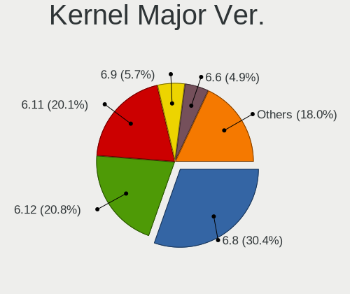
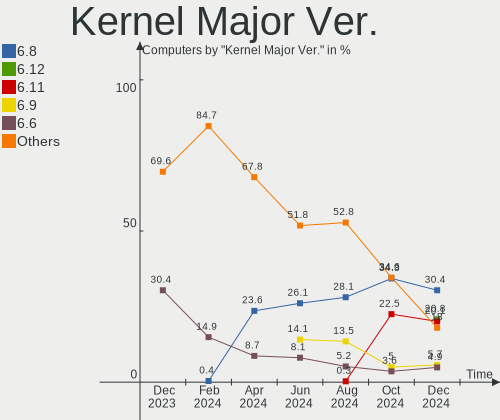
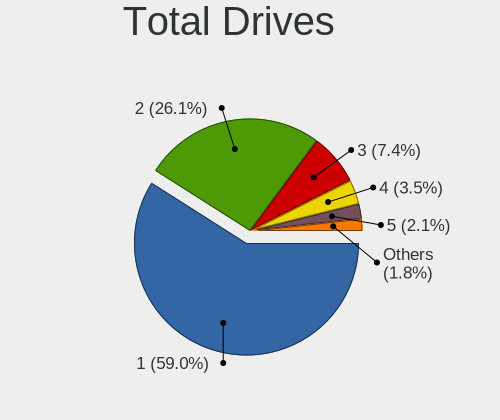
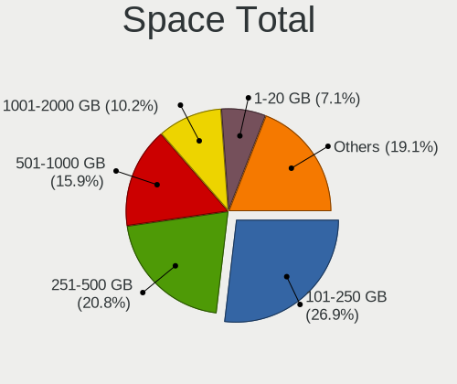
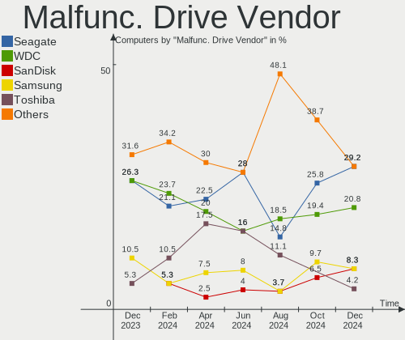
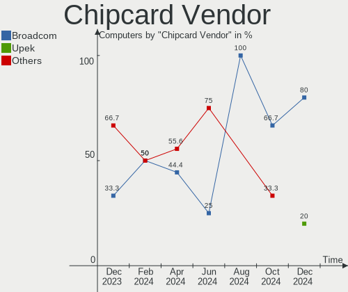

Linux in Brazil - Hardware Trends
---------------------------------

A project to identify most popular hardware characteristics and track their change
over time based on data collected by Linux users at https://Linux-Hardware.org.

Anyone can contribute to this report by the [hw-probe](https://github.com/linuxhw/hw-probe) tool:

    sudo -E hw-probe -all -upload

This is a report for all computer types. See also reports for [desktops](/Location/Brazil/Desktop/README.md) and [notebooks](/Location/Brazil/Notebook/README.md).

Period: Mar, 2023.

Contents
--------

* [ System ](#system)
  - [ OS                       ](#os)
  - [ OS Family                ](#os-family)
  - [ Kernel                   ](#kernel)
  - [ Kernel Family            ](#kernel-family)
  - [ Kernel Major Ver.        ](#kernel-major-ver)
  - [ Arch                     ](#arch)
  - [ DE                       ](#de)
  - [ Display Server           ](#display-server)
  - [ Display Manager          ](#display-manager)
  - [ OS Lang                  ](#os-lang)
  - [ Boot Mode                ](#boot-mode)
  - [ Filesystem               ](#filesystem)
  - [ Part. scheme             ](#part-scheme)
  - [ Dual Boot with Linux/BSD ](#dual-boot-with-linuxbsd)
  - [ Dual Boot (Win)          ](#dual-boot-win)

* [ Board ](#board)
  - [ Vendor                   ](#vendor)
  - [ Model                    ](#model)
  - [ Model Family             ](#model-family)
  - [ MFG Year                 ](#mfg-year)
  - [ Form Factor              ](#form-factor)
  - [ Secure Boot              ](#secure-boot)
  - [ Coreboot                 ](#coreboot)
  - [ RAM Size                 ](#ram-size)
  - [ RAM Used                 ](#ram-used)
  - [ Total Drives             ](#total-drives)
  - [ Has CD-ROM               ](#has-cd-rom)
  - [ Has Ethernet             ](#has-ethernet)
  - [ Has WiFi                 ](#has-wifi)
  - [ Has Bluetooth            ](#has-bluetooth)

* [ Location ](#location)
  - [ Country                  ](#country)
  - [ City                     ](#city)

* [ Drives ](#drives)
  - [ Drive Vendor             ](#drive-vendor)
  - [ Drive Model              ](#drive-model)
  - [ HDD Vendor               ](#hdd-vendor)
  - [ SSD Vendor               ](#ssd-vendor)
  - [ Drive Kind               ](#drive-kind)
  - [ Drive Connector          ](#drive-connector)
  - [ Drive Size               ](#drive-size)
  - [ Space Total              ](#space-total)
  - [ Space Used               ](#space-used)
  - [ Malfunc. Drives          ](#malfunc-drives)
  - [ Malfunc. Drive Vendor    ](#malfunc-drive-vendor)
  - [ Malfunc. HDD Vendor      ](#malfunc-hdd-vendor)
  - [ Malfunc. Drive Kind      ](#malfunc-drive-kind)
  - [ Failed Drives            ](#failed-drives)
  - [ Failed Drive Vendor      ](#failed-drive-vendor)
  - [ Drive Status             ](#drive-status)

* [ Storage controller ](#storage-controller)
  - [ Storage Vendor           ](#storage-vendor)
  - [ Storage Model            ](#storage-model)
  - [ Storage Kind             ](#storage-kind)

* [ Processor ](#processor)
  - [ CPU Vendor               ](#cpu-vendor)
  - [ CPU Model                ](#cpu-model)
  - [ CPU Model Family         ](#cpu-model-family)
  - [ CPU Cores                ](#cpu-cores)
  - [ CPU Sockets              ](#cpu-sockets)
  - [ CPU Threads              ](#cpu-threads)
  - [ CPU Op-Modes             ](#cpu-op-modes)
  - [ CPU Microcode            ](#cpu-microcode)
  - [ CPU Microarch            ](#cpu-microarch)

* [ Graphics ](#graphics)
  - [ GPU Vendor               ](#gpu-vendor)
  - [ GPU Model                ](#gpu-model)
  - [ GPU Combo                ](#gpu-combo)
  - [ GPU Driver               ](#gpu-driver)
  - [ GPU Memory               ](#gpu-memory)

* [ Monitor ](#monitor)
  - [ Monitor Vendor           ](#monitor-vendor)
  - [ Monitor Model            ](#monitor-model)
  - [ Monitor Resolution       ](#monitor-resolution)
  - [ Monitor Diagonal         ](#monitor-diagonal)
  - [ Monitor Width            ](#monitor-width)
  - [ Aspect Ratio             ](#aspect-ratio)
  - [ Monitor Area             ](#monitor-area)
  - [ Pixel Density            ](#pixel-density)
  - [ Multiple Monitors        ](#multiple-monitors)

* [ Network ](#network)
  - [ Net Controller Vendor    ](#net-controller-vendor)
  - [ Net Controller Model     ](#net-controller-model)
  - [ Wireless Vendor          ](#wireless-vendor)
  - [ Wireless Model           ](#wireless-model)
  - [ Ethernet Vendor          ](#ethernet-vendor)
  - [ Ethernet Model           ](#ethernet-model)
  - [ Net Controller Kind      ](#net-controller-kind)
  - [ Used Controller          ](#used-controller)
  - [ NICs                     ](#nics)
  - [ IPv6                     ](#ipv6)

* [ Bluetooth ](#bluetooth)
  - [ Bluetooth Vendor         ](#bluetooth-vendor)
  - [ Bluetooth Model          ](#bluetooth-model)

* [ Sound ](#sound)
  - [ Sound Vendor             ](#sound-vendor)
  - [ Sound Model              ](#sound-model)

* [ Memory ](#memory)
  - [ Memory Vendor            ](#memory-vendor)
  - [ Memory Model             ](#memory-model)
  - [ Memory Kind              ](#memory-kind)
  - [ Memory Form Factor       ](#memory-form-factor)
  - [ Memory Size              ](#memory-size)
  - [ Memory Speed             ](#memory-speed)

* [ Printers & scanners ](#printers--scanners)
  - [ Printer Vendor           ](#printer-vendor)
  - [ Printer Model            ](#printer-model)
  - [ Scanner Vendor           ](#scanner-vendor)
  - [ Scanner Model            ](#scanner-model)

* [ Camera ](#camera)
  - [ Camera Vendor            ](#camera-vendor)
  - [ Camera Model             ](#camera-model)

* [ Security ](#security)
  - [ Fingerprint Vendor       ](#fingerprint-vendor)
  - [ Fingerprint Model        ](#fingerprint-model)
  - [ Chipcard Vendor          ](#chipcard-vendor)
  - [ Chipcard Model           ](#chipcard-model)

* [ Unsupported ](#unsupported)
  - [ Unsupported Devices      ](#unsupported-devices)
  - [ Unsupported Device Types ](#unsupported-device-types)

System
------

OS
--

Installed operating systems

| Name                         | Computers | Percent |
|------------------------------|-----------|---------|
| Ubuntu 22.04                 | 53        | 17.15%  |
| Fedora 37                    | 28        | 9.06%   |
| Linux Mint 21.1              | 19        | 6.15%   |
| Pop!_OS 22.04                | 18        | 5.83%   |
| OpenMandriva 23.03           | 16        | 5.18%   |
| OpenMandriva 23.01           | 16        | 5.18%   |
| Zorin 16                     | 12        | 3.88%   |
| Ubuntu 22.10                 | 11        | 3.56%   |
| Manjaro                      | 11        | 3.56%   |
| Arch Rolling                 | 10        | 3.24%   |
| Kubuntu 22.04                | 8         | 2.59%   |
| Debian 11                    | 8         | 2.59%   |
| Endless 5.0.1                | 7         | 2.27%   |
| Xubuntu 22.04                | 4         | 1.29%   |
| openSUSE Tumbleweed-XXXXXXXX | 4         | 1.29%   |
| OpenMandriva 4.3             | 4         | 1.29%   |
| Endless 4.0.14               | 4         | 1.29%   |
| Ubuntu MATE 22.04            | 3         | 0.97%   |
| Ubuntu 18.04                 | 3         | 0.97%   |
| org.kde.Platform 5.15-21.08  | 3         | 0.97%   |
| Lubuntu 22.04                | 3         | 0.97%   |
| Linux Mint 20.3              | 3         | 0.97%   |
| Kubuntu 22.10                | 3         | 0.97%   |
| KDE neon 22.04               | 3         | 0.97%   |
| Fedora 38                    | 3         | 0.97%   |
| Ubuntu 20.04                 | 2         | 0.65%   |
| Nobara 37                    | 2         | 0.65%   |
| Linux Mint 21                | 2         | 0.65%   |
| Linux Mint 20.1              | 2         | 0.65%   |
| Kali 2023.1                  | 2         | 0.65%   |
| GNOME OS Nightly             | 2         | 0.65%   |
| Endless 3.9.3-nexthw1        | 2         | 0.65%   |
| EndeavourOS Rolling          | 2         | 0.65%   |
| Debian 12                    | 2         | 0.65%   |
| BigLinux 22.0.4              | 2         | 0.65%   |
| ArcoLinux Rolling            | 2         | 0.65%   |
| Ubuntu Unity 22.10           | 1         | 0.32%   |
| Ubuntu Unity 16.04           | 1         | 0.32%   |
| Ubuntu Budgie 22.10          | 1         | 0.32%   |
| Ubuntu 20.10                 | 1         | 0.32%   |

OS Family
---------

OS without a version

| Name             | Computers | Percent |
|------------------|-----------|---------|
| Ubuntu           | 70        | 22.65%  |
| OpenMandriva     | 37        | 11.97%  |
| Fedora           | 31        | 10.03%  |
| Linux Mint       | 29        | 9.39%   |
| Pop!_OS          | 18        | 5.83%   |
| Endless          | 18        | 5.83%   |
| Zorin            | 12        | 3.88%   |
| Manjaro          | 12        | 3.88%   |
| Kubuntu          | 11        | 3.56%   |
| Debian           | 10        | 3.24%   |
| Arch             | 10        | 3.24%   |
| openSUSE         | 5         | 1.62%   |
| Xubuntu          | 4         | 1.29%   |
| Lubuntu          | 4         | 1.29%   |
| BigLinux         | 4         | 1.29%   |
| Ubuntu MATE      | 3         | 0.97%   |
| org.kde.Platform | 3         | 0.97%   |
| Nobara           | 3         | 0.97%   |
| KDE neon         | 3         | 0.97%   |
| ArcoLinux        | 3         | 0.97%   |
| Ubuntu Unity     | 2         | 0.65%   |
| SteamOS          | 2         | 0.65%   |
| Kali             | 2         | 0.65%   |
| GNOME OS         | 2         | 0.65%   |
| EndeavourOS      | 2         | 0.65%   |
| Ubuntu Budgie    | 1         | 0.32%   |
| ROSA             | 1         | 0.32%   |
| Reborn OS        | 1         | 0.32%   |
| PostmarketOS     | 1         | 0.32%   |
| Pear OS          | 1         | 0.32%   |
| Lenovo Lux       | 1         | 0.32%   |
| Gentoo           | 1         | 0.32%   |
| Deepin           | 1         | 0.32%   |
| Alpine           | 1         | 0.32%   |

Kernel
------

Version of the Linux kernel

| Version                 | Computers | Percent |
|-------------------------|-----------|---------|
| 5.19.0-35-generic       | 42        | 13.59%  |
| 5.15.0-67-generic       | 29        | 9.39%   |
| 6.1.1-desktop-1omv2290  | 15        | 4.85%   |
| 6.2.6-desktop-1omv2390  | 14        | 4.53%   |
| 6.1.18-200.fc37.x86_64  | 10        | 3.24%   |
| 5.19.0-38-generic       | 9         | 2.91%   |
| 5.19.0-32-generic       | 9         | 2.91%   |
| 5.15.0-69-generic       | 8         | 2.59%   |
| 5.15.0-47-generic       | 7         | 2.27%   |
| 6.2.7-200.fc37.x86_64   | 6         | 1.94%   |
| 6.2.6-76060206-generic  | 6         | 1.94%   |
| 6.1.12-1-MANJARO        | 6         | 1.94%   |
| 6.0.12-76060006-generic | 6         | 1.94%   |
| 5.11.0-35-generic       | 6         | 1.94%   |
| 6.1.15-200.fc37.x86_64  | 5         | 1.62%   |
| 5.4.0-144-generic       | 5         | 1.62%   |
| 5.15.0-60-generic       | 5         | 1.62%   |
| 6.2.0-76060200-generic  | 4         | 1.29%   |
| 5.15.94-1-MANJARO       | 4         | 1.29%   |
| 5.15.0-56-generic       | 4         | 1.29%   |
| 5.10.0-21-amd64         | 4         | 1.29%   |
| 6.2.6-arch1-1           | 3         | 0.97%   |
| 6.2.2-arch1-1           | 3         | 0.97%   |
| 6.2.1-1-default         | 3         | 0.97%   |
| 6.0.7-301.fc37.x86_64   | 3         | 0.97%   |
| 5.15.0-43-generic       | 3         | 0.97%   |
| 6.2.8-arch1-1           | 2         | 0.65%   |
| 6.2.8-200.fc37.x86_64   | 2         | 0.65%   |
| 6.2.8-060208-generic    | 2         | 0.65%   |
| 6.2.7-arch1-1           | 2         | 0.65%   |
| 6.2.6-1-default         | 2         | 0.65%   |
| 6.2.1-desktop-1omv2390  | 2         | 0.65%   |
| 6.1.19-1-MANJARO        | 2         | 0.65%   |
| 6.1.11-76060111-generic | 2         | 0.65%   |
| 6.1.0-kali5-amd64       | 2         | 0.65%   |
| 5.8.0-14-generic        | 2         | 0.65%   |
| 5.19.17                 | 2         | 0.65%   |
| 5.19.0-37-generic       | 2         | 0.65%   |
| 5.19.0-1018-lowlatency  | 2         | 0.65%   |
| 5.16.7-desktop-1omv4003 | 2         | 0.65%   |

Kernel Family
-------------

Linux kernel without a distro release

| Version  | Computers | Percent |
|----------|-----------|---------|
| 5.19.0   | 66        | 21.36%  |
| 5.15.0   | 61        | 19.74%  |
| 6.2.6    | 26        | 8.41%   |
| 6.1.1    | 15        | 4.85%   |
| 6.2.7    | 11        | 3.56%   |
| 6.1.18   | 10        | 3.24%   |
| 5.4.0    | 9         | 2.91%   |
| 5.11.0   | 9         | 2.91%   |
| 6.2.8    | 7         | 2.27%   |
| 6.2.2    | 7         | 2.27%   |
| 6.2.1    | 7         | 2.27%   |
| 6.1.12   | 7         | 2.27%   |
| 6.0.12   | 6         | 1.94%   |
| 6.1.15   | 5         | 1.62%   |
| 6.1.0    | 5         | 1.62%   |
| 5.10.0   | 5         | 1.62%   |
| 6.2.0    | 4         | 1.29%   |
| 5.8.0    | 4         | 1.29%   |
| 5.15.94  | 4         | 1.29%   |
| 6.1.14   | 3         | 0.97%   |
| 6.1.11   | 3         | 0.97%   |
| 6.0.7    | 3         | 0.97%   |
| 6.2.5    | 2         | 0.65%   |
| 6.1.19   | 2         | 0.65%   |
| 5.19.17  | 2         | 0.65%   |
| 5.16.7   | 2         | 0.65%   |
| 5.16.13  | 2         | 0.65%   |
| 5.15.79  | 2         | 0.65%   |
| 5.15.102 | 2         | 0.65%   |
| 5.13.0   | 2         | 0.65%   |
| 4.9.0    | 2         | 0.65%   |
| 4.15.0   | 2         | 0.65%   |
| 6.1.20   | 1         | 0.32%   |
| 6.0.5    | 1         | 0.32%   |
| 6.0.14   | 1         | 0.32%   |
| 6.0.0    | 1         | 0.32%   |
| 5.18.17  | 1         | 0.32%   |
| 5.15.98  | 1         | 0.32%   |
| 5.15.93  | 1         | 0.32%   |
| 5.15.85  | 1         | 0.32%   |

Kernel Major Ver.
-----------------

Linux kernel major version

| Version | Computers | Percent |
|---------|-----------|---------|
| 5.15    | 73        | 23.62%  |
| 5.19    | 68        | 22.01%  |
| 6.2     | 64        | 20.71%  |
| 6.1     | 51        | 16.5%   |
| 6.0     | 12        | 3.88%   |
| 5.11    | 10        | 3.24%   |
| 5.4     | 9         | 2.91%   |
| 5.10    | 5         | 1.62%   |
| 5.8     | 4         | 1.29%   |
| 5.16    | 4         | 1.29%   |
| 5.13    | 2         | 0.65%   |
| 4.9     | 2         | 0.65%   |
| 4.15    | 2         | 0.65%   |
| 5.18    | 1         | 0.32%   |
| 5.14    | 1         | 0.32%   |
| 4.4     | 1         | 0.32%   |

Arch
----

OS architecture (x86_64, i586, etc.)

| Name    | Computers | Percent |
|---------|-----------|---------|
| x86_64  | 305       | 98.71%  |
| i686    | 2         | 0.65%   |
| armv7l  | 1         | 0.32%   |
| aarch64 | 1         | 0.32%   |

DE
--

Desktop Environment

| Name        | Computers | Percent |
|-------------|-----------|---------|
| GNOME       | 164       | 53.07%  |
| KDE5        | 74        | 23.95%  |
| X-Cinnamon  | 24        | 7.77%   |
| XFCE        | 15        | 4.85%   |
| MATE        | 8         | 2.59%   |
| Unknown     | 7         | 2.27%   |
| LXQt        | 6         | 1.94%   |
| Unity       | 3         | 0.97%   |
| Hyprland    | 2         | 0.65%   |
| Deepin      | 2         | 0.65%   |
| sway        | 1         | 0.32%   |
| LXDE        | 1         | 0.32%   |
| GNOME:Phosh | 1         | 0.32%   |
| Budgie      | 1         | 0.32%   |

Display Server
--------------

X11 or Wayland

| Name    | Computers | Percent |
|---------|-----------|---------|
| X11     | 207       | 66.99%  |
| Wayland | 94        | 30.42%  |
| Unknown | 5         | 1.62%   |
| Tty     | 3         | 0.97%   |

Display Manager
---------------

SDDM, LightDM, etc.

| Name    | Computers | Percent |
|---------|-----------|---------|
| Unknown | 147       | 47.57%  |
| GDM3    | 69        | 22.33%  |
| SDDM    | 51        | 16.5%   |
| LightDM | 22        | 7.12%   |
| GDM     | 19        | 6.15%   |
| Ly      | 1         | 0.32%   |

OS Lang
-------

Language

| Lang    | Computers | Percent |
|---------|-----------|---------|
| pt_BR   | 226       | 73.14%  |
| en_US   | 72        | 23.3%   |
| C       | 5         | 1.62%   |
| en_CA   | 2         | 0.65%   |
| Unknown | 2         | 0.65%   |
| es_ES   | 1         | 0.32%   |
| C.UTF8  | 1         | 0.32%   |

Boot Mode
---------

EFI or BIOS

| Mode | Computers | Percent |
|------|-----------|---------|
| EFI  | 160       | 51.78%  |
| BIOS | 149       | 48.22%  |

Filesystem
----------

Type of filesystem

| Type    | Computers | Percent |
|---------|-----------|---------|
| Ext4    | 212       | 68.61%  |
| Btrfs   | 60        | 19.42%  |
| Overlay | 26        | 8.41%   |
| Zfs     | 4         | 1.29%   |
| Xfs     | 2         | 0.65%   |
| Unknown | 2         | 0.65%   |
| F2fs    | 1         | 0.32%   |
| Ext3    | 1         | 0.32%   |
| Ext2    | 1         | 0.32%   |

Part. scheme
------------

Scheme of partitioning

| Type    | Computers | Percent |
|---------|-----------|---------|
| Unknown | 143       | 46.28%  |
| GPT     | 128       | 41.42%  |
| MBR     | 38        | 12.3%   |

Dual Boot with Linux/BSD
------------------------

Hosting more than one Linux/BSD

| Dual boot | Computers | Percent |
|-----------|-----------|---------|
| No        | 272       | 88.03%  |
| Yes       | 37        | 11.97%  |

Dual Boot (Win)
---------------

Hosting Linux and Windows

| Dual boot | Computers | Percent |
|-----------|-----------|---------|
| No        | 230       | 74.43%  |
| Yes       | 79        | 25.57%  |

Board
-----

Vendor
------

Motherboard manufacturer

| Name                   | Computers | Percent |
|------------------------|-----------|---------|
| Dell                   | 52        | 16.83%  |
| ASUSTek Computer       | 36        | 11.65%  |
| Acer                   | 30        | 9.71%   |
| Gigabyte Technology    | 25        | 8.09%   |
| Lenovo                 | 24        | 7.77%   |
| Samsung Electronics    | 17        | 5.5%    |
| Positivo               | 17        | 5.5%    |
| Hewlett-Packard        | 17        | 5.5%    |
| Intel                  | 16        | 5.18%   |
| MSI                    | 7         | 2.27%   |
| ASRock                 | 7         | 2.27%   |
| Avell High Performance | 6         | 1.94%   |
| PCWare                 | 4         | 1.29%   |
| Apple                  | 4         | 1.29%   |
| Sony                   | 3         | 0.97%   |
| Multilaser             | 3         | 0.97%   |
| MACHINIST              | 3         | 0.97%   |
| Itautec                | 3         | 0.97%   |
| Digibras               | 3         | 0.97%   |
| LG Electronics         | 2         | 0.65%   |
| HOUTER                 | 2         | 0.65%   |
| Google                 | 2         | 0.65%   |
| Biostar                | 2         | 0.65%   |
| AZW                    | 2         | 0.65%   |
| Xunlong                | 1         | 0.32%   |
| Win element            | 1         | 0.32%   |
| Valve                  | 1         | 0.32%   |
| Toshiba                | 1         | 0.32%   |
| Supermicro             | 1         | 0.32%   |
| Semp Toshiba           | 1         | 0.32%   |
| Quanta                 | 1         | 0.32%   |
| QIYIDA                 | 1         | 0.32%   |
| Positivo Bahia - VAIO  | 1         | 0.32%   |
| Pegatron               | 1         | 0.32%   |
| OEM                    | 1         | 0.32%   |
| Notebook               | 1         | 0.32%   |
| Motorola               | 1         | 0.32%   |
| Huanan                 | 1         | 0.32%   |
| HPE                    | 1         | 0.32%   |
| Digiboard              | 1         | 0.32%   |

Model
-----

Motherboard model

| Name                                     | Computers | Percent |
|------------------------------------------|-----------|---------|
| Samsung 550XDA                           | 6         | 1.94%   |
| Gigabyte A320M-S2H                       | 5         | 1.62%   |
| Intel X99                                | 3         | 0.97%   |
| Intel H61                                | 3         | 0.97%   |
| Digibras NH4CU03                         | 3         | 0.97%   |
| Dell Latitude 5420                       | 3         | 0.97%   |
| ASUS M5A78L-M LX/BR                      | 3         | 0.97%   |
| ASUS All Series                          | 3         | 0.97%   |
| Acer Nitro AN515-44                      | 3         | 0.97%   |
| Samsung 530U3C/530U4C/532U3C             | 2         | 0.65%   |
| Samsung 300E5M/300E5L                    | 2         | 0.65%   |
| Positivo S14CT01                         | 2         | 0.65%   |
| Positivo Q464B                           | 2         | 0.65%   |
| Positivo C14CU51                         | 2         | 0.65%   |
| MACHINIST E5-MR9A PRO V1.1               | 2         | 0.65%   |
| Intel X99 V1.0                           | 2         | 0.65%   |
| Dell XPS 8700                            | 2         | 0.65%   |
| Dell Vostro 3550                         | 2         | 0.65%   |
| Dell Vostro 14-5480                      | 2         | 0.65%   |
| Dell Inspiron 5566                       | 2         | 0.65%   |
| Dell Inspiron 3442                       | 2         | 0.65%   |
| Avell High Performance B.ON              | 2         | 0.65%   |
| ASUS VivoBook_ASUSLaptop X515EA_X515EA   | 2         | 0.65%   |
| ASUS VivoBook_ASUSLaptop X515DA_X515DA   | 2         | 0.65%   |
| ASUS VivoBook_ASUSLaptop X513EAN_X513EAN | 2         | 0.65%   |
| ASUS VivoBook 15_ASUS Laptop X540UAR     | 2         | 0.65%   |
| ASUS TUF Gaming X570-PLUS_BR             | 2         | 0.65%   |
| ASUS PRIME A320M-K/BR                    | 2         | 0.65%   |
| ASUS M5A78L-M/USB3                       | 2         | 0.65%   |
| Acer Nitro AN515-54                      | 2         | 0.65%   |
| Acer Aspire A515-51                      | 2         | 0.65%   |
| Xunlong Orange Pi PC Plus                | 1         | 0.32%   |
| Win element M600                         | 1         | 0.32%   |
| Valve Jupiter                            | 1         | 0.32%   |
| Toshiba Satellite A305                   | 1         | 0.32%   |
| Supermicro X8DAH                         | 1         | 0.32%   |
| Sony VPCEH10EB                           | 1         | 0.32%   |
| Sony VPCEA23FB                           | 1         | 0.32%   |
| Sony SVF14215CXB                         | 1         | 0.32%   |
| Semp Toshiba IS 1413G                    | 1         | 0.32%   |

Model Family
------------

Motherboard model prefix

| Name                        | Computers | Percent |
|-----------------------------|-----------|---------|
| Acer Aspire                 | 19        | 6.15%   |
| Dell Inspiron               | 18        | 5.83%   |
| Dell Vostro                 | 12        | 3.88%   |
| Lenovo IdeaPad              | 9         | 2.91%   |
| ASUS VivoBook               | 9         | 2.91%   |
| Acer Nitro                  | 9         | 2.91%   |
| ASUS PRIME                  | 7         | 2.27%   |
| Samsung 550XDA              | 6         | 1.94%   |
| Lenovo ThinkPad             | 6         | 1.94%   |
| ASUS M5A78L-M               | 6         | 1.94%   |
| Intel X99                   | 5         | 1.62%   |
| HP Pavilion                 | 5         | 1.62%   |
| Gigabyte A320M-S2H          | 5         | 1.62%   |
| Dell XPS                    | 5         | 1.62%   |
| Dell Latitude               | 5         | 1.62%   |
| Intel H61                   | 4         | 1.29%   |
| ASUS TUF                    | 4         | 1.29%   |
| Lenovo ThinkCentre          | 3         | 0.97%   |
| Digibras NH4CU03            | 3         | 0.97%   |
| Dell OptiPlex               | 3         | 0.97%   |
| Dell G15                    | 3         | 0.97%   |
| ASUS All                    | 3         | 0.97%   |
| Samsung 530U3C              | 2         | 0.65%   |
| Samsung 300E5M              | 2         | 0.65%   |
| Positivo S14CT01            | 2         | 0.65%   |
| Positivo Q464B              | 2         | 0.65%   |
| Positivo C14CU51            | 2         | 0.65%   |
| MACHINIST E5-MR9A           | 2         | 0.65%   |
| Lenovo Yoga                 | 2         | 0.65%   |
| Itautec Infoway             | 2         | 0.65%   |
| Intel B75                   | 2         | 0.65%   |
| HP ProBook                  | 2         | 0.65%   |
| HP EliteDesk                | 2         | 0.65%   |
| HP Compaq                   | 2         | 0.65%   |
| Dell G3                     | 2         | 0.65%   |
| Avell High Performance B.ON | 2         | 0.65%   |
| Xunlong Orange              | 1         | 0.32%   |
| Win element M600            | 1         | 0.32%   |
| Valve Jupiter               | 1         | 0.32%   |
| Toshiba Satellite           | 1         | 0.32%   |

MFG Year
--------

Motherboard manufacture year

| Year    | Computers | Percent |
|---------|-----------|---------|
| 2021    | 36        | 11.65%  |
| 2020    | 34        | 11%     |
| 2011    | 31        | 10.03%  |
| 2019    | 30        | 9.71%   |
| 2017    | 27        | 8.74%   |
| 2018    | 25        | 8.09%   |
| 2013    | 18        | 5.83%   |
| 2022    | 17        | 5.5%    |
| 2016    | 17        | 5.5%    |
| 2012    | 15        | 4.85%   |
| 2015    | 14        | 4.53%   |
| 2014    | 12        | 3.88%   |
| 2008    | 9         | 2.91%   |
| 2010    | 8         | 2.59%   |
| 2009    | 7         | 2.27%   |
| Unknown | 4         | 1.29%   |
| 2007    | 3         | 0.97%   |
| 2023    | 1         | 0.32%   |
| 2006    | 1         | 0.32%   |

Form Factor
-----------

Physical design of the computer

| Name           | Computers | Percent |
|----------------|-----------|---------|
| Notebook       | 173       | 55.99%  |
| Desktop        | 121       | 39.16%  |
| Convertible    | 5         | 1.62%   |
| All in one     | 3         | 0.97%   |
| Server         | 3         | 0.97%   |
| System on chip | 2         | 0.65%   |
| Mini pc        | 2         | 0.65%   |

Secure Boot
-----------

Enabled or disabled

| State    | Computers | Percent |
|----------|-----------|---------|
| Disabled | 281       | 90.94%  |
| Enabled  | 28        | 9.06%   |

Coreboot
--------

Have coreboot on board

| Used | Computers | Percent |
|------|-----------|---------|
| No   | 307       | 99.35%  |
| Yes  | 2         | 0.65%   |

RAM Size
--------

Total RAM memory

| Size in GB  | Computers | Percent |
|-------------|-----------|---------|
| 4.01-8.0    | 87        | 28.16%  |
| 16.01-24.0  | 66        | 21.36%  |
| 3.01-4.0    | 59        | 19.09%  |
| 8.01-16.0   | 57        | 18.45%  |
| 32.01-64.0  | 18        | 5.83%   |
| 2.01-3.0    | 8         | 2.59%   |
| 1.01-2.0    | 7         | 2.27%   |
| 24.01-32.0  | 4         | 1.29%   |
| 64.01-256.0 | 2         | 0.65%   |
| 0.51-1.0    | 1         | 0.32%   |

RAM Used
--------

Used RAM memory

| Used GB    | Computers | Percent |
|------------|-----------|---------|
| 1.01-2.0   | 92        | 29.77%  |
| 2.01-3.0   | 86        | 27.83%  |
| 4.01-8.0   | 68        | 22.01%  |
| 3.01-4.0   | 41        | 13.27%  |
| 0.51-1.0   | 12        | 3.88%   |
| 8.01-16.0  | 8         | 2.59%   |
| 16.01-24.0 | 2         | 0.65%   |

Total Drives
------------

Number of drives on board

| Drives | Computers | Percent |
|--------|-----------|---------|
| 1      | 182       | 58.9%   |
| 2      | 85        | 27.51%  |
| 3      | 20        | 6.47%   |
| 4      | 12        | 3.88%   |
| 0      | 4         | 1.29%   |
| 6      | 3         | 0.97%   |
| 5      | 3         | 0.97%   |

Has CD-ROM
----------

Has CD-ROM on board

| Presented | Computers | Percent |
|-----------|-----------|---------|
| No        | 235       | 76.05%  |
| Yes       | 74        | 23.95%  |

Has Ethernet
------------

Has Ethernet on board

| Presented | Computers | Percent |
|-----------|-----------|---------|
| Yes       | 269       | 87.06%  |
| No        | 40        | 12.94%  |

Has WiFi
--------

Has WiFi module

| Presented | Computers | Percent |
|-----------|-----------|---------|
| Yes       | 229       | 74.11%  |
| No        | 80        | 25.89%  |

Has Bluetooth
-------------

Has Bluetooth module

| Presented | Computers | Percent |
|-----------|-----------|---------|
| Yes       | 172       | 55.66%  |
| No        | 137       | 44.34%  |

Location
--------

Country
-------

Geographic location (country)

| Country | Computers | Percent |
|---------|-----------|---------|
| Brazil  | 309       | 100%    |

City
----

Geographic location (city)

| City                  | Computers | Percent |
|-----------------------|-----------|---------|
| Sao Paulo             | 34        | 11%     |
| Rio de Janeiro        | 22        | 7.12%   |
| Brasília             | 15        | 4.85%   |
| Porto Alegre          | 14        | 4.53%   |
| Curitiba              | 9         | 2.91%   |
| Campinas              | 8         | 2.59%   |
| Fortaleza             | 7         | 2.27%   |
| Belo Horizonte        | 7         | 2.27%   |
| Sao José dos Campos  | 5         | 1.62%   |
| Recife                | 5         | 1.62%   |
| Niterói              | 5         | 1.62%   |
| Sao Bernardo do Campo | 4         | 1.29%   |
| Uberlândia           | 3         | 0.97%   |
| Sorocaba              | 3         | 0.97%   |
| Salvador              | 3         | 0.97%   |
| Rio das Ostras        | 3         | 0.97%   |
| Palmas                | 3         | 0.97%   |
| Joao Pessoa           | 3         | 0.97%   |
| Guarulhos             | 3         | 0.97%   |
| Goiânia              | 3         | 0.97%   |
| Caruaru               | 3         | 0.97%   |
| Carapicuiba           | 3         | 0.97%   |
| Vila Velha            | 2         | 0.65%   |
| Serra                 | 2         | 0.65%   |
| Sao Luís             | 2         | 0.65%   |
| Santos                | 2         | 0.65%   |
| Santa Cruz do Sul     | 2         | 0.65%   |
| Rio Grande            | 2         | 0.65%   |
| Ribeirao Preto        | 2         | 0.65%   |
| Pedro Leopoldo        | 2         | 0.65%   |
| Osasco                | 2         | 0.65%   |
| Manaus                | 2         | 0.65%   |
| Juiz de Fora          | 2         | 0.65%   |
| Indaiatuba            | 2         | 0.65%   |
| Guaratingueta         | 2         | 0.65%   |
| Cuiabá               | 2         | 0.65%   |
| Contagem              | 2         | 0.65%   |
| Capao da Canoa        | 2         | 0.65%   |
| Blumenau              | 2         | 0.65%   |
| Araçatuba            | 2         | 0.65%   |

Drives
------

Drive Vendor
------------

Hard drive vendors

| Vendor                      | Computers | Drives | Percent |
|-----------------------------|-----------|--------|---------|
| WDC                         | 81        | 87     | 17.96%  |
| Seagate                     | 73        | 84     | 16.19%  |
| Kingston                    | 36        | 38     | 7.98%   |
| SanDisk                     | 34        | 36     | 7.54%   |
| Samsung Electronics         | 34        | 41     | 7.54%   |
| Unknown                     | 21        | 24     | 4.66%   |
| China                       | 20        | 20     | 4.43%   |
| A-DATA Technology           | 15        | 16     | 3.33%   |
| Toshiba                     | 14        | 15     | 3.1%    |
| ADATA Technology            | 11        | 11     | 2.44%   |
| Silicon Motion              | 8         | 9      | 1.77%   |
| Netac                       | 8         | 9      | 1.77%   |
| KingSpec                    | 7         | 7      | 1.55%   |
| Crucial                     | 7         | 7      | 1.55%   |
| XrayDisk                    | 6         | 6      | 1.33%   |
| SSSTC                       | 4         | 4      | 0.89%   |
| SK hynix                    | 4         | 4      | 0.89%   |
| Realtek Semiconductor       | 4         | 4      | 0.89%   |
| Hitachi                     | 4         | 4      | 0.89%   |
| Unknown                     | 4         | 4      | 0.89%   |
| PNY                         | 3         | 3      | 0.67%   |
| Patriot                     | 3         | 3      | 0.67%   |
| JMicron Technology          | 3         | 3      | 0.67%   |
| Intel                       | 3         | 3      | 0.67%   |
| Phison Electronics          | 2         | 2      | 0.44%   |
| Micron/Crucial Technology   | 2         | 2      | 0.44%   |
| LITEON                      | 2         | 2      | 0.44%   |
| Lexar                       | 2         | 2      | 0.44%   |
| KIOXIA                      | 2         | 2      | 0.44%   |
| Kingston Technology Company | 2         | 2      | 0.44%   |
| HGST                        | 2         | 2      | 0.44%   |
| Win Memory                  | 1         | 1      | 0.22%   |
| WALRAM                      | 1         | 1      | 0.22%   |
| USB3.0                      | 1         | 1      | 0.22%   |
| Union Memory (Shenzhen)     | 1         | 1      | 0.22%   |
| UMIS                        | 1         | 1      | 0.22%   |
| Transcend                   | 1         | 1      | 0.22%   |
| Team                        | 1         | 1      | 0.22%   |
| Solid State Storage         | 1         | 1      | 0.22%   |
| RZX                         | 1         | 1      | 0.22%   |

Drive Model
-----------

Hard drive models

| Model                                                  | Computers | Percent |
|--------------------------------------------------------|-----------|---------|
| Seagate ST1000DM010-2EP102 1TB                         | 13        | 2.73%   |
| Kingston SA400S37480G 480GB SSD                        | 11        | 2.31%   |
| Kingston SA400S37240G 240GB SSD                        | 11        | 2.31%   |
| WDC WD10SPZX-21Z10T0 1TB                               | 8         | 1.68%   |
| Seagate ST500LM012 HN-M500MBB 500GB                    | 7         | 1.47%   |
| Seagate ST1000LM024 HN-M101MBB 1TB                     | 6         | 1.26%   |
| Sandisk WD Blue SN550 NVMe SSD 256GB                   | 6         | 1.26%   |
| WDC WD10SPZX-24Z10 1TB                                 | 5         | 1.05%   |
| Unknown MMC Card  32GB                                 | 5         | 1.05%   |
| Silicon Motion SM2263EN/SM2263XT SSD Controller 1024GB | 5         | 1.05%   |
| Seagate ST1000LM035-1RK172 1TB                         | 5         | 1.05%   |
| Kingston SA400S37120G 120GB SSD                        | 5         | 1.05%   |
| ADATA SM2P32A8-256GC1 256GB                            | 5         | 1.05%   |
| WDC WDS240G2G0A-00JH30 240GB SSD                       | 4         | 0.84%   |
| Unknown MMC Card  64GB                                 | 4         | 0.84%   |
| Seagate ST3500418AS 500GB                              | 4         | 0.84%   |
| China SSD 128GB                                        | 4         | 0.84%   |
| Unknown                                                | 4         | 0.84%   |
| WDC WD10SPZX-35Z10T0 1TB                               | 3         | 0.63%   |
| WDC WD10JPCX-24UE4T0 1TB                               | 3         | 0.63%   |
| Toshiba MQ01ABD100 1TB                                 | 3         | 0.63%   |
| Seagate ST500DM002-1BD142 500GB                        | 3         | 0.63%   |
| SanDisk SSD PLUS 240GB                                 | 3         | 0.63%   |
| SanDisk SSD PLUS 120GB                                 | 3         | 0.63%   |
| Samsung MZVLQ256HAJD-000 256GB                         | 3         | 0.63%   |
| Samsung HD502HJ 500GB                                  | 3         | 0.63%   |
| Samsung HD322HJ 320GB                                  | 3         | 0.63%   |
| Crucial CT1000BX500SSD1 1TB                            | 3         | 0.63%   |
| China SSD 120GB                                        | 3         | 0.63%   |
| China SATA SSD 120GB                                   | 3         | 0.63%   |
| A-DATA SU650 120GB SSD                                 | 3         | 0.63%   |
| A-DATA IM2P33F8A-512GD 512GB                           | 3         | 0.63%   |
| A-DATA IM2P33F3A NVMe 256GB                            | 3         | 0.63%   |
| XrayDisk 480GB SSD                                     | 2         | 0.42%   |
| XrayDisk 1TB SSD                                       | 2         | 0.42%   |
| WDC WDS500G3X0C-00SJG0 500GB                           | 2         | 0.42%   |
| WDC WDS500G2B0A-00SM50 500GB SSD                       | 2         | 0.42%   |
| WDC WDS240G2G0B-00EPW0 240GB SSD                       | 2         | 0.42%   |
| WDC WDS120G2G0B-00EPW0 120GB SSD                       | 2         | 0.42%   |
| WDC WDS120G2G0A-00JH30 120GB SSD                       | 2         | 0.42%   |

HDD Vendor
----------

Hard disk drive vendors

| Vendor              | Computers | Drives | Percent |
|---------------------|-----------|--------|---------|
| Seagate             | 72        | 83     | 41.62%  |
| WDC                 | 64        | 68     | 36.99%  |
| Samsung Electronics | 15        | 18     | 8.67%   |
| Toshiba             | 13        | 14     | 7.51%   |
| Hitachi             | 4         | 4      | 2.31%   |
| HGST                | 2         | 2      | 1.16%   |
| USB3.0              | 1         | 1      | 0.58%   |
| Fujitsu             | 1         | 1      | 0.58%   |
| ASMT                | 1         | 1      | 0.58%   |

SSD Vendor
----------

Solid state drive vendors

| Vendor              | Computers | Drives | Percent |
|---------------------|-----------|--------|---------|
| Kingston            | 33        | 35     | 21.43%  |
| China               | 20        | 20     | 12.99%  |
| SanDisk             | 19        | 20     | 12.34%  |
| WDC                 | 16        | 17     | 10.39%  |
| Samsung Electronics | 8         | 11     | 5.19%   |
| Crucial             | 7         | 7      | 4.55%   |
| KingSpec            | 6         | 6      | 3.9%    |
| XrayDisk            | 5         | 5      | 3.25%   |
| Netac               | 5         | 5      | 3.25%   |
| A-DATA Technology   | 5         | 5      | 3.25%   |
| PNY                 | 3         | 3      | 1.95%   |
| Patriot             | 3         | 3      | 1.95%   |
| LITEON              | 2         | 2      | 1.3%    |
| JMicron Technology  | 2         | 2      | 1.3%    |
| Win Memory          | 1         | 1      | 0.65%   |
| Transcend           | 1         | 1      | 0.65%   |
| Toshiba             | 1         | 1      | 0.65%   |
| Team                | 1         | 1      | 0.65%   |
| Seagate             | 1         | 1      | 0.65%   |
| RZX                 | 1         | 1      | 0.65%   |
| Pichau              | 1         | 1      | 0.65%   |
| OCZ                 | 1         | 1      | 0.65%   |
| NT-1TB              | 1         | 1      | 0.65%   |
| NN                  | 1         | 1      | 0.65%   |
| Lexar               | 1         | 1      | 0.65%   |
| Kross Elegance      | 1         | 1      | 0.65%   |
| KODAK               | 1         | 1      | 0.65%   |
| HUSKY               | 1         | 1      | 0.65%   |
| HS-SSD-C100         | 1         | 1      | 0.65%   |
| GT                  | 1         | 1      | 0.65%   |
| Gigabyte Technology | 1         | 1      | 0.65%   |
| AirDisk             | 1         | 1      | 0.65%   |
| AFOX                | 1         | 1      | 0.65%   |
| Advantech           | 1         | 1      | 0.65%   |

Drive Kind
----------

HDD or SSD

| Kind    | Computers | Drives | Percent |
|---------|-----------|--------|---------|
| HDD     | 154       | 192    | 37.65%  |
| SSD     | 136       | 161    | 33.25%  |
| NVMe    | 87        | 97     | 21.27%  |
| MMC     | 20        | 22     | 4.89%   |
| Unknown | 12        | 14     | 2.93%   |

Drive Connector
---------------

SATA, SAS, NVMe, etc.

| Type | Computers | Drives | Percent |
|------|-----------|--------|---------|
| SATA | 239       | 350    | 66.02%  |
| NVMe | 87        | 97     | 24.03%  |
| MMC  | 20        | 22     | 5.52%   |
| SAS  | 16        | 17     | 4.42%   |

Drive Size
----------

Size of hard drive

| Size in TB | Computers | Drives | Percent |
|------------|-----------|--------|---------|
| 0.01-0.5   | 177       | 220    | 59.8%   |
| 0.51-1.0   | 102       | 112    | 34.46%  |
| 1.01-2.0   | 15        | 16     | 5.07%   |
| 3.01-4.0   | 1         | 4      | 0.34%   |
| 2.01-3.0   | 1         | 1      | 0.34%   |

Space Total
-----------

Amount of disk space available on the file system

| Size in GB     | Computers | Percent |
|----------------|-----------|---------|
| 251-500        | 73        | 23.62%  |
| 101-250        | 73        | 23.62%  |
| 501-1000       | 48        | 15.53%  |
| 1001-2000      | 38        | 12.3%   |
| 1-20           | 30        | 9.71%   |
| 21-50          | 13        | 4.21%   |
| 51-100         | 13        | 4.21%   |
| More than 3000 | 8         | 2.59%   |
| Unknown        | 7         | 2.27%   |
| 2001-3000      | 6         | 1.94%   |

Space Used
----------

Amount of used disk space

| Used GB   | Computers | Percent |
|-----------|-----------|---------|
| 1-20      | 89        | 28.8%   |
| 21-50     | 70        | 22.65%  |
| 51-100    | 46        | 14.89%  |
| 101-250   | 37        | 11.97%  |
| 251-500   | 29        | 9.39%   |
| 501-1000  | 21        | 6.8%    |
| Unknown   | 7         | 2.27%   |
| 1001-2000 | 6         | 1.94%   |
| 2001-3000 | 4         | 1.29%   |

Malfunc. Drives
---------------

Drive models with a malfunction

| Model                               | Computers | Drives | Percent |
|-------------------------------------|-----------|--------|---------|
| Seagate ST1000LM024 HN-M101MBB 1TB  | 4         | 4      | 10.26%  |
| Seagate ST3500418AS 500GB           | 2         | 2      | 5.13%   |
| WDC WDS240G2G0A-00JH30 240GB SSD    | 1         | 1      | 2.56%   |
| WDC WD5000LPVX-22V0TT0 500GB        | 1         | 1      | 2.56%   |
| WDC WD5000AAKX-603CA0 500GB         | 1         | 1      | 2.56%   |
| WDC WD5000AAKX-08U6AA0 500GB        | 1         | 1      | 2.56%   |
| WDC WD3200BPVT-22JJ5T0 320GB        | 1         | 1      | 2.56%   |
| WDC WD10JPCX-24UE4T0 1TB            | 1         | 1      | 2.56%   |
| WDC WD10EZEX-00RKKA0 1TB            | 1         | 1      | 2.56%   |
| WDC WD Green 2.5 1000GB SSD         | 1         | 1      | 2.56%   |
| Toshiba MK5065GSX 500GB             | 1         | 1      | 2.56%   |
| Toshiba MK5059GSXP 500GB            | 1         | 1      | 2.56%   |
| SSSTC CL1-4D256 256GB               | 1         | 1      | 2.56%   |
| Seagate ST9750420AS 752GB           | 1         | 1      | 2.56%   |
| Seagate ST9500423AS 500GB           | 1         | 1      | 2.56%   |
| Seagate ST9500325AS 500GB           | 1         | 1      | 2.56%   |
| Seagate ST9320325AS 320GB           | 1         | 1      | 2.56%   |
| Seagate ST3500312CS 500GB           | 1         | 1      | 2.56%   |
| Seagate ST3320613AS 320GB           | 1         | 1      | 2.56%   |
| Seagate ST320LM001 HN-M320MBB 320GB | 1         | 1      | 2.56%   |
| Seagate ST2000LX001-1RG174 2TB      | 1         | 1      | 2.56%   |
| Seagate ST1000LM014-1EJ164 1TB      | 1         | 1      | 2.56%   |
| Seagate ST1000DM010-2EP102 1TB      | 1         | 1      | 2.56%   |
| Seagate ST1000DM003-1ER162 1TB      | 1         | 1      | 2.56%   |
| SanDisk SSD PLUS 120GB              | 1         | 1      | 2.56%   |
| SanDisk SD6SP1M256G1012 256GB SSD   | 1         | 1      | 2.56%   |
| Samsung Electronics HM121HI 120GB   | 1         | 1      | 2.56%   |
| Samsung Electronics HD502HI 500GB   | 1         | 1      | 2.56%   |
| Samsung Electronics HD322HJ 320GB   | 1         | 1      | 2.56%   |
| Kross Elegance KE-SSDIS12G 120GB    | 1         | 1      | 2.56%   |
| Hitachi HTS723232A7A364 320GB       | 1         | 1      | 2.56%   |
| Hitachi HTS541612J9SA00 120GB       | 1         | 1      | 2.56%   |
| Hitachi HCC545050A7E380 500GB       | 1         | 1      | 2.56%   |
| China SSD 256GB                     | 1         | 1      | 2.56%   |
| China SSD 128GB                     | 1         | 1      | 2.56%   |

Malfunc. Drive Vendor
---------------------

Vendors of faulty drives

| Vendor              | Computers | Drives | Percent |
|---------------------|-----------|--------|---------|
| Seagate             | 17        | 17     | 43.59%  |
| WDC                 | 8         | 8      | 20.51%  |
| Samsung Electronics | 3         | 3      | 7.69%   |
| Hitachi             | 3         | 3      | 7.69%   |
| Toshiba             | 2         | 2      | 5.13%   |
| SanDisk             | 2         | 2      | 5.13%   |
| China               | 2         | 2      | 5.13%   |
| SSSTC               | 1         | 1      | 2.56%   |
| Kross Elegance      | 1         | 1      | 2.56%   |

Malfunc. HDD Vendor
-------------------

Vendors of faulty HDD drives

| Vendor              | Computers | Drives | Percent |
|---------------------|-----------|--------|---------|
| Seagate             | 17        | 17     | 54.84%  |
| WDC                 | 6         | 6      | 19.35%  |
| Samsung Electronics | 3         | 3      | 9.68%   |
| Hitachi             | 3         | 3      | 9.68%   |
| Toshiba             | 2         | 2      | 6.45%   |

Malfunc. Drive Kind
-------------------

Kinds of faulty drives

| Kind | Computers | Drives | Percent |
|------|-----------|--------|---------|
| HDD  | 30        | 31     | 78.95%  |
| SSD  | 7         | 7      | 18.42%  |
| NVMe | 1         | 1      | 2.63%   |

Failed Drives
-------------

Failed drive models

Zero info for selected period =(

Failed Drive Vendor
-------------------

Failed drive vendors

Zero info for selected period =(

Drive Status
------------

Number of failed and malfunc. drives

| Status   | Computers | Drives | Percent |
|----------|-----------|--------|---------|
| Detected | 201       | 318    | 60.73%  |
| Works    | 93        | 129    | 28.1%   |
| Malfunc  | 37        | 39     | 11.18%  |

Storage controller
------------------

Storage Vendor
--------------

Storage controller vendors

| Vendor                         | Computers | Percent |
|--------------------------------|-----------|---------|
| Intel                          | 209       | 56.33%  |
| AMD                            | 64        | 17.25%  |
| ADATA Technology               | 21        | 5.66%   |
| SanDisk                        | 17        | 4.58%   |
| Samsung Electronics            | 12        | 3.23%   |
| Silicon Motion                 | 8         | 2.16%   |
| Solid State Storage Technology | 5         | 1.35%   |
| Kingston Technology Company    | 5         | 1.35%   |
| SK hynix                       | 4         | 1.08%   |
| Realtek Semiconductor          | 4         | 1.08%   |
| Union Memory (Shenzhen)        | 2         | 0.54%   |
| Phison Electronics             | 2         | 0.54%   |
| Nvidia                         | 2         | 0.54%   |
| Netac Technology               | 2         | 0.54%   |
| Micron/Crucial Technology      | 2         | 0.54%   |
| Marvell Technology Group       | 2         | 0.54%   |
| VIA Technologies               | 1         | 0.27%   |
| Toshiba America Info Systems   | 1         | 0.27%   |
| TenaFe                         | 1         | 0.27%   |
| Shenzhen Longsys Electronics   | 1         | 0.27%   |
| Micron Technology              | 1         | 0.27%   |
| MAXIO Technology (Hangzhou)    | 1         | 0.27%   |
| KIOXIA                         | 1         | 0.27%   |
| JMicron Technology             | 1         | 0.27%   |
| ASMedia Technology             | 1         | 0.27%   |
| Apple                          | 1         | 0.27%   |

Storage Model
-------------

Storage controller models

| Model                                                                                   | Computers | Percent |
|-----------------------------------------------------------------------------------------|-----------|---------|
| AMD FCH SATA Controller [AHCI mode]                                                     | 40        | 9.2%    |
| Intel Sunrise Point-LP SATA Controller [AHCI mode]                                      | 24        | 5.52%   |
| Intel 8 Series/C220 Series Chipset Family 6-port SATA Controller 1 [AHCI mode]          | 19        | 4.37%   |
| Intel 7 Series Chipset Family 6-port SATA Controller [AHCI mode]                        | 17        | 3.91%   |
| Intel Tiger Lake-LP SATA Controller                                                     | 14        | 3.22%   |
| Intel 6 Series/C200 Series Chipset Family 6 port Mobile SATA AHCI Controller            | 13        | 2.99%   |
| Intel 82801 Mobile SATA Controller [RAID mode]                                          | 11        | 2.53%   |
| AMD FCH SATA Controller D                                                               | 11        | 2.53%   |
| Intel Volume Management Device NVMe RAID Controller                                     | 10        | 2.3%    |
| AMD SB7x0/SB8x0/SB9x0 IDE Controller                                                    | 10        | 2.3%    |
| ADATA A Non-Volatile memory controller                                                  | 10        | 2.3%    |
| Intel Wildcat Point-LP SATA Controller [AHCI Mode]                                      | 9         | 2.07%   |
| AMD SB7x0/SB8x0/SB9x0 SATA Controller [IDE mode]                                        | 8         | 1.84%   |
| ADATA IM2P33F8ABR1 NVMe SSD                                                             | 8         | 1.84%   |
| Silicon Motion SM2263EN/SM2263XT SSD Controller                                         | 7         | 1.61%   |
| Intel 6 Series/C200 Series Chipset Family 6 port Desktop SATA AHCI Controller           | 7         | 1.61%   |
| AMD 400 Series Chipset SATA Controller                                                  | 7         | 1.61%   |
| SanDisk WD Blue SN550 NVMe SSD                                                          | 6         | 1.38%   |
| Samsung NVMe SSD Controller 980                                                         | 6         | 1.38%   |
| Intel Celeron/Pentium Silver Processor SATA Controller                                  | 6         | 1.38%   |
| Intel 500 Series Chipset Family SATA AHCI Controller                                    | 6         | 1.38%   |
| Intel 5 Series/3400 Series Chipset 4 port SATA AHCI Controller                          | 6         | 1.38%   |
| Intel 200 Series PCH SATA controller [AHCI mode]                                        | 6         | 1.38%   |
| AMD SB7x0/SB8x0/SB9x0 SATA Controller [AHCI mode]                                       | 6         | 1.38%   |
| Solid State Storage Non-Volatile memory controller                                      | 5         | 1.15%   |
| Intel 82801IBM/IEM (ICH9M/ICH9M-E) 4 port SATA Controller [AHCI mode]                   | 5         | 1.15%   |
| Intel 82801HM/HEM (ICH8M/ICH8M-E) SATA Controller [AHCI mode]                           | 5         | 1.15%   |
| Intel 82801HM/HEM (ICH8M/ICH8M-E) IDE Controller                                        | 5         | 1.15%   |
| AMD 500 Series Chipset SATA Controller                                                  | 5         | 1.15%   |
| Intel NM10/ICH7 Family SATA Controller [IDE mode]                                       | 4         | 0.92%   |
| Intel Cannon Lake PCH SATA AHCI Controller                                              | 4         | 0.92%   |
| Intel 8 Series SATA Controller 1 [AHCI mode]                                            | 4         | 0.92%   |
| Intel 7 Series/C210 Series Chipset Family 6-port SATA Controller [AHCI mode]            | 4         | 0.92%   |
| Intel 6 Series/C200 Series Chipset Family Desktop SATA Controller (IDE mode, ports 4-5) | 4         | 0.92%   |
| Intel 6 Series/C200 Series Chipset Family Desktop SATA Controller (IDE mode, ports 0-3) | 4         | 0.92%   |
| SanDisk Non-Volatile memory controller                                                  | 3         | 0.69%   |
| Samsung NVMe SSD Controller SM981/PM981/PM983                                           | 3         | 0.69%   |
| Realtek NVMe Controller                                                                 | 3         | 0.69%   |
| Intel Q170/Q150/B150/H170/H110/Z170/CM236 Chipset SATA Controller [AHCI Mode]           | 3         | 0.69%   |
| Intel Cannon Point-LP SATA Controller [AHCI Mode]                                       | 3         | 0.69%   |

Storage Kind
------------

Kind of storage controller (IDE, SATA, NVMe, SAS, ...)

| Kind | Computers | Percent |
|------|-----------|---------|
| SATA | 240       | 61.54%  |
| NVMe | 88        | 22.56%  |
| IDE  | 37        | 9.49%   |
| RAID | 25        | 6.41%   |

Processor
---------

CPU Vendor
----------

Processor vendors

| Vendor | Computers | Percent |
|--------|-----------|---------|
| Intel  | 237       | 76.7%   |
| AMD    | 70        | 22.65%  |
| ARM    | 2         | 0.65%   |

CPU Model
---------

Processor models

| Model                                         | Computers | Percent |
|-----------------------------------------------|-----------|---------|
| Intel 11th Gen Core i7-1165G7 @ 2.80GHz       | 9         | 2.91%   |
| Intel Core i5-7200U CPU @ 2.50GHz             | 6         | 1.94%   |
| Intel 11th Gen Core i3-1115G4 @ 3.00GHz       | 6         | 1.94%   |
| Intel Atom x5-Z8350 CPU @ 1.44GHz             | 5         | 1.62%   |
| AMD Ryzen 5 5600G with Radeon Graphics        | 5         | 1.62%   |
| Intel Xeon CPU E5-2670 v3 @ 2.30GHz           | 4         | 1.29%   |
| Intel Core i3-3217U CPU @ 1.80GHz             | 4         | 1.29%   |
| Intel 11th Gen Core i7-1185G7 @ 3.00GHz       | 4         | 1.29%   |
| Intel 11th Gen Core i5-1135G7 @ 2.40GHz       | 4         | 1.29%   |
| AMD FX-6300 Six-Core Processor                | 4         | 1.29%   |
| Intel Xeon CPU E5-2620 v3 @ 2.40GHz           | 3         | 0.97%   |
| Intel Core i7-5500U CPU @ 2.40GHz             | 3         | 0.97%   |
| Intel Core i5-8250U CPU @ 1.60GHz             | 3         | 0.97%   |
| Intel Core i5-5200U CPU @ 2.20GHz             | 3         | 0.97%   |
| Intel Core i3-6100U CPU @ 2.30GHz             | 3         | 0.97%   |
| Intel Core i3-6006U CPU @ 2.00GHz             | 3         | 0.97%   |
| Intel Core i3-2310M CPU @ 2.10GHz             | 3         | 0.97%   |
| Intel Core i3-2120 CPU @ 3.30GHz              | 3         | 0.97%   |
| Intel Celeron N4020 CPU @ 1.10GHz             | 3         | 0.97%   |
| AMD Ryzen 7 5800H with Radeon Graphics        | 3         | 0.97%   |
| AMD Ryzen 7 4800H with Radeon Graphics        | 3         | 0.97%   |
| AMD Ryzen 5 3500U with Radeon Vega Mobile Gfx | 3         | 0.97%   |
| AMD A8-9600 RADEON R7, 10 COMPUTE CORES 4C+6G | 3         | 0.97%   |
| Intel Xeon CPU E5-2630L v3 @ 1.80GHz          | 2         | 0.65%   |
| Intel Pentium Dual-Core CPU T4500 @ 2.30GHz   | 2         | 0.65%   |
| Intel Pentium CPU N3700 @ 1.60GHz             | 2         | 0.65%   |
| Intel Core i9-9900K CPU @ 3.60GHz             | 2         | 0.65%   |
| Intel Core i7-9750H CPU @ 2.60GHz             | 2         | 0.65%   |
| Intel Core i7-8565U CPU @ 1.80GHz             | 2         | 0.65%   |
| Intel Core i7-8550U CPU @ 1.80GHz             | 2         | 0.65%   |
| Intel Core i7-7700HQ CPU @ 2.80GHz            | 2         | 0.65%   |
| Intel Core i7-7700 CPU @ 3.60GHz              | 2         | 0.65%   |
| Intel Core i7-4770 CPU @ 3.40GHz              | 2         | 0.65%   |
| Intel Core i7-3612QM CPU @ 2.10GHz            | 2         | 0.65%   |
| Intel Core i5-8265U CPU @ 1.60GHz             | 2         | 0.65%   |
| Intel Core i5-6200U CPU @ 2.30GHz             | 2         | 0.65%   |
| Intel Core i5-3337U CPU @ 1.80GHz             | 2         | 0.65%   |
| Intel Core i5-3330 CPU @ 3.00GHz              | 2         | 0.65%   |
| Intel Core i5-3317U CPU @ 1.70GHz             | 2         | 0.65%   |
| Intel Core i5-2520M CPU @ 2.50GHz             | 2         | 0.65%   |

CPU Model Family
----------------

Processor model prefix

| Model                   | Computers | Percent |
|-------------------------|-----------|---------|
| Intel Core i5           | 53        | 17.15%  |
| Intel Core i3           | 44        | 14.24%  |
| Other                   | 38        | 12.3%   |
| Intel Core i7           | 36        | 11.65%  |
| AMD Ryzen 5             | 23        | 7.44%   |
| Intel Celeron           | 20        | 6.47%   |
| Intel Xeon              | 16        | 5.18%   |
| AMD Ryzen 7             | 14        | 4.53%   |
| AMD FX                  | 10        | 3.24%   |
| Intel Core 2 Duo        | 9         | 2.91%   |
| Intel Atom              | 8         | 2.59%   |
| Intel Pentium           | 6         | 1.94%   |
| Intel Pentium Dual-Core | 4         | 1.29%   |
| AMD A8                  | 4         | 1.29%   |
| Intel Core i9           | 2         | 0.65%   |
| AMD Ryzen 3             | 2         | 0.65%   |
| AMD E                   | 2         | 0.65%   |
| AMD Athlon II X2        | 2         | 0.65%   |
| AMD Athlon              | 2         | 0.65%   |
| Intel Pentium Gold      | 1         | 0.32%   |
| Intel Core 2 Quad       | 1         | 0.32%   |
| Intel Core 2            | 1         | 0.32%   |
| ARM Allwinner           | 1         | 0.32%   |
| AMD Turion 64 Mobile    | 1         | 0.32%   |
| AMD Ryzen 9             | 1         | 0.32%   |
| AMD PRO A10             | 1         | 0.32%   |
| AMD Phenom II X6        | 1         | 0.32%   |
| AMD Phenom II X4        | 1         | 0.32%   |
| AMD Opteron             | 1         | 0.32%   |
| AMD Athlon 64 X2        | 1         | 0.32%   |
| AMD A4                  | 1         | 0.32%   |
| AMD A12                 | 1         | 0.32%   |
| AMD A10                 | 1         | 0.32%   |

CPU Cores
---------

Number of processor cores

| Number  | Computers | Percent |
|---------|-----------|---------|
| 2       | 133       | 43.04%  |
| 4       | 105       | 33.98%  |
| 6       | 32        | 10.36%  |
| 8       | 20        | 6.47%   |
| 12      | 5         | 1.62%   |
| 3       | 4         | 1.29%   |
| 1       | 4         | 1.29%   |
| 10      | 2         | 0.65%   |
| 24      | 1         | 0.32%   |
| 16      | 1         | 0.32%   |
| 14      | 1         | 0.32%   |
| Unknown | 1         | 0.32%   |

CPU Sockets
-----------

Number of sockets

| Number  | Computers | Percent |
|---------|-----------|---------|
| 1       | 306       | 99.03%  |
| 2       | 2         | 0.65%   |
| Unknown | 1         | 0.32%   |

CPU Threads
-----------

Threads per core (Hyper-Threading)

| Number  | Computers | Percent |
|---------|-----------|---------|
| 2       | 225       | 72.82%  |
| 1       | 83        | 26.86%  |
| Unknown | 1         | 0.32%   |

CPU Op-Modes
------------

CPU Operation Modes (32-bit, 64-bit)

| Op mode        | Computers | Percent |
|----------------|-----------|---------|
| 32-bit, 64-bit | 307       | 99.35%  |
| Unknown        | 2         | 0.65%   |

CPU Microcode
-------------

Microcode number

| Number     | Computers | Percent |
|------------|-----------|---------|
| Unknown    | 127       | 41.1%   |
| 0x806c1    | 17        | 5.5%    |
| 0x306a9    | 11        | 3.56%   |
| 0x206a7    | 11        | 3.56%   |
| 0x806e9    | 8         | 2.59%   |
| 0x406e3    | 7         | 2.27%   |
| 0x306c3    | 7         | 2.27%   |
| 0x1067a    | 7         | 2.27%   |
| 0x08108109 | 7         | 2.27%   |
| 0x306d4    | 6         | 1.94%   |
| 0x0600611a | 6         | 1.94%   |
| 0x306f2    | 5         | 1.62%   |
| 0x406c4    | 4         | 1.29%   |
| 0x0a50000d | 4         | 1.29%   |
| 0xa0653    | 3         | 0.97%   |
| 0x906ea    | 3         | 0.97%   |
| 0x906e9    | 3         | 0.97%   |
| 0x906a3    | 3         | 0.97%   |
| 0x806ea    | 3         | 0.97%   |
| 0x406c3    | 3         | 0.97%   |
| 0x40651    | 3         | 0.97%   |
| 0x20655    | 3         | 0.97%   |
| 0x10676    | 3         | 0.97%   |
| 0x08701021 | 3         | 0.97%   |
| 0x08600103 | 3         | 0.97%   |
| 0x0800820d | 3         | 0.97%   |
| 0x06000852 | 3         | 0.97%   |
| 0x906c0    | 2         | 0.65%   |
| 0x806ec    | 2         | 0.65%   |
| 0x706a8    | 2         | 0.65%   |
| 0x706a1    | 2         | 0.65%   |
| 0x506e3    | 2         | 0.65%   |
| 0x0a50000c | 2         | 0.65%   |
| 0xa0652    | 1         | 0.32%   |
| 0x906eb    | 1         | 0.32%   |
| 0x906a4    | 1         | 0.32%   |
| 0x90675    | 1         | 0.32%   |
| 0x806d1    | 1         | 0.32%   |
| 0x806c2    | 1         | 0.32%   |
| 0x706e5    | 1         | 0.32%   |

CPU Microarch
-------------

Microarchitecture

| Name             | Computers | Percent |
|------------------|-----------|---------|
| KabyLake         | 42        | 13.59%  |
| SandyBridge      | 28        | 9.06%   |
| Haswell          | 27        | 8.74%   |
| TigerLake        | 26        | 8.41%   |
| IvyBridge        | 23        | 7.44%   |
| Zen+             | 15        | 4.85%   |
| Skylake          | 13        | 4.21%   |
| Silvermont       | 13        | 4.21%   |
| Penryn           | 13        | 4.21%   |
| Unknown          | 13        | 4.21%   |
| Zen 3            | 10        | 3.24%   |
| Zen 2            | 10        | 3.24%   |
| Westmere         | 10        | 3.24%   |
| Piledriver       | 10        | 3.24%   |
| Broadwell        | 10        | 3.24%   |
| Excavator        | 7         | 2.27%   |
| Goldmont plus    | 6         | 1.94%   |
| CometLake        | 5         | 1.62%   |
| Alderlake Hybrid | 5         | 1.62%   |
| K10              | 4         | 1.29%   |
| Zen              | 3         | 0.97%   |
| Core             | 3         | 0.97%   |
| Tremont          | 2         | 0.65%   |
| Nehalem          | 2         | 0.65%   |
| K8 Hammer        | 2         | 0.65%   |
| IceLake          | 2         | 0.65%   |
| Bobcat           | 2         | 0.65%   |
| Steamroller      | 1         | 0.32%   |
| Bulldozer        | 1         | 0.32%   |
| Bonnell          | 1         | 0.32%   |

Graphics
--------

GPU Vendor
----------

Vendors of graphics cards

| Vendor                     | Computers | Percent |
|----------------------------|-----------|---------|
| Intel                      | 195       | 54.62%  |
| AMD                        | 84        | 23.53%  |
| Nvidia                     | 76        | 21.29%  |
| Matrox Electronics Systems | 1         | 0.28%   |
| ATI Technologies           | 1         | 0.28%   |

GPU Model
---------

Graphics card models

| Model                                                                                    | Computers | Percent |
|------------------------------------------------------------------------------------------|-----------|---------|
| Intel 2nd Generation Core Processor Family Integrated Graphics Controller                | 26        | 7.08%   |
| Intel TigerLake-LP GT2 [Iris Xe Graphics]                                                | 19        | 5.18%   |
| Intel 3rd Gen Core processor Graphics Controller                                         | 16        | 4.36%   |
| Intel Atom/Celeron/Pentium Processor x5-E8000/J3xxx/N3xxx Integrated Graphics Controller | 12        | 3.27%   |
| Intel Skylake GT2 [HD Graphics 520]                                                      | 10        | 2.72%   |
| Intel HD Graphics 620                                                                    | 9         | 2.45%   |
| Intel HD Graphics 5500                                                                   | 9         | 2.45%   |
| AMD Ellesmere [Radeon RX 470/480/570/570X/580/580X/590]                                  | 9         | 2.45%   |
| Intel Core Processor Integrated Graphics Controller                                      | 8         | 2.18%   |
| AMD Picasso/Raven 2 [Radeon Vega Series / Radeon Vega Mobile Series]                     | 8         | 2.18%   |
| Intel UHD Graphics 620                                                                   | 7         | 1.91%   |
| Intel Tiger Lake-LP GT2 [UHD Graphics G4]                                                | 7         | 1.91%   |
| AMD Polaris 20 XL [Radeon RX 580 2048SP]                                                 | 7         | 1.91%   |
| Intel GeminiLake [UHD Graphics 600]                                                      | 6         | 1.63%   |
| AMD Wani [Radeon R5/R6/R7 Graphics]                                                      | 6         | 1.63%   |
| AMD Cezanne [Radeon Vega Series / Radeon Vega Mobile Series]                             | 6         | 1.63%   |
| Intel Xeon E3-1200 v3/4th Gen Core Processor Integrated Graphics Controller              | 5         | 1.36%   |
| Intel WhiskeyLake-U GT2 [UHD Graphics 620]                                               | 5         | 1.36%   |
| Intel Mobile 4 Series Chipset Integrated Graphics Controller                             | 5         | 1.36%   |
| AMD RS780L [Radeon 3000]                                                                 | 5         | 1.36%   |
| Nvidia TU117M [GeForce GTX 1650 Mobile / Max-Q]                                          | 4         | 1.09%   |
| Nvidia GA107M [GeForce RTX 3050 Mobile]                                                  | 4         | 1.09%   |
| Intel TigerLake-H GT1 [UHD Graphics]                                                     | 4         | 1.09%   |
| Intel HD Graphics 630                                                                    | 4         | 1.09%   |
| Intel CoffeeLake-H GT2 [UHD Graphics 630]                                                | 4         | 1.09%   |
| AMD Renoir                                                                               | 4         | 1.09%   |
| AMD Cedar [Radeon HD 5000/6000/7350/8350 Series]                                         | 4         | 1.09%   |
| Nvidia TU117M                                                                            | 3         | 0.82%   |
| Nvidia GP107M [GeForce GTX 1050 Ti Mobile]                                               | 3         | 0.82%   |
| Nvidia GP107 [GeForce GTX 1050 Ti]                                                       | 3         | 0.82%   |
| Nvidia GP106 [GeForce GTX 1060 6GB]                                                      | 3         | 0.82%   |
| Nvidia GA104 [GeForce RTX 3060 Ti Lite Hash Rate]                                        | 3         | 0.82%   |
| Intel Mobile GM965/GL960 Integrated Graphics Controller (secondary)                      | 3         | 0.82%   |
| Intel Mobile GM965/GL960 Integrated Graphics Controller (primary)                        | 3         | 0.82%   |
| Intel Haswell-ULT Integrated Graphics Controller                                         | 3         | 0.82%   |
| Intel CometLake-U GT2 [UHD Graphics]                                                     | 3         | 0.82%   |
| Intel Alder Lake-P Integrated Graphics Controller                                        | 3         | 0.82%   |
| AMD Topaz XT [Radeon R7 M260/M265 / M340/M360 / M440/M445 / 530/535 / 620/625 Mobile]    | 3         | 0.82%   |
| Nvidia TU117M [GeForce GTX 1650 Ti Mobile]                                               | 2         | 0.54%   |
| Nvidia GT218 [GeForce G210]                                                              | 2         | 0.54%   |

GPU Combo
---------

Combinations of graphics cards

| Name           | Computers | Percent |
|----------------|-----------|---------|
| 1 x Intel      | 149       | 48.22%  |
| 1 x AMD        | 67        | 21.68%  |
| 1 x Nvidia     | 35        | 11.33%  |
| Intel + Nvidia | 33        | 10.68%  |
| 2 x AMD        | 6         | 1.94%   |
| Intel + AMD    | 6         | 1.94%   |
| AMD + Nvidia   | 6         | 1.94%   |
| 2 x Intel      | 3         | 0.97%   |
| Other          | 2         | 0.65%   |
| 2 x Nvidia     | 1         | 0.32%   |
| 1 x Matrox     | 1         | 0.32%   |

GPU Driver
----------

Free vs proprietary

| Driver      | Computers | Percent |
|-------------|-----------|---------|
| Free        | 252       | 81.55%  |
| Proprietary | 48        | 15.53%  |
| Unknown     | 9         | 2.91%   |

GPU Memory
----------

Total video memory

| Size in GB | Computers | Percent |
|------------|-----------|---------|
| Unknown    | 207       | 66.99%  |
| 1.01-2.0   | 24        | 7.77%   |
| 0.51-1.0   | 19        | 6.15%   |
| 0.01-0.5   | 19        | 6.15%   |
| 3.01-4.0   | 18        | 5.83%   |
| 7.01-8.0   | 14        | 4.53%   |
| 5.01-6.0   | 5         | 1.62%   |
| 2.01-3.0   | 2         | 0.65%   |
| 8.01-16.0  | 1         | 0.32%   |

Monitor
-------

Monitor Vendor
--------------

Monitor vendors

| Vendor                  | Computers | Percent |
|-------------------------|-----------|---------|
| Samsung Electronics     | 50        | 15.53%  |
| BOE                     | 46        | 14.29%  |
| AU Optronics            | 38        | 11.8%   |
| Goldstar                | 37        | 11.49%  |
| Chimei Innolux          | 30        | 9.32%   |
| LG Display              | 23        | 7.14%   |
| AOC                     | 18        | 5.59%   |
| Philips                 | 10        | 3.11%   |
| Acer                    | 7         | 2.17%   |
| Dell                    | 6         | 1.86%   |
| LG Electronics          | 5         | 1.55%   |
| Unknown                 | 4         | 1.24%   |
| Chi Mei Optoelectronics | 4         | 1.24%   |
| Apple                   | 4         | 1.24%   |
| PANDA                   | 3         | 0.93%   |
| Hewlett-Packard         | 3         | 0.93%   |
| GDH                     | 3         | 0.93%   |
| Sony                    | 2         | 0.62%   |
| Sharp                   | 2         | 0.62%   |
| Panasonic               | 2         | 0.62%   |
| Lenovo                  | 2         | 0.62%   |
| InnoLux Display         | 2         | 0.62%   |
| DTV                     | 2         | 0.62%   |
| CPT                     | 2         | 0.62%   |
| Valve                   | 1         | 0.31%   |
| Toppoly                 | 1         | 0.31%   |
| STA                     | 1         | 0.31%   |
| SLD                     | 1         | 0.31%   |
| RTK                     | 1         | 0.31%   |
| PZG                     | 1         | 0.31%   |
| Positivo                | 1         | 0.31%   |
| Pixio                   | 1         | 0.31%   |
| Philco                  | 1         | 0.31%   |
| NEC Computers           | 1         | 0.31%   |
| MSI                     | 1         | 0.31%   |
| LG Philips              | 1         | 0.31%   |
| Konka                   | 1         | 0.31%   |
| InfoVision              | 1         | 0.31%   |
| Denver                  | 1         | 0.31%   |
| ASUSTek Computer        | 1         | 0.31%   |

Monitor Model
-------------

Monitor models

| Model                                                                    | Computers | Percent |
|--------------------------------------------------------------------------|-----------|---------|
| Chimei Innolux LCD Monitor CMN15F5 1920x1080 344x193mm 15.5-inch         | 6         | 1.83%   |
| BOE LCD Monitor BOE0812 1920x1080 344x194mm 15.5-inch                    | 4         | 1.22%   |
| BOE LCD Monitor BOE0696 1366x768 309x173mm 13.9-inch                     | 4         | 1.22%   |
| AOC 1970W AOC1970 1366x768 410x230mm 18.5-inch                           | 4         | 1.22%   |
| Samsung Electronics S19C301 SAM0B07 1366x768 410x230mm 18.5-inch         | 3         | 0.91%   |
| Philips PHL 242V8 PHLC219 1920x1080 527x296mm 23.8-inch                  | 3         | 0.91%   |
| Goldstar ULTRAWIDE GSM59F1 2560x1080 673x284mm 28.8-inch                 | 3         | 0.91%   |
| GDH TV PHILCO GDH0030 1920x540                                           | 3         | 0.91%   |
| AU Optronics LCD Monitor AUO81EC 1366x768 344x193mm 15.5-inch            | 3         | 0.91%   |
| AU Optronics LCD Monitor AUO71EC 1366x768 344x193mm 15.5-inch            | 3         | 0.91%   |
| AU Optronics LCD Monitor AUO2E3C 1366x768 309x173mm 13.9-inch            | 3         | 0.91%   |
| Unknown LCD Monitor FFFF 2288x1287 2550x2550mm 142.0-inch                | 2         | 0.61%   |
| Sony TV SNYEE01 1920x1080                                                | 2         | 0.61%   |
| Samsung Electronics SyncMaster SAM060D 1920x1080                         | 2         | 0.61%   |
| Samsung Electronics SA300/SA350 SAM0788 1366x768 410x230mm 18.5-inch     | 2         | 0.61%   |
| Samsung Electronics LCD Monitor SEC5441 1366x768 344x194mm 15.5-inch     | 2         | 0.61%   |
| Samsung Electronics LCD Monitor SAM0E90 1366x768 609x347mm 27.6-inch     | 2         | 0.61%   |
| PANDA LCD Monitor NCP004D 1920x1080 344x194mm 15.5-inch                  | 2         | 0.61%   |
| LG Display LCD Monitor LGD02E3 1366x768 344x194mm 15.5-inch              | 2         | 0.61%   |
| Goldstar HDR WFHD GSM7714 2560x1080 798x334mm 34.1-inch                  | 2         | 0.61%   |
| Goldstar HD GSM5ACB 1366x768 410x230mm 18.5-inch                         | 2         | 0.61%   |
| Goldstar 2D HD TV GSM59CA 1366x768 509x286mm 23.0-inch                   | 2         | 0.61%   |
| Goldstar 23MP55 GSM5A23 1920x1080 510x290mm 23.1-inch                    | 2         | 0.61%   |
| CPT LCD Monitor CPT1415 1280x800 331x207mm 15.4-inch                     | 2         | 0.61%   |
| Chimei Innolux LCD Monitor CMN15E6 1366x768 344x193mm 15.5-inch          | 2         | 0.61%   |
| Chimei Innolux LCD Monitor CMN15C6 1366x768 344x193mm 15.5-inch          | 2         | 0.61%   |
| Chimei Innolux LCD Monitor CMN1521 1920x1080 344x193mm 15.5-inch         | 2         | 0.61%   |
| Chimei Innolux LCD Monitor CMN1493 1366x768 309x173mm 13.9-inch          | 2         | 0.61%   |
| Chimei Innolux LCD Monitor CMN1470 1366x768 309x174mm 14.0-inch          | 2         | 0.61%   |
| Chi Mei Optoelectronics LCD Monitor CMO1465 1366x768 309x174mm 14.0-inch | 2         | 0.61%   |
| BOE LCD Monitor BOE09DE 1920x1080 309x174mm 14.0-inch                    | 2         | 0.61%   |
| BOE LCD Monitor BOE08F5 1920x1080 344x194mm 15.5-inch                    | 2         | 0.61%   |
| BOE LCD Monitor BOE07CE 1366x768 344x193mm 15.5-inch                     | 2         | 0.61%   |
| BOE LCD Monitor BOE07AA 1366x768 344x194mm 15.5-inch                     | 2         | 0.61%   |
| BOE LCD Monitor BOE0672 1366x768 344x194mm 15.5-inch                     | 2         | 0.61%   |
| AU Optronics LCD Monitor AUOED8F 1920x1080 344x193mm 15.5-inch           | 2         | 0.61%   |
| AU Optronics LCD Monitor AUOAF90 1920x1080 344x193mm 15.5-inch           | 2         | 0.61%   |
| AU Optronics LCD Monitor AUO21ED 1920x1080 344x194mm 15.5-inch           | 2         | 0.61%   |
| AU Optronics LCD Monitor AUO193C 1366x768 309x173mm 13.9-inch            | 2         | 0.61%   |
| AU Optronics LCD Monitor AUO183C 1366x768 309x173mm 13.9-inch            | 2         | 0.61%   |

Monitor Resolution
------------------

Monitor screen resolution

| Resolution         | Computers | Percent |
|--------------------|-----------|---------|
| 1920x1080 (FHD)    | 130       | 41.4%   |
| 1366x768 (WXGA)    | 109       | 34.71%  |
| 1600x900 (HD+)     | 12        | 3.82%   |
| 3840x2160 (4K)     | 11        | 3.5%    |
| 2560x1080          | 11        | 3.5%    |
| 1280x800 (WXGA)    | 8         | 2.55%   |
| 1360x768           | 5         | 1.59%   |
| 3440x1440          | 3         | 0.96%   |
| 2560x1440 (QHD)    | 3         | 0.96%   |
| 1920x1200 (WUXGA)  | 3         | 0.96%   |
| 1680x1050 (WSXGA+) | 3         | 0.96%   |
| 1440x900 (WXGA+)   | 3         | 0.96%   |
| 3840x2400          | 2         | 0.64%   |
| 2288x1287          | 2         | 0.64%   |
| 1280x1024 (SXGA)   | 2         | 0.64%   |
| 1024x768 (XGA)     | 2         | 0.64%   |
| 800x1280           | 1         | 0.32%   |
| 2560x1600          | 1         | 0.32%   |
| 1920x540           | 1         | 0.32%   |
| 1600x1200          | 1         | 0.32%   |
| 1280x720 (HD)      | 1         | 0.32%   |

Monitor Diagonal
----------------

Diagonal size in inches

| Inches  | Computers | Percent |
|---------|-----------|---------|
| 15      | 88        | 26.91%  |
| 13      | 39        | 11.93%  |
| 14      | 33        | 10.09%  |
| 23      | 23        | 7.03%   |
| 21      | 21        | 6.42%   |
| 18      | 20        | 6.12%   |
| 24      | 14        | 4.28%   |
| Unknown | 11        | 3.36%   |
| 34      | 10        | 3.06%   |
| 31      | 9         | 2.75%   |
| 27      | 9         | 2.75%   |
| 17      | 9         | 2.75%   |
| 20      | 6         | 1.83%   |
| 52      | 4         | 1.22%   |
| 19      | 4         | 1.22%   |
| 11      | 4         | 1.22%   |
| 84      | 3         | 0.92%   |
| 72      | 3         | 0.92%   |
| 142     | 2         | 0.61%   |
| 54      | 2         | 0.61%   |
| 40      | 2         | 0.61%   |
| 32      | 2         | 0.61%   |
| 28      | 2         | 0.61%   |
| 22      | 2         | 0.61%   |
| 48      | 1         | 0.31%   |
| 46      | 1         | 0.31%   |
| 16      | 1         | 0.31%   |
| 12      | 1         | 0.31%   |
| 7       | 1         | 0.31%   |

Monitor Width
-------------

Physical width

| Width in mm    | Computers | Percent |
|----------------|-----------|---------|
| 301-350        | 149       | 45.85%  |
| 401-500        | 51        | 15.69%  |
| 501-600        | 44        | 13.54%  |
| 201-300        | 16        | 4.92%   |
| 701-800        | 12        | 3.69%   |
| 601-700        | 12        | 3.69%   |
| 351-400        | 11        | 3.38%   |
| Unknown        | 11        | 3.38%   |
| 1001-1500      | 8         | 2.46%   |
| 1501-2000      | 6         | 1.85%   |
| More than 2000 | 2         | 0.62%   |
| 801-900        | 2         | 0.62%   |
| 1-100          | 1         | 0.31%   |

Aspect Ratio
------------

Proportional relationship between the width and the height

| Ratio   | Computers | Percent |
|---------|-----------|---------|
| 16/9    | 249       | 83.84%  |
| 16/10   | 19        | 6.4%    |
| 21/9    | 12        | 4.04%   |
| Unknown | 10        | 3.37%   |
| 4/3     | 2         | 0.67%   |
| 1.00    | 2         | 0.67%   |
| 5/4     | 1         | 0.34%   |
| 3/2     | 1         | 0.34%   |
| 0.67    | 1         | 0.34%   |

Monitor Area
------------

Area in inch²

| Area in inch² | Computers | Percent |
|----------------|-----------|---------|
| 101-110        | 87        | 26.77%  |
| 81-90          | 62        | 19.08%  |
| 201-250        | 53        | 16.31%  |
| 351-500        | 21        | 6.46%   |
| 141-150        | 21        | 6.46%   |
| More than 1000 | 15        | 4.62%   |
| 151-200        | 14        | 4.31%   |
| Unknown        | 11        | 3.38%   |
| 71-80          | 10        | 3.08%   |
| 301-350        | 9         | 2.77%   |
| 121-130        | 7         | 2.15%   |
| 51-60          | 4         | 1.23%   |
| 251-300        | 3         | 0.92%   |
| 501-1000       | 3         | 0.92%   |
| 61-70          | 1         | 0.31%   |
| 1-40           | 1         | 0.31%   |
| 131-140        | 1         | 0.31%   |
| 111-120        | 1         | 0.31%   |
| 91-100         | 1         | 0.31%   |

Pixel Density
-------------

Pixels per inch

| Density       | Computers | Percent |
|---------------|-----------|---------|
| 101-120       | 117       | 36.91%  |
| 51-100        | 95        | 29.97%  |
| 121-160       | 64        | 20.19%  |
| 1-50          | 18        | 5.68%   |
| Unknown       | 11        | 3.47%   |
| 161-240       | 10        | 3.15%   |
| More than 240 | 2         | 0.63%   |

Multiple Monitors
-----------------

Total monitors connected

| Total | Computers | Percent |
|-------|-----------|---------|
| 1     | 257       | 83.17%  |
| 2     | 42        | 13.59%  |
| 0     | 9         | 2.91%   |
| 3     | 1         | 0.32%   |

Network
-------

Net Controller Vendor
---------------------

Controller vendors

| Vendor                          | Computers | Percent |
|---------------------------------|-----------|---------|
| Realtek Semiconductor           | 221       | 46.53%  |
| Intel                           | 117       | 24.63%  |
| Qualcomm Atheros                | 71        | 14.95%  |
| Broadcom                        | 14        | 2.95%   |
| Ralink Technology               | 10        | 2.11%   |
| MediaTek                        | 5         | 1.05%   |
| D-Link                          | 5         | 1.05%   |
| Samsung Electronics             | 4         | 0.84%   |
| Marvell Technology Group        | 4         | 0.84%   |
| Xiaomi                          | 3         | 0.63%   |
| TP-Link                         | 3         | 0.63%   |
| Ralink                          | 3         | 0.63%   |
| Qualcomm Atheros Communications | 2         | 0.42%   |
| Nvidia                          | 2         | 0.42%   |
| JMicron Technology              | 2         | 0.42%   |
| Broadcom Limited                | 2         | 0.42%   |
| ASIX Electronics                | 2         | 0.42%   |
| VIA Technologies                | 1         | 0.21%   |
| Motorola PCS                    | 1         | 0.21%   |
| Lakeview Research               | 1         | 0.21%   |
| Dell                            | 1         | 0.21%   |
| Apple                           | 1         | 0.21%   |

Net Controller Model
--------------------

Controller models

| Model                                                             | Computers | Percent |
|-------------------------------------------------------------------|-----------|---------|
| Realtek RTL8111/8168/8411 PCI Express Gigabit Ethernet Controller | 156       | 29.77%  |
| Realtek RTL810xE PCI Express Fast Ethernet controller             | 24        | 4.58%   |
| Intel Wi-Fi 6 AX201                                               | 24        | 4.58%   |
| Qualcomm Atheros QCA9377 802.11ac Wireless Network Adapter        | 21        | 4.01%   |
| Qualcomm Atheros QCA9565 / AR9565 Wireless Network Adapter        | 12        | 2.29%   |
| Intel Wi-Fi 6 AX200                                               | 12        | 2.29%   |
| Qualcomm Atheros AR9485 Wireless Network Adapter                  | 11        | 2.1%    |
| Realtek RTL8125 2.5GbE Controller                                 | 10        | 1.91%   |
| Realtek 802.11ac NIC                                              | 10        | 1.91%   |
| Intel Wireless 7265                                               | 8         | 1.53%   |
| Intel 82579LM Gigabit Network Connection (Lewisville)             | 7         | 1.34%   |
| Realtek Killer E2600 Gigabit Ethernet Controller                  | 6         | 1.15%   |
| Qualcomm Atheros QCA6174 802.11ac Wireless Network Adapter        | 6         | 1.15%   |
| Qualcomm Atheros AR9285 Wireless Network Adapter (PCI-Express)    | 6         | 1.15%   |
| Ralink MT7601U Wireless Adapter                                   | 5         | 0.95%   |
| Qualcomm Atheros AR8151 v2.0 Gigabit Ethernet                     | 5         | 0.95%   |
| Intel Ethernet Connection (13) I219-LM                            | 5         | 0.95%   |
| Realtek RTL8192EE PCIe Wireless Network Adapter                   | 4         | 0.76%   |
| Realtek RTL8188CE 802.11b/g/n WiFi Adapter                        | 4         | 0.76%   |
| Intel Wireless 7260                                               | 4         | 0.76%   |
| Intel Tiger Lake PCH CNVi WiFi                                    | 4         | 0.76%   |
| Intel Centrino Advanced-N 6235                                    | 4         | 0.76%   |
| Intel Alder Lake-P PCH CNVi WiFi                                  | 4         | 0.76%   |
| Xiaomi Mi/Redmi series (RNDIS)                                    | 3         | 0.57%   |
| Samsung Galaxy series, misc. (tethering mode)                     | 3         | 0.57%   |
| Realtek RTL8822CE 802.11ac PCIe Wireless Network Adapter          | 3         | 0.57%   |
| Realtek RTL8821CE 802.11ac PCIe Wireless Network Adapter          | 3         | 0.57%   |
| Realtek RTL8188EUS 802.11n Wireless Network Adapter               | 3         | 0.57%   |
| Realtek RTL8188EE Wireless Network Adapter                        | 3         | 0.57%   |
| Realtek RTL8153 Gigabit Ethernet Adapter                          | 3         | 0.57%   |
| Realtek RTL-8100/8101L/8139 PCI Fast Ethernet Adapter             | 3         | 0.57%   |
| Ralink RT5370 Wireless Adapter                                    | 3         | 0.57%   |
| MediaTek MT7921K (RZ608) Wi-Fi 6E 80MHz                           | 3         | 0.57%   |
| Intel Wireless-AC 9260                                            | 3         | 0.57%   |
| Intel Wireless 3160                                               | 3         | 0.57%   |
| Intel Ethernet Connection I217-LM                                 | 3         | 0.57%   |
| Intel Ethernet Connection (2) I219-V                              | 3         | 0.57%   |
| Intel Dual Band Wireless-AC 3165 Plus Bluetooth                   | 3         | 0.57%   |
| Intel Comet Lake PCH CNVi WiFi                                    | 3         | 0.57%   |
| Intel Centrino Wireless-N 1030 [Rainbow Peak]                     | 3         | 0.57%   |

Wireless Vendor
---------------

Wireless vendors

| Vendor                          | Computers | Percent |
|---------------------------------|-----------|---------|
| Intel                           | 96        | 40%     |
| Qualcomm Atheros                | 64        | 26.67%  |
| Realtek Semiconductor           | 42        | 17.5%   |
| Ralink Technology               | 10        | 4.17%   |
| Broadcom                        | 9         | 3.75%   |
| MediaTek                        | 5         | 2.08%   |
| D-Link                          | 5         | 2.08%   |
| TP-Link                         | 3         | 1.25%   |
| Ralink                          | 3         | 1.25%   |
| Qualcomm Atheros Communications | 2         | 0.83%   |
| Dell                            | 1         | 0.42%   |

Wireless Model
--------------

Wireless models

| Model                                                                   | Computers | Percent |
|-------------------------------------------------------------------------|-----------|---------|
| Intel Wi-Fi 6 AX201                                                     | 24        | 9.92%   |
| Qualcomm Atheros QCA9377 802.11ac Wireless Network Adapter              | 21        | 8.68%   |
| Qualcomm Atheros QCA9565 / AR9565 Wireless Network Adapter              | 12        | 4.96%   |
| Intel Wi-Fi 6 AX200                                                     | 12        | 4.96%   |
| Qualcomm Atheros AR9485 Wireless Network Adapter                        | 11        | 4.55%   |
| Realtek 802.11ac NIC                                                    | 10        | 4.13%   |
| Intel Wireless 7265                                                     | 8         | 3.31%   |
| Qualcomm Atheros QCA6174 802.11ac Wireless Network Adapter              | 6         | 2.48%   |
| Qualcomm Atheros AR9285 Wireless Network Adapter (PCI-Express)          | 6         | 2.48%   |
| Ralink MT7601U Wireless Adapter                                         | 5         | 2.07%   |
| Realtek RTL8192EE PCIe Wireless Network Adapter                         | 4         | 1.65%   |
| Realtek RTL8188CE 802.11b/g/n WiFi Adapter                              | 4         | 1.65%   |
| Intel Wireless 7260                                                     | 4         | 1.65%   |
| Intel Tiger Lake PCH CNVi WiFi                                          | 4         | 1.65%   |
| Intel Centrino Advanced-N 6235                                          | 4         | 1.65%   |
| Intel Alder Lake-P PCH CNVi WiFi                                        | 4         | 1.65%   |
| Realtek RTL8822CE 802.11ac PCIe Wireless Network Adapter                | 3         | 1.24%   |
| Realtek RTL8821CE 802.11ac PCIe Wireless Network Adapter                | 3         | 1.24%   |
| Realtek RTL8188EUS 802.11n Wireless Network Adapter                     | 3         | 1.24%   |
| Realtek RTL8188EE Wireless Network Adapter                              | 3         | 1.24%   |
| Ralink RT5370 Wireless Adapter                                          | 3         | 1.24%   |
| MediaTek MT7921K (RZ608) Wi-Fi 6E 80MHz                                 | 3         | 1.24%   |
| Intel Wireless-AC 9260                                                  | 3         | 1.24%   |
| Intel Wireless 3160                                                     | 3         | 1.24%   |
| Intel Dual Band Wireless-AC 3165 Plus Bluetooth                         | 3         | 1.24%   |
| Intel Comet Lake PCH CNVi WiFi                                          | 3         | 1.24%   |
| Intel Centrino Wireless-N 1030 [Rainbow Peak]                           | 3         | 1.24%   |
| Intel Centrino Advanced-N 6205 [Taylor Peak]                            | 3         | 1.24%   |
| D-Link DWA-123 Wireless N 150 Adapter (rev.D1)                          | 3         | 1.24%   |
| Broadcom BCM4313 802.11bgn Wireless Network Adapter                     | 3         | 1.24%   |
| TP-Link Archer T3U [Realtek RTL8812BU]                                  | 2         | 0.83%   |
| Realtek RTL8191SEvA Wireless LAN Controller                             | 2         | 0.83%   |
| Qualcomm Atheros AR93xx Wireless Network Adapter                        | 2         | 0.83%   |
| Qualcomm Atheros AR928X Wireless Network Adapter (PCI-Express)          | 2         | 0.83%   |
| Qualcomm Atheros AR242x / AR542x Wireless Network Adapter (PCI-Express) | 2         | 0.83%   |
| Intel Wireless 8260                                                     | 2         | 0.83%   |
| Intel Wireless 3165                                                     | 2         | 0.83%   |
| Intel Gemini Lake PCH CNVi WiFi                                         | 2         | 0.83%   |
| Intel Dual Band Wireless-AC 3168NGW [Stone Peak]                        | 2         | 0.83%   |
| TP-Link Archer T2U PLUS [RTL8821AU]                                     | 1         | 0.41%   |

Ethernet Vendor
---------------

Ethernet vendors

| Vendor                   | Computers | Percent |
|--------------------------|-----------|---------|
| Realtek Semiconductor    | 202       | 73.19%  |
| Intel                    | 36        | 13.04%  |
| Qualcomm Atheros         | 10        | 3.62%   |
| Broadcom                 | 6         | 2.17%   |
| Samsung Electronics      | 4         | 1.45%   |
| Marvell Technology Group | 4         | 1.45%   |
| Xiaomi                   | 3         | 1.09%   |
| Nvidia                   | 2         | 0.72%   |
| JMicron Technology       | 2         | 0.72%   |
| Broadcom Limited         | 2         | 0.72%   |
| ASIX Electronics         | 2         | 0.72%   |
| VIA Technologies         | 1         | 0.36%   |
| Motorola PCS             | 1         | 0.36%   |
| Apple                    | 1         | 0.36%   |

Ethernet Model
--------------

Ethernet models

| Model                                                                          | Computers | Percent |
|--------------------------------------------------------------------------------|-----------|---------|
| Realtek RTL8111/8168/8411 PCI Express Gigabit Ethernet Controller              | 156       | 55.71%  |
| Realtek RTL810xE PCI Express Fast Ethernet controller                          | 24        | 8.57%   |
| Realtek RTL8125 2.5GbE Controller                                              | 10        | 3.57%   |
| Intel 82579LM Gigabit Network Connection (Lewisville)                          | 7         | 2.5%    |
| Realtek Killer E2600 Gigabit Ethernet Controller                               | 6         | 2.14%   |
| Qualcomm Atheros AR8151 v2.0 Gigabit Ethernet                                  | 5         | 1.79%   |
| Intel Ethernet Connection (13) I219-LM                                         | 5         | 1.79%   |
| Xiaomi Mi/Redmi series (RNDIS)                                                 | 3         | 1.07%   |
| Samsung Galaxy series, misc. (tethering mode)                                  | 3         | 1.07%   |
| Realtek RTL8153 Gigabit Ethernet Adapter                                       | 3         | 1.07%   |
| Realtek RTL-8100/8101L/8139 PCI Fast Ethernet Adapter                          | 3         | 1.07%   |
| Intel Ethernet Connection I217-LM                                              | 3         | 1.07%   |
| Intel Ethernet Connection (2) I219-V                                           | 3         | 1.07%   |
| Intel 82578DC Gigabit Network Connection                                       | 3         | 1.07%   |
| Realtek RTL8169 PCI Gigabit Ethernet Controller                                | 2         | 0.71%   |
| Qualcomm Atheros AR8162 Fast Ethernet                                          | 2         | 0.71%   |
| Marvell Group 88E8055 PCI-E Gigabit Ethernet Controller                        | 2         | 0.71%   |
| JMicron JMC250 PCI Express Gigabit Ethernet Controller                         | 2         | 0.71%   |
| Intel I211 Gigabit Network Connection                                          | 2         | 0.71%   |
| Intel Ethernet Connection (7) I219-V                                           | 2         | 0.71%   |
| Broadcom NetXtreme BCM57765 Gigabit Ethernet PCIe                              | 2         | 0.71%   |
| VIA VT6102/VT6103 [Rhine-II]                                                   | 1         | 0.36%   |
| Samsung GT-I9070 (network tethering, USB debugging enabled)                    | 1         | 0.36%   |
| Realtek RTL8152 Fast Ethernet Adapter                                          | 1         | 0.36%   |
| Qualcomm Atheros Killer E2500 Gigabit Ethernet Controller                      | 1         | 0.36%   |
| Qualcomm Atheros Killer E220x Gigabit Ethernet Controller                      | 1         | 0.36%   |
| Qualcomm Atheros AR8152 v2.0 Fast Ethernet                                     | 1         | 0.36%   |
| Nvidia MCP61 Ethernet                                                          | 1         | 0.36%   |
| Nvidia CK804 Ethernet Controller                                               | 1         | 0.36%   |
| Motorola PCS moto g pure                                                       | 1         | 0.36%   |
| Marvell Group Yukon Optima 88E8059 [PCIe Gigabit Ethernet Controller with AVB] | 1         | 0.36%   |
| Marvell Group 88E8058 PCI-E Gigabit Ethernet Controller                        | 1         | 0.36%   |
| Intel Ethernet Controller I225-V                                               | 1         | 0.36%   |
| Intel Ethernet Connection I219-LM                                              | 1         | 0.36%   |
| Intel Ethernet Connection I217-V                                               | 1         | 0.36%   |
| Intel Ethernet Connection (5) I219-LM                                          | 1         | 0.36%   |
| Intel Ethernet Connection (3) I218-LM                                          | 1         | 0.36%   |
| Intel Ethernet Connection (17) I219-V                                          | 1         | 0.36%   |
| Intel Ethernet Connection (13) I219-V                                          | 1         | 0.36%   |
| Intel Ethernet Connection (11) I219-LM                                         | 1         | 0.36%   |

Net Controller Kind
-------------------

Ethernet, WiFi or modem

| Kind     | Computers | Percent |
|----------|-----------|---------|
| Ethernet | 269       | 53.8%   |
| WiFi     | 229       | 45.8%   |
| Modem    | 1         | 0.2%    |
| Unknown  | 1         | 0.2%    |

Used Controller
---------------

Currently used network controller

| Kind     | Computers | Percent |
|----------|-----------|---------|
| WiFi     | 180       | 58.25%  |
| Ethernet | 129       | 41.75%  |

NICs
----

Total network controllers on board

| Total | Computers | Percent |
|-------|-----------|---------|
| 2     | 168       | 54.37%  |
| 1     | 126       | 40.78%  |
| 0     | 11        | 3.56%   |
| 3     | 3         | 0.97%   |
| 4     | 1         | 0.32%   |

IPv6
----

IPv6 vs IPv4

| Used | Computers | Percent |
|------|-----------|---------|
| Yes  | 156       | 50.49%  |
| No   | 153       | 49.51%  |

Bluetooth
---------

Bluetooth Vendor
----------------

Controller vendors

| Vendor                          | Computers | Percent |
|---------------------------------|-----------|---------|
| Intel                           | 83        | 47.7%   |
| Qualcomm Atheros Communications | 35        | 20.11%  |
| Lite-On Technology              | 14        | 8.05%   |
| Cambridge Silicon Radio         | 13        | 7.47%   |
| Realtek Semiconductor           | 7         | 4.02%   |
| MediaTek                        | 4         | 2.3%    |
| Apple                           | 4         | 2.3%    |
| IMC Networks                    | 3         | 1.72%   |
| Foxconn / Hon Hai               | 3         | 1.72%   |
| Actions                         | 2         | 1.15%   |
| Ralink                          | 1         | 0.57%   |
| Qcom                            | 1         | 0.57%   |
| Micro Star International        | 1         | 0.57%   |
| Hewlett-Packard                 | 1         | 0.57%   |
| Dell                            | 1         | 0.57%   |
| Broadcom                        | 1         | 0.57%   |

Bluetooth Model
---------------

Controller models

| Model                                                      | Computers | Percent |
|------------------------------------------------------------|-----------|---------|
| Intel Bluetooth wireless interface                         | 20        | 11.49%  |
| Qualcomm Atheros  Bluetooth Device                         | 19        | 10.92%  |
| Intel AX201 Bluetooth                                      | 19        | 10.92%  |
| Intel Bluetooth 9460/9560 Jefferson Peak (JfP)             | 18        | 10.34%  |
| Cambridge Silicon Radio Bluetooth Dongle (HCI mode)        | 13        | 7.47%   |
| Intel AX200 Bluetooth                                      | 11        | 6.32%   |
| Lite-On Qualcomm Atheros QCA9377 Bluetooth                 | 10        | 5.75%   |
| Qualcomm Atheros Bluetooth USB Host Controller             | 6         | 3.45%   |
| Realtek Bluetooth Radio                                    | 5         | 2.87%   |
| Qualcomm Atheros AR3012 Bluetooth 4.0                      | 5         | 2.87%   |
| MediaTek Wireless_Device                                   | 4         | 2.3%    |
| Intel Centrino Bluetooth Wireless Transceiver              | 4         | 2.3%    |
| Qualcomm Atheros AR3011 Bluetooth                          | 3         | 1.72%   |
| Lite-On Bluetooth Device                                   | 3         | 1.72%   |
| Intel Wireless-AC 9260 Bluetooth Adapter                   | 3         | 1.72%   |
| Intel Centrino Advanced-N 6230 Bluetooth adapter           | 3         | 1.72%   |
| IMC Networks Bluetooth Radio                               | 3         | 1.72%   |
| Qualcomm Atheros AR9462 Bluetooth                          | 2         | 1.15%   |
| Intel Wireless-AC 3168 Bluetooth                           | 2         | 1.15%   |
| Intel Bluetooth Device                                     | 2         | 1.15%   |
| Apple Bluetooth Host Controller                            | 2         | 1.15%   |
| Actions general adapter                                    | 2         | 1.15%   |
| Realtek RTL8821A Bluetooth                                 | 1         | 0.57%   |
| Realtek  Bluetooth 4.2 Adapter                             | 1         | 0.57%   |
| Ralink RT3290 Bluetooth                                    | 1         | 0.57%   |
| Qcom Broadcom Bluetooth USB                                | 1         | 0.57%   |
| Micro Star International Motorola Bluetooth 2.1+EDR Device | 1         | 0.57%   |
| Lite-On Wireless_Device                                    | 1         | 0.57%   |
| Intel AX210 Bluetooth                                      | 1         | 0.57%   |
| HP Broadcom 2070 Bluetooth Combo                           | 1         | 0.57%   |
| Foxconn / Hon Hai Wireless_Device                          | 1         | 0.57%   |
| Foxconn / Hon Hai Bluetooth Device                         | 1         | 0.57%   |
| Foxconn / Hon Hai BCM43142A0                               | 1         | 0.57%   |
| Dell Wireless 365 Bluetooth                                | 1         | 0.57%   |
| Broadcom BCM2070 Bluetooth 2.1 + EDR                       | 1         | 0.57%   |
| Apple Built-in Bluetooth 2.0+EDR HCI                       | 1         | 0.57%   |
| Apple Bluetooth HCI                                        | 1         | 0.57%   |

Sound
-----

Sound Vendor
------------

Sound card vendors

| Vendor                   | Computers | Percent |
|--------------------------|-----------|---------|
| Intel                    | 230       | 55.69%  |
| AMD                      | 92        | 22.28%  |
| Nvidia                   | 59        | 14.29%  |
| C-Media Electronics      | 7         | 1.69%   |
| Kingston Technology      | 4         | 0.97%   |
| Generalplus Technology   | 4         | 0.97%   |
| KTMicro                  | 2         | 0.48%   |
| JMTek                    | 2         | 0.48%   |
| VIA Technologies         | 1         | 0.24%   |
| Tenx Technology          | 1         | 0.24%   |
| Samson Technologies      | 1         | 0.24%   |
| Razer USA                | 1         | 0.24%   |
| Microsoft                | 1         | 0.24%   |
| Micro Star International | 1         | 0.24%   |
| Meizu                    | 1         | 0.24%   |
| M-Audio                  | 1         | 0.24%   |
| Elite Silicon            | 1         | 0.24%   |
| Dell                     | 1         | 0.24%   |
| BR36                     | 1         | 0.24%   |
| ATI Technologies         | 1         | 0.24%   |
| Apple                    | 1         | 0.24%   |

Sound Model
-----------

Sound card models

| Model                                                                                             | Computers | Percent |
|---------------------------------------------------------------------------------------------------|-----------|---------|
| AMD Family 17h/19h HD Audio Controller                                                            | 30        | 6.19%   |
| Intel Sunrise Point-LP HD Audio                                                                   | 27        | 5.57%   |
| Intel Tiger Lake-LP Smart Sound Technology Audio Controller                                       | 26        | 5.36%   |
| Intel 7 Series/C216 Chipset Family High Definition Audio Controller                               | 26        | 5.36%   |
| Intel 6 Series/C200 Series Chipset Family High Definition Audio Controller                        | 25        | 5.15%   |
| Intel 8 Series/C220 Series Chipset High Definition Audio Controller                               | 21        | 4.33%   |
| AMD Ellesmere HDMI Audio [Radeon RX 470/480 / 570/580/590]                                        | 16        | 3.3%    |
| AMD SBx00 Azalia (Intel HDA)                                                                      | 14        | 2.89%   |
| AMD Renoir Radeon High Definition Audio Controller                                                | 12        | 2.47%   |
| Intel 5 Series/3400 Series Chipset High Definition Audio                                          | 10        | 2.06%   |
| Nvidia TU107 GeForce GTX 1650 High Definition Audio Controller                                    | 9         | 1.86%   |
| Intel Wildcat Point-LP High Definition Audio Controller                                           | 9         | 1.86%   |
| Intel Cannon Lake PCH cAVS                                                                        | 9         | 1.86%   |
| Intel Broadwell-U Audio Controller                                                                | 9         | 1.86%   |
| AMD Raven/Raven2/Fenghuang HDMI/DP Audio Controller                                               | 8         | 1.65%   |
| Nvidia GP107GL High Definition Audio Controller                                                   | 7         | 1.44%   |
| AMD Family 17h (Models 00h-0fh) HD Audio Controller                                               | 7         | 1.44%   |
| Nvidia Audio device                                                                               | 6         | 1.24%   |
| Intel Xeon E3-1200 v3/4th Gen Core Processor HD Audio Controller                                  | 6         | 1.24%   |
| Intel Celeron/Pentium Silver Processor High Definition Audio                                      | 6         | 1.24%   |
| Intel 82801I (ICH9 Family) HD Audio Controller                                                    | 6         | 1.24%   |
| Intel 200 Series PCH HD Audio                                                                     | 6         | 1.24%   |
| AMD Kabini HDMI/DP Audio                                                                          | 6         | 1.24%   |
| Nvidia GA104 High Definition Audio Controller                                                     | 5         | 1.03%   |
| Intel Tiger Lake-H HD Audio Controller                                                            | 5         | 1.03%   |
| Intel Cannon Point-LP High Definition Audio Controller                                            | 5         | 1.03%   |
| Intel Atom/Celeron/Pentium Processor x5-E8000/J3xxx/N3xxx Series High Definition Audio Controller | 5         | 1.03%   |
| Intel 82801H (ICH8 Family) HD Audio Controller                                                    | 5         | 1.03%   |
| AMD Starship/Matisse HD Audio Controller                                                          | 5         | 1.03%   |
| AMD Family 15h (Models 60h-6fh) Audio Controller                                                  | 5         | 1.03%   |
| Intel NM10/ICH7 Family High Definition Audio Controller                                           | 4         | 0.82%   |
| Intel Haswell-ULT HD Audio Controller                                                             | 4         | 0.82%   |
| Intel Alder Lake PCH-P High Definition Audio Controller                                           | 4         | 0.82%   |
| Intel 8 Series HD Audio Controller                                                                | 4         | 0.82%   |
| Generalplus Technology USB Audio Device                                                           | 4         | 0.82%   |
| AMD Rembrandt Radeon High Definition Audio Controller                                             | 4         | 0.82%   |
| AMD FCH Azalia Controller                                                                         | 4         | 0.82%   |
| AMD Cedar HDMI Audio [Radeon HD 5400/6300/7300 Series]                                            | 4         | 0.82%   |
| Nvidia TU116 High Definition Audio Controller                                                     | 3         | 0.62%   |
| Nvidia High Definition Audio Controller                                                           | 3         | 0.62%   |

Memory
------

Memory Vendor
-------------

Memory module vendors

| Vendor              | Computers | Percent |
|---------------------|-----------|---------|
| Samsung Electronics | 24        | 15.38%  |
| Smart               | 20        | 12.82%  |
| Unknown             | 19        | 12.18%  |
| Kingston            | 17        | 10.9%   |
| A-DATA Technology   | 15        | 9.62%   |
| SK hynix            | 12        | 7.69%   |
| Micron Technology   | 6         | 3.85%   |
| Teikon              | 5         | 3.21%   |
| Unknown             | 5         | 3.21%   |
| Team                | 4         | 2.56%   |
| Crucial             | 4         | 2.56%   |
| Elpida              | 3         | 1.92%   |
| Corsair             | 3         | 1.92%   |
| Atermiter           | 3         | 1.92%   |
| Unknown (ABCD)      | 2         | 1.28%   |
| Smart Brazil        | 2         | 1.28%   |
| Unknown (0xAD0A)    | 1         | 0.64%   |
| Unknown (0x0B5E)    | 1         | 0.64%   |
| SUPER KINGSTEK      | 1         | 0.64%   |
| Smart Modular       | 1         | 0.64%   |
| SanDisk             | 1         | 0.64%   |
| Patriot             | 1         | 0.64%   |
| Multilaser          | 1         | 0.64%   |
| High Bridge         | 1         | 0.64%   |
| Golden Empire       | 1         | 0.64%   |
| GeIL                | 1         | 0.64%   |
| G.Skill             | 1         | 0.64%   |
| Avant               | 1         | 0.64%   |

Memory Model
------------

Memory module models

| Model                                                            | Computers | Percent |
|------------------------------------------------------------------|-----------|---------|
| Unknown                                                          | 5         | 2.94%   |
| Unknown RAM Module 8GB DIMM DDR4 2133MT/s                        | 2         | 1.18%   |
| Unknown RAM Module 2GB SODIMM DDR2 667MT/s                       | 2         | 1.18%   |
| Unknown (ABCD) RAM 123456789012345678 2GB SODIMM LPDDR4 2400MT/s | 2         | 1.18%   |
| Teikon RAM TMA851S6AFR6N-UHHC 4GB SODIMM DDR4 2400MT/s           | 2         | 1.18%   |
| Team RAM TEAMGROUP-UD4-2666 8GB DIMM DDR4 3000MT/s               | 2         | 1.18%   |
| Smart RAM SH564568FH8NZPHSCR 2GB SODIMM DDR3 1333MT/s            | 2         | 1.18%   |
| Smart RAM SH564128FJ8NWRNSQR 4GB SODIMM DDR3 1600MT/s            | 2         | 1.18%   |
| Smart RAM SH564128FH8NZPHSCG 4GB SODIMM DDR3 1334MT/s            | 2         | 1.18%   |
| Smart Brazil RAM SMS4TDC3C0K0446SCG 4GB SODIMM DDR4 2667MT/s     | 2         | 1.18%   |
| Samsung RAM M471A5244CB0-CRC 4GB SODIMM DDR4 2667MT/s            | 2         | 1.18%   |
| Samsung RAM M471A1G44AB0-CWE 8GB SODIMM DDR4 3200MT/s            | 2         | 1.18%   |
| Kingston RAM Module 8GB SODIMM DDR3 1600MT/s                     | 2         | 1.18%   |
| Kingston RAM 99P5471-002.A00LF 4GB DIMM DDR3 1600MT/s            | 2         | 1.18%   |
| A-DATA RAM AD4S320038G22-BHYD 8GB SODIMM DDR4 3200MT/s           | 2         | 1.18%   |
| Unknown RAM TM44D18UD04MU-NUK 4096MB DIMM DDR4 2400MT/s          | 1         | 0.59%   |
| Unknown RAM Module 8GB DIMM SDRAM                                | 1         | 0.59%   |
| Unknown RAM Module 8GB DIMM DDR4 2400MT/s                        | 1         | 0.59%   |
| Unknown RAM Module 8GB DIMM 400MT/s                              | 1         | 0.59%   |
| Unknown RAM Module 4GB SODIMM DDR4 2400MT/s                      | 1         | 0.59%   |
| Unknown RAM Module 4GB Row Of Chips LPDDR4 4267MT/s              | 1         | 0.59%   |
| Unknown RAM Module 4GB DIMM DDR3 1333MT/s                        | 1         | 0.59%   |
| Unknown RAM Module 2GB SODIMM DDR3 1333MT/s                      | 1         | 0.59%   |
| Unknown RAM Module 2GB Row Of Chips LPDDR4 4267MT/s              | 1         | 0.59%   |
| Unknown RAM Module 2GB DIMM DDR3 800MT/s                         | 1         | 0.59%   |
| Unknown RAM Module 2GB DIMM DDR2 667MT/s                         | 1         | 0.59%   |
| Unknown RAM Module 2GB DIMM DDR2 533MT/s                         | 1         | 0.59%   |
| Unknown RAM Module 2GB DIMM 5354MT/s                             | 1         | 0.59%   |
| Unknown RAM Module 1GB SODIMM DDR2 667MT/s                       | 1         | 0.59%   |
| Unknown RAM Module 1GB DIMM DDR2                                 | 1         | 0.59%   |
| Unknown RAM Module 16GB SODIMM DDR4 2667MT/s                     | 1         | 0.59%   |
| Unknown RAM CL19-19-19 D4-2666 8192MB DIMM DDR4 2400MT/s         | 1         | 0.59%   |
| Unknown RAM 04S2400CL17A 4096MB DIMM DDR4 2400MT/s               | 1         | 0.59%   |
| Unknown (0xAD0A) RAM PJ16TFK1GM8 16GB SODIMM DDR4 2400MT/s       | 1         | 0.59%   |
| Unknown (0x0B5E) RAM HEMA81GS6DJR8N-XN 8GB SODIMM DDR4 3200MT/s  | 1         | 0.59%   |
| Teikon RAM TMT41GS6BFR8A-PBSC 8GB SODIMM DDR3 1600MT/s           | 1         | 0.59%   |
| Teikon RAM TMT41GS6BFR8A-PBHC 8GB SODIMM DDR3 1600MT/s           | 1         | 0.59%   |
| Teikon RAM TMT251S6CFR8C-PBHC 4GB SODIMM DDR3 1600MT/s           | 1         | 0.59%   |
| Team RAM TEAMGROUP-UD4-3200 8GB DIMM DDR4 3800MT/s               | 1         | 0.59%   |
| Team RAM TEAMGROUP-UD4-2666 8192MB DIMM DDR4 2933MT/s            | 1         | 0.59%   |

Memory Kind
-----------

Memory module kinds

| Kind    | Computers | Percent |
|---------|-----------|---------|
| DDR4    | 56        | 43.08%  |
| DDR3    | 44        | 33.85%  |
| DDR2    | 9         | 6.92%   |
| LPDDR4  | 8         | 6.15%   |
| SDRAM   | 4         | 3.08%   |
| DDR5    | 3         | 2.31%   |
| LPDDR5  | 2         | 1.54%   |
| LPDDR3  | 2         | 1.54%   |
| Unknown | 2         | 1.54%   |

Memory Form Factor
------------------

Physical design of the memory module

| Name         | Computers | Percent |
|--------------|-----------|---------|
| SODIMM       | 74        | 57.36%  |
| DIMM         | 43        | 33.33%  |
| Row Of Chips | 10        | 7.75%   |
| RIMM         | 1         | 0.78%   |
| Unknown      | 1         | 0.78%   |

Memory Size
-----------

Memory module size

| Size  | Computers | Percent |
|-------|-----------|---------|
| 8192  | 51        | 35.17%  |
| 4096  | 43        | 29.66%  |
| 2048  | 24        | 16.55%  |
| 16384 | 17        | 11.72%  |
| 32768 | 5         | 3.45%   |
| 1024  | 5         | 3.45%   |

Memory Speed
------------

Memory module speed

| Speed   | Computers | Percent |
|---------|-----------|---------|
| 1600    | 25        | 17.36%  |
| 2400    | 18        | 12.5%   |
| 2667    | 17        | 11.81%  |
| 3200    | 16        | 11.11%  |
| 2133    | 9         | 6.25%   |
| 1333    | 9         | 6.25%   |
| 1334    | 5         | 3.47%   |
| 667     | 5         | 3.47%   |
| 4267    | 4         | 2.78%   |
| 3000    | 3         | 2.08%   |
| 800     | 3         | 2.08%   |
| Unknown | 3         | 2.08%   |
| 6400    | 2         | 1.39%   |
| 4800    | 2         | 1.39%   |
| 3733    | 2         | 1.39%   |
| 3400    | 2         | 1.39%   |
| 2933    | 2         | 1.39%   |
| 1067    | 2         | 1.39%   |
| 1066    | 2         | 1.39%   |
| 6000    | 1         | 0.69%   |
| 5354    | 1         | 0.69%   |
| 4199    | 1         | 0.69%   |
| 3866    | 1         | 0.69%   |
| 3800    | 1         | 0.69%   |
| 3466    | 1         | 0.69%   |
| 3151    | 1         | 0.69%   |
| 2048    | 1         | 0.69%   |
| 1867    | 1         | 0.69%   |
| 1866    | 1         | 0.69%   |
| 975     | 1         | 0.69%   |
| 533     | 1         | 0.69%   |
| 400     | 1         | 0.69%   |

Printers & scanners
-------------------

Printer Vendor
--------------

Printer device vendors

| Vendor              | Computers | Percent |
|---------------------|-----------|---------|
| Hewlett-Packard     | 2         | 50%     |
| Seiko Epson         | 1         | 25%     |
| Samsung Electronics | 1         | 25%     |

Printer Model
-------------

Printer device models

| Model                                         | Computers | Percent |
|-----------------------------------------------|-----------|---------|
| Seiko Epson ME 340 Series/Stylus NX130 Series | 1         | 25%     |
| Samsung M2070 Series                          | 1         | 25%     |
| HP DeskJet 2600 series                        | 1         | 25%     |
| HP DeskJet 1110 series                        | 1         | 25%     |

Scanner Vendor
--------------

Scanner device vendors

Zero info for selected period =(

Scanner Model
-------------

Scanner device models

Zero info for selected period =(

Camera
------

Camera Vendor
-------------

Camera device vendors

| Vendor                                 | Computers | Percent |
|----------------------------------------|-----------|---------|
| Chicony Electronics                    | 30        | 15.15%  |
| Microdia                               | 24        | 12.12%  |
| Quanta                                 | 17        | 8.59%   |
| Realtek Semiconductor                  | 16        | 8.08%   |
| Sunplus Innovation Technology          | 13        | 6.57%   |
| Silicon Motion                         | 13        | 6.57%   |
| Acer                                   | 10        | 5.05%   |
| Logitech                               | 8         | 4.04%   |
| IMC Networks                           | 8         | 4.04%   |
| Cheng Uei Precision Industry (Foxlink) | 8         | 4.04%   |
| Bison Electronics                      | 5         | 2.53%   |
| Alcor Micro                            | 5         | 2.53%   |
| Suyin                                  | 4         | 2.02%   |
| Samsung Electronics                    | 4         | 2.02%   |
| Generalplus Technology                 | 4         | 2.02%   |
| Apple                                  | 4         | 2.02%   |
| Syntek                                 | 3         | 1.52%   |
| Z-Star Microelectronics                | 2         | 1.01%   |
| SunplusIT                              | 2         | 1.01%   |
| Sonix Technology                       | 2         | 1.01%   |
| Ricoh                                  | 2         | 1.01%   |
| Microsoft                              | 2         | 1.01%   |
| Y Media                                | 1         | 0.51%   |
| USB Camera                             | 1         | 0.51%   |
| Primax Electronics                     | 1         | 0.51%   |
| Pixart Imaging                         | 1         | 0.51%   |
| Luxvisions Innotech Limited            | 1         | 0.51%   |
| Lite-On Technology                     | 1         | 0.51%   |
| kingcome                               | 1         | 0.51%   |
| Jieli Technology                       | 1         | 0.51%   |
| GEMBIRD                                | 1         | 0.51%   |
| Cubeternet                             | 1         | 0.51%   |
| Anker PowerConf C200                   | 1         | 0.51%   |
| Alpha Imaging Technology               | 1         | 0.51%   |

Camera Model
------------

Camera device models

| Model                                             | Computers | Percent |
|---------------------------------------------------|-----------|---------|
| Microdia Integrated_Webcam_HD                     | 9         | 4.55%   |
| Quanta HD User Facing                             | 7         | 3.54%   |
| Realtek Integrated_Webcam_HD                      | 6         | 3.03%   |
| Logitech Webcam C270                              | 6         | 3.03%   |
| Sunplus Integrated_Webcam_HD                      | 5         | 2.53%   |
| Realtek Integrated Webcam                         | 5         | 2.53%   |
| Microdia Laptop_Integrated_Webcam_HD              | 5         | 2.53%   |
| Chicony Integrated Camera                         | 5         | 2.53%   |
| Chicony HD WebCam                                 | 5         | 2.53%   |
| Silicon Motion Web Camera                         | 4         | 2.02%   |
| Samsung Galaxy A5 (MTP)                           | 4         | 2.02%   |
| Quanta VGA WebCam                                 | 4         | 2.02%   |
| Chicony VGA WebCam                                | 4         | 2.02%   |
| Chicony HD User Facing                            | 4         | 2.02%   |
| Cheng Uei Precision Industry (Foxlink) VGA Camera | 4         | 2.02%   |
| Quanta HD Webcam                                  | 3         | 1.52%   |
| IMC Networks USB2.0 VGA UVC WebCam                | 3         | 1.52%   |
| Chicony USB 2.0 Camera                            | 3         | 1.52%   |
| Acer Lenovo EasyCamera                            | 3         | 1.52%   |
| Z-Star Venus USB2.0 Camera                        | 2         | 1.01%   |
| Syntek Integrated Camera                          | 2         | 1.01%   |
| Sunplus WEMISS CM-A1                              | 2         | 1.01%   |
| Sunplus HD WebCam                                 | 2         | 1.01%   |
| Sonix USB2.0 HD UVC WebCam                        | 2         | 1.01%   |
| Silicon Motion WebCam SC-13HDL12131N              | 2         | 1.01%   |
| Ricoh Laptop_Integrated_Webcam_FHD                | 2         | 1.01%   |
| Realtek USB Camera                                | 2         | 1.01%   |
| Microdia USB 2.0 Camera                           | 2         | 1.01%   |
| Microdia Integrated Webcam HD                     | 2         | 1.01%   |
| IMC Networks USB2.0 HD UVC WebCam                 | 2         | 1.01%   |
| Generalplus GENERAL WEBCAM                        | 2         | 1.01%   |
| Generalplus 808 Camera #9 (web-cam mode)          | 2         | 1.01%   |
| Bison Integrated Camera                           | 2         | 1.01%   |
| Bison HD Webcam                                   | 2         | 1.01%   |
| Apple FaceTime HD Camera (Built-in)               | 2         | 1.01%   |
| Alcor Micro USB 2.0 Camera                        | 2         | 1.01%   |
| Acer HD Webcam                                    | 2         | 1.01%   |
| Y Media USB Camera                                | 1         | 0.51%   |
| USB Camera USB Camera                             | 1         | 0.51%   |
| Syntek USB Camera Device                          | 1         | 0.51%   |

Security
--------

Fingerprint Vendor
------------------

Fingerprint sensor vendors

| Vendor                     | Computers | Percent |
|----------------------------|-----------|---------|
| Validity Sensors           | 11        | 61.11%  |
| Synaptics                  | 2         | 11.11%  |
| Shenzhen Goodix Technology | 2         | 11.11%  |
| Samsung Electronics        | 1         | 5.56%   |
| LighTuning Technology      | 1         | 5.56%   |
| AuthenTec                  | 1         | 5.56%   |

Fingerprint Model
-----------------

Fingerprint sensor models

| Model                                             | Computers | Percent |
|---------------------------------------------------|-----------|---------|
| Validity Sensors VFS5011 Fingerprint Reader       | 6         | 33.33%  |
| Validity Sensors VFS301 Fingerprint Reader        | 2         | 11.11%  |
| Synaptics Prometheus MIS Touch Fingerprint Reader | 2         | 11.11%  |
| Validity Sensors VFS471 Fingerprint Reader        | 1         | 5.56%   |
| Validity Sensors VFS 5011 fingerprint sensor      | 1         | 5.56%   |
| Validity Sensors Swipe Fingerprint Sensor         | 1         | 5.56%   |
| Shenzhen Goodix Fingerprint Reader                | 1         | 5.56%   |
| Shenzhen Goodix FingerPrint                       | 1         | 5.56%   |
| Samsung Fingerprint Device                        | 1         | 5.56%   |
| LighTuning ES603 Swipe Fingerprint Sensor         | 1         | 5.56%   |
| AuthenTec Fingerprint Sensor                      | 1         | 5.56%   |

Chipcard Vendor
---------------

Chipcard module vendors

| Vendor   | Computers | Percent |
|----------|-----------|---------|
| Broadcom | 3         | 75%     |
| Upek     | 1         | 25%     |

Chipcard Model
--------------

Chipcard module models

| Model                                                                        | Computers | Percent |
|------------------------------------------------------------------------------|-----------|---------|
| Broadcom 58200                                                               | 2         | 50%     |
| Upek TouchChip Fingerprint Coprocessor (WBF advanced mode)                   | 1         | 25%     |
| Broadcom BCM5880 Secure Applications Processor with fingerprint swipe sensor | 1         | 25%     |

Unsupported
-----------

Unsupported Devices
-------------------

Total unsupported devices on board

| Total | Computers | Percent |
|-------|-----------|---------|
| 0     | 237       | 76.7%   |
| 1     | 62        | 20.06%  |
| 2     | 9         | 2.91%   |
| 3     | 1         | 0.32%   |

Unsupported Device Types
------------------------

Types of unsupported devices

| Type                     | Computers | Percent |
|--------------------------|-----------|---------|
| Graphics card            | 22        | 26.83%  |
| Fingerprint reader       | 18        | 21.95%  |
| Net/wireless             | 13        | 15.85%  |
| Multimedia controller    | 13        | 15.85%  |
| Chipcard                 | 4         | 4.88%   |
| Communication controller | 3         | 3.66%   |
| Unassigned class         | 2         | 2.44%   |
| Storage                  | 2         | 2.44%   |
| Storage/nvme             | 1         | 1.22%   |
| Sound                    | 1         | 1.22%   |
| Flash memory             | 1         | 1.22%   |
| Camera                   | 1         | 1.22%   |
| Bluetooth                | 1         | 1.22%   |

