Linux in Brazil - Hardware Trends (Desktops)
--------------------------------------------

A project to identify most popular hardware characteristics and track their change
over time based on data collected by Linux users at https://Linux-Hardware.org.

Anyone can contribute to this report by the [hw-probe](https://github.com/linuxhw/hw-probe) tool:

    sudo -E hw-probe -all -upload

Period: Dec, 2025.

Contents
--------

* [ System ](#system)
  - [ OS                       ](#os)
  - [ OS Family                ](#os-family)
  - [ Kernel                   ](#kernel)
  - [ Kernel Family            ](#kernel-family)
  - [ Kernel Major Ver.        ](#kernel-major-ver)
  - [ Arch                     ](#arch)
  - [ DE                       ](#de)
  - [ Display Server           ](#display-server)
  - [ Display Manager          ](#display-manager)
  - [ OS Lang                  ](#os-lang)
  - [ Boot Mode                ](#boot-mode)
  - [ Filesystem               ](#filesystem)
  - [ Part. scheme             ](#part-scheme)
  - [ Dual Boot with Linux/BSD ](#dual-boot-with-linuxbsd)
  - [ Dual Boot (Win)          ](#dual-boot-win)

* [ Board ](#board)
  - [ Vendor                   ](#vendor)
  - [ Model                    ](#model)
  - [ Model Family             ](#model-family)
  - [ MFG Year                 ](#mfg-year)
  - [ Form Factor              ](#form-factor)
  - [ Secure Boot              ](#secure-boot)
  - [ Coreboot                 ](#coreboot)
  - [ RAM Size                 ](#ram-size)
  - [ RAM Used                 ](#ram-used)
  - [ Total Drives             ](#total-drives)
  - [ Has CD-ROM               ](#has-cd-rom)
  - [ Has Ethernet             ](#has-ethernet)
  - [ Has WiFi                 ](#has-wifi)
  - [ Has Bluetooth            ](#has-bluetooth)

* [ Location ](#location)
  - [ Country                  ](#country)
  - [ City                     ](#city)

* [ Drives ](#drives)
  - [ Drive Vendor             ](#drive-vendor)
  - [ Drive Model              ](#drive-model)
  - [ HDD Vendor               ](#hdd-vendor)
  - [ SSD Vendor               ](#ssd-vendor)
  - [ Drive Kind               ](#drive-kind)
  - [ Drive Connector          ](#drive-connector)
  - [ Drive Size               ](#drive-size)
  - [ Space Total              ](#space-total)
  - [ Space Used               ](#space-used)
  - [ Malfunc. Drives          ](#malfunc-drives)
  - [ Malfunc. Drive Vendor    ](#malfunc-drive-vendor)
  - [ Malfunc. HDD Vendor      ](#malfunc-hdd-vendor)
  - [ Malfunc. Drive Kind      ](#malfunc-drive-kind)
  - [ Failed Drives            ](#failed-drives)
  - [ Failed Drive Vendor      ](#failed-drive-vendor)
  - [ Drive Status             ](#drive-status)

* [ Storage controller ](#storage-controller)
  - [ Storage Vendor           ](#storage-vendor)
  - [ Storage Model            ](#storage-model)
  - [ Storage Kind             ](#storage-kind)

* [ Processor ](#processor)
  - [ CPU Vendor               ](#cpu-vendor)
  - [ CPU Model                ](#cpu-model)
  - [ CPU Model Family         ](#cpu-model-family)
  - [ CPU Cores                ](#cpu-cores)
  - [ CPU Sockets              ](#cpu-sockets)
  - [ CPU Threads              ](#cpu-threads)
  - [ CPU Op-Modes             ](#cpu-op-modes)
  - [ CPU Microcode            ](#cpu-microcode)
  - [ CPU Microarch            ](#cpu-microarch)

* [ Graphics ](#graphics)
  - [ GPU Vendor               ](#gpu-vendor)
  - [ GPU Model                ](#gpu-model)
  - [ GPU Combo                ](#gpu-combo)
  - [ GPU Driver               ](#gpu-driver)
  - [ GPU Memory               ](#gpu-memory)

* [ Monitor ](#monitor)
  - [ Monitor Vendor           ](#monitor-vendor)
  - [ Monitor Model            ](#monitor-model)
  - [ Monitor Resolution       ](#monitor-resolution)
  - [ Monitor Diagonal         ](#monitor-diagonal)
  - [ Monitor Width            ](#monitor-width)
  - [ Aspect Ratio             ](#aspect-ratio)
  - [ Monitor Area             ](#monitor-area)
  - [ Pixel Density            ](#pixel-density)
  - [ Multiple Monitors        ](#multiple-monitors)

* [ Network ](#network)
  - [ Net Controller Vendor    ](#net-controller-vendor)
  - [ Net Controller Model     ](#net-controller-model)
  - [ Wireless Vendor          ](#wireless-vendor)
  - [ Wireless Model           ](#wireless-model)
  - [ Ethernet Vendor          ](#ethernet-vendor)
  - [ Ethernet Model           ](#ethernet-model)
  - [ Net Controller Kind      ](#net-controller-kind)
  - [ Used Controller          ](#used-controller)
  - [ NICs                     ](#nics)
  - [ IPv6                     ](#ipv6)

* [ Bluetooth ](#bluetooth)
  - [ Bluetooth Vendor         ](#bluetooth-vendor)
  - [ Bluetooth Model          ](#bluetooth-model)

* [ Sound ](#sound)
  - [ Sound Vendor             ](#sound-vendor)
  - [ Sound Model              ](#sound-model)

* [ Memory ](#memory)
  - [ Memory Vendor            ](#memory-vendor)
  - [ Memory Model             ](#memory-model)
  - [ Memory Kind              ](#memory-kind)
  - [ Memory Form Factor       ](#memory-form-factor)
  - [ Memory Size              ](#memory-size)
  - [ Memory Speed             ](#memory-speed)

* [ Printers & scanners ](#printers--scanners)
  - [ Printer Vendor           ](#printer-vendor)
  - [ Printer Model            ](#printer-model)
  - [ Scanner Vendor           ](#scanner-vendor)
  - [ Scanner Model            ](#scanner-model)

* [ Camera ](#camera)
  - [ Camera Vendor            ](#camera-vendor)
  - [ Camera Model             ](#camera-model)

* [ Security ](#security)
  - [ Fingerprint Vendor       ](#fingerprint-vendor)
  - [ Fingerprint Model        ](#fingerprint-model)
  - [ Chipcard Vendor          ](#chipcard-vendor)
  - [ Chipcard Model           ](#chipcard-model)

* [ Unsupported ](#unsupported)
  - [ Unsupported Devices      ](#unsupported-devices)
  - [ Unsupported Device Types ](#unsupported-device-types)

System
------

OS
--

Installed operating systems

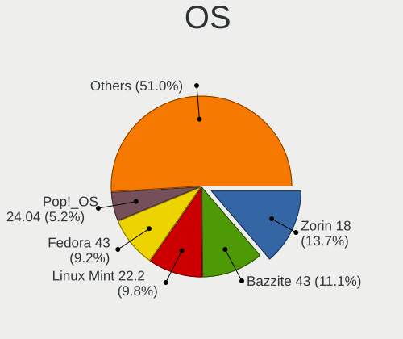

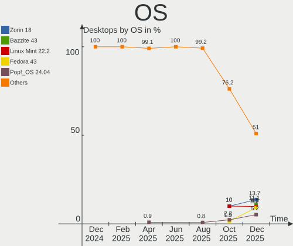

| Name                | Desktops | Percent |
|---------------------|----------|---------|
| Zorin 18            | 21       | 13.73%  |
| Bazzite 43          | 17       | 11.11%  |
| Linux Mint 22.2     | 15       | 9.8%    |
| Fedora 43           | 14       | 9.15%   |
| Pop!_OS 24.04       | 8        | 5.23%   |
| Arch Rolling        | 8        | 5.23%   |
| Ubuntu 25.10        | 7        | 4.58%   |
| OpenMandriva 25.90  | 6        | 3.92%   |
| Ubuntu 24.04        | 5        | 3.27%   |
| OpenMandriva 6.0    | 4        | 2.61%   |
| Debian 13           | 4        | 2.61%   |
| ROSA 13.1           | 3        | 1.96%   |
| Linux Mint 22.1     | 3        | 1.96%   |
| CachyOS             | 3        | 1.96%   |
| Zorin 17            | 2        | 1.31%   |
| Pop!_OS 22.04       | 2        | 1.31%   |
| OpenMandriva 25.11  | 2        | 1.31%   |
| Nobara 43           | 2        | 1.31%   |
| Kubuntu 25.10       | 2        | 1.31%   |
| KDE neon 24.04      | 2        | 1.31%   |
| CachyOS Rolling     | 2        | 1.31%   |
| BigLinux 25.0.10    | 2        | 1.31%   |
| BigLinux            | 2        | 1.31%   |
| Bazzite 42          | 2        | 1.31%   |
| Void Linux Rolling  | 1        | 0.65%   |
| Vanilla 2.0         | 1        | 0.65%   |
| Ubuntu 24.10        | 1        | 0.65%   |
| Ubuntu 22.04        | 1        | 0.65%   |
| SteamOS 3.7.17      | 1        | 0.65%   |
| Rocky Linux 10.1    | 1        | 0.65%   |
| OpenMandriva 25.06  | 1        | 0.65%   |
| OpenMandriva 24.12  | 1        | 0.65%   |
| Manjaro             | 1        | 0.65%   |
| Lubuntu 22.04       | 1        | 0.65%   |
| Fedora 37           | 1        | 0.65%   |
| EndeavourOS Rolling | 1        | 0.65%   |
| Debian 12           | 1        | 0.65%   |
| Debian 11           | 1        | 0.65%   |
| Agate 43            | 1        | 0.65%   |

OS Family
---------

OS without a version

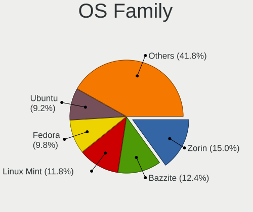

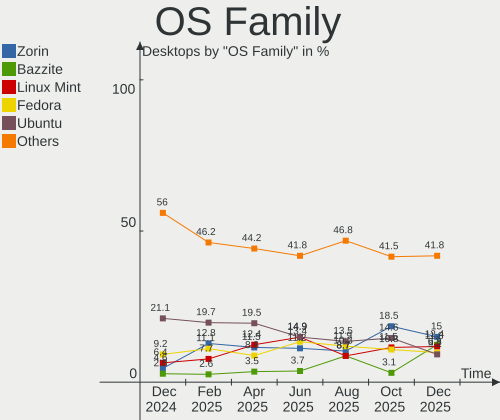

| Name         | Desktops | Percent |
|--------------|----------|---------|
| Zorin        | 23       | 15.03%  |
| Bazzite      | 19       | 12.42%  |
| Linux Mint   | 18       | 11.76%  |
| Fedora       | 15       | 9.8%    |
| Ubuntu       | 14       | 9.15%   |
| OpenMandriva | 14       | 9.15%   |
| Pop!_OS      | 10       | 6.54%   |
| Arch         | 8        | 5.23%   |
| Debian       | 6        | 3.92%   |
| CachyOS      | 5        | 3.27%   |
| BigLinux     | 4        | 2.61%   |
| ROSA         | 3        | 1.96%   |
| Nobara       | 2        | 1.31%   |
| Kubuntu      | 2        | 1.31%   |
| KDE neon     | 2        | 1.31%   |
| Void Linux   | 1        | 0.65%   |
| Vanilla      | 1        | 0.65%   |
| SteamOS      | 1        | 0.65%   |
| Rocky Linux  | 1        | 0.65%   |
| Manjaro      | 1        | 0.65%   |
| Lubuntu      | 1        | 0.65%   |
| EndeavourOS  | 1        | 0.65%   |
| Agate        | 1        | 0.65%   |

Kernel
------

Version of the Linux kernel

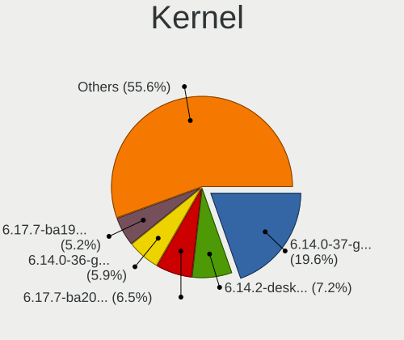

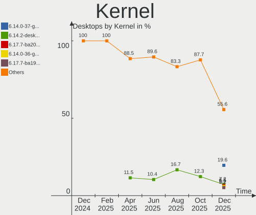

| Version                        | Desktops | Percent |
|--------------------------------|----------|---------|
| 6.14.0-37-generic              | 30       | 19.61%  |
| 6.14.2-desktop-3omv2590        | 11       | 7.19%   |
| 6.17.7-ba20.fc43.x86_64        | 10       | 6.54%   |
| 6.14.0-36-generic              | 9        | 5.88%   |
| 6.17.7-ba19.fc43.x86_64        | 8        | 5.23%   |
| 6.17.9-76061709-generic        | 7        | 4.58%   |
| 6.17.12-300.fc43.x86_64        | 6        | 3.92%   |
| 6.17.9-arch1-1                 | 4        | 2.61%   |
| 6.17.9-300.fc43.x86_64         | 4        | 2.61%   |
| 6.12.57+deb13-amd64            | 4        | 2.61%   |
| 6.8.0-90-generic               | 3        | 1.96%   |
| 6.8.0-88-generic               | 3        | 1.96%   |
| 6.17.1-300.fc43.x86_64         | 3        | 1.96%   |
| 6.17.0-8-generic               | 3        | 1.96%   |
| 6.17.0-7-generic               | 3        | 1.96%   |
| 6.12.47-generic-5rosa13-x86_64 | 3        | 1.96%   |
| 6.17.4-76061704-generic        | 2        | 1.31%   |
| 6.17.0-5-generic               | 2        | 1.31%   |
| 6.16.4-116.bazzite.fc42.x86_64 | 2        | 1.31%   |
| 6.12.61-1-MANJARO              | 2        | 1.31%   |
| 6.9.3-76060903-generic         | 1        | 0.65%   |
| 6.8.0-87-generic               | 1        | 0.65%   |
| 6.2.0-39-generic               | 1        | 0.65%   |
| 6.18.2-zen2-1-zen              | 1        | 0.65%   |
| 6.18.2-arch2-1                 | 1        | 0.65%   |
| 6.18.1-2-cachyos               | 1        | 0.65%   |
| 6.18.0-5-cachyos               | 1        | 0.65%   |
| 6.18.0-3-cachyos               | 1        | 0.65%   |
| 6.18.0-1-cachyos-bore-lto      | 1        | 0.65%   |
| 6.17.9-x64v3-xanmod1-1         | 1        | 0.65%   |
| 6.17.9-desktop-1omv2590        | 1        | 0.65%   |
| 6.17.9-2-cachyos               | 1        | 0.65%   |
| 6.17.3-arch2-1                 | 1        | 0.65%   |
| 6.17.12-200.nobara.fc43.x86_64 | 1        | 0.65%   |
| 6.17.11-hardened1-1-hardened   | 1        | 0.65%   |
| 6.17.11-300.fc43.x86_64        | 1        | 0.65%   |
| 6.17.11-200.nobara.fc43.x86_64 | 1        | 0.65%   |
| 6.17.10-200.nobara.fc43.x86_64 | 1        | 0.65%   |
| 6.17.0-6-generic               | 1        | 0.65%   |
| 6.14.7-061407-generic          | 1        | 0.65%   |

Kernel Family
-------------

Linux kernel without a distro release

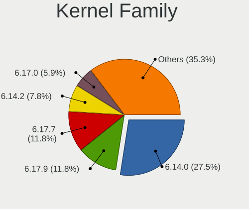

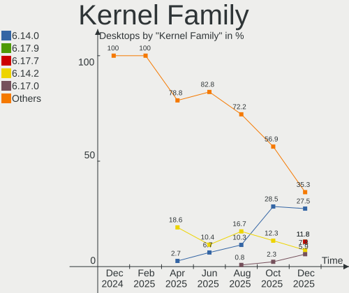

| Version | Desktops | Percent |
|---------|----------|---------|
| 6.14.0  | 42       | 27.45%  |
| 6.17.9  | 18       | 11.76%  |
| 6.17.7  | 18       | 11.76%  |
| 6.14.2  | 12       | 7.84%   |
| 6.17.0  | 9        | 5.88%   |
| 6.8.0   | 7        | 4.58%   |
| 6.17.12 | 7        | 4.58%   |
| 6.12.57 | 4        | 2.61%   |
| 6.18.0  | 3        | 1.96%   |
| 6.17.11 | 3        | 1.96%   |
| 6.17.1  | 3        | 1.96%   |
| 6.12.47 | 3        | 1.96%   |
| 6.18.2  | 2        | 1.31%   |
| 6.17.4  | 2        | 1.31%   |
| 6.16.4  | 2        | 1.31%   |
| 6.12.61 | 2        | 1.31%   |
| 6.9.3   | 1        | 0.65%   |
| 6.2.0   | 1        | 0.65%   |
| 6.18.1  | 1        | 0.65%   |
| 6.17.3  | 1        | 0.65%   |
| 6.17.10 | 1        | 0.65%   |
| 6.14.7  | 1        | 0.65%   |
| 6.12.63 | 1        | 0.65%   |
| 6.12.62 | 1        | 0.65%   |
| 6.12.48 | 1        | 0.65%   |
| 6.12.38 | 1        | 0.65%   |
| 6.12.1  | 1        | 0.65%   |
| 6.12.0  | 1        | 0.65%   |
| 6.11.11 | 1        | 0.65%   |
| 6.1.0   | 1        | 0.65%   |
| 6.0.7   | 1        | 0.65%   |
| 5.10.0  | 1        | 0.65%   |

Kernel Major Ver.
-----------------

Linux kernel major version

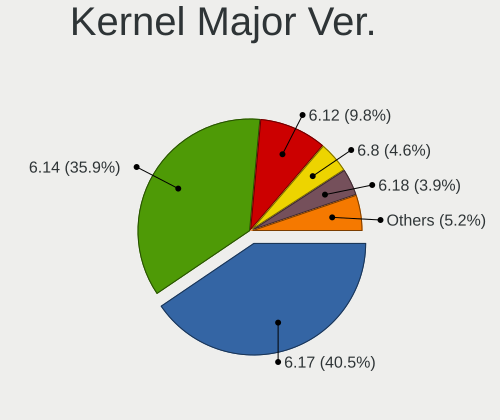

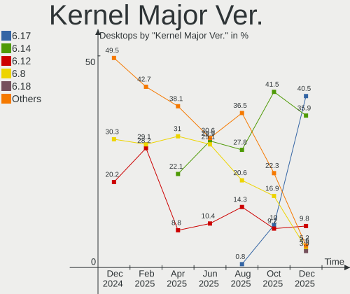

| Version | Desktops | Percent |
|---------|----------|---------|
| 6.17    | 62       | 40.52%  |
| 6.14    | 55       | 35.95%  |
| 6.12    | 15       | 9.8%    |
| 6.8     | 7        | 4.58%   |
| 6.18    | 6        | 3.92%   |
| 6.16    | 2        | 1.31%   |
| 6.9     | 1        | 0.65%   |
| 6.2     | 1        | 0.65%   |
| 6.11    | 1        | 0.65%   |
| 6.1     | 1        | 0.65%   |
| 6.0     | 1        | 0.65%   |
| 5.10    | 1        | 0.65%   |

Arch
----

OS architecture (x86_64, i586, etc.)

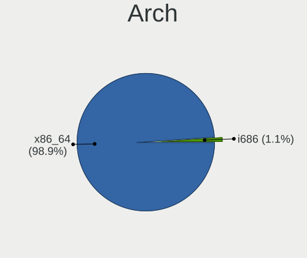

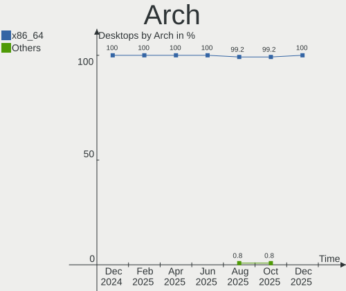

| Name   | Desktops | Percent |
|--------|----------|---------|
| x86_64 | 153      | 100%    |

DE
--

Desktop Environment

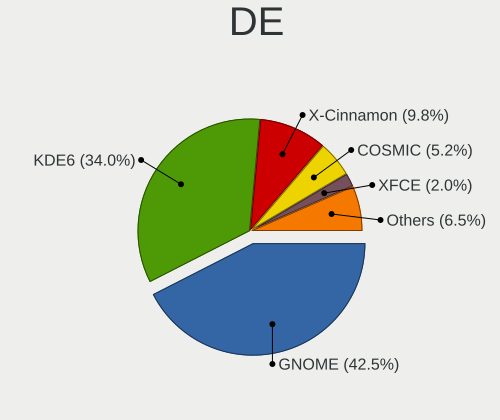

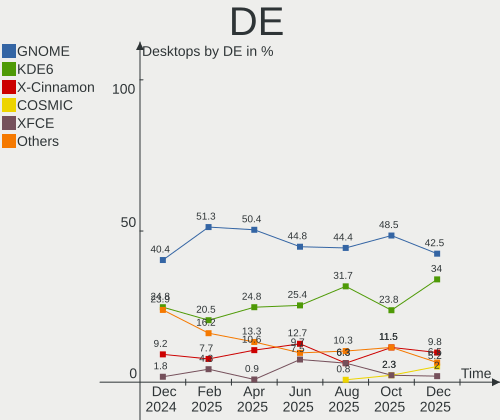

| Name       | Desktops | Percent |
|------------|----------|---------|
| GNOME      | 65       | 42.48%  |
| KDE6       | 52       | 33.99%  |
| X-Cinnamon | 15       | 9.8%    |
| COSMIC     | 8        | 5.23%   |
| XFCE       | 3        | 1.96%   |
| Hyprland   | 3        | 1.96%   |
| KDE4       | 2        | 1.31%   |
| KDE        | 2        | 1.31%   |
| MATE       | 1        | 0.65%   |
| LXQt       | 1        | 0.65%   |
| Unknown    | 1        | 0.65%   |

Display Server
--------------

X11 or Wayland

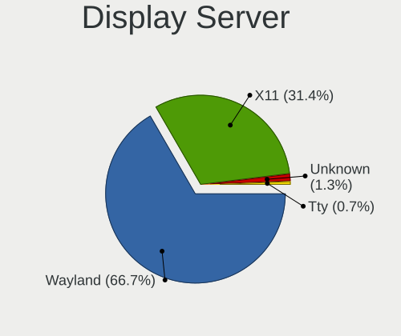

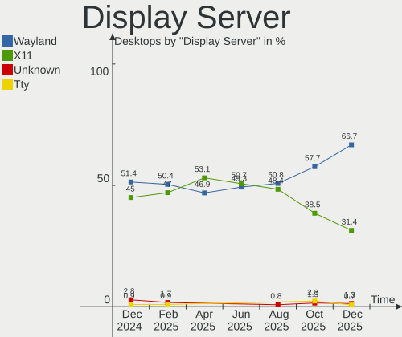

| Name    | Desktops | Percent |
|---------|----------|---------|
| Wayland | 102      | 66.67%  |
| X11     | 48       | 31.37%  |
| Unknown | 2        | 1.31%   |
| Tty     | 1        | 0.65%   |

Display Manager
---------------

SDDM, LightDM, etc.

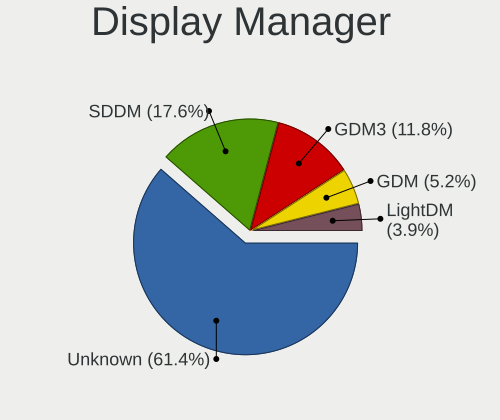

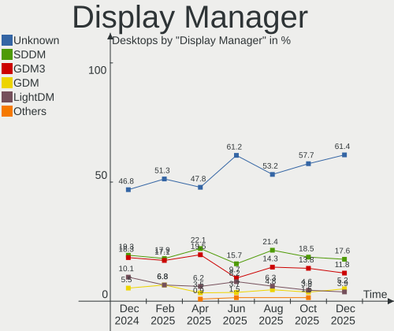

| Name    | Desktops | Percent |
|---------|----------|---------|
| Unknown | 94       | 61.44%  |
| SDDM    | 27       | 17.65%  |
| GDM3    | 18       | 11.76%  |
| GDM     | 8        | 5.23%   |
| LightDM | 6        | 3.92%   |

OS Lang
-------

Language

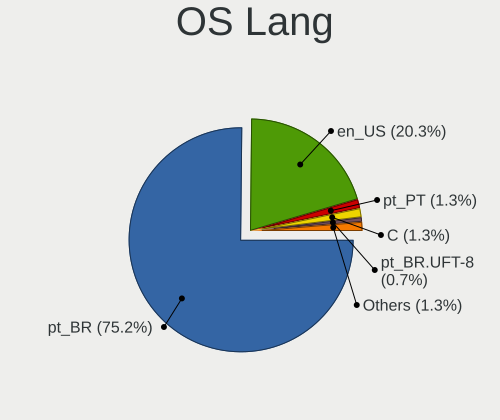

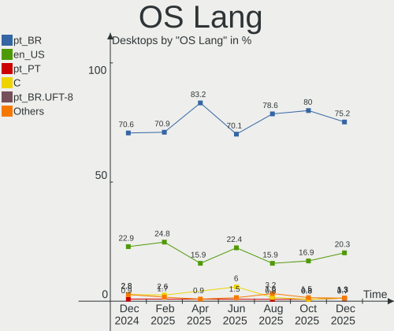

| Lang        | Desktops | Percent |
|-------------|----------|---------|
| pt_BR       | 115      | 75.16%  |
| en_US       | 31       | 20.26%  |
| pt_PT       | 2        | 1.31%   |
| C           | 2        | 1.31%   |
| pt_BR.UFT-8 | 1        | 0.65%   |
| en_GB       | 1        | 0.65%   |
| de_DE       | 1        | 0.65%   |

Boot Mode
---------

EFI or BIOS

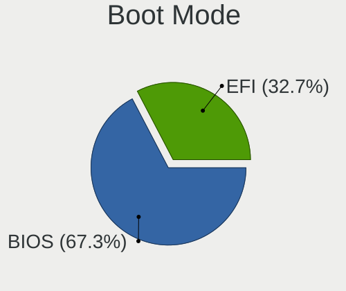

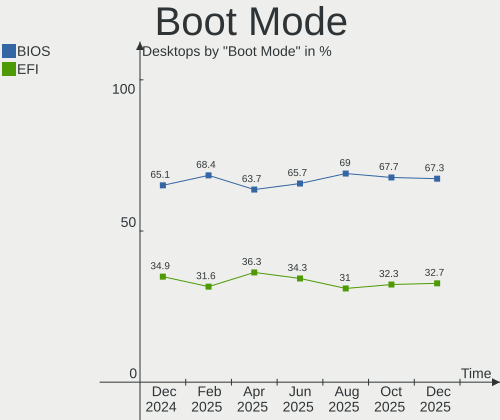

| Mode | Desktops | Percent |
|------|----------|---------|
| BIOS | 103      | 67.32%  |
| EFI  | 50       | 32.68%  |

Filesystem
----------

Type of filesystem

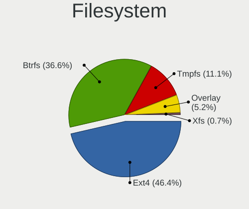

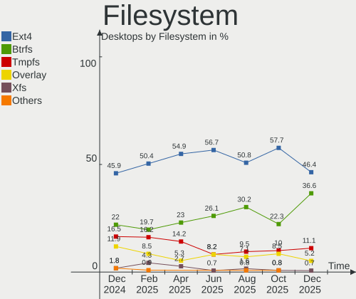

| Type    | Desktops | Percent |
|---------|----------|---------|
| Ext4    | 71       | 46.41%  |
| Btrfs   | 56       | 36.6%   |
| Tmpfs   | 17       | 11.11%  |
| Overlay | 8        | 5.23%   |
| Xfs     | 1        | 0.65%   |

Part. scheme
------------

Scheme of partitioning

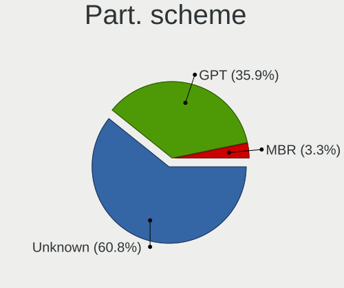

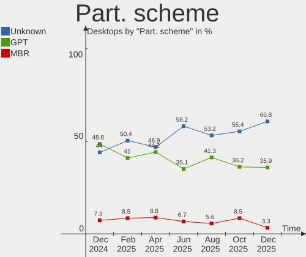

| Type    | Desktops | Percent |
|---------|----------|---------|
| Unknown | 93       | 60.78%  |
| GPT     | 55       | 35.95%  |
| MBR     | 5        | 3.27%   |

Dual Boot with Linux/BSD
------------------------

Hosting more than one Linux/BSD

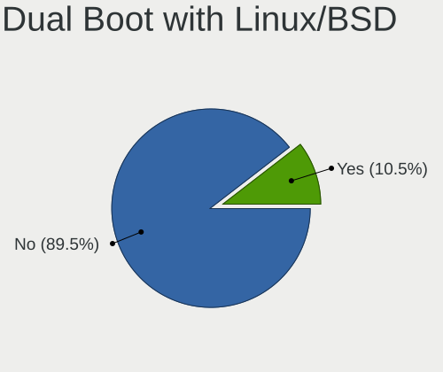

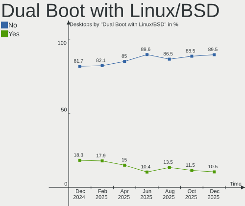

| Dual boot | Desktops | Percent |
|-----------|----------|---------|
| No        | 137      | 89.54%  |
| Yes       | 16       | 10.46%  |

Dual Boot (Win)
---------------

Hosting Linux and Windows

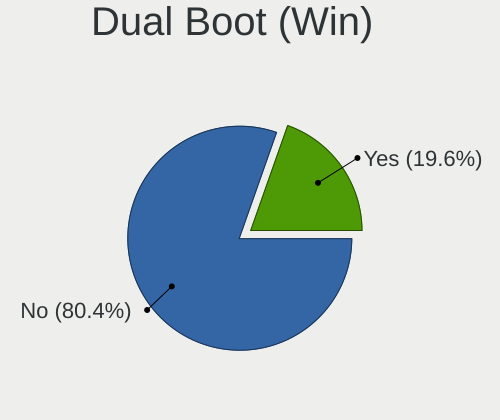

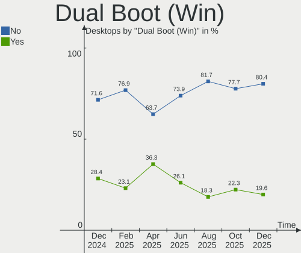

| Dual boot | Desktops | Percent |
|-----------|----------|---------|
| No        | 123      | 80.39%  |
| Yes       | 30       | 19.61%  |

Board
-----

Vendor
------

Motherboard manufacturer

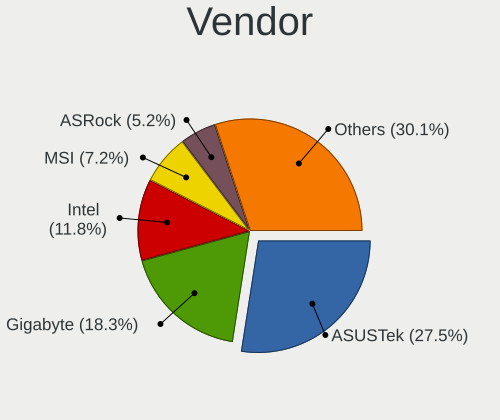

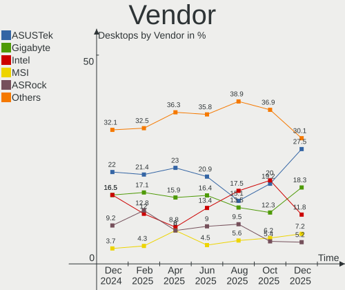

| Name                | Desktops | Percent |
|---------------------|----------|---------|
| ASUSTek Computer    | 42       | 27.45%  |
| Gigabyte Technology | 28       | 18.3%   |
| Intel               | 18       | 11.76%  |
| MSI                 | 11       | 7.19%   |
| ASRock              | 8        | 5.23%   |
| Dell                | 7        | 4.58%   |
| Unknown             | 5        | 3.27%   |
| Positivo            | 4        | 2.61%   |
| Lenovo              | 4        | 2.61%   |
| MACHINIST           | 3        | 1.96%   |
| MAXSUN              | 2        | 1.31%   |
| Huanan              | 2        | 1.31%   |
| Biostar             | 2        | 1.31%   |
| ZRD                 | 1        | 0.65%   |
| ZR                  | 1        | 0.65%   |
| VX                  | 1        | 0.65%   |
| TGT                 | 1        | 0.65%   |
| SZMZ                | 1        | 0.65%   |
| Login Informatica   | 1        | 0.65%   |
| Itautec             | 1        | 0.65%   |
| HPE                 | 1        | 0.65%   |
| Hewlett-Packard     | 1        | 0.65%   |
| Google              | 1        | 0.65%   |
| Fujitsu             | 1        | 0.65%   |
| DUEX                | 1        | 0.65%   |
| Daten Tecnologia    | 1        | 0.65%   |
| AZW                 | 1        | 0.65%   |
| Apple               | 1        | 0.65%   |
| AMD                 | 1        | 0.65%   |
| AFOX                | 1        | 0.65%   |

Model
-----

Motherboard model

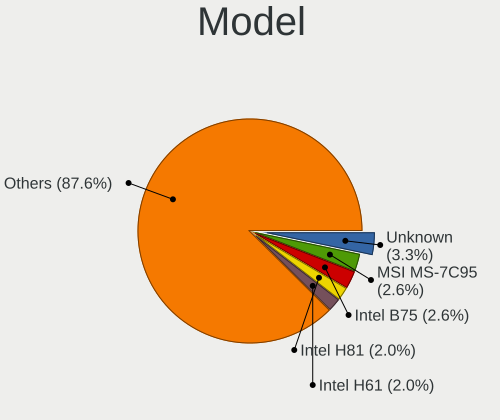

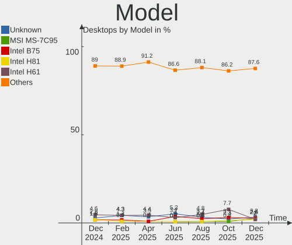

| Name                                  | Desktops | Percent |
|---------------------------------------|----------|---------|
| Unknown                               | 5        | 3.27%   |
| MSI MS-7C95                           | 4        | 2.61%   |
| Intel B75                             | 4        | 2.61%   |
| Intel H81                             | 3        | 1.96%   |
| Intel H61                             | 3        | 1.96%   |
| Gigabyte A520M K V2                   | 3        | 1.96%   |
| ASUS TUF Gaming B650M-E WIFI          | 3        | 1.96%   |
| ASUS TUF Gaming B550M-PLUS            | 3        | 1.96%   |
| ASUS M5A78L-M PLUS/USB3               | 3        | 1.96%   |
| ASUS All Series                       | 3        | 1.96%   |
| MSI MS-7C56                           | 2        | 1.31%   |
| Intel H110                            | 2        | 1.31%   |
| Huanan X99-QD4 V1.0                   | 2        | 1.31%   |
| Gigabyte B550M AORUS ELITE            | 2        | 1.31%   |
| Gigabyte B450M GAMING                 | 2        | 1.31%   |
| Gigabyte B450M DS3H V2                | 2        | 1.31%   |
| ASUS TUF Gaming X570-PLUS_BR          | 2        | 1.31%   |
| ASUS PRIME B450M-GAMING/BR            | 2        | 1.31%   |
| ASUS PRIME A320M-K/BR                 | 2        | 1.31%   |
| ASRock B450M Steel Legend             | 2        | 1.31%   |
| ZRD H618D3G V10                       | 1        | 0.65%   |
| ZR B450M-F                            | 1        | 0.65%   |
| VX B75                                | 1        | 0.65%   |
| TGT H61-T V1.0                        | 1        | 0.65%   |
| SZMZ B75-H                            | 1        | 0.65%   |
| Positivo Positivo Master D610         | 1        | 0.65%   |
| Positivo Positivo Master C610 MiniPro | 1        | 0.65%   |
| Positivo POS-MIH61CF                  | 1        | 0.65%   |
| Positivo POS-AG31AP                   | 1        | 0.65%   |
| MSI MS-7E61                           | 1        | 0.65%   |
| MSI MS-7E28                           | 1        | 0.65%   |
| MSI MS-7C96                           | 1        | 0.65%   |
| MSI MS-7821                           | 1        | 0.65%   |
| MSI MS-7817                           | 1        | 0.65%   |
| MAXSUN MS-Challenger B760M            | 1        | 0.65%   |
| MAXSUN MS-Challenger A520M            | 1        | 0.65%   |
| MACHINIST X99-RS9 V2.0                | 1        | 0.65%   |
| MACHINIST X99 PR9                     | 1        | 0.65%   |
| MACHINIST X99 B9                      | 1        | 0.65%   |
| Login Informatica BLUE-B75-M2         | 1        | 0.65%   |

Model Family
------------

Motherboard model prefix

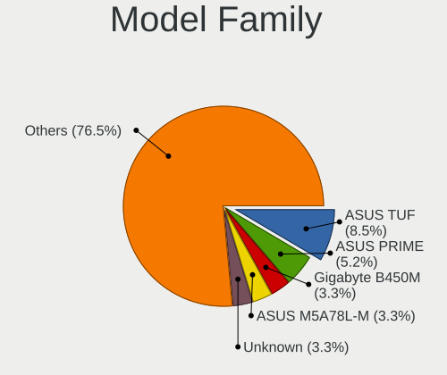

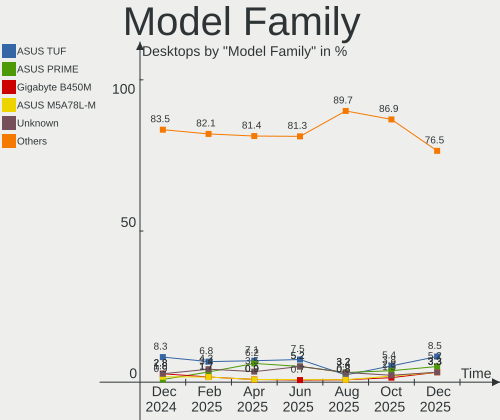

| Name                          | Desktops | Percent |
|-------------------------------|----------|---------|
| ASUS TUF                      | 13       | 8.5%    |
| ASUS PRIME                    | 8        | 5.23%   |
| Gigabyte B450M                | 5        | 3.27%   |
| ASUS M5A78L-M                 | 5        | 3.27%   |
| Unknown                       | 5        | 3.27%   |
| MSI MS-7C95                   | 4        | 2.61%   |
| Intel B75                     | 4        | 2.61%   |
| Gigabyte B550M                | 4        | 2.61%   |
| Dell OptiPlex                 | 4        | 2.61%   |
| Lenovo ThinkCentre            | 3        | 1.96%   |
| Intel H81                     | 3        | 1.96%   |
| Intel H61                     | 3        | 1.96%   |
| Gigabyte A520M                | 3        | 1.96%   |
| ASUS ROG                      | 3        | 1.96%   |
| ASUS P8H61-M                  | 3        | 1.96%   |
| ASUS All                      | 3        | 1.96%   |
| Positivo Positivo             | 2        | 1.31%   |
| MSI MS-7C56                   | 2        | 1.31%   |
| MAXSUN MS-Challenger          | 2        | 1.31%   |
| MACHINIST X99                 | 2        | 1.31%   |
| Intel H110                    | 2        | 1.31%   |
| Huanan X99-QD4                | 2        | 1.31%   |
| Gigabyte X870E                | 2        | 1.31%   |
| Gigabyte B850M                | 2        | 1.31%   |
| ASRock B450M                  | 2        | 1.31%   |
| ZRD H618D3G                   | 1        | 0.65%   |
| ZR B450M-F                    | 1        | 0.65%   |
| VX B75                        | 1        | 0.65%   |
| TGT H61-T                     | 1        | 0.65%   |
| SZMZ B75-H                    | 1        | 0.65%   |
| Positivo POS-MIH61CF          | 1        | 0.65%   |
| Positivo POS-AG31AP           | 1        | 0.65%   |
| MSI MS-7E61                   | 1        | 0.65%   |
| MSI MS-7E28                   | 1        | 0.65%   |
| MSI MS-7C96                   | 1        | 0.65%   |
| MSI MS-7821                   | 1        | 0.65%   |
| MSI MS-7817                   | 1        | 0.65%   |
| MACHINIST X99-RS9             | 1        | 0.65%   |
| Login Informatica BLUE-B75-M2 | 1        | 0.65%   |
| Lenovo ThinkStation           | 1        | 0.65%   |

MFG Year
--------

Motherboard manufacture year

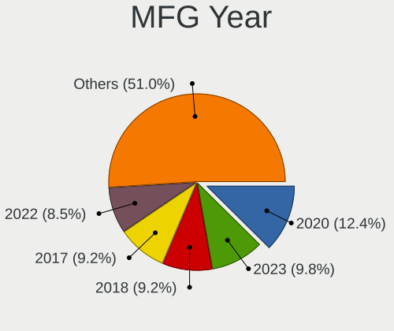

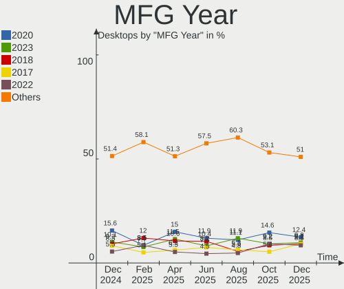

| Year | Desktops | Percent |
|------|----------|---------|
| 2020 | 19       | 12.42%  |
| 2023 | 15       | 9.8%    |
| 2018 | 14       | 9.15%   |
| 2017 | 14       | 9.15%   |
| 2022 | 13       | 8.5%    |
| 2019 | 13       | 8.5%    |
| 2024 | 11       | 7.19%   |
| 2012 | 8        | 5.23%   |
| 2025 | 7        | 4.58%   |
| 2021 | 7        | 4.58%   |
| 2016 | 7        | 4.58%   |
| 2013 | 6        | 3.92%   |
| 2014 | 5        | 3.27%   |
| 2009 | 5        | 3.27%   |
| 2010 | 4        | 2.61%   |
| 2011 | 3        | 1.96%   |
| 2015 | 1        | 0.65%   |
| 2008 | 1        | 0.65%   |

Form Factor
-----------

Physical design of the computer

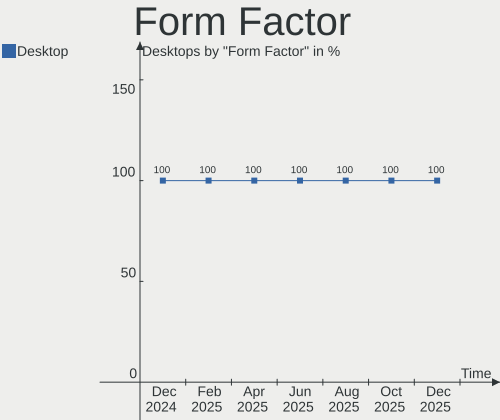

| Name    | Desktops | Percent |
|---------|----------|---------|
| Desktop | 153      | 100%    |

Secure Boot
-----------

Enabled or disabled

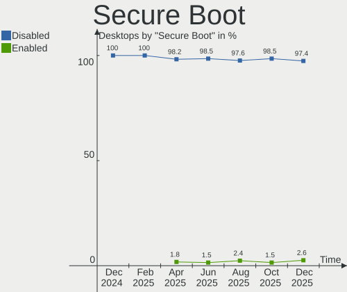

| State    | Desktops | Percent |
|----------|----------|---------|
| Disabled | 149      | 97.39%  |
| Enabled  | 4        | 2.61%   |

Coreboot
--------

Have coreboot on board

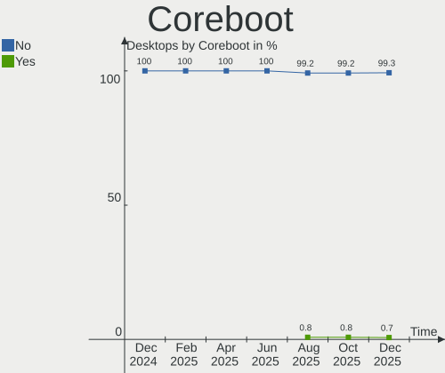

| Used | Desktops | Percent |
|------|----------|---------|
| No   | 152      | 99.35%  |
| Yes  | 1        | 0.65%   |

RAM Size
--------

Total RAM memory

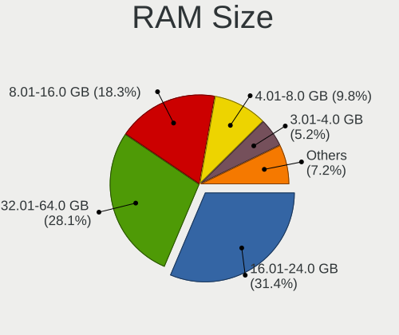

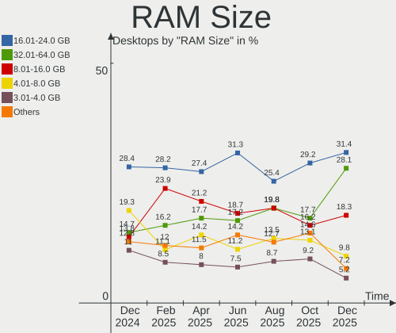

| Size in GB  | Desktops | Percent |
|-------------|----------|---------|
| 16.01-24.0  | 48       | 31.37%  |
| 32.01-64.0  | 43       | 28.1%   |
| 8.01-16.0   | 28       | 18.3%   |
| 4.01-8.0    | 15       | 9.8%    |
| 3.01-4.0    | 8        | 5.23%   |
| 24.01-32.0  | 5        | 3.27%   |
| 64.01-256.0 | 5        | 3.27%   |
| 1.01-2.0    | 1        | 0.65%   |

RAM Used
--------

Used RAM memory

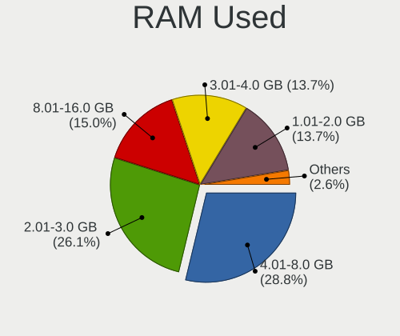

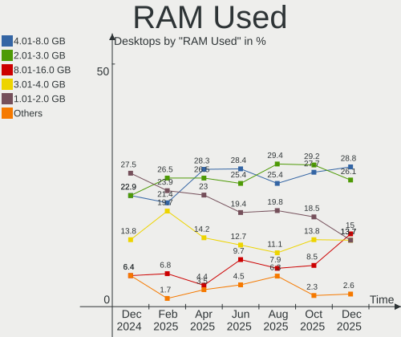

| Used GB    | Desktops | Percent |
|------------|----------|---------|
| 4.01-8.0   | 44       | 28.76%  |
| 2.01-3.0   | 40       | 26.14%  |
| 8.01-16.0  | 23       | 15.03%  |
| 3.01-4.0   | 21       | 13.73%  |
| 1.01-2.0   | 21       | 13.73%  |
| 0.51-1.0   | 3        | 1.96%   |
| 32.01-64.0 | 1        | 0.65%   |

Total Drives
------------

Number of drives on board

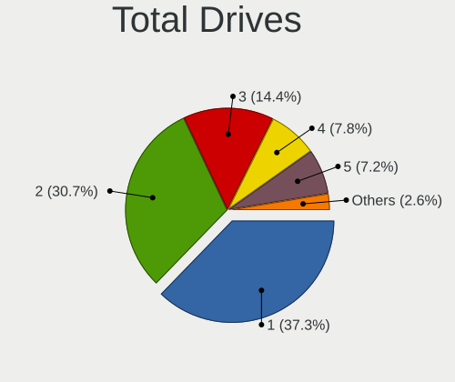

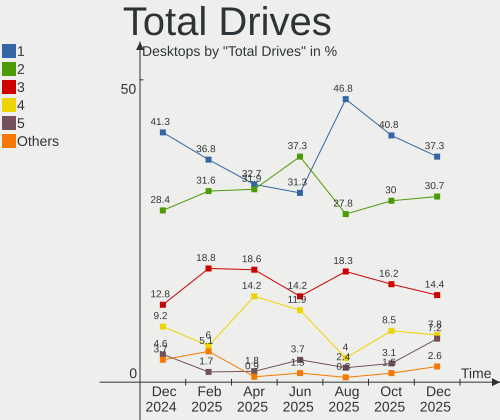

| Drives | Desktops | Percent |
|--------|----------|---------|
| 1      | 57       | 37.25%  |
| 2      | 47       | 30.72%  |
| 3      | 22       | 14.38%  |
| 4      | 12       | 7.84%   |
| 5      | 11       | 7.19%   |
| 6      | 2        | 1.31%   |
| 8      | 1        | 0.65%   |
| 7      | 1        | 0.65%   |

Has CD-ROM
----------

Has CD-ROM on board

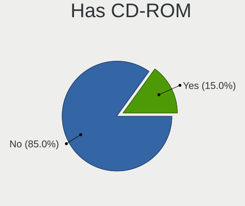

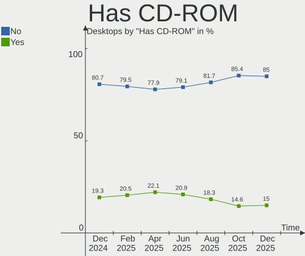

| Presented | Desktops | Percent |
|-----------|----------|---------|
| No        | 130      | 84.97%  |
| Yes       | 23       | 15.03%  |

Has Ethernet
------------

Has Ethernet on board

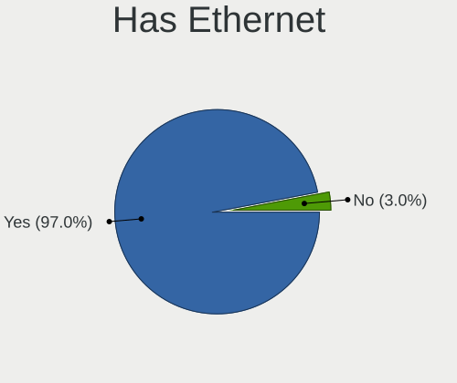

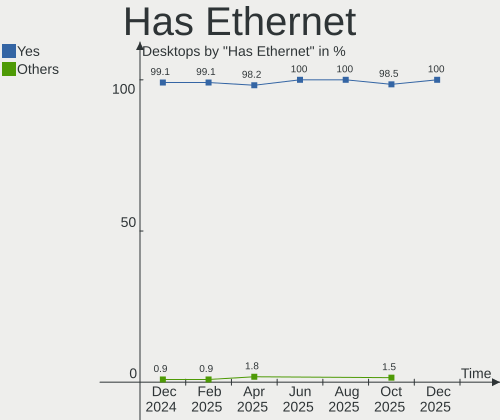

| Presented | Desktops | Percent |
|-----------|----------|---------|
| Yes       | 153      | 100%    |

Has WiFi
--------

Has WiFi module

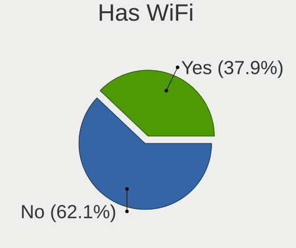

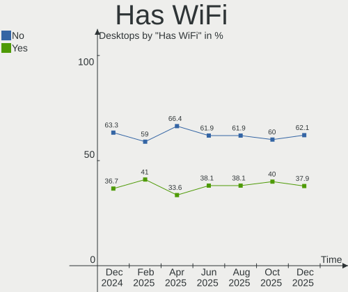

| Presented | Desktops | Percent |
|-----------|----------|---------|
| No        | 95       | 62.09%  |
| Yes       | 58       | 37.91%  |

Has Bluetooth
-------------

Has Bluetooth module

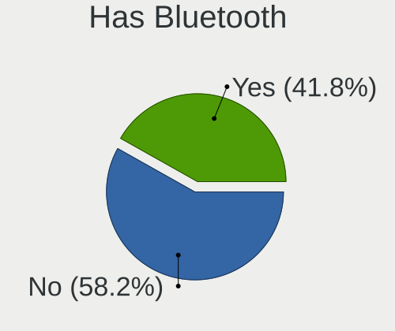

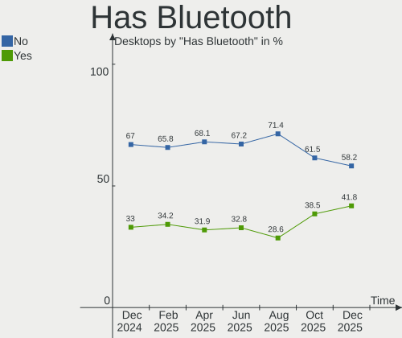

| Presented | Desktops | Percent |
|-----------|----------|---------|
| No        | 89       | 58.17%  |
| Yes       | 64       | 41.83%  |

Location
--------

Country
-------

Geographic location (country)

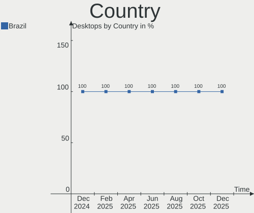

| Country | Desktops | Percent |
|---------|----------|---------|
| Brazil  | 153      | 100%    |

City
----

Geographic location (city)

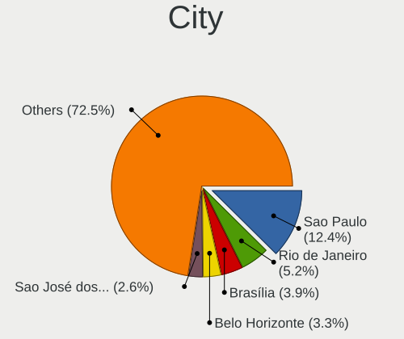

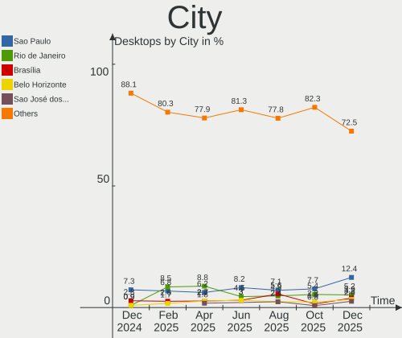

| City                  | Desktops | Percent |
|-----------------------|----------|---------|
| Sao Paulo             | 19       | 12.42%  |
| Rio de Janeiro        | 8        | 5.23%   |
| Brasília             | 6        | 3.92%   |
| Belo Horizonte        | 5        | 3.27%   |
| Sao José dos Campos  | 4        | 2.61%   |
| Porto Alegre          | 3        | 1.96%   |
| Osasco                | 3        | 1.96%   |
| Maringá              | 3        | 1.96%   |
| Fortaleza             | 3        | 1.96%   |
| Bauru                 | 3        | 1.96%   |
| Valparaiso de Goias   | 2        | 1.31%   |
| Sorocaba              | 2        | 1.31%   |
| Ribeirao Preto        | 2        | 1.31%   |
| Palhoça              | 2        | 1.31%   |
| Nova Iguaçu          | 2        | 1.31%   |
| Mogi das Cruzes       | 2        | 1.31%   |
| Limeira               | 2        | 1.31%   |
| Goiânia              | 2        | 1.31%   |
| Curitiba              | 2        | 1.31%   |
| Contagem              | 2        | 1.31%   |
| Caxias do Sul         | 2        | 1.31%   |
| Vitória              | 1        | 0.65%   |
| Vila Velha            | 1        | 0.65%   |
| Vila Olímpia         | 1        | 0.65%   |
| Viçosa               | 1        | 0.65%   |
| Viamao                | 1        | 0.65%   |
| Varzea Paulista       | 1        | 0.65%   |
| Várzea Grande        | 1        | 0.65%   |
| Uberaba               | 1        | 0.65%   |
| Tijucas               | 1        | 0.65%   |
| Tibagi                | 1        | 0.65%   |
| Teresina              | 1        | 0.65%   |
| Soledade              | 1        | 0.65%   |
| Sao José dos Pinhais | 1        | 0.65%   |
| Sao Jose              | 1        | 0.65%   |
| Sao Goncalo           | 1        | 0.65%   |
| Sao Bernardo do Campo | 1        | 0.65%   |
| Santos                | 1        | 0.65%   |
| Santa Barbara d'Oeste | 1        | 0.65%   |
| Santa Adelia          | 1        | 0.65%   |

Drives
------

Drive Vendor
------------

Hard drive vendors

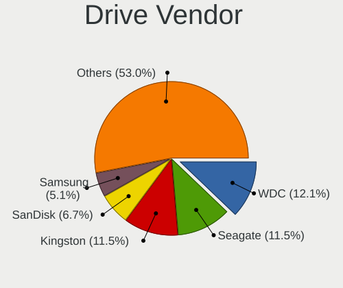

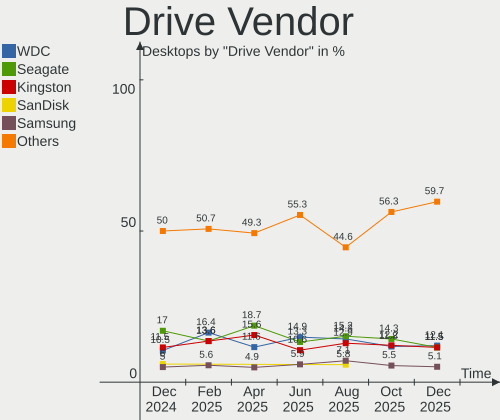

| Vendor                         | Desktops | Drives | Percent |
|--------------------------------|----------|--------|---------|
| WDC                            | 38       | 45     | 12.14%  |
| Seagate                        | 36       | 42     | 11.5%   |
| Kingston                       | 36       | 44     | 11.5%   |
| SanDisk                        | 21       | 23     | 6.71%   |
| Samsung Electronics            | 16       | 21     | 5.11%   |
| China                          | 15       | 16     | 4.79%   |
| MAXIO Technology (Hangzhou)    | 14       | 16     | 4.47%   |
| Realtek Semiconductor          | 12       | 12     | 3.83%   |
| Kingston Technology Company    | 10       | 10     | 3.19%   |
| Toshiba                        | 9        | 9      | 2.88%   |
| A-DATA Technology              | 9        | 9      | 2.88%   |
| Silicon Motion                 | 8        | 8      | 2.56%   |
| Crucial                        | 8        | 8      | 2.56%   |
| ADATA Technology               | 6        | 6      | 1.92%   |
| KingSpec                       | 5        | 6      | 1.6%    |
| XrayDisk                       | 4        | 4      | 1.28%   |
| Phison Electronics             | 4        | 4      | 1.28%   |
| Patriot                        | 4        | 4      | 1.28%   |
| Lexar                          | 4        | 4      | 1.28%   |
| Micron/Crucial Technology      | 3        | 3      | 0.96%   |
| Hitachi                        | 3        | 4      | 0.96%   |
| Unknown                        | 3        | 3      | 0.96%   |
| Shenzhen Longsys Electronics   | 2        | 2      | 0.64%   |
| Micron Technology              | 2        | 2      | 0.64%   |
| JMicron Technology             | 2        | 2      | 0.64%   |
| HUSKY                          | 2        | 2      | 0.64%   |
| HGST                           | 2        | 3      | 0.64%   |
| Hewlett-Packard                | 2        | 2      | 0.64%   |
| ZADAK                          | 1        | 1      | 0.32%   |
| WALRAM                         | 1        | 1      | 0.32%   |
| Unknown                        | 1        | 1      | 0.32%   |
| TGT                            | 1        | 1      | 0.32%   |
| T-FORCE                        | 1        | 1      | 0.32%   |
| T-CREATE                       | 1        | 1      | 0.32%   |
| Solid State Storage Technology | 1        | 1      | 0.32%   |
| SK hynix                       | 1        | 1      | 0.32%   |
| SAGE                           | 1        | 1      | 0.32%   |
| SABRENT                        | 1        | 1      | 0.32%   |
| Realtek                        | 1        | 1      | 0.32%   |
| PNY                            | 1        | 1      | 0.32%   |

Drive Model
-----------

Hard drive models

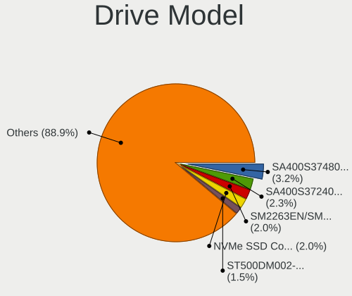

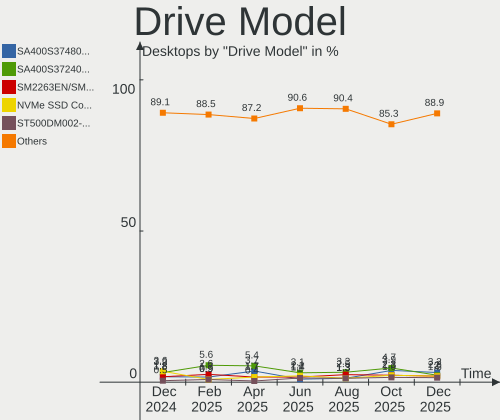

| Model                                                              | Desktops | Percent |
|--------------------------------------------------------------------|----------|---------|
| Kingston SA400S37480G 480GB SSD                                    | 11       | 3.21%   |
| Kingston SA400S37240G 240GB SSD                                    | 8        | 2.33%   |
| Silicon Motion SM2263EN/SM2263XT SSD Controller 512GB              | 7        | 2.04%   |
| MAXIO (Hangzhou) NVMe SSD Controller MAP1202 2TB                   | 7        | 2.04%   |
| Seagate ST500DM002-1BD142 500GB                                    | 5        | 1.46%   |
| SanDisk SSD PLUS 240GB                                             | 5        | 1.46%   |
| Kingston SA400S37960G 960GB SSD                                    | 5        | 1.46%   |
| Kingston Company SNV3S1000G 1TB                                    | 4        | 1.17%   |
| Kingston SNVS500G 500GB                                            | 4        | 1.17%   |
| Kingston SA400S37120G 120GB SSD                                    | 4        | 1.17%   |
| Seagate ST1000DM010-2EP102 1TB                                     | 3        | 0.87%   |
| Samsung NVMe SSD Controller PM9A1/PM9A3/980PRO 1TB                 | 3        | 0.87%   |
| Kingston Company SNV2S1000G 1TB                                    | 3        | 0.87%   |
| China SSD 128GB                                                    | 3        | 0.87%   |
| Unknown                                                            | 3        | 0.87%   |
| XrayDisk 1TB SSD                                                   | 2        | 0.58%   |
| WDC WD5000AAKX-08U6AA0 500GB                                       | 2        | 0.58%   |
| WDC WD10SPZX-21Z10T0 1TB                                           | 2        | 0.58%   |
| WDC WD10PURZ-85U8XY0 1TB                                           | 2        | 0.58%   |
| WDC WD10JPCX-24UE4T0 1TB                                           | 2        | 0.58%   |
| WDC WD10EARS-00Y5B1 1TB                                            | 2        | 0.58%   |
| Toshiba MQ01ABD050 500GB                                           | 2        | 0.58%   |
| Seagate ST2000DM008-2UB102 2TB                                     | 2        | 0.58%   |
| Sandisk WD Green SN350 500GB 2G0C                                  | 2        | 0.58%   |
| Samsung NVMe SSD Controller SM981/PM981/PM983 1TB                  | 2        | 0.58%   |
| Samsung HD502HJ 500GB                                              | 2        | 0.58%   |
| Samsung HD161GJ 160GB                                              | 2        | 0.58%   |
| Realtek RTS5763DL NVMe SSD Controller 512GB                        | 2        | 0.58%   |
| Realtek NE-256 2280 256GB                                          | 2        | 0.58%   |
| Micron/Crucial P2 NVMe PCIe SSD 2TB                                | 2        | 0.58%   |
| Kingston SV300S37A120G 120GB SSD                                   | 2        | 0.58%   |
| Kingston SNV3S500G 500GB                                           | 2        | 0.58%   |
| KingSpec P3-128 128GB SSD                                          | 2        | 0.58%   |
| JMicron Generic 320GB                                              | 2        | 0.58%   |
| Crucial CT1000BX500SSD1 1TB                                        | 2        | 0.58%   |
| China SSD 512GB                                                    | 2        | 0.58%   |
| China SSD 480GB                                                    | 2        | 0.58%   |
| China SSD 240GB                                                    | 2        | 0.58%   |
| ADATA XPG SX8200 Pro PCIe Gen3x4 M.2 2280 Solid State Drive 1024GB | 2        | 0.58%   |
| A-DATA SU650 480GB SSD                                             | 2        | 0.58%   |

HDD Vendor
----------

Hard disk drive vendors

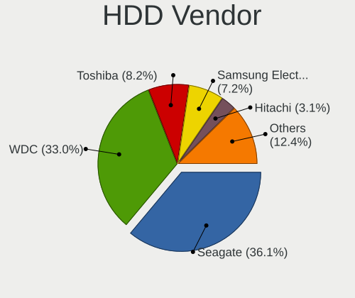

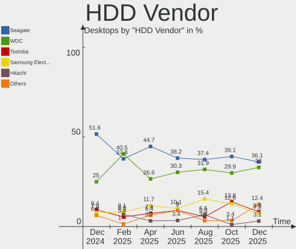

| Vendor              | Desktops | Drives | Percent |
|---------------------|----------|--------|---------|
| Seagate             | 35       | 41     | 36.08%  |
| WDC                 | 32       | 37     | 32.99%  |
| Toshiba             | 8        | 8      | 8.25%   |
| Samsung Electronics | 7        | 9      | 7.22%   |
| Hitachi             | 3        | 4      | 3.09%   |
| JMicron Technology  | 2        | 2      | 2.06%   |
| HGST                | 2        | 3      | 2.06%   |
| Hewlett-Packard     | 2        | 2      | 2.06%   |
| T-FORCE             | 1        | 1      | 1.03%   |
| SAGE                | 1        | 1      | 1.03%   |
| Min Yi U            | 1        | 1      | 1.03%   |
| Maxtor              | 1        | 1      | 1.03%   |
| MARVELL             | 1        | 2      | 1.03%   |
| ExcelStor           | 1        | 1      | 1.03%   |

SSD Vendor
----------

Solid state drive vendors

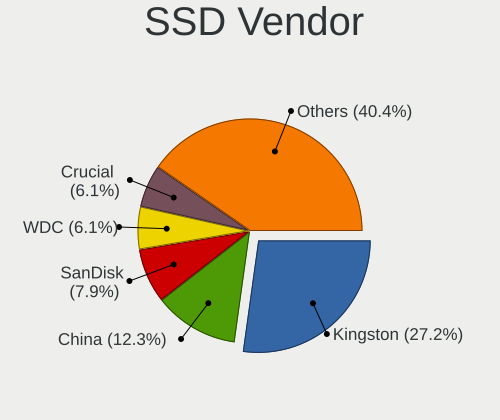

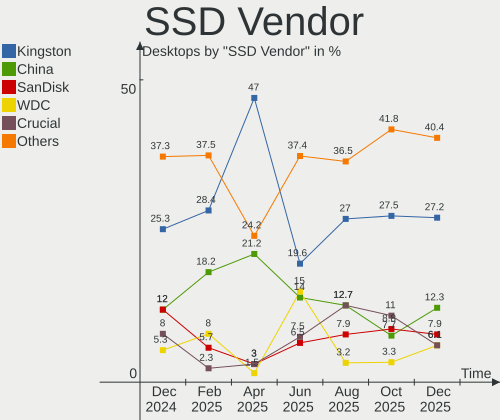

| Vendor              | Desktops | Drives | Percent |
|---------------------|----------|--------|---------|
| Kingston            | 31       | 34     | 27.19%  |
| China               | 14       | 15     | 12.28%  |
| SanDisk             | 9        | 9      | 7.89%   |
| WDC                 | 7        | 7      | 6.14%   |
| Crucial             | 7        | 7      | 6.14%   |
| A-DATA Technology   | 7        | 7      | 6.14%   |
| KingSpec            | 5        | 6      | 4.39%   |
| Samsung Electronics | 4        | 4      | 3.51%   |
| Patriot             | 4        | 4      | 3.51%   |
| Lexar               | 4        | 4      | 3.51%   |
| Unknown             | 3        | 3      | 2.63%   |
| XrayDisk            | 2        | 2      | 1.75%   |
| HUSKY               | 2        | 2      | 1.75%   |
| ZADAK               | 1        | 1      | 0.88%   |
| Seagate             | 1        | 1      | 0.88%   |
| SABRENT             | 1        | 1      | 0.88%   |
| PNY                 | 1        | 1      | 0.88%   |
| OCZ                 | 1        | 1      | 0.88%   |
| MSI                 | 1        | 1      | 0.88%   |
| LITEON              | 1        | 1      | 0.88%   |
| KODAK               | 1        | 1      | 0.88%   |
| KingFast            | 1        | 1      | 0.88%   |
| KBM                 | 1        | 1      | 0.88%   |
| FNX                 | 1        | 1      | 0.88%   |
| Emtec               | 1        | 1      | 0.88%   |
| Corsair             | 1        | 1      | 0.88%   |
| BHT                 | 1        | 1      | 0.88%   |
| AFOX                | 1        | 1      | 0.88%   |

Drive Kind
----------

HDD or SSD

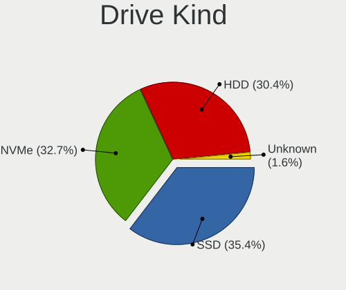

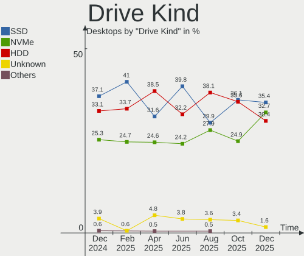

| Kind    | Desktops | Drives | Percent |
|---------|----------|--------|---------|
| SSD     | 91       | 119    | 35.41%  |
| NVMe    | 84       | 113    | 32.68%  |
| HDD     | 78       | 113    | 30.35%  |
| Unknown | 4        | 4      | 1.56%   |

Drive Connector
---------------

SATA, SAS, NVMe, etc.

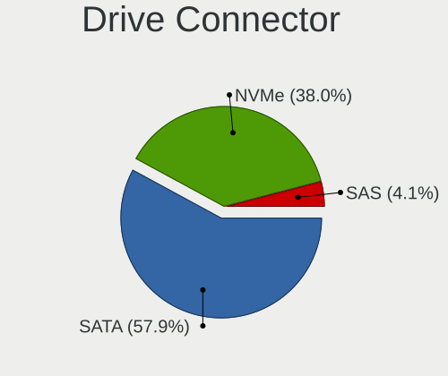

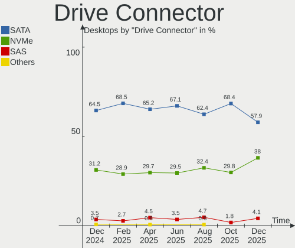

| Type | Desktops | Drives | Percent |
|------|----------|--------|---------|
| SATA | 128      | 225    | 57.92%  |
| NVMe | 84       | 112    | 38.01%  |
| SAS  | 9        | 12     | 4.07%   |

Drive Size
----------

Size of hard drive

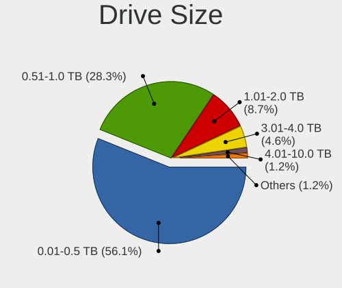

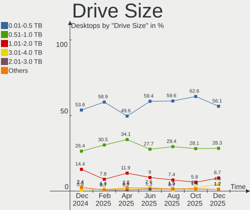

| Size in TB | Desktops | Drives | Percent |
|------------|----------|--------|---------|
| 0.01-0.5   | 97       | 141    | 56.07%  |
| 0.51-1.0   | 49       | 61     | 28.32%  |
| 1.01-2.0   | 15       | 15     | 8.67%   |
| 3.01-4.0   | 8        | 9      | 4.62%   |
| 2.01-3.0   | 2        | 2      | 1.16%   |
| 4.01-10.0  | 2        | 4      | 1.16%   |

Space Total
-----------

Amount of disk space available on the file system

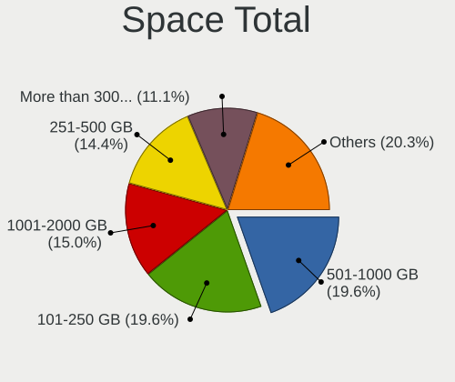

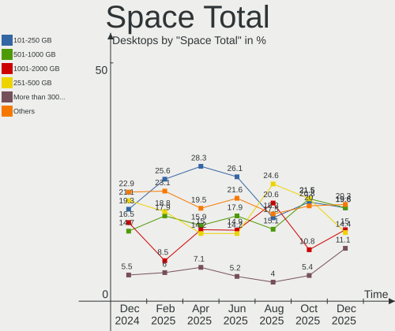

| Size in GB     | Desktops | Percent |
|----------------|----------|---------|
| 101-250        | 30       | 19.61%  |
| 501-1000       | 30       | 19.61%  |
| 1001-2000      | 23       | 15.03%  |
| 251-500        | 22       | 14.38%  |
| More than 3000 | 17       | 11.11%  |
| 2001-3000      | 15       | 9.8%    |
| 1-20           | 6        | 3.92%   |
| Unknown        | 6        | 3.92%   |
| 21-50          | 2        | 1.31%   |
| 51-100         | 2        | 1.31%   |

Space Used
----------

Amount of used disk space

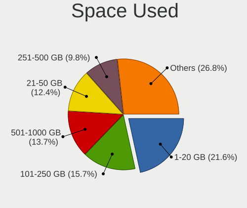

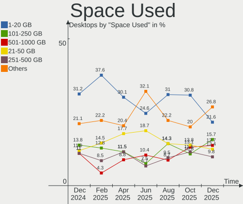

| Used GB        | Desktops | Percent |
|----------------|----------|---------|
| 1-20           | 33       | 21.57%  |
| 101-250        | 24       | 15.69%  |
| 501-1000       | 21       | 13.73%  |
| 21-50          | 19       | 12.42%  |
| 251-500        | 15       | 9.8%    |
| 1001-2000      | 14       | 9.15%   |
| 51-100         | 9        | 5.88%   |
| More than 3000 | 7        | 4.58%   |
| Unknown        | 6        | 3.92%   |
| 2001-3000      | 4        | 2.61%   |
| 0              | 1        | 0.65%   |

Malfunc. Drives
---------------

Drive models with a malfunction

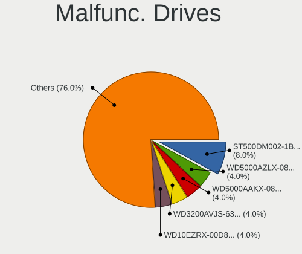

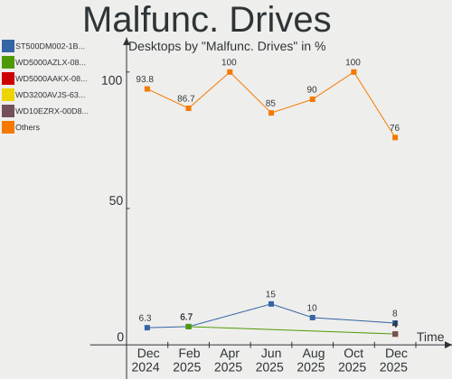

| Model                              | Desktops | Drives | Percent |
|------------------------------------|----------|--------|---------|
| Seagate ST500DM002-1BD142 500GB    | 2        | 2      | 8%      |
| WDC WD5000AZLX-08K2TA0 500GB       | 1        | 1      | 4%      |
| WDC WD5000AAKX-08U6AA0 500GB       | 1        | 1      | 4%      |
| WDC WD3200AVJS-63B6A0 320GB        | 1        | 1      | 4%      |
| WDC WD10EZRX-00D8PB0 1TB           | 1        | 1      | 4%      |
| WDC WD10EARS-00Y5B1 1TB            | 1        | 1      | 4%      |
| Seagate ST98823AS 80GB             | 1        | 1      | 4%      |
| Seagate ST4000DM000-1F2168 4TB     | 1        | 1      | 4%      |
| Seagate ST2000DM001-9YN164 2TB     | 1        | 1      | 4%      |
| Seagate ST2000DM001-1CH164 2TB     | 1        | 1      | 4%      |
| Seagate ST1000VM002-1ET162 1TB     | 1        | 1      | 4%      |
| Seagate ST1000LX015-1U7172 1TB     | 1        | 1      | 4%      |
| Seagate ST1000LM024 HN-M101MBB 1TB | 1        | 1      | 4%      |
| Seagate ST1000DM003-1CH162 1TB     | 1        | 1      | 4%      |
| SanDisk SSD PLUS 240GB             | 1        | 1      | 4%      |
| Samsung Electronics HD502IJ 500GB  | 1        | 1      | 4%      |
| Min Yi U YZWY_TECH 1TB             | 1        | 1      | 4%      |
| Kingston SUV500240G 240GB SSD      | 1        | 1      | 4%      |
| Crucial CT120BX500SSD1 120GB       | 1        | 1      | 4%      |
| Crucial CT1050MX300SSD1 1050GB     | 1        | 1      | 4%      |
| Corsair Force LE SSD 480GB         | 1        | 1      | 4%      |
| China SSD 360GB                    | 1        | 1      | 4%      |
| China SSD 240GB                    | 1        | 1      | 4%      |
| AFOX SSD 120GB                     | 1        | 1      | 4%      |

Malfunc. Drive Vendor
---------------------

Vendors of faulty drives

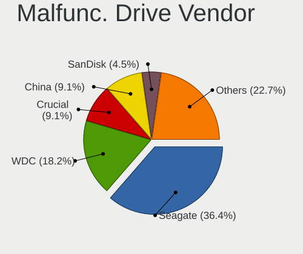

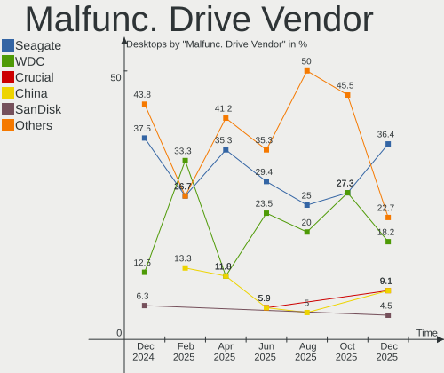

| Vendor              | Desktops | Drives | Percent |
|---------------------|----------|--------|---------|
| Seagate             | 8        | 10     | 36.36%  |
| WDC                 | 4        | 5      | 18.18%  |
| Crucial             | 2        | 2      | 9.09%   |
| China               | 2        | 2      | 9.09%   |
| SanDisk             | 1        | 1      | 4.55%   |
| Samsung Electronics | 1        | 1      | 4.55%   |
| Min Yi U            | 1        | 1      | 4.55%   |
| Kingston            | 1        | 1      | 4.55%   |
| Corsair             | 1        | 1      | 4.55%   |
| AFOX                | 1        | 1      | 4.55%   |

Malfunc. HDD Vendor
-------------------

Vendors of faulty HDD drives

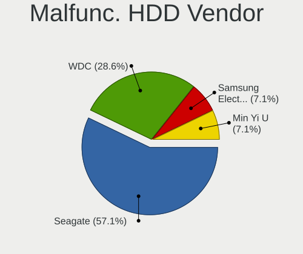

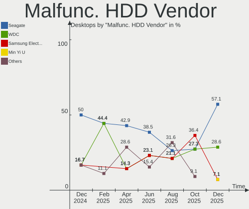

| Vendor              | Desktops | Drives | Percent |
|---------------------|----------|--------|---------|
| Seagate             | 8        | 10     | 57.14%  |
| WDC                 | 4        | 5      | 28.57%  |
| Samsung Electronics | 1        | 1      | 7.14%   |
| Min Yi U            | 1        | 1      | 7.14%   |

Malfunc. Drive Kind
-------------------

Kinds of faulty drives

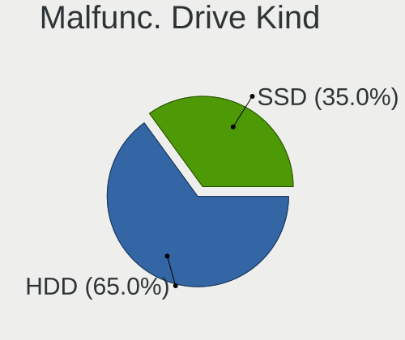

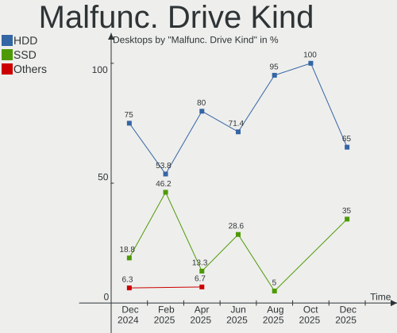

| Kind | Desktops | Drives | Percent |
|------|----------|--------|---------|
| HDD  | 13       | 17     | 65%     |
| SSD  | 7        | 8      | 35%     |

Failed Drives
-------------

Failed drive models

Zero info for selected period =(

Failed Drive Vendor
-------------------

Failed drive vendors

Zero info for selected period =(

Drive Status
------------

Number of failed and malfunc. drives

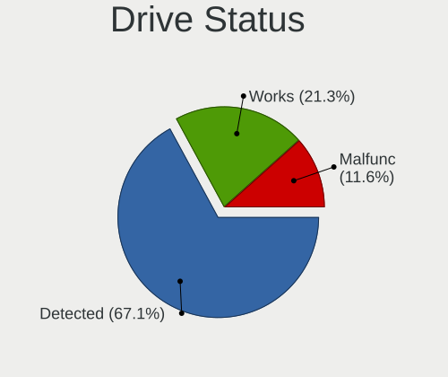

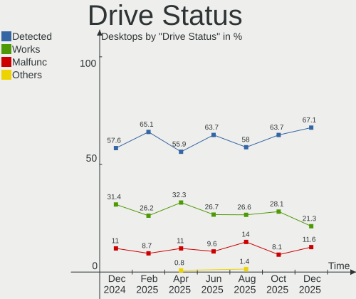

| Status   | Desktops | Drives | Percent |
|----------|----------|--------|---------|
| Detected | 110      | 251    | 67.07%  |
| Works    | 35       | 73     | 21.34%  |
| Malfunc  | 19       | 25     | 11.59%  |

Storage controller
------------------

Storage Vendor
--------------

Storage controller vendors

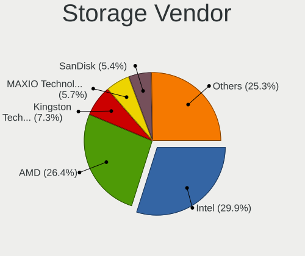

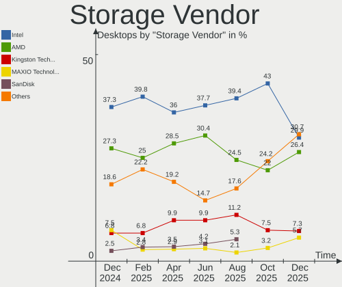

| Vendor                         | Desktops | Percent |
|--------------------------------|----------|---------|
| Intel                          | 78       | 29.89%  |
| AMD                            | 69       | 26.44%  |
| Kingston Technology Company    | 19       | 7.28%   |
| MAXIO Technology (Hangzhou)    | 15       | 5.75%   |
| SanDisk                        | 14       | 5.36%   |
| Realtek Semiconductor          | 13       | 4.98%   |
| Silicon Motion                 | 8        | 3.07%   |
| ADATA Technology               | 8        | 3.07%   |
| Samsung Electronics            | 7        | 2.68%   |
| Phison Electronics             | 4        | 1.53%   |
| Micron/Crucial Technology      | 3        | 1.15%   |
| Micron Technology              | 3        | 1.15%   |
| Marvell Technology Group       | 3        | 1.15%   |
| INNOGRIT                       | 3        | 1.15%   |
| ASMedia Technology             | 3        | 1.15%   |
| Shenzhen Longsys Electronics   | 2        | 0.77%   |
| Hosin Global Electronics       | 2        | 0.77%   |
| Toshiba America Info Systems   | 1        | 0.38%   |
| Solid State Storage Technology | 1        | 0.38%   |
| SK hynix                       | 1        | 0.38%   |
| Nvidia                         | 1        | 0.38%   |
| KIOXIA                         | 1        | 0.38%   |
| JMicron Technology             | 1        | 0.38%   |
| Broadcom / LSI                 | 1        | 0.38%   |

Storage Model
-------------

Storage controller models

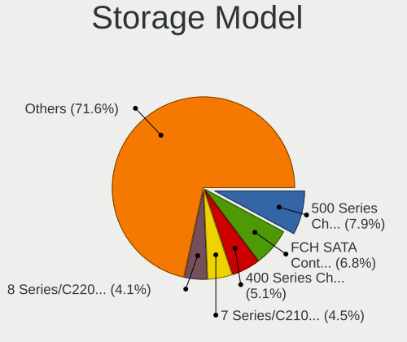

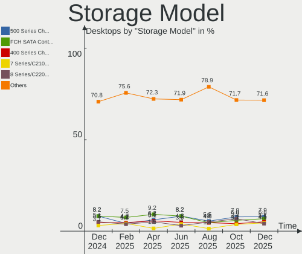

| Model                                                                                   | Desktops | Percent |
|-----------------------------------------------------------------------------------------|----------|---------|
| AMD 500 Series Chipset SATA Controller                                                  | 23       | 7.88%   |
| AMD FCH SATA Controller [AHCI mode]                                                     | 20       | 6.85%   |
| AMD 400 Series Chipset SATA Controller                                                  | 15       | 5.14%   |
| Intel 7 Series/C210 Series Chipset Family 6-port SATA Controller [AHCI mode]            | 13       | 4.45%   |
| Intel 8 Series/C220 Series Chipset Family 6-port SATA Controller 1 [AHCI mode]          | 12       | 4.11%   |
| AMD 600 Series Chipset SATA Controller                                                  | 12       | 4.11%   |
| Realtek RTS5765DL NVMe SSD Controller (DRAM-less)                                       | 10       | 3.42%   |
| Silicon Motion SM2263EN/SM2263XT (DRAM-less) NVMe SSD Controllers                       | 8        | 2.74%   |
| MAXIO (Hangzhou) NVMe SSD Controller MAP1202 (DRAM-less)                                | 8        | 2.74%   |
| Intel Q170/Q150/B150/H170/H110/Z170/CM236 Chipset SATA Controller [AHCI Mode]           | 8        | 2.74%   |
| Intel 6 Series/C200 Series Chipset Family 6 port Desktop SATA AHCI Controller           | 8        | 2.74%   |
| SanDisk WD Green SN350 240GB (DRAM-less) / SN560E NVMe SSD                              | 6        | 2.05%   |
| MAXIO (Hangzhou) NVMe SSD Controller MAP1602 (DRAM-less)                                | 6        | 2.05%   |
| Kingston Company NV3 NVMe SSD [SM2268XT2] (DRAM-less)                                   | 5        | 1.71%   |
| Kingston Company NV2 NVMe SSD [SM2267XT] (DRAM-less)                                    | 5        | 1.71%   |
| Intel Alder Lake-S PCH SATA Controller [AHCI Mode]                                      | 5        | 1.71%   |
| AMD SB7x0/SB8x0/SB9x0 IDE Controller                                                    | 5        | 1.71%   |
| Intel Cannon Lake PCH SATA AHCI Controller                                              | 4        | 1.37%   |
| Intel 6 Series/C200 Series Chipset Family Desktop SATA Controller (IDE mode, ports 4-5) | 4        | 1.37%   |
| Intel 6 Series/C200 Series Chipset Family Desktop SATA Controller (IDE mode, ports 0-3) | 4        | 1.37%   |
| AMD SB7x0/SB8x0/SB9x0 SATA Controller [IDE mode]                                        | 4        | 1.37%   |
| AMD A320 Chipset SATA Controller [AHCI mode]                                            | 4        | 1.37%   |
| Samsung NVMe SSD Controller SM981/PM981/PM983                                           | 3        | 1.03%   |
| Samsung NVMe SSD Controller PM9A1/PM9A3/980PRO                                          | 3        | 1.03%   |
| Kingston Company NV1 NVMe SSD [SM2263XT] (DRAM-less)                                    | 3        | 1.03%   |
| ASMedia ASM1061/ASM1062 Serial ATA Controller                                           | 3        | 1.03%   |
| AMD 300 Series Chipset SATA Controller                                                  | 3        | 1.03%   |
| SanDisk WD PC SN540 / Green SN350 NVMe SSD 1 TB (DRAM-less)                             | 2        | 0.68%   |
| SanDisk Extreme Pro / WD Black SN750 / PC SN730 / Red SN700 NVMe SSD                    | 2        | 0.68%   |
| Realtek RTS5762 NVMe SSD Controller                                                     | 2        | 0.68%   |
| Micron/Crucial P2 [Nick P2] / P3 / P3 Plus NVMe PCIe SSD (DRAM-less)                    | 2        | 0.68%   |
| Kingston Company NV3 NVMe SSD [E21T] (DRAM-less)                                        | 2        | 0.68%   |
| Kingston Company NV1 NVMe SSD [E13T] (DRAM-less)                                        | 2        | 0.68%   |
| Intel Raptor Lake SATA AHCI Controller                                                  | 2        | 0.68%   |
| Intel NM10/ICH7 Family SATA Controller [IDE mode]                                       | 2        | 0.68%   |
| Intel 9 Series Chipset Family SATA Controller [AHCI Mode]                               | 2        | 0.68%   |
| Intel 82801G (ICH7 Family) IDE Controller                                               | 2        | 0.68%   |
| Intel 5 Series/3400 Series Chipset 6 port SATA AHCI Controller                          | 2        | 0.68%   |
| Intel 200 Series PCH SATA controller [AHCI mode]                                        | 2        | 0.68%   |
| INNOGRIT NVMe SSD Controller IG5236 [RainierPC]                                         | 2        | 0.68%   |

Storage Kind
------------

Kind of storage controller (IDE, SATA, NVMe, SAS, ...)

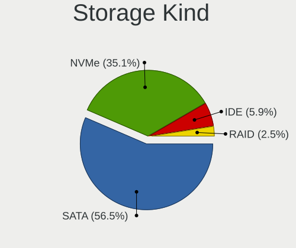

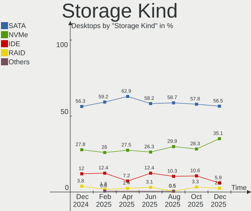

| Kind | Desktops | Percent |
|------|----------|---------|
| SATA | 135      | 56.49%  |
| NVMe | 84       | 35.15%  |
| IDE  | 14       | 5.86%   |
| RAID | 6        | 2.51%   |

Processor
---------

CPU Vendor
----------

Processor vendors

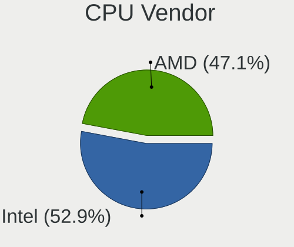

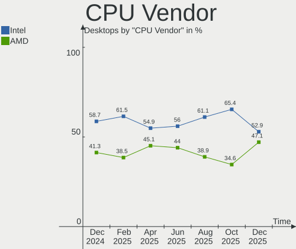

| Vendor | Desktops | Percent |
|--------|----------|---------|
| Intel  | 81       | 52.94%  |
| AMD    | 72       | 47.06%  |

CPU Model
---------

Processor models

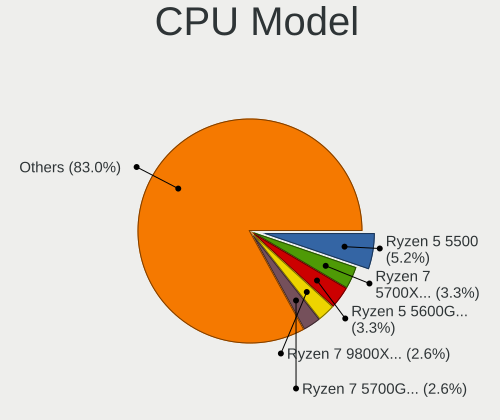

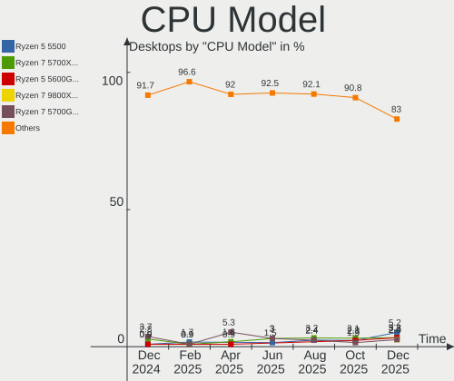

| Model                                       | Desktops | Percent |
|---------------------------------------------|----------|---------|
| AMD Ryzen 5 5500                            | 8        | 5.23%   |
| AMD Ryzen 7 5700X 8-Core Processor          | 5        | 3.27%   |
| AMD Ryzen 5 5600GT with Radeon Graphics     | 5        | 3.27%   |
| AMD Ryzen 7 9800X3D 8-Core Processor        | 4        | 2.61%   |
| AMD Ryzen 7 5700G with Radeon Graphics      | 4        | 2.61%   |
| AMD Ryzen 5 5600G with Radeon Graphics      | 4        | 2.61%   |
| Intel Core i7-4790 CPU @ 3.60GHz            | 3        | 1.96%   |
| Intel Core i5-3470 CPU @ 3.20GHz            | 3        | 1.96%   |
| Intel Core i5-2310 CPU @ 2.90GHz            | 3        | 1.96%   |
| Intel Core i3-3220 CPU @ 3.30GHz            | 3        | 1.96%   |
| AMD Ryzen 7 5700X3D 8-Core Processor        | 3        | 1.96%   |
| AMD Ryzen 5 5600X 6-Core Processor          | 3        | 1.96%   |
| AMD Ryzen 5 3600 6-Core Processor           | 3        | 1.96%   |
| Intel Xeon CPU E5-2680 v4 @ 2.40GHz         | 2        | 1.31%   |
| Intel Core i7-8700 CPU @ 3.20GHz            | 2        | 1.31%   |
| Intel Core i5-6600K CPU @ 3.50GHz           | 2        | 1.31%   |
| Intel Core i5-6500T CPU @ 2.50GHz           | 2        | 1.31%   |
| Intel Core i5-4440 CPU @ 3.10GHz            | 2        | 1.31%   |
| Intel Core i3-3240 CPU @ 3.40GHz            | 2        | 1.31%   |
| Intel 12th Gen Core i5-12400F               | 2        | 1.31%   |
| AMD Ryzen 9 5900X 12-Core Processor         | 2        | 1.31%   |
| AMD Ryzen 7 9700X 8-Core Processor          | 2        | 1.31%   |
| AMD Ryzen 5 4600G with Radeon Graphics      | 2        | 1.31%   |
| AMD FX-6300 Six-Core Processor              | 2        | 1.31%   |
| Intel Xeon W-1250 CPU @ 3.30GHz             | 1        | 0.65%   |
| Intel Xeon CPU X5670 @ 2.93GHz              | 1        | 0.65%   |
| Intel Xeon CPU W3550 @ 3.07GHz              | 1        | 0.65%   |
| Intel Xeon CPU E5-2696 v2 @ 2.50GHz         | 1        | 0.65%   |
| Intel Xeon CPU E5-2680 v3 @ 2.50GHz         | 1        | 0.65%   |
| Intel Xeon CPU E5-2640 v3 @ 2.60GHz         | 1        | 0.65%   |
| Intel Xeon CPU E5-2630L v3 @ 1.80GHz        | 1        | 0.65%   |
| Intel Xeon CPU E5-2620 v3 @ 2.40GHz         | 1        | 0.65%   |
| Intel Xeon CPU E5-1650 v3 @ 3.50GHz         | 1        | 0.65%   |
| Intel Xeon CPU E31220 @ 3.10GHz             | 1        | 0.65%   |
| Intel Xeon CPU E3-1281 v3 @ 3.70GHz         | 1        | 0.65%   |
| Intel Xeon CPU E3-1275 V2 @ 3.50GHz         | 1        | 0.65%   |
| Intel Xeon CPU E3-1270 v3 @ 3.50GHz         | 1        | 0.65%   |
| Intel Pentium Dual-Core CPU E5700 @ 3.00GHz | 1        | 0.65%   |
| Intel Pentium CPU G620 @ 2.60GHz            | 1        | 0.65%   |
| Intel Pentium CPU G2030 @ 3.00GHz           | 1        | 0.65%   |

CPU Model Family
----------------

Processor model prefix

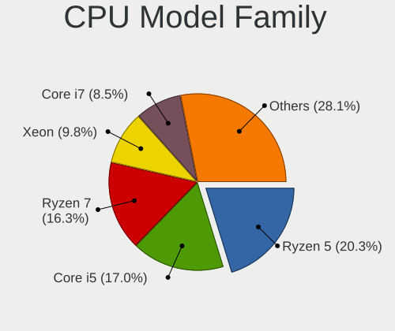

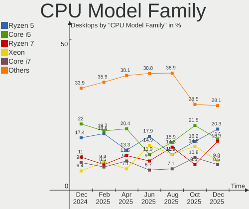

| Model                   | Desktops | Percent |
|-------------------------|----------|---------|
| AMD Ryzen 5             | 31       | 20.26%  |
| Intel Core i5           | 26       | 16.99%  |
| AMD Ryzen 7             | 25       | 16.34%  |
| Intel Xeon              | 15       | 9.8%    |
| Intel Core i7           | 13       | 8.5%    |
| Intel Core i3           | 11       | 7.19%   |
| Other                   | 6        | 3.92%   |
| AMD Ryzen 9             | 5        | 3.27%   |
| AMD FX                  | 5        | 3.27%   |
| Intel Pentium           | 2        | 1.31%   |
| Intel Core i9           | 2        | 1.31%   |
| Intel Core 2 Duo        | 2        | 1.31%   |
| Intel Celeron           | 2        | 1.31%   |
| Intel Pentium Dual-Core | 1        | 0.65%   |
| Intel Genuine           | 1        | 0.65%   |
| AMD Ryzen Threadripper  | 1        | 0.65%   |
| AMD Ryzen 3             | 1        | 0.65%   |
| AMD Phenom II X4        | 1        | 0.65%   |
| AMD Opteron             | 1        | 0.65%   |
| AMD Athlon              | 1        | 0.65%   |
| AMD A6                  | 1        | 0.65%   |

CPU Cores
---------

Number of processor cores

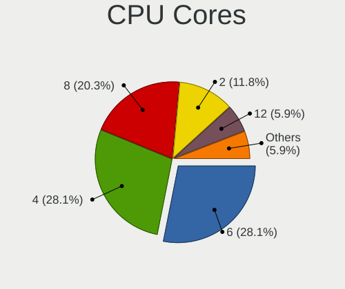

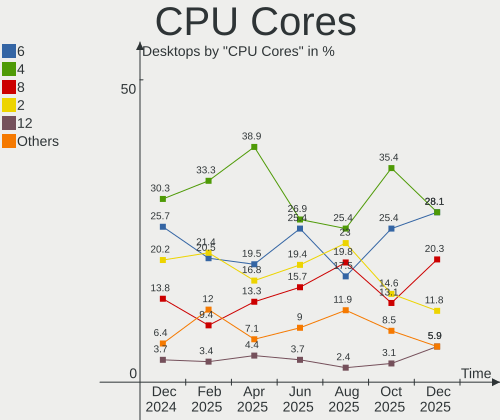

| Number | Desktops | Percent |
|--------|----------|---------|
| 6      | 43       | 28.1%   |
| 4      | 43       | 28.1%   |
| 8      | 31       | 20.26%  |
| 2      | 18       | 11.76%  |
| 12     | 9        | 5.88%   |
| 14     | 3        | 1.96%   |
| 20     | 2        | 1.31%   |
| 32     | 1        | 0.65%   |
| 16     | 1        | 0.65%   |
| 3      | 1        | 0.65%   |
| 1      | 1        | 0.65%   |

CPU Sockets
-----------

Number of sockets

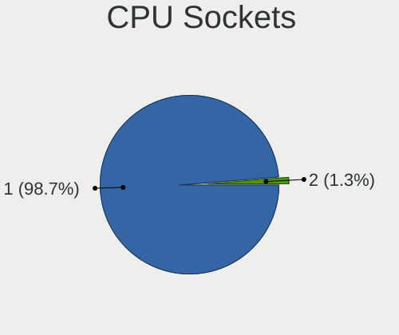

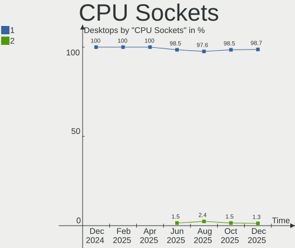

| Number | Desktops | Percent |
|--------|----------|---------|
| 1      | 151      | 98.69%  |
| 2      | 2        | 1.31%   |

CPU Threads
-----------

Threads per core (Hyper-Threading)

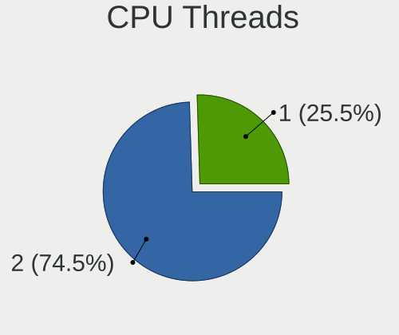

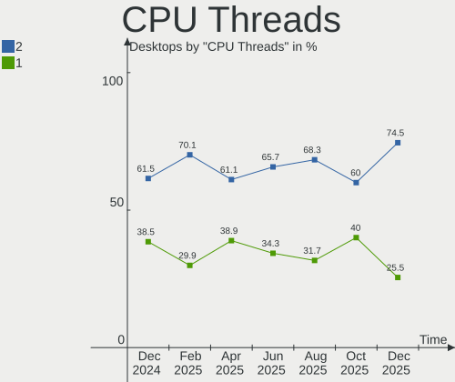

| Number | Desktops | Percent |
|--------|----------|---------|
| 2      | 114      | 74.51%  |
| 1      | 39       | 25.49%  |

CPU Op-Modes
------------

CPU Operation Modes (32-bit, 64-bit)

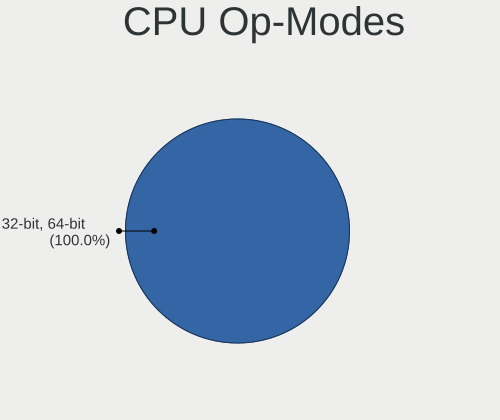

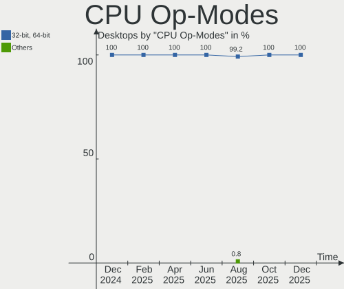

| Op mode        | Desktops | Percent |
|----------------|----------|---------|
| 32-bit, 64-bit | 153      | 100%    |

CPU Microcode
-------------

Microcode number

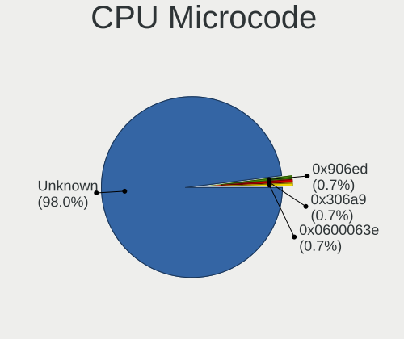

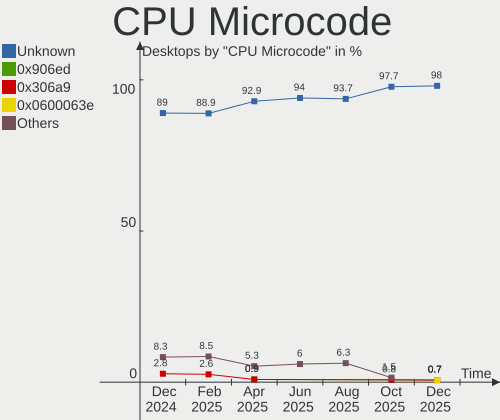

| Number     | Desktops | Percent |
|------------|----------|---------|
| Unknown    | 150      | 98.04%  |
| 0x906ed    | 1        | 0.65%   |
| 0x306a9    | 1        | 0.65%   |
| 0x0600063e | 1        | 0.65%   |

CPU Microarch
-------------

Microarchitecture

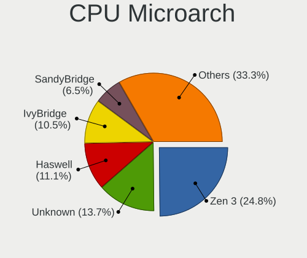

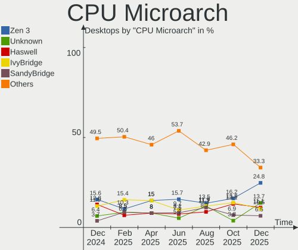

| Name             | Desktops | Percent |
|------------------|----------|---------|
| Zen 3            | 38       | 24.84%  |
| Unknown          | 21       | 13.73%  |
| Haswell          | 17       | 11.11%  |
| IvyBridge        | 16       | 10.46%  |
| SandyBridge      | 10       | 6.54%   |
| Skylake          | 8        | 5.23%   |
| KabyLake         | 7        | 4.58%   |
| Zen 2            | 6        | 3.92%   |
| Zen+             | 5        | 3.27%   |
| Piledriver       | 4        | 2.61%   |
| CometLake        | 4        | 2.61%   |
| Penryn           | 3        | 1.96%   |
| Alderlake Hybrid | 3        | 1.96%   |
| Westmere         | 2        | 1.31%   |
| Nehalem          | 2        | 1.31%   |
| Excavator        | 2        | 1.31%   |
| Broadwell        | 2        | 1.31%   |
| Zen              | 1        | 0.65%   |
| K10              | 1        | 0.65%   |
| Bulldozer        | 1        | 0.65%   |

Graphics
--------

GPU Vendor
----------

Vendors of graphics cards

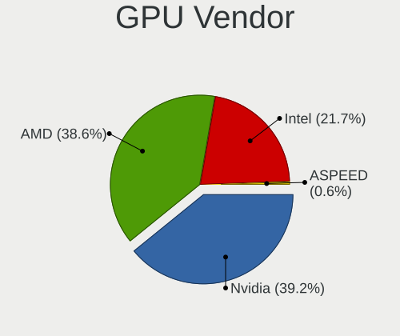

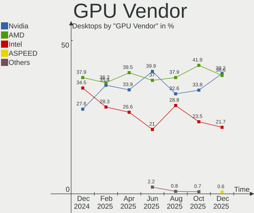

| Vendor            | Desktops | Percent |
|-------------------|----------|---------|
| Nvidia            | 65       | 39.16%  |
| AMD               | 64       | 38.55%  |
| Intel             | 36       | 21.69%  |
| ASPEED Technology | 1        | 0.6%    |

GPU Model
---------

Graphics card models

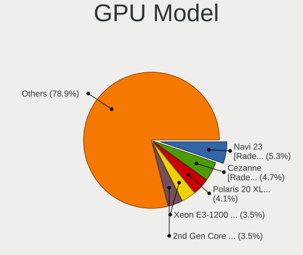

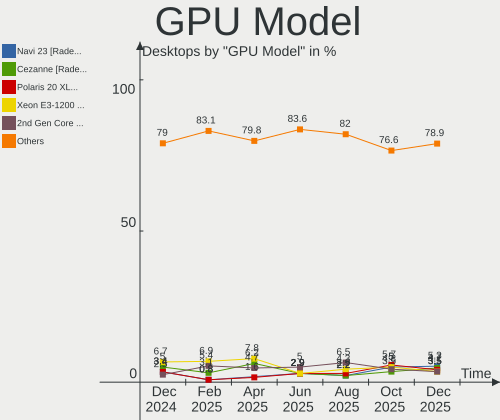

| Model                                                                       | Desktops | Percent |
|-----------------------------------------------------------------------------|----------|---------|
| AMD Navi 23 [Radeon RX 6600/6600 XT/6600M]                                  | 9        | 5.26%   |
| AMD Cezanne [Radeon Vega Series / Radeon Vega Mobile Series]                | 8        | 4.68%   |
| AMD Polaris 20 XL [Radeon RX 580 2048SP]                                    | 7        | 4.09%   |
| Intel Xeon E3-1200 v2/3rd Gen Core processor Graphics Controller            | 6        | 3.51%   |
| Intel 2nd Generation Core Processor Family Integrated Graphics Controller   | 6        | 3.51%   |
| Nvidia GA106 [GeForce RTX 3060 Lite Hash Rate]                              | 5        | 2.92%   |
| Intel Skylake-S GT2 [HD Graphics 530]                                       | 4        | 2.34%   |
| AMD Lexa PRO [Radeon 540/540X/550/550X / RX 540X/550/550X]                  | 4        | 2.34%   |
| AMD Granite Ridge [Radeon Graphics]                                         | 4        | 2.34%   |
| Nvidia GT218 [GeForce G210]                                                 | 3        | 1.75%   |
| Nvidia GP107 [GeForce GTX 1050 Ti]                                          | 3        | 1.75%   |
| Nvidia AD107 [GeForce RTX 4060]                                             | 3        | 1.75%   |
| Intel Xeon E3-1200 v3/4th Gen Core Processor Integrated Graphics Controller | 3        | 1.75%   |
| Intel Raptor Lake-S GT1 [UHD Graphics 770]                                  | 3        | 1.75%   |
| Intel IvyBridge GT2 [HD Graphics 4000]                                      | 3        | 1.75%   |
| AMD Navi 32 [Radeon RX 7700 XT / 7800 XT]                                   | 3        | 1.75%   |
| AMD Navi 22 [Radeon RX 6700/6700 XT/6750 XT / 6800M/6850M XT]               | 3        | 1.75%   |
| Nvidia TU116 [GeForce GTX 1660 SUPER]                                       | 2        | 1.17%   |
| Nvidia TU104 [GeForce RTX 2060]                                             | 2        | 1.17%   |
| Nvidia GT218 [GeForce 210]                                                  | 2        | 1.17%   |
| Nvidia GK208B [GeForce GT 710]                                              | 2        | 1.17%   |
| Nvidia GB206 [GeForce RTX 5060]                                             | 2        | 1.17%   |
| Nvidia G96C [GeForce 9400 GT]                                               | 2        | 1.17%   |
| Intel CoffeeLake-S GT2 [UHD Graphics 630]                                   | 2        | 1.17%   |
| Intel Alder Lake-S GT1 [UHD Graphics 730]                                   | 2        | 1.17%   |
| Intel 82G33/G31 Express Integrated Graphics Controller                      | 2        | 1.17%   |
| AMD Wani [Radeon R5/R6/R7 Graphics]                                         | 2        | 1.17%   |
| AMD Turks PRO [Radeon HD 6570/7570/8550 / R5 230]                           | 2        | 1.17%   |
| AMD Picasso/Raven 2 [Radeon Vega Series / Radeon Vega Mobile Series]        | 2        | 1.17%   |
| AMD Navi 48 [Radeon RX 9070/9070 XT/9070 GRE]                               | 2        | 1.17%   |
| AMD Navi 33 [Radeon RX 7600/7600 XT/7600M XT/7600S/7700S / PRO W7600]       | 2        | 1.17%   |
| AMD Navi 23 [Radeon RX 6650 XT / 6700S / 6800S]                             | 2        | 1.17%   |
| AMD Navi 21 [Radeon RX 6800/6800 XT / 6900 XT]                              | 2        | 1.17%   |
| AMD Ellesmere [Radeon RX 470/480/570/570X/580/580X/590]                     | 2        | 1.17%   |
| Nvidia TU117 [GeForce GTX 1650]                                             | 1        | 0.58%   |
| Nvidia TU116 [GeForce GTX 1660 Ti]                                          | 1        | 0.58%   |
| Nvidia TU116 [GeForce GTX 1650]                                             | 1        | 0.58%   |
| Nvidia TU106 [GeForce GTX 1650]                                             | 1        | 0.58%   |
| Nvidia TU104 [GeForce RTX 2080]                                             | 1        | 0.58%   |
| Nvidia TU102 [GeForce RTX 2080 Ti]                                          | 1        | 0.58%   |

GPU Combo
---------

Combinations of graphics cards

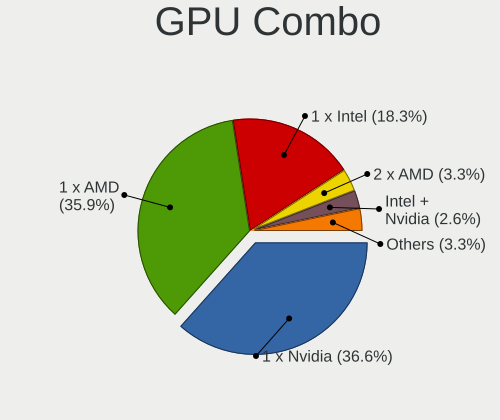

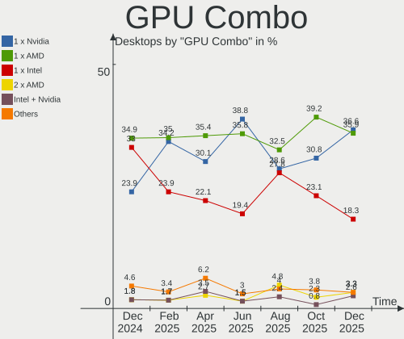

| Name            | Desktops | Percent |
|-----------------|----------|---------|
| 1 x Nvidia      | 56       | 36.6%   |
| 1 x AMD         | 55       | 35.95%  |
| 1 x Intel       | 28       | 18.3%   |
| 2 x AMD         | 5        | 3.27%   |
| Intel + Nvidia  | 4        | 2.61%   |
| AMD + Nvidia    | 4        | 2.61%   |
| Nvidia + ASPEED | 1        | 0.65%   |

GPU Driver
----------

Free vs proprietary

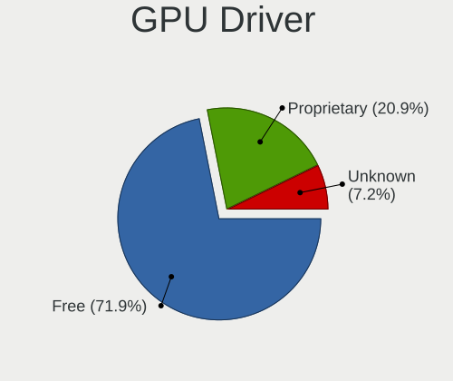

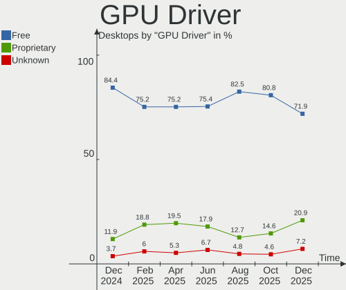

| Driver      | Desktops | Percent |
|-------------|----------|---------|
| Free        | 110      | 71.9%   |
| Proprietary | 32       | 20.92%  |
| Unknown     | 11       | 7.19%   |

GPU Memory
----------

Total video memory

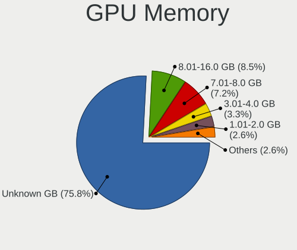

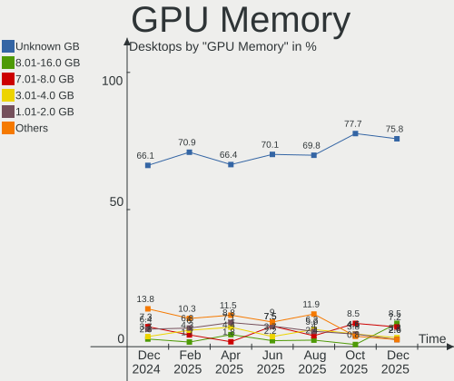

| Size in GB | Desktops | Percent |
|------------|----------|---------|
| Unknown    | 116      | 75.82%  |
| 8.01-16.0  | 13       | 8.5%    |
| 7.01-8.0   | 11       | 7.19%   |
| 3.01-4.0   | 5        | 3.27%   |
| 1.01-2.0   | 4        | 2.61%   |
| 0.01-0.5   | 3        | 1.96%   |
| 0.51-1.0   | 1        | 0.65%   |

Monitor
-------

Monitor Vendor
--------------

Monitor vendors

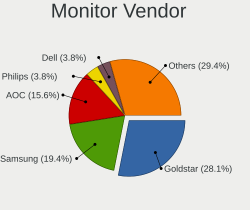

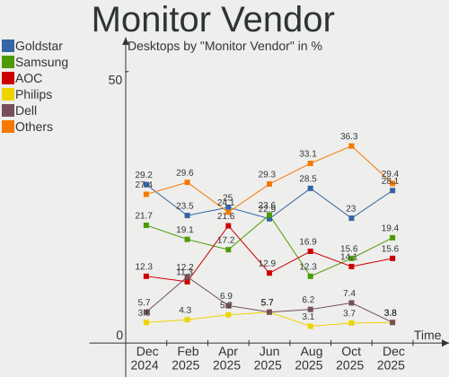

| Vendor              | Desktops | Percent |
|---------------------|----------|---------|
| Goldstar            | 45       | 28.13%  |
| Samsung Electronics | 31       | 19.38%  |
| AOC                 | 25       | 15.63%  |
| Philips             | 6        | 3.75%   |
| Dell                | 6        | 3.75%   |
| VIE                 | 4        | 2.5%    |
| Unknown (XXX)       | 4        | 2.5%    |
| Sony                | 4        | 2.5%    |
| Unknown             | 3        | 1.88%   |
| SKG                 | 2        | 1.25%   |
| SGT                 | 2        | 1.25%   |
| MSI                 | 2        | 1.25%   |
| MSD                 | 2        | 1.25%   |
| LRX                 | 2        | 1.25%   |
| Lenovo              | 2        | 1.25%   |
| Hewlett-Packard     | 2        | 1.25%   |
| YZA                 | 1        | 0.63%   |
| VIZTA               | 1        | 0.63%   |
| Unknown (BBC)       | 1        | 0.63%   |
| Toshiba             | 1        | 0.63%   |
| SuperFrame          | 1        | 0.63%   |
| STD                 | 1        | 0.63%   |
| STA                 | 1        | 0.63%   |
| Semp Toshiba        | 1        | 0.63%   |
| Pixio               | 1        | 0.63%   |
| Panasonic           | 1        | 0.63%   |
| MYS                 | 1        | 0.63%   |
| LG Electronics      | 1        | 0.63%   |
| HIC                 | 1        | 0.63%   |
| Envision            | 1        | 0.63%   |
| DHI                 | 1        | 0.63%   |
| Denver              | 1        | 0.63%   |
| ASUSTek Computer    | 1        | 0.63%   |
| Acer                | 1        | 0.63%   |

Monitor Model
-------------

Monitor models

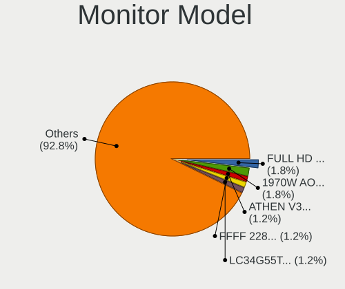

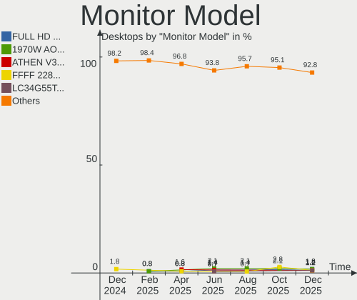

| Model                                                              | Desktops | Percent |
|--------------------------------------------------------------------|----------|---------|
| Goldstar FULL HD GSM5BFB 1920x1080 480x270mm 21.7-inch             | 3        | 1.81%   |
| AOC 1970W AOC1970 1366x768 410x230mm 18.5-inch                     | 3        | 1.81%   |
| VIE ATHEN V3 27 VIE2700 1920x1080 597x236mm 25.3-inch              | 2        | 1.2%    |
| Unknown LCD Monitor FFFF 2288x1287 2550x2550mm 142.0-inch          | 2        | 1.2%    |
| Samsung Electronics LC34G55T SAM711A 3440x1440 798x334mm 34.1-inch | 2        | 1.2%    |
| LRX HDMI LRX2281 1920x1200 409x230mm 18.5-inch                     | 2        | 1.2%    |
| Goldstar WX942 GSM4B80 1440x900 410x260mm 19.1-inch                | 2        | 1.2%    |
| Goldstar ULTRAWIDE GSM7768 3440x1440 800x334mm 34.1-inch           | 2        | 1.2%    |
| Goldstar ULTRAGEAR GSM5C8C 1920x1080 600x340mm 27.2-inch           | 2        | 1.2%    |
| Goldstar HDR WFHD GSM7715 2560x1080 798x334mm 34.1-inch            | 2        | 1.2%    |
| Goldstar HDR WFHD GSM7714 2560x1080 798x334mm 34.1-inch            | 2        | 1.2%    |
| Goldstar HD GSM5ACD 1366x768 410x230mm 18.5-inch                   | 2        | 1.2%    |
| Goldstar FULL HD GSM5B55 1920x1080 480x270mm 21.7-inch             | 2        | 1.2%    |
| Goldstar E2011 GSM4ED4 1600x900 443x249mm 20.0-inch                | 2        | 1.2%    |
| Goldstar 25UM58G GSM5B98 2560x1080 673x284mm 28.8-inch             | 2        | 1.2%    |
| Dell SE2216H DELF071 1920x1080 476x268mm 21.5-inch                 | 2        | 1.2%    |
| AOC LM522 AOCA522 1024x768 304x228mm 15.0-inch                     | 2        | 1.2%    |
| AOC 912Vwa AOC1912 1440x900 408x255mm 18.9-inch                    | 2        | 1.2%    |
| AOC 24G4 AOCB401 1920x1080 527x296mm 23.8-inch                     | 2        | 1.2%    |
| AOC 1943W AOC1943 1366x768 410x230mm 18.5-inch                     | 2        | 1.2%    |
| YZA WINGCOOL YZA0001 1920x1280 222x148mm 10.5-inch                 | 1        | 0.6%    |
| VIZTA 27HQ CURVO JRY2700 1920x1080 698x393mm 31.5-inch             | 1        | 0.6%    |
| VIE VALAK Z180H VIE2380 1920x1080 527x296mm 23.8-inch              | 1        | 0.6%    |
| VIE ATHEN U2L 21 VIE2150 1920x1080 476x268mm 21.5-inch             | 1        | 0.6%    |
| Unknown SMART TV 0563 1920x1080 1209x680mm 54.6-inch               | 1        | 0.6%    |
| Unknown (XXX) Union TV XXX2841 1920x1080 1209x680mm 54.6-inch      | 1        | 0.6%    |
| Unknown (XXX) LED MONITOR XXX1910 1440x900 410x230mm 18.5-inch     | 1        | 0.6%    |
| Unknown (XXX) HDMI XXX2380 1920x1080 527x296mm 23.8-inch           | 1        | 0.6%    |
| Unknown (XXX) HDMI XXX1900 1440x900 400x270mm 19.0-inch            | 1        | 0.6%    |
| Unknown (BBC) HDP-V104 BBC0104 3840x2160 344x195mm 15.6-inch       | 1        | 0.6%    |
| Toshiba TV TSB0200 1920x1080 410x230mm 18.5-inch                   | 1        | 0.6%    |
| SuperFrame SFP2701G SUE2712 2560x1440 530x280mm 23.6-inch          | 1        | 0.6%    |
| STD LCD STD2022 1440x900 420x240mm 19.0-inch                       | 1        | 0.6%    |
| STA SEMP LEDTV STA0030 1360x850 708x398mm 32.0-inch                | 1        | 0.6%    |
| Sony TV SNYEE01 1920x1080                                          | 1        | 0.6%    |
| Sony TV SNY7E02 1920x1080                                          | 1        | 0.6%    |
| Sony TV SNY6604 1920x1080                                          | 1        | 0.6%    |
| Sony AVAMP SNY2902 1280x720 698x392mm 31.5-inch                    | 1        | 0.6%    |
| SKG SFPCB34240QHD SKG3418 3440x1440 1068x612mm 48.5-inch           | 1        | 0.6%    |
| SKG L2717REC SKG2717 1920x1080 597x336mm 27.0-inch                 | 1        | 0.6%    |

Monitor Resolution
------------------

Monitor screen resolution

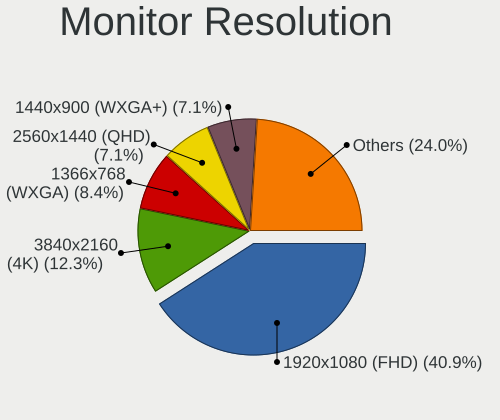

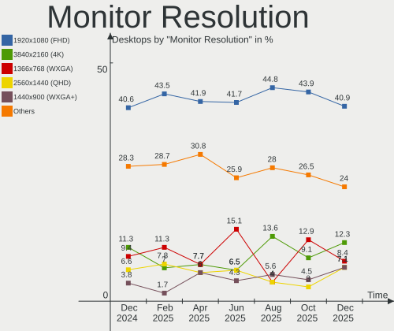

| Resolution         | Desktops | Percent |
|--------------------|----------|---------|
| 1920x1080 (FHD)    | 63       | 40.91%  |
| 3840x2160 (4K)     | 19       | 12.34%  |
| 1366x768 (WXGA)    | 13       | 8.44%   |
| 2560x1440 (QHD)    | 11       | 7.14%   |
| 1440x900 (WXGA+)   | 11       | 7.14%   |
| 1600x900 (HD+)     | 8        | 5.19%   |
| 2560x1080          | 7        | 4.55%   |
| 3440x1440          | 6        | 3.9%    |
| 1024x768 (XGA)     | 3        | 1.95%   |
| 2288x1287          | 2        | 1.3%    |
| 1920x540           | 2        | 1.3%    |
| 1360x768           | 2        | 1.3%    |
| 1280x1024 (SXGA)   | 2        | 1.3%    |
| 3840x1080          | 1        | 0.65%   |
| 1920x1280          | 1        | 0.65%   |
| 1920x1200 (WUXGA)  | 1        | 0.65%   |
| 1680x1050 (WSXGA+) | 1        | 0.65%   |
| 1280x720 (HD)      | 1        | 0.65%   |

Monitor Diagonal
----------------

Diagonal size in inches

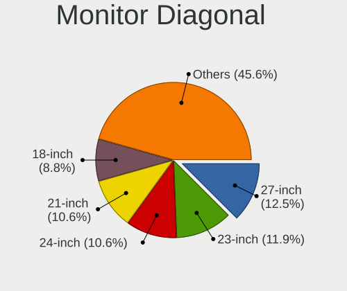

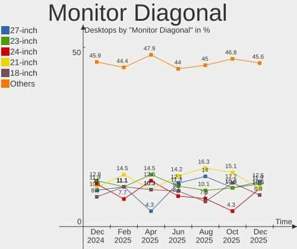

| Inches  | Desktops | Percent |
|---------|----------|---------|
| 27      | 20       | 12.5%   |
| 23      | 19       | 11.88%  |
| 24      | 17       | 10.63%  |
| 21      | 17       | 10.63%  |
| 18      | 14       | 8.75%   |
| 31      | 13       | 8.13%   |
| 34      | 8        | 5%      |
| 20      | 7        | 4.38%   |
| 84      | 6        | 3.75%   |
| 19      | 6        | 3.75%   |
| 15      | 5        | 3.13%   |
| 72      | 3        | 1.88%   |
| 54      | 3        | 1.88%   |
| 28      | 3        | 1.88%   |
| 142     | 2        | 1.25%   |
| 63      | 2        | 1.25%   |
| 48      | 2        | 1.25%   |
| 26      | 2        | 1.25%   |
| 17      | 2        | 1.25%   |
| Unknown | 2        | 1.25%   |
| 65      | 1        | 0.63%   |
| 49      | 1        | 0.63%   |
| 46      | 1        | 0.63%   |
| 37      | 1        | 0.63%   |
| 32      | 1        | 0.63%   |
| 22      | 1        | 0.63%   |
| 12      | 1        | 0.63%   |

Monitor Width
-------------

Physical width

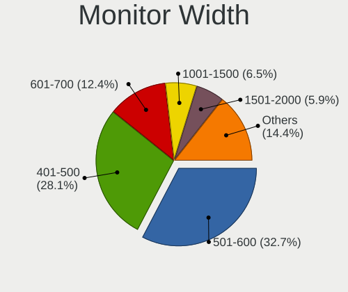

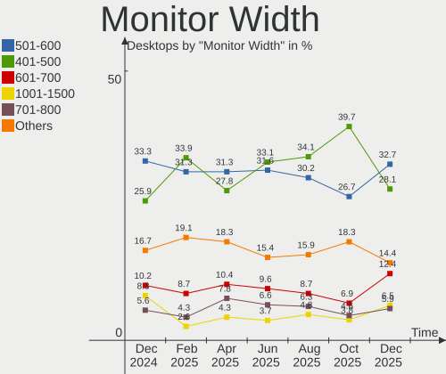

| Width in mm    | Desktops | Percent |
|----------------|----------|---------|
| 501-600        | 50       | 32.68%  |
| 401-500        | 43       | 28.1%   |
| 601-700        | 19       | 12.42%  |
| 1001-1500      | 10       | 6.54%   |
| 701-800        | 9        | 5.88%   |
| 1501-2000      | 9        | 5.88%   |
| 301-350        | 6        | 3.92%   |
| More than 2000 | 2        | 1.31%   |
| Unknown        | 2        | 1.31%   |
| 801-900        | 1        | 0.65%   |
| 351-400        | 1        | 0.65%   |
| 201-300        | 1        | 0.65%   |

Aspect Ratio
------------

Proportional relationship between the width and the height

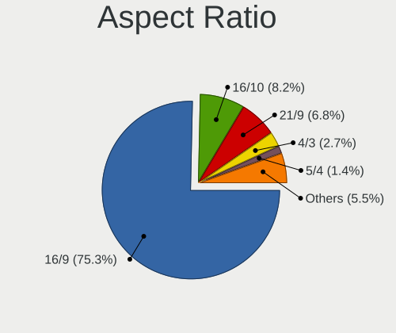

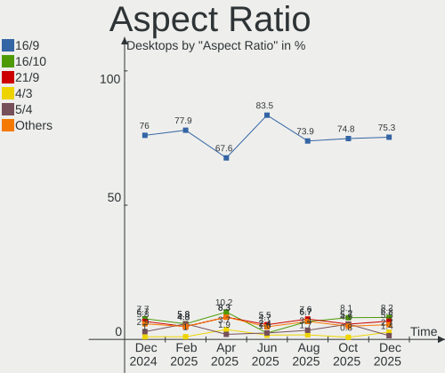

| Ratio   | Desktops | Percent |
|---------|----------|---------|
| 16/9    | 110      | 75.34%  |
| 16/10   | 12       | 8.22%   |
| 21/9    | 10       | 6.85%   |
| 4/3     | 4        | 2.74%   |
| 5/4     | 2        | 1.37%   |
| 32/9    | 2        | 1.37%   |
| 3/2     | 2        | 1.37%   |
| 1.00    | 2        | 1.37%   |
| 2.00    | 1        | 0.68%   |
| Unknown | 1        | 0.68%   |

Monitor Area
------------

Area in inch²

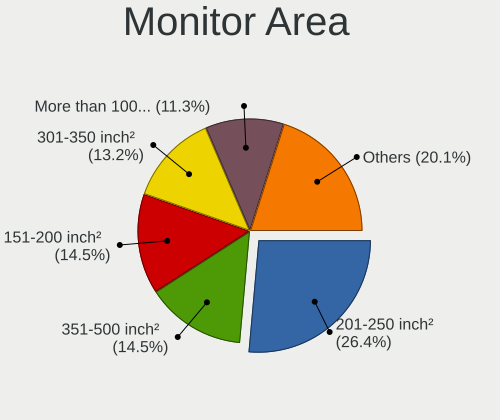

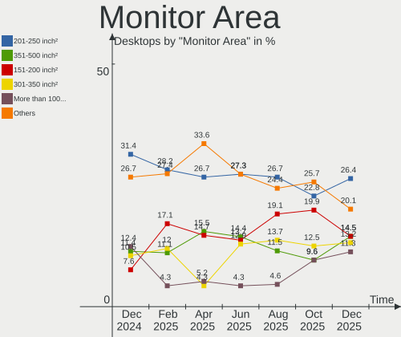

| Area in inch² | Desktops | Percent |
|----------------|----------|---------|
| 201-250        | 42       | 26.42%  |
| 351-500        | 23       | 14.47%  |
| 151-200        | 23       | 14.47%  |
| 301-350        | 21       | 13.21%  |
| More than 1000 | 18       | 11.32%  |
| 141-150        | 12       | 7.55%   |
| 251-300        | 8        | 5.03%   |
| 101-110        | 4        | 2.52%   |
| 501-1000       | 4        | 2.52%   |
| Unknown        | 2        | 1.26%   |
| 71-80          | 1        | 0.63%   |
| 91-100         | 1        | 0.63%   |

Pixel Density
-------------

Pixels per inch

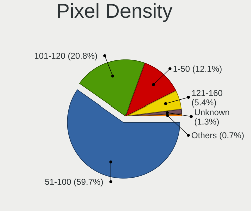

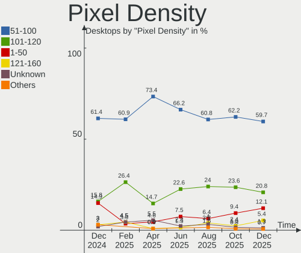

| Density | Desktops | Percent |
|---------|----------|---------|
| 51-100  | 89       | 59.73%  |
| 101-120 | 31       | 20.81%  |
| 1-50    | 18       | 12.08%  |
| 121-160 | 8        | 5.37%   |
| Unknown | 2        | 1.34%   |
| 161-240 | 1        | 0.67%   |

Multiple Monitors
-----------------

Total monitors connected

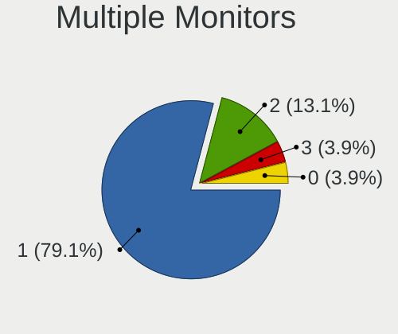

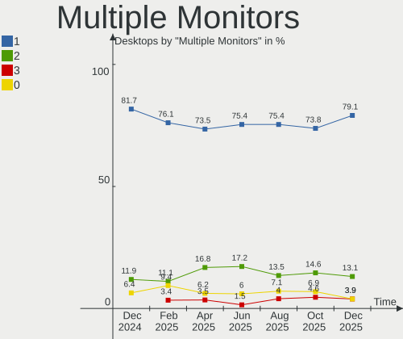

| Total | Desktops | Percent |
|-------|----------|---------|
| 1     | 121      | 79.08%  |
| 2     | 20       | 13.07%  |
| 3     | 6        | 3.92%   |
| 0     | 6        | 3.92%   |

Network
-------

Net Controller Vendor
---------------------

Controller vendors

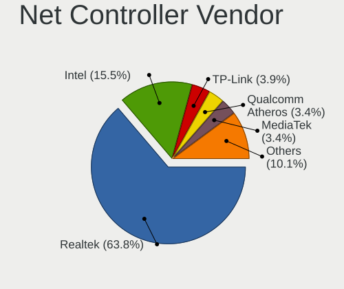

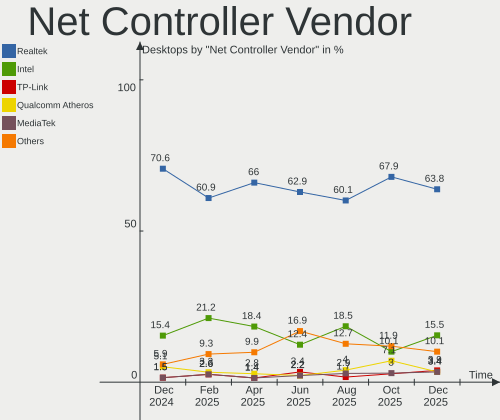

| Vendor                          | Desktops | Percent |
|---------------------------------|----------|---------|
| Realtek Semiconductor           | 132      | 63.77%  |
| Intel                           | 32       | 15.46%  |
| TP-Link                         | 8        | 3.86%   |
| Qualcomm Atheros                | 7        | 3.38%   |
| MediaTek                        | 7        | 3.38%   |
| Samsung Electronics             | 4        | 1.93%   |
| Broadcom                        | 4        | 1.93%   |
| Ralink Technology               | 3        | 1.45%   |
| Qualcomm Technologies           | 2        | 0.97%   |
| Qualcomm Atheros Communications | 2        | 0.97%   |
| Xiaomi                          | 1        | 0.48%   |
| Ralink                          | 1        | 0.48%   |
| QinHeng Electronics             | 1        | 0.48%   |
| Nvidia                          | 1        | 0.48%   |
| Microsoft                       | 1        | 0.48%   |
| ASIX Electronics                | 1        | 0.48%   |

Net Controller Model
--------------------

Controller models

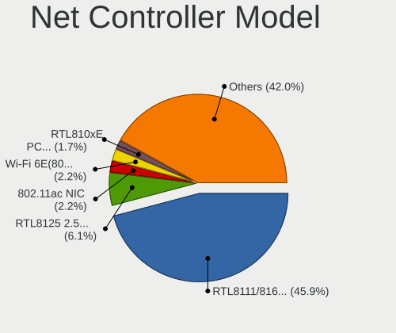

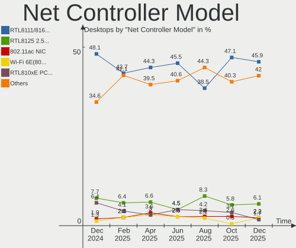

| Model                                                                  | Desktops | Percent |
|------------------------------------------------------------------------|----------|---------|
| Realtek RTL8111/8168/8211/8411 PCI Express Gigabit Ethernet Controller | 106      | 45.89%  |
| Realtek RTL8125 2.5GbE Controller                                      | 14       | 6.06%   |
| Realtek 802.11ac NIC                                                   | 5        | 2.16%   |
| Intel Wi-Fi 6E(802.11ax) AX210/AX1675* 2x2 [Typhoon Peak]              | 5        | 2.16%   |
| Realtek RTL810xE PCI Express Fast Ethernet controller                  | 4        | 1.73%   |
| Realtek RTL8922AE 802.11be PCIe Wireless Network Adapter               | 3        | 1.3%    |
| Realtek RTL8188EUS 802.11n Wireless Network Adapter                    | 3        | 1.3%    |
| MediaTek MT7902 802.11ax PCIe Wireless Network Adapter [Filogic 310]   | 3        | 1.3%    |
| Intel Wireless 7265                                                    | 3        | 1.3%    |
| Intel Ethernet Connection (2) I219-V                                   | 3        | 1.3%    |
| Intel Ethernet Connection (17) I219-LM                                 | 3        | 1.3%    |
| Samsung GT-I9070 (network tethering, USB debugging enabled)            | 2        | 0.87%   |
| Samsung Galaxy series, misc. (tethering mode)                          | 2        | 0.87%   |
| Realtek RTL88x2bu [AC1200 Techkey]                                     | 2        | 0.87%   |
| Realtek RTL8126 5GbE Controller                                        | 2        | 0.87%   |
| Ralink MT7601U Wireless Adapter                                        | 2        | 0.87%   |
| Qualcomm WCN785x Wi-Fi 7(802.11be) 320MHz 2x2 [FastConnect 7800]       | 2        | 0.87%   |
| Qualcomm Atheros AR9271 802.11n                                        | 2        | 0.87%   |
| MediaTek MT7922 802.11ax PCI Express Wireless Network Adapter          | 2        | 0.87%   |
| MediaTek MT7921K (RZ608) Wi-Fi 6E 80MHz                                | 2        | 0.87%   |
| Intel Wi-Fi 6 AX200                                                    | 2        | 0.87%   |
| Intel Ethernet Connection I217-LM                                      | 2        | 0.87%   |
| Intel Ethernet Connection (7) I219-V                                   | 2        | 0.87%   |
| Intel Ethernet Connection (2) I219-LM                                  | 2        | 0.87%   |
| Intel Alder Lake-S PCH CNVi WiFi                                       | 2        | 0.87%   |
| Xiaomi Mi/Redmi series (RNDIS)                                         | 1        | 0.43%   |
| TP-Link TL-WN823N v2/v3 [Realtek RTL8192EU]                            | 1        | 0.43%   |
| TP-Link TL-WN822N Version 4 RTL8192EU                                  | 1        | 0.43%   |
| TP-Link TL-WN821N v5/v6 [RTL8192EU]                                    | 1        | 0.43%   |
| TP-Link Archer T4U ver.3                                               | 1        | 0.43%   |
| TP-Link Archer T3U [Realtek RTL8812BU]                                 | 1        | 0.43%   |
| TP-Link Archer T2U PLUS [RTL8821AU]                                    | 1        | 0.43%   |
| TP-Link AC600 wireless Realtek RTL8811AU [Archer T2U Nano]             | 1        | 0.43%   |
| TP-Link 802.11ac WLAN Adapter                                          | 1        | 0.43%   |
| Realtek RTL8852CE PCIe 802.11ax Wireless Network Controller            | 1        | 0.43%   |
| Realtek RTL8852BE PCIe 802.11ax Wireless Network Controller            | 1        | 0.43%   |
| Realtek RTL8821CE PCIe 802.11ac Wireless Network Controller            | 1        | 0.43%   |
| Realtek RTL8821CE 802.11ac PCIe Wireless Network Adapter               | 1        | 0.43%   |
| Realtek RTL8192CU 802.11n WLAN Adapter                                 | 1        | 0.43%   |
| Realtek RTL8191SU 802.11n WLAN Adapter                                 | 1        | 0.43%   |

Wireless Vendor
---------------

Wireless vendors

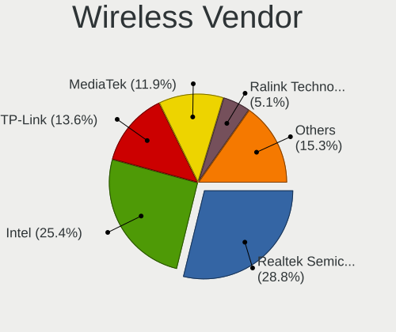

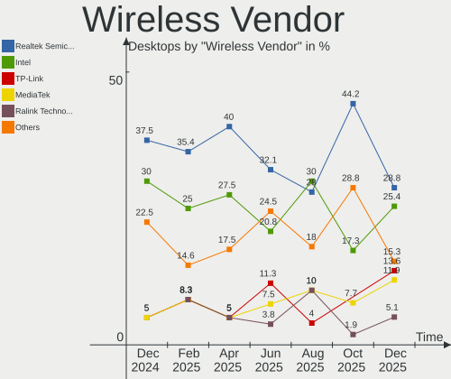

| Vendor                          | Desktops | Percent |
|---------------------------------|----------|---------|
| Realtek Semiconductor           | 17       | 28.81%  |
| Intel                           | 15       | 25.42%  |
| TP-Link                         | 8        | 13.56%  |
| MediaTek                        | 7        | 11.86%  |
| Ralink Technology               | 3        | 5.08%   |
| Qualcomm Atheros Communications | 2        | 3.39%   |
| Qualcomm Atheros                | 2        | 3.39%   |
| Broadcom                        | 2        | 3.39%   |
| Ralink                          | 1        | 1.69%   |
| Qualcomm Technologies           | 1        | 1.69%   |
| Microsoft                       | 1        | 1.69%   |

Wireless Model
--------------

Wireless models

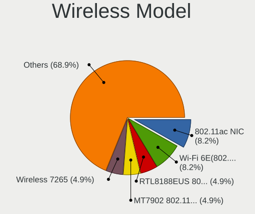

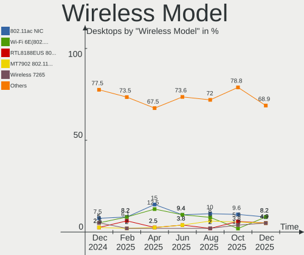

| Model                                                                | Desktops | Percent |
|----------------------------------------------------------------------|----------|---------|
| Realtek 802.11ac NIC                                                 | 5        | 8.2%    |
| Intel Wi-Fi 6E(802.11ax) AX210/AX1675* 2x2 [Typhoon Peak]            | 5        | 8.2%    |
| Realtek RTL8188EUS 802.11n Wireless Network Adapter                  | 3        | 4.92%   |
| MediaTek MT7902 802.11ax PCIe Wireless Network Adapter [Filogic 310] | 3        | 4.92%   |
| Intel Wireless 7265                                                  | 3        | 4.92%   |
| Realtek RTL88x2bu [AC1200 Techkey]                                   | 2        | 3.28%   |
| Ralink MT7601U Wireless Adapter                                      | 2        | 3.28%   |
| Qualcomm Atheros AR9271 802.11n                                      | 2        | 3.28%   |
| MediaTek MT7922 802.11ax PCI Express Wireless Network Adapter        | 2        | 3.28%   |
| MediaTek MT7921K (RZ608) Wi-Fi 6E 80MHz                              | 2        | 3.28%   |
| Intel Wi-Fi 6 AX200                                                  | 2        | 3.28%   |
| TP-Link TL-WN823N v2/v3 [Realtek RTL8192EU]                          | 1        | 1.64%   |
| TP-Link TL-WN822N Version 4 RTL8192EU                                | 1        | 1.64%   |
| TP-Link TL-WN821N v5/v6 [RTL8192EU]                                  | 1        | 1.64%   |
| TP-Link Archer T4U ver.3                                             | 1        | 1.64%   |
| TP-Link Archer T3U [Realtek RTL8812BU]                               | 1        | 1.64%   |
| TP-Link Archer T2U PLUS [RTL8821AU]                                  | 1        | 1.64%   |
| TP-Link AC600 wireless Realtek RTL8811AU [Archer T2U Nano]           | 1        | 1.64%   |
| TP-Link 802.11ac WLAN Adapter                                        | 1        | 1.64%   |
| Realtek RTL8922AE 802.11be PCIe Wireless Network Adapter             | 1        | 1.64%   |
| Realtek RTL8852CE PCIe 802.11ax Wireless Network Controller          | 1        | 1.64%   |
| Realtek RTL8821CE PCIe 802.11ac Wireless Network Controller          | 1        | 1.64%   |
| Realtek RTL8821CE 802.11ac PCIe Wireless Network Adapter             | 1        | 1.64%   |
| Realtek RTL8192CU 802.11n WLAN Adapter                               | 1        | 1.64%   |
| Realtek RTL8191SU 802.11n WLAN Adapter                               | 1        | 1.64%   |
| Realtek RTL8188FTV 802.11b/g/n 1T1R 2.4G WLAN Adapter                | 1        | 1.64%   |
| Realtek RTL8188EE Wireless Network Adapter                           | 1        | 1.64%   |
| Realtek 802.11ac WLAN Adapter                                        | 1        | 1.64%   |
| Ralink RT5370 Wireless Adapter                                       | 1        | 1.64%   |
| Ralink RT5360 Wireless 802.11n 1T/1R                                 | 1        | 1.64%   |
| Qualcomm WCN785x Wi-Fi 7(802.11be) 320MHz 2x2 [FastConnect 7800]     | 1        | 1.64%   |
| Qualcomm Atheros AR9485 Wireless Network Adapter                     | 1        | 1.64%   |
| Qualcomm Atheros AR9462 Wireless Network Adapter                     | 1        | 1.64%   |
| Microsoft Wireless XBox Controller Dongle                            | 1        | 1.64%   |
| Intel Wireless 8260                                                  | 1        | 1.64%   |
| Intel Wireless 7260                                                  | 1        | 1.64%   |
| Intel Wireless 3165                                                  | 1        | 1.64%   |
| Intel Comet Lake PCH CNVi WiFi                                       | 1        | 1.64%   |
| Intel Centrino Wireless-N 2230                                       | 1        | 1.64%   |
| Broadcom BCM43228 802.11a/b/g/n                                      | 1        | 1.64%   |

Ethernet Vendor
---------------

Ethernet vendors

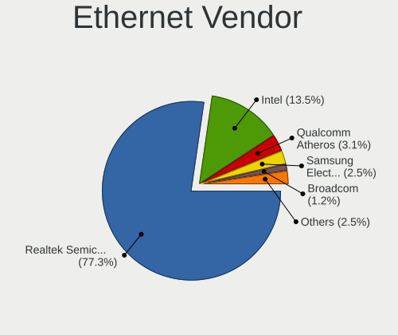

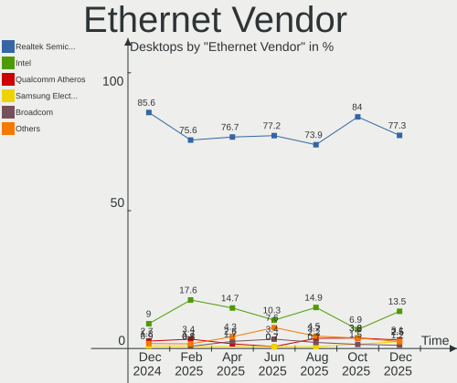

| Vendor                | Desktops | Percent |
|-----------------------|----------|---------|
| Realtek Semiconductor | 126      | 77.3%   |
| Intel                 | 22       | 13.5%   |
| Qualcomm Atheros      | 5        | 3.07%   |
| Samsung Electronics   | 4        | 2.45%   |
| Broadcom              | 2        | 1.23%   |
| Xiaomi                | 1        | 0.61%   |
| Qualcomm Technologies | 1        | 0.61%   |
| Nvidia                | 1        | 0.61%   |
| ASIX Electronics      | 1        | 0.61%   |

Ethernet Model
--------------

Ethernet models

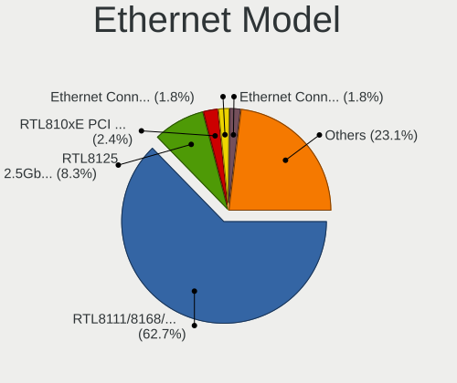

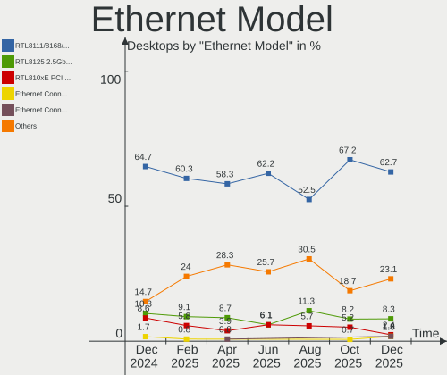

| Model                                                                  | Desktops | Percent |
|------------------------------------------------------------------------|----------|---------|
| Realtek RTL8111/8168/8211/8411 PCI Express Gigabit Ethernet Controller | 106      | 62.72%  |
| Realtek RTL8125 2.5GbE Controller                                      | 14       | 8.28%   |
| Realtek RTL810xE PCI Express Fast Ethernet controller                  | 4        | 2.37%   |
| Intel Ethernet Connection (2) I219-V                                   | 3        | 1.78%   |
| Intel Ethernet Connection (17) I219-LM                                 | 3        | 1.78%   |
| Samsung GT-I9070 (network tethering, USB debugging enabled)            | 2        | 1.18%   |
| Samsung Galaxy series, misc. (tethering mode)                          | 2        | 1.18%   |
| Realtek RTL8922AE 802.11be PCIe Wireless Network Adapter               | 2        | 1.18%   |
| Realtek RTL8126 5GbE Controller                                        | 2        | 1.18%   |
| Intel Ethernet Connection I217-LM                                      | 2        | 1.18%   |
| Intel Ethernet Connection (7) I219-V                                   | 2        | 1.18%   |
| Intel Ethernet Connection (2) I219-LM                                  | 2        | 1.18%   |
| Intel Alder Lake-S PCH CNVi WiFi                                       | 2        | 1.18%   |
| Xiaomi Mi/Redmi series (RNDIS)                                         | 1        | 0.59%   |
| Realtek RTL8852BE PCIe 802.11ax Wireless Network Controller            | 1        | 0.59%   |
| Realtek Killer E3000 2.5GbE Controller                                 | 1        | 0.59%   |
| Qualcomm WCN785x Wi-Fi 7(802.11be) 320MHz 2x2 [FastConnect 7800]       | 1        | 0.59%   |
| Qualcomm Atheros Killer E2500 Gigabit Ethernet Controller              | 1        | 0.59%   |
| Qualcomm Atheros Killer E220x Gigabit Ethernet Controller              | 1        | 0.59%   |
| Qualcomm Atheros Ethernet controller                                   | 1        | 0.59%   |
| Qualcomm Atheros Attansic L1 Gigabit Ethernet                          | 1        | 0.59%   |
| Qualcomm Atheros AR8152 v2.0 Fast Ethernet                             | 1        | 0.59%   |
| Nvidia MCP61 Ethernet                                                  | 1        | 0.59%   |
| Intel I211 Gigabit Network Connection                                  | 1        | 0.59%   |
| Intel Ethernet Controller X550                                         | 1        | 0.59%   |
| Intel Ethernet Connection (7) I219-LM                                  | 1        | 0.59%   |
| Intel Ethernet Connection (2) I218-V                                   | 1        | 0.59%   |
| Intel Ethernet Connection (14) I219-V                                  | 1        | 0.59%   |
| Intel Ethernet Connection (12) I219-V                                  | 1        | 0.59%   |
| Intel Ethernet Connection (11) I219-LM                                 | 1        | 0.59%   |
| Intel 82579V Gigabit Network Connection                                | 1        | 0.59%   |
| Intel 82579LM Gigabit Network Connection (Lewisville)                  | 1        | 0.59%   |
| Intel 82574L Gigabit Network Connection                                | 1        | 0.59%   |
| Broadcom NetXtreme BCM5764M Gigabit Ethernet PCIe                      | 1        | 0.59%   |
| Broadcom NetXtreme BCM5720 Gigabit Ethernet PCIe                       | 1        | 0.59%   |
| ASIX AX88179 Gigabit Ethernet                                          | 1        | 0.59%   |

Net Controller Kind
-------------------

Ethernet, WiFi or modem

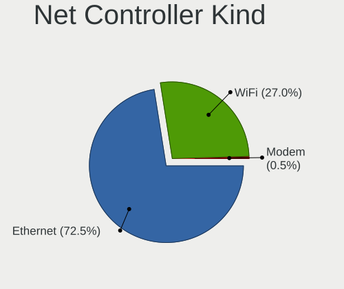

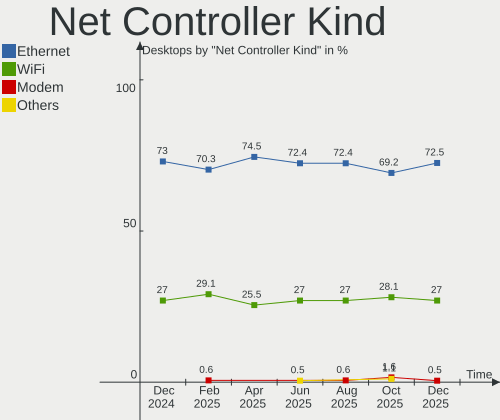

| Kind     | Desktops | Percent |
|----------|----------|---------|
| Ethernet | 153      | 72.51%  |
| WiFi     | 57       | 27.01%  |
| Modem    | 1        | 0.47%   |

Used Controller
---------------

Currently used network controller

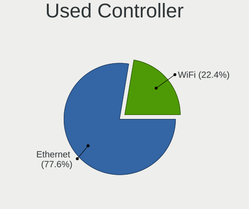

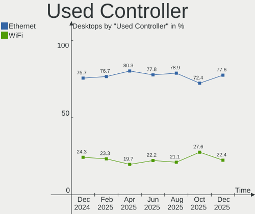

| Kind     | Desktops | Percent |
|----------|----------|---------|
| Ethernet | 118      | 77.63%  |
| WiFi     | 34       | 22.37%  |

NICs
----

Total network controllers on board

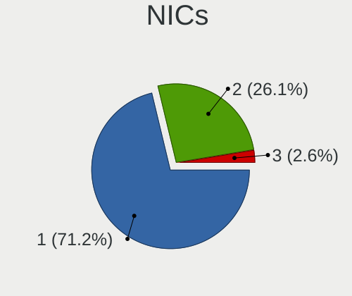

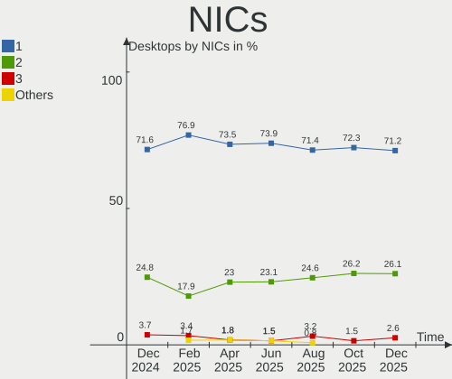

| Total | Desktops | Percent |
|-------|----------|---------|
| 1     | 109      | 71.24%  |
| 2     | 40       | 26.14%  |
| 3     | 4        | 2.61%   |

IPv6
----

IPv6 vs IPv4

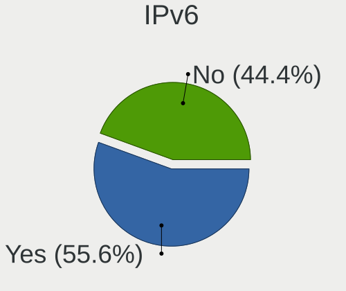

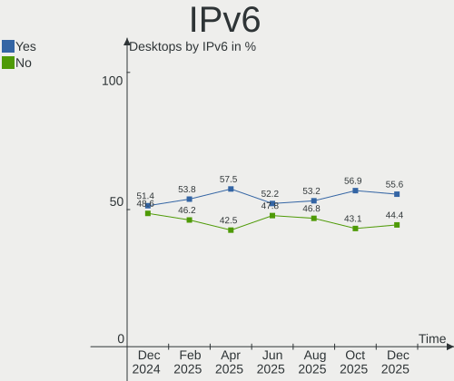

| Used | Desktops | Percent |
|------|----------|---------|
| Yes  | 85       | 55.56%  |
| No   | 68       | 44.44%  |

Bluetooth
---------

Bluetooth Vendor
----------------

Controller vendors

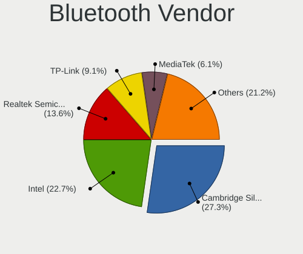

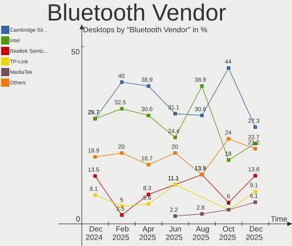

| Vendor                  | Desktops | Percent |
|-------------------------|----------|---------|
| Cambridge Silicon Radio | 18       | 27.27%  |
| Intel                   | 15       | 22.73%  |
| Realtek Semiconductor   | 9        | 13.64%  |
| TP-Link                 | 6        | 9.09%   |
| MediaTek                | 4        | 6.06%   |
| IMC Networks            | 4        | 6.06%   |
| Foxconn / Hon Hai       | 3        | 4.55%   |
| Unknown                 | 3        | 4.55%   |
| Realtek                 | 1        | 1.52%   |
| ASUSTek Computer        | 1        | 1.52%   |
| Apple                   | 1        | 1.52%   |
| Actions                 | 1        | 1.52%   |

Bluetooth Model
---------------

Controller models

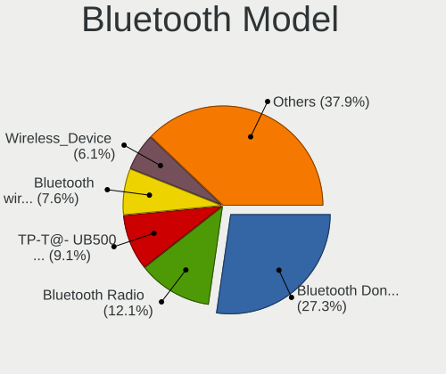

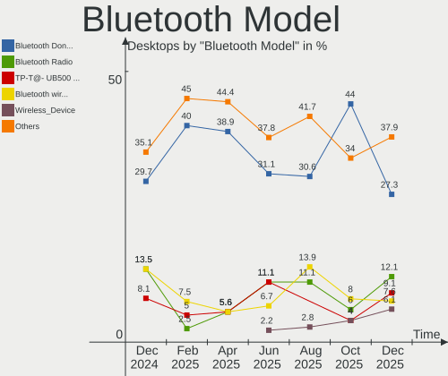

| Model                                               | Desktops | Percent |
|-----------------------------------------------------|----------|---------|
| Cambridge Silicon Radio Bluetooth Dongle (HCI mode) | 18       | 27.27%  |
| Realtek Bluetooth Radio                             | 8        | 12.12%  |
| TP-Link TP-T@- UB500 Adapter                        | 6        | 9.09%   |
| Intel Bluetooth wireless interface                  | 5        | 7.58%   |
| MediaTek Wireless_Device                            | 4        | 6.06%   |
| Intel AX210 Bluetooth                               | 4        | 6.06%   |
| IMC Networks Wireless_Device                        | 3        | 4.55%   |
| Foxconn / Hon Hai Bluetooth Device                  | 3        | 4.55%   |
| Unknown                                             | 3        | 4.55%   |
| Intel Bluetooth Device                              | 2        | 3.03%   |
| Intel AX200 Bluetooth                               | 2        | 3.03%   |
| Realtek Bluetooth 5.3 Radio                         | 1        | 1.52%   |
| Realtek Bluetooth Radio                             | 1        | 1.52%   |
| Intel Centrino Bluetooth Wireless Transceiver       | 1        | 1.52%   |
| Intel AX201 Bluetooth                               | 1        | 1.52%   |
| IMC Networks Bluetooth Radio                        | 1        | 1.52%   |
| ASUS BCM20702A0                                     | 1        | 1.52%   |
| Apple Built-in Bluetooth 2.0+EDR HCI                | 1        | 1.52%   |
| Actions general adapter                             | 1        | 1.52%   |

Sound
-----

Sound Vendor
------------

Sound card vendors

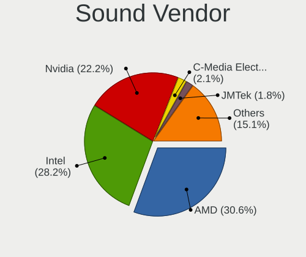

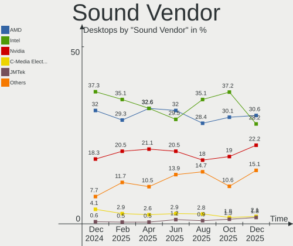

| Vendor                                       | Desktops | Percent |
|----------------------------------------------|----------|---------|
| AMD                                          | 87       | 30.63%  |
| Intel                                        | 80       | 28.17%  |
| Nvidia                                       | 63       | 22.18%  |
| C-Media Electronics                          | 6        | 2.11%   |
| JMTek                                        | 5        | 1.76%   |
| Logitech                                     | 4        | 1.41%   |
| Generalplus Technology                       | 4        | 1.41%   |
| Weltrend Semiconductor                       | 3        | 1.06%   |
| Kingston Technology                          | 3        | 1.06%   |
| Corsair                                      | 3        | 1.06%   |
| Zoran Co. Personal Media Division (Nogatech) | 2        | 0.7%    |
| SteelSeries ApS                              | 2        | 0.7%    |
| MV-SILICON                                   | 2        | 0.7%    |
| ASUSTek Computer                             | 2        | 0.7%    |
| Unknown                                      | 2        | 0.7%    |
| XING WEI 2.4G USB                            | 1        | 0.35%   |
| Texas Instruments                            | 1        | 0.35%   |
| RODE Microphones                             | 1        | 0.35%   |
| Razer USA                                    | 1        | 0.35%   |
| Micro Star International                     | 1        | 0.35%   |
| KTMicro                                      | 1        | 0.35%   |
| Jieli Technology                             | 1        | 0.35%   |
| Hewlett-Packard                              | 1        | 0.35%   |
| Harman International                         | 1        | 0.35%   |
| Goldvish                                     | 1        | 0.35%   |
| Ensoniq                                      | 1        | 0.35%   |
| EDFIER                                       | 1        | 0.35%   |
| DSEA A/S                                     | 1        | 0.35%   |
| Dell                                         | 1        | 0.35%   |
| Creative Technology                          | 1        | 0.35%   |
| Asahi Kasei Microsystems                     | 1        | 0.35%   |

Sound Model
-----------

Sound card models

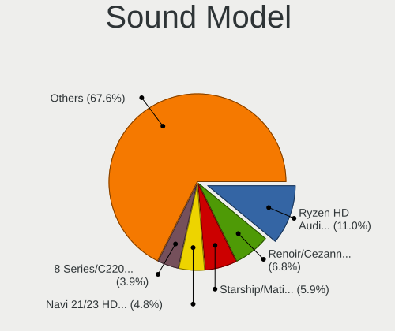

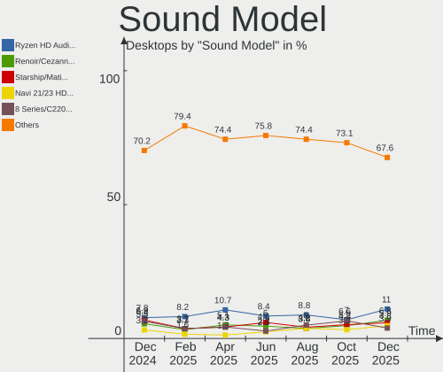

| Model                                                                      | Desktops | Percent |
|----------------------------------------------------------------------------|----------|---------|
| AMD Ryzen HD Audio Controller                                              | 39       | 10.99%  |
| AMD Renoir/Cezanne HDMI/DP Audio Controller                                | 24       | 6.76%   |
| AMD Starship/Matisse HD Audio Controller                                   | 21       | 5.92%   |
| AMD Navi 21/23 HDMI/DP Audio Controller                                    | 17       | 4.79%   |
| Intel 8 Series/C220 Series Chipset High Definition Audio Controller        | 14       | 3.94%   |
| Intel 6 Series/C200 Series Chipset Family High Definition Audio Controller | 13       | 3.66%   |
| Intel 7 Series/C216 Chipset Family High Definition Audio Controller        | 12       | 3.38%   |
| AMD Ellesmere HDMI Audio [Radeon RX 470/480 / 570/580/590]                 | 9        | 2.54%   |
| Intel 100 Series/C230 Series Chipset Family HD Audio Controller            | 8        | 2.25%   |
| Nvidia GA106 High Definition Audio Controller                              | 7        | 1.97%   |
| AMD Radeon High Definition Audio Controller                                | 7        | 1.97%   |
| Intel Alder Lake-S HD Audio Controller                                     | 6        | 1.69%   |
| AMD Navi 31 HDMI/DP Audio                                                  | 6        | 1.69%   |
| Nvidia High Definition Audio Controller                                    | 5        | 1.41%   |
| Nvidia GP107GL High Definition Audio Controller                            | 5        | 1.41%   |
| AMD SBx00 Azalia (Intel HDA)                                               | 5        | 1.41%   |
| Nvidia TU116 High Definition Audio Controller                              | 4        | 1.13%   |
| Intel Cannon Lake PCH cAVS                                                 | 4        | 1.13%   |
| Generalplus Technology USB Audio Device                                    | 4        | 1.13%   |
| AMD Baffin HDMI/DP Audio [Radeon RX 550 640SP / RX 560/560X]               | 4        | 1.13%   |
| Weltrend Semiconductor H848 Wireless headset                               | 3        | 0.85%   |
| Nvidia TU104 HD Audio Controller                                           | 3        | 0.85%   |
| Nvidia GB206 High Definition Audio Controller                              | 3        | 0.85%   |
| Nvidia GA104 High Definition Audio Controller                              | 3        | 0.85%   |
| Nvidia AD107 High Definition Audio Controller                              | 3        | 0.85%   |
| Intel Xeon E3-1200 v3/4th Gen Core Processor HD Audio Controller           | 3        | 0.85%   |
| Intel 5 Series/3400 Series Chipset High Definition Audio                   | 3        | 0.85%   |
| C-Media Electronics USB Audio Device                                       | 3        | 0.85%   |
| AMD Raven/Raven2/Fenghuang HDMI/DP Audio Controller                        | 3        | 0.85%   |
| AMD Navi 48 HDMI/DP Audio Controller                                       | 3        | 0.85%   |
| AMD Family 17h (Models 00h-0fh) HD Audio Controller                        | 3        | 0.85%   |
| Zoran Co. Personal Media Division (Nogatech) USB Audio and HID             | 2        | 0.56%   |
| Nvidia GK208 HDMI/DP Audio Controller                                      | 2        | 0.56%   |
| Nvidia GK104 HDMI Audio Controller                                         | 2        | 0.56%   |
| Nvidia GF119 HDMI Audio Controller                                         | 2        | 0.56%   |
| Nvidia GF108 High Definition Audio Controller                              | 2        | 0.56%   |
| Nvidia GA102 High Definition Audio Controller                              | 2        | 0.56%   |
| Nvidia AD104 High Definition Audio Controller                              | 2        | 0.56%   |
| JMTek USB PnP Audio Device                                                 | 2        | 0.56%   |
| Intel Smart Sound Technology (SST) Audio Controller                        | 2        | 0.56%   |

Memory
------

Memory Vendor
-------------

Memory module vendors

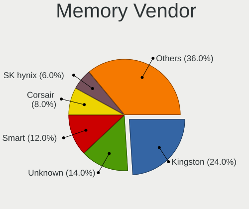

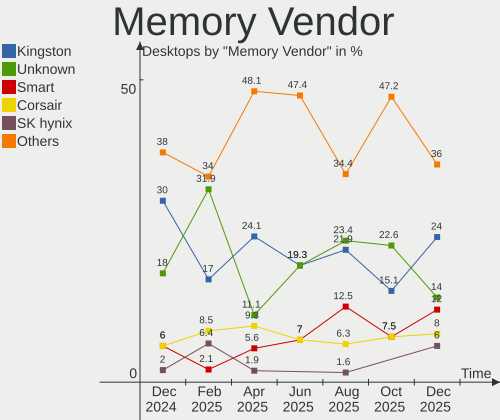

| Vendor              | Desktops | Percent |
|---------------------|----------|---------|
| Kingston            | 12       | 24%     |
| Unknown             | 7        | 14%     |
| Smart               | 6        | 12%     |
| Corsair             | 4        | 8%      |
| SK hynix            | 3        | 6%      |
| A-DATA Technology   | 3        | 6%      |
| Unknown             | 3        | 6%      |
| TeamGroup           | 2        | 4%      |
| Team                | 2        | 4%      |
| PUSKILL             | 2        | 4%      |
| Samsung Electronics | 1        | 2%      |
| Multilaser          | 1        | 2%      |
| Micron Technology   | 1        | 2%      |
| Juhor               | 1        | 2%      |
| Asgard              | 1        | 2%      |
| 83130000802C        | 1        | 2%      |

Memory Model
------------

Memory module models

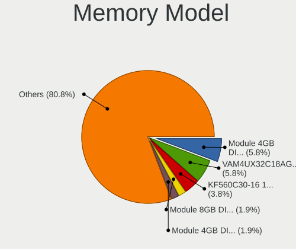

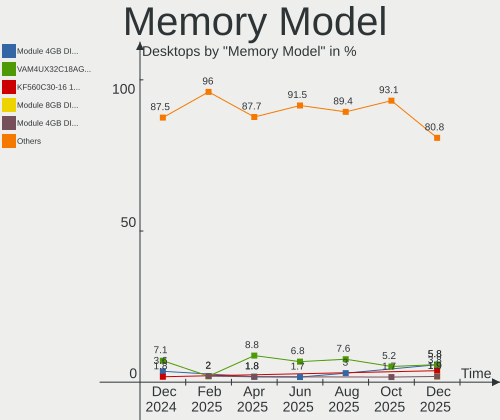

| Model                                                   | Desktops | Percent |
|---------------------------------------------------------|----------|---------|
| Unknown RAM Module 4GB DIMM DDR3 1333MT/s               | 3        | 5.77%   |
| Unknown                                                 | 3        | 5.77%   |
| Kingston RAM KF560C30-16 16GB DIMM DDR5 6000MT/s        | 2        | 3.85%   |
| Unknown RAM Module 8GB DIMM DDR3 1866MT/s               | 1        | 1.92%   |
| Unknown RAM Module 4GB DIMM SDRAM                       | 1        | 1.92%   |
| Unknown RAM Module 4GB DIMM DDR4 2133MT/s               | 1        | 1.92%   |
| Unknown RAM Module 4GB DIMM 1333MT/s                    | 1        | 1.92%   |
| Unknown RAM Module 2GB DIMM 1333MT/s                    | 1        | 1.92%   |
| TeamGroup RAM UD5-6400 16GB DIMM DDR5 6400MT/s          | 1        | 1.92%   |
| TeamGroup RAM UD5-6000 16GB DIMM DDR5 6000MT/s          | 1        | 1.92%   |
| Team RAM TEAMGROUP-UD4-3200 8GB DIMM DDR4 3733MT/s      | 1        | 1.92%   |
| Team RAM TEAMGROUP-UD4-2666 8GB DIMM DDR4 3000MT/s      | 1        | 1.92%   |
| Smart RAM SMS4WEC3C0K0446SCG 4GB SODIMM DDR4 3200MT/s   | 1        | 1.92%   |
| Smart RAM SH564128FH8NZQNSCG 4GB SODIMM DDR3 1600MT/s   | 1        | 1.92%   |
| Smart RAM SH564128FH8N6TNSQG 4GB DIMM DDR3 1600MT/s     | 1        | 1.92%   |
| Smart RAM SH564128FH8N0TNSDR 4GB DIMM DDR3 1600MT/s     | 1        | 1.92%   |
| Smart RAM SG564568FG8N6KFSQR 2GB DIMM DDR2 800MT/s      | 1        | 1.92%   |
| Smart RAM SG564568FG8N6KF-Z1 2GB DIMM DDR2 800MT/s      | 1        | 1.92%   |
| Smart RAM SF4724G4CK8H8GKSBS 32GB DIMM DDR4 2400MT/s    | 1        | 1.92%   |
| SK hynix RAM Module 8GB DIMM DDR3                       | 1        | 1.92%   |
| SK hynix RAM HMCG66MEBUA084N 8GB DIMM DDR5 4800MT/s     | 1        | 1.92%   |
| SK hynix RAM HMA82GS6AFR8N-UH 16GB SODIMM DDR4 2667MT/s | 1        | 1.92%   |
| Samsung RAM M393A1G40EB1-CPB 8GB DIMM DDR4 3200MT/s     | 1        | 1.92%   |
| PUSKILL RAM PSK-D3D10M1600B-8 8GB DIMM DDR3             | 1        | 1.92%   |
| PUSKILL RAM PJ8TFK1GM8 8GB DIMM DDR4 2133MT/s           | 1        | 1.92%   |
| Multilaser RAM MM410BUM 4GB DIMM DDR3                   | 1        | 1.92%   |
| Micron RAM 9ASF2G72AZ-3G2B1 16GB DIMM DDR4 3200MT/s     | 1        | 1.92%   |
| Kingston RAM Module 8GB DIMM DDR4 2133MT/s              | 1        | 1.92%   |
| Kingston RAM Module 8GB DIMM DDR3 1333MT/s              | 1        | 1.92%   |
| Kingston RAM Module 4GB DIMM DDR3 1333MT/s              | 1        | 1.92%   |
| Kingston RAM KHX2133C14/8G 8GB DIMM DDR4 2666MT/s       | 1        | 1.92%   |
| Kingston RAM KF556C36-8 8GB DIMM DDR5 5600MT/s          | 1        | 1.92%   |
| Kingston RAM KF3200C16D4/8GX 8GiB DIMM DDR4 3600MT/s    | 1        | 1.92%   |
| Kingston RAM HX432C16FB/16 16GB DIMM DDR4 2400MT/s      | 1        | 1.92%   |
| Kingston RAM DDR3 1600 8G 8GB DIMM DDR3 1600MT/s        | 1        | 1.92%   |
| Kingston RAM 9905678-005.A00G 8GB DIMM DDR4 3200MT/s    | 1        | 1.92%   |
| Kingston RAM 9905471-001.A00LF 2GB DIMM DDR3            | 1        | 1.92%   |
| Juhor RAM JHD3200U1832JG 32GB DIMM DDR4 2667MT/s        | 1        | 1.92%   |
| Corsair RAM CMK64GX5M2B6000C30 32GB DIMM DDR5 6000MT/s  | 1        | 1.92%   |
| Corsair RAM CMK5X16G2B60C36A2 16GB DIMM DDR5 4800MT/s   | 1        | 1.92%   |

Memory Kind
-----------

Memory module kinds

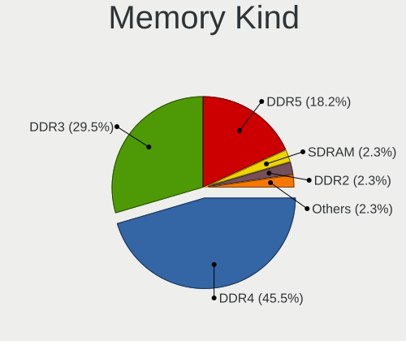

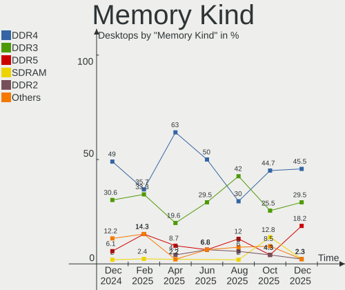

| Kind    | Desktops | Percent |
|---------|----------|---------|
| DDR4    | 20       | 45.45%  |
| DDR3    | 13       | 29.55%  |
| DDR5    | 8        | 18.18%  |
| SDRAM   | 1        | 2.27%   |
| DDR2    | 1        | 2.27%   |
| Unknown | 1        | 2.27%   |

Memory Form Factor
------------------

Physical design of the memory module

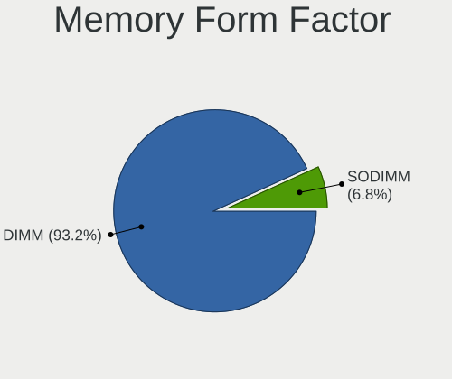

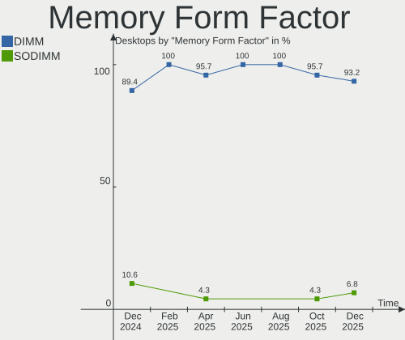

| Name   | Desktops | Percent |
|--------|----------|---------|
| DIMM   | 41       | 93.18%  |
| SODIMM | 3        | 6.82%   |

Memory Size
-----------

Memory module size

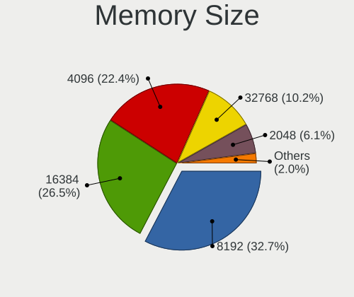

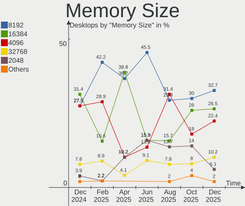

| Size  | Desktops | Percent |
|-------|----------|---------|
| 8192  | 16       | 32.65%  |
| 16384 | 13       | 26.53%  |
| 4096  | 11       | 22.45%  |
| 32768 | 5        | 10.2%   |
| 2048  | 3        | 6.12%   |
| 65536 | 1        | 2.04%   |

Memory Speed
------------

Memory module speed

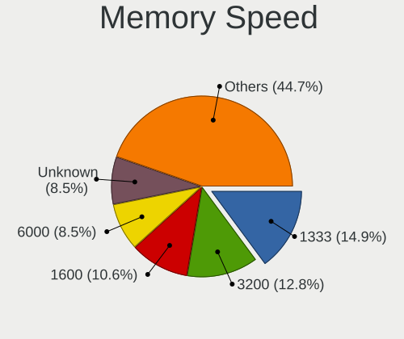

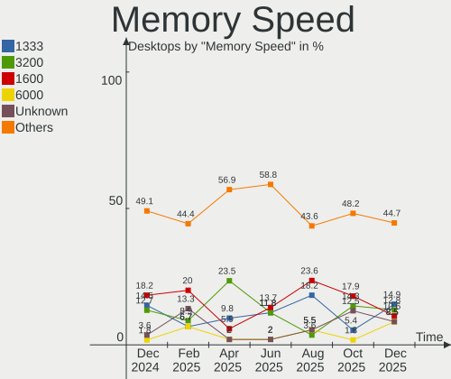

| Speed   | Desktops | Percent |
|---------|----------|---------|
| 1333    | 7        | 14.89%  |
| 3200    | 6        | 12.77%  |
| 1600    | 5        | 10.64%  |
| 6000    | 4        | 8.51%   |
| Unknown | 4        | 8.51%   |
| 3600    | 3        | 6.38%   |
| 2133    | 3        | 6.38%   |
| 4800    | 2        | 4.26%   |
| 3800    | 2        | 4.26%   |
| 2667    | 2        | 4.26%   |
| 2400    | 2        | 4.26%   |
| 6400    | 1        | 2.13%   |
| 5600    | 1        | 2.13%   |
| 3733    | 1        | 2.13%   |
| 3000    | 1        | 2.13%   |
| 2666    | 1        | 2.13%   |
| 1866    | 1        | 2.13%   |
| 800     | 1        | 2.13%   |

Printers & scanners
-------------------

Printer Vendor
--------------

Printer device vendors

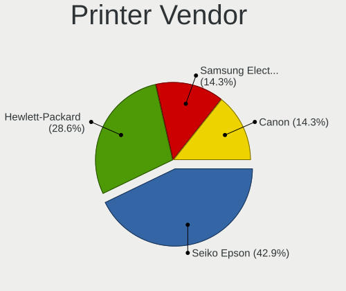

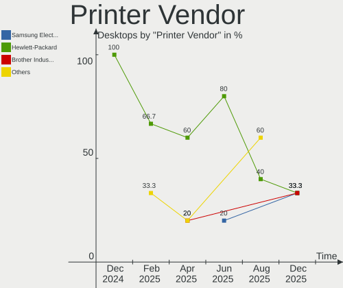

| Vendor              | Desktops | Percent |
|---------------------|----------|---------|
| Samsung Electronics | 1        | 33.33%  |
| Hewlett-Packard     | 1        | 33.33%  |
| Brother Industries  | 1        | 33.33%  |

Printer Model
-------------

Printer device models

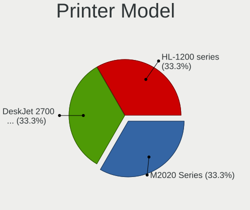

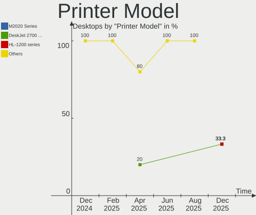

| Model                  | Desktops | Percent |
|------------------------|----------|---------|
| Samsung M2020 Series   | 1        | 33.33%  |
| HP DeskJet 2700 series | 1        | 33.33%  |
| Brother HL-1200 series | 1        | 33.33%  |

Scanner Vendor
--------------

Scanner device vendors

Zero info for selected period =(

Scanner Model
-------------

Scanner device models

Zero info for selected period =(

Camera
------

Camera Vendor
-------------

Camera device vendors

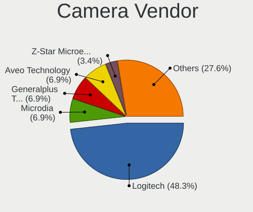

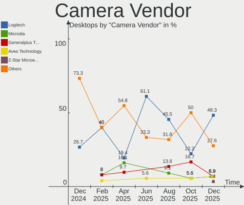

| Vendor                        | Desktops | Percent |
|-------------------------------|----------|---------|
| Logitech                      | 14       | 48.28%  |
| Microdia                      | 2        | 6.9%    |
| Generalplus Technology        | 2        | 6.9%    |
| Aveo Technology               | 2        | 6.9%    |
| Z-Star Microelectronics       | 1        | 3.45%   |
| Sunplus Innovation Technology | 1        | 3.45%   |
| Realtek Semiconductor         | 1        | 3.45%   |
| MacroSilicon                  | 1        | 3.45%   |
| GEMBIRD                       | 1        | 3.45%   |
| Elgato Systems                | 1        | 3.45%   |
| Cubeternet                    | 1        | 3.45%   |
| Anker PowerConf C200          | 1        | 3.45%   |
| A4Tech                        | 1        | 3.45%   |

Camera Model
------------

Camera device models

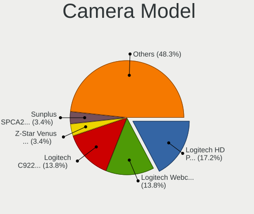

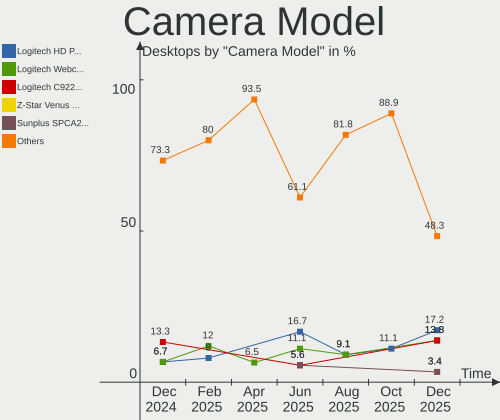

| Model                                     | Desktops | Percent |
|-------------------------------------------|----------|---------|
| Logitech HD Pro Webcam C920               | 5        | 17.24%  |
| Logitech Webcam C270                      | 4        | 13.79%  |
| Logitech C922 Pro Stream Webcam           | 4        | 13.79%  |
| Z-Star Venus USB2.0 Camera                | 1        | 3.45%   |
| Sunplus SPCA2281 Web Camera               | 1        | 3.45%   |
| Realtek USB Camera                        | 1        | 3.45%   |
| Microdia USB 2.0 Camera                   | 1        | 3.45%   |
| Microdia CyberTrack H7                    | 1        | 3.45%   |
| MacroSilicon UGREEN 15390                 | 1        | 3.45%   |
| Logitech Logitech Webcam C925e            | 1        | 3.45%   |
| Generalplus GENERAL WEBCAM                | 1        | 3.45%   |
| Generalplus 808 Camera #9 (web-cam mode)  | 1        | 3.45%   |
| GEMBIRD USB2.0 PC CAMERA                  | 1        | 3.45%   |
| Elgato Systems Elgato Facecam MK.2 (USB2) | 1        | 3.45%   |
| Cubeternet USB2.0 Camera                  | 1        | 3.45%   |
| Aveo UVC camera (Bresser microscope)      | 1        | 3.45%   |
| Aveo USB2.0 Camera                        | 1        | 3.45%   |
| Anker PowerConf C200 Anker PowerConf C200 | 1        | 3.45%   |
| A4Tech PK-635G                            | 1        | 3.45%   |

Security
--------

Fingerprint Vendor
------------------

Fingerprint sensor vendors

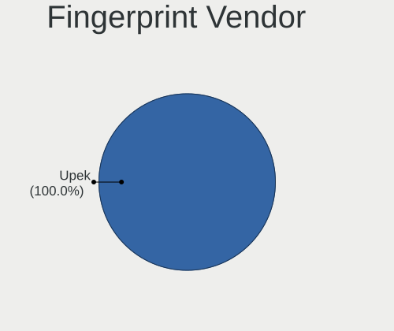

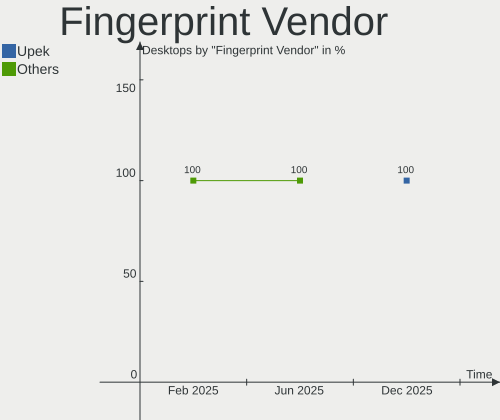

| Vendor | Desktops | Percent |
|--------|----------|---------|
| Upek   | 1        | 100%    |

Fingerprint Model
-----------------

Fingerprint sensor models

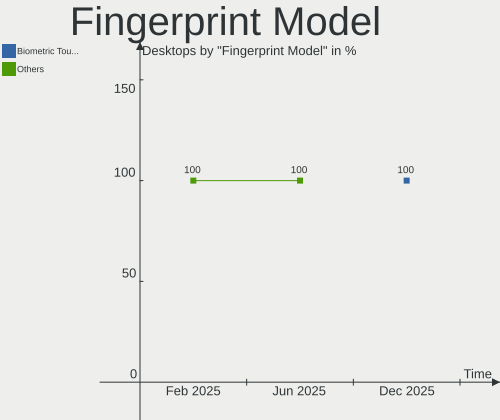

| Model                                                  | Desktops | Percent |
|--------------------------------------------------------|----------|---------|
| Upek Biometric Touchchip/Touchstrip Fingerprint Sensor | 1        | 100%    |

Chipcard Vendor
---------------

Chipcard module vendors

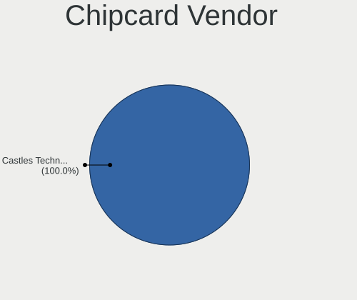

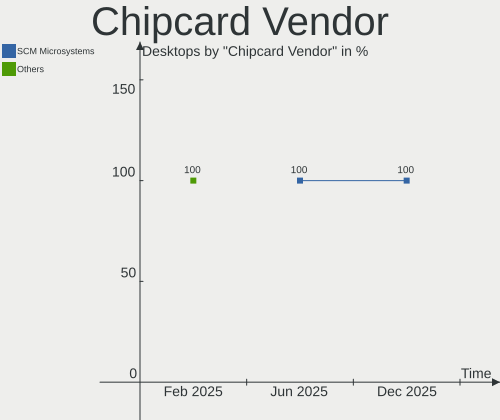

| Vendor           | Desktops | Percent |
|------------------|----------|---------|
| SCM Microsystems | 1        | 100%    |

Chipcard Model
--------------

Chipcard module models

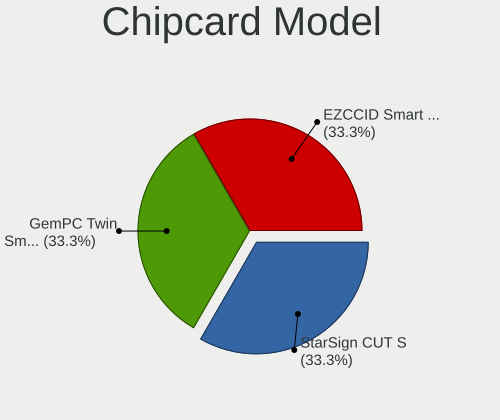

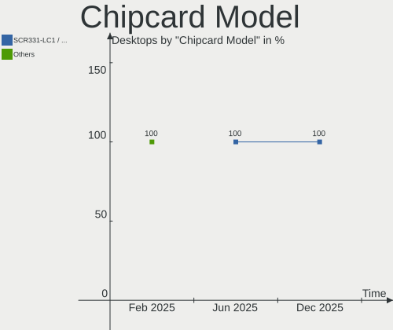

| Model                                                  | Desktops | Percent |
|--------------------------------------------------------|----------|---------|
| SCM Microsystems SCR331-LC1 / SCR3310 SmartCard Reader | 1        | 100%    |

Unsupported
-----------

Unsupported Devices
-------------------

Total unsupported devices on board

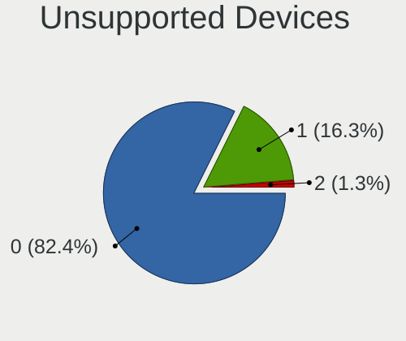

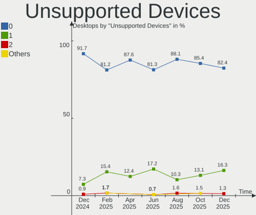

| Total | Desktops | Percent |
|-------|----------|---------|
| 0     | 126      | 82.35%  |
| 1     | 25       | 16.34%  |
| 2     | 2        | 1.31%   |

Unsupported Device Types
------------------------

Types of unsupported devices

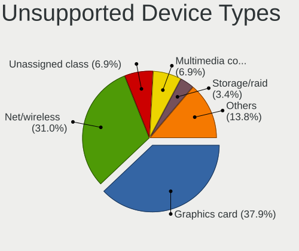

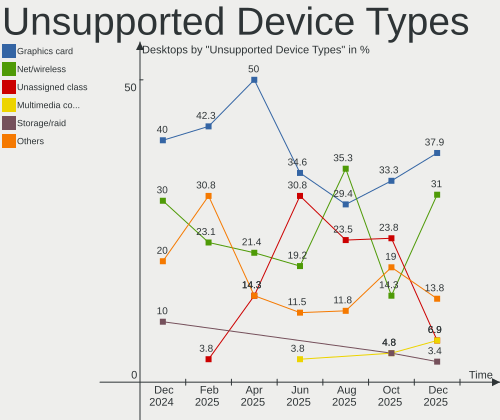

| Type                     | Desktops | Percent |
|--------------------------|----------|---------|
| Graphics card            | 11       | 37.93%  |
| Net/wireless             | 9        | 31.03%  |
| Unassigned class         | 2        | 6.9%    |
| Multimedia controller    | 2        | 6.9%    |
| Storage/raid             | 1        | 3.45%   |
| Net/ethernet             | 1        | 3.45%   |
| Fingerprint reader       | 1        | 3.45%   |
| Communication controller | 1        | 3.45%   |
| Chipcard                 | 1        | 3.45%   |

