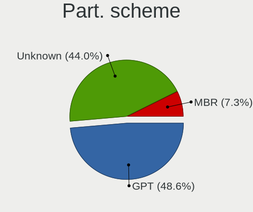
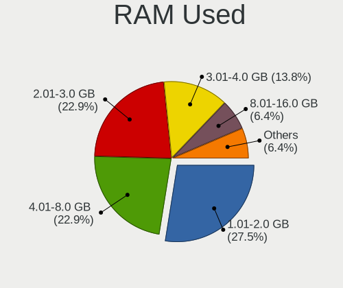
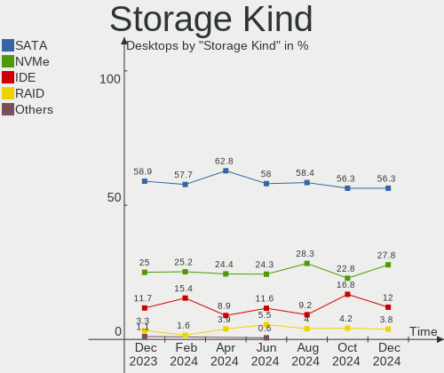
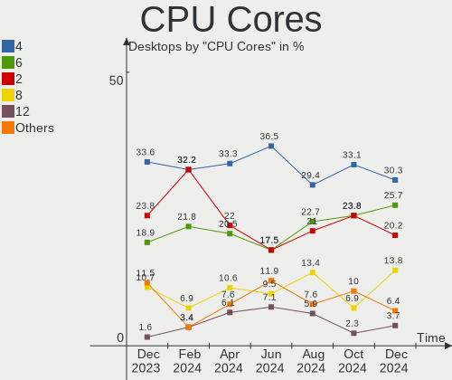
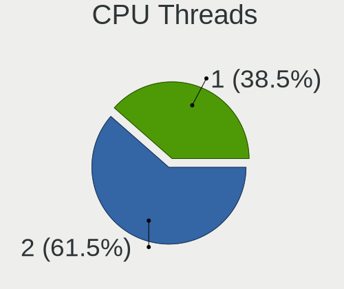
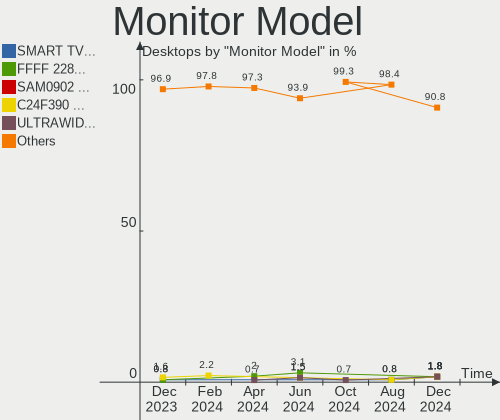
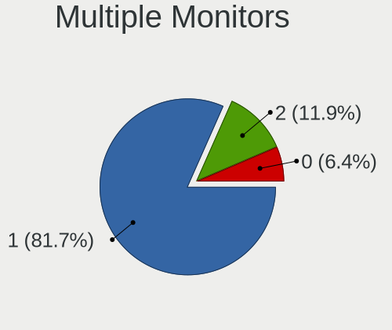
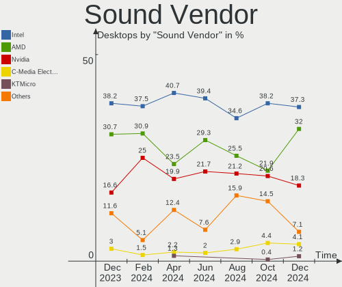

Linux in Brazil - Hardware Trends (Desktops)
--------------------------------------------

A project to identify most popular hardware characteristics and track their change
over time based on data collected by Linux users at https://Linux-Hardware.org.

Anyone can contribute to this report by the [hw-probe](https://github.com/linuxhw/hw-probe) tool:

    sudo -E hw-probe -all -upload

Period: Jul, 2023.

Contents
--------

* [ System ](#system)
  - [ OS                       ](#os)
  - [ OS Family                ](#os-family)
  - [ Kernel                   ](#kernel)
  - [ Kernel Family            ](#kernel-family)
  - [ Kernel Major Ver.        ](#kernel-major-ver)
  - [ Arch                     ](#arch)
  - [ DE                       ](#de)
  - [ Display Server           ](#display-server)
  - [ Display Manager          ](#display-manager)
  - [ OS Lang                  ](#os-lang)
  - [ Boot Mode                ](#boot-mode)
  - [ Filesystem               ](#filesystem)
  - [ Part. scheme             ](#part-scheme)
  - [ Dual Boot with Linux/BSD ](#dual-boot-with-linuxbsd)
  - [ Dual Boot (Win)          ](#dual-boot-win)

* [ Board ](#board)
  - [ Vendor                   ](#vendor)
  - [ Model                    ](#model)
  - [ Model Family             ](#model-family)
  - [ MFG Year                 ](#mfg-year)
  - [ Form Factor              ](#form-factor)
  - [ Secure Boot              ](#secure-boot)
  - [ Coreboot                 ](#coreboot)
  - [ RAM Size                 ](#ram-size)
  - [ RAM Used                 ](#ram-used)
  - [ Total Drives             ](#total-drives)
  - [ Has CD-ROM               ](#has-cd-rom)
  - [ Has Ethernet             ](#has-ethernet)
  - [ Has WiFi                 ](#has-wifi)
  - [ Has Bluetooth            ](#has-bluetooth)

* [ Location ](#location)
  - [ Country                  ](#country)
  - [ City                     ](#city)

* [ Drives ](#drives)
  - [ Drive Vendor             ](#drive-vendor)
  - [ Drive Model              ](#drive-model)
  - [ HDD Vendor               ](#hdd-vendor)
  - [ SSD Vendor               ](#ssd-vendor)
  - [ Drive Kind               ](#drive-kind)
  - [ Drive Connector          ](#drive-connector)
  - [ Drive Size               ](#drive-size)
  - [ Space Total              ](#space-total)
  - [ Space Used               ](#space-used)
  - [ Malfunc. Drives          ](#malfunc-drives)
  - [ Malfunc. Drive Vendor    ](#malfunc-drive-vendor)
  - [ Malfunc. HDD Vendor      ](#malfunc-hdd-vendor)
  - [ Malfunc. Drive Kind      ](#malfunc-drive-kind)
  - [ Failed Drives            ](#failed-drives)
  - [ Failed Drive Vendor      ](#failed-drive-vendor)
  - [ Drive Status             ](#drive-status)

* [ Storage controller ](#storage-controller)
  - [ Storage Vendor           ](#storage-vendor)
  - [ Storage Model            ](#storage-model)
  - [ Storage Kind             ](#storage-kind)

* [ Processor ](#processor)
  - [ CPU Vendor               ](#cpu-vendor)
  - [ CPU Model                ](#cpu-model)
  - [ CPU Model Family         ](#cpu-model-family)
  - [ CPU Cores                ](#cpu-cores)
  - [ CPU Sockets              ](#cpu-sockets)
  - [ CPU Threads              ](#cpu-threads)
  - [ CPU Op-Modes             ](#cpu-op-modes)
  - [ CPU Microcode            ](#cpu-microcode)
  - [ CPU Microarch            ](#cpu-microarch)

* [ Graphics ](#graphics)
  - [ GPU Vendor               ](#gpu-vendor)
  - [ GPU Model                ](#gpu-model)
  - [ GPU Combo                ](#gpu-combo)
  - [ GPU Driver               ](#gpu-driver)
  - [ GPU Memory               ](#gpu-memory)

* [ Monitor ](#monitor)
  - [ Monitor Vendor           ](#monitor-vendor)
  - [ Monitor Model            ](#monitor-model)
  - [ Monitor Resolution       ](#monitor-resolution)
  - [ Monitor Diagonal         ](#monitor-diagonal)
  - [ Monitor Width            ](#monitor-width)
  - [ Aspect Ratio             ](#aspect-ratio)
  - [ Monitor Area             ](#monitor-area)
  - [ Pixel Density            ](#pixel-density)
  - [ Multiple Monitors        ](#multiple-monitors)

* [ Network ](#network)
  - [ Net Controller Vendor    ](#net-controller-vendor)
  - [ Net Controller Model     ](#net-controller-model)
  - [ Wireless Vendor          ](#wireless-vendor)
  - [ Wireless Model           ](#wireless-model)
  - [ Ethernet Vendor          ](#ethernet-vendor)
  - [ Ethernet Model           ](#ethernet-model)
  - [ Net Controller Kind      ](#net-controller-kind)
  - [ Used Controller          ](#used-controller)
  - [ NICs                     ](#nics)
  - [ IPv6                     ](#ipv6)

* [ Bluetooth ](#bluetooth)
  - [ Bluetooth Vendor         ](#bluetooth-vendor)
  - [ Bluetooth Model          ](#bluetooth-model)

* [ Sound ](#sound)
  - [ Sound Vendor             ](#sound-vendor)
  - [ Sound Model              ](#sound-model)

* [ Memory ](#memory)
  - [ Memory Vendor            ](#memory-vendor)
  - [ Memory Model             ](#memory-model)
  - [ Memory Kind              ](#memory-kind)
  - [ Memory Form Factor       ](#memory-form-factor)
  - [ Memory Size              ](#memory-size)
  - [ Memory Speed             ](#memory-speed)

* [ Printers & scanners ](#printers--scanners)
  - [ Printer Vendor           ](#printer-vendor)
  - [ Printer Model            ](#printer-model)
  - [ Scanner Vendor           ](#scanner-vendor)
  - [ Scanner Model            ](#scanner-model)

* [ Camera ](#camera)
  - [ Camera Vendor            ](#camera-vendor)
  - [ Camera Model             ](#camera-model)

* [ Security ](#security)
  - [ Fingerprint Vendor       ](#fingerprint-vendor)
  - [ Fingerprint Model        ](#fingerprint-model)
  - [ Chipcard Vendor          ](#chipcard-vendor)
  - [ Chipcard Model           ](#chipcard-model)

* [ Unsupported ](#unsupported)
  - [ Unsupported Devices      ](#unsupported-devices)
  - [ Unsupported Device Types ](#unsupported-device-types)

System
------

OS
--

Installed operating systems

| Name                         | Desktops | Percent |
|------------------------------|----------|---------|
| Ubuntu 22.04                 | 15       | 10.87%  |
| Fedora 38                    | 13       | 9.42%   |
| Linux Mint 21.1              | 12       | 8.7%    |
| Pop!_OS 22.04                | 10       | 7.25%   |
| Ubuntu 23.04                 | 7        | 5.07%   |
| OpenMandriva 23.03           | 6        | 4.35%   |
| Linux Mint 21.2              | 6        | 4.35%   |
| Debian 12                    | 5        | 3.62%   |
| Zorin 16                     | 4        | 2.9%    |
| ArcoLinux Rolling            | 4        | 2.9%    |
| Arch Rolling                 | 4        | 2.9%    |
| Ubuntu 22.10                 | 3        | 2.17%   |
| openSUSE Tumbleweed-XXXXXXXX | 3        | 2.17%   |
| OpenMandriva 4.3             | 3        | 2.17%   |
| Debian 11                    | 3        | 2.17%   |
| Xubuntu 22.04                | 2        | 1.45%   |
| ROSA 12.4                    | 2        | 1.45%   |
| openSUSE Leap-15.5           | 2        | 1.45%   |
| Manjaro                      | 2        | 1.45%   |
| LMDE 5                       | 2        | 1.45%   |
| Linux Mint 21                | 2        | 1.45%   |
| Xubuntu 23.04                | 1        | 0.72%   |
| Xero Rolling                 | 1        | 0.72%   |
| Ubuntu 20.04                 | 1        | 0.72%   |
| Ubuntu 18.04                 | 1        | 0.72%   |
| Sparky 8                     | 1        | 0.72%   |
| Rocky Linux 8.8              | 1        | 0.72%   |
| PCLinuxOS 2023               | 1        | 0.72%   |
| OpenMandriva 23.07           | 1        | 0.72%   |
| Nobara 38                    | 1        | 0.72%   |
| Nobara 37                    | 1        | 0.72%   |
| NixOS 23.11                  | 1        | 0.72%   |
| Lubuntu 23.04                | 1        | 0.72%   |
| Lubuntu 22.04                | 1        | 0.72%   |
| Linux Mint 20.3              | 1        | 0.72%   |
| Linux Mint 20.2              | 1        | 0.72%   |
| Linux Mint 20.1              | 1        | 0.72%   |
| Kubuntu 23.04                | 1        | 0.72%   |
| KDE neon 22.04               | 1        | 0.72%   |
| Gentoo 2.13                  | 1        | 0.72%   |

OS Family
---------

OS without a version

| Name         | Desktops | Percent |
|--------------|----------|---------|
| Ubuntu       | 27       | 19.57%  |
| Linux Mint   | 23       | 16.67%  |
| Fedora       | 13       | 9.42%   |
| Pop!_OS      | 10       | 7.25%   |
| OpenMandriva | 10       | 7.25%   |
| Debian       | 9        | 6.52%   |
| openSUSE     | 5        | 3.62%   |
| ArcoLinux    | 5        | 3.62%   |
| Zorin        | 4        | 2.9%    |
| Arch         | 4        | 2.9%    |
| Xubuntu      | 3        | 2.17%   |
| ROSA         | 2        | 1.45%   |
| Nobara       | 2        | 1.45%   |
| Manjaro      | 2        | 1.45%   |
| Lubuntu      | 2        | 1.45%   |
| LMDE         | 2        | 1.45%   |
| Xero         | 1        | 0.72%   |
| Sparky       | 1        | 0.72%   |
| Rocky Linux  | 1        | 0.72%   |
| PCLinuxOS    | 1        | 0.72%   |
| NixOS        | 1        | 0.72%   |
| Kubuntu      | 1        | 0.72%   |
| KDE neon     | 1        | 0.72%   |
| Gentoo       | 1        | 0.72%   |
| Garuda Linux | 1        | 0.72%   |
| EndeavourOS  | 1        | 0.72%   |
| ChimeraOS    | 1        | 0.72%   |
| Chili        | 1        | 0.72%   |
| blendOS      | 1        | 0.72%   |
| BigLinux     | 1        | 0.72%   |
| Artix        | 1        | 0.72%   |

Kernel
------

Version of the Linux kernel

| Version                           | Desktops | Percent |
|-----------------------------------|----------|---------|
| 5.19.0-46-generic                 | 17       | 12.32%  |
| 5.15.0-76-generic                 | 12       | 8.7%    |
| 6.2.6-76060206-generic            | 10       | 7.25%   |
| 5.15.0-78-generic                 | 9        | 6.52%   |
| 6.2.6-desktop-1omv2390            | 6        | 4.35%   |
| 6.2.0-25-generic                  | 6        | 4.35%   |
| 6.1.0-10-amd64                    | 4        | 2.9%    |
| 6.3.12-200.fc38.x86_64            | 3        | 2.17%   |
| 5.19.0-50-generic                 | 3        | 2.17%   |
| 6.4.6-200.fc38.x86_64             | 2        | 1.45%   |
| 6.4.4-200.fc38.x86_64             | 2        | 1.45%   |
| 6.4.1-arch2-1                     | 2        | 1.45%   |
| 6.3.9-1-default                   | 2        | 1.45%   |
| 6.3.11-200.fc38.x86_64            | 2        | 1.45%   |
| 6.2.9-300.fc38.x86_64             | 2        | 1.45%   |
| 6.2.0-24-generic                  | 2        | 1.45%   |
| 6.1.38-1-lts                      | 2        | 1.45%   |
| 6.1.20-generic-2rosa2021.1-x86_64 | 2        | 1.45%   |
| 6.1.0-0.deb11.7-amd64             | 2        | 1.45%   |
| 5.4.0-153-generic                 | 2        | 1.45%   |
| 5.16.13-desktop-1omv4003          | 2        | 1.45%   |
| 5.15.0-73-generic                 | 2        | 1.45%   |
| 5.15.0-56-generic                 | 2        | 1.45%   |
| 5.14.21-150500.53-default         | 2        | 1.45%   |
| 6.4.4-cachyos                     | 1        | 0.72%   |
| 6.4.4-arch1-1                     | 1        | 0.72%   |
| 6.4.3-zen1-1-zen                  | 1        | 0.72%   |
| 6.4.3-artix1-2                    | 1        | 0.72%   |
| 6.4.3-arch1-2                     | 1        | 0.72%   |
| 6.4.3-arch1-1                     | 1        | 0.72%   |
| 6.4.2-arch1-1                     | 1        | 0.72%   |
| 6.4.2-1-default                   | 1        | 0.72%   |
| 6.4.1-zen2-1-zen                  | 1        | 0.72%   |
| 6.4.1-gentoo-x86_64               | 1        | 0.72%   |
| 6.4.1-chili                       | 1        | 0.72%   |
| 6.4.1-2-liquorix-amd64            | 1        | 0.72%   |
| 6.4.0-1-amd64                     | 1        | 0.72%   |
| 6.3.9-zen1-1-zen                  | 1        | 0.72%   |
| 6.3.9-pclos1                      | 1        | 0.72%   |
| 6.3.9-chimeraos-1                 | 1        | 0.72%   |

Kernel Family
-------------

Linux kernel without a distro release

| Version  | Desktops | Percent |
|----------|----------|---------|
| 5.15.0   | 27       | 19.57%  |
| 5.19.0   | 20       | 14.49%  |
| 6.2.6    | 16       | 11.59%  |
| 6.2.0    | 9        | 6.52%   |
| 6.4.1    | 6        | 4.35%   |
| 6.1.0    | 6        | 4.35%   |
| 6.3.9    | 5        | 3.62%   |
| 6.4.4    | 4        | 2.9%    |
| 6.4.3    | 4        | 2.9%    |
| 6.3.12   | 4        | 2.9%    |
| 6.1.38   | 4        | 2.9%    |
| 6.4.6    | 2        | 1.45%   |
| 6.4.2    | 2        | 1.45%   |
| 6.3.11   | 2        | 1.45%   |
| 6.2.9    | 2        | 1.45%   |
| 6.1.20   | 2        | 1.45%   |
| 5.4.0    | 2        | 1.45%   |
| 5.16.13  | 2        | 1.45%   |
| 5.14.21  | 2        | 1.45%   |
| 5.10.0   | 2        | 1.45%   |
| 6.4.0    | 1        | 0.72%   |
| 6.3.8    | 1        | 0.72%   |
| 6.3.5    | 1        | 0.72%   |
| 6.3.10   | 1        | 0.72%   |
| 6.3.1    | 1        | 0.72%   |
| 6.3.0    | 1        | 0.72%   |
| 6.1.39   | 1        | 0.72%   |
| 6.1.31   | 1        | 0.72%   |
| 6.0.0    | 1        | 0.72%   |
| 5.16.7   | 1        | 0.72%   |
| 5.15.120 | 1        | 0.72%   |
| 5.11.0   | 1        | 0.72%   |
| 5.10.142 | 1        | 0.72%   |
| 4.18.0   | 1        | 0.72%   |
| 4.15.0   | 1        | 0.72%   |

Kernel Major Ver.
-----------------

Linux kernel major version

| Version | Desktops | Percent |
|---------|----------|---------|
| 5.15    | 28       | 20.29%  |
| 6.2     | 27       | 19.57%  |
| 5.19    | 20       | 14.49%  |
| 6.4     | 19       | 13.77%  |
| 6.3     | 16       | 11.59%  |
| 6.1     | 14       | 10.14%  |
| 5.16    | 3        | 2.17%   |
| 5.10    | 3        | 2.17%   |
| 5.4     | 2        | 1.45%   |
| 5.14    | 2        | 1.45%   |
| 6.0     | 1        | 0.72%   |
| 5.11    | 1        | 0.72%   |
| 4.18    | 1        | 0.72%   |
| 4.15    | 1        | 0.72%   |

Arch
----

OS architecture (x86_64, i586, etc.)

| Name   | Desktops | Percent |
|--------|----------|---------|
| x86_64 | 138      | 100%    |

DE
--

Desktop Environment

| Name          | Desktops | Percent |
|---------------|----------|---------|
| GNOME         | 64       | 46.38%  |
| KDE5          | 30       | 21.74%  |
| X-Cinnamon    | 18       | 13.04%  |
| XFCE          | 13       | 9.42%   |
| MATE          | 4        | 2.9%    |
| sway          | 3        | 2.17%   |
| LXQt          | 2        | 1.45%   |
| Unknown       | 2        | 1.45%   |
| GNOME Classic | 1        | 0.72%   |
| Cinnamon      | 1        | 0.72%   |

Display Server
--------------

X11 or Wayland

| Name    | Desktops | Percent |
|---------|----------|---------|
| X11     | 90       | 65.22%  |
| Wayland | 47       | 34.06%  |
| Unknown | 1        | 0.72%   |

Display Manager
---------------

SDDM, LightDM, etc.

| Name    | Desktops | Percent |
|---------|----------|---------|
| Unknown | 72       | 52.17%  |
| GDM3    | 28       | 20.29%  |
| SDDM    | 22       | 15.94%  |
| LightDM | 11       | 7.97%   |
| GDM     | 4        | 2.9%    |
| XDM     | 1        | 0.72%   |

OS Lang
-------

Language

| Lang       | Desktops | Percent |
|------------|----------|---------|
| pt_BR      | 103      | 74.64%  |
| en_US      | 28       | 20.29%  |
| pt_PT      | 4        | 2.9%    |
| en_IE.UTF8 | 1        | 0.72%   |
| en_GB      | 1        | 0.72%   |
| C          | 1        | 0.72%   |

Boot Mode
---------

EFI or BIOS

| Mode | Desktops | Percent |
|------|----------|---------|
| BIOS | 81       | 58.7%   |
| EFI  | 57       | 41.3%   |

Filesystem
----------

Type of filesystem

| Type    | Desktops | Percent |
|---------|----------|---------|
| Ext4    | 74       | 53.62%  |
| Btrfs   | 37       | 26.81%  |
| Tmpfs   | 18       | 13.04%  |
| Overlay | 4        | 2.9%    |
| Xfs     | 3        | 2.17%   |
| Zfs     | 1        | 0.72%   |
| Jfs     | 1        | 0.72%   |

Part. scheme
------------

Scheme of partitioning

| Type    | Desktops | Percent |
|---------|----------|---------|
| Unknown | 69       | 50%     |
| GPT     | 51       | 36.96%  |
| MBR     | 18       | 13.04%  |

Dual Boot with Linux/BSD
------------------------

Hosting more than one Linux/BSD

| Dual boot | Desktops | Percent |
|-----------|----------|---------|
| No        | 110      | 79.71%  |
| Yes       | 28       | 20.29%  |

Dual Boot (Win)
---------------

Hosting Linux and Windows

| Dual boot | Desktops | Percent |
|-----------|----------|---------|
| No        | 111      | 80.43%  |
| Yes       | 27       | 19.57%  |

Board
-----

Vendor
------

Motherboard manufacturer

| Name                | Desktops | Percent |
|---------------------|----------|---------|
| ASUSTek Computer    | 33       | 23.91%  |
| Gigabyte Technology | 24       | 17.39%  |
| Intel               | 13       | 9.42%   |
| MSI                 | 9        | 6.52%   |
| ASRock              | 9        | 6.52%   |
| Positivo            | 8        | 5.8%    |
| Dell                | 8        | 5.8%    |
| Unknown             | 4        | 2.9%    |
| PCWare              | 3        | 2.17%   |
| MACHINIST           | 3        | 2.17%   |
| ECS                 | 3        | 2.17%   |
| Biostar             | 3        | 2.17%   |
| Huanan              | 2        | 1.45%   |
| Daten Tecnologia    | 2        | 1.45%   |
| Semp Toshiba        | 1        | 0.72%   |
| Pegatron            | 1        | 0.72%   |
| OEM                 | 1        | 0.72%   |
| Megaware            | 1        | 0.72%   |
| MAXSUN              | 1        | 0.72%   |
| Lenovo              | 1        | 0.72%   |
| Kllisre             | 1        | 0.72%   |
| Itautec             | 1        | 0.72%   |
| Hewlett-Packard     | 1        | 0.72%   |
| GALAX               | 1        | 0.72%   |
| Digitron            | 1        | 0.72%   |
| Compaq              | 1        | 0.72%   |
| AZW                 | 1        | 0.72%   |
| Aierben             | 1        | 0.72%   |

Model
-----

Motherboard model

| Name                                 | Desktops | Percent |
|--------------------------------------|----------|---------|
| Intel H61                            | 4        | 2.9%    |
| Intel H55                            | 4        | 2.9%    |
| Unknown                              | 4        | 2.9%    |
| Gigabyte AB350M-DS3H V2              | 3        | 2.17%   |
| Gigabyte A320M-S2H                   | 3        | 2.17%   |
| ASRock A320M-HD                      | 3        | 2.17%   |
| Positivo POS-PIQ77CL                 | 2        | 1.45%   |
| MACHINIST E5 MR9A PRO MAX V1.1       | 2        | 1.45%   |
| Intel B75                            | 2        | 1.45%   |
| Gigabyte X570 GAMING X               | 2        | 1.45%   |
| Daten Tecnologia DH110MXV            | 2        | 1.45%   |
| ASUS TUF Gaming X570-PLUS_BR         | 2        | 1.45%   |
| ASUS ROG CROSSHAIR X670E HERO        | 2        | 1.45%   |
| ASUS PRIME B450M-GAMING/BR           | 2        | 1.45%   |
| ASUS M5A78L-M PLUS/USB3              | 2        | 1.45%   |
| ASUS All Series                      | 2        | 1.45%   |
| ASUS A88XM-A                         | 2        | 1.45%   |
| Semp Toshiba STI                     | 1        | 0.72%   |
| Positivo POS-PIG43BC                 | 1        | 0.72%   |
| Positivo POS-MIH61CF                 | 1        | 0.72%   |
| Positivo POS-EINM70CS                | 1        | 0.72%   |
| Positivo POS-EIH61CE                 | 1        | 0.72%   |
| Positivo POS-EAA75DE                 | 1        | 0.72%   |
| Positivo D210                        | 1        | 0.72%   |
| Pegatron IPMH61P1                    | 1        | 0.72%   |
| PCWare IPX1800E2                     | 1        | 0.72%   |
| PCWare IPMH61R3 8MB                  | 1        | 0.72%   |
| PCWare APM-A520G                     | 1        | 0.72%   |
| OEM B75                              | 1        | 0.72%   |
| MSI p6730br                          | 1        | 0.72%   |
| MSI MS-7D22                          | 1        | 0.72%   |
| MSI MS-7C96                          | 1        | 0.72%   |
| MSI MS-7C52                          | 1        | 0.72%   |
| MSI MS-7B84                          | 1        | 0.72%   |
| MSI MS-7B10                          | 1        | 0.72%   |
| MSI MS-7A75                          | 1        | 0.72%   |
| MSI MS-7817                          | 1        | 0.72%   |
| MSI MS-7721                          | 1        | 0.72%   |
| Megaware MW-H61H2-M2                 | 1        | 0.72%   |
| MAXSUN MS-Terminator B660M VER:H4.2G | 1        | 0.72%   |

Model Family
------------

Motherboard model prefix

| Name                      | Desktops | Percent |
|---------------------------|----------|---------|
| ASUS TUF                  | 7        | 5.07%   |
| ASUS M5A78L-M             | 6        | 4.35%   |
| ASUS PRIME                | 5        | 3.62%   |
| Intel H61                 | 4        | 2.9%    |
| Intel H55                 | 4        | 2.9%    |
| Dell OptiPlex             | 4        | 2.9%    |
| ASUS ROG                  | 4        | 2.9%    |
| Unknown                   | 4        | 2.9%    |
| Gigabyte AB350M-DS3H      | 3        | 2.17%   |
| Gigabyte A320M-S2H        | 3        | 2.17%   |
| ASUS P8H61-M              | 3        | 2.17%   |
| ASRock A320M-HD           | 3        | 2.17%   |
| Positivo POS-PIQ77CL      | 2        | 1.45%   |
| MACHINIST E5              | 2        | 1.45%   |
| Intel B75                 | 2        | 1.45%   |
| Huanan X99-F8             | 2        | 1.45%   |
| Gigabyte X570             | 2        | 1.45%   |
| Gigabyte B550M            | 2        | 1.45%   |
| Gigabyte B450M            | 2        | 1.45%   |
| Gigabyte B450             | 2        | 1.45%   |
| Dell Vostro               | 2        | 1.45%   |
| Daten Tecnologia DH110MXV | 2        | 1.45%   |
| ASUS All                  | 2        | 1.45%   |
| ASUS A88XM-A              | 2        | 1.45%   |
| Semp Toshiba STI          | 1        | 0.72%   |
| Positivo POS-PIG43BC      | 1        | 0.72%   |
| Positivo POS-MIH61CF      | 1        | 0.72%   |
| Positivo POS-EINM70CS     | 1        | 0.72%   |
| Positivo POS-EIH61CE      | 1        | 0.72%   |
| Positivo POS-EAA75DE      | 1        | 0.72%   |
| Positivo D210             | 1        | 0.72%   |
| Pegatron IPMH61P1         | 1        | 0.72%   |
| PCWare IPX1800E2          | 1        | 0.72%   |
| PCWare IPMH61R3           | 1        | 0.72%   |
| PCWare APM-A520G          | 1        | 0.72%   |
| OEM B75                   | 1        | 0.72%   |
| MSI p6730br               | 1        | 0.72%   |
| MSI MS-7D22               | 1        | 0.72%   |
| MSI MS-7C96               | 1        | 0.72%   |
| MSI MS-7C52               | 1        | 0.72%   |

MFG Year
--------

Motherboard manufacture year

| Year | Desktops | Percent |
|------|----------|---------|
| 2018 | 23       | 16.67%  |
| 2020 | 12       | 8.7%    |
| 2017 | 11       | 7.97%   |
| 2022 | 10       | 7.25%   |
| 2011 | 10       | 7.25%   |
| 2013 | 9        | 6.52%   |
| 2012 | 9        | 6.52%   |
| 2019 | 8        | 5.8%    |
| 2016 | 8        | 5.8%    |
| 2014 | 8        | 5.8%    |
| 2010 | 8        | 5.8%    |
| 2009 | 7        | 5.07%   |
| 2021 | 6        | 4.35%   |
| 2015 | 4        | 2.9%    |
| 2023 | 2        | 1.45%   |
| 2007 | 2        | 1.45%   |
| 2008 | 1        | 0.72%   |

Form Factor
-----------

Physical design of the computer

| Name    | Desktops | Percent |
|---------|----------|---------|
| Desktop | 138      | 100%    |

Secure Boot
-----------

Enabled or disabled

| State    | Desktops | Percent |
|----------|----------|---------|
| Disabled | 136      | 98.55%  |
| Enabled  | 2        | 1.45%   |

Coreboot
--------

Have coreboot on board

| Used | Desktops | Percent |
|------|----------|---------|
| No   | 138      | 100%    |

RAM Size
--------

Total RAM memory

| Size in GB  | Desktops | Percent |
|-------------|----------|---------|
| 16.01-24.0  | 33       | 23.91%  |
| 8.01-16.0   | 30       | 21.74%  |
| 4.01-8.0    | 27       | 19.57%  |
| 32.01-64.0  | 18       | 13.04%  |
| 3.01-4.0    | 16       | 11.59%  |
| 24.01-32.0  | 5        | 3.62%   |
| 64.01-256.0 | 5        | 3.62%   |
| 1.01-2.0    | 3        | 2.17%   |
| 2.01-3.0    | 1        | 0.72%   |

RAM Used
--------

Used RAM memory

| Used GB    | Desktops | Percent |
|------------|----------|---------|
| 1.01-2.0   | 43       | 31.16%  |
| 2.01-3.0   | 39       | 28.26%  |
| 4.01-8.0   | 26       | 18.84%  |
| 3.01-4.0   | 18       | 13.04%  |
| 8.01-16.0  | 6        | 4.35%   |
| 0.51-1.0   | 3        | 2.17%   |
| 16.01-24.0 | 2        | 1.45%   |
| 24.01-32.0 | 1        | 0.72%   |

Total Drives
------------

Number of drives on board

| Drives | Desktops | Percent |
|--------|----------|---------|
| 1      | 61       | 44.2%   |
| 2      | 42       | 30.43%  |
| 3      | 18       | 13.04%  |
| 5      | 7        | 5.07%   |
| 4      | 7        | 5.07%   |
| 6      | 2        | 1.45%   |
| 14     | 1        | 0.72%   |

Has CD-ROM
----------

Has CD-ROM on board

| Presented | Desktops | Percent |
|-----------|----------|---------|
| No        | 92       | 66.67%  |
| Yes       | 46       | 33.33%  |

Has Ethernet
------------

Has Ethernet on board

| Presented | Desktops | Percent |
|-----------|----------|---------|
| Yes       | 136      | 98.55%  |
| No        | 2        | 1.45%   |

Has WiFi
--------

Has WiFi module

| Presented | Desktops | Percent |
|-----------|----------|---------|
| No        | 92       | 66.67%  |
| Yes       | 46       | 33.33%  |

Has Bluetooth
-------------

Has Bluetooth module

| Presented | Desktops | Percent |
|-----------|----------|---------|
| No        | 101      | 73.19%  |
| Yes       | 37       | 26.81%  |

Location
--------

Country
-------

Geographic location (country)

| Country | Desktops | Percent |
|---------|----------|---------|
| Brazil  | 138      | 100%    |

City
----

Geographic location (city)

| City                     | Desktops | Percent |
|--------------------------|----------|---------|
| Rio de Janeiro           | 11       | 7.97%   |
| Sao Paulo                | 10       | 7.25%   |
| Porto Alegre             | 6        | 4.35%   |
| Brasília                | 6        | 4.35%   |
| Belo Horizonte           | 4        | 2.9%    |
| Santo André             | 3        | 2.17%   |
| Niterói                 | 3        | 2.17%   |
| Juazeiro do Norte        | 3        | 2.17%   |
| Campinas                 | 3        | 2.17%   |
| Sorocaba                 | 2        | 1.45%   |
| Sao Vicente              | 2        | 1.45%   |
| Sao Carlos               | 2        | 1.45%   |
| Recife                   | 2        | 1.45%   |
| Nova Iguaçu             | 2        | 1.45%   |
| Natal                    | 2        | 1.45%   |
| Joinville                | 2        | 1.45%   |
| Guarulhos                | 2        | 1.45%   |
| Curitiba                 | 2        | 1.45%   |
| Canoas                   | 2        | 1.45%   |
| Bauru                    | 2        | 1.45%   |
| Vila Velha               | 1        | 0.72%   |
| Vespasiano               | 1        | 0.72%   |
| Taubate                  | 1        | 0.72%   |
| Tapiramuta               | 1        | 0.72%   |
| Sousa                    | 1        | 0.72%   |
| Sao Jose do Rio Claro    | 1        | 0.72%   |
| Santos                   | 1        | 0.72%   |
| Santa Maria              | 1        | 0.72%   |
| Santa Cruz do Sul        | 1        | 0.72%   |
| Ribeirao Preto           | 1        | 0.72%   |
| Ribeirao das Neves       | 1        | 0.72%   |
| Pouso Alegre             | 1        | 0.72%   |
| Porto Feliz              | 1        | 0.72%   |
| Poa                      | 1        | 0.72%   |
| Pimenta Bueno            | 1        | 0.72%   |
| Pelotas                  | 1        | 0.72%   |
| Patos de Minas           | 1        | 0.72%   |
| Passo Fundo              | 1        | 0.72%   |
| Nossa Senhora do Socorro | 1        | 0.72%   |
| Nao Me Toque             | 1        | 0.72%   |

Drives
------

Drive Vendor
------------

Hard drive vendors

| Vendor                      | Desktops | Drives  | Percent |
|-----------------------------|----------|---------|---------|
| WDC                         | 41       | 51      | 16.53%  |
| Seagate                     | 41       | 55      | 16.53%  |
| Kingston                    | 29       | 32      | 11.69%  |
| Samsung Electronics         | 28       | 35      | 11.29%  |
| SanDisk                     | 15       | 16      | 6.05%   |
| China                       | 11       | 12      | 4.44%   |
| Silicon Motion              | 7        | 8       | 2.82%   |
| MAXIO Technology (Hangzhou) | 6        | 6       | 2.42%   |
| Toshiba                     | 5        | 5       | 2.02%   |
| Phison Electronics          | 5        | 5       | 2.02%   |
| Unknown                     | 5        | 5       | 2.02%   |
| XrayDisk                    | 4        | 4       | 1.61%   |
| Realtek Semiconductor       | 4        | 4       | 1.61%   |
| Netac                       | 4        | 5       | 1.61%   |
| Kingston Technology Company | 3        | 3       | 1.21%   |
| KingSpec                    | 3        | 4       | 1.21%   |
| Hitachi                     | 3        | 3       | 1.21%   |
| Crucial                     | 3        | 4       | 1.21%   |
| A-DATA Technology           | 3        | 3       | 1.21%   |
| Patriot                     | 2        | 2       | 0.81%   |
| Maxtor                      | 2        | 2       | 0.81%   |
| Lenovo                      | 2        | 2       | 0.81%   |
| Corsair                     | 2        | 2       | 0.81%   |
| ADATA Technology            | 2        | 2       | 0.81%   |
| XPG                         | 1        | 1       | 0.4%    |
| WALRAM                      | 1        | 1       | 0.4%    |
| Solid State Storage         | 1        | 1       | 0.4%    |
| SK hynix                    | 1        | 1       | 0.4%    |
| NN                          | 1        | 1       | 0.4%    |
| MOVESPEED                   | 1        | 1       | 0.4%    |
| Micron/Crucial Technology   | 1        | 1       | 0.4%    |
| MaxDigital                  | 1        | 1       | 0.4%    |
| KODAK                       | 1        | 1       | 0.4%    |
| KingDian                    | 1        | 1       | 0.4%    |
| Initio                      | 1        | 1       | 0.4%    |
| Indilinx                    | 1        | 1       | 0.4%    |
| HS-SSD-C100                 | 1        | 1       | 0.4%    |
| HL-DT-ST                    | 1        | Unknown | 0.4%    |
| HGST                        | 1        | 1       | 0.4%    |
| Gigabyte Technology         | 1        | 1       | 0.4%    |

Drive Model
-----------

Hard drive models

| Model                                                 | Desktops | Percent |
|-------------------------------------------------------|----------|---------|
| Kingston SA400S37240G 240GB SSD                       | 9        | 3.2%    |
| Seagate ST1000DM010-2EP102 1TB                        | 7        | 2.49%   |
| Kingston SA400S37480G 480GB SSD                       | 7        | 2.49%   |
| Seagate ST500DM002-1BD142 500GB                       | 6        | 2.14%   |
| MAXIO (Hangzhou) NVMe SSD Controller MAP1202 256GB    | 5        | 1.78%   |
| Unknown                                               | 5        | 1.78%   |
| WDC WD10EZEX-00BN5A0 1TB                              | 4        | 1.42%   |
| Silicon Motion SM2263EN/SM2263XT SSD Controller 500GB | 4        | 1.42%   |
| Seagate ST1000DM003-1CH162 1TB                        | 4        | 1.42%   |
| Samsung HD502HJ 500GB                                 | 4        | 1.42%   |
| Samsung HD322HJ 320GB                                 | 4        | 1.42%   |
| Realtek RTS5763DL NVMe SSD Controller 1TB             | 4        | 1.42%   |
| Samsung NVMe SSD Controller SM981/PM981/PM983 500GB   | 3        | 1.07%   |
| Phison E12 NVMe Controller 2TB                        | 3        | 1.07%   |
| XrayDisk 256GB                                        | 2        | 0.71%   |
| WDC WDS480G2G0A-00JH30 480GB SSD                      | 2        | 0.71%   |
| WDC WDS240G2G0A-00JH30 240GB SSD                      | 2        | 0.71%   |
| WDC WDS100T2B0A-00SM50 1TB SSD                        | 2        | 0.71%   |
| WDC WD3200BPVT-22JJ5T0 320GB                          | 2        | 0.71%   |
| WDC WD10SPZX-24Z10 1TB                                | 2        | 0.71%   |
| WDC WD10JPVX-75JC3T0 1TB                              | 2        | 0.71%   |
| WDC WD10JPVX-22JC3T0 1TB                              | 2        | 0.71%   |
| WDC WD10EARS-00Y5B1 1TB                               | 2        | 0.71%   |
| Seagate ST500LM012 HN-M500MBB 500GB                   | 2        | 0.71%   |
| Seagate ST3500312CS 500GB                             | 2        | 0.71%   |
| Seagate ST2000DM008-2FR102 2TB                        | 2        | 0.71%   |
| Seagate ST1000DM003-1SB102 1TB                        | 2        | 0.71%   |
| Seagate Expansion 1TB                                 | 2        | 0.71%   |
| Sandisk WD Black 2018/SN750 / PC SN720 NVMe SSD 1TB   | 2        | 0.71%   |
| SanDisk SSD PLUS 480GB                                | 2        | 0.71%   |
| SanDisk SSD PLUS 240GB                                | 2        | 0.71%   |
| Samsung SSD 860 EVO 500GB                             | 2        | 0.71%   |
| Samsung HM321HI 320GB                                 | 2        | 0.71%   |
| Samsung HD502HI 500GB                                 | 2        | 0.71%   |
| Samsung HD161HJ 41R0186LEN 160GB                      | 2        | 0.71%   |
| Samsung HD161HJ 160GB                                 | 2        | 0.71%   |
| Samsung HD103SI 1TB                                   | 2        | 0.71%   |
| Lenovo E660 SSD-2.5-2TB                               | 2        | 0.71%   |
| Kingston Company SNV2S1000G 1TB                       | 2        | 0.71%   |
| Kingston SV300S37A120G 120GB SSD                      | 2        | 0.71%   |

HDD Vendor
----------

Hard disk drive vendors

| Vendor              | Desktops | Drives | Percent |
|---------------------|----------|--------|---------|
| Seagate             | 41       | 55     | 37.27%  |
| WDC                 | 33       | 41     | 30%     |
| Samsung Electronics | 22       | 23     | 20%     |
| Toshiba             | 5        | 5      | 4.55%   |
| Hitachi             | 3        | 3      | 2.73%   |
| Maxtor              | 2        | 2      | 1.82%   |
| Initio              | 1        | 1      | 0.91%   |
| HGST                | 1        | 1      | 0.91%   |
| Fujitsu             | 1        | 1      | 0.91%   |
| China               | 1        | 1      | 0.91%   |

SSD Vendor
----------

Solid state drive vendors

| Vendor              | Desktops | Drives | Percent |
|---------------------|----------|--------|---------|
| Kingston            | 24       | 25     | 29.27%  |
| WDC                 | 10       | 10     | 12.2%   |
| SanDisk             | 9        | 9      | 10.98%  |
| China               | 9        | 10     | 10.98%  |
| Samsung Electronics | 5        | 8      | 6.1%    |
| KingSpec            | 3        | 4      | 3.66%   |
| Crucial             | 3        | 4      | 3.66%   |
| A-DATA Technology   | 3        | 3      | 3.66%   |
| Patriot             | 2        | 2      | 2.44%   |
| Lenovo              | 2        | 2      | 2.44%   |
| Unknown             | 2        | 2      | 2.44%   |
| WALRAM              | 1        | 1      | 1.22%   |
| NN                  | 1        | 1      | 1.22%   |
| Netac               | 1        | 2      | 1.22%   |
| MOVESPEED           | 1        | 1      | 1.22%   |
| MaxDigital          | 1        | 1      | 1.22%   |
| KODAK               | 1        | 1      | 1.22%   |
| KingDian            | 1        | 1      | 1.22%   |
| Gigabyte Technology | 1        | 1      | 1.22%   |
| DUEX-120GB          | 1        | 1      | 1.22%   |
| Corsair             | 1        | 1      | 1.22%   |

Drive Kind
----------

HDD or SSD

| Kind    | Desktops | Drives | Percent |
|---------|----------|--------|---------|
| HDD     | 83       | 133    | 39.71%  |
| SSD     | 69       | 90     | 33.01%  |
| NVMe    | 46       | 54     | 22.01%  |
| Unknown | 11       | 10     | 5.26%   |

Drive Connector
---------------

SATA, SAS, NVMe, etc.

| Type | Desktops | Drives | Percent |
|------|----------|--------|---------|
| SATA | 128      | 228    | 71.51%  |
| NVMe | 46       | 54     | 25.7%   |
| SAS  | 5        | 5      | 2.79%   |

Drive Size
----------

Size of hard drive

| Size in TB | Desktops | Drives | Percent |
|------------|----------|--------|---------|
| 0.01-0.5   | 99       | 137    | 60.74%  |
| 0.51-1.0   | 49       | 70     | 30.06%  |
| 1.01-2.0   | 10       | 11     | 6.13%   |
| 2.01-3.0   | 2        | 2      | 1.23%   |
| 4.01-10.0  | 2        | 2      | 1.23%   |
| 3.01-4.0   | 1        | 1      | 0.61%   |

Space Total
-----------

Amount of disk space available on the file system

| Size in GB     | Desktops | Percent |
|----------------|----------|---------|
| 251-500        | 36       | 26.09%  |
| 101-250        | 33       | 23.91%  |
| 501-1000       | 25       | 18.12%  |
| 1001-2000      | 16       | 11.59%  |
| 2001-3000      | 8        | 5.8%    |
| 1-20           | 7        | 5.07%   |
| More than 3000 | 6        | 4.35%   |
| 51-100         | 6        | 4.35%   |
| 21-50          | 1        | 0.72%   |

Space Used
----------

Amount of used disk space

| Used GB        | Desktops | Percent |
|----------------|----------|---------|
| 21-50          | 34       | 24.64%  |
| 1-20           | 34       | 24.64%  |
| 101-250        | 22       | 15.94%  |
| 51-100         | 20       | 14.49%  |
| 251-500        | 12       | 8.7%    |
| 501-1000       | 8        | 5.8%    |
| 1001-2000      | 4        | 2.9%    |
| More than 3000 | 3        | 2.17%   |
| 2001-3000      | 1        | 0.72%   |

Malfunc. Drives
---------------

Drive models with a malfunction

| Model                                                   | Desktops | Drives | Percent |
|---------------------------------------------------------|----------|--------|---------|
| Samsung Electronics HD322HJ 320GB                       | 3        | 3      | 10.71%  |
| Samsung Electronics HD103SI 1TB                         | 2        | 2      | 7.14%   |
| WDC WDS480G2G0A-00JH30 480GB SSD                        | 1        | 1      | 3.57%   |
| WDC WD800AAJS-75M0A0 80GB                               | 1        | 1      | 3.57%   |
| WDC WD5000AVDS-63U7B1 500GB                             | 1        | 1      | 3.57%   |
| WDC WD5000AAKX-003CA0 500GB                             | 1        | 1      | 3.57%   |
| WDC WD2500AAKX-753CA1 250GB                             | 1        | 1      | 3.57%   |
| WDC WD10EZEX-00BN5A0 1TB                                | 1        | 1      | 3.57%   |
| WDC WD10EURX-63UY4Y0 1TB                                | 1        | 1      | 3.57%   |
| WDC WD1001FAES-60Z2A0 1TB                               | 1        | 1      | 3.57%   |
| Seagate ST500LM012 HN-M500MBB 500GB                     | 1        | 1      | 3.57%   |
| Seagate ST500DM002-1BD142 500GB                         | 1        | 1      | 3.57%   |
| Seagate ST3500514NS 500GB                               | 1        | 1      | 3.57%   |
| Seagate ST1000DM003-1CH162 1TB                          | 1        | 1      | 3.57%   |
| SanDisk SSD PLUS 120GB                                  | 1        | 1      | 3.57%   |
| Samsung Electronics HM321HI 320GB                       | 1        | 1      | 3.57%   |
| Samsung Electronics HD502HJ 500GB                       | 1        | 1      | 3.57%   |
| Samsung Electronics HD502HI 500GB                       | 1        | 1      | 3.57%   |
| Samsung Electronics HD161HJ 160GB                       | 1        | 1      | 3.57%   |
| Realtek Semiconductor RTS5763DL NVMe SSD Controller 1TB | 1        | 1      | 3.57%   |
| Netac NVMe SSD 2TB                                      | 1        | 1      | 3.57%   |
| Crucial CT240M500SSD1 240GB                             | 1        | 1      | 3.57%   |
| China SSD 256GB                                         | 1        | 1      | 3.57%   |
| China SSD 120GB                                         | 1        | 1      | 3.57%   |
| Unknown                                                 | 1        | 1      | 3.57%   |

Malfunc. Drive Vendor
---------------------

Vendors of faulty drives

| Vendor                | Desktops | Drives | Percent |
|-----------------------|----------|--------|---------|
| Samsung Electronics   | 9        | 9      | 33.33%  |
| WDC                   | 8        | 8      | 29.63%  |
| Seagate               | 3        | 4      | 11.11%  |
| China                 | 2        | 2      | 7.41%   |
| SanDisk               | 1        | 1      | 3.7%    |
| Realtek Semiconductor | 1        | 1      | 3.7%    |
| Netac                 | 1        | 1      | 3.7%    |
| Crucial               | 1        | 1      | 3.7%    |
| Unknown               | 1        | 1      | 3.7%    |

Malfunc. HDD Vendor
-------------------

Vendors of faulty HDD drives

| Vendor              | Desktops | Drives | Percent |
|---------------------|----------|--------|---------|
| Samsung Electronics | 9        | 9      | 47.37%  |
| WDC                 | 7        | 7      | 36.84%  |
| Seagate             | 3        | 4      | 15.79%  |

Malfunc. Drive Kind
-------------------

Kinds of faulty drives

| Kind | Desktops | Drives | Percent |
|------|----------|--------|---------|
| HDD  | 17       | 20     | 70.83%  |
| SSD  | 5        | 6      | 20.83%  |
| NVMe | 2        | 2      | 8.33%   |

Failed Drives
-------------

Failed drive models

| Model                             | Desktops | Drives | Percent |
|-----------------------------------|----------|--------|---------|
| Samsung Electronics HM641JI 640GB | 1        | 1      | 50%     |
| Samsung Electronics HD502HJ 500GB | 1        | 1      | 50%     |

Failed Drive Vendor
-------------------

Failed drive vendors

| Vendor              | Desktops | Drives | Percent |
|---------------------|----------|--------|---------|
| Samsung Electronics | 2        | 2      | 100%    |

Drive Status
------------

Number of failed and malfunc. drives

| Status   | Desktops | Drives | Percent |
|----------|----------|--------|---------|
| Detected | 94       | 175    | 59.87%  |
| Works    | 42       | 82     | 26.75%  |
| Malfunc  | 19       | 28     | 12.1%   |
| Failed   | 2        | 2      | 1.27%   |

Storage controller
------------------

Storage Vendor
--------------

Storage controller vendors

| Vendor                         | Desktops | Percent |
|--------------------------------|----------|---------|
| Intel                          | 79       | 40.72%  |
| AMD                            | 56       | 28.87%  |
| Kingston Technology Company    | 10       | 5.15%   |
| Silicon Motion                 | 7        | 3.61%   |
| SanDisk                        | 6        | 3.09%   |
| Phison Electronics             | 6        | 3.09%   |
| MAXIO Technology (Hangzhou)    | 6        | 3.09%   |
| Realtek Semiconductor          | 5        | 2.58%   |
| Samsung Electronics            | 4        | 2.06%   |
| ASMedia Technology             | 4        | 2.06%   |
| Netac Technology               | 3        | 1.55%   |
| ADATA Technology               | 2        | 1.03%   |
| Solid State Storage Technology | 1        | 0.52%   |
| SK hynix                       | 1        | 0.52%   |
| Nvidia                         | 1        | 0.52%   |
| Micron/Crucial Technology      | 1        | 0.52%   |
| Marvell Technology Group       | 1        | 0.52%   |
| JMicron Technology             | 1        | 0.52%   |

Storage Model
-------------

Storage controller models

| Model                                                                                   | Desktops | Percent |
|-----------------------------------------------------------------------------------------|----------|---------|
| AMD FCH SATA Controller [AHCI mode]                                                     | 34       | 13.99%  |
| Intel 6 Series/C200 Series Chipset Family 6 port Desktop SATA AHCI Controller           | 12       | 4.94%   |
| Intel NM10/ICH7 Family SATA Controller [IDE mode]                                       | 11       | 4.53%   |
| AMD FCH SATA Controller D                                                               | 11       | 4.53%   |
| AMD 400 Series Chipset SATA Controller                                                  | 10       | 4.12%   |
| Intel 8 Series/C220 Series Chipset Family 6-port SATA Controller 1 [AHCI mode]          | 9        | 3.7%    |
| AMD SB7x0/SB8x0/SB9x0 IDE Controller                                                    | 8        | 3.29%   |
| AMD 500 Series Chipset SATA Controller                                                  | 8        | 3.29%   |
| AMD SB7x0/SB8x0/SB9x0 SATA Controller [IDE mode]                                        | 7        | 2.88%   |
| Silicon Motion SM2263EN/SM2263XT (DRAM-less) NVMe SSD Controllers                       | 6        | 2.47%   |
| Intel Q170/Q150/B150/H170/H110/Z170/CM236 Chipset SATA Controller [AHCI Mode]           | 6        | 2.47%   |
| Intel 82801G (ICH7 Family) IDE Controller                                               | 6        | 2.47%   |
| Realtek RTS5763DL NVMe SSD Controller                                                   | 5        | 2.06%   |
| MAXIO (Hangzhou) NVMe SSD Controller MAP1202                                            | 5        | 2.06%   |
| Intel 7 Series/C210 Series Chipset Family 6-port SATA Controller [AHCI mode]            | 5        | 2.06%   |
| AMD 300 Series Chipset SATA Controller                                                  | 5        | 2.06%   |
| SanDisk WD Green SN350 NVMe SSD 240GB (DRAM-less)                                       | 4        | 1.65%   |
| Phison E12 NVMe Controller                                                              | 4        | 1.65%   |
| Kingston Company Company Non-Volatile memory controller                                 | 4        | 1.65%   |
| Intel 200 Series PCH SATA controller [AHCI mode]                                        | 4        | 1.65%   |
| Samsung NVMe SSD Controller SM981/PM981/PM983                                           | 3        | 1.23%   |
| Netac Non-Volatile memory controller                                                    | 3        | 1.23%   |
| Intel Cannon Lake PCH SATA AHCI Controller                                              | 3        | 1.23%   |
| Intel C610/X99 series chipset 6-Port SATA Controller [AHCI mode]                        | 3        | 1.23%   |
| Intel 5 Series/3400 Series Chipset 6 port SATA AHCI Controller                          | 3        | 1.23%   |
| Intel 5 Series/3400 Series Chipset 4 port SATA AHCI Controller                          | 3        | 1.23%   |
| Intel 400 Series Chipset Family SATA AHCI Controller                                    | 3        | 1.23%   |
| ASMedia ASM1062 Serial ATA Controller                                                   | 3        | 1.23%   |
| AMD SB7x0/SB8x0/SB9x0 SATA Controller [AHCI mode]                                       | 3        | 1.23%   |
| SanDisk WD Black 2018/SN750 / PC SN720 NVMe SSD                                         | 2        | 0.82%   |
| Kingston Company NVMe Controller                                                        | 2        | 0.82%   |
| Kingston Company NV1 NVMe SSD                                                           | 2        | 0.82%   |
| Intel SATA Controller [RAID mode]                                                       | 2        | 0.82%   |
| Intel C610/X99 series chipset sSATA Controller [AHCI mode]                              | 2        | 0.82%   |
| Intel 6 Series/C200 Series Chipset Family Desktop SATA Controller (IDE mode, ports 4-5) | 2        | 0.82%   |
| Intel 6 Series/C200 Series Chipset Family Desktop SATA Controller (IDE mode, ports 0-3) | 2        | 0.82%   |
| Intel 500 Series Chipset Family SATA AHCI Controller                                    | 2        | 0.82%   |
| Solid State Storage CL1-3D256-Q11 NVMe SSD M.2                                          | 1        | 0.41%   |
| SK hynix BC511 NVMe SSD                                                                 | 1        | 0.41%   |
| Silicon Motion SM2262/SM2262EN SSD Controller                                           | 1        | 0.41%   |

Storage Kind
------------

Kind of storage controller (IDE, SATA, NVMe, SAS, ...)

| Kind | Desktops | Percent |
|------|----------|---------|
| SATA | 116      | 60.73%  |
| NVMe | 46       | 24.08%  |
| IDE  | 27       | 14.14%  |
| RAID | 2        | 1.05%   |

Processor
---------

CPU Vendor
----------

Processor vendors

| Vendor | Desktops | Percent |
|--------|----------|---------|
| Intel  | 81       | 58.7%   |
| AMD    | 57       | 41.3%   |

CPU Model
---------

Processor models

| Model                                       | Desktops | Percent |
|---------------------------------------------|----------|---------|
| Intel Core i5-3470 CPU @ 3.20GHz            | 4        | 2.9%    |
| AMD Ryzen 5 5600G with Radeon Graphics      | 4        | 2.9%    |
| Intel Core i7-3770 CPU @ 3.40GHz            | 3        | 2.17%   |
| Intel Core i5 CPU 650 @ 3.20GHz             | 3        | 2.17%   |
| Intel Core i3-6100 CPU @ 3.70GHz            | 3        | 2.17%   |
| AMD Ryzen 7 5700G with Radeon Graphics      | 3        | 2.17%   |
| AMD Ryzen 5 4600G with Radeon Graphics      | 3        | 2.17%   |
| AMD Ryzen 5 3400G with Radeon Vega Graphics | 3        | 2.17%   |
| AMD Ryzen 3 3200G with Radeon Vega Graphics | 3        | 2.17%   |
| AMD FX-6300 Six-Core Processor              | 3        | 2.17%   |
| AMD Athlon 3000G with Radeon Vega Graphics  | 3        | 2.17%   |
| Intel Core i5-9400F CPU @ 2.90GHz           | 2        | 1.45%   |
| Intel Core i5-3570 CPU @ 3.40GHz            | 2        | 1.45%   |
| Intel Core i5-10400 CPU @ 2.90GHz           | 2        | 1.45%   |
| Intel Core i3-4170 CPU @ 3.70GHz            | 2        | 1.45%   |
| Intel Core i3-2120 CPU @ 3.30GHz            | 2        | 1.45%   |
| Intel Core i3-2100 CPU @ 3.10GHz            | 2        | 1.45%   |
| Intel Core i3-10100F CPU @ 3.60GHz          | 2        | 1.45%   |
| AMD Ryzen 9 3900X 12-Core Processor         | 2        | 1.45%   |
| AMD Ryzen 7 3700X 8-Core Processor          | 2        | 1.45%   |
| AMD Ryzen 5 3600 6-Core Processor           | 2        | 1.45%   |
| AMD Ryzen 5 1600 Six-Core Processor         | 2        | 1.45%   |
| AMD Ryzen 3 2200G with Radeon Vega Graphics | 2        | 1.45%   |
| AMD Athlon II X2 250 Processor              | 2        | 1.45%   |
| Intel Xeon CPU X3440 @ 2.53GHz              | 1        | 0.72%   |
| Intel Xeon CPU E5450 @ 3.00GHz              | 1        | 0.72%   |
| Intel Xeon CPU E5-4627 v4 @ 2.60GHz         | 1        | 0.72%   |
| Intel Xeon CPU E5-2699 v3 @ 2.30GHz         | 1        | 0.72%   |
| Intel Xeon CPU E5-2680 v4 @ 2.40GHz         | 1        | 0.72%   |
| Intel Xeon CPU E5-2673 v3 @ 2.40GHz         | 1        | 0.72%   |
| Intel Xeon CPU E5-2670 v3 @ 2.30GHz         | 1        | 0.72%   |
| Intel Xeon CPU E5-2650 v3 @ 2.30GHz         | 1        | 0.72%   |
| Intel Xeon CPU E5-2640 v3 @ 2.60GHz         | 1        | 0.72%   |
| Intel Xeon CPU E5-2620 v3 @ 2.40GHz         | 1        | 0.72%   |
| Intel Xeon CPU E3-1245 V2 @ 3.40GHz         | 1        | 0.72%   |
| Intel Xeon CPU E3-1220 v3 @ 3.10GHz         | 1        | 0.72%   |
| Intel Pentium Dual-Core CPU E5700 @ 3.00GHz | 1        | 0.72%   |
| Intel Pentium Dual-Core CPU E5500 @ 2.80GHz | 1        | 0.72%   |
| Intel Pentium Dual CPU E2140 @ 1.60GHz      | 1        | 0.72%   |
| Intel Pentium CPU G4400 @ 3.30GHz           | 1        | 0.72%   |

CPU Model Family
----------------

Processor model prefix

| Model                   | Desktops | Percent |
|-------------------------|----------|---------|
| Intel Core i3           | 20       | 14.49%  |
| Intel Core i5           | 19       | 13.77%  |
| AMD Ryzen 5             | 17       | 12.32%  |
| Intel Xeon              | 12       | 8.7%    |
| Intel Core i7           | 9        | 6.52%   |
| AMD Ryzen 7             | 8        | 5.8%    |
| AMD Ryzen 3             | 6        | 4.35%   |
| AMD Ryzen 9             | 5        | 3.62%   |
| AMD FX                  | 5        | 3.62%   |
| Intel Core 2 Quad       | 4        | 2.9%    |
| AMD Athlon              | 4        | 2.9%    |
| Other                   | 3        | 2.17%   |
| Intel Pentium           | 3        | 2.17%   |
| Intel Core 2 Duo        | 3        | 2.17%   |
| Intel Celeron           | 3        | 2.17%   |
| Intel Pentium Dual-Core | 2        | 1.45%   |
| AMD Phenom II X4        | 2        | 1.45%   |
| AMD Athlon II X2        | 2        | 1.45%   |
| AMD A4                  | 2        | 1.45%   |
| Intel Pentium Dual      | 1        | 0.72%   |
| Intel Core i9           | 1        | 0.72%   |
| Intel Core 2            | 1        | 0.72%   |
| AMD Ryzen 5 PRO         | 1        | 0.72%   |
| AMD PRO A8              | 1        | 0.72%   |
| AMD Phenom II X6        | 1        | 0.72%   |
| AMD Phenom II X2        | 1        | 0.72%   |
| AMD A8                  | 1        | 0.72%   |
| AMD A10                 | 1        | 0.72%   |

CPU Cores
---------

Number of processor cores

| Number | Desktops | Percent |
|--------|----------|---------|
| 4      | 43       | 31.16%  |
| 2      | 42       | 30.43%  |
| 6      | 22       | 15.94%  |
| 8      | 12       | 8.7%    |
| 12     | 5        | 3.62%   |
| 1      | 4        | 2.9%    |
| 3      | 3        | 2.17%   |
| 16     | 2        | 1.45%   |
| 14     | 2        | 1.45%   |
| 10     | 2        | 1.45%   |
| 18     | 1        | 0.72%   |

CPU Sockets
-----------

Number of sockets

| Number | Desktops | Percent |
|--------|----------|---------|
| 1      | 138      | 100%    |

CPU Threads
-----------

Threads per core (Hyper-Threading)

| Number | Desktops | Percent |
|--------|----------|---------|
| 2      | 91       | 65.94%  |
| 1      | 47       | 34.06%  |

CPU Op-Modes
------------

CPU Operation Modes (32-bit, 64-bit)

| Op mode        | Desktops | Percent |
|----------------|----------|---------|
| 32-bit, 64-bit | 138      | 100%    |

CPU Microcode
-------------

Microcode number

| Number     | Desktops | Percent |
|------------|----------|---------|
| Unknown    | 67       | 48.55%  |
| 0x306a9    | 9        | 6.52%   |
| 0x08108109 | 8        | 5.8%    |
| 0x206a7    | 5        | 3.62%   |
| 0x1067a    | 5        | 3.62%   |
| 0x08701030 | 3        | 2.17%   |
| 0xa0653    | 2        | 1.45%   |
| 0x306f2    | 2        | 1.45%   |
| 0x306c3    | 2        | 1.45%   |
| 0x20652    | 2        | 1.45%   |
| 0x0a601203 | 2        | 1.45%   |
| 0x0a50000d | 2        | 1.45%   |
| 0x08600109 | 2        | 1.45%   |
| 0x06001119 | 2        | 1.45%   |
| 0x010000db | 2        | 1.45%   |
| 0x906eb    | 1        | 0.72%   |
| 0x906e9    | 1        | 0.72%   |
| 0x6fd      | 1        | 0.72%   |
| 0x6fb      | 1        | 0.72%   |
| 0x6f2      | 1        | 0.72%   |
| 0x506e3    | 1        | 0.72%   |
| 0x30679    | 1        | 0.72%   |
| 0x20655    | 1        | 0.72%   |
| 0x0a50000c | 1        | 0.72%   |
| 0x0a201205 | 1        | 0.72%   |
| 0x0a201025 | 1        | 0.72%   |
| 0x08701013 | 1        | 0.72%   |
| 0x08701012 | 1        | 0.72%   |
| 0x08600106 | 1        | 0.72%   |
| 0x08108102 | 1        | 0.72%   |
| 0x08101016 | 1        | 0.72%   |
| 0x08001138 | 1        | 0.72%   |
| 0x06003106 | 1        | 0.72%   |
| 0x06000852 | 1        | 0.72%   |
| 0x0600081c | 1        | 0.72%   |
| 0x06000814 | 1        | 0.72%   |
| 0x010000dc | 1        | 0.72%   |
| 0x010000c8 | 1        | 0.72%   |

CPU Microarch
-------------

Microarchitecture

| Name             | Desktops | Percent |
|------------------|----------|---------|
| Haswell          | 15       | 10.87%  |
| IvyBridge        | 14       | 10.14%  |
| Zen+             | 13       | 9.42%   |
| Zen 2            | 10       | 7.25%   |
| Zen 3            | 9        | 6.52%   |
| Penryn           | 9        | 6.52%   |
| KabyLake         | 9        | 6.52%   |
| Piledriver       | 8        | 5.8%    |
| Zen              | 6        | 4.35%   |
| Westmere         | 6        | 4.35%   |
| SandyBridge      | 6        | 4.35%   |
| K10              | 6        | 4.35%   |
| Skylake          | 5        | 3.62%   |
| CometLake        | 5        | 3.62%   |
| Core             | 4        | 2.9%    |
| Unknown          | 4        | 2.9%    |
| Steamroller      | 2        | 1.45%   |
| Nehalem          | 2        | 1.45%   |
| Broadwell        | 2        | 1.45%   |
| Silvermont       | 1        | 0.72%   |
| Icelake          | 1        | 0.72%   |
| Alderlake Hybrid | 1        | 0.72%   |

Graphics
--------

GPU Vendor
----------

Vendors of graphics cards

| Vendor | Desktops | Percent |
|--------|----------|---------|
| AMD    | 56       | 38.36%  |
| Nvidia | 47       | 32.19%  |
| Intel  | 43       | 29.45%  |

GPU Model
---------

Graphics card models

| Model                                                                       | Desktops | Percent |
|-----------------------------------------------------------------------------|----------|---------|
| Intel Xeon E3-1200 v2/3rd Gen Core processor Graphics Controller            | 8        | 5.33%   |
| AMD Picasso/Raven 2 [Radeon Vega Series / Radeon Vega Mobile Series]        | 8        | 5.33%   |
| Intel 4 Series Chipset Integrated Graphics Controller                       | 6        | 4%      |
| Intel Core Processor Integrated Graphics Controller                         | 5        | 3.33%   |
| AMD Navi 23 [Radeon RX 6600/6600 XT/6600M]                                  | 5        | 3.33%   |
| AMD Ellesmere [Radeon RX 470/480/570/570X/580/580X/590]                     | 5        | 3.33%   |
| AMD Cezanne [Radeon Vega Series / Radeon Vega Mobile Series]                | 5        | 3.33%   |
| Intel HD Graphics 530                                                       | 4        | 2.67%   |
| AMD Cedar [Radeon HD 5000/6000/7350/8350 Series]                            | 4        | 2.67%   |
| Nvidia TU106 [GeForce RTX 2060 Rev. A]                                      | 3        | 2%      |
| Nvidia GT218 [GeForce 210]                                                  | 3        | 2%      |
| Nvidia GP107 [GeForce GTX 1050]                                             | 3        | 2%      |
| Nvidia GP107 [GeForce GTX 1050 Ti]                                          | 3        | 2%      |
| Nvidia GK208B [GeForce GT 710]                                              | 3        | 2%      |
| Intel Xeon E3-1200 v3/4th Gen Core Processor Integrated Graphics Controller | 3        | 2%      |
| Intel 82G33/G31 Express Integrated Graphics Controller                      | 3        | 2%      |
| AMD Raven Ridge [Radeon Vega Series / Radeon Vega Mobile Series]            | 3        | 2%      |
| AMD Raphael                                                                 | 3        | 2%      |
| Nvidia TU117 [GeForce GTX 1650]                                             | 2        | 1.33%   |
| Nvidia TU116 [GeForce GTX 1660]                                             | 2        | 1.33%   |
| Nvidia TU116 [GeForce GTX 1660 SUPER]                                       | 2        | 1.33%   |
| Nvidia GT218 [GeForce 8400 GS Rev. 3]                                       | 2        | 1.33%   |
| Nvidia GP108 [GeForce GT 1030]                                              | 2        | 1.33%   |
| Nvidia GK107 [GeForce GT 740]                                               | 2        | 1.33%   |
| Intel HD Graphics 630                                                       | 2        | 1.33%   |
| Intel CometLake-S GT2 [UHD Graphics 630]                                    | 2        | 1.33%   |
| Intel 4th Generation Core Processor Family Integrated Graphics Controller   | 2        | 1.33%   |
| Intel 2nd Generation Core Processor Family Integrated Graphics Controller   | 2        | 1.33%   |
| AMD RS780L [Radeon 3000]                                                    | 2        | 1.33%   |
| AMD Renoir                                                                  | 2        | 1.33%   |
| AMD Navi 14 [Radeon RX 5500/5500M / Pro 5500M]                              | 2        | 1.33%   |
| AMD Kaveri [Radeon R7 Graphics]                                             | 2        | 1.33%   |
| AMD Caicos [Radeon HD 6450/7450/8450 / R5 230 OEM]                          | 2        | 1.33%   |
| AMD Baffin [Radeon RX 550 640SP / RX 560/560X]                              | 2        | 1.33%   |
| Nvidia TU106 [GeForce RTX 2070]                                             | 1        | 0.67%   |
| Nvidia TU104 [GeForce RTX 2060]                                             | 1        | 0.67%   |
| Nvidia GT218 [GeForce G210]                                                 | 1        | 0.67%   |
| Nvidia GT216GL [Quadro 400]                                                 | 1        | 0.67%   |
| Nvidia GT216 [GeForce 210]                                                  | 1        | 0.67%   |
| Nvidia GT215 [GeForce GT 220]                                               | 1        | 0.67%   |

GPU Combo
---------

Combinations of graphics cards

| Name           | Desktops | Percent |
|----------------|----------|---------|
| 1 x AMD        | 49       | 35.51%  |
| 1 x Nvidia     | 43       | 31.16%  |
| 1 x Intel      | 38       | 27.54%  |
| 2 x AMD        | 3        | 2.17%   |
| AMD + Nvidia   | 2        | 1.45%   |
| 2 x Nvidia     | 1        | 0.72%   |
| Intel + Nvidia | 1        | 0.72%   |
| Intel + AMD    | 1        | 0.72%   |

GPU Driver
----------

Free vs proprietary

| Driver      | Desktops | Percent |
|-------------|----------|---------|
| Free        | 111      | 80.43%  |
| Proprietary | 26       | 18.84%  |
| Unknown     | 1        | 0.72%   |

GPU Memory
----------

Total video memory

| Size in GB | Desktops | Percent |
|------------|----------|---------|
| Unknown    | 79       | 57.25%  |
| 1.01-2.0   | 19       | 13.77%  |
| 0.51-1.0   | 16       | 11.59%  |
| 3.01-4.0   | 9        | 6.52%   |
| 0.01-0.5   | 7        | 5.07%   |
| 7.01-8.0   | 4        | 2.9%    |
| 5.01-6.0   | 3        | 2.17%   |
| 8.01-16.0  | 1        | 0.72%   |

Monitor
-------

Monitor Vendor
--------------

Monitor vendors

| Vendor               | Desktops | Percent |
|----------------------|----------|---------|
| Goldstar             | 36       | 24.66%  |
| Samsung Electronics  | 31       | 21.23%  |
| AOC                  | 23       | 15.75%  |
| Dell                 | 12       | 8.22%   |
| Philips              | 10       | 6.85%   |
| Hewlett-Packard      | 3        | 2.05%   |
| Acer                 | 3        | 2.05%   |
| Unknown (XXX)        | 2        | 1.37%   |
| Sony                 | 2        | 1.37%   |
| Panasonic            | 2        | 1.37%   |
| LG Electronics       | 2        | 1.37%   |
| ITE                  | 2        | 1.37%   |
| GDH                  | 2        | 1.37%   |
| WAN                  | 1        | 0.68%   |
| ViewSonic            | 1        | 0.68%   |
| Unknown              | 1        | 0.68%   |
| STD                  | 1        | 0.68%   |
| STB                  | 1        | 0.68%   |
| STA                  | 1        | 0.68%   |
| SANYO                | 1        | 0.68%   |
| QNI                  | 1        | 0.68%   |
| PZG                  | 1        | 0.68%   |
| MSD                  | 1        | 0.68%   |
| Lenovo Group Limited | 1        | 0.68%   |
| Konka                | 1        | 0.68%   |
| Gigabyte Technology  | 1        | 0.68%   |
| EDI                  | 1        | 0.68%   |
| BenQ                 | 1        | 0.68%   |
| ASUSTek Computer     | 1        | 0.68%   |

Monitor Model
-------------

Monitor models

| Model                                                                | Desktops | Percent |
|----------------------------------------------------------------------|----------|---------|
| Samsung Electronics LCD Monitor SAM0C3C 1366x768 609x347mm 27.6-inch | 3        | 1.95%   |
| Goldstar FULL HD GSM5B55 1920x1080 480x270mm 21.7-inch               | 3        | 1.95%   |
| AOC 2460G5 AOC246A 1920x1080 531x299mm 24.0-inch                     | 3        | 1.95%   |
| AOC 1970W AOC1970 1366x768 410x230mm 18.5-inch                       | 3        | 1.95%   |
| Samsung Electronics LC34G55T SAM711A 3440x1440 798x334mm 34.1-inch   | 2        | 1.3%    |
| Panasonic TV MEIA296 3840x2160 698x392mm 31.5-inch                   | 2        | 1.3%    |
| ITE DP2VGA V235 ITE6516 1920x1080 600x340mm 27.2-inch                | 2        | 1.3%    |
| Goldstar ULTRAWIDE GSM59F1 2560x1080 673x284mm 28.8-inch             | 2        | 1.3%    |
| Goldstar LG ULTRAWIDE GSM5C0C 2560x1080 600x250mm 25.6-inch          | 2        | 1.3%    |
| Goldstar L177W GSM448B 1280x720 373x209mm 16.8-inch                  | 2        | 1.3%    |
| Goldstar FULL HD GSM5B54 1920x1080 480x270mm 21.7-inch               | 2        | 1.3%    |
| GDH PHILCO GDH0030 1440x900 708x398mm 32.0-inch                      | 2        | 1.3%    |
| AOC 22B1WG5 AOC2201 1920x1080 479x260mm 21.5-inch                    | 2        | 1.3%    |
| AOC 1670W AOC1670 1366x768 344x194mm 15.5-inch                       | 2        | 1.3%    |
| WAN MGN-002-21S WAN2150 1920x1080 410x230mm 18.5-inch                | 1        | 0.65%   |
| ViewSonic VA2415 SERIES VSCBC3C 1920x1080 521x293mm 23.5-inch        | 1        | 0.65%   |
| Unknown LCD Monitor SAMSUNG 2720x768                                 | 1        | 0.65%   |
| Unknown LCD Monitor SAMSUNG                                          | 1        | 0.65%   |
| Unknown (XXX) Union TV XXX2841 1920x1080 1209x680mm 54.6-inch        | 1        | 0.65%   |
| Unknown (XXX) Beyond TV XXX2851 3840x2160 1209x680mm 54.6-inch       | 1        | 0.65%   |
| STD LCD STD2022 1440x900 420x240mm 19.0-inch                         | 1        | 0.65%   |
| STB DTV STB5456 1600x1200 708x398mm 32.0-inch                        | 1        | 0.65%   |
| STA SEMP LEDTV STA0030 1920x540                                      | 1        | 0.65%   |
| Sony TV SNYEE01 1920x1080                                            | 1        | 0.65%   |
| Sony TV SNYE903 1920x1080                                            | 1        | 0.65%   |
| SANYO LED MONITOR SAN2213 1600x900 304x228mm 15.0-inch               | 1        | 0.65%   |
| Samsung Electronics U32J59x SAM0F34 3840x2160 697x392mm 31.5-inch    | 1        | 0.65%   |
| Samsung Electronics U32J59x SAM0F33 3840x2160 697x392mm 31.5-inch    | 1        | 0.65%   |
| Samsung Electronics T27B350 SAM0943 1920x1080 598x336mm 27.0-inch    | 1        | 0.65%   |
| Samsung Electronics SyncMaster SAM060D 1920x1080                     | 1        | 0.65%   |
| Samsung Electronics SyncMaster SAM060B 1920x1080 510x290mm 23.1-inch | 1        | 0.65%   |
| Samsung Electronics SyncMaster SAM0598 1360x768 410x230mm 18.5-inch  | 1        | 0.65%   |
| Samsung Electronics SyncMaster SAM0472 1440x900 367x229mm 17.0-inch  | 1        | 0.65%   |
| Samsung Electronics SyncMaster SAM03E4 1680x1050 474x296mm 22.0-inch | 1        | 0.65%   |
| Samsung Electronics SyncMaster SAM0272 1280x1024 338x270mm 17.0-inch | 1        | 0.65%   |
| Samsung Electronics SyncMaster SAM01CE 1024x768 304x228mm 15.0-inch  | 1        | 0.65%   |
| Samsung Electronics SMT27A950 SAM080F 1920x1080 598x336mm 27.0-inch  | 1        | 0.65%   |
| Samsung Electronics SMT27A550 SAM07B8 1920x1080 598x336mm 27.0-inch  | 1        | 0.65%   |
| Samsung Electronics SMT27A550 SAM07B6 1920x1080 600x340mm 27.2-inch  | 1        | 0.65%   |
| Samsung Electronics SMT22A550 SAM07AF 1920x1080 477x268mm 21.5-inch  | 1        | 0.65%   |

Monitor Resolution
------------------

Monitor screen resolution

| Resolution         | Desktops | Percent |
|--------------------|----------|---------|
| 1920x1080 (FHD)    | 66       | 43.42%  |
| 1366x768 (WXGA)    | 20       | 13.16%  |
| 3840x2160 (4K)     | 13       | 8.55%   |
| 1600x900 (HD+)     | 11       | 7.24%   |
| 2560x1080          | 7        | 4.61%   |
| 1280x1024 (SXGA)   | 7        | 4.61%   |
| 1440x900 (WXGA+)   | 6        | 3.95%   |
| 3440x1440          | 4        | 2.63%   |
| 1360x768           | 4        | 2.63%   |
| 1280x720 (HD)      | 3        | 1.97%   |
| 2560x1440 (QHD)    | 2        | 1.32%   |
| 1680x1050 (WSXGA+) | 2        | 1.32%   |
| 1024x768 (XGA)     | 2        | 1.32%   |
| Unknown            | 2        | 1.32%   |
| 3600x1080          | 1        | 0.66%   |
| 2720x768           | 1        | 0.66%   |
| 1920x540           | 1        | 0.66%   |

Monitor Diagonal
----------------

Diagonal size in inches

| Inches  | Desktops | Percent |
|---------|----------|---------|
| 21      | 20       | 13.33%  |
| 23      | 16       | 10.67%  |
| 24      | 15       | 10%     |
| 18      | 15       | 10%     |
| 27      | 12       | 8%      |
| 34      | 9        | 6%      |
| 17      | 9        | 6%      |
| 20      | 8        | 5.33%   |
| 19      | 7        | 4.67%   |
| Unknown | 7        | 4.67%   |
| 31      | 6        | 4%      |
| 15      | 6        | 4%      |
| 52      | 3        | 2%      |
| 84      | 2        | 1.33%   |
| 72      | 2        | 1.33%   |
| 54      | 2        | 1.33%   |
| 28      | 2        | 1.33%   |
| 25      | 2        | 1.33%   |
| 22      | 2        | 1.33%   |
| 16      | 2        | 1.33%   |
| 37      | 1        | 0.67%   |
| 32      | 1        | 0.67%   |
| 26      | 1        | 0.67%   |

Monitor Width
-------------

Physical width

| Width in mm | Desktops | Percent |
|-------------|----------|---------|
| 401-500     | 49       | 34.03%  |
| 501-600     | 42       | 29.17%  |
| 301-350     | 12       | 8.33%   |
| 701-800     | 10       | 6.94%   |
| 601-700     | 10       | 6.94%   |
| Unknown     | 7        | 4.86%   |
| 1001-1500   | 5        | 3.47%   |
| 351-400     | 4        | 2.78%   |
| 1501-2000   | 4        | 2.78%   |
| 801-900     | 1        | 0.69%   |

Aspect Ratio
------------

Proportional relationship between the width and the height

| Ratio   | Desktops | Percent |
|---------|----------|---------|
| 16/9    | 104      | 74.29%  |
| 21/9    | 11       | 7.86%   |
| 16/10   | 9        | 6.43%   |
| 5/4     | 8        | 5.71%   |
| Unknown | 6        | 4.29%   |
| 4/3     | 2        | 1.43%   |

Monitor Area
------------

Area in inch²

| Area in inch² | Desktops | Percent |
|----------------|----------|---------|
| 201-250        | 39       | 26.53%  |
| 151-200        | 23       | 15.65%  |
| 141-150        | 21       | 14.29%  |
| 351-500        | 18       | 12.24%  |
| 301-350        | 12       | 8.16%   |
| More than 1000 | 9        | 6.12%   |
| 251-300        | 7        | 4.76%   |
| Unknown        | 7        | 4.76%   |
| 101-110        | 6        | 4.08%   |
| 131-140        | 2        | 1.36%   |
| 121-130        | 2        | 1.36%   |
| 501-1000       | 1        | 0.68%   |

Pixel Density
-------------

Pixels per inch

| Density | Desktops | Percent |
|---------|----------|---------|
| 51-100  | 86       | 62.32%  |
| 101-120 | 30       | 21.74%  |
| 1-50    | 10       | 7.25%   |
| Unknown | 7        | 5.07%   |
| 121-160 | 4        | 2.9%    |
| 161-240 | 1        | 0.72%   |

Multiple Monitors
-----------------

Total monitors connected

| Total | Desktops | Percent |
|-------|----------|---------|
| 1     | 109      | 78.99%  |
| 2     | 22       | 15.94%  |
| 0     | 4        | 2.9%    |
| 3     | 3        | 2.17%   |

Network
-------

Net Controller Vendor
---------------------

Controller vendors

| Vendor                   | Desktops | Percent |
|--------------------------|----------|---------|
| Realtek Semiconductor    | 106      | 60.92%  |
| Intel                    | 29       | 16.67%  |
| Qualcomm Atheros         | 17       | 9.77%   |
| Ralink Technology        | 5        | 2.87%   |
| TP-Link                  | 4        | 2.3%    |
| Broadcom                 | 3        | 1.72%   |
| Samsung Electronics      | 2        | 1.15%   |
| Xiaomi                   | 1        | 0.57%   |
| STMicroelectronics       | 1        | 0.57%   |
| Nvidia                   | 1        | 0.57%   |
| Microchip Technology     | 1        | 0.57%   |
| MediaTek                 | 1        | 0.57%   |
| Marvell Technology Group | 1        | 0.57%   |
| Linksys                  | 1        | 0.57%   |
| Broadcom Limited         | 1        | 0.57%   |

Net Controller Model
--------------------

Controller models

| Model                                                                                         | Desktops | Percent |
|-----------------------------------------------------------------------------------------------|----------|---------|
| Realtek RTL8111/8168/8411 PCI Express Gigabit Ethernet Controller                             | 87       | 45.08%  |
| Realtek RTL810xE PCI Express Fast Ethernet controller                                         | 12       | 6.22%   |
| Realtek RTL8125 2.5GbE Controller                                                             | 4        | 2.07%   |
| Intel Wi-Fi 6 AX210/AX211/AX411 160MHz                                                        | 4        | 2.07%   |
| Realtek RTL88x2bu [AC1200 Techkey]                                                            | 3        | 1.55%   |
| Realtek RTL8192EE PCIe Wireless Network Adapter                                               | 3        | 1.55%   |
| Ralink MT7601U Wireless Adapter                                                               | 3        | 1.55%   |
| Qualcomm Atheros AR9485 Wireless Network Adapter                                              | 3        | 1.55%   |
| Qualcomm Atheros AR8151 v2.0 Gigabit Ethernet                                                 | 3        | 1.55%   |
| Intel I211 Gigabit Network Connection                                                         | 3        | 1.55%   |
| Intel Ethernet Controller I225-V                                                              | 3        | 1.55%   |
| Samsung GT-I9070 (network tethering, USB debugging enabled)                                   | 2        | 1.04%   |
| Realtek RTL8188EUS 802.11n Wireless Network Adapter                                           | 2        | 1.04%   |
| Realtek 802.11ac NIC                                                                          | 2        | 1.04%   |
| Qualcomm Atheros AR8161 Gigabit Ethernet                                                      | 2        | 1.04%   |
| Qualcomm Atheros AR8152 v2.0 Fast Ethernet                                                    | 2        | 1.04%   |
| Intel Wireless-AC 9260                                                                        | 2        | 1.04%   |
| Intel Wireless 3165                                                                           | 2        | 1.04%   |
| Intel Ethernet Connection (2) I219-V                                                          | 2        | 1.04%   |
| Intel Ethernet Connection (12) I219-V                                                         | 2        | 1.04%   |
| Intel Dual Band Wireless-AC 3168NGW [Stone Peak]                                              | 2        | 1.04%   |
| Intel 82579LM Gigabit Network Connection (Lewisville)                                         | 2        | 1.04%   |
| Xiaomi MediaTek MT7601U [MI WiFi]                                                             | 1        | 0.52%   |
| TP-Link TL-WN821N v5/v6 [RTL8192EU]                                                           | 1        | 0.52%   |
| TP-Link Archer T4U ver.3                                                                      | 1        | 0.52%   |
| TP-Link Archer T3U [Realtek RTL8812BU]                                                        | 1        | 0.52%   |
| TP-Link AC600 wireless Realtek RTL8811AU [Archer T2U Nano]                                    | 1        | 0.52%   |
| STMicroelectronics Virtual COM Port                                                           | 1        | 0.52%   |
| Realtek RTL8852BE PCIe 802.11ax Wireless Network Controller                                   | 1        | 0.52%   |
| Realtek RTL8814AU 802.11a/b/g/n/ac Wireless Adapter                                           | 1        | 0.52%   |
| Realtek RTL8192CU 802.11n WLAN Adapter                                                        | 1        | 0.52%   |
| Realtek RTL8188FTV 802.11b/g/n 1T1R 2.4G WLAN Adapter                                         | 1        | 0.52%   |
| Realtek RTL8188EE Wireless Network Adapter                                                    | 1        | 0.52%   |
| Realtek RTL8188CUS 802.11n WLAN Adapter                                                       | 1        | 0.52%   |
| Realtek RTL8169 PCI Gigabit Ethernet Controller                                               | 1        | 0.52%   |
| Realtek Realtek 8812AU/8821AU 802.11ac WLAN Adapter [USB Wireless Dual-Band Adapter 2.4/5Ghz] | 1        | 0.52%   |
| Ralink RT5572 Wireless Adapter                                                                | 1        | 0.52%   |
| Ralink RT5370 Wireless Adapter                                                                | 1        | 0.52%   |
| Qualcomm Atheros QCA9565 / AR9565 Wireless Network Adapter                                    | 1        | 0.52%   |
| Qualcomm Atheros QCA8171 Gigabit Ethernet                                                     | 1        | 0.52%   |

Wireless Vendor
---------------

Wireless vendors

| Vendor                | Desktops | Percent |
|-----------------------|----------|---------|
| Realtek Semiconductor | 17       | 34.69%  |
| Intel                 | 12       | 24.49%  |
| Qualcomm Atheros      | 7        | 14.29%  |
| Ralink Technology     | 5        | 10.2%   |
| TP-Link               | 4        | 8.16%   |
| Xiaomi                | 1        | 2.04%   |
| MediaTek              | 1        | 2.04%   |
| Linksys               | 1        | 2.04%   |
| Broadcom Limited      | 1        | 2.04%   |

Wireless Model
--------------

Wireless models

| Model                                                                                         | Desktops | Percent |
|-----------------------------------------------------------------------------------------------|----------|---------|
| Intel Wi-Fi 6 AX210/AX211/AX411 160MHz                                                        | 4        | 8.16%   |
| Realtek RTL88x2bu [AC1200 Techkey]                                                            | 3        | 6.12%   |
| Realtek RTL8192EE PCIe Wireless Network Adapter                                               | 3        | 6.12%   |
| Ralink MT7601U Wireless Adapter                                                               | 3        | 6.12%   |
| Qualcomm Atheros AR9485 Wireless Network Adapter                                              | 3        | 6.12%   |
| Realtek RTL8188EUS 802.11n Wireless Network Adapter                                           | 2        | 4.08%   |
| Realtek 802.11ac NIC                                                                          | 2        | 4.08%   |
| Intel Wireless-AC 9260                                                                        | 2        | 4.08%   |
| Intel Wireless 3165                                                                           | 2        | 4.08%   |
| Intel Dual Band Wireless-AC 3168NGW [Stone Peak]                                              | 2        | 4.08%   |
| Xiaomi MediaTek MT7601U [MI WiFi]                                                             | 1        | 2.04%   |
| TP-Link TL-WN821N v5/v6 [RTL8192EU]                                                           | 1        | 2.04%   |
| TP-Link Archer T4U ver.3                                                                      | 1        | 2.04%   |
| TP-Link Archer T3U [Realtek RTL8812BU]                                                        | 1        | 2.04%   |
| TP-Link AC600 wireless Realtek RTL8811AU [Archer T2U Nano]                                    | 1        | 2.04%   |
| Realtek RTL8852BE PCIe 802.11ax Wireless Network Controller                                   | 1        | 2.04%   |
| Realtek RTL8814AU 802.11a/b/g/n/ac Wireless Adapter                                           | 1        | 2.04%   |
| Realtek RTL8192CU 802.11n WLAN Adapter                                                        | 1        | 2.04%   |
| Realtek RTL8188FTV 802.11b/g/n 1T1R 2.4G WLAN Adapter                                         | 1        | 2.04%   |
| Realtek RTL8188EE Wireless Network Adapter                                                    | 1        | 2.04%   |
| Realtek RTL8188CUS 802.11n WLAN Adapter                                                       | 1        | 2.04%   |
| Realtek Realtek 8812AU/8821AU 802.11ac WLAN Adapter [USB Wireless Dual-Band Adapter 2.4/5Ghz] | 1        | 2.04%   |
| Ralink RT5572 Wireless Adapter                                                                | 1        | 2.04%   |
| Ralink RT5370 Wireless Adapter                                                                | 1        | 2.04%   |
| Qualcomm Atheros QCA9565 / AR9565 Wireless Network Adapter                                    | 1        | 2.04%   |
| Qualcomm Atheros QCA6174 802.11ac Wireless Network Adapter                                    | 1        | 2.04%   |
| Qualcomm Atheros AR93xx Wireless Network Adapter                                              | 1        | 2.04%   |
| Qualcomm Atheros AR2413/AR2414 Wireless Network Adapter [AR5005G(S) 802.11bg]                 | 1        | 2.04%   |
| MediaTek MT7921 802.11ax PCI Express Wireless Network Adapter                                 | 1        | 2.04%   |
| Linksys WUSB6100M 802.11a/b/g/n/ac Wireless Adapter                                           | 1        | 2.04%   |
| Intel Wireless 7265                                                                           | 1        | 2.04%   |
| Intel Wi-Fi 6 AX200                                                                           | 1        | 2.04%   |
| Broadcom Limited BCM4360 802.11ac Wireless Network Adapter                                    | 1        | 2.04%   |

Ethernet Vendor
---------------

Ethernet vendors

| Vendor                   | Desktops | Percent |
|--------------------------|----------|---------|
| Realtek Semiconductor    | 101      | 73.72%  |
| Intel                    | 20       | 14.6%   |
| Qualcomm Atheros         | 11       | 8.03%   |
| Broadcom                 | 3        | 2.19%   |
| Nvidia                   | 1        | 0.73%   |
| Marvell Technology Group | 1        | 0.73%   |

Ethernet Model
--------------

Ethernet models

| Model                                                             | Desktops | Percent |
|-------------------------------------------------------------------|----------|---------|
| Realtek RTL8111/8168/8411 PCI Express Gigabit Ethernet Controller | 87       | 62.14%  |
| Realtek RTL810xE PCI Express Fast Ethernet controller             | 12       | 8.57%   |
| Realtek RTL8125 2.5GbE Controller                                 | 4        | 2.86%   |
| Qualcomm Atheros AR8151 v2.0 Gigabit Ethernet                     | 3        | 2.14%   |
| Intel I211 Gigabit Network Connection                             | 3        | 2.14%   |
| Intel Ethernet Controller I225-V                                  | 3        | 2.14%   |
| Qualcomm Atheros AR8161 Gigabit Ethernet                          | 2        | 1.43%   |
| Qualcomm Atheros AR8152 v2.0 Fast Ethernet                        | 2        | 1.43%   |
| Intel Ethernet Connection (2) I219-V                              | 2        | 1.43%   |
| Intel Ethernet Connection (12) I219-V                             | 2        | 1.43%   |
| Intel 82579LM Gigabit Network Connection (Lewisville)             | 2        | 1.43%   |
| Realtek RTL8169 PCI Gigabit Ethernet Controller                   | 1        | 0.71%   |
| Qualcomm Atheros QCA8171 Gigabit Ethernet                         | 1        | 0.71%   |
| Qualcomm Atheros Killer E2500 Gigabit Ethernet Controller         | 1        | 0.71%   |
| Qualcomm Atheros Killer E220x Gigabit Ethernet Controller         | 1        | 0.71%   |
| Qualcomm Atheros Attansic L2 Fast Ethernet                        | 1        | 0.71%   |
| Nvidia MCP61 Ethernet                                             | 1        | 0.71%   |
| Marvell Group 88E8057 PCI-E Gigabit Ethernet Controller           | 1        | 0.71%   |
| Intel Ethernet Connection (7) I219-V                              | 1        | 0.71%   |
| Intel Ethernet Connection (5) I219-V                              | 1        | 0.71%   |
| Intel Ethernet Connection (2) I218-V                              | 1        | 0.71%   |
| Intel Ethernet Connection (11) I219-V                             | 1        | 0.71%   |
| Intel Ethernet Connection (10) I219-V                             | 1        | 0.71%   |
| Intel 82578DM Gigabit Network Connection                          | 1        | 0.71%   |
| Intel 82578DC Gigabit Network Connection                          | 1        | 0.71%   |
| Intel 82562V-2 10/100 Network Connection                          | 1        | 0.71%   |
| Broadcom NetXtreme BCM5761 Gigabit Ethernet PCIe                  | 1        | 0.71%   |
| Broadcom NetLink BCM5784M Gigabit Ethernet PCIe                   | 1        | 0.71%   |
| Broadcom NetLink BCM57780 Gigabit Ethernet PCIe                   | 1        | 0.71%   |

Net Controller Kind
-------------------

Ethernet, WiFi or modem

| Kind     | Desktops | Percent |
|----------|----------|---------|
| Ethernet | 136      | 73.12%  |
| WiFi     | 46       | 24.73%  |
| Modem    | 4        | 2.15%   |

Used Controller
---------------

Currently used network controller

| Kind     | Desktops | Percent |
|----------|----------|---------|
| Ethernet | 110      | 77.46%  |
| WiFi     | 32       | 22.54%  |

NICs
----

Total network controllers on board

| Total | Desktops | Percent |
|-------|----------|---------|
| 1     | 107      | 77.54%  |
| 2     | 28       | 20.29%  |
| 3     | 2        | 1.45%   |
| 0     | 1        | 0.72%   |

IPv6
----

IPv6 vs IPv4

| Used | Desktops | Percent |
|------|----------|---------|
| No   | 76       | 55.07%  |
| Yes  | 62       | 44.93%  |

Bluetooth
---------

Bluetooth Vendor
----------------

Controller vendors

| Vendor                          | Desktops | Percent |
|---------------------------------|----------|---------|
| Intel                           | 12       | 32.43%  |
| Cambridge Silicon Radio         | 11       | 29.73%  |
| Realtek Semiconductor           | 6        | 16.22%  |
| Qualcomm Atheros Communications | 2        | 5.41%   |
| IMC Networks                    | 2        | 5.41%   |
| Broadcom                        | 1        | 2.7%    |
| ASUSTek Computer                | 1        | 2.7%    |
| Apple                           | 1        | 2.7%    |
| Actions                         | 1        | 2.7%    |

Bluetooth Model
---------------

Controller models

| Model                                               | Desktops | Percent |
|-----------------------------------------------------|----------|---------|
| Cambridge Silicon Radio Bluetooth Dongle (HCI mode) | 11       | 29.73%  |
| Realtek Bluetooth Radio                             | 5        | 13.51%  |
| Intel AX210 Bluetooth                               | 4        | 10.81%  |
| Intel Bluetooth wireless interface                  | 3        | 8.11%   |
| Intel Wireless-AC 9260 Bluetooth Adapter            | 2        | 5.41%   |
| Intel Wireless-AC 3168 Bluetooth                    | 2        | 5.41%   |
| Realtek Bluetooth 5.1 Radio                         | 1        | 2.7%    |
| Qualcomm Atheros Bluetooth USB Host Controller      | 1        | 2.7%    |
| Qualcomm Atheros AR9462 Bluetooth                   | 1        | 2.7%    |
| Intel AX200 Bluetooth                               | 1        | 2.7%    |
| IMC Networks Wireless_Device                        | 1        | 2.7%    |
| IMC Networks Bluetooth Radio                        | 1        | 2.7%    |
| Broadcom BCM20702A0 Bluetooth 4.0                   | 1        | 2.7%    |
| ASUS Qualcomm Bluetooth 4.1                         | 1        | 2.7%    |
| Apple Bluetooth USB Host Controller                 | 1        | 2.7%    |
| Actions general adapter                             | 1        | 2.7%    |

Sound
-----

Sound Vendor
------------

Sound card vendors

| Vendor                 | Desktops | Percent |
|------------------------|----------|---------|
| Intel                  | 79       | 33.91%  |
| AMD                    | 68       | 29.18%  |
| Nvidia                 | 45       | 19.31%  |
| C-Media Electronics    | 6        | 2.58%   |
| Logitech               | 4        | 1.72%   |
| Generalplus Technology | 3        | 1.29%   |
| Razer USA              | 2        | 0.86%   |
| Kingston Technology    | 2        | 0.86%   |
| JMTek                  | 2        | 0.86%   |
| Dell                   | 2        | 0.86%   |
| ASUSTek Computer       | 2        | 0.86%   |
| Zeroplus               | 1        | 0.43%   |
| Texas Instruments      | 1        | 0.43%   |
| Sony                   | 1        | 0.43%   |
| SAVITECH               | 1        | 0.43%   |
| QinHeng Electronics    | 1        | 0.43%   |
| Plantronics            | 1        | 0.43%   |
| Medeli Electronics     | 1        | 0.43%   |
| KTMicro                | 1        | 0.43%   |
| Jieli Technology       | 1        | 0.43%   |
| JBL                    | 1        | 0.43%   |
| Goldvish               | 1        | 0.43%   |
| FUXIN                  | 1        | 0.43%   |
| Fry's Electronics      | 1        | 0.43%   |
| Focusrite-Novation     | 1        | 0.43%   |
| fifine Microphones     | 1        | 0.43%   |
| Creative Technology    | 1        | 0.43%   |
| Creative Labs          | 1        | 0.43%   |
| Unknown                | 1        | 0.43%   |

Sound Model
-----------

Sound card models

| Model                                                                      | Desktops | Percent |
|----------------------------------------------------------------------------|----------|---------|
| AMD Family 17h/19h HD Audio Controller                                     | 25       | 8.77%   |
| Intel 6 Series/C200 Series Chipset Family High Definition Audio Controller | 13       | 4.56%   |
| Intel 8 Series/C220 Series Chipset High Definition Audio Controller        | 12       | 4.21%   |
| Intel NM10/ICH7 Family High Definition Audio Controller                    | 11       | 3.86%   |
| AMD Renoir Radeon High Definition Audio Controller                         | 11       | 3.86%   |
| AMD Raven/Raven2/Fenghuang HDMI/DP Audio Controller                        | 11       | 3.86%   |
| AMD SBx00 Azalia (Intel HDA)                                               | 10       | 3.51%   |
| Intel 5 Series/3400 Series Chipset High Definition Audio                   | 8        | 2.81%   |
| Nvidia High Definition Audio Controller                                    | 7        | 2.46%   |
| AMD Starship/Matisse HD Audio Controller                                   | 7        | 2.46%   |
| Nvidia GP107GL High Definition Audio Controller                            | 6        | 2.11%   |
| Intel 7 Series/C216 Chipset Family High Definition Audio Controller        | 6        | 2.11%   |
| Intel 100 Series/C230 Series Chipset Family HD Audio Controller            | 6        | 2.11%   |
| AMD Navi 21/23 HDMI/DP Audio Controller                                    | 6        | 2.11%   |
| AMD Family 17h (Models 00h-0fh) HD Audio Controller                        | 6        | 2.11%   |
| AMD Ellesmere HDMI Audio [Radeon RX 470/480 / 570/580/590]                 | 6        | 2.11%   |
| Intel Xeon E3-1200 v3/4th Gen Core Processor HD Audio Controller           | 5        | 1.75%   |
| AMD FCH Azalia Controller                                                  | 5        | 1.75%   |
| Nvidia TU116 High Definition Audio Controller                              | 4        | 1.4%    |
| Nvidia GK208 HDMI/DP Audio Controller                                      | 4        | 1.4%    |
| Intel C610/X99 series chipset HD Audio Controller                          | 4        | 1.4%    |
| Intel 200 Series PCH HD Audio                                              | 4        | 1.4%    |
| AMD Cedar HDMI Audio [Radeon HD 5400/6300/7300 Series]                     | 4        | 1.4%    |
| Nvidia TU106 High Definition Audio Controller                              | 3        | 1.05%   |
| Nvidia GK106 HDMI Audio Controller                                         | 3        | 1.05%   |
| Intel Comet Lake PCH-V cAVS                                                | 3        | 1.05%   |
| Intel Cannon Lake PCH cAVS                                                 | 3        | 1.05%   |
| Generalplus Technology USB Audio Device                                    | 3        | 1.05%   |
| AMD Trinity HDMI Audio Controller                                          | 3        | 1.05%   |
| AMD Rembrandt Radeon High Definition Audio Controller                      | 3        | 1.05%   |
| AMD Navi 10 HDMI Audio                                                     | 3        | 1.05%   |
| Nvidia TU107 GeForce GTX 1650 High Definition Audio Controller             | 2        | 0.7%    |
| Nvidia GT216 HDMI Audio Controller                                         | 2        | 0.7%    |
| Nvidia GP108 High Definition Audio Controller                              | 2        | 0.7%    |
| Nvidia GK107 HDMI Audio Controller                                         | 2        | 0.7%    |
| Nvidia GF119 HDMI Audio Controller                                         | 2        | 0.7%    |
| JMTek USB PnP Audio Device                                                 | 2        | 0.7%    |
| C-Media Electronics CM108 Audio Controller                                 | 2        | 0.7%    |
| C-Media Electronics Audio Adapter (Unitek Y-247A)                          | 2        | 0.7%    |
| ASUSTek Computer USB Audio                                                 | 2        | 0.7%    |

Memory
------

Memory Vendor
-------------

Memory module vendors

| Vendor              | Desktops | Percent |
|---------------------|----------|---------|
| Unknown             | 17       | 26.98%  |
| Kingston            | 14       | 22.22%  |
| Micron Technology   | 4        | 6.35%   |
| Crucial             | 4        | 6.35%   |
| A-DATA Technology   | 4        | 6.35%   |
| Smart               | 3        | 4.76%   |
| Team                | 2        | 3.17%   |
| Kllisre             | 2        | 3.17%   |
| Unknown (0B85)      | 1        | 1.59%   |
| Transcend           | 1        | 1.59%   |
| SK hynix            | 1        | 1.59%   |
| Samsung Electronics | 1        | 1.59%   |
| Patriot             | 1        | 1.59%   |
| Juhor               | 1        | 1.59%   |
| Goldkey             | 1        | 1.59%   |
| G.Skill             | 1        | 1.59%   |
| Corsair             | 1        | 1.59%   |
| Atermiter           | 1        | 1.59%   |
| Asgard              | 1        | 1.59%   |
| Apacer              | 1        | 1.59%   |
| Unknown             | 1        | 1.59%   |

Memory Model
------------

Memory module models

| Model                                                   | Desktops | Percent |
|---------------------------------------------------------|----------|---------|
| Unknown RAM Module 2GB DIMM SDRAM                       | 4        | 5.8%    |
| Unknown RAM Module 4GB DIMM DDR3 1333MT/s               | 3        | 4.35%   |
| Team RAM TEAMGROUP-UD4-2666 8GB DIMM DDR4 3000MT/s      | 2        | 2.9%    |
| Kingston RAM KHX2400C15/8G 8GB DIMM DDR4 3400MT/s       | 2        | 2.9%    |
| Unknown RAM Module 8GB DIMM SDRAM                       | 1        | 1.45%   |
| Unknown RAM Module 8GB DIMM DDR3 1333MT/s               | 1        | 1.45%   |
| Unknown RAM Module 8GB DIMM 667MT/s                     | 1        | 1.45%   |
| Unknown RAM Module 4GB DIMM SDRAM                       | 1        | 1.45%   |
| Unknown RAM Module 4GB DIMM 1333MT/s                    | 1        | 1.45%   |
| Unknown RAM Module 4GB DIMM                             | 1        | 1.45%   |
| Unknown RAM Module 2GB DIMM DDR2 667MT/s                | 1        | 1.45%   |
| Unknown RAM Module 2GB DIMM 400MT/s                     | 1        | 1.45%   |
| Unknown RAM Module 256MB DIMM 533MT/s                   | 1        | 1.45%   |
| Unknown RAM Module 1GB DIMM 667MT/s                     | 1        | 1.45%   |
| Unknown RAM Module 16GB DIMM DDR4 3200MT/s              | 1        | 1.45%   |
| Unknown (0B85) RAM Module 8GB DIMM DDR3                 | 1        | 1.45%   |
| Transcend RAM JM800QLU-2G 2GB DIMM DDR2 2048MT/s        | 1        | 1.45%   |
| Team RAM TEAMGROUP-UD4-3200 16GB DIMM DDR4 3733MT/s     | 1        | 1.45%   |
| Smart RAM SH564568FH8NZPHSCR 2GB SODIMM DDR3 1333MT/s   | 1        | 1.45%   |
| Smart RAM SH564128FH8N0QHSCR 4GB DIMM DDR3 1333MT/s     | 1        | 1.45%   |
| Smart RAM SG564288FG8N6KF-Z1 1GB DIMM DDR2 800MT/s      | 1        | 1.45%   |
| SK hynix RAM HMA42GR7MFR4N-TF 16GB DIMM DDR4 2133MT/s   | 1        | 1.45%   |
| SK hynix RAM HMA42GR7AFR4N-TF 16GB DIMM DDR4 2133MT/s   | 1        | 1.45%   |
| Samsung RAM M378B5673FH0-CH9 2GB DIMM DDR3 1600MT/s     | 1        | 1.45%   |
| Patriot RAM PSD416G320081 16GB DIMM DDR4 3200MT/s       | 1        | 1.45%   |
| Micron RAM Module 8GB SODIMM DDR4 3200MT/s              | 1        | 1.45%   |
| Micron RAM Module 4GB DIMM DDR3 1333MT/s                | 1        | 1.45%   |
| Micron RAM DDR4 8GB 3200MHz 8GB DIMM DDR4 2666MT/s      | 1        | 1.45%   |
| Micron RAM DDR4 8GB 2666MHz 8GB DIMM DDR4 2666MT/s      | 1        | 1.45%   |
| Kllisre RAM KRE-D3U1600M/8G 8GB DIMM DDR3               | 1        | 1.45%   |
| Kllisre RAM D4 8G 8GB DIMM DDR4 2400MT/s                | 1        | 1.45%   |
| Kingston RAM Module 8GB DIMM DDR4 2667MT/s              | 1        | 1.45%   |
| Kingston RAM MARKVISION 4GB DIMM DDR3 1333MT/s          | 1        | 1.45%   |
| Kingston RAM KHX2666C16/8G 8GB DIMM DDR4 3466MT/s       | 1        | 1.45%   |
| Kingston RAM KHX2666C16/16G 16GB DIMM DDR4 3200MT/s     | 1        | 1.45%   |
| Kingston RAM KHX2133C14D4/8G 8GB DIMM DDR4 2667MT/s     | 1        | 1.45%   |
| Kingston RAM KF3600C17D4/8GX 8GB DIMM DDR4 3600MT/s     | 1        | 1.45%   |
| Kingston RAM HX318C10FK2/16 8GB DIMM DDR3               | 1        | 1.45%   |
| Kingston RAM CL16-20-20 D4-3200 16GB DIMM DDR4 3200MT/s | 1        | 1.45%   |
| Kingston RAM 99U5471-052.A00LF 8GB DIMM DDR3 1333MT/s   | 1        | 1.45%   |

Memory Kind
-----------

Memory module kinds

| Kind    | Desktops | Percent |
|---------|----------|---------|
| DDR4    | 25       | 44.64%  |
| DDR3    | 15       | 26.79%  |
| SDRAM   | 7        | 12.5%   |
| Unknown | 5        | 8.93%   |
| DDR5    | 2        | 3.57%   |
| DDR2    | 2        | 3.57%   |

Memory Form Factor
------------------

Physical design of the memory module

| Name   | Desktops | Percent |
|--------|----------|---------|
| DIMM   | 54       | 96.43%  |
| SODIMM | 2        | 3.57%   |

Memory Size
-----------

Memory module size

| Size  | Desktops | Percent |
|-------|----------|---------|
| 8192  | 26       | 43.33%  |
| 4096  | 11       | 18.33%  |
| 2048  | 8        | 13.33%  |
| 16384 | 7        | 11.67%  |
| 32768 | 5        | 8.33%   |
| 1024  | 2        | 3.33%   |
| 256   | 1        | 1.67%   |

Memory Speed
------------

Memory module speed

| Speed   | Desktops | Percent |
|---------|----------|---------|
| 3200    | 9        | 14.06%  |
| 1333    | 9        | 14.06%  |
| Unknown | 9        | 14.06%  |
| 1600    | 6        | 9.38%   |
| 2667    | 4        | 6.25%   |
| 2400    | 4        | 6.25%   |
| 3000    | 3        | 4.69%   |
| 667     | 3        | 4.69%   |
| 3600    | 2        | 3.13%   |
| 3400    | 2        | 3.13%   |
| 2666    | 2        | 3.13%   |
| 6000    | 1        | 1.56%   |
| 4800    | 1        | 1.56%   |
| 3800    | 1        | 1.56%   |
| 3733    | 1        | 1.56%   |
| 3466    | 1        | 1.56%   |
| 2133    | 1        | 1.56%   |
| 2048    | 1        | 1.56%   |
| 1334    | 1        | 1.56%   |
| 800     | 1        | 1.56%   |
| 533     | 1        | 1.56%   |
| 400     | 1        | 1.56%   |

Printers & scanners
-------------------

Printer Vendor
--------------

Printer device vendors

| Vendor              | Desktops | Percent |
|---------------------|----------|---------|
| Seiko Epson         | 2        | 66.67%  |
| Samsung Electronics | 1        | 33.33%  |

Printer Model
-------------

Printer device models

| Model                    | Desktops | Percent |
|--------------------------|----------|---------|
| Seiko Epson L365 Series  | 1        | 33.33%  |
| Seiko Epson L3250 Series | 1        | 33.33%  |
| Samsung M2070 Series     | 1        | 33.33%  |

Scanner Vendor
--------------

Scanner device vendors

Zero info for selected period =(

Scanner Model
-------------

Scanner device models

Zero info for selected period =(

Camera
------

Camera Vendor
-------------

Camera device vendors

| Vendor                        | Desktops | Percent |
|-------------------------------|----------|---------|
| Logitech                      | 10       | 47.62%  |
| Microsoft                     | 2        | 9.52%   |
| YGTek                         | 1        | 4.76%   |
| Sunplus Innovation Technology | 1        | 4.76%   |
| Samsung Electronics           | 1        | 4.76%   |
| Microdia                      | 1        | 4.76%   |
| LG Electronics                | 1        | 4.76%   |
| Jieli Technology              | 1        | 4.76%   |
| Generalplus Technology        | 1        | 4.76%   |
| GEMBIRD                       | 1        | 4.76%   |
| Cubeternet                    | 1        | 4.76%   |

Camera Model
------------

Camera device models

| Model                                                 | Desktops | Percent |
|-------------------------------------------------------|----------|---------|
| Logitech BRIO Ultra HD Webcam                         | 3        | 14.29%  |
| Logitech C922 Pro Stream Webcam                       | 2        | 9.52%   |
| YGTek Webcam                                          | 1        | 4.76%   |
| Sunplus FULL HD webcam                                | 1        | 4.76%   |
| Samsung Galaxy series, misc. (MTP mode)               | 1        | 4.76%   |
| Microsoft Microsoft LifeCam Cinema                  | 1        | 4.76%   |
| Microsoft LifeCam VX-800                              | 1        | 4.76%   |
| Microdia USB 2.0 Camera                               | 1        | 4.76%   |
| Logitech Webcam C925e                                 | 1        | 4.76%   |
| Logitech Webcam C270                                  | 1        | 4.76%   |
| Logitech VGA WebCam                                   | 1        | 4.76%   |
| Logitech HD Pro Webcam C920                           | 1        | 4.76%   |
| Logitech C920 PRO HD Webcam                           | 1        | 4.76%   |
| LG LM-X420xxx/G2/G3 Android Phone (MTP/download mode) | 1        | 4.76%   |
| Jieli USB PHY 2.0                                     | 1        | 4.76%   |
| Generalplus GENERAL WEBCAM                            | 1        | 4.76%   |
| GEMBIRD USB2.0 PC CAMERA                              | 1        | 4.76%   |
| Cubeternet Live Streaming USB Device                  | 1        | 4.76%   |

Security
--------

Fingerprint Vendor
------------------

Fingerprint sensor vendors

Zero info for selected period =(

Fingerprint Model
-----------------

Fingerprint sensor models

Zero info for selected period =(

Chipcard Vendor
---------------

Chipcard module vendors

| Vendor                | Desktops | Percent |
|-----------------------|----------|---------|
| SCM Microsystems      | 1        | 50%     |
| Gemalto (was Gemplus) | 1        | 50%     |

Chipcard Model
--------------

Chipcard module models

| Model                                                  | Desktops | Percent |
|--------------------------------------------------------|----------|---------|
| SCM Microsystems SCR331-LC1 / SCR3310 SmartCard Reader | 1        | 50%     |
| Gemalto (was Gemplus) GemPC Twin SmartCard Reader      | 1        | 50%     |

Unsupported
-----------

Unsupported Devices
-------------------

Total unsupported devices on board

| Total | Desktops | Percent |
|-------|----------|---------|
| 0     | 124      | 89.86%  |
| 1     | 12       | 8.7%    |
| 3     | 1        | 0.72%   |
| 2     | 1        | 0.72%   |

Unsupported Device Types
------------------------

Types of unsupported devices

| Type                     | Desktops | Percent |
|--------------------------|----------|---------|
| Unassigned class         | 4        | 25%     |
| Net/wireless             | 3        | 18.75%  |
| Communication controller | 3        | 18.75%  |
| Graphics card            | 2        | 12.5%   |
| Storage/ide              | 1        | 6.25%   |
| Multimedia controller    | 1        | 6.25%   |
| Chipcard                 | 1        | 6.25%   |
| Bluetooth                | 1        | 6.25%   |

