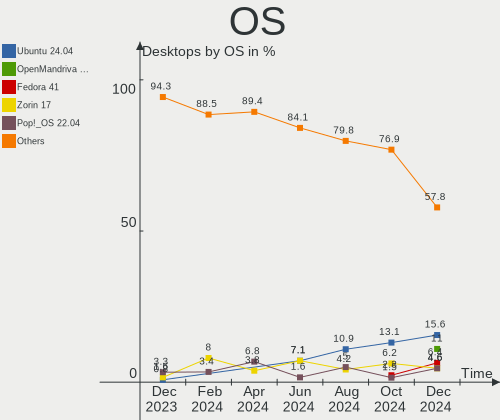
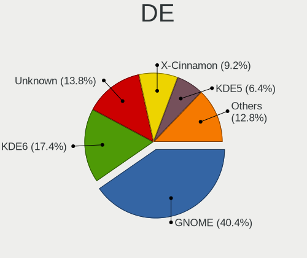
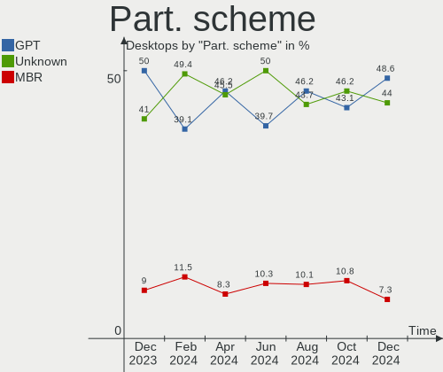
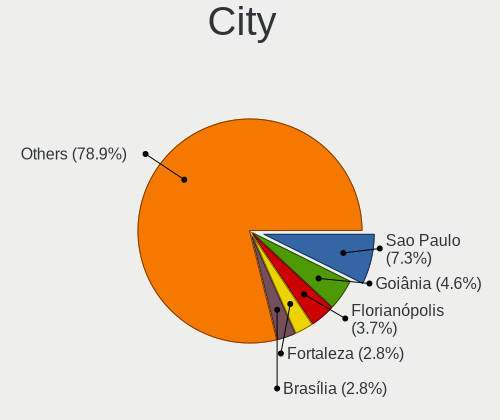
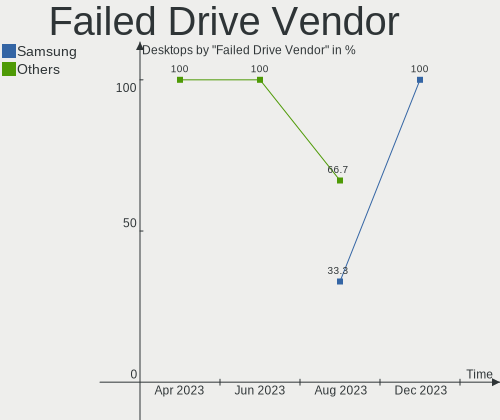

Linux in Brazil - Hardware Trends (Desktops)
--------------------------------------------

A project to identify most popular hardware characteristics and track their change
over time based on data collected by Linux users at https://Linux-Hardware.org.

Anyone can contribute to this report by the [hw-probe](https://github.com/linuxhw/hw-probe) tool:

    sudo -E hw-probe -all -upload

Period: Apr, 2023.

Contents
--------

* [ System ](#system)
  - [ OS                       ](#os)
  - [ OS Family                ](#os-family)
  - [ Kernel                   ](#kernel)
  - [ Kernel Family            ](#kernel-family)
  - [ Kernel Major Ver.        ](#kernel-major-ver)
  - [ Arch                     ](#arch)
  - [ DE                       ](#de)
  - [ Display Server           ](#display-server)
  - [ Display Manager          ](#display-manager)
  - [ OS Lang                  ](#os-lang)
  - [ Boot Mode                ](#boot-mode)
  - [ Filesystem               ](#filesystem)
  - [ Part. scheme             ](#part-scheme)
  - [ Dual Boot with Linux/BSD ](#dual-boot-with-linuxbsd)
  - [ Dual Boot (Win)          ](#dual-boot-win)

* [ Board ](#board)
  - [ Vendor                   ](#vendor)
  - [ Model                    ](#model)
  - [ Model Family             ](#model-family)
  - [ MFG Year                 ](#mfg-year)
  - [ Form Factor              ](#form-factor)
  - [ Secure Boot              ](#secure-boot)
  - [ Coreboot                 ](#coreboot)
  - [ RAM Size                 ](#ram-size)
  - [ RAM Used                 ](#ram-used)
  - [ Total Drives             ](#total-drives)
  - [ Has CD-ROM               ](#has-cd-rom)
  - [ Has Ethernet             ](#has-ethernet)
  - [ Has WiFi                 ](#has-wifi)
  - [ Has Bluetooth            ](#has-bluetooth)

* [ Location ](#location)
  - [ Country                  ](#country)
  - [ City                     ](#city)

* [ Drives ](#drives)
  - [ Drive Vendor             ](#drive-vendor)
  - [ Drive Model              ](#drive-model)
  - [ HDD Vendor               ](#hdd-vendor)
  - [ SSD Vendor               ](#ssd-vendor)
  - [ Drive Kind               ](#drive-kind)
  - [ Drive Connector          ](#drive-connector)
  - [ Drive Size               ](#drive-size)
  - [ Space Total              ](#space-total)
  - [ Space Used               ](#space-used)
  - [ Malfunc. Drives          ](#malfunc-drives)
  - [ Malfunc. Drive Vendor    ](#malfunc-drive-vendor)
  - [ Malfunc. HDD Vendor      ](#malfunc-hdd-vendor)
  - [ Malfunc. Drive Kind      ](#malfunc-drive-kind)
  - [ Failed Drives            ](#failed-drives)
  - [ Failed Drive Vendor      ](#failed-drive-vendor)
  - [ Drive Status             ](#drive-status)

* [ Storage controller ](#storage-controller)
  - [ Storage Vendor           ](#storage-vendor)
  - [ Storage Model            ](#storage-model)
  - [ Storage Kind             ](#storage-kind)

* [ Processor ](#processor)
  - [ CPU Vendor               ](#cpu-vendor)
  - [ CPU Model                ](#cpu-model)
  - [ CPU Model Family         ](#cpu-model-family)
  - [ CPU Cores                ](#cpu-cores)
  - [ CPU Sockets              ](#cpu-sockets)
  - [ CPU Threads              ](#cpu-threads)
  - [ CPU Op-Modes             ](#cpu-op-modes)
  - [ CPU Microcode            ](#cpu-microcode)
  - [ CPU Microarch            ](#cpu-microarch)

* [ Graphics ](#graphics)
  - [ GPU Vendor               ](#gpu-vendor)
  - [ GPU Model                ](#gpu-model)
  - [ GPU Combo                ](#gpu-combo)
  - [ GPU Driver               ](#gpu-driver)
  - [ GPU Memory               ](#gpu-memory)

* [ Monitor ](#monitor)
  - [ Monitor Vendor           ](#monitor-vendor)
  - [ Monitor Model            ](#monitor-model)
  - [ Monitor Resolution       ](#monitor-resolution)
  - [ Monitor Diagonal         ](#monitor-diagonal)
  - [ Monitor Width            ](#monitor-width)
  - [ Aspect Ratio             ](#aspect-ratio)
  - [ Monitor Area             ](#monitor-area)
  - [ Pixel Density            ](#pixel-density)
  - [ Multiple Monitors        ](#multiple-monitors)

* [ Network ](#network)
  - [ Net Controller Vendor    ](#net-controller-vendor)
  - [ Net Controller Model     ](#net-controller-model)
  - [ Wireless Vendor          ](#wireless-vendor)
  - [ Wireless Model           ](#wireless-model)
  - [ Ethernet Vendor          ](#ethernet-vendor)
  - [ Ethernet Model           ](#ethernet-model)
  - [ Net Controller Kind      ](#net-controller-kind)
  - [ Used Controller          ](#used-controller)
  - [ NICs                     ](#nics)
  - [ IPv6                     ](#ipv6)

* [ Bluetooth ](#bluetooth)
  - [ Bluetooth Vendor         ](#bluetooth-vendor)
  - [ Bluetooth Model          ](#bluetooth-model)

* [ Sound ](#sound)
  - [ Sound Vendor             ](#sound-vendor)
  - [ Sound Model              ](#sound-model)

* [ Memory ](#memory)
  - [ Memory Vendor            ](#memory-vendor)
  - [ Memory Model             ](#memory-model)
  - [ Memory Kind              ](#memory-kind)
  - [ Memory Form Factor       ](#memory-form-factor)
  - [ Memory Size              ](#memory-size)
  - [ Memory Speed             ](#memory-speed)

* [ Printers & scanners ](#printers--scanners)
  - [ Printer Vendor           ](#printer-vendor)
  - [ Printer Model            ](#printer-model)
  - [ Scanner Vendor           ](#scanner-vendor)
  - [ Scanner Model            ](#scanner-model)

* [ Camera ](#camera)
  - [ Camera Vendor            ](#camera-vendor)
  - [ Camera Model             ](#camera-model)

* [ Security ](#security)
  - [ Fingerprint Vendor       ](#fingerprint-vendor)
  - [ Fingerprint Model        ](#fingerprint-model)
  - [ Chipcard Vendor          ](#chipcard-vendor)
  - [ Chipcard Model           ](#chipcard-model)

* [ Unsupported ](#unsupported)
  - [ Unsupported Devices      ](#unsupported-devices)
  - [ Unsupported Device Types ](#unsupported-device-types)

System
------

OS
--

Installed operating systems

| Name                         | Desktops | Percent |
|------------------------------|----------|---------|
| OpenMandriva 23.03           | 22       | 18.49%  |
| Ubuntu 22.04                 | 18       | 15.13%  |
| Linux Mint 21.1              | 9        | 7.56%   |
| Zorin 16                     | 7        | 5.88%   |
| Manjaro                      | 6        | 5.04%   |
| Fedora 37                    | 5        | 4.2%    |
| Pop!_OS 22.04                | 4        | 3.36%   |
| OpenMandriva 4.3             | 4        | 3.36%   |
| Fedora 38                    | 3        | 2.52%   |
| Debian 11                    | 3        | 2.52%   |
| Arch Rolling                 | 3        | 2.52%   |
| Ubuntu 22.10                 | 2        | 1.68%   |
| Ubuntu 20.04                 | 2        | 1.68%   |
| ROSA 12.4                    | 2        | 1.68%   |
| openSUSE Tumbleweed-XXXXXXXX | 2        | 1.68%   |
| Linux Mint 21                | 2        | 1.68%   |
| Linux Mint 20.3              | 2        | 1.68%   |
| Kubuntu 22.04                | 2        | 1.68%   |
| Elementary 7                 | 2        | 1.68%   |
| Debian 12                    | 2        | 1.68%   |
| Zorin 15                     | 1        | 0.84%   |
| Ubuntu Budgie 22.04          | 1        | 0.84%   |
| Ubuntu 23.04                 | 1        | 0.84%   |
| Ubuntu 21.04                 | 1        | 0.84%   |
| org.kde.Platform 5.15-21.08  | 1        | 0.84%   |
| OpenMandriva 4.50            | 1        | 0.84%   |
| OpenMandriva 4.2             | 1        | 0.84%   |
| NixOS 23.05                  | 1        | 0.84%   |
| Linux Mint 20.1              | 1        | 0.84%   |
| Linux Mint 19.3              | 1        | 0.84%   |
| Linux Mint 19                | 1        | 0.84%   |
| Kubuntu 23.04                | 1        | 0.84%   |
| Garuda Linux Soaring         | 1        | 0.84%   |
| EndeavourOS Rolling          | 1        | 0.84%   |
| Elementary 6.1               | 1        | 0.84%   |
| Clear Linux 37980            | 1        | 0.84%   |
| Artix                        | 1        | 0.84%   |

OS Family
---------

OS without a version

| Name             | Desktops | Percent |
|------------------|----------|---------|
| OpenMandriva     | 28       | 23.53%  |
| Ubuntu           | 24       | 20.17%  |
| Linux Mint       | 16       | 13.45%  |
| Zorin            | 8        | 6.72%   |
| Fedora           | 8        | 6.72%   |
| Manjaro          | 6        | 5.04%   |
| Debian           | 5        | 4.2%    |
| Pop!_OS          | 4        | 3.36%   |
| Kubuntu          | 3        | 2.52%   |
| Elementary       | 3        | 2.52%   |
| Arch             | 3        | 2.52%   |
| ROSA             | 2        | 1.68%   |
| openSUSE         | 2        | 1.68%   |
| Ubuntu Budgie    | 1        | 0.84%   |
| org.kde.Platform | 1        | 0.84%   |
| NixOS            | 1        | 0.84%   |
| Garuda Linux     | 1        | 0.84%   |
| EndeavourOS      | 1        | 0.84%   |
| Clear Linux      | 1        | 0.84%   |
| Artix            | 1        | 0.84%   |

Kernel
------

Version of the Linux kernel

| Version                           | Desktops | Percent |
|-----------------------------------|----------|---------|
| 6.2.6-desktop-1omv2390            | 22       | 18.49%  |
| 5.15.0-69-generic                 | 12       | 10.08%  |
| 5.19.0-40-generic                 | 9        | 7.56%   |
| 5.19.0-38-generic                 | 6        | 5.04%   |
| 5.19.0-41-generic                 | 5        | 4.2%    |
| 6.2.6-76060206-generic            | 4        | 3.36%   |
| 5.10.0-21-amd64                   | 3        | 2.52%   |
| 6.2.9-200.fc37.x86_64             | 2        | 1.68%   |
| 6.2.12-zen1-1-zen                 | 2        | 1.68%   |
| 6.2.10-200.fc37.x86_64            | 2        | 1.68%   |
| 6.1.22-1-MANJARO                  | 2        | 1.68%   |
| 6.1.0-7-amd64                     | 2        | 1.68%   |
| 5.16.7-desktop-1omv4003           | 2        | 1.68%   |
| 5.16.13-desktop-1omv4003          | 2        | 1.68%   |
| 5.15.108-1-MANJARO                | 2        | 1.68%   |
| 5.15.0-70-generic                 | 2        | 1.68%   |
| 5.15.0-67-generic                 | 2        | 1.68%   |
| 5.15.0-56-generic                 | 2        | 1.68%   |
| 4.15.0-209-generic                | 2        | 1.68%   |
| 6.2.9-zen1-1-zen                  | 1        | 0.84%   |
| 6.2.9-300.fc38.x86_64             | 1        | 0.84%   |
| 6.2.8-1-default                   | 1        | 0.84%   |
| 6.2.12-arch1-1                    | 1        | 0.84%   |
| 6.2.12-300.fc38.x86_64            | 1        | 0.84%   |
| 6.2.12-1-MANJARO                  | 1        | 0.84%   |
| 6.2.11-lqx3                       | 1        | 0.84%   |
| 6.2.11-arch1-1                    | 1        | 0.84%   |
| 6.2.11-300.fc38.x86_64            | 1        | 0.84%   |
| 6.2.10-1-default                  | 1        | 0.84%   |
| 6.2.0-20-generic                  | 1        | 0.84%   |
| 6.2.0-1003-lowlatency             | 1        | 0.84%   |
| 6.1.8-060108-generic              | 1        | 0.84%   |
| 6.1.20-generic-2rosa2021.1-x86_64 | 1        | 0.84%   |
| 6.1.2-1232.native                 | 1        | 0.84%   |
| 6.1.0-1009-oem                    | 1        | 0.84%   |
| 6.0.7-301.fc37.x86_64             | 1        | 0.84%   |
| 5.4.0-147-generic                 | 1        | 0.84%   |
| 5.4.0-146-generic                 | 1        | 0.84%   |
| 5.4.0-144-generic                 | 1        | 0.84%   |
| 5.4.0-136-generic                 | 1        | 0.84%   |

Kernel Family
-------------

Linux kernel without a distro release

| Version  | Desktops | Percent |
|----------|----------|---------|
| 6.2.6    | 26       | 21.85%  |
| 5.19.0   | 21       | 17.65%  |
| 5.15.0   | 21       | 17.65%  |
| 6.2.12   | 5        | 4.2%    |
| 5.4.0    | 5        | 4.2%    |
| 6.2.9    | 4        | 3.36%   |
| 6.2.11   | 3        | 2.52%   |
| 6.2.10   | 3        | 2.52%   |
| 6.1.0    | 3        | 2.52%   |
| 5.10.0   | 3        | 2.52%   |
| 6.2.0    | 2        | 1.68%   |
| 6.1.22   | 2        | 1.68%   |
| 5.16.7   | 2        | 1.68%   |
| 5.16.13  | 2        | 1.68%   |
| 5.15.108 | 2        | 1.68%   |
| 4.15.0   | 2        | 1.68%   |
| 6.2.8    | 1        | 0.84%   |
| 6.1.8    | 1        | 0.84%   |
| 6.1.20   | 1        | 0.84%   |
| 6.1.2    | 1        | 0.84%   |
| 6.0.7    | 1        | 0.84%   |
| 5.19.5   | 1        | 0.84%   |
| 5.15.77  | 1        | 0.84%   |
| 5.15.106 | 1        | 0.84%   |
| 5.11.16  | 1        | 0.84%   |
| 5.11.0   | 1        | 0.84%   |
| 5.10.155 | 1        | 0.84%   |
| 5.10.14  | 1        | 0.84%   |
| 5.0.0    | 1        | 0.84%   |

Kernel Major Ver.
-----------------

Linux kernel major version

| Version | Desktops | Percent |
|---------|----------|---------|
| 6.2     | 44       | 36.97%  |
| 5.15    | 25       | 21.01%  |
| 5.19    | 22       | 18.49%  |
| 6.1     | 8        | 6.72%   |
| 5.4     | 5        | 4.2%    |
| 5.10    | 5        | 4.2%    |
| 5.16    | 4        | 3.36%   |
| 5.11    | 2        | 1.68%   |
| 4.15    | 2        | 1.68%   |
| 6.0     | 1        | 0.84%   |
| 5.0     | 1        | 0.84%   |

Arch
----

OS architecture (x86_64, i586, etc.)

| Name   | Desktops | Percent |
|--------|----------|---------|
| x86_64 | 119      | 100%    |

DE
--

Desktop Environment

| Name          | Desktops | Percent |
|---------------|----------|---------|
| GNOME         | 48       | 40.34%  |
| KDE5          | 44       | 36.97%  |
| X-Cinnamon    | 11       | 9.24%   |
| XFCE          | 6        | 5.04%   |
| Pantheon      | 3        | 2.52%   |
| sway          | 1        | 0.84%   |
| MATE          | 1        | 0.84%   |
| LXQt          | 1        | 0.84%   |
| Enlightenment | 1        | 0.84%   |
| Deepin        | 1        | 0.84%   |
| Budgie        | 1        | 0.84%   |
| Unknown       | 1        | 0.84%   |

Display Server
--------------

X11 or Wayland

| Name    | Desktops | Percent |
|---------|----------|---------|
| X11     | 92       | 77.31%  |
| Wayland | 26       | 21.85%  |
| Unknown | 1        | 0.84%   |

Display Manager
---------------

SDDM, LightDM, etc.

| Name    | Desktops | Percent |
|---------|----------|---------|
| Unknown | 49       | 41.18%  |
| SDDM    | 37       | 31.09%  |
| GDM3    | 23       | 19.33%  |
| LightDM | 6        | 5.04%   |
| GDM     | 4        | 3.36%   |

OS Lang
-------

Language

| Lang       | Desktops | Percent |
|------------|----------|---------|
| pt_BR      | 88       | 73.95%  |
| en_US      | 26       | 21.85%  |
| pt_PT      | 1        | 0.84%   |
| en_IE.UTF8 | 1        | 0.84%   |
| en_CA      | 1        | 0.84%   |
| C          | 1        | 0.84%   |
| Unknown    | 1        | 0.84%   |

Boot Mode
---------

EFI or BIOS

| Mode | Desktops | Percent |
|------|----------|---------|
| BIOS | 71       | 59.66%  |
| EFI  | 48       | 40.34%  |

Filesystem
----------

Type of filesystem

| Type    | Desktops | Percent |
|---------|----------|---------|
| Ext4    | 74       | 62.18%  |
| Btrfs   | 19       | 15.97%  |
| Overlay | 17       | 14.29%  |
| Tmpfs   | 8        | 6.72%   |
| Zfs     | 1        | 0.84%   |

Part. scheme
------------

Scheme of partitioning

| Type    | Desktops | Percent |
|---------|----------|---------|
| GPT     | 53       | 44.54%  |
| Unknown | 46       | 38.66%  |
| MBR     | 20       | 16.81%  |

Dual Boot with Linux/BSD
------------------------

Hosting more than one Linux/BSD

| Dual boot | Desktops | Percent |
|-----------|----------|---------|
| No        | 92       | 77.31%  |
| Yes       | 27       | 22.69%  |

Dual Boot (Win)
---------------

Hosting Linux and Windows

| Dual boot | Desktops | Percent |
|-----------|----------|---------|
| No        | 76       | 63.87%  |
| Yes       | 43       | 36.13%  |

Board
-----

Vendor
------

Motherboard manufacturer

| Name                | Desktops | Percent |
|---------------------|----------|---------|
| ASUSTek Computer    | 27       | 22.69%  |
| Gigabyte Technology | 16       | 13.45%  |
| Intel               | 15       | 12.61%  |
| ASRock              | 10       | 8.4%    |
| Dell                | 6        | 5.04%   |
| Biostar             | 6        | 5.04%   |
| MSI                 | 5        | 4.2%    |
| Lenovo              | 5        | 4.2%    |
| Hewlett-Packard     | 5        | 4.2%    |
| OEM                 | 4        | 3.36%   |
| Pegatron            | 2        | 1.68%   |
| PCWare              | 2        | 1.68%   |
| AMD                 | 2        | 1.68%   |
| Unknown             | 2        | 1.68%   |
| Win element         | 1        | 0.84%   |
| ULTRATOP            | 1        | 0.84%   |
| QIYIDA              | 1        | 0.84%   |
| Positivo            | 1        | 0.84%   |
| MACHINIST           | 1        | 0.84%   |
| Itautec             | 1        | 0.84%   |
| Huanan              | 1        | 0.84%   |
| HOUTER              | 1        | 0.84%   |
| ECS                 | 1        | 0.84%   |
| DIEBOLD             | 1        | 0.84%   |
| Daten Tecnologia    | 1        | 0.84%   |
| ABIT                | 1        | 0.84%   |

Model
-----

Motherboard model

| Name                               | Desktops | Percent |
|------------------------------------|----------|---------|
| ASUS All Series                    | 5        | 4.2%    |
| Intel B75                          | 4        | 3.36%   |
| Intel H81                          | 2        | 1.68%   |
| Intel H61                          | 2        | 1.68%   |
| ASUS PRIME B450M-GAMING/BR         | 2        | 1.68%   |
| Unknown                            | 2        | 1.68%   |
| Win element M600                   | 1        | 0.84%   |
| ULTRATOP C2017-LIVA-ZE             | 1        | 0.84%   |
| QIYIDA X99-H9 V2.0                 | 1        | 0.84%   |
| Positivo POS-EIQ87CY               | 1        | 0.84%   |
| Pegatron IPMH61P1                  | 1        | 0.84%   |
| Pegatron IPM41-D3                  | 1        | 0.84%   |
| PCWare IPX1800G2                   | 1        | 0.84%   |
| PCWare IPMH61R3                    | 1        | 0.84%   |
| OEM X99-Turbo                      | 1        | 0.84%   |
| OEM Intel H81                      | 1        | 0.84%   |
| OEM HN B85                         | 1        | 0.84%   |
| OEM H110                           | 1        | 0.84%   |
| MSI MS-7C94                        | 1        | 0.84%   |
| MSI MS-7B84                        | 1        | 0.84%   |
| MSI MS-7B10                        | 1        | 0.84%   |
| MSI MS-7693                        | 1        | 0.84%   |
| MSI MS-7529                        | 1        | 0.84%   |
| MACHINIST E5-MR9A PRO V1.1         | 1        | 0.84%   |
| Lenovo V520S-08IKL 10NN0033BR      | 1        | 0.84%   |
| Lenovo ThinkCentre M93p 10A9000WBP | 1        | 0.84%   |
| Lenovo ThinkCentre M900 10FLS1W21J | 1        | 0.84%   |
| Lenovo ThinkCentre M58p 6234CZ6    | 1        | 0.84%   |
| Lenovo ThinkCentre Edge72 3497G2P  | 1        | 0.84%   |
| Itautec Infoway ST-4265            | 1        | 0.84%   |
| Intel X99                          | 1        | 0.84%   |
| Intel X79M-S                       | 1        | 0.84%   |
| Intel H61S                         | 1        | 0.84%   |
| Intel H61 V124                     | 1        | 0.84%   |
| Intel H61 V1.1                     | 1        | 0.84%   |
| Intel DZ87KLT75K AAG74721-304      | 1        | 0.84%   |
| Intel D946GZIS AAD66165-301        | 1        | 0.84%   |
| Huanan X99-8M-F V1.1               | 1        | 0.84%   |
| HOUTER IPMIP-GS                    | 1        | 0.84%   |
| HP Z820 Workstation                | 1        | 0.84%   |

Model Family
------------

Motherboard model prefix

| Name                   | Desktops | Percent |
|------------------------|----------|---------|
| ASUS TUF               | 6        | 5.04%   |
| ASUS PRIME             | 6        | 5.04%   |
| ASUS All               | 5        | 4.2%    |
| Lenovo ThinkCentre     | 4        | 3.36%   |
| Intel H61              | 4        | 3.36%   |
| Intel B75              | 4        | 3.36%   |
| Intel H81              | 2        | 1.68%   |
| Dell Vostro            | 2        | 1.68%   |
| Dell OptiPlex          | 2        | 1.68%   |
| Dell Inspiron          | 2        | 1.68%   |
| ASUS P8H61-M           | 2        | 1.68%   |
| ASUS M5A78L-M          | 2        | 1.68%   |
| ASRock B550M           | 2        | 1.68%   |
| Unknown                | 2        | 1.68%   |
| Win element M600       | 1        | 0.84%   |
| ULTRATOP C2017-LIVA-ZE | 1        | 0.84%   |
| QIYIDA X99-H9          | 1        | 0.84%   |
| Positivo POS-EIQ87CY   | 1        | 0.84%   |
| Pegatron IPMH61P1      | 1        | 0.84%   |
| Pegatron IPM41-D3      | 1        | 0.84%   |
| PCWare IPX1800G2       | 1        | 0.84%   |
| PCWare IPMH61R3        | 1        | 0.84%   |
| OEM X99-Turbo          | 1        | 0.84%   |
| OEM Intel              | 1        | 0.84%   |
| OEM HN                 | 1        | 0.84%   |
| OEM H110               | 1        | 0.84%   |
| MSI MS-7C94            | 1        | 0.84%   |
| MSI MS-7B84            | 1        | 0.84%   |
| MSI MS-7B10            | 1        | 0.84%   |
| MSI MS-7693            | 1        | 0.84%   |
| MSI MS-7529            | 1        | 0.84%   |
| MACHINIST E5-MR9A      | 1        | 0.84%   |
| Lenovo V520S-08IKL     | 1        | 0.84%   |
| Itautec Infoway        | 1        | 0.84%   |
| Intel X99              | 1        | 0.84%   |
| Intel X79M-S           | 1        | 0.84%   |
| Intel H61S             | 1        | 0.84%   |
| Intel DZ87KLT75K       | 1        | 0.84%   |
| Intel D946GZIS         | 1        | 0.84%   |
| Huanan X99-8M-F        | 1        | 0.84%   |

MFG Year
--------

Motherboard manufacture year

| Year | Desktops | Percent |
|------|----------|---------|
| 2020 | 16       | 13.45%  |
| 2018 | 15       | 12.61%  |
| 2019 | 10       | 8.4%    |
| 2021 | 9        | 7.56%   |
| 2014 | 9        | 7.56%   |
| 2012 | 9        | 7.56%   |
| 2022 | 8        | 6.72%   |
| 2017 | 8        | 6.72%   |
| 2013 | 7        | 5.88%   |
| 2011 | 7        | 5.88%   |
| 2010 | 6        | 5.04%   |
| 2016 | 4        | 3.36%   |
| 2008 | 3        | 2.52%   |
| 2015 | 2        | 1.68%   |
| 2009 | 2        | 1.68%   |
| 2007 | 2        | 1.68%   |
| 2006 | 2        | 1.68%   |

Form Factor
-----------

Physical design of the computer

| Name    | Desktops | Percent |
|---------|----------|---------|
| Desktop | 119      | 100%    |

Secure Boot
-----------

Enabled or disabled

| State    | Desktops | Percent |
|----------|----------|---------|
| Disabled | 116      | 97.48%  |
| Enabled  | 3        | 2.52%   |

Coreboot
--------

Have coreboot on board

| Used | Desktops | Percent |
|------|----------|---------|
| No   | 119      | 100%    |

RAM Size
--------

Total RAM memory

| Size in GB  | Desktops | Percent |
|-------------|----------|---------|
| 16.01-24.0  | 34       | 28.57%  |
| 8.01-16.0   | 23       | 19.33%  |
| 4.01-8.0    | 22       | 18.49%  |
| 3.01-4.0    | 15       | 12.61%  |
| 32.01-64.0  | 10       | 8.4%    |
| 24.01-32.0  | 5        | 4.2%    |
| 64.01-256.0 | 5        | 4.2%    |
| 2.01-3.0    | 3        | 2.52%   |
| 1.01-2.0    | 2        | 1.68%   |

RAM Used
--------

Used RAM memory

| Used GB   | Desktops | Percent |
|-----------|----------|---------|
| 2.01-3.0  | 35       | 29.41%  |
| 1.01-2.0  | 34       | 28.57%  |
| 3.01-4.0  | 22       | 18.49%  |
| 4.01-8.0  | 15       | 12.61%  |
| 0.51-1.0  | 7        | 5.88%   |
| 8.01-16.0 | 4        | 3.36%   |
| 0.01-0.5  | 2        | 1.68%   |

Total Drives
------------

Number of drives on board

| Drives | Desktops | Percent |
|--------|----------|---------|
| 1      | 41       | 34.45%  |
| 2      | 35       | 29.41%  |
| 3      | 23       | 19.33%  |
| 4      | 12       | 10.08%  |
| 6      | 5        | 4.2%    |
| 5      | 2        | 1.68%   |
| 7      | 1        | 0.84%   |

Has CD-ROM
----------

Has CD-ROM on board

| Presented | Desktops | Percent |
|-----------|----------|---------|
| No        | 79       | 66.39%  |
| Yes       | 40       | 33.61%  |

Has Ethernet
------------

Has Ethernet on board

| Presented | Desktops | Percent |
|-----------|----------|---------|
| Yes       | 117      | 98.32%  |
| No        | 2        | 1.68%   |

Has WiFi
--------

Has WiFi module

| Presented | Desktops | Percent |
|-----------|----------|---------|
| No        | 75       | 63.03%  |
| Yes       | 44       | 36.97%  |

Has Bluetooth
-------------

Has Bluetooth module

| Presented | Desktops | Percent |
|-----------|----------|---------|
| No        | 85       | 71.43%  |
| Yes       | 34       | 28.57%  |

Location
--------

Country
-------

Geographic location (country)

| Country | Desktops | Percent |
|---------|----------|---------|
| Brazil  | 119      | 100%    |

City
----

Geographic location (city)

| City                  | Desktops | Percent |
|-----------------------|----------|---------|
| Sao Paulo             | 10       | 8.4%    |
| Rio de Janeiro        | 5        | 4.2%    |
| Brasília             | 5        | 4.2%    |
| Belo Horizonte        | 5        | 4.2%    |
| Porto Alegre          | 4        | 3.36%   |
| Recife                | 3        | 2.52%   |
| Joao Pessoa           | 3        | 2.52%   |
| Florianópolis        | 3        | 2.52%   |
| Campinas              | 3        | 2.52%   |
| Uberlândia           | 2        | 1.68%   |
| Sao Bernardo do Campo | 2        | 1.68%   |
| Salvador              | 2        | 1.68%   |
| Praia Grande          | 2        | 1.68%   |
| Palmas                | 2        | 1.68%   |
| Niterói              | 2        | 1.68%   |
| Londrina              | 2        | 1.68%   |
| Juazeiro do Norte     | 2        | 1.68%   |
| Guarulhos             | 2        | 1.68%   |
| Farroupilha           | 2        | 1.68%   |
| Cravinhos             | 2        | 1.68%   |
| Campos dos Goytacazes | 2        | 1.68%   |
| Campina Grande        | 2        | 1.68%   |
| Araçatuba            | 2        | 1.68%   |
| Aracaju               | 2        | 1.68%   |
| Vila Velha            | 1        | 0.84%   |
| Vassouras             | 1        | 0.84%   |
| Valparaiso de Goias   | 1        | 0.84%   |
| Teresina              | 1        | 0.84%   |
| Sorocaba              | 1        | 0.84%   |
| Sao Vicente           | 1        | 0.84%   |
| Sao Jose do Rio Preto | 1        | 0.84%   |
| Sao Caetano do Sul    | 1        | 0.84%   |
| Santo André          | 1        | 0.84%   |
| Rondonópolis         | 1        | 0.84%   |
| Pouso Alegre          | 1        | 0.84%   |
| Paulista              | 1        | 0.84%   |
| Ourinhos              | 1        | 0.84%   |
| Monte Alto            | 1        | 0.84%   |
| Maua                  | 1        | 0.84%   |
| Mandaguari            | 1        | 0.84%   |

Drives
------

Drive Vendor
------------

Hard drive vendors

| Vendor                      | Desktops | Drives | Percent |
|-----------------------------|----------|--------|---------|
| Seagate                     | 50       | 65     | 22.03%  |
| WDC                         | 35       | 42     | 15.42%  |
| Kingston                    | 28       | 37     | 12.33%  |
| Samsung Electronics         | 18       | 24     | 7.93%   |
| China                       | 12       | 13     | 5.29%   |
| Toshiba                     | 8        | 9      | 3.52%   |
| Realtek Semiconductor       | 6        | 6      | 2.64%   |
| Crucial                     | 6        | 7      | 2.64%   |
| SanDisk                     | 5        | 5      | 2.2%    |
| A-DATA Technology           | 5        | 5      | 2.2%    |
| JMicron Technology          | 4        | 4      | 1.76%   |
| ADATA Technology            | 4        | 4      | 1.76%   |
| XrayDisk                    | 3        | 3      | 1.32%   |
| Patriot                     | 3        | 3      | 1.32%   |
| Kingston Technology Company | 3        | 4      | 1.32%   |
| KingSpec                    | 3        | 3      | 1.32%   |
| XPG                         | 2        | 2      | 0.88%   |
| Unknown                     | 2        | 4      | 0.88%   |
| SK hynix                    | 2        | 2      | 0.88%   |
| Silicon Motion              | 2        | 2      | 0.88%   |
| PNY                         | 2        | 2      | 0.88%   |
| Phison Electronics          | 2        | 2      | 0.88%   |
| Micron/Crucial Technology   | 2        | 2      | 0.88%   |
| HUSKY                       | 2        | 2      | 0.88%   |
| Netac                       | 1        | 1      | 0.44%   |
| Micron Technology           | 1        | 1      | 0.44%   |
| LITEON                      | 1        | 1      | 0.44%   |
| Lexar                       | 1        | 1      | 0.44%   |
| KingDian                    | 1        | 1      | 0.44%   |
| Intel                       | 1        | 1      | 0.44%   |
| HS-SSD-E100                 | 1        | 1      | 0.44%   |
| HS-SSD-C100                 | 1        | 1      | 0.44%   |
| HPE                         | 1        | 1      | 0.44%   |
| Hitachi                     | 1        | 1      | 0.44%   |
| Hewlett-Packard             | 1        | 1      | 0.44%   |
| Gigabyte Technology         | 1        | 1      | 0.44%   |
| Fanxiang                    | 1        | 1      | 0.44%   |
| AZAMOV                      | 1        | 1      | 0.44%   |
| ASMT                        | 1        | 1      | 0.44%   |
| AFOX                        | 1        | 1      | 0.44%   |

Drive Model
-----------

Hard drive models

| Model                                                             | Desktops | Percent |
|-------------------------------------------------------------------|----------|---------|
| Kingston SA400S37240G 240GB SSD                                   | 10       | 3.88%   |
| Seagate ST1000DM010-2EP102 1TB                                    | 9        | 3.49%   |
| Kingston SA400S37480G 480GB SSD                                   | 8        | 3.1%    |
| Seagate ST500DM002-1BD142 500GB                                   | 7        | 2.71%   |
| Kingston SA400S37120G 120GB SSD                                   | 6        | 2.33%   |
| Seagate ST1000DM003-1ER162 1TB                                    | 4        | 1.55%   |
| JMicron Generic 1TB                                               | 4        | 1.55%   |
| WDC WD5000AAKX-00U6AA0 500GB                                      | 3        | 1.16%   |
| WDC WD3200AAJS-00L7A0 320GB                                       | 3        | 1.16%   |
| WDC WD10EZEX-08WN4A0 1TB                                          | 3        | 1.16%   |
| WDC WD10EZEX-00BN5A0 1TB                                          | 3        | 1.16%   |
| Seagate ST500LM012 HN-M500MBB 500GB                               | 3        | 1.16%   |
| Seagate ST2000DM008-2FR102 2TB                                    | 3        | 1.16%   |
| Samsung HD502HI 500GB                                             | 3        | 1.16%   |
| Samsung HD322HJ 320GB                                             | 3        | 1.16%   |
| Realtek RTS5763DL NVMe SSD Controller 512GB                       | 3        | 1.16%   |
| China SSD 480GB                                                   | 3        | 1.16%   |
| ADATA XPG SX8200 Pro PCIe Gen3x4 M.2 2280 Solid State Drive 512GB | 3        | 1.16%   |
| WDC WDS480G2G0C-00AJM0 480GB                                      | 2        | 0.78%   |
| WDC WDS240G2G0A-00JH30 240GB SSD                                  | 2        | 0.78%   |
| WDC WDS120G2G0B-00EPW0 120GB SSD                                  | 2        | 0.78%   |
| Toshiba DT01ACA100 1TB                                            | 2        | 0.78%   |
| Silicon Motion SM2263EN/SM2263XT SSD Controller 1024GB            | 2        | 0.78%   |
| Seagate ST4000DM004-2U9104 4TB                                    | 2        | 0.78%   |
| Seagate ST4000DM004-2CV104 4TB                                    | 2        | 0.78%   |
| Seagate ST3500413AS 500GB                                         | 2        | 0.78%   |
| Seagate ST3160215A 160GB                                          | 2        | 0.78%   |
| Seagate ST1000LM035-1RK172 970GB                                  | 2        | 0.78%   |
| Seagate ST1000LM024 HN-M101MBB 1TB                                | 2        | 0.78%   |
| Seagate ST1000DM003-1CH162 1TB                                    | 2        | 0.78%   |
| SanDisk SSD PLUS 240GB                                            | 2        | 0.78%   |
| Samsung NVMe SSD Controller SM981/PM981/PM983 1TB                 | 2        | 0.78%   |
| Samsung HD502IJ 500GB                                             | 2        | 0.78%   |
| Samsung HD103SI 1TB                                               | 2        | 0.78%   |
| Realtek NVMe SSD Drive 512GB                                      | 2        | 0.78%   |
| Micron/Crucial P2 NVMe PCIe SSD 1TB                               | 2        | 0.78%   |
| Kingston Company SNV2S2000G 2TB                                   | 2        | 0.78%   |
| Kingston SV300S37A120G 120GB SSD                                  | 2        | 0.78%   |
| Kingston SNV2S500G 500GB                                          | 2        | 0.78%   |
| Crucial CT480BX500SSD1 480GB                                      | 2        | 0.78%   |

HDD Vendor
----------

Hard disk drive vendors

| Vendor              | Desktops | Drives | Percent |
|---------------------|----------|--------|---------|
| Seagate             | 50       | 64     | 46.73%  |
| WDC                 | 29       | 34     | 27.1%   |
| Samsung Electronics | 14       | 16     | 13.08%  |
| Toshiba             | 7        | 8      | 6.54%   |
| JMicron Technology  | 4        | 4      | 3.74%   |
| HPE                 | 1        | 1      | 0.93%   |
| Hitachi             | 1        | 1      | 0.93%   |
| Hewlett-Packard     | 1        | 1      | 0.93%   |

SSD Vendor
----------

Solid state drive vendors

| Vendor              | Desktops | Drives | Percent |
|---------------------|----------|--------|---------|
| Kingston            | 23       | 31     | 27.06%  |
| China               | 12       | 13     | 14.12%  |
| WDC                 | 6        | 6      | 7.06%   |
| Crucial             | 6        | 7      | 7.06%   |
| SanDisk             | 5        | 5      | 5.88%   |
| A-DATA Technology   | 5        | 5      | 5.88%   |
| Samsung Electronics | 3        | 6      | 3.53%   |
| Patriot             | 3        | 3      | 3.53%   |
| XrayDisk            | 2        | 2      | 2.35%   |
| PNY                 | 2        | 2      | 2.35%   |
| KingSpec            | 2        | 2      | 2.35%   |
| HUSKY               | 2        | 2      | 2.35%   |
| Toshiba             | 1        | 1      | 1.18%   |
| Seagate             | 1        | 1      | 1.18%   |
| Netac               | 1        | 1      | 1.18%   |
| Micron Technology   | 1        | 1      | 1.18%   |
| LITEON              | 1        | 1      | 1.18%   |
| Lexar               | 1        | 1      | 1.18%   |
| KingDian            | 1        | 1      | 1.18%   |
| Intel               | 1        | 1      | 1.18%   |
| Gigabyte Technology | 1        | 1      | 1.18%   |
| Fanxiang            | 1        | 1      | 1.18%   |
| ASMT                | 1        | 1      | 1.18%   |
| AFOX                | 1        | 1      | 1.18%   |
| Advantech           | 1        | 1      | 1.18%   |
| 4Life               | 1        | 1      | 1.18%   |

Drive Kind
----------

HDD or SSD

| Kind    | Desktops | Drives | Percent |
|---------|----------|--------|---------|
| HDD     | 91       | 129    | 46.91%  |
| SSD     | 68       | 98     | 35.05%  |
| NVMe    | 29       | 35     | 14.95%  |
| Unknown | 6        | 8      | 3.09%   |

Drive Connector
---------------

SATA, SAS, NVMe, etc.

| Type | Desktops | Drives | Percent |
|------|----------|--------|---------|
| SATA | 111      | 222    | 73.51%  |
| NVMe | 29       | 35     | 19.21%  |
| SAS  | 11       | 13     | 7.28%   |

Drive Size
----------

Size of hard drive

| Size in TB | Desktops | Drives | Percent |
|------------|----------|--------|---------|
| 0.01-0.5   | 89       | 147    | 57.42%  |
| 0.51-1.0   | 47       | 55     | 30.32%  |
| 1.01-2.0   | 12       | 13     | 7.74%   |
| 3.01-4.0   | 5        | 10     | 3.23%   |
| 2.01-3.0   | 2        | 2      | 1.29%   |

Space Total
-----------

Amount of disk space available on the file system

| Size in GB     | Desktops | Percent |
|----------------|----------|---------|
| 251-500        | 30       | 25.21%  |
| 101-250        | 26       | 21.85%  |
| 1001-2000      | 16       | 13.45%  |
| 1-20           | 16       | 13.45%  |
| 501-1000       | 11       | 9.24%   |
| More than 3000 | 6        | 5.04%   |
| 21-50          | 4        | 3.36%   |
| 51-100         | 4        | 3.36%   |
| 2001-3000      | 3        | 2.52%   |
| Unknown        | 3        | 2.52%   |

Space Used
----------

Amount of used disk space

| Used GB        | Desktops | Percent |
|----------------|----------|---------|
| 1-20           | 39       | 32.77%  |
| 21-50          | 20       | 16.81%  |
| 101-250        | 19       | 15.97%  |
| 51-100         | 19       | 15.97%  |
| 251-500        | 8        | 6.72%   |
| 501-1000       | 6        | 5.04%   |
| 1001-2000      | 3        | 2.52%   |
| Unknown        | 3        | 2.52%   |
| More than 3000 | 2        | 1.68%   |

Malfunc. Drives
---------------

Drive models with a malfunction

| Model                               | Desktops | Drives | Percent |
|-------------------------------------|----------|--------|---------|
| XrayDisk SSD 128GB                  | 1        | 1      | 4%      |
| XPG GAMMIX S41 512GB                | 1        | 1      | 4%      |
| WDC WDS240G2G0A-00JH30 240GB SSD    | 1        | 1      | 4%      |
| WDC WD5003ABYX-01WERA0 500GB        | 1        | 1      | 4%      |
| WDC WD3200AAKS-75L9A0 320GB         | 1        | 1      | 4%      |
| WDC WD3200AAJS-00L7A0 320GB         | 1        | 1      | 4%      |
| WDC WD10EZEX-08WN4A0 1TB            | 1        | 1      | 4%      |
| WDC WD10EURX-63FH1Y0 1TB            | 1        | 1      | 4%      |
| Toshiba MQ01ABD032 320GB            | 1        | 1      | 4%      |
| Seagate ST500LM012 HN-M500MBB 500GB | 1        | 1      | 4%      |
| Seagate ST500DM002-1BD142 500GB     | 1        | 1      | 4%      |
| Seagate ST31000524AS 1TB            | 1        | 1      | 4%      |
| Seagate ST3000DM001-1CH166 3TB      | 1        | 1      | 4%      |
| Seagate ST1000LM024 HN-M101MBB 1TB  | 1        | 1      | 4%      |
| Seagate ST1000DM003-1CH162 1TB      | 1        | 1      | 4%      |
| SanDisk SSD PLUS 240GB              | 1        | 1      | 4%      |
| Samsung Electronics HM321HI 320GB   | 1        | 1      | 4%      |
| Samsung Electronics HD502IJ 500GB   | 1        | 1      | 4%      |
| Samsung Electronics HD502HI 500GB   | 1        | 1      | 4%      |
| Samsung Electronics HD322HJ 320GB   | 1        | 1      | 4%      |
| Samsung Electronics HD161HJ 160GB   | 1        | 1      | 4%      |
| Samsung Electronics HD154UI 1TB     | 1        | 1      | 4%      |
| Samsung Electronics HD103SI 1TB     | 1        | 1      | 4%      |
| Hitachi HTS725050A7E630 500GB       | 1        | 1      | 4%      |
| Fanxiang S101 256GB                 | 1        | 1      | 4%      |

Malfunc. Drive Vendor
---------------------

Vendors of faulty drives

| Vendor              | Desktops | Drives | Percent |
|---------------------|----------|--------|---------|
| Samsung Electronics | 7        | 7      | 29.17%  |
| Seagate             | 6        | 6      | 25%     |
| WDC                 | 5        | 6      | 20.83%  |
| XrayDisk            | 1        | 1      | 4.17%   |
| XPG                 | 1        | 1      | 4.17%   |
| Toshiba             | 1        | 1      | 4.17%   |
| SanDisk             | 1        | 1      | 4.17%   |
| Hitachi             | 1        | 1      | 4.17%   |
| Fanxiang            | 1        | 1      | 4.17%   |

Malfunc. HDD Vendor
-------------------

Vendors of faulty HDD drives

| Vendor              | Desktops | Drives | Percent |
|---------------------|----------|--------|---------|
| Samsung Electronics | 7        | 7      | 35%     |
| Seagate             | 6        | 6      | 30%     |
| WDC                 | 5        | 5      | 25%     |
| Toshiba             | 1        | 1      | 5%      |
| Hitachi             | 1        | 1      | 5%      |

Malfunc. Drive Kind
-------------------

Kinds of faulty drives

| Kind | Desktops | Drives | Percent |
|------|----------|--------|---------|
| HDD  | 20       | 20     | 80%     |
| SSD  | 4        | 4      | 16%     |
| NVMe | 1        | 1      | 4%      |

Failed Drives
-------------

Failed drive models

| Model                           | Desktops | Drives | Percent |
|---------------------------------|----------|--------|---------|
| Seagate ST500DM002-1BD142 500GB | 1        | 1      | 100%    |

Failed Drive Vendor
-------------------

Failed drive vendors

| Vendor  | Desktops | Drives | Percent |
|---------|----------|--------|---------|
| Seagate | 1        | 1      | 100%    |

Drive Status
------------

Number of failed and malfunc. drives

| Status   | Desktops | Drives | Percent |
|----------|----------|--------|---------|
| Detected | 67       | 147    | 48.2%   |
| Works    | 48       | 97     | 34.53%  |
| Malfunc  | 23       | 25     | 16.55%  |
| Failed   | 1        | 1      | 0.72%   |

Storage controller
------------------

Storage Vendor
--------------

Storage controller vendors

| Vendor                      | Desktops | Percent |
|-----------------------------|----------|---------|
| Intel                       | 75       | 48.39%  |
| AMD                         | 41       | 26.45%  |
| Realtek Semiconductor       | 7        | 4.52%   |
| Kingston Technology Company | 7        | 4.52%   |
| ADATA Technology            | 4        | 2.58%   |
| Silicon Motion              | 3        | 1.94%   |
| SK hynix                    | 2        | 1.29%   |
| SanDisk                     | 2        | 1.29%   |
| Samsung Electronics         | 2        | 1.29%   |
| Phison Electronics          | 2        | 1.29%   |
| Nvidia                      | 2        | 1.29%   |
| Micron/Crucial Technology   | 2        | 1.29%   |
| ASMedia Technology          | 2        | 1.29%   |
| VIA Technologies            | 1        | 0.65%   |
| TenaFe                      | 1        | 0.65%   |
| Marvell Technology Group    | 1        | 0.65%   |
| Broadcom / LSI              | 1        | 0.65%   |

Storage Model
-------------

Storage controller models

| Model                                                                                   | Desktops | Percent |
|-----------------------------------------------------------------------------------------|----------|---------|
| Intel 8 Series/C220 Series Chipset Family 6-port SATA Controller 1 [AHCI mode]          | 17       | 8.9%    |
| AMD FCH SATA Controller [AHCI mode]                                                     | 13       | 6.81%   |
| Intel 6 Series/C200 Series Chipset Family 6 port Desktop SATA AHCI Controller           | 10       | 5.24%   |
| AMD SB7x0/SB8x0/SB9x0 IDE Controller                                                    | 9        | 4.71%   |
| AMD SB7x0/SB8x0/SB9x0 SATA Controller [AHCI mode]                                       | 8        | 4.19%   |
| AMD 500 Series Chipset SATA Controller                                                  | 8        | 4.19%   |
| Intel NM10/ICH7 Family SATA Controller [IDE mode]                                       | 7        | 3.66%   |
| AMD 400 Series Chipset SATA Controller                                                  | 6        | 3.14%   |
| Kingston Company Company Non-Volatile memory controller                                 | 5        | 2.62%   |
| Intel 7 Series/C210 Series Chipset Family 6-port SATA Controller [AHCI mode]            | 5        | 2.62%   |
| Intel 400 Series Chipset Family SATA AHCI Controller                                    | 5        | 2.62%   |
| Realtek RTS5763DL NVMe SSD Controller                                                   | 4        | 2.09%   |
| Intel SATA Controller [RAID mode]                                                       | 4        | 2.09%   |
| Intel Q170/Q150/B150/H170/H110/Z170/CM236 Chipset SATA Controller [AHCI Mode]           | 4        | 2.09%   |
| Intel 82801G (ICH7 Family) IDE Controller                                               | 4        | 2.09%   |
| Intel 6 Series/C200 Series Chipset Family Desktop SATA Controller (IDE mode, ports 4-5) | 4        | 2.09%   |
| Intel 6 Series/C200 Series Chipset Family Desktop SATA Controller (IDE mode, ports 0-3) | 4        | 2.09%   |
| AMD SB7x0/SB8x0/SB9x0 SATA Controller [IDE mode]                                        | 4        | 2.09%   |
| Realtek NVMe Controller                                                                 | 3        | 1.57%   |
| Intel Alder Lake-S PCH SATA Controller [AHCI Mode]                                      | 3        | 1.57%   |
| Intel 200 Series PCH SATA controller [AHCI mode]                                        | 3        | 1.57%   |
| AMD FCH SATA Controller D                                                               | 3        | 1.57%   |
| ADATA XPG SX8200 Pro PCIe Gen3x4 M.2 2280 Solid State Drive                             | 3        | 1.57%   |
| Silicon Motion SM2263EN/SM2263XT SSD Controller                                         | 2        | 1.05%   |
| SanDisk Non-Volatile memory controller                                                  | 2        | 1.05%   |
| Samsung NVMe SSD Controller SM981/PM981/PM983                                           | 2        | 1.05%   |
| Nvidia MCP61 SATA Controller                                                            | 2        | 1.05%   |
| Nvidia MCP61 IDE                                                                        | 2        | 1.05%   |
| Micron/Crucial P2 NVMe PCIe SSD                                                         | 2        | 1.05%   |
| Intel Volume Management Device NVMe RAID Controller                                     | 2        | 1.05%   |
| Intel Cannon Lake PCH SATA AHCI Controller                                              | 2        | 1.05%   |
| Intel C602 chipset 4-Port SATA Storage Control Unit                                     | 2        | 1.05%   |
| Intel C600/X79 series chipset SATA RAID Controller                                      | 2        | 1.05%   |
| Intel C600/X79 series chipset IDE-r Controller                                          | 2        | 1.05%   |
| Intel 9 Series Chipset Family SATA Controller [AHCI Mode]                               | 2        | 1.05%   |
| Intel 500 Series Chipset Family SATA AHCI Controller                                    | 2        | 1.05%   |
| ASMedia ASM1062 Serial ATA Controller                                                   | 2        | 1.05%   |
| AMD FCH SATA Controller [IDE mode]                                                      | 2        | 1.05%   |
| AMD 300 Series Chipset SATA Controller                                                  | 2        | 1.05%   |
| VIA VT82C586A/B/VT82C686/A/B/VT823x/A/C PIPC Bus Master IDE                             | 1        | 0.52%   |

Storage Kind
------------

Kind of storage controller (IDE, SATA, NVMe, SAS, ...)

| Kind | Desktops | Percent |
|------|----------|---------|
| SATA | 98       | 59.04%  |
| NVMe | 29       | 17.47%  |
| IDE  | 29       | 17.47%  |
| RAID | 8        | 4.82%   |
| SAS  | 2        | 1.2%    |

Processor
---------

CPU Vendor
----------

Processor vendors

| Vendor | Desktops | Percent |
|--------|----------|---------|
| Intel  | 76       | 63.87%  |
| AMD    | 43       | 36.13%  |

CPU Model
---------

Processor models

| Model                                       | Desktops | Percent |
|---------------------------------------------|----------|---------|
| AMD Ryzen 5 5600G with Radeon Graphics      | 4        | 3.36%   |
| Intel Core i5-4440 CPU @ 3.10GHz            | 3        | 2.52%   |
| Intel Core i5-10400F CPU @ 2.90GHz          | 3        | 2.52%   |
| Intel Pentium Dual-Core CPU E5200 @ 2.50GHz | 2        | 1.68%   |
| Intel Pentium CPU G3250 @ 3.20GHz           | 2        | 1.68%   |
| Intel Core i7-3770 CPU @ 3.40GHz            | 2        | 1.68%   |
| Intel Core i5-7400 CPU @ 3.00GHz            | 2        | 1.68%   |
| Intel Core i5-4590 CPU @ 3.30GHz            | 2        | 1.68%   |
| Intel Core i5-3470S CPU @ 2.90GHz           | 2        | 1.68%   |
| Intel Core i5-3470 CPU @ 3.20GHz            | 2        | 1.68%   |
| Intel Core i5-10400 CPU @ 2.90GHz           | 2        | 1.68%   |
| Intel Core i3-6100 CPU @ 3.70GHz            | 2        | 1.68%   |
| AMD Ryzen 9 5900X 12-Core Processor         | 2        | 1.68%   |
| AMD Ryzen 5 5600X 6-Core Processor          | 2        | 1.68%   |
| AMD Ryzen 5 4600G with Radeon Graphics      | 2        | 1.68%   |
| AMD A4-6300 APU with Radeon HD Graphics     | 2        | 1.68%   |
| Intel Xeon CPU E5620 @ 2.40GHz              | 1        | 0.84%   |
| Intel Xeon CPU E5-2670 v3 @ 2.30GHz         | 1        | 0.84%   |
| Intel Xeon CPU E5-2670 v2 @ 2.50GHz         | 1        | 0.84%   |
| Intel Xeon CPU E5-2650 v4 @ 2.20GHz         | 1        | 0.84%   |
| Intel Xeon CPU E5-2650 v2 @ 2.60GHz         | 1        | 0.84%   |
| Intel Xeon CPU E5-2630L v3 @ 1.80GHz        | 1        | 0.84%   |
| Intel Xeon CPU E5-2630 v3 @ 2.40GHz         | 1        | 0.84%   |
| Intel Xeon CPU E5-2620 v3 @ 2.40GHz         | 1        | 0.84%   |
| Intel Xeon CPU E5-2620 0 @ 2.00GHz          | 1        | 0.84%   |
| Intel Xeon CPU E3-1230 V2 @ 3.30GHz         | 1        | 0.84%   |
| Intel Pentium Dual-Core CPU E5700 @ 3.00GHz | 1        | 0.84%   |
| Intel Pentium Dual-Core CPU E5300 @ 2.60GHz | 1        | 0.84%   |
| Intel Pentium Dual CPU E2160 @ 1.80GHz      | 1        | 0.84%   |
| Intel Pentium CPU G630 @ 2.70GHz            | 1        | 0.84%   |
| Intel Pentium CPU G4560 @ 3.50GHz           | 1        | 0.84%   |
| Intel Pentium CPU G2020 @ 2.90GHz           | 1        | 0.84%   |
| Intel Pentium CPU E5400 @ 2.70GHz           | 1        | 0.84%   |
| Intel Core i9-9900K CPU @ 3.60GHz           | 1        | 0.84%   |
| Intel Core i7-6700K CPU @ 4.00GHz           | 1        | 0.84%   |
| Intel Core i7-4790K CPU @ 4.00GHz           | 1        | 0.84%   |
| Intel Core i7-4770S CPU @ 3.10GHz           | 1        | 0.84%   |
| Intel Core i7-4770K CPU @ 3.50GHz           | 1        | 0.84%   |
| Intel Core i7-4770 CPU @ 3.40GHz            | 1        | 0.84%   |
| Intel Core i7-2600K CPU @ 3.40GHz           | 1        | 0.84%   |

CPU Model Family
----------------

Processor model prefix

| Model                   | Desktops | Percent |
|-------------------------|----------|---------|
| Intel Core i5           | 27       | 22.69%  |
| AMD Ryzen 5             | 14       | 11.76%  |
| Intel Xeon              | 10       | 8.4%    |
| Intel Core i7           | 9        | 7.56%   |
| Intel Core i3           | 9        | 7.56%   |
| Intel Pentium           | 6        | 5.04%   |
| AMD FX                  | 6        | 5.04%   |
| Other                   | 4        | 3.36%   |
| Intel Pentium Dual-Core | 4        | 3.36%   |
| AMD Ryzen 9             | 4        | 3.36%   |
| Intel Celeron           | 3        | 2.52%   |
| AMD Athlon              | 3        | 2.52%   |
| AMD A4                  | 3        | 2.52%   |
| AMD Phenom II X6        | 2        | 1.68%   |
| AMD Phenom II X2        | 2        | 1.68%   |
| Intel Pentium Dual      | 1        | 0.84%   |
| Intel Core i9           | 1        | 0.84%   |
| Intel Core 2 Quad       | 1        | 0.84%   |
| Intel Core 2 Duo        | 1        | 0.84%   |
| Intel Core 2            | 1        | 0.84%   |
| AMD Sempron             | 1        | 0.84%   |
| AMD Ryzen 7 PRO         | 1        | 0.84%   |
| AMD Ryzen 7             | 1        | 0.84%   |
| AMD Ryzen 3             | 1        | 0.84%   |
| AMD Phenom II X4        | 1        | 0.84%   |
| AMD E                   | 1        | 0.84%   |
| AMD Athlon 64           | 1        | 0.84%   |
| AMD A6                  | 1        | 0.84%   |

CPU Cores
---------

Number of processor cores

| Number | Desktops | Percent |
|--------|----------|---------|
| 4      | 38       | 31.93%  |
| 2      | 32       | 26.89%  |
| 6      | 27       | 22.69%  |
| 8      | 7        | 5.88%   |
| 1      | 6        | 5.04%   |
| 12     | 5        | 4.2%    |
| 3      | 2        | 1.68%   |
| 16     | 1        | 0.84%   |
| 10     | 1        | 0.84%   |

CPU Sockets
-----------

Number of sockets

| Number | Desktops | Percent |
|--------|----------|---------|
| 1      | 118      | 99.16%  |
| 2      | 1        | 0.84%   |

CPU Threads
-----------

Threads per core (Hyper-Threading)

| Number | Desktops | Percent |
|--------|----------|---------|
| 2      | 71       | 59.66%  |
| 1      | 48       | 40.34%  |

CPU Op-Modes
------------

CPU Operation Modes (32-bit, 64-bit)

| Op mode        | Desktops | Percent |
|----------------|----------|---------|
| 32-bit, 64-bit | 119      | 100%    |

CPU Microcode
-------------

Microcode number

| Number     | Desktops | Percent |
|------------|----------|---------|
| Unknown    | 56       | 47.06%  |
| 0x306c3    | 8        | 6.72%   |
| 0x306a9    | 6        | 5.04%   |
| 0xa0653    | 3        | 2.52%   |
| 0x1067a    | 3        | 2.52%   |
| 0x08600106 | 3        | 2.52%   |
| 0x06001119 | 3        | 2.52%   |
| 0x010000c8 | 3        | 2.52%   |
| 0x906e9    | 2        | 1.68%   |
| 0x506e3    | 2        | 1.68%   |
| 0x306f2    | 2        | 1.68%   |
| 0x08108109 | 2        | 1.68%   |
| 0x08101016 | 2        | 1.68%   |
| 0x06000822 | 2        | 1.68%   |
| 0xa0655    | 1        | 0.84%   |
| 0x6f6      | 1        | 0.84%   |
| 0x406f1    | 1        | 0.84%   |
| 0x30679    | 1        | 0.84%   |
| 0x206c2    | 1        | 0.84%   |
| 0x206a7    | 1        | 0.84%   |
| 0x106e5    | 1        | 0.84%   |
| 0x10676    | 1        | 0.84%   |
| 0x0a50000d | 1        | 0.84%   |
| 0x0a20120a | 1        | 0.84%   |
| 0x0a201025 | 1        | 0.84%   |
| 0x0a201016 | 1        | 0.84%   |
| 0x0800820d | 1        | 0.84%   |
| 0x08001137 | 1        | 0.84%   |
| 0x08001129 | 1        | 0.84%   |
| 0x0700010f | 1        | 0.84%   |
| 0x0600611a | 1        | 0.84%   |
| 0x06003106 | 1        | 0.84%   |
| 0x0600063e | 1        | 0.84%   |
| 0x05000029 | 1        | 0.84%   |
| 0x010000dc | 1        | 0.84%   |
| 0x010000bf | 1        | 0.84%   |

CPU Microarch
-------------

Microarchitecture

| Name             | Desktops | Percent |
|------------------|----------|---------|
| Haswell          | 18       | 15.13%  |
| IvyBridge        | 15       | 12.61%  |
| Zen 3            | 11       | 9.24%   |
| SandyBridge      | 7        | 5.88%   |
| Penryn           | 7        | 5.88%   |
| KabyLake         | 7        | 5.88%   |
| CometLake        | 7        | 5.88%   |
| Piledriver       | 6        | 5.04%   |
| K10              | 6        | 5.04%   |
| Zen 2            | 4        | 3.36%   |
| Zen              | 4        | 3.36%   |
| Skylake          | 4        | 3.36%   |
| Zen+             | 3        | 2.52%   |
| Bulldozer        | 3        | 2.52%   |
| Nehalem          | 2        | 1.68%   |
| Core             | 2        | 1.68%   |
| Alderlake Hybrid | 2        | 1.68%   |
| Unknown          | 2        | 1.68%   |
| Westmere         | 1        | 0.84%   |
| Steamroller      | 1        | 0.84%   |
| Silvermont       | 1        | 0.84%   |
| K8 Hammer        | 1        | 0.84%   |
| Jaguar           | 1        | 0.84%   |
| Goldmont         | 1        | 0.84%   |
| Excavator        | 1        | 0.84%   |
| Broadwell        | 1        | 0.84%   |
| Bobcat           | 1        | 0.84%   |

Graphics
--------

GPU Vendor
----------

Vendors of graphics cards

| Vendor           | Desktops | Percent |
|------------------|----------|---------|
| AMD              | 48       | 39.34%  |
| Intel            | 42       | 34.43%  |
| Nvidia           | 31       | 25.41%  |
| VIA Technologies | 1        | 0.82%   |

GPU Model
---------

Graphics card models

| Model                                                                       | Desktops | Percent |
|-----------------------------------------------------------------------------|----------|---------|
| Intel Xeon E3-1200 v3/4th Gen Core Processor Integrated Graphics Controller | 10       | 7.94%   |
| Intel Xeon E3-1200 v2/3rd Gen Core processor Graphics Controller            | 6        | 4.76%   |
| AMD Lexa PRO [Radeon 540/540X/550/550X / RX 540X/550/550X]                  | 5        | 3.97%   |
| Intel 2nd Generation Core Processor Family Integrated Graphics Controller   | 4        | 3.17%   |
| Intel HD Graphics 530                                                       | 3        | 2.38%   |
| Intel 4 Series Chipset Integrated Graphics Controller                       | 3        | 2.38%   |
| AMD Renoir                                                                  | 3        | 2.38%   |
| AMD Polaris 20 XL [Radeon RX 580 2048SP]                                    | 3        | 2.38%   |
| AMD Navi 10 [Radeon RX 5600 OEM/5600 XT / 5700/5700 XT]                     | 3        | 2.38%   |
| AMD Ellesmere [Radeon RX 470/480/570/570X/580/580X/590]                     | 3        | 2.38%   |
| AMD Cedar [Radeon HD 5000/6000/7350/8350 Series]                            | 3        | 2.38%   |
| Nvidia TU106 [GeForce GTX 1650]                                             | 2        | 1.59%   |
| Nvidia GT218 [GeForce G210]                                                 | 2        | 1.59%   |
| Nvidia GP108 [GeForce GT 1030]                                              | 2        | 1.59%   |
| Nvidia GP107 [GeForce GTX 1050 Ti]                                          | 2        | 1.59%   |
| Nvidia GM107GL [Quadro K620]                                                | 2        | 1.59%   |
| Nvidia GK208B [GeForce GT 710]                                              | 2        | 1.59%   |
| Intel IvyBridge GT2 [HD Graphics 4000]                                      | 2        | 1.59%   |
| Intel HD Graphics 630                                                       | 2        | 1.59%   |
| Intel CometLake-S GT2 [UHD Graphics 630]                                    | 2        | 1.59%   |
| Intel 82G33/G31 Express Integrated Graphics Controller                      | 2        | 1.59%   |
| AMD Richland [Radeon HD 8370D]                                              | 2        | 1.59%   |
| AMD Raven Ridge [Radeon Vega Series / Radeon Vega Mobile Series]            | 2        | 1.59%   |
| AMD Cezanne [Radeon Vega Series / Radeon Vega Mobile Series]                | 2        | 1.59%   |
| AMD Caicos [Radeon HD 6450/7450/8450 / R5 230 OEM]                          | 2        | 1.59%   |
| VIA Technologies CN896/VN896/P4M900 [Chrome 9 HC]                           | 1        | 0.79%   |
| Nvidia TU117 [GeForce GTX 1650]                                             | 1        | 0.79%   |
| Nvidia TU116 [GeForce GTX 1660 Ti]                                          | 1        | 0.79%   |
| Nvidia TU116 [GeForce GTX 1660 SUPER]                                       | 1        | 0.79%   |
| Nvidia TU106 [GeForce RTX 2070]                                             | 1        | 0.79%   |
| Nvidia TU106 [GeForce RTX 2060 Rev. A]                                      | 1        | 0.79%   |
| Nvidia GT218 [GeForce 210]                                                  | 1        | 0.79%   |
| Nvidia GP107 [GeForce GTX 1050]                                             | 1        | 0.79%   |
| Nvidia GP106 [GeForce GTX 1060 3GB]                                         | 1        | 0.79%   |
| Nvidia GK107 [GeForce GT 640]                                               | 1        | 0.79%   |
| Nvidia GK106 [GeForce GTX 650 Ti Boost]                                     | 1        | 0.79%   |
| Nvidia GK104 [GeForce GTX 760]                                              | 1        | 0.79%   |
| Nvidia GF119 [GeForce GT 520]                                               | 1        | 0.79%   |
| Nvidia GF108 [GeForce GT 730]                                               | 1        | 0.79%   |
| Nvidia GF108 [GeForce GT 630]                                               | 1        | 0.79%   |

GPU Combo
---------

Combinations of graphics cards

| Name           | Desktops | Percent |
|----------------|----------|---------|
| 1 x AMD        | 45       | 37.82%  |
| 1 x Intel      | 38       | 31.93%  |
| 1 x Nvidia     | 27       | 22.69%  |
| 2 x Nvidia     | 3        | 2.52%   |
| Intel + AMD    | 2        | 1.68%   |
| 2 x Intel      | 1        | 0.84%   |
| 2 x AMD        | 1        | 0.84%   |
| 1 x VIA        | 1        | 0.84%   |
| Intel + Nvidia | 1        | 0.84%   |

GPU Driver
----------

Free vs proprietary

| Driver      | Desktops | Percent |
|-------------|----------|---------|
| Free        | 98       | 82.35%  |
| Proprietary | 17       | 14.29%  |
| Unknown     | 4        | 3.36%   |

GPU Memory
----------

Total video memory

| Size in GB | Desktops | Percent |
|------------|----------|---------|
| Unknown    | 60       | 50.42%  |
| 1.01-2.0   | 18       | 15.13%  |
| 3.01-4.0   | 14       | 11.76%  |
| 0.01-0.5   | 9        | 7.56%   |
| 0.51-1.0   | 8        | 6.72%   |
| 7.01-8.0   | 7        | 5.88%   |
| 8.01-16.0  | 2        | 1.68%   |
| 5.01-6.0   | 1        | 0.84%   |

Monitor
-------

Monitor Vendor
--------------

Monitor vendors

| Vendor               | Desktops | Percent |
|----------------------|----------|---------|
| Goldstar             | 37       | 31.36%  |
| Samsung Electronics  | 23       | 19.49%  |
| AOC                  | 15       | 12.71%  |
| Dell                 | 11       | 9.32%   |
| Philips              | 7        | 5.93%   |
| Acer                 | 4        | 3.39%   |
| Unknown (XXX)        | 3        | 2.54%   |
| LG Electronics       | 3        | 2.54%   |
| GDH                  | 2        | 1.69%   |
| ASUSTek Computer     | 2        | 1.69%   |
| VIE                  | 1        | 0.85%   |
| UGD                  | 1        | 0.85%   |
| TXD                  | 1        | 0.85%   |
| Philco               | 1        | 0.85%   |
| Panasonic            | 1        | 0.85%   |
| MYS                  | 1        | 0.85%   |
| MSI                  | 1        | 0.85%   |
| Lenovo               | 1        | 0.85%   |
| ITE                  | 1        | 0.85%   |
| Gigabyte Technology  | 1        | 0.85%   |
| Ancor Communications | 1        | 0.85%   |

Monitor Model
-------------

Monitor models

| Model                                                                  | Desktops | Percent |
|------------------------------------------------------------------------|----------|---------|
| Goldstar 22MP55 GSM5A26 1920x1080 477x268mm 21.5-inch                  | 3        | 2.42%   |
| Unknown (XXX) Union TV XXX2841 1920x1080 1209x680mm 54.6-inch          | 2        | 1.61%   |
| Goldstar W2043 GSM4E9D 1600x900 443x249mm 20.0-inch                    | 2        | 1.61%   |
| Goldstar L1752T GSM4434 1280x1024 338x270mm 17.0-inch                  | 2        | 1.61%   |
| Goldstar HD GSM5ACD 1366x768 410x230mm 18.5-inch                       | 2        | 1.61%   |
| Goldstar FULL HD GSM5B55 1920x1080 480x270mm 21.7-inch                 | 2        | 1.61%   |
| Goldstar 2D HD TV GSM59CA 1366x768 509x286mm 23.0-inch                 | 2        | 1.61%   |
| VIE C315F165 VIE3150 1920x1080 698x393mm 31.5-inch                     | 1        | 0.81%   |
| Unknown (XXX) Beyond TV XXX2851 3840x2160 1209x680mm 54.6-inch         | 1        | 0.81%   |
| UGD Artist 12 pro UGD1102 1920x1080 256x144mm 11.6-inch                | 1        | 0.81%   |
| TXD HDMI TXD7825 1440x900 408x255mm 18.9-inch                          | 1        | 0.81%   |
| Samsung Electronics U28E590 SAM0C4E 3840x2160 608x345mm 27.5-inch      | 1        | 0.81%   |
| Samsung Electronics T27C310 SAM0AEB 1920x1080 598x336mm 27.0-inch      | 1        | 0.81%   |
| Samsung Electronics T24B530 SAM0947 1920x1080 531x299mm 24.0-inch      | 1        | 0.81%   |
| Samsung Electronics SyncMaster SAM060C 1920x1080 510x290mm 23.1-inch   | 1        | 0.81%   |
| Samsung Electronics SyncMaster SAM0598 1360x768 410x230mm 18.5-inch    | 1        | 0.81%   |
| Samsung Electronics SyncMaster SAM052A 1920x1080 510x287mm 23.0-inch   | 1        | 0.81%   |
| Samsung Electronics SyncMaster SAM0488 1680x1050                       | 1        | 0.81%   |
| Samsung Electronics SyncMaster SAM03E4 1680x1050 474x296mm 22.0-inch   | 1        | 0.81%   |
| Samsung Electronics SyncMaster SAM01CE 1024x768 304x228mm 15.0-inch    | 1        | 0.81%   |
| Samsung Electronics SMFX2490HD SAM0778 1920x1080 531x299mm 24.0-inch   | 1        | 0.81%   |
| Samsung Electronics SMBX2250 SAM071B 1920x1080 477x268mm 21.5-inch     | 1        | 0.81%   |
| Samsung Electronics SMB1930N SAM0632 1366x768 410x230mm 18.5-inch      | 1        | 0.81%   |
| Samsung Electronics SA300/SA350 SAM078F 1920x1080 477x268mm 21.5-inch  | 1        | 0.81%   |
| Samsung Electronics S22E310 SAM0C2C 1920x1080 477x268mm 21.5-inch      | 1        | 0.81%   |
| Samsung Electronics S22B300 SAM08AB 1920x1080 477x268mm 21.5-inch      | 1        | 0.81%   |
| Samsung Electronics LU28R55 SAM1015 3840x2160 632x360mm 28.6-inch      | 1        | 0.81%   |
| Samsung Electronics LCD Monitor SyncMaster 1440x900                    | 1        | 0.81%   |
| Samsung Electronics LCD Monitor SAM7017 3840x2160 950x540mm 43.0-inch  | 1        | 0.81%   |
| Samsung Electronics LCD Monitor SAM0C3C 1366x768 609x347mm 27.6-inch   | 1        | 0.81%   |
| Samsung Electronics LCD Monitor SAM0A7D 1920x1080 1060x626mm 48.5-inch | 1        | 0.81%   |
| Samsung Electronics LCD Monitor SAM0678 1360x768                       | 1        | 0.81%   |
| Samsung Electronics LCD Monitor SAM0677 1360x768 410x256mm 19.0-inch   | 1        | 0.81%   |
| Samsung Electronics LCD Monitor SAM0659 1920x1080                      | 1        | 0.81%   |
| Philips PHL 276E8V PHLC18F 3840x2160 597x336mm 27.0-inch               | 1        | 0.81%   |
| Philips PHL 243V5 PHLC0D1 1920x1080 521x293mm 23.5-inch                | 1        | 0.81%   |
| Philips PHL 242V8 PHLC219 1920x1080 527x296mm 23.8-inch                | 1        | 0.81%   |
| Philips PHL 223V5LH PHLC114 1920x1080 477x268mm 21.5-inch              | 1        | 0.81%   |
| Philips FTV PHL3200 1360x768 697x392mm 31.5-inch                       | 1        | 0.81%   |
| Philips 196VL PHLC07F 1366x768 409x230mm 18.5-inch                     | 1        | 0.81%   |

Monitor Resolution
------------------

Monitor screen resolution

| Resolution         | Desktops | Percent |
|--------------------|----------|---------|
| 1920x1080 (FHD)    | 50       | 43.48%  |
| 1366x768 (WXGA)    | 14       | 12.17%  |
| 3840x2160 (4K)     | 10       | 8.7%    |
| 1600x900 (HD+)     | 10       | 8.7%    |
| 1440x900 (WXGA+)   | 6        | 5.22%   |
| 1360x768           | 6        | 5.22%   |
| 1280x1024 (SXGA)   | 6        | 5.22%   |
| 2560x1080          | 4        | 3.48%   |
| 1680x1050 (WSXGA+) | 2        | 1.74%   |
| 3520x1080          | 1        | 0.87%   |
| 3440x1440          | 1        | 0.87%   |
| 2560x1440 (QHD)    | 1        | 0.87%   |
| 1920x540           | 1        | 0.87%   |
| 1600x1200          | 1        | 0.87%   |
| 1024x768 (XGA)     | 1        | 0.87%   |
| Unknown            | 1        | 0.87%   |

Monitor Diagonal
----------------

Diagonal size in inches

| Inches  | Desktops | Percent |
|---------|----------|---------|
| 21      | 16       | 13.79%  |
| 18      | 13       | 11.21%  |
| 23      | 12       | 10.34%  |
| 27      | 10       | 8.62%   |
| 24      | 9        | 7.76%   |
| Unknown | 9        | 7.76%   |
| 20      | 8        | 6.9%    |
| 19      | 7        | 6.03%   |
| 17      | 6        | 5.17%   |
| 31      | 5        | 4.31%   |
| 34      | 4        | 3.45%   |
| 54      | 3        | 2.59%   |
| 15      | 3        | 2.59%   |
| 84      | 2        | 1.72%   |
| 22      | 2        | 1.72%   |
| 52      | 1        | 0.86%   |
| 48      | 1        | 0.86%   |
| 32      | 1        | 0.86%   |
| 28      | 1        | 0.86%   |
| 26      | 1        | 0.86%   |
| 14      | 1        | 0.86%   |
| 11      | 1        | 0.86%   |

Monitor Width
-------------

Physical width

| Width in mm | Desktops | Percent |
|-------------|----------|---------|
| 401-500     | 41       | 37.27%  |
| 501-600     | 28       | 25.45%  |
| Unknown     | 9        | 8.18%   |
| 601-700     | 8        | 7.27%   |
| 301-350     | 7        | 6.36%   |
| 701-800     | 5        | 4.55%   |
| 1001-1500   | 5        | 4.55%   |
| 351-400     | 3        | 2.73%   |
| 201-300     | 2        | 1.82%   |
| 1501-2000   | 2        | 1.82%   |

Aspect Ratio
------------

Proportional relationship between the width and the height

| Ratio   | Desktops | Percent |
|---------|----------|---------|
| 16/9    | 80       | 74.77%  |
| 16/10   | 8        | 7.48%   |
| Unknown | 6        | 5.61%   |
| 5/4     | 5        | 4.67%   |
| 21/9    | 4        | 3.74%   |
| 4/3     | 3        | 2.8%    |
| 3/2     | 1        | 0.93%   |

Monitor Area
------------

Area in inch²

| Area in inch² | Desktops | Percent |
|----------------|----------|---------|
| 201-250        | 34       | 29.57%  |
| 151-200        | 17       | 14.78%  |
| 141-150        | 17       | 14.78%  |
| 351-500        | 11       | 9.57%   |
| 301-350        | 10       | 8.7%    |
| Unknown        | 9        | 7.83%   |
| More than 1000 | 7        | 6.09%   |
| 101-110        | 4        | 3.48%   |
| 251-300        | 3        | 2.61%   |
| 131-140        | 2        | 1.74%   |
| 51-60          | 1        | 0.87%   |

Pixel Density
-------------

Pixels per inch

| Density | Desktops | Percent |
|---------|----------|---------|
| 51-100  | 73       | 65.18%  |
| 101-120 | 19       | 16.96%  |
| Unknown | 9        | 8.04%   |
| 1-50    | 6        | 5.36%   |
| 121-160 | 3        | 2.68%   |
| 161-240 | 2        | 1.79%   |

Multiple Monitors
-----------------

Total monitors connected

| Total | Desktops | Percent |
|-------|----------|---------|
| 1     | 95       | 79.83%  |
| 2     | 19       | 15.97%  |
| 0     | 3        | 2.52%   |
| 3     | 2        | 1.68%   |

Network
-------

Net Controller Vendor
---------------------

Controller vendors

| Vendor                          | Desktops | Percent |
|---------------------------------|----------|---------|
| Realtek Semiconductor           | 90       | 56.25%  |
| Intel                           | 27       | 16.88%  |
| Qualcomm Atheros                | 12       | 7.5%    |
| TP-Link                         | 7        | 4.38%   |
| Ralink Technology               | 6        | 3.75%   |
| MediaTek                        | 4        | 2.5%    |
| Broadcom                        | 3        | 1.88%   |
| Qualcomm Atheros Communications | 2        | 1.25%   |
| Microsoft                       | 2        | 1.25%   |
| VIA Technologies                | 1        | 0.63%   |
| STMicroelectronics              | 1        | 0.63%   |
| Ralink                          | 1        | 0.63%   |
| QinHeng Electronics             | 1        | 0.63%   |
| Nvidia                          | 1        | 0.63%   |
| Micro Star International        | 1        | 0.63%   |
| DisplayLink                     | 1        | 0.63%   |

Net Controller Model
--------------------

Controller models

| Model                                                             | Desktops | Percent |
|-------------------------------------------------------------------|----------|---------|
| Realtek RTL8111/8168/8411 PCI Express Gigabit Ethernet Controller | 70       | 39.11%  |
| Realtek RTL810xE PCI Express Fast Ethernet controller             | 10       | 5.59%   |
| Realtek RTL8125 2.5GbE Controller                                 | 7        | 3.91%   |
| Realtek RTL8192EE PCIe Wireless Network Adapter                   | 5        | 2.79%   |
| Qualcomm Atheros AR8151 v2.0 Gigabit Ethernet                     | 4        | 2.23%   |
| Ralink MT7601U Wireless Adapter                                   | 3        | 1.68%   |
| MediaTek MT7921K (RZ608) Wi-Fi 6E 80MHz                           | 3        | 1.68%   |
| Intel Wi-Fi 6 AX200                                               | 3        | 1.68%   |
| Intel Ethernet Connection I217-LM                                 | 3        | 1.68%   |
| TP-Link Archer T4U ver.3                                          | 2        | 1.12%   |
| Realtek RTL8812AU 802.11a/b/g/n/ac 2T2R DB WLAN Adapter           | 2        | 1.12%   |
| Realtek RTL8188EUS 802.11n Wireless Network Adapter               | 2        | 1.12%   |
| Realtek 802.11ac NIC                                              | 2        | 1.12%   |
| Ralink RT5370 Wireless Adapter                                    | 2        | 1.12%   |
| Qualcomm Atheros AR9271 802.11n                                   | 2        | 1.12%   |
| Qualcomm Atheros AR9227 Wireless Network Adapter                  | 2        | 1.12%   |
| Intel Wireless-AC 9260                                            | 2        | 1.12%   |
| Intel Ethernet Connection I217-V                                  | 2        | 1.12%   |
| Intel Ethernet Connection (2) I219-V                              | 2        | 1.12%   |
| Intel Ethernet Connection (17) I219-V                             | 2        | 1.12%   |
| Intel Ethernet Connection (12) I219-V                             | 2        | 1.12%   |
| Intel 82579LM Gigabit Network Connection (Lewisville)             | 2        | 1.12%   |
| VIA VT6102/VT6103 [Rhine-II]                                      | 1        | 0.56%   |
| TP-Link UE300 10/100/1000 LAN (ethernet mode) [Realtek RTL8153]   | 1        | 0.56%   |
| TP-Link TL-WN823N v2/v3 [Realtek RTL8192EU]                       | 1        | 0.56%   |
| TP-Link TL-WN722N v2/v3 [Realtek RTL8188EUS]                      | 1        | 0.56%   |
| TP-Link Archer T2U PLUS [RTL8821AU]                               | 1        | 0.56%   |
| TP-Link AC600 wireless Realtek RTL8811AU [Archer T2U Nano]        | 1        | 0.56%   |
| STMicroelectronics Virtual COM Port                               | 1        | 0.56%   |
| Realtek RTL88x2bu [AC1200 Techkey]                                | 1        | 0.56%   |
| Realtek RTL8822CE 802.11ac PCIe Wireless Network Adapter          | 1        | 0.56%   |
| Realtek RTL8192EU 802.11b/g/n WLAN Adapter                        | 1        | 0.56%   |
| Realtek RTL8188EE Wireless Network Adapter                        | 1        | 0.56%   |
| Realtek RTL8188CE 802.11b/g/n WiFi Adapter                        | 1        | 0.56%   |
| Realtek RTL-8110SC/8169SC Gigabit Ethernet                        | 1        | 0.56%   |
| Ralink RT2070 Wireless Adapter                                    | 1        | 0.56%   |
| Ralink RT2800 802.11n PCI                                         | 1        | 0.56%   |
| Qualcomm Atheros QCA6174 802.11ac Wireless Network Adapter        | 1        | 0.56%   |
| Qualcomm Atheros Killer E2500 Gigabit Ethernet Controller         | 1        | 0.56%   |
| Qualcomm Atheros Killer E220x Gigabit Ethernet Controller         | 1        | 0.56%   |

Wireless Vendor
---------------

Wireless vendors

| Vendor                          | Desktops | Percent |
|---------------------------------|----------|---------|
| Realtek Semiconductor           | 16       | 32%     |
| Intel                           | 9        | 18%     |
| TP-Link                         | 6        | 12%     |
| Ralink Technology               | 6        | 12%     |
| Qualcomm Atheros                | 4        | 8%      |
| MediaTek                        | 3        | 6%      |
| Qualcomm Atheros Communications | 2        | 4%      |
| Microsoft                       | 2        | 4%      |
| Ralink                          | 1        | 2%      |
| Micro Star International        | 1        | 2%      |

Wireless Model
--------------

Wireless models

| Model                                                                      | Desktops | Percent |
|----------------------------------------------------------------------------|----------|---------|
| Realtek RTL8192EE PCIe Wireless Network Adapter                            | 5        | 10%     |
| Ralink MT7601U Wireless Adapter                                            | 3        | 6%      |
| MediaTek MT7921K (RZ608) Wi-Fi 6E 80MHz                                    | 3        | 6%      |
| Intel Wi-Fi 6 AX200                                                        | 3        | 6%      |
| TP-Link Archer T4U ver.3                                                   | 2        | 4%      |
| Realtek RTL8812AU 802.11a/b/g/n/ac 2T2R DB WLAN Adapter                    | 2        | 4%      |
| Realtek RTL8188EUS 802.11n Wireless Network Adapter                        | 2        | 4%      |
| Realtek 802.11ac NIC                                                       | 2        | 4%      |
| Ralink RT5370 Wireless Adapter                                             | 2        | 4%      |
| Qualcomm Atheros AR9271 802.11n                                            | 2        | 4%      |
| Qualcomm Atheros AR9227 Wireless Network Adapter                           | 2        | 4%      |
| Intel Wireless-AC 9260                                                     | 2        | 4%      |
| TP-Link TL-WN823N v2/v3 [Realtek RTL8192EU]                                | 1        | 2%      |
| TP-Link TL-WN722N v2/v3 [Realtek RTL8188EUS]                               | 1        | 2%      |
| TP-Link Archer T2U PLUS [RTL8821AU]                                        | 1        | 2%      |
| TP-Link AC600 wireless Realtek RTL8811AU [Archer T2U Nano]                 | 1        | 2%      |
| Realtek RTL88x2bu [AC1200 Techkey]                                         | 1        | 2%      |
| Realtek RTL8822CE 802.11ac PCIe Wireless Network Adapter                   | 1        | 2%      |
| Realtek RTL8192EU 802.11b/g/n WLAN Adapter                                 | 1        | 2%      |
| Realtek RTL8188EE Wireless Network Adapter                                 | 1        | 2%      |
| Realtek RTL8188CE 802.11b/g/n WiFi Adapter                                 | 1        | 2%      |
| Ralink RT2070 Wireless Adapter                                             | 1        | 2%      |
| Ralink RT2800 802.11n PCI                                                  | 1        | 2%      |
| Qualcomm Atheros QCA6174 802.11ac Wireless Network Adapter                 | 1        | 2%      |
| Qualcomm Atheros AR9287 Wireless Network Adapter (PCI-Express)             | 1        | 2%      |
| Microsoft Xbox Wireless Adapter for Windows                                | 1        | 2%      |
| Microsoft Xbox 360 Wireless Adapter                                        | 1        | 2%      |
| Micro Star International MS-3871 802.11bgn Wireless Module [Ralink RT8070] | 1        | 2%      |
| Intel Wireless 7260                                                        | 1        | 2%      |
| Intel Wireless 3165                                                        | 1        | 2%      |
| Intel Wi-Fi 6 AX210/AX211/AX411 160MHz                                     | 1        | 2%      |
| Intel Dual Band Wireless-AC 3168NGW [Stone Peak]                           | 1        | 2%      |

Ethernet Vendor
---------------

Ethernet vendors

| Vendor                | Desktops | Percent |
|-----------------------|----------|---------|
| Realtek Semiconductor | 86       | 70.49%  |
| Intel                 | 20       | 16.39%  |
| Qualcomm Atheros      | 8        | 6.56%   |
| Broadcom              | 3        | 2.46%   |
| VIA Technologies      | 1        | 0.82%   |
| TP-Link               | 1        | 0.82%   |
| Nvidia                | 1        | 0.82%   |
| MediaTek              | 1        | 0.82%   |
| DisplayLink           | 1        | 0.82%   |

Ethernet Model
--------------

Ethernet models

| Model                                                                         | Desktops | Percent |
|-------------------------------------------------------------------------------|----------|---------|
| Realtek RTL8111/8168/8411 PCI Express Gigabit Ethernet Controller             | 70       | 55.12%  |
| Realtek RTL810xE PCI Express Fast Ethernet controller                         | 10       | 7.87%   |
| Realtek RTL8125 2.5GbE Controller                                             | 7        | 5.51%   |
| Qualcomm Atheros AR8151 v2.0 Gigabit Ethernet                                 | 4        | 3.15%   |
| Intel Ethernet Connection I217-LM                                             | 3        | 2.36%   |
| Intel Ethernet Connection I217-V                                              | 2        | 1.57%   |
| Intel Ethernet Connection (2) I219-V                                          | 2        | 1.57%   |
| Intel Ethernet Connection (17) I219-V                                         | 2        | 1.57%   |
| Intel Ethernet Connection (12) I219-V                                         | 2        | 1.57%   |
| Intel 82579LM Gigabit Network Connection (Lewisville)                         | 2        | 1.57%   |
| VIA VT6102/VT6103 [Rhine-II]                                                  | 1        | 0.79%   |
| TP-Link UE300 10/100/1000 LAN (ethernet mode) [Realtek RTL8153]               | 1        | 0.79%   |
| Realtek RTL-8110SC/8169SC Gigabit Ethernet                                    | 1        | 0.79%   |
| Qualcomm Atheros Killer E2500 Gigabit Ethernet Controller                     | 1        | 0.79%   |
| Qualcomm Atheros Killer E220x Gigabit Ethernet Controller                     | 1        | 0.79%   |
| Qualcomm Atheros Attansic L2 Fast Ethernet                                    | 1        | 0.79%   |
| Qualcomm Atheros AR8161 Gigabit Ethernet                                      | 1        | 0.79%   |
| Nvidia MCP61 Ethernet                                                         | 1        | 0.79%   |
| MediaTek BL8800Pro                                                            | 1        | 0.79%   |
| Intel PRO/100 VE Network Connection                                           | 1        | 0.79%   |
| Intel I211 Gigabit Network Connection                                         | 1        | 0.79%   |
| Intel I210 Gigabit Network Connection                                         | 1        | 0.79%   |
| Intel Ethernet Controller I225-V                                              | 1        | 0.79%   |
| Intel Ethernet Connection (2) I219-LM                                         | 1        | 0.79%   |
| Intel Ethernet Connection (2) I218-V                                          | 1        | 0.79%   |
| Intel 82578DC Gigabit Network Connection                                      | 1        | 0.79%   |
| Intel 82574L Gigabit Network Connection                                       | 1        | 0.79%   |
| Intel 82571EB/82571GB Gigabit Ethernet Controller D0/D1 (copper applications) | 1        | 0.79%   |
| Intel 82567LM-3 Gigabit Network Connection                                    | 1        | 0.79%   |
| DisplayLink Dell Universal Dock D6000                                         | 1        | 0.79%   |
| Broadcom NetXtreme BCM5764M Gigabit Ethernet PCIe                             | 1        | 0.79%   |
| Broadcom NetXtreme BCM5761 Gigabit Ethernet PCIe                              | 1        | 0.79%   |
| Broadcom NetLink BCM57788 Gigabit Ethernet PCIe                               | 1        | 0.79%   |

Net Controller Kind
-------------------

Ethernet, WiFi or modem

| Kind     | Desktops | Percent |
|----------|----------|---------|
| Ethernet | 117      | 71.78%  |
| WiFi     | 44       | 26.99%  |
| Modem    | 2        | 1.23%   |

Used Controller
---------------

Currently used network controller

| Kind     | Desktops | Percent |
|----------|----------|---------|
| Ethernet | 89       | 73.55%  |
| WiFi     | 32       | 26.45%  |

NICs
----

Total network controllers on board

| Total | Desktops | Percent |
|-------|----------|---------|
| 1     | 85       | 71.43%  |
| 2     | 26       | 21.85%  |
| 3     | 6        | 5.04%   |
| 0     | 2        | 1.68%   |

IPv6
----

IPv6 vs IPv4

| Used | Desktops | Percent |
|------|----------|---------|
| No   | 61       | 51.26%  |
| Yes  | 58       | 48.74%  |

Bluetooth
---------

Bluetooth Vendor
----------------

Controller vendors

| Vendor                          | Desktops | Percent |
|---------------------------------|----------|---------|
| Cambridge Silicon Radio         | 14       | 41.18%  |
| Intel                           | 9        | 26.47%  |
| Realtek Semiconductor           | 4        | 11.76%  |
| MediaTek                        | 3        | 8.82%   |
| Qualcomm Atheros Communications | 1        | 2.94%   |
| Micro Star International        | 1        | 2.94%   |
| Broadcom                        | 1        | 2.94%   |
| Actions                         | 1        | 2.94%   |

Bluetooth Model
---------------

Controller models

| Model                                               | Desktops | Percent |
|-----------------------------------------------------|----------|---------|
| Cambridge Silicon Radio Bluetooth Dongle (HCI mode) | 14       | 41.18%  |
| Realtek Bluetooth Radio                             | 3        | 8.82%   |
| MediaTek Wireless_Device                            | 3        | 8.82%   |
| Intel AX200 Bluetooth                               | 3        | 8.82%   |
| Intel Wireless-AC 9260 Bluetooth Adapter            | 2        | 5.88%   |
| Intel Bluetooth wireless interface                  | 2        | 5.88%   |
| Realtek Bluetooth 5.1 Radio                         | 1        | 2.94%   |
| Qualcomm Atheros  Bluetooth Device                  | 1        | 2.94%   |
| Micro Star International Bluetooth Device           | 1        | 2.94%   |
| Intel Wireless-AC 3168 Bluetooth                    | 1        | 2.94%   |
| Intel AX210 Bluetooth                               | 1        | 2.94%   |
| Broadcom Bluetooth Controller                       | 1        | 2.94%   |
| Actions general adapter                             | 1        | 2.94%   |

Sound
-----

Sound Vendor
------------

Sound card vendors

| Vendor                   | Desktops | Percent |
|--------------------------|----------|---------|
| Intel                    | 74       | 40.88%  |
| AMD                      | 57       | 31.49%  |
| Nvidia                   | 29       | 16.02%  |
| C-Media Electronics      | 4        | 2.21%   |
| Generalplus Technology   | 3        | 1.66%   |
| VIA Technologies         | 1        | 0.55%   |
| Texas Instruments        | 1        | 0.55%   |
| Tdlasunnic               | 1        | 0.55%   |
| Samson Technologies      | 1        | 0.55%   |
| Realtek Semiconductor    | 1        | 0.55%   |
| Razer USA                | 1        | 0.55%   |
| Nordic Semiconductor ASA | 1        | 0.55%   |
| Kingston Technology      | 1        | 0.55%   |
| JBL                      | 1        | 0.55%   |
| Goldvish                 | 1        | 0.55%   |
| Focusrite-Novation       | 1        | 0.55%   |
| FIFINE Microphones       | 1        | 0.55%   |
| Dell                     | 1        | 0.55%   |
| Corsair                  | 1        | 0.55%   |

Sound Model
-----------

Sound card models

| Model                                                                      | Desktops | Percent |
|----------------------------------------------------------------------------|----------|---------|
| Intel 8 Series/C220 Series Chipset High Definition Audio Controller        | 16       | 7.17%   |
| Intel 6 Series/C200 Series Chipset Family High Definition Audio Controller | 14       | 6.28%   |
| AMD SBx00 Azalia (Intel HDA)                                               | 12       | 5.38%   |
| AMD Family 17h/19h HD Audio Controller                                     | 12       | 5.38%   |
| Intel Xeon E3-1200 v3/4th Gen Core Processor HD Audio Controller           | 8        | 3.59%   |
| AMD Renoir Radeon High Definition Audio Controller                         | 8        | 3.59%   |
| AMD Baffin HDMI/DP Audio [Radeon RX 550 640SP / RX 560/560X]               | 8        | 3.59%   |
| Intel NM10/ICH7 Family High Definition Audio Controller                    | 7        | 3.14%   |
| AMD Starship/Matisse HD Audio Controller                                   | 7        | 3.14%   |
| Intel 7 Series/C216 Chipset Family High Definition Audio Controller        | 6        | 2.69%   |
| AMD FCH Azalia Controller                                                  | 6        | 2.69%   |
| AMD Ellesmere HDMI Audio [Radeon RX 470/480 / 570/580/590]                 | 6        | 2.69%   |
| Intel Comet Lake PCH-V cAVS                                                | 5        | 2.24%   |
| Intel 200 Series PCH HD Audio                                              | 5        | 2.24%   |
| Intel 100 Series/C230 Series Chipset Family HD Audio Controller            | 4        | 1.79%   |
| AMD Navi 10 HDMI Audio                                                     | 4        | 1.79%   |
| Nvidia TU106 High Definition Audio Controller                              | 3        | 1.35%   |
| Nvidia High Definition Audio Controller                                    | 3        | 1.35%   |
| Nvidia GP107GL High Definition Audio Controller                            | 3        | 1.35%   |
| Intel Alder Lake-S HD Audio Controller                                     | 3        | 1.35%   |
| Generalplus Technology USB Audio Device                                    | 3        | 1.35%   |
| AMD Raven/Raven2/Fenghuang HDMI/DP Audio Controller                        | 3        | 1.35%   |
| AMD Navi 21/23 HDMI/DP Audio Controller                                    | 3        | 1.35%   |
| AMD Family 17h (Models 00h-0fh) HD Audio Controller                        | 3        | 1.35%   |
| AMD Cedar HDMI Audio [Radeon HD 5400/6300/7300 Series]                     | 3        | 1.35%   |
| Nvidia TU116 High Definition Audio Controller                              | 2        | 0.9%    |
| Nvidia MCP61 High Definition Audio                                         | 2        | 0.9%    |
| Nvidia GP108 High Definition Audio Controller                              | 2        | 0.9%    |
| Nvidia GM107 High Definition Audio Controller [GeForce 940MX]              | 2        | 0.9%    |
| Nvidia GK208 HDMI/DP Audio Controller                                      | 2        | 0.9%    |
| Nvidia GF108 High Definition Audio Controller                              | 2        | 0.9%    |
| Nvidia GA104 High Definition Audio Controller                              | 2        | 0.9%    |
| Intel Smart Sound Technology (SST) Audio Controller                        | 2        | 0.9%    |
| Intel Cannon Lake PCH cAVS                                                 | 2        | 0.9%    |
| Intel C600/X79 series chipset High Definition Audio Controller             | 2        | 0.9%    |
| Intel 9 Series Chipset Family HD Audio Controller                          | 2        | 0.9%    |
| Intel 5 Series/3400 Series Chipset High Definition Audio                   | 2        | 0.9%    |
| AMD Turks HDMI Audio [Radeon HD 6500/6600 / 6700M Series]                  | 2        | 0.9%    |
| AMD Trinity HDMI Audio Controller                                          | 2        | 0.9%    |
| AMD Oland/Hainan/Cape Verde/Pitcairn HDMI Audio [Radeon HD 7000 Series]    | 2        | 0.9%    |

Memory
------

Memory Vendor
-------------

Memory module vendors

| Vendor              | Desktops | Percent |
|---------------------|----------|---------|
| Kingston            | 18       | 25.71%  |
| Unknown             | 13       | 18.57%  |
| Corsair             | 7        | 10%     |
| Smart               | 5        | 7.14%   |
| Multilaser          | 4        | 5.71%   |
| Crucial             | 4        | 5.71%   |
| Team                | 2        | 2.86%   |
| Patriot             | 2        | 2.86%   |
| Kllisre             | 2        | 2.86%   |
| CSX                 | 2        | 2.86%   |
| Teikon              | 1        | 1.43%   |
| SK hynix            | 1        | 1.43%   |
| Samsung Electronics | 1        | 1.43%   |
| PNY                 | 1        | 1.43%   |
| Patriot Memory      | 1        | 1.43%   |
| Micron Technology   | 1        | 1.43%   |
| Hikvision           | 1        | 1.43%   |
| Hewlett-Packard     | 1        | 1.43%   |
| Avant               | 1        | 1.43%   |
| Atermiter           | 1        | 1.43%   |
| A-DATA Technology   | 1        | 1.43%   |

Memory Model
------------

Memory module models

| Model                                                      | Desktops | Percent |
|------------------------------------------------------------|----------|---------|
| Kingston RAM 99U5403-159.A01LF 8GB DIMM DDR3 1600MT/s      | 3        | 3.85%   |
| Unknown RAM Module 8GB DIMM DDR3 1600MT/s                  | 2        | 2.56%   |
| Unknown RAM Module 2GB DIMM 667MT/s                        | 2        | 2.56%   |
| Kingston RAM 99U5471-052.A00LF 8GB DIMM DDR3 1333MT/s      | 2        | 2.56%   |
| Unknown RAM Module 8GB DIMM DDR4 2667MT/s                  | 1        | 1.28%   |
| Unknown RAM Module 8GB DIMM DDR3                           | 1        | 1.28%   |
| Unknown RAM Module 8192MB DIMM DDR3 1333MT/s               | 1        | 1.28%   |
| Unknown RAM Module 4GB DIMM DDR3 667MT/s                   | 1        | 1.28%   |
| Unknown RAM Module 2GB DIMM DDR2 800MT/s                   | 1        | 1.28%   |
| Unknown RAM Module 2GB DIMM DDR2 333MT/s                   | 1        | 1.28%   |
| Unknown RAM Module 2GB DIMM                                | 1        | 1.28%   |
| Unknown RAM Module 1GB DIMM SDRAM                          | 1        | 1.28%   |
| Unknown RAM Module 1GB DIMM DDR2 800MT/s                   | 1        | 1.28%   |
| Unknown RAM 1866 CL9 Series 4GB DIMM DDR3 1600MT/s         | 1        | 1.28%   |
| Teikon RAM TMA81GU6AFR8N-UHSC 8GB DIMM DDR4 2400MT/s       | 1        | 1.28%   |
| Team RAM TEAMGROUP-UD4-2666 8GB DIMM DDR4 3000MT/s         | 1        | 1.28%   |
| Team RAM TEAMGROUP-UD4-2400 8GB DIMM DDR4 3007MT/s         | 1        | 1.28%   |
| Smart RAM SH564568FH8N6PHSFG 2GB DIMM 1333MT/s             | 1        | 1.28%   |
| Smart RAM SH564568FH8N0QHSCR 2GB DIMM DDR3 1333MT/s        | 1        | 1.28%   |
| Smart RAM SH564128FH8N6TNSQG 4GB DIMM DDR3 1600MT/s        | 1        | 1.28%   |
| Smart RAM SH564128FH8N0TNSDR 4GB DIMM DDR3 1600MT/s        | 1        | 1.28%   |
| Smart RAM SH564128FH8N0QHSCG 4GB DIMM DDR3 1333MT/s        | 1        | 1.28%   |
| SK hynix RAM AFLD416PH1CA 16GB DIMM DDR4 2400MT/s          | 1        | 1.28%   |
| Samsung RAM M393B2G70AH0 16GB DIMM DDR3 1333MT/s           | 1        | 1.28%   |
| PNY RAM 16GF2X08QFHH36-135-K 16GB DIMM DDR4 3200MT/s       | 1        | 1.28%   |
| Patriot RAM PSD34G16002 4GB DIMM DDR3 1648MT/s             | 1        | 1.28%   |
| Patriot RAM 2133 CL11 Series 4GB DIMM DDR3 2400MT/s        | 1        | 1.28%   |
| Patriot Memory RAM 3200 C16 Series 32GB DIMM DDR4 3200MT/s | 1        | 1.28%   |
| Multilaser RAM MS3512NSZ-CA3G1 4GB SODIMM DDR3 1600MT/s    | 1        | 1.28%   |
| Multilaser RAM MS301GNSA-CA3G1 8GB SODIMM DDR3 1600MT/s    | 1        | 1.28%   |
| Multilaser RAM MD401GNSE-CB4M2 8GB DIMM DDR4 2400MT/s      | 1        | 1.28%   |
| Multilaser RAM MD3512NSA-CA3G1 4GB DIMM DDR3               | 1        | 1.28%   |
| Multilaser RAM MD301GNSA-CA3G1 8GB DIMM DDR3 1333MT/s      | 1        | 1.28%   |
| Micron RAM DDR4 16GB 2666MHz 16GB DIMM DDR4 2667MT/s       | 1        | 1.28%   |
| Kllisre RAM KRE-D3U1600M/8G 8GB DIMM DDR3                  | 1        | 1.28%   |
| Kllisre RAM KRE-D3U1333M/4G 4GB DIMM DDR3 1333MT/s         | 1        | 1.28%   |
| Kingston RAM Module 8GB SODIMM DDR3 1600MT/s               | 1        | 1.28%   |
| Kingston RAM KVR16N11/8 8GB DIMM DDR3 1600MT/s             | 1        | 1.28%   |
| Kingston RAM KHX2666C16/16G 16GB DIMM DDR4 3200MT/s        | 1        | 1.28%   |
| Kingston RAM KHX2400C15/8G 8GB DIMM DDR4 3400MT/s          | 1        | 1.28%   |

Memory Kind
-----------

Memory module kinds

| Kind    | Desktops | Percent |
|---------|----------|---------|
| DDR3    | 31       | 50.82%  |
| DDR4    | 22       | 36.07%  |
| Unknown | 4        | 6.56%   |
| SDRAM   | 2        | 3.28%   |
| DDR2    | 2        | 3.28%   |

Memory Form Factor
------------------

Physical design of the memory module

| Name   | Desktops | Percent |
|--------|----------|---------|
| DIMM   | 57       | 96.61%  |
| SODIMM | 2        | 3.39%   |

Memory Size
-----------

Memory module size

| Size  | Desktops | Percent |
|-------|----------|---------|
| 8192  | 33       | 47.83%  |
| 4096  | 16       | 23.19%  |
| 2048  | 8        | 11.59%  |
| 16384 | 7        | 10.14%  |
| 32768 | 3        | 4.35%   |
| 1024  | 2        | 2.9%    |

Memory Speed
------------

Memory module speed

| Speed   | Desktops | Percent |
|---------|----------|---------|
| 1600    | 24       | 34.29%  |
| 1333    | 9        | 12.86%  |
| 2400    | 7        | 10%     |
| 3200    | 6        | 8.57%   |
| 667     | 4        | 5.71%   |
| Unknown | 3        | 4.29%   |
| 3000    | 2        | 2.86%   |
| 2800    | 2        | 2.86%   |
| 2667    | 2        | 2.86%   |
| 2666    | 2        | 2.86%   |
| 3600    | 1        | 1.43%   |
| 3400    | 1        | 1.43%   |
| 3007    | 1        | 1.43%   |
| 2133    | 1        | 1.43%   |
| 1867    | 1        | 1.43%   |
| 1648    | 1        | 1.43%   |
| 1066    | 1        | 1.43%   |
| 800     | 1        | 1.43%   |
| 333     | 1        | 1.43%   |

Printers & scanners
-------------------

Printer Vendor
--------------

Printer device vendors

| Vendor              | Desktops | Percent |
|---------------------|----------|---------|
| Seiko Epson         | 3        | 42.86%  |
| Hewlett-Packard     | 2        | 28.57%  |
| Samsung Electronics | 1        | 14.29%  |
| Brother Industries  | 1        | 14.29%  |

Printer Model
-------------

Printer device models

| Model                    | Desktops | Percent |
|--------------------------|----------|---------|
| Seiko Epson L4260 Series | 1        | 14.29%  |
| Seiko Epson L365 Series  | 1        | 14.29%  |
| Seiko Epson L3150 Series | 1        | 14.29%  |
| Samsung SCX-3400 Series  | 1        | 14.29%  |
| HP LaserJet P2055 series | 1        | 14.29%  |
| HP Deskjet 4610 series   | 1        | 14.29%  |
| Brother DCP-1600         | 1        | 14.29%  |

Scanner Vendor
--------------

Scanner device vendors

Zero info for selected period =(

Scanner Model
-------------

Scanner device models

Zero info for selected period =(

Camera
------

Camera Vendor
-------------

Camera device vendors

| Vendor                      | Desktops | Percent |
|-----------------------------|----------|---------|
| Logitech                    | 4        | 16%     |
| Generalplus Technology      | 4        | 16%     |
| Microsoft                   | 3        | 12%     |
| Microdia                    | 3        | 12%     |
| Z-Star Microelectronics     | 2        | 8%      |
| Jieli Technology            | 2        | 8%      |
| GEMBIRD                     | 2        | 8%      |
| Pixart Imaging              | 1        | 4%      |
| Philips (or NXP)            | 1        | 4%      |
| KYE Systems (Mouse Systems) | 1        | 4%      |
| Asuscom Network             | 1        | 4%      |
| ALi                         | 1        | 4%      |

Camera Model
------------

Camera device models

| Model                                  | Desktops | Percent |
|----------------------------------------|----------|---------|
| Z-Star Venus USB2.0 Camera             | 2        | 8%      |
| Microdia Integrated Camera             | 2        | 8%      |
| Jieli USB PHY 2.0                      | 2        | 8%      |
| Generalplus GENERAL WEBCAM             | 2        | 8%      |
| Generalplus 808 Camera                 | 2        | 8%      |
| GEMBIRD USB2.0 PC CAMERA               | 2        | 8%      |
| Pixart Imaging GE 1.3 MP MiniCam Pro   | 1        | 4%      |
| Philips (or NXP) Webcam SPC530NC       | 1        | 4%      |
| Microsoft LifeCam VX-800               | 1        | 4%      |
| Microsoft LifeCam NX-6000              | 1        | 4%      |
| Microsoft LifeCam HD-3000              | 1        | 4%      |
| Microdia HoverCam Solo Spark Audio     | 1        | 4%      |
| Logitech Webcam C270                   | 1        | 4%      |
| Logitech C922 Pro Stream Webcam        | 1        | 4%      |
| Logitech C505 HD Webcam                | 1        | 4%      |
| Logitech BRIO Ultra HD Webcam          | 1        | 4%      |
| KYE Systems (Mouse Systems) iSlim 1300 | 1        | 4%      |
| Asuscom Network REDRAGON Live Camera   | 1        | 4%      |
| ALi Newmine Camera                     | 1        | 4%      |

Security
--------

Fingerprint Vendor
------------------

Fingerprint sensor vendors

Zero info for selected period =(

Fingerprint Model
-----------------

Fingerprint sensor models

Zero info for selected period =(

Chipcard Vendor
---------------

Chipcard module vendors

| Vendor             | Desktops | Percent |
|--------------------|----------|---------|
| Castles Technology | 1        | 100%    |

Chipcard Model
--------------

Chipcard module models

| Model                  | Desktops | Percent |
|------------------------|----------|---------|
| Castles Technology EZC | 1        | 100%    |

Unsupported
-----------

Unsupported Devices
-------------------

Total unsupported devices on board

| Total | Desktops | Percent |
|-------|----------|---------|
| 0     | 104      | 87.39%  |
| 1     | 14       | 11.76%  |
| 3     | 1        | 0.84%   |

Unsupported Device Types
------------------------

Types of unsupported devices

| Type                     | Desktops | Percent |
|--------------------------|----------|---------|
| Graphics card            | 8        | 50%     |
| Net/wireless             | 2        | 12.5%   |
| Communication controller | 2        | 12.5%   |
| Sound                    | 1        | 6.25%   |
| Multimedia controller    | 1        | 6.25%   |
| Firewire controller      | 1        | 6.25%   |
| Chipcard                 | 1        | 6.25%   |

