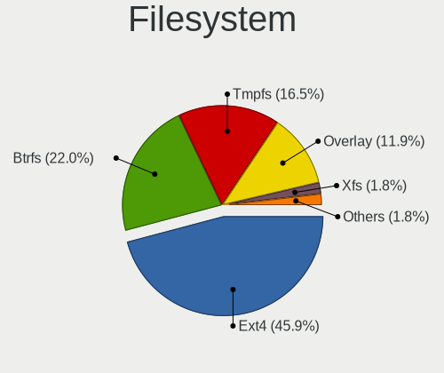
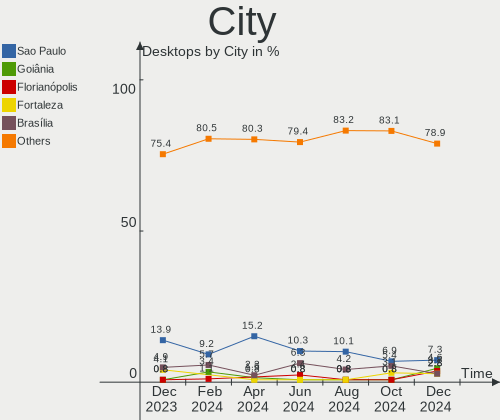
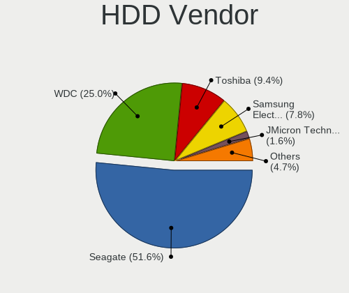
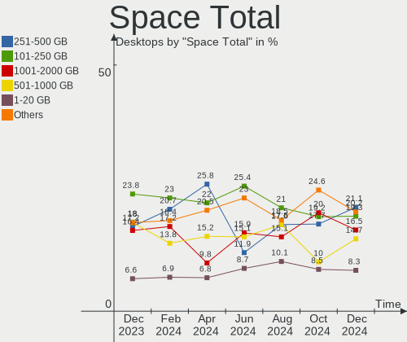
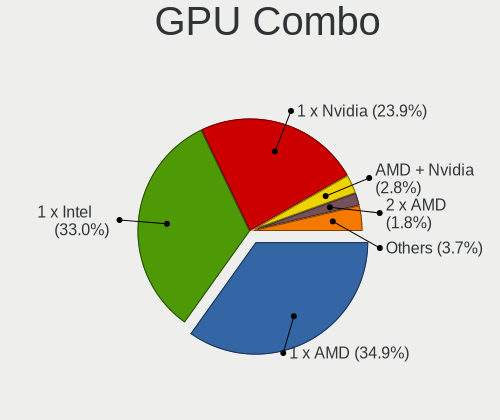
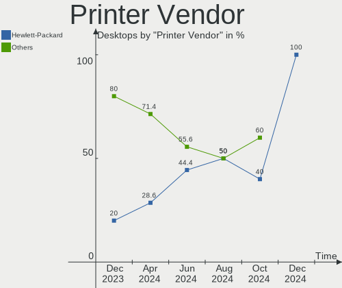

Linux in Brazil - Hardware Trends (Desktops)
--------------------------------------------

A project to identify most popular hardware characteristics and track their change
over time based on data collected by Linux users at https://Linux-Hardware.org.

Anyone can contribute to this report by the [hw-probe](https://github.com/linuxhw/hw-probe) tool:

    sudo -E hw-probe -all -upload

Period: Jun, 2022.

Contents
--------

* [ System ](#system)
  - [ OS                       ](#os)
  - [ OS Family                ](#os-family)
  - [ Kernel                   ](#kernel)
  - [ Kernel Family            ](#kernel-family)
  - [ Kernel Major Ver.        ](#kernel-major-ver)
  - [ Arch                     ](#arch)
  - [ DE                       ](#de)
  - [ Display Server           ](#display-server)
  - [ Display Manager          ](#display-manager)
  - [ OS Lang                  ](#os-lang)
  - [ Boot Mode                ](#boot-mode)
  - [ Filesystem               ](#filesystem)
  - [ Part. scheme             ](#part-scheme)
  - [ Dual Boot with Linux/BSD ](#dual-boot-with-linuxbsd)
  - [ Dual Boot (Win)          ](#dual-boot-win)

* [ Board ](#board)
  - [ Vendor                   ](#vendor)
  - [ Model                    ](#model)
  - [ Model Family             ](#model-family)
  - [ MFG Year                 ](#mfg-year)
  - [ Form Factor              ](#form-factor)
  - [ Secure Boot              ](#secure-boot)
  - [ Coreboot                 ](#coreboot)
  - [ RAM Size                 ](#ram-size)
  - [ RAM Used                 ](#ram-used)
  - [ Total Drives             ](#total-drives)
  - [ Has CD-ROM               ](#has-cd-rom)
  - [ Has Ethernet             ](#has-ethernet)
  - [ Has WiFi                 ](#has-wifi)
  - [ Has Bluetooth            ](#has-bluetooth)

* [ Location ](#location)
  - [ Country                  ](#country)
  - [ City                     ](#city)

* [ Drives ](#drives)
  - [ Drive Vendor             ](#drive-vendor)
  - [ Drive Model              ](#drive-model)
  - [ HDD Vendor               ](#hdd-vendor)
  - [ SSD Vendor               ](#ssd-vendor)
  - [ Drive Kind               ](#drive-kind)
  - [ Drive Connector          ](#drive-connector)
  - [ Drive Size               ](#drive-size)
  - [ Space Total              ](#space-total)
  - [ Space Used               ](#space-used)
  - [ Malfunc. Drives          ](#malfunc-drives)
  - [ Malfunc. Drive Vendor    ](#malfunc-drive-vendor)
  - [ Malfunc. HDD Vendor      ](#malfunc-hdd-vendor)
  - [ Malfunc. Drive Kind      ](#malfunc-drive-kind)
  - [ Failed Drives            ](#failed-drives)
  - [ Failed Drive Vendor      ](#failed-drive-vendor)
  - [ Drive Status             ](#drive-status)

* [ Storage controller ](#storage-controller)
  - [ Storage Vendor           ](#storage-vendor)
  - [ Storage Model            ](#storage-model)
  - [ Storage Kind             ](#storage-kind)

* [ Processor ](#processor)
  - [ CPU Vendor               ](#cpu-vendor)
  - [ CPU Model                ](#cpu-model)
  - [ CPU Model Family         ](#cpu-model-family)
  - [ CPU Cores                ](#cpu-cores)
  - [ CPU Sockets              ](#cpu-sockets)
  - [ CPU Threads              ](#cpu-threads)
  - [ CPU Op-Modes             ](#cpu-op-modes)
  - [ CPU Microcode            ](#cpu-microcode)
  - [ CPU Microarch            ](#cpu-microarch)

* [ Graphics ](#graphics)
  - [ GPU Vendor               ](#gpu-vendor)
  - [ GPU Model                ](#gpu-model)
  - [ GPU Combo                ](#gpu-combo)
  - [ GPU Driver               ](#gpu-driver)
  - [ GPU Memory               ](#gpu-memory)

* [ Monitor ](#monitor)
  - [ Monitor Vendor           ](#monitor-vendor)
  - [ Monitor Model            ](#monitor-model)
  - [ Monitor Resolution       ](#monitor-resolution)
  - [ Monitor Diagonal         ](#monitor-diagonal)
  - [ Monitor Width            ](#monitor-width)
  - [ Aspect Ratio             ](#aspect-ratio)
  - [ Monitor Area             ](#monitor-area)
  - [ Pixel Density            ](#pixel-density)
  - [ Multiple Monitors        ](#multiple-monitors)

* [ Network ](#network)
  - [ Net Controller Vendor    ](#net-controller-vendor)
  - [ Net Controller Model     ](#net-controller-model)
  - [ Wireless Vendor          ](#wireless-vendor)
  - [ Wireless Model           ](#wireless-model)
  - [ Ethernet Vendor          ](#ethernet-vendor)
  - [ Ethernet Model           ](#ethernet-model)
  - [ Net Controller Kind      ](#net-controller-kind)
  - [ Used Controller          ](#used-controller)
  - [ NICs                     ](#nics)
  - [ IPv6                     ](#ipv6)

* [ Bluetooth ](#bluetooth)
  - [ Bluetooth Vendor         ](#bluetooth-vendor)
  - [ Bluetooth Model          ](#bluetooth-model)

* [ Sound ](#sound)
  - [ Sound Vendor             ](#sound-vendor)
  - [ Sound Model              ](#sound-model)

* [ Memory ](#memory)
  - [ Memory Vendor            ](#memory-vendor)
  - [ Memory Model             ](#memory-model)
  - [ Memory Kind              ](#memory-kind)
  - [ Memory Form Factor       ](#memory-form-factor)
  - [ Memory Size              ](#memory-size)
  - [ Memory Speed             ](#memory-speed)

* [ Printers & scanners ](#printers--scanners)
  - [ Printer Vendor           ](#printer-vendor)
  - [ Printer Model            ](#printer-model)
  - [ Scanner Vendor           ](#scanner-vendor)
  - [ Scanner Model            ](#scanner-model)

* [ Camera ](#camera)
  - [ Camera Vendor            ](#camera-vendor)
  - [ Camera Model             ](#camera-model)

* [ Security ](#security)
  - [ Fingerprint Vendor       ](#fingerprint-vendor)
  - [ Fingerprint Model        ](#fingerprint-model)
  - [ Chipcard Vendor          ](#chipcard-vendor)
  - [ Chipcard Model           ](#chipcard-model)

* [ Unsupported ](#unsupported)
  - [ Unsupported Devices      ](#unsupported-devices)
  - [ Unsupported Device Types ](#unsupported-device-types)

System
------

OS
--

Installed operating systems

| Name                         | Desktops | Percent |
|------------------------------|----------|---------|
| Ubuntu 22.04                 | 12       | 15.58%  |
| Fedora 36                    | 8        | 10.39%  |
| OpenMandriva 4.3             | 7        | 9.09%   |
| Ubuntu 20.04                 | 6        | 7.79%   |
| Linux Mint 20.3              | 6        | 7.79%   |
| Pop!_OS 22.04                | 4        | 5.19%   |
| Linux Mint 20.1              | 3        | 3.9%    |
| Zorin 16                     | 2        | 2.6%    |
| Pop!_OS 21.10                | 2        | 2.6%    |
| openSUSE Leap-15.4           | 2        | 2.6%    |
| Linux Mint 20.2              | 2        | 2.6%    |
| Linux Mint 19.3              | 2        | 2.6%    |
| Endless 4.0.6                | 2        | 2.6%    |
| Elementary 6.1               | 2        | 2.6%    |
| Debian 11                    | 2        | 2.6%    |
| Arch                         | 2        | 2.6%    |
| Xubuntu 20.04                | 1        | 1.3%    |
| Ubuntu 18.04                 | 1        | 1.3%    |
| Sparky 6.3                   | 1        | 1.3%    |
| Pop!_OS 20.04                | 1        | 1.3%    |
| openSUSE Tumbleweed-XXXXXXXX | 1        | 1.3%    |
| Manjaro 21.3.0               | 1        | 1.3%    |
| LinuxFX 11.1                 | 1        | 1.3%    |
| Linux Mint 18.3              | 1        | 1.3%    |
| Kubuntu 22.04                | 1        | 1.3%    |
| Kubuntu 18.04                | 1        | 1.3%    |
| Kali 2022.2                  | 1        | 1.3%    |
| Kali 2021.4                  | 1        | 1.3%    |
| Arch Rolling                 | 1        | 1.3%    |

OS Family
---------

OS without a version

| Name         | Desktops | Percent |
|--------------|----------|---------|
| Ubuntu       | 19       | 24.68%  |
| Linux Mint   | 14       | 18.18%  |
| Fedora       | 8        | 10.39%  |
| Pop!_OS      | 7        | 9.09%   |
| OpenMandriva | 7        | 9.09%   |
| openSUSE     | 3        | 3.9%    |
| Arch         | 3        | 3.9%    |
| Zorin        | 2        | 2.6%    |
| Kubuntu      | 2        | 2.6%    |
| Kali         | 2        | 2.6%    |
| Endless      | 2        | 2.6%    |
| Elementary   | 2        | 2.6%    |
| Debian       | 2        | 2.6%    |
| Xubuntu      | 1        | 1.3%    |
| Sparky       | 1        | 1.3%    |
| Manjaro      | 1        | 1.3%    |
| LinuxFX      | 1        | 1.3%    |

Kernel
------

Version of the Linux kernel

| Version                   | Desktops | Percent |
|---------------------------|----------|---------|
| 5.16.7-desktop-1omv4003   | 7        | 9.09%   |
| 5.17.5-76051705-generic   | 6        | 7.79%   |
| 5.4.0-121-generic         | 3        | 3.9%    |
| 5.17.11-300.fc36.x86_64   | 3        | 3.9%    |
| 5.15.0-39-generic         | 3        | 3.9%    |
| 5.15.0-33-generic         | 3        | 3.9%    |
| 5.15.0-25-generic         | 3        | 3.9%    |
| 5.13.0-51-generic         | 3        | 3.9%    |
| 5.13.0-44-generic         | 3        | 3.9%    |
| 5.4.0-91-generic          | 2        | 2.6%    |
| 5.4.0-74-generic          | 2        | 2.6%    |
| 5.4.0-120-generic         | 2        | 2.6%    |
| 5.4.0-117-generic         | 2        | 2.6%    |
| 5.18.5-200.fc36.x86_64    | 2        | 2.6%    |
| 5.15.0-37-generic         | 2        | 2.6%    |
| 5.14.21-150400.22-default | 2        | 2.6%    |
| 5.13.0-48-generic         | 2        | 2.6%    |
| 5.11.0-35-generic         | 2        | 2.6%    |
| 5.10.0-14-amd64           | 2        | 2.6%    |
| 5.4.0-99-generic          | 1        | 1.3%    |
| 5.4.0-97-lowlatency       | 1        | 1.3%    |
| 5.4.0-42-generic          | 1        | 1.3%    |
| 5.4.0-113-generic         | 1        | 1.3%    |
| 5.18.7-arch1-1            | 1        | 1.3%    |
| 5.18.6-200.fc36.x86_64    | 1        | 1.3%    |
| 5.18.6-1-default          | 1        | 1.3%    |
| 5.18.4-xanmod1            | 1        | 1.3%    |
| 5.18.3-arch1-1            | 1        | 1.3%    |
| 5.18.1-arch1-1            | 1        | 1.3%    |
| 5.18.0-kali2-amd64        | 1        | 1.3%    |
| 5.17.5-300.fc36.x86_64    | 1        | 1.3%    |
| 5.17.15-76051715-generic  | 1        | 1.3%    |
| 5.17.12-300.fc36.x86_64   | 1        | 1.3%    |
| 5.16.0-0.bpo.4-amd64      | 1        | 1.3%    |
| 5.15.48-1-MANJARO         | 1        | 1.3%    |
| 5.15.13-051513-generic    | 1        | 1.3%    |
| 5.15.0-40-generic         | 1        | 1.3%    |
| 5.14.0-kali4-amd64        | 1        | 1.3%    |
| 5.14.0-1042-oem           | 1        | 1.3%    |
| 5.13.0-27-generic         | 1        | 1.3%    |
| 5.0.0-23-generic          | 1        | 1.3%    |
| 4.10.0-38-generic         | 1        | 1.3%    |

Kernel Family
-------------

Linux kernel without a distro release

| Version | Desktops | Percent |
|---------|----------|---------|
| 5.4.0   | 15       | 19.48%  |
| 5.15.0  | 12       | 15.58%  |
| 5.13.0  | 9        | 11.69%  |
| 5.17.5  | 7        | 9.09%   |
| 5.16.7  | 7        | 9.09%   |
| 5.17.11 | 3        | 3.9%    |
| 5.18.6  | 2        | 2.6%    |
| 5.18.5  | 2        | 2.6%    |
| 5.14.21 | 2        | 2.6%    |
| 5.14.0  | 2        | 2.6%    |
| 5.11.0  | 2        | 2.6%    |
| 5.10.0  | 2        | 2.6%    |
| 5.18.7  | 1        | 1.3%    |
| 5.18.4  | 1        | 1.3%    |
| 5.18.3  | 1        | 1.3%    |
| 5.18.1  | 1        | 1.3%    |
| 5.18.0  | 1        | 1.3%    |
| 5.17.15 | 1        | 1.3%    |
| 5.17.12 | 1        | 1.3%    |
| 5.16.0  | 1        | 1.3%    |
| 5.15.48 | 1        | 1.3%    |
| 5.15.13 | 1        | 1.3%    |
| 5.0.0   | 1        | 1.3%    |
| 4.10.0  | 1        | 1.3%    |

Kernel Major Ver.
-----------------

Linux kernel major version

| Version | Desktops | Percent |
|---------|----------|---------|
| 5.4     | 15       | 19.48%  |
| 5.15    | 14       | 18.18%  |
| 5.17    | 12       | 15.58%  |
| 5.18    | 9        | 11.69%  |
| 5.13    | 9        | 11.69%  |
| 5.16    | 8        | 10.39%  |
| 5.14    | 4        | 5.19%   |
| 5.11    | 2        | 2.6%    |
| 5.10    | 2        | 2.6%    |
| 5.0     | 1        | 1.3%    |
| 4.10    | 1        | 1.3%    |

Arch
----

OS architecture (x86_64, i586, etc.)

| Name   | Desktops | Percent |
|--------|----------|---------|
| x86_64 | 77       | 100%    |

DE
--

Desktop Environment

| Name            | Desktops | Percent |
|-----------------|----------|---------|
| GNOME           | 35       | 45.45%  |
| KDE5            | 15       | 19.48%  |
| X-Cinnamon      | 8        | 10.39%  |
| XFCE            | 7        | 9.09%   |
| Unknown         | 4        | 5.19%   |
| MATE            | 3        | 3.9%    |
| Pantheon        | 2        | 2.6%    |
| sway            | 1        | 1.3%    |
| GNOME Flashback | 1        | 1.3%    |
| Cinnamon        | 1        | 1.3%    |

Display Server
--------------

X11 or Wayland

| Name    | Desktops | Percent |
|---------|----------|---------|
| X11     | 56       | 72.73%  |
| Wayland | 17       | 22.08%  |
| Tty     | 3        | 3.9%    |
| Unknown | 1        | 1.3%    |

Display Manager
---------------

SDDM, LightDM, etc.

| Name    | Desktops | Percent |
|---------|----------|---------|
| Unknown | 33       | 42.86%  |
| GDM3    | 16       | 20.78%  |
| LightDM | 12       | 15.58%  |
| SDDM    | 10       | 12.99%  |
| GDM     | 6        | 7.79%   |

OS Lang
-------

Language

| Lang    | Desktops | Percent |
|---------|----------|---------|
| pt_BR   | 58       | 75.32%  |
| en_US   | 16       | 20.78%  |
| pt_PT   | 1        | 1.3%    |
| C       | 1        | 1.3%    |
| Unknown | 1        | 1.3%    |

Boot Mode
---------

EFI or BIOS

| Mode | Desktops | Percent |
|------|----------|---------|
| BIOS | 47       | 61.04%  |
| EFI  | 30       | 38.96%  |

Filesystem
----------

Type of filesystem

| Type    | Desktops | Percent |
|---------|----------|---------|
| Ext4    | 50       | 64.94%  |
| Btrfs   | 16       | 20.78%  |
| Overlay | 10       | 12.99%  |
| Ext3    | 1        | 1.3%    |

Part. scheme
------------

Scheme of partitioning

| Type    | Desktops | Percent |
|---------|----------|---------|
| Unknown | 45       | 58.44%  |
| GPT     | 23       | 29.87%  |
| MBR     | 9        | 11.69%  |

Dual Boot with Linux/BSD
------------------------

Hosting more than one Linux/BSD

| Dual boot | Desktops | Percent |
|-----------|----------|---------|
| No        | 66       | 85.71%  |
| Yes       | 11       | 14.29%  |

Dual Boot (Win)
---------------

Hosting Linux and Windows

| Dual boot | Desktops | Percent |
|-----------|----------|---------|
| No        | 53       | 68.83%  |
| Yes       | 24       | 31.17%  |

Board
-----

Vendor
------

Motherboard manufacturer

| Name                | Desktops | Percent |
|---------------------|----------|---------|
| ASUSTek Computer    | 27       | 35.06%  |
| Intel               | 9        | 11.69%  |
| Dell                | 8        | 10.39%  |
| ASRock              | 8        | 10.39%  |
| Gigabyte Technology | 7        | 9.09%   |
| PCWare              | 3        | 3.9%    |
| MSI                 | 3        | 3.9%    |
| Hewlett-Packard     | 2        | 2.6%    |
| T-bao               | 1        | 1.3%    |
| Positivo            | 1        | 1.3%    |
| OEM                 | 1        | 1.3%    |
| Megaware            | 1        | 1.3%    |
| Kllisre             | 1        | 1.3%    |
| Huanan              | 1        | 1.3%    |
| Foxconn             | 1        | 1.3%    |
| ECS                 | 1        | 1.3%    |
| Biostar             | 1        | 1.3%    |
| Unknown             | 1        | 1.3%    |

Model
-----

Motherboard model

| Name                               | Desktops | Percent |
|------------------------------------|----------|---------|
| ASUS TUF Gaming X570-PLUS_BR       | 4        | 5.19%   |
| Intel H61                          | 3        | 3.9%    |
| ASUS PRIME A320M-K/BR              | 3        | 3.9%    |
| Gigabyte H81M-S1                   | 2        | 2.6%    |
| ASUS PRIME B450M-GAMING/BR         | 2        | 2.6%    |
| ASUS All Series                    | 2        | 2.6%    |
| ASRock H81M-HG4 R4.0               | 2        | 2.6%    |
| T-bao MINI PC                      | 1        | 1.3%    |
| Positivo POS-PIH55BO               | 1        | 1.3%    |
| PCWare IPX4105G Pro                | 1        | 1.3%    |
| PCWare IPMH61R3                    | 1        | 1.3%    |
| PCWare IPMH61R1                    | 1        | 1.3%    |
| OEM H110                           | 1        | 1.3%    |
| MSI p6730br                        | 1        | 1.3%    |
| MSI MS-7817                        | 1        | 1.3%    |
| MSI MS-7636                        | 1        | 1.3%    |
| Megaware MW-HDC-M                  | 1        | 1.3%    |
| Kllisre B75 V1.1                   | 1        | 1.3%    |
| Intel X99 V1.0                     | 1        | 1.3%    |
| Intel X99                          | 1        | 1.3%    |
| Intel MAHOBAY                      | 1        | 1.3%    |
| Intel H55                          | 1        | 1.3%    |
| Intel DP43BF AAE78171-302          | 1        | 1.3%    |
| Intel DH61CR AAG14064-207          | 1        | 1.3%    |
| Huanan X99-F8 GAMING V5.0          | 1        | 1.3%    |
| HP EliteDesk 800 G1 SFF            | 1        | 1.3%    |
| HP Compaq dc5850 MT PC             | 1        | 1.3%    |
| Gigabyte GA-78LMT-S2P              | 1        | 1.3%    |
| Gigabyte G31M-ES2L                 | 1        | 1.3%    |
| Gigabyte B450 AORUS M              | 1        | 1.3%    |
| Gigabyte B360M AORUS Gaming 3      | 1        | 1.3%    |
| Gigabyte 970A-DS3P                 | 1        | 1.3%    |
| Foxconn nT-i1000 Series            | 1        | 1.3%    |
| ECS 945GZ/CT-M                     | 1        | 1.3%    |
| Dell Vostro 3681                   | 1        | 1.3%    |
| Dell Precision WorkStation T5500   | 1        | 1.3%    |
| Dell Precision Tower 7910          | 1        | 1.3%    |
| Dell Precision T1700               | 1        | 1.3%    |
| Dell Precision 3630 Tower          | 1        | 1.3%    |
| Dell OptiPlex 790                  | 1        | 1.3%    |
| Dell OptiPlex 7010                 | 1        | 1.3%    |
| Dell OptiPlex 3010                 | 1        | 1.3%    |
| Biostar B450MX-S                   | 1        | 1.3%    |
| ASUS TUF Gaming Z590-PLUS          | 1        | 1.3%    |
| ASUS TUF Gaming B550M-PLUS WIFI II | 1        | 1.3%    |
| ASUS TUF Gaming B550M-PLUS         | 1        | 1.3%    |
| ASUS ROG STRIX Z490-H GAMING       | 1        | 1.3%    |
| ASUS ROG STRIX B350-F GAMING       | 1        | 1.3%    |
| ASUS PRIME Z270-A                  | 1        | 1.3%    |
| ASUS PRIME H410M-E                 | 1        | 1.3%    |
| ASUS PRIME H310M-E R2.0            | 1        | 1.3%    |
| ASUS P8P67-M                       | 1        | 1.3%    |
| ASUS P7H55-M LX                    | 1        | 1.3%    |
| ASUS P5KPL-AM                      | 1        | 1.3%    |
| ASUS M5A97 PLUS                    | 1        | 1.3%    |
| ASUS M5A78L-M/USB3                 | 1        | 1.3%    |
| ASUS M5A78L-M PLUS/USB3            | 1        | 1.3%    |
| ASUS M2NPV-VM                      | 1        | 1.3%    |
| ASUS H110M-CS/BR                   | 1        | 1.3%    |
| ASRock N68-VS3 UCC                 | 1        | 1.3%    |

Model Family
------------

Motherboard model prefix

| Name                  | Desktops | Percent |
|-----------------------|----------|---------|
| ASUS PRIME            | 8        | 10.39%  |
| ASUS TUF              | 7        | 9.09%   |
| Dell Precision        | 4        | 5.19%   |
| Intel H61             | 3        | 3.9%    |
| Dell OptiPlex         | 3        | 3.9%    |
| Intel X99             | 2        | 2.6%    |
| Gigabyte H81M-S1      | 2        | 2.6%    |
| ASUS ROG              | 2        | 2.6%    |
| ASUS M5A78L-M         | 2        | 2.6%    |
| ASUS All              | 2        | 2.6%    |
| ASRock H81M-HG4       | 2        | 2.6%    |
| T-bao MINI            | 1        | 1.3%    |
| Positivo POS-PIH55BO  | 1        | 1.3%    |
| PCWare IPX4105G       | 1        | 1.3%    |
| PCWare IPMH61R3       | 1        | 1.3%    |
| PCWare IPMH61R1       | 1        | 1.3%    |
| OEM H110              | 1        | 1.3%    |
| MSI p6730br           | 1        | 1.3%    |
| MSI MS-7817           | 1        | 1.3%    |
| MSI MS-7636           | 1        | 1.3%    |
| Megaware MW-HDC-M     | 1        | 1.3%    |
| Kllisre B75           | 1        | 1.3%    |
| Intel MAHOBAY         | 1        | 1.3%    |
| Intel H55             | 1        | 1.3%    |
| Intel DP43BF          | 1        | 1.3%    |
| Intel DH61CR          | 1        | 1.3%    |
| Huanan X99-F8         | 1        | 1.3%    |
| HP EliteDesk          | 1        | 1.3%    |
| HP Compaq             | 1        | 1.3%    |
| Gigabyte GA-78LMT-S2P | 1        | 1.3%    |
| Gigabyte G31M-ES2L    | 1        | 1.3%    |
| Gigabyte B450         | 1        | 1.3%    |
| Gigabyte B360M        | 1        | 1.3%    |
| Gigabyte 970A-DS3P    | 1        | 1.3%    |
| Foxconn nT-i1000      | 1        | 1.3%    |
| ECS 945GZ             | 1        | 1.3%    |
| Dell Vostro           | 1        | 1.3%    |
| Biostar B450MX-S      | 1        | 1.3%    |
| ASUS P8P67-M          | 1        | 1.3%    |
| ASUS P7H55-M          | 1        | 1.3%    |
| ASUS P5KPL-AM         | 1        | 1.3%    |
| ASUS M5A97            | 1        | 1.3%    |
| ASUS M2NPV-VM         | 1        | 1.3%    |
| ASUS H110M-CS         | 1        | 1.3%    |
| ASRock N68-VS3        | 1        | 1.3%    |
| ASRock H110M-HG4      | 1        | 1.3%    |
| ASRock FM2A68M-DG3+   | 1        | 1.3%    |
| ASRock B75M-DGS       | 1        | 1.3%    |
| ASRock B450M          | 1        | 1.3%    |
| ASRock 760GM-HDV      | 1        | 1.3%    |
| Unknown               | 1        | 1.3%    |

MFG Year
--------

Motherboard manufacture year

| Year | Desktops | Percent |
|------|----------|---------|
| 2019 | 10       | 12.99%  |
| 2017 | 10       | 12.99%  |
| 2018 | 8        | 10.39%  |
| 2020 | 7        | 9.09%   |
| 2013 | 7        | 9.09%   |
| 2011 | 7        | 9.09%   |
| 2015 | 4        | 5.19%   |
| 2012 | 4        | 5.19%   |
| 2010 | 4        | 5.19%   |
| 2021 | 3        | 3.9%    |
| 2016 | 3        | 3.9%    |
| 2008 | 3        | 3.9%    |
| 2022 | 2        | 2.6%    |
| 2014 | 2        | 2.6%    |
| 2009 | 1        | 1.3%    |
| 2007 | 1        | 1.3%    |
| 2006 | 1        | 1.3%    |

Form Factor
-----------

Physical design of the computer

| Name    | Desktops | Percent |
|---------|----------|---------|
| Desktop | 77       | 100%    |

Secure Boot
-----------

Enabled or disabled

| State    | Desktops | Percent |
|----------|----------|---------|
| Disabled | 73       | 94.81%  |
| Enabled  | 4        | 5.19%   |

Coreboot
--------

Have coreboot on board

| Used | Desktops | Percent |
|------|----------|---------|
| No   | 77       | 100%    |

RAM Size
--------

Total RAM memory

| Size in GB      | Desktops | Percent |
|-----------------|----------|---------|
| 16.01-24.0      | 19       | 24.68%  |
| 8.01-16.0       | 18       | 23.38%  |
| 4.01-8.0        | 17       | 22.08%  |
| 32.01-64.0      | 7        | 9.09%   |
| 3.01-4.0        | 7        | 9.09%   |
| 64.01-256.0     | 3        | 3.9%    |
| 24.01-32.0      | 2        | 2.6%    |
| 1.01-2.0        | 2        | 2.6%    |
| More than 256.0 | 1        | 1.3%    |
| 2.01-3.0        | 1        | 1.3%    |

RAM Used
--------

Used RAM memory

| Used GB   | Desktops | Percent |
|-----------|----------|---------|
| 2.01-3.0  | 24       | 31.17%  |
| 1.01-2.0  | 23       | 29.87%  |
| 4.01-8.0  | 12       | 15.58%  |
| 3.01-4.0  | 8        | 10.39%  |
| 0.51-1.0  | 5        | 6.49%   |
| 8.01-16.0 | 4        | 5.19%   |
| 0.01-0.5  | 1        | 1.3%    |

Total Drives
------------

Number of drives on board

| Drives | Desktops | Percent |
|--------|----------|---------|
| 1      | 29       | 37.66%  |
| 2      | 20       | 25.97%  |
| 3      | 12       | 15.58%  |
| 4      | 7        | 9.09%   |
| 0      | 4        | 5.19%   |
| 7      | 2        | 2.6%    |
| 5      | 2        | 2.6%    |
| 6      | 1        | 1.3%    |

Has CD-ROM
----------

Has CD-ROM on board

| Presented | Desktops | Percent |
|-----------|----------|---------|
| No        | 47       | 61.04%  |
| Yes       | 30       | 38.96%  |

Has Ethernet
------------

Has Ethernet on board

| Presented | Desktops | Percent |
|-----------|----------|---------|
| Yes       | 77       | 100%    |

Has WiFi
--------

Has WiFi module

| Presented | Desktops | Percent |
|-----------|----------|---------|
| No        | 49       | 63.64%  |
| Yes       | 28       | 36.36%  |

Has Bluetooth
-------------

Has Bluetooth module

| Presented | Desktops | Percent |
|-----------|----------|---------|
| No        | 66       | 85.71%  |
| Yes       | 11       | 14.29%  |

Location
--------

Country
-------

Geographic location (country)

| Country | Desktops | Percent |
|---------|----------|---------|
| Brazil  | 77       | 100%    |

City
----

Geographic location (city)

| City                  | Desktops | Percent |
|-----------------------|----------|---------|
| Sao Paulo             | 7        | 9.09%   |
| Rio de Janeiro        | 7        | 9.09%   |
| Goiânia              | 4        | 5.19%   |
| Sao José dos Campos  | 3        | 3.9%    |
| Vitória              | 2        | 2.6%    |
| Viamao                | 2        | 2.6%    |
| Porto Velho           | 2        | 2.6%    |
| Guarulhos             | 2        | 2.6%    |
| Curitiba              | 2        | 2.6%    |
| Brasília             | 2        | 2.6%    |
| Belo Horizonte        | 2        | 2.6%    |
| Araraquara            | 2        | 2.6%    |
| Vitória da Conquista | 1        | 1.3%    |
| Toledo                | 1        | 1.3%    |
| Sidrolandia           | 1        | 1.3%    |
| Sao Jose do Egito     | 1        | 1.3%    |
| Santos                | 1        | 1.3%    |
| Santa Rosa            | 1        | 1.3%    |
| Recife                | 1        | 1.3%    |
| Queimados             | 1        | 1.3%    |
| Porto Alegre          | 1        | 1.3%    |
| Passos                | 1        | 1.3%    |
| Paranaiba             | 1        | 1.3%    |
| Palhoca               | 1        | 1.3%    |
| Nao Me Toque          | 1        | 1.3%    |
| Nanuque               | 1        | 1.3%    |
| Montes Claros         | 1        | 1.3%    |
| Manaus                | 1        | 1.3%    |
| Londrina              | 1        | 1.3%    |
| Linhares              | 1        | 1.3%    |
| Limeira               | 1        | 1.3%    |
| Lavras                | 1        | 1.3%    |
| Juiz de Fora          | 1        | 1.3%    |
| Jaboticabal           | 1        | 1.3%    |
| Itatiba               | 1        | 1.3%    |
| Itajaí               | 1        | 1.3%    |
| Itaborai              | 1        | 1.3%    |
| Garibaldi             | 1        | 1.3%    |
| Franco da Rocha       | 1        | 1.3%    |
| Foz do Iguaçu        | 1        | 1.3%    |
| Fortaleza             | 1        | 1.3%    |
| Florianópolis        | 1        | 1.3%    |
| Duque de Caxias       | 1        | 1.3%    |
| Diadema               | 1        | 1.3%    |
| Criciúma             | 1        | 1.3%    |
| Cosmopolis            | 1        | 1.3%    |
| Colombo               | 1        | 1.3%    |
| Carazinho             | 1        | 1.3%    |
| Canoas                | 1        | 1.3%    |
| Campo Grande          | 1        | 1.3%    |
| Campinas              | 1        | 1.3%    |
| Bom Jesus da Lapa     | 1        | 1.3%    |

Drives
------

Drive Vendor
------------

Hard drive vendors

| Vendor                | Desktops | Drives | Percent |
|-----------------------|----------|--------|---------|
| Seagate               | 28       | 39     | 20.59%  |
| WDC                   | 25       | 32     | 18.38%  |
| Kingston              | 19       | 22     | 13.97%  |
| Samsung Electronics   | 17       | 21     | 12.5%   |
| SanDisk               | 6        | 6      | 4.41%   |
| Toshiba               | 5        | 5      | 3.68%   |
| Crucial               | 4        | 4      | 2.94%   |
| China                 | 4        | 4      | 2.94%   |
| Silicon Motion        | 3        | 4      | 2.21%   |
| Realtek Semiconductor | 3        | 3      | 2.21%   |
| T-FORCE               | 2        | 2      | 1.47%   |
| SK hynix              | 2        | 2      | 1.47%   |
| Patriot               | 2        | 2      | 1.47%   |
| XrayDisk              | 1        | 2      | 0.74%   |
| XPG                   | 1        | 1      | 0.74%   |
| Unknown               | 1        | 1      | 0.74%   |
| SPCC                  | 1        | 1      | 0.74%   |
| Smart                 | 1        | 2      | 0.74%   |
| Netac                 | 1        | 1      | 0.74%   |
| KingSpec              | 1        | 1      | 0.74%   |
| JMicron Technology    | 1        | 1      | 0.74%   |
| HS-SSD-E100           | 1        | 1      | 0.74%   |
| Hitachi               | 1        | 1      | 0.74%   |
| HGST                  | 1        | 1      | 0.74%   |
| Hewlett-Packard       | 1        | 1      | 0.74%   |
| Gigabyte Technology   | 1        | 1      | 0.74%   |
| Fujitsu               | 1        | 1      | 0.74%   |
| EMTEC                 | 1        | 1      | 0.74%   |
| A-DATA Technology     | 1        | 1      | 0.74%   |

Drive Model
-----------

Hard drive models

| Model                               | Desktops | Percent |
|-------------------------------------|----------|---------|
| Kingston SA400S37240G 240GB SSD     | 7        | 4.38%   |
| Seagate ST1000DM003-1CH162 1TB      | 6        | 3.75%   |
| Samsung HD502HJ 500GB               | 4        | 2.5%    |
| Kingston SA400S37120G 120GB SSD     | 4        | 2.5%    |
| Seagate ST31000524AS 1TB            | 3        | 1.88%   |
| Seagate ST2000DM008-2FR102 2TB      | 3        | 1.88%   |
| Seagate ST2000DM006-2DM164 2TB      | 3        | 1.88%   |
| Kingston SV300S37A120G 120GB SSD    | 3        | 1.88%   |
| Kingston SA400S37480G 480GB SSD     | 3        | 1.88%   |
| WDC WDS100T2B0A-00SM50 1TB SSD      | 2        | 1.25%   |
| WDC WD10EZEX-08WN4A0 1TB            | 2        | 1.25%   |
| WDC WD10EZEX-00WN4A0 1TB            | 2        | 1.25%   |
| WDC WD10EURX-63UY4Y0 1TB            | 2        | 1.25%   |
| WDC WD10EARS-00Y5B1 1TB             | 2        | 1.25%   |
| T-FORCE TM8FPZ001T 1TB              | 2        | 1.25%   |
| Silicon Motion NVMe SSD Drive 128GB | 2        | 1.25%   |
| Seagate ST500LM012 HN-M500MBB 500GB | 2        | 1.25%   |
| Seagate ST500DM002-1BD142 500GB     | 2        | 1.25%   |
| Seagate ST3000DM001-1ER166 3TB      | 2        | 1.25%   |
| Seagate ST1000DM010-2EP102 1TB      | 2        | 1.25%   |
| Seagate Expansion 1TB               | 2        | 1.25%   |
| Samsung HD502HI 500GB               | 2        | 1.25%   |
| Samsung HD322HJ 320GB               | 2        | 1.25%   |
| Realtek NVMe SSD Drive 1024GB       | 2        | 1.25%   |
| Crucial CT240BX500SSD1 240GB        | 2        | 1.25%   |
| XrayDisk 480GB                      | 1        | 0.63%   |
| XrayDisk 1TB                        | 1        | 0.63%   |
| XPG GAMMIX S11 240GB                | 1        | 0.63%   |
| WDC WDS500G1B0C-00S6U0 500GB        | 1        | 0.63%   |
| WDC WDS240G2G0B-00EPW0 240GB SSD    | 1        | 0.63%   |
| WDC WDS240G2G0A-00JH30 240GB SSD    | 1        | 0.63%   |
| WDC WD5000LPCX-24C6HT0 500GB        | 1        | 0.63%   |
| WDC WD5000BEVT-00A0RT0 500GB        | 1        | 0.63%   |
| WDC WD5000BEKT-00KA9T0 500GB        | 1        | 0.63%   |
| WDC WD5000AZLX-00K2TA0 500GB        | 1        | 0.63%   |
| WDC WD5000AVDS-63U7B1 500GB         | 1        | 0.63%   |
| WDC WD5000AAKX-00U6AA0 500GB        | 1        | 0.63%   |
| WDC WD5000AAKS-75V0A0 500GB         | 1        | 0.63%   |
| WDC WD40EZAZ-00SF3B0 4TB            | 1        | 0.63%   |
| WDC WD3200BPVT-00JJ5T0 320GB        | 1        | 0.63%   |
| WDC WD30EZRX-00DC0B0 3TB            | 1        | 0.63%   |
| WDC WD20EFRX-68EUZN0 2TB            | 1        | 0.63%   |
| WDC WD1600AAJS-00L7A0 160GB         | 1        | 0.63%   |
| WDC WD10PURX-64D85Y0 1TB            | 1        | 0.63%   |
| WDC WD10EZEX-21WN4A0 1TB            | 1        | 0.63%   |
| WDC WD10EZEX-00BN5A0 1TB            | 1        | 0.63%   |
| WDC WD10EZEX-00BBHA0 1TB            | 1        | 0.63%   |
| WDC WD10EURX-63C57Y0 1TB            | 1        | 0.63%   |
| WDC WD1001FAES-60Z2A0 1TB           | 1        | 0.63%   |
| Unknown MM0500EANCR 500GB           | 1        | 0.63%   |
| Toshiba MQ01ABD100 1TB              | 1        | 0.63%   |
| Toshiba MQ01ABD032 320GB            | 1        | 0.63%   |
| Toshiba MK3259GSXP 320GB            | 1        | 0.63%   |
| Toshiba HDWD110 1TB                 | 1        | 0.63%   |
| Toshiba DT01ACA100 1TB              | 1        | 0.63%   |
| SPCC M.2 PCIe SSD 1TB               | 1        | 0.63%   |
| Smart SSD SZ9STE 2.5 7mm 256GB      | 1        | 0.63%   |
| SK hynix SC311 SATA 256GB SSD       | 1        | 0.63%   |
| SK hynix BC511 NVMe 256GB           | 1        | 0.63%   |
| Silicon Motion SK 128GB             | 1        | 0.63%   |

HDD Vendor
----------

Hard disk drive vendors

| Vendor              | Desktops | Drives | Percent |
|---------------------|----------|--------|---------|
| Seagate             | 28       | 39     | 36.84%  |
| WDC                 | 21       | 26     | 27.63%  |
| Samsung Electronics | 16       | 20     | 21.05%  |
| Toshiba             | 5        | 5      | 6.58%   |
| Unknown             | 1        | 1      | 1.32%   |
| JMicron Technology  | 1        | 1      | 1.32%   |
| Hitachi             | 1        | 1      | 1.32%   |
| HGST                | 1        | 1      | 1.32%   |
| Hewlett-Packard     | 1        | 1      | 1.32%   |
| Fujitsu             | 1        | 1      | 1.32%   |

SSD Vendor
----------

Solid state drive vendors

| Vendor              | Desktops | Drives | Percent |
|---------------------|----------|--------|---------|
| Kingston            | 18       | 21     | 40.91%  |
| SanDisk             | 5        | 5      | 11.36%  |
| WDC                 | 4        | 4      | 9.09%   |
| Crucial             | 4        | 4      | 9.09%   |
| China               | 4        | 4      | 9.09%   |
| Patriot             | 2        | 2      | 4.55%   |
| Smart               | 1        | 2      | 2.27%   |
| SK hynix            | 1        | 1      | 2.27%   |
| Samsung Electronics | 1        | 1      | 2.27%   |
| Netac               | 1        | 1      | 2.27%   |
| KingSpec            | 1        | 1      | 2.27%   |
| Gigabyte Technology | 1        | 1      | 2.27%   |
| EMTEC               | 1        | 1      | 2.27%   |

Drive Kind
----------

HDD or SSD

| Kind    | Desktops | Drives | Percent |
|---------|----------|--------|---------|
| HDD     | 57       | 96     | 51.35%  |
| SSD     | 38       | 48     | 34.23%  |
| NVMe    | 14       | 17     | 12.61%  |
| Unknown | 2        | 3      | 1.8%    |

Drive Connector
---------------

SATA, SAS, NVMe, etc.

| Type | Desktops | Drives | Percent |
|------|----------|--------|---------|
| SATA | 69       | 139    | 77.53%  |
| NVMe | 14       | 17     | 15.73%  |
| SAS  | 6        | 8      | 6.74%   |

Drive Size
----------

Size of hard drive

| Size in TB | Desktops | Drives | Percent |
|------------|----------|--------|---------|
| 0.01-0.5   | 55       | 79     | 52.38%  |
| 0.51-1.0   | 32       | 43     | 30.48%  |
| 1.01-2.0   | 11       | 14     | 10.48%  |
| 3.01-4.0   | 3        | 3      | 2.86%   |
| 2.01-3.0   | 3        | 4      | 2.86%   |
| 4.01-10.0  | 1        | 1      | 0.95%   |

Space Total
-----------

Amount of disk space available on the file system

| Size in GB     | Desktops | Percent |
|----------------|----------|---------|
| 251-500        | 16       | 20.78%  |
| 501-1000       | 13       | 16.88%  |
| 101-250        | 11       | 14.29%  |
| 1001-2000      | 11       | 14.29%  |
| More than 3000 | 10       | 12.99%  |
| 1-20           | 9        | 11.69%  |
| 21-50          | 2        | 2.6%    |
| 2001-3000      | 2        | 2.6%    |
| Unknown        | 2        | 2.6%    |
| 51-100         | 1        | 1.3%    |

Space Used
----------

Amount of used disk space

| Used GB        | Desktops | Percent |
|----------------|----------|---------|
| 1-20           | 25       | 32.47%  |
| 21-50          | 15       | 19.48%  |
| 51-100         | 9        | 11.69%  |
| 251-500        | 8        | 10.39%  |
| 501-1000       | 7        | 9.09%   |
| 101-250        | 4        | 5.19%   |
| More than 3000 | 3        | 3.9%    |
| 1001-2000      | 3        | 3.9%    |
| Unknown        | 2        | 2.6%    |
| 2001-3000      | 1        | 1.3%    |

Malfunc. Drives
---------------

Drive models with a malfunction

| Model                               | Desktops | Drives | Percent |
|-------------------------------------|----------|--------|---------|
| Samsung Electronics HD502HI 500GB   | 2        | 2      | 11.76%  |
| Samsung Electronics HD322HJ 320GB   | 2        | 2      | 11.76%  |
| WDC WD1600AAJS-00L7A0 160GB         | 1        | 1      | 5.88%   |
| WDC WD10PURX-64D85Y0 1TB            | 1        | 1      | 5.88%   |
| WDC WD10EZEX-00WN4A0 1TB            | 1        | 1      | 5.88%   |
| WDC WD10EARS-00Y5B1 1TB             | 1        | 1      | 5.88%   |
| Toshiba MK3259GSXP 320GB            | 1        | 1      | 5.88%   |
| Seagate ST500LT012-1DG142 500GB     | 1        | 1      | 5.88%   |
| Seagate ST500LM012 HN-M500MBB 500GB | 1        | 1      | 5.88%   |
| Seagate ST2000DM008-2FR102 2TB      | 1        | 1      | 5.88%   |
| Seagate ST1500DL003-9VT16L 1TB      | 1        | 1      | 5.88%   |
| Seagate ST1000DM003-1CH162 1TB      | 1        | 1      | 5.88%   |
| Samsung Electronics HD103SI 1TB     | 1        | 1      | 5.88%   |
| Hitachi HDT721032SLA380 320GB       | 1        | 1      | 5.88%   |
| China SSD 240GB                     | 1        | 1      | 5.88%   |

Malfunc. Drive Vendor
---------------------

Vendors of faulty drives

| Vendor              | Desktops | Drives | Percent |
|---------------------|----------|--------|---------|
| Samsung Electronics | 5        | 5      | 31.25%  |
| WDC                 | 4        | 4      | 25%     |
| Seagate             | 4        | 5      | 25%     |
| Toshiba             | 1        | 1      | 6.25%   |
| Hitachi             | 1        | 1      | 6.25%   |
| China               | 1        | 1      | 6.25%   |

Malfunc. HDD Vendor
-------------------

Vendors of faulty HDD drives

| Vendor              | Desktops | Drives | Percent |
|---------------------|----------|--------|---------|
| Samsung Electronics | 5        | 5      | 33.33%  |
| WDC                 | 4        | 4      | 26.67%  |
| Seagate             | 4        | 5      | 26.67%  |
| Toshiba             | 1        | 1      | 6.67%   |
| Hitachi             | 1        | 1      | 6.67%   |

Malfunc. Drive Kind
-------------------

Kinds of faulty drives

| Kind | Desktops | Drives | Percent |
|------|----------|--------|---------|
| HDD  | 12       | 16     | 92.31%  |
| SSD  | 1        | 1      | 7.69%   |

Failed Drives
-------------

Failed drive models

Zero info for selected period =(

Failed Drive Vendor
-------------------

Failed drive vendors

Zero info for selected period =(

Drive Status
------------

Number of failed and malfunc. drives

| Status   | Desktops | Drives | Percent |
|----------|----------|--------|---------|
| Detected | 45       | 89     | 53.57%  |
| Works    | 26       | 58     | 30.95%  |
| Malfunc  | 13       | 17     | 15.48%  |

Storage controller
------------------

Storage Vendor
--------------

Storage controller vendors

| Vendor                      | Desktops | Percent |
|-----------------------------|----------|---------|
| Intel                       | 49       | 51.04%  |
| AMD                         | 25       | 26.04%  |
| Silicon Motion              | 4        | 4.17%   |
| Realtek Semiconductor       | 3        | 3.13%   |
| Phison Electronics          | 3        | 3.13%   |
| SanDisk                     | 2        | 2.08%   |
| Nvidia                      | 2        | 2.08%   |
| JMicron Technology          | 2        | 2.08%   |
| Broadcom / LSI              | 2        | 2.08%   |
| SK hynix                    | 1        | 1.04%   |
| Marvell Technology Group    | 1        | 1.04%   |
| Kingston Technology Company | 1        | 1.04%   |
| ASMedia Technology          | 1        | 1.04%   |

Storage Model
-------------

Storage controller models

| Model                                                                          | Desktops | Percent |
|--------------------------------------------------------------------------------|----------|---------|
| AMD FCH SATA Controller [AHCI mode]                                            | 14       | 11.67%  |
| Intel 8 Series/C220 Series Chipset Family 6-port SATA Controller 1 [AHCI mode] | 9        | 7.5%    |
| Intel 6 Series/C200 Series Chipset Family 6 port Desktop SATA AHCI Controller  | 9        | 7.5%    |
| AMD SB7x0/SB8x0/SB9x0 SATA Controller [AHCI mode]                              | 6        | 5%      |
| AMD SB7x0/SB8x0/SB9x0 IDE Controller                                           | 5        | 4.17%   |
| AMD 400 Series Chipset SATA Controller                                         | 5        | 4.17%   |
| Silicon Motion SM2263EN/SM2263XT SSD Controller                                | 3        | 2.5%    |
| Realtek RTS5763DL NVMe SSD Controller                                          | 3        | 2.5%    |
| Intel SATA Controller [RAID mode]                                              | 3        | 2.5%    |
| Intel Q170/Q150/B150/H170/H110/Z170/CM236 Chipset SATA Controller [AHCI Mode]  | 3        | 2.5%    |
| Intel NM10/ICH7 Family SATA Controller [IDE mode]                              | 3        | 2.5%    |
| Intel C610/X99 series chipset 6-Port SATA Controller [AHCI mode]               | 3        | 2.5%    |
| Intel 7 Series/C210 Series Chipset Family 6-port SATA Controller [AHCI mode]   | 3        | 2.5%    |
| Intel 5 Series/3400 Series Chipset 4 port SATA IDE Controller                  | 3        | 2.5%    |
| Intel 5 Series/3400 Series Chipset 2 port SATA IDE Controller                  | 3        | 2.5%    |
| AMD FCH SATA Controller D                                                      | 3        | 2.5%    |
| Phison E18 PCIe4 NVMe Controller                                               | 2        | 1.67%   |
| JMicron JMB368 IDE controller                                                  | 2        | 1.67%   |
| Intel C610/X99 series chipset sSATA Controller [AHCI mode]                     | 2        | 1.67%   |
| Intel 82801G (ICH7 Family) IDE Controller                                      | 2        | 1.67%   |
| Intel 400 Series Chipset Family SATA AHCI Controller                           | 2        | 1.67%   |
| AMD SB7x0/SB8x0/SB9x0 SATA Controller [IDE mode]                               | 2        | 1.67%   |
| AMD 500 Series Chipset SATA Controller                                         | 2        | 1.67%   |
| SK hynix BC511                                                                 | 1        | 0.83%   |
| Silicon Motion SM2262/SM2262EN SSD Controller                                  | 1        | 0.83%   |
| SanDisk WD Blue SN500 / PC SN520 NVMe SSD                                      | 1        | 0.83%   |
| SanDisk WD Black 2018/SN750 / PC SN720 NVMe SSD                                | 1        | 0.83%   |
| Phison E12 NVMe Controller                                                     | 1        | 0.83%   |
| Nvidia MCP61 SATA Controller                                                   | 1        | 0.83%   |
| Nvidia MCP51 Serial ATA Controller                                             | 1        | 0.83%   |
| Nvidia MCP51 IDE                                                               | 1        | 0.83%   |
| Marvell Group 88SE6101/6102 single-port PATA133 interface                      | 1        | 0.83%   |
| Kingston Company SNVS2000G [NV1 NVMe PCIe SSD 2TB]                             | 1        | 0.83%   |
| JMicron JMB361 AHCI/IDE                                                        | 1        | 0.83%   |
| Intel NM10/ICH7 Family SATA Controller [AHCI mode]                             | 1        | 0.83%   |
| Intel Comet Lake PCH-H RAID                                                    | 1        | 0.83%   |
| Intel Celeron/Pentium Silver Processor SATA Controller                         | 1        | 0.83%   |
| Intel Cannon Lake PCH SATA AHCI Controller                                     | 1        | 0.83%   |
| Intel 9 Series Chipset Family SATA Controller [AHCI Mode]                      | 1        | 0.83%   |
| Intel 82801JI (ICH10 Family) SATA AHCI Controller                              | 1        | 0.83%   |
| Intel 82801JI (ICH10 Family) 4 port SATA IDE Controller #1                     | 1        | 0.83%   |
| Intel 82801JI (ICH10 Family) 2 port SATA IDE Controller #2                     | 1        | 0.83%   |
| Intel 7 Series/C210 Series Chipset Family 4-port SATA Controller [IDE mode]    | 1        | 0.83%   |
| Intel 7 Series/C210 Series Chipset Family 2-port SATA Controller [IDE mode]    | 1        | 0.83%   |
| Intel 500 Series Chipset Family SATA AHCI Controller                           | 1        | 0.83%   |
| Intel 5 Series/3400 Series Chipset 6 port SATA AHCI Controller                 | 1        | 0.83%   |
| Intel 200 Series PCH SATA controller [AHCI mode]                               | 1        | 0.83%   |
| Broadcom / LSI SAS3008 PCI-Express Fusion-MPT SAS-3                            | 1        | 0.83%   |
| Broadcom / LSI SAS1068E PCI-Express Fusion-MPT SAS                             | 1        | 0.83%   |
| ASMedia ASM1062 Serial ATA Controller                                          | 1        | 0.83%   |
| AMD 300 Series Chipset SATA Controller                                         | 1        | 0.83%   |

Storage Kind
------------

Kind of storage controller (IDE, SATA, NVMe, SAS, ...)

| Kind | Desktops | Percent |
|------|----------|---------|
| SATA | 62       | 63.27%  |
| IDE  | 16       | 16.33%  |
| NVMe | 14       | 14.29%  |
| RAID | 4        | 4.08%   |
| SAS  | 1        | 1.02%   |
| SCSI | 1        | 1.02%   |

Processor
---------

CPU Vendor
----------

Processor vendors

| Vendor | Desktops | Percent |
|--------|----------|---------|
| Intel  | 50       | 64.94%  |
| AMD    | 27       | 35.06%  |

CPU Model
---------

Processor models

| Model                                         | Desktops | Percent |
|-----------------------------------------------|----------|---------|
| Intel Core i7-2600 CPU @ 3.40GHz              | 4        | 5.19%   |
| AMD Ryzen 7 5700G with Radeon Graphics        | 4        | 5.19%   |
| AMD FX-6300 Six-Core Processor                | 3        | 3.9%    |
| Intel Core i7-3770 CPU @ 3.40GHz              | 2        | 2.6%    |
| Intel Core i5-3470 CPU @ 3.20GHz              | 2        | 2.6%    |
| Intel Core i5-2400 CPU @ 3.10GHz              | 2        | 2.6%    |
| Intel Core i5-10400 CPU @ 2.90GHz             | 2        | 2.6%    |
| Intel Core i5 CPU 650 @ 3.20GHz               | 2        | 2.6%    |
| Intel Core i3-7100 CPU @ 3.90GHz              | 2        | 2.6%    |
| Intel Core 2 Duo CPU E7500 @ 2.93GHz          | 2        | 2.6%    |
| AMD Ryzen 5 5600 6-Core Processor             | 2        | 2.6%    |
| Intel Xeon E-2146G CPU @ 3.50GHz              | 1        | 1.3%    |
| Intel Xeon CPU X5570 @ 2.93GHz                | 1        | 1.3%    |
| Intel Xeon CPU E5-4627 v4 @ 2.60GHz           | 1        | 1.3%    |
| Intel Xeon CPU E5-2678 v3 @ 2.50GHz           | 1        | 1.3%    |
| Intel Xeon CPU E5-2650 v3 @ 2.30GHz           | 1        | 1.3%    |
| Intel Xeon CPU E5-2630 v3 @ 2.40GHz           | 1        | 1.3%    |
| Intel Xeon CPU E5-2620 v3 @ 2.40GHz           | 1        | 1.3%    |
| Intel Xeon CPU E3-1246 v3 @ 3.50GHz           | 1        | 1.3%    |
| Intel Pentium CPU G630 @ 2.70GHz              | 1        | 1.3%    |
| Intel Pentium CPU G3260 @ 3.30GHz             | 1        | 1.3%    |
| Intel Pentium CPU G3240 @ 3.10GHz             | 1        | 1.3%    |
| Intel Core i7-7700 CPU @ 3.60GHz              | 1        | 1.3%    |
| Intel Core i7-4790K CPU @ 4.00GHz             | 1        | 1.3%    |
| Intel Core i7-4771 CPU @ 3.50GHz              | 1        | 1.3%    |
| Intel Core i7-4770K CPU @ 3.50GHz             | 1        | 1.3%    |
| Intel Core i7-2600K CPU @ 3.40GHz             | 1        | 1.3%    |
| Intel Core i5-9400F CPU @ 2.90GHz             | 1        | 1.3%    |
| Intel Core i5-7400 CPU @ 3.00GHz              | 1        | 1.3%    |
| Intel Core i5-4670 CPU @ 3.40GHz              | 1        | 1.3%    |
| Intel Core i5-4570 CPU @ 3.20GHz              | 1        | 1.3%    |
| Intel Core i5-2310 CPU @ 2.90GHz              | 1        | 1.3%    |
| Intel Core i5-10400F CPU @ 2.90GHz            | 1        | 1.3%    |
| Intel Core i5 CPU 760 @ 2.80GHz               | 1        | 1.3%    |
| Intel Core i3-8100 CPU @ 3.60GHz              | 1        | 1.3%    |
| Intel Core i3-4160 CPU @ 3.60GHz              | 1        | 1.3%    |
| Intel Core i3 CPU 550 @ 3.20GHz               | 1        | 1.3%    |
| Intel Core i3 CPU 540 @ 3.07GHz               | 1        | 1.3%    |
| Intel Core 2 Duo CPU E8400 @ 3.00GHz          | 1        | 1.3%    |
| Intel Core 2 CPU 4400 @ 2.00GHz               | 1        | 1.3%    |
| Intel Celeron J4105 CPU @ 1.50GHz             | 1        | 1.3%    |
| Intel Atom CPU D2550 @ 1.86GHz                | 1        | 1.3%    |
| Intel 11th Gen Core i7-11700F @ 2.50GHz       | 1        | 1.3%    |
| AMD Ryzen 7 3750H with Radeon Vega Mobile Gfx | 1        | 1.3%    |
| AMD Ryzen 7 3700X 8-Core Processor            | 1        | 1.3%    |
| AMD Ryzen 7 2700X Eight-Core Processor        | 1        | 1.3%    |
| AMD Ryzen 7 1700 Eight-Core Processor         | 1        | 1.3%    |
| AMD Ryzen 5 5600X 6-Core Processor            | 1        | 1.3%    |
| AMD Ryzen 5 5600G with Radeon Graphics        | 1        | 1.3%    |
| AMD Ryzen 5 4600G with Radeon Graphics        | 1        | 1.3%    |
| AMD Ryzen 5 3600 6-Core Processor             | 1        | 1.3%    |
| AMD Ryzen 5 2600X Six-Core Processor          | 1        | 1.3%    |
| AMD Ryzen 5 1400 Quad-Core Processor          | 1        | 1.3%    |
| AMD Phenom II X4 955 Processor                | 1        | 1.3%    |
| AMD FX-8350 Eight-Core Processor              | 1        | 1.3%    |
| AMD FX-8300 Eight-Core Processor              | 1        | 1.3%    |
| AMD FX-8120 Eight-Core Processor              | 1        | 1.3%    |
| AMD C-50 Processor                            | 1        | 1.3%    |
| AMD Athlon Dual Core Processor 5000B          | 1        | 1.3%    |
| AMD Athlon 64 X2 Dual Core Processor 4000+    | 1        | 1.3%    |

CPU Model Family
----------------

Processor model prefix

| Model                | Desktops | Percent |
|----------------------|----------|---------|
| Intel Core i5        | 15       | 19.48%  |
| Intel Core i7        | 11       | 14.29%  |
| Intel Xeon           | 8        | 10.39%  |
| AMD Ryzen 7          | 8        | 10.39%  |
| AMD Ryzen 5          | 8        | 10.39%  |
| Intel Core i3        | 6        | 7.79%   |
| AMD FX               | 6        | 7.79%   |
| Intel Pentium        | 3        | 3.9%    |
| Intel Core 2 Duo     | 3        | 3.9%    |
| Other                | 1        | 1.3%    |
| Intel Core 2         | 1        | 1.3%    |
| Intel Celeron        | 1        | 1.3%    |
| Intel Atom           | 1        | 1.3%    |
| AMD Phenom II X4     | 1        | 1.3%    |
| AMD C-50             | 1        | 1.3%    |
| AMD Athlon Dual Core | 1        | 1.3%    |
| AMD Athlon 64 X2     | 1        | 1.3%    |
| AMD A4               | 1        | 1.3%    |

CPU Cores
---------

Number of processor cores

| Number | Desktops | Percent |
|--------|----------|---------|
| 4      | 30       | 38.96%  |
| 2      | 16       | 20.78%  |
| 6      | 13       | 16.88%  |
| 8      | 8        | 10.39%  |
| 3      | 3        | 3.9%    |
| 1      | 3        | 3.9%    |
| 20     | 1        | 1.3%    |
| 16     | 1        | 1.3%    |
| 12     | 1        | 1.3%    |
| 10     | 1        | 1.3%    |

CPU Sockets
-----------

Number of sockets

| Number | Desktops | Percent |
|--------|----------|---------|
| 1      | 75       | 97.4%   |
| 2      | 2        | 2.6%    |

CPU Threads
-----------

Threads per core (Hyper-Threading)

| Number | Desktops | Percent |
|--------|----------|---------|
| 2      | 52       | 67.53%  |
| 1      | 25       | 32.47%  |

CPU Op-Modes
------------

CPU Operation Modes (32-bit, 64-bit)

| Op mode        | Desktops | Percent |
|----------------|----------|---------|
| 32-bit, 64-bit | 77       | 100%    |

CPU Microcode
-------------

Microcode number

| Number     | Desktops | Percent |
|------------|----------|---------|
| Unknown    | 19       | 24.68%  |
| 0x306c3    | 7        | 9.09%   |
| 0x206a7    | 7        | 9.09%   |
| 0x306f2    | 3        | 3.9%    |
| 0x306a9    | 3        | 3.9%    |
| 0x1067a    | 3        | 3.9%    |
| 0x0a50000c | 3        | 3.9%    |
| 0x06000852 | 3        | 3.9%    |
| 0xa0653    | 2        | 2.6%    |
| 0x906ea    | 2        | 2.6%    |
| 0x906e9    | 2        | 2.6%    |
| 0x20655    | 2        | 2.6%    |
| 0x0a20120a | 2        | 2.6%    |
| 0x08701013 | 2        | 2.6%    |
| 0x08001138 | 2        | 2.6%    |
| 0xa0671    | 1        | 1.3%    |
| 0x906eb    | 1        | 1.3%    |
| 0x6f2      | 1        | 1.3%    |
| 0x406f1    | 1        | 1.3%    |
| 0x30661    | 1        | 1.3%    |
| 0x20652    | 1        | 1.3%    |
| 0x106a5    | 1        | 1.3%    |
| 0x0a50000b | 1        | 1.3%    |
| 0x08108109 | 1        | 1.3%    |
| 0x0800820d | 1        | 1.3%    |
| 0x06001119 | 1        | 1.3%    |
| 0x06000822 | 1        | 1.3%    |
| 0x0600063e | 1        | 1.3%    |
| 0x05000028 | 1        | 1.3%    |
| 0x010000b6 | 1        | 1.3%    |

CPU Microarch
-------------

Microarchitecture

| Name          | Desktops | Percent |
|---------------|----------|---------|
| Haswell       | 13       | 16.88%  |
| SandyBridge   | 9        | 11.69%  |
| Zen 3         | 8        | 10.39%  |
| KabyLake      | 7        | 9.09%   |
| Piledriver    | 6        | 7.79%   |
| Westmere      | 4        | 5.19%   |
| IvyBridge     | 4        | 5.19%   |
| Zen+          | 3        | 3.9%    |
| Zen 2         | 3        | 3.9%    |
| Penryn        | 3        | 3.9%    |
| CometLake     | 3        | 3.9%    |
| Zen           | 2        | 2.6%    |
| Nehalem       | 2        | 2.6%    |
| K8 Hammer     | 2        | 2.6%    |
| K10           | 1        | 1.3%    |
| Icelake       | 1        | 1.3%    |
| Goldmont plus | 1        | 1.3%    |
| Core          | 1        | 1.3%    |
| Bulldozer     | 1        | 1.3%    |
| Broadwell     | 1        | 1.3%    |
| Bonnell       | 1        | 1.3%    |
| Bobcat        | 1        | 1.3%    |

Graphics
--------

GPU Vendor
----------

Vendors of graphics cards

| Vendor | Desktops | Percent |
|--------|----------|---------|
| Nvidia | 29       | 35.8%   |
| AMD    | 28       | 34.57%  |
| Intel  | 24       | 29.63%  |

GPU Model
---------

Graphics card models

| Model                                                                       | Desktops | Percent |
|-----------------------------------------------------------------------------|----------|---------|
| Intel 2nd Generation Core Processor Family Integrated Graphics Controller   | 5        | 5.95%   |
| Intel Xeon E3-1200 v3/4th Gen Core Processor Integrated Graphics Controller | 4        | 4.76%   |
| AMD Ellesmere [Radeon RX 470/480/570/570X/580/580X/590]                     | 4        | 4.76%   |
| AMD Cezanne                                                                 | 4        | 4.76%   |
| Nvidia GF108 [GeForce GT 730]                                               | 3        | 3.57%   |
| AMD RS780L [Radeon 3000]                                                    | 3        | 3.57%   |
| AMD Cedar [Radeon HD 5000/6000/7350/8350 Series]                            | 3        | 3.57%   |
| Nvidia GP107 [GeForce GTX 1050 Ti]                                          | 2        | 2.38%   |
| Nvidia GP104 [GeForce GTX 1070]                                             | 2        | 2.38%   |
| Nvidia G92 [GeForce 9800 GT]                                                | 2        | 2.38%   |
| Intel HD Graphics 630                                                       | 2        | 2.38%   |
| Intel Core Processor Integrated Graphics Controller                         | 2        | 2.38%   |
| Intel CometLake-S GT2 [UHD Graphics 630]                                    | 2        | 2.38%   |
| AMD Navi 14 [Radeon RX 5500/5500M / Pro 5500M]                              | 2        | 2.38%   |
| Nvidia TU106 [GeForce RTX 2060 Rev. A]                                      | 1        | 1.19%   |
| Nvidia GT218 [GeForce 210]                                                  | 1        | 1.19%   |
| Nvidia GT216 [GeForce GT 220]                                               | 1        | 1.19%   |
| Nvidia GP107GL [Quadro P1000]                                               | 1        | 1.19%   |
| Nvidia GP107 [GeForce GTX 1050]                                             | 1        | 1.19%   |
| Nvidia GP106 [GeForce GTX 1060 3GB]                                         | 1        | 1.19%   |
| Nvidia GM206 [GeForce GTX 960]                                              | 1        | 1.19%   |
| Nvidia GM206 [GeForce GTX 950]                                              | 1        | 1.19%   |
| Nvidia GM204GL [Quadro M5000]                                               | 1        | 1.19%   |
| Nvidia GK208B [GeForce GT 710]                                              | 1        | 1.19%   |
| Nvidia GK107 [GeForce GTX 650]                                              | 1        | 1.19%   |
| Nvidia GK104 [GeForce GTX 770]                                              | 1        | 1.19%   |
| Nvidia GK104 [GeForce GTX 690]                                              | 1        | 1.19%   |
| Nvidia GK104 [GeForce GTX 660 Ti]                                           | 1        | 1.19%   |
| Nvidia GF119 [GeForce GT 520]                                               | 1        | 1.19%   |
| Nvidia GF116 [GeForce GTS 450 Rev. 2]                                       | 1        | 1.19%   |
| Nvidia GA106 [GeForce RTX 3060 Lite Hash Rate]                              | 1        | 1.19%   |
| Nvidia G96CGL [Quadro FX 580]                                               | 1        | 1.19%   |
| Nvidia G96C [GeForce 9400 GT]                                               | 1        | 1.19%   |
| Nvidia C51PV [GeForce 6150]                                                 | 1        | 1.19%   |
| Intel Xeon E3-1200 v3 Processor Integrated Graphics Controller              | 1        | 1.19%   |
| Intel Xeon E3-1200 v2/3rd Gen Core processor Graphics Controller            | 1        | 1.19%   |
| Intel GeminiLake [UHD Graphics 600]                                         | 1        | 1.19%   |
| Intel CoffeeLake-S GT2 [UHD Graphics P630]                                  | 1        | 1.19%   |
| Intel CoffeeLake-S GT2 [UHD Graphics 630]                                   | 1        | 1.19%   |
| Intel Atom Processor D2xxx/N2xxx Integrated Graphics Controller             | 1        | 1.19%   |
| Intel 82G33/G31 Express Integrated Graphics Controller                      | 1        | 1.19%   |
| Intel 82945G/GZ Integrated Graphics Controller                              | 1        | 1.19%   |
| Intel 4th Generation Core Processor Family Integrated Graphics Controller   | 1        | 1.19%   |
| AMD Turks XT [Radeon HD 6670/7670]                                          | 1        | 1.19%   |
| AMD Turks GL [FirePro V4900]                                                | 1        | 1.19%   |
| AMD Tobago PRO [Radeon R7 360 / R9 360 OEM]                                 | 1        | 1.19%   |
| AMD RS780C [Radeon 3100]                                                    | 1        | 1.19%   |
| AMD Renoir                                                                  | 1        | 1.19%   |
| AMD Redwood XT [Radeon HD 5670/5690/5730]                                   | 1        | 1.19%   |
| AMD Redwood LE [Radeon HD 5550/5570/5630/6390/6490/7570]                    | 1        | 1.19%   |
| AMD Picasso/Raven 2 [Radeon Vega Series / Radeon Vega Mobile Series]        | 1        | 1.19%   |
| AMD Oland [Radeon HD 8570 / R5 430 OEM / R7 240/340 / Radeon 520 OEM]       | 1        | 1.19%   |
| AMD Oland PRO [Radeon R7 240/340 / Radeon 520]                              | 1        | 1.19%   |
| AMD Lexa PRO [Radeon 540/540X/550/550X / RX 540X/550/550X]                  | 1        | 1.19%   |
| AMD Cape Verde PRO [Radeon HD 7750/8740 / R7 250E]                          | 1        | 1.19%   |
| AMD Cape Verde LE [Radeon HD 7730/8730]                                     | 1        | 1.19%   |
| AMD Caicos [Radeon HD 6450/7450/8450 / R5 230 OEM]                          | 1        | 1.19%   |
| AMD Baffin [Radeon RX 550 640SP / RX 560/560X]                              | 1        | 1.19%   |

GPU Combo
---------

Combinations of graphics cards

| Name           | Desktops | Percent |
|----------------|----------|---------|
| 1 x Nvidia     | 27       | 35.06%  |
| 1 x AMD        | 24       | 31.17%  |
| 1 x Intel      | 20       | 25.97%  |
| 2 x AMD        | 3        | 3.9%    |
| Intel + Nvidia | 2        | 2.6%    |
| Intel + AMD    | 1        | 1.3%    |

GPU Driver
----------

Free vs proprietary

| Driver      | Desktops | Percent |
|-------------|----------|---------|
| Free        | 61       | 79.22%  |
| Proprietary | 12       | 15.58%  |
| Unknown     | 4        | 5.19%   |

GPU Memory
----------

Total video memory

| Size in GB | Desktops | Percent |
|------------|----------|---------|
| Unknown    | 37       | 48.05%  |
| 1.01-2.0   | 11       | 14.29%  |
| 0.51-1.0   | 11       | 14.29%  |
| 7.01-8.0   | 5        | 6.49%   |
| 3.01-4.0   | 5        | 6.49%   |
| 0.01-0.5   | 5        | 6.49%   |
| 5.01-6.0   | 1        | 1.3%    |
| 2.01-3.0   | 1        | 1.3%    |
| 8.01-16.0  | 1        | 1.3%    |

Monitor
-------

Monitor Vendor
--------------

Monitor vendors

| Vendor              | Desktops | Percent |
|---------------------|----------|---------|
| Goldstar            | 26       | 33.33%  |
| AOC                 | 13       | 16.67%  |
| Samsung Electronics | 10       | 12.82%  |
| Dell                | 9        | 11.54%  |
| Acer                | 3        | 3.85%   |
| STA                 | 2        | 2.56%   |
| Philips             | 2        | 2.56%   |
| LG Electronics      | 2        | 2.56%   |
| Unknown             | 1        | 1.28%   |
| Sony                | 1        | 1.28%   |
| SKY                 | 1        | 1.28%   |
| RTK                 | 1        | 1.28%   |
| Hewlett-Packard     | 1        | 1.28%   |
| Gigabyte Technology | 1        | 1.28%   |
| GDH                 | 1        | 1.28%   |
| FOX                 | 1        | 1.28%   |
| Envision            | 1        | 1.28%   |
| BenQ                | 1        | 1.28%   |
| ASUSTek Computer    | 1        | 1.28%   |

Monitor Model
-------------

Monitor models

| Model                                                                 | Desktops | Percent |
|-----------------------------------------------------------------------|----------|---------|
| AOC 1970W AOC1970 1366x768 410x230mm 18.5-inch                        | 3        | 3.61%   |
| STA SEMP LEDTV STA0030 1920x540 708x398mm 32.0-inch                   | 2        | 2.41%   |
| Goldstar W2043 GSM4E9D 1600x900 450x250mm 20.3-inch                   | 2        | 2.41%   |
| Goldstar ULTRAWIDE GSM59F1 2560x1080 673x284mm 28.8-inch              | 2        | 2.41%   |
| Dell P2719H DEL4184 1920x1080 598x336mm 27.0-inch                     | 2        | 2.41%   |
| AOC 22B1W AOC2201 1920x1080 476x268mm 21.5-inch                       | 2        | 2.41%   |
| Unknown LCD Monitor FFFF 2288x1287 2550x2550mm 142.0-inch             | 1        | 1.2%    |
| Sony TV SNYDC01 1360x768                                              | 1        | 1.2%    |
| SKY TV-PHILCO SKY0104 1920x1080 885x498mm 40.0-inch                   | 1        | 1.2%    |
| Samsung Electronics U32J59x SAM0F34 3840x2160 697x392mm 31.5-inch     | 1        | 1.2%    |
| Samsung Electronics U28D590 SAM0B80 3840x2160 607x345mm 27.5-inch     | 1        | 1.2%    |
| Samsung Electronics T27B350 SAM0943 1920x1080 598x336mm 27.0-inch     | 1        | 1.2%    |
| Samsung Electronics SyncMaster SAM0322 1440x900 428x255mm 19.6-inch   | 1        | 1.2%    |
| Samsung Electronics SMB2030N SAM0634 1600x900 443x249mm 20.0-inch     | 1        | 1.2%    |
| Samsung Electronics SMB1940W SAM0695 1440x900 408x255mm 18.9-inch     | 1        | 1.2%    |
| Samsung Electronics SA300/SA350 SAM0788 1366x768 410x230mm 18.5-inch  | 1        | 1.2%    |
| Samsung Electronics S20C300 SAM0A19 1600x900 432x240mm 19.5-inch      | 1        | 1.2%    |
| Samsung Electronics S20C300 SAM0A18 1600x900 432x240mm 19.5-inch      | 1        | 1.2%    |
| Samsung Electronics LCD Monitor SyncMaster 3040x900                   | 1        | 1.2%    |
| Samsung Electronics LCD Monitor SyncMaster                            | 1        | 1.2%    |
| Samsung Electronics LCD Monitor SAM7016 3840x2160 950x540mm 43.0-inch | 1        | 1.2%    |
| RTK LCD Monitor RTK1D1A 1920x1080 1020x570mm 46.0-inch                | 1        | 1.2%    |
| Philips 236V4 PHLC0B3 1920x1080 510x287mm 23.0-inch                   | 1        | 1.2%    |
| Philips 200V4 PHLC0BF 1600x900 432x240mm 19.5-inch                    | 1        | 1.2%    |
| LG Electronics LCD Monitor W2043 1024x768                             | 1        | 1.2%    |
| LG Electronics LCD Monitor L1753T 1024x768                            | 1        | 1.2%    |
| Hewlett-Packard P24vb G4 HPN3775 1920x1080 527x296mm 23.8-inch        | 1        | 1.2%    |
| Goldstar W2353 GSM56F0 1920x1080 510x290mm 23.1-inch                  | 1        | 1.2%    |
| Goldstar W1934 GSM4B7A 1440x900 410x256mm 19.0-inch                   | 1        | 1.2%    |
| Goldstar W1752 GSM4490 1440x900 370x232mm 17.2-inch                   | 1        | 1.2%    |
| Goldstar ULTRAWIDE GSM76F9 2560x1080 531x298mm 24.0-inch              | 1        | 1.2%    |
| Goldstar ULTRAWIDE GSM5AFB 2560x1080 798x334mm 34.1-inch              | 1        | 1.2%    |
| Goldstar TV GSM9CF6 1360x768 700x390mm 31.5-inch                      | 1        | 1.2%    |
| Goldstar M2450D GSM5850 1920x1080 531x299mm 24.0-inch                 | 1        | 1.2%    |
| Goldstar M2431 GSM5963 1366x768 521x293mm 23.5-inch                   | 1        | 1.2%    |
| Goldstar M237WA GSM5725 1920x1080 510x280mm 22.9-inch                 | 1        | 1.2%    |
| Goldstar LS1920wG GSM4BF0 1366x768 410x230mm 18.5-inch                | 1        | 1.2%    |
| Goldstar L1953H GSM4B3D 1280x1024 338x270mm 17.0-inch                 | 1        | 1.2%    |
| Goldstar L1553S GSM3BAE 1024x768 304x228mm 15.0-inch                  | 1        | 1.2%    |
| Goldstar IPS234 GSM58DA 1920x1080 510x290mm 23.1-inch                 | 1        | 1.2%    |
| Goldstar IPS FULLHD GSM5AB7 1920x1080 480x270mm 21.7-inch             | 1        | 1.2%    |
| Goldstar FULL HD GSM5B55 1920x1080 480x270mm 21.7-inch                | 1        | 1.2%    |
| Goldstar E2355V GSM58FE 1920x1080 510x290mm 23.1-inch                 | 1        | 1.2%    |
| Goldstar E2241 GSM581A 1920x1080 477x268mm 21.5-inch                  | 1        | 1.2%    |
| Goldstar 2D HD TV GSM59C8 1366x768 509x286mm 23.0-inch                | 1        | 1.2%    |
| Goldstar 2D FHD TV GSM59C6 1920x1080 509x286mm 23.0-inch              | 1        | 1.2%    |
| Goldstar 25UM58G GSM5B98 2560x1080 673x284mm 28.8-inch                | 1        | 1.2%    |
| Goldstar 22MP55 GSM5A26 1920x1080 480x270mm 21.7-inch                 | 1        | 1.2%    |
| Goldstar 22MP55 GSM5A24 1920x1080 477x268mm 21.5-inch                 | 1        | 1.2%    |
| Goldstar 20EN33 GSM4EE1 1600x900 443x249mm 20.0-inch                  | 1        | 1.2%    |
| Gigabyte Technology G27FC GBT270A 1920x1080 598x336mm 27.0-inch       | 1        | 1.2%    |
| GDH PHILCO GDH0030 1920x540 708x398mm 32.0-inch                       | 1        | 1.2%    |
| FOX LED MONITOR FOX952D 1440x900 410x256mm 19.0-inch                  | 1        | 1.2%    |
| Envision LE40F1465/25 EPI4044 1920x1080 885x498mm 40.0-inch           | 1        | 1.2%    |
| Dell U3417W DELA0DD 3440x1440 800x335mm 34.1-inch                     | 1        | 1.2%    |
| Dell P2719H DEL4185 1920x1080 598x336mm 27.0-inch                     | 1        | 1.2%    |
| Dell P2717H DEL40F6 1920x1080 598x336mm 27.0-inch                     | 1        | 1.2%    |
| Dell P2317H DEL40F3 1920x1080 509x286mm 23.0-inch                     | 1        | 1.2%    |
| Dell P2219H DELA114 1920x1080 476x267mm 21.5-inch                     | 1        | 1.2%    |
| Dell P190S DEL405A 1280x1024 376x301mm 19.0-inch                      | 1        | 1.2%    |

Monitor Resolution
------------------

Monitor screen resolution

| Resolution       | Desktops | Percent |
|------------------|----------|---------|
| 1920x1080 (FHD)  | 29       | 36.71%  |
| 1366x768 (WXGA)  | 10       | 12.66%  |
| 1600x900 (HD+)   | 8        | 10.13%  |
| 1440x900 (WXGA+) | 6        | 7.59%   |
| 3840x2160 (4K)   | 5        | 6.33%   |
| 2560x1080        | 5        | 6.33%   |
| 1024x768 (XGA)   | 3        | 3.8%    |
| 2288x1287        | 2        | 2.53%   |
| 1920x540         | 2        | 2.53%   |
| 1360x768         | 2        | 2.53%   |
| Unknown          | 2        | 2.53%   |
| 3840x1080        | 1        | 1.27%   |
| 3440x1440        | 1        | 1.27%   |
| 3040x900         | 1        | 1.27%   |
| 2560x1440 (QHD)  | 1        | 1.27%   |
| 1280x1024 (SXGA) | 1        | 1.27%   |

Monitor Diagonal
----------------

Diagonal size in inches

| Inches  | Desktops | Percent |
|---------|----------|---------|
| 21      | 12       | 15.58%  |
| 27      | 9        | 11.69%  |
| 23      | 8        | 10.39%  |
| 19      | 8        | 10.39%  |
| 18      | 7        | 9.09%   |
| 34      | 5        | 6.49%   |
| 20      | 5        | 6.49%   |
| Unknown | 4        | 5.19%   |
| 72      | 2        | 2.6%    |
| 40      | 2        | 2.6%    |
| 37      | 2        | 2.6%    |
| 24      | 2        | 2.6%    |
| 17      | 2        | 2.6%    |
| 15      | 2        | 2.6%    |
| 142     | 1        | 1.3%    |
| 84      | 1        | 1.3%    |
| 52      | 1        | 1.3%    |
| 46      | 1        | 1.3%    |
| 31      | 1        | 1.3%    |
| 28      | 1        | 1.3%    |
| 26      | 1        | 1.3%    |

Monitor Width
-------------

Physical width

| Width in mm    | Desktops | Percent |
|----------------|----------|---------|
| 401-500        | 30       | 39.47%  |
| 501-600        | 19       | 25%     |
| 701-800        | 5        | 6.58%   |
| 801-900        | 4        | 5.26%   |
| Unknown        | 4        | 5.26%   |
| 601-700        | 3        | 3.95%   |
| 301-350        | 3        | 3.95%   |
| 1501-2000      | 3        | 3.95%   |
| 351-400        | 2        | 2.63%   |
| 1001-1500      | 2        | 2.63%   |
| More than 2000 | 1        | 1.32%   |

Aspect Ratio
------------

Proportional relationship between the width and the height

| Ratio   | Desktops | Percent |
|---------|----------|---------|
| 16/9    | 56       | 75.68%  |
| 21/9    | 6        | 8.11%   |
| 16/10   | 4        | 5.41%   |
| Unknown | 4        | 5.41%   |
| 5/4     | 2        | 2.7%    |
| 4/3     | 1        | 1.35%   |
| 1.00    | 1        | 1.35%   |

Monitor Area
------------

Area in inch²

| Area in inch² | Desktops | Percent |
|----------------|----------|---------|
| 201-250        | 18       | 23.38%  |
| 151-200        | 17       | 22.08%  |
| 301-350        | 9        | 11.69%  |
| 141-150        | 8        | 10.39%  |
| 351-500        | 6        | 7.79%   |
| More than 1000 | 5        | 6.49%   |
| 501-1000       | 5        | 6.49%   |
| Unknown        | 4        | 5.19%   |
| 251-300        | 2        | 2.6%    |
| 101-110        | 2        | 2.6%    |
| 131-140        | 1        | 1.3%    |

Pixel Density
-------------

Pixels per inch

| Density | Desktops | Percent |
|---------|----------|---------|
| 51-100  | 49       | 65.33%  |
| 101-120 | 15       | 20%     |
| 1-50    | 5        | 6.67%   |
| Unknown | 4        | 5.33%   |
| 121-160 | 2        | 2.67%   |

Multiple Monitors
-----------------

Total monitors connected

| Total | Desktops | Percent |
|-------|----------|---------|
| 1     | 60       | 77.92%  |
| 2     | 13       | 16.88%  |
| 0     | 3        | 3.9%    |
| 3     | 1        | 1.3%    |

Network
-------

Net Controller Vendor
---------------------

Controller vendors

| Vendor                          | Desktops | Percent |
|---------------------------------|----------|---------|
| Realtek Semiconductor           | 60       | 57.69%  |
| Intel                           | 15       | 14.42%  |
| Qualcomm Atheros                | 6        | 5.77%   |
| Ralink Technology               | 5        | 4.81%   |
| TP-Link                         | 2        | 1.92%   |
| Ralink                          | 2        | 1.92%   |
| Qualcomm Atheros Communications | 2        | 1.92%   |
| Nvidia                          | 2        | 1.92%   |
| Encore Electronics              | 2        | 1.92%   |
| Broadcom Limited                | 2        | 1.92%   |
| Samsung Electronics             | 1        | 0.96%   |
| Microsoft                       | 1        | 0.96%   |
| MediaTek                        | 1        | 0.96%   |
| D-Link                          | 1        | 0.96%   |
| Broadcom                        | 1        | 0.96%   |
| ASUSTek Computer                | 1        | 0.96%   |

Net Controller Model
--------------------

Controller models

| Model                                                             | Desktops | Percent |
|-------------------------------------------------------------------|----------|---------|
| Realtek RTL8111/8168/8411 PCI Express Gigabit Ethernet Controller | 44       | 39.64%  |
| Realtek RTL810xE PCI Express Fast Ethernet controller             | 7        | 6.31%   |
| Ralink MT7601U Wireless Adapter                                   | 3        | 2.7%    |
| Intel Ethernet Connection I217-LM                                 | 3        | 2.7%    |
| TP-Link TL-WN821N v5/v6 [RTL8192EU]                               | 2        | 1.8%    |
| Realtek RTL8125 2.5GbE Controller                                 | 2        | 1.8%    |
| Realtek 802.11ac NIC                                              | 2        | 1.8%    |
| Qualcomm Atheros AR8151 v2.0 Gigabit Ethernet                     | 2        | 1.8%    |
| Intel Ethernet Controller I225-V                                  | 2        | 1.8%    |
| Intel 82579LM Gigabit Network Connection (Lewisville)             | 2        | 1.8%    |
| Samsung GT-I9070 (network tethering, USB debugging enabled)       | 1        | 0.9%    |
| Realtek RTL88x2bu [AC1200 Techkey]                                | 1        | 0.9%    |
| Realtek RTL8821CE 802.11ac PCIe Wireless Network Adapter          | 1        | 0.9%    |
| Realtek RTL8192EU 802.11b/g/n WLAN Adapter                        | 1        | 0.9%    |
| Realtek RTL8192EE PCIe Wireless Network Adapter                   | 1        | 0.9%    |
| Realtek RTL8188GU 802.11n WLAN Adapter (After Modeswitch)         | 1        | 0.9%    |
| Realtek RTL8188FTV 802.11b/g/n 1T1R 2.4G WLAN Adapter             | 1        | 0.9%    |
| Realtek RTL8188EUS 802.11n Wireless Network Adapter               | 1        | 0.9%    |
| Realtek RTL8188ETV Wireless LAN 802.11n Network Adapter           | 1        | 0.9%    |
| Realtek RTL8188CUS 802.11n WLAN Adapter                           | 1        | 0.9%    |
| Realtek RTL8187B Wireless 802.11g 54Mbps Network Adapter          | 1        | 0.9%    |
| Realtek RTL-8100/8101L/8139 PCI Fast Ethernet Adapter             | 1        | 0.9%    |
| Ralink RT5370 Wireless Adapter                                    | 1        | 0.9%    |
| Ralink RT2870/RT3070 Wireless Adapter                             | 1        | 0.9%    |
| Ralink RT2760 Wireless 802.11n 1T/2R                              | 1        | 0.9%    |
| Ralink RT2561/RT61 rev B 802.11g                                  | 1        | 0.9%    |
| Qualcomm Atheros AR9271 802.11n                                   | 1        | 0.9%    |
| Qualcomm Atheros AR5523                                           | 1        | 0.9%    |
| Qualcomm Atheros AR93xx Wireless Network Adapter                  | 1        | 0.9%    |
| Qualcomm Atheros AR9227 Wireless Network Adapter                  | 1        | 0.9%    |
| Qualcomm Atheros AR8152 v2.0 Fast Ethernet                        | 1        | 0.9%    |
| Qualcomm Atheros AR8131 Gigabit Ethernet                          | 1        | 0.9%    |
| Nvidia MCP61 Ethernet                                             | 1        | 0.9%    |
| Nvidia MCP51 Ethernet Controller                                  | 1        | 0.9%    |
| Microsoft Xbox 360 Wireless Adapter                               | 1        | 0.9%    |
| MediaTek MT7921 802.11ax PCI Express Wireless Network Adapter     | 1        | 0.9%    |
| Intel Wireless-AC 9260                                            | 1        | 0.9%    |
| Intel I211 Gigabit Network Connection                             | 1        | 0.9%    |
| Intel I210 Gigabit Network Connection                             | 1        | 0.9%    |
| Intel Ethernet Connection (7) I219-V                              | 1        | 0.9%    |
| Intel Ethernet Connection (7) I219-LM                             | 1        | 0.9%    |
| Intel Ethernet Connection (2) I219-V                              | 1        | 0.9%    |
| Intel Ethernet Connection (2) I218-V                              | 1        | 0.9%    |
| Intel 82579V Gigabit Network Connection                           | 1        | 0.9%    |
| Intel 82578DC Gigabit Network Connection                          | 1        | 0.9%    |
| Encore ENUWI-N3 [802.11n Wireless N150 Adapter]                   | 1        | 0.9%    |
| Encore 802.11 n WLAN                                              | 1        | 0.9%    |
| D-Link DWA-171                                                    | 1        | 0.9%    |
| Broadcom NetXtreme BCM5761 Gigabit Ethernet PCIe                  | 1        | 0.9%    |
| Broadcom Limited NetXtreme BCM5754 Gigabit Ethernet PCI Express   | 1        | 0.9%    |
| Broadcom Limited NetLink BCM57788 Gigabit Ethernet PCIe           | 1        | 0.9%    |
| ASUS Zenfone GO (ZB500KL) (Debug, RNDIS mode)                     | 1        | 0.9%    |

Wireless Vendor
---------------

Wireless vendors

| Vendor                          | Desktops | Percent |
|---------------------------------|----------|---------|
| Realtek Semiconductor           | 12       | 38.71%  |
| Ralink Technology               | 5        | 16.13%  |
| TP-Link                         | 2        | 6.45%   |
| Ralink                          | 2        | 6.45%   |
| Qualcomm Atheros Communications | 2        | 6.45%   |
| Qualcomm Atheros                | 2        | 6.45%   |
| Encore Electronics              | 2        | 6.45%   |
| Microsoft                       | 1        | 3.23%   |
| MediaTek                        | 1        | 3.23%   |
| Intel                           | 1        | 3.23%   |
| D-Link                          | 1        | 3.23%   |

Wireless Model
--------------

Wireless models

| Model                                                         | Desktops | Percent |
|---------------------------------------------------------------|----------|---------|
| Ralink MT7601U Wireless Adapter                               | 3        | 9.68%   |
| TP-Link TL-WN821N v5/v6 [RTL8192EU]                           | 2        | 6.45%   |
| Realtek 802.11ac NIC                                          | 2        | 6.45%   |
| Realtek RTL88x2bu [AC1200 Techkey]                            | 1        | 3.23%   |
| Realtek RTL8821CE 802.11ac PCIe Wireless Network Adapter      | 1        | 3.23%   |
| Realtek RTL8192EU 802.11b/g/n WLAN Adapter                    | 1        | 3.23%   |
| Realtek RTL8192EE PCIe Wireless Network Adapter               | 1        | 3.23%   |
| Realtek RTL8188GU 802.11n WLAN Adapter (After Modeswitch)     | 1        | 3.23%   |
| Realtek RTL8188FTV 802.11b/g/n 1T1R 2.4G WLAN Adapter         | 1        | 3.23%   |
| Realtek RTL8188EUS 802.11n Wireless Network Adapter           | 1        | 3.23%   |
| Realtek RTL8188ETV Wireless LAN 802.11n Network Adapter       | 1        | 3.23%   |
| Realtek RTL8188CUS 802.11n WLAN Adapter                       | 1        | 3.23%   |
| Realtek RTL8187B Wireless 802.11g 54Mbps Network Adapter      | 1        | 3.23%   |
| Ralink RT5370 Wireless Adapter                                | 1        | 3.23%   |
| Ralink RT2870/RT3070 Wireless Adapter                         | 1        | 3.23%   |
| Ralink RT2760 Wireless 802.11n 1T/2R                          | 1        | 3.23%   |
| Ralink RT2561/RT61 rev B 802.11g                              | 1        | 3.23%   |
| Qualcomm Atheros AR9271 802.11n                               | 1        | 3.23%   |
| Qualcomm Atheros AR5523                                       | 1        | 3.23%   |
| Qualcomm Atheros AR93xx Wireless Network Adapter              | 1        | 3.23%   |
| Qualcomm Atheros AR9227 Wireless Network Adapter              | 1        | 3.23%   |
| Microsoft Xbox 360 Wireless Adapter                           | 1        | 3.23%   |
| MediaTek MT7921 802.11ax PCI Express Wireless Network Adapter | 1        | 3.23%   |
| Intel Wireless-AC 9260                                        | 1        | 3.23%   |
| Encore ENUWI-N3 [802.11n Wireless N150 Adapter]               | 1        | 3.23%   |
| Encore 802.11 n WLAN                                          | 1        | 3.23%   |
| D-Link DWA-171                                                | 1        | 3.23%   |

Ethernet Vendor
---------------

Ethernet vendors

| Vendor                | Desktops | Percent |
|-----------------------|----------|---------|
| Realtek Semiconductor | 54       | 68.35%  |
| Intel                 | 14       | 17.72%  |
| Qualcomm Atheros      | 4        | 5.06%   |
| Nvidia                | 2        | 2.53%   |
| Broadcom Limited      | 2        | 2.53%   |
| Samsung Electronics   | 1        | 1.27%   |
| Broadcom              | 1        | 1.27%   |
| ASUSTek Computer      | 1        | 1.27%   |

Ethernet Model
--------------

Ethernet models

| Model                                                             | Desktops | Percent |
|-------------------------------------------------------------------|----------|---------|
| Realtek RTL8111/8168/8411 PCI Express Gigabit Ethernet Controller | 44       | 55%     |
| Realtek RTL810xE PCI Express Fast Ethernet controller             | 7        | 8.75%   |
| Intel Ethernet Connection I217-LM                                 | 3        | 3.75%   |
| Realtek RTL8125 2.5GbE Controller                                 | 2        | 2.5%    |
| Qualcomm Atheros AR8151 v2.0 Gigabit Ethernet                     | 2        | 2.5%    |
| Intel Ethernet Controller I225-V                                  | 2        | 2.5%    |
| Intel 82579LM Gigabit Network Connection (Lewisville)             | 2        | 2.5%    |
| Samsung GT-I9070 (network tethering, USB debugging enabled)       | 1        | 1.25%   |
| Realtek RTL-8100/8101L/8139 PCI Fast Ethernet Adapter             | 1        | 1.25%   |
| Qualcomm Atheros AR8152 v2.0 Fast Ethernet                        | 1        | 1.25%   |
| Qualcomm Atheros AR8131 Gigabit Ethernet                          | 1        | 1.25%   |
| Nvidia MCP61 Ethernet                                             | 1        | 1.25%   |
| Nvidia MCP51 Ethernet Controller                                  | 1        | 1.25%   |
| Intel I211 Gigabit Network Connection                             | 1        | 1.25%   |
| Intel I210 Gigabit Network Connection                             | 1        | 1.25%   |
| Intel Ethernet Connection (7) I219-V                              | 1        | 1.25%   |
| Intel Ethernet Connection (7) I219-LM                             | 1        | 1.25%   |
| Intel Ethernet Connection (2) I219-V                              | 1        | 1.25%   |
| Intel Ethernet Connection (2) I218-V                              | 1        | 1.25%   |
| Intel 82579V Gigabit Network Connection                           | 1        | 1.25%   |
| Intel 82578DC Gigabit Network Connection                          | 1        | 1.25%   |
| Broadcom NetXtreme BCM5761 Gigabit Ethernet PCIe                  | 1        | 1.25%   |
| Broadcom Limited NetXtreme BCM5754 Gigabit Ethernet PCI Express   | 1        | 1.25%   |
| Broadcom Limited NetLink BCM57788 Gigabit Ethernet PCIe           | 1        | 1.25%   |
| ASUS Zenfone GO (ZB500KL) (Debug, RNDIS mode)                     | 1        | 1.25%   |

Net Controller Kind
-------------------

Ethernet, WiFi or modem

| Kind     | Desktops | Percent |
|----------|----------|---------|
| Ethernet | 77       | 73.33%  |
| WiFi     | 28       | 26.67%  |

Used Controller
---------------

Currently used network controller

| Kind     | Desktops | Percent |
|----------|----------|---------|
| Ethernet | 60       | 78.95%  |
| WiFi     | 16       | 21.05%  |

NICs
----

Total network controllers on board

| Total | Desktops | Percent |
|-------|----------|---------|
| 1     | 68       | 88.31%  |
| 2     | 7        | 9.09%   |
| 3     | 1        | 1.3%    |
| 0     | 1        | 1.3%    |

IPv6
----

IPv6 vs IPv4

| Used | Desktops | Percent |
|------|----------|---------|
| No   | 44       | 57.14%  |
| Yes  | 33       | 42.86%  |

Bluetooth
---------

Bluetooth Vendor
----------------

Controller vendors

| Vendor                  | Desktops | Percent |
|-------------------------|----------|---------|
| Cambridge Silicon Radio | 7        | 63.64%  |
| Realtek Semiconductor   | 2        | 18.18%  |
| Intel                   | 1        | 9.09%   |
| IMC Networks            | 1        | 9.09%   |

Bluetooth Model
---------------

Controller models

| Model                                               | Desktops | Percent |
|-----------------------------------------------------|----------|---------|
| Cambridge Silicon Radio Bluetooth Dongle (HCI mode) | 7        | 63.64%  |
| Realtek Bluetooth Radio                             | 2        | 18.18%  |
| Intel Wireless-AC 9260 Bluetooth Adapter            | 1        | 9.09%   |
| IMC Networks Wireless_Device                        | 1        | 9.09%   |

Sound
-----

Sound Vendor
------------

Sound card vendors

| Vendor                 | Desktops | Percent |
|------------------------|----------|---------|
| Intel                  | 49       | 39.2%   |
| AMD                    | 37       | 29.6%   |
| Nvidia                 | 26       | 20.8%   |
| Kingston Technology    | 3        | 2.4%    |
| Razer USA              | 2        | 1.6%    |
| Generalplus Technology | 2        | 1.6%    |
| C-Media Electronics    | 2        | 1.6%    |
| Logitech               | 1        | 0.8%    |
| Dell                   | 1        | 0.8%    |
| Corsair                | 1        | 0.8%    |
| BY EDIFIER             | 1        | 0.8%    |

Sound Model
-----------

Sound card models

| Model                                                                      | Desktops | Percent |
|----------------------------------------------------------------------------|----------|---------|
| Intel 8 Series/C220 Series Chipset High Definition Audio Controller        | 10       | 6.76%   |
| Intel 6 Series/C200 Series Chipset Family High Definition Audio Controller | 9        | 6.08%   |
| AMD SBx00 Azalia (Intel HDA)                                               | 8        | 5.41%   |
| Intel Xeon E3-1200 v3/4th Gen Core Processor HD Audio Controller           | 6        | 4.05%   |
| AMD Renoir Radeon High Definition Audio Controller                         | 6        | 4.05%   |
| AMD Family 17h/19h HD Audio Controller                                     | 6        | 4.05%   |
| Intel 5 Series/3400 Series Chipset High Definition Audio                   | 5        | 3.38%   |
| AMD Starship/Matisse HD Audio Controller                                   | 5        | 3.38%   |
| Nvidia GP107GL High Definition Audio Controller                            | 4        | 2.7%    |
| Intel NM10/ICH7 Family High Definition Audio Controller                    | 4        | 2.7%    |
| Intel 7 Series/C216 Chipset Family High Definition Audio Controller        | 4        | 2.7%    |
| AMD Oland/Hainan/Cape Verde/Pitcairn HDMI Audio [Radeon HD 7000 Series]    | 4        | 2.7%    |
| AMD Family 17h (Models 00h-0fh) HD Audio Controller                        | 4        | 2.7%    |
| AMD Ellesmere HDMI Audio [Radeon RX 470/480 / 570/580/590]                 | 4        | 2.7%    |
| Nvidia GK104 HDMI Audio Controller                                         | 3        | 2.03%   |
| Intel C610/X99 series chipset HD Audio Controller                          | 3        | 2.03%   |
| AMD Cedar HDMI Audio [Radeon HD 5400/6300/7300 Series]                     | 3        | 2.03%   |
| Nvidia GP104 High Definition Audio Controller                              | 2        | 1.35%   |
| Nvidia GM206 High Definition Audio Controller                              | 2        | 1.35%   |
| Nvidia GF108 High Definition Audio Controller                              | 2        | 1.35%   |
| Kingston Technology HyperX Quadcast                                        | 2        | 1.35%   |
| Intel Comet Lake PCH-V cAVS                                                | 2        | 1.35%   |
| Intel Cannon Lake PCH cAVS                                                 | 2        | 1.35%   |
| Intel 82801JI (ICH10 Family) HD Audio Controller                           | 2        | 1.35%   |
| Intel 200 Series PCH HD Audio                                              | 2        | 1.35%   |
| Intel 100 Series/C230 Series Chipset Family HD Audio Controller            | 2        | 1.35%   |
| Generalplus Technology IMYB 7.1 Channel                                    | 2        | 1.35%   |
| AMD Turks HDMI Audio [Radeon HD 6500/6600 / 6700M Series]                  | 2        | 1.35%   |
| AMD RS780 HDMI Audio [Radeon 3000/3100 / HD 3200/3300]                     | 2        | 1.35%   |
| AMD Redwood HDMI Audio [Radeon HD 5000 Series]                             | 2        | 1.35%   |
| AMD Navi 10 HDMI Audio                                                     | 2        | 1.35%   |
| AMD Baffin HDMI/DP Audio [Radeon RX 550 640SP / RX 560/560X]               | 2        | 1.35%   |
| Razer USA ManO'War                                                         | 1        | 0.68%   |
| Razer USA Gaming Headset [Kraken USB]                                      | 1        | 0.68%   |
| Nvidia TU106 High Definition Audio Controller                              | 1        | 0.68%   |
| Nvidia MCP61 High Definition Audio                                         | 1        | 0.68%   |
| Nvidia MCP51 High Definition Audio                                         | 1        | 0.68%   |
| Nvidia High Definition Audio Controller                                    | 1        | 0.68%   |
| Nvidia GT216 HDMI Audio Controller                                         | 1        | 0.68%   |
| Nvidia GP106 High Definition Audio Controller                              | 1        | 0.68%   |
| Nvidia GM204 High Definition Audio Controller                              | 1        | 0.68%   |
| Nvidia GK208 HDMI/DP Audio Controller                                      | 1        | 0.68%   |
| Nvidia GK107 HDMI Audio Controller                                         | 1        | 0.68%   |
| Nvidia GF119 HDMI Audio Controller                                         | 1        | 0.68%   |
| Nvidia GF116 High Definition Audio Controller                              | 1        | 0.68%   |
| Nvidia GF106 High Definition Audio Controller                              | 1        | 0.68%   |
| Nvidia Audio device                                                        | 1        | 0.68%   |
| Logitech PRO X Wireless Gaming Headset                                     | 1        | 0.68%   |
| Kingston Technology HyperX Cloud Alpha S                                   | 1        | 0.68%   |
| Intel Tiger Lake-H HD Audio Controller                                     | 1        | 0.68%   |
| Intel Comet Lake PCH cAVS                                                  | 1        | 0.68%   |
| Intel Celeron/Pentium Silver Processor High Definition Audio               | 1        | 0.68%   |
| Intel 9 Series Chipset Family HD Audio Controller                          | 1        | 0.68%   |
| Dell AC511 USB SoundBar                                                    | 1        | 0.68%   |
| Corsair HS45 Surround USB Sound Adapter                                    | 1        | 0.68%   |
| C-Media Electronics USB Advanced Audio Device                              | 1        | 0.68%   |
| C-Media Electronics Audio Adapter (Unitek Y-247A)                          | 1        | 0.68%   |
| BY EDIFIER EDIFIER G2 II GAMING HEADSET                                    | 1        | 0.68%   |
| AMD Tobago HDMI Audio [Radeon R7 360 / R9 360 OEM]                         | 1        | 0.68%   |
| AMD Raven/Raven2/Fenghuang HDMI/DP Audio Controller                        | 1        | 0.68%   |

Memory
------

Memory Vendor
-------------

Memory module vendors

| Vendor            | Desktops | Percent |
|-------------------|----------|---------|
| Kingston          | 12       | 27.91%  |
| Smart             | 4        | 9.3%    |
| SK hynix          | 4        | 9.3%    |
| A-DATA Technology | 4        | 9.3%    |
| Unknown           | 3        | 6.98%   |
| Crucial           | 3        | 6.98%   |
| Micron Technology | 2        | 4.65%   |
| G.Skill           | 2        | 4.65%   |
| Corsair           | 2        | 4.65%   |
| Unknown           | 2        | 4.65%   |
| Team              | 1        | 2.33%   |
| PNY               | 1        | 2.33%   |
| Kllisre           | 1        | 2.33%   |
| HBS               | 1        | 2.33%   |
| Atermiter         | 1        | 2.33%   |

Memory Model
------------

Memory module models

| Model                                                   | Desktops | Percent |
|---------------------------------------------------------|----------|---------|
| Smart RAM SH564128FH8N6TNSQG 4GB DIMM DDR3              | 2        | 4%      |
| Kingston RAM KHX1600C10D3/8G 8GB DIMM DDR3 1600MT/s     | 2        | 4%      |
| Unknown                                                 | 2        | 4%      |
| Unknown RAM Module 4GB DIMM 667MT/s                     | 1        | 2%      |
| Unknown RAM Module 4GB DIMM 400MT/s                     | 1        | 2%      |
| Unknown RAM Module 2GB DIMM SDRAM                       | 1        | 2%      |
| Unknown RAM Module 2GB DIMM 400MT/s                     | 1        | 2%      |
| Team RAM TEAMGROUP-UD4-2400 8GB DIMM DDR4 3007MT/s      | 1        | 2%      |
| Smart RAM SH564568FH8N6PHSFG 2GB DIMM DDR3 1333MT/s     | 1        | 2%      |
| Smart RAM SH564568FH8N0QHSCG 2GB DIMM DDR3              | 1        | 2%      |
| Smart RAM SF464128CK8I6GKSEG 4GB DIMM DDR4 2400MT/s     | 1        | 2%      |
| SK hynix RAM HMT351U7BFR8C-H9 4GB DIMM DDR3 1333MT/s    | 1        | 2%      |
| SK hynix RAM HMT351U7BFR8A-H9 4GB DIMM DDR3 1333MT/s    | 1        | 2%      |
| SK hynix RAM HMT351U6CFR8C-PBA 4GB DIMM DDR3 1600MT/s   | 1        | 2%      |
| SK hynix RAM HMT125U7BFR8C-H9 2GB DIMM DDR3 1333MT/s    | 1        | 2%      |
| SK hynix RAM HMA84GR7MFR4N-UH 32GB RIMM DDR4 2400MT/s   | 1        | 2%      |
| PNY RAM 8GBF1X08RHJJ40-135-K 8GB DIMM DDR4 3000MT/s     | 1        | 2%      |
| Micron RAM 512M6416V69AD2J15E 4GB DIMM DDR3 1333MT/s    | 1        | 2%      |
| Micron RAM 36ASF2G72PZ-2G1A2 16GB DIMM DDR4 2133MT/s    | 1        | 2%      |
| Kllisre RAM KRE-D3U1333M/4G 4096MB DIMM DDR3 1333MT/s   | 1        | 2%      |
| Kingston RAM Module 8GB DIMM DDR4 2400MT/s              | 1        | 2%      |
| Kingston RAM Module 8GB DIMM DDR3 1600MT/s              | 1        | 2%      |
| Kingston RAM Module 8GB DIMM DDR3 1333MT/s              | 1        | 2%      |
| Kingston RAM KHX3000C15D4/8GX 8GB DIMM DDR4 3400MT/s    | 1        | 2%      |
| Kingston RAM KHX2400C15/8G 8GB DIMM DDR4 2933MT/s       | 1        | 2%      |
| Kingston RAM KHX1866C10D3/ 8GB DIMM DDR3 1866MT/s       | 1        | 2%      |
| Kingston RAM 99U5584-005.A00LF 4GB DIMM DDR3 1600MT/s   | 1        | 2%      |
| Kingston RAM 99U5474-028.A00LF 4GB DIMM DDR3 1600MT/s   | 1        | 2%      |
| Kingston RAM 99U5471-054.A00LF 8GB DIMM DDR3 1600MT/s   | 1        | 2%      |
| Kingston RAM 99U5471-037.A00LF 8GB DIMM DDR3 1600MT/s   | 1        | 2%      |
| Kingston RAM 99U5471-034.A00LF 4GB DIMM DDR3 1600MT/s   | 1        | 2%      |
| Kingston RAM 99U5471-030.A00LF 8GB DIMM DDR3            | 1        | 2%      |
| Kingston RAM 9905471-006.A00LF 4GB DIMM DDR3 1333MT/s   | 1        | 2%      |
| Kingston RAM 9905458-009.A00LF 2GB DIMM DDR3 1333MT/s   | 1        | 2%      |
| HBS RAM HB3DU002GFM8DMB33. 2GB DIMM DDR3 1333MT/s       | 1        | 2%      |
| G.Skill RAM F4-3200C16-8GTZB 8GB DIMM DDR4 3200MT/s     | 1        | 2%      |
| G.Skill RAM F4-3200C16-16GVK 16GB DIMM DDR4 3600MT/s    | 1        | 2%      |
| Crucial RAM CT8G4DFD8213.C16FHP 8GB DIMM DDR4 2133MT/s  | 1        | 2%      |
| Crucial RAM CT4G4DFS824A.M8FE 4GB DIMM DDR4 2400MT/s    | 1        | 2%      |
| Crucial RAM CT16G4SFS8320.C8FD1 16GB DIMM DDR4 3200MT/s | 1        | 2%      |
| Corsair RAM CMV4GX3M1A1333C9 4096MB DIMM DDR3 1600MT/s  | 1        | 2%      |
| Corsair RAM CMK64GX4M2E3200C16 32GB DIMM DDR4 3200MT/s  | 1        | 2%      |
| Atermiter RAM Module 16GB DIMM DDR4 2400MT/s            | 1        | 2%      |
| A-DATA RAM Module 4096MB DIMM DDR4 2400MT/s             | 1        | 2%      |
| A-DATA RAM Module 16384MB DIMM DDR4 2400MT/s            | 1        | 2%      |
| A-DATA RAM DDR4 3000 8192MB DIMM DDR4 3600MT/s          | 1        | 2%      |
| A-DATA RAM AD4U320038G22-B 8192MB DIMM DDR4 3200MT/s    | 1        | 2%      |

Memory Kind
-----------

Memory module kinds

| Kind    | Desktops | Percent |
|---------|----------|---------|
| DDR4    | 16       | 42.11%  |
| DDR3    | 16       | 42.11%  |
| Unknown | 3        | 7.89%   |
| SDRAM   | 2        | 5.26%   |
| DRAM    | 1        | 2.63%   |

Memory Form Factor
------------------

Physical design of the memory module

| Name | Desktops | Percent |
|------|----------|---------|
| DIMM | 36       | 97.3%   |
| RIMM | 1        | 2.7%    |

Memory Size
-----------

Memory module size

| Size  | Desktops | Percent |
|-------|----------|---------|
| 4096  | 16       | 37.21%  |
| 8192  | 14       | 32.56%  |
| 16384 | 7        | 16.28%  |
| 2048  | 4        | 9.3%    |
| 32768 | 2        | 4.65%   |

Memory Speed
------------

Memory module speed

| Speed   | Desktops | Percent |
|---------|----------|---------|
| 1333    | 8        | 19.51%  |
| 1600    | 7        | 17.07%  |
| 2400    | 6        | 14.63%  |
| 3200    | 4        | 9.76%   |
| 3600    | 2        | 4.88%   |
| 2133    | 2        | 4.88%   |
| 1867    | 2        | 4.88%   |
| 1866    | 2        | 4.88%   |
| 3400    | 1        | 2.44%   |
| 3007    | 1        | 2.44%   |
| 3000    | 1        | 2.44%   |
| 2933    | 1        | 2.44%   |
| 667     | 1        | 2.44%   |
| 400     | 1        | 2.44%   |
| 333     | 1        | 2.44%   |
| Unknown | 1        | 2.44%   |

Printers & scanners
-------------------

Printer Vendor
--------------

Printer device vendors

| Vendor          | Desktops | Percent |
|-----------------|----------|---------|
| Seiko Epson     | 1        | 50%     |
| Hewlett-Packard | 1        | 50%     |

Printer Model
-------------

Printer device models

| Model                    | Desktops | Percent |
|--------------------------|----------|---------|
| Seiko Epson L3150 Series | 1        | 50%     |
| HP LaserJet 1018         | 1        | 50%     |

Scanner Vendor
--------------

Scanner device vendors

Zero info for selected period =(

Scanner Model
-------------

Scanner device models

Zero info for selected period =(

Camera
------

Camera Vendor
-------------

Camera device vendors

| Vendor                  | Desktops | Percent |
|-------------------------|----------|---------|
| Logitech                | 4        | 44.44%  |
| Z-Star Microelectronics | 1        | 11.11%  |
| Pixart Imaging          | 1        | 11.11%  |
| Microdia                | 1        | 11.11%  |
| Generalplus Technology  | 1        | 11.11%  |
| Cubeternet              | 1        | 11.11%  |

Camera Model
------------

Camera device models

| Model                                | Desktops | Percent |
|--------------------------------------|----------|---------|
| Logitech HD Pro Webcam C920          | 2        | 22.22%  |
| Logitech BRIO Ultra HD Webcam        | 2        | 22.22%  |
| Z-Star Venus USB2.0 Camera           | 1        | 11.11%  |
| Pixart Imaging GE 1.3 MP MiniCam Pro | 1        | 11.11%  |
| Microdia Integrated Camera           | 1        | 11.11%  |
| Generalplus GENERAL WEBCAM           | 1        | 11.11%  |
| Cubeternet Live Streaming USB Device | 1        | 11.11%  |

Security
--------

Fingerprint Vendor
------------------

Fingerprint sensor vendors

Zero info for selected period =(

Fingerprint Model
-----------------

Fingerprint sensor models

Zero info for selected period =(

Chipcard Vendor
---------------

Chipcard module vendors

| Vendor                | Desktops | Percent |
|-----------------------|----------|---------|
| Gemalto (was Gemplus) | 1        | 100%    |

Chipcard Model
--------------

Chipcard module models

| Model                                             | Desktops | Percent |
|---------------------------------------------------|----------|---------|
| Gemalto (was Gemplus) GemPC Twin SmartCard Reader | 1        | 100%    |

Unsupported
-----------

Unsupported Devices
-------------------

Total unsupported devices on board

| Total | Desktops | Percent |
|-------|----------|---------|
| 0     | 63       | 81.82%  |
| 1     | 12       | 15.58%  |
| 3     | 2        | 2.6%    |

Unsupported Device Types
------------------------

Types of unsupported devices

| Type             | Desktops | Percent |
|------------------|----------|---------|
| Net/wireless     | 5        | 29.41%  |
| Graphics card    | 5        | 29.41%  |
| Unassigned class | 3        | 17.65%  |
| Sound            | 2        | 11.76%  |
| Network          | 1        | 5.88%   |
| Chipcard         | 1        | 5.88%   |

