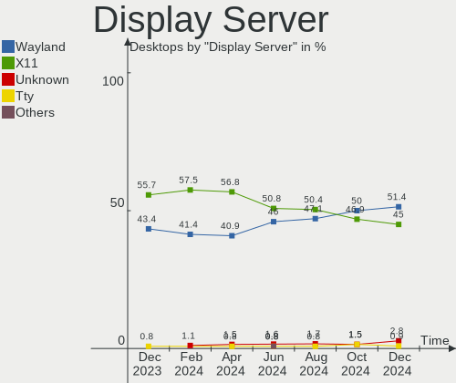
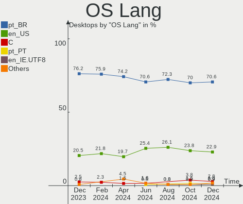
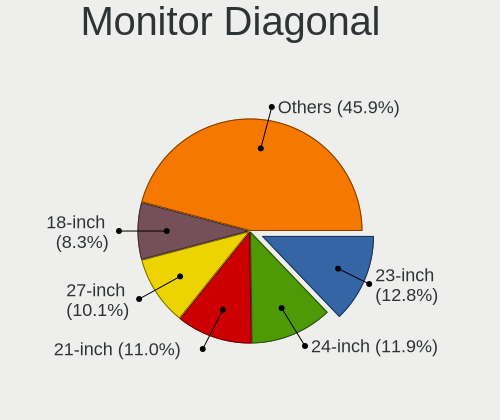
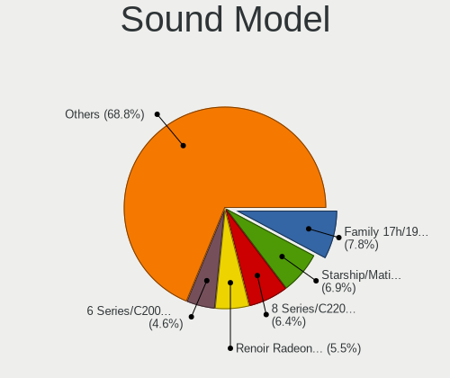

Linux in Brazil - Hardware Trends (Desktops)
--------------------------------------------

A project to identify most popular hardware characteristics and track their change
over time based on data collected by Linux users at https://Linux-Hardware.org.

Anyone can contribute to this report by the [hw-probe](https://github.com/linuxhw/hw-probe) tool:

    sudo -E hw-probe -all -upload

Period: Oct, 2022.

Contents
--------

* [ System ](#system)
  - [ OS                       ](#os)
  - [ OS Family                ](#os-family)
  - [ Kernel                   ](#kernel)
  - [ Kernel Family            ](#kernel-family)
  - [ Kernel Major Ver.        ](#kernel-major-ver)
  - [ Arch                     ](#arch)
  - [ DE                       ](#de)
  - [ Display Server           ](#display-server)
  - [ Display Manager          ](#display-manager)
  - [ OS Lang                  ](#os-lang)
  - [ Boot Mode                ](#boot-mode)
  - [ Filesystem               ](#filesystem)
  - [ Part. scheme             ](#part-scheme)
  - [ Dual Boot with Linux/BSD ](#dual-boot-with-linuxbsd)
  - [ Dual Boot (Win)          ](#dual-boot-win)

* [ Board ](#board)
  - [ Vendor                   ](#vendor)
  - [ Model                    ](#model)
  - [ Model Family             ](#model-family)
  - [ MFG Year                 ](#mfg-year)
  - [ Form Factor              ](#form-factor)
  - [ Secure Boot              ](#secure-boot)
  - [ Coreboot                 ](#coreboot)
  - [ RAM Size                 ](#ram-size)
  - [ RAM Used                 ](#ram-used)
  - [ Total Drives             ](#total-drives)
  - [ Has CD-ROM               ](#has-cd-rom)
  - [ Has Ethernet             ](#has-ethernet)
  - [ Has WiFi                 ](#has-wifi)
  - [ Has Bluetooth            ](#has-bluetooth)

* [ Location ](#location)
  - [ Country                  ](#country)
  - [ City                     ](#city)

* [ Drives ](#drives)
  - [ Drive Vendor             ](#drive-vendor)
  - [ Drive Model              ](#drive-model)
  - [ HDD Vendor               ](#hdd-vendor)
  - [ SSD Vendor               ](#ssd-vendor)
  - [ Drive Kind               ](#drive-kind)
  - [ Drive Connector          ](#drive-connector)
  - [ Drive Size               ](#drive-size)
  - [ Space Total              ](#space-total)
  - [ Space Used               ](#space-used)
  - [ Malfunc. Drives          ](#malfunc-drives)
  - [ Malfunc. Drive Vendor    ](#malfunc-drive-vendor)
  - [ Malfunc. HDD Vendor      ](#malfunc-hdd-vendor)
  - [ Malfunc. Drive Kind      ](#malfunc-drive-kind)
  - [ Failed Drives            ](#failed-drives)
  - [ Failed Drive Vendor      ](#failed-drive-vendor)
  - [ Drive Status             ](#drive-status)

* [ Storage controller ](#storage-controller)
  - [ Storage Vendor           ](#storage-vendor)
  - [ Storage Model            ](#storage-model)
  - [ Storage Kind             ](#storage-kind)

* [ Processor ](#processor)
  - [ CPU Vendor               ](#cpu-vendor)
  - [ CPU Model                ](#cpu-model)
  - [ CPU Model Family         ](#cpu-model-family)
  - [ CPU Cores                ](#cpu-cores)
  - [ CPU Sockets              ](#cpu-sockets)
  - [ CPU Threads              ](#cpu-threads)
  - [ CPU Op-Modes             ](#cpu-op-modes)
  - [ CPU Microcode            ](#cpu-microcode)
  - [ CPU Microarch            ](#cpu-microarch)

* [ Graphics ](#graphics)
  - [ GPU Vendor               ](#gpu-vendor)
  - [ GPU Model                ](#gpu-model)
  - [ GPU Combo                ](#gpu-combo)
  - [ GPU Driver               ](#gpu-driver)
  - [ GPU Memory               ](#gpu-memory)

* [ Monitor ](#monitor)
  - [ Monitor Vendor           ](#monitor-vendor)
  - [ Monitor Model            ](#monitor-model)
  - [ Monitor Resolution       ](#monitor-resolution)
  - [ Monitor Diagonal         ](#monitor-diagonal)
  - [ Monitor Width            ](#monitor-width)
  - [ Aspect Ratio             ](#aspect-ratio)
  - [ Monitor Area             ](#monitor-area)
  - [ Pixel Density            ](#pixel-density)
  - [ Multiple Monitors        ](#multiple-monitors)

* [ Network ](#network)
  - [ Net Controller Vendor    ](#net-controller-vendor)
  - [ Net Controller Model     ](#net-controller-model)
  - [ Wireless Vendor          ](#wireless-vendor)
  - [ Wireless Model           ](#wireless-model)
  - [ Ethernet Vendor          ](#ethernet-vendor)
  - [ Ethernet Model           ](#ethernet-model)
  - [ Net Controller Kind      ](#net-controller-kind)
  - [ Used Controller          ](#used-controller)
  - [ NICs                     ](#nics)
  - [ IPv6                     ](#ipv6)

* [ Bluetooth ](#bluetooth)
  - [ Bluetooth Vendor         ](#bluetooth-vendor)
  - [ Bluetooth Model          ](#bluetooth-model)

* [ Sound ](#sound)
  - [ Sound Vendor             ](#sound-vendor)
  - [ Sound Model              ](#sound-model)

* [ Memory ](#memory)
  - [ Memory Vendor            ](#memory-vendor)
  - [ Memory Model             ](#memory-model)
  - [ Memory Kind              ](#memory-kind)
  - [ Memory Form Factor       ](#memory-form-factor)
  - [ Memory Size              ](#memory-size)
  - [ Memory Speed             ](#memory-speed)

* [ Printers & scanners ](#printers--scanners)
  - [ Printer Vendor           ](#printer-vendor)
  - [ Printer Model            ](#printer-model)
  - [ Scanner Vendor           ](#scanner-vendor)
  - [ Scanner Model            ](#scanner-model)

* [ Camera ](#camera)
  - [ Camera Vendor            ](#camera-vendor)
  - [ Camera Model             ](#camera-model)

* [ Security ](#security)
  - [ Fingerprint Vendor       ](#fingerprint-vendor)
  - [ Fingerprint Model        ](#fingerprint-model)
  - [ Chipcard Vendor          ](#chipcard-vendor)
  - [ Chipcard Model           ](#chipcard-model)

* [ Unsupported ](#unsupported)
  - [ Unsupported Devices      ](#unsupported-devices)
  - [ Unsupported Device Types ](#unsupported-device-types)

System
------

OS
--

Installed operating systems

| Name                         | Desktops | Percent |
|------------------------------|----------|---------|
| Ubuntu 22.04                 | 15       | 16.13%  |
| Linux Mint 21                | 9        | 9.68%   |
| OpenMandriva 4.3             | 8        | 8.6%    |
| Zorin 16                     | 7        | 7.53%   |
| Pop!_OS 22.04                | 7        | 7.53%   |
| Fedora 36                    | 7        | 7.53%   |
| Linux Mint 20.3              | 4        | 4.3%    |
| Debian 11                    | 4        | 4.3%    |
| Arch Rolling                 | 4        | 4.3%    |
| KDE neon 22.04               | 3        | 3.23%   |
| openSUSE Tumbleweed-XXXXXXXX | 2        | 2.15%   |
| Kubuntu 22.04                | 2        | 2.15%   |
| KDE neon 20.04               | 2        | 2.15%   |
| Gentoo 2.9                   | 2        | 2.15%   |
| Xubuntu 22.10                | 1        | 1.08%   |
| Xubuntu 22.04                | 1        | 1.08%   |
| Ubuntu Unity 18.04           | 1        | 1.08%   |
| Parrot 4.11                  | 1        | 1.08%   |
| OpenMandriva 4.50            | 1        | 1.08%   |
| Nobara 36                    | 1        | 1.08%   |
| Manjaro 22.0.0               | 1        | 1.08%   |
| Linux Mint 20.1              | 1        | 1.08%   |
| Linux Mint 19.3              | 1        | 1.08%   |
| Feren OS 20.04               | 1        | 1.08%   |
| Fedora 37                    | 1        | 1.08%   |
| EndeavourOS Rolling          | 1        | 1.08%   |
| Elementary 6.1               | 1        | 1.08%   |
| Debian                       | 1        | 1.08%   |
| Clear Linux 36010            | 1        | 1.08%   |
| BigLinux 22.0.0              | 1        | 1.08%   |
| Amarok Linux 22.09           | 1        | 1.08%   |

OS Family
---------

OS without a version

| Name         | Desktops | Percent |
|--------------|----------|---------|
| Ubuntu       | 15       | 16.13%  |
| Linux Mint   | 15       | 16.13%  |
| OpenMandriva | 9        | 9.68%   |
| Fedora       | 8        | 8.6%    |
| Zorin        | 7        | 7.53%   |
| Pop!_OS      | 7        | 7.53%   |
| KDE neon     | 5        | 5.38%   |
| Debian       | 5        | 5.38%   |
| Arch         | 4        | 4.3%    |
| Xubuntu      | 2        | 2.15%   |
| openSUSE     | 2        | 2.15%   |
| Kubuntu      | 2        | 2.15%   |
| Gentoo       | 2        | 2.15%   |
| Ubuntu Unity | 1        | 1.08%   |
| Parrot       | 1        | 1.08%   |
| Nobara       | 1        | 1.08%   |
| Manjaro      | 1        | 1.08%   |
| Feren OS     | 1        | 1.08%   |
| EndeavourOS  | 1        | 1.08%   |
| Elementary   | 1        | 1.08%   |
| Clear Linux  | 1        | 1.08%   |
| BigLinux     | 1        | 1.08%   |
| Amarok Linux | 1        | 1.08%   |

Kernel
------

Version of the Linux kernel

| Version                       | Desktops | Percent |
|-------------------------------|----------|---------|
| 5.15.0-52-generic             | 12       | 12.9%   |
| 5.15.0-48-generic             | 12       | 12.9%   |
| 5.16.7-desktop-1omv4003       | 8        | 8.6%    |
| 5.15.0-50-generic             | 8        | 8.6%    |
| 5.19.16-76051916-generic      | 5        | 5.38%   |
| 5.15.0-41-generic             | 3        | 3.23%   |
| 6.0.5-200.fc36.x86_64         | 2        | 2.15%   |
| 5.4.0-91-generic              | 2        | 2.15%   |
| 5.19.13-arch1-1               | 2        | 2.15%   |
| 5.19.12-200.fc36.x86_64       | 2        | 2.15%   |
| 5.19.0-76051900-generic       | 2        | 2.15%   |
| 5.13.0-30-generic             | 2        | 2.15%   |
| 5.10.0-19-amd64               | 2        | 2.15%   |
| 5.10.0-18-amd64               | 2        | 2.15%   |
| 6.1.0-rc1                     | 1        | 1.08%   |
| 6.0.3-x64v1-xanmod1           | 1        | 1.08%   |
| 6.0.3-1-default               | 1        | 1.08%   |
| 6.0.2-WorkStation-x86_64      | 1        | 1.08%   |
| 6.0.0-2-amd64                 | 1        | 1.08%   |
| 6.0.0-1-default               | 1        | 1.08%   |
| 5.4.0-131-generic             | 1        | 1.08%   |
| 5.4.0-128-generic             | 1        | 1.08%   |
| 5.4.0-104-generic             | 1        | 1.08%   |
| 5.19.5-desktop-1omv4090       | 1        | 1.08%   |
| 5.19.16-200.fc36.x86_64       | 1        | 1.08%   |
| 5.19.14-201.fsync.fc36.x86_64 | 1        | 1.08%   |
| 5.19.14-200.fc36.x86_64       | 1        | 1.08%   |
| 5.19.13-300.fc37.x86_64       | 1        | 1.08%   |
| 5.19.13-200.fc36.x86_64       | 1        | 1.08%   |
| 5.19.12-arch1-1               | 1        | 1.08%   |
| 5.19.0-23-generic             | 1        | 1.08%   |
| 5.18.12-arch1-1               | 1        | 1.08%   |
| 5.16.13-1132.native           | 1        | 1.08%   |
| 5.15.74-amarok1               | 1        | 1.08%   |
| 5.15.74-1-lts                 | 1        | 1.08%   |
| 5.15.72-1-MANJARO             | 1        | 1.08%   |
| 5.15.71-1-MANJARO             | 1        | 1.08%   |
| 5.15.0-25-generic             | 1        | 1.08%   |
| 5.13.0-52-generic             | 1        | 1.08%   |
| 5.13.0-27-generic             | 1        | 1.08%   |

Kernel Family
-------------

Linux kernel without a distro release

| Version | Desktops | Percent |
|---------|----------|---------|
| 5.15.0  | 36       | 38.71%  |
| 5.16.7  | 8        | 8.6%    |
| 5.19.16 | 6        | 6.45%   |
| 5.4.0   | 5        | 5.38%   |
| 5.10.0  | 5        | 5.38%   |
| 5.19.13 | 4        | 4.3%    |
| 5.13.0  | 4        | 4.3%    |
| 5.19.12 | 3        | 3.23%   |
| 5.19.0  | 3        | 3.23%   |
| 6.0.5   | 2        | 2.15%   |
| 6.0.3   | 2        | 2.15%   |
| 6.0.0   | 2        | 2.15%   |
| 5.19.14 | 2        | 2.15%   |
| 5.15.74 | 2        | 2.15%   |
| 6.1.0   | 1        | 1.08%   |
| 6.0.2   | 1        | 1.08%   |
| 5.19.5  | 1        | 1.08%   |
| 5.18.12 | 1        | 1.08%   |
| 5.16.13 | 1        | 1.08%   |
| 5.15.72 | 1        | 1.08%   |
| 5.15.71 | 1        | 1.08%   |
| 5.0.0   | 1        | 1.08%   |
| 4.15.0  | 1        | 1.08%   |

Kernel Major Ver.
-----------------

Linux kernel major version

| Version | Desktops | Percent |
|---------|----------|---------|
| 5.15    | 40       | 43.01%  |
| 5.19    | 19       | 20.43%  |
| 5.16    | 9        | 9.68%   |
| 6.0     | 7        | 7.53%   |
| 5.4     | 5        | 5.38%   |
| 5.10    | 5        | 5.38%   |
| 5.13    | 4        | 4.3%    |
| 6.1     | 1        | 1.08%   |
| 5.18    | 1        | 1.08%   |
| 5.0     | 1        | 1.08%   |
| 4.15    | 1        | 1.08%   |

Arch
----

OS architecture (x86_64, i586, etc.)

| Name   | Desktops | Percent |
|--------|----------|---------|
| x86_64 | 91       | 97.85%  |
| i686   | 2        | 2.15%   |

DE
--

Desktop Environment

| Name          | Desktops | Percent |
|---------------|----------|---------|
| GNOME         | 41       | 44.09%  |
| KDE5          | 23       | 24.73%  |
| X-Cinnamon    | 11       | 11.83%  |
| XFCE          | 8        | 8.6%    |
| MATE          | 4        | 4.3%    |
| Unity         | 1        | 1.08%   |
| Pantheon      | 1        | 1.08%   |
| LXQt          | 1        | 1.08%   |
| GNOME Classic | 1        | 1.08%   |
| Cinnamon      | 1        | 1.08%   |
| Unknown       | 1        | 1.08%   |

Display Server
--------------

X11 or Wayland

| Name    | Desktops | Percent |
|---------|----------|---------|
| X11     | 71       | 76.34%  |
| Wayland | 21       | 22.58%  |
| Tty     | 1        | 1.08%   |

Display Manager
---------------

SDDM, LightDM, etc.

| Name    | Desktops | Percent |
|---------|----------|---------|
| Unknown | 47       | 50.54%  |
| SDDM    | 15       | 16.13%  |
| GDM3    | 14       | 15.05%  |
| LightDM | 12       | 12.9%   |
| GDM     | 5        | 5.38%   |

OS Lang
-------

Language

| Lang  | Desktops | Percent |
|-------|----------|---------|
| pt_BR | 67       | 72.04%  |
| en_US | 23       | 24.73%  |
| C     | 2        | 2.15%   |
| en_AG | 1        | 1.08%   |

Boot Mode
---------

EFI or BIOS

| Mode | Desktops | Percent |
|------|----------|---------|
| BIOS | 61       | 65.59%  |
| EFI  | 32       | 34.41%  |

Filesystem
----------

Type of filesystem

| Type    | Desktops | Percent |
|---------|----------|---------|
| Ext4    | 61       | 65.59%  |
| Btrfs   | 19       | 20.43%  |
| Overlay | 12       | 12.9%   |
| Xfs     | 1        | 1.08%   |

Part. scheme
------------

Scheme of partitioning

| Type    | Desktops | Percent |
|---------|----------|---------|
| Unknown | 48       | 51.61%  |
| GPT     | 30       | 32.26%  |
| MBR     | 15       | 16.13%  |

Dual Boot with Linux/BSD
------------------------

Hosting more than one Linux/BSD

| Dual boot | Desktops | Percent |
|-----------|----------|---------|
| No        | 81       | 87.1%   |
| Yes       | 12       | 12.9%   |

Dual Boot (Win)
---------------

Hosting Linux and Windows

| Dual boot | Desktops | Percent |
|-----------|----------|---------|
| No        | 67       | 72.04%  |
| Yes       | 26       | 27.96%  |

Board
-----

Vendor
------

Motherboard manufacturer

| Name                | Desktops | Percent |
|---------------------|----------|---------|
| ASUSTek Computer    | 27       | 29.03%  |
| Gigabyte Technology | 14       | 15.05%  |
| ASRock              | 9        | 9.68%   |
| Intel               | 8        | 8.6%    |
| MSI                 | 5        | 5.38%   |
| Dell                | 5        | 5.38%   |
| Pegatron            | 4        | 4.3%    |
| Lenovo              | 3        | 3.23%   |
| Semp Toshiba        | 2        | 2.15%   |
| PCWare              | 2        | 2.15%   |
| OEM                 | 2        | 2.15%   |
| Itautec             | 2        | 2.15%   |
| Biostar             | 2        | 2.15%   |
| QIYIDA              | 1        | 1.08%   |
| Positivo            | 1        | 1.08%   |
| Philco              | 1        | 1.08%   |
| MACHINIST           | 1        | 1.08%   |
| Huanan              | 1        | 1.08%   |
| Hewlett-Packard     | 1        | 1.08%   |
| Acer                | 1        | 1.08%   |
| Unknown             | 1        | 1.08%   |

Model
-----

Motherboard model

| Name                            | Desktops | Percent |
|---------------------------------|----------|---------|
| Intel H55                       | 3        | 3.23%   |
| ASUS TUF Gaming X570-PLUS_BR    | 3        | 3.23%   |
| Semp Toshiba STI                | 2        | 2.15%   |
| OEM G41 775 ICH7 8712           | 2        | 2.15%   |
| Intel B75                       | 2        | 2.15%   |
| Gigabyte B450M DS3H             | 2        | 2.15%   |
| ASUS PRIME B450M-GAMING/BR      | 2        | 2.15%   |
| ASRock H81M-HG4 R4.0            | 2        | 2.15%   |
| ASRock B450M Steel Legend       | 2        | 2.15%   |
| QIYIDA X99-H9 V2.0              | 1        | 1.08%   |
| Positivo Positivo Master D380   | 1        | 1.08%   |
| Philco DTC-A55                  | 1        | 1.08%   |
| Pegatron s5-1115br              | 1        | 1.08%   |
| Pegatron IPMIP-GS               | 1        | 1.08%   |
| Pegatron IPM31G                 | 1        | 1.08%   |
| Pegatron 2AABh                  | 1        | 1.08%   |
| PCWare IPMH61R3                 | 1        | 1.08%   |
| PCWare IPMH110G                 | 1        | 1.08%   |
| MSI MS-7C52                     | 1        | 1.08%   |
| MSI MS-7B10                     | 1        | 1.08%   |
| MSI MS-7A65                     | 1        | 1.08%   |
| MSI MS-7A33                     | 1        | 1.08%   |
| MSI MS-7918                     | 1        | 1.08%   |
| MACHINIST X99-RS9 V2.0          | 1        | 1.08%   |
| Lenovo V520S-08IKL 10NN001JBR   | 1        | 1.08%   |
| Lenovo ThinkCentre M58p 6234CZ6 | 1        | 1.08%   |
| Lenovo ThinkCentre M58p 6209CM1 | 1        | 1.08%   |
| Itautec Infoway ST-4273         | 1        | 1.08%   |
| Itautec Infoway ST-4254         | 1        | 1.08%   |
| Intel X99 V1.0                  | 1        | 1.08%   |
| Intel DH67CL AAG10212-206       | 1        | 1.08%   |
| Intel DG41TY AAE47335-302       | 1        | 1.08%   |
| Huanan X99-F8 GAMING V2.0       | 1        | 1.08%   |
| HP 200-5120br                   | 1        | 1.08%   |
| Gigabyte H87M-D3H               | 1        | 1.08%   |
| Gigabyte H110M-S2PH             | 1        | 1.08%   |
| Gigabyte H110M-H DDR3           | 1        | 1.08%   |
| Gigabyte GA-78LMT-S2            | 1        | 1.08%   |
| Gigabyte G41MT-S2P              | 1        | 1.08%   |
| Gigabyte B450M DS3H V2          | 1        | 1.08%   |

Model Family
------------

Motherboard model prefix

| Name                 | Desktops | Percent |
|----------------------|----------|---------|
| ASUS PRIME           | 9        | 9.68%   |
| ASUS TUF             | 6        | 6.45%   |
| Intel H55            | 3        | 3.23%   |
| Gigabyte B450M       | 3        | 3.23%   |
| ASUS M5A78L-M        | 3        | 3.23%   |
| Semp Toshiba STI     | 2        | 2.15%   |
| OEM G41              | 2        | 2.15%   |
| Lenovo ThinkCentre   | 2        | 2.15%   |
| Itautec Infoway      | 2        | 2.15%   |
| Intel B75            | 2        | 2.15%   |
| Dell OptiPlex        | 2        | 2.15%   |
| ASUS ROG             | 2        | 2.15%   |
| ASRock H81M-HG4      | 2        | 2.15%   |
| ASRock B450M         | 2        | 2.15%   |
| QIYIDA X99-H9        | 1        | 1.08%   |
| Positivo Positivo    | 1        | 1.08%   |
| Philco DTC-A55       | 1        | 1.08%   |
| Pegatron s5-1115br   | 1        | 1.08%   |
| Pegatron IPMIP-GS    | 1        | 1.08%   |
| Pegatron IPM31G      | 1        | 1.08%   |
| Pegatron 2AABh       | 1        | 1.08%   |
| PCWare IPMH61R3      | 1        | 1.08%   |
| PCWare IPMH110G      | 1        | 1.08%   |
| MSI MS-7C52          | 1        | 1.08%   |
| MSI MS-7B10          | 1        | 1.08%   |
| MSI MS-7A65          | 1        | 1.08%   |
| MSI MS-7A33          | 1        | 1.08%   |
| MSI MS-7918          | 1        | 1.08%   |
| MACHINIST X99-RS9    | 1        | 1.08%   |
| Lenovo V520S-08IKL   | 1        | 1.08%   |
| Intel X99            | 1        | 1.08%   |
| Intel DH67CL         | 1        | 1.08%   |
| Intel DG41TY         | 1        | 1.08%   |
| Huanan X99-F8        | 1        | 1.08%   |
| HP 200-5120br        | 1        | 1.08%   |
| Gigabyte H87M-D3H    | 1        | 1.08%   |
| Gigabyte H110M-S2PH  | 1        | 1.08%   |
| Gigabyte H110M-H     | 1        | 1.08%   |
| Gigabyte GA-78LMT-S2 | 1        | 1.08%   |
| Gigabyte G41MT-S2P   | 1        | 1.08%   |

MFG Year
--------

Motherboard manufacture year

| Year | Desktops | Percent |
|------|----------|---------|
| 2019 | 14       | 15.05%  |
| 2018 | 12       | 12.9%   |
| 2021 | 7        | 7.53%   |
| 2020 | 7        | 7.53%   |
| 2016 | 7        | 7.53%   |
| 2009 | 7        | 7.53%   |
| 2017 | 6        | 6.45%   |
| 2012 | 6        | 6.45%   |
| 2011 | 6        | 6.45%   |
| 2013 | 5        | 5.38%   |
| 2010 | 5        | 5.38%   |
| 2014 | 4        | 4.3%    |
| 2008 | 3        | 3.23%   |
| 2022 | 2        | 2.15%   |
| 2015 | 1        | 1.08%   |
| 2006 | 1        | 1.08%   |

Form Factor
-----------

Physical design of the computer

| Name    | Desktops | Percent |
|---------|----------|---------|
| Desktop | 93       | 100%    |

Secure Boot
-----------

Enabled or disabled

| State    | Desktops | Percent |
|----------|----------|---------|
| Disabled | 87       | 93.55%  |
| Enabled  | 6        | 6.45%   |

Coreboot
--------

Have coreboot on board

| Used | Desktops | Percent |
|------|----------|---------|
| No   | 93       | 100%    |

RAM Size
--------

Total RAM memory

| Size in GB  | Desktops | Percent |
|-------------|----------|---------|
| 16.01-24.0  | 27       | 29.03%  |
| 4.01-8.0    | 18       | 19.35%  |
| 3.01-4.0    | 16       | 17.2%   |
| 8.01-16.0   | 13       | 13.98%  |
| 32.01-64.0  | 8        | 8.6%    |
| 24.01-32.0  | 4        | 4.3%    |
| 64.01-256.0 | 4        | 4.3%    |
| 1.01-2.0    | 2        | 2.15%   |
| 2.01-3.0    | 1        | 1.08%   |

RAM Used
--------

Used RAM memory

| Used GB   | Desktops | Percent |
|-----------|----------|---------|
| 1.01-2.0  | 30       | 32.26%  |
| 2.01-3.0  | 23       | 24.73%  |
| 4.01-8.0  | 18       | 19.35%  |
| 3.01-4.0  | 14       | 15.05%  |
| 0.51-1.0  | 5        | 5.38%   |
| 8.01-16.0 | 2        | 2.15%   |
| 0.01-0.5  | 1        | 1.08%   |

Total Drives
------------

Number of drives on board

| Drives | Desktops | Percent |
|--------|----------|---------|
| 1      | 44       | 47.31%  |
| 2      | 23       | 24.73%  |
| 3      | 12       | 12.9%   |
| 4      | 8        | 8.6%    |
| 5      | 4        | 4.3%    |
| 6      | 2        | 2.15%   |

Has CD-ROM
----------

Has CD-ROM on board

| Presented | Desktops | Percent |
|-----------|----------|---------|
| No        | 72       | 77.42%  |
| Yes       | 21       | 22.58%  |

Has Ethernet
------------

Has Ethernet on board

| Presented | Desktops | Percent |
|-----------|----------|---------|
| Yes       | 91       | 97.85%  |
| No        | 2        | 2.15%   |

Has WiFi
--------

Has WiFi module

| Presented | Desktops | Percent |
|-----------|----------|---------|
| No        | 60       | 64.52%  |
| Yes       | 33       | 35.48%  |

Has Bluetooth
-------------

Has Bluetooth module

| Presented | Desktops | Percent |
|-----------|----------|---------|
| No        | 67       | 72.04%  |
| Yes       | 26       | 27.96%  |

Location
--------

Country
-------

Geographic location (country)

| Country | Desktops | Percent |
|---------|----------|---------|
| Brazil  | 93       | 100%    |

City
----

Geographic location (city)

| City                  | Desktops | Percent |
|-----------------------|----------|---------|
| Sao Paulo             | 12       | 12.9%   |
| Rio de Janeiro        | 10       | 10.75%  |
| Belo Horizonte        | 5        | 5.38%   |
| Natal                 | 3        | 3.23%   |
| Brasília             | 3        | 3.23%   |
| Santo André          | 2        | 2.15%   |
| Porto Alegre          | 2        | 2.15%   |
| Nova Iguaçu          | 2        | 2.15%   |
| Niterói              | 2        | 2.15%   |
| Juiz de Fora          | 2        | 2.15%   |
| Curitiba              | 2        | 2.15%   |
| Campinas              | 2        | 2.15%   |
| Botucatu              | 2        | 2.15%   |
| Vitória da Conquista | 1        | 1.08%   |
| Valinhos              | 1        | 1.08%   |
| Turvo                 | 1        | 1.08%   |
| Teresopolis           | 1        | 1.08%   |
| Sorocaba              | 1        | 1.08%   |
| Santa Helena          | 1        | 1.08%   |
| Santa Cruz do Sul     | 1        | 1.08%   |
| Ribeirao Preto        | 1        | 1.08%   |
| Ribeirao das Neves    | 1        | 1.08%   |
| Recife                | 1        | 1.08%   |
| Pouso Alegre          | 1        | 1.08%   |
| Piquete               | 1        | 1.08%   |
| Pelotas               | 1        | 1.08%   |
| Olinda                | 1        | 1.08%   |
| Nova Friburgo         | 1        | 1.08%   |
| Mirassol              | 1        | 1.08%   |
| Maringá              | 1        | 1.08%   |
| Maracaju              | 1        | 1.08%   |
| Machado               | 1        | 1.08%   |
| Maceió               | 1        | 1.08%   |
| Londrina              | 1        | 1.08%   |
| Lages                 | 1        | 1.08%   |
| Juatuba               | 1        | 1.08%   |
| Ituberá              | 1        | 1.08%   |
| Itariri               | 1        | 1.08%   |
| Iguatemi              | 1        | 1.08%   |
| Guarulhos             | 1        | 1.08%   |

Drives
------

Drive Vendor
------------

Hard drive vendors

| Vendor              | Desktops | Drives | Percent |
|---------------------|----------|--------|---------|
| Seagate             | 32       | 40     | 19.16%  |
| WDC                 | 29       | 32     | 17.37%  |
| Kingston            | 22       | 24     | 13.17%  |
| Samsung Electronics | 15       | 21     | 8.98%   |
| SanDisk             | 9        | 10     | 5.39%   |
| Toshiba             | 8        | 9      | 4.79%   |
| Hitachi             | 8        | 9      | 4.79%   |
| China               | 6        | 6      | 3.59%   |
| ADATA Technology    | 6        | 7      | 3.59%   |
| Silicon Motion      | 4        | 4      | 2.4%    |
| Phison Electronics  | 3        | 3      | 1.8%    |
| Crucial             | 3        | 3      | 1.8%    |
| Netac               | 2        | 2      | 1.2%    |
| Lexar               | 2        | 2      | 1.2%    |
| KingSpec            | 2        | 3      | 1.2%    |
| A-DATA Technology   | 2        | 2      | 1.2%    |
| XrayDisk            | 1        | 1      | 0.6%    |
| XPG                 | 1        | 1      | 0.6%    |
| Unknown             | 1        | 1      | 0.6%    |
| Team                | 1        | 1      | 0.6%    |
| SK hynix            | 1        | 1      | 0.6%    |
| SAGE                | 1        | 1      | 0.6%    |
| PNY                 | 1        | 1      | 0.6%    |
| MaxDigital          | 1        | 1      | 0.6%    |
| JMicron Technology  | 1        | 1      | 0.6%    |
| Intel               | 1        | 1      | 0.6%    |
| Initio              | 1        | 1      | 0.6%    |
| HUSKY               | 1        | 1      | 0.6%    |
| HS-SSD-C100         | 1        | 1      | 0.6%    |
| Fujitsu             | 1        | 1      | 0.6%    |

Drive Model
-----------

Hard drive models

| Model                                                           | Desktops | Percent |
|-----------------------------------------------------------------|----------|---------|
| Kingston SA400S37480G 480GB SSD                                 | 7        | 3.85%   |
| Kingston SA400S37240G 240GB SSD                                 | 7        | 3.85%   |
| ADATA XPG SX8200 Pro PCIe Gen3x4 M.2 2280 Solid State Drive 1TB | 4        | 2.2%    |
| Silicon Motion SM2263EN/SM2263XT SSD Controller 256GB           | 3        | 1.65%   |
| Seagate ST3500414CS 500GB                                       | 3        | 1.65%   |
| Seagate ST1000DM010-2EP102 1TB                                  | 3        | 1.65%   |
| Samsung HD322HJ 320GB                                           | 3        | 1.65%   |
| Kingston SA400S37960G 960GB SSD                                 | 3        | 1.65%   |
| WDC WD10JPVX-22JC3T0 1TB                                        | 2        | 1.1%    |
| WDC WD10EZEX-08WN4A0 1TB                                        | 2        | 1.1%    |
| WDC WD10EZEX-00BN5A0 1TB                                        | 2        | 1.1%    |
| Toshiba MQ01ABF050 500GB                                        | 2        | 1.1%    |
| Toshiba DT01ACA050 500GB                                        | 2        | 1.1%    |
| Seagate ST3500312CS 500GB                                       | 2        | 1.1%    |
| Seagate ST2000DM008-2FR102 2TB                                  | 2        | 1.1%    |
| Seagate ST1000DM003-1ER162 1TB                                  | 2        | 1.1%    |
| SanDisk SDSSDA120G 120GB                                        | 2        | 1.1%    |
| Samsung SSD 860 EVO 1TB                                         | 2        | 1.1%    |
| Samsung NVMe SSD Controller SM981/PM981/PM983 500GB             | 2        | 1.1%    |
| Samsung HD502HJ 500GB                                           | 2        | 1.1%    |
| Samsung HD161HJ 160GB                                           | 2        | 1.1%    |
| Phison PS5013 E13 NVMe Controller 256GB                         | 2        | 1.1%    |
| Kingston SV300S37A120G 120GB SSD                                | 2        | 1.1%    |
| Kingston SA400S37120G 120GB SSD                                 | 2        | 1.1%    |
| Hitachi HDS721010CLA332 1TB                                     | 2        | 1.1%    |
| China SSD 128GB                                                 | 2        | 1.1%    |
| XrayDisk 120GB                                                  | 1        | 0.55%   |
| XPG NVMe SSD Drive 2TB                                          | 1        | 0.55%   |
| WDC WDS480G2G0A-00JH30 480GB SSD                                | 1        | 0.55%   |
| WDC WDS120G1G0A-00SS50 120GB SSD                                | 1        | 0.55%   |
| WDC WDS100T1XHE-00AFY0 1TB                                      | 1        | 0.55%   |
| WDC WDS100T1X0E-00AFY0 1TB                                      | 1        | 0.55%   |
| WDC WD800BD-22MRA1 80GB                                         | 1        | 0.55%   |
| WDC WD7500BPKX-60HPJT0 752GB                                    | 1        | 0.55%   |
| WDC WD5000LPVX-22V0TT0 500GB                                    | 1        | 0.55%   |
| WDC WD5000BEVT-75A0RT0 500GB                                    | 1        | 0.55%   |
| WDC WD5000BEVT-22A0RT0 500GB                                    | 1        | 0.55%   |
| WDC WD5000AZLX-08K2TA0 500GB                                    | 1        | 0.55%   |
| WDC WD5000AVCS-632DY1 500GB                                     | 1        | 0.55%   |
| WDC WD5000AAKX-00U6AA0 500GB                                    | 1        | 0.55%   |

HDD Vendor
----------

Hard disk drive vendors

| Vendor              | Desktops | Drives | Percent |
|---------------------|----------|--------|---------|
| Seagate             | 32       | 39     | 36.78%  |
| WDC                 | 26       | 28     | 29.89%  |
| Samsung Electronics | 10       | 11     | 11.49%  |
| Toshiba             | 8        | 9      | 9.2%    |
| Hitachi             | 8        | 9      | 9.2%    |
| SAGE                | 1        | 1      | 1.15%   |
| Initio              | 1        | 1      | 1.15%   |
| Fujitsu             | 1        | 1      | 1.15%   |

SSD Vendor
----------

Solid state drive vendors

| Vendor              | Desktops | Drives | Percent |
|---------------------|----------|--------|---------|
| Kingston            | 20       | 22     | 37.74%  |
| SanDisk             | 7        | 8      | 13.21%  |
| China               | 6        | 6      | 11.32%  |
| Samsung Electronics | 3        | 6      | 5.66%   |
| WDC                 | 2        | 2      | 3.77%   |
| Netac               | 2        | 2      | 3.77%   |
| Lexar               | 2        | 2      | 3.77%   |
| KingSpec            | 2        | 3      | 3.77%   |
| Crucial             | 2        | 2      | 3.77%   |
| Team                | 1        | 1      | 1.89%   |
| Seagate             | 1        | 1      | 1.89%   |
| PNY                 | 1        | 1      | 1.89%   |
| MaxDigital          | 1        | 1      | 1.89%   |
| Intel               | 1        | 1      | 1.89%   |
| HUSKY               | 1        | 1      | 1.89%   |
| A-DATA Technology   | 1        | 1      | 1.89%   |

Drive Kind
----------

HDD or SSD

| Kind    | Desktops | Drives | Percent |
|---------|----------|--------|---------|
| HDD     | 69       | 99     | 48.94%  |
| SSD     | 47       | 60     | 33.33%  |
| NVMe    | 23       | 30     | 16.31%  |
| Unknown | 2        | 2      | 1.42%   |

Drive Connector
---------------

SATA, SAS, NVMe, etc.

| Type | Desktops | Drives | Percent |
|------|----------|--------|---------|
| SATA | 87       | 158    | 76.99%  |
| NVMe | 22       | 29     | 19.47%  |
| SAS  | 4        | 4      | 3.54%   |

Drive Size
----------

Size of hard drive

| Size in TB | Desktops | Drives | Percent |
|------------|----------|--------|---------|
| 0.01-0.5   | 63       | 88     | 52.07%  |
| 0.51-1.0   | 49       | 58     | 40.5%   |
| 1.01-2.0   | 7        | 9      | 5.79%   |
| 3.01-4.0   | 1        | 3      | 0.83%   |
| 4.01-10.0  | 1        | 1      | 0.83%   |

Space Total
-----------

Amount of disk space available on the file system

| Size in GB     | Desktops | Percent |
|----------------|----------|---------|
| 101-250        | 18       | 19.35%  |
| 501-1000       | 18       | 19.35%  |
| 251-500        | 15       | 16.13%  |
| 1001-2000      | 15       | 16.13%  |
| 1-20           | 11       | 11.83%  |
| More than 3000 | 6        | 6.45%   |
| 2001-3000      | 5        | 5.38%   |
| 21-50          | 2        | 2.15%   |
| Unknown        | 2        | 2.15%   |
| 51-100         | 1        | 1.08%   |

Space Used
----------

Amount of used disk space

| Used GB   | Desktops | Percent |
|-----------|----------|---------|
| 1-20      | 37       | 39.78%  |
| 251-500   | 13       | 13.98%  |
| 21-50     | 11       | 11.83%  |
| 101-250   | 11       | 11.83%  |
| 51-100    | 7        | 7.53%   |
| 501-1000  | 6        | 6.45%   |
| 1001-2000 | 5        | 5.38%   |
| Unknown   | 2        | 2.15%   |
| 2001-3000 | 1        | 1.08%   |

Malfunc. Drives
---------------

Drive models with a malfunction

| Model                               | Desktops | Drives | Percent |
|-------------------------------------|----------|--------|---------|
| Samsung Electronics HD322HJ 320GB   | 2        | 2      | 13.33%  |
| WDC WD800BD-22MRA1 80GB             | 1        | 1      | 6.67%   |
| WDC WD3200AAJS-00L7A0 320GB         | 1        | 1      | 6.67%   |
| Seagate ST500DM002-1BD142 500GB     | 1        | 1      | 6.67%   |
| Seagate ST320LM001 HN-M320MBB 320GB | 1        | 2      | 6.67%   |
| Seagate ST1000LM048-2E7172 1TB      | 1        | 1      | 6.67%   |
| Seagate ST1000DM003-1ER162 1TB      | 1        | 2      | 6.67%   |
| Samsung Electronics HD502HJ 500GB   | 1        | 1      | 6.67%   |
| Netac SSD 120GB                     | 1        | 1      | 6.67%   |
| Initio 3639S 500GB                  | 1        | 1      | 6.67%   |
| Hitachi HTS721060G9SA00 64GB        | 1        | 1      | 6.67%   |
| Hitachi HTS547550A9E384 500GB       | 1        | 1      | 6.67%   |
| Hitachi HTS543216L9SA00 160GB       | 1        | 1      | 6.67%   |
| Hitachi HDS721010DLE630 1TB         | 1        | 1      | 6.67%   |

Malfunc. Drive Vendor
---------------------

Vendors of faulty drives

| Vendor              | Desktops | Drives | Percent |
|---------------------|----------|--------|---------|
| Seagate             | 4        | 6      | 26.67%  |
| Hitachi             | 4        | 4      | 26.67%  |
| Samsung Electronics | 3        | 3      | 20%     |
| WDC                 | 2        | 2      | 13.33%  |
| Netac               | 1        | 1      | 6.67%   |
| Initio              | 1        | 1      | 6.67%   |

Malfunc. HDD Vendor
-------------------

Vendors of faulty HDD drives

| Vendor              | Desktops | Drives | Percent |
|---------------------|----------|--------|---------|
| Seagate             | 4        | 6      | 28.57%  |
| Hitachi             | 4        | 4      | 28.57%  |
| Samsung Electronics | 3        | 3      | 21.43%  |
| WDC                 | 2        | 2      | 14.29%  |
| Initio              | 1        | 1      | 7.14%   |

Malfunc. Drive Kind
-------------------

Kinds of faulty drives

| Kind | Desktops | Drives | Percent |
|------|----------|--------|---------|
| HDD  | 12       | 16     | 92.31%  |
| SSD  | 1        | 1      | 7.69%   |

Failed Drives
-------------

Failed drive models

Zero info for selected period =(

Failed Drive Vendor
-------------------

Failed drive vendors

Zero info for selected period =(

Drive Status
------------

Number of failed and malfunc. drives

| Status   | Desktops | Drives | Percent |
|----------|----------|--------|---------|
| Detected | 64       | 125    | 62.14%  |
| Works    | 26       | 49     | 25.24%  |
| Malfunc  | 13       | 17     | 12.62%  |

Storage controller
------------------

Storage Vendor
--------------

Storage controller vendors

| Vendor                       | Desktops | Percent |
|------------------------------|----------|---------|
| Intel                        | 59       | 48.36%  |
| AMD                          | 32       | 26.23%  |
| ADATA Technology             | 7        | 5.74%   |
| Silicon Motion               | 4        | 3.28%   |
| SanDisk                      | 3        | 2.46%   |
| Samsung Electronics          | 3        | 2.46%   |
| Phison Electronics           | 3        | 2.46%   |
| Kingston Technology Company  | 2        | 1.64%   |
| ASMedia Technology           | 2        | 1.64%   |
| Unknown                      | 1        | 0.82%   |
| SK hynix                     | 1        | 0.82%   |
| Silicon Image                | 1        | 0.82%   |
| Nvidia                       | 1        | 0.82%   |
| Micron/Crucial Technology    | 1        | 0.82%   |
| Marvell Technology Group     | 1        | 0.82%   |
| Beijing Starblaze Technology | 1        | 0.82%   |

Storage Model
-------------

Storage controller models

| Model                                                                          | Desktops | Percent |
|--------------------------------------------------------------------------------|----------|---------|
| AMD FCH SATA Controller [AHCI mode]                                            | 19       | 11.95%  |
| Intel NM10/ICH7 Family SATA Controller [IDE mode]                              | 13       | 8.18%   |
| Intel 82801G (ICH7 Family) IDE Controller                                      | 10       | 6.29%   |
| AMD 400 Series Chipset SATA Controller                                         | 10       | 6.29%   |
| Intel 8 Series/C220 Series Chipset Family 6-port SATA Controller 1 [AHCI mode] | 7        | 4.4%    |
| Intel 6 Series/C200 Series Chipset Family 6 port Desktop SATA AHCI Controller  | 5        | 3.14%   |
| Silicon Motion SM2263EN/SM2263XT SSD Controller                                | 4        | 2.52%   |
| Intel 7 Series/C210 Series Chipset Family 6-port SATA Controller [AHCI mode]   | 4        | 2.52%   |
| Intel 200 Series PCH SATA controller [AHCI mode]                               | 4        | 2.52%   |
| AMD SB7x0/SB8x0/SB9x0 SATA Controller [IDE mode]                               | 4        | 2.52%   |
| AMD SB7x0/SB8x0/SB9x0 IDE Controller                                           | 4        | 2.52%   |
| AMD FCH SATA Controller D                                                      | 4        | 2.52%   |
| ADATA XPG SX8200 Pro PCIe Gen3x4 M.2 2280 Solid State Drive                    | 4        | 2.52%   |
| Intel SATA Controller [RAID mode]                                              | 3        | 1.89%   |
| Intel Q170/Q150/B150/H170/H110/Z170/CM236 Chipset SATA Controller [AHCI Mode]  | 3        | 1.89%   |
| Intel 5 Series/3400 Series Chipset 6 port SATA AHCI Controller                 | 3        | 1.89%   |
| SanDisk Non-Volatile memory controller                                         | 2        | 1.26%   |
| Samsung NVMe SSD Controller SM981/PM981/PM983                                  | 2        | 1.26%   |
| Phison PS5013 E13 NVMe Controller                                              | 2        | 1.26%   |
| Kingston Company Company Non-Volatile memory controller                        | 2        | 1.26%   |
| Intel Volume Management Device NVMe RAID Controller                            | 2        | 1.26%   |
| Intel Cannon Lake PCH SATA AHCI Controller                                     | 2        | 1.26%   |
| Intel Alder Lake-S PCH SATA Controller [AHCI Mode]                             | 2        | 1.26%   |
| Intel 82801JI (ICH10 Family) SATA AHCI Controller                              | 2        | 1.26%   |
| Intel 82801JD/DO (ICH10 Family) SATA AHCI Controller                           | 2        | 1.26%   |
| Intel 400 Series Chipset Family SATA AHCI Controller                           | 2        | 1.26%   |
| Intel 4 Series Chipset PT IDER Controller                                      | 2        | 1.26%   |
| AMD X370 Series Chipset SATA Controller                                        | 2        | 1.26%   |
| AMD 500 Series Chipset SATA Controller                                         | 2        | 1.26%   |
| AMD 300 Series Chipset SATA Controller                                         | 2        | 1.26%   |
| ADATA A Non-Volatile memory controller                                         | 2        | 1.26%   |
| Unknown Non-Volatile memory controller                                         | 1        | 0.63%   |
| SK hynix BC511                                                                 | 1        | 0.63%   |
| Silicon Image SiI 3132 Serial ATA Raid II Controller                           | 1        | 0.63%   |
| SanDisk WD PC SN810 / Black SN850 NVMe SSD                                     | 1        | 0.63%   |
| Samsung NVMe SSD Controller PM9A1/PM9A3/980PRO                                 | 1        | 0.63%   |
| Phison E12 NVMe Controller                                                     | 1        | 0.63%   |
| Nvidia MCP61 SATA Controller                                                   | 1        | 0.63%   |
| Nvidia MCP61 IDE                                                               | 1        | 0.63%   |
| Micron/Crucial P1 NVMe PCIe SSD                                                | 1        | 0.63%   |

Storage Kind
------------

Kind of storage controller (IDE, SATA, NVMe, SAS, ...)

| Kind | Desktops | Percent |
|------|----------|---------|
| SATA | 72       | 57.6%   |
| IDE  | 24       | 19.2%   |
| NVMe | 22       | 17.6%   |
| RAID | 7        | 5.6%    |

Processor
---------

CPU Vendor
----------

Processor vendors

| Vendor | Desktops | Percent |
|--------|----------|---------|
| Intel  | 60       | 64.52%  |
| AMD    | 33       | 35.48%  |

CPU Model
---------

Processor models

| Model                                       | Desktops | Percent |
|---------------------------------------------|----------|---------|
| Intel Core 2 Duo CPU E7500 @ 2.93GHz        | 3        | 3.23%   |
| Intel Xeon CPU E5-2620 v3 @ 2.40GHz         | 2        | 2.15%   |
| Intel Pentium CPU G2030 @ 3.00GHz           | 2        | 2.15%   |
| Intel Core i5-3470 CPU @ 3.20GHz            | 2        | 2.15%   |
| Intel Core i3-7100 CPU @ 3.90GHz            | 2        | 2.15%   |
| Intel Core i3-4160 CPU @ 3.60GHz            | 2        | 2.15%   |
| Intel Core 2 Quad CPU Q8200 @ 2.33GHz       | 2        | 2.15%   |
| AMD Ryzen 9 5950X 16-Core Processor         | 2        | 2.15%   |
| AMD Ryzen 7 5700G with Radeon Graphics      | 2        | 2.15%   |
| AMD Ryzen 7 3700X 8-Core Processor          | 2        | 2.15%   |
| AMD Ryzen 5 3600 6-Core Processor           | 2        | 2.15%   |
| AMD Ryzen 5 3500 6-Core Processor           | 2        | 2.15%   |
| AMD Ryzen 5 3400G with Radeon Vega Graphics | 2        | 2.15%   |
| Intel Xeon CPU X5550 @ 2.67GHz              | 1        | 1.08%   |
| Intel Xeon CPU X5450 @ 3.00GHz              | 1        | 1.08%   |
| Intel Xeon CPU E5-2678 v3 @ 2.50GHz         | 1        | 1.08%   |
| Intel Xeon CPU E5-2640 v3 @ 2.60GHz         | 1        | 1.08%   |
| Intel Pentium Dual-Core CPU E6700 @ 3.20GHz | 1        | 1.08%   |
| Intel Pentium Dual-Core CPU E5800 @ 3.20GHz | 1        | 1.08%   |
| Intel Pentium Dual-Core CPU E5400 @ 2.70GHz | 1        | 1.08%   |
| Intel Pentium CPU G630 @ 2.70GHz            | 1        | 1.08%   |
| Intel Pentium CPU G4400 @ 3.30GHz           | 1        | 1.08%   |
| Intel Pentium CPU G3260 @ 3.30GHz           | 1        | 1.08%   |
| Intel Genuine CPU 0000 @ 2.70GHz            | 1        | 1.08%   |
| Intel Core i9-9900K CPU @ 3.60GHz           | 1        | 1.08%   |
| Intel Core i7-8700 CPU @ 3.20GHz            | 1        | 1.08%   |
| Intel Core i7-7700 CPU @ 3.60GHz            | 1        | 1.08%   |
| Intel Core i7-6700K CPU @ 4.00GHz           | 1        | 1.08%   |
| Intel Core i7-6700 CPU @ 3.40GHz            | 1        | 1.08%   |
| Intel Core i7-4790K CPU @ 4.00GHz           | 1        | 1.08%   |
| Intel Core i7-4790 CPU @ 3.60GHz            | 1        | 1.08%   |
| Intel Core i7-3770 CPU @ 3.40GHz            | 1        | 1.08%   |
| Intel Core i7-2600 CPU @ 3.40GHz            | 1        | 1.08%   |
| Intel Core i5-9400F CPU @ 2.90GHz           | 1        | 1.08%   |
| Intel Core i5-7400 CPU @ 3.00GHz            | 1        | 1.08%   |
| Intel Core i5-4440 CPU @ 3.10GHz            | 1        | 1.08%   |
| Intel Core i5-3570 CPU @ 3.40GHz            | 1        | 1.08%   |
| Intel Core i5-3330 CPU @ 3.00GHz            | 1        | 1.08%   |
| Intel Core i5-2310 CPU @ 2.90GHz            | 1        | 1.08%   |
| Intel Core i5-10400 CPU @ 2.90GHz           | 1        | 1.08%   |

CPU Model Family
----------------

Processor model prefix

| Model                   | Desktops | Percent |
|-------------------------|----------|---------|
| Intel Core i5           | 13       | 13.98%  |
| AMD Ryzen 5             | 12       | 12.9%   |
| Intel Core i7           | 8        | 8.6%    |
| AMD Ryzen 7             | 8        | 8.6%    |
| Intel Core i3           | 7        | 7.53%   |
| Intel Xeon              | 6        | 6.45%   |
| Intel Pentium           | 5        | 5.38%   |
| Intel Core 2 Quad       | 5        | 5.38%   |
| Intel Core 2 Duo        | 5        | 5.38%   |
| Intel Pentium Dual-Core | 3        | 3.23%   |
| Intel Celeron           | 3        | 3.23%   |
| AMD Ryzen 9             | 3        | 3.23%   |
| AMD Ryzen 3             | 3        | 3.23%   |
| AMD FX                  | 3        | 3.23%   |
| Other                   | 2        | 2.15%   |
| Intel Genuine           | 1        | 1.08%   |
| Intel Core i9           | 1        | 1.08%   |
| Intel Core 2            | 1        | 1.08%   |
| AMD Phenom II X6        | 1        | 1.08%   |
| AMD Phenom II X4        | 1        | 1.08%   |
| AMD A8                  | 1        | 1.08%   |
| AMD A4                  | 1        | 1.08%   |

CPU Cores
---------

Number of processor cores

| Number | Desktops | Percent |
|--------|----------|---------|
| 4      | 35       | 37.63%  |
| 2      | 24       | 25.81%  |
| 6      | 15       | 16.13%  |
| 8      | 10       | 10.75%  |
| 16     | 4        | 4.3%    |
| 1      | 3        | 3.23%   |
| 12     | 1        | 1.08%   |
| 3      | 1        | 1.08%   |

CPU Sockets
-----------

Number of sockets

| Number | Desktops | Percent |
|--------|----------|---------|
| 1      | 93       | 100%    |

CPU Threads
-----------

Threads per core (Hyper-Threading)

| Number | Desktops | Percent |
|--------|----------|---------|
| 2      | 51       | 54.84%  |
| 1      | 42       | 45.16%  |

CPU Op-Modes
------------

CPU Operation Modes (32-bit, 64-bit)

| Op mode        | Desktops | Percent |
|----------------|----------|---------|
| 32-bit, 64-bit | 93       | 100%    |

CPU Microcode
-------------

Microcode number

| Number     | Desktops | Percent |
|------------|----------|---------|
| Unknown    | 29       | 31.18%  |
| 0x1067a    | 7        | 7.53%   |
| 0x906e9    | 5        | 5.38%   |
| 0x306c3    | 5        | 5.38%   |
| 0x306f2    | 4        | 4.3%    |
| 0x306a9    | 4        | 4.3%    |
| 0x206a7    | 3        | 3.23%   |
| 0x0800820d | 3        | 3.23%   |
| 0xa0653    | 2        | 2.15%   |
| 0x506e3    | 2        | 2.15%   |
| 0x20652    | 2        | 2.15%   |
| 0x0a50000d | 2        | 2.15%   |
| 0x08701021 | 2        | 2.15%   |
| 0x06000852 | 2        | 2.15%   |
| 0x906ec    | 1        | 1.08%   |
| 0x906ea    | 1        | 1.08%   |
| 0x90675    | 1        | 1.08%   |
| 0x6f2      | 1        | 1.08%   |
| 0x506e8    | 1        | 1.08%   |
| 0x20655    | 1        | 1.08%   |
| 0x106a5    | 1        | 1.08%   |
| 0x10677    | 1        | 1.08%   |
| 0x10676    | 1        | 1.08%   |
| 0x10661    | 1        | 1.08%   |
| 0x0a601203 | 1        | 1.08%   |
| 0x0a50000c | 1        | 1.08%   |
| 0x0a20120a | 1        | 1.08%   |
| 0x0a201016 | 1        | 1.08%   |
| 0x08701013 | 1        | 1.08%   |
| 0x08600106 | 1        | 1.08%   |
| 0x08108109 | 1        | 1.08%   |
| 0x0810100b | 1        | 1.08%   |
| 0x08001126 | 1        | 1.08%   |
| 0x03000027 | 1        | 1.08%   |
| 0x010000db | 1        | 1.08%   |

CPU Microarch
-------------

Microarchitecture

| Name             | Desktops | Percent |
|------------------|----------|---------|
| Penryn           | 14       | 15.05%  |
| Haswell          | 10       | 10.75%  |
| Zen 3            | 8        | 8.6%    |
| Zen 2            | 8        | 8.6%    |
| KabyLake         | 8        | 8.6%    |
| IvyBridge        | 7        | 7.53%   |
| Zen+             | 6        | 6.45%   |
| Westmere         | 4        | 4.3%    |
| Skylake          | 4        | 4.3%    |
| SandyBridge      | 4        | 4.3%    |
| Piledriver       | 4        | 4.3%    |
| Zen              | 3        | 3.23%   |
| CometLake        | 3        | 3.23%   |
| Nehalem          | 2        | 2.15%   |
| K10              | 2        | 2.15%   |
| Core             | 2        | 2.15%   |
| Unknown          | 2        | 2.15%   |
| K10 Llano        | 1        | 1.08%   |
| Alderlake Hybrid | 1        | 1.08%   |

Graphics
--------

GPU Vendor
----------

Vendors of graphics cards

| Vendor | Desktops | Percent |
|--------|----------|---------|
| Intel  | 36       | 36.36%  |
| Nvidia | 33       | 33.33%  |
| AMD    | 30       | 30.3%   |

GPU Model
---------

Graphics card models

| Model                                                                       | Desktops | Percent |
|-----------------------------------------------------------------------------|----------|---------|
| Intel 4 Series Chipset Integrated Graphics Controller                       | 6        | 5.88%   |
| AMD Ellesmere [Radeon RX 470/480/570/570X/580/580X/590]                     | 6        | 5.88%   |
| Nvidia TU116 [GeForce GTX 1660 SUPER]                                       | 4        | 3.92%   |
| Intel Xeon E3-1200 v2/3rd Gen Core processor Graphics Controller            | 4        | 3.92%   |
| Intel HD Graphics 630                                                       | 4        | 3.92%   |
| Intel Core Processor Integrated Graphics Controller                         | 4        | 3.92%   |
| Intel Xeon E3-1200 v3/4th Gen Core Processor Integrated Graphics Controller | 3        | 2.94%   |
| Intel 82G33/G31 Express Integrated Graphics Controller                      | 3        | 2.94%   |
| Intel 2nd Generation Core Processor Family Integrated Graphics Controller   | 3        | 2.94%   |
| Nvidia TU106 [GeForce GTX 1650]                                             | 2        | 1.96%   |
| Nvidia GT218 [GeForce 210]                                                  | 2        | 1.96%   |
| Nvidia GP106 [GeForce GTX 1060 6GB]                                         | 2        | 1.96%   |
| Intel 82945G/GZ Integrated Graphics Controller                              | 2        | 1.96%   |
| Intel 4th Generation Core Processor Family Integrated Graphics Controller   | 2        | 1.96%   |
| AMD RS780L [Radeon 3000]                                                    | 2        | 1.96%   |
| AMD Raven Ridge [Radeon Vega Series / Radeon Vega Mobile Series]            | 2        | 1.96%   |
| AMD Picasso/Raven 2 [Radeon Vega Series / Radeon Vega Mobile Series]        | 2        | 1.96%   |
| AMD Lexa PRO [Radeon 540/540X/550/550X / RX 540X/550/550X]                  | 2        | 1.96%   |
| AMD Cezanne                                                                 | 2        | 1.96%   |
| Nvidia TU116 [GeForce GTX 1660 Ti]                                          | 1        | 0.98%   |
| Nvidia TU106 [GeForce RTX 2070]                                             | 1        | 0.98%   |
| Nvidia TU106 [GeForce RTX 2060 SUPER]                                       | 1        | 0.98%   |
| Nvidia TU106 [GeForce RTX 2060 Rev. A]                                      | 1        | 0.98%   |
| Nvidia TU104 [GeForce RTX 2070 SUPER]                                       | 1        | 0.98%   |
| Nvidia TU104 [GeForce RTX 2060]                                             | 1        | 0.98%   |
| Nvidia GT218 [GeForce 8400 GS Rev. 3]                                       | 1        | 0.98%   |
| Nvidia GT216 [GeForce GT 220]                                               | 1        | 0.98%   |
| Nvidia GT200 [GeForce GTX 260]                                              | 1        | 0.98%   |
| Nvidia GP107 [GeForce GTX 1050 Ti]                                          | 1        | 0.98%   |
| Nvidia GP104 [GeForce GTX 1080]                                             | 1        | 0.98%   |
| Nvidia GM206 [GeForce GTX 960]                                              | 1        | 0.98%   |
| Nvidia GM107 [GeForce GTX 750]                                              | 1        | 0.98%   |
| Nvidia GM107 [GeForce GTX 745]                                              | 1        | 0.98%   |
| Nvidia GK208B [GeForce GT 710]                                              | 1        | 0.98%   |
| Nvidia GK107 [GeForce GT 740]                                               | 1        | 0.98%   |
| Nvidia GK104 [GeForce GTX 760]                                              | 1        | 0.98%   |
| Nvidia GA106 [RTX A2000]                                                    | 1        | 0.98%   |
| Nvidia GA106 [Geforce RTX 3050]                                             | 1        | 0.98%   |
| Nvidia GA102 [GeForce RTX 3080 Lite Hash Rate]                              | 1        | 0.98%   |
| Nvidia G96C [GeForce 9500 GT]                                               | 1        | 0.98%   |

GPU Combo
---------

Combinations of graphics cards

| Name           | Desktops | Percent |
|----------------|----------|---------|
| 1 x Intel      | 32       | 34.41%  |
| 1 x Nvidia     | 29       | 31.18%  |
| 1 x AMD        | 27       | 29.03%  |
| 2 x Nvidia     | 1        | 1.08%   |
| 2 x Intel      | 1        | 1.08%   |
| 2 x AMD        | 1        | 1.08%   |
| Intel + Nvidia | 1        | 1.08%   |
| AMD + Nvidia   | 1        | 1.08%   |

GPU Driver
----------

Free vs proprietary

| Driver      | Desktops | Percent |
|-------------|----------|---------|
| Free        | 69       | 74.19%  |
| Proprietary | 18       | 19.35%  |
| Unknown     | 6        | 6.45%   |

GPU Memory
----------

Total video memory

| Size in GB | Desktops | Percent |
|------------|----------|---------|
| Unknown    | 54       | 58.06%  |
| 3.01-4.0   | 12       | 12.9%   |
| 0.01-0.5   | 7        | 7.53%   |
| 5.01-6.0   | 6        | 6.45%   |
| 0.51-1.0   | 5        | 5.38%   |
| 7.01-8.0   | 4        | 4.3%    |
| 1.01-2.0   | 3        | 3.23%   |
| 8.01-16.0  | 2        | 2.15%   |

Monitor
-------

Monitor Vendor
--------------

Monitor vendors

| Vendor              | Desktops | Percent |
|---------------------|----------|---------|
| Goldstar            | 20       | 22.22%  |
| Samsung Electronics | 17       | 18.89%  |
| AOC                 | 16       | 17.78%  |
| Dell                | 9        | 10%     |
| Acer                | 6        | 6.67%   |
| Philips             | 5        | 5.56%   |
| Sony                | 3        | 3.33%   |
| Hewlett-Packard     | 2        | 2.22%   |
| ___                 | 1        | 1.11%   |
| VIE                 | 1        | 1.11%   |
| Unknown (XXX)       | 1        | 1.11%   |
| TXD                 | 1        | 1.11%   |
| STD                 | 1        | 1.11%   |
| MPI                 | 1        | 1.11%   |
| LTM                 | 1        | 1.11%   |
| ITE                 | 1        | 1.11%   |
| GDH                 | 1        | 1.11%   |
| ASUSTek Computer    | 1        | 1.11%   |
| AGO                 | 1        | 1.11%   |
| Unknown             | 1        | 1.11%   |

Monitor Model
-------------

Monitor models

| Model                                                                 | Desktops | Percent |
|-----------------------------------------------------------------------|----------|---------|
| Goldstar HD GSM5ACB 1366x768 410x230mm 18.5-inch                      | 3        | 3%      |
| Samsung Electronics SyncMaster SAM0598 1360x768 410x230mm 18.5-inch   | 2        | 2%      |
| Philips PHL 223V5LH PHLC114 1920x1080 477x268mm 21.5-inch             | 2        | 2%      |
| AOC 1970W AOC1970 1366x768 410x230mm 18.5-inch                        | 2        | 2%      |
| ___ LCD TV ___9000 1360x768                                           | 1        | 1%      |
| VIE C240 VIE2380 1920x1080 521x293mm 23.5-inch                        | 1        | 1%      |
| Unknown (XXX) Union TV XXX2841 1920x1080 1209x680mm 54.6-inch         | 1        | 1%      |
| TXD HDMI TXD7825 1440x900 408x255mm 18.9-inch                         | 1        | 1%      |
| STD LED STD0110 1280x800 360x290mm 18.2-inch                          | 1        | 1%      |
| Sony TV SNYEE01 1920x1080                                             | 1        | 1%      |
| Sony TV SNY9C01 1920x1080                                             | 1        | 1%      |
| Sony TV SNY8F03 1360x768                                              | 1        | 1%      |
| Samsung Electronics T27C310 SAM0AEB 1920x1080 598x336mm 27.0-inch     | 1        | 1%      |
| Samsung Electronics SyncMaster SAM055C 1920x1200                      | 1        | 1%      |
| Samsung Electronics SyncMaster SAM03E5 1680x1050 474x296mm 22.0-inch  | 1        | 1%      |
| Samsung Electronics SME1920 SAM06B8 1366x768 410x230mm 18.5-inch      | 1        | 1%      |
| Samsung Electronics SMBX1931N SAM0768 1366x768 410x230mm 18.5-inch    | 1        | 1%      |
| Samsung Electronics SA300/SA350 SAM078E 1920x1080 477x268mm 21.5-inch | 1        | 1%      |
| Samsung Electronics S24D332 SAM0F5E 1920x1080 531x299mm 24.0-inch     | 1        | 1%      |
| Samsung Electronics LF27T35 SAM707F 1920x1080 598x337mm 27.0-inch     | 1        | 1%      |
| Samsung Electronics LF24T35 SAM707D 1920x1080 528x297mm 23.9-inch     | 1        | 1%      |
| Samsung Electronics LCD Monitor SAM0A7C 1366x768 698x393mm 31.5-inch  | 1        | 1%      |
| Samsung Electronics LCD Monitor SAM04FD 1360x768                      | 1        | 1%      |
| Samsung Electronics LCD Monitor C49HG9x 5760x1080                     | 1        | 1%      |
| Samsung Electronics LCD Monitor C24F390 1920x1080                     | 1        | 1%      |
| Samsung Electronics C27F591 SAM0D37 1920x1080 598x336mm 27.0-inch     | 1        | 1%      |
| Samsung Electronics C27F390 SAM0D32 1920x1080 598x336mm 27.0-inch     | 1        | 1%      |
| Philips PHL 288P6L PHL08F2 3840x2160 621x341mm 27.9-inch              | 1        | 1%      |
| Philips PHL 273V5 PHLC0D2 1920x1080 598x336mm 27.0-inch               | 1        | 1%      |
| Philips PHL 242V8 PHLC219 1920x1080 527x296mm 23.8-inch               | 1        | 1%      |
| Philips PhilipsTV (5) PHL14CA 1360x768 708x398mm 32.0-inch            | 1        | 1%      |
| MPI MPI7002 MPI7002 1920x1080 180x130mm 8.7-inch                      | 1        | 1%      |
| LTM LCD Monitor LTM045E 400x1280                                      | 1        | 1%      |
| ITE DP2VGA V235 ITE6516 1920x1080 600x340mm 27.2-inch                 | 1        | 1%      |
| Hewlett-Packard vp15 HWP2698 1024x768 304x228mm 15.0-inch             | 1        | 1%      |
| Hewlett-Packard LCD Monitor HWP285A 1920x1080 470x270mm 21.3-inch     | 1        | 1%      |
| Goldstar W2243 GSM56FE 1920x1080 477x268mm 21.5-inch                  | 1        | 1%      |
| Goldstar W2043 GSM4E9D 1600x900 443x249mm 20.0-inch                   | 1        | 1%      |
| Goldstar W1953 GSM4BA7 1360x768 406x229mm 18.4-inch                   | 1        | 1%      |
| Goldstar W1943 GSM4BAD 1360x768 406x229mm 18.4-inch                   | 1        | 1%      |

Monitor Resolution
------------------

Monitor screen resolution

| Resolution         | Desktops | Percent |
|--------------------|----------|---------|
| 1920x1080 (FHD)    | 40       | 42.11%  |
| 1366x768 (WXGA)    | 13       | 13.68%  |
| 1360x768           | 7        | 7.37%   |
| 3840x2160 (4K)     | 6        | 6.32%   |
| 2560x1080          | 6        | 6.32%   |
| 1280x1024 (SXGA)   | 5        | 5.26%   |
| 1600x900 (HD+)     | 4        | 4.21%   |
| Unknown            | 3        | 3.16%   |
| 3840x1080          | 2        | 2.11%   |
| 1440x900 (WXGA+)   | 2        | 2.11%   |
| 5760x1080          | 1        | 1.05%   |
| 400x1280           | 1        | 1.05%   |
| 2560x1440 (QHD)    | 1        | 1.05%   |
| 1920x1200 (WUXGA)  | 1        | 1.05%   |
| 1680x1050 (WSXGA+) | 1        | 1.05%   |
| 1280x720 (HD)      | 1        | 1.05%   |
| 1024x768 (XGA)     | 1        | 1.05%   |

Monitor Diagonal
----------------

Diagonal size in inches

| Inches  | Desktops | Percent |
|---------|----------|---------|
| 21      | 13       | 14.61%  |
| 18      | 13       | 14.61%  |
| 27      | 10       | 11.24%  |
| 23      | 9        | 10.11%  |
| Unknown | 8        | 8.99%   |
| 34      | 6        | 6.74%   |
| 19      | 5        | 5.62%   |
| 24      | 4        | 4.49%   |
| 15      | 4        | 4.49%   |
| 72      | 3        | 3.37%   |
| 20      | 3        | 3.37%   |
| 17      | 3        | 3.37%   |
| 31      | 2        | 2.25%   |
| 54      | 1        | 1.12%   |
| 52      | 1        | 1.12%   |
| 32      | 1        | 1.12%   |
| 22      | 1        | 1.12%   |
| 14      | 1        | 1.12%   |
| 8       | 1        | 1.12%   |

Monitor Width
-------------

Physical width

| Width in mm | Desktops | Percent |
|-------------|----------|---------|
| 401-500     | 30       | 34.48%  |
| 501-600     | 22       | 25.29%  |
| Unknown     | 8        | 9.2%    |
| 701-800     | 7        | 8.05%   |
| 301-350     | 7        | 8.05%   |
| 601-700     | 3        | 3.45%   |
| 351-400     | 3        | 3.45%   |
| 1501-2000   | 3        | 3.45%   |
| 1001-1500   | 2        | 2.3%    |
| 201-300     | 1        | 1.15%   |
| 101-200     | 1        | 1.15%   |

Aspect Ratio
------------

Proportional relationship between the width and the height

| Ratio   | Desktops | Percent |
|---------|----------|---------|
| 16/9    | 61       | 71.76%  |
| 5/4     | 6        | 7.06%   |
| 21/9    | 6        | 7.06%   |
| 16/10   | 4        | 4.71%   |
| Unknown | 4        | 4.71%   |
| 4/3     | 3        | 3.53%   |
| 0.31    | 1        | 1.18%   |

Monitor Area
------------

Area in inch²

| Area in inch² | Desktops | Percent |
|----------------|----------|---------|
| 201-250        | 21       | 23.6%   |
| 141-150        | 16       | 17.98%  |
| 151-200        | 13       | 14.61%  |
| 301-350        | 10       | 11.24%  |
| 351-500        | 9        | 10.11%  |
| Unknown        | 8        | 8.99%   |
| More than 1000 | 5        | 5.62%   |
| 101-110        | 5        | 5.62%   |
| 1-40           | 1        | 1.12%   |
| 251-300        | 1        | 1.12%   |

Pixel Density
-------------

Pixels per inch

| Density | Desktops | Percent |
|---------|----------|---------|
| 51-100  | 52       | 58.43%  |
| 101-120 | 18       | 20.22%  |
| Unknown | 8        | 8.99%   |
| 1-50    | 6        | 6.74%   |
| 161-240 | 3        | 3.37%   |
| 121-160 | 2        | 2.25%   |

Multiple Monitors
-----------------

Total monitors connected

| Total | Desktops | Percent |
|-------|----------|---------|
| 1     | 66       | 70.97%  |
| 2     | 19       | 20.43%  |
| 0     | 7        | 7.53%   |
| 4     | 1        | 1.08%   |

Network
-------

Net Controller Vendor
---------------------

Controller vendors

| Vendor                          | Desktops | Percent |
|---------------------------------|----------|---------|
| Realtek Semiconductor           | 73       | 56.59%  |
| Intel                           | 20       | 15.5%   |
| Ralink Technology               | 7        | 5.43%   |
| Qualcomm Atheros                | 6        | 4.65%   |
| MediaTek                        | 5        | 3.88%   |
| TP-Link                         | 3        | 2.33%   |
| STMicroelectronics              | 2        | 1.55%   |
| Qualcomm Atheros Communications | 2        | 1.55%   |
| Broadcom                        | 2        | 1.55%   |
| Xiaomi                          | 1        | 0.78%   |
| Ralink                          | 1        | 0.78%   |
| Nvidia                          | 1        | 0.78%   |
| Marvell Technology Group        | 1        | 0.78%   |
| ICS Advent                      | 1        | 0.78%   |
| Edimax Technology               | 1        | 0.78%   |
| DisplayLink                     | 1        | 0.78%   |
| Broadcom Limited                | 1        | 0.78%   |
| ASIX Electronics                | 1        | 0.78%   |

Net Controller Model
--------------------

Controller models

| Model                                                             | Desktops | Percent |
|-------------------------------------------------------------------|----------|---------|
| Realtek RTL8111/8168/8411 PCI Express Gigabit Ethernet Controller | 61       | 43.57%  |
| Realtek RTL810xE PCI Express Fast Ethernet controller             | 6        | 4.29%   |
| Realtek RTL8125 2.5GbE Controller                                 | 4        | 2.86%   |
| Ralink RT2870/RT3070 Wireless Adapter                             | 4        | 2.86%   |
| Intel Wi-Fi 6 AX210/AX211/AX411 160MHz                            | 3        | 2.14%   |
| Intel I211 Gigabit Network Connection                             | 3        | 2.14%   |
| Intel Ethernet Connection (2) I219-V                              | 3        | 2.14%   |
| STMicroelectronics Virtual COM Port                               | 2        | 1.43%   |
| Realtek RTL88x2bu [AC1200 Techkey]                                | 2        | 1.43%   |
| Ralink MT7601U Wireless Adapter                                   | 2        | 1.43%   |
| Qualcomm Atheros AR9271 802.11n                                   | 2        | 1.43%   |
| Qualcomm Atheros AR8151 v2.0 Gigabit Ethernet                     | 2        | 1.43%   |
| MediaTek MT7921K (RZ608) Wi-Fi 6E 80MHz                           | 2        | 1.43%   |
| Intel Wireless-AC 9260                                            | 2        | 1.43%   |
| Intel 82579LM Gigabit Network Connection (Lewisville)             | 2        | 1.43%   |
| Intel 82567LM-3 Gigabit Network Connection                        | 2        | 1.43%   |
| Xiaomi Mi/Redmi series (RNDIS)                                    | 1        | 0.71%   |
| TP-Link TL-WN821N v5/v6 [RTL8192EU]                               | 1        | 0.71%   |
| TP-Link TL-WN722N v2/v3 [Realtek RTL8188EUS]                      | 1        | 0.71%   |
| TP-Link Archer T3U [Realtek RTL8812BU]                            | 1        | 0.71%   |
| Realtek RTL8814AU 802.11a/b/g/n/ac Wireless Adapter               | 1        | 0.71%   |
| Realtek RTL8812AU 802.11a/b/g/n/ac 2T2R DB WLAN Adapter           | 1        | 0.71%   |
| Realtek RTL8723BE PCIe Wireless Network Adapter                   | 1        | 0.71%   |
| Realtek RTL8192EU 802.11b/g/n WLAN Adapter                        | 1        | 0.71%   |
| Realtek RTL8188FTV 802.11b/g/n 1T1R 2.4G WLAN Adapter             | 1        | 0.71%   |
| Realtek RTL8188CE 802.11b/g/n WiFi Adapter                        | 1        | 0.71%   |
| Realtek RTL8169 PCI Gigabit Ethernet Controller                   | 1        | 0.71%   |
| Realtek RTL-8100/8101L/8139 PCI Fast Ethernet Adapter             | 1        | 0.71%   |
| Realtek 8821CE Wireless LAN 802.11ac PCIe NIC                     | 1        | 0.71%   |
| Ralink RT5370 Wireless Adapter                                    | 1        | 0.71%   |
| Ralink RT2561/RT61 802.11g PCI                                    | 1        | 0.71%   |
| Qualcomm Atheros Killer E2500 Gigabit Ethernet Controller         | 1        | 0.71%   |
| Qualcomm Atheros AR9485 Wireless Network Adapter                  | 1        | 0.71%   |
| Qualcomm Atheros AR9285 Wireless Network Adapter (PCI-Express)    | 1        | 0.71%   |
| Qualcomm Atheros AR9227 Wireless Network Adapter                  | 1        | 0.71%   |
| Qualcomm Atheros AR8151 v1.0 Gigabit Ethernet                     | 1        | 0.71%   |
| Nvidia MCP61 Ethernet                                             | 1        | 0.71%   |
| MediaTek TECNO Pouvoir 3 Air                                      | 1        | 0.71%   |
| MediaTek MT7922 802.11ax PCI Express Wireless Network Adapter     | 1        | 0.71%   |
| MediaTek moto e(7) power                                          | 1        | 0.71%   |

Wireless Vendor
---------------

Wireless vendors

| Vendor                          | Desktops | Percent |
|---------------------------------|----------|---------|
| Realtek Semiconductor           | 9        | 24.32%  |
| Ralink Technology               | 7        | 18.92%  |
| Intel                           | 6        | 16.22%  |
| TP-Link                         | 3        | 8.11%   |
| Qualcomm Atheros                | 3        | 8.11%   |
| MediaTek                        | 3        | 8.11%   |
| Qualcomm Atheros Communications | 2        | 5.41%   |
| Ralink                          | 1        | 2.7%    |
| Marvell Technology Group        | 1        | 2.7%    |
| Edimax Technology               | 1        | 2.7%    |
| Broadcom Limited                | 1        | 2.7%    |

Wireless Model
--------------

Wireless models

| Model                                                          | Desktops | Percent |
|----------------------------------------------------------------|----------|---------|
| Ralink RT2870/RT3070 Wireless Adapter                          | 4        | 10.81%  |
| Intel Wi-Fi 6 AX210/AX211/AX411 160MHz                         | 3        | 8.11%   |
| Realtek RTL88x2bu [AC1200 Techkey]                             | 2        | 5.41%   |
| Ralink MT7601U Wireless Adapter                                | 2        | 5.41%   |
| Qualcomm Atheros AR9271 802.11n                                | 2        | 5.41%   |
| MediaTek MT7921K (RZ608) Wi-Fi 6E 80MHz                        | 2        | 5.41%   |
| Intel Wireless-AC 9260                                         | 2        | 5.41%   |
| TP-Link TL-WN821N v5/v6 [RTL8192EU]                            | 1        | 2.7%    |
| TP-Link TL-WN722N v2/v3 [Realtek RTL8188EUS]                   | 1        | 2.7%    |
| TP-Link Archer T3U [Realtek RTL8812BU]                         | 1        | 2.7%    |
| Realtek RTL8814AU 802.11a/b/g/n/ac Wireless Adapter            | 1        | 2.7%    |
| Realtek RTL8812AU 802.11a/b/g/n/ac 2T2R DB WLAN Adapter        | 1        | 2.7%    |
| Realtek RTL8723BE PCIe Wireless Network Adapter                | 1        | 2.7%    |
| Realtek RTL8192EU 802.11b/g/n WLAN Adapter                     | 1        | 2.7%    |
| Realtek RTL8188FTV 802.11b/g/n 1T1R 2.4G WLAN Adapter          | 1        | 2.7%    |
| Realtek RTL8188CE 802.11b/g/n WiFi Adapter                     | 1        | 2.7%    |
| Realtek 8821CE Wireless LAN 802.11ac PCIe NIC                  | 1        | 2.7%    |
| Ralink RT5370 Wireless Adapter                                 | 1        | 2.7%    |
| Ralink RT2561/RT61 802.11g PCI                                 | 1        | 2.7%    |
| Qualcomm Atheros AR9485 Wireless Network Adapter               | 1        | 2.7%    |
| Qualcomm Atheros AR9285 Wireless Network Adapter (PCI-Express) | 1        | 2.7%    |
| Qualcomm Atheros AR9227 Wireless Network Adapter               | 1        | 2.7%    |
| MediaTek MT7922 802.11ax PCI Express Wireless Network Adapter  | 1        | 2.7%    |
| Marvell Group 88w8335 [Libertas] 802.11b/g Wireless            | 1        | 2.7%    |
| Intel Wi-Fi 6 AX200                                            | 1        | 2.7%    |
| Edimax AC600 USB                                               | 1        | 2.7%    |
| Broadcom Limited BCM4360 802.11ac Wireless Network Adapter     | 1        | 2.7%    |

Ethernet Vendor
---------------

Ethernet vendors

| Vendor                | Desktops | Percent |
|-----------------------|----------|---------|
| Realtek Semiconductor | 71       | 71.72%  |
| Intel                 | 15       | 15.15%  |
| Qualcomm Atheros      | 4        | 4.04%   |
| MediaTek              | 2        | 2.02%   |
| Broadcom              | 2        | 2.02%   |
| Xiaomi                | 1        | 1.01%   |
| Nvidia                | 1        | 1.01%   |
| ICS Advent            | 1        | 1.01%   |
| DisplayLink           | 1        | 1.01%   |
| ASIX Electronics      | 1        | 1.01%   |

Ethernet Model
--------------

Ethernet models

| Model                                                             | Desktops | Percent |
|-------------------------------------------------------------------|----------|---------|
| Realtek RTL8111/8168/8411 PCI Express Gigabit Ethernet Controller | 61       | 60.4%   |
| Realtek RTL810xE PCI Express Fast Ethernet controller             | 6        | 5.94%   |
| Realtek RTL8125 2.5GbE Controller                                 | 4        | 3.96%   |
| Intel I211 Gigabit Network Connection                             | 3        | 2.97%   |
| Intel Ethernet Connection (2) I219-V                              | 3        | 2.97%   |
| Qualcomm Atheros AR8151 v2.0 Gigabit Ethernet                     | 2        | 1.98%   |
| Intel 82579LM Gigabit Network Connection (Lewisville)             | 2        | 1.98%   |
| Intel 82567LM-3 Gigabit Network Connection                        | 2        | 1.98%   |
| Xiaomi Mi/Redmi series (RNDIS)                                    | 1        | 0.99%   |
| Realtek RTL8169 PCI Gigabit Ethernet Controller                   | 1        | 0.99%   |
| Realtek RTL-8100/8101L/8139 PCI Fast Ethernet Adapter             | 1        | 0.99%   |
| Qualcomm Atheros Killer E2500 Gigabit Ethernet Controller         | 1        | 0.99%   |
| Qualcomm Atheros AR8151 v1.0 Gigabit Ethernet                     | 1        | 0.99%   |
| Nvidia MCP61 Ethernet                                             | 1        | 0.99%   |
| MediaTek TECNO Pouvoir 3 Air                                      | 1        | 0.99%   |
| MediaTek moto e(7) power                                          | 1        | 0.99%   |
| Intel Ethernet Controller I225-V                                  | 1        | 0.99%   |
| Intel Ethernet Connection (7) I219-V                              | 1        | 0.99%   |
| Intel Ethernet Connection (17) I219-V                             | 1        | 0.99%   |
| Intel 82579V Gigabit Network Connection                           | 1        | 0.99%   |
| Intel 82578DC Gigabit Network Connection                          | 1        | 0.99%   |
| ICS Advent DM9601 Fast Ethernet Adapter                           | 1        | 0.99%   |
| DisplayLink Dell Universal Dock D6000                             | 1        | 0.99%   |
| Broadcom NetXtreme BCM57760 Gigabit Ethernet PCIe                 | 1        | 0.99%   |
| Broadcom NetXtreme BCM5761 Gigabit Ethernet PCIe                  | 1        | 0.99%   |
| ASIX AX88179 Gigabit Ethernet                                     | 1        | 0.99%   |

Net Controller Kind
-------------------

Ethernet, WiFi or modem

| Kind     | Desktops | Percent |
|----------|----------|---------|
| Ethernet | 91       | 72.22%  |
| WiFi     | 33       | 26.19%  |
| Modem    | 2        | 1.59%   |

Used Controller
---------------

Currently used network controller

| Kind     | Desktops | Percent |
|----------|----------|---------|
| Ethernet | 75       | 79.79%  |
| WiFi     | 19       | 20.21%  |

NICs
----

Total network controllers on board

| Total | Desktops | Percent |
|-------|----------|---------|
| 1     | 71       | 76.34%  |
| 2     | 17       | 18.28%  |
| 3     | 3        | 3.23%   |
| 0     | 2        | 2.15%   |

IPv6
----

IPv6 vs IPv4

| Used | Desktops | Percent |
|------|----------|---------|
| No   | 54       | 58.06%  |
| Yes  | 39       | 41.94%  |

Bluetooth
---------

Bluetooth Vendor
----------------

Controller vendors

| Vendor                          | Desktops | Percent |
|---------------------------------|----------|---------|
| Cambridge Silicon Radio         | 12       | 42.86%  |
| Intel                           | 6        | 21.43%  |
| MediaTek                        | 3        | 10.71%  |
| Realtek Semiconductor           | 2        | 7.14%   |
| SINO WEALTH                     | 1        | 3.57%   |
| Qualcomm Atheros Communications | 1        | 3.57%   |
| ASUSTek Computer                | 1        | 3.57%   |
| Apple                           | 1        | 3.57%   |
| Unknown                         | 1        | 3.57%   |

Bluetooth Model
---------------

Controller models

| Model                                               | Desktops | Percent |
|-----------------------------------------------------|----------|---------|
| Cambridge Silicon Radio Bluetooth Dongle (HCI mode) | 12       | 42.86%  |
| MediaTek Wireless_Device                            | 3        | 10.71%  |
| Intel AX210 Bluetooth                               | 3        | 10.71%  |
| Realtek Bluetooth Radio                             | 2        | 7.14%   |
| Intel Wireless-AC 9260 Bluetooth Adapter            | 2        | 7.14%   |
| SINO WEALTH RK Bluetooth Keyboar                    | 1        | 3.57%   |
| Qualcomm Atheros Bluetooth                          | 1        | 3.57%   |
| Intel AX200 Bluetooth                               | 1        | 3.57%   |
| ASUS Broadcom BCM20702A0 Bluetooth                  | 1        | 3.57%   |
| Apple Bluetooth USB Host Controller                 | 1        | 3.57%   |
| Unknown                                             | 1        | 3.57%   |

Sound
-----

Sound Vendor
------------

Sound card vendors

| Vendor                 | Desktops | Percent |
|------------------------|----------|---------|
| Intel                  | 59       | 38.82%  |
| AMD                    | 40       | 26.32%  |
| Nvidia                 | 29       | 19.08%  |
| C-Media Electronics    | 3        | 1.97%   |
| Texas Instruments      | 2        | 1.32%   |
| Sony                   | 2        | 1.32%   |
| Logitech               | 2        | 1.32%   |
| Kingston Technology    | 2        | 1.32%   |
| Generalplus Technology | 2        | 1.32%   |
| Tenx Technology        | 1        | 0.66%   |
| SteelSeries ApS        | 1        | 0.66%   |
| Realtek Semiconductor  | 1        | 0.66%   |
| JMTek                  | 1        | 0.66%   |
| Goldvish               | 1        | 0.66%   |
| GN Netcom              | 1        | 0.66%   |
| Dell                   | 1        | 0.66%   |
| Creative Labs          | 1        | 0.66%   |
| Corsair                | 1        | 0.66%   |
| Audient                | 1        | 0.66%   |
| ASUSTek Computer       | 1        | 0.66%   |

Sound Model
-----------

Sound card models

| Model                                                                      | Desktops | Percent |
|----------------------------------------------------------------------------|----------|---------|
| Intel NM10/ICH7 Family High Definition Audio Controller                    | 12       | 6.7%    |
| AMD Starship/Matisse HD Audio Controller                                   | 11       | 6.15%   |
| AMD Family 17h/19h HD Audio Controller                                     | 11       | 6.15%   |
| Intel 8 Series/C220 Series Chipset High Definition Audio Controller        | 8        | 4.47%   |
| Intel 6 Series/C200 Series Chipset Family High Definition Audio Controller | 6        | 3.35%   |
| AMD Ellesmere HDMI Audio [Radeon RX 470/480 / 570/580/590]                 | 6        | 3.35%   |
| Nvidia TU116 High Definition Audio Controller                              | 5        | 2.79%   |
| Intel Xeon E3-1200 v3/4th Gen Core Processor HD Audio Controller           | 5        | 2.79%   |
| Intel 7 Series/C216 Chipset Family High Definition Audio Controller        | 5        | 2.79%   |
| Intel 5 Series/3400 Series Chipset High Definition Audio                   | 5        | 2.79%   |
| Intel 200 Series PCH HD Audio                                              | 5        | 2.79%   |
| Intel 100 Series/C230 Series Chipset Family HD Audio Controller            | 5        | 2.79%   |
| AMD Renoir Radeon High Definition Audio Controller                         | 5        | 2.79%   |
| Nvidia TU106 High Definition Audio Controller                              | 4        | 2.23%   |
| AMD SBx00 Azalia (Intel HDA)                                               | 4        | 2.23%   |
| AMD Raven/Raven2/Fenghuang HDMI/DP Audio Controller                        | 4        | 2.23%   |
| AMD Family 17h (Models 00h-0fh) HD Audio Controller                        | 4        | 2.23%   |
| AMD Baffin HDMI/DP Audio [Radeon RX 550 640SP / RX 560/560X]               | 4        | 2.23%   |
| Nvidia High Definition Audio Controller                                    | 3        | 1.68%   |
| AMD Navi 21/23 HDMI/DP Audio Controller                                    | 3        | 1.68%   |
| Nvidia TU104 HD Audio Controller                                           | 2        | 1.12%   |
| Nvidia GP106 High Definition Audio Controller                              | 2        | 1.12%   |
| Nvidia GM107 High Definition Audio Controller [GeForce 940MX]              | 2        | 1.12%   |
| Nvidia GA106 High Definition Audio Controller                              | 2        | 1.12%   |
| Intel Comet Lake PCH-V cAVS                                                | 2        | 1.12%   |
| Intel Cannon Lake PCH cAVS                                                 | 2        | 1.12%   |
| Intel Alder Lake-S HD Audio Controller                                     | 2        | 1.12%   |
| Intel 82801JI (ICH10 Family) HD Audio Controller                           | 2        | 1.12%   |
| Intel 82801JD/DO (ICH10 Family) HD Audio Controller                        | 2        | 1.12%   |
| Generalplus Technology USB Audio Device                                    | 2        | 1.12%   |
| AMD Juniper HDMI Audio [Radeon HD 5700 Series]                             | 2        | 1.12%   |
| AMD FCH Azalia Controller                                                  | 2        | 1.12%   |
| Texas Instruments PCM2902C Audio CODEC                                     | 1        | 0.56%   |
| Texas Instruments PCM2902 Audio Codec                                      | 1        | 0.56%   |
| Tenx Technology USB AUDIO                                                  | 1        | 0.56%   |
| SteelSeries ApS SteelSeries Siberia 840                                    | 1        | 0.56%   |
| Sony Wireless Headset                                                      | 1        | 0.56%   |
| Sony DualShock 4 [CUH-ZCT2x]                                               | 1        | 0.56%   |
| Realtek Semiconductor Realtek Audio USB                                    | 1        | 0.56%   |
| Nvidia MCP61 High Definition Audio                                         | 1        | 0.56%   |

Memory
------

Memory Vendor
-------------

Memory module vendors

| Vendor            | Desktops | Percent |
|-------------------|----------|---------|
| Kingston          | 14       | 33.33%  |
| Unknown           | 10       | 23.81%  |
| Corsair           | 5        | 11.9%   |
| Unknown           | 3        | 7.14%   |
| Smart             | 2        | 4.76%   |
| Patriot           | 2        | 4.76%   |
| Team              | 1        | 2.38%   |
| Micron Technology | 1        | 2.38%   |
| Kllisre           | 1        | 2.38%   |
| G.Skill           | 1        | 2.38%   |
| Asgard            | 1        | 2.38%   |
| A-DATA Technology | 1        | 2.38%   |

Memory Model
------------

Memory module models

| Model                                                  | Desktops | Percent |
|--------------------------------------------------------|----------|---------|
| Unknown                                                | 3        | 6.52%   |
| Unknown RAM Module 2GB DIMM SDRAM                      | 2        | 4.35%   |
| Kingston RAM 99U5471-001.A01LF 2GB DIMM DDR3 1333MT/s  | 2        | 4.35%   |
| Unknown RAM Module 512MB DIMM 66MT/s                   | 1        | 2.17%   |
| Unknown RAM Module 4GB DIMM SDRAM 1066MT/s             | 1        | 2.17%   |
| Unknown RAM Module 4GB DIMM SDRAM                      | 1        | 2.17%   |
| Unknown RAM Module 4GB DIMM DDR3 1067MT/s              | 1        | 2.17%   |
| Unknown RAM Module 4GB DIMM DDR3 1066MT/s              | 1        | 2.17%   |
| Unknown RAM Module 2GB DIMM DDR2 1067MT/s              | 1        | 2.17%   |
| Unknown RAM Module 2GB DIMM 533MT/s                    | 1        | 2.17%   |
| Unknown RAM Module 2GB DIMM                            | 1        | 2.17%   |
| Unknown RAM Module 1GB DIMM 66MT/s                     | 1        | 2.17%   |
| Team RAM TEAMGROUP-UD4-3200 16GB DIMM DDR4 3733MT/s    | 1        | 2.17%   |
| Smart RAM SF4641G8CKHI6DFSDS 8GB DIMM DDR4 2133MT/s    | 1        | 2.17%   |
| Smart RAM SF464128CK8I6GKSEG 4GB DIMM DDR4 2400MT/s    | 1        | 2.17%   |
| Patriot RAM PSD34G16002 4GB DIMM DDR3 1600MT/s         | 1        | 2.17%   |
| Patriot RAM 2666 C16 Series 4096MB DIMM DDR4 2667MT/s  | 1        | 2.17%   |
| Micron RAM 8ATF51264AZ-2G1B1 4GB DIMM DDR4 2133MT/s    | 1        | 2.17%   |
| Kllisre RAM KRE-D3U1333M/4G 4096MB DIMM DDR3 1333MT/s  | 1        | 2.17%   |
| Kingston RAM KHX3200C16D4/8GX 8GB DIMM DDR4 3600MT/s   | 1        | 2.17%   |
| Kingston RAM KHX2666C16/16G 16384MB DIMM DDR4 3200MT/s | 1        | 2.17%   |
| Kingston RAM KHX2400C15D4/4G 4GB DIMM DDR4 3151MT/s    | 1        | 2.17%   |
| Kingston RAM KHX2400C15/16G 16GB DIMM DDR4 3334MT/s    | 1        | 2.17%   |
| Kingston RAM KHX1600C10D3/8G 8GB DIMM DDR3 1600MT/s    | 1        | 2.17%   |
| Kingston RAM KF560C40-16 16GB DIMM DDR5 4800MT/s       | 1        | 2.17%   |
| Kingston RAM KF3600C18D4/32GX 32GB DIMM DDR4 3600MT/s  | 1        | 2.17%   |
| Kingston RAM KF3200C16D4/16GX 16GB DIMM DDR4 3200MT/s  | 1        | 2.17%   |
| Kingston RAM 99U5474-028.A00LF 4GB DIMM DDR3 1333MT/s  | 1        | 2.17%   |
| Kingston RAM 99U5474-016.A00LF 4GB DIMM DDR3 1600MT/s  | 1        | 2.17%   |
| Kingston RAM 99U5403-159.A01LF 8GB DIMM DDR3           | 1        | 2.17%   |
| Kingston RAM 99P5471-002.A00LF 2GB DIMM DDR3 1600MT/s  | 1        | 2.17%   |
| Kingston RAM 9905678-012.A00G 8GB DIMM DDR4 2400MT/s   | 1        | 2.17%   |
| Kingston RAM 9905471-011.A00LF 4GB DIMM DDR3 1600MT/s  | 1        | 2.17%   |
| G.Skill RAM F3-2400C11-8GSR 8192MB DIMM DDR3 1600MT/s  | 1        | 2.17%   |
| Corsair RAM CMZ8GX3M1A1600C10 8GB DIMM DDR3 1600MT/s   | 1        | 2.17%   |
| Corsair RAM CMV4GX3M1A1333C9 4096MB DIMM DDR3 1600MT/s | 1        | 2.17%   |
| Corsair RAM CML4GX3M1A1600C9 4GB DIMM DDR3 1600MT/s    | 1        | 2.17%   |
| Corsair RAM CMK64GX4M2E3200C16 32GB DIMM DDR4 3200MT/s | 1        | 2.17%   |
| Corsair RAM CMK16GX4M2A2400C16 8GB DIMM DDR4 2933MT/s  | 1        | 2.17%   |
| Corsair RAM CM4X8GD3200C16K2E 8GB DIMM DDR4 3200MT/s   | 1        | 2.17%   |

Memory Kind
-----------

Memory module kinds

| Kind    | Desktops | Percent |
|---------|----------|---------|
| DDR4    | 16       | 41.03%  |
| DDR3    | 13       | 33.33%  |
| SDRAM   | 5        | 12.82%  |
| Unknown | 3        | 7.69%   |
| DDR5    | 1        | 2.56%   |
| DDR2    | 1        | 2.56%   |

Memory Form Factor
------------------

Physical design of the memory module

| Name | Desktops | Percent |
|------|----------|---------|
| DIMM | 37       | 100%    |

Memory Size
-----------

Memory module size

| Size  | Desktops | Percent |
|-------|----------|---------|
| 8192  | 15       | 33.33%  |
| 4096  | 13       | 28.89%  |
| 2048  | 6        | 13.33%  |
| 16384 | 5        | 11.11%  |
| 32768 | 3        | 6.67%   |
| 1024  | 2        | 4.44%   |
| 512   | 1        | 2.22%   |

Memory Speed
------------

Memory module speed

| Speed   | Desktops | Percent |
|---------|----------|---------|
| 1600    | 9        | 21.43%  |
| 3200    | 5        | 11.9%   |
| Unknown | 4        | 9.52%   |
| 2400    | 3        | 7.14%   |
| 1333    | 3        | 7.14%   |
| 3600    | 2        | 4.76%   |
| 2667    | 2        | 4.76%   |
| 2133    | 2        | 4.76%   |
| 1067    | 2        | 4.76%   |
| 1066    | 2        | 4.76%   |
| 4800    | 1        | 2.38%   |
| 3733    | 1        | 2.38%   |
| 3334    | 1        | 2.38%   |
| 3151    | 1        | 2.38%   |
| 2933    | 1        | 2.38%   |
| 1867    | 1        | 2.38%   |
| 533     | 1        | 2.38%   |
| 66      | 1        | 2.38%   |

Printers & scanners
-------------------

Printer Vendor
--------------

Printer device vendors

Zero info for selected period =(

Printer Model
-------------

Printer device models

Zero info for selected period =(

Scanner Vendor
--------------

Scanner device vendors

| Vendor | Desktops | Percent |
|--------|----------|---------|
| Canon  | 1        | 100%    |

Scanner Model
-------------

Scanner device models

| Model                  | Desktops | Percent |
|------------------------|----------|---------|
| Canon CanoScan LIDE 25 | 1        | 100%    |

Camera
------

Camera Vendor
-------------

Camera device vendors

| Vendor                 | Desktops | Percent |
|------------------------|----------|---------|
| Logitech               | 9        | 45%     |
| Microsoft              | 2        | 10%     |
| Realtek Semiconductor  | 1        | 5%      |
| Microdia               | 1        | 5%      |
| Lenovo                 | 1        | 5%      |
| Huawei Technologies    | 1        | 5%      |
| Generalplus Technology | 1        | 5%      |
| Chicony Electronics    | 1        | 5%      |
| AVerMedia Technologies | 1        | 5%      |
| Aveo Technology        | 1        | 5%      |
| ANYKA                  | 1        | 5%      |

Camera Model
------------

Camera device models

| Model                           | Desktops | Percent |
|---------------------------------|----------|---------|
| Logitech Webcam C270            | 3        | 15%     |
| Logitech C922 Pro Stream Webcam | 3        | 15%     |
| Realtek Streaming Webcam        | 1        | 5%      |
| Microsoft LifeCam VX-500 [1357] | 1        | 5%      |
| Microsoft LifeCam HD-3000       | 1        | 5%      |
| Microdia Webcam Vitade AF       | 1        | 5%      |
| Logitech HD Pro Webcam C920     | 1        | 5%      |
| Logitech C920 PRO HD Webcam     | 1        | 5%      |
| Logitech BRIO Ultra HD Webcam   | 1        | 5%      |
| Lenovo FHD Webcam               | 1        | 5%      |
| Huawei HiCamera                 | 1        | 5%      |
| Generalplus GENERAL WEBCAM      | 1        | 5%      |
| Chicony HP Webcam               | 1        | 5%      |
| AVerMedia USB Device            | 1        | 5%      |
| Aveo USB2.0 Camera              | 1        | 5%      |
| ANYKA HD WebCam 2MP             | 1        | 5%      |

Security
--------

Fingerprint Vendor
------------------

Fingerprint sensor vendors

Zero info for selected period =(

Fingerprint Model
-----------------

Fingerprint sensor models

Zero info for selected period =(

Chipcard Vendor
---------------

Chipcard module vendors

| Vendor                | Desktops | Percent |
|-----------------------|----------|---------|
| Gemalto (was Gemplus) | 1        | 100%    |

Chipcard Model
--------------

Chipcard module models

| Model                                             | Desktops | Percent |
|---------------------------------------------------|----------|---------|
| Gemalto (was Gemplus) GemPC Twin SmartCard Reader | 1        | 100%    |

Unsupported
-----------

Unsupported Devices
-------------------

Total unsupported devices on board

| Total | Desktops | Percent |
|-------|----------|---------|
| 0     | 72       | 77.42%  |
| 1     | 17       | 18.28%  |
| 2     | 2        | 2.15%   |
| 4     | 1        | 1.08%   |
| 3     | 1        | 1.08%   |

Unsupported Device Types
------------------------

Types of unsupported devices

| Type                     | Desktops | Percent |
|--------------------------|----------|---------|
| Graphics card            | 8        | 34.78%  |
| Net/wireless             | 5        | 21.74%  |
| Storage/ide              | 2        | 8.7%    |
| Multimedia controller    | 2        | 8.7%    |
| Unassigned class         | 1        | 4.35%   |
| Storage/raid             | 1        | 4.35%   |
| Sound                    | 1        | 4.35%   |
| Communication controller | 1        | 4.35%   |
| Chipcard                 | 1        | 4.35%   |
| Card reader              | 1        | 4.35%   |

