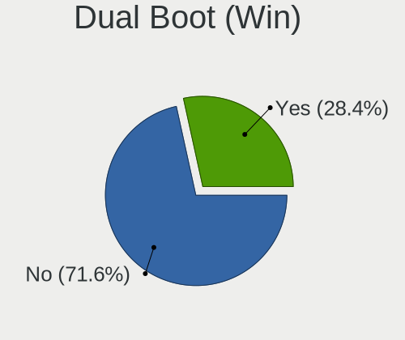
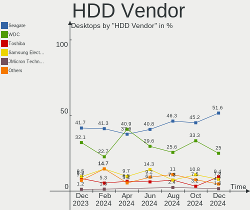
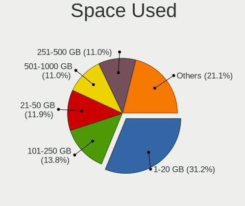
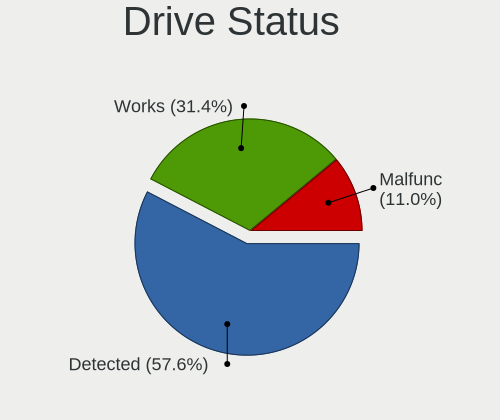
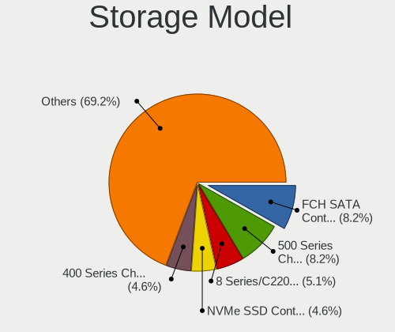
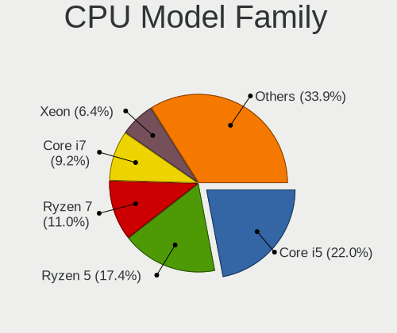

Linux in Brazil - Hardware Trends (Desktops)
--------------------------------------------

A project to identify most popular hardware characteristics and track their change
over time based on data collected by Linux users at https://Linux-Hardware.org.

Anyone can contribute to this report by the [hw-probe](https://github.com/linuxhw/hw-probe) tool:

    sudo -E hw-probe -all -upload

Period: Dec, 2024.

Contents
--------

* [ System ](#system)
  - [ OS                       ](#os)
  - [ OS Family                ](#os-family)
  - [ Kernel                   ](#kernel)
  - [ Kernel Family            ](#kernel-family)
  - [ Kernel Major Ver.        ](#kernel-major-ver)
  - [ Arch                     ](#arch)
  - [ DE                       ](#de)
  - [ Display Server           ](#display-server)
  - [ Display Manager          ](#display-manager)
  - [ OS Lang                  ](#os-lang)
  - [ Boot Mode                ](#boot-mode)
  - [ Filesystem               ](#filesystem)
  - [ Part. scheme             ](#part-scheme)
  - [ Dual Boot with Linux/BSD ](#dual-boot-with-linuxbsd)
  - [ Dual Boot (Win)          ](#dual-boot-win)

* [ Board ](#board)
  - [ Vendor                   ](#vendor)
  - [ Model                    ](#model)
  - [ Model Family             ](#model-family)
  - [ MFG Year                 ](#mfg-year)
  - [ Form Factor              ](#form-factor)
  - [ Secure Boot              ](#secure-boot)
  - [ Coreboot                 ](#coreboot)
  - [ RAM Size                 ](#ram-size)
  - [ RAM Used                 ](#ram-used)
  - [ Total Drives             ](#total-drives)
  - [ Has CD-ROM               ](#has-cd-rom)
  - [ Has Ethernet             ](#has-ethernet)
  - [ Has WiFi                 ](#has-wifi)
  - [ Has Bluetooth            ](#has-bluetooth)

* [ Location ](#location)
  - [ Country                  ](#country)
  - [ City                     ](#city)

* [ Drives ](#drives)
  - [ Drive Vendor             ](#drive-vendor)
  - [ Drive Model              ](#drive-model)
  - [ HDD Vendor               ](#hdd-vendor)
  - [ SSD Vendor               ](#ssd-vendor)
  - [ Drive Kind               ](#drive-kind)
  - [ Drive Connector          ](#drive-connector)
  - [ Drive Size               ](#drive-size)
  - [ Space Total              ](#space-total)
  - [ Space Used               ](#space-used)
  - [ Malfunc. Drives          ](#malfunc-drives)
  - [ Malfunc. Drive Vendor    ](#malfunc-drive-vendor)
  - [ Malfunc. HDD Vendor      ](#malfunc-hdd-vendor)
  - [ Malfunc. Drive Kind      ](#malfunc-drive-kind)
  - [ Failed Drives            ](#failed-drives)
  - [ Failed Drive Vendor      ](#failed-drive-vendor)
  - [ Drive Status             ](#drive-status)

* [ Storage controller ](#storage-controller)
  - [ Storage Vendor           ](#storage-vendor)
  - [ Storage Model            ](#storage-model)
  - [ Storage Kind             ](#storage-kind)

* [ Processor ](#processor)
  - [ CPU Vendor               ](#cpu-vendor)
  - [ CPU Model                ](#cpu-model)
  - [ CPU Model Family         ](#cpu-model-family)
  - [ CPU Cores                ](#cpu-cores)
  - [ CPU Sockets              ](#cpu-sockets)
  - [ CPU Threads              ](#cpu-threads)
  - [ CPU Op-Modes             ](#cpu-op-modes)
  - [ CPU Microcode            ](#cpu-microcode)
  - [ CPU Microarch            ](#cpu-microarch)

* [ Graphics ](#graphics)
  - [ GPU Vendor               ](#gpu-vendor)
  - [ GPU Model                ](#gpu-model)
  - [ GPU Combo                ](#gpu-combo)
  - [ GPU Driver               ](#gpu-driver)
  - [ GPU Memory               ](#gpu-memory)

* [ Monitor ](#monitor)
  - [ Monitor Vendor           ](#monitor-vendor)
  - [ Monitor Model            ](#monitor-model)
  - [ Monitor Resolution       ](#monitor-resolution)
  - [ Monitor Diagonal         ](#monitor-diagonal)
  - [ Monitor Width            ](#monitor-width)
  - [ Aspect Ratio             ](#aspect-ratio)
  - [ Monitor Area             ](#monitor-area)
  - [ Pixel Density            ](#pixel-density)
  - [ Multiple Monitors        ](#multiple-monitors)

* [ Network ](#network)
  - [ Net Controller Vendor    ](#net-controller-vendor)
  - [ Net Controller Model     ](#net-controller-model)
  - [ Wireless Vendor          ](#wireless-vendor)
  - [ Wireless Model           ](#wireless-model)
  - [ Ethernet Vendor          ](#ethernet-vendor)
  - [ Ethernet Model           ](#ethernet-model)
  - [ Net Controller Kind      ](#net-controller-kind)
  - [ Used Controller          ](#used-controller)
  - [ NICs                     ](#nics)
  - [ IPv6                     ](#ipv6)

* [ Bluetooth ](#bluetooth)
  - [ Bluetooth Vendor         ](#bluetooth-vendor)
  - [ Bluetooth Model          ](#bluetooth-model)

* [ Sound ](#sound)
  - [ Sound Vendor             ](#sound-vendor)
  - [ Sound Model              ](#sound-model)

* [ Memory ](#memory)
  - [ Memory Vendor            ](#memory-vendor)
  - [ Memory Model             ](#memory-model)
  - [ Memory Kind              ](#memory-kind)
  - [ Memory Form Factor       ](#memory-form-factor)
  - [ Memory Size              ](#memory-size)
  - [ Memory Speed             ](#memory-speed)

* [ Printers & scanners ](#printers--scanners)
  - [ Printer Vendor           ](#printer-vendor)
  - [ Printer Model            ](#printer-model)
  - [ Scanner Vendor           ](#scanner-vendor)
  - [ Scanner Model            ](#scanner-model)

* [ Camera ](#camera)
  - [ Camera Vendor            ](#camera-vendor)
  - [ Camera Model             ](#camera-model)

* [ Security ](#security)
  - [ Fingerprint Vendor       ](#fingerprint-vendor)
  - [ Fingerprint Model        ](#fingerprint-model)
  - [ Chipcard Vendor          ](#chipcard-vendor)
  - [ Chipcard Model           ](#chipcard-model)

* [ Unsupported ](#unsupported)
  - [ Unsupported Devices      ](#unsupported-devices)
  - [ Unsupported Device Types ](#unsupported-device-types)

System
------

OS
--

Installed operating systems

| Name                         | Desktops | Percent |
|------------------------------|----------|---------|
| Ubuntu 24.04                 | 17       | 15.6%   |
| OpenMandriva 24.12           | 12       | 11.01%  |
| Fedora 41                    | 7        | 6.42%   |
| Zorin 17                     | 5        | 4.59%   |
| Pop!_OS 22.04                | 5        | 4.59%   |
| Debian 12                    | 5        | 4.59%   |
| Manjaro                      | 4        | 3.67%   |
| Ubuntu 24.10                 | 3        | 2.75%   |
| Ubuntu 22.04                 | 3        | 2.75%   |
| openSUSE Tumbleweed-XXXXXXXX | 3        | 2.75%   |
| Linux Mint 21.3              | 3        | 2.75%   |
| Kali 2024.4                  | 3        | 2.75%   |
| Bazzite 41                   | 3        | 2.75%   |
| Arch Rolling                 | 3        | 2.75%   |
| OpenMandriva 24.07           | 2        | 1.83%   |
| OpenMandriva 23.08           | 2        | 1.83%   |
| Nobara 40                    | 2        | 1.83%   |
| Linux Mint 22                | 2        | 1.83%   |
| Garuda Linux Soaring         | 2        | 1.83%   |
| Elementary 8                 | 2        | 1.83%   |
| ArcoLinux Rolling            | 2        | 1.83%   |
| Xubuntu 24.04                | 1        | 0.92%   |
| OpenMandriva 4.3             | 1        | 0.92%   |
| OpenMandriva 23.01           | 1        | 0.92%   |
| NixOS 25.05                  | 1        | 0.92%   |
| Lubuntu 24.04                | 1        | 0.92%   |
| LMDE 6                       | 1        | 0.92%   |
| LinuxFX 11                   | 1        | 0.92%   |
| Linux Mint 21.1              | 1        | 0.92%   |
| Linux Mint 20.3              | 1        | 0.92%   |
| Kubuntu 24.04                | 1        | 0.92%   |
| GNOME OS Nightly             | 1        | 0.92%   |
| Garuda Linux Rolling         | 1        | 0.92%   |
| Fedora 42                    | 1        | 0.92%   |
| Fedora 40                    | 1        | 0.92%   |
| Fedora 37                    | 1        | 0.92%   |
| Endless 6.0.4                | 1        | 0.92%   |
| BuildRoot 2024.02.1          | 1        | 0.92%   |
| BigLinux                     | 1        | 0.92%   |
| Aeon 20241129                | 1        | 0.92%   |

OS Family
---------

OS without a version

| Name         | Desktops | Percent |
|--------------|----------|---------|
| Ubuntu       | 23       | 21.1%   |
| OpenMandriva | 18       | 16.51%  |
| Fedora       | 10       | 9.17%   |
| Linux Mint   | 7        | 6.42%   |
| Zorin        | 5        | 4.59%   |
| Pop!_OS      | 5        | 4.59%   |
| Debian       | 5        | 4.59%   |
| Manjaro      | 4        | 3.67%   |
| openSUSE     | 3        | 2.75%   |
| Kali         | 3        | 2.75%   |
| Garuda Linux | 3        | 2.75%   |
| Bazzite      | 3        | 2.75%   |
| Arch         | 3        | 2.75%   |
| Nobara       | 2        | 1.83%   |
| Elementary   | 2        | 1.83%   |
| ArcoLinux    | 2        | 1.83%   |
| Xubuntu      | 1        | 0.92%   |
| NixOS        | 1        | 0.92%   |
| Lubuntu      | 1        | 0.92%   |
| LMDE         | 1        | 0.92%   |
| LinuxFX      | 1        | 0.92%   |
| Kubuntu      | 1        | 0.92%   |
| GNOME OS     | 1        | 0.92%   |
| Endless      | 1        | 0.92%   |
| BuildRoot    | 1        | 0.92%   |
| BigLinux     | 1        | 0.92%   |
| Aeon         | 1        | 0.92%   |

Kernel
------

Version of the Linux kernel

| Version                                             | Desktops | Percent |
|-----------------------------------------------------|----------|---------|
| 6.8.0-49-generic                                    | 20       | 18.35%  |
| 6.12.1-desktop-1omv2490                             | 11       | 10.09%  |
| 6.8.0-51-generic                                    | 7        | 6.42%   |
| 6.9.3-76060903-generic                              | 5        | 4.59%   |
| 6.11.10-300.fc41.x86_64                             | 5        | 4.59%   |
| 6.1.0-28-amd64                                      | 5        | 4.59%   |
| 6.11.8-1-default                                    | 4        | 3.67%   |
| 6.11.9-303.bazzite.fc41.x86_64                      | 3        | 2.75%   |
| 6.11.2-amd64                                        | 3        | 2.75%   |
| 6.11.10-2-MANJARO                                   | 3        | 2.75%   |
| 6.8.0-50-generic                                    | 2        | 1.83%   |
| 6.8.0-41-generic                                    | 2        | 1.83%   |
| 6.4.11-desktop-1omv2390                             | 2        | 1.83%   |
| 6.12.4-zen1-1-zen                                   | 2        | 1.83%   |
| 6.12.3-1-cachyos                                    | 2        | 1.83%   |
| 6.11.0-13-generic                                   | 2        | 1.83%   |
| 6.10.0-desktop-1omv2490                             | 2        | 1.83%   |
| 6.9.10                                              | 1        | 0.92%   |
| 6.8.0-45-generic                                    | 1        | 0.92%   |
| 6.8.0-38-generic                                    | 1        | 0.92%   |
| 6.7.10-060710-generic                               | 1        | 0.92%   |
| 6.6.65-1-MANJARO                                    | 1        | 0.92%   |
| 6.6.63-1-lts                                        | 1        | 0.92%   |
| 6.5.0-44-generic                                    | 1        | 0.92%   |
| 6.5.0-10-generic                                    | 1        | 0.92%   |
| 6.13.0-0.rc3.20241218gitaef25be35d23.31.fc42.x86_64 | 1        | 0.92%   |
| 6.12.6-desktop-1omv2490                             | 1        | 0.92%   |
| 6.12.5-cachyos                                      | 1        | 0.92%   |
| 6.12.5-100.fc40.x86_64                              | 1        | 0.92%   |
| 6.12.4-200.fc41.x86_64                              | 1        | 0.92%   |
| 6.12.4                                              | 1        | 0.92%   |
| 6.12.1-zen1-1-zen                                   | 1        | 0.92%   |
| 6.12.1-arch1-1                                      | 1        | 0.92%   |
| 6.11.9-200.fsync.fc40.x86_64                        | 1        | 0.92%   |
| 6.11.6-200.fsync.fc40.x86_64                        | 1        | 0.92%   |
| 6.11.4-301.fc41.x86_64                              | 1        | 0.92%   |
| 6.11.2-2-cachyos                                    | 1        | 0.92%   |
| 6.11.11-1-MANJARO                                   | 1        | 0.92%   |
| 6.11.0-8-generic                                    | 1        | 0.92%   |
| 6.1.1-desktop-1omv2290                              | 1        | 0.92%   |

Kernel Family
-------------

Linux kernel without a distro release

| Version | Desktops | Percent |
|---------|----------|---------|
| 6.8.0   | 33       | 30.28%  |
| 6.12.1  | 13       | 11.93%  |
| 6.11.10 | 8        | 7.34%   |
| 6.9.3   | 5        | 4.59%   |
| 6.1.0   | 5        | 4.59%   |
| 6.12.4  | 4        | 3.67%   |
| 6.11.9  | 4        | 3.67%   |
| 6.11.8  | 4        | 3.67%   |
| 6.11.2  | 4        | 3.67%   |
| 6.11.0  | 3        | 2.75%   |
| 6.5.0   | 2        | 1.83%   |
| 6.4.11  | 2        | 1.83%   |
| 6.12.5  | 2        | 1.83%   |
| 6.12.3  | 2        | 1.83%   |
| 6.10.0  | 2        | 1.83%   |
| 5.15.0  | 2        | 1.83%   |
| 6.9.10  | 1        | 0.92%   |
| 6.7.10  | 1        | 0.92%   |
| 6.6.65  | 1        | 0.92%   |
| 6.6.63  | 1        | 0.92%   |
| 6.13.0  | 1        | 0.92%   |
| 6.12.6  | 1        | 0.92%   |
| 6.11.6  | 1        | 0.92%   |
| 6.11.4  | 1        | 0.92%   |
| 6.11.11 | 1        | 0.92%   |
| 6.1.1   | 1        | 0.92%   |
| 6.0.7   | 1        | 0.92%   |
| 5.4.0   | 1        | 0.92%   |
| 5.16.7  | 1        | 0.92%   |
| 5.13.0  | 1        | 0.92%   |

Kernel Major Ver.
-----------------

Linux kernel major version

| Version | Desktops | Percent |
|---------|----------|---------|
| 6.8     | 33       | 30.28%  |
| 6.11    | 26       | 23.85%  |
| 6.12    | 22       | 20.18%  |
| 6.9     | 6        | 5.5%    |
| 6.1     | 6        | 5.5%    |
| 6.6     | 2        | 1.83%   |
| 6.5     | 2        | 1.83%   |
| 6.4     | 2        | 1.83%   |
| 6.10    | 2        | 1.83%   |
| 5.15    | 2        | 1.83%   |
| 6.7     | 1        | 0.92%   |
| 6.13    | 1        | 0.92%   |
| 6.0     | 1        | 0.92%   |
| 5.4     | 1        | 0.92%   |
| 5.16    | 1        | 0.92%   |
| 5.13    | 1        | 0.92%   |

Arch
----

OS architecture (x86_64, i586, etc.)

| Name   | Desktops | Percent |
|--------|----------|---------|
| x86_64 | 109      | 100%    |

DE
--

Desktop Environment

| Name          | Desktops | Percent |
|---------------|----------|---------|
| GNOME         | 44       | 40.37%  |
| KDE6          | 19       | 17.43%  |
| Unknown       | 15       | 13.76%  |
| X-Cinnamon    | 10       | 9.17%   |
| KDE5          | 7        | 6.42%   |
| LXQt          | 3        | 2.75%   |
| XFCE          | 2        | 1.83%   |
| Pantheon      | 2        | 1.83%   |
| MATE          | 2        | 1.83%   |
| sway          | 1        | 0.92%   |
| LXDE          | 1        | 0.92%   |
| GNOME Classic | 1        | 0.92%   |
| Endless:GNOME | 1        | 0.92%   |
| Budgie        | 1        | 0.92%   |

Display Server
--------------

X11 or Wayland

| Name    | Desktops | Percent |
|---------|----------|---------|
| Wayland | 56       | 51.38%  |
| X11     | 49       | 44.95%  |
| Unknown | 3        | 2.75%   |
| Tty     | 1        | 0.92%   |

Display Manager
---------------

SDDM, LightDM, etc.

| Name    | Desktops | Percent |
|---------|----------|---------|
| Unknown | 51       | 46.79%  |
| SDDM    | 21       | 19.27%  |
| GDM3    | 20       | 18.35%  |
| LightDM | 11       | 10.09%  |
| GDM     | 6        | 5.5%    |

OS Lang
-------

Language

| Lang       | Desktops | Percent |
|------------|----------|---------|
| pt_BR      | 77       | 70.64%  |
| en_US      | 25       | 22.94%  |
| C          | 3        | 2.75%   |
| pt_PT      | 1        | 0.92%   |
| en_IE.UTF8 | 1        | 0.92%   |
| en_GB      | 1        | 0.92%   |
| Unknown    | 1        | 0.92%   |

Boot Mode
---------

EFI or BIOS

| Mode | Desktops | Percent |
|------|----------|---------|
| BIOS | 71       | 65.14%  |
| EFI  | 38       | 34.86%  |

Filesystem
----------

Type of filesystem

| Type    | Desktops | Percent |
|---------|----------|---------|
| Ext4    | 50       | 45.87%  |
| Btrfs   | 24       | 22.02%  |
| Tmpfs   | 18       | 16.51%  |
| Overlay | 13       | 11.93%  |
| Xfs     | 2        | 1.83%   |
| Zfs     | 1        | 0.92%   |
| Unknown | 1        | 0.92%   |

Part. scheme
------------

Scheme of partitioning

| Type    | Desktops | Percent |
|---------|----------|---------|
| GPT     | 53       | 48.62%  |
| Unknown | 48       | 44.04%  |
| MBR     | 8        | 7.34%   |

Dual Boot with Linux/BSD
------------------------

Hosting more than one Linux/BSD

| Dual boot | Desktops | Percent |
|-----------|----------|---------|
| No        | 89       | 81.65%  |
| Yes       | 20       | 18.35%  |

Dual Boot (Win)
---------------

Hosting Linux and Windows

| Dual boot | Desktops | Percent |
|-----------|----------|---------|
| No        | 78       | 71.56%  |
| Yes       | 31       | 28.44%  |

Board
-----

Vendor
------

Motherboard manufacturer

| Name                | Desktops | Percent |
|---------------------|----------|---------|
| ASUSTek Computer    | 24       | 22.02%  |
| Intel               | 18       | 16.51%  |
| Gigabyte Technology | 18       | 16.51%  |
| ASRock              | 10       | 9.17%   |
| MSI                 | 4        | 3.67%   |
| Positivo            | 3        | 2.75%   |
| MACHINIST           | 3        | 2.75%   |
| Lenovo              | 3        | 2.75%   |
| Dell                | 3        | 2.75%   |
| Biostar             | 3        | 2.75%   |
| Unknown             | 3        | 2.75%   |
| Hewlett-Packard     | 2        | 1.83%   |
| DUEX                | 2        | 1.83%   |
| AZW                 | 2        | 1.83%   |
| WTM                 | 1        | 0.92%   |
| wpc                 | 1        | 0.92%   |
| Philco              | 1        | 0.92%   |
| Pegatron            | 1        | 0.92%   |
| PCWare              | 1        | 0.92%   |
| MAXSUN              | 1        | 0.92%   |
| Login Informatica   | 1        | 0.92%   |
| Huanan              | 1        | 0.92%   |
| Digiboard           | 1        | 0.92%   |
| Daten Tecnologia    | 1        | 0.92%   |
| AMD                 | 1        | 0.92%   |

Model
-----

Motherboard model

| Name                                                | Desktops | Percent |
|-----------------------------------------------------|----------|---------|
| Intel H61                                           | 5        | 4.59%   |
| ASUS TUF Gaming B550M-PLUS                          | 5        | 4.59%   |
| Intel H55                                           | 3        | 2.75%   |
| Gigabyte B550M AORUS ELITE                          | 3        | 2.75%   |
| Unknown                                             | 3        | 2.75%   |
| Intel H81                                           | 2        | 1.83%   |
| Intel B75                                           | 2        | 1.83%   |
| Gigabyte B550M DS3H                                 | 2        | 1.83%   |
| ASUS All Series                                     | 2        | 1.83%   |
| ASRock B450M Steel Legend                           | 2        | 1.83%   |
| ASRock A320M-HD                                     | 2        | 1.83%   |
| WTM W-N95-R                                         | 1        | 0.92%   |
| wpc wpc616                                          | 1        | 0.92%   |
| Positivo Positivo Master D380                       | 1        | 0.92%   |
| Positivo POS-EIH61CQ                                | 1        | 0.92%   |
| Positivo D2200                                      | 1        | 0.92%   |
| Philco DTC-A55                                      | 1        | 0.92%   |
| Pegatron IPM31G                                     | 1        | 0.92%   |
| PCWare IPMH110G-DDR3                                | 1        | 0.92%   |
| MSI MS-7E02                                         | 1        | 0.92%   |
| MSI MS-7C91                                         | 1        | 0.92%   |
| MSI MS-7C56                                         | 1        | 0.92%   |
| MSI MS-7B10                                         | 1        | 0.92%   |
| MAXSUN MS-Challenger B760M                          | 1        | 0.92%   |
| MACHINIST X99-MR9S V6.1                             | 1        | 0.92%   |
| MACHINIST X99 PR9                                   | 1        | 0.92%   |
| MACHINIST E5-MR9A V1.0                              | 1        | 0.92%   |
| Login Informatica LOG-BAT-I                         | 1        | 0.92%   |
| Lenovo ThinkCentre M93p 10AAS48Y00                  | 1        | 0.92%   |
| Lenovo ThinkCentre M90p 5536P79                     | 1        | 0.92%   |
| Lenovo ThinkCentre M75s Gen 2 M75s Gen 2 11R7S0VU00 | 1        | 0.92%   |
| Intel X99-H5 V2.0                                   | 1        | 0.92%   |
| Intel X99                                           | 1        | 0.92%   |
| Intel H61 V1.6B                                     | 1        | 0.92%   |
| Intel B85                                           | 1        | 0.92%   |
| Intel B75A                                          | 1        | 0.92%   |
| Intel B75/Q75/Q77                                   | 1        | 0.92%   |
| Huanan X99-4MF V1.0                                 | 1        | 0.92%   |
| HP ProLiant ML350 G5                                | 1        | 0.92%   |
| HP Compaq 8100 Elite SFF Brazil PC                  | 1        | 0.92%   |

Model Family
------------

Motherboard model prefix

| Name                        | Desktops | Percent |
|-----------------------------|----------|---------|
| ASUS TUF                    | 9        | 8.26%   |
| Intel H61                   | 6        | 5.5%    |
| Gigabyte B550M              | 5        | 4.59%   |
| Lenovo ThinkCentre          | 3        | 2.75%   |
| Intel H55                   | 3        | 2.75%   |
| Intel B75                   | 3        | 2.75%   |
| Gigabyte B450M              | 3        | 2.75%   |
| Unknown                     | 3        | 2.75%   |
| Intel H81                   | 2        | 1.83%   |
| Dell OptiPlex               | 2        | 1.83%   |
| ASUS P8H61-M                | 2        | 1.83%   |
| ASUS M5A78L-M               | 2        | 1.83%   |
| ASUS All                    | 2        | 1.83%   |
| ASRock B450M                | 2        | 1.83%   |
| ASRock A320M-HD             | 2        | 1.83%   |
| WTM W-N95-R                 | 1        | 0.92%   |
| wpc wpc616                  | 1        | 0.92%   |
| Positivo Positivo           | 1        | 0.92%   |
| Positivo POS-EIH61CQ        | 1        | 0.92%   |
| Positivo D2200              | 1        | 0.92%   |
| Philco DTC-A55              | 1        | 0.92%   |
| Pegatron IPM31G             | 1        | 0.92%   |
| PCWare IPMH110G-DDR3        | 1        | 0.92%   |
| MSI MS-7E02                 | 1        | 0.92%   |
| MSI MS-7C91                 | 1        | 0.92%   |
| MSI MS-7C56                 | 1        | 0.92%   |
| MSI MS-7B10                 | 1        | 0.92%   |
| MAXSUN MS-Challenger        | 1        | 0.92%   |
| MACHINIST X99-MR9S          | 1        | 0.92%   |
| MACHINIST X99               | 1        | 0.92%   |
| MACHINIST E5-MR9A           | 1        | 0.92%   |
| Login Informatica LOG-BAT-I | 1        | 0.92%   |
| Intel X99-H5                | 1        | 0.92%   |
| Intel X99                   | 1        | 0.92%   |
| Intel B85                   | 1        | 0.92%   |
| Intel B75A                  | 1        | 0.92%   |
| Huanan X99-4MF              | 1        | 0.92%   |
| HP ProLiant                 | 1        | 0.92%   |
| HP Compaq                   | 1        | 0.92%   |
| Gigabyte Z370M              | 1        | 0.92%   |

MFG Year
--------

Motherboard manufacture year

| Year | Desktops | Percent |
|------|----------|---------|
| 2020 | 17       | 15.6%   |
| 2017 | 14       | 12.84%  |
| 2023 | 11       | 10.09%  |
| 2019 | 10       | 9.17%   |
| 2018 | 10       | 9.17%   |
| 2014 | 8        | 7.34%   |
| 2022 | 6        | 5.5%    |
| 2010 | 6        | 5.5%    |
| 2013 | 5        | 4.59%   |
| 2021 | 4        | 3.67%   |
| 2012 | 4        | 3.67%   |
| 2024 | 3        | 2.75%   |
| 2016 | 3        | 2.75%   |
| 2015 | 2        | 1.83%   |
| 2011 | 2        | 1.83%   |
| 2007 | 2        | 1.83%   |
| 2009 | 1        | 0.92%   |
| 2008 | 1        | 0.92%   |

Form Factor
-----------

Physical design of the computer

| Name    | Desktops | Percent |
|---------|----------|---------|
| Desktop | 109      | 100%    |

Secure Boot
-----------

Enabled or disabled

| State    | Desktops | Percent |
|----------|----------|---------|
| Disabled | 109      | 100%    |

Coreboot
--------

Have coreboot on board

| Used | Desktops | Percent |
|------|----------|---------|
| No   | 109      | 100%    |

RAM Size
--------

Total RAM memory

| Size in GB  | Desktops | Percent |
|-------------|----------|---------|
| 16.01-24.0  | 31       | 28.44%  |
| 4.01-8.0    | 21       | 19.27%  |
| 32.01-64.0  | 16       | 14.68%  |
| 8.01-16.0   | 15       | 13.76%  |
| 3.01-4.0    | 12       | 11.01%  |
| 64.01-256.0 | 7        | 6.42%   |
| 24.01-32.0  | 6        | 5.5%    |
| 1.01-2.0    | 1        | 0.92%   |

RAM Used
--------

Used RAM memory

| Used GB    | Desktops | Percent |
|------------|----------|---------|
| 1.01-2.0   | 30       | 27.52%  |
| 4.01-8.0   | 25       | 22.94%  |
| 2.01-3.0   | 25       | 22.94%  |
| 3.01-4.0   | 15       | 13.76%  |
| 8.01-16.0  | 7        | 6.42%   |
| 0.51-1.0   | 5        | 4.59%   |
| 16.01-24.0 | 1        | 0.92%   |
| 0.01-0.5   | 1        | 0.92%   |

Total Drives
------------

Number of drives on board

| Drives | Desktops | Percent |
|--------|----------|---------|
| 1      | 45       | 41.28%  |
| 2      | 31       | 28.44%  |
| 3      | 14       | 12.84%  |
| 4      | 10       | 9.17%   |
| 5      | 5        | 4.59%   |
| 6      | 2        | 1.83%   |
| 0      | 2        | 1.83%   |

Has CD-ROM
----------

Has CD-ROM on board

| Presented | Desktops | Percent |
|-----------|----------|---------|
| No        | 87       | 79.82%  |
| Yes       | 22       | 20.18%  |

Has Ethernet
------------

Has Ethernet on board

| Presented | Desktops | Percent |
|-----------|----------|---------|
| Yes       | 108      | 99.08%  |
| No        | 1        | 0.92%   |

Has WiFi
--------

Has WiFi module

| Presented | Desktops | Percent |
|-----------|----------|---------|
| No        | 69       | 63.3%   |
| Yes       | 40       | 36.7%   |

Has Bluetooth
-------------

Has Bluetooth module

| Presented | Desktops | Percent |
|-----------|----------|---------|
| No        | 73       | 66.97%  |
| Yes       | 36       | 33.03%  |

Location
--------

Country
-------

Geographic location (country)

| Country | Desktops | Percent |
|---------|----------|---------|
| Brazil  | 109      | 100%    |

City
----

Geographic location (city)

| City                   | Desktops | Percent |
|------------------------|----------|---------|
| Sao Paulo              | 8        | 7.34%   |
| Goiânia               | 5        | 4.59%   |
| Florianópolis         | 4        | 3.67%   |
| Fortaleza              | 3        | 2.75%   |
| Brasília              | 3        | 2.75%   |
| Serra                  | 2        | 1.83%   |
| Sao Goncalo            | 2        | 1.83%   |
| Santo André           | 2        | 1.83%   |
| Salvador               | 2        | 1.83%   |
| Niterói               | 2        | 1.83%   |
| Curitiba               | 2        | 1.83%   |
| Carapicuiba            | 2        | 1.83%   |
| Campinas               | 2        | 1.83%   |
| Belém                 | 2        | 1.83%   |
| Barueri                | 2        | 1.83%   |
| Vitória da Conquista  | 1        | 0.92%   |
| Vitória               | 1        | 0.92%   |
| Taboao da Serra        | 1        | 0.92%   |
| Sorocaba               | 1        | 0.92%   |
| Sinop                  | 1        | 0.92%   |
| Simões Filho          | 1        | 0.92%   |
| Sao José dos Pinhais  | 1        | 0.92%   |
| Sao Jose dos Cordeiros | 1        | 0.92%   |
| Sao Gabriel Do Oeste   | 1        | 0.92%   |
| Sao Bras do Suacui     | 1        | 0.92%   |
| Sao Bernardo do Campo  | 1        | 0.92%   |
| Santana do Araguaia    | 1        | 0.92%   |
| Sabará                | 1        | 0.92%   |
| Rosario do Sul         | 1        | 0.92%   |
| Roncador               | 1        | 0.92%   |
| Rio Grande             | 1        | 0.92%   |
| Rio de Janeiro         | 1        | 0.92%   |
| Ribas do Rio Pardo     | 1        | 0.92%   |
| Recife                 | 1        | 0.92%   |
| Querência             | 1        | 0.92%   |
| Presidente Prudente    | 1        | 0.92%   |
| Pouso Alegre           | 1        | 0.92%   |
| Pindobacu              | 1        | 0.92%   |
| Pelotas                | 1        | 0.92%   |
| Pato Branco            | 1        | 0.92%   |

Drives
------

Drive Vendor
------------

Hard drive vendors

| Vendor                         | Desktops | Drives | Percent |
|--------------------------------|----------|--------|---------|
| Seagate                        | 34       | 45     | 17%     |
| Kingston                       | 23       | 26     | 11.5%   |
| WDC                            | 21       | 26     | 10.5%   |
| SanDisk                        | 12       | 13     | 6%      |
| Samsung Electronics            | 10       | 14     | 5%      |
| MAXIO Technology (Hangzhou)    | 10       | 11     | 5%      |
| China                          | 9        | 9      | 4.5%    |
| Kingston Technology Company    | 8        | 8      | 4%      |
| A-DATA Technology              | 7        | 7      | 3.5%    |
| Toshiba                        | 6        | 7      | 3%      |
| Crucial                        | 6        | 6      | 3%      |
| Silicon Motion                 | 4        | 4      | 2%      |
| Realtek Semiconductor          | 3        | 3      | 1.5%    |
| PNY                            | 3        | 3      | 1.5%    |
| XrayDisk                       | 2        | 2      | 1%      |
| Unknown                        | 2        | 3      | 1%      |
| LITEON                         | 2        | 2      | 1%      |
| Lexar                          | 2        | 2      | 1%      |
| KingSpec                       | 2        | 2      | 1%      |
| HUSKY                          | 2        | 2      | 1%      |
| ADATA Technology               | 2        | 2      | 1%      |
| Win Memory                     | 1        | 1      | 0.5%    |
| WALRAM                         | 1        | 1      | 0.5%    |
| ULK                            | 1        | 1      | 0.5%    |
| Solid State Storage Technology | 1        | 1      | 0.5%    |
| SK hynix                       | 1        | 1      | 0.5%    |
| Shenzhen Longsys Electronics   | 1        | 1      | 0.5%    |
| SATAFIRM                       | 1        | 1      | 0.5%    |
| RZX                            | 1        | 1      | 0.5%    |
| Ramsta                         | 1        | 1      | 0.5%    |
| ProDrive                       | 1        | 1      | 0.5%    |
| Phison Electronics             | 1        | 1      | 0.5%    |
| Patriot                        | 1        | 1      | 0.5%    |
| NGFF                           | 1        | 1      | 0.5%    |
| Netac                          | 1        | 1      | 0.5%    |
| Micron/Crucial Technology      | 1        | 1      | 0.5%    |
| Micron Technology              | 1        | 1      | 0.5%    |
| KEPLER                         | 1        | 1      | 0.5%    |
| JMicron Technology             | 1        | 1      | 0.5%    |
| INFOKIT                        | 1        | 1      | 0.5%    |

Drive Model
-----------

Hard drive models

| Model                                                 | Desktops | Percent |
|-------------------------------------------------------|----------|---------|
| MAXIO (Hangzhou) NVMe SSD Controller MAP1202 512GB    | 8        | 3.62%   |
| Kingston SA400S37240G 240GB SSD                       | 7        | 3.17%   |
| Kingston Company SNV2S1000G 1TB                       | 5        | 2.26%   |
| Silicon Motion SM2263EN/SM2263XT SSD Controller 256GB | 4        | 1.81%   |
| Kingston SA400S37480G 480GB SSD                       | 4        | 1.81%   |
| Kingston SA400S37120G 120GB SSD                       | 4        | 1.81%   |
| WDC WD5000AAKX-00U6AA0 500GB                          | 3        | 1.36%   |
| Seagate ST2000DM006-2DM164 2TB                        | 3        | 1.36%   |
| Seagate ST1000DM003-1CH162 1TB                        | 3        | 1.36%   |
| SanDisk SSD PLUS 1000GB                               | 3        | 1.36%   |
| Kingston Company SNV2S250G 250GB                      | 3        | 1.36%   |
| Kingston SA400S37960G 960GB SSD                       | 3        | 1.36%   |
| Crucial CT240BX500SSD1 240GB                          | 3        | 1.36%   |
| WDC WDS120G2G0A-00JH30 120GB SSD                      | 2        | 0.9%    |
| Toshiba MQ01ABF050 500GB                              | 2        | 0.9%    |
| Toshiba DT01ACA100 1TB                                | 2        | 0.9%    |
| Seagate ST8000DM004-2U9188 8TB                        | 2        | 0.9%    |
| Seagate ST500LM012 HN-M500MBB 500GB                   | 2        | 0.9%    |
| Seagate ST2000DM008-2UB102 2TB                        | 2        | 0.9%    |
| Seagate ST2000DM001-1ER164 2TB                        | 2        | 0.9%    |
| Seagate ST1000LM024 HN-M101MBB 1TB                    | 2        | 0.9%    |
| Seagate ST1000DM010-2EP102 1TB                        | 2        | 0.9%    |
| Seagate Expansion 1TB                                 | 2        | 0.9%    |
| Sandisk WD Green SN350 1TB                            | 2        | 0.9%    |
| SanDisk SDSSDA120G 120GB                              | 2        | 0.9%    |
| Samsung NVMe SSD Controller SM981/PM981/PM983 512GB   | 2        | 0.9%    |
| Realtek RTS5763DL NVMe SSD Controller 256GB           | 2        | 0.9%    |
| PNY CS900 240GB SSD                                   | 2        | 0.9%    |
| Kingston SNV2S500G 500GB                              | 2        | 0.9%    |
| Crucial CT1000BX500SSD1 1TB                           | 2        | 0.9%    |
| A-DATA SU635 480GB SSD                                | 2        | 0.9%    |
| XrayDisk NVMe SSD Drive 512GB                         | 1        | 0.45%   |
| XrayDisk 256GB                                        | 1        | 0.45%   |
| Win Memory SWR128G-N01H 128GB                         | 1        | 0.45%   |
| WDC WDS480G2G0C-00AJM0 480GB                          | 1        | 0.45%   |
| WDC WDS120G3G0A 120GB SSD                             | 1        | 0.45%   |
| WDC WD5000LPVX-22V0TT0 500GB                          | 1        | 0.45%   |
| WDC WD5000AVCS-632DY1 500GB                           | 1        | 0.45%   |
| WDC WD5000AAKX-08ERMA0 500GB                          | 1        | 0.45%   |
| WDC WD5000AAKX-00ERMA0 500GB                          | 1        | 0.45%   |

HDD Vendor
----------

Hard disk drive vendors

| Vendor              | Desktops | Drives | Percent |
|---------------------|----------|--------|---------|
| Seagate             | 33       | 44     | 51.56%  |
| WDC                 | 16       | 21     | 25%     |
| Toshiba             | 6        | 7      | 9.38%   |
| Samsung Electronics | 5        | 5      | 7.81%   |
| JMicron Technology  | 1        | 1      | 1.56%   |
| HGST                | 1        | 1      | 1.56%   |
| Hewlett-Packard     | 1        | 1      | 1.56%   |
| Fujitsu             | 1        | 1      | 1.56%   |

SSD Vendor
----------

Solid state drive vendors

| Vendor              | Desktops | Drives | Percent |
|---------------------|----------|--------|---------|
| Kingston            | 19       | 21     | 25.33%  |
| SanDisk             | 9        | 9      | 12%     |
| China               | 9        | 9      | 12%     |
| Crucial             | 6        | 6      | 8%      |
| A-DATA Technology   | 5        | 5      | 6.67%   |
| WDC                 | 4        | 4      | 5.33%   |
| Samsung Electronics | 3        | 6      | 4%      |
| PNY                 | 3        | 3      | 4%      |
| LITEON              | 2        | 2      | 2.67%   |
| Lexar               | 2        | 2      | 2.67%   |
| KingSpec            | 2        | 2      | 2.67%   |
| HUSKY               | 2        | 2      | 2.67%   |
| Win Memory          | 1        | 1      | 1.33%   |
| Seagate             | 1        | 1      | 1.33%   |
| SATAFIRM            | 1        | 1      | 1.33%   |
| RZX                 | 1        | 1      | 1.33%   |
| Ramsta              | 1        | 1      | 1.33%   |
| Patriot             | 1        | 1      | 1.33%   |
| NGFF                | 1        | 1      | 1.33%   |
| Fanxiang            | 1        | 2      | 1.33%   |
| 2.5"SSD             | 1        | 1      | 1.33%   |

Drive Kind
----------

HDD or SSD

| Kind    | Desktops | Drives | Percent |
|---------|----------|--------|---------|
| SSD     | 65       | 81     | 36.93%  |
| HDD     | 59       | 81     | 33.52%  |
| NVMe    | 44       | 58     | 25%     |
| Unknown | 7        | 9      | 3.98%   |
| MMC     | 1        | 1      | 0.57%   |

Drive Connector
---------------

SATA, SAS, NVMe, etc.

| Type | Desktops | Drives | Percent |
|------|----------|--------|---------|
| SATA | 91       | 165    | 64.54%  |
| NVMe | 44       | 58     | 31.21%  |
| SAS  | 5        | 6      | 3.55%   |
| MMC  | 1        | 1      | 0.71%   |

Drive Size
----------

Size of hard drive

| Size in TB | Desktops | Drives | Percent |
|------------|----------|--------|---------|
| 0.01-0.5   | 67       | 94     | 55.37%  |
| 0.51-1.0   | 33       | 42     | 27.27%  |
| 1.01-2.0   | 14       | 15     | 11.57%  |
| 2.01-3.0   | 3        | 3      | 2.48%   |
| 4.01-10.0  | 3        | 7      | 2.48%   |
| 10.01-20.0 | 1        | 1      | 0.83%   |

Space Total
-----------

Amount of disk space available on the file system

| Size in GB     | Desktops | Percent |
|----------------|----------|---------|
| 251-500        | 23       | 21.1%   |
| 101-250        | 21       | 19.27%  |
| 1001-2000      | 18       | 16.51%  |
| 501-1000       | 16       | 14.68%  |
| 1-20           | 9        | 8.26%   |
| 2001-3000      | 8        | 7.34%   |
| More than 3000 | 6        | 5.5%    |
| 51-100         | 4        | 3.67%   |
| Unknown        | 4        | 3.67%   |

Space Used
----------

Amount of used disk space

| Used GB        | Desktops | Percent |
|----------------|----------|---------|
| 1-20           | 34       | 31.19%  |
| 101-250        | 15       | 13.76%  |
| 21-50          | 13       | 11.93%  |
| 251-500        | 12       | 11.01%  |
| 501-1000       | 12       | 11.01%  |
| 51-100         | 12       | 11.01%  |
| 1001-2000      | 5        | 4.59%   |
| Unknown        | 4        | 3.67%   |
| More than 3000 | 2        | 1.83%   |

Malfunc. Drives
---------------

Drive models with a malfunction

| Model                                                     | Desktops | Drives | Percent |
|-----------------------------------------------------------|----------|--------|---------|
| WDC WD5000AAKX-003CA0 500GB                               | 1        | 1      | 6.25%   |
| WDC WD3200BPVT-00JJ5T0 320GB                              | 1        | 1      | 6.25%   |
| Toshiba MQ01ABF050 500GB                                  | 1        | 1      | 6.25%   |
| Seagate ST9500420AS 500GB                                 | 1        | 1      | 6.25%   |
| Seagate ST9160310AS 160GB                                 | 1        | 1      | 6.25%   |
| Seagate ST500DM002-1BD142 500GB                           | 1        | 1      | 6.25%   |
| Seagate ST31000528AS 1TB                                  | 1        | 1      | 6.25%   |
| Seagate ST2000DM001-1CH164 2TB                            | 1        | 1      | 6.25%   |
| Seagate ST1000LM024 HN-M101MBB 1TB                        | 1        | 1      | 6.25%   |
| SanDisk SSD PLUS 240GB                                    | 1        | 1      | 6.25%   |
| Samsung Electronics HD322HJ 320GB                         | 1        | 1      | 6.25%   |
| Samsung Electronics HD161GJ 160GB                         | 1        | 1      | 6.25%   |
| Realtek Semiconductor RTS5763DL NVMe SSD Controller 256GB | 1        | 1      | 6.25%   |
| Kingston SA400S37120G 120GB SSD                           | 1        | 1      | 6.25%   |
| KingSpec P3-128 128GB SSD                                 | 1        | 1      | 6.25%   |
| Fujitsu MJA2500BH G2 500GB                                | 1        | 1      | 6.25%   |

Malfunc. Drive Vendor
---------------------

Vendors of faulty drives

| Vendor                | Desktops | Drives | Percent |
|-----------------------|----------|--------|---------|
| Seagate               | 6        | 6      | 37.5%   |
| WDC                   | 2        | 2      | 12.5%   |
| Samsung Electronics   | 2        | 2      | 12.5%   |
| Toshiba               | 1        | 1      | 6.25%   |
| SanDisk               | 1        | 1      | 6.25%   |
| Realtek Semiconductor | 1        | 1      | 6.25%   |
| Kingston              | 1        | 1      | 6.25%   |
| KingSpec              | 1        | 1      | 6.25%   |
| Fujitsu               | 1        | 1      | 6.25%   |

Malfunc. HDD Vendor
-------------------

Vendors of faulty HDD drives

| Vendor              | Desktops | Drives | Percent |
|---------------------|----------|--------|---------|
| Seagate             | 6        | 6      | 50%     |
| WDC                 | 2        | 2      | 16.67%  |
| Samsung Electronics | 2        | 2      | 16.67%  |
| Toshiba             | 1        | 1      | 8.33%   |
| Fujitsu             | 1        | 1      | 8.33%   |

Malfunc. Drive Kind
-------------------

Kinds of faulty drives

| Kind | Desktops | Drives | Percent |
|------|----------|--------|---------|
| HDD  | 12       | 12     | 75%     |
| SSD  | 3        | 3      | 18.75%  |
| NVMe | 1        | 1      | 6.25%   |

Failed Drives
-------------

Failed drive models

Zero info for selected period =(

Failed Drive Vendor
-------------------

Failed drive vendors

Zero info for selected period =(

Drive Status
------------

Number of failed and malfunc. drives

| Status   | Desktops | Drives | Percent |
|----------|----------|--------|---------|
| Detected | 68       | 141    | 57.63%  |
| Works    | 37       | 73     | 31.36%  |
| Malfunc  | 13       | 16     | 11.02%  |

Storage controller
------------------

Storage Vendor
--------------

Storage controller vendors

| Vendor                         | Desktops | Percent |
|--------------------------------|----------|---------|
| Intel                          | 60       | 37.27%  |
| AMD                            | 44       | 27.33%  |
| MAXIO Technology (Hangzhou)    | 12       | 7.45%   |
| Kingston Technology Company    | 11       | 6.83%   |
| Silicon Motion                 | 4        | 2.48%   |
| SanDisk                        | 4        | 2.48%   |
| ADATA Technology               | 4        | 2.48%   |
| Samsung Electronics            | 3        | 1.86%   |
| Realtek Semiconductor          | 3        | 1.86%   |
| Marvell Technology Group       | 2        | 1.24%   |
| JMicron Technology             | 2        | 1.24%   |
| Hosin Global Electronics       | 2        | 1.24%   |
| Solid State Storage Technology | 1        | 0.62%   |
| SK hynix                       | 1        | 0.62%   |
| Shenzhen Longsys Electronics   | 1        | 0.62%   |
| Phison Electronics             | 1        | 0.62%   |
| Nvidia                         | 1        | 0.62%   |
| Netac Technology               | 1        | 0.62%   |
| Micron/Crucial Technology      | 1        | 0.62%   |
| Micron Technology              | 1        | 0.62%   |
| Hewlett-Packard                | 1        | 0.62%   |
| ASMedia Technology             | 1        | 0.62%   |

Storage Model
-------------

Storage controller models

| Model                                                                                   | Desktops | Percent |
|-----------------------------------------------------------------------------------------|----------|---------|
| AMD FCH SATA Controller [AHCI mode]                                                     | 16       | 8.21%   |
| AMD 500 Series Chipset SATA Controller                                                  | 16       | 8.21%   |
| Intel 8 Series/C220 Series Chipset Family 6-port SATA Controller 1 [AHCI mode]          | 10       | 5.13%   |
| MAXIO (Hangzhou) NVMe SSD Controller MAP1202 (DRAM-less)                                | 9        | 4.62%   |
| AMD 400 Series Chipset SATA Controller                                                  | 9        | 4.62%   |
| Intel 6 Series/C200 Series Chipset Family 6 port Desktop SATA AHCI Controller           | 7        | 3.59%   |
| Intel 7 Series/C210 Series Chipset Family 6-port SATA Controller [AHCI mode]            | 6        | 3.08%   |
| AMD SB7x0/SB8x0/SB9x0 IDE Controller                                                    | 6        | 3.08%   |
| Silicon Motion SM2263EN/SM2263XT (DRAM-less) NVMe SSD Controllers                       | 4        | 2.05%   |
| MAXIO (Hangzhou) NVMe SSD Controller MAP1602 (DRAM-less)                                | 4        | 2.05%   |
| Intel NM10/ICH7 Family SATA Controller [IDE mode]                                       | 4        | 2.05%   |
| Intel 82801G (ICH7 Family) IDE Controller                                               | 4        | 2.05%   |
| Intel 5 Series/3400 Series Chipset 6 port SATA AHCI Controller                          | 4        | 2.05%   |
| Kingston Company NV2 NVMe SSD [TC2200] (DRAM-less)                                      | 3        | 1.54%   |
| Kingston Company NV2 NVMe SSD [SM2267XT] (DRAM-less)                                    | 3        | 1.54%   |
| Kingston Company NV2 NVMe SSD [E21T] (DRAM-less)                                        | 3        | 1.54%   |
| Intel SATA Controller [RAID mode]                                                       | 3        | 1.54%   |
| Intel 6 Series/C200 Series Chipset Family Desktop SATA Controller (IDE mode, ports 4-5) | 3        | 1.54%   |
| Intel 6 Series/C200 Series Chipset Family Desktop SATA Controller (IDE mode, ports 0-3) | 3        | 1.54%   |
| Intel 200 Series PCH SATA controller [AHCI mode]                                        | 3        | 1.54%   |
| AMD SB7x0/SB8x0/SB9x0 SATA Controller [IDE mode]                                        | 3        | 1.54%   |
| AMD SB7x0/SB8x0/SB9x0 SATA Controller [AHCI mode]                                       | 3        | 1.54%   |
| AMD A320 Chipset SATA Controller [AHCI mode]                                            | 3        | 1.54%   |
| AMD 600 Series Chipset SATA Controller                                                  | 3        | 1.54%   |
| SanDisk WD PC SN540 / Green SN350 NVMe SSD 1 TB (DRAM-less)                             | 2        | 1.03%   |
| Samsung NVMe SSD Controller SM981/PM981/PM983                                           | 2        | 1.03%   |
| Realtek RTS5762 NVMe SSD Controller                                                     | 2        | 1.03%   |
| Kingston Company NV1 NVMe SSD [SM2263XT] (DRAM-less)                                    | 2        | 1.03%   |
| Intel Raptor Lake SATA AHCI Controller                                                  | 2        | 1.03%   |
| Intel Q170/Q150/B150/H170/H110/Z170/CM236 Chipset SATA Controller [AHCI Mode]           | 2        | 1.03%   |
| Intel Jasper Lake SATA AHCI Controller                                                  | 2        | 1.03%   |
| Intel Cannon Lake PCH SATA AHCI Controller                                              | 2        | 1.03%   |
| Intel 5 Series/3400 Series Chipset 4 port SATA IDE Controller                           | 2        | 1.03%   |
| Intel 5 Series/3400 Series Chipset 2 port SATA IDE Controller                           | 2        | 1.03%   |
| Hosin Global Patriot P300 NVMe SSD (DRAM-less)                                          | 2        | 1.03%   |
| AMD 300 Series Chipset SATA Controller                                                  | 2        | 1.03%   |
| Solid State Storage CL4-8D512 NVMe SSD M.2 (DRAM-less)                                  | 1        | 0.51%   |
| SK hynix BC901 NVMe Solid State Drive (DRAM-less)                                       | 1        | 0.51%   |
| Shenzhen Longsys Lexar NM790 NVME SSD (DRAM-less)                                       | 1        | 0.51%   |
| SanDisk WD Green SN350 240GB (DRAM-less) / SN560E NVMe SSD                              | 1        | 0.51%   |

Storage Kind
------------

Kind of storage controller (IDE, SATA, NVMe, SAS, ...)

| Kind | Desktops | Percent |
|------|----------|---------|
| SATA | 89       | 56.33%  |
| NVMe | 44       | 27.85%  |
| IDE  | 19       | 12.03%  |
| RAID | 6        | 3.8%    |

Processor
---------

CPU Vendor
----------

Processor vendors

| Vendor | Desktops | Percent |
|--------|----------|---------|
| Intel  | 64       | 58.72%  |
| AMD    | 45       | 41.28%  |

CPU Model
---------

Processor models

| Model                                       | Desktops | Percent |
|---------------------------------------------|----------|---------|
| Intel Core i5 CPU 650 @ 3.20GHz             | 5        | 4.59%   |
| AMD Ryzen 7 5700G with Radeon Graphics      | 4        | 3.67%   |
| Intel Core i5-4440 CPU @ 3.10GHz            | 3        | 2.75%   |
| Intel Core i5-3470 CPU @ 3.20GHz            | 3        | 2.75%   |
| AMD Ryzen 7 5700X 8-Core Processor          | 3        | 2.75%   |
| AMD Ryzen 5 4600G with Radeon Graphics      | 3        | 2.75%   |
| AMD FX-6300 Six-Core Processor              | 3        | 2.75%   |
| Intel Xeon CPU E5-2670 v3 @ 2.30GHz         | 2        | 1.83%   |
| Intel Core i7-4790K CPU @ 4.00GHz           | 2        | 1.83%   |
| Intel Core i7-3770 CPU @ 3.40GHz            | 2        | 1.83%   |
| Intel Core i7-2600 CPU @ 3.40GHz            | 2        | 1.83%   |
| Intel Core i5-3570 CPU @ 3.40GHz            | 2        | 1.83%   |
| Intel Core i5-3330 CPU @ 3.00GHz            | 2        | 1.83%   |
| Intel Celeron N5095 @ 2.00GHz               | 2        | 1.83%   |
| AMD Ryzen 5 7600X 6-Core Processor          | 2        | 1.83%   |
| AMD Ryzen 5 5600X 6-Core Processor          | 2        | 1.83%   |
| AMD Ryzen 5 5600G with Radeon Graphics      | 2        | 1.83%   |
| AMD Ryzen 5 3600 6-Core Processor           | 2        | 1.83%   |
| AMD Ryzen 5 3500 6-Core Processor           | 2        | 1.83%   |
| Intel Xeon CPU E5310 @ 1.60GHz              | 1        | 0.92%   |
| Intel Xeon CPU E5-2695 v4 @ 2.10GHz         | 1        | 0.92%   |
| Intel Xeon CPU E5-2680 v4 @ 2.40GHz         | 1        | 0.92%   |
| Intel Xeon CPU E5-2680 v3 @ 2.50GHz         | 1        | 0.92%   |
| Intel Xeon CPU E5-2620 v3 @ 2.40GHz         | 1        | 0.92%   |
| Intel Pentium Dual-Core CPU E5400 @ 2.70GHz | 1        | 0.92%   |
| Intel Pentium Dual CPU E2200 @ 2.20GHz      | 1        | 0.92%   |
| Intel Pentium CPU J2900 @ 2.41GHz           | 1        | 0.92%   |
| Intel Pentium CPU G2020 @ 2.90GHz           | 1        | 0.92%   |
| Intel Core i9-9900K CPU @ 3.60GHz           | 1        | 0.92%   |
| Intel Core i7-8700K CPU @ 3.70GHz           | 1        | 0.92%   |
| Intel Core i7-7700K CPU @ 4.20GHz           | 1        | 0.92%   |
| Intel Core i7-4770K CPU @ 3.50GHz           | 1        | 0.92%   |
| Intel Core i7 CPU 860 @ 2.80GHz             | 1        | 0.92%   |
| Intel Core i5-9400F CPU @ 2.90GHz           | 1        | 0.92%   |
| Intel Core i5-8500 CPU @ 3.00GHz            | 1        | 0.92%   |
| Intel Core i5-8400 CPU @ 2.80GHz            | 1        | 0.92%   |
| Intel Core i5-7500 CPU @ 3.40GHz            | 1        | 0.92%   |
| Intel Core i5-6600 CPU @ 3.30GHz            | 1        | 0.92%   |
| Intel Core i5-4590S CPU @ 3.00GHz           | 1        | 0.92%   |
| Intel Core i5-4570T CPU @ 2.90GHz           | 1        | 0.92%   |

CPU Model Family
----------------

Processor model prefix

| Model                   | Desktops | Percent |
|-------------------------|----------|---------|
| Intel Core i5           | 24       | 22.02%  |
| AMD Ryzen 5             | 19       | 17.43%  |
| AMD Ryzen 7             | 12       | 11.01%  |
| Intel Core i7           | 10       | 9.17%   |
| Intel Xeon              | 7        | 6.42%   |
| Intel Celeron           | 7        | 6.42%   |
| Other                   | 4        | 3.67%   |
| Intel Core i3           | 4        | 3.67%   |
| AMD FX                  | 4        | 3.67%   |
| Intel Pentium           | 2        | 1.83%   |
| Intel Pentium Dual-Core | 1        | 0.92%   |
| Intel Pentium Dual      | 1        | 0.92%   |
| Intel Core i9           | 1        | 0.92%   |
| Intel Core 2 Duo        | 1        | 0.92%   |
| Intel Core 2            | 1        | 0.92%   |
| Intel Atom              | 1        | 0.92%   |
| AMD Ryzen 9             | 1        | 0.92%   |
| AMD Ryzen 7 PRO         | 1        | 0.92%   |
| AMD Ryzen 3             | 1        | 0.92%   |
| AMD Phenom II X6        | 1        | 0.92%   |
| AMD Phenom II X4        | 1        | 0.92%   |
| AMD Athlon II X4        | 1        | 0.92%   |
| AMD Athlon              | 1        | 0.92%   |
| AMD A8                  | 1        | 0.92%   |
| AMD A6                  | 1        | 0.92%   |
| AMD A4                  | 1        | 0.92%   |

CPU Cores
---------

Number of processor cores

| Number | Desktops | Percent |
|--------|----------|---------|
| 4      | 33       | 30.28%  |
| 6      | 28       | 25.69%  |
| 2      | 22       | 20.18%  |
| 8      | 15       | 13.76%  |
| 12     | 4        | 3.67%   |
| 3      | 3        | 2.75%   |
| 18     | 1        | 0.92%   |
| 14     | 1        | 0.92%   |
| 10     | 1        | 0.92%   |
| 1      | 1        | 0.92%   |

CPU Sockets
-----------

Number of sockets

| Number | Desktops | Percent |
|--------|----------|---------|
| 1      | 109      | 100%    |

CPU Threads
-----------

Threads per core (Hyper-Threading)

| Number | Desktops | Percent |
|--------|----------|---------|
| 2      | 67       | 61.47%  |
| 1      | 42       | 38.53%  |

CPU Op-Modes
------------

CPU Operation Modes (32-bit, 64-bit)

| Op mode        | Desktops | Percent |
|----------------|----------|---------|
| 32-bit, 64-bit | 109      | 100%    |

CPU Microcode
-------------

Microcode number

| Number     | Desktops | Percent |
|------------|----------|---------|
| Unknown    | 97       | 88.99%  |
| 0x306a9    | 3        | 2.75%   |
| 0x906c0    | 2        | 1.83%   |
| 0x306c3    | 1        | 0.92%   |
| 0x106e5    | 1        | 0.92%   |
| 0x0a500011 | 1        | 0.92%   |
| 0x08701030 | 1        | 0.92%   |
| 0x08101016 | 1        | 0.92%   |
| 0x08001138 | 1        | 0.92%   |
| 0x010000bf | 1        | 0.92%   |

CPU Microarch
-------------

Microarchitecture

| Name          | Desktops | Percent |
|---------------|----------|---------|
| Zen 3         | 17       | 15.6%   |
| Haswell       | 14       | 12.84%  |
| IvyBridge     | 13       | 11.93%  |
| Zen 2         | 10       | 9.17%   |
| KabyLake      | 10       | 9.17%   |
| Unknown       | 7        | 6.42%   |
| Westmere      | 5        | 4.59%   |
| Piledriver    | 5        | 4.59%   |
| Zen           | 4        | 3.67%   |
| SandyBridge   | 4        | 3.67%   |
| Penryn        | 3        | 2.75%   |
| K10           | 3        | 2.75%   |
| Tremont       | 2        | 1.83%   |
| Silvermont    | 2        | 1.83%   |
| Core          | 2        | 1.83%   |
| Broadwell     | 2        | 1.83%   |
| Zen+          | 1        | 0.92%   |
| Skylake       | 1        | 0.92%   |
| Nehalem       | 1        | 0.92%   |
| K10 Llano     | 1        | 0.92%   |
| Goldmont plus | 1        | 0.92%   |
| Excavator     | 1        | 0.92%   |

Graphics
--------

GPU Vendor
----------

Vendors of graphics cards

| Vendor | Desktops | Percent |
|--------|----------|---------|
| AMD    | 44       | 37.93%  |
| Intel  | 40       | 34.48%  |
| Nvidia | 32       | 27.59%  |

GPU Model
---------

Graphics card models

| Model                                                                       | Desktops | Percent |
|-----------------------------------------------------------------------------|----------|---------|
| Intel Xeon E3-1200 v2/3rd Gen Core processor Graphics Controller            | 8        | 6.72%   |
| Intel Xeon E3-1200 v3/4th Gen Core Processor Integrated Graphics Controller | 7        | 5.88%   |
| AMD Cezanne [Radeon Vega Series / Radeon Vega Mobile Series]                | 6        | 5.04%   |
| Nvidia GA106 [GeForce RTX 3060 Lite Hash Rate]                              | 4        | 3.36%   |
| Intel Core Processor Integrated Graphics Controller                         | 4        | 3.36%   |
| AMD Polaris 20 XL [Radeon RX 580 2048SP]                                    | 4        | 3.36%   |
| AMD Navi 23 [Radeon RX 6600/6600 XT/6600M]                                  | 4        | 3.36%   |
| Nvidia GP107 [GeForce GTX 1050 Ti]                                          | 3        | 2.52%   |
| Intel IvyBridge GT2 [HD Graphics 4000]                                      | 3        | 2.52%   |
| Intel 2nd Generation Core Processor Family Integrated Graphics Controller   | 3        | 2.52%   |
| AMD Raphael                                                                 | 3        | 2.52%   |
| Nvidia TU106 [GeForce RTX 2070]                                             | 2        | 1.68%   |
| Nvidia GP106 [GeForce GTX 1060 6GB]                                         | 2        | 1.68%   |
| Nvidia AD107 [GeForce RTX 4060]                                             | 2        | 1.68%   |
| Intel JasperLake [UHD Graphics]                                             | 2        | 1.68%   |
| Intel HD Graphics 630                                                       | 2        | 1.68%   |
| Intel HD Graphics 610                                                       | 2        | 1.68%   |
| Intel CoffeeLake-S GT2 [UHD Graphics 630]                                   | 2        | 1.68%   |
| AMD Raven Ridge [Radeon Vega Series / Radeon Vega Mobile Series]            | 2        | 1.68%   |
| AMD Navi 32 [Radeon RX 7700 XT / 7800 XT]                                   | 2        | 1.68%   |
| AMD Lexa PRO [Radeon 540/540X/550/550X / RX 540X/550/550X]                  | 2        | 1.68%   |
| AMD Ellesmere [Radeon RX 470/480/570/570X/580/580X/590]                     | 2        | 1.68%   |
| AMD Caicos [Radeon HD 6450/7450/8450 / R5 230 OEM]                          | 2        | 1.68%   |
| Nvidia TU117 [GeForce GTX 1630]                                             | 1        | 0.84%   |
| Nvidia TU116 [GeForce GTX 1660 Ti]                                          | 1        | 0.84%   |
| Nvidia TU106 [GeForce RTX 2060 Rev. A]                                      | 1        | 0.84%   |
| Nvidia GT218 [GeForce 8400 GS Rev. 3]                                       | 1        | 0.84%   |
| Nvidia GT218 [GeForce 210]                                                  | 1        | 0.84%   |
| Nvidia GP108 [GeForce GT 1030]                                              | 1        | 0.84%   |
| Nvidia GP104 [GeForce GTX 1080]                                             | 1        | 0.84%   |
| Nvidia GK208B [GeForce GT 710]                                              | 1        | 0.84%   |
| Nvidia GK107 [GeForce GTX 650]                                              | 1        | 0.84%   |
| Nvidia GK107 [GeForce GT 640]                                               | 1        | 0.84%   |
| Nvidia GF119 [GeForce GT 610]                                               | 1        | 0.84%   |
| Nvidia GF119 [GeForce GT 520]                                               | 1        | 0.84%   |
| Nvidia GF116 [GeForce GTS 450 Rev. 2]                                       | 1        | 0.84%   |
| Nvidia GF108 [GeForce GT 630]                                               | 1        | 0.84%   |
| Nvidia GF108 [GeForce GT 430]                                               | 1        | 0.84%   |
| Nvidia GA107 [GeForce RTX 3050 6GB]                                         | 1        | 0.84%   |
| Nvidia GA106 [GeForce RTX 3060]                                             | 1        | 0.84%   |

GPU Combo
---------

Combinations of graphics cards

| Name           | Desktops | Percent |
|----------------|----------|---------|
| 1 x AMD        | 38       | 34.86%  |
| 1 x Intel      | 36       | 33.03%  |
| 1 x Nvidia     | 26       | 23.85%  |
| AMD + Nvidia   | 3        | 2.75%   |
| 2 x AMD        | 2        | 1.83%   |
| Intel + Nvidia | 2        | 1.83%   |
| 2 x Nvidia     | 1        | 0.92%   |
| Intel + AMD    | 1        | 0.92%   |

GPU Driver
----------

Free vs proprietary

| Driver      | Desktops | Percent |
|-------------|----------|---------|
| Free        | 91       | 83.49%  |
| Proprietary | 14       | 12.84%  |
| Unknown     | 4        | 3.67%   |

GPU Memory
----------

Total video memory

| Size in GB | Desktops | Percent |
|------------|----------|---------|
| Unknown    | 72       | 66.06%  |
| 7.01-8.0   | 8        | 7.34%   |
| 1.01-2.0   | 7        | 6.42%   |
| 0.01-0.5   | 6        | 5.5%    |
| 5.01-6.0   | 4        | 3.67%   |
| 3.01-4.0   | 4        | 3.67%   |
| 0.51-1.0   | 4        | 3.67%   |
| 8.01-16.0  | 3        | 2.75%   |
| 16.01-24.0 | 1        | 0.92%   |

Monitor
-------

Monitor Vendor
--------------

Monitor vendors

| Vendor              | Desktops | Percent |
|---------------------|----------|---------|
| Goldstar            | 31       | 29.25%  |
| Samsung Electronics | 23       | 21.7%   |
| AOC                 | 13       | 12.26%  |
| Dell                | 6        | 5.66%   |
| Unknown             | 4        | 3.77%   |
| Philips             | 4        | 3.77%   |
| SuperFrame          | 3        | 2.83%   |
| Acer                | 3        | 2.83%   |
| Hewlett-Packard     | 2        | 1.89%   |
| XKX                 | 1        | 0.94%   |
| ViewSonic           | 1        | 0.94%   |
| Unknown (XXX)       | 1        | 0.94%   |
| STA                 | 1        | 0.94%   |
| Sony                | 1        | 0.94%   |
| SOG                 | 1        | 0.94%   |
| SAC                 | 1        | 0.94%   |
| RGT                 | 1        | 0.94%   |
| Pixio               | 1        | 0.94%   |
| MON                 | 1        | 0.94%   |
| H-Buster            | 1        | 0.94%   |
| GDH                 | 1        | 0.94%   |
| DTV                 | 1        | 0.94%   |
| Denver              | 1        | 0.94%   |
| CMT                 | 1        | 0.94%   |
| ASUSTek Computer    | 1        | 0.94%   |
| Unknown             | 1        | 0.94%   |

Monitor Model
-------------

Monitor models

| Model                                                                   | Desktops | Percent |
|-------------------------------------------------------------------------|----------|---------|
| Unknown SMART TV 0563 1920x1080 1209x680mm 54.6-inch                    | 2        | 1.83%   |
| Unknown LCD Monitor FFFF 2288x1287 2550x2550mm 142.0-inch               | 2        | 1.83%   |
| Samsung Electronics LCD Monitor SAM0902 1920x1080 700x390mm 31.5-inch   | 2        | 1.83%   |
| Samsung Electronics C24F390 SAM0D2C 1920x1080 521x293mm 23.5-inch       | 2        | 1.83%   |
| Goldstar ULTRAWIDE GSM76FA 2560x1080 531x298mm 24.0-inch                | 2        | 1.83%   |
| Goldstar ULTRAWIDE GSM5C0C 2560x1080 601x254mm 25.7-inch                | 2        | 1.83%   |
| AOC 24B1W1 AOC2401 1920x1080 527x296mm 23.8-inch                        | 2        | 1.83%   |
| XKX LED-2002 XKX1951 1600x900 368x207mm 16.6-inch                       | 1        | 0.92%   |
| ViewSonic VA2415 SERIES VSCBC3C 1920x1080 521x293mm 23.5-inch           | 1        | 0.92%   |
| Unknown (XXX) Beyond TV XXX9221 1920x1080 1209x680mm 54.6-inch          | 1        | 0.92%   |
| SuperFrame SFV2409 SUE2409 1920x1080 597x336mm 27.0-inch                | 1        | 0.92%   |
| SuperFrame SFP3215 QHD SUE3215 2560x1440 698x392mm 31.5-inch            | 1        | 0.92%   |
| SuperFrame SFP2701G SUE2712 2560x1440 530x280mm 23.6-inch               | 1        | 0.92%   |
| STA SEMP LEDTV STA0030 1920x1080 708x398mm 32.0-inch                    | 1        | 0.92%   |
| Sony TV SNYEF03 1600x900                                                | 1        | 0.92%   |
| SOG S-190G SOG1900 1440x900 410x220mm 18.3-inch                         | 1        | 0.92%   |
| Samsung Electronics T22B300 SAM092B 1920x1080 477x268mm 21.5-inch       | 1        | 0.92%   |
| Samsung Electronics SyncMaster SAM060D 1920x1080                        | 1        | 0.92%   |
| Samsung Electronics SyncMaster SAM0598 1360x768 410x230mm 18.5-inch     | 1        | 0.92%   |
| Samsung Electronics SyncMaster SAM0375 1680x1050 494x320mm 23.2-inch    | 1        | 0.92%   |
| Samsung Electronics SMT24A550 SAM07B3 1920x1080 531x299mm 24.0-inch     | 1        | 0.92%   |
| Samsung Electronics S24F350 SAM0D20 1920x1080 521x293mm 23.5-inch       | 1        | 0.92%   |
| Samsung Electronics S24E310 SAM0C2F 1920x1080 521x293mm 23.5-inch       | 1        | 0.92%   |
| Samsung Electronics S22E310 SAM0C2D 1920x1080 477x268mm 21.5-inch       | 1        | 0.92%   |
| Samsung Electronics S22B300 SAM08A9 1600x900 443x249mm 20.0-inch        | 1        | 0.92%   |
| Samsung Electronics S19B300 SAM08A5 1366x768 410x230mm 18.5-inch        | 1        | 0.92%   |
| Samsung Electronics Odyssey G40B SAM727D 1920x1080 597x336mm 27.0-inch  | 1        | 0.92%   |
| Samsung Electronics LU28R55 SAM1016 3840x2160 632x360mm 28.6-inch       | 1        | 0.92%   |
| Samsung Electronics LU28R55 SAM1015 3840x2160 632x360mm 28.6-inch       | 1        | 0.92%   |
| Samsung Electronics LF24T35 SAM707D 1920x1080 528x297mm 23.9-inch       | 1        | 0.92%   |
| Samsung Electronics LCD Monitor SAM7557 3840x2160 1872x1053mm 84.6-inch | 1        | 0.92%   |
| Samsung Electronics LCD Monitor SAM7016 3840x2160 1110x620mm 50.1-inch  | 1        | 0.92%   |
| Samsung Electronics LCD Monitor SAM0E90 1366x768 609x347mm 27.6-inch    | 1        | 0.92%   |
| Samsung Electronics LCD Monitor SAM0C3C 1366x768 609x347mm 27.6-inch    | 1        | 0.92%   |
| Samsung Electronics LCD Monitor SAM07C0 1920x1080 890x500mm 40.2-inch   | 1        | 0.92%   |
| Samsung Electronics C27F390 SAM0D32 1920x1080 600x340mm 27.2-inch       | 1        | 0.92%   |
| SAC LED MONITOR SAC3219 1360x768 304x228mm 15.0-inch                    | 1        | 0.92%   |
| RGT LCD Monitor RGT1352 1920x1080 480x270mm 21.7-inch                   | 1        | 0.92%   |
| Pixio PMU24-IPS-01 WAM2380 1920x1080 526x296mm 23.8-inch                | 1        | 0.92%   |
| Philips PHL 242V8 PHLC219 1920x1080 527x296mm 23.8-inch                 | 1        | 0.92%   |

Monitor Resolution
------------------

Monitor screen resolution

| Resolution         | Desktops | Percent |
|--------------------|----------|---------|
| 1920x1080 (FHD)    | 43       | 40.57%  |
| 3840x2160 (4K)     | 12       | 11.32%  |
| 1366x768 (WXGA)    | 10       | 9.43%   |
| 2560x1080          | 8        | 7.55%   |
| 2560x1440 (QHD)    | 7        | 6.6%    |
| 1680x1050 (WSXGA+) | 4        | 3.77%   |
| 1600x900 (HD+)     | 4        | 3.77%   |
| 1440x900 (WXGA+)   | 4        | 3.77%   |
| 1280x1024 (SXGA)   | 4        | 3.77%   |
| 1280x720 (HD)      | 3        | 2.83%   |
| 2288x1287          | 2        | 1.89%   |
| 1360x768           | 2        | 1.89%   |
| 1920x540           | 1        | 0.94%   |
| 1360x765           | 1        | 0.94%   |
| 1152x864           | 1        | 0.94%   |

Monitor Diagonal
----------------

Diagonal size in inches

| Inches  | Desktops | Percent |
|---------|----------|---------|
| 23      | 14       | 12.84%  |
| 24      | 13       | 11.93%  |
| 21      | 12       | 11.01%  |
| 27      | 11       | 10.09%  |
| 18      | 9        | 8.26%   |
| 31      | 6        | 5.5%    |
| 54      | 5        | 4.59%   |
| 34      | 5        | 4.59%   |
| 17      | 4        | 3.67%   |
| 28      | 3        | 2.75%   |
| 142     | 2        | 1.83%   |
| 84      | 2        | 1.83%   |
| 72      | 2        | 1.83%   |
| 32      | 2        | 1.83%   |
| 25      | 2        | 1.83%   |
| 22      | 2        | 1.83%   |
| 20      | 2        | 1.83%   |
| 19      | 2        | 1.83%   |
| 16      | 2        | 1.83%   |
| 15      | 2        | 1.83%   |
| Unknown | 2        | 1.83%   |
| 52      | 1        | 0.92%   |
| 49      | 1        | 0.92%   |
| 46      | 1        | 0.92%   |
| 40      | 1        | 0.92%   |
| 37      | 1        | 0.92%   |

Monitor Width
-------------

Physical width

| Width in mm    | Desktops | Percent |
|----------------|----------|---------|
| 501-600        | 36       | 33.33%  |
| 401-500        | 28       | 25.93%  |
| 601-700        | 11       | 10.19%  |
| 1001-1500      | 8        | 7.41%   |
| 701-800        | 7        | 6.48%   |
| 301-350        | 5        | 4.63%   |
| 1501-2000      | 4        | 3.7%    |
| 351-400        | 3        | 2.78%   |
| More than 2000 | 2        | 1.85%   |
| 801-900        | 2        | 1.85%   |
| Unknown        | 2        | 1.85%   |

Aspect Ratio
------------

Proportional relationship between the width and the height

| Ratio   | Desktops | Percent |
|---------|----------|---------|
| 16/9    | 78       | 75%     |
| 21/9    | 8        | 7.69%   |
| 16/10   | 8        | 7.69%   |
| 5/4     | 3        | 2.88%   |
| 1.00    | 2        | 1.92%   |
| Unknown | 2        | 1.92%   |
| 4/3     | 1        | 0.96%   |
| 32/9    | 1        | 0.96%   |
| 3/2     | 1        | 0.96%   |

Monitor Area
------------

Area in inch²

| Area in inch² | Desktops | Percent |
|----------------|----------|---------|
| 201-250        | 33       | 31.43%  |
| 351-500        | 13       | 12.38%  |
| More than 1000 | 12       | 11.43%  |
| 301-350        | 11       | 10.48%  |
| 141-150        | 10       | 9.52%   |
| 151-200        | 8        | 7.62%   |
| 251-300        | 6        | 5.71%   |
| 501-1000       | 4        | 3.81%   |
| 131-140        | 2        | 1.9%    |
| 111-120        | 2        | 1.9%    |
| Unknown        | 2        | 1.9%    |
| 121-130        | 1        | 0.95%   |
| 101-110        | 1        | 0.95%   |

Pixel Density
-------------

Pixels per inch

| Density | Desktops | Percent |
|---------|----------|---------|
| 51-100  | 63       | 62.38%  |
| 101-120 | 16       | 15.84%  |
| 1-50    | 14       | 13.86%  |
| 161-240 | 3        | 2.97%   |
| 121-160 | 3        | 2.97%   |
| Unknown | 2        | 1.98%   |

Multiple Monitors
-----------------

Total monitors connected

| Total | Desktops | Percent |
|-------|----------|---------|
| 1     | 89       | 81.65%  |
| 2     | 13       | 11.93%  |
| 0     | 7        | 6.42%   |

Network
-------

Net Controller Vendor
---------------------

Controller vendors

| Vendor                          | Desktops | Percent |
|---------------------------------|----------|---------|
| Realtek Semiconductor           | 96       | 70.59%  |
| Intel                           | 21       | 15.44%  |
| Qualcomm Atheros                | 7        | 5.15%   |
| TP-Link                         | 2        | 1.47%   |
| MediaTek                        | 2        | 1.47%   |
| D-Link                          | 2        | 1.47%   |
| Samsung Electronics             | 1        | 0.74%   |
| Qualcomm Atheros Communications | 1        | 0.74%   |
| Nvidia                          | 1        | 0.74%   |
| Microsoft                       | 1        | 0.74%   |
| D-Link System                   | 1        | 0.74%   |
| Broadcom Limited                | 1        | 0.74%   |

Net Controller Model
--------------------

Controller models

| Model                                                                  | Desktops | Percent |
|------------------------------------------------------------------------|----------|---------|
| Realtek RTL8111/8168/8211/8411 PCI Express Gigabit Ethernet Controller | 75       | 48.08%  |
| Realtek RTL8125 2.5GbE Controller                                      | 12       | 7.69%   |
| Realtek RTL810xE PCI Express Fast Ethernet controller                  | 10       | 6.41%   |
| Realtek 802.11ac NIC                                                   | 3        | 1.92%   |
| Intel Wireless 7260                                                    | 3        | 1.92%   |
| Realtek RTL88x2bu [AC1200 Techkey]                                     | 2        | 1.28%   |
| Realtek RTL8188FTV 802.11b/g/n 1T1R 2.4G WLAN Adapter                  | 2        | 1.28%   |
| Realtek RTL8188CE 802.11b/g/n WiFi Adapter                             | 2        | 1.28%   |
| Realtek RTL8169 PCI Gigabit Ethernet Controller                        | 2        | 1.28%   |
| Qualcomm Atheros AR8151 v2.0 Gigabit Ethernet                          | 2        | 1.28%   |
| Intel Wireless 7265                                                    | 2        | 1.28%   |
| Intel Wi-Fi 6E(802.11ax) AX210/AX1675* 2x2 [Typhoon Peak]              | 2        | 1.28%   |
| Intel Wi-Fi 6 AX200                                                    | 2        | 1.28%   |
| Intel Ethernet Connection (2) I219-V                                   | 2        | 1.28%   |
| Intel 82578DM Gigabit Network Connection                               | 2        | 1.28%   |
| TP-Link TL-WN823N v2/v3 [Realtek RTL8192EU]                            | 1        | 0.64%   |
| TP-Link 802.11ac WLAN Adapter                                          | 1        | 0.64%   |
| Samsung Galaxy series, misc. (tethering mode)                          | 1        | 0.64%   |
| Realtek RTL8852BE PCIe 802.11ax Wireless Network Controller            | 1        | 0.64%   |
| Realtek RTL8852AE 802.11ax PCIe Wireless Network Adapter               | 1        | 0.64%   |
| Realtek RTL8821CE 802.11ac PCIe Wireless Network Adapter               | 1        | 0.64%   |
| Realtek RTL8812AE 802.11ac PCIe Wireless Network Adapter               | 1        | 0.64%   |
| Realtek RTL8188EUS 802.11n Wireless Network Adapter                    | 1        | 0.64%   |
| Realtek RTL8153 Gigabit Ethernet Adapter                               | 1        | 0.64%   |
| Realtek 802.11ax WLAN Adapter                                          | 1        | 0.64%   |
| Qualcomm Atheros QCA9377 802.11ac Wireless Network Adapter             | 1        | 0.64%   |
| Qualcomm Atheros Killer E2500 Gigabit Ethernet Controller              | 1        | 0.64%   |
| Qualcomm Atheros AR9271 802.11n                                        | 1        | 0.64%   |
| Qualcomm Atheros AR9485 Wireless Network Adapter                       | 1        | 0.64%   |
| Qualcomm Atheros AR93xx Wireless Network Adapter                       | 1        | 0.64%   |
| Qualcomm Atheros AR9285 Wireless Network Adapter (PCI-Express)         | 1        | 0.64%   |
| Nvidia MCP61 Ethernet                                                  | 1        | 0.64%   |
| Microsoft Xbox 360 Wireless Adapter                                    | 1        | 0.64%   |
| MediaTek Wi-Fi 6E MT7902 Wireless Network Adapter                      | 1        | 0.64%   |
| MediaTek MT7921 802.11ax PCI Express Wireless Network Adapter          | 1        | 0.64%   |
| Intel Wireless 3165                                                    | 1        | 0.64%   |
| Intel Wi-Fi 5(802.11ac) Wireless-AC 9x6x [Thunder Peak]                | 1        | 0.64%   |
| Intel I211 Gigabit Network Connection                                  | 1        | 0.64%   |
| Intel Ethernet Connection I217-V                                       | 1        | 0.64%   |
| Intel Ethernet Connection I217-LM                                      | 1        | 0.64%   |

Wireless Vendor
---------------

Wireless vendors

| Vendor                          | Desktops | Percent |
|---------------------------------|----------|---------|
| Realtek Semiconductor           | 15       | 37.5%   |
| Intel                           | 12       | 30%     |
| Qualcomm Atheros                | 4        | 10%     |
| TP-Link                         | 2        | 5%      |
| MediaTek                        | 2        | 5%      |
| D-Link                          | 2        | 5%      |
| Qualcomm Atheros Communications | 1        | 2.5%    |
| Microsoft                       | 1        | 2.5%    |
| D-Link System                   | 1        | 2.5%    |

Wireless Model
--------------

Wireless models

| Model                                                                | Desktops | Percent |
|----------------------------------------------------------------------|----------|---------|
| Realtek 802.11ac NIC                                                 | 3        | 7.5%    |
| Intel Wireless 7260                                                  | 3        | 7.5%    |
| Realtek RTL88x2bu [AC1200 Techkey]                                   | 2        | 5%      |
| Realtek RTL8188FTV 802.11b/g/n 1T1R 2.4G WLAN Adapter                | 2        | 5%      |
| Realtek RTL8188CE 802.11b/g/n WiFi Adapter                           | 2        | 5%      |
| Intel Wireless 7265                                                  | 2        | 5%      |
| Intel Wi-Fi 6E(802.11ax) AX210/AX1675* 2x2 [Typhoon Peak]            | 2        | 5%      |
| Intel Wi-Fi 6 AX200                                                  | 2        | 5%      |
| TP-Link TL-WN823N v2/v3 [Realtek RTL8192EU]                          | 1        | 2.5%    |
| TP-Link 802.11ac WLAN Adapter                                        | 1        | 2.5%    |
| Realtek RTL8852BE PCIe 802.11ax Wireless Network Controller          | 1        | 2.5%    |
| Realtek RTL8852AE 802.11ax PCIe Wireless Network Adapter             | 1        | 2.5%    |
| Realtek RTL8821CE 802.11ac PCIe Wireless Network Adapter             | 1        | 2.5%    |
| Realtek RTL8812AE 802.11ac PCIe Wireless Network Adapter             | 1        | 2.5%    |
| Realtek RTL8188EUS 802.11n Wireless Network Adapter                  | 1        | 2.5%    |
| Realtek 802.11ax WLAN Adapter                                        | 1        | 2.5%    |
| Qualcomm Atheros QCA9377 802.11ac Wireless Network Adapter           | 1        | 2.5%    |
| Qualcomm Atheros AR9271 802.11n                                      | 1        | 2.5%    |
| Qualcomm Atheros AR9485 Wireless Network Adapter                     | 1        | 2.5%    |
| Qualcomm Atheros AR93xx Wireless Network Adapter                     | 1        | 2.5%    |
| Qualcomm Atheros AR9285 Wireless Network Adapter (PCI-Express)       | 1        | 2.5%    |
| Microsoft Xbox 360 Wireless Adapter                                  | 1        | 2.5%    |
| MediaTek Wi-Fi 6E MT7902 Wireless Network Adapter                    | 1        | 2.5%    |
| MediaTek MT7921 802.11ax PCI Express Wireless Network Adapter        | 1        | 2.5%    |
| Intel Wireless 3165                                                  | 1        | 2.5%    |
| Intel Wi-Fi 5(802.11ac) Wireless-AC 9x6x [Thunder Peak]              | 1        | 2.5%    |
| Intel Cannon Lake PCH CNVi WiFi                                      | 1        | 2.5%    |
| D-Link System DWA-125 Wireless N 150 Adapter(rev.A1) [Ralink RT3070] | 1        | 2.5%    |
| D-Link DWA-123 Wireless N 150 Adapter (rev.D1)                       | 1        | 2.5%    |
| D-Link 802.11ac NIC                                                  | 1        | 2.5%    |

Ethernet Vendor
---------------

Ethernet vendors

| Vendor                | Desktops | Percent |
|-----------------------|----------|---------|
| Realtek Semiconductor | 95       | 85.59%  |
| Intel                 | 10       | 9.01%   |
| Qualcomm Atheros      | 3        | 2.7%    |
| Samsung Electronics   | 1        | 0.9%    |
| Nvidia                | 1        | 0.9%    |
| Broadcom Limited      | 1        | 0.9%    |

Ethernet Model
--------------

Ethernet models

| Model                                                                  | Desktops | Percent |
|------------------------------------------------------------------------|----------|---------|
| Realtek RTL8111/8168/8211/8411 PCI Express Gigabit Ethernet Controller | 75       | 64.66%  |
| Realtek RTL8125 2.5GbE Controller                                      | 12       | 10.34%  |
| Realtek RTL810xE PCI Express Fast Ethernet controller                  | 10       | 8.62%   |
| Realtek RTL8169 PCI Gigabit Ethernet Controller                        | 2        | 1.72%   |
| Qualcomm Atheros AR8151 v2.0 Gigabit Ethernet                          | 2        | 1.72%   |
| Intel Ethernet Connection (2) I219-V                                   | 2        | 1.72%   |
| Intel 82578DM Gigabit Network Connection                               | 2        | 1.72%   |
| Samsung Galaxy series, misc. (tethering mode)                          | 1        | 0.86%   |
| Realtek RTL8153 Gigabit Ethernet Adapter                               | 1        | 0.86%   |
| Qualcomm Atheros Killer E2500 Gigabit Ethernet Controller              | 1        | 0.86%   |
| Nvidia MCP61 Ethernet                                                  | 1        | 0.86%   |
| Intel I211 Gigabit Network Connection                                  | 1        | 0.86%   |
| Intel Ethernet Connection I217-V                                       | 1        | 0.86%   |
| Intel Ethernet Connection I217-LM                                      | 1        | 0.86%   |
| Intel Ethernet Connection (7) I219-V                                   | 1        | 0.86%   |
| Intel Ethernet Connection (5) I219-V                                   | 1        | 0.86%   |
| Intel 82576 Gigabit Network Connection                                 | 1        | 0.86%   |
| Broadcom Limited NetXtreme II BCM5708 Gigabit Ethernet                 | 1        | 0.86%   |

Net Controller Kind
-------------------

Ethernet, WiFi or modem

| Kind     | Desktops | Percent |
|----------|----------|---------|
| Ethernet | 108      | 72.97%  |
| WiFi     | 40       | 27.03%  |

Used Controller
---------------

Currently used network controller

| Kind     | Desktops | Percent |
|----------|----------|---------|
| Ethernet | 84       | 75.68%  |
| WiFi     | 27       | 24.32%  |

NICs
----

Total network controllers on board

| Total | Desktops | Percent |
|-------|----------|---------|
| 1     | 78       | 71.56%  |
| 2     | 27       | 24.77%  |
| 3     | 4        | 3.67%   |

IPv6
----

IPv6 vs IPv4

| Used | Desktops | Percent |
|------|----------|---------|
| Yes  | 56       | 51.38%  |
| No   | 53       | 48.62%  |

Bluetooth
---------

Bluetooth Vendor
----------------

Controller vendors

| Vendor                          | Desktops | Percent |
|---------------------------------|----------|---------|
| Intel                           | 11       | 29.73%  |
| Cambridge Silicon Radio         | 11       | 29.73%  |
| Realtek Semiconductor           | 5        | 13.51%  |
| TP-Link                         | 3        | 8.11%   |
| IMC Networks                    | 3        | 8.11%   |
| Actions                         | 2        | 5.41%   |
| Qualcomm Atheros Communications | 1        | 2.7%    |
| Foxconn / Hon Hai               | 1        | 2.7%    |

Bluetooth Model
---------------

Controller models

| Model                                               | Desktops | Percent |
|-----------------------------------------------------|----------|---------|
| Cambridge Silicon Radio Bluetooth Dongle (HCI mode) | 11       | 29.73%  |
| Realtek Bluetooth Radio                             | 5        | 13.51%  |
| Intel Bluetooth wireless interface                  | 5        | 13.51%  |
| TP-Link TP-Link Bluetooth USB Adapter               | 3        | 8.11%   |
| Intel AX210 Bluetooth                               | 2        | 5.41%   |
| Intel AX200 Bluetooth                               | 2        | 5.41%   |
| IMC Networks Bluetooth Radio                        | 2        | 5.41%   |
| Actions general adapter                             | 2        | 5.41%   |
| Qualcomm Atheros  Bluetooth Device                  | 1        | 2.7%    |
| Intel Wireless-AC 9260 Bluetooth Adapter            | 1        | 2.7%    |
| Intel Bluetooth 9460/9560 Jefferson Peak (JfP)      | 1        | 2.7%    |
| IMC Networks Wireless_Device                        | 1        | 2.7%    |
| Foxconn / Hon Hai MediaTek Bluetooth Adapter        | 1        | 2.7%    |

Sound
-----

Sound Vendor
------------

Sound card vendors

| Vendor              | Desktops | Percent |
|---------------------|----------|---------|
| Intel               | 63       | 37.28%  |
| AMD                 | 54       | 31.95%  |
| Nvidia              | 31       | 18.34%  |
| C-Media Electronics | 7        | 4.14%   |
| KTMicro             | 2        | 1.18%   |
| Jieli Technology    | 2        | 1.18%   |
| Creative Technology | 2        | 1.18%   |
| Tenx Technology     | 1        | 0.59%   |
| Razer USA           | 1        | 0.59%   |
| MV-SILICON          | 1        | 0.59%   |
| Meridian            | 1        | 0.59%   |
| JMTek               | 1        | 0.59%   |
| fifine Microphones  | 1        | 0.59%   |
| Corsair             | 1        | 0.59%   |
| Unknown             | 1        | 0.59%   |

Sound Model
-----------

Sound card models

| Model                                                                             | Desktops | Percent |
|-----------------------------------------------------------------------------------|----------|---------|
| AMD Family 17h/19h/1ah HD Audio Controller                                        | 17       | 7.8%    |
| AMD Starship/Matisse HD Audio Controller                                          | 15       | 6.88%   |
| Intel 8 Series/C220 Series Chipset High Definition Audio Controller               | 14       | 6.42%   |
| AMD Renoir Radeon High Definition Audio Controller                                | 12       | 5.5%    |
| Intel 6 Series/C200 Series Chipset Family High Definition Audio Controller        | 10       | 4.59%   |
| Intel Xeon E3-1200 v3/4th Gen Core Processor HD Audio Controller                  | 7        | 3.21%   |
| Intel 7 Series/C216 Chipset Family High Definition Audio Controller               | 7        | 3.21%   |
| Intel 5 Series/3400 Series Chipset High Definition Audio                          | 7        | 3.21%   |
| AMD Navi 21/23 HDMI/DP Audio Controller                                           | 7        | 3.21%   |
| Intel 200 Series PCH HD Audio                                                     | 6        | 2.75%   |
| AMD SBx00 Azalia (Intel HDA)                                                      | 6        | 2.75%   |
| AMD Ellesmere HDMI Audio [Radeon RX 470/480 / 570/580/590]                        | 6        | 2.75%   |
| Nvidia GA106 High Definition Audio Controller                                     | 5        | 2.29%   |
| Intel NM10/ICH7 Family High Definition Audio Controller                           | 4        | 1.83%   |
| AMD Navi 31 HDMI/DP Audio                                                         | 4        | 1.83%   |
| AMD Baffin HDMI/DP Audio [Radeon RX 550 640SP / RX 560/560X]                      | 4        | 1.83%   |
| Nvidia GP107GL High Definition Audio Controller                                   | 3        | 1.38%   |
| Intel USB PnP Sound Device                                                        | 3        | 1.38%   |
| AMD Rembrandt Radeon High Definition Audio Controller                             | 3        | 1.38%   |
| AMD FCH Azalia Controller                                                         | 3        | 1.38%   |
| AMD Family 17h (Models 00h-0fh) HD Audio Controller                               | 3        | 1.38%   |
| AMD Caicos HDMI Audio [Radeon HD 6450 / 7450/8450/8490 OEM / R5 230/235/235X OEM] | 3        | 1.38%   |
| Nvidia TU106 High Definition Audio Controller                                     | 2        | 0.92%   |
| Nvidia High Definition Audio Controller                                           | 2        | 0.92%   |
| Nvidia GP106 High Definition Audio Controller                                     | 2        | 0.92%   |
| Nvidia GK107 HDMI Audio Controller                                                | 2        | 0.92%   |
| Nvidia GF119 HDMI Audio Controller                                                | 2        | 0.92%   |
| Nvidia GF108 High Definition Audio Controller                                     | 2        | 0.92%   |
| Nvidia AD107 High Definition Audio Controller                                     | 2        | 0.92%   |
| KTMicro KT USB Audio                                                              | 2        | 0.92%   |
| Jieli Technology GO Work USB                                                      | 2        | 0.92%   |
| Intel Raptor Lake High Definition Audio Controller                                | 2        | 0.92%   |
| Intel Jasper Lake HD Audio                                                        | 2        | 0.92%   |
| Intel Cannon Lake PCH cAVS                                                        | 2        | 0.92%   |
| Intel 100 Series/C230 Series Chipset Family HD Audio Controller                   | 2        | 0.92%   |
| C-Media Electronics USB Audio Device                                              | 2        | 0.92%   |
| C-Media Electronics Q9-1                                                          | 2        | 0.92%   |
| C-Media Electronics Audio Adapter (Unitek Y-247A)                                 | 2        | 0.92%   |
| AMD Raven/Raven2/Fenghuang HDMI/DP Audio Controller                               | 2        | 0.92%   |
| AMD Navi 10 HDMI Audio                                                            | 2        | 0.92%   |

Memory
------

Memory Vendor
-------------

Memory module vendors

| Vendor              | Desktops | Percent |
|---------------------|----------|---------|
| Kingston            | 15       | 30%     |
| Unknown             | 9        | 18%     |
| Samsung Electronics | 4        | 8%      |
| Unknown             | 4        | 8%      |
| Smart               | 3        | 6%      |
| Corsair             | 3        | 6%      |
| Team                | 2        | 4%      |
| Multilaser          | 2        | 4%      |
| Atermiter           | 2        | 4%      |
| SK hynix            | 1        | 2%      |
| Micron Technology   | 1        | 2%      |
| DATEN               | 1        | 2%      |
| Crucial             | 1        | 2%      |
| Asgard              | 1        | 2%      |
| A-DATA Technology   | 1        | 2%      |

Memory Model
------------

Memory module models

| Model                                                    | Desktops | Percent |
|----------------------------------------------------------|----------|---------|
| Unknown                                                  | 4        | 7.14%   |
| Kingston RAM KF3200C16D4/16GX 16GB DIMM DDR4 3200MT/s    | 3        | 5.36%   |
| Unknown RAM Module 4GB DIMM DDR3 1333MT/s                | 2        | 3.57%   |
| Unknown RAM Module 4GB DIMM 1333MT/s                     | 2        | 3.57%   |
| Team RAM TEAMGROUP-UD4-3200 8GB DIMM DDR4 3800MT/s       | 2        | 3.57%   |
| Kingston RAM KHX2400C15/8G 8GB DIMM DDR4 3400MT/s        | 2        | 3.57%   |
| Unknown RAM Module 8GB DIMM DDR3 800MT/s                 | 1        | 1.79%   |
| Unknown RAM Module 8GB DIMM 1333MT/s                     | 1        | 1.79%   |
| Unknown RAM Module 4096MB DIMM DDR 1333MT/s              | 1        | 1.79%   |
| Unknown RAM Module 2GB DIMM 667MT/s                      | 1        | 1.79%   |
| Unknown RAM Module 16GB DIMM DDR4 3200MT/s               | 1        | 1.79%   |
| Unknown RAM DDR4 NB 8G 2400 8192MB SODIMM DDR4 2667MT/s  | 1        | 1.79%   |
| Smart RAM SH564568FH8N6PHSFG 2GB DIMM DDR3 1333MT/s      | 1        | 1.79%   |
| Smart RAM SH5641G8FJ8NWRNSQG 8GB SODIMM DDR3 1600MT/s    | 1        | 1.79%   |
| Smart RAM SH564128FH8NZQNSCR 4GB SODIMM DDR3 1600MT/s    | 1        | 1.79%   |
| SK hynix RAM HMA42GR7MFR4N-TF 16GB DIMM DDR4 3200MT/s    | 1        | 1.79%   |
| Samsung RAM M471A5143EB1-CRC 4GB SODIMM DDR4 2400MT/s    | 1        | 1.79%   |
| Samsung RAM M393A1G40DB0-CPB 8GB DIMM DDR4 2133MT/s      | 1        | 1.79%   |
| Samsung RAM M386A8K40BM1-CRC 64GB DIMM DDR4 2400MT/s     | 1        | 1.79%   |
| Samsung RAM M378B5673FH0-CH9 2GB DIMM DDR3 1600MT/s      | 1        | 1.79%   |
| Multilaser RAM MD308GNMA-1SA6B2 8GB DIMM DDR3 1333MT/s   | 1        | 1.79%   |
| Multilaser RAM MD301GNSA-HA3G1 8GB DIMM DDR3 1600MT/s    | 1        | 1.79%   |
| Micron RAM Module 16GB SODIMM DDR4 3200MT/s              | 1        | 1.79%   |
| Kingston RAM Module 8GB DIMM DDR3 1600MT/s               | 1        | 1.79%   |
| Kingston RAM Module 4GB DIMM DDR3                        | 1        | 1.79%   |
| Kingston RAM KHX2400C15/16G 16GB DIMM DDR4 3334MT/s      | 1        | 1.79%   |
| Kingston RAM KHX2400C14/16G 16GB DIMM DDR4 2400MT/s      | 1        | 1.79%   |
| Kingston RAM KHX1600C9D3/8 8GB DIMM DDR3 1600MT/s        | 1        | 1.79%   |
| Kingston RAM KHX1600C9D3/4 4GB DIMM DDR3 1600MT/s        | 1        | 1.79%   |
| Kingston RAM KF560C30-16 16GB DIMM DDR5 4800MT/s         | 1        | 1.79%   |
| Kingston RAM KF3600C17D4/8GX 8GB DIMM DDR4 3600MT/s      | 1        | 1.79%   |
| Kingston RAM KF3600C16D4/16GX 16GB DIMM DDR4 3800MT/s    | 1        | 1.79%   |
| Kingston RAM HX432C16FB3/16 16GB DIMM DDR4 3200MT/s      | 1        | 1.79%   |
| Kingston RAM 99U5471-040.A00LF 8GB DIMM DDR3 1333MT/s    | 1        | 1.79%   |
| Kingston RAM 99U5471-012.A00LF 4GB DIMM DDR3 1333MT/s    | 1        | 1.79%   |
| Kingston RAM 99U5428-063.A00LF 16GB DIMM DDR4 2400MT/s   | 1        | 1.79%   |
| Kingston RAM 99P5471-011.A00LF 4GB DIMM DDR3 1333MT/s    | 1        | 1.79%   |
| Kingston RAM 9905701-020.A00G 16GB DIMM DDR4 2667MT/s    | 1        | 1.79%   |
| DATEN RAM 4GD16 11/14 4GB DIMM DDR3 1600MT/s             | 1        | 1.79%   |
| Crucial RAM BL32G32C16U4R.M16FB1 32GB DIMM DDR4 3200MT/s | 1        | 1.79%   |

Memory Kind
-----------

Memory module kinds

| Kind    | Desktops | Percent |
|---------|----------|---------|
| DDR4    | 25       | 52.08%  |
| DDR3    | 15       | 31.25%  |
| Unknown | 4        | 8.33%   |
| DDR5    | 2        | 4.17%   |
| SDRAM   | 1        | 2.08%   |
| DDR     | 1        | 2.08%   |

Memory Form Factor
------------------

Physical design of the memory module

| Name   | Desktops | Percent |
|--------|----------|---------|
| DIMM   | 42       | 89.36%  |
| SODIMM | 5        | 10.64%  |

Memory Size
-----------

Memory module size

| Size  | Desktops | Percent |
|-------|----------|---------|
| 16384 | 16       | 31.37%  |
| 8192  | 14       | 27.45%  |
| 4096  | 14       | 27.45%  |
| 32768 | 4        | 7.84%   |
| 2048  | 2        | 3.92%   |
| 65536 | 1        | 1.96%   |

Memory Speed
------------

Memory module speed

| Speed   | Desktops | Percent |
|---------|----------|---------|
| 3200    | 10       | 18.87%  |
| 1600    | 10       | 18.87%  |
| 1333    | 8        | 15.09%  |
| 3800    | 4        | 7.55%   |
| 2667    | 3        | 5.66%   |
| 2400    | 3        | 5.66%   |
| 3400    | 2        | 3.77%   |
| 2133    | 2        | 3.77%   |
| Unknown | 2        | 3.77%   |
| 5800    | 1        | 1.89%   |
| 4800    | 1        | 1.89%   |
| 3600    | 1        | 1.89%   |
| 3334    | 1        | 1.89%   |
| 3100    | 1        | 1.89%   |
| 3000    | 1        | 1.89%   |
| 1067    | 1        | 1.89%   |
| 800     | 1        | 1.89%   |
| 667     | 1        | 1.89%   |

Printers & scanners
-------------------

Printer Vendor
--------------

Printer device vendors

| Vendor          | Desktops | Percent |
|-----------------|----------|---------|
| Hewlett-Packard | 2        | 100%    |

Printer Model
-------------

Printer device models

| Model                  | Desktops | Percent |
|------------------------|----------|---------|
| HP LaserJet P1505n     | 1        | 50%     |
| HP DeskJet 2300 series | 1        | 50%     |

Scanner Vendor
--------------

Scanner device vendors

Zero info for selected period =(

Scanner Model
-------------

Scanner device models

Zero info for selected period =(

Camera
------

Camera Vendor
-------------

Camera device vendors

| Vendor                | Desktops | Percent |
|-----------------------|----------|---------|
| Logitech              | 4        | 26.67%  |
| Samsung Electronics   | 2        | 13.33%  |
| Pixart Imaging        | 2        | 13.33%  |
| Unknown               | 1        | 6.67%   |
| SiGma Micro           | 1        | 6.67%   |
| Microsoft             | 1        | 6.67%   |
| GEMBIRD               | 1        | 6.67%   |
| Arkmicro Technologies | 1        | 6.67%   |
| Anker PowerConf C200  | 1        | 6.67%   |
| Alcor Micro           | 1        | 6.67%   |

Camera Model
------------

Camera device models

| Model                                     | Desktops | Percent |
|-------------------------------------------|----------|---------|
| Samsung Galaxy series, misc. (MTP mode)   | 2        | 13.33%  |
| Logitech C922 Pro Stream Webcam           | 2        | 13.33%  |
| Unknown HD camera                         | 1        | 6.67%   |
| SiGma Micro WebCam SiGma Micro            | 1        | 6.67%   |
| Pixart Imaging GE 1.3 MP MiniCam Pro      | 1        | 6.67%   |
| Pixart Imaging Digital_Camera             | 1        | 6.67%   |
| Microsoft LifeCam VX-2000                 | 1        | 6.67%   |
| Logitech Webcam C270                      | 1        | 6.67%   |
| Logitech HD Pro Webcam C920               | 1        | 6.67%   |
| GEMBIRD USB2.0 PC CAMERA                  | 1        | 6.67%   |
| Arkmicro Webcam Carrefour                 | 1        | 6.67%   |
| Anker PowerConf C200 Anker PowerConf C200 | 1        | 6.67%   |
| Alcor Micro USB 2.0 PC Camera             | 1        | 6.67%   |

Security
--------

Fingerprint Vendor
------------------

Fingerprint sensor vendors

Zero info for selected period =(

Fingerprint Model
-----------------

Fingerprint sensor models

Zero info for selected period =(

Chipcard Vendor
---------------

Chipcard module vendors

Zero info for selected period =(

Chipcard Model
--------------

Chipcard module models

Zero info for selected period =(

Unsupported
-----------

Unsupported Devices
-------------------

Total unsupported devices on board

| Total | Desktops | Percent |
|-------|----------|---------|
| 0     | 99       | 90.83%  |
| 1     | 9        | 8.26%   |
| 2     | 1        | 0.92%   |

Unsupported Device Types
------------------------

Types of unsupported devices

| Type                     | Desktops | Percent |
|--------------------------|----------|---------|
| Graphics card            | 5        | 45.45%  |
| Net/wireless             | 3        | 27.27%  |
| Communication controller | 2        | 18.18%  |
| Storage/raid             | 1        | 9.09%   |

