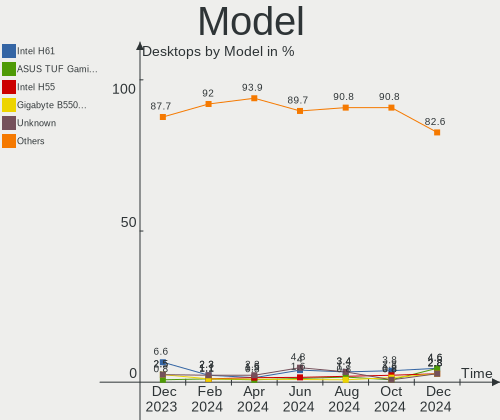
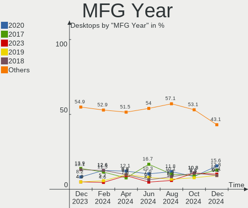
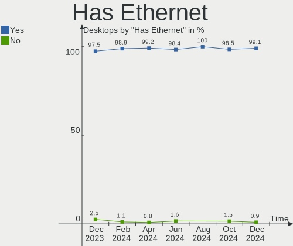
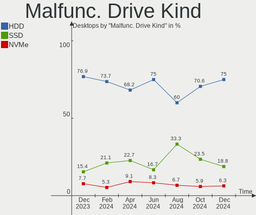
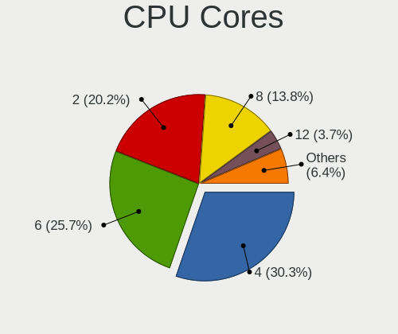
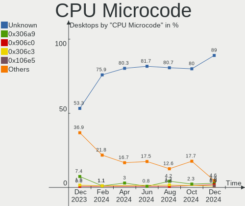
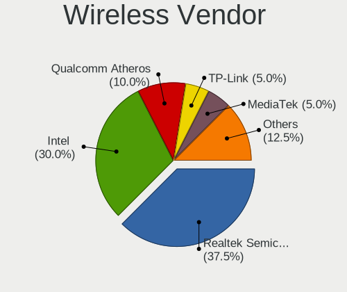
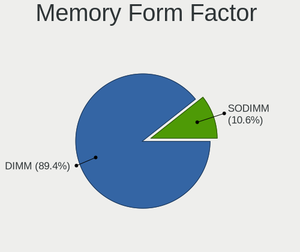

Linux in Brazil - Hardware Trends (Desktops)
--------------------------------------------

A project to identify most popular hardware characteristics and track their change
over time based on data collected by Linux users at https://Linux-Hardware.org.

Anyone can contribute to this report by the [hw-probe](https://github.com/linuxhw/hw-probe) tool:

    sudo -E hw-probe -all -upload

Period: Sep, 2023.

Contents
--------

* [ System ](#system)
  - [ OS                       ](#os)
  - [ OS Family                ](#os-family)
  - [ Kernel                   ](#kernel)
  - [ Kernel Family            ](#kernel-family)
  - [ Kernel Major Ver.        ](#kernel-major-ver)
  - [ Arch                     ](#arch)
  - [ DE                       ](#de)
  - [ Display Server           ](#display-server)
  - [ Display Manager          ](#display-manager)
  - [ OS Lang                  ](#os-lang)
  - [ Boot Mode                ](#boot-mode)
  - [ Filesystem               ](#filesystem)
  - [ Part. scheme             ](#part-scheme)
  - [ Dual Boot with Linux/BSD ](#dual-boot-with-linuxbsd)
  - [ Dual Boot (Win)          ](#dual-boot-win)

* [ Board ](#board)
  - [ Vendor                   ](#vendor)
  - [ Model                    ](#model)
  - [ Model Family             ](#model-family)
  - [ MFG Year                 ](#mfg-year)
  - [ Form Factor              ](#form-factor)
  - [ Secure Boot              ](#secure-boot)
  - [ Coreboot                 ](#coreboot)
  - [ RAM Size                 ](#ram-size)
  - [ RAM Used                 ](#ram-used)
  - [ Total Drives             ](#total-drives)
  - [ Has CD-ROM               ](#has-cd-rom)
  - [ Has Ethernet             ](#has-ethernet)
  - [ Has WiFi                 ](#has-wifi)
  - [ Has Bluetooth            ](#has-bluetooth)

* [ Location ](#location)
  - [ Country                  ](#country)
  - [ City                     ](#city)

* [ Drives ](#drives)
  - [ Drive Vendor             ](#drive-vendor)
  - [ Drive Model              ](#drive-model)
  - [ HDD Vendor               ](#hdd-vendor)
  - [ SSD Vendor               ](#ssd-vendor)
  - [ Drive Kind               ](#drive-kind)
  - [ Drive Connector          ](#drive-connector)
  - [ Drive Size               ](#drive-size)
  - [ Space Total              ](#space-total)
  - [ Space Used               ](#space-used)
  - [ Malfunc. Drives          ](#malfunc-drives)
  - [ Malfunc. Drive Vendor    ](#malfunc-drive-vendor)
  - [ Malfunc. HDD Vendor      ](#malfunc-hdd-vendor)
  - [ Malfunc. Drive Kind      ](#malfunc-drive-kind)
  - [ Failed Drives            ](#failed-drives)
  - [ Failed Drive Vendor      ](#failed-drive-vendor)
  - [ Drive Status             ](#drive-status)

* [ Storage controller ](#storage-controller)
  - [ Storage Vendor           ](#storage-vendor)
  - [ Storage Model            ](#storage-model)
  - [ Storage Kind             ](#storage-kind)

* [ Processor ](#processor)
  - [ CPU Vendor               ](#cpu-vendor)
  - [ CPU Model                ](#cpu-model)
  - [ CPU Model Family         ](#cpu-model-family)
  - [ CPU Cores                ](#cpu-cores)
  - [ CPU Sockets              ](#cpu-sockets)
  - [ CPU Threads              ](#cpu-threads)
  - [ CPU Op-Modes             ](#cpu-op-modes)
  - [ CPU Microcode            ](#cpu-microcode)
  - [ CPU Microarch            ](#cpu-microarch)

* [ Graphics ](#graphics)
  - [ GPU Vendor               ](#gpu-vendor)
  - [ GPU Model                ](#gpu-model)
  - [ GPU Combo                ](#gpu-combo)
  - [ GPU Driver               ](#gpu-driver)
  - [ GPU Memory               ](#gpu-memory)

* [ Monitor ](#monitor)
  - [ Monitor Vendor           ](#monitor-vendor)
  - [ Monitor Model            ](#monitor-model)
  - [ Monitor Resolution       ](#monitor-resolution)
  - [ Monitor Diagonal         ](#monitor-diagonal)
  - [ Monitor Width            ](#monitor-width)
  - [ Aspect Ratio             ](#aspect-ratio)
  - [ Monitor Area             ](#monitor-area)
  - [ Pixel Density            ](#pixel-density)
  - [ Multiple Monitors        ](#multiple-monitors)

* [ Network ](#network)
  - [ Net Controller Vendor    ](#net-controller-vendor)
  - [ Net Controller Model     ](#net-controller-model)
  - [ Wireless Vendor          ](#wireless-vendor)
  - [ Wireless Model           ](#wireless-model)
  - [ Ethernet Vendor          ](#ethernet-vendor)
  - [ Ethernet Model           ](#ethernet-model)
  - [ Net Controller Kind      ](#net-controller-kind)
  - [ Used Controller          ](#used-controller)
  - [ NICs                     ](#nics)
  - [ IPv6                     ](#ipv6)

* [ Bluetooth ](#bluetooth)
  - [ Bluetooth Vendor         ](#bluetooth-vendor)
  - [ Bluetooth Model          ](#bluetooth-model)

* [ Sound ](#sound)
  - [ Sound Vendor             ](#sound-vendor)
  - [ Sound Model              ](#sound-model)

* [ Memory ](#memory)
  - [ Memory Vendor            ](#memory-vendor)
  - [ Memory Model             ](#memory-model)
  - [ Memory Kind              ](#memory-kind)
  - [ Memory Form Factor       ](#memory-form-factor)
  - [ Memory Size              ](#memory-size)
  - [ Memory Speed             ](#memory-speed)

* [ Printers & scanners ](#printers--scanners)
  - [ Printer Vendor           ](#printer-vendor)
  - [ Printer Model            ](#printer-model)
  - [ Scanner Vendor           ](#scanner-vendor)
  - [ Scanner Model            ](#scanner-model)

* [ Camera ](#camera)
  - [ Camera Vendor            ](#camera-vendor)
  - [ Camera Model             ](#camera-model)

* [ Security ](#security)
  - [ Fingerprint Vendor       ](#fingerprint-vendor)
  - [ Fingerprint Model        ](#fingerprint-model)
  - [ Chipcard Vendor          ](#chipcard-vendor)
  - [ Chipcard Model           ](#chipcard-model)

* [ Unsupported ](#unsupported)
  - [ Unsupported Devices      ](#unsupported-devices)
  - [ Unsupported Device Types ](#unsupported-device-types)

System
------

OS
--

Installed operating systems

| Name                         | Desktops | Percent |
|------------------------------|----------|---------|
| OpenMandriva 23.08           | 18       | 13.53%  |
| Fedora 38                    | 16       | 12.03%  |
| Ubuntu 22.04                 | 15       | 11.28%  |
| OpenMandriva 23.09           | 8        | 6.02%   |
| ArcoLinux Rolling            | 7        | 5.26%   |
| Debian 12                    | 6        | 4.51%   |
| Manjaro                      | 5        | 3.76%   |
| Linux Mint 21.2              | 4        | 3.01%   |
| Zorin 16                     | 3        | 2.26%   |
| Ubuntu 23.04                 | 3        | 2.26%   |
| Ubuntu 20.04                 | 3        | 2.26%   |
| Pop!_OS 22.04                | 3        | 2.26%   |
| OpenMandriva 4.3             | 3        | 2.26%   |
| OpenMandriva 23.03           | 3        | 2.26%   |
| openSUSE Tumbleweed-XXXXXXXX | 2        | 1.5%    |
| openSUSE Leap-15.5           | 2        | 1.5%    |
| OpenMandriva 23.01           | 2        | 1.5%    |
| KDE neon 22.04               | 2        | 1.5%    |
| Debian 11                    | 2        | 1.5%    |
| BigLinux 23.0.1              | 2        | 1.5%    |
| BigLinux 23.0.0              | 2        | 1.5%    |
| Arch Rolling                 | 2        | 1.5%    |
| Xubuntu 22.04                | 1        | 0.75%   |
| Xero Rolling                 | 1        | 0.75%   |
| Ubuntu MATE 22.04            | 1        | 0.75%   |
| Ubuntu Budgie 22.04          | 1        | 0.75%   |
| Ubuntu 23.10                 | 1        | 0.75%   |
| SteamOS 4                    | 1        | 0.75%   |
| Solus 4.4                    | 1        | 0.75%   |
| OpenMandriva 4.50            | 1        | 0.75%   |
| OpenMandriva 4.2             | 1        | 0.75%   |
| Lubuntu 22.04                | 1        | 0.75%   |
| LMDE 5                       | 1        | 0.75%   |
| Linux Mint 21.1              | 1        | 0.75%   |
| Linux Mint 20.3              | 1        | 0.75%   |
| Linux Mint 20.2              | 1        | 0.75%   |
| Linux Mint 20.1              | 1        | 0.75%   |
| Linux Mint 19.3              | 1        | 0.75%   |
| Linux Mint 19.2              | 1        | 0.75%   |
| Gentoo 2.14                  | 1        | 0.75%   |

OS Family
---------

OS without a version

| Name          | Desktops | Percent |
|---------------|----------|---------|
| OpenMandriva  | 36       | 27.07%  |
| Ubuntu        | 22       | 16.54%  |
| Fedora        | 16       | 12.03%  |
| Linux Mint    | 10       | 7.52%   |
| Debian        | 8        | 6.02%   |
| ArcoLinux     | 7        | 5.26%   |
| Manjaro       | 5        | 3.76%   |
| openSUSE      | 4        | 3.01%   |
| BigLinux      | 4        | 3.01%   |
| Zorin         | 3        | 2.26%   |
| Pop!_OS       | 3        | 2.26%   |
| KDE neon      | 2        | 1.5%    |
| Arch          | 2        | 1.5%    |
| Xubuntu       | 1        | 0.75%   |
| Xero          | 1        | 0.75%   |
| Ubuntu MATE   | 1        | 0.75%   |
| Ubuntu Budgie | 1        | 0.75%   |
| SteamOS       | 1        | 0.75%   |
| Solus         | 1        | 0.75%   |
| Lubuntu       | 1        | 0.75%   |
| LMDE          | 1        | 0.75%   |
| Gentoo        | 1        | 0.75%   |
| Endless       | 1        | 0.75%   |
| EndeavourOS   | 1        | 0.75%   |

Kernel
------

Version of the Linux kernel

| Version                      | Desktops | Percent |
|------------------------------|----------|---------|
| 6.4.11-desktop-1omv2390      | 17       | 12.78%  |
| 6.2.0-32-generic             | 14       | 10.53%  |
| 6.4.15-200.fc38.x86_64       | 7        | 5.26%   |
| 5.15.0-83-generic            | 7        | 5.26%   |
| 6.2.0-33-generic             | 4        | 3.01%   |
| 6.5.0-desktop-1omv2390       | 3        | 2.26%   |
| 6.4.6-76060406-generic       | 3        | 2.26%   |
| 6.4.12-arch1-1               | 3        | 2.26%   |
| 6.4.11-arch1-1               | 3        | 2.26%   |
| 6.2.9-300.fc38.x86_64        | 3        | 2.26%   |
| 6.2.6-desktop-1omv2390       | 3        | 2.26%   |
| 6.1.51-1-MANJARO             | 3        | 2.26%   |
| 5.15.0-84-generic            | 3        | 2.26%   |
| 6.5.5-200.fc38.x86_64        | 2        | 1.5%    |
| 6.5.3-1-default              | 2        | 1.5%    |
| 6.5.2-desktop-1omv2390       | 2        | 1.5%    |
| 6.5.1-desktop-1omv2390       | 2        | 1.5%    |
| 6.4.14-200.fc38.x86_64       | 2        | 1.5%    |
| 6.4.13-200.fc38.x86_64       | 2        | 1.5%    |
| 6.4.12-zen1-1-zen            | 2        | 1.5%    |
| 6.2.0-31-generic             | 2        | 1.5%    |
| 6.1.1-desktop-1omv2290       | 2        | 1.5%    |
| 6.1.0-12-amd64               | 2        | 1.5%    |
| 6.1.0-10-amd64               | 2        | 1.5%    |
| 5.16.13-desktop-1omv4003     | 2        | 1.5%    |
| 5.14.21-150500.55.19-default | 2        | 1.5%    |
| 5.10.0-25-amd64              | 2        | 1.5%    |
| 6.5.5-hardened1-1-hardened   | 1        | 0.75%   |
| 6.5.5-arch1-1                | 1        | 0.75%   |
| 6.5.3-desktop-1omv2390       | 1        | 0.75%   |
| 6.5.3-1-MANJARO              | 1        | 0.75%   |
| 6.5.1-1-MANJARO              | 1        | 0.75%   |
| 6.5.0-5-generic              | 1        | 0.75%   |
| 6.4.8-desktop-2omv2390       | 1        | 0.75%   |
| 6.4.12-1-MANJARO             | 1        | 0.75%   |
| 6.4.11-251.current           | 1        | 0.75%   |
| 6.3.8-arch1-1                | 1        | 0.75%   |
| 6.2.0-34-generic             | 1        | 0.75%   |
| 6.1.8-060108-generic         | 1        | 0.75%   |
| 6.1.53-1-MANJARO             | 1        | 0.75%   |

Kernel Family
-------------

Linux kernel without a distro release

| Version  | Desktops | Percent |
|----------|----------|---------|
| 6.4.11   | 21       | 15.79%  |
| 6.2.0    | 21       | 15.79%  |
| 5.15.0   | 15       | 11.28%  |
| 6.4.15   | 7        | 5.26%   |
| 6.4.12   | 6        | 4.51%   |
| 6.1.0    | 5        | 3.76%   |
| 6.5.5    | 4        | 3.01%   |
| 6.5.3    | 4        | 3.01%   |
| 6.5.0    | 4        | 3.01%   |
| 6.5.1    | 3        | 2.26%   |
| 6.4.6    | 3        | 2.26%   |
| 6.2.9    | 3        | 2.26%   |
| 6.2.6    | 3        | 2.26%   |
| 6.1.51   | 3        | 2.26%   |
| 5.10.0   | 3        | 2.26%   |
| 6.5.2    | 2        | 1.5%    |
| 6.4.14   | 2        | 1.5%    |
| 6.4.13   | 2        | 1.5%    |
| 6.1.53   | 2        | 1.5%    |
| 6.1.1    | 2        | 1.5%    |
| 5.4.0    | 2        | 1.5%    |
| 5.16.13  | 2        | 1.5%    |
| 5.14.21  | 2        | 1.5%    |
| 6.4.8    | 1        | 0.75%   |
| 6.3.8    | 1        | 0.75%   |
| 6.1.8    | 1        | 0.75%   |
| 6.1.49   | 1        | 0.75%   |
| 6.1.46   | 1        | 0.75%   |
| 5.19.5   | 1        | 0.75%   |
| 5.16.7   | 1        | 0.75%   |
| 5.15.128 | 1        | 0.75%   |
| 5.10.142 | 1        | 0.75%   |
| 5.10.14  | 1        | 0.75%   |
| 5.0.0    | 1        | 0.75%   |
| 4.15.0   | 1        | 0.75%   |

Kernel Major Ver.
-----------------

Linux kernel major version

| Version | Desktops | Percent |
|---------|----------|---------|
| 6.4     | 42       | 31.58%  |
| 6.2     | 27       | 20.3%   |
| 6.5     | 17       | 12.78%  |
| 5.15    | 16       | 12.03%  |
| 6.1     | 15       | 11.28%  |
| 5.10    | 5        | 3.76%   |
| 5.16    | 3        | 2.26%   |
| 5.4     | 2        | 1.5%    |
| 5.14    | 2        | 1.5%    |
| 6.3     | 1        | 0.75%   |
| 5.19    | 1        | 0.75%   |
| 5.0     | 1        | 0.75%   |
| 4.15    | 1        | 0.75%   |

Arch
----

OS architecture (x86_64, i586, etc.)

| Name   | Desktops | Percent |
|--------|----------|---------|
| x86_64 | 133      | 100%    |

DE
--

Desktop Environment

| Name       | Desktops | Percent |
|------------|----------|---------|
| GNOME      | 57       | 42.86%  |
| KDE5       | 48       | 36.09%  |
| XFCE       | 8        | 6.02%   |
| X-Cinnamon | 8        | 6.02%   |
| MATE       | 4        | 3.01%   |
| LXQt       | 4        | 3.01%   |
| i3         | 1        | 0.75%   |
| Cinnamon   | 1        | 0.75%   |
| Budgie     | 1        | 0.75%   |
| Unknown    | 1        | 0.75%   |

Display Server
--------------

X11 or Wayland

| Name    | Desktops | Percent |
|---------|----------|---------|
| X11     | 73       | 54.89%  |
| Wayland | 58       | 43.61%  |
| Unknown | 2        | 1.5%    |

Display Manager
---------------

SDDM, LightDM, etc.

| Name    | Desktops | Percent |
|---------|----------|---------|
| SDDM    | 47       | 35.34%  |
| Unknown | 45       | 33.83%  |
| GDM3    | 22       | 16.54%  |
| LightDM | 11       | 8.27%   |
| GDM     | 7        | 5.26%   |
| LXDM    | 1        | 0.75%   |

OS Lang
-------

Language

| Lang  | Desktops | Percent |
|-------|----------|---------|
| pt_BR | 99       | 74.44%  |
| en_US | 31       | 23.31%  |
| C     | 2        | 1.5%    |
| en_GB | 1        | 0.75%   |

Boot Mode
---------

EFI or BIOS

| Mode | Desktops | Percent |
|------|----------|---------|
| BIOS | 76       | 57.14%  |
| EFI  | 57       | 42.86%  |

Filesystem
----------

Type of filesystem

| Type    | Desktops | Percent |
|---------|----------|---------|
| Ext4    | 66       | 49.62%  |
| Btrfs   | 31       | 23.31%  |
| Overlay | 18       | 13.53%  |
| Tmpfs   | 17       | 12.78%  |
| Zfs     | 1        | 0.75%   |

Part. scheme
------------

Scheme of partitioning

| Type    | Desktops | Percent |
|---------|----------|---------|
| GPT     | 65       | 48.87%  |
| Unknown | 45       | 33.83%  |
| MBR     | 23       | 17.29%  |

Dual Boot with Linux/BSD
------------------------

Hosting more than one Linux/BSD

| Dual boot | Desktops | Percent |
|-----------|----------|---------|
| No        | 107      | 80.45%  |
| Yes       | 26       | 19.55%  |

Dual Boot (Win)
---------------

Hosting Linux and Windows

| Dual boot | Desktops | Percent |
|-----------|----------|---------|
| No        | 86       | 64.66%  |
| Yes       | 47       | 35.34%  |

Board
-----

Vendor
------

Motherboard manufacturer

| Name                | Desktops | Percent |
|---------------------|----------|---------|
| ASUSTek Computer    | 29       | 21.8%   |
| Gigabyte Technology | 17       | 12.78%  |
| Intel               | 14       | 10.53%  |
| ASRock              | 11       | 8.27%   |
| Positivo            | 7        | 5.26%   |
| Dell                | 7        | 5.26%   |
| MSI                 | 6        | 4.51%   |
| Biostar             | 5        | 3.76%   |
| Lenovo              | 4        | 3.01%   |
| Huanan              | 3        | 2.26%   |
| Hewlett-Packard     | 3        | 2.26%   |
| Foxconn             | 3        | 2.26%   |
| Unknown             | 3        | 2.26%   |
| Semp Toshiba        | 2        | 1.5%    |
| Pegatron            | 2        | 1.5%    |
| PCWare              | 2        | 1.5%    |
| HOUTER              | 2        | 1.5%    |
| wpc                 | 1        | 0.75%   |
| QIYIDA              | 1        | 0.75%   |
| Philco              | 1        | 0.75%   |
| OEM                 | 1        | 0.75%   |
| Megaware            | 1        | 0.75%   |
| MEGA                | 1        | 0.75%   |
| MACHINIST           | 1        | 0.75%   |
| Login Informatica   | 1        | 0.75%   |
| Kllisre             | 1        | 0.75%   |
| ECS                 | 1        | 0.75%   |
| Daten Tecnologia    | 1        | 0.75%   |
| ANGXUN              | 1        | 0.75%   |
| AMD                 | 1        | 0.75%   |

Model
-----

Motherboard model

| Name                                  | Desktops | Percent |
|---------------------------------------|----------|---------|
| Intel H61                             | 7        | 5.26%   |
| ASRock A320M-HD                       | 4        | 3.01%   |
| Gigabyte B550M AORUS ELITE            | 3        | 2.26%   |
| ASUS TUF Gaming X570-PLUS_BR          | 3        | 2.26%   |
| Unknown                               | 3        | 2.26%   |
| Semp Toshiba STI                      | 2        | 1.5%    |
| Positivo D3400                        | 2        | 1.5%    |
| Huanan X99-F8 GAMING V5.0             | 2        | 1.5%    |
| HOUTER IPMH61R1                       | 2        | 1.5%    |
| Gigabyte B450 AORUS M                 | 2        | 1.5%    |
| ASUS PRIME A320M-K/BR                 | 2        | 1.5%    |
| ASUS M5A78L-M PLUS/USB3               | 2        | 1.5%    |
| wpc wpc616                            | 1        | 0.75%   |
| QIYIDA X99-H9 V2.0                    | 1        | 0.75%   |
| Positivo POS-PIH81DI                  | 1        | 0.75%   |
| Positivo POS-EIBTPDC                  | 1        | 0.75%   |
| Positivo POS-AG31AP                   | 1        | 0.75%   |
| Positivo D6200                        | 1        | 0.75%   |
| Positivo C6300                        | 1        | 0.75%   |
| Philco DTC-A55                        | 1        | 0.75%   |
| Pegatron IPMSB-VH1/HDMI/ODM           | 1        | 0.75%   |
| Pegatron 220-1000br                   | 1        | 0.75%   |
| PCWare IPMH81G1                       | 1        | 0.75%   |
| PCWare APM-A320G                      | 1        | 0.75%   |
| OEM B75                               | 1        | 0.75%   |
| MSI MS-7D18                           | 1        | 0.75%   |
| MSI MS-7C95                           | 1        | 0.75%   |
| MSI MS-7C91                           | 1        | 0.75%   |
| MSI MS-7C51                           | 1        | 0.75%   |
| MSI MS-7B29                           | 1        | 0.75%   |
| MSI MS-7A38                           | 1        | 0.75%   |
| Megaware MW-HDC-M                     | 1        | 0.75%   |
| MEGA G41T-M7 LGT                      | 1        | 0.75%   |
| MACHINIST X99-RS9 V2.0                | 1        | 0.75%   |
| Login Informatica LOG-H61H2-M2        | 1        | 0.75%   |
| Lenovo V520S-08IKL Desktop 10NN000CBP | 1        | 0.75%   |
| Lenovo ThinkCentre M58e 7303AZ2       | 1        | 0.75%   |
| Lenovo ThinkCentre Edge72z 3569Q6P    | 1        | 0.75%   |
| Lenovo ThinkCentre A70z 0401B7P       | 1        | 0.75%   |
| Kllisre X99-B5 V1.1                   | 1        | 0.75%   |

Model Family
------------

Motherboard model prefix

| Name                           | Desktops | Percent |
|--------------------------------|----------|---------|
| ASUS TUF                       | 9        | 6.77%   |
| ASUS PRIME                     | 8        | 6.02%   |
| Intel H61                      | 7        | 5.26%   |
| Gigabyte B550M                 | 4        | 3.01%   |
| Dell OptiPlex                  | 4        | 3.01%   |
| ASRock A320M-HD                | 4        | 3.01%   |
| Lenovo ThinkCentre             | 3        | 2.26%   |
| Dell Vostro                    | 3        | 2.26%   |
| ASUS ROG                       | 3        | 2.26%   |
| ASUS M5A78L-M                  | 3        | 2.26%   |
| Unknown                        | 3        | 2.26%   |
| Semp Toshiba STI               | 2        | 1.5%    |
| Positivo D3400                 | 2        | 1.5%    |
| Huanan X99-F8                  | 2        | 1.5%    |
| HOUTER IPMH61R1                | 2        | 1.5%    |
| HP Compaq                      | 2        | 1.5%    |
| Gigabyte B450                  | 2        | 1.5%    |
| wpc wpc616                     | 1        | 0.75%   |
| QIYIDA X99-H9                  | 1        | 0.75%   |
| Positivo POS-PIH81DI           | 1        | 0.75%   |
| Positivo POS-EIBTPDC           | 1        | 0.75%   |
| Positivo POS-AG31AP            | 1        | 0.75%   |
| Positivo D6200                 | 1        | 0.75%   |
| Positivo C6300                 | 1        | 0.75%   |
| Philco DTC-A55                 | 1        | 0.75%   |
| Pegatron IPMSB-VH1             | 1        | 0.75%   |
| Pegatron 220-1000br            | 1        | 0.75%   |
| PCWare IPMH81G1                | 1        | 0.75%   |
| PCWare APM-A320G               | 1        | 0.75%   |
| OEM B75                        | 1        | 0.75%   |
| MSI MS-7D18                    | 1        | 0.75%   |
| MSI MS-7C95                    | 1        | 0.75%   |
| MSI MS-7C91                    | 1        | 0.75%   |
| MSI MS-7C51                    | 1        | 0.75%   |
| MSI MS-7B29                    | 1        | 0.75%   |
| MSI MS-7A38                    | 1        | 0.75%   |
| Megaware MW-HDC-M              | 1        | 0.75%   |
| MEGA G41T-M7                   | 1        | 0.75%   |
| MACHINIST X99-RS9              | 1        | 0.75%   |
| Login Informatica LOG-H61H2-M2 | 1        | 0.75%   |

MFG Year
--------

Motherboard manufacture year

| Year | Desktops | Percent |
|------|----------|---------|
| 2018 | 19       | 14.29%  |
| 2021 | 15       | 11.28%  |
| 2017 | 14       | 10.53%  |
| 2019 | 12       | 9.02%   |
| 2020 | 9        | 6.77%   |
| 2011 | 8        | 6.02%   |
| 2009 | 8        | 6.02%   |
| 2022 | 7        | 5.26%   |
| 2012 | 7        | 5.26%   |
| 2010 | 7        | 5.26%   |
| 2023 | 5        | 3.76%   |
| 2014 | 5        | 3.76%   |
| 2016 | 4        | 3.01%   |
| 2013 | 4        | 3.01%   |
| 2008 | 4        | 3.01%   |
| 2007 | 3        | 2.26%   |
| 2015 | 2        | 1.5%    |

Form Factor
-----------

Physical design of the computer

| Name    | Desktops | Percent |
|---------|----------|---------|
| Desktop | 133      | 100%    |

Secure Boot
-----------

Enabled or disabled

| State    | Desktops | Percent |
|----------|----------|---------|
| Disabled | 127      | 95.49%  |
| Enabled  | 6        | 4.51%   |

Coreboot
--------

Have coreboot on board

| Used | Desktops | Percent |
|------|----------|---------|
| No   | 133      | 100%    |

RAM Size
--------

Total RAM memory

| Size in GB  | Desktops | Percent |
|-------------|----------|---------|
| 16.01-24.0  | 38       | 28.57%  |
| 4.01-8.0    | 27       | 20.3%   |
| 8.01-16.0   | 23       | 17.29%  |
| 3.01-4.0    | 19       | 14.29%  |
| 32.01-64.0  | 14       | 10.53%  |
| 64.01-256.0 | 7        | 5.26%   |
| 24.01-32.0  | 3        | 2.26%   |
| 2.01-3.0    | 2        | 1.5%    |

RAM Used
--------

Used RAM memory

| Used GB    | Desktops | Percent |
|------------|----------|---------|
| 1.01-2.0   | 43       | 32.33%  |
| 2.01-3.0   | 38       | 28.57%  |
| 3.01-4.0   | 20       | 15.04%  |
| 4.01-8.0   | 19       | 14.29%  |
| 8.01-16.0  | 6        | 4.51%   |
| 0.51-1.0   | 5        | 3.76%   |
| 16.01-24.0 | 1        | 0.75%   |
| 0.01-0.5   | 1        | 0.75%   |

Total Drives
------------

Number of drives on board

| Drives | Desktops | Percent |
|--------|----------|---------|
| 1      | 66       | 49.62%  |
| 2      | 25       | 18.8%   |
| 3      | 20       | 15.04%  |
| 4      | 13       | 9.77%   |
| 6      | 4        | 3.01%   |
| 5      | 3        | 2.26%   |
| 0      | 2        | 1.5%    |

Has CD-ROM
----------

Has CD-ROM on board

| Presented | Desktops | Percent |
|-----------|----------|---------|
| No        | 93       | 69.92%  |
| Yes       | 40       | 30.08%  |

Has Ethernet
------------

Has Ethernet on board

| Presented | Desktops | Percent |
|-----------|----------|---------|
| Yes       | 132      | 99.25%  |
| No        | 1        | 0.75%   |

Has WiFi
--------

Has WiFi module

| Presented | Desktops | Percent |
|-----------|----------|---------|
| No        | 78       | 58.65%  |
| Yes       | 55       | 41.35%  |

Has Bluetooth
-------------

Has Bluetooth module

| Presented | Desktops | Percent |
|-----------|----------|---------|
| No        | 97       | 72.93%  |
| Yes       | 36       | 27.07%  |

Location
--------

Country
-------

Geographic location (country)

| Country | Desktops | Percent |
|---------|----------|---------|
| Brazil  | 133      | 100%    |

City
----

Geographic location (city)

| City                   | Desktops | Percent |
|------------------------|----------|---------|
| Sao Paulo              | 16       | 12.03%  |
| Rio de Janeiro         | 9        | 6.77%   |
| Curitiba               | 5        | 3.76%   |
| Brasília              | 5        | 3.76%   |
| Sao José dos Campos   | 3        | 2.26%   |
| Santo André           | 3        | 2.26%   |
| Sao Vicente            | 2        | 1.5%    |
| Santa Luzia            | 2        | 1.5%    |
| Recife                 | 2        | 1.5%    |
| Porto Alegre           | 2        | 1.5%    |
| Palmas                 | 2        | 1.5%    |
| Niterói               | 2        | 1.5%    |
| Marília               | 2        | 1.5%    |
| Goiânia               | 2        | 1.5%    |
| Fortaleza              | 2        | 1.5%    |
| Duque de Caxias        | 2        | 1.5%    |
| Cariacica              | 2        | 1.5%    |
| Braganca Paulista      | 2        | 1.5%    |
| Belo Horizonte         | 2        | 1.5%    |
| Belém                 | 2        | 1.5%    |
| Araraquara             | 2        | 1.5%    |
| Americana              | 2        | 1.5%    |
| Vila Velha             | 1        | 0.75%   |
| Vicosa                 | 1        | 0.75%   |
| Vespasiano             | 1        | 0.75%   |
| Valenca                | 1        | 0.75%   |
| Urai                   | 1        | 0.75%   |
| Uberlândia            | 1        | 0.75%   |
| Teresina               | 1        | 0.75%   |
| Sumaré                | 1        | 0.75%   |
| Sorocaba               | 1        | 0.75%   |
| Sapucaia do Sul        | 1        | 0.75%   |
| Sao Luís              | 1        | 0.75%   |
| Sao Jose               | 1        | 0.75%   |
| Sao Joao Evangelista   | 1        | 0.75%   |
| Sao Joao del Rei       | 1        | 0.75%   |
| Sao Joao de Meriti     | 1        | 0.75%   |
| Sao Domingos das Dores | 1        | 0.75%   |
| Sao Carlos             | 1        | 0.75%   |
| Sao Bernardo do Campo  | 1        | 0.75%   |

Drives
------

Drive Vendor
------------

Hard drive vendors

| Vendor                         | Desktops | Drives | Percent |
|--------------------------------|----------|--------|---------|
| Seagate                        | 38       | 52     | 15.97%  |
| WDC                            | 37       | 38     | 15.55%  |
| Kingston                       | 30       | 40     | 12.61%  |
| Samsung Electronics            | 24       | 25     | 10.08%  |
| China                          | 14       | 14     | 5.88%   |
| SanDisk                        | 9        | 10     | 3.78%   |
| MAXIO Technology (Hangzhou)    | 7        | 7      | 2.94%   |
| Kingston Technology Company    | 7        | 8      | 2.94%   |
| Toshiba                        | 6        | 6      | 2.52%   |
| Silicon Motion                 | 6        | 6      | 2.52%   |
| Crucial                        | 6        | 8      | 2.52%   |
| Phison Electronics             | 5        | 5      | 2.1%    |
| Unknown                        | 3        | 3      | 1.26%   |
| Patriot                        | 3        | 3      | 1.26%   |
| Maxtor                         | 3        | 3      | 1.26%   |
| KingSpec                       | 3        | 3      | 1.26%   |
| ADATA Technology               | 3        | 4      | 1.26%   |
| A-DATA Technology              | 3        | 3      | 1.26%   |
| WALRAM                         | 2        | 2      | 0.84%   |
| Micron/Crucial Technology      | 2        | 2      | 0.84%   |
| Lexar                          | 2        | 2      | 0.84%   |
| Hitachi                        | 2        | 2      | 0.84%   |
| XrayDisk                       | 1        | 1      | 0.42%   |
| Win Memory                     | 1        | 1      | 0.42%   |
| Team                           | 1        | 1      | 0.42%   |
| T-FORCE                        | 1        | 1      | 0.42%   |
| SSSTC                          | 1        | 1      | 0.42%   |
| Solid State Storage Technology | 1        | 1      | 0.42%   |
| SK hynix                       | 1        | 1      | 0.42%   |
| Shenzhen Longsys Electronics   | 1        | 1      | 0.42%   |
| Reeinno                        | 1        | 1      | 0.42%   |
| Realtek Semiconductor          | 1        | 1      | 0.42%   |
| PNY                            | 1        | 1      | 0.42%   |
| OXYBR                          | 1        | 1      | 0.42%   |
| NN                             | 1        | 1      | 0.42%   |
| LITEON                         | 1        | 1      | 0.42%   |
| KINGBANK                       | 1        | 1      | 0.42%   |
| HS-SSD-C100                    | 1        | 1      | 0.42%   |
| HGST                           | 1        | 1      | 0.42%   |
| Hewlett-Packard                | 1        | 1      | 0.42%   |

Drive Model
-----------

Hard drive models

| Model                                                 | Desktops | Percent |
|-------------------------------------------------------|----------|---------|
| Kingston SA400S37480G 480GB SSD                       | 13       | 4.98%   |
| Kingston SA400S37240G 240GB SSD                       | 8        | 3.07%   |
| Seagate ST1000DM010-2EP102 1TB                        | 6        | 2.3%    |
| Kingston Company SNV2S1000G 1TB                       | 5        | 1.92%   |
| Kingston SA400S37120G 120GB SSD                       | 5        | 1.92%   |
| Silicon Motion SM2263EN/SM2263XT SSD Controller 512GB | 4        | 1.53%   |
| Seagate ST1000DM003-1ER162 1TB                        | 4        | 1.53%   |
| Samsung HD322HJ 320GB                                 | 4        | 1.53%   |
| WDC WD5000AAKX-00U6AA0 500GB                          | 3        | 1.15%   |
| Samsung HD161HJ 160GB                                 | 3        | 1.15%   |
| MAXIO (Hangzhou) NVMe SSD Controller MAP1202 512GB    | 3        | 1.15%   |
| Kingston Company SNV2S2000G 2TB                       | 3        | 1.15%   |
| Kingston SV300S37A120G 120GB SSD                      | 3        | 1.15%   |
| Crucial CT240BX500SSD1 240GB                          | 3        | 1.15%   |
| China SSD 240GB                                       | 3        | 1.15%   |
| WDC WD5000AZLX-00K2TA0 500GB                          | 2        | 0.77%   |
| WDC WD5000AVCS-632DY1 500GB                           | 2        | 0.77%   |
| WDC WD5000AAKX-003CA0 500GB                           | 2        | 0.77%   |
| WDC WD10EZEX-75WN4A1 1TB                              | 2        | 0.77%   |
| WDC WD10EZEX-08WN4A0 1TB                              | 2        | 0.77%   |
| WDC WD Green 2.5 480GB SSD                            | 2        | 0.77%   |
| Seagate ST500DM002-1BD142 500GB                       | 2        | 0.77%   |
| Seagate ST3500418AS 500GB                             | 2        | 0.77%   |
| Seagate ST3000DM001-1ER166 3TB                        | 2        | 0.77%   |
| Seagate ST2000DM006-2DM164 2TB                        | 2        | 0.77%   |
| Seagate ST2000DM005-2CW102 2TB                        | 2        | 0.77%   |
| Seagate ST1000DM003-1CH162 1TB                        | 2        | 0.77%   |
| Seagate Expansion HDD 16TB                            | 2        | 0.77%   |
| SanDisk SSD PLUS 240GB                                | 2        | 0.77%   |
| Samsung SSD 840 EVO 250GB                             | 2        | 0.77%   |
| Samsung HM500JI 500GB                                 | 2        | 0.77%   |
| Samsung HM321HI 320GB                                 | 2        | 0.77%   |
| Samsung HD502HJ 500GB                                 | 2        | 0.77%   |
| Samsung HD154UI 1TB                                   | 2        | 0.77%   |
| Phison E12 NVMe Controller 2TB                        | 2        | 0.77%   |
| Micron/Crucial P2 NVMe PCIe SSD 1TB                   | 2        | 0.77%   |
| MAXIO (Hangzhou) NVMe SSD Controller MAP1001 500GB    | 2        | 0.77%   |
| Kingston SNVS500G 500GB                               | 2        | 0.77%   |
| Kingston SNV2S500G 500GB                              | 2        | 0.77%   |
| China SSD 120GB                                       | 2        | 0.77%   |

HDD Vendor
----------

Hard disk drive vendors

| Vendor              | Desktops | Drives | Percent |
|---------------------|----------|--------|---------|
| Seagate             | 38       | 52     | 36.19%  |
| WDC                 | 32       | 33     | 30.48%  |
| Samsung Electronics | 21       | 22     | 20%     |
| Toshiba             | 6        | 6      | 5.71%   |
| Maxtor              | 3        | 3      | 2.86%   |
| Hitachi             | 2        | 2      | 1.9%    |
| HGST                | 1        | 1      | 0.95%   |
| Hewlett-Packard     | 1        | 1      | 0.95%   |
| Fujitsu             | 1        | 1      | 0.95%   |

SSD Vendor
----------

Solid state drive vendors

| Vendor              | Desktops | Drives | Percent |
|---------------------|----------|--------|---------|
| Kingston            | 28       | 35     | 33.73%  |
| China               | 14       | 14     | 16.87%  |
| SanDisk             | 7        | 7      | 8.43%   |
| Crucial             | 6        | 7      | 7.23%   |
| WDC                 | 5        | 5      | 6.02%   |
| Samsung Electronics | 3        | 3      | 3.61%   |
| Patriot             | 3        | 3      | 3.61%   |
| KingSpec            | 3        | 3      | 3.61%   |
| A-DATA Technology   | 2        | 2      | 2.41%   |
| Win Memory          | 1        | 1      | 1.2%    |
| Team                | 1        | 1      | 1.2%    |
| Reeinno             | 1        | 1      | 1.2%    |
| PNY                 | 1        | 1      | 1.2%    |
| OXYBR               | 1        | 1      | 1.2%    |
| NN                  | 1        | 1      | 1.2%    |
| LITEON              | 1        | 1      | 1.2%    |
| KINGBANK            | 1        | 1      | 1.2%    |
| HS-SSD-C100         | 1        | 1      | 1.2%    |
| EXRAM               | 1        | 1      | 1.2%    |
| AFOX                | 1        | 1      | 1.2%    |
| Unknown             | 1        | 1      | 1.2%    |

Drive Kind
----------

HDD or SSD

| Kind    | Desktops | Drives | Percent |
|---------|----------|--------|---------|
| HDD     | 84       | 121    | 42.64%  |
| SSD     | 68       | 91     | 34.52%  |
| NVMe    | 43       | 55     | 21.83%  |
| Unknown | 2        | 2      | 1.02%   |

Drive Connector
---------------

SATA, SAS, NVMe, etc.

| Type | Desktops | Drives | Percent |
|------|----------|--------|---------|
| SATA | 119      | 210    | 71.69%  |
| NVMe | 43       | 55     | 25.9%   |
| SAS  | 4        | 4      | 2.41%   |

Drive Size
----------

Size of hard drive

| Size in TB | Desktops | Drives | Percent |
|------------|----------|--------|---------|
| 0.01-0.5   | 97       | 142    | 61.39%  |
| 0.51-1.0   | 41       | 49     | 25.95%  |
| 1.01-2.0   | 11       | 11     | 6.96%   |
| 2.01-3.0   | 3        | 4      | 1.9%    |
| 4.01-10.0  | 3        | 3      | 1.9%    |
| 10.01-20.0 | 2        | 2      | 1.27%   |
| 3.01-4.0   | 1        | 1      | 0.63%   |

Space Total
-----------

Amount of disk space available on the file system

| Size in GB     | Desktops | Percent |
|----------------|----------|---------|
| 251-500        | 40       | 30.08%  |
| 101-250        | 21       | 15.79%  |
| 501-1000       | 20       | 15.04%  |
| 1-20           | 15       | 11.28%  |
| More than 3000 | 11       | 8.27%   |
| 1001-2000      | 11       | 8.27%   |
| 2001-3000      | 5        | 3.76%   |
| 51-100         | 4        | 3.01%   |
| 21-50          | 3        | 2.26%   |
| Unknown        | 3        | 2.26%   |

Space Used
----------

Amount of used disk space

| Used GB        | Desktops | Percent |
|----------------|----------|---------|
| 1-20           | 50       | 37.59%  |
| 21-50          | 21       | 15.79%  |
| 101-250        | 16       | 12.03%  |
| 51-100         | 15       | 11.28%  |
| 251-500        | 9        | 6.77%   |
| More than 3000 | 6        | 4.51%   |
| 501-1000       | 6        | 4.51%   |
| 1001-2000      | 5        | 3.76%   |
| Unknown        | 3        | 2.26%   |
| 2001-3000      | 2        | 1.5%    |

Malfunc. Drives
---------------

Drive models with a malfunction

| Model                             | Desktops | Drives | Percent |
|-----------------------------------|----------|--------|---------|
| Samsung Electronics HD322HJ 320GB | 2        | 2      | 6.67%   |
| WDC WDS100T2B0A-00SM50 1TB SSD    | 1        | 1      | 3.33%   |
| WDC WD7500AADS-00M2B0 752GB       | 1        | 1      | 3.33%   |
| WDC WD5000AZLX-60K2TA1 500GB      | 1        | 1      | 3.33%   |
| WDC WD5000AZLX-00K2TA0 500GB      | 1        | 1      | 3.33%   |
| WDC WD5000AVDS-63U7B1 500GB       | 1        | 1      | 3.33%   |
| WDC WD5000AAKX-003CA0 500GB       | 1        | 1      | 3.33%   |
| Toshiba DT01ACA050 500GB          | 1        | 1      | 3.33%   |
| Seagate ST9500420AS 500GB         | 1        | 1      | 3.33%   |
| Seagate ST500DM002-9YN14C 500GB   | 1        | 1      | 3.33%   |
| Seagate ST500DM002-1BD142 500GB   | 1        | 1      | 3.33%   |
| Seagate ST500DM002-1BC142 500GB   | 1        | 1      | 3.33%   |
| Seagate ST31000528AS 1TB          | 1        | 1      | 3.33%   |
| Seagate ST2000DM005-2CW102 2TB    | 1        | 1      | 3.33%   |
| SanDisk SSD PLUS 120GB            | 1        | 1      | 3.33%   |
| Samsung Electronics HM500JI 500GB | 1        | 1      | 3.33%   |
| Samsung Electronics HM321HI 320GB | 1        | 1      | 3.33%   |
| Samsung Electronics HD502IJ 500GB | 1        | 1      | 3.33%   |
| Samsung Electronics HD502HJ 500GB | 1        | 1      | 3.33%   |
| Samsung Electronics HD502HI 500GB | 1        | 1      | 3.33%   |
| Samsung Electronics HD321HJ 320GB | 1        | 1      | 3.33%   |
| Samsung Electronics HD154UI 1TB   | 1        | 1      | 3.33%   |
| Samsung Electronics HD080HJ 80GB  | 1        | 1      | 3.33%   |
| Reeinno FR256GB S5S3 SSD          | 1        | 1      | 3.33%   |
| Maxtor STM380815AS 80GB           | 1        | 1      | 3.33%   |
| Maxtor STM3250310AS 250GB         | 1        | 1      | 3.33%   |
| Maxtor STM3160215AS 160GB         | 1        | 1      | 3.33%   |
| EXRAM SSD 512GB                   | 1        | 1      | 3.33%   |
| China SSD 240GB                   | 1        | 1      | 3.33%   |

Malfunc. Drive Vendor
---------------------

Vendors of faulty drives

| Vendor              | Desktops | Drives | Percent |
|---------------------|----------|--------|---------|
| Samsung Electronics | 10       | 10     | 33.33%  |
| WDC                 | 6        | 6      | 20%     |
| Seagate             | 6        | 6      | 20%     |
| Maxtor              | 3        | 3      | 10%     |
| Toshiba             | 1        | 1      | 3.33%   |
| SanDisk             | 1        | 1      | 3.33%   |
| Reeinno             | 1        | 1      | 3.33%   |
| EXRAM               | 1        | 1      | 3.33%   |
| China               | 1        | 1      | 3.33%   |

Malfunc. HDD Vendor
-------------------

Vendors of faulty HDD drives

| Vendor              | Desktops | Drives | Percent |
|---------------------|----------|--------|---------|
| Samsung Electronics | 10       | 10     | 40%     |
| Seagate             | 6        | 6      | 24%     |
| WDC                 | 5        | 5      | 20%     |
| Maxtor              | 3        | 3      | 12%     |
| Toshiba             | 1        | 1      | 4%      |

Malfunc. Drive Kind
-------------------

Kinds of faulty drives

| Kind | Desktops | Drives | Percent |
|------|----------|--------|---------|
| HDD  | 23       | 25     | 82.14%  |
| SSD  | 5        | 5      | 17.86%  |

Failed Drives
-------------

Failed drive models

Zero info for selected period =(

Failed Drive Vendor
-------------------

Failed drive vendors

Zero info for selected period =(

Drive Status
------------

Number of failed and malfunc. drives

| Status   | Desktops | Drives | Percent |
|----------|----------|--------|---------|
| Detected | 71       | 143    | 47.65%  |
| Works    | 52       | 96     | 34.9%   |
| Malfunc  | 26       | 30     | 17.45%  |

Storage controller
------------------

Storage Vendor
--------------

Storage controller vendors

| Vendor                         | Desktops | Percent |
|--------------------------------|----------|---------|
| Intel                          | 77       | 41.62%  |
| AMD                            | 52       | 28.11%  |
| Kingston Technology Company    | 11       | 5.95%   |
| Silicon Motion                 | 8        | 4.32%   |
| MAXIO Technology (Hangzhou)    | 8        | 4.32%   |
| Phison Electronics             | 7        | 3.78%   |
| ADATA Technology               | 4        | 2.16%   |
| Micron/Crucial Technology      | 3        | 1.62%   |
| Solid State Storage Technology | 2        | 1.08%   |
| SanDisk                        | 2        | 1.08%   |
| Realtek Semiconductor          | 2        | 1.08%   |
| Nvidia                         | 2        | 1.08%   |
| JMicron Technology             | 2        | 1.08%   |
| TenaFe                         | 1        | 0.54%   |
| SK hynix                       | 1        | 0.54%   |
| Shenzhen Longsys Electronics   | 1        | 0.54%   |
| INNOGRIT                       | 1        | 0.54%   |
| ASMedia Technology             | 1        | 0.54%   |

Storage Model
-------------

Storage controller models

| Model                                                                                   | Desktops | Percent |
|-----------------------------------------------------------------------------------------|----------|---------|
| AMD FCH SATA Controller [AHCI mode]                                                     | 26       | 10.7%   |
| Intel 6 Series/C200 Series Chipset Family 6 port Desktop SATA AHCI Controller           | 15       | 6.17%   |
| Intel NM10/ICH7 Family SATA Controller [IDE mode]                                       | 12       | 4.94%   |
| AMD FCH SATA Controller D                                                               | 12       | 4.94%   |
| Intel 82801G (ICH7 Family) IDE Controller                                               | 10       | 4.12%   |
| Kingston Company Company Non-Volatile memory controller                                 | 9        | 3.7%    |
| AMD 500 Series Chipset SATA Controller                                                  | 9        | 3.7%    |
| Silicon Motion SM2263EN/SM2263XT (DRAM-less) NVMe SSD Controllers                       | 7        | 2.88%   |
| Intel Alder Lake-S PCH SATA Controller [AHCI Mode]                                      | 7        | 2.88%   |
| Intel 8 Series/C220 Series Chipset Family 6-port SATA Controller 1 [AHCI mode]          | 7        | 2.88%   |
| AMD SB7x0/SB8x0/SB9x0 IDE Controller                                                    | 7        | 2.88%   |
| Intel Cannon Lake PCH SATA AHCI Controller                                              | 6        | 2.47%   |
| AMD SB7x0/SB8x0/SB9x0 SATA Controller [IDE mode]                                        | 6        | 2.47%   |
| AMD 400 Series Chipset SATA Controller                                                  | 6        | 2.47%   |
| MAXIO (Hangzhou) NVMe SSD Controller MAP1202                                            | 4        | 1.65%   |
| Intel Volume Management Device NVMe RAID Controller                                     | 4        | 1.65%   |
| AMD FCH IDE Controller                                                                  | 4        | 1.65%   |
| Micron/Crucial P2 [Nick P2] / P3 / P3 Plus NVMe PCIe SSD (DRAM-less)                    | 3        | 1.23%   |
| Intel SATA Controller [RAID mode]                                                       | 3        | 1.23%   |
| Intel 7 Series/C210 Series Chipset Family 6-port SATA Controller [AHCI mode]            | 3        | 1.23%   |
| AMD SB7x0/SB8x0/SB9x0 SATA Controller [AHCI mode]                                       | 3        | 1.23%   |
| Solid State Storage CL4-8D512 NVMe SSD M.2 (DRAM-less)                                  | 2        | 0.82%   |
| Phison PS5013 E13 NVMe Controller                                                       | 2        | 0.82%   |
| Phison E16 PCIe4 NVMe Controller                                                        | 2        | 0.82%   |
| Phison E12 NVMe Controller                                                              | 2        | 0.82%   |
| Nvidia MCP61 SATA Controller                                                            | 2        | 0.82%   |
| Nvidia MCP61 IDE                                                                        | 2        | 0.82%   |
| MAXIO (Hangzhou) NVMe SSD Controller MAP1602                                            | 2        | 0.82%   |
| MAXIO (Hangzhou) NVMe SSD Controller MAP1001                                            | 2        | 0.82%   |
| Kingston Company NVMe Controller                                                        | 2        | 0.82%   |
| JMicron JMB368 IDE controller                                                           | 2        | 0.82%   |
| Intel Q170/Q150/B150/H170/H110/Z170/CM236 Chipset SATA Controller [AHCI Mode]           | 2        | 0.82%   |
| Intel 9 Series Chipset Family SATA Controller [AHCI Mode]                               | 2        | 0.82%   |
| Intel 6 Series/C200 Series Chipset Family Desktop SATA Controller (IDE mode, ports 4-5) | 2        | 0.82%   |
| Intel 6 Series/C200 Series Chipset Family Desktop SATA Controller (IDE mode, ports 0-3) | 2        | 0.82%   |
| Intel 500 Series Chipset Family SATA AHCI Controller                                    | 2        | 0.82%   |
| Intel 5 Series/3400 Series Chipset PT IDER Controller                                   | 2        | 0.82%   |
| Intel 5 Series/3400 Series Chipset 6 port SATA AHCI Controller                          | 2        | 0.82%   |
| Intel 5 Series/3400 Series Chipset 4 port SATA IDE Controller                           | 2        | 0.82%   |
| Intel 5 Series/3400 Series Chipset 2 port SATA IDE Controller                           | 2        | 0.82%   |

Storage Kind
------------

Kind of storage controller (IDE, SATA, NVMe, SAS, ...)

| Kind | Desktops | Percent |
|------|----------|---------|
| SATA | 106      | 55.21%  |
| NVMe | 43       | 22.4%   |
| IDE  | 35       | 18.23%  |
| RAID | 8        | 4.17%   |

Processor
---------

CPU Vendor
----------

Processor vendors

| Vendor | Desktops | Percent |
|--------|----------|---------|
| Intel  | 78       | 58.65%  |
| AMD    | 55       | 41.35%  |

CPU Model
---------

Processor models

| Model                                       | Desktops | Percent |
|---------------------------------------------|----------|---------|
| AMD Ryzen 5 5600G with Radeon Graphics      | 7        | 5.26%   |
| Intel Core i7-3770 CPU @ 3.40GHz            | 4        | 3.01%   |
| Intel Core i5-3470 CPU @ 3.20GHz            | 3        | 2.26%   |
| Intel Core i5-2400 CPU @ 3.10GHz            | 3        | 2.26%   |
| Intel Core 2 Quad CPU Q6600 @ 2.40GHz       | 3        | 2.26%   |
| AMD Ryzen 7 5700G with Radeon Graphics      | 3        | 2.26%   |
| AMD Ryzen 5 1600 Six-Core Processor         | 3        | 2.26%   |
| AMD Ryzen 3 3200G with Radeon Vega Graphics | 3        | 2.26%   |
| AMD Phenom II X4 945 Processor              | 3        | 2.26%   |
| Intel Xeon CPU E5-2650 v3 @ 2.30GHz         | 2        | 1.5%    |
| Intel Xeon CPU E5-2620 v3 @ 2.40GHz         | 2        | 1.5%    |
| Intel Pentium Gold G5400 CPU @ 3.70GHz      | 2        | 1.5%    |
| Intel Core i7-2600 CPU @ 3.40GHz            | 2        | 1.5%    |
| Intel Core i5-3550 CPU @ 3.30GHz            | 2        | 1.5%    |
| Intel Core i5 CPU 650 @ 3.20GHz             | 2        | 1.5%    |
| Intel Core 2 Duo CPU E7500 @ 2.93GHz        | 2        | 1.5%    |
| Intel Core 2 Duo CPU E7400 @ 2.80GHz        | 2        | 1.5%    |
| Intel 12th Gen Core i5-12400                | 2        | 1.5%    |
| Intel 12th Gen Core i3-12100                | 2        | 1.5%    |
| AMD Ryzen 7 5800X 8-Core Processor          | 2        | 1.5%    |
| AMD Ryzen 7 2700 Eight-Core Processor       | 2        | 1.5%    |
| AMD Ryzen 5 5600 6-Core Processor           | 2        | 1.5%    |
| AMD Ryzen 3 2200G with Radeon Vega Graphics | 2        | 1.5%    |
| AMD FX-8350 Eight-Core Processor            | 2        | 1.5%    |
| AMD FX-6300 Six-Core Processor              | 2        | 1.5%    |
| Intel Xeon CPU E5620 @ 2.40GHz              | 1        | 0.75%   |
| Intel Xeon CPU E5-2699 v3 @ 2.30GHz         | 1        | 0.75%   |
| Intel Xeon CPU E5-2690 v4 @ 2.60GHz         | 1        | 0.75%   |
| Intel Xeon CPU E5-2666 v3 @ 2.90GHz         | 1        | 0.75%   |
| Intel Xeon CPU E5-2640 0 @ 2.50GHz          | 1        | 0.75%   |
| Intel Xeon CPU E5-2630 v4 @ 2.20GHz         | 1        | 0.75%   |
| Intel Xeon CPU 3075 @ 2.66GHz               | 1        | 0.75%   |
| Intel Pentium Dual-Core CPU E5700 @ 3.00GHz | 1        | 0.75%   |
| Intel Pentium Dual CPU E2140 @ 1.60GHz      | 1        | 0.75%   |
| Intel Pentium CPU G4560 @ 3.50GHz           | 1        | 0.75%   |
| Intel Genuine CPU 0000 @ 2.60GHz            | 1        | 0.75%   |
| Intel Core i7-9700K CPU @ 3.60GHz           | 1        | 0.75%   |
| Intel Core i7-8700 CPU @ 3.20GHz            | 1        | 0.75%   |
| Intel Core i7-6700 CPU @ 3.40GHz            | 1        | 0.75%   |
| Intel Core i7 CPU 870 @ 2.93GHz             | 1        | 0.75%   |

CPU Model Family
----------------

Processor model prefix

| Model                   | Desktops | Percent |
|-------------------------|----------|---------|
| Intel Core i5           | 23       | 17.29%  |
| AMD Ryzen 5             | 15       | 11.28%  |
| AMD Ryzen 7             | 12       | 9.02%   |
| Intel Xeon              | 11       | 8.27%   |
| Intel Core i7           | 10       | 7.52%   |
| Other                   | 8        | 6.02%   |
| Intel Core i3           | 6        | 4.51%   |
| Intel Core 2 Duo        | 6        | 4.51%   |
| AMD Ryzen 3             | 5        | 3.76%   |
| Intel Core 2 Quad       | 4        | 3.01%   |
| Intel Celeron           | 4        | 3.01%   |
| AMD Phenom II X4        | 4        | 3.01%   |
| AMD FX                  | 4        | 3.01%   |
| AMD A8                  | 3        | 2.26%   |
| Intel Pentium Gold      | 2        | 1.5%    |
| AMD Ryzen 9             | 2        | 1.5%    |
| AMD A10                 | 2        | 1.5%    |
| Intel Pentium Dual-Core | 1        | 0.75%   |
| Intel Pentium Dual      | 1        | 0.75%   |
| Intel Pentium           | 1        | 0.75%   |
| Intel Genuine           | 1        | 0.75%   |
| AMD Ryzen 7 PRO         | 1        | 0.75%   |
| AMD Phenom II X6        | 1        | 0.75%   |
| AMD Phenom II X3        | 1        | 0.75%   |
| AMD E                   | 1        | 0.75%   |
| AMD C-60                | 1        | 0.75%   |
| AMD Athlon              | 1        | 0.75%   |
| AMD A6                  | 1        | 0.75%   |
| AMD A4                  | 1        | 0.75%   |

CPU Cores
---------

Number of processor cores

| Number | Desktops | Percent |
|--------|----------|---------|
| 4      | 48       | 36.09%  |
| 6      | 28       | 21.05%  |
| 2      | 25       | 18.8%   |
| 8      | 16       | 12.03%  |
| 10     | 4        | 3.01%   |
| 1      | 4        | 3.01%   |
| 3      | 3        | 2.26%   |
| 16     | 2        | 1.5%    |
| 18     | 1        | 0.75%   |
| 14     | 1        | 0.75%   |
| 12     | 1        | 0.75%   |

CPU Sockets
-----------

Number of sockets

| Number | Desktops | Percent |
|--------|----------|---------|
| 1      | 132      | 99.25%  |
| 2      | 1        | 0.75%   |

CPU Threads
-----------

Threads per core (Hyper-Threading)

| Number | Desktops | Percent |
|--------|----------|---------|
| 2      | 80       | 60.15%  |
| 1      | 53       | 39.85%  |

CPU Op-Modes
------------

CPU Operation Modes (32-bit, 64-bit)

| Op mode        | Desktops | Percent |
|----------------|----------|---------|
| 32-bit, 64-bit | 133      | 100%    |

CPU Microcode
-------------

Microcode number

| Number     | Desktops | Percent |
|------------|----------|---------|
| Unknown    | 70       | 52.63%  |
| 0x0a50000d | 6        | 4.51%   |
| 0x206a7    | 4        | 3.01%   |
| 0x0a20120a | 4        | 3.01%   |
| 0x0800820d | 4        | 3.01%   |
| 0x906ea    | 3        | 2.26%   |
| 0x90675    | 3        | 2.26%   |
| 0x6fb      | 3        | 2.26%   |
| 0x08108109 | 3        | 2.26%   |
| 0xa0653    | 2        | 1.5%    |
| 0x6fd      | 2        | 1.5%    |
| 0x20655    | 2        | 1.5%    |
| 0x1067a    | 2        | 1.5%    |
| 0x08701021 | 2        | 1.5%    |
| 0x03000027 | 2        | 1.5%    |
| 0x906ed    | 1        | 0.75%   |
| 0x906eb    | 1        | 0.75%   |
| 0x906e9    | 1        | 0.75%   |
| 0x406c4    | 1        | 0.75%   |
| 0x306f2    | 1        | 0.75%   |
| 0x306c3    | 1        | 0.75%   |
| 0x0a201205 | 1        | 0.75%   |
| 0x0810100b | 1        | 0.75%   |
| 0x08001138 | 1        | 0.75%   |
| 0x0800111c | 1        | 0.75%   |
| 0x06003106 | 1        | 0.75%   |
| 0x06003104 | 1        | 0.75%   |
| 0x06001119 | 1        | 0.75%   |
| 0x06000852 | 1        | 0.75%   |
| 0x05000101 | 1        | 0.75%   |
| 0x05000028 | 1        | 0.75%   |
| 0x010000dc | 1        | 0.75%   |
| 0x010000db | 1        | 0.75%   |
| 0x010000c8 | 1        | 0.75%   |
| 0x010000c6 | 1        | 0.75%   |
| 0x010000b6 | 1        | 0.75%   |

CPU Microarch
-------------

Microarchitecture

| Name             | Desktops | Percent |
|------------------|----------|---------|
| Zen 3            | 18       | 13.53%  |
| SandyBridge      | 11       | 8.27%   |
| KabyLake         | 11       | 8.27%   |
| IvyBridge        | 10       | 7.52%   |
| Zen+             | 9        | 6.77%   |
| Haswell          | 9        | 6.77%   |
| Core             | 7        | 5.26%   |
| Zen              | 6        | 4.51%   |
| Penryn           | 6        | 4.51%   |
| K10              | 6        | 4.51%   |
| Alderlake Hybrid | 6        | 4.51%   |
| Piledriver       | 5        | 3.76%   |
| Westmere         | 4        | 3.01%   |
| CometLake        | 4        | 3.01%   |
| Zen 2            | 3        | 2.26%   |
| Steamroller      | 2        | 1.5%    |
| Silvermont       | 2        | 1.5%    |
| K10 Llano        | 2        | 1.5%    |
| Excavator        | 2        | 1.5%    |
| Broadwell        | 2        | 1.5%    |
| Bobcat           | 2        | 1.5%    |
| Unknown          | 2        | 1.5%    |
| Skylake          | 1        | 0.75%   |
| NetBurst         | 1        | 0.75%   |
| Nehalem          | 1        | 0.75%   |
| Icelake          | 1        | 0.75%   |

Graphics
--------

GPU Vendor
----------

Vendors of graphics cards

| Vendor | Desktops | Percent |
|--------|----------|---------|
| AMD    | 57       | 41.61%  |
| Intel  | 44       | 32.12%  |
| Nvidia | 36       | 26.28%  |

GPU Model
---------

Graphics card models

| Model                                                                       | Desktops | Percent |
|-----------------------------------------------------------------------------|----------|---------|
| AMD Cezanne [Radeon Vega Series / Radeon Vega Mobile Series]                | 9        | 6.47%   |
| Intel 2nd Generation Core Processor Family Integrated Graphics Controller   | 7        | 5.04%   |
| AMD Polaris 20 XL [Radeon RX 580 2048SP]                                    | 7        | 5.04%   |
| Intel CoffeeLake-S GT2 [UHD Graphics 630]                                   | 6        | 4.32%   |
| Intel 82G33/G31 Express Integrated Graphics Controller                      | 5        | 3.6%    |
| Intel 4 Series Chipset Integrated Graphics Controller                       | 5        | 3.6%    |
| AMD Picasso/Raven 2 [Radeon Vega Series / Radeon Vega Mobile Series]        | 4        | 2.88%   |
| Nvidia GA104 [GeForce RTX 3060 Ti Lite Hash Rate]                           | 3        | 2.16%   |
| Intel Xeon E3-1200 v2/3rd Gen Core processor Graphics Controller            | 3        | 2.16%   |
| Intel Alder Lake-S GT1 [UHD Graphics 730]                                   | 3        | 2.16%   |
| AMD Navi 23 [Radeon RX 6600/6600 XT/6600M]                                  | 3        | 2.16%   |
| AMD Navi 14 [Radeon RX 5500/5500M / Pro 5500M]                              | 3        | 2.16%   |
| AMD Lexa PRO [Radeon 540/540X/550/550X / RX 540X/550/550X]                  | 3        | 2.16%   |
| AMD Cedar [Radeon HD 5000/6000/7350/8350 Series]                            | 3        | 2.16%   |
| Nvidia GT218 [GeForce 210]                                                  | 2        | 1.44%   |
| Nvidia GP107 [GeForce GTX 1050 Ti]                                          | 2        | 1.44%   |
| Nvidia GP106 [GeForce GTX 1060 6GB]                                         | 2        | 1.44%   |
| Nvidia GM206 [GeForce GTX 960]                                              | 2        | 1.44%   |
| Nvidia GF108 [GeForce GT 630]                                               | 2        | 1.44%   |
| Nvidia GF108 [GeForce GT 430]                                               | 2        | 1.44%   |
| Nvidia GA106 [GeForce RTX 3060 Lite Hash Rate]                              | 2        | 1.44%   |
| Nvidia GA106 [Geforce RTX 3050]                                             | 2        | 1.44%   |
| Nvidia G92 [GeForce 9800 GT]                                                | 2        | 1.44%   |
| Intel Xeon E3-1200 v3/4th Gen Core Processor Integrated Graphics Controller | 2        | 1.44%   |
| Intel IvyBridge GT2 [HD Graphics 4000]                                      | 2        | 1.44%   |
| Intel Core Processor Integrated Graphics Controller                         | 2        | 1.44%   |
| Intel CometLake-S GT2 [UHD Graphics 630]                                    | 2        | 1.44%   |
| Intel CoffeeLake-S GT1 [UHD Graphics 610]                                   | 2        | 1.44%   |
| AMD Wani [Radeon R5/R6/R7 Graphics]                                         | 2        | 1.44%   |
| AMD Sumo [Radeon HD 6550D]                                                  | 2        | 1.44%   |
| AMD RS780L [Radeon 3000]                                                    | 2        | 1.44%   |
| AMD Raven Ridge [Radeon Vega Series / Radeon Vega Mobile Series]            | 2        | 1.44%   |
| AMD Kaveri [Radeon R7 Graphics]                                             | 2        | 1.44%   |
| AMD Caicos [Radeon HD 6450/7450/8450 / R5 230 OEM]                          | 2        | 1.44%   |
| Nvidia TU116 [GeForce GTX 1650]                                             | 1        | 0.72%   |
| Nvidia TU116 [GeForce GTX 1650 SUPER]                                       | 1        | 0.72%   |
| Nvidia TU106 [GeForce RTX 2060 Rev. A]                                      | 1        | 0.72%   |
| Nvidia TU106 [GeForce RTX 2060 12GB]                                        | 1        | 0.72%   |
| Nvidia TU104 [GeForce RTX 2060]                                             | 1        | 0.72%   |
| Nvidia GT218 [GeForce G210]                                                 | 1        | 0.72%   |

GPU Combo
---------

Combinations of graphics cards

| Name           | Desktops | Percent |
|----------------|----------|---------|
| 1 x AMD        | 53       | 39.85%  |
| 1 x Intel      | 41       | 30.83%  |
| 1 x Nvidia     | 33       | 24.81%  |
| 2 x AMD        | 2        | 1.5%    |
| AMD + Nvidia   | 2        | 1.5%    |
| 2 x Intel      | 1        | 0.75%   |
| Intel + Nvidia | 1        | 0.75%   |

GPU Driver
----------

Free vs proprietary

| Driver      | Desktops | Percent |
|-------------|----------|---------|
| Free        | 114      | 85.71%  |
| Proprietary | 16       | 12.03%  |
| Unknown     | 3        | 2.26%   |

GPU Memory
----------

Total video memory

| Size in GB | Desktops | Percent |
|------------|----------|---------|
| Unknown    | 69       | 51.88%  |
| 7.01-8.0   | 14       | 10.53%  |
| 0.51-1.0   | 14       | 10.53%  |
| 1.01-2.0   | 12       | 9.02%   |
| 0.01-0.5   | 11       | 8.27%   |
| 3.01-4.0   | 9        | 6.77%   |
| 5.01-6.0   | 3        | 2.26%   |
| 16.01-24.0 | 1        | 0.75%   |

Monitor
-------

Monitor Vendor
--------------

Monitor vendors

| Vendor              | Desktops | Percent |
|---------------------|----------|---------|
| Goldstar            | 41       | 28.08%  |
| Samsung Electronics | 26       | 17.81%  |
| AOC                 | 22       | 15.07%  |
| Dell                | 10       | 6.85%   |
| Philips             | 8        | 5.48%   |
| Positivo            | 5        | 3.42%   |
| Pixio               | 3        | 2.05%   |
| Unknown (XXX)       | 2        | 1.37%   |
| Unknown             | 2        | 1.37%   |
| Sony                | 2        | 1.37%   |
| Hewlett-Packard     | 2        | 1.37%   |
| GDH                 | 2        | 1.37%   |
| ASUSTek Computer    | 2        | 1.37%   |
| Acer                | 2        | 1.37%   |
| WAN                 | 1        | 0.68%   |
| Toshiba             | 1        | 0.68%   |
| STA                 | 1        | 0.68%   |
| SGT                 | 1        | 0.68%   |
| QTX                 | 1        | 0.68%   |
| Philco              | 1        | 0.68%   |
| PANDA               | 1        | 0.68%   |
| MStar               | 1        | 0.68%   |
| MSD                 | 1        | 0.68%   |
| LG Electronics      | 1        | 0.68%   |
| Lenovo              | 1        | 0.68%   |
| Konka               | 1        | 0.68%   |
| JRY                 | 1        | 0.68%   |
| ISS                 | 1        | 0.68%   |
| IPS                 | 1        | 0.68%   |
| BLM                 | 1        | 0.68%   |
| AGO                 | 1        | 0.68%   |

Monitor Model
-------------

Monitor models

| Model                                                                   | Desktops | Percent |
|-------------------------------------------------------------------------|----------|---------|
| Goldstar FULL HD GSM5B55 1920x1080 480x270mm 21.7-inch                  | 4        | 2.63%   |
| Goldstar HDR WFHD GSM7714 2560x1080 798x334mm 34.1-inch                 | 3        | 1.97%   |
| AOC 24V2W1G5 AOC2402 1920x1080 527x296mm 23.8-inch                      | 3        | 1.97%   |
| Unknown LCD Monitor FFFF 2288x1287 2550x2550mm 142.0-inch               | 2        | 1.32%   |
| Samsung Electronics SyncMaster SAM02E3 1440x900 367x229mm 17.0-inch     | 2        | 1.32%   |
| Samsung Electronics SMT24A550 SAM07B5 1920x1080 531x299mm 24.0-inch     | 2        | 1.32%   |
| Samsung Electronics SMB1930N SAM0632 1366x768 410x230mm 18.5-inch       | 2        | 1.32%   |
| Philips PHL 242V8 PHLC219 1920x1080 527x296mm 23.8-inch                 | 2        | 1.32%   |
| Goldstar WX942 GSM4B80 1440x900 408x255mm 18.9-inch                     | 2        | 1.32%   |
| Goldstar ULTRAWIDE GSM59F1 2560x1080 673x284mm 28.8-inch                | 2        | 1.32%   |
| Goldstar E2050 GSM4EAD 1600x900 443x249mm 20.0-inch                     | 2        | 1.32%   |
| Goldstar 2D HD TV GSM59CA 1366x768 509x286mm 23.0-inch                  | 2        | 1.32%   |
| Dell P2217H DELA0D8 1920x1080 476x267mm 21.5-inch                       | 2        | 1.32%   |
| AOC G2460 AOC246A 1920x1080 531x299mm 24.0-inch                         | 2        | 1.32%   |
| AOC 912Vwa AOC1912 1440x900 408x255mm 18.9-inch                         | 2        | 1.32%   |
| AOC 1970W AOC1970 1366x768 410x230mm 18.5-inch                          | 2        | 1.32%   |
| WAN MGN-002-21S WAN2150 1920x1080 410x230mm 18.5-inch                   | 1        | 0.66%   |
| Unknown (XXX) Union TV XXX2841 1920x1080 1209x680mm 54.6-inch           | 1        | 0.66%   |
| Unknown (XXX) Beyond TV XXX2851 3840x2160 1209x680mm 54.6-inch          | 1        | 0.66%   |
| Toshiba LCD-MONITOR LCD1885 1366x768 410x230mm 18.5-inch                | 1        | 0.66%   |
| STA SEMP LEDTV STA0030 1920x1080 708x398mm 32.0-inch                    | 1        | 0.66%   |
| Sony TV SNYEE01 1920x1080                                               | 1        | 0.66%   |
| Sony TV *00 SNYF303 1920x1080 1218x685mm 55.0-inch                      | 1        | 0.66%   |
| SGT '' SGT2380 1920x1080 531x289mm 23.8-inch                            | 1        | 0.66%   |
| Samsung Electronics SyncMaster SAM060D 1920x1080                        | 1        | 0.66%   |
| Samsung Electronics SyncMaster SAM05FF 1600x900 443x249mm 20.0-inch     | 1        | 0.66%   |
| Samsung Electronics SyncMaster SAM03BA 1680x1050                        | 1        | 0.66%   |
| Samsung Electronics SyncMaster SAM0274 1440x900 410x257mm 19.1-inch     | 1        | 0.66%   |
| Samsung Electronics SyncMaster SAM01AB 1280x1024 312x234mm 15.4-inch    | 1        | 0.66%   |
| Samsung Electronics SMT22A550 SAM07AF 1920x1080 477x268mm 21.5-inch     | 1        | 0.66%   |
| Samsung Electronics SA300/SA350 SAM0789 1366x768 410x230mm 18.5-inch    | 1        | 0.66%   |
| Samsung Electronics S27E332 SAM0F60 1920x1080 598x336mm 27.0-inch       | 1        | 0.66%   |
| Samsung Electronics S24E310 SAM0C2F 1920x1080 520x290mm 23.4-inch       | 1        | 0.66%   |
| Samsung Electronics S24D332 SAM0F5E 1920x1080 531x299mm 24.0-inch       | 1        | 0.66%   |
| Samsung Electronics S22E310 SAM0C2D 1920x1080 477x268mm 21.5-inch       | 1        | 0.66%   |
| Samsung Electronics S20C300 SAM0A18 1600x900 432x240mm 19.5-inch        | 1        | 0.66%   |
| Samsung Electronics S19B300 SAM08A5 1366x768 410x230mm 18.5-inch        | 1        | 0.66%   |
| Samsung Electronics LF24T450F SAM7096 1920x1080 527x296mm 23.8-inch     | 1        | 0.66%   |
| Samsung Electronics LCD Monitor SAM0FB9 3840x2160 1872x1053mm 84.6-inch | 1        | 0.66%   |
| Samsung Electronics LCD Monitor SAM0E9B 1366x768 609x347mm 27.6-inch    | 1        | 0.66%   |

Monitor Resolution
------------------

Monitor screen resolution

| Resolution         | Desktops | Percent |
|--------------------|----------|---------|
| 1920x1080 (FHD)    | 53       | 37.06%  |
| 1366x768 (WXGA)    | 18       | 12.59%  |
| 2560x1440 (QHD)    | 11       | 7.69%   |
| 1600x900 (HD+)     | 11       | 7.69%   |
| 1440x900 (WXGA+)   | 11       | 7.69%   |
| 3840x2160 (4K)     | 10       | 6.99%   |
| 1360x768           | 9        | 6.29%   |
| 2560x1080          | 8        | 5.59%   |
| 1280x1024 (SXGA)   | 3        | 2.1%    |
| 2288x1287          | 2        | 1.4%    |
| 1920x540           | 2        | 1.4%    |
| 1680x1050 (WSXGA+) | 2        | 1.4%    |
| 1024x768 (XGA)     | 2        | 1.4%    |
| 1280x720 (HD)      | 1        | 0.7%    |

Monitor Diagonal
----------------

Diagonal size in inches

| Inches  | Desktops | Percent |
|---------|----------|---------|
| 18      | 25       | 16.78%  |
| 21      | 19       | 12.75%  |
| 27      | 17       | 11.41%  |
| 23      | 17       | 11.41%  |
| 24      | 10       | 6.71%   |
| 20      | 7        | 4.7%    |
| 34      | 6        | 4.03%   |
| 19      | 6        | 4.03%   |
| 15      | 6        | 4.03%   |
| 31      | 5        | 3.36%   |
| 17      | 5        | 3.36%   |
| 54      | 3        | 2.01%   |
| 52      | 3        | 2.01%   |
| 32      | 3        | 2.01%   |
| Unknown | 3        | 2.01%   |
| 142     | 2        | 1.34%   |
| 25      | 2        | 1.34%   |
| 84      | 1        | 0.67%   |
| 75      | 1        | 0.67%   |
| 72      | 1        | 0.67%   |
| 47      | 1        | 0.67%   |
| 37      | 1        | 0.67%   |
| 28      | 1        | 0.67%   |
| 26      | 1        | 0.67%   |
| 22      | 1        | 0.67%   |
| 16      | 1        | 0.67%   |
| 12      | 1        | 0.67%   |

Monitor Width
-------------

Physical width

| Width in mm    | Desktops | Percent |
|----------------|----------|---------|
| 401-500        | 57       | 39.04%  |
| 501-600        | 42       | 28.77%  |
| 701-800        | 9        | 6.16%   |
| 601-700        | 9        | 6.16%   |
| 301-350        | 8        | 5.48%   |
| 1001-1500      | 7        | 4.79%   |
| 351-400        | 4        | 2.74%   |
| 1501-2000      | 3        | 2.05%   |
| Unknown        | 3        | 2.05%   |
| More than 2000 | 2        | 1.37%   |
| 801-900        | 1        | 0.68%   |
| 201-300        | 1        | 0.68%   |

Aspect Ratio
------------

Proportional relationship between the width and the height

| Ratio   | Desktops | Percent |
|---------|----------|---------|
| 16/9    | 101      | 75.37%  |
| 16/10   | 15       | 11.19%  |
| 21/9    | 8        | 5.97%   |
| 4/3     | 4        | 2.99%   |
| 5/4     | 2        | 1.49%   |
| 1.00    | 2        | 1.49%   |
| 2.00    | 1        | 0.75%   |
| Unknown | 1        | 0.75%   |

Monitor Area
------------

Area in inch²

| Area in inch² | Desktops | Percent |
|----------------|----------|---------|
| 201-250        | 41       | 28.28%  |
| 151-200        | 21       | 14.48%  |
| 141-150        | 20       | 13.79%  |
| 301-350        | 17       | 11.72%  |
| 351-500        | 14       | 9.66%   |
| More than 1000 | 10       | 6.9%    |
| 251-300        | 5        | 3.45%   |
| 101-110        | 5        | 3.45%   |
| 131-140        | 3        | 2.07%   |
| Unknown        | 3        | 2.07%   |
| 121-130        | 2        | 1.38%   |
| 501-1000       | 2        | 1.38%   |
| 71-80          | 1        | 0.69%   |
| 111-120        | 1        | 0.69%   |

Pixel Density
-------------

Pixels per inch

| Density | Desktops | Percent |
|---------|----------|---------|
| 51-100  | 90       | 66.18%  |
| 101-120 | 29       | 21.32%  |
| 1-50    | 11       | 8.09%   |
| Unknown | 3        | 2.21%   |
| 161-240 | 2        | 1.47%   |
| 121-160 | 1        | 0.74%   |

Multiple Monitors
-----------------

Total monitors connected

| Total | Desktops | Percent |
|-------|----------|---------|
| 1     | 97       | 72.93%  |
| 2     | 31       | 23.31%  |
| 0     | 5        | 3.76%   |

Network
-------

Net Controller Vendor
---------------------

Controller vendors

| Vendor                          | Desktops | Percent |
|---------------------------------|----------|---------|
| Realtek Semiconductor           | 109      | 59.56%  |
| Intel                           | 26       | 14.21%  |
| Qualcomm Atheros                | 9        | 4.92%   |
| Ralink Technology               | 7        | 3.83%   |
| TP-Link                         | 4        | 2.19%   |
| Ralink                          | 4        | 2.19%   |
| MediaTek                        | 4        | 2.19%   |
| D-Link                          | 4        | 2.19%   |
| Broadcom                        | 3        | 1.64%   |
| Xiaomi                          | 2        | 1.09%   |
| QinHeng Electronics             | 2        | 1.09%   |
| Nvidia                          | 2        | 1.09%   |
| Samsung Electronics             | 1        | 0.55%   |
| Qualcomm Atheros Communications | 1        | 0.55%   |
| Microsoft                       | 1        | 0.55%   |
| Marvell Technology Group        | 1        | 0.55%   |
| Linksys                         | 1        | 0.55%   |
| Broadcom Limited                | 1        | 0.55%   |
| ASIX Electronics                | 1        | 0.55%   |

Net Controller Model
--------------------

Controller models

| Model                                                             | Desktops | Percent |
|-------------------------------------------------------------------|----------|---------|
| Realtek RTL8111/8168/8411 PCI Express Gigabit Ethernet Controller | 89       | 43.2%   |
| Realtek RTL810xE PCI Express Fast Ethernet controller             | 14       | 6.8%    |
| Realtek RTL8188FTV 802.11b/g/n 1T1R 2.4G WLAN Adapter             | 7        | 3.4%    |
| Realtek RTL8125 2.5GbE Controller                                 | 6        | 2.91%   |
| Ralink MT7601U Wireless Adapter                                   | 5        | 2.43%   |
| Intel Wi-Fi 6 AX210/AX211/AX411 160MHz                            | 5        | 2.43%   |
| Realtek RTL88x2bu [AC1200 Techkey]                                | 3        | 1.46%   |
| Realtek RTL-8100/8101L/8139 PCI Fast Ethernet Adapter             | 3        | 1.46%   |
| MediaTek MT7921K (RZ608) Wi-Fi 6E 80MHz                           | 3        | 1.46%   |
| Intel Ethernet Connection (7) I219-V                              | 3        | 1.46%   |
| Xiaomi MediaTek MT7601U [MI WiFi]                                 | 2        | 0.97%   |
| Realtek RTL8812AU 802.11a/b/g/n/ac 2T2R DB WLAN Adapter           | 2        | 0.97%   |
| Ralink RT5370 Wireless Adapter                                    | 2        | 0.97%   |
| Ralink RT5390 Wireless 802.11n 1T/1R PCIe                         | 2        | 0.97%   |
| Qualcomm Atheros AR8152 v2.0 Fast Ethernet                        | 2        | 0.97%   |
| Qualcomm Atheros AR8151 v2.0 Gigabit Ethernet                     | 2        | 0.97%   |
| QinHeng UsbMonitor                                                | 2        | 0.97%   |
| Nvidia MCP61 Ethernet                                             | 2        | 0.97%   |
| Intel Wi-Fi 6 AX200                                               | 2        | 0.97%   |
| Intel I211 Gigabit Network Connection                             | 2        | 0.97%   |
| Intel Ethernet Controller I225-V                                  | 2        | 0.97%   |
| TP-Link TL-WN821N Version 5 RTL8192EU                             | 1        | 0.49%   |
| TP-Link Archer T9UH v1 [Realtek RTL8814AU]                        | 1        | 0.49%   |
| TP-Link AC600 wireless Realtek RTL8811AU [Archer T2U Nano]        | 1        | 0.49%   |
| TP-Link 802.11n NIC                                               | 1        | 0.49%   |
| Samsung Galaxy series, misc. (tethering mode)                     | 1        | 0.49%   |
| Realtek RTL8852BE PCIe 802.11ax Wireless Network Controller       | 1        | 0.49%   |
| Realtek RTL8192EU 802.11b/g/n WLAN Adapter                        | 1        | 0.49%   |
| Realtek RTL8192CU 802.11n WLAN Adapter                            | 1        | 0.49%   |
| Realtek RTL8169 PCI Gigabit Ethernet Controller                   | 1        | 0.49%   |
| Realtek RTL8153 Gigabit Ethernet Adapter                          | 1        | 0.49%   |
| Ralink RT3060 Wireless 802.11n 1T/1R                              | 1        | 0.49%   |
| Ralink RT2790 Wireless 802.11n 1T/2R PCIe                         | 1        | 0.49%   |
| Qualcomm Atheros QCA6174 802.11ac Wireless Network Adapter        | 1        | 0.49%   |
| Qualcomm Atheros Killer E220x Gigabit Ethernet Controller         | 1        | 0.49%   |
| Qualcomm Atheros AR9271 802.11n                                   | 1        | 0.49%   |
| Qualcomm Atheros Attansic L1 Gigabit Ethernet                     | 1        | 0.49%   |
| Qualcomm Atheros AR9485 Wireless Network Adapter                  | 1        | 0.49%   |
| Qualcomm Atheros AR922X Wireless Network Adapter                  | 1        | 0.49%   |
| Qualcomm Atheros AR8131 Gigabit Ethernet                          | 1        | 0.49%   |

Wireless Vendor
---------------

Wireless vendors

| Vendor                          | Desktops | Percent |
|---------------------------------|----------|---------|
| Realtek Semiconductor           | 15       | 25.42%  |
| Intel                           | 11       | 18.64%  |
| Ralink Technology               | 7        | 11.86%  |
| TP-Link                         | 4        | 6.78%   |
| Ralink                          | 4        | 6.78%   |
| MediaTek                        | 4        | 6.78%   |
| D-Link                          | 4        | 6.78%   |
| Qualcomm Atheros                | 3        | 5.08%   |
| Xiaomi                          | 2        | 3.39%   |
| Qualcomm Atheros Communications | 1        | 1.69%   |
| Microsoft                       | 1        | 1.69%   |
| Linksys                         | 1        | 1.69%   |
| Broadcom Limited                | 1        | 1.69%   |
| Broadcom                        | 1        | 1.69%   |

Wireless Model
--------------

Wireless models

| Model                                                                 | Desktops | Percent |
|-----------------------------------------------------------------------|----------|---------|
| Realtek RTL8188FTV 802.11b/g/n 1T1R 2.4G WLAN Adapter                 | 7        | 11.86%  |
| Ralink MT7601U Wireless Adapter                                       | 5        | 8.47%   |
| Intel Wi-Fi 6 AX210/AX211/AX411 160MHz                                | 5        | 8.47%   |
| Realtek RTL88x2bu [AC1200 Techkey]                                    | 3        | 5.08%   |
| MediaTek MT7921K (RZ608) Wi-Fi 6E 80MHz                               | 3        | 5.08%   |
| Xiaomi MediaTek MT7601U [MI WiFi]                                     | 2        | 3.39%   |
| Realtek RTL8812AU 802.11a/b/g/n/ac 2T2R DB WLAN Adapter               | 2        | 3.39%   |
| Ralink RT5370 Wireless Adapter                                        | 2        | 3.39%   |
| Ralink RT5390 Wireless 802.11n 1T/1R PCIe                             | 2        | 3.39%   |
| Intel Wi-Fi 6 AX200                                                   | 2        | 3.39%   |
| TP-Link TL-WN821N Version 5 RTL8192EU                                 | 1        | 1.69%   |
| TP-Link Archer T9UH v1 [Realtek RTL8814AU]                            | 1        | 1.69%   |
| TP-Link AC600 wireless Realtek RTL8811AU [Archer T2U Nano]            | 1        | 1.69%   |
| TP-Link 802.11n NIC                                                   | 1        | 1.69%   |
| Realtek RTL8852BE PCIe 802.11ax Wireless Network Controller           | 1        | 1.69%   |
| Realtek RTL8192EU 802.11b/g/n WLAN Adapter                            | 1        | 1.69%   |
| Realtek RTL8192CU 802.11n WLAN Adapter                                | 1        | 1.69%   |
| Ralink RT3060 Wireless 802.11n 1T/1R                                  | 1        | 1.69%   |
| Ralink RT2790 Wireless 802.11n 1T/2R PCIe                             | 1        | 1.69%   |
| Qualcomm Atheros QCA6174 802.11ac Wireless Network Adapter            | 1        | 1.69%   |
| Qualcomm Atheros AR9271 802.11n                                       | 1        | 1.69%   |
| Qualcomm Atheros AR9485 Wireless Network Adapter                      | 1        | 1.69%   |
| Qualcomm Atheros AR922X Wireless Network Adapter                      | 1        | 1.69%   |
| Microsoft Xbox Wireless Adapter for Windows                           | 1        | 1.69%   |
| MediaTek MT7921 802.11ax PCI Express Wireless Network Adapter         | 1        | 1.69%   |
| Linksys WUSB300N 802.11bgn Wireless Adapter [Marvell 88W8362+88W8060] | 1        | 1.69%   |
| Intel Wireless-AC 9260                                                | 1        | 1.69%   |
| Intel Wireless 7260                                                   | 1        | 1.69%   |
| Intel Comet Lake PCH CNVi WiFi                                        | 1        | 1.69%   |
| Intel Alder Lake-S PCH CNVi WiFi                                      | 1        | 1.69%   |
| D-Link DWA-171 AC600 DB Wireless Adapter(rev.A1) [Realtek RTL8811AU]  | 1        | 1.69%   |
| D-Link DWA-123 Wireless N 150 Adapter (rev.D1)                        | 1        | 1.69%   |
| D-Link AirPlus G DWL-G122 Wireless Adapter(rev.B1) [Ralink RT2571]    | 1        | 1.69%   |
| D-Link 802.11ac NIC                                                   | 1        | 1.69%   |
| Broadcom Limited BCM43225 802.11b/g/n                                 | 1        | 1.69%   |
| Broadcom BCM43227 802.11b/g/n                                         | 1        | 1.69%   |

Ethernet Vendor
---------------

Ethernet vendors

| Vendor                   | Desktops | Percent |
|--------------------------|----------|---------|
| Realtek Semiconductor    | 107      | 77.54%  |
| Intel                    | 17       | 12.32%  |
| Qualcomm Atheros         | 7        | 5.07%   |
| Nvidia                   | 2        | 1.45%   |
| Broadcom                 | 2        | 1.45%   |
| Samsung Electronics      | 1        | 0.72%   |
| Marvell Technology Group | 1        | 0.72%   |
| ASIX Electronics         | 1        | 0.72%   |

Ethernet Model
--------------

Ethernet models

| Model                                                             | Desktops | Percent |
|-------------------------------------------------------------------|----------|---------|
| Realtek RTL8111/8168/8411 PCI Express Gigabit Ethernet Controller | 89       | 61.38%  |
| Realtek RTL810xE PCI Express Fast Ethernet controller             | 14       | 9.66%   |
| Realtek RTL8125 2.5GbE Controller                                 | 6        | 4.14%   |
| Realtek RTL-8100/8101L/8139 PCI Fast Ethernet Adapter             | 3        | 2.07%   |
| Intel Ethernet Connection (7) I219-V                              | 3        | 2.07%   |
| Qualcomm Atheros AR8152 v2.0 Fast Ethernet                        | 2        | 1.38%   |
| Qualcomm Atheros AR8151 v2.0 Gigabit Ethernet                     | 2        | 1.38%   |
| Nvidia MCP61 Ethernet                                             | 2        | 1.38%   |
| Intel I211 Gigabit Network Connection                             | 2        | 1.38%   |
| Intel Ethernet Controller I225-V                                  | 2        | 1.38%   |
| Samsung Galaxy series, misc. (tethering mode)                     | 1        | 0.69%   |
| Realtek RTL8169 PCI Gigabit Ethernet Controller                   | 1        | 0.69%   |
| Realtek RTL8153 Gigabit Ethernet Adapter                          | 1        | 0.69%   |
| Qualcomm Atheros Killer E220x Gigabit Ethernet Controller         | 1        | 0.69%   |
| Qualcomm Atheros Attansic L1 Gigabit Ethernet                     | 1        | 0.69%   |
| Qualcomm Atheros AR8131 Gigabit Ethernet                          | 1        | 0.69%   |
| Marvell Group 88E8057 PCI-E Gigabit Ethernet Controller           | 1        | 0.69%   |
| Intel Ethernet Connection (7) I219-LM                             | 1        | 0.69%   |
| Intel Ethernet Connection (17) I219-V                             | 1        | 0.69%   |
| Intel Ethernet Connection (14) I219-V                             | 1        | 0.69%   |
| Intel Ethernet Connection (11) I219-V                             | 1        | 0.69%   |
| Intel 82579LM Gigabit Network Connection (Lewisville)             | 1        | 0.69%   |
| Intel 82578DM Gigabit Network Connection                          | 1        | 0.69%   |
| Intel 82578DC Gigabit Network Connection                          | 1        | 0.69%   |
| Intel 82567LM-3 Gigabit Network Connection                        | 1        | 0.69%   |
| Intel 82562V-2 10/100 Network Connection                          | 1        | 0.69%   |
| Intel 82557/8/9/0/1 Ethernet Pro 100                              | 1        | 0.69%   |
| Broadcom NetXtreme BCM5764M Gigabit Ethernet PCIe                 | 1        | 0.69%   |
| Broadcom NetXtreme BCM5761 Gigabit Ethernet PCIe                  | 1        | 0.69%   |
| ASIX AX88179 Gigabit Ethernet                                     | 1        | 0.69%   |

Net Controller Kind
-------------------

Ethernet, WiFi or modem

| Kind     | Desktops | Percent |
|----------|----------|---------|
| Ethernet | 132      | 69.84%  |
| WiFi     | 55       | 29.1%   |
| Modem    | 2        | 1.06%   |

Used Controller
---------------

Currently used network controller

| Kind     | Desktops | Percent |
|----------|----------|---------|
| Ethernet | 107      | 77.54%  |
| WiFi     | 31       | 22.46%  |

NICs
----

Total network controllers on board

| Total | Desktops | Percent |
|-------|----------|---------|
| 1     | 96       | 72.18%  |
| 2     | 34       | 25.56%  |
| 0     | 2        | 1.5%    |
| 3     | 1        | 0.75%   |

IPv6
----

IPv6 vs IPv4

| Used | Desktops | Percent |
|------|----------|---------|
| Yes  | 74       | 55.64%  |
| No   | 59       | 44.36%  |

Bluetooth
---------

Bluetooth Vendor
----------------

Controller vendors

| Vendor                          | Desktops | Percent |
|---------------------------------|----------|---------|
| Cambridge Silicon Radio         | 12       | 32.43%  |
| Intel                           | 10       | 27.03%  |
| Realtek Semiconductor           | 6        | 16.22%  |
| MediaTek                        | 3        | 8.11%   |
| Actions                         | 2        | 5.41%   |
| TP-Link                         | 1        | 2.7%    |
| Qualcomm Atheros Communications | 1        | 2.7%    |
| IMC Networks                    | 1        | 2.7%    |
| Broadcom                        | 1        | 2.7%    |

Bluetooth Model
---------------

Controller models

| Model                                               | Desktops | Percent |
|-----------------------------------------------------|----------|---------|
| Cambridge Silicon Radio Bluetooth Dongle (HCI mode) | 12       | 32.43%  |
| Realtek Bluetooth Radio                             | 6        | 16.22%  |
| Intel AX210 Bluetooth                               | 4        | 10.81%  |
| MediaTek Wireless_Device                            | 3        | 8.11%   |
| Intel Wireless-AC 9260 Bluetooth Adapter            | 2        | 5.41%   |
| Intel Bluetooth 9460/9560 Jefferson Peak (JfP)      | 2        | 5.41%   |
| Intel AX200 Bluetooth                               | 2        | 5.41%   |
| Actions general adapter                             | 2        | 5.41%   |
| TP-Link UB5A Adapter                                | 1        | 2.7%    |
| Qualcomm Atheros  Bluetooth Device                  | 1        | 2.7%    |
| IMC Networks Wireless_Device                        | 1        | 2.7%    |
| Broadcom BCM20702A0 Bluetooth 4.0                   | 1        | 2.7%    |

Sound
-----

Sound Vendor
------------

Sound card vendors

| Vendor                                       | Desktops | Percent |
|----------------------------------------------|----------|---------|
| Intel                                        | 79       | 38.73%  |
| AMD                                          | 65       | 31.86%  |
| Nvidia                                       | 35       | 17.16%  |
| C-Media Electronics                          | 4        | 1.96%   |
| Generalplus Technology                       | 3        | 1.47%   |
| Logitech                                     | 2        | 0.98%   |
| JMTek                                        | 2        | 0.98%   |
| JBL                                          | 2        | 0.98%   |
| DCMT Technology                              | 2        | 0.98%   |
| Zoran Co. Personal Media Division (Nogatech) | 1        | 0.49%   |
| SteelSeries ApS                              | 1        | 0.49%   |
| SAVITECH                                     | 1        | 0.49%   |
| Roland                                       | 1        | 0.49%   |
| Razer USA                                    | 1        | 0.49%   |
| Kingston Technology                          | 1        | 0.49%   |
| Focusrite-Novation                           | 1        | 0.49%   |
| fifine Microphone                            | 1        | 0.49%   |
| Dell                                         | 1        | 0.49%   |
| BEHRINGER International                      | 1        | 0.49%   |

Sound Model
-----------

Sound card models

| Model                                                                             | Desktops | Percent |
|-----------------------------------------------------------------------------------|----------|---------|
| Intel 6 Series/C200 Series Chipset Family High Definition Audio Controller        | 17       | 6.83%   |
| AMD Family 17h/19h HD Audio Controller                                            | 17       | 6.83%   |
| Intel NM10/ICH7 Family High Definition Audio Controller                           | 12       | 4.82%   |
| AMD Renoir Radeon High Definition Audio Controller                                | 11       | 4.42%   |
| AMD Starship/Matisse HD Audio Controller                                          | 10       | 4.02%   |
| AMD SBx00 Azalia (Intel HDA)                                                      | 10       | 4.02%   |
| Intel Cannon Lake PCH cAVS                                                        | 8        | 3.21%   |
| AMD Family 17h (Models 00h-0fh) HD Audio Controller                               | 8        | 3.21%   |
| AMD Ellesmere HDMI Audio [Radeon RX 470/480 / 570/580/590]                        | 8        | 3.21%   |
| Intel Alder Lake-S HD Audio Controller                                            | 7        | 2.81%   |
| Intel 8 Series/C220 Series Chipset High Definition Audio Controller               | 7        | 2.81%   |
| AMD Raven/Raven2/Fenghuang HDMI/DP Audio Controller                               | 6        | 2.41%   |
| AMD FCH Azalia Controller                                                         | 6        | 2.41%   |
| Nvidia GF108 High Definition Audio Controller                                     | 5        | 2.01%   |
| Nvidia High Definition Audio Controller                                           | 4        | 1.61%   |
| Nvidia GA106 High Definition Audio Controller                                     | 4        | 1.61%   |
| Nvidia GA104 High Definition Audio Controller                                     | 4        | 1.61%   |
| Intel 7 Series/C216 Chipset Family High Definition Audio Controller               | 4        | 1.61%   |
| Intel 5 Series/3400 Series Chipset High Definition Audio                          | 4        | 1.61%   |
| AMD Navi 21/23 HDMI/DP Audio Controller                                           | 4        | 1.61%   |
| AMD Navi 10 HDMI Audio                                                            | 4        | 1.61%   |
| Nvidia GM206 High Definition Audio Controller                                     | 3        | 1.2%    |
| Generalplus Technology USB Audio Device                                           | 3        | 1.2%    |
| AMD Cedar HDMI Audio [Radeon HD 5400/6300/7300 Series]                            | 3        | 1.2%    |
| AMD Caicos HDMI Audio [Radeon HD 6450 / 7450/8450/8490 OEM / R5 230/235/235X OEM] | 3        | 1.2%    |
| AMD Baffin HDMI/DP Audio [Radeon RX 550 640SP / RX 560/560X]                      | 3        | 1.2%    |
| Nvidia TU116 High Definition Audio Controller                                     | 2        | 0.8%    |
| Nvidia TU106 High Definition Audio Controller                                     | 2        | 0.8%    |
| Nvidia MCP61 High Definition Audio                                                | 2        | 0.8%    |
| Nvidia GP107GL High Definition Audio Controller                                   | 2        | 0.8%    |
| Nvidia GP106 High Definition Audio Controller                                     | 2        | 0.8%    |
| Intel Xeon E3-1200 v3/4th Gen Core Processor HD Audio Controller                  | 2        | 0.8%    |
| Intel Tiger Lake-H HD Audio Controller                                            | 2        | 0.8%    |
| Intel Comet Lake PCH-V cAVS                                                       | 2        | 0.8%    |
| Intel C610/X99 series chipset HD Audio Controller                                 | 2        | 0.8%    |
| Intel 9 Series Chipset Family HD Audio Controller                                 | 2        | 0.8%    |
| Intel 200 Series PCH HD Audio                                                     | 2        | 0.8%    |
| Intel 100 Series/C230 Series Chipset Family HD Audio Controller                   | 2        | 0.8%    |
| DCMT Technology USB Condenser Microphone                                          | 2        | 0.8%    |
| C-Media Electronics CM108 Audio Controller                                        | 2        | 0.8%    |

Memory
------

Memory Vendor
-------------

Memory module vendors

| Vendor              | Desktops | Percent |
|---------------------|----------|---------|
| Unknown             | 17       | 21.52%  |
| Kingston            | 17       | 21.52%  |
| A-DATA Technology   | 6        | 7.59%   |
| Smart               | 4        | 5.06%   |
| Unknown             | 4        | 5.06%   |
| Samsung Electronics | 3        | 3.8%    |
| Micron Technology   | 3        | 3.8%    |
| Crucial             | 3        | 3.8%    |
| Apacer              | 3        | 3.8%    |
| Teikon              | 2        | 2.53%   |
| Patriot             | 2        | 2.53%   |
| Multilaser          | 2        | 2.53%   |
| Asgard              | 2        | 2.53%   |
| Walton Chaintech    | 1        | 1.27%   |
| SK hynix            | 1        | 1.27%   |
| PNY                 | 1        | 1.27%   |
| MemoWise            | 1        | 1.27%   |
| Kllisre             | 1        | 1.27%   |
| High Bridge         | 1        | 1.27%   |
| HBS                 | 1        | 1.27%   |
| GeIL                | 1        | 1.27%   |
| G.Skill             | 1        | 1.27%   |
| Corsair             | 1        | 1.27%   |
| Atermiter           | 1        | 1.27%   |

Memory Model
------------

Memory module models

| Model                                                       | Desktops | Percent |
|-------------------------------------------------------------|----------|---------|
| Unknown                                                     | 4        | 4.71%   |
| Unknown RAM Module 2GB DIMM SDRAM                           | 2        | 2.35%   |
| Teikon RAM TMT451U6BFR8C-PBHJ 4GB DIMM DDR3 1600MT/s        | 2        | 2.35%   |
| Smart RAM SH564568FH8N0QHSC 2GB DIMM DDR3 1333MT/s          | 2        | 2.35%   |
| Kingston RAM KF3600C17D4/8GX 8GB DIMM DDR4 3600MT/s         | 2        | 2.35%   |
| Asgard RAM VMA45UG-MEC1U2AW2 8GB DIMM DDR4 3200MT/s         | 2        | 2.35%   |
| Walton Chaintech RAM AU2G733-13GK905 2GB DIMM DDR3 1333MT/s | 1        | 1.18%   |
| Unknown RAM Module 8GB DIMM DDR4 3200MT/s                   | 1        | 1.18%   |
| Unknown RAM Module 8GB DIMM DDR4 2667MT/s                   | 1        | 1.18%   |
| Unknown RAM Module 8GB DIMM DDR3 1333MT/s                   | 1        | 1.18%   |
| Unknown RAM Module 8GB DIMM 1333MT/s                        | 1        | 1.18%   |
| Unknown RAM Module 4GB DIMM 1333MT/s                        | 1        | 1.18%   |
| Unknown RAM Module 4GB DIMM                                 | 1        | 1.18%   |
| Unknown RAM Module 2GB DIMM DDR3 1067MT/s                   | 1        | 1.18%   |
| Unknown RAM Module 2GB DIMM DDR2 800MT/s                    | 1        | 1.18%   |
| Unknown RAM Module 2GB DIMM DDR2 667MT/s                    | 1        | 1.18%   |
| Unknown RAM Module 2GB DIMM DDR2 400MT/s                    | 1        | 1.18%   |
| Unknown RAM Module 2GB DIMM DDR2                            | 1        | 1.18%   |
| Unknown RAM Module 2GB DIMM 667MT/s                         | 1        | 1.18%   |
| Unknown RAM Module 2GB DIMM 5354MT/s                        | 1        | 1.18%   |
| Unknown RAM Module 2GB DIMM 400MT/s                         | 1        | 1.18%   |
| Unknown RAM Module 1GB DIMM 667MT/s                         | 1        | 1.18%   |
| Unknown RAM 2400 C15 Series 16384MB DIMM DDR4 2133MT/s      | 1        | 1.18%   |
| Smart RAM SH564128FH8N6TNSQG 4GB DIMM DDR3 1600MT/s         | 1        | 1.18%   |
| Smart RAM SG564288FG8N6KF-Z1 1GB DIMM DDR2 800MT/s          | 1        | 1.18%   |
| SK hynix RAM Module 16GB DIMM DDR4 2666MT/s                 | 1        | 1.18%   |
| Samsung RAM M393B5170FH0-CH9 4GB DIMM DDR3 1333MT/s         | 1        | 1.18%   |
| Samsung RAM M393A2G40DB0-CPB 16GB DIMM DDR4 2133MT/s        | 1        | 1.18%   |
| Samsung RAM M378B5273DH0-CH9 4GB DIMM DDR3 2133MT/s         | 1        | 1.18%   |
| PNY RAM 8GBF1X16QFHH38-135-K 8GB DIMM DDR4 3200MT/s         | 1        | 1.18%   |
| Patriot RAM PSD416G320081 16GB DIMM DDR4 3200MT/s           | 1        | 1.18%   |
| Patriot RAM 2666 C16 Series 16GB DIMM DDR4 2800MT/s         | 1        | 1.18%   |
| Multilaser RAM MD4512NSE-CB3M2 4GB DIMM DDR4 2400MT/s       | 1        | 1.18%   |
| Multilaser RAM MD301GNSA-CA3G1 8192MB DIMM DDR3 1333MT/s    | 1        | 1.18%   |
| Micron RAM MTA16ATF4G64HZ-2G 32GB SODIMM DDR4 2667MT/s      | 1        | 1.18%   |
| Micron RAM DDR4 16GB 3200MHz 16GB DIMM DDR4 2400MT/s        | 1        | 1.18%   |
| Micron RAM 36JSZF51272PZ 4GB DIMM DDR3 1600MT/s             | 1        | 1.18%   |
| MemoWise RAM MW02GN1339UB8 2GB DIMM DDR3 1333MT/s           | 1        | 1.18%   |
| Kllisre RAM KRE-D3U1600M/8G 8GB DIMM DDR3 1333MT/s          | 1        | 1.18%   |
| Kingston RAM Module 8GB DIMM DDR4 2400MT/s                  | 1        | 1.18%   |

Memory Kind
-----------

Memory module kinds

| Kind    | Desktops | Percent |
|---------|----------|---------|
| DDR4    | 31       | 45.59%  |
| DDR3    | 22       | 32.35%  |
| Unknown | 7        | 10.29%  |
| DDR2    | 5        | 7.35%   |
| SDRAM   | 2        | 2.94%   |
| DRAM    | 1        | 1.47%   |

Memory Form Factor
------------------

Physical design of the memory module

| Name   | Desktops | Percent |
|--------|----------|---------|
| DIMM   | 65       | 97.01%  |
| SODIMM | 2        | 2.99%   |

Memory Size
-----------

Memory module size

| Size  | Desktops | Percent |
|-------|----------|---------|
| 8192  | 28       | 37.84%  |
| 4096  | 16       | 21.62%  |
| 16384 | 13       | 17.57%  |
| 2048  | 13       | 17.57%  |
| 32768 | 2        | 2.7%    |
| 1024  | 2        | 2.7%    |

Memory Speed
------------

Memory module speed

| Speed   | Desktops | Percent |
|---------|----------|---------|
| 1600    | 12       | 16.22%  |
| 1333    | 10       | 13.51%  |
| 3200    | 9        | 12.16%  |
| 2667    | 6        | 8.11%   |
| 2400    | 6        | 8.11%   |
| Unknown | 5        | 6.76%   |
| 3600    | 4        | 5.41%   |
| 3000    | 3        | 4.05%   |
| 3800    | 2        | 2.7%    |
| 2133    | 2        | 2.7%    |
| 800     | 2        | 2.7%    |
| 667     | 2        | 2.7%    |
| 400     | 2        | 2.7%    |
| 5354    | 1        | 1.35%   |
| 3466    | 1        | 1.35%   |
| 3400    | 1        | 1.35%   |
| 2800    | 1        | 1.35%   |
| 2666    | 1        | 1.35%   |
| 1334    | 1        | 1.35%   |
| 1067    | 1        | 1.35%   |
| 1066    | 1        | 1.35%   |
| 533     | 1        | 1.35%   |

Printers & scanners
-------------------

Printer Vendor
--------------

Printer device vendors

| Vendor             | Desktops | Percent |
|--------------------|----------|---------|
| Seiko Epson        | 1        | 33.33%  |
| Hewlett-Packard    | 1        | 33.33%  |
| Brother Industries | 1        | 33.33%  |

Printer Model
-------------

Printer device models

| Model                   | Desktops | Percent |
|-------------------------|----------|---------|
| Seiko Epson L380 Series | 1        | 33.33%  |
| HP DeskJet 2600 series  | 1        | 33.33%  |
| Brother DCP-T500W       | 1        | 33.33%  |

Scanner Vendor
--------------

Scanner device vendors

Zero info for selected period =(

Scanner Model
-------------

Scanner device models

Zero info for selected period =(

Camera
------

Camera Vendor
-------------

Camera device vendors

| Vendor                        | Desktops | Percent |
|-------------------------------|----------|---------|
| Sunplus Innovation Technology | 3        | 14.29%  |
| Logitech                      | 3        | 14.29%  |
| Generalplus Technology        | 3        | 14.29%  |
| Z-Star Microelectronics       | 2        | 9.52%   |
| Unknown                       | 1        | 4.76%   |
| Realtek Semiconductor         | 1        | 4.76%   |
| Pixart Imaging                | 1        | 4.76%   |
| Microsoft                     | 1        | 4.76%   |
| LeCroy                        | 1        | 4.76%   |
| Hewlett-Packard               | 1        | 4.76%   |
| Genesys Logic                 | 1        | 4.76%   |
| Chicony Electronics           | 1        | 4.76%   |
| Anker PowerConf C200          | 1        | 4.76%   |
| A4Tech                        | 1        | 4.76%   |

Camera Model
------------

Camera device models

| Model                                     | Desktops | Percent |
|-------------------------------------------|----------|---------|
| Sunplus Integrated_Webcam_HD              | 3        | 14.29%  |
| Generalplus 808 Camera                    | 2        | 9.52%   |
| Z-Star Venus USB2.0 Camera                | 1        | 4.76%   |
| Z-Star Integrated Camera                  | 1        | 4.76%   |
| Unknown HD camera                         | 1        | 4.76%   |
| Realtek USB Camera                        | 1        | 4.76%   |
| Pixart Imaging Digital_Camera             | 1        | 4.76%   |
| Microsoft LifeCam VX-800                  | 1        | 4.76%   |
| Logitech HD Pro Webcam C920               | 1        | 4.76%   |
| Logitech C505 HD Webcam                   | 1        | 4.76%   |
| Logitech BRIO 4K Stream Edition           | 1        | 4.76%   |
| LeCroy USB 2.0 PC Camera                  | 1        | 4.76%   |
| HP Webcam HD 2300                         | 1        | 4.76%   |
| Genesys Logic U2 EE Cam                   | 1        | 4.76%   |
| Generalplus CAMERA - UVC                  | 1        | 4.76%   |
| Chicony HP High Definition 1MP Webcam     | 1        | 4.76%   |
| Anker PowerConf C200 Anker PowerConf C200 | 1        | 4.76%   |
| A4Tech HD 720P PC Camera                  | 1        | 4.76%   |

Security
--------

Fingerprint Vendor
------------------

Fingerprint sensor vendors

Zero info for selected period =(

Fingerprint Model
-----------------

Fingerprint sensor models

Zero info for selected period =(

Chipcard Vendor
---------------

Chipcard module vendors

Zero info for selected period =(

Chipcard Model
--------------

Chipcard module models

Zero info for selected period =(

Unsupported
-----------

Unsupported Devices
-------------------

Total unsupported devices on board

| Total | Desktops | Percent |
|-------|----------|---------|
| 0     | 115      | 86.47%  |
| 1     | 17       | 12.78%  |
| 2     | 1        | 0.75%   |

Unsupported Device Types
------------------------

Types of unsupported devices

| Type                     | Desktops | Percent |
|--------------------------|----------|---------|
| Net/wireless             | 6        | 33.33%  |
| Graphics card            | 5        | 27.78%  |
| Unassigned class         | 3        | 16.67%  |
| Communication controller | 2        | 11.11%  |
| Storage/raid             | 1        | 5.56%   |
| Sound                    | 1        | 5.56%   |

