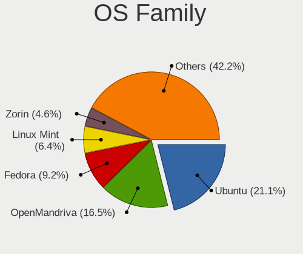
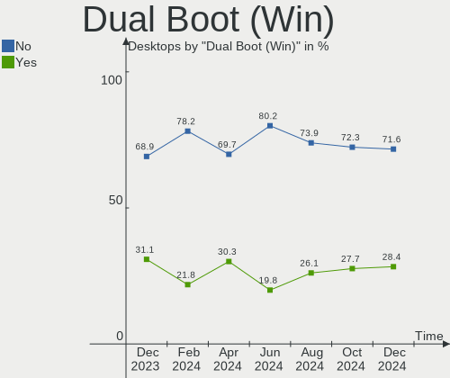
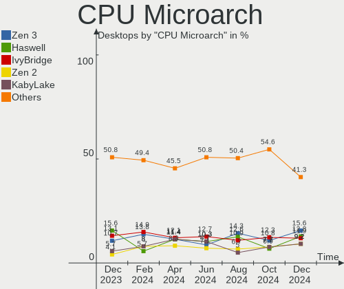
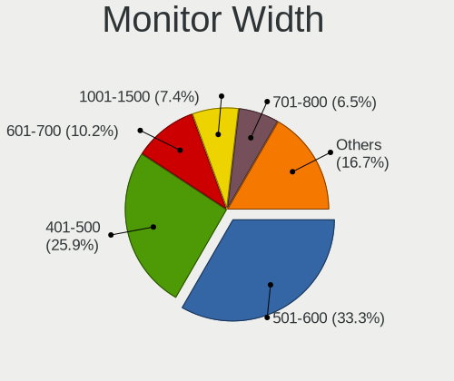
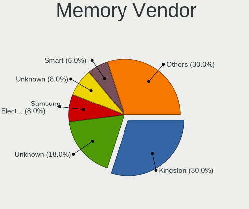

Linux in Brazil - Hardware Trends (Desktops)
--------------------------------------------

A project to identify most popular hardware characteristics and track their change
over time based on data collected by Linux users at https://Linux-Hardware.org.

Anyone can contribute to this report by the [hw-probe](https://github.com/linuxhw/hw-probe) tool:

    sudo -E hw-probe -all -upload

Period: Dec, 2022.

Contents
--------

* [ System ](#system)
  - [ OS                       ](#os)
  - [ OS Family                ](#os-family)
  - [ Kernel                   ](#kernel)
  - [ Kernel Family            ](#kernel-family)
  - [ Kernel Major Ver.        ](#kernel-major-ver)
  - [ Arch                     ](#arch)
  - [ DE                       ](#de)
  - [ Display Server           ](#display-server)
  - [ Display Manager          ](#display-manager)
  - [ OS Lang                  ](#os-lang)
  - [ Boot Mode                ](#boot-mode)
  - [ Filesystem               ](#filesystem)
  - [ Part. scheme             ](#part-scheme)
  - [ Dual Boot with Linux/BSD ](#dual-boot-with-linuxbsd)
  - [ Dual Boot (Win)          ](#dual-boot-win)

* [ Board ](#board)
  - [ Vendor                   ](#vendor)
  - [ Model                    ](#model)
  - [ Model Family             ](#model-family)
  - [ MFG Year                 ](#mfg-year)
  - [ Form Factor              ](#form-factor)
  - [ Secure Boot              ](#secure-boot)
  - [ Coreboot                 ](#coreboot)
  - [ RAM Size                 ](#ram-size)
  - [ RAM Used                 ](#ram-used)
  - [ Total Drives             ](#total-drives)
  - [ Has CD-ROM               ](#has-cd-rom)
  - [ Has Ethernet             ](#has-ethernet)
  - [ Has WiFi                 ](#has-wifi)
  - [ Has Bluetooth            ](#has-bluetooth)

* [ Location ](#location)
  - [ Country                  ](#country)
  - [ City                     ](#city)

* [ Drives ](#drives)
  - [ Drive Vendor             ](#drive-vendor)
  - [ Drive Model              ](#drive-model)
  - [ HDD Vendor               ](#hdd-vendor)
  - [ SSD Vendor               ](#ssd-vendor)
  - [ Drive Kind               ](#drive-kind)
  - [ Drive Connector          ](#drive-connector)
  - [ Drive Size               ](#drive-size)
  - [ Space Total              ](#space-total)
  - [ Space Used               ](#space-used)
  - [ Malfunc. Drives          ](#malfunc-drives)
  - [ Malfunc. Drive Vendor    ](#malfunc-drive-vendor)
  - [ Malfunc. HDD Vendor      ](#malfunc-hdd-vendor)
  - [ Malfunc. Drive Kind      ](#malfunc-drive-kind)
  - [ Failed Drives            ](#failed-drives)
  - [ Failed Drive Vendor      ](#failed-drive-vendor)
  - [ Drive Status             ](#drive-status)

* [ Storage controller ](#storage-controller)
  - [ Storage Vendor           ](#storage-vendor)
  - [ Storage Model            ](#storage-model)
  - [ Storage Kind             ](#storage-kind)

* [ Processor ](#processor)
  - [ CPU Vendor               ](#cpu-vendor)
  - [ CPU Model                ](#cpu-model)
  - [ CPU Model Family         ](#cpu-model-family)
  - [ CPU Cores                ](#cpu-cores)
  - [ CPU Sockets              ](#cpu-sockets)
  - [ CPU Threads              ](#cpu-threads)
  - [ CPU Op-Modes             ](#cpu-op-modes)
  - [ CPU Microcode            ](#cpu-microcode)
  - [ CPU Microarch            ](#cpu-microarch)

* [ Graphics ](#graphics)
  - [ GPU Vendor               ](#gpu-vendor)
  - [ GPU Model                ](#gpu-model)
  - [ GPU Combo                ](#gpu-combo)
  - [ GPU Driver               ](#gpu-driver)
  - [ GPU Memory               ](#gpu-memory)

* [ Monitor ](#monitor)
  - [ Monitor Vendor           ](#monitor-vendor)
  - [ Monitor Model            ](#monitor-model)
  - [ Monitor Resolution       ](#monitor-resolution)
  - [ Monitor Diagonal         ](#monitor-diagonal)
  - [ Monitor Width            ](#monitor-width)
  - [ Aspect Ratio             ](#aspect-ratio)
  - [ Monitor Area             ](#monitor-area)
  - [ Pixel Density            ](#pixel-density)
  - [ Multiple Monitors        ](#multiple-monitors)

* [ Network ](#network)
  - [ Net Controller Vendor    ](#net-controller-vendor)
  - [ Net Controller Model     ](#net-controller-model)
  - [ Wireless Vendor          ](#wireless-vendor)
  - [ Wireless Model           ](#wireless-model)
  - [ Ethernet Vendor          ](#ethernet-vendor)
  - [ Ethernet Model           ](#ethernet-model)
  - [ Net Controller Kind      ](#net-controller-kind)
  - [ Used Controller          ](#used-controller)
  - [ NICs                     ](#nics)
  - [ IPv6                     ](#ipv6)

* [ Bluetooth ](#bluetooth)
  - [ Bluetooth Vendor         ](#bluetooth-vendor)
  - [ Bluetooth Model          ](#bluetooth-model)

* [ Sound ](#sound)
  - [ Sound Vendor             ](#sound-vendor)
  - [ Sound Model              ](#sound-model)

* [ Memory ](#memory)
  - [ Memory Vendor            ](#memory-vendor)
  - [ Memory Model             ](#memory-model)
  - [ Memory Kind              ](#memory-kind)
  - [ Memory Form Factor       ](#memory-form-factor)
  - [ Memory Size              ](#memory-size)
  - [ Memory Speed             ](#memory-speed)

* [ Printers & scanners ](#printers--scanners)
  - [ Printer Vendor           ](#printer-vendor)
  - [ Printer Model            ](#printer-model)
  - [ Scanner Vendor           ](#scanner-vendor)
  - [ Scanner Model            ](#scanner-model)

* [ Camera ](#camera)
  - [ Camera Vendor            ](#camera-vendor)
  - [ Camera Model             ](#camera-model)

* [ Security ](#security)
  - [ Fingerprint Vendor       ](#fingerprint-vendor)
  - [ Fingerprint Model        ](#fingerprint-model)
  - [ Chipcard Vendor          ](#chipcard-vendor)
  - [ Chipcard Model           ](#chipcard-model)

* [ Unsupported ](#unsupported)
  - [ Unsupported Devices      ](#unsupported-devices)
  - [ Unsupported Device Types ](#unsupported-device-types)

System
------

OS
--

Installed operating systems

| Name                         | Desktops | Percent |
|------------------------------|----------|---------|
| Linux Mint 21                | 12       | 13.64%  |
| Ubuntu 22.04                 | 10       | 11.36%  |
| Fedora 37                    | 10       | 11.36%  |
| OpenMandriva 4.3             | 7        | 7.95%   |
| Zorin 16                     | 6        | 6.82%   |
| Ubuntu 22.10                 | 5        | 5.68%   |
| Pop!_OS 22.04                | 5        | 5.68%   |
| openSUSE Tumbleweed-XXXXXXXX | 4        | 4.55%   |
| Debian 11                    | 4        | 4.55%   |
| Arch Rolling                 | 3        | 3.41%   |
| OpenMandriva 22.12           | 2        | 2.27%   |
| Linux Mint 21.1              | 2        | 2.27%   |
| Linux Mint 20.3              | 2        | 2.27%   |
| Zorin 15                     | 1        | 1.14%   |
| Xubuntu 22.10                | 1        | 1.14%   |
| Xubuntu 22.04                | 1        | 1.14%   |
| Ubuntu MATE 18.04            | 1        | 1.14%   |
| Ubuntu 18.04                 | 1        | 1.14%   |
| SteamOS                      | 1        | 1.14%   |
| Slackware 15.0               | 1        | 1.14%   |
| ROSA 12.3                    | 1        | 1.14%   |
| Nobara 36                    | 1        | 1.14%   |
| Linux Mint 18.3              | 1        | 1.14%   |
| Linux Lite 5.8               | 1        | 1.14%   |
| Kubuntu 11                   | 1        | 1.14%   |
| KDE neon 22.04               | 1        | 1.14%   |
| Fedora 36                    | 1        | 1.14%   |
| Fedora 35                    | 1        | 1.14%   |
| CentOS 7                     | 1        | 1.14%   |

OS Family
---------

OS without a version

| Name         | Desktops | Percent |
|--------------|----------|---------|
| Linux Mint   | 17       | 19.32%  |
| Ubuntu       | 16       | 18.18%  |
| Fedora       | 12       | 13.64%  |
| OpenMandriva | 9        | 10.23%  |
| Zorin        | 7        | 7.95%   |
| Pop!_OS      | 5        | 5.68%   |
| openSUSE     | 4        | 4.55%   |
| Debian       | 4        | 4.55%   |
| Arch         | 3        | 3.41%   |
| Xubuntu      | 2        | 2.27%   |
| Ubuntu MATE  | 1        | 1.14%   |
| SteamOS      | 1        | 1.14%   |
| Slackware    | 1        | 1.14%   |
| ROSA         | 1        | 1.14%   |
| Nobara       | 1        | 1.14%   |
| Linux Lite   | 1        | 1.14%   |
| Kubuntu      | 1        | 1.14%   |
| KDE neon     | 1        | 1.14%   |
| CentOS       | 1        | 1.14%   |

Kernel
------

Version of the Linux kernel

| Version                            | Desktops | Percent |
|------------------------------------|----------|---------|
| 5.15.0-56-generic                  | 23       | 26.14%  |
| 6.0.6-76060006-generic             | 4        | 4.55%   |
| 6.0.11-300.fc37.x86_64             | 4        | 4.55%   |
| 5.19.0-26-generic                  | 4        | 4.55%   |
| 5.16.7-desktop-1omv4003            | 4        | 4.55%   |
| 5.16.13-desktop-1omv4003           | 3        | 3.41%   |
| 5.15.0-41-generic                  | 3        | 3.41%   |
| 6.0.12-300.fc37.x86_64             | 2        | 2.27%   |
| 6.0.12-1-default                   | 2        | 2.27%   |
| 6.0.10-desktop-2omv22090           | 2        | 2.27%   |
| 6.0.10-arch2-1                     | 2        | 2.27%   |
| 6.0.10-300.fc37.x86_64             | 2        | 2.27%   |
| 6.0.10-1-default                   | 2        | 2.27%   |
| 5.10.0-20-amd64                    | 2        | 2.27%   |
| 6.0.7-301.fc37.x86_64              | 1        | 1.14%   |
| 6.0.2-76060002-generic             | 1        | 1.14%   |
| 6.0.14-300.fc37.x86_64             | 1        | 1.14%   |
| 6.0.11-arch1-1                     | 1        | 1.14%   |
| 6.0.10-201.fc36.x86_64             | 1        | 1.14%   |
| 6.0.10-200.fc36.x86_64             | 1        | 1.14%   |
| 6.0.10-100.fc35.x86_64             | 1        | 1.14%   |
| 6.0.0-0.deb11.2-amd64              | 1        | 1.14%   |
| 5.4.0-91-generic                   | 1        | 1.14%   |
| 5.4.0-135-generic                  | 1        | 1.14%   |
| 5.4.0-133-generic                  | 1        | 1.14%   |
| 5.4.0-131-generic                  | 1        | 1.14%   |
| 5.19.17                            | 1        | 1.14%   |
| 5.19.0-28-generic                  | 1        | 1.14%   |
| 5.19.0-27-generic                  | 1        | 1.14%   |
| 5.17.15-051715-generic             | 1        | 1.14%   |
| 5.15.79-1-lts                      | 1        | 1.14%   |
| 5.15.75-generic-1rosa2021.1-x86_64 | 1        | 1.14%   |
| 5.15.0-53-generic                  | 1        | 1.14%   |
| 5.15.0-52-generic                  | 1        | 1.14%   |
| 5.15.0-47-generic                  | 1        | 1.14%   |
| 5.15.0-46-generic                  | 1        | 1.14%   |
| 5.15.0-43-generic                  | 1        | 1.14%   |
| 5.15.0-25-generic                  | 1        | 1.14%   |
| 5.15.0-1010-nvidia                 | 1        | 1.14%   |
| 5.10.0-19-amd64                    | 1        | 1.14%   |

Kernel Family
-------------

Linux kernel without a distro release

| Version | Desktops | Percent |
|---------|----------|---------|
| 5.15.0  | 33       | 37.5%   |
| 6.0.10  | 11       | 12.5%   |
| 5.19.0  | 6        | 6.82%   |
| 6.0.11  | 5        | 5.68%   |
| 6.0.6   | 4        | 4.55%   |
| 6.0.12  | 4        | 4.55%   |
| 5.4.0   | 4        | 4.55%   |
| 5.16.7  | 4        | 4.55%   |
| 5.16.13 | 3        | 3.41%   |
| 5.10.0  | 3        | 3.41%   |
| 6.0.7   | 1        | 1.14%   |
| 6.0.2   | 1        | 1.14%   |
| 6.0.14  | 1        | 1.14%   |
| 6.0.0   | 1        | 1.14%   |
| 5.19.17 | 1        | 1.14%   |
| 5.17.15 | 1        | 1.14%   |
| 5.15.79 | 1        | 1.14%   |
| 5.15.75 | 1        | 1.14%   |
| 4.15.0  | 1        | 1.14%   |
| 4.10.0  | 1        | 1.14%   |
| 3.10.0  | 1        | 1.14%   |

Kernel Major Ver.
-----------------

Linux kernel major version

| Version | Desktops | Percent |
|---------|----------|---------|
| 5.15    | 35       | 39.77%  |
| 6.0     | 28       | 31.82%  |
| 5.19    | 7        | 7.95%   |
| 5.16    | 7        | 7.95%   |
| 5.4     | 4        | 4.55%   |
| 5.10    | 3        | 3.41%   |
| 5.17    | 1        | 1.14%   |
| 4.15    | 1        | 1.14%   |
| 4.10    | 1        | 1.14%   |
| 3.10    | 1        | 1.14%   |

Arch
----

OS architecture (x86_64, i586, etc.)

| Name   | Desktops | Percent |
|--------|----------|---------|
| x86_64 | 87       | 98.86%  |
| i686   | 1        | 1.14%   |

DE
--

Desktop Environment

| Name       | Desktops | Percent |
|------------|----------|---------|
| GNOME      | 46       | 52.27%  |
| KDE5       | 18       | 20.45%  |
| X-Cinnamon | 13       | 14.77%  |
| XFCE       | 6        | 6.82%   |
| MATE       | 3        | 3.41%   |
| Cinnamon   | 1        | 1.14%   |
| Unknown    | 1        | 1.14%   |

Display Server
--------------

X11 or Wayland

| Name    | Desktops | Percent |
|---------|----------|---------|
| X11     | 66       | 75%     |
| Wayland | 22       | 25%     |

Display Manager
---------------

SDDM, LightDM, etc.

| Name    | Desktops | Percent |
|---------|----------|---------|
| Unknown | 40       | 45.45%  |
| GDM3    | 16       | 18.18%  |
| SDDM    | 11       | 12.5%   |
| LightDM | 11       | 12.5%   |
| GDM     | 10       | 11.36%  |

OS Lang
-------

Language

| Lang  | Desktops | Percent |
|-------|----------|---------|
| pt_BR | 70       | 79.55%  |
| en_US | 15       | 17.05%  |
| pt_PT | 2        | 2.27%   |
| C     | 1        | 1.14%   |

Boot Mode
---------

EFI or BIOS

| Mode | Desktops | Percent |
|------|----------|---------|
| BIOS | 57       | 64.77%  |
| EFI  | 31       | 35.23%  |

Filesystem
----------

Type of filesystem

| Type    | Desktops | Percent |
|---------|----------|---------|
| Ext4    | 62       | 70.45%  |
| Btrfs   | 17       | 19.32%  |
| Overlay | 7        | 7.95%   |
| Xfs     | 1        | 1.14%   |
| F2fs    | 1        | 1.14%   |

Part. scheme
------------

Scheme of partitioning

| Type    | Desktops | Percent |
|---------|----------|---------|
| Unknown | 39       | 44.32%  |
| GPT     | 37       | 42.05%  |
| MBR     | 12       | 13.64%  |

Dual Boot with Linux/BSD
------------------------

Hosting more than one Linux/BSD

| Dual boot | Desktops | Percent |
|-----------|----------|---------|
| No        | 75       | 85.23%  |
| Yes       | 13       | 14.77%  |

Dual Boot (Win)
---------------

Hosting Linux and Windows

| Dual boot | Desktops | Percent |
|-----------|----------|---------|
| No        | 69       | 78.41%  |
| Yes       | 19       | 21.59%  |

Board
-----

Vendor
------

Motherboard manufacturer

| Name                | Desktops | Percent |
|---------------------|----------|---------|
| ASUSTek Computer    | 19       | 21.59%  |
| Gigabyte Technology | 14       | 15.91%  |
| Intel               | 12       | 13.64%  |
| Dell                | 7        | 7.95%   |
| ASRock              | 6        | 6.82%   |
| PCWare              | 5        | 5.68%   |
| MSI                 | 4        | 4.55%   |
| Positivo            | 2        | 2.27%   |
| PERTOSA             | 2        | 2.27%   |
| MACHINIST           | 2        | 2.27%   |
| ECS                 | 2        | 2.27%   |
| Biostar             | 2        | 2.27%   |
| Unknown             | 2        | 2.27%   |
| QIYIDA              | 1        | 1.14%   |
| Pegatron            | 1        | 1.14%   |
| Megaware            | 1        | 1.14%   |
| Lenovo              | 1        | 1.14%   |
| Itautec             | 1        | 1.14%   |
| HOUTER              | 1        | 1.14%   |
| Hewlett-Packard     | 1        | 1.14%   |
| Braview             | 1        | 1.14%   |
| ABIT                | 1        | 1.14%   |

Model
-----

Motherboard model

| Name                                                         | Desktops | Percent |
|--------------------------------------------------------------|----------|---------|
| ASUS PRIME B450M-GAMING/BR                                   | 4        | 4.55%   |
| Intel X99                                                    | 2        | 2.27%   |
| Intel H61                                                    | 2        | 2.27%   |
| Gigabyte AB350M-DS3H V2                                      | 2        | 2.27%   |
| Dell OptiPlex 380                                            | 2        | 2.27%   |
| ASUS TUF Gaming B550M-PLUS                                   | 2        | 2.27%   |
| ASRock A320M-HD                                              | 2        | 2.27%   |
| Unknown                                                      | 2        | 2.27%   |
| QIYIDA X99-H9 V2.0                                           | 1        | 1.14%   |
| Positivo POS-PIQ77CL                                         | 1        | 1.14%   |
| Positivo POS-PIQ57BQ                                         | 1        | 1.14%   |
| PERTOSA IPMSB-H61                                            | 1        | 1.14%   |
| PERTOSA 206.30.054 - GA-H110TN-M                             | 1        | 1.14%   |
| Pegatron IPM41-D3                                            | 1        | 1.14%   |
| PCWare IPMH81G1                                              | 1        | 1.14%   |
| PCWare IPMH61R3                                              | 1        | 1.14%   |
| PCWare IPMH61R1                                              | 1        | 1.14%   |
| PCWare IPMH310 PRO 2.0                                       | 1        | 1.14%   |
| PCWare IPMH110G                                              | 1        | 1.14%   |
| MSI p6530br                                                  | 1        | 1.14%   |
| MSI MS-7D76                                                  | 1        | 1.14%   |
| MSI MS-7C94                                                  | 1        | 1.14%   |
| MSI MS-7A33                                                  | 1        | 1.14%   |
| Megaware MW-H61M-2H                                          | 1        | 1.14%   |
| MACHINIST X99-RS9 V2.0                                       | 1        | 1.14%   |
| MACHINIST E5-MR9A PRO V1.0                                   | 1        | 1.14%   |
| Lenovo V520S-08IKL 10NN001JBR                                | 1        | 1.14%   |
| Itautec ST 4265                                              | 1        | 1.14%   |
| Intel X99 V1.0                                               | 1        | 1.14%   |
| Intel X79 (INTEL Xeon E5/Corei7 DMI2 - C600/C200 Cipset V304 | 1        | 1.14%   |
| Intel HM570                                                  | 1        | 1.14%   |
| Intel H81                                                    | 1        | 1.14%   |
| Intel H55                                                    | 1        | 1.14%   |
| Intel DX58SO AAE29331-702                                    | 1        | 1.14%   |
| Intel B75                                                    | 1        | 1.14%   |
| Intel AHV                                                    | 1        | 1.14%   |
| HOUTER IPMIP-GS                                              | 1        | 1.14%   |
| HP Compaq Elite 8300 SFF                                     | 1        | 1.14%   |
| Gigabyte X570 AORUS ELITE                                    | 1        | 1.14%   |
| Gigabyte M68MT-S2P                                           | 1        | 1.14%   |

Model Family
------------

Motherboard model prefix

| Name                   | Desktops | Percent |
|------------------------|----------|---------|
| ASUS PRIME             | 7        | 7.95%   |
| Dell OptiPlex          | 6        | 6.82%   |
| ASUS TUF               | 5        | 5.68%   |
| Intel X99              | 3        | 3.41%   |
| Intel H61              | 2        | 2.27%   |
| Gigabyte AB350M-DS3H   | 2        | 2.27%   |
| ASRock A320M-HD        | 2        | 2.27%   |
| Unknown                | 2        | 2.27%   |
| QIYIDA X99-H9          | 1        | 1.14%   |
| Positivo POS-PIQ77CL   | 1        | 1.14%   |
| Positivo POS-PIQ57BQ   | 1        | 1.14%   |
| PERTOSA IPMSB-H61      | 1        | 1.14%   |
| PERTOSA 206.30.054     | 1        | 1.14%   |
| Pegatron IPM41-D3      | 1        | 1.14%   |
| PCWare IPMH81G1        | 1        | 1.14%   |
| PCWare IPMH61R3        | 1        | 1.14%   |
| PCWare IPMH61R1        | 1        | 1.14%   |
| PCWare IPMH310         | 1        | 1.14%   |
| PCWare IPMH110G        | 1        | 1.14%   |
| MSI p6530br            | 1        | 1.14%   |
| MSI MS-7D76            | 1        | 1.14%   |
| MSI MS-7C94            | 1        | 1.14%   |
| MSI MS-7A33            | 1        | 1.14%   |
| Megaware MW-H61M-2H    | 1        | 1.14%   |
| MACHINIST X99-RS9      | 1        | 1.14%   |
| MACHINIST E5-MR9A      | 1        | 1.14%   |
| Lenovo V520S-08IKL     | 1        | 1.14%   |
| Itautec ST             | 1        | 1.14%   |
| Intel X79              | 1        | 1.14%   |
| Intel HM570            | 1        | 1.14%   |
| Intel H81              | 1        | 1.14%   |
| Intel H55              | 1        | 1.14%   |
| Intel DX58SO           | 1        | 1.14%   |
| Intel B75              | 1        | 1.14%   |
| Intel AHV              | 1        | 1.14%   |
| HOUTER IPMIP-GS        | 1        | 1.14%   |
| HP Compaq              | 1        | 1.14%   |
| Gigabyte X570          | 1        | 1.14%   |
| Gigabyte M68MT-S2P     | 1        | 1.14%   |
| Gigabyte GA-78LMT-USB3 | 1        | 1.14%   |

MFG Year
--------

Motherboard manufacture year

| Year | Desktops | Percent |
|------|----------|---------|
| 2018 | 15       | 17.05%  |
| 2020 | 10       | 11.36%  |
| 2019 | 8        | 9.09%   |
| 2011 | 8        | 9.09%   |
| 2010 | 7        | 7.95%   |
| 2017 | 6        | 6.82%   |
| 2013 | 6        | 6.82%   |
| 2012 | 6        | 6.82%   |
| 2016 | 5        | 5.68%   |
| 2022 | 3        | 3.41%   |
| 2021 | 3        | 3.41%   |
| 2014 | 3        | 3.41%   |
| 2009 | 3        | 3.41%   |
| 2008 | 3        | 3.41%   |
| 2015 | 1        | 1.14%   |
| 2007 | 1        | 1.14%   |

Form Factor
-----------

Physical design of the computer

| Name    | Desktops | Percent |
|---------|----------|---------|
| Desktop | 88       | 100%    |

Secure Boot
-----------

Enabled or disabled

| State    | Desktops | Percent |
|----------|----------|---------|
| Disabled | 86       | 97.73%  |
| Enabled  | 2        | 2.27%   |

Coreboot
--------

Have coreboot on board

| Used | Desktops | Percent |
|------|----------|---------|
| No   | 88       | 100%    |

RAM Size
--------

Total RAM memory

| Size in GB  | Desktops | Percent |
|-------------|----------|---------|
| 16.01-24.0  | 23       | 26.14%  |
| 4.01-8.0    | 20       | 22.73%  |
| 3.01-4.0    | 16       | 18.18%  |
| 8.01-16.0   | 14       | 15.91%  |
| 32.01-64.0  | 11       | 12.5%   |
| 64.01-256.0 | 2        | 2.27%   |
| 24.01-32.0  | 1        | 1.14%   |
| 1.01-2.0    | 1        | 1.14%   |

RAM Used
--------

Used RAM memory

| Used GB    | Desktops | Percent |
|------------|----------|---------|
| 2.01-3.0   | 26       | 29.55%  |
| 1.01-2.0   | 26       | 29.55%  |
| 3.01-4.0   | 19       | 21.59%  |
| 4.01-8.0   | 12       | 13.64%  |
| 0.51-1.0   | 3        | 3.41%   |
| 32.01-64.0 | 1        | 1.14%   |
| 0.01-0.5   | 1        | 1.14%   |

Total Drives
------------

Number of drives on board

| Drives | Desktops | Percent |
|--------|----------|---------|
| 1      | 38       | 43.18%  |
| 2      | 26       | 29.55%  |
| 3      | 12       | 13.64%  |
| 4      | 8        | 9.09%   |
| 5      | 2        | 2.27%   |
| 8      | 1        | 1.14%   |
| 0      | 1        | 1.14%   |

Has CD-ROM
----------

Has CD-ROM on board

| Presented | Desktops | Percent |
|-----------|----------|---------|
| No        | 67       | 76.14%  |
| Yes       | 21       | 23.86%  |

Has Ethernet
------------

Has Ethernet on board

| Presented | Desktops | Percent |
|-----------|----------|---------|
| Yes       | 88       | 100%    |

Has WiFi
--------

Has WiFi module

| Presented | Desktops | Percent |
|-----------|----------|---------|
| No        | 58       | 65.91%  |
| Yes       | 30       | 34.09%  |

Has Bluetooth
-------------

Has Bluetooth module

| Presented | Desktops | Percent |
|-----------|----------|---------|
| No        | 60       | 68.18%  |
| Yes       | 28       | 31.82%  |

Location
--------

Country
-------

Geographic location (country)

| Country | Desktops | Percent |
|---------|----------|---------|
| Brazil  | 88       | 100%    |

City
----

Geographic location (city)

| City                  | Desktops | Percent |
|-----------------------|----------|---------|
| Sao Paulo             | 10       | 11.36%  |
| Rio de Janeiro        | 6        | 6.82%   |
| Palmas                | 4        | 4.55%   |
| Salvador              | 3        | 3.41%   |
| Porto Alegre          | 3        | 3.41%   |
| Contagem              | 3        | 3.41%   |
| Uberlândia           | 2        | 2.27%   |
| Sao Jose do Rio Preto | 2        | 2.27%   |
| Santo André          | 2        | 2.27%   |
| Londrina              | 2        | 2.27%   |
| Brasília             | 2        | 2.27%   |
| Braganca Paulista     | 2        | 2.27%   |
| Belo Horizonte        | 2        | 2.27%   |
| Votorantim            | 1        | 1.14%   |
| Vinhedo               | 1        | 1.14%   |
| Vila Velha            | 1        | 1.14%   |
| Viamao                | 1        | 1.14%   |
| Valparaiso de Goias   | 1        | 1.14%   |
| Surubim               | 1        | 1.14%   |
| Sorocaba              | 1        | 1.14%   |
| Sao Lourenço         | 1        | 1.14%   |
| Santo Amaro           | 1        | 1.14%   |
| Santarém             | 1        | 1.14%   |
| Recife                | 1        | 1.14%   |
| Ponta Grossa          | 1        | 1.14%   |
| Pirai                 | 1        | 1.14%   |
| Picos                 | 1        | 1.14%   |
| Pelotas               | 1        | 1.14%   |
| Paulinia              | 1        | 1.14%   |
| Paranaiba             | 1        | 1.14%   |
| Paraiba               | 1        | 1.14%   |
| Nova Friburgo         | 1        | 1.14%   |
| Nao Me Toque          | 1        | 1.14%   |
| Maua                  | 1        | 1.14%   |
| Maringá              | 1        | 1.14%   |
| Manaus                | 1        | 1.14%   |
| Lorena                | 1        | 1.14%   |
| Lajeado               | 1        | 1.14%   |
| Juara                 | 1        | 1.14%   |
| Jacareí              | 1        | 1.14%   |

Drives
------

Drive Vendor
------------

Hard drive vendors

| Vendor                       | Desktops | Drives | Percent |
|------------------------------|----------|--------|---------|
| Seagate                      | 31       | 38     | 19.62%  |
| Kingston                     | 25       | 29     | 15.82%  |
| WDC                          | 18       | 22     | 11.39%  |
| Samsung Electronics          | 17       | 18     | 10.76%  |
| China                        | 10       | 10     | 6.33%   |
| Toshiba                      | 7        | 7      | 4.43%   |
| Sandisk                      | 5        | 5      | 3.16%   |
| Realtek Semiconductor        | 4        | 4      | 2.53%   |
| Crucial                      | 4        | 5      | 2.53%   |
| KingSpec                     | 3        | 3      | 1.9%    |
| Hitachi                      | 3        | 4      | 1.9%    |
| A-DATA Technology            | 3        | 3      | 1.9%    |
| SK hynix                     | 2        | 2      | 1.27%   |
| Kingston Technology Company  | 2        | 2      | 1.27%   |
| KingFast                     | 2        | 2      | 1.27%   |
| Unknown                      | 2        | 2      | 1.27%   |
| YS                           | 1        | 1      | 0.63%   |
| XrayDisk                     | 1        | 1      | 0.63%   |
| XPG                          | 1        | 1      | 0.63%   |
| WALRAM                       | 1        | 1      | 0.63%   |
| T-FORCE                      | 1        | 1      | 0.63%   |
| Silicon Motion               | 1        | 1      | 0.63%   |
| RZX                          | 1        | 1      | 0.63%   |
| PNY                          | 1        | 1      | 0.63%   |
| Phison Electronics           | 1        | 1      | 0.63%   |
| OSCOO                        | 1        | 1      | 0.63%   |
| NTC                          | 1        | 1      | 0.63%   |
| Maxtor                       | 1        | 1      | 0.63%   |
| MAXIO Technology (Hangzhou)  | 1        | 1      | 0.63%   |
| KingDian                     | 1        | 1      | 0.63%   |
| HS-SSD-C100                  | 1        | 1      | 0.63%   |
| HGST                         | 1        | 1      | 0.63%   |
| Gigabyte Technology          | 1        | 1      | 0.63%   |
| Corsair                      | 1        | 2      | 0.63%   |
| Beijing Starblaze Technology | 1        | 1      | 0.63%   |
| ADATA Technology             | 1        | 2      | 0.63%   |

Drive Model
-----------

Hard drive models

| Model                                               | Desktops | Percent |
|-----------------------------------------------------|----------|---------|
| Kingston SA400S37240G 240GB SSD                     | 11       | 6.47%   |
| Seagate ST1000DM010-2EP102 1TB                      | 5        | 2.94%   |
| Kingston SA400S37480G 480GB SSD                     | 5        | 2.94%   |
| Realtek RTS5763DL NVMe SSD Controller 512GB         | 4        | 2.35%   |
| Seagate ST500DM002-1BD142 500GB                     | 3        | 1.76%   |
| Samsung HD502HJ 500GB                               | 3        | 1.76%   |
| Kingston SA400S37120G 120GB SSD                     | 3        | 1.76%   |
| Toshiba MQ01ABD100 1TB                              | 2        | 1.18%   |
| Seagate ST2000DM008-2FR102 2TB                      | 2        | 1.18%   |
| Seagate ST1000VM002-1CT162 1TB                      | 2        | 1.18%   |
| Seagate ST1000LM035-1RK172 1TB                      | 2        | 1.18%   |
| Seagate ST1000DM003-1ER162 1TB                      | 2        | 1.18%   |
| Sandisk WDC WDS480G2G0C-00AJM0 480GB                | 2        | 1.18%   |
| Samsung NVMe SSD Controller SM981/PM981/PM983 500GB | 2        | 1.18%   |
| Samsung HD322HJ 320GB                               | 2        | 1.18%   |
| Kingston SUV400S37120G 120GB SSD                    | 2        | 1.18%   |
| Crucial CT240BX500SSD1 240GB                        | 2        | 1.18%   |
| China SSD 512GB                                     | 2        | 1.18%   |
| China SSD 1TB                                       | 2        | 1.18%   |
| Unknown                                             | 2        | 1.18%   |
| YS SSD 240GB                                        | 1        | 0.59%   |
| XrayDisk 256GB                                      | 1        | 0.59%   |
| XPG GAMMIX S41 512GB                                | 1        | 0.59%   |
| WDC WDS480G2G0C-00AJM0 480GB                        | 1        | 0.59%   |
| WDC WDS240G2G0B-00EPW0 240GB SSD                    | 1        | 0.59%   |
| WDC WD800JD-75MSA3 80GB                             | 1        | 0.59%   |
| WDC WD5000AZLX-08K2TA0 500GB                        | 1        | 0.59%   |
| WDC WD5000AVVS-63H0B1 500GB                         | 1        | 0.59%   |
| WDC WD5000AAKX-60U6AA0 500GB                        | 1        | 0.59%   |
| WDC WD5000AAKX-603CA0 500GB                         | 1        | 0.59%   |
| WDC WD5000AAKX-08U6AA0 500GB                        | 1        | 0.59%   |
| WDC WD5000AAKX-003CA0 500GB                         | 1        | 0.59%   |
| WDC WD3200BEVT-75ZCT2 320GB                         | 1        | 0.59%   |
| WDC WD3200AAKS-00UU3A0 320GB                        | 1        | 0.59%   |
| WDC WD3200AAJS-56M0A0 320GB                         | 1        | 0.59%   |
| WDC WD20EZAZ-00L9GB0 2TB                            | 1        | 0.59%   |
| WDC WD10SPZX-21Z10T0 1TB                            | 1        | 0.59%   |
| WDC WD10EZEX-00BN5A0 1TB                            | 1        | 0.59%   |
| WDC WD10EURX-63FH1Y0 1TB                            | 1        | 0.59%   |
| WDC WD10EARS-00MVWB0 1TB                            | 1        | 0.59%   |

HDD Vendor
----------

Hard disk drive vendors

| Vendor              | Desktops | Drives | Percent |
|---------------------|----------|--------|---------|
| Seagate             | 30       | 37     | 42.25%  |
| WDC                 | 16       | 20     | 22.54%  |
| Samsung Electronics | 14       | 15     | 19.72%  |
| Toshiba             | 6        | 6      | 8.45%   |
| Hitachi             | 3        | 4      | 4.23%   |
| Maxtor              | 1        | 1      | 1.41%   |
| HGST                | 1        | 1      | 1.41%   |

SSD Vendor
----------

Solid state drive vendors

| Vendor              | Desktops | Drives | Percent |
|---------------------|----------|--------|---------|
| Kingston            | 21       | 25     | 36.84%  |
| China               | 10       | 10     | 17.54%  |
| Crucial             | 4        | 5      | 7.02%   |
| KingSpec            | 3        | 3      | 5.26%   |
| A-DATA Technology   | 3        | 3      | 5.26%   |
| YS                  | 1        | 1      | 1.75%   |
| WDC                 | 1        | 1      | 1.75%   |
| Toshiba             | 1        | 1      | 1.75%   |
| T-FORCE             | 1        | 1      | 1.75%   |
| Seagate             | 1        | 1      | 1.75%   |
| SanDisk             | 1        | 1      | 1.75%   |
| Samsung Electronics | 1        | 1      | 1.75%   |
| RZX                 | 1        | 1      | 1.75%   |
| PNY                 | 1        | 1      | 1.75%   |
| OSCOO               | 1        | 1      | 1.75%   |
| NTC                 | 1        | 1      | 1.75%   |
| KingFast            | 1        | 1      | 1.75%   |
| KingDian            | 1        | 1      | 1.75%   |
| HS-SSD-C100         | 1        | 1      | 1.75%   |
| Corsair             | 1        | 2      | 1.75%   |
| Unknown             | 1        | 1      | 1.75%   |

Drive Kind
----------

HDD or SSD

| Kind    | Desktops | Drives | Percent |
|---------|----------|--------|---------|
| HDD     | 58       | 84     | 44.27%  |
| SSD     | 45       | 63     | 34.35%  |
| NVMe    | 23       | 26     | 17.56%  |
| Unknown | 5        | 5      | 3.82%   |

Drive Connector
---------------

SATA, SAS, NVMe, etc.

| Type | Desktops | Drives | Percent |
|------|----------|--------|---------|
| SATA | 80       | 151    | 76.92%  |
| NVMe | 23       | 26     | 22.12%  |
| SAS  | 1        | 1      | 0.96%   |

Drive Size
----------

Size of hard drive

| Size in TB | Desktops | Drives | Percent |
|------------|----------|--------|---------|
| 0.01-0.5   | 64       | 94     | 61.54%  |
| 0.51-1.0   | 28       | 38     | 26.92%  |
| 1.01-2.0   | 8        | 9      | 7.69%   |
| 3.01-4.0   | 2        | 3      | 1.92%   |
| 2.01-3.0   | 1        | 1      | 0.96%   |
| 4.01-10.0  | 1        | 2      | 0.96%   |

Space Total
-----------

Amount of disk space available on the file system

| Size in GB     | Desktops | Percent |
|----------------|----------|---------|
| 251-500        | 27       | 30.68%  |
| 101-250        | 22       | 25%     |
| 501-1000       | 11       | 12.5%   |
| 1001-2000      | 10       | 11.36%  |
| More than 3000 | 7        | 7.95%   |
| 2001-3000      | 4        | 4.55%   |
| 1-20           | 4        | 4.55%   |
| 21-50          | 1        | 1.14%   |
| 51-100         | 1        | 1.14%   |
| Unknown        | 1        | 1.14%   |

Space Used
----------

Amount of used disk space

| Used GB        | Desktops | Percent |
|----------------|----------|---------|
| 1-20           | 28       | 31.82%  |
| 101-250        | 15       | 17.05%  |
| 21-50          | 12       | 13.64%  |
| 501-1000       | 9        | 10.23%  |
| 51-100         | 8        | 9.09%   |
| 251-500        | 7        | 7.95%   |
| 1001-2000      | 5        | 5.68%   |
| More than 3000 | 3        | 3.41%   |
| Unknown        | 1        | 1.14%   |

Malfunc. Drives
---------------

Drive models with a malfunction

| Model                             | Desktops | Drives | Percent |
|-----------------------------------|----------|--------|---------|
| XPG GAMMIX S41 512GB              | 1        | 1      | 5%      |
| WDC WD800JD-75MSA3 80GB           | 1        | 1      | 5%      |
| WDC WD5000AVVS-63H0B1 500GB       | 1        | 1      | 5%      |
| WDC WD5000AAKX-60U6AA0 500GB      | 1        | 1      | 5%      |
| WDC WD5000AAKX-603CA0 500GB       | 1        | 1      | 5%      |
| WDC WD3200AAKS-00UU3A0 320GB      | 1        | 1      | 5%      |
| WDC WD10EARS-00MVWB0 1TB          | 1        | 1      | 5%      |
| Seagate ST9160314AS 160GB         | 1        | 1      | 5%      |
| Seagate ST8000DM004-2CX188 8TB    | 1        | 1      | 5%      |
| Seagate ST4000NM0053 4TB          | 1        | 2      | 5%      |
| Seagate ST31000524AS 1TB          | 1        | 1      | 5%      |
| Seagate ST1000VM002-1CT162 1TB    | 1        | 1      | 5%      |
| Seagate ST1000DM003-1ER162 1TB    | 1        | 1      | 5%      |
| Samsung Electronics HD322HJ 320GB | 1        | 1      | 5%      |
| Samsung Electronics HD322GJ 320GB | 1        | 1      | 5%      |
| Samsung Electronics HD250HJ 250GB | 1        | 1      | 5%      |
| Samsung Electronics HD154UI 1TB   | 1        | 1      | 5%      |
| Maxtor STM3250310AS 250GB         | 1        | 1      | 5%      |
| Kingston SA400S37480G 480GB SSD   | 1        | 1      | 5%      |
| Unknown                           | 1        | 1      | 5%      |

Malfunc. Drive Vendor
---------------------

Vendors of faulty drives

| Vendor              | Desktops | Drives | Percent |
|---------------------|----------|--------|---------|
| WDC                 | 6        | 6      | 31.58%  |
| Seagate             | 5        | 7      | 26.32%  |
| Samsung Electronics | 4        | 4      | 21.05%  |
| XPG                 | 1        | 1      | 5.26%   |
| Maxtor              | 1        | 1      | 5.26%   |
| Kingston            | 1        | 1      | 5.26%   |
| Unknown             | 1        | 1      | 5.26%   |

Malfunc. HDD Vendor
-------------------

Vendors of faulty HDD drives

| Vendor              | Desktops | Drives | Percent |
|---------------------|----------|--------|---------|
| WDC                 | 6        | 6      | 37.5%   |
| Seagate             | 5        | 7      | 31.25%  |
| Samsung Electronics | 4        | 4      | 25%     |
| Maxtor              | 1        | 1      | 6.25%   |

Malfunc. Drive Kind
-------------------

Kinds of faulty drives

| Kind | Desktops | Drives | Percent |
|------|----------|--------|---------|
| HDD  | 13       | 18     | 81.25%  |
| SSD  | 2        | 2      | 12.5%   |
| NVMe | 1        | 1      | 6.25%   |

Failed Drives
-------------

Failed drive models

Zero info for selected period =(

Failed Drive Vendor
-------------------

Failed drive vendors

Zero info for selected period =(

Drive Status
------------

Number of failed and malfunc. drives

| Status   | Desktops | Drives | Percent |
|----------|----------|--------|---------|
| Detected | 52       | 108    | 53.06%  |
| Works    | 32       | 49     | 32.65%  |
| Malfunc  | 14       | 21     | 14.29%  |

Storage controller
------------------

Storage Vendor
--------------

Storage controller vendors

| Vendor                       | Desktops | Percent |
|------------------------------|----------|---------|
| Intel                        | 54       | 45.76%  |
| AMD                          | 29       | 24.58%  |
| SanDisk                      | 5        | 4.24%   |
| Realtek Semiconductor        | 5        | 4.24%   |
| Kingston Technology Company  | 5        | 4.24%   |
| Nvidia                       | 4        | 3.39%   |
| ASMedia Technology           | 4        | 3.39%   |
| Samsung Electronics          | 3        | 2.54%   |
| Phison Electronics           | 2        | 1.69%   |
| VIA Technologies             | 1        | 0.85%   |
| SK hynix                     | 1        | 0.85%   |
| Silicon Motion               | 1        | 0.85%   |
| MAXIO Technology (Hangzhou)  | 1        | 0.85%   |
| Marvell Technology Group     | 1        | 0.85%   |
| Beijing Starblaze Technology | 1        | 0.85%   |
| ADATA Technology             | 1        | 0.85%   |

Storage Model
-------------

Storage controller models

| Model                                                                                   | Desktops | Percent |
|-----------------------------------------------------------------------------------------|----------|---------|
| AMD FCH SATA Controller [AHCI mode]                                                     | 15       | 9.93%   |
| Intel 6 Series/C200 Series Chipset Family 6 port Desktop SATA AHCI Controller           | 8        | 5.3%    |
| Intel NM10/ICH7 Family SATA Controller [IDE mode]                                       | 7        | 4.64%   |
| Intel 8 Series/C220 Series Chipset Family 6-port SATA Controller 1 [AHCI mode]          | 7        | 4.64%   |
| AMD 400 Series Chipset SATA Controller                                                  | 7        | 4.64%   |
| AMD SB7x0/SB8x0/SB9x0 IDE Controller                                                    | 6        | 3.97%   |
| SanDisk Non-Volatile memory controller                                                  | 5        | 3.31%   |
| Realtek RTS5763DL NVMe SSD Controller                                                   | 5        | 3.31%   |
| Intel 7 Series/C210 Series Chipset Family 6-port SATA Controller [AHCI mode]            | 5        | 3.31%   |
| AMD FCH SATA Controller D                                                               | 5        | 3.31%   |
| Intel 82801G (ICH7 Family) IDE Controller                                               | 4        | 2.65%   |
| Intel 200 Series PCH SATA controller [AHCI mode]                                        | 4        | 2.65%   |
| AMD 500 Series Chipset SATA Controller                                                  | 4        | 2.65%   |
| Kingston Company SNVS2000G [NV1 NVMe PCIe SSD 2TB]                                      | 3        | 1.99%   |
| Intel SATA Controller [RAID mode]                                                       | 3        | 1.99%   |
| Intel Q170/Q150/B150/H170/H110/Z170/CM236 Chipset SATA Controller [AHCI Mode]           | 3        | 1.99%   |
| Intel 6 Series/C200 Series Chipset Family Desktop SATA Controller (IDE mode, ports 4-5) | 3        | 1.99%   |
| Intel 6 Series/C200 Series Chipset Family Desktop SATA Controller (IDE mode, ports 0-3) | 3        | 1.99%   |
| Intel 400 Series Chipset Family SATA AHCI Controller                                    | 3        | 1.99%   |
| ASMedia ASM1062 Serial ATA Controller                                                   | 3        | 1.99%   |
| AMD SB7x0/SB8x0/SB9x0 SATA Controller [IDE mode]                                        | 3        | 1.99%   |
| AMD SB7x0/SB8x0/SB9x0 SATA Controller [AHCI mode]                                       | 3        | 1.99%   |
| Samsung NVMe SSD Controller SM981/PM981/PM983                                           | 2        | 1.32%   |
| Nvidia MCP61 SATA Controller                                                            | 2        | 1.32%   |
| Kingston Company Company Non-Volatile memory controller                                 | 2        | 1.32%   |
| Intel 5 Series/3400 Series Chipset 6 port SATA AHCI Controller                          | 2        | 1.32%   |
| AMD 300 Series Chipset SATA Controller                                                  | 2        | 1.32%   |
| VIA VT6421 IDE/SATA Controller                                                          | 1        | 0.66%   |
| SK hynix BC511                                                                          | 1        | 0.66%   |
| Silicon Motion SM2263EN/SM2263XT SSD Controller                                         | 1        | 0.66%   |
| Samsung Electronics SATA controller                                                     | 1        | 0.66%   |
| Phison PS5013 E13 NVMe Controller                                                       | 1        | 0.66%   |
| Phison E16 PCIe4 NVMe Controller                                                        | 1        | 0.66%   |
| Nvidia MCP78S [GeForce 8200] SATA Controller (non-AHCI mode)                            | 1        | 0.66%   |
| Nvidia MCP78S [GeForce 8200] IDE                                                        | 1        | 0.66%   |
| Nvidia MCP61 IDE                                                                        | 1        | 0.66%   |
| Nvidia MCP51 Serial ATA Controller                                                      | 1        | 0.66%   |
| MAXIO (Hangzhou) NVMe SSD Controller MAP1202                                            | 1        | 0.66%   |
| Marvell Group 88SE9172 SATA 6Gb/s Controller                                            | 1        | 0.66%   |
| Kingston Company A2000 NVMe SSD                                                         | 1        | 0.66%   |

Storage Kind
------------

Kind of storage controller (IDE, SATA, NVMe, SAS, ...)

| Kind | Desktops | Percent |
|------|----------|---------|
| SATA | 67       | 56.78%  |
| NVMe | 23       | 19.49%  |
| IDE  | 23       | 19.49%  |
| RAID | 5        | 4.24%   |

Processor
---------

CPU Vendor
----------

Processor vendors

| Vendor | Desktops | Percent |
|--------|----------|---------|
| Intel  | 55       | 62.5%   |
| AMD    | 33       | 37.5%   |

CPU Model
---------

Processor models

| Model                                       | Desktops | Percent |
|---------------------------------------------|----------|---------|
| Intel Xeon CPU E5-2620 v3 @ 2.40GHz         | 4        | 4.55%   |
| Intel Core i5-3570 CPU @ 3.40GHz            | 3        | 3.41%   |
| Intel Core i5-10400 CPU @ 2.90GHz           | 3        | 3.41%   |
| Intel Core i3-2100 CPU @ 3.10GHz            | 3        | 3.41%   |
| AMD Ryzen 5 3400G with Radeon Vega Graphics | 3        | 3.41%   |
| Intel Pentium CPU G630 @ 2.70GHz            | 2        | 2.27%   |
| Intel Core i5 CPU 650 @ 3.20GHz             | 2        | 2.27%   |
| Intel Core i3-2120 CPU @ 3.30GHz            | 2        | 2.27%   |
| Intel Core 2 Quad CPU Q8400 @ 2.66GHz       | 2        | 2.27%   |
| AMD Ryzen 9 5900X 12-Core Processor         | 2        | 2.27%   |
| AMD Ryzen 5 3600 6-Core Processor           | 2        | 2.27%   |
| AMD Ryzen 5 1600 Six-Core Processor         | 2        | 2.27%   |
| AMD FX-6300 Six-Core Processor              | 2        | 2.27%   |
| Intel Xeon CPU X5680 @ 3.33GHz              | 1        | 1.14%   |
| Intel Xeon CPU E5-2670 v3 @ 2.30GHz         | 1        | 1.14%   |
| Intel Xeon CPU E5-2666 v3 @ 2.90GHz         | 1        | 1.14%   |
| Intel Xeon CPU E5-2420 v2 @ 2.20GHz         | 1        | 1.14%   |
| Intel Pentium Gold G5420 CPU @ 3.80GHz      | 1        | 1.14%   |
| Intel Pentium Gold G5400 CPU @ 3.70GHz      | 1        | 1.14%   |
| Intel Pentium Dual-Core CPU E5800 @ 3.20GHz | 1        | 1.14%   |
| Intel Core i7-8700 CPU @ 3.20GHz            | 1        | 1.14%   |
| Intel Core i7-6700 CPU @ 3.40GHz            | 1        | 1.14%   |
| Intel Core i7-5820K CPU @ 3.30GHz           | 1        | 1.14%   |
| Intel Core i7-2600 CPU @ 3.40GHz            | 1        | 1.14%   |
| Intel Core i7 CPU 860 @ 2.80GHz             | 1        | 1.14%   |
| Intel Core i5-9400 CPU @ 2.90GHz            | 1        | 1.14%   |
| Intel Core i5-7400 CPU @ 3.00GHz            | 1        | 1.14%   |
| Intel Core i5-6400 CPU @ 2.70GHz            | 1        | 1.14%   |
| Intel Core i5-4570 CPU @ 3.20GHz            | 1        | 1.14%   |
| Intel Core i5-3470 CPU @ 3.20GHz            | 1        | 1.14%   |
| Intel Core i5-3330 CPU @ 3.00GHz            | 1        | 1.14%   |
| Intel Core i5-2500 CPU @ 3.30GHz            | 1        | 1.14%   |
| Intel Core i5-2410M CPU @ 2.30GHz           | 1        | 1.14%   |
| Intel Core i3-9100F CPU @ 3.60GHz           | 1        | 1.14%   |
| Intel Core i3-7100 CPU @ 3.90GHz            | 1        | 1.14%   |
| Intel Core i3-6100T CPU @ 3.20GHz           | 1        | 1.14%   |
| Intel Core i3-3250 CPU @ 3.50GHz            | 1        | 1.14%   |
| Intel Core i3-3240 CPU @ 3.40GHz            | 1        | 1.14%   |
| Intel Core i3-3220 CPU @ 3.30GHz            | 1        | 1.14%   |
| Intel Core i3 CPU 540 @ 3.07GHz             | 1        | 1.14%   |

CPU Model Family
----------------

Processor model prefix

| Model                   | Desktops | Percent |
|-------------------------|----------|---------|
| Intel Core i5           | 16       | 18.18%  |
| AMD Ryzen 5             | 13       | 14.77%  |
| Intel Core i3           | 12       | 13.64%  |
| Intel Xeon              | 8        | 9.09%   |
| AMD FX                  | 6        | 6.82%   |
| Intel Core i7           | 5        | 5.68%   |
| AMD Ryzen 7             | 4        | 4.55%   |
| Intel Core 2 Quad       | 3        | 3.41%   |
| Intel Celeron           | 3        | 3.41%   |
| AMD Ryzen 9             | 3        | 3.41%   |
| Intel Pentium Gold      | 2        | 2.27%   |
| Intel Pentium           | 2        | 2.27%   |
| Intel Core 2 Duo        | 2        | 2.27%   |
| AMD Ryzen 3             | 2        | 2.27%   |
| AMD Athlon II X2        | 2        | 2.27%   |
| Other                   | 1        | 1.14%   |
| Intel Pentium Dual-Core | 1        | 1.14%   |
| AMD Athlon II X3        | 1        | 1.14%   |
| AMD Athlon 64 X2        | 1        | 1.14%   |
| AMD A4                  | 1        | 1.14%   |

CPU Cores
---------

Number of processor cores

| Number | Desktops | Percent |
|--------|----------|---------|
| 2      | 27       | 30.68%  |
| 4      | 26       | 29.55%  |
| 6      | 20       | 22.73%  |
| 8      | 5        | 5.68%   |
| 12     | 4        | 4.55%   |
| 3      | 3        | 3.41%   |
| 1      | 2        | 2.27%   |
| 10     | 1        | 1.14%   |

CPU Sockets
-----------

Number of sockets

| Number | Desktops | Percent |
|--------|----------|---------|
| 1      | 88       | 100%    |

CPU Threads
-----------

Threads per core (Hyper-Threading)

| Number | Desktops | Percent |
|--------|----------|---------|
| 2      | 60       | 68.18%  |
| 1      | 28       | 31.82%  |

CPU Op-Modes
------------

CPU Operation Modes (32-bit, 64-bit)

| Op mode        | Desktops | Percent |
|----------------|----------|---------|
| 32-bit, 64-bit | 88       | 100%    |

CPU Microcode
-------------

Microcode number

| Number     | Desktops | Percent |
|------------|----------|---------|
| Unknown    | 20       | 22.73%  |
| 0x206a7    | 9        | 10.23%  |
| 0x306a9    | 8        | 9.09%   |
| 0x306f2    | 6        | 6.82%   |
| 0x1067a    | 6        | 6.82%   |
| 0x906ea    | 3        | 3.41%   |
| 0x08701021 | 3        | 3.41%   |
| 0x08108109 | 3        | 3.41%   |
| 0x506e3    | 2        | 2.27%   |
| 0x306c3    | 2        | 2.27%   |
| 0x20652    | 2        | 2.27%   |
| 0x06000822 | 2        | 2.27%   |
| 0xa0653    | 1        | 1.14%   |
| 0x806d1    | 1        | 1.14%   |
| 0x406c4    | 1        | 1.14%   |
| 0x306e4    | 1        | 1.14%   |
| 0x206c2    | 1        | 1.14%   |
| 0x106e5    | 1        | 1.14%   |
| 0x10676    | 1        | 1.14%   |
| 0x0a601201 | 1        | 1.14%   |
| 0x0a50000c | 1        | 1.14%   |
| 0x0a20120a | 1        | 1.14%   |
| 0x0a201205 | 1        | 1.14%   |
| 0x0a201009 | 1        | 1.14%   |
| 0x08701012 | 1        | 1.14%   |
| 0x08600106 | 1        | 1.14%   |
| 0x0810100b | 1        | 1.14%   |
| 0x0800820d | 1        | 1.14%   |
| 0x08001138 | 1        | 1.14%   |
| 0x06001119 | 1        | 1.14%   |
| 0x06000852 | 1        | 1.14%   |
| 0x0600081c | 1        | 1.14%   |
| 0x0600063e | 1        | 1.14%   |
| 0x010000c8 | 1        | 1.14%   |

CPU Microarch
-------------

Microarchitecture

| Name        | Desktops | Percent |
|-------------|----------|---------|
| SandyBridge | 10       | 11.36%  |
| IvyBridge   | 9        | 10.23%  |
| Haswell     | 9        | 10.23%  |
| Penryn      | 7        | 7.95%   |
| KabyLake    | 7        | 7.95%   |
| Zen 2       | 6        | 6.82%   |
| Piledriver  | 6        | 6.82%   |
| Zen+        | 5        | 5.68%   |
| Zen 3       | 5        | 5.68%   |
| Zen         | 5        | 5.68%   |
| Westmere    | 4        | 4.55%   |
| Skylake     | 3        | 3.41%   |
| K10         | 3        | 3.41%   |
| CometLake   | 3        | 3.41%   |
| Silvermont  | 1        | 1.14%   |
| Nehalem     | 1        | 1.14%   |
| K8 Hammer   | 1        | 1.14%   |
| Icelake     | 1        | 1.14%   |
| Bulldozer   | 1        | 1.14%   |
| Unknown     | 1        | 1.14%   |

Graphics
--------

GPU Vendor
----------

Vendors of graphics cards

| Vendor | Desktops | Percent |
|--------|----------|---------|
| Intel  | 37       | 40.22%  |
| Nvidia | 30       | 32.61%  |
| AMD    | 25       | 27.17%  |

GPU Model
---------

Graphics card models

| Model                                                                     | Desktops | Percent |
|---------------------------------------------------------------------------|----------|---------|
| Intel 2nd Generation Core Processor Family Integrated Graphics Controller | 8        | 8.6%    |
| Intel Xeon E3-1200 v2/3rd Gen Core processor Graphics Controller          | 7        | 7.53%   |
| AMD RS780L [Radeon 3000]                                                  | 5        | 5.38%   |
| AMD Ellesmere [Radeon RX 470/480/570/570X/580/580X/590]                   | 4        | 4.3%    |
| Intel HD Graphics 530                                                     | 3        | 3.23%   |
| Intel Core Processor Integrated Graphics Controller                       | 3        | 3.23%   |
| Intel 4 Series Chipset Integrated Graphics Controller                     | 3        | 3.23%   |
| AMD Picasso/Raven 2 [Radeon Vega Series / Radeon Vega Mobile Series]      | 3        | 3.23%   |
| AMD Caicos [Radeon HD 6450/7450/8450 / R5 230 OEM]                        | 3        | 3.23%   |
| Nvidia GP108 [GeForce GT 1030]                                            | 2        | 2.15%   |
| Nvidia GP106 [GeForce GTX 1060 3GB]                                       | 2        | 2.15%   |
| Nvidia GK208B [GeForce GT 710]                                            | 2        | 2.15%   |
| Nvidia GA104 [GeForce RTX 3060]                                           | 2        | 2.15%   |
| Intel HD Graphics 630                                                     | 2        | 2.15%   |
| Intel CometLake-S GT2 [UHD Graphics 630]                                  | 2        | 2.15%   |
| Intel CoffeeLake-S GT2 [UHD Graphics 630]                                 | 2        | 2.15%   |
| Intel CoffeeLake-S GT1 [UHD Graphics 610]                                 | 2        | 2.15%   |
| AMD Navi 14 [Radeon RX 5500/5500M / Pro 5500M]                            | 2        | 2.15%   |
| Nvidia TU117 [GeForce GTX 1650]                                           | 1        | 1.08%   |
| Nvidia TU116 [GeForce GTX 1660]                                           | 1        | 1.08%   |
| Nvidia TU116 [GeForce GTX 1660 Ti]                                        | 1        | 1.08%   |
| Nvidia TU106 [GeForce RTX 2060 SUPER]                                     | 1        | 1.08%   |
| Nvidia TU104 [GeForce RTX 2080 Rev. A]                                    | 1        | 1.08%   |
| Nvidia TU104 [GeForce RTX 2070 SUPER]                                     | 1        | 1.08%   |
| Nvidia TU104 [GeForce RTX 2060]                                           | 1        | 1.08%   |
| Nvidia GT218 [GeForce 8400 GS Rev. 3]                                     | 1        | 1.08%   |
| Nvidia GT218 [GeForce 210]                                                | 1        | 1.08%   |
| Nvidia GP107 [GeForce GTX 1050]                                           | 1        | 1.08%   |
| Nvidia GP107 [GeForce GTX 1050 Ti]                                        | 1        | 1.08%   |
| Nvidia GP106 [GeForce GTX 1060 6GB]                                       | 1        | 1.08%   |
| Nvidia GM206 [GeForce GTX 960]                                            | 1        | 1.08%   |
| Nvidia GK107 [GeForce GTX 650]                                            | 1        | 1.08%   |
| Nvidia GF119 [GeForce GT 610]                                             | 1        | 1.08%   |
| Nvidia GF119 [GeForce GT 520]                                             | 1        | 1.08%   |
| Nvidia GF108 [GeForce GT 730]                                             | 1        | 1.08%   |
| Nvidia GA106 [GeForce RTX 3060 Lite Hash Rate]                            | 1        | 1.08%   |
| Nvidia GA104 [GeForce RTX 3060 Ti Lite Hash Rate]                         | 1        | 1.08%   |
| Nvidia G96C [GeForce 9500 GT]                                             | 1        | 1.08%   |
| Nvidia G72 [GeForce 7200 GS / 7300 SE]                                    | 1        | 1.08%   |
| Nvidia C61 [GeForce 7025 / nForce 630a]                                   | 1        | 1.08%   |

GPU Combo
---------

Combinations of graphics cards

| Name         | Desktops | Percent |
|--------------|----------|---------|
| 1 x Intel    | 36       | 40.91%  |
| 1 x Nvidia   | 27       | 30.68%  |
| 1 x AMD      | 21       | 23.86%  |
| AMD + Nvidia | 3        | 3.41%   |
| 2 x AMD      | 1        | 1.14%   |

GPU Driver
----------

Free vs proprietary

| Driver      | Desktops | Percent |
|-------------|----------|---------|
| Free        | 71       | 80.68%  |
| Proprietary | 15       | 17.05%  |
| Unknown     | 2        | 2.27%   |

GPU Memory
----------

Total video memory

| Size in GB | Desktops | Percent |
|------------|----------|---------|
| Unknown    | 50       | 56.82%  |
| 1.01-2.0   | 10       | 11.36%  |
| 0.01-0.5   | 8        | 9.09%   |
| 7.01-8.0   | 6        | 6.82%   |
| 0.51-1.0   | 4        | 4.55%   |
| 5.01-6.0   | 3        | 3.41%   |
| 8.01-16.0  | 3        | 3.41%   |
| 3.01-4.0   | 2        | 2.27%   |
| 2.01-3.0   | 2        | 2.27%   |

Monitor
-------

Monitor Vendor
--------------

Monitor vendors

| Vendor               | Desktops | Percent |
|----------------------|----------|---------|
| Goldstar             | 24       | 28.57%  |
| Samsung Electronics  | 12       | 14.29%  |
| AOC                  | 9        | 10.71%  |
| Philips              | 7        | 8.33%   |
| Dell                 | 6        | 7.14%   |
| Acer                 | 4        | 4.76%   |
| LG Electronics       | 3        | 3.57%   |
| Hewlett-Packard      | 3        | 3.57%   |
| Sony                 | 2        | 2.38%   |
| SKY                  | 2        | 2.38%   |
| XKX                  | 1        | 1.19%   |
| NCS                  | 1        | 1.19%   |
| MYS                  | 1        | 1.19%   |
| Lenovo               | 1        | 1.19%   |
| ITE                  | 1        | 1.19%   |
| InnoLux Display      | 1        | 1.19%   |
| HB@                  | 1        | 1.19%   |
| GMX                  | 1        | 1.19%   |
| GDH                  | 1        | 1.19%   |
| Envision Peripherals | 1        | 1.19%   |
| ASUSTek Computer     | 1        | 1.19%   |
| Ancor Communications | 1        | 1.19%   |

Monitor Model
-------------

Monitor models

| Model                                                                   | Desktops | Percent |
|-------------------------------------------------------------------------|----------|---------|
| Goldstar ULTRAWIDE GSM59F1 2560x1080 798x334mm 34.1-inch                | 3        | 3.41%   |
| Samsung Electronics S22B300 SAM08AC 1920x1080 477x268mm 21.5-inch       | 2        | 2.27%   |
| Philips PHL 242V8 PHLC219 1920x1080 527x296mm 23.8-inch                 | 2        | 2.27%   |
| Goldstar ULTRAWIDE GSM76F9 2560x1080 531x298mm 24.0-inch                | 2        | 2.27%   |
| Goldstar HDR WFHD GSM7714 2560x1080 798x334mm 34.1-inch                 | 2        | 2.27%   |
| Goldstar HD GSM5ACB 1366x768 410x230mm 18.5-inch                        | 2        | 2.27%   |
| XKX LED-2202 XKX2202 1920x1080 368x207mm 16.6-inch                      | 1        | 1.14%   |
| Sony TV SNYDC02 1920x1080 930x523mm 42.0-inch                           | 1        | 1.14%   |
| Sony TV SNY3002 1920x1080 708x398mm 32.0-inch                           | 1        | 1.14%   |
| SKY TV-monitor SKY1402 3840x2160 708x398mm 32.0-inch                    | 1        | 1.14%   |
| SKY SKYWORTH SKY0001 1920x1080 885x498mm 40.0-inch                      | 1        | 1.14%   |
| Samsung Electronics U32J59x SAM0F52 3840x2160 697x392mm 31.5-inch       | 1        | 1.14%   |
| Samsung Electronics SyncMaster SAM060B 1920x1080 510x290mm 23.1-inch    | 1        | 1.14%   |
| Samsung Electronics SyncMaster SAM0472 1440x900 367x229mm 17.0-inch     | 1        | 1.14%   |
| Samsung Electronics SyncMaster SAM0364 1360x768 344x194mm 15.5-inch     | 1        | 1.14%   |
| Samsung Electronics SMB1630N SAM0630 1366x768 344x194mm 15.5-inch       | 1        | 1.14%   |
| Samsung Electronics S22C300 SAM0A1D 1920x1080 477x268mm 21.5-inch       | 1        | 1.14%   |
| Samsung Electronics LCD Monitor SAM71B4 3840x2160 1872x1053mm 84.6-inch | 1        | 1.14%   |
| Samsung Electronics LCD Monitor SAM0A7C 1366x768 698x393mm 31.5-inch    | 1        | 1.14%   |
| Samsung Electronics C24FG7x SAM0E44 1920x1080 532x304mm 24.1-inch       | 1        | 1.14%   |
| Samsung Electronics C24F390 SAM0D2C 1920x1080 521x293mm 23.5-inch       | 1        | 1.14%   |
| Philips PHL 288P6L PHL08F2 3840x2160 621x341mm 27.9-inch                | 1        | 1.14%   |
| Philips PHL 273V5 PHLC0D2 1920x1080 598x336mm 27.0-inch                 | 1        | 1.14%   |
| Philips PHL 221V8 PHLC211 1920x1080 480x270mm 21.7-inch                 | 1        | 1.14%   |
| Philips PHL 193V5 PHLC0CD 1366x768 410x230mm 18.5-inch                  | 1        | 1.14%   |
| Philips LCD Monitor PHL0001 1920x1080 886x498mm 40.0-inch               | 1        | 1.14%   |
| Philips 196VL PHLC07F 1366x768 409x230mm 18.5-inch                      | 1        | 1.14%   |
| NCS LCD Monitor NCS2275 1920x1080 256x192mm 12.6-inch                   | 1        | 1.14%   |
| MYS LCD Monitor MYS1700 1280x1024 360x240mm 17.0-inch                   | 1        | 1.14%   |
| LG Electronics LCD Monitor WX942 1440x900                               | 1        | 1.14%   |
| LG Electronics LCD Monitor LG HDR WFHD 4480x1080                        | 1        | 1.14%   |
| LG Electronics LCD Monitor LG FULL HD                                   | 1        | 1.14%   |
| LG Electronics LCD Monitor E2050 3520x1080                              | 1        | 1.14%   |
| Lenovo LEN LS1921wA LEN1149 1366x768 409x230mm 18.5-inch                | 1        | 1.14%   |
| ITE DP2VGA V235 ITE6516 1920x1080 600x340mm 27.2-inch                   | 1        | 1.14%   |
| InnoLux Display LCD Monitor CMI001B 1366x768 309x174mm 14.0-inch        | 1        | 1.14%   |
| Hewlett-Packard LA2006 HWP2944 1600x900 443x249mm 20.0-inch             | 1        | 1.14%   |
| Hewlett-Packard L190hb HWP2899 1440x900 410x260mm 19.1-inch             | 1        | 1.14%   |
| Hewlett-Packard 27es HWP3326 1920x1080 598x336mm 27.0-inch              | 1        | 1.14%   |
| HB@ HBTV-3203HD HB@0B01 1920x540 708x398mm 32.0-inch                    | 1        | 1.14%   |

Monitor Resolution
------------------

Monitor screen resolution

| Resolution         | Desktops | Percent |
|--------------------|----------|---------|
| 1920x1080 (FHD)    | 38       | 44.19%  |
| 1366x768 (WXGA)    | 10       | 11.63%  |
| 2560x1080          | 7        | 8.14%   |
| 3840x2160 (4K)     | 6        | 6.98%   |
| 1600x900 (HD+)     | 6        | 6.98%   |
| 1440x900 (WXGA+)   | 3        | 3.49%   |
| 1280x1024 (SXGA)   | 3        | 3.49%   |
| 1680x1050 (WSXGA+) | 2        | 2.33%   |
| 1360x768           | 2        | 2.33%   |
| Unknown            | 2        | 2.33%   |
| 4480x1080          | 1        | 1.16%   |
| 3840x1080          | 1        | 1.16%   |
| 3520x1080          | 1        | 1.16%   |
| 3440x1440          | 1        | 1.16%   |
| 2560x1440 (QHD)    | 1        | 1.16%   |
| 1920x540           | 1        | 1.16%   |
| 1024x768 (XGA)     | 1        | 1.16%   |

Monitor Diagonal
----------------

Diagonal size in inches

| Inches  | Desktops | Percent |
|---------|----------|---------|
| 27      | 10       | 11.76%  |
| 23      | 10       | 11.76%  |
| 34      | 8        | 9.41%   |
| 21      | 8        | 9.41%   |
| 18      | 7        | 8.24%   |
| 24      | 6        | 7.06%   |
| 20      | 6        | 7.06%   |
| 17      | 4        | 4.71%   |
| 15      | 4        | 4.71%   |
| Unknown | 4        | 4.71%   |
| 40      | 3        | 3.53%   |
| 32      | 3        | 3.53%   |
| 31      | 3        | 3.53%   |
| 84      | 1        | 1.18%   |
| 52      | 1        | 1.18%   |
| 49      | 1        | 1.18%   |
| 46      | 1        | 1.18%   |
| 22      | 1        | 1.18%   |
| 19      | 1        | 1.18%   |
| 16      | 1        | 1.18%   |
| 14      | 1        | 1.18%   |
| 12      | 1        | 1.18%   |

Monitor Width
-------------

Physical width

| Width in mm | Desktops | Percent |
|-------------|----------|---------|
| 501-600     | 25       | 30.12%  |
| 401-500     | 21       | 25.3%   |
| 701-800     | 11       | 13.25%  |
| 301-350     | 7        | 8.43%   |
| 601-700     | 4        | 4.82%   |
| Unknown     | 4        | 4.82%   |
| 801-900     | 3        | 3.61%   |
| 351-400     | 3        | 3.61%   |
| 1001-1500   | 3        | 3.61%   |
| 201-300     | 1        | 1.2%    |
| 1501-2000   | 1        | 1.2%    |

Aspect Ratio
------------

Proportional relationship between the width and the height

| Ratio   | Desktops | Percent |
|---------|----------|---------|
| 16/9    | 59       | 72.84%  |
| 21/9    | 8        | 9.88%   |
| 16/10   | 4        | 4.94%   |
| Unknown | 4        | 4.94%   |
| 5/4     | 2        | 2.47%   |
| 4/3     | 2        | 2.47%   |
| 32/9    | 1        | 1.23%   |
| 3/2     | 1        | 1.23%   |

Monitor Area
------------

Area in inch²

| Area in inch² | Desktops | Percent |
|----------------|----------|---------|
| 201-250        | 21       | 25.3%   |
| 351-500        | 13       | 15.66%  |
| 301-350        | 10       | 12.05%  |
| 141-150        | 9        | 10.84%  |
| 151-200        | 8        | 9.64%   |
| 501-1000       | 5        | 6.02%   |
| 101-110        | 4        | 4.82%   |
| Unknown        | 4        | 4.82%   |
| More than 1000 | 2        | 2.41%   |
| 251-300        | 2        | 2.41%   |
| 131-140        | 2        | 2.41%   |
| 81-90          | 1        | 1.2%    |
| 71-80          | 1        | 1.2%    |
| 111-120        | 1        | 1.2%    |

Pixel Density
-------------

Pixels per inch

| Density | Desktops | Percent |
|---------|----------|---------|
| 51-100  | 56       | 68.29%  |
| 101-120 | 13       | 15.85%  |
| 1-50    | 4        | 4.88%   |
| 121-160 | 4        | 4.88%   |
| Unknown | 4        | 4.88%   |
| 161-240 | 1        | 1.22%   |

Multiple Monitors
-----------------

Total monitors connected

| Total | Desktops | Percent |
|-------|----------|---------|
| 1     | 74       | 84.09%  |
| 2     | 11       | 12.5%   |
| 0     | 2        | 2.27%   |
| 3     | 1        | 1.14%   |

Network
-------

Net Controller Vendor
---------------------

Controller vendors

| Vendor                          | Desktops | Percent |
|---------------------------------|----------|---------|
| Realtek Semiconductor           | 63       | 54.78%  |
| Intel                           | 18       | 15.65%  |
| Qualcomm Atheros                | 6        | 5.22%   |
| TP-Link                         | 4        | 3.48%   |
| Ralink Technology               | 4        | 3.48%   |
| Qualcomm Atheros Communications | 4        | 3.48%   |
| Nvidia                          | 3        | 2.61%   |
| Broadcom                        | 3        | 2.61%   |
| Samsung Electronics             | 1        | 0.87%   |
| Ralink                          | 1        | 0.87%   |
| Motorola PCS                    | 1        | 0.87%   |
| MediaTek                        | 1        | 0.87%   |
| Marvell Technology Group        | 1        | 0.87%   |
| JMicron Technology              | 1        | 0.87%   |
| ICS Advent                      | 1        | 0.87%   |
| D-Link System                   | 1        | 0.87%   |
| D-Link                          | 1        | 0.87%   |
| ASIX Electronics                | 1        | 0.87%   |

Net Controller Model
--------------------

Controller models

| Model                                                                  | Desktops | Percent |
|------------------------------------------------------------------------|----------|---------|
| Realtek RTL8111/8168/8411 PCI Express Gigabit Ethernet Controller      | 52       | 39.69%  |
| Realtek 802.11ac NIC                                                   | 6        | 4.58%   |
| Realtek RTL810xE PCI Express Fast Ethernet controller                  | 5        | 3.82%   |
| Realtek RTL8125 2.5GbE Controller                                      | 4        | 3.05%   |
| Qualcomm Atheros AR9271 802.11n                                        | 4        | 3.05%   |
| Ralink MT7601U Wireless Adapter                                        | 3        | 2.29%   |
| TP-Link AC600 wireless Realtek RTL8811AU [Archer T2U Nano]             | 2        | 1.53%   |
| Realtek RTL8188FTV 802.11b/g/n 1T1R 2.4G WLAN Adapter                  | 2        | 1.53%   |
| Realtek RTL8188EUS 802.11n Wireless Network Adapter                    | 2        | 1.53%   |
| Qualcomm Atheros AR8152 v2.0 Fast Ethernet                             | 2        | 1.53%   |
| Qualcomm Atheros AR8151 v2.0 Gigabit Ethernet                          | 2        | 1.53%   |
| Nvidia MCP61 Ethernet                                                  | 2        | 1.53%   |
| Intel Wi-Fi 6 AX200                                                    | 2        | 1.53%   |
| Intel I211 Gigabit Network Connection                                  | 2        | 1.53%   |
| Intel Ethernet Connection (7) I219-V                                   | 2        | 1.53%   |
| Intel Ethernet Connection (12) I219-V                                  | 2        | 1.53%   |
| Intel 82579V Gigabit Network Connection                                | 2        | 1.53%   |
| Intel 82579LM Gigabit Network Connection (Lewisville)                  | 2        | 1.53%   |
| Broadcom NetLink BCM57780 Gigabit Ethernet PCIe                        | 2        | 1.53%   |
| TP-Link Archer T4U ver.3                                               | 1        | 0.76%   |
| TP-Link Archer T3U [Realtek RTL8812BU]                                 | 1        | 0.76%   |
| Samsung Galaxy series, misc. (tethering mode)                          | 1        | 0.76%   |
| Realtek RTL8822BE 802.11a/b/g/n/ac WiFi adapter                        | 1        | 0.76%   |
| Realtek RTL8192EE PCIe Wireless Network Adapter                        | 1        | 0.76%   |
| Realtek RTL8188CUS 802.11n WLAN Adapter                                | 1        | 0.76%   |
| Realtek RTL8188CE 802.11b/g/n WiFi Adapter                             | 1        | 0.76%   |
| Realtek RTL-8100/8101L/8139 PCI Fast Ethernet Adapter                  | 1        | 0.76%   |
| Ralink RT5370 Wireless Adapter                                         | 1        | 0.76%   |
| Ralink RT2800 802.11n PCI                                              | 1        | 0.76%   |
| Qualcomm Atheros Attansic L2 Fast Ethernet                             | 1        | 0.76%   |
| Qualcomm Atheros AR9485 Wireless Network Adapter                       | 1        | 0.76%   |
| Qualcomm Atheros AR5416 Wireless Network Adapter [AR5008 802.11(a)bgn] | 1        | 0.76%   |
| Nvidia MCP77 Ethernet                                                  | 1        | 0.76%   |
| Motorola PCS moto g(9) play                                            | 1        | 0.76%   |
| MediaTek MT7922 802.11ax PCI Express Wireless Network Adapter          | 1        | 0.76%   |
| Marvell Group 88E8039 PCI-E Fast Ethernet Controller                   | 1        | 0.76%   |
| JMicron JMC250 PCI Express Gigabit Ethernet Controller                 | 1        | 0.76%   |
| Intel Wireless-AC 9260                                                 | 1        | 0.76%   |
| Intel Wireless 7265                                                    | 1        | 0.76%   |
| Intel Ethernet Controller I225-V                                       | 1        | 0.76%   |

Wireless Vendor
---------------

Wireless vendors

| Vendor                          | Desktops | Percent |
|---------------------------------|----------|---------|
| Realtek Semiconductor           | 14       | 40%     |
| TP-Link                         | 4        | 11.43%  |
| Ralink Technology               | 4        | 11.43%  |
| Qualcomm Atheros Communications | 4        | 11.43%  |
| Intel                           | 4        | 11.43%  |
| Qualcomm Atheros                | 2        | 5.71%   |
| Ralink                          | 1        | 2.86%   |
| MediaTek                        | 1        | 2.86%   |
| D-Link                          | 1        | 2.86%   |

Wireless Model
--------------

Wireless models

| Model                                                                  | Desktops | Percent |
|------------------------------------------------------------------------|----------|---------|
| Realtek 802.11ac NIC                                                   | 6        | 17.14%  |
| Qualcomm Atheros AR9271 802.11n                                        | 4        | 11.43%  |
| Ralink MT7601U Wireless Adapter                                        | 3        | 8.57%   |
| TP-Link AC600 wireless Realtek RTL8811AU [Archer T2U Nano]             | 2        | 5.71%   |
| Realtek RTL8188FTV 802.11b/g/n 1T1R 2.4G WLAN Adapter                  | 2        | 5.71%   |
| Realtek RTL8188EUS 802.11n Wireless Network Adapter                    | 2        | 5.71%   |
| Intel Wi-Fi 6 AX200                                                    | 2        | 5.71%   |
| TP-Link Archer T4U ver.3                                               | 1        | 2.86%   |
| TP-Link Archer T3U [Realtek RTL8812BU]                                 | 1        | 2.86%   |
| Realtek RTL8822BE 802.11a/b/g/n/ac WiFi adapter                        | 1        | 2.86%   |
| Realtek RTL8192EE PCIe Wireless Network Adapter                        | 1        | 2.86%   |
| Realtek RTL8188CUS 802.11n WLAN Adapter                                | 1        | 2.86%   |
| Realtek RTL8188CE 802.11b/g/n WiFi Adapter                             | 1        | 2.86%   |
| Ralink RT5370 Wireless Adapter                                         | 1        | 2.86%   |
| Ralink RT2800 802.11n PCI                                              | 1        | 2.86%   |
| Qualcomm Atheros AR9485 Wireless Network Adapter                       | 1        | 2.86%   |
| Qualcomm Atheros AR5416 Wireless Network Adapter [AR5008 802.11(a)bgn] | 1        | 2.86%   |
| MediaTek MT7922 802.11ax PCI Express Wireless Network Adapter          | 1        | 2.86%   |
| Intel Wireless-AC 9260                                                 | 1        | 2.86%   |
| Intel Wireless 7265                                                    | 1        | 2.86%   |
| D-Link DWA-171 AC600 DB Wireless Adapter(rev.A1) [Realtek RTL8811AU]   | 1        | 2.86%   |

Ethernet Vendor
---------------

Ethernet vendors

| Vendor                   | Desktops | Percent |
|--------------------------|----------|---------|
| Realtek Semiconductor    | 60       | 63.83%  |
| Intel                    | 16       | 17.02%  |
| Qualcomm Atheros         | 5        | 5.32%   |
| Nvidia                   | 3        | 3.19%   |
| Broadcom                 | 3        | 3.19%   |
| Samsung Electronics      | 1        | 1.06%   |
| Motorola PCS             | 1        | 1.06%   |
| Marvell Technology Group | 1        | 1.06%   |
| JMicron Technology       | 1        | 1.06%   |
| ICS Advent               | 1        | 1.06%   |
| D-Link System            | 1        | 1.06%   |
| ASIX Electronics         | 1        | 1.06%   |

Ethernet Model
--------------

Ethernet models

| Model                                                             | Desktops | Percent |
|-------------------------------------------------------------------|----------|---------|
| Realtek RTL8111/8168/8411 PCI Express Gigabit Ethernet Controller | 52       | 54.17%  |
| Realtek RTL810xE PCI Express Fast Ethernet controller             | 5        | 5.21%   |
| Realtek RTL8125 2.5GbE Controller                                 | 4        | 4.17%   |
| Qualcomm Atheros AR8152 v2.0 Fast Ethernet                        | 2        | 2.08%   |
| Qualcomm Atheros AR8151 v2.0 Gigabit Ethernet                     | 2        | 2.08%   |
| Nvidia MCP61 Ethernet                                             | 2        | 2.08%   |
| Intel I211 Gigabit Network Connection                             | 2        | 2.08%   |
| Intel Ethernet Connection (7) I219-V                              | 2        | 2.08%   |
| Intel Ethernet Connection (12) I219-V                             | 2        | 2.08%   |
| Intel 82579V Gigabit Network Connection                           | 2        | 2.08%   |
| Intel 82579LM Gigabit Network Connection (Lewisville)             | 2        | 2.08%   |
| Broadcom NetLink BCM57780 Gigabit Ethernet PCIe                   | 2        | 2.08%   |
| Samsung Galaxy series, misc. (tethering mode)                     | 1        | 1.04%   |
| Realtek RTL-8100/8101L/8139 PCI Fast Ethernet Adapter             | 1        | 1.04%   |
| Qualcomm Atheros Attansic L2 Fast Ethernet                        | 1        | 1.04%   |
| Nvidia MCP77 Ethernet                                             | 1        | 1.04%   |
| Motorola PCS moto g(9) play                                       | 1        | 1.04%   |
| Marvell Group 88E8039 PCI-E Fast Ethernet Controller              | 1        | 1.04%   |
| JMicron JMC250 PCI Express Gigabit Ethernet Controller            | 1        | 1.04%   |
| Intel Ethernet Controller I225-V                                  | 1        | 1.04%   |
| Intel Ethernet Connection (2) I219-V                              | 1        | 1.04%   |
| Intel Ethernet Connection (2) I218-V                              | 1        | 1.04%   |
| Intel 82578DM Gigabit Network Connection                          | 1        | 1.04%   |
| Intel 82578DC Gigabit Network Connection                          | 1        | 1.04%   |
| Intel 82567LM-2 Gigabit Network Connection                        | 1        | 1.04%   |
| ICS Advent DM9601 Fast Ethernet Adapter                           | 1        | 1.04%   |
| D-Link System DGE-528T Gigabit Ethernet Adapter                   | 1        | 1.04%   |
| Broadcom NetXtreme BCM5754 Gigabit Ethernet PCI Express           | 1        | 1.04%   |
| ASIX AX88772A Fast Ethernet                                       | 1        | 1.04%   |

Net Controller Kind
-------------------

Ethernet, WiFi or modem

| Kind     | Desktops | Percent |
|----------|----------|---------|
| Ethernet | 88       | 74.58%  |
| WiFi     | 30       | 25.42%  |

Used Controller
---------------

Currently used network controller

| Kind     | Desktops | Percent |
|----------|----------|---------|
| Ethernet | 72       | 81.82%  |
| WiFi     | 16       | 18.18%  |

NICs
----

Total network controllers on board

| Total | Desktops | Percent |
|-------|----------|---------|
| 1     | 70       | 79.55%  |
| 2     | 17       | 19.32%  |
| 0     | 1        | 1.14%   |

IPv6
----

IPv6 vs IPv4

| Used | Desktops | Percent |
|------|----------|---------|
| No   | 47       | 53.41%  |
| Yes  | 41       | 46.59%  |

Bluetooth
---------

Bluetooth Vendor
----------------

Controller vendors

| Vendor                  | Desktops | Percent |
|-------------------------|----------|---------|
| Cambridge Silicon Radio | 15       | 53.57%  |
| Realtek Semiconductor   | 6        | 21.43%  |
| Intel                   | 4        | 14.29%  |
| MediaTek                | 1        | 3.57%   |
| Broadcom                | 1        | 3.57%   |
| ASUSTek Computer        | 1        | 3.57%   |

Bluetooth Model
---------------

Controller models

| Model                                               | Desktops | Percent |
|-----------------------------------------------------|----------|---------|
| Cambridge Silicon Radio Bluetooth Dongle (HCI mode) | 15       | 53.57%  |
| Realtek Bluetooth Radio                             | 6        | 21.43%  |
| Intel AX200 Bluetooth                               | 2        | 7.14%   |
| MediaTek Wireless_Device                            | 1        | 3.57%   |
| Intel Wireless-AC 9260 Bluetooth Adapter            | 1        | 3.57%   |
| Intel Bluetooth wireless interface                  | 1        | 3.57%   |
| Broadcom Bluetooth 2.0+eDR dongle                   | 1        | 3.57%   |
| ASUS Broadcom BCM20702A0 Bluetooth                  | 1        | 3.57%   |

Sound
-----

Sound Vendor
------------

Sound card vendors

| Vendor                   | Desktops | Percent |
|--------------------------|----------|---------|
| Intel                    | 54       | 39.13%  |
| AMD                      | 36       | 26.09%  |
| Nvidia                   | 30       | 21.74%  |
| C-Media Electronics      | 7        | 5.07%   |
| Texas Instruments        | 1        | 0.72%   |
| Samson Technologies      | 1        | 0.72%   |
| Midiplus                 | 1        | 0.72%   |
| Micro Star International | 1        | 0.72%   |
| Kingston Technology      | 1        | 0.72%   |
| JMTek                    | 1        | 0.72%   |
| Goldvish                 | 1        | 0.72%   |
| Dell                     | 1        | 0.72%   |
| Creative Labs            | 1        | 0.72%   |
| BR25                     | 1        | 0.72%   |
| BEHRINGER International  | 1        | 0.72%   |

Sound Model
-----------

Sound card models

| Model                                                                             | Desktops | Percent |
|-----------------------------------------------------------------------------------|----------|---------|
| Intel 6 Series/C200 Series Chipset Family High Definition Audio Controller        | 12       | 7.5%    |
| AMD Starship/Matisse HD Audio Controller                                          | 10       | 6.25%   |
| Intel 8 Series/C220 Series Chipset High Definition Audio Controller               | 8        | 5%      |
| Intel NM10/ICH7 Family High Definition Audio Controller                           | 7        | 4.38%   |
| Intel 7 Series/C216 Chipset Family High Definition Audio Controller               | 7        | 4.38%   |
| AMD Family 17h/19h HD Audio Controller                                            | 7        | 4.38%   |
| AMD SBx00 Azalia (Intel HDA)                                                      | 6        | 3.75%   |
| AMD Family 17h (Models 00h-0fh) HD Audio Controller                               | 6        | 3.75%   |
| Intel 5 Series/3400 Series Chipset High Definition Audio                          | 4        | 2.5%    |
| Intel 200 Series PCH HD Audio                                                     | 4        | 2.5%    |
| Intel 100 Series/C230 Series Chipset Family HD Audio Controller                   | 4        | 2.5%    |
| AMD Raven/Raven2/Fenghuang HDMI/DP Audio Controller                               | 4        | 2.5%    |
| AMD Ellesmere HDMI Audio [Radeon RX 470/480 / 570/580/590]                        | 4        | 2.5%    |
| Nvidia TU104 HD Audio Controller                                                  | 3        | 1.88%   |
| Nvidia GP106 High Definition Audio Controller                                     | 3        | 1.88%   |
| Nvidia GA104 High Definition Audio Controller                                     | 3        | 1.88%   |
| Intel Comet Lake PCH-V cAVS                                                       | 3        | 1.88%   |
| AMD RS780 HDMI Audio [Radeon 3000/3100 / HD 3200/3300]                            | 3        | 1.88%   |
| AMD Caicos HDMI Audio [Radeon HD 6450 / 7450/8450/8490 OEM / R5 230/235/235X OEM] | 3        | 1.88%   |
| Nvidia TU116 High Definition Audio Controller                                     | 2        | 1.25%   |
| Nvidia MCP61 High Definition Audio                                                | 2        | 1.25%   |
| Nvidia High Definition Audio Controller                                           | 2        | 1.25%   |
| Nvidia GP108 High Definition Audio Controller                                     | 2        | 1.25%   |
| Nvidia GP107GL High Definition Audio Controller                                   | 2        | 1.25%   |
| Nvidia GK208 HDMI/DP Audio Controller                                             | 2        | 1.25%   |
| Nvidia GF119 HDMI Audio Controller                                                | 2        | 1.25%   |
| Intel Cannon Lake PCH cAVS                                                        | 2        | 1.25%   |
| AMD Renoir Radeon High Definition Audio Controller                                | 2        | 1.25%   |
| AMD Navi 21/23 HDMI/DP Audio Controller                                           | 2        | 1.25%   |
| AMD Navi 10 HDMI Audio                                                            | 2        | 1.25%   |
| Texas Instruments PCM2902 Audio Codec                                             | 1        | 0.63%   |
| Samson Technologies Q2U handheld mic with XLR                                     | 1        | 0.63%   |
| Nvidia TU107 GeForce GTX 1650 High Definition Audio Controller                    | 1        | 0.63%   |
| Nvidia TU106 High Definition Audio Controller                                     | 1        | 0.63%   |
| Nvidia MCP72XE/MCP72P/MCP78U/MCP78S High Definition Audio                         | 1        | 0.63%   |
| Nvidia MCP51 High Definition Audio                                                | 1        | 0.63%   |
| Nvidia GM206 High Definition Audio Controller                                     | 1        | 0.63%   |
| Nvidia GK107 HDMI Audio Controller                                                | 1        | 0.63%   |
| Nvidia GF108 High Definition Audio Controller                                     | 1        | 0.63%   |
| Nvidia GA106 High Definition Audio Controller                                     | 1        | 0.63%   |

Memory
------

Memory Vendor
-------------

Memory module vendors

| Vendor                       | Desktops | Percent |
|------------------------------|----------|---------|
| Unknown                      | 13       | 30.23%  |
| Kingston                     | 8        | 18.6%   |
| Corsair                      | 4        | 9.3%    |
| A-DATA Technology            | 4        | 9.3%    |
| Team                         | 3        | 6.98%   |
| Smart                        | 2        | 4.65%   |
| Unknown (0x094A)             | 1        | 2.33%   |
| Teikon                       | 1        | 2.33%   |
| RZX                          | 1        | 2.33%   |
| PUSKILL                      | 1        | 2.33%   |
| Patriot Memory (PDP Systems) | 1        | 2.33%   |
| Micron Technology            | 1        | 2.33%   |
| Kllisre                      | 1        | 2.33%   |
| Atermiter                    | 1        | 2.33%   |
| Asgard                       | 1        | 2.33%   |

Memory Model
------------

Memory module models

| Model                                                                | Desktops | Percent |
|----------------------------------------------------------------------|----------|---------|
| Kingston RAM 9905471-017.A00LF 4GB DIMM DDR3 1333MT/s                | 2        | 4.65%   |
| A-DATA RAM DDR4 3200 16GB DIMM DDR4 3400MT/s                         | 2        | 4.65%   |
| Unknown RAM Module 8GB DIMM DDR4 2667MT/s                            | 1        | 2.33%   |
| Unknown RAM Module 4GB SODIMM DDR3 1333MT/s                          | 1        | 2.33%   |
| Unknown RAM Module 4GB DIMM DDR3 1333MT/s                            | 1        | 2.33%   |
| Unknown RAM Module 4GB DIMM DDR2 800MT/s                             | 1        | 2.33%   |
| Unknown RAM Module 4GB DIMM 400MT/s                                  | 1        | 2.33%   |
| Unknown RAM Module 4GB DIMM 1333MT/s                                 | 1        | 2.33%   |
| Unknown RAM Module 4096MB DIMM SDRAM                                 | 1        | 2.33%   |
| Unknown RAM Module 2GB DIMM SDRAM                                    | 1        | 2.33%   |
| Unknown RAM Module 2GB DIMM DDR3 1333MT/s                            | 1        | 2.33%   |
| Unknown RAM Module 2GB DIMM DDR2                                     | 1        | 2.33%   |
| Unknown RAM Module 2GB DIMM 1066MT/s                                 | 1        | 2.33%   |
| Unknown RAM Module 16384MB DIMM DDR4 3200MT/s                        | 1        | 2.33%   |
| Unknown RAM Module 1024MB DIMM DDR2                                  | 1        | 2.33%   |
| Unknown (0x094A) RAM Module 8GB DIMM DDR3 1333MT/s                   | 1        | 2.33%   |
| Teikon RAM TMA41GS6AFR8N-TFSC 8GB SODIMM DDR4 2133MT/s               | 1        | 2.33%   |
| Team RAM TEAMGROUP-UD4-3600 8GB DIMM DDR4 3733MT/s                   | 1        | 2.33%   |
| Team RAM TEAMGROUP-UD4-2400 4GB DIMM DDR4 2400MT/s                   | 1        | 2.33%   |
| Team RAM TEAMGROUP-UD3-1333 4GB DIMM DDR3 1333MT/s                   | 1        | 2.33%   |
| Smart RAM SH564128FH8N0TNSDR 4GB DIMM DDR3 1600MT/s                  | 1        | 2.33%   |
| Smart RAM SH564128FH8N0TNSDG 4GB DIMM DDR3 1600MT/s                  | 1        | 2.33%   |
| RZX RAM D3D10M1600B-8G 8GB DIMM DDR3 1600MT/s                        | 1        | 2.33%   |
| PUSKILL RAM PJ16TFK256M8 4GB DIMM DDR3 1066MT/s                      | 1        | 2.33%   |
| Patriot Memory (PDP Systems) RAM PSD48G266681 8GB DIMM DDR4 2667MT/s | 1        | 2.33%   |
| Micron RAM Module 4GB DIMM DDR3 1333MT/s                             | 1        | 2.33%   |
| Kllisre RAM KRE-D3U1333M/4G 4GB DIMM DDR3 1333MT/s                   | 1        | 2.33%   |
| Kingston RAM Module 8GB DIMM DDR3 1333MT/s                           | 1        | 2.33%   |
| Kingston RAM Module 2GB DIMM DDR3 1333MT/s                           | 1        | 2.33%   |
| Kingston RAM KHX2666C16/8G 8GB DIMM DDR4 3466MT/s                    | 1        | 2.33%   |
| Kingston RAM KF548C38-16 16GB DIMM DDR5 4800MT/s                     | 1        | 2.33%   |
| Kingston RAM 99U5471-020.A00LF 4GB DIMM DDR3 1600MT/s                | 1        | 2.33%   |
| Kingston RAM 99P5471-004.A01LF 4GB DIMM DDR3 1333MT/s                | 1        | 2.33%   |
| Corsair RAM CMZ8GX3M1A1600C10 8GB DIMM DDR3 1600MT/s                 | 1        | 2.33%   |
| Corsair RAM CMV4GX3M1A1333C9 4096MB DIMM DDR3 1600MT/s               | 1        | 2.33%   |
| Corsair RAM CMK32GX4M4A2800C16 8GB DIMM DDR4 2133MT/s                | 1        | 2.33%   |
| Corsair RAM CMK32GX4M2B3000C15 16GB DIMM DDR4 3000MT/s               | 1        | 2.33%   |
| Atermiter RAM Module 16GB DIMM DDR4 3200MT/s                         | 1        | 2.33%   |
| Asgard RAM Module 8GB DIMM DDR4 2400MT/s                             | 1        | 2.33%   |
| A-DATA RAM AD63I1C1624EV 4GB SODIMM DDR3 1333MT/s                    | 1        | 2.33%   |

Memory Kind
-----------

Memory module kinds

| Kind    | Desktops | Percent |
|---------|----------|---------|
| DDR3    | 15       | 38.46%  |
| DDR4    | 14       | 35.9%   |
| SDRAM   | 3        | 7.69%   |
| DDR2    | 3        | 7.69%   |
| Unknown | 3        | 7.69%   |
| DDR5    | 1        | 2.56%   |

Memory Form Factor
------------------

Physical design of the memory module

| Name   | Desktops | Percent |
|--------|----------|---------|
| DIMM   | 35       | 92.11%  |
| SODIMM | 3        | 7.89%   |

Memory Size
-----------

Memory module size

| Size  | Desktops | Percent |
|-------|----------|---------|
| 8192  | 13       | 32.5%   |
| 4096  | 13       | 32.5%   |
| 16384 | 5        | 12.5%   |
| 2048  | 5        | 12.5%   |
| 32768 | 3        | 7.5%    |
| 1024  | 1        | 2.5%    |

Memory Speed
------------

Memory module speed

| Speed   | Desktops | Percent |
|---------|----------|---------|
| 1333    | 11       | 27.5%   |
| 1600    | 6        | 15%     |
| Unknown | 4        | 10%     |
| 3200    | 3        | 7.5%    |
| 3400    | 2        | 5%      |
| 2667    | 2        | 5%      |
| 2400    | 2        | 5%      |
| 2133    | 2        | 5%      |
| 1066    | 2        | 5%      |
| 4800    | 1        | 2.5%    |
| 3733    | 1        | 2.5%    |
| 3466    | 1        | 2.5%    |
| 3000    | 1        | 2.5%    |
| 800     | 1        | 2.5%    |
| 400     | 1        | 2.5%    |

Printers & scanners
-------------------

Printer Vendor
--------------

Printer device vendors

| Vendor                | Desktops | Percent |
|-----------------------|----------|---------|
| Seiko Epson           | 3        | 60%     |
| Lexmark International | 1        | 20%     |
| Hewlett-Packard       | 1        | 20%     |

Printer Model
-------------

Printer device models

| Model                             | Desktops | Percent |
|-----------------------------------|----------|---------|
| Seiko Epson L365 Series           | 1        | 20%     |
| Seiko Epson L355 Series           | 1        | 20%     |
| Seiko Epson L220 Series           | 1        | 20%     |
| Lexmark International 2600 Series | 1        | 20%     |
| HP Deskjet 4610 series            | 1        | 20%     |

Scanner Vendor
--------------

Scanner device vendors

Zero info for selected period =(

Scanner Model
-------------

Scanner device models

Zero info for selected period =(

Camera
------

Camera Vendor
-------------

Camera device vendors

| Vendor                        | Desktops | Percent |
|-------------------------------|----------|---------|
| Logitech                      | 8        | 44.44%  |
| SunplusIT                     | 1        | 5.56%   |
| Sunplus Innovation Technology | 1        | 5.56%   |
| Realtek Semiconductor         | 1        | 5.56%   |
| Microdia                      | 1        | 5.56%   |
| Huawei Technologies           | 1        | 5.56%   |
| Generalplus Technology        | 1        | 5.56%   |
| GEMBIRD                       | 1        | 5.56%   |
| Creative Technology           | 1        | 5.56%   |
| Aveo Technology               | 1        | 5.56%   |
| Anker PowerConf C200          | 1        | 5.56%   |

Camera Model
------------

Camera device models

| Model                                             | Desktops | Percent |
|---------------------------------------------------|----------|---------|
| Logitech Webcam C270                              | 2        | 11.11%  |
| Logitech C922 Pro Stream Webcam                   | 2        | 11.11%  |
| SunplusIT MTD camera                              | 1        | 5.56%   |
| Sunplus SPCA2650 AV Camera                        | 1        | 5.56%   |
| Realtek Full HD webcam                            | 1        | 5.56%   |
| Microdia Integrated Camera                        | 1        | 5.56%   |
| Logitech Webcam C930e                             | 1        | 5.56%   |
| Logitech Logi Webcam C920e                        | 1        | 5.56%   |
| Logitech HD Pro Webcam C920                       | 1        | 5.56%   |
| Logitech C920 PRO HD Webcam                       | 1        | 5.56%   |
| Huawei UVC Camera                                 | 1        | 5.56%   |
| Generalplus GENERAL WEBCAM                        | 1        | 5.56%   |
| GEMBIRD Generic UVC 1.00 camera [AppoTech AX2311] | 1        | 5.56%   |
| Creative Live! Cam Optia                          | 1        | 5.56%   |
| Aveo USB2.0 Camera                                | 1        | 5.56%   |
| Anker PowerConf C200                              | 1        | 5.56%   |

Security
--------

Fingerprint Vendor
------------------

Fingerprint sensor vendors

Zero info for selected period =(

Fingerprint Model
-----------------

Fingerprint sensor models

Zero info for selected period =(

Chipcard Vendor
---------------

Chipcard module vendors

| Vendor                | Desktops | Percent |
|-----------------------|----------|---------|
| Gemalto (was Gemplus) | 1        | 100%    |

Chipcard Model
--------------

Chipcard module models

| Model                                             | Desktops | Percent |
|---------------------------------------------------|----------|---------|
| Gemalto (was Gemplus) GemPC Twin SmartCard Reader | 1        | 100%    |

Unsupported
-----------

Unsupported Devices
-------------------

Total unsupported devices on board

| Total | Desktops | Percent |
|-------|----------|---------|
| 0     | 71       | 80.68%  |
| 1     | 16       | 18.18%  |
| 2     | 1        | 1.14%   |

Unsupported Device Types
------------------------

Types of unsupported devices

| Type                     | Desktops | Percent |
|--------------------------|----------|---------|
| Net/wireless             | 10       | 55.56%  |
| Graphics card            | 5        | 27.78%  |
| Unassigned class         | 1        | 5.56%   |
| Communication controller | 1        | 5.56%   |
| Chipcard                 | 1        | 5.56%   |

