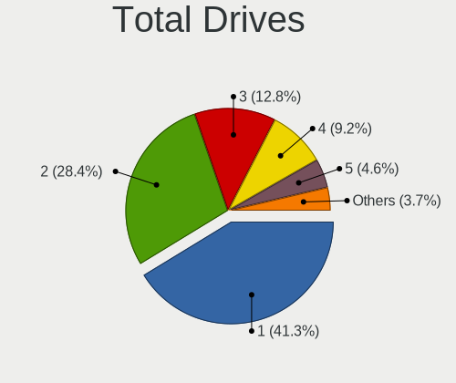
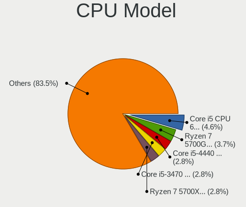
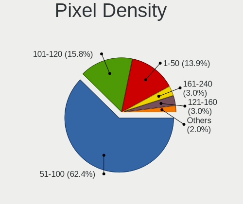
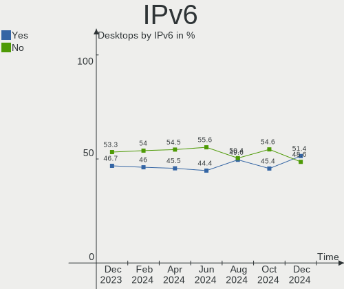
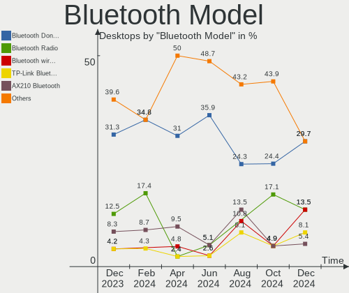

Linux in Brazil - Hardware Trends (Desktops)
--------------------------------------------

A project to identify most popular hardware characteristics and track their change
over time based on data collected by Linux users at https://Linux-Hardware.org.

Anyone can contribute to this report by the [hw-probe](https://github.com/linuxhw/hw-probe) tool:

    sudo -E hw-probe -all -upload

Period: Feb, 2023.

Contents
--------

* [ System ](#system)
  - [ OS                       ](#os)
  - [ OS Family                ](#os-family)
  - [ Kernel                   ](#kernel)
  - [ Kernel Family            ](#kernel-family)
  - [ Kernel Major Ver.        ](#kernel-major-ver)
  - [ Arch                     ](#arch)
  - [ DE                       ](#de)
  - [ Display Server           ](#display-server)
  - [ Display Manager          ](#display-manager)
  - [ OS Lang                  ](#os-lang)
  - [ Boot Mode                ](#boot-mode)
  - [ Filesystem               ](#filesystem)
  - [ Part. scheme             ](#part-scheme)
  - [ Dual Boot with Linux/BSD ](#dual-boot-with-linuxbsd)
  - [ Dual Boot (Win)          ](#dual-boot-win)

* [ Board ](#board)
  - [ Vendor                   ](#vendor)
  - [ Model                    ](#model)
  - [ Model Family             ](#model-family)
  - [ MFG Year                 ](#mfg-year)
  - [ Form Factor              ](#form-factor)
  - [ Secure Boot              ](#secure-boot)
  - [ Coreboot                 ](#coreboot)
  - [ RAM Size                 ](#ram-size)
  - [ RAM Used                 ](#ram-used)
  - [ Total Drives             ](#total-drives)
  - [ Has CD-ROM               ](#has-cd-rom)
  - [ Has Ethernet             ](#has-ethernet)
  - [ Has WiFi                 ](#has-wifi)
  - [ Has Bluetooth            ](#has-bluetooth)

* [ Location ](#location)
  - [ Country                  ](#country)
  - [ City                     ](#city)

* [ Drives ](#drives)
  - [ Drive Vendor             ](#drive-vendor)
  - [ Drive Model              ](#drive-model)
  - [ HDD Vendor               ](#hdd-vendor)
  - [ SSD Vendor               ](#ssd-vendor)
  - [ Drive Kind               ](#drive-kind)
  - [ Drive Connector          ](#drive-connector)
  - [ Drive Size               ](#drive-size)
  - [ Space Total              ](#space-total)
  - [ Space Used               ](#space-used)
  - [ Malfunc. Drives          ](#malfunc-drives)
  - [ Malfunc. Drive Vendor    ](#malfunc-drive-vendor)
  - [ Malfunc. HDD Vendor      ](#malfunc-hdd-vendor)
  - [ Malfunc. Drive Kind      ](#malfunc-drive-kind)
  - [ Failed Drives            ](#failed-drives)
  - [ Failed Drive Vendor      ](#failed-drive-vendor)
  - [ Drive Status             ](#drive-status)

* [ Storage controller ](#storage-controller)
  - [ Storage Vendor           ](#storage-vendor)
  - [ Storage Model            ](#storage-model)
  - [ Storage Kind             ](#storage-kind)

* [ Processor ](#processor)
  - [ CPU Vendor               ](#cpu-vendor)
  - [ CPU Model                ](#cpu-model)
  - [ CPU Model Family         ](#cpu-model-family)
  - [ CPU Cores                ](#cpu-cores)
  - [ CPU Sockets              ](#cpu-sockets)
  - [ CPU Threads              ](#cpu-threads)
  - [ CPU Op-Modes             ](#cpu-op-modes)
  - [ CPU Microcode            ](#cpu-microcode)
  - [ CPU Microarch            ](#cpu-microarch)

* [ Graphics ](#graphics)
  - [ GPU Vendor               ](#gpu-vendor)
  - [ GPU Model                ](#gpu-model)
  - [ GPU Combo                ](#gpu-combo)
  - [ GPU Driver               ](#gpu-driver)
  - [ GPU Memory               ](#gpu-memory)

* [ Monitor ](#monitor)
  - [ Monitor Vendor           ](#monitor-vendor)
  - [ Monitor Model            ](#monitor-model)
  - [ Monitor Resolution       ](#monitor-resolution)
  - [ Monitor Diagonal         ](#monitor-diagonal)
  - [ Monitor Width            ](#monitor-width)
  - [ Aspect Ratio             ](#aspect-ratio)
  - [ Monitor Area             ](#monitor-area)
  - [ Pixel Density            ](#pixel-density)
  - [ Multiple Monitors        ](#multiple-monitors)

* [ Network ](#network)
  - [ Net Controller Vendor    ](#net-controller-vendor)
  - [ Net Controller Model     ](#net-controller-model)
  - [ Wireless Vendor          ](#wireless-vendor)
  - [ Wireless Model           ](#wireless-model)
  - [ Ethernet Vendor          ](#ethernet-vendor)
  - [ Ethernet Model           ](#ethernet-model)
  - [ Net Controller Kind      ](#net-controller-kind)
  - [ Used Controller          ](#used-controller)
  - [ NICs                     ](#nics)
  - [ IPv6                     ](#ipv6)

* [ Bluetooth ](#bluetooth)
  - [ Bluetooth Vendor         ](#bluetooth-vendor)
  - [ Bluetooth Model          ](#bluetooth-model)

* [ Sound ](#sound)
  - [ Sound Vendor             ](#sound-vendor)
  - [ Sound Model              ](#sound-model)

* [ Memory ](#memory)
  - [ Memory Vendor            ](#memory-vendor)
  - [ Memory Model             ](#memory-model)
  - [ Memory Kind              ](#memory-kind)
  - [ Memory Form Factor       ](#memory-form-factor)
  - [ Memory Size              ](#memory-size)
  - [ Memory Speed             ](#memory-speed)

* [ Printers & scanners ](#printers--scanners)
  - [ Printer Vendor           ](#printer-vendor)
  - [ Printer Model            ](#printer-model)
  - [ Scanner Vendor           ](#scanner-vendor)
  - [ Scanner Model            ](#scanner-model)

* [ Camera ](#camera)
  - [ Camera Vendor            ](#camera-vendor)
  - [ Camera Model             ](#camera-model)

* [ Security ](#security)
  - [ Fingerprint Vendor       ](#fingerprint-vendor)
  - [ Fingerprint Model        ](#fingerprint-model)
  - [ Chipcard Vendor          ](#chipcard-vendor)
  - [ Chipcard Model           ](#chipcard-model)

* [ Unsupported ](#unsupported)
  - [ Unsupported Devices      ](#unsupported-devices)
  - [ Unsupported Device Types ](#unsupported-device-types)

System
------

OS
--

Installed operating systems

| Name                         | Desktops | Percent |
|------------------------------|----------|---------|
| Ubuntu 22.04                 | 15       | 13.27%  |
| OpenMandriva 23.01           | 14       | 12.39%  |
| Linux Mint 21.1              | 10       | 8.85%   |
| Manjaro                      | 7        | 6.19%   |
| Ubuntu 22.10                 | 5        | 4.42%   |
| Debian 11                    | 5        | 4.42%   |
| Zorin 16                     | 4        | 3.54%   |
| Linux Mint 21                | 4        | 3.54%   |
| Linux Mint 20.3              | 4        | 3.54%   |
| Pop!_OS 22.04                | 3        | 2.65%   |
| Kali 2022.4                  | 3        | 2.65%   |
| Fedora 37                    | 3        | 2.65%   |
| Arch Rolling                 | 3        | 2.65%   |
| Ubuntu 20.04                 | 2        | 1.77%   |
| openSUSE Tumbleweed-XXXXXXXX | 2        | 1.77%   |
| OpenMandriva 4.3             | 2        | 1.77%   |
| LMDE 5                       | 2        | 1.77%   |
| Fedora 38                    | 2        | 1.77%   |
| Debian                       | 2        | 1.77%   |
| BigLinux 22.0.4              | 2        | 1.77%   |
| Xubuntu 22.04                | 1        | 0.88%   |
| Ubuntu Unity 16.04           | 1        | 0.88%   |
| SteamOS 3.4                  | 1        | 0.88%   |
| Slackware 15.0               | 1        | 0.88%   |
| Puppy 19.03                  | 1        | 0.88%   |
| OpenMandriva 4.2             | 1        | 0.88%   |
| Nobara 37                    | 1        | 0.88%   |
| MX 19                        | 1        | 0.88%   |
| Manjaro 22.0.4               | 1        | 0.88%   |
| Linux Mint 20                | 1        | 0.88%   |
| Kubuntu 22.10                | 1        | 0.88%   |
| KDE neon 22.04               | 1        | 0.88%   |
| Gentoo 2.13                  | 1        | 0.88%   |
| Endless 4.0.14               | 1        | 0.88%   |
| Endless 4.0.13               | 1        | 0.88%   |
| Elementary 7                 | 1        | 0.88%   |
| ChimeraOS 39                 | 1        | 0.88%   |
| BigLinux 23.02.07            | 1        | 0.88%   |
| ArcoLinux Rolling            | 1        | 0.88%   |

OS Family
---------

OS without a version

| Name         | Desktops | Percent |
|--------------|----------|---------|
| Ubuntu       | 22       | 19.47%  |
| Linux Mint   | 19       | 16.81%  |
| OpenMandriva | 17       | 15.04%  |
| Manjaro      | 8        | 7.08%   |
| Debian       | 7        | 6.19%   |
| Fedora       | 5        | 4.42%   |
| Zorin        | 4        | 3.54%   |
| Pop!_OS      | 3        | 2.65%   |
| Kali         | 3        | 2.65%   |
| BigLinux     | 3        | 2.65%   |
| Arch         | 3        | 2.65%   |
| openSUSE     | 2        | 1.77%   |
| LMDE         | 2        | 1.77%   |
| Endless      | 2        | 1.77%   |
| Xubuntu      | 1        | 0.88%   |
| Ubuntu Unity | 1        | 0.88%   |
| SteamOS      | 1        | 0.88%   |
| Slackware    | 1        | 0.88%   |
| Puppy        | 1        | 0.88%   |
| Nobara       | 1        | 0.88%   |
| MX           | 1        | 0.88%   |
| Kubuntu      | 1        | 0.88%   |
| KDE neon     | 1        | 0.88%   |
| Gentoo       | 1        | 0.88%   |
| Elementary   | 1        | 0.88%   |
| ChimeraOS    | 1        | 0.88%   |
| ArcoLinux    | 1        | 0.88%   |

Kernel
------

Version of the Linux kernel

| Version                     | Desktops | Percent |
|-----------------------------|----------|---------|
| 5.15.0-60-generic           | 19       | 16.81%  |
| 6.1.1-desktop-1omv2290      | 9        | 7.96%   |
| 5.15.0-58-generic           | 8        | 7.08%   |
| 6.1.4-desktop-1omv2301      | 5        | 4.42%   |
| 5.19.0-32-generic           | 5        | 4.42%   |
| 5.19.0-31-generic           | 5        | 4.42%   |
| 6.1.12-1-MANJARO            | 4        | 3.54%   |
| 5.4.0-137-generic           | 4        | 3.54%   |
| 5.10.0-21-amd64             | 3        | 2.65%   |
| 6.2.0-63.fc38.x86_64        | 2        | 1.77%   |
| 6.1.9-arch1-1               | 2        | 1.77%   |
| 6.1.9-1-MANJARO             | 2        | 1.77%   |
| 6.1.11-76060111-generic     | 2        | 1.77%   |
| 6.1.10-1-default            | 2        | 1.77%   |
| 6.0.0-kali3-amd64           | 2        | 1.77%   |
| 5.15.53-1-MANJARO           | 2        | 1.77%   |
| 5.15.0-43-generic           | 2        | 1.77%   |
| 5.11.0-35-generic           | 2        | 1.77%   |
| 5.10.0-10-amd64             | 2        | 1.77%   |
| 6.1.9-zen1-1-zen            | 1        | 0.88%   |
| 6.1.9-x64v1-xanmod1-1       | 1        | 0.88%   |
| 6.1.9-060109-generic        | 1        | 0.88%   |
| 6.1.8-201.fsync.fc37.x86_64 | 1        | 0.88%   |
| 6.1.8-200.fc37.x86_64+debug | 1        | 0.88%   |
| 6.1.8-200.fc37.x86_64       | 1        | 0.88%   |
| 6.1.12-arch1-1              | 1        | 0.88%   |
| 6.1.11-x64v1-xanmod1-1      | 1        | 0.88%   |
| 6.1.11-gentoo-gentoo-dist   | 1        | 0.88%   |
| 6.1.11-arch1-1              | 1        | 0.88%   |
| 6.1.11-200.fc37.x86_64      | 1        | 0.88%   |
| 6.1.10.mmn                  | 1        | 0.88%   |
| 6.1.0-2-amd64               | 1        | 0.88%   |
| 6.0.12-76060006-generic     | 1        | 0.88%   |
| 6.0.0-2-amd64               | 1        | 0.88%   |
| 5.4.0-139-lowlatency        | 1        | 0.88%   |
| 5.4.0-139-generic           | 1        | 0.88%   |
| 5.19.0-29-generic           | 1        | 0.88%   |
| 5.18.0-kali5-amd64          | 1        | 0.88%   |
| 5.16.7-desktop-1omv4003     | 1        | 0.88%   |
| 5.16.13-desktop-1omv4003    | 1        | 0.88%   |

Kernel Family
-------------

Linux kernel without a distro release

| Version | Desktops | Percent |
|---------|----------|---------|
| 5.15.0  | 30       | 26.55%  |
| 5.19.0  | 11       | 9.73%   |
| 6.1.1   | 9        | 7.96%   |
| 6.1.9   | 7        | 6.19%   |
| 5.10.0  | 7        | 6.19%   |
| 6.1.11  | 6        | 5.31%   |
| 5.4.0   | 6        | 5.31%   |
| 6.1.4   | 5        | 4.42%   |
| 6.1.12  | 5        | 4.42%   |
| 6.1.8   | 3        | 2.65%   |
| 6.1.10  | 3        | 2.65%   |
| 6.0.0   | 3        | 2.65%   |
| 6.2.0   | 2        | 1.77%   |
| 5.15.53 | 2        | 1.77%   |
| 5.11.0  | 2        | 1.77%   |
| 6.1.0   | 1        | 0.88%   |
| 6.0.12  | 1        | 0.88%   |
| 5.18.0  | 1        | 0.88%   |
| 5.16.7  | 1        | 0.88%   |
| 5.16.13 | 1        | 0.88%   |
| 5.15.94 | 1        | 0.88%   |
| 5.15.91 | 1        | 0.88%   |
| 5.15.74 | 1        | 0.88%   |
| 5.13.0  | 1        | 0.88%   |
| 5.11.12 | 1        | 0.88%   |
| 4.9.163 | 1        | 0.88%   |
| 4.15.0  | 1        | 0.88%   |

Kernel Major Ver.
-----------------

Linux kernel major version

| Version | Desktops | Percent |
|---------|----------|---------|
| 6.1     | 39       | 34.51%  |
| 5.15    | 35       | 30.97%  |
| 5.19    | 11       | 9.73%   |
| 5.10    | 7        | 6.19%   |
| 5.4     | 6        | 5.31%   |
| 6.0     | 4        | 3.54%   |
| 5.11    | 3        | 2.65%   |
| 6.2     | 2        | 1.77%   |
| 5.16    | 2        | 1.77%   |
| 5.18    | 1        | 0.88%   |
| 5.13    | 1        | 0.88%   |
| 4.9     | 1        | 0.88%   |
| 4.15    | 1        | 0.88%   |

Arch
----

OS architecture (x86_64, i586, etc.)

| Name   | Desktops | Percent |
|--------|----------|---------|
| x86_64 | 112      | 99.12%  |
| i686   | 1        | 0.88%   |

DE
--

Desktop Environment

| Name       | Desktops | Percent |
|------------|----------|---------|
| GNOME      | 40       | 35.4%   |
| KDE5       | 30       | 26.55%  |
| XFCE       | 13       | 11.5%   |
| X-Cinnamon | 12       | 10.62%  |
| Unknown    | 8        | 7.08%   |
| MATE       | 6        | 5.31%   |
| i3         | 2        | 1.77%   |
| Unity      | 1        | 0.88%   |
| Pantheon   | 1        | 0.88%   |

Display Server
--------------

X11 or Wayland

| Name    | Desktops | Percent |
|---------|----------|---------|
| X11     | 89       | 78.76%  |
| Wayland | 20       | 17.7%   |
| Unknown | 3        | 2.65%   |
| Tty     | 1        | 0.88%   |

Display Manager
---------------

SDDM, LightDM, etc.

| Name    | Desktops | Percent |
|---------|----------|---------|
| Unknown | 56       | 49.56%  |
| SDDM    | 20       | 17.7%   |
| GDM3    | 18       | 15.93%  |
| LightDM | 14       | 12.39%  |
| GDM     | 5        | 4.42%   |

OS Lang
-------

Language

| Lang    | Desktops | Percent |
|---------|----------|---------|
| pt_BR   | 87       | 76.99%  |
| en_US   | 23       | 20.35%  |
| Unknown | 2        | 1.77%   |
| C       | 1        | 0.88%   |

Boot Mode
---------

EFI or BIOS

| Mode | Desktops | Percent |
|------|----------|---------|
| BIOS | 72       | 63.72%  |
| EFI  | 41       | 36.28%  |

Filesystem
----------

Type of filesystem

| Type    | Desktops | Percent |
|---------|----------|---------|
| Ext4    | 80       | 70.8%   |
| Btrfs   | 22       | 19.47%  |
| Overlay | 9        | 7.96%   |
| Xfs     | 1        | 0.88%   |
| Aufs    | 1        | 0.88%   |

Part. scheme
------------

Scheme of partitioning

| Type    | Desktops | Percent |
|---------|----------|---------|
| GPT     | 50       | 44.25%  |
| Unknown | 48       | 42.48%  |
| MBR     | 15       | 13.27%  |

Dual Boot with Linux/BSD
------------------------

Hosting more than one Linux/BSD

| Dual boot | Desktops | Percent |
|-----------|----------|---------|
| No        | 97       | 85.84%  |
| Yes       | 16       | 14.16%  |

Dual Boot (Win)
---------------

Hosting Linux and Windows

| Dual boot | Desktops | Percent |
|-----------|----------|---------|
| No        | 83       | 73.45%  |
| Yes       | 30       | 26.55%  |

Board
-----

Vendor
------

Motherboard manufacturer

| Name                | Desktops | Percent |
|---------------------|----------|---------|
| ASUSTek Computer    | 31       | 27.43%  |
| Gigabyte Technology | 16       | 14.16%  |
| ASRock              | 12       | 10.62%  |
| Intel               | 10       | 8.85%   |
| Lenovo              | 6        | 5.31%   |
| MSI                 | 5        | 4.42%   |
| Hewlett-Packard     | 4        | 3.54%   |
| Dell                | 4        | 3.54%   |
| PCWare              | 3        | 2.65%   |
| Positivo            | 2        | 1.77%   |
| DIEBOLD             | 2        | 1.77%   |
| Win element         | 1        | 0.88%   |
| Philco              | 1        | 0.88%   |
| Pegatron            | 1        | 0.88%   |
| OEM                 | 1        | 0.88%   |
| MACHINIST           | 1        | 0.88%   |
| Login Informatica   | 1        | 0.88%   |
| LG Electronics      | 1        | 0.88%   |
| Lenovo Product      | 1        | 0.88%   |
| Itautec             | 1        | 0.88%   |
| Huanan              | 1        | 0.88%   |
| HOUTER              | 1        | 0.88%   |
| FIC                 | 1        | 0.88%   |
| ECS                 | 1        | 0.88%   |
| Compaq              | 1        | 0.88%   |
| Colorful Technology | 1        | 0.88%   |
| AZW                 | 1        | 0.88%   |
| AMD                 | 1        | 0.88%   |
| Unknown             | 1        | 0.88%   |

Model
-----

Motherboard model

| Name                                | Desktops | Percent |
|-------------------------------------|----------|---------|
| Intel H61                           | 8        | 7.08%   |
| ASUS TUF Gaming X570-PLUS_BR        | 4        | 3.54%   |
| ASUS All Series                     | 4        | 3.54%   |
| Gigabyte M68MT-S2P                  | 2        | 1.77%   |
| Gigabyte GA-78LMT-USB3 6.0          | 2        | 1.77%   |
| ASUS PRIME A320M-K/BR               | 2        | 1.77%   |
| ASUS M5A78L-M PLUS/USB3             | 2        | 1.77%   |
| ASRock FM2A55M-HD+ R2.0             | 2        | 1.77%   |
| ASRock B450M Steel Legend           | 2        | 1.77%   |
| Unknown                             | 2        | 1.77%   |
| Win element M600                    | 1        | 0.88%   |
| Positivo POS-PQ45AU                 | 1        | 0.88%   |
| Positivo POS-EIH61CE                | 1        | 0.88%   |
| Philco DTC-A55                      | 1        | 0.88%   |
| Pegatron SM 3330B                   | 1        | 0.88%   |
| PCWare IPX525R2-D3                  | 1        | 0.88%   |
| PCWare IPMH61R3                     | 1        | 0.88%   |
| PCWare IPMH61R2                     | 1        | 0.88%   |
| OEM Intel H81                       | 1        | 0.88%   |
| MSI MS-7C37                         | 1        | 0.88%   |
| MSI MS-7B10                         | 1        | 0.88%   |
| MSI MS-7A34                         | 1        | 0.88%   |
| MSI MS-7A15                         | 1        | 0.88%   |
| MSI MS-7693                         | 1        | 0.88%   |
| MACHINIST X99-RS9 V2.0              | 1        | 0.88%   |
| Login Informatica LOG-H61H2-M2      | 1        | 0.88%   |
| LG R590-U.BE57P1                    | 1        | 0.88%   |
| Lenovo V530S-07ICR 11BL000BBP       | 1        | 0.88%   |
| Lenovo V520S-08IKL 10NN0033BR       | 1        | 0.88%   |
| Lenovo ThinkCentre M80s 11CVS3DT00  | 1        | 0.88%   |
| Lenovo ThinkCentre M720s 10SUSJLJ00 | 1        | 0.88%   |
| Lenovo ThinkCentre M720s 10SUA041BR | 1        | 0.88%   |
| Lenovo ThinkCentre M57p 6073AG7     | 1        | 0.88%   |
| Itautec ST 4265                     | 1        | 0.88%   |
| Intel X99                           | 1        | 0.88%   |
| Intel H55                           | 1        | 0.88%   |
| Huanan X99-QD4 V1.0                 | 1        | 0.88%   |
| HOUTER ORO-PC                       | 1        | 0.88%   |
| HP ProLiant ML310e Gen8 v2          | 1        | 0.88%   |
| HP Desktop Pro A MT                 | 1        | 0.88%   |

Model Family
------------

Motherboard model prefix

| Name                           | Desktops | Percent |
|--------------------------------|----------|---------|
| ASUS TUF                       | 9        | 7.96%   |
| Intel H61                      | 8        | 7.08%   |
| Lenovo ThinkCentre             | 4        | 3.54%   |
| ASUS PRIME                     | 4        | 3.54%   |
| ASUS M5A78L-M                  | 4        | 3.54%   |
| ASUS All                       | 4        | 3.54%   |
| Dell OptiPlex                  | 3        | 2.65%   |
| ASRock B450M                   | 3        | 2.65%   |
| Gigabyte M68MT-S2P             | 2        | 1.77%   |
| Gigabyte GA-78LMT-USB3         | 2        | 1.77%   |
| Gigabyte B560M                 | 2        | 1.77%   |
| ASRock FM2A55M-HD+             | 2        | 1.77%   |
| Unknown                        | 2        | 1.77%   |
| Win element M600               | 1        | 0.88%   |
| Positivo POS-PQ45AU            | 1        | 0.88%   |
| Positivo POS-EIH61CE           | 1        | 0.88%   |
| Philco DTC-A55                 | 1        | 0.88%   |
| Pegatron SM                    | 1        | 0.88%   |
| PCWare IPX525R2-D3             | 1        | 0.88%   |
| PCWare IPMH61R3                | 1        | 0.88%   |
| PCWare IPMH61R2                | 1        | 0.88%   |
| OEM Intel                      | 1        | 0.88%   |
| MSI MS-7C37                    | 1        | 0.88%   |
| MSI MS-7B10                    | 1        | 0.88%   |
| MSI MS-7A34                    | 1        | 0.88%   |
| MSI MS-7A15                    | 1        | 0.88%   |
| MSI MS-7693                    | 1        | 0.88%   |
| MACHINIST X99-RS9              | 1        | 0.88%   |
| Login Informatica LOG-H61H2-M2 | 1        | 0.88%   |
| LG R590-U.BE57P1               | 1        | 0.88%   |
| Lenovo V530S-07ICR             | 1        | 0.88%   |
| Lenovo V520S-08IKL             | 1        | 0.88%   |
| Itautec ST                     | 1        | 0.88%   |
| Intel X99                      | 1        | 0.88%   |
| Intel H55                      | 1        | 0.88%   |
| Huanan X99-QD4                 | 1        | 0.88%   |
| HOUTER ORO-PC                  | 1        | 0.88%   |
| HP ProLiant                    | 1        | 0.88%   |
| HP Desktop                     | 1        | 0.88%   |
| HP Compaq                      | 1        | 0.88%   |

MFG Year
--------

Motherboard manufacture year

| Year    | Desktops | Percent |
|---------|----------|---------|
| 2017    | 15       | 13.27%  |
| 2011    | 13       | 11.5%   |
| 2021    | 10       | 8.85%   |
| 2019    | 10       | 8.85%   |
| 2016    | 10       | 8.85%   |
| 2014    | 8        | 7.08%   |
| 2013    | 8        | 7.08%   |
| 2020    | 7        | 6.19%   |
| 2010    | 7        | 6.19%   |
| 2018    | 6        | 5.31%   |
| 2008    | 5        | 4.42%   |
| 2022    | 4        | 3.54%   |
| 2012    | 4        | 3.54%   |
| 2009    | 3        | 2.65%   |
| 2015    | 2        | 1.77%   |
| Unknown | 1        | 0.88%   |

Form Factor
-----------

Physical design of the computer

| Name    | Desktops | Percent |
|---------|----------|---------|
| Desktop | 113      | 100%    |

Secure Boot
-----------

Enabled or disabled

| State    | Desktops | Percent |
|----------|----------|---------|
| Disabled | 111      | 98.23%  |
| Enabled  | 2        | 1.77%   |

Coreboot
--------

Have coreboot on board

| Used | Desktops | Percent |
|------|----------|---------|
| No   | 113      | 100%    |

RAM Size
--------

Total RAM memory

| Size in GB  | Desktops | Percent |
|-------------|----------|---------|
| 16.01-24.0  | 30       | 26.55%  |
| 4.01-8.0    | 26       | 23.01%  |
| 8.01-16.0   | 26       | 23.01%  |
| 3.01-4.0    | 10       | 8.85%   |
| 32.01-64.0  | 9        | 7.96%   |
| 24.01-32.0  | 4        | 3.54%   |
| 1.01-2.0    | 4        | 3.54%   |
| 2.01-3.0    | 2        | 1.77%   |
| 64.01-256.0 | 2        | 1.77%   |

RAM Used
--------

Used RAM memory

| Used GB   | Desktops | Percent |
|-----------|----------|---------|
| 1.01-2.0  | 43       | 38.05%  |
| 2.01-3.0  | 31       | 27.43%  |
| 4.01-8.0  | 18       | 15.93%  |
| 3.01-4.0  | 13       | 11.5%   |
| 8.01-16.0 | 3        | 2.65%   |
| 0.51-1.0  | 3        | 2.65%   |
| 0.01-0.5  | 2        | 1.77%   |

Total Drives
------------

Number of drives on board

| Drives | Desktops | Percent |
|--------|----------|---------|
| 1      | 45       | 39.82%  |
| 2      | 34       | 30.09%  |
| 3      | 14       | 12.39%  |
| 4      | 9        | 7.96%   |
| 6      | 4        | 3.54%   |
| 0      | 4        | 3.54%   |
| 5      | 3        | 2.65%   |

Has CD-ROM
----------

Has CD-ROM on board

| Presented | Desktops | Percent |
|-----------|----------|---------|
| No        | 76       | 67.26%  |
| Yes       | 37       | 32.74%  |

Has Ethernet
------------

Has Ethernet on board

| Presented | Desktops | Percent |
|-----------|----------|---------|
| Yes       | 112      | 99.12%  |
| No        | 1        | 0.88%   |

Has WiFi
--------

Has WiFi module

| Presented | Desktops | Percent |
|-----------|----------|---------|
| No        | 76       | 67.26%  |
| Yes       | 37       | 32.74%  |

Has Bluetooth
-------------

Has Bluetooth module

| Presented | Desktops | Percent |
|-----------|----------|---------|
| No        | 86       | 76.11%  |
| Yes       | 27       | 23.89%  |

Location
--------

Country
-------

Geographic location (country)

| Country | Desktops | Percent |
|---------|----------|---------|
| Brazil  | 113      | 100%    |

City
----

Geographic location (city)

| City                  | Desktops | Percent |
|-----------------------|----------|---------|
| Rio de Janeiro        | 16       | 14.16%  |
| Sao Paulo             | 14       | 12.39%  |
| Santo André          | 5        | 4.42%   |
| Belo Horizonte        | 4        | 3.54%   |
| Porto Alegre          | 3        | 2.65%   |
| Niterói              | 3        | 2.65%   |
| Guarulhos             | 3        | 2.65%   |
| Florianópolis        | 3        | 2.65%   |
| Curitiba              | 3        | 2.65%   |
| Campinas              | 3        | 2.65%   |
| Macapá               | 2        | 1.77%   |
| Londrina              | 2        | 1.77%   |
| Indaiatuba            | 2        | 1.77%   |
| Goiânia              | 2        | 1.77%   |
| Brasília             | 2        | 1.77%   |
| Volta Redonda         | 1        | 0.88%   |
| Valinhos              | 1        | 0.88%   |
| Tatuí                | 1        | 0.88%   |
| Taquaritinga          | 1        | 0.88%   |
| Taboao da Serra       | 1        | 0.88%   |
| Sumaré               | 1        | 0.88%   |
| Sorocaba              | 1        | 0.88%   |
| Sertaozinho           | 1        | 0.88%   |
| Saquarema             | 1        | 0.88%   |
| Sao José dos Campos  | 1        | 0.88%   |
| Sao Jose do Rio Preto | 1        | 0.88%   |
| Sao Joao de Meriti    | 1        | 0.88%   |
| Sao Fidelis           | 1        | 0.88%   |
| Santa Luzia           | 1        | 0.88%   |
| Santa Cruz do Sul     | 1        | 0.88%   |
| Pouso Alegre          | 1        | 0.88%   |
| Patos de Minas        | 1        | 0.88%   |
| Para de Minas         | 1        | 0.88%   |
| Natal                 | 1        | 0.88%   |
| Mogi das Cruzes       | 1        | 0.88%   |
| Mesquita              | 1        | 0.88%   |
| Mateus Leme           | 1        | 0.88%   |
| Maringá              | 1        | 0.88%   |
| Manaus                | 1        | 0.88%   |
| Mage                  | 1        | 0.88%   |

Drives
------

Drive Vendor
------------

Hard drive vendors

| Vendor                      | Desktops | Drives | Percent |
|-----------------------------|----------|--------|---------|
| WDC                         | 39       | 49     | 20.21%  |
| Seagate                     | 37       | 46     | 19.17%  |
| Kingston                    | 22       | 27     | 11.4%   |
| Samsung Electronics         | 18       | 26     | 9.33%   |
| SanDisk                     | 11       | 14     | 5.7%    |
| China                       | 8        | 8      | 4.15%   |
| Toshiba                     | 5        | 5      | 2.59%   |
| Silicon Motion              | 3        | 3      | 1.55%   |
| Realtek Semiconductor       | 3        | 3      | 1.55%   |
| Phison Electronics          | 3        | 3      | 1.55%   |
| Patriot                     | 3        | 3      | 1.55%   |
| Hewlett-Packard             | 3        | 3      | 1.55%   |
| XrayDisk                    | 2        | 3      | 1.04%   |
| Unknown                     | 2        | 2      | 1.04%   |
| PNY                         | 2        | 2      | 1.04%   |
| Micron/Crucial Technology   | 2        | 2      | 1.04%   |
| MAXIO Technology (Hangzhou) | 2        | 2      | 1.04%   |
| Crucial                     | 2        | 2      | 1.04%   |
| A-DATA Technology           | 2        | 2      | 1.04%   |
| Yeestor                     | 1        | 1      | 0.52%   |
| XPG                         | 1        | 1      | 0.52%   |
| Team                        | 1        | 1      | 0.52%   |
| T-FORCE                     | 1        | 1      | 0.52%   |
| SK hynix                    | 1        | 1      | 0.52%   |
| RZX                         | 1        | 1      | 0.52%   |
| Pioneer                     | 1        | 1      | 0.52%   |
| OCZ                         | 1        | 1      | 0.52%   |
| NN                          | 1        | 1      | 0.52%   |
| Netac                       | 1        | 1      | 0.52%   |
| Maxtor                      | 1        | 1      | 0.52%   |
| Lexar                       | 1        | 1      | 0.52%   |
| JMicron Technology          | 1        | 1      | 0.52%   |
| HPE                         | 1        | 1      | 0.52%   |
| Hitachi                     | 1        | 1      | 0.52%   |
| Hikvision                   | 1        | 2      | 0.52%   |
| Gigabyte Technology         | 1        | 1      | 0.52%   |
| FUTURE                      | 1        | 1      | 0.52%   |
| Corsair                     | 1        | 1      | 0.52%   |
| Colorful                    | 1        | 1      | 0.52%   |
| BHT                         | 1        | 1      | 0.52%   |

Drive Model
-----------

Hard drive models

| Model                                                 | Desktops | Percent |
|-------------------------------------------------------|----------|---------|
| Kingston SA400S37120G 120GB SSD                       | 6        | 2.71%   |
| Kingston SA400S37240G 240GB SSD                       | 5        | 2.26%   |
| Seagate ST1000DM010-2EP102 1TB                        | 4        | 1.81%   |
| Kingston SV300S37A120G 120GB SSD                      | 4        | 1.81%   |
| Kingston SA400S37480G 480GB SSD                       | 4        | 1.81%   |
| WDC WD10EZEX-08WN4A0 1TB                              | 3        | 1.36%   |
| WDC WD10EARS-00Y5B1 1TB                               | 3        | 1.36%   |
| Toshiba DT01ACA050 500GB                              | 3        | 1.36%   |
| Silicon Motion SM2263EN/SM2263XT SSD Controller 512GB | 3        | 1.36%   |
| Seagate ST500DM002-1BD142 500GB                       | 3        | 1.36%   |
| Seagate ST2000DM008-2FR102 2TB                        | 3        | 1.36%   |
| Seagate ST1000LM024 HN-M101MBB 1TB                    | 3        | 1.36%   |
| Samsung HD322HJ 320GB                                 | 3        | 1.36%   |
| China SSD 128GB                                       | 3        | 1.36%   |
| WDC WDS240G2G0A-00JH30 240GB SSD                      | 2        | 0.9%    |
| WDC WD5000AAKX-003CA0 500GB                           | 2        | 0.9%    |
| WDC WD1600BEVS-00VAT0 160GB                           | 2        | 0.9%    |
| WDC WD10EZEX-00WN4A0 1TB                              | 2        | 0.9%    |
| WDC WD10EZEX-00RKKA0 1TB                              | 2        | 0.9%    |
| WDC WD10EZEX-00BN5A0 1TB                              | 2        | 0.9%    |
| Seagate ST500LT012-9WS142 500GB                       | 2        | 0.9%    |
| Seagate ST4000DM004-2CV104 4TB                        | 2        | 0.9%    |
| Seagate ST2000LM007-1R8174 2TB                        | 2        | 0.9%    |
| Seagate ST1000VM002-1CT162 1TB                        | 2        | 0.9%    |
| Seagate ST1000DM003-1ER162 1TB                        | 2        | 0.9%    |
| Seagate ST1000DM003-1CH162 1TB                        | 2        | 0.9%    |
| Seagate Expansion Desk 5TB                            | 2        | 0.9%    |
| Seagate Expansion 1TB                                 | 2        | 0.9%    |
| SanDisk SSD PLUS 120GB                                | 2        | 0.9%    |
| Samsung HD502HI 500GB                                 | 2        | 0.9%    |
| Samsung HD161GJ 160GB                                 | 2        | 0.9%    |
| Samsung HD103UJ 1TB                                   | 2        | 0.9%    |
| Phison E12 NVMe Controller 1024GB                     | 2        | 0.9%    |
| Patriot Burst 480GB SSD                               | 2        | 0.9%    |
| MAXIO (Hangzhou) NVMe SSD Controller MAP1202 256GB    | 2        | 0.9%    |
| China SSD 256GB                                       | 2        | 0.9%    |
| Yeestor 512GB                                         | 1        | 0.45%   |
| XrayDisk 512GB                                        | 1        | 0.45%   |
| XrayDisk 1TB SSD                                      | 1        | 0.45%   |
| XPG GAMMIX S41 512GB                                  | 1        | 0.45%   |

HDD Vendor
----------

Hard disk drive vendors

| Vendor              | Desktops | Drives | Percent |
|---------------------|----------|--------|---------|
| Seagate             | 37       | 46     | 38.54%  |
| WDC                 | 33       | 41     | 34.38%  |
| Samsung Electronics | 14       | 18     | 14.58%  |
| Toshiba             | 5        | 5      | 5.21%   |
| Hewlett-Packard     | 2        | 2      | 2.08%   |
| Unknown             | 1        | 1      | 1.04%   |
| Maxtor              | 1        | 1      | 1.04%   |
| JMicron Technology  | 1        | 1      | 1.04%   |
| HPE                 | 1        | 1      | 1.04%   |
| Hitachi             | 1        | 1      | 1.04%   |

SSD Vendor
----------

Solid state drive vendors

| Vendor              | Desktops | Drives | Percent |
|---------------------|----------|--------|---------|
| Kingston            | 19       | 22     | 28.79%  |
| SanDisk             | 10       | 11     | 15.15%  |
| China               | 8        | 8      | 12.12%  |
| WDC                 | 6        | 7      | 9.09%   |
| Patriot             | 3        | 3      | 4.55%   |
| Samsung Electronics | 2        | 5      | 3.03%   |
| PNY                 | 2        | 2      | 3.03%   |
| Crucial             | 2        | 2      | 3.03%   |
| A-DATA Technology   | 2        | 2      | 3.03%   |
| XrayDisk            | 1        | 2      | 1.52%   |
| RZX                 | 1        | 1      | 1.52%   |
| Pioneer             | 1        | 1      | 1.52%   |
| OCZ                 | 1        | 1      | 1.52%   |
| NN                  | 1        | 1      | 1.52%   |
| Hikvision           | 1        | 2      | 1.52%   |
| Hewlett-Packard     | 1        | 1      | 1.52%   |
| Gigabyte Technology | 1        | 1      | 1.52%   |
| FUTURE              | 1        | 1      | 1.52%   |
| Corsair             | 1        | 1      | 1.52%   |
| Colorful            | 1        | 1      | 1.52%   |
| BHT                 | 1        | 1      | 1.52%   |

Drive Kind
----------

HDD or SSD

| Kind    | Desktops | Drives | Percent |
|---------|----------|--------|---------|
| HDD     | 81       | 117    | 49.39%  |
| SSD     | 53       | 76     | 32.32%  |
| NVMe    | 28       | 37     | 17.07%  |
| Unknown | 2        | 2      | 1.22%   |

Drive Connector
---------------

SATA, SAS, NVMe, etc.

| Type | Desktops | Drives | Percent |
|------|----------|--------|---------|
| SATA | 101      | 185    | 73.19%  |
| NVMe | 28       | 37     | 20.29%  |
| SAS  | 9        | 10     | 6.52%   |

Drive Size
----------

Size of hard drive

| Size in TB | Desktops | Drives | Percent |
|------------|----------|--------|---------|
| 0.01-0.5   | 82       | 120    | 56.94%  |
| 0.51-1.0   | 47       | 56     | 32.64%  |
| 1.01-2.0   | 10       | 11     | 6.94%   |
| 4.01-10.0  | 3        | 4      | 2.08%   |
| 3.01-4.0   | 2        | 2      | 1.39%   |

Space Total
-----------

Amount of disk space available on the file system

| Size in GB     | Desktops | Percent |
|----------------|----------|---------|
| 101-250        | 26       | 23.01%  |
| 251-500        | 25       | 22.12%  |
| 501-1000       | 16       | 14.16%  |
| 1001-2000      | 13       | 11.5%   |
| 1-20           | 9        | 7.96%   |
| More than 3000 | 6        | 5.31%   |
| 21-50          | 6        | 5.31%   |
| 2001-3000      | 6        | 5.31%   |
| 51-100         | 5        | 4.42%   |
| Unknown        | 1        | 0.88%   |

Space Used
----------

Amount of used disk space

| Used GB        | Desktops | Percent |
|----------------|----------|---------|
| 1-20           | 36       | 31.86%  |
| 21-50          | 22       | 19.47%  |
| 51-100         | 14       | 12.39%  |
| 101-250        | 13       | 11.5%   |
| 251-500        | 12       | 10.62%  |
| 501-1000       | 7        | 6.19%   |
| 1001-2000      | 5        | 4.42%   |
| More than 3000 | 2        | 1.77%   |
| 2001-3000      | 1        | 0.88%   |
| Unknown        | 1        | 0.88%   |

Malfunc. Drives
---------------

Drive models with a malfunction

| Model                               | Desktops | Drives | Percent |
|-------------------------------------|----------|--------|---------|
| WDC WD10EARS-00Y5B1 1TB             | 2        | 2      | 8.33%   |
| Seagate ST500LT012-9WS142 500GB     | 2        | 2      | 8.33%   |
| Seagate ST2000LM007-1R8174 2TB      | 2        | 2      | 8.33%   |
| WDC WD800AAJS-75M0A0 80GB           | 1        | 1      | 4.17%   |
| WDC WD5000LPCX-21VHAT0 500GB        | 1        | 1      | 4.17%   |
| WDC WD5000AAKX-75U6AA0 500GB        | 1        | 1      | 4.17%   |
| WDC WD5000AADS-00M2B0 500GB         | 1        | 1      | 4.17%   |
| WDC WD10JPVX-75JC3T0 1TB            | 1        | 1      | 4.17%   |
| WDC WD10EZEX-08WN4A0 1TB            | 1        | 1      | 4.17%   |
| WDC WD1001FALS-41Y6A1 1TB           | 1        | 2      | 4.17%   |
| Seagate ST8000AS0002-1NA17Z 8TB     | 1        | 1      | 4.17%   |
| Seagate ST750LM022 HN-M750MBB 752GB | 1        | 1      | 4.17%   |
| Seagate ST500DM002-1BD142 500GB     | 1        | 1      | 4.17%   |
| Seagate ST2000DM001-1CH164 2TB      | 1        | 1      | 4.17%   |
| Samsung Electronics SSD 980 1TB     | 1        | 1      | 4.17%   |
| Samsung Electronics HM321HX 320GB   | 1        | 1      | 4.17%   |
| Samsung Electronics HD322HJ 320GB   | 1        | 1      | 4.17%   |
| Samsung Electronics HD321HJ 320GB   | 1        | 1      | 4.17%   |
| Kingston SV300S37A120G 120GB SSD    | 1        | 1      | 4.17%   |
| Hewlett-Packard MB1000GDUNU 1TB     | 1        | 1      | 4.17%   |
| China SSD 128GB                     | 1        | 1      | 4.17%   |

Malfunc. Drive Vendor
---------------------

Vendors of faulty drives

| Vendor              | Desktops | Drives | Percent |
|---------------------|----------|--------|---------|
| WDC                 | 8        | 10     | 36.36%  |
| Seagate             | 7        | 8      | 31.82%  |
| Samsung Electronics | 4        | 4      | 18.18%  |
| Kingston            | 1        | 1      | 4.55%   |
| Hewlett-Packard     | 1        | 1      | 4.55%   |
| China               | 1        | 1      | 4.55%   |

Malfunc. HDD Vendor
-------------------

Vendors of faulty HDD drives

| Vendor              | Desktops | Drives | Percent |
|---------------------|----------|--------|---------|
| WDC                 | 8        | 10     | 42.11%  |
| Seagate             | 7        | 8      | 36.84%  |
| Samsung Electronics | 3        | 3      | 15.79%  |
| Hewlett-Packard     | 1        | 1      | 5.26%   |

Malfunc. Drive Kind
-------------------

Kinds of faulty drives

| Kind | Desktops | Drives | Percent |
|------|----------|--------|---------|
| HDD  | 17       | 22     | 85%     |
| SSD  | 2        | 2      | 10%     |
| NVMe | 1        | 1      | 5%      |

Failed Drives
-------------

Failed drive models

Zero info for selected period =(

Failed Drive Vendor
-------------------

Failed drive vendors

Zero info for selected period =(

Drive Status
------------

Number of failed and malfunc. drives

| Status   | Desktops | Drives | Percent |
|----------|----------|--------|---------|
| Detected | 68       | 137    | 53.97%  |
| Works    | 39       | 70     | 30.95%  |
| Malfunc  | 19       | 25     | 15.08%  |

Storage controller
------------------

Storage Vendor
--------------

Storage controller vendors

| Vendor                       | Desktops | Percent |
|------------------------------|----------|---------|
| Intel                        | 60       | 40.54%  |
| AMD                          | 45       | 30.41%  |
| Silicon Motion               | 6        | 4.05%   |
| Nvidia                       | 5        | 3.38%   |
| Kingston Technology Company  | 5        | 3.38%   |
| Phison Electronics           | 4        | 2.7%    |
| SanDisk                      | 3        | 2.03%   |
| Samsung Electronics          | 3        | 2.03%   |
| Realtek Semiconductor        | 3        | 2.03%   |
| Micron/Crucial Technology    | 2        | 1.35%   |
| MAXIO Technology (Hangzhou)  | 2        | 1.35%   |
| JMicron Technology           | 2        | 1.35%   |
| ASMedia Technology           | 2        | 1.35%   |
| SK hynix                     | 1        | 0.68%   |
| Netac Technology             | 1        | 0.68%   |
| Marvell Technology Group     | 1        | 0.68%   |
| Beijing Starblaze Technology | 1        | 0.68%   |
| ADATA Technology             | 1        | 0.68%   |
| Unknown                      | 1        | 0.68%   |

Storage Model
-------------

Storage controller models

| Model                                                                                   | Desktops | Percent |
|-----------------------------------------------------------------------------------------|----------|---------|
| AMD FCH SATA Controller [AHCI mode]                                                     | 24       | 12.63%  |
| Intel 6 Series/C200 Series Chipset Family 6 port Desktop SATA AHCI Controller           | 10       | 5.26%   |
| AMD SB7x0/SB8x0/SB9x0 IDE Controller                                                    | 10       | 5.26%   |
| Intel 8 Series/C220 Series Chipset Family 6-port SATA Controller 1 [AHCI mode]          | 9        | 4.74%   |
| AMD SB7x0/SB8x0/SB9x0 SATA Controller [IDE mode]                                        | 8        | 4.21%   |
| AMD 400 Series Chipset SATA Controller                                                  | 7        | 3.68%   |
| Silicon Motion SM2263EN/SM2263XT SSD Controller                                         | 6        | 3.16%   |
| Nvidia MCP61 SATA Controller                                                            | 5        | 2.63%   |
| Kingston Company Company Non-Volatile memory controller                                 | 5        | 2.63%   |
| Intel Q170/Q150/B150/H170/H110/Z170/CM236 Chipset SATA Controller [AHCI Mode]           | 5        | 2.63%   |
| Intel 6 Series/C200 Series Chipset Family Desktop SATA Controller (IDE mode, ports 4-5) | 5        | 2.63%   |
| Intel 6 Series/C200 Series Chipset Family Desktop SATA Controller (IDE mode, ports 0-3) | 5        | 2.63%   |
| AMD SB7x0/SB8x0/SB9x0 SATA Controller [AHCI mode]                                       | 5        | 2.63%   |
| Intel Cannon Lake PCH SATA AHCI Controller                                              | 4        | 2.11%   |
| Nvidia MCP61 IDE                                                                        | 3        | 1.58%   |
| Intel NM10/ICH7 Family SATA Controller [IDE mode]                                       | 3        | 1.58%   |
| Intel 500 Series Chipset Family SATA AHCI Controller                                    | 3        | 1.58%   |
| Intel 5 Series/3400 Series Chipset 6 port SATA AHCI Controller                          | 3        | 1.58%   |
| Intel 200 Series PCH SATA controller [AHCI mode]                                        | 3        | 1.58%   |
| AMD FCH SATA Controller D                                                               | 3        | 1.58%   |
| AMD 500 Series Chipset SATA Controller                                                  | 3        | 1.58%   |
| AMD 300 Series Chipset SATA Controller                                                  | 3        | 1.58%   |
| SanDisk Non-Volatile memory controller                                                  | 2        | 1.05%   |
| Samsung NVMe SSD Controller SM981/PM981/PM983                                           | 2        | 1.05%   |
| Realtek Realtek Non-Volatile memory controller                                          | 2        | 1.05%   |
| Phison E12 NVMe Controller                                                              | 2        | 1.05%   |
| MAXIO (Hangzhou) NVMe SSD Controller MAP1202                                            | 2        | 1.05%   |
| Intel 82801I (ICH9 Family) 2 port SATA Controller [IDE mode]                            | 2        | 1.05%   |
| Intel 82801G (ICH7 Family) IDE Controller                                               | 2        | 1.05%   |
| Intel 5 Series/3400 Series Chipset 4 port SATA IDE Controller                           | 2        | 1.05%   |
| Intel 5 Series/3400 Series Chipset 2 port SATA IDE Controller                           | 2        | 1.05%   |
| Intel 4 Series Chipset PT IDER Controller                                               | 2        | 1.05%   |
| ASMedia ASM1062 Serial ATA Controller                                                   | 2        | 1.05%   |
| AMD FCH SATA Controller [IDE mode]                                                      | 2        | 1.05%   |
| AMD FCH IDE Controller                                                                  | 2        | 1.05%   |
| SK hynix Non-Volatile memory controller                                                 | 1        | 0.53%   |
| SanDisk WD Blue SN550 NVMe SSD                                                          | 1        | 0.53%   |
| Samsung NVMe SSD Controller 980                                                         | 1        | 0.53%   |
| Realtek RTS5763DL NVMe SSD Controller                                                   | 1        | 0.53%   |
| Phison E18 PCIe4 NVMe Controller                                                        | 1        | 0.53%   |

Storage Kind
------------

Kind of storage controller (IDE, SATA, NVMe, SAS, ...)

| Kind | Desktops | Percent |
|------|----------|---------|
| SATA | 92       | 59.74%  |
| IDE  | 32       | 20.78%  |
| NVMe | 28       | 18.18%  |
| RAID | 2        | 1.3%    |

Processor
---------

CPU Vendor
----------

Processor vendors

| Vendor | Desktops | Percent |
|--------|----------|---------|
| Intel  | 63       | 55.75%  |
| AMD    | 50       | 44.25%  |

CPU Model
---------

Processor models

| Model                                       | Desktops | Percent |
|---------------------------------------------|----------|---------|
| Intel Core 2 Duo CPU E8400 @ 3.00GHz        | 5        | 4.42%   |
| AMD FX-6300 Six-Core Processor              | 5        | 4.42%   |
| Intel Core i7-2600 CPU @ 3.40GHz            | 4        | 3.54%   |
| AMD Ryzen 5 5600G with Radeon Graphics      | 3        | 2.65%   |
| AMD Phenom II X4 955 Processor              | 3        | 2.65%   |
| Intel Xeon CPU E3-1220 v3 @ 3.10GHz         | 2        | 1.77%   |
| Intel Pentium CPU G4560 @ 3.50GHz           | 2        | 1.77%   |
| Intel Pentium CPU G3250 @ 3.20GHz           | 2        | 1.77%   |
| Intel Core i5-2400 CPU @ 3.10GHz            | 2        | 1.77%   |
| Intel Core i5 CPU 650 @ 3.20GHz             | 2        | 1.77%   |
| Intel Core i3-7100 CPU @ 3.90GHz            | 2        | 1.77%   |
| AMD Ryzen 7 5800X 8-Core Processor          | 2        | 1.77%   |
| AMD Ryzen 7 3700X 8-Core Processor          | 2        | 1.77%   |
| AMD Ryzen 7 2700 Eight-Core Processor       | 2        | 1.77%   |
| AMD Ryzen 5 2400G with Radeon Vega Graphics | 2        | 1.77%   |
| AMD Ryzen 5 1600 Six-Core Processor         | 2        | 1.77%   |
| AMD Athlon II X2 250 Processor              | 2        | 1.77%   |
| AMD Athlon 5150 APU with Radeon R3          | 2        | 1.77%   |
| AMD A4-7300 APU with Radeon HD Graphics     | 2        | 1.77%   |
| Intel Xeon CPU E5-2640 v3 @ 2.60GHz         | 1        | 0.88%   |
| Intel Xeon CPU E5-2630 v3 @ 2.40GHz         | 1        | 0.88%   |
| Intel Xeon CPU E5-2620 v3 @ 2.40GHz         | 1        | 0.88%   |
| Intel Xeon CPU E31270 @ 3.40GHz             | 1        | 0.88%   |
| Intel Pentium Dual-Core CPU E5700 @ 3.00GHz | 1        | 0.88%   |
| Intel Pentium CPU G840 @ 2.80GHz            | 1        | 0.88%   |
| Intel Pentium CPU G630 @ 2.70GHz            | 1        | 0.88%   |
| Intel Pentium CPU G2020 @ 2.90GHz           | 1        | 0.88%   |
| Intel Core i9-9900K CPU @ 3.60GHz           | 1        | 0.88%   |
| Intel Core i9-10900 CPU @ 2.80GHz           | 1        | 0.88%   |
| Intel Core i7-7700K CPU @ 4.20GHz           | 1        | 0.88%   |
| Intel Core i7-7700 CPU @ 3.60GHz            | 1        | 0.88%   |
| Intel Core i7-4790K CPU @ 4.00GHz           | 1        | 0.88%   |
| Intel Core i7-4790 CPU @ 3.60GHz            | 1        | 0.88%   |
| Intel Core i5-9400F CPU @ 2.90GHz           | 1        | 0.88%   |
| Intel Core i5-9400 CPU @ 2.90GHz            | 1        | 0.88%   |
| Intel Core i5-8500 CPU @ 3.00GHz            | 1        | 0.88%   |
| Intel Core i5-8400 CPU @ 2.80GHz            | 1        | 0.88%   |
| Intel Core i5-4590 CPU @ 3.30GHz            | 1        | 0.88%   |
| Intel Core i5-3470 CPU @ 3.20GHz            | 1        | 0.88%   |
| Intel Core i5-3330 CPU @ 3.00GHz            | 1        | 0.88%   |

CPU Model Family
----------------

Processor model prefix

| Model                   | Desktops | Percent |
|-------------------------|----------|---------|
| Intel Core i5           | 17       | 15.04%  |
| AMD Ryzen 5             | 11       | 9.73%   |
| AMD Ryzen 7             | 9        | 7.96%   |
| AMD FX                  | 9        | 7.96%   |
| Intel Core i7           | 8        | 7.08%   |
| Intel Core i3           | 8        | 7.08%   |
| Intel Pentium           | 7        | 6.19%   |
| Intel Xeon              | 6        | 5.31%   |
| Intel Core 2 Duo        | 6        | 5.31%   |
| AMD Phenom II X4        | 4        | 3.54%   |
| AMD Athlon II X2        | 4        | 3.54%   |
| AMD A8                  | 4        | 3.54%   |
| AMD A4                  | 4        | 3.54%   |
| Other                   | 3        | 2.65%   |
| Intel Celeron           | 3        | 2.65%   |
| Intel Core i9           | 2        | 1.77%   |
| AMD Athlon              | 2        | 1.77%   |
| Intel Pentium Dual-Core | 1        | 0.88%   |
| Intel Core 2            | 1        | 0.88%   |
| Intel Atom              | 1        | 0.88%   |
| AMD Ryzen 9             | 1        | 0.88%   |
| AMD Ryzen 3             | 1        | 0.88%   |
| AMD Athlon 64 X2        | 1        | 0.88%   |

CPU Cores
---------

Number of processor cores

| Number | Desktops | Percent |
|--------|----------|---------|
| 2      | 36       | 31.86%  |
| 4      | 34       | 30.09%  |
| 6      | 16       | 14.16%  |
| 8      | 14       | 12.39%  |
| 3      | 7        | 6.19%   |
| 1      | 5        | 4.42%   |
| 10     | 1        | 0.88%   |

CPU Sockets
-----------

Number of sockets

| Number | Desktops | Percent |
|--------|----------|---------|
| 1      | 113      | 100%    |

CPU Threads
-----------

Threads per core (Hyper-Threading)

| Number | Desktops | Percent |
|--------|----------|---------|
| 2      | 66       | 58.41%  |
| 1      | 47       | 41.59%  |

CPU Op-Modes
------------

CPU Operation Modes (32-bit, 64-bit)

| Op mode        | Desktops | Percent |
|----------------|----------|---------|
| 32-bit, 64-bit | 113      | 100%    |

CPU Microcode
-------------

Microcode number

| Number     | Desktops | Percent |
|------------|----------|---------|
| Unknown    | 33       | 29.2%   |
| 0x206a7    | 11       | 9.73%   |
| 0x306c3    | 5        | 4.42%   |
| 0x306a9    | 5        | 4.42%   |
| 0x1067a    | 5        | 4.42%   |
| 0x06000852 | 5        | 4.42%   |
| 0x06001119 | 4        | 3.54%   |
| 0x010000c8 | 4        | 3.54%   |
| 0x906ea    | 3        | 2.65%   |
| 0x906e9    | 3        | 2.65%   |
| 0x20655    | 3        | 2.65%   |
| 0x08101016 | 3        | 2.65%   |
| 0xa0671    | 2        | 1.77%   |
| 0xa0653    | 2        | 1.77%   |
| 0x0a50000d | 2        | 1.77%   |
| 0x08701021 | 2        | 1.77%   |
| 0x0800820d | 2        | 1.77%   |
| 0x0700010b | 2        | 1.77%   |
| 0xa0655    | 1        | 0.88%   |
| 0x906c0    | 1        | 0.88%   |
| 0x6f6      | 1        | 0.88%   |
| 0x506e3    | 1        | 0.88%   |
| 0x20652    | 1        | 0.88%   |
| 0x106e5    | 1        | 0.88%   |
| 0x10676    | 1        | 0.88%   |
| 0x0a20120a | 1        | 0.88%   |
| 0x0a201204 | 1        | 0.88%   |
| 0x0a201016 | 1        | 0.88%   |
| 0x08701013 | 1        | 0.88%   |
| 0x08108102 | 1        | 0.88%   |
| 0x08001138 | 1        | 0.88%   |
| 0x0600611a | 1        | 0.88%   |
| 0x0600063e | 1        | 0.88%   |
| 0x03000027 | 1        | 0.88%   |
| 0x00000000 | 1        | 0.88%   |

CPU Microarch
-------------

Microarchitecture

| Name        | Desktops | Percent |
|-------------|----------|---------|
| SandyBridge | 14       | 12.39%  |
| Piledriver  | 13       | 11.5%   |
| KabyLake    | 11       | 9.73%   |
| Haswell     | 10       | 8.85%   |
| K10         | 8        | 7.08%   |
| Zen 3       | 7        | 6.19%   |
| Zen         | 7        | 6.19%   |
| Penryn      | 7        | 6.19%   |
| Westmere    | 5        | 4.42%   |
| IvyBridge   | 5        | 4.42%   |
| Zen+        | 4        | 3.54%   |
| Zen 2       | 3        | 2.65%   |
| CometLake   | 3        | 2.65%   |
| K10 Llano   | 2        | 1.77%   |
| Jaguar      | 2        | 1.77%   |
| Icelake     | 2        | 1.77%   |
| Unknown     | 2        | 1.77%   |
| Tremont     | 1        | 0.88%   |
| Skylake     | 1        | 0.88%   |
| Nehalem     | 1        | 0.88%   |
| K8 Hammer   | 1        | 0.88%   |
| Excavator   | 1        | 0.88%   |
| Core        | 1        | 0.88%   |
| Bulldozer   | 1        | 0.88%   |
| Bonnell     | 1        | 0.88%   |

Graphics
--------

GPU Vendor
----------

Vendors of graphics cards

| Vendor                     | Desktops | Percent |
|----------------------------|----------|---------|
| Nvidia                     | 39       | 33.33%  |
| Intel                      | 38       | 32.48%  |
| AMD                        | 38       | 32.48%  |
| Matrox Electronics Systems | 1        | 0.85%   |
| ATI Technologies           | 1        | 0.85%   |

GPU Model
---------

Graphics card models

| Model                                                                       | Desktops | Percent |
|-----------------------------------------------------------------------------|----------|---------|
| Intel 2nd Generation Core Processor Family Integrated Graphics Controller   | 8        | 6.67%   |
| AMD Ellesmere [Radeon RX 470/480/570/570X/580/580X/590]                     | 7        | 5.83%   |
| Intel Xeon E3-1200 v3/4th Gen Core Processor Integrated Graphics Controller | 4        | 3.33%   |
| Nvidia GP108 [GeForce GT 1030]                                              | 3        | 2.5%    |
| Nvidia C61 [GeForce 7025 / nForce 630a]                                     | 3        | 2.5%    |
| Intel Xeon E3-1200 v2/3rd Gen Core processor Graphics Controller            | 3        | 2.5%    |
| Intel Core Processor Integrated Graphics Controller                         | 3        | 2.5%    |
| Intel CoffeeLake-S GT2 [UHD Graphics 630]                                   | 3        | 2.5%    |
| Intel 4 Series Chipset Integrated Graphics Controller                       | 3        | 2.5%    |
| AMD Navi 23 [Radeon RX 6600/6600 XT/6600M]                                  | 3        | 2.5%    |
| Nvidia TU106 [GeForce RTX 2070]                                             | 2        | 1.67%   |
| Nvidia GT218 [GeForce 8400 GS Rev. 3]                                       | 2        | 1.67%   |
| Nvidia GT218 [GeForce 210]                                                  | 2        | 1.67%   |
| Nvidia GP107 [GeForce GTX 1050 Ti]                                          | 2        | 1.67%   |
| Nvidia GM206 [GeForce GTX 960]                                              | 2        | 1.67%   |
| Nvidia GK208B [GeForce GT 710]                                              | 2        | 1.67%   |
| Nvidia GA106 [GeForce RTX 3060 Lite Hash Rate]                              | 2        | 1.67%   |
| Intel HD Graphics 630                                                       | 2        | 1.67%   |
| Intel HD Graphics 610                                                       | 2        | 1.67%   |
| Intel 82G33/G31 Express Integrated Graphics Controller                      | 2        | 1.67%   |
| AMD RS780L [Radeon 3000]                                                    | 2        | 1.67%   |
| AMD Richland [Radeon HD 8470D]                                              | 2        | 1.67%   |
| AMD Raven Ridge [Radeon Vega Series / Radeon Vega Mobile Series]            | 2        | 1.67%   |
| AMD Oland PRO [Radeon R7 240/340 / Radeon 520]                              | 2        | 1.67%   |
| AMD Kabini [Radeon HD 8400 / R3 Series]                                     | 2        | 1.67%   |
| AMD Cezanne [Radeon Vega Series / Radeon Vega Mobile Series]                | 2        | 1.67%   |
| AMD Caicos [Radeon HD 6450/7450/8450 / R5 230 OEM]                          | 2        | 1.67%   |
| AMD Baffin [Radeon RX 550 640SP / RX 560/560X]                              | 2        | 1.67%   |
| Nvidia TU117GL [T600]                                                       | 1        | 0.83%   |
| Nvidia TU116 [GeForce GTX 1660]                                             | 1        | 0.83%   |
| Nvidia TU116 [GeForce GTX 1660 Ti]                                          | 1        | 0.83%   |
| Nvidia TU106 [GeForce RTX 2060 Rev. A]                                      | 1        | 0.83%   |
| Nvidia TU106 [GeForce GTX 1650]                                             | 1        | 0.83%   |
| Nvidia NV11 [GeForce2 MX200]                                                | 1        | 0.83%   |
| Nvidia GT218 [GeForce G210]                                                 | 1        | 0.83%   |
| Nvidia GT215M [GeForce GT 335M]                                             | 1        | 0.83%   |
| Nvidia GP107 [GeForce GTX 1050]                                             | 1        | 0.83%   |
| Nvidia GP106 [GeForce GTX 1060 3GB]                                         | 1        | 0.83%   |
| Nvidia GP104 [GeForce GTX 1070 Ti]                                          | 1        | 0.83%   |
| Nvidia GM206 [GeForce GTX 950]                                              | 1        | 0.83%   |

GPU Combo
---------

Combinations of graphics cards

| Name           | Desktops | Percent |
|----------------|----------|---------|
| 1 x AMD        | 37       | 32.74%  |
| 1 x Intel      | 35       | 30.97%  |
| 1 x Nvidia     | 34       | 30.09%  |
| 2 x Nvidia     | 2        | 1.77%   |
| Intel + Nvidia | 2        | 1.77%   |
| 2 x AMD        | 1        | 0.88%   |
| 1 x Matrox     | 1        | 0.88%   |
| AMD + Nvidia   | 1        | 0.88%   |

GPU Driver
----------

Free vs proprietary

| Driver      | Desktops | Percent |
|-------------|----------|---------|
| Free        | 93       | 82.3%   |
| Proprietary | 17       | 15.04%  |
| Unknown     | 3        | 2.65%   |

GPU Memory
----------

Total video memory

| Size in GB | Desktops | Percent |
|------------|----------|---------|
| Unknown    | 66       | 58.41%  |
| 1.01-2.0   | 11       | 9.73%   |
| 0.01-0.5   | 9        | 7.96%   |
| 7.01-8.0   | 8        | 7.08%   |
| 0.51-1.0   | 8        | 7.08%   |
| 3.01-4.0   | 7        | 6.19%   |
| 2.01-3.0   | 2        | 1.77%   |
| 5.01-6.0   | 1        | 0.88%   |
| 8.01-16.0  | 1        | 0.88%   |

Monitor
-------

Monitor Vendor
--------------

Monitor vendors

| Vendor              | Desktops | Percent |
|---------------------|----------|---------|
| Samsung Electronics | 30       | 27.52%  |
| Goldstar            | 29       | 26.61%  |
| Dell                | 12       | 11.01%  |
| AOC                 | 12       | 11.01%  |
| Philips             | 8        | 7.34%   |
| Sony                | 2        | 1.83%   |
| ASUSTek Computer    | 2        | 1.83%   |
| Acer                | 2        | 1.83%   |
| VIE                 | 1        | 0.92%   |
| Unknown (XXX)       | 1        | 0.92%   |
| Unknown (DDD)       | 1        | 0.92%   |
| RTK                 | 1        | 0.92%   |
| MYS                 | 1        | 0.92%   |
| LG Electronics      | 1        | 0.92%   |
| Lenovo              | 1        | 0.92%   |
| Hewlett-Packard     | 1        | 0.92%   |
| Denver              | 1        | 0.92%   |
| BenQ                | 1        | 0.92%   |
| AGO                 | 1        | 0.92%   |
| Unknown             | 1        | 0.92%   |

Monitor Model
-------------

Monitor models

| Model                                                                 | Desktops | Percent |
|-----------------------------------------------------------------------|----------|---------|
| Samsung Electronics SyncMaster SAM0273 1440x900 410x257mm 19.1-inch   | 3        | 2.65%   |
| Goldstar ULTRAWIDE GSM59F1 2560x1080 798x334mm 34.1-inch              | 3        | 2.65%   |
| Goldstar L1753T GSM4476 1280x1024 338x270mm 17.0-inch                 | 3        | 2.65%   |
| Goldstar FULL HD GSM5B55 1920x1080 480x270mm 21.7-inch                | 3        | 2.65%   |
| Samsung Electronics SyncMaster SAM02E3 1440x900 367x229mm 17.0-inch   | 2        | 1.77%   |
| Philips PHL 242V8 PHLC219 1920x1080 527x296mm 23.8-inch               | 2        | 1.77%   |
| Goldstar W1542 GSM3BB1 1280x720 332x187mm 15.0-inch                   | 2        | 1.77%   |
| Goldstar L1760TQ GSM4446 1280x1024 338x270mm 17.0-inch                | 2        | 1.77%   |
| AOC 2043 AOC2043 1600x900 443x249mm 20.0-inch                         | 2        | 1.77%   |
| VIE 2256 VIEE003 1920x1080 473x296mm 22.0-inch                        | 1        | 0.88%   |
| Unknown (XXX) Union TV XXX2841 1920x1080 1209x680mm 54.6-inch         | 1        | 0.88%   |
| Unknown (DDD) philco DDD9000 1360x768                                 | 1        | 0.88%   |
| Sony TV SNYEE01 1920x1080                                             | 1        | 0.88%   |
| Sony TV SNY1B02 1360x768                                              | 1        | 0.88%   |
| Samsung Electronics T24C310 SAM0AEA 1920x1080 531x299mm 24.0-inch     | 1        | 0.88%   |
| Samsung Electronics T24B350 SAM093E 1920x1080 531x299mm 24.0-inch     | 1        | 0.88%   |
| Samsung Electronics T20C310 SAM0AE8 1600x900 432x240mm 19.5-inch      | 1        | 0.88%   |
| Samsung Electronics T19B300 SAM0926 1366x768 410x230mm 18.5-inch      | 1        | 0.88%   |
| Samsung Electronics SyncMaster SAM060D 1920x1080                      | 1        | 0.88%   |
| Samsung Electronics SyncMaster SAM0602 1920x1080 476x268mm 21.5-inch  | 1        | 0.88%   |
| Samsung Electronics SyncMaster SAM0529 1920x1080 510x287mm 23.0-inch  | 1        | 0.88%   |
| Samsung Electronics SyncMaster SAM04EA 1680x1050 478x300mm 22.2-inch  | 1        | 0.88%   |
| Samsung Electronics SyncMaster SAM049B 1920x1080 477x268mm 21.5-inch  | 1        | 0.88%   |
| Samsung Electronics SyncMaster SAM0489 1680x1050                      | 1        | 0.88%   |
| Samsung Electronics SyncMaster SAM0272 1280x1024 338x270mm 17.0-inch  | 1        | 0.88%   |
| Samsung Electronics SyncMaster SAM01C2 1280x1024 338x270mm 17.0-inch  | 1        | 0.88%   |
| Samsung Electronics SMT27A550 SAM07B8 1920x1080 598x336mm 27.0-inch   | 1        | 0.88%   |
| Samsung Electronics SMT24A550 SAM07B5 1920x1080 531x299mm 24.0-inch   | 1        | 0.88%   |
| Samsung Electronics SMBX2250 SAM071B 1920x1080 477x268mm 21.5-inch    | 1        | 0.88%   |
| Samsung Electronics SA300/SA350 SAM078C 1600x900 443x249mm 20.0-inch  | 1        | 0.88%   |
| Samsung Electronics S24D332 SAM0F5E 1920x1080 531x299mm 24.0-inch     | 1        | 0.88%   |
| Samsung Electronics S22F350 SAM0D1A 1920x1080 477x268mm 21.5-inch     | 1        | 0.88%   |
| Samsung Electronics S22E310 SAM0C2D 1920x1080 477x268mm 21.5-inch     | 1        | 0.88%   |
| Samsung Electronics S20C300 SAM0A18 1600x900 432x240mm 19.5-inch      | 1        | 0.88%   |
| Samsung Electronics S19D300 SAM0B36 1366x768 410x230mm 18.5-inch      | 1        | 0.88%   |
| Samsung Electronics S19B300 SAM08A5 1366x768 410x230mm 18.5-inch      | 1        | 0.88%   |
| Samsung Electronics LCD Monitor SAM0C3C 1366x768 609x347mm 27.6-inch  | 1        | 0.88%   |
| Samsung Electronics LCD Monitor SAM0A7C 1366x768 698x393mm 31.5-inch  | 1        | 0.88%   |
| Samsung Electronics LCD Monitor SAM0902 1920x1080 890x500mm 40.2-inch | 1        | 0.88%   |
| Samsung Electronics C24F390 SAM0D2C 1920x1080 521x293mm 23.5-inch     | 1        | 0.88%   |

Monitor Resolution
------------------

Monitor screen resolution

| Resolution         | Desktops | Percent |
|--------------------|----------|---------|
| 1920x1080 (FHD)    | 43       | 39.81%  |
| 1280x1024 (SXGA)   | 14       | 12.96%  |
| 1366x768 (WXGA)    | 12       | 11.11%  |
| 1600x900 (HD+)     | 8        | 7.41%   |
| 1440x900 (WXGA+)   | 8        | 7.41%   |
| 3840x2160 (4K)     | 5        | 4.63%   |
| 2560x1080          | 4        | 3.7%    |
| 1680x1050 (WSXGA+) | 3        | 2.78%   |
| 1360x768           | 3        | 2.78%   |
| 2560x1440 (QHD)    | 2        | 1.85%   |
| 1280x720 (HD)      | 2        | 1.85%   |
| 1024x768 (XGA)     | 2        | 1.85%   |
| 3200x1080          | 1        | 0.93%   |
| Unknown            | 1        | 0.93%   |

Monitor Diagonal
----------------

Diagonal size in inches

| Inches  | Desktops | Percent |
|---------|----------|---------|
| 21      | 17       | 15.74%  |
| 17      | 15       | 13.89%  |
| 24      | 13       | 12.04%  |
| 18      | 10       | 9.26%   |
| 19      | 8        | 7.41%   |
| 23      | 6        | 5.56%   |
| 15      | 6        | 5.56%   |
| 27      | 5        | 4.63%   |
| 20      | 5        | 4.63%   |
| 34      | 4        | 3.7%    |
| 31      | 4        | 3.7%    |
| Unknown | 4        | 3.7%    |
| 22      | 3        | 2.78%   |
| 72      | 2        | 1.85%   |
| 54      | 2        | 1.85%   |
| 57      | 1        | 0.93%   |
| 29      | 1        | 0.93%   |
| 26      | 1        | 0.93%   |
| 12      | 1        | 0.93%   |

Monitor Width
-------------

Physical width

| Width in mm | Desktops | Percent |
|-------------|----------|---------|
| 401-500     | 41       | 38.32%  |
| 501-600     | 24       | 22.43%  |
| 301-350     | 17       | 15.89%  |
| 351-400     | 6        | 5.61%   |
| 701-800     | 5        | 4.67%   |
| 601-700     | 5        | 4.67%   |
| Unknown     | 4        | 3.74%   |
| 1501-2000   | 2        | 1.87%   |
| 1001-1500   | 2        | 1.87%   |
| 201-300     | 1        | 0.93%   |

Aspect Ratio
------------

Proportional relationship between the width and the height

| Ratio   | Desktops | Percent |
|---------|----------|---------|
| 16/9    | 67       | 64.42%  |
| 5/4     | 13       | 12.5%   |
| 16/10   | 12       | 11.54%  |
| 21/9    | 5        | 4.81%   |
| 4/3     | 3        | 2.88%   |
| Unknown | 2        | 1.92%   |
| 3/2     | 1        | 0.96%   |
| 0.56    | 1        | 0.96%   |

Monitor Area
------------

Area in inch²

| Area in inch² | Desktops | Percent |
|----------------|----------|---------|
| 201-250        | 32       | 29.36%  |
| 151-200        | 21       | 19.27%  |
| 141-150        | 19       | 17.43%  |
| 351-500        | 8        | 7.34%   |
| 301-350        | 6        | 5.5%    |
| More than 1000 | 5        | 4.59%   |
| 131-140        | 4        | 3.67%   |
| 101-110        | 4        | 3.67%   |
| Unknown        | 4        | 3.67%   |
| 251-300        | 3        | 2.75%   |
| 91-100         | 2        | 1.83%   |
| 71-80          | 1        | 0.92%   |

Pixel Density
-------------

Pixels per inch

| Density | Desktops | Percent |
|---------|----------|---------|
| 51-100  | 69       | 68.32%  |
| 101-120 | 20       | 19.8%   |
| 1-50    | 7        | 6.93%   |
| Unknown | 4        | 3.96%   |
| 161-240 | 1        | 0.99%   |

Multiple Monitors
-----------------

Total monitors connected

| Total | Desktops | Percent |
|-------|----------|---------|
| 1     | 94       | 83.19%  |
| 2     | 13       | 11.5%   |
| 0     | 6        | 5.31%   |

Network
-------

Net Controller Vendor
---------------------

Controller vendors

| Vendor                          | Desktops | Percent |
|---------------------------------|----------|---------|
| Realtek Semiconductor           | 85       | 57.05%  |
| Intel                           | 18       | 12.08%  |
| Qualcomm Atheros                | 12       | 8.05%   |
| TP-Link                         | 5        | 3.36%   |
| Ralink Technology               | 5        | 3.36%   |
| Nvidia                          | 5        | 3.36%   |
| Qualcomm Atheros Communications | 3        | 2.01%   |
| Broadcom                        | 3        | 2.01%   |
| Xiaomi                          | 2        | 1.34%   |
| Microsoft                       | 2        | 1.34%   |
| MediaTek                        | 2        | 1.34%   |
| Huawei Technologies             | 2        | 1.34%   |
| Samsung Electronics             | 1        | 0.67%   |
| Ralink                          | 1        | 0.67%   |
| Motorola                        | 1        | 0.67%   |
| ICS Advent                      | 1        | 0.67%   |
| Broadcom Limited                | 1        | 0.67%   |

Net Controller Model
--------------------

Controller models

| Model                                                                                | Desktops | Percent |
|--------------------------------------------------------------------------------------|----------|---------|
| Realtek RTL8111/8168/8411 PCI Express Gigabit Ethernet Controller                    | 68       | 41.72%  |
| Realtek RTL810xE PCI Express Fast Ethernet controller                                | 10       | 6.13%   |
| Realtek RTL8125 2.5GbE Controller                                                    | 5        | 3.07%   |
| Nvidia MCP61 Ethernet                                                                | 5        | 3.07%   |
| Realtek RTL8188EUS 802.11n Wireless Network Adapter                                  | 3        | 1.84%   |
| Qualcomm Atheros AR9485 Wireless Network Adapter                                     | 3        | 1.84%   |
| Qualcomm Atheros AR8151 v2.0 Gigabit Ethernet                                        | 3        | 1.84%   |
| Intel Ethernet Connection (7) I219-V                                                 | 3        | 1.84%   |
| TP-Link TL-WN821N v5/v6 [RTL8192EU]                                                  | 2        | 1.23%   |
| Realtek RTL88x2bu [AC1200 Techkey]                                                   | 2        | 1.23%   |
| Realtek RTL8192EE PCIe Wireless Network Adapter                                      | 2        | 1.23%   |
| Realtek 802.11ac NIC                                                                 | 2        | 1.23%   |
| Ralink MT7601U Wireless Adapter                                                      | 2        | 1.23%   |
| Qualcomm Atheros QCA6174 802.11ac Wireless Network Adapter                           | 2        | 1.23%   |
| Qualcomm Atheros AR9271 802.11n                                                      | 2        | 1.23%   |
| Microsoft Xbox 360 Wireless Adapter                                                  | 2        | 1.23%   |
| Intel Wi-Fi 6 AX210/AX211/AX411 160MHz                                               | 2        | 1.23%   |
| Intel Ethernet Connection (2) I219-V                                                 | 2        | 1.23%   |
| Intel 82578DC Gigabit Network Connection                                             | 2        | 1.23%   |
| Intel 82567LM-3 Gigabit Network Connection                                           | 2        | 1.23%   |
| Huawei E353/E3131                                                                    | 2        | 1.23%   |
| Xiaomi Mi/Redmi series (RNDIS)                                                       | 1        | 0.61%   |
| Xiaomi Mi/Redmi series (RNDIS + ADB)                                                 | 1        | 0.61%   |
| TP-Link Archer T3U [Realtek RTL8812BU]                                               | 1        | 0.61%   |
| TP-Link Archer T2U PLUS [RTL8821AU]                                                  | 1        | 0.61%   |
| TP-Link 802.11ac NIC                                                                 | 1        | 0.61%   |
| Samsung Galaxy series, misc. (tethering mode)                                        | 1        | 0.61%   |
| Realtek RTL8192CU 802.11n WLAN Adapter                                               | 1        | 0.61%   |
| Realtek RTL8188EE Wireless Network Adapter                                           | 1        | 0.61%   |
| Realtek RTL8169 PCI Gigabit Ethernet Controller                                      | 1        | 0.61%   |
| Realtek RTL-8110SC/8169SC Gigabit Ethernet                                           | 1        | 0.61%   |
| Realtek RTL-8100/8101L/8139 PCI Fast Ethernet Adapter                                | 1        | 0.61%   |
| Ralink RT5370 Wireless Adapter                                                       | 1        | 0.61%   |
| Ralink RT2870/RT3070 Wireless Adapter                                                | 1        | 0.61%   |
| Ralink MT7610U ("Archer T2U" 2.4G+5G WLAN Adapter                                    | 1        | 0.61%   |
| Ralink RT2800 802.11n PCI                                                            | 1        | 0.61%   |
| Qualcomm Atheros Killer E2500 Gigabit Ethernet Controller                            | 1        | 0.61%   |
| Qualcomm Atheros Killer E220x Gigabit Ethernet Controller                            | 1        | 0.61%   |
| Qualcomm Atheros TP-Link TL-WN821N v3 / TL-WN822N v2 802.11n [Atheros AR7010+AR9287] | 1        | 0.61%   |
| Qualcomm Atheros AR8152 v2.0 Fast Ethernet                                           | 1        | 0.61%   |

Wireless Vendor
---------------

Wireless vendors

| Vendor                          | Desktops | Percent |
|---------------------------------|----------|---------|
| Realtek Semiconductor           | 10       | 25.64%  |
| TP-Link                         | 5        | 12.82%  |
| Ralink Technology               | 5        | 12.82%  |
| Qualcomm Atheros                | 5        | 12.82%  |
| Intel                           | 5        | 12.82%  |
| Qualcomm Atheros Communications | 3        | 7.69%   |
| Microsoft                       | 2        | 5.13%   |
| MediaTek                        | 2        | 5.13%   |
| Ralink                          | 1        | 2.56%   |
| Broadcom                        | 1        | 2.56%   |

Wireless Model
--------------

Wireless models

| Model                                                                                | Desktops | Percent |
|--------------------------------------------------------------------------------------|----------|---------|
| Realtek RTL8188EUS 802.11n Wireless Network Adapter                                  | 3        | 7.5%    |
| Qualcomm Atheros AR9485 Wireless Network Adapter                                     | 3        | 7.5%    |
| TP-Link TL-WN821N v5/v6 [RTL8192EU]                                                  | 2        | 5%      |
| Realtek RTL88x2bu [AC1200 Techkey]                                                   | 2        | 5%      |
| Realtek RTL8192EE PCIe Wireless Network Adapter                                      | 2        | 5%      |
| Realtek 802.11ac NIC                                                                 | 2        | 5%      |
| Ralink MT7601U Wireless Adapter                                                      | 2        | 5%      |
| Qualcomm Atheros QCA6174 802.11ac Wireless Network Adapter                           | 2        | 5%      |
| Qualcomm Atheros AR9271 802.11n                                                      | 2        | 5%      |
| Microsoft Xbox 360 Wireless Adapter                                                  | 2        | 5%      |
| Intel Wi-Fi 6 AX210/AX211/AX411 160MHz                                               | 2        | 5%      |
| TP-Link Archer T3U [Realtek RTL8812BU]                                               | 1        | 2.5%    |
| TP-Link Archer T2U PLUS [RTL8821AU]                                                  | 1        | 2.5%    |
| TP-Link 802.11ac NIC                                                                 | 1        | 2.5%    |
| Realtek RTL8192CU 802.11n WLAN Adapter                                               | 1        | 2.5%    |
| Realtek RTL8188EE Wireless Network Adapter                                           | 1        | 2.5%    |
| Ralink RT5370 Wireless Adapter                                                       | 1        | 2.5%    |
| Ralink RT2870/RT3070 Wireless Adapter                                                | 1        | 2.5%    |
| Ralink MT7610U ("Archer T2U" 2.4G+5G WLAN Adapter                                    | 1        | 2.5%    |
| Ralink RT2800 802.11n PCI                                                            | 1        | 2.5%    |
| Qualcomm Atheros TP-Link TL-WN821N v3 / TL-WN822N v2 802.11n [Atheros AR7010+AR9287] | 1        | 2.5%    |
| MediaTek MT7921K (RZ608) Wi-Fi 6E 80MHz                                              | 1        | 2.5%    |
| MediaTek MT7921 802.11ax PCI Express Wireless Network Adapter                        | 1        | 2.5%    |
| Intel Wireless-AC 9260                                                               | 1        | 2.5%    |
| Intel Wireless 8265 / 8275                                                           | 1        | 2.5%    |
| Intel Wireless 3165                                                                  | 1        | 2.5%    |
| Broadcom BCM4360 802.11ac Wireless Network Adapter                                   | 1        | 2.5%    |

Ethernet Vendor
---------------

Ethernet vendors

| Vendor                | Desktops | Percent |
|-----------------------|----------|---------|
| Realtek Semiconductor | 83       | 69.75%  |
| Intel                 | 15       | 12.61%  |
| Qualcomm Atheros      | 7        | 5.88%   |
| Nvidia                | 5        | 4.2%    |
| Xiaomi                | 2        | 1.68%   |
| Huawei Technologies   | 2        | 1.68%   |
| Broadcom              | 2        | 1.68%   |
| Samsung Electronics   | 1        | 0.84%   |
| ICS Advent            | 1        | 0.84%   |
| Broadcom Limited      | 1        | 0.84%   |

Ethernet Model
--------------

Ethernet models

| Model                                                             | Desktops | Percent |
|-------------------------------------------------------------------|----------|---------|
| Realtek RTL8111/8168/8411 PCI Express Gigabit Ethernet Controller | 68       | 55.74%  |
| Realtek RTL810xE PCI Express Fast Ethernet controller             | 10       | 8.2%    |
| Realtek RTL8125 2.5GbE Controller                                 | 5        | 4.1%    |
| Nvidia MCP61 Ethernet                                             | 5        | 4.1%    |
| Qualcomm Atheros AR8151 v2.0 Gigabit Ethernet                     | 3        | 2.46%   |
| Intel Ethernet Connection (7) I219-V                              | 3        | 2.46%   |
| Intel Ethernet Connection (2) I219-V                              | 2        | 1.64%   |
| Intel 82578DC Gigabit Network Connection                          | 2        | 1.64%   |
| Intel 82567LM-3 Gigabit Network Connection                        | 2        | 1.64%   |
| Huawei E353/E3131                                                 | 2        | 1.64%   |
| Xiaomi Mi/Redmi series (RNDIS)                                    | 1        | 0.82%   |
| Xiaomi Mi/Redmi series (RNDIS + ADB)                              | 1        | 0.82%   |
| Samsung Galaxy series, misc. (tethering mode)                     | 1        | 0.82%   |
| Realtek RTL8169 PCI Gigabit Ethernet Controller                   | 1        | 0.82%   |
| Realtek RTL-8110SC/8169SC Gigabit Ethernet                        | 1        | 0.82%   |
| Realtek RTL-8100/8101L/8139 PCI Fast Ethernet Adapter             | 1        | 0.82%   |
| Qualcomm Atheros Killer E2500 Gigabit Ethernet Controller         | 1        | 0.82%   |
| Qualcomm Atheros Killer E220x Gigabit Ethernet Controller         | 1        | 0.82%   |
| Qualcomm Atheros AR8152 v2.0 Fast Ethernet                        | 1        | 0.82%   |
| Qualcomm Atheros AR8131 Gigabit Ethernet                          | 1        | 0.82%   |
| Intel Ethernet Controller I225-V                                  | 1        | 0.82%   |
| Intel Ethernet Connection (14) I219-V                             | 1        | 0.82%   |
| Intel Ethernet Connection (12) I219-V                             | 1        | 0.82%   |
| Intel Ethernet Connection (11) I219-LM                            | 1        | 0.82%   |
| Intel 82578DM Gigabit Network Connection                          | 1        | 0.82%   |
| Intel 82566DM-2 Gigabit Network Connection                        | 1        | 0.82%   |
| ICS Advent DM9601 Fast Ethernet Adapter                           | 1        | 0.82%   |
| Broadcom NetXtreme BCM5720 Gigabit Ethernet PCIe                  | 1        | 0.82%   |
| Broadcom NetLink BCM57780 Gigabit Ethernet PCIe                   | 1        | 0.82%   |
| Broadcom Limited NetLink BCM5787 Gigabit Ethernet PCI Express     | 1        | 0.82%   |

Net Controller Kind
-------------------

Ethernet, WiFi or modem

| Kind     | Desktops | Percent |
|----------|----------|---------|
| Ethernet | 112      | 74.67%  |
| WiFi     | 37       | 24.67%  |
| Modem    | 1        | 0.67%   |

Used Controller
---------------

Currently used network controller

| Kind     | Desktops | Percent |
|----------|----------|---------|
| Ethernet | 85       | 75.89%  |
| WiFi     | 27       | 24.11%  |

NICs
----

Total network controllers on board

| Total | Desktops | Percent |
|-------|----------|---------|
| 1     | 89       | 78.76%  |
| 2     | 18       | 15.93%  |
| 3     | 4        | 3.54%   |
| 0     | 2        | 1.77%   |

IPv6
----

IPv6 vs IPv4

| Used | Desktops | Percent |
|------|----------|---------|
| Yes  | 60       | 53.1%   |
| No   | 53       | 46.9%   |

Bluetooth
---------

Bluetooth Vendor
----------------

Controller vendors

| Vendor                          | Desktops | Percent |
|---------------------------------|----------|---------|
| Cambridge Silicon Radio         | 13       | 48.15%  |
| Intel                           | 5        | 18.52%  |
| Realtek Semiconductor           | 3        | 11.11%  |
| Qualcomm Atheros Communications | 1        | 3.7%    |
| Qcom                            | 1        | 3.7%    |
| MediaTek                        | 1        | 3.7%    |
| IMC Networks                    | 1        | 3.7%    |
| Broadcom                        | 1        | 3.7%    |
| ASUSTek Computer                | 1        | 3.7%    |

Bluetooth Model
---------------

Controller models

| Model                                               | Desktops | Percent |
|-----------------------------------------------------|----------|---------|
| Cambridge Silicon Radio Bluetooth Dongle (HCI mode) | 13       | 48.15%  |
| Realtek Bluetooth Radio                             | 3        | 11.11%  |
| Intel Bluetooth wireless interface                  | 2        | 7.41%   |
| Intel AX210 Bluetooth                               | 2        | 7.41%   |
| Qualcomm Atheros  Bluetooth Device                  | 1        | 3.7%    |
| Qcom Broadcom Bluetooth USB                         | 1        | 3.7%    |
| MediaTek Wireless_Device                            | 1        | 3.7%    |
| Intel Wireless-AC 9260 Bluetooth Adapter            | 1        | 3.7%    |
| IMC Networks Wireless_Device                        | 1        | 3.7%    |
| Broadcom Bluetooth 2.1 Device                       | 1        | 3.7%    |
| ASUS Qualcomm Bluetooth 4.1                         | 1        | 3.7%    |

Sound
-----

Sound Vendor
------------

Sound card vendors

| Vendor                 | Desktops | Percent |
|------------------------|----------|---------|
| Intel                  | 64       | 37.87%  |
| AMD                    | 53       | 31.36%  |
| Nvidia                 | 37       | 21.89%  |
| KTMicro                | 2        | 1.18%   |
| Generalplus Technology | 2        | 1.18%   |
| C-Media Electronics    | 2        | 1.18%   |
| VIA Technologies       | 1        | 0.59%   |
| Medeli Electronics     | 1        | 0.59%   |
| Logitech               | 1        | 0.59%   |
| JMTek                  | 1        | 0.59%   |
| Jieli Technology       | 1        | 0.59%   |
| Edifier Technology     | 1        | 0.59%   |
| Corsair                | 1        | 0.59%   |
| ATI Technologies       | 1        | 0.59%   |
| Unknown                | 1        | 0.59%   |

Sound Model
-----------

Sound card models

| Model                                                                             | Desktops | Percent |
|-----------------------------------------------------------------------------------|----------|---------|
| Intel 6 Series/C200 Series Chipset Family High Definition Audio Controller        | 17       | 8.37%   |
| AMD SBx00 Azalia (Intel HDA)                                                      | 13       | 6.4%    |
| Intel 8 Series/C220 Series Chipset High Definition Audio Controller               | 9        | 4.43%   |
| AMD FCH Azalia Controller                                                         | 9        | 4.43%   |
| AMD Family 17h/19h HD Audio Controller                                            | 8        | 3.94%   |
| AMD Starship/Matisse HD Audio Controller                                          | 7        | 3.45%   |
| AMD Ellesmere HDMI Audio [Radeon RX 470/480 / 570/580/590]                        | 7        | 3.45%   |
| Intel 5 Series/3400 Series Chipset High Definition Audio                          | 6        | 2.96%   |
| AMD Family 17h (Models 00h-0fh) HD Audio Controller                               | 6        | 2.96%   |
| Nvidia MCP61 High Definition Audio                                                | 5        | 2.46%   |
| Nvidia High Definition Audio Controller                                           | 5        | 2.46%   |
| Intel 100 Series/C230 Series Chipset Family HD Audio Controller                   | 5        | 2.46%   |
| Intel Xeon E3-1200 v3/4th Gen Core Processor HD Audio Controller                  | 4        | 1.97%   |
| Intel NM10/ICH7 Family High Definition Audio Controller                           | 4        | 1.97%   |
| Intel Cannon Lake PCH cAVS                                                        | 4        | 1.97%   |
| AMD Trinity HDMI Audio Controller                                                 | 4        | 1.97%   |
| AMD Navi 21/23 HDMI/DP Audio Controller                                           | 4        | 1.97%   |
| Nvidia TU106 High Definition Audio Controller                                     | 3        | 1.48%   |
| Nvidia GP108 High Definition Audio Controller                                     | 3        | 1.48%   |
| Nvidia GP107GL High Definition Audio Controller                                   | 3        | 1.48%   |
| Nvidia GM206 High Definition Audio Controller                                     | 3        | 1.48%   |
| Nvidia GA106 High Definition Audio Controller                                     | 3        | 1.48%   |
| Nvidia GA104 High Definition Audio Controller                                     | 3        | 1.48%   |
| Intel USB PnP Sound Device                                                        | 3        | 1.48%   |
| Intel 200 Series PCH HD Audio                                                     | 3        | 1.48%   |
| AMD Renoir Radeon High Definition Audio Controller                                | 3        | 1.48%   |
| AMD Raven/Raven2/Fenghuang HDMI/DP Audio Controller                               | 3        | 1.48%   |
| AMD Oland/Hainan/Cape Verde/Pitcairn HDMI Audio [Radeon HD 7000 Series]           | 3        | 1.48%   |
| Nvidia TU116 High Definition Audio Controller                                     | 2        | 0.99%   |
| Nvidia GK208 HDMI/DP Audio Controller                                             | 2        | 0.99%   |
| KTMicro KT USB Audio                                                              | 2        | 0.99%   |
| Intel Tiger Lake-H HD Audio Controller                                            | 2        | 0.99%   |
| Intel 82801JD/DO (ICH10 Family) HD Audio Controller                               | 2        | 0.99%   |
| Intel 82801I (ICH9 Family) HD Audio Controller                                    | 2        | 0.99%   |
| Intel 7 Series/C216 Chipset Family High Definition Audio Controller               | 2        | 0.99%   |
| Generalplus Technology USB Audio Device                                           | 2        | 0.99%   |
| AMD Kabini HDMI/DP Audio                                                          | 2        | 0.99%   |
| AMD Caicos HDMI Audio [Radeon HD 6450 / 7450/8450/8490 OEM / R5 230/235/235X OEM] | 2        | 0.99%   |
| AMD Baffin HDMI/DP Audio [Radeon RX 550 640SP / RX 560/560X]                      | 2        | 0.99%   |
| VIA Technologies FX-AUDIO-DAC-X6                                                  | 1        | 0.49%   |

Memory
------

Memory Vendor
-------------

Memory module vendors

| Vendor              | Desktops | Percent |
|---------------------|----------|---------|
| Kingston            | 19       | 29.69%  |
| Unknown             | 17       | 26.56%  |
| Smart               | 7        | 10.94%  |
| A-DATA Technology   | 4        | 6.25%   |
| Corsair             | 3        | 4.69%   |
| Unknown             | 3        | 4.69%   |
| SK hynix            | 2        | 3.13%   |
| Hewlett-Packard     | 2        | 3.13%   |
| Crucial             | 2        | 3.13%   |
| Samsung Electronics | 1        | 1.56%   |
| PUSKILL             | 1        | 1.56%   |
| Nanya Technology    | 1        | 1.56%   |
| Kllisre             | 1        | 1.56%   |
| Avant               | 1        | 1.56%   |

Memory Model
------------

Memory module models

| Model                                                     | Desktops | Percent |
|-----------------------------------------------------------|----------|---------|
| Kingston RAM KHX2400C15/8G 8GB DIMM DDR4 3400MT/s         | 4        | 5.63%   |
| Unknown RAM Module 4GB DIMM DDR3 1333MT/s                 | 3        | 4.23%   |
| Unknown                                                   | 3        | 4.23%   |
| Unknown RAM Module 4GB DIMM DDR3 667MT/s                  | 2        | 2.82%   |
| Smart RAM SH564128FH8N6TNSQG 4096MB DIMM DDR3 1600MT/s    | 2        | 2.82%   |
| Smart RAM SF4641G8CK8I8HLSBG 8GB DIMM DDR4 2667MT/s       | 2        | 2.82%   |
| Kingston RAM KHX1600C10D3/8G 8GB DIMM DDR3 1600MT/s       | 2        | 2.82%   |
| Kingston RAM 9905471-006.A00LF 4GB DIMM DDR3 1333MT/s     | 2        | 2.82%   |
| A-DATA RAM DDR4 3200 8GB DIMM DDR4 3400MT/s               | 2        | 2.82%   |
| Unknown RAM Module 8GB DIMM SDRAM                         | 1        | 1.41%   |
| Unknown RAM Module 8GB DIMM DDR3 1333MT/s                 | 1        | 1.41%   |
| Unknown RAM Module 8GB DIMM 1600MT/s                      | 1        | 1.41%   |
| Unknown RAM Module 4GB SODIMM DDR3 1067MT/s               | 1        | 1.41%   |
| Unknown RAM Module 4GB DIMM SDRAM                         | 1        | 1.41%   |
| Unknown RAM Module 4GB DIMM DDR4 2133MT/s                 | 1        | 1.41%   |
| Unknown RAM Module 4GB DIMM DDR3 1066MT/s                 | 1        | 1.41%   |
| Unknown RAM Module 4GB DIMM 1600MT/s                      | 1        | 1.41%   |
| Unknown RAM Module 4GB DIMM 1333MT/s                      | 1        | 1.41%   |
| Unknown RAM Module 2GB SODIMM DDR2 667MT/s                | 1        | 1.41%   |
| Unknown RAM Module 2GB DIMM DDR3 1066MT/s                 | 1        | 1.41%   |
| Unknown RAM Module 2GB DIMM DDR2 667MT/s                  | 1        | 1.41%   |
| Unknown RAM Module 2GB DIMM DDR2 333MT/s                  | 1        | 1.41%   |
| Unknown RAM Module 2GB DIMM 1333MT/s                      | 1        | 1.41%   |
| Unknown RAM CL18-22-22 D4-3600 16384MB DIMM DDR4 3600MT/s | 1        | 1.41%   |
| Smart RAM SH564568FH8N0QHSCR 2GB DIMM DDR3 1333MT/s       | 1        | 1.41%   |
| Smart RAM SH564128FH8N0TNSD 4GB DIMM DDR3 1333MT/s        | 1        | 1.41%   |
| Smart RAM SH564128FH8N0QHSCR 4GB DIMM DDR3 1333MT/s       | 1        | 1.41%   |
| SK hynix RAM HMT41GU6MFR8C-PB 8GB DIMM DDR3               | 1        | 1.41%   |
| SK hynix RAM HMT325S6CFR8C-H9 2GB DIMM DDR3 1333MT/s      | 1        | 1.41%   |
| Samsung RAM M378B5673FH0-CH9 2GB DIMM 1600MT/s            | 1        | 1.41%   |
| Samsung RAM M378B5673EH1-CF8 2GB DIMM DDR3 1067MT/s       | 1        | 1.41%   |
| PUSKILL RAM PJ16TFK512M8 8GB DIMM DDR3 1333MT/s           | 1        | 1.41%   |
| Nanya RAM NT2GC64B88G0NS-CG 2GB DIMM DDR3 1333MT/s        | 1        | 1.41%   |
| Kllisre RAM KRE-D3U1333M/4G 4GB DIMM DDR3 1333MT/s        | 1        | 1.41%   |
| Kingston RAM Module 8GB DIMM DDR3 1600MT/s                | 1        | 1.41%   |
| Kingston RAM Module 8GB DIMM DDR3                         | 1        | 1.41%   |
| Kingston RAM Module 4GB DIMM DDR3                         | 1        | 1.41%   |
| Kingston RAM KHX2666C16/8G 8GB DIMM DDR4 3466MT/s         | 1        | 1.41%   |
| Kingston RAM KHX2400C15D4/4G 4GB DIMM DDR4 3151MT/s       | 1        | 1.41%   |
| Kingston RAM KHX2400C15/16G 16GB DIMM DDR4 3334MT/s       | 1        | 1.41%   |

Memory Kind
-----------

Memory module kinds

| Kind    | Desktops | Percent |
|---------|----------|---------|
| DDR3    | 23       | 42.59%  |
| DDR4    | 21       | 38.89%  |
| SDRAM   | 4        | 7.41%   |
| DDR2    | 4        | 7.41%   |
| Unknown | 2        | 3.7%    |

Memory Form Factor
------------------

Physical design of the memory module

| Name   | Desktops | Percent |
|--------|----------|---------|
| DIMM   | 50       | 96.15%  |
| SODIMM | 2        | 3.85%   |

Memory Size
-----------

Memory module size

| Size  | Desktops | Percent |
|-------|----------|---------|
| 8192  | 23       | 37.7%   |
| 4096  | 20       | 32.79%  |
| 2048  | 9        | 14.75%  |
| 16384 | 7        | 11.48%  |
| 32768 | 2        | 3.28%   |

Memory Speed
------------

Memory module speed

| Speed   | Desktops | Percent |
|---------|----------|---------|
| 1600    | 12       | 18.75%  |
| 1333    | 12       | 18.75%  |
| 3400    | 6        | 9.38%   |
| 2667    | 5        | 7.81%   |
| 667     | 4        | 6.25%   |
| Unknown | 4        | 6.25%   |
| 3600    | 3        | 4.69%   |
| 3200    | 3        | 4.69%   |
| 2400    | 2        | 3.13%   |
| 2133    | 2        | 3.13%   |
| 1867    | 2        | 3.13%   |
| 1067    | 2        | 3.13%   |
| 3466    | 1        | 1.56%   |
| 3334    | 1        | 1.56%   |
| 3151    | 1        | 1.56%   |
| 1866    | 1        | 1.56%   |
| 1066    | 1        | 1.56%   |
| 800     | 1        | 1.56%   |
| 333     | 1        | 1.56%   |

Printers & scanners
-------------------

Printer Vendor
--------------

Printer device vendors

| Vendor             | Desktops | Percent |
|--------------------|----------|---------|
| Hewlett-Packard    | 3        | 60%     |
| Brother Industries | 2        | 40%     |

Printer Model
-------------

Printer device models

| Model                           | Desktops | Percent |
|---------------------------------|----------|---------|
| HP OfficeJet Pro 7740 series    | 1        | 20%     |
| HP Ink Tank Wireless 410 series | 1        | 20%     |
| HP Deskjet 3510 series          | 1        | 20%     |
| Brother Printer                 | 1        | 20%     |
| Brother HL-L5102DW              | 1        | 20%     |

Scanner Vendor
--------------

Scanner device vendors

| Vendor | Desktops | Percent |
|--------|----------|---------|
| Canon  | 2        | 100%    |

Scanner Model
-------------

Scanner device models

| Model                   | Desktops | Percent |
|-------------------------|----------|---------|
| Canon CanoScan LIDE 25  | 1        | 50%     |
| Canon CanoScan LiDE 110 | 1        | 50%     |

Camera
------

Camera Vendor
-------------

Camera device vendors

| Vendor                        | Desktops | Percent |
|-------------------------------|----------|---------|
| Logitech                      | 3        | 20%     |
| Generalplus Technology        | 2        | 13.33%  |
| Chicony Electronics           | 2        | 13.33%  |
| Z-Star Microelectronics       | 1        | 6.67%   |
| Sunplus Innovation Technology | 1        | 6.67%   |
| Samsung Electronics           | 1        | 6.67%   |
| GenesysLogic Technology       | 1        | 6.67%   |
| Cubeternet                    | 1        | 6.67%   |
| Aveo Technology               | 1        | 6.67%   |
| Asuscom Network               | 1        | 6.67%   |
| Arkmicro Technologies         | 1        | 6.67%   |

Camera Model
------------

Camera device models

| Model                                | Desktops | Percent |
|--------------------------------------|----------|---------|
| Logitech Webcam C270                 | 2        | 13.33%  |
| Generalplus GENERAL WEBCAM           | 2        | 13.33%  |
| Z-Star Lenovo ThinkCentre Web Camera | 1        | 6.67%   |
| Sunplus FHD Camera Microphone        | 1        | 6.67%   |
| Samsung Galaxy A5 (MTP)              | 1        | 6.67%   |
| Logitech C922 Pro Stream Webcam      | 1        | 6.67%   |
| GenesysLogic USB2.0 UVC PC Camera    | 1        | 6.67%   |
| Cubeternet GL-UPC822 UVC WebCam      | 1        | 6.67%   |
| Chicony LG Webcam                    | 1        | 6.67%   |
| Chicony HP Webcam                    | 1        | 6.67%   |
| Aveo USB2.0 Camera                   | 1        | 6.67%   |
| Asuscom Network HD 1080P PC-Camera   | 1        | 6.67%   |
| Arkmicro Webcam Carrefour            | 1        | 6.67%   |

Security
--------

Fingerprint Vendor
------------------

Fingerprint sensor vendors

Zero info for selected period =(

Fingerprint Model
-----------------

Fingerprint sensor models

Zero info for selected period =(

Chipcard Vendor
---------------

Chipcard module vendors

| Vendor           | Desktops | Percent |
|------------------|----------|---------|
| SCM Microsystems | 1        | 100%    |

Chipcard Model
--------------

Chipcard module models

| Model                                                  | Desktops | Percent |
|--------------------------------------------------------|----------|---------|
| SCM Microsystems SCR331-LC1 / SCR3310 SmartCard Reader | 1        | 100%    |

Unsupported
-----------

Unsupported Devices
-------------------

Total unsupported devices on board

| Total | Desktops | Percent |
|-------|----------|---------|
| 0     | 102      | 90.27%  |
| 1     | 9        | 7.96%   |
| 3     | 1        | 0.88%   |
| 2     | 1        | 0.88%   |

Unsupported Device Types
------------------------

Types of unsupported devices

| Type                     | Desktops | Percent |
|--------------------------|----------|---------|
| Net/wireless             | 4        | 28.57%  |
| Graphics card            | 4        | 28.57%  |
| Wireless                 | 1        | 7.14%   |
| Storage/ide              | 1        | 7.14%   |
| Network                  | 1        | 7.14%   |
| Multimedia controller    | 1        | 7.14%   |
| Modem                    | 1        | 7.14%   |
| Communication controller | 1        | 7.14%   |

