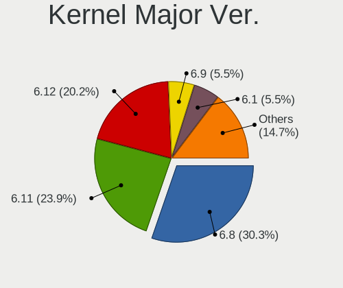
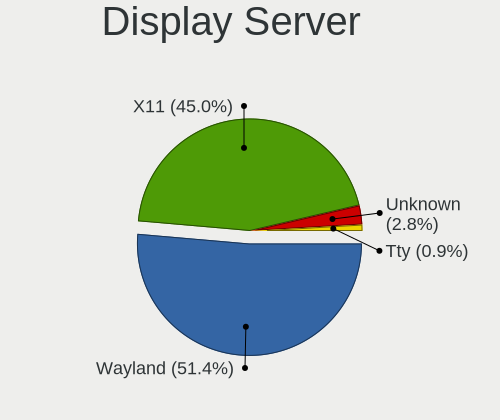
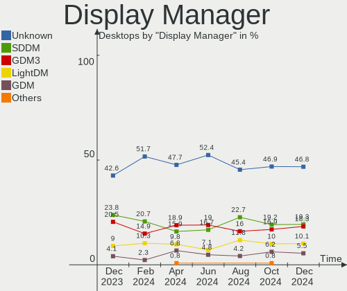
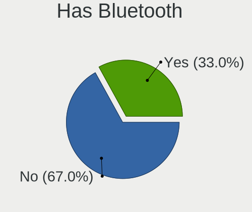
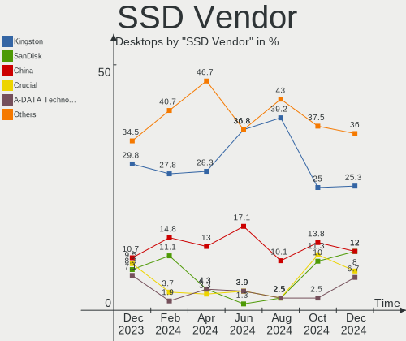
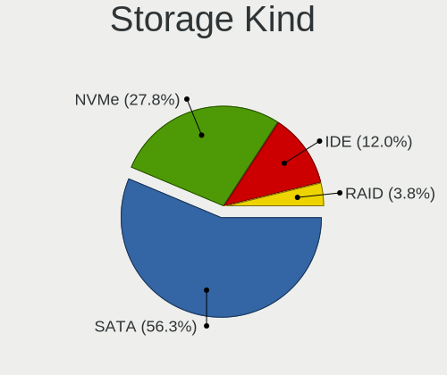
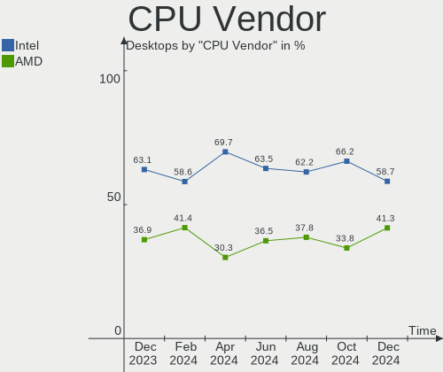
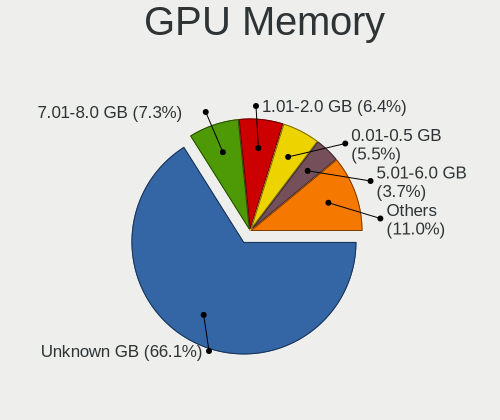
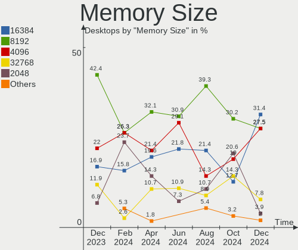
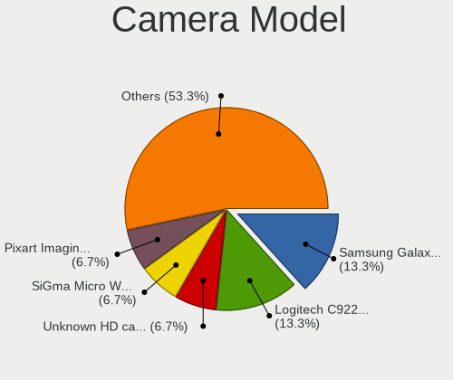

Linux in Brazil - Hardware Trends (Desktops)
--------------------------------------------

A project to identify most popular hardware characteristics and track their change
over time based on data collected by Linux users at https://Linux-Hardware.org.

Anyone can contribute to this report by the [hw-probe](https://github.com/linuxhw/hw-probe) tool:

    sudo -E hw-probe -all -upload

Period: Sep, 2022.

Contents
--------

* [ System ](#system)
  - [ OS                       ](#os)
  - [ OS Family                ](#os-family)
  - [ Kernel                   ](#kernel)
  - [ Kernel Family            ](#kernel-family)
  - [ Kernel Major Ver.        ](#kernel-major-ver)
  - [ Arch                     ](#arch)
  - [ DE                       ](#de)
  - [ Display Server           ](#display-server)
  - [ Display Manager          ](#display-manager)
  - [ OS Lang                  ](#os-lang)
  - [ Boot Mode                ](#boot-mode)
  - [ Filesystem               ](#filesystem)
  - [ Part. scheme             ](#part-scheme)
  - [ Dual Boot with Linux/BSD ](#dual-boot-with-linuxbsd)
  - [ Dual Boot (Win)          ](#dual-boot-win)

* [ Board ](#board)
  - [ Vendor                   ](#vendor)
  - [ Model                    ](#model)
  - [ Model Family             ](#model-family)
  - [ MFG Year                 ](#mfg-year)
  - [ Form Factor              ](#form-factor)
  - [ Secure Boot              ](#secure-boot)
  - [ Coreboot                 ](#coreboot)
  - [ RAM Size                 ](#ram-size)
  - [ RAM Used                 ](#ram-used)
  - [ Total Drives             ](#total-drives)
  - [ Has CD-ROM               ](#has-cd-rom)
  - [ Has Ethernet             ](#has-ethernet)
  - [ Has WiFi                 ](#has-wifi)
  - [ Has Bluetooth            ](#has-bluetooth)

* [ Location ](#location)
  - [ Country                  ](#country)
  - [ City                     ](#city)

* [ Drives ](#drives)
  - [ Drive Vendor             ](#drive-vendor)
  - [ Drive Model              ](#drive-model)
  - [ HDD Vendor               ](#hdd-vendor)
  - [ SSD Vendor               ](#ssd-vendor)
  - [ Drive Kind               ](#drive-kind)
  - [ Drive Connector          ](#drive-connector)
  - [ Drive Size               ](#drive-size)
  - [ Space Total              ](#space-total)
  - [ Space Used               ](#space-used)
  - [ Malfunc. Drives          ](#malfunc-drives)
  - [ Malfunc. Drive Vendor    ](#malfunc-drive-vendor)
  - [ Malfunc. HDD Vendor      ](#malfunc-hdd-vendor)
  - [ Malfunc. Drive Kind      ](#malfunc-drive-kind)
  - [ Failed Drives            ](#failed-drives)
  - [ Failed Drive Vendor      ](#failed-drive-vendor)
  - [ Drive Status             ](#drive-status)

* [ Storage controller ](#storage-controller)
  - [ Storage Vendor           ](#storage-vendor)
  - [ Storage Model            ](#storage-model)
  - [ Storage Kind             ](#storage-kind)

* [ Processor ](#processor)
  - [ CPU Vendor               ](#cpu-vendor)
  - [ CPU Model                ](#cpu-model)
  - [ CPU Model Family         ](#cpu-model-family)
  - [ CPU Cores                ](#cpu-cores)
  - [ CPU Sockets              ](#cpu-sockets)
  - [ CPU Threads              ](#cpu-threads)
  - [ CPU Op-Modes             ](#cpu-op-modes)
  - [ CPU Microcode            ](#cpu-microcode)
  - [ CPU Microarch            ](#cpu-microarch)

* [ Graphics ](#graphics)
  - [ GPU Vendor               ](#gpu-vendor)
  - [ GPU Model                ](#gpu-model)
  - [ GPU Combo                ](#gpu-combo)
  - [ GPU Driver               ](#gpu-driver)
  - [ GPU Memory               ](#gpu-memory)

* [ Monitor ](#monitor)
  - [ Monitor Vendor           ](#monitor-vendor)
  - [ Monitor Model            ](#monitor-model)
  - [ Monitor Resolution       ](#monitor-resolution)
  - [ Monitor Diagonal         ](#monitor-diagonal)
  - [ Monitor Width            ](#monitor-width)
  - [ Aspect Ratio             ](#aspect-ratio)
  - [ Monitor Area             ](#monitor-area)
  - [ Pixel Density            ](#pixel-density)
  - [ Multiple Monitors        ](#multiple-monitors)

* [ Network ](#network)
  - [ Net Controller Vendor    ](#net-controller-vendor)
  - [ Net Controller Model     ](#net-controller-model)
  - [ Wireless Vendor          ](#wireless-vendor)
  - [ Wireless Model           ](#wireless-model)
  - [ Ethernet Vendor          ](#ethernet-vendor)
  - [ Ethernet Model           ](#ethernet-model)
  - [ Net Controller Kind      ](#net-controller-kind)
  - [ Used Controller          ](#used-controller)
  - [ NICs                     ](#nics)
  - [ IPv6                     ](#ipv6)

* [ Bluetooth ](#bluetooth)
  - [ Bluetooth Vendor         ](#bluetooth-vendor)
  - [ Bluetooth Model          ](#bluetooth-model)

* [ Sound ](#sound)
  - [ Sound Vendor             ](#sound-vendor)
  - [ Sound Model              ](#sound-model)

* [ Memory ](#memory)
  - [ Memory Vendor            ](#memory-vendor)
  - [ Memory Model             ](#memory-model)
  - [ Memory Kind              ](#memory-kind)
  - [ Memory Form Factor       ](#memory-form-factor)
  - [ Memory Size              ](#memory-size)
  - [ Memory Speed             ](#memory-speed)

* [ Printers & scanners ](#printers--scanners)
  - [ Printer Vendor           ](#printer-vendor)
  - [ Printer Model            ](#printer-model)
  - [ Scanner Vendor           ](#scanner-vendor)
  - [ Scanner Model            ](#scanner-model)

* [ Camera ](#camera)
  - [ Camera Vendor            ](#camera-vendor)
  - [ Camera Model             ](#camera-model)

* [ Security ](#security)
  - [ Fingerprint Vendor       ](#fingerprint-vendor)
  - [ Fingerprint Model        ](#fingerprint-model)
  - [ Chipcard Vendor          ](#chipcard-vendor)
  - [ Chipcard Model           ](#chipcard-model)

* [ Unsupported ](#unsupported)
  - [ Unsupported Devices      ](#unsupported-devices)
  - [ Unsupported Device Types ](#unsupported-device-types)

System
------

OS
--

Installed operating systems

| Name                         | Desktops | Percent |
|------------------------------|----------|---------|
| Ubuntu 22.04                 | 17       | 15.6%   |
| OpenMandriva 4.3             | 9        | 8.26%   |
| Fedora 36                    | 9        | 8.26%   |
| Pop!_OS 22.04                | 7        | 6.42%   |
| Linux Mint 21                | 7        | 6.42%   |
| Zorin 16                     | 5        | 4.59%   |
| Ubuntu 20.04                 | 5        | 4.59%   |
| Arch                         | 5        | 4.59%   |
| Kubuntu 22.04                | 4        | 3.67%   |
| OpenMandriva 4.50            | 3        | 2.75%   |
| Manjaro                      | 3        | 2.75%   |
| Linux Mint 20.3              | 3        | 2.75%   |
| Fedora 37                    | 3        | 2.75%   |
| Debian 11                    | 3        | 2.75%   |
| OpenMandriva 4.2             | 2        | 1.83%   |
| LMDE 5                       | 2        | 1.83%   |
| Gentoo 2.8                   | 2        | 1.83%   |
| Endless 4.0.9                | 2        | 1.83%   |
| Arch Rolling                 | 2        | 1.83%   |
| Xubuntu 22.04                | 1        | 0.92%   |
| Ubuntu MATE 22.04            | 1        | 0.92%   |
| Ubuntu Budgie 22.04          | 1        | 0.92%   |
| openSUSE Tumbleweed-XXXXXXXX | 1        | 0.92%   |
| Nobara 36                    | 1        | 0.92%   |
| MX 21                        | 1        | 0.92%   |
| Manjaro 22.0.0               | 1        | 0.92%   |
| Linux Mint 20.2              | 1        | 0.92%   |
| Linux Mint 19.3              | 1        | 0.92%   |
| KDE neon 20.04               | 1        | 0.92%   |
| Garuda Linux Soaring         | 1        | 0.92%   |
| Garuda Linux                 | 1        | 0.92%   |
| Endless 4.0.8                | 1        | 0.92%   |
| Debian Testing               | 1        | 0.92%   |
| Debian 10                    | 1        | 0.92%   |
| BigLinux 22.09.09            | 1        | 0.92%   |

OS Family
---------

OS without a version

| Name          | Desktops | Percent |
|---------------|----------|---------|
| Ubuntu        | 22       | 20.18%  |
| OpenMandriva  | 14       | 12.84%  |
| Linux Mint    | 12       | 11.01%  |
| Fedora        | 12       | 11.01%  |
| Pop!_OS       | 7        | 6.42%   |
| Arch          | 7        | 6.42%   |
| Zorin         | 5        | 4.59%   |
| Debian        | 5        | 4.59%   |
| Manjaro       | 4        | 3.67%   |
| Kubuntu       | 4        | 3.67%   |
| Endless       | 3        | 2.75%   |
| LMDE          | 2        | 1.83%   |
| Gentoo        | 2        | 1.83%   |
| Garuda Linux  | 2        | 1.83%   |
| Xubuntu       | 1        | 0.92%   |
| Ubuntu MATE   | 1        | 0.92%   |
| Ubuntu Budgie | 1        | 0.92%   |
| openSUSE      | 1        | 0.92%   |
| Nobara        | 1        | 0.92%   |
| MX            | 1        | 0.92%   |
| KDE neon      | 1        | 0.92%   |
| BigLinux      | 1        | 0.92%   |

Kernel
------

Version of the Linux kernel

| Version                       | Desktops | Percent |
|-------------------------------|----------|---------|
| 5.15.0-47-generic             | 17       | 15.6%   |
| 5.15.0-48-generic             | 9        | 8.26%   |
| 5.16.7-desktop-1omv4003       | 7        | 6.42%   |
| 5.19.0-76051900-generic       | 6        | 5.5%    |
| 5.15.0-46-generic             | 6        | 5.5%    |
| 5.4.0-125-generic             | 3        | 2.75%   |
| 5.19.5-desktop-1omv4090       | 3        | 2.75%   |
| 5.19.11-200.fc36.x86_64       | 3        | 2.75%   |
| 5.15.60-1-MANJARO             | 3        | 2.75%   |
| 5.15.0-43-generic             | 3        | 2.75%   |
| 5.11.0-35-generic             | 3        | 2.75%   |
| 5.10.0-18-amd64               | 3        | 2.75%   |
| 5.4.0-124-generic             | 2        | 1.83%   |
| 5.19.9-zen1-1-zen             | 2        | 1.83%   |
| 5.19.9-arch1-1                | 2        | 1.83%   |
| 5.19.9-200.fc36.x86_64        | 2        | 1.83%   |
| 5.19.8-200.fc36.x86_64        | 2        | 1.83%   |
| 5.19.0-1-amd64                | 2        | 1.83%   |
| 5.16.13-desktop-1omv4003      | 2        | 1.83%   |
| 5.15.0-41-generic             | 2        | 1.83%   |
| 5.10.14-desktop-1omv4002      | 2        | 1.83%   |
| 5.8.0-59-generic              | 1        | 0.92%   |
| 5.4.212-300.fc36.x86_64       | 1        | 0.92%   |
| 5.4.0-72-generic              | 1        | 0.92%   |
| 5.4.0-110-generic             | 1        | 0.92%   |
| 5.19.9-300.fc37.x86_64        | 1        | 0.92%   |
| 5.19.8-xanmod1                | 1        | 0.92%   |
| 5.19.8-gentoo-clang-lto-prjc  | 1        | 0.92%   |
| 5.19.8-501.chinfo.fc37.x86_64 | 1        | 0.92%   |
| 5.19.8-1-default              | 1        | 0.92%   |
| 5.19.7-zen2-1-zen             | 1        | 0.92%   |
| 5.19.7-arch1-1                | 1        | 0.92%   |
| 5.19.6-1-MANJARO              | 1        | 0.92%   |
| 5.19.4-201.fsync.fc36.x86_64  | 1        | 0.92%   |
| 5.19.11-arch1-1               | 1        | 0.92%   |
| 5.19.10-arch1-1               | 1        | 0.92%   |
| 5.19.10-300.fc37.x86_64       | 1        | 0.92%   |
| 5.19.0-3-rt10-MANJARO         | 1        | 0.92%   |
| 5.17.5-300.fc36.x86_64        | 1        | 0.92%   |
| 5.17.15-76051715-generic      | 1        | 0.92%   |

Kernel Family
-------------

Linux kernel without a distro release

| Version | Desktops | Percent |
|---------|----------|---------|
| 5.15.0  | 39       | 35.78%  |
| 5.19.0  | 9        | 8.26%   |
| 5.4.0   | 7        | 6.42%   |
| 5.19.9  | 7        | 6.42%   |
| 5.16.7  | 7        | 6.42%   |
| 5.19.8  | 6        | 5.5%    |
| 5.10.0  | 5        | 4.59%   |
| 5.19.11 | 4        | 3.67%   |
| 5.19.5  | 3        | 2.75%   |
| 5.15.60 | 3        | 2.75%   |
| 5.11.0  | 3        | 2.75%   |
| 5.19.7  | 2        | 1.83%   |
| 5.19.10 | 2        | 1.83%   |
| 5.16.13 | 2        | 1.83%   |
| 5.10.14 | 2        | 1.83%   |
| 5.8.0   | 1        | 0.92%   |
| 5.4.212 | 1        | 0.92%   |
| 5.19.6  | 1        | 0.92%   |
| 5.19.4  | 1        | 0.92%   |
| 5.17.5  | 1        | 0.92%   |
| 5.17.15 | 1        | 0.92%   |
| 5.15.70 | 1        | 0.92%   |
| 4.19.0  | 1        | 0.92%   |

Kernel Major Ver.
-----------------

Linux kernel major version

| Version | Desktops | Percent |
|---------|----------|---------|
| 5.15    | 43       | 39.45%  |
| 5.19    | 35       | 32.11%  |
| 5.16    | 9        | 8.26%   |
| 5.4     | 8        | 7.34%   |
| 5.10    | 7        | 6.42%   |
| 5.11    | 3        | 2.75%   |
| 5.17    | 2        | 1.83%   |
| 5.8     | 1        | 0.92%   |
| 4.19    | 1        | 0.92%   |

Arch
----

OS architecture (x86_64, i586, etc.)

| Name   | Desktops | Percent |
|--------|----------|---------|
| x86_64 | 107      | 98.17%  |
| i686   | 2        | 1.83%   |

DE
--

Desktop Environment

| Name            | Desktops | Percent |
|-----------------|----------|---------|
| GNOME           | 54       | 49.54%  |
| KDE5            | 31       | 28.44%  |
| X-Cinnamon      | 8        | 7.34%   |
| XFCE            | 7        | 6.42%   |
| Cinnamon        | 3        | 2.75%   |
| Unknown         | 2        | 1.83%   |
| MATE            | 1        | 0.92%   |
| GNOME Flashback | 1        | 0.92%   |
| Enlightenment   | 1        | 0.92%   |
| Budgie          | 1        | 0.92%   |

Display Server
--------------

X11 or Wayland

| Name    | Desktops | Percent |
|---------|----------|---------|
| X11     | 81       | 74.31%  |
| Wayland | 25       | 22.94%  |
| Unknown | 2        | 1.83%   |
| Tty     | 1        | 0.92%   |

Display Manager
---------------

SDDM, LightDM, etc.

| Name    | Desktops | Percent |
|---------|----------|---------|
| Unknown | 47       | 43.12%  |
| SDDM    | 23       | 21.1%   |
| GDM3    | 18       | 16.51%  |
| LightDM | 12       | 11.01%  |
| GDM     | 9        | 8.26%   |

OS Lang
-------

Language

| Lang  | Desktops | Percent |
|-------|----------|---------|
| pt_BR | 83       | 76.15%  |
| en_US | 24       | 22.02%  |
| en_GB | 1        | 0.92%   |
| C     | 1        | 0.92%   |

Boot Mode
---------

EFI or BIOS

| Mode | Desktops | Percent |
|------|----------|---------|
| BIOS | 72       | 66.06%  |
| EFI  | 37       | 33.94%  |

Filesystem
----------

Type of filesystem

| Type    | Desktops | Percent |
|---------|----------|---------|
| Ext4    | 74       | 67.89%  |
| Btrfs   | 19       | 17.43%  |
| Overlay | 13       | 11.93%  |
| Xfs     | 1        | 0.92%   |
| F2fs    | 1        | 0.92%   |
| Ext3    | 1        | 0.92%   |

Part. scheme
------------

Scheme of partitioning

| Type    | Desktops | Percent |
|---------|----------|---------|
| Unknown | 66       | 60.55%  |
| GPT     | 33       | 30.28%  |
| MBR     | 10       | 9.17%   |

Dual Boot with Linux/BSD
------------------------

Hosting more than one Linux/BSD

| Dual boot | Desktops | Percent |
|-----------|----------|---------|
| No        | 83       | 76.15%  |
| Yes       | 26       | 23.85%  |

Dual Boot (Win)
---------------

Hosting Linux and Windows

| Dual boot | Desktops | Percent |
|-----------|----------|---------|
| No        | 78       | 71.56%  |
| Yes       | 31       | 28.44%  |

Board
-----

Vendor
------

Motherboard manufacturer

| Name                | Desktops | Percent |
|---------------------|----------|---------|
| ASUSTek Computer    | 30       | 27.52%  |
| Intel               | 17       | 15.6%   |
| Gigabyte Technology | 15       | 13.76%  |
| ASRock              | 9        | 8.26%   |
| Dell                | 8        | 7.34%   |
| MSI                 | 6        | 5.5%    |
| Positivo            | 4        | 3.67%   |
| PCWare              | 4        | 3.67%   |
| Unknown             | 4        | 3.67%   |
| Biostar             | 3        | 2.75%   |
| Foxconn             | 2        | 1.83%   |
| Supermicro          | 1        | 0.92%   |
| OEM                 | 1        | 0.92%   |
| MACHINIST           | 1        | 0.92%   |
| Lenovo              | 1        | 0.92%   |
| ECS                 | 1        | 0.92%   |
| Digiboard           | 1        | 0.92%   |
| AMI                 | 1        | 0.92%   |

Model
-----

Motherboard model

| Name                               | Desktops | Percent |
|------------------------------------|----------|---------|
| Intel H61                          | 5        | 4.59%   |
| Unknown                            | 5        | 4.59%   |
| ASUS TUF Gaming B550M-PLUS         | 3        | 2.75%   |
| ASUS All Series                    | 3        | 2.75%   |
| Positivo POS-PQ45AU                | 2        | 1.83%   |
| PCWare IPMH61R3                    | 2        | 1.83%   |
| Intel X99 V1.0                     | 2        | 1.83%   |
| ASUS M5A78L-M/USB3                 | 2        | 1.83%   |
| ASRock A320M-HD                    | 2        | 1.83%   |
| Supermicro SKAGIT09                | 1        | 0.92%   |
| Positivo POS-PIQ67CG               | 1        | 0.92%   |
| Positivo POS-EINM10CB              | 1        | 0.92%   |
| PCWare IPMH61R1                    | 1        | 0.92%   |
| PCWare IPMH110G                    | 1        | 0.92%   |
| OEM B75                            | 1        | 0.92%   |
| MSI MS-7B98                        | 1        | 0.92%   |
| MSI MS-7B23                        | 1        | 0.92%   |
| MSI MS-7A39                        | 1        | 0.92%   |
| MSI MS-7918                        | 1        | 0.92%   |
| MSI MS-7877                        | 1        | 0.92%   |
| MSI MS-7721                        | 1        | 0.92%   |
| MACHINIST X99-RS9 V3.0             | 1        | 0.92%   |
| Lenovo ThinkCentre M70s 11EWS1ET00 | 1        | 0.92%   |
| Intel X99                          | 1        | 0.92%   |
| Intel X79M-S                       | 1        | 0.92%   |
| Intel X79                          | 1        | 0.92%   |
| Intel H55                          | 1        | 0.92%   |
| Intel DX58SO AAE29331-702          | 1        | 0.92%   |
| Intel DP55WB AAE64798-206          | 1        | 0.92%   |
| Intel DN2800MT AAG23738-801        | 1        | 0.92%   |
| Intel D33217CK G76541-301          | 1        | 0.92%   |
| Intel B75                          | 1        | 0.92%   |
| Gigabyte Z690 UD AX DDR4           | 1        | 0.92%   |
| Gigabyte Z390 AORUS PRO WIFI       | 1        | 0.92%   |
| Gigabyte X570 AORUS PRO            | 1        | 0.92%   |
| Gigabyte H61M-S1                   | 1        | 0.92%   |
| Gigabyte H110M-S2V                 | 1        | 0.92%   |
| Gigabyte H110M-S2H DDR3            | 1        | 0.92%   |
| Gigabyte GA-VM900M                 | 1        | 0.92%   |
| Gigabyte F2A88X-D3H                | 1        | 0.92%   |

Model Family
------------

Motherboard model prefix

| Name                  | Desktops | Percent |
|-----------------------|----------|---------|
| ASUS TUF              | 8        | 7.34%   |
| Intel H61             | 5        | 4.59%   |
| Dell OptiPlex         | 5        | 4.59%   |
| Unknown               | 5        | 4.59%   |
| ASUS PRIME            | 4        | 3.67%   |
| Intel X99             | 3        | 2.75%   |
| ASUS M5A78L-M         | 3        | 2.75%   |
| ASUS All              | 3        | 2.75%   |
| Positivo POS-PQ45AU   | 2        | 1.83%   |
| PCWare IPMH61R3       | 2        | 1.83%   |
| Gigabyte B450M        | 2        | 1.83%   |
| ASUS ROG              | 2        | 1.83%   |
| ASRock FM2A55M-HD+    | 2        | 1.83%   |
| ASRock A320M-HD       | 2        | 1.83%   |
| Supermicro SKAGIT09   | 1        | 0.92%   |
| Positivo POS-PIQ67CG  | 1        | 0.92%   |
| Positivo POS-EINM10CB | 1        | 0.92%   |
| PCWare IPMH61R1       | 1        | 0.92%   |
| PCWare IPMH110G       | 1        | 0.92%   |
| OEM B75               | 1        | 0.92%   |
| MSI MS-7B98           | 1        | 0.92%   |
| MSI MS-7B23           | 1        | 0.92%   |
| MSI MS-7A39           | 1        | 0.92%   |
| MSI MS-7918           | 1        | 0.92%   |
| MSI MS-7877           | 1        | 0.92%   |
| MSI MS-7721           | 1        | 0.92%   |
| MACHINIST X99-RS9     | 1        | 0.92%   |
| Lenovo ThinkCentre    | 1        | 0.92%   |
| Intel X79M-S          | 1        | 0.92%   |
| Intel X79             | 1        | 0.92%   |
| Intel H55             | 1        | 0.92%   |
| Intel DX58SO          | 1        | 0.92%   |
| Intel DP55WB          | 1        | 0.92%   |
| Intel DN2800MT        | 1        | 0.92%   |
| Intel D33217CK        | 1        | 0.92%   |
| Intel B75             | 1        | 0.92%   |
| Gigabyte Z690         | 1        | 0.92%   |
| Gigabyte Z390         | 1        | 0.92%   |
| Gigabyte X570         | 1        | 0.92%   |
| Gigabyte H61M-S1      | 1        | 0.92%   |

MFG Year
--------

Motherboard manufacture year

| Year | Desktops | Percent |
|------|----------|---------|
| 2020 | 14       | 12.84%  |
| 2018 | 13       | 11.93%  |
| 2017 | 9        | 8.26%   |
| 2011 | 9        | 8.26%   |
| 2019 | 8        | 7.34%   |
| 2014 | 8        | 7.34%   |
| 2012 | 8        | 7.34%   |
| 2021 | 6        | 5.5%    |
| 2013 | 6        | 5.5%    |
| 2016 | 5        | 4.59%   |
| 2010 | 5        | 4.59%   |
| 2007 | 5        | 4.59%   |
| 2009 | 4        | 3.67%   |
| 2008 | 3        | 2.75%   |
| 2022 | 2        | 1.83%   |
| 2015 | 2        | 1.83%   |
| 2006 | 2        | 1.83%   |

Form Factor
-----------

Physical design of the computer

| Name    | Desktops | Percent |
|---------|----------|---------|
| Desktop | 109      | 100%    |

Secure Boot
-----------

Enabled or disabled

| State    | Desktops | Percent |
|----------|----------|---------|
| Disabled | 108      | 99.08%  |
| Enabled  | 1        | 0.92%   |

Coreboot
--------

Have coreboot on board

| Used | Desktops | Percent |
|------|----------|---------|
| No   | 109      | 100%    |

RAM Size
--------

Total RAM memory

| Size in GB  | Desktops | Percent |
|-------------|----------|---------|
| 16.01-24.0  | 30       | 27.52%  |
| 4.01-8.0    | 23       | 21.1%   |
| 8.01-16.0   | 18       | 16.51%  |
| 3.01-4.0    | 17       | 15.6%   |
| 32.01-64.0  | 11       | 10.09%  |
| 64.01-256.0 | 4        | 3.67%   |
| 2.01-3.0    | 3        | 2.75%   |
| 1.01-2.0    | 3        | 2.75%   |

RAM Used
--------

Used RAM memory

| Used GB    | Desktops | Percent |
|------------|----------|---------|
| 1.01-2.0   | 42       | 38.53%  |
| 2.01-3.0   | 26       | 23.85%  |
| 4.01-8.0   | 14       | 12.84%  |
| 3.01-4.0   | 14       | 12.84%  |
| 0.51-1.0   | 7        | 6.42%   |
| 8.01-16.0  | 3        | 2.75%   |
| 16.01-24.0 | 2        | 1.83%   |
| 0.01-0.5   | 1        | 0.92%   |

Total Drives
------------

Number of drives on board

| Drives | Desktops | Percent |
|--------|----------|---------|
| 1      | 45       | 41.28%  |
| 2      | 32       | 29.36%  |
| 3      | 19       | 17.43%  |
| 4      | 7        | 6.42%   |
| 5      | 3        | 2.75%   |
| 6      | 2        | 1.83%   |
| 0      | 1        | 0.92%   |

Has CD-ROM
----------

Has CD-ROM on board

| Presented | Desktops | Percent |
|-----------|----------|---------|
| No        | 72       | 66.06%  |
| Yes       | 37       | 33.94%  |

Has Ethernet
------------

Has Ethernet on board

| Presented | Desktops | Percent |
|-----------|----------|---------|
| Yes       | 107      | 98.17%  |
| No        | 2        | 1.83%   |

Has WiFi
--------

Has WiFi module

| Presented | Desktops | Percent |
|-----------|----------|---------|
| No        | 66       | 60.55%  |
| Yes       | 43       | 39.45%  |

Has Bluetooth
-------------

Has Bluetooth module

| Presented | Desktops | Percent |
|-----------|----------|---------|
| No        | 82       | 75.23%  |
| Yes       | 27       | 24.77%  |

Location
--------

Country
-------

Geographic location (country)

| Country | Desktops | Percent |
|---------|----------|---------|
| Brazil  | 109      | 100%    |

City
----

Geographic location (city)

| City                   | Desktops | Percent |
|------------------------|----------|---------|
| Sao Paulo              | 12       | 11.01%  |
| Rio de Janeiro         | 11       | 10.09%  |
| Brasília              | 5        | 4.59%   |
| Belo Horizonte         | 3        | 2.75%   |
| Sao José dos Campos   | 2        | 1.83%   |
| Salvador               | 2        | 1.83%   |
| Pouso Alegre           | 2        | 1.83%   |
| Porto Alegre           | 2        | 1.83%   |
| Niterói               | 2        | 1.83%   |
| Joinville              | 2        | 1.83%   |
| Goiânia               | 2        | 1.83%   |
| Campo Grande           | 2        | 1.83%   |
| Braganca Paulista      | 2        | 1.83%   |
| Belém                 | 2        | 1.83%   |
| Volta Redonda          | 1        | 0.92%   |
| Vitória               | 1        | 0.92%   |
| Valparaiso de Goias    | 1        | 0.92%   |
| Uberlândia            | 1        | 0.92%   |
| Uberaba                | 1        | 0.92%   |
| Trindade               | 1        | 0.92%   |
| Tocantins              | 1        | 0.92%   |
| Taubate                | 1        | 0.92%   |
| Taboao da Serra        | 1        | 0.92%   |
| Sirinhaem              | 1        | 0.92%   |
| Sao Paulo do Potengi   | 1        | 0.92%   |
| Sao Leopoldo           | 1        | 0.92%   |
| Sao Jose               | 1        | 0.92%   |
| Santo Antonio de Padua | 1        | 0.92%   |
| Santo André           | 1        | 0.92%   |
| Santa Teresinha        | 1        | 0.92%   |
| Santa Lucia            | 1        | 0.92%   |
| Russas                 | 1        | 0.92%   |
| Rolante                | 1        | 0.92%   |
| Ribeirao Preto         | 1        | 0.92%   |
| Recife                 | 1        | 0.92%   |
| Praia Grande           | 1        | 0.92%   |
| Poços de Caldas       | 1        | 0.92%   |
| Piquete                | 1        | 0.92%   |
| Pindamonhangaba        | 1        | 0.92%   |
| Pelotas                | 1        | 0.92%   |

Drives
------

Drive Vendor
------------

Hard drive vendors

| Vendor                      | Desktops | Drives | Percent |
|-----------------------------|----------|--------|---------|
| Seagate                     | 37       | 47     | 18.78%  |
| WDC                         | 35       | 39     | 17.77%  |
| Samsung Electronics         | 22       | 28     | 11.17%  |
| Kingston                    | 17       | 17     | 8.63%   |
| Toshiba                     | 8        | 8      | 4.06%   |
| Silicon Motion              | 8        | 8      | 4.06%   |
| SanDisk                     | 8        | 8      | 4.06%   |
| Crucial                     | 8        | 8      | 4.06%   |
| China                       | 8        | 8      | 4.06%   |
| Hitachi                     | 4        | 4      | 2.03%   |
| Netac                       | 3        | 3      | 1.52%   |
| KingSpec                    | 3        | 3      | 1.52%   |
| Intel                       | 3        | 3      | 1.52%   |
| HGST                        | 3        | 3      | 1.52%   |
| A-DATA Technology           | 3        | 3      | 1.52%   |
| XPG                         | 2        | 2      | 1.02%   |
| WALRAM                      | 2        | 2      | 1.02%   |
| SK hynix                    | 2        | 2      | 1.02%   |
| Realtek Semiconductor       | 2        | 2      | 1.02%   |
| Phison Electronics          | 2        | 2      | 1.02%   |
| AFOX                        | 2        | 2      | 1.02%   |
| XrayDisk                    | 1        | 1      | 0.51%   |
| Unknown                     | 1        | 1      | 0.51%   |
| TANCA                       | 1        | 1      | 0.51%   |
| T-FORCE                     | 1        | 1      | 0.51%   |
| SuperSSpeed                 | 1        | 1      | 0.51%   |
| RCESSD                      | 1        | 1      | 0.51%   |
| Maxtor                      | 1        | 1      | 0.51%   |
| MAXIO Technology (Hangzhou) | 1        | 1      | 0.51%   |
| Lexar                       | 1        | 1      | 0.51%   |
| KODAK                       | 1        | 1      | 0.51%   |
| KINGBANK                    | 1        | 1      | 0.51%   |
| JMicron Technology          | 1        | 1      | 0.51%   |
| HS-SSD-C100                 | 1        | 1      | 0.51%   |
| Corsair                     | 1        | 1      | 0.51%   |
| Acer                        | 1        | 1      | 0.51%   |

Drive Model
-----------

Hard drive models

| Model                                                | Desktops | Percent |
|------------------------------------------------------|----------|---------|
| Seagate ST500DM002-1BD142 500GB                      | 6        | 2.8%    |
| Seagate ST1000DM010-2EP102 1TB                       | 6        | 2.8%    |
| Samsung HD161HJ 160GB                                | 5        | 2.34%   |
| Kingston SA400S37480G 480GB SSD                      | 5        | 2.34%   |
| Kingston SA400S37240G 240GB SSD                      | 4        | 1.87%   |
| Crucial CT240BX500SSD1 240GB                         | 4        | 1.87%   |
| WDC WD10EZEX-00WN4A0 1TB                             | 3        | 1.4%    |
| Seagate ST3500312CS 500GB                            | 3        | 1.4%    |
| Samsung HD502HJ 500GB                                | 3        | 1.4%    |
| Samsung HD322HJ 320GB                                | 3        | 1.4%    |
| Kingston SA400S37120G 120GB SSD                      | 3        | 1.4%    |
| KingSpec P4-240 240GB SSD                            | 3        | 1.4%    |
| HGST HTS545050A7E680 500GB                           | 3        | 1.4%    |
| XPG GAMMIX S5 512GB                                  | 2        | 0.93%   |
| WDC WDS240G2G0A-00JH30 240GB SSD                     | 2        | 0.93%   |
| WDC WD5000AAKX-003CA0 500GB                          | 2        | 0.93%   |
| WDC WD10SPZX-24Z10T0 1TB                             | 2        | 0.93%   |
| WDC WD10EURX-63FH1Y0 1TB                             | 2        | 0.93%   |
| Toshiba MQ01ABF050 500GB                             | 2        | 0.93%   |
| Silicon Motion SM2262/SM2262EN SSD Controller 1024GB | 2        | 0.93%   |
| Seagate ST3250318AS 250GB                            | 2        | 0.93%   |
| Seagate ST3000DM001-1ER166 3TB                       | 2        | 0.93%   |
| Seagate ST1000LM024 HN-M101MBB 1TB                   | 2        | 0.93%   |
| SanDisk SDSSDA120G 120GB                             | 2        | 0.93%   |
| Samsung M3 Portable 500GB                            | 2        | 0.93%   |
| Samsung HD161GJ 160GB                                | 2        | 0.93%   |
| Samsung HD103SI 1TB                                  | 2        | 0.93%   |
| Phison E16 PCIe4 NVMe Controller 1TB                 | 2        | 0.93%   |
| Kingston SV300S37A120G 120GB SSD                     | 2        | 0.93%   |
| China SSD 256GB                                      | 2        | 0.93%   |
| China SSD 240GB                                      | 2        | 0.93%   |
| XrayDisk 240GB                                       | 1        | 0.47%   |
| WDC WDS250G2B0C-00PXH0 250GB                         | 1        | 0.47%   |
| WDC WDS240G1G0A-00SS50 240GB SSD                     | 1        | 0.47%   |
| WDC WDS100T3X0C-00SJG0 1TB                           | 1        | 0.47%   |
| WDC WD5000LPVX-00V0TT0 500GB                         | 1        | 0.47%   |
| WDC WD5000BPVT-22HXZT3 500GB                         | 1        | 0.47%   |
| WDC WD5000AVVS-63H0B1 500GB                          | 1        | 0.47%   |
| WDC WD5000AVDS-63U7B1 500GB                          | 1        | 0.47%   |
| WDC WD5000AUDX-61WNHY0 500GB                         | 1        | 0.47%   |

HDD Vendor
----------

Hard disk drive vendors

| Vendor              | Desktops | Drives | Percent |
|---------------------|----------|--------|---------|
| Seagate             | 36       | 46     | 35.29%  |
| WDC                 | 31       | 34     | 30.39%  |
| Samsung Electronics | 19       | 25     | 18.63%  |
| Toshiba             | 8        | 8      | 7.84%   |
| Hitachi             | 4        | 4      | 3.92%   |
| HGST                | 3        | 3      | 2.94%   |
| Maxtor              | 1        | 1      | 0.98%   |

SSD Vendor
----------

Solid state drive vendors

| Vendor            | Desktops | Drives | Percent |
|-------------------|----------|--------|---------|
| Kingston          | 16       | 16     | 26.23%  |
| Crucial           | 8        | 8      | 13.11%  |
| China             | 8        | 8      | 13.11%  |
| SanDisk           | 5        | 5      | 8.2%    |
| WDC               | 3        | 3      | 4.92%   |
| KingSpec          | 3        | 3      | 4.92%   |
| Intel             | 3        | 3      | 4.92%   |
| AFOX              | 2        | 2      | 3.28%   |
| A-DATA Technology | 2        | 2      | 3.28%   |
| WALRAM            | 1        | 1      | 1.64%   |
| TANCA             | 1        | 1      | 1.64%   |
| SuperSSpeed       | 1        | 1      | 1.64%   |
| Seagate           | 1        | 1      | 1.64%   |
| Netac             | 1        | 1      | 1.64%   |
| Lexar             | 1        | 1      | 1.64%   |
| KODAK             | 1        | 1      | 1.64%   |
| KINGBANK          | 1        | 1      | 1.64%   |
| HS-SSD-C100       | 1        | 1      | 1.64%   |
| Corsair           | 1        | 1      | 1.64%   |
| Acer              | 1        | 1      | 1.64%   |

Drive Kind
----------

HDD or SSD

| Kind    | Desktops | Drives | Percent |
|---------|----------|--------|---------|
| HDD     | 81       | 121    | 49.69%  |
| SSD     | 51       | 61     | 31.29%  |
| NVMe    | 27       | 31     | 16.56%  |
| Unknown | 3        | 3      | 1.84%   |
| MMC     | 1        | 1      | 0.61%   |

Drive Connector
---------------

SATA, SAS, NVMe, etc.

| Type | Desktops | Drives | Percent |
|------|----------|--------|---------|
| SATA | 99       | 181    | 75.57%  |
| NVMe | 26       | 30     | 19.85%  |
| SAS  | 5        | 5      | 3.82%   |
| MMC  | 1        | 1      | 0.76%   |

Drive Size
----------

Size of hard drive

| Size in TB | Desktops | Drives | Percent |
|------------|----------|--------|---------|
| 0.01-0.5   | 79       | 123    | 60.77%  |
| 0.51-1.0   | 38       | 45     | 29.23%  |
| 1.01-2.0   | 6        | 6      | 4.62%   |
| 2.01-3.0   | 4        | 4      | 3.08%   |
| 3.01-4.0   | 3        | 4      | 2.31%   |

Space Total
-----------

Amount of disk space available on the file system

| Size in GB     | Desktops | Percent |
|----------------|----------|---------|
| 101-250        | 26       | 23.85%  |
| 251-500        | 24       | 22.02%  |
| 1001-2000      | 15       | 13.76%  |
| 501-1000       | 12       | 11.01%  |
| 1-20           | 9        | 8.26%   |
| 2001-3000      | 7        | 6.42%   |
| More than 3000 | 5        | 4.59%   |
| 21-50          | 5        | 4.59%   |
| 51-100         | 4        | 3.67%   |
| Unknown        | 2        | 1.83%   |

Space Used
----------

Amount of used disk space

| Used GB        | Desktops | Percent |
|----------------|----------|---------|
| 1-20           | 37       | 33.94%  |
| 101-250        | 17       | 15.6%   |
| 21-50          | 13       | 11.93%  |
| 501-1000       | 13       | 11.93%  |
| 51-100         | 10       | 9.17%   |
| 251-500        | 8        | 7.34%   |
| 1001-2000      | 5        | 4.59%   |
| More than 3000 | 2        | 1.83%   |
| 2001-3000      | 2        | 1.83%   |
| Unknown        | 2        | 1.83%   |

Malfunc. Drives
---------------

Drive models with a malfunction

| Model                               | Desktops | Drives | Percent |
|-------------------------------------|----------|--------|---------|
| WDC WD5000AAKX-003CA0 500GB         | 2        | 2      | 6.9%    |
| WDC WD10EURX-63FH1Y0 1TB            | 2        | 2      | 6.9%    |
| Seagate ST500DM002-1BD142 500GB     | 2        | 2      | 6.9%    |
| WDC WD5000AAKX-00U6AA0 500GB        | 1        | 1      | 3.45%   |
| WDC WD3200AAJS-65M0A0 320GB         | 1        | 1      | 3.45%   |
| WDC WD3200AAJS-00L7A0 320GB         | 1        | 1      | 3.45%   |
| WDC WD30PURX-64P6ZY0 3TB            | 1        | 1      | 3.45%   |
| WDC WD1600AAJS-75B4A0 160GB         | 1        | 1      | 3.45%   |
| WDC WD10SPZX-24Z10T0 1TB            | 1        | 1      | 3.45%   |
| WDC WD10EZEX-75WN4A1 1TB            | 1        | 1      | 3.45%   |
| WDC WD10EARS-00Y5B1 1TB             | 1        | 1      | 3.45%   |
| Seagate ST500LM012 HN-M500MBB 500GB | 1        | 1      | 3.45%   |
| Seagate ST380811AS 80GB             | 1        | 1      | 3.45%   |
| Seagate ST3500418AS 500GB           | 1        | 1      | 3.45%   |
| Seagate ST3500312CS 500GB           | 1        | 1      | 3.45%   |
| Seagate ST3000DM001-1ER166 3TB      | 1        | 1      | 3.45%   |
| Seagate ST2000NP0011 2TB            | 1        | 1      | 3.45%   |
| Samsung Electronics HM321HI 320GB   | 1        | 1      | 3.45%   |
| Samsung Electronics HD322HJ 320GB   | 1        | 1      | 3.45%   |
| Samsung Electronics HD161HJ 160GB   | 1        | 1      | 3.45%   |
| Hitachi HTS723232A7A364 320GB       | 1        | 1      | 3.45%   |
| Hitachi HDS5C1010CLA382 1TB         | 1        | 1      | 3.45%   |
| HGST HTS545050A7E680 500GB          | 1        | 1      | 3.45%   |
| Crucial CT1024MX200SSD1 1TB         | 1        | 1      | 3.45%   |
| China SSD 360GB                     | 1        | 1      | 3.45%   |
| China SATA SSD 240GB                | 1        | 1      | 3.45%   |

Malfunc. Drive Vendor
---------------------

Vendors of faulty drives

| Vendor              | Desktops | Drives | Percent |
|---------------------|----------|--------|---------|
| WDC                 | 11       | 12     | 42.31%  |
| Seagate             | 7        | 8      | 26.92%  |
| Samsung Electronics | 2        | 3      | 7.69%   |
| Hitachi             | 2        | 2      | 7.69%   |
| China               | 2        | 2      | 7.69%   |
| HGST                | 1        | 1      | 3.85%   |
| Crucial             | 1        | 1      | 3.85%   |

Malfunc. HDD Vendor
-------------------

Vendors of faulty HDD drives

| Vendor              | Desktops | Drives | Percent |
|---------------------|----------|--------|---------|
| WDC                 | 11       | 12     | 47.83%  |
| Seagate             | 7        | 8      | 30.43%  |
| Samsung Electronics | 2        | 3      | 8.7%    |
| Hitachi             | 2        | 2      | 8.7%    |
| HGST                | 1        | 1      | 4.35%   |

Malfunc. Drive Kind
-------------------

Kinds of faulty drives

| Kind | Desktops | Drives | Percent |
|------|----------|--------|---------|
| HDD  | 18       | 26     | 85.71%  |
| SSD  | 3        | 3      | 14.29%  |

Failed Drives
-------------

Failed drive models

Zero info for selected period =(

Failed Drive Vendor
-------------------

Failed drive vendors

Zero info for selected period =(

Drive Status
------------

Number of failed and malfunc. drives

| Status   | Desktops | Drives | Percent |
|----------|----------|--------|---------|
| Detected | 66       | 125    | 54.55%  |
| Works    | 35       | 63     | 28.93%  |
| Malfunc  | 20       | 29     | 16.53%  |

Storage controller
------------------

Storage Vendor
--------------

Storage controller vendors

| Vendor                      | Desktops | Percent |
|-----------------------------|----------|---------|
| Intel                       | 65       | 46.1%   |
| AMD                         | 37       | 26.24%  |
| Silicon Motion              | 8        | 5.67%   |
| Realtek Semiconductor       | 6        | 4.26%   |
| SanDisk                     | 5        | 3.55%   |
| Samsung Electronics         | 3        | 2.13%   |
| Phison Electronics          | 3        | 2.13%   |
| Nvidia                      | 3        | 2.13%   |
| SK hynix                    | 2        | 1.42%   |
| ASMedia Technology          | 2        | 1.42%   |
| VIA Technologies            | 1        | 0.71%   |
| ULi Electronics             | 1        | 0.71%   |
| MAXIO Technology (Hangzhou) | 1        | 0.71%   |
| Marvell Technology Group    | 1        | 0.71%   |
| LSI Logic / Symbios Logic   | 1        | 0.71%   |
| Kingston Technology Company | 1        | 0.71%   |
| ADATA Technology            | 1        | 0.71%   |

Storage Model
-------------

Storage controller models

| Model                                                                                   | Desktops | Percent |
|-----------------------------------------------------------------------------------------|----------|---------|
| AMD FCH SATA Controller [AHCI mode]                                                     | 23       | 12.3%   |
| Intel 6 Series/C200 Series Chipset Family 6 port Desktop SATA AHCI Controller           | 10       | 5.35%   |
| AMD 400 Series Chipset SATA Controller                                                  | 7        | 3.74%   |
| Intel NM10/ICH7 Family SATA Controller [IDE mode]                                       | 6        | 3.21%   |
| Intel 82801G (ICH7 Family) IDE Controller                                               | 6        | 3.21%   |
| Intel 6 Series/C200 Series Chipset Family Desktop SATA Controller (IDE mode, ports 4-5) | 6        | 3.21%   |
| Intel 6 Series/C200 Series Chipset Family Desktop SATA Controller (IDE mode, ports 0-3) | 6        | 3.21%   |
| Realtek Realtek Non-Volatile memory controller                                          | 5        | 2.67%   |
| Intel 8 Series/C220 Series Chipset Family 6-port SATA Controller 1 [AHCI mode]          | 5        | 2.67%   |
| AMD SB7x0/SB8x0/SB9x0 SATA Controller [IDE mode]                                        | 5        | 2.67%   |
| AMD SB7x0/SB8x0/SB9x0 IDE Controller                                                    | 5        | 2.67%   |
| AMD FCH SATA Controller D                                                               | 5        | 2.67%   |
| Silicon Motion SM2263EN/SM2263XT SSD Controller                                         | 4        | 2.14%   |
| Silicon Motion SM2262/SM2262EN SSD Controller                                           | 4        | 2.14%   |
| AMD 500 Series Chipset SATA Controller                                                  | 4        | 2.14%   |
| Phison E16 PCIe4 NVMe Controller                                                        | 3        | 1.6%    |
| Intel Q170/Q150/B150/H170/H110/Z170/CM236 Chipset SATA Controller [AHCI Mode]           | 3        | 1.6%    |
| Intel NM10/ICH7 Family SATA Controller [AHCI mode]                                      | 3        | 1.6%    |
| Intel Comet Lake SATA AHCI Controller                                                   | 3        | 1.6%    |
| Intel Cannon Lake PCH SATA AHCI Controller                                              | 3        | 1.6%    |
| AMD FCH IDE Controller                                                                  | 3        | 1.6%    |
| SK hynix BC511                                                                          | 2        | 1.07%   |
| SanDisk WD Blue SN550 NVMe SSD                                                          | 2        | 1.07%   |
| SanDisk WD Black SN750 / PC SN730 NVMe SSD                                              | 2        | 1.07%   |
| Samsung NVMe SSD Controller SM981/PM981/PM983                                           | 2        | 1.07%   |
| Nvidia MCP61 SATA Controller                                                            | 2        | 1.07%   |
| Intel Atom Processor E3800 Series SATA AHCI Controller                                  | 2        | 1.07%   |
| Intel 9 Series Chipset Family SATA Controller [AHCI Mode]                               | 2        | 1.07%   |
| Intel 82801JD/DO (ICH10 Family) 4-port SATA IDE Controller                              | 2        | 1.07%   |
| Intel 82801JD/DO (ICH10 Family) 2-port SATA IDE Controller                              | 2        | 1.07%   |
| Intel 7 Series/C210 Series Chipset Family 6-port SATA Controller [AHCI mode]            | 2        | 1.07%   |
| Intel 7 Series/C210 Series Chipset Family 4-port SATA Controller [IDE mode]             | 2        | 1.07%   |
| Intel 7 Series/C210 Series Chipset Family 2-port SATA Controller [IDE mode]             | 2        | 1.07%   |
| Intel 7 Series Chipset Family 6-port SATA Controller [AHCI mode]                        | 2        | 1.07%   |
| Intel 500 Series Chipset Family SATA AHCI Controller                                    | 2        | 1.07%   |
| Intel 5 Series/3400 Series Chipset 4 port SATA IDE Controller                           | 2        | 1.07%   |
| Intel 5 Series/3400 Series Chipset 2 port SATA IDE Controller                           | 2        | 1.07%   |
| ASMedia ASM1062 Serial ATA Controller                                                   | 2        | 1.07%   |
| AMD SB7x0/SB8x0/SB9x0 SATA Controller [AHCI mode]                                       | 2        | 1.07%   |
| AMD 300 Series Chipset SATA Controller                                                  | 2        | 1.07%   |

Storage Kind
------------

Kind of storage controller (IDE, SATA, NVMe, SAS, ...)

| Kind | Desktops | Percent |
|------|----------|---------|
| SATA | 84       | 57.93%  |
| IDE  | 34       | 23.45%  |
| NVMe | 26       | 17.93%  |
| RAID | 1        | 0.69%   |

Processor
---------

CPU Vendor
----------

Processor vendors

| Vendor | Desktops | Percent |
|--------|----------|---------|
| Intel  | 70       | 64.22%  |
| AMD    | 39       | 35.78%  |

CPU Model
---------

Processor models

| Model                                       | Desktops | Percent |
|---------------------------------------------|----------|---------|
| Intel Pentium CPU G630 @ 2.70GHz            | 3        | 2.75%   |
| Intel Core i5 CPU 650 @ 3.20GHz             | 3        | 2.75%   |
| Intel Core 2 Duo CPU E8400 @ 3.00GHz        | 3        | 2.75%   |
| Intel Xeon CPU E5-2660 v3 @ 2.60GHz         | 2        | 1.83%   |
| Intel Core i7-3770 CPU @ 3.40GHz            | 2        | 1.83%   |
| Intel Core i7-2600 CPU @ 3.40GHz            | 2        | 1.83%   |
| Intel Core i5-7400 CPU @ 3.00GHz            | 2        | 1.83%   |
| Intel Core i5-2400 CPU @ 3.10GHz            | 2        | 1.83%   |
| Intel Core i3-4130 CPU @ 3.40GHz            | 2        | 1.83%   |
| Intel Core i3-3240 CPU @ 3.40GHz            | 2        | 1.83%   |
| Intel Core i3-2100 CPU @ 3.10GHz            | 2        | 1.83%   |
| Intel Celeron CPU J1800 @ 2.41GHz           | 2        | 1.83%   |
| AMD Ryzen 7 2700 Eight-Core Processor       | 2        | 1.83%   |
| AMD Ryzen 5 5600G with Radeon Graphics      | 2        | 1.83%   |
| AMD Ryzen 5 3600X 6-Core Processor          | 2        | 1.83%   |
| AMD FX-8350 Eight-Core Processor            | 2        | 1.83%   |
| AMD FX-8300 Eight-Core Processor            | 2        | 1.83%   |
| Intel Xeon CPU X5570 @ 2.93GHz              | 1        | 0.92%   |
| Intel Xeon CPU E5-2673 v3 @ 2.40GHz         | 1        | 0.92%   |
| Intel Xeon CPU E5-2650L v2 @ 1.70GHz        | 1        | 0.92%   |
| Intel Xeon CPU E5-2650 v2 @ 2.60GHz         | 1        | 0.92%   |
| Intel Xeon CPU E5-2640 v3 @ 2.60GHz         | 1        | 0.92%   |
| Intel Xeon CPU E5-2620 v3 @ 2.40GHz         | 1        | 0.92%   |
| Intel Pentium Gold G5420 CPU @ 3.80GHz      | 1        | 0.92%   |
| Intel Pentium Dual-Core CPU E5700 @ 3.00GHz | 1        | 0.92%   |
| Intel Pentium Dual CPU E2180 @ 2.00GHz      | 1        | 0.92%   |
| Intel Pentium 4 CPU 3.06GHz                 | 1        | 0.92%   |
| Intel Core i9-10850K CPU @ 3.60GHz          | 1        | 0.92%   |
| Intel Core i7-9700K CPU @ 3.60GHz           | 1        | 0.92%   |
| Intel Core i7-8700K CPU @ 3.70GHz           | 1        | 0.92%   |
| Intel Core i7-7700 CPU @ 3.60GHz            | 1        | 0.92%   |
| Intel Core i7-4771 CPU @ 3.50GHz            | 1        | 0.92%   |
| Intel Core i7-10700 CPU @ 2.90GHz           | 1        | 0.92%   |
| Intel Core i7 CPU 920 @ 2.67GHz             | 1        | 0.92%   |
| Intel Core i7 CPU 860 @ 2.80GHz             | 1        | 0.92%   |
| Intel Core i5-3570 CPU @ 3.40GHz            | 1        | 0.92%   |
| Intel Core i5-3470 CPU @ 3.20GHz            | 1        | 0.92%   |
| Intel Core i5-3330 CPU @ 3.00GHz            | 1        | 0.92%   |
| Intel Core i5-2500S CPU @ 2.70GHz           | 1        | 0.92%   |
| Intel Core i5-10600K CPU @ 4.10GHz          | 1        | 0.92%   |

CPU Model Family
----------------

Processor model prefix

| Model                   | Desktops | Percent |
|-------------------------|----------|---------|
| Intel Core i5           | 13       | 11.93%  |
| Intel Core i3           | 12       | 11.01%  |
| Intel Core i7           | 11       | 10.09%  |
| AMD Ryzen 5             | 10       | 9.17%   |
| Intel Xeon              | 8        | 7.34%   |
| AMD Ryzen 7             | 6        | 5.5%    |
| Intel Core 2 Duo        | 5        | 4.59%   |
| Intel Celeron           | 5        | 4.59%   |
| AMD FX                  | 5        | 4.59%   |
| AMD A10                 | 4        | 3.67%   |
| Intel Pentium           | 3        | 2.75%   |
| Intel Atom              | 3        | 2.75%   |
| Other                   | 2        | 1.83%   |
| Intel Core 2 Quad       | 2        | 1.83%   |
| AMD Ryzen 9             | 2        | 1.83%   |
| AMD Phenom II X6        | 2        | 1.83%   |
| AMD A6                  | 2        | 1.83%   |
| Intel Pentium Gold      | 1        | 0.92%   |
| Intel Pentium Dual-Core | 1        | 0.92%   |
| Intel Pentium Dual      | 1        | 0.92%   |
| Intel Pentium 4         | 1        | 0.92%   |
| Intel Core i9           | 1        | 0.92%   |
| Intel Core 2            | 1        | 0.92%   |
| AMD Ryzen 5 PRO         | 1        | 0.92%   |
| AMD Ryzen 3             | 1        | 0.92%   |
| AMD Phenom              | 1        | 0.92%   |
| AMD Opteron             | 1        | 0.92%   |
| AMD Athlon X4           | 1        | 0.92%   |
| AMD Athlon II X4        | 1        | 0.92%   |
| AMD Athlon              | 1        | 0.92%   |
| AMD A8                  | 1        | 0.92%   |

CPU Cores
---------

Number of processor cores

| Number | Desktops | Percent |
|--------|----------|---------|
| 2      | 39       | 35.78%  |
| 4      | 29       | 26.61%  |
| 6      | 16       | 14.68%  |
| 8      | 10       | 9.17%   |
| 10     | 4        | 3.67%   |
| 1      | 4        | 3.67%   |
| 3      | 3        | 2.75%   |
| 16     | 2        | 1.83%   |
| 12     | 2        | 1.83%   |

CPU Sockets
-----------

Number of sockets

| Number | Desktops | Percent |
|--------|----------|---------|
| 1      | 109      | 100%    |

CPU Threads
-----------

Threads per core (Hyper-Threading)

| Number | Desktops | Percent |
|--------|----------|---------|
| 2      | 76       | 69.72%  |
| 1      | 33       | 30.28%  |

CPU Op-Modes
------------

CPU Operation Modes (32-bit, 64-bit)

| Op mode        | Desktops | Percent |
|----------------|----------|---------|
| 32-bit, 64-bit | 109      | 100%    |

CPU Microcode
-------------

Microcode number

| Number     | Desktops | Percent |
|------------|----------|---------|
| Unknown    | 39       | 35.78%  |
| 0x206a7    | 11       | 10.09%  |
| 0x306a9    | 7        | 6.42%   |
| 0x08701021 | 5        | 4.59%   |
| 0x6fd      | 3        | 2.75%   |
| 0x306f2    | 3        | 2.75%   |
| 0x306c3    | 3        | 2.75%   |
| 0x1067a    | 3        | 2.75%   |
| 0x0800820d | 3        | 2.75%   |
| 0xa0653    | 2        | 1.83%   |
| 0x08701013 | 2        | 1.83%   |
| 0x0600611a | 2        | 1.83%   |
| 0x06003106 | 2        | 1.83%   |
| 0x06001119 | 2        | 1.83%   |
| 0x06000852 | 2        | 1.83%   |
| 0x010000dc | 2        | 1.83%   |
| 0xa0671    | 1        | 0.92%   |
| 0xa0655    | 1        | 0.92%   |
| 0x906ed    | 1        | 0.92%   |
| 0x906e9    | 1        | 0.92%   |
| 0x90672    | 1        | 0.92%   |
| 0x6f2      | 1        | 0.92%   |
| 0x306e4    | 1        | 0.92%   |
| 0x30678    | 1        | 0.92%   |
| 0x30673    | 1        | 0.92%   |
| 0x20655    | 1        | 0.92%   |
| 0x20652    | 1        | 0.92%   |
| 0x10661    | 1        | 0.92%   |
| 0x0a201016 | 1        | 0.92%   |
| 0x08108109 | 1        | 0.92%   |
| 0x08001137 | 1        | 0.92%   |
| 0x08001105 | 1        | 0.92%   |
| 0x06000822 | 1        | 0.92%   |
| 0x01000095 | 1        | 0.92%   |

CPU Microarch
-------------

Microarchitecture

| Name             | Desktops | Percent |
|------------------|----------|---------|
| SandyBridge      | 12       | 11.01%  |
| IvyBridge        | 11       | 10.09%  |
| Zen 2            | 10       | 9.17%   |
| Haswell          | 10       | 9.17%   |
| Piledriver       | 9        | 8.26%   |
| Penryn           | 6        | 5.5%    |
| KabyLake         | 6        | 5.5%    |
| Zen+             | 5        | 4.59%   |
| Core             | 5        | 4.59%   |
| CometLake        | 5        | 4.59%   |
| K10              | 4        | 3.67%   |
| Zen 3            | 3        | 2.75%   |
| Zen              | 3        | 2.75%   |
| Westmere         | 3        | 2.75%   |
| Steamroller      | 3        | 2.75%   |
| Silvermont       | 3        | 2.75%   |
| Nehalem          | 3        | 2.75%   |
| Excavator        | 2        | 1.83%   |
| Bonnell          | 2        | 1.83%   |
| Skylake          | 1        | 0.92%   |
| NetBurst         | 1        | 0.92%   |
| Icelake          | 1        | 0.92%   |
| Alderlake Hybrid | 1        | 0.92%   |

Graphics
--------

GPU Vendor
----------

Vendors of graphics cards

| Vendor                     | Desktops | Percent |
|----------------------------|----------|---------|
| Intel                      | 40       | 34.78%  |
| AMD                        | 37       | 32.17%  |
| Nvidia                     | 36       | 31.3%   |
| VIA Technologies           | 1        | 0.87%   |
| Matrox Electronics Systems | 1        | 0.87%   |

GPU Model
---------

Graphics card models

| Model                                                                     | Desktops | Percent |
|---------------------------------------------------------------------------|----------|---------|
| Intel 2nd Generation Core Processor Family Integrated Graphics Controller | 11       | 9.57%   |
| AMD Ellesmere [Radeon RX 470/480/570/570X/580/580X/590]                   | 6        | 5.22%   |
| Nvidia GT218 [GeForce 210]                                                | 5        | 4.35%   |
| Intel CometLake-S GT2 [UHD Graphics 630]                                  | 5        | 4.35%   |
| Intel Xeon E3-1200 v2/3rd Gen Core processor Graphics Controller          | 4        | 3.48%   |
| Intel 4th Generation Core Processor Family Integrated Graphics Controller | 4        | 3.48%   |
| AMD Cedar [Radeon HD 5000/6000/7350/8350 Series]                          | 4        | 3.48%   |
| Intel 82945G/GZ Integrated Graphics Controller                            | 3        | 2.61%   |
| AMD Baffin [Radeon RX 550 640SP / RX 560/560X]                            | 3        | 2.61%   |
| Nvidia GP107 [GeForce GTX 1050 Ti]                                        | 2        | 1.74%   |
| Nvidia GF108 [GeForce GT 730]                                             | 2        | 1.74%   |
| Nvidia G92 [GeForce 9800 GT]                                              | 2        | 1.74%   |
| Intel Atom Processor Z36xxx/Z37xxx Series Graphics & Display              | 2        | 1.74%   |
| Intel 4 Series Chipset Integrated Graphics Controller                     | 2        | 1.74%   |
| AMD Wani [Radeon R5/R6/R7 Graphics]                                       | 2        | 1.74%   |
| AMD Turks PRO [Radeon HD 6570/7570/8550 / R5 230]                         | 2        | 1.74%   |
| AMD RV730 PRO [Radeon HD 4650]                                            | 2        | 1.74%   |
| VIA Technologies CN896/VN896/P4M900 [Chrome 9 HC]                         | 1        | 0.87%   |
| Nvidia TU117 [GeForce GTX 1650]                                           | 1        | 0.87%   |
| Nvidia TU106 [GeForce GTX 1650]                                           | 1        | 0.87%   |
| Nvidia TU104 [GeForce RTX 2080 SUPER]                                     | 1        | 0.87%   |
| Nvidia GT216 [GeForce GT 220]                                             | 1        | 0.87%   |
| Nvidia GP107 [GeForce GTX 1050]                                           | 1        | 0.87%   |
| Nvidia GP107 [GeForce GTX 1050 3GB]                                       | 1        | 0.87%   |
| Nvidia GP106 [GeForce GTX 1060 6GB]                                       | 1        | 0.87%   |
| Nvidia GM206 [GeForce GTX 960]                                            | 1        | 0.87%   |
| Nvidia GM107GL [Quadro K620]                                              | 1        | 0.87%   |
| Nvidia GK107 [GeForce GT 740]                                             | 1        | 0.87%   |
| Nvidia GK104 [GeForce GTX 770]                                            | 1        | 0.87%   |
| Nvidia GK104 [GeForce GTX 690]                                            | 1        | 0.87%   |
| Nvidia GF108 [GeForce GT 630]                                             | 1        | 0.87%   |
| Nvidia GF108 [GeForce GT 430]                                             | 1        | 0.87%   |
| Nvidia GF100GL [Quadro 4000]                                              | 1        | 0.87%   |
| Nvidia GA106 [GeForce RTX 3060]                                           | 1        | 0.87%   |
| Nvidia GA106 [GeForce RTX 3060 Lite Hash Rate]                            | 1        | 0.87%   |
| Nvidia GA106 [Geforce RTX 3050]                                           | 1        | 0.87%   |
| Nvidia GA104GL [RTX A4000]                                                | 1        | 0.87%   |
| Nvidia GA104 [GeForce RTX 3070]                                           | 1        | 0.87%   |
| Nvidia GA104 [GeForce RTX 3060]                                           | 1        | 0.87%   |
| Nvidia GA104 [GeForce RTX 3060 Ti Lite Hash Rate]                         | 1        | 0.87%   |

GPU Combo
---------

Combinations of graphics cards

| Name           | Desktops | Percent |
|----------------|----------|---------|
| 1 x Intel      | 37       | 33.94%  |
| 1 x AMD        | 34       | 31.19%  |
| 1 x Nvidia     | 33       | 30.28%  |
| AMD + Nvidia   | 2        | 1.83%   |
| 1 x VIA        | 1        | 0.92%   |
| Intel + Nvidia | 1        | 0.92%   |
| AMD + Matrox   | 1        | 0.92%   |

GPU Driver
----------

Free vs proprietary

| Driver      | Desktops | Percent |
|-------------|----------|---------|
| Free        | 87       | 79.82%  |
| Proprietary | 16       | 14.68%  |
| Unknown     | 6        | 5.5%    |

GPU Memory
----------

Total video memory

| Size in GB | Desktops | Percent |
|------------|----------|---------|
| Unknown    | 66       | 60.55%  |
| 3.01-4.0   | 12       | 11.01%  |
| 7.01-8.0   | 7        | 6.42%   |
| 0.51-1.0   | 7        | 6.42%   |
| 1.01-2.0   | 6        | 5.5%    |
| 0.01-0.5   | 6        | 5.5%    |
| 8.01-16.0  | 4        | 3.67%   |
| 2.01-3.0   | 1        | 0.92%   |

Monitor
-------

Monitor Vendor
--------------

Monitor vendors

| Vendor              | Desktops | Percent |
|---------------------|----------|---------|
| Goldstar            | 28       | 25.93%  |
| Samsung Electronics | 21       | 19.44%  |
| AOC                 | 19       | 17.59%  |
| Philips             | 7        | 6.48%   |
| LG Electronics      | 4        | 3.7%    |
| Dell                | 4        | 3.7%    |
| Unknown             | 3        | 2.78%   |
| Acer                | 3        | 2.78%   |
| Sony                | 2        | 1.85%   |
| GDH                 | 2        | 1.85%   |
| WDD                 | 1        | 0.93%   |
| Valve               | 1        | 0.93%   |
| Toshiba             | 1        | 0.93%   |
| RTK                 | 1        | 0.93%   |
| PZG                 | 1        | 0.93%   |
| Positivo            | 1        | 0.93%   |
| Philco              | 1        | 0.93%   |
| Panasonic           | 1        | 0.93%   |
| MSI                 | 1        | 0.93%   |
| MPI                 | 1        | 0.93%   |
| Hewlett-Packard     | 1        | 0.93%   |
| HB@                 | 1        | 0.93%   |
| GMX                 | 1        | 0.93%   |
| CHR                 | 1        | 0.93%   |
| CCE                 | 1        | 0.93%   |

Monitor Model
-------------

Monitor models

| Model                                                                   | Desktops | Percent |
|-------------------------------------------------------------------------|----------|---------|
| Goldstar HD GSM5ACB 1366x768 410x230mm 18.5-inch                        | 3        | 2.65%   |
| AOC F19 AOC1900 1366x768 410x230mm 18.5-inch                            | 3        | 2.65%   |
| Unknown LCD Monitor FFFF 2288x1287 2550x2550mm 142.0-inch               | 2        | 1.77%   |
| Samsung Electronics SyncMaster SAM060C 1920x1080 510x290mm 23.1-inch    | 2        | 1.77%   |
| Philips PHL 193V5 PHLC0CD 1366x768 410x230mm 18.5-inch                  | 2        | 1.77%   |
| Goldstar W1952 GSM4B78 1440x900 408x255mm 18.9-inch                     | 2        | 1.77%   |
| Goldstar ULTRAWIDE GSM59F1 2560x1080 673x284mm 28.8-inch                | 2        | 1.77%   |
| Goldstar IPS FULLHD GSM5AB8 1920x1080 480x270mm 21.7-inch               | 2        | 1.77%   |
| Goldstar 22MP55 GSM5A26 1920x1080 477x268mm 21.5-inch                   | 2        | 1.77%   |
| GDH PHILCO GDH0030 1920x540 708x398mm 32.0-inch                         | 2        | 1.77%   |
| AOC 22B1W AOC2201 1920x1080 476x268mm 21.5-inch                         | 2        | 1.77%   |
| AOC 2217 AOC2217 1680x1050 470x300mm 22.0-inch                          | 2        | 1.77%   |
| WDD HMDI WDD3217 1600x900 443x249mm 20.0-inch                           | 1        | 0.88%   |
| Valve Index HMD VLV91A8                                                 | 1        | 0.88%   |
| Unknown LCD Monitor SAMSUNG 1366x768                                    | 1        | 0.88%   |
| Toshiba LCD-MONITOR LCD1885 1366x768 410x230mm 18.5-inch                | 1        | 0.88%   |
| Sony TV SNYEE01 1920x1080                                               | 1        | 0.88%   |
| Sony TV SNY1A02 1920x1080                                               | 1        | 0.88%   |
| Samsung Electronics U32J59x SAM0F35 3840x2160 697x392mm 31.5-inch       | 1        | 0.88%   |
| Samsung Electronics T22C310 SAM0AE9 1920x1080 477x268mm 21.5-inch       | 1        | 0.88%   |
| Samsung Electronics T22B300 SAM092D 1920x1080 477x268mm 21.5-inch       | 1        | 0.88%   |
| Samsung Electronics T22B300 SAM092B 1920x1080 477x268mm 21.5-inch       | 1        | 0.88%   |
| Samsung Electronics SyncMaster SAM0657 1920x1080                        | 1        | 0.88%   |
| Samsung Electronics SyncMaster SAM0601 1600x900                         | 1        | 0.88%   |
| Samsung Electronics SyncMaster SAM03E5 1680x1050 470x300mm 22.0-inch    | 1        | 0.88%   |
| Samsung Electronics SyncMaster SAM034F 1440x900 428x255mm 19.6-inch     | 1        | 0.88%   |
| Samsung Electronics SyncMaster SAM022F 1280x1024 312x234mm 15.4-inch    | 1        | 0.88%   |
| Samsung Electronics SMB2230 SAM063F 1920x1080 477x268mm 21.5-inch       | 1        | 0.88%   |
| Samsung Electronics SMB1630N SAM0630 1366x768 344x194mm 15.5-inch       | 1        | 0.88%   |
| Samsung Electronics SA300/SA350 SAM078E 1920x1080 477x268mm 21.5-inch   | 1        | 0.88%   |
| Samsung Electronics S23C550 SAM0A42 1920x1080 510x287mm 23.0-inch       | 1        | 0.88%   |
| Samsung Electronics S22E310 SAM0C2C 1920x1080 477x268mm 21.5-inch       | 1        | 0.88%   |
| Samsung Electronics LCD Monitor SAM7016 3840x2160 1872x1053mm 84.6-inch | 1        | 0.88%   |
| Samsung Electronics LCD Monitor SAM0678 1360x768                        | 1        | 0.88%   |
| Samsung Electronics LCD Monitor SAM04FD 1360x768                        | 1        | 0.88%   |
| Samsung Electronics LCD Monitor S24D332 3840x1080                       | 1        | 0.88%   |
| Samsung Electronics LCD Monitor C24F390 1920x1080                       | 1        | 0.88%   |
| RTK LCD Monitor RTK1D1A 1920x1080 1020x570mm 46.0-inch                  | 1        | 0.88%   |
| PZG HDMI PZG2380 1920x1080 520x310mm 23.8-inch                          | 1        | 0.88%   |
| Positivo FIT85X NON1801 1360x768 344x194mm 15.5-inch                    | 1        | 0.88%   |

Monitor Resolution
------------------

Monitor screen resolution

| Resolution         | Desktops | Percent |
|--------------------|----------|---------|
| 1920x1080 (FHD)    | 40       | 37.38%  |
| 1366x768 (WXGA)    | 16       | 14.95%  |
| 2560x1080          | 8        | 7.48%   |
| 1440x900 (WXGA+)   | 8        | 7.48%   |
| 3840x2160 (4K)     | 5        | 4.67%   |
| 1280x1024 (SXGA)   | 5        | 4.67%   |
| 1680x1050 (WSXGA+) | 4        | 3.74%   |
| 1600x900 (HD+)     | 4        | 3.74%   |
| 1920x540           | 3        | 2.8%    |
| 1360x768           | 3        | 2.8%    |
| 2560x1440 (QHD)    | 2        | 1.87%   |
| 2288x1287          | 2        | 1.87%   |
| 1280x720 (HD)      | 2        | 1.87%   |
| 1024x768 (XGA)     | 2        | 1.87%   |
| Unknown            | 2        | 1.87%   |
| 3840x1080          | 1        | 0.93%   |

Monitor Diagonal
----------------

Diagonal size in inches

| Inches  | Desktops | Percent |
|---------|----------|---------|
| 21      | 18       | 16.82%  |
| 18      | 15       | 14.02%  |
| Unknown | 10       | 9.35%   |
| 24      | 6        | 5.61%   |
| 23      | 6        | 5.61%   |
| 19      | 6        | 5.61%   |
| 17      | 6        | 5.61%   |
| 15      | 6        | 5.61%   |
| 34      | 5        | 4.67%   |
| 31      | 5        | 4.67%   |
| 27      | 5        | 4.67%   |
| 22      | 4        | 3.74%   |
| 20      | 3        | 2.8%    |
| 142     | 2        | 1.87%   |
| 72      | 2        | 1.87%   |
| 52      | 2        | 1.87%   |
| 32      | 2        | 1.87%   |
| 84      | 1        | 0.93%   |
| 46      | 1        | 0.93%   |
| 28      | 1        | 0.93%   |
| 8       | 1        | 0.93%   |

Monitor Width
-------------

Physical width

| Width in mm    | Desktops | Percent |
|----------------|----------|---------|
| 401-500        | 44       | 41.9%   |
| 501-600        | 17       | 16.19%  |
| 301-350        | 10       | 9.52%   |
| Unknown        | 10       | 9.52%   |
| 701-800        | 7        | 6.67%   |
| 601-700        | 6        | 5.71%   |
| 1501-2000      | 3        | 2.86%   |
| 1001-1500      | 3        | 2.86%   |
| More than 2000 | 2        | 1.9%    |
| 351-400        | 2        | 1.9%    |
| 101-200        | 1        | 0.95%   |

Aspect Ratio
------------

Proportional relationship between the width and the height

| Ratio   | Desktops | Percent |
|---------|----------|---------|
| 16/9    | 67       | 65.05%  |
| 16/10   | 11       | 10.68%  |
| Unknown | 8        | 7.77%   |
| 5/4     | 6        | 5.83%   |
| 21/9    | 6        | 5.83%   |
| 4/3     | 3        | 2.91%   |
| 1.00    | 2        | 1.94%   |

Monitor Area
------------

Area in inch²

| Area in inch² | Desktops | Percent |
|----------------|----------|---------|
| 201-250        | 24       | 23.08%  |
| 151-200        | 18       | 17.31%  |
| 141-150        | 17       | 16.35%  |
| 351-500        | 12       | 11.54%  |
| Unknown        | 10       | 9.62%   |
| More than 1000 | 7        | 6.73%   |
| 301-350        | 5        | 4.81%   |
| 101-110        | 4        | 3.85%   |
| 251-300        | 2        | 1.92%   |
| 1-40           | 1        | 0.96%   |
| 131-140        | 1        | 0.96%   |
| 111-120        | 1        | 0.96%   |
| 501-1000       | 1        | 0.96%   |
| 91-100         | 1        | 0.96%   |

Pixel Density
-------------

Pixels per inch

| Density | Desktops | Percent |
|---------|----------|---------|
| 51-100  | 56       | 55.45%  |
| 101-120 | 25       | 24.75%  |
| Unknown | 10       | 9.9%    |
| 1-50    | 7        | 6.93%   |
| 161-240 | 2        | 1.98%   |
| 121-160 | 1        | 0.99%   |

Multiple Monitors
-----------------

Total monitors connected

| Total | Desktops | Percent |
|-------|----------|---------|
| 1     | 92       | 84.4%   |
| 2     | 9        | 8.26%   |
| 0     | 4        | 3.67%   |
| 3     | 3        | 2.75%   |
| 4     | 1        | 0.92%   |

Network
-------

Net Controller Vendor
---------------------

Controller vendors

| Vendor                          | Desktops | Percent |
|---------------------------------|----------|---------|
| Realtek Semiconductor           | 78       | 52.35%  |
| Intel                           | 27       | 18.12%  |
| Qualcomm Atheros                | 16       | 10.74%  |
| Ralink Technology               | 6        | 4.03%   |
| TP-Link                         | 3        | 2.01%   |
| Nvidia                          | 3        | 2.01%   |
| Broadcom                        | 3        | 2.01%   |
| Ralink                          | 2        | 1.34%   |
| Qualcomm Atheros Communications | 2        | 1.34%   |
| MediaTek                        | 2        | 1.34%   |
| Marvell Technology Group        | 2        | 1.34%   |
| Broadcom Limited                | 2        | 1.34%   |
| VIA Technologies                | 1        | 0.67%   |
| Samsung Electronics             | 1        | 0.67%   |
| Microsoft                       | 1        | 0.67%   |

Net Controller Model
--------------------

Controller models

| Model                                                             | Desktops | Percent |
|-------------------------------------------------------------------|----------|---------|
| Realtek RTL8111/8168/8411 PCI Express Gigabit Ethernet Controller | 57       | 35.63%  |
| Realtek RTL810xE PCI Express Fast Ethernet controller             | 10       | 6.25%   |
| Realtek RTL8125 2.5GbE Controller                                 | 7        | 4.38%   |
| Intel Wi-Fi 6 AX200                                               | 5        | 3.13%   |
| Qualcomm Atheros AR8151 v2.0 Gigabit Ethernet                     | 4        | 2.5%    |
| Qualcomm Atheros AR9485 Wireless Network Adapter                  | 3        | 1.88%   |
| Intel Ethernet Connection (7) I219-V                              | 3        | 1.88%   |
| Realtek RTL8192EE PCIe Wireless Network Adapter                   | 2        | 1.25%   |
| Realtek 802.11ac NIC                                              | 2        | 1.25%   |
| Ralink RT5370 Wireless Adapter                                    | 2        | 1.25%   |
| Ralink RT2870/RT3070 Wireless Adapter                             | 2        | 1.25%   |
| Ralink MT7601U Wireless Adapter                                   | 2        | 1.25%   |
| Ralink RT2561/RT61 802.11g PCI                                    | 2        | 1.25%   |
| Qualcomm Atheros AR9271 802.11n                                   | 2        | 1.25%   |
| Qualcomm Atheros AR9285 Wireless Network Adapter (PCI-Express)    | 2        | 1.25%   |
| Nvidia MCP61 Ethernet                                             | 2        | 1.25%   |
| Intel Wireless-AC 9260                                            | 2        | 1.25%   |
| Intel I211 Gigabit Network Connection                             | 2        | 1.25%   |
| Intel Ethernet Connection (11) I219-V                             | 2        | 1.25%   |
| Intel 82579LM Gigabit Network Connection (Lewisville)             | 2        | 1.25%   |
| Intel 82574L Gigabit Network Connection                           | 2        | 1.25%   |
| Intel 82567LM-3 Gigabit Network Connection                        | 2        | 1.25%   |
| VIA VT6102/VT6103 [Rhine-II]                                      | 1        | 0.63%   |
| VIA VIA Rhine Family Fast Ethernet Adapter (VT6105)               | 1        | 0.63%   |
| TP-Link TL-WN822N Version 4 RTL8192EU                             | 1        | 0.63%   |
| TP-Link TL-WN722N v2/v3 [Realtek RTL8188EUS]                      | 1        | 0.63%   |
| TP-Link AC600 wireless Realtek RTL8811AU [Archer T2U Nano]        | 1        | 0.63%   |
| Samsung Galaxy series, misc. (tethering mode)                     | 1        | 0.63%   |
| Realtek RTL8822BE 802.11a/b/g/n/ac WiFi adapter                   | 1        | 0.63%   |
| Realtek RTL8812AE 802.11ac PCIe Wireless Network Adapter          | 1        | 0.63%   |
| Realtek RTL8188FTV 802.11b/g/n 1T1R 2.4G WLAN Adapter             | 1        | 0.63%   |
| Realtek RTL8188EUS 802.11n Wireless Network Adapter               | 1        | 0.63%   |
| Realtek RTL8188CE 802.11b/g/n WiFi Adapter                        | 1        | 0.63%   |
| Realtek RTL-8110SC/8169SC Gigabit Ethernet                        | 1        | 0.63%   |
| Realtek RTL-8100/8101L/8139 PCI Fast Ethernet Adapter             | 1        | 0.63%   |
| Qualcomm Atheros QCA8171 Gigabit Ethernet                         | 1        | 0.63%   |
| Qualcomm Atheros QCA6174 802.11ac Wireless Network Adapter        | 1        | 0.63%   |
| Qualcomm Atheros Killer E220x Gigabit Ethernet Controller         | 1        | 0.63%   |
| Qualcomm Atheros Attansic L2 Fast Ethernet                        | 1        | 0.63%   |
| Qualcomm Atheros AR93xx Wireless Network Adapter                  | 1        | 0.63%   |

Wireless Vendor
---------------

Wireless vendors

| Vendor                          | Desktops | Percent |
|---------------------------------|----------|---------|
| Intel                           | 11       | 23.91%  |
| Realtek Semiconductor           | 9        | 19.57%  |
| Qualcomm Atheros                | 8        | 17.39%  |
| Ralink Technology               | 6        | 13.04%  |
| TP-Link                         | 3        | 6.52%   |
| Ralink                          | 2        | 4.35%   |
| Qualcomm Atheros Communications | 2        | 4.35%   |
| MediaTek                        | 2        | 4.35%   |
| Broadcom                        | 2        | 4.35%   |
| Microsoft                       | 1        | 2.17%   |

Wireless Model
--------------

Wireless models

| Model                                                                   | Desktops | Percent |
|-------------------------------------------------------------------------|----------|---------|
| Intel Wi-Fi 6 AX200                                                     | 5        | 10.87%  |
| Qualcomm Atheros AR9485 Wireless Network Adapter                        | 3        | 6.52%   |
| Realtek RTL8192EE PCIe Wireless Network Adapter                         | 2        | 4.35%   |
| Realtek 802.11ac NIC                                                    | 2        | 4.35%   |
| Ralink RT5370 Wireless Adapter                                          | 2        | 4.35%   |
| Ralink RT2870/RT3070 Wireless Adapter                                   | 2        | 4.35%   |
| Ralink MT7601U Wireless Adapter                                         | 2        | 4.35%   |
| Ralink RT2561/RT61 802.11g PCI                                          | 2        | 4.35%   |
| Qualcomm Atheros AR9271 802.11n                                         | 2        | 4.35%   |
| Qualcomm Atheros AR9285 Wireless Network Adapter (PCI-Express)          | 2        | 4.35%   |
| Intel Wireless-AC 9260                                                  | 2        | 4.35%   |
| TP-Link TL-WN822N Version 4 RTL8192EU                                   | 1        | 2.17%   |
| TP-Link TL-WN722N v2/v3 [Realtek RTL8188EUS]                            | 1        | 2.17%   |
| TP-Link AC600 wireless Realtek RTL8811AU [Archer T2U Nano]              | 1        | 2.17%   |
| Realtek RTL8822BE 802.11a/b/g/n/ac WiFi adapter                         | 1        | 2.17%   |
| Realtek RTL8812AE 802.11ac PCIe Wireless Network Adapter                | 1        | 2.17%   |
| Realtek RTL8188FTV 802.11b/g/n 1T1R 2.4G WLAN Adapter                   | 1        | 2.17%   |
| Realtek RTL8188EUS 802.11n Wireless Network Adapter                     | 1        | 2.17%   |
| Realtek RTL8188CE 802.11b/g/n WiFi Adapter                              | 1        | 2.17%   |
| Qualcomm Atheros QCA6174 802.11ac Wireless Network Adapter              | 1        | 2.17%   |
| Qualcomm Atheros AR93xx Wireless Network Adapter                        | 1        | 2.17%   |
| Qualcomm Atheros AR242x / AR542x Wireless Network Adapter (PCI-Express) | 1        | 2.17%   |
| Microsoft Xbox 360 Wireless Adapter                                     | 1        | 2.17%   |
| MediaTek MT7921K (RZ608) Wi-Fi 6E 80MHz                                 | 1        | 2.17%   |
| MediaTek MT7921 802.11ax PCI Express Wireless Network Adapter           | 1        | 2.17%   |
| Intel Comet Lake PCH CNVi WiFi                                          | 1        | 2.17%   |
| Intel Centrino Advanced-N 6235                                          | 1        | 2.17%   |
| Intel Cannon Lake PCH CNVi WiFi                                         | 1        | 2.17%   |
| Intel Alder Lake-S PCH CNVi WiFi                                        | 1        | 2.17%   |
| Broadcom BCM43602 802.11ac Wireless LAN SoC                             | 1        | 2.17%   |
| Broadcom BCM4360 802.11ac Wireless Network Adapter                      | 1        | 2.17%   |

Ethernet Vendor
---------------

Ethernet vendors

| Vendor                   | Desktops | Percent |
|--------------------------|----------|---------|
| Realtek Semiconductor    | 75       | 66.96%  |
| Intel                    | 19       | 16.96%  |
| Qualcomm Atheros         | 8        | 7.14%   |
| Nvidia                   | 3        | 2.68%   |
| Marvell Technology Group | 2        | 1.79%   |
| Broadcom Limited         | 2        | 1.79%   |
| VIA Technologies         | 1        | 0.89%   |
| Samsung Electronics      | 1        | 0.89%   |
| Broadcom                 | 1        | 0.89%   |

Ethernet Model
--------------

Ethernet models

| Model                                                             | Desktops | Percent |
|-------------------------------------------------------------------|----------|---------|
| Realtek RTL8111/8168/8411 PCI Express Gigabit Ethernet Controller | 57       | 50%     |
| Realtek RTL810xE PCI Express Fast Ethernet controller             | 10       | 8.77%   |
| Realtek RTL8125 2.5GbE Controller                                 | 7        | 6.14%   |
| Qualcomm Atheros AR8151 v2.0 Gigabit Ethernet                     | 4        | 3.51%   |
| Intel Ethernet Connection (7) I219-V                              | 3        | 2.63%   |
| Nvidia MCP61 Ethernet                                             | 2        | 1.75%   |
| Intel I211 Gigabit Network Connection                             | 2        | 1.75%   |
| Intel Ethernet Connection (11) I219-V                             | 2        | 1.75%   |
| Intel 82579LM Gigabit Network Connection (Lewisville)             | 2        | 1.75%   |
| Intel 82574L Gigabit Network Connection                           | 2        | 1.75%   |
| Intel 82567LM-3 Gigabit Network Connection                        | 2        | 1.75%   |
| VIA VT6102/VT6103 [Rhine-II]                                      | 1        | 0.88%   |
| VIA VIA Rhine Family Fast Ethernet Adapter (VT6105)               | 1        | 0.88%   |
| Samsung Galaxy series, misc. (tethering mode)                     | 1        | 0.88%   |
| Realtek RTL-8110SC/8169SC Gigabit Ethernet                        | 1        | 0.88%   |
| Realtek RTL-8100/8101L/8139 PCI Fast Ethernet Adapter             | 1        | 0.88%   |
| Qualcomm Atheros QCA8171 Gigabit Ethernet                         | 1        | 0.88%   |
| Qualcomm Atheros Killer E220x Gigabit Ethernet Controller         | 1        | 0.88%   |
| Qualcomm Atheros Attansic L2 Fast Ethernet                        | 1        | 0.88%   |
| Qualcomm Atheros AR8152 v2.0 Fast Ethernet                        | 1        | 0.88%   |
| Nvidia MCP67 Ethernet                                             | 1        | 0.88%   |
| Marvell Group 88E8056 PCI-E Gigabit Ethernet Controller           | 1        | 0.88%   |
| Marvell Group 88E8001 Gigabit Ethernet Controller                 | 1        | 0.88%   |
| Intel Ethernet Controller I225-V                                  | 1        | 0.88%   |
| Intel Ethernet Connection (2) I219-V                              | 1        | 0.88%   |
| Intel Ethernet Connection (2) I218-V                              | 1        | 0.88%   |
| Intel Ethernet Connection (11) I219-LM                            | 1        | 0.88%   |
| Intel 82578DC Gigabit Network Connection                          | 1        | 0.88%   |
| Intel 82567LM-2 Gigabit Network Connection                        | 1        | 0.88%   |
| Broadcom NetXtreme BCM5761 Gigabit Ethernet PCIe                  | 1        | 0.88%   |
| Broadcom Limited NetLink BCM5787 Gigabit Ethernet PCI Express     | 1        | 0.88%   |
| Broadcom Limited BCM4401-B0 100Base-TX                            | 1        | 0.88%   |

Net Controller Kind
-------------------

Ethernet, WiFi or modem

| Kind     | Desktops | Percent |
|----------|----------|---------|
| Ethernet | 107      | 71.33%  |
| WiFi     | 43       | 28.67%  |

Used Controller
---------------

Currently used network controller

| Kind     | Desktops | Percent |
|----------|----------|---------|
| Ethernet | 79       | 71.17%  |
| WiFi     | 32       | 28.83%  |

NICs
----

Total network controllers on board

| Total | Desktops | Percent |
|-------|----------|---------|
| 1     | 74       | 67.89%  |
| 2     | 35       | 32.11%  |

IPv6
----

IPv6 vs IPv4

| Used | Desktops | Percent |
|------|----------|---------|
| No   | 60       | 55.05%  |
| Yes  | 49       | 44.95%  |

Bluetooth
---------

Bluetooth Vendor
----------------

Controller vendors

| Vendor                          | Desktops | Percent |
|---------------------------------|----------|---------|
| Intel                           | 10       | 37.04%  |
| Cambridge Silicon Radio         | 7        | 25.93%  |
| Realtek Semiconductor           | 3        | 11.11%  |
| MediaTek                        | 2        | 7.41%   |
| Apple                           | 2        | 7.41%   |
| Qualcomm Atheros Communications | 1        | 3.7%    |
| Broadcom                        | 1        | 3.7%    |
| ASUSTek Computer                | 1        | 3.7%    |

Bluetooth Model
---------------

Controller models

| Model                                               | Desktops | Percent |
|-----------------------------------------------------|----------|---------|
| Cambridge Silicon Radio Bluetooth Dongle (HCI mode) | 7        | 25.93%  |
| Intel AX200 Bluetooth                               | 4        | 14.81%  |
| Realtek Bluetooth Radio                             | 3        | 11.11%  |
| MediaTek Wireless_Device                            | 2        | 7.41%   |
| Intel Wireless-AC 9260 Bluetooth Adapter            | 2        | 7.41%   |
| Intel AX201 Bluetooth                               | 2        | 7.41%   |
| Apple Bluetooth USB Host Controller                 | 2        | 7.41%   |
| Qualcomm Atheros  Bluetooth Device                  | 1        | 3.7%    |
| Intel Centrino Bluetooth Wireless Transceiver       | 1        | 3.7%    |
| Intel Bluetooth 9460/9560 Jefferson Peak (JfP)      | 1        | 3.7%    |
| Broadcom BCM92045B3 ROM                             | 1        | 3.7%    |
| ASUS Broadcom BCM20702A0 Bluetooth                  | 1        | 3.7%    |

Sound
-----

Sound Vendor
------------

Sound card vendors

| Vendor                  | Desktops | Percent |
|-------------------------|----------|---------|
| Intel                   | 66       | 38.37%  |
| AMD                     | 49       | 28.49%  |
| Nvidia                  | 33       | 19.19%  |
| C-Media Electronics     | 4        | 2.33%   |
| Texas Instruments       | 3        | 1.74%   |
| M-Audio                 | 2        | 1.16%   |
| Generalplus Technology  | 2        | 1.16%   |
| VIA Technologies        | 1        | 0.58%   |
| Valve Software          | 1        | 0.58%   |
| Tenx Technology         | 1        | 0.58%   |
| Logitech                | 1        | 0.58%   |
| JMTek                   | 1        | 0.58%   |
| JBL                     | 1        | 0.58%   |
| Dell                    | 1        | 0.58%   |
| Creative Technology     | 1        | 0.58%   |
| Creative Labs           | 1        | 0.58%   |
| Cambridge Silicon Radio | 1        | 0.58%   |
| BY EDIFIER              | 1        | 0.58%   |
| ASUSTek Computer        | 1        | 0.58%   |
| Astro Gaming            | 1        | 0.58%   |

Sound Model
-----------

Sound card models

| Model                                                                      | Desktops | Percent |
|----------------------------------------------------------------------------|----------|---------|
| Intel 6 Series/C200 Series Chipset Family High Definition Audio Controller | 16       | 7.96%   |
| AMD Starship/Matisse HD Audio Controller                                   | 10       | 4.98%   |
| Intel NM10/ICH7 Family High Definition Audio Controller                    | 8        | 3.98%   |
| Intel 8 Series/C220 Series Chipset High Definition Audio Controller        | 7        | 3.48%   |
| AMD SBx00 Azalia (Intel HDA)                                               | 7        | 3.48%   |
| Intel 7 Series/C216 Chipset Family High Definition Audio Controller        | 6        | 2.99%   |
| AMD FCH Azalia Controller                                                  | 6        | 2.99%   |
| AMD Family 17h (Models 00h-0fh) HD Audio Controller                        | 6        | 2.99%   |
| AMD Ellesmere HDMI Audio [Radeon RX 470/480 / 570/580/590]                 | 6        | 2.99%   |
| AMD Family 17h/19h HD Audio Controller                                     | 5        | 2.49%   |
| Nvidia High Definition Audio Controller                                    | 4        | 1.99%   |
| Nvidia GP107GL High Definition Audio Controller                            | 4        | 1.99%   |
| Nvidia GF108 High Definition Audio Controller                              | 4        | 1.99%   |
| Nvidia GA104 High Definition Audio Controller                              | 4        | 1.99%   |
| Intel Xeon E3-1200 v3/4th Gen Core Processor HD Audio Controller           | 4        | 1.99%   |
| Intel 5 Series/3400 Series Chipset High Definition Audio                   | 4        | 1.99%   |
| C-Media Electronics Audio Adapter (Unitek Y-247A)                          | 4        | 1.99%   |
| AMD Oland/Hainan/Cape Verde/Pitcairn HDMI Audio [Radeon HD 7000 Series]    | 4        | 1.99%   |
| AMD Cedar HDMI Audio [Radeon HD 5400/6300/7300 Series]                     | 4        | 1.99%   |
| AMD Baffin HDMI/DP Audio [Radeon RX 550 640SP / RX 560/560X]               | 4        | 1.99%   |
| Nvidia GA106 High Definition Audio Controller                              | 3        | 1.49%   |
| Intel Comet Lake PCH cAVS                                                  | 3        | 1.49%   |
| Intel Cannon Lake PCH cAVS                                                 | 3        | 1.49%   |
| Intel 100 Series/C230 Series Chipset Family HD Audio Controller            | 3        | 1.49%   |
| AMD Renoir Radeon High Definition Audio Controller                         | 3        | 1.49%   |
| Texas Instruments PCM2902 Audio Codec                                      | 2        | 1%      |
| Nvidia MCP61 High Definition Audio                                         | 2        | 1%      |
| Nvidia GK104 HDMI Audio Controller                                         | 2        | 1%      |
| Intel Atom Processor Z36xxx/Z37xxx Series High Definition Audio Controller | 2        | 1%      |
| Intel 9 Series Chipset Family HD Audio Controller                          | 2        | 1%      |
| Intel 82801JI (ICH10 Family) HD Audio Controller                           | 2        | 1%      |
| Intel 82801JD/DO (ICH10 Family) HD Audio Controller                        | 2        | 1%      |
| Generalplus Technology Usb Audio Device                                    | 2        | 1%      |
| AMD Turks HDMI Audio [Radeon HD 6500/6600 / 6700M Series]                  | 2        | 1%      |
| AMD RV710/730 HDMI Audio [Radeon HD 4000 series]                           | 2        | 1%      |
| AMD Kaveri HDMI/DP Audio Controller                                        | 2        | 1%      |
| AMD Kabini HDMI/DP Audio                                                   | 2        | 1%      |
| AMD Family 15h (Models 60h-6fh) Audio Controller                           | 2        | 1%      |
| VIA Technologies VX900/VT8xxx High Definition Audio Controller             | 1        | 0.5%    |
| Valve Software Valve VR Radio & HMD Mic                                    | 1        | 0.5%    |

Memory
------

Memory Vendor
-------------

Memory module vendors

| Vendor              | Desktops | Percent |
|---------------------|----------|---------|
| Unknown             | 11       | 19.64%  |
| Kingston            | 9        | 16.07%  |
| Smart               | 6        | 10.71%  |
| Corsair             | 5        | 8.93%   |
| Unknown             | 4        | 7.14%   |
| SK hynix            | 3        | 5.36%   |
| G.Skill             | 3        | 5.36%   |
| Team                | 2        | 3.57%   |
| Samsung Electronics | 2        | 3.57%   |
| Micron Technology   | 2        | 3.57%   |
| Crucial             | 2        | 3.57%   |
| A-DATA Technology   | 2        | 3.57%   |
| Unknown (0A23)      | 1        | 1.79%   |
| Multilaser          | 1        | 1.79%   |
| Kllisre             | 1        | 1.79%   |
| Juhor               | 1        | 1.79%   |
| Atermiter           | 1        | 1.79%   |

Memory Model
------------

Memory module models

| Model                                                    | Desktops | Percent |
|----------------------------------------------------------|----------|---------|
| Unknown                                                  | 4        | 6.45%   |
| Kingston RAM KF3200C16D4/32GX 32GB DIMM DDR4 3200MT/s    | 2        | 3.23%   |
| Unknown RAM V02L3L84GB52852816 4096MB DIMM DDR3 1333MT/s | 1        | 1.61%   |
| Unknown RAM Module 8GB DIMM DDR4 2667MT/s                | 1        | 1.61%   |
| Unknown RAM Module 8192MB DIMM DDR3 1333MT/s             | 1        | 1.61%   |
| Unknown RAM Module 4GB DIMM DDR3 1067MT/s                | 1        | 1.61%   |
| Unknown RAM Module 4GB DIMM DDR 1333MT/s                 | 1        | 1.61%   |
| Unknown RAM Module 4096MB DIMM SDRAM                     | 1        | 1.61%   |
| Unknown RAM Module 2GB SODIMM DDR2 667MT/s               | 1        | 1.61%   |
| Unknown RAM Module 2GB DIMM SDRAM                        | 1        | 1.61%   |
| Unknown RAM Module 2GB DIMM DDR2 333MT/s                 | 1        | 1.61%   |
| Unknown RAM Module 2GB DIMM 41632MT/s                    | 1        | 1.61%   |
| Unknown RAM Module 1GB SODIMM DDR2 667MT/s               | 1        | 1.61%   |
| Unknown RAM D4 8G 8GB DIMM DDR4 2666MT/s                 | 1        | 1.61%   |
| Unknown (0A23) RAM Module 8GB DIMM DDR3                  | 1        | 1.61%   |
| Team RAM TEAMGROUP-UD4-3000 8GB DIMM DDR4 3000MT/s       | 1        | 1.61%   |
| Team RAM TEAMGROUP-UD4-2400 8GB DIMM DDR4 2400MT/s       | 1        | 1.61%   |
| Smart RAM SH564568FH8N0TNSDG 2GB DIMM DDR3 1333MT/s      | 1        | 1.61%   |
| Smart RAM SH564568FH8N0QHSCG 2GB DIMM DDR3 1333MT/s      | 1        | 1.61%   |
| Smart RAM SH564128FJ8NWRNSQR 4GB SODIMM DDR3 1600MT/s    | 1        | 1.61%   |
| Smart RAM SH564128FJ8NWRNSQR 4GB DIMM DDR3 1333MT/s      | 1        | 1.61%   |
| Smart RAM SH564128FH8N6TNSQG 4096MB DIMM DDR3 1600MT/s   | 1        | 1.61%   |
| Smart RAM SH564128FH8N0QHSCR 4GB DIMM DDR3 1067MT/s      | 1        | 1.61%   |
| Smart RAM SF4641G8CK8I6GKSEG 8GB DIMM DDR4 2400MT/s      | 1        | 1.61%   |
| SK hynix RAM MMXIV 4GB DIMM DDR3                         | 1        | 1.61%   |
| SK hynix RAM HMT41GU6MFR8C-H9 8GB DIMM DDR3              | 1        | 1.61%   |
| SK hynix RAM HMT351S6CFR8C-PB 4GB SODIMM DDR3 1600MT/s   | 1        | 1.61%   |
| Samsung RAM M471B2873FHS-CH9 1GB SODIMM DDR3 1334MT/s    | 1        | 1.61%   |
| Samsung RAM M393B5170FH0 4GB DIMM DDR3 1333MT/s          | 1        | 1.61%   |
| Multilaser RAM MD3512NSA-CA3G1 4GB DIMM DDR3             | 1        | 1.61%   |
| Micron RAM 9905458-009.A00LF 4096MB DIMM DDR3 1333MT/s   | 1        | 1.61%   |
| Micron RAM 8ATF1G64AZ-2G3H1 8GB DIMM DDR4 2400MT/s       | 1        | 1.61%   |
| Kllisre RAM KRE-D3U1333M/4G 4096MB DIMM DDR3 1333MT/s    | 1        | 1.61%   |
| Kingston RAM Module 4GB DIMM DDR3 1333MT/s               | 1        | 1.61%   |
| Kingston RAM Module 2GB DIMM DDR 667MT/s                 | 1        | 1.61%   |
| Kingston RAM Module 1536MB DIMM DDR 667MT/s              | 1        | 1.61%   |
| Kingston RAM 99U5474-028.A00LF 4GB DIMM DDR3             | 1        | 1.61%   |
| Kingston RAM 99U5471-020.A00LF 4GB DIMM DDR3 1600MT/s    | 1        | 1.61%   |
| Kingston RAM 99U5469-045.A00LF 4GB DIMM DDR3 1600MT/s    | 1        | 1.61%   |
| Kingston RAM 9905678-012.A00G 8GB DIMM DDR4 2400MT/s     | 1        | 1.61%   |

Memory Kind
-----------

Memory module kinds

| Kind    | Desktops | Percent |
|---------|----------|---------|
| DDR3    | 21       | 45.65%  |
| DDR4    | 17       | 36.96%  |
| SDRAM   | 3        | 6.52%   |
| DDR2    | 2        | 4.35%   |
| DDR     | 2        | 4.35%   |
| Unknown | 1        | 2.17%   |

Memory Form Factor
------------------

Physical design of the memory module

| Name   | Desktops | Percent |
|--------|----------|---------|
| DIMM   | 42       | 93.33%  |
| SODIMM | 3        | 6.67%   |

Memory Size
-----------

Memory module size

| Size  | Desktops | Percent |
|-------|----------|---------|
| 8192  | 17       | 34%     |
| 4096  | 17       | 34%     |
| 16384 | 6        | 12%     |
| 2048  | 6        | 12%     |
| 32768 | 2        | 4%      |
| 1536  | 1        | 2%      |
| 1024  | 1        | 2%      |

Memory Speed
------------

Memory module speed

| Speed   | Desktops | Percent |
|---------|----------|---------|
| 1600    | 12       | 23.08%  |
| 1333    | 11       | 21.15%  |
| 3200    | 5        | 9.62%   |
| 3000    | 3        | 5.77%   |
| 2667    | 3        | 5.77%   |
| 2400    | 3        | 5.77%   |
| Unknown | 3        | 5.77%   |
| 2133    | 2        | 3.85%   |
| 667     | 2        | 3.85%   |
| 41632   | 1        | 1.92%   |
| 3733    | 1        | 1.92%   |
| 3400    | 1        | 1.92%   |
| 2666    | 1        | 1.92%   |
| 2132    | 1        | 1.92%   |
| 1334    | 1        | 1.92%   |
| 1067    | 1        | 1.92%   |
| 333     | 1        | 1.92%   |

Printers & scanners
-------------------

Printer Vendor
--------------

Printer device vendors

| Vendor              | Desktops | Percent |
|---------------------|----------|---------|
| Seiko Epson         | 1        | 33.33%  |
| Samsung Electronics | 1        | 33.33%  |
| Hewlett-Packard     | 1        | 33.33%  |

Printer Model
-------------

Printer device models

| Model                                | Desktops | Percent |
|--------------------------------------|----------|---------|
| Seiko Epson L3250 Series             | 1        | 25%     |
| Seiko Epson L3110 Series             | 1        | 25%     |
| Samsung ML-216x Series Laser Printer | 1        | 25%     |
| HP Ink Tank Wireless 410 series      | 1        | 25%     |

Scanner Vendor
--------------

Scanner device vendors

| Vendor          | Desktops | Percent |
|-----------------|----------|---------|
| Hewlett-Packard | 1        | 100%    |

Scanner Model
-------------

Scanner device models

| Model            | Desktops | Percent |
|------------------|----------|---------|
| HP ScanJet 2400c | 1        | 100%    |

Camera
------

Camera Vendor
-------------

Camera device vendors

| Vendor                   | Desktops | Percent |
|--------------------------|----------|---------|
| Logitech                 | 12       | 41.38%  |
| Microdia                 | 3        | 10.34%  |
| Generalplus Technology   | 2        | 6.9%    |
| Aveo Technology          | 2        | 6.9%    |
| Valve Software           | 1        | 3.45%   |
| Sunplus Technology       | 1        | 3.45%   |
| Philips (or NXP)         | 1        | 3.45%   |
| Microsoft                | 1        | 3.45%   |
| Magic Control Technology | 1        | 3.45%   |
| Jieli Technology         | 1        | 3.45%   |
| Huawei Technologies      | 1        | 3.45%   |
| AVerMedia Technologies   | 1        | 3.45%   |
| Alcor Micro              | 1        | 3.45%   |
| Acer                     | 1        | 3.45%   |

Camera Model
------------

Camera device models

| Model                            | Desktops | Percent |
|----------------------------------|----------|---------|
| Logitech Webcam C270             | 4        | 13.79%  |
| Logitech HD Pro Webcam C920      | 4        | 13.79%  |
| Microdia Webcam Vitade AF        | 2        | 6.9%    |
| Generalplus GENERAL WEBCAM       | 2        | 6.9%    |
| Valve Software 3D Camera         | 1        | 3.45%   |
| Sunplus General Image Device     | 1        | 3.45%   |
| Philips (or NXP) Webcam SPC530NC | 1        | 3.45%   |
| Microsoft LifeCam VX-500 [1357]  | 1        | 3.45%   |
| Microdia CameraA                 | 1        | 3.45%   |
| Magic Control j5 WebCam JVCU100  | 1        | 3.45%   |
| Logitech Logi Webcam C920e       | 1        | 3.45%   |
| Logitech C920 PRO HD Webcam      | 1        | 3.45%   |
| Logitech C505 HD Webcam          | 1        | 3.45%   |
| Logitech BRIO Ultra HD Webcam    | 1        | 3.45%   |
| Jieli USB PHY 2.0                | 1        | 3.45%   |
| Huawei HiCamera                  | 1        | 3.45%   |
| AVerMedia Live Gamer MINI        | 1        | 3.45%   |
| Aveo USB2.0 Camera               | 1        | 3.45%   |
| Aveo Camera                      | 1        | 3.45%   |
| Alcor Micro USB 2.0 PC Camera    | 1        | 3.45%   |
| Acer HD Webcam                   | 1        | 3.45%   |

Security
--------

Fingerprint Vendor
------------------

Fingerprint sensor vendors

Zero info for selected period =(

Fingerprint Model
-----------------

Fingerprint sensor models

Zero info for selected period =(

Chipcard Vendor
---------------

Chipcard module vendors

Zero info for selected period =(

Chipcard Model
--------------

Chipcard module models

Zero info for selected period =(

Unsupported
-----------

Unsupported Devices
-------------------

Total unsupported devices on board

| Total | Desktops | Percent |
|-------|----------|---------|
| 0     | 99       | 90.83%  |
| 1     | 8        | 7.34%   |
| 2     | 2        | 1.83%   |

Unsupported Device Types
------------------------

Types of unsupported devices

| Type             | Desktops | Percent |
|------------------|----------|---------|
| Graphics card    | 6        | 50%     |
| Net/wireless     | 4        | 33.33%  |
| Unassigned class | 1        | 8.33%   |
| Net/ethernet     | 1        | 8.33%   |

