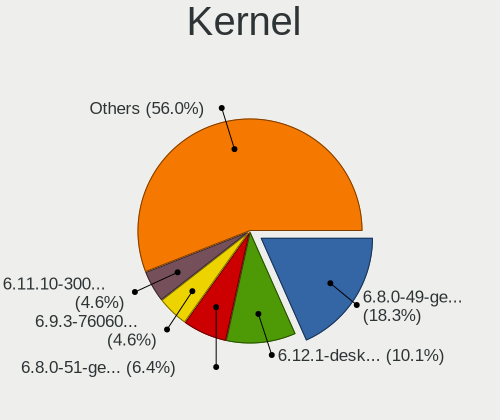
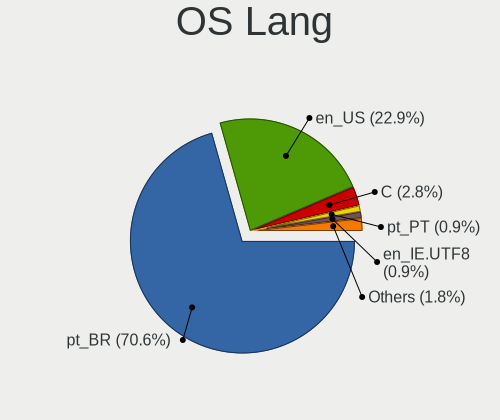
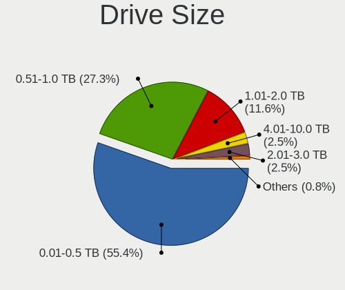
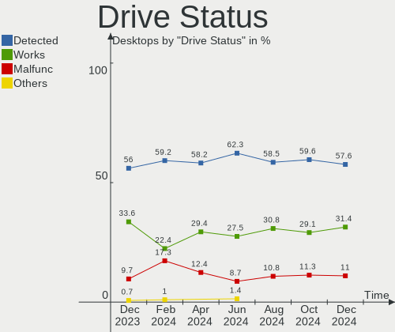
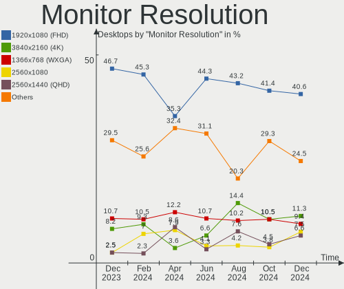
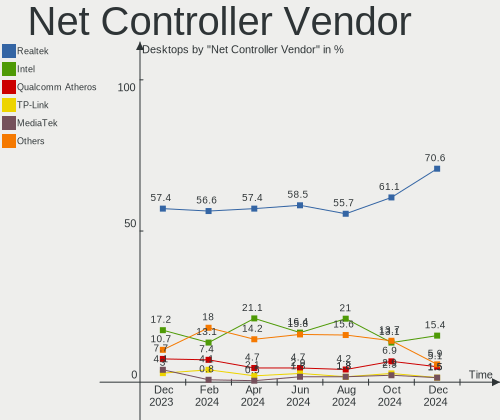
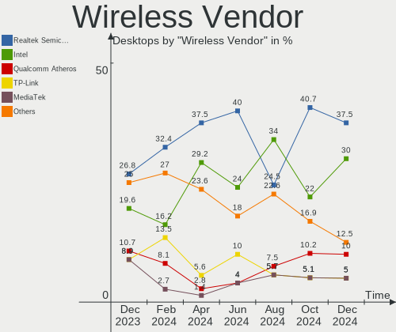
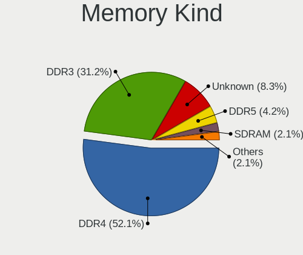
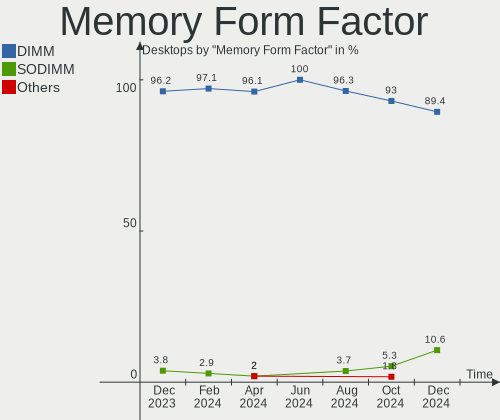
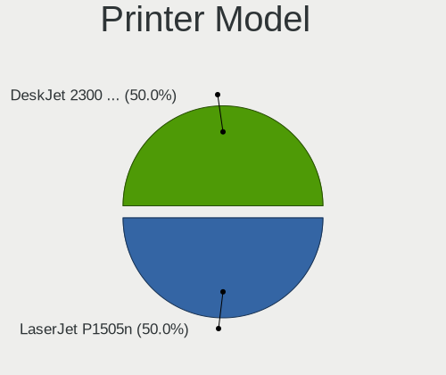

Linux in Brazil - Hardware Trends (Desktops)
--------------------------------------------

A project to identify most popular hardware characteristics and track their change
over time based on data collected by Linux users at https://Linux-Hardware.org.

Anyone can contribute to this report by the [hw-probe](https://github.com/linuxhw/hw-probe) tool:

    sudo -E hw-probe -all -upload

Period: Aug, 2023.

Contents
--------

* [ System ](#system)
  - [ OS                       ](#os)
  - [ OS Family                ](#os-family)
  - [ Kernel                   ](#kernel)
  - [ Kernel Family            ](#kernel-family)
  - [ Kernel Major Ver.        ](#kernel-major-ver)
  - [ Arch                     ](#arch)
  - [ DE                       ](#de)
  - [ Display Server           ](#display-server)
  - [ Display Manager          ](#display-manager)
  - [ OS Lang                  ](#os-lang)
  - [ Boot Mode                ](#boot-mode)
  - [ Filesystem               ](#filesystem)
  - [ Part. scheme             ](#part-scheme)
  - [ Dual Boot with Linux/BSD ](#dual-boot-with-linuxbsd)
  - [ Dual Boot (Win)          ](#dual-boot-win)

* [ Board ](#board)
  - [ Vendor                   ](#vendor)
  - [ Model                    ](#model)
  - [ Model Family             ](#model-family)
  - [ MFG Year                 ](#mfg-year)
  - [ Form Factor              ](#form-factor)
  - [ Secure Boot              ](#secure-boot)
  - [ Coreboot                 ](#coreboot)
  - [ RAM Size                 ](#ram-size)
  - [ RAM Used                 ](#ram-used)
  - [ Total Drives             ](#total-drives)
  - [ Has CD-ROM               ](#has-cd-rom)
  - [ Has Ethernet             ](#has-ethernet)
  - [ Has WiFi                 ](#has-wifi)
  - [ Has Bluetooth            ](#has-bluetooth)

* [ Location ](#location)
  - [ Country                  ](#country)
  - [ City                     ](#city)

* [ Drives ](#drives)
  - [ Drive Vendor             ](#drive-vendor)
  - [ Drive Model              ](#drive-model)
  - [ HDD Vendor               ](#hdd-vendor)
  - [ SSD Vendor               ](#ssd-vendor)
  - [ Drive Kind               ](#drive-kind)
  - [ Drive Connector          ](#drive-connector)
  - [ Drive Size               ](#drive-size)
  - [ Space Total              ](#space-total)
  - [ Space Used               ](#space-used)
  - [ Malfunc. Drives          ](#malfunc-drives)
  - [ Malfunc. Drive Vendor    ](#malfunc-drive-vendor)
  - [ Malfunc. HDD Vendor      ](#malfunc-hdd-vendor)
  - [ Malfunc. Drive Kind      ](#malfunc-drive-kind)
  - [ Failed Drives            ](#failed-drives)
  - [ Failed Drive Vendor      ](#failed-drive-vendor)
  - [ Drive Status             ](#drive-status)

* [ Storage controller ](#storage-controller)
  - [ Storage Vendor           ](#storage-vendor)
  - [ Storage Model            ](#storage-model)
  - [ Storage Kind             ](#storage-kind)

* [ Processor ](#processor)
  - [ CPU Vendor               ](#cpu-vendor)
  - [ CPU Model                ](#cpu-model)
  - [ CPU Model Family         ](#cpu-model-family)
  - [ CPU Cores                ](#cpu-cores)
  - [ CPU Sockets              ](#cpu-sockets)
  - [ CPU Threads              ](#cpu-threads)
  - [ CPU Op-Modes             ](#cpu-op-modes)
  - [ CPU Microcode            ](#cpu-microcode)
  - [ CPU Microarch            ](#cpu-microarch)

* [ Graphics ](#graphics)
  - [ GPU Vendor               ](#gpu-vendor)
  - [ GPU Model                ](#gpu-model)
  - [ GPU Combo                ](#gpu-combo)
  - [ GPU Driver               ](#gpu-driver)
  - [ GPU Memory               ](#gpu-memory)

* [ Monitor ](#monitor)
  - [ Monitor Vendor           ](#monitor-vendor)
  - [ Monitor Model            ](#monitor-model)
  - [ Monitor Resolution       ](#monitor-resolution)
  - [ Monitor Diagonal         ](#monitor-diagonal)
  - [ Monitor Width            ](#monitor-width)
  - [ Aspect Ratio             ](#aspect-ratio)
  - [ Monitor Area             ](#monitor-area)
  - [ Pixel Density            ](#pixel-density)
  - [ Multiple Monitors        ](#multiple-monitors)

* [ Network ](#network)
  - [ Net Controller Vendor    ](#net-controller-vendor)
  - [ Net Controller Model     ](#net-controller-model)
  - [ Wireless Vendor          ](#wireless-vendor)
  - [ Wireless Model           ](#wireless-model)
  - [ Ethernet Vendor          ](#ethernet-vendor)
  - [ Ethernet Model           ](#ethernet-model)
  - [ Net Controller Kind      ](#net-controller-kind)
  - [ Used Controller          ](#used-controller)
  - [ NICs                     ](#nics)
  - [ IPv6                     ](#ipv6)

* [ Bluetooth ](#bluetooth)
  - [ Bluetooth Vendor         ](#bluetooth-vendor)
  - [ Bluetooth Model          ](#bluetooth-model)

* [ Sound ](#sound)
  - [ Sound Vendor             ](#sound-vendor)
  - [ Sound Model              ](#sound-model)

* [ Memory ](#memory)
  - [ Memory Vendor            ](#memory-vendor)
  - [ Memory Model             ](#memory-model)
  - [ Memory Kind              ](#memory-kind)
  - [ Memory Form Factor       ](#memory-form-factor)
  - [ Memory Size              ](#memory-size)
  - [ Memory Speed             ](#memory-speed)

* [ Printers & scanners ](#printers--scanners)
  - [ Printer Vendor           ](#printer-vendor)
  - [ Printer Model            ](#printer-model)
  - [ Scanner Vendor           ](#scanner-vendor)
  - [ Scanner Model            ](#scanner-model)

* [ Camera ](#camera)
  - [ Camera Vendor            ](#camera-vendor)
  - [ Camera Model             ](#camera-model)

* [ Security ](#security)
  - [ Fingerprint Vendor       ](#fingerprint-vendor)
  - [ Fingerprint Model        ](#fingerprint-model)
  - [ Chipcard Vendor          ](#chipcard-vendor)
  - [ Chipcard Model           ](#chipcard-model)

* [ Unsupported ](#unsupported)
  - [ Unsupported Devices      ](#unsupported-devices)
  - [ Unsupported Device Types ](#unsupported-device-types)

System
------

OS
--

Installed operating systems

| Name                         | Desktops | Percent |
|------------------------------|----------|---------|
| OpenMandriva 23.08           | 25       | 18.52%  |
| Ubuntu 22.04                 | 14       | 10.37%  |
| Linux Mint 21.2              | 11       | 8.15%   |
| Fedora 38                    | 11       | 8.15%   |
| OpenMandriva 23.03           | 9        | 6.67%   |
| Linux Mint 21.1              | 7        | 5.19%   |
| Pop!_OS 22.04                | 6        | 4.44%   |
| Ubuntu 23.04                 | 5        | 3.7%    |
| Arch Rolling                 | 5        | 3.7%    |
| Zorin 16                     | 3        | 2.22%   |
| openSUSE Tumbleweed-XXXXXXXX | 3        | 2.22%   |
| Debian 12                    | 3        | 2.22%   |
| ArcoLinux Rolling            | 3        | 2.22%   |
| Ubuntu MATE 22.04            | 2        | 1.48%   |
| Ubuntu 20.04                 | 2        | 1.48%   |
| RHEL 9                       | 2        | 1.48%   |
| openSUSE Leap-15.5           | 2        | 1.48%   |
| Manjaro 23.0.0               | 2        | 1.48%   |
| Xubuntu 23.04                | 1        | 0.74%   |
| Xubuntu 22.04                | 1        | 0.74%   |
| Xero Rolling                 | 1        | 0.74%   |
| Ubuntu 22.10                 | 1        | 0.74%   |
| Ubuntu 18.04                 | 1        | 0.74%   |
| ROSA 12.4                    | 1        | 0.74%   |
| OpenMandriva 4.3             | 1        | 0.74%   |
| OpenMandriva 23.07           | 1        | 0.74%   |
| Nobara 37                    | 1        | 0.74%   |
| NixOS 23.11                  | 1        | 0.74%   |
| Manjaro                      | 1        | 0.74%   |
| LMDE 5                       | 1        | 0.74%   |
| Linux Mint 20.1              | 1        | 0.74%   |
| Linux Mint 19.3              | 1        | 0.74%   |
| Kubuntu 23.04                | 1        | 0.74%   |
| Kubuntu 22.04                | 1        | 0.74%   |
| Instaladorpdv-rc23205 64bit  | 1        | 0.74%   |
| Debian                       | 1        | 0.74%   |
| BigLinux 23.0.0              | 1        | 0.74%   |
| Artix 20230306               | 1        | 0.74%   |

OS Family
---------

OS without a version

| Name                  | Desktops | Percent |
|-----------------------|----------|---------|
| OpenMandriva          | 36       | 26.67%  |
| Ubuntu                | 23       | 17.04%  |
| Linux Mint            | 20       | 14.81%  |
| Fedora                | 11       | 8.15%   |
| Pop!_OS               | 6        | 4.44%   |
| openSUSE              | 5        | 3.7%    |
| Arch                  | 5        | 3.7%    |
| Debian                | 4        | 2.96%   |
| Zorin                 | 3        | 2.22%   |
| Manjaro               | 3        | 2.22%   |
| ArcoLinux             | 3        | 2.22%   |
| Xubuntu               | 2        | 1.48%   |
| Ubuntu MATE           | 2        | 1.48%   |
| RHEL                  | 2        | 1.48%   |
| Kubuntu               | 2        | 1.48%   |
| Xero                  | 1        | 0.74%   |
| ROSA                  | 1        | 0.74%   |
| Nobara                | 1        | 0.74%   |
| NixOS                 | 1        | 0.74%   |
| LMDE                  | 1        | 0.74%   |
| Instaladorpdv-rc23205 | 1        | 0.74%   |
| BigLinux              | 1        | 0.74%   |
| Artix                 | 1        | 0.74%   |

Kernel
------

Version of the Linux kernel

| Version                      | Desktops | Percent |
|------------------------------|----------|---------|
| 6.4.11-desktop-1omv2390      | 17       | 12.59%  |
| 5.15.0-78-generic            | 16       | 11.85%  |
| 6.2.0-26-generic             | 13       | 9.63%   |
| 6.2.6-desktop-1omv2390       | 9        | 6.67%   |
| 6.4.8-desktop-2omv2390       | 8        | 5.93%   |
| 6.2.0-27-generic             | 5        | 3.7%    |
| 6.2.6-76060206-generic       | 4        | 2.96%   |
| 5.15.0-76-generic            | 4        | 2.96%   |
| 6.4.10-arch1-1               | 3        | 2.22%   |
| 6.4.8-arch1-1                | 2        | 1.48%   |
| 6.4.8-200.fc38.x86_64        | 2        | 1.48%   |
| 6.4.7-200.fc38.x86_64        | 2        | 1.48%   |
| 6.4.6-76060406-generic       | 2        | 1.48%   |
| 6.4.6-200.fc38.x86_64        | 2        | 1.48%   |
| 6.4.11-200.fc38.x86_64       | 2        | 1.48%   |
| 6.2.9-300.fc38.x86_64        | 2        | 1.48%   |
| 6.2.0-31-generic             | 2        | 1.48%   |
| 6.1.0-10-amd64               | 2        | 1.48%   |
| 5.15.0-79-generic            | 2        | 1.48%   |
| 5.14.0-284.25.1.el9_2.x86_64 | 2        | 1.48%   |
| 6.4.9-1-default              | 1        | 0.74%   |
| 6.4.8-1-default              | 1        | 0.74%   |
| 6.4.7-arch1-1                | 1        | 0.74%   |
| 6.4.6-1-default              | 1        | 0.74%   |
| 6.4.4-artix1-1               | 1        | 0.74%   |
| 6.4.3-060403-generic         | 1        | 0.74%   |
| 6.4.12-1-MANJARO             | 1        | 0.74%   |
| 6.4.11-cachyos               | 1        | 0.74%   |
| 6.4.11-arch2-1               | 1        | 0.74%   |
| 6.4.11-1-MANJARO             | 1        | 0.74%   |
| 6.4.10-200.fc38.x86_64       | 1        | 0.74%   |
| 6.4.0-1-amd64                | 1        | 0.74%   |
| 6.4.0-060400-generic         | 1        | 0.74%   |
| 6.3.8-arch1-1                | 1        | 0.74%   |
| 6.3.5-desktop-3omv2390       | 1        | 0.74%   |
| 6.3.12-205.fsync.fc37.x86_64 | 1        | 0.74%   |
| 6.2.0-20-generic             | 1        | 0.74%   |
| 6.1.8-060108-generic         | 1        | 0.74%   |
| 6.1.49-1-MANJARO             | 1        | 0.74%   |
| 6.1.49-1-lts                 | 1        | 0.74%   |

Kernel Family
-------------

Linux kernel without a distro release

| Version  | Desktops | Percent |
|----------|----------|---------|
| 5.15.0   | 23       | 17.04%  |
| 6.4.11   | 22       | 16.3%   |
| 6.2.0    | 21       | 15.56%  |
| 6.4.8    | 13       | 9.63%   |
| 6.2.6    | 13       | 9.63%   |
| 6.4.6    | 5        | 3.7%    |
| 6.4.10   | 4        | 2.96%   |
| 6.1.0    | 4        | 2.96%   |
| 6.4.7    | 3        | 2.22%   |
| 5.4.0    | 3        | 2.22%   |
| 6.4.0    | 2        | 1.48%   |
| 6.2.9    | 2        | 1.48%   |
| 6.1.49   | 2        | 1.48%   |
| 5.19.0   | 2        | 1.48%   |
| 5.14.21  | 2        | 1.48%   |
| 5.14.0   | 2        | 1.48%   |
| 6.4.9    | 1        | 0.74%   |
| 6.4.4    | 1        | 0.74%   |
| 6.4.3    | 1        | 0.74%   |
| 6.4.12   | 1        | 0.74%   |
| 6.3.8    | 1        | 0.74%   |
| 6.3.5    | 1        | 0.74%   |
| 6.3.12   | 1        | 0.74%   |
| 6.1.8    | 1        | 0.74%   |
| 6.1.38   | 1        | 0.74%   |
| 5.16.7   | 1        | 0.74%   |
| 5.15.125 | 1        | 0.74%   |
| 4.15.0   | 1        | 0.74%   |

Kernel Major Ver.
-----------------

Linux kernel major version

| Version | Desktops | Percent |
|---------|----------|---------|
| 6.4     | 53       | 39.26%  |
| 6.2     | 36       | 26.67%  |
| 5.15    | 24       | 17.78%  |
| 6.1     | 8        | 5.93%   |
| 5.14    | 4        | 2.96%   |
| 6.3     | 3        | 2.22%   |
| 5.4     | 3        | 2.22%   |
| 5.19    | 2        | 1.48%   |
| 5.16    | 1        | 0.74%   |
| 4.15    | 1        | 0.74%   |

Arch
----

OS architecture (x86_64, i586, etc.)

| Name   | Desktops | Percent |
|--------|----------|---------|
| x86_64 | 135      | 100%    |

DE
--

Desktop Environment

| Name       | Desktops | Percent |
|------------|----------|---------|
| GNOME      | 56       | 41.48%  |
| KDE5       | 41       | 30.37%  |
| X-Cinnamon | 16       | 11.85%  |
| XFCE       | 10       | 7.41%   |
| MATE       | 4        | 2.96%   |
| LXQt       | 4        | 2.96%   |
| Unknown    | 2        | 1.48%   |
| sway       | 1        | 0.74%   |
| Cinnamon   | 1        | 0.74%   |

Display Server
--------------

X11 or Wayland

| Name    | Desktops | Percent |
|---------|----------|---------|
| X11     | 73       | 54.07%  |
| Wayland | 60       | 44.44%  |
| Unknown | 2        | 1.48%   |

Display Manager
---------------

SDDM, LightDM, etc.

| Name    | Desktops | Percent |
|---------|----------|---------|
| Unknown | 54       | 40%     |
| SDDM    | 39       | 28.89%  |
| GDM3    | 20       | 14.81%  |
| GDM     | 12       | 8.89%   |
| LightDM | 10       | 7.41%   |

OS Lang
-------

Language

| Lang       | Desktops | Percent |
|------------|----------|---------|
| pt_BR      | 98       | 72.59%  |
| en_US      | 28       | 20.74%  |
| C          | 5        | 3.7%    |
| en_GB      | 2        | 1.48%   |
| pt_PT      | 1        | 0.74%   |
| en_IE.UTF8 | 1        | 0.74%   |

Boot Mode
---------

EFI or BIOS

| Mode | Desktops | Percent |
|------|----------|---------|
| BIOS | 91       | 67.41%  |
| EFI  | 44       | 32.59%  |

Filesystem
----------

Type of filesystem

| Type    | Desktops | Percent |
|---------|----------|---------|
| Ext4    | 67       | 49.63%  |
| Btrfs   | 25       | 18.52%  |
| Overlay | 20       | 14.81%  |
| Tmpfs   | 18       | 13.33%  |
| Xfs     | 3        | 2.22%   |
| Zfs     | 1        | 0.74%   |
| Ext3    | 1        | 0.74%   |

Part. scheme
------------

Scheme of partitioning

| Type    | Desktops | Percent |
|---------|----------|---------|
| GPT     | 65       | 48.15%  |
| Unknown | 51       | 37.78%  |
| MBR     | 19       | 14.07%  |

Dual Boot with Linux/BSD
------------------------

Hosting more than one Linux/BSD

| Dual boot | Desktops | Percent |
|-----------|----------|---------|
| No        | 104      | 77.04%  |
| Yes       | 31       | 22.96%  |

Dual Boot (Win)
---------------

Hosting Linux and Windows

| Dual boot | Desktops | Percent |
|-----------|----------|---------|
| No        | 98       | 72.59%  |
| Yes       | 37       | 27.41%  |

Board
-----

Vendor
------

Motherboard manufacturer

| Name                | Desktops | Percent |
|---------------------|----------|---------|
| ASUSTek Computer    | 26       | 19.26%  |
| Gigabyte Technology | 25       | 18.52%  |
| Intel               | 19       | 14.07%  |
| ASRock              | 10       | 7.41%   |
| Dell                | 7        | 5.19%   |
| MSI                 | 6        | 4.44%   |
| Hewlett-Packard     | 6        | 4.44%   |
| Positivo            | 5        | 3.7%    |
| Megaware            | 3        | 2.22%   |
| MACHINIST           | 3        | 2.22%   |
| Lenovo              | 3        | 2.22%   |
| Itautec             | 3        | 2.22%   |
| PCWare              | 2        | 1.48%   |
| Huanan              | 2        | 1.48%   |
| Unknown             | 2        | 1.48%   |
| Win element         | 1        | 0.74%   |
| SZMZ                | 1        | 0.74%   |
| Supermicro          | 1        | 0.74%   |
| Red Hat             | 1        | 0.74%   |
| QIYIDA              | 1        | 0.74%   |
| OEM                 | 1        | 0.74%   |
| MANCER              | 1        | 0.74%   |
| Foxconn             | 1        | 0.74%   |
| ECS                 | 1        | 0.74%   |
| Digiboard           | 1        | 0.74%   |
| Colorful Technology | 1        | 0.74%   |
| Biostar             | 1        | 0.74%   |
| AMD                 | 1        | 0.74%   |

Model
-----

Motherboard model

| Name                                                         | Desktops | Percent |
|--------------------------------------------------------------|----------|---------|
| Intel H81                                                    | 3        | 2.22%   |
| Intel H61                                                    | 3        | 2.22%   |
| Intel H55                                                    | 3        | 2.22%   |
| HP Compaq 6005 Pro SFF PC                                    | 3        | 2.22%   |
| MSI MS-7721                                                  | 2        | 1.48%   |
| Megaware MW-G31T-M7                                          | 2        | 1.48%   |
| Intel X79 (INTEL Xeon E5/Corei7 DMI2 - C600/C200 Cipset V307 | 2        | 1.48%   |
| Intel B75                                                    | 2        | 1.48%   |
| Gigabyte G31M-ES2L                                           | 2        | 1.48%   |
| Gigabyte B550M AORUS ELITE                                   | 2        | 1.48%   |
| Gigabyte B450M GAMING                                        | 2        | 1.48%   |
| Gigabyte B450 AORUS M                                        | 2        | 1.48%   |
| ASUS TUF Gaming X570-PLUS_BR                                 | 2        | 1.48%   |
| ASUS M5A78L-M PLUS/USB3                                      | 2        | 1.48%   |
| ASRock A320M-HDV R4.0                                        | 2        | 1.48%   |
| Unknown                                                      | 2        | 1.48%   |
| Win element M600                                             | 1        | 0.74%   |
| SZMZ X99M-G2                                                 | 1        | 0.74%   |
| Supermicro SSG-6047R-E1CR36N                                 | 1        | 0.74%   |
| Red Hat KVM                                                  | 1        | 0.74%   |
| QIYIDA X79 (INTEL Xeon E5/Corei7 DMI2 - C600/C200 Cipset V32 | 1        | 0.74%   |
| Positivo POS-PQ45AU                                          | 1        | 0.74%   |
| Positivo POS-PIG41BA                                         | 1        | 0.74%   |
| Positivo D6200                                               | 1        | 0.74%   |
| Positivo D210                                                | 1        | 0.74%   |
| Positivo C8300                                               | 1        | 0.74%   |
| PCWare IPX1800E1                                             | 1        | 0.74%   |
| PCWare IPMH110G                                              | 1        | 0.74%   |
| OEM B75                                                      | 1        | 0.74%   |
| MSI MS-7C83                                                  | 1        | 0.74%   |
| MSI MS-7B77                                                  | 1        | 0.74%   |
| MSI MS-7788                                                  | 1        | 0.74%   |
| MSI H61M-P20                                                 | 1        | 0.74%   |
| Megaware MW-NM70HD-MI                                        | 1        | 0.74%   |
| MANCER A320M-DA                                              | 1        | 0.74%   |
| MACHINIST X99-MR9D PLUS V1.0                                 | 1        | 0.74%   |
| MACHINIST E5-D8-MAX V1.0                                     | 1        | 0.74%   |
| MACHINIST E5 MR9A PRO MAX V1.1                               | 1        | 0.74%   |
| Lenovo V50s-07IMB 11HA000EBP                                 | 1        | 0.74%   |
| Lenovo ThinkCentre M58e 7303AZ2                              | 1        | 0.74%   |

Model Family
------------

Motherboard model prefix

| Name                         | Desktops | Percent |
|------------------------------|----------|---------|
| ASUS TUF                     | 7        | 5.19%   |
| Dell OptiPlex                | 5        | 3.7%    |
| ASUS M5A78L-M                | 5        | 3.7%    |
| Itautec Infoway              | 3        | 2.22%   |
| Intel H81                    | 3        | 2.22%   |
| Intel H61                    | 3        | 2.22%   |
| Intel H55                    | 3        | 2.22%   |
| HP Compaq                    | 3        | 2.22%   |
| Gigabyte B450M               | 3        | 2.22%   |
| MSI MS-7721                  | 2        | 1.48%   |
| Megaware MW-G31T-M7          | 2        | 1.48%   |
| Lenovo ThinkCentre           | 2        | 1.48%   |
| Intel X79                    | 2        | 1.48%   |
| Intel B75                    | 2        | 1.48%   |
| Gigabyte H410M               | 2        | 1.48%   |
| Gigabyte G31M-ES2L           | 2        | 1.48%   |
| Gigabyte B550M               | 2        | 1.48%   |
| Gigabyte B450                | 2        | 1.48%   |
| Gigabyte A520M               | 2        | 1.48%   |
| ASUS PRIME                   | 2        | 1.48%   |
| ASUS P8H61-M                 | 2        | 1.48%   |
| ASRock A320M-HDV             | 2        | 1.48%   |
| ASRock A320M-HD              | 2        | 1.48%   |
| Unknown                      | 2        | 1.48%   |
| Win element M600             | 1        | 0.74%   |
| SZMZ X99M-G2                 | 1        | 0.74%   |
| Supermicro SSG-6047R-E1CR36N | 1        | 0.74%   |
| Red Hat KVM                  | 1        | 0.74%   |
| QIYIDA X79                   | 1        | 0.74%   |
| Positivo POS-PQ45AU          | 1        | 0.74%   |
| Positivo POS-PIG41BA         | 1        | 0.74%   |
| Positivo D6200               | 1        | 0.74%   |
| Positivo D210                | 1        | 0.74%   |
| Positivo C8300               | 1        | 0.74%   |
| PCWare IPX1800E1             | 1        | 0.74%   |
| PCWare IPMH110G              | 1        | 0.74%   |
| OEM B75                      | 1        | 0.74%   |
| MSI MS-7C83                  | 1        | 0.74%   |
| MSI MS-7B77                  | 1        | 0.74%   |
| MSI MS-7788                  | 1        | 0.74%   |

MFG Year
--------

Motherboard manufacture year

| Year | Desktops | Percent |
|------|----------|---------|
| 2019 | 15       | 11.11%  |
| 2012 | 15       | 11.11%  |
| 2020 | 14       | 10.37%  |
| 2018 | 13       | 9.63%   |
| 2022 | 12       | 8.89%   |
| 2021 | 9        | 6.67%   |
| 2009 | 9        | 6.67%   |
| 2014 | 8        | 5.93%   |
| 2016 | 7        | 5.19%   |
| 2011 | 7        | 5.19%   |
| 2008 | 7        | 5.19%   |
| 2013 | 6        | 4.44%   |
| 2017 | 5        | 3.7%    |
| 2010 | 5        | 3.7%    |
| 2023 | 1        | 0.74%   |
| 2015 | 1        | 0.74%   |
| 2007 | 1        | 0.74%   |

Form Factor
-----------

Physical design of the computer

| Name    | Desktops | Percent |
|---------|----------|---------|
| Desktop | 135      | 100%    |

Secure Boot
-----------

Enabled or disabled

| State    | Desktops | Percent |
|----------|----------|---------|
| Disabled | 132      | 97.78%  |
| Enabled  | 3        | 2.22%   |

Coreboot
--------

Have coreboot on board

| Used | Desktops | Percent |
|------|----------|---------|
| No   | 135      | 100%    |

RAM Size
--------

Total RAM memory

| Size in GB      | Desktops | Percent |
|-----------------|----------|---------|
| 16.01-24.0      | 36       | 26.67%  |
| 3.01-4.0        | 28       | 20.74%  |
| 8.01-16.0       | 28       | 20.74%  |
| 4.01-8.0        | 16       | 11.85%  |
| 32.01-64.0      | 11       | 8.15%   |
| 64.01-256.0     | 6        | 4.44%   |
| 24.01-32.0      | 4        | 2.96%   |
| 1.01-2.0        | 4        | 2.96%   |
| More than 256.0 | 1        | 0.74%   |
| 2.01-3.0        | 1        | 0.74%   |

RAM Used
--------

Used RAM memory

| Used GB    | Desktops | Percent |
|------------|----------|---------|
| 2.01-3.0   | 38       | 28.15%  |
| 1.01-2.0   | 38       | 28.15%  |
| 4.01-8.0   | 26       | 19.26%  |
| 3.01-4.0   | 13       | 9.63%   |
| 8.01-16.0  | 10       | 7.41%   |
| 0.51-1.0   | 7        | 5.19%   |
| 16.01-24.0 | 2        | 1.48%   |
| 0.01-0.5   | 1        | 0.74%   |

Total Drives
------------

Number of drives on board

| Drives | Desktops | Percent |
|--------|----------|---------|
| 1      | 49       | 36.3%   |
| 2      | 47       | 34.81%  |
| 3      | 21       | 15.56%  |
| 4      | 7        | 5.19%   |
| 6      | 4        | 2.96%   |
| 5      | 3        | 2.22%   |
| 0      | 2        | 1.48%   |
| 8      | 1        | 0.74%   |
| 7      | 1        | 0.74%   |

Has CD-ROM
----------

Has CD-ROM on board

| Presented | Desktops | Percent |
|-----------|----------|---------|
| No        | 96       | 71.11%  |
| Yes       | 39       | 28.89%  |

Has Ethernet
------------

Has Ethernet on board

| Presented | Desktops | Percent |
|-----------|----------|---------|
| Yes       | 133      | 98.52%  |
| No        | 2        | 1.48%   |

Has WiFi
--------

Has WiFi module

| Presented | Desktops | Percent |
|-----------|----------|---------|
| No        | 74       | 54.81%  |
| Yes       | 61       | 45.19%  |

Has Bluetooth
-------------

Has Bluetooth module

| Presented | Desktops | Percent |
|-----------|----------|---------|
| No        | 99       | 73.33%  |
| Yes       | 36       | 26.67%  |

Location
--------

Country
-------

Geographic location (country)

| Country | Desktops | Percent |
|---------|----------|---------|
| Brazil  | 135      | 100%    |

City
----

Geographic location (city)

| City                | Desktops | Percent |
|---------------------|----------|---------|
| Rio de Janeiro      | 19       | 14.07%  |
| Sao Paulo           | 14       | 10.37%  |
| Curitiba            | 6        | 4.44%   |
| Florianópolis      | 5        | 3.7%    |
| Belo Horizonte      | 5        | 3.7%    |
| Sorocaba            | 4        | 2.96%   |
| Porto Alegre        | 3        | 2.22%   |
| Niterói            | 3        | 2.22%   |
| Vicosa              | 2        | 1.48%   |
| Uberaba             | 2        | 1.48%   |
| Sao Goncalo         | 2        | 1.48%   |
| Ribeirao Preto      | 2        | 1.48%   |
| Palmas              | 2        | 1.48%   |
| Novo Hamburgo       | 2        | 1.48%   |
| Manaus              | 2        | 1.48%   |
| Lucas do Rio Verde  | 2        | 1.48%   |
| Duque de Caxias     | 2        | 1.48%   |
| Criciúma           | 2        | 1.48%   |
| Brasília           | 2        | 1.48%   |
| Uberlândia         | 1        | 0.74%   |
| Teresopolis         | 1        | 0.74%   |
| Teixeira de Freitas | 1        | 0.74%   |
| Taboao da Serra     | 1        | 0.74%   |
| Sitio Palmital      | 1        | 0.74%   |
| Serra               | 1        | 0.74%   |
| Sao Luís           | 1        | 0.74%   |
| Santo André        | 1        | 0.74%   |
| Santo Amaro         | 1        | 0.74%   |
| Salvador            | 1        | 0.74%   |
| Rio Largo           | 1        | 0.74%   |
| Rio Branco          | 1        | 0.74%   |
| Ribeirao das Neves  | 1        | 0.74%   |
| Recife              | 1        | 0.74%   |
| Paranatama          | 1        | 0.74%   |
| Palhoca             | 1        | 0.74%   |
| Osasco              | 1        | 0.74%   |
| Olinda              | 1        | 0.74%   |
| Nova Venecia        | 1        | 0.74%   |
| Nova Iguaçu        | 1        | 0.74%   |
| Natal               | 1        | 0.74%   |

Drives
------

Drive Vendor
------------

Hard drive vendors

| Vendor                         | Desktops | Drives | Percent |
|--------------------------------|----------|--------|---------|
| Seagate                        | 49       | 60     | 19.6%   |
| WDC                            | 36       | 42     | 14.4%   |
| Kingston                       | 32       | 39     | 12.8%   |
| Samsung Electronics            | 23       | 25     | 9.2%    |
| China                          | 11       | 12     | 4.4%    |
| Sandisk                        | 10       | 15     | 4%      |
| KingSpec                       | 8        | 9      | 3.2%    |
| Crucial                        | 7        | 7      | 2.8%    |
| Silicon Motion                 | 6        | 6      | 2.4%    |
| Kingston Technology Company    | 5        | 5      | 2%      |
| Unknown                        | 5        | 5      | 2%      |
| Toshiba                        | 4        | 5      | 1.6%    |
| PNY                            | 4        | 4      | 1.6%    |
| Netac                          | 4        | 4      | 1.6%    |
| Hitachi                        | 4        | 4      | 1.6%    |
| Micron/Crucial Technology      | 3        | 3      | 1.2%    |
| MAXIO Technology (Hangzhou)    | 3        | 3      | 1.2%    |
| JMicron Technology             | 3        | 3      | 1.2%    |
| HS-SSD-C100                    | 3        | 3      | 1.2%    |
| XrayDisk                       | 2        | 2      | 0.8%    |
| SK hynix                       | 2        | 4      | 0.8%    |
| KingFast                       | 2        | 2      | 0.8%    |
| ADATA Technology               | 2        | 2      | 0.8%    |
| A-DATA Technology              | 2        | 3      | 0.8%    |
| WALRAM                         | 1        | 1      | 0.4%    |
| Unknown                        | 1        | 1      | 0.4%    |
| Solid State Storage Technology | 1        | 1      | 0.4%    |
| Realtek Semiconductor          | 1        | 2      | 0.4%    |
| Phison Electronics             | 1        | 2      | 0.4%    |
| Patriot                        | 1        | 1      | 0.4%    |
| OXYBR                          | 1        | 1      | 0.4%    |
| Maxtor                         | 1        | 1      | 0.4%    |
| MACROVIP                       | 1        | 1      | 0.4%    |
| Lexar                          | 1        | 1      | 0.4%    |
| KODAK                          | 1        | 1      | 0.4%    |
| KingDian                       | 1        | 1      | 0.4%    |
| Kingchuxing                    | 1        | 1      | 0.4%    |
| KEEPDATA                       | 1        | 1      | 0.4%    |
| INTEL SS                       | 1        | 1      | 0.4%    |
| Hewlett-Packard                | 1        | 1      | 0.4%    |

Drive Model
-----------

Hard drive models

| Model                                                 | Desktops | Percent |
|-------------------------------------------------------|----------|---------|
| Kingston SA400S37240G 240GB SSD                       | 9        | 3.21%   |
| Kingston SA400S37480G 480GB SSD                       | 7        | 2.5%    |
| Seagate ST1000DM010-2EP102 1TB                        | 6        | 2.14%   |
| Unknown                                               | 5        | 1.79%   |
| Seagate ST3500418AS 500GB                             | 4        | 1.43%   |
| Seagate ST2000DM008-2FR102 2TB                        | 4        | 1.43%   |
| Seagate ST1000DM003-1ER162 1TB                        | 4        | 1.43%   |
| SanDisk SSD PLUS 240GB                                | 4        | 1.43%   |
| Kingston SV300S37A120G 120GB SSD                      | 4        | 1.43%   |
| Kingston SA400S37120G 120GB SSD                       | 4        | 1.43%   |
| Silicon Motion SM2263EN/SM2263XT SSD Controller 256GB | 3        | 1.07%   |
| Seagate ST500DM002-1BD142 500GB                       | 3        | 1.07%   |
| Seagate ST3500312CS 500GB                             | 3        | 1.07%   |
| Seagate ST1000DM003-1CH162 1TB                        | 3        | 1.07%   |
| SanDisk SSD PLUS 1000GB                               | 3        | 1.07%   |
| Samsung HD502HJ 500GB                                 | 3        | 1.07%   |
| Samsung HD322HJ 320GB                                 | 3        | 1.07%   |
| Samsung HD161HJ 160GB                                 | 3        | 1.07%   |
| PNY CS900 120GB SSD                                   | 3        | 1.07%   |
| Micron/Crucial P2 NVMe PCIe SSD 1TB                   | 3        | 1.07%   |
| Kingston SNV2S500G 500GB                              | 3        | 1.07%   |
| JMicron Generic 1TB                                   | 3        | 1.07%   |
| Crucial CT240BX500SSD1 240GB                          | 3        | 1.07%   |
| China SSD 120GB                                       | 3        | 1.07%   |
| WDC WDS120G2G0A-00JH30 120GB SSD                      | 2        | 0.71%   |
| WDC WD5000AVCS-632DY1 500GB                           | 2        | 0.71%   |
| WDC WD10JPVX-75JC3T0 1TB                              | 2        | 0.71%   |
| Silicon Motion SM2262/SM2262EN SSD Controller 1024GB  | 2        | 0.71%   |
| Seagate ST500LM012 HN-M500MBB 500GB                   | 2        | 0.71%   |
| Seagate ST3500414CS 500GB                             | 2        | 0.71%   |
| Seagate ST1000LM024 HN-M101MBB 1TB                    | 2        | 0.71%   |
| Sandisk WD Green SN350 1TB                            | 2        | 0.71%   |
| Samsung NVMe SSD Controller SM981/PM981/PM983 500GB   | 2        | 0.71%   |
| Samsung HD103SJ 1TB                                   | 2        | 0.71%   |
| Netac SSD 120GB                                       | 2        | 0.71%   |
| Kingston Company SNV2S1000G 1TB                       | 2        | 0.71%   |
| Kingston SA400S37960G 960GB SSD                       | 2        | 0.71%   |
| Kingston SA400S37 480G SSD                            | 2        | 0.71%   |
| KingSpec P3-512 512GB SSD                             | 2        | 0.71%   |
| KingSpec P3-1TB SSD                                   | 2        | 0.71%   |

HDD Vendor
----------

Hard disk drive vendors

| Vendor              | Desktops | Drives | Percent |
|---------------------|----------|--------|---------|
| Seagate             | 49       | 60     | 45.37%  |
| WDC                 | 33       | 34     | 30.56%  |
| Samsung Electronics | 16       | 18     | 14.81%  |
| Hitachi             | 4        | 4      | 3.7%    |
| Toshiba             | 3        | 4      | 2.78%   |
| Maxtor              | 1        | 1      | 0.93%   |
| Fujitsu             | 1        | 1      | 0.93%   |
| Apple               | 1        | 1      | 0.93%   |

SSD Vendor
----------

Solid state drive vendors

| Vendor              | Desktops | Drives | Percent |
|---------------------|----------|--------|---------|
| Kingston            | 28       | 33     | 27.45%  |
| China               | 11       | 12     | 10.78%  |
| SanDisk             | 10       | 12     | 9.8%    |
| KingSpec            | 8        | 9      | 7.84%   |
| Crucial             | 7        | 7      | 6.86%   |
| WDC                 | 6        | 7      | 5.88%   |
| PNY                 | 4        | 4      | 3.92%   |
| Samsung Electronics | 3        | 3      | 2.94%   |
| JMicron Technology  | 3        | 3      | 2.94%   |
| Unknown             | 3        | 3      | 2.94%   |
| Netac               | 2        | 2      | 1.96%   |
| KingFast            | 2        | 2      | 1.96%   |
| XrayDisk            | 1        | 1      | 0.98%   |
| WALRAM              | 1        | 1      | 0.98%   |
| Toshiba             | 1        | 1      | 0.98%   |
| Patriot             | 1        | 1      | 0.98%   |
| OXYBR               | 1        | 1      | 0.98%   |
| Lexar               | 1        | 1      | 0.98%   |
| KODAK               | 1        | 1      | 0.98%   |
| KingDian            | 1        | 1      | 0.98%   |
| KEEPDATA            | 1        | 1      | 0.98%   |
| INTEL SS            | 1        | 1      | 0.98%   |
| HS-SSD-C100         | 1        | 1      | 0.98%   |
| Hewlett-Packard     | 1        | 1      | 0.98%   |
| DUEX                | 1        | 1      | 0.98%   |
| AFOX                | 1        | 1      | 0.98%   |
| A-DATA Technology   | 1        | 1      | 0.98%   |

Drive Kind
----------

HDD or SSD

| Kind    | Desktops | Drives | Percent |
|---------|----------|--------|---------|
| HDD     | 83       | 123    | 40.29%  |
| SSD     | 80       | 112    | 38.83%  |
| NVMe    | 36       | 47     | 17.48%  |
| Unknown | 7        | 7      | 3.4%    |

Drive Connector
---------------

SATA, SAS, NVMe, etc.

| Type | Desktops | Drives | Percent |
|------|----------|--------|---------|
| SATA | 123      | 232    | 73.21%  |
| NVMe | 36       | 47     | 21.43%  |
| SAS  | 9        | 10     | 5.36%   |

Drive Size
----------

Size of hard drive

| Size in TB | Desktops | Drives | Percent |
|------------|----------|--------|---------|
| 0.01-0.5   | 102      | 149    | 61.08%  |
| 0.51-1.0   | 44       | 60     | 26.35%  |
| 1.01-2.0   | 16       | 21     | 9.58%   |
| 2.01-3.0   | 3        | 3      | 1.8%    |
| 3.01-4.0   | 2        | 2      | 1.2%    |

Space Total
-----------

Amount of disk space available on the file system

| Size in GB     | Desktops | Percent |
|----------------|----------|---------|
| 101-250        | 36       | 26.67%  |
| 251-500        | 22       | 16.3%   |
| 1001-2000      | 17       | 12.59%  |
| 1-20           | 16       | 11.85%  |
| 501-1000       | 15       | 11.11%  |
| More than 3000 | 12       | 8.89%   |
| 51-100         | 8        | 5.93%   |
| 2001-3000      | 4        | 2.96%   |
| Unknown        | 3        | 2.22%   |
| 21-50          | 2        | 1.48%   |

Space Used
----------

Amount of used disk space

| Used GB        | Desktops | Percent |
|----------------|----------|---------|
| 1-20           | 48       | 35.56%  |
| 21-50          | 21       | 15.56%  |
| 101-250        | 15       | 11.11%  |
| 501-1000       | 14       | 10.37%  |
| 51-100         | 14       | 10.37%  |
| 251-500        | 10       | 7.41%   |
| 1001-2000      | 6        | 4.44%   |
| More than 3000 | 3        | 2.22%   |
| Unknown        | 3        | 2.22%   |
| 2001-3000      | 1        | 0.74%   |

Malfunc. Drives
---------------

Drive models with a malfunction

| Model                               | Desktops | Drives | Percent |
|-------------------------------------|----------|--------|---------|
| Samsung Electronics HD161HJ 160GB   | 2        | 2      | 7.69%   |
| Netac SSD 120GB                     | 2        | 2      | 7.69%   |
| JMicron Technology Generic 1TB      | 2        | 2      | 7.69%   |
| WDC WD7500AADS-00M2B0 752GB         | 1        | 1      | 3.85%   |
| WDC WD5000AVCS-632DY1 500GB         | 1        | 1      | 3.85%   |
| WDC WD5000AAKX-603CA0 500GB         | 1        | 1      | 3.85%   |
| WDC WD5000AAKS-00A7B0 500GB         | 1        | 1      | 3.85%   |
| Toshiba MQ01ABD100 1TB              | 1        | 1      | 3.85%   |
| Toshiba MK3259GSXP 320GB            | 1        | 1      | 3.85%   |
| Seagate ST500LT012-9WS142 500GB     | 1        | 1      | 3.85%   |
| Seagate ST500LM012 HN-M500MBB 500GB | 1        | 1      | 3.85%   |
| Seagate ST3802110AS 80GB            | 1        | 1      | 3.85%   |
| Seagate ST3500414CS 500GB           | 1        | 1      | 3.85%   |
| Seagate ST1000DM003-9YN162 1TB      | 1        | 1      | 3.85%   |
| Seagate ST1000DM003-1ER162 1TB      | 1        | 1      | 3.85%   |
| Samsung Electronics SP1644N 160GB   | 1        | 1      | 3.85%   |
| Samsung Electronics HD322HJ 320GB   | 1        | 1      | 3.85%   |
| Maxtor STM3160215AS 160GB           | 1        | 1      | 3.85%   |
| Kingston SA400S37120G 120GB SSD     | 1        | 3      | 3.85%   |
| KEEPDATA SSD 120GB                  | 1        | 1      | 3.85%   |
| Hitachi HDS721010DLE630 1TB         | 1        | 1      | 3.85%   |
| China AS-240 240GB SSD              | 1        | 1      | 3.85%   |
| A-DATA Technology IM2P33F8ABR1-1TB  | 1        | 1      | 3.85%   |

Malfunc. Drive Vendor
---------------------

Vendors of faulty drives

| Vendor              | Desktops | Drives | Percent |
|---------------------|----------|--------|---------|
| Seagate             | 6        | 6      | 23.08%  |
| WDC                 | 4        | 4      | 15.38%  |
| Samsung Electronics | 4        | 4      | 15.38%  |
| Toshiba             | 2        | 2      | 7.69%   |
| Netac               | 2        | 2      | 7.69%   |
| JMicron Technology  | 2        | 2      | 7.69%   |
| Maxtor              | 1        | 1      | 3.85%   |
| Kingston            | 1        | 3      | 3.85%   |
| KEEPDATA            | 1        | 1      | 3.85%   |
| Hitachi             | 1        | 1      | 3.85%   |
| China               | 1        | 1      | 3.85%   |
| A-DATA Technology   | 1        | 1      | 3.85%   |

Malfunc. HDD Vendor
-------------------

Vendors of faulty HDD drives

| Vendor              | Desktops | Drives | Percent |
|---------------------|----------|--------|---------|
| Seagate             | 6        | 6      | 33.33%  |
| WDC                 | 4        | 4      | 22.22%  |
| Samsung Electronics | 4        | 4      | 22.22%  |
| Toshiba             | 2        | 2      | 11.11%  |
| Maxtor              | 1        | 1      | 5.56%   |
| Hitachi             | 1        | 1      | 5.56%   |

Malfunc. Drive Kind
-------------------

Kinds of faulty drives

| Kind | Desktops | Drives | Percent |
|------|----------|--------|---------|
| HDD  | 14       | 18     | 63.64%  |
| SSD  | 7        | 9      | 31.82%  |
| NVMe | 1        | 1      | 4.55%   |

Failed Drives
-------------

Failed drive models

| Model                             | Desktops | Drives | Percent |
|-----------------------------------|----------|--------|---------|
| WDC WD3200BPVT-22JJ5T0 320GB      | 1        | 1      | 33.33%  |
| Seagate ST3250318AS 250GB         | 1        | 1      | 33.33%  |
| Samsung Electronics HD502HJ 500GB | 1        | 2      | 33.33%  |

Failed Drive Vendor
-------------------

Failed drive vendors

| Vendor              | Desktops | Drives | Percent |
|---------------------|----------|--------|---------|
| WDC                 | 1        | 1      | 33.33%  |
| Seagate             | 1        | 1      | 33.33%  |
| Samsung Electronics | 1        | 2      | 33.33%  |

Drive Status
------------

Number of failed and malfunc. drives

| Status   | Desktops | Drives | Percent |
|----------|----------|--------|---------|
| Detected | 72       | 159    | 48.98%  |
| Works    | 51       | 98     | 34.69%  |
| Malfunc  | 21       | 28     | 14.29%  |
| Failed   | 3        | 4      | 2.04%   |

Storage controller
------------------

Storage Vendor
--------------

Storage controller vendors

| Vendor                         | Desktops | Percent |
|--------------------------------|----------|---------|
| Intel                          | 90       | 50%     |
| AMD                            | 43       | 23.89%  |
| Kingston Technology Company    | 9        | 5%      |
| Silicon Motion                 | 6        | 3.33%   |
| Samsung Electronics            | 4        | 2.22%   |
| SanDisk                        | 3        | 1.67%   |
| Micron/Crucial Technology      | 3        | 1.67%   |
| MAXIO Technology (Hangzhou)    | 3        | 1.67%   |
| JMicron Technology             | 3        | 1.67%   |
| ADATA Technology               | 3        | 1.67%   |
| SK hynix                       | 2        | 1.11%   |
| Netac Technology               | 2        | 1.11%   |
| Marvell Technology Group       | 2        | 1.11%   |
| ASMedia Technology             | 2        | 1.11%   |
| TenaFe                         | 1        | 0.56%   |
| Solid State Storage Technology | 1        | 0.56%   |
| Realtek Semiconductor          | 1        | 0.56%   |
| Phison Electronics             | 1        | 0.56%   |
| Nvidia                         | 1        | 0.56%   |

Storage Model
-------------

Storage controller models

| Model                                                                                   | Desktops | Percent |
|-----------------------------------------------------------------------------------------|----------|---------|
| AMD FCH SATA Controller [AHCI mode]                                                     | 22       | 9.4%    |
| Intel NM10/ICH7 Family SATA Controller [IDE mode]                                       | 13       | 5.56%   |
| Intel 82801G (ICH7 Family) IDE Controller                                               | 11       | 4.7%    |
| Intel 7 Series/C210 Series Chipset Family 6-port SATA Controller [AHCI mode]            | 9        | 3.85%   |
| Intel 6 Series/C200 Series Chipset Family 6 port Desktop SATA AHCI Controller           | 9        | 3.85%   |
| AMD 400 Series Chipset SATA Controller                                                  | 9        | 3.85%   |
| Intel 7 Series Chipset Family 6-port SATA Controller [AHCI mode]                        | 7        | 2.99%   |
| AMD 500 Series Chipset SATA Controller                                                  | 7        | 2.99%   |
| AMD SB7x0/SB8x0/SB9x0 IDE Controller                                                    | 6        | 2.56%   |
| AMD FCH SATA Controller D                                                               | 6        | 2.56%   |
| Kingston Company Company Non-Volatile memory controller                                 | 5        | 2.14%   |
| Intel Q170/Q150/B150/H170/H110/Z170/CM236 Chipset SATA Controller [AHCI Mode]           | 5        | 2.14%   |
| Intel Cannon Lake PCH SATA AHCI Controller                                              | 5        | 2.14%   |
| Intel 8 Series/C220 Series Chipset Family 6-port SATA Controller 1 [AHCI mode]          | 5        | 2.14%   |
| Intel 400 Series Chipset Family SATA AHCI Controller                                    | 5        | 2.14%   |
| AMD SB7x0/SB8x0/SB9x0 SATA Controller [IDE mode]                                        | 5        | 2.14%   |
| AMD SB7x0/SB8x0/SB9x0 SATA Controller [AHCI mode]                                       | 5        | 2.14%   |
| Silicon Motion SM2263EN/SM2263XT (DRAM-less) NVMe SSD Controllers                       | 4        | 1.71%   |
| Intel 6 Series/C200 Series Chipset Family Desktop SATA Controller (IDE mode, ports 4-5) | 4        | 1.71%   |
| Intel 6 Series/C200 Series Chipset Family Desktop SATA Controller (IDE mode, ports 0-3) | 4        | 1.71%   |
| Samsung NVMe SSD Controller SM981/PM981/PM983                                           | 3        | 1.28%   |
| Micron/Crucial P2 [Nick P2] / P3 / P3 Plus NVMe PCIe SSD (DRAM-less)                    | 3        | 1.28%   |
| Intel C610/X99 series chipset 6-Port SATA Controller [AHCI mode]                        | 3        | 1.28%   |
| Intel 5 Series/3400 Series Chipset 4 port SATA IDE Controller                           | 3        | 1.28%   |
| Intel 5 Series/3400 Series Chipset 2 port SATA IDE Controller                           | 3        | 1.28%   |
| Silicon Motion SM2262/SM2262EN SSD Controller                                           | 2        | 0.85%   |
| SanDisk WD Green SN350 NVMe SSD 1 TB (DRAM-less)                                        | 2        | 0.85%   |
| Netac Non-Volatile memory controller                                                    | 2        | 0.85%   |
| MAXIO (Hangzhou) NVMe SSD Controller MAP1602                                            | 2        | 0.85%   |
| JMicron JMB368 IDE controller                                                           | 2        | 0.85%   |
| Intel Volume Management Device NVMe RAID Controller                                     | 2        | 0.85%   |
| Intel C610/X99 series chipset sSATA Controller [AHCI mode]                              | 2        | 0.85%   |
| Intel C600/X79 series chipset 6-Port SATA AHCI Controller                               | 2        | 0.85%   |
| Intel Atom Processor E3800 Series SATA AHCI Controller                                  | 2        | 0.85%   |
| Intel Alder Lake-S PCH SATA Controller [AHCI Mode]                                      | 2        | 0.85%   |
| Intel 82801IR/IO/IH (ICH9R/DO/DH) 6 port SATA Controller [AHCI mode]                    | 2        | 0.85%   |
| Intel 7 Series/C210 Series Chipset Family 4-port SATA Controller [IDE mode]             | 2        | 0.85%   |
| Intel 7 Series/C210 Series Chipset Family 2-port SATA Controller [IDE mode]             | 2        | 0.85%   |
| Intel 500 Series Chipset Family SATA AHCI Controller                                    | 2        | 0.85%   |
| ASMedia ASM1062 Serial ATA Controller                                                   | 2        | 0.85%   |

Storage Kind
------------

Kind of storage controller (IDE, SATA, NVMe, SAS, ...)

| Kind | Desktops | Percent |
|------|----------|---------|
| SATA | 109      | 59.89%  |
| NVMe | 36       | 19.78%  |
| IDE  | 33       | 18.13%  |
| RAID | 3        | 1.65%   |
| SAS  | 1        | 0.55%   |

Processor
---------

CPU Vendor
----------

Processor vendors

| Vendor | Desktops | Percent |
|--------|----------|---------|
| Intel  | 92       | 68.15%  |
| AMD    | 43       | 31.85%  |

CPU Model
---------

Processor models

| Model                                       | Desktops | Percent |
|---------------------------------------------|----------|---------|
| AMD Ryzen 5 5600G with Radeon Graphics      | 7        | 5.19%   |
| Intel Core i5-3470 CPU @ 3.20GHz            | 5        | 3.7%    |
| Intel Xeon CPU E5-2680 v4 @ 2.40GHz         | 4        | 2.96%   |
| Intel Core i3-8100 CPU @ 3.60GHz            | 3        | 2.22%   |
| Intel Core i3-10100F CPU @ 3.60GHz          | 3        | 2.22%   |
| Intel Core 2 Duo CPU E7500 @ 2.93GHz        | 3        | 2.22%   |
| AMD Ryzen 5 3600 6-Core Processor           | 3        | 2.22%   |
| Intel Xeon CPU E5-2420 v2 @ 2.20GHz         | 2        | 1.48%   |
| Intel Pentium Dual-Core CPU E5300 @ 2.60GHz | 2        | 1.48%   |
| Intel Core i7-3770 CPU @ 3.40GHz            | 2        | 1.48%   |
| Intel Core i7-2600K CPU @ 3.40GHz           | 2        | 1.48%   |
| Intel Core i5-4570 CPU @ 3.20GHz            | 2        | 1.48%   |
| Intel Core i5-3570K CPU @ 3.40GHz           | 2        | 1.48%   |
| Intel Core i5 CPU 660 @ 3.33GHz             | 2        | 1.48%   |
| Intel Core i3-3217U CPU @ 1.80GHz           | 2        | 1.48%   |
| Intel Core i3-2100 CPU @ 3.10GHz            | 2        | 1.48%   |
| Intel Core i3-10100 CPU @ 3.60GHz           | 2        | 1.48%   |
| Intel Core 2 Duo CPU E8400 @ 3.00GHz        | 2        | 1.48%   |
| Intel Core 2 Duo CPU E7400 @ 2.80GHz        | 2        | 1.48%   |
| Intel Celeron CPU J1800 @ 2.41GHz           | 2        | 1.48%   |
| Intel Celeron CPU 847 @ 1.10GHz             | 2        | 1.48%   |
| AMD Ryzen 3 2200G with Radeon Vega Graphics | 2        | 1.48%   |
| AMD Phenom II X4 B97 Processor              | 2        | 1.48%   |
| AMD FX-6300 Six-Core Processor              | 2        | 1.48%   |
| AMD Athlon II X2 250 Processor              | 2        | 1.48%   |
| Intel Xeon CPU E5-2667 v2 @ 3.30GHz         | 1        | 0.74%   |
| Intel Xeon CPU E5-2660 v3 @ 2.60GHz         | 1        | 0.74%   |
| Intel Xeon CPU E5-2650 v4 @ 2.20GHz         | 1        | 0.74%   |
| Intel Xeon CPU E5-2420 0 @ 1.90GHz          | 1        | 0.74%   |
| Intel Pentium Dual-Core CPU E5800 @ 3.20GHz | 1        | 0.74%   |
| Intel Pentium CPU G4400 @ 3.30GHz           | 1        | 0.74%   |
| Intel Core i7-8700 CPU @ 3.20GHz            | 1        | 0.74%   |
| Intel Core i7-4790K CPU @ 4.00GHz           | 1        | 0.74%   |
| Intel Core i7-3820 CPU @ 3.60GHz            | 1        | 0.74%   |
| Intel Core i7-3770S CPU @ 3.10GHz           | 1        | 0.74%   |
| Intel Core i7-3770K CPU @ 3.50GHz           | 1        | 0.74%   |
| Intel Core i7-2600 CPU @ 3.40GHz            | 1        | 0.74%   |
| Intel Core i7 CPU 870 @ 2.93GHz             | 1        | 0.74%   |
| Intel Core i5-9400 CPU @ 2.90GHz            | 1        | 0.74%   |
| Intel Core i5-7500 CPU @ 3.40GHz            | 1        | 0.74%   |

CPU Model Family
----------------

Processor model prefix

| Model                   | Desktops | Percent |
|-------------------------|----------|---------|
| Intel Core i5           | 27       | 20%     |
| Intel Core i3           | 19       | 14.07%  |
| AMD Ryzen 5             | 15       | 11.11%  |
| Intel Core i7           | 11       | 8.15%   |
| Intel Xeon              | 10       | 7.41%   |
| Intel Core 2 Duo        | 9        | 6.67%   |
| AMD Ryzen 7             | 7        | 5.19%   |
| Other                   | 5        | 3.7%    |
| Intel Celeron           | 5        | 3.7%    |
| Intel Pentium Dual-Core | 3        | 2.22%   |
| AMD Ryzen 3             | 3        | 2.22%   |
| AMD FX                  | 3        | 2.22%   |
| Intel Core 2 Quad       | 2        | 1.48%   |
| AMD Ryzen 9             | 2        | 1.48%   |
| AMD Phenom II X4        | 2        | 1.48%   |
| AMD Athlon II X2        | 2        | 1.48%   |
| Intel Pentium           | 1        | 0.74%   |
| AMD Phenom II X6        | 1        | 0.74%   |
| AMD Phenom II X2        | 1        | 0.74%   |
| AMD E                   | 1        | 0.74%   |
| AMD Athlon X4           | 1        | 0.74%   |
| AMD Athlon              | 1        | 0.74%   |
| AMD A8                  | 1        | 0.74%   |
| AMD A6                  | 1        | 0.74%   |
| AMD A4                  | 1        | 0.74%   |
| AMD A10                 | 1        | 0.74%   |

CPU Cores
---------

Number of processor cores

| Number | Desktops | Percent |
|--------|----------|---------|
| 4      | 48       | 35.56%  |
| 2      | 40       | 29.63%  |
| 6      | 24       | 17.78%  |
| 8      | 9        | 6.67%   |
| 14     | 3        | 2.22%   |
| 16     | 2        | 1.48%   |
| 12     | 2        | 1.48%   |
| 10     | 2        | 1.48%   |
| 3      | 2        | 1.48%   |
| 1      | 2        | 1.48%   |
| 28     | 1        | 0.74%   |

CPU Sockets
-----------

Number of sockets

| Number | Desktops | Percent |
|--------|----------|---------|
| 1      | 132      | 97.78%  |
| 2      | 2        | 1.48%   |
| 16     | 1        | 0.74%   |

CPU Threads
-----------

Threads per core (Hyper-Threading)

| Number | Desktops | Percent |
|--------|----------|---------|
| 2      | 78       | 57.78%  |
| 1      | 57       | 42.22%  |

CPU Op-Modes
------------

CPU Operation Modes (32-bit, 64-bit)

| Op mode        | Desktops | Percent |
|----------------|----------|---------|
| 32-bit, 64-bit | 135      | 100%    |

CPU Microcode
-------------

Microcode number

| Number     | Desktops | Percent |
|------------|----------|---------|
| Unknown    | 79       | 58.52%  |
| 0x306a9    | 5        | 3.7%    |
| 0x1067a    | 5        | 3.7%    |
| 0x0a50000d | 4        | 2.96%   |
| 0x08701030 | 3        | 2.22%   |
| 0x0800820d | 3        | 2.22%   |
| 0x206a7    | 2        | 1.48%   |
| 0x0a20120a | 2        | 1.48%   |
| 0x08001138 | 2        | 1.48%   |
| 0x06001119 | 2        | 1.48%   |
| 0x06000852 | 2        | 1.48%   |
| 0x010000c8 | 2        | 1.48%   |
| 0x010000b6 | 2        | 1.48%   |
| 0xb06f2    | 1        | 0.74%   |
| 0xa0671    | 1        | 0.74%   |
| 0xa0655    | 1        | 0.74%   |
| 0xa0653    | 1        | 0.74%   |
| 0x906eb    | 1        | 0.74%   |
| 0x90675    | 1        | 0.74%   |
| 0x6fb      | 1        | 0.74%   |
| 0x506e3    | 1        | 0.74%   |
| 0x20655    | 1        | 0.74%   |
| 0x0a50000c | 1        | 0.74%   |
| 0x0a50000b | 1        | 0.74%   |
| 0x0a500007 | 1        | 0.74%   |
| 0x0a201204 | 1        | 0.74%   |
| 0x0a201025 | 1        | 0.74%   |
| 0x08701021 | 1        | 0.74%   |
| 0x0810100b | 1        | 0.74%   |
| 0x0600611a | 1        | 0.74%   |
| 0x06003104 | 1        | 0.74%   |
| 0x05000028 | 1        | 0.74%   |
| 0x03000027 | 1        | 0.74%   |
| 0x010000dc | 1        | 0.74%   |
| 0x01000095 | 1        | 0.74%   |

CPU Microarch
-------------

Microarchitecture

| Name             | Desktops | Percent |
|------------------|----------|---------|
| IvyBridge        | 20       | 14.81%  |
| SandyBridge      | 14       | 10.37%  |
| Zen 3            | 12       | 8.89%   |
| Penryn           | 12       | 8.89%   |
| KabyLake         | 10       | 7.41%   |
| CometLake        | 8        | 5.93%   |
| K10              | 7        | 5.19%   |
| Haswell          | 6        | 4.44%   |
| Zen 2            | 5        | 3.7%    |
| Piledriver       | 5        | 3.7%    |
| Broadwell        | 5        | 3.7%    |
| Unknown          | 5        | 3.7%    |
| Zen+             | 4        | 2.96%   |
| Zen              | 4        | 2.96%   |
| Westmere         | 4        | 2.96%   |
| Core             | 3        | 2.22%   |
| Skylake          | 2        | 1.48%   |
| Silvermont       | 2        | 1.48%   |
| Steamroller      | 1        | 0.74%   |
| Nehalem          | 1        | 0.74%   |
| K10 Llano        | 1        | 0.74%   |
| Icelake          | 1        | 0.74%   |
| Excavator        | 1        | 0.74%   |
| Bobcat           | 1        | 0.74%   |
| Alderlake Hybrid | 1        | 0.74%   |

Graphics
--------

GPU Vendor
----------

Vendors of graphics cards

| Vendor  | Desktops | Percent |
|---------|----------|---------|
| Intel   | 58       | 40.85%  |
| AMD     | 53       | 37.32%  |
| Nvidia  | 30       | 21.13%  |
| Red Hat | 1        | 0.7%    |

GPU Model
---------

Graphics card models

| Model                                                                       | Desktops | Percent |
|-----------------------------------------------------------------------------|----------|---------|
| AMD Cezanne [Radeon Vega Series / Radeon Vega Mobile Series]                | 9        | 6.34%   |
| Intel Xeon E3-1200 v2/3rd Gen Core processor Graphics Controller            | 8        | 5.63%   |
| Intel 2nd Generation Core Processor Family Integrated Graphics Controller   | 8        | 5.63%   |
| Intel 82G33/G31 Express Integrated Graphics Controller                      | 5        | 3.52%   |
| Intel 4 Series Chipset Integrated Graphics Controller                       | 5        | 3.52%   |
| Intel Xeon E3-1200 v3/4th Gen Core Processor Integrated Graphics Controller | 4        | 2.82%   |
| Intel CometLake-S GT2 [UHD Graphics 630]                                    | 4        | 2.82%   |
| Intel CoffeeLake-S GT2 [UHD Graphics 630]                                   | 4        | 2.82%   |
| AMD Ellesmere [Radeon RX 470/480/570/570X/580/580X/590]                     | 4        | 2.82%   |
| AMD Caicos [Radeon HD 6450/7450/8450 / R5 230 OEM]                          | 4        | 2.82%   |
| Nvidia GP106 [GeForce GTX 1060 6GB]                                         | 3        | 2.11%   |
| Nvidia GK107 [GeForce GT 740]                                               | 3        | 2.11%   |
| Intel IvyBridge GT2 [HD Graphics 4000]                                      | 3        | 2.11%   |
| Intel Core Processor Integrated Graphics Controller                         | 3        | 2.11%   |
| AMD RS780L [Radeon 3000]                                                    | 3        | 2.11%   |
| Nvidia TU116 [GeForce GTX 1650]                                             | 2        | 1.41%   |
| Nvidia GP107 [GeForce GTX 1050]                                             | 2        | 1.41%   |
| Nvidia GM206 [GeForce GTX 960]                                              | 2        | 1.41%   |
| Nvidia GF119 [GeForce GT 610]                                               | 2        | 1.41%   |
| Intel HD Graphics 630                                                       | 2        | 1.41%   |
| Intel Atom Processor Z36xxx/Z37xxx Series Graphics & Display                | 2        | 1.41%   |
| Intel 3rd Gen Core processor Graphics Controller                            | 2        | 1.41%   |
| AMD Raven Ridge [Radeon Vega Series / Radeon Vega Mobile Series]            | 2        | 1.41%   |
| AMD Polaris 20 XL [Radeon RX 580 2048SP]                                    | 2        | 1.41%   |
| AMD Navi 23 [Radeon RX 6600/6600 XT/6600M]                                  | 2        | 1.41%   |
| AMD Lexa PRO [Radeon 540/540X/550/550X / RX 540X/550/550X]                  | 2        | 1.41%   |
| AMD Baffin [Radeon RX 550 640SP / RX 560/560X]                              | 2        | 1.41%   |
| Red Hat Virtio 1.0 GPU                                                      | 1        | 0.7%    |
| Nvidia TU117 [GeForce GTX 1650]                                             | 1        | 0.7%    |
| Nvidia TU116 [GeForce GTX 1660 SUPER]                                       | 1        | 0.7%    |
| Nvidia TU106 [GeForce RTX 2060 SUPER]                                       | 1        | 0.7%    |
| Nvidia TU106 [GeForce RTX 2060 Rev. A]                                      | 1        | 0.7%    |
| Nvidia GP107 [GeForce GTX 1050 Ti]                                          | 1        | 0.7%    |
| Nvidia GP106 [GeForce GTX 1060 3GB]                                         | 1        | 0.7%    |
| Nvidia GM200 [GeForce GTX 980 Ti]                                           | 1        | 0.7%    |
| Nvidia GM107 [GeForce GTX 750 Ti]                                           | 1        | 0.7%    |
| Nvidia GK208B [GeForce GT 710]                                              | 1        | 0.7%    |
| Nvidia GF117M [GeForce 610M/710M/810M/820M / GT 620M/625M/630M/720M]        | 1        | 0.7%    |
| Nvidia GF108 [GeForce GT 730]                                               | 1        | 0.7%    |
| Nvidia GF108 [GeForce GT 440]                                               | 1        | 0.7%    |

GPU Combo
---------

Combinations of graphics cards

| Name           | Desktops | Percent |
|----------------|----------|---------|
| 1 x Intel      | 54       | 40%     |
| 1 x AMD        | 50       | 37.04%  |
| 1 x Nvidia     | 26       | 19.26%  |
| AMD + Nvidia   | 2        | 1.48%   |
| 2 x Intel      | 1        | 0.74%   |
| 1 x Red Hat    | 1        | 0.74%   |
| Intel + Nvidia | 1        | 0.74%   |

GPU Driver
----------

Free vs proprietary

| Driver      | Desktops | Percent |
|-------------|----------|---------|
| Free        | 115      | 85.19%  |
| Proprietary | 15       | 11.11%  |
| Unknown     | 5        | 3.7%    |

GPU Memory
----------

Total video memory

| Size in GB | Desktops | Percent |
|------------|----------|---------|
| Unknown    | 79       | 58.52%  |
| 1.01-2.0   | 15       | 11.11%  |
| 0.01-0.5   | 11       | 8.15%   |
| 0.51-1.0   | 9        | 6.67%   |
| 3.01-4.0   | 7        | 5.19%   |
| 7.01-8.0   | 6        | 4.44%   |
| 5.01-6.0   | 3        | 2.22%   |
| 2.01-3.0   | 2        | 1.48%   |
| 8.01-16.0  | 2        | 1.48%   |
| 16.01-24.0 | 1        | 0.74%   |

Monitor
-------

Monitor Vendor
--------------

Monitor vendors

| Vendor              | Desktops | Percent |
|---------------------|----------|---------|
| Goldstar            | 33       | 24.63%  |
| Samsung Electronics | 32       | 23.88%  |
| AOC                 | 26       | 19.4%   |
| Philips             | 7        | 5.22%   |
| Hewlett-Packard     | 6        | 4.48%   |
| Acer                | 6        | 4.48%   |
| Dell                | 3        | 2.24%   |
| Sony                | 2        | 1.49%   |
| LG Electronics      | 2        | 1.49%   |
| ASUSTek Computer    | 2        | 1.49%   |
| VIE                 | 1        | 0.75%   |
| Unknown (XXX)       | 1        | 0.75%   |
| Unknown (DDD)       | 1        | 0.75%   |
| Unknown             | 1        | 0.75%   |
| TXD                 | 1        | 0.75%   |
| SOG                 | 1        | 0.75%   |
| RHT                 | 1        | 0.75%   |
| Positivo            | 1        | 0.75%   |
| ODH                 | 1        | 0.75%   |
| NCS                 | 1        | 0.75%   |
| Lenovo              | 1        | 0.75%   |
| GDH                 | 1        | 0.75%   |
| Denver              | 1        | 0.75%   |
| BenQ                | 1        | 0.75%   |
| Unknown             | 1        | 0.75%   |

Monitor Model
-------------

Monitor models

| Model                                                                | Desktops | Percent |
|----------------------------------------------------------------------|----------|---------|
| Goldstar ULTRAWIDE GSM59F1 2560x1080 673x284mm 28.8-inch             | 4        | 2.86%   |
| Goldstar FULL HD GSM5B55 1920x1080 480x270mm 21.7-inch               | 4        | 2.86%   |
| Goldstar HD GSM5ACB 1366x768 410x230mm 18.5-inch                     | 3        | 2.14%   |
| AOC 2243W AOC2243 1920x1080 477x268mm 21.5-inch                      | 3        | 2.14%   |
| Samsung Electronics S23B550 SAM0919 1920x1080 510x287mm 23.0-inch    | 2        | 1.43%   |
| Samsung Electronics LCD Monitor SAM0A7C 1366x768 698x393mm 31.5-inch | 2        | 1.43%   |
| Samsung Electronics C24F390 SAM0D2C 1920x1080 521x293mm 23.5-inch    | 2        | 1.43%   |
| Philips PHL 242V8 PHLC219 1920x1080 527x296mm 23.8-inch              | 2        | 1.43%   |
| Philips PHL 221V8 PHLC211 1920x1080 477x268mm 21.5-inch              | 2        | 1.43%   |
| Hewlett-Packard LA2006 HWP2944 1600x900 443x249mm 20.0-inch          | 2        | 1.43%   |
| Goldstar W1943 GSM4BAD 1360x768 406x229mm 18.4-inch                  | 2        | 1.43%   |
| Goldstar FULL HD GSM5BDE 1920x1080 480x270mm 21.7-inch               | 2        | 1.43%   |
| Goldstar 24BL550J GSM5B76 1920x1080 480x270mm 21.7-inch              | 2        | 1.43%   |
| AOC F19 AOC1900 1366x768 410x230mm 18.5-inch                         | 2        | 1.43%   |
| AOC 2470W AOC2470 1920x1080 521x293mm 23.5-inch                      | 2        | 1.43%   |
| AOC 2460G5 AOC246A 1920x1080 531x299mm 24.0-inch                     | 2        | 1.43%   |
| AOC 22B1WG5 AOC2201 1920x1080 479x260mm 21.5-inch                    | 2        | 1.43%   |
| VIE HORIZON Z21 VIE2150 1920x1080 527x296mm 23.8-inch                | 1        | 0.71%   |
| Unknown LCD Monitor FFFF 2288x1287 2550x2550mm 142.0-inch            | 1        | 0.71%   |
| Unknown (XXX) Beyond TV XXX2851 1920x1080 1209x680mm 54.6-inch       | 1        | 0.71%   |
| Unknown (DDD) philco DDD9000 1360x768                                | 1        | 0.71%   |
| TXD HDMI TXD7825 1440x900 408x255mm 18.9-inch                        | 1        | 0.71%   |
| Sony TV SNYEE01 1920x1080                                            | 1        | 0.71%   |
| Sony TV SNY6E02 1920x1080                                            | 1        | 0.71%   |
| SOG S-190G SOG1900 1440x900 410x220mm 18.3-inch                      | 1        | 0.71%   |
| Samsung Electronics U28D590 SAM0B80 3840x2160 607x345mm 27.5-inch    | 1        | 0.71%   |
| Samsung Electronics T23D310 SAM0B1E 1920x1080 510x287mm 23.0-inch    | 1        | 0.71%   |
| Samsung Electronics T22B300 SAM092D 1920x1080 477x268mm 21.5-inch    | 1        | 0.71%   |
| Samsung Electronics SyncMaster SAM060B 1920x1080 510x290mm 23.1-inch | 1        | 0.71%   |
| Samsung Electronics SyncMaster SAM03E1 1440x900 410x257mm 19.1-inch  | 1        | 0.71%   |
| Samsung Electronics SyncMaster SAM020D 1280x1024 338x270mm 17.0-inch | 1        | 0.71%   |
| Samsung Electronics SMT27A550 SAM07B8 1920x1080 598x336mm 27.0-inch  | 1        | 0.71%   |
| Samsung Electronics SMT27A550 SAM07B6 1920x1080 600x340mm 27.2-inch  | 1        | 0.71%   |
| Samsung Electronics SMB2230 SAM063F 1920x1080 477x268mm 21.5-inch    | 1        | 0.71%   |
| Samsung Electronics SMB1630N SAM0630 1366x768 344x194mm 15.5-inch    | 1        | 0.71%   |
| Samsung Electronics SA300/SA350 SAM0788 1366x768 410x230mm 18.5-inch | 1        | 0.71%   |
| Samsung Electronics S24D332 SAM0F5E 1920x1080 531x299mm 24.0-inch    | 1        | 0.71%   |
| Samsung Electronics S22E310 SAM0C2D 1920x1080 477x268mm 21.5-inch    | 1        | 0.71%   |
| Samsung Electronics S22C301 SAM0B9F 1920x1080 477x268mm 21.5-inch    | 1        | 0.71%   |
| Samsung Electronics S22A33x SAM7122 1920x1080 479x260mm 21.5-inch    | 1        | 0.71%   |

Monitor Resolution
------------------

Monitor screen resolution

| Resolution         | Desktops | Percent |
|--------------------|----------|---------|
| 1920x1080 (FHD)    | 53       | 39.85%  |
| 1366x768 (WXGA)    | 18       | 13.53%  |
| 3840x2160 (4K)     | 16       | 12.03%  |
| 1600x900 (HD+)     | 8        | 6.02%   |
| 1440x900 (WXGA+)   | 7        | 5.26%   |
| 1360x768           | 7        | 5.26%   |
| 2560x1080          | 6        | 4.51%   |
| 2560x1440 (QHD)    | 3        | 2.26%   |
| 1680x1050 (WSXGA+) | 3        | 2.26%   |
| 1280x1024 (SXGA)   | 3        | 2.26%   |
| 1280x720 (HD)      | 2        | 1.5%    |
| 1024x768 (XGA)     | 2        | 1.5%    |
| 3840x1080          | 1        | 0.75%   |
| 2288x1287          | 1        | 0.75%   |
| 2048x1152          | 1        | 0.75%   |
| 1920x1200 (WUXGA)  | 1        | 0.75%   |
| Unknown            | 1        | 0.75%   |

Monitor Diagonal
----------------

Diagonal size in inches

| Inches  | Desktops | Percent |
|---------|----------|---------|
| 21      | 26       | 19.26%  |
| 18      | 20       | 14.81%  |
| 23      | 15       | 11.11%  |
| 24      | 12       | 8.89%   |
| 27      | 8        | 5.93%   |
| 19      | 7        | 5.19%   |
| 15      | 6        | 4.44%   |
| 34      | 5        | 3.7%    |
| Unknown | 5        | 3.7%    |
| 84      | 4        | 2.96%   |
| 31      | 4        | 2.96%   |
| 20      | 4        | 2.96%   |
| 22      | 3        | 2.22%   |
| 17      | 3        | 2.22%   |
| 72      | 2        | 1.48%   |
| 40      | 2        | 1.48%   |
| 28      | 2        | 1.48%   |
| 142     | 1        | 0.74%   |
| 65      | 1        | 0.74%   |
| 54      | 1        | 0.74%   |
| 52      | 1        | 0.74%   |
| 35      | 1        | 0.74%   |
| 26      | 1        | 0.74%   |
| 14      | 1        | 0.74%   |

Monitor Width
-------------

Physical width

| Width in mm    | Desktops | Percent |
|----------------|----------|---------|
| 401-500        | 60       | 44.78%  |
| 501-600        | 33       | 24.63%  |
| 601-700        | 8        | 5.97%   |
| 301-350        | 8        | 5.97%   |
| 1501-2000      | 6        | 4.48%   |
| 701-800        | 5        | 3.73%   |
| Unknown        | 5        | 3.73%   |
| 801-900        | 3        | 2.24%   |
| 1001-1500      | 3        | 2.24%   |
| More than 2000 | 1        | 0.75%   |
| 351-400        | 1        | 0.75%   |
| 201-300        | 1        | 0.75%   |

Aspect Ratio
------------

Proportional relationship between the width and the height

| Ratio   | Desktops | Percent |
|---------|----------|---------|
| 16/9    | 97       | 75.78%  |
| 16/10   | 12       | 9.38%   |
| 21/9    | 7        | 5.47%   |
| 5/4     | 4        | 3.13%   |
| Unknown | 4        | 3.13%   |
| 4/3     | 2        | 1.56%   |
| 3/2     | 1        | 0.78%   |
| 1.00    | 1        | 0.78%   |

Monitor Area
------------

Area in inch²

| Area in inch² | Desktops | Percent |
|----------------|----------|---------|
| 201-250        | 40       | 30.08%  |
| 151-200        | 26       | 19.55%  |
| 141-150        | 18       | 13.53%  |
| 351-500        | 11       | 8.27%   |
| More than 1000 | 10       | 7.52%   |
| 301-350        | 8        | 6.02%   |
| 101-110        | 6        | 4.51%   |
| 251-300        | 5        | 3.76%   |
| Unknown        | 5        | 3.76%   |
| 501-1000       | 2        | 1.5%    |
| 131-140        | 1        | 0.75%   |
| 91-100         | 1        | 0.75%   |

Pixel Density
-------------

Pixels per inch

| Density | Desktops | Percent |
|---------|----------|---------|
| 51-100  | 81       | 62.79%  |
| 101-120 | 30       | 23.26%  |
| 1-50    | 8        | 6.2%    |
| Unknown | 5        | 3.88%   |
| 121-160 | 4        | 3.1%    |
| 161-240 | 1        | 0.78%   |

Multiple Monitors
-----------------

Total monitors connected

| Total | Desktops | Percent |
|-------|----------|---------|
| 1     | 109      | 80.74%  |
| 2     | 19       | 14.07%  |
| 0     | 7        | 5.19%   |

Network
-------

Net Controller Vendor
---------------------

Controller vendors

| Vendor                          | Desktops | Percent |
|---------------------------------|----------|---------|
| Realtek Semiconductor           | 111      | 59.68%  |
| Intel                           | 31       | 16.67%  |
| Qualcomm Atheros                | 8        | 4.3%    |
| Ralink Technology               | 7        | 3.76%   |
| Broadcom                        | 7        | 3.76%   |
| Qualcomm Atheros Communications | 4        | 2.15%   |
| MediaTek                        | 4        | 2.15%   |
| TP-Link                         | 3        | 1.61%   |
| Ralink                          | 3        | 1.61%   |
| ASIX Electronics                | 2        | 1.08%   |
| VIA Technologies                | 1        | 0.54%   |
| STMicroelectronics              | 1        | 0.54%   |
| Samsung Electronics             | 1        | 0.54%   |
| Microsoft                       | 1        | 0.54%   |
| Marvell Technology Group        | 1        | 0.54%   |
| D-Link                          | 1        | 0.54%   |

Net Controller Model
--------------------

Controller models

| Model                                                             | Desktops | Percent |
|-------------------------------------------------------------------|----------|---------|
| Realtek RTL8111/8168/8411 PCI Express Gigabit Ethernet Controller | 88       | 42.51%  |
| Realtek RTL810xE PCI Express Fast Ethernet controller             | 12       | 5.8%    |
| Realtek RTL8125 2.5GbE Controller                                 | 9        | 4.35%   |
| Realtek RTL8188FTV 802.11b/g/n 1T1R 2.4G WLAN Adapter             | 5        | 2.42%   |
| Ralink MT7601U Wireless Adapter                                   | 5        | 2.42%   |
| Qualcomm Atheros AR9271 802.11n                                   | 4        | 1.93%   |
| Intel Wi-Fi 6 AX210/AX211/AX411 160MHz                            | 4        | 1.93%   |
| Realtek 802.11ac NIC                                              | 3        | 1.45%   |
| Intel Wi-Fi 6 AX200                                               | 3        | 1.45%   |
| Intel Dual Band Wireless-AC 3168NGW [Stone Peak]                  | 3        | 1.45%   |
| Intel 82579V Gigabit Network Connection                           | 3        | 1.45%   |
| Intel 82579LM Gigabit Network Connection (Lewisville)             | 3        | 1.45%   |
| Broadcom NetXtreme BCM5761 Gigabit Ethernet PCIe                  | 3        | 1.45%   |
| Realtek RTL8192EU 802.11b/g/n WLAN Adapter                        | 2        | 0.97%   |
| Ralink RT2790 Wireless 802.11n 1T/2R PCIe                         | 2        | 0.97%   |
| Qualcomm Atheros Attansic L2 Fast Ethernet                        | 2        | 0.97%   |
| Qualcomm Atheros AR8131 Gigabit Ethernet                          | 2        | 0.97%   |
| MediaTek MT7921K (RZ608) Wi-Fi 6E 80MHz                           | 2        | 0.97%   |
| Intel Wireless-AC 9260                                            | 2        | 0.97%   |
| Intel Wireless 7265                                               | 2        | 0.97%   |
| Intel Ethernet Connection (7) I219-V                              | 2        | 0.97%   |
| ASIX AX88179 Gigabit Ethernet                                     | 2        | 0.97%   |
| VIA VT6105/VT6106S [Rhine-III]                                    | 1        | 0.48%   |
| TP-Link TL-WN821N Version 5 RTL8192EU                             | 1        | 0.48%   |
| TP-Link Archer T9UH v1 [Realtek RTL8814AU]                        | 1        | 0.48%   |
| TP-Link Archer T4U ver.3                                          | 1        | 0.48%   |
| STMicroelectronics Virtual COM Port                               | 1        | 0.48%   |
| Samsung Galaxy series, misc. (tethering mode)                     | 1        | 0.48%   |
| Realtek RTL88x2bu [AC1200 Techkey]                                | 1        | 0.48%   |
| Realtek RTL8812AU 802.11a/b/g/n/ac 2T2R DB WLAN Adapter           | 1        | 0.48%   |
| Realtek RTL8192EE PCIe Wireless Network Adapter                   | 1        | 0.48%   |
| Realtek RTL8192CU 802.11n WLAN Adapter                            | 1        | 0.48%   |
| Realtek RTL8188EUS 802.11n Wireless Network Adapter               | 1        | 0.48%   |
| Realtek RTL8188EE Wireless Network Adapter                        | 1        | 0.48%   |
| Realtek RTL8188CUS 802.11n WLAN Adapter                           | 1        | 0.48%   |
| Realtek RTL8188CE 802.11b/g/n WiFi Adapter                        | 1        | 0.48%   |
| Realtek RTL-8100/8101L/8139 PCI Fast Ethernet Adapter             | 1        | 0.48%   |
| Ralink RT5370 Wireless Adapter                                    | 1        | 0.48%   |
| Ralink RT2070 Wireless Adapter                                    | 1        | 0.48%   |
| Ralink RT2561/RT61 rev B 802.11g                                  | 1        | 0.48%   |

Wireless Vendor
---------------

Wireless vendors

| Vendor                          | Desktops | Percent |
|---------------------------------|----------|---------|
| Intel                           | 19       | 30.16%  |
| Realtek Semiconductor           | 18       | 28.57%  |
| Ralink Technology               | 7        | 11.11%  |
| Qualcomm Atheros Communications | 4        | 6.35%   |
| MediaTek                        | 4        | 6.35%   |
| TP-Link                         | 3        | 4.76%   |
| Ralink                          | 3        | 4.76%   |
| Qualcomm Atheros                | 2        | 3.17%   |
| Microsoft                       | 1        | 1.59%   |
| D-Link                          | 1        | 1.59%   |
| Broadcom                        | 1        | 1.59%   |

Wireless Model
--------------

Wireless models

| Model                                                         | Desktops | Percent |
|---------------------------------------------------------------|----------|---------|
| Realtek RTL8188FTV 802.11b/g/n 1T1R 2.4G WLAN Adapter         | 5        | 7.94%   |
| Ralink MT7601U Wireless Adapter                               | 5        | 7.94%   |
| Qualcomm Atheros AR9271 802.11n                               | 4        | 6.35%   |
| Intel Wi-Fi 6 AX210/AX211/AX411 160MHz                        | 4        | 6.35%   |
| Realtek 802.11ac NIC                                          | 3        | 4.76%   |
| Intel Wi-Fi 6 AX200                                           | 3        | 4.76%   |
| Intel Dual Band Wireless-AC 3168NGW [Stone Peak]              | 3        | 4.76%   |
| Realtek RTL8192EU 802.11b/g/n WLAN Adapter                    | 2        | 3.17%   |
| Ralink RT2790 Wireless 802.11n 1T/2R PCIe                     | 2        | 3.17%   |
| MediaTek MT7921K (RZ608) Wi-Fi 6E 80MHz                       | 2        | 3.17%   |
| Intel Wireless-AC 9260                                        | 2        | 3.17%   |
| Intel Wireless 7265                                           | 2        | 3.17%   |
| TP-Link TL-WN821N Version 5 RTL8192EU                         | 1        | 1.59%   |
| TP-Link Archer T9UH v1 [Realtek RTL8814AU]                    | 1        | 1.59%   |
| TP-Link Archer T4U ver.3                                      | 1        | 1.59%   |
| Realtek RTL88x2bu [AC1200 Techkey]                            | 1        | 1.59%   |
| Realtek RTL8812AU 802.11a/b/g/n/ac 2T2R DB WLAN Adapter       | 1        | 1.59%   |
| Realtek RTL8192EE PCIe Wireless Network Adapter               | 1        | 1.59%   |
| Realtek RTL8192CU 802.11n WLAN Adapter                        | 1        | 1.59%   |
| Realtek RTL8188EUS 802.11n Wireless Network Adapter           | 1        | 1.59%   |
| Realtek RTL8188EE Wireless Network Adapter                    | 1        | 1.59%   |
| Realtek RTL8188CUS 802.11n WLAN Adapter                       | 1        | 1.59%   |
| Realtek RTL8188CE 802.11b/g/n WiFi Adapter                    | 1        | 1.59%   |
| Ralink RT5370 Wireless Adapter                                | 1        | 1.59%   |
| Ralink RT2070 Wireless Adapter                                | 1        | 1.59%   |
| Ralink RT2561/RT61 rev B 802.11g                              | 1        | 1.59%   |
| Qualcomm Atheros AR9485 Wireless Network Adapter              | 1        | 1.59%   |
| Qualcomm Atheros AR5212/5213/2414 Wireless Network Adapter    | 1        | 1.59%   |
| Microsoft Xbox 360 Wireless Adapter                           | 1        | 1.59%   |
| MediaTek MT7921 802.11ax PCI Express Wireless Network Adapter | 1        | 1.59%   |
| MediaTek MT7612U 802.11a/b/g/n/ac Wireless Adapter            | 1        | 1.59%   |
| Intel Wireless 8265 / 8275                                    | 1        | 1.59%   |
| Intel Wireless 7260                                           | 1        | 1.59%   |
| Intel Comet Lake PCH CNVi WiFi                                | 1        | 1.59%   |
| Intel Centrino Advanced-N 6235                                | 1        | 1.59%   |
| Intel Alder Lake-P PCH CNVi WiFi                              | 1        | 1.59%   |
| D-Link DWA-123 Wireless N 150 Adapter (rev.D1)                | 1        | 1.59%   |
| Broadcom BCM4360 802.11ac Wireless Network Adapter            | 1        | 1.59%   |

Ethernet Vendor
---------------

Ethernet vendors

| Vendor                   | Desktops | Percent |
|--------------------------|----------|---------|
| Realtek Semiconductor    | 108      | 76.6%   |
| Intel                    | 16       | 11.35%  |
| Qualcomm Atheros         | 6        | 4.26%   |
| Broadcom                 | 6        | 4.26%   |
| ASIX Electronics         | 2        | 1.42%   |
| VIA Technologies         | 1        | 0.71%   |
| Samsung Electronics      | 1        | 0.71%   |
| Marvell Technology Group | 1        | 0.71%   |

Ethernet Model
--------------

Ethernet models

| Model                                                             | Desktops | Percent |
|-------------------------------------------------------------------|----------|---------|
| Realtek RTL8111/8168/8411 PCI Express Gigabit Ethernet Controller | 88       | 61.54%  |
| Realtek RTL810xE PCI Express Fast Ethernet controller             | 12       | 8.39%   |
| Realtek RTL8125 2.5GbE Controller                                 | 9        | 6.29%   |
| Intel 82579V Gigabit Network Connection                           | 3        | 2.1%    |
| Intel 82579LM Gigabit Network Connection (Lewisville)             | 3        | 2.1%    |
| Broadcom NetXtreme BCM5761 Gigabit Ethernet PCIe                  | 3        | 2.1%    |
| Qualcomm Atheros Attansic L2 Fast Ethernet                        | 2        | 1.4%    |
| Qualcomm Atheros AR8131 Gigabit Ethernet                          | 2        | 1.4%    |
| Intel Ethernet Connection (7) I219-V                              | 2        | 1.4%    |
| ASIX AX88179 Gigabit Ethernet                                     | 2        | 1.4%    |
| VIA VT6105/VT6106S [Rhine-III]                                    | 1        | 0.7%    |
| Samsung Galaxy series, misc. (tethering mode)                     | 1        | 0.7%    |
| Realtek RTL-8100/8101L/8139 PCI Fast Ethernet Adapter             | 1        | 0.7%    |
| Qualcomm Atheros Killer E2500 Gigabit Ethernet Controller         | 1        | 0.7%    |
| Qualcomm Atheros AR8161 Gigabit Ethernet                          | 1        | 0.7%    |
| Marvell Group 88E8057 PCI-E Gigabit Ethernet Controller           | 1        | 0.7%    |
| Intel I350 Gigabit Network Connection                             | 1        | 0.7%    |
| Intel Ethernet Controller I225-V                                  | 1        | 0.7%    |
| Intel Ethernet Connection I217-LM                                 | 1        | 0.7%    |
| Intel Ethernet Connection (12) I219-V                             | 1        | 0.7%    |
| Intel Ethernet Connection (11) I219-LM                            | 1        | 0.7%    |
| Intel 82578DM Gigabit Network Connection                          | 1        | 0.7%    |
| Intel 82567LM-3 Gigabit Network Connection                        | 1        | 0.7%    |
| Intel 82566DM-2 Gigabit Network Connection                        | 1        | 0.7%    |
| Broadcom NetLink BCM5784M Gigabit Ethernet PCIe                   | 1        | 0.7%    |
| Broadcom NetLink BCM57781 Gigabit Ethernet PCIe                   | 1        | 0.7%    |
| Broadcom NetLink BCM57780 Gigabit Ethernet PCIe                   | 1        | 0.7%    |

Net Controller Kind
-------------------

Ethernet, WiFi or modem

| Kind     | Desktops | Percent |
|----------|----------|---------|
| Ethernet | 134      | 68.02%  |
| WiFi     | 62       | 31.47%  |
| Modem    | 1        | 0.51%   |

Used Controller
---------------

Currently used network controller

| Kind     | Desktops | Percent |
|----------|----------|---------|
| Ethernet | 99       | 72.26%  |
| WiFi     | 38       | 27.74%  |

NICs
----

Total network controllers on board

| Total | Desktops | Percent |
|-------|----------|---------|
| 1     | 96       | 71.11%  |
| 2     | 34       | 25.19%  |
| 3     | 3        | 2.22%   |
| 4     | 1        | 0.74%   |
| 0     | 1        | 0.74%   |

IPv6
----

IPv6 vs IPv4

| Used | Desktops | Percent |
|------|----------|---------|
| No   | 72       | 53.33%  |
| Yes  | 63       | 46.67%  |

Bluetooth
---------

Bluetooth Vendor
----------------

Controller vendors

| Vendor                          | Desktops | Percent |
|---------------------------------|----------|---------|
| Intel                           | 18       | 47.37%  |
| Cambridge Silicon Radio         | 11       | 28.95%  |
| Realtek Semiconductor           | 3        | 7.89%   |
| Qualcomm Atheros Communications | 2        | 5.26%   |
| MediaTek                        | 2        | 5.26%   |
| Foxconn / Hon Hai               | 1        | 2.63%   |
| Apple                           | 1        | 2.63%   |

Bluetooth Model
---------------

Controller models

| Model                                               | Desktops | Percent |
|-----------------------------------------------------|----------|---------|
| Cambridge Silicon Radio Bluetooth Dongle (HCI mode) | 11       | 28.95%  |
| Intel Bluetooth wireless interface                  | 4        | 10.53%  |
| Realtek Bluetooth Radio                             | 3        | 7.89%   |
| Intel Bluetooth Device                              | 3        | 7.89%   |
| Intel AX210 Bluetooth                               | 3        | 7.89%   |
| Intel AX200 Bluetooth                               | 3        | 7.89%   |
| MediaTek Wireless_Device                            | 2        | 5.26%   |
| Intel Wireless-AC 9260 Bluetooth Adapter            | 2        | 5.26%   |
| Intel AX201 Bluetooth                               | 2        | 5.26%   |
| Qualcomm Atheros  Bluetooth Device                  | 1        | 2.63%   |
| Qualcomm Atheros AR3011 Bluetooth                   | 1        | 2.63%   |
| Intel Centrino Bluetooth Wireless Transceiver       | 1        | 2.63%   |
| Foxconn / Hon Hai MediaTek Bluetooth Adapter        | 1        | 2.63%   |
| Apple Bluetooth Host Controller                     | 1        | 2.63%   |

Sound
-----

Sound Vendor
------------

Sound card vendors

| Vendor                 | Desktops | Percent |
|------------------------|----------|---------|
| Intel                  | 91       | 45.5%   |
| AMD                    | 60       | 30%     |
| Nvidia                 | 27       | 13.5%   |
| Generalplus Technology | 5        | 2.5%    |
| C-Media Electronics    | 4        | 2%      |
| Creative Technology    | 2        | 1%      |
| Texas Instruments      | 1        | 0.5%    |
| Soundprese             | 1        | 0.5%    |
| Samson Technologies    | 1        | 0.5%    |
| Kingston Technology    | 1        | 0.5%    |
| Jieli Technology       | 1        | 0.5%    |
| Harman International   | 1        | 0.5%    |
| Focusrite-Novation     | 1        | 0.5%    |
| fifine Microphone      | 1        | 0.5%    |
| Creative Labs          | 1        | 0.5%    |
| ASUSTek Computer       | 1        | 0.5%    |
| Antlion Audio          | 1        | 0.5%    |

Sound Model
-----------

Sound card models

| Model                                                                             | Desktops | Percent |
|-----------------------------------------------------------------------------------|----------|---------|
| Intel 7 Series/C216 Chipset Family High Definition Audio Controller               | 18       | 7.63%   |
| AMD Family 17h/19h HD Audio Controller                                            | 15       | 6.36%   |
| Intel 6 Series/C200 Series Chipset Family High Definition Audio Controller        | 14       | 5.93%   |
| Intel NM10/ICH7 Family High Definition Audio Controller                           | 13       | 5.51%   |
| AMD SBx00 Azalia (Intel HDA)                                                      | 10       | 4.24%   |
| AMD Renoir Radeon High Definition Audio Controller                                | 10       | 4.24%   |
| Intel 8 Series/C220 Series Chipset High Definition Audio Controller               | 8        | 3.39%   |
| AMD Starship/Matisse HD Audio Controller                                          | 8        | 3.39%   |
| AMD Ellesmere HDMI Audio [Radeon RX 470/480 / 570/580/590]                        | 6        | 2.54%   |
| Intel Xeon E3-1200 v3/4th Gen Core Processor HD Audio Controller                  | 5        | 2.12%   |
| Intel Comet Lake PCH-V cAVS                                                       | 5        | 2.12%   |
| Intel Cannon Lake PCH cAVS                                                        | 5        | 2.12%   |
| Intel 5 Series/3400 Series Chipset High Definition Audio                          | 5        | 2.12%   |
| Intel 100 Series/C230 Series Chipset Family HD Audio Controller                   | 5        | 2.12%   |
| Generalplus Technology USB Audio Device                                           | 5        | 2.12%   |
| AMD Caicos HDMI Audio [Radeon HD 6450 / 7450/8450/8490 OEM / R5 230/235/235X OEM] | 5        | 2.12%   |
| Nvidia GP106 High Definition Audio Controller                                     | 4        | 1.69%   |
| AMD Oland/Hainan/Cape Verde/Pitcairn HDMI Audio [Radeon HD 7000 Series]           | 4        | 1.69%   |
| AMD FCH Azalia Controller                                                         | 4        | 1.69%   |
| AMD Family 17h (Models 00h-0fh) HD Audio Controller                               | 4        | 1.69%   |
| AMD Baffin HDMI/DP Audio [Radeon RX 550 640SP / RX 560/560X]                      | 4        | 1.69%   |
| Nvidia TU116 High Definition Audio Controller                                     | 3        | 1.27%   |
| Nvidia GP107GL High Definition Audio Controller                                   | 3        | 1.27%   |
| Nvidia GK107 HDMI Audio Controller                                                | 3        | 1.27%   |
| Intel C610/X99 series chipset HD Audio Controller                                 | 3        | 1.27%   |
| AMD Raven/Raven2/Fenghuang HDMI/DP Audio Controller                               | 3        | 1.27%   |
| AMD Navi 21/23 HDMI/DP Audio Controller                                           | 3        | 1.27%   |
| Nvidia TU106 High Definition Audio Controller                                     | 2        | 0.85%   |
| Nvidia GF119 HDMI Audio Controller                                                | 2        | 0.85%   |
| Nvidia GF108 High Definition Audio Controller                                     | 2        | 0.85%   |
| Nvidia GA106 High Definition Audio Controller                                     | 2        | 0.85%   |
| Intel Smart Sound Technology (SST) Audio Controller                               | 2        | 0.85%   |
| Intel Atom Processor Z36xxx/Z37xxx Series High Definition Audio Controller        | 2        | 0.85%   |
| Intel Alder Lake-S HD Audio Controller                                            | 2        | 0.85%   |
| C-Media Electronics CM108 Audio Controller                                        | 2        | 0.85%   |
| AMD Turks HDMI Audio [Radeon HD 6500/6600 / 6700M Series]                         | 2        | 0.85%   |
| AMD RS780 HDMI Audio [Radeon 3000/3100 / HD 3200/3300]                            | 2        | 0.85%   |
| AMD Rembrandt Radeon High Definition Audio Controller                             | 2        | 0.85%   |
| Texas Instruments PCM2902 Audio Codec                                             | 1        | 0.42%   |
| Soundprese HD USB Audio Device                                                    | 1        | 0.42%   |

Memory
------

Memory Vendor
-------------

Memory module vendors

| Vendor                       | Desktops | Percent |
|------------------------------|----------|---------|
| Unknown                      | 20       | 24.39%  |
| Kingston                     | 18       | 21.95%  |
| Smart                        | 5        | 6.1%    |
| Micron Technology            | 4        | 4.88%   |
| Corsair                      | 4        | 4.88%   |
| A-DATA Technology            | 4        | 4.88%   |
| Unknown                      | 3        | 3.66%   |
| SK hynix                     | 2        | 2.44%   |
| Samsung Electronics          | 2        | 2.44%   |
| Crucial                      | 2        | 2.44%   |
| Atermiter                    | 2        | 2.44%   |
| Unknown (0x9401)             | 1        | 1.22%   |
| Team                         | 1        | 1.22%   |
| Red Hat                      | 1        | 1.22%   |
| Patriot Memory (PDP Systems) | 1        | 1.22%   |
| Nanya Technology             | 1        | 1.22%   |
| Multilaser                   | 1        | 1.22%   |
| LEORICE                      | 1        | 1.22%   |
| Kllisre                      | 1        | 1.22%   |
| KANMEIQi                     | 1        | 1.22%   |
| Juhor                        | 1        | 1.22%   |
| High Bridge                  | 1        | 1.22%   |
| HBS                          | 1        | 1.22%   |
| Goldkey                      | 1        | 1.22%   |
| G.Skill                      | 1        | 1.22%   |
| Avant                        | 1        | 1.22%   |
| Asgard                       | 1        | 1.22%   |

Memory Model
------------

Memory module models

| Model                                                                  | Desktops | Percent |
|------------------------------------------------------------------------|----------|---------|
| Unknown                                                                | 3        | 3.41%   |
| Unknown RAM Module 4GB DIMM DDR3 1600MT/s                              | 2        | 2.27%   |
| Unknown RAM Module 2GB DIMM 800MT/s                                    | 2        | 2.27%   |
| Kingston RAM KF3200C16D4/8GX 8192MB DIMM DDR4 3600MT/s                 | 2        | 2.27%   |
| Kingston RAM 99U5403-159.A01LF 8GB DIMM DDR3                           | 2        | 2.27%   |
| Unknown RAM Module 8GB DIMM DDR4 2667MT/s                              | 1        | 1.14%   |
| Unknown RAM Module 8GB DIMM DDR3                                       | 1        | 1.14%   |
| Unknown RAM Module 8GB DIMM 1600MT/s                                   | 1        | 1.14%   |
| Unknown RAM Module 4GB SODIMM DDR3 1333MT/s                            | 1        | 1.14%   |
| Unknown RAM Module 4GB DIMM SDRAM                                      | 1        | 1.14%   |
| Unknown RAM Module 4GB DIMM DDR3 1333MT/s                              | 1        | 1.14%   |
| Unknown RAM Module 4GB DIMM 1600MT/s                                   | 1        | 1.14%   |
| Unknown RAM Module 4GB DIMM 1066MT/s                                   | 1        | 1.14%   |
| Unknown RAM Module 2GB SODIMM DDR2 800MT/s                             | 1        | 1.14%   |
| Unknown RAM Module 2GB DIMM SDRAM                                      | 1        | 1.14%   |
| Unknown RAM Module 2GB DIMM DDR3 800MT/s                               | 1        | 1.14%   |
| Unknown RAM Module 2GB DIMM DDR2 667MT/s                               | 1        | 1.14%   |
| Unknown RAM Module 2GB DIMM DDR2                                       | 1        | 1.14%   |
| Unknown RAM Module 2GB DIMM DDR 1333MT/s                               | 1        | 1.14%   |
| Unknown RAM Module 2GB DIMM 667MT/s                                    | 1        | 1.14%   |
| Unknown RAM Module 1GB DIMM DDR2 667MT/s                               | 1        | 1.14%   |
| Unknown RAM Module 1GB DIMM 667MT/s                                    | 1        | 1.14%   |
| Unknown RAM Module 16GB DIMM DDR4 3200MT/s                             | 1        | 1.14%   |
| Unknown (0x9401) RAM Module 4GB DIMM DDR3 1334MT/s                     | 1        | 1.14%   |
| Team RAM TEAMGROUP-UD4-3200 8GB DIMM DDR4 3800MT/s                     | 1        | 1.14%   |
| Smart RAM SH564568FH8NZPHSCR 2GB DIMM DDR3 1333MT/s                    | 1        | 1.14%   |
| Smart RAM SH564568FH8N0QHSCG 2GB DIMM DDR3 1333MT/s                    | 1        | 1.14%   |
| Smart RAM SH564568FH8N0QHSC 2GB DIMM DDR3 1333MT/s                     | 1        | 1.14%   |
| Smart RAM SH564128FH8NZPHSCG 4GB SODIMM DDR3 1334MT/s                  | 1        | 1.14%   |
| Smart RAM SH564128FH8N0QNSCG 4GB DIMM DDR3 1600MT/s                    | 1        | 1.14%   |
| SK hynix RAM Module 4GB DIMM DDR3 1334MT/s                             | 1        | 1.14%   |
| SK hynix RAM HMT351S6CFR8C-PB 4GB SODIMM DDR3 1600MT/s                 | 1        | 1.14%   |
| Samsung RAM M378B5673EH1-CH9 2GB DIMM DDR3 1333MT/s                    | 1        | 1.14%   |
| Samsung RAM M3 78T2953EZ3-CE6 1024MB DIMM DDR 1331MT/s                 | 1        | 1.14%   |
| Red Hat RAM Module 16GB DIMM RAM                                       | 1        | 1.14%   |
| Red Hat RAM Module 15616MB DIMM RAM                                    | 1        | 1.14%   |
| Patriot Memory (PDP Systems) RAM PSD416G320081 16GB DIMM DDR4 3200MT/s | 1        | 1.14%   |
| Nanya RAM Module 8GB DIMM DDR4 2400MT/s                                | 1        | 1.14%   |
| Multilaser RAM MD401GNSE-CB3M2 8GB DIMM DDR4 2400MT/s                  | 1        | 1.14%   |
| Micron RAM H6451U64F9333G 4GB SODIMM DDR3 1333MT/s                     | 1        | 1.14%   |

Memory Kind
-----------

Memory module kinds

| Kind    | Desktops | Percent |
|---------|----------|---------|
| DDR3    | 29       | 40.85%  |
| DDR4    | 24       | 33.8%   |
| Unknown | 6        | 8.45%   |
| SDRAM   | 5        | 7.04%   |
| DDR2    | 4        | 5.63%   |
| RAM     | 1        | 1.41%   |
| DDR5    | 1        | 1.41%   |
| DDR     | 1        | 1.41%   |

Memory Form Factor
------------------

Physical design of the memory module

| Name   | Desktops | Percent |
|--------|----------|---------|
| DIMM   | 63       | 91.3%   |
| SODIMM | 6        | 8.7%    |

Memory Size
-----------

Memory module size

| Size  | Desktops | Percent |
|-------|----------|---------|
| 4096  | 23       | 30.26%  |
| 8192  | 22       | 28.95%  |
| 2048  | 14       | 18.42%  |
| 16384 | 8        | 10.53%  |
| 32768 | 5        | 6.58%   |
| 1024  | 3        | 3.95%   |
| 15616 | 1        | 1.32%   |

Memory Speed
------------

Memory module speed

| Speed   | Desktops | Percent |
|---------|----------|---------|
| 1600    | 17       | 23.29%  |
| 1333    | 10       | 13.7%   |
| 3200    | 7        | 9.59%   |
| Unknown | 6        | 8.22%   |
| 3600    | 5        | 6.85%   |
| 2400    | 5        | 6.85%   |
| 800     | 5        | 6.85%   |
| 3000    | 3        | 4.11%   |
| 2667    | 3        | 4.11%   |
| 1334    | 2        | 2.74%   |
| 667     | 2        | 2.74%   |
| 4800    | 1        | 1.37%   |
| 3800    | 1        | 1.37%   |
| 3466    | 1        | 1.37%   |
| 2133    | 1        | 1.37%   |
| 1866    | 1        | 1.37%   |
| 1331    | 1        | 1.37%   |
| 1067    | 1        | 1.37%   |
| 1066    | 1        | 1.37%   |

Printers & scanners
-------------------

Printer Vendor
--------------

Printer device vendors

| Vendor              | Desktops | Percent |
|---------------------|----------|---------|
| Canon               | 3        | 37.5%   |
| Hewlett-Packard     | 2        | 25%     |
| Brother Industries  | 2        | 25%     |
| Samsung Electronics | 1        | 12.5%   |

Printer Model
-------------

Printer device models

| Model                    | Desktops | Percent |
|--------------------------|----------|---------|
| Samsung M2020 Series     | 1        | 12.5%   |
| HP DeskJet 3630 series   | 1        | 12.5%   |
| HP DeskJet 2700 series   | 1        | 12.5%   |
| Canon MP160              | 1        | 12.5%   |
| Canon G4010 series       | 1        | 12.5%   |
| Canon G3010 series       | 1        | 12.5%   |
| Brother HL-L2320D series | 1        | 12.5%   |
| Brother HL-1200 series   | 1        | 12.5%   |

Scanner Vendor
--------------

Scanner device vendors

| Vendor  | Desktops | Percent |
|---------|----------|---------|
| Plustek | 1        | 100%    |

Scanner Model
-------------

Scanner device models

| Model                       | Desktops | Percent |
|-----------------------------|----------|---------|
| Plustek 1200dpi USB Scanner | 1        | 100%    |

Camera
------

Camera Vendor
-------------

Camera device vendors

| Vendor                | Desktops | Percent |
|-----------------------|----------|---------|
| Logitech              | 6        | 23.08%  |
| Microdia              | 4        | 15.38%  |
| Samsung Electronics   | 2        | 7.69%   |
| Microsoft             | 2        | 7.69%   |
| Chicony Electronics   | 2        | 7.69%   |
| SunplusIT             | 1        | 3.85%   |
| Realtek Semiconductor | 1        | 3.85%   |
| Owon                  | 1        | 3.85%   |
| LeCroy                | 1        | 3.85%   |
| Hewlett-Packard       | 1        | 3.85%   |
| Genesys Logic         | 1        | 3.85%   |
| Cubeternet            | 1        | 3.85%   |
| Bison Electronics     | 1        | 3.85%   |
| Arkmicro Technologies | 1        | 3.85%   |
| Apple                 | 1        | 3.85%   |

Camera Model
------------

Camera device models

| Model                                   | Desktops | Percent |
|-----------------------------------------|----------|---------|
| Samsung Galaxy series, misc. (MTP mode) | 2        | 7.69%   |
| Microdia Webcam Vitade AF               | 2        | 7.69%   |
| Microdia GC02M2                         | 2        | 7.69%   |
| Logitech Webcam C925e                   | 2        | 7.69%   |
| Logitech HD Pro Webcam C920             | 2        | 7.69%   |
| Logitech C922 Pro Stream Webcam         | 2        | 7.69%   |
| SunplusIT USB 2.0 Camera                | 1        | 3.85%   |
| Realtek USB 2.0 Camera                  | 1        | 3.85%   |
| Owon USB CAMERA                         | 1        | 3.85%   |
| Microsoft LifeCam VX-800                | 1        | 3.85%   |
| Microsoft LifeCam Cinema                | 1        | 3.85%   |
| LeCroy USB 2.0 PC Camera                | 1        | 3.85%   |
| HP Webcam HD 2300                       | 1        | 3.85%   |
| Genesys Logic USB2.0 UVC PC Camera      | 1        | 3.85%   |
| Cubeternet USB2.0 Camera                | 1        | 3.85%   |
| Chicony HP High Definition 1MP Webcam   | 1        | 3.85%   |
| Chicony HD Webcam                       | 1        | 3.85%   |
| Bison BisonCam, NB Pro                  | 1        | 3.85%   |
| Arkmicro Webcam Carrefour               | 1        | 3.85%   |
| Apple iPhone 5/5C/5S/6/SE/7/8/X         | 1        | 3.85%   |

Security
--------

Fingerprint Vendor
------------------

Fingerprint sensor vendors

Zero info for selected period =(

Fingerprint Model
-----------------

Fingerprint sensor models

Zero info for selected period =(

Chipcard Vendor
---------------

Chipcard module vendors

Zero info for selected period =(

Chipcard Model
--------------

Chipcard module models

Zero info for selected period =(

Unsupported
-----------

Unsupported Devices
-------------------

Total unsupported devices on board

| Total | Desktops | Percent |
|-------|----------|---------|
| 0     | 114      | 84.44%  |
| 1     | 15       | 11.11%  |
| 3     | 3        | 2.22%   |
| 2     | 3        | 2.22%   |

Unsupported Device Types
------------------------

Types of unsupported devices

| Type                     | Desktops | Percent |
|--------------------------|----------|---------|
| Communication controller | 9        | 32.14%  |
| Graphics card            | 7        | 25%     |
| Unassigned class         | 4        | 14.29%  |
| Net/wireless             | 3        | 10.71%  |
| Camera                   | 2        | 7.14%   |
| Bluetooth                | 2        | 7.14%   |
| Storage/raid             | 1        | 3.57%   |

