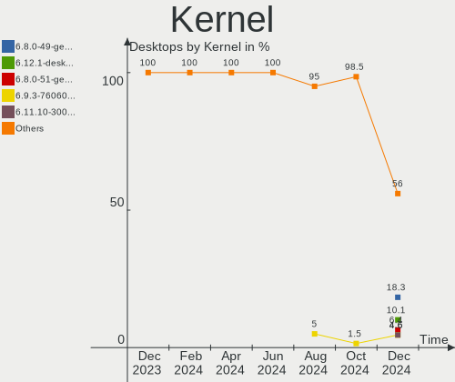
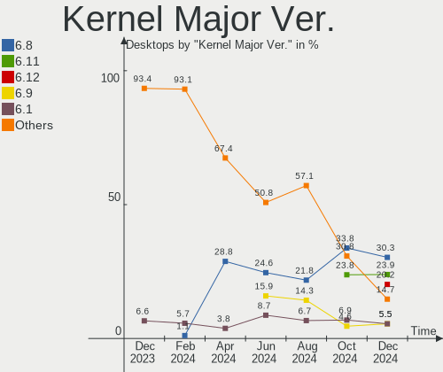
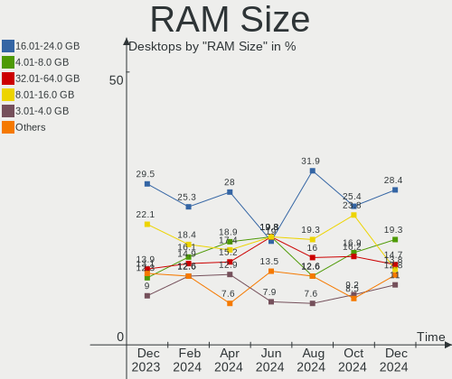
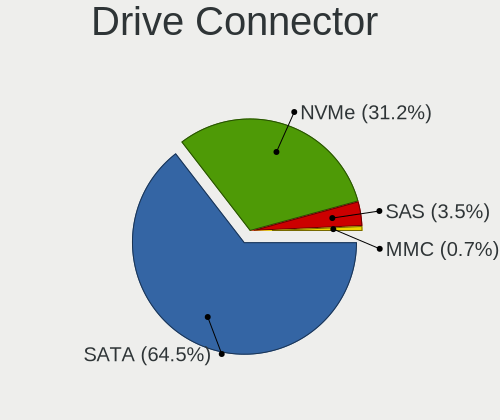
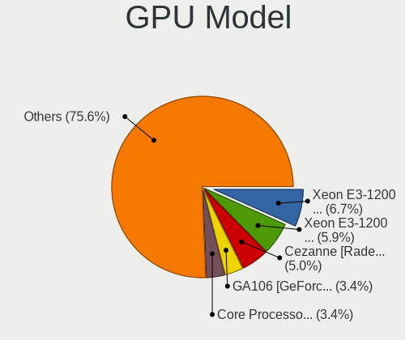
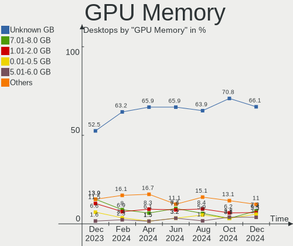
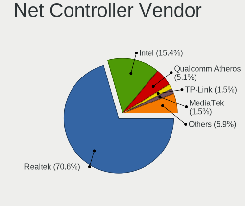
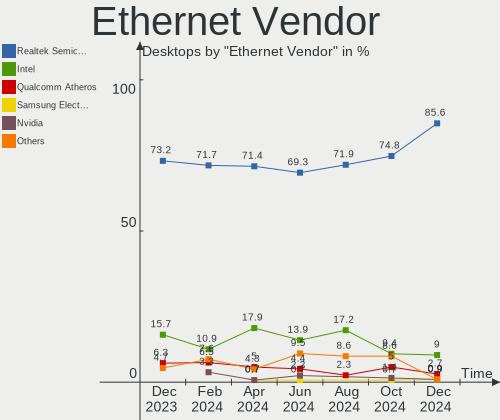

Linux in Brazil - Hardware Trends (Desktops)
--------------------------------------------

A project to identify most popular hardware characteristics and track their change
over time based on data collected by Linux users at https://Linux-Hardware.org.

Anyone can contribute to this report by the [hw-probe](https://github.com/linuxhw/hw-probe) tool:

    sudo -E hw-probe -all -upload

Period: Mar, 2023.

Contents
--------

* [ System ](#system)
  - [ OS                       ](#os)
  - [ OS Family                ](#os-family)
  - [ Kernel                   ](#kernel)
  - [ Kernel Family            ](#kernel-family)
  - [ Kernel Major Ver.        ](#kernel-major-ver)
  - [ Arch                     ](#arch)
  - [ DE                       ](#de)
  - [ Display Server           ](#display-server)
  - [ Display Manager          ](#display-manager)
  - [ OS Lang                  ](#os-lang)
  - [ Boot Mode                ](#boot-mode)
  - [ Filesystem               ](#filesystem)
  - [ Part. scheme             ](#part-scheme)
  - [ Dual Boot with Linux/BSD ](#dual-boot-with-linuxbsd)
  - [ Dual Boot (Win)          ](#dual-boot-win)

* [ Board ](#board)
  - [ Vendor                   ](#vendor)
  - [ Model                    ](#model)
  - [ Model Family             ](#model-family)
  - [ MFG Year                 ](#mfg-year)
  - [ Form Factor              ](#form-factor)
  - [ Secure Boot              ](#secure-boot)
  - [ Coreboot                 ](#coreboot)
  - [ RAM Size                 ](#ram-size)
  - [ RAM Used                 ](#ram-used)
  - [ Total Drives             ](#total-drives)
  - [ Has CD-ROM               ](#has-cd-rom)
  - [ Has Ethernet             ](#has-ethernet)
  - [ Has WiFi                 ](#has-wifi)
  - [ Has Bluetooth            ](#has-bluetooth)

* [ Location ](#location)
  - [ Country                  ](#country)
  - [ City                     ](#city)

* [ Drives ](#drives)
  - [ Drive Vendor             ](#drive-vendor)
  - [ Drive Model              ](#drive-model)
  - [ HDD Vendor               ](#hdd-vendor)
  - [ SSD Vendor               ](#ssd-vendor)
  - [ Drive Kind               ](#drive-kind)
  - [ Drive Connector          ](#drive-connector)
  - [ Drive Size               ](#drive-size)
  - [ Space Total              ](#space-total)
  - [ Space Used               ](#space-used)
  - [ Malfunc. Drives          ](#malfunc-drives)
  - [ Malfunc. Drive Vendor    ](#malfunc-drive-vendor)
  - [ Malfunc. HDD Vendor      ](#malfunc-hdd-vendor)
  - [ Malfunc. Drive Kind      ](#malfunc-drive-kind)
  - [ Failed Drives            ](#failed-drives)
  - [ Failed Drive Vendor      ](#failed-drive-vendor)
  - [ Drive Status             ](#drive-status)

* [ Storage controller ](#storage-controller)
  - [ Storage Vendor           ](#storage-vendor)
  - [ Storage Model            ](#storage-model)
  - [ Storage Kind             ](#storage-kind)

* [ Processor ](#processor)
  - [ CPU Vendor               ](#cpu-vendor)
  - [ CPU Model                ](#cpu-model)
  - [ CPU Model Family         ](#cpu-model-family)
  - [ CPU Cores                ](#cpu-cores)
  - [ CPU Sockets              ](#cpu-sockets)
  - [ CPU Threads              ](#cpu-threads)
  - [ CPU Op-Modes             ](#cpu-op-modes)
  - [ CPU Microcode            ](#cpu-microcode)
  - [ CPU Microarch            ](#cpu-microarch)

* [ Graphics ](#graphics)
  - [ GPU Vendor               ](#gpu-vendor)
  - [ GPU Model                ](#gpu-model)
  - [ GPU Combo                ](#gpu-combo)
  - [ GPU Driver               ](#gpu-driver)
  - [ GPU Memory               ](#gpu-memory)

* [ Monitor ](#monitor)
  - [ Monitor Vendor           ](#monitor-vendor)
  - [ Monitor Model            ](#monitor-model)
  - [ Monitor Resolution       ](#monitor-resolution)
  - [ Monitor Diagonal         ](#monitor-diagonal)
  - [ Monitor Width            ](#monitor-width)
  - [ Aspect Ratio             ](#aspect-ratio)
  - [ Monitor Area             ](#monitor-area)
  - [ Pixel Density            ](#pixel-density)
  - [ Multiple Monitors        ](#multiple-monitors)

* [ Network ](#network)
  - [ Net Controller Vendor    ](#net-controller-vendor)
  - [ Net Controller Model     ](#net-controller-model)
  - [ Wireless Vendor          ](#wireless-vendor)
  - [ Wireless Model           ](#wireless-model)
  - [ Ethernet Vendor          ](#ethernet-vendor)
  - [ Ethernet Model           ](#ethernet-model)
  - [ Net Controller Kind      ](#net-controller-kind)
  - [ Used Controller          ](#used-controller)
  - [ NICs                     ](#nics)
  - [ IPv6                     ](#ipv6)

* [ Bluetooth ](#bluetooth)
  - [ Bluetooth Vendor         ](#bluetooth-vendor)
  - [ Bluetooth Model          ](#bluetooth-model)

* [ Sound ](#sound)
  - [ Sound Vendor             ](#sound-vendor)
  - [ Sound Model              ](#sound-model)

* [ Memory ](#memory)
  - [ Memory Vendor            ](#memory-vendor)
  - [ Memory Model             ](#memory-model)
  - [ Memory Kind              ](#memory-kind)
  - [ Memory Form Factor       ](#memory-form-factor)
  - [ Memory Size              ](#memory-size)
  - [ Memory Speed             ](#memory-speed)

* [ Printers & scanners ](#printers--scanners)
  - [ Printer Vendor           ](#printer-vendor)
  - [ Printer Model            ](#printer-model)
  - [ Scanner Vendor           ](#scanner-vendor)
  - [ Scanner Model            ](#scanner-model)

* [ Camera ](#camera)
  - [ Camera Vendor            ](#camera-vendor)
  - [ Camera Model             ](#camera-model)

* [ Security ](#security)
  - [ Fingerprint Vendor       ](#fingerprint-vendor)
  - [ Fingerprint Model        ](#fingerprint-model)
  - [ Chipcard Vendor          ](#chipcard-vendor)
  - [ Chipcard Model           ](#chipcard-model)

* [ Unsupported ](#unsupported)
  - [ Unsupported Devices      ](#unsupported-devices)
  - [ Unsupported Device Types ](#unsupported-device-types)

System
------

OS
--

Installed operating systems

| Name                         | Desktops | Percent |
|------------------------------|----------|---------|
| Ubuntu 22.04                 | 17       | 14.05%  |
| Fedora 37                    | 14       | 11.57%  |
| Linux Mint 21.1              | 10       | 8.26%   |
| Zorin 16                     | 7        | 5.79%   |
| OpenMandriva 23.03           | 7        | 5.79%   |
| Pop!_OS 22.04                | 6        | 4.96%   |
| OpenMandriva 23.01           | 6        | 4.96%   |
| Ubuntu 22.10                 | 5        | 4.13%   |
| Arch Rolling                 | 5        | 4.13%   |
| Manjaro                      | 4        | 3.31%   |
| Xubuntu 22.04                | 3        | 2.48%   |
| openSUSE Tumbleweed-XXXXXXXX | 3        | 2.48%   |
| Kubuntu 22.04                | 3        | 2.48%   |
| Fedora 38                    | 3        | 2.48%   |
| Ubuntu MATE 22.04            | 2        | 1.65%   |
| Linux Mint 21                | 2        | 1.65%   |
| Linux Mint 20.3              | 2        | 1.65%   |
| Kubuntu 22.10                | 2        | 1.65%   |
| Endless 5.0.1                | 2        | 1.65%   |
| Debian 11                    | 2        | 1.65%   |
| Ubuntu Unity 22.10           | 1        | 0.83%   |
| Ubuntu Unity 16.04           | 1        | 0.83%   |
| Ubuntu Budgie 22.10          | 1        | 0.83%   |
| SteamOS 3.4                  | 1        | 0.83%   |
| ROSA 12.3                    | 1        | 0.83%   |
| openSUSE Microos-XXXXXXXX    | 1        | 0.83%   |
| OpenMandriva 4.2             | 1        | 0.83%   |
| Nobara 37                    | 1        | 0.83%   |
| Lubuntu 22.04                | 1        | 0.83%   |
| Linux Mint 20.2              | 1        | 0.83%   |
| Linux Mint 20.1              | 1        | 0.83%   |
| Linux Mint 19.1              | 1        | 0.83%   |
| GNOME OS Nightly             | 1        | 0.83%   |
| Endless 4.0.12               | 1        | 0.83%   |
| BigLinux 22.0.4              | 1        | 0.83%   |
| Alpine 3.17.2                | 1        | 0.83%   |

OS Family
---------

OS without a version

| Name          | Desktops | Percent |
|---------------|----------|---------|
| Ubuntu        | 22       | 18.18%  |
| Linux Mint    | 17       | 14.05%  |
| Fedora        | 17       | 14.05%  |
| OpenMandriva  | 14       | 11.57%  |
| Zorin         | 7        | 5.79%   |
| Pop!_OS       | 6        | 4.96%   |
| Kubuntu       | 5        | 4.13%   |
| Arch          | 5        | 4.13%   |
| openSUSE      | 4        | 3.31%   |
| Manjaro       | 4        | 3.31%   |
| Xubuntu       | 3        | 2.48%   |
| Endless       | 3        | 2.48%   |
| Ubuntu Unity  | 2        | 1.65%   |
| Ubuntu MATE   | 2        | 1.65%   |
| Debian        | 2        | 1.65%   |
| Ubuntu Budgie | 1        | 0.83%   |
| SteamOS       | 1        | 0.83%   |
| ROSA          | 1        | 0.83%   |
| Nobara        | 1        | 0.83%   |
| Lubuntu       | 1        | 0.83%   |
| GNOME OS      | 1        | 0.83%   |
| BigLinux      | 1        | 0.83%   |
| Alpine        | 1        | 0.83%   |

Kernel
------

Version of the Linux kernel

| Version                     | Desktops | Percent |
|-----------------------------|----------|---------|
| 5.15.0-67-generic           | 21       | 17.36%  |
| 5.19.0-35-generic           | 17       | 14.05%  |
| 6.1.18-200.fc37.x86_64      | 6        | 4.96%   |
| 6.2.6-desktop-1omv2390      | 5        | 4.13%   |
| 6.1.1-desktop-1omv2290      | 5        | 4.13%   |
| 5.19.0-38-generic           | 4        | 3.31%   |
| 6.2.7-200.fc37.x86_64       | 3        | 2.48%   |
| 6.2.6-76060206-generic      | 3        | 2.48%   |
| 6.1.12-1-MANJARO            | 3        | 2.48%   |
| 5.15.0-69-generic           | 3        | 2.48%   |
| 6.2.6-1-default             | 2        | 1.65%   |
| 6.2.1-desktop-1omv2390      | 2        | 1.65%   |
| 6.2.1-1-default             | 2        | 1.65%   |
| 6.1.15-200.fc37.x86_64      | 2        | 1.65%   |
| 6.0.7-301.fc37.x86_64       | 2        | 1.65%   |
| 6.0.12-76060006-generic     | 2        | 1.65%   |
| 5.4.0-144-generic           | 2        | 1.65%   |
| 5.19.0-32-generic           | 2        | 1.65%   |
| 5.15.0-56-generic           | 2        | 1.65%   |
| 5.15.0-47-generic           | 2        | 1.65%   |
| 6.2.8-arch1-1               | 1        | 0.83%   |
| 6.2.8-200.fsync.fc37.x86_64 | 1        | 0.83%   |
| 6.2.7-arch1-1               | 1        | 0.83%   |
| 6.2.7-300.fc38.x86_64       | 1        | 0.83%   |
| 6.2.6-zen1-1-zen            | 1        | 0.83%   |
| 6.2.6-arch1-1               | 1        | 0.83%   |
| 6.2.5-300.fc38.x86_64       | 1        | 0.83%   |
| 6.2.2-desktop-1omv2390      | 1        | 0.83%   |
| 6.2.2-arch1-1               | 1        | 0.83%   |
| 6.2.1-300.fc38.x86_64       | 1        | 0.83%   |
| 6.1.19-1-MANJARO            | 1        | 0.83%   |
| 6.1.14-1-liquorix-amd64     | 1        | 0.83%   |
| 6.1.12-200.fc37.x86_64      | 1        | 0.83%   |
| 6.1.11-76060111-generic     | 1        | 0.83%   |
| 6.0.5-4-rt14-MANJARO        | 1        | 0.83%   |
| 5.4.0-132-generic           | 1        | 0.83%   |
| 5.19.17                     | 1        | 0.83%   |
| 5.19.0-37-generic           | 1        | 0.83%   |
| 5.19.0-31-generic           | 1        | 0.83%   |
| 5.19.0-21-generic           | 1        | 0.83%   |

Kernel Family
-------------

Linux kernel without a distro release

| Version | Desktops | Percent |
|---------|----------|---------|
| 5.15.0  | 31       | 25.62%  |
| 5.19.0  | 26       | 21.49%  |
| 6.2.6   | 12       | 9.92%   |
| 6.1.18  | 6        | 4.96%   |
| 6.2.7   | 5        | 4.13%   |
| 6.2.1   | 5        | 4.13%   |
| 6.1.1   | 5        | 4.13%   |
| 6.1.12  | 4        | 3.31%   |
| 5.4.0   | 3        | 2.48%   |
| 6.2.8   | 2        | 1.65%   |
| 6.2.2   | 2        | 1.65%   |
| 6.1.15  | 2        | 1.65%   |
| 6.0.7   | 2        | 1.65%   |
| 6.0.12  | 2        | 1.65%   |
| 6.2.5   | 1        | 0.83%   |
| 6.1.19  | 1        | 0.83%   |
| 6.1.14  | 1        | 0.83%   |
| 6.1.11  | 1        | 0.83%   |
| 6.0.5   | 1        | 0.83%   |
| 5.19.17 | 1        | 0.83%   |
| 5.15.98 | 1        | 0.83%   |
| 5.15.79 | 1        | 0.83%   |
| 5.13.0  | 1        | 0.83%   |
| 5.11.12 | 1        | 0.83%   |
| 5.11.0  | 1        | 0.83%   |
| 5.10.0  | 1        | 0.83%   |
| 4.4.0   | 1        | 0.83%   |
| 4.15.0  | 1        | 0.83%   |

Kernel Major Ver.
-----------------

Linux kernel major version

| Version | Desktops | Percent |
|---------|----------|---------|
| 5.15    | 33       | 27.27%  |
| 6.2     | 27       | 22.31%  |
| 5.19    | 27       | 22.31%  |
| 6.1     | 20       | 16.53%  |
| 6.0     | 5        | 4.13%   |
| 5.4     | 3        | 2.48%   |
| 5.11    | 2        | 1.65%   |
| 5.13    | 1        | 0.83%   |
| 5.10    | 1        | 0.83%   |
| 4.4     | 1        | 0.83%   |
| 4.15    | 1        | 0.83%   |

Arch
----

OS architecture (x86_64, i586, etc.)

| Name   | Desktops | Percent |
|--------|----------|---------|
| x86_64 | 120      | 99.17%  |
| i686   | 1        | 0.83%   |

DE
--

Desktop Environment

| Name       | Desktops | Percent |
|------------|----------|---------|
| GNOME      | 59       | 48.76%  |
| KDE5       | 32       | 26.45%  |
| X-Cinnamon | 13       | 10.74%  |
| XFCE       | 7        | 5.79%   |
| MATE       | 4        | 3.31%   |
| Unity      | 2        | 1.65%   |
| LXQt       | 1        | 0.83%   |
| Hyprland   | 1        | 0.83%   |
| Budgie     | 1        | 0.83%   |
| Unknown    | 1        | 0.83%   |

Display Server
--------------

X11 or Wayland

| Name    | Desktops | Percent |
|---------|----------|---------|
| X11     | 87       | 71.9%   |
| Wayland | 33       | 27.27%  |
| Unknown | 1        | 0.83%   |

Display Manager
---------------

SDDM, LightDM, etc.

| Name    | Desktops | Percent |
|---------|----------|---------|
| Unknown | 62       | 51.24%  |
| SDDM    | 22       | 18.18%  |
| GDM3    | 19       | 15.7%   |
| LightDM | 11       | 9.09%   |
| GDM     | 7        | 5.79%   |

OS Lang
-------

Language

| Lang  | Desktops | Percent |
|-------|----------|---------|
| pt_BR | 94       | 77.69%  |
| en_US | 25       | 20.66%  |
| en_CA | 1        | 0.83%   |
| C     | 1        | 0.83%   |

Boot Mode
---------

EFI or BIOS

| Mode | Desktops | Percent |
|------|----------|---------|
| BIOS | 64       | 52.89%  |
| EFI  | 57       | 47.11%  |

Filesystem
----------

Type of filesystem

| Type    | Desktops | Percent |
|---------|----------|---------|
| Ext4    | 81       | 66.94%  |
| Btrfs   | 28       | 23.14%  |
| Overlay | 7        | 5.79%   |
| Zfs     | 2        | 1.65%   |
| Xfs     | 1        | 0.83%   |
| Ext3    | 1        | 0.83%   |
| Ext2    | 1        | 0.83%   |

Part. scheme
------------

Scheme of partitioning

| Type    | Desktops | Percent |
|---------|----------|---------|
| Unknown | 63       | 52.07%  |
| GPT     | 41       | 33.88%  |
| MBR     | 17       | 14.05%  |

Dual Boot with Linux/BSD
------------------------

Hosting more than one Linux/BSD

| Dual boot | Desktops | Percent |
|-----------|----------|---------|
| No        | 109      | 90.08%  |
| Yes       | 12       | 9.92%   |

Dual Boot (Win)
---------------

Hosting Linux and Windows

| Dual boot | Desktops | Percent |
|-----------|----------|---------|
| No        | 89       | 73.55%  |
| Yes       | 32       | 26.45%  |

Board
-----

Vendor
------

Motherboard manufacturer

| Name                | Desktops | Percent |
|---------------------|----------|---------|
| Gigabyte Technology | 25       | 20.66%  |
| ASUSTek Computer    | 24       | 19.83%  |
| Intel               | 14       | 11.57%  |
| Dell                | 8        | 6.61%   |
| ASRock              | 7        | 5.79%   |
| MSI                 | 6        | 4.96%   |
| Positivo            | 5        | 4.13%   |
| PCWare              | 4        | 3.31%   |
| Lenovo              | 4        | 3.31%   |
| MACHINIST           | 3        | 2.48%   |
| Hewlett-Packard     | 3        | 2.48%   |
| Itautec             | 2        | 1.65%   |
| HOUTER              | 2        | 1.65%   |
| Biostar             | 2        | 1.65%   |
| Win element         | 1        | 0.83%   |
| QIYIDA              | 1        | 0.83%   |
| Pegatron            | 1        | 0.83%   |
| OEM                 | 1        | 0.83%   |
| Huanan              | 1        | 0.83%   |
| Digiboard           | 1        | 0.83%   |
| DIEBOLD             | 1        | 0.83%   |
| Daten Tecnologia    | 1        | 0.83%   |
| Colorful Technology | 1        | 0.83%   |
| CCE                 | 1        | 0.83%   |
| BESSTAR Tech        | 1        | 0.83%   |
| AZW                 | 1        | 0.83%   |

Model
-----

Motherboard model

| Name                                                         | Desktops | Percent |
|--------------------------------------------------------------|----------|---------|
| Gigabyte A320M-S2H                                           | 5        | 4.13%   |
| Intel X99                                                    | 3        | 2.48%   |
| Intel H61                                                    | 3        | 2.48%   |
| ASUS M5A78L-M LX/BR                                          | 3        | 2.48%   |
| ASUS All Series                                              | 3        | 2.48%   |
| MACHINIST E5-MR9A PRO V1.1                                   | 2        | 1.65%   |
| Intel X99 V1.0                                               | 2        | 1.65%   |
| Dell XPS 8700                                                | 2        | 1.65%   |
| ASUS TUF Gaming X570-PLUS_BR                                 | 2        | 1.65%   |
| ASUS PRIME A320M-K/BR                                        | 2        | 1.65%   |
| ASUS M5A78L-M/USB3                                           | 2        | 1.65%   |
| Win element M600                                             | 1        | 0.83%   |
| QIYIDA X99-H9 V2.0                                           | 1        | 0.83%   |
| Positivo Positivo Master D610                                | 1        | 0.83%   |
| Positivo POS-PIQ77CL                                         | 1        | 0.83%   |
| Positivo POS-PIH55BO                                         | 1        | 0.83%   |
| Positivo POS-EIH61CE                                         | 1        | 0.83%   |
| Positivo P5VD2-MX                                            | 1        | 0.83%   |
| Pegatron SM 3330B                                            | 1        | 0.83%   |
| PCWare IPX4105G Pro                                          | 1        | 0.83%   |
| PCWare IPMH61R3                                              | 1        | 0.83%   |
| PCWare IPMH310G                                              | 1        | 0.83%   |
| PCWare APM-A320G                                             | 1        | 0.83%   |
| MSI MS-7D76                                                  | 1        | 0.83%   |
| MSI MS-7D20                                                  | 1        | 0.83%   |
| MSI MS-7C96                                                  | 1        | 0.83%   |
| MSI MS-7B10                                                  | 1        | 0.83%   |
| MSI MS-7A38                                                  | 1        | 0.83%   |
| MSI MS-7693                                                  | 1        | 0.83%   |
| MACHINIST X99-RS9 V2.0                                       | 1        | 0.83%   |
| Lenovo ThinkCentre M93 10A4S03D00                            | 1        | 0.83%   |
| Lenovo ThinkCentre M91P 4518NR1                              | 1        | 0.83%   |
| Lenovo ThinkCentre Edge71 1577K3P                            | 1        | 0.83%   |
| Lenovo 63 90AT0002BR                                         | 1        | 0.83%   |
| Itautec ST 4265                                              | 1        | 0.83%   |
| Itautec Infoway ST-4254                                      | 1        | 0.83%   |
| Intel X79 (INTEL Xeon E5/Corei7 DMI2 - C600/C200 Cipset V304 | 1        | 0.83%   |
| Intel H61 V1.1                                               | 1        | 0.83%   |
| Intel DH87RL AAG74240-401                                    | 1        | 0.83%   |
| Intel D525MW AAE93082-401                                    | 1        | 0.83%   |

Model Family
------------

Motherboard model prefix

| Name                 | Desktops | Percent |
|----------------------|----------|---------|
| ASUS PRIME           | 7        | 5.79%   |
| ASUS M5A78L-M        | 6        | 4.96%   |
| Intel X99            | 5        | 4.13%   |
| Gigabyte A320M-S2H   | 5        | 4.13%   |
| Intel H61            | 4        | 3.31%   |
| ASUS TUF             | 4        | 3.31%   |
| Lenovo ThinkCentre   | 3        | 2.48%   |
| Dell OptiPlex        | 3        | 2.48%   |
| ASUS All             | 3        | 2.48%   |
| MACHINIST E5-MR9A    | 2        | 1.65%   |
| Intel B75            | 2        | 1.65%   |
| HP EliteDesk         | 2        | 1.65%   |
| Dell XPS             | 2        | 1.65%   |
| Win element M600     | 1        | 0.83%   |
| QIYIDA X99-H9        | 1        | 0.83%   |
| Positivo Positivo    | 1        | 0.83%   |
| Positivo POS-PIQ77CL | 1        | 0.83%   |
| Positivo POS-PIH55BO | 1        | 0.83%   |
| Positivo POS-EIH61CE | 1        | 0.83%   |
| Positivo P5VD2-MX    | 1        | 0.83%   |
| Pegatron SM          | 1        | 0.83%   |
| PCWare IPX4105G      | 1        | 0.83%   |
| PCWare IPMH61R3      | 1        | 0.83%   |
| PCWare IPMH310G      | 1        | 0.83%   |
| PCWare APM-A320G     | 1        | 0.83%   |
| MSI MS-7D76          | 1        | 0.83%   |
| MSI MS-7D20          | 1        | 0.83%   |
| MSI MS-7C96          | 1        | 0.83%   |
| MSI MS-7B10          | 1        | 0.83%   |
| MSI MS-7A38          | 1        | 0.83%   |
| MSI MS-7693          | 1        | 0.83%   |
| MACHINIST X99-RS9    | 1        | 0.83%   |
| Lenovo 63            | 1        | 0.83%   |
| Itautec ST           | 1        | 0.83%   |
| Itautec Infoway      | 1        | 0.83%   |
| Intel X79            | 1        | 0.83%   |
| Intel DH87RL         | 1        | 0.83%   |
| Intel D525MW         | 1        | 0.83%   |
| Huanan X99-QD4       | 1        | 0.83%   |
| HOUTER ORO-PC        | 1        | 0.83%   |

MFG Year
--------

Motherboard manufacture year

| Year    | Desktops | Percent |
|---------|----------|---------|
| 2017    | 15       | 12.4%   |
| 2011    | 15       | 12.4%   |
| 2020    | 13       | 10.74%  |
| 2019    | 12       | 9.92%   |
| 2018    | 12       | 9.92%   |
| 2022    | 10       | 8.26%   |
| 2013    | 10       | 8.26%   |
| 2021    | 6        | 4.96%   |
| 2016    | 6        | 4.96%   |
| 2014    | 5        | 4.13%   |
| 2015    | 4        | 3.31%   |
| 2012    | 3        | 2.48%   |
| 2009    | 3        | 2.48%   |
| 2010    | 2        | 1.65%   |
| Unknown | 2        | 1.65%   |
| 2008    | 1        | 0.83%   |
| 2007    | 1        | 0.83%   |
| 2006    | 1        | 0.83%   |

Form Factor
-----------

Physical design of the computer

| Name    | Desktops | Percent |
|---------|----------|---------|
| Desktop | 121      | 100%    |

Secure Boot
-----------

Enabled or disabled

| State    | Desktops | Percent |
|----------|----------|---------|
| Disabled | 117      | 96.69%  |
| Enabled  | 4        | 3.31%   |

Coreboot
--------

Have coreboot on board

| Used | Desktops | Percent |
|------|----------|---------|
| No   | 121      | 100%    |

RAM Size
--------

Total RAM memory

| Size in GB  | Desktops | Percent |
|-------------|----------|---------|
| 16.01-24.0  | 39       | 32.23%  |
| 4.01-8.0    | 29       | 23.97%  |
| 8.01-16.0   | 26       | 21.49%  |
| 32.01-64.0  | 11       | 9.09%   |
| 3.01-4.0    | 9        | 7.44%   |
| 2.01-3.0    | 4        | 3.31%   |
| 24.01-32.0  | 2        | 1.65%   |
| 64.01-256.0 | 1        | 0.83%   |

RAM Used
--------

Used RAM memory

| Used GB    | Desktops | Percent |
|------------|----------|---------|
| 2.01-3.0   | 37       | 30.58%  |
| 4.01-8.0   | 31       | 25.62%  |
| 1.01-2.0   | 28       | 23.14%  |
| 3.01-4.0   | 17       | 14.05%  |
| 8.01-16.0  | 4        | 3.31%   |
| 0.51-1.0   | 3        | 2.48%   |
| 16.01-24.0 | 1        | 0.83%   |

Total Drives
------------

Number of drives on board

| Drives | Desktops | Percent |
|--------|----------|---------|
| 1      | 59       | 48.76%  |
| 2      | 30       | 24.79%  |
| 3      | 13       | 10.74%  |
| 4      | 12       | 9.92%   |
| 6      | 3        | 2.48%   |
| 5      | 2        | 1.65%   |
| 0      | 2        | 1.65%   |

Has CD-ROM
----------

Has CD-ROM on board

| Presented | Desktops | Percent |
|-----------|----------|---------|
| No        | 88       | 72.73%  |
| Yes       | 33       | 27.27%  |

Has Ethernet
------------

Has Ethernet on board

| Presented | Desktops | Percent |
|-----------|----------|---------|
| Yes       | 120      | 99.17%  |
| No        | 1        | 0.83%   |

Has WiFi
--------

Has WiFi module

| Presented | Desktops | Percent |
|-----------|----------|---------|
| No        | 68       | 56.2%   |
| Yes       | 53       | 43.8%   |

Has Bluetooth
-------------

Has Bluetooth module

| Presented | Desktops | Percent |
|-----------|----------|---------|
| No        | 90       | 74.38%  |
| Yes       | 31       | 25.62%  |

Location
--------

Country
-------

Geographic location (country)

| Country | Desktops | Percent |
|---------|----------|---------|
| Brazil  | 121      | 100%    |

City
----

Geographic location (city)

| City                  | Desktops | Percent |
|-----------------------|----------|---------|
| Rio de Janeiro        | 10       | 8.26%   |
| Sao Paulo             | 9        | 7.44%   |
| Porto Alegre          | 5        | 4.13%   |
| Brasília             | 4        | 3.31%   |
| Fortaleza             | 3        | 2.48%   |
| Curitiba              | 3        | 2.48%   |
| Belo Horizonte        | 3        | 2.48%   |
| Sao José dos Campos  | 2        | 1.65%   |
| Sao Bernardo do Campo | 2        | 1.65%   |
| Santa Cruz do Sul     | 2        | 1.65%   |
| Rio das Ostras        | 2        | 1.65%   |
| Recife                | 2        | 1.65%   |
| Palmas                | 2        | 1.65%   |
| Niterói              | 2        | 1.65%   |
| Caruaru               | 2        | 1.65%   |
| Campinas              | 2        | 1.65%   |
| Volta Redonda         | 1        | 0.83%   |
| Vila Velha            | 1        | 0.83%   |
| Viamao                | 1        | 0.83%   |
| Varzelandia           | 1        | 0.83%   |
| Uberaba               | 1        | 0.83%   |
| Tupi Paulista         | 1        | 0.83%   |
| Timbo                 | 1        | 0.83%   |
| Teresopolis           | 1        | 0.83%   |
| Taquaritinga          | 1        | 0.83%   |
| Sumaré               | 1        | 0.83%   |
| Serra                 | 1        | 0.83%   |
| Sao Vicente           | 1        | 0.83%   |
| Sao Lourenço         | 1        | 0.83%   |
| Sao Goncalo           | 1        | 0.83%   |
| Sao Francisco do Sul  | 1        | 0.83%   |
| Santo André          | 1        | 0.83%   |
| Santa Luzia           | 1        | 0.83%   |
| Rio Grande            | 1        | 0.83%   |
| Rio Bonito            | 1        | 0.83%   |
| Pouso Alegre          | 1        | 0.83%   |
| Ponta Grossa          | 1        | 0.83%   |
| Poços de Caldas      | 1        | 0.83%   |
| Pelotas               | 1        | 0.83%   |
| Osasco                | 1        | 0.83%   |

Drives
------

Drive Vendor
------------

Hard drive vendors

| Vendor                      | Desktops | Drives | Percent |
|-----------------------------|----------|--------|---------|
| WDC                         | 40       | 45     | 19.14%  |
| Seagate                     | 39       | 47     | 18.66%  |
| Kingston                    | 20       | 22     | 9.57%   |
| Samsung Electronics         | 15       | 22     | 7.18%   |
| Sandisk                     | 12       | 14     | 5.74%   |
| China                       | 8        | 8      | 3.83%   |
| Toshiba                     | 7        | 8      | 3.35%   |
| Silicon Motion              | 6        | 6      | 2.87%   |
| XrayDisk                    | 5        | 5      | 2.39%   |
| KingSpec                    | 5        | 5      | 2.39%   |
| Netac                       | 4        | 4      | 1.91%   |
| Crucial                     | 4        | 4      | 1.91%   |
| Unknown                     | 3        | 4      | 1.44%   |
| Realtek Semiconductor       | 3        | 3      | 1.44%   |
| Patriot                     | 3        | 3      | 1.44%   |
| A-DATA Technology           | 3        | 3      | 1.44%   |
| Phison Electronics          | 2        | 2      | 0.96%   |
| Micron/Crucial Technology   | 2        | 2      | 0.96%   |
| Lexar                       | 2        | 2      | 0.96%   |
| JMicron Technology          | 2        | 2      | 0.96%   |
| Hitachi                     | 2        | 2      | 0.96%   |
| Unknown                     | 2        | 2      | 0.96%   |
| USB3.0                      | 1        | 1      | 0.48%   |
| SK hynix                    | 1        | 1      | 0.48%   |
| RZX                         | 1        | 1      | 0.48%   |
| PNY                         | 1        | 1      | 0.48%   |
| Pichau                      | 1        | 1      | 0.48%   |
| OCZ                         | 1        | 1      | 0.48%   |
| NT-1TB                      | 1        | 1      | 0.48%   |
| NN                          | 1        | 1      | 0.48%   |
| MAXIO Technology (Hangzhou) | 1        | 1      | 0.48%   |
| LITEON                      | 1        | 1      | 0.48%   |
| KODAK                       | 1        | 1      | 0.48%   |
| JingHai                     | 1        | 1      | 0.48%   |
| HS-SSD-E100                 | 1        | 1      | 0.48%   |
| HS-SSD-C100                 | 1        | 1      | 0.48%   |
| HGST                        | 1        | 1      | 0.48%   |
| Fujitsu                     | 1        | 1      | 0.48%   |
| ASMT                        | 1        | 1      | 0.48%   |
| AirDisk                     | 1        | 1      | 0.48%   |

Drive Model
-----------

Hard drive models

| Model                                                  | Desktops | Percent |
|--------------------------------------------------------|----------|---------|
| Seagate ST1000DM010-2EP102 1TB                         | 13       | 5.63%   |
| Kingston SA400S37240G 240GB SSD                        | 7        | 3.03%   |
| Kingston SA400S37480G 480GB SSD                        | 5        | 2.16%   |
| Silicon Motion SM2263EN/SM2263XT SSD Controller 1024GB | 3        | 1.3%    |
| Seagate ST500DM002-1BD142 500GB                        | 3        | 1.3%    |
| Seagate ST3500418AS 500GB                              | 3        | 1.3%    |
| Samsung HD502HJ 500GB                                  | 3        | 1.3%    |
| Samsung HD322HJ 320GB                                  | 3        | 1.3%    |
| Kingston SA400S37120G 120GB SSD                        | 3        | 1.3%    |
| China SSD 120GB                                        | 3        | 1.3%    |
| XrayDisk 480GB SSD                                     | 2        | 0.87%   |
| XrayDisk 1TB SSD                                       | 2        | 0.87%   |
| WDC WDS240G2G0A-00JH30 240GB SSD                       | 2        | 0.87%   |
| WDC WD5000AAKX-08U6AA0 500GB                           | 2        | 0.87%   |
| WDC WD10SPZX-24Z10 1TB                                 | 2        | 0.87%   |
| WDC WD10EZEX-00WN4A0 1TB                               | 2        | 0.87%   |
| WDC WD10EARS-00Y5B1 1TB                                | 2        | 0.87%   |
| WDC WD Green 2.5 1000GB SSD                            | 2        | 0.87%   |
| Toshiba HDWD110 1TB                                    | 2        | 0.87%   |
| Seagate ST31000524AS 1TB                               | 2        | 0.87%   |
| Seagate ST2000DM008-2FR102 2TB                         | 2        | 0.87%   |
| Seagate ST2000DM006-2DM164 2TB                         | 2        | 0.87%   |
| Seagate ST1000DM003-1CH162 1TB                         | 2        | 0.87%   |
| Seagate Expansion+ 2TB                                 | 2        | 0.87%   |
| SanDisk SSD PLUS 240GB                                 | 2        | 0.87%   |
| SanDisk SDSSDA240G 240GB                               | 2        | 0.87%   |
| Samsung NVMe SSD Controller SM981/PM981/PM983 250GB    | 2        | 0.87%   |
| Patriot Burst 480GB SSD                                | 2        | 0.87%   |
| Kingston SA400S37960G 960GB SSD                        | 2        | 0.87%   |
| KingSpec P3-256 256GB SSD                              | 2        | 0.87%   |
| Crucial CT1000BX500SSD1 1TB                            | 2        | 0.87%   |
| China SSD 480GB                                        | 2        | 0.87%   |
| A-DATA SU650 120GB SSD                                 | 2        | 0.87%   |
| Unknown                                                | 2        | 0.87%   |
| XrayDisk 240GB                                         | 1        | 0.43%   |
| WDC WDS500G3X0C-00SJG0 500GB                           | 1        | 0.43%   |
| WDC WDS500G2B0B-00YS70 500GB SSD                       | 1        | 0.43%   |
| WDC WDS500G2B0A-00SM50 500GB SSD                       | 1        | 0.43%   |
| WDC WDS480G2G0B-00EPW0 480GB SSD                       | 1        | 0.43%   |
| WDC WDS240G2G0B-00EPW0 240GB SSD                       | 1        | 0.43%   |

HDD Vendor
----------

Hard disk drive vendors

| Vendor              | Desktops | Drives | Percent |
|---------------------|----------|--------|---------|
| Seagate             | 39       | 47     | 42.39%  |
| WDC                 | 30       | 34     | 32.61%  |
| Samsung Electronics | 11       | 14     | 11.96%  |
| Toshiba             | 6        | 7      | 6.52%   |
| Hitachi             | 2        | 2      | 2.17%   |
| USB3.0              | 1        | 1      | 1.09%   |
| HGST                | 1        | 1      | 1.09%   |
| Fujitsu             | 1        | 1      | 1.09%   |
| ASMT                | 1        | 1      | 1.09%   |

SSD Vendor
----------

Solid state drive vendors

| Vendor              | Desktops | Drives | Percent |
|---------------------|----------|--------|---------|
| Kingston            | 18       | 20     | 22.78%  |
| WDC                 | 9        | 10     | 11.39%  |
| SanDisk             | 9        | 10     | 11.39%  |
| China               | 8        | 8      | 10.13%  |
| XrayDisk            | 4        | 4      | 5.06%   |
| KingSpec            | 4        | 4      | 5.06%   |
| Crucial             | 4        | 4      | 5.06%   |
| Patriot             | 3        | 3      | 3.8%    |
| Netac               | 3        | 3      | 3.8%    |
| A-DATA Technology   | 2        | 2      | 2.53%   |
| Toshiba             | 1        | 1      | 1.27%   |
| Samsung Electronics | 1        | 4      | 1.27%   |
| RZX                 | 1        | 1      | 1.27%   |
| PNY                 | 1        | 1      | 1.27%   |
| Pichau              | 1        | 1      | 1.27%   |
| OCZ                 | 1        | 1      | 1.27%   |
| NT-1TB              | 1        | 1      | 1.27%   |
| NN                  | 1        | 1      | 1.27%   |
| LITEON              | 1        | 1      | 1.27%   |
| Lexar               | 1        | 1      | 1.27%   |
| KODAK               | 1        | 1      | 1.27%   |
| JMicron Technology  | 1        | 1      | 1.27%   |
| HS-SSD-C100         | 1        | 1      | 1.27%   |
| AirDisk             | 1        | 1      | 1.27%   |
| AFOX                | 1        | 1      | 1.27%   |

Drive Kind
----------

HDD or SSD

| Kind    | Desktops | Drives | Percent |
|---------|----------|--------|---------|
| HDD     | 73       | 108    | 41.48%  |
| SSD     | 68       | 86     | 38.64%  |
| NVMe    | 26       | 30     | 14.77%  |
| Unknown | 9        | 11     | 5.11%   |

Drive Connector
---------------

SATA, SAS, NVMe, etc.

| Type | Desktops | Drives | Percent |
|------|----------|--------|---------|
| SATA | 111      | 191    | 74%     |
| NVMe | 26       | 30     | 17.33%  |
| SAS  | 13       | 14     | 8.67%   |

Drive Size
----------

Size of hard drive

| Size in TB | Desktops | Drives | Percent |
|------------|----------|--------|---------|
| 0.01-0.5   | 84       | 118    | 55.26%  |
| 0.51-1.0   | 53       | 60     | 34.87%  |
| 1.01-2.0   | 14       | 15     | 9.21%   |
| 2.01-3.0   | 1        | 1      | 0.66%   |

Space Total
-----------

Amount of disk space available on the file system

| Size in GB     | Desktops | Percent |
|----------------|----------|---------|
| 251-500        | 31       | 25.62%  |
| 1001-2000      | 26       | 21.49%  |
| 101-250        | 25       | 20.66%  |
| 501-1000       | 17       | 14.05%  |
| 1-20           | 7        | 5.79%   |
| More than 3000 | 5        | 4.13%   |
| 2001-3000      | 5        | 4.13%   |
| 21-50          | 3        | 2.48%   |
| 51-100         | 2        | 1.65%   |

Space Used
----------

Amount of used disk space

| Used GB   | Desktops | Percent |
|-----------|----------|---------|
| 1-20      | 30       | 24.79%  |
| 21-50     | 22       | 18.18%  |
| 51-100    | 22       | 18.18%  |
| 251-500   | 15       | 12.4%   |
| 101-250   | 14       | 11.57%  |
| 501-1000  | 12       | 9.92%   |
| 2001-3000 | 3        | 2.48%   |
| 1001-2000 | 3        | 2.48%   |

Malfunc. Drives
---------------

Drive models with a malfunction

| Model                             | Desktops | Drives | Percent |
|-----------------------------------|----------|--------|---------|
| WDC WDS240G2G0A-00JH30 240GB SSD  | 1        | 1      | 5.56%   |
| WDC WD5000AAKX-603CA0 500GB       | 1        | 1      | 5.56%   |
| WDC WD5000AAKX-08U6AA0 500GB      | 1        | 1      | 5.56%   |
| WDC WD10EZEX-00RKKA0 1TB          | 1        | 1      | 5.56%   |
| WDC WD Green 2.5 1000GB SSD       | 1        | 1      | 5.56%   |
| Toshiba MK5059GSXP 500GB          | 1        | 1      | 5.56%   |
| Seagate ST9750420AS 752GB         | 1        | 1      | 5.56%   |
| Seagate ST9500325AS 500GB         | 1        | 1      | 5.56%   |
| Seagate ST3500418AS 500GB         | 1        | 1      | 5.56%   |
| Seagate ST3500312CS 500GB         | 1        | 1      | 5.56%   |
| Seagate ST3320613AS 320GB         | 1        | 1      | 5.56%   |
| Seagate ST1000DM010-2EP102 1TB    | 1        | 1      | 5.56%   |
| Seagate ST1000DM003-1ER162 1TB    | 1        | 1      | 5.56%   |
| Samsung Electronics HD502HI 500GB | 1        | 1      | 5.56%   |
| Samsung Electronics HD322HJ 320GB | 1        | 1      | 5.56%   |
| Hitachi HCC545050A7E380 500GB     | 1        | 1      | 5.56%   |
| China SSD 256GB                   | 1        | 1      | 5.56%   |
| China SSD 128GB                   | 1        | 1      | 5.56%   |

Malfunc. Drive Vendor
---------------------

Vendors of faulty drives

| Vendor              | Desktops | Drives | Percent |
|---------------------|----------|--------|---------|
| Seagate             | 7        | 7      | 38.89%  |
| WDC                 | 5        | 5      | 27.78%  |
| Samsung Electronics | 2        | 2      | 11.11%  |
| China               | 2        | 2      | 11.11%  |
| Toshiba             | 1        | 1      | 5.56%   |
| Hitachi             | 1        | 1      | 5.56%   |

Malfunc. HDD Vendor
-------------------

Vendors of faulty HDD drives

| Vendor              | Desktops | Drives | Percent |
|---------------------|----------|--------|---------|
| Seagate             | 7        | 7      | 50%     |
| WDC                 | 3        | 3      | 21.43%  |
| Samsung Electronics | 2        | 2      | 14.29%  |
| Toshiba             | 1        | 1      | 7.14%   |
| Hitachi             | 1        | 1      | 7.14%   |

Malfunc. Drive Kind
-------------------

Kinds of faulty drives

| Kind | Desktops | Drives | Percent |
|------|----------|--------|---------|
| HDD  | 13       | 14     | 76.47%  |
| SSD  | 4        | 4      | 23.53%  |

Failed Drives
-------------

Failed drive models

Zero info for selected period =(

Failed Drive Vendor
-------------------

Failed drive vendors

Zero info for selected period =(

Drive Status
------------

Number of failed and malfunc. drives

| Status   | Desktops | Drives | Percent |
|----------|----------|--------|---------|
| Detected | 83       | 160    | 61.48%  |
| Works    | 35       | 57     | 25.93%  |
| Malfunc  | 17       | 18     | 12.59%  |

Storage controller
------------------

Storage Vendor
--------------

Storage controller vendors

| Vendor                       | Desktops | Percent |
|------------------------------|----------|---------|
| Intel                        | 67       | 44.37%  |
| AMD                          | 49       | 32.45%  |
| Silicon Motion               | 6        | 3.97%   |
| SanDisk                      | 5        | 3.31%   |
| Samsung Electronics          | 4        | 2.65%   |
| Realtek Semiconductor        | 3        | 1.99%   |
| Phison Electronics           | 2        | 1.32%   |
| Nvidia                       | 2        | 1.32%   |
| Micron/Crucial Technology    | 2        | 1.32%   |
| Kingston Technology Company  | 2        | 1.32%   |
| ADATA Technology             | 2        | 1.32%   |
| VIA Technologies             | 1        | 0.66%   |
| TenaFe                       | 1        | 0.66%   |
| SK hynix                     | 1        | 0.66%   |
| Shenzhen Longsys Electronics | 1        | 0.66%   |
| MAXIO Technology (Hangzhou)  | 1        | 0.66%   |
| Marvell Technology Group     | 1        | 0.66%   |
| ASMedia Technology           | 1        | 0.66%   |

Storage Model
-------------

Storage controller models

| Model                                                                                   | Desktops | Percent |
|-----------------------------------------------------------------------------------------|----------|---------|
| AMD FCH SATA Controller [AHCI mode]                                                     | 27       | 13.71%  |
| Intel 8 Series/C220 Series Chipset Family 6-port SATA Controller 1 [AHCI mode]          | 18       | 9.14%   |
| AMD FCH SATA Controller D                                                               | 11       | 5.58%   |
| AMD SB7x0/SB8x0/SB9x0 IDE Controller                                                    | 10       | 5.08%   |
| AMD SB7x0/SB8x0/SB9x0 SATA Controller [IDE mode]                                        | 8        | 4.06%   |
| AMD 400 Series Chipset SATA Controller                                                  | 7        | 3.55%   |
| Intel 6 Series/C200 Series Chipset Family 6 port Desktop SATA AHCI Controller           | 6        | 3.05%   |
| Intel 200 Series PCH SATA controller [AHCI mode]                                        | 6        | 3.05%   |
| Silicon Motion SM2263EN/SM2263XT SSD Controller                                         | 5        | 2.54%   |
| AMD SB7x0/SB8x0/SB9x0 SATA Controller [AHCI mode]                                       | 5        | 2.54%   |
| AMD 500 Series Chipset SATA Controller                                                  | 5        | 2.54%   |
| Intel NM10/ICH7 Family SATA Controller [IDE mode]                                       | 4        | 2.03%   |
| Intel Cannon Lake PCH SATA AHCI Controller                                              | 4        | 2.03%   |
| Intel 7 Series/C210 Series Chipset Family 6-port SATA Controller [AHCI mode]            | 4        | 2.03%   |
| Intel 6 Series/C200 Series Chipset Family Desktop SATA Controller (IDE mode, ports 4-5) | 4        | 2.03%   |
| Intel 6 Series/C200 Series Chipset Family Desktop SATA Controller (IDE mode, ports 0-3) | 4        | 2.03%   |
| Intel Q170/Q150/B150/H170/H110/Z170/CM236 Chipset SATA Controller [AHCI Mode]           | 3        | 1.52%   |
| Intel 82801G (ICH7 Family) IDE Controller                                               | 3        | 1.52%   |
| Samsung NVMe SSD Controller SM981/PM981/PM983                                           | 2        | 1.02%   |
| Realtek NVMe Controller                                                                 | 2        | 1.02%   |
| Intel SATA Controller [RAID mode]                                                       | 2        | 1.02%   |
| Intel Alder Lake-S PCH SATA Controller [AHCI Mode]                                      | 2        | 1.02%   |
| Intel 7 Series Chipset Family 6-port SATA Controller [AHCI mode]                        | 2        | 1.02%   |
| Intel 500 Series Chipset Family SATA AHCI Controller                                    | 2        | 1.02%   |
| Intel 5 Series/3400 Series Chipset 4 port SATA IDE Controller                           | 2        | 1.02%   |
| Intel 5 Series/3400 Series Chipset 2 port SATA IDE Controller                           | 2        | 1.02%   |
| AMD 300 Series Chipset SATA Controller                                                  | 2        | 1.02%   |
| VIA VT82C586A/B/VT82C686/A/B/VT823x/A/C PIPC Bus Master IDE                             | 1        | 0.51%   |
| VIA Serial ATA Controller                                                               | 1        | 0.51%   |
| TenaFe Non-Volatile memory controller                                                   | 1        | 0.51%   |
| SK hynix BC511                                                                          | 1        | 0.51%   |
| Silicon Motion SM2262/SM2262EN SSD Controller                                           | 1        | 0.51%   |
| Shenzhen Longsys Non-Volatile memory controller                                         | 1        | 0.51%   |
| SanDisk WD Blue SN570 NVMe SSD 1TB                                                      | 1        | 0.51%   |
| SanDisk WD Black SN750 / PC SN730 NVMe SSD                                              | 1        | 0.51%   |
| SanDisk WD Black 2018/SN750 / PC SN720 NVMe SSD                                         | 1        | 0.51%   |
| SanDisk NVMe Controller                                                                 | 1        | 0.51%   |
| SanDisk Non-Volatile memory controller                                                  | 1        | 0.51%   |
| Samsung NVMe SSD Controller SM961/PM961/SM963                                           | 1        | 0.51%   |
| Samsung NVMe SSD Controller PM9A1/PM9A3/980PRO                                          | 1        | 0.51%   |

Storage Kind
------------

Kind of storage controller (IDE, SATA, NVMe, SAS, ...)

| Kind | Desktops | Percent |
|------|----------|---------|
| SATA | 103      | 63.98%  |
| NVMe | 27       | 16.77%  |
| IDE  | 27       | 16.77%  |
| RAID | 4        | 2.48%   |

Processor
---------

CPU Vendor
----------

Processor vendors

| Vendor | Desktops | Percent |
|--------|----------|---------|
| Intel  | 70       | 57.85%  |
| AMD    | 51       | 42.15%  |

CPU Model
---------

Processor models

| Model                                         | Desktops | Percent |
|-----------------------------------------------|----------|---------|
| AMD Ryzen 5 5600G with Radeon Graphics        | 5        | 4.13%   |
| Intel Xeon CPU E5-2670 v3 @ 2.30GHz           | 4        | 3.31%   |
| AMD FX-6300 Six-Core Processor                | 4        | 3.31%   |
| Intel Xeon CPU E5-2620 v3 @ 2.40GHz           | 3        | 2.48%   |
| Intel Core i3-2120 CPU @ 3.30GHz              | 3        | 2.48%   |
| AMD A8-9600 RADEON R7, 10 COMPUTE CORES 4C+6G | 3        | 2.48%   |
| Intel Xeon CPU E5-2630L v3 @ 1.80GHz          | 2        | 1.65%   |
| Intel Core i9-9900K CPU @ 3.60GHz             | 2        | 1.65%   |
| Intel Core i7-7700 CPU @ 3.60GHz              | 2        | 1.65%   |
| Intel Core i7-4770 CPU @ 3.40GHz              | 2        | 1.65%   |
| Intel Core i5-3330 CPU @ 3.00GHz              | 2        | 1.65%   |
| Intel Core i3-6100 CPU @ 3.70GHz              | 2        | 1.65%   |
| Intel Celeron CPU 847 @ 1.10GHz               | 2        | 1.65%   |
| AMD Ryzen 7 2700X Eight-Core Processor        | 2        | 1.65%   |
| AMD Ryzen 5 4600G with Radeon Graphics        | 2        | 1.65%   |
| AMD Ryzen 5 3400G with Radeon Vega Graphics   | 2        | 1.65%   |
| AMD Ryzen 5 1600 Six-Core Processor           | 2        | 1.65%   |
| AMD FX-8350 Eight-Core Processor              | 2        | 1.65%   |
| AMD FX-8320E Eight-Core Processor             | 2        | 1.65%   |
| AMD Athlon 3000G with Radeon Vega Graphics    | 2        | 1.65%   |
| Intel Xeon CPU E5-2660 v3 @ 2.60GHz           | 1        | 0.83%   |
| Intel Xeon CPU E5-2420 0 @ 1.90GHz            | 1        | 0.83%   |
| Intel Xeon CPU E5-1620 v4 @ 3.50GHz           | 1        | 0.83%   |
| Intel Xeon CPU E3-1225 v3 @ 3.20GHz           | 1        | 0.83%   |
| Intel Xeon CPU E3-1220 v3 @ 3.10GHz           | 1        | 0.83%   |
| Intel Pentium Gold G5400 CPU @ 3.70GHz        | 1        | 0.83%   |
| Intel Pentium Dual-Core CPU E5400 @ 2.70GHz   | 1        | 0.83%   |
| Intel Pentium CPU G630 @ 2.70GHz              | 1        | 0.83%   |
| Intel Core i7-6700K CPU @ 4.00GHz             | 1        | 0.83%   |
| Intel Core i7-4790K CPU @ 4.00GHz             | 1        | 0.83%   |
| Intel Core i7-4790 CPU @ 3.60GHz              | 1        | 0.83%   |
| Intel Core i7-3770 CPU @ 3.40GHz              | 1        | 0.83%   |
| Intel Core i7-2600 CPU @ 3.40GHz              | 1        | 0.83%   |
| Intel Core i5-9400F CPU @ 2.90GHz             | 1        | 0.83%   |
| Intel Core i5-8500 CPU @ 3.00GHz              | 1        | 0.83%   |
| Intel Core i5-7600K CPU @ 3.80GHz             | 1        | 0.83%   |
| Intel Core i5-4670 CPU @ 3.40GHz              | 1        | 0.83%   |
| Intel Core i5-4590 CPU @ 3.30GHz              | 1        | 0.83%   |
| Intel Core i5-4570 CPU @ 3.20GHz              | 1        | 0.83%   |
| Intel Core i5-3470S CPU @ 2.90GHz             | 1        | 0.83%   |

CPU Model Family
----------------

Processor model prefix

| Model                   | Desktops | Percent |
|-------------------------|----------|---------|
| AMD Ryzen 5             | 19       | 15.7%   |
| Intel Core i3           | 15       | 12.4%   |
| Intel Xeon              | 14       | 11.57%  |
| Intel Core i5           | 14       | 11.57%  |
| AMD FX                  | 10       | 8.26%   |
| Intel Core i7           | 9        | 7.44%   |
| Intel Celeron           | 5        | 4.13%   |
| AMD Ryzen 7             | 5        | 4.13%   |
| AMD A8                  | 4        | 3.31%   |
| Other                   | 3        | 2.48%   |
| Intel Core i9           | 2        | 1.65%   |
| Intel Core 2 Duo        | 2        | 1.65%   |
| AMD Ryzen 3             | 2        | 1.65%   |
| AMD Athlon II X2        | 2        | 1.65%   |
| AMD Athlon              | 2        | 1.65%   |
| Intel Pentium Gold      | 1        | 0.83%   |
| Intel Pentium Dual-Core | 1        | 0.83%   |
| Intel Pentium           | 1        | 0.83%   |
| Intel Core 2 Quad       | 1        | 0.83%   |
| Intel Core 2            | 1        | 0.83%   |
| Intel Atom              | 1        | 0.83%   |
| AMD Ryzen 9             | 1        | 0.83%   |
| AMD PRO A10             | 1        | 0.83%   |
| AMD Phenom II X6        | 1        | 0.83%   |
| AMD Phenom II X4        | 1        | 0.83%   |
| AMD Athlon 64 X2        | 1        | 0.83%   |
| AMD A4                  | 1        | 0.83%   |
| AMD A10                 | 1        | 0.83%   |

CPU Cores
---------

Number of processor cores

| Number | Desktops | Percent |
|--------|----------|---------|
| 4      | 41       | 33.88%  |
| 2      | 34       | 28.1%   |
| 6      | 24       | 19.83%  |
| 8      | 10       | 8.26%   |
| 3      | 4        | 3.31%   |
| 12     | 3        | 2.48%   |
| 1      | 2        | 1.65%   |
| 24     | 1        | 0.83%   |
| 16     | 1        | 0.83%   |
| 10     | 1        | 0.83%   |

CPU Sockets
-----------

Number of sockets

| Number | Desktops | Percent |
|--------|----------|---------|
| 1      | 120      | 99.17%  |
| 2      | 1        | 0.83%   |

CPU Threads
-----------

Threads per core (Hyper-Threading)

| Number | Desktops | Percent |
|--------|----------|---------|
| 2      | 83       | 68.6%   |
| 1      | 38       | 31.4%   |

CPU Op-Modes
------------

CPU Operation Modes (32-bit, 64-bit)

| Op mode        | Desktops | Percent |
|----------------|----------|---------|
| 32-bit, 64-bit | 120      | 99.17%  |
| Unknown        | 1        | 0.83%   |

CPU Microcode
-------------

Microcode number

| Number     | Desktops | Percent |
|------------|----------|---------|
| Unknown    | 46       | 38.02%  |
| 0x306c3    | 7        | 5.79%   |
| 0x306f2    | 5        | 4.13%   |
| 0x206a7    | 5        | 4.13%   |
| 0x306a9    | 4        | 3.31%   |
| 0x0600611a | 4        | 3.31%   |
| 0x0a50000d | 3        | 2.48%   |
| 0x08701021 | 3        | 2.48%   |
| 0x08108109 | 3        | 2.48%   |
| 0x0800820d | 3        | 2.48%   |
| 0x06000852 | 3        | 2.48%   |
| 0xa0653    | 2        | 1.65%   |
| 0x906e9    | 2        | 1.65%   |
| 0x506e3    | 2        | 1.65%   |
| 0x1067a    | 2        | 1.65%   |
| 0x0a50000c | 2        | 1.65%   |
| 0x906eb    | 1        | 0.83%   |
| 0x906ea    | 1        | 0.83%   |
| 0x906c0    | 1        | 0.83%   |
| 0x90675    | 1        | 0.83%   |
| 0x706a1    | 1        | 0.83%   |
| 0x6fd      | 1        | 0.83%   |
| 0x6f6      | 1        | 0.83%   |
| 0x406f1    | 1        | 0.83%   |
| 0x20655    | 1        | 0.83%   |
| 0x106e5    | 1        | 0.83%   |
| 0x0a601203 | 1        | 0.83%   |
| 0x08701013 | 1        | 0.83%   |
| 0x08600106 | 1        | 0.83%   |
| 0x08108102 | 1        | 0.83%   |
| 0x08101016 | 1        | 0.83%   |
| 0x0800820b | 1        | 0.83%   |
| 0x08001138 | 1        | 0.83%   |
| 0x08001129 | 1        | 0.83%   |
| 0x06006118 | 1        | 0.83%   |
| 0x06001119 | 1        | 0.83%   |
| 0x06000822 | 1        | 0.83%   |
| 0x06000817 | 1        | 0.83%   |
| 0x0600063e | 1        | 0.83%   |
| 0x010000dc | 1        | 0.83%   |

CPU Microarch
-------------

Microarchitecture

| Name             | Desktops | Percent |
|------------------|----------|---------|
| Haswell          | 22       | 18.18%  |
| SandyBridge      | 11       | 9.09%   |
| Zen+             | 10       | 8.26%   |
| Piledriver       | 10       | 8.26%   |
| KabyLake         | 10       | 8.26%   |
| Zen 3            | 7        | 5.79%   |
| Zen 2            | 7        | 5.79%   |
| IvyBridge        | 7        | 5.79%   |
| Excavator        | 5        | 4.13%   |
| K10              | 4        | 3.31%   |
| Unknown          | 4        | 3.31%   |
| Zen              | 3        | 2.48%   |
| Skylake          | 3        | 2.48%   |
| Penryn           | 3        | 2.48%   |
| Westmere         | 2        | 1.65%   |
| Core             | 2        | 1.65%   |
| CometLake        | 2        | 1.65%   |
| Tremont          | 1        | 0.83%   |
| Steamroller      | 1        | 0.83%   |
| Nehalem          | 1        | 0.83%   |
| K8 Hammer        | 1        | 0.83%   |
| Goldmont plus    | 1        | 0.83%   |
| Bulldozer        | 1        | 0.83%   |
| Broadwell        | 1        | 0.83%   |
| Bonnell          | 1        | 0.83%   |
| Alderlake Hybrid | 1        | 0.83%   |

Graphics
--------

GPU Vendor
----------

Vendors of graphics cards

| Vendor           | Desktops | Percent |
|------------------|----------|---------|
| AMD              | 54       | 42.52%  |
| Nvidia           | 37       | 29.13%  |
| Intel            | 35       | 27.56%  |
| ATI Technologies | 1        | 0.79%   |

GPU Model
---------

Graphics card models

| Model                                                                       | Desktops | Percent |
|-----------------------------------------------------------------------------|----------|---------|
| Intel 2nd Generation Core Processor Family Integrated Graphics Controller   | 10       | 7.58%   |
| AMD Ellesmere [Radeon RX 470/480/570/570X/580/580X/590]                     | 8        | 6.06%   |
| AMD Polaris 20 XL [Radeon RX 580 2048SP]                                    | 7        | 5.3%    |
| Intel Xeon E3-1200 v3/4th Gen Core Processor Integrated Graphics Controller | 5        | 3.79%   |
| AMD RS780L [Radeon 3000]                                                    | 5        | 3.79%   |
| AMD Wani [Radeon R5/R6/R7 Graphics]                                         | 4        | 3.03%   |
| AMD Cedar [Radeon HD 5000/6000/7350/8350 Series]                            | 4        | 3.03%   |
| Nvidia GP107 [GeForce GTX 1050 Ti]                                          | 3        | 2.27%   |
| Nvidia GP106 [GeForce GTX 1060 6GB]                                         | 3        | 2.27%   |
| Nvidia GA104 [GeForce RTX 3060 Ti Lite Hash Rate]                           | 3        | 2.27%   |
| AMD Picasso/Raven 2 [Radeon Vega Series / Radeon Vega Mobile Series]        | 3        | 2.27%   |
| AMD Cezanne [Radeon Vega Series / Radeon Vega Mobile Series]                | 3        | 2.27%   |
| Nvidia GT218 [GeForce G210]                                                 | 2        | 1.52%   |
| Nvidia GF119 [GeForce GT 610]                                               | 2        | 1.52%   |
| Intel Xeon E3-1200 v2/3rd Gen Core processor Graphics Controller            | 2        | 1.52%   |
| Intel HD Graphics 630                                                       | 2        | 1.52%   |
| Intel HD Graphics 530                                                       | 2        | 1.52%   |
| Intel 82G33/G31 Express Integrated Graphics Controller                      | 2        | 1.52%   |
| Intel 4 Series Chipset Integrated Graphics Controller                       | 2        | 1.52%   |
| AMD Navi 23 [Radeon RX 6600/6600 XT/6600M]                                  | 2        | 1.52%   |
| AMD Navi 14 [Radeon RX 5500/5500M / Pro 5500M]                              | 2        | 1.52%   |
| AMD Caicos [Radeon HD 6450/7450/8450 / R5 230 OEM]                          | 2        | 1.52%   |
| AMD Baffin [Radeon RX 550 640SP / RX 560/560X]                              | 2        | 1.52%   |
| Nvidia TU117 [GeForce GTX 1650]                                             | 1        | 0.76%   |
| Nvidia TU116 [GeForce GTX 1660]                                             | 1        | 0.76%   |
| Nvidia TU116 [GeForce GTX 1660 SUPER]                                       | 1        | 0.76%   |
| Nvidia TU106 [GeForce RTX 2070]                                             | 1        | 0.76%   |
| Nvidia TU106 [GeForce RTX 2060 Rev. A]                                      | 1        | 0.76%   |
| Nvidia GT218 [GeForce 210]                                                  | 1        | 0.76%   |
| Nvidia GP108 [GeForce GT 1030]                                              | 1        | 0.76%   |
| Nvidia GP107 [GeForce GTX 1050]                                             | 1        | 0.76%   |
| Nvidia GP104 [GeForce GTX 1070 Ti]                                          | 1        | 0.76%   |
| Nvidia GM206 [GeForce GTX 960]                                              | 1        | 0.76%   |
| Nvidia GM204 [GeForce GTX 970]                                              | 1        | 0.76%   |
| Nvidia GM107GL [Quadro K620]                                                | 1        | 0.76%   |
| Nvidia GM107 [GeForce GTX 750 Ti]                                           | 1        | 0.76%   |
| Nvidia GK208B [GeForce GT 730]                                              | 1        | 0.76%   |
| Nvidia GK208B [GeForce GT 710]                                              | 1        | 0.76%   |
| Nvidia GK208 [GeForce GT 635]                                               | 1        | 0.76%   |
| Nvidia GK110 [GeForce GTX 780]                                              | 1        | 0.76%   |

GPU Combo
---------

Combinations of graphics cards

| Name           | Desktops | Percent |
|----------------|----------|---------|
| 1 x AMD        | 51       | 42.15%  |
| 1 x Nvidia     | 33       | 27.27%  |
| 1 x Intel      | 30       | 24.79%  |
| 2 x AMD        | 4        | 3.31%   |
| Intel + Nvidia | 2        | 1.65%   |
| 2 x Nvidia     | 1        | 0.83%   |

GPU Driver
----------

Free vs proprietary

| Driver      | Desktops | Percent |
|-------------|----------|---------|
| Free        | 93       | 76.86%  |
| Proprietary | 25       | 20.66%  |
| Unknown     | 3        | 2.48%   |

GPU Memory
----------

Total video memory

| Size in GB | Desktops | Percent |
|------------|----------|---------|
| Unknown    | 55       | 45.45%  |
| 0.51-1.0   | 16       | 13.22%  |
| 7.01-8.0   | 14       | 11.57%  |
| 3.01-4.0   | 12       | 9.92%   |
| 1.01-2.0   | 9        | 7.44%   |
| 0.01-0.5   | 8        | 6.61%   |
| 5.01-6.0   | 5        | 4.13%   |
| 2.01-3.0   | 1        | 0.83%   |
| 8.01-16.0  | 1        | 0.83%   |

Monitor
-------

Monitor Vendor
--------------

Monitor vendors

| Vendor               | Desktops | Percent |
|----------------------|----------|---------|
| Samsung Electronics  | 31       | 25.62%  |
| Goldstar             | 29       | 23.97%  |
| AOC                  | 16       | 13.22%  |
| Philips              | 8        | 6.61%   |
| Dell                 | 6        | 4.96%   |
| LG Electronics       | 5        | 4.13%   |
| Acer                 | 4        | 3.31%   |
| Unknown              | 3        | 2.48%   |
| GDH                  | 3        | 2.48%   |
| Panasonic            | 2        | 1.65%   |
| Hewlett-Packard      | 2        | 1.65%   |
| DTV                  | 2        | 1.65%   |
| Sony                 | 1        | 0.83%   |
| RTK                  | 1        | 0.83%   |
| PZG                  | 1        | 0.83%   |
| Positivo             | 1        | 0.83%   |
| Pixio                | 1        | 0.83%   |
| Philco               | 1        | 0.83%   |
| MSI                  | 1        | 0.83%   |
| Lenovo               | 1        | 0.83%   |
| InnoLux Display      | 1        | 0.83%   |
| Ancor Communications | 1        | 0.83%   |

Monitor Model
-------------

Monitor models

| Model                                                                  | Desktops | Percent |
|------------------------------------------------------------------------|----------|---------|
| Philips PHL 242V8 PHLC219 1920x1080 527x296mm 23.8-inch                | 3        | 2.36%   |
| Goldstar ULTRAWIDE GSM59F1 2560x1080 673x284mm 28.8-inch               | 3        | 2.36%   |
| GDH TV PHILCO GDH0030 1920x540                                         | 3        | 2.36%   |
| AOC 1970W AOC1970 1366x768 410x230mm 18.5-inch                         | 3        | 2.36%   |
| Unknown LCD Monitor FFFF 2288x1287 2550x2550mm 142.0-inch              | 2        | 1.57%   |
| Samsung Electronics SyncMaster SAM060D 1920x1080                       | 2        | 1.57%   |
| Samsung Electronics S19C301 SAM0B07 1366x768 410x230mm 18.5-inch       | 2        | 1.57%   |
| Goldstar HD GSM5ACB 1366x768 410x230mm 18.5-inch                       | 2        | 1.57%   |
| Goldstar 2D HD TV GSM59CA 1366x768 509x286mm 23.0-inch                 | 2        | 1.57%   |
| Goldstar 23MP55 GSM5A23 1920x1080 510x290mm 23.1-inch                  | 2        | 1.57%   |
| Unknown LCD Monitor SAMSUNG 1920x1080                                  | 1        | 0.79%   |
| Sony TV SNYEE01 1920x1080                                              | 1        | 0.79%   |
| Samsung Electronics U28E590 SAM0C4D 3840x2160 607x345mm 27.5-inch      | 1        | 0.79%   |
| Samsung Electronics T24B301 SAM098E 1920x1080 521x293mm 23.5-inch      | 1        | 0.79%   |
| Samsung Electronics SyncMaster SAM060B 1920x1080 510x290mm 23.1-inch   | 1        | 0.79%   |
| Samsung Electronics SyncMaster SAM047D 1360x768 410x230mm 18.5-inch    | 1        | 0.79%   |
| Samsung Electronics SyncMaster SAM03E1 1440x900 410x257mm 19.1-inch    | 1        | 0.79%   |
| Samsung Electronics SyncMaster SAM0364 1360x768 344x194mm 15.5-inch    | 1        | 0.79%   |
| Samsung Electronics SyncMaster SAM0285 1440x900 410x257mm 19.1-inch    | 1        | 0.79%   |
| Samsung Electronics SMT27A550 SAM07B8 1920x1080 598x336mm 27.0-inch    | 1        | 0.79%   |
| Samsung Electronics SMT22A300 SAM087B 1920x1080 477x268mm 21.5-inch    | 1        | 0.79%   |
| Samsung Electronics SMBX2350 SAM071E 1920x1080 509x286mm 23.0-inch     | 1        | 0.79%   |
| Samsung Electronics SMBX2250 SAM071B 1920x1080 477x268mm 21.5-inch     | 1        | 0.79%   |
| Samsung Electronics SMB2030N SAM0634 1600x900 443x249mm 20.0-inch      | 1        | 0.79%   |
| Samsung Electronics SMB1930N SAM0632 1366x768 410x230mm 18.5-inch      | 1        | 0.79%   |
| Samsung Electronics SA300/SA350 SAM0788 1366x768 410x230mm 18.5-inch   | 1        | 0.79%   |
| Samsung Electronics S24D332 SAM0F5E 1920x1080 531x299mm 24.0-inch      | 1        | 0.79%   |
| Samsung Electronics S23B550 SAM0919 1920x1080 510x287mm 23.0-inch      | 1        | 0.79%   |
| Samsung Electronics S22F350 SAM0D1A 1920x1080 477x268mm 21.5-inch      | 1        | 0.79%   |
| Samsung Electronics S22B300 SAM08AB 1920x1080 477x268mm 21.5-inch      | 1        | 0.79%   |
| Samsung Electronics LCD Monitor SAM7048 1360x768 522x293mm 23.6-inch   | 1        | 0.79%   |
| Samsung Electronics LCD Monitor SAM7017 3840x2160 950x540mm 43.0-inch  | 1        | 0.79%   |
| Samsung Electronics LCD Monitor SAM7016 3840x2160 1020x570mm 46.0-inch | 1        | 0.79%   |
| Samsung Electronics LCD Monitor SAM0E90 1366x768 609x347mm 27.6-inch   | 1        | 0.79%   |
| Samsung Electronics LCD Monitor SAM0C3C 1366x768 609x347mm 27.6-inch   | 1        | 0.79%   |
| Samsung Electronics LCD Monitor SAM0A7D 1920x1080 1060x626mm 48.5-inch | 1        | 0.79%   |
| Samsung Electronics LCD Monitor SAM0A7C 1366x768 698x393mm 31.5-inch   | 1        | 0.79%   |
| Samsung Electronics LCD Monitor SAM0902 1920x1080 700x390mm 31.5-inch  | 1        | 0.79%   |
| Samsung Electronics LCD Monitor SAM04FB 1920x1080                      | 1        | 0.79%   |
| Samsung Electronics LCD Monitor SAM02C9 1360x768 885x498mm 40.0-inch   | 1        | 0.79%   |

Monitor Resolution
------------------

Monitor screen resolution

| Resolution         | Desktops | Percent |
|--------------------|----------|---------|
| 1920x1080 (FHD)    | 57       | 47.11%  |
| 1366x768 (WXGA)    | 18       | 14.88%  |
| 3840x2160 (4K)     | 9        | 7.44%   |
| 2560x1080          | 8        | 6.61%   |
| 1600x900 (HD+)     | 7        | 5.79%   |
| 1360x768           | 4        | 3.31%   |
| 1440x900 (WXGA+)   | 3        | 2.48%   |
| 3440x1440          | 2        | 1.65%   |
| 2560x1440 (QHD)    | 2        | 1.65%   |
| 2288x1287          | 2        | 1.65%   |
| 1680x1050 (WSXGA+) | 2        | 1.65%   |
| 1280x1024 (SXGA)   | 2        | 1.65%   |
| 1920x540           | 1        | 0.83%   |
| 1920x1200 (WUXGA)  | 1        | 0.83%   |
| 1600x1200          | 1        | 0.83%   |
| 1280x720 (HD)      | 1        | 0.83%   |
| 1024x768 (XGA)     | 1        | 0.83%   |

Monitor Diagonal
----------------

Diagonal size in inches

| Inches  | Desktops | Percent |
|---------|----------|---------|
| 23      | 21       | 16.67%  |
| 21      | 14       | 11.11%  |
| 18      | 14       | 11.11%  |
| 24      | 11       | 8.73%   |
| Unknown | 11       | 8.73%   |
| 34      | 8        | 6.35%   |
| 31      | 8        | 6.35%   |
| 27      | 7        | 5.56%   |
| 20      | 5        | 3.97%   |
| 15      | 5        | 3.97%   |
| 19      | 4        | 3.17%   |
| 52      | 3        | 2.38%   |
| 142     | 2        | 1.59%   |
| 84      | 2        | 1.59%   |
| 72      | 2        | 1.59%   |
| 32      | 2        | 1.59%   |
| 22      | 2        | 1.59%   |
| 54      | 1        | 0.79%   |
| 48      | 1        | 0.79%   |
| 46      | 1        | 0.79%   |
| 40      | 1        | 0.79%   |
| 17      | 1        | 0.79%   |

Monitor Width
-------------

Physical width

| Width in mm    | Desktops | Percent |
|----------------|----------|---------|
| 501-600        | 37       | 29.84%  |
| 401-500        | 37       | 29.84%  |
| Unknown        | 11       | 8.87%   |
| 701-800        | 10       | 8.06%   |
| 601-700        | 9        | 7.26%   |
| 301-350        | 6        | 4.84%   |
| 1001-1500      | 6        | 4.84%   |
| 1501-2000      | 4        | 3.23%   |
| More than 2000 | 2        | 1.61%   |
| 801-900        | 1        | 0.81%   |
| 351-400        | 1        | 0.81%   |

Aspect Ratio
------------

Proportional relationship between the width and the height

| Ratio   | Desktops | Percent |
|---------|----------|---------|
| 16/9    | 88       | 76.52%  |
| Unknown | 10       | 8.7%    |
| 21/9    | 8        | 6.96%   |
| 16/10   | 4        | 3.48%   |
| 1.00    | 2        | 1.74%   |
| 5/4     | 1        | 0.87%   |
| 4/3     | 1        | 0.87%   |
| 3/2     | 1        | 0.87%   |

Monitor Area
------------

Area in inch²

| Area in inch² | Desktops | Percent |
|----------------|----------|---------|
| 201-250        | 41       | 33.06%  |
| 351-500        | 18       | 14.52%  |
| 141-150        | 15       | 12.1%   |
| 151-200        | 13       | 10.48%  |
| More than 1000 | 11       | 8.87%   |
| Unknown        | 11       | 8.87%   |
| 301-350        | 7        | 5.65%   |
| 101-110        | 4        | 3.23%   |
| 501-1000       | 2        | 1.61%   |
| 251-300        | 1        | 0.81%   |
| 91-100         | 1        | 0.81%   |

Pixel Density
-------------

Pixels per inch

| Density | Desktops | Percent |
|---------|----------|---------|
| 51-100  | 74       | 62.18%  |
| 101-120 | 20       | 16.81%  |
| 1-50    | 13       | 10.92%  |
| Unknown | 11       | 9.24%   |
| 121-160 | 1        | 0.84%   |

Multiple Monitors
-----------------

Total monitors connected

| Total | Desktops | Percent |
|-------|----------|---------|
| 1     | 101      | 83.47%  |
| 2     | 16       | 13.22%  |
| 0     | 4        | 3.31%   |

Network
-------

Net Controller Vendor
---------------------

Controller vendors

| Vendor                          | Desktops | Percent |
|---------------------------------|----------|---------|
| Realtek Semiconductor           | 95       | 57.23%  |
| Intel                           | 29       | 17.47%  |
| Qualcomm Atheros                | 14       | 8.43%   |
| Ralink Technology               | 9        | 5.42%   |
| MediaTek                        | 3        | 1.81%   |
| D-Link                          | 3        | 1.81%   |
| Xiaomi                          | 2        | 1.2%    |
| Qualcomm Atheros Communications | 2        | 1.2%    |
| Nvidia                          | 2        | 1.2%    |
| Broadcom                        | 2        | 1.2%    |
| VIA Technologies                | 1        | 0.6%    |
| TP-Link                         | 1        | 0.6%    |
| Samsung Electronics             | 1        | 0.6%    |
| Ralink                          | 1        | 0.6%    |
| Broadcom Limited                | 1        | 0.6%    |

Net Controller Model
--------------------

Controller models

| Model                                                                                | Desktops | Percent |
|--------------------------------------------------------------------------------------|----------|---------|
| Realtek RTL8111/8168/8411 PCI Express Gigabit Ethernet Controller                    | 78       | 43.33%  |
| Realtek RTL8125 2.5GbE Controller                                                    | 6        | 3.33%   |
| Qualcomm Atheros AR9485 Wireless Network Adapter                                     | 5        | 2.78%   |
| Realtek RTL8192EE PCIe Wireless Network Adapter                                      | 4        | 2.22%   |
| Realtek 802.11ac NIC                                                                 | 4        | 2.22%   |
| Ralink MT7601U Wireless Adapter                                                      | 4        | 2.22%   |
| Intel Wi-Fi 6 AX200                                                                  | 4        | 2.22%   |
| Realtek RTL810xE PCI Express Fast Ethernet controller                                | 3        | 1.67%   |
| Ralink RT5370 Wireless Adapter                                                       | 3        | 1.67%   |
| Qualcomm Atheros AR8151 v2.0 Gigabit Ethernet                                        | 3        | 1.67%   |
| MediaTek MT7921K (RZ608) Wi-Fi 6E 80MHz                                              | 3        | 1.67%   |
| Intel Wireless-AC 9260                                                               | 3        | 1.67%   |
| Intel Ethernet Connection I217-LM                                                    | 3        | 1.67%   |
| Intel Ethernet Connection (2) I219-V                                                 | 3        | 1.67%   |
| Intel 82579LM Gigabit Network Connection (Lewisville)                                | 3        | 1.67%   |
| Intel 82578DC Gigabit Network Connection                                             | 3        | 1.67%   |
| D-Link DWA-123 Wireless N 150 Adapter (rev.D1)                                       | 3        | 1.67%   |
| Xiaomi Mi/Redmi series (RNDIS)                                                       | 2        | 1.11%   |
| Realtek RTL8188EUS 802.11n Wireless Network Adapter                                  | 2        | 1.11%   |
| Realtek RTL8169 PCI Gigabit Ethernet Controller                                      | 2        | 1.11%   |
| Realtek RTL-8100/8101L/8139 PCI Fast Ethernet Adapter                                | 2        | 1.11%   |
| Intel I211 Gigabit Network Connection                                                | 2        | 1.11%   |
| Intel Ethernet Connection (7) I219-V                                                 | 2        | 1.11%   |
| VIA VT6102/VT6103 [Rhine-II]                                                         | 1        | 0.56%   |
| TP-Link Archer T2U PLUS [RTL8821AU]                                                  | 1        | 0.56%   |
| Samsung GT-I9070 (network tethering, USB debugging enabled)                          | 1        | 0.56%   |
| Realtek RTL88x2bu [AC1200 Techkey]                                                   | 1        | 0.56%   |
| Realtek RTL8812AU 802.11a/b/g/n/ac 2T2R DB WLAN Adapter                              | 1        | 0.56%   |
| Realtek RTL8192EU 802.11b/g/n WLAN Adapter                                           | 1        | 0.56%   |
| Realtek RTL8188CE 802.11b/g/n WiFi Adapter                                           | 1        | 0.56%   |
| Realtek 802.11ac WLAN Adapter                                                        | 1        | 0.56%   |
| Ralink RT5372 Wireless Adapter                                                       | 1        | 0.56%   |
| Ralink RT2870/RT3070 Wireless Adapter                                                | 1        | 0.56%   |
| Ralink RT2800 802.11n PCI                                                            | 1        | 0.56%   |
| Qualcomm Atheros QCA6174 802.11ac Wireless Network Adapter                           | 1        | 0.56%   |
| Qualcomm Atheros Killer E2500 Gigabit Ethernet Controller                            | 1        | 0.56%   |
| Qualcomm Atheros Killer E220x Gigabit Ethernet Controller                            | 1        | 0.56%   |
| Qualcomm Atheros TP-Link TL-WN821N v3 / TL-WN822N v2 802.11n [Atheros AR7010+AR9287] | 1        | 0.56%   |
| Qualcomm Atheros AR9271 802.11n                                                      | 1        | 0.56%   |
| Qualcomm Atheros AR93xx Wireless Network Adapter                                     | 1        | 0.56%   |

Wireless Vendor
---------------

Wireless vendors

| Vendor                          | Desktops | Percent |
|---------------------------------|----------|---------|
| Realtek Semiconductor           | 15       | 27.78%  |
| Intel                           | 11       | 20.37%  |
| Ralink Technology               | 9        | 16.67%  |
| Qualcomm Atheros                | 8        | 14.81%  |
| MediaTek                        | 3        | 5.56%   |
| D-Link                          | 3        | 5.56%   |
| Qualcomm Atheros Communications | 2        | 3.7%    |
| TP-Link                         | 1        | 1.85%   |
| Ralink                          | 1        | 1.85%   |
| Broadcom                        | 1        | 1.85%   |

Wireless Model
--------------

Wireless models

| Model                                                                                | Desktops | Percent |
|--------------------------------------------------------------------------------------|----------|---------|
| Qualcomm Atheros AR9485 Wireless Network Adapter                                     | 5        | 9.26%   |
| Realtek RTL8192EE PCIe Wireless Network Adapter                                      | 4        | 7.41%   |
| Realtek 802.11ac NIC                                                                 | 4        | 7.41%   |
| Ralink MT7601U Wireless Adapter                                                      | 4        | 7.41%   |
| Intel Wi-Fi 6 AX200                                                                  | 4        | 7.41%   |
| Ralink RT5370 Wireless Adapter                                                       | 3        | 5.56%   |
| MediaTek MT7921K (RZ608) Wi-Fi 6E 80MHz                                              | 3        | 5.56%   |
| Intel Wireless-AC 9260                                                               | 3        | 5.56%   |
| D-Link DWA-123 Wireless N 150 Adapter (rev.D1)                                       | 3        | 5.56%   |
| Realtek RTL8188EUS 802.11n Wireless Network Adapter                                  | 2        | 3.7%    |
| TP-Link Archer T2U PLUS [RTL8821AU]                                                  | 1        | 1.85%   |
| Realtek RTL88x2bu [AC1200 Techkey]                                                   | 1        | 1.85%   |
| Realtek RTL8812AU 802.11a/b/g/n/ac 2T2R DB WLAN Adapter                              | 1        | 1.85%   |
| Realtek RTL8192EU 802.11b/g/n WLAN Adapter                                           | 1        | 1.85%   |
| Realtek RTL8188CE 802.11b/g/n WiFi Adapter                                           | 1        | 1.85%   |
| Realtek 802.11ac WLAN Adapter                                                        | 1        | 1.85%   |
| Ralink RT5372 Wireless Adapter                                                       | 1        | 1.85%   |
| Ralink RT2870/RT3070 Wireless Adapter                                                | 1        | 1.85%   |
| Ralink RT2800 802.11n PCI                                                            | 1        | 1.85%   |
| Qualcomm Atheros QCA6174 802.11ac Wireless Network Adapter                           | 1        | 1.85%   |
| Qualcomm Atheros TP-Link TL-WN821N v3 / TL-WN822N v2 802.11n [Atheros AR7010+AR9287] | 1        | 1.85%   |
| Qualcomm Atheros AR9271 802.11n                                                      | 1        | 1.85%   |
| Qualcomm Atheros AR93xx Wireless Network Adapter                                     | 1        | 1.85%   |
| Qualcomm Atheros AR242x / AR542x Wireless Network Adapter (PCI-Express)              | 1        | 1.85%   |
| Intel Wireless 8260                                                                  | 1        | 1.85%   |
| Intel Wireless 7260                                                                  | 1        | 1.85%   |
| Intel Wireless 3165                                                                  | 1        | 1.85%   |
| Intel Wi-Fi 6 AX210/AX211/AX411 160MHz                                               | 1        | 1.85%   |
| Broadcom BCM4360 802.11ac Wireless Network Adapter                                   | 1        | 1.85%   |

Ethernet Vendor
---------------

Ethernet vendors

| Vendor                | Desktops | Percent |
|-----------------------|----------|---------|
| Realtek Semiconductor | 89       | 71.77%  |
| Intel                 | 21       | 16.94%  |
| Qualcomm Atheros      | 6        | 4.84%   |
| Xiaomi                | 2        | 1.61%   |
| Nvidia                | 2        | 1.61%   |
| VIA Technologies      | 1        | 0.81%   |
| Samsung Electronics   | 1        | 0.81%   |
| Broadcom Limited      | 1        | 0.81%   |
| Broadcom              | 1        | 0.81%   |

Ethernet Model
--------------

Ethernet models

| Model                                                             | Desktops | Percent |
|-------------------------------------------------------------------|----------|---------|
| Realtek RTL8111/8168/8411 PCI Express Gigabit Ethernet Controller | 78       | 61.9%   |
| Realtek RTL8125 2.5GbE Controller                                 | 6        | 4.76%   |
| Realtek RTL810xE PCI Express Fast Ethernet controller             | 3        | 2.38%   |
| Qualcomm Atheros AR8151 v2.0 Gigabit Ethernet                     | 3        | 2.38%   |
| Intel Ethernet Connection I217-LM                                 | 3        | 2.38%   |
| Intel Ethernet Connection (2) I219-V                              | 3        | 2.38%   |
| Intel 82579LM Gigabit Network Connection (Lewisville)             | 3        | 2.38%   |
| Intel 82578DC Gigabit Network Connection                          | 3        | 2.38%   |
| Xiaomi Mi/Redmi series (RNDIS)                                    | 2        | 1.59%   |
| Realtek RTL8169 PCI Gigabit Ethernet Controller                   | 2        | 1.59%   |
| Realtek RTL-8100/8101L/8139 PCI Fast Ethernet Adapter             | 2        | 1.59%   |
| Intel I211 Gigabit Network Connection                             | 2        | 1.59%   |
| Intel Ethernet Connection (7) I219-V                              | 2        | 1.59%   |
| VIA VT6102/VT6103 [Rhine-II]                                      | 1        | 0.79%   |
| Samsung GT-I9070 (network tethering, USB debugging enabled)       | 1        | 0.79%   |
| Qualcomm Atheros Killer E2500 Gigabit Ethernet Controller         | 1        | 0.79%   |
| Qualcomm Atheros Killer E220x Gigabit Ethernet Controller         | 1        | 0.79%   |
| Qualcomm Atheros AR8152 v2.0 Fast Ethernet                        | 1        | 0.79%   |
| Nvidia MCP61 Ethernet                                             | 1        | 0.79%   |
| Nvidia CK804 Ethernet Controller                                  | 1        | 0.79%   |
| Intel Ethernet Controller I225-V                                  | 1        | 0.79%   |
| Intel Ethernet Connection I217-V                                  | 1        | 0.79%   |
| Intel Ethernet Connection (5) I219-LM                             | 1        | 0.79%   |
| Intel Ethernet Connection (17) I219-V                             | 1        | 0.79%   |
| Intel 82567LM-3 Gigabit Network Connection                        | 1        | 0.79%   |
| Broadcom NetXtreme BCM5762 Gigabit Ethernet PCIe                  | 1        | 0.79%   |
| Broadcom Limited NetLink BCM5787 Gigabit Ethernet PCI Express     | 1        | 0.79%   |

Net Controller Kind
-------------------

Ethernet, WiFi or modem

| Kind     | Desktops | Percent |
|----------|----------|---------|
| Ethernet | 120      | 69.36%  |
| WiFi     | 53       | 30.64%  |

Used Controller
---------------

Currently used network controller

| Kind     | Desktops | Percent |
|----------|----------|---------|
| Ethernet | 90       | 73.17%  |
| WiFi     | 33       | 26.83%  |

NICs
----

Total network controllers on board

| Total | Desktops | Percent |
|-------|----------|---------|
| 1     | 86       | 71.07%  |
| 2     | 31       | 25.62%  |
| 3     | 3        | 2.48%   |
| 0     | 1        | 0.83%   |

IPv6
----

IPv6 vs IPv4

| Used | Desktops | Percent |
|------|----------|---------|
| Yes  | 64       | 52.89%  |
| No   | 57       | 47.11%  |

Bluetooth
---------

Bluetooth Vendor
----------------

Controller vendors

| Vendor                          | Desktops | Percent |
|---------------------------------|----------|---------|
| Cambridge Silicon Radio         | 11       | 34.38%  |
| Intel                           | 9        | 28.13%  |
| MediaTek                        | 4        | 12.5%   |
| Qualcomm Atheros Communications | 3        | 9.38%   |
| Realtek Semiconductor           | 2        | 6.25%   |
| Actions                         | 2        | 6.25%   |
| Apple                           | 1        | 3.13%   |

Bluetooth Model
---------------

Controller models

| Model                                               | Desktops | Percent |
|-----------------------------------------------------|----------|---------|
| Cambridge Silicon Radio Bluetooth Dongle (HCI mode) | 11       | 34.38%  |
| MediaTek Wireless_Device                            | 4        | 12.5%   |
| Intel Wireless-AC 9260 Bluetooth Adapter            | 3        | 9.38%   |
| Intel AX200 Bluetooth                               | 3        | 9.38%   |
| Realtek Bluetooth Radio                             | 2        | 6.25%   |
| Qualcomm Atheros Bluetooth USB Host Controller      | 2        | 6.25%   |
| Intel Bluetooth wireless interface                  | 2        | 6.25%   |
| Actions general adapter                             | 2        | 6.25%   |
| Qualcomm Atheros  Bluetooth Device                  | 1        | 3.13%   |
| Intel AX210 Bluetooth                               | 1        | 3.13%   |
| Apple Bluetooth Host Controller                     | 1        | 3.13%   |

Sound
-----

Sound Vendor
------------

Sound card vendors

| Vendor                   | Desktops | Percent |
|--------------------------|----------|---------|
| Intel                    | 70       | 35.18%  |
| AMD                      | 69       | 34.67%  |
| Nvidia                   | 36       | 18.09%  |
| C-Media Electronics      | 5        | 2.51%   |
| Kingston Technology      | 4        | 2.01%   |
| KTMicro                  | 2        | 1.01%   |
| JMTek                    | 2        | 1.01%   |
| Generalplus Technology   | 2        | 1.01%   |
| VIA Technologies         | 1        | 0.5%    |
| Tenx Technology          | 1        | 0.5%    |
| Samson Technologies      | 1        | 0.5%    |
| Microsoft                | 1        | 0.5%    |
| Micro Star International | 1        | 0.5%    |
| M-Audio                  | 1        | 0.5%    |
| Elite Silicon            | 1        | 0.5%    |
| Dell                     | 1        | 0.5%    |
| ATI Technologies         | 1        | 0.5%    |

Sound Model
-----------

Sound card models

| Model                                                                             | Desktops | Percent |
|-----------------------------------------------------------------------------------|----------|---------|
| Intel 8 Series/C220 Series Chipset High Definition Audio Controller               | 20       | 8.2%    |
| AMD Family 17h/19h HD Audio Controller                                            | 17       | 6.97%   |
| AMD Ellesmere HDMI Audio [Radeon RX 470/480 / 570/580/590]                        | 15       | 6.15%   |
| AMD SBx00 Azalia (Intel HDA)                                                      | 13       | 5.33%   |
| Intel 6 Series/C200 Series Chipset Family High Definition Audio Controller        | 10       | 4.1%    |
| AMD Renoir Radeon High Definition Audio Controller                                | 9        | 3.69%   |
| Intel 7 Series/C216 Chipset Family High Definition Audio Controller               | 8        | 3.28%   |
| AMD Family 17h (Models 00h-0fh) HD Audio Controller                               | 7        | 2.87%   |
| Intel 200 Series PCH HD Audio                                                     | 6        | 2.46%   |
| Intel Xeon E3-1200 v3/4th Gen Core Processor HD Audio Controller                  | 5        | 2.05%   |
| AMD Starship/Matisse HD Audio Controller                                          | 5        | 2.05%   |
| Nvidia GP107GL High Definition Audio Controller                                   | 4        | 1.64%   |
| Nvidia GA104 High Definition Audio Controller                                     | 4        | 1.64%   |
| Intel NM10/ICH7 Family High Definition Audio Controller                           | 4        | 1.64%   |
| Intel Cannon Lake PCH cAVS                                                        | 4        | 1.64%   |
| AMD Kabini HDMI/DP Audio                                                          | 4        | 1.64%   |
| AMD Family 15h (Models 60h-6fh) Audio Controller                                  | 4        | 1.64%   |
| AMD Cedar HDMI Audio [Radeon HD 5400/6300/7300 Series]                            | 4        | 1.64%   |
| Nvidia High Definition Audio Controller                                           | 3        | 1.23%   |
| Nvidia GP106 High Definition Audio Controller                                     | 3        | 1.23%   |
| Nvidia GK208 HDMI/DP Audio Controller                                             | 3        | 1.23%   |
| Intel 5 Series/3400 Series Chipset High Definition Audio                          | 3        | 1.23%   |
| Intel 100 Series/C230 Series Chipset Family HD Audio Controller                   | 3        | 1.23%   |
| AMD RS780 HDMI Audio [Radeon 3000/3100 / HD 3200/3300]                            | 3        | 1.23%   |
| AMD Raven/Raven2/Fenghuang HDMI/DP Audio Controller                               | 3        | 1.23%   |
| AMD Oland/Hainan/Cape Verde/Pitcairn HDMI Audio [Radeon HD 7000 Series]           | 3        | 1.23%   |
| AMD Navi 21/23 HDMI/DP Audio Controller                                           | 3        | 1.23%   |
| AMD Navi 10 HDMI Audio                                                            | 3        | 1.23%   |
| AMD FCH Azalia Controller                                                         | 3        | 1.23%   |
| AMD Caicos HDMI Audio [Radeon HD 6450 / 7450/8450/8490 OEM / R5 230/235/235X OEM] | 3        | 1.23%   |
| AMD Baffin HDMI/DP Audio [Radeon RX 550 640SP / RX 560/560X]                      | 3        | 1.23%   |
| Nvidia TU116 High Definition Audio Controller                                     | 2        | 0.82%   |
| Nvidia GM107 High Definition Audio Controller [GeForce 940MX]                     | 2        | 0.82%   |
| Nvidia GF119 HDMI Audio Controller                                                | 2        | 0.82%   |
| KTMicro KT USB Audio                                                              | 2        | 0.82%   |
| Kingston Technology HyperX SoloCast                                               | 2        | 0.82%   |
| Intel C610/X99 series chipset HD Audio Controller                                 | 2        | 0.82%   |
| Intel Alder Lake-S HD Audio Controller                                            | 2        | 0.82%   |
| Generalplus Technology USB Audio Device                                           | 2        | 0.82%   |
| AMD Rembrandt Radeon High Definition Audio Controller                             | 2        | 0.82%   |

Memory
------

Memory Vendor
-------------

Memory module vendors

| Vendor              | Desktops | Percent |
|---------------------|----------|---------|
| Unknown             | 11       | 20.37%  |
| Kingston            | 11       | 20.37%  |
| Smart               | 5        | 9.26%   |
| Team                | 4        | 7.41%   |
| A-DATA Technology   | 4        | 7.41%   |
| Crucial             | 2        | 3.7%    |
| Corsair             | 2        | 3.7%    |
| Atermiter           | 2        | 3.7%    |
| Unknown             | 2        | 3.7%    |
| SUPER KINGSTEK      | 1        | 1.85%   |
| SK hynix            | 1        | 1.85%   |
| SanDisk             | 1        | 1.85%   |
| Samsung Electronics | 1        | 1.85%   |
| Multilaser          | 1        | 1.85%   |
| Micron Technology   | 1        | 1.85%   |
| Golden Empire       | 1        | 1.85%   |
| GeIL                | 1        | 1.85%   |
| G.Skill             | 1        | 1.85%   |
| Elpida              | 1        | 1.85%   |
| Avant               | 1        | 1.85%   |

Memory Model
------------

Memory module models

| Model                                                    | Desktops | Percent |
|----------------------------------------------------------|----------|---------|
| Unknown RAM Module 8GB DIMM DDR4 2133MT/s                | 2        | 3.33%   |
| Team RAM TEAMGROUP-UD4-2666 8GB DIMM DDR4 3000MT/s       | 2        | 3.33%   |
| Kingston RAM 99P5471-002.A00LF 4GB DIMM DDR3 1600MT/s    | 2        | 3.33%   |
| Unknown                                                  | 2        | 3.33%   |
| Unknown RAM TM44D18UD04MU-NUK 4096MB DIMM DDR4 2400MT/s  | 1        | 1.67%   |
| Unknown RAM Module 8GB DIMM SDRAM                        | 1        | 1.67%   |
| Unknown RAM Module 8GB DIMM DDR4 2400MT/s                | 1        | 1.67%   |
| Unknown RAM Module 8GB DIMM 400MT/s                      | 1        | 1.67%   |
| Unknown RAM Module 4GB DIMM DDR3 1333MT/s                | 1        | 1.67%   |
| Unknown RAM Module 2GB DIMM DDR3 800MT/s                 | 1        | 1.67%   |
| Unknown RAM Module 2GB DIMM DDR2 667MT/s                 | 1        | 1.67%   |
| Unknown RAM Module 2GB DIMM DDR2 533MT/s                 | 1        | 1.67%   |
| Unknown RAM Module 2GB DIMM 5354MT/s                     | 1        | 1.67%   |
| Unknown RAM CL19-19-19 D4-2666 8192MB DIMM DDR4 2400MT/s | 1        | 1.67%   |
| Unknown RAM 04S2400CL17A 4096MB DIMM DDR4 2400MT/s       | 1        | 1.67%   |
| Team RAM TEAMGROUP-UD4-3200 8GB DIMM DDR4 3800MT/s       | 1        | 1.67%   |
| Team RAM TEAMGROUP-UD4-2666 8192MB DIMM DDR4 2933MT/s    | 1        | 1.67%   |
| SUPER KINGSTEK RAM Module 8192MB DIMM DDR4 2400MT/s      | 1        | 1.67%   |
| Smart RAM SH564128FH8N6TNSQG 4GB DIMM DDR3 1600MT/s      | 1        | 1.67%   |
| Smart RAM SH564128FH8N0TNSDR 4GB DIMM DDR3 1600MT/s      | 1        | 1.67%   |
| Smart RAM SH564128FH8N0QHSCR 4GB DIMM DDR3 1333MT/s      | 1        | 1.67%   |
| Smart RAM SF4721G8CK8H8GKSBS 8GB RIMM 2400MT/s           | 1        | 1.67%   |
| Smart RAM Module 8GB SODIMM DDR4 2133MT/s                | 1        | 1.67%   |
| Smart RAM Module 8192MB SODIMM DDR4 2133MT/s             | 1        | 1.67%   |
| SK hynix RAM HMA42GR7MFR4N-TF 16GB DIMM DDR4 2133MT/s    | 1        | 1.67%   |
| SanDisk RAM MS4512NSE-CB3M2 0 4GB SODIMM DDR4 2400MT/s   | 1        | 1.67%   |
| Samsung RAM Module 8GB DIMM DDR4 2400MT/s                | 1        | 1.67%   |
| Multilaser RAM MD4512NSE-CB3M2 4GB DIMM DDR4 2400MT/s    | 1        | 1.67%   |
| Micron RAM 8ATF1G64HZ-2G3B2 8GB DIMM DDR4 2667MT/s       | 1        | 1.67%   |
| Kingston RAM Module 4GB DIMM DDR3 1333MT/s               | 1        | 1.67%   |
| Kingston RAM KHX2666C16/8G 8GB DIMM DDR4 3466MT/s        | 1        | 1.67%   |
| Kingston RAM KHX2400C15D4/4G 4GB DIMM DDR4 3151MT/s      | 1        | 1.67%   |
| Kingston RAM KHX2400C15/8G 8GB DIMM DDR4 3400MT/s        | 1        | 1.67%   |
| Kingston RAM KF560C40-16 16GB DIMM DDR5 6000MT/s         | 1        | 1.67%   |
| Kingston RAM 99U5584-010.A00LF 4GB DIMM DDR3 1866MT/s    | 1        | 1.67%   |
| Kingston RAM 99U5474-038.A00LF 4GB DIMM DDR3 1333MT/s    | 1        | 1.67%   |
| Kingston RAM 99P5471-048.A00LF 8GB DIMM DDR3 1600MT/s    | 1        | 1.67%   |
| Kingston RAM 9905702-204.A00G 8192MB DIMM DDR4 2667MT/s  | 1        | 1.67%   |
| Kingston RAM 9905702-119.A00G 8GB DIMM DDR4 2667MT/s     | 1        | 1.67%   |
| Kingston RAM 9905471-02X.A00LF 4GB DIMM DDR3 1333MT/s    | 1        | 1.67%   |

Memory Kind
-----------

Memory module kinds

| Kind    | Desktops | Percent |
|---------|----------|---------|
| DDR4    | 25       | 55.56%  |
| DDR3    | 13       | 28.89%  |
| SDRAM   | 2        | 4.44%   |
| DDR2    | 2        | 4.44%   |
| Unknown | 2        | 4.44%   |
| DDR5    | 1        | 2.22%   |

Memory Form Factor
------------------

Physical design of the memory module

| Name   | Desktops | Percent |
|--------|----------|---------|
| DIMM   | 40       | 88.89%  |
| SODIMM | 4        | 8.89%   |
| RIMM   | 1        | 2.22%   |

Memory Size
-----------

Memory module size

| Size  | Desktops | Percent |
|-------|----------|---------|
| 8192  | 22       | 42.31%  |
| 4096  | 12       | 23.08%  |
| 16384 | 8        | 15.38%  |
| 2048  | 6        | 11.54%  |
| 32768 | 3        | 5.77%   |
| 1024  | 1        | 1.92%   |

Memory Speed
------------

Memory module speed

| Speed   | Desktops | Percent |
|---------|----------|---------|
| 1333    | 7        | 13.46%  |
| 2400    | 6        | 11.54%  |
| 2133    | 6        | 11.54%  |
| 1600    | 5        | 9.62%   |
| 3200    | 4        | 7.69%   |
| 2667    | 4        | 7.69%   |
| 3000    | 3        | 5.77%   |
| 3400    | 2        | 3.85%   |
| 2933    | 2        | 3.85%   |
| Unknown | 2        | 3.85%   |
| 6000    | 1        | 1.92%   |
| 5354    | 1        | 1.92%   |
| 3866    | 1        | 1.92%   |
| 3800    | 1        | 1.92%   |
| 3466    | 1        | 1.92%   |
| 3151    | 1        | 1.92%   |
| 1866    | 1        | 1.92%   |
| 800     | 1        | 1.92%   |
| 667     | 1        | 1.92%   |
| 533     | 1        | 1.92%   |
| 400     | 1        | 1.92%   |

Printers & scanners
-------------------

Printer Vendor
--------------

Printer device vendors

| Vendor              | Desktops | Percent |
|---------------------|----------|---------|
| Hewlett-Packard     | 2        | 66.67%  |
| Samsung Electronics | 1        | 33.33%  |

Printer Model
-------------

Printer device models

| Model                  | Desktops | Percent |
|------------------------|----------|---------|
| Samsung M2070 Series   | 1        | 33.33%  |
| HP DeskJet 2600 series | 1        | 33.33%  |
| HP DeskJet 1110 series | 1        | 33.33%  |

Scanner Vendor
--------------

Scanner device vendors

Zero info for selected period =(

Scanner Model
-------------

Scanner device models

Zero info for selected period =(

Camera
------

Camera Vendor
-------------

Camera device vendors

| Vendor                        | Desktops | Percent |
|-------------------------------|----------|---------|
| Logitech                      | 8        | 32%     |
| Generalplus Technology        | 4        | 16%     |
| Samsung Electronics           | 2        | 8%      |
| Microsoft                     | 2        | 8%      |
| Z-Star Microelectronics       | 1        | 4%      |
| Sunplus Innovation Technology | 1        | 4%      |
| Realtek Semiconductor         | 1        | 4%      |
| Pixart Imaging                | 1        | 4%      |
| Jieli Technology              | 1        | 4%      |
| GEMBIRD                       | 1        | 4%      |
| Cubeternet                    | 1        | 4%      |
| Apple                         | 1        | 4%      |
| Anker PowerConf C200          | 1        | 4%      |

Camera Model
------------

Camera device models

| Model                                     | Desktops | Percent |
|-------------------------------------------|----------|---------|
| Logitech Webcam C270                      | 6        | 24%     |
| Samsung Galaxy A5 (MTP)                   | 2        | 8%      |
| Generalplus GENERAL WEBCAM                | 2        | 8%      |
| Generalplus 808 Camera #9 (web-cam mode)  | 2        | 8%      |
| Z-Star Venus USB2.0 Camera                | 1        | 4%      |
| Sunplus WEMISS CM-A1                      | 1        | 4%      |
| Realtek USB Camera                        | 1        | 4%      |
| Pixart Imaging GE 1.3 MP MiniCam Pro      | 1        | 4%      |
| Microsoft Microsoft LifeCam Cinema      | 1        | 4%      |
| Microsoft LifeCam VX-2000                 | 1        | 4%      |
| Logitech HD Pro Webcam C920               | 1        | 4%      |
| Logitech C922 Pro Stream Webcam           | 1        | 4%      |
| Jieli USB PHY 2.0                         | 1        | 4%      |
| GEMBIRD USB2.0 PC CAMERA                  | 1        | 4%      |
| Cubeternet WebCam                         | 1        | 4%      |
| Apple iPhone 5/5C/5S/6/SE/7/8/X           | 1        | 4%      |
| Anker PowerConf C200 Anker PowerConf C200 | 1        | 4%      |

Security
--------

Fingerprint Vendor
------------------

Fingerprint sensor vendors

Zero info for selected period =(

Fingerprint Model
-----------------

Fingerprint sensor models

Zero info for selected period =(

Chipcard Vendor
---------------

Chipcard module vendors

Zero info for selected period =(

Chipcard Model
--------------

Chipcard module models

Zero info for selected period =(

Unsupported
-----------

Unsupported Devices
-------------------

Total unsupported devices on board

| Total | Desktops | Percent |
|-------|----------|---------|
| 0     | 105      | 86.78%  |
| 1     | 15       | 12.4%   |
| 2     | 1        | 0.83%   |

Unsupported Device Types
------------------------

Types of unsupported devices

| Type                     | Desktops | Percent |
|--------------------------|----------|---------|
| Net/wireless             | 5        | 29.41%  |
| Graphics card            | 5        | 29.41%  |
| Communication controller | 3        | 17.65%  |
| Unassigned class         | 2        | 11.76%  |
| Storage/nvme             | 1        | 5.88%   |
| Multimedia controller    | 1        | 5.88%   |

