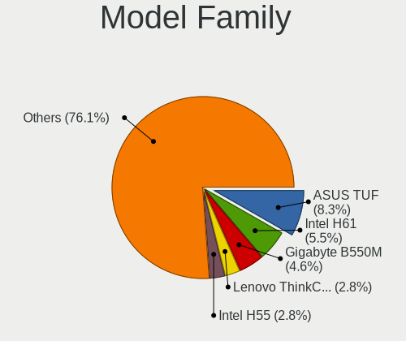
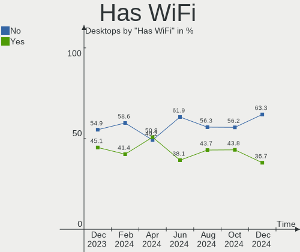
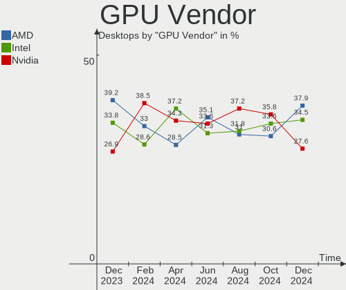
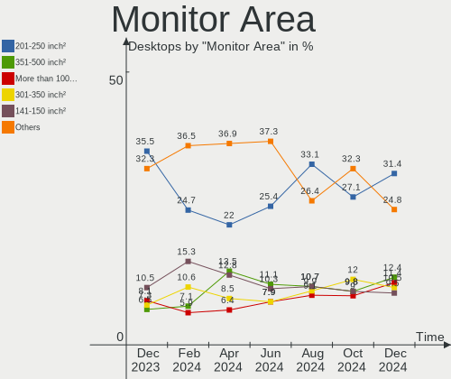
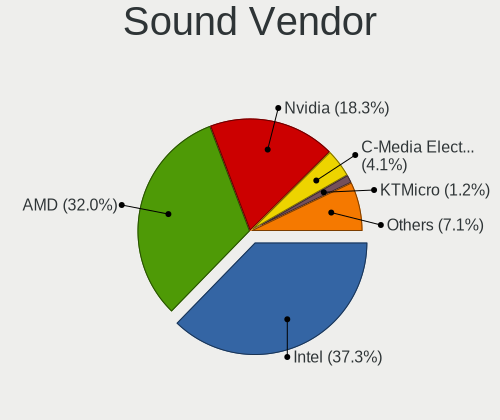
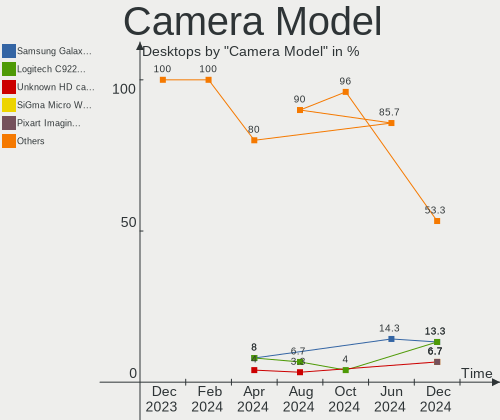

Linux in Brazil - Hardware Trends (Desktops)
--------------------------------------------

A project to identify most popular hardware characteristics and track their change
over time based on data collected by Linux users at https://Linux-Hardware.org.

Anyone can contribute to this report by the [hw-probe](https://github.com/linuxhw/hw-probe) tool:

    sudo -E hw-probe -all -upload

Period: Nov, 2023.

Contents
--------

* [ System ](#system)
  - [ OS                       ](#os)
  - [ OS Family                ](#os-family)
  - [ Kernel                   ](#kernel)
  - [ Kernel Family            ](#kernel-family)
  - [ Kernel Major Ver.        ](#kernel-major-ver)
  - [ Arch                     ](#arch)
  - [ DE                       ](#de)
  - [ Display Server           ](#display-server)
  - [ Display Manager          ](#display-manager)
  - [ OS Lang                  ](#os-lang)
  - [ Boot Mode                ](#boot-mode)
  - [ Filesystem               ](#filesystem)
  - [ Part. scheme             ](#part-scheme)
  - [ Dual Boot with Linux/BSD ](#dual-boot-with-linuxbsd)
  - [ Dual Boot (Win)          ](#dual-boot-win)

* [ Board ](#board)
  - [ Vendor                   ](#vendor)
  - [ Model                    ](#model)
  - [ Model Family             ](#model-family)
  - [ MFG Year                 ](#mfg-year)
  - [ Form Factor              ](#form-factor)
  - [ Secure Boot              ](#secure-boot)
  - [ Coreboot                 ](#coreboot)
  - [ RAM Size                 ](#ram-size)
  - [ RAM Used                 ](#ram-used)
  - [ Total Drives             ](#total-drives)
  - [ Has CD-ROM               ](#has-cd-rom)
  - [ Has Ethernet             ](#has-ethernet)
  - [ Has WiFi                 ](#has-wifi)
  - [ Has Bluetooth            ](#has-bluetooth)

* [ Location ](#location)
  - [ Country                  ](#country)
  - [ City                     ](#city)

* [ Drives ](#drives)
  - [ Drive Vendor             ](#drive-vendor)
  - [ Drive Model              ](#drive-model)
  - [ HDD Vendor               ](#hdd-vendor)
  - [ SSD Vendor               ](#ssd-vendor)
  - [ Drive Kind               ](#drive-kind)
  - [ Drive Connector          ](#drive-connector)
  - [ Drive Size               ](#drive-size)
  - [ Space Total              ](#space-total)
  - [ Space Used               ](#space-used)
  - [ Malfunc. Drives          ](#malfunc-drives)
  - [ Malfunc. Drive Vendor    ](#malfunc-drive-vendor)
  - [ Malfunc. HDD Vendor      ](#malfunc-hdd-vendor)
  - [ Malfunc. Drive Kind      ](#malfunc-drive-kind)
  - [ Failed Drives            ](#failed-drives)
  - [ Failed Drive Vendor      ](#failed-drive-vendor)
  - [ Drive Status             ](#drive-status)

* [ Storage controller ](#storage-controller)
  - [ Storage Vendor           ](#storage-vendor)
  - [ Storage Model            ](#storage-model)
  - [ Storage Kind             ](#storage-kind)

* [ Processor ](#processor)
  - [ CPU Vendor               ](#cpu-vendor)
  - [ CPU Model                ](#cpu-model)
  - [ CPU Model Family         ](#cpu-model-family)
  - [ CPU Cores                ](#cpu-cores)
  - [ CPU Sockets              ](#cpu-sockets)
  - [ CPU Threads              ](#cpu-threads)
  - [ CPU Op-Modes             ](#cpu-op-modes)
  - [ CPU Microcode            ](#cpu-microcode)
  - [ CPU Microarch            ](#cpu-microarch)

* [ Graphics ](#graphics)
  - [ GPU Vendor               ](#gpu-vendor)
  - [ GPU Model                ](#gpu-model)
  - [ GPU Combo                ](#gpu-combo)
  - [ GPU Driver               ](#gpu-driver)
  - [ GPU Memory               ](#gpu-memory)

* [ Monitor ](#monitor)
  - [ Monitor Vendor           ](#monitor-vendor)
  - [ Monitor Model            ](#monitor-model)
  - [ Monitor Resolution       ](#monitor-resolution)
  - [ Monitor Diagonal         ](#monitor-diagonal)
  - [ Monitor Width            ](#monitor-width)
  - [ Aspect Ratio             ](#aspect-ratio)
  - [ Monitor Area             ](#monitor-area)
  - [ Pixel Density            ](#pixel-density)
  - [ Multiple Monitors        ](#multiple-monitors)

* [ Network ](#network)
  - [ Net Controller Vendor    ](#net-controller-vendor)
  - [ Net Controller Model     ](#net-controller-model)
  - [ Wireless Vendor          ](#wireless-vendor)
  - [ Wireless Model           ](#wireless-model)
  - [ Ethernet Vendor          ](#ethernet-vendor)
  - [ Ethernet Model           ](#ethernet-model)
  - [ Net Controller Kind      ](#net-controller-kind)
  - [ Used Controller          ](#used-controller)
  - [ NICs                     ](#nics)
  - [ IPv6                     ](#ipv6)

* [ Bluetooth ](#bluetooth)
  - [ Bluetooth Vendor         ](#bluetooth-vendor)
  - [ Bluetooth Model          ](#bluetooth-model)

* [ Sound ](#sound)
  - [ Sound Vendor             ](#sound-vendor)
  - [ Sound Model              ](#sound-model)

* [ Memory ](#memory)
  - [ Memory Vendor            ](#memory-vendor)
  - [ Memory Model             ](#memory-model)
  - [ Memory Kind              ](#memory-kind)
  - [ Memory Form Factor       ](#memory-form-factor)
  - [ Memory Size              ](#memory-size)
  - [ Memory Speed             ](#memory-speed)

* [ Printers & scanners ](#printers--scanners)
  - [ Printer Vendor           ](#printer-vendor)
  - [ Printer Model            ](#printer-model)
  - [ Scanner Vendor           ](#scanner-vendor)
  - [ Scanner Model            ](#scanner-model)

* [ Camera ](#camera)
  - [ Camera Vendor            ](#camera-vendor)
  - [ Camera Model             ](#camera-model)

* [ Security ](#security)
  - [ Fingerprint Vendor       ](#fingerprint-vendor)
  - [ Fingerprint Model        ](#fingerprint-model)
  - [ Chipcard Vendor          ](#chipcard-vendor)
  - [ Chipcard Model           ](#chipcard-model)

* [ Unsupported ](#unsupported)
  - [ Unsupported Devices      ](#unsupported-devices)
  - [ Unsupported Device Types ](#unsupported-device-types)

System
------

OS
--

Installed operating systems

| Name                | Desktops | Percent |
|---------------------|----------|---------|
| Ubuntu 22.04        | 15       | 13.16%  |
| OpenMandriva 23.08  | 8        | 7.02%   |
| Fedora 39           | 8        | 7.02%   |
| Debian 12           | 6        | 5.26%   |
| Zorin 16            | 5        | 4.39%   |
| OpenMandriva 5.0    | 5        | 4.39%   |
| Linux Mint 21.2     | 5        | 4.39%   |
| ArcoLinux Rolling   | 5        | 4.39%   |
| Arch Rolling        | 5        | 4.39%   |
| Pop!_OS 22.04       | 4        | 3.51%   |
| Xero Rolling        | 3        | 2.63%   |
| Manjaro             | 3        | 2.63%   |
| Ubuntu 23.10        | 2        | 1.75%   |
| Ubuntu 23.04        | 2        | 1.75%   |
| OpenMandriva 4.3    | 2        | 1.75%   |
| KDE neon 22.04      | 2        | 1.75%   |
| EndeavourOS Rolling | 2        | 1.75%   |
| ChimeraOS 44-1      | 2        | 1.75%   |
| BigLinux            | 2        | 1.75%   |
| Zorin 15            | 1        | 0.88%   |
| Xubuntu 23.10       | 1        | 0.88%   |
| Xubuntu 22.10       | 1        | 0.88%   |
| Xubuntu 22.04       | 1        | 0.88%   |
| Xubuntu 20.04       | 1        | 0.88%   |
| Ubuntu Budgie 22.04 | 1        | 0.88%   |
| Ubuntu 20.04        | 1        | 0.88%   |
| Ubuntu 18.04        | 1        | 0.88%   |
| SteamOS 4           | 1        | 0.88%   |
| Pear OS             | 1        | 0.88%   |
| openSUSE Leap-15.4  | 1        | 0.88%   |
| OpenMandriva 23.11  | 1        | 0.88%   |
| OpenMandriva 23.10  | 1        | 0.88%   |
| OpenMandriva 23.03  | 1        | 0.88%   |
| Nobara 38           | 1        | 0.88%   |
| Nobara 37           | 1        | 0.88%   |
| NixOS 23.11         | 1        | 0.88%   |
| Linux Mint 21.1     | 1        | 0.88%   |
| Linux Mint 20.3     | 1        | 0.88%   |
| Linux Mint 19.3     | 1        | 0.88%   |
| Linux Lite 6.6      | 1        | 0.88%   |

OS Family
---------

OS without a version

| Name          | Desktops | Percent |
|---------------|----------|---------|
| Ubuntu        | 21       | 18.42%  |
| OpenMandriva  | 18       | 15.79%  |
| Fedora        | 9        | 7.89%   |
| Linux Mint    | 8        | 7.02%   |
| Debian        | 7        | 6.14%   |
| Zorin         | 6        | 5.26%   |
| ArcoLinux     | 5        | 4.39%   |
| Arch          | 5        | 4.39%   |
| Xubuntu       | 4        | 3.51%   |
| Pop!_OS       | 4        | 3.51%   |
| BigLinux      | 4        | 3.51%   |
| Xero          | 3        | 2.63%   |
| Manjaro       | 3        | 2.63%   |
| Nobara        | 2        | 1.75%   |
| KDE neon      | 2        | 1.75%   |
| EndeavourOS   | 2        | 1.75%   |
| ChimeraOS     | 2        | 1.75%   |
| Ubuntu Budgie | 1        | 0.88%   |
| SteamOS       | 1        | 0.88%   |
| Pear OS       | 1        | 0.88%   |
| openSUSE      | 1        | 0.88%   |
| NixOS         | 1        | 0.88%   |
| Linux Lite    | 1        | 0.88%   |
| Elementary    | 1        | 0.88%   |
| Devuan        | 1        | 0.88%   |
| CentOS        | 1        | 0.88%   |

Kernel
------

Version of the Linux kernel

| Version                     | Desktops | Percent |
|-----------------------------|----------|---------|
| 6.2.0-36-generic            | 12       | 10.53%  |
| 6.4.11-desktop-1omv2390     | 7        | 6.14%   |
| 6.2.0-37-generic            | 6        | 5.26%   |
| 6.6.2-desktop-1omv2390      | 5        | 4.39%   |
| 6.6.1-arch1-1               | 5        | 4.39%   |
| 6.1.0-13-amd64              | 5        | 4.39%   |
| 5.15.0-89-generic           | 5        | 4.39%   |
| 5.15.0-88-generic           | 5        | 4.39%   |
| 6.6.2-arch1-1               | 3        | 2.63%   |
| 6.5.6-76060506-generic      | 3        | 2.63%   |
| 6.5.12-300.fc39.x86_64      | 3        | 2.63%   |
| 6.6.1-1-MANJARO             | 2        | 1.75%   |
| 6.5.6-chos1-chimeraos-1     | 2        | 1.75%   |
| 6.5.10-200.fc38.x86_64      | 2        | 1.75%   |
| 6.4.8-desktop-2omv2390      | 2        | 1.75%   |
| 6.6.3-arch1-1               | 1        | 0.88%   |
| 6.6.2-cachyos               | 1        | 0.88%   |
| 6.6.2-201.fc39.x86_64       | 1        | 0.88%   |
| 6.6.1-zen1-1-zen            | 1        | 0.88%   |
| 6.6.0-1-MANJARO             | 1        | 0.88%   |
| 6.5.9-arch2-1               | 1        | 0.88%   |
| 6.5.9-201.fsync.fc38.x86_64 | 1        | 0.88%   |
| 6.5.6-300.fc39.x86_64       | 1        | 0.88%   |
| 6.5.5-desktop-1omv2390      | 1        | 0.88%   |
| 6.5.5-1-MANJARO             | 1        | 0.88%   |
| 6.5.4-arch2-1               | 1        | 0.88%   |
| 6.5.4-76060504-generic      | 1        | 0.88%   |
| 6.5.3-200.fsync.fc37.x86_64 | 1        | 0.88%   |
| 6.5.11-300.fc39.x86_64      | 1        | 0.88%   |
| 6.5.11-1-MANJARO            | 1        | 0.88%   |
| 6.5.10-300.fc39.x86_64      | 1        | 0.88%   |
| 6.5.0-9-generic             | 1        | 0.88%   |
| 6.5.0-13-generic            | 1        | 0.88%   |
| 6.5.0-10-generic            | 1        | 0.88%   |
| 6.4.12-zen1-1-zen           | 1        | 0.88%   |
| 6.3.7-zen1-1-zen            | 1        | 0.88%   |
| 6.3.0-060300-generic        | 1        | 0.88%   |
| 6.2.6-desktop-1omv2390      | 1        | 0.88%   |
| 6.2.0-33-generic            | 1        | 0.88%   |
| 6.1.62-x64v2-xanmod1-1-lts  | 1        | 0.88%   |

Kernel Family
-------------

Linux kernel without a distro release

| Version  | Desktops | Percent |
|----------|----------|---------|
| 6.2.0    | 19       | 16.67%  |
| 5.15.0   | 13       | 11.4%   |
| 6.6.2    | 10       | 8.77%   |
| 6.6.1    | 8        | 7.02%   |
| 6.4.11   | 7        | 6.14%   |
| 6.5.6    | 6        | 5.26%   |
| 6.1.0    | 6        | 5.26%   |
| 5.4.0    | 4        | 3.51%   |
| 6.5.12   | 3        | 2.63%   |
| 6.5.10   | 3        | 2.63%   |
| 6.5.0    | 3        | 2.63%   |
| 6.5.9    | 2        | 1.75%   |
| 6.5.5    | 2        | 1.75%   |
| 6.5.4    | 2        | 1.75%   |
| 6.5.11   | 2        | 1.75%   |
| 6.4.8    | 2        | 1.75%   |
| 6.1.62   | 2        | 1.75%   |
| 5.19.0   | 2        | 1.75%   |
| 6.6.3    | 1        | 0.88%   |
| 6.6.0    | 1        | 0.88%   |
| 6.5.3    | 1        | 0.88%   |
| 6.4.12   | 1        | 0.88%   |
| 6.3.7    | 1        | 0.88%   |
| 6.3.0    | 1        | 0.88%   |
| 6.2.6    | 1        | 0.88%   |
| 6.1.61   | 1        | 0.88%   |
| 6.1.52   | 1        | 0.88%   |
| 6.1.46   | 1        | 0.88%   |
| 6.0.3    | 1        | 0.88%   |
| 5.8.0    | 1        | 0.88%   |
| 5.16.7   | 1        | 0.88%   |
| 5.16.13  | 1        | 0.88%   |
| 5.15.137 | 1        | 0.88%   |
| 5.14.21  | 1        | 0.88%   |
| 5.10.0   | 1        | 0.88%   |
| 3.10.0   | 1        | 0.88%   |

Kernel Major Ver.
-----------------

Linux kernel major version

| Version | Desktops | Percent |
|---------|----------|---------|
| 6.5     | 24       | 21.05%  |
| 6.6     | 20       | 17.54%  |
| 6.2     | 20       | 17.54%  |
| 5.15    | 14       | 12.28%  |
| 6.1     | 11       | 9.65%   |
| 6.4     | 10       | 8.77%   |
| 5.4     | 4        | 3.51%   |
| 6.3     | 2        | 1.75%   |
| 5.19    | 2        | 1.75%   |
| 5.16    | 2        | 1.75%   |
| 6.0     | 1        | 0.88%   |
| 5.8     | 1        | 0.88%   |
| 5.14    | 1        | 0.88%   |
| 5.10    | 1        | 0.88%   |
| 3.10    | 1        | 0.88%   |

Arch
----

OS architecture (x86_64, i586, etc.)

| Name   | Desktops | Percent |
|--------|----------|---------|
| x86_64 | 114      | 100%    |

DE
--

Desktop Environment

| Name       | Desktops | Percent |
|------------|----------|---------|
| GNOME      | 48       | 42.11%  |
| KDE5       | 36       | 31.58%  |
| XFCE       | 16       | 14.04%  |
| X-Cinnamon | 6        | 5.26%   |
| MATE       | 2        | 1.75%   |
| sway       | 1        | 0.88%   |
| Pantheon   | 1        | 0.88%   |
| KDE        | 1        | 0.88%   |
| Deepin     | 1        | 0.88%   |
| Budgie     | 1        | 0.88%   |
| Unknown    | 1        | 0.88%   |

Display Server
--------------

X11 or Wayland

| Name    | Desktops | Percent |
|---------|----------|---------|
| X11     | 67       | 58.77%  |
| Wayland | 45       | 39.47%  |
| Unknown | 2        | 1.75%   |

Display Manager
---------------

SDDM, LightDM, etc.

| Name    | Desktops | Percent |
|---------|----------|---------|
| Unknown | 52       | 45.61%  |
| SDDM    | 28       | 24.56%  |
| GDM3    | 22       | 19.3%   |
| LightDM | 7        | 6.14%   |
| GDM     | 5        | 4.39%   |

OS Lang
-------

Language

| Lang       | Desktops | Percent |
|------------|----------|---------|
| pt_BR      | 87       | 76.32%  |
| en_US      | 23       | 20.18%  |
| pt_PT      | 1        | 0.88%   |
| en_IE.UTF8 | 1        | 0.88%   |
| en_GB      | 1        | 0.88%   |
| C          | 1        | 0.88%   |

Boot Mode
---------

EFI or BIOS

| Mode | Desktops | Percent |
|------|----------|---------|
| BIOS | 77       | 67.54%  |
| EFI  | 37       | 32.46%  |

Filesystem
----------

Type of filesystem

| Type    | Desktops | Percent |
|---------|----------|---------|
| Ext4    | 52       | 45.61%  |
| Btrfs   | 28       | 24.56%  |
| Tmpfs   | 20       | 17.54%  |
| Overlay | 11       | 9.65%   |
| Zfs     | 1        | 0.88%   |
| Xfs     | 1        | 0.88%   |
| Ext3    | 1        | 0.88%   |

Part. scheme
------------

Scheme of partitioning

| Type    | Desktops | Percent |
|---------|----------|---------|
| GPT     | 53       | 46.49%  |
| Unknown | 48       | 42.11%  |
| MBR     | 13       | 11.4%   |

Dual Boot with Linux/BSD
------------------------

Hosting more than one Linux/BSD

| Dual boot | Desktops | Percent |
|-----------|----------|---------|
| No        | 92       | 80.7%   |
| Yes       | 22       | 19.3%   |

Dual Boot (Win)
---------------

Hosting Linux and Windows

| Dual boot | Desktops | Percent |
|-----------|----------|---------|
| No        | 72       | 63.16%  |
| Yes       | 42       | 36.84%  |

Board
-----

Vendor
------

Motherboard manufacturer

| Name                | Desktops | Percent |
|---------------------|----------|---------|
| ASUSTek Computer    | 26       | 22.81%  |
| Gigabyte Technology | 23       | 20.18%  |
| Intel               | 12       | 10.53%  |
| MSI                 | 10       | 8.77%   |
| Dell                | 10       | 8.77%   |
| ASRock              | 7        | 6.14%   |
| Positivo            | 4        | 3.51%   |
| Semp Toshiba        | 3        | 2.63%   |
| Pegatron            | 3        | 2.63%   |
| MACHINIST           | 3        | 2.63%   |
| Hewlett-Packard     | 3        | 2.63%   |
| Huanan              | 2        | 1.75%   |
| ECS                 | 2        | 1.75%   |
| JHZD                | 1        | 0.88%   |
| Itautec             | 1        | 0.88%   |
| HOUTER              | 1        | 0.88%   |
| Foxconn             | 1        | 0.88%   |
| Colorful Technology | 1        | 0.88%   |
| Unknown             | 1        | 0.88%   |

Model
-----

Motherboard model

| Name                           | Desktops | Percent |
|--------------------------------|----------|---------|
| Intel H61                      | 4        | 3.51%   |
| Intel B75                      | 4        | 3.51%   |
| ASUS PRIME B450M-GAMING/BR     | 4        | 3.51%   |
| Semp Toshiba STI               | 3        | 2.63%   |
| Positivo POS-EIH61CE           | 2        | 1.75%   |
| MSI MS-7C91                    | 2        | 1.75%   |
| Gigabyte GA-78LMT-USB3 6.0     | 2        | 1.75%   |
| Gigabyte A520M DS3H            | 2        | 1.75%   |
| Gigabyte A320M-S2H             | 2        | 1.75%   |
| ECS H61H2-M2                   | 2        | 1.75%   |
| Dell OptiPlex 780              | 2        | 1.75%   |
| ASUS TUF Gaming X570-PLUS_BR   | 2        | 1.75%   |
| ASUS P8H61-M LX3 R2.0          | 2        | 1.75%   |
| Positivo POS-PIH55BX           | 1        | 0.88%   |
| Positivo POS-EIH61CQ           | 1        | 0.88%   |
| Pegatron SM 3322               | 1        | 0.88%   |
| Pegatron IPMIP-GS              | 1        | 0.88%   |
| Pegatron IPM41-D3              | 1        | 0.88%   |
| MSI MS-7D46                    | 1        | 0.88%   |
| MSI MS-7C95                    | 1        | 0.88%   |
| MSI MS-7C51                    | 1        | 0.88%   |
| MSI MS-7972                    | 1        | 0.88%   |
| MSI MS-7845                    | 1        | 0.88%   |
| MSI MS-7816                    | 1        | 0.88%   |
| MSI MS-7721                    | 1        | 0.88%   |
| MSI MS-7641                    | 1        | 0.88%   |
| MACHINIST X99-RS9 V2.0         | 1        | 0.88%   |
| MACHINIST E5-RS9 V1.11         | 1        | 0.88%   |
| MACHINIST E5 MR9A PRO MAX V1.1 | 1        | 0.88%   |
| JHZD BQM5                      | 1        | 0.88%   |
| Itautec Infoway                | 1        | 0.88%   |
| Intel X99-P4 V1.0              | 1        | 0.88%   |
| Intel H81                      | 1        | 0.88%   |
| Intel H61 V124A                | 1        | 0.88%   |
| Intel DH55TC AAG26116-302      | 1        | 0.88%   |
| Huanan X99-F8 GAMING V2.0      | 1        | 0.88%   |
| Huanan X99-8M-F V1.3           | 1        | 0.88%   |
| HOUTER IPMIP-GS                | 1        | 0.88%   |
| HP Z600 Workstation            | 1        | 0.88%   |
| HP EliteDesk 705 G1 SFF        | 1        | 0.88%   |

Model Family
------------

Motherboard model prefix

| Name                   | Desktops | Percent |
|------------------------|----------|---------|
| ASUS PRIME             | 10       | 8.77%   |
| ASUS TUF               | 6        | 5.26%   |
| Intel H61              | 5        | 4.39%   |
| Intel B75              | 4        | 3.51%   |
| Dell OptiPlex          | 4        | 3.51%   |
| Semp Toshiba STI       | 3        | 2.63%   |
| Gigabyte A520M         | 3        | 2.63%   |
| Dell Vostro            | 3        | 2.63%   |
| Positivo POS-EIH61CE   | 2        | 1.75%   |
| MSI MS-7C91            | 2        | 1.75%   |
| Gigabyte GA-78LMT-USB3 | 2        | 1.75%   |
| Gigabyte B450M         | 2        | 1.75%   |
| Gigabyte A320M-S2H     | 2        | 1.75%   |
| ECS H61H2-M2           | 2        | 1.75%   |
| ASUS ROG               | 2        | 1.75%   |
| ASUS P8H61-M           | 2        | 1.75%   |
| ASUS M5A78L-M          | 2        | 1.75%   |
| Positivo POS-PIH55BX   | 1        | 0.88%   |
| Positivo POS-EIH61CQ   | 1        | 0.88%   |
| Pegatron SM            | 1        | 0.88%   |
| Pegatron IPMIP-GS      | 1        | 0.88%   |
| Pegatron IPM41-D3      | 1        | 0.88%   |
| MSI MS-7D46            | 1        | 0.88%   |
| MSI MS-7C95            | 1        | 0.88%   |
| MSI MS-7C51            | 1        | 0.88%   |
| MSI MS-7972            | 1        | 0.88%   |
| MSI MS-7845            | 1        | 0.88%   |
| MSI MS-7816            | 1        | 0.88%   |
| MSI MS-7721            | 1        | 0.88%   |
| MSI MS-7641            | 1        | 0.88%   |
| MACHINIST X99-RS9      | 1        | 0.88%   |
| MACHINIST E5-RS9       | 1        | 0.88%   |
| MACHINIST E5           | 1        | 0.88%   |
| JHZD BQM5              | 1        | 0.88%   |
| Itautec Infoway        | 1        | 0.88%   |
| Intel X99-P4           | 1        | 0.88%   |
| Intel H81              | 1        | 0.88%   |
| Intel DH55TC           | 1        | 0.88%   |
| Huanan X99-F8          | 1        | 0.88%   |
| Huanan X99-8M-F        | 1        | 0.88%   |

MFG Year
--------

Motherboard manufacture year

| Year | Desktops | Percent |
|------|----------|---------|
| 2020 | 16       | 14.04%  |
| 2018 | 16       | 14.04%  |
| 2011 | 11       | 9.65%   |
| 2019 | 10       | 8.77%   |
| 2017 | 9        | 7.89%   |
| 2021 | 8        | 7.02%   |
| 2012 | 8        | 7.02%   |
| 2014 | 7        | 6.14%   |
| 2010 | 7        | 6.14%   |
| 2022 | 5        | 4.39%   |
| 2008 | 5        | 4.39%   |
| 2023 | 3        | 2.63%   |
| 2015 | 3        | 2.63%   |
| 2013 | 2        | 1.75%   |
| 2009 | 2        | 1.75%   |
| 2016 | 1        | 0.88%   |
| 2007 | 1        | 0.88%   |

Form Factor
-----------

Physical design of the computer

| Name    | Desktops | Percent |
|---------|----------|---------|
| Desktop | 114      | 100%    |

Secure Boot
-----------

Enabled or disabled

| State    | Desktops | Percent |
|----------|----------|---------|
| Disabled | 112      | 98.25%  |
| Enabled  | 2        | 1.75%   |

Coreboot
--------

Have coreboot on board

| Used | Desktops | Percent |
|------|----------|---------|
| No   | 114      | 100%    |

RAM Size
--------

Total RAM memory

| Size in GB  | Desktops | Percent |
|-------------|----------|---------|
| 16.01-24.0  | 36       | 31.58%  |
| 4.01-8.0    | 26       | 22.81%  |
| 8.01-16.0   | 19       | 16.67%  |
| 32.01-64.0  | 11       | 9.65%   |
| 3.01-4.0    | 9        | 7.89%   |
| 64.01-256.0 | 6        | 5.26%   |
| 24.01-32.0  | 4        | 3.51%   |
| 2.01-3.0    | 2        | 1.75%   |
| 1.01-2.0    | 1        | 0.88%   |

RAM Used
--------

Used RAM memory

| Used GB    | Desktops | Percent |
|------------|----------|---------|
| 2.01-3.0   | 32       | 28.07%  |
| 1.01-2.0   | 32       | 28.07%  |
| 4.01-8.0   | 20       | 17.54%  |
| 3.01-4.0   | 18       | 15.79%  |
| 8.01-16.0  | 6        | 5.26%   |
| 0.51-1.0   | 3        | 2.63%   |
| 16.01-24.0 | 2        | 1.75%   |
| 0.01-0.5   | 1        | 0.88%   |

Total Drives
------------

Number of drives on board

| Drives | Desktops | Percent |
|--------|----------|---------|
| 1      | 49       | 42.98%  |
| 2      | 32       | 28.07%  |
| 3      | 19       | 16.67%  |
| 4      | 7        | 6.14%   |
| 5      | 4        | 3.51%   |
| 6      | 2        | 1.75%   |
| 0      | 1        | 0.88%   |

Has CD-ROM
----------

Has CD-ROM on board

| Presented | Desktops | Percent |
|-----------|----------|---------|
| No        | 78       | 68.42%  |
| Yes       | 36       | 31.58%  |

Has Ethernet
------------

Has Ethernet on board

| Presented | Desktops | Percent |
|-----------|----------|---------|
| Yes       | 111      | 97.37%  |
| No        | 3        | 2.63%   |

Has WiFi
--------

Has WiFi module

| Presented | Desktops | Percent |
|-----------|----------|---------|
| No        | 77       | 67.54%  |
| Yes       | 37       | 32.46%  |

Has Bluetooth
-------------

Has Bluetooth module

| Presented | Desktops | Percent |
|-----------|----------|---------|
| No        | 81       | 71.05%  |
| Yes       | 33       | 28.95%  |

Location
--------

Country
-------

Geographic location (country)

| Country | Desktops | Percent |
|---------|----------|---------|
| Brazil  | 114      | 100%    |

City
----

Geographic location (city)

| City                  | Desktops | Percent |
|-----------------------|----------|---------|
| Rio de Janeiro        | 14       | 12.28%  |
| Sao Paulo             | 8        | 7.02%   |
| Brasília             | 5        | 4.39%   |
| Curitiba              | 4        | 3.51%   |
| Porto Alegre          | 3        | 2.63%   |
| Osasco                | 3        | 2.63%   |
| Joinville             | 3        | 2.63%   |
| Farroupilha           | 3        | 2.63%   |
| Vitória              | 2        | 1.75%   |
| Sao Vicente           | 2        | 1.75%   |
| Sao Carlos            | 2        | 1.75%   |
| Santo André          | 2        | 1.75%   |
| Florianópolis        | 2        | 1.75%   |
| Campinas              | 2        | 1.75%   |
| Belo Horizonte        | 2        | 1.75%   |
| Vila Velha            | 1        | 0.88%   |
| Vicosa                | 1        | 0.88%   |
| Valparaiso de Goias   | 1        | 0.88%   |
| Uruara                | 1        | 0.88%   |
| Timbauba              | 1        | 0.88%   |
| Teresina              | 1        | 0.88%   |
| Teixeira de Freitas   | 1        | 0.88%   |
| Taubate               | 1        | 0.88%   |
| Sorocaba              | 1        | 0.88%   |
| Serra                 | 1        | 0.88%   |
| Senhor do Bonfim      | 1        | 0.88%   |
| Schroeder             | 1        | 0.88%   |
| Sao Sebastiao         | 1        | 0.88%   |
| Sao José dos Pinhais | 1        | 0.88%   |
| Sao José dos Campos  | 1        | 0.88%   |
| Sao Jose              | 1        | 0.88%   |
| Santos                | 1        | 0.88%   |
| Salvador              | 1        | 0.88%   |
| Ribeirao Preto        | 1        | 0.88%   |
| Recife                | 1        | 0.88%   |
| Queimadas             | 1        | 0.88%   |
| Praia Grande          | 1        | 0.88%   |
| Ponta Grossa          | 1        | 0.88%   |
| Piracicaba            | 1        | 0.88%   |
| Peruibe               | 1        | 0.88%   |

Drives
------

Drive Vendor
------------

Hard drive vendors

| Vendor                       | Desktops | Drives | Percent |
|------------------------------|----------|--------|---------|
| WDC                          | 32       | 37     | 15.69%  |
| Seagate                      | 32       | 38     | 15.69%  |
| Kingston                     | 25       | 33     | 12.25%  |
| Samsung Electronics          | 18       | 18     | 8.82%   |
| Toshiba                      | 10       | 12     | 4.9%    |
| Sandisk                      | 10       | 10     | 4.9%    |
| China                        | 8        | 8      | 3.92%   |
| Silicon Motion               | 7        | 7      | 3.43%   |
| A-DATA Technology            | 7        | 8      | 3.43%   |
| Phison Electronics           | 6        | 6      | 2.94%   |
| Realtek Semiconductor        | 5        | 6      | 2.45%   |
| MAXIO Technology (Hangzhou)  | 5        | 5      | 2.45%   |
| Crucial                      | 5        | 5      | 2.45%   |
| Kingston Technology Company  | 4        | 5      | 1.96%   |
| Patriot                      | 2        | 2      | 0.98%   |
| Maxtor                       | 2        | 2      | 0.98%   |
| KingSpec                     | 2        | 2      | 0.98%   |
| HUSKY                        | 2        | 2      | 0.98%   |
| Hitachi                      | 2        | 3      | 0.98%   |
| XrayDisk                     | 1        | 1      | 0.49%   |
| WISE                         | 1        | 1      | 0.49%   |
| T-FORCE                      | 1        | 1      | 0.49%   |
| SK hynix                     | 1        | 1      | 0.49%   |
| Realtek                      | 1        | 1      | 0.49%   |
| PNY                          | 1        | 1      | 0.49%   |
| Netac                        | 1        | 1      | 0.49%   |
| LITEON                       | 1        | 1      | 0.49%   |
| Lexar                        | 1        | 1      | 0.49%   |
| KIOXIA                       | 1        | 1      | 0.49%   |
| KingFast                     | 1        | 1      | 0.49%   |
| KEEPDATA                     | 1        | 1      | 0.49%   |
| Hikvision                    | 1        | 1      | 0.49%   |
| HGST                         | 1        | 1      | 0.49%   |
| GALAX                        | 1        | 1      | 0.49%   |
| Fanxiang                     | 1        | 1      | 0.49%   |
| ExcelStor                    | 1        | 1      | 0.49%   |
| Beijing Starblaze Technology | 1        | 1      | 0.49%   |
| ADATA Technology             | 1        | 1      | 0.49%   |
| Unknown                      | 1        | 1      | 0.49%   |

Drive Model
-----------

Hard drive models

| Model                                                 | Desktops | Percent |
|-------------------------------------------------------|----------|---------|
| Kingston SA400S37240G 240GB SSD                       | 8        | 3.59%   |
| Seagate ST1000DM010-2EP102 1TB                        | 7        | 3.14%   |
| Kingston SA400S37480G 480GB SSD                       | 7        | 3.14%   |
| Silicon Motion SM2263EN/SM2263XT SSD Controller 256GB | 5        | 2.24%   |
| SanDisk SSD PLUS 240GB                                | 4        | 1.79%   |
| Kingston Company SNV2S1000G 1TB                       | 4        | 1.79%   |
| WDC WD10EZEX-08WN4A0 1TB                              | 3        | 1.35%   |
| WDC WD10EARS-00Y5B1 1TB                               | 3        | 1.35%   |
| Seagate ST1000LM024 HN-M101MBB 1TB                    | 3        | 1.35%   |
| Realtek RTS5763DL NVMe SSD Controller 512GB           | 3        | 1.35%   |
| Phison E12 NVMe Controller 512GB                      | 3        | 1.35%   |
| MAXIO (Hangzhou) NVMe SSD Controller MAP1202 1024GB   | 3        | 1.35%   |
| Kingston SUV400S37120G 120GB SSD                      | 3        | 1.35%   |
| WDC WDS480G2G0A-00JH30 480GB SSD                      | 2        | 0.9%    |
| WDC WDS240G2G0A-00JH30 240GB SSD                      | 2        | 0.9%    |
| Toshiba MQ01ABD100 1TB                                | 2        | 0.9%    |
| Toshiba HDWD110 1TB                                   | 2        | 0.9%    |
| Toshiba DT01ACA100 1TB                                | 2        | 0.9%    |
| Silicon Motion SM2262/SM2262EN SSD Controller 1TB     | 2        | 0.9%    |
| Seagate ST500DM002-1SB10A 500GB                       | 2        | 0.9%    |
| Seagate ST500DM002-1BD142 500GB                       | 2        | 0.9%    |
| Seagate ST3500413AS 500GB                             | 2        | 0.9%    |
| Seagate ST32000644NS 2TB                              | 2        | 0.9%    |
| Seagate ST1000VM002-1CT162 1TB                        | 2        | 0.9%    |
| Seagate ST1000DM003-1CH162 1TB                        | 2        | 0.9%    |
| Samsung HD322HJ 320GB                                 | 2        | 0.9%    |
| Samsung HD103SJ 1TB                                   | 2        | 0.9%    |
| Samsung HD103SI 1TB                                   | 2        | 0.9%    |
| Kingston SV300S37A240G 240GB SSD                      | 2        | 0.9%    |
| Kingston SV300S37A120G 120GB SSD                      | 2        | 0.9%    |
| Kingston SNVS500G 500GB                               | 2        | 0.9%    |
| Kingston SA400S37120G 120GB SSD                       | 2        | 0.9%    |
| Crucial CT240BX500SSD1 240GB                          | 2        | 0.9%    |
| China SSD 240GB                                       | 2        | 0.9%    |
| A-DATA SU650 120GB SSD                                | 2        | 0.9%    |
| XrayDisk 1TB SSD                                      | 1        | 0.45%   |
| WISE 240GB                                            | 1        | 0.45%   |
| WDC WDS480G2G0C-00AJM0 480GB                          | 1        | 0.45%   |
| WDC WDS120G2G0B-00EPW0 120GB SSD                      | 1        | 0.45%   |
| WDC WDS100T2G0A-00JH30 1TB SSD                        | 1        | 0.45%   |

HDD Vendor
----------

Hard disk drive vendors

| Vendor              | Desktops | Drives | Percent |
|---------------------|----------|--------|---------|
| Seagate             | 32       | 38     | 38.55%  |
| WDC                 | 24       | 28     | 28.92%  |
| Samsung Electronics | 13       | 13     | 15.66%  |
| Toshiba             | 9        | 11     | 10.84%  |
| Hitachi             | 2        | 3      | 2.41%   |
| Maxtor              | 1        | 1      | 1.2%    |
| HGST                | 1        | 1      | 1.2%    |
| ExcelStor           | 1        | 1      | 1.2%    |

SSD Vendor
----------

Solid state drive vendors

| Vendor              | Desktops | Drives | Percent |
|---------------------|----------|--------|---------|
| Kingston            | 22       | 28     | 29.73%  |
| WDC                 | 8        | 8      | 10.81%  |
| China               | 8        | 8      | 10.81%  |
| SanDisk             | 6        | 6      | 8.11%   |
| A-DATA Technology   | 6        | 6      | 8.11%   |
| Crucial             | 5        | 5      | 6.76%   |
| Samsung Electronics | 2        | 2      | 2.7%    |
| Patriot             | 2        | 2      | 2.7%    |
| KingSpec            | 2        | 2      | 2.7%    |
| HUSKY               | 2        | 2      | 2.7%    |
| XrayDisk            | 1        | 1      | 1.35%   |
| Toshiba             | 1        | 1      | 1.35%   |
| T-FORCE             | 1        | 1      | 1.35%   |
| PNY                 | 1        | 1      | 1.35%   |
| Maxtor              | 1        | 1      | 1.35%   |
| LITEON              | 1        | 1      | 1.35%   |
| Lexar               | 1        | 1      | 1.35%   |
| KEEPDATA            | 1        | 1      | 1.35%   |
| Hikvision           | 1        | 1      | 1.35%   |
| GALAX               | 1        | 1      | 1.35%   |
| Fanxiang            | 1        | 1      | 1.35%   |

Drive Kind
----------

HDD or SSD

| Kind    | Desktops | Drives | Percent |
|---------|----------|--------|---------|
| HDD     | 74       | 96     | 42.05%  |
| SSD     | 61       | 80     | 34.66%  |
| NVMe    | 38       | 50     | 21.59%  |
| Unknown | 3        | 3      | 1.7%    |

Drive Connector
---------------

SATA, SAS, NVMe, etc.

| Type | Desktops | Drives | Percent |
|------|----------|--------|---------|
| SATA | 105      | 177    | 71.92%  |
| NVMe | 38       | 49     | 26.03%  |
| SAS  | 3        | 3      | 2.05%   |

Drive Size
----------

Size of hard drive

| Size in TB | Desktops | Drives | Percent |
|------------|----------|--------|---------|
| 0.01-0.5   | 76       | 109    | 55.07%  |
| 0.51-1.0   | 50       | 54     | 36.23%  |
| 1.01-2.0   | 9        | 10     | 6.52%   |
| 2.01-3.0   | 3        | 3      | 2.17%   |

Space Total
-----------

Amount of disk space available on the file system

| Size in GB     | Desktops | Percent |
|----------------|----------|---------|
| 101-250        | 29       | 25.44%  |
| 501-1000       | 18       | 15.79%  |
| 1001-2000      | 15       | 13.16%  |
| 251-500        | 14       | 12.28%  |
| More than 3000 | 9        | 7.89%   |
| 1-20           | 9        | 7.89%   |
| 2001-3000      | 8        | 7.02%   |
| 51-100         | 7        | 6.14%   |
| Unknown        | 3        | 2.63%   |
| 21-50          | 2        | 1.75%   |

Space Used
----------

Amount of used disk space

| Used GB        | Desktops | Percent |
|----------------|----------|---------|
| 1-20           | 36       | 31.58%  |
| 51-100         | 19       | 16.67%  |
| 101-250        | 16       | 14.04%  |
| 21-50          | 15       | 13.16%  |
| 501-1000       | 9        | 7.89%   |
| 1001-2000      | 7        | 6.14%   |
| 251-500        | 5        | 4.39%   |
| 2001-3000      | 3        | 2.63%   |
| Unknown        | 3        | 2.63%   |
| More than 3000 | 1        | 0.88%   |

Malfunc. Drives
---------------

Drive models with a malfunction

| Model                                    | Desktops | Drives | Percent |
|------------------------------------------|----------|--------|---------|
| Seagate ST1000DM010-2EP102 1TB           | 3        | 3      | 10.71%  |
| Seagate ST500DM002-1BD142 500GB          | 2        | 2      | 7.14%   |
| WDC WDS480G2G0A-00JH30 480GB SSD         | 1        | 1      | 3.57%   |
| WDC WDS240G2G0A-00JH30 240GB SSD         | 1        | 1      | 3.57%   |
| WDC WD5000AAKX-083CA1 500GB              | 1        | 1      | 3.57%   |
| WDC WD30PURX-64P6ZY0 3TB                 | 1        | 1      | 3.57%   |
| WDC WD10JPVX-22JC3T0 1TB                 | 1        | 1      | 3.57%   |
| WDC WD10EARS-00Y5B1 1TB                  | 1        | 1      | 3.57%   |
| WDC WD10EADS-00L5B1 1TB                  | 1        | 1      | 3.57%   |
| Seagate ST750LM022 HN-M750MBB 752GB      | 1        | 1      | 3.57%   |
| Seagate ST3500413AS 500GB                | 1        | 1      | 3.57%   |
| Seagate ST3320418AS 320GB                | 1        | 1      | 3.57%   |
| Seagate ST2000DM001-1CH164 2TB           | 1        | 1      | 3.57%   |
| Seagate ST1000LM024 HN-M101MBB 1TB       | 1        | 1      | 3.57%   |
| Samsung Electronics HM500JI 500GB        | 1        | 1      | 3.57%   |
| Samsung Electronics HD502HI 500GB        | 1        | 1      | 3.57%   |
| Samsung Electronics HD322HJ 320GB        | 1        | 1      | 3.57%   |
| Samsung Electronics HD322GJ 320GB        | 1        | 1      | 3.57%   |
| Samsung Electronics HD103SJ 1TB          | 1        | 1      | 3.57%   |
| Maxtor STM380815AS 80GB                  | 1        | 1      | 3.57%   |
| Hitachi HDP725050GLA360 500GB            | 1        | 1      | 3.57%   |
| China SSD 240GB                          | 1        | 1      | 3.57%   |
| China SSD 1TB                            | 1        | 1      | 3.57%   |
| ADATA Technology XPG SPECTRIX S40G 256GB | 1        | 1      | 3.57%   |
| A-DATA Technology SX8200PNP 512GB        | 1        | 1      | 3.57%   |

Malfunc. Drive Vendor
---------------------

Vendors of faulty drives

| Vendor              | Desktops | Drives | Percent |
|---------------------|----------|--------|---------|
| Seagate             | 10       | 10     | 35.71%  |
| WDC                 | 7        | 7      | 25%     |
| Samsung Electronics | 5        | 5      | 17.86%  |
| China               | 2        | 2      | 7.14%   |
| Maxtor              | 1        | 1      | 3.57%   |
| Hitachi             | 1        | 1      | 3.57%   |
| ADATA Technology    | 1        | 1      | 3.57%   |
| A-DATA Technology   | 1        | 1      | 3.57%   |

Malfunc. HDD Vendor
-------------------

Vendors of faulty HDD drives

| Vendor              | Desktops | Drives | Percent |
|---------------------|----------|--------|---------|
| Seagate             | 10       | 10     | 45.45%  |
| WDC                 | 5        | 5      | 22.73%  |
| Samsung Electronics | 5        | 5      | 22.73%  |
| Maxtor              | 1        | 1      | 4.55%   |
| Hitachi             | 1        | 1      | 4.55%   |

Malfunc. Drive Kind
-------------------

Kinds of faulty drives

| Kind | Desktops | Drives | Percent |
|------|----------|--------|---------|
| HDD  | 19       | 22     | 76%     |
| SSD  | 4        | 4      | 16%     |
| NVMe | 2        | 2      | 8%      |

Failed Drives
-------------

Failed drive models

Zero info for selected period =(

Failed Drive Vendor
-------------------

Failed drive vendors

Zero info for selected period =(

Drive Status
------------

Number of failed and malfunc. drives

| Status   | Desktops | Drives | Percent |
|----------|----------|--------|---------|
| Detected | 69       | 137    | 52.27%  |
| Works    | 39       | 64     | 29.55%  |
| Malfunc  | 24       | 28     | 18.18%  |

Storage controller
------------------

Storage Vendor
--------------

Storage controller vendors

| Vendor                       | Desktops | Percent |
|------------------------------|----------|---------|
| Intel                        | 70       | 43.21%  |
| AMD                          | 42       | 25.93%  |
| Kingston Technology Company  | 8        | 4.94%   |
| Silicon Motion               | 7        | 4.32%   |
| Phison Electronics           | 6        | 3.7%    |
| SanDisk                      | 5        | 3.09%   |
| Realtek Semiconductor        | 5        | 3.09%   |
| MAXIO Technology (Hangzhou)  | 5        | 3.09%   |
| Samsung Electronics          | 3        | 1.85%   |
| ASMedia Technology           | 3        | 1.85%   |
| ADATA Technology             | 2        | 1.23%   |
| SK hynix                     | 1        | 0.62%   |
| Netac Technology             | 1        | 0.62%   |
| Marvell Technology Group     | 1        | 0.62%   |
| KIOXIA                       | 1        | 0.62%   |
| Broadcom / LSI               | 1        | 0.62%   |
| Beijing Starblaze Technology | 1        | 0.62%   |

Storage Model
-------------

Storage controller models

| Model                                                                                   | Desktops | Percent |
|-----------------------------------------------------------------------------------------|----------|---------|
| AMD FCH SATA Controller [AHCI mode]                                                     | 18       | 9.09%   |
| Intel 6 Series/C200 Series Chipset Family 6 port Desktop SATA AHCI Controller           | 12       | 6.06%   |
| AMD 500 Series Chipset SATA Controller                                                  | 11       | 5.56%   |
| AMD 400 Series Chipset SATA Controller                                                  | 11       | 5.56%   |
| Intel NM10/ICH7 Family SATA Controller [IDE mode]                                       | 8        | 4.04%   |
| Intel 8 Series/C220 Series Chipset Family 6-port SATA Controller 1 [AHCI mode]          | 8        | 4.04%   |
| Intel 7 Series/C210 Series Chipset Family 6-port SATA Controller [AHCI mode]            | 7        | 3.54%   |
| AMD SB7x0/SB8x0/SB9x0 IDE Controller                                                    | 7        | 3.54%   |
| AMD SB7x0/SB8x0/SB9x0 SATA Controller [IDE mode]                                        | 6        | 3.03%   |
| Silicon Motion SM2263EN/SM2263XT (DRAM-less) NVMe SSD Controllers                       | 5        | 2.53%   |
| Intel 82801G (ICH7 Family) IDE Controller                                               | 5        | 2.53%   |
| Intel 6 Series/C200 Series Chipset Family Desktop SATA Controller (IDE mode, ports 4-5) | 5        | 2.53%   |
| Intel 6 Series/C200 Series Chipset Family Desktop SATA Controller (IDE mode, ports 0-3) | 5        | 2.53%   |
| Kingston Company NV2 NVMe SSD SM2267XT                                                  | 4        | 2.02%   |
| Intel Cannon Lake PCH SATA AHCI Controller                                              | 4        | 2.02%   |
| Intel 500 Series Chipset Family SATA AHCI Controller                                    | 4        | 2.02%   |
| AMD FCH SATA Controller D                                                               | 4        | 2.02%   |
| Realtek RTS5762 NVMe SSD Controller                                                     | 3        | 1.52%   |
| Phison E12 NVMe Controller                                                              | 3        | 1.52%   |
| MAXIO (Hangzhou) NVMe SSD Controller MAP1202                                            | 3        | 1.52%   |
| Intel Q170/Q150/B150/H170/H110/Z170/CM236 Chipset SATA Controller [AHCI Mode]           | 3        | 1.52%   |
| Intel 9 Series Chipset Family SATA Controller [AHCI Mode]                               | 3        | 1.52%   |
| Intel 5 Series/3400 Series Chipset 4 port SATA IDE Controller                           | 3        | 1.52%   |
| Intel 5 Series/3400 Series Chipset 2 port SATA IDE Controller                           | 3        | 1.52%   |
| Silicon Motion SM2262/SM2262EN SSD Controller                                           | 2        | 1.01%   |
| SanDisk WD Green SN350 240GB (DRAM-less) / SN560E NVMe SSD                              | 2        | 1.01%   |
| Samsung NVMe SSD Controller SM981/PM981/PM983                                           | 2        | 1.01%   |
| Kingston Company NV1 NVMe SSD E13T                                                      | 2        | 1.01%   |
| Kingston Company KC3000/FURY Renegade NVMe SSD E18                                      | 2        | 1.01%   |
| Intel SATA Controller [RAID mode]                                                       | 2        | 1.01%   |
| Intel C610/X99 series chipset 6-Port SATA Controller [AHCI mode]                        | 2        | 1.01%   |
| Intel 200 Series PCH SATA controller [AHCI mode]                                        | 2        | 1.01%   |
| ASMedia ASM1062 Serial ATA Controller                                                   | 2        | 1.01%   |
| AMD 300 Series Chipset SATA Controller                                                  | 2        | 1.01%   |
| SK hynix BC511 NVMe SSD                                                                 | 1        | 0.51%   |
| Sandisk WD Black SN850X NVMe SSD                                                        | 1        | 0.51%   |
| SanDisk Ultra 3D / WD Blue SN570 NVMe SSD (DRAM-less)                                   | 1        | 0.51%   |
| SanDisk PC SN520 x2 M.2 2242 NVMe SSD                                                   | 1        | 0.51%   |
| Samsung NVMe SSD Controller SM961/PM961/SM963                                           | 1        | 0.51%   |
| Realtek RTS5765DL NVMe SSD Controller (DRAM-less)                                       | 1        | 0.51%   |

Storage Kind
------------

Kind of storage controller (IDE, SATA, NVMe, SAS, ...)

| Kind | Desktops | Percent |
|------|----------|---------|
| SATA | 94       | 58.39%  |
| NVMe | 38       | 23.6%   |
| IDE  | 26       | 16.15%  |
| RAID | 2        | 1.24%   |
| SAS  | 1        | 0.62%   |

Processor
---------

CPU Vendor
----------

Processor vendors

| Vendor | Desktops | Percent |
|--------|----------|---------|
| Intel  | 72       | 63.16%  |
| AMD    | 42       | 36.84%  |

CPU Model
---------

Processor models

| Model                                       | Desktops | Percent |
|---------------------------------------------|----------|---------|
| AMD Ryzen 5 3600 6-Core Processor           | 5        | 4.39%   |
| AMD Ryzen 5 5600X 6-Core Processor          | 4        | 3.51%   |
| Intel Core i5-3570 CPU @ 3.40GHz            | 3        | 2.63%   |
| Intel Core i5-3470 CPU @ 3.20GHz            | 3        | 2.63%   |
| Intel Core i3-2100 CPU @ 3.10GHz            | 3        | 2.63%   |
| Intel Xeon CPU E5-2666 v3 @ 2.90GHz         | 2        | 1.75%   |
| Intel Core i7-4790 CPU @ 3.60GHz            | 2        | 1.75%   |
| Intel Core i5-3330 CPU @ 3.00GHz            | 2        | 1.75%   |
| Intel Core i5-2400 CPU @ 3.10GHz            | 2        | 1.75%   |
| Intel Core i5-10400 CPU @ 2.90GHz           | 2        | 1.75%   |
| Intel Core i5 CPU 650 @ 3.20GHz             | 2        | 1.75%   |
| Intel Core 2 Duo CPU E8500 @ 3.16GHz        | 2        | 1.75%   |
| Intel Core 2 Duo CPU E7500 @ 2.93GHz        | 2        | 1.75%   |
| Intel Celeron CPU G540 @ 2.50GHz            | 2        | 1.75%   |
| AMD Ryzen 9 5900X 12-Core Processor         | 2        | 1.75%   |
| AMD Ryzen 7 2700X Eight-Core Processor      | 2        | 1.75%   |
| AMD Ryzen 5 5600G with Radeon Graphics      | 2        | 1.75%   |
| AMD Ryzen 5 5600 6-Core Processor           | 2        | 1.75%   |
| AMD Ryzen 5 3400G with Radeon Vega Graphics | 2        | 1.75%   |
| AMD FX-8300 Eight-Core Processor            | 2        | 1.75%   |
| Intel Xeon CPU X5460 @ 3.16GHz              | 1        | 0.88%   |
| Intel Xeon CPU E5620 @ 2.40GHz              | 1        | 0.88%   |
| Intel Xeon CPU E5-2687W v3 @ 3.10GHz        | 1        | 0.88%   |
| Intel Xeon CPU E5-2678 v3 @ 2.50GHz         | 1        | 0.88%   |
| Intel Xeon CPU E5-2670 v3 @ 2.30GHz         | 1        | 0.88%   |
| Intel Xeon CPU E5-2660 v3 @ 2.60GHz         | 1        | 0.88%   |
| Intel Xeon CPU E5-2640 v3 @ 2.60GHz         | 1        | 0.88%   |
| Intel Pentium Dual CPU E2160 @ 1.80GHz      | 1        | 0.88%   |
| Intel Pentium CPU G630 @ 2.70GHz            | 1        | 0.88%   |
| Intel Pentium CPU G620 @ 2.60GHz            | 1        | 0.88%   |
| Intel Pentium CPU G3220 @ 3.00GHz           | 1        | 0.88%   |
| Intel Pentium CPU G2020 @ 2.90GHz           | 1        | 0.88%   |
| Intel Core i9-10900 CPU @ 2.80GHz           | 1        | 0.88%   |
| Intel Core i7-9700K CPU @ 3.60GHz           | 1        | 0.88%   |
| Intel Core i7-9700 CPU @ 3.00GHz            | 1        | 0.88%   |
| Intel Core i7-8700 CPU @ 3.20GHz            | 1        | 0.88%   |
| Intel Core i7-7700 CPU @ 3.60GHz            | 1        | 0.88%   |
| Intel Core i7-4790K CPU @ 4.00GHz           | 1        | 0.88%   |
| Intel Core i7-4770K CPU @ 3.50GHz           | 1        | 0.88%   |
| Intel Core i7-3770 CPU @ 3.40GHz            | 1        | 0.88%   |

CPU Model Family
----------------

Processor model prefix

| Model              | Desktops | Percent |
|--------------------|----------|---------|
| Intel Core i5      | 21       | 18.42%  |
| AMD Ryzen 5        | 18       | 15.79%  |
| Intel Core i3      | 12       | 10.53%  |
| Intel Core i7      | 10       | 8.77%   |
| Intel Xeon         | 9        | 7.89%   |
| AMD Ryzen 7        | 7        | 6.14%   |
| Intel Core 2 Duo   | 6        | 5.26%   |
| Intel Pentium      | 4        | 3.51%   |
| Intel Celeron      | 4        | 3.51%   |
| AMD Ryzen 9        | 4        | 3.51%   |
| AMD FX             | 4        | 3.51%   |
| Other              | 3        | 2.63%   |
| AMD Ryzen 5 PRO    | 2        | 1.75%   |
| AMD Ryzen 3        | 2        | 1.75%   |
| Intel Pentium Dual | 1        | 0.88%   |
| Intel Core i9      | 1        | 0.88%   |
| Intel Core 2 Quad  | 1        | 0.88%   |
| AMD Phenom II X4   | 1        | 0.88%   |
| AMD Phenom II X2   | 1        | 0.88%   |
| AMD Athlon II X2   | 1        | 0.88%   |
| AMD A8             | 1        | 0.88%   |
| AMD A10            | 1        | 0.88%   |

CPU Cores
---------

Number of processor cores

| Number | Desktops | Percent |
|--------|----------|---------|
| 4      | 37       | 32.46%  |
| 2      | 30       | 26.32%  |
| 6      | 21       | 18.42%  |
| 8      | 12       | 10.53%  |
| 12     | 6        | 5.26%   |
| 10     | 4        | 3.51%   |
| 20     | 1        | 0.88%   |
| 16     | 1        | 0.88%   |
| 3      | 1        | 0.88%   |
| 1      | 1        | 0.88%   |

CPU Sockets
-----------

Number of sockets

| Number | Desktops | Percent |
|--------|----------|---------|
| 1      | 112      | 98.25%  |
| 2      | 2        | 1.75%   |

CPU Threads
-----------

Threads per core (Hyper-Threading)

| Number | Desktops | Percent |
|--------|----------|---------|
| 2      | 72       | 63.16%  |
| 1      | 42       | 36.84%  |

CPU Op-Modes
------------

CPU Operation Modes (32-bit, 64-bit)

| Op mode        | Desktops | Percent |
|----------------|----------|---------|
| 32-bit, 64-bit | 114      | 100%    |

CPU Microcode
-------------

Microcode number

| Number     | Desktops | Percent |
|------------|----------|---------|
| Unknown    | 68       | 59.65%  |
| 0x306a9    | 7        | 6.14%   |
| 0x1067a    | 4        | 3.51%   |
| 0x08701030 | 3        | 2.63%   |
| 0xa0653    | 2        | 1.75%   |
| 0x306f2    | 2        | 1.75%   |
| 0x08108109 | 2        | 1.75%   |
| 0x0800820d | 2        | 1.75%   |
| 0x06000852 | 2        | 1.75%   |
| 0x0600081c | 2        | 1.75%   |
| 0xb06a2    | 1        | 0.88%   |
| 0xa0671    | 1        | 0.88%   |
| 0x90672    | 1        | 0.88%   |
| 0x506e3    | 1        | 0.88%   |
| 0x206c2    | 1        | 0.88%   |
| 0x206a7    | 1        | 0.88%   |
| 0x20655    | 1        | 0.88%   |
| 0x106e5    | 1        | 0.88%   |
| 0x0a601203 | 1        | 0.88%   |
| 0x0a20120a | 1        | 0.88%   |
| 0x0a20102b | 1        | 0.88%   |
| 0x0a201025 | 1        | 0.88%   |
| 0x0a201016 | 1        | 0.88%   |
| 0x0a201009 | 1        | 0.88%   |
| 0x08701021 | 1        | 0.88%   |
| 0x08001138 | 1        | 0.88%   |
| 0x0800111c | 1        | 0.88%   |
| 0x06003106 | 1        | 0.88%   |
| 0x010000c8 | 1        | 0.88%   |
| 0x01000086 | 1        | 0.88%   |

CPU Microarch
-------------

Microarchitecture

| Name             | Desktops | Percent |
|------------------|----------|---------|
| IvyBridge        | 15       | 13.16%  |
| Haswell          | 15       | 13.16%  |
| Zen 3            | 13       | 11.4%   |
| SandyBridge      | 10       | 8.77%   |
| Zen 2            | 8        | 7.02%   |
| Penryn           | 7        | 6.14%   |
| KabyLake         | 7        | 6.14%   |
| Zen+             | 6        | 5.26%   |
| Zen              | 5        | 4.39%   |
| CometLake        | 5        | 4.39%   |
| Westmere         | 4        | 3.51%   |
| Piledriver       | 4        | 3.51%   |
| K10              | 3        | 2.63%   |
| Core             | 3        | 2.63%   |
| Unknown          | 3        | 2.63%   |
| Steamroller      | 2        | 1.75%   |
| Skylake          | 2        | 1.75%   |
| Nehalem          | 1        | 0.88%   |
| Alderlake Hybrid | 1        | 0.88%   |

Graphics
--------

GPU Vendor
----------

Vendors of graphics cards

| Vendor | Desktops | Percent |
|--------|----------|---------|
| AMD    | 44       | 35.77%  |
| Intel  | 40       | 32.52%  |
| Nvidia | 39       | 31.71%  |

GPU Model
---------

Graphics card models

| Model                                                                       | Desktops | Percent |
|-----------------------------------------------------------------------------|----------|---------|
| Intel Xeon E3-1200 v2/3rd Gen Core processor Graphics Controller            | 9        | 7.2%    |
| Intel 2nd Generation Core Processor Family Integrated Graphics Controller   | 8        | 6.4%    |
| Intel Xeon E3-1200 v3/4th Gen Core Processor Integrated Graphics Controller | 5        | 4%      |
| AMD Polaris 20 XL [Radeon RX 580 2048SP]                                    | 5        | 4%      |
| AMD Navi 23 [Radeon RX 6600/6600 XT/6600M]                                  | 4        | 3.2%    |
| Nvidia GM107 [GeForce GTX 750 Ti]                                           | 3        | 2.4%    |
| Intel CometLake-S GT2 [UHD Graphics 630]                                    | 3        | 2.4%    |
| Intel CoffeeLake-S GT2 [UHD Graphics 630]                                   | 3        | 2.4%    |
| Intel 82G33/G31 Express Integrated Graphics Controller                      | 3        | 2.4%    |
| AMD Picasso/Raven 2 [Radeon Vega Series / Radeon Vega Mobile Series]        | 3        | 2.4%    |
| AMD Ellesmere [Radeon RX 470/480/570/570X/580/580X/590]                     | 3        | 2.4%    |
| AMD Caicos [Radeon HD 6450/7450/8450 / R5 230 OEM]                          | 3        | 2.4%    |
| Nvidia GT218 [GeForce 210]                                                  | 2        | 1.6%    |
| Nvidia GP107 [GeForce GTX 1050 Ti]                                          | 2        | 1.6%    |
| Nvidia GF119 [GeForce GT 610]                                               | 2        | 1.6%    |
| Nvidia GF108 [GeForce GT 730]                                               | 2        | 1.6%    |
| Nvidia GA106 [GeForce RTX 3060 Lite Hash Rate]                              | 2        | 1.6%    |
| Nvidia GA106 [Geforce RTX 3050]                                             | 2        | 1.6%    |
| Nvidia GA104 [GeForce RTX 3070]                                             | 2        | 1.6%    |
| Nvidia GA104 [GeForce RTX 3060 Ti Lite Hash Rate]                           | 2        | 1.6%    |
| Intel Core Processor Integrated Graphics Controller                         | 2        | 1.6%    |
| AMD Raven Ridge [Radeon Vega Series / Radeon Vega Mobile Series]            | 2        | 1.6%    |
| AMD Navi 10 [Radeon RX 5600 OEM/5600 XT / 5700/5700 XT]                     | 2        | 1.6%    |
| AMD Lexa PRO [Radeon 540/540X/550/550X / RX 540X/550/550X]                  | 2        | 1.6%    |
| AMD Kaveri [Radeon R7 Graphics]                                             | 2        | 1.6%    |
| AMD Cezanne [Radeon Vega Series / Radeon Vega Mobile Series]                | 2        | 1.6%    |
| AMD Cedar [Radeon HD 5000/6000/7350/8350 Series]                            | 2        | 1.6%    |
| Nvidia TU117 [GeForce GTX 1650]                                             | 1        | 0.8%    |
| Nvidia TU116 [GeForce GTX 1650]                                             | 1        | 0.8%    |
| Nvidia TU106 [GeForce RTX 2060 SUPER]                                       | 1        | 0.8%    |
| Nvidia TU106 [GeForce RTX 2060 Rev. A]                                      | 1        | 0.8%    |
| Nvidia TU106 [GeForce GTX 1650]                                             | 1        | 0.8%    |
| Nvidia TU104 [GeForce RTX 2070 SUPER]                                       | 1        | 0.8%    |
| Nvidia GT218 [GeForce G210]                                                 | 1        | 0.8%    |
| Nvidia GT216 [GeForce 210]                                                  | 1        | 0.8%    |
| Nvidia GP108 [GeForce GT 1030]                                              | 1        | 0.8%    |
| Nvidia GP106 [GeForce GTX 1060 6GB]                                         | 1        | 0.8%    |
| Nvidia GP104GL [Quadro P4000]                                               | 1        | 0.8%    |
| Nvidia GP104 [GeForce GTX 1070]                                             | 1        | 0.8%    |
| Nvidia GM107GL [Quadro K620]                                                | 1        | 0.8%    |

GPU Combo
---------

Combinations of graphics cards

| Name           | Desktops | Percent |
|----------------|----------|---------|
| 1 x AMD        | 40       | 35.09%  |
| 1 x Nvidia     | 35       | 30.7%   |
| 1 x Intel      | 32       | 28.07%  |
| AMD + Nvidia   | 2        | 1.75%   |
| 2 x Nvidia     | 1        | 0.88%   |
| 2 x Intel      | 1        | 0.88%   |
| 2 x AMD        | 1        | 0.88%   |
| Intel + Nvidia | 1        | 0.88%   |
| Intel + AMD    | 1        | 0.88%   |

GPU Driver
----------

Free vs proprietary

| Driver      | Desktops | Percent |
|-------------|----------|---------|
| Free        | 92       | 80.7%   |
| Proprietary | 17       | 14.91%  |
| Unknown     | 5        | 4.39%   |

GPU Memory
----------

Total video memory

| Size in GB | Desktops | Percent |
|------------|----------|---------|
| Unknown    | 62       | 54.39%  |
| 1.01-2.0   | 17       | 14.91%  |
| 7.01-8.0   | 12       | 10.53%  |
| 0.51-1.0   | 8        | 7.02%   |
| 3.01-4.0   | 6        | 5.26%   |
| 0.01-0.5   | 4        | 3.51%   |
| 8.01-16.0  | 3        | 2.63%   |
| 5.01-6.0   | 2        | 1.75%   |

Monitor
-------

Monitor Vendor
--------------

Monitor vendors

| Vendor              | Desktops | Percent |
|---------------------|----------|---------|
| Goldstar            | 36       | 29.51%  |
| Samsung Electronics | 21       | 17.21%  |
| AOC                 | 18       | 14.75%  |
| Dell                | 8        | 6.56%   |
| Philips             | 7        | 5.74%   |
| Sony                | 4        | 3.28%   |
| Acer                | 4        | 3.28%   |
| Unknown             | 2        | 1.64%   |
| Panasonic           | 2        | 1.64%   |
| LG Electronics      | 2        | 1.64%   |
| ZZZ                 | 1        | 0.82%   |
| VIE                 | 1        | 0.82%   |
| Unknown (XXX)       | 1        | 0.82%   |
| TXD                 | 1        | 0.82%   |
| RTK                 | 1        | 0.82%   |
| Positivo            | 1        | 0.82%   |
| Philco              | 1        | 0.82%   |
| PCH                 | 1        | 0.82%   |
| MStar               | 1        | 0.82%   |
| LRX                 | 1        | 0.82%   |
| ITE                 | 1        | 0.82%   |
| Hedy                | 1        | 0.82%   |
| GDH                 | 1        | 0.82%   |
| Envision            | 1        | 0.82%   |
| Denver              | 1        | 0.82%   |
| BenQ                | 1        | 0.82%   |
| ASUSTek Computer    | 1        | 0.82%   |
| Unknown             | 1        | 0.82%   |

Monitor Model
-------------

Monitor models

| Model                                                                | Desktops | Percent |
|----------------------------------------------------------------------|----------|---------|
| Goldstar FULL HD GSM5B55 1920x1080 480x270mm 21.7-inch               | 3        | 2.38%   |
| Goldstar 23MP55 GSM5A23 1920x1080 510x290mm 23.1-inch                | 3        | 2.38%   |
| Acer V226HQL ACR032D 1920x1080 477x268mm 21.5-inch                   | 3        | 2.38%   |
| Samsung Electronics SyncMaster SAM03E5 1680x1050 474x296mm 22.0-inch | 2        | 1.59%   |
| Samsung Electronics C24F390 SAM0D2C 1920x1080 521x293mm 23.5-inch    | 2        | 1.59%   |
| Philips PHL 242V8 PHLC219 1920x1080 527x296mm 23.8-inch              | 2        | 1.59%   |
| Philips PHL 221V8 PHLC211 1920x1080 477x268mm 21.5-inch              | 2        | 1.59%   |
| Goldstar HD GSM5ACB 1366x768 410x230mm 18.5-inch                     | 2        | 1.59%   |
| Goldstar E2011 GSM4ED3 1600x900 443x249mm 20.0-inch                  | 2        | 1.59%   |
| AOC 24B1W AOC2401 1920x1080 521x293mm 23.5-inch                      | 2        | 1.59%   |
| AOC 2460G5 AOC246A 1920x1080 531x299mm 24.0-inch                     | 2        | 1.59%   |
| AOC 2217 AOC2217 1680x1050 470x300mm 22.0-inch                       | 2        | 1.59%   |
| ZZZ PG_HDMI ZZZFFF6 1440x900 408x255mm 18.9-inch                     | 1        | 0.79%   |
| VIE HORIZON Z24 VIE2380 1920x1080 527x296mm 23.8-inch                | 1        | 0.79%   |
| Unknown SMART TV 0563 1920x1080 1209x680mm 54.6-inch                 | 1        | 0.79%   |
| Unknown LCD Monitor FFFF 2288x1287 2550x2550mm 142.0-inch            | 1        | 0.79%   |
| Unknown (XXX) Beyond TV XXX2851 3840x2160 1209x680mm 54.6-inch       | 1        | 0.79%   |
| TXD HDMI TXD7825 1440x900 408x255mm 18.9-inch                        | 1        | 0.79%   |
| Sony TV SNY7E02 1920x1080                                            | 1        | 0.79%   |
| Sony TV SNY3002 1920x1080 1018x573mm 46.0-inch                       | 1        | 0.79%   |
| Sony TV SNY1A02 1920x1080                                            | 1        | 0.79%   |
| Sony TV  *00 SNYF303 1920x1080 1220x680mm 55.0-inch                  | 1        | 0.79%   |
| Samsung Electronics T24B350 SAM093C 1920x1080 531x299mm 24.0-inch    | 1        | 0.79%   |
| Samsung Electronics SyncMaster SAM0598 1360x768 410x230mm 18.5-inch  | 1        | 0.79%   |
| Samsung Electronics SyncMaster SAM047D 1360x768 410x230mm 18.5-inch  | 1        | 0.79%   |
| Samsung Electronics SyncMaster SAM03E1 1440x900 410x257mm 19.1-inch  | 1        | 0.79%   |
| Samsung Electronics SyncMaster SAM0292 1280x1024 376x301mm 19.0-inch | 1        | 0.79%   |
| Samsung Electronics SyncMaster SAM01CE 1024x768 304x228mm 15.0-inch  | 1        | 0.79%   |
| Samsung Electronics SyncMaster SAM01B7 1280x1024 340x270mm 17.1-inch | 1        | 0.79%   |
| Samsung Electronics SyncMaster SAM01AC 1600x1200 312x234mm 15.4-inch | 1        | 0.79%   |
| Samsung Electronics SMT24A550 SAM07B3 1920x1080 531x299mm 24.0-inch  | 1        | 0.79%   |
| Samsung Electronics SMB2030N SAM0634 1600x900 443x249mm 20.0-inch    | 1        | 0.79%   |
| Samsung Electronics SA300/SA350 SAM0788 1366x768 410x230mm 18.5-inch | 1        | 0.79%   |
| Samsung Electronics S22A33x SAM7122 1920x1080 479x260mm 21.5-inch    | 1        | 0.79%   |
| Samsung Electronics S19B300 SAM08A6 1366x768 410x230mm 18.5-inch     | 1        | 0.79%   |
| Samsung Electronics S19B300 SAM08A5 1366x768 410x230mm 18.5-inch     | 1        | 0.79%   |
| Samsung Electronics LU28R55 SAM1015 3840x2160 632x360mm 28.6-inch    | 1        | 0.79%   |
| Samsung Electronics LF24T35 SAM707D 1920x1080 528x297mm 23.9-inch    | 1        | 0.79%   |
| Samsung Electronics LCD Monitor S24D332 1920x1080                    | 1        | 0.79%   |
| Samsung Electronics LCD Monitor LU28R55                              | 1        | 0.79%   |

Monitor Resolution
------------------

Monitor screen resolution

| Resolution         | Desktops | Percent |
|--------------------|----------|---------|
| 1920x1080 (FHD)    | 43       | 36.75%  |
| 3840x2160 (4K)     | 11       | 9.4%    |
| 1366x768 (WXGA)    | 10       | 8.55%   |
| 1600x900 (HD+)     | 8        | 6.84%   |
| 1440x900 (WXGA+)   | 7        | 5.98%   |
| 1280x1024 (SXGA)   | 7        | 5.98%   |
| 2560x1080          | 5        | 4.27%   |
| 1680x1050 (WSXGA+) | 5        | 4.27%   |
| 1360x768           | 5        | 4.27%   |
| 2560x1440 (QHD)    | 3        | 2.56%   |
| Unknown            | 3        | 2.56%   |
| 1024x768 (XGA)     | 2        | 1.71%   |
| 5760x2160          | 1        | 0.85%   |
| 5120x1440          | 1        | 0.85%   |
| 3520x1080          | 1        | 0.85%   |
| 3440x1440          | 1        | 0.85%   |
| 2288x1287          | 1        | 0.85%   |
| 1920x1200 (WUXGA)  | 1        | 0.85%   |
| 1600x1200          | 1        | 0.85%   |
| 1280x720 (HD)      | 1        | 0.85%   |

Monitor Diagonal
----------------

Diagonal size in inches

| Inches  | Desktops | Percent |
|---------|----------|---------|
| 21      | 16       | 13.33%  |
| 24      | 14       | 11.67%  |
| 18      | 14       | 11.67%  |
| 23      | 12       | 10%     |
| 27      | 7        | 5.83%   |
| 17      | 7        | 5.83%   |
| Unknown | 7        | 5.83%   |
| 20      | 6        | 5%      |
| 34      | 5        | 4.17%   |
| 22      | 5        | 4.17%   |
| 15      | 5        | 4.17%   |
| 19      | 4        | 3.33%   |
| 31      | 3        | 2.5%    |
| 72      | 2        | 1.67%   |
| 54      | 2        | 1.67%   |
| 52      | 2        | 1.67%   |
| 142     | 1        | 0.83%   |
| 84      | 1        | 0.83%   |
| 75      | 1        | 0.83%   |
| 49      | 1        | 0.83%   |
| 46      | 1        | 0.83%   |
| 41      | 1        | 0.83%   |
| 28      | 1        | 0.83%   |
| 26      | 1        | 0.83%   |
| 16      | 1        | 0.83%   |

Monitor Width
-------------

Physical width

| Width in mm    | Desktops | Percent |
|----------------|----------|---------|
| 401-500        | 43       | 36.13%  |
| 501-600        | 33       | 27.73%  |
| 301-350        | 10       | 8.4%    |
| Unknown        | 7        | 5.88%   |
| 1001-1500      | 6        | 5.04%   |
| 701-800        | 5        | 4.2%    |
| 351-400        | 5        | 4.2%    |
| 601-700        | 4        | 3.36%   |
| 1501-2000      | 4        | 3.36%   |
| More than 2000 | 1        | 0.84%   |
| 901-1000       | 1        | 0.84%   |

Aspect Ratio
------------

Proportional relationship between the width and the height

| Ratio   | Desktops | Percent |
|---------|----------|---------|
| 16/9    | 71       | 64.55%  |
| 16/10   | 15       | 13.64%  |
| 5/4     | 8        | 7.27%   |
| Unknown | 6        | 5.45%   |
| 21/9    | 5        | 4.55%   |
| 4/3     | 3        | 2.73%   |
| 32/9    | 1        | 0.91%   |
| 1.00    | 1        | 0.91%   |

Monitor Area
------------

Area in inch²

| Area in inch² | Desktops | Percent |
|----------------|----------|---------|
| 201-250        | 37       | 31.62%  |
| 151-200        | 16       | 13.68%  |
| 141-150        | 16       | 13.68%  |
| More than 1000 | 8        | 6.84%   |
| 351-500        | 8        | 6.84%   |
| 301-350        | 7        | 5.98%   |
| 251-300        | 7        | 5.98%   |
| Unknown        | 7        | 5.98%   |
| 101-110        | 5        | 4.27%   |
| 501-1000       | 3        | 2.56%   |
| 131-140        | 2        | 1.71%   |
| 111-120        | 1        | 0.85%   |

Pixel Density
-------------

Pixels per inch

| Density | Desktops | Percent |
|---------|----------|---------|
| 51-100  | 71       | 65.14%  |
| 101-120 | 19       | 17.43%  |
| 1-50    | 9        | 8.26%   |
| Unknown | 7        | 6.42%   |
| 121-160 | 2        | 1.83%   |
| 161-240 | 1        | 0.92%   |

Multiple Monitors
-----------------

Total monitors connected

| Total | Desktops | Percent |
|-------|----------|---------|
| 1     | 84       | 73.68%  |
| 2     | 22       | 19.3%   |
| 0     | 5        | 4.39%   |
| 3     | 3        | 2.63%   |

Network
-------

Net Controller Vendor
---------------------

Controller vendors

| Vendor                          | Desktops | Percent |
|---------------------------------|----------|---------|
| Realtek Semiconductor           | 86       | 56.58%  |
| Intel                           | 24       | 15.79%  |
| Qualcomm Atheros                | 15       | 9.87%   |
| TP-Link                         | 5        | 3.29%   |
| Ralink Technology               | 5        | 3.29%   |
| Qualcomm Atheros Communications | 3        | 1.97%   |
| Samsung Electronics             | 2        | 1.32%   |
| MediaTek                        | 2        | 1.32%   |
| D-Link                          | 2        | 1.32%   |
| Broadcom                        | 2        | 1.32%   |
| Xiaomi                          | 1        | 0.66%   |
| STMicroelectronics              | 1        | 0.66%   |
| Ralink                          | 1        | 0.66%   |
| Huawei Technologies             | 1        | 0.66%   |
| D-Link System                   | 1        | 0.66%   |
| Broadcom Limited                | 1        | 0.66%   |

Net Controller Model
--------------------

Controller models

| Model                                                             | Desktops | Percent |
|-------------------------------------------------------------------|----------|---------|
| Realtek RTL8111/8168/8411 PCI Express Gigabit Ethernet Controller | 67       | 41.1%   |
| Realtek RTL810xE PCI Express Fast Ethernet controller             | 9        | 5.52%   |
| Realtek RTL8125 2.5GbE Controller                                 | 7        | 4.29%   |
| Qualcomm Atheros AR9271 802.11n                                   | 3        | 1.84%   |
| Qualcomm Atheros AR8152 v2.0 Fast Ethernet                        | 3        | 1.84%   |
| Qualcomm Atheros AR8151 v2.0 Gigabit Ethernet                     | 3        | 1.84%   |
| Intel I211 Gigabit Network Connection                             | 3        | 1.84%   |
| Intel Ethernet Connection (7) I219-V                              | 3        | 1.84%   |
| Intel 82578DC Gigabit Network Connection                          | 3        | 1.84%   |
| TP-Link Archer T2U PLUS [RTL8821AU]                               | 2        | 1.23%   |
| Realtek RTL8192EE PCIe Wireless Network Adapter                   | 2        | 1.23%   |
| Realtek 802.11ac NIC                                              | 2        | 1.23%   |
| Ralink MT7601U Wireless Adapter                                   | 2        | 1.23%   |
| Qualcomm Atheros QCA9565 / AR9565 Wireless Network Adapter        | 2        | 1.23%   |
| Qualcomm Atheros Killer E220x Gigabit Ethernet Controller         | 2        | 1.23%   |
| Qualcomm Atheros AR9485 Wireless Network Adapter                  | 2        | 1.23%   |
| Intel Wi-Fi 6 AX210/AX211/AX411 160MHz                            | 2        | 1.23%   |
| Intel Wi-Fi 6 AX200                                               | 2        | 1.23%   |
| Intel Ethernet Connection (14) I219-V                             | 2        | 1.23%   |
| Intel 82567LM-3 Gigabit Network Connection                        | 2        | 1.23%   |
| Xiaomi Mi/Redmi series (RNDIS + ADB)                              | 1        | 0.61%   |
| TP-Link TL-WN821N v5/v6 [RTL8192EU]                               | 1        | 0.61%   |
| TP-Link Archer T3U [Realtek RTL8812BU]                            | 1        | 0.61%   |
| TP-Link AC600 wireless Realtek RTL8811AU [Archer T2U Nano]        | 1        | 0.61%   |
| STMicroelectronics Virtual COM Port                               | 1        | 0.61%   |
| Samsung GT-I9070 (network tethering, USB debugging enabled)       | 1        | 0.61%   |
| Samsung Galaxy series, misc. (tethering mode)                     | 1        | 0.61%   |
| Realtek RTL88x2bu [AC1200 Techkey]                                | 1        | 0.61%   |
| Realtek RTL8812AU 802.11a/b/g/n/ac 2T2R DB WLAN Adapter           | 1        | 0.61%   |
| Realtek RTL8812AE 802.11ac PCIe Wireless Network Adapter          | 1        | 0.61%   |
| Realtek RTL8192SE Wireless LAN Controller                         | 1        | 0.61%   |
| Realtek RTL8188FTV 802.11b/g/n 1T1R 2.4G WLAN Adapter             | 1        | 0.61%   |
| Realtek RTL-8185 IEEE 802.11a/b/g Wireless LAN Controller         | 1        | 0.61%   |
| Realtek RTL-8100/8101L/8139 PCI Fast Ethernet Adapter             | 1        | 0.61%   |
| Ralink RT5572 Wireless Adapter                                    | 1        | 0.61%   |
| Ralink RT5370 Wireless Adapter                                    | 1        | 0.61%   |
| Ralink RT2870/RT3070 Wireless Adapter                             | 1        | 0.61%   |
| Ralink RT2790 Wireless 802.11n 1T/2R PCIe                         | 1        | 0.61%   |
| Qualcomm Atheros Killer E2500 Gigabit Ethernet Controller         | 1        | 0.61%   |
| Qualcomm Atheros Attansic L2 Fast Ethernet                        | 1        | 0.61%   |

Wireless Vendor
---------------

Wireless vendors

| Vendor                          | Desktops | Percent |
|---------------------------------|----------|---------|
| Realtek Semiconductor           | 10       | 25.64%  |
| Intel                           | 8        | 20.51%  |
| TP-Link                         | 5        | 12.82%  |
| Ralink Technology               | 5        | 12.82%  |
| Qualcomm Atheros                | 4        | 10.26%  |
| Qualcomm Atheros Communications | 3        | 7.69%   |
| D-Link                          | 2        | 5.13%   |
| Ralink                          | 1        | 2.56%   |
| MediaTek                        | 1        | 2.56%   |

Wireless Model
--------------

Wireless models

| Model                                                                | Desktops | Percent |
|----------------------------------------------------------------------|----------|---------|
| Qualcomm Atheros AR9271 802.11n                                      | 3        | 7.69%   |
| TP-Link Archer T2U PLUS [RTL8821AU]                                  | 2        | 5.13%   |
| Realtek RTL8192EE PCIe Wireless Network Adapter                      | 2        | 5.13%   |
| Realtek 802.11ac NIC                                                 | 2        | 5.13%   |
| Ralink MT7601U Wireless Adapter                                      | 2        | 5.13%   |
| Qualcomm Atheros QCA9565 / AR9565 Wireless Network Adapter           | 2        | 5.13%   |
| Qualcomm Atheros AR9485 Wireless Network Adapter                     | 2        | 5.13%   |
| Intel Wi-Fi 6 AX210/AX211/AX411 160MHz                               | 2        | 5.13%   |
| Intel Wi-Fi 6 AX200                                                  | 2        | 5.13%   |
| TP-Link TL-WN821N v5/v6 [RTL8192EU]                                  | 1        | 2.56%   |
| TP-Link Archer T3U [Realtek RTL8812BU]                               | 1        | 2.56%   |
| TP-Link AC600 wireless Realtek RTL8811AU [Archer T2U Nano]           | 1        | 2.56%   |
| Realtek RTL88x2bu [AC1200 Techkey]                                   | 1        | 2.56%   |
| Realtek RTL8812AU 802.11a/b/g/n/ac 2T2R DB WLAN Adapter              | 1        | 2.56%   |
| Realtek RTL8812AE 802.11ac PCIe Wireless Network Adapter             | 1        | 2.56%   |
| Realtek RTL8192SE Wireless LAN Controller                            | 1        | 2.56%   |
| Realtek RTL8188FTV 802.11b/g/n 1T1R 2.4G WLAN Adapter                | 1        | 2.56%   |
| Realtek RTL-8185 IEEE 802.11a/b/g Wireless LAN Controller            | 1        | 2.56%   |
| Ralink RT5572 Wireless Adapter                                       | 1        | 2.56%   |
| Ralink RT5370 Wireless Adapter                                       | 1        | 2.56%   |
| Ralink RT2870/RT3070 Wireless Adapter                                | 1        | 2.56%   |
| Ralink RT2790 Wireless 802.11n 1T/2R PCIe                            | 1        | 2.56%   |
| MediaTek MT7921K (RZ608) Wi-Fi 6E 80MHz                              | 1        | 2.56%   |
| Intel Wireless-AC 9260                                               | 1        | 2.56%   |
| Intel Raptor Lake PCH CNVi WiFi                                      | 1        | 2.56%   |
| Intel Dual Band Wireless-AC 3168NGW [Stone Peak]                     | 1        | 2.56%   |
| Intel Cannon Lake PCH CNVi WiFi                                      | 1        | 2.56%   |
| D-Link DWA-171 AC600 DB Wireless Adapter(rev.A1) [Realtek RTL8811AU] | 1        | 2.56%   |
| D-Link 802.11ac NIC                                                  | 1        | 2.56%   |

Ethernet Vendor
---------------

Ethernet vendors

| Vendor                | Desktops | Percent |
|-----------------------|----------|---------|
| Realtek Semiconductor | 82       | 68.91%  |
| Intel                 | 18       | 15.13%  |
| Qualcomm Atheros      | 11       | 9.24%   |
| Broadcom              | 2        | 1.68%   |
| Xiaomi                | 1        | 0.84%   |
| Samsung Electronics   | 1        | 0.84%   |
| MediaTek              | 1        | 0.84%   |
| Huawei Technologies   | 1        | 0.84%   |
| D-Link System         | 1        | 0.84%   |
| Broadcom Limited      | 1        | 0.84%   |

Ethernet Model
--------------

Ethernet models

| Model                                                             | Desktops | Percent |
|-------------------------------------------------------------------|----------|---------|
| Realtek RTL8111/8168/8411 PCI Express Gigabit Ethernet Controller | 67       | 54.92%  |
| Realtek RTL810xE PCI Express Fast Ethernet controller             | 9        | 7.38%   |
| Realtek RTL8125 2.5GbE Controller                                 | 7        | 5.74%   |
| Qualcomm Atheros AR8152 v2.0 Fast Ethernet                        | 3        | 2.46%   |
| Qualcomm Atheros AR8151 v2.0 Gigabit Ethernet                     | 3        | 2.46%   |
| Intel I211 Gigabit Network Connection                             | 3        | 2.46%   |
| Intel Ethernet Connection (7) I219-V                              | 3        | 2.46%   |
| Intel 82578DC Gigabit Network Connection                          | 3        | 2.46%   |
| Qualcomm Atheros Killer E220x Gigabit Ethernet Controller         | 2        | 1.64%   |
| Intel Ethernet Connection (14) I219-V                             | 2        | 1.64%   |
| Intel 82567LM-3 Gigabit Network Connection                        | 2        | 1.64%   |
| Xiaomi Mi/Redmi series (RNDIS + ADB)                              | 1        | 0.82%   |
| Samsung Galaxy series, misc. (tethering mode)                     | 1        | 0.82%   |
| Realtek RTL-8100/8101L/8139 PCI Fast Ethernet Adapter             | 1        | 0.82%   |
| Qualcomm Atheros Killer E2500 Gigabit Ethernet Controller         | 1        | 0.82%   |
| Qualcomm Atheros Attansic L2 Fast Ethernet                        | 1        | 0.82%   |
| Qualcomm Atheros AR8151 v1.0 Gigabit Ethernet                     | 1        | 0.82%   |
| MediaTek X55                                                      | 1        | 0.82%   |
| Intel I210 Gigabit Network Connection                             | 1        | 0.82%   |
| Intel Ethernet Controller I226-V                                  | 1        | 0.82%   |
| Intel Ethernet Connection I217-LM                                 | 1        | 0.82%   |
| Intel Ethernet Connection (17) I219-V                             | 1        | 0.82%   |
| Intel 82579LM Gigabit Network Connection (Lewisville)             | 1        | 0.82%   |
| Intel 82557/8/9/0/1 Ethernet Pro 100                              | 1        | 0.82%   |
| Huawei MAR-LX1M                                                   | 1        | 0.82%   |
| D-Link System DGE-528T Gigabit Ethernet Adapter                   | 1        | 0.82%   |
| Broadcom NetXtreme BCM5764M Gigabit Ethernet PCIe                 | 1        | 0.82%   |
| Broadcom NetXtreme BCM5762 Gigabit Ethernet PCIe                  | 1        | 0.82%   |
| Broadcom Limited NetLink BCM5787 Gigabit Ethernet PCI Express     | 1        | 0.82%   |

Net Controller Kind
-------------------

Ethernet, WiFi or modem

| Kind     | Desktops | Percent |
|----------|----------|---------|
| Ethernet | 111      | 74%     |
| WiFi     | 37       | 24.67%  |
| Modem    | 2        | 1.33%   |

Used Controller
---------------

Currently used network controller

| Kind     | Desktops | Percent |
|----------|----------|---------|
| Ethernet | 93       | 80.87%  |
| WiFi     | 22       | 19.13%  |

NICs
----

Total network controllers on board

| Total | Desktops | Percent |
|-------|----------|---------|
| 1     | 88       | 77.19%  |
| 2     | 21       | 18.42%  |
| 3     | 3        | 2.63%   |
| 0     | 2        | 1.75%   |

IPv6
----

IPv6 vs IPv4

| Used | Desktops | Percent |
|------|----------|---------|
| Yes  | 60       | 52.63%  |
| No   | 54       | 47.37%  |

Bluetooth
---------

Bluetooth Vendor
----------------

Controller vendors

| Vendor                          | Desktops | Percent |
|---------------------------------|----------|---------|
| Cambridge Silicon Radio         | 18       | 54.55%  |
| Intel                           | 8        | 24.24%  |
| Qualcomm Atheros Communications | 3        | 9.09%   |
| Realtek                         | 1        | 3.03%   |
| MediaTek                        | 1        | 3.03%   |
| Broadcom                        | 1        | 3.03%   |
| Actions                         | 1        | 3.03%   |

Bluetooth Model
---------------

Controller models

| Model                                               | Desktops | Percent |
|-----------------------------------------------------|----------|---------|
| Cambridge Silicon Radio Bluetooth Dongle (HCI mode) | 18       | 54.55%  |
| Intel AX210 Bluetooth                               | 2        | 6.06%   |
| Realtek Bluetooth Radio                             | 1        | 3.03%   |
| Qualcomm Atheros  Bluetooth Device                  | 1        | 3.03%   |
| Qualcomm Atheros Bluetooth USB Host Controller      | 1        | 3.03%   |
| Qualcomm Atheros AR9462 Bluetooth                   | 1        | 3.03%   |
| MediaTek Wireless_Device                            | 1        | 3.03%   |
| Intel Wireless-AC 9260 Bluetooth Adapter            | 1        | 3.03%   |
| Intel Wireless-AC 3168 Bluetooth                    | 1        | 3.03%   |
| Intel Bluetooth wireless interface                  | 1        | 3.03%   |
| Intel Bluetooth 9460/9560 Jefferson Peak (JfP)      | 1        | 3.03%   |
| Intel AX201 Bluetooth                               | 1        | 3.03%   |
| Intel AX200 Bluetooth                               | 1        | 3.03%   |
| Broadcom BCM92045B3 ROM                             | 1        | 3.03%   |
| Actions general adapter                             | 1        | 3.03%   |

Sound
-----

Sound Vendor
------------

Sound card vendors

| Vendor                 | Desktops | Percent |
|------------------------|----------|---------|
| Intel                  | 70       | 38.25%  |
| AMD                    | 59       | 32.24%  |
| Nvidia                 | 36       | 19.67%  |
| C-Media Electronics    | 5        | 2.73%   |
| Kingston Technology    | 3        | 1.64%   |
| VIA Technologies       | 1        | 0.55%   |
| Realtek Semiconductor  | 1        | 0.55%   |
| Hewlett-Packard        | 1        | 0.55%   |
| Generalplus Technology | 1        | 0.55%   |
| Focusrite-Novation     | 1        | 0.55%   |
| Edifier Technology     | 1        | 0.55%   |
| Dell                   | 1        | 0.55%   |
| Conexant Systems       | 1        | 0.55%   |
| BR25                   | 1        | 0.55%   |
| Astro Gaming           | 1        | 0.55%   |

Sound Model
-----------

Sound card models

| Model                                                                             | Desktops | Percent |
|-----------------------------------------------------------------------------------|----------|---------|
| AMD Starship/Matisse HD Audio Controller                                          | 17       | 7.87%   |
| Intel 6 Series/C200 Series Chipset Family High Definition Audio Controller        | 16       | 7.41%   |
| AMD Family 17h/19h HD Audio Controller                                            | 11       | 5.09%   |
| Intel 8 Series/C220 Series Chipset High Definition Audio Controller               | 10       | 4.63%   |
| Intel NM10/ICH7 Family High Definition Audio Controller                           | 8        | 3.7%    |
| Intel 7 Series/C216 Chipset Family High Definition Audio Controller               | 8        | 3.7%    |
| AMD Ellesmere HDMI Audio [Radeon RX 470/480 / 570/580/590]                        | 8        | 3.7%    |
| AMD SBx00 Azalia (Intel HDA)                                                      | 7        | 3.24%   |
| AMD Navi 21/23 HDMI/DP Audio Controller                                           | 6        | 2.78%   |
| Nvidia GM107 High Definition Audio Controller [GeForce 940MX]                     | 5        | 2.31%   |
| Nvidia GA104 High Definition Audio Controller                                     | 5        | 2.31%   |
| Intel Xeon E3-1200 v3/4th Gen Core Processor HD Audio Controller                  | 5        | 2.31%   |
| AMD Raven/Raven2/Fenghuang HDMI/DP Audio Controller                               | 5        | 2.31%   |
| AMD Family 17h (Models 00h-0fh) HD Audio Controller                               | 5        | 2.31%   |
| Nvidia GA106 High Definition Audio Controller                                     | 4        | 1.85%   |
| Intel 5 Series/3400 Series Chipset High Definition Audio                          | 4        | 1.85%   |
| C-Media Electronics USB Audio Device                                              | 4        | 1.85%   |
| AMD Renoir Radeon High Definition Audio Controller                                | 4        | 1.85%   |
| AMD Oland/Hainan/Cape Verde/Pitcairn HDMI Audio [Radeon HD 7000 Series]           | 4        | 1.85%   |
| AMD Caicos HDMI Audio [Radeon HD 6450 / 7450/8450/8490 OEM / R5 230/235/235X OEM] | 4        | 1.85%   |
| Nvidia TU106 High Definition Audio Controller                                     | 3        | 1.39%   |
| Nvidia High Definition Audio Controller                                           | 3        | 1.39%   |
| Intel Smart Sound Technology (SST) Audio Controller                               | 3        | 1.39%   |
| Intel Cannon Lake PCH cAVS                                                        | 3        | 1.39%   |
| Intel 9 Series Chipset Family HD Audio Controller                                 | 3        | 1.39%   |
| Intel 100 Series/C230 Series Chipset Family HD Audio Controller                   | 3        | 1.39%   |
| AMD Navi 10 HDMI Audio                                                            | 3        | 1.39%   |
| AMD Baffin HDMI/DP Audio [Radeon RX 550 640SP / RX 560/560X]                      | 3        | 1.39%   |
| Nvidia GP107GL High Definition Audio Controller                                   | 2        | 0.93%   |
| Nvidia GP104 High Definition Audio Controller                                     | 2        | 0.93%   |
| Nvidia GK107 HDMI Audio Controller                                                | 2        | 0.93%   |
| Nvidia GF119 HDMI Audio Controller                                                | 2        | 0.93%   |
| Nvidia GF108 High Definition Audio Controller                                     | 2        | 0.93%   |
| Intel C610/X99 series chipset HD Audio Controller                                 | 2        | 0.93%   |
| Intel 82801JD/DO (ICH10 Family) HD Audio Controller                               | 2        | 0.93%   |
| Intel 200 Series PCH HD Audio                                                     | 2        | 0.93%   |
| AMD Kaveri HDMI/DP Audio Controller                                               | 2        | 0.93%   |
| AMD FCH Azalia Controller                                                         | 2        | 0.93%   |
| AMD Cedar HDMI Audio [Radeon HD 5400/6300/7300 Series]                            | 2        | 0.93%   |
| VIA Technologies VT1720/24 [Envy24PT/HT] PCI Multi-Channel Audio Controller       | 1        | 0.46%   |

Memory
------

Memory Vendor
-------------

Memory module vendors

| Vendor              | Desktops | Percent |
|---------------------|----------|---------|
| Kingston            | 12       | 22.22%  |
| Unknown             | 8        | 14.81%  |
| Corsair             | 6        | 11.11%  |
| Team                | 3        | 5.56%   |
| Samsung Electronics | 3        | 5.56%   |
| Crucial             | 3        | 5.56%   |
| A-DATA Technology   | 3        | 5.56%   |
| Smart               | 2        | 3.7%    |
| Unknown             | 2        | 3.7%    |
| Unknown (0x0B79)    | 1        | 1.85%   |
| SK hynix            | 1        | 1.85%   |
| Nanya Technology    | 1        | 1.85%   |
| Micron Technology   | 1        | 1.85%   |
| Kreton              | 1        | 1.85%   |
| Kllisre             | 1        | 1.85%   |
| Juhor               | 1        | 1.85%   |
| Golden Empire       | 1        | 1.85%   |
| Atermiter           | 1        | 1.85%   |
| Asgard              | 1        | 1.85%   |
| 947F0000000000      | 1        | 1.85%   |
| 7F850000000000      | 1        | 1.85%   |

Memory Model
------------

Memory module models

| Model                                                        | Desktops | Percent |
|--------------------------------------------------------------|----------|---------|
| Unknown RAM Module 4GB DIMM 1600MT/s                         | 2        | 3.33%   |
| Unknown RAM Module 2GB DIMM 1600MT/s                         | 2        | 3.33%   |
| Team RAM TEAMGROUP-UD4-3200 16GB DIMM DDR4 3800MT/s          | 2        | 3.33%   |
| Samsung RAM M378B5673FH0-CH9 2GB DIMM DDR3 1600MT/s          | 2        | 3.33%   |
| Unknown                                                      | 2        | 3.33%   |
| Unknown RAM Module 8GB DIMM DDR4 2133MT/s                    | 1        | 1.67%   |
| Unknown RAM Module 4GB DIMM 1333MT/s                         | 1        | 1.67%   |
| Unknown RAM Module 4096MB DIMM DDR3 1333MT/s                 | 1        | 1.67%   |
| Unknown RAM Module 2GB DIMM DDR2 800MT/s                     | 1        | 1.67%   |
| Unknown RAM Module 2GB DIMM DDR2 333MT/s                     | 1        | 1.67%   |
| Unknown RAM Module 2GB DIMM 800MT/s                          | 1        | 1.67%   |
| Unknown RAM Module 2GB DIMM 667MT/s                          | 1        | 1.67%   |
| Unknown (0x0B79) RAM BZRGBA8G4DLDND30 8GB DIMM DDR4 2727MT/s | 1        | 1.67%   |
| Team RAM TEAMGROUP-UD4-3200 8GB DIMM DDR4 3733MT/s           | 1        | 1.67%   |
| Smart RAM SH564568FH8NZPHSCR 2GB SODIMM DDR3 1333MT/s        | 1        | 1.67%   |
| Smart RAM SH564568FH8NWPHSFG 2GB SODIMM DDR3 1333MT/s        | 1        | 1.67%   |
| Smart RAM SH564568FH8N0QHSCR 2GB DIMM DDR3 1333MT/s          | 1        | 1.67%   |
| SK hynix RAM MMXIV 8GB DIMM DDR3 1333MT/s                    | 1        | 1.67%   |
| Samsung RAM M3 78T2863QZS-CF7 1GB DIMM DDR2 800MT/s          | 1        | 1.67%   |
| Nanya RAM NT2GC64B88B0NF-CG 2GB DIMM DDR3 1333MT/s           | 1        | 1.67%   |
| Micron RAM F6451U64F9333G 4096MB DIMM DDR3 1333MT/s          | 1        | 1.67%   |
| Kreton RAM 51734xxxx78x6523xx 4GB DIMM DDR3 1333MT/s         | 1        | 1.67%   |
| Kllisre RAM KRE-D3U1600M/8G 8GB DIMM DDR3 1600MT/s           | 1        | 1.67%   |
| Kingston RAM termiter D3-1600 8GB DIMM DDR3                  | 1        | 1.67%   |
| Kingston RAM Module 4GB DIMM DDR3                            | 1        | 1.67%   |
| Kingston RAM KHX2666C16/16G 16GB DIMM DDR4 3200MT/s          | 1        | 1.67%   |
| Kingston RAM KHX2666C13/8GX 8GB DIMM DDR4 3200MT/s           | 1        | 1.67%   |
| Kingston RAM KHX2133C14/8G 8GB DIMM DDR4 2666MT/s            | 1        | 1.67%   |
| Kingston RAM HX318C10FK2/16 8GB DIMM DDR3 1333MT/s           | 1        | 1.67%   |
| Kingston RAM HX316C10F/8 8GB DIMM DDR3 1600MT/s              | 1        | 1.67%   |
| Kingston RAM 99U5702-094.A00G 8GB DIMM DDR4 2400MT/s         | 1        | 1.67%   |
| Kingston RAM 99U5474-026.A00LF 4GB DIMM DDR3 1333MT/s        | 1        | 1.67%   |
| Kingston RAM 99U5471-056.A00LF 8GB DIMM DDR3 1600MT/s        | 1        | 1.67%   |
| Kingston RAM 99U5471-012.A00LF 4GB DIMM DDR3 1600MT/s        | 1        | 1.67%   |
| Kingston RAM 9905701-020.A00G 16GB DIMM DDR4 2667MT/s        | 1        | 1.67%   |
| Kingston RAM 9905474-050.A00LF 4GB DIMM DDR3 1333MT/s        | 1        | 1.67%   |
| Juhor RAM JHD2666U1908JG 8GB DIMM DDR4 2667MT/s              | 1        | 1.67%   |
| Golden Empire RAM CL16-18-18 D4-3000 8GB DIMM DDR4 3000MT/s  | 1        | 1.67%   |
| Crucial RAM CB16GU2666.C8ET 16GB DIMM DDR4 2667MT/s          | 1        | 1.67%   |
| Crucial RAM BLS8G4D26BFSBK.8FD 8GB DIMM DDR4 2933MT/s        | 1        | 1.67%   |

Memory Kind
-----------

Memory module kinds

| Kind    | Desktops | Percent |
|---------|----------|---------|
| DDR4    | 22       | 45.83%  |
| DDR3    | 15       | 31.25%  |
| DDR2    | 4        | 8.33%   |
| Unknown | 4        | 8.33%   |
| SDRAM   | 3        | 6.25%   |

Memory Form Factor
------------------

Physical design of the memory module

| Name   | Desktops | Percent |
|--------|----------|---------|
| DIMM   | 46       | 97.87%  |
| SODIMM | 1        | 2.13%   |

Memory Size
-----------

Memory module size

| Size  | Desktops | Percent |
|-------|----------|---------|
| 8192  | 15       | 28.85%  |
| 4096  | 11       | 21.15%  |
| 2048  | 11       | 21.15%  |
| 16384 | 10       | 19.23%  |
| 32768 | 4        | 7.69%   |
| 1024  | 1        | 1.92%   |

Memory Speed
------------

Memory module speed

| Speed   | Desktops | Percent |
|---------|----------|---------|
| 1600    | 10       | 18.52%  |
| 1333    | 9        | 16.67%  |
| 3200    | 6        | 11.11%  |
| 2400    | 4        | 7.41%   |
| 3800    | 3        | 5.56%   |
| 2667    | 3        | 5.56%   |
| 800     | 3        | 5.56%   |
| Unknown | 3        | 5.56%   |
| 3600    | 2        | 3.7%    |
| 667     | 2        | 3.7%    |
| 3733    | 1        | 1.85%   |
| 3000    | 1        | 1.85%   |
| 2933    | 1        | 1.85%   |
| 2727    | 1        | 1.85%   |
| 2666    | 1        | 1.85%   |
| 2133    | 1        | 1.85%   |
| 1800    | 1        | 1.85%   |
| 1334    | 1        | 1.85%   |
| 333     | 1        | 1.85%   |

Printers & scanners
-------------------

Printer Vendor
--------------

Printer device vendors

| Vendor          | Desktops | Percent |
|-----------------|----------|---------|
| Hewlett-Packard | 2        | 66.67%  |
| Seiko Epson     | 1        | 33.33%  |

Printer Model
-------------

Printer device models

| Model                   | Desktops | Percent |
|-------------------------|----------|---------|
| Seiko Epson L365 Series | 1        | 33.33%  |
| HP Deskjet 4610 series  | 1        | 33.33%  |
| HP DeskJet 4530 series  | 1        | 33.33%  |

Scanner Vendor
--------------

Scanner device vendors

Zero info for selected period =(

Scanner Model
-------------

Scanner device models

Zero info for selected period =(

Camera
------

Camera Vendor
-------------

Camera device vendors

| Vendor                   | Desktops | Percent |
|--------------------------|----------|---------|
| Logitech                 | 5        | 22.73%  |
| Microdia                 | 4        | 18.18%  |
| Z-Star Microelectronics  | 2        | 9.09%   |
| Generalplus Technology   | 2        | 9.09%   |
| WaveRider Communications | 1        | 4.55%   |
| Realtek Semiconductor    | 1        | 4.55%   |
| Pixart Imaging           | 1        | 4.55%   |
| GEMBIRD                  | 1        | 4.55%   |
| eMPIA Technology         | 1        | 4.55%   |
| eMeet                    | 1        | 4.55%   |
| Creative Technology      | 1        | 4.55%   |
| Alcor Micro              | 1        | 4.55%   |
| A4Tech                   | 1        | 4.55%   |

Camera Model
------------

Camera device models

| Model                                       | Desktops | Percent |
|---------------------------------------------|----------|---------|
| Microdia Webcam Vitade AF                   | 2        | 9.09%   |
| Logitech C922 Pro Stream Webcam             | 2        | 9.09%   |
| Generalplus GENERAL WEBCAM                  | 2        | 9.09%   |
| Z-Star Vega USB 2.0 Camera                  | 1        | 4.55%   |
| Z-Star A4 TECH USB2.0 PC Camera E           | 1        | 4.55%   |
| WaveRider USB 2.0 Camera                    | 1        | 4.55%   |
| Realtek Dell_Monitor_IR_Webcam              | 1        | 4.55%   |
| Pixart Imaging Digital_Camera               | 1        | 4.55%   |
| Microdia USB Camera                         | 1        | 4.55%   |
| Microdia Defender G-Lens 2577 HD720p Camera | 1        | 4.55%   |
| Logitech Webcam C270                        | 1        | 4.55%   |
| Logitech Logitech Webcam C925e              | 1        | 4.55%   |
| Logitech HD Pro Webcam C920                 | 1        | 4.55%   |
| GEMBIRD USB2.0 PC CAMERA                    | 1        | 4.55%   |
| eMPIA M035 Compact Web Cam                  | 1        | 4.55%   |
| eMeet SmartCam C960 2K                      | 1        | 4.55%   |
| Creative Live! Cam Sync HD [VF0770]         | 1        | 4.55%   |
| Alcor Micro 1080P-Webcam                    | 1        | 4.55%   |
| A4Tech REDRAGON Live Camera                 | 1        | 4.55%   |

Security
--------

Fingerprint Vendor
------------------

Fingerprint sensor vendors

Zero info for selected period =(

Fingerprint Model
-----------------

Fingerprint sensor models

Zero info for selected period =(

Chipcard Vendor
---------------

Chipcard module vendors

Zero info for selected period =(

Chipcard Model
--------------

Chipcard module models

Zero info for selected period =(

Unsupported
-----------

Unsupported Devices
-------------------

Total unsupported devices on board

| Total | Desktops | Percent |
|-------|----------|---------|
| 0     | 91       | 79.82%  |
| 1     | 21       | 18.42%  |
| 2     | 2        | 1.75%   |

Unsupported Device Types
------------------------

Types of unsupported devices

| Type                     | Desktops | Percent |
|--------------------------|----------|---------|
| Net/wireless             | 8        | 33.33%  |
| Graphics card            | 8        | 33.33%  |
| Unassigned class         | 2        | 8.33%   |
| Sound                    | 1        | 4.17%   |
| Network                  | 1        | 4.17%   |
| Net/ethernet             | 1        | 4.17%   |
| Multimedia controller    | 1        | 4.17%   |
| Communication controller | 1        | 4.17%   |
| Bluetooth                | 1        | 4.17%   |

