Linux in Brazil - Hardware Trends (Desktops)
--------------------------------------------

A project to identify most popular hardware characteristics and track their change
over time based on data collected by Linux users at https://Linux-Hardware.org.

Anyone can contribute to this report by the [hw-probe](https://github.com/linuxhw/hw-probe) tool:

    sudo -E hw-probe -all -upload

Period: Dec, 2023.

Contents
--------

* [ System ](#system)
  - [ OS                       ](#os)
  - [ OS Family                ](#os-family)
  - [ Kernel                   ](#kernel)
  - [ Kernel Family            ](#kernel-family)
  - [ Kernel Major Ver.        ](#kernel-major-ver)
  - [ Arch                     ](#arch)
  - [ DE                       ](#de)
  - [ Display Server           ](#display-server)
  - [ Display Manager          ](#display-manager)
  - [ OS Lang                  ](#os-lang)
  - [ Boot Mode                ](#boot-mode)
  - [ Filesystem               ](#filesystem)
  - [ Part. scheme             ](#part-scheme)
  - [ Dual Boot with Linux/BSD ](#dual-boot-with-linuxbsd)
  - [ Dual Boot (Win)          ](#dual-boot-win)

* [ Board ](#board)
  - [ Vendor                   ](#vendor)
  - [ Model                    ](#model)
  - [ Model Family             ](#model-family)
  - [ MFG Year                 ](#mfg-year)
  - [ Form Factor              ](#form-factor)
  - [ Secure Boot              ](#secure-boot)
  - [ Coreboot                 ](#coreboot)
  - [ RAM Size                 ](#ram-size)
  - [ RAM Used                 ](#ram-used)
  - [ Total Drives             ](#total-drives)
  - [ Has CD-ROM               ](#has-cd-rom)
  - [ Has Ethernet             ](#has-ethernet)
  - [ Has WiFi                 ](#has-wifi)
  - [ Has Bluetooth            ](#has-bluetooth)

* [ Location ](#location)
  - [ Country                  ](#country)
  - [ City                     ](#city)

* [ Drives ](#drives)
  - [ Drive Vendor             ](#drive-vendor)
  - [ Drive Model              ](#drive-model)
  - [ HDD Vendor               ](#hdd-vendor)
  - [ SSD Vendor               ](#ssd-vendor)
  - [ Drive Kind               ](#drive-kind)
  - [ Drive Connector          ](#drive-connector)
  - [ Drive Size               ](#drive-size)
  - [ Space Total              ](#space-total)
  - [ Space Used               ](#space-used)
  - [ Malfunc. Drives          ](#malfunc-drives)
  - [ Malfunc. Drive Vendor    ](#malfunc-drive-vendor)
  - [ Malfunc. HDD Vendor      ](#malfunc-hdd-vendor)
  - [ Malfunc. Drive Kind      ](#malfunc-drive-kind)
  - [ Failed Drives            ](#failed-drives)
  - [ Failed Drive Vendor      ](#failed-drive-vendor)
  - [ Drive Status             ](#drive-status)

* [ Storage controller ](#storage-controller)
  - [ Storage Vendor           ](#storage-vendor)
  - [ Storage Model            ](#storage-model)
  - [ Storage Kind             ](#storage-kind)

* [ Processor ](#processor)
  - [ CPU Vendor               ](#cpu-vendor)
  - [ CPU Model                ](#cpu-model)
  - [ CPU Model Family         ](#cpu-model-family)
  - [ CPU Cores                ](#cpu-cores)
  - [ CPU Sockets              ](#cpu-sockets)
  - [ CPU Threads              ](#cpu-threads)
  - [ CPU Op-Modes             ](#cpu-op-modes)
  - [ CPU Microcode            ](#cpu-microcode)
  - [ CPU Microarch            ](#cpu-microarch)

* [ Graphics ](#graphics)
  - [ GPU Vendor               ](#gpu-vendor)
  - [ GPU Model                ](#gpu-model)
  - [ GPU Combo                ](#gpu-combo)
  - [ GPU Driver               ](#gpu-driver)
  - [ GPU Memory               ](#gpu-memory)

* [ Monitor ](#monitor)
  - [ Monitor Vendor           ](#monitor-vendor)
  - [ Monitor Model            ](#monitor-model)
  - [ Monitor Resolution       ](#monitor-resolution)
  - [ Monitor Diagonal         ](#monitor-diagonal)
  - [ Monitor Width            ](#monitor-width)
  - [ Aspect Ratio             ](#aspect-ratio)
  - [ Monitor Area             ](#monitor-area)
  - [ Pixel Density            ](#pixel-density)
  - [ Multiple Monitors        ](#multiple-monitors)

* [ Network ](#network)
  - [ Net Controller Vendor    ](#net-controller-vendor)
  - [ Net Controller Model     ](#net-controller-model)
  - [ Wireless Vendor          ](#wireless-vendor)
  - [ Wireless Model           ](#wireless-model)
  - [ Ethernet Vendor          ](#ethernet-vendor)
  - [ Ethernet Model           ](#ethernet-model)
  - [ Net Controller Kind      ](#net-controller-kind)
  - [ Used Controller          ](#used-controller)
  - [ NICs                     ](#nics)
  - [ IPv6                     ](#ipv6)

* [ Bluetooth ](#bluetooth)
  - [ Bluetooth Vendor         ](#bluetooth-vendor)
  - [ Bluetooth Model          ](#bluetooth-model)

* [ Sound ](#sound)
  - [ Sound Vendor             ](#sound-vendor)
  - [ Sound Model              ](#sound-model)

* [ Memory ](#memory)
  - [ Memory Vendor            ](#memory-vendor)
  - [ Memory Model             ](#memory-model)
  - [ Memory Kind              ](#memory-kind)
  - [ Memory Form Factor       ](#memory-form-factor)
  - [ Memory Size              ](#memory-size)
  - [ Memory Speed             ](#memory-speed)

* [ Printers & scanners ](#printers--scanners)
  - [ Printer Vendor           ](#printer-vendor)
  - [ Printer Model            ](#printer-model)
  - [ Scanner Vendor           ](#scanner-vendor)
  - [ Scanner Model            ](#scanner-model)

* [ Camera ](#camera)
  - [ Camera Vendor            ](#camera-vendor)
  - [ Camera Model             ](#camera-model)

* [ Security ](#security)
  - [ Fingerprint Vendor       ](#fingerprint-vendor)
  - [ Fingerprint Model        ](#fingerprint-model)
  - [ Chipcard Vendor          ](#chipcard-vendor)
  - [ Chipcard Model           ](#chipcard-model)

* [ Unsupported ](#unsupported)
  - [ Unsupported Devices      ](#unsupported-devices)
  - [ Unsupported Device Types ](#unsupported-device-types)

System
------

OS
--

Installed operating systems

| Name                         | Desktops | Percent |
|------------------------------|----------|---------|
| Fedora 39                    | 20       | 16.39%  |
| Ubuntu 22.04                 | 17       | 13.93%  |
| Linux Mint 21.2              | 16       | 13.11%  |
| OpenMandriva 23.08           | 9        | 7.38%   |
| Ubuntu 23.10                 | 7        | 5.74%   |
| Arch Rolling                 | 6        | 4.92%   |
| Debian 12                    | 5        | 4.1%    |
| Pop!_OS 22.04                | 4        | 3.28%   |
| OpenMandriva 5.0             | 3        | 2.46%   |
| OpenMandriva 23.11           | 3        | 2.46%   |
| ArcoLinux Rolling            | 3        | 2.46%   |
| Zorin 17                     | 2        | 1.64%   |
| Zorin 16                     | 2        | 1.64%   |
| OpenMandriva 23.03           | 2        | 1.64%   |
| KDE neon 22.04               | 2        | 1.64%   |
| BigLinux 2023-12-01_05-13    | 2        | 1.64%   |
| Xero Rolling                 | 1        | 0.82%   |
| Ubuntu 24.04                 | 1        | 0.82%   |
| Ubuntu 20.04                 | 1        | 0.82%   |
| Parrot 5.3                   | 1        | 0.82%   |
| openSUSE Tumbleweed-XXXXXXXX | 1        | 0.82%   |
| OpenMandriva 4.3             | 1        | 0.82%   |
| Manjaro 23.1.0               | 1        | 0.82%   |
| Manjaro                      | 1        | 0.82%   |
| LMDE 5                       | 1        | 0.82%   |
| Linux Mint 21.1              | 1        | 0.82%   |
| Linux Mint 20.3              | 1        | 0.82%   |
| Linux Mint 20.2              | 1        | 0.82%   |
| Kubuntu 23.04                | 1        | 0.82%   |
| Kubuntu 22.04                | 1        | 0.82%   |
| Gentoo 2.14                  | 1        | 0.82%   |
| Fedora 40                    | 1        | 0.82%   |
| Debian 11                    | 1        | 0.82%   |
| ChimeraOS 44-1               | 1        | 0.82%   |
| CentOS 9                     | 1        | 0.82%   |

OS Family
---------

OS without a version

| Name         | Desktops | Percent |
|--------------|----------|---------|
| Ubuntu       | 26       | 21.31%  |
| Fedora       | 21       | 17.21%  |
| Linux Mint   | 19       | 15.57%  |
| OpenMandriva | 18       | 14.75%  |
| Debian       | 6        | 4.92%   |
| Arch         | 6        | 4.92%   |
| Zorin        | 4        | 3.28%   |
| Pop!_OS      | 4        | 3.28%   |
| ArcoLinux    | 3        | 2.46%   |
| Manjaro      | 2        | 1.64%   |
| Kubuntu      | 2        | 1.64%   |
| KDE neon     | 2        | 1.64%   |
| BigLinux     | 2        | 1.64%   |
| Xero         | 1        | 0.82%   |
| Parrot       | 1        | 0.82%   |
| openSUSE     | 1        | 0.82%   |
| LMDE         | 1        | 0.82%   |
| Gentoo       | 1        | 0.82%   |
| ChimeraOS    | 1        | 0.82%   |
| CentOS       | 1        | 0.82%   |

Kernel
------

Version of the Linux kernel

| Version                                            | Desktops | Percent |
|----------------------------------------------------|----------|---------|
| 6.2.0-39-generic                                   | 11       | 9.02%   |
| 5.15.0-91-generic                                  | 11       | 9.02%   |
| 6.4.11-desktop-1omv2390                            | 8        | 6.56%   |
| 5.15.0-89-generic                                  | 7        | 5.74%   |
| 6.6.2-desktop-1omv2390                             | 6        | 4.92%   |
| 6.5.0-14-generic                                   | 6        | 4.92%   |
| 6.2.0-37-generic                                   | 6        | 4.92%   |
| 6.6.2-201.fc39.x86_64                              | 5        | 4.1%    |
| 6.6.8-200.fc39.x86_64                              | 4        | 3.28%   |
| 6.6.7-200.fc39.x86_64                              | 3        | 2.46%   |
| 6.6.4-arch1-1                                      | 3        | 2.46%   |
| 6.6.6-76060606-generic                             | 2        | 1.64%   |
| 6.6.6-200.fc39.x86_64                              | 2        | 1.64%   |
| 6.6.4-200.fc39.x86_64                              | 2        | 1.64%   |
| 6.6.3-200.fc39.x86_64                              | 2        | 1.64%   |
| 6.6.3-1-MANJARO                                    | 2        | 1.64%   |
| 6.5.6-76060506-generic                             | 2        | 1.64%   |
| 6.5.6-300.fc39.x86_64                              | 2        | 1.64%   |
| 6.2.6-desktop-1omv2390                             | 2        | 1.64%   |
| 6.2.0-26-generic                                   | 2        | 1.64%   |
| 6.1.0-16-amd64                                     | 2        | 1.64%   |
| 6.1.0-13-amd64                                     | 2        | 1.64%   |
| 5.10.0-26-amd64                                    | 2        | 1.64%   |
| 6.7.0-0.rc5.20231212git26aff849438c.42.fc40.x86_64 | 1        | 0.82%   |
| 6.6.8-arch1-1                                      | 1        | 0.82%   |
| 6.6.7-zen1-1-zen                                   | 1        | 0.82%   |
| 6.6.7-arch1-1                                      | 1        | 0.82%   |
| 6.6.7-1-MANJARO                                    | 1        | 0.82%   |
| 6.6.6-1-default                                    | 1        | 0.82%   |
| 6.6.5-zen1-1-zen                                   | 1        | 0.82%   |
| 6.6.5-x64v2-xanmod1-1                              | 1        | 0.82%   |
| 6.6.3-zen1-1-zen                                   | 1        | 0.82%   |
| 6.6.2-arch1-1                                      | 1        | 0.82%   |
| 6.5.6-chos1-chimeraos-1                            | 1        | 0.82%   |
| 6.5.0-1006-oem                                     | 1        | 0.82%   |
| 6.4.8-desktop-2omv2390                             | 1        | 0.82%   |
| 6.2.0-33-generic                                   | 1        | 0.82%   |
| 6.1.61-1-lts                                       | 1        | 0.82%   |
| 6.1.60-gentoo-dist                                 | 1        | 0.82%   |
| 6.1.0-1parrot1-amd64                               | 1        | 0.82%   |

Kernel Family
-------------

Linux kernel without a distro release

| Version | Desktops | Percent |
|---------|----------|---------|
| 5.15.0  | 23       | 18.85%  |
| 6.2.0   | 20       | 16.39%  |
| 6.6.2   | 12       | 9.84%   |
| 6.4.11  | 8        | 6.56%   |
| 6.5.0   | 7        | 5.74%   |
| 6.6.7   | 6        | 4.92%   |
| 6.1.0   | 6        | 4.92%   |
| 6.6.8   | 5        | 4.1%    |
| 6.6.6   | 5        | 4.1%    |
| 6.6.4   | 5        | 4.1%    |
| 6.6.3   | 5        | 4.1%    |
| 6.5.6   | 5        | 4.1%    |
| 5.4.0   | 3        | 2.46%   |
| 6.6.5   | 2        | 1.64%   |
| 6.2.6   | 2        | 1.64%   |
| 5.10.0  | 2        | 1.64%   |
| 6.7.0   | 1        | 0.82%   |
| 6.4.8   | 1        | 0.82%   |
| 6.1.61  | 1        | 0.82%   |
| 6.1.60  | 1        | 0.82%   |
| 5.16.7  | 1        | 0.82%   |
| 5.14.0  | 1        | 0.82%   |

Kernel Major Ver.
-----------------

Linux kernel major version

| Version | Desktops | Percent |
|---------|----------|---------|
| 6.6     | 40       | 32.79%  |
| 5.15    | 23       | 18.85%  |
| 6.2     | 22       | 18.03%  |
| 6.5     | 12       | 9.84%   |
| 6.4     | 9        | 7.38%   |
| 6.1     | 8        | 6.56%   |
| 5.4     | 3        | 2.46%   |
| 5.10    | 2        | 1.64%   |
| 6.7     | 1        | 0.82%   |
| 5.16    | 1        | 0.82%   |
| 5.14    | 1        | 0.82%   |

Arch
----

OS architecture (x86_64, i586, etc.)

| Name   | Desktops | Percent |
|--------|----------|---------|
| x86_64 | 122      | 100%    |

DE
--

Desktop Environment

| Name            | Desktops | Percent |
|-----------------|----------|---------|
| GNOME           | 57       | 46.72%  |
| KDE5            | 33       | 27.05%  |
| X-Cinnamon      | 18       | 14.75%  |
| XFCE            | 7        | 5.74%   |
| MATE            | 3        | 2.46%   |
| Cinnamon        | 2        | 1.64%   |
| LXQt            | 1        | 0.82%   |
| GNOME Flashback | 1        | 0.82%   |

Display Server
--------------

X11 or Wayland

| Name    | Desktops | Percent |
|---------|----------|---------|
| X11     | 68       | 55.74%  |
| Wayland | 53       | 43.44%  |
| Tty     | 1        | 0.82%   |

Display Manager
---------------

SDDM, LightDM, etc.

| Name    | Desktops | Percent |
|---------|----------|---------|
| Unknown | 53       | 43.44%  |
| SDDM    | 28       | 22.95%  |
| GDM3    | 25       | 20.49%  |
| LightDM | 11       | 9.02%   |
| GDM     | 5        | 4.1%    |

OS Lang
-------

Language

| Lang  | Desktops | Percent |
|-------|----------|---------|
| pt_BR | 93       | 76.23%  |
| en_US | 25       | 20.49%  |
| C     | 3        | 2.46%   |
| en_DK | 1        | 0.82%   |

Boot Mode
---------

EFI or BIOS

| Mode | Desktops | Percent |
|------|----------|---------|
| BIOS | 65       | 53.28%  |
| EFI  | 57       | 46.72%  |

Filesystem
----------

Type of filesystem

| Type    | Desktops | Percent |
|---------|----------|---------|
| Ext4    | 57       | 46.72%  |
| Btrfs   | 32       | 26.23%  |
| Tmpfs   | 20       | 16.39%  |
| Overlay | 11       | 9.02%   |
| Xfs     | 2        | 1.64%   |

Part. scheme
------------

Scheme of partitioning

| Type    | Desktops | Percent |
|---------|----------|---------|
| GPT     | 60       | 49.18%  |
| Unknown | 51       | 41.8%   |
| MBR     | 11       | 9.02%   |

Dual Boot with Linux/BSD
------------------------

Hosting more than one Linux/BSD

| Dual boot | Desktops | Percent |
|-----------|----------|---------|
| No        | 97       | 79.51%  |
| Yes       | 25       | 20.49%  |

Dual Boot (Win)
---------------

Hosting Linux and Windows

| Dual boot | Desktops | Percent |
|-----------|----------|---------|
| No        | 84       | 68.85%  |
| Yes       | 38       | 31.15%  |

Board
-----

Vendor
------

Motherboard manufacturer

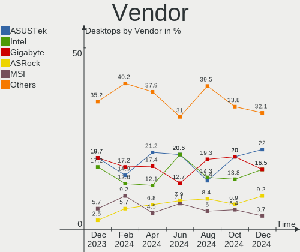

| Name                | Desktops | Percent |
|---------------------|----------|---------|
| Gigabyte Technology | 24       | 19.67%  |
| ASUSTek Computer    | 24       | 19.67%  |
| Intel               | 21       | 17.21%  |
| Dell                | 11       | 9.02%   |
| MSI                 | 7        | 5.74%   |
| Positivo            | 5        | 4.1%    |
| Biostar             | 4        | 3.28%   |
| PCWare              | 3        | 2.46%   |
| MACHINIST           | 3        | 2.46%   |
| Lenovo              | 3        | 2.46%   |
| ASRock              | 3        | 2.46%   |
| Pegatron            | 2        | 1.64%   |
| ANGXUN              | 2        | 1.64%   |
| Semp Toshiba        | 1        | 0.82%   |
| OEM                 | 1        | 0.82%   |
| Lenovo Product      | 1        | 0.82%   |
| Hewlett-Packard     | 1        | 0.82%   |
| ECS                 | 1        | 0.82%   |
| Daten Tecnologia    | 1        | 0.82%   |
| Colorful Technology | 1        | 0.82%   |
| ALDO                | 1        | 0.82%   |
| Acer                | 1        | 0.82%   |
| Unknown             | 1        | 0.82%   |

Model
-----

Motherboard model

| Name                               | Desktops | Percent |
|------------------------------------|----------|---------|
| Intel H61                          | 8        | 6.56%   |
| Intel B75                          | 3        | 2.46%   |
| Gigabyte B550M AORUS ELITE         | 3        | 2.46%   |
| Unknown                            | 3        | 2.46%   |
| Intel B85                          | 2        | 1.64%   |
| Gigabyte B450M DS3H                | 2        | 1.64%   |
| Gigabyte B450 AORUS M              | 2        | 1.64%   |
| Gigabyte AB350M-DS3H V2            | 2        | 1.64%   |
| Dell XPS 8500                      | 2        | 1.64%   |
| ASUS TUF Gaming Z690-PLUS D4       | 2        | 1.64%   |
| ASUS All Series                    | 2        | 1.64%   |
| Semp Toshiba STI                   | 1        | 0.82%   |
| Positivo Positivo Master D380      | 1        | 0.82%   |
| Positivo POS-SIGL40BX              | 1        | 0.82%   |
| Positivo POS-PIQ57BQ               | 1        | 0.82%   |
| Positivo POS-PIH55BX               | 1        | 0.82%   |
| Positivo P5GC-MX/CKD/POST/SI       | 1        | 0.82%   |
| Pegatron IPMIP-GS                  | 1        | 0.82%   |
| Pegatron IPMH61P1                  | 1        | 0.82%   |
| PCWare IPMH61R3                    | 1        | 0.82%   |
| PCWare IPMH61R1                    | 1        | 0.82%   |
| PCWare IPMH310G PRO                | 1        | 0.82%   |
| OEM B75                            | 1        | 0.82%   |
| MSI MS-7E01                        | 1        | 0.82%   |
| MSI MS-7D78                        | 1        | 0.82%   |
| MSI MS-7D22                        | 1        | 0.82%   |
| MSI MS-7C95                        | 1        | 0.82%   |
| MSI MS-7C02                        | 1        | 0.82%   |
| MSI MS-7B10                        | 1        | 0.82%   |
| MSI MS-7972                        | 1        | 0.82%   |
| MACHINIST X99-RS9 V2.0             | 1        | 0.82%   |
| MACHINIST X79 Z9-D7 PRO V1.0       | 1        | 0.82%   |
| MACHINIST E5-D8-MAX V1.1           | 1        | 0.82%   |
| Lenovo ThinkCentre M93 10A4S03D00  | 1        | 0.82%   |
| Lenovo ThinkCentre E73z 10BD009GBP | 1        | 0.82%   |
| Lenovo H50-30g 90AS0001BR          | 1        | 0.82%   |
| Intel X99-P4 V1.0                  | 1        | 0.82%   |
| Intel X99                          | 1        | 0.82%   |
| Intel SHARKBAY                     | 1        | 0.82%   |
| Intel Jasper Lake Client Platform  | 1        | 0.82%   |

Model Family
------------

Motherboard model prefix

| Name                  | Desktops | Percent |
|-----------------------|----------|---------|
| ASUS TUF              | 10       | 8.2%    |
| Intel H61             | 8        | 6.56%   |
| Dell OptiPlex         | 5        | 4.1%    |
| ASUS PRIME            | 5        | 4.1%    |
| Gigabyte B450M        | 4        | 3.28%   |
| Intel B75             | 3        | 2.46%   |
| Gigabyte B550M        | 3        | 2.46%   |
| Unknown               | 3        | 2.46%   |
| Lenovo ThinkCentre    | 2        | 1.64%   |
| Intel B85             | 2        | 1.64%   |
| Gigabyte B450         | 2        | 1.64%   |
| Gigabyte AB350M-DS3H  | 2        | 1.64%   |
| Gigabyte 970A-DS3P    | 2        | 1.64%   |
| Dell XPS              | 2        | 1.64%   |
| Dell Vostro           | 2        | 1.64%   |
| ASUS All              | 2        | 1.64%   |
| Semp Toshiba STI      | 1        | 0.82%   |
| Positivo Positivo     | 1        | 0.82%   |
| Positivo POS-SIGL40BX | 1        | 0.82%   |
| Positivo POS-PIQ57BQ  | 1        | 0.82%   |
| Positivo POS-PIH55BX  | 1        | 0.82%   |
| Positivo P5GC-MX      | 1        | 0.82%   |
| Pegatron IPMIP-GS     | 1        | 0.82%   |
| Pegatron IPMH61P1     | 1        | 0.82%   |
| PCWare IPMH61R3       | 1        | 0.82%   |
| PCWare IPMH61R1       | 1        | 0.82%   |
| PCWare IPMH310G       | 1        | 0.82%   |
| OEM B75               | 1        | 0.82%   |
| MSI MS-7E01           | 1        | 0.82%   |
| MSI MS-7D78           | 1        | 0.82%   |
| MSI MS-7D22           | 1        | 0.82%   |
| MSI MS-7C95           | 1        | 0.82%   |
| MSI MS-7C02           | 1        | 0.82%   |
| MSI MS-7B10           | 1        | 0.82%   |
| MSI MS-7972           | 1        | 0.82%   |
| MACHINIST X99-RS9     | 1        | 0.82%   |
| MACHINIST X79         | 1        | 0.82%   |
| MACHINIST E5-D8-MAX   | 1        | 0.82%   |
| Lenovo H50-30g        | 1        | 0.82%   |
| Intel X99-P4          | 1        | 0.82%   |

MFG Year
--------

Motherboard manufacture year

| Year | Desktops | Percent |
|------|----------|---------|
| 2018 | 19       | 15.57%  |
| 2017 | 15       | 12.3%   |
| 2022 | 13       | 10.66%  |
| 2021 | 11       | 9.02%   |
| 2020 | 10       | 8.2%    |
| 2012 | 9        | 7.38%   |
| 2011 | 7        | 5.74%   |
| 2023 | 6        | 4.92%   |
| 2019 | 6        | 4.92%   |
| 2013 | 6        | 4.92%   |
| 2015 | 5        | 4.1%    |
| 2010 | 5        | 4.1%    |
| 2016 | 4        | 3.28%   |
| 2014 | 4        | 3.28%   |
| 2009 | 2        | 1.64%   |

Form Factor
-----------

Physical design of the computer

| Name    | Desktops | Percent |
|---------|----------|---------|
| Desktop | 122      | 100%    |

Secure Boot
-----------

Enabled or disabled

| State    | Desktops | Percent |
|----------|----------|---------|
| Disabled | 117      | 95.9%   |
| Enabled  | 5        | 4.1%    |

Coreboot
--------

Have coreboot on board

| Used | Desktops | Percent |
|------|----------|---------|
| No   | 122      | 100%    |

RAM Size
--------

Total RAM memory

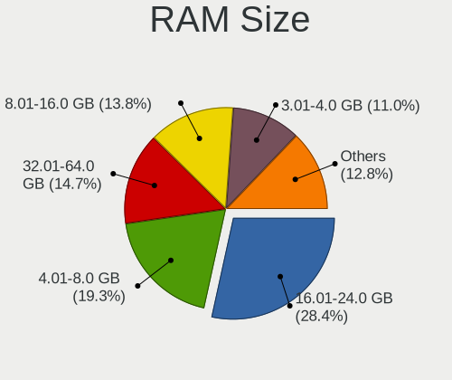

| Size in GB  | Desktops | Percent |
|-------------|----------|---------|
| 16.01-24.0  | 36       | 29.51%  |
| 8.01-16.0   | 26       | 21.31%  |
| 32.01-64.0  | 17       | 13.93%  |
| 4.01-8.0    | 16       | 13.11%  |
| 64.01-256.0 | 12       | 9.84%   |
| 3.01-4.0    | 11       | 9.02%   |
| 24.01-32.0  | 3        | 2.46%   |
| 1.01-2.0    | 1        | 0.82%   |

RAM Used
--------

Used RAM memory

| Used GB    | Desktops | Percent |
|------------|----------|---------|
| 4.01-8.0   | 39       | 31.97%  |
| 1.01-2.0   | 35       | 28.69%  |
| 2.01-3.0   | 28       | 22.95%  |
| 3.01-4.0   | 13       | 10.66%  |
| 8.01-16.0  | 4        | 3.28%   |
| 0.51-1.0   | 2        | 1.64%   |
| 16.01-24.0 | 1        | 0.82%   |

Total Drives
------------

Number of drives on board

| Drives | Desktops | Percent |
|--------|----------|---------|
| 1      | 47       | 38.52%  |
| 2      | 39       | 31.97%  |
| 3      | 19       | 15.57%  |
| 4      | 13       | 10.66%  |
| 5      | 2        | 1.64%   |
| 6      | 1        | 0.82%   |
| 0      | 1        | 0.82%   |

Has CD-ROM
----------

Has CD-ROM on board

| Presented | Desktops | Percent |
|-----------|----------|---------|
| No        | 86       | 70.49%  |
| Yes       | 36       | 29.51%  |

Has Ethernet
------------

Has Ethernet on board

| Presented | Desktops | Percent |
|-----------|----------|---------|
| Yes       | 119      | 97.54%  |
| No        | 3        | 2.46%   |

Has WiFi
--------

Has WiFi module

| Presented | Desktops | Percent |
|-----------|----------|---------|
| No        | 66       | 54.1%   |
| Yes       | 56       | 45.9%   |

Has Bluetooth
-------------

Has Bluetooth module

| Presented | Desktops | Percent |
|-----------|----------|---------|
| No        | 75       | 61.48%  |
| Yes       | 47       | 38.52%  |

Location
--------

Country
-------

Geographic location (country)

| Country | Desktops | Percent |
|---------|----------|---------|
| Brazil  | 122      | 100%    |

City
----

Geographic location (city)

| City                  | Desktops | Percent |
|-----------------------|----------|---------|
| Sao Paulo             | 17       | 13.93%  |
| Rio de Janeiro        | 9        | 7.38%   |
| Porto Alegre          | 6        | 4.92%   |
| Brasília             | 6        | 4.92%   |
| Fortaleza             | 5        | 4.1%    |
| Manaus                | 4        | 3.28%   |
| Santo André          | 3        | 2.46%   |
| Curitiba              | 3        | 2.46%   |
| Salvador              | 2        | 1.64%   |
| Paulista              | 2        | 1.64%   |
| Maua                  | 2        | 1.64%   |
| Maringá              | 2        | 1.64%   |
| Guarulhos             | 2        | 1.64%   |
| Foz do Iguaçu        | 2        | 1.64%   |
| Campinas              | 2        | 1.64%   |
| Belém                | 2        | 1.64%   |
| Vicosa                | 1        | 0.82%   |
| Varginha              | 1        | 0.82%   |
| Taubate               | 1        | 0.82%   |
| Taboao da Serra       | 1        | 0.82%   |
| Suzano                | 1        | 0.82%   |
| Sorocaba              | 1        | 0.82%   |
| Serra                 | 1        | 0.82%   |
| Sao José dos Campos  | 1        | 0.82%   |
| Sao Carlos            | 1        | 0.82%   |
| Santa Rita do Sapucai | 1        | 0.82%   |
| Rio Grande            | 1        | 0.82%   |
| Recife                | 1        | 0.82%   |
| Pouso Alegre          | 1        | 0.82%   |
| Ponta Grossa          | 1        | 0.82%   |
| Petrópolis           | 1        | 0.82%   |
| Patos de Minas        | 1        | 0.82%   |
| Paragominas           | 1        | 0.82%   |
| Para de Minas         | 1        | 0.82%   |
| Palmares              | 1        | 0.82%   |
| Osasco                | 1        | 0.82%   |
| Nova Iguaçu          | 1        | 0.82%   |
| Natal                 | 1        | 0.82%   |
| Mogi Mirim            | 1        | 0.82%   |
| Martinopolis          | 1        | 0.82%   |

Drives
------

Drive Vendor
------------

Hard drive vendors

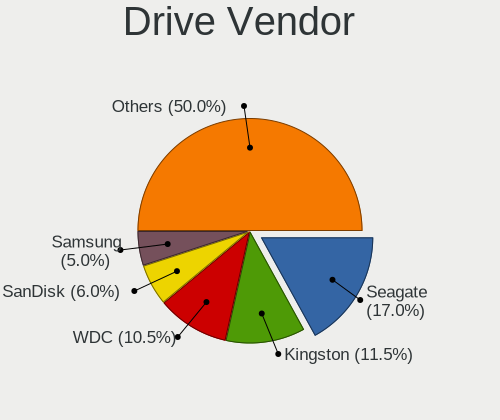

| Vendor                       | Desktops | Drives | Percent |
|------------------------------|----------|--------|---------|
| Seagate                      | 36       | 47     | 16.67%  |
| WDC                          | 35       | 41     | 16.2%   |
| Kingston                     | 33       | 38     | 15.28%  |
| Samsung Electronics          | 14       | 19     | 6.48%   |
| SanDisk                      | 12       | 13     | 5.56%   |
| Crucial                      | 9        | 9      | 4.17%   |
| China                        | 9        | 10     | 4.17%   |
| Toshiba                      | 7        | 8      | 3.24%   |
| A-DATA Technology            | 7        | 7      | 3.24%   |
| Silicon Motion               | 5        | 5      | 2.31%   |
| Hitachi                      | 5        | 5      | 2.31%   |
| WALRAM                       | 4        | 4      | 1.85%   |
| Kingston Technology Company  | 4        | 5      | 1.85%   |
| Realtek Semiconductor        | 3        | 3      | 1.39%   |
| Netac                        | 3        | 3      | 1.39%   |
| Micron/Crucial Technology    | 3        | 3      | 1.39%   |
| MAXIO Technology (Hangzhou)  | 3        | 3      | 1.39%   |
| XrayDisk                     | 2        | 2      | 0.93%   |
| Phison Electronics           | 2        | 2      | 0.93%   |
| Lexar                        | 2        | 2      | 0.93%   |
| JMicron Technology           | 2        | 2      | 0.93%   |
| Fanxiang                     | 2        | 4      | 0.93%   |
| ADATA Technology             | 2        | 2      | 0.93%   |
| USB                          | 1        | 1      | 0.46%   |
| TECH                         | 1        | 1      | 0.46%   |
| Patriot                      | 1        | 1      | 0.46%   |
| NTC                          | 1        | 1      | 0.46%   |
| Maxtor                       | 1        | 1      | 0.46%   |
| MAXIO                        | 1        | 1      | 0.46%   |
| MaxDigital                   | 1        | 1      | 0.46%   |
| LITEON                       | 1        | 1      | 0.46%   |
| KingSpec                     | 1        | 1      | 0.46%   |
| HUSKY                        | 1        | 1      | 0.46%   |
| Beijing Starblaze Technology | 1        | 1      | 0.46%   |
| Unknown                      | 1        | 1      | 0.46%   |

Drive Model
-----------

Hard drive models

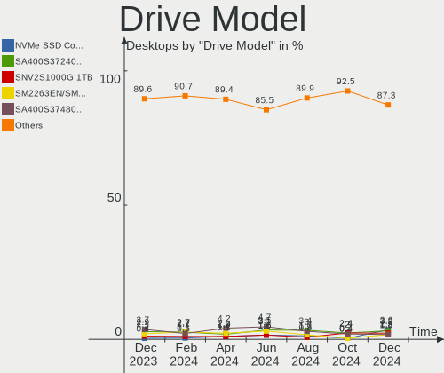

| Model                                                 | Desktops | Percent |
|-------------------------------------------------------|----------|---------|
| Kingston SA400S37480G 480GB SSD                       | 9        | 3.73%   |
| Kingston SA400S37240G 240GB SSD                       | 7        | 2.9%    |
| Seagate ST1000DM010-2EP102 1TB                        | 6        | 2.49%   |
| Silicon Motion SM2263EN/SM2263XT SSD Controller 500GB | 5        | 2.07%   |
| Kingston SA400S37120G 120GB SSD                       | 5        | 2.07%   |
| WDC WD10EZEX-08WN4A0 1TB                              | 4        | 1.66%   |
| A-DATA SU650 120GB SSD                                | 4        | 1.66%   |
| SanDisk SSD PLUS 240GB                                | 3        | 1.24%   |
| Samsung NVMe SSD Controller SM981/PM981/PM983 512GB   | 3        | 1.24%   |
| Micron/Crucial P2 NVMe PCIe SSD 4TB                   | 3        | 1.24%   |
| Kingston Company SNV2S1000G 1TB                       | 3        | 1.24%   |
| Kingston SKC3000S1024G 1024GB                         | 3        | 1.24%   |
| Crucial CT240BX500SSD1 240GB                          | 3        | 1.24%   |
| China SSD 240GB                                       | 3        | 1.24%   |
| WDC WDS240G2G0A-00JH30 240GB SSD                      | 2        | 0.83%   |
| WDC WDS120G2G0B-00EPW0 120GB SSD                      | 2        | 0.83%   |
| WDC WD5000LPVX-00V0TT0 500GB                          | 2        | 0.83%   |
| WDC WD5000AAKX-003CA0 500GB                           | 2        | 0.83%   |
| WDC WD10EZEX-00BN5A0 1TB                              | 2        | 0.83%   |
| WDC WD Green 2.5 240GB SSD                            | 2        | 0.83%   |
| Toshiba MQ02ABD100H 1TB                               | 2        | 0.83%   |
| Toshiba DT01ACA050 500GB                              | 2        | 0.83%   |
| Seagate ST9250410AS 250GB                             | 2        | 0.83%   |
| Seagate ST500DM002-1BD142 500GB                       | 2        | 0.83%   |
| Seagate ST3500418AS 500GB                             | 2        | 0.83%   |
| Seagate ST32000644NS 2TB                              | 2        | 0.83%   |
| Seagate ST1000DM003-1ER162 1TB                        | 2        | 0.83%   |
| Seagate ST1000DM003-1CH162 1TB                        | 2        | 0.83%   |
| Seagate Expansion 2TB                                 | 2        | 0.83%   |
| Sandisk WDC WDS240G2G0C-00AJM0 240GB                  | 2        | 0.83%   |
| SanDisk SSD PLUS 120GB                                | 2        | 0.83%   |
| Samsung NVMe SSD Controller PM9A1/PM9A3/980PRO 2TB    | 2        | 0.83%   |
| Samsung HD502HJ 500GB                                 | 2        | 0.83%   |
| Samsung HD322HJ 320GB                                 | 2        | 0.83%   |
| Realtek RTS5763DL NVMe SSD Controller 256GB           | 2        | 0.83%   |
| MAXIO (Hangzhou) NVMe SSD Controller MAP1001 500GB    | 2        | 0.83%   |
| Lexar 128GB SSD                                       | 2        | 0.83%   |
| Kingston Company SNV2S2000G 2TB                       | 2        | 0.83%   |
| Kingston SNVS500G 500GB                               | 2        | 0.83%   |
| Kingston SNV2S500G 500GB                              | 2        | 0.83%   |

HDD Vendor
----------

Hard disk drive vendors

| Vendor              | Desktops | Drives | Percent |
|---------------------|----------|--------|---------|
| Seagate             | 35       | 46     | 42.17%  |
| WDC                 | 27       | 32     | 32.53%  |
| Samsung Electronics | 8        | 9      | 9.64%   |
| Toshiba             | 7        | 8      | 8.43%   |
| Hitachi             | 5        | 5      | 6.02%   |
| Maxtor              | 1        | 1      | 1.2%    |

SSD Vendor
----------

Solid state drive vendors

| Vendor              | Desktops | Drives | Percent |
|---------------------|----------|--------|---------|
| Kingston            | 25       | 27     | 29.41%  |
| WDC                 | 9        | 9      | 10.59%  |
| China               | 9        | 10     | 10.59%  |
| Crucial             | 8        | 8      | 9.41%   |
| SanDisk             | 7        | 7      | 8.24%   |
| A-DATA Technology   | 6        | 6      | 7.06%   |
| Samsung Electronics | 3        | 5      | 3.53%   |
| WALRAM              | 2        | 2      | 2.35%   |
| Netac               | 2        | 2      | 2.35%   |
| Lexar               | 2        | 2      | 2.35%   |
| XrayDisk            | 1        | 1      | 1.18%   |
| TECH                | 1        | 1      | 1.18%   |
| Patriot             | 1        | 1      | 1.18%   |
| NTC                 | 1        | 1      | 1.18%   |
| MAXIO               | 1        | 1      | 1.18%   |
| MaxDigital          | 1        | 1      | 1.18%   |
| LITEON              | 1        | 1      | 1.18%   |
| KingSpec            | 1        | 1      | 1.18%   |
| JMicron Technology  | 1        | 1      | 1.18%   |
| HUSKY               | 1        | 1      | 1.18%   |
| Fanxiang            | 1        | 2      | 1.18%   |
| Unknown             | 1        | 1      | 1.18%   |

Drive Kind
----------

HDD or SSD

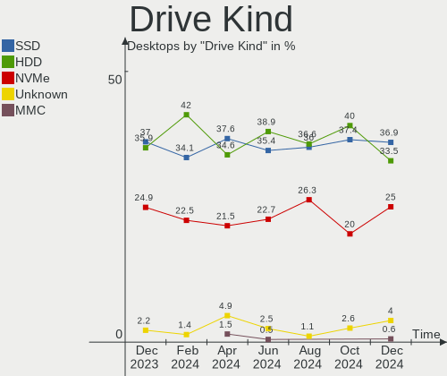

| Kind    | Desktops | Drives | Percent |
|---------|----------|--------|---------|
| SSD     | 67       | 91     | 37.02%  |
| HDD     | 65       | 101    | 35.91%  |
| NVMe    | 45       | 53     | 24.86%  |
| Unknown | 4        | 4      | 2.21%   |

Drive Connector
---------------

SATA, SAS, NVMe, etc.

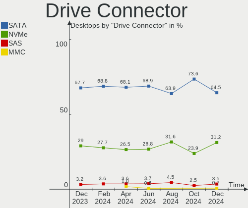

| Type | Desktops | Drives | Percent |
|------|----------|--------|---------|
| SATA | 105      | 190    | 67.74%  |
| NVMe | 45       | 53     | 29.03%  |
| SAS  | 5        | 6      | 3.23%   |

Drive Size
----------

Size of hard drive

| Size in TB | Desktops | Drives | Percent |
|------------|----------|--------|---------|
| 0.01-0.5   | 82       | 119    | 57.75%  |
| 0.51-1.0   | 45       | 57     | 31.69%  |
| 1.01-2.0   | 12       | 13     | 8.45%   |
| 3.01-4.0   | 2        | 2      | 1.41%   |
| 2.01-3.0   | 1        | 1      | 0.7%    |

Space Total
-----------

Amount of disk space available on the file system

| Size in GB     | Desktops | Percent |
|----------------|----------|---------|
| 101-250        | 29       | 23.77%  |
| 501-1000       | 22       | 18.03%  |
| 251-500        | 21       | 17.21%  |
| 1001-2000      | 20       | 16.39%  |
| 1-20           | 8        | 6.56%   |
| 51-100         | 8        | 6.56%   |
| More than 3000 | 7        | 5.74%   |
| 2001-3000      | 4        | 3.28%   |
| Unknown        | 2        | 1.64%   |
| 21-50          | 1        | 0.82%   |

Space Used
----------

Amount of used disk space

| Used GB   | Desktops | Percent |
|-----------|----------|---------|
| 1-20      | 36       | 29.51%  |
| 101-250   | 22       | 18.03%  |
| 21-50     | 21       | 17.21%  |
| 51-100    | 14       | 11.48%  |
| 251-500   | 10       | 8.2%    |
| 501-1000  | 9        | 7.38%   |
| 1001-2000 | 6        | 4.92%   |
| 2001-3000 | 2        | 1.64%   |
| Unknown   | 2        | 1.64%   |

Malfunc. Drives
---------------

Drive models with a malfunction

| Model                                                         | Desktops | Drives | Percent |
|---------------------------------------------------------------|----------|--------|---------|
| Samsung Electronics HD322HJ 320GB                             | 2        | 2      | 14.29%  |
| WDC WD5000AAKX-003CA0 500GB                                   | 1        | 1      | 7.14%   |
| WDC WD10EZEX-08WN4A0 1TB                                      | 1        | 1      | 7.14%   |
| WDC WD Green 2.5 240GB SSD                                    | 1        | 1      | 7.14%   |
| Toshiba MQ01ABD050V -63 500GB                                 | 1        | 1      | 7.14%   |
| Seagate ST9250410AS 250GB                                     | 1        | 1      | 7.14%   |
| Seagate ST500LT012-9WS142 500GB                               | 1        | 1      | 7.14%   |
| Seagate ST3500630NS 500GB                                     | 1        | 1      | 7.14%   |
| Seagate ST1000DX001-1NS162 1TB                                | 1        | 1      | 7.14%   |
| Seagate ST1000DM010-2EP102 1TB                                | 1        | 1      | 7.14%   |
| Netac NS512GSSD340 512GB                                      | 1        | 1      | 7.14%   |
| MAXIO Technology (Hangzhou) NVMe SSD Controller MAP1001 500GB | 1        | 1      | 7.14%   |
| Hitachi HTS542580K9SA00 80GB                                  | 1        | 1      | 7.14%   |

Malfunc. Drive Vendor
---------------------

Vendors of faulty drives

| Vendor                      | Desktops | Drives | Percent |
|-----------------------------|----------|--------|---------|
| Seagate                     | 5        | 5      | 35.71%  |
| WDC                         | 3        | 3      | 21.43%  |
| Samsung Electronics         | 2        | 2      | 14.29%  |
| Toshiba                     | 1        | 1      | 7.14%   |
| Netac                       | 1        | 1      | 7.14%   |
| MAXIO Technology (Hangzhou) | 1        | 1      | 7.14%   |
| Hitachi                     | 1        | 1      | 7.14%   |

Malfunc. HDD Vendor
-------------------

Vendors of faulty HDD drives

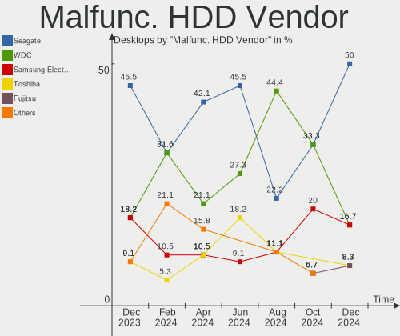

| Vendor              | Desktops | Drives | Percent |
|---------------------|----------|--------|---------|
| Seagate             | 5        | 5      | 45.45%  |
| WDC                 | 2        | 2      | 18.18%  |
| Samsung Electronics | 2        | 2      | 18.18%  |
| Toshiba             | 1        | 1      | 9.09%   |
| Hitachi             | 1        | 1      | 9.09%   |

Malfunc. Drive Kind
-------------------

Kinds of faulty drives

| Kind | Desktops | Drives | Percent |
|------|----------|--------|---------|
| HDD  | 10       | 11     | 76.92%  |
| SSD  | 2        | 2      | 15.38%  |
| NVMe | 1        | 1      | 7.69%   |

Failed Drives
-------------

Failed drive models

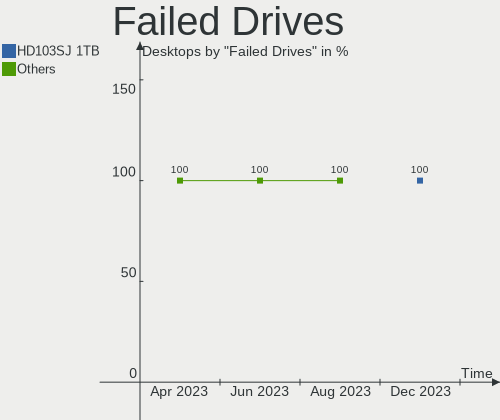

| Model                           | Desktops | Drives | Percent |
|---------------------------------|----------|--------|---------|
| Samsung Electronics HD103SJ 1TB | 1        | 1      | 100%    |

Failed Drive Vendor
-------------------

Failed drive vendors

| Vendor              | Desktops | Drives | Percent |
|---------------------|----------|--------|---------|
| Samsung Electronics | 1        | 1      | 100%    |

Drive Status
------------

Number of failed and malfunc. drives

| Status   | Desktops | Drives | Percent |
|----------|----------|--------|---------|
| Detected | 76       | 162    | 56.72%  |
| Works    | 44       | 72     | 32.84%  |
| Malfunc  | 13       | 14     | 9.7%    |
| Failed   | 1        | 1      | 0.75%   |

Storage controller
------------------

Storage Vendor
--------------

Storage controller vendors

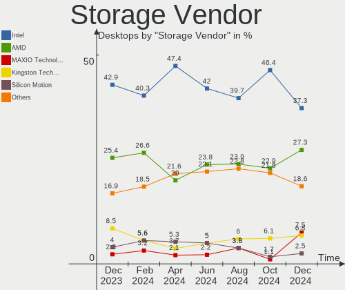

| Vendor                       | Desktops | Percent |
|------------------------------|----------|---------|
| Intel                        | 76       | 42.94%  |
| AMD                          | 45       | 25.42%  |
| Kingston Technology Company  | 15       | 8.47%   |
| Silicon Motion               | 7        | 3.95%   |
| SanDisk                      | 5        | 2.82%   |
| Samsung Electronics          | 5        | 2.82%   |
| Realtek Semiconductor        | 5        | 2.82%   |
| Micron/Crucial Technology    | 4        | 2.26%   |
| MAXIO Technology (Hangzhou)  | 4        | 2.26%   |
| Phison Electronics           | 2        | 1.13%   |
| ASMedia Technology           | 2        | 1.13%   |
| ADATA Technology             | 2        | 1.13%   |
| VIA Technologies             | 1        | 0.56%   |
| Seagate Technology           | 1        | 0.56%   |
| Marvell Technology Group     | 1        | 0.56%   |
| Broadcom / LSI               | 1        | 0.56%   |
| Beijing Starblaze Technology | 1        | 0.56%   |

Storage Model
-------------

Storage controller models

| Model                                                                                   | Desktops | Percent |
|-----------------------------------------------------------------------------------------|----------|---------|
| Intel 6 Series/C200 Series Chipset Family 6 port Desktop SATA AHCI Controller           | 15       | 7.32%   |
| AMD FCH SATA Controller [AHCI mode]                                                     | 15       | 7.32%   |
| Intel 8 Series/C220 Series Chipset Family 6-port SATA Controller 1 [AHCI mode]          | 13       | 6.34%   |
| AMD 500 Series Chipset SATA Controller                                                  | 10       | 4.88%   |
| AMD 400 Series Chipset SATA Controller                                                  | 10       | 4.88%   |
| AMD SB7x0/SB8x0/SB9x0 IDE Controller                                                    | 8        | 3.9%    |
| Silicon Motion SM2263EN/SM2263XT (DRAM-less) NVMe SSD Controllers                       | 7        | 3.41%   |
| Intel 7 Series/C210 Series Chipset Family 6-port SATA Controller [AHCI mode]            | 7        | 3.41%   |
| Kingston Company NV2 NVMe SSD SM2267XT                                                  | 6        | 2.93%   |
| AMD SB7x0/SB8x0/SB9x0 SATA Controller [IDE mode]                                        | 6        | 2.93%   |
| Intel 500 Series Chipset Family SATA AHCI Controller                                    | 5        | 2.44%   |
| Micron/Crucial P2 [Nick P2] / P3 / P3 Plus NVMe PCIe SSD (DRAM-less)                    | 4        | 1.95%   |
| Kingston Company KC3000/FURY Renegade NVMe SSD E18                                      | 4        | 1.95%   |
| Intel 5 Series/3400 Series Chipset 4 port SATA IDE Controller                           | 4        | 1.95%   |
| Intel 5 Series/3400 Series Chipset 2 port SATA IDE Controller                           | 4        | 1.95%   |
| AMD SB7x0/SB8x0/SB9x0 SATA Controller [AHCI mode]                                       | 4        | 1.95%   |
| AMD FCH SATA Controller D                                                               | 4        | 1.95%   |
| Samsung NVMe SSD Controller SM981/PM981/PM983                                           | 3        | 1.46%   |
| Realtek RTS5762 NVMe SSD Controller                                                     | 3        | 1.46%   |
| Intel Cannon Lake PCH SATA AHCI Controller                                              | 3        | 1.46%   |
| Intel 200 Series PCH SATA controller [AHCI mode]                                        | 3        | 1.46%   |
| SanDisk WD Green SN350 240GB (DRAM-less) / SN560E NVMe SSD                              | 2        | 0.98%   |
| SanDisk WD Black SN770 / PC SN740 256GB / PC SN560 (DRAM-less) NVMe SSD                 | 2        | 0.98%   |
| Samsung NVMe SSD Controller PM9A1/PM9A3/980PRO                                          | 2        | 0.98%   |
| MAXIO (Hangzhou) NVMe SSD Controller MAP1202                                            | 2        | 0.98%   |
| MAXIO (Hangzhou) NVMe SSD Controller MAP1001                                            | 2        | 0.98%   |
| Kingston Company NV1 NVMe SSD E13T                                                      | 2        | 0.98%   |
| Intel SATA Controller [RAID mode]                                                       | 2        | 0.98%   |
| Intel NM10/ICH7 Family SATA Controller [IDE mode]                                       | 2        | 0.98%   |
| Intel Alder Lake-S PCH SATA Controller [AHCI Mode]                                      | 2        | 0.98%   |
| Intel 8 Series/C220 Series Chipset Family 4-port SATA Controller 1 [IDE mode]           | 2        | 0.98%   |
| Intel 6 Series/C200 Series Chipset Family Desktop SATA Controller (IDE mode, ports 4-5) | 2        | 0.98%   |
| Intel 6 Series/C200 Series Chipset Family Desktop SATA Controller (IDE mode, ports 0-3) | 2        | 0.98%   |
| ADATA A Non-Volatile memory controller                                                  | 2        | 0.98%   |
| VIA VT6415 PATA IDE Host Controller                                                     | 1        | 0.49%   |
| Seagate BarraCuda Q5 NVMe SSD (DRAM-less)                                               | 1        | 0.49%   |
| Sandisk WD Black SN850X NVMe SSD                                                        | 1        | 0.49%   |
| SanDisk Ultra 3D / WD Blue SN550 NVMe SSD                                               | 1        | 0.49%   |
| Realtek RTS5765DL NVMe SSD Controller (DRAM-less)                                       | 1        | 0.49%   |
| Realtek RTS5763DL NVMe SSD Controller (DRAM-less)                                       | 1        | 0.49%   |

Storage Kind
------------

Kind of storage controller (IDE, SATA, NVMe, SAS, ...)

| Kind | Desktops | Percent |
|------|----------|---------|
| SATA | 106      | 58.89%  |
| NVMe | 45       | 25%     |
| IDE  | 21       | 11.67%  |
| RAID | 6        | 3.33%   |
| SAS  | 2        | 1.11%   |

Processor
---------

CPU Vendor
----------

Processor vendors

| Vendor | Desktops | Percent |
|--------|----------|---------|
| Intel  | 77       | 63.11%  |
| AMD    | 45       | 36.89%  |

CPU Model
---------

Processor models

| Model                                       | Desktops | Percent |
|---------------------------------------------|----------|---------|
| Intel Core i7-3770 CPU @ 3.40GHz            | 6        | 4.92%   |
| Intel Core i5 CPU 650 @ 3.20GHz             | 5        | 4.1%    |
| AMD Ryzen 5 5600G with Radeon Graphics      | 5        | 4.1%    |
| Intel Core i3-2100 CPU @ 3.10GHz            | 3        | 2.46%   |
| AMD Ryzen 5 5600 6-Core Processor           | 3        | 2.46%   |
| AMD Ryzen 5 3600 6-Core Processor           | 3        | 2.46%   |
| Intel Xeon CPU E5-2670 v2 @ 2.50GHz         | 2        | 1.64%   |
| Intel Core i7-2600 CPU @ 3.40GHz            | 2        | 1.64%   |
| Intel Core i5-3470 CPU @ 3.20GHz            | 2        | 1.64%   |
| Intel Core i5-2400 CPU @ 3.10GHz            | 2        | 1.64%   |
| Intel Core i3-3240 CPU @ 3.40GHz            | 2        | 1.64%   |
| Intel Core i3-2120 CPU @ 3.30GHz            | 2        | 1.64%   |
| AMD Ryzen 7 7700X 8-Core Processor          | 2        | 1.64%   |
| AMD Ryzen 7 5700X 8-Core Processor          | 2        | 1.64%   |
| AMD Ryzen 7 5700G with Radeon Graphics      | 2        | 1.64%   |
| AMD Ryzen 5 3400G with Radeon Vega Graphics | 2        | 1.64%   |
| AMD Ryzen 3 3200G with Radeon Vega Graphics | 2        | 1.64%   |
| AMD Phenom II X4 955 Processor              | 2        | 1.64%   |
| AMD FX-8300 Eight-Core Processor            | 2        | 1.64%   |
| AMD FX-6300 Six-Core Processor              | 2        | 1.64%   |
| Intel Xeon CPU E5-2699 v3 @ 2.30GHz         | 1        | 0.82%   |
| Intel Xeon CPU E5-2697 v3 @ 2.60GHz         | 1        | 0.82%   |
| Intel Xeon CPU E5-2687W v3 @ 3.10GHz        | 1        | 0.82%   |
| Intel Xeon CPU E5-2670 v3 @ 2.30GHz         | 1        | 0.82%   |
| Intel Xeon CPU E5-2666 v3 @ 2.90GHz         | 1        | 0.82%   |
| Intel Xeon CPU E5-2650 v3 @ 2.30GHz         | 1        | 0.82%   |
| Intel Xeon CPU E5-2630 v3 @ 2.40GHz         | 1        | 0.82%   |
| Intel Xeon CPU E5-1650 v2 @ 3.50GHz         | 1        | 0.82%   |
| Intel Xeon CPU E31230 @ 3.20GHz             | 1        | 0.82%   |
| Intel Xeon CPU E3-1245 v3 @ 3.40GHz         | 1        | 0.82%   |
| Intel Pentium Dual-Core CPU E5700 @ 3.00GHz | 1        | 0.82%   |
| Intel Pentium Dual CPU E2220 @ 2.40GHz      | 1        | 0.82%   |
| Intel Pentium CPU G3260 @ 3.30GHz           | 1        | 0.82%   |
| Intel Pentium CPU G2030 @ 3.00GHz           | 1        | 0.82%   |
| Intel Core i9-9900K CPU @ 3.60GHz           | 1        | 0.82%   |
| Intel Core i9-9900 CPU @ 3.10GHz            | 1        | 0.82%   |
| Intel Core i7-7700 CPU @ 3.60GHz            | 1        | 0.82%   |
| Intel Core i7-6700 CPU @ 3.40GHz            | 1        | 0.82%   |
| Intel Core i7-4790S CPU @ 3.20GHz           | 1        | 0.82%   |
| Intel Core i7-4790 CPU @ 3.60GHz            | 1        | 0.82%   |

CPU Model Family
----------------

Processor model prefix

| Model                   | Desktops | Percent |
|-------------------------|----------|---------|
| Intel Core i5           | 19       | 15.57%  |
| AMD Ryzen 5             | 17       | 13.93%  |
| Intel Core i3           | 15       | 12.3%   |
| Intel Core i7           | 13       | 10.66%  |
| Intel Xeon              | 12       | 9.84%   |
| AMD Ryzen 7             | 8        | 6.56%   |
| Other                   | 7        | 5.74%   |
| AMD FX                  | 5        | 4.1%    |
| Intel Celeron           | 4        | 3.28%   |
| AMD Ryzen 3             | 3        | 2.46%   |
| Intel Pentium           | 2        | 1.64%   |
| Intel Core i9           | 2        | 1.64%   |
| AMD Ryzen 9             | 2        | 1.64%   |
| AMD Phenom II X4        | 2        | 1.64%   |
| Intel Pentium Dual-Core | 1        | 0.82%   |
| Intel Pentium Dual      | 1        | 0.82%   |
| Intel Core 2 Duo        | 1        | 0.82%   |
| AMD Ryzen 5 PRO         | 1        | 0.82%   |
| AMD Ryzen 3 PRO         | 1        | 0.82%   |
| AMD Phenom II X6        | 1        | 0.82%   |
| AMD C-60                | 1        | 0.82%   |
| AMD Athlon II X3        | 1        | 0.82%   |
| AMD Athlon              | 1        | 0.82%   |
| AMD A8                  | 1        | 0.82%   |
| AMD A4                  | 1        | 0.82%   |

CPU Cores
---------

Number of processor cores

| Number | Desktops | Percent |
|--------|----------|---------|
| 4      | 41       | 33.61%  |
| 2      | 29       | 23.77%  |
| 6      | 23       | 18.85%  |
| 8      | 13       | 10.66%  |
| 10     | 4        | 3.28%   |
| 16     | 3        | 2.46%   |
| 3      | 3        | 2.46%   |
| 12     | 2        | 1.64%   |
| 28     | 1        | 0.82%   |
| 20     | 1        | 0.82%   |
| 18     | 1        | 0.82%   |
| 1      | 1        | 0.82%   |

CPU Sockets
-----------

Number of sockets

| Number | Desktops | Percent |
|--------|----------|---------|
| 1      | 120      | 98.36%  |
| 2      | 2        | 1.64%   |

CPU Threads
-----------

Threads per core (Hyper-Threading)

| Number | Desktops | Percent |
|--------|----------|---------|
| 2      | 93       | 76.23%  |
| 1      | 29       | 23.77%  |

CPU Op-Modes
------------

CPU Operation Modes (32-bit, 64-bit)

| Op mode        | Desktops | Percent |
|----------------|----------|---------|
| 32-bit, 64-bit | 122      | 100%    |

CPU Microcode
-------------

Microcode number

| Number     | Desktops | Percent |
|------------|----------|---------|
| Unknown    | 65       | 53.28%  |
| 0x306a9    | 9        | 7.38%   |
| 0x20655    | 3        | 2.46%   |
| 0x0a50000d | 3        | 2.46%   |
| 0x08108109 | 3        | 2.46%   |
| 0x08101016 | 3        | 2.46%   |
| 0x306c3    | 2        | 1.64%   |
| 0x206a7    | 2        | 1.64%   |
| 0x0a601206 | 2        | 1.64%   |
| 0x0a50000b | 2        | 1.64%   |
| 0x0a20120a | 2        | 1.64%   |
| 0x08701030 | 2        | 1.64%   |
| 0x06000822 | 2        | 1.64%   |
| 0xa0671    | 1        | 0.82%   |
| 0xa0655    | 1        | 0.82%   |
| 0x906ea    | 1        | 0.82%   |
| 0x906c0    | 1        | 0.82%   |
| 0x506e3    | 1        | 0.82%   |
| 0x306f2    | 1        | 0.82%   |
| 0x0a601203 | 1        | 0.82%   |
| 0x0a601201 | 1        | 0.82%   |
| 0x0a50000f | 1        | 0.82%   |
| 0x0a20120e | 1        | 0.82%   |
| 0x0a201025 | 1        | 0.82%   |
| 0x08701021 | 1        | 0.82%   |
| 0x08600106 | 1        | 0.82%   |
| 0x0800820d | 1        | 0.82%   |
| 0x06003106 | 1        | 0.82%   |
| 0x06001119 | 1        | 0.82%   |
| 0x06000852 | 1        | 0.82%   |
| 0x0600081c | 1        | 0.82%   |
| 0x05000119 | 1        | 0.82%   |
| 0x010000dc | 1        | 0.82%   |
| 0x010000c8 | 1        | 0.82%   |
| 0x010000b6 | 1        | 0.82%   |

CPU Microarch
-------------

Microarchitecture

| Name             | Desktops | Percent |
|------------------|----------|---------|
| Haswell          | 19       | 15.57%  |
| IvyBridge        | 16       | 13.11%  |
| Zen 3            | 13       | 10.66%  |
| SandyBridge      | 10       | 8.2%    |
| Zen+             | 7        | 5.74%   |
| KabyLake         | 7        | 5.74%   |
| Piledriver       | 6        | 4.92%   |
| Unknown          | 6        | 4.92%   |
| Zen 2            | 5        | 4.1%    |
| Westmere         | 5        | 4.1%    |
| CometLake        | 5        | 4.1%    |
| K10              | 4        | 3.28%   |
| Zen              | 3        | 2.46%   |
| Icelake          | 3        | 2.46%   |
| Alderlake Hybrid | 3        | 2.46%   |
| Skylake          | 2        | 1.64%   |
| Penryn           | 2        | 1.64%   |
| Tremont          | 1        | 0.82%   |
| Steamroller      | 1        | 0.82%   |
| Silvermont       | 1        | 0.82%   |
| Goldmont plus    | 1        | 0.82%   |
| Core             | 1        | 0.82%   |
| Bobcat           | 1        | 0.82%   |

Graphics
--------

GPU Vendor
----------

Vendors of graphics cards

| Vendor | Desktops | Percent |
|--------|----------|---------|
| AMD    | 51       | 39.23%  |
| Intel  | 44       | 33.85%  |
| Nvidia | 35       | 26.92%  |

GPU Model
---------

Graphics card models

| Model                                                                       | Desktops | Percent |
|-----------------------------------------------------------------------------|----------|---------|
| AMD Polaris 20 XL [Radeon RX 580 2048SP]                                    | 8        | 5.93%   |
| Intel 2nd Generation Core Processor Family Integrated Graphics Controller   | 7        | 5.19%   |
| AMD Cezanne [Radeon Vega Series / Radeon Vega Mobile Series]                | 7        | 5.19%   |
| Intel Xeon E3-1200 v3/4th Gen Core Processor Integrated Graphics Controller | 6        | 4.44%   |
| Intel Xeon E3-1200 v2/3rd Gen Core processor Graphics Controller            | 5        | 3.7%    |
| AMD Raphael                                                                 | 5        | 3.7%    |
| AMD Ellesmere [Radeon RX 470/480/570/570X/580/580X/590]                     | 5        | 3.7%    |
| Nvidia GP108 [GeForce GT 1030]                                              | 4        | 2.96%   |
| Intel IvyBridge GT2 [HD Graphics 4000]                                      | 4        | 2.96%   |
| AMD Cedar [Radeon HD 5000/6000/7350/8350 Series]                            | 4        | 2.96%   |
| Nvidia GK208B [GeForce GT 710]                                              | 3        | 2.22%   |
| Nvidia GF119 [GeForce GT 610]                                               | 3        | 2.22%   |
| Intel Core Processor Integrated Graphics Controller                         | 3        | 2.22%   |
| Intel CometLake-S GT2 [UHD Graphics 630]                                    | 3        | 2.22%   |
| Nvidia TU117 [GeForce GTX 1650]                                             | 2        | 1.48%   |
| Nvidia TU116 [GeForce GTX 1660 SUPER]                                       | 2        | 1.48%   |
| Nvidia GT218 [GeForce 210]                                                  | 2        | 1.48%   |
| Nvidia GP107 [GeForce GTX 1050]                                             | 2        | 1.48%   |
| Nvidia GF108 [GeForce GT 730]                                               | 2        | 1.48%   |
| Nvidia GA106 [GeForce RTX 3060 Lite Hash Rate]                              | 2        | 1.48%   |
| Nvidia GA104 [GeForce RTX 3070 Lite Hash Rate]                              | 2        | 1.48%   |
| Nvidia GA104 [GeForce RTX 3060 Ti Lite Hash Rate]                           | 2        | 1.48%   |
| Intel HD Graphics 530                                                       | 2        | 1.48%   |
| Intel CoffeeLake-S GT2 [UHD Graphics 630]                                   | 2        | 1.48%   |
| Intel 4th Generation Core Processor Family Integrated Graphics Controller   | 2        | 1.48%   |
| AMD Renoir [Radeon RX Vega 6 (Ryzen 4000/5000 Mobile Series)]               | 2        | 1.48%   |
| AMD Raven Ridge [Radeon Vega Series / Radeon Vega Mobile Series]            | 2        | 1.48%   |
| AMD Picasso/Raven 2 [Radeon Vega Series / Radeon Vega Mobile Series]        | 2        | 1.48%   |
| AMD Navi 33 [Radeon RX 7700S/7600/7600S/7600M XT/PRO W7600]                 | 2        | 1.48%   |
| AMD Navi 14 [Radeon RX 5500/5500M / Pro 5500M]                              | 2        | 1.48%   |
| Nvidia TU106 [GeForce RTX 2070]                                             | 1        | 0.74%   |
| Nvidia TU106 [GeForce RTX 2060 Rev. A]                                      | 1        | 0.74%   |
| Nvidia GP106 [GeForce GTX 1060 6GB]                                         | 1        | 0.74%   |
| Nvidia GP104GL [Quadro P4000]                                               | 1        | 0.74%   |
| Nvidia GM107 [GeForce GTX 750 Ti]                                           | 1        | 0.74%   |
| Nvidia GK107 [GeForce GT 740]                                               | 1        | 0.74%   |
| Nvidia GF108 [GeForce GT 420]                                               | 1        | 0.74%   |
| Nvidia GA106 [GeForce RTX 3060]                                             | 1        | 0.74%   |
| Nvidia GA104 [GeForce RTX 3060]                                             | 1        | 0.74%   |
| Nvidia G96C [GeForce 9400 GT]                                               | 1        | 0.74%   |

GPU Combo
---------

Combinations of graphics cards

| Name         | Desktops | Percent |
|--------------|----------|---------|
| 1 x AMD      | 44       | 36.07%  |
| 1 x Intel    | 40       | 32.79%  |
| 1 x Nvidia   | 31       | 25.41%  |
| 2 x AMD      | 4        | 3.28%   |
| AMD + Nvidia | 2        | 1.64%   |
| 2 x Nvidia   | 1        | 0.82%   |

GPU Driver
----------

Free vs proprietary

| Driver      | Desktops | Percent |
|-------------|----------|---------|
| Free        | 100      | 81.97%  |
| Proprietary | 20       | 16.39%  |
| Unknown     | 2        | 1.64%   |

GPU Memory
----------

Total video memory

| Size in GB | Desktops | Percent |
|------------|----------|---------|
| Unknown    | 65       | 53.28%  |
| 7.01-8.0   | 18       | 14.75%  |
| 1.01-2.0   | 14       | 11.48%  |
| 0.51-1.0   | 8        | 6.56%   |
| 0.01-0.5   | 7        | 5.74%   |
| 3.01-4.0   | 6        | 4.92%   |
| 5.01-6.0   | 2        | 1.64%   |
| 8.01-16.0  | 2        | 1.64%   |

Monitor
-------

Monitor Vendor
--------------

Monitor vendors

| Vendor              | Desktops | Percent |
|---------------------|----------|---------|
| Goldstar            | 36       | 28.57%  |
| Samsung Electronics | 26       | 20.63%  |
| AOC                 | 17       | 13.49%  |
| Dell                | 14       | 11.11%  |
| Acer                | 6        | 4.76%   |
| Philips             | 4        | 3.17%   |
| Lenovo              | 4        | 3.17%   |
| Unknown (XXX)       | 3        | 2.38%   |
| Unknown             | 2        | 1.59%   |
| Sony                | 2        | 1.59%   |
| LG Electronics      | 2        | 1.59%   |
| WAN                 | 1        | 0.79%   |
| TXD                 | 1        | 0.79%   |
| STD                 | 1        | 0.79%   |
| STA                 | 1        | 0.79%   |
| Panasonic           | 1        | 0.79%   |
| NCS                 | 1        | 0.79%   |
| JINGLITAI           | 1        | 0.79%   |
| Hewlett-Packard     | 1        | 0.79%   |
| CCE                 | 1        | 0.79%   |
| ASUSTek Computer    | 1        | 0.79%   |

Monitor Model
-------------

Monitor models

| Model                                                                  | Desktops | Percent |
|------------------------------------------------------------------------|----------|---------|
| Goldstar 2D HD TV GSM59CA 1366x768 509x286mm 23.0-inch                 | 4        | 3.15%   |
| AOC 27G2G4 AOC2702 1920x1080 598x336mm 27.0-inch                       | 4        | 3.15%   |
| Unknown (XXX) Union TV XXX2841 1920x1080 1209x680mm 54.6-inch          | 2        | 1.57%   |
| Samsung Electronics SyncMaster SAM03E5 1680x1050 470x300mm 22.0-inch   | 2        | 1.57%   |
| Samsung Electronics SMB2030N SAM0634 1600x900 443x249mm 20.0-inch      | 2        | 1.57%   |
| Samsung Electronics C24F390 SAM0D2C 1920x1080 521x293mm 23.5-inch      | 2        | 1.57%   |
| Goldstar HDR WFHD GSM7714 2560x1080 798x334mm 34.1-inch                | 2        | 1.57%   |
| Goldstar 2D FHD TV GSM59C6 1920x1080 509x286mm 23.0-inch               | 2        | 1.57%   |
| Goldstar 20EN33 GSM4EE1 1600x900 443x249mm 20.0-inch                   | 2        | 1.57%   |
| Dell P2219H DELA115 1920x1080 476x267mm 21.5-inch                      | 2        | 1.57%   |
| Dell E1914H DELD03A 1366x768 410x230mm 18.5-inch                       | 2        | 1.57%   |
| AOC 24B2W1G5 AOC2402 1920x1080 527x296mm 23.8-inch                     | 2        | 1.57%   |
| WAN MGN-002-21S WAN2150 1920x1080 410x230mm 18.5-inch                  | 1        | 0.79%   |
| Unknown SMART TV 0563 1920x1080 1209x680mm 54.6-inch                   | 1        | 0.79%   |
| Unknown LCD Monitor FFFF 2288x1287 2550x2550mm 142.0-inch              | 1        | 0.79%   |
| Unknown (XXX) GH-JEF223SH-L XXX44C6 1680x1050 480x270mm 21.7-inch      | 1        | 0.79%   |
| TXD HDMI TXD7825 1440x900 408x255mm 18.9-inch                          | 1        | 0.79%   |
| STD HDMI STD0110 1440x900 420x240mm 19.0-inch                          | 1        | 0.79%   |
| STA SEMP LEDTV STA0030 1920x1080 708x398mm 32.0-inch                   | 1        | 0.79%   |
| Sony TV SNY3002 1920x1080 1018x573mm 46.0-inch                         | 1        | 0.79%   |
| Sony TV  *00 SNYF303 1920x1080 1220x680mm 55.0-inch                    | 1        | 0.79%   |
| Samsung Electronics T24D310 SAM0B68 1366x768 521x293mm 23.5-inch       | 1        | 0.79%   |
| Samsung Electronics SyncMaster SAM060D 1920x1080                       | 1        | 0.79%   |
| Samsung Electronics SyncMaster SAM058F 1920x1080 477x268mm 21.5-inch   | 1        | 0.79%   |
| Samsung Electronics SyncMaster SAM0471 1360x768 344x194mm 15.5-inch    | 1        | 0.79%   |
| Samsung Electronics SyncMaster SAM02E3 1440x900 367x229mm 17.0-inch    | 1        | 0.79%   |
| Samsung Electronics SyncMaster SAM0292 1280x1024 376x301mm 19.0-inch   | 1        | 0.79%   |
| Samsung Electronics SMT27A550 SAM07B8 1920x1080 598x336mm 27.0-inch    | 1        | 0.79%   |
| Samsung Electronics SMT22A300 SAM087B 1920x1080 477x268mm 21.5-inch    | 1        | 0.79%   |
| Samsung Electronics SMBX2050 SAM0717 1600x900 443x249mm 20.0-inch      | 1        | 0.79%   |
| Samsung Electronics SMB1930N SAM0632 1366x768 410x230mm 18.5-inch      | 1        | 0.79%   |
| Samsung Electronics SA300/SA350 SAM078B 1600x900 443x249mm 20.0-inch   | 1        | 0.79%   |
| Samsung Electronics S22E310 SAM0C2D 1920x1080 477x268mm 21.5-inch      | 1        | 0.79%   |
| Samsung Electronics S19C301 SAM0B08 1366x768 410x230mm 18.5-inch       | 1        | 0.79%   |
| Samsung Electronics LF24T35 SAM707D 1920x1080 528x297mm 23.9-inch      | 1        | 0.79%   |
| Samsung Electronics LCD Monitor SAM7032 1920x1080 1210x680mm 54.6-inch | 1        | 0.79%   |
| Samsung Electronics LCD Monitor SAM7016 3840x2160 950x540mm 43.0-inch  | 1        | 0.79%   |
| Samsung Electronics LCD Monitor SAM0FEF 3840x2160 950x540mm 43.0-inch  | 1        | 0.79%   |
| Samsung Electronics LCD Monitor SAM0FBA 3840x2160 950x540mm 43.0-inch  | 1        | 0.79%   |
| Samsung Electronics LCD Monitor SAM0E8C 1920x1080 885x498mm 40.0-inch  | 1        | 0.79%   |

Monitor Resolution
------------------

Monitor screen resolution

| Resolution         | Desktops | Percent |
|--------------------|----------|---------|
| 1920x1080 (FHD)    | 58       | 47.54%  |
| 1600x900 (HD+)     | 13       | 10.66%  |
| 1366x768 (WXGA)    | 13       | 10.66%  |
| 3840x2160 (4K)     | 10       | 8.2%    |
| 1280x1024 (SXGA)   | 6        | 4.92%   |
| 1680x1050 (WSXGA+) | 4        | 3.28%   |
| 2560x1080          | 3        | 2.46%   |
| 1440x900 (WXGA+)   | 3        | 2.46%   |
| 1360x768           | 3        | 2.46%   |
| 2560x1440 (QHD)    | 2        | 1.64%   |
| 1920x540           | 2        | 1.64%   |
| 3840x1080          | 1        | 0.82%   |
| 3440x1440          | 1        | 0.82%   |
| 2288x1287          | 1        | 0.82%   |
| 1280x720 (HD)      | 1        | 0.82%   |
| 1024x768 (XGA)     | 1        | 0.82%   |

Monitor Diagonal
----------------

Diagonal size in inches

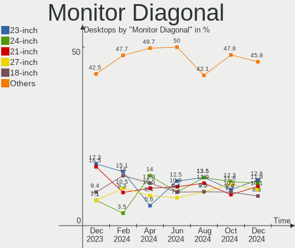

| Inches  | Desktops | Percent |
|---------|----------|---------|
| 23      | 24       | 18.9%   |
| 21      | 22       | 17.32%  |
| 18      | 12       | 9.45%   |
| 20      | 10       | 7.87%   |
| 27      | 9        | 7.09%   |
| 24      | 7        | 5.51%   |
| 19      | 6        | 4.72%   |
| 84      | 4        | 3.15%   |
| 54      | 4        | 3.15%   |
| 34      | 4        | 3.15%   |
| 22      | 4        | 3.15%   |
| 17      | 4        | 3.15%   |
| Unknown | 3        | 2.36%   |
| 15      | 2        | 1.57%   |
| 142     | 1        | 0.79%   |
| 75      | 1        | 0.79%   |
| 72      | 1        | 0.79%   |
| 49      | 1        | 0.79%   |
| 46      | 1        | 0.79%   |
| 43      | 1        | 0.79%   |
| 37      | 1        | 0.79%   |
| 32      | 1        | 0.79%   |
| 31      | 1        | 0.79%   |
| 28      | 1        | 0.79%   |
| 26      | 1        | 0.79%   |
| 12      | 1        | 0.79%   |

Monitor Width
-------------

Physical width

| Width in mm    | Desktops | Percent |
|----------------|----------|---------|
| 401-500        | 51       | 40.8%   |
| 501-600        | 40       | 32%     |
| 1501-2000      | 6        | 4.8%    |
| 1001-1500      | 6        | 4.8%    |
| 701-800        | 5        | 4%      |
| 301-350        | 5        | 4%      |
| 351-400        | 3        | 2.4%    |
| Unknown        | 3        | 2.4%    |
| 601-700        | 2        | 1.6%    |
| More than 2000 | 1        | 0.8%    |
| 801-900        | 1        | 0.8%    |
| 201-300        | 1        | 0.8%    |
| 901-1000       | 1        | 0.8%    |

Aspect Ratio
------------

Proportional relationship between the width and the height

| Ratio   | Desktops | Percent |
|---------|----------|---------|
| 16/9    | 91       | 77.12%  |
| 16/10   | 11       | 9.32%   |
| 5/4     | 5        | 4.24%   |
| 21/9    | 4        | 3.39%   |
| Unknown | 3        | 2.54%   |
| 4/3     | 2        | 1.69%   |
| 32/9    | 1        | 0.85%   |
| 1.00    | 1        | 0.85%   |

Monitor Area
------------

Area in inch²

| Area in inch² | Desktops | Percent |
|----------------|----------|---------|
| 201-250        | 47       | 37.9%   |
| 151-200        | 22       | 17.74%  |
| 141-150        | 13       | 10.48%  |
| More than 1000 | 10       | 8.06%   |
| 301-350        | 9        | 7.26%   |
| 351-500        | 7        | 5.65%   |
| 251-300        | 5        | 4.03%   |
| 501-1000       | 4        | 3.23%   |
| Unknown        | 3        | 2.42%   |
| 101-110        | 2        | 1.61%   |
| 71-80          | 1        | 0.81%   |
| 131-140        | 1        | 0.81%   |

Pixel Density
-------------

Pixels per inch

| Density | Desktops | Percent |
|---------|----------|---------|
| 51-100  | 82       | 69.49%  |
| 101-120 | 23       | 19.49%  |
| 1-50    | 8        | 6.78%   |
| Unknown | 3        | 2.54%   |
| 161-240 | 2        | 1.69%   |

Multiple Monitors
-----------------

Total monitors connected

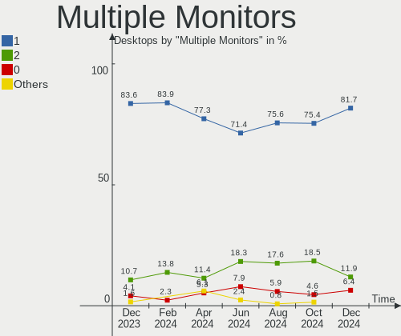

| Total | Desktops | Percent |
|-------|----------|---------|
| 1     | 102      | 83.61%  |
| 2     | 13       | 10.66%  |
| 0     | 5        | 4.1%    |
| 3     | 2        | 1.64%   |

Network
-------

Net Controller Vendor
---------------------

Controller vendors

| Vendor                          | Desktops | Percent |
|---------------------------------|----------|---------|
| Realtek Semiconductor           | 97       | 57.4%   |
| Intel                           | 29       | 17.16%  |
| Qualcomm Atheros                | 13       | 7.69%   |
| MediaTek                        | 7        | 4.14%   |
| TP-Link                         | 5        | 2.96%   |
| D-Link                          | 4        | 2.37%   |
| Broadcom                        | 3        | 1.78%   |
| Ralink Technology               | 2        | 1.18%   |
| Qualcomm Atheros Communications | 2        | 1.18%   |
| Microsoft                       | 2        | 1.18%   |
| Motorola PCS                    | 1        | 0.59%   |
| Mercucys                        | 1        | 0.59%   |
| JMicron Technology              | 1        | 0.59%   |
| D-Link System                   | 1        | 0.59%   |
| ASIX Electronics                | 1        | 0.59%   |

Net Controller Model
--------------------

Controller models

| Model                                                             | Desktops | Percent |
|-------------------------------------------------------------------|----------|---------|
| Realtek RTL8111/8168/8411 PCI Express Gigabit Ethernet Controller | 74       | 39.78%  |
| Realtek RTL810xE PCI Express Fast Ethernet controller             | 10       | 5.38%   |
| Realtek RTL8125 2.5GbE Controller                                 | 8        | 4.3%    |
| Realtek RTL8192EE PCIe Wireless Network Adapter                   | 5        | 2.69%   |
| Qualcomm Atheros AR8151 v2.0 Gigabit Ethernet                     | 4        | 2.15%   |
| Intel Wi-Fi 6 AX210/AX211/AX411 160MHz                            | 4        | 2.15%   |
| Intel Ethernet Controller I225-V                                  | 4        | 2.15%   |
| D-Link 802.11ac NIC                                               | 4        | 2.15%   |
| Realtek RTL8192CU 802.11n WLAN Adapter                            | 3        | 1.61%   |
| Realtek 802.11ac NIC                                              | 3        | 1.61%   |
| MediaTek MT7922 802.11ax PCI Express Wireless Network Adapter     | 3        | 1.61%   |
| Intel Ethernet Connection I217-LM                                 | 3        | 1.61%   |
| TP-Link TL-WN823N v2/v3 [Realtek RTL8192EU]                       | 2        | 1.08%   |
| Realtek RTL-8100/8101L/8139 PCI Fast Ethernet Adapter             | 2        | 1.08%   |
| Qualcomm Atheros AR9271 802.11n                                   | 2        | 1.08%   |
| Qualcomm Atheros AR9485 Wireless Network Adapter                  | 2        | 1.08%   |
| MediaTek MT7921K (RZ608) Wi-Fi 6E 80MHz                           | 2        | 1.08%   |
| Intel Wireless-AC 9260                                            | 2        | 1.08%   |
| Intel Wireless 7260                                               | 2        | 1.08%   |
| Intel Ethernet Connection (7) I219-V                              | 2        | 1.08%   |
| Intel 82578DM Gigabit Network Connection                          | 2        | 1.08%   |
| TP-Link TL-WN821N Version 5 RTL8192EU                             | 1        | 0.54%   |
| TP-Link TL-WN8200ND [Realtek RTL8192CU]                           | 1        | 0.54%   |
| TP-Link AC600 wireless Realtek RTL8811AU [Archer T2U Nano]        | 1        | 0.54%   |
| Realtek RTL8822BE 802.11a/b/g/n/ac WiFi adapter                   | 1        | 0.54%   |
| Realtek RTL8821CE 802.11ac PCIe Wireless Network Adapter          | 1        | 0.54%   |
| Realtek RTL8188FTV 802.11b/g/n 1T1R 2.4G WLAN Adapter             | 1        | 0.54%   |
| Realtek RTL8188CE 802.11b/g/n WiFi Adapter                        | 1        | 0.54%   |
| Realtek RTL8153 Gigabit Ethernet Adapter                          | 1        | 0.54%   |
| Ralink RT5370 Wireless Adapter                                    | 1        | 0.54%   |
| Ralink MT7601U Wireless Adapter                                   | 1        | 0.54%   |
| Qualcomm Atheros QCA9565 / AR9565 Wireless Network Adapter        | 1        | 0.54%   |
| Qualcomm Atheros Killer E2500 Gigabit Ethernet Controller         | 1        | 0.54%   |
| Qualcomm Atheros Killer E220x Gigabit Ethernet Controller         | 1        | 0.54%   |
| Qualcomm Atheros Attansic L2 Fast Ethernet                        | 1        | 0.54%   |
| Qualcomm Atheros AR9462 Wireless Network Adapter                  | 1        | 0.54%   |
| Qualcomm Atheros AR9287 Wireless Network Adapter (PCI-Express)    | 1        | 0.54%   |
| Qualcomm Atheros AR9285 Wireless Network Adapter (PCI-Express)    | 1        | 0.54%   |
| Qualcomm Atheros AR8161 Gigabit Ethernet                          | 1        | 0.54%   |
| Motorola PCS motorola edge 40                                     | 1        | 0.54%   |

Wireless Vendor
---------------

Wireless vendors

| Vendor                          | Desktops | Percent |
|---------------------------------|----------|---------|
| Realtek Semiconductor           | 15       | 26.32%  |
| Intel                           | 11       | 19.3%   |
| Qualcomm Atheros                | 6        | 10.53%  |
| MediaTek                        | 6        | 10.53%  |
| TP-Link                         | 5        | 8.77%   |
| D-Link                          | 4        | 7.02%   |
| Ralink Technology               | 2        | 3.51%   |
| Qualcomm Atheros Communications | 2        | 3.51%   |
| Microsoft                       | 2        | 3.51%   |
| Broadcom                        | 2        | 3.51%   |
| Mercucys                        | 1        | 1.75%   |
| D-Link System                   | 1        | 1.75%   |

Wireless Model
--------------

Wireless models

| Model                                                                      | Desktops | Percent |
|----------------------------------------------------------------------------|----------|---------|
| Realtek RTL8192EE PCIe Wireless Network Adapter                            | 5        | 8.77%   |
| Intel Wi-Fi 6 AX210/AX211/AX411 160MHz                                     | 4        | 7.02%   |
| D-Link 802.11ac NIC                                                        | 4        | 7.02%   |
| Realtek RTL8192CU 802.11n WLAN Adapter                                     | 3        | 5.26%   |
| Realtek 802.11ac NIC                                                       | 3        | 5.26%   |
| MediaTek MT7922 802.11ax PCI Express Wireless Network Adapter              | 3        | 5.26%   |
| TP-Link TL-WN823N v2/v3 [Realtek RTL8192EU]                                | 2        | 3.51%   |
| Qualcomm Atheros AR9271 802.11n                                            | 2        | 3.51%   |
| Qualcomm Atheros AR9485 Wireless Network Adapter                           | 2        | 3.51%   |
| MediaTek MT7921K (RZ608) Wi-Fi 6E 80MHz                                    | 2        | 3.51%   |
| Intel Wireless-AC 9260                                                     | 2        | 3.51%   |
| Intel Wireless 7260                                                        | 2        | 3.51%   |
| TP-Link TL-WN821N Version 5 RTL8192EU                                      | 1        | 1.75%   |
| TP-Link TL-WN8200ND [Realtek RTL8192CU]                                    | 1        | 1.75%   |
| TP-Link AC600 wireless Realtek RTL8811AU [Archer T2U Nano]                 | 1        | 1.75%   |
| Realtek RTL8822BE 802.11a/b/g/n/ac WiFi adapter                            | 1        | 1.75%   |
| Realtek RTL8821CE 802.11ac PCIe Wireless Network Adapter                   | 1        | 1.75%   |
| Realtek RTL8188FTV 802.11b/g/n 1T1R 2.4G WLAN Adapter                      | 1        | 1.75%   |
| Realtek RTL8188CE 802.11b/g/n WiFi Adapter                                 | 1        | 1.75%   |
| Ralink RT5370 Wireless Adapter                                             | 1        | 1.75%   |
| Ralink MT7601U Wireless Adapter                                            | 1        | 1.75%   |
| Qualcomm Atheros QCA9565 / AR9565 Wireless Network Adapter                 | 1        | 1.75%   |
| Qualcomm Atheros AR9462 Wireless Network Adapter                           | 1        | 1.75%   |
| Qualcomm Atheros AR9287 Wireless Network Adapter (PCI-Express)             | 1        | 1.75%   |
| Qualcomm Atheros AR9285 Wireless Network Adapter (PCI-Express)             | 1        | 1.75%   |
| Microsoft Xbox Wireless Adapter for Windows                                | 1        | 1.75%   |
| Microsoft Xbox 360 Wireless Adapter                                        | 1        | 1.75%   |
| Mercucys MW300UM RTL8192EU wifi                                            | 1        | 1.75%   |
| MediaTek MT7612U 802.11a/b/g/n/ac Wireless Adapter                         | 1        | 1.75%   |
| Intel Wi-Fi 6 AX200                                                        | 1        | 1.75%   |
| Intel Centrino Wireless-N 1000 [Condor Peak]                               | 1        | 1.75%   |
| Intel 700 Series Chipset Family Wi-Fi                                      | 1        | 1.75%   |
| D-Link System AirPlus G DWL-G122 Wireless Adapter(rev.C1) [Ralink RT2571W] | 1        | 1.75%   |
| Broadcom BCM4360 802.11ac Dual Band Wireless Network Adapter               | 1        | 1.75%   |
| Broadcom BCM43227 802.11b/g/n                                              | 1        | 1.75%   |

Ethernet Vendor
---------------

Ethernet vendors

| Vendor                | Desktops | Percent |
|-----------------------|----------|---------|
| Realtek Semiconductor | 93       | 73.81%  |
| Intel                 | 20       | 15.87%  |
| Qualcomm Atheros      | 8        | 6.35%   |
| Motorola PCS          | 1        | 0.79%   |
| MediaTek              | 1        | 0.79%   |
| JMicron Technology    | 1        | 0.79%   |
| Broadcom              | 1        | 0.79%   |
| ASIX Electronics      | 1        | 0.79%   |

Ethernet Model
--------------

Ethernet models

| Model                                                             | Desktops | Percent |
|-------------------------------------------------------------------|----------|---------|
| Realtek RTL8111/8168/8411 PCI Express Gigabit Ethernet Controller | 74       | 57.36%  |
| Realtek RTL810xE PCI Express Fast Ethernet controller             | 10       | 7.75%   |
| Realtek RTL8125 2.5GbE Controller                                 | 8        | 6.2%    |
| Qualcomm Atheros AR8151 v2.0 Gigabit Ethernet                     | 4        | 3.1%    |
| Intel Ethernet Controller I225-V                                  | 4        | 3.1%    |
| Intel Ethernet Connection I217-LM                                 | 3        | 2.33%   |
| Realtek RTL-8100/8101L/8139 PCI Fast Ethernet Adapter             | 2        | 1.55%   |
| Intel Ethernet Connection (7) I219-V                              | 2        | 1.55%   |
| Intel 82578DM Gigabit Network Connection                          | 2        | 1.55%   |
| Realtek RTL8153 Gigabit Ethernet Adapter                          | 1        | 0.78%   |
| Qualcomm Atheros Killer E2500 Gigabit Ethernet Controller         | 1        | 0.78%   |
| Qualcomm Atheros Killer E220x Gigabit Ethernet Controller         | 1        | 0.78%   |
| Qualcomm Atheros Attansic L2 Fast Ethernet                        | 1        | 0.78%   |
| Qualcomm Atheros AR8161 Gigabit Ethernet                          | 1        | 0.78%   |
| Motorola PCS motorola edge 40                                     | 1        | 0.78%   |
| MediaTek M40Air_EEA                                               | 1        | 0.78%   |
| JMicron JMC260 PCI Express Fast Ethernet Controller               | 1        | 0.78%   |
| Intel I211 Gigabit Network Connection                             | 1        | 0.78%   |
| Intel I210 Gigabit Network Connection                             | 1        | 0.78%   |
| Intel Ethernet Connection (7) I219-LM                             | 1        | 0.78%   |
| Intel Ethernet Connection (5) I219-LM                             | 1        | 0.78%   |
| Intel Ethernet Connection (2) I219-LM                             | 1        | 0.78%   |
| Intel Ethernet Connection (11) I219-V                             | 1        | 0.78%   |
| Intel Ethernet Connection (10) I219-V                             | 1        | 0.78%   |
| Intel 82579V Gigabit Network Connection                           | 1        | 0.78%   |
| Intel 82579LM Gigabit Network Connection (Lewisville)             | 1        | 0.78%   |
| Intel 82578DC Gigabit Network Connection                          | 1        | 0.78%   |
| Broadcom NetLink BCM57788 Gigabit Ethernet PCIe                   | 1        | 0.78%   |
| ASIX AX88179 Gigabit Ethernet                                     | 1        | 0.78%   |

Net Controller Kind
-------------------

Ethernet, WiFi or modem

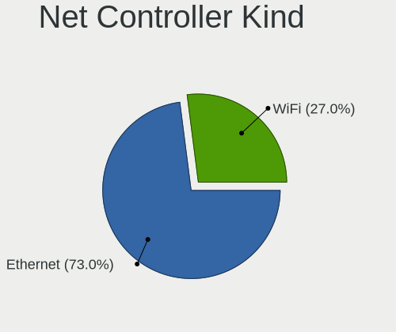

| Kind     | Desktops | Percent |
|----------|----------|---------|
| Ethernet | 119      | 68.39%  |
| WiFi     | 55       | 31.61%  |

Used Controller
---------------

Currently used network controller

| Kind     | Desktops | Percent |
|----------|----------|---------|
| Ethernet | 94       | 72.87%  |
| WiFi     | 35       | 27.13%  |

NICs
----

Total network controllers on board

| Total | Desktops | Percent |
|-------|----------|---------|
| 1     | 82       | 67.21%  |
| 2     | 37       | 30.33%  |
| 3     | 2        | 1.64%   |
| 0     | 1        | 0.82%   |

IPv6
----

IPv6 vs IPv4

| Used | Desktops | Percent |
|------|----------|---------|
| No   | 65       | 53.28%  |
| Yes  | 57       | 46.72%  |

Bluetooth
---------

Bluetooth Vendor
----------------

Controller vendors

| Vendor                          | Desktops | Percent |
|---------------------------------|----------|---------|
| Cambridge Silicon Radio         | 15       | 31.25%  |
| Intel                           | 10       | 20.83%  |
| Realtek Semiconductor           | 7        | 14.58%  |
| MediaTek                        | 4        | 8.33%   |
| Qualcomm Atheros Communications | 3        | 6.25%   |
| Actions                         | 3        | 6.25%   |
| TP-Link                         | 2        | 4.17%   |
| Foxconn / Hon Hai               | 2        | 4.17%   |
| Dynex                           | 1        | 2.08%   |
| Broadcom                        | 1        | 2.08%   |

Bluetooth Model
---------------

Controller models

| Model                                                    | Desktops | Percent |
|----------------------------------------------------------|----------|---------|
| Cambridge Silicon Radio Bluetooth Dongle (HCI mode)      | 15       | 31.25%  |
| Realtek Bluetooth Radio                                  | 6        | 12.5%   |
| MediaTek Wireless_Device                                 | 4        | 8.33%   |
| Intel AX210 Bluetooth                                    | 4        | 8.33%   |
| Actions general adapter                                  | 3        | 6.25%   |
| TP-Link UB500 Adapter                                    | 2        | 4.17%   |
| Qualcomm Atheros Bluetooth USB Host Controller           | 2        | 4.17%   |
| Intel Wireless-AC 9260 Bluetooth Adapter                 | 2        | 4.17%   |
| Intel Bluetooth wireless interface                       | 2        | 4.17%   |
| Realtek RTL8822BE Bluetooth 4.2 Adapter                  | 1        | 2.08%   |
| Qualcomm Atheros AR9462 Bluetooth                        | 1        | 2.08%   |
| Intel Bluetooth Device                                   | 1        | 2.08%   |
| Intel AX200 Bluetooth                                    | 1        | 2.08%   |
| Foxconn / Hon Hai Wireless_Device                        | 1        | 2.08%   |
| Foxconn / Hon Hai Bluetooth Device                       | 1        | 2.08%   |
| Dynex Bluetooth 4.0 Adapter [Broadcom, 1.12, BCM20702A0] | 1        | 2.08%   |
| Broadcom Bluetooth 2.1 Device                            | 1        | 2.08%   |

Sound
-----

Sound Vendor
------------

Sound card vendors

| Vendor                 | Desktops | Percent |
|------------------------|----------|---------|
| Intel                  | 76       | 38.19%  |
| AMD                    | 61       | 30.65%  |
| Nvidia                 | 33       | 16.58%  |
| C-Media Electronics    | 6        | 3.02%   |
| Generalplus Technology | 4        | 2.01%   |
| Logitech               | 3        | 1.51%   |
| Kingston Technology    | 3        | 1.51%   |
| Texas Instruments      | 2        | 1.01%   |
| Tenx Technology        | 2        | 1.01%   |
| ASUSTek Computer       | 2        | 1.01%   |
| Weltrend Semiconductor | 1        | 0.5%    |
| Microsoft              | 1        | 0.5%    |
| Huawei Technologies    | 1        | 0.5%    |
| FDUCE PRO AUDIO MADE   | 1        | 0.5%    |
| Dell                   | 1        | 0.5%    |
| Conexant Systems       | 1        | 0.5%    |
| BR23                   | 1        | 0.5%    |

Sound Model
-----------

Sound card models

| Model                                                                      | Desktops | Percent |
|----------------------------------------------------------------------------|----------|---------|
| AMD Family 17h/19h HD Audio Controller                                     | 21       | 8.68%   |
| Intel 8 Series/C220 Series Chipset High Definition Audio Controller        | 16       | 6.61%   |
| Intel 6 Series/C200 Series Chipset Family High Definition Audio Controller | 16       | 6.61%   |
| AMD Ellesmere HDMI Audio [Radeon RX 470/480 / 570/580/590]                 | 13       | 5.37%   |
| AMD Starship/Matisse HD Audio Controller                                   | 9        | 3.72%   |
| AMD SBx00 Azalia (Intel HDA)                                               | 9        | 3.72%   |
| AMD Renoir Radeon High Definition Audio Controller                         | 9        | 3.72%   |
| Intel Xeon E3-1200 v3/4th Gen Core Processor HD Audio Controller           | 7        | 2.89%   |
| Intel 7 Series/C216 Chipset Family High Definition Audio Controller        | 7        | 2.89%   |
| Nvidia GA104 High Definition Audio Controller                              | 5        | 2.07%   |
| Intel 5 Series/3400 Series Chipset High Definition Audio                   | 5        | 2.07%   |
| AMD Rembrandt Radeon High Definition Audio Controller                      | 5        | 2.07%   |
| Nvidia GP108 High Definition Audio Controller                              | 4        | 1.65%   |
| Intel Tiger Lake-H HD Audio Controller                                     | 4        | 1.65%   |
| Intel Cannon Lake PCH cAVS                                                 | 4        | 1.65%   |
| Generalplus Technology USB Audio Device                                    | 4        | 1.65%   |
| AMD Raven/Raven2/Fenghuang HDMI/DP Audio Controller                        | 4        | 1.65%   |
| AMD Cedar HDMI Audio [Radeon HD 5400/6300/7300 Series]                     | 4        | 1.65%   |
| Nvidia GK208 HDMI/DP Audio Controller                                      | 3        | 1.24%   |
| Nvidia GF119 HDMI Audio Controller                                         | 3        | 1.24%   |
| Nvidia GA106 High Definition Audio Controller                              | 3        | 1.24%   |
| Intel 200 Series PCH HD Audio                                              | 3        | 1.24%   |
| AMD Oland/Hainan/Cape Verde/Pitcairn HDMI Audio [Radeon HD 7000 Series]    | 3        | 1.24%   |
| AMD Navi 21/23 HDMI/DP Audio Controller                                    | 3        | 1.24%   |
| AMD Baffin HDMI/DP Audio [Radeon RX 550 640SP / RX 560/560X]               | 3        | 1.24%   |
| Texas Instruments PCM2902 Audio Codec                                      | 2        | 0.83%   |
| Tenx Technology USB AUDIO                                                  | 2        | 0.83%   |
| Nvidia TU116 High Definition Audio Controller                              | 2        | 0.83%   |
| Nvidia TU107 GeForce GTX 1650 High Definition Audio Controller             | 2        | 0.83%   |
| Nvidia High Definition Audio Controller                                    | 2        | 0.83%   |
| Nvidia GP107GL High Definition Audio Controller                            | 2        | 0.83%   |
| Nvidia GF108 High Definition Audio Controller                              | 2        | 0.83%   |
| Logitech H390 headset with microphone                                      | 2        | 0.83%   |
| Kingston Technology HyperX Cloud Stinger Core (Wireless) – PS         | 2        | 0.83%   |
| Intel Smart Sound Technology (SST) Audio Controller                        | 2        | 0.83%   |
| Intel NM10/ICH7 Family High Definition Audio Controller                    | 2        | 0.83%   |
| Intel Comet Lake PCH-V cAVS                                                | 2        | 0.83%   |
| Intel C610/X99 series chipset HD Audio Controller                          | 2        | 0.83%   |
| Intel C600/X79 series chipset High Definition Audio Controller             | 2        | 0.83%   |
| Intel Alder Lake-S HD Audio Controller                                     | 2        | 0.83%   |

Memory
------

Memory Vendor
-------------

Memory module vendors

| Vendor              | Desktops | Percent |
|---------------------|----------|---------|
| Kingston            | 15       | 24.19%  |
| Smart               | 6        | 9.68%   |
| A-DATA Technology   | 6        | 9.68%   |
| Unknown             | 5        | 8.06%   |
| Corsair             | 4        | 6.45%   |
| Unknown             | 3        | 4.84%   |
| Teikon              | 3        | 4.84%   |
| SK hynix            | 3        | 4.84%   |
| Asgard              | 3        | 4.84%   |
| Samsung Electronics | 2        | 3.23%   |
| Patriot             | 2        | 3.23%   |
| Unknown (0x0E9D)    | 1        | 1.61%   |
| Unknown (0DCE)      | 1        | 1.61%   |
| Transcend           | 1        | 1.61%   |
| Nanya Technology    | 1        | 1.61%   |
| Multilaser          | 1        | 1.61%   |
| Micron Technology   | 1        | 1.61%   |
| Kllisre             | 1        | 1.61%   |
| Hikvision           | 1        | 1.61%   |
| CUSO                | 1        | 1.61%   |
| Crucial             | 1        | 1.61%   |

Memory Model
------------

Memory module models

| Model                                                              | Desktops | Percent |
|--------------------------------------------------------------------|----------|---------|
| Unknown                                                            | 5        | 7.58%   |
| Asgard RAM VMA45UG-MEC1U2AW2 8GB DIMM DDR4 3200MT/s                | 3        | 4.55%   |
| Kingston RAM KF3200C16D4/32GX 32GB DIMM DDR4 3933MT/s              | 2        | 3.03%   |
| A-DATA RAM DDR4 3200 8GB DIMM DDR4 3600MT/s                        | 2        | 3.03%   |
| Unknown RAM Module 8GB DIMM DDR3                                   | 1        | 1.52%   |
| Unknown RAM Module 4GB DIMM 1333MT/s                               | 1        | 1.52%   |
| Unknown RAM Module 2GB DIMM SDRAM                                  | 1        | 1.52%   |
| Unknown RAM Module 2GB DIMM 1333MT/s                               | 1        | 1.52%   |
| Unknown (0x0E9D) RAM KINSOTIN16GB2666MHZ 16GB SODIMM DDR4 2667MT/s | 1        | 1.52%   |
| Unknown (0DCE) RAM Module 8GB DIMM DDR3 1333MT/s                   | 1        | 1.52%   |
| Transcend RAM JM1333KLN-4G 4GB DIMM DDR3 1600MT/s                  | 1        | 1.52%   |
| Teikon RAM TMT451U6BFR8C-PBHJ 4GB DIMM DDR3 1600MT/s               | 1        | 1.52%   |
| Teikon RAM TMT41GU6BFR8C-PBHJ 8GB DIMM DDR3 1600MT/s               | 1        | 1.52%   |
| Teikon RAM TMT41GU6BFR8C-PBHC 8GB DIMM DDR3 1600MT/s               | 1        | 1.52%   |
| Smart RAM SH564568FH8N0QNSCG 2GB DIMM DDR3 1600MT/s                | 1        | 1.52%   |
| Smart RAM SH564128FJ8NWRNSQG 4GB SODIMM DDR3 1600MT/s              | 1        | 1.52%   |
| Smart RAM SH564128FH8N6TNSQR 4GB DIMM DDR3 1600MT/s                | 1        | 1.52%   |
| Smart RAM SH564128FH8N0QNSCG 4GB DIMM DDR3 1600MT/s                | 1        | 1.52%   |
| Smart RAM SH564128FH8N0QHSCR 4GB DIMM DDR3 1333MT/s                | 1        | 1.52%   |
| Smart RAM SH564128FH8N0 4GB DIMM DDR3 800MT/s                      | 1        | 1.52%   |
| Smart RAM SF564128CJ8N6NNSEG 4GB DIMM DDR3 1333MT/s                | 1        | 1.52%   |
| SK hynix RAM HMT325S6CFR8C-H9 2GB DIMM DDR3 1333MT/s               | 1        | 1.52%   |
| SK hynix RAM HMA81GU6CJR8N-XN 8GB DIMM DDR4 3200MT/s               | 1        | 1.52%   |
| SK hynix RAM HMA42GR7MFR4N-TF 16GB DIMM DDR4 2133MT/s              | 1        | 1.52%   |
| Samsung RAM SH5721G8FH8D6NDSQ 8GB DIMM DDR3 1866MT/s               | 1        | 1.52%   |
| Samsung RAM M393B2G70DB0 16GB DIMM DDR3 1866MT/s                   | 1        | 1.52%   |
| Patriot RAM PSD38G13332 8GB DIMM DDR3 1333MT/s                     | 1        | 1.52%   |
| Patriot RAM 2666 C16 Series 4GB DIMM DDR4 2933MT/s                 | 1        | 1.52%   |
| Nanya RAM NT2GC64B88G0NS-CG 2GB DIMM DDR3 1333MT/s                 | 1        | 1.52%   |
| Multilaser RAM MS3512NSZ-CA3G1 4GB DIMM DDR3 1600MT/s              | 1        | 1.52%   |
| Micron RAM 16JSF51264HZ-1G4D1 4096MB SODIMM DDR3 1334MT/s          | 1        | 1.52%   |
| Kllisre RAM Module 8GB DIMM DDR3                                   | 1        | 1.52%   |
| Kingston RAM Module 8GB DIMM DDR3 1600MT/s                         | 1        | 1.52%   |
| Kingston RAM KVR16N11/8 8GB DIMM DDR3 1600MT/s                     | 1        | 1.52%   |
| Kingston RAM KHX2400C15/8G 8GB DIMM DDR4 3400MT/s                  | 1        | 1.52%   |
| Kingston RAM KHX2133C14/8G 8192MB DIMM DDR4 2666MT/s               | 1        | 1.52%   |
| Kingston RAM KHX1866C10D3/ 8GB DIMM DDR3 1866MT/s                  | 1        | 1.52%   |
| Kingston RAM KF3200C16D4/8GX 8192MB DIMM DDR4 3600MT/s             | 1        | 1.52%   |
| Kingston RAM HX318C10FK2/16 8GB DIMM DDR3 1333MT/s                 | 1        | 1.52%   |
| Kingston RAM CL16-18-18 D4-3000 8GB DIMM DDR4 3200MT/s             | 1        | 1.52%   |

Memory Kind
-----------

Memory module kinds

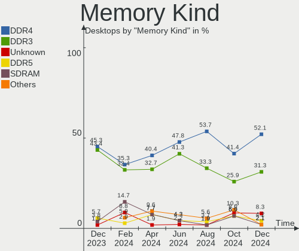

| Kind    | Desktops | Percent |
|---------|----------|---------|
| DDR4    | 24       | 45.28%  |
| DDR3    | 23       | 43.4%   |
| DDR5    | 3        | 5.66%   |
| SDRAM   | 2        | 3.77%   |
| Unknown | 1        | 1.89%   |

Memory Form Factor
------------------

Physical design of the memory module

| Name   | Desktops | Percent |
|--------|----------|---------|
| DIMM   | 51       | 96.23%  |
| SODIMM | 2        | 3.77%   |

Memory Size
-----------

Memory module size

| Size  | Desktops | Percent |
|-------|----------|---------|
| 8192  | 25       | 42.37%  |
| 4096  | 13       | 22.03%  |
| 16384 | 10       | 16.95%  |
| 32768 | 7        | 11.86%  |
| 2048  | 4        | 6.78%   |

Memory Speed
------------

Memory module speed

| Speed   | Desktops | Percent |
|---------|----------|---------|
| 1600    | 13       | 21.67%  |
| 3200    | 8        | 13.33%  |
| 1333    | 8        | 13.33%  |
| 3600    | 5        | 8.33%   |
| Unknown | 4        | 6.67%   |
| 1866    | 3        | 5%      |
| 3933    | 2        | 3.33%   |
| 2667    | 2        | 3.33%   |
| 2666    | 2        | 3.33%   |
| 800     | 2        | 3.33%   |
| 5800    | 1        | 1.67%   |
| 5600    | 1        | 1.67%   |
| 4800    | 1        | 1.67%   |
| 3800    | 1        | 1.67%   |
| 3467    | 1        | 1.67%   |
| 3400    | 1        | 1.67%   |
| 3100    | 1        | 1.67%   |
| 2933    | 1        | 1.67%   |
| 2400    | 1        | 1.67%   |
| 2133    | 1        | 1.67%   |
| 1334    | 1        | 1.67%   |

Printers & scanners
-------------------

Printer Vendor
--------------

Printer device vendors

| Vendor              | Desktops | Percent |
|---------------------|----------|---------|
| Samsung Electronics | 2        | 40%     |
| Seiko Epson         | 1        | 20%     |
| Hewlett-Packard     | 1        | 20%     |
| Brother Industries  | 1        | 20%     |

Printer Model
-------------

Printer device models

| Model                    | Desktops | Percent |
|--------------------------|----------|---------|
| Seiko Epson L3150 Series | 1        | 20%     |
| Samsung SCX-6x55X Series | 1        | 20%     |
| Samsung M2070 Series     | 1        | 20%     |
| HP Deskjet 2510 series   | 1        | 20%     |
| Brother DCP-T420W        | 1        | 20%     |

Scanner Vendor
--------------

Scanner device vendors

Zero info for selected period =(

Scanner Model
-------------

Scanner device models

Zero info for selected period =(

Camera
------

Camera Vendor
-------------

Camera device vendors

| Vendor                        | Desktops | Percent |
|-------------------------------|----------|---------|
| Logitech                      | 7        | 29.17%  |
| Generalplus Technology        | 5        | 20.83%  |
| Z-Star Microelectronics       | 2        | 8.33%   |
| Microdia                      | 2        | 8.33%   |
| WaveRider Communications      | 1        | 4.17%   |
| Sunplus Innovation Technology | 1        | 4.17%   |
| Realtek Semiconductor         | 1        | 4.17%   |
| Owon                          | 1        | 4.17%   |
| Jieli Technology              | 1        | 4.17%   |
| GenesysLogic Technology       | 1        | 4.17%   |
| Creality 3D Technology        | 1        | 4.17%   |
| Anker PowerConf C200          | 1        | 4.17%   |

Camera Model
------------

Camera device models

| Model                                     | Desktops | Percent |
|-------------------------------------------|----------|---------|
| Logitech Webcam C270                      | 4        | 16.67%  |
| Generalplus 808 Camera #9 (web-cam mode)  | 3        | 12.5%   |
| Microdia Webcam Vitade AF                 | 2        | 8.33%   |
| Generalplus GENERAL WEBCAM                | 2        | 8.33%   |
| Z-Star Lenovo ThinkCentre Web Camera      | 1        | 4.17%   |
| Z-Star Integrated Camera                  | 1        | 4.17%   |
| WaveRider USB 2.0 Camera                  | 1        | 4.17%   |
| Sunplus Integrated_Webcam_HD              | 1        | 4.17%   |
| Realtek Dell_Monitor_IR_Webcam            | 1        | 4.17%   |
| Owon USB CAMERA                           | 1        | 4.17%   |
| Logitech Webcam C930e                     | 1        | 4.17%   |
| Logitech HD Pro Webcam C920               | 1        | 4.17%   |
| Logitech BRIO Ultra HD Webcam             | 1        | 4.17%   |
| Jieli USB PHY 2.0                         | 1        | 4.17%   |
| GenesysLogic USB2.0 UVC PC Camera         | 1        | 4.17%   |
| Creality 3D CREALITY CAM                  | 1        | 4.17%   |
| Anker PowerConf C200 Anker PowerConf C200 | 1        | 4.17%   |

Security
--------

Fingerprint Vendor
------------------

Fingerprint sensor vendors

Zero info for selected period =(

Fingerprint Model
-----------------

Fingerprint sensor models

Zero info for selected period =(

Chipcard Vendor
---------------

Chipcard module vendors

| Vendor                | Desktops | Percent |
|-----------------------|----------|---------|
| Gemalto (was Gemplus) | 2        | 100%    |

Chipcard Model
--------------

Chipcard module models

| Model                                             | Desktops | Percent |
|---------------------------------------------------|----------|---------|
| Gemalto (was Gemplus) GemPC Twin SmartCard Reader | 2        | 100%    |

Unsupported
-----------

Unsupported Devices
-------------------

Total unsupported devices on board

| Total | Desktops | Percent |
|-------|----------|---------|
| 0     | 110      | 90.16%  |
| 1     | 10       | 8.2%    |
| 3     | 1        | 0.82%   |
| 2     | 1        | 0.82%   |

Unsupported Device Types
------------------------

Types of unsupported devices

| Type                     | Desktops | Percent |
|--------------------------|----------|---------|
| Net/wireless             | 3        | 21.43%  |
| Unassigned class         | 2        | 14.29%  |
| Graphics card            | 2        | 14.29%  |
| Communication controller | 2        | 14.29%  |
| Chipcard                 | 2        | 14.29%  |
| Storage/raid             | 1        | 7.14%   |
| Sound                    | 1        | 7.14%   |
| Multimedia controller    | 1        | 7.14%   |

