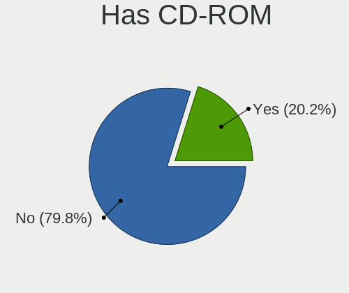
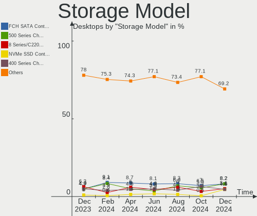
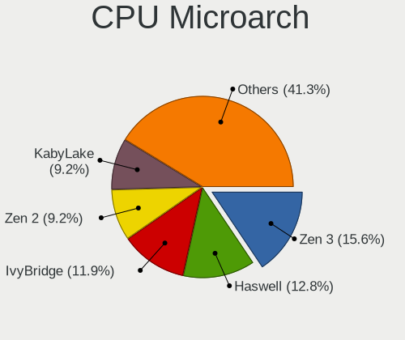
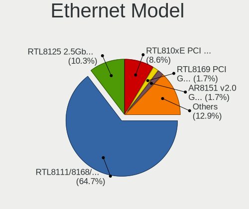
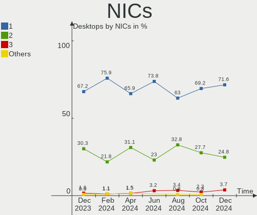
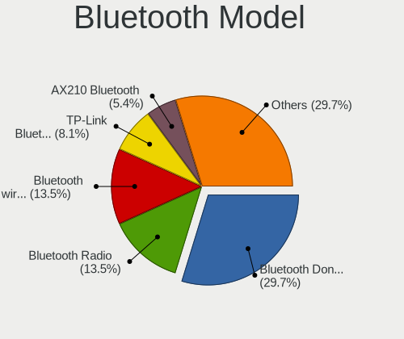
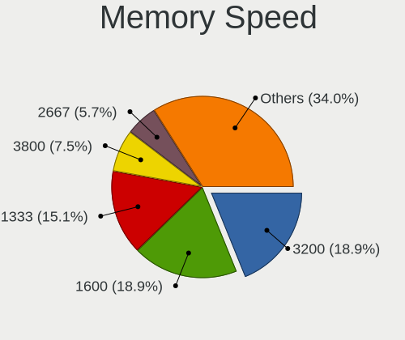

Linux in Brazil - Hardware Trends (Desktops)
--------------------------------------------

A project to identify most popular hardware characteristics and track their change
over time based on data collected by Linux users at https://Linux-Hardware.org.

Anyone can contribute to this report by the [hw-probe](https://github.com/linuxhw/hw-probe) tool:

    sudo -E hw-probe -all -upload

Contents
--------

* [ System ](#system)
  - [ OS                       ](#os)
  - [ OS Family                ](#os-family)
  - [ Kernel                   ](#kernel)
  - [ Kernel Family            ](#kernel-family)
  - [ Kernel Major Ver.        ](#kernel-major-ver)
  - [ Arch                     ](#arch)
  - [ DE                       ](#de)
  - [ Display Server           ](#display-server)
  - [ Display Manager          ](#display-manager)
  - [ OS Lang                  ](#os-lang)
  - [ Boot Mode                ](#boot-mode)
  - [ Filesystem               ](#filesystem)
  - [ Part. scheme             ](#part-scheme)
  - [ Dual Boot with Linux/BSD ](#dual-boot-with-linuxbsd)
  - [ Dual Boot (Win)          ](#dual-boot-win)

* [ Board ](#board)
  - [ Vendor                   ](#vendor)
  - [ Model                    ](#model)
  - [ Model Family             ](#model-family)
  - [ MFG Year                 ](#mfg-year)
  - [ Form Factor              ](#form-factor)
  - [ Secure Boot              ](#secure-boot)
  - [ Coreboot                 ](#coreboot)
  - [ RAM Size                 ](#ram-size)
  - [ RAM Used                 ](#ram-used)
  - [ Total Drives             ](#total-drives)
  - [ Has CD-ROM               ](#has-cd-rom)
  - [ Has Ethernet             ](#has-ethernet)
  - [ Has WiFi                 ](#has-wifi)
  - [ Has Bluetooth            ](#has-bluetooth)

* [ Location ](#location)
  - [ Country                  ](#country)
  - [ City                     ](#city)

* [ Drives ](#drives)
  - [ Drive Vendor             ](#drive-vendor)
  - [ Drive Model              ](#drive-model)
  - [ HDD Vendor               ](#hdd-vendor)
  - [ SSD Vendor               ](#ssd-vendor)
  - [ Drive Kind               ](#drive-kind)
  - [ Drive Connector          ](#drive-connector)
  - [ Drive Size               ](#drive-size)
  - [ Space Total              ](#space-total)
  - [ Space Used               ](#space-used)
  - [ Malfunc. Drives          ](#malfunc-drives)
  - [ Malfunc. Drive Vendor    ](#malfunc-drive-vendor)
  - [ Malfunc. HDD Vendor      ](#malfunc-hdd-vendor)
  - [ Malfunc. Drive Kind      ](#malfunc-drive-kind)
  - [ Failed Drives            ](#failed-drives)
  - [ Failed Drive Vendor      ](#failed-drive-vendor)
  - [ Drive Status             ](#drive-status)

* [ Storage controller ](#storage-controller)
  - [ Storage Vendor           ](#storage-vendor)
  - [ Storage Model            ](#storage-model)
  - [ Storage Kind             ](#storage-kind)

* [ Processor ](#processor)
  - [ CPU Vendor               ](#cpu-vendor)
  - [ CPU Model                ](#cpu-model)
  - [ CPU Model Family         ](#cpu-model-family)
  - [ CPU Cores                ](#cpu-cores)
  - [ CPU Sockets              ](#cpu-sockets)
  - [ CPU Threads              ](#cpu-threads)
  - [ CPU Op-Modes             ](#cpu-op-modes)
  - [ CPU Microcode            ](#cpu-microcode)
  - [ CPU Microarch            ](#cpu-microarch)

* [ Graphics ](#graphics)
  - [ GPU Vendor               ](#gpu-vendor)
  - [ GPU Model                ](#gpu-model)
  - [ GPU Combo                ](#gpu-combo)
  - [ GPU Driver               ](#gpu-driver)
  - [ GPU Memory               ](#gpu-memory)

* [ Monitor ](#monitor)
  - [ Monitor Vendor           ](#monitor-vendor)
  - [ Monitor Model            ](#monitor-model)
  - [ Monitor Resolution       ](#monitor-resolution)
  - [ Monitor Diagonal         ](#monitor-diagonal)
  - [ Monitor Width            ](#monitor-width)
  - [ Aspect Ratio             ](#aspect-ratio)
  - [ Monitor Area             ](#monitor-area)
  - [ Pixel Density            ](#pixel-density)
  - [ Multiple Monitors        ](#multiple-monitors)

* [ Network ](#network)
  - [ Net Controller Vendor    ](#net-controller-vendor)
  - [ Net Controller Model     ](#net-controller-model)
  - [ Wireless Vendor          ](#wireless-vendor)
  - [ Wireless Model           ](#wireless-model)
  - [ Ethernet Vendor          ](#ethernet-vendor)
  - [ Ethernet Model           ](#ethernet-model)
  - [ Net Controller Kind      ](#net-controller-kind)
  - [ Used Controller          ](#used-controller)
  - [ NICs                     ](#nics)
  - [ IPv6                     ](#ipv6)

* [ Bluetooth ](#bluetooth)
  - [ Bluetooth Vendor         ](#bluetooth-vendor)
  - [ Bluetooth Model          ](#bluetooth-model)

* [ Sound ](#sound)
  - [ Sound Vendor             ](#sound-vendor)
  - [ Sound Model              ](#sound-model)

* [ Memory ](#memory)
  - [ Memory Vendor            ](#memory-vendor)
  - [ Memory Model             ](#memory-model)
  - [ Memory Kind              ](#memory-kind)
  - [ Memory Form Factor       ](#memory-form-factor)
  - [ Memory Size              ](#memory-size)
  - [ Memory Speed             ](#memory-speed)

* [ Printers & scanners ](#printers--scanners)
  - [ Printer Vendor           ](#printer-vendor)
  - [ Printer Model            ](#printer-model)
  - [ Scanner Vendor           ](#scanner-vendor)
  - [ Scanner Model            ](#scanner-model)

* [ Camera ](#camera)
  - [ Camera Vendor            ](#camera-vendor)
  - [ Camera Model             ](#camera-model)

* [ Security ](#security)
  - [ Fingerprint Vendor       ](#fingerprint-vendor)
  - [ Fingerprint Model        ](#fingerprint-model)
  - [ Chipcard Vendor          ](#chipcard-vendor)
  - [ Chipcard Model           ](#chipcard-model)

* [ Unsupported ](#unsupported)
  - [ Unsupported Devices      ](#unsupported-devices)
  - [ Unsupported Device Types ](#unsupported-device-types)

System
------

OS
--

Installed operating systems

| Name                         | Desktops | Percent |
|------------------------------|----------|---------|
| OpenMandriva 4.3             | 13       | 13.98%  |
| Linux Mint 20.3              | 10       | 10.75%  |
| Ubuntu 22.04                 | 9        | 9.68%   |
| KDE neon 20.04               | 9        | 9.68%   |
| Zorin 16                     | 8        | 8.6%    |
| Ubuntu 20.04                 | 5        | 5.38%   |
| Pop!_OS 22.04                | 4        | 4.3%    |
| openSUSE Tumbleweed-XXXXXXXX | 3        | 3.23%   |
| OpenMandriva 4.2             | 3        | 3.23%   |
| Kubuntu 11                   | 3        | 3.23%   |
| Fedora 36                    | 3        | 3.23%   |
| Manjaro 21.2.6               | 2        | 2.15%   |
| Fedora 35                    | 2        | 2.15%   |
| Debian 11                    | 2        | 2.15%   |
| Zorin 15                     | 1        | 1.08%   |
| Ubuntu Studio 20.04          | 1        | 1.08%   |
| Ubuntu MATE 22.04            | 1        | 1.08%   |
| Ubuntu 18.04                 | 1        | 1.08%   |
| Sparky 6.3                   | 1        | 1.08%   |
| ROSA 12.2                    | 1        | 1.08%   |
| Q4OS 4                       | 1        | 1.08%   |
| Pop!_OS 21.10                | 1        | 1.08%   |
| Parrot 5.0                   | 1        | 1.08%   |
| Lubuntu 20.04                | 1        | 1.08%   |
| Linux Mint 20.1              | 1        | 1.08%   |
| Linux Mint 19.2              | 1        | 1.08%   |
| Garuda Linux                 | 1        | 1.08%   |
| Endless 4.0.6                | 1        | 1.08%   |
| Endless 4.0.4                | 1        | 1.08%   |
| Arch Rolling                 | 1        | 1.08%   |
| Arch                         | 1        | 1.08%   |

OS Family
---------

OS without a version

| Name          | Desktops | Percent |
|---------------|----------|---------|
| OpenMandriva  | 16       | 17.2%   |
| Ubuntu        | 15       | 16.13%  |
| Linux Mint    | 12       | 12.9%   |
| Zorin         | 9        | 9.68%   |
| KDE neon      | 9        | 9.68%   |
| Pop!_OS       | 5        | 5.38%   |
| Fedora        | 5        | 5.38%   |
| openSUSE      | 3        | 3.23%   |
| Kubuntu       | 3        | 3.23%   |
| Manjaro       | 2        | 2.15%   |
| Endless       | 2        | 2.15%   |
| Debian        | 2        | 2.15%   |
| Arch          | 2        | 2.15%   |
| Ubuntu Studio | 1        | 1.08%   |
| Ubuntu MATE   | 1        | 1.08%   |
| Sparky        | 1        | 1.08%   |
| ROSA          | 1        | 1.08%   |
| Q4OS          | 1        | 1.08%   |
| Parrot        | 1        | 1.08%   |
| Lubuntu       | 1        | 1.08%   |
| Garuda Linux  | 1        | 1.08%   |

Kernel
------

Version of the Linux kernel

| Version                            | Desktops | Percent |
|------------------------------------|----------|---------|
| 5.16.7-desktop-1omv4003            | 13       | 13.98%  |
| 5.13.0-40-generic                  | 12       | 12.9%   |
| 5.13.0-44-generic                  | 6        | 6.45%   |
| 5.4.0-110-generic                  | 5        | 5.38%   |
| 5.15.0-30-generic                  | 5        | 5.38%   |
| 5.13.0-41-generic                  | 5        | 5.38%   |
| 5.17.5-76051705-generic            | 4        | 4.3%    |
| 5.15.0-27-generic                  | 3        | 3.23%   |
| 5.13.0-39-generic                  | 3        | 3.23%   |
| 5.4.0-91-generic                   | 2        | 2.15%   |
| 5.17.5-300.fc36.x86_64             | 2        | 2.15%   |
| 5.17.4-1-default                   | 2        | 2.15%   |
| 5.13.0-27-generic                  | 2        | 2.15%   |
| 5.11.0-35-generic                  | 2        | 2.15%   |
| 5.10.14-desktop-1omv4002           | 2        | 2.15%   |
| 5.10.0-13-amd64                    | 2        | 2.15%   |
| 5.4.0-113-generic                  | 1        | 1.08%   |
| 5.4.0-109-lowlatency               | 1        | 1.08%   |
| 5.4.0-109-generic                  | 1        | 1.08%   |
| 5.17.9-1-default                   | 1        | 1.08%   |
| 5.17.7-zen1-1-zen                  | 1        | 1.08%   |
| 5.17.6-300.fc36.x86_64             | 1        | 1.08%   |
| 5.17.5-zen1-1-zen                  | 1        | 1.08%   |
| 5.17.5-arch1-1                     | 1        | 1.08%   |
| 5.17.5-200.fc35.x86_64             | 1        | 1.08%   |
| 5.17.4-200.fc35.x86_64             | 1        | 1.08%   |
| 5.17.3-sparky-amd64                | 1        | 1.08%   |
| 5.17.1-3-MANJARO                   | 1        | 1.08%   |
| 5.16.0-12parrot1-amd64             | 1        | 1.08%   |
| 5.15.5-76051505-generic            | 1        | 1.08%   |
| 5.15.0-25-generic                  | 1        | 1.08%   |
| 5.15.0-23-generic                  | 1        | 1.08%   |
| 5.14.0-1036-oem                    | 1        | 1.08%   |
| 5.13.19-2-MANJARO                  | 1        | 1.08%   |
| 5.11.12-desktop-1omv4002           | 1        | 1.08%   |
| 5.11.0-41-generic                  | 1        | 1.08%   |
| 5.10.74-generic-2rosa2021.1-x86_64 | 1        | 1.08%   |
| 5.10.0-14-amd64                    | 1        | 1.08%   |
| 4.15.0-177-generic                 | 1        | 1.08%   |

Kernel Family
-------------

Linux kernel without a distro release

| Version | Desktops | Percent |
|---------|----------|---------|
| 5.13.0  | 28       | 30.11%  |
| 5.16.7  | 13       | 13.98%  |
| 5.4.0   | 10       | 10.75%  |
| 5.15.0  | 10       | 10.75%  |
| 5.17.5  | 9        | 9.68%   |
| 5.17.4  | 3        | 3.23%   |
| 5.11.0  | 3        | 3.23%   |
| 5.10.0  | 3        | 3.23%   |
| 5.10.14 | 2        | 2.15%   |
| 5.17.9  | 1        | 1.08%   |
| 5.17.7  | 1        | 1.08%   |
| 5.17.6  | 1        | 1.08%   |
| 5.17.3  | 1        | 1.08%   |
| 5.17.1  | 1        | 1.08%   |
| 5.16.0  | 1        | 1.08%   |
| 5.15.5  | 1        | 1.08%   |
| 5.14.0  | 1        | 1.08%   |
| 5.13.19 | 1        | 1.08%   |
| 5.11.12 | 1        | 1.08%   |
| 5.10.74 | 1        | 1.08%   |
| 4.15.0  | 1        | 1.08%   |

Kernel Major Ver.
-----------------

Linux kernel major version

| Version | Desktops | Percent |
|---------|----------|---------|
| 5.13    | 29       | 31.18%  |
| 5.17    | 17       | 18.28%  |
| 5.16    | 14       | 15.05%  |
| 5.15    | 11       | 11.83%  |
| 5.4     | 10       | 10.75%  |
| 5.10    | 6        | 6.45%   |
| 5.11    | 4        | 4.3%    |
| 5.14    | 1        | 1.08%   |
| 4.15    | 1        | 1.08%   |

Arch
----

OS architecture (x86_64, i586, etc.)

| Name   | Desktops | Percent |
|--------|----------|---------|
| x86_64 | 92       | 98.92%  |
| i686   | 1        | 1.08%   |

DE
--

Desktop Environment

| Name       | Desktops | Percent |
|------------|----------|---------|
| GNOME      | 37       | 39.78%  |
| KDE5       | 34       | 36.56%  |
| X-Cinnamon | 10       | 10.75%  |
| XFCE       | 5        | 5.38%   |
| MATE       | 4        | 4.3%    |
| LXQt       | 2        | 2.15%   |
| awesome    | 1        | 1.08%   |

Display Server
--------------

X11 or Wayland

| Name    | Desktops | Percent |
|---------|----------|---------|
| X11     | 77       | 82.8%   |
| Wayland | 16       | 17.2%   |

Display Manager
---------------

SDDM, LightDM, etc.

| Name    | Desktops | Percent |
|---------|----------|---------|
| Unknown | 43       | 46.24%  |
| SDDM    | 21       | 22.58%  |
| GDM3    | 14       | 15.05%  |
| LightDM | 8        | 8.6%    |
| GDM     | 7        | 7.53%   |

OS Lang
-------

Language

| Lang  | Desktops | Percent |
|-------|----------|---------|
| pt_BR | 71       | 76.34%  |
| en_US | 15       | 16.13%  |
| C     | 4        | 4.3%    |
| en_GB | 2        | 2.15%   |
| pt_PT | 1        | 1.08%   |

Boot Mode
---------

EFI or BIOS

| Mode | Desktops | Percent |
|------|----------|---------|
| BIOS | 66       | 70.97%  |
| EFI  | 27       | 29.03%  |

Filesystem
----------

Type of filesystem

| Type    | Desktops | Percent |
|---------|----------|---------|
| Ext4    | 57       | 61.29%  |
| Overlay | 19       | 20.43%  |
| Btrfs   | 15       | 16.13%  |
| Zfs     | 2        | 2.15%   |

Part. scheme
------------

Scheme of partitioning

| Type    | Desktops | Percent |
|---------|----------|---------|
| Unknown | 59       | 63.44%  |
| MBR     | 17       | 18.28%  |
| GPT     | 17       | 18.28%  |

Dual Boot with Linux/BSD
------------------------

Hosting more than one Linux/BSD

| Dual boot | Desktops | Percent |
|-----------|----------|---------|
| No        | 82       | 88.17%  |
| Yes       | 11       | 11.83%  |

Dual Boot (Win)
---------------

Hosting Linux and Windows

| Dual boot | Desktops | Percent |
|-----------|----------|---------|
| No        | 67       | 72.04%  |
| Yes       | 26       | 27.96%  |

Board
-----

Vendor
------

Motherboard manufacturer

| Name                | Desktops | Percent |
|---------------------|----------|---------|
| ASUSTek Computer    | 24       | 25.81%  |
| Intel               | 17       | 18.28%  |
| Gigabyte Technology | 16       | 17.2%   |
| Positivo            | 14       | 15.05%  |
| ASRock              | 7        | 7.53%   |
| MSI                 | 3        | 3.23%   |
| Lenovo              | 3        | 3.23%   |
| Pegatron            | 2        | 2.15%   |
| Dell                | 2        | 2.15%   |
| Supermicro          | 1        | 1.08%   |
| JINGSHA             | 1        | 1.08%   |
| ECS                 | 1        | 1.08%   |
| Biostar             | 1        | 1.08%   |
| Unknown             | 1        | 1.08%   |

Model
-----

Motherboard model

| Name                                                         | Desktops | Percent |
|--------------------------------------------------------------|----------|---------|
| ASUS All Series                                              | 7        | 7.53%   |
| Positivo POS-PIQ57BQ                                         | 3        | 3.23%   |
| Intel H61                                                    | 3        | 3.23%   |
| Intel H55                                                    | 3        | 3.23%   |
| Gigabyte H410M H V3                                          | 3        | 3.23%   |
| Positivo POS-PIH81DI                                         | 2        | 2.15%   |
| Positivo POS-PIG41BA                                         | 2        | 2.15%   |
| Positivo POS-MI945AA                                         | 2        | 2.15%   |
| Unknown                                                      | 2        | 2.15%   |
| Supermicro SSG-6047R-E1CR36N                                 | 1        | 1.08%   |
| Positivo POS-PIH77CM                                         | 1        | 1.08%   |
| Positivo POS-PARS760GCD                                      | 1        | 1.08%   |
| Positivo POS-EIBTPDC                                         | 1        | 1.08%   |
| Positivo I541TB                                              | 1        | 1.08%   |
| Positivo DA18HV1                                             | 1        | 1.08%   |
| Pegatron s5-1050br                                           | 1        | 1.08%   |
| Pegatron IPMIP-GS                                            | 1        | 1.08%   |
| MSI MS-7C95                                                  | 1        | 1.08%   |
| MSI MS-7641                                                  | 1        | 1.08%   |
| MSI MS-7529                                                  | 1        | 1.08%   |
| Lenovo ThinkCentre M920s 10SKS2SK00                          | 1        | 1.08%   |
| Lenovo ThinkCentre M57 9181A28                               | 1        | 1.08%   |
| Lenovo H50-30g 90AS0005BR                                    | 1        | 1.08%   |
| Intel X99 V1.0                                               | 1        | 1.08%   |
| Intel X79M-S                                                 | 1        | 1.08%   |
| Intel X79 (INTEL Xeon E5/Corei7 DMI2 - C600/C200 Cipset V304 | 1        | 1.08%   |
| Intel MAHOBAY                                                | 1        | 1.08%   |
| Intel H61M-DS2                                               | 1        | 1.08%   |
| Intel DH55HC AAE70933-505                                    | 1        | 1.08%   |
| Intel DG43GT AAE62768-300                                    | 1        | 1.08%   |
| Intel DG31PR AAE58249-306                                    | 1        | 1.08%   |
| Intel D946GZIS AAD66165-301                                  | 1        | 1.08%   |
| Intel B75 V124                                               | 1        | 1.08%   |
| Intel B75                                                    | 1        | 1.08%   |
| Gigabyte X570 I AORUS PRO WIFI                               | 1        | 1.08%   |
| Gigabyte X38-DQ6                                             | 1        | 1.08%   |
| Gigabyte Q35M-S2                                             | 1        | 1.08%   |
| Gigabyte M61PME-S2P                                          | 1        | 1.08%   |
| Gigabyte H97M-HD3                                            | 1        | 1.08%   |
| Gigabyte H310M H                                             | 1        | 1.08%   |
| Gigabyte H110M-S2V                                           | 1        | 1.08%   |
| Gigabyte GA-990X-Gaming SLI-CF                               | 1        | 1.08%   |
| Gigabyte GA-78LMT-USB3                                       | 1        | 1.08%   |
| Gigabyte G31M-ES2L                                           | 1        | 1.08%   |
| Gigabyte B75M-D3H                                            | 1        | 1.08%   |
| Gigabyte B450 I AORUS PRO WIFI                               | 1        | 1.08%   |
| Gigabyte A520M AORUS ELITE                                   | 1        | 1.08%   |
| ECS GF7050VT-M5                                              | 1        | 1.08%   |
| Dell Precision WorkStation T5400                             | 1        | 1.08%   |
| Dell Precision T3600                                         | 1        | 1.08%   |
| Biostar G31M+                                                | 1        | 1.08%   |
| ASUS TUF Gaming B560M-PLUS                                   | 1        | 1.08%   |
| ASUS TUF Gaming B450M-PRO S                                  | 1        | 1.08%   |
| ASUS TUF B360M-PLUS GAMING/BR                                | 1        | 1.08%   |
| ASUS ROG STRIX Z490-G GAMING                                 | 1        | 1.08%   |
| ASUS PRIME Z270-A                                            | 1        | 1.08%   |
| ASUS PRIME B450M-GAMING/BR                                   | 1        | 1.08%   |
| ASUS PRIME B350M-E                                           | 1        | 1.08%   |
| ASUS PRIME A320M-K/BR                                        | 1        | 1.08%   |
| ASUS PRIME A320M-K                                           | 1        | 1.08%   |

Model Family
------------

Motherboard model prefix

| Name                         | Desktops | Percent |
|------------------------------|----------|---------|
| ASUS All                     | 7        | 7.53%   |
| ASUS PRIME                   | 5        | 5.38%   |
| Positivo POS-PIQ57BQ         | 3        | 3.23%   |
| Intel H61                    | 3        | 3.23%   |
| Intel H55                    | 3        | 3.23%   |
| Gigabyte H410M               | 3        | 3.23%   |
| ASUS TUF                     | 3        | 3.23%   |
| Positivo POS-PIH81DI         | 2        | 2.15%   |
| Positivo POS-PIG41BA         | 2        | 2.15%   |
| Positivo POS-MI945AA         | 2        | 2.15%   |
| Lenovo ThinkCentre           | 2        | 2.15%   |
| Intel B75                    | 2        | 2.15%   |
| Dell Precision               | 2        | 2.15%   |
| ASUS P8H61-M                 | 2        | 2.15%   |
| Unknown                      | 2        | 2.15%   |
| Supermicro SSG-6047R-E1CR36N | 1        | 1.08%   |
| Positivo POS-PIH77CM         | 1        | 1.08%   |
| Positivo POS-PARS760GCD      | 1        | 1.08%   |
| Positivo POS-EIBTPDC         | 1        | 1.08%   |
| Positivo I541TB              | 1        | 1.08%   |
| Positivo DA18HV1             | 1        | 1.08%   |
| Pegatron s5-1050br           | 1        | 1.08%   |
| Pegatron IPMIP-GS            | 1        | 1.08%   |
| MSI MS-7C95                  | 1        | 1.08%   |
| MSI MS-7641                  | 1        | 1.08%   |
| MSI MS-7529                  | 1        | 1.08%   |
| Lenovo H50-30g               | 1        | 1.08%   |
| Intel X99                    | 1        | 1.08%   |
| Intel X79M-S                 | 1        | 1.08%   |
| Intel X79                    | 1        | 1.08%   |
| Intel MAHOBAY                | 1        | 1.08%   |
| Intel H61M-DS2               | 1        | 1.08%   |
| Intel DH55HC                 | 1        | 1.08%   |
| Intel DG43GT                 | 1        | 1.08%   |
| Intel DG31PR                 | 1        | 1.08%   |
| Intel D946GZIS               | 1        | 1.08%   |
| Gigabyte X570                | 1        | 1.08%   |
| Gigabyte X38-DQ6             | 1        | 1.08%   |
| Gigabyte Q35M-S2             | 1        | 1.08%   |
| Gigabyte M61PME-S2P          | 1        | 1.08%   |
| Gigabyte H97M-HD3            | 1        | 1.08%   |
| Gigabyte H310M               | 1        | 1.08%   |
| Gigabyte H110M-S2V           | 1        | 1.08%   |
| Gigabyte GA-990X-Gaming      | 1        | 1.08%   |
| Gigabyte GA-78LMT-USB3       | 1        | 1.08%   |
| Gigabyte G31M-ES2L           | 1        | 1.08%   |
| Gigabyte B75M-D3H            | 1        | 1.08%   |
| Gigabyte B450                | 1        | 1.08%   |
| Gigabyte A520M               | 1        | 1.08%   |
| ECS GF7050VT-M5              | 1        | 1.08%   |
| Biostar G31M+                | 1        | 1.08%   |
| ASUS ROG                     | 1        | 1.08%   |
| ASUS P7H55-M                 | 1        | 1.08%   |
| ASUS P5G41T-M                | 1        | 1.08%   |
| ASUS M5A78L                  | 1        | 1.08%   |
| ASUS H61M-K                  | 1        | 1.08%   |
| ASUS H170M-PLUS              | 1        | 1.08%   |
| ASUS CROSSHAIR               | 1        | 1.08%   |
| ASRock H61M-HVS              | 1        | 1.08%   |
| ASRock H61M-HP4              | 1        | 1.08%   |

MFG Year
--------

Motherboard manufacture year

| Year | Desktops | Percent |
|------|----------|---------|
| 2014 | 12       | 12.9%   |
| 2017 | 9        | 9.68%   |
| 2010 | 8        | 8.6%    |
| 2021 | 7        | 7.53%   |
| 2018 | 7        | 7.53%   |
| 2020 | 6        | 6.45%   |
| 2013 | 6        | 6.45%   |
| 2012 | 6        | 6.45%   |
| 2011 | 6        | 6.45%   |
| 2008 | 6        | 6.45%   |
| 2019 | 5        | 5.38%   |
| 2016 | 5        | 5.38%   |
| 2007 | 5        | 5.38%   |
| 2009 | 4        | 4.3%    |
| 2006 | 1        | 1.08%   |

Form Factor
-----------

Physical design of the computer

| Name    | Desktops | Percent |
|---------|----------|---------|
| Desktop | 93       | 100%    |

Secure Boot
-----------

Enabled or disabled

| State    | Desktops | Percent |
|----------|----------|---------|
| Disabled | 92       | 98.92%  |
| Enabled  | 1        | 1.08%   |

Coreboot
--------

Have coreboot on board

| Used | Desktops | Percent |
|------|----------|---------|
| No   | 93       | 100%    |

RAM Size
--------

Total RAM memory

| Size in GB  | Desktops | Percent |
|-------------|----------|---------|
| 8.01-16.0   | 25       | 26.88%  |
| 16.01-24.0  | 19       | 20.43%  |
| 3.01-4.0    | 18       | 19.35%  |
| 4.01-8.0    | 16       | 17.2%   |
| 32.01-64.0  | 5        | 5.38%   |
| 1.01-2.0    | 4        | 4.3%    |
| 24.01-32.0  | 2        | 2.15%   |
| 64.01-256.0 | 2        | 2.15%   |
| 2.01-3.0    | 1        | 1.08%   |
| 0.51-1.0    | 1        | 1.08%   |

RAM Used
--------

Used RAM memory

| Used GB    | Desktops | Percent |
|------------|----------|---------|
| 1.01-2.0   | 34       | 36.56%  |
| 2.01-3.0   | 19       | 20.43%  |
| 4.01-8.0   | 16       | 17.2%   |
| 3.01-4.0   | 13       | 13.98%  |
| 0.51-1.0   | 6        | 6.45%   |
| 8.01-16.0  | 3        | 3.23%   |
| 16.01-24.0 | 1        | 1.08%   |
| 0.01-0.5   | 1        | 1.08%   |

Total Drives
------------

Number of drives on board

| Drives | Desktops | Percent |
|--------|----------|---------|
| 1      | 51       | 54.84%  |
| 2      | 19       | 20.43%  |
| 3      | 17       | 18.28%  |
| 4      | 3        | 3.23%   |
| 6      | 2        | 2.15%   |
| 0      | 1        | 1.08%   |

Has CD-ROM
----------

Has CD-ROM on board

| Presented | Desktops | Percent |
|-----------|----------|---------|
| No        | 57       | 61.29%  |
| Yes       | 36       | 38.71%  |

Has Ethernet
------------

Has Ethernet on board

| Presented | Desktops | Percent |
|-----------|----------|---------|
| Yes       | 92       | 98.92%  |
| No        | 1        | 1.08%   |

Has WiFi
--------

Has WiFi module

| Presented | Desktops | Percent |
|-----------|----------|---------|
| No        | 57       | 61.29%  |
| Yes       | 36       | 38.71%  |

Has Bluetooth
-------------

Has Bluetooth module

| Presented | Desktops | Percent |
|-----------|----------|---------|
| No        | 79       | 84.95%  |
| Yes       | 14       | 15.05%  |

Location
--------

Country
-------

Geographic location (country)

| Country | Desktops | Percent |
|---------|----------|---------|
| Brazil  | 93       | 100%    |

City
----

Geographic location (city)

| City                      | Desktops | Percent |
|---------------------------|----------|---------|
| Sao Paulo                 | 19       | 20.43%  |
| Recife                    | 4        | 4.3%    |
| Santo André              | 3        | 3.23%   |
| Rio de Janeiro            | 3        | 3.23%   |
| Serra                     | 2        | 2.15%   |
| Porto Alegre              | 2        | 2.15%   |
| Guarulhos                 | 2        | 2.15%   |
| Florianópolis            | 2        | 2.15%   |
| Belo Horizonte            | 2        | 2.15%   |
| Araraquara                | 2        | 2.15%   |
| Volta Redonda             | 1        | 1.08%   |
| Vitória                  | 1        | 1.08%   |
| Veranopolis               | 1        | 1.08%   |
| Várzea Grande            | 1        | 1.08%   |
| Varginha                  | 1        | 1.08%   |
| Valparaiso de Goias       | 1        | 1.08%   |
| Sapucaia do Sul           | 1        | 1.08%   |
| Sao Vicente               | 1        | 1.08%   |
| Sao Jose do Rio Preto     | 1        | 1.08%   |
| Sao Jose                  | 1        | 1.08%   |
| Sao Joao de Meriti        | 1        | 1.08%   |
| Santa Maria               | 1        | 1.08%   |
| Santa Barbara d'Oeste     | 1        | 1.08%   |
| Salvador                  | 1        | 1.08%   |
| Rio Claro                 | 1        | 1.08%   |
| Presidente Prudente       | 1        | 1.08%   |
| Porto Murtinho            | 1        | 1.08%   |
| Piracicaba                | 1        | 1.08%   |
| Pinhais                   | 1        | 1.08%   |
| Pelotas                   | 1        | 1.08%   |
| Palmas                    | 1        | 1.08%   |
| Novo Hamburgo             | 1        | 1.08%   |
| Novo Gama                 | 1        | 1.08%   |
| Niterói                  | 1        | 1.08%   |
| Natal                     | 1        | 1.08%   |
| Maringá                  | 1        | 1.08%   |
| Marília                  | 1        | 1.08%   |
| Manaus                    | 1        | 1.08%   |
| Juiz de Fora              | 1        | 1.08%   |
| Ituporanga                | 1        | 1.08%   |
| Imperatriz                | 1        | 1.08%   |
| Guanambi                  | 1        | 1.08%   |
| Gramado                   | 1        | 1.08%   |
| Governador Valadares      | 1        | 1.08%   |
| Gaspar                    | 1        | 1.08%   |
| Cuiabá                   | 1        | 1.08%   |
| Cotia                     | 1        | 1.08%   |
| Carmo                     | 1        | 1.08%   |
| Cariacica                 | 1        | 1.08%   |
| Campinas                  | 1        | 1.08%   |
| Cambe                     | 1        | 1.08%   |
| Cachoeira Paulista        | 1        | 1.08%   |
| Cabo de Santo Agostinho   | 1        | 1.08%   |
| Brasília                 | 1        | 1.08%   |
| Blumenau                  | 1        | 1.08%   |
| Barao de Cocais           | 1        | 1.08%   |
| Balneario Arroio do Silva | 1        | 1.08%   |
| Bagé                     | 1        | 1.08%   |
| Arapiraca                 | 1        | 1.08%   |
| Aparecida de Goiania      | 1        | 1.08%   |

Drives
------

Drive Vendor
------------

Hard drive vendors

| Vendor                       | Desktops | Drives | Percent |
|------------------------------|----------|--------|---------|
| Seagate                      | 34       | 45     | 24.11%  |
| WDC                          | 24       | 29     | 17.02%  |
| Samsung Electronics          | 18       | 22     | 12.77%  |
| Kingston                     | 14       | 14     | 9.93%   |
| Crucial                      | 9        | 10     | 6.38%   |
| Silicon Motion               | 7        | 7      | 4.96%   |
| China                        | 5        | 6      | 3.55%   |
| Hitachi                      | 4        | 4      | 2.84%   |
| A-DATA Technology            | 3        | 3      | 2.13%   |
| Toshiba                      | 2        | 2      | 1.42%   |
| Netac                        | 2        | 2      | 1.42%   |
| Lexar                        | 2        | 2      | 1.42%   |
| XPG                          | 1        | 1      | 0.71%   |
| WALRAM                       | 1        | 1      | 0.71%   |
| Team                         | 1        | 1      | 0.71%   |
| SK Hynix                     | 1        | 2      | 0.71%   |
| Shenzhen Longsys Electronics | 1        | 1      | 0.71%   |
| SanDisk                      | 1        | 1      | 0.71%   |
| S3+                          | 1        | 1      | 0.71%   |
| RZX                          | 1        | 1      | 0.71%   |
| Phison                       | 1        | 1      | 0.71%   |
| Patriot                      | 1        | 1      | 0.71%   |
| MACROVIP                     | 1        | 1      | 0.71%   |
| LITEON                       | 1        | 1      | 0.71%   |
| Fujitsu                      | 1        | 1      | 0.71%   |
| EMTEC                        | 1        | 1      | 0.71%   |
| Corsair                      | 1        | 1      | 0.71%   |
| BHT                          | 1        | 1      | 0.71%   |
| Unknown                      | 1        | 1      | 0.71%   |

Drive Model
-----------

Hard drive models

| Model                                 | Desktops | Percent |
|---------------------------------------|----------|---------|
| Kingston SA400S37240G 240GB SSD       | 8        | 4.91%   |
| Seagate ST500DM002-1BD142 500GB       | 6        | 3.68%   |
| Seagate ST1000DM010-2EP102 1TB        | 6        | 3.68%   |
| Seagate ST1000DM003-1ER162 1TB        | 5        | 3.07%   |
| WDC WD10EZEX-00WN4A0 1TB              | 3        | 1.84%   |
| Silicon Motion NVMe SSD Drive 512GB   | 3        | 1.84%   |
| Seagate ST2000DM006-2DM164 2TB        | 3        | 1.84%   |
| Samsung SSD 850 EVO 500GB             | 3        | 1.84%   |
| Samsung HD502HI 500GB                 | 3        | 1.84%   |
| Crucial CT480BX500SSD1 480GB          | 3        | 1.84%   |
| Crucial CT240BX500SSD1 240GB          | 3        | 1.84%   |
| WDC WDS240G2G0A-00JH30 240GB SSD      | 2        | 1.23%   |
| WDC WD3200AAJS-00YZCA0 320GB          | 2        | 1.23%   |
| WDC WD10EURX-63C57Y0 1TB              | 2        | 1.23%   |
| Silicon Motion NVMe SSD Drive 1TB     | 2        | 1.23%   |
| Seagate ST4000DM004-2CV104 4TB        | 2        | 1.23%   |
| Seagate ST2000DM008-2FR102 2TB        | 2        | 1.23%   |
| Seagate ST1000VM002-1CT162 1TB        | 2        | 1.23%   |
| Samsung HD154UI 1TB                   | 2        | 1.23%   |
| China SSD 256GB                       | 2        | 1.23%   |
| A-DATA SU650 120GB SSD                | 2        | 1.23%   |
| XPG GAMMIX S41 512GB                  | 1        | 0.61%   |
| WDC WDS240G2G0B-00EPW0 240GB SSD      | 1        | 0.61%   |
| WDC WDS240G1G0A-00SS50 240GB SSD      | 1        | 0.61%   |
| WDC WDS200T2B0B 2TB SSD               | 1        | 0.61%   |
| WDC WDS120G1G0A-00SS50 120GB SSD      | 1        | 0.61%   |
| WDC WD5000LUCT-63RC2Y0 500GB          | 1        | 0.61%   |
| WDC WD5000LPVX-22V0TT0 500GB          | 1        | 0.61%   |
| WDC WD5000LPCX-24VHAT0 500GB          | 1        | 0.61%   |
| WDC WD5000LPCX-00VHAT0 500GB          | 1        | 0.61%   |
| WDC WD5000BPVT-22HXZT3 500GB          | 1        | 0.61%   |
| WDC WD5000AZLX-08K2TA0 500GB          | 1        | 0.61%   |
| WDC WD5000AAKX-00U6AA0 500GB          | 1        | 0.61%   |
| WDC WD5000AAKX-00ERMA0 500GB          | 1        | 0.61%   |
| WDC WD5000AAKS-22V1A0 500GB           | 1        | 0.61%   |
| WDC WD5000AAKS-00M9A0 500GB           | 1        | 0.61%   |
| WDC WD50 00LPCX-00VHAT0 500GB         | 1        | 0.61%   |
| WDC WD2500JS-60NCB1 250GB             | 1        | 0.61%   |
| WDC WD10SPZX-24Z10 1TB                | 1        | 0.61%   |
| WDC WD10PURZ-85U8XY0 1TB              | 1        | 0.61%   |
| WDC WD10EZEX-75WN4A0 1TB              | 1        | 0.61%   |
| WDC WD10EZEX-08WN4A0 1TB              | 1        | 0.61%   |
| WALRAM 120G                           | 1        | 0.61%   |
| Toshiba MQ01ABF050 500GB              | 1        | 0.61%   |
| Toshiba DT01ACA050 500GB              | 1        | 0.61%   |
| Team T253X1240G 240GB SSD             | 1        | 0.61%   |
| SK Hynix NVMe SSD Drive 512GB         | 1        | 0.61%   |
| SK Hynix NVMe SSD Drive 2TB           | 1        | 0.61%   |
| Silicon Motion NVMe SSD Drive 256GB   | 1        | 0.61%   |
| Silicon Motion NVMe SSD Drive 1024GB  | 1        | 0.61%   |
| Shenzhen Longsys NVMe SSD Drive 256GB | 1        | 0.61%   |
| Seagate ST95005620AS 500GB            | 1        | 0.61%   |
| Seagate ST9500325AS 500GB             | 1        | 0.61%   |
| Seagate ST9250315AS 250GB             | 1        | 0.61%   |
| Seagate ST750LM022 HN-M750MBB 752GB   | 1        | 0.61%   |
| Seagate ST500VM000-1SD101 500GB       | 1        | 0.61%   |
| Seagate ST500LM0 12 HN-M500MBB 500GB  | 1        | 0.61%   |
| Seagate ST4000DM000-1F2168 4TB        | 1        | 0.61%   |
| Seagate ST3320418AS 320GB             | 1        | 0.61%   |
| Seagate ST320LM0 01 HN-M320MBB 320GB  | 1        | 0.61%   |

HDD Vendor
----------

Hard disk drive vendors

| Vendor              | Desktops | Drives | Percent |
|---------------------|----------|--------|---------|
| Seagate             | 34       | 45     | 47.22%  |
| WDC                 | 19       | 23     | 26.39%  |
| Samsung Electronics | 12       | 15     | 16.67%  |
| Hitachi             | 4        | 4      | 5.56%   |
| Toshiba             | 2        | 2      | 2.78%   |
| Fujitsu             | 1        | 1      | 1.39%   |

SSD Vendor
----------

Solid state drive vendors

| Vendor              | Desktops | Drives | Percent |
|---------------------|----------|--------|---------|
| Kingston            | 13       | 13     | 24.53%  |
| Crucial             | 9        | 10     | 16.98%  |
| WDC                 | 6        | 6      | 11.32%  |
| Samsung Electronics | 5        | 5      | 9.43%   |
| China               | 5        | 6      | 9.43%   |
| A-DATA Technology   | 3        | 3      | 5.66%   |
| Netac               | 2        | 2      | 3.77%   |
| Lexar               | 2        | 2      | 3.77%   |
| Team                | 1        | 1      | 1.89%   |
| SanDisk             | 1        | 1      | 1.89%   |
| S3+                 | 1        | 1      | 1.89%   |
| RZX                 | 1        | 1      | 1.89%   |
| Patriot             | 1        | 1      | 1.89%   |
| EMTEC               | 1        | 1      | 1.89%   |
| BHT                 | 1        | 1      | 1.89%   |
| Unknown             | 1        | 1      | 1.89%   |

Drive Kind
----------

HDD or SSD

| Kind    | Desktops | Drives | Percent |
|---------|----------|--------|---------|
| HDD     | 63       | 90     | 50%     |
| SSD     | 45       | 55     | 35.71%  |
| NVMe    | 16       | 17     | 12.7%   |
| Unknown | 2        | 2      | 1.59%   |

Drive Connector
---------------

SATA, SAS, NVMe, etc.

| Type | Desktops | Drives | Percent |
|------|----------|--------|---------|
| SATA | 84       | 142    | 82.35%  |
| NVMe | 16       | 17     | 15.69%  |
| SAS  | 2        | 5      | 1.96%   |

Drive Size
----------

Size of hard drive

| Size in TB | Desktops | Drives | Percent |
|------------|----------|--------|---------|
| 0.01-0.5   | 69       | 95     | 60.53%  |
| 0.51-1.0   | 33       | 36     | 28.95%  |
| 1.01-2.0   | 7        | 9      | 6.14%   |
| 3.01-4.0   | 3        | 3      | 2.63%   |
| 2.01-3.0   | 1        | 1      | 0.88%   |
| 4.01-10.0  | 1        | 1      | 0.88%   |

Space Total
-----------

Amount of disk space available on the file system

| Size in GB     | Desktops | Percent |
|----------------|----------|---------|
| 251-500        | 22       | 23.66%  |
| 101-250        | 19       | 20.43%  |
| 1-20           | 14       | 15.05%  |
| 501-1000       | 10       | 10.75%  |
| 1001-2000      | 8        | 8.6%    |
| More than 3000 | 6        | 6.45%   |
| 21-50          | 4        | 4.3%    |
| 51-100         | 4        | 4.3%    |
| 2001-3000      | 3        | 3.23%   |
| Unknown        | 3        | 3.23%   |

Space Used
----------

Amount of used disk space

| Used GB        | Desktops | Percent |
|----------------|----------|---------|
| 1-20           | 44       | 47.31%  |
| 21-50          | 13       | 13.98%  |
| 251-500        | 10       | 10.75%  |
| 1001-2000      | 5        | 5.38%   |
| 501-1000       | 5        | 5.38%   |
| 51-100         | 5        | 5.38%   |
| 101-250        | 4        | 4.3%    |
| More than 3000 | 3        | 3.23%   |
| Unknown        | 3        | 3.23%   |
| 2001-3000      | 1        | 1.08%   |

Malfunc. Drives
---------------

Drive models with a malfunction

| Model                             | Desktops | Drives | Percent |
|-----------------------------------|----------|--------|---------|
| XPG GAMMIX S41 512GB              | 1        | 1      | 8.33%   |
| WDC WD5000AAKX-00ERMA0 500GB      | 1        | 1      | 8.33%   |
| WDC WD5000AAKS-22V1A0 500GB       | 1        | 1      | 8.33%   |
| WDC WD3200AAJS-00YZCA0 320GB      | 1        | 1      | 8.33%   |
| Seagate ST500DM002-1BD142 500GB   | 1        | 1      | 8.33%   |
| Seagate ST2000DM008-2FR102 2TB    | 1        | 1      | 8.33%   |
| Seagate ST1000LM035-1RK172 1TB    | 1        | 1      | 8.33%   |
| Seagate ST1000DM010-2EP102 1TB    | 1        | 1      | 8.33%   |
| Samsung Electronics SP0842N 80GB  | 1        | 1      | 8.33%   |
| Samsung Electronics HD321HJ 320GB | 1        | 1      | 8.33%   |
| Samsung Electronics HD080HJ 80GB  | 1        | 1      | 8.33%   |
| China SSD 180GB                   | 1        | 1      | 8.33%   |

Malfunc. Drive Vendor
---------------------

Vendors of faulty drives

| Vendor              | Desktops | Drives | Percent |
|---------------------|----------|--------|---------|
| Seagate             | 4        | 4      | 33.33%  |
| WDC                 | 3        | 3      | 25%     |
| Samsung Electronics | 3        | 3      | 25%     |
| XPG                 | 1        | 1      | 8.33%   |
| China               | 1        | 1      | 8.33%   |

Malfunc. HDD Vendor
-------------------

Vendors of faulty HDD drives

| Vendor              | Desktops | Drives | Percent |
|---------------------|----------|--------|---------|
| Seagate             | 4        | 4      | 40%     |
| WDC                 | 3        | 3      | 30%     |
| Samsung Electronics | 3        | 3      | 30%     |

Malfunc. Drive Kind
-------------------

Kinds of faulty drives

| Kind | Desktops | Drives | Percent |
|------|----------|--------|---------|
| HDD  | 10       | 10     | 83.33%  |
| NVMe | 1        | 1      | 8.33%   |
| SSD  | 1        | 1      | 8.33%   |

Failed Drives
-------------

Failed drive models

Zero info for selected period =(

Failed Drive Vendor
-------------------

Failed drive vendors

Zero info for selected period =(

Drive Status
------------

Number of failed and malfunc. drives

| Status   | Desktops | Drives | Percent |
|----------|----------|--------|---------|
| Detected | 61       | 112    | 61.62%  |
| Works    | 27       | 40     | 27.27%  |
| Malfunc  | 11       | 12     | 11.11%  |

Storage controller
------------------

Storage Vendor
--------------

Storage controller vendors

| Vendor                       | Desktops | Percent |
|------------------------------|----------|---------|
| Intel                        | 67       | 59.29%  |
| AMD                          | 22       | 19.47%  |
| Silicon Motion               | 7        | 6.19%   |
| JMicron Technology           | 3        | 2.65%   |
| Samsung Electronics          | 2        | 1.77%   |
| Phison Electronics           | 2        | 1.77%   |
| Nvidia                       | 2        | 1.77%   |
| VIA Technologies             | 1        | 0.88%   |
| SK Hynix                     | 1        | 0.88%   |
| Silicon Image                | 1        | 0.88%   |
| Shenzhen Longsys Electronics | 1        | 0.88%   |
| Realtek Semiconductor        | 1        | 0.88%   |
| Marvell Technology Group     | 1        | 0.88%   |
| Lite-On Technology           | 1        | 0.88%   |
| Kingston Technology Company  | 1        | 0.88%   |

Storage Model
-------------

Storage controller models

| Model                                                                                   | Desktops | Percent |
|-----------------------------------------------------------------------------------------|----------|---------|
| AMD FCH SATA Controller [AHCI mode]                                                     | 13       | 8.5%    |
| Intel NM10/ICH7 Family SATA Controller [IDE mode]                                       | 10       | 6.54%   |
| Intel 6 Series/C200 Series Chipset Family 6 port Desktop SATA AHCI Controller           | 10       | 6.54%   |
| Intel 82801G (ICH7 Family) IDE Controller                                               | 9        | 5.88%   |
| Silicon Motion SM2263EN/SM2263XT SSD Controller                                         | 6        | 3.92%   |
| Intel 8 Series/C220 Series Chipset Family 6-port SATA Controller 1 [AHCI mode]          | 6        | 3.92%   |
| Intel 7 Series/C210 Series Chipset Family 6-port SATA Controller [AHCI mode]            | 5        | 3.27%   |
| Intel 5 Series/3400 Series Chipset 6 port SATA AHCI Controller                          | 5        | 3.27%   |
| AMD SB7x0/SB8x0/SB9x0 SATA Controller [AHCI mode]                                       | 5        | 3.27%   |
| Intel 500 Series Chipset Family SATA AHCI Controller                                    | 4        | 2.61%   |
| Intel 5 Series/3400 Series Chipset PT IDER Controller                                   | 4        | 2.61%   |
| Intel 5 Series/3400 Series Chipset 4 port SATA IDE Controller                           | 4        | 2.61%   |
| Intel 5 Series/3400 Series Chipset 2 port SATA IDE Controller                           | 4        | 2.61%   |
| AMD 400 Series Chipset SATA Controller                                                  | 4        | 2.61%   |
| Intel Q170/Q150/B150/H170/H110/Z170/CM236 Chipset SATA Controller [AHCI Mode]           | 3        | 1.96%   |
| Intel C600/X79 series chipset 6-Port SATA AHCI Controller                               | 3        | 1.96%   |
| Intel 9 Series Chipset Family SATA Controller [AHCI Mode]                               | 3        | 1.96%   |
| AMD SB7x0/SB8x0/SB9x0 IDE Controller                                                    | 3        | 1.96%   |
| AMD FCH SATA Controller D                                                               | 3        | 1.96%   |
| Samsung NVMe SSD Controller SM981/PM981/PM983                                           | 2        | 1.31%   |
| Phison E12 NVMe Controller                                                              | 2        | 1.31%   |
| Intel Cannon Lake PCH SATA AHCI Controller                                              | 2        | 1.31%   |
| Intel C602 chipset 4-Port SATA Storage Control Unit                                     | 2        | 1.31%   |
| Intel 82801IR/IO/IH (ICH9R/DO/DH) 4 port SATA Controller [IDE mode]                     | 2        | 1.31%   |
| Intel 82801I (ICH9 Family) 2 port SATA Controller [IDE mode]                            | 2        | 1.31%   |
| AMD 500 Series Chipset SATA Controller                                                  | 2        | 1.31%   |
| VIA VT82C586A/B/VT82C686/A/B/VT823x/A/C PIPC Bus Master IDE                             | 1        | 0.65%   |
| VIA VIA VT6420 SATA RAID Controller                                                     | 1        | 0.65%   |
| SK Hynix Non-Volatile memory controller                                                 | 1        | 0.65%   |
| SK Hynix Gold P31 SSD                                                                   | 1        | 0.65%   |
| Silicon Motion SM2262/SM2262EN SSD Controller                                           | 1        | 0.65%   |
| Silicon Image SiI 3132 Serial ATA Raid II Controller                                    | 1        | 0.65%   |
| Shenzhen Longsys Electronics Non-Volatile memory controller                             | 1        | 0.65%   |
| Realtek RTS5763DL NVMe SSD Controller                                                   | 1        | 0.65%   |
| Nvidia MCP73 SATA Controller (IDE mode)                                                 | 1        | 0.65%   |
| Nvidia MCP73 IDE Controller                                                             | 1        | 0.65%   |
| Nvidia MCP61 SATA Controller                                                            | 1        | 0.65%   |
| Nvidia MCP61 IDE                                                                        | 1        | 0.65%   |
| Marvell Group 88SE6101/6102 single-port PATA133 interface                               | 1        | 0.65%   |
| Lite-On Non-Volatile memory controller                                                  | 1        | 0.65%   |
| Kingston Company Company Non-Volatile memory controller                                 | 1        | 0.65%   |
| JMicron JMB58x AHCI SATA controller                                                     | 1        | 0.65%   |
| JMicron JMB368 IDE controller                                                           | 1        | 0.65%   |
| JMicron JMB363 SATA/IDE Controller                                                      | 1        | 0.65%   |
| Intel SATA Controller [RAID mode]                                                       | 1        | 0.65%   |
| Intel Comet Lake SATA AHCI Controller                                                   | 1        | 0.65%   |
| Intel Atom Processor E3800 Series SATA AHCI Controller                                  | 1        | 0.65%   |
| Intel 82Q35 Express PT IDER Controller                                                  | 1        | 0.65%   |
| Intel 82801JI (ICH10 Family) SATA AHCI Controller                                       | 1        | 0.65%   |
| Intel 82801IR/IO/IH (ICH9R/DO/DH) 6 port SATA Controller [AHCI mode]                    | 1        | 0.65%   |
| Intel 7 Series Chipset Family 6-port SATA Controller [AHCI mode]                        | 1        | 0.65%   |
| Intel 631xESB/632xESB SATA AHCI Controller                                              | 1        | 0.65%   |
| Intel 631xESB/632xESB IDE Controller                                                    | 1        | 0.65%   |
| Intel 6 Series/C200 Series Chipset Family Desktop SATA Controller (IDE mode, ports 4-5) | 1        | 0.65%   |
| Intel 6 Series/C200 Series Chipset Family Desktop SATA Controller (IDE mode, ports 0-3) | 1        | 0.65%   |
| Intel 6 Series/C200 Series Chipset Family 6 port Mobile SATA AHCI Controller            | 1        | 0.65%   |
| Intel 200 Series PCH SATA controller [AHCI mode]                                        | 1        | 0.65%   |
| AMD X370 Series Chipset SATA Controller                                                 | 1        | 0.65%   |
| AMD SB7x0/SB8x0/SB9x0 SATA Controller [IDE mode]                                        | 1        | 0.65%   |
| AMD FCH IDE Controller                                                                  | 1        | 0.65%   |

Storage Kind
------------

Kind of storage controller (IDE, SATA, NVMe, SAS, ...)

| Kind | Desktops | Percent |
|------|----------|---------|
| SATA | 71       | 59.17%  |
| IDE  | 29       | 24.17%  |
| NVMe | 16       | 13.33%  |
| RAID | 2        | 1.67%   |
| SAS  | 2        | 1.67%   |

Processor
---------

CPU Vendor
----------

Processor vendors

| Vendor | Desktops | Percent |
|--------|----------|---------|
| Intel  | 70       | 75.27%  |
| AMD    | 23       | 24.73%  |

CPU Model
---------

Processor models

| Model                                       | Desktops | Percent |
|---------------------------------------------|----------|---------|
| Intel Core i7-2600 CPU @ 3.40GHz            | 3        | 3.23%   |
| Intel Core i5 CPU 650 @ 3.20GHz             | 3        | 3.23%   |
| Intel Pentium Dual CPU E2200 @ 2.20GHz      | 2        | 2.15%   |
| Intel Pentium CPU G2030 @ 3.00GHz           | 2        | 2.15%   |
| Intel Core i7-7700 CPU @ 3.60GHz            | 2        | 2.15%   |
| Intel Core i7-3770 CPU @ 3.40GHz            | 2        | 2.15%   |
| Intel Core i5-2400 CPU @ 3.10GHz            | 2        | 2.15%   |
| Intel Core i3-2100 CPU @ 3.10GHz            | 2        | 2.15%   |
| Intel Core i3 CPU 540 @ 3.07GHz             | 2        | 2.15%   |
| AMD Ryzen 5 5600G with Radeon Graphics      | 2        | 2.15%   |
| AMD Ryzen 5 1600 Six-Core Processor         | 2        | 2.15%   |
| AMD FX-8350 Eight-Core Processor            | 2        | 2.15%   |
| AMD FX-6300 Six-Core Processor              | 2        | 2.15%   |
| Intel Xeon CPU E5420 @ 2.50GHz              | 1        | 1.08%   |
| Intel Xeon CPU E5-2690 0 @ 2.90GHz          | 1        | 1.08%   |
| Intel Xeon CPU E5-2689 0 @ 2.60GHz          | 1        | 1.08%   |
| Intel Xeon CPU E5-2667 v2 @ 3.30GHz         | 1        | 1.08%   |
| Intel Xeon CPU E5-2640 v3 @ 2.60GHz         | 1        | 1.08%   |
| Intel Xeon CPU E5-2420 0 @ 1.90GHz          | 1        | 1.08%   |
| Intel Xeon CPU E5-1620 0 @ 3.60GHz          | 1        | 1.08%   |
| Intel Xeon CPU E3-1230 v3 @ 3.30GHz         | 1        | 1.08%   |
| Intel Pentium Gold G6400 CPU @ 4.00GHz      | 1        | 1.08%   |
| Intel Pentium Dual-Core CPU E5400 @ 2.70GHz | 1        | 1.08%   |
| Intel Pentium Dual-Core CPU E5300 @ 2.60GHz | 1        | 1.08%   |
| Intel Pentium Dual CPU E2140 @ 1.60GHz      | 1        | 1.08%   |
| Intel Pentium CPU G620 @ 2.60GHz            | 1        | 1.08%   |
| Intel Pentium 4 CPU 3.20GHz                 | 1        | 1.08%   |
| Intel Core i9-10900 CPU @ 2.80GHz           | 1        | 1.08%   |
| Intel Core i7-9700F CPU @ 3.00GHz           | 1        | 1.08%   |
| Intel Core i7-4790K CPU @ 4.00GHz           | 1        | 1.08%   |
| Intel Core i5-8500 CPU @ 3.00GHz            | 1        | 1.08%   |
| Intel Core i5-7400 CPU @ 3.00GHz            | 1        | 1.08%   |
| Intel Core i5-4690 CPU @ 3.50GHz            | 1        | 1.08%   |
| Intel Core i5-4460 CPU @ 3.20GHz            | 1        | 1.08%   |
| Intel Core i5-3470 CPU @ 3.20GHz            | 1        | 1.08%   |
| Intel Core i5-3330 CPU @ 3.00GHz            | 1        | 1.08%   |
| Intel Core i5-10400F CPU @ 2.90GHz          | 1        | 1.08%   |
| Intel Core i5 CPU K 655 @ 3.20GHz           | 1        | 1.08%   |
| Intel Core i5 CPU 760 @ 2.80GHz             | 1        | 1.08%   |
| Intel Core i5 CPU 750 @ 2.67GHz             | 1        | 1.08%   |
| Intel Core i3-8100 CPU @ 3.60GHz            | 1        | 1.08%   |
| Intel Core i3-7100 CPU @ 3.90GHz            | 1        | 1.08%   |
| Intel Core i3-4330 CPU @ 3.50GHz            | 1        | 1.08%   |
| Intel Core i3-4170 CPU @ 3.70GHz            | 1        | 1.08%   |
| Intel Core i3-4160 CPU @ 3.60GHz            | 1        | 1.08%   |
| Intel Core i3-4130 CPU @ 3.40GHz            | 1        | 1.08%   |
| Intel Core i3-3220 CPU @ 3.30GHz            | 1        | 1.08%   |
| Intel Core i3-2310M CPU @ 2.10GHz           | 1        | 1.08%   |
| Intel Core i3-10100F CPU @ 3.60GHz          | 1        | 1.08%   |
| Intel Core i3 CPU 550 @ 3.20GHz             | 1        | 1.08%   |
| Intel Core 2 Quad CPU Q9400 @ 2.66GHz       | 1        | 1.08%   |
| Intel Core 2 Quad CPU Q8200 @ 2.33GHz       | 1        | 1.08%   |
| Intel Core 2 Quad CPU Q6600 @ 2.40GHz       | 1        | 1.08%   |
| Intel Core 2 Duo CPU E8400 @ 3.00GHz        | 1        | 1.08%   |
| Intel Core 2 Duo CPU E7500 @ 2.93GHz        | 1        | 1.08%   |
| Intel Core 2 Duo CPU E6550 @ 2.33GHz        | 1        | 1.08%   |
| Intel Core 2 Duo CPU E4500 @ 2.20GHz        | 1        | 1.08%   |
| Intel Core 2 CPU E7500 @ 2.93GHz            | 1        | 1.08%   |
| Intel Core 2 CPU 6600 @ 2.40GHz             | 1        | 1.08%   |
| Intel Core 2 CPU 6400 @ 2.13GHz             | 1        | 1.08%   |

CPU Model Family
----------------

Processor model prefix

| Model                   | Desktops | Percent |
|-------------------------|----------|---------|
| Intel Core i5           | 15       | 16.13%  |
| Intel Core i3           | 14       | 15.05%  |
| Intel Core i7           | 9        | 9.68%   |
| Intel Xeon              | 8        | 8.6%    |
| AMD Ryzen 5             | 8        | 8.6%    |
| Intel Core 2 Duo        | 4        | 4.3%    |
| AMD FX                  | 4        | 4.3%    |
| Intel Pentium Dual      | 3        | 3.23%   |
| Intel Pentium           | 3        | 3.23%   |
| Intel Core 2 Quad       | 3        | 3.23%   |
| Intel Core 2            | 3        | 3.23%   |
| Intel Pentium Dual-Core | 2        | 2.15%   |
| Intel Celeron           | 2        | 2.15%   |
| Other                   | 1        | 1.08%   |
| Intel Pentium Gold      | 1        | 1.08%   |
| Intel Pentium 4         | 1        | 1.08%   |
| Intel Core i9           | 1        | 1.08%   |
| AMD Sempron             | 1        | 1.08%   |
| AMD Ryzen 9             | 1        | 1.08%   |
| AMD Ryzen 7             | 1        | 1.08%   |
| AMD Ryzen 3             | 1        | 1.08%   |
| AMD Phenom II X6        | 1        | 1.08%   |
| AMD Phenom II X2        | 1        | 1.08%   |
| AMD Athlon II X4        | 1        | 1.08%   |
| AMD Athlon              | 1        | 1.08%   |
| AMD A8                  | 1        | 1.08%   |
| AMD A6                  | 1        | 1.08%   |
| AMD A10                 | 1        | 1.08%   |

CPU Cores
---------

Number of processor cores

| Number | Desktops | Percent |
|--------|----------|---------|
| 2      | 37       | 39.78%  |
| 4      | 30       | 32.26%  |
| 6      | 12       | 12.9%   |
| 8      | 5        | 5.38%   |
| 1      | 3        | 3.23%   |
| 16     | 2        | 2.15%   |
| 3      | 2        | 2.15%   |
| 12     | 1        | 1.08%   |
| 10     | 1        | 1.08%   |

CPU Sockets
-----------

Number of sockets

| Number | Desktops | Percent |
|--------|----------|---------|
| 1      | 90       | 96.77%  |
| 2      | 3        | 3.23%   |

CPU Threads
-----------

Threads per core (Hyper-Threading)

| Number | Desktops | Percent |
|--------|----------|---------|
| 2      | 52       | 55.91%  |
| 1      | 41       | 44.09%  |

CPU Op-Modes
------------

CPU Operation Modes (32-bit, 64-bit)

| Op mode        | Desktops | Percent |
|----------------|----------|---------|
| 32-bit, 64-bit | 93       | 100%    |

CPU Microcode
-------------

Microcode number

| Number     | Desktops | Percent |
|------------|----------|---------|
| Unknown    | 20       | 21.51%  |
| 0x206a7    | 8        | 8.6%    |
| 0x306c3    | 7        | 7.53%   |
| 0x1067a    | 5        | 5.38%   |
| 0x306a9    | 4        | 4.3%    |
| 0x206d7    | 4        | 4.3%    |
| 0x20655    | 4        | 4.3%    |
| 0xa0653    | 3        | 3.23%   |
| 0x08001138 | 3        | 3.23%   |
| 0x906e9    | 2        | 2.15%   |
| 0x6fb      | 2        | 2.15%   |
| 0x6f6      | 2        | 2.15%   |
| 0x20652    | 2        | 2.15%   |
| 0x106e5    | 2        | 2.15%   |
| 0x10676    | 2        | 2.15%   |
| 0x06000852 | 2        | 2.15%   |
| 0xf65      | 1        | 1.08%   |
| 0xa0671    | 1        | 1.08%   |
| 0xa0655    | 1        | 1.08%   |
| 0x906eb    | 1        | 1.08%   |
| 0x906ea    | 1        | 1.08%   |
| 0x6fd      | 1        | 1.08%   |
| 0x306e4    | 1        | 1.08%   |
| 0x30678    | 1        | 1.08%   |
| 0x10677    | 1        | 1.08%   |
| 0x0a50000c | 1        | 1.08%   |
| 0x0a201016 | 1        | 1.08%   |
| 0x08701021 | 1        | 1.08%   |
| 0x08701013 | 1        | 1.08%   |
| 0x08108109 | 1        | 1.08%   |
| 0x0700010b | 1        | 1.08%   |
| 0x0600611a | 1        | 1.08%   |
| 0x06003106 | 1        | 1.08%   |
| 0x06001119 | 1        | 1.08%   |
| 0x010000dc | 1        | 1.08%   |
| 0x010000db | 1        | 1.08%   |
| 0x010000b6 | 1        | 1.08%   |

CPU Microarch
-------------

Microarchitecture

| Name        | Desktops | Percent |
|-------------|----------|---------|
| SandyBridge | 13       | 13.98%  |
| Haswell     | 10       | 10.75%  |
| Penryn      | 8        | 8.6%    |
| IvyBridge   | 8        | 8.6%    |
| Core        | 8        | 8.6%    |
| Westmere    | 7        | 7.53%   |
| KabyLake    | 7        | 7.53%   |
| Piledriver  | 5        | 5.38%   |
| Zen         | 4        | 4.3%    |
| CometLake   | 4        | 4.3%    |
| Zen 3       | 3        | 3.23%   |
| Zen 2       | 3        | 3.23%   |
| K10         | 3        | 3.23%   |
| Nehalem     | 2        | 2.15%   |
| Jaguar      | 2        | 2.15%   |
| Zen+        | 1        | 1.08%   |
| Steamroller | 1        | 1.08%   |
| Silvermont  | 1        | 1.08%   |
| NetBurst    | 1        | 1.08%   |
| Icelake     | 1        | 1.08%   |
| Excavator   | 1        | 1.08%   |

Graphics
--------

GPU Vendor
----------

Vendors of graphics cards

| Vendor           | Desktops | Percent |
|------------------|----------|---------|
| Intel            | 37       | 38.54%  |
| Nvidia           | 29       | 30.21%  |
| AMD              | 29       | 30.21%  |
| VIA Technologies | 1        | 1.04%   |

GPU Model
---------

Graphics card models

| Model                                                                         | Desktops | Percent |
|-------------------------------------------------------------------------------|----------|---------|
| Intel Core Processor Integrated Graphics Controller                           | 6        | 6.12%   |
| Intel 2nd Generation Core Processor Family Integrated Graphics Controller     | 5        | 5.1%    |
| Nvidia GP107 [GeForce GTX 1050 Ti]                                            | 4        | 4.08%   |
| Intel Xeon E3-1200 v3/4th Gen Core Processor Integrated Graphics Controller   | 4        | 4.08%   |
| Intel 4 Series Chipset Integrated Graphics Controller                         | 4        | 4.08%   |
| Intel Xeon E3-1200 v2/3rd Gen Core processor Graphics Controller              | 3        | 3.06%   |
| AMD Ellesmere [Radeon RX 470/480/570/570X/580/580X/590]                       | 3        | 3.06%   |
| AMD Caicos [Radeon HD 6450/7450/8450 / R5 230 OEM]                            | 3        | 3.06%   |
| Nvidia GT218 [GeForce 210]                                                    | 2        | 2.04%   |
| Nvidia GF108 [GeForce GT 630]                                                 | 2        | 2.04%   |
| Nvidia G92 [GeForce 9800 GT]                                                  | 2        | 2.04%   |
| Intel HD Graphics 630                                                         | 2        | 2.04%   |
| Intel CoffeeLake-S GT2 [UHD Graphics 630]                                     | 2        | 2.04%   |
| Intel 82G33/G31 Express Integrated Graphics Controller                        | 2        | 2.04%   |
| Intel 4th Generation Core Processor Family Integrated Graphics Controller     | 2        | 2.04%   |
| AMD RS780L [Radeon 3000]                                                      | 2        | 2.04%   |
| AMD Lexa PRO [Radeon 540/540X/550/550X / RX 540X/550/550X]                    | 2        | 2.04%   |
| AMD Cezanne                                                                   | 2        | 2.04%   |
| AMD Cape Verde PRO [Radeon HD 7750/8740 / R7 250E]                            | 2        | 2.04%   |
| AMD Baffin [Radeon RX 550 640SP / RX 560/560X]                                | 2        | 2.04%   |
| VIA Technologies CN700/P4M800 Pro/P4M800 CE/VN800 Graphics [S3 UniChrome Pro] | 1        | 1.02%   |
| Nvidia TU106 [GeForce GTX 1650]                                               | 1        | 1.02%   |
| Nvidia TU104 [GeForce RTX 2080 SUPER]                                         | 1        | 1.02%   |
| Nvidia TU102 [GeForce RTX 2080 Ti Rev. A]                                     | 1        | 1.02%   |
| Nvidia GT218 [GeForce 8400 GS Rev. 3]                                         | 1        | 1.02%   |
| Nvidia GP108 [GeForce GT 1030]                                                | 1        | 1.02%   |
| Nvidia GP107 [GeForce GTX 1050]                                               | 1        | 1.02%   |
| Nvidia GM206 [GeForce GTX 960]                                                | 1        | 1.02%   |
| Nvidia GM204 [GeForce GTX 970]                                                | 1        | 1.02%   |
| Nvidia GM107 [GeForce GTX 750]                                                | 1        | 1.02%   |
| Nvidia GM107 [GeForce GTX 750 Ti]                                             | 1        | 1.02%   |
| Nvidia GK208B [GeForce GT 710]                                                | 1        | 1.02%   |
| Nvidia GK106 [GeForce GTX 660]                                                | 1        | 1.02%   |
| Nvidia GK106 [GeForce GTX 645 OEM]                                            | 1        | 1.02%   |
| Nvidia GF119 [GeForce GT 610]                                                 | 1        | 1.02%   |
| Nvidia GF108GL [Quadro 600]                                                   | 1        | 1.02%   |
| Nvidia GF108 [GeForce GT 730]                                                 | 1        | 1.02%   |
| Nvidia GF108 [GeForce GT 430]                                                 | 1        | 1.02%   |
| Nvidia GA102 [GeForce RTX 3090]                                               | 1        | 1.02%   |
| Nvidia G96C [GeForce 9500 GT]                                                 | 1        | 1.02%   |
| Intel IvyBridge GT2 [HD Graphics 4000]                                        | 1        | 1.02%   |
| Intel CometLake-S GT2 [UHD Graphics 630]                                      | 1        | 1.02%   |
| Intel CometLake-S GT1 [UHD Graphics 610]                                      | 1        | 1.02%   |
| Intel Atom Processor Z36xxx/Z37xxx Series Graphics & Display                  | 1        | 1.02%   |
| Intel 82Q35 Express Integrated Graphics Controller                            | 1        | 1.02%   |
| Intel 82946GZ/GL Integrated Graphics Controller                               | 1        | 1.02%   |
| Intel 82945G/GZ Integrated Graphics Controller                                | 1        | 1.02%   |
| AMD Wani [Radeon R5/R6/R7 Graphics]                                           | 1        | 1.02%   |
| AMD Thames [Radeon HD 7670M]                                                  | 1        | 1.02%   |
| AMD RV710/M92 [Mobility Radeon HD 4350/4550]                                  | 1        | 1.02%   |
| AMD Richland [Radeon HD 8570D]                                                | 1        | 1.02%   |
| AMD Redwood XT [Radeon HD 5670/5690/5730]                                     | 1        | 1.02%   |
| AMD Picasso/Raven 2 [Radeon Vega Series / Radeon Vega Mobile Series]          | 1        | 1.02%   |
| AMD Oland [Radeon HD 8570 / R5 430 OEM / R7 240/340 / Radeon 520 OEM]         | 1        | 1.02%   |
| AMD Navi 24 [Radeon RX 6400 / 6500 XT]                                        | 1        | 1.02%   |
| AMD Navi 22 [Radeon RX 6700/6700 XT/6750 XT / 6800M]                          | 1        | 1.02%   |
| AMD Kaveri [Radeon R7 Graphics]                                               | 1        | 1.02%   |
| AMD Kabini [Radeon HD 8240 / R3 Series]                                       | 1        | 1.02%   |
| AMD Cedar [Radeon HD 5000/6000/7350/8350 Series]                              | 1        | 1.02%   |
| AMD Caicos PRO [Radeon HD 7450]                                               | 1        | 1.02%   |

GPU Combo
---------

Combinations of graphics cards

| Name         | Desktops | Percent |
|--------------|----------|---------|
| 1 x Intel    | 35       | 37.63%  |
| 1 x Nvidia   | 28       | 30.11%  |
| 1 x AMD      | 26       | 27.96%  |
| 2 x AMD      | 1        | 1.08%   |
| 1 x VIA      | 1        | 1.08%   |
| Intel + AMD  | 1        | 1.08%   |
| AMD + Nvidia | 1        | 1.08%   |

GPU Driver
----------

Free vs proprietary

| Driver      | Desktops | Percent |
|-------------|----------|---------|
| Free        | 77       | 82.8%   |
| Proprietary | 11       | 11.83%  |
| Unknown     | 5        | 5.38%   |

GPU Memory
----------

Total video memory

| Size in GB | Desktops | Percent |
|------------|----------|---------|
| Unknown    | 50       | 53.76%  |
| 0.51-1.0   | 16       | 17.2%   |
| 3.01-4.0   | 9        | 9.68%   |
| 1.01-2.0   | 9        | 9.68%   |
| 7.01-8.0   | 3        | 3.23%   |
| 8.01-16.0  | 3        | 3.23%   |
| 0.01-0.5   | 3        | 3.23%   |

Monitor
-------

Monitor Vendor
--------------

Monitor vendors

| Vendor              | Desktops | Percent |
|---------------------|----------|---------|
| Goldstar            | 30       | 32.97%  |
| Samsung Electronics | 27       | 29.67%  |
| AOC                 | 9        | 9.89%   |
| Philips             | 6        | 6.59%   |
| Dell                | 4        | 4.4%    |
| Acer                | 2        | 2.2%    |
| ZZZ                 | 1        | 1.1%    |
| XKX                 | 1        | 1.1%    |
| Unknown (XXX)       | 1        | 1.1%    |
| Unknown             | 1        | 1.1%    |
| Sony                | 1        | 1.1%    |
| RTK                 | 1        | 1.1%    |
| Positivo            | 1        | 1.1%    |
| Hewlett-Packard     | 1        | 1.1%    |
| HB@                 | 1        | 1.1%    |
| GDH                 | 1        | 1.1%    |
| Envision            | 1        | 1.1%    |
| AMG                 | 1        | 1.1%    |
| Unknown             | 1        | 1.1%    |

Monitor Model
-------------

Monitor models

| Model                                                                  | Desktops | Percent |
|------------------------------------------------------------------------|----------|---------|
| Goldstar L1742 GSM449B 1280x1024 338x270mm 17.0-inch                   | 3        | 3.19%   |
| Goldstar HDR WFHD GSM7714 2560x1080 798x334mm 34.1-inch                | 3        | 3.19%   |
| Samsung Electronics LCD Monitor SAM0E90 1366x768 609x347mm 27.6-inch   | 2        | 2.13%   |
| Philips 191EL PHLC050 1366x768 410x230mm 18.5-inch                     | 2        | 2.13%   |
| Goldstar W1943 GSM4BAD 1360x768 406x229mm 18.4-inch                    | 2        | 2.13%   |
| Goldstar ULTRAWIDE GSM59F1 2560x1080 673x284mm 28.8-inch               | 2        | 2.13%   |
| Goldstar FULL HD GSM5B54 1920x1080 480x270mm 21.7-inch                 | 2        | 2.13%   |
| Goldstar E2350 GSM5791 1920x1080 510x290mm 23.1-inch                   | 2        | 2.13%   |
| Goldstar 23MP55 GSM5A23 1920x1080 510x290mm 23.1-inch                  | 2        | 2.13%   |
| AOC 712Sa AOC1712 1280x1024 340x270mm 17.1-inch                        | 2        | 2.13%   |
| ZZZ HDMI ZZZE435 1600x900 442x240mm 19.8-inch                          | 1        | 1.06%   |
| XKX HDMI XKX0190 1440x900 368x207mm 16.6-inch                          | 1        | 1.06%   |
| Unknown LCD Monitor SAMSUNG 1366x768                                   | 1        | 1.06%   |
| Unknown (XXX) Union TV XXX2841 1920x1080 1209x680mm 54.6-inch          | 1        | 1.06%   |
| Sony TV SNY7F02 1360x768                                               | 1        | 1.06%   |
| Samsung Electronics U28E590 SAM0C4D 3840x2160 607x345mm 27.5-inch      | 1        | 1.06%   |
| Samsung Electronics U28D590 SAM0B80 3840x2160 607x345mm 27.5-inch      | 1        | 1.06%   |
| Samsung Electronics T20C310 SAM0AE8 1600x900 432x240mm 19.5-inch       | 1        | 1.06%   |
| Samsung Electronics SyncMaster SAM0604 1920x1080                       | 1        | 1.06%   |
| Samsung Electronics SyncMaster SAM0598 1360x768 410x230mm 18.5-inch    | 1        | 1.06%   |
| Samsung Electronics SyncMaster SAM0567 1600x900 443x249mm 20.0-inch    | 1        | 1.06%   |
| Samsung Electronics SyncMaster SAM0350 1440x900 428x255mm 19.6-inch    | 1        | 1.06%   |
| Samsung Electronics SyncMaster SAM02E3 1440x900 367x229mm 17.0-inch    | 1        | 1.06%   |
| Samsung Electronics SyncMaster SAM018F 1280x1024 338x270mm 17.0-inch   | 1        | 1.06%   |
| Samsung Electronics SyncMaster SAM0027 1280x1024 312x234mm 15.4-inch   | 1        | 1.06%   |
| Samsung Electronics SMT27A550 SAM07B8 1920x1080 598x336mm 27.0-inch    | 1        | 1.06%   |
| Samsung Electronics SMT27A550 SAM07B6 1920x1080 598x336mm 27.0-inch    | 1        | 1.06%   |
| Samsung Electronics SMB1630N SAM0630 1366x768 340x190mm 15.3-inch      | 1        | 1.06%   |
| Samsung Electronics SA300/SA350 SAM0789 1366x768 410x230mm 18.5-inch   | 1        | 1.06%   |
| Samsung Electronics SA300/SA350 SAM0788 1366x768 410x230mm 18.5-inch   | 1        | 1.06%   |
| Samsung Electronics S24E310 SAM0C2E 1920x1080 521x293mm 23.5-inch      | 1        | 1.06%   |
| Samsung Electronics S22B300 SAM08AC 1920x1080 477x268mm 21.5-inch      | 1        | 1.06%   |
| Samsung Electronics S19B300 SAM08A6 1366x768 410x230mm 18.5-inch       | 1        | 1.06%   |
| Samsung Electronics LU28R55 SAM1017 3840x2160 630x360mm 28.6-inch      | 1        | 1.06%   |
| Samsung Electronics LCD Monitor SAM71B4 3840x2160 950x540mm 43.0-inch  | 1        | 1.06%   |
| Samsung Electronics LCD Monitor SAM7016 3840x2160 1210x680mm 54.6-inch | 1        | 1.06%   |
| Samsung Electronics LCD Monitor SAM0C39 1920x1080 885x498mm 40.0-inch  | 1        | 1.06%   |
| Samsung Electronics LCD Monitor SAM0C26 1920x1080 1209x680mm 54.6-inch | 1        | 1.06%   |
| Samsung Electronics LCD Monitor SAM0902 1920x1080 700x390mm 31.5-inch  | 1        | 1.06%   |
| Samsung Electronics LCD Monitor SAM05EA 1920x1080                      | 1        | 1.06%   |
| Samsung Electronics C24F390 SAM0D2C 1920x1080 521x293mm 23.5-inch      | 1        | 1.06%   |
| RTK LCD Monitor RTK1D1A 1920x1080 1020x570mm 46.0-inch                 | 1        | 1.06%   |
| Positivo UNION NON1500 1360x768 344x194mm 15.5-inch                    | 1        | 1.06%   |
| Philips PHL 288P6L PHL08F2 3840x2160 621x341mm 27.9-inch               | 1        | 1.06%   |
| Philips PHL 276E8V PHLC18F 3840x2160 597x336mm 27.0-inch               | 1        | 1.06%   |
| Philips PHL 242V8 PHLC219 1920x1080 527x296mm 23.8-inch                | 1        | 1.06%   |
| Philips 226VL PHLC081 1920x1080 480x268mm 21.6-inch                    | 1        | 1.06%   |
| Hewlett-Packard LA1905 HWP2846 1440x900 408x255mm 18.9-inch            | 1        | 1.06%   |
| HB@ HBTV-32D03HD HB@0B01 1920x540 708x398mm 32.0-inch                  | 1        | 1.06%   |
| Goldstar W2353 GSM56EF 1920x1080 510x290mm 23.1-inch                   | 1        | 1.06%   |
| Goldstar W2243C GSM575E 1920x1080 477x268mm 21.5-inch                  | 1        | 1.06%   |
| Goldstar W1953 GSM4BA7 1360x768 406x229mm 18.4-inch                    | 1        | 1.06%   |
| Goldstar W1952 GSM4B78 1440x900 408x255mm 18.9-inch                    | 1        | 1.06%   |
| Goldstar W1752 GSM4490 1440x900 370x232mm 17.2-inch                    | 1        | 1.06%   |
| Goldstar W1642C GSM3E89 1366x768 344x194mm 15.5-inch                   | 1        | 1.06%   |
| Goldstar ULTRAWIDE GSM76FE 2560x1080 798x334mm 34.1-inch               | 1        | 1.06%   |
| Goldstar ULTRAGEAR GSM773B 2560x1080 798x334mm 34.1-inch               | 1        | 1.06%   |
| Goldstar L1953H GSM4B3D 1280x1024 338x270mm 17.0-inch                  | 1        | 1.06%   |
| Goldstar L1752T GSM4433 1280x1024 338x270mm 17.0-inch                  | 1        | 1.06%   |
| Goldstar L1530S GSM3B95 1024x768 304x228mm 15.0-inch                   | 1        | 1.06%   |

Monitor Resolution
------------------

Monitor screen resolution

| Resolution         | Desktops | Percent |
|--------------------|----------|---------|
| 1920x1080 (FHD)    | 27       | 30%     |
| 1366x768 (WXGA)    | 13       | 14.44%  |
| 1280x1024 (SXGA)   | 11       | 12.22%  |
| 3840x2160 (4K)     | 9        | 10%     |
| 2560x1080          | 8        | 8.89%   |
| 1440x900 (WXGA+)   | 8        | 8.89%   |
| 1360x768           | 7        | 7.78%   |
| 1600x900 (HD+)     | 4        | 4.44%   |
| 1920x540           | 1        | 1.11%   |
| 1680x1050 (WSXGA+) | 1        | 1.11%   |
| 1024x768 (XGA)     | 1        | 1.11%   |

Monitor Diagonal
----------------

Diagonal size in inches

| Inches  | Desktops | Percent |
|---------|----------|---------|
| 18      | 13       | 14.13%  |
| 17      | 12       | 13.04%  |
| 21      | 10       | 10.87%  |
| 34      | 8        | 8.7%    |
| 27      | 8        | 8.7%    |
| 23      | 8        | 8.7%    |
| 19      | 5        | 5.43%   |
| 15      | 5        | 5.43%   |
| Unknown | 5        | 5.43%   |
| 32      | 4        | 4.35%   |
| 84      | 2        | 2.17%   |
| 54      | 2        | 2.17%   |
| 31      | 2        | 2.17%   |
| 72      | 1        | 1.09%   |
| 60      | 1        | 1.09%   |
| 47      | 1        | 1.09%   |
| 46      | 1        | 1.09%   |
| 28      | 1        | 1.09%   |
| 24      | 1        | 1.09%   |
| 20      | 1        | 1.09%   |
| 16      | 1        | 1.09%   |

Monitor Width
-------------

Physical width

| Width in mm | Desktops | Percent |
|-------------|----------|---------|
| 401-500     | 27       | 30%     |
| 501-600     | 14       | 15.56%  |
| 301-350     | 14       | 15.56%  |
| 701-800     | 12       | 13.33%  |
| 601-700     | 6        | 6.67%   |
| 1001-1500   | 5        | 5.56%   |
| Unknown     | 5        | 5.56%   |
| 351-400     | 4        | 4.44%   |
| 1501-2000   | 3        | 3.33%   |

Aspect Ratio
------------

Proportional relationship between the width and the height

| Ratio   | Desktops | Percent |
|---------|----------|---------|
| 16/9    | 60       | 68.97%  |
| 5/4     | 8        | 9.2%    |
| 21/9    | 8        | 9.2%    |
| 16/10   | 5        | 5.75%   |
| 4/3     | 3        | 3.45%   |
| Unknown | 3        | 3.45%   |

Monitor Area
------------

Area in inch²

| Area in inch² | Desktops | Percent |
|----------------|----------|---------|
| 141-150        | 20       | 21.74%  |
| 201-250        | 17       | 18.48%  |
| 351-500        | 15       | 16.3%   |
| 151-200        | 10       | 10.87%  |
| 301-350        | 8        | 8.7%    |
| More than 1000 | 6        | 6.52%   |
| Unknown        | 5        | 5.43%   |
| 101-110        | 4        | 4.35%   |
| 131-140        | 3        | 3.26%   |
| 111-120        | 2        | 2.17%   |
| 501-1000       | 2        | 2.17%   |

Pixel Density
-------------

Pixels per inch

| Density | Desktops | Percent |
|---------|----------|---------|
| 51-100  | 53       | 60.23%  |
| 101-120 | 14       | 15.91%  |
| 1-50    | 9        | 10.23%  |
| 121-160 | 5        | 5.68%   |
| Unknown | 5        | 5.68%   |
| 161-240 | 2        | 2.27%   |

Multiple Monitors
-----------------

Total monitors connected

| Total | Desktops | Percent |
|-------|----------|---------|
| 1     | 76       | 81.72%  |
| 2     | 12       | 12.9%   |
| 0     | 5        | 5.38%   |

Network
-------

Net Controller Vendor
---------------------

Controller vendors

| Vendor                            | Desktops | Percent |
|-----------------------------------|----------|---------|
| Realtek Semiconductor             | 65       | 52.42%  |
| Intel                             | 24       | 19.35%  |
| TP-Link                           | 5        | 4.03%   |
| Ralink Technology                 | 5        | 4.03%   |
| Qualcomm Atheros                  | 5        | 4.03%   |
| Ralink                            | 3        | 2.42%   |
| Samsung Electronics               | 2        | 1.61%   |
| Nvidia                            | 2        | 1.61%   |
| D-Link                            | 2        | 1.61%   |
| Broadcom                          | 2        | 1.61%   |
| VIA Technologies                  | 1        | 0.81%   |
| Sundance Technology Inc / IC Plus | 1        | 0.81%   |
| Qualcomm Atheros Communications   | 1        | 0.81%   |
| Motorola PCS                      | 1        | 0.81%   |
| Motorola                          | 1        | 0.81%   |
| Microsoft                         | 1        | 0.81%   |
| Marvell Technology Group          | 1        | 0.81%   |
| Manta                             | 1        | 0.81%   |
| JMicron Technology                | 1        | 0.81%   |

Net Controller Model
--------------------

Controller models

| Model                                                                                | Desktops | Percent |
|--------------------------------------------------------------------------------------|----------|---------|
| Realtek RTL8111/8168/8411 PCI Express Gigabit Ethernet Controller                    | 46       | 33.58%  |
| Realtek RTL810xE PCI Express Fast Ethernet controller                                | 14       | 10.22%  |
| Intel I211 Gigabit Network Connection                                                | 4        | 2.92%   |
| Intel 82578DM Gigabit Network Connection                                             | 3        | 2.19%   |
| TP-Link Archer T3U [Realtek RTL8812BU]                                               | 2        | 1.46%   |
| Samsung Galaxy series, misc. (tethering mode)                                        | 2        | 1.46%   |
| Realtek RTL88x2bu [AC1200 Techkey]                                                   | 2        | 1.46%   |
| Realtek RTL8188FTV 802.11b/g/n 1T1R 2.4G WLAN Adapter                                | 2        | 1.46%   |
| Realtek RTL8188EE Wireless Network Adapter                                           | 2        | 1.46%   |
| Realtek RTL8125 2.5GbE Controller                                                    | 2        | 1.46%   |
| Ralink RT2870/RT3070 Wireless Adapter                                                | 2        | 1.46%   |
| Ralink MT7601U Wireless Adapter                                                      | 2        | 1.46%   |
| Qualcomm Atheros AR5416 Wireless Network Adapter [AR5008 802.11(a)bgn]               | 2        | 1.46%   |
| Intel Ethernet Connection (2) I219-V                                                 | 2        | 1.46%   |
| Intel Ethernet Connection (14) I219-V                                                | 2        | 1.46%   |
| Intel 82578DC Gigabit Network Connection                                             | 2        | 1.46%   |
| Intel 82566DM-2 Gigabit Network Connection                                           | 2        | 1.46%   |
| VIA VT6102/VT6103 [Rhine-II]                                                         | 1        | 0.73%   |
| TP-Link TL-WN823N v2/v3 [Realtek RTL8192EU]                                          | 1        | 0.73%   |
| TP-Link TL-WN722N v2/v3 [Realtek RTL8188EUS]                                         | 1        | 0.73%   |
| TP-Link 802.11ac WLAN Adapter                                                        | 1        | 0.73%   |
| Sundance Inc / IC Plus IC Plus IP100A Integrated 10/100 Ethernet MAC + PHY           | 1        | 0.73%   |
| Samsung GT-I9070 (network tethering, USB debugging enabled)                          | 1        | 0.73%   |
| Realtek RTL8821AE 802.11ac PCIe Wireless Network Adapter                             | 1        | 0.73%   |
| Realtek RTL8191SU 802.11n WLAN Adapter                                               | 1        | 0.73%   |
| Realtek RTL8188EUS 802.11n Wireless Network Adapter                                  | 1        | 0.73%   |
| Realtek RTL8188CE 802.11b/g/n WiFi Adapter                                           | 1        | 0.73%   |
| Realtek 802.11ac NIC                                                                 | 1        | 0.73%   |
| Ralink RT5370 Wireless Adapter                                                       | 1        | 0.73%   |
| Ralink RT5390 Wireless 802.11n 1T/1R PCIe                                            | 1        | 0.73%   |
| Ralink RT3060 Wireless 802.11n 1T/1R                                                 | 1        | 0.73%   |
| Ralink RT2561/RT61 802.11g PCI                                                       | 1        | 0.73%   |
| Qualcomm Atheros TP-Link TL-WN821N v3 / TL-WN822N v2 802.11n [Atheros AR7010+AR9287] | 1        | 0.73%   |
| Qualcomm Atheros AR9485 Wireless Network Adapter                                     | 1        | 0.73%   |
| Qualcomm Atheros AR922X Wireless Network Adapter                                     | 1        | 0.73%   |
| Qualcomm Atheros AR8131 Gigabit Ethernet                                             | 1        | 0.73%   |
| Nvidia MCP73 Ethernet                                                                | 1        | 0.73%   |
| Nvidia MCP61 Ethernet                                                                | 1        | 0.73%   |
| Motorola SM56 Data Fax Modem                                                         | 1        | 0.73%   |
| Motorola PCS moto g(6) play                                                          | 1        | 0.73%   |
| Microsoft Xbox 360 Wireless Adapter                                                  | 1        | 0.73%   |
| Marvell Group 88w8335 [Libertas] 802.11b/g Wireless                                  | 1        | 0.73%   |
| Manta MM812                                                                          | 1        | 0.73%   |
| JMicron JMC250 PCI Express Gigabit Ethernet Controller                               | 1        | 0.73%   |
| Intel Wireless-AC 9260                                                               | 1        | 0.73%   |
| Intel Wireless 7260                                                                  | 1        | 0.73%   |
| Intel Wi-Fi 6 AX200                                                                  | 1        | 0.73%   |
| Intel PRO/100 VE Network Connection                                                  | 1        | 0.73%   |
| Intel I350 Gigabit Network Connection                                                | 1        | 0.73%   |
| Intel Ethernet Controller I225-V                                                     | 1        | 0.73%   |
| Intel Ethernet Connection (7) I219-V                                                 | 1        | 0.73%   |
| Intel Ethernet Connection (7) I219-LM                                                | 1        | 0.73%   |
| Intel Ethernet Connection (2) I218-V                                                 | 1        | 0.73%   |
| Intel 82579V Gigabit Network Connection                                              | 1        | 0.73%   |
| Intel 82579LM Gigabit Network Connection (Lewisville)                                | 1        | 0.73%   |
| Intel 82567V-2 Gigabit Network Connection                                            | 1        | 0.73%   |
| Intel 82540EM Gigabit Ethernet Controller                                            | 1        | 0.73%   |
| D-Link DWA-123 Wireless N 150 Adapter (rev.D1)                                       | 1        | 0.73%   |
| D-Link 802.11ac NIC                                                                  | 1        | 0.73%   |
| Broadcom NetXtreme BCM5754 Gigabit Ethernet PCI Express                              | 1        | 0.73%   |

Wireless Vendor
---------------

Wireless vendors

| Vendor                          | Desktops | Percent |
|---------------------------------|----------|---------|
| Realtek Semiconductor           | 11       | 29.73%  |
| TP-Link                         | 5        | 13.51%  |
| Ralink Technology               | 5        | 13.51%  |
| Qualcomm Atheros                | 4        | 10.81%  |
| Ralink                          | 3        | 8.11%   |
| Intel                           | 3        | 8.11%   |
| D-Link                          | 2        | 5.41%   |
| Qualcomm Atheros Communications | 1        | 2.7%    |
| Microsoft                       | 1        | 2.7%    |
| Marvell Technology Group        | 1        | 2.7%    |
| Broadcom                        | 1        | 2.7%    |

Wireless Model
--------------

Wireless models

| Model                                                                                | Desktops | Percent |
|--------------------------------------------------------------------------------------|----------|---------|
| TP-Link Archer T3U [Realtek RTL8812BU]                                               | 2        | 5.41%   |
| Realtek RTL88x2bu [AC1200 Techkey]                                                   | 2        | 5.41%   |
| Realtek RTL8188FTV 802.11b/g/n 1T1R 2.4G WLAN Adapter                                | 2        | 5.41%   |
| Realtek RTL8188EE Wireless Network Adapter                                           | 2        | 5.41%   |
| Ralink RT2870/RT3070 Wireless Adapter                                                | 2        | 5.41%   |
| Ralink MT7601U Wireless Adapter                                                      | 2        | 5.41%   |
| Qualcomm Atheros AR5416 Wireless Network Adapter [AR5008 802.11(a)bgn]               | 2        | 5.41%   |
| TP-Link TL-WN823N v2/v3 [Realtek RTL8192EU]                                          | 1        | 2.7%    |
| TP-Link TL-WN722N v2/v3 [Realtek RTL8188EUS]                                         | 1        | 2.7%    |
| TP-Link 802.11ac WLAN Adapter                                                        | 1        | 2.7%    |
| Realtek RTL8821AE 802.11ac PCIe Wireless Network Adapter                             | 1        | 2.7%    |
| Realtek RTL8191SU 802.11n WLAN Adapter                                               | 1        | 2.7%    |
| Realtek RTL8188EUS 802.11n Wireless Network Adapter                                  | 1        | 2.7%    |
| Realtek RTL8188CE 802.11b/g/n WiFi Adapter                                           | 1        | 2.7%    |
| Realtek 802.11ac NIC                                                                 | 1        | 2.7%    |
| Ralink RT5370 Wireless Adapter                                                       | 1        | 2.7%    |
| Ralink RT5390 Wireless 802.11n 1T/1R PCIe                                            | 1        | 2.7%    |
| Ralink RT3060 Wireless 802.11n 1T/1R                                                 | 1        | 2.7%    |
| Ralink RT2561/RT61 802.11g PCI                                                       | 1        | 2.7%    |
| Qualcomm Atheros TP-Link TL-WN821N v3 / TL-WN822N v2 802.11n [Atheros AR7010+AR9287] | 1        | 2.7%    |
| Qualcomm Atheros AR9485 Wireless Network Adapter                                     | 1        | 2.7%    |
| Qualcomm Atheros AR922X Wireless Network Adapter                                     | 1        | 2.7%    |
| Microsoft Xbox 360 Wireless Adapter                                                  | 1        | 2.7%    |
| Marvell Group 88w8335 [Libertas] 802.11b/g Wireless                                  | 1        | 2.7%    |
| Intel Wireless-AC 9260                                                               | 1        | 2.7%    |
| Intel Wireless 7260                                                                  | 1        | 2.7%    |
| Intel Wi-Fi 6 AX200                                                                  | 1        | 2.7%    |
| D-Link DWA-123 Wireless N 150 Adapter (rev.D1)                                       | 1        | 2.7%    |
| D-Link 802.11ac NIC                                                                  | 1        | 2.7%    |
| Broadcom BCM4360 802.11ac Wireless Network Adapter                                   | 1        | 2.7%    |

Ethernet Vendor
---------------

Ethernet vendors

| Vendor                            | Desktops | Percent |
|-----------------------------------|----------|---------|
| Realtek Semiconductor             | 62       | 64.58%  |
| Intel                             | 24       | 25%     |
| Samsung Electronics               | 2        | 2.08%   |
| Nvidia                            | 2        | 2.08%   |
| VIA Technologies                  | 1        | 1.04%   |
| Sundance Technology Inc / IC Plus | 1        | 1.04%   |
| Qualcomm Atheros                  | 1        | 1.04%   |
| Motorola PCS                      | 1        | 1.04%   |
| JMicron Technology                | 1        | 1.04%   |
| Broadcom                          | 1        | 1.04%   |

Ethernet Model
--------------

Ethernet models

| Model                                                                      | Desktops | Percent |
|----------------------------------------------------------------------------|----------|---------|
| Realtek RTL8111/8168/8411 PCI Express Gigabit Ethernet Controller          | 46       | 46.94%  |
| Realtek RTL810xE PCI Express Fast Ethernet controller                      | 14       | 14.29%  |
| Intel I211 Gigabit Network Connection                                      | 4        | 4.08%   |
| Intel 82578DM Gigabit Network Connection                                   | 3        | 3.06%   |
| Samsung Galaxy series, misc. (tethering mode)                              | 2        | 2.04%   |
| Realtek RTL8125 2.5GbE Controller                                          | 2        | 2.04%   |
| Intel Ethernet Connection (2) I219-V                                       | 2        | 2.04%   |
| Intel Ethernet Connection (14) I219-V                                      | 2        | 2.04%   |
| Intel 82578DC Gigabit Network Connection                                   | 2        | 2.04%   |
| Intel 82566DM-2 Gigabit Network Connection                                 | 2        | 2.04%   |
| VIA VT6102/VT6103 [Rhine-II]                                               | 1        | 1.02%   |
| Sundance Inc / IC Plus IC Plus IP100A Integrated 10/100 Ethernet MAC + PHY | 1        | 1.02%   |
| Samsung GT-I9070 (network tethering, USB debugging enabled)                | 1        | 1.02%   |
| Qualcomm Atheros AR8131 Gigabit Ethernet                                   | 1        | 1.02%   |
| Nvidia MCP73 Ethernet                                                      | 1        | 1.02%   |
| Nvidia MCP61 Ethernet                                                      | 1        | 1.02%   |
| Motorola PCS moto g(6) play                                                | 1        | 1.02%   |
| JMicron JMC250 PCI Express Gigabit Ethernet Controller                     | 1        | 1.02%   |
| Intel PRO/100 VE Network Connection                                        | 1        | 1.02%   |
| Intel I350 Gigabit Network Connection                                      | 1        | 1.02%   |
| Intel Ethernet Controller I225-V                                           | 1        | 1.02%   |
| Intel Ethernet Connection (7) I219-V                                       | 1        | 1.02%   |
| Intel Ethernet Connection (7) I219-LM                                      | 1        | 1.02%   |
| Intel Ethernet Connection (2) I218-V                                       | 1        | 1.02%   |
| Intel 82579V Gigabit Network Connection                                    | 1        | 1.02%   |
| Intel 82579LM Gigabit Network Connection (Lewisville)                      | 1        | 1.02%   |
| Intel 82567V-2 Gigabit Network Connection                                  | 1        | 1.02%   |
| Intel 82540EM Gigabit Ethernet Controller                                  | 1        | 1.02%   |
| Broadcom NetXtreme BCM5754 Gigabit Ethernet PCI Express                    | 1        | 1.02%   |

Net Controller Kind
-------------------

Ethernet, WiFi or modem

| Kind     | Desktops | Percent |
|----------|----------|---------|
| Ethernet | 92       | 70.77%  |
| WiFi     | 36       | 27.69%  |
| Modem    | 1        | 0.77%   |
| Unknown  | 1        | 0.77%   |

Used Controller
---------------

Currently used network controller

| Kind     | Desktops | Percent |
|----------|----------|---------|
| Ethernet | 72       | 78.26%  |
| WiFi     | 20       | 21.74%  |

NICs
----

Total network controllers on board

| Total | Desktops | Percent |
|-------|----------|---------|
| 1     | 72       | 77.42%  |
| 2     | 17       | 18.28%  |
| 3     | 2        | 2.15%   |
| 4     | 1        | 1.08%   |
| 0     | 1        | 1.08%   |

IPv6
----

IPv6 vs IPv4

| Used | Desktops | Percent |
|------|----------|---------|
| No   | 54       | 58.06%  |
| Yes  | 39       | 41.94%  |

Bluetooth
---------

Bluetooth Vendor
----------------

Controller vendors

| Vendor                  | Desktops | Percent |
|-------------------------|----------|---------|
| Cambridge Silicon Radio | 7        | 50%     |
| Intel                   | 3        | 21.43%  |
| Realtek Semiconductor   | 2        | 14.29%  |
| IMC Networks            | 1        | 7.14%   |
| Unknown                 | 1        | 7.14%   |

Bluetooth Model
---------------

Controller models

| Model                                               | Desktops | Percent |
|-----------------------------------------------------|----------|---------|
| Cambridge Silicon Radio Bluetooth Dongle (HCI mode) | 7        | 50%     |
| Realtek Bluetooth Radio                             | 2        | 14.29%  |
| Intel Wireless-AC 9260 Bluetooth Adapter            | 1        | 7.14%   |
| Intel Bluetooth wireless interface                  | 1        | 7.14%   |
| Intel AX200 Bluetooth                               | 1        | 7.14%   |
| IMC Networks Bluetooth Radio                        | 1        | 7.14%   |
| Unknown                                             | 1        | 7.14%   |

Sound
-----

Sound Vendor
------------

Sound card vendors

| Vendor                 | Desktops | Percent |
|------------------------|----------|---------|
| Intel                  | 67       | 46.53%  |
| AMD                    | 33       | 22.92%  |
| Nvidia                 | 26       | 18.06%  |
| C-Media Electronics    | 4        | 2.78%   |
| Generalplus Technology | 3        | 2.08%   |
| Creative Labs          | 3        | 2.08%   |
| VIA Technologies       | 2        | 1.39%   |
| Texas Instruments      | 2        | 1.39%   |
| ZOOM                   | 1        | 0.69%   |
| Sony                   | 1        | 0.69%   |
| GN Netcom              | 1        | 0.69%   |
| Elite Silicon          | 1        | 0.69%   |

Sound Model
-----------

Sound card models

| Model                                                                             | Desktops | Percent |
|-----------------------------------------------------------------------------------|----------|---------|
| Intel 6 Series/C200 Series Chipset Family High Definition Audio Controller        | 12       | 7.1%    |
| Intel NM10/ICH7 Family High Definition Audio Controller                           | 10       | 5.92%   |
| Intel 5 Series/3400 Series Chipset High Definition Audio                          | 9        | 5.33%   |
| Intel 8 Series/C220 Series Chipset High Definition Audio Controller               | 7        | 4.14%   |
| Intel Xeon E3-1200 v3/4th Gen Core Processor HD Audio Controller                  | 6        | 3.55%   |
| Intel 7 Series/C216 Chipset Family High Definition Audio Controller               | 6        | 3.55%   |
| Nvidia GP107GL High Definition Audio Controller                                   | 5        | 2.96%   |
| Nvidia GF108 High Definition Audio Controller                                     | 5        | 2.96%   |
| AMD SBx00 Azalia (Intel HDA)                                                      | 5        | 2.96%   |
| AMD Baffin HDMI/DP Audio [Radeon RX 550 640SP / RX 560/560X]                      | 5        | 2.96%   |
| AMD Starship/Matisse HD Audio Controller                                          | 4        | 2.37%   |
| AMD FCH Azalia Controller                                                         | 4        | 2.37%   |
| AMD Family 17h (Models 00h-0fh) HD Audio Controller                               | 4        | 2.37%   |
| AMD Caicos HDMI Audio [Radeon HD 6450 / 7450/8450/8490 OEM / R5 230/235/235X OEM] | 4        | 2.37%   |
| Nvidia High Definition Audio Controller                                           | 3        | 1.78%   |
| Intel Cannon Lake PCH cAVS                                                        | 3        | 1.78%   |
| Intel Audio device                                                                | 3        | 1.78%   |
| Intel 9 Series Chipset Family HD Audio Controller                                 | 3        | 1.78%   |
| Intel 82801I (ICH9 Family) HD Audio Controller                                    | 3        | 1.78%   |
| Intel 100 Series/C230 Series Chipset Family HD Audio Controller                   | 3        | 1.78%   |
| Generalplus Technology Usb Audio Device                                           | 3        | 1.78%   |
| AMD Oland/Hainan/Cape Verde/Pitcairn HDMI Audio [Radeon HD 7000 Series]           | 3        | 1.78%   |
| AMD Family 17h/19h HD Audio Controller                                            | 3        | 1.78%   |
| AMD Ellesmere HDMI Audio [Radeon RX 470/480 / 570/580/590]                        | 3        | 1.78%   |
| Texas Instruments PCM2902 Audio Codec                                             | 2        | 1.18%   |
| Nvidia GM107 High Definition Audio Controller [GeForce 940MX]                     | 2        | 1.18%   |
| Nvidia GK106 HDMI Audio Controller                                                | 2        | 1.18%   |
| Intel C600/X79 series chipset High Definition Audio Controller                    | 2        | 1.18%   |
| C-Media Electronics CMI8738/CMI8768 PCI Audio                                     | 2        | 1.18%   |
| AMD Renoir Radeon High Definition Audio Controller                                | 2        | 1.18%   |
| AMD Navi 21/23 HDMI/DP Audio Controller                                           | 2        | 1.18%   |
| AMD Kabini HDMI/DP Audio                                                          | 2        | 1.18%   |
| ZOOM Handy Recorder stereo mix                                                    | 1        | 0.59%   |
| VIA Technologies VT8233/A/8235/8237 AC97 Audio Controller                         | 1        | 0.59%   |
| VIA Technologies VT1720/24 [Envy24PT/HT] PCI Multi-Channel Audio Controller       | 1        | 0.59%   |
| Sony DualShock 4 [CUH-ZCT2x]                                                      | 1        | 0.59%   |
| Nvidia TU106 High Definition Audio Controller                                     | 1        | 0.59%   |
| Nvidia TU104 HD Audio Controller                                                  | 1        | 0.59%   |
| Nvidia TU102 High Definition Audio Controller                                     | 1        | 0.59%   |
| Nvidia MCP73 High Definition Audio                                                | 1        | 0.59%   |
| Nvidia MCP61 High Definition Audio                                                | 1        | 0.59%   |
| Nvidia GP108 High Definition Audio Controller                                     | 1        | 0.59%   |
| Nvidia GM206 High Definition Audio Controller                                     | 1        | 0.59%   |
| Nvidia GM204 High Definition Audio Controller                                     | 1        | 0.59%   |
| Nvidia GK208 HDMI/DP Audio Controller                                             | 1        | 0.59%   |
| Nvidia GF119 HDMI Audio Controller                                                | 1        | 0.59%   |
| Nvidia GA102 High Definition Audio Controller                                     | 1        | 0.59%   |
| Intel USB PnP Sound Device                                                        | 1        | 0.59%   |
| Intel Tiger Lake-H HD Audio Controller                                            | 1        | 0.59%   |
| Intel Comet Lake PCH cAVS                                                         | 1        | 0.59%   |
| Intel Atom Processor Z36xxx/Z37xxx Series High Definition Audio Controller        | 1        | 0.59%   |
| Intel 82801JI (ICH10 Family) HD Audio Controller                                  | 1        | 0.59%   |
| Intel 200 Series PCH HD Audio                                                     | 1        | 0.59%   |
| GN Netcom enc060:Buttons Volume up/down/mute + phone [Jabra]                      | 1        | 0.59%   |
| Elite Silicon USB Audio Device                                                    | 1        | 0.59%   |
| Creative Labs EMU10k1 [Sound Blaster Live! Series]                                | 1        | 0.59%   |
| Creative Labs CA0110 [Sound Blaster X-Fi Xtreme Audio]                            | 1        | 0.59%   |
| Creative Labs CA0106/CA0111 [SB Live!/Audigy/X-Fi Series]                         | 1        | 0.59%   |
| C-Media Electronics SADES Luna                                                    | 1        | 0.59%   |
| C-Media Electronics Audio Adapter                                                 | 1        | 0.59%   |

Memory
------

Memory Vendor
-------------

Memory module vendors

| Vendor              | Desktops | Percent |
|---------------------|----------|---------|
| Unknown             | 13       | 29.55%  |
| Kingston            | 6        | 13.64%  |
| Teikon              | 3        | 6.82%   |
| Crucial             | 3        | 6.82%   |
| Corsair             | 3        | 6.82%   |
| Smart               | 2        | 4.55%   |
| Samsung Electronics | 2        | 4.55%   |
| Unknown             | 2        | 4.55%   |
| Smart Modular       | 1        | 2.27%   |
| SK Hynix            | 1        | 2.27%   |
| Puskill             | 1        | 2.27%   |
| Patriot             | 1        | 2.27%   |
| Nanya Technology    | 1        | 2.27%   |
| Micron Technology   | 1        | 2.27%   |
| MemoWise            | 1        | 2.27%   |
| Kingmax             | 1        | 2.27%   |
| A-DATA Technology   | 1        | 2.27%   |
| 0194808980CE        | 1        | 2.27%   |

Memory Model
------------

Memory module models

| Model                                                                          | Desktops | Percent |
|--------------------------------------------------------------------------------|----------|---------|
| Unknown RAM Module 4GB DIMM DDR3 1333MT/s                                      | 2        | 3.7%    |
| Unknown RAM Module 2GB DIMM DDR3 1333MT/s                                      | 2        | 3.7%    |
| Unknown RAM Module 2GB DIMM DDR2                                               | 2        | 3.7%    |
| Unknown RAM Module 2GB DIMM 800MT/s                                            | 2        | 3.7%    |
| Unknown                                                                        | 2        | 3.7%    |
| Unknown RAM Module 8192MB DIMM 1333MT/s                                        | 1        | 1.85%   |
| Unknown RAM Module 4GB DIMM SDRAM                                              | 1        | 1.85%   |
| Unknown RAM Module 4GB DIMM                                                    | 1        | 1.85%   |
| Unknown RAM Module 4096MB DIMM 1333MT/s                                        | 1        | 1.85%   |
| Unknown RAM Module 2GB DIMM SDRAM                                              | 1        | 1.85%   |
| Unknown RAM Module 2GB DIMM DDR2 800MT/s                                       | 1        | 1.85%   |
| Unknown RAM Module 2GB DIMM DDR2 667MT/s                                       | 1        | 1.85%   |
| Unknown RAM Module 2GB DIMM DDR 800MT/s                                        | 1        | 1.85%   |
| Unknown RAM Module 2GB DIMM 667MT/s                                            | 1        | 1.85%   |
| Teikon RAM TMT451U6BFR8C-PBHJ 4GB DIMM DDR3 1600MT/s                           | 1        | 1.85%   |
| Teikon RAM TMT451U6BFR8C-PBAJ 4GB DIMM DDR3 800MT/s                            | 1        | 1.85%   |
| Teikon RAM TMT41GU6AFR8C-PBHJ 8GB DIMM DDR3 1333MT/s                           | 1        | 1.85%   |
| Smart RAM SH564568FH8N0QHSCG 2048MB DIMM DDR3 1333MT/s                         | 1        | 1.85%   |
| Smart RAM SF4641G8CK8I8HLSBG 8192MB DIMM DDR4 2667MT/s                         | 1        | 1.85%   |
| Smart Modular RAM 53473536343634384647384E30494C2D5A31 512MB DIMM DDR2 667MT/s | 1        | 1.85%   |
| Smart Modular RAM 53473536343238384647384E364B46535152 1GB DIMM DDR2 667MT/s   | 1        | 1.85%   |
| SK Hynix RAM HYMP125F72CP8N3-Y5 2048MB FB-DIMM DDR2 667MT/s                    | 1        | 1.85%   |
| SK Hynix RAM HYMP125F72CP8D3-Y5 2048MB FB-DIMM DDR2 667MT/s                    | 1        | 1.85%   |
| Samsung RAM M395T5750GZ4-CE66 2048MB FB-DIMM DDR2 667MT/s                      | 1        | 1.85%   |
| Samsung RAM M395T5160QZ4-CE66 4GB FB-DIMM DDR2 667MT/s                         | 1        | 1.85%   |
| Samsung RAM M393B5170GB0 4GB DIMM DDR3 1866MT/s                                | 1        | 1.85%   |
| Puskill RAM PJ16TFK512M8 8GB DIMM DDR3 1600MT/s                                | 1        | 1.85%   |
| Patriot RAM 2400 C15 Series 8GB DIMM DDR4 2400MT/s                             | 1        | 1.85%   |
| Nanya RAM Module 4096MB DIMM DDR4 2400MT/s                                     | 1        | 1.85%   |
| Micron RAM 18KSF51272PDZ1G6M1 4GB DIMM DDR3 1600MT/s                           | 1        | 1.85%   |
| MemoWise RAM MW04GN1339UC8 4GB DIMM DDR3 1067MT/s                              | 1        | 1.85%   |
| Kingston RAM Module 4GB DIMM DDR3 1333MT/s                                     | 1        | 1.85%   |
| Kingston RAM KHX2133C14/8G 8192MB DIMM DDR4 2400MT/s                           | 1        | 1.85%   |
| Kingston RAM KHX1600C10D3/8G 4096MB DIMM DDR3 1600MT/s                         | 1        | 1.85%   |
| Kingston RAM KHX1600C10D3/4G 4GB DIMM DDR3 1866MT/s                            | 1        | 1.85%   |
| Kingston RAM HX424C15FB/8 8192MB DIMM DDR4 2400MT/s                            | 1        | 1.85%   |
| Kingston RAM 99U5471-054.A00LF 8GB DIMM DDR3 1600MT/s                          | 1        | 1.85%   |
| Kingston RAM 99U5471-034.A00LF 4GB DIMM DDR3 1600MT/s                          | 1        | 1.85%   |
| Kingston RAM 99U5403-002.A00LF 2048MB DIMM DDR3 1333MT/s                       | 1        | 1.85%   |
| Kingston RAM 393930353331352D3030352E4130324C4600 512MB DIMM DDR2 667MT/s      | 1        | 1.85%   |
| Kingmax RAM FLFF65F-C8KM900000 4GB DIMM 1333MT/s                               | 1        | 1.85%   |
| Crucial RAM BLS4G4D240FSB.8FBD 4GB DIMM DDR4 2400MT/s                          | 1        | 1.85%   |
| Crucial RAM BL8G32C16U4B.8FE 8GB DIMM DDR4 3466MT/s                            | 1        | 1.85%   |
| Crucial RAM BL16G32C16U4BL.M8FB1 16384MB DIMM DDR4 2667MT/s                    | 1        | 1.85%   |
| Corsair RAM CMWX16GD3600C18W2D 16384MB DIMM DDR4 2133MT/s                      | 1        | 1.85%   |
| Corsair RAM CMW16GX4M2C3200C16 8GB DIMM DDR4 3266MT/s                          | 1        | 1.85%   |
| Corsair RAM CMK8GX4M1A2400C16 8GB DIMM DDR4 2800MT/s                           | 1        | 1.85%   |
| A-DATA RAM AEDS1600W4G11-BNAD 4GB DIMM DDR3 1600MT/s                           | 1        | 1.85%   |
| 0194808980CE RAM SG5SD42N2G1CDNDSED 2048MB FB-DIMM DDR2 667MT/s                | 1        | 1.85%   |

Memory Kind
-----------

Memory module kinds

| Kind    | Desktops | Percent |
|---------|----------|---------|
| DDR3    | 14       | 37.84%  |
| DDR4    | 9        | 24.32%  |
| Unknown | 6        | 16.22%  |
| DDR2    | 5        | 13.51%  |
| SDRAM   | 2        | 5.41%   |
| DDR     | 1        | 2.7%    |

Memory Form Factor
------------------

Physical design of the memory module

| Name    | Desktops | Percent |
|---------|----------|---------|
| DIMM    | 36       | 97.3%   |
| FB-DIMM | 1        | 2.7%    |

Memory Size
-----------

Memory module size

| Size  | Desktops | Percent |
|-------|----------|---------|
| 4096  | 17       | 37.78%  |
| 8192  | 11       | 24.44%  |
| 2048  | 11       | 24.44%  |
| 16384 | 3        | 6.67%   |
| 1024  | 2        | 4.44%   |
| 512   | 1        | 2.22%   |

Memory Speed
------------

Memory module speed

| Speed   | Desktops | Percent |
|---------|----------|---------|
| 1333    | 8        | 18.6%   |
| 1600    | 6        | 13.95%  |
| 800     | 5        | 11.63%  |
| Unknown | 5        | 11.63%  |
| 2400    | 4        | 9.3%    |
| 667     | 4        | 9.3%    |
| 2667    | 2        | 4.65%   |
| 1866    | 2        | 4.65%   |
| 41632   | 1        | 2.33%   |
| 3466    | 1        | 2.33%   |
| 3266    | 1        | 2.33%   |
| 2800    | 1        | 2.33%   |
| 2133    | 1        | 2.33%   |
| 1867    | 1        | 2.33%   |
| 1067    | 1        | 2.33%   |

Printers & scanners
-------------------

Printer Vendor
--------------

Printer device vendors

| Vendor          | Desktops | Percent |
|-----------------|----------|---------|
| Hewlett-Packard | 2        | 66.67%  |
| Seiko Epson     | 1        | 33.33%  |

Printer Model
-------------

Printer device models

| Model                        | Desktops | Percent |
|------------------------------|----------|---------|
| Seiko Epson L395 Series      | 1        | 33.33%  |
| HP OfficeJet Pro 7740 series | 1        | 33.33%  |
| HP Deskjet 2050 J510         | 1        | 33.33%  |

Scanner Vendor
--------------

Scanner device vendors

Zero info for selected period =(

Scanner Model
-------------

Scanner device models

Zero info for selected period =(

Camera
------

Camera Vendor
-------------

Camera device vendors

| Vendor                 | Desktops | Percent |
|------------------------|----------|---------|
| Logitech               | 8        | 53.33%  |
| Microsoft              | 2        | 13.33%  |
| Silicon Motion         | 1        | 6.67%   |
| Mimaki Engineering     | 1        | 6.67%   |
| Jieli Technology       | 1        | 6.67%   |
| Generalplus Technology | 1        | 6.67%   |
| Chicony Electronics    | 1        | 6.67%   |

Camera Model
------------

Camera device models

| Model                            | Desktops | Percent |
|----------------------------------|----------|---------|
| Logitech Webcam C270             | 3        | 20%     |
| Microsoft LifeCam Cinema         | 2        | 13.33%  |
| Silicon Motion 300k Pixel Camera | 1        | 6.67%   |
| Mimaki Engineering HD WEB CAMERA | 1        | 6.67%   |
| Logitech Webcam C925e            | 1        | 6.67%   |
| Logitech HD Webcam C525          | 1        | 6.67%   |
| Logitech HD Pro Webcam C920      | 1        | 6.67%   |
| Logitech C922 Pro Stream Webcam  | 1        | 6.67%   |
| Logitech C920 PRO HD Webcam      | 1        | 6.67%   |
| Jieli USB PHY 2.0                | 1        | 6.67%   |
| Generalplus 808 Camera           | 1        | 6.67%   |
| Chicony CNFA035                  | 1        | 6.67%   |

Security
--------

Fingerprint Vendor
------------------

Fingerprint sensor vendors

Zero info for selected period =(

Fingerprint Model
-----------------

Fingerprint sensor models

Zero info for selected period =(

Chipcard Vendor
---------------

Chipcard module vendors

Zero info for selected period =(

Chipcard Model
--------------

Chipcard module models

Zero info for selected period =(

Unsupported
-----------

Unsupported Devices
-------------------

Total unsupported devices on board

| Total | Desktops | Percent |
|-------|----------|---------|
| 0     | 72       | 77.42%  |
| 1     | 19       | 20.43%  |
| 2     | 2        | 2.15%   |

Unsupported Device Types
------------------------

Types of unsupported devices

| Type                     | Desktops | Percent |
|--------------------------|----------|---------|
| Net/wireless             | 9        | 40.91%  |
| Graphics card            | 6        | 27.27%  |
| Communication controller | 2        | 9.09%   |
| Card reader              | 2        | 9.09%   |
| Sound                    | 1        | 4.55%   |
| Multimedia controller    | 1        | 4.55%   |
| Modem                    | 1        | 4.55%   |

