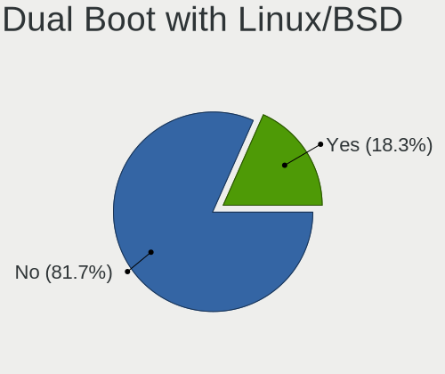
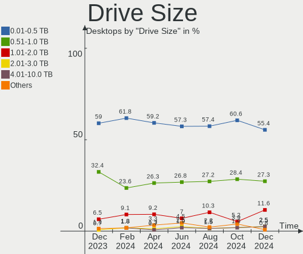
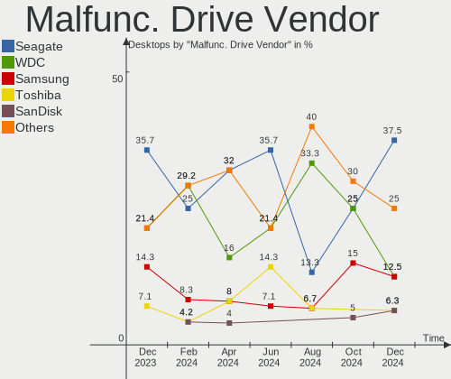
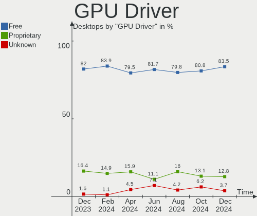

Linux in Brazil - Hardware Trends (Desktops)
--------------------------------------------

A project to identify most popular hardware characteristics and track their change
over time based on data collected by Linux users at https://Linux-Hardware.org.

Anyone can contribute to this report by the [hw-probe](https://github.com/linuxhw/hw-probe) tool:

    sudo -E hw-probe -all -upload

Period: Jun, 2023.

Contents
--------

* [ System ](#system)
  - [ OS                       ](#os)
  - [ OS Family                ](#os-family)
  - [ Kernel                   ](#kernel)
  - [ Kernel Family            ](#kernel-family)
  - [ Kernel Major Ver.        ](#kernel-major-ver)
  - [ Arch                     ](#arch)
  - [ DE                       ](#de)
  - [ Display Server           ](#display-server)
  - [ Display Manager          ](#display-manager)
  - [ OS Lang                  ](#os-lang)
  - [ Boot Mode                ](#boot-mode)
  - [ Filesystem               ](#filesystem)
  - [ Part. scheme             ](#part-scheme)
  - [ Dual Boot with Linux/BSD ](#dual-boot-with-linuxbsd)
  - [ Dual Boot (Win)          ](#dual-boot-win)

* [ Board ](#board)
  - [ Vendor                   ](#vendor)
  - [ Model                    ](#model)
  - [ Model Family             ](#model-family)
  - [ MFG Year                 ](#mfg-year)
  - [ Form Factor              ](#form-factor)
  - [ Secure Boot              ](#secure-boot)
  - [ Coreboot                 ](#coreboot)
  - [ RAM Size                 ](#ram-size)
  - [ RAM Used                 ](#ram-used)
  - [ Total Drives             ](#total-drives)
  - [ Has CD-ROM               ](#has-cd-rom)
  - [ Has Ethernet             ](#has-ethernet)
  - [ Has WiFi                 ](#has-wifi)
  - [ Has Bluetooth            ](#has-bluetooth)

* [ Location ](#location)
  - [ Country                  ](#country)
  - [ City                     ](#city)

* [ Drives ](#drives)
  - [ Drive Vendor             ](#drive-vendor)
  - [ Drive Model              ](#drive-model)
  - [ HDD Vendor               ](#hdd-vendor)
  - [ SSD Vendor               ](#ssd-vendor)
  - [ Drive Kind               ](#drive-kind)
  - [ Drive Connector          ](#drive-connector)
  - [ Drive Size               ](#drive-size)
  - [ Space Total              ](#space-total)
  - [ Space Used               ](#space-used)
  - [ Malfunc. Drives          ](#malfunc-drives)
  - [ Malfunc. Drive Vendor    ](#malfunc-drive-vendor)
  - [ Malfunc. HDD Vendor      ](#malfunc-hdd-vendor)
  - [ Malfunc. Drive Kind      ](#malfunc-drive-kind)
  - [ Failed Drives            ](#failed-drives)
  - [ Failed Drive Vendor      ](#failed-drive-vendor)
  - [ Drive Status             ](#drive-status)

* [ Storage controller ](#storage-controller)
  - [ Storage Vendor           ](#storage-vendor)
  - [ Storage Model            ](#storage-model)
  - [ Storage Kind             ](#storage-kind)

* [ Processor ](#processor)
  - [ CPU Vendor               ](#cpu-vendor)
  - [ CPU Model                ](#cpu-model)
  - [ CPU Model Family         ](#cpu-model-family)
  - [ CPU Cores                ](#cpu-cores)
  - [ CPU Sockets              ](#cpu-sockets)
  - [ CPU Threads              ](#cpu-threads)
  - [ CPU Op-Modes             ](#cpu-op-modes)
  - [ CPU Microcode            ](#cpu-microcode)
  - [ CPU Microarch            ](#cpu-microarch)

* [ Graphics ](#graphics)
  - [ GPU Vendor               ](#gpu-vendor)
  - [ GPU Model                ](#gpu-model)
  - [ GPU Combo                ](#gpu-combo)
  - [ GPU Driver               ](#gpu-driver)
  - [ GPU Memory               ](#gpu-memory)

* [ Monitor ](#monitor)
  - [ Monitor Vendor           ](#monitor-vendor)
  - [ Monitor Model            ](#monitor-model)
  - [ Monitor Resolution       ](#monitor-resolution)
  - [ Monitor Diagonal         ](#monitor-diagonal)
  - [ Monitor Width            ](#monitor-width)
  - [ Aspect Ratio             ](#aspect-ratio)
  - [ Monitor Area             ](#monitor-area)
  - [ Pixel Density            ](#pixel-density)
  - [ Multiple Monitors        ](#multiple-monitors)

* [ Network ](#network)
  - [ Net Controller Vendor    ](#net-controller-vendor)
  - [ Net Controller Model     ](#net-controller-model)
  - [ Wireless Vendor          ](#wireless-vendor)
  - [ Wireless Model           ](#wireless-model)
  - [ Ethernet Vendor          ](#ethernet-vendor)
  - [ Ethernet Model           ](#ethernet-model)
  - [ Net Controller Kind      ](#net-controller-kind)
  - [ Used Controller          ](#used-controller)
  - [ NICs                     ](#nics)
  - [ IPv6                     ](#ipv6)

* [ Bluetooth ](#bluetooth)
  - [ Bluetooth Vendor         ](#bluetooth-vendor)
  - [ Bluetooth Model          ](#bluetooth-model)

* [ Sound ](#sound)
  - [ Sound Vendor             ](#sound-vendor)
  - [ Sound Model              ](#sound-model)

* [ Memory ](#memory)
  - [ Memory Vendor            ](#memory-vendor)
  - [ Memory Model             ](#memory-model)
  - [ Memory Kind              ](#memory-kind)
  - [ Memory Form Factor       ](#memory-form-factor)
  - [ Memory Size              ](#memory-size)
  - [ Memory Speed             ](#memory-speed)

* [ Printers & scanners ](#printers--scanners)
  - [ Printer Vendor           ](#printer-vendor)
  - [ Printer Model            ](#printer-model)
  - [ Scanner Vendor           ](#scanner-vendor)
  - [ Scanner Model            ](#scanner-model)

* [ Camera ](#camera)
  - [ Camera Vendor            ](#camera-vendor)
  - [ Camera Model             ](#camera-model)

* [ Security ](#security)
  - [ Fingerprint Vendor       ](#fingerprint-vendor)
  - [ Fingerprint Model        ](#fingerprint-model)
  - [ Chipcard Vendor          ](#chipcard-vendor)
  - [ Chipcard Model           ](#chipcard-model)

* [ Unsupported ](#unsupported)
  - [ Unsupported Devices      ](#unsupported-devices)
  - [ Unsupported Device Types ](#unsupported-device-types)

System
------

OS
--

Installed operating systems

| Name                      | Desktops | Percent |
|---------------------------|----------|---------|
| Ubuntu 22.04              | 14       | 11.57%  |
| Linux Mint 21.1           | 13       | 10.74%  |
| Fedora 38                 | 12       | 9.92%   |
| OpenMandriva 23.03        | 9        | 7.44%   |
| ArcoLinux Rolling         | 6        | 4.96%   |
| Ubuntu 23.04              | 5        | 4.13%   |
| Manjaro                   | 5        | 4.13%   |
| Arch Rolling              | 5        | 4.13%   |
| Zorin 16                  | 4        | 3.31%   |
| LMDE 5                    | 4        | 3.31%   |
| Pop!_OS 22.04             | 3        | 2.48%   |
| OpenMandriva 23.06        | 3        | 2.48%   |
| Debian 11                 | 3        | 2.48%   |
| Ubuntu 22.10              | 2        | 1.65%   |
| Ubuntu 20.04              | 2        | 1.65%   |
| OpenMandriva 4.3          | 2        | 1.65%   |
| Kubuntu 22.04             | 2        | 1.65%   |
| KDE neon 22.04            | 2        | 1.65%   |
| Kali 2023.2               | 2        | 1.65%   |
| Xubuntu 20.04             | 1        | 0.83%   |
| Ubuntu MATE 20.04         | 1        | 0.83%   |
| Ubuntu Budgie 22.04       | 1        | 0.83%   |
| Sparky 7.0                | 1        | 0.83%   |
| openSUSE Microos-XXXXXXXX | 1        | 0.83%   |
| openSUSE Leap-15.5        | 1        | 0.83%   |
| OpenMandriva 23.01        | 1        | 0.83%   |
| Nethserver 7              | 1        | 0.83%   |
| Linux Mint 20.3           | 1        | 0.83%   |
| Linux Mint 19.3           | 1        | 0.83%   |
| Linux Mint 19.2           | 1        | 0.83%   |
| Kubuntu 22.10             | 1        | 0.83%   |
| Kubuntu 11                | 1        | 0.83%   |
| GNOME OS Nightly          | 1        | 0.83%   |
| Garuda Linux Soaring      | 1        | 0.83%   |
| Endless 5.0.4             | 1        | 0.83%   |
| Elementary 7              | 1        | 0.83%   |
| Elementary 6.1            | 1        | 0.83%   |
| Debian 12                 | 1        | 0.83%   |
| Debian                    | 1        | 0.83%   |
| BigLinux 2023-06-07_06-02 | 1        | 0.83%   |

OS Family
---------

OS without a version

| Name          | Desktops | Percent |
|---------------|----------|---------|
| Ubuntu        | 23       | 19.01%  |
| Linux Mint    | 16       | 13.22%  |
| OpenMandriva  | 15       | 12.4%   |
| Fedora        | 12       | 9.92%   |
| ArcoLinux     | 7        | 5.79%   |
| Manjaro       | 5        | 4.13%   |
| Debian        | 5        | 4.13%   |
| Arch          | 5        | 4.13%   |
| Zorin         | 4        | 3.31%   |
| LMDE          | 4        | 3.31%   |
| Kubuntu       | 4        | 3.31%   |
| Pop!_OS       | 3        | 2.48%   |
| openSUSE      | 2        | 1.65%   |
| KDE neon      | 2        | 1.65%   |
| Kali          | 2        | 1.65%   |
| Elementary    | 2        | 1.65%   |
| Xubuntu       | 1        | 0.83%   |
| Ubuntu MATE   | 1        | 0.83%   |
| Ubuntu Budgie | 1        | 0.83%   |
| Sparky        | 1        | 0.83%   |
| Nethserver    | 1        | 0.83%   |
| GNOME OS      | 1        | 0.83%   |
| Garuda Linux  | 1        | 0.83%   |
| Endless       | 1        | 0.83%   |
| BigLinux      | 1        | 0.83%   |
| Archcraft     | 1        | 0.83%   |

Kernel
------

Version of the Linux kernel

| Version                 | Desktops | Percent |
|-------------------------|----------|---------|
| 5.19.0-45-generic       | 10       | 8.26%   |
| 6.2.6-desktop-1omv2390  | 9        | 7.44%   |
| 5.15.0-75-generic       | 8        | 6.61%   |
| 5.15.0-73-generic       | 7        | 5.79%   |
| 5.19.0-43-generic       | 6        | 4.96%   |
| 6.2.9-300.fc38.x86_64   | 4        | 3.31%   |
| 5.15.0-76-generic       | 4        | 3.31%   |
| 5.10.0-23-amd64         | 4        | 3.31%   |
| 6.3.9-arch1-1           | 3        | 2.48%   |
| 6.3.8-arch1-1           | 3        | 2.48%   |
| 6.3.5-desktop-3omv2390  | 3        | 2.48%   |
| 6.3.4-201.fc38.x86_64   | 3        | 2.48%   |
| 6.2.6-76060206-generic  | 3        | 2.48%   |
| 6.2.0-23-generic        | 3        | 2.48%   |
| 6.1.0-0.deb11.7-amd64   | 3        | 2.48%   |
| 6.2.15-300.fc38.x86_64  | 2        | 1.65%   |
| 6.1.31-2-MANJARO        | 2        | 1.65%   |
| 6.1.0-9-amd64           | 2        | 1.65%   |
| 5.16.7-desktop-1omv4003 | 2        | 1.65%   |
| 5.15.114-2-MANJARO      | 2        | 1.65%   |
| 6.3.7-zen4-xanmod1-1    | 1        | 0.83%   |
| 6.3.7-200.fc38.x86_64   | 1        | 0.83%   |
| 6.3.6-zen1-1-zen        | 1        | 0.83%   |
| 6.3.6-arch1-1           | 1        | 0.83%   |
| 6.3.5-arch1-1           | 1        | 0.83%   |
| 6.3.5-200.fc38.x86_64   | 1        | 0.83%   |
| 6.3.5-2-MANJARO         | 1        | 0.83%   |
| 6.3.4-1-default         | 1        | 0.83%   |
| 6.3.4-060304-generic    | 1        | 0.83%   |
| 6.3.3-1-MANJARO         | 1        | 0.83%   |
| 6.3.2-arch1-1           | 1        | 0.83%   |
| 6.3.0-1-amd64           | 1        | 0.83%   |
| 6.2.12-300.fc38.x86_64  | 1        | 0.83%   |
| 6.2.0-20-generic        | 1        | 0.83%   |
| 6.1.35-1-lts            | 1        | 0.83%   |
| 6.1.34-1-lts            | 1        | 0.83%   |
| 6.1.32-060132-generic   | 1        | 0.83%   |
| 6.1.2-desktop-1omv2301  | 1        | 0.83%   |
| 6.1.0-kali9-amd64       | 1        | 0.83%   |
| 6.1.0-kali5-amd64       | 1        | 0.83%   |

Kernel Family
-------------

Linux kernel without a distro release

| Version     | Desktops | Percent |
|-------------|----------|---------|
| 5.15.0      | 24       | 19.83%  |
| 5.19.0      | 20       | 16.53%  |
| 6.2.6       | 12       | 9.92%   |
| 6.1.0       | 7        | 5.79%   |
| 6.3.5       | 6        | 4.96%   |
| 6.3.4       | 5        | 4.13%   |
| 5.4.0       | 5        | 4.13%   |
| 6.2.9       | 4        | 3.31%   |
| 6.2.0       | 4        | 3.31%   |
| 5.10.0      | 4        | 3.31%   |
| 6.3.9       | 3        | 2.48%   |
| 6.3.8       | 3        | 2.48%   |
| 6.3.7       | 2        | 1.65%   |
| 6.3.6       | 2        | 1.65%   |
| 6.2.15      | 2        | 1.65%   |
| 6.1.31      | 2        | 1.65%   |
| 5.16.7      | 2        | 1.65%   |
| 5.15.114    | 2        | 1.65%   |
| 6.3.3       | 1        | 0.83%   |
| 6.3.2       | 1        | 0.83%   |
| 6.3.0       | 1        | 0.83%   |
| 6.2.12      | 1        | 0.83%   |
| 6.1.35      | 1        | 0.83%   |
| 6.1.34      | 1        | 0.83%   |
| 6.1.32      | 1        | 0.83%   |
| 6.1.2       | 1        | 0.83%   |
| 5.19.17     | 1        | 0.83%   |
| 5.15.107.62 | 1        | 0.83%   |
| 5.14.21     | 1        | 0.83%   |
| 3.10.0      | 1        | 0.83%   |

Kernel Major Ver.
-----------------

Linux kernel major version

| Version  | Desktops | Percent |
|----------|----------|---------|
| 5.15     | 26       | 21.49%  |
| 6.3      | 24       | 19.83%  |
| 6.2      | 23       | 19.01%  |
| 5.19     | 21       | 17.36%  |
| 6.1      | 13       | 10.74%  |
| 5.4      | 5        | 4.13%   |
| 5.10     | 4        | 3.31%   |
| 5.16     | 2        | 1.65%   |
| 5.15.107 | 1        | 0.83%   |
| 5.14     | 1        | 0.83%   |
| 3.10     | 1        | 0.83%   |

Arch
----

OS architecture (x86_64, i586, etc.)

| Name   | Desktops | Percent |
|--------|----------|---------|
| x86_64 | 121      | 100%    |

DE
--

Desktop Environment

| Name          | Desktops | Percent |
|---------------|----------|---------|
| GNOME         | 51       | 42.15%  |
| KDE5          | 26       | 21.49%  |
| X-Cinnamon    | 17       | 14.05%  |
| XFCE          | 10       | 8.26%   |
| MATE          | 4        | 3.31%   |
| Unknown       | 3        | 2.48%   |
| Pantheon      | 2        | 1.65%   |
| Cinnamon      | 2        | 1.65%   |
| KDE           | 1        | 0.83%   |
| i3            | 1        | 0.83%   |
| Enlightenment | 1        | 0.83%   |
| Deepin        | 1        | 0.83%   |
| Budgie        | 1        | 0.83%   |
| bspwm         | 1        | 0.83%   |

Display Server
--------------

X11 or Wayland

| Name    | Desktops | Percent |
|---------|----------|---------|
| X11     | 81       | 66.94%  |
| Wayland | 36       | 29.75%  |
| Tty     | 3        | 2.48%   |
| Unknown | 1        | 0.83%   |

Display Manager
---------------

SDDM, LightDM, etc.

| Name    | Desktops | Percent |
|---------|----------|---------|
| Unknown | 52       | 42.98%  |
| SDDM    | 22       | 18.18%  |
| GDM3    | 20       | 16.53%  |
| LightDM | 15       | 12.4%   |
| GDM     | 12       | 9.92%   |

OS Lang
-------

Language

| Lang  | Desktops | Percent |
|-------|----------|---------|
| pt_BR | 82       | 67.77%  |
| en_US | 39       | 32.23%  |

Boot Mode
---------

EFI or BIOS

| Mode | Desktops | Percent |
|------|----------|---------|
| BIOS | 67       | 55.37%  |
| EFI  | 54       | 44.63%  |

Filesystem
----------

Type of filesystem

| Type    | Desktops | Percent |
|---------|----------|---------|
| Ext4    | 74       | 61.16%  |
| Btrfs   | 23       | 19.01%  |
| Tmpfs   | 13       | 10.74%  |
| Overlay | 8        | 6.61%   |
| Xfs     | 2        | 1.65%   |
| F2fs    | 1        | 0.83%   |

Part. scheme
------------

Scheme of partitioning

| Type    | Desktops | Percent |
|---------|----------|---------|
| GPT     | 55       | 45.45%  |
| Unknown | 48       | 39.67%  |
| MBR     | 18       | 14.88%  |

Dual Boot with Linux/BSD
------------------------

Hosting more than one Linux/BSD

| Dual boot | Desktops | Percent |
|-----------|----------|---------|
| No        | 97       | 80.17%  |
| Yes       | 24       | 19.83%  |

Dual Boot (Win)
---------------

Hosting Linux and Windows

| Dual boot | Desktops | Percent |
|-----------|----------|---------|
| No        | 90       | 74.38%  |
| Yes       | 31       | 25.62%  |

Board
-----

Vendor
------

Motherboard manufacturer

| Name                | Desktops | Percent |
|---------------------|----------|---------|
| Intel               | 22       | 18.18%  |
| Gigabyte Technology | 18       | 14.88%  |
| ASUSTek Computer    | 15       | 12.4%   |
| Positivo            | 8        | 6.61%   |
| ASRock              | 8        | 6.61%   |
| Dell                | 6        | 4.96%   |
| Biostar             | 6        | 4.96%   |
| MSI                 | 5        | 4.13%   |
| Hewlett-Packard     | 5        | 4.13%   |
| Lenovo              | 4        | 3.31%   |
| Huanan              | 4        | 3.31%   |
| Unknown             | 4        | 3.31%   |
| Itautec             | 3        | 2.48%   |
| PCWare              | 2        | 1.65%   |
| ZR                  | 1        | 0.83%   |
| Techvision          | 1        | 0.83%   |
| Standard            | 1        | 0.83%   |
| PERTOSA             | 1        | 0.83%   |
| Pegatron            | 1        | 0.83%   |
| Kllisre             | 1        | 0.83%   |
| Kennex              | 1        | 0.83%   |
| Foxconn             | 1        | 0.83%   |
| Fill By OEM         | 1        | 0.83%   |
| DIEBOLD             | 1        | 0.83%   |
| AZW                 | 1        | 0.83%   |

Model
-----

Motherboard model

| Name                                                         | Desktops | Percent |
|--------------------------------------------------------------|----------|---------|
| Intel H61                                                    | 6        | 4.96%   |
| Unknown                                                      | 6        | 4.96%   |
| Itautec Infoway ST-4265                                      | 3        | 2.48%   |
| Intel H55                                                    | 3        | 2.48%   |
| Intel B75                                                    | 3        | 2.48%   |
| Lenovo ThinkCentre M75s Gen 2 11R9S02K00                     | 2        | 1.65%   |
| Intel X99                                                    | 2        | 1.65%   |
| Gigabyte H81M-S2PH                                           | 2        | 1.65%   |
| Biostar B350GT3                                              | 2        | 1.65%   |
| ASRock A320M-HD                                              | 2        | 1.65%   |
| ZR A320M-F                                                   | 1        | 0.83%   |
| Techvision TVI7309X                                          | 1        | 0.83%   |
| Positivo Positivo Master D610                                | 1        | 0.83%   |
| Positivo POS-PIH81DI                                         | 1        | 0.83%   |
| Positivo POS-PIG41BA                                         | 1        | 0.83%   |
| Positivo POS-EIQ87CY                                         | 1        | 0.83%   |
| Positivo POS-EINM70CS                                        | 1        | 0.83%   |
| Positivo POS-ECIG41BS                                        | 1        | 0.83%   |
| Positivo POS-AT SERIES F (CAD)                               | 1        | 0.83%   |
| Positivo D6200                                               | 1        | 0.83%   |
| PERTOSA 206.30.054 - GA-H110TN-M                             | 1        | 0.83%   |
| Pegatron IPMIP-GS                                            | 1        | 0.83%   |
| PCWare IPX1800E1                                             | 1        | 0.83%   |
| PCWare IPMH61R3                                              | 1        | 0.83%   |
| MSI MS-7C94                                                  | 1        | 0.83%   |
| MSI MS-7C51                                                  | 1        | 0.83%   |
| MSI MS-7B98                                                  | 1        | 0.83%   |
| MSI MS-7B79                                                  | 1        | 0.83%   |
| MSI MS-6638                                                  | 1        | 0.83%   |
| Lenovo V520S-08IKL 10NN001JBR                                | 1        | 0.83%   |
| Lenovo ThinkCentre Edge72 3497G2P                            | 1        | 0.83%   |
| Kllisre X99-B5 V1.1                                          | 1        | 0.83%   |
| Kennex POS-PIG41BA                                           | 1        | 0.83%   |
| Intel X79 (INTEL Xeon E5/Corei7 DMI2 - C600/C200 Cipset V307 | 1        | 0.83%   |
| Intel H81                                                    | 1        | 0.83%   |
| Intel DP965LT AAD41694-301                                   | 1        | 0.83%   |
| Intel DP55WB AAE64798-204                                    | 1        | 0.83%   |
| Intel DH55TC AAE70932-206                                    | 1        | 0.83%   |
| Intel DG41RQ AAE54511-205                                    | 1        | 0.83%   |
| Intel D946GZIS AAD66165-301                                  | 1        | 0.83%   |

Model Family
------------

Motherboard model prefix

| Name                   | Desktops | Percent |
|------------------------|----------|---------|
| Intel H61              | 6        | 4.96%   |
| Unknown                | 6        | 4.96%   |
| Dell OptiPlex          | 4        | 3.31%   |
| ASUS TUF               | 4        | 3.31%   |
| Lenovo ThinkCentre     | 3        | 2.48%   |
| Itautec Infoway        | 3        | 2.48%   |
| Intel H55              | 3        | 2.48%   |
| Intel B75              | 3        | 2.48%   |
| HP Compaq              | 3        | 2.48%   |
| Gigabyte GA-78LMT-USB3 | 3        | 2.48%   |
| ASUS PRIME             | 3        | 2.48%   |
| Intel X99              | 2        | 1.65%   |
| Huanan X99-F8          | 2        | 1.65%   |
| Gigabyte Z590          | 2        | 1.65%   |
| Gigabyte H81M-S2PH     | 2        | 1.65%   |
| Biostar B350GT3        | 2        | 1.65%   |
| ASUS M5A78L-M          | 2        | 1.65%   |
| ASRock A320M-HD        | 2        | 1.65%   |
| ZR A320M-F             | 1        | 0.83%   |
| Techvision TVI7309X    | 1        | 0.83%   |
| Positivo Positivo      | 1        | 0.83%   |
| Positivo POS-PIH81DI   | 1        | 0.83%   |
| Positivo POS-PIG41BA   | 1        | 0.83%   |
| Positivo POS-EIQ87CY   | 1        | 0.83%   |
| Positivo POS-EINM70CS  | 1        | 0.83%   |
| Positivo POS-ECIG41BS  | 1        | 0.83%   |
| Positivo POS-AT        | 1        | 0.83%   |
| Positivo D6200         | 1        | 0.83%   |
| PERTOSA 206.30.054     | 1        | 0.83%   |
| Pegatron IPMIP-GS      | 1        | 0.83%   |
| PCWare IPX1800E1       | 1        | 0.83%   |
| PCWare IPMH61R3        | 1        | 0.83%   |
| MSI MS-7C94            | 1        | 0.83%   |
| MSI MS-7C51            | 1        | 0.83%   |
| MSI MS-7B98            | 1        | 0.83%   |
| MSI MS-7B79            | 1        | 0.83%   |
| MSI MS-6638            | 1        | 0.83%   |
| Lenovo V520S-08IKL     | 1        | 0.83%   |
| Kllisre X99-B5         | 1        | 0.83%   |
| Kennex POS-PIG41BA     | 1        | 0.83%   |

MFG Year
--------

Motherboard manufacture year

| Year | Desktops | Percent |
|------|----------|---------|
| 2017 | 14       | 11.57%  |
| 2019 | 13       | 10.74%  |
| 2018 | 12       | 9.92%   |
| 2021 | 9        | 7.44%   |
| 2013 | 9        | 7.44%   |
| 2010 | 9        | 7.44%   |
| 2012 | 8        | 6.61%   |
| 2016 | 7        | 5.79%   |
| 2014 | 7        | 5.79%   |
| 2011 | 7        | 5.79%   |
| 2022 | 6        | 4.96%   |
| 2009 | 6        | 4.96%   |
| 2020 | 5        | 4.13%   |
| 2023 | 3        | 2.48%   |
| 2008 | 2        | 1.65%   |
| 2007 | 2        | 1.65%   |
| 2015 | 1        | 0.83%   |
| 2006 | 1        | 0.83%   |

Form Factor
-----------

Physical design of the computer

| Name    | Desktops | Percent |
|---------|----------|---------|
| Desktop | 121      | 100%    |

Secure Boot
-----------

Enabled or disabled

| State    | Desktops | Percent |
|----------|----------|---------|
| Disabled | 120      | 99.17%  |
| Enabled  | 1        | 0.83%   |

Coreboot
--------

Have coreboot on board

| Used | Desktops | Percent |
|------|----------|---------|
| No   | 121      | 100%    |

RAM Size
--------

Total RAM memory

| Size in GB  | Desktops | Percent |
|-------------|----------|---------|
| 16.01-24.0  | 28       | 23.14%  |
| 4.01-8.0    | 27       | 22.31%  |
| 8.01-16.0   | 25       | 20.66%  |
| 3.01-4.0    | 17       | 14.05%  |
| 32.01-64.0  | 8        | 6.61%   |
| 24.01-32.0  | 6        | 4.96%   |
| 64.01-256.0 | 4        | 3.31%   |
| 2.01-3.0    | 3        | 2.48%   |
| 1.01-2.0    | 2        | 1.65%   |
| 0.51-1.0    | 1        | 0.83%   |

RAM Used
--------

Used RAM memory

| Used GB    | Desktops | Percent |
|------------|----------|---------|
| 1.01-2.0   | 40       | 33.06%  |
| 2.01-3.0   | 32       | 26.45%  |
| 4.01-8.0   | 24       | 19.83%  |
| 3.01-4.0   | 16       | 13.22%  |
| 0.51-1.0   | 4        | 3.31%   |
| 8.01-16.0  | 2        | 1.65%   |
| 0.01-0.5   | 2        | 1.65%   |
| 16.01-24.0 | 1        | 0.83%   |

Total Drives
------------

Number of drives on board

| Drives | Desktops | Percent |
|--------|----------|---------|
| 1      | 58       | 47.93%  |
| 2      | 30       | 24.79%  |
| 3      | 19       | 15.7%   |
| 4      | 8        | 6.61%   |
| 5      | 3        | 2.48%   |
| 0      | 2        | 1.65%   |
| 6      | 1        | 0.83%   |

Has CD-ROM
----------

Has CD-ROM on board

| Presented | Desktops | Percent |
|-----------|----------|---------|
| No        | 90       | 74.38%  |
| Yes       | 31       | 25.62%  |

Has Ethernet
------------

Has Ethernet on board

| Presented | Desktops | Percent |
|-----------|----------|---------|
| Yes       | 118      | 97.52%  |
| No        | 3        | 2.48%   |

Has WiFi
--------

Has WiFi module

| Presented | Desktops | Percent |
|-----------|----------|---------|
| No        | 63       | 52.07%  |
| Yes       | 58       | 47.93%  |

Has Bluetooth
-------------

Has Bluetooth module

| Presented | Desktops | Percent |
|-----------|----------|---------|
| No        | 90       | 74.38%  |
| Yes       | 31       | 25.62%  |

Location
--------

Country
-------

Geographic location (country)

| Country | Desktops | Percent |
|---------|----------|---------|
| Brazil  | 121      | 100%    |

City
----

Geographic location (city)

| City                  | Desktops | Percent |
|-----------------------|----------|---------|
| Rio de Janeiro        | 15       | 12.4%   |
| Sao Paulo             | 14       | 11.57%  |
| Palmas                | 5        | 4.13%   |
| Curitiba              | 5        | 4.13%   |
| Porto Alegre          | 4        | 3.31%   |
| Fortaleza             | 4        | 3.31%   |
| Santo André          | 3        | 2.48%   |
| Salvador              | 3        | 2.48%   |
| Brasília             | 3        | 2.48%   |
| Vitória              | 2        | 1.65%   |
| Goiânia              | 2        | 1.65%   |
| Fazenda Rio Grande    | 2        | 1.65%   |
| Campinas              | 2        | 1.65%   |
| Belo Horizonte        | 2        | 1.65%   |
| Belém                | 2        | 1.65%   |
| Votorantim            | 1        | 0.83%   |
| Volta Redonda         | 1        | 0.83%   |
| Vitória da Conquista | 1        | 0.83%   |
| Vila Velha            | 1        | 0.83%   |
| Vicosa                | 1        | 0.83%   |
| Urbano Santos         | 1        | 0.83%   |
| Uberaba               | 1        | 0.83%   |
| Teresina              | 1        | 0.83%   |
| Sao Vicente           | 1        | 0.83%   |
| Sao José dos Campos  | 1        | 0.83%   |
| Sao Jose              | 1        | 0.83%   |
| Ribeirao Preto        | 1        | 0.83%   |
| Recife                | 1        | 0.83%   |
| Presidente Prudente   | 1        | 0.83%   |
| Praia Grande          | 1        | 0.83%   |
| Poços de Caldas      | 1        | 0.83%   |
| Piracicaba            | 1        | 0.83%   |
| Paulista              | 1        | 0.83%   |
| Palhoca               | 1        | 0.83%   |
| Osasco                | 1        | 0.83%   |
| Niterói              | 1        | 0.83%   |
| Nilopolis             | 1        | 0.83%   |
| Natal                 | 1        | 0.83%   |
| Maua                  | 1        | 0.83%   |
| Manaus                | 1        | 0.83%   |

Drives
------

Drive Vendor
------------

Hard drive vendors

| Vendor                      | Desktops | Drives | Percent |
|-----------------------------|----------|--------|---------|
| Seagate                     | 40       | 54     | 19.14%  |
| WDC                         | 39       | 42     | 18.66%  |
| Kingston                    | 26       | 27     | 12.44%  |
| Samsung Electronics         | 17       | 17     | 8.13%   |
| China                       | 13       | 14     | 6.22%   |
| Toshiba                     | 10       | 10     | 4.78%   |
| Realtek Semiconductor       | 6        | 6      | 2.87%   |
| SanDisk                     | 5        | 6      | 2.39%   |
| Crucial                     | 5        | 6      | 2.39%   |
| Silicon Motion              | 4        | 5      | 1.91%   |
| Netac                       | 4        | 4      | 1.91%   |
| MAXIO Technology (Hangzhou) | 3        | 3      | 1.44%   |
| Kingston Technology Company | 3        | 3      | 1.44%   |
| KingSpec                    | 3        | 3      | 1.44%   |
| XrayDisk                    | 2        | 2      | 0.96%   |
| SSSTC                       | 2        | 2      | 0.96%   |
| Phison Electronics          | 2        | 3      | 0.96%   |
| Hitachi                     | 2        | 2      | 0.96%   |
| ADATA Technology            | 2        | 2      | 0.96%   |
| WALRAM                      | 1        | 1      | 0.48%   |
| VUCCAN                      | 1        | 1      | 0.48%   |
| Unknown                     | 1        | 1      | 0.48%   |
| Team                        | 1        | 1      | 0.48%   |
| SPCC                        | 1        | 1      | 0.48%   |
| SK hynix                    | 1        | 1      | 0.48%   |
| RZX                         | 1        | 1      | 0.48%   |
| Patriot                     | 1        | 1      | 0.48%   |
| NTC                         | 1        | 1      | 0.48%   |
| Micron/Crucial Technology   | 1        | 2      | 0.48%   |
| MaxDigital                  | 1        | 1      | 0.48%   |
| Lexar                       | 1        | 1      | 0.48%   |
| KingDian                    | 1        | 1      | 0.48%   |
| JMicron Technology          | 1        | 1      | 0.48%   |
| Intel                       | 1        | 1      | 0.48%   |
| HUSKY                       | 1        | 1      | 0.48%   |
| HS-SSD-E100                 | 1        | 1      | 0.48%   |
| Hjwdz                       | 1        | 1      | 0.48%   |
| External                    | 1        | 1      | 0.48%   |
| ExcelStor                   | 1        | 1      | 0.48%   |
| Unknown                     | 1        | 1      | 0.48%   |

Drive Model
-----------

Hard drive models

| Model                                                             | Desktops | Percent |
|-------------------------------------------------------------------|----------|---------|
| Kingston SA400S37240G 240GB SSD                                   | 8        | 3.57%   |
| Seagate ST500LM012 HN-M500MBB 500GB                               | 5        | 2.23%   |
| Seagate ST1000DM003-1CH162 1TB                                    | 5        | 2.23%   |
| Samsung HD502HJ 500GB                                             | 5        | 2.23%   |
| Seagate ST500DM002-1BD142 500GB                                   | 4        | 1.79%   |
| Kingston SA400S37120G 120GB SSD                                   | 4        | 1.79%   |
| Toshiba MQ01ABD050 500GB                                          | 3        | 1.34%   |
| Toshiba HDWD110 1TB                                               | 3        | 1.34%   |
| Seagate ST31000524AS 1TB                                          | 3        | 1.34%   |
| Samsung HD103SI 1TB                                               | 3        | 1.34%   |
| Realtek RTS5763DL NVMe SSD Controller 512GB                       | 3        | 1.34%   |
| MAXIO (Hangzhou) NVMe SSD Controller MAP1202 512GB                | 3        | 1.34%   |
| Kingston SA400S37480G 480GB SSD                                   | 3        | 1.34%   |
| Crucial CT240BX500SSD1 240GB                                      | 3        | 1.34%   |
| China SSD 120GB                                                   | 3        | 1.34%   |
| WDC WDS240G2G0A-00JH30 240GB SSD                                  | 2        | 0.89%   |
| WDC WD5000LPVX-22V0TT0 500GB                                      | 2        | 0.89%   |
| WDC WD5000AAKX-001CA0 500GB                                       | 2        | 0.89%   |
| SSSTC CA5-8D256-Q79 256GB                                         | 2        | 0.89%   |
| Silicon Motion SM2262/SM2262EN SSD Controller 480GB               | 2        | 0.89%   |
| Seagate ST3500413AS 500GB                                         | 2        | 0.89%   |
| Seagate ST2000DM008-2FR102 2TB                                    | 2        | 0.89%   |
| Seagate ST2000DM006-2DM164 2TB                                    | 2        | 0.89%   |
| Seagate ST2000DM001-1ER164 2TB                                    | 2        | 0.89%   |
| Seagate ST1000DM010-2EP102 1TB                                    | 2        | 0.89%   |
| Seagate ST1000DM003-1SB102 1TB                                    | 2        | 0.89%   |
| Seagate Expansion 1TB                                             | 2        | 0.89%   |
| SanDisk SSD PLUS 120 GB                                           | 2        | 0.89%   |
| Samsung HD322HJ 320GB                                             | 2        | 0.89%   |
| Phison PS5013 E13 NVMe Controller 512GB                           | 2        | 0.89%   |
| Netac SSD 256GB                                                   | 2        | 0.89%   |
| Kingston Company SNV2S1000G 1TB                                   | 2        | 0.89%   |
| Kingston SV300S37A120G 120GB SSD                                  | 2        | 0.89%   |
| Kingston SUV400S37120G 120GB SSD                                  | 2        | 0.89%   |
| Crucial CT480BX500SSD1 480GB                                      | 2        | 0.89%   |
| China SSD 512GB                                                   | 2        | 0.89%   |
| China SSD 128GB                                                   | 2        | 0.89%   |
| ADATA XPG SX8200 Pro PCIe Gen3x4 M.2 2280 Solid State Drive 512GB | 2        | 0.89%   |
| XrayDisk 480GB                                                    | 1        | 0.45%   |
| XrayDisk 120GB                                                    | 1        | 0.45%   |

HDD Vendor
----------

Hard disk drive vendors

| Vendor              | Desktops | Drives | Percent |
|---------------------|----------|--------|---------|
| Seagate             | 40       | 54     | 40.4%   |
| WDC                 | 31       | 33     | 31.31%  |
| Samsung Electronics | 16       | 16     | 16.16%  |
| Toshiba             | 9        | 9      | 9.09%   |
| Hitachi             | 2        | 2      | 2.02%   |
| ExcelStor           | 1        | 1      | 1.01%   |

SSD Vendor
----------

Solid state drive vendors

| Vendor              | Desktops | Drives | Percent |
|---------------------|----------|--------|---------|
| Kingston            | 23       | 24     | 31.08%  |
| China               | 13       | 14     | 17.57%  |
| WDC                 | 8        | 8      | 10.81%  |
| SanDisk             | 5        | 5      | 6.76%   |
| Crucial             | 5        | 6      | 6.76%   |
| Netac               | 3        | 3      | 4.05%   |
| KingSpec            | 3        | 3      | 4.05%   |
| Toshiba             | 1        | 1      | 1.35%   |
| Team                | 1        | 1      | 1.35%   |
| SPCC                | 1        | 1      | 1.35%   |
| Samsung Electronics | 1        | 1      | 1.35%   |
| RZX                 | 1        | 1      | 1.35%   |
| Patriot             | 1        | 1      | 1.35%   |
| NTC                 | 1        | 1      | 1.35%   |
| MaxDigital          | 1        | 1      | 1.35%   |
| Lexar               | 1        | 1      | 1.35%   |
| KingDian            | 1        | 1      | 1.35%   |
| Intel               | 1        | 1      | 1.35%   |
| HUSKY               | 1        | 1      | 1.35%   |
| External            | 1        | 1      | 1.35%   |
| Unknown             | 1        | 1      | 1.35%   |

Drive Kind
----------

HDD or SSD

| Kind    | Desktops | Drives | Percent |
|---------|----------|--------|---------|
| HDD     | 82       | 115    | 45.81%  |
| SSD     | 64       | 77     | 35.75%  |
| NVMe    | 27       | 35     | 15.08%  |
| Unknown | 6        | 6      | 3.35%   |

Drive Connector
---------------

SATA, SAS, NVMe, etc.

| Type | Desktops | Drives | Percent |
|------|----------|--------|---------|
| SATA | 109      | 194    | 77.3%   |
| NVMe | 27       | 34     | 19.15%  |
| SAS  | 5        | 5      | 3.55%   |

Drive Size
----------

Size of hard drive

| Size in TB | Desktops | Drives | Percent |
|------------|----------|--------|---------|
| 0.01-0.5   | 86       | 121    | 59.72%  |
| 0.51-1.0   | 43       | 54     | 29.86%  |
| 1.01-2.0   | 9        | 11     | 6.25%   |
| 3.01-4.0   | 2        | 2      | 1.39%   |
| 2.01-3.0   | 2        | 2      | 1.39%   |
| 4.01-10.0  | 2        | 2      | 1.39%   |

Space Total
-----------

Amount of disk space available on the file system

| Size in GB     | Desktops | Percent |
|----------------|----------|---------|
| 101-250        | 33       | 27.27%  |
| 251-500        | 24       | 19.83%  |
| 1001-2000      | 19       | 15.7%   |
| 501-1000       | 14       | 11.57%  |
| 1-20           | 11       | 9.09%   |
| More than 3000 | 7        | 5.79%   |
| 51-100         | 7        | 5.79%   |
| 2001-3000      | 4        | 3.31%   |
| 21-50          | 1        | 0.83%   |
| Unknown        | 1        | 0.83%   |

Space Used
----------

Amount of used disk space

| Used GB        | Desktops | Percent |
|----------------|----------|---------|
| 1-20           | 38       | 31.4%   |
| 21-50          | 24       | 19.83%  |
| 101-250        | 19       | 15.7%   |
| 51-100         | 13       | 10.74%  |
| 251-500        | 10       | 8.26%   |
| 1001-2000      | 6        | 4.96%   |
| 501-1000       | 4        | 3.31%   |
| More than 3000 | 3        | 2.48%   |
| 2001-3000      | 3        | 2.48%   |
| Unknown        | 1        | 0.83%   |

Malfunc. Drives
---------------

Drive models with a malfunction

| Model                                                     | Desktops | Drives | Percent |
|-----------------------------------------------------------|----------|--------|---------|
| Toshiba MQ01ABD050 500GB                                  | 2        | 2      | 7.14%   |
| Samsung Electronics HD322HJ 320GB                         | 2        | 2      | 7.14%   |
| WDC WD5000AAKX-003CA0 500GB                               | 1        | 1      | 3.57%   |
| WDC WD5000AAKX-001CA0 500GB                               | 1        | 1      | 3.57%   |
| WDC WD5000AAKS-00V1A0 500GB                               | 1        | 1      | 3.57%   |
| WDC WD5000AAKS-00UU3A0 500GB                              | 1        | 1      | 3.57%   |
| WDC WD3200BEVT-22ZCT0 320GB                               | 1        | 1      | 3.57%   |
| WDC WD10EZEX-00BN5A0 1TB                                  | 1        | 1      | 3.57%   |
| WDC WD1002FAEX-00Y9A0 1TB                                 | 1        | 1      | 3.57%   |
| Team T253X1120G 120GB SSD                                 | 1        | 1      | 3.57%   |
| Seagate ST8000VN0022-2EL112 8TB                           | 1        | 1      | 3.57%   |
| Seagate ST500DM002-1BD142 500GB                           | 1        | 1      | 3.57%   |
| Seagate ST380811AS 80GB                                   | 1        | 1      | 3.57%   |
| Seagate ST3500413AS 500GB                                 | 1        | 1      | 3.57%   |
| Seagate ST31000524AS 1TB                                  | 1        | 1      | 3.57%   |
| Seagate ST1000LM035-1RK172 1TB                            | 1        | 2      | 3.57%   |
| Samsung Electronics HD502HJ 500GB                         | 1        | 1      | 3.57%   |
| Samsung Electronics HD161HJ 160GB                         | 1        | 1      | 3.57%   |
| Samsung Electronics HD161GJ 160GB                         | 1        | 1      | 3.57%   |
| Samsung Electronics HD103SI 1TB                           | 1        | 1      | 3.57%   |
| Realtek Semiconductor RTS5763DL NVMe SSD Controller 512GB | 1        | 1      | 3.57%   |
| Kingston SV300S37A120G 120GB SSD                          | 1        | 1      | 3.57%   |
| Kingston SUV400S37240G 240GB SSD                          | 1        | 1      | 3.57%   |
| Hitachi HDT721032SLA380 320GB                             | 1        | 1      | 3.57%   |
| ExcelStor Technology J8160S 160GB                         | 1        | 1      | 3.57%   |
| China SSD 120GB                                           | 1        | 1      | 3.57%   |

Malfunc. Drive Vendor
---------------------

Vendors of faulty drives

| Vendor                | Desktops | Drives | Percent |
|-----------------------|----------|--------|---------|
| WDC                   | 7        | 7      | 25%     |
| Seagate               | 6        | 7      | 21.43%  |
| Samsung Electronics   | 6        | 6      | 21.43%  |
| Toshiba               | 2        | 2      | 7.14%   |
| Kingston              | 2        | 2      | 7.14%   |
| Team                  | 1        | 1      | 3.57%   |
| Realtek Semiconductor | 1        | 1      | 3.57%   |
| Hitachi               | 1        | 1      | 3.57%   |
| ExcelStor             | 1        | 1      | 3.57%   |
| China                 | 1        | 1      | 3.57%   |

Malfunc. HDD Vendor
-------------------

Vendors of faulty HDD drives

| Vendor              | Desktops | Drives | Percent |
|---------------------|----------|--------|---------|
| WDC                 | 7        | 7      | 30.43%  |
| Seagate             | 6        | 7      | 26.09%  |
| Samsung Electronics | 6        | 6      | 26.09%  |
| Toshiba             | 2        | 2      | 8.7%    |
| Hitachi             | 1        | 1      | 4.35%   |
| ExcelStor           | 1        | 1      | 4.35%   |

Malfunc. Drive Kind
-------------------

Kinds of faulty drives

| Kind | Desktops | Drives | Percent |
|------|----------|--------|---------|
| HDD  | 20       | 24     | 80%     |
| SSD  | 4        | 4      | 16%     |
| NVMe | 1        | 1      | 4%      |

Failed Drives
-------------

Failed drive models

| Model                        | Desktops | Drives | Percent |
|------------------------------|----------|--------|---------|
| WDC WD3200BPVT-00JJ5T0 320GB | 1        | 1      | 100%    |

Failed Drive Vendor
-------------------

Failed drive vendors

| Vendor | Desktops | Drives | Percent |
|--------|----------|--------|---------|
| WDC    | 1        | 1      | 100%    |

Drive Status
------------

Number of failed and malfunc. drives

| Status   | Desktops | Drives | Percent |
|----------|----------|--------|---------|
| Detected | 64       | 127    | 48.48%  |
| Works    | 44       | 76     | 33.33%  |
| Malfunc  | 23       | 29     | 17.42%  |
| Failed   | 1        | 1      | 0.76%   |

Storage controller
------------------

Storage Vendor
--------------

Storage controller vendors

| Vendor                         | Desktops | Percent |
|--------------------------------|----------|---------|
| Intel                          | 89       | 55.97%  |
| AMD                            | 31       | 19.5%   |
| Realtek Semiconductor          | 6        | 3.77%   |
| Marvell Technology Group       | 5        | 3.14%   |
| Kingston Technology Company    | 5        | 3.14%   |
| Silicon Motion                 | 4        | 2.52%   |
| MAXIO Technology (Hangzhou)    | 3        | 1.89%   |
| Solid State Storage Technology | 2        | 1.26%   |
| SanDisk                        | 2        | 1.26%   |
| Phison Electronics             | 2        | 1.26%   |
| ASMedia Technology             | 2        | 1.26%   |
| ADATA Technology               | 2        | 1.26%   |
| SK hynix                       | 1        | 0.63%   |
| Nvidia                         | 1        | 0.63%   |
| Netac Technology               | 1        | 0.63%   |
| Micron/Crucial Technology      | 1        | 0.63%   |
| JMicron Technology             | 1        | 0.63%   |
| INNOGRIT                       | 1        | 0.63%   |

Storage Model
-------------

Storage controller models

| Model                                                                                   | Desktops | Percent |
|-----------------------------------------------------------------------------------------|----------|---------|
| AMD FCH SATA Controller [AHCI mode]                                                     | 16       | 8.08%   |
| Intel NM10/ICH7 Family SATA Controller [IDE mode]                                       | 12       | 6.06%   |
| Intel 6 Series/C200 Series Chipset Family 6 port Desktop SATA AHCI Controller           | 12       | 6.06%   |
| Intel 82801G (ICH7 Family) IDE Controller                                               | 11       | 5.56%   |
| Intel 8 Series/C220 Series Chipset Family 6-port SATA Controller 1 [AHCI mode]          | 10       | 5.05%   |
| Intel 7 Series/C210 Series Chipset Family 6-port SATA Controller [AHCI mode]            | 9        | 4.55%   |
| Intel Cannon Lake PCH SATA AHCI Controller                                              | 5        | 2.53%   |
| AMD SB7x0/SB8x0/SB9x0 SATA Controller [IDE mode]                                        | 5        | 2.53%   |
| AMD SB7x0/SB8x0/SB9x0 IDE Controller                                                    | 5        | 2.53%   |
| AMD FCH SATA Controller D                                                               | 5        | 2.53%   |
| AMD 300 Series Chipset SATA Controller                                                  | 5        | 2.53%   |
| Kingston Company Company Non-Volatile memory controller                                 | 4        | 2.02%   |
| Intel 5 Series/3400 Series Chipset 6 port SATA AHCI Controller                          | 4        | 2.02%   |
| Intel 200 Series PCH SATA controller [AHCI mode]                                        | 4        | 2.02%   |
| AMD 500 Series Chipset SATA Controller                                                  | 4        | 2.02%   |
| AMD 400 Series Chipset SATA Controller                                                  | 4        | 2.02%   |
| Realtek RTS5763DL NVMe SSD Controller                                                   | 3        | 1.52%   |
| Realtek NVMe Controller                                                                 | 3        | 1.52%   |
| MAXIO (Hangzhou) NVMe SSD Controller MAP1202                                            | 3        | 1.52%   |
| Marvell Group 88SE9172 SATA 6Gb/s Controller                                            | 3        | 1.52%   |
| Intel SATA Controller [RAID mode]                                                       | 3        | 1.52%   |
| Intel Q170/Q150/B150/H170/H110/Z170/CM236 Chipset SATA Controller [AHCI Mode]           | 3        | 1.52%   |
| Intel 5 Series/3400 Series Chipset 4 port SATA IDE Controller                           | 3        | 1.52%   |
| Intel 5 Series/3400 Series Chipset 2 port SATA IDE Controller                           | 3        | 1.52%   |
| AMD SB7x0/SB8x0/SB9x0 SATA Controller [AHCI mode]                                       | 3        | 1.52%   |
| Solid State Storage Non-Volatile memory controller                                      | 2        | 1.01%   |
| Silicon Motion SM2263EN/SM2263XT SSD Controller                                         | 2        | 1.01%   |
| Silicon Motion SM2262/SM2262EN SSD Controller                                           | 2        | 1.01%   |
| Phison PS5013 E13 NVMe Controller                                                       | 2        | 1.01%   |
| Intel C610/X99 series chipset 6-Port SATA Controller [AHCI mode]                        | 2        | 1.01%   |
| Intel C600/X79 series chipset 6-Port SATA AHCI Controller                               | 2        | 1.01%   |
| Intel Alder Lake-S PCH SATA Controller [AHCI Mode]                                      | 2        | 1.01%   |
| Intel 7 Series Chipset Family 6-port SATA Controller [AHCI mode]                        | 2        | 1.01%   |
| Intel 6 Series/C200 Series Chipset Family Desktop SATA Controller (IDE mode, ports 4-5) | 2        | 1.01%   |
| Intel 6 Series/C200 Series Chipset Family Desktop SATA Controller (IDE mode, ports 0-3) | 2        | 1.01%   |
| Intel 400 Series Chipset Family SATA AHCI Controller                                    | 2        | 1.01%   |
| ADATA XPG SX8200 Pro PCIe Gen3x4 M.2 2280 Solid State Drive                             | 2        | 1.01%   |
| SK hynix BC511 NVMe SSD                                                                 | 1        | 0.51%   |
| SanDisk WD Black SN770 NVMe SSD                                                         | 1        | 0.51%   |
| SanDisk Non-Volatile memory controller                                                  | 1        | 0.51%   |

Storage Kind
------------

Kind of storage controller (IDE, SATA, NVMe, SAS, ...)

| Kind | Desktops | Percent |
|------|----------|---------|
| SATA | 94       | 59.87%  |
| IDE  | 30       | 19.11%  |
| NVMe | 27       | 17.2%   |
| RAID | 6        | 3.82%   |

Processor
---------

CPU Vendor
----------

Processor vendors

| Vendor | Desktops | Percent |
|--------|----------|---------|
| Intel  | 89       | 73.55%  |
| AMD    | 32       | 26.45%  |

CPU Model
---------

Processor models

| Model                                       | Desktops | Percent |
|---------------------------------------------|----------|---------|
| Intel Core i5-2400 CPU @ 3.10GHz            | 4        | 3.31%   |
| Intel Pentium Dual-Core CPU E5300 @ 2.60GHz | 3        | 2.48%   |
| Intel Core i7-3770 CPU @ 3.40GHz            | 3        | 2.48%   |
| Intel Core i7-2600 CPU @ 3.40GHz            | 3        | 2.48%   |
| Intel Core i5-3330 CPU @ 3.00GHz            | 3        | 2.48%   |
| Intel Core i5 CPU 650 @ 3.20GHz             | 3        | 2.48%   |
| AMD FX-8300 Eight-Core Processor            | 3        | 2.48%   |
| Intel Xeon CPU E5-2670 v3 @ 2.30GHz         | 2        | 1.65%   |
| Intel Core i5-6400 CPU @ 2.70GHz            | 2        | 1.65%   |
| Intel Core i5-4590 CPU @ 3.30GHz            | 2        | 1.65%   |
| Intel Core i5-3470S CPU @ 2.90GHz           | 2        | 1.65%   |
| Intel Core i3-9100F CPU @ 3.60GHz           | 2        | 1.65%   |
| Intel Core i3-8100 CPU @ 3.60GHz            | 2        | 1.65%   |
| Intel Core 2 Quad CPU Q6600 @ 2.40GHz       | 2        | 1.65%   |
| Intel Core 2 Duo CPU E7500 @ 2.93GHz        | 2        | 1.65%   |
| Intel Celeron CPU 1007U @ 1.50GHz           | 2        | 1.65%   |
| AMD Ryzen 9 7900X 12-Core Processor         | 2        | 1.65%   |
| AMD Ryzen 7 5700G with Radeon Graphics      | 2        | 1.65%   |
| AMD Ryzen 5 5600G with Radeon Graphics      | 2        | 1.65%   |
| AMD Ryzen 5 4600G with Radeon Graphics      | 2        | 1.65%   |
| AMD Ryzen 5 1600 Six-Core Processor         | 2        | 1.65%   |
| AMD Ryzen 3 3200G with Radeon Vega Graphics | 2        | 1.65%   |
| AMD Ryzen 3 2200G with Radeon Vega Graphics | 2        | 1.65%   |
| AMD FX-6100 Six-Core Processor              | 2        | 1.65%   |
| AMD FX-4300 Quad-Core Processor             | 2        | 1.65%   |
| Intel Xeon CPU E5620 @ 2.40GHz              | 1        | 0.83%   |
| Intel Xeon CPU E5-2697 v2 @ 2.70GHz         | 1        | 0.83%   |
| Intel Xeon CPU E5-2696 v4 @ 2.20GHz         | 1        | 0.83%   |
| Intel Xeon CPU E5-2660 v3 @ 2.60GHz         | 1        | 0.83%   |
| Intel Xeon CPU E5-2650 v3 @ 2.30GHz         | 1        | 0.83%   |
| Intel Xeon CPU E5-2650 v2 @ 2.60GHz         | 1        | 0.83%   |
| Intel Xeon CPU E5-2630 v3 @ 2.40GHz         | 1        | 0.83%   |
| Intel Xeon CPU E5-2420 v2 @ 2.20GHz         | 1        | 0.83%   |
| Intel Pentium Gold G5420 CPU @ 3.80GHz      | 1        | 0.83%   |
| Intel Pentium Gold G5400 CPU @ 3.70GHz      | 1        | 0.83%   |
| Intel Pentium Dual-Core CPU T4500 @ 2.30GHz | 1        | 0.83%   |
| Intel Pentium Dual-Core CPU E5800 @ 3.20GHz | 1        | 0.83%   |
| Intel Pentium Dual-Core CPU E5500 @ 2.80GHz | 1        | 0.83%   |
| Intel Pentium Dual-Core CPU E5400 @ 2.70GHz | 1        | 0.83%   |
| Intel Pentium CPU G630 @ 2.70GHz            | 1        | 0.83%   |

CPU Model Family
----------------

Processor model prefix

| Model                   | Desktops | Percent |
|-------------------------|----------|---------|
| Intel Core i5           | 26       | 21.49%  |
| Intel Core i3           | 13       | 10.74%  |
| Intel Core i7           | 11       | 9.09%   |
| Intel Xeon              | 10       | 8.26%   |
| AMD Ryzen 5             | 8        | 6.61%   |
| AMD FX                  | 8        | 6.61%   |
| Intel Pentium Dual-Core | 7        | 5.79%   |
| AMD Ryzen 7             | 6        | 4.96%   |
| Intel Celeron           | 5        | 4.13%   |
| AMD Ryzen 9             | 4        | 3.31%   |
| AMD Ryzen 3             | 4        | 3.31%   |
| Other                   | 3        | 2.48%   |
| Intel Pentium           | 3        | 2.48%   |
| Intel Core 2 Quad       | 3        | 2.48%   |
| Intel Core 2 Duo        | 3        | 2.48%   |
| Intel Pentium Gold      | 2        | 1.65%   |
| Intel Core i9           | 1        | 0.83%   |
| Intel Core 2            | 1        | 0.83%   |
| Intel Atom              | 1        | 0.83%   |
| AMD Athlon II X2        | 1        | 0.83%   |
| AMD A6                  | 1        | 0.83%   |

CPU Cores
---------

Number of processor cores

| Number | Desktops | Percent |
|--------|----------|---------|
| 4      | 46       | 38.02%  |
| 2      | 35       | 28.93%  |
| 6      | 14       | 11.57%  |
| 8      | 10       | 8.26%   |
| 12     | 6        | 4.96%   |
| 10     | 3        | 2.48%   |
| 3      | 3        | 2.48%   |
| 1      | 2        | 1.65%   |
| 24     | 1        | 0.83%   |
| 22     | 1        | 0.83%   |

CPU Sockets
-----------

Number of sockets

| Number | Desktops | Percent |
|--------|----------|---------|
| 1      | 119      | 98.35%  |
| 2      | 2        | 1.65%   |

CPU Threads
-----------

Threads per core (Hyper-Threading)

| Number | Desktops | Percent |
|--------|----------|---------|
| 2      | 69       | 57.02%  |
| 1      | 52       | 42.98%  |

CPU Op-Modes
------------

CPU Operation Modes (32-bit, 64-bit)

| Op mode        | Desktops | Percent |
|----------------|----------|---------|
| 32-bit, 64-bit | 121      | 100%    |

CPU Microcode
-------------

Microcode number

| Number     | Desktops | Percent |
|------------|----------|---------|
| Unknown    | 59       | 48.76%  |
| 0x206a7    | 8        | 6.61%   |
| 0x306a9    | 7        | 5.79%   |
| 0x1067a    | 6        | 4.96%   |
| 0x306c3    | 5        | 4.13%   |
| 0x906ea    | 3        | 2.48%   |
| 0x06000852 | 3        | 2.48%   |
| 0x306f2    | 2        | 1.65%   |
| 0x306e4    | 2        | 1.65%   |
| 0x0a601203 | 2        | 1.65%   |
| 0x0a50000c | 2        | 1.65%   |
| 0x08108109 | 2        | 1.65%   |
| 0xa0653    | 1        | 0.83%   |
| 0x906eb    | 1        | 0.83%   |
| 0x6f6      | 1        | 0.83%   |
| 0x506e3    | 1        | 0.83%   |
| 0x206c2    | 1        | 0.83%   |
| 0x20655    | 1        | 0.83%   |
| 0x106e5    | 1        | 0.83%   |
| 0x0a50000d | 1        | 0.83%   |
| 0x0a50000b | 1        | 0.83%   |
| 0x0a20120a | 1        | 0.83%   |
| 0x0a201205 | 1        | 0.83%   |
| 0x08701021 | 1        | 0.83%   |
| 0x08600106 | 1        | 0.83%   |
| 0x08101016 | 1        | 0.83%   |
| 0x08001138 | 1        | 0.83%   |
| 0x08001137 | 1        | 0.83%   |
| 0x06000822 | 1        | 0.83%   |
| 0x0600081c | 1        | 0.83%   |
| 0x0600063e | 1        | 0.83%   |
| 0x010000c8 | 1        | 0.83%   |

CPU Microarch
-------------

Microarchitecture

| Name        | Desktops | Percent |
|-------------|----------|---------|
| IvyBridge   | 17       | 14.05%  |
| SandyBridge | 12       | 9.92%   |
| KabyLake    | 12       | 9.92%   |
| Haswell     | 12       | 9.92%   |
| Penryn      | 10       | 8.26%   |
| Zen 3       | 7        | 5.79%   |
| Zen         | 6        | 4.96%   |
| Westmere    | 6        | 4.96%   |
| Piledriver  | 6        | 4.96%   |
| Unknown     | 6        | 4.96%   |
| Zen 2       | 4        | 3.31%   |
| Core        | 4        | 3.31%   |
| CometLake   | 4        | 3.31%   |
| Skylake     | 3        | 2.48%   |
| Zen+        | 2        | 1.65%   |
| Nehalem     | 2        | 1.65%   |
| Bulldozer   | 2        | 1.65%   |
| Silvermont  | 1        | 0.83%   |
| K10         | 1        | 0.83%   |
| Icelake     | 1        | 0.83%   |
| Excavator   | 1        | 0.83%   |
| Broadwell   | 1        | 0.83%   |
| Bonnell     | 1        | 0.83%   |

Graphics
--------

GPU Vendor
----------

Vendors of graphics cards

| Vendor | Desktops | Percent |
|--------|----------|---------|
| Intel  | 49       | 39.52%  |
| Nvidia | 42       | 33.87%  |
| AMD    | 33       | 26.61%  |

GPU Model
---------

Graphics card models

| Model                                                                       | Desktops | Percent |
|-----------------------------------------------------------------------------|----------|---------|
| Intel 2nd Generation Core Processor Family Integrated Graphics Controller   | 8        | 6.11%   |
| Intel Core Processor Integrated Graphics Controller                         | 5        | 3.82%   |
| Nvidia GT218 [GeForce 210]                                                  | 4        | 3.05%   |
| Intel Xeon E3-1200 v3/4th Gen Core Processor Integrated Graphics Controller | 4        | 3.05%   |
| Intel 4 Series Chipset Integrated Graphics Controller                       | 4        | 3.05%   |
| AMD Lexa PRO [Radeon 540/540X/550/550X / RX 540X/550/550X]                  | 4        | 3.05%   |
| AMD Ellesmere [Radeon RX 470/480/570/570X/580/580X/590]                     | 4        | 3.05%   |
| AMD Cezanne [Radeon Vega Series / Radeon Vega Mobile Series]                | 4        | 3.05%   |
| Nvidia GP107 [GeForce GTX 1050 Ti]                                          | 3        | 2.29%   |
| Intel Xeon E3-1200 v2/3rd Gen Core processor Graphics Controller            | 3        | 2.29%   |
| Intel CoffeeLake-S GT2 [UHD Graphics 630]                                   | 3        | 2.29%   |
| Intel 82G33/G31 Express Integrated Graphics Controller                      | 3        | 2.29%   |
| AMD Cedar [Radeon HD 5000/6000/7350/8350 Series]                            | 3        | 2.29%   |
| Nvidia TU116 [GeForce GTX 1660 Ti]                                          | 2        | 1.53%   |
| Nvidia TU106 [GeForce RTX 2060 Rev. A]                                      | 2        | 1.53%   |
| Nvidia GM206 [GeForce GTX 960]                                              | 2        | 1.53%   |
| Nvidia GM107 [GeForce GTX 750 Ti]                                           | 2        | 1.53%   |
| Nvidia GK208B [GeForce GT 730]                                              | 2        | 1.53%   |
| Nvidia GK208B [GeForce GT 710]                                              | 2        | 1.53%   |
| Nvidia GF119 [GeForce GT 610]                                               | 2        | 1.53%   |
| Intel HD Graphics 630                                                       | 2        | 1.53%   |
| Intel HD Graphics 530                                                       | 2        | 1.53%   |
| Intel CometLake-S GT2 [UHD Graphics 630]                                    | 2        | 1.53%   |
| Intel 82945G/GZ Integrated Graphics Controller                              | 2        | 1.53%   |
| Intel 3rd Gen Core processor Graphics Controller                            | 2        | 1.53%   |
| AMD RS780L [Radeon 3000]                                                    | 2        | 1.53%   |
| AMD Renoir                                                                  | 2        | 1.53%   |
| AMD Raphael                                                                 | 2        | 1.53%   |
| AMD Polaris 20 XL [Radeon RX 580 2048SP]                                    | 2        | 1.53%   |
| AMD Navi 23 [Radeon RX 6600/6600 XT/6600M]                                  | 2        | 1.53%   |
| AMD Caicos [Radeon HD 6450/7450/8450 / R5 230 OEM]                          | 2        | 1.53%   |
| Nvidia TU117 [GeForce GTX 1650]                                             | 1        | 0.76%   |
| Nvidia TU116 [GeForce GTX 1650]                                             | 1        | 0.76%   |
| Nvidia TU106 [GeForce RTX 2060 SUPER]                                       | 1        | 0.76%   |
| Nvidia TU106 [GeForce GTX 1650]                                             | 1        | 0.76%   |
| Nvidia GT218 [GeForce G210]                                                 | 1        | 0.76%   |
| Nvidia GT218 [GeForce 8400 GS Rev. 3]                                       | 1        | 0.76%   |
| Nvidia GP108 [GeForce GT 1030]                                              | 1        | 0.76%   |
| Nvidia GP107 [GeForce GTX 1050]                                             | 1        | 0.76%   |
| Nvidia GP106 [GeForce GTX 1060 3GB]                                         | 1        | 0.76%   |

GPU Combo
---------

Combinations of graphics cards

| Name           | Desktops | Percent |
|----------------|----------|---------|
| 1 x Intel      | 48       | 39.67%  |
| 1 x Nvidia     | 37       | 30.58%  |
| 1 x AMD        | 27       | 22.31%  |
| 2 x AMD        | 4        | 3.31%   |
| 2 x Nvidia     | 2        | 1.65%   |
| AMD + Nvidia   | 2        | 1.65%   |
| Intel + Nvidia | 1        | 0.83%   |

GPU Driver
----------

Free vs proprietary

| Driver      | Desktops | Percent |
|-------------|----------|---------|
| Free        | 94       | 77.69%  |
| Proprietary | 22       | 18.18%  |
| Unknown     | 5        | 4.13%   |

GPU Memory
----------

Total video memory

| Size in GB | Desktops | Percent |
|------------|----------|---------|
| Unknown    | 66       | 54.55%  |
| 1.01-2.0   | 15       | 12.4%   |
| 3.01-4.0   | 11       | 9.09%   |
| 0.51-1.0   | 11       | 9.09%   |
| 7.01-8.0   | 7        | 5.79%   |
| 0.01-0.5   | 6        | 4.96%   |
| 5.01-6.0   | 4        | 3.31%   |
| 8.01-16.0  | 1        | 0.83%   |

Monitor
-------

Monitor Vendor
--------------

Monitor vendors

| Vendor              | Desktops | Percent |
|---------------------|----------|---------|
| Goldstar            | 31       | 26.72%  |
| Samsung Electronics | 23       | 19.83%  |
| AOC                 | 16       | 13.79%  |
| Philips             | 9        | 7.76%   |
| Dell                | 9        | 7.76%   |
| Acer                | 6        | 5.17%   |
| Hewlett-Packard     | 4        | 3.45%   |
| Positivo            | 3        | 2.59%   |
| Lenovo              | 2        | 1.72%   |
| Denver              | 2        | 1.72%   |
| ViewSonic           | 1        | 0.86%   |
| Unknown (XXX)       | 1        | 0.86%   |
| Sony                | 1        | 0.86%   |
| SOG                 | 1        | 0.86%   |
| Philco              | 1        | 0.86%   |
| JRY                 | 1        | 0.86%   |
| ITE                 | 1        | 0.86%   |
| HannStar            | 1        | 0.86%   |
| GDH                 | 1        | 0.86%   |
| BenQ                | 1        | 0.86%   |
| ASUSTek Computer    | 1        | 0.86%   |

Monitor Model
-------------

Monitor models

| Model                                                                  | Desktops | Percent |
|------------------------------------------------------------------------|----------|---------|
| Goldstar ULTRAWIDE GSM59F1 2560x1080 673x284mm 28.8-inch               | 5        | 4.1%    |
| Goldstar HD GSM5ACB 1366x768 410x230mm 18.5-inch                       | 3        | 2.46%   |
| Goldstar FULL HD GSM5B55 1920x1080 480x270mm 21.7-inch                 | 3        | 2.46%   |
| Samsung Electronics SyncMaster SAM03E4 1680x1050 474x296mm 22.0-inch   | 2        | 1.64%   |
| Samsung Electronics SMT24A550 SAM07B5 1920x1080 531x299mm 24.0-inch    | 2        | 1.64%   |
| Samsung Electronics SMB1930N SAM0632 1366x768 410x230mm 18.5-inch      | 2        | 1.64%   |
| Samsung Electronics SA300/SA350 SAM078B 1600x900 443x249mm 20.0-inch   | 2        | 1.64%   |
| Positivo 22MP55PJ POS5B7A 1920x1080 600x340mm 27.2-inch                | 2        | 1.64%   |
| Philips PHL 242V8 PHLC219 1920x1080 527x296mm 23.8-inch                | 2        | 1.64%   |
| Lenovo LEN S24e-03 LEN61F9 1920x1080 527x296mm 23.8-inch               | 2        | 1.64%   |
| Goldstar W2043 GSM4E9D 1600x900 443x249mm 20.0-inch                    | 2        | 1.64%   |
| Goldstar FULL HD GSM5BFB 1920x1080 480x270mm 21.7-inch                 | 2        | 1.64%   |
| Goldstar E2011 GSM4ED3 1600x900 443x249mm 20.0-inch                    | 2        | 1.64%   |
| Denver X300 LHCFFFF 2560x1080 690x291mm 29.5-inch                      | 2        | 1.64%   |
| ViewSonic VA2415 SERIES VSCBC3C 1920x1080 521x293mm 23.5-inch          | 1        | 0.82%   |
| Unknown (XXX) Union TV XXX2841 1920x1080 1209x680mm 54.6-inch          | 1        | 0.82%   |
| Sony SDM-HS95P SNY2500 1280x1024 376x301mm 19.0-inch                   | 1        | 0.82%   |
| SOG S-190G SOG1900 1440x900 410x220mm 18.3-inch                        | 1        | 0.82%   |
| Samsung Electronics T27B350 SAM0943 1920x1080 598x336mm 27.0-inch      | 1        | 0.82%   |
| Samsung Electronics SyncMaster SAM0472 1440x900 367x229mm 17.0-inch    | 1        | 0.82%   |
| Samsung Electronics SyncMaster SAM0471 1360x768 344x194mm 15.5-inch    | 1        | 0.82%   |
| Samsung Electronics SMT27A950 SAM080F 1920x1080 598x336mm 27.0-inch    | 1        | 0.82%   |
| Samsung Electronics SMT27A550 SAM07B8 1920x1080 598x336mm 27.0-inch    | 1        | 0.82%   |
| Samsung Electronics SMBX2050 SAM0718 1600x900 440x250mm 19.9-inch      | 1        | 0.82%   |
| Samsung Electronics SMB1630N SAM0630 1366x768 344x194mm 15.5-inch      | 1        | 0.82%   |
| Samsung Electronics SA300/SA350 SAM078F 1920x1080 477x268mm 21.5-inch  | 1        | 0.82%   |
| Samsung Electronics S19B300 SAM08A5 1366x768 410x230mm 18.5-inch       | 1        | 0.82%   |
| Samsung Electronics LCD SAM0256 1440x900 408x225mm 18.3-inch           | 1        | 0.82%   |
| Samsung Electronics LCD Monitor SyncMaster 1024x768                    | 1        | 0.82%   |
| Samsung Electronics LCD Monitor SAM0E90 1366x768 609x347mm 27.6-inch   | 1        | 0.82%   |
| Samsung Electronics LCD Monitor SAM090B 1920x1080 1210x680mm 54.6-inch | 1        | 0.82%   |
| Samsung Electronics LCD Monitor SAM0678 1360x768                       | 1        | 0.82%   |
| Samsung Electronics LCD Monitor F24G3xTF 1920x1080                     | 1        | 0.82%   |
| Positivo UNION         NON1500 1360x768 340x190mm 15.3-inch            | 1        | 0.82%   |
| Positivo 22MP55PJ POS5B79 1920x1080 480x270mm 21.7-inch                | 1        | 0.82%   |
| Philips PHL 288P6L PHL08F2 3840x2160 621x341mm 27.9-inch               | 1        | 0.82%   |
| Philips PHL 203V5 PHLC0CE 1600x900 430x240mm 19.4-inch                 | 1        | 0.82%   |
| Philips LCD Monitor 1360x768                                           | 1        | 0.82%   |
| Philips 236V4 PHLC0B3 1920x1080 510x287mm 23.0-inch                    | 1        | 0.82%   |
| Philips 202EL PHLC05C 1600x900 443x249mm 20.0-inch                     | 1        | 0.82%   |

Monitor Resolution
------------------

Monitor screen resolution

| Resolution         | Desktops | Percent |
|--------------------|----------|---------|
| 1920x1080 (FHD)    | 45       | 38.46%  |
| 1366x768 (WXGA)    | 18       | 15.38%  |
| 1600x900 (HD+)     | 13       | 11.11%  |
| 3840x2160 (4K)     | 7        | 5.98%   |
| 2560x1080          | 7        | 5.98%   |
| 1440x900 (WXGA+)   | 7        | 5.98%   |
| 1360x768           | 7        | 5.98%   |
| 1680x1050 (WSXGA+) | 4        | 3.42%   |
| 1280x1024 (SXGA)   | 4        | 3.42%   |
| 3440x1440          | 1        | 0.85%   |
| 1920x540           | 1        | 0.85%   |
| 1280x720 (HD)      | 1        | 0.85%   |
| 1024x768 (XGA)     | 1        | 0.85%   |
| Unknown            | 1        | 0.85%   |

Monitor Diagonal
----------------

Diagonal size in inches

| Inches  | Desktops | Percent |
|---------|----------|---------|
| 23      | 16       | 13.45%  |
| 21      | 14       | 11.76%  |
| 18      | 13       | 10.92%  |
| 20      | 12       | 10.08%  |
| 27      | 9        | 7.56%   |
| 34      | 8        | 6.72%   |
| 24      | 8        | 6.72%   |
| 19      | 8        | 6.72%   |
| Unknown | 7        | 5.88%   |
| 15      | 6        | 5.04%   |
| 17      | 5        | 4.2%    |
| 22      | 4        | 3.36%   |
| 54      | 2        | 1.68%   |
| 35      | 2        | 1.68%   |
| 14      | 2        | 1.68%   |
| 32      | 1        | 0.84%   |
| 31      | 1        | 0.84%   |
| 16      | 1        | 0.84%   |

Monitor Width
-------------

Physical width

| Width in mm | Desktops | Percent |
|-------------|----------|---------|
| 401-500     | 49       | 41.53%  |
| 501-600     | 31       | 26.27%  |
| 301-350     | 10       | 8.47%   |
| 701-800     | 9        | 7.63%   |
| Unknown     | 7        | 5.93%   |
| 351-400     | 4        | 3.39%   |
| 601-700     | 3        | 2.54%   |
| 801-900     | 2        | 1.69%   |
| 1001-1500   | 2        | 1.69%   |
| 201-300     | 1        | 0.85%   |

Aspect Ratio
------------

Proportional relationship between the width and the height

| Ratio   | Desktops | Percent |
|---------|----------|---------|
| 16/9    | 80       | 72.73%  |
| 21/9    | 10       | 9.09%   |
| 16/10   | 9        | 8.18%   |
| Unknown | 6        | 5.45%   |
| 5/4     | 4        | 3.64%   |
| 4/3     | 1        | 0.91%   |

Monitor Area
------------

Area in inch²

| Area in inch² | Desktops | Percent |
|----------------|----------|---------|
| 201-250        | 37       | 31.62%  |
| 151-200        | 23       | 19.66%  |
| 141-150        | 15       | 12.82%  |
| 351-500        | 12       | 10.26%  |
| 301-350        | 9        | 7.69%   |
| 101-110        | 7        | 5.98%   |
| Unknown        | 7        | 5.98%   |
| 131-140        | 3        | 2.56%   |
| More than 1000 | 2        | 1.71%   |
| 81-90          | 1        | 0.85%   |
| 121-130        | 1        | 0.85%   |

Pixel Density
-------------

Pixels per inch

| Density | Desktops | Percent |
|---------|----------|---------|
| 51-100  | 74       | 66.67%  |
| 101-120 | 24       | 21.62%  |
| Unknown | 7        | 6.31%   |
| 1-50    | 3        | 2.7%    |
| 121-160 | 2        | 1.8%    |
| 161-240 | 1        | 0.9%    |

Multiple Monitors
-----------------

Total monitors connected

| Total | Desktops | Percent |
|-------|----------|---------|
| 1     | 99       | 81.82%  |
| 2     | 16       | 13.22%  |
| 0     | 5        | 4.13%   |
| 3     | 1        | 0.83%   |

Network
-------

Net Controller Vendor
---------------------

Controller vendors

| Vendor                          | Desktops | Percent |
|---------------------------------|----------|---------|
| Realtek Semiconductor           | 89       | 54.6%   |
| Intel                           | 29       | 17.79%  |
| Qualcomm Atheros                | 8        | 4.91%   |
| Ralink                          | 6        | 3.68%   |
| Broadcom                        | 5        | 3.07%   |
| TP-Link                         | 4        | 2.45%   |
| Qualcomm Atheros Communications | 3        | 1.84%   |
| Microsoft                       | 3        | 1.84%   |
| JMicron Technology              | 3        | 1.84%   |
| Ralink Technology               | 2        | 1.23%   |
| MediaTek                        | 2        | 1.23%   |
| D-Link                          | 2        | 1.23%   |
| Xiaomi                          | 1        | 0.61%   |
| Samsung Electronics             | 1        | 0.61%   |
| Nvidia                          | 1        | 0.61%   |
| Marvell Technology Group        | 1        | 0.61%   |
| ICS Advent                      | 1        | 0.61%   |
| D-Link System                   | 1        | 0.61%   |
| Broadcom Limited                | 1        | 0.61%   |

Net Controller Model
--------------------

Controller models

| Model                                                             | Desktops | Percent |
|-------------------------------------------------------------------|----------|---------|
| Realtek RTL8111/8168/8411 PCI Express Gigabit Ethernet Controller | 65       | 34.39%  |
| Realtek RTL810xE PCI Express Fast Ethernet controller             | 13       | 6.88%   |
| Realtek RTL8188FTV 802.11b/g/n 1T1R 2.4G WLAN Adapter             | 7        | 3.7%    |
| Realtek RTL8153 Gigabit Ethernet Adapter                          | 4        | 2.12%   |
| Realtek RTL8125 2.5GbE Controller                                 | 4        | 2.12%   |
| Ralink RT2800 802.11n PCI                                         | 4        | 2.12%   |
| Intel 82579LM Gigabit Network Connection (Lewisville)             | 4        | 2.12%   |
| Realtek RTL88x2bu [AC1200 Techkey]                                | 3        | 1.59%   |
| Realtek RTL8192EU 802.11b/g/n WLAN Adapter                        | 3        | 1.59%   |
| Realtek RTL8188EE Wireless Network Adapter                        | 3        | 1.59%   |
| Qualcomm Atheros AR9271 802.11n                                   | 3        | 1.59%   |
| Microsoft Xbox 360 Wireless Adapter                               | 3        | 1.59%   |
| Intel I211 Gigabit Network Connection                             | 3        | 1.59%   |
| Intel 82578DC Gigabit Network Connection                          | 3        | 1.59%   |
| TP-Link TL-WN823N v2/v3 [Realtek RTL8192EU]                       | 2        | 1.06%   |
| Realtek RTL8852AE 802.11ax PCIe Wireless Network Adapter          | 2        | 1.06%   |
| Realtek RTL8192EE PCIe Wireless Network Adapter                   | 2        | 1.06%   |
| Realtek RTL8188EUS 802.11n Wireless Network Adapter               | 2        | 1.06%   |
| Ralink MT7601U Wireless Adapter                                   | 2        | 1.06%   |
| JMicron JMC260 PCI Express Fast Ethernet Controller               | 2        | 1.06%   |
| Intel Wi-Fi 6 AX210/AX211/AX411 160MHz                            | 2        | 1.06%   |
| Intel Wi-Fi 6 AX200                                               | 2        | 1.06%   |
| Intel Ethernet Controller I225-V                                  | 2        | 1.06%   |
| Intel Ethernet Connection (7) I219-V                              | 2        | 1.06%   |
| Intel Ethernet Connection (2) I219-V                              | 2        | 1.06%   |
| Xiaomi Mi/Redmi series (RNDIS + ADB)                              | 1        | 0.53%   |
| TP-Link TL-WN722N v2/v3 [Realtek RTL8188EUS]                      | 1        | 0.53%   |
| TP-Link Archer T4U ver.3                                          | 1        | 0.53%   |
| Samsung Galaxy series, misc. (tethering mode)                     | 1        | 0.53%   |
| Realtek RTL8852BE PCIe 802.11ax Wireless Network Controller       | 1        | 0.53%   |
| Realtek RTL8191SEvB Wireless LAN Controller                       | 1        | 0.53%   |
| Realtek RTL8188CUS 802.11n WLAN Adapter                           | 1        | 0.53%   |
| Realtek RTL8187 Wireless Adapter                                  | 1        | 0.53%   |
| Realtek 802.11ac NIC                                              | 1        | 0.53%   |
| Ralink RT5390R 802.11bgn PCIe Wireless Network Adapter            | 1        | 0.53%   |
| Ralink RT2790 Wireless 802.11n 1T/2R PCIe                         | 1        | 0.53%   |
| Qualcomm Atheros QCA8171 Gigabit Ethernet                         | 1        | 0.53%   |
| Qualcomm Atheros QCA6174 802.11ac Wireless Network Adapter        | 1        | 0.53%   |
| Qualcomm Atheros Attansic L1 Gigabit Ethernet                     | 1        | 0.53%   |
| Qualcomm Atheros AR9485 Wireless Network Adapter                  | 1        | 0.53%   |

Wireless Vendor
---------------

Wireless vendors

| Vendor                          | Desktops | Percent |
|---------------------------------|----------|---------|
| Realtek Semiconductor           | 26       | 41.27%  |
| Intel                           | 7        | 11.11%  |
| Ralink                          | 6        | 9.52%   |
| TP-Link                         | 4        | 6.35%   |
| Qualcomm Atheros                | 4        | 6.35%   |
| Qualcomm Atheros Communications | 3        | 4.76%   |
| Microsoft                       | 3        | 4.76%   |
| Ralink Technology               | 2        | 3.17%   |
| MediaTek                        | 2        | 3.17%   |
| D-Link                          | 2        | 3.17%   |
| Marvell Technology Group        | 1        | 1.59%   |
| D-Link System                   | 1        | 1.59%   |
| Broadcom Limited                | 1        | 1.59%   |
| Broadcom                        | 1        | 1.59%   |

Wireless Model
--------------

Wireless models

| Model                                                                       | Desktops | Percent |
|-----------------------------------------------------------------------------|----------|---------|
| Realtek RTL8188FTV 802.11b/g/n 1T1R 2.4G WLAN Adapter                       | 7        | 10.94%  |
| Ralink RT2800 802.11n PCI                                                   | 4        | 6.25%   |
| Realtek RTL88x2bu [AC1200 Techkey]                                          | 3        | 4.69%   |
| Realtek RTL8192EU 802.11b/g/n WLAN Adapter                                  | 3        | 4.69%   |
| Realtek RTL8188EE Wireless Network Adapter                                  | 3        | 4.69%   |
| Qualcomm Atheros AR9271 802.11n                                             | 3        | 4.69%   |
| Microsoft Xbox 360 Wireless Adapter                                         | 3        | 4.69%   |
| TP-Link TL-WN823N v2/v3 [Realtek RTL8192EU]                                 | 2        | 3.13%   |
| Realtek RTL8852AE 802.11ax PCIe Wireless Network Adapter                    | 2        | 3.13%   |
| Realtek RTL8192EE PCIe Wireless Network Adapter                             | 2        | 3.13%   |
| Realtek RTL8188EUS 802.11n Wireless Network Adapter                         | 2        | 3.13%   |
| Ralink MT7601U Wireless Adapter                                             | 2        | 3.13%   |
| Intel Wi-Fi 6 AX210/AX211/AX411 160MHz                                      | 2        | 3.13%   |
| Intel Wi-Fi 6 AX200                                                         | 2        | 3.13%   |
| TP-Link TL-WN722N v2/v3 [Realtek RTL8188EUS]                                | 1        | 1.56%   |
| TP-Link Archer T4U ver.3                                                    | 1        | 1.56%   |
| Realtek RTL8852BE PCIe 802.11ax Wireless Network Controller                 | 1        | 1.56%   |
| Realtek RTL8191SEvB Wireless LAN Controller                                 | 1        | 1.56%   |
| Realtek RTL8188CUS 802.11n WLAN Adapter                                     | 1        | 1.56%   |
| Realtek RTL8187 Wireless Adapter                                            | 1        | 1.56%   |
| Realtek 802.11ac NIC                                                        | 1        | 1.56%   |
| Ralink RT5390R 802.11bgn PCIe Wireless Network Adapter                      | 1        | 1.56%   |
| Ralink RT2790 Wireless 802.11n 1T/2R PCIe                                   | 1        | 1.56%   |
| Qualcomm Atheros QCA6174 802.11ac Wireless Network Adapter                  | 1        | 1.56%   |
| Qualcomm Atheros AR9485 Wireless Network Adapter                            | 1        | 1.56%   |
| Qualcomm Atheros AR93xx Wireless Network Adapter                            | 1        | 1.56%   |
| Qualcomm Atheros AR9227 Wireless Network Adapter                            | 1        | 1.56%   |
| MediaTek MT7922 802.11ax PCI Express Wireless Network Adapter               | 1        | 1.56%   |
| MediaTek MT7921K (RZ608) Wi-Fi 6E 80MHz                                     | 1        | 1.56%   |
| Marvell Group Libertas 802.11b/g Wireless LAN Client Adapter                | 1        | 1.56%   |
| Intel Wireless-AC 9260                                                      | 1        | 1.56%   |
| Intel Wireless 3165                                                         | 1        | 1.56%   |
| Intel Tiger Lake PCH CNVi WiFi                                              | 1        | 1.56%   |
| D-Link System DWA-125 Wireless N 150 Adapter(rev.A1) [Ralink RT3070]        | 1        | 1.56%   |
| D-Link DWA-131 802.11n Wireless N Nano Adapter (rev.B1) [Realtek RTL8192CU] | 1        | 1.56%   |
| D-Link DWA-123 Wireless N 150 Adapter (rev.D1)                              | 1        | 1.56%   |
| Broadcom Limited BCM4360 802.11ac Wireless Network Adapter                  | 1        | 1.56%   |
| Broadcom BCM4360 802.11ac Wireless Network Adapter                          | 1        | 1.56%   |

Ethernet Vendor
---------------

Ethernet vendors

| Vendor                | Desktops | Percent |
|-----------------------|----------|---------|
| Realtek Semiconductor | 84       | 68.29%  |
| Intel                 | 23       | 18.7%   |
| Qualcomm Atheros      | 5        | 4.07%   |
| Broadcom              | 4        | 3.25%   |
| JMicron Technology    | 3        | 2.44%   |
| Xiaomi                | 1        | 0.81%   |
| Samsung Electronics   | 1        | 0.81%   |
| Nvidia                | 1        | 0.81%   |
| ICS Advent            | 1        | 0.81%   |

Ethernet Model
--------------

Ethernet models

| Model                                                             | Desktops | Percent |
|-------------------------------------------------------------------|----------|---------|
| Realtek RTL8111/8168/8411 PCI Express Gigabit Ethernet Controller | 65       | 52%     |
| Realtek RTL810xE PCI Express Fast Ethernet controller             | 13       | 10.4%   |
| Realtek RTL8153 Gigabit Ethernet Adapter                          | 4        | 3.2%    |
| Realtek RTL8125 2.5GbE Controller                                 | 4        | 3.2%    |
| Intel 82579LM Gigabit Network Connection (Lewisville)             | 4        | 3.2%    |
| Intel I211 Gigabit Network Connection                             | 3        | 2.4%    |
| Intel 82578DC Gigabit Network Connection                          | 3        | 2.4%    |
| JMicron JMC260 PCI Express Fast Ethernet Controller               | 2        | 1.6%    |
| Intel Ethernet Controller I225-V                                  | 2        | 1.6%    |
| Intel Ethernet Connection (7) I219-V                              | 2        | 1.6%    |
| Intel Ethernet Connection (2) I219-V                              | 2        | 1.6%    |
| Xiaomi Mi/Redmi series (RNDIS + ADB)                              | 1        | 0.8%    |
| Samsung Galaxy series, misc. (tethering mode)                     | 1        | 0.8%    |
| Qualcomm Atheros QCA8171 Gigabit Ethernet                         | 1        | 0.8%    |
| Qualcomm Atheros Attansic L1 Gigabit Ethernet                     | 1        | 0.8%    |
| Qualcomm Atheros AR8161 Gigabit Ethernet                          | 1        | 0.8%    |
| Qualcomm Atheros AR8151 v2.0 Gigabit Ethernet                     | 1        | 0.8%    |
| Qualcomm Atheros AR8131 Gigabit Ethernet                          | 1        | 0.8%    |
| Nvidia MCP61 Ethernet                                             | 1        | 0.8%    |
| JMicron JMC250 PCI Express Gigabit Ethernet Controller            | 1        | 0.8%    |
| Intel PRO/100 VE Network Connection                               | 1        | 0.8%    |
| Intel Ethernet Controller I226-V                                  | 1        | 0.8%    |
| Intel Ethernet Connection I217-LM                                 | 1        | 0.8%    |
| Intel Ethernet Connection (5) I219-LM                             | 1        | 0.8%    |
| Intel Ethernet Connection (12) I219-V                             | 1        | 0.8%    |
| Intel Ethernet Connection (11) I219-LM                            | 1        | 0.8%    |
| Intel 82566DC Gigabit Network Connection                          | 1        | 0.8%    |
| ICS Advent DM9601 Fast Ethernet Adapter                           | 1        | 0.8%    |
| Broadcom NetXtreme II BCM5709 Gigabit Ethernet                    | 1        | 0.8%    |
| Broadcom NetXtreme BCM5764M Gigabit Ethernet PCIe                 | 1        | 0.8%    |
| Broadcom NetXtreme BCM5754 Gigabit Ethernet PCI Express           | 1        | 0.8%    |
| Broadcom NetLink BCM5784M Gigabit Ethernet PCIe                   | 1        | 0.8%    |

Net Controller Kind
-------------------

Ethernet, WiFi or modem

| Kind     | Desktops | Percent |
|----------|----------|---------|
| Ethernet | 118      | 67.05%  |
| WiFi     | 58       | 32.95%  |

Used Controller
---------------

Currently used network controller

| Kind     | Desktops | Percent |
|----------|----------|---------|
| Ethernet | 92       | 73.02%  |
| WiFi     | 34       | 26.98%  |

NICs
----

Total network controllers on board

| Total | Desktops | Percent |
|-------|----------|---------|
| 1     | 86       | 71.07%  |
| 2     | 30       | 24.79%  |
| 0     | 3        | 2.48%   |
| 4     | 2        | 1.65%   |

IPv6
----

IPv6 vs IPv4

| Used | Desktops | Percent |
|------|----------|---------|
| No   | 65       | 53.72%  |
| Yes  | 56       | 46.28%  |

Bluetooth
---------

Bluetooth Vendor
----------------

Controller vendors

| Vendor                          | Desktops | Percent |
|---------------------------------|----------|---------|
| Cambridge Silicon Radio         | 16       | 51.61%  |
| Intel                           | 6        | 19.35%  |
| Realtek Semiconductor           | 4        | 12.9%   |
| Qualcomm Atheros Communications | 1        | 3.23%   |
| MediaTek                        | 1        | 3.23%   |
| IMC Networks                    | 1        | 3.23%   |
| Foxconn / Hon Hai               | 1        | 3.23%   |
| Apple                           | 1        | 3.23%   |

Bluetooth Model
---------------

Controller models

| Model                                               | Desktops | Percent |
|-----------------------------------------------------|----------|---------|
| Cambridge Silicon Radio Bluetooth Dongle (HCI mode) | 16       | 51.61%  |
| Realtek Bluetooth Radio                             | 4        | 12.9%   |
| Intel AX200 Bluetooth                               | 2        | 6.45%   |
| Qualcomm Atheros  Bluetooth Device                  | 1        | 3.23%   |
| MediaTek Wireless_Device                            | 1        | 3.23%   |
| Intel Wireless-AC 9260 Bluetooth Adapter            | 1        | 3.23%   |
| Intel Bluetooth wireless interface                  | 1        | 3.23%   |
| Intel Bluetooth 9460/9560 Jefferson Peak (JfP)      | 1        | 3.23%   |
| Intel AX210 Bluetooth                               | 1        | 3.23%   |
| IMC Networks Bluetooth Radio                        | 1        | 3.23%   |
| Foxconn / Hon Hai Wireless_Device                   | 1        | 3.23%   |
| Apple Bluetooth USB Host Controller                 | 1        | 3.23%   |

Sound
-----

Sound Vendor
------------

Sound card vendors

| Vendor                               | Desktops | Percent |
|--------------------------------------|----------|---------|
| Intel                                | 89       | 43.84%  |
| AMD                                  | 45       | 22.17%  |
| Nvidia                               | 40       | 19.7%   |
| Logitech                             | 4        | 1.97%   |
| C-Media Electronics                  | 4        | 1.97%   |
| KTMicro                              | 2        | 0.99%   |
| Kingston Technology                  | 2        | 0.99%   |
| DCMT Technology                      | 2        | 0.99%   |
| VIA Technologies                     | 1        | 0.49%   |
| Thesycon Systemsoftware & Consulting | 1        | 0.49%   |
| Texas Instruments                    | 1        | 0.49%   |
| Realtek Semiconductor                | 1        | 0.49%   |
| Razer USA                            | 1        | 0.49%   |
| JBL                                  | 1        | 0.49%   |
| Goldvish                             | 1        | 0.49%   |
| Giga-Byte Technology                 | 1        | 0.49%   |
| Generalplus Technology               | 1        | 0.49%   |
| Dell                                 | 1        | 0.49%   |
| Creative Technology                  | 1        | 0.49%   |
| Creative Labs                        | 1        | 0.49%   |
| BEHRINGER International              | 1        | 0.49%   |
| Audio-Technica                       | 1        | 0.49%   |
| ASUSTek Computer                     | 1        | 0.49%   |

Sound Model
-----------

Sound card models

| Model                                                                      | Desktops | Percent |
|----------------------------------------------------------------------------|----------|---------|
| Intel 6 Series/C200 Series Chipset Family High Definition Audio Controller | 14       | 5.96%   |
| Intel 7 Series/C216 Chipset Family High Definition Audio Controller        | 13       | 5.53%   |
| Intel NM10/ICH7 Family High Definition Audio Controller                    | 12       | 5.11%   |
| AMD Family 17h/19h HD Audio Controller                                     | 12       | 5.11%   |
| Intel 8 Series/C220 Series Chipset High Definition Audio Controller        | 10       | 4.26%   |
| AMD SBx00 Azalia (Intel HDA)                                               | 8        | 3.4%    |
| Intel 5 Series/3400 Series Chipset High Definition Audio                   | 7        | 2.98%   |
| Nvidia High Definition Audio Controller                                    | 6        | 2.55%   |
| Intel 200 Series PCH HD Audio                                              | 6        | 2.55%   |
| AMD Renoir Radeon High Definition Audio Controller                         | 6        | 2.55%   |
| AMD Ellesmere HDMI Audio [Radeon RX 470/480 / 570/580/590]                 | 6        | 2.55%   |
| AMD Baffin HDMI/DP Audio [Radeon RX 550 640SP / RX 560/560X]               | 6        | 2.55%   |
| Nvidia GK208 HDMI/DP Audio Controller                                      | 5        | 2.13%   |
| Intel Xeon E3-1200 v3/4th Gen Core Processor HD Audio Controller           | 5        | 2.13%   |
| Intel Cannon Lake PCH cAVS                                                 | 5        | 2.13%   |
| AMD Starship/Matisse HD Audio Controller                                   | 5        | 2.13%   |
| Nvidia TU106 High Definition Audio Controller                              | 4        | 1.7%    |
| AMD Family 17h (Models 00h-0fh) HD Audio Controller                        | 4        | 1.7%    |
| Nvidia TU116 High Definition Audio Controller                              | 3        | 1.28%   |
| Nvidia GP107GL High Definition Audio Controller                            | 3        | 1.28%   |
| Nvidia GM107 High Definition Audio Controller [GeForce 940MX]              | 3        | 1.28%   |
| Nvidia GA104 High Definition Audio Controller                              | 3        | 1.28%   |
| Intel 100 Series/C230 Series Chipset Family HD Audio Controller            | 3        | 1.28%   |
| AMD Navi 21/23 HDMI/DP Audio Controller                                    | 3        | 1.28%   |
| AMD Cedar HDMI Audio [Radeon HD 5400/6300/7300 Series]                     | 3        | 1.28%   |
| Nvidia GM206 High Definition Audio Controller                              | 2        | 0.85%   |
| Nvidia GF119 HDMI Audio Controller                                         | 2        | 0.85%   |
| Nvidia GF116 High Definition Audio Controller                              | 2        | 0.85%   |
| Nvidia GA106 High Definition Audio Controller                              | 2        | 0.85%   |
| Logitech H390 headset with microphone                                      | 2        | 0.85%   |
| KTMicro KT USB Audio                                                       | 2        | 0.85%   |
| Intel Comet Lake PCH-V cAVS                                                | 2        | 0.85%   |
| Intel C610/X99 series chipset HD Audio Controller                          | 2        | 0.85%   |
| Intel C600/X79 series chipset High Definition Audio Controller             | 2        | 0.85%   |
| Intel Alder Lake-S HD Audio Controller                                     | 2        | 0.85%   |
| Intel 82801H (ICH8 Family) HD Audio Controller                             | 2        | 0.85%   |
| DCMT Technology USB Condenser Microphone                                   | 2        | 0.85%   |
| C-Media Electronics Audio Adapter (Unitek Y-247A)                          | 2        | 0.85%   |
| AMD RS780 HDMI Audio [Radeon 3000/3100 / HD 3200/3300]                     | 2        | 0.85%   |
| AMD Rembrandt Radeon High Definition Audio Controller                      | 2        | 0.85%   |

Memory
------

Memory Vendor
-------------

Memory module vendors

| Vendor              | Desktops | Percent |
|---------------------|----------|---------|
| Unknown             | 20       | 29.85%  |
| Kingston            | 16       | 23.88%  |
| Smart               | 5        | 7.46%   |
| Samsung Electronics | 3        | 4.48%   |
| Corsair             | 3        | 4.48%   |
| Teikon              | 2        | 2.99%   |
| Kllisre             | 2        | 2.99%   |
| Crucial             | 2        | 2.99%   |
| Atermiter           | 2        | 2.99%   |
| A-DATA Technology   | 2        | 2.99%   |
| Unknown             | 2        | 2.99%   |
| Transcend           | 1        | 1.49%   |
| Team                | 1        | 1.49%   |
| SK hynix            | 1        | 1.49%   |
| Micron Technology   | 1        | 1.49%   |
| Kreton              | 1        | 1.49%   |
| Juhor               | 1        | 1.49%   |
| G.Skill             | 1        | 1.49%   |
| Apacer              | 1        | 1.49%   |

Memory Model
------------

Memory module models

| Model                                                    | Desktops | Percent |
|----------------------------------------------------------|----------|---------|
| Unknown RAM Module 2GB DIMM DDR2                         | 4        | 5.19%   |
| Unknown RAM Module 4GB DIMM SDRAM                        | 3        | 3.9%    |
| Smart RAM SH564128FH8N0TNSDR 4GB DIMM DDR3 1600MT/s      | 3        | 3.9%    |
| Unknown RAM Module 4GB DIMM 1600MT/s                     | 2        | 2.6%    |
| Unknown RAM Module 2GB DIMM SDRAM                        | 2        | 2.6%    |
| Unknown RAM Module 2GB DIMM DDR3 1333MT/s                | 2        | 2.6%    |
| Kingston RAM Module 8GB DIMM DDR3 1600MT/s               | 2        | 2.6%    |
| Kingston RAM 99U5471-054.A00LF 8GB DIMM DDR3 1600MT/s    | 2        | 2.6%    |
| Unknown                                                  | 2        | 2.6%    |
| Unknown RAM Module 8GB DIMM 1600MT/s                     | 1        | 1.3%    |
| Unknown RAM Module 8GB DIMM 1333MT/s                     | 1        | 1.3%    |
| Unknown RAM Module 512MB DIMM 667MT/s                    | 1        | 1.3%    |
| Unknown RAM Module 2GB DIMM DDR2 800MT/s                 | 1        | 1.3%    |
| Unknown RAM Module 2GB DIMM DDR2 667MT/s                 | 1        | 1.3%    |
| Unknown RAM Module 2GB DIMM DDR 667MT/s                  | 1        | 1.3%    |
| Unknown RAM Module 2GB DIMM 800MT/s                      | 1        | 1.3%    |
| Unknown RAM Module 2GB DIMM 1600MT/s                     | 1        | 1.3%    |
| Unknown RAM Module 1GB DIMM DDR2                         | 1        | 1.3%    |
| Unknown RAM Module 16GB DIMM DDR4 2400MT/s               | 1        | 1.3%    |
| Transcend RAM JM800QLU-2G 2GB DIMM DDR2 2048MT/s         | 1        | 1.3%    |
| Teikon RAM TMT41GU6BFR8C-PBHJ 8GB DIMM DDR3 1600MT/s     | 1        | 1.3%    |
| Teikon RAM TMA41GS6AFR8N-TFSC 8GB SODIMM DDR4 2133MT/s   | 1        | 1.3%    |
| Team RAM TEAMGROUP-UD4-3200 8GB DIMM DDR4 3733MT/s       | 1        | 1.3%    |
| Smart RAM SH564128FJ8NZRNSDR 4096MB SODIMM DDR3 1600MT/s | 1        | 1.3%    |
| Smart RAM SH564128FH8NZQNSCG 4GB SODIMM DDR3 1600MT/s    | 1        | 1.3%    |
| SK hynix RAM HMT31GR7AFR4C 8GB DIMM DDR3 1333MT/s        | 1        | 1.3%    |
| Samsung RAM M471A1K43CB1-CWE 8192MB SODIMM DDR4 3200MT/s | 1        | 1.3%    |
| Samsung RAM M393B5170GB0 4GB DIMM DDR3 1866MT/s          | 1        | 1.3%    |
| Samsung RAM M386B4G70DM0 32GB DIMM DDR3 1333MT/s         | 1        | 1.3%    |
| Micron RAM 36JSZF51272PZ 4GB DIMM DDR3 1600MT/s          | 1        | 1.3%    |
| Kreton RAM 51624xxxx68x35xxxx 2GB DIMM DDR 667MT/s       | 1        | 1.3%    |
| Kllisre RAM KRE-D3U1333M/4G 4GB DIMM DDR3 1333MT/s       | 1        | 1.3%    |
| Kllisre RAM D4 8G 8GB DIMM DDR4 2400MT/s                 | 1        | 1.3%    |
| Kingston RAM termiter 4GB DIMM DDR3                      | 1        | 1.3%    |
| Kingston RAM Module 8GB DIMM DDR3 1333MT/s               | 1        | 1.3%    |
| Kingston RAM Module 8GB DIMM DDR3                        | 1        | 1.3%    |
| Kingston RAM Module 4GB DIMM DDR3 1600MT/s               | 1        | 1.3%    |
| Kingston RAM Module 4096MB DIMM DDR3 1333MT/s            | 1        | 1.3%    |
| Kingston RAM Module 2GB DIMM DDR 667MT/s                 | 1        | 1.3%    |
| Kingston RAM KHX2400C15/8G 8GB DIMM DDR4 3400MT/s        | 1        | 1.3%    |

Memory Kind
-----------

Memory module kinds

| Kind    | Desktops | Percent |
|---------|----------|---------|
| DDR3    | 23       | 38.33%  |
| DDR4    | 17       | 28.33%  |
| DDR2    | 7        | 11.67%  |
| SDRAM   | 5        | 8.33%   |
| Unknown | 5        | 8.33%   |
| DDR5    | 2        | 3.33%   |
| DDR     | 1        | 1.67%   |

Memory Form Factor
------------------

Physical design of the memory module

| Name   | Desktops | Percent |
|--------|----------|---------|
| DIMM   | 54       | 91.53%  |
| SODIMM | 5        | 8.47%   |

Memory Size
-----------

Memory module size

| Size  | Desktops | Percent |
|-------|----------|---------|
| 8192  | 22       | 32.35%  |
| 4096  | 22       | 32.35%  |
| 2048  | 14       | 20.59%  |
| 16384 | 5        | 7.35%   |
| 32768 | 3        | 4.41%   |
| 1024  | 1        | 1.47%   |
| 512   | 1        | 1.47%   |

Memory Speed
------------

Memory module speed

| Speed   | Desktops | Percent |
|---------|----------|---------|
| 1600    | 19       | 27.94%  |
| 1333    | 10       | 14.71%  |
| Unknown | 10       | 14.71%  |
| 3200    | 5        | 7.35%   |
| 2400    | 4        | 5.88%   |
| 667     | 3        | 4.41%   |
| 2933    | 2        | 2.94%   |
| 2667    | 2        | 2.94%   |
| 800     | 2        | 2.94%   |
| 6400    | 1        | 1.47%   |
| 5200    | 1        | 1.47%   |
| 3733    | 1        | 1.47%   |
| 3600    | 1        | 1.47%   |
| 3400    | 1        | 1.47%   |
| 2800    | 1        | 1.47%   |
| 2747    | 1        | 1.47%   |
| 2133    | 1        | 1.47%   |
| 2048    | 1        | 1.47%   |
| 1866    | 1        | 1.47%   |
| 1334    | 1        | 1.47%   |

Printers & scanners
-------------------

Printer Vendor
--------------

Printer device vendors

| Vendor          | Desktops | Percent |
|-----------------|----------|---------|
| Hewlett-Packard | 3        | 50%     |
| Seiko Epson     | 2        | 33.33%  |
| Canon           | 1        | 16.67%  |

Printer Model
-------------

Printer device models

| Model                                        | Desktops | Percent |
|----------------------------------------------|----------|---------|
| Seiko Epson XP-240 Series                    | 1        | 14.29%  |
| Seiko Epson ME 320/330 Series [Stylus SX125] | 1        | 14.29%  |
| HP PSC-1315/PSC-1317                         | 1        | 14.29%  |
| HP LaserJet 1015                             | 1        | 14.29%  |
| HP DeskJet F4100 Printer series              | 1        | 14.29%  |
| HP DeskJet 2700 series                       | 1        | 14.29%  |
| Canon G3010 series                           | 1        | 14.29%  |

Scanner Vendor
--------------

Scanner device vendors

Zero info for selected period =(

Scanner Model
-------------

Scanner device models

Zero info for selected period =(

Camera
------

Camera Vendor
-------------

Camera device vendors

| Vendor                        | Desktops | Percent |
|-------------------------------|----------|---------|
| Logitech                      | 9        | 42.86%  |
| Generalplus Technology        | 3        | 14.29%  |
| Sunplus Innovation Technology | 2        | 9.52%   |
| Microsoft                     | 1        | 4.76%   |
| Microdia                      | 1        | 4.76%   |
| Jieli Technology              | 1        | 4.76%   |
| Creative Technology           | 1        | 4.76%   |
| Chicony Electronics           | 1        | 4.76%   |
| Bison Electronics             | 1        | 4.76%   |
| A4Tech                        | 1        | 4.76%   |

Camera Model
------------

Camera device models

| Model                                 | Desktops | Percent |
|---------------------------------------|----------|---------|
| Logitech Webcam C270                  | 3        | 14.29%  |
| Logitech C922 Pro Stream Webcam       | 3        | 14.29%  |
| Generalplus GENERAL WEBCAM            | 3        | 14.29%  |
| Sunplus Full HD webcam                | 1        | 4.76%   |
| Sunplus FHD Camera Microphone         | 1        | 4.76%   |
| Microsoft LifeCam VX-800              | 1        | 4.76%   |
| Microdia Integrated Camera            | 1        | 4.76%   |
| Logitech HD Pro Webcam C920           | 1        | 4.76%   |
| Logitech C920 PRO HD Webcam           | 1        | 4.76%   |
| Logitech C505 HD Webcam               | 1        | 4.76%   |
| Jieli USB PHY 2.0                     | 1        | 4.76%   |
| Creative Live! Cam Optia              | 1        | 4.76%   |
| Chicony HP High Definition 1MP Webcam | 1        | 4.76%   |
| Bison BisonCam, NB Pro                | 1        | 4.76%   |
| A4Tech REDRAGON Live Camera           | 1        | 4.76%   |

Security
--------

Fingerprint Vendor
------------------

Fingerprint sensor vendors

Zero info for selected period =(

Fingerprint Model
-----------------

Fingerprint sensor models

Zero info for selected period =(

Chipcard Vendor
---------------

Chipcard module vendors

Zero info for selected period =(

Chipcard Model
--------------

Chipcard module models

Zero info for selected period =(

Unsupported
-----------

Unsupported Devices
-------------------

Total unsupported devices on board

| Total | Desktops | Percent |
|-------|----------|---------|
| 0     | 98       | 80.99%  |
| 1     | 18       | 14.88%  |
| 2     | 2        | 1.65%   |
| 6     | 1        | 0.83%   |
| 4     | 1        | 0.83%   |
| 3     | 1        | 0.83%   |

Unsupported Device Types
------------------------

Types of unsupported devices

| Type                     | Desktops | Percent |
|--------------------------|----------|---------|
| Net/wireless             | 8        | 26.67%  |
| Graphics card            | 8        | 26.67%  |
| Communication controller | 4        | 13.33%  |
| Unassigned class         | 3        | 10%     |
| Storage/nvme             | 1        | 3.33%   |
| Sound                    | 1        | 3.33%   |
| Network                  | 1        | 3.33%   |
| Net/ethernet             | 1        | 3.33%   |
| Multimedia controller    | 1        | 3.33%   |
| Card reader              | 1        | 3.33%   |
| Camera                   | 1        | 3.33%   |

