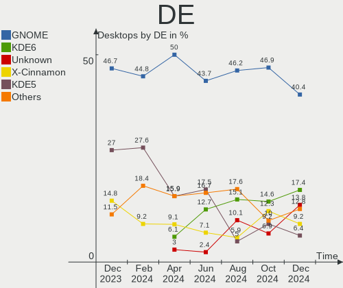
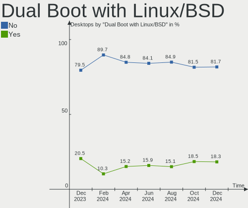
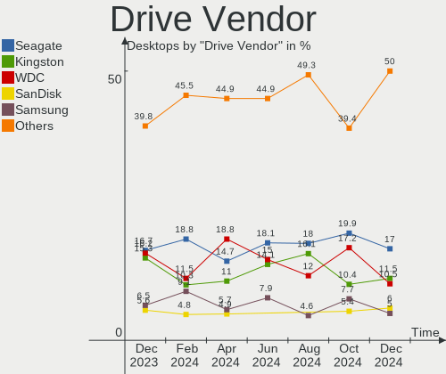
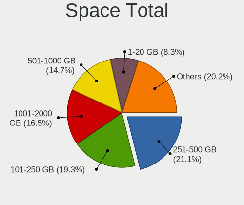
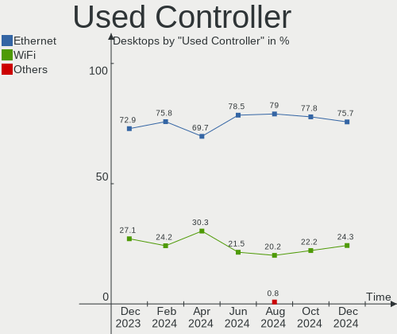
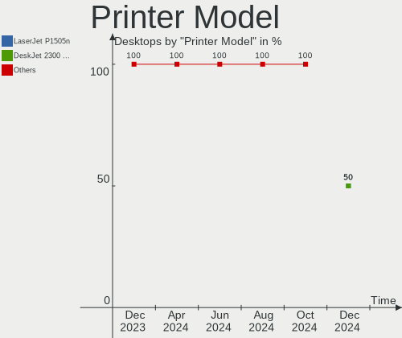
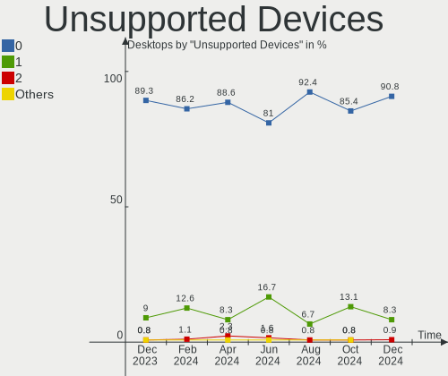

Linux in Brazil - Hardware Trends (Desktops)
--------------------------------------------

A project to identify most popular hardware characteristics and track their change
over time based on data collected by Linux users at https://Linux-Hardware.org.

Anyone can contribute to this report by the [hw-probe](https://github.com/linuxhw/hw-probe) tool:

    sudo -E hw-probe -all -upload

Period: Jan, 2024.

Contents
--------

* [ System ](#system)
  - [ OS                       ](#os)
  - [ OS Family                ](#os-family)
  - [ Kernel                   ](#kernel)
  - [ Kernel Family            ](#kernel-family)
  - [ Kernel Major Ver.        ](#kernel-major-ver)
  - [ Arch                     ](#arch)
  - [ DE                       ](#de)
  - [ Display Server           ](#display-server)
  - [ Display Manager          ](#display-manager)
  - [ OS Lang                  ](#os-lang)
  - [ Boot Mode                ](#boot-mode)
  - [ Filesystem               ](#filesystem)
  - [ Part. scheme             ](#part-scheme)
  - [ Dual Boot with Linux/BSD ](#dual-boot-with-linuxbsd)
  - [ Dual Boot (Win)          ](#dual-boot-win)

* [ Board ](#board)
  - [ Vendor                   ](#vendor)
  - [ Model                    ](#model)
  - [ Model Family             ](#model-family)
  - [ MFG Year                 ](#mfg-year)
  - [ Form Factor              ](#form-factor)
  - [ Secure Boot              ](#secure-boot)
  - [ Coreboot                 ](#coreboot)
  - [ RAM Size                 ](#ram-size)
  - [ RAM Used                 ](#ram-used)
  - [ Total Drives             ](#total-drives)
  - [ Has CD-ROM               ](#has-cd-rom)
  - [ Has Ethernet             ](#has-ethernet)
  - [ Has WiFi                 ](#has-wifi)
  - [ Has Bluetooth            ](#has-bluetooth)

* [ Location ](#location)
  - [ Country                  ](#country)
  - [ City                     ](#city)

* [ Drives ](#drives)
  - [ Drive Vendor             ](#drive-vendor)
  - [ Drive Model              ](#drive-model)
  - [ HDD Vendor               ](#hdd-vendor)
  - [ SSD Vendor               ](#ssd-vendor)
  - [ Drive Kind               ](#drive-kind)
  - [ Drive Connector          ](#drive-connector)
  - [ Drive Size               ](#drive-size)
  - [ Space Total              ](#space-total)
  - [ Space Used               ](#space-used)
  - [ Malfunc. Drives          ](#malfunc-drives)
  - [ Malfunc. Drive Vendor    ](#malfunc-drive-vendor)
  - [ Malfunc. HDD Vendor      ](#malfunc-hdd-vendor)
  - [ Malfunc. Drive Kind      ](#malfunc-drive-kind)
  - [ Failed Drives            ](#failed-drives)
  - [ Failed Drive Vendor      ](#failed-drive-vendor)
  - [ Drive Status             ](#drive-status)

* [ Storage controller ](#storage-controller)
  - [ Storage Vendor           ](#storage-vendor)
  - [ Storage Model            ](#storage-model)
  - [ Storage Kind             ](#storage-kind)

* [ Processor ](#processor)
  - [ CPU Vendor               ](#cpu-vendor)
  - [ CPU Model                ](#cpu-model)
  - [ CPU Model Family         ](#cpu-model-family)
  - [ CPU Cores                ](#cpu-cores)
  - [ CPU Sockets              ](#cpu-sockets)
  - [ CPU Threads              ](#cpu-threads)
  - [ CPU Op-Modes             ](#cpu-op-modes)
  - [ CPU Microcode            ](#cpu-microcode)
  - [ CPU Microarch            ](#cpu-microarch)

* [ Graphics ](#graphics)
  - [ GPU Vendor               ](#gpu-vendor)
  - [ GPU Model                ](#gpu-model)
  - [ GPU Combo                ](#gpu-combo)
  - [ GPU Driver               ](#gpu-driver)
  - [ GPU Memory               ](#gpu-memory)

* [ Monitor ](#monitor)
  - [ Monitor Vendor           ](#monitor-vendor)
  - [ Monitor Model            ](#monitor-model)
  - [ Monitor Resolution       ](#monitor-resolution)
  - [ Monitor Diagonal         ](#monitor-diagonal)
  - [ Monitor Width            ](#monitor-width)
  - [ Aspect Ratio             ](#aspect-ratio)
  - [ Monitor Area             ](#monitor-area)
  - [ Pixel Density            ](#pixel-density)
  - [ Multiple Monitors        ](#multiple-monitors)

* [ Network ](#network)
  - [ Net Controller Vendor    ](#net-controller-vendor)
  - [ Net Controller Model     ](#net-controller-model)
  - [ Wireless Vendor          ](#wireless-vendor)
  - [ Wireless Model           ](#wireless-model)
  - [ Ethernet Vendor          ](#ethernet-vendor)
  - [ Ethernet Model           ](#ethernet-model)
  - [ Net Controller Kind      ](#net-controller-kind)
  - [ Used Controller          ](#used-controller)
  - [ NICs                     ](#nics)
  - [ IPv6                     ](#ipv6)

* [ Bluetooth ](#bluetooth)
  - [ Bluetooth Vendor         ](#bluetooth-vendor)
  - [ Bluetooth Model          ](#bluetooth-model)

* [ Sound ](#sound)
  - [ Sound Vendor             ](#sound-vendor)
  - [ Sound Model              ](#sound-model)

* [ Memory ](#memory)
  - [ Memory Vendor            ](#memory-vendor)
  - [ Memory Model             ](#memory-model)
  - [ Memory Kind              ](#memory-kind)
  - [ Memory Form Factor       ](#memory-form-factor)
  - [ Memory Size              ](#memory-size)
  - [ Memory Speed             ](#memory-speed)

* [ Printers & scanners ](#printers--scanners)
  - [ Printer Vendor           ](#printer-vendor)
  - [ Printer Model            ](#printer-model)
  - [ Scanner Vendor           ](#scanner-vendor)
  - [ Scanner Model            ](#scanner-model)

* [ Camera ](#camera)
  - [ Camera Vendor            ](#camera-vendor)
  - [ Camera Model             ](#camera-model)

* [ Security ](#security)
  - [ Fingerprint Vendor       ](#fingerprint-vendor)
  - [ Fingerprint Model        ](#fingerprint-model)
  - [ Chipcard Vendor          ](#chipcard-vendor)
  - [ Chipcard Model           ](#chipcard-model)

* [ Unsupported ](#unsupported)
  - [ Unsupported Devices      ](#unsupported-devices)
  - [ Unsupported Device Types ](#unsupported-device-types)

System
------

OS
--

Installed operating systems

| Name                         | Desktops | Percent |
|------------------------------|----------|---------|
| Ubuntu 22.04                 | 16       | 14.95%  |
| Zorin 17                     | 10       | 9.35%   |
| Fedora 39                    | 8        | 7.48%   |
| Debian 12                    | 7        | 6.54%   |
| Ubuntu 23.10                 | 5        | 4.67%   |
| Linux Mint 21.3              | 5        | 4.67%   |
| Pop!_OS 22.04                | 4        | 3.74%   |
| Linux Mint 21.2              | 4        | 3.74%   |
| Linux Mint 21.1              | 4        | 3.74%   |
| OpenMandriva 23.08           | 3        | 2.8%    |
| Arch Rolling                 | 3        | 2.8%    |
| Zorin 16                     | 2        | 1.87%   |
| LMDE 6                       | 2        | 1.87%   |
| KDE neon 22.04               | 2        | 1.87%   |
| Debian 11                    | 2        | 1.87%   |
| BigLinux                     | 2        | 1.87%   |
| ArcoLinux Rolling            | 2        | 1.87%   |
| Xubuntu 20.04                | 1        | 0.93%   |
| Xero Rolling                 | 1        | 0.93%   |
| Ubuntu MATE 22.04            | 1        | 0.93%   |
| Ubuntu 20.04                 | 1        | 0.93%   |
| SteamOS 1.1.2                | 1        | 0.93%   |
| Solus 4.5                    | 1        | 0.93%   |
| Slackware 14.1               | 1        | 0.93%   |
| ROSA 12.4                    | 1        | 0.93%   |
| openSUSE Tumbleweed-XXXXXXXX | 1        | 0.93%   |
| OpenMandriva 5.0             | 1        | 0.93%   |
| OpenMandriva 4.3             | 1        | 0.93%   |
| OpenMandriva 24.01           | 1        | 0.93%   |
| Nobara 39                    | 1        | 0.93%   |
| Nobara 38                    | 1        | 0.93%   |
| NixOS 23.11                  | 1        | 0.93%   |
| Manjaro 23.1.3               | 1        | 0.93%   |
| Manjaro 23.1.1               | 1        | 0.93%   |
| Mageia 9                     | 1        | 0.93%   |
| Lubuntu 22.04                | 1        | 0.93%   |
| Kubuntu 23.10                | 1        | 0.93%   |
| Kali 2023.4                  | 1        | 0.93%   |
| Gentoo 2.14                  | 1        | 0.93%   |
| Debian                       | 1        | 0.93%   |

OS Family
---------

OS without a version

| Name         | Desktops | Percent |
|--------------|----------|---------|
| Ubuntu       | 22       | 20.56%  |
| Linux Mint   | 13       | 12.15%  |
| Zorin        | 12       | 11.21%  |
| Debian       | 10       | 9.35%   |
| Fedora       | 8        | 7.48%   |
| OpenMandriva | 6        | 5.61%   |
| Pop!_OS      | 4        | 3.74%   |
| BigLinux     | 3        | 2.8%    |
| Arch         | 3        | 2.8%    |
| Nobara       | 2        | 1.87%   |
| Manjaro      | 2        | 1.87%   |
| LMDE         | 2        | 1.87%   |
| KDE neon     | 2        | 1.87%   |
| ArcoLinux    | 2        | 1.87%   |
| Xubuntu      | 1        | 0.93%   |
| Xero         | 1        | 0.93%   |
| Ubuntu MATE  | 1        | 0.93%   |
| SteamOS      | 1        | 0.93%   |
| Solus        | 1        | 0.93%   |
| Slackware    | 1        | 0.93%   |
| ROSA         | 1        | 0.93%   |
| openSUSE     | 1        | 0.93%   |
| NixOS        | 1        | 0.93%   |
| Mageia       | 1        | 0.93%   |
| Lubuntu      | 1        | 0.93%   |
| Kubuntu      | 1        | 0.93%   |
| Kali         | 1        | 0.93%   |
| Gentoo       | 1        | 0.93%   |
| Clear Linux  | 1        | 0.93%   |
| CachyOS      | 1        | 0.93%   |

Kernel
------

Version of the Linux kernel

| Version                           | Desktops | Percent |
|-----------------------------------|----------|---------|
| 6.5.0-14-generic                  | 20       | 18.69%  |
| 5.15.0-91-generic                 | 17       | 15.89%  |
| 6.1.0-17-amd64                    | 8        | 7.48%   |
| 6.5.0-15-generic                  | 6        | 5.61%   |
| 6.2.0-39-generic                  | 6        | 5.61%   |
| 6.6.9-200.fc39.x86_64             | 5        | 4.67%   |
| 6.6.6-76060606-generic            | 4        | 3.74%   |
| 6.4.11-desktop-1omv2390           | 3        | 2.8%    |
| 6.6.8-2-MANJARO                   | 2        | 1.87%   |
| 6.6.2-desktop-1omv2390            | 2        | 1.87%   |
| 5.10.0-27-amd64                   | 2        | 1.87%   |
| 6.7.1-zen1-1-zen                  | 1        | 0.93%   |
| 6.7.1-2-default                   | 1        | 0.93%   |
| 6.7.0-zen3-1-zen                  | 1        | 0.93%   |
| 6.7.0-3-cachyos-bore-lto          | 1        | 0.93%   |
| 6.6.9-amd64                       | 1        | 0.93%   |
| 6.6.8-200.fsync.fc39.x86_64       | 1        | 0.93%   |
| 6.6.8-200.fc39.x86_64             | 1        | 0.93%   |
| 6.6.13-201.fsync.fc39.x86_64      | 1        | 0.93%   |
| 6.6.13-200.fc39.x86_64            | 1        | 0.93%   |
| 6.6.12-271.current                | 1        | 0.93%   |
| 6.6.12-1400.native                | 1        | 0.93%   |
| 6.6.12-1-lts                      | 1        | 0.93%   |
| 6.6.11-x64v2-xanmod1-1            | 1        | 0.93%   |
| 6.6.10-1-MANJARO                  | 1        | 0.93%   |
| 6.6.1-arch1-1                     | 1        | 0.93%   |
| 6.5.9-arch2-1                     | 1        | 0.93%   |
| 6.5.13-desktop-6.mga9             | 1        | 0.93%   |
| 6.5.0-17-generic                  | 1        | 0.93%   |
| 6.4.10-202.fsync.fc38.x86_64      | 1        | 0.93%   |
| 6.3.7-zen1-1-zen                  | 1        | 0.93%   |
| 6.1.71-1-lts                      | 1        | 0.93%   |
| 6.1.67-gentoo-x86_64              | 1        | 0.93%   |
| 6.1.61                            | 1        | 0.93%   |
| 6.1.20-generic-2rosa2021.1-x86_64 | 1        | 0.93%   |
| 6.1.0-kali9-amd64                 | 1        | 0.93%   |
| 6.1.0-15-amd64                    | 1        | 0.93%   |
| 5.19.0-43-generic                 | 1        | 0.93%   |
| 5.16.7-desktop-1omv4003           | 1        | 0.93%   |
| 5.15.145-1-MANJARO                | 1        | 0.93%   |

Kernel Family
-------------

Linux kernel without a distro release

| Version  | Desktops | Percent |
|----------|----------|---------|
| 6.5.0    | 27       | 25.23%  |
| 5.15.0   | 19       | 17.76%  |
| 6.1.0    | 10       | 9.35%   |
| 6.6.9    | 6        | 5.61%   |
| 6.2.0    | 6        | 5.61%   |
| 6.6.8    | 4        | 3.74%   |
| 6.6.6    | 4        | 3.74%   |
| 6.6.12   | 3        | 2.8%    |
| 6.4.11   | 3        | 2.8%    |
| 6.7.1    | 2        | 1.87%   |
| 6.7.0    | 2        | 1.87%   |
| 6.6.2    | 2        | 1.87%   |
| 6.6.13   | 2        | 1.87%   |
| 5.10.0   | 2        | 1.87%   |
| 6.6.11   | 1        | 0.93%   |
| 6.6.10   | 1        | 0.93%   |
| 6.6.1    | 1        | 0.93%   |
| 6.5.9    | 1        | 0.93%   |
| 6.5.13   | 1        | 0.93%   |
| 6.4.10   | 1        | 0.93%   |
| 6.3.7    | 1        | 0.93%   |
| 6.1.71   | 1        | 0.93%   |
| 6.1.67   | 1        | 0.93%   |
| 6.1.61   | 1        | 0.93%   |
| 6.1.20   | 1        | 0.93%   |
| 5.19.0   | 1        | 0.93%   |
| 5.16.7   | 1        | 0.93%   |
| 5.15.145 | 1        | 0.93%   |
| 3.10.17  | 1        | 0.93%   |

Kernel Major Ver.
-----------------

Linux kernel major version

| Version | Desktops | Percent |
|---------|----------|---------|
| 6.5     | 29       | 27.1%   |
| 6.6     | 24       | 22.43%  |
| 5.15    | 20       | 18.69%  |
| 6.1     | 14       | 13.08%  |
| 6.2     | 6        | 5.61%   |
| 6.7     | 4        | 3.74%   |
| 6.4     | 4        | 3.74%   |
| 5.10    | 2        | 1.87%   |
| 6.3     | 1        | 0.93%   |
| 5.19    | 1        | 0.93%   |
| 5.16    | 1        | 0.93%   |
| 3.10    | 1        | 0.93%   |

Arch
----

OS architecture (x86_64, i586, etc.)

| Name   | Desktops | Percent |
|--------|----------|---------|
| x86_64 | 107      | 100%    |

DE
--

Desktop Environment

| Name            | Desktops | Percent |
|-----------------|----------|---------|
| GNOME           | 53       | 49.53%  |
| KDE5            | 21       | 19.63%  |
| X-Cinnamon      | 15       | 14.02%  |
| XFCE            | 5        | 4.67%   |
| Unknown         | 5        | 4.67%   |
| MATE            | 2        | 1.87%   |
| LXQt            | 2        | 1.87%   |
| WindowMaker     | 1        | 0.93%   |
| sway            | 1        | 0.93%   |
| GNOME Flashback | 1        | 0.93%   |
| Budgie          | 1        | 0.93%   |

Display Server
--------------

X11 or Wayland

| Name    | Desktops | Percent |
|---------|----------|---------|
| X11     | 63       | 58.88%  |
| Wayland | 39       | 36.45%  |
| Unknown | 5        | 4.67%   |

Display Manager
---------------

SDDM, LightDM, etc.

| Name    | Desktops | Percent |
|---------|----------|---------|
| Unknown | 60       | 56.07%  |
| SDDM    | 18       | 16.82%  |
| GDM3    | 18       | 16.82%  |
| LightDM | 6        | 5.61%   |
| GDM     | 5        | 4.67%   |

OS Lang
-------

Language

| Lang    | Desktops | Percent |
|---------|----------|---------|
| pt_BR   | 75       | 70.09%  |
| en_US   | 27       | 25.23%  |
| C       | 3        | 2.8%    |
| en_GB   | 1        | 0.93%   |
| Unknown | 1        | 0.93%   |

Boot Mode
---------

EFI or BIOS

| Mode | Desktops | Percent |
|------|----------|---------|
| BIOS | 70       | 65.42%  |
| EFI  | 37       | 34.58%  |

Filesystem
----------

Type of filesystem

| Type     | Desktops | Percent |
|----------|----------|---------|
| Ext4     | 66       | 61.68%  |
| Btrfs    | 17       | 15.89%  |
| Tmpfs    | 14       | 13.08%  |
| Overlay  | 6        | 5.61%   |
| Zfs      | 2        | 1.87%   |
| Reiserfs | 1        | 0.93%   |
| Ext2     | 1        | 0.93%   |

Part. scheme
------------

Scheme of partitioning

| Type    | Desktops | Percent |
|---------|----------|---------|
| Unknown | 55       | 51.4%   |
| GPT     | 43       | 40.19%  |
| MBR     | 9        | 8.41%   |

Dual Boot with Linux/BSD
------------------------

Hosting more than one Linux/BSD

| Dual boot | Desktops | Percent |
|-----------|----------|---------|
| No        | 89       | 83.18%  |
| Yes       | 18       | 16.82%  |

Dual Boot (Win)
---------------

Hosting Linux and Windows

| Dual boot | Desktops | Percent |
|-----------|----------|---------|
| No        | 85       | 79.44%  |
| Yes       | 22       | 20.56%  |

Board
-----

Vendor
------

Motherboard manufacturer

| Name                | Desktops | Percent |
|---------------------|----------|---------|
| Gigabyte Technology | 24       | 22.43%  |
| ASUSTek Computer    | 19       | 17.76%  |
| Intel               | 18       | 16.82%  |
| Dell                | 8        | 7.48%   |
| MSI                 | 7        | 6.54%   |
| ASRock              | 6        | 5.61%   |
| Biostar             | 5        | 4.67%   |
| Hewlett-Packard     | 4        | 3.74%   |
| Positivo            | 2        | 1.87%   |
| Pegatron            | 2        | 1.87%   |
| MACHINIST           | 2        | 1.87%   |
| Unknown             | 2        | 1.87%   |
| QIYIDA              | 1        | 0.93%   |
| PCWare              | 1        | 0.93%   |
| Megaware            | 1        | 0.93%   |
| Itautec             | 1        | 0.93%   |
| HC                  | 1        | 0.93%   |
| Digiboard           | 1        | 0.93%   |
| AMD                 | 1        | 0.93%   |
| ALDO                | 1        | 0.93%   |

Model
-----

Motherboard model

| Name                              | Desktops | Percent |
|-----------------------------------|----------|---------|
| Intel B75                         | 6        | 5.61%   |
| ASUS All Series                   | 3        | 2.8%    |
| Intel H81                         | 2        | 1.87%   |
| Intel H61                         | 2        | 1.87%   |
| Gigabyte H110M-H                  | 2        | 1.87%   |
| Gigabyte GA-78LMT-S2P             | 2        | 1.87%   |
| Gigabyte B550M AORUS ELITE        | 2        | 1.87%   |
| Gigabyte B450 AORUS M             | 2        | 1.87%   |
| Biostar A320MH                    | 2        | 1.87%   |
| ASUS PRIME H410M-E                | 2        | 1.87%   |
| ASUS PRIME B450M-GAMING/BR        | 2        | 1.87%   |
| Unknown                           | 2        | 1.87%   |
| QIYIDA ED4 V1.1                   | 1        | 0.93%   |
| Positivo POS-EINM10CB             | 1        | 0.93%   |
| Positivo POS-EIBTPDC              | 1        | 0.93%   |
| Pegatron IPMIP-GS                 | 1        | 0.93%   |
| Pegatron IPMH61P1                 | 1        | 0.93%   |
| PCWare IPMH510E                   | 1        | 0.93%   |
| MSI MS-7D22                       | 1        | 0.93%   |
| MSI MS-7C96                       | 1        | 0.93%   |
| MSI MS-7C51                       | 1        | 0.93%   |
| MSI MS-7A38                       | 1        | 0.93%   |
| MSI MS-7693                       | 1        | 0.93%   |
| MSI MS-7636                       | 1        | 0.93%   |
| MSI MS-7592                       | 1        | 0.93%   |
| Megaware H55H-CM                  | 1        | 0.93%   |
| MACHINIST X99 PR9                 | 1        | 0.93%   |
| MACHINIST X79 Z9-D7 PRO V1.0      | 1        | 0.93%   |
| Itautec Infoway                   | 1        | 0.93%   |
| Intel X99 V1.0                    | 1        | 0.93%   |
| Intel X99                         | 1        | 0.93%   |
| Intel Jasper Lake Client Platform | 1        | 0.93%   |
| Intel H110                        | 1        | 0.93%   |
| Intel DX58SO AAE29331-503         | 1        | 0.93%   |
| Intel DH55TC AAG26116-302         | 1        | 0.93%   |
| Intel D945GCPE AAD97209-201       | 1        | 0.93%   |
| Intel 35901                       | 1        | 0.93%   |
| HP Z420 Workstation               | 1        | 0.93%   |
| HP ProLiant ML110 Gen9            | 1        | 0.93%   |
| HP Compaq 6000 Pro MT PC          | 1        | 0.93%   |

Model Family
------------

Motherboard model prefix

| Name                  | Desktops | Percent |
|-----------------------|----------|---------|
| ASUS PRIME            | 10       | 9.35%   |
| Intel B75             | 6        | 5.61%   |
| Gigabyte B450M        | 3        | 2.8%    |
| ASUS ROG              | 3        | 2.8%    |
| ASUS All              | 3        | 2.8%    |
| Intel X99             | 2        | 1.87%   |
| Intel H81             | 2        | 1.87%   |
| Intel H61             | 2        | 1.87%   |
| Gigabyte H110M-H      | 2        | 1.87%   |
| Gigabyte GA-78LMT-S2P | 2        | 1.87%   |
| Gigabyte B550M        | 2        | 1.87%   |
| Gigabyte B450         | 2        | 1.87%   |
| Dell XPS              | 2        | 1.87%   |
| Dell OptiPlex         | 2        | 1.87%   |
| Dell Inspiron         | 2        | 1.87%   |
| Biostar A320MH        | 2        | 1.87%   |
| ASRock A320M-HD       | 2        | 1.87%   |
| Unknown               | 2        | 1.87%   |
| QIYIDA ED4            | 1        | 0.93%   |
| Positivo POS-EINM10CB | 1        | 0.93%   |
| Positivo POS-EIBTPDC  | 1        | 0.93%   |
| Pegatron IPMIP-GS     | 1        | 0.93%   |
| Pegatron IPMH61P1     | 1        | 0.93%   |
| PCWare IPMH510E       | 1        | 0.93%   |
| MSI MS-7D22           | 1        | 0.93%   |
| MSI MS-7C96           | 1        | 0.93%   |
| MSI MS-7C51           | 1        | 0.93%   |
| MSI MS-7A38           | 1        | 0.93%   |
| MSI MS-7693           | 1        | 0.93%   |
| MSI MS-7636           | 1        | 0.93%   |
| MSI MS-7592           | 1        | 0.93%   |
| Megaware H55H-CM      | 1        | 0.93%   |
| MACHINIST X99         | 1        | 0.93%   |
| MACHINIST X79         | 1        | 0.93%   |
| Itautec Infoway       | 1        | 0.93%   |
| Intel Jasper          | 1        | 0.93%   |
| Intel H110            | 1        | 0.93%   |
| Intel DX58SO          | 1        | 0.93%   |
| Intel DH55TC          | 1        | 0.93%   |
| Intel D945GCPE        | 1        | 0.93%   |

MFG Year
--------

Motherboard manufacture year

| Year | Desktops | Percent |
|------|----------|---------|
| 2018 | 22       | 20.56%  |
| 2020 | 11       | 10.28%  |
| 2019 | 9        | 8.41%   |
| 2017 | 9        | 8.41%   |
| 2014 | 8        | 7.48%   |
| 2021 | 7        | 6.54%   |
| 2022 | 6        | 5.61%   |
| 2016 | 5        | 4.67%   |
| 2013 | 5        | 4.67%   |
| 2012 | 5        | 4.67%   |
| 2011 | 5        | 4.67%   |
| 2010 | 5        | 4.67%   |
| 2009 | 5        | 4.67%   |
| 2023 | 3        | 2.8%    |
| 2015 | 1        | 0.93%   |
| 2007 | 1        | 0.93%   |

Form Factor
-----------

Physical design of the computer

| Name    | Desktops | Percent |
|---------|----------|---------|
| Desktop | 107      | 100%    |

Secure Boot
-----------

Enabled or disabled

| State    | Desktops | Percent |
|----------|----------|---------|
| Disabled | 104      | 97.2%   |
| Enabled  | 3        | 2.8%    |

Coreboot
--------

Have coreboot on board

| Used | Desktops | Percent |
|------|----------|---------|
| No   | 107      | 100%    |

RAM Size
--------

Total RAM memory

| Size in GB  | Desktops | Percent |
|-------------|----------|---------|
| 16.01-24.0  | 40       | 37.38%  |
| 4.01-8.0    | 19       | 17.76%  |
| 32.01-64.0  | 15       | 14.02%  |
| 3.01-4.0    | 11       | 10.28%  |
| 8.01-16.0   | 10       | 9.35%   |
| 24.01-32.0  | 4        | 3.74%   |
| 1.01-2.0    | 4        | 3.74%   |
| 64.01-256.0 | 3        | 2.8%    |
| 2.01-3.0    | 1        | 0.93%   |

RAM Used
--------

Used RAM memory

| Used GB   | Desktops | Percent |
|-----------|----------|---------|
| 2.01-3.0  | 28       | 26.17%  |
| 1.01-2.0  | 27       | 25.23%  |
| 3.01-4.0  | 22       | 20.56%  |
| 4.01-8.0  | 20       | 18.69%  |
| 8.01-16.0 | 5        | 4.67%   |
| 0.51-1.0  | 4        | 3.74%   |
| Unknown   | 1        | 0.93%   |

Total Drives
------------

Number of drives on board

| Drives | Desktops | Percent |
|--------|----------|---------|
| 1      | 47       | 43.93%  |
| 2      | 29       | 27.1%   |
| 3      | 22       | 20.56%  |
| 4      | 7        | 6.54%   |
| 8      | 1        | 0.93%   |
| 6      | 1        | 0.93%   |

Has CD-ROM
----------

Has CD-ROM on board

| Presented | Desktops | Percent |
|-----------|----------|---------|
| No        | 76       | 71.03%  |
| Yes       | 31       | 28.97%  |

Has Ethernet
------------

Has Ethernet on board

| Presented | Desktops | Percent |
|-----------|----------|---------|
| Yes       | 107      | 100%    |

Has WiFi
--------

Has WiFi module

| Presented | Desktops | Percent |
|-----------|----------|---------|
| No        | 62       | 57.94%  |
| Yes       | 45       | 42.06%  |

Has Bluetooth
-------------

Has Bluetooth module

| Presented | Desktops | Percent |
|-----------|----------|---------|
| No        | 73       | 68.22%  |
| Yes       | 34       | 31.78%  |

Location
--------

Country
-------

Geographic location (country)

| Country | Desktops | Percent |
|---------|----------|---------|
| Brazil  | 107      | 100%    |

City
----

Geographic location (city)

| City                 | Desktops | Percent |
|----------------------|----------|---------|
| Sao Paulo            | 11       | 10.28%  |
| Rio de Janeiro       | 9        | 8.41%   |
| Campinas             | 4        | 3.74%   |
| Brasília            | 4        | 3.74%   |
| Curitiba             | 3        | 2.8%    |
| Sorocaba             | 2        | 1.87%   |
| Sao Goncalo          | 2        | 1.87%   |
| Santos               | 2        | 1.87%   |
| Santo André         | 2        | 1.87%   |
| Recife               | 2        | 1.87%   |
| Paulinia             | 2        | 1.87%   |
| Manaus               | 2        | 1.87%   |
| Londrina             | 2        | 1.87%   |
| Juiz de Fora         | 2        | 1.87%   |
| Juazeiro do Norte    | 2        | 1.87%   |
| Jaraguá do Sul      | 2        | 1.87%   |
| Guarulhos            | 2        | 1.87%   |
| Goiânia             | 2        | 1.87%   |
| Belém               | 2        | 1.87%   |
| Ananindeua           | 2        | 1.87%   |
| Vila Velha           | 1        | 0.93%   |
| Uberlândia          | 1        | 0.93%   |
| Tupa                 | 1        | 0.93%   |
| Timon                | 1        | 0.93%   |
| Tiangua              | 1        | 0.93%   |
| Sobral               | 1        | 0.93%   |
| Sao José dos Campos | 1        | 0.93%   |
| Santa Luzia          | 1        | 0.93%   |
| Rio Grande           | 1        | 0.93%   |
| Rio do Sul           | 1        | 0.93%   |
| Rio Claro            | 1        | 0.93%   |
| Queimados            | 1        | 0.93%   |
| Porto Velho          | 1        | 0.93%   |
| Ponta Grossa         | 1        | 0.93%   |
| Petrópolis          | 1        | 0.93%   |
| Pelotas              | 1        | 0.93%   |
| Passo Fundo          | 1        | 0.93%   |
| Palmas               | 1        | 0.93%   |
| Osasco               | 1        | 0.93%   |
| Nova Iguaçu         | 1        | 0.93%   |

Drives
------

Drive Vendor
------------

Hard drive vendors

| Vendor                      | Desktops | Drives | Percent |
|-----------------------------|----------|--------|---------|
| Seagate                     | 34       | 40     | 17.53%  |
| WDC                         | 29       | 31     | 14.95%  |
| Kingston                    | 23       | 28     | 11.86%  |
| Samsung Electronics         | 13       | 14     | 6.7%    |
| China                       | 10       | 10     | 5.15%   |
| Silicon Motion              | 9        | 9      | 4.64%   |
| Crucial                     | 9        | 9      | 4.64%   |
| Toshiba                     | 6        | 6      | 3.09%   |
| SanDisk                     | 6        | 6      | 3.09%   |
| Kingston Technology Company | 5        | 5      | 2.58%   |
| XrayDisk                    | 4        | 4      | 2.06%   |
| Realtek Semiconductor       | 4        | 4      | 2.06%   |
| ADATA Technology            | 4        | 4      | 2.06%   |
| Phison Electronics          | 3        | 4      | 1.55%   |
| MAXIO Technology (Hangzhou) | 3        | 4      | 1.55%   |
| Lexar                       | 3        | 3      | 1.55%   |
| Hitachi                     | 3        | 4      | 1.55%   |
| Team                        | 2        | 2      | 1.03%   |
| SK hynix                    | 2        | 2      | 1.03%   |
| KingSpec                    | 2        | 2      | 1.03%   |
| A-DATA Technology           | 2        | 2      | 1.03%   |
| USB3.0                      | 1        | 1      | 0.52%   |
| SSSTC                       | 1        | 1      | 0.52%   |
| PNY                         | 1        | 1      | 0.52%   |
| Patriot                     | 1        | 1      | 0.52%   |
| NETAPP                      | 1        | 3      | 0.52%   |
| Micron/Crucial Technology   | 1        | 1      | 0.52%   |
| Maxtor                      | 1        | 1      | 0.52%   |
| MAXIO                       | 1        | 1      | 0.52%   |
| LITEON                      | 1        | 1      | 0.52%   |
| Lite-On Technology          | 1        | 1      | 0.52%   |
| KINGBANK                    | 1        | 1      | 0.52%   |
| Intel                       | 1        | 1      | 0.52%   |
| HUSKY                       | 1        | 1      | 0.52%   |
| HPE                         | 1        | 1      | 0.52%   |
| Hewlett-Packard             | 1        | 1      | 0.52%   |
| Gigabyte Technology         | 1        | 1      | 0.52%   |
| Bestoss                     | 1        | 1      | 0.52%   |
| Unknown                     | 1        | 1      | 0.52%   |

Drive Model
-----------

Hard drive models

| Model                                                 | Desktops | Percent |
|-------------------------------------------------------|----------|---------|
| Kingston SA400S37480G 480GB SSD                       | 9        | 4.33%   |
| Kingston SA400S37240G 240GB SSD                       | 8        | 3.85%   |
| Silicon Motion SM2263EN/SM2263XT SSD Controller 128GB | 7        | 3.37%   |
| Seagate ST1000DM003-1ER162 1TB                        | 5        | 2.4%    |
| Seagate ST1000DM010-2EP102 1TB                        | 4        | 1.92%   |
| Samsung HD322HJ 320GB                                 | 4        | 1.92%   |
| WDC WDS240G2G0A-00JH30 240GB SSD                      | 3        | 1.44%   |
| Seagate ST500LM012 HN-M500MBB 500GB                   | 3        | 1.44%   |
| MAXIO (Hangzhou) NVMe SSD Controller MAP1202 512GB    | 3        | 1.44%   |
| Kingston Company SNV2S1000G 1TB                       | 3        | 1.44%   |
| Kingston SV300S37A120G 120GB SSD                      | 3        | 1.44%   |
| XrayDisk 1TB SSD                                      | 2        | 0.96%   |
| WDC WD5000AAKX-00U6AA0 500GB                          | 2        | 0.96%   |
| Toshiba HDWD110 1TB                                   | 2        | 0.96%   |
| Seagate ST500DM002-1BD142 500GB                       | 2        | 0.96%   |
| Seagate ST3500418AS 500GB                             | 2        | 0.96%   |
| Seagate ST3500312CS 500GB                             | 2        | 0.96%   |
| Seagate ST32000644NS 2TB                              | 2        | 0.96%   |
| Seagate ST1000DM003-1CH162 1TB                        | 2        | 0.96%   |
| Sandisk WDC WDS480G2G0C-00AJM0 480GB                  | 2        | 0.96%   |
| Realtek RTS5763DL NVMe SSD Controller 2TB             | 2        | 0.96%   |
| Lexar 128GB SSD                                       | 2        | 0.96%   |
| Kingston SNV2S500G 500GB                              | 2        | 0.96%   |
| Kingston SA400S37960G 960GB SSD                       | 2        | 0.96%   |
| Kingston SA400S37120G 120GB SSD                       | 2        | 0.96%   |
| Crucial CT500BX500SSD1 500GB                          | 2        | 0.96%   |
| Crucial CT480BX500SSD1 480GB                          | 2        | 0.96%   |
| Crucial CT240BX500SSD1 240GB                          | 2        | 0.96%   |
| China SSD 128GB                                       | 2        | 0.96%   |
| ADATA XPG GAMMIX S70 BLADE 1024GB                     | 2        | 0.96%   |
| XrayDisk 480GB                                        | 1        | 0.48%   |
| XrayDisk 256GB                                        | 1        | 0.48%   |
| WDC WDS480G2G0A-00JH30 480GB SSD                      | 1        | 0.48%   |
| WDC WDS250G2B0C-00PXH0 250GB                          | 1        | 0.48%   |
| WDC WDS250G1B0A-00H9H0 250GB SSD                      | 1        | 0.48%   |
| WDC WDS120G2G0A-00JH30 120GB SSD                      | 1        | 0.48%   |
| WDC WD5000LPVX-80V0TT0 500GB                          | 1        | 0.48%   |
| WDC WD5000LPVX-22V0TT0 500GB                          | 1        | 0.48%   |
| WDC WD5000LPCX-60VHAT0 500GB                          | 1        | 0.48%   |
| WDC WD5000LPCX-24C6HT0 500GB                          | 1        | 0.48%   |

HDD Vendor
----------

Hard disk drive vendors

| Vendor              | Desktops | Drives | Percent |
|---------------------|----------|--------|---------|
| Seagate             | 34       | 40     | 43.59%  |
| WDC                 | 22       | 24     | 28.21%  |
| Samsung Electronics | 9        | 10     | 11.54%  |
| Toshiba             | 6        | 6      | 7.69%   |
| Hitachi             | 3        | 4      | 3.85%   |
| NETAPP              | 1        | 3      | 1.28%   |
| Maxtor              | 1        | 1      | 1.28%   |
| HPE                 | 1        | 1      | 1.28%   |
| Hewlett-Packard     | 1        | 1      | 1.28%   |

SSD Vendor
----------

Solid state drive vendors

| Vendor              | Desktops | Drives | Percent |
|---------------------|----------|--------|---------|
| Kingston            | 21       | 25     | 30.43%  |
| China               | 10       | 10     | 14.49%  |
| Crucial             | 9        | 9      | 13.04%  |
| WDC                 | 6        | 6      | 8.7%    |
| SanDisk             | 3        | 3      | 4.35%   |
| Samsung Electronics | 3        | 3      | 4.35%   |
| Lexar               | 3        | 3      | 4.35%   |
| Team                | 2        | 2      | 2.9%    |
| KingSpec            | 2        | 2      | 2.9%    |
| XrayDisk            | 1        | 1      | 1.45%   |
| USB3.0              | 1        | 1      | 1.45%   |
| PNY                 | 1        | 1      | 1.45%   |
| Patriot             | 1        | 1      | 1.45%   |
| MAXIO               | 1        | 1      | 1.45%   |
| LITEON              | 1        | 1      | 1.45%   |
| KINGBANK            | 1        | 1      | 1.45%   |
| HUSKY               | 1        | 1      | 1.45%   |
| Gigabyte Technology | 1        | 1      | 1.45%   |
| A-DATA Technology   | 1        | 1      | 1.45%   |

Drive Kind
----------

HDD or SSD

| Kind    | Desktops | Drives | Percent |
|---------|----------|--------|---------|
| HDD     | 67       | 90     | 40.12%  |
| SSD     | 56       | 73     | 33.53%  |
| NVMe    | 40       | 46     | 23.95%  |
| Unknown | 4        | 4      | 2.4%    |

Drive Connector
---------------

SATA, SAS, NVMe, etc.

| Type | Desktops | Drives | Percent |
|------|----------|--------|---------|
| SATA | 95       | 164    | 68.84%  |
| NVMe | 40       | 46     | 28.99%  |
| SAS  | 3        | 3      | 2.17%   |

Drive Size
----------

Size of hard drive

| Size in TB | Desktops | Drives | Percent |
|------------|----------|--------|---------|
| 0.01-0.5   | 76       | 104    | 61.79%  |
| 0.51-1.0   | 35       | 43     | 28.46%  |
| 1.01-2.0   | 8        | 8      | 6.5%    |
| 3.01-4.0   | 2        | 6      | 1.63%   |
| 4.01-10.0  | 2        | 2      | 1.63%   |

Space Total
-----------

Amount of disk space available on the file system

| Size in GB     | Desktops | Percent |
|----------------|----------|---------|
| 101-250        | 25       | 23.36%  |
| 251-500        | 24       | 22.43%  |
| 501-1000       | 20       | 18.69%  |
| 1001-2000      | 9        | 8.41%   |
| 51-100         | 8        | 7.48%   |
| 1-20           | 7        | 6.54%   |
| More than 3000 | 4        | 3.74%   |
| 2001-3000      | 4        | 3.74%   |
| Unknown        | 4        | 3.74%   |
| 21-50          | 2        | 1.87%   |

Space Used
----------

Amount of used disk space

| Used GB   | Desktops | Percent |
|-----------|----------|---------|
| 1-20      | 27       | 25.23%  |
| 21-50     | 19       | 17.76%  |
| 101-250   | 19       | 17.76%  |
| 51-100    | 13       | 12.15%  |
| 501-1000  | 11       | 10.28%  |
| 251-500   | 9        | 8.41%   |
| Unknown   | 4        | 3.74%   |
| 2001-3000 | 3        | 2.8%    |
| 1001-2000 | 2        | 1.87%   |

Malfunc. Drives
---------------

Drive models with a malfunction

| Model                               | Desktops | Drives | Percent |
|-------------------------------------|----------|--------|---------|
| WDC WD5000LPVX-80V0TT0 500GB        | 1        | 1      | 9.09%   |
| WDC WD3200AAKS-75L9A0 320GB         | 1        | 1      | 9.09%   |
| WDC WD3200AAJS-56M0A0 320GB         | 1        | 1      | 9.09%   |
| Seagate ST9320325AS 320GB           | 1        | 1      | 9.09%   |
| Seagate ST500LM012 HN-M500MBB 500GB | 1        | 2      | 9.09%   |
| Seagate ST3500418AS 500GB           | 1        | 1      | 9.09%   |
| Seagate ST3500312CS 500GB           | 1        | 1      | 9.09%   |
| Seagate ST1000LM024 HN-M101MBB 1TB  | 1        | 1      | 9.09%   |
| Samsung Electronics HD322HJ 320GB   | 1        | 1      | 9.09%   |
| Kingston SV300S37A240G 240GB SSD    | 1        | 1      | 9.09%   |
| China SSD 120GB                     | 1        | 1      | 9.09%   |

Malfunc. Drive Vendor
---------------------

Vendors of faulty drives

| Vendor              | Desktops | Drives | Percent |
|---------------------|----------|--------|---------|
| Seagate             | 4        | 6      | 40%     |
| WDC                 | 3        | 3      | 30%     |
| Samsung Electronics | 1        | 1      | 10%     |
| Kingston            | 1        | 1      | 10%     |
| China               | 1        | 1      | 10%     |

Malfunc. HDD Vendor
-------------------

Vendors of faulty HDD drives

| Vendor              | Desktops | Drives | Percent |
|---------------------|----------|--------|---------|
| Seagate             | 4        | 6      | 50%     |
| WDC                 | 3        | 3      | 37.5%   |
| Samsung Electronics | 1        | 1      | 12.5%   |

Malfunc. Drive Kind
-------------------

Kinds of faulty drives

| Kind | Desktops | Drives | Percent |
|------|----------|--------|---------|
| HDD  | 6        | 10     | 75%     |
| SSD  | 2        | 2      | 25%     |

Failed Drives
-------------

Failed drive models

Zero info for selected period =(

Failed Drive Vendor
-------------------

Failed drive vendors

Zero info for selected period =(

Drive Status
------------

Number of failed and malfunc. drives

| Status   | Desktops | Drives | Percent |
|----------|----------|--------|---------|
| Detected | 70       | 137    | 61.95%  |
| Works    | 35       | 64     | 30.97%  |
| Malfunc  | 8        | 12     | 7.08%   |

Storage controller
------------------

Storage Vendor
--------------

Storage controller vendors

| Vendor                         | Desktops | Percent |
|--------------------------------|----------|---------|
| Intel                          | 68       | 43.59%  |
| AMD                            | 37       | 23.72%  |
| Silicon Motion                 | 9        | 5.77%   |
| Kingston Technology Company    | 8        | 5.13%   |
| ADATA Technology               | 5        | 3.21%   |
| Realtek Semiconductor          | 4        | 2.56%   |
| MAXIO Technology (Hangzhou)    | 4        | 2.56%   |
| SanDisk                        | 3        | 1.92%   |
| Phison Electronics             | 3        | 1.92%   |
| SK hynix                       | 2        | 1.28%   |
| Nvidia                         | 2        | 1.28%   |
| Marvell Technology Group       | 2        | 1.28%   |
| JMicron Technology             | 2        | 1.28%   |
| Solid State Storage Technology | 1        | 0.64%   |
| Samsung Electronics            | 1        | 0.64%   |
| Micron/Crucial Technology      | 1        | 0.64%   |
| LSI Logic / Symbios Logic      | 1        | 0.64%   |
| Lite-On Technology             | 1        | 0.64%   |
| Hewlett-Packard                | 1        | 0.64%   |
| ASMedia Technology             | 1        | 0.64%   |

Storage Model
-------------

Storage controller models

| Model                                                                          | Desktops | Percent |
|--------------------------------------------------------------------------------|----------|---------|
| AMD FCH SATA Controller [AHCI mode]                                            | 19       | 9.79%   |
| Intel 8 Series/C220 Series Chipset Family 6-port SATA Controller 1 [AHCI mode] | 11       | 5.67%   |
| AMD 400 Series Chipset SATA Controller                                         | 10       | 5.15%   |
| Silicon Motion SM2263EN/SM2263XT (DRAM-less) NVMe SSD Controllers              | 9        | 4.64%   |
| Intel 7 Series/C210 Series Chipset Family 6-port SATA Controller [AHCI mode]   | 9        | 4.64%   |
| AMD 500 Series Chipset SATA Controller                                         | 8        | 4.12%   |
| AMD FCH SATA Controller D                                                      | 7        | 3.61%   |
| Kingston Company NV2 NVMe SSD SM2267XT (DRAM-less)                             | 5        | 2.58%   |
| Intel NM10/ICH7 Family SATA Controller [IDE mode]                              | 5        | 2.58%   |
| Intel 500 Series Chipset Family SATA AHCI Controller                           | 5        | 2.58%   |
| MAXIO (Hangzhou) NVMe SSD Controller MAP1202 (DRAM-less)                       | 4        | 2.06%   |
| Intel Q170/Q150/B150/H170/H110/Z170/CM236 Chipset SATA Controller [AHCI Mode]  | 4        | 2.06%   |
| Intel 82801G (ICH7 Family) IDE Controller                                      | 4        | 2.06%   |
| Intel 6 Series/C200 Series Chipset Family 6 port Desktop SATA AHCI Controller  | 4        | 2.06%   |
| Intel 5 Series/3400 Series Chipset 4 port SATA IDE Controller                  | 4        | 2.06%   |
| Intel 5 Series/3400 Series Chipset 2 port SATA IDE Controller                  | 4        | 2.06%   |
| AMD SB7x0/SB8x0/SB9x0 SATA Controller [IDE mode]                               | 4        | 2.06%   |
| AMD SB7x0/SB8x0/SB9x0 IDE Controller                                           | 4        | 2.06%   |
| Kingston Company NV2 NVMe SSD E21T (DRAM-less)                                 | 3        | 1.55%   |
| Intel Cannon Lake PCH SATA AHCI Controller                                     | 3        | 1.55%   |
| Intel 9 Series Chipset Family SATA Controller [AHCI Mode]                      | 3        | 1.55%   |
| Intel 400 Series Chipset Family SATA AHCI Controller                           | 3        | 1.55%   |
| SanDisk WD Green SN350 240GB (DRAM-less) / SN560E NVMe SSD                     | 2        | 1.03%   |
| Realtek RTS5765DL NVMe SSD Controller (DRAM-less)                              | 2        | 1.03%   |
| Realtek RTS5762 NVMe SSD Controller                                            | 2        | 1.03%   |
| Nvidia MCP61 SATA Controller                                                   | 2        | 1.03%   |
| Nvidia MCP61 IDE                                                               | 2        | 1.03%   |
| JMicron JMB368 IDE controller                                                  | 2        | 1.03%   |
| Intel SATA Controller [RAID Mode]                                              | 2        | 1.03%   |
| Intel C600/X79 series chipset 6-Port SATA AHCI Controller                      | 2        | 1.03%   |
| Intel 5 Series/3400 Series Chipset 6 port SATA AHCI Controller                 | 2        | 1.03%   |
| Intel 200 Series PCH SATA controller [AHCI mode]                               | 2        | 1.03%   |
| AMD 300 Series Chipset SATA Controller                                         | 2        | 1.03%   |
| ADATA GAMMIX S70 BLADE, PS5 PREMIUM NVMe SSD                                   | 2        | 1.03%   |
| Solid State Storage CL1-3D256-Q11 NVMe SSD M.2                                 | 1        | 0.52%   |
| SK hynix BC511 NVMe SSD                                                        | 1        | 0.52%   |
| SK hynix BC501 NVMe Solid State Drive                                          | 1        | 0.52%   |
| SanDisk Ultra 3D / WD Blue SN550 NVMe SSD                                      | 1        | 0.52%   |
| Samsung NVMe SSD Controller SM981/PM981/PM983                                  | 1        | 0.52%   |
| Phison PS5021-E21 PCIe4 NVMe Controller (DRAM-less)                            | 1        | 0.52%   |

Storage Kind
------------

Kind of storage controller (IDE, SATA, NVMe, SAS, ...)

| Kind | Desktops | Percent |
|------|----------|---------|
| SATA | 93       | 59.24%  |
| NVMe | 40       | 25.48%  |
| IDE  | 19       | 12.1%   |
| RAID | 4        | 2.55%   |
| SAS  | 1        | 0.64%   |

Processor
---------

CPU Vendor
----------

Processor vendors

| Vendor | Desktops | Percent |
|--------|----------|---------|
| Intel  | 68       | 63.55%  |
| AMD    | 39       | 36.45%  |

CPU Model
---------

Processor models

| Model                                        | Desktops | Percent |
|----------------------------------------------|----------|---------|
| Intel Core i5-3570 CPU @ 3.40GHz             | 3        | 2.8%    |
| AMD Ryzen 5 5600G with Radeon Graphics       | 3        | 2.8%    |
| AMD Ryzen 5 5500                             | 3        | 2.8%    |
| AMD Ryzen 5 1600 Six-Core Processor          | 3        | 2.8%    |
| AMD FX-8300 Eight-Core Processor             | 3        | 2.8%    |
| Intel Xeon CPU E5-2620 v3 @ 2.40GHz          | 2        | 1.87%   |
| Intel Core i7-8700 CPU @ 3.20GHz             | 2        | 1.87%   |
| Intel Core i7-7700 CPU @ 3.60GHz             | 2        | 1.87%   |
| Intel Core i7-3770 CPU @ 3.40GHz             | 2        | 1.87%   |
| Intel Core i7-10700F CPU @ 2.90GHz           | 2        | 1.87%   |
| Intel Core i5-4590 CPU @ 3.30GHz             | 2        | 1.87%   |
| Intel Core i5-4460 CPU @ 3.20GHz             | 2        | 1.87%   |
| Intel Core i5-10400 CPU @ 2.90GHz            | 2        | 1.87%   |
| Intel Core i5 CPU 650 @ 3.20GHz              | 2        | 1.87%   |
| Intel Core i3-3240 CPU @ 3.40GHz             | 2        | 1.87%   |
| AMD Ryzen 7 2700 Eight-Core Processor        | 2        | 1.87%   |
| AMD Ryzen 5 PRO 4650G with Radeon Graphics   | 2        | 1.87%   |
| AMD Ryzen 5 5600 6-Core Processor            | 2        | 1.87%   |
| AMD Ryzen 5 4600G with Radeon Graphics       | 2        | 1.87%   |
| AMD Ryzen 3 3200G with Radeon Vega Graphics  | 2        | 1.87%   |
| AMD A6-7480 Radeon R5, 8 Compute Cores 2C+6G | 2        | 1.87%   |
| Intel Xeon CPU E5-2670 v3 @ 2.30GHz          | 1        | 0.93%   |
| Intel Xeon CPU E5-2665 0 @ 2.40GHz           | 1        | 0.93%   |
| Intel Xeon CPU E5-2650L v3 @ 1.80GHz         | 1        | 0.93%   |
| Intel Xeon CPU E5-2650 v2 @ 2.60GHz          | 1        | 0.93%   |
| Intel Xeon CPU E5-1650 v2 @ 3.50GHz          | 1        | 0.93%   |
| Intel Xeon CPU E5-1603 v3 @ 2.80GHz          | 1        | 0.93%   |
| Intel Xeon CPU E3-1270 v3 @ 3.50GHz          | 1        | 0.93%   |
| Intel Pentium Dual CPU E2200 @ 2.20GHz       | 1        | 0.93%   |
| Intel Pentium CPU G3260 @ 3.30GHz            | 1        | 0.93%   |
| Intel Core i7-4790K CPU @ 4.00GHz            | 1        | 0.93%   |
| Intel Core i7-4790 CPU @ 3.60GHz             | 1        | 0.93%   |
| Intel Core i7-4770 CPU @ 3.40GHz             | 1        | 0.93%   |
| Intel Core i7-3770S CPU @ 3.10GHz            | 1        | 0.93%   |
| Intel Core i7-2620M CPU @ 2.70GHz            | 1        | 0.93%   |
| Intel Core i7-2600K CPU @ 3.40GHz            | 1        | 0.93%   |
| Intel Core i7 CPU X 990 @ 3.47GHz            | 1        | 0.93%   |
| Intel Core i7 CPU 870 @ 2.93GHz              | 1        | 0.93%   |
| Intel Core i5-8400 CPU @ 2.80GHz             | 1        | 0.93%   |
| Intel Core i5-7400 CPU @ 3.00GHz             | 1        | 0.93%   |

CPU Model Family
----------------

Processor model prefix

| Model              | Desktops | Percent |
|--------------------|----------|---------|
| Intel Core i5      | 21       | 19.63%  |
| AMD Ryzen 5        | 18       | 16.82%  |
| Intel Core i7      | 16       | 14.95%  |
| Intel Xeon         | 9        | 8.41%   |
| Intel Core i3      | 8        | 7.48%   |
| AMD Ryzen 7        | 7        | 6.54%   |
| Intel Celeron      | 5        | 4.67%   |
| AMD FX             | 4        | 3.74%   |
| Intel Core 2 Duo   | 3        | 2.8%    |
| Other              | 2        | 1.87%   |
| AMD Ryzen 5 PRO    | 2        | 1.87%   |
| AMD Ryzen 3        | 2        | 1.87%   |
| AMD A6             | 2        | 1.87%   |
| Intel Pentium Dual | 1        | 0.93%   |
| Intel Pentium      | 1        | 0.93%   |
| Intel Core 2 Quad  | 1        | 0.93%   |
| Intel Atom         | 1        | 0.93%   |
| AMD Sempron        | 1        | 0.93%   |
| AMD Athlon II X3   | 1        | 0.93%   |
| AMD Athlon II X2   | 1        | 0.93%   |
| AMD Athlon         | 1        | 0.93%   |

CPU Cores
---------

Number of processor cores

| Number | Desktops | Percent |
|--------|----------|---------|
| 4      | 37       | 34.58%  |
| 6      | 30       | 28.04%  |
| 2      | 22       | 20.56%  |
| 8      | 10       | 9.35%   |
| 1      | 3        | 2.8%    |
| 12     | 2        | 1.87%   |
| 3      | 2        | 1.87%   |
| 16     | 1        | 0.93%   |

CPU Sockets
-----------

Number of sockets

| Number | Desktops | Percent |
|--------|----------|---------|
| 1      | 106      | 99.07%  |
| 2      | 1        | 0.93%   |

CPU Threads
-----------

Threads per core (Hyper-Threading)

| Number | Desktops | Percent |
|--------|----------|---------|
| 2      | 74       | 69.16%  |
| 1      | 33       | 30.84%  |

CPU Op-Modes
------------

CPU Operation Modes (32-bit, 64-bit)

| Op mode        | Desktops | Percent |
|----------------|----------|---------|
| 32-bit, 64-bit | 107      | 100%    |

CPU Microcode
-------------

Microcode number

| Number     | Desktops | Percent |
|------------|----------|---------|
| Unknown    | 61       | 57.01%  |
| 0x306a9    | 4        | 3.74%   |
| 0x306c3    | 3        | 2.8%    |
| 0x06000852 | 3        | 2.8%    |
| 0xa0655    | 2        | 1.87%   |
| 0x906e9    | 2        | 1.87%   |
| 0x306f2    | 2        | 1.87%   |
| 0x0a50000f | 2        | 1.87%   |
| 0x0a20120e | 2        | 1.87%   |
| 0x08701030 | 2        | 1.87%   |
| 0x08600106 | 2        | 1.87%   |
| 0x0800820d | 2        | 1.87%   |
| 0xa0653    | 1        | 0.93%   |
| 0x6fd      | 1        | 0.93%   |
| 0x6fb      | 1        | 0.93%   |
| 0x206d7    | 1        | 0.93%   |
| 0x206a7    | 1        | 0.93%   |
| 0x20652    | 1        | 0.93%   |
| 0x106e5    | 1        | 0.93%   |
| 0x0a50000d | 1        | 0.93%   |
| 0x0a50000b | 1        | 0.93%   |
| 0x0a201016 | 1        | 0.93%   |
| 0x08701021 | 1        | 0.93%   |
| 0x08600109 | 1        | 0.93%   |
| 0x08108109 | 1        | 0.93%   |
| 0x08101016 | 1        | 0.93%   |
| 0x0810100b | 1        | 0.93%   |
| 0x08001138 | 1        | 0.93%   |
| 0x0600611a | 1        | 0.93%   |
| 0x010000db | 1        | 0.93%   |
| 0x010000c8 | 1        | 0.93%   |
| 0x010000b7 | 1        | 0.93%   |

CPU Microarch
-------------

Microarchitecture

| Name          | Desktops | Percent |
|---------------|----------|---------|
| Haswell       | 16       | 14.95%  |
| Zen 3         | 11       | 10.28%  |
| IvyBridge     | 11       | 10.28%  |
| Zen+          | 8        | 7.48%   |
| KabyLake      | 8        | 7.48%   |
| Zen 2         | 7        | 6.54%   |
| SandyBridge   | 6        | 5.61%   |
| CometLake     | 6        | 5.61%   |
| Westmere      | 5        | 4.67%   |
| Piledriver    | 4        | 3.74%   |
| Zen           | 3        | 2.8%    |
| K10           | 3        | 2.8%    |
| Core          | 3        | 2.8%    |
| Unknown       | 3        | 2.8%    |
| Skylake       | 2        | 1.87%   |
| Silvermont    | 2        | 1.87%   |
| Penryn        | 2        | 1.87%   |
| Nehalem       | 2        | 1.87%   |
| Excavator     | 2        | 1.87%   |
| Tremont       | 1        | 0.93%   |
| Goldmont plus | 1        | 0.93%   |
| Bonnell       | 1        | 0.93%   |

Graphics
--------

GPU Vendor
----------

Vendors of graphics cards

| Vendor                     | Desktops | Percent |
|----------------------------|----------|---------|
| Nvidia                     | 43       | 37.39%  |
| AMD                        | 37       | 32.17%  |
| Intel                      | 34       | 29.57%  |
| Matrox Electronics Systems | 1        | 0.87%   |

GPU Model
---------

Graphics card models

| Model                                                                       | Desktops | Percent |
|-----------------------------------------------------------------------------|----------|---------|
| Intel Xeon E3-1200 v3/4th Gen Core Processor Integrated Graphics Controller | 7        | 6.03%   |
| AMD Polaris 20 XL [Radeon RX 580 2048SP]                                    | 4        | 3.45%   |
| AMD Navi 23 [Radeon RX 6600/6600 XT/6600M]                                  | 4        | 3.45%   |
| Nvidia GP107 [GeForce GTX 1050]                                             | 3        | 2.59%   |
| Nvidia GM107 [GeForce GTX 750 Ti]                                           | 3        | 2.59%   |
| Nvidia GK208B [GeForce GT 710]                                              | 3        | 2.59%   |
| Intel Xeon E3-1200 v2/3rd Gen Core processor Graphics Controller            | 3        | 2.59%   |
| Intel CoffeeLake-S GT2 [UHD Graphics 630]                                   | 3        | 2.59%   |
| Intel 2nd Generation Core Processor Family Integrated Graphics Controller   | 3        | 2.59%   |
| AMD Renoir [Radeon RX Vega 6 (Ryzen 4000/5000 Mobile Series)]               | 3        | 2.59%   |
| AMD Ellesmere [Radeon RX 470/480/570/570X/580/580X/590]                     | 3        | 2.59%   |
| AMD Cezanne [Radeon Vega Series / Radeon Vega Mobile Series]                | 3        | 2.59%   |
| Nvidia TU116 [GeForce GTX 1660 SUPER]                                       | 2        | 1.72%   |
| Nvidia GT218 [GeForce 210]                                                  | 2        | 1.72%   |
| Nvidia GP107 [GeForce GTX 1050 Ti]                                          | 2        | 1.72%   |
| Nvidia GP106 [GeForce GTX 1060 6GB]                                         | 2        | 1.72%   |
| Nvidia GF119 [GeForce GT 610]                                               | 2        | 1.72%   |
| Nvidia GF119 [GeForce GT 520]                                               | 2        | 1.72%   |
| Nvidia GA104 [GeForce RTX 3060]                                             | 2        | 1.72%   |
| Intel IvyBridge GT2 [HD Graphics 4000]                                      | 2        | 1.72%   |
| Intel HD Graphics 630                                                       | 2        | 1.72%   |
| Intel Core Processor Integrated Graphics Controller                         | 2        | 1.72%   |
| Intel 82945G/GZ Integrated Graphics Controller                              | 2        | 1.72%   |
| Intel 4 Series Chipset Integrated Graphics Controller                       | 2        | 1.72%   |
| AMD Wani [Radeon R5/R6/R7 Graphics]                                         | 2        | 1.72%   |
| AMD Raven Ridge [Radeon Vega Series / Radeon Vega Mobile Series]            | 2        | 1.72%   |
| AMD Navi 14 [Radeon RX 5500/5500M / Pro 5500M]                              | 2        | 1.72%   |
| AMD Baffin [Radeon RX 550 640SP / RX 560/560X]                              | 2        | 1.72%   |
| Nvidia TU116 [GeForce GTX 1660 Ti]                                          | 1        | 0.86%   |
| Nvidia TU116 [GeForce GTX 1650]                                             | 1        | 0.86%   |
| Nvidia TU106 [GeForce RTX 2070]                                             | 1        | 0.86%   |
| Nvidia TU106 [GeForce RTX 2060 SUPER]                                       | 1        | 0.86%   |
| Nvidia TU106 [GeForce GTX 1650]                                             | 1        | 0.86%   |
| Nvidia TU104 [GeForce RTX 2060]                                             | 1        | 0.86%   |
| Nvidia GT218 [GeForce 8400 GS Rev. 3]                                       | 1        | 0.86%   |
| Nvidia GT216 [GeForce GT 220]                                               | 1        | 0.86%   |
| Nvidia GP108 [GeForce GT 1030]                                              | 1        | 0.86%   |
| Nvidia GP106 [GeForce GTX 1060 3GB]                                         | 1        | 0.86%   |
| Nvidia GK208M [GeForce 710M]                                                | 1        | 0.86%   |
| Nvidia GK107 [GeForce GT 640]                                               | 1        | 0.86%   |

GPU Combo
---------

Combinations of graphics cards

| Name           | Desktops | Percent |
|----------------|----------|---------|
| 1 x Nvidia     | 38       | 35.51%  |
| 1 x AMD        | 35       | 32.71%  |
| 1 x Intel      | 24       | 22.43%  |
| Intel + Nvidia | 5        | 4.67%   |
| Other          | 1        | 0.93%   |
| 2 x Intel      | 1        | 0.93%   |
| 2 x AMD        | 1        | 0.93%   |
| 1 x Matrox     | 1        | 0.93%   |
| Intel + AMD    | 1        | 0.93%   |

GPU Driver
----------

Free vs proprietary

| Driver      | Desktops | Percent |
|-------------|----------|---------|
| Free        | 80       | 74.77%  |
| Proprietary | 21       | 19.63%  |
| Unknown     | 6        | 5.61%   |

GPU Memory
----------

Total video memory

| Size in GB | Desktops | Percent |
|------------|----------|---------|
| Unknown    | 61       | 57.01%  |
| 1.01-2.0   | 12       | 11.21%  |
| 7.01-8.0   | 9        | 8.41%   |
| 3.01-4.0   | 8        | 7.48%   |
| 0.01-0.5   | 8        | 7.48%   |
| 0.51-1.0   | 6        | 5.61%   |
| 5.01-6.0   | 2        | 1.87%   |
| 8.01-16.0  | 1        | 0.93%   |

Monitor
-------

Monitor Vendor
--------------

Monitor vendors

| Vendor               | Desktops | Percent |
|----------------------|----------|---------|
| Goldstar             | 32       | 29.09%  |
| Samsung Electronics  | 29       | 26.36%  |
| AOC                  | 13       | 11.82%  |
| Philips              | 5        | 4.55%   |
| Dell                 | 4        | 3.64%   |
| VIE                  | 3        | 2.73%   |
| Hewlett-Packard      | 3        | 2.73%   |
| BenQ                 | 3        | 2.73%   |
| Acer                 | 3        | 2.73%   |
| Sony                 | 2        | 1.82%   |
| LG Electronics       | 2        | 1.82%   |
| Unknown              | 1        | 0.91%   |
| SGT                  | 1        | 0.91%   |
| PZG                  | 1        | 0.91%   |
| Positivo             | 1        | 0.91%   |
| Pixio                | 1        | 0.91%   |
| OEM                  | 1        | 0.91%   |
| Lenovo               | 1        | 0.91%   |
| IPS                  | 1        | 0.91%   |
| CHR                  | 1        | 0.91%   |
| ASUSTek Computer     | 1        | 0.91%   |
| Ancor Communications | 1        | 0.91%   |

Monitor Model
-------------

Monitor models

| Model                                                                   | Desktops | Percent |
|-------------------------------------------------------------------------|----------|---------|
| Samsung Electronics SMT27A550 SAM07B8 1920x1080 598x336mm 27.0-inch     | 4        | 3.39%   |
| Samsung Electronics S24D332 SAM0F5E 1920x1080 531x299mm 24.0-inch       | 3        | 2.54%   |
| Goldstar HDR WFHD GSM7714 2560x1080 798x334mm 34.1-inch                 | 3        | 2.54%   |
| Samsung Electronics C24F390 SAM0D2C 1920x1080 521x293mm 23.5-inch       | 2        | 1.69%   |
| Philips PHL 242V8 PHLC219 1920x1080 527x296mm 23.8-inch                 | 2        | 1.69%   |
| Philips PHL 193V5 PHLC0CD 1366x768 410x230mm 18.5-inch                  | 2        | 1.69%   |
| Goldstar W2043 GSM4E9D 1600x900 443x249mm 20.0-inch                     | 2        | 1.69%   |
| Goldstar ULTRAWIDE GSM59F1 2560x1080 673x284mm 28.8-inch                | 2        | 1.69%   |
| Goldstar FULL HD GSM5B55 1920x1080 480x270mm 21.7-inch                  | 2        | 1.69%   |
| Dell E1912H DELF03E 1366x768 410x230mm 18.5-inch                        | 2        | 1.69%   |
| AOC 2470W AOC2470 1920x1080 521x293mm 23.5-inch                         | 2        | 1.69%   |
| AOC 2240w AOC2240 1920x1080 477x268mm 21.5-inch                         | 2        | 1.69%   |
| VIE HORIZONZPRO27 VIE2700 1920x1080 598x336mm 27.0-inch                 | 1        | 0.85%   |
| VIE H238F165 VIE2023 1920x1080 527x296mm 23.8-inch                      | 1        | 0.85%   |
| VIE H238F165 VIE2022 1920x1080 477x268mm 21.5-inch                      | 1        | 0.85%   |
| Unknown LCD Monitor FFFF 2288x1287 2550x2550mm 142.0-inch               | 1        | 0.85%   |
| Sony TV SNY8F03 1360x768                                                | 1        | 0.85%   |
| Sony TV SNY3002 1920x1080 1018x573mm 46.0-inch                          | 1        | 0.85%   |
| SGT '' SGT2380 1920x1080 455x256mm 20.6-inch                            | 1        | 0.85%   |
| Samsung Electronics T24B350 SAM093E 1920x1080 531x299mm 24.0-inch       | 1        | 0.85%   |
| Samsung Electronics SyncMaster SAM060B 1920x1080 510x290mm 23.1-inch    | 1        | 0.85%   |
| Samsung Electronics SyncMaster SAM05FF 1600x900 443x249mm 20.0-inch     | 1        | 0.85%   |
| Samsung Electronics SyncMaster SAM058C 1600x900 443x249mm 20.0-inch     | 1        | 0.85%   |
| Samsung Electronics SyncMaster SAM0471 1360x768 344x194mm 15.5-inch     | 1        | 0.85%   |
| Samsung Electronics SyncMaster SAM03E1 1440x900 410x260mm 19.1-inch     | 1        | 0.85%   |
| Samsung Electronics SyncMaster SAM0292 1280x1024 376x301mm 19.0-inch    | 1        | 0.85%   |
| Samsung Electronics SyncMaster SAM011D 1024x768 300x230mm 14.9-inch     | 1        | 0.85%   |
| Samsung Electronics SMBX1931N SAM0768 1366x768 410x230mm 18.5-inch      | 1        | 0.85%   |
| Samsung Electronics SAMTRON STN001C 1024x768 267x200mm 13.1-inch        | 1        | 0.85%   |
| Samsung Electronics S22B300 SAM08AC 1920x1080 477x268mm 21.5-inch       | 1        | 0.85%   |
| Samsung Electronics S20B300 SAM08A8 1600x900 443x249mm 20.0-inch        | 1        | 0.85%   |
| Samsung Electronics S19C301 SAM0B08 1366x768 410x230mm 18.5-inch        | 1        | 0.85%   |
| Samsung Electronics LCD Monitor SAM735A 3840x2160 1872x1053mm 84.6-inch | 1        | 0.85%   |
| Samsung Electronics LCD Monitor SAM7016 3840x2160 1872x1053mm 84.6-inch | 1        | 0.85%   |
| Samsung Electronics LCD Monitor SAM0FF8 3840x2160 1872x1053mm 84.6-inch | 1        | 0.85%   |
| Samsung Electronics LCD Monitor SAM0E8C 1920x1080 885x498mm 40.0-inch   | 1        | 0.85%   |
| Samsung Electronics LCD Monitor SAM0C26 1920x1080 1209x680mm 54.6-inch  | 1        | 0.85%   |
| Samsung Electronics LCD Monitor SAM0A7D 1920x1080 1060x626mm 48.5-inch  | 1        | 0.85%   |
| Samsung Electronics LCD Monitor SAM0900 1366x768 700x390mm 31.5-inch    | 1        | 0.85%   |
| Samsung Electronics LCD Monitor SAM07BF 1920x1080 886x498mm 40.0-inch   | 1        | 0.85%   |

Monitor Resolution
------------------

Monitor screen resolution

| Resolution       | Desktops | Percent |
|------------------|----------|---------|
| 1920x1080 (FHD)  | 52       | 47.27%  |
| 1366x768 (WXGA)  | 12       | 10.91%  |
| 2560x1080        | 9        | 8.18%   |
| 3840x2160 (4K)   | 8        | 7.27%   |
| 1600x900 (HD+)   | 7        | 6.36%   |
| 1280x1024 (SXGA) | 6        | 5.45%   |
| 1360x768         | 5        | 4.55%   |
| 1440x900 (WXGA+) | 4        | 3.64%   |
| 2560x1440 (QHD)  | 3        | 2.73%   |
| 1024x768 (XGA)   | 3        | 2.73%   |
| 2288x1287        | 1        | 0.91%   |

Monitor Diagonal
----------------

Diagonal size in inches

| Inches  | Desktops | Percent |
|---------|----------|---------|
| 23      | 19       | 16.52%  |
| 27      | 14       | 12.17%  |
| 18      | 14       | 12.17%  |
| 21      | 12       | 10.43%  |
| 24      | 10       | 8.7%    |
| 34      | 7        | 6.09%   |
| 20      | 7        | 6.09%   |
| 19      | 4        | 3.48%   |
| 17      | 4        | 3.48%   |
| 84      | 3        | 2.61%   |
| Unknown | 3        | 2.61%   |
| 31      | 2        | 1.74%   |
| 26      | 2        | 1.74%   |
| 25      | 2        | 1.74%   |
| 15      | 2        | 1.74%   |
| 13      | 2        | 1.74%   |
| 142     | 1        | 0.87%   |
| 60      | 1        | 0.87%   |
| 48      | 1        | 0.87%   |
| 46      | 1        | 0.87%   |
| 43      | 1        | 0.87%   |
| 40      | 1        | 0.87%   |
| 28      | 1        | 0.87%   |
| 22      | 1        | 0.87%   |

Monitor Width
-------------

Physical width

| Width in mm    | Desktops | Percent |
|----------------|----------|---------|
| 501-600        | 45       | 39.82%  |
| 401-500        | 35       | 30.97%  |
| 701-800        | 7        | 6.19%   |
| 301-350        | 6        | 5.31%   |
| 601-700        | 4        | 3.54%   |
| 1501-2000      | 3        | 2.65%   |
| 1001-1500      | 3        | 2.65%   |
| Unknown        | 3        | 2.65%   |
| 351-400        | 2        | 1.77%   |
| 201-300        | 2        | 1.77%   |
| More than 2000 | 1        | 0.88%   |
| 801-900        | 1        | 0.88%   |
| 901-1000       | 1        | 0.88%   |

Aspect Ratio
------------

Proportional relationship between the width and the height

| Ratio   | Desktops | Percent |
|---------|----------|---------|
| 16/9    | 78       | 72.22%  |
| 21/9    | 9        | 8.33%   |
| 16/10   | 8        | 7.41%   |
| 5/4     | 6        | 5.56%   |
| 4/3     | 3        | 2.78%   |
| Unknown | 2        | 1.85%   |
| 2.00    | 1        | 0.93%   |
| 1.00    | 1        | 0.93%   |

Monitor Area
------------

Area in inch²

| Area in inch² | Desktops | Percent |
|----------------|----------|---------|
| 201-250        | 35       | 30.43%  |
| 151-200        | 20       | 17.39%  |
| 141-150        | 15       | 13.04%  |
| 301-350        | 14       | 12.17%  |
| 351-500        | 9        | 7.83%   |
| More than 1000 | 6        | 5.22%   |
| 251-300        | 6        | 5.22%   |
| 501-1000       | 3        | 2.61%   |
| Unknown        | 3        | 2.61%   |
| 101-110        | 2        | 1.74%   |
| 81-90          | 1        | 0.87%   |
| 91-100         | 1        | 0.87%   |

Pixel Density
-------------

Pixels per inch

| Density | Desktops | Percent |
|---------|----------|---------|
| 51-100  | 80       | 76.19%  |
| 101-120 | 16       | 15.24%  |
| 1-50    | 5        | 4.76%   |
| Unknown | 3        | 2.86%   |
| 161-240 | 1        | 0.95%   |

Multiple Monitors
-----------------

Total monitors connected

| Total | Desktops | Percent |
|-------|----------|---------|
| 1     | 82       | 76.64%  |
| 2     | 19       | 17.76%  |
| 0     | 4        | 3.74%   |
| 3     | 2        | 1.87%   |

Network
-------

Net Controller Vendor
---------------------

Controller vendors

| Vendor                          | Desktops | Percent |
|---------------------------------|----------|---------|
| Realtek Semiconductor           | 81       | 57.45%  |
| Intel                           | 25       | 17.73%  |
| Qualcomm Atheros                | 15       | 10.64%  |
| Ralink Technology               | 4        | 2.84%   |
| Broadcom                        | 3        | 2.13%   |
| TP-Link                         | 2        | 1.42%   |
| Nvidia                          | 2        | 1.42%   |
| MediaTek                        | 2        | 1.42%   |
| Qualcomm Atheros Communications | 1        | 0.71%   |
| Qualcomm                        | 1        | 0.71%   |
| Motorola PCS                    | 1        | 0.71%   |
| Microsoft                       | 1        | 0.71%   |
| Huawei Technologies             | 1        | 0.71%   |
| D-Link                          | 1        | 0.71%   |
| ASIX Electronics                | 1        | 0.71%   |

Net Controller Model
--------------------

Controller models

| Model                                                                  | Desktops | Percent |
|------------------------------------------------------------------------|----------|---------|
| Realtek RTL8111/8168/8211/8411 PCI Express Gigabit Ethernet Controller | 72       | 43.9%   |
| Realtek RTL810xE PCI Express Fast Ethernet controller                  | 6        | 3.66%   |
| Realtek RTL8192EE PCIe Wireless Network Adapter                        | 4        | 2.44%   |
| Intel Wi-Fi 6E(802.11ax) AX210/AX1675* 2x2 [Typhoon Peak]              | 4        | 2.44%   |
| Realtek 802.11ac NIC                                                   | 3        | 1.83%   |
| Qualcomm Atheros QCA6174 802.11ac Wireless Network Adapter             | 3        | 1.83%   |
| Qualcomm Atheros Killer E220x Gigabit Ethernet Controller              | 3        | 1.83%   |
| Intel Wi-Fi 6 AX200                                                    | 3        | 1.83%   |
| Intel Ethernet Connection (14) I219-V                                  | 3        | 1.83%   |
| Intel 82578DC Gigabit Network Connection                               | 3        | 1.83%   |
| Realtek RTL88x2bu [AC1200 Techkey]                                     | 2        | 1.22%   |
| Realtek RTL8192CU 802.11n WLAN Adapter                                 | 2        | 1.22%   |
| Realtek RTL-8100/8101L/8139 PCI Fast Ethernet Adapter                  | 2        | 1.22%   |
| Ralink RT2870/RT3070 Wireless Adapter                                  | 2        | 1.22%   |
| Ralink MT7601U Wireless Adapter                                        | 2        | 1.22%   |
| Qualcomm Atheros AR9485 Wireless Network Adapter                       | 2        | 1.22%   |
| Qualcomm Atheros AR9462 Wireless Network Adapter                       | 2        | 1.22%   |
| Qualcomm Atheros AR8151 v2.0 Gigabit Ethernet                          | 2        | 1.22%   |
| Nvidia MCP61 Ethernet                                                  | 2        | 1.22%   |
| Intel Ethernet Controller I225-V                                       | 2        | 1.22%   |
| Intel Ethernet Connection (7) I219-V                                   | 2        | 1.22%   |
| Intel 82579LM Gigabit Network Connection (Lewisville)                  | 2        | 1.22%   |
| TP-Link TL-WN823N v2/v3 [Realtek RTL8192EU]                            | 1        | 0.61%   |
| TP-Link Archer T3U [Realtek RTL8812BU]                                 | 1        | 0.61%   |
| Realtek RTL8821CE 802.11ac PCIe Wireless Network Adapter               | 1        | 0.61%   |
| Realtek RTL8812AU-VS 802.11a/b/g/n/ac 2T2R DB WLAN Adapter             | 1        | 0.61%   |
| Realtek RTL8812AU 802.11a/b/g/n/ac 2T2R DB WLAN Adapter                | 1        | 0.61%   |
| Realtek RTL8192EU 802.11b/g/n WLAN Adapter                             | 1        | 0.61%   |
| Realtek RTL8188CE 802.11b/g/n WiFi Adapter                             | 1        | 0.61%   |
| Realtek RTL8111/8168/8411 PCI Express Gigabit Ethernet Controller      | 1        | 0.61%   |
| Qualcomm Redmi 9T                                                      | 1        | 0.61%   |
| Qualcomm Atheros QCA9565 / AR9565 Wireless Network Adapter             | 1        | 0.61%   |
| Qualcomm Atheros QCA8171 Gigabit Ethernet                              | 1        | 0.61%   |
| Qualcomm Atheros AR9271 802.11n                                        | 1        | 0.61%   |
| Qualcomm Atheros AR9287 Wireless Network Adapter (PCI-Express)         | 1        | 0.61%   |
| Qualcomm Atheros AR8161 Gigabit Ethernet                               | 1        | 0.61%   |
| Qualcomm Atheros AR8132 Fast Ethernet                                  | 1        | 0.61%   |
| Motorola PCS moto g52                                                  | 1        | 0.61%   |
| Microsoft Xbox 360 Wireless Adapter                                    | 1        | 0.61%   |
| MediaTek MT7921K (RZ608) Wi-Fi 6E 80MHz                                | 1        | 0.61%   |

Wireless Vendor
---------------

Wireless vendors

| Vendor                          | Desktops | Percent |
|---------------------------------|----------|---------|
| Realtek Semiconductor           | 16       | 35.56%  |
| Qualcomm Atheros                | 9        | 20%     |
| Intel                           | 9        | 20%     |
| Ralink Technology               | 4        | 8.89%   |
| TP-Link                         | 2        | 4.44%   |
| MediaTek                        | 2        | 4.44%   |
| Qualcomm Atheros Communications | 1        | 2.22%   |
| Microsoft                       | 1        | 2.22%   |
| D-Link                          | 1        | 2.22%   |

Wireless Model
--------------

Wireless models

| Model                                                          | Desktops | Percent |
|----------------------------------------------------------------|----------|---------|
| Realtek RTL8192EE PCIe Wireless Network Adapter                | 4        | 8.89%   |
| Intel Wi-Fi 6E(802.11ax) AX210/AX1675* 2x2 [Typhoon Peak]      | 4        | 8.89%   |
| Realtek 802.11ac NIC                                           | 3        | 6.67%   |
| Qualcomm Atheros QCA6174 802.11ac Wireless Network Adapter     | 3        | 6.67%   |
| Intel Wi-Fi 6 AX200                                            | 3        | 6.67%   |
| Realtek RTL88x2bu [AC1200 Techkey]                             | 2        | 4.44%   |
| Realtek RTL8192CU 802.11n WLAN Adapter                         | 2        | 4.44%   |
| Ralink RT2870/RT3070 Wireless Adapter                          | 2        | 4.44%   |
| Ralink MT7601U Wireless Adapter                                | 2        | 4.44%   |
| Qualcomm Atheros AR9485 Wireless Network Adapter               | 2        | 4.44%   |
| Qualcomm Atheros AR9462 Wireless Network Adapter               | 2        | 4.44%   |
| TP-Link TL-WN823N v2/v3 [Realtek RTL8192EU]                    | 1        | 2.22%   |
| TP-Link Archer T3U [Realtek RTL8812BU]                         | 1        | 2.22%   |
| Realtek RTL8821CE 802.11ac PCIe Wireless Network Adapter       | 1        | 2.22%   |
| Realtek RTL8812AU-VS 802.11a/b/g/n/ac 2T2R DB WLAN Adapter     | 1        | 2.22%   |
| Realtek RTL8812AU 802.11a/b/g/n/ac 2T2R DB WLAN Adapter        | 1        | 2.22%   |
| Realtek RTL8192EU 802.11b/g/n WLAN Adapter                     | 1        | 2.22%   |
| Realtek RTL8188CE 802.11b/g/n WiFi Adapter                     | 1        | 2.22%   |
| Qualcomm Atheros QCA9565 / AR9565 Wireless Network Adapter     | 1        | 2.22%   |
| Qualcomm Atheros AR9271 802.11n                                | 1        | 2.22%   |
| Qualcomm Atheros AR9287 Wireless Network Adapter (PCI-Express) | 1        | 2.22%   |
| Microsoft Xbox 360 Wireless Adapter                            | 1        | 2.22%   |
| MediaTek MT7921K (RZ608) Wi-Fi 6E 80MHz                        | 1        | 2.22%   |
| MediaTek MT7612U 802.11a/b/g/n/ac Wireless Adapter             | 1        | 2.22%   |
| Intel Wi-Fi 5(802.11ac) Wireless-AC 9x6x [Thunder Peak]        | 1        | 2.22%   |
| Intel Dual Band Wireless-AC 3168NGW [Stone Peak]               | 1        | 2.22%   |
| D-Link 802.11ac NIC                                            | 1        | 2.22%   |

Ethernet Vendor
---------------

Ethernet vendors

| Vendor                | Desktops | Percent |
|-----------------------|----------|---------|
| Realtek Semiconductor | 79       | 68.7%   |
| Intel                 | 19       | 16.52%  |
| Qualcomm Atheros      | 8        | 6.96%   |
| Broadcom              | 3        | 2.61%   |
| Nvidia                | 2        | 1.74%   |
| Qualcomm              | 1        | 0.87%   |
| Motorola PCS          | 1        | 0.87%   |
| Huawei Technologies   | 1        | 0.87%   |
| ASIX Electronics      | 1        | 0.87%   |

Ethernet Model
--------------

Ethernet models

| Model                                                                  | Desktops | Percent |
|------------------------------------------------------------------------|----------|---------|
| Realtek RTL8111/8168/8211/8411 PCI Express Gigabit Ethernet Controller | 72       | 60.5%   |
| Realtek RTL810xE PCI Express Fast Ethernet controller                  | 6        | 5.04%   |
| Qualcomm Atheros Killer E220x Gigabit Ethernet Controller              | 3        | 2.52%   |
| Intel Ethernet Connection (14) I219-V                                  | 3        | 2.52%   |
| Intel 82578DC Gigabit Network Connection                               | 3        | 2.52%   |
| Realtek RTL-8100/8101L/8139 PCI Fast Ethernet Adapter                  | 2        | 1.68%   |
| Qualcomm Atheros AR8151 v2.0 Gigabit Ethernet                          | 2        | 1.68%   |
| Nvidia MCP61 Ethernet                                                  | 2        | 1.68%   |
| Intel Ethernet Controller I225-V                                       | 2        | 1.68%   |
| Intel Ethernet Connection (7) I219-V                                   | 2        | 1.68%   |
| Intel 82579LM Gigabit Network Connection (Lewisville)                  | 2        | 1.68%   |
| Realtek RTL8111/8168/8411 PCI Express Gigabit Ethernet Controller      | 1        | 0.84%   |
| Qualcomm Redmi 9T                                                      | 1        | 0.84%   |
| Qualcomm Atheros QCA8171 Gigabit Ethernet                              | 1        | 0.84%   |
| Qualcomm Atheros AR8161 Gigabit Ethernet                               | 1        | 0.84%   |
| Qualcomm Atheros AR8132 Fast Ethernet                                  | 1        | 0.84%   |
| Motorola PCS moto g52                                                  | 1        | 0.84%   |
| Intel I350 Gigabit Fiber Network Connection                            | 1        | 0.84%   |
| Intel I211 Gigabit Network Connection                                  | 1        | 0.84%   |
| Intel Ethernet Connection I217-V                                       | 1        | 0.84%   |
| Intel Ethernet Connection I217-LM                                      | 1        | 0.84%   |
| Intel Ethernet Connection (2) I218-V                                   | 1        | 0.84%   |
| Intel Ethernet Connection (10) I219-V                                  | 1        | 0.84%   |
| Intel 82574L Gigabit Network Connection                                | 1        | 0.84%   |
| Intel 82567LM-3 Gigabit Network Connection                             | 1        | 0.84%   |
| Intel 82567LM-2 Gigabit Network Connection                             | 1        | 0.84%   |
| Huawei E353/E3131                                                      | 1        | 0.84%   |
| Broadcom NetXtreme BCM5717 Gigabit Ethernet PCIe                       | 1        | 0.84%   |
| Broadcom NetLink BCM57788 Gigabit Ethernet PCIe                        | 1        | 0.84%   |
| Broadcom NetLink BCM57781 Gigabit Ethernet PCIe                        | 1        | 0.84%   |
| ASIX AX88179 Gigabit Ethernet                                          | 1        | 0.84%   |

Net Controller Kind
-------------------

Ethernet, WiFi or modem

| Kind     | Desktops | Percent |
|----------|----------|---------|
| Ethernet | 107      | 70.86%  |
| WiFi     | 44       | 29.14%  |

Used Controller
---------------

Currently used network controller

| Kind     | Desktops | Percent |
|----------|----------|---------|
| Ethernet | 89       | 81.65%  |
| WiFi     | 20       | 18.35%  |

NICs
----

Total network controllers on board

| Total | Desktops | Percent |
|-------|----------|---------|
| 1     | 76       | 71.03%  |
| 2     | 27       | 25.23%  |
| 3     | 4        | 3.74%   |

IPv6
----

IPv6 vs IPv4

| Used | Desktops | Percent |
|------|----------|---------|
| No   | 57       | 53.27%  |
| Yes  | 50       | 46.73%  |

Bluetooth
---------

Bluetooth Vendor
----------------

Controller vendors

| Vendor                          | Desktops | Percent |
|---------------------------------|----------|---------|
| Intel                           | 10       | 29.41%  |
| Cambridge Silicon Radio         | 8        | 23.53%  |
| Qualcomm Atheros Communications | 6        | 17.65%  |
| Realtek Semiconductor           | 3        | 8.82%   |
| TP-Link                         | 2        | 5.88%   |
| MediaTek                        | 2        | 5.88%   |
| Foxconn / Hon Hai               | 1        | 2.94%   |
| Broadcom                        | 1        | 2.94%   |
| Actions                         | 1        | 2.94%   |

Bluetooth Model
---------------

Controller models

| Model                                               | Desktops | Percent |
|-----------------------------------------------------|----------|---------|
| Cambridge Silicon Radio Bluetooth Dongle (HCI mode) | 8        | 23.53%  |
| Qualcomm Atheros  Bluetooth Device                  | 5        | 14.71%  |
| Intel AX210 Bluetooth                               | 5        | 14.71%  |
| Realtek Bluetooth Radio                             | 3        | 8.82%   |
| Intel AX200 Bluetooth                               | 3        | 8.82%   |
| TP-Link UB500 Adapter                               | 2        | 5.88%   |
| MediaTek Wireless_Device                            | 2        | 5.88%   |
| Qualcomm Atheros Bluetooth USB Host Controller      | 1        | 2.94%   |
| Intel Wireless-AC 9260 Bluetooth Adapter            | 1        | 2.94%   |
| Intel Wireless-AC 3168 Bluetooth                    | 1        | 2.94%   |
| Foxconn / Hon Hai Bluetooth Device                  | 1        | 2.94%   |
| Broadcom BCM92045B3 ROM                             | 1        | 2.94%   |
| Actions general adapter                             | 1        | 2.94%   |

Sound
-----

Sound Vendor
------------

Sound card vendors

| Vendor                   | Desktops | Percent |
|--------------------------|----------|---------|
| Intel                    | 67       | 37.43%  |
| AMD                      | 48       | 26.82%  |
| Nvidia                   | 40       | 22.35%  |
| C-Media Electronics      | 5        | 2.79%   |
| JMTek                    | 4        | 2.23%   |
| Kingston Technology      | 3        | 1.68%   |
| Generalplus Technology   | 3        | 1.68%   |
| ASUSTek Computer         | 2        | 1.12%   |
| Texas Instruments        | 1        | 0.56%   |
| Tenx Technology          | 1        | 0.56%   |
| Synaptics                | 1        | 0.56%   |
| Nordic Semiconductor ASA | 1        | 0.56%   |
| Logitech                 | 1        | 0.56%   |
| FIFINE Microphones       | 1        | 0.56%   |
| Dell                     | 1        | 0.56%   |

Sound Model
-----------

Sound card models

| Model                                                                      | Desktops | Percent |
|----------------------------------------------------------------------------|----------|---------|
| AMD Family 17h/19h HD Audio Controller                                     | 16       | 7.41%   |
| Intel 8 Series/C220 Series Chipset High Definition Audio Controller        | 12       | 5.56%   |
| AMD Renoir Radeon High Definition Audio Controller                         | 11       | 5.09%   |
| Intel 7 Series/C216 Chipset Family High Definition Audio Controller        | 10       | 4.63%   |
| AMD Starship/Matisse HD Audio Controller                                   | 7        | 3.24%   |
| AMD Ellesmere HDMI Audio [Radeon RX 470/480 / 570/580/590]                 | 7        | 3.24%   |
| Intel Xeon E3-1200 v3/4th Gen Core Processor HD Audio Controller           | 6        | 2.78%   |
| Intel 5 Series/3400 Series Chipset High Definition Audio                   | 6        | 2.78%   |
| AMD Family 17h (Models 00h-0fh) HD Audio Controller                        | 6        | 2.78%   |
| Nvidia GP107GL High Definition Audio Controller                            | 5        | 2.31%   |
| Intel NM10/ICH7 Family High Definition Audio Controller                    | 5        | 2.31%   |
| AMD SBx00 Azalia (Intel HDA)                                               | 5        | 2.31%   |
| AMD Oland/Hainan/Cape Verde/Pitcairn HDMI Audio [Radeon HD 7000 Series]    | 5        | 2.31%   |
| Nvidia TU116 High Definition Audio Controller                              | 4        | 1.85%   |
| Nvidia GF119 HDMI Audio Controller                                         | 4        | 1.85%   |
| Nvidia GA104 High Definition Audio Controller                              | 4        | 1.85%   |
| Intel Cannon Lake PCH cAVS                                                 | 4        | 1.85%   |
| Intel 6 Series/C200 Series Chipset Family High Definition Audio Controller | 4        | 1.85%   |
| Intel 100 Series/C230 Series Chipset Family HD Audio Controller            | 4        | 1.85%   |
| AMD Navi 21/23 HDMI/DP Audio Controller                                    | 4        | 1.85%   |
| Nvidia TU106 High Definition Audio Controller                              | 3        | 1.39%   |
| Nvidia High Definition Audio Controller                                    | 3        | 1.39%   |
| Nvidia GP106 High Definition Audio Controller                              | 3        | 1.39%   |
| Nvidia GM107 High Definition Audio Controller [GeForce 940MX]              | 3        | 1.39%   |
| Nvidia GK208 HDMI/DP Audio Controller                                      | 3        | 1.39%   |
| Intel Smart Sound Technology (SST) Audio Controller                        | 3        | 1.39%   |
| Intel Comet Lake PCH-V cAVS                                                | 3        | 1.39%   |
| Intel C600/X79 series chipset High Definition Audio Controller             | 3        | 1.39%   |
| Intel 9 Series Chipset Family HD Audio Controller                          | 3        | 1.39%   |
| Generalplus Technology USB Audio Device                                    | 3        | 1.39%   |
| C-Media Electronics Audio Adapter (Unitek Y-247A)                          | 3        | 1.39%   |
| AMD Raven/Raven2/Fenghuang HDMI/DP Audio Controller                        | 3        | 1.39%   |
| AMD Baffin HDMI/DP Audio [Radeon RX 550 640SP / RX 560/560X]               | 3        | 1.39%   |
| Nvidia MCP61 High Definition Audio                                         | 2        | 0.93%   |
| Intel Tiger Lake-H HD Audio Controller                                     | 2        | 0.93%   |
| Intel 200 Series PCH HD Audio                                              | 2        | 0.93%   |
| ASUSTek Computer USB Audio                                                 | 2        | 0.93%   |
| AMD Navi 31 HDMI/DP Audio                                                  | 2        | 0.93%   |
| AMD Navi 10 HDMI Audio                                                     | 2        | 0.93%   |
| AMD Kabini HDMI/DP Audio                                                   | 2        | 0.93%   |

Memory
------

Memory Vendor
-------------

Memory module vendors

| Vendor                       | Desktops | Percent |
|------------------------------|----------|---------|
| Kingston                     | 15       | 34.09%  |
| Unknown                      | 5        | 11.36%  |
| Samsung Electronics          | 5        | 11.36%  |
| Crucial                      | 3        | 6.82%   |
| Corsair                      | 3        | 6.82%   |
| Unknown                      | 3        | 6.82%   |
| Smart                        | 2        | 4.55%   |
| A-DATA Technology            | 2        | 4.55%   |
| Team                         | 1        | 2.27%   |
| Patriot Memory (PDP Systems) | 1        | 2.27%   |
| Patriot                      | 1        | 2.27%   |
| Kingmax                      | 1        | 2.27%   |
| Hewlett-Packard              | 1        | 2.27%   |
| CSX                          | 1        | 2.27%   |

Memory Model
------------

Memory module models

| Model                                                                    | Desktops | Percent |
|--------------------------------------------------------------------------|----------|---------|
| Unknown                                                                  | 3        | 5.88%   |
| Kingston RAM KHX1866C10D3/4G 4GB DIMM DDR3 1923MT/s                      | 2        | 3.92%   |
| Kingston RAM KHX1600C10D3/4G 4096MB DIMM DDR3 1600MT/s                   | 2        | 3.92%   |
| Corsair RAM CMZ8GX3M1A1600C10 8GB DIMM DDR3 1600MT/s                     | 2        | 3.92%   |
| Unknown RAM Module 8GB DIMM 400MT/s                                      | 1        | 1.96%   |
| Unknown RAM Module 4GB DIMM SDRAM 1066MT/s                               | 1        | 1.96%   |
| Unknown RAM Module 4GB DIMM DDR3                                         | 1        | 1.96%   |
| Unknown RAM Module 2GB DIMM SDRAM                                        | 1        | 1.96%   |
| Unknown RAM Module 2GB DIMM DDR2 667MT/s                                 | 1        | 1.96%   |
| Unknown RAM Module 1GB DIMM DDR2 667MT/s                                 | 1        | 1.96%   |
| Team RAM TEAMGROUP-UD4-3000 8GB DIMM DDR4 3200MT/s                       | 1        | 1.96%   |
| Smart RAM SH564568FH8N6PHSFG 2GB DIMM 1333MT/s                           | 1        | 1.96%   |
| Smart RAM SH564568FH8N6PHSF 2GB DIMM DDR3 1333MT/s                       | 1        | 1.96%   |
| Samsung RAM SH5721G8FH8D6NDSQ 8GB DIMM DDR3 1866MT/s                     | 1        | 1.96%   |
| Samsung RAM Module 8GB Row Of Chips LPDDR4 3733MT/s                      | 1        | 1.96%   |
| Samsung RAM M471B5173BH0-CK0 4GB DIMM DDR3 1600MT/s                      | 1        | 1.96%   |
| Samsung RAM M471B1G73DB0-YK0 8GB SODIMM DDR3 1600MT/s                    | 1        | 1.96%   |
| Samsung RAM M393B2G70EB0-YK0 16GB DIMM DDR3 1600MT/s                     | 1        | 1.96%   |
| Samsung RAM M393B2G70DB0-YK0 16GB DIMM DDR3 1600MT/s                     | 1        | 1.96%   |
| Samsung RAM M378B5273EBO-YKO 8GB SODIMM DDR3 1600MT/s                    | 1        | 1.96%   |
| Patriot RAM PSD416G320081 16GB DIMM DDR4 3200MT/s                        | 1        | 1.96%   |
| Patriot Memory (PDP Systems) RAM 3200 C18 Series 32GB DIMM DDR4 3333MT/s | 1        | 1.96%   |
| Kingston RAM Module 8GB DIMM DDR3 1600MT/s                               | 1        | 1.96%   |
| Kingston RAM KVR16N11/8 8GB DIMM DDR3 1600MT/s                           | 1        | 1.96%   |
| Kingston RAM KHX318C10F/4 4GB DIMM DDR3 933MT/s                          | 1        | 1.96%   |
| Kingston RAM KHX2400C15/8G 8GB DIMM DDR4 3400MT/s                        | 1        | 1.96%   |
| Kingston RAM KHX2400C15/16G 16GB DIMM DDR4 3334MT/s                      | 1        | 1.96%   |
| Kingston RAM KHX1866C10D3/8G 8GB DIMM DDR3 2133MT/s                      | 1        | 1.96%   |
| Kingston RAM KF4000C19D4/8GX 8GB DIMM DDR4 4000MT/s                      | 1        | 1.96%   |
| Kingston RAM KF3600C18D4/16GX 16GB DIMM DDR4 3733MT/s                    | 1        | 1.96%   |
| Kingston RAM KF2666C16D4/32GX 32GB DIMM DDR4 2667MT/s                    | 1        | 1.96%   |
| Kingston RAM KF2666C15S4/16G 16GB SODIMM DDR4 2667MT/s                   | 1        | 1.96%   |
| Kingston RAM HX424C16FB/16 16GB DIMM DDR4 2400MT/s                       | 1        | 1.96%   |
| Kingston RAM HX316C10F/8 8GB DIMM DDR3 1600MT/s                          | 1        | 1.96%   |
| Kingston RAM CL16-20-20 D4-3200 16GB DIMM DDR4 3200MT/s                  | 1        | 1.96%   |
| Kingston RAM 99U5713-003.A00G 4GB DIMM DDR4 2400MT/s                     | 1        | 1.96%   |
| Kingston RAM 9905702-120.A00G 8GB DIMM DDR4 2667MT/s                     | 1        | 1.96%   |
| Kingmax RAM FSFE85F-C8KM9 2GB DIMM DDR2 800MT/s                          | 1        | 1.96%   |
| HP RAM 762200-081 8GB DIMM DDR4 2133MT/s                                 | 1        | 1.96%   |
| CSX RAM V01D3LF4GB26826813 4GB DIMM DDR3                                 | 1        | 1.96%   |

Memory Kind
-----------

Memory module kinds

| Kind    | Desktops | Percent |
|---------|----------|---------|
| DDR4    | 21       | 50%     |
| DDR3    | 15       | 35.71%  |
| SDRAM   | 2        | 4.76%   |
| DDR2    | 2        | 4.76%   |
| LPDDR4  | 1        | 2.38%   |
| Unknown | 1        | 2.38%   |

Memory Form Factor
------------------

Physical design of the memory module

| Name         | Desktops | Percent |
|--------------|----------|---------|
| DIMM         | 38       | 90.48%  |
| SODIMM       | 3        | 7.14%   |
| Row Of Chips | 1        | 2.38%   |

Memory Size
-----------

Memory module size

| Size  | Desktops | Percent |
|-------|----------|---------|
| 8192  | 20       | 45.45%  |
| 16384 | 8        | 18.18%  |
| 4096  | 7        | 15.91%  |
| 2048  | 5        | 11.36%  |
| 32768 | 3        | 6.82%   |
| 1024  | 1        | 2.27%   |

Memory Speed
------------

Memory module speed

| Speed   | Desktops | Percent |
|---------|----------|---------|
| 1600    | 8        | 17.02%  |
| 3200    | 6        | 12.77%  |
| 2667    | 5        | 10.64%  |
| 2400    | 3        | 6.38%   |
| 2133    | 3        | 6.38%   |
| 1866    | 3        | 6.38%   |
| 1333    | 3        | 6.38%   |
| 3733    | 2        | 4.26%   |
| 3600    | 2        | 4.26%   |
| Unknown | 2        | 4.26%   |
| 4000    | 1        | 2.13%   |
| 3400    | 1        | 2.13%   |
| 3334    | 1        | 2.13%   |
| 3333    | 1        | 2.13%   |
| 3000    | 1        | 2.13%   |
| 1066    | 1        | 2.13%   |
| 933     | 1        | 2.13%   |
| 800     | 1        | 2.13%   |
| 667     | 1        | 2.13%   |
| 400     | 1        | 2.13%   |

Printers & scanners
-------------------

Printer Vendor
--------------

Printer device vendors

| Vendor             | Desktops | Percent |
|--------------------|----------|---------|
| Seiko Epson        | 1        | 33.33%  |
| Hewlett-Packard    | 1        | 33.33%  |
| Brother Industries | 1        | 33.33%  |

Printer Model
-------------

Printer device models

| Model                     | Desktops | Percent |
|---------------------------|----------|---------|
| Seiko Epson L3250 Series  | 1        | 33.33%  |
| HP Officejet 4500 G510a-f | 1        | 33.33%  |
| Brother DCP-T300          | 1        | 33.33%  |

Scanner Vendor
--------------

Scanner device vendors

Zero info for selected period =(

Scanner Model
-------------

Scanner device models

Zero info for selected period =(

Camera
------

Camera Vendor
-------------

Camera device vendors

| Vendor                                 | Desktops | Percent |
|----------------------------------------|----------|---------|
| Logitech                               | 9        | 45%     |
| Generalplus Technology                 | 3        | 15%     |
| Sunplus Innovation Technology          | 1        | 5%      |
| Samsung Electronics                    | 1        | 5%      |
| Microdia                               | 1        | 5%      |
| Lenovo                                 | 1        | 5%      |
| Insta360                               | 1        | 5%      |
| GEMBIRD                                | 1        | 5%      |
| Cheng Uei Precision Industry (Foxlink) | 1        | 5%      |
| Anker PowerConf C200                   | 1        | 5%      |

Camera Model
------------

Camera device models

| Model                                                                | Desktops | Percent |
|----------------------------------------------------------------------|----------|---------|
| Logitech Webcam C270                                                 | 5        | 25%     |
| Generalplus GENERAL WEBCAM                                           | 2        | 10%     |
| Sunplus FHD Camera Microphone                                        | 1        | 5%      |
| Samsung Galaxy series, misc. (MTP mode)                              | 1        | 5%      |
| Microdia Webcam Vitade AF                                            | 1        | 5%      |
| Logitech Logi Webcam C920e                                           | 1        | 5%      |
| Logitech HD Pro Webcam C920                                          | 1        | 5%      |
| Logitech C922 Pro Stream Webcam                                      | 1        | 5%      |
| Logitech C920 PRO HD Webcam                                          | 1        | 5%      |
| Lenovo FHD Webcam Audio                                              | 1        | 5%      |
| Insta360 Insta360 Link                                               | 1        | 5%      |
| Generalplus 808 Camera                                               | 1        | 5%      |
| GEMBIRD Generic UVC 1.00 camera [AppoTech AX2311]                    | 1        | 5%      |
| Cheng Uei Precision Industry (Foxlink) HP High Definition 1MP Webcam | 1        | 5%      |
| Anker PowerConf C200 Anker PowerConf C200                            | 1        | 5%      |

Security
--------

Fingerprint Vendor
------------------

Fingerprint sensor vendors

Zero info for selected period =(

Fingerprint Model
-----------------

Fingerprint sensor models

Zero info for selected period =(

Chipcard Vendor
---------------

Chipcard module vendors

Zero info for selected period =(

Chipcard Model
--------------

Chipcard module models

Zero info for selected period =(

Unsupported
-----------

Unsupported Devices
-------------------

Total unsupported devices on board

| Total | Desktops | Percent |
|-------|----------|---------|
| 0     | 94       | 87.85%  |
| 1     | 10       | 9.35%   |
| 2     | 2        | 1.87%   |
| 3     | 1        | 0.93%   |

Unsupported Device Types
------------------------

Types of unsupported devices

| Type                  | Desktops | Percent |
|-----------------------|----------|---------|
| Graphics card         | 6        | 37.5%   |
| Net/wireless          | 4        | 25%     |
| Sound                 | 2        | 12.5%   |
| Unassigned class      | 1        | 6.25%   |
| Network               | 1        | 6.25%   |
| Net/ethernet          | 1        | 6.25%   |
| Multimedia controller | 1        | 6.25%   |

