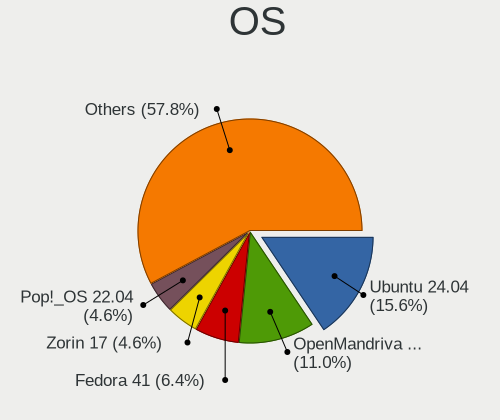
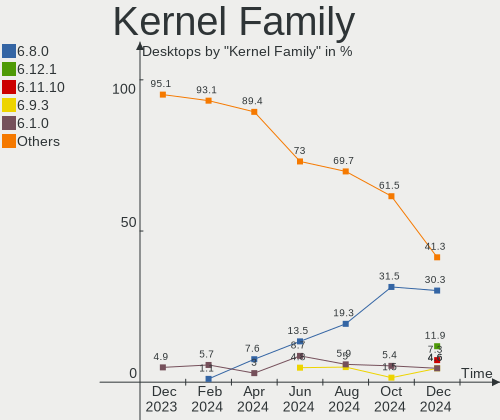
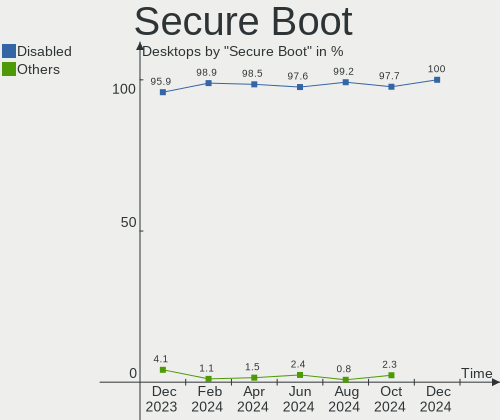
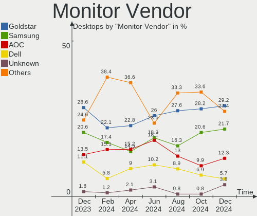
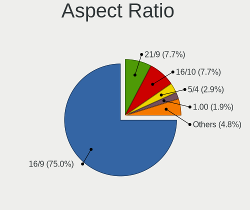
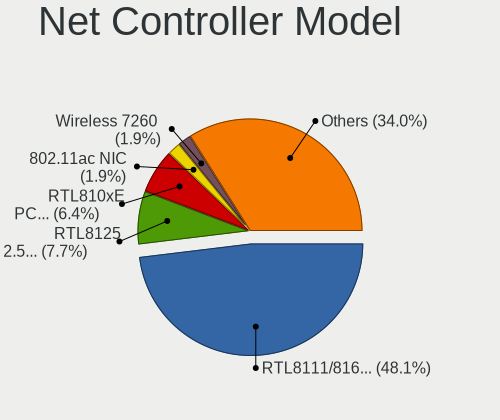
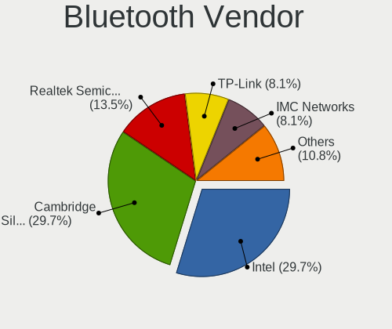

Linux in Brazil - Hardware Trends (Desktops)
--------------------------------------------

A project to identify most popular hardware characteristics and track their change
over time based on data collected by Linux users at https://Linux-Hardware.org.

Anyone can contribute to this report by the [hw-probe](https://github.com/linuxhw/hw-probe) tool:

    sudo -E hw-probe -all -upload

Period: Oct, 2023.

Contents
--------

* [ System ](#system)
  - [ OS                       ](#os)
  - [ OS Family                ](#os-family)
  - [ Kernel                   ](#kernel)
  - [ Kernel Family            ](#kernel-family)
  - [ Kernel Major Ver.        ](#kernel-major-ver)
  - [ Arch                     ](#arch)
  - [ DE                       ](#de)
  - [ Display Server           ](#display-server)
  - [ Display Manager          ](#display-manager)
  - [ OS Lang                  ](#os-lang)
  - [ Boot Mode                ](#boot-mode)
  - [ Filesystem               ](#filesystem)
  - [ Part. scheme             ](#part-scheme)
  - [ Dual Boot with Linux/BSD ](#dual-boot-with-linuxbsd)
  - [ Dual Boot (Win)          ](#dual-boot-win)

* [ Board ](#board)
  - [ Vendor                   ](#vendor)
  - [ Model                    ](#model)
  - [ Model Family             ](#model-family)
  - [ MFG Year                 ](#mfg-year)
  - [ Form Factor              ](#form-factor)
  - [ Secure Boot              ](#secure-boot)
  - [ Coreboot                 ](#coreboot)
  - [ RAM Size                 ](#ram-size)
  - [ RAM Used                 ](#ram-used)
  - [ Total Drives             ](#total-drives)
  - [ Has CD-ROM               ](#has-cd-rom)
  - [ Has Ethernet             ](#has-ethernet)
  - [ Has WiFi                 ](#has-wifi)
  - [ Has Bluetooth            ](#has-bluetooth)

* [ Location ](#location)
  - [ Country                  ](#country)
  - [ City                     ](#city)

* [ Drives ](#drives)
  - [ Drive Vendor             ](#drive-vendor)
  - [ Drive Model              ](#drive-model)
  - [ HDD Vendor               ](#hdd-vendor)
  - [ SSD Vendor               ](#ssd-vendor)
  - [ Drive Kind               ](#drive-kind)
  - [ Drive Connector          ](#drive-connector)
  - [ Drive Size               ](#drive-size)
  - [ Space Total              ](#space-total)
  - [ Space Used               ](#space-used)
  - [ Malfunc. Drives          ](#malfunc-drives)
  - [ Malfunc. Drive Vendor    ](#malfunc-drive-vendor)
  - [ Malfunc. HDD Vendor      ](#malfunc-hdd-vendor)
  - [ Malfunc. Drive Kind      ](#malfunc-drive-kind)
  - [ Failed Drives            ](#failed-drives)
  - [ Failed Drive Vendor      ](#failed-drive-vendor)
  - [ Drive Status             ](#drive-status)

* [ Storage controller ](#storage-controller)
  - [ Storage Vendor           ](#storage-vendor)
  - [ Storage Model            ](#storage-model)
  - [ Storage Kind             ](#storage-kind)

* [ Processor ](#processor)
  - [ CPU Vendor               ](#cpu-vendor)
  - [ CPU Model                ](#cpu-model)
  - [ CPU Model Family         ](#cpu-model-family)
  - [ CPU Cores                ](#cpu-cores)
  - [ CPU Sockets              ](#cpu-sockets)
  - [ CPU Threads              ](#cpu-threads)
  - [ CPU Op-Modes             ](#cpu-op-modes)
  - [ CPU Microcode            ](#cpu-microcode)
  - [ CPU Microarch            ](#cpu-microarch)

* [ Graphics ](#graphics)
  - [ GPU Vendor               ](#gpu-vendor)
  - [ GPU Model                ](#gpu-model)
  - [ GPU Combo                ](#gpu-combo)
  - [ GPU Driver               ](#gpu-driver)
  - [ GPU Memory               ](#gpu-memory)

* [ Monitor ](#monitor)
  - [ Monitor Vendor           ](#monitor-vendor)
  - [ Monitor Model            ](#monitor-model)
  - [ Monitor Resolution       ](#monitor-resolution)
  - [ Monitor Diagonal         ](#monitor-diagonal)
  - [ Monitor Width            ](#monitor-width)
  - [ Aspect Ratio             ](#aspect-ratio)
  - [ Monitor Area             ](#monitor-area)
  - [ Pixel Density            ](#pixel-density)
  - [ Multiple Monitors        ](#multiple-monitors)

* [ Network ](#network)
  - [ Net Controller Vendor    ](#net-controller-vendor)
  - [ Net Controller Model     ](#net-controller-model)
  - [ Wireless Vendor          ](#wireless-vendor)
  - [ Wireless Model           ](#wireless-model)
  - [ Ethernet Vendor          ](#ethernet-vendor)
  - [ Ethernet Model           ](#ethernet-model)
  - [ Net Controller Kind      ](#net-controller-kind)
  - [ Used Controller          ](#used-controller)
  - [ NICs                     ](#nics)
  - [ IPv6                     ](#ipv6)

* [ Bluetooth ](#bluetooth)
  - [ Bluetooth Vendor         ](#bluetooth-vendor)
  - [ Bluetooth Model          ](#bluetooth-model)

* [ Sound ](#sound)
  - [ Sound Vendor             ](#sound-vendor)
  - [ Sound Model              ](#sound-model)

* [ Memory ](#memory)
  - [ Memory Vendor            ](#memory-vendor)
  - [ Memory Model             ](#memory-model)
  - [ Memory Kind              ](#memory-kind)
  - [ Memory Form Factor       ](#memory-form-factor)
  - [ Memory Size              ](#memory-size)
  - [ Memory Speed             ](#memory-speed)

* [ Printers & scanners ](#printers--scanners)
  - [ Printer Vendor           ](#printer-vendor)
  - [ Printer Model            ](#printer-model)
  - [ Scanner Vendor           ](#scanner-vendor)
  - [ Scanner Model            ](#scanner-model)

* [ Camera ](#camera)
  - [ Camera Vendor            ](#camera-vendor)
  - [ Camera Model             ](#camera-model)

* [ Security ](#security)
  - [ Fingerprint Vendor       ](#fingerprint-vendor)
  - [ Fingerprint Model        ](#fingerprint-model)
  - [ Chipcard Vendor          ](#chipcard-vendor)
  - [ Chipcard Model           ](#chipcard-model)

* [ Unsupported ](#unsupported)
  - [ Unsupported Devices      ](#unsupported-devices)
  - [ Unsupported Device Types ](#unsupported-device-types)

System
------

OS
--

Installed operating systems

| Name                | Desktops | Percent |
|---------------------|----------|---------|
| Linux Mint 21.2     | 12       | 12%     |
| Fedora 38           | 11       | 11%     |
| OpenMandriva 23.08  | 8        | 8%      |
| Debian 12           | 8        | 8%      |
| Pop!_OS 22.04       | 7        | 7%      |
| Ubuntu 22.04        | 6        | 6%      |
| ArcoLinux Rolling   | 5        | 5%      |
| Ubuntu 23.10        | 4        | 4%      |
| Arch Rolling        | 4        | 4%      |
| Ubuntu 23.04        | 3        | 3%      |
| Ubuntu 20.04        | 3        | 3%      |
| Linux Mint 20.3     | 3        | 3%      |
| OpenMandriva 4.3    | 2        | 2%      |
| OpenMandriva 23.10  | 2        | 2%      |
| Linux Mint 21.1     | 2        | 2%      |
| Zorin 16            | 1        | 1%      |
| Ubuntu 22.10        | 1        | 1%      |
| Ubuntu 18.04        | 1        | 1%      |
| SteamOS 4           | 1        | 1%      |
| PCLinuxOS 2023      | 1        | 1%      |
| Nobara 38           | 1        | 1%      |
| Lubuntu 22.04       | 1        | 1%      |
| LMDE 5              | 1        | 1%      |
| Linux Mint 21       | 1        | 1%      |
| Linux Mint 20.1     | 1        | 1%      |
| Linux Mint 19.3     | 1        | 1%      |
| Endless 3.9.7       | 1        | 1%      |
| EndeavourOS Rolling | 1        | 1%      |
| Debian              | 1        | 1%      |
| Clear Linux 40130   | 1        | 1%      |
| BigLinux 23.0.3     | 1        | 1%      |
| BigLinux            | 1        | 1%      |
| Artix Rolling       | 1        | 1%      |
| Artix               | 1        | 1%      |
| Alpine 3.15.4       | 1        | 1%      |

OS Family
---------

OS without a version

| Name         | Desktops | Percent |
|--------------|----------|---------|
| Linux Mint   | 20       | 20%     |
| Ubuntu       | 18       | 18%     |
| OpenMandriva | 12       | 12%     |
| Fedora       | 11       | 11%     |
| Debian       | 9        | 9%      |
| Pop!_OS      | 7        | 7%      |
| ArcoLinux    | 5        | 5%      |
| Arch         | 4        | 4%      |
| BigLinux     | 2        | 2%      |
| Artix        | 2        | 2%      |
| Zorin        | 1        | 1%      |
| SteamOS      | 1        | 1%      |
| PCLinuxOS    | 1        | 1%      |
| Nobara       | 1        | 1%      |
| Lubuntu      | 1        | 1%      |
| LMDE         | 1        | 1%      |
| Endless      | 1        | 1%      |
| EndeavourOS  | 1        | 1%      |
| Clear Linux  | 1        | 1%      |
| Alpine       | 1        | 1%      |

Kernel
------

Version of the Linux kernel

| Version                     | Desktops | Percent |
|-----------------------------|----------|---------|
| 6.1.0-13-amd64              | 7        | 7%      |
| 6.5.5-200.fc38.x86_64       | 6        | 6%      |
| 6.5.4-76060504-generic      | 5        | 5%      |
| 6.4.11-desktop-1omv2390     | 5        | 5%      |
| 6.2.0-35-generic            | 5        | 5%      |
| 5.15.0-87-generic           | 5        | 5%      |
| 5.15.0-86-generic           | 5        | 5%      |
| 6.5.6-200.fc38.x86_64       | 3        | 3%      |
| 6.4.8-desktop-2omv2390      | 3        | 3%      |
| 6.2.0-34-generic            | 3        | 3%      |
| 5.15.0-84-generic           | 3        | 3%      |
| 5.15.0-76-generic           | 3        | 3%      |
| 6.5.7-arch1-1               | 2        | 2%      |
| 6.5.5-desktop-1omv2390      | 2        | 2%      |
| 6.5.0-9-generic             | 2        | 2%      |
| 6.5.0-10-generic            | 2        | 2%      |
| 6.2.0-33-generic            | 2        | 2%      |
| 5.16.7-desktop-1omv4003     | 2        | 2%      |
| 4.15.0-213-generic          | 2        | 2%      |
| 6.5.8-arch1-1               | 1        | 1%      |
| 6.5.7-zen2-1-zen            | 1        | 1%      |
| 6.5.7-artix1-1              | 1        | 1%      |
| 6.5.7-200.fc38.x86_64       | 1        | 1%      |
| 6.5.7-1371.native           | 1        | 1%      |
| 6.5.6-zen2-1-zen            | 1        | 1%      |
| 6.5.6-arch2-1               | 1        | 1%      |
| 6.5.6-76060506-generic      | 1        | 1%      |
| 6.5.6-200.fsync.fc38.x86_64 | 1        | 1%      |
| 6.5.5-zen1-1-zen            | 1        | 1%      |
| 6.5.4-arch2-1               | 1        | 1%      |
| 6.5.3-pclos1                | 1        | 1%      |
| 6.5.2-zen1-1-zen            | 1        | 1%      |
| 6.5.0-1-amd64               | 1        | 1%      |
| 6.4.6-76060406-generic      | 1        | 1%      |
| 6.4.12-zen1-1-zen           | 1        | 1%      |
| 6.2.9-300.fc38.x86_64       | 1        | 1%      |
| 6.2.16-14-pve               | 1        | 1%      |
| 6.1.57-x64v2-xanmod1-1-lts  | 1        | 1%      |
| 6.1.55-1-MANJARO            | 1        | 1%      |
| 6.1.53-1-lts                | 1        | 1%      |

Kernel Family
-------------

Linux kernel without a distro release

| Version | Desktops | Percent |
|---------|----------|---------|
| 5.15.0  | 17       | 17%     |
| 6.2.0   | 10       | 10%     |
| 6.5.5   | 9        | 9%      |
| 6.1.0   | 8        | 8%      |
| 6.5.6   | 7        | 7%      |
| 6.5.7   | 6        | 6%      |
| 6.5.4   | 6        | 6%      |
| 6.5.0   | 5        | 5%      |
| 6.4.11  | 5        | 5%      |
| 5.4.0   | 5        | 5%      |
| 6.4.8   | 3        | 3%      |
| 5.19.0  | 3        | 3%      |
| 5.16.7  | 2        | 2%      |
| 4.15.0  | 2        | 2%      |
| 6.5.8   | 1        | 1%      |
| 6.5.3   | 1        | 1%      |
| 6.5.2   | 1        | 1%      |
| 6.4.6   | 1        | 1%      |
| 6.4.12  | 1        | 1%      |
| 6.2.9   | 1        | 1%      |
| 6.2.16  | 1        | 1%      |
| 6.1.57  | 1        | 1%      |
| 6.1.55  | 1        | 1%      |
| 6.1.53  | 1        | 1%      |
| 5.8.0   | 1        | 1%      |
| 5.0.0   | 1        | 1%      |

Kernel Major Ver.
-----------------

Linux kernel major version

| Version | Desktops | Percent |
|---------|----------|---------|
| 6.5     | 36       | 36%     |
| 5.15    | 17       | 17%     |
| 6.2     | 12       | 12%     |
| 6.1     | 11       | 11%     |
| 6.4     | 10       | 10%     |
| 5.4     | 5        | 5%      |
| 5.19    | 3        | 3%      |
| 5.16    | 2        | 2%      |
| 4.15    | 2        | 2%      |
| 5.8     | 1        | 1%      |
| 5.0     | 1        | 1%      |

Arch
----

OS architecture (x86_64, i586, etc.)

| Name   | Desktops | Percent |
|--------|----------|---------|
| x86_64 | 100      | 100%    |

DE
--

Desktop Environment

| Name       | Desktops | Percent |
|------------|----------|---------|
| GNOME      | 45       | 45%     |
| KDE5       | 19       | 19%     |
| X-Cinnamon | 15       | 15%     |
| XFCE       | 6        | 6%      |
| MATE       | 5        | 5%      |
| Unknown    | 5        | 5%      |
| LXQt       | 3        | 3%      |
| Hyprland   | 1        | 1%      |
| Cinnamon   | 1        | 1%      |

Display Server
--------------

X11 or Wayland

| Name    | Desktops | Percent |
|---------|----------|---------|
| X11     | 60       | 60%     |
| Wayland | 36       | 36%     |
| Tty     | 2        | 2%      |
| Unknown | 2        | 2%      |

Display Manager
---------------

SDDM, LightDM, etc.

| Name    | Desktops | Percent |
|---------|----------|---------|
| Unknown | 53       | 53%     |
| SDDM    | 19       | 19%     |
| GDM3    | 17       | 17%     |
| GDM     | 6        | 6%      |
| LightDM | 4        | 4%      |
| XDM     | 1        | 1%      |

OS Lang
-------

Language

| Lang    | Desktops | Percent |
|---------|----------|---------|
| pt_BR   | 68       | 68%     |
| en_US   | 23       | 23%     |
| C       | 5        | 5%      |
| Unknown | 2        | 2%      |
| en_GB   | 1        | 1%      |
| en_CA   | 1        | 1%      |

Boot Mode
---------

EFI or BIOS

| Mode | Desktops | Percent |
|------|----------|---------|
| BIOS | 51       | 51%     |
| EFI  | 49       | 49%     |

Filesystem
----------

Type of filesystem

| Type    | Desktops | Percent |
|---------|----------|---------|
| Ext4    | 55       | 55%     |
| Btrfs   | 25       | 25%     |
| Tmpfs   | 11       | 11%     |
| Overlay | 8        | 8%      |
| Jfs     | 1        | 1%      |

Part. scheme
------------

Scheme of partitioning

| Type    | Desktops | Percent |
|---------|----------|---------|
| Unknown | 49       | 49%     |
| GPT     | 42       | 42%     |
| MBR     | 9        | 9%      |

Dual Boot with Linux/BSD
------------------------

Hosting more than one Linux/BSD

| Dual boot | Desktops | Percent |
|-----------|----------|---------|
| No        | 90       | 90%     |
| Yes       | 10       | 10%     |

Dual Boot (Win)
---------------

Hosting Linux and Windows

| Dual boot | Desktops | Percent |
|-----------|----------|---------|
| No        | 72       | 72%     |
| Yes       | 28       | 28%     |

Board
-----

Vendor
------

Motherboard manufacturer

| Name                | Desktops | Percent |
|---------------------|----------|---------|
| Gigabyte Technology | 27       | 27%     |
| ASUSTek Computer    | 17       | 17%     |
| Intel               | 12       | 12%     |
| ASRock              | 9        | 9%      |
| Dell                | 6        | 6%      |
| Unknown             | 4        | 4%      |
| Positivo            | 3        | 3%      |
| MSI                 | 3        | 3%      |
| MACHINIST           | 3        | 3%      |
| Lenovo              | 3        | 3%      |
| Biostar             | 3        | 3%      |
| Pegatron            | 2        | 2%      |
| Huanan              | 2        | 2%      |
| AZW                 | 2        | 2%      |
| PCWare              | 1        | 1%      |
| Itautec             | 1        | 1%      |
| Danuri              | 1        | 1%      |
| AMD                 | 1        | 1%      |

Model
-----

Motherboard model

| Name                               | Desktops | Percent |
|------------------------------------|----------|---------|
| Intel H61                          | 6        | 6%      |
| Gigabyte B550M AORUS ELITE         | 4        | 4%      |
| Unknown                            | 4        | 4%      |
| ASRock A320M-HD                    | 3        | 3%      |
| MSI MS-7C95                        | 2        | 2%      |
| Intel B75                          | 2        | 2%      |
| Gigabyte B450 AORUS M              | 2        | 2%      |
| Gigabyte AB350M-DS3H V2            | 2        | 2%      |
| Dell XPS 8930                      | 2        | 2%      |
| Biostar B450MH                     | 2        | 2%      |
| ASUS TUF Gaming B550M-PLUS         | 2        | 2%      |
| ASUS All Series                    | 2        | 2%      |
| Positivo POS-PIG43BC               | 1        | 1%      |
| Positivo POS-EINM70CS              | 1        | 1%      |
| Positivo D210                      | 1        | 1%      |
| Pegatron SM 3330                   | 1        | 1%      |
| Pegatron Compaq 300B MT            | 1        | 1%      |
| PCWare IPMH61R1                    | 1        | 1%      |
| MSI MS-7C51                        | 1        | 1%      |
| MACHINIST X99-RS9 V2.0             | 1        | 1%      |
| MACHINIST X99-MR9D PLUS V1.0       | 1        | 1%      |
| MACHINIST E5-MR9A V1.0             | 1        | 1%      |
| Lenovo ThinkCentre M93p 10A9000WBP | 1        | 1%      |
| Lenovo ThinkCentre M900 10FLS3WS00 | 1        | 1%      |
| Lenovo ThinkCentre Edge72 3484DMP  | 1        | 1%      |
| Itautec Infoway                    | 1        | 1%      |
| Intel Jasper Lake Client Platform  | 1        | 1%      |
| Intel H81                          | 1        | 1%      |
| Intel H61 V124                     | 1        | 1%      |
| Intel DG41WV                       | 1        | 1%      |
| Huanan X99-QD4 V1.0                | 1        | 1%      |
| Huanan X99-F8 GAMING V2.0          | 1        | 1%      |
| Gigabyte Z77-DS3H                  | 1        | 1%      |
| Gigabyte H87-D3H                   | 1        | 1%      |
| Gigabyte H410M H V3                | 1        | 1%      |
| Gigabyte H110M-H                   | 1        | 1%      |
| Gigabyte GA-880GMA-UD2H            | 1        | 1%      |
| Gigabyte GA-78LMT-USB3 R2          | 1        | 1%      |
| Gigabyte G41MT-S2                  | 1        | 1%      |
| Gigabyte F2A88X-D3H                | 1        | 1%      |

Model Family
------------

Motherboard model prefix

| Name                    | Desktops | Percent |
|-------------------------|----------|---------|
| Intel H61               | 7        | 7%      |
| ASUS TUF                | 6        | 6%      |
| Gigabyte B550M          | 5        | 5%      |
| ASRock A320M-HD         | 4        | 4%      |
| Unknown                 | 4        | 4%      |
| Lenovo ThinkCentre      | 3        | 3%      |
| Gigabyte B450           | 3        | 3%      |
| ASUS PRIME              | 3        | 3%      |
| MSI MS-7C95             | 2        | 2%      |
| Intel B75               | 2        | 2%      |
| Gigabyte B450M          | 2        | 2%      |
| Gigabyte AB350M-DS3H    | 2        | 2%      |
| Dell XPS                | 2        | 2%      |
| Dell Vostro             | 2        | 2%      |
| Biostar B450MH          | 2        | 2%      |
| ASUS All                | 2        | 2%      |
| Positivo POS-PIG43BC    | 1        | 1%      |
| Positivo POS-EINM70CS   | 1        | 1%      |
| Positivo D210           | 1        | 1%      |
| Pegatron SM             | 1        | 1%      |
| Pegatron Compaq         | 1        | 1%      |
| PCWare IPMH61R1         | 1        | 1%      |
| MSI MS-7C51             | 1        | 1%      |
| MACHINIST X99-RS9       | 1        | 1%      |
| MACHINIST X99-MR9D      | 1        | 1%      |
| MACHINIST E5-MR9A       | 1        | 1%      |
| Itautec Infoway         | 1        | 1%      |
| Intel Jasper            | 1        | 1%      |
| Intel H81               | 1        | 1%      |
| Intel DG41WV            | 1        | 1%      |
| Huanan X99-QD4          | 1        | 1%      |
| Huanan X99-F8           | 1        | 1%      |
| Gigabyte Z77-DS3H       | 1        | 1%      |
| Gigabyte H87-D3H        | 1        | 1%      |
| Gigabyte H410M          | 1        | 1%      |
| Gigabyte H110M-H        | 1        | 1%      |
| Gigabyte GA-880GMA-UD2H | 1        | 1%      |
| Gigabyte GA-78LMT-USB3  | 1        | 1%      |
| Gigabyte G41MT-S2       | 1        | 1%      |
| Gigabyte F2A88X-D3H     | 1        | 1%      |

MFG Year
--------

Motherboard manufacture year

| Year | Desktops | Percent |
|------|----------|---------|
| 2018 | 18       | 18%     |
| 2020 | 12       | 12%     |
| 2017 | 11       | 11%     |
| 2019 | 8        | 8%      |
| 2013 | 8        | 8%      |
| 2012 | 8        | 8%      |
| 2021 | 7        | 7%      |
| 2022 | 5        | 5%      |
| 2010 | 5        | 5%      |
| 2016 | 4        | 4%      |
| 2011 | 4        | 4%      |
| 2023 | 3        | 3%      |
| 2015 | 2        | 2%      |
| 2009 | 2        | 2%      |
| 2014 | 1        | 1%      |
| 2008 | 1        | 1%      |
| 2007 | 1        | 1%      |

Form Factor
-----------

Physical design of the computer

| Name    | Desktops | Percent |
|---------|----------|---------|
| Desktop | 100      | 100%    |

Secure Boot
-----------

Enabled or disabled

| State    | Desktops | Percent |
|----------|----------|---------|
| Disabled | 96       | 96%     |
| Enabled  | 4        | 4%      |

Coreboot
--------

Have coreboot on board

| Used | Desktops | Percent |
|------|----------|---------|
| No   | 100      | 100%    |

RAM Size
--------

Total RAM memory

| Size in GB  | Desktops | Percent |
|-------------|----------|---------|
| 16.01-24.0  | 34       | 34%     |
| 8.01-16.0   | 22       | 22%     |
| 4.01-8.0    | 15       | 15%     |
| 32.01-64.0  | 10       | 10%     |
| 3.01-4.0    | 7        | 7%      |
| 64.01-256.0 | 5        | 5%      |
| 1.01-2.0    | 4        | 4%      |
| 2.01-3.0    | 2        | 2%      |
| 24.01-32.0  | 1        | 1%      |

RAM Used
--------

Used RAM memory

| Used GB    | Desktops | Percent |
|------------|----------|---------|
| 2.01-3.0   | 32       | 32%     |
| 1.01-2.0   | 23       | 23%     |
| 4.01-8.0   | 18       | 18%     |
| 3.01-4.0   | 10       | 10%     |
| 8.01-16.0  | 10       | 10%     |
| 0.51-1.0   | 4        | 4%      |
| 0.01-0.5   | 2        | 2%      |
| 16.01-24.0 | 1        | 1%      |

Total Drives
------------

Number of drives on board

| Drives | Desktops | Percent |
|--------|----------|---------|
| 1      | 34       | 34%     |
| 2      | 29       | 29%     |
| 3      | 24       | 24%     |
| 4      | 7        | 7%      |
| 5      | 4        | 4%      |
| 6      | 2        | 2%      |

Has CD-ROM
----------

Has CD-ROM on board

| Presented | Desktops | Percent |
|-----------|----------|---------|
| No        | 80       | 80%     |
| Yes       | 20       | 20%     |

Has Ethernet
------------

Has Ethernet on board

| Presented | Desktops | Percent |
|-----------|----------|---------|
| Yes       | 98       | 98%     |
| No        | 2        | 2%      |

Has WiFi
--------

Has WiFi module

| Presented | Desktops | Percent |
|-----------|----------|---------|
| No        | 61       | 61%     |
| Yes       | 39       | 39%     |

Has Bluetooth
-------------

Has Bluetooth module

| Presented | Desktops | Percent |
|-----------|----------|---------|
| No        | 64       | 64%     |
| Yes       | 36       | 36%     |

Location
--------

Country
-------

Geographic location (country)

| Country | Desktops | Percent |
|---------|----------|---------|
| Brazil  | 100      | 100%    |

City
----

Geographic location (city)

| City                   | Desktops | Percent |
|------------------------|----------|---------|
| Sao Paulo              | 11       | 11%     |
| Rio de Janeiro         | 7        | 7%      |
| Porto Alegre           | 4        | 4%      |
| Serra                  | 3        | 3%      |
| Sao José dos Campos   | 3        | 3%      |
| Osasco                 | 3        | 3%      |
| Brasília              | 3        | 3%      |
| Belo Horizonte         | 3        | 3%      |
| Volta Redonda          | 2        | 2%      |
| Sorocaba               | 2        | 2%      |
| Sao Carlos             | 2        | 2%      |
| Santo André           | 2        | 2%      |
| Salvador               | 2        | 2%      |
| Maringá               | 2        | 2%      |
| Jaraguá do Sul        | 2        | 2%      |
| Hortolândia           | 2        | 2%      |
| Curitiba               | 2        | 2%      |
| Criciúma              | 2        | 2%      |
| Vila Velha             | 1        | 1%      |
| Vicosa                 | 1        | 1%      |
| Trairi                 | 1        | 1%      |
| Surubim                | 1        | 1%      |
| Sete Lagoas            | 1        | 1%      |
| Sapucaia do Sul        | 1        | 1%      |
| Sao Jose do Rio Preto  | 1        | 1%      |
| Sao Joao del Rei       | 1        | 1%      |
| Sao Goncalo            | 1        | 1%      |
| Santos                 | 1        | 1%      |
| Santo Antonio de Posse | 1        | 1%      |
| Santa Barbara d'Oeste  | 1        | 1%      |
| Recife                 | 1        | 1%      |
| Queimados              | 1        | 1%      |
| Praia Grande           | 1        | 1%      |
| Peruibe                | 1        | 1%      |
| Paranavai              | 1        | 1%      |
| Palmas                 | 1        | 1%      |
| Olinda                 | 1        | 1%      |
| Marília               | 1        | 1%      |
| Maceió                | 1        | 1%      |
| Lauro de Freitas       | 1        | 1%      |

Drives
------

Drive Vendor
------------

Hard drive vendors

| Vendor                      | Desktops | Drives | Percent |
|-----------------------------|----------|--------|---------|
| Seagate                     | 37       | 43     | 18.14%  |
| WDC                         | 27       | 29     | 13.24%  |
| Samsung Electronics         | 23       | 28     | 11.27%  |
| Kingston                    | 23       | 26     | 11.27%  |
| China                       | 10       | 11     | 4.9%    |
| MAXIO Technology (Hangzhou) | 8        | 9      | 3.92%   |
| SanDisk                     | 6        | 6      | 2.94%   |
| Kingston Technology Company | 6        | 8      | 2.94%   |
| KingSpec                    | 5        | 5      | 2.45%   |
| Toshiba                     | 4        | 4      | 1.96%   |
| Patriot                     | 4        | 4      | 1.96%   |
| Netac                       | 4        | 4      | 1.96%   |
| HGST                        | 4        | 4      | 1.96%   |
| Crucial                     | 4        | 4      | 1.96%   |
| Unknown                     | 4        | 4      | 1.96%   |
| XrayDisk                    | 3        | 3      | 1.47%   |
| Silicon Motion              | 3        | 3      | 1.47%   |
| A-DATA Technology           | 3        | 3      | 1.47%   |
| Unknown                     | 2        | 5      | 0.98%   |
| SK hynix                    | 2        | 2      | 0.98%   |
| Lexar                       | 2        | 2      | 0.98%   |
| Hitachi                     | 2        | 2      | 0.98%   |
| ADATA Technology            | 2        | 2      | 0.98%   |
| ZTC                         | 1        | 1      | 0.49%   |
| Win Memory                  | 1        | 1      | 0.49%   |
| WALRAM                      | 1        | 1      | 0.49%   |
| STAR                        | 1        | 1      | 0.49%   |
| Reletech                    | 1        | 1      | 0.49%   |
| Realtek Semiconductor       | 1        | 1      | 0.49%   |
| PNY                         | 1        | 1      | 0.49%   |
| Phison Electronics          | 1        | 1      | 0.49%   |
| OCZ                         | 1        | 1      | 0.49%   |
| NT-512                      | 1        | 1      | 0.49%   |
| LITEON                      | 1        | 1      | 0.49%   |
| KingDian                    | 1        | 1      | 0.49%   |
| KINGBANK                    | 1        | 1      | 0.49%   |
| HUSKY                       | 1        | 1      | 0.49%   |
| Biostar                     | 1        | 1      | 0.49%   |
| Apacer                      | 1        | 1      | 0.49%   |

Drive Model
-----------

Hard drive models

| Model                                                 | Desktops | Percent |
|-------------------------------------------------------|----------|---------|
| MAXIO (Hangzhou) NVMe SSD Controller MAP1202 250GB    | 7        | 3.17%   |
| Seagate ST1000DM010-2EP102 1TB                        | 6        | 2.71%   |
| Kingston SA400S37240G 240GB SSD                       | 6        | 2.71%   |
| Seagate ST1000LM024 HN-M101MBB 1TB                    | 5        | 2.26%   |
| Kingston SA400S37480G 480GB SSD                       | 5        | 2.26%   |
| Samsung NVMe SSD Controller SM981/PM981/PM983 1TB     | 4        | 1.81%   |
| Kingston Company SNV2S1000G 1TB                       | 4        | 1.81%   |
| Kingston SV300S37A120G 120GB SSD                      | 4        | 1.81%   |
| Unknown                                               | 4        | 1.81%   |
| Silicon Motion SM2263EN/SM2263XT SSD Controller 256GB | 3        | 1.36%   |
| Samsung HD103SJ 1TB                                   | 3        | 1.36%   |
| Crucial CT480BX500SSD1 480GB                          | 3        | 1.36%   |
| WDC WD10EZEX-08WN4A0 1TB                              | 2        | 0.9%    |
| WDC WD10EZEX-00RKKA0 1TB                              | 2        | 0.9%    |
| Seagate ST500DM002-1BD142 500GB                       | 2        | 0.9%    |
| Seagate ST2000DM006-2DM164 2TB                        | 2        | 0.9%    |
| Seagate ST2000DM001-1ER164 2TB                        | 2        | 0.9%    |
| Seagate ST2000DM001-1CH164 2TB                        | 2        | 0.9%    |
| Seagate ST1000DM003-1ER162 1TB                        | 2        | 0.9%    |
| Seagate ST1000DM003-1CH162 1TB                        | 2        | 0.9%    |
| Seagate Expansion 1TB                                 | 2        | 0.9%    |
| Sandisk WDC WDS480G2G0C-00AJM0 480GB                  | 2        | 0.9%    |
| Sandisk WD Black SN750 / PC SN730 NVMe SSD 1024GB     | 2        | 0.9%    |
| Samsung SSD 850 EVO 250GB                             | 2        | 0.9%    |
| Samsung HD322HJ 320GB                                 | 2        | 0.9%    |
| Patriot Burst Elite 480GB SSD                         | 2        | 0.9%    |
| Kingston Company SNV2S2000G 2TB                       | 2        | 0.9%    |
| Kingston SNVS500G 500GB                               | 2        | 0.9%    |
| Kingston SNV2S500G 500GB                              | 2        | 0.9%    |
| Kingston SA400S37960G 960GB SSD                       | 2        | 0.9%    |
| KingSpec P3-1TB                                       | 2        | 0.9%    |
| HGST HTS545050A7E380 500GB                            | 2        | 0.9%    |
| China SSD 512GB                                       | 2        | 0.9%    |
| China SATA SSD 240GB                                  | 2        | 0.9%    |
| A-DATA SU650 120GB SSD                                | 2        | 0.9%    |
| ZTC SSD 128GB                                         | 1        | 0.45%   |
| XrayDisk SSD 128GB                                    | 1        | 0.45%   |
| XrayDisk 256GB SSD                                    | 1        | 0.45%   |
| XrayDisk 1TB SSD                                      | 1        | 0.45%   |
| Win Memory SWR128G-N01H 128GB SSD                     | 1        | 0.45%   |

HDD Vendor
----------

Hard disk drive vendors

| Vendor              | Desktops | Drives | Percent |
|---------------------|----------|--------|---------|
| Seagate             | 37       | 43     | 44.05%  |
| WDC                 | 24       | 26     | 28.57%  |
| Samsung Electronics | 13       | 16     | 15.48%  |
| Toshiba             | 4        | 4      | 4.76%   |
| HGST                | 4        | 4      | 4.76%   |
| Hitachi             | 2        | 2      | 2.38%   |

SSD Vendor
----------

Solid state drive vendors

| Vendor              | Desktops | Drives | Percent |
|---------------------|----------|--------|---------|
| Kingston            | 19       | 22     | 24.68%  |
| China               | 10       | 11     | 12.99%  |
| Samsung Electronics | 7        | 7      | 9.09%   |
| KingSpec            | 5        | 5      | 6.49%   |
| Patriot             | 4        | 4      | 5.19%   |
| Crucial             | 4        | 4      | 5.19%   |
| WDC                 | 3        | 3      | 3.9%    |
| A-DATA Technology   | 3        | 3      | 3.9%    |
| XrayDisk            | 2        | 2      | 2.6%    |
| SanDisk             | 2        | 2      | 2.6%    |
| Netac               | 2        | 2      | 2.6%    |
| Lexar               | 2        | 2      | 2.6%    |
| ZTC                 | 1        | 1      | 1.3%    |
| Win Memory          | 1        | 1      | 1.3%    |
| WALRAM              | 1        | 1      | 1.3%    |
| STAR                | 1        | 1      | 1.3%    |
| PNY                 | 1        | 1      | 1.3%    |
| OCZ                 | 1        | 1      | 1.3%    |
| NT-512              | 1        | 1      | 1.3%    |
| LITEON              | 1        | 1      | 1.3%    |
| KingDian            | 1        | 1      | 1.3%    |
| KINGBANK            | 1        | 1      | 1.3%    |
| HUSKY               | 1        | 1      | 1.3%    |
| Biostar             | 1        | 1      | 1.3%    |
| Apacer              | 1        | 1      | 1.3%    |
| Unknown             | 1        | 1      | 1.3%    |

Drive Kind
----------

HDD or SSD

| Kind    | Desktops | Drives | Percent |
|---------|----------|--------|---------|
| HDD     | 62       | 95     | 38.27%  |
| SSD     | 59       | 81     | 36.42%  |
| NVMe    | 36       | 43     | 22.22%  |
| Unknown | 4        | 4      | 2.47%   |
| MMC     | 1        | 4      | 0.62%   |

Drive Connector
---------------

SATA, SAS, NVMe, etc.

| Type | Desktops | Drives | Percent |
|------|----------|--------|---------|
| SATA | 92       | 177    | 69.7%   |
| NVMe | 36       | 43     | 27.27%  |
| SAS  | 3        | 3      | 2.27%   |
| MMC  | 1        | 4      | 0.76%   |

Drive Size
----------

Size of hard drive

| Size in TB | Desktops | Drives | Percent |
|------------|----------|--------|---------|
| 0.01-0.5   | 65       | 98     | 49.62%  |
| 0.51-1.0   | 44       | 52     | 33.59%  |
| 1.01-2.0   | 14       | 18     | 10.69%  |
| 3.01-4.0   | 4        | 4      | 3.05%   |
| 4.01-10.0  | 2        | 2      | 1.53%   |
| 2.01-3.0   | 1        | 1      | 0.76%   |
| 10.01-20.0 | 1        | 1      | 0.76%   |

Space Total
-----------

Amount of disk space available on the file system

| Size in GB     | Desktops | Percent |
|----------------|----------|---------|
| 251-500        | 23       | 23%     |
| 101-250        | 20       | 20%     |
| 1001-2000      | 14       | 14%     |
| 501-1000       | 14       | 14%     |
| 2001-3000      | 9        | 9%      |
| More than 3000 | 7        | 7%      |
| 1-20           | 7        | 7%      |
| 51-100         | 4        | 4%      |
| Unknown        | 2        | 2%      |

Space Used
----------

Amount of used disk space

| Used GB        | Desktops | Percent |
|----------------|----------|---------|
| 1-20           | 28       | 28%     |
| 21-50          | 19       | 19%     |
| 501-1000       | 14       | 14%     |
| 51-100         | 13       | 13%     |
| 251-500        | 10       | 10%     |
| 101-250        | 5        | 5%      |
| 1001-2000      | 5        | 5%      |
| 2001-3000      | 3        | 3%      |
| Unknown        | 2        | 2%      |
| More than 3000 | 1        | 1%      |

Malfunc. Drives
---------------

Drive models with a malfunction

| Model                              | Desktops | Drives | Percent |
|------------------------------------|----------|--------|---------|
| China SSD 512GB                    | 2        | 2      | 10.53%  |
| XrayDisk SSD 128GB                 | 1        | 1      | 5.26%   |
| WDC WD800BD-22MRA1 80GB            | 1        | 1      | 5.26%   |
| WDC WD800AAJS-75M0A0 80GB          | 1        | 1      | 5.26%   |
| WDC WD5000AAKS-22A7B0 500GB        | 1        | 1      | 5.26%   |
| WDC WD20EZRX-00D8PB0 2TB           | 1        | 1      | 5.26%   |
| Seagate ST500LT012-9WS142 500GB    | 1        | 1      | 5.26%   |
| Seagate ST500DM002-1BD142 500GB    | 1        | 1      | 5.26%   |
| Seagate ST4000NM0053 4TB           | 1        | 1      | 5.26%   |
| Seagate ST2000DM001-1CH164 2TB     | 1        | 1      | 5.26%   |
| Seagate ST1000LM024 HN-M101MBB 1TB | 1        | 1      | 5.26%   |
| Seagate ST1000DM003-1ER162 1TB     | 1        | 1      | 5.26%   |
| Samsung Electronics HM500JI 500GB  | 1        | 1      | 5.26%   |
| Samsung Electronics HD322HJ 320GB  | 1        | 1      | 5.26%   |
| Samsung Electronics HD250HJ 250GB  | 1        | 1      | 5.26%   |
| Samsung Electronics HD103SI 1TB    | 1        | 2      | 5.26%   |
| Netac NS512GSSD340 512GB           | 1        | 1      | 5.26%   |
| Hitachi HDP725050GLA360 500GB      | 1        | 1      | 5.26%   |

Malfunc. Drive Vendor
---------------------

Vendors of faulty drives

| Vendor              | Desktops | Drives | Percent |
|---------------------|----------|--------|---------|
| Seagate             | 5        | 6      | 27.78%  |
| WDC                 | 4        | 4      | 22.22%  |
| Samsung Electronics | 4        | 5      | 22.22%  |
| China               | 2        | 2      | 11.11%  |
| XrayDisk            | 1        | 1      | 5.56%   |
| Netac               | 1        | 1      | 5.56%   |
| Hitachi             | 1        | 1      | 5.56%   |

Malfunc. HDD Vendor
-------------------

Vendors of faulty HDD drives

| Vendor              | Desktops | Drives | Percent |
|---------------------|----------|--------|---------|
| Seagate             | 5        | 6      | 35.71%  |
| WDC                 | 4        | 4      | 28.57%  |
| Samsung Electronics | 4        | 5      | 28.57%  |
| Hitachi             | 1        | 1      | 7.14%   |

Malfunc. Drive Kind
-------------------

Kinds of faulty drives

| Kind | Desktops | Drives | Percent |
|------|----------|--------|---------|
| HDD  | 12       | 16     | 75%     |
| SSD  | 4        | 4      | 25%     |

Failed Drives
-------------

Failed drive models

Zero info for selected period =(

Failed Drive Vendor
-------------------

Failed drive vendors

Zero info for selected period =(

Drive Status
------------

Number of failed and malfunc. drives

| Status   | Desktops | Drives | Percent |
|----------|----------|--------|---------|
| Detected | 63       | 152    | 57.27%  |
| Works    | 32       | 55     | 29.09%  |
| Malfunc  | 15       | 20     | 13.64%  |

Storage controller
------------------

Storage Vendor
--------------

Storage controller vendors

| Vendor                      | Desktops | Percent |
|-----------------------------|----------|---------|
| Intel                       | 56       | 39.44%  |
| AMD                         | 43       | 30.28%  |
| MAXIO Technology (Hangzhou) | 9        | 6.34%   |
| Kingston Technology Company | 9        | 6.34%   |
| Silicon Motion              | 4        | 2.82%   |
| SanDisk                     | 4        | 2.82%   |
| Samsung Electronics         | 4        | 2.82%   |
| SK hynix                    | 2        | 1.41%   |
| ASMedia Technology          | 2        | 1.41%   |
| ADATA Technology            | 2        | 1.41%   |
| Realtek Semiconductor       | 1        | 0.7%    |
| Phison Electronics          | 1        | 0.7%    |
| Nvidia                      | 1        | 0.7%    |
| Netac Technology            | 1        | 0.7%    |
| Marvell Technology Group    | 1        | 0.7%    |
| JMicron Technology          | 1        | 0.7%    |
| Hosin Global Electronics    | 1        | 0.7%    |

Storage Model
-------------

Storage controller models

| Model                                                                          | Desktops | Percent |
|--------------------------------------------------------------------------------|----------|---------|
| AMD FCH SATA Controller [AHCI mode]                                            | 21       | 11.86%  |
| AMD 500 Series Chipset SATA Controller                                         | 11       | 6.21%   |
| Intel 6 Series/C200 Series Chipset Family 6 port Desktop SATA AHCI Controller  | 10       | 5.65%   |
| Intel 8 Series/C220 Series Chipset Family 6-port SATA Controller 1 [AHCI mode] | 9        | 5.08%   |
| MAXIO (Hangzhou) NVMe SSD Controller MAP1202                                   | 8        | 4.52%   |
| AMD 400 Series Chipset SATA Controller                                         | 8        | 4.52%   |
| AMD FCH SATA Controller D                                                      | 7        | 3.95%   |
| Kingston Company NV2 NVMe SSD SM2267XT                                         | 6        | 3.39%   |
| Intel NM10/ICH7 Family SATA Controller [IDE mode]                              | 6        | 3.39%   |
| Intel 7 Series/C210 Series Chipset Family 6-port SATA Controller [AHCI mode]   | 6        | 3.39%   |
| AMD SB7x0/SB8x0/SB9x0 IDE Controller                                           | 5        | 2.82%   |
| Silicon Motion SM2263EN/SM2263XT (DRAM-less) NVMe SSD Controllers              | 4        | 2.26%   |
| Samsung NVMe SSD Controller SM981/PM981/PM983                                  | 4        | 2.26%   |
| Intel Q170/Q150/B150/H170/H110/Z170/CM236 Chipset SATA Controller [AHCI Mode]  | 4        | 2.26%   |
| AMD SB7x0/SB8x0/SB9x0 SATA Controller [IDE mode]                               | 4        | 2.26%   |
| Intel Cannon Lake PCH SATA AHCI Controller                                     | 3        | 1.69%   |
| Intel 200 Series PCH SATA controller [AHCI mode]                               | 3        | 1.69%   |
| AMD SB7x0/SB8x0/SB9x0 SATA Controller [AHCI mode]                              | 3        | 1.69%   |
| AMD 300 Series Chipset SATA Controller                                         | 3        | 1.69%   |
| SanDisk WD Green SN350 240GB (DRAM-less) / SN560E NVMe SSD                     | 2        | 1.13%   |
| SanDisk Extreme Pro / WD Black SN750 / PC SN730 / Red SN700 NVMe SSD           | 2        | 1.13%   |
| Intel Volume Management Device NVMe RAID Controller                            | 2        | 1.13%   |
| Intel C610/X99 series chipset 6-Port SATA Controller [AHCI mode]               | 2        | 1.13%   |
| Intel Alder Lake-S PCH SATA Controller [AHCI Mode]                             | 2        | 1.13%   |
| Intel 82801G (ICH7 Family) IDE Controller                                      | 2        | 1.13%   |
| Intel 500 Series Chipset Family SATA AHCI Controller                           | 2        | 1.13%   |
| ASMedia ASM1062 Serial ATA Controller                                          | 2        | 1.13%   |
| SK hynix BC901 NVMe Solid State Drive (DRAM-less)                              | 1        | 0.56%   |
| SK hynix BC501 NVMe Solid State Drive                                          | 1        | 0.56%   |
| Realtek RTS5763DL NVMe SSD Controller (DRAM-less)                              | 1        | 0.56%   |
| Phison PS5013-E13 PCIe3 NVMe Controller (DRAM-less)                            | 1        | 0.56%   |
| Nvidia MCP61 SATA Controller                                                   | 1        | 0.56%   |
| Nvidia MCP61 IDE                                                               | 1        | 0.56%   |
| Netac PCIe 4 INNOGRIT based NVMe SSD                                           | 1        | 0.56%   |
| MAXIO (Hangzhou) NVMe SSD Controller MAP1001                                   | 1        | 0.56%   |
| Marvell Group 88SE9215 PCIe 2.0 x1 4-port SATA 6 Gb/s Controller               | 1        | 0.56%   |
| Kingston Company NV2 NVMe SSD E21T                                             | 1        | 0.56%   |
| Kingston Company NV1 NVMe SSD SM2263XT                                         | 1        | 0.56%   |
| Kingston Company NV1 NVMe SSD E13T                                             | 1        | 0.56%   |
| Kingston Company A1000/U-SNS8154P3 x2 NVMe SSD                                 | 1        | 0.56%   |

Storage Kind
------------

Kind of storage controller (IDE, SATA, NVMe, SAS, ...)

| Kind | Desktops | Percent |
|------|----------|---------|
| SATA | 90       | 60.4%   |
| NVMe | 36       | 24.16%  |
| IDE  | 17       | 11.41%  |
| RAID | 6        | 4.03%   |

Processor
---------

CPU Vendor
----------

Processor vendors

| Vendor | Desktops | Percent |
|--------|----------|---------|
| Intel  | 56       | 56%     |
| AMD    | 44       | 44%     |

CPU Model
---------

Processor models

| Model                                       | Desktops | Percent |
|---------------------------------------------|----------|---------|
| AMD Ryzen 5 5600G with Radeon Graphics      | 4        | 4%      |
| AMD Ryzen 7 5700G with Radeon Graphics      | 3        | 3%      |
| AMD Ryzen 5 3600 6-Core Processor           | 3        | 3%      |
| AMD Ryzen 3 3200G with Radeon Vega Graphics | 3        | 3%      |
| AMD FX-8350 Eight-Core Processor            | 3        | 3%      |
| Intel Xeon CPU E5-2680 v4 @ 2.40GHz         | 2        | 2%      |
| Intel Pentium Dual-Core CPU E5700 @ 3.00GHz | 2        | 2%      |
| Intel Core i7-8700 CPU @ 3.20GHz            | 2        | 2%      |
| Intel Core i7-2600 CPU @ 3.40GHz            | 2        | 2%      |
| Intel Core i5-3570 CPU @ 3.40GHz            | 2        | 2%      |
| Intel Core i5-3470S CPU @ 2.90GHz           | 2        | 2%      |
| Intel Core i5-3330 CPU @ 3.00GHz            | 2        | 2%      |
| Intel Core i3-3220 CPU @ 3.30GHz            | 2        | 2%      |
| Intel 12th Gen Core i5-12400                | 2        | 2%      |
| AMD Ryzen 7 5700X 8-Core Processor          | 2        | 2%      |
| AMD Ryzen 5 4600G with Radeon Graphics      | 2        | 2%      |
| Intel Xeon CPU E5-2697A v4 @ 2.60GHz        | 1        | 1%      |
| Intel Xeon CPU E5-2666 v3 @ 2.90GHz         | 1        | 1%      |
| Intel Xeon CPU E5-2620 v3 @ 2.40GHz         | 1        | 1%      |
| Intel Xeon CPU E5-1620 v3 @ 3.50GHz         | 1        | 1%      |
| Intel Xeon CPU E3-1270 v3 @ 3.50GHz         | 1        | 1%      |
| Intel Pentium Dual-Core CPU E6500 @ 2.93GHz | 1        | 1%      |
| Intel Pentium Dual-Core CPU E5400 @ 2.70GHz | 1        | 1%      |
| Intel Pentium Dual CPU E2200 @ 2.20GHz      | 1        | 1%      |
| Intel Pentium CPU G2030 @ 3.00GHz           | 1        | 1%      |
| Intel Core i7-9700K CPU @ 3.60GHz           | 1        | 1%      |
| Intel Core i7-4790K CPU @ 4.00GHz           | 1        | 1%      |
| Intel Core i7-4770 CPU @ 3.40GHz            | 1        | 1%      |
| Intel Core i7-3770S CPU @ 3.10GHz           | 1        | 1%      |
| Intel Core i7-3770 CPU @ 3.40GHz            | 1        | 1%      |
| Intel Core i5-9600K CPU @ 3.70GHz           | 1        | 1%      |
| Intel Core i5-9400F CPU @ 2.90GHz           | 1        | 1%      |
| Intel Core i5-8400 CPU @ 2.80GHz            | 1        | 1%      |
| Intel Core i5-7400 CPU @ 3.00GHz            | 1        | 1%      |
| Intel Core i5-6600 CPU @ 3.30GHz            | 1        | 1%      |
| Intel Core i5-4590S CPU @ 3.00GHz           | 1        | 1%      |
| Intel Core i5-4590 CPU @ 3.30GHz            | 1        | 1%      |
| Intel Core i5-4570 CPU @ 3.20GHz            | 1        | 1%      |
| Intel Core i5-3470 CPU @ 3.20GHz            | 1        | 1%      |
| Intel Core i5-2500 CPU @ 3.30GHz            | 1        | 1%      |

CPU Model Family
----------------

Processor model prefix

| Model                   | Desktops | Percent |
|-------------------------|----------|---------|
| Intel Core i5           | 18       | 18%     |
| AMD Ryzen 5             | 15       | 15%     |
| Intel Core i7           | 9        | 9%      |
| AMD Ryzen 7             | 9        | 9%      |
| Intel Core i3           | 8        | 8%      |
| Intel Xeon              | 7        | 7%      |
| Intel Celeron           | 5        | 5%      |
| AMD Ryzen 3             | 5        | 5%      |
| AMD FX                  | 5        | 5%      |
| Intel Pentium Dual-Core | 4        | 4%      |
| Other                   | 2        | 2%      |
| Intel Pentium Dual      | 1        | 1%      |
| Intel Pentium           | 1        | 1%      |
| Intel Core 2 Duo        | 1        | 1%      |
| AMD Ryzen 9             | 1        | 1%      |
| AMD Ryzen 5 PRO         | 1        | 1%      |
| AMD PRO A8              | 1        | 1%      |
| AMD Phenom II X6        | 1        | 1%      |
| AMD Phenom II X2        | 1        | 1%      |
| AMD Athlon II X2        | 1        | 1%      |
| AMD Athlon 64 X2        | 1        | 1%      |
| AMD Athlon              | 1        | 1%      |
| AMD A6                  | 1        | 1%      |
| AMD A10                 | 1        | 1%      |

CPU Cores
---------

Number of processor cores

| Number | Desktops | Percent |
|--------|----------|---------|
| 4      | 34       | 34%     |
| 6      | 26       | 26%     |
| 2      | 23       | 23%     |
| 8      | 10       | 10%     |
| 14     | 2        | 2%      |
| 16     | 1        | 1%      |
| 12     | 1        | 1%      |
| 10     | 1        | 1%      |
| 3      | 1        | 1%      |
| 1      | 1        | 1%      |

CPU Sockets
-----------

Number of sockets

| Number | Desktops | Percent |
|--------|----------|---------|
| 1      | 100      | 100%    |

CPU Threads
-----------

Threads per core (Hyper-Threading)

| Number | Desktops | Percent |
|--------|----------|---------|
| 2      | 61       | 61%     |
| 1      | 39       | 39%     |

CPU Op-Modes
------------

CPU Operation Modes (32-bit, 64-bit)

| Op mode        | Desktops | Percent |
|----------------|----------|---------|
| 32-bit, 64-bit | 100      | 100%    |

CPU Microcode
-------------

Microcode number

| Number     | Desktops | Percent |
|------------|----------|---------|
| Unknown    | 48       | 48%     |
| 0x0a50000d | 6        | 6%      |
| 0x306c3    | 4        | 4%      |
| 0x306a9    | 4        | 4%      |
| 0x1067a    | 3        | 3%      |
| 0x08701030 | 3        | 3%      |
| 0x06000852 | 3        | 3%      |
| 0x906ea    | 2        | 2%      |
| 0x206a7    | 2        | 2%      |
| 0x0a20120a | 2        | 2%      |
| 0x08108109 | 2        | 2%      |
| 0xa0671    | 1        | 1%      |
| 0xa0655    | 1        | 1%      |
| 0xa0653    | 1        | 1%      |
| 0x906c0    | 1        | 1%      |
| 0x90675    | 1        | 1%      |
| 0x506e3    | 1        | 1%      |
| 0x406f1    | 1        | 1%      |
| 0x306f2    | 1        | 1%      |
| 0x0a50000c | 1        | 1%      |
| 0x08701021 | 1        | 1%      |
| 0x08600109 | 1        | 1%      |
| 0x08108102 | 1        | 1%      |
| 0x08101016 | 1        | 1%      |
| 0x08001138 | 1        | 1%      |
| 0x08001129 | 1        | 1%      |
| 0x0800111c | 1        | 1%      |
| 0x0600611a | 1        | 1%      |
| 0x06001119 | 1        | 1%      |
| 0x0600081c | 1        | 1%      |
| 0x010000dc | 1        | 1%      |
| 0x010000c8 | 1        | 1%      |

CPU Microarch
-------------

Microarchitecture

| Name             | Desktops | Percent |
|------------------|----------|---------|
| IvyBridge        | 14       | 14%     |
| Zen 3            | 12       | 12%     |
| Zen 2            | 10       | 10%     |
| KabyLake         | 9        | 9%      |
| Haswell          | 9        | 9%      |
| Piledriver       | 6        | 6%      |
| Penryn           | 6        | 6%      |
| Zen+             | 5        | 5%      |
| Zen              | 5        | 5%      |
| SandyBridge      | 5        | 5%      |
| K10              | 3        | 3%      |
| Broadwell        | 3        | 3%      |
| Skylake          | 2        | 2%      |
| Excavator        | 2        | 2%      |
| CometLake        | 2        | 2%      |
| Alderlake Hybrid | 2        | 2%      |
| Tremont          | 1        | 1%      |
| K8 Hammer        | 1        | 1%      |
| Goldmont plus    | 1        | 1%      |
| Goldmont         | 1        | 1%      |
| Core             | 1        | 1%      |

Graphics
--------

GPU Vendor
----------

Vendors of graphics cards

| Vendor | Desktops | Percent |
|--------|----------|---------|
| AMD    | 45       | 42.86%  |
| Intel  | 33       | 31.43%  |
| Nvidia | 27       | 25.71%  |

GPU Model
---------

Graphics card models

| Model                                                                       | Desktops | Percent |
|-----------------------------------------------------------------------------|----------|---------|
| Intel Xeon E3-1200 v2/3rd Gen Core processor Graphics Controller            | 9        | 8.49%   |
| AMD Ellesmere [Radeon RX 470/480/570/570X/580/580X/590]                     | 7        | 6.6%    |
| AMD Cezanne [Radeon Vega Series / Radeon Vega Mobile Series]                | 6        | 5.66%   |
| Intel Xeon E3-1200 v3/4th Gen Core Processor Integrated Graphics Controller | 5        | 4.72%   |
| Nvidia GP107 [GeForce GTX 1050 Ti]                                          | 4        | 3.77%   |
| AMD Polaris 20 XL [Radeon RX 580 2048SP]                                    | 4        | 3.77%   |
| AMD Picasso/Raven 2 [Radeon Vega Series / Radeon Vega Mobile Series]        | 4        | 3.77%   |
| AMD Lexa PRO [Radeon 540/540X/550/550X / RX 540X/550/550X]                  | 4        | 3.77%   |
| Intel 4 Series Chipset Integrated Graphics Controller                       | 3        | 2.83%   |
| Intel 2nd Generation Core Processor Family Integrated Graphics Controller   | 3        | 2.83%   |
| AMD Navi 23 [Radeon RX 6600/6600 XT/6600M]                                  | 3        | 2.83%   |
| Nvidia GT218 [GeForce 210]                                                  | 2        | 1.89%   |
| Nvidia GA104 [GeForce RTX 3070]                                             | 2        | 1.89%   |
| Intel CoffeeLake-S GT2 [UHD Graphics 630]                                   | 2        | 1.89%   |
| Intel Alder Lake-S GT1 [UHD Graphics 730]                                   | 2        | 1.89%   |
| Intel 82G33/G31 Express Integrated Graphics Controller                      | 2        | 1.89%   |
| AMD Wani [Radeon R5/R6/R7 Graphics]                                         | 2        | 1.89%   |
| AMD Renoir [Radeon RX Vega 6 (Ryzen 4000/5000 Mobile Series)]               | 2        | 1.89%   |
| AMD Navi 21 [Radeon RX 6800/6800 XT / 6900 XT]                              | 2        | 1.89%   |
| AMD Navi 10 [Radeon RX 5600 OEM/5600 XT / 5700/5700 XT]                     | 2        | 1.89%   |
| AMD Cedar [Radeon HD 5000/6000/7350/8350 Series]                            | 2        | 1.89%   |
| Nvidia TU116 [GeForce GTX 1650]                                             | 1        | 0.94%   |
| Nvidia TU106 [GeForce RTX 2060 Rev. A]                                      | 1        | 0.94%   |
| Nvidia TU104 [GeForce RTX 2070 SUPER]                                       | 1        | 0.94%   |
| Nvidia GT215 [GeForce GT 240]                                               | 1        | 0.94%   |
| Nvidia GP108 [GeForce GT 1030]                                              | 1        | 0.94%   |
| Nvidia GP107 [GeForce GTX 1050]                                             | 1        | 0.94%   |
| Nvidia GP106 [GeForce GTX 1060 6GB]                                         | 1        | 0.94%   |
| Nvidia GM200 [GeForce GTX 980 Ti]                                           | 1        | 0.94%   |
| Nvidia GM107 [GeForce GTX 750 Ti]                                           | 1        | 0.94%   |
| Nvidia GK208B [GeForce GT 730]                                              | 1        | 0.94%   |
| Nvidia GF119 [GeForce GT 610]                                               | 1        | 0.94%   |
| Nvidia GF108GL [Quadro 600]                                                 | 1        | 0.94%   |
| Nvidia GF104 [GeForce GTX 460]                                              | 1        | 0.94%   |
| Nvidia GA106 [GeForce RTX 3060 Lite Hash Rate]                              | 1        | 0.94%   |
| Nvidia GA106 [Geforce RTX 3050]                                             | 1        | 0.94%   |
| Nvidia GA104 [GeForce RTX 3060 Ti Lite Hash Rate]                           | 1        | 0.94%   |
| Nvidia G98 [GeForce 8400 GS Rev. 2]                                         | 1        | 0.94%   |
| Nvidia G92 [GeForce 9800 GT]                                                | 1        | 0.94%   |
| Nvidia G84 [GeForce 8600 GT]                                                | 1        | 0.94%   |

GPU Combo
---------

Combinations of graphics cards

| Name           | Desktops | Percent |
|----------------|----------|---------|
| 1 x AMD        | 43       | 43%     |
| 1 x Intel      | 28       | 28%     |
| 1 x Nvidia     | 26       | 26%     |
| 2 x AMD        | 1        | 1%      |
| Intel + Nvidia | 1        | 1%      |
| Intel + AMD    | 1        | 1%      |

GPU Driver
----------

Free vs proprietary

| Driver      | Desktops | Percent |
|-------------|----------|---------|
| Free        | 80       | 80%     |
| Proprietary | 14       | 14%     |
| Unknown     | 6        | 6%      |

GPU Memory
----------

Total video memory

| Size in GB | Desktops | Percent |
|------------|----------|---------|
| Unknown    | 56       | 56%     |
| 1.01-2.0   | 11       | 11%     |
| 7.01-8.0   | 10       | 10%     |
| 0.01-0.5   | 9        | 9%      |
| 3.01-4.0   | 6        | 6%      |
| 0.51-1.0   | 6        | 6%      |
| 5.01-6.0   | 1        | 1%      |
| 8.01-16.0  | 1        | 1%      |

Monitor
-------

Monitor Vendor
--------------

Monitor vendors

| Vendor              | Desktops | Percent |
|---------------------|----------|---------|
| Samsung Electronics | 21       | 21.43%  |
| Goldstar            | 21       | 21.43%  |
| AOC                 | 18       | 18.37%  |
| Philips             | 9        | 9.18%   |
| Dell                | 6        | 6.12%   |
| Unknown             | 4        | 4.08%   |
| Acer                | 4        | 4.08%   |
| Sony                | 3        | 3.06%   |
| LG Electronics      | 2        | 2.04%   |
| Lenovo              | 2        | 2.04%   |
| VIE                 | 1        | 1.02%   |
| Unknown (XXX)       | 1        | 1.02%   |
| RGT                 | 1        | 1.02%   |
| Panasonic           | 1        | 1.02%   |
| IPS                 | 1        | 1.02%   |
| Envision            | 1        | 1.02%   |
| BOE                 | 1        | 1.02%   |
| AGO                 | 1        | 1.02%   |

Monitor Model
-------------

Monitor models

| Model                                                                 | Desktops | Percent |
|-----------------------------------------------------------------------|----------|---------|
| Goldstar LG ULTRAWIDE GSM59F1 2560x1080 800x340mm 34.2-inch           | 3        | 2.88%   |
| Unknown LCD Monitor FFFF 2288x1287 2550x2550mm 142.0-inch             | 2        | 1.92%   |
| Samsung Electronics S20C300 SAM0A18 1600x900 432x240mm 19.5-inch      | 2        | 1.92%   |
| Samsung Electronics C24F390 SAM0D2C 1920x1080 521x293mm 23.5-inch     | 2        | 1.92%   |
| Philips PHL 242V8 PHLC219 1920x1080 527x296mm 23.8-inch               | 2        | 1.92%   |
| Philips LCD Monitor PHL0001 1920x1080 886x498mm 40.0-inch             | 2        | 1.92%   |
| Philips 226VL PHLC081 1920x1080 480x268mm 21.6-inch                   | 2        | 1.92%   |
| Goldstar FULL HD GSM5B55 1920x1080 480x270mm 21.7-inch                | 2        | 1.92%   |
| Goldstar E1941 GSM4BF0 1366x768 410x230mm 18.5-inch                   | 2        | 1.92%   |
| Goldstar 24BL550J GSM5B76 1920x1080 480x270mm 21.7-inch               | 2        | 1.92%   |
| Dell P2314H DEL4098 1920x1080 509x286mm 23.0-inch                     | 2        | 1.92%   |
| AOC Q27P2W AOC2702 2560x1440 597x336mm 27.0-inch                      | 2        | 1.92%   |
| AOC 731W AOC1731 1280x720 340x270mm 17.1-inch                         | 2        | 1.92%   |
| VIE HORIZON Z27 VIE2700 1920x1080 527x296mm 23.8-inch                 | 1        | 0.96%   |
| Unknown SMART TV 0563 1920x1080 1209x680mm 54.6-inch                  | 1        | 0.96%   |
| Unknown LCD Monitor XXX Union TV 1920x1080                            | 1        | 0.96%   |
| Unknown (XXX) Beyond TV XXX2851 3840x2160 1209x680mm 54.6-inch        | 1        | 0.96%   |
| Sony TV XV SNYB301 1920x1080                                          | 1        | 0.96%   |
| Sony TV SNY7F02 1360x768                                              | 1        | 0.96%   |
| Sony TV  *00 SNYF303 1920x1080 1220x680mm 55.0-inch                   | 1        | 0.96%   |
| Samsung Electronics T24B530 SAM0947 1920x1080 531x299mm 24.0-inch     | 1        | 0.96%   |
| Samsung Electronics T22B300 SAM092D 1920x1080 477x268mm 21.5-inch     | 1        | 0.96%   |
| Samsung Electronics SyncMaster SAM05FF 1600x900 443x249mm 20.0-inch   | 1        | 0.96%   |
| Samsung Electronics SyncMaster SAM01AB 1280x1024 312x234mm 15.4-inch  | 1        | 0.96%   |
| Samsung Electronics SMT24A550 SAM07B5 1920x1080 531x299mm 24.0-inch   | 1        | 0.96%   |
| Samsung Electronics SMT24A550 SAM07B3 1920x1080 531x299mm 24.0-inch   | 1        | 0.96%   |
| Samsung Electronics SMT22A300 SAM087B 1920x1080 477x268mm 21.5-inch   | 1        | 0.96%   |
| Samsung Electronics SMBX2031N SAM0769 1600x900 443x249mm 20.0-inch    | 1        | 0.96%   |
| Samsung Electronics S24E310 SAM0C2F 1920x1080 521x293mm 23.5-inch     | 1        | 0.96%   |
| Samsung Electronics S24D332 SAM0F5E 1920x1080 531x299mm 24.0-inch     | 1        | 0.96%   |
| Samsung Electronics S19E310 SAM0C2B 1366x768 410x230mm 18.5-inch      | 1        | 0.96%   |
| Samsung Electronics LU28R55 SAM1017 3840x2160 632x360mm 28.6-inch     | 1        | 0.96%   |
| Samsung Electronics LF24T450F SAM7096 1920x1080 527x296mm 23.8-inch   | 1        | 0.96%   |
| Samsung Electronics LCD Monitor SAM0E8C 1920x1080 890x500mm 40.2-inch | 1        | 0.96%   |
| Samsung Electronics LCD Monitor SAM0B54 1366x768 609x347mm 27.6-inch  | 1        | 0.96%   |
| Samsung Electronics LCD Monitor SAM0509 1920x1080                     | 1        | 0.96%   |
| Samsung Electronics CF791 SAM0DC4 3440x1440 797x333mm 34.0-inch       | 1        | 0.96%   |
| RGT LCD Monitor RGT1352 1920x1080 480x270mm 21.7-inch                 | 1        | 0.96%   |
| Philips PHL 221V8 PHLC211 1920x1080 477x268mm 21.5-inch               | 1        | 0.96%   |
| Philips 221EL PHLC056 1920x1080 477x268mm 21.5-inch                   | 1        | 0.96%   |

Monitor Resolution
------------------

Monitor screen resolution

| Resolution         | Desktops | Percent |
|--------------------|----------|---------|
| 1920x1080 (FHD)    | 48       | 47.52%  |
| 1600x900 (HD+)     | 8        | 7.92%   |
| 1366x768 (WXGA)    | 8        | 7.92%   |
| 3840x2160 (4K)     | 7        | 6.93%   |
| 2560x1440 (QHD)    | 5        | 4.95%   |
| 2560x1080          | 5        | 4.95%   |
| 1440x900 (WXGA+)   | 3        | 2.97%   |
| 1280x720 (HD)      | 3        | 2.97%   |
| 1280x1024 (SXGA)   | 3        | 2.97%   |
| 1024x768 (XGA)     | 3        | 2.97%   |
| 2288x1287          | 2        | 1.98%   |
| 1680x1050 (WSXGA+) | 2        | 1.98%   |
| 3440x1440          | 1        | 0.99%   |
| 2720x768           | 1        | 0.99%   |
| 1360x768           | 1        | 0.99%   |
| Unknown            | 1        | 0.99%   |

Monitor Diagonal
----------------

Diagonal size in inches

| Inches  | Desktops | Percent |
|---------|----------|---------|
| 21      | 18       | 17.65%  |
| 23      | 15       | 14.71%  |
| 24      | 11       | 10.78%  |
| 27      | 6        | 5.88%   |
| 18      | 6        | 5.88%   |
| 17      | 6        | 5.88%   |
| 34      | 5        | 4.9%    |
| 19      | 5        | 4.9%    |
| 15      | 5        | 4.9%    |
| Unknown | 5        | 4.9%    |
| 20      | 4        | 3.92%   |
| 142     | 2        | 1.96%   |
| 54      | 2        | 1.96%   |
| 40      | 2        | 1.96%   |
| 28      | 2        | 1.96%   |
| 84      | 1        | 0.98%   |
| 75      | 1        | 0.98%   |
| 72      | 1        | 0.98%   |
| 43      | 1        | 0.98%   |
| 31      | 1        | 0.98%   |
| 22      | 1        | 0.98%   |
| 13      | 1        | 0.98%   |
| 12      | 1        | 0.98%   |

Monitor Width
-------------

Physical width

| Width in mm    | Desktops | Percent |
|----------------|----------|---------|
| 401-500        | 34       | 34%     |
| 501-600        | 30       | 30%     |
| 301-350        | 9        | 9%      |
| 701-800        | 5        | 5%      |
| Unknown        | 5        | 5%      |
| 601-700        | 4        | 4%      |
| 1501-2000      | 3        | 3%      |
| More than 2000 | 2        | 2%      |
| 801-900        | 2        | 2%      |
| 201-300        | 2        | 2%      |
| 1001-1500      | 2        | 2%      |
| 351-400        | 1        | 1%      |
| 901-1000       | 1        | 1%      |

Aspect Ratio
------------

Proportional relationship between the width and the height

| Ratio   | Desktops | Percent |
|---------|----------|---------|
| 16/9    | 69       | 72.63%  |
| 21/9    | 6        | 6.32%   |
| 5/4     | 5        | 5.26%   |
| 4/3     | 5        | 5.26%   |
| 16/10   | 5        | 5.26%   |
| Unknown | 3        | 3.16%   |
| 1.00    | 2        | 2.11%   |

Monitor Area
------------

Area in inch²

| Area in inch² | Desktops | Percent |
|----------------|----------|---------|
| 201-250        | 38       | 38.38%  |
| 151-200        | 12       | 12.12%  |
| 141-150        | 10       | 10.1%   |
| 351-500        | 7        | 7.07%   |
| More than 1000 | 6        | 6.06%   |
| 301-350        | 6        | 6.06%   |
| Unknown        | 5        | 5.05%   |
| 251-300        | 4        | 4.04%   |
| 101-110        | 4        | 4.04%   |
| 501-1000       | 3        | 3.03%   |
| 81-90          | 1        | 1.01%   |
| 71-80          | 1        | 1.01%   |
| 131-140        | 1        | 1.01%   |
| 111-120        | 1        | 1.01%   |

Pixel Density
-------------

Pixels per inch

| Density | Desktops | Percent |
|---------|----------|---------|
| 51-100  | 61       | 64.89%  |
| 101-120 | 22       | 23.4%   |
| Unknown | 5        | 5.32%   |
| 1-50    | 4        | 4.26%   |
| 161-240 | 1        | 1.06%   |
| 121-160 | 1        | 1.06%   |

Multiple Monitors
-----------------

Total monitors connected

| Total | Desktops | Percent |
|-------|----------|---------|
| 1     | 76       | 76%     |
| 2     | 18       | 18%     |
| 0     | 5        | 5%      |
| 4     | 1        | 1%      |

Network
-------

Net Controller Vendor
---------------------

Controller vendors

| Vendor                | Desktops | Percent |
|-----------------------|----------|---------|
| Realtek Semiconductor | 83       | 64.34%  |
| Intel                 | 18       | 13.95%  |
| Qualcomm Atheros      | 12       | 9.3%    |
| Ralink Technology     | 4        | 3.1%    |
| TP-Link               | 3        | 2.33%   |
| MediaTek              | 2        | 1.55%   |
| Xiaomi                | 1        | 0.78%   |
| Samsung Electronics   | 1        | 0.78%   |
| QinHeng Electronics   | 1        | 0.78%   |
| Nvidia                | 1        | 0.78%   |
| Motorola PCS          | 1        | 0.78%   |
| D-Link System         | 1        | 0.78%   |
| Broadcom              | 1        | 0.78%   |

Net Controller Model
--------------------

Controller models

| Model                                                             | Desktops | Percent |
|-------------------------------------------------------------------|----------|---------|
| Realtek RTL8111/8168/8411 PCI Express Gigabit Ethernet Controller | 65       | 45.45%  |
| Realtek RTL810xE PCI Express Fast Ethernet controller             | 11       | 7.69%   |
| Realtek RTL8125 2.5GbE Controller                                 | 4        | 2.8%    |
| Qualcomm Atheros AR9485 Wireless Network Adapter                  | 4        | 2.8%    |
| Intel Wi-Fi 6 AX210/AX211/AX411 160MHz                            | 4        | 2.8%    |
| Realtek RTL8188EUS 802.11n Wireless Network Adapter               | 3        | 2.1%    |
| Ralink MT7601U Wireless Adapter                                   | 3        | 2.1%    |
| Intel I211 Gigabit Network Connection                             | 3        | 2.1%    |
| Realtek 802.11ac NIC                                              | 2        | 1.4%    |
| Qualcomm Atheros QCA9377 802.11ac Wireless Network Adapter        | 2        | 1.4%    |
| Qualcomm Atheros Killer E2400 Gigabit Ethernet Controller         | 2        | 1.4%    |
| MediaTek MT7921K (RZ608) Wi-Fi 6E 80MHz                           | 2        | 1.4%    |
| Intel Ethernet Connection I217-V                                  | 2        | 1.4%    |
| Intel Ethernet Connection I217-LM                                 | 2        | 1.4%    |
| Intel Ethernet Connection (7) I219-V                              | 2        | 1.4%    |
| Intel Dual Band Wireless-AC 3168NGW [Stone Peak]                  | 2        | 1.4%    |
| Xiaomi Mi/Redmi series (RNDIS)                                    | 1        | 0.7%    |
| TP-Link Archer T9UH v1 [Realtek RTL8814AU]                        | 1        | 0.7%    |
| TP-Link Archer T3U [Realtek RTL8812BU]                            | 1        | 0.7%    |
| TP-Link 802.11ac WLAN Adapter                                     | 1        | 0.7%    |
| Samsung Galaxy series, misc. (tethering mode)                     | 1        | 0.7%    |
| Realtek RTL88x2bu [AC1200 Techkey]                                | 1        | 0.7%    |
| Realtek RTL8821CE 802.11ac PCIe Wireless Network Adapter          | 1        | 0.7%    |
| Realtek RTL8812AE 802.11ac PCIe Wireless Network Adapter          | 1        | 0.7%    |
| Realtek RTL8192EE PCIe Wireless Network Adapter                   | 1        | 0.7%    |
| Realtek RTL8188FTV 802.11b/g/n 1T1R 2.4G WLAN Adapter             | 1        | 0.7%    |
| Realtek RTL-8110SC/8169SC Gigabit Ethernet                        | 1        | 0.7%    |
| Ralink RT5370 Wireless Adapter                                    | 1        | 0.7%    |
| Qualcomm Atheros QCA9565 / AR9565 Wireless Network Adapter        | 1        | 0.7%    |
| Qualcomm Atheros QCA6174 802.11ac Wireless Network Adapter        | 1        | 0.7%    |
| Qualcomm Atheros AR9227 Wireless Network Adapter                  | 1        | 0.7%    |
| Qualcomm Atheros AR8161 Gigabit Ethernet                          | 1        | 0.7%    |
| Qualcomm Atheros AR8152 v2.0 Fast Ethernet                        | 1        | 0.7%    |
| Qualcomm Atheros AR8151 v1.0 Gigabit Ethernet                     | 1        | 0.7%    |
| QinHeng USB Single Serial                                         | 1        | 0.7%    |
| Nvidia MCP61 Ethernet                                             | 1        | 0.7%    |
| Motorola PCS motorola one macro                                   | 1        | 0.7%    |
| Intel Wireless-AC 9260                                            | 1        | 0.7%    |
| Intel Wireless 3165                                               | 1        | 0.7%    |
| Intel Ethernet Connection (2) I219-V                              | 1        | 0.7%    |

Wireless Vendor
---------------

Wireless vendors

| Vendor                | Desktops | Percent |
|-----------------------|----------|---------|
| Realtek Semiconductor | 10       | 26.32%  |
| Qualcomm Atheros      | 9        | 23.68%  |
| Intel                 | 9        | 23.68%  |
| Ralink Technology     | 4        | 10.53%  |
| TP-Link               | 3        | 7.89%   |
| MediaTek              | 2        | 5.26%   |
| D-Link System         | 1        | 2.63%   |

Wireless Model
--------------

Wireless models

| Model                                                                | Desktops | Percent |
|----------------------------------------------------------------------|----------|---------|
| Qualcomm Atheros AR9485 Wireless Network Adapter                     | 4        | 10.53%  |
| Intel Wi-Fi 6 AX210/AX211/AX411 160MHz                               | 4        | 10.53%  |
| Realtek RTL8188EUS 802.11n Wireless Network Adapter                  | 3        | 7.89%   |
| Ralink MT7601U Wireless Adapter                                      | 3        | 7.89%   |
| Realtek 802.11ac NIC                                                 | 2        | 5.26%   |
| Qualcomm Atheros QCA9377 802.11ac Wireless Network Adapter           | 2        | 5.26%   |
| MediaTek MT7921K (RZ608) Wi-Fi 6E 80MHz                              | 2        | 5.26%   |
| Intel Dual Band Wireless-AC 3168NGW [Stone Peak]                     | 2        | 5.26%   |
| TP-Link Archer T9UH v1 [Realtek RTL8814AU]                           | 1        | 2.63%   |
| TP-Link Archer T3U [Realtek RTL8812BU]                               | 1        | 2.63%   |
| TP-Link 802.11ac WLAN Adapter                                        | 1        | 2.63%   |
| Realtek RTL88x2bu [AC1200 Techkey]                                   | 1        | 2.63%   |
| Realtek RTL8821CE 802.11ac PCIe Wireless Network Adapter             | 1        | 2.63%   |
| Realtek RTL8812AE 802.11ac PCIe Wireless Network Adapter             | 1        | 2.63%   |
| Realtek RTL8192EE PCIe Wireless Network Adapter                      | 1        | 2.63%   |
| Realtek RTL8188FTV 802.11b/g/n 1T1R 2.4G WLAN Adapter                | 1        | 2.63%   |
| Ralink RT5370 Wireless Adapter                                       | 1        | 2.63%   |
| Qualcomm Atheros QCA9565 / AR9565 Wireless Network Adapter           | 1        | 2.63%   |
| Qualcomm Atheros QCA6174 802.11ac Wireless Network Adapter           | 1        | 2.63%   |
| Qualcomm Atheros AR9227 Wireless Network Adapter                     | 1        | 2.63%   |
| Intel Wireless-AC 9260                                               | 1        | 2.63%   |
| Intel Wireless 3165                                                  | 1        | 2.63%   |
| Intel Dual Band Wireless-AC 3165 Plus Bluetooth                      | 1        | 2.63%   |
| D-Link System DWA-125 Wireless N 150 Adapter(rev.A2) [Ralink RT3070] | 1        | 2.63%   |

Ethernet Vendor
---------------

Ethernet vendors

| Vendor                | Desktops | Percent |
|-----------------------|----------|---------|
| Realtek Semiconductor | 81       | 78.64%  |
| Intel                 | 12       | 11.65%  |
| Qualcomm Atheros      | 5        | 4.85%   |
| Xiaomi                | 1        | 0.97%   |
| Samsung Electronics   | 1        | 0.97%   |
| Nvidia                | 1        | 0.97%   |
| Motorola PCS          | 1        | 0.97%   |
| Broadcom              | 1        | 0.97%   |

Ethernet Model
--------------

Ethernet models

| Model                                                             | Desktops | Percent |
|-------------------------------------------------------------------|----------|---------|
| Realtek RTL8111/8168/8411 PCI Express Gigabit Ethernet Controller | 65       | 62.5%   |
| Realtek RTL810xE PCI Express Fast Ethernet controller             | 11       | 10.58%  |
| Realtek RTL8125 2.5GbE Controller                                 | 4        | 3.85%   |
| Intel I211 Gigabit Network Connection                             | 3        | 2.88%   |
| Qualcomm Atheros Killer E2400 Gigabit Ethernet Controller         | 2        | 1.92%   |
| Intel Ethernet Connection I217-V                                  | 2        | 1.92%   |
| Intel Ethernet Connection I217-LM                                 | 2        | 1.92%   |
| Intel Ethernet Connection (7) I219-V                              | 2        | 1.92%   |
| Xiaomi Mi/Redmi series (RNDIS)                                    | 1        | 0.96%   |
| Samsung Galaxy series, misc. (tethering mode)                     | 1        | 0.96%   |
| Realtek RTL-8110SC/8169SC Gigabit Ethernet                        | 1        | 0.96%   |
| Qualcomm Atheros AR8161 Gigabit Ethernet                          | 1        | 0.96%   |
| Qualcomm Atheros AR8152 v2.0 Fast Ethernet                        | 1        | 0.96%   |
| Qualcomm Atheros AR8151 v1.0 Gigabit Ethernet                     | 1        | 0.96%   |
| Nvidia MCP61 Ethernet                                             | 1        | 0.96%   |
| Motorola PCS motorola one macro                                   | 1        | 0.96%   |
| Intel Ethernet Connection (2) I219-V                              | 1        | 0.96%   |
| Intel Ethernet Connection (2) I219-LM                             | 1        | 0.96%   |
| Intel Ethernet Connection (14) I219-V                             | 1        | 0.96%   |
| Intel 82557/8/9/0/1 Ethernet Pro 100                              | 1        | 0.96%   |
| Broadcom NetLink BCM57781 Gigabit Ethernet PCIe                   | 1        | 0.96%   |

Net Controller Kind
-------------------

Ethernet, WiFi or modem

| Kind     | Desktops | Percent |
|----------|----------|---------|
| Ethernet | 98       | 71.53%  |
| WiFi     | 38       | 27.74%  |
| Modem    | 1        | 0.73%   |

Used Controller
---------------

Currently used network controller

| Kind     | Desktops | Percent |
|----------|----------|---------|
| Ethernet | 77       | 76.24%  |
| WiFi     | 24       | 23.76%  |

NICs
----

Total network controllers on board

| Total | Desktops | Percent |
|-------|----------|---------|
| 1     | 73       | 73%     |
| 2     | 23       | 23%     |
| 3     | 2        | 2%      |
| 0     | 2        | 2%      |

IPv6
----

IPv6 vs IPv4

| Used | Desktops | Percent |
|------|----------|---------|
| No   | 53       | 53%     |
| Yes  | 47       | 47%     |

Bluetooth
---------

Bluetooth Vendor
----------------

Controller vendors

| Vendor                          | Desktops | Percent |
|---------------------------------|----------|---------|
| Cambridge Silicon Radio         | 17       | 47.22%  |
| Intel                           | 9        | 25%     |
| Qualcomm Atheros Communications | 4        | 11.11%  |
| Realtek Semiconductor           | 3        | 8.33%   |
| MediaTek                        | 2        | 5.56%   |
| AboCom Systems                  | 1        | 2.78%   |

Bluetooth Model
---------------

Controller models

| Model                                               | Desktops | Percent |
|-----------------------------------------------------|----------|---------|
| Cambridge Silicon Radio Bluetooth Dongle (HCI mode) | 17       | 47.22%  |
| Qualcomm Atheros  Bluetooth Device                  | 4        | 11.11%  |
| Intel AX210 Bluetooth                               | 4        | 11.11%  |
| Realtek Bluetooth Radio                             | 3        | 8.33%   |
| MediaTek Wireless_Device                            | 2        | 5.56%   |
| Intel Wireless-AC 3168 Bluetooth                    | 2        | 5.56%   |
| Intel Bluetooth wireless interface                  | 2        | 5.56%   |
| Intel Wireless-AC 9260 Bluetooth Adapter            | 1        | 2.78%   |
| AboCom Systems AboCom Bluetooth Device              | 1        | 2.78%   |

Sound
-----

Sound Vendor
------------

Sound card vendors

| Vendor                                          | Desktops | Percent |
|-------------------------------------------------|----------|---------|
| Intel                                           | 56       | 33.14%  |
| AMD                                             | 56       | 33.14%  |
| Nvidia                                          | 23       | 13.61%  |
| C-Media Electronics                             | 5        | 2.96%   |
| Jieli Technology                                | 3        | 1.78%   |
| Generalplus Technology                          | 3        | 1.78%   |
| Texas Instruments                               | 2        | 1.18%   |
| Samson Technologies                             | 2        | 1.18%   |
| JMTek                                           | 2        | 1.18%   |
| Focusrite-Novation                              | 2        | 1.18%   |
| VIA Technologies                                | 1        | 0.59%   |
| Realtek Semiconductor                           | 1        | 0.59%   |
| Logitech                                        | 1        | 0.59%   |
| Licensed by Sony Computer Entertainment America | 1        | 0.59%   |
| Kingston Technology                             | 1        | 0.59%   |
| Hewlett-Packard                                 | 1        | 0.59%   |
| Fry's Electronics                               | 1        | 0.59%   |
| FIFINE Microphones                              | 1        | 0.59%   |
| Edifier Technology                              | 1        | 0.59%   |
| Dell                                            | 1        | 0.59%   |
| Creative Technology                             | 1        | 0.59%   |
| Creative Labs                                   | 1        | 0.59%   |
| Barco Display Systems                           | 1        | 0.59%   |
| Anlya.cn                                        | 1        | 0.59%   |
| Unknown                                         | 1        | 0.59%   |

Sound Model
-----------

Sound card models

| Model                                                                       | Desktops | Percent |
|-----------------------------------------------------------------------------|----------|---------|
| AMD Family 17h/19h HD Audio Controller                                      | 16       | 7.69%   |
| AMD Renoir Radeon High Definition Audio Controller                          | 12       | 5.77%   |
| Intel 6 Series/C200 Series Chipset Family High Definition Audio Controller  | 11       | 5.29%   |
| AMD Ellesmere HDMI Audio [Radeon RX 470/480 / 570/580/590]                  | 11       | 5.29%   |
| AMD Starship/Matisse HD Audio Controller                                    | 10       | 4.81%   |
| Intel 7 Series/C216 Chipset Family High Definition Audio Controller         | 8        | 3.85%   |
| AMD SBx00 Azalia (Intel HDA)                                                | 8        | 3.85%   |
| Intel 8 Series/C220 Series Chipset High Definition Audio Controller         | 7        | 3.37%   |
| Intel NM10/ICH7 Family High Definition Audio Controller                     | 6        | 2.88%   |
| Nvidia GP107GL High Definition Audio Controller                             | 5        | 2.4%    |
| AMD Navi 21/23 HDMI/DP Audio Controller                                     | 5        | 2.4%    |
| AMD Family 17h (Models 00h-0fh) HD Audio Controller                         | 5        | 2.4%    |
| Intel Xeon E3-1200 v3/4th Gen Core Processor HD Audio Controller            | 4        | 1.92%   |
| Intel 100 Series/C230 Series Chipset Family HD Audio Controller             | 4        | 1.92%   |
| AMD Raven/Raven2/Fenghuang HDMI/DP Audio Controller                         | 4        | 1.92%   |
| AMD Baffin HDMI/DP Audio [Radeon RX 550 640SP / RX 560/560X]                | 4        | 1.92%   |
| Nvidia High Definition Audio Controller                                     | 3        | 1.44%   |
| Nvidia GA104 High Definition Audio Controller                               | 3        | 1.44%   |
| Intel Cannon Lake PCH cAVS                                                  | 3        | 1.44%   |
| Intel C610/X99 series chipset HD Audio Controller                           | 3        | 1.44%   |
| Intel 200 Series PCH HD Audio                                               | 3        | 1.44%   |
| Generalplus Technology USB Audio Device                                     | 3        | 1.44%   |
| AMD Navi 10 HDMI Audio                                                      | 3        | 1.44%   |
| Texas Instruments PCM2902 Audio Codec                                       | 2        | 0.96%   |
| Samson Technologies C01U Pro condenser microphone                           | 2        | 0.96%   |
| Nvidia GA106 High Definition Audio Controller                               | 2        | 0.96%   |
| Jieli Technology UACDemoV1.0                                                | 2        | 0.96%   |
| Intel USB PnP Sound Device                                                  | 2        | 0.96%   |
| Intel Smart Sound Technology (SST) Audio Controller                         | 2        | 0.96%   |
| Intel Alder Lake-S HD Audio Controller                                      | 2        | 0.96%   |
| C-Media Electronics CMI8738/CMI8768 PCI Audio                               | 2        | 0.96%   |
| AMD Tobago HDMI Audio [Radeon R7 360 / R9 360 OEM]                          | 2        | 0.96%   |
| AMD Kabini HDMI/DP Audio                                                    | 2        | 0.96%   |
| AMD FCH Azalia Controller                                                   | 2        | 0.96%   |
| AMD Cedar HDMI Audio [Radeon HD 5400/6300/7300 Series]                      | 2        | 0.96%   |
| VIA Technologies VT1720/24 [Envy24PT/HT] PCI Multi-Channel Audio Controller | 1        | 0.48%   |
| Realtek Semiconductor GP20                                                  | 1        | 0.48%   |
| Nvidia TU116 High Definition Audio Controller                               | 1        | 0.48%   |
| Nvidia TU106 High Definition Audio Controller                               | 1        | 0.48%   |
| Nvidia TU104 HD Audio Controller                                            | 1        | 0.48%   |

Memory
------

Memory Vendor
-------------

Memory module vendors

| Vendor              | Desktops | Percent |
|---------------------|----------|---------|
| Kingston            | 13       | 25.49%  |
| Unknown             | 8        | 15.69%  |
| Corsair             | 4        | 7.84%   |
| Smart               | 3        | 5.88%   |
| A-DATA Technology   | 3        | 5.88%   |
| Unknown             | 3        | 5.88%   |
| Unknown (ABCD)      | 2        | 3.92%   |
| Micron Technology   | 2        | 3.92%   |
| Unknown (AB)        | 1        | 1.96%   |
| Unknown (0x0E9D)    | 1        | 1.96%   |
| Teikon              | 1        | 1.96%   |
| Team                | 1        | 1.96%   |
| Samsung Electronics | 1        | 1.96%   |
| Patriot             | 1        | 1.96%   |
| Kllisre             | 1        | 1.96%   |
| Goldkey             | 1        | 1.96%   |
| Golden Empire       | 1        | 1.96%   |
| G.Skill             | 1        | 1.96%   |
| CSX                 | 1        | 1.96%   |
| Crucial             | 1        | 1.96%   |
| Asgard              | 1        | 1.96%   |

Memory Model
------------

Memory module models

| Model                                                              | Desktops | Percent |
|--------------------------------------------------------------------|----------|---------|
| Unknown                                                            | 3        | 5.66%   |
| Unknown (ABCD) RAM 123456789012345678 2GB DIMM LPDDR4 2400MT/s     | 2        | 3.77%   |
| Smart RAM SH564568FH8N0QHSCR 2GB DIMM DDR3 1333MT/s                | 2        | 3.77%   |
| Kingston RAM KHX3200C16D4/16GX 16GB DIMM DDR4 3600MT/s             | 2        | 3.77%   |
| Unknown RAM Module 8GB DIMM DDR4 2667MT/s                          | 1        | 1.89%   |
| Unknown RAM Module 8GB DIMM DDR3 1600MT/s                          | 1        | 1.89%   |
| Unknown RAM Module 8GB DIMM DDR3 1333MT/s                          | 1        | 1.89%   |
| Unknown RAM Module 4GB SODIMM DDR3 1333MT/s                        | 1        | 1.89%   |
| Unknown RAM Module 4GB DIMM 1600MT/s                               | 1        | 1.89%   |
| Unknown RAM Module 2GB DIMM 1333MT/s                               | 1        | 1.89%   |
| Unknown RAM Module 1GB DIMM SDRAM                                  | 1        | 1.89%   |
| Unknown RAM Module 1GB DIMM DDR2                                   | 1        | 1.89%   |
| Unknown (AB) RAM Module 2GB DIMM LPDDR4 2133MT/s                   | 1        | 1.89%   |
| Unknown (0x0E9D) RAM KINSOTIN16GB2666MHZ 16GB SODIMM DDR4 2667MT/s | 1        | 1.89%   |
| Teikon RAM TMA451S6AFR8N-TFSC 4GB SODIMM DDR4 2133MT/s             | 1        | 1.89%   |
| Team RAM TEAMGROUP-UD4-3200 8192MB DIMM DDR4 3733MT/s              | 1        | 1.89%   |
| Smart RAM SF4721G8CKHH6DFSDS 8GB DIMM 2133MT/s                     | 1        | 1.89%   |
| Samsung RAM M378B1G73EB0-YK0 8GB DIMM DDR3 1600MT/s                | 1        | 1.89%   |
| Patriot RAM PSD48G320081 8GB DIMM DDR4 3200MT/s                    | 1        | 1.89%   |
| Micron RAM Module 4GB DIMM 533MT/s                                 | 1        | 1.89%   |
| Micron RAM 18ASF1G72PZ-2G1A2 8GB DIMM DDR4 2400MT/s                | 1        | 1.89%   |
| Kllisre RAM KRE-D3U1600M/8G 8GB DIMM DDR3                          | 1        | 1.89%   |
| Kingston RAM Module 8GB SODIMM DDR3 1333MT/s                       | 1        | 1.89%   |
| Kingston RAM Module 8GB DIMM DDR4 2667MT/s                         | 1        | 1.89%   |
| Kingston RAM Module 8192MB DIMM DDR3 1600MT/s                      | 1        | 1.89%   |
| Kingston RAM KHX2666C13/8GX 8GB DIMM DDR4 3200MT/s                 | 1        | 1.89%   |
| Kingston RAM KHX2133C14/8G 8GB DIMM DDR4 2666MT/s                  | 1        | 1.89%   |
| Kingston RAM HX318C10FK2/16 8GB DIMM DDR3                          | 1        | 1.89%   |
| Kingston RAM 99U5584-007.A00LF 4GB DIMM 1333MT/s                   | 1        | 1.89%   |
| Kingston RAM 99U5474-026.A00LF 4GB DIMM DDR3 1333MT/s              | 1        | 1.89%   |
| Kingston RAM 99U5471-040.A00LF 8GB DIMM DDR3 1333MT/s              | 1        | 1.89%   |
| Kingston RAM 99U5471-006.A00LF 4GB DIMM DDR3                       | 1        | 1.89%   |
| Kingston RAM 99P5403-006.A01LF0 4GB DIMM 533MT/s                   | 1        | 1.89%   |
| Kingston RAM 9905474-050.A00LF 4GB DIMM DDR3 1333MT/s              | 1        | 1.89%   |
| Kingston RAM 9905471-001.A01LF 2GB DIMM DDR3 1600MT/s              | 1        | 1.89%   |
| Goldkey RAM GKE800UD102408-2400 8GB DIMM DDR4 2400MT/s             | 1        | 1.89%   |
| Golden Empire RAM CL16-18-18 D4-3000 8GB DIMM DDR4 3000MT/s        | 1        | 1.89%   |
| G.Skill RAM F4-3200C16-8GTZR 8GB DIMM DDR4 3200MT/s                | 1        | 1.89%   |
| CSX RAM V01D3LF4GB26826813 4GB DIMM DDR3 1333MT/s                  | 1        | 1.89%   |
| Crucial RAM CB16GU2666.C8ET 16GB DIMM DDR4 2667MT/s                | 1        | 1.89%   |

Memory Kind
-----------

Memory module kinds

| Kind    | Desktops | Percent |
|---------|----------|---------|
| DDR4    | 21       | 50%     |
| DDR3    | 13       | 30.95%  |
| Unknown | 4        | 9.52%   |
| LPDDR4  | 2        | 4.76%   |
| SDRAM   | 1        | 2.38%   |
| DDR2    | 1        | 2.38%   |

Memory Form Factor
------------------

Physical design of the memory module

| Name   | Desktops | Percent |
|--------|----------|---------|
| DIMM   | 38       | 88.37%  |
| SODIMM | 5        | 11.63%  |

Memory Size
-----------

Memory module size

| Size  | Desktops | Percent |
|-------|----------|---------|
| 8192  | 22       | 44.9%   |
| 4096  | 11       | 22.45%  |
| 16384 | 8        | 16.33%  |
| 2048  | 4        | 8.16%   |
| 32768 | 2        | 4.08%   |
| 1024  | 2        | 4.08%   |

Memory Speed
------------

Memory module speed

| Speed   | Desktops | Percent |
|---------|----------|---------|
| 1333    | 10       | 20.83%  |
| 1600    | 8        | 16.67%  |
| 2400    | 6        | 12.5%   |
| 3600    | 5        | 10.42%  |
| 3200    | 4        | 8.33%   |
| 2667    | 4        | 8.33%   |
| 2133    | 3        | 6.25%   |
| Unknown | 2        | 4.17%   |
| 4000    | 1        | 2.08%   |
| 3733    | 1        | 2.08%   |
| 3000    | 1        | 2.08%   |
| 2666    | 1        | 2.08%   |
| 667     | 1        | 2.08%   |
| 533     | 1        | 2.08%   |

Printers & scanners
-------------------

Printer Vendor
--------------

Printer device vendors

| Vendor              | Desktops | Percent |
|---------------------|----------|---------|
| Samsung Electronics | 1        | 33.33%  |
| Hewlett-Packard     | 1        | 33.33%  |
| Brother Industries  | 1        | 33.33%  |

Printer Model
-------------

Printer device models

| Model                   | Desktops | Percent |
|-------------------------|----------|---------|
| Samsung ML-1865         | 1        | 25%     |
| HP LaserJet P1005       | 1        | 25%     |
| HP Deskjet F4400 series | 1        | 25%     |
| Brother DCP-T500W       | 1        | 25%     |

Scanner Vendor
--------------

Scanner device vendors

Zero info for selected period =(

Scanner Model
-------------

Scanner device models

Zero info for selected period =(

Camera
------

Camera Vendor
-------------

Camera device vendors

| Vendor                  | Desktops | Percent |
|-------------------------|----------|---------|
| Logitech                | 6        | 31.58%  |
| Samsung Electronics     | 2        | 10.53%  |
| Microsoft               | 2        | 10.53%  |
| Microdia                | 2        | 10.53%  |
| Generalplus Technology  | 2        | 10.53%  |
| Z-Star Microelectronics | 1        | 5.26%   |
| Unknown                 | 1        | 5.26%   |
| Realtek Semiconductor   | 1        | 5.26%   |
| HD 2MP WEBCAM           | 1        | 5.26%   |
| Cubeternet              | 1        | 5.26%   |

Camera Model
------------

Camera device models

| Model                                    | Desktops | Percent |
|------------------------------------------|----------|---------|
| Logitech HD Pro Webcam C920              | 3        | 15.79%  |
| Samsung Galaxy series, misc. (MTP mode)  | 2        | 10.53%  |
| Z-Star Vega USB 2.0 Camera               | 1        | 5.26%   |
| Unknown HD camera                        | 1        | 5.26%   |
| Realtek Integrated_Webcam_HD             | 1        | 5.26%   |
| Microsoft LifeCam VX-800                 | 1        | 5.26%   |
| Microsoft LifeCam Cinema                 | 1        | 5.26%   |
| Microdia USB 2.0 Camera                  | 1        | 5.26%   |
| Microdia Integrated Camera               | 1        | 5.26%   |
| Logitech Webcam C925e                    | 1        | 5.26%   |
| Logitech Webcam C270                     | 1        | 5.26%   |
| Logitech C922 Pro Stream Webcam          | 1        | 5.26%   |
| HD 2MP WEBCAM HD 2MP WEBCAM              | 1        | 5.26%   |
| Generalplus GENERAL WEBCAM               | 1        | 5.26%   |
| Generalplus 808 Camera #9 (web-cam mode) | 1        | 5.26%   |
| Cubeternet GL-UPC822 UVC WebCam          | 1        | 5.26%   |

Security
--------

Fingerprint Vendor
------------------

Fingerprint sensor vendors

Zero info for selected period =(

Fingerprint Model
-----------------

Fingerprint sensor models

Zero info for selected period =(

Chipcard Vendor
---------------

Chipcard module vendors

| Vendor                | Desktops | Percent |
|-----------------------|----------|---------|
| Gemalto (was Gemplus) | 1        | 100%    |

Chipcard Model
--------------

Chipcard module models

| Model                                             | Desktops | Percent |
|---------------------------------------------------|----------|---------|
| Gemalto (was Gemplus) GemPC Twin SmartCard Reader | 1        | 100%    |

Unsupported
-----------

Unsupported Devices
-------------------

Total unsupported devices on board

| Total | Desktops | Percent |
|-------|----------|---------|
| 0     | 85       | 85%     |
| 1     | 11       | 11%     |
| 2     | 3        | 3%      |
| 3     | 1        | 1%      |

Unsupported Device Types
------------------------

Types of unsupported devices

| Type                     | Desktops | Percent |
|--------------------------|----------|---------|
| Graphics card            | 7        | 38.89%  |
| Unassigned class         | 3        | 16.67%  |
| Net/wireless             | 3        | 16.67%  |
| Unclassified device      | 1        | 5.56%   |
| Storage/raid             | 1        | 5.56%   |
| Multimedia controller    | 1        | 5.56%   |
| Communication controller | 1        | 5.56%   |
| Chipcard                 | 1        | 5.56%   |

