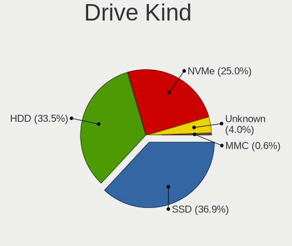
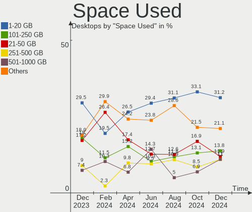
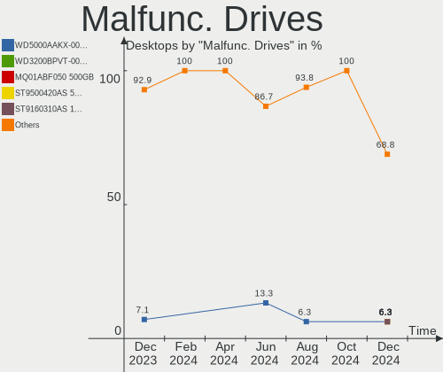
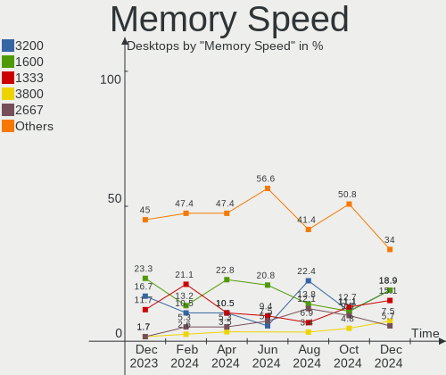

Linux in Brazil - Hardware Trends (Desktops)
--------------------------------------------

A project to identify most popular hardware characteristics and track their change
over time based on data collected by Linux users at https://Linux-Hardware.org.

Anyone can contribute to this report by the [hw-probe](https://github.com/linuxhw/hw-probe) tool:

    sudo -E hw-probe -all -upload

Period: Aug, 2022.

Contents
--------

* [ System ](#system)
  - [ OS                       ](#os)
  - [ OS Family                ](#os-family)
  - [ Kernel                   ](#kernel)
  - [ Kernel Family            ](#kernel-family)
  - [ Kernel Major Ver.        ](#kernel-major-ver)
  - [ Arch                     ](#arch)
  - [ DE                       ](#de)
  - [ Display Server           ](#display-server)
  - [ Display Manager          ](#display-manager)
  - [ OS Lang                  ](#os-lang)
  - [ Boot Mode                ](#boot-mode)
  - [ Filesystem               ](#filesystem)
  - [ Part. scheme             ](#part-scheme)
  - [ Dual Boot with Linux/BSD ](#dual-boot-with-linuxbsd)
  - [ Dual Boot (Win)          ](#dual-boot-win)

* [ Board ](#board)
  - [ Vendor                   ](#vendor)
  - [ Model                    ](#model)
  - [ Model Family             ](#model-family)
  - [ MFG Year                 ](#mfg-year)
  - [ Form Factor              ](#form-factor)
  - [ Secure Boot              ](#secure-boot)
  - [ Coreboot                 ](#coreboot)
  - [ RAM Size                 ](#ram-size)
  - [ RAM Used                 ](#ram-used)
  - [ Total Drives             ](#total-drives)
  - [ Has CD-ROM               ](#has-cd-rom)
  - [ Has Ethernet             ](#has-ethernet)
  - [ Has WiFi                 ](#has-wifi)
  - [ Has Bluetooth            ](#has-bluetooth)

* [ Location ](#location)
  - [ Country                  ](#country)
  - [ City                     ](#city)

* [ Drives ](#drives)
  - [ Drive Vendor             ](#drive-vendor)
  - [ Drive Model              ](#drive-model)
  - [ HDD Vendor               ](#hdd-vendor)
  - [ SSD Vendor               ](#ssd-vendor)
  - [ Drive Kind               ](#drive-kind)
  - [ Drive Connector          ](#drive-connector)
  - [ Drive Size               ](#drive-size)
  - [ Space Total              ](#space-total)
  - [ Space Used               ](#space-used)
  - [ Malfunc. Drives          ](#malfunc-drives)
  - [ Malfunc. Drive Vendor    ](#malfunc-drive-vendor)
  - [ Malfunc. HDD Vendor      ](#malfunc-hdd-vendor)
  - [ Malfunc. Drive Kind      ](#malfunc-drive-kind)
  - [ Failed Drives            ](#failed-drives)
  - [ Failed Drive Vendor      ](#failed-drive-vendor)
  - [ Drive Status             ](#drive-status)

* [ Storage controller ](#storage-controller)
  - [ Storage Vendor           ](#storage-vendor)
  - [ Storage Model            ](#storage-model)
  - [ Storage Kind             ](#storage-kind)

* [ Processor ](#processor)
  - [ CPU Vendor               ](#cpu-vendor)
  - [ CPU Model                ](#cpu-model)
  - [ CPU Model Family         ](#cpu-model-family)
  - [ CPU Cores                ](#cpu-cores)
  - [ CPU Sockets              ](#cpu-sockets)
  - [ CPU Threads              ](#cpu-threads)
  - [ CPU Op-Modes             ](#cpu-op-modes)
  - [ CPU Microcode            ](#cpu-microcode)
  - [ CPU Microarch            ](#cpu-microarch)

* [ Graphics ](#graphics)
  - [ GPU Vendor               ](#gpu-vendor)
  - [ GPU Model                ](#gpu-model)
  - [ GPU Combo                ](#gpu-combo)
  - [ GPU Driver               ](#gpu-driver)
  - [ GPU Memory               ](#gpu-memory)

* [ Monitor ](#monitor)
  - [ Monitor Vendor           ](#monitor-vendor)
  - [ Monitor Model            ](#monitor-model)
  - [ Monitor Resolution       ](#monitor-resolution)
  - [ Monitor Diagonal         ](#monitor-diagonal)
  - [ Monitor Width            ](#monitor-width)
  - [ Aspect Ratio             ](#aspect-ratio)
  - [ Monitor Area             ](#monitor-area)
  - [ Pixel Density            ](#pixel-density)
  - [ Multiple Monitors        ](#multiple-monitors)

* [ Network ](#network)
  - [ Net Controller Vendor    ](#net-controller-vendor)
  - [ Net Controller Model     ](#net-controller-model)
  - [ Wireless Vendor          ](#wireless-vendor)
  - [ Wireless Model           ](#wireless-model)
  - [ Ethernet Vendor          ](#ethernet-vendor)
  - [ Ethernet Model           ](#ethernet-model)
  - [ Net Controller Kind      ](#net-controller-kind)
  - [ Used Controller          ](#used-controller)
  - [ NICs                     ](#nics)
  - [ IPv6                     ](#ipv6)

* [ Bluetooth ](#bluetooth)
  - [ Bluetooth Vendor         ](#bluetooth-vendor)
  - [ Bluetooth Model          ](#bluetooth-model)

* [ Sound ](#sound)
  - [ Sound Vendor             ](#sound-vendor)
  - [ Sound Model              ](#sound-model)

* [ Memory ](#memory)
  - [ Memory Vendor            ](#memory-vendor)
  - [ Memory Model             ](#memory-model)
  - [ Memory Kind              ](#memory-kind)
  - [ Memory Form Factor       ](#memory-form-factor)
  - [ Memory Size              ](#memory-size)
  - [ Memory Speed             ](#memory-speed)

* [ Printers & scanners ](#printers--scanners)
  - [ Printer Vendor           ](#printer-vendor)
  - [ Printer Model            ](#printer-model)
  - [ Scanner Vendor           ](#scanner-vendor)
  - [ Scanner Model            ](#scanner-model)

* [ Camera ](#camera)
  - [ Camera Vendor            ](#camera-vendor)
  - [ Camera Model             ](#camera-model)

* [ Security ](#security)
  - [ Fingerprint Vendor       ](#fingerprint-vendor)
  - [ Fingerprint Model        ](#fingerprint-model)
  - [ Chipcard Vendor          ](#chipcard-vendor)
  - [ Chipcard Model           ](#chipcard-model)

* [ Unsupported ](#unsupported)
  - [ Unsupported Devices      ](#unsupported-devices)
  - [ Unsupported Device Types ](#unsupported-device-types)

System
------

OS
--

Installed operating systems

| Name                         | Desktops | Percent |
|------------------------------|----------|---------|
| Ubuntu 22.04                 | 13       | 15.85%  |
| OpenMandriva 4.3             | 9        | 10.98%  |
| Fedora 36                    | 6        | 7.32%   |
| Ubuntu 20.04                 | 5        | 6.1%    |
| Zorin 16                     | 4        | 4.88%   |
| Pop!_OS 22.04                | 3        | 3.66%   |
| openSUSE Tumbleweed-XXXXXXXX | 3        | 3.66%   |
| OpenMandriva 4.90            | 3        | 3.66%   |
| Linux Mint 20.3              | 3        | 3.66%   |
| Kubuntu 22.04                | 3        | 3.66%   |
| Debian 11                    | 3        | 3.66%   |
| Arch                         | 3        | 3.66%   |
| ROSA 12.2                    | 2        | 2.44%   |
| Linux Mint 21                | 2        | 2.44%   |
| KDE neon 20.04               | 2        | 2.44%   |
| Zorin 15                     | 1        | 1.22%   |
| Xubuntu 20.04                | 1        | 1.22%   |
| Pop!_OS 21.10                | 1        | 1.22%   |
| OpenMandriva 4.2             | 1        | 1.22%   |
| Manjaro 21.3.6               | 1        | 1.22%   |
| Manjaro                      | 1        | 1.22%   |
| Linux Mint 20.2              | 1        | 1.22%   |
| Linux Mint 19.1              | 1        | 1.22%   |
| Kubuntu 20.04                | 1        | 1.22%   |
| Kali 2022.3                  | 1        | 1.22%   |
| GNOME OS 43                  | 1        | 1.22%   |
| Feren OS 20.04               | 1        | 1.22%   |
| Endless 4.0.7                | 1        | 1.22%   |
| Elementary 6.1               | 1        | 1.22%   |
| Debian Testing               | 1        | 1.22%   |
| Clear Linux 36870            | 1        | 1.22%   |
| BigLinux 21.3.7              | 1        | 1.22%   |
| Arch Rolling                 | 1        | 1.22%   |

OS Family
---------

OS without a version

| Name         | Desktops | Percent |
|--------------|----------|---------|
| Ubuntu       | 18       | 21.95%  |
| OpenMandriva | 13       | 15.85%  |
| Linux Mint   | 7        | 8.54%   |
| Fedora       | 6        | 7.32%   |
| Zorin        | 5        | 6.1%    |
| Pop!_OS      | 4        | 4.88%   |
| Kubuntu      | 4        | 4.88%   |
| Debian       | 4        | 4.88%   |
| Arch         | 4        | 4.88%   |
| openSUSE     | 3        | 3.66%   |
| ROSA         | 2        | 2.44%   |
| Manjaro      | 2        | 2.44%   |
| KDE neon     | 2        | 2.44%   |
| Xubuntu      | 1        | 1.22%   |
| Kali         | 1        | 1.22%   |
| GNOME OS     | 1        | 1.22%   |
| Feren OS     | 1        | 1.22%   |
| Endless      | 1        | 1.22%   |
| Elementary   | 1        | 1.22%   |
| Clear Linux  | 1        | 1.22%   |
| BigLinux     | 1        | 1.22%   |

Kernel
------

Version of the Linux kernel

| Version                             | Desktops | Percent |
|-------------------------------------|----------|---------|
| 5.15.0-46-generic                   | 19       | 23.17%  |
| 5.15.0-43-generic                   | 9        | 10.98%  |
| 5.16.7-desktop-1omv4003             | 8        | 9.76%   |
| 5.4.0-124-generic                   | 2        | 2.44%   |
| 5.18.12-desktop-3omv4090            | 2        | 2.44%   |
| 5.18.10-76051810-generic            | 2        | 2.44%   |
| 5.15.60-1-MANJARO                   | 2        | 2.44%   |
| 5.15.0-25-generic                   | 2        | 2.44%   |
| 5.10.0-17-amd64                     | 2        | 2.44%   |
| 5.4.0-122-generic                   | 1        | 1.22%   |
| 5.4.0-113-generic                   | 1        | 1.22%   |
| 5.19.3-arch1-1                      | 1        | 1.22%   |
| 5.19.2-1178.native                  | 1        | 1.22%   |
| 5.19.1-zen1-1-zen                   | 1        | 1.22%   |
| 5.19.1-arch2-1                      | 1        | 1.22%   |
| 5.19.0-desktop-1omv4090             | 1        | 1.22%   |
| 5.18.5-200.fc36.x86_64              | 1        | 1.22%   |
| 5.18.19-200.fc36.x86_64             | 1        | 1.22%   |
| 5.18.18-200.fc36.x86_64             | 1        | 1.22%   |
| 5.18.17-200.fc36.x86_64             | 1        | 1.22%   |
| 5.18.16-arch1-1                     | 1        | 1.22%   |
| 5.18.16-200.fc36.x86_64             | 1        | 1.22%   |
| 5.18.16                             | 1        | 1.22%   |
| 5.18.15-200.fc36.x86_64             | 1        | 1.22%   |
| 5.18.15-1-default                   | 1        | 1.22%   |
| 5.18.12-1-default                   | 1        | 1.22%   |
| 5.18.11-1-default                   | 1        | 1.22%   |
| 5.18.0-kali5-amd64                  | 1        | 1.22%   |
| 5.18.0-4-amd64                      | 1        | 1.22%   |
| 5.17.5-76051705-generic             | 1        | 1.22%   |
| 5.17.15-76051715-generic            | 1        | 1.22%   |
| 5.16.13-desktop-1omv4003            | 1        | 1.22%   |
| 5.15.0-47-generic                   | 1        | 1.22%   |
| 5.15.0-41-generic                   | 1        | 1.22%   |
| 5.15.0-40-generic                   | 1        | 1.22%   |
| 5.13.0-51-generic                   | 1        | 1.22%   |
| 5.11.0-35-generic                   | 1        | 1.22%   |
| 5.10.74-generic-2rosa2021.1-x86_64  | 1        | 1.22%   |
| 5.10.14-desktop-1omv4002            | 1        | 1.22%   |
| 5.10.136-1-MANJARO                  | 1        | 1.22%   |
| 5.10.118-generic-2rosa2021.1-x86_64 | 1        | 1.22%   |
| 5.10.0-16-amd64                     | 1        | 1.22%   |
| 4.15.0-173-generic                  | 1        | 1.22%   |

Kernel Family
-------------

Linux kernel without a distro release

| Version  | Desktops | Percent |
|----------|----------|---------|
| 5.15.0   | 33       | 40.24%  |
| 5.16.7   | 8        | 9.76%   |
| 5.4.0    | 4        | 4.88%   |
| 5.18.16  | 3        | 3.66%   |
| 5.18.12  | 3        | 3.66%   |
| 5.10.0   | 3        | 3.66%   |
| 5.19.1   | 2        | 2.44%   |
| 5.18.15  | 2        | 2.44%   |
| 5.18.10  | 2        | 2.44%   |
| 5.18.0   | 2        | 2.44%   |
| 5.15.60  | 2        | 2.44%   |
| 5.19.3   | 1        | 1.22%   |
| 5.19.2   | 1        | 1.22%   |
| 5.19.0   | 1        | 1.22%   |
| 5.18.5   | 1        | 1.22%   |
| 5.18.19  | 1        | 1.22%   |
| 5.18.18  | 1        | 1.22%   |
| 5.18.17  | 1        | 1.22%   |
| 5.18.11  | 1        | 1.22%   |
| 5.17.5   | 1        | 1.22%   |
| 5.17.15  | 1        | 1.22%   |
| 5.16.13  | 1        | 1.22%   |
| 5.13.0   | 1        | 1.22%   |
| 5.11.0   | 1        | 1.22%   |
| 5.10.74  | 1        | 1.22%   |
| 5.10.14  | 1        | 1.22%   |
| 5.10.136 | 1        | 1.22%   |
| 5.10.118 | 1        | 1.22%   |
| 4.15.0   | 1        | 1.22%   |

Kernel Major Ver.
-----------------

Linux kernel major version

| Version | Desktops | Percent |
|---------|----------|---------|
| 5.15    | 35       | 42.68%  |
| 5.18    | 17       | 20.73%  |
| 5.16    | 9        | 10.98%  |
| 5.10    | 7        | 8.54%   |
| 5.19    | 5        | 6.1%    |
| 5.4     | 4        | 4.88%   |
| 5.17    | 2        | 2.44%   |
| 5.13    | 1        | 1.22%   |
| 5.11    | 1        | 1.22%   |
| 4.15    | 1        | 1.22%   |

Arch
----

OS architecture (x86_64, i586, etc.)

| Name   | Desktops | Percent |
|--------|----------|---------|
| x86_64 | 81       | 98.78%  |
| i686   | 1        | 1.22%   |

DE
--

Desktop Environment

| Name       | Desktops | Percent |
|------------|----------|---------|
| GNOME      | 41       | 50%     |
| KDE5       | 29       | 35.37%  |
| X-Cinnamon | 5        | 6.1%    |
| XFCE       | 3        | 3.66%   |
| Cinnamon   | 2        | 2.44%   |
| Pantheon   | 1        | 1.22%   |
| LXQt       | 1        | 1.22%   |

Display Server
--------------

X11 or Wayland

| Name    | Desktops | Percent |
|---------|----------|---------|
| X11     | 65       | 79.27%  |
| Wayland | 17       | 20.73%  |

Display Manager
---------------

SDDM, LightDM, etc.

| Name    | Desktops | Percent |
|---------|----------|---------|
| Unknown | 30       | 36.59%  |
| SDDM    | 18       | 21.95%  |
| GDM3    | 18       | 21.95%  |
| LightDM | 8        | 9.76%   |
| GDM     | 7        | 8.54%   |
| XDM     | 1        | 1.22%   |

OS Lang
-------

Language

| Lang  | Desktops | Percent |
|-------|----------|---------|
| pt_BR | 62       | 75.61%  |
| en_US | 15       | 18.29%  |
| pt_PT | 2        | 2.44%   |
| en_GB | 1        | 1.22%   |
| en_AG | 1        | 1.22%   |
| C     | 1        | 1.22%   |

Boot Mode
---------

EFI or BIOS

| Mode | Desktops | Percent |
|------|----------|---------|
| BIOS | 55       | 67.07%  |
| EFI  | 27       | 32.93%  |

Filesystem
----------

Type of filesystem

| Type    | Desktops | Percent |
|---------|----------|---------|
| Ext4    | 56       | 68.29%  |
| Btrfs   | 13       | 15.85%  |
| Overlay | 12       | 14.63%  |
| Ext3    | 1        | 1.22%   |

Part. scheme
------------

Scheme of partitioning

| Type    | Desktops | Percent |
|---------|----------|---------|
| Unknown | 48       | 58.54%  |
| GPT     | 23       | 28.05%  |
| MBR     | 11       | 13.41%  |

Dual Boot with Linux/BSD
------------------------

Hosting more than one Linux/BSD

| Dual boot | Desktops | Percent |
|-----------|----------|---------|
| No        | 73       | 89.02%  |
| Yes       | 9        | 10.98%  |

Dual Boot (Win)
---------------

Hosting Linux and Windows

| Dual boot | Desktops | Percent |
|-----------|----------|---------|
| No        | 66       | 80.49%  |
| Yes       | 16       | 19.51%  |

Board
-----

Vendor
------

Motherboard manufacturer

| Name                      | Desktops | Percent |
|---------------------------|----------|---------|
| ASUSTek Computer          | 24       | 29.27%  |
| Gigabyte Technology       | 15       | 18.29%  |
| Intel                     | 5        | 6.1%    |
| ASRock                    | 5        | 6.1%    |
| Hewlett-Packard           | 4        | 4.88%   |
| Foxconn                   | 4        | 4.88%   |
| Biostar                   | 4        | 4.88%   |
| PCWare                    | 3        | 3.66%   |
| MSI                       | 3        | 3.66%   |
| MACHINIST                 | 3        | 3.66%   |
| Supermicro                | 2        | 2.44%   |
| Positivo                  | 2        | 2.44%   |
| Dell                      | 2        | 2.44%   |
| VS Company                | 1        | 1.22%   |
| Semp Toshiba              | 1        | 1.22%   |
| OEM                       | 1        | 1.22%   |
| Arquimedes Automacao Inf. | 1        | 1.22%   |
| AMI                       | 1        | 1.22%   |
| Unknown                   | 1        | 1.22%   |

Model
-----

Motherboard model

| Name                                                             | Desktops | Percent |
|------------------------------------------------------------------|----------|---------|
| ASUS All Series                                                  | 5        | 6.1%    |
| Intel H61                                                        | 2        | 2.44%   |
| Gigabyte H61M-S1                                                 | 2        | 2.44%   |
| Biostar G31-M7 TE                                                | 2        | 2.44%   |
| ASUS M5A78L-M/USB3                                               | 2        | 2.44%   |
| ASUS M5A78L-M LX/BR                                              | 2        | 2.44%   |
| Unknown                                                          | 2        | 2.44%   |
| VS Company H61H2                                                 | 1        | 1.22%   |
| Supermicro SSG-6047R-E1CR36N                                     | 1        | 1.22%   |
| Supermicro SKAGIT09                                              | 1        | 1.22%   |
| Semp Toshiba STI                                                 | 1        | 1.22%   |
| Positivo POS-PIQ77CL                                             | 1        | 1.22%   |
| Positivo POS-PARS760GCD                                          | 1        | 1.22%   |
| PCWare IPX3060E                                                  | 1        | 1.22%   |
| PCWare IPMH61R3                                                  | 1        | 1.22%   |
| PCWare IPMH61R1                                                  | 1        | 1.22%   |
| OEM A320                                                         | 1        | 1.22%   |
| MSI MS-7D18                                                      | 1        | 1.22%   |
| MSI MS-7A33                                                      | 1        | 1.22%   |
| MSI FJ452AA-AC4 a6615br                                          | 1        | 1.22%   |
| MACHINIST X99-RS9 V2.0                                           | 1        | 1.22%   |
| MACHINIST X79 (INTEL Xeon E5/Corei7 DMI2 - C600/C200 Cipset V309 | 1        | 1.22%   |
| MACHINIST H81M-PRO S1 V2.0                                       | 1        | 1.22%   |
| Intel DH61WW AAG23116-203                                        | 1        | 1.22%   |
| Intel B75                                                        | 1        | 1.22%   |
| HP EliteDesk 800 G1 SFF                                          | 1        | 1.22%   |
| HP EliteDesk 705 G1 SFF                                          | 1        | 1.22%   |
| HP Compaq Elite 8300 SFF                                         | 1        | 1.22%   |
| HP Compaq 6005 Pro SFF PC                                        | 1        | 1.22%   |
| Gigabyte Z97X-Gaming 7                                           | 1        | 1.22%   |
| Gigabyte Z77M-D3H                                                | 1        | 1.22%   |
| Gigabyte X470 AORUS GAMING 7 WIFI                                | 1        | 1.22%   |
| Gigabyte M68MT-S2P                                               | 1        | 1.22%   |
| Gigabyte GA-VM900M                                               | 1        | 1.22%   |
| Gigabyte GA-78LMT-USB3 6.0                                       | 1        | 1.22%   |
| Gigabyte G31M-ES2C                                               | 1        | 1.22%   |
| Gigabyte F2A68HM-S1                                              | 1        | 1.22%   |
| Gigabyte F2A55M-S1                                               | 1        | 1.22%   |
| Gigabyte B75M-D3H                                                | 1        | 1.22%   |
| Gigabyte B550M DS3H                                              | 1        | 1.22%   |
| Gigabyte AX370-Gaming 5                                          | 1        | 1.22%   |
| Gigabyte 970A-DS3P                                               | 1        | 1.22%   |
| Foxconn s5-1410br                                                | 1        | 1.22%   |
| Foxconn Pro3500SeriesBR                                          | 1        | 1.22%   |
| Foxconn Pro 3500 Series BR                                       | 1        | 1.22%   |
| Foxconn H61M/H61M-S                                              | 1        | 1.22%   |
| Dell Vostro 3681                                                 | 1        | 1.22%   |
| Dell OptiPlex 3010                                               | 1        | 1.22%   |
| Biostar G41D3C                                                   | 1        | 1.22%   |
| Biostar A68N-5100                                                | 1        | 1.22%   |
| ASUS TUF H310M-PLUS GAMING/BR                                    | 1        | 1.22%   |
| ASUS TUF Gaming X570-PLUS                                        | 1        | 1.22%   |
| ASUS TUF Gaming B450M-PRO II                                     | 1        | 1.22%   |
| ASUS ROG Maximus XII EXTREME                                     | 1        | 1.22%   |
| ASUS PRIME H410M-E                                               | 1        | 1.22%   |
| ASUS PRIME H310M-E R2.0/BR                                       | 1        | 1.22%   |
| ASUS PRIME A320M-K/BR                                            | 1        | 1.22%   |
| ASUS P8H61-M LX3 R2.0                                            | 1        | 1.22%   |
| ASUS P8H61-M LX3                                                 | 1        | 1.22%   |
| ASUS P8H61-M LX2 R2.0                                            | 1        | 1.22%   |

Model Family
------------

Motherboard model prefix

| Name                         | Desktops | Percent |
|------------------------------|----------|---------|
| ASUS All                     | 5        | 6.1%    |
| ASUS M5A78L-M                | 4        | 4.88%   |
| ASUS TUF                     | 3        | 3.66%   |
| ASUS PRIME                   | 3        | 3.66%   |
| ASUS P8H61-M                 | 3        | 3.66%   |
| Intel H61                    | 2        | 2.44%   |
| HP EliteDesk                 | 2        | 2.44%   |
| HP Compaq                    | 2        | 2.44%   |
| Gigabyte H61M-S1             | 2        | 2.44%   |
| Biostar G31-M7               | 2        | 2.44%   |
| Unknown                      | 2        | 2.44%   |
| VS Company H61H2             | 1        | 1.22%   |
| Supermicro SSG-6047R-E1CR36N | 1        | 1.22%   |
| Supermicro SKAGIT09          | 1        | 1.22%   |
| Semp Toshiba STI             | 1        | 1.22%   |
| Positivo POS-PIQ77CL         | 1        | 1.22%   |
| Positivo POS-PARS760GCD      | 1        | 1.22%   |
| PCWare IPX3060E              | 1        | 1.22%   |
| PCWare IPMH61R3              | 1        | 1.22%   |
| PCWare IPMH61R1              | 1        | 1.22%   |
| OEM A320                     | 1        | 1.22%   |
| MSI MS-7D18                  | 1        | 1.22%   |
| MSI MS-7A33                  | 1        | 1.22%   |
| MSI FJ452AA-AC4              | 1        | 1.22%   |
| MACHINIST X99-RS9            | 1        | 1.22%   |
| MACHINIST X79                | 1        | 1.22%   |
| MACHINIST H81M-PRO           | 1        | 1.22%   |
| Intel DH61WW                 | 1        | 1.22%   |
| Intel B75                    | 1        | 1.22%   |
| Gigabyte Z97X-Gaming         | 1        | 1.22%   |
| Gigabyte Z77M-D3H            | 1        | 1.22%   |
| Gigabyte X470                | 1        | 1.22%   |
| Gigabyte M68MT-S2P           | 1        | 1.22%   |
| Gigabyte GA-VM900M           | 1        | 1.22%   |
| Gigabyte GA-78LMT-USB3       | 1        | 1.22%   |
| Gigabyte G31M-ES2C           | 1        | 1.22%   |
| Gigabyte F2A68HM-S1          | 1        | 1.22%   |
| Gigabyte F2A55M-S1           | 1        | 1.22%   |
| Gigabyte B75M-D3H            | 1        | 1.22%   |
| Gigabyte B550M               | 1        | 1.22%   |
| Gigabyte AX370-Gaming        | 1        | 1.22%   |
| Gigabyte 970A-DS3P           | 1        | 1.22%   |
| Foxconn s5-1410br            | 1        | 1.22%   |
| Foxconn Pro3500SeriesBR      | 1        | 1.22%   |
| Foxconn Pro                  | 1        | 1.22%   |
| Foxconn H61M                 | 1        | 1.22%   |
| Dell Vostro                  | 1        | 1.22%   |
| Dell OptiPlex                | 1        | 1.22%   |
| Biostar G41D3C               | 1        | 1.22%   |
| Biostar A68N-5100            | 1        | 1.22%   |
| ASUS ROG                     | 1        | 1.22%   |
| ASUS P8B75-V                 | 1        | 1.22%   |
| ASUS P5KPL-CM                | 1        | 1.22%   |
| ASUS H61M-A                  | 1        | 1.22%   |
| ASUS H170M-PLUS              | 1        | 1.22%   |
| ASUS B150M-C                 | 1        | 1.22%   |
| ASRock X370                  | 1        | 1.22%   |
| ASRock FM2A55M-HD+           | 1        | 1.22%   |
| ASRock B550M-ITX             | 1        | 1.22%   |
| ASRock B450M                 | 1        | 1.22%   |

MFG Year
--------

Motherboard manufacture year

| Year | Desktops | Percent |
|------|----------|---------|
| 2012 | 13       | 15.85%  |
| 2013 | 10       | 12.2%   |
| 2011 | 9        | 10.98%  |
| 2020 | 7        | 8.54%   |
| 2017 | 7        | 8.54%   |
| 2014 | 7        | 8.54%   |
| 2019 | 6        | 7.32%   |
| 2008 | 5        | 6.1%    |
| 2018 | 4        | 4.88%   |
| 2021 | 3        | 3.66%   |
| 2016 | 3        | 3.66%   |
| 2015 | 2        | 2.44%   |
| 2010 | 2        | 2.44%   |
| 2009 | 2        | 2.44%   |
| 2022 | 1        | 1.22%   |
| 2007 | 1        | 1.22%   |

Form Factor
-----------

Physical design of the computer

| Name    | Desktops | Percent |
|---------|----------|---------|
| Desktop | 82       | 100%    |

Secure Boot
-----------

Enabled or disabled

| State    | Desktops | Percent |
|----------|----------|---------|
| Disabled | 80       | 97.56%  |
| Enabled  | 2        | 2.44%   |

Coreboot
--------

Have coreboot on board

| Used | Desktops | Percent |
|------|----------|---------|
| No   | 82       | 100%    |

RAM Size
--------

Total RAM memory

| Size in GB  | Desktops | Percent |
|-------------|----------|---------|
| 8.01-16.0   | 23       | 28.05%  |
| 4.01-8.0    | 19       | 23.17%  |
| 3.01-4.0    | 15       | 18.29%  |
| 16.01-24.0  | 13       | 15.85%  |
| 32.01-64.0  | 7        | 8.54%   |
| 64.01-256.0 | 2        | 2.44%   |
| 1.01-2.0    | 2        | 2.44%   |
| 2.01-3.0    | 1        | 1.22%   |

RAM Used
--------

Used RAM memory

| Used GB   | Desktops | Percent |
|-----------|----------|---------|
| 1.01-2.0  | 32       | 39.02%  |
| 2.01-3.0  | 26       | 31.71%  |
| 3.01-4.0  | 12       | 14.63%  |
| 4.01-8.0  | 7        | 8.54%   |
| 8.01-16.0 | 2        | 2.44%   |
| 0.51-1.0  | 2        | 2.44%   |
| 0.01-0.5  | 1        | 1.22%   |

Total Drives
------------

Number of drives on board

| Drives | Desktops | Percent |
|--------|----------|---------|
| 1      | 46       | 56.1%   |
| 2      | 13       | 15.85%  |
| 3      | 11       | 13.41%  |
| 5      | 3        | 3.66%   |
| 4      | 3        | 3.66%   |
| 0      | 3        | 3.66%   |
| 6      | 2        | 2.44%   |
| 7      | 1        | 1.22%   |

Has CD-ROM
----------

Has CD-ROM on board

| Presented | Desktops | Percent |
|-----------|----------|---------|
| No        | 58       | 70.73%  |
| Yes       | 24       | 29.27%  |

Has Ethernet
------------

Has Ethernet on board

| Presented | Desktops | Percent |
|-----------|----------|---------|
| Yes       | 81       | 98.78%  |
| No        | 1        | 1.22%   |

Has WiFi
--------

Has WiFi module

| Presented | Desktops | Percent |
|-----------|----------|---------|
| No        | 53       | 64.63%  |
| Yes       | 29       | 35.37%  |

Has Bluetooth
-------------

Has Bluetooth module

| Presented | Desktops | Percent |
|-----------|----------|---------|
| No        | 57       | 69.51%  |
| Yes       | 25       | 30.49%  |

Location
--------

Country
-------

Geographic location (country)

| Country | Desktops | Percent |
|---------|----------|---------|
| Brazil  | 82       | 100%    |

City
----

Geographic location (city)

| City                     | Desktops | Percent |
|--------------------------|----------|---------|
| Brasília                | 7        | 8.54%   |
| Rio de Janeiro           | 5        | 6.1%    |
| Sao Paulo                | 4        | 4.88%   |
| Fortaleza                | 3        | 3.66%   |
| Vitória                 | 2        | 2.44%   |
| Valparaiso de Goias      | 2        | 2.44%   |
| Porto Alegre             | 2        | 2.44%   |
| Franca                   | 2        | 2.44%   |
| Farroupilha              | 2        | 2.44%   |
| Belo Horizonte           | 2        | 2.44%   |
| Belém                   | 2        | 2.44%   |
| Várzea Grande           | 1        | 1.22%   |
| Uberlândia              | 1        | 1.22%   |
| Tubarao                  | 1        | 1.22%   |
| Toritama                 | 1        | 1.22%   |
| Teresina                 | 1        | 1.22%   |
| Suzano                   | 1        | 1.22%   |
| Seropedica               | 1        | 1.22%   |
| Sao Sebastiao do Paraiso | 1        | 1.22%   |
| Sao Bernardo do Campo    | 1        | 1.22%   |
| Santa Maria              | 1        | 1.22%   |
| Santa Cruz do Sul        | 1        | 1.22%   |
| Salvador                 | 1        | 1.22%   |
| Providencia              | 1        | 1.22%   |
| Paulinia                 | 1        | 1.22%   |
| Palmas                   | 1        | 1.22%   |
| Palhoca                  | 1        | 1.22%   |
| Ourinhos                 | 1        | 1.22%   |
| Olinda                   | 1        | 1.22%   |
| Nova Olinda              | 1        | 1.22%   |
| Maringá                 | 1        | 1.22%   |
| Marica                   | 1        | 1.22%   |
| Manaus                   | 1        | 1.22%   |
| Lajeado                  | 1        | 1.22%   |
| Juiz de Fora             | 1        | 1.22%   |
| Jaci                     | 1        | 1.22%   |
| Iturama                  | 1        | 1.22%   |
| Itaborai                 | 1        | 1.22%   |
| Ipatinga                 | 1        | 1.22%   |
| Guapore                  | 1        | 1.22%   |
| Garibaldi                | 1        | 1.22%   |
| Curitiba                 | 1        | 1.22%   |
| Chapecó                 | 1        | 1.22%   |
| Cascavel                 | 1        | 1.22%   |
| Cariacica                | 1        | 1.22%   |
| Caraguatatuba            | 1        | 1.22%   |
| Canela                   | 1        | 1.22%   |
| Campo Grande             | 1        | 1.22%   |
| Cambe                    | 1        | 1.22%   |
| Braganca Paulista        | 1        | 1.22%   |
| Blumenau                 | 1        | 1.22%   |
| Belford Roxo             | 1        | 1.22%   |
| Balneário Camboriú     | 1        | 1.22%   |
| Araçatuba               | 1        | 1.22%   |
| Aracaju                  | 1        | 1.22%   |
| Apucarana                | 1        | 1.22%   |
| Anápolis                | 1        | 1.22%   |
| Americana                | 1        | 1.22%   |
| Abreu e Lima             | 1        | 1.22%   |
| Unknown                  | 1        | 1.22%   |

Drives
------

Drive Vendor
------------

Hard drive vendors

| Vendor                    | Desktops | Drives | Percent |
|---------------------------|----------|--------|---------|
| Seagate                   | 31       | 40     | 24.03%  |
| WDC                       | 25       | 29     | 19.38%  |
| Samsung Electronics       | 14       | 15     | 10.85%  |
| Kingston                  | 14       | 15     | 10.85%  |
| China                     | 7        | 7      | 5.43%   |
| Hitachi                   | 4        | 5      | 3.1%    |
| Toshiba                   | 3        | 4      | 2.33%   |
| Silicon Motion            | 3        | 3      | 2.33%   |
| SanDisk                   | 3        | 3      | 2.33%   |
| Unknown                   | 2        | 2      | 1.55%   |
| SK hynix                  | 2        | 3      | 1.55%   |
| Crucial                   | 2        | 2      | 1.55%   |
| XrayDisk                  | 1        | 1      | 0.78%   |
| XPG                       | 1        | 1      | 0.78%   |
| WALRAM                    | 1        | 1      | 0.78%   |
| S3+                       | 1        | 1      | 0.78%   |
| Realtek Semiconductor     | 1        | 1      | 0.78%   |
| Phison                    | 1        | 1      | 0.78%   |
| Patriot                   | 1        | 1      | 0.78%   |
| Netac                     | 1        | 1      | 0.78%   |
| Micron/Crucial Technology | 1        | 1      | 0.78%   |
| Maxtor                    | 1        | 1      | 0.78%   |
| KODAK                     | 1        | 1      | 0.78%   |
| KingSpec                  | 1        | 1      | 0.78%   |
| Gigabyte Technology       | 1        | 1      | 0.78%   |
| Corsair                   | 1        | 1      | 0.78%   |
| BHT                       | 1        | 1      | 0.78%   |
| AFOX                      | 1        | 1      | 0.78%   |
| Acer                      | 1        | 1      | 0.78%   |
| A-DATA Technology         | 1        | 1      | 0.78%   |
| Unknown                   | 1        | 1      | 0.78%   |

Drive Model
-----------

Hard drive models

| Model                               | Desktops | Percent |
|-------------------------------------|----------|---------|
| Seagate ST500DM002-1BD142 500GB     | 6        | 4.17%   |
| Kingston SA400S37120G 120GB SSD     | 6        | 4.17%   |
| WDC WD5000AAKX-00U6AA0 500GB        | 3        | 2.08%   |
| WDC WD5000AAKX-003CA0 500GB         | 3        | 2.08%   |
| Samsung HD322HJ 320GB               | 3        | 2.08%   |
| Kingston SA400S37480G 480GB SSD     | 3        | 2.08%   |
| WDC WD10EZEX-00WN4A0 1TB            | 2        | 1.39%   |
| Seagate ST31000528AS 1TB            | 2        | 1.39%   |
| Seagate ST2000DM006-2DM164 2TB      | 2        | 1.39%   |
| Seagate ST1000LM024 HN-M101MBB 1TB  | 2        | 1.39%   |
| Kingston SV300S37A120G 120GB SSD    | 2        | 1.39%   |
| Kingston SA400S37240G 240GB SSD     | 2        | 1.39%   |
| Hitachi HUA723020ALA641 2TB         | 2        | 1.39%   |
| XrayDisk 480GB SSD                  | 1        | 0.69%   |
| XPG GAMMIX S11 Pro 1TB              | 1        | 0.69%   |
| WDC WDS500G2B0A-00SM50 500GB SSD    | 1        | 0.69%   |
| WDC WDS240G1G0A-00SS50 240GB SSD    | 1        | 0.69%   |
| WDC WDS200T2B0B 2TB SSD             | 1        | 0.69%   |
| WDC WDS100T2B0C-00PXH0 1TB          | 1        | 0.69%   |
| WDC WD800JD-75MSA3 80GB             | 1        | 0.69%   |
| WDC WD5000LUCT-63RC2Y0 500GB        | 1        | 0.69%   |
| WDC WD5000LPVX-80V0TT0 500GB        | 1        | 0.69%   |
| WDC WD5000AVVS-63M8B0 500GB         | 1        | 0.69%   |
| WDC WD5000AVVS-63H0B1 500GB         | 1        | 0.69%   |
| WDC WD5000AAKX-00ERMA0 500GB        | 1        | 0.69%   |
| WDC WD3200JS-57PDB0 320GB           | 1        | 0.69%   |
| WDC WD2500AAJS-00M0A0 250GB         | 1        | 0.69%   |
| WDC WD10JPVX-22JC3T0 1TB            | 1        | 0.69%   |
| WDC WD10EZEX-08WN4A0 1TB            | 1        | 0.69%   |
| WDC WD10EZEX-08M2NA0 1TB            | 1        | 0.69%   |
| WDC WD10EZEX-00BN5A0 1TB            | 1        | 0.69%   |
| WDC WD10EURX-63FH1Y0 1TB            | 1        | 0.69%   |
| WDC WD10EADS-65M2B1 1TB             | 1        | 0.69%   |
| WDC WD10EADS-114BB1 1TB             | 1        | 0.69%   |
| WDC WD10EADS-00P8B0 1TB             | 1        | 0.69%   |
| WDC WD1002FAEX-00Z3A0 1TB           | 1        | 0.69%   |
| WALRAM 128G                         | 1        | 0.69%   |
| Unknown SLD64G  64GB                | 1        | 0.69%   |
| Unknown NVMe SSD Drive 1TB          | 1        | 0.69%   |
| Toshiba MK6465GSX 640GB             | 1        | 0.69%   |
| Toshiba MK1234GSX 120GB             | 1        | 0.69%   |
| Toshiba HDWE140 4TB                 | 1        | 0.69%   |
| Toshiba DT01ACA100 1TB              | 1        | 0.69%   |
| SK hynix NVMe SSD Drive 512GB       | 1        | 0.69%   |
| SK hynix NVMe SSD Drive 2TB         | 1        | 0.69%   |
| SK hynix BC511 NVMe 256GB           | 1        | 0.69%   |
| Silicon Motion NVMe SSD Drive 512GB | 1        | 0.69%   |
| Silicon Motion NVMe SSD Drive 500GB | 1        | 0.69%   |
| Silicon Motion NVMe SSD Drive 256GB | 1        | 0.69%   |
| Seagate ST9500325AS 500GB           | 1        | 0.69%   |
| Seagate ST9160314AS 160GB           | 1        | 0.69%   |
| Seagate ST8000DM004-2CX188 8TB      | 1        | 0.69%   |
| Seagate ST500LM012 HN-M500MBB 500GB | 1        | 0.69%   |
| Seagate ST5000DM000-1FK178 5TB      | 1        | 0.69%   |
| Seagate ST4000VN008-2DR166 4TB      | 1        | 0.69%   |
| Seagate ST4000VN000-1H4168 4TB      | 1        | 0.69%   |
| Seagate ST3500630NS 500GB           | 1        | 0.69%   |
| Seagate ST3500418AS 500GB           | 1        | 0.69%   |
| Seagate ST3500414CS 500GB           | 1        | 0.69%   |
| Seagate ST3500413AS 500GB           | 1        | 0.69%   |

HDD Vendor
----------

Hard disk drive vendors

| Vendor              | Desktops | Drives | Percent |
|---------------------|----------|--------|---------|
| Seagate             | 31       | 40     | 43.66%  |
| WDC                 | 22       | 25     | 30.99%  |
| Samsung Electronics | 10       | 10     | 14.08%  |
| Hitachi             | 4        | 5      | 5.63%   |
| Toshiba             | 3        | 4      | 4.23%   |
| Maxtor              | 1        | 1      | 1.41%   |

SSD Vendor
----------

Solid state drive vendors

| Vendor              | Desktops | Drives | Percent |
|---------------------|----------|--------|---------|
| Kingston            | 13       | 14     | 32.5%   |
| China               | 7        | 7      | 17.5%   |
| WDC                 | 3        | 3      | 7.5%    |
| Samsung Electronics | 3        | 3      | 7.5%    |
| SanDisk             | 2        | 2      | 5%      |
| Crucial             | 2        | 2      | 5%      |
| XrayDisk            | 1        | 1      | 2.5%    |
| S3+                 | 1        | 1      | 2.5%    |
| Patriot             | 1        | 1      | 2.5%    |
| Netac               | 1        | 1      | 2.5%    |
| KODAK               | 1        | 1      | 2.5%    |
| KingSpec            | 1        | 1      | 2.5%    |
| AFOX                | 1        | 1      | 2.5%    |
| Acer                | 1        | 1      | 2.5%    |
| A-DATA Technology   | 1        | 1      | 2.5%    |
| Unknown             | 1        | 1      | 2.5%    |

Drive Kind
----------

HDD or SSD

| Kind    | Desktops | Drives | Percent |
|---------|----------|--------|---------|
| HDD     | 55       | 85     | 49.55%  |
| SSD     | 37       | 41     | 33.33%  |
| NVMe    | 16       | 18     | 14.41%  |
| Unknown | 2        | 2      | 1.8%    |
| MMC     | 1        | 1      | 0.9%    |

Drive Connector
---------------

SATA, SAS, NVMe, etc.

| Type | Desktops | Drives | Percent |
|------|----------|--------|---------|
| SATA | 73       | 124    | 77.66%  |
| NVMe | 16       | 18     | 17.02%  |
| SAS  | 4        | 4      | 4.26%   |
| MMC  | 1        | 1      | 1.06%   |

Drive Size
----------

Size of hard drive

| Size in TB | Desktops | Drives | Percent |
|------------|----------|--------|---------|
| 0.01-0.5   | 59       | 79     | 62.77%  |
| 0.51-1.0   | 24       | 31     | 25.53%  |
| 1.01-2.0   | 7        | 10     | 7.45%   |
| 3.01-4.0   | 2        | 4      | 2.13%   |
| 4.01-10.0  | 2        | 2      | 2.13%   |

Space Total
-----------

Amount of disk space available on the file system

| Size in GB     | Desktops | Percent |
|----------------|----------|---------|
| 101-250        | 30       | 36.59%  |
| 251-500        | 14       | 17.07%  |
| 501-1000       | 11       | 13.41%  |
| 2001-3000      | 6        | 7.32%   |
| 1-20           | 6        | 7.32%   |
| 1001-2000      | 5        | 6.1%    |
| More than 3000 | 4        | 4.88%   |
| 51-100         | 4        | 4.88%   |
| 21-50          | 1        | 1.22%   |
| Unknown        | 1        | 1.22%   |

Space Used
----------

Amount of used disk space

| Used GB        | Desktops | Percent |
|----------------|----------|---------|
| 1-20           | 34       | 41.46%  |
| 21-50          | 14       | 17.07%  |
| 51-100         | 12       | 14.63%  |
| 251-500        | 7        | 8.54%   |
| 101-250        | 6        | 7.32%   |
| 501-1000       | 4        | 4.88%   |
| 1001-2000      | 2        | 2.44%   |
| More than 3000 | 1        | 1.22%   |
| 2001-3000      | 1        | 1.22%   |
| Unknown        | 1        | 1.22%   |

Malfunc. Drives
---------------

Drive models with a malfunction

| Model                               | Desktops | Drives | Percent |
|-------------------------------------|----------|--------|---------|
| Seagate ST500DM002-1BD142 500GB     | 3        | 3      | 16.67%  |
| WDC WD5000AVVS-63M8B0 500GB         | 1        | 1      | 5.56%   |
| WDC WD10EZEX-08WN4A0 1TB            | 1        | 1      | 5.56%   |
| WDC WD10EADS-65M2B1 1TB             | 1        | 1      | 5.56%   |
| Toshiba MK1234GSX 120GB             | 1        | 1      | 5.56%   |
| Seagate ST3500414CS 500GB           | 1        | 1      | 5.56%   |
| Seagate ST3500413AS 500GB           | 1        | 1      | 5.56%   |
| Seagate ST320LM001 HN-M320MBB 320GB | 1        | 1      | 5.56%   |
| Seagate ST2000DM006-2DM164 2TB      | 1        | 1      | 5.56%   |
| Seagate ST1000LM024 HN-M101MBB 1TB  | 1        | 1      | 5.56%   |
| Seagate ST1000DM003-1SB102 1TB      | 1        | 1      | 5.56%   |
| Samsung Electronics HM320JI 320GB   | 1        | 1      | 5.56%   |
| Samsung Electronics HD322HJ 320GB   | 1        | 1      | 5.56%   |
| Samsung Electronics HD081GJ 80GB    | 1        | 1      | 5.56%   |
| Hitachi HUA722010CLA331 1TB         | 1        | 1      | 5.56%   |
| China SSD 360GB                     | 1        | 1      | 5.56%   |

Malfunc. Drive Vendor
---------------------

Vendors of faulty drives

| Vendor              | Desktops | Drives | Percent |
|---------------------|----------|--------|---------|
| Seagate             | 8        | 9      | 47.06%  |
| WDC                 | 3        | 3      | 17.65%  |
| Samsung Electronics | 3        | 3      | 17.65%  |
| Toshiba             | 1        | 1      | 5.88%   |
| Hitachi             | 1        | 1      | 5.88%   |
| China               | 1        | 1      | 5.88%   |

Malfunc. HDD Vendor
-------------------

Vendors of faulty HDD drives

| Vendor              | Desktops | Drives | Percent |
|---------------------|----------|--------|---------|
| Seagate             | 8        | 9      | 50%     |
| WDC                 | 3        | 3      | 18.75%  |
| Samsung Electronics | 3        | 3      | 18.75%  |
| Toshiba             | 1        | 1      | 6.25%   |
| Hitachi             | 1        | 1      | 6.25%   |

Malfunc. Drive Kind
-------------------

Kinds of faulty drives

| Kind | Desktops | Drives | Percent |
|------|----------|--------|---------|
| HDD  | 15       | 17     | 93.75%  |
| SSD  | 1        | 1      | 6.25%   |

Failed Drives
-------------

Failed drive models

| Model                           | Desktops | Drives | Percent |
|---------------------------------|----------|--------|---------|
| Seagate ST500DM002-1BD142 500GB | 1        | 1      | 50%     |
| Seagate ST31000528AS 1TB        | 1        | 1      | 50%     |

Failed Drive Vendor
-------------------

Failed drive vendors

| Vendor  | Desktops | Drives | Percent |
|---------|----------|--------|---------|
| Seagate | 2        | 2      | 100%    |

Drive Status
------------

Number of failed and malfunc. drives

| Status   | Desktops | Drives | Percent |
|----------|----------|--------|---------|
| Detected | 48       | 89     | 53.93%  |
| Works    | 24       | 38     | 26.97%  |
| Malfunc  | 15       | 18     | 16.85%  |
| Failed   | 2        | 2      | 2.25%   |

Storage controller
------------------

Storage Vendor
--------------

Storage controller vendors

| Vendor                      | Desktops | Percent |
|-----------------------------|----------|---------|
| Intel                       | 52       | 50.49%  |
| AMD                         | 27       | 26.21%  |
| Silicon Motion              | 3        | 2.91%   |
| ASMedia Technology          | 3        | 2.91%   |
| SK hynix                    | 2        | 1.94%   |
| SanDisk                     | 2        | 1.94%   |
| Samsung Electronics         | 2        | 1.94%   |
| Phison Electronics          | 2        | 1.94%   |
| VIA Technologies            | 1        | 0.97%   |
| Silicon Image               | 1        | 0.97%   |
| Realtek Semiconductor       | 1        | 0.97%   |
| Nvidia                      | 1        | 0.97%   |
| Netac Technology            | 1        | 0.97%   |
| Micron/Crucial Technology   | 1        | 0.97%   |
| Marvell Technology Group    | 1        | 0.97%   |
| LSI Logic / Symbios Logic   | 1        | 0.97%   |
| Kingston Technology Company | 1        | 0.97%   |
| ADATA Technology            | 1        | 0.97%   |

Storage Model
-------------

Storage controller models

| Model                                                                                   | Desktops | Percent |
|-----------------------------------------------------------------------------------------|----------|---------|
| AMD FCH SATA Controller [AHCI mode]                                                     | 10       | 6.99%   |
| Intel 6 Series/C200 Series Chipset Family Desktop SATA Controller (IDE mode, ports 4-5) | 9        | 6.29%   |
| Intel 6 Series/C200 Series Chipset Family Desktop SATA Controller (IDE mode, ports 0-3) | 9        | 6.29%   |
| Intel 6 Series/C200 Series Chipset Family 6 port Desktop SATA AHCI Controller           | 9        | 6.29%   |
| AMD SB7x0/SB8x0/SB9x0 IDE Controller                                                    | 8        | 5.59%   |
| Intel NM10/ICH7 Family SATA Controller [IDE mode]                                       | 7        | 4.9%    |
| Intel 82801G (ICH7 Family) IDE Controller                                               | 5        | 3.5%    |
| Intel 8 Series/C220 Series Chipset Family 6-port SATA Controller 1 [AHCI mode]          | 5        | 3.5%    |
| AMD SB7x0/SB8x0/SB9x0 SATA Controller [IDE mode]                                        | 5        | 3.5%    |
| AMD SB7x0/SB8x0/SB9x0 SATA Controller [AHCI mode]                                       | 5        | 3.5%    |
| Intel 9 Series Chipset Family SATA Controller [AHCI Mode]                               | 3        | 2.1%    |
| Intel 7 Series/C210 Series Chipset Family 6-port SATA Controller [AHCI mode]            | 3        | 2.1%    |
| Intel 7 Series/C210 Series Chipset Family 4-port SATA Controller [IDE mode]             | 3        | 2.1%    |
| Intel 7 Series/C210 Series Chipset Family 2-port SATA Controller [IDE mode]             | 3        | 2.1%    |
| AMD X370 Series Chipset SATA Controller                                                 | 3        | 2.1%    |
| AMD FCH SATA Controller [IDE mode]                                                      | 3        | 2.1%    |
| Silicon Motion SM2263EN/SM2263XT SSD Controller                                         | 2        | 1.4%    |
| Samsung NVMe SSD Controller SM981/PM981/PM983                                           | 2        | 1.4%    |
| Phison E12 NVMe Controller                                                              | 2        | 1.4%    |
| Intel 400 Series Chipset Family SATA AHCI Controller                                    | 2        | 1.4%    |
| ASMedia ASM1062 Serial ATA Controller                                                   | 2        | 1.4%    |
| AMD FCH SATA Controller D                                                               | 2        | 1.4%    |
| AMD FCH IDE Controller                                                                  | 2        | 1.4%    |
| AMD 500 Series Chipset SATA Controller                                                  | 2        | 1.4%    |
| AMD 400 Series Chipset SATA Controller                                                  | 2        | 1.4%    |
| VIA VT82C586A/B/VT82C686/A/B/VT823x/A/C PIPC Bus Master IDE                             | 1        | 0.7%    |
| VIA VT8237A SATA 2-Port Controller                                                      | 1        | 0.7%    |
| SK hynix Non-Volatile memory controller                                                 | 1        | 0.7%    |
| SK hynix Gold P31 SSD                                                                   | 1        | 0.7%    |
| SK hynix BC511                                                                          | 1        | 0.7%    |
| Silicon Motion SM2262/SM2262EN SSD Controller                                           | 1        | 0.7%    |
| Silicon Image SiI 3132 Serial ATA Raid II Controller                                    | 1        | 0.7%    |
| SanDisk WD Blue SN550 NVMe SSD                                                          | 1        | 0.7%    |
| SanDisk Non-Volatile memory controller                                                  | 1        | 0.7%    |
| Realtek RTS5763DL NVMe SSD Controller                                                   | 1        | 0.7%    |
| Phison E16 PCIe4 NVMe Controller                                                        | 1        | 0.7%    |
| Nvidia MCP61 SATA Controller                                                            | 1        | 0.7%    |
| Nvidia MCP61 IDE                                                                        | 1        | 0.7%    |
| Netac Non-Volatile memory controller                                                    | 1        | 0.7%    |
| Micron/Crucial P1 NVMe PCIe SSD                                                         | 1        | 0.7%    |
| Marvell Group 88SE9172 SATA 6Gb/s Controller                                            | 1        | 0.7%    |
| LSI Logic / Symbios Logic MegaRAID SAS 1078                                             | 1        | 0.7%    |
| Kingston Company A2000 NVMe SSD                                                         | 1        | 0.7%    |
| Intel SATA Controller [RAID mode]                                                       | 1        | 0.7%    |
| Intel Q170/Q150/B150/H170/H110/Z170/CM236 Chipset SATA Controller [AHCI Mode]           | 1        | 0.7%    |
| Intel Comet Lake SATA AHCI Controller                                                   | 1        | 0.7%    |
| Intel Cannon Lake PCH SATA AHCI Controller                                              | 1        | 0.7%    |
| Intel C602 chipset 4-Port SATA Storage Control Unit                                     | 1        | 0.7%    |
| Intel C600/X79 series chipset 6-Port SATA AHCI Controller                               | 1        | 0.7%    |
| Intel Atom/Celeron/Pentium Processor x5-E8000/J3xxx/N3xxx Series SATA Controller        | 1        | 0.7%    |
| Intel Atom Processor E3800 Series SATA AHCI Controller                                  | 1        | 0.7%    |
| Intel 7 Series Chipset Family 6-port SATA Controller [AHCI mode]                        | 1        | 0.7%    |
| Intel 500 Series Chipset Family SATA AHCI Controller                                    | 1        | 0.7%    |
| Intel 5 Series/3400 Series Chipset 6 port SATA AHCI Controller                          | 1        | 0.7%    |
| Intel 200 Series PCH SATA controller [AHCI mode]                                        | 1        | 0.7%    |
| ASMedia ASM1061 SATA IDE Controller                                                     | 1        | 0.7%    |
| AMD RS690 PCI to PCI Bridge (PCI Express Port 2)                                        | 1        | 0.7%    |
| AMD FCH RAID Controller                                                                 | 1        | 0.7%    |
| AMD 300 Series Chipset SATA Controller                                                  | 1        | 0.7%    |
| ADATA XPG SX8200 Pro PCIe Gen3x4 M.2 2280 Solid State Drive                             | 1        | 0.7%    |

Storage Kind
------------

Kind of storage controller (IDE, SATA, NVMe, SAS, ...)

| Kind | Desktops | Percent |
|------|----------|---------|
| SATA | 58       | 53.21%  |
| IDE  | 31       | 28.44%  |
| NVMe | 16       | 14.68%  |
| RAID | 3        | 2.75%   |
| SAS  | 1        | 0.92%   |

Processor
---------

CPU Vendor
----------

Processor vendors

| Vendor | Desktops | Percent |
|--------|----------|---------|
| Intel  | 54       | 65.85%  |
| AMD    | 28       | 34.15%  |

CPU Model
---------

Processor models

| Model                                       | Desktops | Percent |
|---------------------------------------------|----------|---------|
| Intel Core i5-3470 CPU @ 3.20GHz            | 4        | 4.88%   |
| Intel Core i3-3220 CPU @ 3.30GHz            | 3        | 3.66%   |
| Intel Core i7-3770 CPU @ 3.40GHz            | 2        | 2.44%   |
| Intel Core i5-4690K CPU @ 3.50GHz           | 2        | 2.44%   |
| Intel Core i5-2400 CPU @ 3.10GHz            | 2        | 2.44%   |
| Intel Core i3-2120 CPU @ 3.30GHz            | 2        | 2.44%   |
| Intel Core i3-2100 CPU @ 3.10GHz            | 2        | 2.44%   |
| Intel Core 2 Duo CPU E7400 @ 2.80GHz        | 2        | 2.44%   |
| AMD Ryzen 7 2700X Eight-Core Processor      | 2        | 2.44%   |
| AMD Ryzen 5 PRO 4650G with Radeon Graphics  | 2        | 2.44%   |
| AMD Ryzen 5 3600 6-Core Processor           | 2        | 2.44%   |
| AMD FX-8350 Eight-Core Processor            | 2        | 2.44%   |
| AMD FX-6300 Six-Core Processor              | 2        | 2.44%   |
| AMD A4-4000 APU with Radeon HD Graphics     | 2        | 2.44%   |
| Intel Xeon CPU E5-2667 v2 @ 3.30GHz         | 1        | 1.22%   |
| Intel Xeon CPU E5-2650 v3 @ 2.30GHz         | 1        | 1.22%   |
| Intel Xeon CPU E5-2420 0 @ 1.90GHz          | 1        | 1.22%   |
| Intel Xeon CPU E3-1230 v3 @ 3.30GHz         | 1        | 1.22%   |
| Intel Xeon CPU E3-1220 v3 @ 3.10GHz         | 1        | 1.22%   |
| Intel Pentium Dual-Core CPU E5700 @ 3.00GHz | 1        | 1.22%   |
| Intel Pentium Dual-Core CPU E5400 @ 2.70GHz | 1        | 1.22%   |
| Intel Pentium Dual CPU E2200 @ 2.20GHz      | 1        | 1.22%   |
| Intel Pentium CPU G630 @ 2.70GHz            | 1        | 1.22%   |
| Intel Pentium CPU G2030 @ 3.00GHz           | 1        | 1.22%   |
| Intel Pentium CPU G2020 @ 2.90GHz           | 1        | 1.22%   |
| Intel Genuine 0000 @ 1.80GHz                | 1        | 1.22%   |
| Intel Core i9-10900KF CPU @ 3.70GHz         | 1        | 1.22%   |
| Intel Core i7-9700F CPU @ 3.00GHz           | 1        | 1.22%   |
| Intel Core i7-9700 CPU @ 3.00GHz            | 1        | 1.22%   |
| Intel Core i7-6700K CPU @ 4.00GHz           | 1        | 1.22%   |
| Intel Core i7-4790K CPU @ 4.00GHz           | 1        | 1.22%   |
| Intel Core i7-2600 CPU @ 3.40GHz            | 1        | 1.22%   |
| Intel Core i5-6600 CPU @ 3.30GHz            | 1        | 1.22%   |
| Intel Core i5-4570 CPU @ 3.20GHz            | 1        | 1.22%   |
| Intel Core i5-4460 CPU @ 3.20GHz            | 1        | 1.22%   |
| Intel Core i5-3570K CPU @ 3.40GHz           | 1        | 1.22%   |
| Intel Core i5-3550 CPU @ 3.30GHz            | 1        | 1.22%   |
| Intel Core i5-3330 CPU @ 3.00GHz            | 1        | 1.22%   |
| Intel Core i5-2500K CPU @ 3.30GHz           | 1        | 1.22%   |
| Intel Core i5-2300 CPU @ 2.80GHz            | 1        | 1.22%   |
| Intel Core i5-10400 CPU @ 2.90GHz           | 1        | 1.22%   |
| Intel Core i5 CPU 650 @ 3.20GHz             | 1        | 1.22%   |
| Intel Core i3-10100F CPU @ 3.60GHz          | 1        | 1.22%   |
| Intel Core 2 Quad CPU Q9650 @ 3.00GHz       | 1        | 1.22%   |
| Intel Core 2 Duo CPU E6550 @ 2.33GHz        | 1        | 1.22%   |
| Intel Celeron CPU J3060 @ 1.60GHz           | 1        | 1.22%   |
| Intel Celeron CPU J1800 @ 2.41GHz           | 1        | 1.22%   |
| Intel Celeron CPU 420 @ 1.60GHz             | 1        | 1.22%   |
| Intel Atom x5-Z8500 CPU @ 1.44GHz           | 1        | 1.22%   |
| AMD Ryzen 9 5900X 12-Core Processor         | 1        | 1.22%   |
| AMD Ryzen 7 3700X 8-Core Processor          | 1        | 1.22%   |
| AMD Ryzen 7 1700X Eight-Core Processor      | 1        | 1.22%   |
| AMD Ryzen 3 3200G with Radeon Vega Graphics | 1        | 1.22%   |
| AMD Ryzen 3 2200G with Radeon Vega Graphics | 1        | 1.22%   |
| AMD Phenom II X6 1055T Processor            | 1        | 1.22%   |
| AMD Phenom II X4 850 Processor              | 1        | 1.22%   |
| AMD Phenom II X2 B55 Processor              | 1        | 1.22%   |
| AMD Phenom II X2 555 Processor              | 1        | 1.22%   |
| AMD Opteron Processor 4180                  | 1        | 1.22%   |
| AMD FX-8320E Eight-Core Processor           | 1        | 1.22%   |

CPU Model Family
----------------

Processor model prefix

| Model                   | Desktops | Percent |
|-------------------------|----------|---------|
| Intel Core i5           | 18       | 21.95%  |
| Intel Core i3           | 8        | 9.76%   |
| Intel Core i7           | 7        | 8.54%   |
| Intel Xeon              | 5        | 6.1%    |
| AMD FX                  | 5        | 6.1%    |
| AMD Ryzen 7             | 4        | 4.88%   |
| AMD A4                  | 4        | 4.88%   |
| Intel Pentium           | 3        | 3.66%   |
| Intel Core 2 Duo        | 3        | 3.66%   |
| Intel Celeron           | 3        | 3.66%   |
| Intel Pentium Dual-Core | 2        | 2.44%   |
| AMD Ryzen 5 PRO         | 2        | 2.44%   |
| AMD Ryzen 5             | 2        | 2.44%   |
| AMD Ryzen 3             | 2        | 2.44%   |
| AMD Phenom II X2        | 2        | 2.44%   |
| Intel Pentium Dual      | 1        | 1.22%   |
| Intel Genuine           | 1        | 1.22%   |
| Intel Core i9           | 1        | 1.22%   |
| Intel Core 2 Quad       | 1        | 1.22%   |
| Intel Atom              | 1        | 1.22%   |
| AMD Ryzen 9             | 1        | 1.22%   |
| AMD Phenom II X6        | 1        | 1.22%   |
| AMD Phenom II X4        | 1        | 1.22%   |
| AMD Opteron             | 1        | 1.22%   |
| AMD Athlon II X2        | 1        | 1.22%   |
| AMD A8                  | 1        | 1.22%   |
| AMD A6                  | 1        | 1.22%   |

CPU Cores
---------

Number of processor cores

| Number | Desktops | Percent |
|--------|----------|---------|
| 4      | 33       | 40.24%  |
| 2      | 23       | 28.05%  |
| 6      | 8        | 9.76%   |
| 8      | 7        | 8.54%   |
| 1      | 5        | 6.1%    |
| 10     | 2        | 2.44%   |
| 3      | 2        | 2.44%   |
| 16     | 1        | 1.22%   |
| 12     | 1        | 1.22%   |

CPU Sockets
-----------

Number of sockets

| Number | Desktops | Percent |
|--------|----------|---------|
| 1      | 81       | 98.78%  |
| 2      | 1        | 1.22%   |

CPU Threads
-----------

Threads per core (Hyper-Threading)

| Number | Desktops | Percent |
|--------|----------|---------|
| 1      | 42       | 51.22%  |
| 2      | 40       | 48.78%  |

CPU Op-Modes
------------

CPU Operation Modes (32-bit, 64-bit)

| Op mode        | Desktops | Percent |
|----------------|----------|---------|
| 32-bit, 64-bit | 82       | 100%    |

CPU Microcode
-------------

Microcode number

| Number     | Desktops | Percent |
|------------|----------|---------|
| Unknown    | 23       | 28.05%  |
| 0x306a9    | 10       | 12.2%   |
| 0x206a7    | 7        | 8.54%   |
| 0x306c3    | 6        | 7.32%   |
| 0x1067a    | 4        | 4.88%   |
| 0x906ed    | 2        | 2.44%   |
| 0x06000852 | 2        | 2.44%   |
| 0x010000c8 | 2        | 2.44%   |
| 0xa0670    | 1        | 1.22%   |
| 0xa0655    | 1        | 1.22%   |
| 0xa0653    | 1        | 1.22%   |
| 0x6fd      | 1        | 1.22%   |
| 0x6fb      | 1        | 1.22%   |
| 0x506e3    | 1        | 1.22%   |
| 0x406c4    | 1        | 1.22%   |
| 0x406c3    | 1        | 1.22%   |
| 0x306f2    | 1        | 1.22%   |
| 0x306e4    | 1        | 1.22%   |
| 0x30678    | 1        | 1.22%   |
| 0x206d7    | 1        | 1.22%   |
| 0x08701021 | 1        | 1.22%   |
| 0x08701013 | 1        | 1.22%   |
| 0x08600106 | 1        | 1.22%   |
| 0x08600103 | 1        | 1.22%   |
| 0x0810100b | 1        | 1.22%   |
| 0x0800820d | 1        | 1.22%   |
| 0x0800820b | 1        | 1.22%   |
| 0x08001126 | 1        | 1.22%   |
| 0x0700010f | 1        | 1.22%   |
| 0x0600611a | 1        | 1.22%   |
| 0x06003106 | 1        | 1.22%   |
| 0x06001119 | 1        | 1.22%   |
| 0x06000822 | 1        | 1.22%   |
| 0x010000dc | 1        | 1.22%   |

CPU Microarch
-------------

Microarchitecture

| Name        | Desktops | Percent |
|-------------|----------|---------|
| IvyBridge   | 15       | 18.29%  |
| SandyBridge | 11       | 13.41%  |
| Piledriver  | 8        | 9.76%   |
| Haswell     | 8        | 9.76%   |
| K10         | 6        | 7.32%   |
| Zen 2       | 5        | 6.1%    |
| Penryn      | 5        | 6.1%    |
| Zen+        | 3        | 3.66%   |
| Silvermont  | 3        | 3.66%   |
| Core        | 3        | 3.66%   |
| CometLake   | 3        | 3.66%   |
| Zen         | 2        | 2.44%   |
| Skylake     | 2        | 2.44%   |
| KabyLake    | 2        | 2.44%   |
| Zen 3       | 1        | 1.22%   |
| Westmere    | 1        | 1.22%   |
| Steamroller | 1        | 1.22%   |
| Jaguar      | 1        | 1.22%   |
| Icelake     | 1        | 1.22%   |
| Excavator   | 1        | 1.22%   |

Graphics
--------

GPU Vendor
----------

Vendors of graphics cards

| Vendor           | Desktops | Percent |
|------------------|----------|---------|
| Nvidia           | 29       | 35.37%  |
| AMD              | 27       | 32.93%  |
| Intel            | 25       | 30.49%  |
| VIA Technologies | 1        | 1.22%   |

GPU Model
---------

Graphics card models

| Model                                                                                    | Desktops | Percent |
|------------------------------------------------------------------------------------------|----------|---------|
| Intel Xeon E3-1200 v2/3rd Gen Core processor Graphics Controller                         | 8        | 9.64%   |
| Nvidia GP107 [GeForce GTX 1050 Ti]                                                       | 4        | 4.82%   |
| Intel 2nd Generation Core Processor Family Integrated Graphics Controller                | 4        | 4.82%   |
| Intel 82G33/G31 Express Integrated Graphics Controller                                   | 3        | 3.61%   |
| AMD RS780L [Radeon 3000]                                                                 | 3        | 3.61%   |
| AMD Lexa PRO [Radeon 540/540X/550/550X / RX 540X/550/550X]                               | 3        | 3.61%   |
| Nvidia TU116 [GeForce GTX 1660 Ti]                                                       | 2        | 2.41%   |
| Nvidia GT218 [GeForce 210]                                                               | 2        | 2.41%   |
| Nvidia GK106 [GeForce GTX 660]                                                           | 2        | 2.41%   |
| Nvidia GF119 [GeForce GT 610]                                                            | 2        | 2.41%   |
| Nvidia GF108 [GeForce GT 730]                                                            | 2        | 2.41%   |
| Nvidia G92 [GeForce 9800 GT]                                                             | 2        | 2.41%   |
| Intel Atom/Celeron/Pentium Processor x5-E8000/J3xxx/N3xxx Integrated Graphics Controller | 2        | 2.41%   |
| AMD Trinity 2 [Radeon HD 7480D]                                                          | 2        | 2.41%   |
| AMD Renoir                                                                               | 2        | 2.41%   |
| AMD Ellesmere [Radeon RX 470/480/570/570X/580/580X/590]                                  | 2        | 2.41%   |
| VIA Technologies CN896/VN896/P4M900 [Chrome 9 HC]                                        | 1        | 1.2%    |
| Nvidia TU117 [GeForce GTX 1650]                                                          | 1        | 1.2%    |
| Nvidia GT218 [GeForce G210]                                                              | 1        | 1.2%    |
| Nvidia GT218 [GeForce 8400 GS Rev. 3]                                                    | 1        | 1.2%    |
| Nvidia GP104 [GeForce GTX 1070]                                                          | 1        | 1.2%    |
| Nvidia GM204 [GeForce GTX 970]                                                           | 1        | 1.2%    |
| Nvidia GM107 [GeForce GTX 750]                                                           | 1        | 1.2%    |
| Nvidia GM107 [GeForce GTX 750 Ti]                                                        | 1        | 1.2%    |
| Nvidia GK208B [GeForce GT 710]                                                           | 1        | 1.2%    |
| Nvidia GK107 [GeForce GT 740]                                                            | 1        | 1.2%    |
| Nvidia GF116 [GeForce GTS 450 Rev. 2]                                                    | 1        | 1.2%    |
| Nvidia GA102 [GeForce RTX 3090]                                                          | 1        | 1.2%    |
| Nvidia G96C [GeForce 9500 GT]                                                            | 1        | 1.2%    |
| Nvidia G96C [GeForce 9400 GT]                                                            | 1        | 1.2%    |
| Intel Xeon E3-1200 v3/4th Gen Core Processor Integrated Graphics Controller              | 1        | 1.2%    |
| Intel RocketLake-S GT1 [UHD Graphics 750]                                                | 1        | 1.2%    |
| Intel IvyBridge GT2 [HD Graphics 4000]                                                   | 1        | 1.2%    |
| Intel HD Graphics 530                                                                    | 1        | 1.2%    |
| Intel CometLake-S GT2 [UHD Graphics 630]                                                 | 1        | 1.2%    |
| Intel CoffeeLake-S GT2 [UHD Graphics 630]                                                | 1        | 1.2%    |
| Intel Atom Processor Z36xxx/Z37xxx Series Graphics & Display                             | 1        | 1.2%    |
| Intel 4 Series Chipset Integrated Graphics Controller                                    | 1        | 1.2%    |
| AMD Wani [Radeon R5/R6/R7 Graphics]                                                      | 1        | 1.2%    |
| AMD Turks XT [Radeon HD 6670/7670]                                                       | 1        | 1.2%    |
| AMD Turks PRO [Radeon HD 6570/7570/8550 / R5 230]                                        | 1        | 1.2%    |
| AMD RV730 PRO [Radeon HD 4650]                                                           | 1        | 1.2%    |
| AMD RS880 [Radeon HD 4200]                                                               | 1        | 1.2%    |
| AMD Richland [Radeon HD 8470D]                                                           | 1        | 1.2%    |
| AMD Raven Ridge [Radeon Vega Series / Radeon Vega Mobile Series]                         | 1        | 1.2%    |
| AMD Picasso/Raven 2 [Radeon Vega Series / Radeon Vega Mobile Series]                     | 1        | 1.2%    |
| AMD Oland PRO [Radeon R7 240/340 / Radeon 520]                                           | 1        | 1.2%    |
| AMD Navi 23 [Radeon RX 6600/6600 XT/6600M]                                               | 1        | 1.2%    |
| AMD Kaveri [Radeon R7 Graphics]                                                          | 1        | 1.2%    |
| AMD Juniper XT [Radeon HD 5770]                                                          | 1        | 1.2%    |
| AMD Cedar [Radeon HD 5000/6000/7350/8350 Series]                                         | 1        | 1.2%    |
| AMD Caicos [Radeon HD 6450/7450/8450 / R5 230 OEM]                                       | 1        | 1.2%    |
| AMD Bonaire XTX [Radeon R7 260X/360]                                                     | 1        | 1.2%    |
| AMD Baffin [Radeon RX 460/560D / Pro 450/455/460/555/555X/560/560X]                      | 1        | 1.2%    |

GPU Combo
---------

Combinations of graphics cards

| Name       | Desktops | Percent |
|------------|----------|---------|
| 1 x Nvidia | 29       | 35.37%  |
| 1 x AMD    | 26       | 31.71%  |
| 1 x Intel  | 25       | 30.49%  |
| 2 x AMD    | 1        | 1.22%   |
| 1 x VIA    | 1        | 1.22%   |

GPU Driver
----------

Free vs proprietary

| Driver      | Desktops | Percent |
|-------------|----------|---------|
| Free        | 66       | 80.49%  |
| Proprietary | 12       | 14.63%  |
| Unknown     | 4        | 4.88%   |

GPU Memory
----------

Total video memory

| Size in GB | Desktops | Percent |
|------------|----------|---------|
| Unknown    | 47       | 57.32%  |
| 1.01-2.0   | 8        | 9.76%   |
| 0.01-0.5   | 8        | 9.76%   |
| 3.01-4.0   | 7        | 8.54%   |
| 0.51-1.0   | 6        | 7.32%   |
| 7.01-8.0   | 4        | 4.88%   |
| 5.01-6.0   | 1        | 1.22%   |
| 16.01-24.0 | 1        | 1.22%   |

Monitor
-------

Monitor Vendor
--------------

Monitor vendors

| Vendor              | Desktops | Percent |
|---------------------|----------|---------|
| Samsung Electronics | 19       | 27.14%  |
| Goldstar            | 18       | 25.71%  |
| Philips             | 10       | 14.29%  |
| AOC                 | 9        | 12.86%  |
| Dell                | 4        | 5.71%   |
| Positivo            | 2        | 2.86%   |
| Panasonic           | 2        | 2.86%   |
| LG Electronics      | 2        | 2.86%   |
| STA                 | 1        | 1.43%   |
| Quanta Display      | 1        | 1.43%   |
| GDH                 | 1        | 1.43%   |
| Acer                | 1        | 1.43%   |

Monitor Model
-------------

Monitor models

| Model                                                                  | Desktops | Percent |
|------------------------------------------------------------------------|----------|---------|
| Samsung Electronics C27F390 SAM0D32 1920x1080 600x340mm 27.2-inch      | 2        | 2.63%   |
| Philips PHL 223V5LH PHLC114 1920x1080 477x268mm 21.5-inch              | 2        | 2.63%   |
| Philips 236V4 PHLC0B3 1920x1080 510x287mm 23.0-inch                    | 2        | 2.63%   |
| Goldstar W2043 GSM4E9D 1600x900 443x249mm 20.0-inch                    | 2        | 2.63%   |
| Goldstar ULTRAWIDE GSM76FE 2560x1080 798x334mm 34.1-inch               | 2        | 2.63%   |
| Goldstar LCD Monitor GSM5AB8 1920x1080 480x270mm 21.7-inch             | 2        | 2.63%   |
| AOC 2270W AOC2270 1920x1080 477x268mm 21.5-inch                        | 2        | 2.63%   |
| STA SEMP LEDTV STA0030 1920x1080 708x398mm 32.0-inch                   | 1        | 1.32%   |
| Samsung Electronics U28D590 SAM0B80 3840x2160 610x350mm 27.7-inch      | 1        | 1.32%   |
| Samsung Electronics T28D310 SAM0B1F 1366x768 607x345mm 27.5-inch       | 1        | 1.32%   |
| Samsung Electronics T22C310 SAM0AE9 1920x1080 477x268mm 21.5-inch      | 1        | 1.32%   |
| Samsung Electronics SyncMaster SAM060D 1920x1080                       | 1        | 1.32%   |
| Samsung Electronics SyncMaster SAM0598 1360x768 410x230mm 18.5-inch    | 1        | 1.32%   |
| Samsung Electronics SyncMaster SAM04F3 1360x768 410x230mm 18.5-inch    | 1        | 1.32%   |
| Samsung Electronics SyncMaster SAM0471 1360x768 340x190mm 15.3-inch    | 1        | 1.32%   |
| Samsung Electronics SyncMaster SAM0364 1360x768 344x194mm 15.5-inch    | 1        | 1.32%   |
| Samsung Electronics SMT22A550 SAM07AE 1920x1080 477x268mm 21.5-inch    | 1        | 1.32%   |
| Samsung Electronics SMB2230 SAM063F 1920x1080 477x268mm 21.5-inch      | 1        | 1.32%   |
| Samsung Electronics SA300/SA350 SAM0789 1366x768 410x230mm 18.5-inch   | 1        | 1.32%   |
| Samsung Electronics S24D332 SAM0F5E 1920x1080 530x300mm 24.0-inch      | 1        | 1.32%   |
| Samsung Electronics S23C550 SAM0A42 1920x1080 510x287mm 23.0-inch      | 1        | 1.32%   |
| Samsung Electronics S20C300 SAM0A18 1600x900 432x240mm 19.5-inch       | 1        | 1.32%   |
| Samsung Electronics LCD Monitor SMB2230N 1920x1080                     | 1        | 1.32%   |
| Samsung Electronics LCD Monitor SAM0C3C 1366x768 609x347mm 27.6-inch   | 1        | 1.32%   |
| Samsung Electronics LCD Monitor SAM0A7A 1920x1080 1060x626mm 48.5-inch | 1        | 1.32%   |
| Samsung Electronics LCD Monitor SAM0658 1920x1080 886x498mm 40.0-inch  | 1        | 1.32%   |
| Quanta Display LCD Monitor QDS001F 1280x800 300x190mm 14.0-inch        | 1        | 1.32%   |
| Positivo SMILE4XX NON1400 1360x768 309x174mm 14.0-inch                 | 1        | 1.32%   |
| Positivo FIT85X NON1801 1360x768 344x194mm 15.5-inch                   | 1        | 1.32%   |
| Philips PHL 288P6L PHL08F2 3840x2160 621x341mm 27.9-inch               | 1        | 1.32%   |
| Philips PHL 273V5 PHLC0D2 1920x1080 598x336mm 27.0-inch                | 1        | 1.32%   |
| Philips PHL 242V8 PHLC219 1920x1080 527x296mm 23.8-inch                | 1        | 1.32%   |
| Philips PHL 221V8 PHLC211 1920x1080 477x268mm 21.5-inch                | 1        | 1.32%   |
| Philips PHL 193V5 PHLC0CD 1366x768 410x230mm 18.5-inch                 | 1        | 1.32%   |
| Philips 26PFL3404 AR PHLD064 1360x768 575x323mm 26.0-inch              | 1        | 1.32%   |
| Philips 215Vw PHL2151 1920x1080 476x268mm 21.5-inch                    | 1        | 1.32%   |
| Philips 206VL PHLC08C 1600x900 443x249mm 20.0-inch                     | 1        | 1.32%   |
| Panasonic TV MEIC333 1366x768 521x293mm 23.5-inch                      | 1        | 1.32%   |
| Panasonic LCD Monitor TV 1280x720                                      | 1        | 1.32%   |
| LG Electronics LCD Monitor W2353 1920x1080                             | 1        | 1.32%   |
| LG Electronics LCD Monitor W1942 1440x900                              | 1        | 1.32%   |
| Goldstar W2241 GSM56B3 1680x1050 474x296mm 22.0-inch                   | 1        | 1.32%   |
| Goldstar W1642 GSM3E86 1360x768 344x194mm 15.5-inch                    | 1        | 1.32%   |
| Goldstar ULTRAGEAR GSM5B72 1920x1080 531x298mm 24.0-inch               | 1        | 1.32%   |
| Goldstar L1753T GSM4476 1280x1024 338x270mm 17.0-inch                  | 1        | 1.32%   |
| Goldstar L1552S GSM3BAE 1024x768 304x228mm 15.0-inch                   | 1        | 1.32%   |
| Goldstar HDR WFHD GSM7714 2560x1080 798x334mm 34.1-inch                | 1        | 1.32%   |
| Goldstar HDR 4K GSM7707 3840x2160 600x340mm 27.2-inch                  | 1        | 1.32%   |
| Goldstar HD GSM5ACB 1366x768 410x230mm 18.5-inch                       | 1        | 1.32%   |
| Goldstar E2041 GSM4EC9 1600x900 443x249mm 20.0-inch                    | 1        | 1.32%   |
| Goldstar 25UM58G GSM5B98 2560x1080 673x284mm 28.8-inch                 | 1        | 1.32%   |
| Goldstar 23MP55 GSM5A23 1920x1080 510x290mm 23.1-inch                  | 1        | 1.32%   |
| Goldstar 23MB35 GSM5A3E 1920x1080 510x290mm 23.1-inch                  | 1        | 1.32%   |
| Goldstar 22EA53 GSM59A5 1920x1080 477x268mm 21.5-inch                  | 1        | 1.32%   |
| Goldstar 19EB13 GSM4C1E 1366x768 410x230mm 18.5-inch                   | 1        | 1.32%   |
| GDH PHILCO GDH0030 1920x540 708x398mm 32.0-inch                        | 1        | 1.32%   |
| Dell S2715H DEL40BB 1920x1080 600x340mm 27.2-inch                      | 1        | 1.32%   |
| Dell P2219H DELA114 1920x1080 476x267mm 21.5-inch                      | 1        | 1.32%   |
| Dell P2217H DELA0D8 1920x1080 476x267mm 21.5-inch                      | 1        | 1.32%   |
| Dell P170S DEL4058 1280x1024 338x270mm 17.0-inch                       | 1        | 1.32%   |

Monitor Resolution
------------------

Monitor screen resolution

| Resolution         | Desktops | Percent |
|--------------------|----------|---------|
| 1920x1080 (FHD)    | 27       | 38.03%  |
| 1366x768 (WXGA)    | 10       | 14.08%  |
| 1360x768           | 9        | 12.68%  |
| 1600x900 (HD+)     | 6        | 8.45%   |
| 3840x2160 (4K)     | 4        | 5.63%   |
| 2560x1080          | 4        | 5.63%   |
| 1280x1024 (SXGA)   | 4        | 5.63%   |
| 1680x1050 (WSXGA+) | 2        | 2.82%   |
| 1920x540           | 1        | 1.41%   |
| 1440x900 (WXGA+)   | 1        | 1.41%   |
| 1280x800 (WXGA)    | 1        | 1.41%   |
| 1280x720 (HD)      | 1        | 1.41%   |
| 1024x768 (XGA)     | 1        | 1.41%   |

Monitor Diagonal
----------------

Diagonal size in inches

| Inches  | Desktops | Percent |
|---------|----------|---------|
| 21      | 11       | 15.28%  |
| 18      | 8        | 11.11%  |
| 27      | 7        | 9.72%   |
| 23      | 7        | 9.72%   |
| 15      | 6        | 8.33%   |
| 24      | 5        | 6.94%   |
| 20      | 5        | 6.94%   |
| 17      | 4        | 5.56%   |
| Unknown | 4        | 5.56%   |
| 34      | 3        | 4.17%   |
| 19      | 2        | 2.78%   |
| 14      | 2        | 2.78%   |
| 52      | 1        | 1.39%   |
| 48      | 1        | 1.39%   |
| 40      | 1        | 1.39%   |
| 37      | 1        | 1.39%   |
| 31      | 1        | 1.39%   |
| 28      | 1        | 1.39%   |
| 26      | 1        | 1.39%   |
| 22      | 1        | 1.39%   |

Monitor Width
-------------

Physical width

| Width in mm | Desktops | Percent |
|-------------|----------|---------|
| 401-500     | 28       | 38.36%  |
| 501-600     | 17       | 23.29%  |
| 301-350     | 12       | 16.44%  |
| 601-700     | 5        | 6.85%   |
| Unknown     | 4        | 5.48%   |
| 701-800     | 3        | 4.11%   |
| 801-900     | 2        | 2.74%   |
| 1001-1500   | 2        | 2.74%   |

Aspect Ratio
------------

Proportional relationship between the width and the height

| Ratio   | Desktops | Percent |
|---------|----------|---------|
| 16/9    | 51       | 73.91%  |
| 5/4     | 4        | 5.8%    |
| 21/9    | 4        | 5.8%    |
| 16/10   | 4        | 5.8%    |
| Unknown | 4        | 5.8%    |
| 4/3     | 1        | 1.45%   |
| 3/2     | 1        | 1.45%   |

Monitor Area
------------

Area in inch²

| Area in inch² | Desktops | Percent |
|----------------|----------|---------|
| 201-250        | 18       | 26.09%  |
| 141-150        | 12       | 17.39%  |
| 151-200        | 11       | 15.94%  |
| 301-350        | 7        | 10.14%  |
| 101-110        | 6        | 8.7%    |
| 351-500        | 4        | 5.8%    |
| Unknown        | 4        | 5.8%    |
| More than 1000 | 2        | 2.9%    |
| 81-90          | 2        | 2.9%    |
| 501-1000       | 2        | 2.9%    |
| 251-300        | 1        | 1.45%   |

Pixel Density
-------------

Pixels per inch

| Density | Desktops | Percent |
|---------|----------|---------|
| 51-100  | 42       | 60%     |
| 101-120 | 18       | 25.71%  |
| Unknown | 4        | 5.71%   |
| 1-50    | 3        | 4.29%   |
| 121-160 | 2        | 2.86%   |
| 161-240 | 1        | 1.43%   |

Multiple Monitors
-----------------

Total monitors connected

| Total | Desktops | Percent |
|-------|----------|---------|
| 1     | 66       | 80.49%  |
| 2     | 12       | 14.63%  |
| 0     | 4        | 4.88%   |

Network
-------

Net Controller Vendor
---------------------

Controller vendors

| Vendor                          | Desktops | Percent |
|---------------------------------|----------|---------|
| Realtek Semiconductor           | 60       | 55.05%  |
| Intel                           | 21       | 19.27%  |
| Qualcomm Atheros                | 9        | 8.26%   |
| Ralink Technology               | 4        | 3.67%   |
| Broadcom                        | 3        | 2.75%   |
| Samsung Electronics             | 2        | 1.83%   |
| VIA Technologies                | 1        | 0.92%   |
| TP-Link                         | 1        | 0.92%   |
| T & A Mobile Phones             | 1        | 0.92%   |
| Qualcomm Atheros Communications | 1        | 0.92%   |
| Nvidia                          | 1        | 0.92%   |
| Mercucys                        | 1        | 0.92%   |
| DisplayLink                     | 1        | 0.92%   |
| D-Link                          | 1        | 0.92%   |
| ASUSTek Computer                | 1        | 0.92%   |
| Aquantia                        | 1        | 0.92%   |

Net Controller Model
--------------------

Controller models

| Model                                                                                 | Desktops | Percent |
|---------------------------------------------------------------------------------------|----------|---------|
| Realtek RTL8111/8168/8411 PCI Express Gigabit Ethernet Controller                     | 47       | 40.52%  |
| Realtek RTL810xE PCI Express Fast Ethernet controller                                 | 8        | 6.9%    |
| Realtek RTL8188FTV 802.11b/g/n 1T1R 2.4G WLAN Adapter                                 | 3        | 2.59%   |
| Intel Wireless-AC 9260                                                                | 3        | 2.59%   |
| Intel I211 Gigabit Network Connection                                                 | 3        | 2.59%   |
| Samsung Galaxy series, misc. (tethering mode)                                         | 2        | 1.72%   |
| Realtek RTL-8100/8101L/8139 PCI Fast Ethernet Adapter                                 | 2        | 1.72%   |
| Ralink MT7601U Wireless Adapter                                                       | 2        | 1.72%   |
| Qualcomm Atheros AR8152 v2.0 Fast Ethernet                                            | 2        | 1.72%   |
| Intel Wi-Fi 6 AX200                                                                   | 2        | 1.72%   |
| Intel Ethernet Connection (2) I218-V                                                  | 2        | 1.72%   |
| Intel Dual Band Wireless-AC 3168NGW [Stone Peak]                                      | 2        | 1.72%   |
| Intel 82579LM Gigabit Network Connection (Lewisville)                                 | 2        | 1.72%   |
| VIA VT6102/VT6103 [Rhine-II]                                                          | 1        | 0.86%   |
| TP-Link TL-WN823N v2/v3 [Realtek RTL8192EU]                                           | 1        | 0.86%   |
| T & A Mobile Phones ALCATEL ONETOUCH PIXI 3 (4)                                       | 1        | 0.86%   |
| Realtek RTL8192EE PCIe Wireless Network Adapter                                       | 1        | 0.86%   |
| Realtek RTL8188EUS 802.11n Wireless Network Adapter                                   | 1        | 0.86%   |
| Realtek RTL8187B Wireless 802.11g 54Mbps Network Adapter                              | 1        | 0.86%   |
| Realtek RTL8125 2.5GbE Controller                                                     | 1        | 0.86%   |
| Ralink RT5372 Wireless Adapter                                                        | 1        | 0.86%   |
| Ralink RT5370 Wireless Adapter                                                        | 1        | 0.86%   |
| Qualcomm Atheros Killer E2500 Gigabit Ethernet Controller                             | 1        | 0.86%   |
| Qualcomm Atheros Killer E220x Gigabit Ethernet Controller                             | 1        | 0.86%   |
| Qualcomm Atheros AR9271 802.11n                                                       | 1        | 0.86%   |
| Qualcomm Atheros AR93xx Wireless Network Adapter                                      | 1        | 0.86%   |
| Qualcomm Atheros AR9285 Wireless Network Adapter (PCI-Express)                        | 1        | 0.86%   |
| Qualcomm Atheros AR8151 v2.0 Gigabit Ethernet                                         | 1        | 0.86%   |
| Qualcomm Atheros AR8121/AR8113/AR8114 Gigabit or Fast Ethernet                        | 1        | 0.86%   |
| Qualcomm Atheros AR5418 Wireless Network Adapter [AR5008E 802.11(a)bgn] (PCI-Express) | 1        | 0.86%   |
| Nvidia MCP61 Ethernet                                                                 | 1        | 0.86%   |
| Mercucys MW300UM RTL8192EU wifi                                                       | 1        | 0.86%   |
| Intel Wireless 8260                                                                   | 1        | 0.86%   |
| Intel Wireless 3165                                                                   | 1        | 0.86%   |
| Intel I350 Gigabit Network Connection                                                 | 1        | 0.86%   |
| Intel Ethernet Controller I225-V                                                      | 1        | 0.86%   |
| Intel Ethernet Connection I217-LM                                                     | 1        | 0.86%   |
| Intel Ethernet Connection (7) I219-V                                                  | 1        | 0.86%   |
| Intel Ethernet Connection (2) I219-V                                                  | 1        | 0.86%   |
| Intel Comet Lake PCH CNVi WiFi                                                        | 1        | 0.86%   |
| Intel 82579V Gigabit Network Connection                                               | 1        | 0.86%   |
| Intel 82574L Gigabit Network Connection                                               | 1        | 0.86%   |
| DisplayLink Dell Universal Dock D6000                                                 | 1        | 0.86%   |
| D-Link DWA-123 Wireless N 150 Adapter (rev.D1)                                        | 1        | 0.86%   |
| Broadcom NetXtreme BCM5762 Gigabit Ethernet PCIe                                      | 1        | 0.86%   |
| Broadcom NetXtreme BCM5761 Gigabit Ethernet PCIe                                      | 1        | 0.86%   |
| Broadcom BCM4360 802.11ac Wireless Network Adapter                                    | 1        | 0.86%   |
| ASUS USB-N10 802.11n Network Adapter [Realtek RTL8188SU]                              | 1        | 0.86%   |
| Aquantia AQC107 NBase-T/IEEE 802.3bz Ethernet Controller [AQtion]                     | 1        | 0.86%   |

Wireless Vendor
---------------

Wireless vendors

| Vendor                          | Desktops | Percent |
|---------------------------------|----------|---------|
| Intel                           | 10       | 34.48%  |
| Realtek Semiconductor           | 6        | 20.69%  |
| Ralink Technology               | 4        | 13.79%  |
| Qualcomm Atheros                | 3        | 10.34%  |
| TP-Link                         | 1        | 3.45%   |
| Qualcomm Atheros Communications | 1        | 3.45%   |
| Mercucys                        | 1        | 3.45%   |
| D-Link                          | 1        | 3.45%   |
| Broadcom                        | 1        | 3.45%   |
| ASUSTek Computer                | 1        | 3.45%   |

Wireless Model
--------------

Wireless models

| Model                                                                                 | Desktops | Percent |
|---------------------------------------------------------------------------------------|----------|---------|
| Realtek RTL8188FTV 802.11b/g/n 1T1R 2.4G WLAN Adapter                                 | 3        | 10.34%  |
| Intel Wireless-AC 9260                                                                | 3        | 10.34%  |
| Ralink MT7601U Wireless Adapter                                                       | 2        | 6.9%    |
| Intel Wi-Fi 6 AX200                                                                   | 2        | 6.9%    |
| Intel Dual Band Wireless-AC 3168NGW [Stone Peak]                                      | 2        | 6.9%    |
| TP-Link TL-WN823N v2/v3 [Realtek RTL8192EU]                                           | 1        | 3.45%   |
| Realtek RTL8192EE PCIe Wireless Network Adapter                                       | 1        | 3.45%   |
| Realtek RTL8188EUS 802.11n Wireless Network Adapter                                   | 1        | 3.45%   |
| Realtek RTL8187B Wireless 802.11g 54Mbps Network Adapter                              | 1        | 3.45%   |
| Ralink RT5372 Wireless Adapter                                                        | 1        | 3.45%   |
| Ralink RT5370 Wireless Adapter                                                        | 1        | 3.45%   |
| Qualcomm Atheros AR9271 802.11n                                                       | 1        | 3.45%   |
| Qualcomm Atheros AR93xx Wireless Network Adapter                                      | 1        | 3.45%   |
| Qualcomm Atheros AR9285 Wireless Network Adapter (PCI-Express)                        | 1        | 3.45%   |
| Qualcomm Atheros AR5418 Wireless Network Adapter [AR5008E 802.11(a)bgn] (PCI-Express) | 1        | 3.45%   |
| Mercucys MW300UM RTL8192EU wifi                                                       | 1        | 3.45%   |
| Intel Wireless 8260                                                                   | 1        | 3.45%   |
| Intel Wireless 3165                                                                   | 1        | 3.45%   |
| Intel Comet Lake PCH CNVi WiFi                                                        | 1        | 3.45%   |
| D-Link DWA-123 Wireless N 150 Adapter (rev.D1)                                        | 1        | 3.45%   |
| Broadcom BCM4360 802.11ac Wireless Network Adapter                                    | 1        | 3.45%   |
| ASUS USB-N10 802.11n Network Adapter [Realtek RTL8188SU]                              | 1        | 3.45%   |

Ethernet Vendor
---------------

Ethernet vendors

| Vendor                | Desktops | Percent |
|-----------------------|----------|---------|
| Realtek Semiconductor | 58       | 66.67%  |
| Intel                 | 14       | 16.09%  |
| Qualcomm Atheros      | 6        | 6.9%    |
| Samsung Electronics   | 2        | 2.3%    |
| Broadcom              | 2        | 2.3%    |
| VIA Technologies      | 1        | 1.15%   |
| T & A Mobile Phones   | 1        | 1.15%   |
| Nvidia                | 1        | 1.15%   |
| DisplayLink           | 1        | 1.15%   |
| Aquantia              | 1        | 1.15%   |

Ethernet Model
--------------

Ethernet models

| Model                                                             | Desktops | Percent |
|-------------------------------------------------------------------|----------|---------|
| Realtek RTL8111/8168/8411 PCI Express Gigabit Ethernet Controller | 47       | 54.02%  |
| Realtek RTL810xE PCI Express Fast Ethernet controller             | 8        | 9.2%    |
| Intel I211 Gigabit Network Connection                             | 3        | 3.45%   |
| Samsung Galaxy series, misc. (tethering mode)                     | 2        | 2.3%    |
| Realtek RTL-8100/8101L/8139 PCI Fast Ethernet Adapter             | 2        | 2.3%    |
| Qualcomm Atheros AR8152 v2.0 Fast Ethernet                        | 2        | 2.3%    |
| Intel Ethernet Connection (2) I218-V                              | 2        | 2.3%    |
| Intel 82579LM Gigabit Network Connection (Lewisville)             | 2        | 2.3%    |
| VIA VT6102/VT6103 [Rhine-II]                                      | 1        | 1.15%   |
| T & A Mobile Phones ALCATEL ONETOUCH PIXI 3 (4)                   | 1        | 1.15%   |
| Realtek RTL8125 2.5GbE Controller                                 | 1        | 1.15%   |
| Qualcomm Atheros Killer E2500 Gigabit Ethernet Controller         | 1        | 1.15%   |
| Qualcomm Atheros Killer E220x Gigabit Ethernet Controller         | 1        | 1.15%   |
| Qualcomm Atheros AR8151 v2.0 Gigabit Ethernet                     | 1        | 1.15%   |
| Qualcomm Atheros AR8121/AR8113/AR8114 Gigabit or Fast Ethernet    | 1        | 1.15%   |
| Nvidia MCP61 Ethernet                                             | 1        | 1.15%   |
| Intel I350 Gigabit Network Connection                             | 1        | 1.15%   |
| Intel Ethernet Controller I225-V                                  | 1        | 1.15%   |
| Intel Ethernet Connection I217-LM                                 | 1        | 1.15%   |
| Intel Ethernet Connection (7) I219-V                              | 1        | 1.15%   |
| Intel Ethernet Connection (2) I219-V                              | 1        | 1.15%   |
| Intel 82579V Gigabit Network Connection                           | 1        | 1.15%   |
| Intel 82574L Gigabit Network Connection                           | 1        | 1.15%   |
| DisplayLink Dell Universal Dock D6000                             | 1        | 1.15%   |
| Broadcom NetXtreme BCM5762 Gigabit Ethernet PCIe                  | 1        | 1.15%   |
| Broadcom NetXtreme BCM5761 Gigabit Ethernet PCIe                  | 1        | 1.15%   |
| Aquantia AQC107 NBase-T/IEEE 802.3bz Ethernet Controller [AQtion] | 1        | 1.15%   |

Net Controller Kind
-------------------

Ethernet, WiFi or modem

| Kind     | Desktops | Percent |
|----------|----------|---------|
| Ethernet | 81       | 73.64%  |
| WiFi     | 29       | 26.36%  |

Used Controller
---------------

Currently used network controller

| Kind     | Desktops | Percent |
|----------|----------|---------|
| Ethernet | 65       | 78.31%  |
| WiFi     | 18       | 21.69%  |

NICs
----

Total network controllers on board

| Total | Desktops | Percent |
|-------|----------|---------|
| 1     | 65       | 79.27%  |
| 2     | 15       | 18.29%  |
| 4     | 1        | 1.22%   |
| 3     | 1        | 1.22%   |

IPv6
----

IPv6 vs IPv4

| Used | Desktops | Percent |
|------|----------|---------|
| No   | 44       | 53.66%  |
| Yes  | 38       | 46.34%  |

Bluetooth
---------

Bluetooth Vendor
----------------

Controller vendors

| Vendor                  | Desktops | Percent |
|-------------------------|----------|---------|
| Cambridge Silicon Radio | 11       | 44%     |
| Intel                   | 10       | 40%     |
| Realtek Semiconductor   | 3        | 12%     |
| Realtek                 | 1        | 4%      |

Bluetooth Model
---------------

Controller models

| Model                                               | Desktops | Percent |
|-----------------------------------------------------|----------|---------|
| Cambridge Silicon Radio Bluetooth Dongle (HCI mode) | 11       | 44%     |
| Realtek Bluetooth Radio                             | 3        | 12%     |
| Intel Wireless-AC 9260 Bluetooth Adapter            | 3        | 12%     |
| Intel Wireless-AC 3168 Bluetooth                    | 2        | 8%      |
| Intel Bluetooth wireless interface                  | 2        | 8%      |
| Intel AX200 Bluetooth                               | 2        | 8%      |
| Realtek Bluetooth Radio                             | 1        | 4%      |
| Intel AX201 Bluetooth                               | 1        | 4%      |

Sound
-----

Sound Vendor
------------

Sound card vendors

| Vendor                  | Desktops | Percent |
|-------------------------|----------|---------|
| Intel                   | 51       | 39.23%  |
| AMD                     | 33       | 25.38%  |
| Nvidia                  | 25       | 19.23%  |
| Microsoft               | 2        | 1.54%   |
| Kingston Technology     | 2        | 1.54%   |
| JMTek                   | 2        | 1.54%   |
| Generalplus Technology  | 2        | 1.54%   |
| Creative Labs           | 2        | 1.54%   |
| C-Media Electronics     | 2        | 1.54%   |
| VIA Technologies        | 1        | 0.77%   |
| Texas Instruments       | 1        | 0.77%   |
| Hangzhou Worlde         | 1        | 0.77%   |
| Guillemot               | 1        | 0.77%   |
| Goldvish                | 1        | 0.77%   |
| GN Netcom               | 1        | 0.77%   |
| Dell                    | 1        | 0.77%   |
| Cirrus Logic            | 1        | 0.77%   |
| BEHRINGER International | 1        | 0.77%   |

Sound Model
-----------

Sound card models

| Model                                                                                             | Desktops | Percent |
|---------------------------------------------------------------------------------------------------|----------|---------|
| Intel 6 Series/C200 Series Chipset Family High Definition Audio Controller                        | 18       | 12.08%  |
| AMD SBx00 Azalia (Intel HDA)                                                                      | 9        | 6.04%   |
| Intel NM10/ICH7 Family High Definition Audio Controller                                           | 7        | 4.7%    |
| Intel 7 Series/C216 Chipset Family High Definition Audio Controller                               | 7        | 4.7%    |
| Intel 8 Series/C220 Series Chipset High Definition Audio Controller                               | 5        | 3.36%   |
| AMD FCH Azalia Controller                                                                         | 5        | 3.36%   |
| Nvidia High Definition Audio Controller                                                           | 4        | 2.68%   |
| Nvidia GP107GL High Definition Audio Controller                                                   | 4        | 2.68%   |
| AMD Starship/Matisse HD Audio Controller                                                          | 4        | 2.68%   |
| AMD Family 17h/19h HD Audio Controller                                                            | 4        | 2.68%   |
| AMD Baffin HDMI/DP Audio [Radeon RX 550 640SP / RX 560/560X]                                      | 4        | 2.68%   |
| Intel 9 Series Chipset Family HD Audio Controller                                                 | 3        | 2.01%   |
| AMD Family 17h (Models 00h-0fh) HD Audio Controller                                               | 3        | 2.01%   |
| Nvidia TU116 High Definition Audio Controller                                                     | 2        | 1.34%   |
| Nvidia GM107 High Definition Audio Controller [GeForce 940MX]                                     | 2        | 1.34%   |
| Nvidia GK106 HDMI Audio Controller                                                                | 2        | 1.34%   |
| Nvidia GF119 HDMI Audio Controller                                                                | 2        | 1.34%   |
| Nvidia GF108 High Definition Audio Controller                                                     | 2        | 1.34%   |
| Microsoft LifeChat LX-3000 Headset                                                                | 2        | 1.34%   |
| JMTek USB PnP Audio Device                                                                        | 2        | 1.34%   |
| Intel Comet Lake PCH-V cAVS                                                                       | 2        | 1.34%   |
| Intel 100 Series/C230 Series Chipset Family HD Audio Controller                                   | 2        | 1.34%   |
| Generalplus Technology USB Audio Device                                                           | 2        | 1.34%   |
| AMD Turks HDMI Audio [Radeon HD 6500/6600 / 6700M Series]                                         | 2        | 1.34%   |
| AMD RS780 HDMI Audio [Radeon 3000/3100 / HD 3200/3300]                                            | 2        | 1.34%   |
| AMD Renoir Radeon High Definition Audio Controller                                                | 2        | 1.34%   |
| AMD Raven/Raven2/Fenghuang HDMI/DP Audio Controller                                               | 2        | 1.34%   |
| AMD Ellesmere HDMI Audio [Radeon RX 470/480 / 570/580/590]                                        | 2        | 1.34%   |
| VIA Technologies VX900/VT8xxx High Definition Audio Controller                                    | 1        | 0.67%   |
| Texas Instruments PCM2902 Audio Codec                                                             | 1        | 0.67%   |
| Nvidia TU107 GeForce GTX 1650 High Definition Audio Controller                                    | 1        | 0.67%   |
| Nvidia MCP61 High Definition Audio                                                                | 1        | 0.67%   |
| Nvidia GP104 High Definition Audio Controller                                                     | 1        | 0.67%   |
| Nvidia GM204 High Definition Audio Controller                                                     | 1        | 0.67%   |
| Nvidia GK208 HDMI/DP Audio Controller                                                             | 1        | 0.67%   |
| Nvidia GK107 HDMI Audio Controller                                                                | 1        | 0.67%   |
| Nvidia GF116 High Definition Audio Controller                                                     | 1        | 0.67%   |
| Nvidia GA102 High Definition Audio Controller                                                     | 1        | 0.67%   |
| Kingston Technology HyperX QuadCast S                                                             | 1        | 0.67%   |
| Kingston Technology HyperX Cloud Stinger S                                                        | 1        | 0.67%   |
| Intel Xeon E3-1200 v3/4th Gen Core Processor HD Audio Controller                                  | 1        | 0.67%   |
| Intel Tiger Lake-H HD Audio Controller                                                            | 1        | 0.67%   |
| Intel Comet Lake PCH cAVS                                                                         | 1        | 0.67%   |
| Intel Cannon Lake PCH cAVS                                                                        | 1        | 0.67%   |
| Intel Atom/Celeron/Pentium Processor x5-E8000/J3xxx/N3xxx Series High Definition Audio Controller | 1        | 0.67%   |
| Intel Atom Processor Z36xxx/Z37xxx Series High Definition Audio Controller                        | 1        | 0.67%   |
| Intel 5 Series/3400 Series Chipset High Definition Audio                                          | 1        | 0.67%   |
| Intel 200 Series PCH HD Audio                                                                     | 1        | 0.67%   |
| Hangzhou Worlde WORLDE easy CTRL                                                                  | 1        | 0.67%   |
| Guillemot Hercules DJ Console 4-Mx                                                                | 1        | 0.67%   |
| Goldvish H210                                                                                     | 1        | 0.67%   |
| GN Netcom Jabra UC VOICE 550 MS mono USB                                                          | 1        | 0.67%   |
| Dell AC511 Sound Bar                                                                              | 1        | 0.67%   |
| Creative Labs Sound Core3D [Sound Blaster Recon3D / Z-Series]                                     | 1        | 0.67%   |
| Creative Labs CA0110 [Sound Blaster X-Fi Xtreme Audio]                                            | 1        | 0.67%   |
| Cirrus Logic CS 4614/22/24/30 [CrystalClear SoundFusion Audio Accelerator]                        | 1        | 0.67%   |
| C-Media Electronics CM106 Like Sound Device                                                       | 1        | 0.67%   |
| C-Media Electronics Audio Adapter (Unitek Y-247A)                                                 | 1        | 0.67%   |
| BEHRINGER International UMC404HD 192k                                                             | 1        | 0.67%   |
| AMD Trinity HDMI Audio Controller                                                                 | 1        | 0.67%   |

Memory
------

Memory Vendor
-------------

Memory module vendors

| Vendor            | Desktops | Percent |
|-------------------|----------|---------|
| Unknown           | 11       | 26.19%  |
| Kingston          | 11       | 26.19%  |
| Smart             | 6        | 14.29%  |
| Corsair           | 3        | 7.14%   |
| A-DATA Technology | 2        | 4.76%   |
| Unknown (82B5)    | 1        | 2.38%   |
| Teikon            | 1        | 2.38%   |
| SK hynix          | 1        | 2.38%   |
| Qumo              | 1        | 2.38%   |
| PLEXHD            | 1        | 2.38%   |
| Multilaser        | 1        | 2.38%   |
| Micron Technology | 1        | 2.38%   |
| Kllisre           | 1        | 2.38%   |
| G.Skill           | 1        | 2.38%   |

Memory Model
------------

Memory module models

| Model                                                          | Desktops | Percent |
|----------------------------------------------------------------|----------|---------|
| Unknown RAM Module 4GB DIMM DDR3 1333MT/s                      | 2        | 4.35%   |
| Smart RAM SH564568FH8N0QHSCG 2GB DIMM DDR3 1333MT/s            | 2        | 4.35%   |
| Unknown RAM Module 8GB DIMM DDR3 1333MT/s                      | 1        | 2.17%   |
| Unknown RAM Module 4GB DIMM SDRAM                              | 1        | 2.17%   |
| Unknown RAM Module 4GB DIMM DDR4 2400MT/s                      | 1        | 2.17%   |
| Unknown RAM Module 4GB DIMM DDR3                               | 1        | 2.17%   |
| Unknown RAM Module 2GB DIMM SDRAM                              | 1        | 2.17%   |
| Unknown RAM Module 2GB DIMM DDR2 667MT/s                       | 1        | 2.17%   |
| Unknown RAM Module 2GB DIMM 41632MT/s                          | 1        | 2.17%   |
| Unknown RAM Module 2048MB DIMM DDR3 1333MT/s                   | 1        | 2.17%   |
| Unknown RAM Module 2048MB DIMM DDR3                            | 1        | 2.17%   |
| Unknown RAM Module 1GB DIMM SDRAM                              | 1        | 2.17%   |
| Unknown (82B5) RAM OP:59900.11/12.2M 2048MB DIMM DDR3 1333MT/s | 1        | 2.17%   |
| Teikon RAM TMT451U6BFR8C-PBHJ 4GB DIMM DDR3 1600MT/s           | 1        | 2.17%   |
| Smart RAM SH564568FH8N0TNSDG 2048MB DIMM DDR3 1333MT/s         | 1        | 2.17%   |
| Smart RAM SH564568FH8N0QHSCR 2GB DIMM DDR3 1333MT/s            | 1        | 2.17%   |
| Smart RAM SH564128FH8N0TNSDG 4GB DIMM DDR3 1600MT/s            | 1        | 2.17%   |
| Smart RAM SH564128FH8N0QNSCG 4096MB DIMM DDR3 1600MT/s         | 1        | 2.17%   |
| Smart RAM SF564128CJ8N6NNSEG 4096MB DIMM DDR3 1333MT/s         | 1        | 2.17%   |
| SK hynix RAM HMT351U6CFR8C-PBA 2GB DIMM DDR3 1600MT/s          | 1        | 2.17%   |
| Qumo RAM Module 32GB DIMM DDR4 2666MT/s                        | 1        | 2.17%   |
| PLEXHD RAM er 4GB DIMM DDR3 1600MT/s                           | 1        | 2.17%   |
| Multilaser RAM MS3512NSZ-CA3G1 4GB DIMM DDR3 1600MT/s          | 1        | 2.17%   |
| Micron RAM 36JSZF51272PZ 4GB DIMM DDR3 1600MT/s                | 1        | 2.17%   |
| Kllisre RAM KRE-D3U1333M/4G 4096MB DIMM DDR3 1333MT/s          | 1        | 2.17%   |
| Kingston RAM Module 4096MB DIMM DDR3                           | 1        | 2.17%   |
| Kingston RAM KHX3200C16D4/16GX 16GB DIMM DDR4 3600MT/s         | 1        | 2.17%   |
| Kingston RAM KHX3000C15/16GX 16GB DIMM DDR4 3333MT/s           | 1        | 2.17%   |
| Kingston RAM KHX2400C15D4/4G 4GB DIMM DDR4 3151MT/s            | 1        | 2.17%   |
| Kingston RAM KHX2133C14D4/4G 4GB DIMM DDR4 2933MT/s            | 1        | 2.17%   |
| Kingston RAM KHX1600C10D3/8G 8GB DIMM DDR3 1600MT/s            | 1        | 2.17%   |
| Kingston RAM KF3200C16D4/32GX 32GB DIMM DDR4 3200MT/s          | 1        | 2.17%   |
| Kingston RAM 99U5474-028.A00LF 4GB DIMM DDR3 1600MT/s          | 1        | 2.17%   |
| Kingston RAM 99U5474-016.A00LF 4GB DIMM DDR3 1600MT/s          | 1        | 2.17%   |
| Kingston RAM 99U5471-052.A00LF 8GB DIMM DDR3 1333MT/s          | 1        | 2.17%   |
| Kingston RAM 9905595-011.A00LF 2048MB DIMM DDR3 1333MT/s       | 1        | 2.17%   |
| Kingston RAM 9905471-084.A00LF 8GB DIMM DDR3 1600MT/s          | 1        | 2.17%   |
| G.Skill RAM F3-14900CL9-4GBSR 4096MB DIMM DDR3 1867MT/s        | 1        | 2.17%   |
| G.Skill RAM F3-12800CL9-4GBSR 4096MB DIMM DDR3 1600MT/s        | 1        | 2.17%   |
| Corsair RAM VS2GB1333D4 2GB DIMM 1600MT/s                      | 1        | 2.17%   |
| Corsair RAM CMV8GX4M1A2133C15 8192MB DIMM DDR4 2733MT/s        | 1        | 2.17%   |
| Corsair RAM CMV4GX3M1A1333C9 4096MB DIMM DDR3 1600MT/s         | 1        | 2.17%   |
| A-DATA RAM DDR4 3600 8GB DIMM DDR4 3800MT/s                    | 1        | 2.17%   |
| A-DATA RAM AD4U320038G22-B 8GB DIMM DDR4 3200MT/s              | 1        | 2.17%   |

Memory Kind
-----------

Memory module kinds

| Kind    | Desktops | Percent |
|---------|----------|---------|
| DDR3    | 22       | 61.11%  |
| DDR4    | 9        | 25%     |
| SDRAM   | 3        | 8.33%   |
| DDR2    | 1        | 2.78%   |
| Unknown | 1        | 2.78%   |

Memory Form Factor
------------------

Physical design of the memory module

| Name | Desktops | Percent |
|------|----------|---------|
| DIMM | 35       | 100%    |

Memory Size
-----------

Memory module size

| Size  | Desktops | Percent |
|-------|----------|---------|
| 4096  | 18       | 45%     |
| 2048  | 9        | 22.5%   |
| 8192  | 7        | 17.5%   |
| 16384 | 3        | 7.5%    |
| 32768 | 2        | 5%      |
| 1024  | 1        | 2.5%    |

Memory Speed
------------

Memory module speed

| Speed   | Desktops | Percent |
|---------|----------|---------|
| 1600    | 13       | 31.71%  |
| 1333    | 10       | 24.39%  |
| Unknown | 4        | 9.76%   |
| 3200    | 2        | 4.88%   |
| 1867    | 2        | 4.88%   |
| 41632   | 1        | 2.44%   |
| 3800    | 1        | 2.44%   |
| 3600    | 1        | 2.44%   |
| 3333    | 1        | 2.44%   |
| 3151    | 1        | 2.44%   |
| 2933    | 1        | 2.44%   |
| 2733    | 1        | 2.44%   |
| 2666    | 1        | 2.44%   |
| 2400    | 1        | 2.44%   |
| 667     | 1        | 2.44%   |

Printers & scanners
-------------------

Printer Vendor
--------------

Printer device vendors

| Vendor              | Desktops | Percent |
|---------------------|----------|---------|
| Samsung Electronics | 1        | 50%     |
| Canon               | 1        | 50%     |

Printer Model
-------------

Printer device models

| Model                | Desktops | Percent |
|----------------------|----------|---------|
| Samsung M2070 Series | 1        | 50%     |
| Canon G3010 series   | 1        | 50%     |

Scanner Vendor
--------------

Scanner device vendors

Zero info for selected period =(

Scanner Model
-------------

Scanner device models

Zero info for selected period =(

Camera
------

Camera Vendor
-------------

Camera device vendors

| Vendor                  | Desktops | Percent |
|-------------------------|----------|---------|
| Logitech                | 2        | 22.22%  |
| Jieli Technology        | 2        | 22.22%  |
| Z-Star Microelectronics | 1        | 11.11%  |
| Sunplus Technology      | 1        | 11.11%  |
| Microsoft               | 1        | 11.11%  |
| Microdia                | 1        | 11.11%  |
| Huawei Technologies     | 1        | 11.11%  |

Camera Model
------------

Camera device models

| Model                             | Desktops | Percent |
|-----------------------------------|----------|---------|
| Jieli USB PHY 2.0                 | 2        | 22.22%  |
| Z-Star A4 TECH USB2.0 PC Camera E | 1        | 11.11%  |
| Sunplus General Image Device      | 1        | 11.11%  |
| Microsoft LifeCam HD-5000         | 1        | 11.11%  |
| Microdia USB 2.0 Camera           | 1        | 11.11%  |
| Logitech Webcam C925e             | 1        | 11.11%  |
| Logitech Webcam C270              | 1        | 11.11%  |
| Huawei UVC Camera                 | 1        | 11.11%  |

Security
--------

Fingerprint Vendor
------------------

Fingerprint sensor vendors

Zero info for selected period =(

Fingerprint Model
-----------------

Fingerprint sensor models

Zero info for selected period =(

Chipcard Vendor
---------------

Chipcard module vendors

Zero info for selected period =(

Chipcard Model
--------------

Chipcard module models

Zero info for selected period =(

Unsupported
-----------

Unsupported Devices
-------------------

Total unsupported devices on board

| Total | Desktops | Percent |
|-------|----------|---------|
| 0     | 68       | 82.93%  |
| 1     | 12       | 14.63%  |
| 2     | 2        | 2.44%   |

Unsupported Device Types
------------------------

Types of unsupported devices

| Type                     | Desktops | Percent |
|--------------------------|----------|---------|
| Graphics card            | 4        | 26.67%  |
| Communication controller | 3        | 20%     |
| Net/wireless             | 2        | 13.33%  |
| Multimedia controller    | 2        | 13.33%  |
| Storage/raid             | 1        | 6.67%   |
| Storage                  | 1        | 6.67%   |
| Net/ethernet             | 1        | 6.67%   |
| Card reader              | 1        | 6.67%   |

