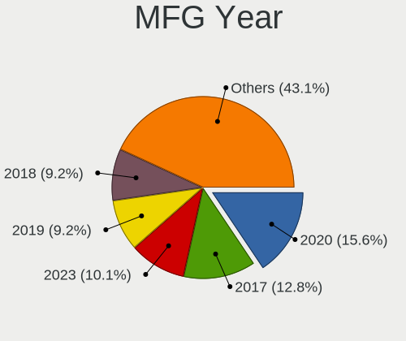
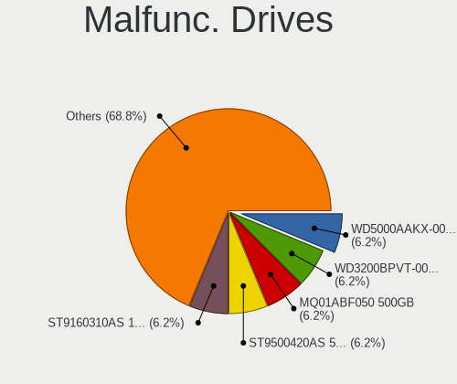
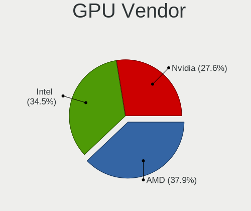
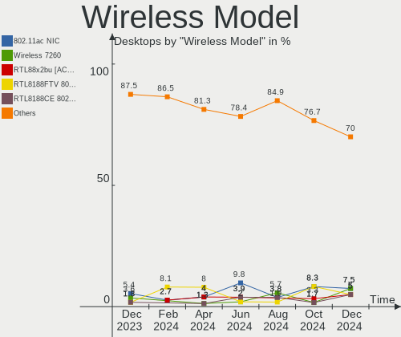
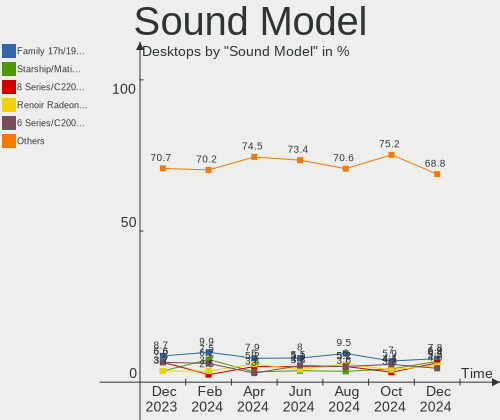
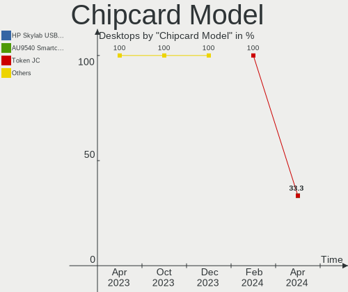
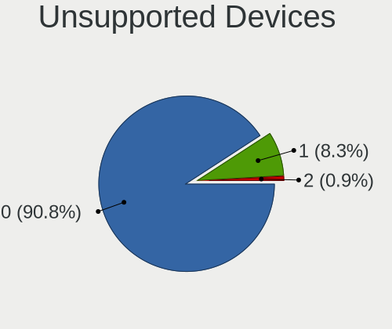

Linux in Brazil - Hardware Trends (Desktops)
--------------------------------------------

A project to identify most popular hardware characteristics and track their change
over time based on data collected by Linux users at https://Linux-Hardware.org.

Anyone can contribute to this report by the [hw-probe](https://github.com/linuxhw/hw-probe) tool:

    sudo -E hw-probe -all -upload

Period: Jan, 2023.

Contents
--------

* [ System ](#system)
  - [ OS                       ](#os)
  - [ OS Family                ](#os-family)
  - [ Kernel                   ](#kernel)
  - [ Kernel Family            ](#kernel-family)
  - [ Kernel Major Ver.        ](#kernel-major-ver)
  - [ Arch                     ](#arch)
  - [ DE                       ](#de)
  - [ Display Server           ](#display-server)
  - [ Display Manager          ](#display-manager)
  - [ OS Lang                  ](#os-lang)
  - [ Boot Mode                ](#boot-mode)
  - [ Filesystem               ](#filesystem)
  - [ Part. scheme             ](#part-scheme)
  - [ Dual Boot with Linux/BSD ](#dual-boot-with-linuxbsd)
  - [ Dual Boot (Win)          ](#dual-boot-win)

* [ Board ](#board)
  - [ Vendor                   ](#vendor)
  - [ Model                    ](#model)
  - [ Model Family             ](#model-family)
  - [ MFG Year                 ](#mfg-year)
  - [ Form Factor              ](#form-factor)
  - [ Secure Boot              ](#secure-boot)
  - [ Coreboot                 ](#coreboot)
  - [ RAM Size                 ](#ram-size)
  - [ RAM Used                 ](#ram-used)
  - [ Total Drives             ](#total-drives)
  - [ Has CD-ROM               ](#has-cd-rom)
  - [ Has Ethernet             ](#has-ethernet)
  - [ Has WiFi                 ](#has-wifi)
  - [ Has Bluetooth            ](#has-bluetooth)

* [ Location ](#location)
  - [ Country                  ](#country)
  - [ City                     ](#city)

* [ Drives ](#drives)
  - [ Drive Vendor             ](#drive-vendor)
  - [ Drive Model              ](#drive-model)
  - [ HDD Vendor               ](#hdd-vendor)
  - [ SSD Vendor               ](#ssd-vendor)
  - [ Drive Kind               ](#drive-kind)
  - [ Drive Connector          ](#drive-connector)
  - [ Drive Size               ](#drive-size)
  - [ Space Total              ](#space-total)
  - [ Space Used               ](#space-used)
  - [ Malfunc. Drives          ](#malfunc-drives)
  - [ Malfunc. Drive Vendor    ](#malfunc-drive-vendor)
  - [ Malfunc. HDD Vendor      ](#malfunc-hdd-vendor)
  - [ Malfunc. Drive Kind      ](#malfunc-drive-kind)
  - [ Failed Drives            ](#failed-drives)
  - [ Failed Drive Vendor      ](#failed-drive-vendor)
  - [ Drive Status             ](#drive-status)

* [ Storage controller ](#storage-controller)
  - [ Storage Vendor           ](#storage-vendor)
  - [ Storage Model            ](#storage-model)
  - [ Storage Kind             ](#storage-kind)

* [ Processor ](#processor)
  - [ CPU Vendor               ](#cpu-vendor)
  - [ CPU Model                ](#cpu-model)
  - [ CPU Model Family         ](#cpu-model-family)
  - [ CPU Cores                ](#cpu-cores)
  - [ CPU Sockets              ](#cpu-sockets)
  - [ CPU Threads              ](#cpu-threads)
  - [ CPU Op-Modes             ](#cpu-op-modes)
  - [ CPU Microcode            ](#cpu-microcode)
  - [ CPU Microarch            ](#cpu-microarch)

* [ Graphics ](#graphics)
  - [ GPU Vendor               ](#gpu-vendor)
  - [ GPU Model                ](#gpu-model)
  - [ GPU Combo                ](#gpu-combo)
  - [ GPU Driver               ](#gpu-driver)
  - [ GPU Memory               ](#gpu-memory)

* [ Monitor ](#monitor)
  - [ Monitor Vendor           ](#monitor-vendor)
  - [ Monitor Model            ](#monitor-model)
  - [ Monitor Resolution       ](#monitor-resolution)
  - [ Monitor Diagonal         ](#monitor-diagonal)
  - [ Monitor Width            ](#monitor-width)
  - [ Aspect Ratio             ](#aspect-ratio)
  - [ Monitor Area             ](#monitor-area)
  - [ Pixel Density            ](#pixel-density)
  - [ Multiple Monitors        ](#multiple-monitors)

* [ Network ](#network)
  - [ Net Controller Vendor    ](#net-controller-vendor)
  - [ Net Controller Model     ](#net-controller-model)
  - [ Wireless Vendor          ](#wireless-vendor)
  - [ Wireless Model           ](#wireless-model)
  - [ Ethernet Vendor          ](#ethernet-vendor)
  - [ Ethernet Model           ](#ethernet-model)
  - [ Net Controller Kind      ](#net-controller-kind)
  - [ Used Controller          ](#used-controller)
  - [ NICs                     ](#nics)
  - [ IPv6                     ](#ipv6)

* [ Bluetooth ](#bluetooth)
  - [ Bluetooth Vendor         ](#bluetooth-vendor)
  - [ Bluetooth Model          ](#bluetooth-model)

* [ Sound ](#sound)
  - [ Sound Vendor             ](#sound-vendor)
  - [ Sound Model              ](#sound-model)

* [ Memory ](#memory)
  - [ Memory Vendor            ](#memory-vendor)
  - [ Memory Model             ](#memory-model)
  - [ Memory Kind              ](#memory-kind)
  - [ Memory Form Factor       ](#memory-form-factor)
  - [ Memory Size              ](#memory-size)
  - [ Memory Speed             ](#memory-speed)

* [ Printers & scanners ](#printers--scanners)
  - [ Printer Vendor           ](#printer-vendor)
  - [ Printer Model            ](#printer-model)
  - [ Scanner Vendor           ](#scanner-vendor)
  - [ Scanner Model            ](#scanner-model)

* [ Camera ](#camera)
  - [ Camera Vendor            ](#camera-vendor)
  - [ Camera Model             ](#camera-model)

* [ Security ](#security)
  - [ Fingerprint Vendor       ](#fingerprint-vendor)
  - [ Fingerprint Model        ](#fingerprint-model)
  - [ Chipcard Vendor          ](#chipcard-vendor)
  - [ Chipcard Model           ](#chipcard-model)

* [ Unsupported ](#unsupported)
  - [ Unsupported Devices      ](#unsupported-devices)
  - [ Unsupported Device Types ](#unsupported-device-types)

System
------

OS
--

Installed operating systems

| Name                         | Desktops | Percent |
|------------------------------|----------|---------|
| OpenMandriva 23.01           | 30       | 25%     |
| Ubuntu 22.04                 | 11       | 9.17%   |
| Fedora 37                    | 8        | 6.67%   |
| Pop!_OS 22.04                | 7        | 5.83%   |
| Debian 11                    | 7        | 5.83%   |
| Linux Mint 21.1              | 6        | 5%      |
| Arch Rolling                 | 6        | 5%      |
| Ubuntu 22.10                 | 5        | 4.17%   |
| Linux Mint 21                | 4        | 3.33%   |
| Ubuntu 20.04                 | 3        | 2.5%    |
| LMDE 5                       | 3        | 2.5%    |
| Linux Mint 20.3              | 3        | 2.5%    |
| Zorin 16                     | 2        | 1.67%   |
| OpenMandriva 4.3             | 2        | 1.67%   |
| Manjaro                      | 2        | 1.67%   |
| Linux Mint 20.1              | 2        | 1.67%   |
| KDE neon 22.04               | 2        | 1.67%   |
| Ubuntu Unity 22.04           | 1        | 0.83%   |
| SteamOS 3.4                  | 1        | 0.83%   |
| openSUSE Tumbleweed-XXXXXXXX | 1        | 0.83%   |
| OpenMandriva 4.90            | 1        | 0.83%   |
| OpenMandriva 4.2             | 1        | 0.83%   |
| Manjaro 22.0.0               | 1        | 0.83%   |
| Manjaro 22.0                 | 1        | 0.83%   |
| Lubuntu 22.04                | 1        | 0.83%   |
| Linux Mint 20.2              | 1        | 0.83%   |
| Linux Mint 20                | 1        | 0.83%   |
| Linux Mint 19.3              | 1        | 0.83%   |
| Kubuntu 22.10                | 1        | 0.83%   |
| Garuda Linux Soaring         | 1        | 0.83%   |
| Endless 4.0.4                | 1        | 0.83%   |
| Elementary 6.1               | 1        | 0.83%   |
| Clear Linux 38020            | 1        | 0.83%   |
| BigLinux 22.12.24            | 1        | 0.83%   |

OS Family
---------

OS without a version

| Name         | Desktops | Percent |
|--------------|----------|---------|
| OpenMandriva | 34       | 28.33%  |
| Ubuntu       | 19       | 15.83%  |
| Linux Mint   | 18       | 15%     |
| Fedora       | 8        | 6.67%   |
| Pop!_OS      | 7        | 5.83%   |
| Debian       | 7        | 5.83%   |
| Arch         | 6        | 5%      |
| Manjaro      | 4        | 3.33%   |
| LMDE         | 3        | 2.5%    |
| Zorin        | 2        | 1.67%   |
| KDE neon     | 2        | 1.67%   |
| Ubuntu Unity | 1        | 0.83%   |
| SteamOS      | 1        | 0.83%   |
| openSUSE     | 1        | 0.83%   |
| Lubuntu      | 1        | 0.83%   |
| Kubuntu      | 1        | 0.83%   |
| Garuda Linux | 1        | 0.83%   |
| Endless      | 1        | 0.83%   |
| Elementary   | 1        | 0.83%   |
| Clear Linux  | 1        | 0.83%   |
| BigLinux     | 1        | 0.83%   |

Kernel
------

Version of the Linux kernel

| Version                                | Desktops | Percent |
|----------------------------------------|----------|---------|
| 6.1.1-desktop-1omv2290                 | 30       | 25%     |
| 5.15.0-58-generic                      | 13       | 10.83%  |
| 5.10.0-20-amd64                        | 8        | 6.67%   |
| 6.0.12-76060006-generic                | 7        | 5.83%   |
| 5.15.0-56-generic                      | 6        | 5%      |
| 5.15.0-57-generic                      | 4        | 3.33%   |
| 6.0.7-301.fc37.x86_64                  | 3        | 2.5%    |
| 6.0.15-300.fc37.x86_64                 | 3        | 2.5%    |
| 5.19.0-29-generic                      | 3        | 2.5%    |
| 5.15.85-1-MANJARO                      | 3        | 2.5%    |
| 6.1.8-arch1-1                          | 2        | 1.67%   |
| 5.4.0-135-generic                      | 2        | 1.67%   |
| 6.1.7-arch1-1                          | 1        | 0.83%   |
| 6.1.7-060107-generic                   | 1        | 0.83%   |
| 6.1.6-zen1-2-zen                       | 1        | 0.83%   |
| 6.1.3-1240.native                      | 1        | 0.83%   |
| 6.1.2-zen1-1-zen                       | 1        | 0.83%   |
| 6.1.1-arch1-1                          | 1        | 0.83%   |
| 6.1.1-1-MANJARO                        | 1        | 0.83%   |
| 6.1.1-1-default                        | 1        | 0.83%   |
| 6.0.2-zen1-1-zen                       | 1        | 0.83%   |
| 6.0.19-3-MANJARO                       | 1        | 0.83%   |
| 6.0.17-300.fc37.x86_64                 | 1        | 0.83%   |
| 6.0.11-300.fc37.x86_64                 | 1        | 0.83%   |
| 6.0.0-0.deb11.6-amd64                  | 1        | 0.83%   |
| 5.8.0-43-generic                       | 1        | 0.83%   |
| 5.4.0-91-generic                       | 1        | 0.83%   |
| 5.4.0-42-generic                       | 1        | 0.83%   |
| 5.4.0-33-generic                       | 1        | 0.83%   |
| 5.4.0-137-generic                      | 1        | 0.83%   |
| 5.4.0-136-generic                      | 1        | 0.83%   |
| 5.4.0-120-generic                      | 1        | 0.83%   |
| 5.19.0-31-generic                      | 1        | 0.83%   |
| 5.19.0-30-generic                      | 1        | 0.83%   |
| 5.19.0-21-generic                      | 1        | 0.83%   |
| 5.18.12-desktop-3omv4090               | 1        | 0.83%   |
| 5.18.1-arch1_testHoloISO_20220606.1811 | 1        | 0.83%   |
| 5.16.7-desktop-1omv4003                | 1        | 0.83%   |
| 5.16.13-desktop-1omv4003               | 1        | 0.83%   |
| 5.15.84-xanmod1                        | 1        | 0.83%   |

Kernel Family
-------------

Linux kernel without a distro release

| Version | Desktops | Percent |
|---------|----------|---------|
| 6.1.1   | 33       | 27.5%   |
| 5.15.0  | 26       | 21.67%  |
| 5.10.0  | 9        | 7.5%    |
| 5.4.0   | 8        | 6.67%   |
| 6.0.12  | 7        | 5.83%   |
| 5.19.0  | 6        | 5%      |
| 6.0.7   | 3        | 2.5%    |
| 6.0.15  | 3        | 2.5%    |
| 5.15.85 | 3        | 2.5%    |
| 6.1.8   | 2        | 1.67%   |
| 6.1.7   | 2        | 1.67%   |
| 5.11.0  | 2        | 1.67%   |
| 6.1.6   | 1        | 0.83%   |
| 6.1.3   | 1        | 0.83%   |
| 6.1.2   | 1        | 0.83%   |
| 6.0.2   | 1        | 0.83%   |
| 6.0.19  | 1        | 0.83%   |
| 6.0.17  | 1        | 0.83%   |
| 6.0.11  | 1        | 0.83%   |
| 6.0.0   | 1        | 0.83%   |
| 5.8.0   | 1        | 0.83%   |
| 5.18.12 | 1        | 0.83%   |
| 5.18.1  | 1        | 0.83%   |
| 5.16.7  | 1        | 0.83%   |
| 5.16.13 | 1        | 0.83%   |
| 5.15.84 | 1        | 0.83%   |
| 5.10.14 | 1        | 0.83%   |
| 5.0.0   | 1        | 0.83%   |

Kernel Major Ver.
-----------------

Linux kernel major version

| Version | Desktops | Percent |
|---------|----------|---------|
| 6.1     | 40       | 33.33%  |
| 5.15    | 30       | 25%     |
| 6.0     | 18       | 15%     |
| 5.10    | 10       | 8.33%   |
| 5.4     | 8        | 6.67%   |
| 5.19    | 6        | 5%      |
| 5.18    | 2        | 1.67%   |
| 5.16    | 2        | 1.67%   |
| 5.11    | 2        | 1.67%   |
| 5.8     | 1        | 0.83%   |
| 5.0     | 1        | 0.83%   |

Arch
----

OS architecture (x86_64, i586, etc.)

| Name   | Desktops | Percent |
|--------|----------|---------|
| x86_64 | 120      | 100%    |

DE
--

Desktop Environment

| Name       | Desktops | Percent |
|------------|----------|---------|
| GNOME      | 51       | 42.5%   |
| KDE5       | 40       | 33.33%  |
| X-Cinnamon | 15       | 12.5%   |
| XFCE       | 4        | 3.33%   |
| MATE       | 2        | 1.67%   |
| LXQt       | 2        | 1.67%   |
| Unknown    | 2        | 1.67%   |
| Unity      | 1        | 0.83%   |
| Pantheon   | 1        | 0.83%   |
| i3         | 1        | 0.83%   |
| awesome    | 1        | 0.83%   |

Display Server
--------------

X11 or Wayland

| Name    | Desktops | Percent |
|---------|----------|---------|
| X11     | 93       | 77.5%   |
| Wayland | 26       | 21.67%  |
| Tty     | 1        | 0.83%   |

Display Manager
---------------

SDDM, LightDM, etc.

| Name    | Desktops | Percent |
|---------|----------|---------|
| Unknown | 45       | 37.5%   |
| SDDM    | 34       | 28.33%  |
| GDM3    | 20       | 16.67%  |
| GDM     | 14       | 11.67%  |
| LightDM | 7        | 5.83%   |

OS Lang
-------

Language

| Lang    | Desktops | Percent |
|---------|----------|---------|
| pt_BR   | 86       | 71.67%  |
| en_US   | 30       | 25%     |
| C       | 2        | 1.67%   |
| es_ES   | 1        | 0.83%   |
| Unknown | 1        | 0.83%   |

Boot Mode
---------

EFI or BIOS

| Mode | Desktops | Percent |
|------|----------|---------|
| BIOS | 72       | 60%     |
| EFI  | 48       | 40%     |

Filesystem
----------

Type of filesystem

| Type    | Desktops | Percent |
|---------|----------|---------|
| Ext4    | 71       | 59.17%  |
| Overlay | 33       | 27.5%   |
| Btrfs   | 15       | 12.5%   |
| Tmpfs   | 1        | 0.83%   |

Part. scheme
------------

Scheme of partitioning

| Type    | Desktops | Percent |
|---------|----------|---------|
| GPT     | 58       | 48.33%  |
| Unknown | 43       | 35.83%  |
| MBR     | 19       | 15.83%  |

Dual Boot with Linux/BSD
------------------------

Hosting more than one Linux/BSD

| Dual boot | Desktops | Percent |
|-----------|----------|---------|
| No        | 91       | 75.83%  |
| Yes       | 29       | 24.17%  |

Dual Boot (Win)
---------------

Hosting Linux and Windows

| Dual boot | Desktops | Percent |
|-----------|----------|---------|
| No        | 77       | 64.17%  |
| Yes       | 43       | 35.83%  |

Board
-----

Vendor
------

Motherboard manufacturer

| Name                | Desktops | Percent |
|---------------------|----------|---------|
| ASUSTek Computer    | 33       | 27.5%   |
| Gigabyte Technology | 21       | 17.5%   |
| Intel               | 11       | 9.17%   |
| Dell                | 8        | 6.67%   |
| ASRock              | 6        | 5%      |
| Positivo            | 5        | 4.17%   |
| MSI                 | 5        | 4.17%   |
| Pegatron            | 4        | 3.33%   |
| Hewlett-Packard     | 4        | 3.33%   |
| Semp Toshiba        | 3        | 2.5%    |
| PCWare              | 3        | 2.5%    |
| Biostar             | 3        | 2.5%    |
| Unknown             | 3        | 2.5%    |
| Lenovo              | 2        | 1.67%   |
| MAXSUN              | 1        | 0.83%   |
| MACHINIST           | 1        | 0.83%   |
| Login Informatica   | 1        | 0.83%   |
| JGINYUE             | 1        | 0.83%   |
| Huanan              | 1        | 0.83%   |
| Digitron            | 1        | 0.83%   |
| AZW                 | 1        | 0.83%   |
| AMD                 | 1        | 0.83%   |
| ADVANSUS            | 1        | 0.83%   |

Model
-----

Motherboard model

| Name                                 | Desktops | Percent |
|--------------------------------------|----------|---------|
| Intel H61                            | 4        | 3.33%   |
| ASUS All Series                      | 4        | 3.33%   |
| Semp Toshiba STI                     | 3        | 2.5%    |
| Unknown                              | 3        | 2.5%    |
| PCWare IPMH110G                      | 2        | 1.67%   |
| Intel B75                            | 2        | 1.67%   |
| Gigabyte M68MT-S2P                   | 2        | 1.67%   |
| Gigabyte H61M-S1                     | 2        | 1.67%   |
| Gigabyte H310M M.2                   | 2        | 1.67%   |
| Gigabyte B75M-D3H                    | 2        | 1.67%   |
| Gigabyte 945GCM-S2C                  | 2        | 1.67%   |
| Biostar A320MH                       | 2        | 1.67%   |
| ASUS PRIME H410M-E                   | 2        | 1.67%   |
| ASUS M5A78L-M LX/BR                  | 2        | 1.67%   |
| ASUS H61M-A/BR                       | 2        | 1.67%   |
| ASRock B450M Steel Legend            | 2        | 1.67%   |
| Positivo Positivo Master D610        | 1        | 0.83%   |
| Positivo POS-PIQ77CL                 | 1        | 0.83%   |
| Positivo POS-PIQ57BQ                 | 1        | 0.83%   |
| Positivo POS-EIB85CZ                 | 1        | 0.83%   |
| Positivo POS-AG31AP                  | 1        | 0.83%   |
| Pegatron IPM41-D3                    | 1        | 0.83%   |
| Pegatron IPM31G                      | 1        | 0.83%   |
| Pegatron 420-1010br                  | 1        | 0.83%   |
| Pegatron 220-1000br                  | 1        | 0.83%   |
| PCWare IPX1800E2                     | 1        | 0.83%   |
| MSI p6530br                          | 1        | 0.83%   |
| MSI MS-7C96                          | 1        | 0.83%   |
| MSI MS-7C91                          | 1        | 0.83%   |
| MSI MS-7788                          | 1        | 0.83%   |
| MSI MS-7721                          | 1        | 0.83%   |
| MAXSUN MS-TZZ B460M                  | 1        | 0.83%   |
| MACHINIST B75 PRO V1.0               | 1        | 0.83%   |
| Login Informatica LOG-H110M-G3       | 1        | 0.83%   |
| Lenovo ThinkCentre M75s-1 11AAS24H00 | 1        | 0.83%   |
| Lenovo ThinkCentre M58e 7303BZ2      | 1        | 0.83%   |
| JGINYUE B85I PLUS V2.0               | 1        | 0.83%   |
| Intel Jasper Lake Client Platform    | 1        | 0.83%   |
| Intel H55                            | 1        | 0.83%   |
| Intel H110                           | 1        | 0.83%   |

Model Family
------------

Motherboard model prefix

| Name                 | Desktops | Percent |
|----------------------|----------|---------|
| ASUS PRIME           | 7        | 5.83%   |
| Dell OptiPlex        | 6        | 5%      |
| ASUS TUF             | 5        | 4.17%   |
| Intel H61            | 4        | 3.33%   |
| ASUS All             | 4        | 3.33%   |
| Semp Toshiba STI     | 3        | 2.5%    |
| ASUS P8H61-M         | 3        | 2.5%    |
| ASUS M5A78L-M        | 3        | 2.5%    |
| Unknown              | 3        | 2.5%    |
| PCWare IPMH110G      | 2        | 1.67%   |
| Lenovo ThinkCentre   | 2        | 1.67%   |
| Intel B75            | 2        | 1.67%   |
| HP EliteDesk         | 2        | 1.67%   |
| Gigabyte M68MT-S2P   | 2        | 1.67%   |
| Gigabyte H61M-S1     | 2        | 1.67%   |
| Gigabyte H310M       | 2        | 1.67%   |
| Gigabyte B75M-D3H    | 2        | 1.67%   |
| Gigabyte A520M       | 2        | 1.67%   |
| Gigabyte 945GCM-S2C  | 2        | 1.67%   |
| Dell Vostro          | 2        | 1.67%   |
| Biostar A320MH       | 2        | 1.67%   |
| ASUS H61M-A          | 2        | 1.67%   |
| ASRock B450M         | 2        | 1.67%   |
| Positivo Positivo    | 1        | 0.83%   |
| Positivo POS-PIQ77CL | 1        | 0.83%   |
| Positivo POS-PIQ57BQ | 1        | 0.83%   |
| Positivo POS-EIB85CZ | 1        | 0.83%   |
| Positivo POS-AG31AP  | 1        | 0.83%   |
| Pegatron IPM41-D3    | 1        | 0.83%   |
| Pegatron IPM31G      | 1        | 0.83%   |
| Pegatron 420-1010br  | 1        | 0.83%   |
| Pegatron 220-1000br  | 1        | 0.83%   |
| PCWare IPX1800E2     | 1        | 0.83%   |
| MSI p6530br          | 1        | 0.83%   |
| MSI MS-7C96          | 1        | 0.83%   |
| MSI MS-7C91          | 1        | 0.83%   |
| MSI MS-7788          | 1        | 0.83%   |
| MSI MS-7721          | 1        | 0.83%   |
| MAXSUN MS-TZZ        | 1        | 0.83%   |
| MACHINIST B75        | 1        | 0.83%   |

MFG Year
--------

Motherboard manufacture year

| Year | Desktops | Percent |
|------|----------|---------|
| 2018 | 15       | 12.5%   |
| 2012 | 13       | 10.83%  |
| 2020 | 11       | 9.17%   |
| 2017 | 11       | 9.17%   |
| 2021 | 7        | 5.83%   |
| 2014 | 7        | 5.83%   |
| 2013 | 7        | 5.83%   |
| 2010 | 7        | 5.83%   |
| 2009 | 7        | 5.83%   |
| 2022 | 6        | 5%      |
| 2016 | 6        | 5%      |
| 2019 | 5        | 4.17%   |
| 2015 | 5        | 4.17%   |
| 2011 | 5        | 4.17%   |
| 2008 | 5        | 4.17%   |
| 2007 | 3        | 2.5%    |

Form Factor
-----------

Physical design of the computer

| Name    | Desktops | Percent |
|---------|----------|---------|
| Desktop | 120      | 100%    |

Secure Boot
-----------

Enabled or disabled

| State    | Desktops | Percent |
|----------|----------|---------|
| Disabled | 117      | 97.5%   |
| Enabled  | 3        | 2.5%    |

Coreboot
--------

Have coreboot on board

| Used | Desktops | Percent |
|------|----------|---------|
| No   | 120      | 100%    |

RAM Size
--------

Total RAM memory

| Size in GB  | Desktops | Percent |
|-------------|----------|---------|
| 16.01-24.0  | 34       | 28.33%  |
| 3.01-4.0    | 31       | 25.83%  |
| 4.01-8.0    | 22       | 18.33%  |
| 8.01-16.0   | 20       | 16.67%  |
| 1.01-2.0    | 5        | 4.17%   |
| 32.01-64.0  | 3        | 2.5%    |
| 24.01-32.0  | 3        | 2.5%    |
| 2.01-3.0    | 1        | 0.83%   |
| 64.01-256.0 | 1        | 0.83%   |

RAM Used
--------

Used RAM memory

| Used GB    | Desktops | Percent |
|------------|----------|---------|
| 1.01-2.0   | 48       | 40%     |
| 2.01-3.0   | 36       | 30%     |
| 4.01-8.0   | 14       | 11.67%  |
| 3.01-4.0   | 14       | 11.67%  |
| 0.51-1.0   | 4        | 3.33%   |
| 0.01-0.5   | 2        | 1.67%   |
| 16.01-24.0 | 1        | 0.83%   |
| 8.01-16.0  | 1        | 0.83%   |

Total Drives
------------

Number of drives on board

| Drives | Desktops | Percent |
|--------|----------|---------|
| 1      | 60       | 50%     |
| 2      | 31       | 25.83%  |
| 3      | 14       | 11.67%  |
| 4      | 9        | 7.5%    |
| 5      | 3        | 2.5%    |
| 0      | 3        | 2.5%    |

Has CD-ROM
----------

Has CD-ROM on board

| Presented | Desktops | Percent |
|-----------|----------|---------|
| No        | 78       | 65%     |
| Yes       | 42       | 35%     |

Has Ethernet
------------

Has Ethernet on board

| Presented | Desktops | Percent |
|-----------|----------|---------|
| Yes       | 118      | 98.33%  |
| No        | 2        | 1.67%   |

Has WiFi
--------

Has WiFi module

| Presented | Desktops | Percent |
|-----------|----------|---------|
| No        | 67       | 55.83%  |
| Yes       | 53       | 44.17%  |

Has Bluetooth
-------------

Has Bluetooth module

| Presented | Desktops | Percent |
|-----------|----------|---------|
| No        | 96       | 80%     |
| Yes       | 24       | 20%     |

Location
--------

Country
-------

Geographic location (country)

| Country | Desktops | Percent |
|---------|----------|---------|
| Brazil  | 120      | 100%    |

City
----

Geographic location (city)

| City                  | Desktops | Percent |
|-----------------------|----------|---------|
| Sao Paulo             | 14       | 11.67%  |
| Rio de Janeiro        | 8        | 6.67%   |
| Curitiba              | 6        | 5%      |
| Belo Horizonte        | 6        | 5%      |
| Salvador              | 3        | 2.5%    |
| Vitória              | 2        | 1.67%   |
| Tatuí                | 2        | 1.67%   |
| Santo André          | 2        | 1.67%   |
| Palmas                | 2        | 1.67%   |
| Fortaleza             | 2        | 1.67%   |
| Campinas              | 2        | 1.67%   |
| Brasília             | 2        | 1.67%   |
| Belém                | 2        | 1.67%   |
| Araucária            | 2        | 1.67%   |
| Vila Velha            | 1        | 0.83%   |
| Videira               | 1        | 0.83%   |
| Valparaiso de Goias   | 1        | 0.83%   |
| Uberlândia           | 1        | 0.83%   |
| Uba                   | 1        | 0.83%   |
| Teresina              | 1        | 0.83%   |
| Surubim               | 1        | 0.83%   |
| Sumaré               | 1        | 0.83%   |
| Sorocaba              | 1        | 0.83%   |
| Sao Lourenço         | 1        | 0.83%   |
| Sao Jose do Rio Preto | 1        | 0.83%   |
| Sao Joao Batista      | 1        | 0.83%   |
| Sao Gotardo           | 1        | 0.83%   |
| Sao Goncalo           | 1        | 0.83%   |
| Sao Carlos            | 1        | 0.83%   |
| Sao Caetano do Sul    | 1        | 0.83%   |
| Sao Bernardo do Campo | 1        | 0.83%   |
| Santa Maria do Herval | 1        | 0.83%   |
| Santa Barbara d'Oeste | 1        | 0.83%   |
| Ribeirao Preto        | 1        | 0.83%   |
| Presidente Prudente   | 1        | 0.83%   |
| Ponta Grossa          | 1        | 0.83%   |
| Poços de Caldas      | 1        | 0.83%   |
| Paranaguá            | 1        | 0.83%   |
| Paco do Lumiar        | 1        | 0.83%   |
| Osorio                | 1        | 0.83%   |

Drives
------

Drive Vendor
------------

Hard drive vendors

| Vendor                | Desktops | Drives | Percent |
|-----------------------|----------|--------|---------|
| Seagate               | 42       | 49     | 21.11%  |
| WDC                   | 33       | 36     | 16.58%  |
| Kingston              | 25       | 28     | 12.56%  |
| Samsung Electronics   | 24       | 27     | 12.06%  |
| China                 | 11       | 11     | 5.53%   |
| Silicon Motion        | 7        | 8      | 3.52%   |
| Crucial               | 6        | 7      | 3.02%   |
| SanDisk               | 5        | 5      | 2.51%   |
| Toshiba               | 4        | 5      | 2.01%   |
| XrayDisk              | 3        | 3      | 1.51%   |
| Unknown               | 3        | 3      | 1.51%   |
| Realtek Semiconductor | 3        | 3      | 1.51%   |
| Maxtor                | 3        | 4      | 1.51%   |
| Lexar                 | 3        | 3      | 1.51%   |
| Hitachi               | 3        | 3      | 1.51%   |
| WALRAM                | 2        | 2      | 1.01%   |
| Patriot               | 2        | 2      | 1.01%   |
| Netac                 | 2        | 2      | 1.01%   |
| KingSpec              | 2        | 2      | 1.01%   |
| TGT                   | 1        | 1      | 0.5%    |
| SPCC                  | 1        | 1      | 0.5%    |
| Solid State Storage   | 1        | 1      | 0.5%    |
| SK hynix              | 1        | 1      | 0.5%    |
| LITEON                | 1        | 1      | 0.5%    |
| Kross Elegance        | 1        | 1      | 0.5%    |
| Intel                 | 1        | 1      | 0.5%    |
| HS-SSD-C100           | 1        | 1      | 0.5%    |
| HGST                  | 1        | 1      | 0.5%    |
| Hewlett-Packard       | 1        | 1      | 0.5%    |
| Gigabyte Technology   | 1        | 1      | 0.5%    |
| Force                 | 1        | 1      | 0.5%    |
| ExcelStor             | 1        | 1      | 0.5%    |
| AFOX                  | 1        | 1      | 0.5%    |
| ADATA Technology      | 1        | 1      | 0.5%    |
| A-DATA Technology     | 1        | 1      | 0.5%    |

Drive Model
-----------

Hard drive models

| Model                                                 | Desktops | Percent |
|-------------------------------------------------------|----------|---------|
| Kingston SA400S37240G 240GB SSD                       | 9        | 4.25%   |
| Seagate ST500DM002-1BD142 500GB                       | 8        | 3.77%   |
| Silicon Motion SM2263EN/SM2263XT SSD Controller 512GB | 6        | 2.83%   |
| Seagate ST1000DM010-2EP102 1TB                        | 5        | 2.36%   |
| Kingston SA400S37480G 480GB SSD                       | 5        | 2.36%   |
| Samsung HD502HI 500GB                                 | 4        | 1.89%   |
| Samsung HD161HJ 160GB                                 | 4        | 1.89%   |
| Kingston SV300S37A120G 120GB SSD                      | 4        | 1.89%   |
| China SSD 256GB                                       | 4        | 1.89%   |
| WDC WD5000AAKX-003CA0 500GB                           | 3        | 1.42%   |
| Samsung HD502HJ 500GB                                 | 3        | 1.42%   |
| Kingston SA400S37120G 120GB SSD                       | 3        | 1.42%   |
| XrayDisk SSD 128GB                                    | 2        | 0.94%   |
| WDC WD5000LPCX-21VHAT0 500GB                          | 2        | 0.94%   |
| WDC WD10SPZX-24Z10 1TB                                | 2        | 0.94%   |
| WDC WD10EZEX-75WN4A0 1TB                              | 2        | 0.94%   |
| WDC WD10EZEX-60WN4A0 1TB                              | 2        | 0.94%   |
| Seagate ST3500413AS 500GB                             | 2        | 0.94%   |
| Seagate ST31000528AS 1TB                              | 2        | 0.94%   |
| Seagate ST2000DM001-1CH164 2TB                        | 2        | 0.94%   |
| Seagate ST1000VM002-1CT162 1TB                        | 2        | 0.94%   |
| Seagate ST1000DM003-1SB10C 1TB                        | 2        | 0.94%   |
| Samsung HD322HJ 320GB                                 | 2        | 0.94%   |
| Samsung HD250HJ 250GB                                 | 2        | 0.94%   |
| Kingston SNV2S500G 500GB                              | 2        | 0.94%   |
| Crucial CT480BX500SSD1 480GB                          | 2        | 0.94%   |
| Crucial CT240BX500SSD1 240GB                          | 2        | 0.94%   |
| China SSD 240GB                                       | 2        | 0.94%   |
| XrayDisk SSD 240GB                                    | 1        | 0.47%   |
| WDC WDS960G2G0C-00AJM0 960GB                          | 1        | 0.47%   |
| WDC WDS480G2G0B-00EPW0 480GB SSD                      | 1        | 0.47%   |
| WDC WDS240G2G0A-00JH30 240GB SSD                      | 1        | 0.47%   |
| WDC WDS120G2G0A-00JH30 120GB SSD                      | 1        | 0.47%   |
| WDC WD800JD-08LSA0 80GB                               | 1        | 0.47%   |
| WDC WD7500BPVT-80HXZT3 752GB                          | 1        | 0.47%   |
| WDC WD5000LUCT-63RC2Y0 500GB                          | 1        | 0.47%   |
| WDC WD5000LPSX-75A6WT0 500GB                          | 1        | 0.47%   |
| WDC WD5000LPCX-22VHAT1 500GB                          | 1        | 0.47%   |
| WDC WD5000AAKX-083CA1 500GB                           | 1        | 0.47%   |
| WDC WD5000AAKS-00C8A0 500GB                           | 1        | 0.47%   |

HDD Vendor
----------

Hard disk drive vendors

| Vendor              | Desktops | Drives | Percent |
|---------------------|----------|--------|---------|
| Seagate             | 42       | 49     | 39.25%  |
| WDC                 | 30       | 32     | 28.04%  |
| Samsung Electronics | 22       | 24     | 20.56%  |
| Toshiba             | 4        | 5      | 3.74%   |
| Maxtor              | 3        | 4      | 2.8%    |
| Hitachi             | 3        | 3      | 2.8%    |
| HGST                | 1        | 1      | 0.93%   |
| Hewlett-Packard     | 1        | 1      | 0.93%   |
| ExcelStor           | 1        | 1      | 0.93%   |

SSD Vendor
----------

Solid state drive vendors

| Vendor              | Desktops | Drives | Percent |
|---------------------|----------|--------|---------|
| Kingston            | 21       | 24     | 32.31%  |
| China               | 11       | 11     | 16.92%  |
| Crucial             | 6        | 7      | 9.23%   |
| SanDisk             | 5        | 5      | 7.69%   |
| XrayDisk            | 3        | 3      | 4.62%   |
| WDC                 | 3        | 3      | 4.62%   |
| Lexar               | 3        | 3      | 4.62%   |
| Patriot             | 2        | 2      | 3.08%   |
| KingSpec            | 2        | 2      | 3.08%   |
| SPCC                | 1        | 1      | 1.54%   |
| Samsung Electronics | 1        | 1      | 1.54%   |
| Netac               | 1        | 1      | 1.54%   |
| LITEON              | 1        | 1      | 1.54%   |
| Kross Elegance      | 1        | 1      | 1.54%   |
| Intel               | 1        | 1      | 1.54%   |
| Gigabyte Technology | 1        | 1      | 1.54%   |
| Force               | 1        | 1      | 1.54%   |
| AFOX                | 1        | 1      | 1.54%   |

Drive Kind
----------

HDD or SSD

| Kind    | Desktops | Drives | Percent |
|---------|----------|--------|---------|
| HDD     | 83       | 120    | 51.88%  |
| SSD     | 51       | 69     | 31.88%  |
| NVMe    | 23       | 27     | 14.38%  |
| Unknown | 3        | 3      | 1.88%   |

Drive Connector
---------------

SATA, SAS, NVMe, etc.

| Type | Desktops | Drives | Percent |
|------|----------|--------|---------|
| SATA | 111      | 190    | 81.62%  |
| NVMe | 23       | 27     | 16.91%  |
| SAS  | 2        | 2      | 1.47%   |

Drive Size
----------

Size of hard drive

| Size in TB | Desktops | Drives | Percent |
|------------|----------|--------|---------|
| 0.01-0.5   | 87       | 132    | 63.5%   |
| 0.51-1.0   | 41       | 47     | 29.93%  |
| 1.01-2.0   | 7        | 8      | 5.11%   |
| 3.01-4.0   | 1        | 1      | 0.73%   |
| 2.01-3.0   | 1        | 1      | 0.73%   |

Space Total
-----------

Amount of disk space available on the file system

| Size in GB     | Desktops | Percent |
|----------------|----------|---------|
| 101-250        | 37       | 30.83%  |
| 1-20           | 24       | 20%     |
| 251-500        | 18       | 15%     |
| 1001-2000      | 12       | 10%     |
| 501-1000       | 10       | 8.33%   |
| Unknown        | 7        | 5.83%   |
| More than 3000 | 5        | 4.17%   |
| 51-100         | 5        | 4.17%   |
| 2001-3000      | 2        | 1.67%   |

Space Used
----------

Amount of used disk space

| Used GB   | Desktops | Percent |
|-----------|----------|---------|
| 1-20      | 49       | 40.83%  |
| 21-50     | 19       | 15.83%  |
| 251-500   | 12       | 10%     |
| 101-250   | 11       | 9.17%   |
| 51-100    | 11       | 9.17%   |
| Unknown   | 7        | 5.83%   |
| 501-1000  | 5        | 4.17%   |
| 2001-3000 | 3        | 2.5%    |
| 1001-2000 | 3        | 2.5%    |

Malfunc. Drives
---------------

Drive models with a malfunction

| Model                                | Desktops | Drives | Percent |
|--------------------------------------|----------|--------|---------|
| Seagate ST500DM002-1BD142 500GB      | 3        | 3      | 8.57%   |
| Samsung Electronics HD161HJ 160GB    | 2        | 2      | 5.71%   |
| XrayDisk SSD 128GB                   | 1        | 1      | 2.86%   |
| WDC WD5000AAKX-083CA1 500GB          | 1        | 1      | 2.86%   |
| WDC WD3200AAKS-00V1A0 320GB          | 1        | 1      | 2.86%   |
| Toshiba MQ01ABD050V -63 500GB        | 1        | 1      | 2.86%   |
| Toshiba MK5059GSXP 500GB             | 1        | 1      | 2.86%   |
| Seagate ST500LM030-2E717D 500GB      | 1        | 1      | 2.86%   |
| Seagate ST3802110AS 80GB             | 1        | 1      | 2.86%   |
| Seagate ST3750640NS 752GB            | 1        | 1      | 2.86%   |
| Seagate ST3500413AS 500GB            | 1        | 1      | 2.86%   |
| Seagate ST3320613AS 320GB            | 1        | 1      | 2.86%   |
| Seagate ST3320418AS 320GB            | 1        | 1      | 2.86%   |
| Seagate ST31000524AS 1TB             | 1        | 1      | 2.86%   |
| Seagate ST2000DM001-1CH164 2TB       | 1        | 1      | 2.86%   |
| Seagate ST1500DL003-9VT16L 1TB       | 1        | 1      | 2.86%   |
| Seagate ST1000VM002-1CT162 1TB       | 1        | 2      | 2.86%   |
| Seagate ST1000LM024 HN-M101MBB 1TB   | 1        | 1      | 2.86%   |
| Seagate ST1000DM010-2EP102 1TB       | 1        | 1      | 2.86%   |
| Samsung Electronics HN-M750MBB 752GB | 1        | 1      | 2.86%   |
| Samsung Electronics HM500JI 500GB    | 1        | 1      | 2.86%   |
| Samsung Electronics HM080HI 80GB     | 1        | 1      | 2.86%   |
| Samsung Electronics HD502HI 500GB    | 1        | 1      | 2.86%   |
| Samsung Electronics HD322HJ 320GB    | 1        | 3      | 2.86%   |
| Samsung Electronics HD250HJ 250GB    | 1        | 1      | 2.86%   |
| Samsung Electronics HD103SI 1TB      | 1        | 1      | 2.86%   |
| Maxtor STM3250310AS 250GB            | 1        | 1      | 2.86%   |
| Maxtor STM3160215AS 160GB            | 1        | 1      | 2.86%   |
| Maxtor STM3160211AS 160GB            | 1        | 1      | 2.86%   |
| KingSpec P4-240 240GB SSD            | 1        | 1      | 2.86%   |
| Hitachi HDS721616PLA380 160GB        | 1        | 1      | 2.86%   |
| China SSD 256GB                      | 1        | 1      | 2.86%   |

Malfunc. Drive Vendor
---------------------

Vendors of faulty drives

| Vendor              | Desktops | Drives | Percent |
|---------------------|----------|--------|---------|
| Seagate             | 13       | 16     | 40.63%  |
| Samsung Electronics | 9        | 11     | 28.13%  |
| WDC                 | 2        | 2      | 6.25%   |
| Toshiba             | 2        | 2      | 6.25%   |
| Maxtor              | 2        | 3      | 6.25%   |
| XrayDisk            | 1        | 1      | 3.13%   |
| KingSpec            | 1        | 1      | 3.13%   |
| Hitachi             | 1        | 1      | 3.13%   |
| China               | 1        | 1      | 3.13%   |

Malfunc. HDD Vendor
-------------------

Vendors of faulty HDD drives

| Vendor              | Desktops | Drives | Percent |
|---------------------|----------|--------|---------|
| Seagate             | 13       | 16     | 44.83%  |
| Samsung Electronics | 9        | 11     | 31.03%  |
| WDC                 | 2        | 2      | 6.9%    |
| Toshiba             | 2        | 2      | 6.9%    |
| Maxtor              | 2        | 3      | 6.9%    |
| Hitachi             | 1        | 1      | 3.45%   |

Malfunc. Drive Kind
-------------------

Kinds of faulty drives

| Kind | Desktops | Drives | Percent |
|------|----------|--------|---------|
| HDD  | 24       | 35     | 88.89%  |
| SSD  | 3        | 3      | 11.11%  |

Failed Drives
-------------

Failed drive models

| Model                             | Desktops | Drives | Percent |
|-----------------------------------|----------|--------|---------|
| WDC WD5000AAKS-00C8A0 500GB       | 1        | 1      | 33.33%  |
| Seagate ST500DM002-1BD142 500GB   | 1        | 1      | 33.33%  |
| Samsung Electronics HD502HJ 500GB | 1        | 1      | 33.33%  |

Failed Drive Vendor
-------------------

Failed drive vendors

| Vendor              | Desktops | Drives | Percent |
|---------------------|----------|--------|---------|
| WDC                 | 1        | 1      | 33.33%  |
| Seagate             | 1        | 1      | 33.33%  |
| Samsung Electronics | 1        | 1      | 33.33%  |

Drive Status
------------

Number of failed and malfunc. drives

| Status   | Desktops | Drives | Percent |
|----------|----------|--------|---------|
| Detected | 67       | 118    | 49.63%  |
| Works    | 39       | 60     | 28.89%  |
| Malfunc  | 26       | 38     | 19.26%  |
| Failed   | 3        | 3      | 2.22%   |

Storage controller
------------------

Storage Vendor
--------------

Storage controller vendors

| Vendor                         | Desktops | Percent |
|--------------------------------|----------|---------|
| Intel                          | 84       | 57.53%  |
| AMD                            | 32       | 21.92%  |
| Silicon Motion                 | 9        | 6.16%   |
| Nvidia                         | 4        | 2.74%   |
| Kingston Technology Company    | 4        | 2.74%   |
| Realtek Semiconductor          | 3        | 2.05%   |
| MAXIO Technology (Hangzhou)    | 2        | 1.37%   |
| ADATA Technology               | 2        | 1.37%   |
| Solid State Storage Technology | 1        | 0.68%   |
| SK hynix                       | 1        | 0.68%   |
| SanDisk                        | 1        | 0.68%   |
| Samsung Electronics            | 1        | 0.68%   |
| JMicron Technology             | 1        | 0.68%   |
| Unknown                        | 1        | 0.68%   |

Storage Model
-------------

Storage controller models

| Model                                                                                   | Desktops | Percent |
|-----------------------------------------------------------------------------------------|----------|---------|
| AMD FCH SATA Controller [AHCI mode]                                                     | 14       | 7.37%   |
| Intel NM10/ICH7 Family SATA Controller [IDE mode]                                       | 12       | 6.32%   |
| Intel 82801G (ICH7 Family) IDE Controller                                               | 10       | 5.26%   |
| Silicon Motion SM2263EN/SM2263XT SSD Controller                                         | 9        | 4.74%   |
| Intel 6 Series/C200 Series Chipset Family 6 port Desktop SATA AHCI Controller           | 9        | 4.74%   |
| Intel Cannon Lake PCH SATA AHCI Controller                                              | 8        | 4.21%   |
| Intel 8 Series/C220 Series Chipset Family 6-port SATA Controller 1 [AHCI mode]          | 8        | 4.21%   |
| Intel 6 Series/C200 Series Chipset Family Desktop SATA Controller (IDE mode, ports 4-5) | 8        | 4.21%   |
| Intel 6 Series/C200 Series Chipset Family Desktop SATA Controller (IDE mode, ports 0-3) | 8        | 4.21%   |
| Intel Q170/Q150/B150/H170/H110/Z170/CM236 Chipset SATA Controller [AHCI Mode]           | 7        | 3.68%   |
| AMD SB7x0/SB8x0/SB9x0 IDE Controller                                                    | 7        | 3.68%   |
| Intel 7 Series/C210 Series Chipset Family 6-port SATA Controller [AHCI mode]            | 6        | 3.16%   |
| Intel 400 Series Chipset Family SATA AHCI Controller                                    | 5        | 2.63%   |
| AMD SB7x0/SB8x0/SB9x0 SATA Controller [IDE mode]                                        | 5        | 2.63%   |
| AMD FCH SATA Controller D                                                               | 5        | 2.63%   |
| AMD 500 Series Chipset SATA Controller                                                  | 5        | 2.63%   |
| AMD 400 Series Chipset SATA Controller                                                  | 5        | 2.63%   |
| Intel 7 Series/C210 Series Chipset Family 4-port SATA Controller [IDE mode]             | 4        | 2.11%   |
| Intel 7 Series/C210 Series Chipset Family 2-port SATA Controller [IDE mode]             | 4        | 2.11%   |
| Nvidia MCP61 SATA Controller                                                            | 3        | 1.58%   |
| Kingston Company Company Non-Volatile memory controller                                 | 3        | 1.58%   |
| Intel Alder Lake-S PCH SATA Controller [AHCI Mode]                                      | 3        | 1.58%   |
| Intel 200 Series PCH SATA controller [AHCI mode]                                        | 3        | 1.58%   |
| AMD SB7x0/SB8x0/SB9x0 SATA Controller [AHCI mode]                                       | 3        | 1.58%   |
| Realtek Realtek Non-Volatile memory controller                                          | 2        | 1.05%   |
| Nvidia MCP61 IDE                                                                        | 2        | 1.05%   |
| MAXIO (Hangzhou) NVMe SSD Controller MAP1202                                            | 2        | 1.05%   |
| Intel SATA Controller [RAID mode]                                                       | 2        | 1.05%   |
| Intel Atom Processor E3800 Series SATA AHCI Controller                                  | 2        | 1.05%   |
| Intel 500 Series Chipset Family SATA AHCI Controller                                    | 2        | 1.05%   |
| Solid State Storage Non-Volatile memory controller                                      | 1        | 0.53%   |
| SK hynix BC511                                                                          | 1        | 0.53%   |
| SanDisk Non-Volatile memory controller                                                  | 1        | 0.53%   |
| Samsung NVMe SSD Controller PM9A1/PM9A3/980PRO                                          | 1        | 0.53%   |
| Realtek RTS5763DL NVMe SSD Controller                                                   | 1        | 0.53%   |
| Nvidia MCP67 IDE Controller                                                             | 1        | 0.53%   |
| Nvidia MCP67 AHCI Controller                                                            | 1        | 0.53%   |
| Kingston Company SNVS2000G [NV1 NVMe PCIe SSD 2TB]                                      | 1        | 0.53%   |
| JMicron JMB58x AHCI SATA controller                                                     | 1        | 0.53%   |
| Intel Volume Management Device NVMe RAID Controller Intel Corporation                   | 1        | 0.53%   |

Storage Kind
------------

Kind of storage controller (IDE, SATA, NVMe, SAS, ...)

| Kind | Desktops | Percent |
|------|----------|---------|
| SATA | 90       | 58.06%  |
| IDE  | 38       | 24.52%  |
| NVMe | 23       | 14.84%  |
| RAID | 4        | 2.58%   |

Processor
---------

CPU Vendor
----------

Processor vendors

| Vendor | Desktops | Percent |
|--------|----------|---------|
| Intel  | 84       | 70%     |
| AMD    | 36       | 30%     |

CPU Model
---------

Processor models

| Model                                       | Desktops | Percent |
|---------------------------------------------|----------|---------|
| Intel Core i7-3770 CPU @ 3.40GHz            | 4        | 3.33%   |
| Intel Core i5-3470 CPU @ 3.20GHz            | 4        | 3.33%   |
| Intel Core i3-2100 CPU @ 3.10GHz            | 4        | 3.33%   |
| Intel Core 2 Duo CPU E7500 @ 2.93GHz        | 4        | 3.33%   |
| AMD Ryzen 5 5600G with Radeon Graphics      | 4        | 3.33%   |
| Intel Core i5-8400 CPU @ 2.80GHz            | 3        | 2.5%    |
| Intel Core i3-7100 CPU @ 3.90GHz            | 3        | 2.5%    |
| Intel Pentium CPU G4560 @ 3.50GHz           | 2        | 1.67%   |
| Intel Core i7-2600 CPU @ 3.40GHz            | 2        | 1.67%   |
| Intel Core i5-4690 CPU @ 3.50GHz            | 2        | 1.67%   |
| Intel Core i5-3570 CPU @ 3.40GHz            | 2        | 1.67%   |
| Intel Core i5-10400F CPU @ 2.90GHz          | 2        | 1.67%   |
| Intel Core i5-10400 CPU @ 2.90GHz           | 2        | 1.67%   |
| Intel Core i3-8100 CPU @ 3.60GHz            | 2        | 1.67%   |
| Intel Core i3-4170 CPU @ 3.70GHz            | 2        | 1.67%   |
| Intel Core 2 Duo CPU E7400 @ 2.80GHz        | 2        | 1.67%   |
| Intel Celeron CPU E3300 @ 2.50GHz           | 2        | 1.67%   |
| AMD Ryzen 5 4600G with Radeon Graphics      | 2        | 1.67%   |
| AMD Ryzen 5 3600 6-Core Processor           | 2        | 1.67%   |
| AMD Ryzen 5 3400G with Radeon Vega Graphics | 2        | 1.67%   |
| AMD Athlon II X2 250 Processor              | 2        | 1.67%   |
| Intel Xeon CPU E3-1270 V2 @ 3.50GHz         | 1        | 0.83%   |
| Intel Pentium Dual-Core CPU E5700 @ 3.00GHz | 1        | 0.83%   |
| Intel Pentium Dual-Core CPU E5500 @ 2.80GHz | 1        | 0.83%   |
| Intel Pentium Dual-Core CPU E5400 @ 2.70GHz | 1        | 0.83%   |
| Intel Pentium Dual-Core CPU E5300 @ 2.60GHz | 1        | 0.83%   |
| Intel Pentium Dual CPU E2220 @ 2.40GHz      | 1        | 0.83%   |
| Intel Pentium CPU G4400 @ 3.30GHz           | 1        | 0.83%   |
| Intel Pentium CPU G3250 @ 3.20GHz           | 1        | 0.83%   |
| Intel Pentium CPU G3220 @ 3.00GHz           | 1        | 0.83%   |
| Intel Core i7-9700F CPU @ 3.00GHz           | 1        | 0.83%   |
| Intel Core i7-6700 CPU @ 3.40GHz            | 1        | 0.83%   |
| Intel Core i7-4790 CPU @ 3.60GHz            | 1        | 0.83%   |
| Intel Core i7-3770S CPU @ 3.10GHz           | 1        | 0.83%   |
| Intel Core i7-3770K CPU @ 3.50GHz           | 1        | 0.83%   |
| Intel Core i7 CPU S 860 @ 2.53GHz           | 1        | 0.83%   |
| Intel Core i5-8500 CPU @ 3.00GHz            | 1        | 0.83%   |
| Intel Core i5-7600K CPU @ 3.80GHz           | 1        | 0.83%   |
| Intel Core i5-7500 CPU @ 3.40GHz            | 1        | 0.83%   |
| Intel Core i5-7400 CPU @ 3.00GHz            | 1        | 0.83%   |

CPU Model Family
----------------

Processor model prefix

| Model                   | Desktops | Percent |
|-------------------------|----------|---------|
| Intel Core i5           | 25       | 20.83%  |
| Intel Core i3           | 18       | 15%     |
| Intel Core i7           | 12       | 10%     |
| AMD Ryzen 5             | 12       | 10%     |
| Intel Celeron           | 7        | 5.83%   |
| Intel Core 2 Duo        | 6        | 5%      |
| Other                   | 5        | 4.17%   |
| Intel Pentium           | 5        | 4.17%   |
| AMD Phenom II X4        | 5        | 4.17%   |
| Intel Pentium Dual-Core | 4        | 3.33%   |
| AMD Ryzen 3             | 2        | 1.67%   |
| AMD FX                  | 2        | 1.67%   |
| AMD Athlon II X2        | 2        | 1.67%   |
| AMD Athlon 64 X2        | 2        | 1.67%   |
| AMD A8                  | 2        | 1.67%   |
| Intel Xeon              | 1        | 0.83%   |
| Intel Pentium Dual      | 1        | 0.83%   |
| AMD Ryzen 7             | 1        | 0.83%   |
| AMD Ryzen 5 PRO         | 1        | 0.83%   |
| AMD Ryzen 3 PRO         | 1        | 0.83%   |
| AMD E                   | 1        | 0.83%   |
| AMD C-70                | 1        | 0.83%   |
| AMD Athlon X4           | 1        | 0.83%   |
| AMD Athlon              | 1        | 0.83%   |
| AMD A6                  | 1        | 0.83%   |
| AMD A4                  | 1        | 0.83%   |

CPU Cores
---------

Number of processor cores

| Number | Desktops | Percent |
|--------|----------|---------|
| 4      | 45       | 37.5%   |
| 2      | 45       | 37.5%   |
| 6      | 19       | 15.83%  |
| 1      | 3        | 2.5%    |
| 12     | 2        | 1.67%   |
| 8      | 2        | 1.67%   |
| 3      | 2        | 1.67%   |
| 14     | 1        | 0.83%   |
| 10     | 1        | 0.83%   |

CPU Sockets
-----------

Number of sockets

| Number | Desktops | Percent |
|--------|----------|---------|
| 1      | 120      | 100%    |

CPU Threads
-----------

Threads per core (Hyper-Threading)

| Number | Desktops | Percent |
|--------|----------|---------|
| 1      | 62       | 51.67%  |
| 2      | 57       | 47.5%   |
| 4      | 1        | 0.83%   |

CPU Op-Modes
------------

CPU Operation Modes (32-bit, 64-bit)

| Op mode        | Desktops | Percent |
|----------------|----------|---------|
| 32-bit, 64-bit | 120      | 100%    |

CPU Microcode
-------------

Microcode number

| Number     | Desktops | Percent |
|------------|----------|---------|
| Unknown    | 34       | 28.33%  |
| 0x306a9    | 14       | 11.67%  |
| 0x1067a    | 11       | 9.17%   |
| 0x206a7    | 10       | 8.33%   |
| 0x906e9    | 5        | 4.17%   |
| 0x306c3    | 5        | 4.17%   |
| 0xa0653    | 4        | 3.33%   |
| 0x906ea    | 3        | 2.5%    |
| 0x010000c8 | 3        | 2.5%    |
| 0x08600106 | 2        | 1.67%   |
| 0x08101016 | 2        | 1.67%   |
| 0x06001119 | 2        | 1.67%   |
| 0x010000b6 | 2        | 1.67%   |
| 0xa0671    | 1        | 0.83%   |
| 0x906ed    | 1        | 0.83%   |
| 0x906eb    | 1        | 0.83%   |
| 0x906c0    | 1        | 0.83%   |
| 0x906a4    | 1        | 0.83%   |
| 0x90672    | 1        | 0.83%   |
| 0x6fd      | 1        | 0.83%   |
| 0x30679    | 1        | 0.83%   |
| 0x20655    | 1        | 0.83%   |
| 0x0a50000d | 1        | 0.83%   |
| 0x0a50000b | 1        | 0.83%   |
| 0x0a201205 | 1        | 0.83%   |
| 0x08701021 | 1        | 0.83%   |
| 0x08108109 | 1        | 0.83%   |
| 0x0800820d | 1        | 0.83%   |
| 0x0800820b | 1        | 0.83%   |
| 0x06003106 | 1        | 0.83%   |
| 0x06003104 | 1        | 0.83%   |
| 0x06000852 | 1        | 0.83%   |
| 0x0600081c | 1        | 0.83%   |
| 0x0500010d | 1        | 0.83%   |
| 0x05000029 | 1        | 0.83%   |
| 0x010000db | 1        | 0.83%   |

CPU Microarch
-------------

Microarchitecture

| Name        | Desktops | Percent |
|-------------|----------|---------|
| KabyLake    | 17       | 14.17%  |
| IvyBridge   | 16       | 13.33%  |
| Penryn      | 12       | 10%     |
| SandyBridge | 11       | 9.17%   |
| Haswell     | 8        | 6.67%   |
| Zen+        | 7        | 5.83%   |
| K10         | 7        | 5.83%   |
| CometLake   | 6        | 5%      |
| Zen 3       | 5        | 4.17%   |
| Zen 2       | 4        | 3.33%   |
| Piledriver  | 4        | 3.33%   |
| Unknown     | 4        | 3.33%   |
| Steamroller | 3        | 2.5%    |
| Zen         | 2        | 1.67%   |
| Westmere    | 2        | 1.67%   |
| Skylake     | 2        | 1.67%   |
| Silvermont  | 2        | 1.67%   |
| K8 Hammer   | 2        | 1.67%   |
| Bobcat      | 2        | 1.67%   |
| Tremont     | 1        | 0.83%   |
| Nehalem     | 1        | 0.83%   |
| Icelake     | 1        | 0.83%   |
| Core        | 1        | 0.83%   |

Graphics
--------

GPU Vendor
----------

Vendors of graphics cards

| Vendor | Desktops | Percent |
|--------|----------|---------|
| Intel  | 50       | 40.32%  |
| Nvidia | 38       | 30.65%  |
| AMD    | 36       | 29.03%  |

GPU Model
---------

Graphics card models

| Model                                                                       | Desktops | Percent |
|-----------------------------------------------------------------------------|----------|---------|
| Intel 2nd Generation Core Processor Family Integrated Graphics Controller   | 9        | 7.2%    |
| Intel CoffeeLake-S GT2 [UHD Graphics 630]                                   | 6        | 4.8%    |
| Intel Xeon E3-1200 v2/3rd Gen Core processor Graphics Controller            | 4        | 3.2%    |
| Intel IvyBridge GT2 [HD Graphics 4000]                                      | 4        | 3.2%    |
| Intel 82G33/G31 Express Integrated Graphics Controller                      | 4        | 3.2%    |
| Intel 4 Series Chipset Integrated Graphics Controller                       | 4        | 3.2%    |
| AMD Navi 23 [Radeon RX 6600/6600 XT/6600M]                                  | 4        | 3.2%    |
| AMD Cezanne [Radeon Vega Series / Radeon Vega Mobile Series]                | 4        | 3.2%    |
| Nvidia GP108 [GeForce GT 1030]                                              | 3        | 2.4%    |
| Nvidia GM206 [GeForce GTX 960]                                              | 3        | 2.4%    |
| Nvidia GM107 [GeForce GTX 750 Ti]                                           | 3        | 2.4%    |
| Intel Xeon E3-1200 v3/4th Gen Core Processor Integrated Graphics Controller | 3        | 2.4%    |
| Intel HD Graphics 630                                                       | 3        | 2.4%    |
| AMD Picasso/Raven 2 [Radeon Vega Series / Radeon Vega Mobile Series]        | 3        | 2.4%    |
| Nvidia TU116 [GeForce GTX 1660 SUPER]                                       | 2        | 1.6%    |
| Nvidia GT218 [GeForce 210]                                                  | 2        | 1.6%    |
| Nvidia GP106 [GeForce GTX 1060 3GB]                                         | 2        | 1.6%    |
| Nvidia GK208B [GeForce GT 710]                                              | 2        | 1.6%    |
| Nvidia G96C [GeForce 9500 GT]                                               | 2        | 1.6%    |
| Intel HD Graphics 610                                                       | 2        | 1.6%    |
| Intel Core Processor Integrated Graphics Controller                         | 2        | 1.6%    |
| Intel Atom Processor Z36xxx/Z37xxx Series Graphics & Display                | 2        | 1.6%    |
| AMD RS780L [Radeon 3000]                                                    | 2        | 1.6%    |
| AMD Renoir                                                                  | 2        | 1.6%    |
| AMD Cedar [Radeon HD 5000/6000/7350/8350 Series]                            | 2        | 1.6%    |
| AMD Caicos [Radeon HD 6450/7450/8450 / R5 230 OEM]                          | 2        | 1.6%    |
| Nvidia TU104 [GeForce RTX 2060]                                             | 1        | 0.8%    |
| Nvidia GT218 [GeForce 8400 GS Rev. 3]                                       | 1        | 0.8%    |
| Nvidia GT215 [GeForce GT 240]                                               | 1        | 0.8%    |
| Nvidia GT215 [GeForce GT 220]                                               | 1        | 0.8%    |
| Nvidia GP107 [GeForce GTX 1050 Ti]                                          | 1        | 0.8%    |
| Nvidia GP106 [GeForce GTX 1060 6GB]                                         | 1        | 0.8%    |
| Nvidia GP104 [GeForce GTX 1070 Ti]                                          | 1        | 0.8%    |
| Nvidia GP102 [GeForce GTX 1080 Ti]                                          | 1        | 0.8%    |
| Nvidia GM206 [GeForce GTX 950]                                              | 1        | 0.8%    |
| Nvidia GM107 [GeForce GTX 750]                                              | 1        | 0.8%    |
| Nvidia GK208B [GeForce GT 730]                                              | 1        | 0.8%    |
| Nvidia GK106 [GeForce GTX 650 Ti Boost]                                     | 1        | 0.8%    |
| Nvidia GK104 [GeForce GTX 660 Ti]                                           | 1        | 0.8%    |
| Nvidia GF108 [GeForce GT 730]                                               | 1        | 0.8%    |

GPU Combo
---------

Combinations of graphics cards

| Name       | Desktops | Percent |
|------------|----------|---------|
| 1 x Intel  | 45       | 37.5%   |
| 1 x Nvidia | 38       | 31.67%  |
| 1 x AMD    | 35       | 29.17%  |
| 2 x Intel  | 1        | 0.83%   |
| 2 x AMD    | 1        | 0.83%   |

GPU Driver
----------

Free vs proprietary

| Driver      | Desktops | Percent |
|-------------|----------|---------|
| Free        | 99       | 82.5%   |
| Proprietary | 15       | 12.5%   |
| Unknown     | 6        | 5%      |

GPU Memory
----------

Total video memory

| Size in GB | Desktops | Percent |
|------------|----------|---------|
| Unknown    | 70       | 58.33%  |
| 1.01-2.0   | 13       | 10.83%  |
| 0.51-1.0   | 13       | 10.83%  |
| 0.01-0.5   | 12       | 10%     |
| 7.01-8.0   | 4        | 3.33%   |
| 5.01-6.0   | 4        | 3.33%   |
| 3.01-4.0   | 3        | 2.5%    |
| 2.01-3.0   | 1        | 0.83%   |

Monitor
-------

Monitor Vendor
--------------

Monitor vendors

| Vendor              | Desktops | Percent |
|---------------------|----------|---------|
| Goldstar            | 41       | 37.27%  |
| AOC                 | 22       | 20%     |
| Samsung Electronics | 16       | 14.55%  |
| Philips             | 6        | 5.45%   |
| Dell                | 6        | 5.45%   |
| Positivo            | 2        | 1.82%   |
| Panasonic           | 2        | 1.82%   |
| Hewlett-Packard     | 2        | 1.82%   |
| Unknown (XXX)       | 1        | 0.91%   |
| STD                 | 1        | 0.91%   |
| RTK                 | 1        | 0.91%   |
| RGT                 | 1        | 0.91%   |
| OUT                 | 1        | 0.91%   |
| NCS                 | 1        | 0.91%   |
| MYS                 | 1        | 0.91%   |
| LG Electronics      | 1        | 0.91%   |
| Lenovo              | 1        | 0.91%   |
| HB@                 | 1        | 0.91%   |
| Braview             | 1        | 0.91%   |
| ASUSTek Computer    | 1        | 0.91%   |
| Acer                | 1        | 0.91%   |

Monitor Model
-------------

Monitor models

| Model                                                                 | Desktops | Percent |
|-----------------------------------------------------------------------|----------|---------|
| Goldstar LG ULTRAWIDE GSM59F1 2560x1080 670x280mm 28.6-inch           | 5        | 4.31%   |
| Goldstar HDR WFHD GSM7714 2560x1080 798x334mm 34.1-inch               | 3        | 2.59%   |
| Goldstar 25UM58G GSM5B98 2560x1080 670x280mm 28.6-inch                | 3        | 2.59%   |
| AOC 24B1W1G5 AOC2401 1920x1080 527x296mm 23.8-inch                    | 3        | 2.59%   |
| Philips PHL 242V8 PHLC219 1920x1080 527x296mm 23.8-inch               | 2        | 1.72%   |
| Goldstar W1942 GSM4B6F 1440x900 408x255mm 18.9-inch                   | 2        | 1.72%   |
| Goldstar L1753T GSM4476 1280x1024 338x270mm 17.0-inch                 | 2        | 1.72%   |
| Goldstar HD GSM5ACB 1366x768 410x230mm 18.5-inch                      | 2        | 1.72%   |
| AOC 936W AOC1936 1366x768 410x230mm 18.5-inch                         | 2        | 1.72%   |
| AOC 27G2G4 AOC2702 1920x1080 598x336mm 27.0-inch                      | 2        | 1.72%   |
| AOC 212Va AOC2230 1680x1050 470x300mm 22.0-inch                       | 2        | 1.72%   |
| AOC 2050W AOC2050 1600x900 432x240mm 19.5-inch                        | 2        | 1.72%   |
| Unknown (XXX) Philco XXX0030 1600x1200 708x398mm 32.0-inch            | 1        | 0.86%   |
| STD HDMI STDFFFF 1600x900 442x249mm 20.0-inch                         | 1        | 0.86%   |
| Samsung Electronics T24B530 SAM0947 1920x1080 531x299mm 24.0-inch     | 1        | 0.86%   |
| Samsung Electronics SyncMaster SAM0598 1360x768 410x230mm 18.5-inch   | 1        | 0.86%   |
| Samsung Electronics SyncMaster SAM058F 1920x1080 477x268mm 21.5-inch  | 1        | 0.86%   |
| Samsung Electronics SyncMaster SAM0376 1680x1050 494x320mm 23.2-inch  | 1        | 0.86%   |
| Samsung Electronics SyncMaster SAM020D 1280x1024 338x270mm 17.0-inch  | 1        | 0.86%   |
| Samsung Electronics SME1920 SAM06B8 1366x768 410x230mm 18.5-inch      | 1        | 0.86%   |
| Samsung Electronics SMB1630N SAM0630 1366x768 344x194mm 15.5-inch     | 1        | 0.86%   |
| Samsung Electronics SA300/SA350 SAM078F 1920x1080 477x268mm 21.5-inch | 1        | 0.86%   |
| Samsung Electronics SA300/SA350 SAM078E 1920x1080 477x268mm 21.5-inch | 1        | 0.86%   |
| Samsung Electronics SA300/SA350 SAM0788 1366x768 410x230mm 18.5-inch  | 1        | 0.86%   |
| Samsung Electronics S24E310 SAM0C2F 1920x1080 520x290mm 23.4-inch     | 1        | 0.86%   |
| Samsung Electronics S19C301 SAM0B07 1366x768 410x230mm 18.5-inch      | 1        | 0.86%   |
| Samsung Electronics LCD Monitor SAM7106 1920x1080 530x300mm 24.0-inch | 1        | 0.86%   |
| Samsung Electronics LCD Monitor SAM0C3C 1366x768 609x347mm 27.6-inch  | 1        | 0.86%   |
| Samsung Electronics LCD Monitor SAM0C39 1920x1080 885x498mm 40.0-inch | 1        | 0.86%   |
| Samsung Electronics C27F390 SAM0D32 1920x1080 598x336mm 27.0-inch     | 1        | 0.86%   |
| RTK FHD HDR RTKBC32 1920x1080 597x336mm 27.0-inch                     | 1        | 0.86%   |
| RGT LCD Monitor RGT1352 1920x1080 480x270mm 21.7-inch                 | 1        | 0.86%   |
| Positivo SMILE4XX NON1400 1360x768 309x174mm 14.0-inch                | 1        | 0.86%   |
| Positivo LCD Monitor NON1500 1360x768 340x190mm 15.3-inch             | 1        | 0.86%   |
| Philips PHL 227E6 PHLC0E5 1920x1080 477x268mm 21.5-inch               | 1        | 0.86%   |
| Philips PHL 223V5 PHLC0CF 1920x1080 477x268mm 21.5-inch               | 1        | 0.86%   |
| Philips PHL 221V8 PHLC211 1920x1080 477x268mm 21.5-inch               | 1        | 0.86%   |
| Philips 236V4 PHLC0B3 1920x1080 510x287mm 23.0-inch                   | 1        | 0.86%   |
| Panasonic TV MEIC333 1366x768 521x293mm 23.5-inch                     | 1        | 0.86%   |
| Panasonic TV MEIA296 1920x1080 1280x720mm 57.8-inch                   | 1        | 0.86%   |

Monitor Resolution
------------------

Monitor screen resolution

| Resolution         | Desktops | Percent |
|--------------------|----------|---------|
| 1920x1080 (FHD)    | 37       | 33.33%  |
| 2560x1080          | 14       | 12.61%  |
| 1366x768 (WXGA)    | 14       | 12.61%  |
| 1600x900 (HD+)     | 11       | 9.91%   |
| 1680x1050 (WSXGA+) | 7        | 6.31%   |
| 1360x768           | 7        | 6.31%   |
| 3840x2160 (4K)     | 4        | 3.6%    |
| 1440x900 (WXGA+)   | 4        | 3.6%    |
| 1280x1024 (SXGA)   | 4        | 3.6%    |
| 2560x1440 (QHD)    | 3        | 2.7%    |
| 3360x1080          | 1        | 0.9%    |
| 2560x1600          | 1        | 0.9%    |
| 1920x540           | 1        | 0.9%    |
| 1920x1200 (WUXGA)  | 1        | 0.9%    |
| 1280x720 (HD)      | 1        | 0.9%    |
| Unknown            | 1        | 0.9%    |

Monitor Diagonal
----------------

Diagonal size in inches

| Inches  | Desktops | Percent |
|---------|----------|---------|
| 18      | 16       | 14.55%  |
| 21      | 15       | 13.64%  |
| 23      | 13       | 11.82%  |
| 34      | 11       | 10%     |
| 24      | 8        | 7.27%   |
| 20      | 8        | 7.27%   |
| 19      | 6        | 5.45%   |
| 27      | 5        | 4.55%   |
| 32      | 3        | 2.73%   |
| 31      | 3        | 2.73%   |
| 28      | 3        | 2.73%   |
| 22      | 3        | 2.73%   |
| 17      | 3        | 2.73%   |
| 16      | 2        | 1.82%   |
| 15      | 2        | 1.82%   |
| Unknown | 2        | 1.82%   |
| 84      | 1        | 0.91%   |
| 54      | 1        | 0.91%   |
| 47      | 1        | 0.91%   |
| 40      | 1        | 0.91%   |
| 25      | 1        | 0.91%   |
| 14      | 1        | 0.91%   |
| 12      | 1        | 0.91%   |

Monitor Width
-------------

Physical width

| Width in mm | Desktops | Percent |
|-------------|----------|---------|
| 401-500     | 47       | 42.73%  |
| 501-600     | 26       | 23.64%  |
| 701-800     | 14       | 12.73%  |
| 601-700     | 6        | 5.45%   |
| 301-350     | 6        | 5.45%   |
| 351-400     | 4        | 3.64%   |
| 1001-1500   | 2        | 1.82%   |
| Unknown     | 2        | 1.82%   |
| 801-900     | 1        | 0.91%   |
| 201-300     | 1        | 0.91%   |
| 1501-2000   | 1        | 0.91%   |

Aspect Ratio
------------

Proportional relationship between the width and the height

| Ratio   | Desktops | Percent |
|---------|----------|---------|
| 16/9    | 73       | 68.22%  |
| 21/9    | 14       | 13.08%  |
| 16/10   | 11       | 10.28%  |
| 5/4     | 4        | 3.74%   |
| 3/2     | 2        | 1.87%   |
| Unknown | 2        | 1.87%   |
| 4/3     | 1        | 0.93%   |

Monitor Area
------------

Area in inch²

| Area in inch² | Desktops | Percent |
|----------------|----------|---------|
| 201-250        | 32       | 29.09%  |
| 151-200        | 19       | 17.27%  |
| 141-150        | 18       | 16.36%  |
| 351-500        | 17       | 15.45%  |
| 251-300        | 7        | 6.36%   |
| 301-350        | 5        | 4.55%   |
| More than 1000 | 2        | 1.82%   |
| 101-110        | 2        | 1.82%   |
| 501-1000       | 2        | 1.82%   |
| Unknown        | 2        | 1.82%   |
| 81-90          | 1        | 0.91%   |
| 71-80          | 1        | 0.91%   |
| 121-130        | 1        | 0.91%   |
| 111-120        | 1        | 0.91%   |

Pixel Density
-------------

Pixels per inch

| Density | Desktops | Percent |
|---------|----------|---------|
| 51-100  | 81       | 75%     |
| 101-120 | 20       | 18.52%  |
| 1-50    | 4        | 3.7%    |
| Unknown | 2        | 1.85%   |
| 161-240 | 1        | 0.93%   |

Multiple Monitors
-----------------

Total monitors connected

| Total | Desktops | Percent |
|-------|----------|---------|
| 1     | 101      | 84.17%  |
| 2     | 11       | 9.17%   |
| 0     | 8        | 6.67%   |

Network
-------

Net Controller Vendor
---------------------

Controller vendors

| Vendor                          | Desktops | Percent |
|---------------------------------|----------|---------|
| Realtek Semiconductor           | 93       | 58.13%  |
| Intel                           | 23       | 14.38%  |
| Qualcomm Atheros                | 9        | 5.63%   |
| Ralink Technology               | 8        | 5%      |
| Ralink                          | 5        | 3.13%   |
| TP-Link                         | 4        | 2.5%    |
| Nvidia                          | 4        | 2.5%    |
| Qualcomm Atheros Communications | 3        | 1.88%   |
| Broadcom Limited                | 3        | 1.88%   |
| Broadcom                        | 3        | 1.88%   |
| Motorola PCS                    | 1        | 0.63%   |
| Microsoft                       | 1        | 0.63%   |
| MediaTek                        | 1        | 0.63%   |
| Marvell Technology Group        | 1        | 0.63%   |
| D-Link                          | 1        | 0.63%   |

Net Controller Model
--------------------

Controller models

| Model                                                             | Desktops | Percent |
|-------------------------------------------------------------------|----------|---------|
| Realtek RTL8111/8168/8411 PCI Express Gigabit Ethernet Controller | 78       | 44.07%  |
| Realtek RTL810xE PCI Express Fast Ethernet controller             | 11       | 6.21%   |
| Ralink MT7601U Wireless Adapter                                   | 6        | 3.39%   |
| Realtek RTL8188FTV 802.11b/g/n 1T1R 2.4G WLAN Adapter             | 3        | 1.69%   |
| Realtek RTL8188EUS 802.11n Wireless Network Adapter               | 3        | 1.69%   |
| Realtek 802.11ac NIC                                              | 3        | 1.69%   |
| Qualcomm Atheros AR9271 802.11n                                   | 3        | 1.69%   |
| Nvidia MCP61 Ethernet                                             | 3        | 1.69%   |
| Intel Ethernet Connection (7) I219-V                              | 3        | 1.69%   |
| Ralink RT5390 Wireless 802.11n 1T/1R PCIe                         | 2        | 1.13%   |
| Qualcomm Atheros AR9285 Wireless Network Adapter (PCI-Express)    | 2        | 1.13%   |
| Qualcomm Atheros AR8151 v2.0 Gigabit Ethernet                     | 2        | 1.13%   |
| Intel Wireless-AC 9260                                            | 2        | 1.13%   |
| Broadcom Limited BCM4360 802.11ac Wireless Network Adapter        | 2        | 1.13%   |
| TP-Link TL-WN823N v2/v3 [Realtek RTL8192EU]                       | 1        | 0.56%   |
| TP-Link TL-WN722N v2/v3 [Realtek RTL8188EUS]                      | 1        | 0.56%   |
| TP-Link Archer T3U [Realtek RTL8812BU]                            | 1        | 0.56%   |
| TP-Link AC600 wireless Realtek RTL8811AU [Archer T2U Nano]        | 1        | 0.56%   |
| Realtek RTL88x2bu [AC1200 Techkey]                                | 1        | 0.56%   |
| Realtek RTL8812AE 802.11ac PCIe Wireless Network Adapter          | 1        | 0.56%   |
| Realtek RTL8723BU 802.11b/g/n WLAN Adapter                        | 1        | 0.56%   |
| Realtek RTL8192EE PCIe Wireless Network Adapter                   | 1        | 0.56%   |
| Realtek RTL8188EE Wireless Network Adapter                        | 1        | 0.56%   |
| Realtek RTL8188CUS 802.11n WLAN Adapter                           | 1        | 0.56%   |
| Realtek RTL8188CE 802.11b/g/n WiFi Adapter                        | 1        | 0.56%   |
| Ralink RT5372 Wireless Adapter                                    | 1        | 0.56%   |
| Ralink RT5370 Wireless Adapter                                    | 1        | 0.56%   |
| Ralink RT3060 Wireless 802.11n 1T/1R                              | 1        | 0.56%   |
| Ralink RT2790 Wireless 802.11n 1T/2R PCIe                         | 1        | 0.56%   |
| Ralink RT2561/RT61 802.11g PCI                                    | 1        | 0.56%   |
| Qualcomm Atheros QCA9565 / AR9565 Wireless Network Adapter        | 1        | 0.56%   |
| Qualcomm Atheros Attansic L2 Fast Ethernet                        | 1        | 0.56%   |
| Qualcomm Atheros Attansic L1 Gigabit Ethernet                     | 1        | 0.56%   |
| Qualcomm Atheros AR8161 Gigabit Ethernet                          | 1        | 0.56%   |
| Qualcomm Atheros AR5212/5213/2414 Wireless Network Adapter        | 1        | 0.56%   |
| Nvidia MCP67 Ethernet                                             | 1        | 0.56%   |
| Motorola PCS motorola one 5G ace                                  | 1        | 0.56%   |
| Microsoft Xbox 360 Wireless Adapter                               | 1        | 0.56%   |
| MediaTek MT7921K (RZ608) Wi-Fi 6E 80MHz                           | 1        | 0.56%   |
| Marvell Group 88E8057 PCI-E Gigabit Ethernet Controller           | 1        | 0.56%   |

Wireless Vendor
---------------

Wireless vendors

| Vendor                          | Desktops | Percent |
|---------------------------------|----------|---------|
| Realtek Semiconductor           | 15       | 26.79%  |
| Intel                           | 11       | 19.64%  |
| Ralink Technology               | 8        | 14.29%  |
| Ralink                          | 5        | 8.93%   |
| TP-Link                         | 4        | 7.14%   |
| Qualcomm Atheros                | 4        | 7.14%   |
| Qualcomm Atheros Communications | 3        | 5.36%   |
| Broadcom Limited                | 2        | 3.57%   |
| Microsoft                       | 1        | 1.79%   |
| MediaTek                        | 1        | 1.79%   |
| D-Link                          | 1        | 1.79%   |
| Broadcom                        | 1        | 1.79%   |

Wireless Model
--------------

Wireless models

| Model                                                          | Desktops | Percent |
|----------------------------------------------------------------|----------|---------|
| Ralink MT7601U Wireless Adapter                                | 6        | 10.34%  |
| Realtek RTL8188FTV 802.11b/g/n 1T1R 2.4G WLAN Adapter          | 3        | 5.17%   |
| Realtek RTL8188EUS 802.11n Wireless Network Adapter            | 3        | 5.17%   |
| Realtek 802.11ac NIC                                           | 3        | 5.17%   |
| Qualcomm Atheros AR9271 802.11n                                | 3        | 5.17%   |
| Ralink RT5390 Wireless 802.11n 1T/1R PCIe                      | 2        | 3.45%   |
| Qualcomm Atheros AR9285 Wireless Network Adapter (PCI-Express) | 2        | 3.45%   |
| Intel Wireless-AC 9260                                         | 2        | 3.45%   |
| Broadcom Limited BCM4360 802.11ac Wireless Network Adapter     | 2        | 3.45%   |
| TP-Link TL-WN823N v2/v3 [Realtek RTL8192EU]                    | 1        | 1.72%   |
| TP-Link TL-WN722N v2/v3 [Realtek RTL8188EUS]                   | 1        | 1.72%   |
| TP-Link Archer T3U [Realtek RTL8812BU]                         | 1        | 1.72%   |
| TP-Link AC600 wireless Realtek RTL8811AU [Archer T2U Nano]     | 1        | 1.72%   |
| Realtek RTL88x2bu [AC1200 Techkey]                             | 1        | 1.72%   |
| Realtek RTL8812AE 802.11ac PCIe Wireless Network Adapter       | 1        | 1.72%   |
| Realtek RTL8723BU 802.11b/g/n WLAN Adapter                     | 1        | 1.72%   |
| Realtek RTL8192EE PCIe Wireless Network Adapter                | 1        | 1.72%   |
| Realtek RTL8188EE Wireless Network Adapter                     | 1        | 1.72%   |
| Realtek RTL8188CUS 802.11n WLAN Adapter                        | 1        | 1.72%   |
| Realtek RTL8188CE 802.11b/g/n WiFi Adapter                     | 1        | 1.72%   |
| Ralink RT5372 Wireless Adapter                                 | 1        | 1.72%   |
| Ralink RT5370 Wireless Adapter                                 | 1        | 1.72%   |
| Ralink RT3060 Wireless 802.11n 1T/1R                           | 1        | 1.72%   |
| Ralink RT2790 Wireless 802.11n 1T/2R PCIe                      | 1        | 1.72%   |
| Ralink RT2561/RT61 802.11g PCI                                 | 1        | 1.72%   |
| Qualcomm Atheros QCA9565 / AR9565 Wireless Network Adapter     | 1        | 1.72%   |
| Qualcomm Atheros AR5212/5213/2414 Wireless Network Adapter     | 1        | 1.72%   |
| Microsoft Xbox 360 Wireless Adapter                            | 1        | 1.72%   |
| MediaTek MT7921K (RZ608) Wi-Fi 6E 80MHz                        | 1        | 1.72%   |
| Intel Wireless 8265 / 8275                                     | 1        | 1.72%   |
| Intel Wireless 8260                                            | 1        | 1.72%   |
| Intel Wireless 7265                                            | 1        | 1.72%   |
| Intel Wireless 7260                                            | 1        | 1.72%   |
| Intel Wireless 3160                                            | 1        | 1.72%   |
| Intel Wi-Fi 6 AX210/AX211/AX411 160MHz                         | 1        | 1.72%   |
| Intel Wi-Fi 6 AX200                                            | 1        | 1.72%   |
| Intel Dual Band Wireless-AC 3168NGW [Stone Peak]               | 1        | 1.72%   |
| Intel Alder Lake-S PCH CNVi WiFi                               | 1        | 1.72%   |
| Intel Alder Lake-P PCH CNVi WiFi                               | 1        | 1.72%   |
| D-Link 802.11ac NIC                                            | 1        | 1.72%   |

Ethernet Vendor
---------------

Ethernet vendors

| Vendor                   | Desktops | Percent |
|--------------------------|----------|---------|
| Realtek Semiconductor    | 89       | 74.79%  |
| Intel                    | 16       | 13.45%  |
| Qualcomm Atheros         | 5        | 4.2%    |
| Nvidia                   | 4        | 3.36%   |
| Broadcom                 | 2        | 1.68%   |
| Motorola PCS             | 1        | 0.84%   |
| Marvell Technology Group | 1        | 0.84%   |
| Broadcom Limited         | 1        | 0.84%   |

Ethernet Model
--------------

Ethernet models

| Model                                                             | Desktops | Percent |
|-------------------------------------------------------------------|----------|---------|
| Realtek RTL8111/8168/8411 PCI Express Gigabit Ethernet Controller | 78       | 65.55%  |
| Realtek RTL810xE PCI Express Fast Ethernet controller             | 11       | 9.24%   |
| Nvidia MCP61 Ethernet                                             | 3        | 2.52%   |
| Intel Ethernet Connection (7) I219-V                              | 3        | 2.52%   |
| Qualcomm Atheros AR8151 v2.0 Gigabit Ethernet                     | 2        | 1.68%   |
| Qualcomm Atheros Attansic L2 Fast Ethernet                        | 1        | 0.84%   |
| Qualcomm Atheros Attansic L1 Gigabit Ethernet                     | 1        | 0.84%   |
| Qualcomm Atheros AR8161 Gigabit Ethernet                          | 1        | 0.84%   |
| Nvidia MCP67 Ethernet                                             | 1        | 0.84%   |
| Motorola PCS motorola one 5G ace                                  | 1        | 0.84%   |
| Marvell Group 88E8057 PCI-E Gigabit Ethernet Controller           | 1        | 0.84%   |
| Intel I211 Gigabit Network Connection                             | 1        | 0.84%   |
| Intel Ethernet Controller I225-V                                  | 1        | 0.84%   |
| Intel Ethernet Connection I217-V                                  | 1        | 0.84%   |
| Intel Ethernet Connection (5) I219-LM                             | 1        | 0.84%   |
| Intel Ethernet Connection (2) I219-V                              | 1        | 0.84%   |
| Intel Ethernet Connection (17) I219-V                             | 1        | 0.84%   |
| Intel Ethernet Connection (17) I219-LM                            | 1        | 0.84%   |
| Intel Ethernet Connection (14) I219-V                             | 1        | 0.84%   |
| Intel Ethernet Connection (12) I219-V                             | 1        | 0.84%   |
| Intel 82579V Gigabit Network Connection                           | 1        | 0.84%   |
| Intel 82579LM Gigabit Network Connection (Lewisville)             | 1        | 0.84%   |
| Intel 82578DM Gigabit Network Connection                          | 1        | 0.84%   |
| Intel 82573L Gigabit Ethernet Controller                          | 1        | 0.84%   |
| Broadcom NetXtreme BCM5762 Gigabit Ethernet PCIe                  | 1        | 0.84%   |
| Broadcom NetXtreme BCM5761 Gigabit Ethernet PCIe                  | 1        | 0.84%   |
| Broadcom Limited NetLink BCM5787 Gigabit Ethernet PCI Express     | 1        | 0.84%   |

Net Controller Kind
-------------------

Ethernet, WiFi or modem

| Kind     | Desktops | Percent |
|----------|----------|---------|
| Ethernet | 118      | 69.01%  |
| WiFi     | 53       | 30.99%  |

Used Controller
---------------

Currently used network controller

| Kind     | Desktops | Percent |
|----------|----------|---------|
| Ethernet | 92       | 75.41%  |
| WiFi     | 30       | 24.59%  |

NICs
----

Total network controllers on board

| Total | Desktops | Percent |
|-------|----------|---------|
| 1     | 91       | 75.83%  |
| 2     | 28       | 23.33%  |
| 0     | 1        | 0.83%   |

IPv6
----

IPv6 vs IPv4

| Used | Desktops | Percent |
|------|----------|---------|
| Yes  | 62       | 51.67%  |
| No   | 58       | 48.33%  |

Bluetooth
---------

Bluetooth Vendor
----------------

Controller vendors

| Vendor                          | Desktops | Percent |
|---------------------------------|----------|---------|
| Intel                           | 11       | 45.83%  |
| Cambridge Silicon Radio         | 8        | 33.33%  |
| Realtek Semiconductor           | 1        | 4.17%   |
| Qualcomm Atheros Communications | 1        | 4.17%   |
| MediaTek                        | 1        | 4.17%   |
| ASUSTek Computer                | 1        | 4.17%   |
| Apple                           | 1        | 4.17%   |

Bluetooth Model
---------------

Controller models

| Model                                               | Desktops | Percent |
|-----------------------------------------------------|----------|---------|
| Cambridge Silicon Radio Bluetooth Dongle (HCI mode) | 8        | 32%     |
| Intel Bluetooth wireless interface                  | 5        | 20%     |
| Intel Wireless-AC 9260 Bluetooth Adapter            | 2        | 8%      |
| Intel Bluetooth Device                              | 2        | 8%      |
| Realtek Bluetooth Radio                             | 1        | 4%      |
| Qualcomm Atheros  Bluetooth Device                  | 1        | 4%      |
| MediaTek Wireless_Device                            | 1        | 4%      |
| Intel Wireless-AC 3168 Bluetooth                    | 1        | 4%      |
| Intel AX210 Bluetooth                               | 1        | 4%      |
| Intel AX200 Bluetooth                               | 1        | 4%      |
| ASUS Broadcom BCM20702A0 Bluetooth                  | 1        | 4%      |
| Apple Bluetooth USB Host Controller                 | 1        | 4%      |

Sound
-----

Sound Vendor
------------

Sound card vendors

| Vendor                                          | Desktops | Percent |
|-------------------------------------------------|----------|---------|
| Intel                                           | 85       | 47.22%  |
| AMD                                             | 43       | 23.89%  |
| Nvidia                                          | 35       | 19.44%  |
| C-Media Electronics                             | 5        | 2.78%   |
| Texas Instruments                               | 2        | 1.11%   |
| Kingston Technology                             | 2        | 1.11%   |
| JMTek                                           | 2        | 1.11%   |
| Medeli Electronics                              | 1        | 0.56%   |
| Licensed by Sony Computer Entertainment America | 1        | 0.56%   |
| Generalplus Technology                          | 1        | 0.56%   |
| Fry's Electronics                               | 1        | 0.56%   |
| EDFIER                                          | 1        | 0.56%   |
| Dell                                            | 1        | 0.56%   |

Sound Model
-----------

Sound card models

| Model                                                                             | Desktops | Percent |
|-----------------------------------------------------------------------------------|----------|---------|
| Intel 6 Series/C200 Series Chipset Family High Definition Audio Controller        | 17       | 8.21%   |
| Intel NM10/ICH7 Family High Definition Audio Controller                           | 13       | 6.28%   |
| AMD Family 17h/19h HD Audio Controller                                            | 12       | 5.8%    |
| Intel 7 Series/C216 Chipset Family High Definition Audio Controller               | 10       | 4.83%   |
| Intel Cannon Lake PCH cAVS                                                        | 9        | 4.35%   |
| AMD SBx00 Azalia (Intel HDA)                                                      | 9        | 4.35%   |
| Intel 8 Series/C220 Series Chipset High Definition Audio Controller               | 8        | 3.86%   |
| Intel 100 Series/C230 Series Chipset Family HD Audio Controller                   | 7        | 3.38%   |
| AMD Renoir Radeon High Definition Audio Controller                                | 6        | 2.9%    |
| Nvidia High Definition Audio Controller                                           | 5        | 2.42%   |
| Intel Comet Lake PCH-V cAVS                                                       | 5        | 2.42%   |
| AMD FCH Azalia Controller                                                         | 5        | 2.42%   |
| Nvidia GM206 High Definition Audio Controller                                     | 4        | 1.93%   |
| Nvidia GM107 High Definition Audio Controller [GeForce 940MX]                     | 4        | 1.93%   |
| AMD Raven/Raven2/Fenghuang HDMI/DP Audio Controller                               | 4        | 1.93%   |
| AMD Navi 21/23 HDMI/DP Audio Controller                                           | 4        | 1.93%   |
| Nvidia MCP61 High Definition Audio                                                | 3        | 1.45%   |
| Nvidia GP108 High Definition Audio Controller                                     | 3        | 1.45%   |
| Nvidia GP106 High Definition Audio Controller                                     | 3        | 1.45%   |
| Nvidia GK208 HDMI/DP Audio Controller                                             | 3        | 1.45%   |
| Intel Alder Lake-S HD Audio Controller                                            | 3        | 1.45%   |
| Intel 5 Series/3400 Series Chipset High Definition Audio                          | 3        | 1.45%   |
| Intel 200 Series PCH HD Audio                                                     | 3        | 1.45%   |
| AMD Starship/Matisse HD Audio Controller                                          | 3        | 1.45%   |
| AMD Caicos HDMI Audio [Radeon HD 6450 / 7450/8450/8490 OEM / R5 230/235/235X OEM] | 3        | 1.45%   |
| Texas Instruments PCM2902 Audio Codec                                             | 2        | 0.97%   |
| Nvidia TU116 High Definition Audio Controller                                     | 2        | 0.97%   |
| Nvidia GF108 High Definition Audio Controller                                     | 2        | 0.97%   |
| JMTek USB PnP Audio Device                                                        | 2        | 0.97%   |
| Intel Xeon E3-1200 v3/4th Gen Core Processor HD Audio Controller                  | 2        | 0.97%   |
| Intel USB PnP Sound Device                                                        | 2        | 0.97%   |
| Intel Atom Processor Z36xxx/Z37xxx Series High Definition Audio Controller        | 2        | 0.97%   |
| C-Media Electronics USB Audio Device                                              | 2        | 0.97%   |
| C-Media Electronics Blue Snowball                                                 | 2        | 0.97%   |
| AMD Trinity HDMI Audio Controller                                                 | 2        | 0.97%   |
| AMD Oland/Hainan/Cape Verde/Pitcairn HDMI Audio [Radeon HD 7000 Series]           | 2        | 0.97%   |
| AMD Kaveri HDMI/DP Audio Controller                                               | 2        | 0.97%   |
| AMD Family 17h (Models 00h-0fh) HD Audio Controller                               | 2        | 0.97%   |
| AMD Ellesmere HDMI Audio [Radeon RX 470/480 / 570/580/590]                        | 2        | 0.97%   |
| AMD Cedar HDMI Audio [Radeon HD 5400/6300/7300 Series]                            | 2        | 0.97%   |

Memory
------

Memory Vendor
-------------

Memory module vendors

| Vendor              | Desktops | Percent |
|---------------------|----------|---------|
| Kingston            | 23       | 28.75%  |
| Unknown             | 17       | 21.25%  |
| A-DATA Technology   | 6        | 7.5%    |
| Smart               | 4        | 5%      |
| Crucial             | 4        | 5%      |
| Micron Technology   | 3        | 3.75%   |
| Samsung Electronics | 2        | 2.5%    |
| Corsair             | 2        | 2.5%    |
| Unknown             | 2        | 2.5%    |
| Unknown (0B85)      | 1        | 1.25%   |
| Team                | 1        | 1.25%   |
| SK hynix            | 1        | 1.25%   |
| RZX                 | 1        | 1.25%   |
| Ramaxel Technology  | 1        | 1.25%   |
| Qbex                | 1        | 1.25%   |
| PUSKILL             | 1        | 1.25%   |
| Positivo            | 1        | 1.25%   |
| Patriot             | 1        | 1.25%   |
| Multilaser          | 1        | 1.25%   |
| Kreton              | 1        | 1.25%   |
| Kingmax             | 1        | 1.25%   |
| High Bridge         | 1        | 1.25%   |
| HBS                 | 1        | 1.25%   |
| G.Skill             | 1        | 1.25%   |
| CSX                 | 1        | 1.25%   |
| Asgard              | 1        | 1.25%   |

Memory Model
------------

Memory module models

| Model                                                          | Desktops | Percent |
|----------------------------------------------------------------|----------|---------|
| Unknown RAM Module 2GB DIMM DDR2 800MT/s                       | 3        | 3.45%   |
| Unknown RAM Module 4GB DIMM 1600MT/s                           | 2        | 2.3%    |
| Unknown RAM Module 2GB DIMM SDRAM                              | 2        | 2.3%    |
| Kingston RAM KHX2666C16/8G 8GB DIMM DDR4 3466MT/s              | 2        | 2.3%    |
| Unknown                                                        | 2        | 2.3%    |
| Unknown RAM Module 8GB DIMM SDRAM                              | 1        | 1.15%   |
| Unknown RAM Module 8GB DIMM DDR4 2667MT/s                      | 1        | 1.15%   |
| Unknown RAM Module 8GB DIMM DDR3 1333MT/s                      | 1        | 1.15%   |
| Unknown RAM Module 8GB DIMM 400MT/s                            | 1        | 1.15%   |
| Unknown RAM Module 8GB DIMM 1600MT/s                           | 1        | 1.15%   |
| Unknown RAM Module 4GB DIMM DDR3 667MT/s                       | 1        | 1.15%   |
| Unknown RAM Module 4GB DIMM DDR3 1333MT/s                      | 1        | 1.15%   |
| Unknown RAM Module 2GB DIMM DDR3 1333MT/s                      | 1        | 1.15%   |
| Unknown RAM Module 2GB DIMM DDR2                               | 1        | 1.15%   |
| Unknown RAM Module 2GB DIMM 400MT/s                            | 1        | 1.15%   |
| Unknown RAM Module 2GB DIMM 1600MT/s                           | 1        | 1.15%   |
| Unknown RAM Module 1GB DIMM 667MT/s                            | 1        | 1.15%   |
| Unknown (0B85) RAM WALRAM P3-8G-1333 8GB DIMM DDR3 1333MT/s    | 1        | 1.15%   |
| Unknown (0B85) RAM Module 8GB DIMM DDR3 1333MT/s               | 1        | 1.15%   |
| Team RAM TEAMGROUP-UD4-3200 16GB DIMM DDR4 3800MT/s            | 1        | 1.15%   |
| Smart RAM SH564568FH8N0QHSCR 2GB DIMM DDR3 1333MT/s            | 1        | 1.15%   |
| Smart RAM SH564568FH8N0QHSC 2GB DIMM DDR3 1333MT/s             | 1        | 1.15%   |
| Smart RAM SH564128FH8N0QNSCG 4GB DIMM DDR3 1600MT/s            | 1        | 1.15%   |
| Smart RAM Module 8GB DIMM DDR4 2400MT/s                        | 1        | 1.15%   |
| SK hynix RAM HMCG66MEBSA092N 8GB SODIMM DDR5 4800MT/s          | 1        | 1.15%   |
| Samsung RAM M391B5773CH0-YH9 2GB DIMM DDR3 1333MT/s            | 1        | 1.15%   |
| Samsung RAM 53D512M64D4RQ-046 8GB Row Of Chips LPDDR4 3733MT/s | 1        | 1.15%   |
| RZX RAM D3D11M1600BL-4 4GB SODIMM DDR3 1600MT/s                | 1        | 1.15%   |
| Ramaxel RAM RMR1881ED58E9W1600 4GB DIMM DDR3 1600MT/s          | 1        | 1.15%   |
| Qbex RAM C2NA0-0007-QBEX. 4GB DIMM DDR3 1333MT/s               | 1        | 1.15%   |
| PUSKILL RAM PJ16TFK512M8 8GB DIMM DDR3                         | 1        | 1.15%   |
| Positivo RAM AU2G32-800P005-P 2GB DIMM DDR2 667MT/s            | 1        | 1.15%   |
| Patriot RAM 2666 C16 Series 4GB DIMM DDR4 2800MT/s             | 1        | 1.15%   |
| Multilaser RAM MS3512NSZ-CA3G1 4GB DIMM DDR3 1600MT/s          | 1        | 1.15%   |
| Micron RAM DDR4 16GB 2666MHz 16GB DIMM DDR4 2667MT/s           | 1        | 1.15%   |
| Micron RAM 8ATF1G64HZ-3G2R1 8192MB SODIMM DDR4 3200MT/s        | 1        | 1.15%   |
| Micron RAM 4ATF51264HZ-2G3B1 32GB DIMM DDR4 2667MT/s           | 1        | 1.15%   |
| Kreton RAM 51634xxxx68x6502xx 2GB DIMM DDR3 1333MT/s           | 1        | 1.15%   |
| Kingston RAM Module 8GB DIMM DDR3 1600MT/s                     | 1        | 1.15%   |
| Kingston RAM Module 8GB DIMM DDR3                              | 1        | 1.15%   |

Memory Kind
-----------

Memory module kinds

| Kind    | Desktops | Percent |
|---------|----------|---------|
| DDR3    | 28       | 43.08%  |
| DDR4    | 22       | 33.85%  |
| DDR2    | 5        | 7.69%   |
| Unknown | 5        | 7.69%   |
| SDRAM   | 3        | 4.62%   |
| LPDDR4  | 1        | 1.54%   |
| DDR5    | 1        | 1.54%   |

Memory Form Factor
------------------

Physical design of the memory module

| Name         | Desktops | Percent |
|--------------|----------|---------|
| DIMM         | 61       | 93.85%  |
| SODIMM       | 3        | 4.62%   |
| Row Of Chips | 1        | 1.54%   |

Memory Size
-----------

Memory module size

| Size  | Desktops | Percent |
|-------|----------|---------|
| 8192  | 27       | 36.99%  |
| 4096  | 23       | 31.51%  |
| 2048  | 14       | 19.18%  |
| 16384 | 4        | 5.48%   |
| 32768 | 3        | 4.11%   |
| 1024  | 2        | 2.74%   |

Memory Speed
------------

Memory module speed

| Speed   | Desktops | Percent |
|---------|----------|---------|
| 1600    | 15       | 20.83%  |
| 1333    | 14       | 19.44%  |
| Unknown | 7        | 9.72%   |
| 2667    | 5        | 6.94%   |
| 3200    | 4        | 5.56%   |
| 2400    | 4        | 5.56%   |
| 3000    | 3        | 4.17%   |
| 800     | 3        | 4.17%   |
| 667     | 3        | 4.17%   |
| 3466    | 2        | 2.78%   |
| 2133    | 2        | 2.78%   |
| 4800    | 1        | 1.39%   |
| 3800    | 1        | 1.39%   |
| 3733    | 1        | 1.39%   |
| 3600    | 1        | 1.39%   |
| 2933    | 1        | 1.39%   |
| 2800    | 1        | 1.39%   |
| 2666    | 1        | 1.39%   |
| 1867    | 1        | 1.39%   |
| 1066    | 1        | 1.39%   |
| 400     | 1        | 1.39%   |

Printers & scanners
-------------------

Printer Vendor
--------------

Printer device vendors

| Vendor          | Desktops | Percent |
|-----------------|----------|---------|
| Hewlett-Packard | 2        | 66.67%  |
| Seiko Epson     | 1        | 33.33%  |

Printer Model
-------------

Printer device models

| Model                   | Desktops | Percent |
|-------------------------|----------|---------|
| HP DeskJet 2700 series  | 2        | 66.67%  |
| Seiko Epson L396 Series | 1        | 33.33%  |

Scanner Vendor
--------------

Scanner device vendors

Zero info for selected period =(

Scanner Model
-------------

Scanner device models

Zero info for selected period =(

Camera
------

Camera Vendor
-------------

Camera device vendors

| Vendor                      | Desktops | Percent |
|-----------------------------|----------|---------|
| Logitech                    | 11       | 45.83%  |
| Generalplus Technology      | 2        | 8.33%   |
| Cubeternet                  | 2        | 8.33%   |
| Chicony Electronics         | 2        | 8.33%   |
| Z-Star Microelectronics     | 1        | 4.17%   |
| WaveRider Communications    | 1        | 4.17%   |
| SunplusIT                   | 1        | 4.17%   |
| Sonix Technology            | 1        | 4.17%   |
| Samsung Electronics         | 1        | 4.17%   |
| KYE Systems (Mouse Systems) | 1        | 4.17%   |
| Jieli Technology            | 1        | 4.17%   |

Camera Model
------------

Camera device models

| Model                                  | Desktops | Percent |
|----------------------------------------|----------|---------|
| Logitech Webcam C270                   | 5        | 20.83%  |
| Logitech Webcam C925e                  | 3        | 12.5%   |
| Generalplus GENERAL WEBCAM             | 2        | 8.33%   |
| Chicony HP High Definition 1MP Webcam  | 2        | 8.33%   |
| Z-Star Venus USB2.0 Camera             | 1        | 4.17%   |
| WaveRider USB 2.0 Camera               | 1        | 4.17%   |
| SunplusIT USB 2.0 Camera               | 1        | 4.17%   |
| Sonix GENERAL WEBCAM                   | 1        | 4.17%   |
| Samsung Galaxy A5 (MTP)                | 1        | 4.17%   |
| Logitech Logi Webcam C920e             | 1        | 4.17%   |
| Logitech HD Pro Webcam C920            | 1        | 4.17%   |
| Logitech C920 PRO HD Webcam            | 1        | 4.17%   |
| KYE Systems (Mouse Systems) eFace 2025 | 1        | 4.17%   |
| Jieli USB PHY 2.0                      | 1        | 4.17%   |
| Cubeternet USB2.0 Camera               | 1        | 4.17%   |
| Cubeternet GL-UPC822 UVC WebCam        | 1        | 4.17%   |

Security
--------

Fingerprint Vendor
------------------

Fingerprint sensor vendors

Zero info for selected period =(

Fingerprint Model
-----------------

Fingerprint sensor models

Zero info for selected period =(

Chipcard Vendor
---------------

Chipcard module vendors

| Vendor                | Desktops | Percent |
|-----------------------|----------|---------|
| Gemalto (was Gemplus) | 1        | 100%    |

Chipcard Model
--------------

Chipcard module models

| Model                                             | Desktops | Percent |
|---------------------------------------------------|----------|---------|
| Gemalto (was Gemplus) GemPC Twin SmartCard Reader | 1        | 100%    |

Unsupported
-----------

Unsupported Devices
-------------------

Total unsupported devices on board

| Total | Desktops | Percent |
|-------|----------|---------|
| 0     | 104      | 86.67%  |
| 1     | 13       | 10.83%  |
| 2     | 2        | 1.67%   |
| 3     | 1        | 0.83%   |

Unsupported Device Types
------------------------

Types of unsupported devices

| Type                     | Desktops | Percent |
|--------------------------|----------|---------|
| Graphics card            | 8        | 42.11%  |
| Net/wireless             | 7        | 36.84%  |
| Communication controller | 2        | 10.53%  |
| Multimedia controller    | 1        | 5.26%   |
| Chipcard                 | 1        | 5.26%   |

