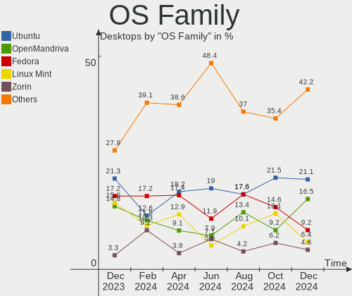
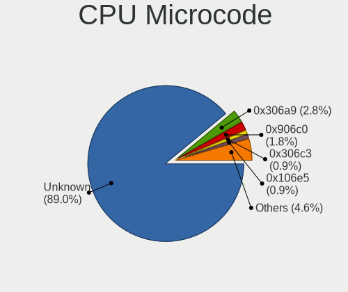
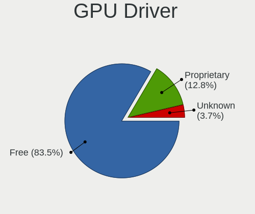
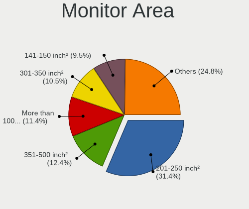
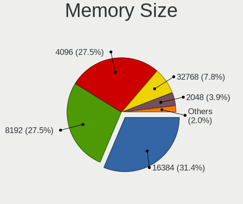

Linux in Brazil - Hardware Trends (Desktops)
--------------------------------------------

A project to identify most popular hardware characteristics and track their change
over time based on data collected by Linux users at https://Linux-Hardware.org.

Anyone can contribute to this report by the [hw-probe](https://github.com/linuxhw/hw-probe) tool:

    sudo -E hw-probe -all -upload

Period: Apr, 2024.

Contents
--------

* [ System ](#system)
  - [ OS                       ](#os)
  - [ OS Family                ](#os-family)
  - [ Kernel                   ](#kernel)
  - [ Kernel Family            ](#kernel-family)
  - [ Kernel Major Ver.        ](#kernel-major-ver)
  - [ Arch                     ](#arch)
  - [ DE                       ](#de)
  - [ Display Server           ](#display-server)
  - [ Display Manager          ](#display-manager)
  - [ OS Lang                  ](#os-lang)
  - [ Boot Mode                ](#boot-mode)
  - [ Filesystem               ](#filesystem)
  - [ Part. scheme             ](#part-scheme)
  - [ Dual Boot with Linux/BSD ](#dual-boot-with-linuxbsd)
  - [ Dual Boot (Win)          ](#dual-boot-win)

* [ Board ](#board)
  - [ Vendor                   ](#vendor)
  - [ Model                    ](#model)
  - [ Model Family             ](#model-family)
  - [ MFG Year                 ](#mfg-year)
  - [ Form Factor              ](#form-factor)
  - [ Secure Boot              ](#secure-boot)
  - [ Coreboot                 ](#coreboot)
  - [ RAM Size                 ](#ram-size)
  - [ RAM Used                 ](#ram-used)
  - [ Total Drives             ](#total-drives)
  - [ Has CD-ROM               ](#has-cd-rom)
  - [ Has Ethernet             ](#has-ethernet)
  - [ Has WiFi                 ](#has-wifi)
  - [ Has Bluetooth            ](#has-bluetooth)

* [ Location ](#location)
  - [ Country                  ](#country)
  - [ City                     ](#city)

* [ Drives ](#drives)
  - [ Drive Vendor             ](#drive-vendor)
  - [ Drive Model              ](#drive-model)
  - [ HDD Vendor               ](#hdd-vendor)
  - [ SSD Vendor               ](#ssd-vendor)
  - [ Drive Kind               ](#drive-kind)
  - [ Drive Connector          ](#drive-connector)
  - [ Drive Size               ](#drive-size)
  - [ Space Total              ](#space-total)
  - [ Space Used               ](#space-used)
  - [ Malfunc. Drives          ](#malfunc-drives)
  - [ Malfunc. Drive Vendor    ](#malfunc-drive-vendor)
  - [ Malfunc. HDD Vendor      ](#malfunc-hdd-vendor)
  - [ Malfunc. Drive Kind      ](#malfunc-drive-kind)
  - [ Failed Drives            ](#failed-drives)
  - [ Failed Drive Vendor      ](#failed-drive-vendor)
  - [ Drive Status             ](#drive-status)

* [ Storage controller ](#storage-controller)
  - [ Storage Vendor           ](#storage-vendor)
  - [ Storage Model            ](#storage-model)
  - [ Storage Kind             ](#storage-kind)

* [ Processor ](#processor)
  - [ CPU Vendor               ](#cpu-vendor)
  - [ CPU Model                ](#cpu-model)
  - [ CPU Model Family         ](#cpu-model-family)
  - [ CPU Cores                ](#cpu-cores)
  - [ CPU Sockets              ](#cpu-sockets)
  - [ CPU Threads              ](#cpu-threads)
  - [ CPU Op-Modes             ](#cpu-op-modes)
  - [ CPU Microcode            ](#cpu-microcode)
  - [ CPU Microarch            ](#cpu-microarch)

* [ Graphics ](#graphics)
  - [ GPU Vendor               ](#gpu-vendor)
  - [ GPU Model                ](#gpu-model)
  - [ GPU Combo                ](#gpu-combo)
  - [ GPU Driver               ](#gpu-driver)
  - [ GPU Memory               ](#gpu-memory)

* [ Monitor ](#monitor)
  - [ Monitor Vendor           ](#monitor-vendor)
  - [ Monitor Model            ](#monitor-model)
  - [ Monitor Resolution       ](#monitor-resolution)
  - [ Monitor Diagonal         ](#monitor-diagonal)
  - [ Monitor Width            ](#monitor-width)
  - [ Aspect Ratio             ](#aspect-ratio)
  - [ Monitor Area             ](#monitor-area)
  - [ Pixel Density            ](#pixel-density)
  - [ Multiple Monitors        ](#multiple-monitors)

* [ Network ](#network)
  - [ Net Controller Vendor    ](#net-controller-vendor)
  - [ Net Controller Model     ](#net-controller-model)
  - [ Wireless Vendor          ](#wireless-vendor)
  - [ Wireless Model           ](#wireless-model)
  - [ Ethernet Vendor          ](#ethernet-vendor)
  - [ Ethernet Model           ](#ethernet-model)
  - [ Net Controller Kind      ](#net-controller-kind)
  - [ Used Controller          ](#used-controller)
  - [ NICs                     ](#nics)
  - [ IPv6                     ](#ipv6)

* [ Bluetooth ](#bluetooth)
  - [ Bluetooth Vendor         ](#bluetooth-vendor)
  - [ Bluetooth Model          ](#bluetooth-model)

* [ Sound ](#sound)
  - [ Sound Vendor             ](#sound-vendor)
  - [ Sound Model              ](#sound-model)

* [ Memory ](#memory)
  - [ Memory Vendor            ](#memory-vendor)
  - [ Memory Model             ](#memory-model)
  - [ Memory Kind              ](#memory-kind)
  - [ Memory Form Factor       ](#memory-form-factor)
  - [ Memory Size              ](#memory-size)
  - [ Memory Speed             ](#memory-speed)

* [ Printers & scanners ](#printers--scanners)
  - [ Printer Vendor           ](#printer-vendor)
  - [ Printer Model            ](#printer-model)
  - [ Scanner Vendor           ](#scanner-vendor)
  - [ Scanner Model            ](#scanner-model)

* [ Camera ](#camera)
  - [ Camera Vendor            ](#camera-vendor)
  - [ Camera Model             ](#camera-model)

* [ Security ](#security)
  - [ Fingerprint Vendor       ](#fingerprint-vendor)
  - [ Fingerprint Model        ](#fingerprint-model)
  - [ Chipcard Vendor          ](#chipcard-vendor)
  - [ Chipcard Model           ](#chipcard-model)

* [ Unsupported ](#unsupported)
  - [ Unsupported Devices      ](#unsupported-devices)
  - [ Unsupported Device Types ](#unsupported-device-types)

System
------

OS
--

Installed operating systems

| Name                          | Desktops | Percent |
|-------------------------------|----------|---------|
| Fedora 39                     | 16       | 12.12%  |
| Ubuntu 22.04                  | 15       | 11.36%  |
| Pop!_OS 22.04                 | 9        | 6.82%   |
| Linux Mint 21.3               | 9        | 6.82%   |
| Ubuntu 23.10                  | 6        | 4.55%   |
| Fedora 40                     | 6        | 4.55%   |
| Arch Rolling                  | 6        | 4.55%   |
| Zorin 17                      | 5        | 3.79%   |
| OpenMandriva 5.0              | 5        | 3.79%   |
| OpenMandriva 23.08            | 5        | 3.79%   |
| Manjaro                       | 4        | 3.03%   |
| Debian 12                     | 4        | 3.03%   |
| Linux Mint 21.1               | 3        | 2.27%   |
| Kubuntu 22.04                 | 3        | 2.27%   |
| ArcoLinux Rolling             | 3        | 2.27%   |
| Nobara 39                     | 2        | 1.52%   |
| Linux Mint 21.2               | 2        | 1.52%   |
| Kubuntu 24.04                 | 2        | 1.52%   |
| KDE neon 22.04                | 2        | 1.52%   |
| Xubuntu 22.04                 | 1        | 0.76%   |
| Ubuntu MATE 22.04             | 1        | 0.76%   |
| Ubuntu Core 22                | 1        | 0.76%   |
| Ubuntu Budgie 23.10           | 1        | 0.76%   |
| Ubuntu 23.04                  | 1        | 0.76%   |
| Ubuntu 20.04                  | 1        | 0.76%   |
| SteamOS 1.1.6-prefinal_fixups | 1        | 0.76%   |
| PCLinuxOS 2024                | 1        | 0.76%   |
| openSUSE Tumbleweed-XXXXXXXX  | 1        | 0.76%   |
| openSUSE Leap-15.5            | 1        | 0.76%   |
| OpenMandriva 24.03            | 1        | 0.76%   |
| OpenMandriva 23.03            | 1        | 0.76%   |
| NixOS 23.11                   | 1        | 0.76%   |
| MX 23                         | 1        | 0.76%   |
| Lubuntu 22.04                 | 1        | 0.76%   |
| LMDE 6                        | 1        | 0.76%   |
| Linux Mint 20.3               | 1        | 0.76%   |
| Linux Mint 20.1               | 1        | 0.76%   |
| Linux Mint 20                 | 1        | 0.76%   |
| Garuda Linux Rolling          | 1        | 0.76%   |
| Fedora 38                     | 1        | 0.76%   |

OS Family
---------

OS without a version

| Name          | Desktops | Percent |
|---------------|----------|---------|
| Ubuntu        | 24       | 18.18%  |
| Fedora        | 23       | 17.42%  |
| Linux Mint    | 17       | 12.88%  |
| OpenMandriva  | 12       | 9.09%   |
| Pop!_OS       | 9        | 6.82%   |
| Arch          | 6        | 4.55%   |
| Zorin         | 5        | 3.79%   |
| Kubuntu       | 5        | 3.79%   |
| Debian        | 5        | 3.79%   |
| Manjaro       | 4        | 3.03%   |
| ArcoLinux     | 3        | 2.27%   |
| openSUSE      | 2        | 1.52%   |
| Nobara        | 2        | 1.52%   |
| KDE neon      | 2        | 1.52%   |
| BigLinux      | 2        | 1.52%   |
| Xubuntu       | 1        | 0.76%   |
| Ubuntu MATE   | 1        | 0.76%   |
| Ubuntu Budgie | 1        | 0.76%   |
| SteamOS       | 1        | 0.76%   |
| PCLinuxOS     | 1        | 0.76%   |
| NixOS         | 1        | 0.76%   |
| MX            | 1        | 0.76%   |
| Lubuntu       | 1        | 0.76%   |
| LMDE          | 1        | 0.76%   |
| Garuda Linux  | 1        | 0.76%   |
| Alpine        | 1        | 0.76%   |

Kernel
------

Version of the Linux kernel

| Version                                           | Desktops | Percent |
|---------------------------------------------------|----------|---------|
| 6.5.0-27-generic                                  | 16       | 12.12%  |
| 6.8.0-76060800daily20240311-generic               | 9        | 6.82%   |
| 6.5.0-28-generic                                  | 8        | 6.06%   |
| 6.5.0-26-generic                                  | 8        | 6.06%   |
| 5.15.0-101-generic                                | 6        | 4.55%   |
| 6.6.2-desktop-1omv2390                            | 5        | 3.79%   |
| 6.5.6-300.fc39.x86_64                             | 5        | 3.79%   |
| 5.15.0-102-generic                                | 5        | 3.79%   |
| 6.8.4-200.fc39.x86_64                             | 4        | 3.03%   |
| 6.4.11-desktop-1omv2390                           | 4        | 3.03%   |
| 6.8.7-300.fc40.x86_64                             | 3        | 2.27%   |
| 6.8.2-zen2-1-zen                                  | 3        | 2.27%   |
| 6.1.0-20-amd64                                    | 3        | 2.27%   |
| 5.15.0-91-generic                                 | 3        | 2.27%   |
| 6.8.6-200.fc39.x86_64                             | 2        | 1.52%   |
| 6.8.2-arch2-1                                     | 2        | 1.52%   |
| 6.7.11-200.fc39.x86_64                            | 2        | 1.52%   |
| 6.6.26-1-MANJARO                                  | 2        | 1.52%   |
| 5.15.0-105-generic                                | 2        | 1.52%   |
| 6.8.7-zen1-2-zen                                  | 1        | 0.76%   |
| 6.8.7-lqx2-1-lqx                                  | 1        | 0.76%   |
| 6.8.7-desktop-1omv2490                            | 1        | 0.76%   |
| 6.8.7-arch1-1                                     | 1        | 0.76%   |
| 6.8.7-302.fsync.fc40.x86_64                       | 1        | 0.76%   |
| 6.8.7-200.fsync.fc39.x86_64                       | 1        | 0.76%   |
| 6.8.6-arch1-1                                     | 1        | 0.76%   |
| 6.8.6-300.fc40.x86_64                             | 1        | 0.76%   |
| 6.8.5-arch1-1                                     | 1        | 0.76%   |
| 6.8.5-301.fc40.x86_64                             | 1        | 0.76%   |
| 6.8.5-201.fc39.x86_64                             | 1        | 0.76%   |
| 6.8.5-1-default                                   | 1        | 0.76%   |
| 6.8.4-cb1.0.fc39.x86_64                           | 1        | 0.76%   |
| 6.8.4-100.fc38.x86_64                             | 1        | 0.76%   |
| 6.8.0-31-generic                                  | 1        | 0.76%   |
| 6.7.9-arch1-1                                     | 1        | 0.76%   |
| 6.7.6-201.fsync.fc39.x86_64                       | 1        | 0.76%   |
| 6.7.4-holoiso-beta_lljy-kernel-lljy-g76a2d2abfbba | 1        | 0.76%   |
| 6.7.12-202.fsync.fc39.x86_64                      | 1        | 0.76%   |
| 6.7.12-1-MANJARO                                  | 1        | 0.76%   |
| 6.7.12-1-liquorix-amd64                           | 1        | 0.76%   |

Kernel Family
-------------

Linux kernel without a distro release

| Version | Desktops | Percent |
|---------|----------|---------|
| 6.5.0   | 34       | 25.76%  |
| 5.15.0  | 18       | 13.64%  |
| 6.8.0   | 10       | 7.58%   |
| 6.8.7   | 9        | 6.82%   |
| 6.8.4   | 6        | 4.55%   |
| 6.8.2   | 5        | 3.79%   |
| 6.6.2   | 5        | 3.79%   |
| 6.5.6   | 5        | 3.79%   |
| 6.8.6   | 4        | 3.03%   |
| 6.8.5   | 4        | 3.03%   |
| 6.4.11  | 4        | 3.03%   |
| 6.1.0   | 4        | 3.03%   |
| 6.7.12  | 3        | 2.27%   |
| 6.7.11  | 2        | 1.52%   |
| 6.6.26  | 2        | 1.52%   |
| 6.6.25  | 2        | 1.52%   |
| 5.4.0   | 2        | 1.52%   |
| 6.7.9   | 1        | 0.76%   |
| 6.7.6   | 1        | 0.76%   |
| 6.7.4   | 1        | 0.76%   |
| 6.6.23  | 1        | 0.76%   |
| 6.6.19  | 1        | 0.76%   |
| 6.6.13  | 1        | 0.76%   |
| 6.4.8   | 1        | 0.76%   |
| 6.2.6   | 1        | 0.76%   |
| 6.2.0   | 1        | 0.76%   |
| 6.1.80  | 1        | 0.76%   |
| 5.14.21 | 1        | 0.76%   |
| 5.10.0  | 1        | 0.76%   |
| 5.0.0   | 1        | 0.76%   |

Kernel Major Ver.
-----------------

Linux kernel major version

| Version | Desktops | Percent |
|---------|----------|---------|
| 6.5     | 39       | 29.55%  |
| 6.8     | 38       | 28.79%  |
| 5.15    | 18       | 13.64%  |
| 6.6     | 12       | 9.09%   |
| 6.7     | 8        | 6.06%   |
| 6.4     | 5        | 3.79%   |
| 6.1     | 5        | 3.79%   |
| 6.2     | 2        | 1.52%   |
| 5.4     | 2        | 1.52%   |
| 5.14    | 1        | 0.76%   |
| 5.10    | 1        | 0.76%   |
| 5.0     | 1        | 0.76%   |

Arch
----

OS architecture (x86_64, i586, etc.)

| Name   | Desktops | Percent |
|--------|----------|---------|
| x86_64 | 132      | 100%    |

DE
--

Desktop Environment

| Name            | Desktops | Percent |
|-----------------|----------|---------|
| GNOME           | 66       | 50%     |
| KDE5            | 21       | 15.91%  |
| X-Cinnamon      | 12       | 9.09%   |
| KDE6            | 8        | 6.06%   |
| XFCE            | 7        | 5.3%    |
| MATE            | 5        | 3.79%   |
| Unknown         | 4        | 3.03%   |
| LXQt            | 2        | 1.52%   |
| GNOME Flashback | 2        | 1.52%   |
| Cinnamon        | 2        | 1.52%   |
| LXDE            | 1        | 0.76%   |
| Hyprland        | 1        | 0.76%   |
| Budgie          | 1        | 0.76%   |

Display Server
--------------

X11 or Wayland

| Name    | Desktops | Percent |
|---------|----------|---------|
| X11     | 75       | 56.82%  |
| Wayland | 54       | 40.91%  |
| Unknown | 2        | 1.52%   |
| Tty     | 1        | 0.76%   |

Display Manager
---------------

SDDM, LightDM, etc.

| Name    | Desktops | Percent |
|---------|----------|---------|
| Unknown | 63       | 47.73%  |
| GDM3    | 25       | 18.94%  |
| SDDM    | 21       | 15.91%  |
| LightDM | 13       | 9.85%   |
| GDM     | 9        | 6.82%   |
| XDM     | 1        | 0.76%   |

OS Lang
-------

Language

| Lang    | Desktops | Percent |
|---------|----------|---------|
| pt_BR   | 98       | 74.24%  |
| en_US   | 26       | 19.7%   |
| Unknown | 4        | 3.03%   |
| C       | 2        | 1.52%   |
| es_US   | 1        | 0.76%   |
| en_GB   | 1        | 0.76%   |

Boot Mode
---------

EFI or BIOS

| Mode | Desktops | Percent |
|------|----------|---------|
| BIOS | 87       | 65.91%  |
| EFI  | 45       | 34.09%  |

Filesystem
----------

Type of filesystem

| Type    | Desktops | Percent |
|---------|----------|---------|
| Ext4    | 75       | 56.82%  |
| Btrfs   | 27       | 20.45%  |
| Tmpfs   | 23       | 17.42%  |
| Overlay | 5        | 3.79%   |
| Zfs     | 1        | 0.76%   |
| F2fs    | 1        | 0.76%   |

Part. scheme
------------

Scheme of partitioning

| Type    | Desktops | Percent |
|---------|----------|---------|
| GPT     | 61       | 46.21%  |
| Unknown | 60       | 45.45%  |
| MBR     | 11       | 8.33%   |

Dual Boot with Linux/BSD
------------------------

Hosting more than one Linux/BSD

| Dual boot | Desktops | Percent |
|-----------|----------|---------|
| No        | 112      | 84.85%  |
| Yes       | 20       | 15.15%  |

Dual Boot (Win)
---------------

Hosting Linux and Windows

| Dual boot | Desktops | Percent |
|-----------|----------|---------|
| No        | 92       | 69.7%   |
| Yes       | 40       | 30.3%   |

Board
-----

Vendor
------

Motherboard manufacturer

| Name                | Desktops | Percent |
|---------------------|----------|---------|
| ASUSTek Computer    | 28       | 21.21%  |
| Gigabyte Technology | 23       | 17.42%  |
| Intel               | 16       | 12.12%  |
| Dell                | 9        | 6.82%   |
| ASRock              | 9        | 6.82%   |
| MSI                 | 6        | 4.55%   |
| Lenovo              | 5        | 3.79%   |
| Positivo            | 4        | 3.03%   |
| Hewlett-Packard     | 4        | 3.03%   |
| PCWare              | 3        | 2.27%   |
| Itautec             | 3        | 2.27%   |
| Unknown             | 3        | 2.27%   |
| Semp Toshiba        | 2        | 1.52%   |
| MACHINIST           | 2        | 1.52%   |
| Huanan              | 2        | 1.52%   |
| Biostar             | 2        | 1.52%   |
| AZW                 | 2        | 1.52%   |
| ONDA                | 1        | 0.76%   |
| NCR                 | 1        | 0.76%   |
| MANCER              | 1        | 0.76%   |
| DUEX                | 1        | 0.76%   |
| Digiboard           | 1        | 0.76%   |
| Daten Tecnologia    | 1        | 0.76%   |
| ANGXUN              | 1        | 0.76%   |
| AMD                 | 1        | 0.76%   |
| ADLINK Technology   | 1        | 0.76%   |

Model
-----

Motherboard model

| Name                               | Desktops | Percent |
|------------------------------------|----------|---------|
| Intel H81                          | 3        | 2.27%   |
| Intel B75                          | 3        | 2.27%   |
| ASRock B450M Steel Legend          | 3        | 2.27%   |
| Unknown                            | 3        | 2.27%   |
| Semp Toshiba STI                   | 2        | 1.52%   |
| Itautec ST 4265                    | 2        | 1.52%   |
| Intel X99                          | 2        | 1.52%   |
| Intel H61                          | 2        | 1.52%   |
| Intel H55                          | 2        | 1.52%   |
| Gigabyte B760M AORUS ELITE         | 2        | 1.52%   |
| Gigabyte B450M GAMING              | 2        | 1.52%   |
| Dell OptiPlex 7080                 | 2        | 1.52%   |
| Dell OptiPlex 3070                 | 2        | 1.52%   |
| AZW T4 PRO                         | 2        | 1.52%   |
| ASUS TUF Gaming X570-PLUS_BR       | 2        | 1.52%   |
| ASUS PRIME A520M-E                 | 2        | 1.52%   |
| ASUS All Series                    | 2        | 1.52%   |
| Positivo POS-PIG41BA               | 1        | 0.76%   |
| Positivo POS-AG31AP                | 1        | 0.76%   |
| Positivo Master D570a              | 1        | 0.76%   |
| Positivo C4400                     | 1        | 0.76%   |
| PCWare IPMH61R3                    | 1        | 0.76%   |
| PCWare IPMH310G PRO                | 1        | 0.76%   |
| PCWare IPMH110G                    | 1        | 0.76%   |
| ONDA A520SD4                       | 1        | 0.76%   |
| NCR IPMQ57                         | 1        | 0.76%   |
| MSI MS-7D22                        | 1        | 0.76%   |
| MSI MS-7C71                        | 1        | 0.76%   |
| MSI MS-7B29                        | 1        | 0.76%   |
| MSI MS-7A38                        | 1        | 0.76%   |
| MSI MS-7821                        | 1        | 0.76%   |
| MSI MS-7529                        | 1        | 0.76%   |
| MANCER A320M-DA                    | 1        | 0.76%   |
| MACHINIST X79 V2.82A               | 1        | 0.76%   |
| MACHINIST E5-MR9A PRO V1.0         | 1        | 0.76%   |
| Lenovo ThinkCentre M93p 10A8S20N00 | 1        | 0.76%   |
| Lenovo ThinkCentre M90p 5536P79    | 1        | 0.76%   |
| Lenovo ThinkCentre M700 10KN003LBP | 1        | 0.76%   |
| Lenovo ThinkCentre M58p 3063A58    | 1        | 0.76%   |
| Lenovo 63 90AT0002BR               | 1        | 0.76%   |

Model Family
------------

Motherboard model prefix

| Name                 | Desktops | Percent |
|----------------------|----------|---------|
| ASUS TUF             | 9        | 6.82%   |
| Dell OptiPlex        | 7        | 5.3%    |
| ASUS PRIME           | 5        | 3.79%   |
| Lenovo ThinkCentre   | 4        | 3.03%   |
| Itautec ST           | 3        | 2.27%   |
| Intel X99            | 3        | 2.27%   |
| Intel H81            | 3        | 2.27%   |
| Intel B75            | 3        | 2.27%   |
| Gigabyte B450M       | 3        | 2.27%   |
| Gigabyte A520M       | 3        | 2.27%   |
| ASUS ROG             | 3        | 2.27%   |
| ASRock B450M         | 3        | 2.27%   |
| Unknown              | 3        | 2.27%   |
| Semp Toshiba STI     | 2        | 1.52%   |
| Intel H61            | 2        | 1.52%   |
| Intel H55            | 2        | 1.52%   |
| HP Compaq            | 2        | 1.52%   |
| Gigabyte B760M       | 2        | 1.52%   |
| AZW T4               | 2        | 1.52%   |
| ASUS All             | 2        | 1.52%   |
| ASRock B650E         | 2        | 1.52%   |
| Positivo POS-PIG41BA | 1        | 0.76%   |
| Positivo POS-AG31AP  | 1        | 0.76%   |
| Positivo Master      | 1        | 0.76%   |
| Positivo C4400       | 1        | 0.76%   |
| PCWare IPMH61R3      | 1        | 0.76%   |
| PCWare IPMH310G      | 1        | 0.76%   |
| PCWare IPMH110G      | 1        | 0.76%   |
| ONDA A520SD4         | 1        | 0.76%   |
| NCR IPMQ57           | 1        | 0.76%   |
| MSI MS-7D22          | 1        | 0.76%   |
| MSI MS-7C71          | 1        | 0.76%   |
| MSI MS-7B29          | 1        | 0.76%   |
| MSI MS-7A38          | 1        | 0.76%   |
| MSI MS-7821          | 1        | 0.76%   |
| MSI MS-7529          | 1        | 0.76%   |
| MANCER A320M-DA      | 1        | 0.76%   |
| MACHINIST X79        | 1        | 0.76%   |
| MACHINIST E5-MR9A    | 1        | 0.76%   |
| Lenovo 63            | 1        | 0.76%   |

MFG Year
--------

Motherboard manufacture year

| Year | Desktops | Percent |
|------|----------|---------|
| 2020 | 16       | 12.12%  |
| 2022 | 14       | 10.61%  |
| 2019 | 13       | 9.85%   |
| 2018 | 13       | 9.85%   |
| 2023 | 12       | 9.09%   |
| 2017 | 10       | 7.58%   |
| 2012 | 10       | 7.58%   |
| 2014 | 8        | 6.06%   |
| 2013 | 6        | 4.55%   |
| 2021 | 5        | 3.79%   |
| 2016 | 4        | 3.03%   |
| 2015 | 4        | 3.03%   |
| 2010 | 4        | 3.03%   |
| 2009 | 4        | 3.03%   |
| 2011 | 3        | 2.27%   |
| 2008 | 3        | 2.27%   |
| 2007 | 2        | 1.52%   |
| 2024 | 1        | 0.76%   |

Form Factor
-----------

Physical design of the computer

| Name    | Desktops | Percent |
|---------|----------|---------|
| Desktop | 132      | 100%    |

Secure Boot
-----------

Enabled or disabled

| State    | Desktops | Percent |
|----------|----------|---------|
| Disabled | 130      | 98.48%  |
| Enabled  | 2        | 1.52%   |

Coreboot
--------

Have coreboot on board

| Used | Desktops | Percent |
|------|----------|---------|
| No   | 132      | 100%    |

RAM Size
--------

Total RAM memory

| Size in GB  | Desktops | Percent |
|-------------|----------|---------|
| 16.01-24.0  | 37       | 28.03%  |
| 4.01-8.0    | 25       | 18.94%  |
| 8.01-16.0   | 23       | 17.42%  |
| 32.01-64.0  | 20       | 15.15%  |
| 3.01-4.0    | 17       | 12.88%  |
| 64.01-256.0 | 5        | 3.79%   |
| 24.01-32.0  | 2        | 1.52%   |
| 1.01-2.0    | 2        | 1.52%   |
| 2.01-3.0    | 1        | 0.76%   |

RAM Used
--------

Used RAM memory

| Used GB    | Desktops | Percent |
|------------|----------|---------|
| 2.01-3.0   | 37       | 28.03%  |
| 4.01-8.0   | 31       | 23.48%  |
| 1.01-2.0   | 29       | 21.97%  |
| 3.01-4.0   | 16       | 12.12%  |
| 8.01-16.0  | 10       | 7.58%   |
| 0.51-1.0   | 4        | 3.03%   |
| 16.01-24.0 | 3        | 2.27%   |
| 0.01-0.5   | 2        | 1.52%   |

Total Drives
------------

Number of drives on board

| Drives | Desktops | Percent |
|--------|----------|---------|
| 1      | 61       | 46.21%  |
| 3      | 29       | 21.97%  |
| 2      | 28       | 21.21%  |
| 4      | 7        | 5.3%    |
| 5      | 6        | 4.55%   |
| 7      | 1        | 0.76%   |

Has CD-ROM
----------

Has CD-ROM on board

| Presented | Desktops | Percent |
|-----------|----------|---------|
| No        | 105      | 79.55%  |
| Yes       | 27       | 20.45%  |

Has Ethernet
------------

Has Ethernet on board

| Presented | Desktops | Percent |
|-----------|----------|---------|
| Yes       | 131      | 99.24%  |
| No        | 1        | 0.76%   |

Has WiFi
--------

Has WiFi module

| Presented | Desktops | Percent |
|-----------|----------|---------|
| Yes       | 67       | 50.76%  |
| No        | 65       | 49.24%  |

Has Bluetooth
-------------

Has Bluetooth module

| Presented | Desktops | Percent |
|-----------|----------|---------|
| No        | 93       | 70.45%  |
| Yes       | 39       | 29.55%  |

Location
--------

Country
-------

Geographic location (country)

| Country | Desktops | Percent |
|---------|----------|---------|
| Brazil  | 132      | 100%    |

City
----

Geographic location (city)

| City                  | Desktops | Percent |
|-----------------------|----------|---------|
| Sao Paulo             | 20       | 15.15%  |
| Rio de Janeiro        | 9        | 6.82%   |
| Palmas                | 4        | 3.03%   |
| Niterói              | 3        | 2.27%   |
| Contagem              | 3        | 2.27%   |
| Campinas              | 3        | 2.27%   |
| Brasília             | 3        | 2.27%   |
| Belo Horizonte        | 3        | 2.27%   |
| Volta Redonda         | 2        | 1.52%   |
| Sao Goncalo           | 2        | 1.52%   |
| Santos                | 2        | 1.52%   |
| Santo André          | 2        | 1.52%   |
| Porto Alegre          | 2        | 1.52%   |
| Maringá              | 2        | 1.52%   |
| Manaus                | 2        | 1.52%   |
| Londrina              | 2        | 1.52%   |
| Limeira               | 2        | 1.52%   |
| Governador Valadares  | 2        | 1.52%   |
| Goiânia              | 2        | 1.52%   |
| Farroupilha           | 2        | 1.52%   |
| Dourados              | 2        | 1.52%   |
| Votorantim            | 1        | 0.76%   |
| Vitória              | 1        | 0.76%   |
| Vila Velha            | 1        | 0.76%   |
| Varzea Paulista       | 1        | 0.76%   |
| Uberlândia           | 1        | 0.76%   |
| Uba                   | 1        | 0.76%   |
| Teresina              | 1        | 0.76%   |
| Taquarituba           | 1        | 0.76%   |
| Sumaré               | 1        | 0.76%   |
| Sorocaba              | 1        | 0.76%   |
| Sobral                | 1        | 0.76%   |
| Sertaozinho           | 1        | 0.76%   |
| Sao Luís             | 1        | 0.76%   |
| Sao Jose do Rio Preto | 1        | 0.76%   |
| Sao Jose              | 1        | 0.76%   |
| Sao Carlos            | 1        | 0.76%   |
| Santa Barbara d'Oeste | 1        | 0.76%   |
| Salvador              | 1        | 0.76%   |
| Salto                 | 1        | 0.76%   |

Drives
------

Drive Vendor
------------

Hard drive vendors

| Vendor                         | Desktops | Drives | Percent |
|--------------------------------|----------|--------|---------|
| WDC                            | 46       | 53     | 18.78%  |
| Seagate                        | 36       | 42     | 14.69%  |
| Kingston                       | 27       | 32     | 11.02%  |
| Samsung Electronics            | 14       | 19     | 5.71%   |
| Sandisk                        | 12       | 13     | 4.9%    |
| China                          | 12       | 13     | 4.9%    |
| Unknown                        | 9        | 9      | 3.67%   |
| Silicon Motion                 | 8        | 8      | 3.27%   |
| Toshiba                        | 6        | 6      | 2.45%   |
| Kingston Technology Company    | 5        | 5      | 2.04%   |
| KingSpec                       | 5        | 5      | 2.04%   |
| Lexar                          | 4        | 4      | 1.63%   |
| A-DATA Technology              | 4        | 4      | 1.63%   |
| XrayDisk                       | 3        | 4      | 1.22%   |
| SK hynix                       | 3        | 3      | 1.22%   |
| Phison Electronics             | 3        | 3      | 1.22%   |
| MAXIO Technology (Hangzhou)    | 3        | 3      | 1.22%   |
| Hitachi                        | 3        | 3      | 1.22%   |
| Crucial                        | 3        | 3      | 1.22%   |
| Realtek Semiconductor          | 2        | 2      | 0.82%   |
| Pichau                         | 2        | 2      | 0.82%   |
| Netac                          | 2        | 2      | 0.82%   |
| KingDian                       | 2        | 2      | 0.82%   |
| HS-SSD-C100                    | 2        | 2      | 0.82%   |
| HGST                           | 2        | 2      | 0.82%   |
| ADATA Technology               | 2        | 2      | 0.82%   |
| WALRAM                         | 1        | 1      | 0.41%   |
| USB3.0                         | 1        | 1      | 0.41%   |
| Unknown                        | 1        | 1      | 0.41%   |
| T-FORCE                        | 1        | 1      | 0.41%   |
| Solid State Storage Technology | 1        | 1      | 0.41%   |
| ProDrive                       | 1        | 1      | 0.41%   |
| Patriot                        | 1        | 1      | 0.41%   |
| Mushkin                        | 1        | 1      | 0.41%   |
| MicroFrom                      | 1        | 1      | 0.41%   |
| MACROVIP                       | 1        | 1      | 0.41%   |
| LITEON                         | 1        | 1      | 0.41%   |
| Lite-On Technology             | 1        | 1      | 0.41%   |
| KINGCOMP                       | 1        | 1      | 0.41%   |
| KBM                            | 1        | 1      | 0.41%   |

Drive Model
-----------

Hard drive models

| Model                                                 | Desktops | Percent |
|-------------------------------------------------------|----------|---------|
| Kingston SA400S37480G 480GB SSD                       | 11       | 4.18%   |
| Unknown                                               | 9        | 3.42%   |
| Silicon Motion SM2263EN/SM2263XT SSD Controller 256GB | 6        | 2.28%   |
| Seagate ST1000DM010-2EP102 1TB                        | 5        | 1.9%    |
| Kingston SA400S37240G 240GB SSD                       | 5        | 1.9%    |
| WDC WD10EZEX-08WN4A0 1TB                              | 4        | 1.52%   |
| WDC WDS240G2G0A-00JH30 240GB SSD                      | 3        | 1.14%   |
| Seagate ST2000DM001-1CH164 2TB                        | 3        | 1.14%   |
| MAXIO (Hangzhou) NVMe SSD Controller MAP1202 256GB    | 3        | 1.14%   |
| Kingston Company SNV2S1000G 1TB                       | 3        | 1.14%   |
| Kingston SV300S37A120G 120GB SSD                      | 3        | 1.14%   |
| Crucial CT480BX500SSD1 480GB                          | 3        | 1.14%   |
| China SSD 128GB                                       | 3        | 1.14%   |
| WDC WDS120G2G0A-00JH30 120GB SSD                      | 2        | 0.76%   |
| WDC WD5000AAKX-60U6AA0 500GB                          | 2        | 0.76%   |
| WDC WD10EZEX-00WN4A0 1TB                              | 2        | 0.76%   |
| WDC WD10EARS-00Y5B1 1TB                               | 2        | 0.76%   |
| SK hynix BC511 256GB                                  | 2        | 0.76%   |
| Seagate ST500LM012 HN-M500MBB 500GB                   | 2        | 0.76%   |
| Seagate ST3500413AS 500GB                             | 2        | 0.76%   |
| Seagate ST3000DM008-2DM166 3TB                        | 2        | 0.76%   |
| Seagate ST2000DM006-2DM164 2TB                        | 2        | 0.76%   |
| Seagate ST2000DM001-1ER164 2TB                        | 2        | 0.76%   |
| Seagate ST1000LM048-2E7172 1TB                        | 2        | 0.76%   |
| Seagate ST1000LM024 HN-M101MBB 1TB                    | 2        | 0.76%   |
| Seagate ST1000DM003-1ER162 1TB                        | 2        | 0.76%   |
| Sandisk WD_BLACK SN850X 1000GB                        | 2        | 0.76%   |
| Sandisk WD Black SN750 / PC SN730 NVMe SSD 512GB      | 2        | 0.76%   |
| SanDisk SSD PLUS 1000GB                               | 2        | 0.76%   |
| Samsung HD502HI 500GB                                 | 2        | 0.76%   |
| Phison E12 NVMe Controller 2TB                        | 2        | 0.76%   |
| Lexar 128GB SSD                                       | 2        | 0.76%   |
| Kingston SUV500240G 240GB SSD                         | 2        | 0.76%   |
| Kingston SA400S37120G 120GB SSD                       | 2        | 0.76%   |
| China SSD 512GB                                       | 2        | 0.76%   |
| China SATA SSD 120GB                                  | 2        | 0.76%   |
| A-DATA SU630 960GB SSD                                | 2        | 0.76%   |
| XrayDisk 512GB SSD                                    | 1        | 0.38%   |
| XrayDisk 512GB                                        | 1        | 0.38%   |
| XrayDisk 240GB SSD                                    | 1        | 0.38%   |

HDD Vendor
----------

Hard disk drive vendors

| Vendor              | Desktops | Drives | Percent |
|---------------------|----------|--------|---------|
| WDC                 | 38       | 43     | 40.86%  |
| Seagate             | 35       | 41     | 37.63%  |
| Samsung Electronics | 9        | 11     | 9.68%   |
| Toshiba             | 6        | 6      | 6.45%   |
| Hitachi             | 3        | 3      | 3.23%   |
| HGST                | 2        | 2      | 2.15%   |

SSD Vendor
----------

Solid state drive vendors

| Vendor              | Desktops | Drives | Percent |
|---------------------|----------|--------|---------|
| Kingston            | 26       | 30     | 28.89%  |
| China               | 12       | 13     | 13.33%  |
| WDC                 | 9        | 9      | 10%     |
| KingSpec            | 5        | 5      | 5.56%   |
| SanDisk             | 4        | 4      | 4.44%   |
| Lexar               | 4        | 4      | 4.44%   |
| A-DATA Technology   | 4        | 4      | 4.44%   |
| Unknown             | 4        | 4      | 4.44%   |
| Crucial             | 3        | 3      | 3.33%   |
| XrayDisk            | 2        | 2      | 2.22%   |
| Pichau              | 2        | 2      | 2.22%   |
| KingDian            | 2        | 2      | 2.22%   |
| WALRAM              | 1        | 1      | 1.11%   |
| USB3.0              | 1        | 1      | 1.11%   |
| Samsung Electronics | 1        | 2      | 1.11%   |
| Mushkin             | 1        | 1      | 1.11%   |
| LITEON              | 1        | 1      | 1.11%   |
| KINGCOMP            | 1        | 1      | 1.11%   |
| KBM                 | 1        | 1      | 1.11%   |
| HUSKY               | 1        | 1      | 1.11%   |
| Hewlett-Packard     | 1        | 1      | 1.11%   |
| Corsair             | 1        | 1      | 1.11%   |
| BIWIN               | 1        | 1      | 1.11%   |
| BHT                 | 1        | 1      | 1.11%   |
| AFOX                | 1        | 1      | 1.11%   |

Drive Kind
----------

HDD or SSD

| Kind    | Desktops | Drives | Percent |
|---------|----------|--------|---------|
| SSD     | 75       | 96     | 36.59%  |
| HDD     | 71       | 106    | 34.63%  |
| NVMe    | 44       | 53     | 21.46%  |
| Unknown | 12       | 13     | 5.85%   |
| MMC     | 3        | 3      | 1.46%   |

Drive Connector
---------------

SATA, SAS, NVMe, etc.

| Type | Desktops | Drives | Percent |
|------|----------|--------|---------|
| SATA | 113      | 210    | 68.07%  |
| NVMe | 44       | 52     | 26.51%  |
| SAS  | 6        | 6      | 3.61%   |
| MMC  | 3        | 3      | 1.81%   |

Drive Size
----------

Size of hard drive

| Size in TB | Desktops | Drives | Percent |
|------------|----------|--------|---------|
| 0.01-0.5   | 88       | 126    | 58.67%  |
| 0.51-1.0   | 42       | 55     | 28%     |
| 1.01-2.0   | 12       | 12     | 8%      |
| 3.01-4.0   | 4        | 4      | 2.67%   |
| 2.01-3.0   | 2        | 3      | 1.33%   |
| 4.01-10.0  | 2        | 2      | 1.33%   |

Space Total
-----------

Amount of disk space available on the file system

| Size in GB     | Desktops | Percent |
|----------------|----------|---------|
| 251-500        | 34       | 25.76%  |
| 101-250        | 29       | 21.97%  |
| 501-1000       | 20       | 15.15%  |
| 1001-2000      | 13       | 9.85%   |
| More than 3000 | 11       | 8.33%   |
| 1-20           | 9        | 6.82%   |
| 51-100         | 6        | 4.55%   |
| 21-50          | 4        | 3.03%   |
| Unknown        | 4        | 3.03%   |
| 2001-3000      | 2        | 1.52%   |

Space Used
----------

Amount of used disk space

| Used GB        | Desktops | Percent |
|----------------|----------|---------|
| 1-20           | 35       | 26.52%  |
| 21-50          | 23       | 17.42%  |
| 101-250        | 20       | 15.15%  |
| 51-100         | 19       | 14.39%  |
| 251-500        | 13       | 9.85%   |
| 501-1000       | 9        | 6.82%   |
| 2001-3000      | 4        | 3.03%   |
| 1001-2000      | 4        | 3.03%   |
| Unknown        | 4        | 3.03%   |
| More than 3000 | 1        | 0.76%   |

Malfunc. Drives
---------------

Drive models with a malfunction

| Model                                                 | Desktops | Drives | Percent |
|-------------------------------------------------------|----------|--------|---------|
| Seagate ST2000DM001-1CH164 2TB                        | 2        | 2      | 7.41%   |
| WDC WD5000LPLX-60ZNTT2 500GB                          | 1        | 1      | 3.7%    |
| WDC WD5000AAKX-603CA0 500GB                           | 1        | 1      | 3.7%    |
| WDC WD10JPVX-75JC3T0 1TB                              | 1        | 1      | 3.7%    |
| WDC WD10EARS-00Y5B1 1TB                               | 1        | 1      | 3.7%    |
| Toshiba MQ01ABD050V -63 500GB                         | 1        | 1      | 3.7%    |
| Toshiba MK8052GSX 80GB                                | 1        | 1      | 3.7%    |
| Silicon Motion SM2263EN/SM2263XT SSD Controller 256GB | 1        | 1      | 3.7%    |
| Seagate ST500LM034-2GH17A 500GB                       | 1        | 1      | 3.7%    |
| Seagate ST500LM021-1KJ152 500GB                       | 1        | 1      | 3.7%    |
| Seagate ST500LM012 HN-M500MBB 500GB                   | 1        | 1      | 3.7%    |
| Seagate ST3500312CS 500GB                             | 1        | 1      | 3.7%    |
| Seagate ST3160318AS 160GB                             | 1        | 1      | 3.7%    |
| Seagate ST3000DM008-2DM166 3TB                        | 1        | 1      | 3.7%    |
| Seagate ST1500DL003-9VT16L 1TB                        | 1        | 1      | 3.7%    |
| SanDisk SSD PLUS 120GB                                | 1        | 1      | 3.7%    |
| Samsung Electronics SSD 970 EVO 500GB                 | 1        | 1      | 3.7%    |
| Samsung Electronics SP2504C 250GB                     | 1        | 1      | 3.7%    |
| Samsung Electronics HD502HI 500GB                     | 1        | 1      | 3.7%    |
| Mushkin MKNSSDTR1TB-3D                                | 1        | 1      | 3.7%    |
| Kingston SUV500240G 240GB SSD                         | 1        | 1      | 3.7%    |
| KINGCOMP SSD 256GB                                    | 1        | 1      | 3.7%    |
| Hitachi HUA723030ALA641 3TB                           | 1        | 1      | 3.7%    |
| Hitachi HDP725050GLA360 500GB                         | 1        | 1      | 3.7%    |
| HGST HTS545050A7E380 500GB                            | 1        | 1      | 3.7%    |
| China SSD 480GB                                       | 1        | 1      | 3.7%    |

Malfunc. Drive Vendor
---------------------

Vendors of faulty drives

| Vendor              | Desktops | Drives | Percent |
|---------------------|----------|--------|---------|
| Seagate             | 8        | 9      | 32%     |
| WDC                 | 4        | 4      | 16%     |
| Toshiba             | 2        | 2      | 8%      |
| Samsung Electronics | 2        | 3      | 8%      |
| Hitachi             | 2        | 2      | 8%      |
| Silicon Motion      | 1        | 1      | 4%      |
| SanDisk             | 1        | 1      | 4%      |
| Mushkin             | 1        | 1      | 4%      |
| Kingston            | 1        | 1      | 4%      |
| KINGCOMP            | 1        | 1      | 4%      |
| HGST                | 1        | 1      | 4%      |
| China               | 1        | 1      | 4%      |

Malfunc. HDD Vendor
-------------------

Vendors of faulty HDD drives

| Vendor              | Desktops | Drives | Percent |
|---------------------|----------|--------|---------|
| Seagate             | 8        | 9      | 42.11%  |
| WDC                 | 4        | 4      | 21.05%  |
| Toshiba             | 2        | 2      | 10.53%  |
| Samsung Electronics | 2        | 2      | 10.53%  |
| Hitachi             | 2        | 2      | 10.53%  |
| HGST                | 1        | 1      | 5.26%   |

Malfunc. Drive Kind
-------------------

Kinds of faulty drives

| Kind | Desktops | Drives | Percent |
|------|----------|--------|---------|
| HDD  | 15       | 20     | 68.18%  |
| SSD  | 5        | 5      | 22.73%  |
| NVMe | 2        | 2      | 9.09%   |

Failed Drives
-------------

Failed drive models

Zero info for selected period =(

Failed Drive Vendor
-------------------

Failed drive vendors

Zero info for selected period =(

Drive Status
------------

Number of failed and malfunc. drives

| Status   | Desktops | Drives | Percent |
|----------|----------|--------|---------|
| Detected | 89       | 166    | 58.17%  |
| Works    | 45       | 78     | 29.41%  |
| Malfunc  | 19       | 27     | 12.42%  |

Storage controller
------------------

Storage Vendor
--------------

Storage controller vendors

| Vendor                         | Desktops | Percent |
|--------------------------------|----------|---------|
| Intel                          | 90       | 47.37%  |
| AMD                            | 38       | 20%     |
| Silicon Motion                 | 10       | 5.26%   |
| SanDisk                        | 9        | 4.74%   |
| Kingston Technology Company    | 7        | 3.68%   |
| Samsung Electronics            | 5        | 2.63%   |
| ASMedia Technology             | 5        | 2.63%   |
| Phison Electronics             | 4        | 2.11%   |
| MAXIO Technology (Hangzhou)    | 4        | 2.11%   |
| SK hynix                       | 3        | 1.58%   |
| Marvell Technology Group       | 3        | 1.58%   |
| JMicron Technology             | 3        | 1.58%   |
| Realtek Semiconductor          | 2        | 1.05%   |
| ADATA Technology               | 2        | 1.05%   |
| Solid State Storage Technology | 1        | 0.53%   |
| Nvidia                         | 1        | 0.53%   |
| Netac Technology               | 1        | 0.53%   |
| Lite-On Technology             | 1        | 0.53%   |
| INNOGRIT                       | 1        | 0.53%   |

Storage Model
-------------

Storage controller models

| Model                                                                          | Desktops | Percent |
|--------------------------------------------------------------------------------|----------|---------|
| AMD FCH SATA Controller [AHCI mode]                                            | 19       | 8.72%   |
| Intel 7 Series/C210 Series Chipset Family 6-port SATA Controller [AHCI mode]   | 14       | 6.42%   |
| Intel 8 Series/C220 Series Chipset Family 6-port SATA Controller 1 [AHCI mode] | 13       | 5.96%   |
| AMD 500 Series Chipset SATA Controller                                         | 11       | 5.05%   |
| AMD 400 Series Chipset SATA Controller                                         | 10       | 4.59%   |
| Silicon Motion SM2263EN/SM2263XT (DRAM-less) NVMe SSD Controllers              | 8        | 3.67%   |
| Intel 6 Series/C200 Series Chipset Family 6 port Desktop SATA AHCI Controller  | 7        | 3.21%   |
| Intel Q170/Q150/B150/H170/H110/Z170/CM236 Chipset SATA Controller [AHCI Mode]  | 6        | 2.75%   |
| Intel NM10/ICH7 Family SATA Controller [IDE mode]                              | 6        | 2.75%   |
| Intel 82801G (ICH7 Family) IDE Controller                                      | 6        | 2.75%   |
| Intel Cannon Lake PCH SATA AHCI Controller                                     | 5        | 2.29%   |
| Intel SATA Controller [RAID mode]                                              | 4        | 1.83%   |
| Intel Raptor Lake SATA AHCI Controller                                         | 4        | 1.83%   |
| Intel Comet Lake SATA AHCI Controller                                          | 4        | 1.83%   |
| Intel 5 Series/3400 Series Chipset 6 port SATA AHCI Controller                 | 4        | 1.83%   |
| ASMedia ASM1061/ASM1062 Serial ATA Controller                                  | 4        | 1.83%   |
| SK hynix BC511 NVMe SSD                                                        | 3        | 1.38%   |
| Sandisk WD Black SN850X NVMe SSD                                               | 3        | 1.38%   |
| SanDisk Extreme Pro / WD Black SN750 / PC SN730 / Red SN700 NVMe SSD           | 3        | 1.38%   |
| Phison E12 NVMe Controller                                                     | 3        | 1.38%   |
| MAXIO (Hangzhou) NVMe SSD Controller MAP1202 (DRAM-less)                       | 3        | 1.38%   |
| Kingston Company NV2 NVMe SSD SM2267XT (DRAM-less)                             | 3        | 1.38%   |
| Intel 200 Series PCH SATA controller [AHCI mode]                               | 3        | 1.38%   |
| AMD FCH SATA Controller D                                                      | 3        | 1.38%   |
| Silicon Motion SM2262/SM2262EN SSD Controller                                  | 2        | 0.92%   |
| Samsung NVMe SSD Controller SM981/PM981/PM983                                  | 2        | 0.92%   |
| Marvell Group 88SE9172 SATA 6Gb/s Controller                                   | 2        | 0.92%   |
| Kingston Company KC3000/FURY Renegade NVMe SSD E18                             | 2        | 0.92%   |
| JMicron JMB368 IDE controller                                                  | 2        | 0.92%   |
| Intel Celeron N3350/Pentium N4200/Atom E3900 Series SATA AHCI Controller       | 2        | 0.92%   |
| Intel C610/X99 series chipset 6-Port SATA Controller [AHCI mode]               | 2        | 0.92%   |
| Intel Atom Processor E3800 Series SATA AHCI Controller                         | 2        | 0.92%   |
| Intel Alder Lake-S PCH SATA Controller [AHCI Mode]                             | 2        | 0.92%   |
| Intel 500 Series Chipset Family SATA AHCI Controller                           | 2        | 0.92%   |
| Intel 400 Series Chipset Family SATA AHCI Controller                           | 2        | 0.92%   |
| AMD FCH IDE Controller                                                         | 2        | 0.92%   |
| AMD 600 Series Chipset SATA Controller                                         | 2        | 0.92%   |
| AMD 300 Series Chipset SATA Controller                                         | 2        | 0.92%   |
| Solid State Storage CL4-8D512 NVMe SSD M.2 (DRAM-less)                         | 1        | 0.46%   |
| SanDisk WD Green SN350 240GB (DRAM-less) / SN560E NVMe SSD                     | 1        | 0.46%   |

Storage Kind
------------

Kind of storage controller (IDE, SATA, NVMe, SAS, ...)

| Kind | Desktops | Percent |
|------|----------|---------|
| SATA | 113      | 62.78%  |
| NVMe | 44       | 24.44%  |
| IDE  | 16       | 8.89%   |
| RAID | 7        | 3.89%   |

Processor
---------

CPU Vendor
----------

Processor vendors

| Vendor | Desktops | Percent |
|--------|----------|---------|
| Intel  | 92       | 69.7%   |
| AMD    | 40       | 30.3%   |

CPU Model
---------

Processor models

| Model                                       | Desktops | Percent |
|---------------------------------------------|----------|---------|
| AMD Ryzen 7 5700G with Radeon Graphics      | 5        | 3.79%   |
| Intel Core i5-3330 CPU @ 3.00GHz            | 4        | 3.03%   |
| Intel Core i3-3240 CPU @ 3.40GHz            | 4        | 3.03%   |
| AMD Ryzen 5 5500                            | 4        | 3.03%   |
| Intel Core i5-2400 CPU @ 3.10GHz            | 3        | 2.27%   |
| Intel Core i3-9100 CPU @ 3.60GHz            | 3        | 2.27%   |
| AMD Ryzen 5 4600G with Radeon Graphics      | 3        | 2.27%   |
| AMD Ryzen 5 3600 6-Core Processor           | 3        | 2.27%   |
| Intel Xeon CPU E5-2670 v3 @ 2.30GHz         | 2        | 1.52%   |
| Intel Xeon CPU E5-2620 v3 @ 2.40GHz         | 2        | 1.52%   |
| Intel Core i7-3770 CPU @ 3.40GHz            | 2        | 1.52%   |
| Intel Core i7-2600 CPU @ 3.40GHz            | 2        | 1.52%   |
| Intel Core i7-10700 CPU @ 2.90GHz           | 2        | 1.52%   |
| Intel Core i5-7400 CPU @ 3.00GHz            | 2        | 1.52%   |
| Intel Core i5-6500 CPU @ 3.20GHz            | 2        | 1.52%   |
| Intel Core i5-4570 CPU @ 3.20GHz            | 2        | 1.52%   |
| Intel Core i5-3470 CPU @ 3.20GHz            | 2        | 1.52%   |
| Intel Core i5-10400 CPU @ 2.90GHz           | 2        | 1.52%   |
| Intel Core i5 CPU 650 @ 3.20GHz             | 2        | 1.52%   |
| Intel Core 2 Duo CPU E7500 @ 2.93GHz        | 2        | 1.52%   |
| Intel Core 2 Duo CPU E4700 @ 2.60GHz        | 2        | 1.52%   |
| Intel Celeron CPU N3350 @ 1.10GHz           | 2        | 1.52%   |
| Intel Celeron CPU J1800 @ 2.41GHz           | 2        | 1.52%   |
| Intel Celeron CPU E3400 @ 2.60GHz           | 2        | 1.52%   |
| Intel 13th Gen Core i9-13900K               | 2        | 1.52%   |
| AMD Ryzen 9 5900X 12-Core Processor         | 2        | 1.52%   |
| AMD Ryzen 5 4500 6-Core Processor           | 2        | 1.52%   |
| AMD Ryzen 5 2600 Six-Core Processor         | 2        | 1.52%   |
| Intel Xeon CPU E5-2690 v3 @ 2.60GHz         | 1        | 0.76%   |
| Intel Xeon CPU E5-2680 v4 @ 2.40GHz         | 1        | 0.76%   |
| Intel Xeon CPU E5-2660 v3 @ 2.60GHz         | 1        | 0.76%   |
| Intel Xeon CPU E5-2650 v2 @ 2.60GHz         | 1        | 0.76%   |
| Intel Xeon CPU E5-2640 v3 @ 2.60GHz         | 1        | 0.76%   |
| Intel Pentium Gold G6400 CPU @ 4.00GHz      | 1        | 0.76%   |
| Intel Pentium Gold G5400 CPU @ 3.70GHz      | 1        | 0.76%   |
| Intel Pentium Dual-Core CPU E5700 @ 3.00GHz | 1        | 0.76%   |
| Intel Pentium CPU G4560 @ 3.50GHz           | 1        | 0.76%   |
| Intel Core i7-9700KF CPU @ 3.60GHz          | 1        | 0.76%   |
| Intel Core i7-7700T CPU @ 2.90GHz           | 1        | 0.76%   |
| Intel Core i7-7700K CPU @ 4.20GHz           | 1        | 0.76%   |

CPU Model Family
----------------

Processor model prefix

| Model                   | Desktops | Percent |
|-------------------------|----------|---------|
| Intel Core i5           | 31       | 23.48%  |
| AMD Ryzen 5             | 19       | 14.39%  |
| Intel Core i7           | 14       | 10.61%  |
| Intel Core i3           | 13       | 9.85%   |
| Intel Xeon              | 9        | 6.82%   |
| Other                   | 7        | 5.3%    |
| AMD Ryzen 7             | 7        | 5.3%    |
| Intel Celeron           | 6        | 4.55%   |
| Intel Core 2 Duo        | 5        | 3.79%   |
| AMD Ryzen 9             | 3        | 2.27%   |
| Intel Pentium Gold      | 2        | 1.52%   |
| Intel Core 2 Quad       | 2        | 1.52%   |
| AMD Ryzen 3             | 2        | 1.52%   |
| AMD Phenom II X4        | 2        | 1.52%   |
| AMD A8                  | 2        | 1.52%   |
| Intel Pentium Dual-Core | 1        | 0.76%   |
| Intel Pentium           | 1        | 0.76%   |
| Intel Atom              | 1        | 0.76%   |
| AMD Ryzen 5 PRO         | 1        | 0.76%   |
| AMD FX                  | 1        | 0.76%   |
| AMD A6                  | 1        | 0.76%   |
| AMD A4                  | 1        | 0.76%   |
| AMD A10                 | 1        | 0.76%   |

CPU Cores
---------

Number of processor cores

| Number | Desktops | Percent |
|--------|----------|---------|
| 4      | 44       | 33.33%  |
| 2      | 29       | 21.97%  |
| 6      | 27       | 20.45%  |
| 8      | 14       | 10.61%  |
| 12     | 8        | 6.06%   |
| 1      | 3        | 2.27%   |
| 24     | 2        | 1.52%   |
| 14     | 2        | 1.52%   |
| 20     | 1        | 0.76%   |
| 10     | 1        | 0.76%   |
| 3      | 1        | 0.76%   |

CPU Sockets
-----------

Number of sockets

| Number | Desktops | Percent |
|--------|----------|---------|
| 1      | 132      | 100%    |

CPU Threads
-----------

Threads per core (Hyper-Threading)

| Number | Desktops | Percent |
|--------|----------|---------|
| 2      | 81       | 61.36%  |
| 1      | 51       | 38.64%  |

CPU Op-Modes
------------

CPU Operation Modes (32-bit, 64-bit)

| Op mode        | Desktops | Percent |
|----------------|----------|---------|
| 32-bit, 64-bit | 131      | 99.24%  |
| Unknown        | 1        | 0.76%   |

CPU Microcode
-------------

Microcode number

| Number     | Desktops | Percent |
|------------|----------|---------|
| Unknown    | 106      | 80.3%   |
| 0x306a9    | 4        | 3.03%   |
| 0x20655    | 2        | 1.52%   |
| 0x06003106 | 2        | 1.52%   |
| 0xb0671    | 1        | 0.76%   |
| 0xa0653    | 1        | 0.76%   |
| 0x906ed    | 1        | 0.76%   |
| 0x906e9    | 1        | 0.76%   |
| 0x90672    | 1        | 0.76%   |
| 0x90661    | 1        | 0.76%   |
| 0x6fb      | 1        | 0.76%   |
| 0x306f2    | 1        | 0.76%   |
| 0x1067a    | 1        | 0.76%   |
| 0x0a601206 | 1        | 0.76%   |
| 0x0a50000d | 1        | 0.76%   |
| 0x08701030 | 1        | 0.76%   |
| 0x0860010c | 1        | 0.76%   |
| 0x08600109 | 1        | 0.76%   |
| 0x08600106 | 1        | 0.76%   |
| 0x06001119 | 1        | 0.76%   |
| 0x06000852 | 1        | 0.76%   |
| 0x010000c8 | 1        | 0.76%   |

CPU Microarch
-------------

Microarchitecture

| Name             | Desktops | Percent |
|------------------|----------|---------|
| IvyBridge        | 16       | 12.12%  |
| Zen 3            | 15       | 11.36%  |
| KabyLake         | 15       | 11.36%  |
| Haswell          | 15       | 11.36%  |
| Zen 2            | 11       | 8.33%   |
| SandyBridge      | 7        | 5.3%    |
| Penryn           | 7        | 5.3%    |
| CometLake        | 7        | 5.3%    |
| Unknown          | 5        | 3.79%   |
| Zen+             | 4        | 3.03%   |
| Westmere         | 4        | 3.03%   |
| Steamroller      | 3        | 2.27%   |
| Skylake          | 3        | 2.27%   |
| Core             | 3        | 2.27%   |
| Alderlake Hybrid | 3        | 2.27%   |
| Silvermont       | 2        | 1.52%   |
| Piledriver       | 2        | 1.52%   |
| K10              | 2        | 1.52%   |
| Icelake          | 2        | 1.52%   |
| Goldmont         | 2        | 1.52%   |
| Tremont          | 1        | 0.76%   |
| Nehalem          | 1        | 0.76%   |
| Excavator        | 1        | 0.76%   |
| Broadwell        | 1        | 0.76%   |

Graphics
--------

GPU Vendor
----------

Vendors of graphics cards

| Vendor | Desktops | Percent |
|--------|----------|---------|
| Intel  | 51       | 37.23%  |
| Nvidia | 47       | 34.31%  |
| AMD    | 39       | 28.47%  |

GPU Model
---------

Graphics card models

| Model                                                                       | Desktops | Percent |
|-----------------------------------------------------------------------------|----------|---------|
| Intel Xeon E3-1200 v2/3rd Gen Core processor Graphics Controller            | 8        | 5.71%   |
| Intel Xeon E3-1200 v3/4th Gen Core Processor Integrated Graphics Controller | 6        | 4.29%   |
| Intel CometLake-S GT2 [UHD Graphics 630]                                    | 5        | 3.57%   |
| Intel CoffeeLake-S GT2 [UHD Graphics 630]                                   | 5        | 3.57%   |
| AMD Cezanne [Radeon Vega Series / Radeon Vega Mobile Series]                | 5        | 3.57%   |
| Intel HD Graphics 630                                                       | 4        | 2.86%   |
| Intel 4 Series Chipset Integrated Graphics Controller                       | 4        | 2.86%   |
| AMD Renoir [Radeon RX Vega 6 (Ryzen 4000/5000 Mobile Series)]               | 4        | 2.86%   |
| AMD Polaris 20 XL [Radeon RX 580 2048SP]                                    | 4        | 2.86%   |
| AMD Cedar [Radeon HD 5000/6000/7350/8350 Series]                            | 4        | 2.86%   |
| Nvidia GP108 [GeForce GT 1030]                                              | 3        | 2.14%   |
| Intel Core Processor Integrated Graphics Controller                         | 3        | 2.14%   |
| Intel 2nd Generation Core Processor Family Integrated Graphics Controller   | 3        | 2.14%   |
| AMD Kaveri [Radeon R7 Graphics]                                             | 3        | 2.14%   |
| AMD Ellesmere [Radeon RX 470/480/570/570X/580/580X/590]                     | 3        | 2.14%   |
| Nvidia TU106 [GeForce RTX 2060 Rev. A]                                      | 2        | 1.43%   |
| Nvidia GT218 [GeForce 210]                                                  | 2        | 1.43%   |
| Nvidia GP107 [GeForce GTX 1050 Ti]                                          | 2        | 1.43%   |
| Nvidia GP104 [GeForce GTX 1070]                                             | 2        | 1.43%   |
| Nvidia GM107 [GeForce GTX 750 Ti]                                           | 2        | 1.43%   |
| Nvidia GK208B [GeForce GT 710]                                              | 2        | 1.43%   |
| Nvidia GF116 [GeForce GTX 550 Ti]                                           | 2        | 1.43%   |
| Nvidia GF108 [GeForce GT 420]                                               | 2        | 1.43%   |
| Nvidia GA103 [GeForce RTX 3060 Ti]                                          | 2        | 1.43%   |
| Nvidia AD107 [GeForce RTX 4060]                                             | 2        | 1.43%   |
| Intel HD Graphics 530                                                       | 2        | 1.43%   |
| Intel HD Graphics 500                                                       | 2        | 1.43%   |
| Intel Atom Processor Z36xxx/Z37xxx Series Graphics & Display                | 2        | 1.43%   |
| AMD Raphael                                                                 | 2        | 1.43%   |
| AMD Picasso/Raven 2 [Radeon Vega Series / Radeon Vega Mobile Series]        | 2        | 1.43%   |
| AMD Navi 23 [Radeon RX 6600/6600 XT/6600M]                                  | 2        | 1.43%   |
| AMD Lexa PRO [Radeon 540/540X/550/550X / RX 540X/550/550X]                  | 2        | 1.43%   |
| AMD Caicos [Radeon HD 6450/7450/8450 / R5 230 OEM]                          | 2        | 1.43%   |
| Nvidia TU116 [GeForce GTX 1660]                                             | 1        | 0.71%   |
| Nvidia TU116 [GeForce GTX 1660 SUPER]                                       | 1        | 0.71%   |
| Nvidia TU104 [GeForce RTX 2060]                                             | 1        | 0.71%   |
| Nvidia GP107 [GeForce GTX 1050]                                             | 1        | 0.71%   |
| Nvidia GP107 [GeForce GTX 1050 3GB]                                         | 1        | 0.71%   |
| Nvidia GP106 [GeForce GTX 1060 3GB]                                         | 1        | 0.71%   |
| Nvidia GP104 [GeForce GTX 1080]                                             | 1        | 0.71%   |

GPU Combo
---------

Combinations of graphics cards

| Name           | Desktops | Percent |
|----------------|----------|---------|
| 1 x Intel      | 47       | 35.61%  |
| 1 x Nvidia     | 43       | 32.58%  |
| 1 x AMD        | 36       | 27.27%  |
| 2 x AMD        | 2        | 1.52%   |
| Intel + Nvidia | 2        | 1.52%   |
| 2 x Nvidia     | 1        | 0.76%   |
| AMD + Nvidia   | 1        | 0.76%   |

GPU Driver
----------

Free vs proprietary

| Driver      | Desktops | Percent |
|-------------|----------|---------|
| Free        | 105      | 79.55%  |
| Proprietary | 21       | 15.91%  |
| Unknown     | 6        | 4.55%   |

GPU Memory
----------

Total video memory

| Size in GB | Desktops | Percent |
|------------|----------|---------|
| Unknown    | 87       | 65.91%  |
| 1.01-2.0   | 11       | 8.33%   |
| 0.51-1.0   | 9        | 6.82%   |
| 7.01-8.0   | 8        | 6.06%   |
| 3.01-4.0   | 6        | 4.55%   |
| 8.01-16.0  | 4        | 3.03%   |
| 5.01-6.0   | 2        | 1.52%   |
| 2.01-3.0   | 2        | 1.52%   |
| 0.01-0.5   | 2        | 1.52%   |
| 16.01-24.0 | 1        | 0.76%   |

Monitor
-------

Monitor Vendor
--------------

Monitor vendors

| Vendor               | Desktops | Percent |
|----------------------|----------|---------|
| Goldstar             | 33       | 22.76%  |
| AOC                  | 22       | 15.17%  |
| Samsung Electronics  | 21       | 14.48%  |
| Dell                 | 13       | 8.97%   |
| Philips              | 11       | 7.59%   |
| Acer                 | 5        | 3.45%   |
| Unknown              | 3        | 2.07%   |
| VIE                  | 2        | 1.38%   |
| STA                  | 2        | 1.38%   |
| Sony                 | 2        | 1.38%   |
| Hewlett-Packard      | 2        | 1.38%   |
| H-Buster             | 2        | 1.38%   |
| BenQ                 | 2        | 1.38%   |
| Unknown              | 2        | 1.38%   |
| ___                  | 1        | 0.69%   |
| ZZZ                  | 1        | 0.69%   |
| Unknown (AAA)        | 1        | 0.69%   |
| TXD                  | 1        | 0.69%   |
| SuperFrame           | 1        | 0.69%   |
| PZG                  | 1        | 0.69%   |
| MSD                  | 1        | 0.69%   |
| Lenovo               | 1        | 0.69%   |
| JVC                  | 1        | 0.69%   |
| ITE                  | 1        | 0.69%   |
| Huion                | 1        | 0.69%   |
| HKM                  | 1        | 0.69%   |
| GDH                  | 1        | 0.69%   |
| Envision Peripherals | 1        | 0.69%   |
| Denver               | 1        | 0.69%   |
| DENON                | 1        | 0.69%   |
| CS_                  | 1        | 0.69%   |
| CHD                  | 1        | 0.69%   |
| CCE                  | 1        | 0.69%   |
| ASUSTek Computer     | 1        | 0.69%   |
| Aosiman              | 1        | 0.69%   |
| Ancor Communications | 1        | 0.69%   |
| AGO                  | 1        | 0.69%   |

Monitor Model
-------------

Monitor models

| Model                                                                 | Desktops | Percent |
|-----------------------------------------------------------------------|----------|---------|
| AOC 1970W AOC1970 1366x768 410x230mm 18.5-inch                        | 4        | 2.67%   |
| Unknown LCD Monitor FFFF 2288x1287 2550x2550mm 142.0-inch             | 3        | 2%      |
| Goldstar HDR WFHD GSM7714 2560x1080 798x334mm 34.1-inch               | 3        | 2%      |
| Goldstar E2011 GSM4ED3 1600x900 443x249mm 20.0-inch                   | 3        | 2%      |
| AOC 24B1W1G5 AOC2401 1920x1080 527x296mm 23.8-inch                    | 3        | 2%      |
| STA SEMP LEDTV STA0030 1920x1080 708x398mm 32.0-inch                  | 2        | 1.33%   |
| Sony TV SNYEE01 1920x1080                                             | 2        | 1.33%   |
| Samsung Electronics SMB1630N SAM0630 1360x768 344x194mm 15.5-inch     | 2        | 1.33%   |
| Samsung Electronics LF27T35 SAM707F 1920x1080 598x337mm 27.0-inch     | 2        | 1.33%   |
| Philips PHL 242V8 PHLC219 1920x1080 527x296mm 23.8-inch               | 2        | 1.33%   |
| Philips PHL 221V8 PHLC211 1920x1080 477x268mm 21.5-inch               | 2        | 1.33%   |
| Goldstar ULTRAWIDE GSM76F9 2560x1080 531x298mm 24.0-inch              | 2        | 1.33%   |
| Goldstar ULTRAWIDE GSM59F1 2560x1080 673x284mm 28.8-inch              | 2        | 1.33%   |
| Goldstar HD GSM5ACB 1366x768 410x230mm 18.5-inch                      | 2        | 1.33%   |
| AOC 24B2W1 AOC2402 1920x1080 527x296mm 23.8-inch                      | 2        | 1.33%   |
| AOC 2460 AOC246A 1920x1080 531x299mm 24.0-inch                        | 2        | 1.33%   |
| AOC 22B1WG5 AOC2201 1920x1080 479x260mm 21.5-inch                     | 2        | 1.33%   |
| AOC 2270W AOC2270 1920x1080 477x268mm 21.5-inch                       | 2        | 1.33%   |
| Unknown                                                               | 2        | 1.33%   |
| ___ ZeroMOD ___3132 504x315 150x100mm 7.1-inch                        | 1        | 0.67%   |
| ZZZ PG_HDMI ZZZFFF6 1440x900 408x255mm 18.9-inch                      | 1        | 0.67%   |
| VIE R270Q144 VIE2700 2560x1440 598x336mm 27.0-inch                    | 1        | 0.67%   |
| VIE ATHEN U2L 21 VIE2150 1920x1080 476x268mm 21.5-inch                | 1        | 0.67%   |
| Unknown (AAA) '' AAA1900 1440x900 400x270mm 19.0-inch                 | 1        | 0.67%   |
| TXD HDMI TXD7825 1440x900 408x255mm 18.9-inch                         | 1        | 0.67%   |
| SuperFrame SFP2701G SUE2712 2560x1440 530x280mm 23.6-inch             | 1        | 0.67%   |
| Samsung Electronics T24B530 SAM0947 1920x1080 531x299mm 24.0-inch     | 1        | 0.67%   |
| Samsung Electronics T24B301 SAM098E 1920x1080 521x293mm 23.5-inch     | 1        | 0.67%   |
| Samsung Electronics SyncMaster SAM03E1 1440x900 410x257mm 19.1-inch   | 1        | 0.67%   |
| Samsung Electronics SyncMaster SAM0350 1440x900 428x255mm 19.6-inch   | 1        | 0.67%   |
| Samsung Electronics SyncMaster SAM0322 1440x900 428x255mm 19.6-inch   | 1        | 0.67%   |
| Samsung Electronics SMT22A300 SAM087B 1920x1080 477x268mm 21.5-inch   | 1        | 0.67%   |
| Samsung Electronics SMBX1931N SAM0768 1366x768 410x230mm 18.5-inch    | 1        | 0.67%   |
| Samsung Electronics SMB2230N SAM0635 1920x1080 477x268mm 21.5-inch    | 1        | 0.67%   |
| Samsung Electronics SA300/SA350 SAM078E 1920x1080 477x268mm 21.5-inch | 1        | 0.67%   |
| Samsung Electronics S24E310 SAM0C2F 1920x1080 521x293mm 23.5-inch     | 1        | 0.67%   |
| Samsung Electronics S22F350 SAM0D1A 1920x1080 477x268mm 21.5-inch     | 1        | 0.67%   |
| Samsung Electronics LU28R55 SAM1017 3840x2160 632x360mm 28.6-inch     | 1        | 0.67%   |
| Samsung Electronics LS27AG32x SAM71DC 1920x1080 597x336mm 27.0-inch   | 1        | 0.67%   |
| Samsung Electronics LF24T35 SAM707D 1920x1080 528x297mm 23.9-inch     | 1        | 0.67%   |

Monitor Resolution
------------------

Monitor screen resolution

| Resolution         | Desktops | Percent |
|--------------------|----------|---------|
| 1920x1080 (FHD)    | 49       | 35.51%  |
| 1366x768 (WXGA)    | 17       | 12.32%  |
| 2560x1440 (QHD)    | 12       | 8.7%    |
| 2560x1080          | 11       | 7.97%   |
| 1600x900 (HD+)     | 11       | 7.97%   |
| 1440x900 (WXGA+)   | 8        | 5.8%    |
| 3840x2160 (4K)     | 5        | 3.62%   |
| 2288x1287          | 3        | 2.17%   |
| 1920x540           | 3        | 2.17%   |
| 1360x768           | 3        | 2.17%   |
| 1280x1024 (SXGA)   | 3        | 2.17%   |
| 1024x768 (XGA)     | 3        | 2.17%   |
| 3440x1440          | 2        | 1.45%   |
| 5120x1440          | 1        | 0.72%   |
| 504x315            | 1        | 0.72%   |
| 480x1920           | 1        | 0.72%   |
| 1920x1200 (WUXGA)  | 1        | 0.72%   |
| 1680x1050 (WSXGA+) | 1        | 0.72%   |
| 1360x765           | 1        | 0.72%   |
| 1280x720 (HD)      | 1        | 0.72%   |
| Unknown            | 1        | 0.72%   |

Monitor Diagonal
----------------

Diagonal size in inches

| Inches  | Desktops | Percent |
|---------|----------|---------|
| 24      | 20       | 13.89%  |
| 18      | 18       | 12.5%   |
| 21      | 15       | 10.42%  |
| 27      | 12       | 8.33%   |
| 34      | 11       | 7.64%   |
| 19      | 11       | 7.64%   |
| 23      | 9        | 6.25%   |
| 20      | 7        | 4.86%   |
| 15      | 6        | 4.17%   |
| 28      | 4        | 2.78%   |
| 142     | 3        | 2.08%   |
| 32      | 3        | 2.08%   |
| 31      | 3        | 2.08%   |
| 17      | 3        | 2.08%   |
| Unknown | 3        | 2.08%   |
| 72      | 2        | 1.39%   |
| 37      | 2        | 1.39%   |
| 14      | 2        | 1.39%   |
| 84      | 1        | 0.69%   |
| 65      | 1        | 0.69%   |
| 60      | 1        | 0.69%   |
| 52      | 1        | 0.69%   |
| 49      | 1        | 0.69%   |
| 47      | 1        | 0.69%   |
| 43      | 1        | 0.69%   |
| 25      | 1        | 0.69%   |
| 22      | 1        | 0.69%   |
| 7       | 1        | 0.69%   |

Monitor Width
-------------

Physical width

| Width in mm    | Desktops | Percent |
|----------------|----------|---------|
| 401-500        | 50       | 36.5%   |
| 501-600        | 35       | 25.55%  |
| 701-800        | 13       | 9.49%   |
| 601-700        | 10       | 7.3%    |
| 301-350        | 8        | 5.84%   |
| 1001-1500      | 5        | 3.65%   |
| More than 2000 | 3        | 2.19%   |
| 1501-2000      | 3        | 2.19%   |
| Unknown        | 3        | 2.19%   |
| 801-900        | 2        | 1.46%   |
| 201-300        | 2        | 1.46%   |
| 351-400        | 1        | 0.73%   |
| 101-200        | 1        | 0.73%   |
| 901-1000       | 1        | 0.73%   |

Aspect Ratio
------------

Proportional relationship between the width and the height

| Ratio   | Desktops | Percent |
|---------|----------|---------|
| 16/9    | 89       | 66.92%  |
| 16/10   | 15       | 11.28%  |
| 21/9    | 13       | 9.77%   |
| 4/3     | 4        | 3.01%   |
| 5/4     | 3        | 2.26%   |
| 1.00    | 3        | 2.26%   |
| 3/2     | 2        | 1.5%    |
| Unknown | 2        | 1.5%    |
| 32/9    | 1        | 0.75%   |
| 0.25    | 1        | 0.75%   |

Monitor Area
------------

Area in inch²

| Area in inch² | Desktops | Percent |
|----------------|----------|---------|
| 201-250        | 31       | 21.99%  |
| 151-200        | 23       | 16.31%  |
| 351-500        | 19       | 13.48%  |
| 141-150        | 19       | 13.48%  |
| 301-350        | 12       | 8.51%   |
| 251-300        | 11       | 7.8%    |
| More than 1000 | 9        | 6.38%   |
| 101-110        | 7        | 4.96%   |
| 501-1000       | 5        | 3.55%   |
| Unknown        | 3        | 2.13%   |
| 1-40           | 1        | 0.71%   |
| 91-100         | 1        | 0.71%   |

Pixel Density
-------------

Pixels per inch

| Density | Desktops | Percent |
|---------|----------|---------|
| 51-100  | 89       | 67.94%  |
| 101-120 | 24       | 18.32%  |
| 1-50    | 12       | 9.16%   |
| 121-160 | 3        | 2.29%   |
| Unknown | 3        | 2.29%   |

Multiple Monitors
-----------------

Total monitors connected

| Total | Desktops | Percent |
|-------|----------|---------|
| 1     | 102      | 77.27%  |
| 2     | 15       | 11.36%  |
| 0     | 7        | 5.3%    |
| 3     | 6        | 4.55%   |
| 4     | 2        | 1.52%   |

Network
-------

Net Controller Vendor
---------------------

Controller vendors

| Vendor                          | Desktops | Percent |
|---------------------------------|----------|---------|
| Realtek Semiconductor           | 109      | 57.37%  |
| Intel                           | 40       | 21.05%  |
| Qualcomm Atheros                | 9        | 4.74%   |
| Ralink Technology               | 7        | 3.68%   |
| TP-Link                         | 4        | 2.11%   |
| Broadcom                        | 4        | 2.11%   |
| Samsung Electronics             | 2        | 1.05%   |
| Ralink                          | 2        | 1.05%   |
| Broadcom Limited                | 2        | 1.05%   |
| Xiaomi                          | 1        | 0.53%   |
| Nvidia                          | 1        | 0.53%   |
| Motorola PCS                    | 1        | 0.53%   |
| Microsoft                       | 1        | 0.53%   |
| Microdia                        | 1        | 0.53%   |
| MediaTek                        | 1        | 0.53%   |
| Marvell Technology Group        | 1        | 0.53%   |
| Hangzhou Silan Microelectronics | 1        | 0.53%   |
| Espressif                       | 1        | 0.53%   |
| D-Link System                   | 1        | 0.53%   |
| ASIX Electronics                | 1        | 0.53%   |

Net Controller Model
--------------------

Controller models

| Model                                                                  | Desktops | Percent |
|------------------------------------------------------------------------|----------|---------|
| Realtek RTL8111/8168/8211/8411 PCI Express Gigabit Ethernet Controller | 81       | 36.99%  |
| Realtek RTL8125 2.5GbE Controller                                      | 7        | 3.2%    |
| Realtek RTL810xE PCI Express Fast Ethernet controller                  | 7        | 3.2%    |
| Realtek RTL8188FTV 802.11b/g/n 1T1R 2.4G WLAN Adapter                  | 6        | 2.74%   |
| Intel Wi-Fi 6E(802.11ax) AX210/AX1675* 2x2 [Typhoon Peak]              | 6        | 2.74%   |
| Realtek RTL88x2bu [AC1200 Techkey]                                     | 3        | 1.37%   |
| Realtek RTL8188EE Wireless Network Adapter                             | 3        | 1.37%   |
| Realtek 802.11ac NIC                                                   | 3        | 1.37%   |
| Ralink MT7601U Wireless Adapter                                        | 3        | 1.37%   |
| Intel Ethernet Controller I225-V                                       | 3        | 1.37%   |
| Intel Ethernet Connection (7) I219-V                                   | 3        | 1.37%   |
| Intel Comet Lake PCH CNVi WiFi                                         | 3        | 1.37%   |
| Intel 82578DM Gigabit Network Connection                               | 3        | 1.37%   |
| Broadcom BCM4360 802.11ac Dual Band Wireless Network Adapter           | 3        | 1.37%   |
| TP-Link TL-WN821N v5/v6 [RTL8192EU]                                    | 2        | 0.91%   |
| Realtek RTL8812AU 802.11a/b/g/n/ac 2T2R DB WLAN Adapter                | 2        | 0.91%   |
| Realtek RTL8192CU 802.11n WLAN Adapter                                 | 2        | 0.91%   |
| Realtek RTL8188EUS 802.11n Wireless Network Adapter                    | 2        | 0.91%   |
| Realtek RTL8188CUS 802.11n WLAN Adapter                                | 2        | 0.91%   |
| Realtek RTL-8100/8101L/8139 PCI Fast Ethernet Adapter                  | 2        | 0.91%   |
| Realtek Killer E3000 2.5GbE Controller                                 | 2        | 0.91%   |
| Ralink RT2870/RT3070 Wireless Adapter                                  | 2        | 0.91%   |
| Ralink RT2800 802.11n PCI                                              | 2        | 0.91%   |
| Qualcomm Atheros QCA6174 802.11ac Wireless Network Adapter             | 2        | 0.91%   |
| Qualcomm Atheros AR8151 v2.0 Gigabit Ethernet                          | 2        | 0.91%   |
| Intel Wireless 7265                                                    | 2        | 0.91%   |
| Intel Wi-Fi 6 AX200                                                    | 2        | 0.91%   |
| Intel Wi-Fi 5(802.11ac) Wireless-AC 9x6x [Thunder Peak]                | 2        | 0.91%   |
| Intel Raptor Lake-S PCH CNVi WiFi                                      | 2        | 0.91%   |
| Intel Ethernet Connection I217-LM                                      | 2        | 0.91%   |
| Intel Ethernet Connection (2) I219-V                                   | 2        | 0.91%   |
| Intel Ethernet Connection (11) I219-LM                                 | 2        | 0.91%   |
| Intel Cannon Lake PCH CNVi WiFi                                        | 2        | 0.91%   |
| Intel 82579V Gigabit Network Connection                                | 2        | 0.91%   |
| Intel 82579LM Gigabit Network Connection (Lewisville)                  | 2        | 0.91%   |
| Xiaomi Mi/Redmi series (RNDIS)                                         | 1        | 0.46%   |
| TP-Link Archer T3U [Realtek RTL8812BU]                                 | 1        | 0.46%   |
| TP-Link AC600 wireless Realtek RTL8811AU [Archer T2U Nano]             | 1        | 0.46%   |
| Samsung GT-I9070 (network tethering, USB debugging enabled)            | 1        | 0.46%   |
| Samsung Galaxy series, misc. (tethering mode)                          | 1        | 0.46%   |

Wireless Vendor
---------------

Wireless vendors

| Vendor                   | Desktops | Percent |
|--------------------------|----------|---------|
| Realtek Semiconductor    | 27       | 37.5%   |
| Intel                    | 21       | 29.17%  |
| Ralink Technology        | 7        | 9.72%   |
| TP-Link                  | 4        | 5.56%   |
| Broadcom                 | 4        | 5.56%   |
| Ralink                   | 2        | 2.78%   |
| Qualcomm Atheros         | 2        | 2.78%   |
| Microsoft                | 1        | 1.39%   |
| MediaTek                 | 1        | 1.39%   |
| Marvell Technology Group | 1        | 1.39%   |
| D-Link System            | 1        | 1.39%   |
| Broadcom Limited         | 1        | 1.39%   |

Wireless Model
--------------

Wireless models

| Model                                                                | Desktops | Percent |
|----------------------------------------------------------------------|----------|---------|
| Realtek RTL8188FTV 802.11b/g/n 1T1R 2.4G WLAN Adapter                | 6        | 8%      |
| Intel Wi-Fi 6E(802.11ax) AX210/AX1675* 2x2 [Typhoon Peak]            | 6        | 8%      |
| Realtek RTL88x2bu [AC1200 Techkey]                                   | 3        | 4%      |
| Realtek RTL8188EE Wireless Network Adapter                           | 3        | 4%      |
| Realtek 802.11ac NIC                                                 | 3        | 4%      |
| Ralink MT7601U Wireless Adapter                                      | 3        | 4%      |
| Intel Comet Lake PCH CNVi WiFi                                       | 3        | 4%      |
| Broadcom BCM4360 802.11ac Dual Band Wireless Network Adapter         | 3        | 4%      |
| TP-Link TL-WN821N v5/v6 [RTL8192EU]                                  | 2        | 2.67%   |
| Realtek RTL8812AU 802.11a/b/g/n/ac 2T2R DB WLAN Adapter              | 2        | 2.67%   |
| Realtek RTL8192CU 802.11n WLAN Adapter                               | 2        | 2.67%   |
| Realtek RTL8188EUS 802.11n Wireless Network Adapter                  | 2        | 2.67%   |
| Realtek RTL8188CUS 802.11n WLAN Adapter                              | 2        | 2.67%   |
| Ralink RT2870/RT3070 Wireless Adapter                                | 2        | 2.67%   |
| Ralink RT2800 802.11n PCI                                            | 2        | 2.67%   |
| Qualcomm Atheros QCA6174 802.11ac Wireless Network Adapter           | 2        | 2.67%   |
| Intel Wireless 7265                                                  | 2        | 2.67%   |
| Intel Wi-Fi 6 AX200                                                  | 2        | 2.67%   |
| Intel Wi-Fi 5(802.11ac) Wireless-AC 9x6x [Thunder Peak]              | 2        | 2.67%   |
| Intel Raptor Lake-S PCH CNVi WiFi                                    | 2        | 2.67%   |
| Intel Cannon Lake PCH CNVi WiFi                                      | 2        | 2.67%   |
| TP-Link Archer T3U [Realtek RTL8812BU]                               | 1        | 1.33%   |
| TP-Link AC600 wireless Realtek RTL8811AU [Archer T2U Nano]           | 1        | 1.33%   |
| Realtek RTL8852BE PCIe 802.11ax Wireless Network Controller          | 1        | 1.33%   |
| Realtek RTL8814AU 802.11a/b/g/n/ac Wireless Adapter                  | 1        | 1.33%   |
| Realtek RTL8192EU 802.11b/g/n WLAN Adapter                           | 1        | 1.33%   |
| Realtek RTL8188CE 802.11b/g/n WiFi Adapter                           | 1        | 1.33%   |
| Realtek RTL8187 Wireless Adapter                                     | 1        | 1.33%   |
| Realtek RTL-8185 IEEE 802.11a/b/g Wireless LAN Controller            | 1        | 1.33%   |
| Ralink RT5370 Wireless Adapter                                       | 1        | 1.33%   |
| Ralink RT2070 Wireless Adapter                                       | 1        | 1.33%   |
| Microsoft Xbox 360 Wireless Adapter                                  | 1        | 1.33%   |
| MediaTek MT7921K (RZ608) Wi-Fi 6E 80MHz                              | 1        | 1.33%   |
| Marvell Group NXP 88W9098 Wi-Fi 6 (ax) MAC #2                        | 1        | 1.33%   |
| Marvell Group NXP 88W9098 Wi-Fi 6 (ax) MAC #1                        | 1        | 1.33%   |
| Intel Wireless 7260                                                  | 1        | 1.33%   |
| Intel Alder Lake-S PCH CNVi WiFi                                     | 1        | 1.33%   |
| D-Link System DWA-125 Wireless N 150 Adapter(rev.A2) [Ralink RT3070] | 1        | 1.33%   |
| Broadcom Limited BCM4321 802.11a/b/g/n                               | 1        | 1.33%   |
| Broadcom BCM4313 802.11bgn Wireless Network Adapter                  | 1        | 1.33%   |

Ethernet Vendor
---------------

Ethernet vendors

| Vendor                          | Desktops | Percent |
|---------------------------------|----------|---------|
| Realtek Semiconductor           | 100      | 70.92%  |
| Intel                           | 25       | 17.73%  |
| Qualcomm Atheros                | 7        | 4.96%   |
| Samsung Electronics             | 2        | 1.42%   |
| Xiaomi                          | 1        | 0.71%   |
| Nvidia                          | 1        | 0.71%   |
| Motorola PCS                    | 1        | 0.71%   |
| Hangzhou Silan Microelectronics | 1        | 0.71%   |
| Broadcom Limited                | 1        | 0.71%   |
| Broadcom                        | 1        | 0.71%   |
| ASIX Electronics                | 1        | 0.71%   |

Ethernet Model
--------------

Ethernet models

| Model                                                                  | Desktops | Percent |
|------------------------------------------------------------------------|----------|---------|
| Realtek RTL8111/8168/8211/8411 PCI Express Gigabit Ethernet Controller | 81       | 57.04%  |
| Realtek RTL8125 2.5GbE Controller                                      | 7        | 4.93%   |
| Realtek RTL810xE PCI Express Fast Ethernet controller                  | 7        | 4.93%   |
| Intel Ethernet Controller I225-V                                       | 3        | 2.11%   |
| Intel Ethernet Connection (7) I219-V                                   | 3        | 2.11%   |
| Intel 82578DM Gigabit Network Connection                               | 3        | 2.11%   |
| Realtek RTL-8100/8101L/8139 PCI Fast Ethernet Adapter                  | 2        | 1.41%   |
| Realtek Killer E3000 2.5GbE Controller                                 | 2        | 1.41%   |
| Qualcomm Atheros AR8151 v2.0 Gigabit Ethernet                          | 2        | 1.41%   |
| Intel Ethernet Connection I217-LM                                      | 2        | 1.41%   |
| Intel Ethernet Connection (2) I219-V                                   | 2        | 1.41%   |
| Intel Ethernet Connection (11) I219-LM                                 | 2        | 1.41%   |
| Intel 82579V Gigabit Network Connection                                | 2        | 1.41%   |
| Intel 82579LM Gigabit Network Connection (Lewisville)                  | 2        | 1.41%   |
| Xiaomi Mi/Redmi series (RNDIS)                                         | 1        | 0.7%    |
| Samsung GT-I9070 (network tethering, USB debugging enabled)            | 1        | 0.7%    |
| Samsung Galaxy series, misc. (tethering mode)                          | 1        | 0.7%    |
| Realtek RTL8153 Gigabit Ethernet Adapter                               | 1        | 0.7%    |
| Realtek RTL-8110SC/8169SC Gigabit Ethernet                             | 1        | 0.7%    |
| Qualcomm Atheros Killer E220x Gigabit Ethernet Controller              | 1        | 0.7%    |
| Qualcomm Atheros Attansic L2 Fast Ethernet                             | 1        | 0.7%    |
| Qualcomm Atheros Attansic L1 Gigabit Ethernet                          | 1        | 0.7%    |
| Qualcomm Atheros AR8161 Gigabit Ethernet                               | 1        | 0.7%    |
| Qualcomm Atheros AR8121/AR8113/AR8114 Gigabit or Fast Ethernet         | 1        | 0.7%    |
| Nvidia MCP61 Ethernet                                                  | 1        | 0.7%    |
| Motorola PCS moto g(7) power                                           | 1        | 0.7%    |
| Intel I211 Gigabit Network Connection                                  | 1        | 0.7%    |
| Intel Ethernet Controller I226-V                                       | 1        | 0.7%    |
| Intel Ethernet controller                                              | 1        | 0.7%    |
| Intel Ethernet Connection (11) I219-V                                  | 1        | 0.7%    |
| Intel Ethernet Connection (10) I219-V                                  | 1        | 0.7%    |
| Intel 82567LM-3 Gigabit Network Connection                             | 1        | 0.7%    |
| Hangzhou Silan RTL8139D [Realtek] PCI 10/100BaseTX ethernet adaptor    | 1        | 0.7%    |
| Broadcom NetLink BCM57788 Gigabit Ethernet PCIe                        | 1        | 0.7%    |
| Broadcom Limited NetLink BCM57788 Gigabit Ethernet PCIe                | 1        | 0.7%    |
| ASIX AX88179 Gigabit Ethernet                                          | 1        | 0.7%    |

Net Controller Kind
-------------------

Ethernet, WiFi or modem

| Kind     | Desktops | Percent |
|----------|----------|---------|
| Ethernet | 131      | 65.5%   |
| WiFi     | 67       | 33.5%   |
| Modem    | 2        | 1%      |

Used Controller
---------------

Currently used network controller

| Kind     | Desktops | Percent |
|----------|----------|---------|
| Ethernet | 99       | 69.72%  |
| WiFi     | 43       | 30.28%  |

NICs
----

Total network controllers on board

| Total | Desktops | Percent |
|-------|----------|---------|
| 1     | 87       | 65.91%  |
| 2     | 41       | 31.06%  |
| 3     | 2        | 1.52%   |
| 4     | 1        | 0.76%   |
| 0     | 1        | 0.76%   |

IPv6
----

IPv6 vs IPv4

| Used | Desktops | Percent |
|------|----------|---------|
| No   | 72       | 54.55%  |
| Yes  | 60       | 45.45%  |

Bluetooth
---------

Bluetooth Vendor
----------------

Controller vendors

| Vendor                          | Desktops | Percent |
|---------------------------------|----------|---------|
| Intel                           | 18       | 42.86%  |
| Cambridge Silicon Radio         | 13       | 30.95%  |
| Apple                           | 3        | 7.14%   |
| TP-Link                         | 1        | 2.38%   |
| SiW                             | 1        | 2.38%   |
| Realtek Semiconductor           | 1        | 2.38%   |
| Qualcomm Atheros Communications | 1        | 2.38%   |
| MediaTek                        | 1        | 2.38%   |
| ASUSTek Computer                | 1        | 2.38%   |
| Actions                         | 1        | 2.38%   |
| Unknown                         | 1        | 2.38%   |

Bluetooth Model
---------------

Controller models

| Model                                               | Desktops | Percent |
|-----------------------------------------------------|----------|---------|
| Cambridge Silicon Radio Bluetooth Dongle (HCI mode) | 13       | 30.95%  |
| Intel AX210 Bluetooth                               | 4        | 9.52%   |
| Intel AX201 Bluetooth                               | 4        | 9.52%   |
| Apple Bluetooth Host Controller                     | 3        | 7.14%   |
| Intel Wireless-AC 9260 Bluetooth Adapter            | 2        | 4.76%   |
| Intel Bluetooth wireless interface                  | 2        | 4.76%   |
| Intel Bluetooth 9460/9560 Jefferson Peak (JfP)      | 2        | 4.76%   |
| Intel AX211 Bluetooth                               | 2        | 4.76%   |
| Intel AX200 Bluetooth                               | 2        | 4.76%   |
| TP-Link UB500 Adapter                               | 1        | 2.38%   |
| SiW SiW                                             | 1        | 2.38%   |
| Realtek Bluetooth Radio                             | 1        | 2.38%   |
| Qualcomm Atheros  Bluetooth Device                  | 1        | 2.38%   |
| MediaTek Wireless_Device                            | 1        | 2.38%   |
| ASUS Qualcomm Bluetooth 4.1                         | 1        | 2.38%   |
| Actions general adapter                             | 1        | 2.38%   |
| Unknown                                             | 1        | 2.38%   |

Sound
-----

Sound Vendor
------------

Sound card vendors

| Vendor                   | Desktops | Percent |
|--------------------------|----------|---------|
| Intel                    | 92       | 40.71%  |
| AMD                      | 53       | 23.45%  |
| Nvidia                   | 45       | 19.91%  |
| Texas Instruments        | 5        | 2.21%   |
| C-Media Electronics      | 5        | 2.21%   |
| Generalplus Technology   | 3        | 1.33%   |
| Logitech                 | 2        | 0.88%   |
| KTMicro                  | 2        | 0.88%   |
| Kingston Technology      | 2        | 0.88%   |
| fifine Microphones       | 2        | 0.88%   |
| Dell                     | 2        | 0.88%   |
| SAVITECH                 | 1        | 0.44%   |
| Realtek Semiconductor    | 1        | 0.44%   |
| Razer USA                | 1        | 0.44%   |
| Nordic Semiconductor ASA | 1        | 0.44%   |
| JMTek                    | 1        | 0.44%   |
| Hewlett-Packard          | 1        | 0.44%   |
| Ensoniq                  | 1        | 0.44%   |
| EDIFIER                  | 1        | 0.44%   |
| DCMT Technology          | 1        | 0.44%   |
| Creative Technology      | 1        | 0.44%   |
| Blue Microphones         | 1        | 0.44%   |
| ASRock                   | 1        | 0.44%   |
| Unknown                  | 1        | 0.44%   |

Sound Model
-----------

Sound card models

| Model                                                                      | Desktops | Percent |
|----------------------------------------------------------------------------|----------|---------|
| AMD Family 17h/19h HD Audio Controller                                     | 21       | 7.87%   |
| AMD Renoir Radeon High Definition Audio Controller                         | 16       | 5.99%   |
| Intel 8 Series/C220 Series Chipset High Definition Audio Controller        | 14       | 5.24%   |
| Intel 7 Series/C216 Chipset Family High Definition Audio Controller        | 14       | 5.24%   |
| AMD Starship/Matisse HD Audio Controller                                   | 9        | 3.37%   |
| Intel Cannon Lake PCH cAVS                                                 | 8        | 3%      |
| Intel 6 Series/C200 Series Chipset Family High Definition Audio Controller | 8        | 3%      |
| AMD Ellesmere HDMI Audio [Radeon RX 470/480 / 570/580/590]                 | 7        | 2.62%   |
| Intel NM10/ICH7 Family High Definition Audio Controller                    | 6        | 2.25%   |
| Intel 100 Series/C230 Series Chipset Family HD Audio Controller            | 6        | 2.25%   |
| Nvidia Audio device                                                        | 5        | 1.87%   |
| Intel Xeon E3-1200 v3/4th Gen Core Processor HD Audio Controller           | 5        | 1.87%   |
| Intel 5 Series/3400 Series Chipset High Definition Audio                   | 5        | 1.87%   |
| AMD FCH Azalia Controller                                                  | 5        | 1.87%   |
| Texas Instruments PCM2902 Audio Codec                                      | 4        | 1.5%    |
| Nvidia GP107GL High Definition Audio Controller                            | 4        | 1.5%    |
| Intel Raptor Lake High Definition Audio Controller                         | 4        | 1.5%    |
| Intel 200 Series PCH HD Audio                                              | 4        | 1.5%    |
| AMD Cedar HDMI Audio [Radeon HD 5400/6300/7300 Series]                     | 4        | 1.5%    |
| Nvidia GP108 High Definition Audio Controller                              | 3        | 1.12%   |
| Nvidia GP104 High Definition Audio Controller                              | 3        | 1.12%   |
| Nvidia GK208 HDMI/DP Audio Controller                                      | 3        | 1.12%   |
| Nvidia GF116 High Definition Audio Controller                              | 3        | 1.12%   |
| Intel Comet Lake PCH cAVS                                                  | 3        | 1.12%   |
| Generalplus Technology USB Audio Device                                    | 3        | 1.12%   |
| C-Media Electronics USB Audio Device                                       | 3        | 1.12%   |
| AMD Navi 21/23 HDMI/DP Audio Controller                                    | 3        | 1.12%   |
| AMD Kaveri HDMI/DP Audio Controller                                        | 3        | 1.12%   |
| Nvidia TU116 High Definition Audio Controller                              | 2        | 0.75%   |
| Nvidia TU106 High Definition Audio Controller                              | 2        | 0.75%   |
| Nvidia High Definition Audio Controller                                    | 2        | 0.75%   |
| Nvidia GM107 High Definition Audio Controller [GeForce 940MX]              | 2        | 0.75%   |
| Nvidia GF108 High Definition Audio Controller                              | 2        | 0.75%   |
| Nvidia GA106 High Definition Audio Controller                              | 2        | 0.75%   |
| Nvidia GA104 High Definition Audio Controller                              | 2        | 0.75%   |
| Nvidia GA102 High Definition Audio Controller                              | 2        | 0.75%   |
| Logitech G933 Wireless Headset Dongle                                      | 2        | 0.75%   |
| KTMicro KT_USB_AUDIO                                                       | 2        | 0.75%   |
| Intel USB PnP Sound Device                                                 | 2        | 0.75%   |
| Intel Smart Sound Technology (SST) Audio Controller                        | 2        | 0.75%   |

Memory
------

Memory Vendor
-------------

Memory module vendors

| Vendor              | Desktops | Percent |
|---------------------|----------|---------|
| Unknown             | 10       | 16.39%  |
| Kingston            | 9        | 14.75%  |
| Smart               | 7        | 11.48%  |
| A-DATA Technology   | 6        | 9.84%   |
| Team                | 4        | 6.56%   |
| Corsair             | 4        | 6.56%   |
| Micron Technology   | 3        | 4.92%   |
| Crucial             | 3        | 4.92%   |
| Unknown             | 3        | 4.92%   |
| Samsung Electronics | 2        | 3.28%   |
| Multilaser          | 2        | 3.28%   |
| Kllisre             | 2        | 3.28%   |
| Unknown (ABCD)      | 1        | 1.64%   |
| PLEXHD              | 1        | 1.64%   |
| Juhor               | 1        | 1.64%   |
| Golden Empire       | 1        | 1.64%   |
| G.Skill             | 1        | 1.64%   |
| Atermiter           | 1        | 1.64%   |

Memory Model
------------

Memory module models

| Model                                                        | Desktops | Percent |
|--------------------------------------------------------------|----------|---------|
| Unknown                                                      | 3        | 4.69%   |
| Smart RAM SH564128FH8N0TNSDR 4GB DIMM DDR3 1600MT/s          | 2        | 3.13%   |
| Unknown RAM Module 8GB DIMM DDR4 2133MT/s                    | 1        | 1.56%   |
| Unknown RAM Module 8GB DIMM DDR3 1600MT/s                    | 1        | 1.56%   |
| Unknown RAM Module 4GB DIMM SDRAM                            | 1        | 1.56%   |
| Unknown RAM Module 4GB DIMM DDR3 1333MT/s                    | 1        | 1.56%   |
| Unknown RAM Module 4GB DIMM 1333MT/s                         | 1        | 1.56%   |
| Unknown RAM Module 2GB DIMM SDRAM                            | 1        | 1.56%   |
| Unknown RAM Module 2GB DIMM DDR2 667MT/s                     | 1        | 1.56%   |
| Unknown RAM Module 2GB DIMM DDR2 333MT/s                     | 1        | 1.56%   |
| Unknown RAM Module 2GB DIMM DDR2                             | 1        | 1.56%   |
| Unknown RAM Module 2GB DIMM 1333MT/s                         | 1        | 1.56%   |
| Unknown RAM Module 1GB DIMM DDR2                             | 1        | 1.56%   |
| Unknown RAM Module 16GB DIMM DDR4 2667MT/s                   | 1        | 1.56%   |
| Unknown (ABCD) RAM 123456789012345678 4GB DIMM DDR4 2400MT/s | 1        | 1.56%   |
| Team RAM TEAMGROUP-UD4-3200 8GB DIMM DDR4 3800MT/s           | 1        | 1.56%   |
| Team RAM TEAMGROUP-UD4-3200 16GB DIMM DDR4 3733MT/s          | 1        | 1.56%   |
| Team RAM TEAMGROUP-UD4-3000 8GB DIMM DDR4 3200MT/s           | 1        | 1.56%   |
| Team RAM TEAMGROUP-UD4-2666 8GB DIMM DDR4 3200MT/s           | 1        | 1.56%   |
| Smart RAM SH564568FJ8NZRNSDR 2GB DIMM DDR3 1600MT/s          | 1        | 1.56%   |
| Smart RAM SH564568FH8NZPHSCT 2GB SODIMM DDR3 1333MT/s        | 1        | 1.56%   |
| Smart RAM SH564568FH8N6PHSFG 2GB DIMM DDR3 1333MT/s          | 1        | 1.56%   |
| Smart RAM SH564128FH8N6TNSQR 4GB DIMM DDR3 1600MT/s          | 1        | 1.56%   |
| Smart RAM SH564128FH8N6TNSQG 4GB DIMM DDR3 1600MT/s          | 1        | 1.56%   |
| Samsung RAM Module 8GB DIMM DDR3 1600MT/s                    | 1        | 1.56%   |
| Samsung RAM M378B5673FH0-CH9 2GB DIMM DDR3 1600MT/s          | 1        | 1.56%   |
| PLEXHD RAM 11 D3 8GB DIMM DDR3 1600MT/s                      | 1        | 1.56%   |
| Multilaser RAM MD4512NSE-CB3M2 4GB DIMM DDR4 2400MT/s        | 1        | 1.56%   |
| Multilaser RAM MD301GNSA-CA3G1 8GB DIMM DDR3                 | 1        | 1.56%   |
| Micron RAM BRAP1GX88G8C1600 8GB DIMM DDR3                    | 1        | 1.56%   |
| Micron RAM 53D512M32D2DS 4GB Row Of Chips LPDDR4 4267MT/s    | 1        | 1.56%   |
| Micron RAM 18ASF1G72PZ-2G1A2 8GB DIMM DDR4 2400MT/s          | 1        | 1.56%   |
| Kllisre RAM KRE-D3U1600M/8G 8GB DIMM DDR3 1600MT/s           | 1        | 1.56%   |
| Kllisre RAM D4 8G 8GB DIMM DDR4 2400MT/s                     | 1        | 1.56%   |
| Kingston RAM Module 8GB DIMM DDR3 1600MT/s                   | 1        | 1.56%   |
| Kingston RAM KHX2400C15/8G 8GB DIMM DDR4 3400MT/s            | 1        | 1.56%   |
| Kingston RAM KHX1600C10D3/8G 8GB DIMM DDR3 1648MT/s          | 1        | 1.56%   |
| Kingston RAM KF560C36-16 16GB DIMM DDR5 6000MT/s             | 1        | 1.56%   |
| Kingston RAM KF556C40-32 32GB DIMM DDR5 5808MT/s             | 1        | 1.56%   |
| Kingston RAM KF3600C16D4/16GX 16GB DIMM DDR4 3800MT/s        | 1        | 1.56%   |

Memory Kind
-----------

Memory module kinds

| Kind    | Desktops | Percent |
|---------|----------|---------|
| DDR4    | 21       | 40.38%  |
| DDR3    | 17       | 32.69%  |
| SDRAM   | 4        | 7.69%   |
| DDR5    | 4        | 7.69%   |
| DDR2    | 3        | 5.77%   |
| LPDDR4  | 2        | 3.85%   |
| Unknown | 1        | 1.92%   |

Memory Form Factor
------------------

Physical design of the memory module

| Name         | Desktops | Percent |
|--------------|----------|---------|
| DIMM         | 49       | 96.08%  |
| SODIMM       | 1        | 1.96%   |
| Row Of Chips | 1        | 1.96%   |

Memory Size
-----------

Memory module size

| Size  | Desktops | Percent |
|-------|----------|---------|
| 8192  | 18       | 32.14%  |
| 4096  | 12       | 21.43%  |
| 16384 | 11       | 19.64%  |
| 2048  | 8        | 14.29%  |
| 32768 | 6        | 10.71%  |
| 1024  | 1        | 1.79%   |

Memory Speed
------------

Memory module speed

| Speed   | Desktops | Percent |
|---------|----------|---------|
| 1600    | 13       | 22.81%  |
| 3200    | 6        | 10.53%  |
| 1333    | 6        | 10.53%  |
| 2400    | 4        | 7.02%   |
| Unknown | 4        | 7.02%   |
| 6000    | 3        | 5.26%   |
| 3600    | 3        | 5.26%   |
| 2667    | 3        | 5.26%   |
| 3800    | 2        | 3.51%   |
| 3000    | 2        | 3.51%   |
| 2800    | 2        | 3.51%   |
| 5808    | 1        | 1.75%   |
| 4267    | 1        | 1.75%   |
| 3733    | 1        | 1.75%   |
| 3400    | 1        | 1.75%   |
| 2666    | 1        | 1.75%   |
| 2133    | 1        | 1.75%   |
| 1867    | 1        | 1.75%   |
| 667     | 1        | 1.75%   |
| 333     | 1        | 1.75%   |

Printers & scanners
-------------------

Printer Vendor
--------------

Printer device vendors

| Vendor              | Desktops | Percent |
|---------------------|----------|---------|
| Seiko Epson         | 3        | 42.86%  |
| Hewlett-Packard     | 2        | 28.57%  |
| Samsung Electronics | 1        | 14.29%  |
| Canon               | 1        | 14.29%  |

Printer Model
-------------

Printer device models

| Model                               | Desktops | Percent |
|-------------------------------------|----------|---------|
| Seiko Epson ET-2710 Series          | 3        | 42.86%  |
| Samsung ML-2010P Mono Laser Printer | 1        | 14.29%  |
| HP LaserJet P1005                   | 1        | 14.29%  |
| HP DeskJet 2600 series              | 1        | 14.29%  |
| Canon G4010 series                  | 1        | 14.29%  |

Scanner Vendor
--------------

Scanner device vendors

Zero info for selected period =(

Scanner Model
-------------

Scanner device models

Zero info for selected period =(

Camera
------

Camera Vendor
-------------

Camera device vendors

| Vendor                        | Desktops | Percent |
|-------------------------------|----------|---------|
| Logitech                      | 7        | 28%     |
| Generalplus Technology        | 5        | 20%     |
| Sunplus Innovation Technology | 2        | 8%      |
| Samsung Electronics           | 2        | 8%      |
| Microdia                      | 2        | 8%      |
| Z-Star Microelectronics       | 1        | 4%      |
| Unknown                       | 1        | 4%      |
| SunplusIT                     | 1        | 4%      |
| Realtek Semiconductor         | 1        | 4%      |
| Microsoft                     | 1        | 4%      |
| Jieli Technology              | 1        | 4%      |
| AVerMedia Technologies        | 1        | 4%      |

Camera Model
------------

Camera device models

| Model                                   | Desktops | Percent |
|-----------------------------------------|----------|---------|
| Generalplus 808 Camera                  | 3        | 12%     |
| Samsung Galaxy series, misc. (MTP mode) | 2        | 8%      |
| Logitech Webcam C270                    | 2        | 8%      |
| Logitech C922 Pro Stream Webcam         | 2        | 8%      |
| Z-Star Vimicro USB Camera (Altair)      | 1        | 4%      |
| Unknown HD camera                       | 1        | 4%      |
| SunplusIT USB 2.0 Camera                | 1        | 4%      |
| Sunplus SPCA2650 PC Camera              | 1        | 4%      |
| Sunplus PC Camera                       | 1        | 4%      |
| Realtek USB Camera                      | 1        | 4%      |
| Microsoft LifeCam VX-800                | 1        | 4%      |
| Microdia Webcam Vitade AF               | 1        | 4%      |
| Microdia Integrated Camera              | 1        | 4%      |
| Logitech Webcam C930e                   | 1        | 4%      |
| Logitech HD Webcam C525                 | 1        | 4%      |
| Logitech HD Pro Webcam C920             | 1        | 4%      |
| Jieli USB PHY 2.0                       | 1        | 4%      |
| Generalplus GENERAL WEBCAM              | 1        | 4%      |
| Generalplus CAMERA - UVC                | 1        | 4%      |
| AVerMedia Live Streamer CAM 313         | 1        | 4%      |

Security
--------

Fingerprint Vendor
------------------

Fingerprint sensor vendors

Zero info for selected period =(

Fingerprint Model
-----------------

Fingerprint sensor models

Zero info for selected period =(

Chipcard Vendor
---------------

Chipcard module vendors

| Vendor                    | Desktops | Percent |
|---------------------------|----------|---------|
| Chicony Electronics       | 1        | 33.33%  |
| Alcor Micro               | 1        | 33.33%  |
| Aladdin Knowledge Systems | 1        | 33.33%  |

Chipcard Model
--------------

Chipcard module models

| Model                                                | Desktops | Percent |
|------------------------------------------------------|----------|---------|
| Chicony Electronics HP Skylab USB Smartcard Keyboard | 1        | 33.33%  |
| Alcor Micro AU9540 Smartcard Reader                  | 1        | 33.33%  |
| Aladdin Knowledge Systems Token JC                   | 1        | 33.33%  |

Unsupported
-----------

Unsupported Devices
-------------------

Total unsupported devices on board

| Total | Desktops | Percent |
|-------|----------|---------|
| 0     | 119      | 90.15%  |
| 1     | 9        | 6.82%   |
| 2     | 3        | 2.27%   |
| 3     | 1        | 0.76%   |

Unsupported Device Types
------------------------

Types of unsupported devices

| Type             | Desktops | Percent |
|------------------|----------|---------|
| Graphics card    | 7        | 43.75%  |
| Net/wireless     | 4        | 25%     |
| Unassigned class | 2        | 12.5%   |
| Sound            | 1        | 6.25%   |
| Chipcard         | 1        | 6.25%   |
| Bluetooth        | 1        | 6.25%   |

