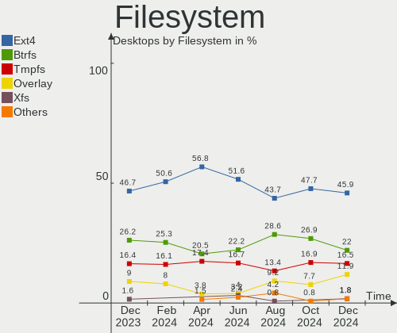
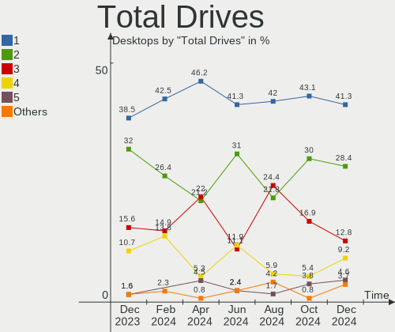
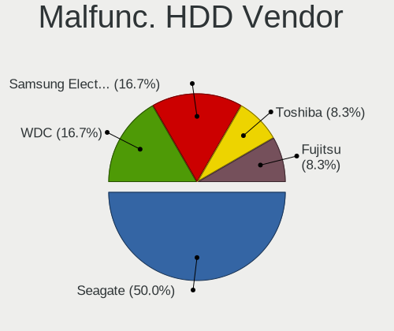
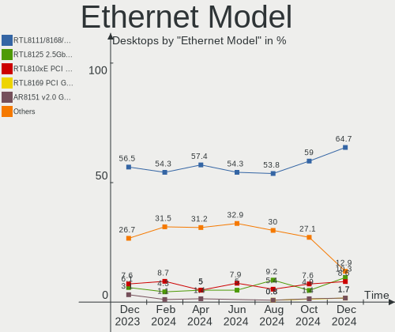
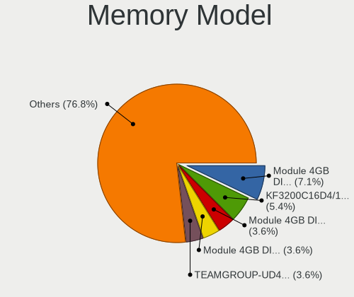
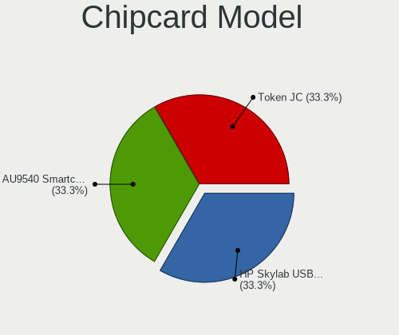

Linux in Brazil - Hardware Trends (Desktops)
--------------------------------------------

A project to identify most popular hardware characteristics and track their change
over time based on data collected by Linux users at https://Linux-Hardware.org.

Anyone can contribute to this report by the [hw-probe](https://github.com/linuxhw/hw-probe) tool:

    sudo -E hw-probe -all -upload

Period: May, 2023.

Contents
--------

* [ System ](#system)
  - [ OS                       ](#os)
  - [ OS Family                ](#os-family)
  - [ Kernel                   ](#kernel)
  - [ Kernel Family            ](#kernel-family)
  - [ Kernel Major Ver.        ](#kernel-major-ver)
  - [ Arch                     ](#arch)
  - [ DE                       ](#de)
  - [ Display Server           ](#display-server)
  - [ Display Manager          ](#display-manager)
  - [ OS Lang                  ](#os-lang)
  - [ Boot Mode                ](#boot-mode)
  - [ Filesystem               ](#filesystem)
  - [ Part. scheme             ](#part-scheme)
  - [ Dual Boot with Linux/BSD ](#dual-boot-with-linuxbsd)
  - [ Dual Boot (Win)          ](#dual-boot-win)

* [ Board ](#board)
  - [ Vendor                   ](#vendor)
  - [ Model                    ](#model)
  - [ Model Family             ](#model-family)
  - [ MFG Year                 ](#mfg-year)
  - [ Form Factor              ](#form-factor)
  - [ Secure Boot              ](#secure-boot)
  - [ Coreboot                 ](#coreboot)
  - [ RAM Size                 ](#ram-size)
  - [ RAM Used                 ](#ram-used)
  - [ Total Drives             ](#total-drives)
  - [ Has CD-ROM               ](#has-cd-rom)
  - [ Has Ethernet             ](#has-ethernet)
  - [ Has WiFi                 ](#has-wifi)
  - [ Has Bluetooth            ](#has-bluetooth)

* [ Location ](#location)
  - [ Country                  ](#country)
  - [ City                     ](#city)

* [ Drives ](#drives)
  - [ Drive Vendor             ](#drive-vendor)
  - [ Drive Model              ](#drive-model)
  - [ HDD Vendor               ](#hdd-vendor)
  - [ SSD Vendor               ](#ssd-vendor)
  - [ Drive Kind               ](#drive-kind)
  - [ Drive Connector          ](#drive-connector)
  - [ Drive Size               ](#drive-size)
  - [ Space Total              ](#space-total)
  - [ Space Used               ](#space-used)
  - [ Malfunc. Drives          ](#malfunc-drives)
  - [ Malfunc. Drive Vendor    ](#malfunc-drive-vendor)
  - [ Malfunc. HDD Vendor      ](#malfunc-hdd-vendor)
  - [ Malfunc. Drive Kind      ](#malfunc-drive-kind)
  - [ Failed Drives            ](#failed-drives)
  - [ Failed Drive Vendor      ](#failed-drive-vendor)
  - [ Drive Status             ](#drive-status)

* [ Storage controller ](#storage-controller)
  - [ Storage Vendor           ](#storage-vendor)
  - [ Storage Model            ](#storage-model)
  - [ Storage Kind             ](#storage-kind)

* [ Processor ](#processor)
  - [ CPU Vendor               ](#cpu-vendor)
  - [ CPU Model                ](#cpu-model)
  - [ CPU Model Family         ](#cpu-model-family)
  - [ CPU Cores                ](#cpu-cores)
  - [ CPU Sockets              ](#cpu-sockets)
  - [ CPU Threads              ](#cpu-threads)
  - [ CPU Op-Modes             ](#cpu-op-modes)
  - [ CPU Microcode            ](#cpu-microcode)
  - [ CPU Microarch            ](#cpu-microarch)

* [ Graphics ](#graphics)
  - [ GPU Vendor               ](#gpu-vendor)
  - [ GPU Model                ](#gpu-model)
  - [ GPU Combo                ](#gpu-combo)
  - [ GPU Driver               ](#gpu-driver)
  - [ GPU Memory               ](#gpu-memory)

* [ Monitor ](#monitor)
  - [ Monitor Vendor           ](#monitor-vendor)
  - [ Monitor Model            ](#monitor-model)
  - [ Monitor Resolution       ](#monitor-resolution)
  - [ Monitor Diagonal         ](#monitor-diagonal)
  - [ Monitor Width            ](#monitor-width)
  - [ Aspect Ratio             ](#aspect-ratio)
  - [ Monitor Area             ](#monitor-area)
  - [ Pixel Density            ](#pixel-density)
  - [ Multiple Monitors        ](#multiple-monitors)

* [ Network ](#network)
  - [ Net Controller Vendor    ](#net-controller-vendor)
  - [ Net Controller Model     ](#net-controller-model)
  - [ Wireless Vendor          ](#wireless-vendor)
  - [ Wireless Model           ](#wireless-model)
  - [ Ethernet Vendor          ](#ethernet-vendor)
  - [ Ethernet Model           ](#ethernet-model)
  - [ Net Controller Kind      ](#net-controller-kind)
  - [ Used Controller          ](#used-controller)
  - [ NICs                     ](#nics)
  - [ IPv6                     ](#ipv6)

* [ Bluetooth ](#bluetooth)
  - [ Bluetooth Vendor         ](#bluetooth-vendor)
  - [ Bluetooth Model          ](#bluetooth-model)

* [ Sound ](#sound)
  - [ Sound Vendor             ](#sound-vendor)
  - [ Sound Model              ](#sound-model)

* [ Memory ](#memory)
  - [ Memory Vendor            ](#memory-vendor)
  - [ Memory Model             ](#memory-model)
  - [ Memory Kind              ](#memory-kind)
  - [ Memory Form Factor       ](#memory-form-factor)
  - [ Memory Size              ](#memory-size)
  - [ Memory Speed             ](#memory-speed)

* [ Printers & scanners ](#printers--scanners)
  - [ Printer Vendor           ](#printer-vendor)
  - [ Printer Model            ](#printer-model)
  - [ Scanner Vendor           ](#scanner-vendor)
  - [ Scanner Model            ](#scanner-model)

* [ Camera ](#camera)
  - [ Camera Vendor            ](#camera-vendor)
  - [ Camera Model             ](#camera-model)

* [ Security ](#security)
  - [ Fingerprint Vendor       ](#fingerprint-vendor)
  - [ Fingerprint Model        ](#fingerprint-model)
  - [ Chipcard Vendor          ](#chipcard-vendor)
  - [ Chipcard Model           ](#chipcard-model)

* [ Unsupported ](#unsupported)
  - [ Unsupported Devices      ](#unsupported-devices)
  - [ Unsupported Device Types ](#unsupported-device-types)

System
------

OS
--

Installed operating systems

| Name                         | Desktops | Percent |
|------------------------------|----------|---------|
| Ubuntu 22.04                 | 20       | 16.81%  |
| OpenMandriva 23.03           | 11       | 9.24%   |
| Fedora 38                    | 10       | 8.4%    |
| Linux Mint 21.1              | 8        | 6.72%   |
| Debian 11                    | 8        | 6.72%   |
| Pop!_OS 22.04                | 7        | 5.88%   |
| Manjaro                      | 7        | 5.88%   |
| Ubuntu 23.04                 | 4        | 3.36%   |
| Zorin 16                     | 3        | 2.52%   |
| Arch Rolling                 | 3        | 2.52%   |
| Ubuntu 22.10                 | 2        | 1.68%   |
| ROSA 12.4                    | 2        | 1.68%   |
| openSUSE Tumbleweed-XXXXXXXX | 2        | 1.68%   |
| OpenMandriva 4.3             | 2        | 1.68%   |
| KDE neon 22.04               | 2        | 1.68%   |
| Xubuntu 20.04                | 1        | 0.84%   |
| Ubuntu Unity 22.04           | 1        | 0.84%   |
| Ubuntu Unity 16.04           | 1        | 0.84%   |
| Ubuntu Budgie 23.04          | 1        | 0.84%   |
| Ubuntu 20.04                 | 1        | 0.84%   |
| Slackware 15.0               | 1        | 0.84%   |
| openSUSE Microos-XXXXXXXX    | 1        | 0.84%   |
| OpenMandriva 23.90           | 1        | 0.84%   |
| Nobara 37                    | 1        | 0.84%   |
| Manjaro 22.1.1               | 1        | 0.84%   |
| Lubuntu 20.04                | 1        | 0.84%   |
| Lubuntu 18.04.05             | 1        | 0.84%   |
| Linux Mint 20.3              | 1        | 0.84%   |
| Linux Mint 18.3              | 1        | 0.84%   |
| Kubuntu 22.04                | 1        | 0.84%   |
| KDE neon 20.04               | 1        | 0.84%   |
| Kali 2023.1                  | 1        | 0.84%   |
| Gentoo 2.13                  | 1        | 0.84%   |
| Fedora 39                    | 1        | 0.84%   |
| Fedora 37                    | 1        | 0.84%   |
| EndeavourOS Rolling          | 1        | 0.84%   |
| Deepin 23                    | 1        | 0.84%   |
| blendOS Rolling              | 1        | 0.84%   |
| BigLinux 22.1.1              | 1        | 0.84%   |
| Artix                        | 1        | 0.84%   |

OS Family
---------

OS without a version

| Name          | Desktops | Percent |
|---------------|----------|---------|
| Ubuntu        | 27       | 22.69%  |
| OpenMandriva  | 14       | 11.76%  |
| Fedora        | 12       | 10.08%  |
| Linux Mint    | 10       | 8.4%    |
| Manjaro       | 8        | 6.72%   |
| Debian        | 8        | 6.72%   |
| Pop!_OS       | 7        | 5.88%   |
| Zorin         | 3        | 2.52%   |
| openSUSE      | 3        | 2.52%   |
| KDE neon      | 3        | 2.52%   |
| Arch          | 3        | 2.52%   |
| Ubuntu Unity  | 2        | 1.68%   |
| ROSA          | 2        | 1.68%   |
| Lubuntu       | 2        | 1.68%   |
| Xubuntu       | 1        | 0.84%   |
| Ubuntu Budgie | 1        | 0.84%   |
| Slackware     | 1        | 0.84%   |
| Nobara        | 1        | 0.84%   |
| Kubuntu       | 1        | 0.84%   |
| Kali          | 1        | 0.84%   |
| Gentoo        | 1        | 0.84%   |
| EndeavourOS   | 1        | 0.84%   |
| Deepin        | 1        | 0.84%   |
| blendOS       | 1        | 0.84%   |
| BigLinux      | 1        | 0.84%   |
| Artix         | 1        | 0.84%   |
| ArcoLinux     | 1        | 0.84%   |
| antiX         | 1        | 0.84%   |
| Alpine        | 1        | 0.84%   |

Kernel
------

Version of the Linux kernel

| Version                                            | Desktops | Percent |
|----------------------------------------------------|----------|---------|
| 5.19.0-41-generic                                  | 16       | 13.45%  |
| 6.2.6-desktop-1omv2390                             | 11       | 9.24%   |
| 6.2.6-76060206-generic                             | 7        | 5.88%   |
| 5.15.0-71-generic                                  | 7        | 5.88%   |
| 5.19.0-42-generic                                  | 6        | 5.04%   |
| 6.2.14-300.fc38.x86_64                             | 5        | 4.2%    |
| 6.2.0-20-generic                                   | 5        | 4.2%    |
| 6.2.15-300.fc38.x86_64                             | 3        | 2.52%   |
| 5.15.0-72-generic                                  | 3        | 2.52%   |
| 5.15.0-56-generic                                  | 3        | 2.52%   |
| 5.10.0-22-amd64                                    | 3        | 2.52%   |
| 6.3.1-1-default                                    | 2        | 1.68%   |
| 6.1.26-1-MANJARO                                   | 2        | 1.68%   |
| 6.1.25-1-MANJARO                                   | 2        | 1.68%   |
| 6.1.20-generic-2rosa2021.1-x86_64                  | 2        | 1.68%   |
| 5.4.0-148-generic                                  | 2        | 1.68%   |
| 5.10.0-23-amd64                                    | 2        | 1.68%   |
| 6.4.0-0.rc0.20230501git58390c8ce1bd.10.fc39.x86_64 | 1        | 0.84%   |
| 6.3.4-arch1-1                                      | 1        | 0.84%   |
| 6.3.3-1-MANJARO                                    | 1        | 0.84%   |
| 6.3.2-zen1-1-zen                                   | 1        | 0.84%   |
| 6.3.2-arch1-1                                      | 1        | 0.84%   |
| 6.3.2-1-default                                    | 1        | 0.84%   |
| 6.3.1-arch2-1                                      | 1        | 0.84%   |
| 6.2.9-300.fc38.x86_64                              | 1        | 0.84%   |
| 6.2.14-300.fsync.fc37.x86_64                       | 1        | 0.84%   |
| 6.2.14-200.fc37.x86_64                             | 1        | 0.84%   |
| 6.2.13-arch1-1                                     | 1        | 0.84%   |
| 6.2.13-300.fc38.x86_64                             | 1        | 0.84%   |
| 6.2.13-1-MANJARO                                   | 1        | 0.84%   |
| 6.2.12-arch1-1                                     | 1        | 0.84%   |
| 6.2.11-arch1-1                                     | 1        | 0.84%   |
| 6.2.11-1-pve                                       | 1        | 0.84%   |
| 6.1.29-1-MANJARO                                   | 1        | 0.84%   |
| 6.1.28-2-lts                                       | 1        | 0.84%   |
| 6.1.22-1-MANJARO                                   | 1        | 0.84%   |
| 6.1.19-gentoo-x86_64                               | 1        | 0.84%   |
| 6.1.0-kali7-amd64                                  | 1        | 0.84%   |
| 5.4.0-91-generic                                   | 1        | 0.84%   |
| 5.4.0-147-generic                                  | 1        | 0.84%   |

Kernel Family
-------------

Linux kernel without a distro release

| Version  | Desktops | Percent |
|----------|----------|---------|
| 5.19.0   | 24       | 20.17%  |
| 6.2.6    | 18       | 15.13%  |
| 5.15.0   | 14       | 11.76%  |
| 6.2.14   | 7        | 5.88%   |
| 5.10.0   | 6        | 5.04%   |
| 6.2.0    | 5        | 4.2%    |
| 5.4.0    | 4        | 3.36%   |
| 6.3.2    | 3        | 2.52%   |
| 6.3.1    | 3        | 2.52%   |
| 6.2.15   | 3        | 2.52%   |
| 6.2.13   | 3        | 2.52%   |
| 6.2.11   | 2        | 1.68%   |
| 6.1.26   | 2        | 1.68%   |
| 6.1.25   | 2        | 1.68%   |
| 6.1.20   | 2        | 1.68%   |
| 6.4.0    | 1        | 0.84%   |
| 6.3.4    | 1        | 0.84%   |
| 6.3.3    | 1        | 0.84%   |
| 6.2.9    | 1        | 0.84%   |
| 6.2.12   | 1        | 0.84%   |
| 6.1.29   | 1        | 0.84%   |
| 6.1.28   | 1        | 0.84%   |
| 6.1.22   | 1        | 0.84%   |
| 6.1.19   | 1        | 0.84%   |
| 6.1.0    | 1        | 0.84%   |
| 5.18.12  | 1        | 0.84%   |
| 5.16.7   | 1        | 0.84%   |
| 5.16.13  | 1        | 0.84%   |
| 5.15.63  | 1        | 0.84%   |
| 5.15.45  | 1        | 0.84%   |
| 5.15.108 | 1        | 0.84%   |
| 5.15.107 | 1        | 0.84%   |
| 5.10.142 | 1        | 0.84%   |
| 4.4.0    | 1        | 0.84%   |
| 4.15.0   | 1        | 0.84%   |
| 4.10.0   | 1        | 0.84%   |

Kernel Major Ver.
-----------------

Linux kernel major version

| Version | Desktops | Percent |
|---------|----------|---------|
| 6.2     | 40       | 33.61%  |
| 5.19    | 24       | 20.17%  |
| 5.15    | 18       | 15.13%  |
| 6.1     | 11       | 9.24%   |
| 6.3     | 8        | 6.72%   |
| 5.10    | 7        | 5.88%   |
| 5.4     | 4        | 3.36%   |
| 5.16    | 2        | 1.68%   |
| 6.4     | 1        | 0.84%   |
| 5.18    | 1        | 0.84%   |
| 4.4     | 1        | 0.84%   |
| 4.15    | 1        | 0.84%   |
| 4.10    | 1        | 0.84%   |

Arch
----

OS architecture (x86_64, i586, etc.)

| Name   | Desktops | Percent |
|--------|----------|---------|
| x86_64 | 118      | 99.16%  |
| i686   | 1        | 0.84%   |

DE
--

Desktop Environment

| Name          | Desktops | Percent |
|---------------|----------|---------|
| GNOME         | 59       | 49.58%  |
| KDE5          | 30       | 25.21%  |
| XFCE          | 8        | 6.72%   |
| X-Cinnamon    | 7        | 5.88%   |
| Unknown       | 4        | 3.36%   |
| LXQt          | 2        | 1.68%   |
| Unity         | 1        | 0.84%   |
| Openbox       | 1        | 0.84%   |
| MATE          | 1        | 0.84%   |
| LXDE          | 1        | 0.84%   |
| icewm         | 1        | 0.84%   |
| Enlightenment | 1        | 0.84%   |
| DDE           | 1        | 0.84%   |
| Cinnamon      | 1        | 0.84%   |
| Budgie        | 1        | 0.84%   |

Display Server
--------------

X11 or Wayland

| Name    | Desktops | Percent |
|---------|----------|---------|
| X11     | 80       | 67.23%  |
| Wayland | 36       | 30.25%  |
| Unknown | 2        | 1.68%   |
| Tty     | 1        | 0.84%   |

Display Manager
---------------

SDDM, LightDM, etc.

| Name    | Desktops | Percent |
|---------|----------|---------|
| Unknown | 50       | 42.02%  |
| GDM3    | 29       | 24.37%  |
| SDDM    | 21       | 17.65%  |
| LightDM | 11       | 9.24%   |
| GDM     | 6        | 5.04%   |
| SLIMSKI | 1        | 0.84%   |
| SLiM    | 1        | 0.84%   |

OS Lang
-------

Language

| Lang   | Desktops | Percent |
|--------|----------|---------|
| pt_BR  | 78       | 65.55%  |
| en_US  | 35       | 29.41%  |
| C      | 4        | 3.36%   |
| pt_PT  | 1        | 0.84%   |
| C.UTF8 | 1        | 0.84%   |

Boot Mode
---------

EFI or BIOS

| Mode | Desktops | Percent |
|------|----------|---------|
| BIOS | 72       | 60.5%   |
| EFI  | 47       | 39.5%   |

Filesystem
----------

Type of filesystem

| Type    | Desktops | Percent |
|---------|----------|---------|
| Ext4    | 62       | 52.1%   |
| Btrfs   | 23       | 19.33%  |
| Tmpfs   | 18       | 15.13%  |
| Overlay | 13       | 10.92%  |
| Zfs     | 1        | 0.84%   |
| XXXXXXX | 1        | 0.84%   |
| Xfs     | 1        | 0.84%   |

Part. scheme
------------

Scheme of partitioning

| Type    | Desktops | Percent |
|---------|----------|---------|
| GPT     | 56       | 47.06%  |
| Unknown | 46       | 38.66%  |
| MBR     | 17       | 14.29%  |

Dual Boot with Linux/BSD
------------------------

Hosting more than one Linux/BSD

| Dual boot | Desktops | Percent |
|-----------|----------|---------|
| No        | 99       | 83.19%  |
| Yes       | 20       | 16.81%  |

Dual Boot (Win)
---------------

Hosting Linux and Windows

| Dual boot | Desktops | Percent |
|-----------|----------|---------|
| No        | 76       | 63.87%  |
| Yes       | 43       | 36.13%  |

Board
-----

Vendor
------

Motherboard manufacturer

| Name                | Desktops | Percent |
|---------------------|----------|---------|
| ASUSTek Computer    | 26       | 21.85%  |
| Gigabyte Technology | 18       | 15.13%  |
| Intel               | 16       | 13.45%  |
| ASRock              | 13       | 10.92%  |
| Dell                | 9        | 7.56%   |
| MSI                 | 7        | 5.88%   |
| Biostar             | 4        | 3.36%   |
| Unknown             | 4        | 3.36%   |
| PCWare              | 3        | 2.52%   |
| Hewlett-Packard     | 3        | 2.52%   |
| Semp Toshiba        | 2        | 1.68%   |
| Lenovo              | 2        | 1.68%   |
| Huanan              | 2        | 1.68%   |
| Daten Tecnologia    | 2        | 1.68%   |
| AZW                 | 2        | 1.68%   |
| Wistron             | 1        | 0.84%   |
| Positivo            | 1        | 0.84%   |
| Pegatron            | 1        | 0.84%   |
| Megaware            | 1        | 0.84%   |
| Itautec             | 1        | 0.84%   |
| Apple               | 1        | 0.84%   |

Model
-----

Motherboard model

| Name                                                        | Desktops | Percent |
|-------------------------------------------------------------|----------|---------|
| Intel H61                                                   | 4        | 3.36%   |
| Unknown                                                     | 4        | 3.36%   |
| ASUS PRIME B450M-GAMING/BR                                  | 3        | 2.52%   |
| ASUS All Series                                             | 3        | 2.52%   |
| ASRock H310CM-HG4                                           | 3        | 2.52%   |
| Semp Toshiba STI                                            | 2        | 1.68%   |
| MSI MS-7C96                                                 | 2        | 1.68%   |
| Intel B75                                                   | 2        | 1.68%   |
| Gigabyte A320M-S2H                                          | 2        | 1.68%   |
| Dell OptiPlex 3080                                          | 2        | 1.68%   |
| ASUS PRIME A320M-K/BR                                       | 2        | 1.68%   |
| ASUS P8H61-M LX3 R2.0                                       | 2        | 1.68%   |
| ASUS M5A78L-M LX/BR                                         | 2        | 1.68%   |
| ASRock A320M-HDV R4.0                                       | 2        | 1.68%   |
| Wistron ProLiant ML110 G6                                   | 1        | 0.84%   |
| Positivo POS-EIQ87CY                                        | 1        | 0.84%   |
| Pegatron BK383AA-AC4 CQ1-1010br                             | 1        | 0.84%   |
| PCWare IPX1800E2                                            | 1        | 0.84%   |
| PCWare IPMH410E                                             | 1        | 0.84%   |
| PCWare IPMH110G                                             | 1        | 0.84%   |
| MSI MS-7B89                                                 | 1        | 0.84%   |
| MSI MS-7B10                                                 | 1        | 0.84%   |
| MSI MS-7A15                                                 | 1        | 0.84%   |
| MSI MS-7885                                                 | 1        | 0.84%   |
| MSI H61M-P20                                                | 1        | 0.84%   |
| Megaware MW-H61M-2H                                         | 1        | 0.84%   |
| Lenovo ThinkCentre Edge72 3497G2P                           | 1        | 0.84%   |
| Lenovo ThinkCentre E73 10AU00GUBP                           | 1        | 0.84%   |
| Itautec ST 4265                                             | 1        | 0.84%   |
| Intel X99                                                   | 1        | 0.84%   |
| Intel X79F1 V2.0                                            | 1        | 0.84%   |
| Intel X79 (INTEL Xeon E5/Corei7 DMI2 - C600/C200 Cipset V31 | 1        | 0.84%   |
| Intel X58M                                                  | 1        | 0.84%   |
| Intel H61 V1.1                                              | 1        | 0.84%   |
| Intel H55                                                   | 1        | 0.84%   |
| Intel DP55WB AAE64798-205                                   | 1        | 0.84%   |
| Intel DH77EB AAG39073-304                                   | 1        | 0.84%   |
| Intel DG41WV AAE90316-101                                   | 1        | 0.84%   |
| Intel D946GZIS AAD66165-301                                 | 1        | 0.84%   |
| Huanan X99-F8 GAMING V5.0                                   | 1        | 0.84%   |

Model Family
------------

Motherboard model prefix

| Name                 | Desktops | Percent |
|----------------------|----------|---------|
| ASUS PRIME           | 9        | 7.56%   |
| ASUS TUF             | 6        | 5.04%   |
| Intel H61            | 5        | 4.2%    |
| Dell Vostro          | 4        | 3.36%   |
| Dell OptiPlex        | 4        | 3.36%   |
| Unknown              | 4        | 3.36%   |
| ASUS M5A78L-M        | 3        | 2.52%   |
| ASUS All             | 3        | 2.52%   |
| ASRock H310CM-HG4    | 3        | 2.52%   |
| Semp Toshiba STI     | 2        | 1.68%   |
| MSI MS-7C96          | 2        | 1.68%   |
| Lenovo ThinkCentre   | 2        | 1.68%   |
| Intel B75            | 2        | 1.68%   |
| HP EliteDesk         | 2        | 1.68%   |
| Gigabyte A320M-S2H   | 2        | 1.68%   |
| ASUS P8H61-M         | 2        | 1.68%   |
| ASRock A320M-HDV     | 2        | 1.68%   |
| Wistron ProLiant     | 1        | 0.84%   |
| Positivo POS-EIQ87CY | 1        | 0.84%   |
| Pegatron BK383AA-AC4 | 1        | 0.84%   |
| PCWare IPX1800E2     | 1        | 0.84%   |
| PCWare IPMH410E      | 1        | 0.84%   |
| PCWare IPMH110G      | 1        | 0.84%   |
| MSI MS-7B89          | 1        | 0.84%   |
| MSI MS-7B10          | 1        | 0.84%   |
| MSI MS-7A15          | 1        | 0.84%   |
| MSI MS-7885          | 1        | 0.84%   |
| MSI H61M-P20         | 1        | 0.84%   |
| Megaware MW-H61M-2H  | 1        | 0.84%   |
| Itautec ST           | 1        | 0.84%   |
| Intel X99            | 1        | 0.84%   |
| Intel X79F1          | 1        | 0.84%   |
| Intel X79            | 1        | 0.84%   |
| Intel X58M           | 1        | 0.84%   |
| Intel H55            | 1        | 0.84%   |
| Intel DP55WB         | 1        | 0.84%   |
| Intel DH77EB         | 1        | 0.84%   |
| Intel DG41WV         | 1        | 0.84%   |
| Intel D946GZIS       | 1        | 0.84%   |
| Huanan X99-F8        | 1        | 0.84%   |

MFG Year
--------

Motherboard manufacture year

| Year | Desktops | Percent |
|------|----------|---------|
| 2019 | 15       | 12.61%  |
| 2018 | 15       | 12.61%  |
| 2017 | 12       | 10.08%  |
| 2012 | 11       | 9.24%   |
| 2022 | 9        | 7.56%   |
| 2010 | 8        | 6.72%   |
| 2021 | 7        | 5.88%   |
| 2020 | 7        | 5.88%   |
| 2014 | 6        | 5.04%   |
| 2011 | 6        | 5.04%   |
| 2016 | 5        | 4.2%    |
| 2015 | 4        | 3.36%   |
| 2009 | 4        | 3.36%   |
| 2023 | 3        | 2.52%   |
| 2013 | 3        | 2.52%   |
| 2006 | 2        | 1.68%   |
| 2008 | 1        | 0.84%   |
| 2007 | 1        | 0.84%   |

Form Factor
-----------

Physical design of the computer

| Name    | Desktops | Percent |
|---------|----------|---------|
| Desktop | 119      | 100%    |

Secure Boot
-----------

Enabled or disabled

| State    | Desktops | Percent |
|----------|----------|---------|
| Disabled | 116      | 97.48%  |
| Enabled  | 3        | 2.52%   |

Coreboot
--------

Have coreboot on board

| Used | Desktops | Percent |
|------|----------|---------|
| No   | 119      | 100%    |

RAM Size
--------

Total RAM memory

| Size in GB  | Desktops | Percent |
|-------------|----------|---------|
| 8.01-16.0   | 38       | 31.93%  |
| 16.01-24.0  | 29       | 24.37%  |
| 4.01-8.0    | 22       | 18.49%  |
| 3.01-4.0    | 12       | 10.08%  |
| 32.01-64.0  | 9        | 7.56%   |
| 24.01-32.0  | 4        | 3.36%   |
| 64.01-256.0 | 3        | 2.52%   |
| 2.01-3.0    | 1        | 0.84%   |
| 1.01-2.0    | 1        | 0.84%   |

RAM Used
--------

Used RAM memory

| Used GB    | Desktops | Percent |
|------------|----------|---------|
| 1.01-2.0   | 39       | 32.77%  |
| 4.01-8.0   | 27       | 22.69%  |
| 2.01-3.0   | 27       | 22.69%  |
| 3.01-4.0   | 18       | 15.13%  |
| 0.51-1.0   | 4        | 3.36%   |
| 8.01-16.0  | 2        | 1.68%   |
| 24.01-32.0 | 1        | 0.84%   |
| 0.01-0.5   | 1        | 0.84%   |

Total Drives
------------

Number of drives on board

| Drives | Desktops | Percent |
|--------|----------|---------|
| 1      | 55       | 46.22%  |
| 2      | 43       | 36.13%  |
| 3      | 14       | 11.76%  |
| 4      | 4        | 3.36%   |
| 6      | 2        | 1.68%   |
| 9      | 1        | 0.84%   |

Has CD-ROM
----------

Has CD-ROM on board

| Presented | Desktops | Percent |
|-----------|----------|---------|
| No        | 78       | 65.55%  |
| Yes       | 41       | 34.45%  |

Has Ethernet
------------

Has Ethernet on board

| Presented | Desktops | Percent |
|-----------|----------|---------|
| Yes       | 118      | 99.16%  |
| No        | 1        | 0.84%   |

Has WiFi
--------

Has WiFi module

| Presented | Desktops | Percent |
|-----------|----------|---------|
| No        | 76       | 63.87%  |
| Yes       | 43       | 36.13%  |

Has Bluetooth
-------------

Has Bluetooth module

| Presented | Desktops | Percent |
|-----------|----------|---------|
| No        | 91       | 76.47%  |
| Yes       | 28       | 23.53%  |

Location
--------

Country
-------

Geographic location (country)

| Country | Desktops | Percent |
|---------|----------|---------|
| Brazil  | 119      | 100%    |

City
----

Geographic location (city)

| City                   | Desktops | Percent |
|------------------------|----------|---------|
| Sao Paulo              | 13       | 10.92%  |
| Rio de Janeiro         | 6        | 5.04%   |
| Fortaleza              | 5        | 4.2%    |
| Brasília              | 4        | 3.36%   |
| Juazeiro do Norte      | 3        | 2.52%   |
| Campinas               | 3        | 2.52%   |
| Belo Horizonte         | 3        | 2.52%   |
| Sao Jose               | 2        | 1.68%   |
| Santos                 | 2        | 1.68%   |
| Santo André           | 2        | 1.68%   |
| Presidente Prudente    | 2        | 1.68%   |
| Porto Alegre           | 2        | 1.68%   |
| Niterói               | 2        | 1.68%   |
| Maua                   | 2        | 1.68%   |
| Londrina               | 2        | 1.68%   |
| Florianópolis         | 2        | 1.68%   |
| Caratinga              | 2        | 1.68%   |
| Vitória da Conquista  | 1        | 0.84%   |
| Vila Velha             | 1        | 0.84%   |
| Vargem Grande Paulista | 1        | 0.84%   |
| Umuarama               | 1        | 0.84%   |
| Uberlândia            | 1        | 0.84%   |
| Sumaré                | 1        | 0.84%   |
| Soledade               | 1        | 0.84%   |
| Sitio Piratuba         | 1        | 0.84%   |
| Sete Lagoas            | 1        | 0.84%   |
| Sapiranga              | 1        | 0.84%   |
| Sao José dos Campos   | 1        | 0.84%   |
| Sao Joao de Meriti     | 1        | 0.84%   |
| Santa Quiteria         | 1        | 0.84%   |
| Salvador               | 1        | 0.84%   |
| Ribeirao das Neves     | 1        | 0.84%   |
| Recife                 | 1        | 0.84%   |
| Pouso Alegre           | 1        | 0.84%   |
| Ponta Grossa           | 1        | 0.84%   |
| Poa                    | 1        | 0.84%   |
| Paulista               | 1        | 0.84%   |
| Paranaguá             | 1        | 0.84%   |
| Palmas                 | 1        | 0.84%   |
| Palhoca                | 1        | 0.84%   |

Drives
------

Drive Vendor
------------

Hard drive vendors

| Vendor                      | Desktops | Drives | Percent |
|-----------------------------|----------|--------|---------|
| Seagate                     | 35       | 45     | 17.5%   |
| WDC                         | 34       | 37     | 17%     |
| Kingston                    | 23       | 26     | 11.5%   |
| Samsung Electronics         | 20       | 24     | 10%     |
| China                       | 17       | 17     | 8.5%    |
| Crucial                     | 9        | 9      | 4.5%    |
| Toshiba                     | 7        | 7      | 3.5%    |
| Silicon Motion              | 5        | 5      | 2.5%    |
| SanDisk                     | 3        | 3      | 1.5%    |
| Phison Electronics          | 3        | 4      | 1.5%    |
| Patriot                     | 3        | 3      | 1.5%    |
| Netac                       | 3        | 4      | 1.5%    |
| MAXIO Technology (Hangzhou) | 3        | 3      | 1.5%    |
| Kingston Technology Company | 3        | 3      | 1.5%    |
| XrayDisk                    | 2        | 2      | 1%      |
| SK hynix                    | 2        | 2      | 1%      |
| Realtek Semiconductor       | 2        | 3      | 1%      |
| NN                          | 2        | 2      | 1%      |
| Maxtor                      | 2        | 2      | 1%      |
| Lexar                       | 2        | 2      | 1%      |
| Hitachi                     | 2        | 2      | 1%      |
| Hewlett-Packard             | 2        | 2      | 1%      |
| A-DATA Technology           | 2        | 2      | 1%      |
| XPG                         | 1        | 1      | 0.5%    |
| Team                        | 1        | 1      | 0.5%    |
| PNY                         | 1        | 1      | 0.5%    |
| Mushkin                     | 1        | 1      | 0.5%    |
| Micron Technology           | 1        | 1      | 0.5%    |
| LITEON                      | 1        | 1      | 0.5%    |
| KingSpec                    | 1        | 1      | 0.5%    |
| Indilinx                    | 1        | 1      | 0.5%    |
| HS-SSD-E100                 | 1        | 1      | 0.5%    |
| HGST                        | 1        | 1      | 0.5%    |
| Colorful                    | 1        | 1      | 0.5%    |
| Biostar                     | 1        | 1      | 0.5%    |
| BHT                         | 1        | 1      | 0.5%    |
| Unknown                     | 1        | 1      | 0.5%    |

Drive Model
-----------

Hard drive models

| Model                                               | Desktops | Percent |
|-----------------------------------------------------|----------|---------|
| Kingston SA400S37240G 240GB SSD                     | 9        | 4.17%   |
| Kingston SA400S37480G 480GB SSD                     | 7        | 3.24%   |
| Seagate ST1000DM010-2EP102 1TB                      | 5        | 2.31%   |
| WDC WD10EZEX-08WN4A0 1TB                            | 4        | 1.85%   |
| Silicon Motion SM2263EN/SM2263XT SSD Controller 1TB | 4        | 1.85%   |
| Crucial CT240BX500SSD1 240GB                        | 4        | 1.85%   |
| China SSD 240GB                                     | 4        | 1.85%   |
| Seagate ST3500312CS 500GB                           | 3        | 1.39%   |
| Samsung HD502HI 500GB                               | 3        | 1.39%   |
| Samsung HD322HJ 320GB                               | 3        | 1.39%   |
| Phison E12 NVMe Controller 256GB                    | 3        | 1.39%   |
| China SSD 1TB                                       | 3        | 1.39%   |
| China SSD 120GB                                     | 3        | 1.39%   |
| WDC WD5000AVCS-632DY1 500GB                         | 2        | 0.93%   |
| WDC WD10EZEX-08M2NA0 1TB                            | 2        | 0.93%   |
| WDC WD10EZEX-00WN4A0 1TB                            | 2        | 0.93%   |
| WDC WD10EZEX-00BN5A0 1TB                            | 2        | 0.93%   |
| Toshiba DT01ACA100 1TB                              | 2        | 0.93%   |
| Toshiba DT01ACA050 500GB                            | 2        | 0.93%   |
| Seagate ST4000DM004-2CV104 4TB                      | 2        | 0.93%   |
| Seagate ST3320418AS 320GB                           | 2        | 0.93%   |
| Seagate ST32000644NS 2TB                            | 2        | 0.93%   |
| Seagate ST31000524AS 1TB                            | 2        | 0.93%   |
| Seagate ST2000DM008-2FR102 2TB                      | 2        | 0.93%   |
| Seagate ST1000DM003-1ER162 1TB                      | 2        | 0.93%   |
| Seagate Expansion 1TB                               | 2        | 0.93%   |
| Samsung NVMe SSD Controller SM981/PM981/PM983 256GB | 2        | 0.93%   |
| Samsung HD502HJ 500GB                               | 2        | 0.93%   |
| Samsung HD103SJ 1TB                                 | 2        | 0.93%   |
| NN TECNOL GIA 128GB SSD                             | 2        | 0.93%   |
| MAXIO (Hangzhou) NVMe SSD Controller MAP1202 2TB    | 2        | 0.93%   |
| Lexar 128GB SSD                                     | 2        | 0.93%   |
| Kingston SNVS250G 250GB                             | 2        | 0.93%   |
| China SSD 480GB                                     | 2        | 0.93%   |
| A-DATA IM2P33F3A NVMe 256GB                         | 2        | 0.93%   |
| XrayDisk 512GB SSD                                  | 1        | 0.46%   |
| XrayDisk 480GB                                      | 1        | 0.46%   |
| XPG GAMMIX S41 256GB                                | 1        | 0.46%   |
| WDC WDS480G2G0C-00AJM0 480GB                        | 1        | 0.46%   |
| WDC WDS480G2G0A-00JH30 480GB SSD                    | 1        | 0.46%   |

HDD Vendor
----------

Hard disk drive vendors

| Vendor              | Desktops | Drives | Percent |
|---------------------|----------|--------|---------|
| Seagate             | 35       | 45     | 38.04%  |
| WDC                 | 30       | 32     | 32.61%  |
| Samsung Electronics | 15       | 15     | 16.3%   |
| Toshiba             | 7        | 7      | 7.61%   |
| Hitachi             | 2        | 2      | 2.17%   |
| Maxtor              | 1        | 1      | 1.09%   |
| HGST                | 1        | 1      | 1.09%   |
| Hewlett-Packard     | 1        | 1      | 1.09%   |

SSD Vendor
----------

Solid state drive vendors

| Vendor              | Desktops | Drives | Percent |
|---------------------|----------|--------|---------|
| Kingston            | 19       | 22     | 25.68%  |
| China               | 17       | 17     | 22.97%  |
| Crucial             | 9        | 9      | 12.16%  |
| Samsung Electronics | 4        | 7      | 5.41%   |
| WDC                 | 3        | 3      | 4.05%   |
| SanDisk             | 2        | 2      | 2.7%    |
| Patriot             | 2        | 2      | 2.7%    |
| NN                  | 2        | 2      | 2.7%    |
| Netac               | 2        | 2      | 2.7%    |
| Lexar               | 2        | 2      | 2.7%    |
| XrayDisk            | 1        | 1      | 1.35%   |
| Team                | 1        | 1      | 1.35%   |
| PNY                 | 1        | 1      | 1.35%   |
| Mushkin             | 1        | 1      | 1.35%   |
| Micron Technology   | 1        | 1      | 1.35%   |
| Maxtor              | 1        | 1      | 1.35%   |
| LITEON              | 1        | 1      | 1.35%   |
| KingSpec            | 1        | 1      | 1.35%   |
| Colorful            | 1        | 1      | 1.35%   |
| Biostar             | 1        | 1      | 1.35%   |
| BHT                 | 1        | 1      | 1.35%   |
| Unknown             | 1        | 1      | 1.35%   |

Drive Kind
----------

HDD or SSD

| Kind    | Desktops | Drives | Percent |
|---------|----------|--------|---------|
| HDD     | 78       | 104    | 43.33%  |
| SSD     | 68       | 80     | 37.78%  |
| NVMe    | 31       | 36     | 17.22%  |
| Unknown | 3        | 3      | 1.67%   |

Drive Connector
---------------

SATA, SAS, NVMe, etc.

| Type | Desktops | Drives | Percent |
|------|----------|--------|---------|
| SATA | 113      | 185    | 77.4%   |
| NVMe | 31       | 36     | 21.23%  |
| SAS  | 2        | 2      | 1.37%   |

Drive Size
----------

Size of hard drive

| Size in TB | Desktops | Drives | Percent |
|------------|----------|--------|---------|
| 0.01-0.5   | 83       | 111    | 55.7%   |
| 0.51-1.0   | 50       | 55     | 33.56%  |
| 1.01-2.0   | 11       | 12     | 7.38%   |
| 3.01-4.0   | 2        | 2      | 1.34%   |
| 2.01-3.0   | 1        | 1      | 0.67%   |
| 10.01-20.0 | 1        | 1      | 0.67%   |
| 4.01-10.0  | 1        | 2      | 0.67%   |

Space Total
-----------

Amount of disk space available on the file system

| Size in GB     | Desktops | Percent |
|----------------|----------|---------|
| 101-250        | 31       | 26.05%  |
| 251-500        | 26       | 21.85%  |
| 1001-2000      | 19       | 15.97%  |
| 501-1000       | 18       | 15.13%  |
| 1-20           | 10       | 8.4%    |
| 51-100         | 8        | 6.72%   |
| 2001-3000      | 3        | 2.52%   |
| More than 3000 | 2        | 1.68%   |
| 21-50          | 2        | 1.68%   |

Space Used
----------

Amount of used disk space

| Used GB   | Desktops | Percent |
|-----------|----------|---------|
| 1-20      | 48       | 40.34%  |
| 21-50     | 18       | 15.13%  |
| 101-250   | 18       | 15.13%  |
| 501-1000  | 14       | 11.76%  |
| 51-100    | 14       | 11.76%  |
| 251-500   | 5        | 4.2%    |
| 1001-2000 | 2        | 1.68%   |

Malfunc. Drives
---------------

Drive models with a malfunction

| Model                             | Desktops | Drives | Percent |
|-----------------------------------|----------|--------|---------|
| WDC WD5000AVCS-632DY1 500GB       | 2        | 2      | 9.09%   |
| Seagate ST1000DM010-2EP102 1TB    | 2        | 2      | 9.09%   |
| Samsung Electronics HD502HI 500GB | 2        | 2      | 9.09%   |
| China SSD 240GB                   | 2        | 2      | 9.09%   |
| XPG GAMMIX S41 256GB              | 1        | 1      | 4.55%   |
| WDC WD800AAJS-75M0A0 80GB         | 1        | 1      | 4.55%   |
| WDC WD10PURX-64E5EY0 1TB          | 1        | 1      | 4.55%   |
| WDC WD10EZEX-00WN4A0 1TB          | 1        | 1      | 4.55%   |
| WDC WD10EALX-759BA1 1TB           | 1        | 1      | 4.55%   |
| Toshiba MK6459GSXP 640GB          | 1        | 1      | 4.55%   |
| Toshiba DT01ACA100 1TB            | 1        | 1      | 4.55%   |
| Seagate ST3500630NS 500GB         | 1        | 1      | 4.55%   |
| Seagate ST3500312CS 500GB         | 1        | 1      | 4.55%   |
| Seagate ST3320613AS 320GB         | 1        | 1      | 4.55%   |
| Samsung Electronics HM321HI 320GB | 1        | 1      | 4.55%   |
| LITEON CV8-CE256-HP 256GB SSD     | 1        | 1      | 4.55%   |
| Kingston SUV400S37240G 240GB SSD  | 1        | 1      | 4.55%   |
| China SSD 120GB                   | 1        | 1      | 4.55%   |

Malfunc. Drive Vendor
---------------------

Vendors of faulty drives

| Vendor              | Desktops | Drives | Percent |
|---------------------|----------|--------|---------|
| WDC                 | 5        | 6      | 23.81%  |
| Seagate             | 5        | 5      | 23.81%  |
| Samsung Electronics | 3        | 3      | 14.29%  |
| China               | 3        | 3      | 14.29%  |
| Toshiba             | 2        | 2      | 9.52%   |
| XPG                 | 1        | 1      | 4.76%   |
| LITEON              | 1        | 1      | 4.76%   |
| Kingston            | 1        | 1      | 4.76%   |

Malfunc. HDD Vendor
-------------------

Vendors of faulty HDD drives

| Vendor              | Desktops | Drives | Percent |
|---------------------|----------|--------|---------|
| WDC                 | 5        | 6      | 33.33%  |
| Seagate             | 5        | 5      | 33.33%  |
| Samsung Electronics | 3        | 3      | 20%     |
| Toshiba             | 2        | 2      | 13.33%  |

Malfunc. Drive Kind
-------------------

Kinds of faulty drives

| Kind | Desktops | Drives | Percent |
|------|----------|--------|---------|
| HDD  | 14       | 16     | 70%     |
| SSD  | 5        | 5      | 25%     |
| NVMe | 1        | 1      | 5%      |

Failed Drives
-------------

Failed drive models

Zero info for selected period =(

Failed Drive Vendor
-------------------

Failed drive vendors

Zero info for selected period =(

Drive Status
------------

Number of failed and malfunc. drives

| Status   | Desktops | Drives | Percent |
|----------|----------|--------|---------|
| Detected | 74       | 130    | 53.62%  |
| Works    | 44       | 71     | 31.88%  |
| Malfunc  | 20       | 22     | 14.49%  |

Storage controller
------------------

Storage Vendor
--------------

Storage controller vendors

| Vendor                      | Desktops | Percent |
|-----------------------------|----------|---------|
| Intel                       | 79       | 50.97%  |
| AMD                         | 35       | 22.58%  |
| Kingston Technology Company | 7        | 4.52%   |
| Silicon Motion              | 6        | 3.87%   |
| Phison Electronics          | 4        | 2.58%   |
| Nvidia                      | 4        | 2.58%   |
| SanDisk                     | 3        | 1.94%   |
| Realtek Semiconductor       | 3        | 1.94%   |
| MAXIO Technology (Hangzhou) | 3        | 1.94%   |
| SK hynix                    | 2        | 1.29%   |
| Samsung Electronics         | 2        | 1.29%   |
| ASMedia Technology          | 2        | 1.29%   |
| ADATA Technology            | 2        | 1.29%   |
| Netac Technology            | 1        | 0.65%   |
| Marvell Technology Group    | 1        | 0.65%   |
| JMicron Technology          | 1        | 0.65%   |

Storage Model
-------------

Storage controller models

| Model                                                                                   | Desktops | Percent |
|-----------------------------------------------------------------------------------------|----------|---------|
| AMD FCH SATA Controller [AHCI mode]                                                     | 16       | 8.12%   |
| Intel 6 Series/C200 Series Chipset Family 6 port Desktop SATA AHCI Controller           | 12       | 6.09%   |
| AMD FCH SATA Controller D                                                               | 9        | 4.57%   |
| Intel Q170/Q150/B150/H170/H110/Z170/CM236 Chipset SATA Controller [AHCI Mode]           | 8        | 4.06%   |
| AMD SB7x0/SB8x0/SB9x0 IDE Controller                                                    | 8        | 4.06%   |
| AMD 400 Series Chipset SATA Controller                                                  | 8        | 4.06%   |
| Intel 8 Series/C220 Series Chipset Family 6-port SATA Controller 1 [AHCI mode]          | 6        | 3.05%   |
| Intel 7 Series/C210 Series Chipset Family 6-port SATA Controller [AHCI mode]            | 6        | 3.05%   |
| Intel 500 Series Chipset Family SATA AHCI Controller                                    | 6        | 3.05%   |
| AMD SB7x0/SB8x0/SB9x0 SATA Controller [IDE mode]                                        | 6        | 3.05%   |
| Silicon Motion SM2263EN/SM2263XT SSD Controller                                         | 5        | 2.54%   |
| Intel NM10/ICH7 Family SATA Controller [IDE mode]                                       | 5        | 2.54%   |
| Intel 400 Series Chipset Family SATA AHCI Controller                                    | 5        | 2.54%   |
| Nvidia MCP61 SATA Controller                                                            | 4        | 2.03%   |
| Nvidia MCP61 IDE                                                                        | 4        | 2.03%   |
| Kingston Company Company Non-Volatile memory controller                                 | 4        | 2.03%   |
| Intel 5 Series/3400 Series Chipset 4 port SATA IDE Controller                           | 4        | 2.03%   |
| Intel 5 Series/3400 Series Chipset 2 port SATA IDE Controller                           | 4        | 2.03%   |
| AMD 500 Series Chipset SATA Controller                                                  | 4        | 2.03%   |
| SanDisk Non-Volatile memory controller                                                  | 3        | 1.52%   |
| Phison E12 NVMe Controller                                                              | 3        | 1.52%   |
| Intel Cannon Lake PCH SATA AHCI Controller                                              | 3        | 1.52%   |
| Intel C610/X99 series chipset 6-Port SATA Controller [AHCI mode]                        | 3        | 1.52%   |
| Intel 82801G (ICH7 Family) IDE Controller                                               | 3        | 1.52%   |
| Intel 6 Series/C200 Series Chipset Family Desktop SATA Controller (IDE mode, ports 4-5) | 3        | 1.52%   |
| Intel 6 Series/C200 Series Chipset Family Desktop SATA Controller (IDE mode, ports 0-3) | 3        | 1.52%   |
| Intel 200 Series PCH SATA controller [AHCI mode]                                        | 3        | 1.52%   |
| AMD SB7x0/SB8x0/SB9x0 SATA Controller [AHCI mode]                                       | 3        | 1.52%   |
| Samsung NVMe SSD Controller SM981/PM981/PM983                                           | 2        | 1.02%   |
| Realtek RTS5763DL NVMe SSD Controller                                                   | 2        | 1.02%   |
| MAXIO (Hangzhou) NVMe SSD Controller MAP1202                                            | 2        | 1.02%   |
| Kingston Company NVMe Controller                                                        | 2        | 1.02%   |
| Intel Volume Management Device NVMe RAID Controller                                     | 2        | 1.02%   |
| Intel Alder Lake-S PCH SATA Controller [AHCI Mode]                                      | 2        | 1.02%   |
| Intel 82801JI (ICH10 Family) SATA AHCI Controller                                       | 2        | 1.02%   |
| ASMedia ASM1062 Serial ATA Controller                                                   | 2        | 1.02%   |
| AMD FCH SATA Controller [IDE mode]                                                      | 2        | 1.02%   |
| ADATA Non-Volatile memory controller                                                    | 2        | 1.02%   |
| SK hynix Non-Volatile memory controller                                                 | 1        | 0.51%   |
| SK hynix BC511                                                                          | 1        | 0.51%   |

Storage Kind
------------

Kind of storage controller (IDE, SATA, NVMe, SAS, ...)

| Kind | Desktops | Percent |
|------|----------|---------|
| SATA | 98       | 61.64%  |
| NVMe | 31       | 19.5%   |
| IDE  | 27       | 16.98%  |
| RAID | 3        | 1.89%   |

Processor
---------

CPU Vendor
----------

Processor vendors

| Vendor | Desktops | Percent |
|--------|----------|---------|
| Intel  | 79       | 66.39%  |
| AMD    | 40       | 33.61%  |

CPU Model
---------

Processor models

| Model                                       | Desktops | Percent |
|---------------------------------------------|----------|---------|
| Intel Core i5-3330 CPU @ 3.00GHz            | 4        | 3.36%   |
| Intel Core i5-2400 CPU @ 3.10GHz            | 4        | 3.36%   |
| AMD Ryzen 5 5600G with Radeon Graphics      | 4        | 3.36%   |
| Intel Core i7-2600 CPU @ 3.40GHz            | 3        | 2.52%   |
| Intel Core i5-4590 CPU @ 3.30GHz            | 3        | 2.52%   |
| Intel Core i5-10400F CPU @ 2.90GHz          | 3        | 2.52%   |
| AMD Ryzen 5 3600 6-Core Processor           | 3        | 2.52%   |
| AMD FX-6300 Six-Core Processor              | 3        | 2.52%   |
| Intel Pentium CPU G4560 @ 3.50GHz           | 2        | 1.68%   |
| Intel Core i5-8500T CPU @ 2.10GHz           | 2        | 1.68%   |
| Intel Core i5-3470S CPU @ 2.90GHz           | 2        | 1.68%   |
| Intel Core i5-10600K CPU @ 4.10GHz          | 2        | 1.68%   |
| Intel Core i5-10400 CPU @ 2.90GHz           | 2        | 1.68%   |
| Intel Core i3-8100 CPU @ 3.60GHz            | 2        | 1.68%   |
| AMD Ryzen 5 3400G with Radeon Vega Graphics | 2        | 1.68%   |
| AMD Ryzen 5 1600 Six-Core Processor         | 2        | 1.68%   |
| AMD Ryzen 3 3200G with Radeon Vega Graphics | 2        | 1.68%   |
| AMD FX-6100 Six-Core Processor              | 2        | 1.68%   |
| AMD Athlon II X2 250 Processor              | 2        | 1.68%   |
| AMD Athlon 3000G with Radeon Vega Graphics  | 2        | 1.68%   |
| Intel Xeon CPU X5570 @ 2.93GHz              | 1        | 0.84%   |
| Intel Xeon CPU X3430 @ 2.40GHz              | 1        | 0.84%   |
| Intel Xeon CPU E5620 @ 2.40GHz              | 1        | 0.84%   |
| Intel Xeon CPU E5-2696 v4 @ 2.20GHz         | 1        | 0.84%   |
| Intel Xeon CPU E5-2689 0 @ 2.60GHz          | 1        | 0.84%   |
| Intel Xeon CPU E5-2660 v3 @ 2.60GHz         | 1        | 0.84%   |
| Intel Xeon CPU E5-2420 0 @ 1.90GHz          | 1        | 0.84%   |
| Intel Xeon CPU E3-1270 V2 @ 3.50GHz         | 1        | 0.84%   |
| Intel Xeon CPU 5150 @ 2.66GHz               | 1        | 0.84%   |
| Intel Pentium Dual-Core CPU E5700 @ 3.00GHz | 1        | 0.84%   |
| Intel Pentium Dual-Core CPU E5400 @ 2.70GHz | 1        | 0.84%   |
| Intel Pentium CPU G2020 @ 2.90GHz           | 1        | 0.84%   |
| Intel Core i9-9900K CPU @ 3.60GHz           | 1        | 0.84%   |
| Intel Core i7-6700K CPU @ 4.00GHz           | 1        | 0.84%   |
| Intel Core i7-6700 CPU @ 3.40GHz            | 1        | 0.84%   |
| Intel Core i7-5820K CPU @ 3.30GHz           | 1        | 0.84%   |
| Intel Core i7-4790K CPU @ 4.00GHz           | 1        | 0.84%   |
| Intel Core i7-10700K CPU @ 3.80GHz          | 1        | 0.84%   |
| Intel Core i5-9600K CPU @ 3.70GHz           | 1        | 0.84%   |
| Intel Core i5-9400F CPU @ 2.90GHz           | 1        | 0.84%   |

CPU Model Family
----------------

Processor model prefix

| Model                   | Desktops | Percent |
|-------------------------|----------|---------|
| Intel Core i5           | 34       | 28.57%  |
| AMD Ryzen 5             | 14       | 11.76%  |
| Intel Core i3           | 12       | 10.08%  |
| Intel Xeon              | 9        | 7.56%   |
| Intel Core i7           | 8        | 6.72%   |
| AMD FX                  | 7        | 5.88%   |
| AMD Ryzen 3             | 4        | 3.36%   |
| Other                   | 3        | 2.52%   |
| Intel Pentium           | 3        | 2.52%   |
| AMD Athlon              | 3        | 2.52%   |
| Intel Pentium Dual-Core | 2        | 1.68%   |
| Intel Core 2 Duo        | 2        | 1.68%   |
| Intel Core 2            | 2        | 1.68%   |
| Intel Celeron           | 2        | 1.68%   |
| AMD Ryzen 7             | 2        | 1.68%   |
| AMD Phenom II X6        | 2        | 1.68%   |
| AMD Athlon II X2        | 2        | 1.68%   |
| Intel Core i9           | 1        | 0.84%   |
| Intel Atom              | 1        | 0.84%   |
| AMD Ryzen 9             | 1        | 0.84%   |
| AMD Ryzen 5 PRO         | 1        | 0.84%   |
| AMD Phenom II X4        | 1        | 0.84%   |
| AMD Phenom              | 1        | 0.84%   |
| AMD A6                  | 1        | 0.84%   |
| AMD A4                  | 1        | 0.84%   |

CPU Cores
---------

Number of processor cores

| Number | Desktops | Percent |
|--------|----------|---------|
| 4      | 46       | 38.66%  |
| 6      | 28       | 23.53%  |
| 2      | 26       | 21.85%  |
| 8      | 6        | 5.04%   |
| 3      | 6        | 5.04%   |
| 1      | 3        | 2.52%   |
| 10     | 2        | 1.68%   |
| 22     | 1        | 0.84%   |
| 12     | 1        | 0.84%   |

CPU Sockets
-----------

Number of sockets

| Number | Desktops | Percent |
|--------|----------|---------|
| 1      | 118      | 99.16%  |
| 2      | 1        | 0.84%   |

CPU Threads
-----------

Threads per core (Hyper-Threading)

| Number | Desktops | Percent |
|--------|----------|---------|
| 2      | 70       | 58.82%  |
| 1      | 49       | 41.18%  |

CPU Op-Modes
------------

CPU Operation Modes (32-bit, 64-bit)

| Op mode        | Desktops | Percent |
|----------------|----------|---------|
| 32-bit, 64-bit | 119      | 100%    |

CPU Microcode
-------------

Microcode number

| Number     | Desktops | Percent |
|------------|----------|---------|
| Unknown    | 60       | 50.42%  |
| 0x206a7    | 6        | 5.04%   |
| 0x08108109 | 5        | 4.2%    |
| 0x306a9    | 4        | 3.36%   |
| 0x1067a    | 3        | 2.52%   |
| 0xa0653    | 2        | 1.68%   |
| 0x6f6      | 2        | 1.68%   |
| 0x306c3    | 2        | 1.68%   |
| 0x106e5    | 2        | 1.68%   |
| 0x0a50000d | 2        | 1.68%   |
| 0x0810100b | 2        | 1.68%   |
| 0x08001138 | 2        | 1.68%   |
| 0x06000822 | 2        | 1.68%   |
| 0x010000dc | 2        | 1.68%   |
| 0xa0655    | 1        | 0.84%   |
| 0x906ea    | 1        | 0.84%   |
| 0x90672    | 1        | 0.84%   |
| 0x806ea    | 1        | 0.84%   |
| 0x6f2      | 1        | 0.84%   |
| 0x306f2    | 1        | 0.84%   |
| 0x30679    | 1        | 0.84%   |
| 0x206d7    | 1        | 0.84%   |
| 0x206c2    | 1        | 0.84%   |
| 0x20652    | 1        | 0.84%   |
| 0x106ca    | 1        | 0.84%   |
| 0x0a50000b | 1        | 0.84%   |
| 0x08701021 | 1        | 0.84%   |
| 0x08701013 | 1        | 0.84%   |
| 0x08600106 | 1        | 0.84%   |
| 0x08108102 | 1        | 0.84%   |
| 0x08101016 | 1        | 0.84%   |
| 0x0800820d | 1        | 0.84%   |
| 0x06001119 | 1        | 0.84%   |
| 0x06000629 | 1        | 0.84%   |
| 0x010000c8 | 1        | 0.84%   |
| 0x010000b6 | 1        | 0.84%   |
| 0x01000095 | 1        | 0.84%   |

CPU Microarch
-------------

Microarchitecture

| Name             | Desktops | Percent |
|------------------|----------|---------|
| SandyBridge      | 12       | 10.08%  |
| KabyLake         | 12       | 10.08%  |
| IvyBridge        | 11       | 9.24%   |
| CometLake        | 11       | 9.24%   |
| Haswell          | 9        | 7.56%   |
| Zen+             | 7        | 5.88%   |
| Zen 2            | 6        | 5.04%   |
| Piledriver       | 6        | 5.04%   |
| K10              | 6        | 5.04%   |
| Zen 3            | 5        | 4.2%    |
| Zen              | 5        | 4.2%    |
| Skylake          | 4        | 3.36%   |
| Penryn           | 4        | 3.36%   |
| Nehalem          | 4        | 3.36%   |
| Westmere         | 3        | 2.52%   |
| Core             | 3        | 2.52%   |
| Unknown          | 3        | 2.52%   |
| Bulldozer        | 2        | 1.68%   |
| Alderlake Hybrid | 2        | 1.68%   |
| Silvermont       | 1        | 0.84%   |
| Excavator        | 1        | 0.84%   |
| Broadwell        | 1        | 0.84%   |
| Bonnell          | 1        | 0.84%   |

Graphics
--------

GPU Vendor
----------

Vendors of graphics cards

| Vendor | Desktops | Percent |
|--------|----------|---------|
| Nvidia | 44       | 35.77%  |
| Intel  | 42       | 34.15%  |
| AMD    | 37       | 30.08%  |

GPU Model
---------

Graphics card models

| Model                                                                       | Desktops | Percent |
|-----------------------------------------------------------------------------|----------|---------|
| Intel Xeon E3-1200 v2/3rd Gen Core processor Graphics Controller            | 7        | 5.65%   |
| Intel 2nd Generation Core Processor Family Integrated Graphics Controller   | 7        | 5.65%   |
| AMD Picasso/Raven 2 [Radeon Vega Series / Radeon Vega Mobile Series]        | 6        | 4.84%   |
| AMD Ellesmere [Radeon RX 470/480/570/570X/580/580X/590]                     | 6        | 4.84%   |
| Intel CometLake-S GT2 [UHD Graphics 630]                                    | 5        | 4.03%   |
| Nvidia GT218 [GeForce 210]                                                  | 4        | 3.23%   |
| Nvidia GP107 [GeForce GTX 1050 Ti]                                          | 4        | 3.23%   |
| Intel Xeon E3-1200 v3/4th Gen Core Processor Integrated Graphics Controller | 4        | 3.23%   |
| AMD Cezanne [Radeon Vega Series / Radeon Vega Mobile Series]                | 4        | 3.23%   |
| Nvidia GP108 [GeForce GT 1030]                                              | 3        | 2.42%   |
| Intel CoffeeLake-S GT2 [UHD Graphics 630]                                   | 3        | 2.42%   |
| AMD Caicos [Radeon HD 6450/7450/8450 / R5 230 OEM]                          | 3        | 2.42%   |
| Nvidia TU117 [GeForce GTX 1650]                                             | 2        | 1.61%   |
| Nvidia TU106 [GeForce RTX 2060 Rev. A]                                      | 2        | 1.61%   |
| Nvidia GT218 [GeForce G210]                                                 | 2        | 1.61%   |
| Nvidia GM206 [GeForce GTX 960]                                              | 2        | 1.61%   |
| Nvidia GM204 [GeForce GTX 970]                                              | 2        | 1.61%   |
| Nvidia G96C [GeForce 9500 GT]                                               | 2        | 1.61%   |
| Nvidia C61 [GeForce 7025 / nForce 630a]                                     | 2        | 1.61%   |
| Intel HD Graphics 610                                                       | 2        | 1.61%   |
| Intel HD Graphics 530                                                       | 2        | 1.61%   |
| Intel 4 Series Chipset Integrated Graphics Controller                       | 2        | 1.61%   |
| AMD Raven Ridge [Radeon Vega Series / Radeon Vega Mobile Series]            | 2        | 1.61%   |
| AMD Curacao PRO [Radeon R7 370 / R9 270/370 OEM]                            | 2        | 1.61%   |
| Nvidia TU116 [GeForce GTX 1650 SUPER]                                       | 1        | 0.81%   |
| Nvidia TU106 [GeForce RTX 2070]                                             | 1        | 0.81%   |
| Nvidia GP106 [GeForce GTX 1060 6GB]                                         | 1        | 0.81%   |
| Nvidia GP106 [GeForce GTX 1060 5GB]                                         | 1        | 0.81%   |
| Nvidia GP106 [GeForce GTX 1060 3GB]                                         | 1        | 0.81%   |
| Nvidia GM107 [GeForce GTX 750]                                              | 1        | 0.81%   |
| Nvidia GM107 [GeForce GTX 750 Ti]                                           | 1        | 0.81%   |
| Nvidia GK208B [GeForce GT 710]                                              | 1        | 0.81%   |
| Nvidia GK107 [GeForce GT 640]                                               | 1        | 0.81%   |
| Nvidia GK107 [GeForce GT 640 OEM]                                           | 1        | 0.81%   |
| Nvidia GK106 [GeForce GTX 650 Ti]                                           | 1        | 0.81%   |
| Nvidia GF119 [GeForce GT 610]                                               | 1        | 0.81%   |
| Nvidia GF119 [GeForce GT 520]                                               | 1        | 0.81%   |
| Nvidia GF108 [GeForce GT 730]                                               | 1        | 0.81%   |
| Nvidia GF106GL [Quadro 2000]                                                | 1        | 0.81%   |
| Nvidia GA106 [GeForce RTX 3060]                                             | 1        | 0.81%   |

GPU Combo
---------

Combinations of graphics cards

| Name           | Desktops | Percent |
|----------------|----------|---------|
| 1 x Nvidia     | 41       | 34.45%  |
| 1 x Intel      | 39       | 32.77%  |
| 1 x AMD        | 37       | 31.09%  |
| 2 x Nvidia     | 1        | 0.84%   |
| Intel + Nvidia | 1        | 0.84%   |

GPU Driver
----------

Free vs proprietary

| Driver      | Desktops | Percent |
|-------------|----------|---------|
| Free        | 88       | 73.95%  |
| Proprietary | 24       | 20.17%  |
| Unknown     | 7        | 5.88%   |

GPU Memory
----------

Total video memory

| Size in GB | Desktops | Percent |
|------------|----------|---------|
| Unknown    | 70       | 58.82%  |
| 1.01-2.0   | 15       | 12.61%  |
| 3.01-4.0   | 12       | 10.08%  |
| 0.51-1.0   | 9        | 7.56%   |
| 7.01-8.0   | 5        | 4.2%    |
| 0.01-0.5   | 5        | 4.2%    |
| 2.01-3.0   | 2        | 1.68%   |
| 5.01-6.0   | 1        | 0.84%   |

Monitor
-------

Monitor Vendor
--------------

Monitor vendors

| Vendor              | Desktops | Percent |
|---------------------|----------|---------|
| Goldstar            | 36       | 28.35%  |
| Samsung Electronics | 23       | 18.11%  |
| AOC                 | 22       | 17.32%  |
| Philips             | 9        | 7.09%   |
| Dell                | 7        | 5.51%   |
| LG Electronics      | 3        | 2.36%   |
| Hewlett-Packard     | 3        | 2.36%   |
| Acer                | 3        | 2.36%   |
| VIE                 | 2        | 1.57%   |
| Sony                | 2        | 1.57%   |
| Positivo            | 2        | 1.57%   |
| Pixio               | 2        | 1.57%   |
| Lenovo              | 2        | 1.57%   |
| GDH                 | 2        | 1.57%   |
| Unknown             | 2        | 1.57%   |
| Unknown             | 1        | 0.79%   |
| SKY                 | 1        | 0.79%   |
| PCH                 | 1        | 0.79%   |
| Haier               | 1        | 0.79%   |
| Envision            | 1        | 0.79%   |
| Chimei Innolux      | 1        | 0.79%   |
| AU Optronics        | 1        | 0.79%   |

Monitor Model
-------------

Monitor models

| Model                                                                | Desktops | Percent |
|----------------------------------------------------------------------|----------|---------|
| Philips PHL 223V5LH PHLC114 1920x1080 477x268mm 21.5-inch            | 3        | 2.31%   |
| Goldstar ULTRAWIDE GSM59F1 2560x1080 673x284mm 28.8-inch             | 3        | 2.31%   |
| Goldstar FULL HD GSM5B55 1920x1080 480x270mm 21.7-inch               | 3        | 2.31%   |
| Goldstar 2D HD TV GSM59CA 1366x768 509x286mm 23.0-inch               | 3        | 2.31%   |
| AOC 22B1W AOC2201 1920x1080 476x268mm 21.5-inch                      | 3        | 2.31%   |
| Samsung Electronics C27F390 SAM0D32 1920x1080 598x336mm 27.0-inch    | 2        | 1.54%   |
| Philips PHL 242V8 PHLC219 1920x1080 527x296mm 23.8-inch              | 2        | 1.54%   |
| LG Electronics LCD Monitor LG ULTRAWIDE 2560x1080                    | 2        | 1.54%   |
| Goldstar 23MP55 GSM5A23 1920x1080 510x290mm 23.1-inch                | 2        | 1.54%   |
| Goldstar 22MP55 GSM5A26 1920x1080 477x268mm 21.5-inch                | 2        | 1.54%   |
| GDH Digital TV GDH0030 1920x540                                      | 2        | 1.54%   |
| AOC 27P2DG5 AOC2702 1920x1080 598x336mm 27.0-inch                    | 2        | 1.54%   |
| AOC 24B1W1 AOC2401 1920x1080 527x296mm 23.8-inch                     | 2        | 1.54%   |
| AOC 1950W AOC1950 1366x768 410x230mm 18.5-inch                       | 2        | 1.54%   |
| AOC 1619w AOC1619 1366x768 340x190mm 15.3-inch                       | 2        | 1.54%   |
| Unknown                                                              | 2        | 1.54%   |
| VIE HORIZON Z27 VIE2700 1920x1080 600x330mm 27.0-inch                | 1        | 0.77%   |
| VIE HORIZON Z24 VIE2380 1920x1080 527x296mm 23.8-inch                | 1        | 0.77%   |
| Unknown LCD Monitor FFFF 2288x1287 2550x2550mm 142.0-inch            | 1        | 0.77%   |
| Sony TV SNY4803 1920x1080 930x520mm 41.9-inch                        | 1        | 0.77%   |
| Sony TV SNY3002 1920x1080 886x498mm 40.0-inch                        | 1        | 0.77%   |
| SKY LED TV SKY0104 1920x1080 885x498mm 40.0-inch                     | 1        | 0.77%   |
| Samsung Electronics T27B350 SAM0943 1920x1080 598x336mm 27.0-inch    | 1        | 0.77%   |
| Samsung Electronics SyncMaster SAM0489 1680x1050                     | 1        | 0.77%   |
| Samsung Electronics SyncMaster SAM044F 1440x900 408x255mm 18.9-inch  | 1        | 0.77%   |
| Samsung Electronics SyncMaster SAM03E4 1680x1050 474x296mm 22.0-inch | 1        | 0.77%   |
| Samsung Electronics SyncMaster SAM0364 1360x768 344x194mm 15.5-inch  | 1        | 0.77%   |
| Samsung Electronics SyncMaster SAM0272 1280x1024 338x270mm 17.0-inch | 1        | 0.77%   |
| Samsung Electronics SMT27A950 SAM080F 1920x1080 598x336mm 27.0-inch  | 1        | 0.77%   |
| Samsung Electronics SMT22A300 SAM087B 1920x1080 480x270mm 21.7-inch  | 1        | 0.77%   |
| Samsung Electronics SMB2030N SAM0634 1600x900 440x250mm 19.9-inch    | 1        | 0.77%   |
| Samsung Electronics S24E310 SAM0C2F 1920x1080 521x293mm 23.5-inch    | 1        | 0.77%   |
| Samsung Electronics S24D332 SAM0F5E 1920x1080 531x299mm 24.0-inch    | 1        | 0.77%   |
| Samsung Electronics S23C550 SAM0A41 1920x1080 510x287mm 23.0-inch    | 1        | 0.77%   |
| Samsung Electronics S22C300 SAM0A1E 1920x1080 477x268mm 21.5-inch    | 1        | 0.77%   |
| Samsung Electronics S22B300 SAM08AC 1920x1080 477x268mm 21.5-inch    | 1        | 0.77%   |
| Samsung Electronics S19C301 SAM0B08 1366x768 410x230mm 18.5-inch     | 1        | 0.77%   |
| Samsung Electronics S19C301 SAM0B07 1366x768 410x230mm 18.5-inch     | 1        | 0.77%   |
| Samsung Electronics LCD SAM0256 1440x900 408x225mm 18.3-inch         | 1        | 0.77%   |
| Samsung Electronics LCD Monitor SA300/SA350                          | 1        | 0.77%   |

Monitor Resolution
------------------

Monitor screen resolution

| Resolution         | Desktops | Percent |
|--------------------|----------|---------|
| 1920x1080 (FHD)    | 48       | 40%     |
| 1366x768 (WXGA)    | 14       | 11.67%  |
| 1440x900 (WXGA+)   | 10       | 8.33%   |
| 3840x2160 (4K)     | 8        | 6.67%   |
| 2560x1080          | 8        | 6.67%   |
| 1360x768           | 6        | 5%      |
| 1280x1024 (SXGA)   | 6        | 5%      |
| 1600x900 (HD+)     | 5        | 4.17%   |
| 2560x1440 (QHD)    | 3        | 2.5%    |
| 1680x1050 (WSXGA+) | 3        | 2.5%    |
| Unknown            | 3        | 2.5%    |
| 1024x768 (XGA)     | 2        | 1.67%   |
| 5760x1080          | 1        | 0.83%   |
| 2288x1287          | 1        | 0.83%   |
| 1920x540           | 1        | 0.83%   |
| 1920x1200 (WUXGA)  | 1        | 0.83%   |

Monitor Diagonal
----------------

Diagonal size in inches

| Inches  | Desktops | Percent |
|---------|----------|---------|
| 21      | 23       | 18.4%   |
| 18      | 17       | 13.6%   |
| 23      | 13       | 10.4%   |
| 24      | 9        | 7.2%    |
| Unknown | 9        | 7.2%    |
| 15      | 7        | 5.6%    |
| 27      | 6        | 4.8%    |
| 19      | 6        | 4.8%    |
| 17      | 6        | 4.8%    |
| 40      | 5        | 4%      |
| 34      | 4        | 3.2%    |
| 20      | 4        | 3.2%    |
| 26      | 3        | 2.4%    |
| 52      | 2        | 1.6%    |
| 31      | 2        | 1.6%    |
| 28      | 2        | 1.6%    |
| 22      | 2        | 1.6%    |
| 142     | 1        | 0.8%    |
| 72      | 1        | 0.8%    |
| 60      | 1        | 0.8%    |
| 25      | 1        | 0.8%    |
| 13      | 1        | 0.8%    |

Monitor Width
-------------

Physical width

| Width in mm    | Desktops | Percent |
|----------------|----------|---------|
| 401-500        | 51       | 41.46%  |
| 501-600        | 30       | 24.39%  |
| 301-350        | 13       | 10.57%  |
| Unknown        | 9        | 7.32%   |
| 801-900        | 5        | 4.07%   |
| 601-700        | 5        | 4.07%   |
| 701-800        | 4        | 3.25%   |
| 1001-1500      | 3        | 2.44%   |
| More than 2000 | 1        | 0.81%   |
| 351-400        | 1        | 0.81%   |
| 1501-2000      | 1        | 0.81%   |

Aspect Ratio
------------

Proportional relationship between the width and the height

| Ratio   | Desktops | Percent |
|---------|----------|---------|
| 16/9    | 77       | 66.38%  |
| 16/10   | 16       | 13.79%  |
| Unknown | 8        | 6.9%    |
| 21/9    | 6        | 5.17%   |
| 5/4     | 5        | 4.31%   |
| 4/3     | 3        | 2.59%   |
| 1.00    | 1        | 0.86%   |

Monitor Area
------------

Area in inch²

| Area in inch² | Desktops | Percent |
|----------------|----------|---------|
| 201-250        | 35       | 28.46%  |
| 151-200        | 21       | 17.07%  |
| 141-150        | 18       | 14.63%  |
| Unknown        | 9        | 7.32%   |
| 351-500        | 7        | 5.69%   |
| 301-350        | 7        | 5.69%   |
| 251-300        | 7        | 5.69%   |
| 101-110        | 7        | 5.69%   |
| More than 1000 | 5        | 4.07%   |
| 501-1000       | 5        | 4.07%   |
| 81-90          | 1        | 0.81%   |
| 131-140        | 1        | 0.81%   |

Pixel Density
-------------

Pixels per inch

| Density | Desktops | Percent |
|---------|----------|---------|
| 51-100  | 70       | 60.34%  |
| 101-120 | 30       | 25.86%  |
| Unknown | 9        | 7.76%   |
| 1-50    | 5        | 4.31%   |
| 161-240 | 1        | 0.86%   |
| 121-160 | 1        | 0.86%   |

Multiple Monitors
-----------------

Total monitors connected

| Total | Desktops | Percent |
|-------|----------|---------|
| 1     | 92       | 77.31%  |
| 2     | 20       | 16.81%  |
| 0     | 4        | 3.36%   |
| 3     | 3        | 2.52%   |

Network
-------

Net Controller Vendor
---------------------

Controller vendors

| Vendor                          | Desktops | Percent |
|---------------------------------|----------|---------|
| Realtek Semiconductor           | 91       | 56.88%  |
| Intel                           | 25       | 15.63%  |
| Qualcomm Atheros                | 13       | 8.13%   |
| Ralink Technology               | 5        | 3.13%   |
| Nvidia                          | 4        | 2.5%    |
| Broadcom Limited                | 3        | 1.88%   |
| TP-Link                         | 2        | 1.25%   |
| Microsoft                       | 2        | 1.25%   |
| Broadcom                        | 2        | 1.25%   |
| ASIX Electronics                | 2        | 1.25%   |
| Xiaomi                          | 1        | 0.63%   |
| Samsung Electronics             | 1        | 0.63%   |
| Ralink                          | 1        | 0.63%   |
| Qualcomm Atheros Communications | 1        | 0.63%   |
| MediaTek                        | 1        | 0.63%   |
| Marvell Technology Group        | 1        | 0.63%   |
| GERTEC Telecomunicacoes         | 1        | 0.63%   |
| Encore Electronics              | 1        | 0.63%   |
| Edimax Technology               | 1        | 0.63%   |
| D-Link System                   | 1        | 0.63%   |
| Accton Technology               | 1        | 0.63%   |

Net Controller Model
--------------------

Controller models

| Model                                                             | Desktops | Percent |
|-------------------------------------------------------------------|----------|---------|
| Realtek RTL8111/8168/8411 PCI Express Gigabit Ethernet Controller | 74       | 43.02%  |
| Realtek RTL810xE PCI Express Fast Ethernet controller             | 7        | 4.07%   |
| Realtek RTL8125 2.5GbE Controller                                 | 5        | 2.91%   |
| Realtek RTL8192EE PCIe Wireless Network Adapter                   | 4        | 2.33%   |
| Nvidia MCP61 Ethernet                                             | 4        | 2.33%   |
| Realtek RTL8188EUS 802.11n Wireless Network Adapter               | 3        | 1.74%   |
| Ralink MT7601U Wireless Adapter                                   | 3        | 1.74%   |
| Intel Wi-Fi 6 AX210/AX211/AX411 160MHz                            | 3        | 1.74%   |
| Realtek 802.11ac NIC                                              | 2        | 1.16%   |
| Ralink RT5370 Wireless Adapter                                    | 2        | 1.16%   |
| Qualcomm Atheros AR9485 Wireless Network Adapter                  | 2        | 1.16%   |
| Qualcomm Atheros AR8151 v2.0 Gigabit Ethernet                     | 2        | 1.16%   |
| Intel Wireless-AC 9260                                            | 2        | 1.16%   |
| Intel Ethernet Controller I225-V                                  | 2        | 1.16%   |
| Intel Ethernet Connection I217-LM                                 | 2        | 1.16%   |
| Intel Ethernet Connection (2) I219-V                              | 2        | 1.16%   |
| Intel Ethernet Connection (2) I218-V                              | 2        | 1.16%   |
| Intel Ethernet Connection (14) I219-V                             | 2        | 1.16%   |
| ASIX AX88179 Gigabit Ethernet                                     | 2        | 1.16%   |
| Xiaomi Mi/Redmi series (RNDIS)                                    | 1        | 0.58%   |
| TP-Link Archer T4U ver.3                                          | 1        | 0.58%   |
| TP-Link 802.11ac WLAN Adapter                                     | 1        | 0.58%   |
| Samsung Galaxy series, misc. (tethering mode)                     | 1        | 0.58%   |
| Realtek RTL8852BE PCIe 802.11ax Wireless Network Controller       | 1        | 0.58%   |
| Realtek RTL8192EU 802.11b/g/n WLAN Adapter                        | 1        | 0.58%   |
| Realtek RTL8188FTV 802.11b/g/n 1T1R 2.4G WLAN Adapter             | 1        | 0.58%   |
| Realtek RTL8188ETV Wireless LAN 802.11n Network Adapter           | 1        | 0.58%   |
| Realtek RTL8188EE Wireless Network Adapter                        | 1        | 0.58%   |
| Realtek RTL8169 PCI Gigabit Ethernet Controller                   | 1        | 0.58%   |
| Realtek RTL-8100/8101L/8139 PCI Fast Ethernet Adapter             | 1        | 0.58%   |
| Ralink RT2800 802.11n PCI                                         | 1        | 0.58%   |
| Qualcomm Atheros QCA9565 / AR9565 Wireless Network Adapter        | 1        | 0.58%   |
| Qualcomm Atheros QCA8171 Gigabit Ethernet                         | 1        | 0.58%   |
| Qualcomm Atheros QCA6174 802.11ac Wireless Network Adapter        | 1        | 0.58%   |
| Qualcomm Atheros Killer E2500 Gigabit Ethernet Controller         | 1        | 0.58%   |
| Qualcomm Atheros Killer E2400 Gigabit Ethernet Controller         | 1        | 0.58%   |
| Qualcomm Atheros AR9271 802.11n                                   | 1        | 0.58%   |
| Qualcomm Atheros AR93xx Wireless Network Adapter                  | 1        | 0.58%   |
| Qualcomm Atheros AR9285 Wireless Network Adapter (PCI-Express)    | 1        | 0.58%   |
| Qualcomm Atheros AR8152 v2.0 Fast Ethernet                        | 1        | 0.58%   |

Wireless Vendor
---------------

Wireless vendors

| Vendor                          | Desktops | Percent |
|---------------------------------|----------|---------|
| Realtek Semiconductor           | 12       | 27.27%  |
| Intel                           | 8        | 18.18%  |
| Qualcomm Atheros                | 6        | 13.64%  |
| Ralink Technology               | 5        | 11.36%  |
| TP-Link                         | 2        | 4.55%   |
| Microsoft                       | 2        | 4.55%   |
| Broadcom Limited                | 2        | 4.55%   |
| Ralink                          | 1        | 2.27%   |
| Qualcomm Atheros Communications | 1        | 2.27%   |
| MediaTek                        | 1        | 2.27%   |
| Marvell Technology Group        | 1        | 2.27%   |
| Encore Electronics              | 1        | 2.27%   |
| Edimax Technology               | 1        | 2.27%   |
| D-Link System                   | 1        | 2.27%   |

Wireless Model
--------------

Wireless models

| Model                                                                | Desktops | Percent |
|----------------------------------------------------------------------|----------|---------|
| Realtek RTL8192EE PCIe Wireless Network Adapter                      | 4        | 8.7%    |
| Realtek RTL8188EUS 802.11n Wireless Network Adapter                  | 3        | 6.52%   |
| Ralink MT7601U Wireless Adapter                                      | 3        | 6.52%   |
| Intel Wi-Fi 6 AX210/AX211/AX411 160MHz                               | 3        | 6.52%   |
| Realtek 802.11ac NIC                                                 | 2        | 4.35%   |
| Ralink RT5370 Wireless Adapter                                       | 2        | 4.35%   |
| Qualcomm Atheros AR9485 Wireless Network Adapter                     | 2        | 4.35%   |
| Intel Wireless-AC 9260                                               | 2        | 4.35%   |
| TP-Link Archer T4U ver.3                                             | 1        | 2.17%   |
| TP-Link 802.11ac WLAN Adapter                                        | 1        | 2.17%   |
| Realtek RTL8852BE PCIe 802.11ax Wireless Network Controller          | 1        | 2.17%   |
| Realtek RTL8192EU 802.11b/g/n WLAN Adapter                           | 1        | 2.17%   |
| Realtek RTL8188FTV 802.11b/g/n 1T1R 2.4G WLAN Adapter                | 1        | 2.17%   |
| Realtek RTL8188ETV Wireless LAN 802.11n Network Adapter              | 1        | 2.17%   |
| Realtek RTL8188EE Wireless Network Adapter                           | 1        | 2.17%   |
| Ralink RT2800 802.11n PCI                                            | 1        | 2.17%   |
| Qualcomm Atheros QCA9565 / AR9565 Wireless Network Adapter           | 1        | 2.17%   |
| Qualcomm Atheros QCA6174 802.11ac Wireless Network Adapter           | 1        | 2.17%   |
| Qualcomm Atheros AR9271 802.11n                                      | 1        | 2.17%   |
| Qualcomm Atheros AR93xx Wireless Network Adapter                     | 1        | 2.17%   |
| Qualcomm Atheros AR9285 Wireless Network Adapter (PCI-Express)       | 1        | 2.17%   |
| Microsoft XBOX ACC                                                   | 1        | 2.17%   |
| Microsoft Xbox 360 Wireless Adapter                                  | 1        | 2.17%   |
| MediaTek MT7921K (RZ608) Wi-Fi 6E 80MHz                              | 1        | 2.17%   |
| Marvell Group 88w8335 [Libertas] 802.11b/g Wireless                  | 1        | 2.17%   |
| Intel Wireless 7260                                                  | 1        | 2.17%   |
| Intel Wireless 3165                                                  | 1        | 2.17%   |
| Intel Wi-Fi 6 AX200                                                  | 1        | 2.17%   |
| Encore ENUWI-N3 [802.11n Wireless N150 Adapter]                      | 1        | 2.17%   |
| Edimax 802.11ac WLAN Adapter                                         | 1        | 2.17%   |
| D-Link System DWA-125 Wireless N 150 Adapter(rev.A2) [Ralink RT3070] | 1        | 2.17%   |
| Broadcom Limited BCM4360 802.11ac Wireless Network Adapter           | 1        | 2.17%   |
| Broadcom Limited BCM4321 802.11a/b/g/n                               | 1        | 2.17%   |

Ethernet Vendor
---------------

Ethernet vendors

| Vendor                | Desktops | Percent |
|-----------------------|----------|---------|
| Realtek Semiconductor | 87       | 70.73%  |
| Intel                 | 17       | 13.82%  |
| Qualcomm Atheros      | 7        | 5.69%   |
| Nvidia                | 4        | 3.25%   |
| Broadcom              | 2        | 1.63%   |
| ASIX Electronics      | 2        | 1.63%   |
| Xiaomi                | 1        | 0.81%   |
| Samsung Electronics   | 1        | 0.81%   |
| Broadcom Limited      | 1        | 0.81%   |
| Accton Technology     | 1        | 0.81%   |

Ethernet Model
--------------

Ethernet models

| Model                                                             | Desktops | Percent |
|-------------------------------------------------------------------|----------|---------|
| Realtek RTL8111/8168/8411 PCI Express Gigabit Ethernet Controller | 74       | 59.2%   |
| Realtek RTL810xE PCI Express Fast Ethernet controller             | 7        | 5.6%    |
| Realtek RTL8125 2.5GbE Controller                                 | 5        | 4%      |
| Nvidia MCP61 Ethernet                                             | 4        | 3.2%    |
| Qualcomm Atheros AR8151 v2.0 Gigabit Ethernet                     | 2        | 1.6%    |
| Intel Ethernet Controller I225-V                                  | 2        | 1.6%    |
| Intel Ethernet Connection I217-LM                                 | 2        | 1.6%    |
| Intel Ethernet Connection (2) I219-V                              | 2        | 1.6%    |
| Intel Ethernet Connection (2) I218-V                              | 2        | 1.6%    |
| Intel Ethernet Connection (14) I219-V                             | 2        | 1.6%    |
| ASIX AX88179 Gigabit Ethernet                                     | 2        | 1.6%    |
| Xiaomi Mi/Redmi series (RNDIS)                                    | 1        | 0.8%    |
| Samsung Galaxy series, misc. (tethering mode)                     | 1        | 0.8%    |
| Realtek RTL8169 PCI Gigabit Ethernet Controller                   | 1        | 0.8%    |
| Realtek RTL-8100/8101L/8139 PCI Fast Ethernet Adapter             | 1        | 0.8%    |
| Qualcomm Atheros QCA8171 Gigabit Ethernet                         | 1        | 0.8%    |
| Qualcomm Atheros Killer E2500 Gigabit Ethernet Controller         | 1        | 0.8%    |
| Qualcomm Atheros Killer E2400 Gigabit Ethernet Controller         | 1        | 0.8%    |
| Qualcomm Atheros AR8152 v2.0 Fast Ethernet                        | 1        | 0.8%    |
| Qualcomm Atheros AR8132 Fast Ethernet                             | 1        | 0.8%    |
| Intel PRO/100 VE Network Connection                               | 1        | 0.8%    |
| Intel I211 Gigabit Network Connection                             | 1        | 0.8%    |
| Intel Ethernet Connection (7) I219-LM                             | 1        | 0.8%    |
| Intel Ethernet Connection (12) I219-V                             | 1        | 0.8%    |
| Intel 82579V Gigabit Network Connection                           | 1        | 0.8%    |
| Intel 82579LM Gigabit Network Connection (Lewisville)             | 1        | 0.8%    |
| Intel 82578DC Gigabit Network Connection                          | 1        | 0.8%    |
| Intel 80003ES2LAN Gigabit Ethernet Controller (Copper)            | 1        | 0.8%    |
| Broadcom NetXtreme BCM5761 Gigabit Ethernet PCIe                  | 1        | 0.8%    |
| Broadcom NetXtreme BCM5723 Gigabit Ethernet PCIe                  | 1        | 0.8%    |
| Broadcom Limited NetXtreme BCM5755 Gigabit Ethernet PCI Express   | 1        | 0.8%    |
| Accton SMC2-1211TX                                                | 1        | 0.8%    |

Net Controller Kind
-------------------

Ethernet, WiFi or modem

| Kind     | Desktops | Percent |
|----------|----------|---------|
| Ethernet | 118      | 72.84%  |
| WiFi     | 43       | 26.54%  |
| Modem    | 1        | 0.62%   |

Used Controller
---------------

Currently used network controller

| Kind     | Desktops | Percent |
|----------|----------|---------|
| Ethernet | 103      | 80.47%  |
| WiFi     | 25       | 19.53%  |

NICs
----

Total network controllers on board

| Total | Desktops | Percent |
|-------|----------|---------|
| 1     | 88       | 73.95%  |
| 2     | 26       | 21.85%  |
| 3     | 3        | 2.52%   |
| 0     | 2        | 1.68%   |

IPv6
----

IPv6 vs IPv4

| Used | Desktops | Percent |
|------|----------|---------|
| No   | 62       | 52.1%   |
| Yes  | 57       | 47.9%   |

Bluetooth
---------

Bluetooth Vendor
----------------

Controller vendors

| Vendor                          | Desktops | Percent |
|---------------------------------|----------|---------|
| Cambridge Silicon Radio         | 11       | 39.29%  |
| Intel                           | 7        | 25%     |
| Realtek Semiconductor           | 3        | 10.71%  |
| Qualcomm Atheros Communications | 3        | 10.71%  |
| Apple                           | 2        | 7.14%   |
| MediaTek                        | 1        | 3.57%   |
| IMC Networks                    | 1        | 3.57%   |

Bluetooth Model
---------------

Controller models

| Model                                               | Desktops | Percent |
|-----------------------------------------------------|----------|---------|
| Cambridge Silicon Radio Bluetooth Dongle (HCI mode) | 11       | 39.29%  |
| Realtek Bluetooth Radio                             | 2        | 7.14%   |
| Qualcomm Atheros  Bluetooth Device                  | 2        | 7.14%   |
| Intel Wireless-AC 9260 Bluetooth Adapter            | 2        | 7.14%   |
| Intel Bluetooth wireless interface                  | 2        | 7.14%   |
| Intel AX210 Bluetooth                               | 2        | 7.14%   |
| Realtek Bluetooth 5.1 Radio                         | 1        | 3.57%   |
| Qualcomm Atheros AR3012 Bluetooth 4.0               | 1        | 3.57%   |
| MediaTek Wireless_Device                            | 1        | 3.57%   |
| Intel AX200 Bluetooth                               | 1        | 3.57%   |
| IMC Networks Bluetooth Radio                        | 1        | 3.57%   |
| Apple Bluetooth Host Controller                     | 1        | 3.57%   |
| Apple Bluetooth HCI                                 | 1        | 3.57%   |

Sound
-----

Sound Vendor
------------

Sound card vendors

| Vendor                                       | Desktops | Percent |
|----------------------------------------------|----------|---------|
| Intel                                        | 78       | 40.63%  |
| AMD                                          | 48       | 25%     |
| Nvidia                                       | 39       | 20.31%  |
| C-Media Electronics                          | 5        | 2.6%    |
| Logitech                                     | 4        | 2.08%   |
| Generalplus Technology                       | 3        | 1.56%   |
| Microsoft                                    | 2        | 1.04%   |
| KTMicro                                      | 2        | 1.04%   |
| Creative Labs                                | 2        | 1.04%   |
| Zoran Co. Personal Media Division (Nogatech) | 1        | 0.52%   |
| Huawei Technologies                          | 1        | 0.52%   |
| Hewlett-Packard                              | 1        | 0.52%   |
| Goldvish                                     | 1        | 0.52%   |
| GN Netcom                                    | 1        | 0.52%   |
| Digidesign                                   | 1        | 0.52%   |
| Dell                                         | 1        | 0.52%   |
| BEHRINGER International                      | 1        | 0.52%   |
| Anlya.cn                                     | 1        | 0.52%   |

Sound Model
-----------

Sound card models

| Model                                                                             | Desktops | Percent |
|-----------------------------------------------------------------------------------|----------|---------|
| AMD Family 17h/19h HD Audio Controller                                            | 17       | 7.59%   |
| Intel 6 Series/C200 Series Chipset Family High Definition Audio Controller        | 15       | 6.7%    |
| Intel 7 Series/C216 Chipset Family High Definition Audio Controller               | 8        | 3.57%   |
| Intel 100 Series/C230 Series Chipset Family HD Audio Controller                   | 8        | 3.57%   |
| AMD SBx00 Azalia (Intel HDA)                                                      | 8        | 3.57%   |
| AMD Raven/Raven2/Fenghuang HDMI/DP Audio Controller                               | 8        | 3.57%   |
| Nvidia High Definition Audio Controller                                           | 6        | 2.68%   |
| Intel Smart Sound Technology (SST) Audio Controller                               | 6        | 2.68%   |
| Intel NM10/ICH7 Family High Definition Audio Controller                           | 6        | 2.68%   |
| Intel 8 Series/C220 Series Chipset High Definition Audio Controller               | 6        | 2.68%   |
| AMD Renoir Radeon High Definition Audio Controller                                | 6        | 2.68%   |
| AMD Ellesmere HDMI Audio [Radeon RX 470/480 / 570/580/590]                        | 6        | 2.68%   |
| Intel Comet Lake PCH-V cAVS                                                       | 5        | 2.23%   |
| AMD Starship/Matisse HD Audio Controller                                          | 5        | 2.23%   |
| Nvidia MCP61 High Definition Audio                                                | 4        | 1.79%   |
| Nvidia GP107GL High Definition Audio Controller                                   | 4        | 1.79%   |
| Intel Xeon E3-1200 v3/4th Gen Core Processor HD Audio Controller                  | 4        | 1.79%   |
| Intel Cannon Lake PCH cAVS                                                        | 4        | 1.79%   |
| Intel 5 Series/3400 Series Chipset High Definition Audio                          | 4        | 1.79%   |
| AMD Oland/Hainan/Cape Verde/Pitcairn HDMI Audio [Radeon HD 7000 Series]           | 4        | 1.79%   |
| Nvidia GP108 High Definition Audio Controller                                     | 3        | 1.34%   |
| Nvidia GP106 High Definition Audio Controller                                     | 3        | 1.34%   |
| Intel C610/X99 series chipset HD Audio Controller                                 | 3        | 1.34%   |
| Intel 200 Series PCH HD Audio                                                     | 3        | 1.34%   |
| Generalplus Technology USB Audio Device                                           | 3        | 1.34%   |
| C-Media Electronics USB Audio Device                                              | 3        | 1.34%   |
| AMD Family 17h (Models 00h-0fh) HD Audio Controller                               | 3        | 1.34%   |
| AMD Caicos HDMI Audio [Radeon HD 6450 / 7450/8450/8490 OEM / R5 230/235/235X OEM] | 3        | 1.34%   |
| Nvidia TU107 GeForce GTX 1650 High Definition Audio Controller                    | 2        | 0.89%   |
| Nvidia TU106 High Definition Audio Controller                                     | 2        | 0.89%   |
| Nvidia GM206 High Definition Audio Controller                                     | 2        | 0.89%   |
| Nvidia GM204 High Definition Audio Controller                                     | 2        | 0.89%   |
| Nvidia GM107 High Definition Audio Controller [GeForce 940MX]                     | 2        | 0.89%   |
| Nvidia GK107 HDMI Audio Controller                                                | 2        | 0.89%   |
| Nvidia GF119 HDMI Audio Controller                                                | 2        | 0.89%   |
| Microsoft LifeChat LX-3000 Headset                                                | 2        | 0.89%   |
| KTMicro KT USB Audio                                                              | 2        | 0.89%   |
| Intel USB PnP Sound Device                                                        | 2        | 0.89%   |
| Intel Alder Lake-S HD Audio Controller                                            | 2        | 0.89%   |
| Intel 82801JI (ICH10 Family) HD Audio Controller                                  | 2        | 0.89%   |

Memory
------

Memory Vendor
-------------

Memory module vendors

| Vendor              | Desktops | Percent |
|---------------------|----------|---------|
| Kingston            | 15       | 25%     |
| Unknown             | 9        | 15%     |
| A-DATA Technology   | 5        | 8.33%   |
| Team                | 4        | 6.67%   |
| Smart               | 3        | 5%      |
| SK hynix            | 3        | 5%      |
| Corsair             | 3        | 5%      |
| Samsung Electronics | 2        | 3.33%   |
| Micron Technology   | 2        | 3.33%   |
| G.Skill             | 2        | 3.33%   |
| Crucial             | 2        | 3.33%   |
| Unknown (0x0B79)    | 1        | 1.67%   |
| Unknown (0x053E)    | 1        | 1.67%   |
| Unknown (0x0194)    | 1        | 1.67%   |
| SemsoTai            | 1        | 1.67%   |
| Multilaser          | 1        | 1.67%   |
| Kreton              | 1        | 1.67%   |
| Hikvision           | 1        | 1.67%   |
| GeIL                | 1        | 1.67%   |
| DATEN               | 1        | 1.67%   |
| Unknown             | 1        | 1.67%   |

Memory Model
------------

Memory module models

| Model                                                        | Desktops | Percent |
|--------------------------------------------------------------|----------|---------|
| Unknown RAM Module 4GB DIMM DDR3 1333MT/s                    | 2        | 3.08%   |
| Kingston RAM KF2666C16D4/8G 8192MB DIMM DDR4 2667MT/s        | 2        | 3.08%   |
| Unknown RAM Module 8GB DIMM SDRAM                            | 1        | 1.54%   |
| Unknown RAM Module 8GB DIMM DDR4 2400MT/s                    | 1        | 1.54%   |
| Unknown RAM Module 8GB DIMM DDR3 1600MT/s                    | 1        | 1.54%   |
| Unknown RAM Module 8GB DIMM DDR 1333MT/s                     | 1        | 1.54%   |
| Unknown RAM Module 4GB DIMM SDRAM                            | 1        | 1.54%   |
| Unknown RAM Module 4GB DIMM 400MT/s                          | 1        | 1.54%   |
| Unknown RAM Module 2GB DIMM SDRAM                            | 1        | 1.54%   |
| Unknown RAM Module 2GB DIMM DDR3 1600MT/s                    | 1        | 1.54%   |
| Unknown (0x0B79) RAM BZRGBA8G4DLDND30 8GB DIMM DDR4 2727MT/s | 1        | 1.54%   |
| Unknown (0x053E) RAM Module 2048MB DIMM DDR3 1333MT/s        | 1        | 1.54%   |
| Unknown (0x0194) RAM Module 2GB FB-DIMM DDR2 667MT/s         | 1        | 1.54%   |
| Team RAM TEAMGROUP-UD4-3200 16GB DIMM DDR4 3800MT/s          | 1        | 1.54%   |
| Team RAM TEAMGROUP-UD4-3200 16GB DIMM DDR4 3733MT/s          | 1        | 1.54%   |
| Team RAM TEAMGROUP-UD4-2666 8GB DIMM DDR4 3000MT/s           | 1        | 1.54%   |
| Team RAM TEAMGROUP-UD4-2666 16384MB DIMM DDR4 2933MT/s       | 1        | 1.54%   |
| Smart RAM SH564128FH8N0TNSDR 4GB DIMM DDR3 1600MT/s          | 1        | 1.54%   |
| Smart RAM SG564568FG8NWKF-Z1 2GB SODIMM DDR2 800MT/s         | 1        | 1.54%   |
| Smart RAM Module 8GB SODIMM DDR4 2667MT/s                    | 1        | 1.54%   |
| Smart RAM Module 8GB SODIMM DDR4 2400MT/s                    | 1        | 1.54%   |
| SK hynix RAM HMT41GU6MFR8C-PB 8GB DIMM DDR3 1600MT/s         | 1        | 1.54%   |
| SK hynix RAM HMT351U6EFR8C-PB 4GB DIMM DDR3 1800MT/s         | 1        | 1.54%   |
| SK hynix RAM HMA42GR7MFR4N-TF 16GB DIMM DDR4 2133MT/s        | 1        | 1.54%   |
| SemsoTai RAM atermiter 16GB DIMM DDR4 2400MT/s               | 1        | 1.54%   |
| Samsung RAM M471B5273CH0-YK0 4096MB DIMM DDR3 1600MT/s       | 1        | 1.54%   |
| Samsung RAM M378B5273DH0-CH9 4GB DIMM DDR3 2133MT/s          | 1        | 1.54%   |
| Multilaser RAM MD401GNSE-CB3M2 8GB DIMM DDR4 2400MT/s        | 1        | 1.54%   |
| Micron RAM BRAP1GX88G8C1600 8GB DIMM DDR3                    | 1        | 1.54%   |
| Micron RAM 36JSZF51272PZ 4GB DIMM DDR3 1600MT/s              | 1        | 1.54%   |
| Kreton RAM Module 2048MB DIMM DDR3 1333MT/s                  | 1        | 1.54%   |
| Kingston RAM Module 4GB DIMM DDR3 1600MT/s                   | 1        | 1.54%   |
| Kingston RAM Module 4096MB DIMM DDR3 1333MT/s                | 1        | 1.54%   |
| Kingston RAM KHX2666C16D4/16GX 16GB DIMM DDR4 2667MT/s       | 1        | 1.54%   |
| Kingston RAM KHX2666C16/8G 8GB DIMM DDR4 3466MT/s            | 1        | 1.54%   |
| Kingston RAM KHX2400C15/8G 8192MB DIMM DDR4 3400MT/s         | 1        | 1.54%   |
| Kingston RAM KHX1866C10D3/ 8GB DIMM DDR3 1866MT/s            | 1        | 1.54%   |
| Kingston RAM KHX1600C9D3/4GX 4GB DIMM DDR3 1600MT/s          | 1        | 1.54%   |
| Kingston RAM KF432C16BBA/8 8GB DIMM DDR4 2933MT/s            | 1        | 1.54%   |
| Kingston RAM KF3200C16D4/32GX 32GB DIMM DDR4 3933MT/s        | 1        | 1.54%   |

Memory Kind
-----------

Memory module kinds

| Kind    | Desktops | Percent |
|---------|----------|---------|
| DDR4    | 29       | 53.7%   |
| DDR3    | 17       | 31.48%  |
| SDRAM   | 3        | 5.56%   |
| DDR2    | 2        | 3.7%    |
| DDR5    | 1        | 1.85%   |
| DDR     | 1        | 1.85%   |
| Unknown | 1        | 1.85%   |

Memory Form Factor
------------------

Physical design of the memory module

| Name    | Desktops | Percent |
|---------|----------|---------|
| DIMM    | 49       | 90.74%  |
| SODIMM  | 4        | 7.41%   |
| FB-DIMM | 1        | 1.85%   |

Memory Size
-----------

Memory module size

| Size  | Desktops | Percent |
|-------|----------|---------|
| 8192  | 24       | 40%     |
| 4096  | 19       | 31.67%  |
| 16384 | 7        | 11.67%  |
| 32768 | 5        | 8.33%   |
| 2048  | 5        | 8.33%   |

Memory Speed
------------

Memory module speed

| Speed   | Desktops | Percent |
|---------|----------|---------|
| 1600    | 7        | 11.67%  |
| 3200    | 6        | 10%     |
| 2667    | 6        | 10%     |
| 2400    | 6        | 10%     |
| 1333    | 5        | 8.33%   |
| Unknown | 5        | 8.33%   |
| 3600    | 3        | 5%      |
| 2933    | 3        | 5%      |
| 2133    | 2        | 3.33%   |
| 800     | 2        | 3.33%   |
| 5800    | 1        | 1.67%   |
| 3933    | 1        | 1.67%   |
| 3800    | 1        | 1.67%   |
| 3733    | 1        | 1.67%   |
| 3466    | 1        | 1.67%   |
| 3400    | 1        | 1.67%   |
| 3000    | 1        | 1.67%   |
| 2727    | 1        | 1.67%   |
| 2666    | 1        | 1.67%   |
| 1867    | 1        | 1.67%   |
| 1866    | 1        | 1.67%   |
| 1800    | 1        | 1.67%   |
| 1776    | 1        | 1.67%   |
| 667     | 1        | 1.67%   |
| 400     | 1        | 1.67%   |

Printers & scanners
-------------------

Printer Vendor
--------------

Printer device vendors

| Vendor              | Desktops | Percent |
|---------------------|----------|---------|
| Seiko Epson         | 6        | 66.67%  |
| Samsung Electronics | 1        | 11.11%  |
| Hewlett-Packard     | 1        | 11.11%  |
| Canon               | 1        | 11.11%  |

Printer Model
-------------

Printer device models

| Model                                 | Desktops | Percent |
|---------------------------------------|----------|---------|
| Seiko Epson USB2.0 Printer (Hi-speed) | 1        | 11.11%  |
| Seiko Epson TM-T20X                   | 1        | 11.11%  |
| Seiko Epson L375 Series               | 1        | 11.11%  |
| Seiko Epson L3110 Series              | 1        | 11.11%  |
| Seiko Epson L220 Series               | 1        | 11.11%  |
| Seiko Epson L120 Series               | 1        | 11.11%  |
| Samsung SCX-3200 Series               | 1        | 11.11%  |
| HP Deskjet 2050 J510                  | 1        | 11.11%  |
| Canon GX7000 series                   | 1        | 11.11%  |

Scanner Vendor
--------------

Scanner device vendors

Zero info for selected period =(

Scanner Model
-------------

Scanner device models

Zero info for selected period =(

Camera
------

Camera Vendor
-------------

Camera device vendors

| Vendor                        | Desktops | Percent |
|-------------------------------|----------|---------|
| Logitech                      | 5        | 22.73%  |
| Microdia                      | 4        | 18.18%  |
| Samsung Electronics           | 2        | 9.09%   |
| Microsoft                     | 2        | 9.09%   |
| WJZ_USB                       | 1        | 4.55%   |
| Sunplus Innovation Technology | 1        | 4.55%   |
| Jieli Technology              | 1        | 4.55%   |
| Huawei Technologies           | 1        | 4.55%   |
| Generalplus Technology        | 1        | 4.55%   |
| GEMBIRD                       | 1        | 4.55%   |
| ezcap                         | 1        | 4.55%   |
| Apple                         | 1        | 4.55%   |
| ALi                           | 1        | 4.55%   |

Camera Model
------------

Camera device models

| Model                                   | Desktops | Percent |
|-----------------------------------------|----------|---------|
| Samsung Galaxy series, misc. (MTP mode) | 2        | 9.09%   |
| Microsoft LifeCam VX-500 [1357]         | 2        | 9.09%   |
| Logitech Webcam C270                    | 2        | 9.09%   |
| Logitech HD Pro Webcam C920             | 2        | 9.09%   |
| WJZ_USB FHD WEB CAM                     | 1        | 4.55%   |
| Sunplus FHD Camera Microphone           | 1        | 4.55%   |
| Microdia Webcam Vitade AF               | 1        | 4.55%   |
| Microdia Integrated Camera              | 1        | 4.55%   |
| Microdia CameraA                        | 1        | 4.55%   |
| Microdia Camera                         | 1        | 4.55%   |
| Logitech C922 Pro Stream Webcam         | 1        | 4.55%   |
| Jieli USB PHY 2.0                       | 1        | 4.55%   |
| Huawei UVC Camera                       | 1        | 4.55%   |
| Generalplus GENERAL WEBCAM              | 1        | 4.55%   |
| GEMBIRD USB2.0 PC CAMERA                | 1        | 4.55%   |
| ezcap LIVE GAMER RAW                    | 1        | 4.55%   |
| Apple iPhone 5/5C/5S/6/SE/7/8/X         | 1        | 4.55%   |
| ALi M5606 Video Camera Controller [UVC] | 1        | 4.55%   |

Security
--------

Fingerprint Vendor
------------------

Fingerprint sensor vendors

| Vendor                | Desktops | Percent |
|-----------------------|----------|---------|
| LighTuning Technology | 1        | 100%    |

Fingerprint Model
-----------------

Fingerprint sensor models

| Model                         | Desktops | Percent |
|-------------------------------|----------|---------|
| LighTuning Fingerprint Sensor | 1        | 100%    |

Chipcard Vendor
---------------

Chipcard module vendors

| Vendor                | Desktops | Percent |
|-----------------------|----------|---------|
| Giesecke & Devrient   | 1        | 33.33%  |
| Gemalto (was Gemplus) | 1        | 33.33%  |
| Castles Technology    | 1        | 33.33%  |

Chipcard Model
--------------

Chipcard module models

| Model                                             | Desktops | Percent |
|---------------------------------------------------|----------|---------|
| Giesecke & Devrient StarSign CUT S                | 1        | 33.33%  |
| Gemalto (was Gemplus) GemPC Twin SmartCard Reader | 1        | 33.33%  |
| Castles Technology EZCCID Smart Card Reader       | 1        | 33.33%  |

Unsupported
-----------

Unsupported Devices
-------------------

Total unsupported devices on board

| Total | Desktops | Percent |
|-------|----------|---------|
| 0     | 102      | 85.71%  |
| 1     | 14       | 11.76%  |
| 6     | 1        | 0.84%   |
| 3     | 1        | 0.84%   |
| 2     | 1        | 0.84%   |

Unsupported Device Types
------------------------

Types of unsupported devices

| Type                     | Desktops | Percent |
|--------------------------|----------|---------|
| Graphics card            | 7        | 35%     |
| Net/wireless             | 4        | 20%     |
| Unassigned class         | 3        | 15%     |
| Chipcard                 | 2        | 10%     |
| Sound                    | 1        | 5%      |
| Multimedia controller    | 1        | 5%      |
| Fingerprint reader       | 1        | 5%      |
| Communication controller | 1        | 5%      |

