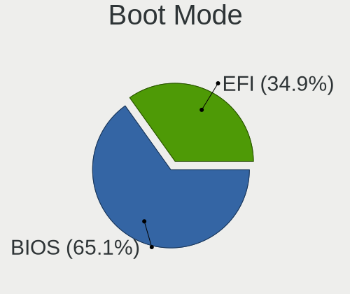
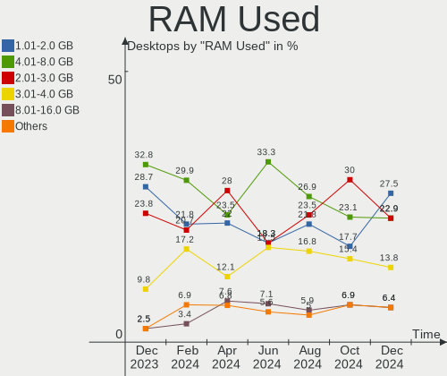
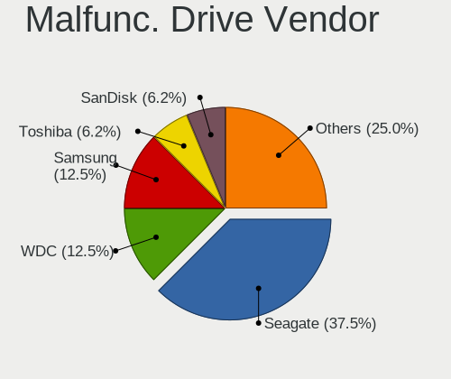
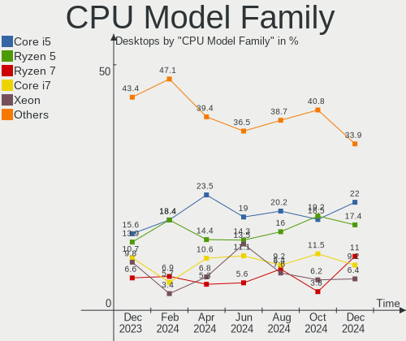
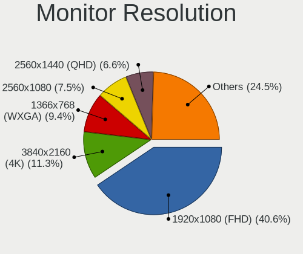
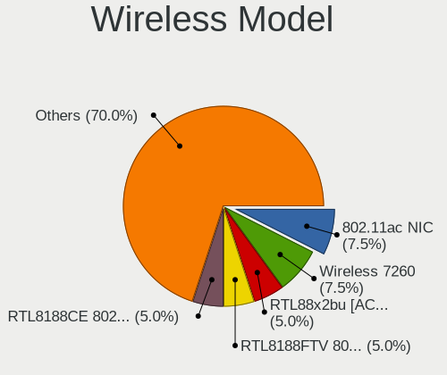

Linux in Brazil - Hardware Trends (Desktops)
--------------------------------------------

A project to identify most popular hardware characteristics and track their change
over time based on data collected by Linux users at https://Linux-Hardware.org.

Anyone can contribute to this report by the [hw-probe](https://github.com/linuxhw/hw-probe) tool:

    sudo -E hw-probe -all -upload

Contents
--------

* [ System ](#system)
  - [ OS                       ](#os)
  - [ OS Family                ](#os-family)
  - [ Kernel                   ](#kernel)
  - [ Kernel Family            ](#kernel-family)
  - [ Kernel Major Ver.        ](#kernel-major-ver)
  - [ Arch                     ](#arch)
  - [ DE                       ](#de)
  - [ Display Server           ](#display-server)
  - [ Display Manager          ](#display-manager)
  - [ OS Lang                  ](#os-lang)
  - [ Boot Mode                ](#boot-mode)
  - [ Filesystem               ](#filesystem)
  - [ Part. scheme             ](#part-scheme)
  - [ Dual Boot with Linux/BSD ](#dual-boot-with-linuxbsd)
  - [ Dual Boot (Win)          ](#dual-boot-win)

* [ Board ](#board)
  - [ Vendor                   ](#vendor)
  - [ Model                    ](#model)
  - [ Model Family             ](#model-family)
  - [ MFG Year                 ](#mfg-year)
  - [ Form Factor              ](#form-factor)
  - [ Secure Boot              ](#secure-boot)
  - [ Coreboot                 ](#coreboot)
  - [ RAM Size                 ](#ram-size)
  - [ RAM Used                 ](#ram-used)
  - [ Total Drives             ](#total-drives)
  - [ Has CD-ROM               ](#has-cd-rom)
  - [ Has Ethernet             ](#has-ethernet)
  - [ Has WiFi                 ](#has-wifi)
  - [ Has Bluetooth            ](#has-bluetooth)

* [ Location ](#location)
  - [ Country                  ](#country)
  - [ City                     ](#city)

* [ Drives ](#drives)
  - [ Drive Vendor             ](#drive-vendor)
  - [ Drive Model              ](#drive-model)
  - [ HDD Vendor               ](#hdd-vendor)
  - [ SSD Vendor               ](#ssd-vendor)
  - [ Drive Kind               ](#drive-kind)
  - [ Drive Connector          ](#drive-connector)
  - [ Drive Size               ](#drive-size)
  - [ Space Total              ](#space-total)
  - [ Space Used               ](#space-used)
  - [ Malfunc. Drives          ](#malfunc-drives)
  - [ Malfunc. Drive Vendor    ](#malfunc-drive-vendor)
  - [ Malfunc. HDD Vendor      ](#malfunc-hdd-vendor)
  - [ Malfunc. Drive Kind      ](#malfunc-drive-kind)
  - [ Failed Drives            ](#failed-drives)
  - [ Failed Drive Vendor      ](#failed-drive-vendor)
  - [ Drive Status             ](#drive-status)

* [ Storage controller ](#storage-controller)
  - [ Storage Vendor           ](#storage-vendor)
  - [ Storage Model            ](#storage-model)
  - [ Storage Kind             ](#storage-kind)

* [ Processor ](#processor)
  - [ CPU Vendor               ](#cpu-vendor)
  - [ CPU Model                ](#cpu-model)
  - [ CPU Model Family         ](#cpu-model-family)
  - [ CPU Cores                ](#cpu-cores)
  - [ CPU Sockets              ](#cpu-sockets)
  - [ CPU Threads              ](#cpu-threads)
  - [ CPU Op-Modes             ](#cpu-op-modes)
  - [ CPU Microcode            ](#cpu-microcode)
  - [ CPU Microarch            ](#cpu-microarch)

* [ Graphics ](#graphics)
  - [ GPU Vendor               ](#gpu-vendor)
  - [ GPU Model                ](#gpu-model)
  - [ GPU Combo                ](#gpu-combo)
  - [ GPU Driver               ](#gpu-driver)
  - [ GPU Memory               ](#gpu-memory)

* [ Monitor ](#monitor)
  - [ Monitor Vendor           ](#monitor-vendor)
  - [ Monitor Model            ](#monitor-model)
  - [ Monitor Resolution       ](#monitor-resolution)
  - [ Monitor Diagonal         ](#monitor-diagonal)
  - [ Monitor Width            ](#monitor-width)
  - [ Aspect Ratio             ](#aspect-ratio)
  - [ Monitor Area             ](#monitor-area)
  - [ Pixel Density            ](#pixel-density)
  - [ Multiple Monitors        ](#multiple-monitors)

* [ Network ](#network)
  - [ Net Controller Vendor    ](#net-controller-vendor)
  - [ Net Controller Model     ](#net-controller-model)
  - [ Wireless Vendor          ](#wireless-vendor)
  - [ Wireless Model           ](#wireless-model)
  - [ Ethernet Vendor          ](#ethernet-vendor)
  - [ Ethernet Model           ](#ethernet-model)
  - [ Net Controller Kind      ](#net-controller-kind)
  - [ Used Controller          ](#used-controller)
  - [ NICs                     ](#nics)
  - [ IPv6                     ](#ipv6)

* [ Bluetooth ](#bluetooth)
  - [ Bluetooth Vendor         ](#bluetooth-vendor)
  - [ Bluetooth Model          ](#bluetooth-model)

* [ Sound ](#sound)
  - [ Sound Vendor             ](#sound-vendor)
  - [ Sound Model              ](#sound-model)

* [ Memory ](#memory)
  - [ Memory Vendor            ](#memory-vendor)
  - [ Memory Model             ](#memory-model)
  - [ Memory Kind              ](#memory-kind)
  - [ Memory Form Factor       ](#memory-form-factor)
  - [ Memory Size              ](#memory-size)
  - [ Memory Speed             ](#memory-speed)

* [ Printers & scanners ](#printers--scanners)
  - [ Printer Vendor           ](#printer-vendor)
  - [ Printer Model            ](#printer-model)
  - [ Scanner Vendor           ](#scanner-vendor)
  - [ Scanner Model            ](#scanner-model)

* [ Camera ](#camera)
  - [ Camera Vendor            ](#camera-vendor)
  - [ Camera Model             ](#camera-model)

* [ Security ](#security)
  - [ Fingerprint Vendor       ](#fingerprint-vendor)
  - [ Fingerprint Model        ](#fingerprint-model)
  - [ Chipcard Vendor          ](#chipcard-vendor)
  - [ Chipcard Model           ](#chipcard-model)

* [ Unsupported ](#unsupported)
  - [ Unsupported Devices      ](#unsupported-devices)
  - [ Unsupported Device Types ](#unsupported-device-types)

System
------

OS
--

Installed operating systems

| Name                         | Desktops | Percent |
|------------------------------|----------|---------|
| Ubuntu 20.04                 | 10       | 10%     |
| OpenMandriva 4.3             | 10       | 10%     |
| Linux Mint 20.3              | 10       | 10%     |
| Pop!_OS 21.10                | 6        | 6%      |
| Ubuntu 22.04                 | 5        | 5%      |
| Ubuntu 21.10                 | 5        | 5%      |
| Debian 11                    | 5        | 5%      |
| Ubuntu 18.04                 | 4        | 4%      |
| Zorin 16                     | 3        | 3%      |
| KDE neon 20.04               | 3        | 3%      |
| Fedora 35                    | 3        | 3%      |
| Arch                         | 3        | 3%      |
| Ubuntu 16.04                 | 2        | 2%      |
| Linux Mint 19.3              | 2        | 2%      |
| Debian Testing               | 2        | 2%      |
| Zorin 15                     | 1        | 1%      |
| Xubuntu 20.04                | 1        | 1%      |
| UbuntuDDE 21.10              | 1        | 1%      |
| Ubuntu MATE 20.04            | 1        | 1%      |
| Slackware 15.0               | 1        | 1%      |
| ROSA 12.2                    | 1        | 1%      |
| Pop!_OS 20.04                | 1        | 1%      |
| Parrot 5.0                   | 1        | 1%      |
| openSUSE Tumbleweed-20220420 | 1        | 1%      |
| openSUSE Leap-15.3           | 1        | 1%      |
| openSUSE 20220426            | 1        | 1%      |
| openSUSE 20220422            | 1        | 1%      |
| OpenMandriva 4.2             | 1        | 1%      |
| Manjaro 21.2.5               | 1        | 1%      |
| Manjaro                      | 1        | 1%      |
| Mageia 8                     | 1        | 1%      |
| Lubuntu 21.10                | 1        | 1%      |
| Kubuntu 21.10                | 1        | 1%      |
| Kali 2022.1                  | 1        | 1%      |
| Fedora 36                    | 1        | 1%      |
| Endless 4.0.6                | 1        | 1%      |
| Endless 4.0.4                | 1        | 1%      |
| Elementary 6.1               | 1        | 1%      |
| Elementary 5.1.7             | 1        | 1%      |
| Debian Unstable              | 1        | 1%      |
| ArcoLinux Rolling            | 1        | 1%      |
| Arch Rolling                 | 1        | 1%      |

OS Family
---------

OS without a version

| Name         | Desktops | Percent |
|--------------|----------|---------|
| Ubuntu       | 26       | 26%     |
| Linux Mint   | 12       | 12%     |
| OpenMandriva | 11       | 11%     |
| Debian       | 8        | 8%      |
| Pop!_OS      | 7        | 7%      |
| Zorin        | 4        | 4%      |
| openSUSE     | 4        | 4%      |
| Fedora       | 4        | 4%      |
| Arch         | 4        | 4%      |
| KDE neon     | 3        | 3%      |
| Manjaro      | 2        | 2%      |
| Endless      | 2        | 2%      |
| Elementary   | 2        | 2%      |
| Xubuntu      | 1        | 1%      |
| UbuntuDDE    | 1        | 1%      |
| Ubuntu MATE  | 1        | 1%      |
| Slackware    | 1        | 1%      |
| ROSA         | 1        | 1%      |
| Parrot       | 1        | 1%      |
| Mageia       | 1        | 1%      |
| Lubuntu      | 1        | 1%      |
| Kubuntu      | 1        | 1%      |
| Kali         | 1        | 1%      |
| ArcoLinux    | 1        | 1%      |

Kernel
------

Version of the Linux kernel

| Version                            | Desktops | Percent |
|------------------------------------|----------|---------|
| 5.13.0-39-generic                  | 15       | 15%     |
| 5.16.7-desktop-1omv4003            | 10       | 10%     |
| 5.4.0-107-generic                  | 9        | 9%      |
| 5.4.0-109-generic                  | 7        | 7%      |
| 5.13.0-40-generic                  | 7        | 7%      |
| 5.16.15-76051615-generic           | 4        | 4%      |
| 5.16.0-6-amd64                     | 3        | 3%      |
| 5.10.0-13-amd64                    | 3        | 3%      |
| 5.17.4-1-default                   | 2        | 2%      |
| 5.16.18-200.fc35.x86_64            | 2        | 2%      |
| 5.15.0-27-generic                  | 2        | 2%      |
| 5.15.0-25-generic                  | 2        | 2%      |
| 5.13.19-6-pve                      | 2        | 2%      |
| 5.13.0-37-generic                  | 2        | 2%      |
| 5.11.0-35-generic                  | 2        | 2%      |
| 5.4.0-94-generic                   | 1        | 1%      |
| 5.4.0-91-generic                   | 1        | 1%      |
| 5.3.18-150300.59.54-default        | 1        | 1%      |
| 5.17.5-arch1-1                     | 1        | 1%      |
| 5.17.4-200.fc35.x86_64             | 1        | 1%      |
| 5.17.3-arch1-1                     | 1        | 1%      |
| 5.17.3-1-default                   | 1        | 1%      |
| 5.17.1-arch1-1                     | 1        | 1%      |
| 5.17.1-300.fc36.x86_64             | 1        | 1%      |
| 5.17.0-tkg-cacule                  | 1        | 1%      |
| 5.16.19-76051619-generic           | 1        | 1%      |
| 5.16.18-hardened1-1-hardened       | 1        | 1%      |
| 5.16.11-arch1-1                    | 1        | 1%      |
| 5.16.11-76051611-generic           | 1        | 1%      |
| 5.16.0-kali6-amd64                 | 1        | 1%      |
| 5.16.0-12parrot1-amd64             | 1        | 1%      |
| 5.15.32-desktop-1.mga8             | 1        | 1%      |
| 5.15.32-1-MANJARO                  | 1        | 1%      |
| 5.15.13                            | 1        | 1%      |
| 5.13.0-38-generic                  | 1        | 1%      |
| 5.13.0-19-generic                  | 1        | 1%      |
| 5.11.0-7620-generic                | 1        | 1%      |
| 5.10.74-generic-2rosa2021.1-x86_64 | 1        | 1%      |
| 5.10.14-desktop-1omv4002           | 1        | 1%      |
| 5.10.105-1-MANJARO                 | 1        | 1%      |
| 4.15.0-45-generic                  | 1        | 1%      |
| 4.15.0-175-generic                 | 1        | 1%      |
| 4.15.0-142-generic                 | 1        | 1%      |

Kernel Family
-------------

Linux kernel without a distro release

| Version  | Desktops | Percent |
|----------|----------|---------|
| 5.13.0   | 26       | 26%     |
| 5.4.0    | 18       | 18%     |
| 5.16.7   | 10       | 10%     |
| 5.16.0   | 5        | 5%      |
| 5.16.15  | 4        | 4%      |
| 5.15.0   | 4        | 4%      |
| 5.17.4   | 3        | 3%      |
| 5.16.18  | 3        | 3%      |
| 5.11.0   | 3        | 3%      |
| 5.10.0   | 3        | 3%      |
| 4.15.0   | 3        | 3%      |
| 5.17.3   | 2        | 2%      |
| 5.17.1   | 2        | 2%      |
| 5.16.11  | 2        | 2%      |
| 5.15.32  | 2        | 2%      |
| 5.13.19  | 2        | 2%      |
| 5.3.18   | 1        | 1%      |
| 5.17.5   | 1        | 1%      |
| 5.17.0   | 1        | 1%      |
| 5.16.19  | 1        | 1%      |
| 5.15.13  | 1        | 1%      |
| 5.10.74  | 1        | 1%      |
| 5.10.14  | 1        | 1%      |
| 5.10.105 | 1        | 1%      |

Kernel Major Ver.
-----------------

Linux kernel major version

| Version | Desktops | Percent |
|---------|----------|---------|
| 5.13    | 28       | 28%     |
| 5.16    | 25       | 25%     |
| 5.4     | 18       | 18%     |
| 5.17    | 9        | 9%      |
| 5.15    | 7        | 7%      |
| 5.10    | 6        | 6%      |
| 5.11    | 3        | 3%      |
| 4.15    | 3        | 3%      |
| 5.3     | 1        | 1%      |

Arch
----

OS architecture (x86_64, i586, etc.)

| Name   | Desktops | Percent |
|--------|----------|---------|
| x86_64 | 95       | 95%     |
| i686   | 5        | 5%      |

DE
--

Desktop Environment

| Name       | Desktops | Percent |
|------------|----------|---------|
| GNOME      | 40       | 40%     |
| KDE5       | 25       | 25%     |
| XFCE       | 11       | 11%     |
| X-Cinnamon | 7        | 7%      |
| MATE       | 5        | 5%      |
| Unknown    | 4        | 4%      |
| Pantheon   | 2        | 2%      |
| Cinnamon   | 2        | 2%      |
| Unity      | 1        | 1%      |
| LXQt       | 1        | 1%      |
| i3         | 1        | 1%      |
| Deepin     | 1        | 1%      |

Display Server
--------------

X11 or Wayland

| Name    | Desktops | Percent |
|---------|----------|---------|
| X11     | 83       | 83%     |
| Wayland | 12       | 12%     |
| Tty     | 4        | 4%      |
| Unknown | 1        | 1%      |

Display Manager
---------------

SDDM, LightDM, etc.

| Name    | Desktops | Percent |
|---------|----------|---------|
| Unknown | 38       | 38%     |
| SDDM    | 21       | 21%     |
| GDM3    | 19       | 19%     |
| LightDM | 14       | 14%     |
| GDM     | 8        | 8%      |

OS Lang
-------

Language

| Lang    | Desktops | Percent |
|---------|----------|---------|
| pt_BR   | 76       | 76%     |
| en_US   | 21       | 21%     |
| pt_PT   | 1        | 1%      |
| en_GB   | 1        | 1%      |
| Unknown | 1        | 1%      |

Boot Mode
---------

EFI or BIOS

| Mode | Desktops | Percent |
|------|----------|---------|
| BIOS | 71       | 71%     |
| EFI  | 29       | 29%     |

Filesystem
----------

Type of filesystem

| Type    | Desktops | Percent |
|---------|----------|---------|
| Ext4    | 79       | 79%     |
| Overlay | 11       | 11%     |
| Btrfs   | 8        | 8%      |
| F2fs    | 1        | 1%      |
| Unknown | 1        | 1%      |

Part. scheme
------------

Scheme of partitioning

| Type    | Desktops | Percent |
|---------|----------|---------|
| Unknown | 60       | 60%     |
| GPT     | 28       | 28%     |
| MBR     | 12       | 12%     |

Dual Boot with Linux/BSD
------------------------

Hosting more than one Linux/BSD

| Dual boot | Desktops | Percent |
|-----------|----------|---------|
| No        | 84       | 84%     |
| Yes       | 16       | 16%     |

Dual Boot (Win)
---------------

Hosting Linux and Windows

| Dual boot | Desktops | Percent |
|-----------|----------|---------|
| No        | 75       | 75%     |
| Yes       | 25       | 25%     |

Board
-----

Vendor
------

Motherboard manufacturer

| Name                | Desktops | Percent |
|---------------------|----------|---------|
| ASUSTek Computer    | 19       | 19%     |
| Gigabyte Technology | 17       | 17%     |
| MSI                 | 9        | 9%      |
| ASRock              | 9        | 9%      |
| Intel               | 8        | 8%      |
| Dell                | 8        | 8%      |
| Itautec             | 4        | 4%      |
| Unknown             | 4        | 4%      |
| Supermicro          | 3        | 3%      |
| Positivo            | 3        | 3%      |
| Pegatron            | 3        | 3%      |
| PCWare              | 2        | 2%      |
| Lenovo              | 2        | 2%      |
| Hewlett-Packard     | 2        | 2%      |
| Semp Toshiba        | 1        | 1%      |
| Megaware            | 1        | 1%      |
| JINGSHA             | 1        | 1%      |
| Huanan              | 1        | 1%      |
| GALAX               | 1        | 1%      |
| Biostar             | 1        | 1%      |
| Acer                | 1        | 1%      |

Model
-----

Motherboard model

| Name                            | Desktops | Percent |
|---------------------------------|----------|---------|
| Unknown                         | 6        | 6%      |
| ASUS PRIME B450M-GAMING/BR      | 3        | 3%      |
| ASUS P8H61-M LX3 R2.0           | 3        | 3%      |
| Supermicro X7DWT                | 2        | 2%      |
| Pegatron IPMH61P1               | 2        | 2%      |
| MSI MS-7B84                     | 2        | 2%      |
| Intel X99                       | 2        | 2%      |
| Intel H81                       | 2        | 2%      |
| Gigabyte H55M-S2HP              | 2        | 2%      |
| Gigabyte B450M DS3H             | 2        | 2%      |
| Dell OptiPlex 3050              | 2        | 2%      |
| ASUS P5KPL-AM-CKD-VISUM-SI      | 2        | 2%      |
| ASUS All Series                 | 2        | 2%      |
| Supermicro SSG-6047R-E1CR36N    | 1        | 1%      |
| Semp Toshiba STI                | 1        | 1%      |
| Positivo POS-MI945AA            | 1        | 1%      |
| Positivo POS-EIBTDB             | 1        | 1%      |
| Positivo POS-ECIG41BS           | 1        | 1%      |
| Pegatron s5-1050br              | 1        | 1%      |
| PCWare IPX4105G Pro             | 1        | 1%      |
| PCWare IPMH61R1                 | 1        | 1%      |
| MSI MS-7821                     | 1        | 1%      |
| MSI MS-7817                     | 1        | 1%      |
| MSI MS-7592                     | 1        | 1%      |
| MSI MS-7529                     | 1        | 1%      |
| MSI MS-6701                     | 1        | 1%      |
| MSI MS-6638                     | 1        | 1%      |
| MSI FJ446AA-AC4 SG3518BR        | 1        | 1%      |
| Megaware MW-G31T-M7             | 1        | 1%      |
| Lenovo ThinkCentre M58p 6234CZ6 | 1        | 1%      |
| Lenovo ThinkCentre A62 7057A77  | 1        | 1%      |
| Itautec ST 4265                 | 1        | 1%      |
| Itautec NT 2030                 | 1        | 1%      |
| Itautec Infoway SM-3330         | 1        | 1%      |
| Itautec Infoway                 | 1        | 1%      |
| Intel MAHOBAY                   | 1        | 1%      |
| Intel H61                       | 1        | 1%      |
| Intel DG41WV AAE90316-101       | 1        | 1%      |
| Huanan X99-BD4                  | 1        | 1%      |
| HP EliteDesk 800 G1 SFF         | 1        | 1%      |
| HP Compaq 6005 Pro SFF PC       | 1        | 1%      |
| Gigabyte H61M-S1                | 1        | 1%      |
| Gigabyte H110M-H                | 1        | 1%      |
| Gigabyte GA-78LMT-USB3          | 1        | 1%      |
| Gigabyte G41MT-ES2L             | 1        | 1%      |
| Gigabyte G31M-ES2L              | 1        | 1%      |
| Gigabyte B450 AORUS M           | 1        | 1%      |
| Gigabyte B450 AORUS ELITE       | 1        | 1%      |
| Gigabyte B360M AORUS Gaming 3   | 1        | 1%      |
| Gigabyte B150M-D3H              | 1        | 1%      |
| Gigabyte AB350M-DS3H V2         | 1        | 1%      |
| Gigabyte A320M-S2H              | 1        | 1%      |
| Gigabyte 970A-UD3               | 1        | 1%      |
| Gigabyte 970A-DS3P              | 1        | 1%      |
| GALAX A320M                     | 1        | 1%      |
| Dell XPS 8920                   | 1        | 1%      |
| Dell Precision T1700            | 1        | 1%      |
| Dell OptiPlex 780               | 1        | 1%      |
| Dell OptiPlex 740               | 1        | 1%      |
| Dell OptiPlex 7050              | 1        | 1%      |

Model Family
------------

Motherboard model prefix

| Name                         | Desktops | Percent |
|------------------------------|----------|---------|
| ASUS PRIME                   | 6        | 6%      |
| Unknown                      | 6        | 6%      |
| Dell OptiPlex                | 5        | 5%      |
| ASUS P8H61-M                 | 3        | 3%      |
| Supermicro X7DWT             | 2        | 2%      |
| Pegatron IPMH61P1            | 2        | 2%      |
| MSI MS-7B84                  | 2        | 2%      |
| Lenovo ThinkCentre           | 2        | 2%      |
| Itautec Infoway              | 2        | 2%      |
| Intel X99                    | 2        | 2%      |
| Intel H81                    | 2        | 2%      |
| Gigabyte H55M-S2HP           | 2        | 2%      |
| Gigabyte B450M               | 2        | 2%      |
| Gigabyte B450                | 2        | 2%      |
| ASUS P5KPL-AM-CKD-VISUM-SI   | 2        | 2%      |
| ASUS M5A78L-M                | 2        | 2%      |
| ASUS All                     | 2        | 2%      |
| Supermicro SSG-6047R-E1CR36N | 1        | 1%      |
| Semp Toshiba STI             | 1        | 1%      |
| Positivo POS-MI945AA         | 1        | 1%      |
| Positivo POS-EIBTDB          | 1        | 1%      |
| Positivo POS-ECIG41BS        | 1        | 1%      |
| Pegatron s5-1050br           | 1        | 1%      |
| PCWare IPX4105G              | 1        | 1%      |
| PCWare IPMH61R1              | 1        | 1%      |
| MSI MS-7821                  | 1        | 1%      |
| MSI MS-7817                  | 1        | 1%      |
| MSI MS-7592                  | 1        | 1%      |
| MSI MS-7529                  | 1        | 1%      |
| MSI MS-6701                  | 1        | 1%      |
| MSI MS-6638                  | 1        | 1%      |
| MSI FJ446AA-AC4              | 1        | 1%      |
| Megaware MW-G31T-M7          | 1        | 1%      |
| Itautec ST                   | 1        | 1%      |
| Itautec NT                   | 1        | 1%      |
| Intel MAHOBAY                | 1        | 1%      |
| Intel H61                    | 1        | 1%      |
| Intel DG41WV                 | 1        | 1%      |
| Huanan X99-BD4               | 1        | 1%      |
| HP EliteDesk                 | 1        | 1%      |
| HP Compaq                    | 1        | 1%      |
| Gigabyte H61M-S1             | 1        | 1%      |
| Gigabyte H110M-H             | 1        | 1%      |
| Gigabyte GA-78LMT-USB3       | 1        | 1%      |
| Gigabyte G41MT-ES2L          | 1        | 1%      |
| Gigabyte G31M-ES2L           | 1        | 1%      |
| Gigabyte B360M               | 1        | 1%      |
| Gigabyte B150M-D3H           | 1        | 1%      |
| Gigabyte AB350M-DS3H         | 1        | 1%      |
| Gigabyte A320M-S2H           | 1        | 1%      |
| Gigabyte 970A-UD3            | 1        | 1%      |
| Gigabyte 970A-DS3P           | 1        | 1%      |
| GALAX A320M                  | 1        | 1%      |
| Dell XPS                     | 1        | 1%      |
| Dell Precision               | 1        | 1%      |
| Dell Inspiron                | 1        | 1%      |
| Biostar NM70I-1017U          | 1        | 1%      |
| ASUS SABERTOOTH              | 1        | 1%      |
| ASUS P9X79                   | 1        | 1%      |
| ASUS P8B75-V                 | 1        | 1%      |

MFG Year
--------

Motherboard manufacture year

| Year | Desktops | Percent |
|------|----------|---------|
| 2018 | 17       | 17%     |
| 2011 | 12       | 12%     |
| 2019 | 9        | 9%      |
| 2012 | 9        | 9%      |
| 2009 | 9        | 9%      |
| 2013 | 7        | 7%      |
| 2008 | 7        | 7%      |
| 2017 | 6        | 6%      |
| 2016 | 5        | 5%      |
| 2014 | 5        | 5%      |
| 2010 | 5        | 5%      |
| 2021 | 2        | 2%      |
| 2020 | 2        | 2%      |
| 2015 | 2        | 2%      |
| 2022 | 1        | 1%      |
| 2007 | 1        | 1%      |
| 2005 | 1        | 1%      |

Form Factor
-----------

Physical design of the computer

| Name    | Desktops | Percent |
|---------|----------|---------|
| Desktop | 100      | 100%    |

Secure Boot
-----------

Enabled or disabled

| State    | Desktops | Percent |
|----------|----------|---------|
| Disabled | 98       | 98%     |
| Enabled  | 2        | 2%      |

Coreboot
--------

Have coreboot on board

| Used | Desktops | Percent |
|------|----------|---------|
| No   | 100      | 100%    |

RAM Size
--------

Total RAM memory

| Size in GB  | Desktops | Percent |
|-------------|----------|---------|
| 8.01-16.0   | 26       | 26%     |
| 4.01-8.0    | 22       | 22%     |
| 3.01-4.0    | 17       | 17%     |
| 16.01-24.0  | 12       | 12%     |
| 32.01-64.0  | 8        | 8%      |
| 2.01-3.0    | 5        | 5%      |
| 24.01-32.0  | 4        | 4%      |
| 1.01-2.0    | 4        | 4%      |
| 64.01-256.0 | 2        | 2%      |

RAM Used
--------

Used RAM memory

| Used GB    | Desktops | Percent |
|------------|----------|---------|
| 1.01-2.0   | 45       | 45%     |
| 2.01-3.0   | 16       | 16%     |
| 4.01-8.0   | 15       | 15%     |
| 0.51-1.0   | 13       | 13%     |
| 3.01-4.0   | 7        | 7%      |
| 8.01-16.0  | 3        | 3%      |
| 16.01-24.0 | 1        | 1%      |

Total Drives
------------

Number of drives on board

| Drives | Desktops | Percent |
|--------|----------|---------|
| 1      | 52       | 52%     |
| 2      | 32       | 32%     |
| 3      | 11       | 11%     |
| 5      | 2        | 2%      |
| 7      | 1        | 1%      |
| 4      | 1        | 1%      |
| 0      | 1        | 1%      |

Has CD-ROM
----------

Has CD-ROM on board

| Presented | Desktops | Percent |
|-----------|----------|---------|
| No        | 66       | 66%     |
| Yes       | 34       | 34%     |

Has Ethernet
------------

Has Ethernet on board

| Presented | Desktops | Percent |
|-----------|----------|---------|
| Yes       | 97       | 97%     |
| No        | 3        | 3%      |

Has WiFi
--------

Has WiFi module

| Presented | Desktops | Percent |
|-----------|----------|---------|
| No        | 68       | 68%     |
| Yes       | 32       | 32%     |

Has Bluetooth
-------------

Has Bluetooth module

| Presented | Desktops | Percent |
|-----------|----------|---------|
| No        | 86       | 86%     |
| Yes       | 14       | 14%     |

Location
--------

Country
-------

Geographic location (country)

| Country | Desktops | Percent |
|---------|----------|---------|
| Brazil  | 100      | 100%    |

City
----

Geographic location (city)

| City                 | Desktops | Percent |
|----------------------|----------|---------|
| Sao Paulo            | 14       | 14%     |
| Rio de Janeiro       | 7        | 7%      |
| Brasília            | 4        | 4%      |
| Niterói             | 3        | 3%      |
| Fortaleza            | 3        | 3%      |
| Curitiba             | 3        | 3%      |
| Sao Luís            | 2        | 2%      |
| Salvador             | 2        | 2%      |
| Porto Alegre         | 2        | 2%      |
| Ponta Grossa         | 2        | 2%      |
| Jundiaí             | 2        | 2%      |
| Goiânia             | 2        | 2%      |
| Vila Velha           | 1        | 1%      |
| Toritama             | 1        | 1%      |
| Teixeira de Freitas  | 1        | 1%      |
| Taubate              | 1        | 1%      |
| Suzano               | 1        | 1%      |
| Sao Joao de Meriti   | 1        | 1%      |
| Sao Carlos           | 1        | 1%      |
| Santa Maria          | 1        | 1%      |
| Santa Cruz do Sul    | 1        | 1%      |
| Rio Branco           | 1        | 1%      |
| Ribeirao Preto       | 1        | 1%      |
| Recife               | 1        | 1%      |
| Quarai               | 1        | 1%      |
| Passo Fundo          | 1        | 1%      |
| Panambi              | 1        | 1%      |
| Palhoca              | 1        | 1%      |
| Pacatuba             | 1        | 1%      |
| Osvaldo Cruz         | 1        | 1%      |
| Osasco               | 1        | 1%      |
| Nova Lima            | 1        | 1%      |
| Natal                | 1        | 1%      |
| Mucuri               | 1        | 1%      |
| Mogi Guacu           | 1        | 1%      |
| Maringá             | 1        | 1%      |
| Marília             | 1        | 1%      |
| Marcolandia          | 1        | 1%      |
| Manaus               | 1        | 1%      |
| Manacapuru           | 1        | 1%      |
| Maceió              | 1        | 1%      |
| Lins                 | 1        | 1%      |
| Lajeado              | 1        | 1%      |
| Lagoa Nova           | 1        | 1%      |
| Jaú                 | 1        | 1%      |
| Jardim Dom José     | 1        | 1%      |
| Itatinga             | 1        | 1%      |
| Itanhem              | 1        | 1%      |
| Guarulhos            | 1        | 1%      |
| Guaruja              | 1        | 1%      |
| Guaíba              | 1        | 1%      |
| Franca               | 1        | 1%      |
| Foz do Iguaçu       | 1        | 1%      |
| Duque de Caxias      | 1        | 1%      |
| Colombo              | 1        | 1%      |
| Cariacica            | 1        | 1%      |
| Camaqua              | 1        | 1%      |
| Bernardino de Campos | 1        | 1%      |
| Bebedouro            | 1        | 1%      |
| Bauru                | 1        | 1%      |

Drives
------

Drive Vendor
------------

Hard drive vendors

| Vendor                      | Desktops | Drives | Percent |
|-----------------------------|----------|--------|---------|
| Seagate                     | 36       | 44     | 22.78%  |
| WDC                         | 28       | 30     | 17.72%  |
| Kingston                    | 18       | 19     | 11.39%  |
| Samsung Electronics         | 13       | 15     | 8.23%   |
| SanDisk                     | 10       | 10     | 6.33%   |
| China                       | 9        | 9      | 5.7%    |
| Toshiba                     | 8        | 9      | 5.06%   |
| Silicon Motion              | 6        | 6      | 3.8%    |
| MAXTOR                      | 4        | 4      | 2.53%   |
| Hitachi                     | 4        | 4      | 2.53%   |
| Crucial                     | 4        | 4      | 2.53%   |
| A-DATA Technology           | 3        | 3      | 1.9%    |
| XPG                         | 2        | 2      | 1.27%   |
| ZADAK                       | 1        | 1      | 0.63%   |
| SK Hynix                    | 1        | 1      | 0.63%   |
| PNY                         | 1        | 1      | 0.63%   |
| OCZ                         | 1        | 1      | 0.63%   |
| MAXIO Technology (Hangzhou) | 1        | 1      | 0.63%   |
| Lexar                       | 1        | 1      | 0.63%   |
| KingSpec                    | 1        | 1      | 0.63%   |
| HGST                        | 1        | 1      | 0.63%   |
| Hewlett-Packard             | 1        | 1      | 0.63%   |
| Gigabyte Technology         | 1        | 1      | 0.63%   |
| Apacer                      | 1        | 1      | 0.63%   |
| AFOX                        | 1        | 1      | 0.63%   |
| Acer                        | 1        | 1      | 0.63%   |

Drive Model
-----------

Hard drive models

| Model                               | Desktops | Percent |
|-------------------------------------|----------|---------|
| Kingston SA400S37240G 240GB SSD     | 12       | 7.06%   |
| Seagate ST1000DM010-2EP102 1TB      | 4        | 2.35%   |
| WDC WD5000AAKX-003CA0 500GB         | 3        | 1.76%   |
| Silicon Motion NVMe SSD Drive 512GB | 3        | 1.76%   |
| Seagate ST500DM002-1BD142 500GB     | 3        | 1.76%   |
| Seagate ST3500413AS 500GB           | 3        | 1.76%   |
| Seagate ST2000DM006-2DM164 2TB      | 3        | 1.76%   |
| Seagate ST1000DM003-1SB102 1TB      | 3        | 1.76%   |
| Samsung HD161GJ 160GB               | 3        | 1.76%   |
| WDC WD10EZEX-00WN4A0 1TB            | 2        | 1.18%   |
| Toshiba HDWD110 1TB                 | 2        | 1.18%   |
| Seagate ST500LM021-1KJ152 500GB     | 2        | 1.18%   |
| Seagate ST3500418AS 500GB           | 2        | 1.18%   |
| SanDisk SSD PLUS 480GB              | 2        | 1.18%   |
| SanDisk SSD PLUS 240GB              | 2        | 1.18%   |
| Samsung HD103SJ 1TB                 | 2        | 1.18%   |
| Kingston SUV300S37A240G 240GB SSD   | 2        | 1.18%   |
| Kingston SA400S37120G 120GB SSD     | 2        | 1.18%   |
| Crucial CT240BX500SSD1 240GB        | 2        | 1.18%   |
| China SATA SSD 32GB                 | 2        | 1.18%   |
| China SATA SSD 120GB                | 2        | 1.18%   |
| ZADAK TWSS3 512GB                   | 1        | 0.59%   |
| XPG NVMe SSD Drive 256GB            | 1        | 0.59%   |
| XPG GAMMIX S41 256GB                | 1        | 0.59%   |
| WDC WDS500G2B0B-00YS70 500GB SSD    | 1        | 0.59%   |
| WDC WDS480G2G0A-00JH30 480GB SSD    | 1        | 0.59%   |
| WDC WDS240G2G0A-00JH30 240GB SSD    | 1        | 0.59%   |
| WDC WDS200T2B0B 2TB SSD             | 1        | 0.59%   |
| WDC WD800JD-75MSA3 80GB             | 1        | 0.59%   |
| WDC WD800BD-00LRA1 80GB             | 1        | 0.59%   |
| WDC WD5000BPVT-22HXZT3 500GB        | 1        | 0.59%   |
| WDC WD5000BEVT-60A0RT0 500GB        | 1        | 0.59%   |
| WDC WD5000BEVT-00A0RT0 500GB        | 1        | 0.59%   |
| WDC WD5000AZLX-08K2TA0 500GB        | 1        | 0.59%   |
| WDC WD5000AAKX-00U6AA0 500GB        | 1        | 0.59%   |
| WDC WD5000AAKS-00A7B2 500GB         | 1        | 0.59%   |
| WDC WD3200AAJS-00L7A0 320GB         | 1        | 0.59%   |
| WDC WD20EZRX-00D8PB0 2TB            | 1        | 0.59%   |
| WDC WD20EZAZ-00GGJB0 2TB            | 1        | 0.59%   |
| WDC WD1600AABS-61PRA0 160GB         | 1        | 0.59%   |
| WDC WD1600AABS-00PRA0 160GB         | 1        | 0.59%   |
| WDC WD10TPVT-00HT5T0 1TB            | 1        | 0.59%   |
| WDC WD10JPVX-22JC3T0 1TB            | 1        | 0.59%   |
| WDC WD10EZEX-75M2NA0 1TB            | 1        | 0.59%   |
| WDC WD10EZEX-00BN5A0 1TB            | 1        | 0.59%   |
| WDC WD10EARS-00Y5B1 1TB             | 1        | 0.59%   |
| WDC WD10EADS-22M2B0 1TB             | 1        | 0.59%   |
| WDC WD10EADS-00M2B0 1TB             | 1        | 0.59%   |
| Toshiba MQ02ABD100H 1TB             | 1        | 0.59%   |
| Toshiba MQ01ABF050 500GB            | 1        | 0.59%   |
| Toshiba MK2565GSX HR 160GB          | 1        | 0.59%   |
| Toshiba HDWD120 2TB                 | 1        | 0.59%   |
| Toshiba HDWD105 500GB               | 1        | 0.59%   |
| Toshiba DT01ACA100 1TB              | 1        | 0.59%   |
| Toshiba DT01ACA050 500GB            | 1        | 0.59%   |
| SK Hynix NVMe SSD Drive 512GB       | 1        | 0.59%   |
| Silicon Motion NVMe SSD Drive 256GB | 1        | 0.59%   |
| Silicon Motion NVMe SSD Drive 1TB   | 1        | 0.59%   |
| Silicon Motion NE-128 128GB         | 1        | 0.59%   |
| Seagate ST9500325AS 500GB           | 1        | 0.59%   |

HDD Vendor
----------

Hard disk drive vendors

| Vendor              | Desktops | Drives | Percent |
|---------------------|----------|--------|---------|
| Seagate             | 36       | 44     | 40.45%  |
| WDC                 | 24       | 26     | 26.97%  |
| Samsung Electronics | 12       | 14     | 13.48%  |
| Toshiba             | 8        | 9      | 8.99%   |
| MAXTOR              | 4        | 4      | 4.49%   |
| Hitachi             | 4        | 4      | 4.49%   |
| HGST                | 1        | 1      | 1.12%   |

SSD Vendor
----------

Solid state drive vendors

| Vendor              | Desktops | Drives | Percent |
|---------------------|----------|--------|---------|
| Kingston            | 18       | 19     | 32.14%  |
| SanDisk             | 9        | 9      | 16.07%  |
| China               | 9        | 9      | 16.07%  |
| WDC                 | 4        | 4      | 7.14%   |
| Crucial             | 4        | 4      | 7.14%   |
| A-DATA Technology   | 2        | 2      | 3.57%   |
| Samsung Electronics | 1        | 1      | 1.79%   |
| PNY                 | 1        | 1      | 1.79%   |
| OCZ                 | 1        | 1      | 1.79%   |
| Lexar               | 1        | 1      | 1.79%   |
| KingSpec            | 1        | 1      | 1.79%   |
| Hewlett-Packard     | 1        | 1      | 1.79%   |
| Gigabyte Technology | 1        | 1      | 1.79%   |
| Apacer              | 1        | 1      | 1.79%   |
| AFOX                | 1        | 1      | 1.79%   |
| Acer                | 1        | 1      | 1.79%   |

Drive Kind
----------

HDD or SSD

| Kind    | Desktops | Drives | Percent |
|---------|----------|--------|---------|
| HDD     | 73       | 102    | 53.68%  |
| SSD     | 50       | 57     | 36.76%  |
| NVMe    | 12       | 12     | 8.82%   |
| Unknown | 1        | 1      | 0.74%   |

Drive Connector
---------------

SATA, SAS, NVMe, etc.

| Type | Desktops | Drives | Percent |
|------|----------|--------|---------|
| SATA | 96       | 157    | 86.49%  |
| NVMe | 12       | 12     | 10.81%  |
| SAS  | 3        | 3      | 2.7%    |

Drive Size
----------

Size of hard drive

| Size in TB | Desktops | Drives | Percent |
|------------|----------|--------|---------|
| 0.01-0.5   | 82       | 107    | 66.13%  |
| 0.51-1.0   | 28       | 35     | 22.58%  |
| 1.01-2.0   | 11       | 14     | 8.87%   |
| 3.01-4.0   | 1        | 1      | 0.81%   |
| 2.01-3.0   | 1        | 1      | 0.81%   |
| 10.01-20.0 | 1        | 1      | 0.81%   |

Space Total
-----------

Amount of disk space available on the file system

| Size in GB     | Desktops | Percent |
|----------------|----------|---------|
| 101-250        | 31       | 31%     |
| 251-500        | 26       | 26%     |
| 501-1000       | 14       | 14%     |
| 1-20           | 8        | 8%      |
| More than 3000 | 6        | 6%      |
| 1001-2000      | 5        | 5%      |
| 2001-3000      | 3        | 3%      |
| 51-100         | 3        | 3%      |
| 21-50          | 2        | 2%      |
| Unknown        | 2        | 2%      |

Space Used
----------

Amount of used disk space

| Used GB        | Desktops | Percent |
|----------------|----------|---------|
| 1-20           | 36       | 36%     |
| 21-50          | 19       | 19%     |
| 101-250        | 14       | 14%     |
| 51-100         | 11       | 11%     |
| 251-500        | 7        | 7%      |
| 501-1000       | 6        | 6%      |
| More than 3000 | 2        | 2%      |
| 1001-2000      | 2        | 2%      |
| Unknown        | 2        | 2%      |
| 2001-3000      | 1        | 1%      |

Malfunc. Drives
---------------

Drive models with a malfunction

| Model                                        | Desktops | Drives | Percent |
|----------------------------------------------|----------|--------|---------|
| WDC WD800BD-00LRA1 80GB                      | 1        | 1      | 8.33%   |
| WDC WD10EADS-22M2B0 1TB                      | 1        | 1      | 8.33%   |
| Seagate ST500DM002-1BD142 500GB              | 1        | 1      | 8.33%   |
| Seagate ST3500418AS 500GB                    | 1        | 1      | 8.33%   |
| Seagate ST3500413AS 500GB                    | 1        | 1      | 8.33%   |
| Seagate ST32000644NS 59Y5483 59Y1807IBMV 2TB | 1        | 1      | 8.33%   |
| Seagate ST31000524NS 1TB                     | 1        | 1      | 8.33%   |
| Seagate ST1000DM010-2EP102 1TB               | 1        | 1      | 8.33%   |
| Seagate ST1000DM003-9YN162 1TB               | 1        | 1      | 8.33%   |
| SanDisk SSD PLUS 240GB                       | 1        | 1      | 8.33%   |
| Samsung Electronics SP0842N 80GB             | 1        | 1      | 8.33%   |
| MAXTOR STM3160215AS 160GB                    | 1        | 1      | 8.33%   |

Malfunc. Drive Vendor
---------------------

Vendors of faulty drives

| Vendor              | Desktops | Drives | Percent |
|---------------------|----------|--------|---------|
| Seagate             | 7        | 7      | 58.33%  |
| WDC                 | 2        | 2      | 16.67%  |
| SanDisk             | 1        | 1      | 8.33%   |
| Samsung Electronics | 1        | 1      | 8.33%   |
| MAXTOR              | 1        | 1      | 8.33%   |

Malfunc. HDD Vendor
-------------------

Vendors of faulty HDD drives

| Vendor              | Desktops | Drives | Percent |
|---------------------|----------|--------|---------|
| Seagate             | 7        | 7      | 63.64%  |
| WDC                 | 2        | 2      | 18.18%  |
| Samsung Electronics | 1        | 1      | 9.09%   |
| MAXTOR              | 1        | 1      | 9.09%   |

Malfunc. Drive Kind
-------------------

Kinds of faulty drives

| Kind | Desktops | Drives | Percent |
|------|----------|--------|---------|
| HDD  | 10       | 11     | 90.91%  |
| SSD  | 1        | 1      | 9.09%   |

Failed Drives
-------------

Failed drive models

Zero info for selected period =(

Failed Drive Vendor
-------------------

Failed drive vendors

Zero info for selected period =(

Drive Status
------------

Number of failed and malfunc. drives

| Status   | Desktops | Drives | Percent |
|----------|----------|--------|---------|
| Detected | 63       | 112    | 60.58%  |
| Works    | 31       | 48     | 29.81%  |
| Malfunc  | 10       | 12     | 9.62%   |

Storage controller
------------------

Storage Vendor
--------------

Storage controller vendors

| Vendor                           | Desktops | Percent |
|----------------------------------|----------|---------|
| Intel                            | 69       | 57.02%  |
| AMD                              | 26       | 21.49%  |
| Silicon Motion                   | 6        | 4.96%   |
| Nvidia                           | 4        | 3.31%   |
| JMicron Technology               | 4        | 3.31%   |
| Marvell Technology Group         | 3        | 2.48%   |
| Realtek Semiconductor            | 2        | 1.65%   |
| ASMedia Technology               | 2        | 1.65%   |
| SK Hynix                         | 1        | 0.83%   |
| Silicon Integrated Systems [SiS] | 1        | 0.83%   |
| Sandisk                          | 1        | 0.83%   |
| MAXIO Technology (Hangzhou)      | 1        | 0.83%   |
| ADATA Technology                 | 1        | 0.83%   |

Storage Model
-------------

Storage controller models

| Model                                                                                   | Desktops | Percent |
|-----------------------------------------------------------------------------------------|----------|---------|
| Intel NM10/ICH7 Family SATA Controller [IDE mode]                                       | 14       | 8.38%   |
| AMD FCH SATA Controller [AHCI mode]                                                     | 14       | 8.38%   |
| Intel 82801G (ICH7 Family) IDE Controller                                               | 9        | 5.39%   |
| Intel 8 Series/C220 Series Chipset Family 6-port SATA Controller 1 [AHCI mode]          | 8        | 4.79%   |
| AMD 400 Series Chipset SATA Controller                                                  | 8        | 4.79%   |
| Intel 6 Series/C200 Series Chipset Family 6 port Desktop SATA AHCI Controller           | 7        | 4.19%   |
| AMD FCH SATA Controller D                                                               | 6        | 3.59%   |
| Silicon Motion SM2263EN/SM2263XT SSD Controller                                         | 5        | 2.99%   |
| Intel 6 Series/C200 Series Chipset Family Desktop SATA Controller (IDE mode, ports 4-5) | 5        | 2.99%   |
| Intel 6 Series/C200 Series Chipset Family Desktop SATA Controller (IDE mode, ports 0-3) | 5        | 2.99%   |
| Intel 5 Series/3400 Series Chipset 4 port SATA IDE Controller                           | 5        | 2.99%   |
| Intel 5 Series/3400 Series Chipset 2 port SATA IDE Controller                           | 5        | 2.99%   |
| AMD SB7x0/SB8x0/SB9x0 SATA Controller [IDE mode]                                        | 5        | 2.99%   |
| AMD SB7x0/SB8x0/SB9x0 IDE Controller                                                    | 5        | 2.99%   |
| JMicron JMB368 IDE controller                                                           | 4        | 2.4%    |
| Intel SATA Controller [RAID mode]                                                       | 4        | 2.4%    |
| AMD SB7x0/SB8x0/SB9x0 SATA Controller [AHCI mode]                                       | 4        | 2.4%    |
| Nvidia MCP61 SATA Controller                                                            | 3        | 1.8%    |
| Intel 4 Series Chipset PT IDER Controller                                               | 3        | 1.8%    |
| Intel 200 Series PCH SATA controller [AHCI mode]                                        | 3        | 1.8%    |
| Nvidia MCP61 IDE                                                                        | 2        | 1.2%    |
| Intel Q170/Q150/B150/H170/H110/Z170/CM236 Chipset SATA Controller [AHCI Mode]           | 2        | 1.2%    |
| Intel Cannon Lake PCH SATA AHCI Controller                                              | 2        | 1.2%    |
| Intel C600/X79 series chipset 6-Port SATA AHCI Controller                               | 2        | 1.2%    |
| Intel 9 Series Chipset Family SATA Controller [AHCI Mode]                               | 2        | 1.2%    |
| Intel 7 Series/C210 Series Chipset Family 6-port SATA Controller [AHCI mode]            | 2        | 1.2%    |
| Intel 7 Series Chipset Family 6-port SATA Controller [AHCI mode]                        | 2        | 1.2%    |
| Intel 631xESB/632xESB/3100 Chipset SATA IDE Controller                                  | 2        | 1.2%    |
| ASMedia ASM1062 Serial ATA Controller                                                   | 2        | 1.2%    |
| SK Hynix Non-Volatile memory controller                                                 | 1        | 0.6%    |
| Silicon Motion SM2262/SM2262EN SSD Controller                                           | 1        | 0.6%    |
| Silicon Integrated Systems [SiS] 5513 IDE Controller                                    | 1        | 0.6%    |
| Sandisk WD Blue SN570 NVMe SSD                                                          | 1        | 0.6%    |
| Realtek RTS5763DL NVMe SSD Controller                                                   | 1        | 0.6%    |
| Realtek Realtek Non-Volatile memory controller                                          | 1        | 0.6%    |
| Nvidia MCP51 Serial ATA Controller                                                      | 1        | 0.6%    |
| MAXIO (Hangzhou) NVMe SSD Controller MAP1002                                            | 1        | 0.6%    |
| Marvell Group 88SE9172 SATA 6Gb/s Controller                                            | 1        | 0.6%    |
| Marvell Group 88SE9128 PCIe SATA 6 Gb/s RAID controller with HyperDuo                   | 1        | 0.6%    |
| Marvell Group 88SE9120 SATA 6Gb/s Controller                                            | 1        | 0.6%    |
| Intel NM10/ICH7 Family SATA Controller [AHCI mode]                                      | 1        | 0.6%    |
| Intel Celeron/Pentium Silver Processor SATA Controller                                  | 1        | 0.6%    |
| Intel C610/X99 series chipset sSATA Controller [AHCI mode]                              | 1        | 0.6%    |
| Intel C610/X99 series chipset 6-Port SATA Controller [AHCI mode]                        | 1        | 0.6%    |
| Intel C602 chipset 4-Port SATA Storage Control Unit                                     | 1        | 0.6%    |
| Intel C600/X79 series chipset SATA RAID Controller                                      | 1        | 0.6%    |
| Intel Atom Processor E3800 Series SATA AHCI Controller                                  | 1        | 0.6%    |
| Intel 82801JD/DO (ICH10 Family) SATA AHCI Controller                                    | 1        | 0.6%    |
| Intel 82801JD/DO (ICH10 Family) 4-port SATA IDE Controller                              | 1        | 0.6%    |
| Intel 82801JD/DO (ICH10 Family) 2-port SATA IDE Controller                              | 1        | 0.6%    |
| Intel 7 Series/C210 Series Chipset Family 4-port SATA Controller [IDE mode]             | 1        | 0.6%    |
| Intel 7 Series/C210 Series Chipset Family 2-port SATA Controller [IDE mode]             | 1        | 0.6%    |
| AMD FCH IDE Controller                                                                  | 1        | 0.6%    |
| AMD 500 Series Chipset SATA Controller                                                  | 1        | 0.6%    |
| AMD 300 Series Chipset SATA Controller                                                  | 1        | 0.6%    |
| ADATA XPG SX8200 Pro PCIe Gen3x4 M.2 2280 Solid State Drive                             | 1        | 0.6%    |

Storage Kind
------------

Kind of storage controller (IDE, SATA, NVMe, SAS, ...)

| Kind | Desktops | Percent |
|------|----------|---------|
| SATA | 63       | 51.64%  |
| IDE  | 41       | 33.61%  |
| NVMe | 12       | 9.84%   |
| RAID | 5        | 4.1%    |
| SAS  | 1        | 0.82%   |

Processor
---------

CPU Vendor
----------

Processor vendors

| Vendor | Desktops | Percent |
|--------|----------|---------|
| Intel  | 70       | 70%     |
| AMD    | 30       | 30%     |

CPU Model
---------

Processor models

| Model                                       | Desktops | Percent |
|---------------------------------------------|----------|---------|
| Intel Core i3-2100 CPU @ 3.10GHz            | 3        | 3%      |
| AMD Ryzen 5 3400G with Radeon Vega Graphics | 3        | 3%      |
| AMD Ryzen 3 2200G with Radeon Vega Graphics | 3        | 3%      |
| AMD FX-6300 Six-Core Processor              | 3        | 3%      |
| Intel Core i7-7700 CPU @ 3.60GHz            | 2        | 2%      |
| Intel Core i7-3770 CPU @ 3.40GHz            | 2        | 2%      |
| Intel Core i5-4460 CPU @ 3.20GHz            | 2        | 2%      |
| Intel Core i5-3330 CPU @ 3.00GHz            | 2        | 2%      |
| Intel Core i5 CPU 650 @ 3.20GHz             | 2        | 2%      |
| Intel Core i3-3240 CPU @ 3.40GHz            | 2        | 2%      |
| AMD Ryzen 5 5600G with Radeon Graphics      | 2        | 2%      |
| AMD Ryzen 5 3600 6-Core Processor           | 2        | 2%      |
| Intel Xeon CPU E5-2690 0 @ 2.90GHz          | 1        | 1%      |
| Intel Xeon CPU E5-2682 v4 @ 2.50GHz         | 1        | 1%      |
| Intel Xeon CPU E5-2678 v3 @ 2.50GHz         | 1        | 1%      |
| Intel Xeon CPU E5-2667 v2 @ 3.30GHz         | 1        | 1%      |
| Intel Xeon CPU E5-2650 v3 @ 2.30GHz         | 1        | 1%      |
| Intel Xeon CPU E5-2630 v2 @ 2.60GHz         | 1        | 1%      |
| Intel Xeon CPU E3-1270 v3 @ 3.50GHz         | 1        | 1%      |
| Intel Xeon CPU E3-1230 v3 @ 3.30GHz         | 1        | 1%      |
| Intel Xeon CPU 5150 @ 2.66GHz               | 1        | 1%      |
| Intel Xeon CPU 5120 @ 1.86GHz               | 1        | 1%      |
| Intel Pentium Dual-Core CPU E6500 @ 2.93GHz | 1        | 1%      |
| Intel Pentium Dual-Core CPU E5800 @ 3.20GHz | 1        | 1%      |
| Intel Pentium Dual-Core CPU E5700 @ 3.00GHz | 1        | 1%      |
| Intel Pentium Dual-Core CPU E5400 @ 2.70GHz | 1        | 1%      |
| Intel Pentium Dual-Core CPU E5200 @ 2.50GHz | 1        | 1%      |
| Intel Pentium CPU G620 @ 2.60GHz            | 1        | 1%      |
| Intel Pentium CPU E5400 @ 2.70GHz           | 1        | 1%      |
| Intel Pentium 4 CPU 2.66GHz                 | 1        | 1%      |
| Intel Core i7-8700 CPU @ 3.20GHz            | 1        | 1%      |
| Intel Core i7-7700K CPU @ 4.20GHz           | 1        | 1%      |
| Intel Core i7-4790K CPU @ 4.00GHz           | 1        | 1%      |
| Intel Core i7-3930K CPU @ 3.20GHz           | 1        | 1%      |
| Intel Core i5-7500 CPU @ 3.40GHz            | 1        | 1%      |
| Intel Core i5-4590 CPU @ 3.30GHz            | 1        | 1%      |
| Intel Core i5-4570 CPU @ 3.20GHz            | 1        | 1%      |
| Intel Core i5-4460S CPU @ 2.90GHz           | 1        | 1%      |
| Intel Core i5-3340 CPU @ 3.10GHz            | 1        | 1%      |
| Intel Core i5-3330S CPU @ 2.70GHz           | 1        | 1%      |
| Intel Core i5-2500K CPU @ 3.30GHz           | 1        | 1%      |
| Intel Core i5 CPU 661 @ 3.33GHz             | 1        | 1%      |
| Intel Core i3-9100F CPU @ 3.60GHz           | 1        | 1%      |
| Intel Core i3-8100 CPU @ 3.60GHz            | 1        | 1%      |
| Intel Core i3-7100T CPU @ 3.40GHz           | 1        | 1%      |
| Intel Core i3-7100 CPU @ 3.90GHz            | 1        | 1%      |
| Intel Core i3-4170 CPU @ 3.70GHz            | 1        | 1%      |
| Intel Core i3-4130 CPU @ 3.40GHz            | 1        | 1%      |
| Intel Core i3-3217U CPU @ 1.80GHz           | 1        | 1%      |
| Intel Core i3-2120 CPU @ 3.30GHz            | 1        | 1%      |
| Intel Core i3 CPU 550 @ 3.20GHz             | 1        | 1%      |
| Intel Core i3 CPU 540 @ 3.07GHz             | 1        | 1%      |
| Intel Core 2 Quad CPU Q9550 @ 2.83GHz       | 1        | 1%      |
| Intel Core 2 Quad CPU Q9400 @ 2.66GHz       | 1        | 1%      |
| Intel Core 2 Quad CPU Q8400 @ 2.66GHz       | 1        | 1%      |
| Intel Core 2 Quad CPU Q8200 @ 2.33GHz       | 1        | 1%      |
| Intel Core 2 Quad CPU Q6600 @ 2.40GHz       | 1        | 1%      |
| Intel Core 2 Duo CPU E8400 @ 3.00GHz        | 1        | 1%      |
| Intel Core 2 Duo CPU E4500 @ 2.20GHz        | 1        | 1%      |
| Intel Celeron J4105 CPU @ 1.50GHz           | 1        | 1%      |

CPU Model Family
----------------

Processor model prefix

| Model                   | Desktops | Percent |
|-------------------------|----------|---------|
| Intel Core i3           | 15       | 15%     |
| Intel Core i5           | 14       | 14%     |
| Intel Xeon              | 10       | 10%     |
| AMD Ryzen 5             | 10       | 10%     |
| Intel Core i7           | 8        | 8%      |
| AMD FX                  | 7        | 7%      |
| Intel Pentium Dual-Core | 5        | 5%      |
| Intel Core 2 Quad       | 5        | 5%      |
| Intel Celeron           | 5        | 5%      |
| AMD Ryzen 3             | 4        | 4%      |
| Intel Atom              | 3        | 3%      |
| Intel Pentium           | 2        | 2%      |
| Intel Core 2 Duo        | 2        | 2%      |
| AMD Athlon II X2        | 2        | 2%      |
| Intel Pentium 4         | 1        | 1%      |
| AMD Sempron             | 1        | 1%      |
| AMD Ryzen 7             | 1        | 1%      |
| AMD Ryzen 3 PRO         | 1        | 1%      |
| AMD Phenom II X4        | 1        | 1%      |
| AMD Phenom II X2        | 1        | 1%      |
| AMD Athlon Dual Core    | 1        | 1%      |
| AMD A10                 | 1        | 1%      |

CPU Cores
---------

Number of processor cores

| Number | Desktops | Percent |
|--------|----------|---------|
| 4      | 45       | 45%     |
| 2      | 33       | 33%     |
| 6      | 8        | 8%      |
| 1      | 5        | 5%      |
| 16     | 3        | 3%      |
| 3      | 3        | 3%      |
| 20     | 1        | 1%      |
| 12     | 1        | 1%      |
| 8      | 1        | 1%      |

CPU Sockets
-----------

Number of sockets

| Number | Desktops | Percent |
|--------|----------|---------|
| 1      | 95       | 95%     |
| 2      | 5        | 5%      |

CPU Threads
-----------

Threads per core (Hyper-Threading)

| Number | Desktops | Percent |
|--------|----------|---------|
| 2      | 55       | 55%     |
| 1      | 45       | 45%     |

CPU Op-Modes
------------

CPU Operation Modes (32-bit, 64-bit)

| Op mode        | Desktops | Percent |
|----------------|----------|---------|
| 32-bit, 64-bit | 99       | 99%     |
| 32-bit         | 1        | 1%      |

CPU Microcode
-------------

Microcode number

| Number     | Desktops | Percent |
|------------|----------|---------|
| Unknown    | 22       | 22%     |
| 0x1067a    | 9        | 9%      |
| 0x306a9    | 8        | 8%      |
| 0x306c3    | 6        | 6%      |
| 0x206a7    | 6        | 6%      |
| 0x906e9    | 4        | 4%      |
| 0x06000852 | 4        | 4%      |
| 0x20655    | 3        | 3%      |
| 0x08108109 | 3        | 3%      |
| 0x6fd      | 2        | 2%      |
| 0x6f6      | 2        | 2%      |
| 0x306f2    | 2        | 2%      |
| 0x306e4    | 2        | 2%      |
| 0x206d7    | 2        | 2%      |
| 0x08701021 | 2        | 2%      |
| 0x08101016 | 2        | 2%      |
| 0x08001138 | 2        | 2%      |
| 0xf27      | 1        | 1%      |
| 0x906eb    | 1        | 1%      |
| 0x906ea    | 1        | 1%      |
| 0x706a1    | 1        | 1%      |
| 0x6fb      | 1        | 1%      |
| 0x30661    | 1        | 1%      |
| 0x20652    | 1        | 1%      |
| 0x106ca    | 1        | 1%      |
| 0x10677    | 1        | 1%      |
| 0x10661    | 1        | 1%      |
| 0x0a50000c | 1        | 1%      |
| 0x0a50000b | 1        | 1%      |
| 0x08600106 | 1        | 1%      |
| 0x06003106 | 1        | 1%      |
| 0x0600081c | 1        | 1%      |
| 0x010000c8 | 1        | 1%      |
| 0x010000c6 | 1        | 1%      |
| 0x010000b6 | 1        | 1%      |
| 0x00000000 | 1        | 1%      |

CPU Microarch
-------------

Microarchitecture

| Name          | Desktops | Percent |
|---------------|----------|---------|
| IvyBridge     | 12       | 12%     |
| Haswell       | 12       | 12%     |
| Penryn        | 11       | 11%     |
| KabyLake      | 9        | 9%      |
| SandyBridge   | 8        | 8%      |
| Piledriver    | 7        | 7%      |
| Core          | 6        | 6%      |
| Zen+          | 5        | 5%      |
| Zen           | 5        | 5%      |
| Westmere      | 5        | 5%      |
| K10           | 4        | 4%      |
| Zen 3         | 3        | 3%      |
| Zen 2         | 3        | 3%      |
| Bonnell       | 3        | 3%      |
| K8 Hammer     | 2        | 2%      |
| Steamroller   | 1        | 1%      |
| Silvermont    | 1        | 1%      |
| NetBurst      | 1        | 1%      |
| Goldmont plus | 1        | 1%      |
| Broadwell     | 1        | 1%      |

Graphics
--------

GPU Vendor
----------

Vendors of graphics cards

| Vendor | Desktops | Percent |
|--------|----------|---------|
| Intel  | 38       | 35.85%  |
| Nvidia | 35       | 33.02%  |
| AMD    | 33       | 31.13%  |

GPU Model
---------

Graphics card models

| Model                                                                       | Desktops | Percent |
|-----------------------------------------------------------------------------|----------|---------|
| Intel HD Graphics 630                                                       | 5        | 4.67%   |
| Intel 4 Series Chipset Integrated Graphics Controller                       | 5        | 4.67%   |
| Nvidia GT218 [GeForce 210]                                                  | 4        | 3.74%   |
| Nvidia GP107 [GeForce GTX 1050 Ti]                                          | 4        | 3.74%   |
| Intel 82G33/G31 Express Integrated Graphics Controller                      | 4        | 3.74%   |
| Intel 2nd Generation Core Processor Family Integrated Graphics Controller   | 4        | 3.74%   |
| Intel Xeon E3-1200 v3/4th Gen Core Processor Integrated Graphics Controller | 3        | 2.8%    |
| Intel Xeon E3-1200 v2/3rd Gen Core processor Graphics Controller            | 3        | 2.8%    |
| Intel Core Processor Integrated Graphics Controller                         | 3        | 2.8%    |
| AMD RS780L [Radeon 3000]                                                    | 3        | 2.8%    |
| AMD Raven Ridge [Radeon Vega Series / Radeon Vega Mobile Series]            | 3        | 2.8%    |
| AMD Picasso/Raven 2 [Radeon Vega Series / Radeon Vega Mobile Series]        | 3        | 2.8%    |
| AMD Ellesmere [Radeon RX 470/480/570/570X/580/580X/590]                     | 3        | 2.8%    |
| AMD Cezanne                                                                 | 3        | 2.8%    |
| AMD Baffin [Radeon RX 550 640SP / RX 560/560X]                              | 3        | 2.8%    |
| Nvidia GM204 [GeForce GTX 970]                                              | 2        | 1.87%   |
| Nvidia GM107 [GeForce GTX 750]                                              | 2        | 1.87%   |
| Nvidia GK208B [GeForce GT 710]                                              | 2        | 1.87%   |
| Nvidia GF108 [GeForce GT 730]                                               | 2        | 1.87%   |
| Intel CoffeeLake-S GT2 [UHD Graphics 630]                                   | 2        | 1.87%   |
| Intel 3rd Gen Core processor Graphics Controller                            | 2        | 1.87%   |
| AMD Lexa PRO [Radeon 540/540X/550/550X / RX 540X/550/550X]                  | 2        | 1.87%   |
| AMD ES1000                                                                  | 2        | 1.87%   |
| Nvidia TU116 [GeForce GTX 1660]                                             | 1        | 0.93%   |
| Nvidia TU106 [GeForce RTX 2060 SUPER]                                       | 1        | 0.93%   |
| Nvidia NV28 [GeForce4 Ti 4200 AGP 8x]                                       | 1        | 0.93%   |
| Nvidia GT218 [GeForce 8400 GS Rev. 3]                                       | 1        | 0.93%   |
| Nvidia GP104 [GeForce GTX 1070]                                             | 1        | 0.93%   |
| Nvidia GP102 [TITAN X]                                                      | 1        | 0.93%   |
| Nvidia GM206 [GeForce GTX 950]                                              | 1        | 0.93%   |
| Nvidia GM107 [GeForce GTX 750 Ti]                                           | 1        | 0.93%   |
| Nvidia GK107 [GeForce GTX 650]                                              | 1        | 0.93%   |
| Nvidia GK107 [GeForce GT 740]                                               | 1        | 0.93%   |
| Nvidia GK107 [GeForce GT 640]                                               | 1        | 0.93%   |
| Nvidia GF119 [GeForce GT 610]                                               | 1        | 0.93%   |
| Nvidia GF108 [GeForce GT 630]                                               | 1        | 0.93%   |
| Nvidia GA104 [GeForce RTX 3070 Ti]                                          | 1        | 0.93%   |
| Nvidia G98 [GeForce 8400 GS Rev. 2]                                         | 1        | 0.93%   |
| Nvidia G96C [GeForce 9500 GT]                                               | 1        | 0.93%   |
| Nvidia G96C [GeForce 9400 GT]                                               | 1        | 0.93%   |
| Nvidia C61 [GeForce 7025 / nForce 630a]                                     | 1        | 0.93%   |
| Nvidia C51 [GeForce 6150 LE]                                                | 1        | 0.93%   |
| Intel IvyBridge GT2 [HD Graphics 4000]                                      | 1        | 0.93%   |
| Intel GeminiLake [UHD Graphics 600]                                         | 1        | 0.93%   |
| Intel Atom Processor Z36xxx/Z37xxx Series Graphics & Display                | 1        | 0.93%   |
| Intel Atom Processor D4xx/D5xx/N4xx/N5xx Integrated Graphics Controller     | 1        | 0.93%   |
| Intel Atom Processor D2xxx/N2xxx Integrated Graphics Controller             | 1        | 0.93%   |
| Intel 82945G/GZ Integrated Graphics Controller                              | 1        | 0.93%   |
| Intel 4th Generation Core Processor Family Integrated Graphics Controller   | 1        | 0.93%   |
| AMD RV730 PRO [Radeon HD 4650]                                              | 1        | 0.93%   |
| AMD RV710 [Radeon HD 4350/4550]                                             | 1        | 0.93%   |
| AMD RV370 [Radeon X300]                                                     | 1        | 0.93%   |
| AMD RV370 [Radeon X300 SE]                                                  | 1        | 0.93%   |
| AMD RS880 [Radeon HD 4250]                                                  | 1        | 0.93%   |
| AMD RS880 [Radeon HD 4200]                                                  | 1        | 0.93%   |
| AMD RS780C [Radeon 3100]                                                    | 1        | 0.93%   |
| AMD Renoir                                                                  | 1        | 0.93%   |
| AMD Navi 14 [Radeon RX 5500/5500M / Pro 5500M]                              | 1        | 0.93%   |
| AMD Kaveri [Radeon R7 Graphics]                                             | 1        | 0.93%   |
| AMD Caicos [Radeon HD 6450/7450/8450 / R5 230 OEM]                          | 1        | 0.93%   |

GPU Combo
---------

Combinations of graphics cards

| Name           | Desktops | Percent |
|----------------|----------|---------|
| 1 x Intel      | 34       | 34%     |
| 1 x Nvidia     | 32       | 32%     |
| 1 x AMD        | 31       | 31%     |
| 2 x AMD        | 1        | 1%      |
| Intel + Nvidia | 1        | 1%      |
| AMD + Nvidia   | 1        | 1%      |

GPU Driver
----------

Free vs proprietary

| Driver      | Desktops | Percent |
|-------------|----------|---------|
| Free        | 82       | 82%     |
| Proprietary | 14       | 14%     |
| Unknown     | 4        | 4%      |

GPU Memory
----------

Total video memory

| Size in GB | Desktops | Percent |
|------------|----------|---------|
| Unknown    | 50       | 50%     |
| 0.01-0.5   | 14       | 14%     |
| 3.01-4.0   | 12       | 12%     |
| 1.01-2.0   | 9        | 9%      |
| 0.51-1.0   | 9        | 9%      |
| 7.01-8.0   | 4        | 4%      |
| 5.01-6.0   | 1        | 1%      |
| 8.01-16.0  | 1        | 1%      |

Monitor
-------

Monitor Vendor
--------------

Monitor vendors

| Vendor              | Desktops | Percent |
|---------------------|----------|---------|
| Goldstar            | 23       | 23.47%  |
| Samsung Electronics | 21       | 21.43%  |
| AOC                 | 19       | 19.39%  |
| Dell                | 8        | 8.16%   |
| Philips             | 4        | 4.08%   |
| LG Electronics      | 2        | 2.04%   |
| Hewlett-Packard     | 2        | 2.04%   |
| BenQ                | 2        | 2.04%   |
| Acer                | 2        | 2.04%   |
| VIE                 | 1        | 1.02%   |
| Unknown             | 1        | 1.02%   |
| STA                 | 1        | 1.02%   |
| Sony                | 1        | 1.02%   |
| Semp Toshiba        | 1        | 1.02%   |
| RTK                 | 1        | 1.02%   |
| PNP                 | 1        | 1.02%   |
| Philco              | 1        | 1.02%   |
| NCS                 | 1        | 1.02%   |
| MSI                 | 1        | 1.02%   |
| JRY                 | 1        | 1.02%   |
| GDH                 | 1        | 1.02%   |
| Compaq Computer     | 1        | 1.02%   |
| ASUSTek Computer    | 1        | 1.02%   |
| Unknown             | 1        | 1.02%   |

Monitor Model
-------------

Monitor models

| Model                                                                   | Desktops | Percent |
|-------------------------------------------------------------------------|----------|---------|
| AOC 2270W AOC2270 1920x1080 477x268mm 21.5-inch                         | 3        | 2.91%   |
| Samsung Electronics SyncMaster SAM047D 1360x768 410x230mm 18.5-inch     | 2        | 1.94%   |
| Samsung Electronics SyncMaster SAM03E5 1680x1050 474x296mm 22.0-inch    | 2        | 1.94%   |
| Samsung Electronics SA300/SA350 SAM078E 1920x1080 477x268mm 21.5-inch   | 2        | 1.94%   |
| Philips PHL 221V8 PHLC211 1920x1080 477x268mm 21.5-inch                 | 2        | 1.94%   |
| Goldstar LG ULTRAWIDE GSM59F1 2560x1080 800x340mm 34.2-inch             | 2        | 1.94%   |
| AOC 2070W AOC2070 1600x900 434x236mm 19.4-inch                          | 2        | 1.94%   |
| AOC 1950w AOC1950 1366x768 410x230mm 18.5-inch                          | 2        | 1.94%   |
| VIE H238 VIE2380 1920x1080 521x293mm 23.5-inch                          | 1        | 0.97%   |
| Unknown LCD Monitor SAMSUNG 1360x768                                    | 1        | 0.97%   |
| STA SEMP LEDTV STA0030 1920x540                                         | 1        | 0.97%   |
| Sony TV SNY4302 1920x1080                                               | 1        | 0.97%   |
| Semp Toshiba MLE1951 STI1951 1366x768 410x230mm 18.5-inch               | 1        | 0.97%   |
| Samsung Electronics U28D590 SAM0B80 3840x2160 607x345mm 27.5-inch       | 1        | 0.97%   |
| Samsung Electronics T19B300 SAM0928 1366x768 410x230mm 18.5-inch        | 1        | 0.97%   |
| Samsung Electronics SyncMaster SAM0601 1600x900                         | 1        | 0.97%   |
| Samsung Electronics SyncMaster SAM0598 1360x768 410x230mm 18.5-inch     | 1        | 0.97%   |
| Samsung Electronics SyncMaster SAM0471 1360x768 344x194mm 15.5-inch     | 1        | 0.97%   |
| Samsung Electronics SyncMaster SAM0364 1360x768 344x194mm 15.5-inch     | 1        | 0.97%   |
| Samsung Electronics SyncMaster SAM0272 1280x1024 340x270mm 17.1-inch    | 1        | 0.97%   |
| Samsung Electronics SMT22A550 SAM07AF 1920x1080 477x268mm 21.5-inch     | 1        | 0.97%   |
| Samsung Electronics SMB1940W SAM0694 1440x900 408x255mm 18.9-inch       | 1        | 0.97%   |
| Samsung Electronics SA300/SA350 SAM0789 1366x768 410x230mm 18.5-inch    | 1        | 0.97%   |
| Samsung Electronics LCD Monitor SyncMaster                              | 1        | 0.97%   |
| Samsung Electronics LCD Monitor SAM0DFA 3840x2160 1872x1053mm 84.6-inch | 1        | 0.97%   |
| Samsung Electronics LCD Monitor SAM0C3C 1366x768 609x347mm 27.6-inch    | 1        | 0.97%   |
| Samsung Electronics LCD Monitor SAM0B32 1366x768 607x345mm 27.5-inch    | 1        | 0.97%   |
| Samsung Electronics LCD Monitor SAM0677 1360x768 410x256mm 19.0-inch    | 1        | 0.97%   |
| Samsung Electronics C24F390 SAM0D2C 1920x1080 521x293mm 23.5-inch       | 1        | 0.97%   |
| RTK LCD Monitor RTK1D1A 1920x1080 1020x570mm 46.0-inch                  | 1        | 0.97%   |
| PNP LCD Monitor PNP09FF 480x270mm 21.7-inch                             | 1        | 0.97%   |
| Philips PHL 343E2 PHLC23F 2560x1080 800x335mm 34.1-inch                 | 1        | 0.97%   |
| Philips 160EW PHL0875 1366x768 344x194mm 15.5-inch                      | 1        | 0.97%   |
| Philco TV PLC0003 1920x540 708x398mm 32.0-inch                          | 1        | 0.97%   |
| NCS LCD Monitor NCS2275 1920x1080 256x192mm 12.6-inch                   | 1        | 0.97%   |
| MSI Wind Net MSI7459 1600x900 462x272mm 21.1-inch                       | 1        | 0.97%   |
| LG Electronics LCD Monitor W2353 1920x1080                              | 1        | 0.97%   |
| LG Electronics LCD Monitor L1900E 3200x1080                             | 1        | 0.97%   |
| JRY VGA JRY1900 1440x900 368x207mm 16.6-inch                            | 1        | 0.97%   |
| Hewlett-Packard V225hz HWP331A 1920x1080 510x290mm 23.1-inch            | 1        | 0.97%   |
| Hewlett-Packard L2335 HWP2614 1920x1200 495x310mm 23.0-inch             | 1        | 0.97%   |
| Goldstar WX942 GSM4B7F 1440x900 408x255mm 18.9-inch                     | 1        | 0.97%   |
| Goldstar W2353 GSM56F0 1920x1080 510x290mm 23.1-inch                    | 1        | 0.97%   |
| Goldstar W1952 GSM4B77 1440x900 408x255mm 18.9-inch                     | 1        | 0.97%   |
| Goldstar W1943 GSM4BAD 1360x768 410x230mm 18.5-inch                     | 1        | 0.97%   |
| Goldstar W1752 GSM4490 1440x900 370x232mm 17.2-inch                     | 1        | 0.97%   |
| Goldstar ULTRAWIDE GSM76FE 2560x1080 798x334mm 34.1-inch                | 1        | 0.97%   |
| Goldstar LG ULTRAWIDE GSM76F9 2560x1080 800x340mm 34.2-inch             | 1        | 0.97%   |
| Goldstar L1953H GSM4B3D 1280x1024 338x270mm 17.0-inch                   | 1        | 0.97%   |
| Goldstar L192WS GSM4B32 1440x900 410x256mm 19.0-inch                    | 1        | 0.97%   |
| Goldstar HDR WFHD GSM7715 2560x1080 798x334mm 34.1-inch                 | 1        | 0.97%   |
| Goldstar FULL HD GSM5B55 1920x1080 480x270mm 21.7-inch                  | 1        | 0.97%   |
| Goldstar E2350 GSM5790 1920x1080 510x290mm 23.1-inch                    | 1        | 0.97%   |
| Goldstar E2060 GSM4EC0 1600x900 443x249mm 20.0-inch                     | 1        | 0.97%   |
| Goldstar E2041 GSM4EC9 1600x900 443x249mm 20.0-inch                     | 1        | 0.97%   |
| Goldstar E2011 GSM4ED4 1600x900 443x249mm 20.0-inch                     | 1        | 0.97%   |
| Goldstar E1641 GSM8B3E 1366x768 350x200mm 15.9-inch                     | 1        | 0.97%   |
| Goldstar 2D HD TV GSM59CA 1366x768 509x286mm 23.0-inch                  | 1        | 0.97%   |
| Goldstar 23MP55 GSM5A23 1920x1080 510x290mm 23.1-inch                   | 1        | 0.97%   |
| Goldstar 23EA53 GSM59A8 1920x1080 510x290mm 23.1-inch                   | 1        | 0.97%   |

Monitor Resolution
------------------

Monitor screen resolution

| Resolution         | Desktops | Percent |
|--------------------|----------|---------|
| 1920x1080 (FHD)    | 31       | 31.63%  |
| 1366x768 (WXGA)    | 16       | 16.33%  |
| 1600x900 (HD+)     | 8        | 8.16%   |
| 1440x900 (WXGA+)   | 8        | 8.16%   |
| 1360x768           | 8        | 8.16%   |
| 2560x1080          | 6        | 6.12%   |
| 3840x2160 (4K)     | 3        | 3.06%   |
| 1680x1050 (WSXGA+) | 3        | 3.06%   |
| 1280x1024 (SXGA)   | 3        | 3.06%   |
| Unknown            | 3        | 3.06%   |
| 2560x1440 (QHD)    | 2        | 2.04%   |
| 1920x540           | 2        | 2.04%   |
| 3360x1050          | 1        | 1.02%   |
| 3200x1080          | 1        | 1.02%   |
| 2560x1600          | 1        | 1.02%   |
| 1920x1200 (WUXGA)  | 1        | 1.02%   |
| 1024x768 (XGA)     | 1        | 1.02%   |

Monitor Diagonal
----------------

Diagonal size in inches

| Inches  | Desktops | Percent |
|---------|----------|---------|
| 18      | 17       | 17.53%  |
| 21      | 14       | 14.43%  |
| 23      | 12       | 12.37%  |
| Unknown | 7        | 7.22%   |
| 34      | 6        | 6.19%   |
| 19      | 6        | 6.19%   |
| 20      | 5        | 5.15%   |
| 15      | 5        | 5.15%   |
| 27      | 4        | 4.12%   |
| 22      | 4        | 4.12%   |
| 17      | 3        | 3.09%   |
| 31      | 2        | 2.06%   |
| 24      | 2        | 2.06%   |
| 84      | 1        | 1.03%   |
| 72      | 1        | 1.03%   |
| 52      | 1        | 1.03%   |
| 46      | 1        | 1.03%   |
| 40      | 1        | 1.03%   |
| 37      | 1        | 1.03%   |
| 32      | 1        | 1.03%   |
| 29      | 1        | 1.03%   |
| 13      | 1        | 1.03%   |
| 12      | 1        | 1.03%   |

Monitor Width
-------------

Physical width

| Width in mm | Desktops | Percent |
|-------------|----------|---------|
| 401-500     | 44       | 46.32%  |
| 501-600     | 16       | 16.84%  |
| 701-800     | 7        | 7.37%   |
| 301-350     | 7        | 7.37%   |
| Unknown     | 7        | 7.37%   |
| 601-700     | 4        | 4.21%   |
| 801-900     | 2        | 2.11%   |
| 351-400     | 2        | 2.11%   |
| 201-300     | 2        | 2.11%   |
| 1501-2000   | 2        | 2.11%   |
| 1001-1500   | 2        | 2.11%   |

Aspect Ratio
------------

Proportional relationship between the width and the height

| Ratio   | Desktops | Percent |
|---------|----------|---------|
| 16/9    | 60       | 65.22%  |
| 16/10   | 15       | 16.3%   |
| 21/9    | 6        | 6.52%   |
| Unknown | 6        | 6.52%   |
| 5/4     | 3        | 3.26%   |
| 4/3     | 2        | 2.17%   |

Monitor Area
------------

Area in inch²

| Area in inch² | Desktops | Percent |
|----------------|----------|---------|
| 201-250        | 25       | 26.32%  |
| 151-200        | 17       | 17.89%  |
| 141-150        | 16       | 16.84%  |
| 351-500        | 10       | 10.53%  |
| Unknown        | 7        | 7.37%   |
| 101-110        | 5        | 5.26%   |
| 301-350        | 4        | 4.21%   |
| More than 1000 | 3        | 3.16%   |
| 501-1000       | 3        | 3.16%   |
| 251-300        | 2        | 2.11%   |
| 81-90          | 1        | 1.05%   |
| 71-80          | 1        | 1.05%   |
| 131-140        | 1        | 1.05%   |

Pixel Density
-------------

Pixels per inch

| Density | Desktops | Percent |
|---------|----------|---------|
| 51-100  | 60       | 64.52%  |
| 101-120 | 18       | 19.35%  |
| Unknown | 8        | 8.6%    |
| 1-50    | 5        | 5.38%   |
| 161-240 | 1        | 1.08%   |
| 121-160 | 1        | 1.08%   |

Multiple Monitors
-----------------

Total monitors connected

| Total | Desktops | Percent |
|-------|----------|---------|
| 1     | 76       | 76%     |
| 2     | 18       | 18%     |
| 0     | 6        | 6%      |

Network
-------

Net Controller Vendor
---------------------

Controller vendors

| Vendor                           | Desktops | Percent |
|----------------------------------|----------|---------|
| Realtek Semiconductor            | 69       | 53.08%  |
| Intel                            | 18       | 13.85%  |
| Qualcomm Atheros                 | 15       | 11.54%  |
| TP-Link                          | 5        | 3.85%   |
| Ralink Technology                | 4        | 3.08%   |
| Ralink                           | 3        | 2.31%   |
| Broadcom                         | 3        | 2.31%   |
| Nvidia                           | 2        | 1.54%   |
| Xiaomi                           | 1        | 0.77%   |
| SK Hynix                         | 1        | 0.77%   |
| Silicon Integrated Systems [SiS] | 1        | 0.77%   |
| Samsung Electronics              | 1        | 0.77%   |
| Qualcomm Atheros Communications  | 1        | 0.77%   |
| Motorola                         | 1        | 0.77%   |
| Marvell Technology Group         | 1        | 0.77%   |
| JMicron Technology               | 1        | 0.77%   |
| D-Link System                    | 1        | 0.77%   |
| ASIX Electronics                 | 1        | 0.77%   |
| 3Com                             | 1        | 0.77%   |

Net Controller Model
--------------------

Controller models

| Model                                                                                | Desktops | Percent |
|--------------------------------------------------------------------------------------|----------|---------|
| Realtek RTL8111/8168/8411 PCI Express Gigabit Ethernet Controller                    | 51       | 35.66%  |
| Realtek RTL810xE PCI Express Fast Ethernet controller                                | 12       | 8.39%   |
| Realtek RTL8192EE PCIe Wireless Network Adapter                                      | 3        | 2.1%    |
| Ralink MT7601U Wireless Adapter                                                      | 3        | 2.1%    |
| Intel 82567LM-3 Gigabit Network Connection                                           | 3        | 2.1%    |
| Realtek RTL8188FTV 802.11b/g/n 1T1R 2.4G WLAN Adapter                                | 2        | 1.4%    |
| Realtek RTL8187B Wireless 802.11g 54Mbps Network Adapter                             | 2        | 1.4%    |
| Realtek RTL-8100/8101L/8139 PCI Fast Ethernet Adapter                                | 2        | 1.4%    |
| Realtek 802.11ac NIC                                                                 | 2        | 1.4%    |
| Qualcomm Atheros QCA8171 Gigabit Ethernet                                            | 2        | 1.4%    |
| Qualcomm Atheros AR8161 Gigabit Ethernet                                             | 2        | 1.4%    |
| Qualcomm Atheros AR5212/5213/2414 Wireless Network Adapter                           | 2        | 1.4%    |
| Nvidia MCP61 Ethernet                                                                | 2        | 1.4%    |
| Intel Ethernet Connection I217-LM                                                    | 2        | 1.4%    |
| Intel Ethernet Connection (7) I219-V                                                 | 2        | 1.4%    |
| Intel 82579V Gigabit Network Connection                                              | 2        | 1.4%    |
| Intel 80003ES2LAN Gigabit Ethernet Controller (Copper)                               | 2        | 1.4%    |
| Xiaomi Mi/Redmi series (RNDIS)                                                       | 1        | 0.7%    |
| TP-Link TL-WN822N Version 4 RTL8192EU                                                | 1        | 0.7%    |
| TP-Link TL-WN821N Version 5 RTL8192EU                                                | 1        | 0.7%    |
| TP-Link TL-WN722N v2/v3 [Realtek RTL8188EUS]                                         | 1        | 0.7%    |
| TP-Link Archer T4U ver.3                                                             | 1        | 0.7%    |
| TP-Link 802.11ac WLAN Adapter                                                        | 1        | 0.7%    |
| SK Hynix Hynix Ethernet controller                                                   | 1        | 0.7%    |
| Silicon Integrated Systems [SiS] SiS900 PCI Fast Ethernet                            | 1        | 0.7%    |
| Samsung Galaxy series, misc. (tethering mode)                                        | 1        | 0.7%    |
| Realtek RTL8192EU 802.11b/g/n WLAN Adapter                                           | 1        | 0.7%    |
| Realtek RTL8192CU 802.11n WLAN Adapter                                               | 1        | 0.7%    |
| Realtek RTL8188EUS 802.11n Wireless Network Adapter                                  | 1        | 0.7%    |
| Realtek RTL8188CE 802.11b/g/n WiFi Adapter                                           | 1        | 0.7%    |
| Realtek RTL8169 PCI Gigabit Ethernet Controller                                      | 1        | 0.7%    |
| Realtek RTL8152 Fast Ethernet Adapter                                                | 1        | 0.7%    |
| Ralink RT5370 Wireless Adapter                                                       | 1        | 0.7%    |
| Ralink RT5390 Wireless 802.11n 1T/1R PCIe                                            | 1        | 0.7%    |
| Ralink RT2790 Wireless 802.11n 1T/2R PCIe                                            | 1        | 0.7%    |
| Ralink RT2561/RT61 802.11g PCI                                                       | 1        | 0.7%    |
| Qualcomm Atheros QCA9565 / AR9565 Wireless Network Adapter                           | 1        | 0.7%    |
| Qualcomm Atheros QCA6174 802.11ac Wireless Network Adapter                           | 1        | 0.7%    |
| Qualcomm Atheros Killer E220x Gigabit Ethernet Controller                            | 1        | 0.7%    |
| Qualcomm Atheros TP-Link TL-WN821N v3 / TL-WN822N v2 802.11n [Atheros AR7010+AR9287] | 1        | 0.7%    |
| Qualcomm Atheros Attansic L2 Fast Ethernet                                           | 1        | 0.7%    |
| Qualcomm Atheros AR9287 Wireless Network Adapter (PCI-Express)                       | 1        | 0.7%    |
| Qualcomm Atheros AR9285 Wireless Network Adapter (PCI-Express)                       | 1        | 0.7%    |
| Qualcomm Atheros AR8152 v2.0 Fast Ethernet                                           | 1        | 0.7%    |
| Qualcomm Atheros AR8151 v2.0 Gigabit Ethernet                                        | 1        | 0.7%    |
| Qualcomm Atheros AR8132 Fast Ethernet                                                | 1        | 0.7%    |
| Qualcomm Atheros AR8131 Gigabit Ethernet                                             | 1        | 0.7%    |
| Motorola SM56 Data Fax Modem                                                         | 1        | 0.7%    |
| Marvell Group 88E8070 based Ethernet Controller                                      | 1        | 0.7%    |
| JMicron JMC260 PCI Express Fast Ethernet Controller                                  | 1        | 0.7%    |
| Intel Wireless 7260                                                                  | 1        | 0.7%    |
| Intel I350 Gigabit Network Connection                                                | 1        | 0.7%    |
| Intel I211 Gigabit Network Connection                                                | 1        | 0.7%    |
| Intel Ethernet Connection (5) I219-LM                                                | 1        | 0.7%    |
| Intel Ethernet Connection (2) I219-V                                                 | 1        | 0.7%    |
| Intel Ethernet Connection (2) I218-V                                                 | 1        | 0.7%    |
| Intel 82574L Gigabit Network Connection                                              | 1        | 0.7%    |
| Intel 536EP Data Fax Modem                                                           | 1        | 0.7%    |
| D-Link System DWA-140 RangeBooster N Adapter(rev.B1) [Ralink RT2870]                 | 1        | 0.7%    |
| Broadcom NetXtreme BCM5761 Gigabit Ethernet PCIe                                     | 1        | 0.7%    |

Wireless Vendor
---------------

Wireless vendors

| Vendor                          | Desktops | Percent |
|---------------------------------|----------|---------|
| Realtek Semiconductor           | 12       | 36.36%  |
| Qualcomm Atheros                | 6        | 18.18%  |
| TP-Link                         | 5        | 15.15%  |
| Ralink Technology               | 4        | 12.12%  |
| Ralink                          | 3        | 9.09%   |
| Qualcomm Atheros Communications | 1        | 3.03%   |
| Intel                           | 1        | 3.03%   |
| D-Link System                   | 1        | 3.03%   |

Wireless Model
--------------

Wireless models

| Model                                                                                | Desktops | Percent |
|--------------------------------------------------------------------------------------|----------|---------|
| Realtek RTL8192EE PCIe Wireless Network Adapter                                      | 3        | 8.82%   |
| Ralink MT7601U Wireless Adapter                                                      | 3        | 8.82%   |
| Realtek RTL8188FTV 802.11b/g/n 1T1R 2.4G WLAN Adapter                                | 2        | 5.88%   |
| Realtek RTL8187B Wireless 802.11g 54Mbps Network Adapter                             | 2        | 5.88%   |
| Realtek 802.11ac NIC                                                                 | 2        | 5.88%   |
| Qualcomm Atheros AR5212/5213/2414 Wireless Network Adapter                           | 2        | 5.88%   |
| TP-Link TL-WN822N Version 4 RTL8192EU                                                | 1        | 2.94%   |
| TP-Link TL-WN821N Version 5 RTL8192EU                                                | 1        | 2.94%   |
| TP-Link TL-WN722N v2/v3 [Realtek RTL8188EUS]                                         | 1        | 2.94%   |
| TP-Link Archer T4U ver.3                                                             | 1        | 2.94%   |
| TP-Link 802.11ac WLAN Adapter                                                        | 1        | 2.94%   |
| Realtek RTL8192EU 802.11b/g/n WLAN Adapter                                           | 1        | 2.94%   |
| Realtek RTL8192CU 802.11n WLAN Adapter                                               | 1        | 2.94%   |
| Realtek RTL8188EUS 802.11n Wireless Network Adapter                                  | 1        | 2.94%   |
| Realtek RTL8188CE 802.11b/g/n WiFi Adapter                                           | 1        | 2.94%   |
| Ralink RT5370 Wireless Adapter                                                       | 1        | 2.94%   |
| Ralink RT5390 Wireless 802.11n 1T/1R PCIe                                            | 1        | 2.94%   |
| Ralink RT2790 Wireless 802.11n 1T/2R PCIe                                            | 1        | 2.94%   |
| Ralink RT2561/RT61 802.11g PCI                                                       | 1        | 2.94%   |
| Qualcomm Atheros QCA9565 / AR9565 Wireless Network Adapter                           | 1        | 2.94%   |
| Qualcomm Atheros QCA6174 802.11ac Wireless Network Adapter                           | 1        | 2.94%   |
| Qualcomm Atheros TP-Link TL-WN821N v3 / TL-WN822N v2 802.11n [Atheros AR7010+AR9287] | 1        | 2.94%   |
| Qualcomm Atheros AR9287 Wireless Network Adapter (PCI-Express)                       | 1        | 2.94%   |
| Qualcomm Atheros AR9285 Wireless Network Adapter (PCI-Express)                       | 1        | 2.94%   |
| Intel Wireless 7260                                                                  | 1        | 2.94%   |
| D-Link System DWA-140 RangeBooster N Adapter(rev.B1) [Ralink RT2870]                 | 1        | 2.94%   |

Ethernet Vendor
---------------

Ethernet vendors

| Vendor                           | Desktops | Percent |
|----------------------------------|----------|---------|
| Realtek Semiconductor            | 65       | 61.9%   |
| Intel                            | 17       | 16.19%  |
| Qualcomm Atheros                 | 10       | 9.52%   |
| Broadcom                         | 3        | 2.86%   |
| Nvidia                           | 2        | 1.9%    |
| Xiaomi                           | 1        | 0.95%   |
| SK Hynix                         | 1        | 0.95%   |
| Silicon Integrated Systems [SiS] | 1        | 0.95%   |
| Samsung Electronics              | 1        | 0.95%   |
| Marvell Technology Group         | 1        | 0.95%   |
| JMicron Technology               | 1        | 0.95%   |
| ASIX Electronics                 | 1        | 0.95%   |
| 3Com                             | 1        | 0.95%   |

Ethernet Model
--------------

Ethernet models

| Model                                                             | Desktops | Percent |
|-------------------------------------------------------------------|----------|---------|
| Realtek RTL8111/8168/8411 PCI Express Gigabit Ethernet Controller | 51       | 47.66%  |
| Realtek RTL810xE PCI Express Fast Ethernet controller             | 12       | 11.21%  |
| Intel 82567LM-3 Gigabit Network Connection                        | 3        | 2.8%    |
| Realtek RTL-8100/8101L/8139 PCI Fast Ethernet Adapter             | 2        | 1.87%   |
| Qualcomm Atheros QCA8171 Gigabit Ethernet                         | 2        | 1.87%   |
| Qualcomm Atheros AR8161 Gigabit Ethernet                          | 2        | 1.87%   |
| Nvidia MCP61 Ethernet                                             | 2        | 1.87%   |
| Intel Ethernet Connection I217-LM                                 | 2        | 1.87%   |
| Intel Ethernet Connection (7) I219-V                              | 2        | 1.87%   |
| Intel 82579V Gigabit Network Connection                           | 2        | 1.87%   |
| Intel 80003ES2LAN Gigabit Ethernet Controller (Copper)            | 2        | 1.87%   |
| Xiaomi Mi/Redmi series (RNDIS)                                    | 1        | 0.93%   |
| SK Hynix Hynix Ethernet controller                                | 1        | 0.93%   |
| Silicon Integrated Systems [SiS] SiS900 PCI Fast Ethernet         | 1        | 0.93%   |
| Samsung Galaxy series, misc. (tethering mode)                     | 1        | 0.93%   |
| Realtek RTL8169 PCI Gigabit Ethernet Controller                   | 1        | 0.93%   |
| Realtek RTL8152 Fast Ethernet Adapter                             | 1        | 0.93%   |
| Qualcomm Atheros Killer E220x Gigabit Ethernet Controller         | 1        | 0.93%   |
| Qualcomm Atheros Attansic L2 Fast Ethernet                        | 1        | 0.93%   |
| Qualcomm Atheros AR8152 v2.0 Fast Ethernet                        | 1        | 0.93%   |
| Qualcomm Atheros AR8151 v2.0 Gigabit Ethernet                     | 1        | 0.93%   |
| Qualcomm Atheros AR8132 Fast Ethernet                             | 1        | 0.93%   |
| Qualcomm Atheros AR8131 Gigabit Ethernet                          | 1        | 0.93%   |
| Marvell Group 88E8070 based Ethernet Controller                   | 1        | 0.93%   |
| JMicron JMC260 PCI Express Fast Ethernet Controller               | 1        | 0.93%   |
| Intel I350 Gigabit Network Connection                             | 1        | 0.93%   |
| Intel I211 Gigabit Network Connection                             | 1        | 0.93%   |
| Intel Ethernet Connection (5) I219-LM                             | 1        | 0.93%   |
| Intel Ethernet Connection (2) I219-V                              | 1        | 0.93%   |
| Intel Ethernet Connection (2) I218-V                              | 1        | 0.93%   |
| Intel 82574L Gigabit Network Connection                           | 1        | 0.93%   |
| Broadcom NetXtreme BCM5761 Gigabit Ethernet PCIe                  | 1        | 0.93%   |
| Broadcom NetXtreme BCM5754 Gigabit Ethernet PCI Express           | 1        | 0.93%   |
| Broadcom NetLink BCM57781 Gigabit Ethernet PCIe                   | 1        | 0.93%   |
| ASIX AX88179 Gigabit Ethernet                                     | 1        | 0.93%   |
| 3Com 3c905C-TX/TX-M [Tornado]                                     | 1        | 0.93%   |

Net Controller Kind
-------------------

Ethernet, WiFi or modem

| Kind     | Desktops | Percent |
|----------|----------|---------|
| Ethernet | 97       | 74.05%  |
| WiFi     | 32       | 24.43%  |
| Modem    | 2        | 1.53%   |

Used Controller
---------------

Currently used network controller

| Kind     | Desktops | Percent |
|----------|----------|---------|
| Ethernet | 76       | 75.25%  |
| WiFi     | 25       | 24.75%  |

NICs
----

Total network controllers on board

| Total | Desktops | Percent |
|-------|----------|---------|
| 1     | 79       | 79%     |
| 2     | 16       | 16%     |
| 3     | 3        | 3%      |
| 4     | 1        | 1%      |
| 0     | 1        | 1%      |

IPv6
----

IPv6 vs IPv4

| Used | Desktops | Percent |
|------|----------|---------|
| Yes  | 51       | 51%     |
| No   | 49       | 49%     |

Bluetooth
---------

Bluetooth Vendor
----------------

Controller vendors

| Vendor                          | Desktops | Percent |
|---------------------------------|----------|---------|
| Cambridge Silicon Radio         | 7        | 50%     |
| Qualcomm Atheros Communications | 3        | 21.43%  |
| Realtek Semiconductor           | 2        | 14.29%  |
| Intel                           | 1        | 7.14%   |
| Broadcom                        | 1        | 7.14%   |

Bluetooth Model
---------------

Controller models

| Model                                               | Desktops | Percent |
|-----------------------------------------------------|----------|---------|
| Cambridge Silicon Radio Bluetooth Dongle (HCI mode) | 7        | 50%     |
| Realtek Bluetooth Radio                             | 2        | 14.29%  |
| Qualcomm Atheros  Bluetooth Device                  | 1        | 7.14%   |
| Qualcomm Atheros AR9462 Bluetooth                   | 1        | 7.14%   |
| Qualcomm Atheros AR3011 Bluetooth                   | 1        | 7.14%   |
| Intel Bluetooth wireless interface                  | 1        | 7.14%   |
| Broadcom BCM20702A0 Bluetooth 4.0                   | 1        | 7.14%   |

Sound
-----

Sound Vendor
------------

Sound card vendors

| Vendor                           | Desktops | Percent |
|----------------------------------|----------|---------|
| Intel                            | 66       | 43.42%  |
| Nvidia                           | 32       | 21.05%  |
| AMD                              | 32       | 21.05%  |
| Generalplus Technology           | 5        | 3.29%   |
| C-Media Electronics              | 3        | 1.97%   |
| Texas Instruments                | 2        | 1.32%   |
| Tdlasunnic                       | 1        | 0.66%   |
| SteelSeries ApS                  | 1        | 0.66%   |
| Sony                             | 1        | 0.66%   |
| Silicon Integrated Systems [SiS] | 1        | 0.66%   |
| Plantronics                      | 1        | 0.66%   |
| Philips (or NXP)                 | 1        | 0.66%   |
| Microfone Condensador Avalanche  | 1        | 0.66%   |
| Logitech                         | 1        | 0.66%   |
| Kingston Technology              | 1        | 0.66%   |
| Creative Technology              | 1        | 0.66%   |
| Creative Labs                    | 1        | 0.66%   |
| Corsair                          | 1        | 0.66%   |

Sound Model
-----------

Sound card models

| Model                                                                      | Desktops | Percent |
|----------------------------------------------------------------------------|----------|---------|
| Intel NM10/ICH7 Family High Definition Audio Controller                    | 14       | 7.82%   |
| Intel 6 Series/C200 Series Chipset Family High Definition Audio Controller | 12       | 6.7%    |
| AMD Family 17h/19h HD Audio Controller                                     | 11       | 6.15%   |
| Intel 8 Series/C220 Series Chipset High Definition Audio Controller        | 9        | 5.03%   |
| AMD SBx00 Azalia (Intel HDA)                                               | 9        | 5.03%   |
| AMD Raven/Raven2/Fenghuang HDMI/DP Audio Controller                        | 6        | 3.35%   |
| AMD Baffin HDMI/DP Audio [Radeon RX 550 640SP / RX 560/560X]               | 6        | 3.35%   |
| Nvidia High Definition Audio Controller                                    | 5        | 2.79%   |
| Intel 7 Series/C216 Chipset Family High Definition Audio Controller        | 5        | 2.79%   |
| Intel 5 Series/3400 Series Chipset High Definition Audio                   | 5        | 2.79%   |
| Intel 200 Series PCH HD Audio                                              | 5        | 2.79%   |
| Generalplus Technology Usb Audio Device                                    | 5        | 2.79%   |
| Nvidia GP107GL High Definition Audio Controller                            | 4        | 2.23%   |
| Intel Xeon E3-1200 v3/4th Gen Core Processor HD Audio Controller           | 4        | 2.23%   |
| AMD Renoir Radeon High Definition Audio Controller                         | 4        | 2.23%   |
| Nvidia MCP61 High Definition Audio                                         | 3        | 1.68%   |
| Nvidia GM107 High Definition Audio Controller [GeForce 940MX]              | 3        | 1.68%   |
| Nvidia GK107 HDMI Audio Controller                                         | 3        | 1.68%   |
| Nvidia GF108 High Definition Audio Controller                              | 3        | 1.68%   |
| Intel 82801JD/DO (ICH10 Family) HD Audio Controller                        | 3        | 1.68%   |
| AMD Family 17h (Models 00h-0fh) HD Audio Controller                        | 3        | 1.68%   |
| AMD Ellesmere HDMI Audio [Radeon RX 470/480 / 570/580/590]                 | 3        | 1.68%   |
| Texas Instruments PCM2902 Audio Codec                                      | 2        | 1.12%   |
| Nvidia GM204 High Definition Audio Controller                              | 2        | 1.12%   |
| Nvidia GK208 HDMI/DP Audio Controller                                      | 2        | 1.12%   |
| Intel USB PnP Sound Device                                                 | 2        | 1.12%   |
| Intel Cannon Lake PCH cAVS                                                 | 2        | 1.12%   |
| Intel C610/X99 series chipset HD Audio Controller                          | 2        | 1.12%   |
| Intel C600/X79 series chipset High Definition Audio Controller             | 2        | 1.12%   |
| Intel 9 Series Chipset Family HD Audio Controller                          | 2        | 1.12%   |
| Intel 100 Series/C230 Series Chipset Family HD Audio Controller            | 2        | 1.12%   |
| AMD Starship/Matisse HD Audio Controller                                   | 2        | 1.12%   |
| AMD RV710/730 HDMI Audio [Radeon HD 4000 series]                           | 2        | 1.12%   |
| AMD RS780 HDMI Audio [Radeon 3000/3100 / HD 3200/3300]                     | 2        | 1.12%   |
| Tdlasunnic Sharkoon Gaming DAC Pro S                                       | 1        | 0.56%   |
| SteelSeries ApS SteelSeries Siberia 800                                    | 1        | 0.56%   |
| Sony Wireless Headset                                                      | 1        | 0.56%   |
| Silicon Integrated Systems [SiS] SiS7012 AC'97 Sound Controller            | 1        | 0.56%   |
| Plantronics Blackwire 3210 Series                                          | 1        | 0.56%   |
| Philips (or NXP) UAC3553B                                                  | 1        | 0.56%   |
| Nvidia TU116 High Definition Audio Controller                              | 1        | 0.56%   |
| Nvidia TU106 High Definition Audio Controller                              | 1        | 0.56%   |
| Nvidia MCP51 High Definition Audio                                         | 1        | 0.56%   |
| Nvidia GP104 High Definition Audio Controller                              | 1        | 0.56%   |
| Nvidia GP102 HDMI Audio Controller                                         | 1        | 0.56%   |
| Nvidia GM206 High Definition Audio Controller                              | 1        | 0.56%   |
| Nvidia GF119 HDMI Audio Controller                                         | 1        | 0.56%   |
| Nvidia GA104 High Definition Audio Controller                              | 1        | 0.56%   |
| Microfone Condensador Avalanche Microfone Condensador Avalanche            | 1        | 0.56%   |
| Logitech Headset H390                                                      | 1        | 0.56%   |
| Kingston Technology HyperX QuadCast                                        | 1        | 0.56%   |
| Intel Celeron/Pentium Silver Processor High Definition Audio               | 1        | 0.56%   |
| Intel Atom Processor Z36xxx/Z37xxx Series High Definition Audio Controller | 1        | 0.56%   |
| Creative Technology Sound Blaster Premium HD [SBX]                         | 1        | 0.56%   |
| Creative Labs CA0110 [Sound Blaster X-Fi Xtreme Audio]                     | 1        | 0.56%   |
| Corsair HS45 Surround USB Sound Adapter                                    | 1        | 0.56%   |
| C-Media Electronics Redragon Gaming Headset                                | 1        | 0.56%   |
| C-Media Electronics CM108 Audio Controller                                 | 1        | 0.56%   |
| C-Media Electronics Audio Adapter (Planet UP-100, Genius G-Talk)           | 1        | 0.56%   |
| AMD RS880 HDMI Audio [Radeon HD 4200 Series]                               | 1        | 0.56%   |

Memory
------

Memory Vendor
-------------

Memory module vendors

| Vendor              | Desktops | Percent |
|---------------------|----------|---------|
| Kingston            | 16       | 28.07%  |
| Unknown             | 13       | 22.81%  |
| Smart               | 5        | 8.77%   |
| Unknown             | 4        | 7.02%   |
| Team                | 3        | 5.26%   |
| Crucial             | 3        | 5.26%   |
| Corsair             | 3        | 5.26%   |
| SK Hynix            | 2        | 3.51%   |
| A-DATA Technology   | 2        | 3.51%   |
| Super Talent        | 1        | 1.75%   |
| SanDisk             | 1        | 1.75%   |
| Samsung Electronics | 1        | 1.75%   |
| Qimonda             | 1        | 1.75%   |
| Patriot             | 1        | 1.75%   |
| atermiter           | 1        | 1.75%   |

Memory Model
------------

Memory module models

| Model                                                         | Desktops | Percent |
|---------------------------------------------------------------|----------|---------|
| Unknown                                                       | 4        | 6.25%   |
| Unknown RAM Module 4GB DIMM DDR3 1333MT/s                     | 2        | 3.13%   |
| Unknown RAM Module 2GB DIMM SDRAM                             | 2        | 3.13%   |
| Kingston RAM Module 8GB DIMM DDR3 1600MT/s                    | 2        | 3.13%   |
| Kingston RAM KHX2400C15/8G 8GB DIMM DDR4 2933MT/s             | 2        | 3.13%   |
| Unknown RAM Module 4GB DIMM DDR3 800MT/s                      | 1        | 1.56%   |
| Unknown RAM Module 4GB DIMM DDR3 667MT/s                      | 1        | 1.56%   |
| Unknown RAM Module 4GB DIMM 400MT/s                           | 1        | 1.56%   |
| Unknown RAM Module 4GB DIMM 1600MT/s                          | 1        | 1.56%   |
| Unknown RAM Module 4GB DIMM 1333MT/s                          | 1        | 1.56%   |
| Unknown RAM Module 2GB DIMM DDR2                              | 1        | 1.56%   |
| Unknown RAM Module 2GB DIMM DDR 1333MT/s                      | 1        | 1.56%   |
| Unknown RAM Module 2GB DIMM 400MT/s                           | 1        | 1.56%   |
| Unknown RAM Module 2GB DIMM 1333MT/s                          | 1        | 1.56%   |
| Unknown RAM Module 1GB DIMM SDRAM                             | 1        | 1.56%   |
| Unknown RAM Module 1GB DIMM DDR2 333MT/s                      | 1        | 1.56%   |
| Unknown RAM B8P94-0060-LOGIN. 2048MB DIMM DDR3 1333MT/s       | 1        | 1.56%   |
| Team RAM Vulcan-2133 4GB DIMM DDR3 2132MT/s                   | 1        | 1.56%   |
| Team RAM TEAMGROUP-UD4-3200 8GB DIMM DDR4 3200MT/s            | 1        | 1.56%   |
| Team RAM TEAMGROUP-UD4-2666 8GB DIMM DDR4 2667MT/s            | 1        | 1.56%   |
| Super Talent RAM SUPERTALENT02 2048MB DIMM DDR3 1600MT/s      | 1        | 1.56%   |
| Smart RAM SH564568FH8N6PHSF 2GB DIMM DDR3 1333MT/s            | 1        | 1.56%   |
| Smart RAM SH564568FH8N0QHSCR 2GB DIMM DDR3 1333MT/s           | 1        | 1.56%   |
| Smart RAM SH564568FH8N0QHSCG 2048MB DIMM DDR3 1333MT/s        | 1        | 1.56%   |
| Smart RAM SH564568FH8N0QHSC 2GB DIMM DDR3 1333MT/s            | 1        | 1.56%   |
| Smart RAM SH564128FH8N6TNSQR 4GB DIMM DDR3 1600MT/s           | 1        | 1.56%   |
| Smart RAM SF4641G8CK8I6GKSEG 8GB DIMM DDR4 2400MT/s           | 1        | 1.56%   |
| SK Hynix RAM HYMP151F72CP4N3-Y5 4GB DIMM DDR2 FB-DIMM 667MT/s | 1        | 1.56%   |
| SK Hynix RAM HMT351U6CFR8C-PBA 4096MB DIMM DDR3 1600MT/s      | 1        | 1.56%   |
| SanDisk RAM MS401GNSE-CB3M2 0 8GB SODIMM DDR4 2400MT/s        | 1        | 1.56%   |
| Samsung RAM M3 78T6464QZ3-CF7 512MB DIMM DDR2 800MT/s         | 1        | 1.56%   |
| Samsung RAM M3 78T2953EZ3-CF7 1GB DIMM DDR2 800MT/s           | 1        | 1.56%   |
| Qimonda RAM 72T256920EFA3SB2 2GB DIMM DDR2 FB-DIMM 667MT/s    | 1        | 1.56%   |
| Patriot RAM PSD22G8002 2GB DIMM DDR2 800MT/s                  | 1        | 1.56%   |
| Kingston RAM Module 8GB DIMM DDR3 1333MT/s                    | 1        | 1.56%   |
| Kingston RAM KHX2666C16/8G 8GB DIMM DDR4 3466MT/s             | 1        | 1.56%   |
| Kingston RAM KHX2400C15D4/4G 4GB DIMM DDR4 3151MT/s           | 1        | 1.56%   |
| Kingston RAM KHX1600C9D3/4GX 4GB DIMM DDR3 2400MT/s           | 1        | 1.56%   |
| Kingston RAM KHX1600C10D3/8G 8GB DIMM DDR3 1600MT/s           | 1        | 1.56%   |
| Kingston RAM KHX1600C10D3/4G 4096MB DIMM DDR3 1866MT/s        | 1        | 1.56%   |
| Kingston RAM 99U5474-026.A00LF 4GB DIMM DDR3 1333MT/s         | 1        | 1.56%   |
| Kingston RAM 99U5471-034.A 4GB DIMM DDR3 667MT/s              | 1        | 1.56%   |
| Kingston RAM 99U5403-002.A00LF 2048MB DIMM DDR3 1333MT/s      | 1        | 1.56%   |
| Kingston RAM 99P5471-011.A00LF 4096MB DIMM DDR3 1600MT/s      | 1        | 1.56%   |
| Kingston RAM 9905599-020.A00G 8GB DIMM DDR4 2133MT/s          | 1        | 1.56%   |
| Kingston RAM 9905471-064.A00LF 8192MB DIMM 1600MT/s           | 1        | 1.56%   |
| Kingston RAM 9905471-017.A 4GB DIMM DDR3 667MT/s              | 1        | 1.56%   |
| Kingston RAM 9905471-006.A01LF 4GB DIMM DDR3 1333MT/s         | 1        | 1.56%   |
| Crucial RAM CT16G4DFD824A.C16FDD 16GB DIMM DDR4 2400MT/s      | 1        | 1.56%   |
| Crucial RAM BL8G26C16U4W.8FD 8192MB DIMM DDR4 3000MT/s        | 1        | 1.56%   |
| Crucial RAM BL8G26C16U4B.8FD 8GB DIMM DDR4 2667MT/s           | 1        | 1.56%   |
| Corsair RAM CMZ64GX3M8A1600C9 8GB DIMM DDR3 1600MT/s          | 1        | 1.56%   |
| Corsair RAM CMK16GX4M2C3000C16 8GB DIMM DDR4 3000MT/s         | 1        | 1.56%   |
| Corsair RAM CMK16GX4M1D3000C16 16GB DIMM DDR4 3000MT/s        | 1        | 1.56%   |
| atermiter RAM Module 16GB DIMM DDR4 2667MT/s                  | 1        | 1.56%   |
| A-DATA RAM S.#....330 8192MB DIMM DDR3 1333MT/s               | 1        | 1.56%   |
| A-DATA RAM Module 4GB DIMM DDR3 1333MT/s                      | 1        | 1.56%   |

Memory Kind
-----------

Memory module kinds

| Kind         | Desktops | Percent |
|--------------|----------|---------|
| DDR3         | 20       | 44.44%  |
| DDR4         | 13       | 28.89%  |
| DDR2         | 4        | 8.89%   |
| Unknown      | 4        | 8.89%   |
| SDRAM        | 2        | 4.44%   |
| DDR2 FB-DIMM | 1        | 2.22%   |
| DDR          | 1        | 2.22%   |

Memory Form Factor
------------------

Physical design of the memory module

| Name   | Desktops | Percent |
|--------|----------|---------|
| DIMM   | 44       | 97.78%  |
| SODIMM | 1        | 2.22%   |

Memory Size
-----------

Memory module size

| Size  | Desktops | Percent |
|-------|----------|---------|
| 4096  | 19       | 34.55%  |
| 8192  | 15       | 27.27%  |
| 2048  | 12       | 21.82%  |
| 16384 | 4        | 7.27%   |
| 1024  | 3        | 5.45%   |
| 32768 | 1        | 1.82%   |
| 512   | 1        | 1.82%   |

Memory Speed
------------

Memory module speed

| Speed   | Desktops | Percent |
|---------|----------|---------|
| 1333    | 11       | 21.57%  |
| 1600    | 9        | 17.65%  |
| 2400    | 4        | 7.84%   |
| 3000    | 3        | 5.88%   |
| 2667    | 3        | 5.88%   |
| 667     | 3        | 5.88%   |
| Unknown | 3        | 5.88%   |
| 2933    | 2        | 3.92%   |
| 800     | 2        | 3.92%   |
| 400     | 2        | 3.92%   |
| 3466    | 1        | 1.96%   |
| 3200    | 1        | 1.96%   |
| 3151    | 1        | 1.96%   |
| 2133    | 1        | 1.96%   |
| 2132    | 1        | 1.96%   |
| 1867    | 1        | 1.96%   |
| 1866    | 1        | 1.96%   |
| 1067    | 1        | 1.96%   |
| 333     | 1        | 1.96%   |

Printers & scanners
-------------------

Printer Vendor
--------------

Printer device vendors

| Vendor              | Desktops | Percent |
|---------------------|----------|---------|
| Hewlett-Packard     | 2        | 40%     |
| QinHeng Electronics | 1        | 20%     |
| Canon               | 1        | 20%     |
| Brother Industries  | 1        | 20%     |

Printer Model
-------------

Printer device models

| Model                  | Desktops | Percent |
|------------------------|----------|---------|
| QinHeng CH340S         | 1        | 20%     |
| HP DeskJet 2700 series | 1        | 20%     |
| HP DeskJet 2130 series | 1        | 20%     |
| Canon G3010 series     | 1        | 20%     |
| Brother HL-1200 series | 1        | 20%     |

Scanner Vendor
--------------

Scanner device vendors

Zero info for selected period =(

Scanner Model
-------------

Scanner device models

Zero info for selected period =(

Camera
------

Camera Vendor
-------------

Camera device vendors

| Vendor                 | Desktops | Percent |
|------------------------|----------|---------|
| Logitech               | 9        | 36%     |
| Microdia               | 4        | 16%     |
| GEMBIRD                | 3        | 12%     |
| Generalplus Technology | 2        | 8%      |
| Unknown                | 1        | 4%      |
| Sunplus Technology     | 1        | 4%      |
| Jieli Technology       | 1        | 4%      |
| ARC International      | 1        | 4%      |
| Alcorlink              | 1        | 4%      |
| Alcor Micro            | 1        | 4%      |
| Acer                   | 1        | 4%      |

Camera Model
------------

Camera device models

| Model                                    | Desktops | Percent |
|------------------------------------------|----------|---------|
| Logitech HD Pro Webcam C920              | 3        | 12%     |
| GEMBIRD USB2.0 PC CAMERA                 | 3        | 12%     |
| Microdia USB 2.0 Camera                  | 2        | 8%      |
| Logitech Webcam C925e                    | 2        | 8%      |
| Unknown HD camera                        | 1        | 4%      |
| Sunplus General Image Device             | 1        | 4%      |
| Microdia Laptop_Integrated_Webcam_FHD    | 1        | 4%      |
| Microdia AUKEY PC—W1                | 1        | 4%      |
| Logitech Webcam C270                     | 1        | 4%      |
| Logitech QuickCam Pro 4000               | 1        | 4%      |
| Logitech C922 Pro Stream Webcam          | 1        | 4%      |
| Logitech C505e HD Webcam                 | 1        | 4%      |
| Jieli USB PHY 2.0                        | 1        | 4%      |
| Generalplus GENERAL WEBCAM               | 1        | 4%      |
| Generalplus 808 Camera #9 (web-cam mode) | 1        | 4%      |
| ARC International Camera                 | 1        | 4%      |
| Alcorlink USB 2.0 Camera                 | 1        | 4%      |
| Alcor Micro 1080P-Webcam                 | 1        | 4%      |
| Acer BisonCam, NB Pro                    | 1        | 4%      |

Security
--------

Fingerprint Vendor
------------------

Fingerprint sensor vendors

Zero info for selected period =(

Fingerprint Model
-----------------

Fingerprint sensor models

Zero info for selected period =(

Chipcard Vendor
---------------

Chipcard module vendors

| Vendor    | Desktops | Percent |
|-----------|----------|---------|
| Watchdata | 1        | 100%    |

Chipcard Model
--------------

Chipcard module models

| Model             | Desktops | Percent |
|-------------------|----------|---------|
| Watchdata USB Key | 1        | 100%    |

Unsupported
-----------

Unsupported Devices
-------------------

Total unsupported devices on board

| Total | Desktops | Percent |
|-------|----------|---------|
| 0     | 83       | 83%     |
| 1     | 12       | 12%     |
| 2     | 3        | 3%      |
| 3     | 2        | 2%      |

Unsupported Device Types
------------------------

Types of unsupported devices

| Type                     | Desktops | Percent |
|--------------------------|----------|---------|
| Graphics card            | 5        | 25%     |
| Communication controller | 4        | 20%     |
| Unassigned class         | 2        | 10%     |
| Net/wireless             | 2        | 10%     |
| Multimedia controller    | 2        | 10%     |
| Modem                    | 2        | 10%     |
| Sound                    | 1        | 5%      |
| Net/ethernet             | 1        | 5%      |
| Camera                   | 1        | 5%      |

