Linux in Brazil - Hardware Trends (Desktops)
--------------------------------------------

A project to identify most popular hardware characteristics and track their change
over time based on data collected by Linux users at https://Linux-Hardware.org.

Anyone can contribute to this report by the [hw-probe](https://github.com/linuxhw/hw-probe) tool:

    sudo -E hw-probe -all -upload

Period: Jul, 2022.

Contents
--------

* [ System ](#system)
  - [ OS                       ](#os)
  - [ OS Family                ](#os-family)
  - [ Kernel                   ](#kernel)
  - [ Kernel Family            ](#kernel-family)
  - [ Kernel Major Ver.        ](#kernel-major-ver)
  - [ Arch                     ](#arch)
  - [ DE                       ](#de)
  - [ Display Server           ](#display-server)
  - [ Display Manager          ](#display-manager)
  - [ OS Lang                  ](#os-lang)
  - [ Boot Mode                ](#boot-mode)
  - [ Filesystem               ](#filesystem)
  - [ Part. scheme             ](#part-scheme)
  - [ Dual Boot with Linux/BSD ](#dual-boot-with-linuxbsd)
  - [ Dual Boot (Win)          ](#dual-boot-win)

* [ Board ](#board)
  - [ Vendor                   ](#vendor)
  - [ Model                    ](#model)
  - [ Model Family             ](#model-family)
  - [ MFG Year                 ](#mfg-year)
  - [ Form Factor              ](#form-factor)
  - [ Secure Boot              ](#secure-boot)
  - [ Coreboot                 ](#coreboot)
  - [ RAM Size                 ](#ram-size)
  - [ RAM Used                 ](#ram-used)
  - [ Total Drives             ](#total-drives)
  - [ Has CD-ROM               ](#has-cd-rom)
  - [ Has Ethernet             ](#has-ethernet)
  - [ Has WiFi                 ](#has-wifi)
  - [ Has Bluetooth            ](#has-bluetooth)

* [ Location ](#location)
  - [ Country                  ](#country)
  - [ City                     ](#city)

* [ Drives ](#drives)
  - [ Drive Vendor             ](#drive-vendor)
  - [ Drive Model              ](#drive-model)
  - [ HDD Vendor               ](#hdd-vendor)
  - [ SSD Vendor               ](#ssd-vendor)
  - [ Drive Kind               ](#drive-kind)
  - [ Drive Connector          ](#drive-connector)
  - [ Drive Size               ](#drive-size)
  - [ Space Total              ](#space-total)
  - [ Space Used               ](#space-used)
  - [ Malfunc. Drives          ](#malfunc-drives)
  - [ Malfunc. Drive Vendor    ](#malfunc-drive-vendor)
  - [ Malfunc. HDD Vendor      ](#malfunc-hdd-vendor)
  - [ Malfunc. Drive Kind      ](#malfunc-drive-kind)
  - [ Failed Drives            ](#failed-drives)
  - [ Failed Drive Vendor      ](#failed-drive-vendor)
  - [ Drive Status             ](#drive-status)

* [ Storage controller ](#storage-controller)
  - [ Storage Vendor           ](#storage-vendor)
  - [ Storage Model            ](#storage-model)
  - [ Storage Kind             ](#storage-kind)

* [ Processor ](#processor)
  - [ CPU Vendor               ](#cpu-vendor)
  - [ CPU Model                ](#cpu-model)
  - [ CPU Model Family         ](#cpu-model-family)
  - [ CPU Cores                ](#cpu-cores)
  - [ CPU Sockets              ](#cpu-sockets)
  - [ CPU Threads              ](#cpu-threads)
  - [ CPU Op-Modes             ](#cpu-op-modes)
  - [ CPU Microcode            ](#cpu-microcode)
  - [ CPU Microarch            ](#cpu-microarch)

* [ Graphics ](#graphics)
  - [ GPU Vendor               ](#gpu-vendor)
  - [ GPU Model                ](#gpu-model)
  - [ GPU Combo                ](#gpu-combo)
  - [ GPU Driver               ](#gpu-driver)
  - [ GPU Memory               ](#gpu-memory)

* [ Monitor ](#monitor)
  - [ Monitor Vendor           ](#monitor-vendor)
  - [ Monitor Model            ](#monitor-model)
  - [ Monitor Resolution       ](#monitor-resolution)
  - [ Monitor Diagonal         ](#monitor-diagonal)
  - [ Monitor Width            ](#monitor-width)
  - [ Aspect Ratio             ](#aspect-ratio)
  - [ Monitor Area             ](#monitor-area)
  - [ Pixel Density            ](#pixel-density)
  - [ Multiple Monitors        ](#multiple-monitors)

* [ Network ](#network)
  - [ Net Controller Vendor    ](#net-controller-vendor)
  - [ Net Controller Model     ](#net-controller-model)
  - [ Wireless Vendor          ](#wireless-vendor)
  - [ Wireless Model           ](#wireless-model)
  - [ Ethernet Vendor          ](#ethernet-vendor)
  - [ Ethernet Model           ](#ethernet-model)
  - [ Net Controller Kind      ](#net-controller-kind)
  - [ Used Controller          ](#used-controller)
  - [ NICs                     ](#nics)
  - [ IPv6                     ](#ipv6)

* [ Bluetooth ](#bluetooth)
  - [ Bluetooth Vendor         ](#bluetooth-vendor)
  - [ Bluetooth Model          ](#bluetooth-model)

* [ Sound ](#sound)
  - [ Sound Vendor             ](#sound-vendor)
  - [ Sound Model              ](#sound-model)

* [ Memory ](#memory)
  - [ Memory Vendor            ](#memory-vendor)
  - [ Memory Model             ](#memory-model)
  - [ Memory Kind              ](#memory-kind)
  - [ Memory Form Factor       ](#memory-form-factor)
  - [ Memory Size              ](#memory-size)
  - [ Memory Speed             ](#memory-speed)

* [ Printers & scanners ](#printers--scanners)
  - [ Printer Vendor           ](#printer-vendor)
  - [ Printer Model            ](#printer-model)
  - [ Scanner Vendor           ](#scanner-vendor)
  - [ Scanner Model            ](#scanner-model)

* [ Camera ](#camera)
  - [ Camera Vendor            ](#camera-vendor)
  - [ Camera Model             ](#camera-model)

* [ Security ](#security)
  - [ Fingerprint Vendor       ](#fingerprint-vendor)
  - [ Fingerprint Model        ](#fingerprint-model)
  - [ Chipcard Vendor          ](#chipcard-vendor)
  - [ Chipcard Model           ](#chipcard-model)

* [ Unsupported ](#unsupported)
  - [ Unsupported Devices      ](#unsupported-devices)
  - [ Unsupported Device Types ](#unsupported-device-types)

System
------

OS
--

Installed operating systems

| Name                         | Desktops | Percent |
|------------------------------|----------|---------|
| Fedora 36                    | 14       | 13.33%  |
| Linux Mint 20.3              | 12       | 11.43%  |
| Ubuntu 22.04                 | 11       | 10.48%  |
| OpenMandriva 4.3             | 11       | 10.48%  |
| Pop!_OS 22.04                | 7        | 6.67%   |
| OpenMandriva 4.90            | 6        | 5.71%   |
| Ubuntu 20.04                 | 5        | 4.76%   |
| KDE neon 20.04               | 5        | 4.76%   |
| Zorin 16                     | 3        | 2.86%   |
| Xubuntu 22.04                | 2        | 1.9%    |
| openSUSE Leap-15.4           | 2        | 1.9%    |
| LMDE 5                       | 2        | 1.9%    |
| Endless 4.0.7                | 2        | 1.9%    |
| BigLinux 21.3.5              | 2        | 1.9%    |
| Arch                         | 2        | 1.9%    |
| Ubuntu 21.10                 | 1        | 0.95%   |
| Sparky 7                     | 1        | 0.95%   |
| ROSA 12.2                    | 1        | 0.95%   |
| Regata OS 22                 | 1        | 0.95%   |
| PureOS 10.0                  | 1        | 0.95%   |
| PureOS 10                    | 1        | 0.95%   |
| Pop!_OS 20.10                | 1        | 0.95%   |
| org.kde.Platform 5.15-21.08  | 1        | 0.95%   |
| openSUSE Tumbleweed-XXXXXXXX | 1        | 0.95%   |
| Manjaro 21.3.3               | 1        | 0.95%   |
| Manjaro                      | 1        | 0.95%   |
| Linux Mint 20.2              | 1        | 0.95%   |
| Linux Mint 19.3              | 1        | 0.95%   |
| Linux Mint 18.3              | 1        | 0.95%   |
| Elementary 6.1               | 1        | 0.95%   |
| Debian Testing               | 1        | 0.95%   |
| Debian 11                    | 1        | 0.95%   |
| ArcoLinux Rolling            | 1        | 0.95%   |
| antiX 21                     | 1        | 0.95%   |

OS Family
---------

OS without a version

| Name             | Desktops | Percent |
|------------------|----------|---------|
| Ubuntu           | 17       | 16.19%  |
| OpenMandriva     | 17       | 16.19%  |
| Linux Mint       | 15       | 14.29%  |
| Fedora           | 14       | 13.33%  |
| Pop!_OS          | 8        | 7.62%   |
| KDE neon         | 5        | 4.76%   |
| Zorin            | 3        | 2.86%   |
| openSUSE         | 3        | 2.86%   |
| Xubuntu          | 2        | 1.9%    |
| PureOS           | 2        | 1.9%    |
| Manjaro          | 2        | 1.9%    |
| LMDE             | 2        | 1.9%    |
| Endless          | 2        | 1.9%    |
| Debian           | 2        | 1.9%    |
| BigLinux         | 2        | 1.9%    |
| Arch             | 2        | 1.9%    |
| Sparky           | 1        | 0.95%   |
| ROSA             | 1        | 0.95%   |
| Regata OS        | 1        | 0.95%   |
| org.kde.Platform | 1        | 0.95%   |
| Elementary       | 1        | 0.95%   |
| ArcoLinux        | 1        | 0.95%   |
| antiX            | 1        | 0.95%   |

Kernel
------

Version of the Linux kernel

| Version                            | Desktops | Percent |
|------------------------------------|----------|---------|
| 5.15.0-41-generic                  | 12       | 11.43%  |
| 5.16.7-desktop-1omv4003            | 11       | 10.48%  |
| 5.4.0-122-generic                  | 9        | 8.57%   |
| 5.17.15-76051715-generic           | 7        | 6.67%   |
| 5.18.12-desktop-3omv4090           | 6        | 5.71%   |
| 5.18.11-200.fc36.x86_64            | 5        | 4.76%   |
| 5.4.0-121-generic                  | 4        | 3.81%   |
| 5.18.13-200.fc36.x86_64            | 3        | 2.86%   |
| 5.18.10-200.fc36.x86_64            | 3        | 2.86%   |
| 5.13.0-52-generic                  | 3        | 2.86%   |
| 5.10.0-15-amd64                    | 3        | 2.86%   |
| 5.18.6-200.fc36.x86_64             | 2        | 1.9%    |
| 5.15.55-1-MANJARO                  | 2        | 1.9%    |
| 5.15.0-43-generic                  | 2        | 1.9%    |
| 5.15.0-40-generic                  | 2        | 1.9%    |
| 5.14.21-150400.22-default          | 2        | 1.9%    |
| 5.11.0-35-generic                  | 2        | 1.9%    |
| 5.4.0-91-generic                   | 1        | 0.95%   |
| 5.4.0-26-generic                   | 1        | 0.95%   |
| 5.18.9-arch1-1                     | 1        | 0.95%   |
| 5.18.9-200.fc36.x86_64             | 1        | 0.95%   |
| 5.18.6-1-default                   | 1        | 0.95%   |
| 5.18.3-sparky-amd64                | 1        | 0.95%   |
| 5.18.3-lp154.5-default             | 1        | 0.95%   |
| 5.18.13-arch1-1                    | 1        | 0.95%   |
| 5.18.13-051813-generic             | 1        | 0.95%   |
| 5.18.12-arch1-1                    | 1        | 0.95%   |
| 5.18.10-1-MANJARO                  | 1        | 0.95%   |
| 5.18.0-2-amd64                     | 1        | 0.95%   |
| 5.18.0-051800-generic              | 1        | 0.95%   |
| 5.17.15-1-MANJARO                  | 1        | 0.95%   |
| 5.17.0-1013-oem                    | 1        | 0.95%   |
| 5.15.0-33-generic                  | 1        | 0.95%   |
| 5.14.0-1045-oem                    | 1        | 0.95%   |
| 5.13.0-35-generic                  | 1        | 0.95%   |
| 5.13.0-30-generic                  | 1        | 0.95%   |
| 5.11.0-7614-generic                | 1        | 0.95%   |
| 5.10.74-generic-2rosa2021.1-x86_64 | 1        | 0.95%   |
| 5.10.57-antix.1-amd64-smp          | 1        | 0.95%   |
| 5.10.0-16-amd64                    | 1        | 0.95%   |
| 5.10.0-12-amd64                    | 1        | 0.95%   |
| 5.0.0-32-generic                   | 1        | 0.95%   |
| 4.9.0-19-rt-amd64                  | 1        | 0.95%   |
| 4.10.0-38-generic                  | 1        | 0.95%   |

Kernel Family
-------------

Linux kernel without a distro release

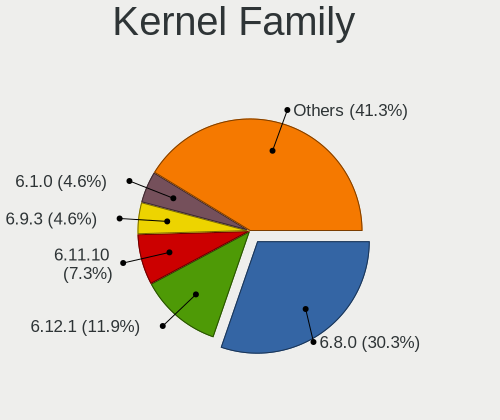

| Version | Desktops | Percent |
|---------|----------|---------|
| 5.15.0  | 17       | 16.19%  |
| 5.4.0   | 15       | 14.29%  |
| 5.16.7  | 11       | 10.48%  |
| 5.17.15 | 8        | 7.62%   |
| 5.18.12 | 7        | 6.67%   |
| 5.18.13 | 5        | 4.76%   |
| 5.18.11 | 5        | 4.76%   |
| 5.13.0  | 5        | 4.76%   |
| 5.10.0  | 5        | 4.76%   |
| 5.18.10 | 4        | 3.81%   |
| 5.18.6  | 3        | 2.86%   |
| 5.11.0  | 3        | 2.86%   |
| 5.18.9  | 2        | 1.9%    |
| 5.18.3  | 2        | 1.9%    |
| 5.18.0  | 2        | 1.9%    |
| 5.15.55 | 2        | 1.9%    |
| 5.14.21 | 2        | 1.9%    |
| 5.17.0  | 1        | 0.95%   |
| 5.14.0  | 1        | 0.95%   |
| 5.10.74 | 1        | 0.95%   |
| 5.10.57 | 1        | 0.95%   |
| 5.0.0   | 1        | 0.95%   |
| 4.9.0   | 1        | 0.95%   |
| 4.10.0  | 1        | 0.95%   |

Kernel Major Ver.
-----------------

Linux kernel major version

| Version | Desktops | Percent |
|---------|----------|---------|
| 5.18    | 30       | 28.57%  |
| 5.15    | 19       | 18.1%   |
| 5.4     | 15       | 14.29%  |
| 5.16    | 11       | 10.48%  |
| 5.17    | 9        | 8.57%   |
| 5.10    | 7        | 6.67%   |
| 5.13    | 5        | 4.76%   |
| 5.14    | 3        | 2.86%   |
| 5.11    | 3        | 2.86%   |
| 5.0     | 1        | 0.95%   |
| 4.9     | 1        | 0.95%   |
| 4.10    | 1        | 0.95%   |

Arch
----

OS architecture (x86_64, i586, etc.)

| Name   | Desktops | Percent |
|--------|----------|---------|
| x86_64 | 105      | 100%    |

DE
--

Desktop Environment

| Name       | Desktops | Percent |
|------------|----------|---------|
| GNOME      | 46       | 43.81%  |
| KDE5       | 32       | 30.48%  |
| X-Cinnamon | 9        | 8.57%   |
| XFCE       | 6        | 5.71%   |
| Cinnamon   | 3        | 2.86%   |
| Unknown    | 3        | 2.86%   |
| MATE       | 2        | 1.9%    |
| qtile      | 1        | 0.95%   |
| Pantheon   | 1        | 0.95%   |
| icewm      | 1        | 0.95%   |
| bspwm      | 1        | 0.95%   |

Display Server
--------------

X11 or Wayland

| Name    | Desktops | Percent |
|---------|----------|---------|
| X11     | 81       | 77.14%  |
| Wayland | 21       | 20%     |
| Unknown | 3        | 2.86%   |

Display Manager
---------------

SDDM, LightDM, etc.

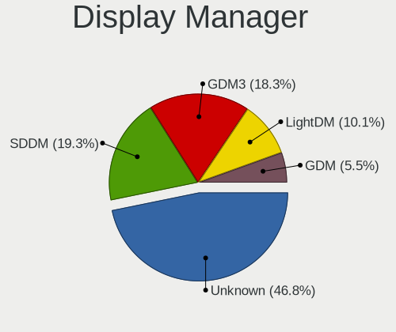

| Name    | Desktops | Percent |
|---------|----------|---------|
| Unknown | 49       | 46.67%  |
| SDDM    | 23       | 21.9%   |
| GDM3    | 17       | 16.19%  |
| LightDM | 9        | 8.57%   |
| GDM     | 6        | 5.71%   |
| SLIMSKI | 1        | 0.95%   |

OS Lang
-------

Language

| Lang    | Desktops | Percent |
|---------|----------|---------|
| pt_BR   | 75       | 71.43%  |
| en_US   | 28       | 26.67%  |
| C       | 1        | 0.95%   |
| Unknown | 1        | 0.95%   |

Boot Mode
---------

EFI or BIOS

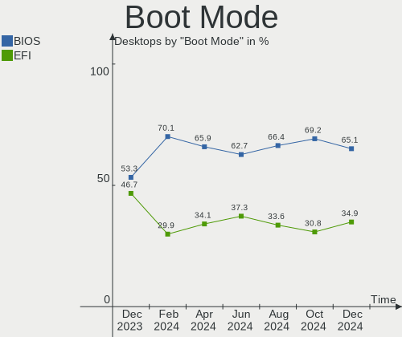

| Mode | Desktops | Percent |
|------|----------|---------|
| BIOS | 59       | 56.19%  |
| EFI  | 46       | 43.81%  |

Filesystem
----------

Type of filesystem

| Type    | Desktops | Percent |
|---------|----------|---------|
| Ext4    | 67       | 63.81%  |
| Btrfs   | 19       | 18.1%   |
| Overlay | 17       | 16.19%  |
| Tmpfs   | 1        | 0.95%   |
| Unknown | 1        | 0.95%   |

Part. scheme
------------

Scheme of partitioning

| Type    | Desktops | Percent |
|---------|----------|---------|
| Unknown | 58       | 55.24%  |
| GPT     | 29       | 27.62%  |
| MBR     | 18       | 17.14%  |

Dual Boot with Linux/BSD
------------------------

Hosting more than one Linux/BSD

| Dual boot | Desktops | Percent |
|-----------|----------|---------|
| No        | 87       | 82.86%  |
| Yes       | 18       | 17.14%  |

Dual Boot (Win)
---------------

Hosting Linux and Windows

| Dual boot | Desktops | Percent |
|-----------|----------|---------|
| No        | 77       | 73.33%  |
| Yes       | 28       | 26.67%  |

Board
-----

Vendor
------

Motherboard manufacturer

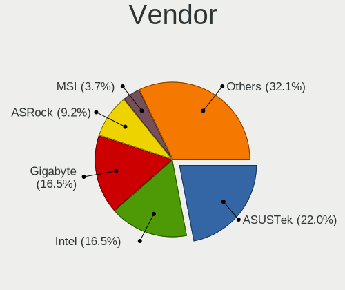

| Name                | Desktops | Percent |
|---------------------|----------|---------|
| ASUSTek Computer    | 32       | 30.48%  |
| Gigabyte Technology | 15       | 14.29%  |
| Intel               | 9        | 8.57%   |
| ASRock              | 8        | 7.62%   |
| PCWare              | 7        | 6.67%   |
| MSI                 | 7        | 6.67%   |
| Positivo            | 5        | 4.76%   |
| ECS                 | 4        | 3.81%   |
| Dell                | 4        | 3.81%   |
| Pegatron            | 2        | 1.9%    |
| Huanan              | 2        | 1.9%    |
| Hewlett-Packard     | 2        | 1.9%    |
| Biostar             | 2        | 1.9%    |
| PCChips             | 1        | 0.95%   |
| MACHINIST           | 1        | 0.95%   |
| Login Informatica   | 1        | 0.95%   |
| GALAX               | 1        | 0.95%   |
| Digiboard           | 1        | 0.95%   |
| congatec            | 1        | 0.95%   |

Model
-----

Motherboard model

| Name                          | Desktops | Percent |
|-------------------------------|----------|---------|
| Intel H61                     | 3        | 2.86%   |
| ASUS M5A78L-M/USB3            | 3        | 2.86%   |
| ASRock B450M Steel Legend     | 3        | 2.86%   |
| Pegatron IPM41-D3             | 2        | 1.9%    |
| Gigabyte B450 AORUS M         | 2        | 1.9%    |
| ECS H61H2-M12                 | 2        | 1.9%    |
| ASUS STRIX B250F GAMING       | 2        | 1.9%    |
| ASUS PRIME B450M-GAMING/BR    | 2        | 1.9%    |
| ASUS All Series               | 2        | 1.9%    |
| ASRock A320M-HDV R4.0         | 2        | 1.9%    |
| Positivo POS-PIQ77CL          | 1        | 0.95%   |
| Positivo POS-MIG31AG          | 1        | 0.95%   |
| Positivo POS-MI945AA          | 1        | 0.95%   |
| Positivo POS-EIH61CE          | 1        | 0.95%   |
| Positivo D6200                | 1        | 0.95%   |
| PCWare PW-945GCX              | 1        | 0.95%   |
| PCWare IPX4005G               | 1        | 0.95%   |
| PCWare IPX1800E2              | 1        | 0.95%   |
| PCWare IPMH81G1               | 1        | 0.95%   |
| PCWare IPMH61R3               | 1        | 0.95%   |
| PCWare IPMH61R2               | 1        | 0.95%   |
| PCWare IPMH61R1               | 1        | 0.95%   |
| PCChips A15G                  | 1        | 0.95%   |
| MSI s5650br                   | 1        | 0.95%   |
| MSI p6530br                   | 1        | 0.95%   |
| MSI MS-7C52                   | 1        | 0.95%   |
| MSI MS-7B86                   | 1        | 0.95%   |
| MSI MS-7B79                   | 1        | 0.95%   |
| MSI MS-7529                   | 1        | 0.95%   |
| MSI FJ452AA-AC4 a6615br       | 1        | 0.95%   |
| MACHINIST X99-RS9 V2.0        | 1        | 0.95%   |
| Login Informatica LOG-H310M-G | 1        | 0.95%   |
| Intel X99 V1.0                | 1        | 0.95%   |
| Intel X79 V2.72B              | 1        | 0.95%   |
| Intel H55                     | 1        | 0.95%   |
| Intel DH61WW AAG23116-203     | 1        | 0.95%   |
| Intel B75                     | 1        | 0.95%   |
| Huanan X99-F8                 | 1        | 0.95%   |
| Huanan B75                    | 1        | 0.95%   |
| HP Compaq 6005 Pro MT PC      | 1        | 0.95%   |
| HP Compaq 6000 Pro SFF PC     | 1        | 0.95%   |
| Gigabyte Z690 GAMING X        | 1        | 0.95%   |
| Gigabyte Z390 AORUS ULTRA     | 1        | 0.95%   |
| Gigabyte Z370N WIFI           | 1        | 0.95%   |
| Gigabyte X570 AORUS PRO WIFI  | 1        | 0.95%   |
| Gigabyte H97M-Gaming 3        | 1        | 0.95%   |
| Gigabyte H61M-S2PH            | 1        | 0.95%   |
| Gigabyte H110M-S2H DDR3       | 1        | 0.95%   |
| Gigabyte GA-MA770T-UD3        | 1        | 0.95%   |
| Gigabyte GA-78LMT-USB3 6.0    | 1        | 0.95%   |
| Gigabyte GA-78LMT-S2P         | 1        | 0.95%   |
| Gigabyte B360M AORUS Gaming 3 | 1        | 0.95%   |
| Gigabyte AB350-Gaming 3       | 1        | 0.95%   |
| Gigabyte A520M S2H            | 1        | 0.95%   |
| GALAX A320M Ver1.0            | 1        | 0.95%   |
| ECS H61H2-M2                  | 1        | 0.95%   |
| ECS A990FXM-A                 | 1        | 0.95%   |
| Digiboard NM70-TI             | 1        | 0.95%   |
| Dell Vostro 3681              | 1        | 0.95%   |
| Dell OptiPlex 960             | 1        | 0.95%   |

Model Family
------------

Motherboard model prefix

| Name                          | Desktops | Percent |
|-------------------------------|----------|---------|
| ASUS TUF                      | 5        | 4.76%   |
| ASUS PRIME                    | 5        | 4.76%   |
| Intel H61                     | 3        | 2.86%   |
| Dell OptiPlex                 | 3        | 2.86%   |
| ASUS ROG                      | 3        | 2.86%   |
| ASUS M5A78L-M                 | 3        | 2.86%   |
| ASRock B450M                  | 3        | 2.86%   |
| Pegatron IPM41-D3             | 2        | 1.9%    |
| HP Compaq                     | 2        | 1.9%    |
| Gigabyte B450                 | 2        | 1.9%    |
| ECS H61H2-M12                 | 2        | 1.9%    |
| ASUS STRIX                    | 2        | 1.9%    |
| ASUS P8H61-M                  | 2        | 1.9%    |
| ASUS All                      | 2        | 1.9%    |
| ASRock A320M-HDV              | 2        | 1.9%    |
| Positivo POS-PIQ77CL          | 1        | 0.95%   |
| Positivo POS-MIG31AG          | 1        | 0.95%   |
| Positivo POS-MI945AA          | 1        | 0.95%   |
| Positivo POS-EIH61CE          | 1        | 0.95%   |
| Positivo D6200                | 1        | 0.95%   |
| PCWare PW-945GCX              | 1        | 0.95%   |
| PCWare IPX4005G               | 1        | 0.95%   |
| PCWare IPX1800E2              | 1        | 0.95%   |
| PCWare IPMH81G1               | 1        | 0.95%   |
| PCWare IPMH61R3               | 1        | 0.95%   |
| PCWare IPMH61R2               | 1        | 0.95%   |
| PCWare IPMH61R1               | 1        | 0.95%   |
| PCChips A15G                  | 1        | 0.95%   |
| MSI s5650br                   | 1        | 0.95%   |
| MSI p6530br                   | 1        | 0.95%   |
| MSI MS-7C52                   | 1        | 0.95%   |
| MSI MS-7B86                   | 1        | 0.95%   |
| MSI MS-7B79                   | 1        | 0.95%   |
| MSI MS-7529                   | 1        | 0.95%   |
| MSI FJ452AA-AC4               | 1        | 0.95%   |
| MACHINIST X99-RS9             | 1        | 0.95%   |
| Login Informatica LOG-H310M-G | 1        | 0.95%   |
| Intel X99                     | 1        | 0.95%   |
| Intel X79                     | 1        | 0.95%   |
| Intel H55                     | 1        | 0.95%   |
| Intel DH61WW                  | 1        | 0.95%   |
| Intel B75                     | 1        | 0.95%   |
| Huanan X99-F8                 | 1        | 0.95%   |
| Huanan B75                    | 1        | 0.95%   |
| Gigabyte Z690                 | 1        | 0.95%   |
| Gigabyte Z390                 | 1        | 0.95%   |
| Gigabyte Z370N                | 1        | 0.95%   |
| Gigabyte X570                 | 1        | 0.95%   |
| Gigabyte H97M-Gaming          | 1        | 0.95%   |
| Gigabyte H61M-S2PH            | 1        | 0.95%   |
| Gigabyte H110M-S2H            | 1        | 0.95%   |
| Gigabyte GA-MA770T-UD3        | 1        | 0.95%   |
| Gigabyte GA-78LMT-USB3        | 1        | 0.95%   |
| Gigabyte GA-78LMT-S2P         | 1        | 0.95%   |
| Gigabyte B360M                | 1        | 0.95%   |
| Gigabyte AB350-Gaming         | 1        | 0.95%   |
| Gigabyte A520M                | 1        | 0.95%   |
| GALAX A320M                   | 1        | 0.95%   |
| ECS H61H2-M2                  | 1        | 0.95%   |
| ECS A990FXM-A                 | 1        | 0.95%   |

MFG Year
--------

Motherboard manufacture year

| Year | Desktops | Percent |
|------|----------|---------|
| 2018 | 17       | 16.19%  |
| 2019 | 13       | 12.38%  |
| 2011 | 13       | 12.38%  |
| 2020 | 11       | 10.48%  |
| 2017 | 8        | 7.62%   |
| 2010 | 6        | 5.71%   |
| 2009 | 6        | 5.71%   |
| 2014 | 5        | 4.76%   |
| 2013 | 5        | 4.76%   |
| 2012 | 5        | 4.76%   |
| 2008 | 5        | 4.76%   |
| 2021 | 4        | 3.81%   |
| 2016 | 3        | 2.86%   |
| 2022 | 2        | 1.9%    |
| 2015 | 1        | 0.95%   |
| 2007 | 1        | 0.95%   |

Form Factor
-----------

Physical design of the computer

| Name    | Desktops | Percent |
|---------|----------|---------|
| Desktop | 105      | 100%    |

Secure Boot
-----------

Enabled or disabled

| State    | Desktops | Percent |
|----------|----------|---------|
| Disabled | 103      | 98.1%   |
| Enabled  | 2        | 1.9%    |

Coreboot
--------

Have coreboot on board

| Used | Desktops | Percent |
|------|----------|---------|
| No   | 105      | 100%    |

RAM Size
--------

Total RAM memory

| Size in GB  | Desktops | Percent |
|-------------|----------|---------|
| 16.01-24.0  | 28       | 26.67%  |
| 8.01-16.0   | 25       | 23.81%  |
| 4.01-8.0    | 22       | 20.95%  |
| 3.01-4.0    | 13       | 12.38%  |
| 32.01-64.0  | 12       | 11.43%  |
| 1.01-2.0    | 3        | 2.86%   |
| 24.01-32.0  | 1        | 0.95%   |
| 64.01-256.0 | 1        | 0.95%   |

RAM Used
--------

Used RAM memory

| Used GB    | Desktops | Percent |
|------------|----------|---------|
| 1.01-2.0   | 33       | 31.43%  |
| 4.01-8.0   | 22       | 20.95%  |
| 2.01-3.0   | 19       | 18.1%   |
| 3.01-4.0   | 15       | 14.29%  |
| 0.51-1.0   | 8        | 7.62%   |
| 8.01-16.0  | 5        | 4.76%   |
| 24.01-32.0 | 1        | 0.95%   |
| 16.01-24.0 | 1        | 0.95%   |
| 0.01-0.5   | 1        | 0.95%   |

Total Drives
------------

Number of drives on board

| Drives | Desktops | Percent |
|--------|----------|---------|
| 1      | 49       | 46.67%  |
| 2      | 29       | 27.62%  |
| 3      | 12       | 11.43%  |
| 4      | 11       | 10.48%  |
| 6      | 2        | 1.9%    |
| 5      | 2        | 1.9%    |

Has CD-ROM
----------

Has CD-ROM on board

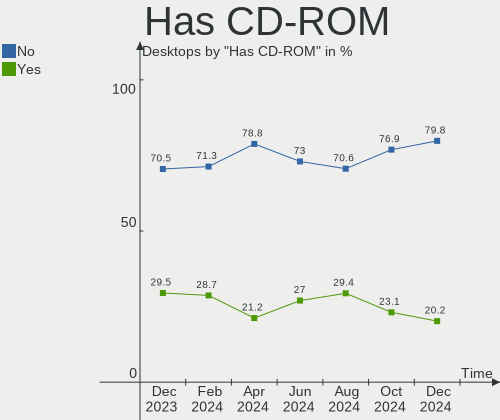

| Presented | Desktops | Percent |
|-----------|----------|---------|
| No        | 73       | 69.52%  |
| Yes       | 32       | 30.48%  |

Has Ethernet
------------

Has Ethernet on board

| Presented | Desktops | Percent |
|-----------|----------|---------|
| Yes       | 104      | 99.05%  |
| No        | 1        | 0.95%   |

Has WiFi
--------

Has WiFi module

| Presented | Desktops | Percent |
|-----------|----------|---------|
| No        | 65       | 61.9%   |
| Yes       | 40       | 38.1%   |

Has Bluetooth
-------------

Has Bluetooth module

| Presented | Desktops | Percent |
|-----------|----------|---------|
| No        | 76       | 72.38%  |
| Yes       | 29       | 27.62%  |

Location
--------

Country
-------

Geographic location (country)

| Country | Desktops | Percent |
|---------|----------|---------|
| Brazil  | 105      | 100%    |

City
----

Geographic location (city)

| City                     | Desktops | Percent |
|--------------------------|----------|---------|
| Sao Paulo                | 12       | 11.43%  |
| Rio de Janeiro           | 9        | 8.57%   |
| Porto Alegre             | 4        | 3.81%   |
| Brasília                | 3        | 2.86%   |
| Belo Horizonte           | 3        | 2.86%   |
| Vitória                 | 2        | 1.9%    |
| Pelotas                  | 2        | 1.9%    |
| Osasco                   | 2        | 1.9%    |
| Niterói                 | 2        | 1.9%    |
| Maracanau                | 2        | 1.9%    |
| Luziania                 | 2        | 1.9%    |
| Itajaí                  | 2        | 1.9%    |
| Guarulhos                | 2        | 1.9%    |
| Fortaleza                | 2        | 1.9%    |
| Duque de Caxias          | 2        | 1.9%    |
| Contagem                 | 2        | 1.9%    |
| Campo Grande             | 2        | 1.9%    |
| Volta Redonda            | 1        | 0.95%   |
| Vitória da Conquista    | 1        | 0.95%   |
| Valparaiso de Goias      | 1        | 0.95%   |
| Uberaba                  | 1        | 0.95%   |
| Toritama                 | 1        | 0.95%   |
| Teresina                 | 1        | 0.95%   |
| Teixeira de Freitas      | 1        | 0.95%   |
| Serra                    | 1        | 0.95%   |
| Sao Luís                | 1        | 0.95%   |
| Sao José dos Campos     | 1        | 0.95%   |
| Sao Joao do Rio do Peixe | 1        | 0.95%   |
| Santa Maria de Jetiba    | 1        | 0.95%   |
| Salvador                 | 1        | 0.95%   |
| Rio Claro                | 1        | 0.95%   |
| Ribeirao Preto           | 1        | 0.95%   |
| Porto Uniao              | 1        | 0.95%   |
| Pocao                    | 1        | 0.95%   |
| Pirajui                  | 1        | 0.95%   |
| Petrópolis              | 1        | 0.95%   |
| Paranaiba                | 1        | 0.95%   |
| Palmas                   | 1        | 0.95%   |
| Novo Repartimento        | 1        | 0.95%   |
| Novo Gama                | 1        | 0.95%   |
| Nova Londrina            | 1        | 0.95%   |
| Matinhos                 | 1        | 0.95%   |
| Lajeado                  | 1        | 0.95%   |
| Joinville                | 1        | 0.95%   |
| Joao Pessoa              | 1        | 0.95%   |
| Itanhaem                 | 1        | 0.95%   |
| Indaiatuba               | 1        | 0.95%   |
| Guapimirim               | 1        | 0.95%   |
| Gravataí                | 1        | 0.95%   |
| Goiânia                 | 1        | 0.95%   |
| Curitiba                 | 1        | 0.95%   |
| Caxias do Sul            | 1        | 0.95%   |
| Canoas                   | 1        | 0.95%   |
| Campos dos Goytacazes    | 1        | 0.95%   |
| Campinas                 | 1        | 0.95%   |
| Cacoal                   | 1        | 0.95%   |
| Braganca Paulista        | 1        | 0.95%   |
| Blumenau                 | 1        | 0.95%   |
| Belford Roxo             | 1        | 0.95%   |
| Belém                   | 1        | 0.95%   |

Drives
------

Drive Vendor
------------

Hard drive vendors

| Vendor              | Desktops | Drives | Percent |
|---------------------|----------|--------|---------|
| Seagate             | 39       | 56     | 22.03%  |
| WDC                 | 24       | 29     | 13.56%  |
| Samsung Electronics | 21       | 26     | 11.86%  |
| Kingston            | 20       | 22     | 11.3%   |
| SanDisk             | 14       | 15     | 7.91%   |
| Toshiba             | 10       | 10     | 5.65%   |
| China               | 7        | 8      | 3.95%   |
| A-DATA Technology   | 4        | 5      | 2.26%   |
| PNY                 | 3        | 3      | 1.69%   |
| Maxtor              | 3        | 3      | 1.69%   |
| XrayDisk            | 2        | 3      | 1.13%   |
| SK hynix            | 2        | 2      | 1.13%   |
| Silicon Motion      | 2        | 2      | 1.13%   |
| Phison              | 2        | 2      | 1.13%   |
| Patriot             | 2        | 2      | 1.13%   |
| Lexar               | 2        | 2      | 1.13%   |
| Corsair             | 2        | 2      | 1.13%   |
| XPG                 | 1        | 1      | 0.56%   |
| WALRAM              | 1        | 1      | 0.56%   |
| Unknown             | 1        | 1      | 0.56%   |
| Team                | 1        | 1      | 0.56%   |
| SPCC                | 1        | 1      | 0.56%   |
| SAGE                | 1        | 1      | 0.56%   |
| RZX                 | 1        | 1      | 0.56%   |
| Netac               | 1        | 1      | 0.56%   |
| KingDian            | 1        | 1      | 0.56%   |
| Intel               | 1        | 1      | 0.56%   |
| Innodisk            | 1        | 1      | 0.56%   |
| HS-SSD-E100N        | 1        | 1      | 0.56%   |
| HS-SSD-C100         | 1        | 1      | 0.56%   |
| Hitachi             | 1        | 1      | 0.56%   |
| Hikvision           | 1        | 1      | 0.56%   |
| HGST                | 1        | 1      | 0.56%   |
| BHT                 | 1        | 1      | 0.56%   |
| Unknown             | 1        | 1      | 0.56%   |

Drive Model
-----------

Hard drive models

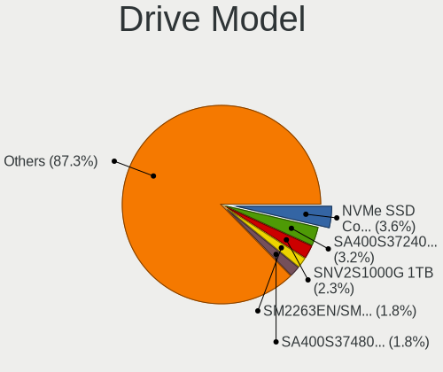

| Model                              | Desktops | Percent |
|------------------------------------|----------|---------|
| Seagate ST500DM002-1BD142 500GB    | 7        | 3.37%   |
| Seagate ST1000DM010-2EP102 1TB     | 6        | 2.88%   |
| Kingston SA400S37240G 240GB SSD    | 6        | 2.88%   |
| Seagate Expansion 1TB              | 5        | 2.4%    |
| Seagate ST1000DM003-1ER162 1TB     | 3        | 1.44%   |
| Seagate ST1000DM003-1CH162 1TB     | 3        | 1.44%   |
| SanDisk SDSSDA120G 120GB           | 3        | 1.44%   |
| Kingston SA400S37480G 480GB SSD    | 3        | 1.44%   |
| WDC WD5000AAKX-003CA0 500GB        | 2        | 0.96%   |
| Toshiba DT01ACA050 500GB           | 2        | 0.96%   |
| Seagate ST3320418AS 320GB          | 2        | 0.96%   |
| Seagate ST3250318AS 250GB          | 2        | 0.96%   |
| Seagate ST3000NM0053 3TB           | 2        | 0.96%   |
| Seagate ST2000DX001-1CM164 2TB     | 2        | 0.96%   |
| Seagate ST2000DM008-2FR102 2TB     | 2        | 0.96%   |
| Seagate ST2000DM006-2DM164 2TB     | 2        | 0.96%   |
| Seagate ST1000VM002-1CT162 1TB     | 2        | 0.96%   |
| Seagate ST1000LM024 HN-M101MBB 1TB | 2        | 0.96%   |
| SanDisk SSD PLUS 240GB             | 2        | 0.96%   |
| SanDisk SDSSDA240G 240GB           | 2        | 0.96%   |
| SanDisk NVMe SSD Drive 480GB       | 2        | 0.96%   |
| SanDisk NVMe SSD Drive 240GB       | 2        | 0.96%   |
| Samsung SSD 850 EVO 500GB          | 2        | 0.96%   |
| Samsung HD502HJ 500GB              | 2        | 0.96%   |
| Samsung HD502HI 500GB              | 2        | 0.96%   |
| Samsung HD161GJ 160GB              | 2        | 0.96%   |
| Samsung HD080HJ/ 80GB              | 2        | 0.96%   |
| PNY CS900 120GB SSD                | 2        | 0.96%   |
| Kingston SV300S37A120G 120GB SSD   | 2        | 0.96%   |
| Kingston SA400S37960G 960GB SSD    | 2        | 0.96%   |
| Kingston SA400S37120G 120GB SSD    | 2        | 0.96%   |
| Corsair Force LS SSD 120GB         | 2        | 0.96%   |
| XrayDisk 480GB                     | 1        | 0.48%   |
| XrayDisk 240GB                     | 1        | 0.48%   |
| XrayDisk 1TB                       | 1        | 0.48%   |
| XPG NVMe SSD Drive 256GB           | 1        | 0.48%   |
| WDC WDS480G2G0C-00AJM0 480GB       | 1        | 0.48%   |
| WDC WDS480G2G0B-00EPW0 480GB SSD   | 1        | 0.48%   |
| WDC WDS240G2G0B-00EPW0 240GB SSD   | 1        | 0.48%   |
| WDC WDS240G2G0A-00JH30 240GB SSD   | 1        | 0.48%   |
| WDC WDS100T2B0C-00PXH0 1TB         | 1        | 0.48%   |
| WDC WD800AAJS-75M0A0 80GB          | 1        | 0.48%   |
| WDC WD5000LPVX-22V0TT0 500GB       | 1        | 0.48%   |
| WDC WD5000AZLX-21K2TA0 500GB       | 1        | 0.48%   |
| WDC WD5000AVCS-632DY1 500GB        | 1        | 0.48%   |
| WDC WD5000AURX-63UY4Y0 500GB       | 1        | 0.48%   |
| WDC WD5000AAKX-00U6AA0 500GB       | 1        | 0.48%   |
| WDC WD2500AAJS-75M0A0 250GB        | 1        | 0.48%   |
| WDC WD20SPZX-75UA7T0 2TB           | 1        | 0.48%   |
| WDC WD20EARX-00ZUDB0 2TB           | 1        | 0.48%   |
| WDC WD10SPZX-80Z10T2 1TB           | 1        | 0.48%   |
| WDC WD10SPZX-35Z10T0 1TB           | 1        | 0.48%   |
| WDC WD10EZEX-75WN4A0 1TB           | 1        | 0.48%   |
| WDC WD10EZEX-60WN4A0 1TB           | 1        | 0.48%   |
| WDC WD10EZEX-22MFCA0 1TB           | 1        | 0.48%   |
| WDC WD10EZEX-08WN4A0 1TB           | 1        | 0.48%   |
| WDC WD10EVDS-63U8B1 1TB            | 1        | 0.48%   |
| WDC WD10EURX-63UY4Y0 1TB           | 1        | 0.48%   |
| WDC WD10EURX-63FH1Y0 1TB           | 1        | 0.48%   |
| WDC WD10EARX-00N0YB0 1TB           | 1        | 0.48%   |

HDD Vendor
----------

Hard disk drive vendors

| Vendor              | Desktops | Drives | Percent |
|---------------------|----------|--------|---------|
| Seagate             | 39       | 56     | 43.33%  |
| WDC                 | 19       | 24     | 21.11%  |
| Samsung Electronics | 16       | 20     | 17.78%  |
| Toshiba             | 10       | 10     | 11.11%  |
| Maxtor              | 2        | 2      | 2.22%   |
| SAGE                | 1        | 1      | 1.11%   |
| Hitachi             | 1        | 1      | 1.11%   |
| HGST                | 1        | 1      | 1.11%   |
| Unknown             | 1        | 1      | 1.11%   |

SSD Vendor
----------

Solid state drive vendors

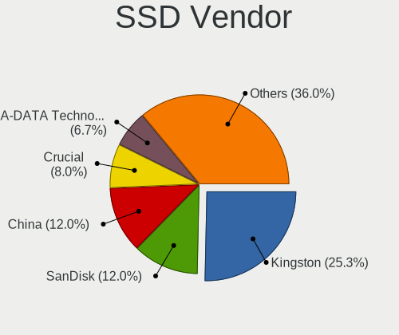

| Vendor              | Desktops | Drives | Percent |
|---------------------|----------|--------|---------|
| Kingston            | 18       | 19     | 30%     |
| SanDisk             | 9        | 10     | 15%     |
| China               | 7        | 8      | 11.67%  |
| WDC                 | 3        | 3      | 5%      |
| Samsung Electronics | 3        | 3      | 5%      |
| A-DATA Technology   | 3        | 3      | 5%      |
| PNY                 | 2        | 2      | 3.33%   |
| Patriot             | 2        | 2      | 3.33%   |
| Lexar               | 2        | 2      | 3.33%   |
| Corsair             | 2        | 2      | 3.33%   |
| Unknown             | 1        | 1      | 1.67%   |
| Team                | 1        | 1      | 1.67%   |
| SPCC                | 1        | 1      | 1.67%   |
| RZX                 | 1        | 1      | 1.67%   |
| Maxtor              | 1        | 1      | 1.67%   |
| KingDian            | 1        | 1      | 1.67%   |
| Innodisk            | 1        | 1      | 1.67%   |
| HS-SSD-C100         | 1        | 1      | 1.67%   |
| BHT                 | 1        | 1      | 1.67%   |

Drive Kind
----------

HDD or SSD

| Kind    | Desktops | Drives | Percent |
|---------|----------|--------|---------|
| HDD     | 76       | 116    | 51.01%  |
| SSD     | 49       | 63     | 32.89%  |
| NVMe    | 21       | 26     | 14.09%  |
| Unknown | 3        | 5      | 2.01%   |

Drive Connector
---------------

SATA, SAS, NVMe, etc.

| Type | Desktops | Drives | Percent |
|------|----------|--------|---------|
| SATA | 95       | 176    | 77.24%  |
| NVMe | 21       | 26     | 17.07%  |
| SAS  | 7        | 8      | 5.69%   |

Drive Size
----------

Size of hard drive

| Size in TB | Desktops | Drives | Percent |
|------------|----------|--------|---------|
| 0.01-0.5   | 70       | 106    | 55.56%  |
| 0.51-1.0   | 41       | 58     | 32.54%  |
| 1.01-2.0   | 12       | 12     | 9.52%   |
| 2.01-3.0   | 2        | 2      | 1.59%   |
| 3.01-4.0   | 1        | 1      | 0.79%   |

Space Total
-----------

Amount of disk space available on the file system

| Size in GB     | Desktops | Percent |
|----------------|----------|---------|
| 101-250        | 29       | 27.62%  |
| 501-1000       | 17       | 16.19%  |
| 251-500        | 15       | 14.29%  |
| 1001-2000      | 14       | 13.33%  |
| 1-20           | 12       | 11.43%  |
| More than 3000 | 6        | 5.71%   |
| 51-100         | 4        | 3.81%   |
| Unknown        | 4        | 3.81%   |
| 2001-3000      | 3        | 2.86%   |
| 21-50          | 1        | 0.95%   |

Space Used
----------

Amount of used disk space

| Used GB   | Desktops | Percent |
|-----------|----------|---------|
| 1-20      | 38       | 36.19%  |
| 21-50     | 15       | 14.29%  |
| 51-100    | 12       | 11.43%  |
| 501-1000  | 11       | 10.48%  |
| 101-250   | 10       | 9.52%   |
| 251-500   | 8        | 7.62%   |
| 1001-2000 | 5        | 4.76%   |
| Unknown   | 4        | 3.81%   |
| 2001-3000 | 2        | 1.9%    |

Malfunc. Drives
---------------

Drive models with a malfunction

| Model                              | Desktops | Drives | Percent |
|------------------------------------|----------|--------|---------|
| Seagate ST500DM002-1BD142 500GB    | 2        | 2      | 9.09%   |
| Seagate ST1000VM002-1CT162 1TB     | 2        | 2      | 9.09%   |
| WDC WDS480G2G0B-00EPW0 480GB SSD   | 1        | 1      | 4.55%   |
| WDC WD800AAJS-75M0A0 80GB          | 1        | 1      | 4.55%   |
| WDC WD5000AURX-63UY4Y0 500GB       | 1        | 1      | 4.55%   |
| WDC WD5000AAKX-003CA0 500GB        | 1        | 1      | 4.55%   |
| Toshiba MK8046GSX 80GB             | 1        | 1      | 4.55%   |
| Toshiba MK1255GSX H 120GB          | 1        | 1      | 4.55%   |
| Seagate ST500LM030-2E717D 500GB    | 1        | 1      | 4.55%   |
| Seagate ST3750525AS 752GB          | 1        | 1      | 4.55%   |
| Seagate ST3250318AS 250GB          | 1        | 1      | 4.55%   |
| Seagate ST2000NP0011 2TB           | 1        | 1      | 4.55%   |
| Seagate ST1000DM003-1CH162 1TB     | 1        | 1      | 4.55%   |
| Samsung Electronics HD322HJ 320GB  | 1        | 1      | 4.55%   |
| Samsung Electronics HD161HJ 160GB  | 1        | 1      | 4.55%   |
| Samsung Electronics HD160JJ/ 160GB | 1        | 1      | 4.55%   |
| PNY CS3030 500GB SSD               | 1        | 1      | 4.55%   |
| Corsair Force LS SSD 120GB         | 1        | 1      | 4.55%   |
| China SSD 360GB                    | 1        | 1      | 4.55%   |
| China SSD 256GB                    | 1        | 1      | 4.55%   |

Malfunc. Drive Vendor
---------------------

Vendors of faulty drives

| Vendor              | Desktops | Drives | Percent |
|---------------------|----------|--------|---------|
| Seagate             | 7        | 9      | 35%     |
| WDC                 | 4        | 4      | 20%     |
| Samsung Electronics | 3        | 3      | 15%     |
| Toshiba             | 2        | 2      | 10%     |
| China               | 2        | 2      | 10%     |
| PNY                 | 1        | 1      | 5%      |
| Corsair             | 1        | 1      | 5%      |

Malfunc. HDD Vendor
-------------------

Vendors of faulty HDD drives

| Vendor              | Desktops | Drives | Percent |
|---------------------|----------|--------|---------|
| Seagate             | 7        | 9      | 46.67%  |
| WDC                 | 3        | 3      | 20%     |
| Samsung Electronics | 3        | 3      | 20%     |
| Toshiba             | 2        | 2      | 13.33%  |

Malfunc. Drive Kind
-------------------

Kinds of faulty drives

| Kind | Desktops | Drives | Percent |
|------|----------|--------|---------|
| HDD  | 15       | 17     | 75%     |
| SSD  | 4        | 4      | 20%     |
| NVMe | 1        | 1      | 5%      |

Failed Drives
-------------

Failed drive models

Zero info for selected period =(

Failed Drive Vendor
-------------------

Failed drive vendors

Zero info for selected period =(

Drive Status
------------

Number of failed and malfunc. drives

| Status   | Desktops | Drives | Percent |
|----------|----------|--------|---------|
| Detected | 62       | 120    | 51.24%  |
| Works    | 41       | 68     | 33.88%  |
| Malfunc  | 18       | 22     | 14.88%  |

Storage controller
------------------

Storage Vendor
--------------

Storage controller vendors

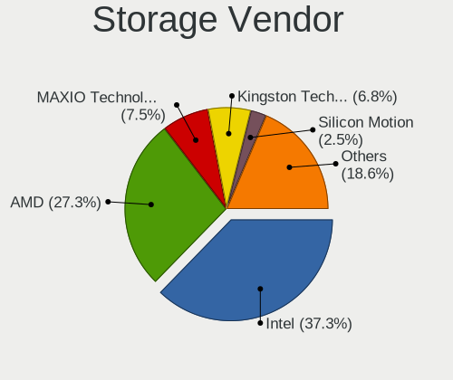

| Vendor                      | Desktops | Percent |
|-----------------------------|----------|---------|
| Intel                       | 66       | 49.62%  |
| AMD                         | 37       | 27.82%  |
| SanDisk                     | 7        | 5.26%   |
| Silicon Motion              | 3        | 2.26%   |
| Samsung Electronics         | 3        | 2.26%   |
| Phison Electronics          | 3        | 2.26%   |
| Nvidia                      | 3        | 2.26%   |
| Kingston Technology Company | 3        | 2.26%   |
| SK hynix                    | 2        | 1.5%    |
| ADATA Technology            | 2        | 1.5%    |
| Realtek Semiconductor       | 1        | 0.75%   |
| MAXIO Technology (Hangzhou) | 1        | 0.75%   |
| Marvell Technology Group    | 1        | 0.75%   |
| JMicron Technology          | 1        | 0.75%   |

Storage Model
-------------

Storage controller models

| Model                                                                                   | Desktops | Percent |
|-----------------------------------------------------------------------------------------|----------|---------|
| AMD FCH SATA Controller [AHCI mode]                                                     | 18       | 10.11%  |
| AMD 400 Series Chipset SATA Controller                                                  | 12       | 6.74%   |
| Intel NM10/ICH7 Family SATA Controller [IDE mode]                                       | 8        | 4.49%   |
| Intel 6 Series/C200 Series Chipset Family Desktop SATA Controller (IDE mode, ports 4-5) | 8        | 4.49%   |
| Intel 6 Series/C200 Series Chipset Family Desktop SATA Controller (IDE mode, ports 0-3) | 8        | 4.49%   |
| Intel 6 Series/C200 Series Chipset Family 6 port Desktop SATA AHCI Controller           | 8        | 4.49%   |
| Intel 8 Series/C220 Series Chipset Family 6-port SATA Controller 1 [AHCI mode]          | 7        | 3.93%   |
| AMD SB7x0/SB8x0/SB9x0 SATA Controller [IDE mode]                                        | 6        | 3.37%   |
| AMD SB7x0/SB8x0/SB9x0 IDE Controller                                                    | 6        | 3.37%   |
| SanDisk Non-Volatile memory controller                                                  | 5        | 2.81%   |
| Intel SATA Controller [RAID mode]                                                       | 5        | 2.81%   |
| Intel 82801G (ICH7 Family) IDE Controller                                               | 5        | 2.81%   |
| AMD FCH SATA Controller D                                                               | 5        | 2.81%   |
| AMD 500 Series Chipset SATA Controller                                                  | 5        | 2.81%   |
| Intel 200 Series PCH SATA controller [AHCI mode]                                        | 4        | 2.25%   |
| Intel Q170/Q150/B150/H170/H110/Z170/CM236 Chipset SATA Controller [AHCI Mode]           | 3        | 1.69%   |
| Intel 5 Series/3400 Series Chipset 6 port SATA AHCI Controller                          | 3        | 1.69%   |
| AMD SB7x0/SB8x0/SB9x0 SATA Controller [AHCI mode]                                       | 3        | 1.69%   |
| AMD 300 Series Chipset SATA Controller                                                  | 3        | 1.69%   |
| Silicon Motion SM2262/SM2262EN SSD Controller                                           | 2        | 1.12%   |
| Samsung NVMe SSD Controller SM981/PM981/PM983                                           | 2        | 1.12%   |
| Phison E12 NVMe Controller                                                              | 2        | 1.12%   |
| Nvidia MCP61 SATA Controller                                                            | 2        | 1.12%   |
| Nvidia MCP61 IDE                                                                        | 2        | 1.12%   |
| Intel Cannon Lake PCH SATA AHCI Controller                                              | 2        | 1.12%   |
| Intel 7 Series/C210 Series Chipset Family 6-port SATA Controller [AHCI mode]            | 2        | 1.12%   |
| Intel 7 Series/C210 Series Chipset Family 4-port SATA Controller [IDE mode]             | 2        | 1.12%   |
| Intel 7 Series/C210 Series Chipset Family 2-port SATA Controller [IDE mode]             | 2        | 1.12%   |
| Intel 4 Series Chipset PT IDER Controller                                               | 2        | 1.12%   |
| ADATA XPG SX8200 Pro PCIe Gen3x4 M.2 2280 Solid State Drive                             | 2        | 1.12%   |
| SK hynix BC511                                                                          | 1        | 0.56%   |
| SK hynix BC501 NVMe Solid State Drive                                                   | 1        | 0.56%   |
| Silicon Motion SM2263EN/SM2263XT SSD Controller                                         | 1        | 0.56%   |
| SanDisk WD Blue SN570 NVMe SSD                                                          | 1        | 0.56%   |
| SanDisk WD Blue SN550 NVMe SSD                                                          | 1        | 0.56%   |
| Samsung NVMe SSD Controller PM9A1/PM9A3/980PRO                                          | 1        | 0.56%   |
| Realtek RTS5763DL NVMe SSD Controller                                                   | 1        | 0.56%   |
| Phison E16 PCIe4 NVMe Controller                                                        | 1        | 0.56%   |
| Nvidia MCP67 IDE Controller                                                             | 1        | 0.56%   |
| Nvidia MCP67 AHCI Controller                                                            | 1        | 0.56%   |
| MAXIO (Hangzhou) NVMe SSD Controller MAP1202                                            | 1        | 0.56%   |
| Marvell Group 88SE912x IDE Controller                                                   | 1        | 0.56%   |
| Marvell Group 88SE9123 PCIe SATA 6.0 Gb/s controller                                    | 1        | 0.56%   |
| Kingston Company U-SNS8154P3 NVMe SSD                                                   | 1        | 0.56%   |
| Kingston Company Company Non-Volatile memory controller                                 | 1        | 0.56%   |
| Kingston Company A2000 NVMe SSD                                                         | 1        | 0.56%   |
| JMicron JMB362 SATA Controller                                                          | 1        | 0.56%   |
| Intel SSD 660P Series                                                                   | 1        | 0.56%   |
| Intel HM170/QM170 Chipset SATA Controller [AHCI Mode]                                   | 1        | 0.56%   |
| Intel Comet Lake SATA AHCI Controller                                                   | 1        | 0.56%   |
| Intel Celeron/Pentium Silver Processor SATA Controller                                  | 1        | 0.56%   |
| Intel C610/X99 series chipset sSATA Controller [AHCI mode]                              | 1        | 0.56%   |
| Intel C600/X79 series chipset 6-Port SATA AHCI Controller                               | 1        | 0.56%   |
| Intel Atom Processor E3800 Series SATA AHCI Controller                                  | 1        | 0.56%   |
| Intel Alder Lake-S PCH SATA Controller [AHCI Mode]                                      | 1        | 0.56%   |
| Intel 9 Series Chipset Family SATA Controller [AHCI Mode]                               | 1        | 0.56%   |
| Intel 82801JD/DO (ICH10 Family) 4-port SATA IDE Controller                              | 1        | 0.56%   |
| Intel 82801JD/DO (ICH10 Family) 2-port SATA IDE Controller                              | 1        | 0.56%   |
| Intel 7 Series Chipset Family 6-port SATA Controller [AHCI mode]                        | 1        | 0.56%   |
| Intel 5 Series/3400 Series Chipset 4 port SATA IDE Controller                           | 1        | 0.56%   |

Storage Kind
------------

Kind of storage controller (IDE, SATA, NVMe, SAS, ...)

| Kind | Desktops | Percent |
|------|----------|---------|
| SATA | 77       | 57.04%  |
| IDE  | 31       | 22.96%  |
| NVMe | 21       | 15.56%  |
| RAID | 6        | 4.44%   |

Processor
---------

CPU Vendor
----------

Processor vendors

| Vendor | Desktops | Percent |
|--------|----------|---------|
| Intel  | 65       | 61.9%   |
| AMD    | 40       | 38.1%   |

CPU Model
---------

Processor models

| Model                                       | Desktops | Percent |
|---------------------------------------------|----------|---------|
| AMD Ryzen 5 3600 6-Core Processor           | 7        | 6.67%   |
| Intel Core i3-3220 CPU @ 3.30GHz            | 5        | 4.76%   |
| Intel Core i3-2100 CPU @ 3.10GHz            | 3        | 2.86%   |
| Intel Core i7-7700 CPU @ 3.60GHz            | 2        | 1.9%    |
| Intel Core i7-4790K CPU @ 4.00GHz           | 2        | 1.9%    |
| Intel Core i5-9400F CPU @ 2.90GHz           | 2        | 1.9%    |
| Intel Core i5-3470 CPU @ 3.20GHz            | 2        | 1.9%    |
| Intel Core i5 CPU 650 @ 3.20GHz             | 2        | 1.9%    |
| Intel Core i3-8100 CPU @ 3.60GHz            | 2        | 1.9%    |
| Intel Core i3-3240 CPU @ 3.40GHz            | 2        | 1.9%    |
| AMD Ryzen 7 5700G with Radeon Graphics      | 2        | 1.9%    |
| AMD Ryzen 7 2700X Eight-Core Processor      | 2        | 1.9%    |
| AMD Ryzen 7 1800X Eight-Core Processor      | 2        | 1.9%    |
| AMD Ryzen 5 5600G with Radeon Graphics      | 2        | 1.9%    |
| AMD Ryzen 3 3200G with Radeon Vega Graphics | 2        | 1.9%    |
| AMD FX-8120 Eight-Core Processor            | 2        | 1.9%    |
| AMD FX-6300 Six-Core Processor              | 2        | 1.9%    |
| Intel Xeon CPU L5420 @ 2.50GHz              | 1        | 0.95%   |
| Intel Xeon CPU E5-2650 v3 @ 2.30GHz         | 1        | 0.95%   |
| Intel Xeon CPU E5-2640 0 @ 2.50GHz          | 1        | 0.95%   |
| Intel Xeon CPU E5-2620 v3 @ 2.40GHz         | 1        | 0.95%   |
| Intel Xeon CPU E3-1270 V2 @ 3.50GHz         | 1        | 0.95%   |
| Intel Xeon CPU E3-1220 v3 @ 3.10GHz         | 1        | 0.95%   |
| Intel Xeon CPU E3-1220 V2 @ 3.10GHz         | 1        | 0.95%   |
| Intel Pentium Gold G5400 CPU @ 3.70GHz      | 1        | 0.95%   |
| Intel Pentium Dual CPU E2200 @ 2.20GHz      | 1        | 0.95%   |
| Intel Pentium Dual CPU E2140 @ 1.60GHz      | 1        | 0.95%   |
| Intel Pentium CPU G630 @ 2.70GHz            | 1        | 0.95%   |
| Intel Pentium CPU G2030 @ 3.00GHz           | 1        | 0.95%   |
| Intel Genuine CPU 0000 @ 2.40GHz            | 1        | 0.95%   |
| Intel Core i9-9900K CPU @ 3.60GHz           | 1        | 0.95%   |
| Intel Core i9-10900 CPU @ 2.80GHz           | 1        | 0.95%   |
| Intel Core i7-6820EQ CPU @ 2.80GHz          | 1        | 0.95%   |
| Intel Core i7-5820K CPU @ 3.30GHz           | 1        | 0.95%   |
| Intel Core i7-4790 CPU @ 3.60GHz            | 1        | 0.95%   |
| Intel Core i5-9500 CPU @ 3.00GHz            | 1        | 0.95%   |
| Intel Core i5-7600K CPU @ 3.80GHz           | 1        | 0.95%   |
| Intel Core i5-7500 CPU @ 3.40GHz            | 1        | 0.95%   |
| Intel Core i5-2310 CPU @ 2.90GHz            | 1        | 0.95%   |
| Intel Core i5-2300 CPU @ 2.80GHz            | 1        | 0.95%   |
| Intel Core i5-10400F CPU @ 2.90GHz          | 1        | 0.95%   |
| Intel Core i5-10400 CPU @ 2.90GHz           | 1        | 0.95%   |
| Intel Core i3-4360 CPU @ 3.70GHz            | 1        | 0.95%   |
| Intel Core i3-2120 CPU @ 3.30GHz            | 1        | 0.95%   |
| Intel Core i3 CPU 550 @ 3.20GHz             | 1        | 0.95%   |
| Intel Core i3 CPU 540 @ 3.07GHz             | 1        | 0.95%   |
| Intel Core i3 CPU 530 @ 2.93GHz             | 1        | 0.95%   |
| Intel Core 2 Quad CPU Q9550 @ 2.83GHz       | 1        | 0.95%   |
| Intel Core 2 Quad CPU Q8200 @ 2.33GHz       | 1        | 0.95%   |
| Intel Core 2 Duo CPU E7500 @ 2.93GHz        | 1        | 0.95%   |
| Intel Core 2 Duo CPU E4400 @ 2.00GHz        | 1        | 0.95%   |
| Intel Celeron J4005 CPU @ 2.00GHz           | 1        | 0.95%   |
| Intel Celeron CPU J1800 @ 2.41GHz           | 1        | 0.95%   |
| Intel Celeron CPU G550 @ 2.60GHz            | 1        | 0.95%   |
| Intel Celeron CPU G1820 @ 2.70GHz           | 1        | 0.95%   |
| Intel Celeron CPU E3400 @ 2.60GHz           | 1        | 0.95%   |
| Intel Celeron CPU E3300 @ 2.50GHz           | 1        | 0.95%   |
| Intel Celeron CPU E3200 @ 2.40GHz           | 1        | 0.95%   |
| Intel Celeron CPU 847 @ 1.10GHz             | 1        | 0.95%   |
| Intel 12th Gen Core i7-12700KF              | 1        | 0.95%   |

CPU Model Family
----------------

Processor model prefix

| Model              | Desktops | Percent |
|--------------------|----------|---------|
| Intel Core i3      | 17       | 16.19%  |
| AMD Ryzen 5        | 16       | 15.24%  |
| Intel Core i5      | 13       | 12.38%  |
| Intel Celeron      | 8        | 7.62%   |
| Intel Xeon         | 7        | 6.67%   |
| Intel Core i7      | 7        | 6.67%   |
| AMD Ryzen 7        | 7        | 6.67%   |
| AMD FX             | 7        | 6.67%   |
| AMD Ryzen 3        | 3        | 2.86%   |
| Intel Pentium Dual | 2        | 1.9%    |
| Intel Pentium      | 2        | 1.9%    |
| Intel Core i9      | 2        | 1.9%    |
| Intel Core 2 Quad  | 2        | 1.9%    |
| Intel Core 2 Duo   | 2        | 1.9%    |
| Other              | 1        | 0.95%   |
| Intel Pentium Gold | 1        | 0.95%   |
| Intel Genuine      | 1        | 0.95%   |
| AMD Ryzen 9        | 1        | 0.95%   |
| AMD Phenom II X6   | 1        | 0.95%   |
| AMD Phenom II X4   | 1        | 0.95%   |
| AMD Phenom II X2   | 1        | 0.95%   |
| AMD Athlon II X2   | 1        | 0.95%   |
| AMD Athlon 64 X2   | 1        | 0.95%   |
| AMD Athlon         | 1        | 0.95%   |

CPU Cores
---------

Number of processor cores

| Number | Desktops | Percent |
|--------|----------|---------|
| 2      | 37       | 35.24%  |
| 4      | 28       | 26.67%  |
| 6      | 25       | 23.81%  |
| 8      | 8        | 7.62%   |
| 3      | 3        | 2.86%   |
| 12     | 2        | 1.9%    |
| 10     | 2        | 1.9%    |

CPU Sockets
-----------

Number of sockets

| Number | Desktops | Percent |
|--------|----------|---------|
| 1      | 105      | 100%    |

CPU Threads
-----------

Threads per core (Hyper-Threading)

| Number | Desktops | Percent |
|--------|----------|---------|
| 2      | 66       | 62.86%  |
| 1      | 39       | 37.14%  |

CPU Op-Modes
------------

CPU Operation Modes (32-bit, 64-bit)

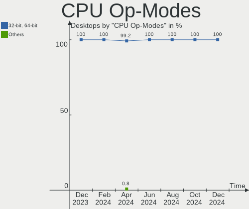

| Op mode        | Desktops | Percent |
|----------------|----------|---------|
| 32-bit, 64-bit | 105      | 100%    |

CPU Microcode
-------------

Microcode number

| Number     | Desktops | Percent |
|------------|----------|---------|
| Unknown    | 21       | 20%     |
| 0x306a9    | 9        | 8.57%   |
| 0x206a7    | 8        | 7.62%   |
| 0x906ea    | 5        | 4.76%   |
| 0x1067a    | 5        | 4.76%   |
| 0x906e9    | 4        | 3.81%   |
| 0x08701021 | 4        | 3.81%   |
| 0x6fd      | 3        | 2.86%   |
| 0x306c3    | 3        | 2.86%   |
| 0x20652    | 3        | 2.86%   |
| 0x08108109 | 3        | 2.86%   |
| 0x0800820d | 3        | 2.86%   |
| 0xa0655    | 2        | 1.9%    |
| 0x906eb    | 2        | 1.9%    |
| 0x306f2    | 2        | 1.9%    |
| 0x08701013 | 2        | 1.9%    |
| 0x08001137 | 2        | 1.9%    |
| 0x06000852 | 2        | 1.9%    |
| 0x010000b6 | 2        | 1.9%    |
| 0xa0653    | 1        | 0.95%   |
| 0x906ec    | 1        | 0.95%   |
| 0x90672    | 1        | 0.95%   |
| 0x706a1    | 1        | 0.95%   |
| 0x506e3    | 1        | 0.95%   |
| 0x206d7    | 1        | 0.95%   |
| 0x10676    | 1        | 0.95%   |
| 0x0a50000d | 1        | 0.95%   |
| 0x0a50000c | 1        | 0.95%   |
| 0x0a50000b | 1        | 0.95%   |
| 0x0a201016 | 1        | 0.95%   |
| 0x08701011 | 1        | 0.95%   |
| 0x08600106 | 1        | 0.95%   |
| 0x08001138 | 1        | 0.95%   |
| 0x0800111c | 1        | 0.95%   |
| 0x06000822 | 1        | 0.95%   |
| 0x0600063e | 1        | 0.95%   |
| 0x0600063d | 1        | 0.95%   |
| 0x06000623 | 1        | 0.95%   |
| 0x010000dc | 1        | 0.95%   |

CPU Microarch
-------------

Microarchitecture

| Name             | Desktops | Percent |
|------------------|----------|---------|
| Zen 2            | 12       | 11.43%  |
| KabyLake         | 12       | 11.43%  |
| IvyBridge        | 12       | 11.43%  |
| SandyBridge      | 10       | 9.52%   |
| Haswell          | 9        | 8.57%   |
| Zen+             | 7        | 6.67%   |
| Penryn           | 7        | 6.67%   |
| Zen 3            | 5        | 4.76%   |
| Westmere         | 5        | 4.76%   |
| Zen              | 4        | 3.81%   |
| Piledriver       | 4        | 3.81%   |
| K10              | 4        | 3.81%   |
| Core             | 3        | 2.86%   |
| CometLake        | 3        | 2.86%   |
| Bulldozer        | 3        | 2.86%   |
| Skylake          | 1        | 0.95%   |
| Silvermont       | 1        | 0.95%   |
| K8 Hammer        | 1        | 0.95%   |
| Goldmont plus    | 1        | 0.95%   |
| Alderlake Hybrid | 1        | 0.95%   |

Graphics
--------

GPU Vendor
----------

Vendors of graphics cards

| Vendor | Desktops | Percent |
|--------|----------|---------|
| AMD    | 42       | 39.62%  |
| Intel  | 38       | 35.85%  |
| Nvidia | 26       | 24.53%  |

GPU Model
---------

Graphics card models

| Model                                                                       | Desktops | Percent |
|-----------------------------------------------------------------------------|----------|---------|
| AMD Ellesmere [Radeon RX 470/480/570/570X/580/580X/590]                     | 9        | 8.41%   |
| Intel Xeon E3-1200 v2/3rd Gen Core processor Graphics Controller            | 8        | 7.48%   |
| Intel 2nd Generation Core Processor Family Integrated Graphics Controller   | 6        | 5.61%   |
| Nvidia GP107 [GeForce GTX 1050 Ti]                                          | 4        | 3.74%   |
| Intel 4 Series Chipset Integrated Graphics Controller                       | 4        | 3.74%   |
| AMD RS780L [Radeon 3000]                                                    | 4        | 3.74%   |
| Intel Xeon E3-1200 v3/4th Gen Core Processor Integrated Graphics Controller | 3        | 2.8%    |
| Intel Core Processor Integrated Graphics Controller                         | 3        | 2.8%    |
| Intel CoffeeLake-S GT2 [UHD Graphics 630]                                   | 3        | 2.8%    |
| AMD Picasso/Raven 2 [Radeon Vega Series / Radeon Vega Mobile Series]        | 3        | 2.8%    |
| AMD Navi 23 [Radeon RX 6600/6600 XT/6600M]                                  | 3        | 2.8%    |
| AMD Cezanne                                                                 | 3        | 2.8%    |
| Nvidia GT218 [GeForce 210]                                                  | 2        | 1.87%   |
| Nvidia GM206 [GeForce GTX 960]                                              | 2        | 1.87%   |
| Nvidia GM107 [GeForce GTX 750 Ti]                                           | 2        | 1.87%   |
| Intel HD Graphics 630                                                       | 2        | 1.87%   |
| Intel 82G33/G31 Express Integrated Graphics Controller                      | 2        | 1.87%   |
| Intel 82945G/GZ Integrated Graphics Controller                              | 2        | 1.87%   |
| AMD Oland PRO [Radeon R7 240/340 / Radeon 520]                              | 2        | 1.87%   |
| AMD Lexa PRO [Radeon 540/540X/550/550X / RX 540X/550/550X]                  | 2        | 1.87%   |
| AMD Juniper XT [Radeon HD 5770]                                             | 2        | 1.87%   |
| Nvidia TU117 [GeForce GTX 1650]                                             | 1        | 0.93%   |
| Nvidia TU116 [GeForce GTX 1660 Ti]                                          | 1        | 0.93%   |
| Nvidia TU116 [GeForce GTX 1650]                                             | 1        | 0.93%   |
| Nvidia TU106 [GeForce RTX 2060 SUPER]                                       | 1        | 0.93%   |
| Nvidia GT218 [GeForce 8400 GS Rev. 3]                                       | 1        | 0.93%   |
| Nvidia GP107GL [Quadro P400]                                                | 1        | 0.93%   |
| Nvidia GP106 [GeForce GTX 1060 5GB]                                         | 1        | 0.93%   |
| Nvidia GP106 [GeForce GTX 1060 3GB]                                         | 1        | 0.93%   |
| Nvidia GP104 [GeForce GTX 1070]                                             | 1        | 0.93%   |
| Nvidia GM107 [GeForce GTX 750]                                              | 1        | 0.93%   |
| Nvidia GK107 [GeForce GTX 650]                                              | 1        | 0.93%   |
| Nvidia GF119 [GeForce GT 520]                                               | 1        | 0.93%   |
| Nvidia GA104 [GeForce RTX 3070 Ti]                                          | 1        | 0.93%   |
| Nvidia G96CGL [Quadro FX 580]                                               | 1        | 0.93%   |
| Nvidia G84 [GeForce 8400 GS]                                                | 1        | 0.93%   |
| Nvidia G72 [GeForce 7200 GS / 7300 SE]                                      | 1        | 0.93%   |
| Intel HD Graphics 530                                                       | 1        | 0.93%   |
| Intel GeminiLake [UHD Graphics 600]                                         | 1        | 0.93%   |
| Intel CometLake-S GT2 [UHD Graphics 630]                                    | 1        | 0.93%   |
| Intel CoffeeLake-S GT1 [UHD Graphics 610]                                   | 1        | 0.93%   |
| Intel Atom Processor Z36xxx/Z37xxx Series Graphics & Display                | 1        | 0.93%   |
| AMD RV730 PRO [Radeon HD 4650]                                              | 1        | 0.93%   |
| AMD RS880 [Radeon HD 4200]                                                  | 1        | 0.93%   |
| AMD Renoir                                                                  | 1        | 0.93%   |
| AMD Redwood LE [Radeon HD 5550/5570/5630/6390/6490/7570]                    | 1        | 0.93%   |
| AMD Pitcairn PRO [Radeon HD 7850 / R7 265 / R9 270 1024SP]                  | 1        | 0.93%   |
| AMD Navi 21 [Radeon RX 6800/6800 XT / 6900 XT]                              | 1        | 0.93%   |
| AMD Curacao PRO [Radeon R7 370 / R9 270/370 OEM]                            | 1        | 0.93%   |
| AMD Cedar [Radeon HD 5000/6000/7350/8350 Series]                            | 1        | 0.93%   |
| AMD Cape Verde XT [Radeon HD 7770/8760 / R7 250X]                           | 1        | 0.93%   |
| AMD Cape Verde PRX [Radeon R9 255 OEM]                                      | 1        | 0.93%   |
| AMD Cape Verde LE [Radeon HD 7730/8730]                                     | 1        | 0.93%   |
| AMD Caicos [Radeon HD 6450/7450/8450 / R5 230 OEM]                          | 1        | 0.93%   |
| AMD Bonaire XTX [Radeon R7 260X/360]                                        | 1        | 0.93%   |
| AMD Baffin [Radeon RX 550 640SP / RX 560/560X]                              | 1        | 0.93%   |
| AMD Baffin [Radeon RX 460/560D / Pro 450/455/460/555/555X/560/560X]         | 1        | 0.93%   |

GPU Combo
---------

Combinations of graphics cards

| Name           | Desktops | Percent |
|----------------|----------|---------|
| 1 x AMD        | 41       | 39.05%  |
| 1 x Intel      | 37       | 35.24%  |
| 1 x Nvidia     | 24       | 22.86%  |
| 2 x Nvidia     | 1        | 0.95%   |
| 2 x AMD        | 1        | 0.95%   |
| Intel + Nvidia | 1        | 0.95%   |

GPU Driver
----------

Free vs proprietary

| Driver      | Desktops | Percent |
|-------------|----------|---------|
| Free        | 87       | 82.86%  |
| Proprietary | 14       | 13.33%  |
| Unknown     | 4        | 3.81%   |

GPU Memory
----------

Total video memory

| Size in GB | Desktops | Percent |
|------------|----------|---------|
| Unknown    | 54       | 51.43%  |
| 3.01-4.0   | 14       | 13.33%  |
| 1.01-2.0   | 12       | 11.43%  |
| 0.01-0.5   | 9        | 8.57%   |
| 7.01-8.0   | 8        | 7.62%   |
| 0.51-1.0   | 6        | 5.71%   |
| 5.01-6.0   | 1        | 0.95%   |
| 8.01-16.0  | 1        | 0.95%   |

Monitor
-------

Monitor Vendor
--------------

Monitor vendors

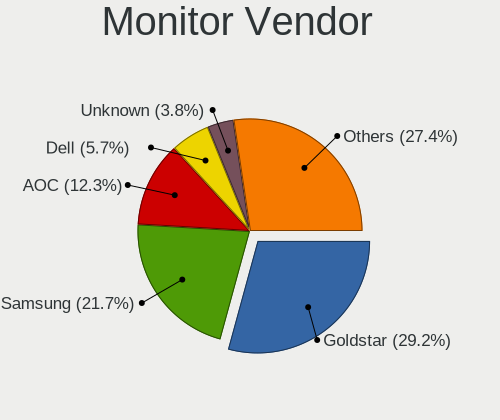

| Vendor               | Desktops | Percent |
|----------------------|----------|---------|
| Goldstar             | 34       | 32.38%  |
| AOC                  | 20       | 19.05%  |
| Samsung Electronics  | 16       | 15.24%  |
| Philips              | 9        | 8.57%   |
| Dell                 | 7        | 6.67%   |
| Sony                 | 2        | 1.9%    |
| Lenovo               | 2        | 1.9%    |
| Acer                 | 2        | 1.9%    |
| ZZZ                  | 1        | 0.95%   |
| Unknown              | 1        | 0.95%   |
| Toshiba              | 1        | 0.95%   |
| Positivo             | 1        | 0.95%   |
| KTC                  | 1        | 0.95%   |
| JRY                  | 1        | 0.95%   |
| Hewlett-Packard      | 1        | 0.95%   |
| HBTV-24L06FD         | 1        | 0.95%   |
| HB@                  | 1        | 0.95%   |
| GDH                  | 1        | 0.95%   |
| Chimei Innolux       | 1        | 0.95%   |
| BenQ                 | 1        | 0.95%   |
| Ancor Communications | 1        | 0.95%   |

Monitor Model
-------------

Monitor models

| Model                                                                  | Desktops | Percent |
|------------------------------------------------------------------------|----------|---------|
| Goldstar FULL HD GSM5B55 1920x1080 480x270mm 21.7-inch                 | 3        | 2.7%    |
| Philips TV PHL5035 1920x1080 640x360mm 28.9-inch                       | 2        | 1.8%    |
| Philips 236V4 PHLC0B3 1920x1080 510x287mm 23.0-inch                    | 2        | 1.8%    |
| Goldstar W2043 GSM4E9D 1600x900 443x249mm 20.0-inch                    | 2        | 1.8%    |
| Goldstar W1642C GSM3E89 1366x768 344x194mm 15.5-inch                   | 2        | 1.8%    |
| Goldstar W1642 GSM3E86 1360x768 344x194mm 15.5-inch                    | 2        | 1.8%    |
| Goldstar 23MP55 GSM5A23 1920x1080 510x290mm 23.1-inch                  | 2        | 1.8%    |
| AOC 27G2G4 AOC2702 1920x1080 598x336mm 27.0-inch                       | 2        | 1.8%    |
| AOC 2460G5 AOC246A 1920x1080 531x299mm 24.0-inch                       | 2        | 1.8%    |
| AOC 1950w AOC1950 1366x768 410x230mm 18.5-inch                         | 2        | 1.8%    |
| ZZZ PG_HDMI ZZZFFF6 1440x900 408x255mm 18.9-inch                       | 1        | 0.9%    |
| Unknown LCD Monitor FFFF 2288x1287 2550x2550mm 142.0-inch              | 1        | 0.9%    |
| Toshiba LCD-MONITOR LCD1885 1366x768 410x230mm 18.5-inch               | 1        | 0.9%    |
| Sony TV SNY4402 1360x768                                               | 1        | 0.9%    |
| Sony TV SNY4302 1920x1080                                              | 1        | 0.9%    |
| Samsung Electronics T24B301 SAM098E 1920x1080 521x293mm 23.5-inch      | 1        | 0.9%    |
| Samsung Electronics T20C310 SAM0AE8 1600x900 432x240mm 19.5-inch       | 1        | 0.9%    |
| Samsung Electronics SyncMaster SAM060B 1920x1080 510x290mm 23.1-inch   | 1        | 0.9%    |
| Samsung Electronics SyncMaster SAM0489 1680x1050                       | 1        | 0.9%    |
| Samsung Electronics SyncMaster SAM01CE 1024x768 304x228mm 15.0-inch    | 1        | 0.9%    |
| Samsung Electronics SMT27A550 SAM07B8 1920x1080 598x336mm 27.0-inch    | 1        | 0.9%    |
| Samsung Electronics SMT22A300 SAM087B 1920x1080 480x270mm 21.7-inch    | 1        | 0.9%    |
| Samsung Electronics Q80A SAM713C 3840x2160 1872x1053mm 84.6-inch       | 1        | 0.9%    |
| Samsung Electronics Q70A SAM7140 3840x2160 1872x1053mm 84.6-inch       | 1        | 0.9%    |
| Samsung Electronics LU28R55 SAM1018 3840x2160 632x360mm 28.6-inch      | 1        | 0.9%    |
| Samsung Electronics LCD Monitor SAM7017 3840x2160 950x540mm 43.0-inch  | 1        | 0.9%    |
| Samsung Electronics LCD Monitor SAM0C3C 1366x768 609x347mm 27.6-inch   | 1        | 0.9%    |
| Samsung Electronics LCD Monitor SAM0B5C 1920x1080 1210x680mm 54.6-inch | 1        | 0.9%    |
| Samsung Electronics LCD Monitor SAM0A7C 1366x768 698x393mm 31.5-inch   | 1        | 0.9%    |
| Samsung Electronics LCD Monitor SAM0678 1360x768                       | 1        | 0.9%    |
| Samsung Electronics C24F390 SAM0D2C 1920x1080 521x293mm 23.5-inch      | 1        | 0.9%    |
| Positivo 22BN550Y POS5BA2 1920x1080 480x270mm 21.7-inch                | 1        | 0.9%    |
| Philips PHL 223V5LH PHLC114 1920x1080 477x268mm 21.5-inch              | 1        | 0.9%    |
| Philips PHL 221V8 PHLC211 1920x1080 477x268mm 21.5-inch                | 1        | 0.9%    |
| Philips FTV PHL3200 1360x768 697x392mm 31.5-inch                       | 1        | 0.9%    |
| Philips 220TS PHLC06B 1920x1080 477x268mm 21.5-inch                    | 1        | 0.9%    |
| Philips 196V4 PHLC0AF 1366x768 410x230mm 18.5-inch                     | 1        | 0.9%    |
| Lenovo LEN S24e-03 LEN61F9 1920x1080 527x296mm 23.8-inch               | 1        | 0.9%    |
| Lenovo LEN E2003bA LEN60BC 1600x900 430x240mm 19.4-inch                | 1        | 0.9%    |
| KTC Q2712RUC KTC2712 2560x1440 530x280mm 23.6-inch                     | 1        | 0.9%    |
| JRY HDMI JRY0156 1920x1080 452x254mm 20.4-inch                         | 1        | 0.9%    |
| Hewlett-Packard ZR2240w HWP2952 1920x1080 480x270mm 21.7-inch          | 1        | 0.9%    |
| HBTV-24L06FD LCD Monitor 0001 1360x768 885x498mm 40.0-inch             | 1        | 0.9%    |
| HB@ HBTV-24L06FD HB@0001 1920x1080 890x500mm 40.2-inch                 | 1        | 0.9%    |
| Goldstar W1942 GSM4B6F 1440x900 408x255mm 18.9-inch                    | 1        | 0.9%    |
| Goldstar W1752 GSM4491 1440x900 370x232mm 17.2-inch                    | 1        | 0.9%    |
| Goldstar W1542 GSM3BB1 1280x720 332x187mm 15.0-inch                    | 1        | 0.9%    |
| Goldstar ULTRAWIDE GSM76F9 2560x1080 531x298mm 24.0-inch               | 1        | 0.9%    |
| Goldstar ULTRAWIDE GSM59F1 2560x1080 673x284mm 28.8-inch               | 1        | 0.9%    |
| Goldstar TV SSCR2 GSMC0C8 3840x2160                                    | 1        | 0.9%    |
| Goldstar M2250D GSM57F1 1920x1080 598x336mm 27.0-inch                  | 1        | 0.9%    |
| Goldstar M198WA GSM4B36 1440x900 410x260mm 19.1-inch                   | 1        | 0.9%    |
| Goldstar LX26W GSM5652 1680x1050 474x296mm 22.0-inch                   | 1        | 0.9%    |
| Goldstar L1953H GSM4B3D 1280x1024 338x270mm 17.0-inch                  | 1        | 0.9%    |
| Goldstar L1953H GSM4B3C 1280x1024 338x270mm 17.0-inch                  | 1        | 0.9%    |
| Goldstar L1753T GSM4477 1280x1024 340x270mm 17.1-inch                  | 1        | 0.9%    |
| Goldstar L1753T GSM4476 1280x1024 338x270mm 17.0-inch                  | 1        | 0.9%    |
| Goldstar L1553S GSM3BB0 1024x768 304x228mm 15.0-inch                   | 1        | 0.9%    |
| Goldstar L1553S GSM3BAE 1024x768 304x228mm 15.0-inch                   | 1        | 0.9%    |
| Goldstar E2360 GSM57E3 1920x1080 510x290mm 23.1-inch                   | 1        | 0.9%    |

Monitor Resolution
------------------

Monitor screen resolution

| Resolution         | Desktops | Percent |
|--------------------|----------|---------|
| 1920x1080 (FHD)    | 39       | 36.79%  |
| 1366x768 (WXGA)    | 16       | 15.09%  |
| 3840x2160 (4K)     | 12       | 11.32%  |
| 1600x900 (HD+)     | 9        | 8.49%   |
| 1360x768           | 8        | 7.55%   |
| 1680x1050 (WSXGA+) | 5        | 4.72%   |
| 1280x1024 (SXGA)   | 4        | 3.77%   |
| 1440x900 (WXGA+)   | 3        | 2.83%   |
| 1024x768 (XGA)     | 3        | 2.83%   |
| 2560x1440 (QHD)    | 2        | 1.89%   |
| 2560x1080          | 2        | 1.89%   |
| 3440x1440          | 1        | 0.94%   |
| 2288x1287          | 1        | 0.94%   |
| 1280x720 (HD)      | 1        | 0.94%   |

Monitor Diagonal
----------------

Diagonal size in inches

| Inches  | Desktops | Percent |
|---------|----------|---------|
| 23      | 18       | 16.82%  |
| 21      | 13       | 12.15%  |
| 15      | 11       | 10.28%  |
| 18      | 10       | 9.35%   |
| 20      | 8        | 7.48%   |
| 24      | 6        | 5.61%   |
| 27      | 5        | 4.67%   |
| 17      | 5        | 4.67%   |
| 31      | 4        | 3.74%   |
| 19      | 4        | 3.74%   |
| 84      | 3        | 2.8%    |
| 72      | 3        | 2.8%    |
| 34      | 3        | 2.8%    |
| 28      | 3        | 2.8%    |
| 22      | 3        | 2.8%    |
| Unknown | 2        | 1.87%   |
| 142     | 1        | 0.93%   |
| 54      | 1        | 0.93%   |
| 52      | 1        | 0.93%   |
| 40      | 1        | 0.93%   |
| 26      | 1        | 0.93%   |
| 13      | 1        | 0.93%   |

Monitor Width
-------------

Physical width

| Width in mm    | Desktops | Percent |
|----------------|----------|---------|
| 401-500        | 37       | 34.91%  |
| 501-600        | 30       | 28.3%   |
| 301-350        | 16       | 15.09%  |
| 601-700        | 7        | 6.6%    |
| 1501-2000      | 6        | 5.66%   |
| 701-800        | 3        | 2.83%   |
| 1001-1500      | 2        | 1.89%   |
| Unknown        | 2        | 1.89%   |
| More than 2000 | 1        | 0.94%   |
| 801-900        | 1        | 0.94%   |
| 351-400        | 1        | 0.94%   |

Aspect Ratio
------------

Proportional relationship between the width and the height

| Ratio | Desktops | Percent |
|-------|----------|---------|
| 16/9  | 75       | 78.13%  |
| 16/10 | 10       | 10.42%  |
| 5/4   | 4        | 4.17%   |
| 4/3   | 3        | 3.13%   |
| 21/9  | 3        | 3.13%   |
| 1.00  | 1        | 1.04%   |

Monitor Area
------------

Area in inch²

| Area in inch² | Desktops | Percent |
|----------------|----------|---------|
| 201-250        | 30       | 28.57%  |
| 151-200        | 17       | 16.19%  |
| 141-150        | 13       | 12.38%  |
| 351-500        | 10       | 9.52%   |
| 101-110        | 10       | 9.52%   |
| More than 1000 | 9        | 8.57%   |
| 301-350        | 5        | 4.76%   |
| 251-300        | 5        | 4.76%   |
| Unknown        | 2        | 1.9%    |
| 81-90          | 1        | 0.95%   |
| 131-140        | 1        | 0.95%   |
| 501-1000       | 1        | 0.95%   |
| 91-100         | 1        | 0.95%   |

Pixel Density
-------------

Pixels per inch

| Density | Desktops | Percent |
|---------|----------|---------|
| 51-100  | 69       | 66.99%  |
| 101-120 | 19       | 18.45%  |
| 1-50    | 10       | 9.71%   |
| 121-160 | 2        | 1.94%   |
| Unknown | 2        | 1.94%   |
| 161-240 | 1        | 0.97%   |

Multiple Monitors
-----------------

Total monitors connected

| Total | Desktops | Percent |
|-------|----------|---------|
| 1     | 83       | 79.05%  |
| 2     | 20       | 19.05%  |
| 0     | 2        | 1.9%    |

Network
-------

Net Controller Vendor
---------------------

Controller vendors

| Vendor                          | Desktops | Percent |
|---------------------------------|----------|---------|
| Realtek Semiconductor           | 77       | 55%     |
| Intel                           | 25       | 17.86%  |
| Qualcomm Atheros                | 9        | 6.43%   |
| Ralink Technology               | 7        | 5%      |
| TP-Link                         | 3        | 2.14%   |
| Nvidia                          | 3        | 2.14%   |
| Broadcom                        | 3        | 2.14%   |
| VIA Technologies                | 2        | 1.43%   |
| Samsung Electronics             | 2        | 1.43%   |
| Microsoft                       | 2        | 1.43%   |
| MediaTek                        | 2        | 1.43%   |
| Xiaomi                          | 1        | 0.71%   |
| Sealevel Systems                | 1        | 0.71%   |
| Qualcomm Atheros Communications | 1        | 0.71%   |
| D-Link                          | 1        | 0.71%   |
| ASUSTek Computer                | 1        | 0.71%   |

Net Controller Model
--------------------

Controller models

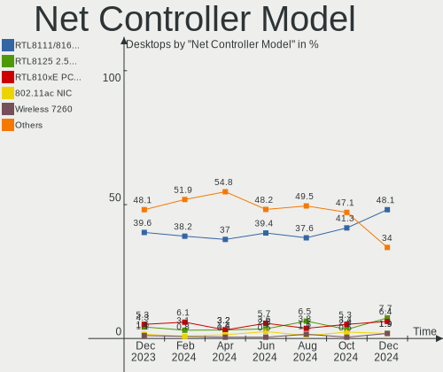

| Model                                                                                 | Desktops | Percent |
|---------------------------------------------------------------------------------------|----------|---------|
| Realtek RTL8111/8168/8411 PCI Express Gigabit Ethernet Controller                     | 65       | 40.88%  |
| Realtek RTL810xE PCI Express Fast Ethernet controller                                 | 9        | 5.66%   |
| Intel Wi-Fi 6 AX200                                                                   | 5        | 3.14%   |
| Ralink MT7601U Wireless Adapter                                                       | 4        | 2.52%   |
| Intel I211 Gigabit Network Connection                                                 | 4        | 2.52%   |
| Qualcomm Atheros AR8152 v2.0 Fast Ethernet                                            | 3        | 1.89%   |
| Intel Ethernet Connection (7) I219-V                                                  | 3        | 1.89%   |
| Intel Ethernet Connection (2) I219-V                                                  | 3        | 1.89%   |
| TP-Link AC600 wireless Realtek RTL8811AU [Archer T2U Nano]                            | 2        | 1.26%   |
| Samsung Galaxy series, misc. (tethering mode)                                         | 2        | 1.26%   |
| Realtek RTL88x2bu [AC1200 Techkey]                                                    | 2        | 1.26%   |
| Realtek RTL8188EUS 802.11n Wireless Network Adapter                                   | 2        | 1.26%   |
| Realtek RTL8188CE 802.11b/g/n WiFi Adapter                                            | 2        | 1.26%   |
| Realtek RTL8125 2.5GbE Controller                                                     | 2        | 1.26%   |
| Ralink RT5370 Wireless Adapter                                                        | 2        | 1.26%   |
| Qualcomm Atheros AR8151 v2.0 Gigabit Ethernet                                         | 2        | 1.26%   |
| Nvidia MCP61 Ethernet                                                                 | 2        | 1.26%   |
| Microsoft Xbox 360 Wireless Adapter                                                   | 2        | 1.26%   |
| Intel Ethernet Controller I225-V                                                      | 2        | 1.26%   |
| Intel Cannon Lake PCH CNVi WiFi                                                       | 2        | 1.26%   |
| Intel 82579V Gigabit Network Connection                                               | 2        | 1.26%   |
| Intel 82567LM-3 Gigabit Network Connection                                            | 2        | 1.26%   |
| Broadcom BCM4360 802.11ac Wireless Network Adapter                                    | 2        | 1.26%   |
| Xiaomi Mi/Redmi series (RNDIS + ADB)                                                  | 1        | 0.63%   |
| VIA VT6120/VT6121/VT6122 Gigabit Ethernet Adapter                                     | 1        | 0.63%   |
| VIA VT6105/VT6106S [Rhine-III]                                                        | 1        | 0.63%   |
| TP-Link 802.11ac NIC                                                                  | 1        | 0.63%   |
| Sealevel Systems 9443 Power Management                                                | 1        | 0.63%   |
| Sealevel Systems 9443 GPIO Management                                                 | 1        | 0.63%   |
| Realtek RTL8723BE PCIe Wireless Network Adapter                                       | 1        | 0.63%   |
| Realtek RTL8192EU 802.11b/g/n WLAN Adapter                                            | 1        | 0.63%   |
| Realtek RTL8192CU 802.11n WLAN Adapter                                                | 1        | 0.63%   |
| Realtek RTL8153 Gigabit Ethernet Adapter                                              | 1        | 0.63%   |
| Realtek 802.11ac NIC                                                                  | 1        | 0.63%   |
| Ralink RT2870/RT3070 Wireless Adapter                                                 | 1        | 0.63%   |
| Qualcomm Atheros Killer E220x Gigabit Ethernet Controller                             | 1        | 0.63%   |
| Qualcomm Atheros AR9271 802.11n                                                       | 1        | 0.63%   |
| Qualcomm Atheros AR9462 Wireless Network Adapter                                      | 1        | 0.63%   |
| Qualcomm Atheros AR9285 Wireless Network Adapter (PCI-Express)                        | 1        | 0.63%   |
| Qualcomm Atheros AR5418 Wireless Network Adapter [AR5008E 802.11(a)bgn] (PCI-Express) | 1        | 0.63%   |
| Nvidia MCP67 Ethernet                                                                 | 1        | 0.63%   |
| MediaTek MT7921 802.11ax PCI Express Wireless Network Adapter                         | 1        | 0.63%   |
| MediaTek MT7612U 802.11a/b/g/n/ac Wireless Adapter                                    | 1        | 0.63%   |
| Intel Wireless-AC 9260                                                                | 1        | 0.63%   |
| Intel Wireless 8265 / 8275                                                            | 1        | 0.63%   |
| Intel Wireless 7265                                                                   | 1        | 0.63%   |
| Intel I210 Gigabit Network Connection                                                 | 1        | 0.63%   |
| Intel Ethernet Connection I217-LM                                                     | 1        | 0.63%   |
| Intel Ethernet Connection (2) I219-LM                                                 | 1        | 0.63%   |
| Intel Ethernet Connection (12) I219-V                                                 | 1        | 0.63%   |
| Intel Comet Lake PCH CNVi WiFi                                                        | 1        | 0.63%   |
| Intel 82579LM Gigabit Network Connection (Lewisville)                                 | 1        | 0.63%   |
| Intel 82557/8/9/0/1 Ethernet Pro 100                                                  | 1        | 0.63%   |
| D-Link DWA-123 Wireless N 150 Adapter (rev.D1)                                        | 1        | 0.63%   |
| Broadcom NetXtreme BCM5761 Gigabit Ethernet PCIe                                      | 1        | 0.63%   |
| ASUS USB-N10 802.11n Network Adapter [Realtek RTL8188SU]                              | 1        | 0.63%   |

Wireless Vendor
---------------

Wireless vendors

| Vendor                          | Desktops | Percent |
|---------------------------------|----------|---------|
| Intel                           | 11       | 25.58%  |
| Realtek Semiconductor           | 10       | 23.26%  |
| Ralink Technology               | 7        | 16.28%  |
| TP-Link                         | 3        | 6.98%   |
| Qualcomm Atheros                | 3        | 6.98%   |
| Microsoft                       | 2        | 4.65%   |
| MediaTek                        | 2        | 4.65%   |
| Broadcom                        | 2        | 4.65%   |
| Qualcomm Atheros Communications | 1        | 2.33%   |
| D-Link                          | 1        | 2.33%   |
| ASUSTek Computer                | 1        | 2.33%   |

Wireless Model
--------------

Wireless models

| Model                                                                                 | Desktops | Percent |
|---------------------------------------------------------------------------------------|----------|---------|
| Intel Wi-Fi 6 AX200                                                                   | 5        | 11.63%  |
| Ralink MT7601U Wireless Adapter                                                       | 4        | 9.3%    |
| TP-Link AC600 wireless Realtek RTL8811AU [Archer T2U Nano]                            | 2        | 4.65%   |
| Realtek RTL88x2bu [AC1200 Techkey]                                                    | 2        | 4.65%   |
| Realtek RTL8188EUS 802.11n Wireless Network Adapter                                   | 2        | 4.65%   |
| Realtek RTL8188CE 802.11b/g/n WiFi Adapter                                            | 2        | 4.65%   |
| Ralink RT5370 Wireless Adapter                                                        | 2        | 4.65%   |
| Microsoft Xbox 360 Wireless Adapter                                                   | 2        | 4.65%   |
| Intel Cannon Lake PCH CNVi WiFi                                                       | 2        | 4.65%   |
| Broadcom BCM4360 802.11ac Wireless Network Adapter                                    | 2        | 4.65%   |
| TP-Link 802.11ac NIC                                                                  | 1        | 2.33%   |
| Realtek RTL8723BE PCIe Wireless Network Adapter                                       | 1        | 2.33%   |
| Realtek RTL8192EU 802.11b/g/n WLAN Adapter                                            | 1        | 2.33%   |
| Realtek RTL8192CU 802.11n WLAN Adapter                                                | 1        | 2.33%   |
| Realtek 802.11ac NIC                                                                  | 1        | 2.33%   |
| Ralink RT2870/RT3070 Wireless Adapter                                                 | 1        | 2.33%   |
| Qualcomm Atheros AR9271 802.11n                                                       | 1        | 2.33%   |
| Qualcomm Atheros AR9462 Wireless Network Adapter                                      | 1        | 2.33%   |
| Qualcomm Atheros AR9285 Wireless Network Adapter (PCI-Express)                        | 1        | 2.33%   |
| Qualcomm Atheros AR5418 Wireless Network Adapter [AR5008E 802.11(a)bgn] (PCI-Express) | 1        | 2.33%   |
| MediaTek MT7921 802.11ax PCI Express Wireless Network Adapter                         | 1        | 2.33%   |
| MediaTek MT7612U 802.11a/b/g/n/ac Wireless Adapter                                    | 1        | 2.33%   |
| Intel Wireless-AC 9260                                                                | 1        | 2.33%   |
| Intel Wireless 8265 / 8275                                                            | 1        | 2.33%   |
| Intel Wireless 7265                                                                   | 1        | 2.33%   |
| Intel Comet Lake PCH CNVi WiFi                                                        | 1        | 2.33%   |
| D-Link DWA-123 Wireless N 150 Adapter (rev.D1)                                        | 1        | 2.33%   |
| ASUS USB-N10 802.11n Network Adapter [Realtek RTL8188SU]                              | 1        | 2.33%   |

Ethernet Vendor
---------------

Ethernet vendors

| Vendor                | Desktops | Percent |
|-----------------------|----------|---------|
| Realtek Semiconductor | 74       | 67.89%  |
| Intel                 | 20       | 18.35%  |
| Qualcomm Atheros      | 6        | 5.5%    |
| Nvidia                | 3        | 2.75%   |
| VIA Technologies      | 2        | 1.83%   |
| Samsung Electronics   | 2        | 1.83%   |
| Xiaomi                | 1        | 0.92%   |
| Broadcom              | 1        | 0.92%   |

Ethernet Model
--------------

Ethernet models

| Model                                                             | Desktops | Percent |
|-------------------------------------------------------------------|----------|---------|
| Realtek RTL8111/8168/8411 PCI Express Gigabit Ethernet Controller | 65       | 57.02%  |
| Realtek RTL810xE PCI Express Fast Ethernet controller             | 9        | 7.89%   |
| Intel I211 Gigabit Network Connection                             | 4        | 3.51%   |
| Qualcomm Atheros AR8152 v2.0 Fast Ethernet                        | 3        | 2.63%   |
| Intel Ethernet Connection (7) I219-V                              | 3        | 2.63%   |
| Intel Ethernet Connection (2) I219-V                              | 3        | 2.63%   |
| Samsung Galaxy series, misc. (tethering mode)                     | 2        | 1.75%   |
| Realtek RTL8125 2.5GbE Controller                                 | 2        | 1.75%   |
| Qualcomm Atheros AR8151 v2.0 Gigabit Ethernet                     | 2        | 1.75%   |
| Nvidia MCP61 Ethernet                                             | 2        | 1.75%   |
| Intel Ethernet Controller I225-V                                  | 2        | 1.75%   |
| Intel 82579V Gigabit Network Connection                           | 2        | 1.75%   |
| Intel 82567LM-3 Gigabit Network Connection                        | 2        | 1.75%   |
| Xiaomi Mi/Redmi series (RNDIS + ADB)                              | 1        | 0.88%   |
| VIA VT6120/VT6121/VT6122 Gigabit Ethernet Adapter                 | 1        | 0.88%   |
| VIA VT6105/VT6106S [Rhine-III]                                    | 1        | 0.88%   |
| Realtek RTL8153 Gigabit Ethernet Adapter                          | 1        | 0.88%   |
| Qualcomm Atheros Killer E220x Gigabit Ethernet Controller         | 1        | 0.88%   |
| Nvidia MCP67 Ethernet                                             | 1        | 0.88%   |
| Intel I210 Gigabit Network Connection                             | 1        | 0.88%   |
| Intel Ethernet Connection I217-LM                                 | 1        | 0.88%   |
| Intel Ethernet Connection (2) I219-LM                             | 1        | 0.88%   |
| Intel Ethernet Connection (12) I219-V                             | 1        | 0.88%   |
| Intel 82579LM Gigabit Network Connection (Lewisville)             | 1        | 0.88%   |
| Intel 82557/8/9/0/1 Ethernet Pro 100                              | 1        | 0.88%   |
| Broadcom NetXtreme BCM5761 Gigabit Ethernet PCIe                  | 1        | 0.88%   |

Net Controller Kind
-------------------

Ethernet, WiFi or modem

| Kind     | Desktops | Percent |
|----------|----------|---------|
| Ethernet | 104      | 71.72%  |
| WiFi     | 40       | 27.59%  |
| Modem    | 1        | 0.69%   |

Used Controller
---------------

Currently used network controller

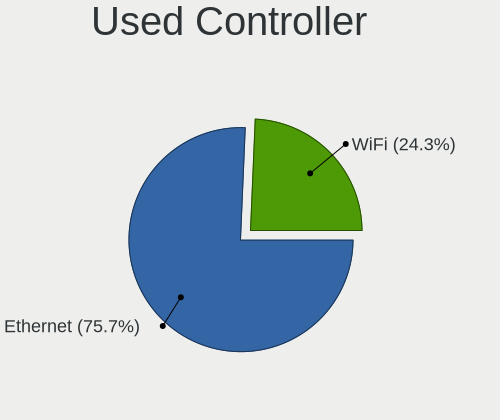

| Kind     | Desktops | Percent |
|----------|----------|---------|
| Ethernet | 81       | 75.7%   |
| WiFi     | 26       | 24.3%   |

NICs
----

Total network controllers on board

| Total | Desktops | Percent |
|-------|----------|---------|
| 1     | 74       | 70.48%  |
| 2     | 28       | 26.67%  |
| 0     | 2        | 1.9%    |
| 3     | 1        | 0.95%   |

IPv6
----

IPv6 vs IPv4

| Used | Desktops | Percent |
|------|----------|---------|
| No   | 61       | 58.1%   |
| Yes  | 44       | 41.9%   |

Bluetooth
---------

Bluetooth Vendor
----------------

Controller vendors

| Vendor                          | Desktops | Percent |
|---------------------------------|----------|---------|
| Cambridge Silicon Radio         | 16       | 55.17%  |
| Intel                           | 9        | 31.03%  |
| Realtek Semiconductor           | 1        | 3.45%   |
| Qualcomm Atheros Communications | 1        | 3.45%   |
| MediaTek                        | 1        | 3.45%   |
| Foxconn / Hon Hai               | 1        | 3.45%   |

Bluetooth Model
---------------

Controller models

| Model                                               | Desktops | Percent |
|-----------------------------------------------------|----------|---------|
| Cambridge Silicon Radio Bluetooth Dongle (HCI mode) | 16       | 55.17%  |
| Intel AX200 Bluetooth                               | 4        | 13.79%  |
| Intel Bluetooth 9460/9560 Jefferson Peak (JfP)      | 2        | 6.9%    |
| Realtek Bluetooth Radio                             | 1        | 3.45%   |
| Qualcomm Atheros AR3011 Bluetooth                   | 1        | 3.45%   |
| MediaTek Wireless_Device                            | 1        | 3.45%   |
| Intel Bluetooth wireless interface                  | 1        | 3.45%   |
| Intel Bluetooth Device                              | 1        | 3.45%   |
| Intel AX201 Bluetooth                               | 1        | 3.45%   |
| Foxconn / Hon Hai Bluetooth Device                  | 1        | 3.45%   |

Sound
-----

Sound Vendor
------------

Sound card vendors

| Vendor                  | Desktops | Percent |
|-------------------------|----------|---------|
| Intel                   | 65       | 39.63%  |
| AMD                     | 48       | 29.27%  |
| Nvidia                  | 26       | 15.85%  |
| C-Media Electronics     | 8        | 4.88%   |
| Generalplus Technology  | 5        | 3.05%   |
| JMTek                   | 2        | 1.22%   |
| Tenx Technology         | 1        | 0.61%   |
| Philips (or NXP)        | 1        | 0.61%   |
| Microsoft               | 1        | 0.61%   |
| Logitech                | 1        | 0.61%   |
| Goldvish                | 1        | 0.61%   |
| Dell                    | 1        | 0.61%   |
| Creative Technology     | 1        | 0.61%   |
| Creative Labs           | 1        | 0.61%   |
| Conexant Systems        | 1        | 0.61%   |
| Cambridge Silicon Radio | 1        | 0.61%   |

Sound Model
-----------

Sound card models

| Model                                                                      | Desktops | Percent |
|----------------------------------------------------------------------------|----------|---------|
| Intel 6 Series/C200 Series Chipset Family High Definition Audio Controller | 16       | 8%      |
| AMD Starship/Matisse HD Audio Controller                                   | 12       | 6%      |
| AMD SBx00 Azalia (Intel HDA)                                               | 9        | 4.5%    |
| AMD Family 17h/19h HD Audio Controller                                     | 9        | 4.5%    |
| AMD Ellesmere HDMI Audio [Radeon RX 470/480 / 570/580/590]                 | 9        | 4.5%    |
| Intel NM10/ICH7 Family High Definition Audio Controller                    | 8        | 4%      |
| Intel 8 Series/C220 Series Chipset High Definition Audio Controller        | 7        | 3.5%    |
| AMD Oland/Hainan/Cape Verde/Pitcairn HDMI Audio [Radeon HD 7000 Series]    | 7        | 3.5%    |
| AMD Family 17h (Models 00h-0fh) HD Audio Controller                        | 7        | 3.5%    |
| Nvidia GP107GL High Definition Audio Controller                            | 5        | 2.5%    |
| Intel 7 Series/C216 Chipset Family High Definition Audio Controller        | 5        | 2.5%    |
| Intel 5 Series/3400 Series Chipset High Definition Audio                   | 5        | 2.5%    |
| Intel 200 Series PCH HD Audio                                              | 5        | 2.5%    |
| Generalplus Technology USB Audio Device                                    | 5        | 2.5%    |
| AMD Renoir Radeon High Definition Audio Controller                         | 5        | 2.5%    |
| Intel Cannon Lake PCH cAVS                                                 | 4        | 2%      |
| Intel 100 Series/C230 Series Chipset Family HD Audio Controller            | 4        | 2%      |
| C-Media Electronics Audio Adapter (Unitek Y-247A)                          | 4        | 2%      |
| AMD Navi 21/23 HDMI/DP Audio Controller                                    | 4        | 2%      |
| AMD Baffin HDMI/DP Audio [Radeon RX 550 640SP / RX 560/560X]               | 4        | 2%      |
| Nvidia High Definition Audio Controller                                    | 3        | 1.5%    |
| Nvidia GM107 High Definition Audio Controller [GeForce 940MX]              | 3        | 1.5%    |
| Intel Xeon E3-1200 v3/4th Gen Core Processor HD Audio Controller           | 3        | 1.5%    |
| AMD RS780 HDMI Audio [Radeon 3000/3100 / HD 3200/3300]                     | 3        | 1.5%    |
| AMD Raven/Raven2/Fenghuang HDMI/DP Audio Controller                        | 3        | 1.5%    |
| Nvidia TU116 High Definition Audio Controller                              | 2        | 1%      |
| Nvidia MCP61 High Definition Audio                                         | 2        | 1%      |
| Nvidia GP106 High Definition Audio Controller                              | 2        | 1%      |
| Nvidia GM206 High Definition Audio Controller                              | 2        | 1%      |
| JMTek USB PnP Audio Device                                                 | 2        | 1%      |
| Intel Comet Lake PCH-V cAVS                                                | 2        | 1%      |
| Intel 82801JD/DO (ICH10 Family) HD Audio Controller                        | 2        | 1%      |
| C-Media Electronics CMI8788 [Oxygen HD Audio]                              | 2        | 1%      |
| C-Media Electronics BIRD UM1                                               | 2        | 1%      |
| AMD Juniper HDMI Audio [Radeon HD 5700 Series]                             | 2        | 1%      |
| Tenx Technology USB AUDIO                                                  | 1        | 0.5%    |
| Philips (or NXP) UAC3553B                                                  | 1        | 0.5%    |
| Nvidia TU107 GeForce GTX 1650 High Definition Audio Controller             | 1        | 0.5%    |
| Nvidia TU106 High Definition Audio Controller                              | 1        | 0.5%    |
| Nvidia MCP67 High Definition Audio                                         | 1        | 0.5%    |
| Nvidia GP104 High Definition Audio Controller                              | 1        | 0.5%    |
| Nvidia GK107 HDMI Audio Controller                                         | 1        | 0.5%    |
| Nvidia GF119 HDMI Audio Controller                                         | 1        | 0.5%    |
| Nvidia GA104 High Definition Audio Controller                              | 1        | 0.5%    |
| Microsoft LifeChat LX-3000 Headset                                         | 1        | 0.5%    |
| Logitech G432 Gaming Headset                                               | 1        | 0.5%    |
| Intel USB PnP Sound Device                                                 | 1        | 0.5%    |
| Intel Comet Lake PCH cAVS                                                  | 1        | 0.5%    |
| Intel Celeron/Pentium Silver Processor High Definition Audio               | 1        | 0.5%    |
| Intel C610/X99 series chipset HD Audio Controller                          | 1        | 0.5%    |
| Intel C600/X79 series chipset High Definition Audio Controller             | 1        | 0.5%    |
| Intel Atom Processor Z36xxx/Z37xxx Series High Definition Audio Controller | 1        | 0.5%    |
| Intel Alder Lake-S HD Audio Controller                                     | 1        | 0.5%    |
| Intel 9 Series Chipset Family HD Audio Controller                          | 1        | 0.5%    |
| Goldvish H210                                                              | 1        | 0.5%    |
| Dell AC511 Sound Bar                                                       | 1        | 0.5%    |
| Creative Technology Creative VF0800 [RealSense Camera SR300]               | 1        | 0.5%    |
| Creative Labs CA0110 [Sound Blaster X-Fi Xtreme Audio]                     | 1        | 0.5%    |
| Conexant Systems CONEXANT USB AUDIO                                        | 1        | 0.5%    |
| Cambridge Silicon Radio HaiSenKeji                                         | 1        | 0.5%    |

Memory
------

Memory Vendor
-------------

Memory module vendors

| Vendor              | Desktops | Percent |
|---------------------|----------|---------|
| Unknown             | 14       | 22.95%  |
| Kingston            | 10       | 16.39%  |
| Corsair             | 6        | 9.84%   |
| A-DATA Technology   | 5        | 8.2%    |
| Smart               | 4        | 6.56%   |
| Unknown             | 4        | 6.56%   |
| Team                | 3        | 4.92%   |
| Kllisre             | 2        | 3.28%   |
| Crucial             | 2        | 3.28%   |
| Transcend           | 1        | 1.64%   |
| Toshiba             | 1        | 1.64%   |
| Samsung Electronics | 1        | 1.64%   |
| PUSKILL             | 1        | 1.64%   |
| PLEXHD              | 1        | 1.64%   |
| Patriot             | 1        | 1.64%   |
| Kingmax             | 1        | 1.64%   |
| Innodisk            | 1        | 1.64%   |
| GLOWAY              | 1        | 1.64%   |
| GeIL                | 1        | 1.64%   |
| G.Skill             | 1        | 1.64%   |

Memory Model
------------

Memory module models

| Model                                                    | Desktops | Percent |
|----------------------------------------------------------|----------|---------|
| Unknown                                                  | 4        | 6.35%   |
| Unknown RAM Module 4GB DIMM DDR3 1333MT/s                | 2        | 3.17%   |
| Unknown RAM Module 2GB DIMM DDR2                         | 2        | 3.17%   |
| Team RAM TEAMGROUP-UD4-3200 16GB DIMM DDR4 3200MT/s      | 2        | 3.17%   |
| Kingston RAM 99P5471-011.A00LF 4GB DIMM DDR3             | 2        | 3.17%   |
| Corsair RAM CMR16GX4M2C3000C15 8GB DIMM DDR4 3066MT/s    | 2        | 3.17%   |
| Unknown RAM Module 8GB DIMM DDR3 1066MT/s                | 1        | 1.59%   |
| Unknown RAM Module 8GB DIMM 1600MT/s                     | 1        | 1.59%   |
| Unknown RAM Module 4GB DIMM SDRAM                        | 1        | 1.59%   |
| Unknown RAM Module 4GB DIMM 667MT/s                      | 1        | 1.59%   |
| Unknown RAM Module 4GB DIMM 1600MT/s                     | 1        | 1.59%   |
| Unknown RAM Module 4GB DIMM 1333MT/s                     | 1        | 1.59%   |
| Unknown RAM Module 2GB DIMM SDRAM                        | 1        | 1.59%   |
| Unknown RAM Module 2GB DIMM                              | 1        | 1.59%   |
| Unknown RAM Module 2048MB DIMM SDRAM                     | 1        | 1.59%   |
| Unknown RAM B8P94-0060-LOGIN. 2048MB DIMM DDR3 1333MT/s  | 1        | 1.59%   |
| Transcend RAM JM1333KLN-4G 4GB DIMM DDR3                 | 1        | 1.59%   |
| Toshiba RAM 9905711-015.A00G 4GB SODIMM DDR4 2400MT/s    | 1        | 1.59%   |
| Team RAM TEAMGROUP-UD4-3600 8GB DIMM DDR4 3600MT/s       | 1        | 1.59%   |
| Smart RAM SH564288FH8N6PHSF 1GB DIMM DDR3 1333MT/s       | 1        | 1.59%   |
| Smart RAM SH5641G8FH8N6TNSQG 8GB DIMM DDR3 1600MT/s      | 1        | 1.59%   |
| Smart RAM SH564128FH8N0QHSCR 4GB DIMM DDR3               | 1        | 1.59%   |
| Smart RAM SG564568FG8N6KFSQR 2GB DIMM DDR2 800MT/s       | 1        | 1.59%   |
| Samsung RAM M393B1K70BH1 8192MB DIMM DDR3 1333MT/s       | 1        | 1.59%   |
| PUSKILL RAM PJ16TFK512M8 8GB DIMM DDR3                   | 1        | 1.59%   |
| PLEXHD RAM er 4GB DIMM DDR3 1600MT/s                     | 1        | 1.59%   |
| Patriot RAM 2666 C16 Series 16384MB DIMM DDR4 2667MT/s   | 1        | 1.59%   |
| Kllisre RAM KRE-D3U1333M/4G 4096MB DIMM DDR3 1333MT/s    | 1        | 1.59%   |
| Kllisre RAM DDR2 2G 2GB DIMM DDR2 800MT/s                | 1        | 1.59%   |
| Kingston RAM KHX3000C15D4/8GX 8GB DIMM DDR4 3400MT/s     | 1        | 1.59%   |
| Kingston RAM KHX3000C15D4/4GX 4GB DIMM DDR4 3000MT/s     | 1        | 1.59%   |
| Kingston RAM KHX2666C16/8G 8GB DIMM DDR4 3466MT/s        | 1        | 1.59%   |
| Kingston RAM KHX2400C15/16G 16GB DIMM DDR4 3334MT/s      | 1        | 1.59%   |
| Kingston RAM KF2666C16D4/8G 8192MB DIMM DDR4 2667MT/s    | 1        | 1.59%   |
| Kingston RAM HX426C16FB2/8-SP 8GB DIMM DDR4 2667MT/s     | 1        | 1.59%   |
| Kingston RAM HX424C15FB/16 16GB DIMM DDR4 2400MT/s       | 1        | 1.59%   |
| Kingston RAM CL16-18-18 D4-3000 8GB DIMM DDR4 3000MT/s   | 1        | 1.59%   |
| Kingston RAM 99U5584-003.A00LF 4GB DIMM DDR3 1600MT/s    | 1        | 1.59%   |
| Kingmax RAM FLFE85F-C8KM9 2048MB DIMM 1333MT/s           | 1        | 1.59%   |
| Innodisk RAM M4SI-AGS1O5SJ-C 16GB SODIMM DDR4 2133MT/s   | 1        | 1.59%   |
| GLOWAY RAM TAC4U3200E16081C 8GB DIMM DDR4 2400MT/s       | 1        | 1.59%   |
| GeIL RAM CL16-20-20 D4-3200 8192MB DIMM DDR4 3200MT/s    | 1        | 1.59%   |
| G.Skill RAM F4-3200C16-16GTZR 16GB DIMM DDR4 3333MT/s    | 1        | 1.59%   |
| Crucial RAM CT8G4DFS824A.M8FH3 8GB DIMM DDR4 2400MT/s    | 1        | 1.59%   |
| Crucial RAM CT8G4DFS824A.M8FH 8GB DIMM DDR4 2400MT/s     | 1        | 1.59%   |
| Crucial RAM BLS8G4D26BFSEK.8FD 8192MB DIMM DDR4 3000MT/s | 1        | 1.59%   |
| Corsair RAM CMV8GX3M1A1333C9 8GB DIMM DDR3 1333MT/s      | 1        | 1.59%   |
| Corsair RAM CMV4GX3M1A1333C9 4GB DIMM DDR3 1600MT/s      | 1        | 1.59%   |
| Corsair RAM CMR16GX4M2C3600C18 8GB DIMM DDR4 3600MT/s    | 1        | 1.59%   |
| Corsair RAM CML8GX3M1A1600C9 8GB DIMM DDR3 1600MT/s      | 1        | 1.59%   |
| A-DATA RAM Module 4GB SODIMM DDR3 1333MT/s               | 1        | 1.59%   |
| A-DATA RAM DDR4 3000 8GB DIMM DDR4 3600MT/s              | 1        | 1.59%   |
| A-DATA RAM AM2P26KC8T1-BAES 8192MB DIMM DDR4 2400MT/s    | 1        | 1.59%   |
| A-DATA RAM AM2P26KC4U1-BADS 4GB DIMM DDR4 2667MT/s       | 1        | 1.59%   |
| A-DATA RAM AD4U320038G22-B 8192MB DIMM DDR4 3200MT/s     | 1        | 1.59%   |

Memory Kind
-----------

Memory module kinds

| Kind    | Desktops | Percent |
|---------|----------|---------|
| DDR4    | 24       | 47.06%  |
| DDR3    | 15       | 29.41%  |
| Unknown | 5        | 9.8%    |
| SDRAM   | 4        | 7.84%   |
| DDR2    | 3        | 5.88%   |

Memory Form Factor
------------------

Physical design of the memory module

| Name   | Desktops | Percent |
|--------|----------|---------|
| DIMM   | 47       | 94%     |
| SODIMM | 3        | 6%      |

Memory Size
-----------

Memory module size

| Size  | Desktops | Percent |
|-------|----------|---------|
| 8192  | 19       | 33.33%  |
| 4096  | 18       | 31.58%  |
| 16384 | 8        | 14.04%  |
| 2048  | 8        | 14.04%  |
| 32768 | 3        | 5.26%   |
| 1024  | 1        | 1.75%   |

Memory Speed
------------

Memory module speed

| Speed   | Desktops | Percent |
|---------|----------|---------|
| 1600    | 10       | 17.86%  |
| 1333    | 10       | 17.86%  |
| Unknown | 6        | 10.71%  |
| 2667    | 5        | 8.93%   |
| 2400    | 5        | 8.93%   |
| 3200    | 4        | 7.14%   |
| 3600    | 3        | 5.36%   |
| 3000    | 3        | 5.36%   |
| 3066    | 2        | 3.57%   |
| 3466    | 1        | 1.79%   |
| 3400    | 1        | 1.79%   |
| 3334    | 1        | 1.79%   |
| 3333    | 1        | 1.79%   |
| 2133    | 1        | 1.79%   |
| 1066    | 1        | 1.79%   |
| 800     | 1        | 1.79%   |
| 667     | 1        | 1.79%   |

Printers & scanners
-------------------

Printer Vendor
--------------

Printer device vendors

| Vendor              | Desktops | Percent |
|---------------------|----------|---------|
| Seiko Epson         | 1        | 33.33%  |
| Samsung Electronics | 1        | 33.33%  |
| Canon               | 1        | 33.33%  |

Printer Model
-------------

Printer device models

| Model                   | Desktops | Percent |
|-------------------------|----------|---------|
| Seiko Epson L220 Series | 1        | 33.33%  |
| Samsung M2070 Series    | 1        | 33.33%  |
| Canon GX7000 series     | 1        | 33.33%  |

Scanner Vendor
--------------

Scanner device vendors

Zero info for selected period =(

Scanner Model
-------------

Scanner device models

Zero info for selected period =(

Camera
------

Camera Vendor
-------------

Camera device vendors

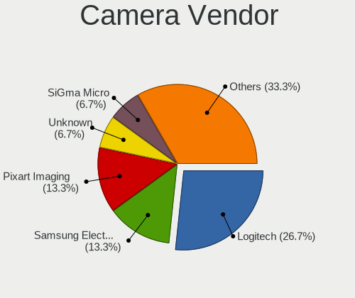

| Vendor                        | Desktops | Percent |
|-------------------------------|----------|---------|
| Logitech                      | 7        | 28%     |
| Microdia                      | 4        | 16%     |
| Z-Star Microelectronics       | 2        | 8%      |
| Sunplus Innovation Technology | 2        | 8%      |
| Microsoft                     | 2        | 8%      |
| WaveRider Communications      | 1        | 4%      |
| Sonix Technology              | 1        | 4%      |
| Samsung Electronics           | 1        | 4%      |
| Lenovo                        | 1        | 4%      |
| Jieli Technology              | 1        | 4%      |
| Intel                         | 1        | 4%      |
| GEMBIRD                       | 1        | 4%      |
| Aveo Technology               | 1        | 4%      |

Camera Model
------------

Camera device models

| Model                                  | Desktops | Percent |
|----------------------------------------|----------|---------|
| Microdia HDP Webcam USB                | 3        | 12%     |
| Sunplus Full HD webcam                 | 2        | 8%      |
| Logitech Webcam C270                   | 2        | 8%      |
| Logitech HD Pro Webcam C920            | 2        | 8%      |
| Z-Star Vimicro USB2.0 UVC PC Camera    | 1        | 4%      |
| Z-Star Vimicro USB Camera (Altair)     | 1        | 4%      |
| WaveRider USB Live camera              | 1        | 4%      |
| Sonix GENERAL WEBCAM                   | 1        | 4%      |
| Samsung Galaxy A5 (MTP)                | 1        | 4%      |
| Microsoft LifeCam HD-3000              | 1        | 4%      |
| Microsoft LifeCam Cinema               | 1        | 4%      |
| Microdia Camera                        | 1        | 4%      |
| Logitech Webcam C200                   | 1        | 4%      |
| Logitech HD Webcam C510                | 1        | 4%      |
| Logitech C922 Pro Stream Webcam        | 1        | 4%      |
| Lenovo FHD Webcam Audio                | 1        | 4%      |
| Jieli USB PHY 2.0                      | 1        | 4%      |
| Intel RealSense 3D Camera (Front F200) | 1        | 4%      |
| GEMBIRD USB2.0 PC CAMERA               | 1        | 4%      |
| Aveo USB2.0 Camera                     | 1        | 4%      |

Security
--------

Fingerprint Vendor
------------------

Fingerprint sensor vendors

Zero info for selected period =(

Fingerprint Model
-----------------

Fingerprint sensor models

Zero info for selected period =(

Chipcard Vendor
---------------

Chipcard module vendors

| Vendor                | Desktops | Percent |
|-----------------------|----------|---------|
| Gemalto (was Gemplus) | 1        | 100%    |

Chipcard Model
--------------

Chipcard module models

| Model                                             | Desktops | Percent |
|---------------------------------------------------|----------|---------|
| Gemalto (was Gemplus) GemPC Twin SmartCard Reader | 1        | 100%    |

Unsupported
-----------

Unsupported Devices
-------------------

Total unsupported devices on board

| Total | Desktops | Percent |
|-------|----------|---------|
| 0     | 91       | 86.67%  |
| 1     | 12       | 11.43%  |
| 3     | 1        | 0.95%   |
| 2     | 1        | 0.95%   |

Unsupported Device Types
------------------------

Types of unsupported devices

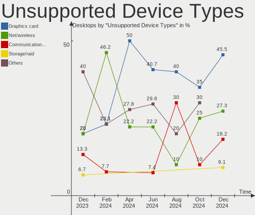

| Type                     | Desktops | Percent |
|--------------------------|----------|---------|
| Graphics card            | 6        | 37.5%   |
| Net/wireless             | 4        | 25%     |
| Unassigned class         | 2        | 12.5%   |
| Sound                    | 1        | 6.25%   |
| Net/ethernet             | 1        | 6.25%   |
| Communication controller | 1        | 6.25%   |
| Chipcard                 | 1        | 6.25%   |

