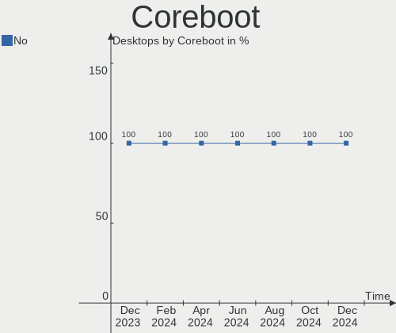
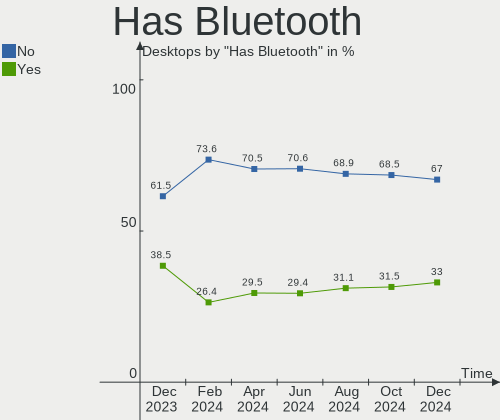
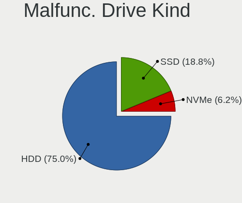
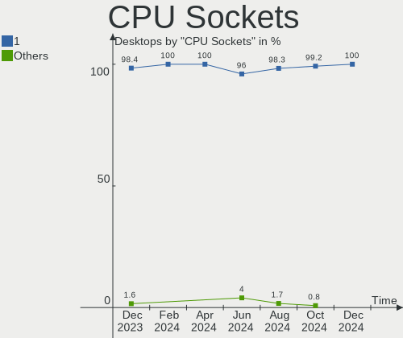
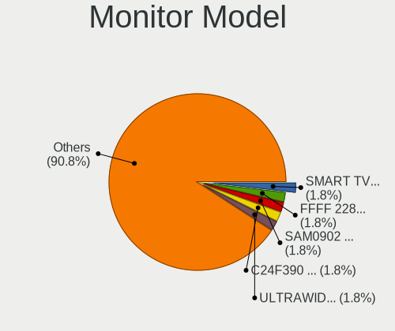
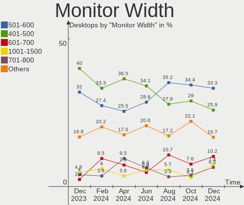
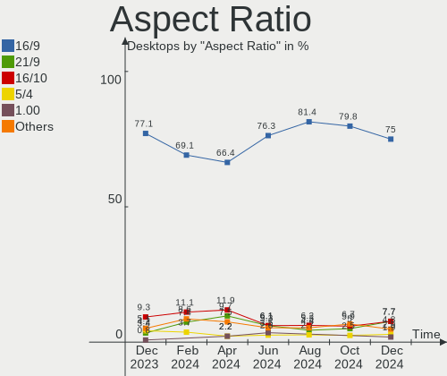
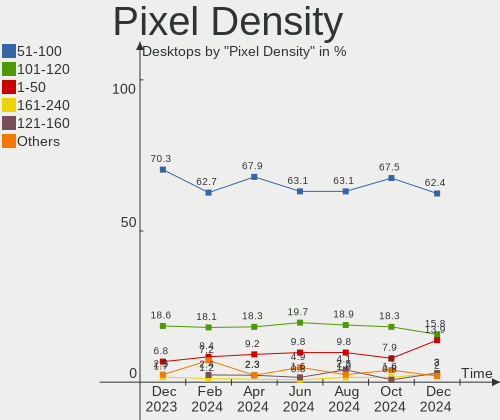
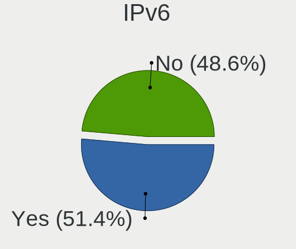
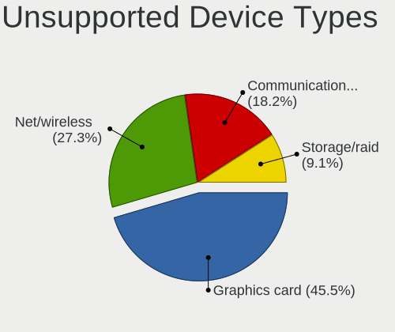

Linux in Brazil - Hardware Trends (Desktops)
--------------------------------------------

A project to identify most popular hardware characteristics and track their change
over time based on data collected by Linux users at https://Linux-Hardware.org.

Anyone can contribute to this report by the [hw-probe](https://github.com/linuxhw/hw-probe) tool:

    sudo -E hw-probe -all -upload

Period: Nov, 2022.

Contents
--------

* [ System ](#system)
  - [ OS                       ](#os)
  - [ OS Family                ](#os-family)
  - [ Kernel                   ](#kernel)
  - [ Kernel Family            ](#kernel-family)
  - [ Kernel Major Ver.        ](#kernel-major-ver)
  - [ Arch                     ](#arch)
  - [ DE                       ](#de)
  - [ Display Server           ](#display-server)
  - [ Display Manager          ](#display-manager)
  - [ OS Lang                  ](#os-lang)
  - [ Boot Mode                ](#boot-mode)
  - [ Filesystem               ](#filesystem)
  - [ Part. scheme             ](#part-scheme)
  - [ Dual Boot with Linux/BSD ](#dual-boot-with-linuxbsd)
  - [ Dual Boot (Win)          ](#dual-boot-win)

* [ Board ](#board)
  - [ Vendor                   ](#vendor)
  - [ Model                    ](#model)
  - [ Model Family             ](#model-family)
  - [ MFG Year                 ](#mfg-year)
  - [ Form Factor              ](#form-factor)
  - [ Secure Boot              ](#secure-boot)
  - [ Coreboot                 ](#coreboot)
  - [ RAM Size                 ](#ram-size)
  - [ RAM Used                 ](#ram-used)
  - [ Total Drives             ](#total-drives)
  - [ Has CD-ROM               ](#has-cd-rom)
  - [ Has Ethernet             ](#has-ethernet)
  - [ Has WiFi                 ](#has-wifi)
  - [ Has Bluetooth            ](#has-bluetooth)

* [ Location ](#location)
  - [ Country                  ](#country)
  - [ City                     ](#city)

* [ Drives ](#drives)
  - [ Drive Vendor             ](#drive-vendor)
  - [ Drive Model              ](#drive-model)
  - [ HDD Vendor               ](#hdd-vendor)
  - [ SSD Vendor               ](#ssd-vendor)
  - [ Drive Kind               ](#drive-kind)
  - [ Drive Connector          ](#drive-connector)
  - [ Drive Size               ](#drive-size)
  - [ Space Total              ](#space-total)
  - [ Space Used               ](#space-used)
  - [ Malfunc. Drives          ](#malfunc-drives)
  - [ Malfunc. Drive Vendor    ](#malfunc-drive-vendor)
  - [ Malfunc. HDD Vendor      ](#malfunc-hdd-vendor)
  - [ Malfunc. Drive Kind      ](#malfunc-drive-kind)
  - [ Failed Drives            ](#failed-drives)
  - [ Failed Drive Vendor      ](#failed-drive-vendor)
  - [ Drive Status             ](#drive-status)

* [ Storage controller ](#storage-controller)
  - [ Storage Vendor           ](#storage-vendor)
  - [ Storage Model            ](#storage-model)
  - [ Storage Kind             ](#storage-kind)

* [ Processor ](#processor)
  - [ CPU Vendor               ](#cpu-vendor)
  - [ CPU Model                ](#cpu-model)
  - [ CPU Model Family         ](#cpu-model-family)
  - [ CPU Cores                ](#cpu-cores)
  - [ CPU Sockets              ](#cpu-sockets)
  - [ CPU Threads              ](#cpu-threads)
  - [ CPU Op-Modes             ](#cpu-op-modes)
  - [ CPU Microcode            ](#cpu-microcode)
  - [ CPU Microarch            ](#cpu-microarch)

* [ Graphics ](#graphics)
  - [ GPU Vendor               ](#gpu-vendor)
  - [ GPU Model                ](#gpu-model)
  - [ GPU Combo                ](#gpu-combo)
  - [ GPU Driver               ](#gpu-driver)
  - [ GPU Memory               ](#gpu-memory)

* [ Monitor ](#monitor)
  - [ Monitor Vendor           ](#monitor-vendor)
  - [ Monitor Model            ](#monitor-model)
  - [ Monitor Resolution       ](#monitor-resolution)
  - [ Monitor Diagonal         ](#monitor-diagonal)
  - [ Monitor Width            ](#monitor-width)
  - [ Aspect Ratio             ](#aspect-ratio)
  - [ Monitor Area             ](#monitor-area)
  - [ Pixel Density            ](#pixel-density)
  - [ Multiple Monitors        ](#multiple-monitors)

* [ Network ](#network)
  - [ Net Controller Vendor    ](#net-controller-vendor)
  - [ Net Controller Model     ](#net-controller-model)
  - [ Wireless Vendor          ](#wireless-vendor)
  - [ Wireless Model           ](#wireless-model)
  - [ Ethernet Vendor          ](#ethernet-vendor)
  - [ Ethernet Model           ](#ethernet-model)
  - [ Net Controller Kind      ](#net-controller-kind)
  - [ Used Controller          ](#used-controller)
  - [ NICs                     ](#nics)
  - [ IPv6                     ](#ipv6)

* [ Bluetooth ](#bluetooth)
  - [ Bluetooth Vendor         ](#bluetooth-vendor)
  - [ Bluetooth Model          ](#bluetooth-model)

* [ Sound ](#sound)
  - [ Sound Vendor             ](#sound-vendor)
  - [ Sound Model              ](#sound-model)

* [ Memory ](#memory)
  - [ Memory Vendor            ](#memory-vendor)
  - [ Memory Model             ](#memory-model)
  - [ Memory Kind              ](#memory-kind)
  - [ Memory Form Factor       ](#memory-form-factor)
  - [ Memory Size              ](#memory-size)
  - [ Memory Speed             ](#memory-speed)

* [ Printers & scanners ](#printers--scanners)
  - [ Printer Vendor           ](#printer-vendor)
  - [ Printer Model            ](#printer-model)
  - [ Scanner Vendor           ](#scanner-vendor)
  - [ Scanner Model            ](#scanner-model)

* [ Camera ](#camera)
  - [ Camera Vendor            ](#camera-vendor)
  - [ Camera Model             ](#camera-model)

* [ Security ](#security)
  - [ Fingerprint Vendor       ](#fingerprint-vendor)
  - [ Fingerprint Model        ](#fingerprint-model)
  - [ Chipcard Vendor          ](#chipcard-vendor)
  - [ Chipcard Model           ](#chipcard-model)

* [ Unsupported ](#unsupported)
  - [ Unsupported Devices      ](#unsupported-devices)
  - [ Unsupported Device Types ](#unsupported-device-types)

System
------

OS
--

Installed operating systems

| Name                         | Desktops | Percent |
|------------------------------|----------|---------|
| Ubuntu 22.04                 | 17       | 18.48%  |
| OpenMandriva 4.3             | 9        | 9.78%   |
| Zorin 16                     | 6        | 6.52%   |
| Linux Mint 21                | 6        | 6.52%   |
| Fedora 36                    | 6        | 6.52%   |
| Arch Rolling                 | 5        | 5.43%   |
| Fedora 37                    | 4        | 4.35%   |
| Ubuntu 22.10                 | 2        | 2.17%   |
| Ubuntu 18.04                 | 2        | 2.17%   |
| ROSA 12.3                    | 2        | 2.17%   |
| Pop!_OS 22.04                | 2        | 2.17%   |
| Pop!_OS 20.04                | 2        | 2.17%   |
| OpenMandriva 4.2             | 2        | 2.17%   |
| Kubuntu 22.10                | 2        | 2.17%   |
| KDE neon 22.04               | 2        | 2.17%   |
| Kali 2022.3                  | 2        | 2.17%   |
| Zorin 15                     | 1        | 1.09%   |
| Xubuntu 22.04                | 1        | 1.09%   |
| Ubuntu MATE 18.04            | 1        | 1.09%   |
| SteamOS 3.4                  | 1        | 1.09%   |
| openSUSE Tumbleweed-XXXXXXXX | 1        | 1.09%   |
| OpenMandriva 4.90            | 1        | 1.09%   |
| OpenMandriva 4.50            | 1        | 1.09%   |
| MX 19                        | 1        | 1.09%   |
| Manjaro 22.0.0               | 1        | 1.09%   |
| Manjaro                      | 1        | 1.09%   |
| Lubuntu 22.10                | 1        | 1.09%   |
| LMDE 5                       | 1        | 1.09%   |
| Linux Mint 20.3              | 1        | 1.09%   |
| Linux Mint 20.2              | 1        | 1.09%   |
| Linux Mint 20.1              | 1        | 1.09%   |
| Linux Mint 19.2              | 1        | 1.09%   |
| Endless 4.0.10               | 1        | 1.09%   |
| EndeavourOS Rolling          | 1        | 1.09%   |
| Elementary 6.1               | 1        | 1.09%   |
| Debian Testing               | 1        | 1.09%   |
| ArcoLinux Rolling            | 1        | 1.09%   |

OS Family
---------

OS without a version

| Name         | Desktops | Percent |
|--------------|----------|---------|
| Ubuntu       | 21       | 22.83%  |
| OpenMandriva | 13       | 14.13%  |
| Linux Mint   | 10       | 10.87%  |
| Fedora       | 10       | 10.87%  |
| Zorin        | 7        | 7.61%   |
| Arch         | 5        | 5.43%   |
| Pop!_OS      | 4        | 4.35%   |
| ROSA         | 2        | 2.17%   |
| Manjaro      | 2        | 2.17%   |
| Kubuntu      | 2        | 2.17%   |
| KDE neon     | 2        | 2.17%   |
| Kali         | 2        | 2.17%   |
| Xubuntu      | 1        | 1.09%   |
| Ubuntu MATE  | 1        | 1.09%   |
| SteamOS      | 1        | 1.09%   |
| openSUSE     | 1        | 1.09%   |
| MX           | 1        | 1.09%   |
| Lubuntu      | 1        | 1.09%   |
| LMDE         | 1        | 1.09%   |
| Endless      | 1        | 1.09%   |
| EndeavourOS  | 1        | 1.09%   |
| Elementary   | 1        | 1.09%   |
| Debian       | 1        | 1.09%   |
| ArcoLinux    | 1        | 1.09%   |

Kernel
------

Version of the Linux kernel

| Version                                | Desktops | Percent |
|----------------------------------------|----------|---------|
| 5.15.0-53-generic                      | 19       | 20.65%  |
| 5.15.0-52-generic                      | 11       | 11.96%  |
| 5.16.7-desktop-1omv4003                | 8        | 8.7%    |
| 5.19.0-23-generic                      | 5        | 5.43%   |
| 5.4.0-131-generic                      | 4        | 4.35%   |
| 6.0.5-200.fc36.x86_64                  | 3        | 3.26%   |
| 6.0.9-arch1-1                          | 2        | 2.17%   |
| 6.0.9-300.fc37.x86_64                  | 2        | 2.17%   |
| 6.0.6-76060006-generic                 | 2        | 2.17%   |
| 5.19.0-kali2-amd64                     | 2        | 2.17%   |
| 5.17.5-76051705-generic                | 2        | 2.17%   |
| 5.15.75-generic-1rosa2021.1-x86_64     | 2        | 2.17%   |
| 5.15.0-43-generic                      | 2        | 2.17%   |
| 5.10.14-desktop-1omv4002               | 2        | 2.17%   |
| 6.0.8-300.fc37.x86_64                  | 1        | 1.09%   |
| 6.0.8-200.fc36.x86_64                  | 1        | 1.09%   |
| 6.0.7-x64v1-xanmod1-1                  | 1        | 1.09%   |
| 6.0.7-arch1-1                          | 1        | 1.09%   |
| 6.0.7-301.fc37.x86_64                  | 1        | 1.09%   |
| 6.0.7-200.fc36.x86_64                  | 1        | 1.09%   |
| 6.0.7-1-default                        | 1        | 1.09%   |
| 6.0.6-arch1-1                          | 1        | 1.09%   |
| 6.0.2-x64v2-xanmod1-1                  | 1        | 1.09%   |
| 6.0.10-200.fc36.x86_64                 | 1        | 1.09%   |
| 6.0.0-2-amd64                          | 1        | 1.09%   |
| 5.4.0-84-generic                       | 1        | 1.09%   |
| 5.4.0-3-amd64                          | 1        | 1.09%   |
| 5.4.0-132-generic                      | 1        | 1.09%   |
| 5.4.0-122-generic                      | 1        | 1.09%   |
| 5.19.12-desktop-2omv4090               | 1        | 1.09%   |
| 5.18.12-desktop-3omv4090               | 1        | 1.09%   |
| 5.18.1-arch1_testHoloISO_20220606.1811 | 1        | 1.09%   |
| 5.16.13-desktop-1omv4003               | 1        | 1.09%   |
| 5.16.12-arch1-1                        | 1        | 1.09%   |
| 5.15.77-1-lts                          | 1        | 1.09%   |
| 5.15.74-3-MANJARO                      | 1        | 1.09%   |
| 5.15.0-41-generic                      | 1        | 1.09%   |
| 5.11.0-35-generic                      | 1        | 1.09%   |
| 5.10.0-19-amd64                        | 1        | 1.09%   |
| 5.0.0-23-generic                       | 1        | 1.09%   |

Kernel Family
-------------

Linux kernel without a distro release

| Version | Desktops | Percent |
|---------|----------|---------|
| 5.15.0  | 33       | 35.87%  |
| 5.4.0   | 8        | 8.7%    |
| 5.16.7  | 8        | 8.7%    |
| 5.19.0  | 7        | 7.61%   |
| 6.0.7   | 5        | 5.43%   |
| 6.0.9   | 4        | 4.35%   |
| 6.0.6   | 3        | 3.26%   |
| 6.0.5   | 3        | 3.26%   |
| 6.0.8   | 2        | 2.17%   |
| 5.17.5  | 2        | 2.17%   |
| 5.15.75 | 2        | 2.17%   |
| 5.10.14 | 2        | 2.17%   |
| 6.0.2   | 1        | 1.09%   |
| 6.0.10  | 1        | 1.09%   |
| 6.0.0   | 1        | 1.09%   |
| 5.19.12 | 1        | 1.09%   |
| 5.18.12 | 1        | 1.09%   |
| 5.18.1  | 1        | 1.09%   |
| 5.16.13 | 1        | 1.09%   |
| 5.16.12 | 1        | 1.09%   |
| 5.15.77 | 1        | 1.09%   |
| 5.15.74 | 1        | 1.09%   |
| 5.11.0  | 1        | 1.09%   |
| 5.10.0  | 1        | 1.09%   |
| 5.0.0   | 1        | 1.09%   |

Kernel Major Ver.
-----------------

Linux kernel major version

| Version | Desktops | Percent |
|---------|----------|---------|
| 5.15    | 37       | 40.22%  |
| 6.0     | 20       | 21.74%  |
| 5.16    | 10       | 10.87%  |
| 5.4     | 8        | 8.7%    |
| 5.19    | 8        | 8.7%    |
| 5.10    | 3        | 3.26%   |
| 5.18    | 2        | 2.17%   |
| 5.17    | 2        | 2.17%   |
| 5.11    | 1        | 1.09%   |
| 5.0     | 1        | 1.09%   |

Arch
----

OS architecture (x86_64, i586, etc.)

| Name   | Desktops | Percent |
|--------|----------|---------|
| x86_64 | 91       | 98.91%  |
| i686   | 1        | 1.09%   |

DE
--

Desktop Environment

| Name       | Desktops | Percent |
|------------|----------|---------|
| GNOME      | 42       | 45.65%  |
| KDE5       | 26       | 28.26%  |
| XFCE       | 9        | 9.78%   |
| X-Cinnamon | 9        | 9.78%   |
| MATE       | 2        | 2.17%   |
| i3         | 2        | 2.17%   |
| Pantheon   | 1        | 1.09%   |
| LXQt       | 1        | 1.09%   |

Display Server
--------------

X11 or Wayland

| Name    | Desktops | Percent |
|---------|----------|---------|
| X11     | 71       | 77.17%  |
| Wayland | 20       | 21.74%  |
| Tty     | 1        | 1.09%   |

Display Manager
---------------

SDDM, LightDM, etc.

| Name    | Desktops | Percent |
|---------|----------|---------|
| Unknown | 39       | 42.39%  |
| GDM3    | 21       | 22.83%  |
| SDDM    | 18       | 19.57%  |
| LightDM | 8        | 8.7%    |
| GDM     | 6        | 6.52%   |

OS Lang
-------

Language

| Lang      | Desktops | Percent |
|-----------|----------|---------|
| pt_BR     | 66       | 71.74%  |
| en_US     | 20       | 21.74%  |
| en_GB     | 2        | 2.17%   |
| C         | 2        | 2.17%   |
| pt_PT     | 1        | 1.09%   |
| pt_BRutf8 | 1        | 1.09%   |

Boot Mode
---------

EFI or BIOS

| Mode | Desktops | Percent |
|------|----------|---------|
| BIOS | 55       | 59.78%  |
| EFI  | 37       | 40.22%  |

Filesystem
----------

Type of filesystem

| Type    | Desktops | Percent |
|---------|----------|---------|
| Ext4    | 60       | 65.22%  |
| Btrfs   | 16       | 17.39%  |
| Overlay | 15       | 16.3%   |
| Zfs     | 1        | 1.09%   |

Part. scheme
------------

Scheme of partitioning

| Type    | Desktops | Percent |
|---------|----------|---------|
| Unknown | 40       | 43.48%  |
| GPT     | 35       | 38.04%  |
| MBR     | 17       | 18.48%  |

Dual Boot with Linux/BSD
------------------------

Hosting more than one Linux/BSD

| Dual boot | Desktops | Percent |
|-----------|----------|---------|
| No        | 74       | 80.43%  |
| Yes       | 18       | 19.57%  |

Dual Boot (Win)
---------------

Hosting Linux and Windows

| Dual boot | Desktops | Percent |
|-----------|----------|---------|
| No        | 67       | 72.83%  |
| Yes       | 25       | 27.17%  |

Board
-----

Vendor
------

Motherboard manufacturer

| Name                | Desktops | Percent |
|---------------------|----------|---------|
| Gigabyte Technology | 15       | 16.3%   |
| ASUSTek Computer    | 14       | 15.22%  |
| Intel               | 9        | 9.78%   |
| ASRock              | 9        | 9.78%   |
| MSI                 | 7        | 7.61%   |
| PCWare              | 6        | 6.52%   |
| Dell                | 4        | 4.35%   |
| Huanan              | 3        | 3.26%   |
| VS Company          | 2        | 2.17%   |
| Positivo            | 2        | 2.17%   |
| Hewlett-Packard     | 2        | 2.17%   |
| Colorful Technology | 2        | 2.17%   |
| Biostar             | 2        | 2.17%   |
| AMD                 | 2        | 2.17%   |
| Unknown             | 2        | 2.17%   |
| Wistron             | 1        | 1.09%   |
| Supermicro          | 1        | 1.09%   |
| QIYIDA              | 1        | 1.09%   |
| OKI Brasil          | 1        | 1.09%   |
| Megaware            | 1        | 1.09%   |
| Login Informatica   | 1        | 1.09%   |
| Lenovo              | 1        | 1.09%   |
| HOUTER              | 1        | 1.09%   |
| GALAX               | 1        | 1.09%   |
| Foxconn             | 1        | 1.09%   |
| ALDO                | 1        | 1.09%   |

Model
-----

Motherboard model

| Name                           | Desktops | Percent |
|--------------------------------|----------|---------|
| Intel H61                      | 4        | 4.35%   |
| Gigabyte B75M-D3H              | 3        | 3.26%   |
| ASRock B450M Steel Legend      | 3        | 3.26%   |
| Unknown                        | 3        | 3.26%   |
| Intel B75                      | 2        | 2.17%   |
| Gigabyte B550M AORUS ELITE     | 2        | 2.17%   |
| ASUS PRIME B450M-GAMING/BR     | 2        | 2.17%   |
| ASUS All Series                | 2        | 2.17%   |
| Wistron ProLiant ML110 G6      | 1        | 1.09%   |
| VS Company MCP61M              | 1        | 1.09%   |
| VS Company G31T-M              | 1        | 1.09%   |
| Supermicro PDSMi               | 1        | 1.09%   |
| QIYIDA X99-H9 V2.0             | 1        | 1.09%   |
| Positivo POS-EIH61CR           | 1        | 1.09%   |
| Positivo P5VD2-MX              | 1        | 1.09%   |
| PCWare IPX4005G                | 1        | 1.09%   |
| PCWare IPMH61R3                | 1        | 1.09%   |
| PCWare IPMH61R2                | 1        | 1.09%   |
| PCWare IPMH61R1                | 1        | 1.09%   |
| PCWare IPMH110G                | 1        | 1.09%   |
| PCWare APM-A320G               | 1        | 1.09%   |
| OKI Brasil Infoway ST-4280     | 1        | 1.09%   |
| MSI s5650br                    | 1        | 1.09%   |
| MSI MS-7A15                    | 1        | 1.09%   |
| MSI MS-7998                    | 1        | 1.09%   |
| MSI MS-7788                    | 1        | 1.09%   |
| MSI MS-7758                    | 1        | 1.09%   |
| MSI MS-7680                    | 1        | 1.09%   |
| MSI MS-7586                    | 1        | 1.09%   |
| Megaware MW-NM70HD-MI          | 1        | 1.09%   |
| Login Informatica LOG-H61H2-M2 | 1        | 1.09%   |
| Lenovo 62 2122AAP              | 1        | 1.09%   |
| Intel H55                      | 1        | 1.09%   |
| Intel DG41WV                   | 1        | 1.09%   |
| Huanan X99-F8D PLUS V1.1       | 1        | 1.09%   |
| Huanan X99-F8                  | 1        | 1.09%   |
| Huanan X99-8M-F V1.1           | 1        | 1.09%   |
| HOUTER IPMIP-GS                | 1        | 1.09%   |
| HP ProDesk 600 G1 SFF          | 1        | 1.09%   |
| HP 402 G1 SFF Business PC      | 1        | 1.09%   |

Model Family
------------

Motherboard model prefix

| Name                           | Desktops | Percent |
|--------------------------------|----------|---------|
| Intel H61                      | 4        | 4.35%   |
| Gigabyte B75M-D3H              | 3        | 3.26%   |
| ASUS PRIME                     | 3        | 3.26%   |
| ASUS P8H61-M                   | 3        | 3.26%   |
| ASRock B450M                   | 3        | 3.26%   |
| Unknown                        | 3        | 3.26%   |
| Intel B75                      | 2        | 2.17%   |
| Gigabyte B550M                 | 2        | 2.17%   |
| Dell Precision                 | 2        | 2.17%   |
| ASUS All                       | 2        | 2.17%   |
| Wistron ProLiant               | 1        | 1.09%   |
| VS Company MCP61M              | 1        | 1.09%   |
| VS Company G31T-M              | 1        | 1.09%   |
| Supermicro PDSMi               | 1        | 1.09%   |
| QIYIDA X99-H9                  | 1        | 1.09%   |
| Positivo POS-EIH61CR           | 1        | 1.09%   |
| Positivo P5VD2-MX              | 1        | 1.09%   |
| PCWare IPX4005G                | 1        | 1.09%   |
| PCWare IPMH61R3                | 1        | 1.09%   |
| PCWare IPMH61R2                | 1        | 1.09%   |
| PCWare IPMH61R1                | 1        | 1.09%   |
| PCWare IPMH110G                | 1        | 1.09%   |
| PCWare APM-A320G               | 1        | 1.09%   |
| OKI Brasil Infoway             | 1        | 1.09%   |
| MSI s5650br                    | 1        | 1.09%   |
| MSI MS-7A15                    | 1        | 1.09%   |
| MSI MS-7998                    | 1        | 1.09%   |
| MSI MS-7788                    | 1        | 1.09%   |
| MSI MS-7758                    | 1        | 1.09%   |
| MSI MS-7680                    | 1        | 1.09%   |
| MSI MS-7586                    | 1        | 1.09%   |
| Megaware MW-NM70HD-MI          | 1        | 1.09%   |
| Login Informatica LOG-H61H2-M2 | 1        | 1.09%   |
| Lenovo 62                      | 1        | 1.09%   |
| Intel H55                      | 1        | 1.09%   |
| Intel DG41WV                   | 1        | 1.09%   |
| Huanan X99-F8D                 | 1        | 1.09%   |
| Huanan X99-F8                  | 1        | 1.09%   |
| Huanan X99-8M-F                | 1        | 1.09%   |
| HOUTER IPMIP-GS                | 1        | 1.09%   |

MFG Year
--------

Motherboard manufacture year

| Year | Desktops | Percent |
|------|----------|---------|
| 2019 | 11       | 11.96%  |
| 2018 | 11       | 11.96%  |
| 2013 | 9        | 9.78%   |
| 2017 | 8        | 8.7%    |
| 2012 | 8        | 8.7%    |
| 2011 | 8        | 8.7%    |
| 2016 | 7        | 7.61%   |
| 2020 | 6        | 6.52%   |
| 2021 | 4        | 4.35%   |
| 2010 | 4        | 4.35%   |
| 2014 | 3        | 3.26%   |
| 2009 | 3        | 3.26%   |
| 2008 | 3        | 3.26%   |
| 2007 | 3        | 3.26%   |
| 2015 | 2        | 2.17%   |
| 2022 | 1        | 1.09%   |
| 2006 | 1        | 1.09%   |

Form Factor
-----------

Physical design of the computer

| Name    | Desktops | Percent |
|---------|----------|---------|
| Desktop | 92       | 100%    |

Secure Boot
-----------

Enabled or disabled

| State    | Desktops | Percent |
|----------|----------|---------|
| Disabled | 89       | 96.74%  |
| Enabled  | 3        | 3.26%   |

Coreboot
--------

Have coreboot on board

| Used | Desktops | Percent |
|------|----------|---------|
| No   | 92       | 100%    |

RAM Size
--------

Total RAM memory

| Size in GB  | Desktops | Percent |
|-------------|----------|---------|
| 16.01-24.0  | 26       | 28.26%  |
| 4.01-8.0    | 22       | 23.91%  |
| 8.01-16.0   | 21       | 22.83%  |
| 3.01-4.0    | 13       | 14.13%  |
| 32.01-64.0  | 6        | 6.52%   |
| 24.01-32.0  | 1        | 1.09%   |
| 2.01-3.0    | 1        | 1.09%   |
| 64.01-256.0 | 1        | 1.09%   |
| 1.01-2.0    | 1        | 1.09%   |

RAM Used
--------

Used RAM memory

| Used GB   | Desktops | Percent |
|-----------|----------|---------|
| 1.01-2.0  | 31       | 33.7%   |
| 2.01-3.0  | 24       | 26.09%  |
| 3.01-4.0  | 17       | 18.48%  |
| 4.01-8.0  | 11       | 11.96%  |
| 8.01-16.0 | 3        | 3.26%   |
| 0.51-1.0  | 3        | 3.26%   |
| 0.01-0.5  | 3        | 3.26%   |

Total Drives
------------

Number of drives on board

| Drives | Desktops | Percent |
|--------|----------|---------|
| 1      | 41       | 44.57%  |
| 2      | 27       | 29.35%  |
| 3      | 15       | 16.3%   |
| 4      | 6        | 6.52%   |
| 6      | 1        | 1.09%   |
| 5      | 1        | 1.09%   |
| 0      | 1        | 1.09%   |

Has CD-ROM
----------

Has CD-ROM on board

| Presented | Desktops | Percent |
|-----------|----------|---------|
| No        | 67       | 72.83%  |
| Yes       | 25       | 27.17%  |

Has Ethernet
------------

Has Ethernet on board

| Presented | Desktops | Percent |
|-----------|----------|---------|
| Yes       | 91       | 98.91%  |
| No        | 1        | 1.09%   |

Has WiFi
--------

Has WiFi module

| Presented | Desktops | Percent |
|-----------|----------|---------|
| No        | 57       | 61.96%  |
| Yes       | 35       | 38.04%  |

Has Bluetooth
-------------

Has Bluetooth module

| Presented | Desktops | Percent |
|-----------|----------|---------|
| No        | 76       | 82.61%  |
| Yes       | 16       | 17.39%  |

Location
--------

Country
-------

Geographic location (country)

| Country | Desktops | Percent |
|---------|----------|---------|
| Brazil  | 92       | 100%    |

City
----

Geographic location (city)

| City                   | Desktops | Percent |
|------------------------|----------|---------|
| Sao Paulo              | 10       | 10.87%  |
| Rio de Janeiro         | 10       | 10.87%  |
| Fortaleza              | 3        | 3.26%   |
| Serra                  | 2        | 2.17%   |
| Santo André           | 2        | 2.17%   |
| Ribeirao Preto         | 2        | 2.17%   |
| Porto Alegre           | 2        | 2.17%   |
| Guarulhos              | 2        | 2.17%   |
| Florianópolis         | 2        | 2.17%   |
| Duque de Caxias        | 2        | 2.17%   |
| Criciúma              | 2        | 2.17%   |
| Caninde                | 2        | 2.17%   |
| Brasília              | 2        | 2.17%   |
| Wagner                 | 1        | 1.09%   |
| Vitória da Conquista  | 1        | 1.09%   |
| Toritama               | 1        | 1.09%   |
| Tatuí                 | 1        | 1.09%   |
| Taboao da Serra        | 1        | 1.09%   |
| Serra Dourada          | 1        | 1.09%   |
| Sao Vicente            | 1        | 1.09%   |
| Sao Pedro da Aldeia    | 1        | 1.09%   |
| Sao José dos Campos   | 1        | 1.09%   |
| Sao Goncalo            | 1        | 1.09%   |
| Sao Carlos             | 1        | 1.09%   |
| Santos                 | 1        | 1.09%   |
| Santa Barbara de Goias | 1        | 1.09%   |
| Salvador               | 1        | 1.09%   |
| Ribeira                | 1        | 1.09%   |
| Pouso Alegre           | 1        | 1.09%   |
| Ponta Grossa           | 1        | 1.09%   |
| Picos                  | 1        | 1.09%   |
| Novo Hamburgo          | 1        | 1.09%   |
| Novo Brasil            | 1        | 1.09%   |
| Nova Mutum             | 1        | 1.09%   |
| Nova Iguaçu           | 1        | 1.09%   |
| Monte Mor              | 1        | 1.09%   |
| Maringá               | 1        | 1.09%   |
| Marília               | 1        | 1.09%   |
| Manaus                 | 1        | 1.09%   |
| Jequié                | 1        | 1.09%   |

Drives
------

Drive Vendor
------------

Hard drive vendors

| Vendor                       | Desktops | Drives | Percent |
|------------------------------|----------|--------|---------|
| Seagate                      | 30       | 36     | 18.87%  |
| WDC                          | 24       | 28     | 15.09%  |
| Kingston                     | 23       | 27     | 14.47%  |
| Samsung Electronics          | 20       | 20     | 12.58%  |
| SanDisk                      | 9        | 10     | 5.66%   |
| China                        | 7        | 9      | 4.4%    |
| Hitachi                      | 6        | 6      | 3.77%   |
| Crucial                      | 6        | 6      | 3.77%   |
| Toshiba                      | 5        | 5      | 3.14%   |
| A-DATA Technology            | 5        | 5      | 3.14%   |
| KingSpec                     | 4        | 4      | 2.52%   |
| Lexar                        | 3        | 3      | 1.89%   |
| Silicon Motion               | 2        | 3      | 1.26%   |
| Patriot                      | 2        | 2      | 1.26%   |
| HGST                         | 2        | 2      | 1.26%   |
| XrayDisk                     | 1        | 1      | 0.63%   |
| walram                       | 1        | 1      | 0.63%   |
| Realtek Semiconductor        | 1        | 1      | 0.63%   |
| RCESSD                       | 1        | 1      | 0.63%   |
| Phison Electronics           | 1        | 2      | 0.63%   |
| Phison                       | 1        | 1      | 0.63%   |
| Micron/Crucial Technology    | 1        | 1      | 0.63%   |
| KNUP                         | 1        | 1      | 0.63%   |
| HUSKY                        | 1        | 1      | 0.63%   |
| EGON                         | 1        | 1      | 0.63%   |
| Beijing Starblaze Technology | 1        | 1      | 0.63%   |

Drive Model
-----------

Hard drive models

| Model                                                 | Desktops | Percent |
|-------------------------------------------------------|----------|---------|
| Seagate ST500DM002-1BD142 500GB                       | 8        | 4.6%    |
| Kingston SA400S37240G 240GB SSD                       | 8        | 4.6%    |
| Seagate ST1000DM010-2EP102 1TB                        | 5        | 2.87%   |
| Samsung HD322HJ 320GB                                 | 5        | 2.87%   |
| Kingston SA400S37120G 120GB SSD                       | 4        | 2.3%    |
| Seagate ST3500312CS 500GB                             | 3        | 1.72%   |
| Seagate ST31000524AS 1TB                              | 3        | 1.72%   |
| Samsung HD502HJ 500GB                                 | 3        | 1.72%   |
| Crucial CT240BX500SSD1 240GB                          | 3        | 1.72%   |
| China SATA SSD 120GB                                  | 3        | 1.72%   |
| WDC WD5000AAKX-60U6AA0 500GB                          | 2        | 1.15%   |
| WDC WD10EURX-63UY4Y0 1TB                              | 2        | 1.15%   |
| WDC WD10EURX-63FH1Y0 1TB                              | 2        | 1.15%   |
| Toshiba HDWD110 1TB                                   | 2        | 1.15%   |
| Silicon Motion SM2263EN/SM2263XT SSD Controller 128GB | 2        | 1.15%   |
| Seagate ST1000DM003-1ER162 1TB                        | 2        | 1.15%   |
| SanDisk SDSSDA120G 120GB                              | 2        | 1.15%   |
| Samsung NVMe SSD Controller SM981/PM981/PM983 1TB     | 2        | 1.15%   |
| Samsung HD502HI 500GB                                 | 2        | 1.15%   |
| Samsung HD103SJ 1TB                                   | 2        | 1.15%   |
| Kingston SA400S37960G 960GB SSD                       | 2        | 1.15%   |
| Kingston SA400S37480G 480GB SSD                       | 2        | 1.15%   |
| Kingston SA400S37 480G SSD                            | 2        | 1.15%   |
| KingSpec P4-480 480GB SSD                             | 2        | 1.15%   |
| KingSpec P4-240 240GB SSD                             | 2        | 1.15%   |
| A-DATA SU650 120GB SSD                                | 2        | 1.15%   |
| A-DATA IM2P33F8ABR2-256GB                             | 2        | 1.15%   |
| XrayDisk 240GB                                        | 1        | 0.57%   |
| WDC WDS240G2G0B-00EPW0 240GB SSD                      | 1        | 0.57%   |
| WDC WDS120G1G0A-00SS50 120GB SSD                      | 1        | 0.57%   |
| WDC WD84PURZ-85B2YY0 8TB                              | 1        | 0.57%   |
| WDC WD800BD-22MRA1 80GB                               | 1        | 0.57%   |
| WDC WD60PURZ-85ZUFY1 6TB                              | 1        | 0.57%   |
| WDC WD5000LPVX-22V0TT0 500GB                          | 1        | 0.57%   |
| WDC WD5000LPCX-24C6HT0 500GB                          | 1        | 0.57%   |
| WDC WD5000BEKT-60KA9T0 500GB                          | 1        | 0.57%   |
| WDC WD5000AVDS-63U7B1 500GB                           | 1        | 0.57%   |
| WDC WD5000AVCS-632DY1 500GB                           | 1        | 0.57%   |
| WDC WD5000AAKX-08U6AA0 500GB                          | 1        | 0.57%   |
| WDC WD5000AAKX-00ERMA0 500GB                          | 1        | 0.57%   |

HDD Vendor
----------

Hard disk drive vendors

| Vendor              | Desktops | Drives | Percent |
|---------------------|----------|--------|---------|
| Seagate             | 30       | 36     | 36.14%  |
| WDC                 | 22       | 26     | 26.51%  |
| Samsung Electronics | 18       | 18     | 21.69%  |
| Hitachi             | 6        | 6      | 7.23%   |
| Toshiba             | 5        | 5      | 6.02%   |
| HGST                | 2        | 2      | 2.41%   |

SSD Vendor
----------

Solid state drive vendors

| Vendor            | Desktops | Drives | Percent |
|-------------------|----------|--------|---------|
| Kingston          | 21       | 25     | 35%     |
| SanDisk           | 8        | 8      | 13.33%  |
| China             | 7        | 9      | 11.67%  |
| Crucial           | 6        | 6      | 10%     |
| KingSpec          | 4        | 4      | 6.67%   |
| Lexar             | 3        | 3      | 5%      |
| A-DATA Technology | 3        | 3      | 5%      |
| WDC               | 2        | 2      | 3.33%   |
| Patriot           | 2        | 2      | 3.33%   |
| walram            | 1        | 1      | 1.67%   |
| KNUP              | 1        | 1      | 1.67%   |
| HUSKY             | 1        | 1      | 1.67%   |
| EGON              | 1        | 1      | 1.67%   |

Drive Kind
----------

HDD or SSD

| Kind    | Desktops | Drives | Percent |
|---------|----------|--------|---------|
| HDD     | 70       | 93     | 49.65%  |
| SSD     | 55       | 66     | 39.01%  |
| NVMe    | 14       | 17     | 9.93%   |
| Unknown | 2        | 2      | 1.42%   |

Drive Connector
---------------

SATA, SAS, NVMe, etc.

| Type | Desktops | Drives | Percent |
|------|----------|--------|---------|
| SATA | 91       | 159    | 85.05%  |
| NVMe | 14       | 17     | 13.08%  |
| SAS  | 2        | 2      | 1.87%   |

Drive Size
----------

Size of hard drive

| Size in TB | Desktops | Drives | Percent |
|------------|----------|--------|---------|
| 0.01-0.5   | 72       | 108    | 62.61%  |
| 0.51-1.0   | 35       | 43     | 30.43%  |
| 1.01-2.0   | 3        | 3      | 2.61%   |
| 2.01-3.0   | 2        | 2      | 1.74%   |
| 4.01-10.0  | 2        | 2      | 1.74%   |
| 3.01-4.0   | 1        | 1      | 0.87%   |

Space Total
-----------

Amount of disk space available on the file system

| Size in GB     | Desktops | Percent |
|----------------|----------|---------|
| 101-250        | 25       | 27.17%  |
| 251-500        | 19       | 20.65%  |
| 501-1000       | 14       | 15.22%  |
| 1-20           | 7        | 7.61%   |
| Unknown        | 7        | 7.61%   |
| More than 3000 | 6        | 6.52%   |
| 2001-3000      | 4        | 4.35%   |
| 1001-2000      | 4        | 4.35%   |
| 21-50          | 3        | 3.26%   |
| 51-100         | 3        | 3.26%   |

Space Used
----------

Amount of used disk space

| Used GB        | Desktops | Percent |
|----------------|----------|---------|
| 1-20           | 31       | 33.7%   |
| 21-50          | 19       | 20.65%  |
| 51-100         | 10       | 10.87%  |
| 251-500        | 8        | 8.7%    |
| 101-250        | 8        | 8.7%    |
| Unknown        | 7        | 7.61%   |
| 1001-2000      | 4        | 4.35%   |
| More than 3000 | 2        | 2.17%   |
| 501-1000       | 2        | 2.17%   |
| 2001-3000      | 1        | 1.09%   |

Malfunc. Drives
---------------

Drive models with a malfunction

| Model                             | Desktops | Drives | Percent |
|-----------------------------------|----------|--------|---------|
| Samsung Electronics HD502HJ 500GB | 2        | 2      | 12.5%   |
| Samsung Electronics HD322HJ 320GB | 2        | 2      | 12.5%   |
| WDC WD5000BEKT-60KA9T0 500GB      | 1        | 1      | 6.25%   |
| WDC WD5000AVCS-632DY1 500GB       | 1        | 2      | 6.25%   |
| WDC WD5000AAKX-60U6AA0 500GB      | 1        | 1      | 6.25%   |
| WDC WD10EZEX-00WN4A0 1TB          | 1        | 1      | 6.25%   |
| Seagate ST500DM002-1BD142 500GB   | 1        | 1      | 6.25%   |
| Seagate ST3320418AS 320GB         | 1        | 1      | 6.25%   |
| Seagate ST3160318AS 160GB         | 1        | 1      | 6.25%   |
| Seagate ST31000524AS 1TB          | 1        | 1      | 6.25%   |
| Hitachi HTS545050A7E380 500GB     | 1        | 1      | 6.25%   |
| Hitachi HTS543216L9SA00 160GB     | 1        | 1      | 6.25%   |
| Hitachi HDS722020ALA330 2TB       | 1        | 1      | 6.25%   |
| EGON S10 120GB SSD                | 1        | 1      | 6.25%   |

Malfunc. Drive Vendor
---------------------

Vendors of faulty drives

| Vendor              | Desktops | Drives | Percent |
|---------------------|----------|--------|---------|
| Seagate             | 4        | 4      | 28.57%  |
| Samsung Electronics | 4        | 4      | 28.57%  |
| Hitachi             | 3        | 3      | 21.43%  |
| WDC                 | 2        | 5      | 14.29%  |
| EGON                | 1        | 1      | 7.14%   |

Malfunc. HDD Vendor
-------------------

Vendors of faulty HDD drives

| Vendor              | Desktops | Drives | Percent |
|---------------------|----------|--------|---------|
| Seagate             | 4        | 4      | 30.77%  |
| Samsung Electronics | 4        | 4      | 30.77%  |
| Hitachi             | 3        | 3      | 23.08%  |
| WDC                 | 2        | 5      | 15.38%  |

Malfunc. Drive Kind
-------------------

Kinds of faulty drives

| Kind | Desktops | Drives | Percent |
|------|----------|--------|---------|
| HDD  | 11       | 16     | 91.67%  |
| SSD  | 1        | 1      | 8.33%   |

Failed Drives
-------------

Failed drive models

Zero info for selected period =(

Failed Drive Vendor
-------------------

Failed drive vendors

Zero info for selected period =(

Drive Status
------------

Number of failed and malfunc. drives

| Status   | Desktops | Drives | Percent |
|----------|----------|--------|---------|
| Detected | 57       | 112    | 56.44%  |
| Works    | 32       | 49     | 31.68%  |
| Malfunc  | 12       | 17     | 11.88%  |

Storage controller
------------------

Storage Vendor
--------------

Storage controller vendors

| Vendor                       | Desktops | Percent |
|------------------------------|----------|---------|
| Intel                        | 68       | 60.71%  |
| AMD                          | 19       | 16.96%  |
| Nvidia                       | 3        | 2.68%   |
| Silicon Motion               | 2        | 1.79%   |
| SanDisk                      | 2        | 1.79%   |
| Samsung Electronics          | 2        | 1.79%   |
| Phison Electronics           | 2        | 1.79%   |
| LSI Logic / Symbios Logic    | 2        | 1.79%   |
| Kingston Technology Company  | 2        | 1.79%   |
| JMicron Technology           | 2        | 1.79%   |
| ADATA Technology             | 2        | 1.79%   |
| VIA Technologies             | 1        | 0.89%   |
| Realtek Semiconductor        | 1        | 0.89%   |
| Micron/Crucial Technology    | 1        | 0.89%   |
| Marvell Technology Group     | 1        | 0.89%   |
| Beijing Starblaze Technology | 1        | 0.89%   |
| ASMedia Technology           | 1        | 0.89%   |

Storage Model
-------------

Storage controller models

| Model                                                                                   | Desktops | Percent |
|-----------------------------------------------------------------------------------------|----------|---------|
| Intel 6 Series/C200 Series Chipset Family 6 port Desktop SATA AHCI Controller           | 12       | 8.33%   |
| AMD FCH SATA Controller [AHCI mode]                                                     | 12       | 8.33%   |
| Intel 8 Series/C220 Series Chipset Family 6-port SATA Controller 1 [AHCI mode]          | 8        | 5.56%   |
| Intel Q170/Q150/B150/H170/H110/Z170/CM236 Chipset SATA Controller [AHCI Mode]           | 7        | 4.86%   |
| Intel 6 Series/C200 Series Chipset Family Desktop SATA Controller (IDE mode, ports 4-5) | 6        | 4.17%   |
| Intel 6 Series/C200 Series Chipset Family Desktop SATA Controller (IDE mode, ports 0-3) | 6        | 4.17%   |
| AMD 400 Series Chipset SATA Controller                                                  | 6        | 4.17%   |
| Intel NM10/ICH7 Family SATA Controller [IDE mode]                                       | 5        | 3.47%   |
| Intel 200 Series PCH SATA controller [AHCI mode]                                        | 5        | 3.47%   |
| AMD FCH SATA Controller D                                                               | 5        | 3.47%   |
| Nvidia MCP61 SATA Controller                                                            | 3        | 2.08%   |
| Nvidia MCP61 IDE                                                                        | 3        | 2.08%   |
| Intel SATA Controller [RAID mode]                                                       | 3        | 2.08%   |
| Intel 7 Series/C210 Series Chipset Family 6-port SATA Controller [AHCI mode]            | 3        | 2.08%   |
| Intel 7 Series/C210 Series Chipset Family 4-port SATA Controller [IDE mode]             | 3        | 2.08%   |
| Intel 7 Series/C210 Series Chipset Family 2-port SATA Controller [IDE mode]             | 3        | 2.08%   |
| Intel 5 Series/3400 Series Chipset 4 port SATA IDE Controller                           | 3        | 2.08%   |
| Intel 5 Series/3400 Series Chipset 2 port SATA IDE Controller                           | 3        | 2.08%   |
| Silicon Motion SM2263EN/SM2263XT SSD Controller                                         | 2        | 1.39%   |
| SanDisk Non-Volatile memory controller                                                  | 2        | 1.39%   |
| Samsung NVMe SSD Controller SM981/PM981/PM983                                           | 2        | 1.39%   |
| Phison E12 NVMe Controller                                                              | 2        | 1.39%   |
| LSI Logic / Symbios Logic SAS1068E PCI-Express Fusion-MPT SAS                           | 2        | 1.39%   |
| JMicron JMB363 SATA/IDE Controller                                                      | 2        | 1.39%   |
| Intel C610/X99 series chipset 6-Port SATA Controller [AHCI mode]                        | 2        | 1.39%   |
| Intel 82801G (ICH7 Family) IDE Controller                                               | 2        | 1.39%   |
| Intel 631xESB/632xESB SATA AHCI Controller                                              | 2        | 1.39%   |
| Intel 631xESB/632xESB IDE Controller                                                    | 2        | 1.39%   |
| Intel 5 Series/3400 Series Chipset 6 port SATA AHCI Controller                          | 2        | 1.39%   |
| AMD FCH IDE Controller                                                                  | 2        | 1.39%   |
| AMD 500 Series Chipset SATA Controller                                                  | 2        | 1.39%   |
| AMD 300 Series Chipset SATA Controller                                                  | 2        | 1.39%   |
| ADATA IM2P33F8ABR1 NVMe SSD                                                             | 2        | 1.39%   |
| VIA VT82C586A/B/VT82C686/A/B/VT823x/A/C PIPC Bus Master IDE                             | 1        | 0.69%   |
| VIA Serial ATA Controller                                                               | 1        | 0.69%   |
| Realtek Realtek Non-Volatile memory controller                                          | 1        | 0.69%   |
| Micron/Crucial P2 NVMe PCIe SSD                                                         | 1        | 0.69%   |
| Marvell Group 88SE9172 SATA III 6Gb/s RAID Controller                                   | 1        | 0.69%   |
| Kingston Company Company Non-Volatile memory controller                                 | 1        | 0.69%   |
| Kingston Company SNVS2000G [NV1 NVMe PCIe SSD 2TB]                                      | 1        | 0.69%   |

Storage Kind
------------

Kind of storage controller (IDE, SATA, NVMe, SAS, ...)

| Kind | Desktops | Percent |
|------|----------|---------|
| SATA | 67       | 58.77%  |
| IDE  | 28       | 24.56%  |
| NVMe | 14       | 12.28%  |
| RAID | 3        | 2.63%   |
| SCSI | 2        | 1.75%   |

Processor
---------

CPU Vendor
----------

Processor vendors

| Vendor | Desktops | Percent |
|--------|----------|---------|
| Intel  | 70       | 76.09%  |
| AMD    | 22       | 23.91%  |

CPU Model
---------

Processor models

| Model                                        | Desktops | Percent |
|----------------------------------------------|----------|---------|
| Intel Core i3-3220 CPU @ 3.30GHz             | 4        | 4.35%   |
| AMD Ryzen 5 3500X 6-Core Processor           | 4        | 4.35%   |
| Intel Core i3-2120 CPU @ 3.30GHz             | 3        | 3.26%   |
| Intel Core i3-2100 CPU @ 3.10GHz             | 3        | 3.26%   |
| Intel Pentium CPU G630 @ 2.70GHz             | 2        | 2.17%   |
| Intel Core i7-6700K CPU @ 4.00GHz            | 2        | 2.17%   |
| Intel Core i7-3770K CPU @ 3.50GHz            | 2        | 2.17%   |
| Intel Core i7-2600 CPU @ 3.40GHz             | 2        | 2.17%   |
| Intel Core i7 CPU 860 @ 2.80GHz              | 2        | 2.17%   |
| Intel Core i5-9400F CPU @ 2.90GHz            | 2        | 2.17%   |
| Intel Core i5-7400 CPU @ 3.00GHz             | 2        | 2.17%   |
| Intel Core i5 CPU 650 @ 3.20GHz              | 2        | 2.17%   |
| Intel Core i3-3240 CPU @ 3.40GHz             | 2        | 2.17%   |
| AMD Ryzen 7 5700X 8-Core Processor           | 2        | 2.17%   |
| AMD Ryzen 5 3400G with Radeon Vega Graphics  | 2        | 2.17%   |
| AMD Ryzen 5 1600 Six-Core Processor          | 2        | 2.17%   |
| AMD A6-7480 Radeon R5, 8 Compute Cores 2C+6G | 2        | 2.17%   |
| Intel Xeon CPU X3430 @ 2.40GHz               | 1        | 1.09%   |
| Intel Xeon CPU E5430 @ 2.66GHz               | 1        | 1.09%   |
| Intel Xeon CPU E5410 @ 2.33GHz               | 1        | 1.09%   |
| Intel Xeon CPU E5-2678 v3 @ 2.50GHz          | 1        | 1.09%   |
| Intel Xeon CPU E5-2670 v3 @ 2.30GHz          | 1        | 1.09%   |
| Intel Xeon CPU E5-2650 v4 @ 2.20GHz          | 1        | 1.09%   |
| Intel Xeon CPU E5-2640 v3 @ 2.60GHz          | 1        | 1.09%   |
| Intel Xeon CPU E5-2620 v3 @ 2.40GHz          | 1        | 1.09%   |
| Intel Pentium Dual-Core CPU E5700 @ 3.00GHz  | 1        | 1.09%   |
| Intel Pentium D CPU 2.80GHz                  | 1        | 1.09%   |
| Intel Core i9-9900K CPU @ 3.60GHz            | 1        | 1.09%   |
| Intel Core i7-8700K CPU @ 3.70GHz            | 1        | 1.09%   |
| Intel Core i7-7700 CPU @ 3.60GHz             | 1        | 1.09%   |
| Intel Core i7-4790 CPU @ 3.60GHz             | 1        | 1.09%   |
| Intel Core i7-2600K CPU @ 3.40GHz            | 1        | 1.09%   |
| Intel Core i5-9400 CPU @ 2.90GHz             | 1        | 1.09%   |
| Intel Core i5-6600 CPU @ 3.30GHz             | 1        | 1.09%   |
| Intel Core i5-4690K CPU @ 3.50GHz            | 1        | 1.09%   |
| Intel Core i5-4570 CPU @ 3.20GHz             | 1        | 1.09%   |
| Intel Core i5-4440 CPU @ 3.10GHz             | 1        | 1.09%   |
| Intel Core i5-3570K CPU @ 3.40GHz            | 1        | 1.09%   |
| Intel Core i5-3550 CPU @ 3.30GHz             | 1        | 1.09%   |
| Intel Core i5-3470 CPU @ 3.20GHz             | 1        | 1.09%   |

CPU Model Family
----------------

Processor model prefix

| Model                   | Desktops | Percent |
|-------------------------|----------|---------|
| Intel Core i3           | 19       | 20.65%  |
| Intel Core i5           | 16       | 17.39%  |
| Intel Core i7           | 12       | 13.04%  |
| AMD Ryzen 5             | 11       | 11.96%  |
| Intel Xeon              | 8        | 8.7%    |
| Intel Celeron           | 6        | 6.52%   |
| Intel Core 2 Duo        | 3        | 3.26%   |
| AMD Ryzen 7             | 3        | 3.26%   |
| AMD A6                  | 3        | 3.26%   |
| Intel Pentium           | 2        | 2.17%   |
| AMD Athlon II X2        | 2        | 2.17%   |
| Intel Pentium Dual-Core | 1        | 1.09%   |
| Intel Pentium D         | 1        | 1.09%   |
| Intel Core i9           | 1        | 1.09%   |
| Intel Core 2 Quad       | 1        | 1.09%   |
| AMD Phenom II X4        | 1        | 1.09%   |
| AMD FX                  | 1        | 1.09%   |
| AMD A10                 | 1        | 1.09%   |

CPU Cores
---------

Number of processor cores

| Number | Desktops | Percent |
|--------|----------|---------|
| 2      | 35       | 38.04%  |
| 4      | 30       | 32.61%  |
| 6      | 14       | 15.22%  |
| 8      | 5        | 5.43%   |
| 1      | 4        | 4.35%   |
| 12     | 2        | 2.17%   |
| 24     | 1        | 1.09%   |
| 3      | 1        | 1.09%   |

CPU Sockets
-----------

Number of sockets

| Number | Desktops | Percent |
|--------|----------|---------|
| 1      | 91       | 98.91%  |
| 2      | 1        | 1.09%   |

CPU Threads
-----------

Threads per core (Hyper-Threading)

| Number | Desktops | Percent |
|--------|----------|---------|
| 2      | 54       | 58.7%   |
| 1      | 38       | 41.3%   |

CPU Op-Modes
------------

CPU Operation Modes (32-bit, 64-bit)

| Op mode        | Desktops | Percent |
|----------------|----------|---------|
| 32-bit, 64-bit | 92       | 100%    |

CPU Microcode
-------------

Microcode number

| Number     | Desktops | Percent |
|------------|----------|---------|
| Unknown    | 25       | 27.17%  |
| 0x306a9    | 10       | 10.87%  |
| 0x206a7    | 7        | 7.61%   |
| 0x306c3    | 6        | 6.52%   |
| 0x306f2    | 4        | 4.35%   |
| 0x906ea    | 3        | 3.26%   |
| 0x906e9    | 3        | 3.26%   |
| 0x0600611a | 3        | 3.26%   |
| 0x506e3    | 2        | 2.17%   |
| 0x20655    | 2        | 2.17%   |
| 0x106e5    | 2        | 2.17%   |
| 0x1067a    | 2        | 2.17%   |
| 0x10676    | 2        | 2.17%   |
| 0x0a201204 | 2        | 2.17%   |
| 0x08701021 | 2        | 2.17%   |
| 0x08701013 | 2        | 2.17%   |
| 0x0800820d | 2        | 2.17%   |
| 0xf65      | 1        | 1.09%   |
| 0x906ed    | 1        | 1.09%   |
| 0x406c3    | 1        | 1.09%   |
| 0x10677    | 1        | 1.09%   |
| 0x10661    | 1        | 1.09%   |
| 0x0a50000c | 1        | 1.09%   |
| 0x08108109 | 1        | 1.09%   |
| 0x0810100b | 1        | 1.09%   |
| 0x08001138 | 1        | 1.09%   |
| 0x010000c8 | 1        | 1.09%   |
| 0x010000b7 | 1        | 1.09%   |
| 0x010000b6 | 1        | 1.09%   |
| 0x00000000 | 1        | 1.09%   |

CPU Microarch
-------------

Microarchitecture

| Name          | Desktops | Percent |
|---------------|----------|---------|
| SandyBridge   | 13       | 14.13%  |
| IvyBridge     | 12       | 13.04%  |
| Haswell       | 11       | 11.96%  |
| KabyLake      | 10       | 10.87%  |
| Penryn        | 6        | 6.52%   |
| Zen 2         | 5        | 5.43%   |
| Zen+          | 4        | 4.35%   |
| Skylake       | 4        | 4.35%   |
| Excavator     | 4        | 4.35%   |
| Zen 3         | 3        | 3.26%   |
| Westmere      | 3        | 3.26%   |
| Nehalem       | 3        | 3.26%   |
| K10           | 3        | 3.26%   |
| Zen           | 2        | 2.17%   |
| Silvermont    | 2        | 2.17%   |
| Core          | 2        | 2.17%   |
| Piledriver    | 1        | 1.09%   |
| NetBurst      | 1        | 1.09%   |
| Goldmont plus | 1        | 1.09%   |
| CometLake     | 1        | 1.09%   |
| Broadwell     | 1        | 1.09%   |

Graphics
--------

GPU Vendor
----------

Vendors of graphics cards

| Vendor           | Desktops | Percent |
|------------------|----------|---------|
| Intel            | 38       | 38%     |
| Nvidia           | 33       | 33%     |
| AMD              | 28       | 28%     |
| VIA Technologies | 1        | 1%      |

GPU Model
---------

Graphics card models

| Model                                                                       | Desktops | Percent |
|-----------------------------------------------------------------------------|----------|---------|
| Intel 2nd Generation Core Processor Family Integrated Graphics Controller   | 11       | 10.89%  |
| Intel Xeon E3-1200 v2/3rd Gen Core processor Graphics Controller            | 8        | 7.92%   |
| AMD Ellesmere [Radeon RX 470/480/570/570X/580/580X/590]                     | 7        | 6.93%   |
| Nvidia GP108 [GeForce GT 1030]                                              | 5        | 4.95%   |
| Intel HD Graphics 630                                                       | 4        | 3.96%   |
| Nvidia GT218 [GeForce 210]                                                  | 3        | 2.97%   |
| Intel HD Graphics 530                                                       | 3        | 2.97%   |
| Intel 4th Generation Core Processor Family Integrated Graphics Controller   | 3        | 2.97%   |
| AMD Wani [Radeon R5/R6/R7 Graphics]                                         | 3        | 2.97%   |
| AMD Cedar [Radeon HD 5000/6000/7350/8350 Series]                            | 3        | 2.97%   |
| Nvidia TU106 [GeForce RTX 2060 Rev. A]                                      | 2        | 1.98%   |
| Nvidia GK208B [GeForce GT 710]                                              | 2        | 1.98%   |
| Intel Xeon E3-1200 v3/4th Gen Core Processor Integrated Graphics Controller | 2        | 1.98%   |
| AMD Turks PRO [Radeon HD 6570/7570/8550 / R5 230]                           | 2        | 1.98%   |
| AMD Picasso/Raven 2 [Radeon Vega Series / Radeon Vega Mobile Series]        | 2        | 1.98%   |
| AMD Oland PRO [Radeon R7 240/340 / Radeon 520]                              | 2        | 1.98%   |
| AMD Lexa PRO [Radeon 540/540X/550/550X / RX 540X/550/550X]                  | 2        | 1.98%   |
| VIA Technologies P4M890 [S3 UniChrome Pro]                                  | 1        | 0.99%   |
| Nvidia TU117 [GeForce GTX 1650]                                             | 1        | 0.99%   |
| Nvidia TU116 [GeForce GTX 1660 SUPER]                                       | 1        | 0.99%   |
| Nvidia TU106 [GeForce GTX 1650]                                             | 1        | 0.99%   |
| Nvidia TU104 [GeForce RTX 2060]                                             | 1        | 0.99%   |
| Nvidia GT216GL [Quadro 400]                                                 | 1        | 0.99%   |
| Nvidia GP107 [GeForce GTX 1050 Ti]                                          | 1        | 0.99%   |
| Nvidia GP106 [GeForce GTX 1060 6GB]                                         | 1        | 0.99%   |
| Nvidia GP104 [GeForce GTX 1070]                                             | 1        | 0.99%   |
| Nvidia GP104 [GeForce GTX 1070 Ti]                                          | 1        | 0.99%   |
| Nvidia GM204 [GeForce GTX 970]                                              | 1        | 0.99%   |
| Nvidia GK208 [GeForce GT 720]                                               | 1        | 0.99%   |
| Nvidia GK107 [GeForce GTX 650]                                              | 1        | 0.99%   |
| Nvidia GK107 [GeForce GT 730]                                               | 1        | 0.99%   |
| Nvidia GF119 [GeForce GT 610]                                               | 1        | 0.99%   |
| Nvidia GF116 [GeForce GTX 550 Ti]                                           | 1        | 0.99%   |
| Nvidia GF110 [GeForce GTX 570]                                              | 1        | 0.99%   |
| Nvidia GA104 [GeForce RTX 3070 Lite Hash Rate]                              | 1        | 0.99%   |
| Nvidia G96C [GeForce 9500 GT]                                               | 1        | 0.99%   |
| Nvidia G94 [GeForce 9600 GT]                                                | 1        | 0.99%   |
| Nvidia G84GL [Quadro FX 570]                                                | 1        | 0.99%   |
| Nvidia C61 [GeForce 7025 / nForce 630a]                                     | 1        | 0.99%   |
| Nvidia C61 [GeForce 6150SE nForce 430]                                      | 1        | 0.99%   |

GPU Combo
---------

Combinations of graphics cards

| Name           | Desktops | Percent |
|----------------|----------|---------|
| 1 x Intel      | 31       | 33.7%   |
| 1 x Nvidia     | 29       | 31.52%  |
| 1 x AMD        | 27       | 29.35%  |
| Intel + Nvidia | 2        | 2.17%   |
| 2 x Nvidia     | 1        | 1.09%   |
| 1 x VIA        | 1        | 1.09%   |
| AMD + Nvidia   | 1        | 1.09%   |

GPU Driver
----------

Free vs proprietary

| Driver      | Desktops | Percent |
|-------------|----------|---------|
| Free        | 72       | 78.26%  |
| Proprietary | 12       | 13.04%  |
| Unknown     | 8        | 8.7%    |

GPU Memory
----------

Total video memory

| Size in GB | Desktops | Percent |
|------------|----------|---------|
| Unknown    | 48       | 52.17%  |
| 3.01-4.0   | 11       | 11.96%  |
| 1.01-2.0   | 10       | 10.87%  |
| 0.01-0.5   | 9        | 9.78%   |
| 7.01-8.0   | 5        | 5.43%   |
| 0.51-1.0   | 5        | 5.43%   |
| 5.01-6.0   | 4        | 4.35%   |

Monitor
-------

Monitor Vendor
--------------

Monitor vendors

| Vendor              | Desktops | Percent |
|---------------------|----------|---------|
| Samsung Electronics | 22       | 25.29%  |
| Goldstar            | 22       | 25.29%  |
| AOC                 | 8        | 9.2%    |
| Philips             | 6        | 6.9%    |
| Acer                | 5        | 5.75%   |
| Dell                | 4        | 4.6%    |
| LG Electronics      | 3        | 3.45%   |
| Unknown             | 2        | 2.3%    |
| BenQ                | 2        | 2.3%    |
| ___                 | 1        | 1.15%   |
| VIE                 | 1        | 1.15%   |
| Unknown (XXX)       | 1        | 1.15%   |
| SUE                 | 1        | 1.15%   |
| Sony                | 1        | 1.15%   |
| Positivo            | 1        | 1.15%   |
| Philco              | 1        | 1.15%   |
| Panasonic           | 1        | 1.15%   |
| NCS                 | 1        | 1.15%   |
| Lenovo              | 1        | 1.15%   |
| GDH                 | 1        | 1.15%   |
| DTV                 | 1        | 1.15%   |
| CCE                 | 1        | 1.15%   |

Monitor Model
-------------

Monitor models

| Model                                                                   | Desktops | Percent |
|-------------------------------------------------------------------------|----------|---------|
| Samsung Electronics LCD Monitor SAM0C3C 1366x768 609x347mm 27.6-inch    | 2        | 2.2%    |
| Goldstar HD GSM5ACB 1366x768 410x230mm 18.5-inch                        | 2        | 2.2%    |
| Goldstar FULL HD GSM5B55 1920x1080 480x270mm 21.7-inch                  | 2        | 2.2%    |
| AOC 1970W AOC1970 1366x768 410x230mm 18.5-inch                          | 2        | 2.2%    |
| Acer KG241Q P ACR06A7 1920x1080 521x293mm 23.5-inch                     | 2        | 2.2%    |
| ___ LCD TV ___9000 1360x768                                             | 1        | 1.1%    |
| VIE T215 VIE1919 1920x1080 480x260mm 21.5-inch                          | 1        | 1.1%    |
| Unknown PHILCO 9000 1360x768 1600x900mm 72.3-inch                       | 1        | 1.1%    |
| Unknown LCD Monitor SAMSUNG 1920x1080                                   | 1        | 1.1%    |
| Unknown (XXX) HDMI XXX0019 1680x1050 473x296mm 22.0-inch                | 1        | 1.1%    |
| SUE SFV2409 SUE2409 1920x1080 597x336mm 27.0-inch                       | 1        | 1.1%    |
| Sony TV SNY1A02 1920x1080                                               | 1        | 1.1%    |
| Samsung Electronics U32J59x SAM0F33 3840x2160 697x392mm 31.5-inch       | 1        | 1.1%    |
| Samsung Electronics SyncMaster SAM060B 1920x1080 510x290mm 23.1-inch    | 1        | 1.1%    |
| Samsung Electronics SyncMaster SAM0568 1600x900 443x249mm 20.0-inch     | 1        | 1.1%    |
| Samsung Electronics SyncMaster SAM02E3 1440x900 367x229mm 17.0-inch     | 1        | 1.1%    |
| Samsung Electronics SyncMaster SAM0272 1280x1024 338x270mm 17.0-inch    | 1        | 1.1%    |
| Samsung Electronics SyncMaster SAM01BB 1280x1024 376x301mm 19.0-inch    | 1        | 1.1%    |
| Samsung Electronics SMT27A550 SAM07B6 1920x1080 598x336mm 27.0-inch     | 1        | 1.1%    |
| Samsung Electronics SMBX2050 SAM0717 1600x900 443x249mm 20.0-inch       | 1        | 1.1%    |
| Samsung Electronics SMB2030N SAM0634 1600x900 443x249mm 20.0-inch       | 1        | 1.1%    |
| Samsung Electronics SMB1630N SAM0630 1366x768 344x194mm 15.5-inch       | 1        | 1.1%    |
| Samsung Electronics SA300/SA350 SAM078F 1920x1080 477x268mm 21.5-inch   | 1        | 1.1%    |
| Samsung Electronics S24E310 SAM0C2F 1920x1080 521x293mm 23.5-inch       | 1        | 1.1%    |
| Samsung Electronics S19C301 SAM0B08 1366x768 410x230mm 18.5-inch        | 1        | 1.1%    |
| Samsung Electronics S16B110 SAM097E 1366x768 360x210mm 16.4-inch        | 1        | 1.1%    |
| Samsung Electronics LCD Monitor SAM7032 1920x1080 1210x680mm 54.6-inch  | 1        | 1.1%    |
| Samsung Electronics LCD Monitor SAM0F13 3840x2160 1872x1053mm 84.6-inch | 1        | 1.1%    |
| Samsung Electronics LCD Monitor SAM0E90 1366x768 700x390mm 31.5-inch    | 1        | 1.1%    |
| Samsung Electronics LCD Monitor SAM0C39 1920x1080 885x498mm 40.0-inch   | 1        | 1.1%    |
| Samsung Electronics LCD Monitor SAM0B54 1366x768 609x347mm 27.6-inch    | 1        | 1.1%    |
| Samsung Electronics LCD Monitor SAM07C0 1920x1080 700x390mm 31.5-inch   | 1        | 1.1%    |
| Samsung Electronics LCD Monitor LF24T35                                 | 1        | 1.1%    |
| Samsung Electronics C24FG70 SAM0D58 1920x1080 532x304mm 24.1-inch       | 1        | 1.1%    |
| Positivo LCD Monitor NON1801 1360x768 410x230mm 18.5-inch               | 1        | 1.1%    |
| Philips TV PHL5035 1920x1080 640x360mm 28.9-inch                        | 1        | 1.1%    |
| Philips PHL 243V5 PHLC0D1 1920x1080 521x293mm 23.5-inch                 | 1        | 1.1%    |
| Philips PHL 234E5 PHLC0C7 1920x1080 509x286mm 23.0-inch                 | 1        | 1.1%    |
| Philips PHL 221V8 PHLC211 1920x1080 477x268mm 21.5-inch                 | 1        | 1.1%    |
| Philips PHL 193V5 PHLC0CD 1366x768 410x230mm 18.5-inch                  | 1        | 1.1%    |

Monitor Resolution
------------------

Monitor screen resolution

| Resolution         | Desktops | Percent |
|--------------------|----------|---------|
| 1920x1080 (FHD)    | 32       | 37.21%  |
| 1366x768 (WXGA)    | 15       | 17.44%  |
| 3840x2160 (4K)     | 6        | 6.98%   |
| 1600x900 (HD+)     | 6        | 6.98%   |
| 1280x1024 (SXGA)   | 5        | 5.81%   |
| 1680x1050 (WSXGA+) | 4        | 4.65%   |
| 1440x900 (WXGA+)   | 4        | 4.65%   |
| 1360x768           | 4        | 4.65%   |
| 2560x1080          | 3        | 3.49%   |
| Unknown            | 3        | 3.49%   |
| 1920x540           | 2        | 2.33%   |
| 3840x1080          | 1        | 1.16%   |
| 3520x1080          | 1        | 1.16%   |

Monitor Diagonal
----------------

Diagonal size in inches

| Inches  | Desktops | Percent |
|---------|----------|---------|
| 23      | 14       | 15.91%  |
| 18      | 11       | 12.5%   |
| 21      | 8        | 9.09%   |
| Unknown | 7        | 7.95%   |
| 20      | 6        | 6.82%   |
| 31      | 5        | 5.68%   |
| 17      | 5        | 5.68%   |
| 32      | 4        | 4.55%   |
| 27      | 4        | 4.55%   |
| 34      | 3        | 3.41%   |
| 22      | 3        | 3.41%   |
| 15      | 3        | 3.41%   |
| 84      | 2        | 2.27%   |
| 72      | 2        | 2.27%   |
| 24      | 2        | 2.27%   |
| 19      | 2        | 2.27%   |
| 54      | 1        | 1.14%   |
| 52      | 1        | 1.14%   |
| 47      | 1        | 1.14%   |
| 46      | 1        | 1.14%   |
| 28      | 1        | 1.14%   |
| 16      | 1        | 1.14%   |
| 12      | 1        | 1.14%   |

Monitor Width
-------------

Physical width

| Width in mm | Desktops | Percent |
|-------------|----------|---------|
| 401-500     | 28       | 32.56%  |
| 501-600     | 18       | 20.93%  |
| 701-800     | 7        | 8.14%   |
| 601-700     | 7        | 8.14%   |
| Unknown     | 7        | 8.14%   |
| 301-350     | 6        | 6.98%   |
| 351-400     | 4        | 4.65%   |
| 1501-2000   | 4        | 4.65%   |
| 1001-1500   | 4        | 4.65%   |
| 201-300     | 1        | 1.16%   |

Aspect Ratio
------------

Proportional relationship between the width and the height

| Ratio   | Desktops | Percent |
|---------|----------|---------|
| 16/9    | 62       | 76.54%  |
| Unknown | 6        | 7.41%   |
| 5/4     | 4        | 4.94%   |
| 16/10   | 4        | 4.94%   |
| 21/9    | 3        | 3.7%    |
| 4/3     | 1        | 1.23%   |
| 3/2     | 1        | 1.23%   |

Monitor Area
------------

Area in inch²

| Area in inch² | Desktops | Percent |
|----------------|----------|---------|
| 201-250        | 25       | 28.74%  |
| 141-150        | 14       | 16.09%  |
| 351-500        | 13       | 14.94%  |
| 151-200        | 8        | 9.2%    |
| Unknown        | 7        | 8.05%   |
| More than 1000 | 6        | 6.9%    |
| 301-350        | 4        | 4.6%    |
| 101-110        | 3        | 3.45%   |
| 131-140        | 2        | 2.3%    |
| 501-1000       | 2        | 2.3%    |
| 71-80          | 1        | 1.15%   |
| 251-300        | 1        | 1.15%   |
| 111-120        | 1        | 1.15%   |

Pixel Density
-------------

Pixels per inch

| Density | Desktops | Percent |
|---------|----------|---------|
| 51-100  | 54       | 63.53%  |
| 101-120 | 12       | 14.12%  |
| 1-50    | 10       | 11.76%  |
| Unknown | 7        | 8.24%   |
| 161-240 | 1        | 1.18%   |
| 121-160 | 1        | 1.18%   |

Multiple Monitors
-----------------

Total monitors connected

| Total | Desktops | Percent |
|-------|----------|---------|
| 1     | 75       | 81.52%  |
| 2     | 13       | 14.13%  |
| 0     | 4        | 4.35%   |

Network
-------

Net Controller Vendor
---------------------

Controller vendors

| Vendor                          | Desktops | Percent |
|---------------------------------|----------|---------|
| Realtek Semiconductor           | 75       | 60.98%  |
| Intel                           | 10       | 8.13%   |
| Qualcomm Atheros                | 7        | 5.69%   |
| Ralink Technology               | 5        | 4.07%   |
| TP-Link                         | 3        | 2.44%   |
| Qualcomm Atheros Communications | 3        | 2.44%   |
| Nvidia                          | 3        | 2.44%   |
| Broadcom                        | 3        | 2.44%   |
| Ralink                          | 2        | 1.63%   |
| D-Link                          | 2        | 1.63%   |
| Xiaomi                          | 1        | 0.81%   |
| VIA Technologies                | 1        | 0.81%   |
| Samsung Electronics             | 1        | 0.81%   |
| QinHeng Electronics             | 1        | 0.81%   |
| Microsoft                       | 1        | 0.81%   |
| Marvell Technology Group        | 1        | 0.81%   |
| Huawei Technologies             | 1        | 0.81%   |
| D-Link System                   | 1        | 0.81%   |
| ASIX Electronics                | 1        | 0.81%   |
| Arduino SA                      | 1        | 0.81%   |

Net Controller Model
--------------------

Controller models

| Model                                                             | Desktops | Percent |
|-------------------------------------------------------------------|----------|---------|
| Realtek RTL8111/8168/8411 PCI Express Gigabit Ethernet Controller | 62       | 44.6%   |
| Realtek RTL810xE PCI Express Fast Ethernet controller             | 7        | 5.04%   |
| Realtek RTL8188EUS 802.11n Wireless Network Adapter               | 4        | 2.88%   |
| Qualcomm Atheros AR9271 802.11n                                   | 3        | 2.16%   |
| Qualcomm Atheros AR8151 v2.0 Gigabit Ethernet                     | 3        | 2.16%   |
| Nvidia MCP61 Ethernet                                             | 3        | 2.16%   |
| Intel Wi-Fi 6 AX200                                               | 3        | 2.16%   |
| Intel Ethernet Connection (2) I219-V                              | 3        | 2.16%   |
| Realtek RTL88x2bu [AC1200 Techkey]                                | 2        | 1.44%   |
| Realtek RTL8153 Gigabit Ethernet Adapter                          | 2        | 1.44%   |
| Realtek 802.11ac NIC                                              | 2        | 1.44%   |
| Ralink RT5370 Wireless Adapter                                    | 2        | 1.44%   |
| Ralink MT7601U Wireless Adapter                                   | 2        | 1.44%   |
| Qualcomm Atheros AR8152 v2.0 Fast Ethernet                        | 2        | 1.44%   |
| Broadcom NetXtreme BCM5754 Gigabit Ethernet PCI Express           | 2        | 1.44%   |
| Xiaomi Mi/Redmi series (RNDIS + ADB)                              | 1        | 0.72%   |
| VIA VT6102/VT6103 [Rhine-II]                                      | 1        | 0.72%   |
| TP-Link TL-WN823N v2/v3 [Realtek RTL8192EU]                       | 1        | 0.72%   |
| TP-Link Archer T4U ver.3                                          | 1        | 0.72%   |
| TP-Link Archer T3U [Realtek RTL8812BU]                            | 1        | 0.72%   |
| Samsung Galaxy series, misc. (tethering mode)                     | 1        | 0.72%   |
| Realtek RTL8821AE 802.11ac PCIe Wireless Network Adapter          | 1        | 0.72%   |
| Realtek RTL8192CU 802.11n WLAN Adapter                            | 1        | 0.72%   |
| Realtek RTL8188EE Wireless Network Adapter                        | 1        | 0.72%   |
| Realtek RTL8187 Wireless Adapter                                  | 1        | 0.72%   |
| Realtek RTL8169 PCI Gigabit Ethernet Controller                   | 1        | 0.72%   |
| Realtek RTL8125 2.5GbE Controller                                 | 1        | 0.72%   |
| Realtek RTL-8100/8101L/8139 PCI Fast Ethernet Adapter             | 1        | 0.72%   |
| Realtek 802.11n                                                   | 1        | 0.72%   |
| Ralink RT2870/RT3070 Wireless Adapter                             | 1        | 0.72%   |
| Ralink RT3090 Wireless 802.11n 1T/1R PCIe                         | 1        | 0.72%   |
| Ralink RT2561/RT61 802.11g PCI                                    | 1        | 0.72%   |
| Qualcomm Atheros AR9485 Wireless Network Adapter                  | 1        | 0.72%   |
| Qualcomm Atheros AR9227 Wireless Network Adapter                  | 1        | 0.72%   |
| QinHeng UsbMonitor                                                | 1        | 0.72%   |
| Microsoft Xbox 360 Wireless Adapter                               | 1        | 0.72%   |
| Marvell Group 88E8056 PCI-E Gigabit Ethernet Controller           | 1        | 0.72%   |
| Intel I211 Gigabit Network Connection                             | 1        | 0.72%   |
| Intel Ethernet Connection I217-LM                                 | 1        | 0.72%   |
| Intel Ethernet Connection (7) I219-V                              | 1        | 0.72%   |

Wireless Vendor
---------------

Wireless vendors

| Vendor                          | Desktops | Percent |
|---------------------------------|----------|---------|
| Realtek Semiconductor           | 13       | 37.14%  |
| Ralink Technology               | 5        | 14.29%  |
| Intel                           | 4        | 11.43%  |
| TP-Link                         | 3        | 8.57%   |
| Qualcomm Atheros Communications | 3        | 8.57%   |
| Ralink                          | 2        | 5.71%   |
| Qualcomm Atheros                | 2        | 5.71%   |
| D-Link                          | 2        | 5.71%   |
| Microsoft                       | 1        | 2.86%   |

Wireless Model
--------------

Wireless models

| Model                                                                       | Desktops | Percent |
|-----------------------------------------------------------------------------|----------|---------|
| Realtek RTL8188EUS 802.11n Wireless Network Adapter                         | 4        | 11.43%  |
| Qualcomm Atheros AR9271 802.11n                                             | 3        | 8.57%   |
| Intel Wi-Fi 6 AX200                                                         | 3        | 8.57%   |
| Realtek RTL88x2bu [AC1200 Techkey]                                          | 2        | 5.71%   |
| Realtek 802.11ac NIC                                                        | 2        | 5.71%   |
| Ralink RT5370 Wireless Adapter                                              | 2        | 5.71%   |
| Ralink MT7601U Wireless Adapter                                             | 2        | 5.71%   |
| TP-Link TL-WN823N v2/v3 [Realtek RTL8192EU]                                 | 1        | 2.86%   |
| TP-Link Archer T4U ver.3                                                    | 1        | 2.86%   |
| TP-Link Archer T3U [Realtek RTL8812BU]                                      | 1        | 2.86%   |
| Realtek RTL8821AE 802.11ac PCIe Wireless Network Adapter                    | 1        | 2.86%   |
| Realtek RTL8192CU 802.11n WLAN Adapter                                      | 1        | 2.86%   |
| Realtek RTL8188EE Wireless Network Adapter                                  | 1        | 2.86%   |
| Realtek RTL8187 Wireless Adapter                                            | 1        | 2.86%   |
| Realtek 802.11n                                                             | 1        | 2.86%   |
| Ralink RT2870/RT3070 Wireless Adapter                                       | 1        | 2.86%   |
| Ralink RT3090 Wireless 802.11n 1T/1R PCIe                                   | 1        | 2.86%   |
| Ralink RT2561/RT61 802.11g PCI                                              | 1        | 2.86%   |
| Qualcomm Atheros AR9485 Wireless Network Adapter                            | 1        | 2.86%   |
| Qualcomm Atheros AR9227 Wireless Network Adapter                            | 1        | 2.86%   |
| Microsoft Xbox 360 Wireless Adapter                                         | 1        | 2.86%   |
| Intel Centrino Advanced-N 6205 [Taylor Peak]                                | 1        | 2.86%   |
| D-Link DWA-131 802.11n Wireless N Nano Adapter (rev.B1) [Realtek RTL8192CU] | 1        | 2.86%   |
| D-Link DWA-123 Wireless N 150 Adapter (rev.D1)                              | 1        | 2.86%   |

Ethernet Vendor
---------------

Ethernet vendors

| Vendor                   | Desktops | Percent |
|--------------------------|----------|---------|
| Realtek Semiconductor    | 72       | 73.47%  |
| Intel                    | 9        | 9.18%   |
| Qualcomm Atheros         | 5        | 5.1%    |
| Nvidia                   | 3        | 3.06%   |
| Broadcom                 | 3        | 3.06%   |
| Xiaomi                   | 1        | 1.02%   |
| VIA Technologies         | 1        | 1.02%   |
| Samsung Electronics      | 1        | 1.02%   |
| Marvell Technology Group | 1        | 1.02%   |
| D-Link System            | 1        | 1.02%   |
| ASIX Electronics         | 1        | 1.02%   |

Ethernet Model
--------------

Ethernet models

| Model                                                             | Desktops | Percent |
|-------------------------------------------------------------------|----------|---------|
| Realtek RTL8111/8168/8411 PCI Express Gigabit Ethernet Controller | 62       | 61.39%  |
| Realtek RTL810xE PCI Express Fast Ethernet controller             | 7        | 6.93%   |
| Qualcomm Atheros AR8151 v2.0 Gigabit Ethernet                     | 3        | 2.97%   |
| Nvidia MCP61 Ethernet                                             | 3        | 2.97%   |
| Intel Ethernet Connection (2) I219-V                              | 3        | 2.97%   |
| Realtek RTL8153 Gigabit Ethernet Adapter                          | 2        | 1.98%   |
| Qualcomm Atheros AR8152 v2.0 Fast Ethernet                        | 2        | 1.98%   |
| Broadcom NetXtreme BCM5754 Gigabit Ethernet PCI Express           | 2        | 1.98%   |
| Xiaomi Mi/Redmi series (RNDIS + ADB)                              | 1        | 0.99%   |
| VIA VT6102/VT6103 [Rhine-II]                                      | 1        | 0.99%   |
| Samsung Galaxy series, misc. (tethering mode)                     | 1        | 0.99%   |
| Realtek RTL8169 PCI Gigabit Ethernet Controller                   | 1        | 0.99%   |
| Realtek RTL8125 2.5GbE Controller                                 | 1        | 0.99%   |
| Realtek RTL-8100/8101L/8139 PCI Fast Ethernet Adapter             | 1        | 0.99%   |
| Marvell Group 88E8056 PCI-E Gigabit Ethernet Controller           | 1        | 0.99%   |
| Intel I211 Gigabit Network Connection                             | 1        | 0.99%   |
| Intel Ethernet Connection I217-LM                                 | 1        | 0.99%   |
| Intel Ethernet Connection (7) I219-V                              | 1        | 0.99%   |
| Intel Ethernet Connection (12) I219-V                             | 1        | 0.99%   |
| Intel 82578DC Gigabit Network Connection                          | 1        | 0.99%   |
| Intel 82573L Gigabit Ethernet Controller                          | 1        | 0.99%   |
| Intel 82573E Gigabit Ethernet Controller (Copper)                 | 1        | 0.99%   |
| D-Link System DGE-528T Gigabit Ethernet Adapter                   | 1        | 0.99%   |
| Broadcom NetXtreme BCM5723 Gigabit Ethernet PCIe                  | 1        | 0.99%   |
| ASIX AX88179 Gigabit Ethernet                                     | 1        | 0.99%   |

Net Controller Kind
-------------------

Ethernet, WiFi or modem

| Kind     | Desktops | Percent |
|----------|----------|---------|
| Ethernet | 91       | 70.54%  |
| WiFi     | 35       | 27.13%  |
| Modem    | 3        | 2.33%   |

Used Controller
---------------

Currently used network controller

| Kind     | Desktops | Percent |
|----------|----------|---------|
| Ethernet | 75       | 80.65%  |
| WiFi     | 18       | 19.35%  |

NICs
----

Total network controllers on board

| Total | Desktops | Percent |
|-------|----------|---------|
| 1     | 75       | 81.52%  |
| 2     | 15       | 16.3%   |
| 3     | 1        | 1.09%   |
| 0     | 1        | 1.09%   |

IPv6
----

IPv6 vs IPv4

| Used | Desktops | Percent |
|------|----------|---------|
| No   | 48       | 52.17%  |
| Yes  | 44       | 47.83%  |

Bluetooth
---------

Bluetooth Vendor
----------------

Controller vendors

| Vendor                          | Desktops | Percent |
|---------------------------------|----------|---------|
| Cambridge Silicon Radio         | 9        | 56.25%  |
| Intel                           | 3        | 18.75%  |
| Realtek Semiconductor           | 2        | 12.5%   |
| Qualcomm Atheros Communications | 1        | 6.25%   |
| ASUSTek Computer                | 1        | 6.25%   |

Bluetooth Model
---------------

Controller models

| Model                                               | Desktops | Percent |
|-----------------------------------------------------|----------|---------|
| Cambridge Silicon Radio Bluetooth Dongle (HCI mode) | 9        | 56.25%  |
| Intel AX200 Bluetooth                               | 3        | 18.75%  |
| Realtek RTL8821A Bluetooth                          | 1        | 6.25%   |
| Realtek Bluetooth Radio                             | 1        | 6.25%   |
| Qualcomm Atheros Bluetooth USB Host Controller      | 1        | 6.25%   |
| ASUS Broadcom BCM20702A0 Bluetooth                  | 1        | 6.25%   |

Sound
-----

Sound Vendor
------------

Sound card vendors

| Vendor                                          | Desktops | Percent |
|-------------------------------------------------|----------|---------|
| Intel                                           | 66       | 43.71%  |
| AMD                                             | 34       | 22.52%  |
| Nvidia                                          | 31       | 20.53%  |
| C-Media Electronics                             | 6        | 3.97%   |
| Kingston Technology                             | 3        | 1.99%   |
| Generalplus Technology                          | 2        | 1.32%   |
| Yamaha                                          | 1        | 0.66%   |
| VIA Technologies                                | 1        | 0.66%   |
| Sony                                            | 1        | 0.66%   |
| Meizu                                           | 1        | 0.66%   |
| Logitech                                        | 1        | 0.66%   |
| Licensed by Sony Computer Entertainment America | 1        | 0.66%   |
| JMTek                                           | 1        | 0.66%   |
| Harman International                            | 1        | 0.66%   |
| Creative Labs                                   | 1        | 0.66%   |

Sound Model
-----------

Sound card models

| Model                                                                      | Desktops | Percent |
|----------------------------------------------------------------------------|----------|---------|
| Intel 6 Series/C200 Series Chipset Family High Definition Audio Controller | 18       | 10.65%  |
| Intel 8 Series/C220 Series Chipset High Definition Audio Controller        | 10       | 5.92%   |
| Intel 100 Series/C230 Series Chipset Family HD Audio Controller            | 7        | 4.14%   |
| AMD Starship/Matisse HD Audio Controller                                   | 7        | 4.14%   |
| AMD Ellesmere HDMI Audio [Radeon RX 470/480 / 570/580/590]                 | 7        | 4.14%   |
| Intel 7 Series/C216 Chipset Family High Definition Audio Controller        | 6        | 3.55%   |
| Intel 200 Series PCH HD Audio                                              | 6        | 3.55%   |
| Nvidia GP108 High Definition Audio Controller                              | 5        | 2.96%   |
| Intel 5 Series/3400 Series Chipset High Definition Audio                   | 5        | 2.96%   |
| Intel Xeon E3-1200 v3/4th Gen Core Processor HD Audio Controller           | 4        | 2.37%   |
| Intel NM10/ICH7 Family High Definition Audio Controller                    | 4        | 2.37%   |
| AMD Family 17h/19h HD Audio Controller                                     | 4        | 2.37%   |
| AMD Baffin HDMI/DP Audio [Radeon RX 550 640SP / RX 560/560X]               | 4        | 2.37%   |
| Nvidia TU106 High Definition Audio Controller                              | 3        | 1.78%   |
| Nvidia MCP61 High Definition Audio                                         | 3        | 1.78%   |
| Nvidia High Definition Audio Controller                                    | 3        | 1.78%   |
| Nvidia GK208 HDMI/DP Audio Controller                                      | 3        | 1.78%   |
| AMD Raven/Raven2/Fenghuang HDMI/DP Audio Controller                        | 3        | 1.78%   |
| AMD Oland/Hainan/Cape Verde/Pitcairn HDMI Audio [Radeon HD 7000 Series]    | 3        | 1.78%   |
| AMD Kabini HDMI/DP Audio                                                   | 3        | 1.78%   |
| AMD Family 17h (Models 00h-0fh) HD Audio Controller                        | 3        | 1.78%   |
| AMD Cedar HDMI Audio [Radeon HD 5400/6300/7300 Series]                     | 3        | 1.78%   |
| Nvidia GP104 High Definition Audio Controller                              | 2        | 1.18%   |
| Nvidia GK107 HDMI Audio Controller                                         | 2        | 1.18%   |
| Kingston Technology HyperX 7.1 Audio                                       | 2        | 1.18%   |
| Intel C610/X99 series chipset HD Audio Controller                          | 2        | 1.18%   |
| Generalplus Technology USB Audio Device                                    | 2        | 1.18%   |
| AMD Turks HDMI Audio [Radeon HD 6500/6600 / 6700M Series]                  | 2        | 1.18%   |
| AMD FCH Azalia Controller                                                  | 2        | 1.18%   |
| AMD Family 15h (Models 60h-6fh) Audio Controller                           | 2        | 1.18%   |
| Yamaha AG06/AG03                                                           | 1        | 0.59%   |
| VIA Technologies VX900/VT8xxx High Definition Audio Controller             | 1        | 0.59%   |
| Sony DualSense wireless controller (PS5)                                   | 1        | 0.59%   |
| Nvidia TU116 High Definition Audio Controller                              | 1        | 0.59%   |
| Nvidia TU107 GeForce GTX 1650 High Definition Audio Controller             | 1        | 0.59%   |
| Nvidia TU104 HD Audio Controller                                           | 1        | 0.59%   |
| Nvidia GT216 HDMI Audio Controller                                         | 1        | 0.59%   |
| Nvidia GP107GL High Definition Audio Controller                            | 1        | 0.59%   |
| Nvidia GP106 High Definition Audio Controller                              | 1        | 0.59%   |
| Nvidia GM204 High Definition Audio Controller                              | 1        | 0.59%   |

Memory
------

Memory Vendor
-------------

Memory module vendors

| Vendor              | Desktops | Percent |
|---------------------|----------|---------|
| Kingston            | 13       | 25%     |
| Unknown             | 12       | 23.08%  |
| Unknown             | 4        | 7.69%   |
| Team                | 3        | 5.77%   |
| Smart               | 3        | 5.77%   |
| Crucial             | 3        | 5.77%   |
| Samsung Electronics | 2        | 3.85%   |
| Corsair             | 2        | 3.85%   |
| A-DATA Technology   | 2        | 3.85%   |
| Teikon              | 1        | 1.92%   |
| SK hynix            | 1        | 1.92%   |
| Patriot             | 1        | 1.92%   |
| Micron Technology   | 1        | 1.92%   |
| Kllisre             | 1        | 1.92%   |
| GLOWAY              | 1        | 1.92%   |
| Avant               | 1        | 1.92%   |
| Atermiter           | 1        | 1.92%   |

Memory Model
------------

Memory module models

| Model                                                  | Desktops | Percent |
|--------------------------------------------------------|----------|---------|
| Unknown                                                | 4        | 7.02%   |
| Unknown RAM Module 2GB DIMM SDRAM                      | 2        | 3.51%   |
| Unknown RAM Module 8GB DIMM DDR4 2667MT/s              | 1        | 1.75%   |
| Unknown RAM Module 8GB DIMM DDR3 1600MT/s              | 1        | 1.75%   |
| Unknown RAM Module 8GB DIMM DDR3 1333MT/s              | 1        | 1.75%   |
| Unknown RAM Module 8192MB DIMM DDR3 1600MT/s           | 1        | 1.75%   |
| Unknown RAM Module 4GB DIMM SDRAM                      | 1        | 1.75%   |
| Unknown RAM Module 4GB DIMM DDR3 1333MT/s              | 1        | 1.75%   |
| Unknown RAM Module 4GB DIMM 400MT/s                    | 1        | 1.75%   |
| Unknown RAM Module 2GB DIMM DDR2 667MT/s               | 1        | 1.75%   |
| Unknown RAM Module 2GB DIMM DDR2 533MT/s               | 1        | 1.75%   |
| Unknown RAM Module 2GB DIMM DDR 1066MT/s               | 1        | 1.75%   |
| Unknown RAM Module 2GB DIMM 533MT/s                    | 1        | 1.75%   |
| Unknown RAM Module 1GB DIMM SDRAM                      | 1        | 1.75%   |
| Unknown RAM Module 1GB DIMM DDR2 533MT/s               | 1        | 1.75%   |
| Teikon RAM TMT351U6EFR8C-PBHJ 4GB DIMM DDR3            | 1        | 1.75%   |
| Team RAM TEAMGROUP-UD4-3200 16GB DIMM DDR4 3800MT/s    | 1        | 1.75%   |
| Team RAM TEAMGROUP-UD4-3000 8GB DIMM DDR4 3000MT/s     | 1        | 1.75%   |
| Team RAM TEAMGROUP-UD4-2400 8GB DIMM DDR4 2400MT/s     | 1        | 1.75%   |
| Smart RAM SH564568FH8N0QHSCT 2GB DIMM DDR3             | 1        | 1.75%   |
| Smart RAM SH564128FH8N6TNSQR 4GB DIMM DDR3 1600MT/s    | 1        | 1.75%   |
| Smart RAM SH564128FH8N6TNSQG 4GB DIMM DDR3 1600MT/s    | 1        | 1.75%   |
| SK hynix RAM HMT451U6BFR8C-PB 4GB DIMM DDR3 1600MT/s   | 1        | 1.75%   |
| Samsung RAM M471B5173BH0-CK0 4GB DIMM DDR3 1600MT/s    | 1        | 1.75%   |
| Samsung RAM M391B5273CH0-CH9 4GB DIMM DDR3 1333MT/s    | 1        | 1.75%   |
| Patriot RAM PSD48G240081 8GB DIMM DDR4 2800MT/s        | 1        | 1.75%   |
| Micron RAM BRAP1GX88G8C1600 8GB DIMM DDR3              | 1        | 1.75%   |
| Kllisre RAM KRE-D3U1333M/4G 4GB DIMM DDR3 1333MT/s     | 1        | 1.75%   |
| Kingston RAM Module 8GB DIMM DDR3 1333MT/s             | 1        | 1.75%   |
| Kingston RAM Module 8GB DIMM 333MT/s                   | 1        | 1.75%   |
| Kingston RAM Module 4GB DIMM DDR3 1600MT/s             | 1        | 1.75%   |
| Kingston RAM Module 2GB DIMM DDR3 1333MT/s             | 1        | 1.75%   |
| Kingston RAM KHX2666C16/8G 8GB DIMM DDR4 3466MT/s      | 1        | 1.75%   |
| Kingston RAM KHX2400C15/8G 8GB DIMM DDR4 3400MT/s      | 1        | 1.75%   |
| Kingston RAM KHX2133C14/8G 8GB DIMM DDR4 2400MT/s      | 1        | 1.75%   |
| Kingston RAM KHX1600C9D3/8GX 8192MB DIMM DDR3 2133MT/s | 1        | 1.75%   |
| Kingston RAM KHX1600C10D3/4G 4GB DIMM DDR3 1866MT/s    | 1        | 1.75%   |
| Kingston RAM KF3200C16D4/8GX 8GB DIMM DDR4 3600MT/s    | 1        | 1.75%   |
| Kingston RAM KF3200C16D4/16GX 16GB DIMM DDR4 3200MT/s  | 1        | 1.75%   |
| Kingston RAM 99U5595-005.A00LF 2GB DIMM DDR3           | 1        | 1.75%   |

Memory Kind
-----------

Memory module kinds

| Kind    | Desktops | Percent |
|---------|----------|---------|
| DDR4    | 17       | 39.53%  |
| DDR3    | 16       | 37.21%  |
| SDRAM   | 4        | 9.3%    |
| Unknown | 3        | 6.98%   |
| DDR2    | 2        | 4.65%   |
| DDR     | 1        | 2.33%   |

Memory Form Factor
------------------

Physical design of the memory module

| Name | Desktops | Percent |
|------|----------|---------|
| DIMM | 41       | 100%    |

Memory Size
-----------

Memory module size

| Size  | Desktops | Percent |
|-------|----------|---------|
| 8192  | 21       | 42%     |
| 4096  | 13       | 26%     |
| 2048  | 9        | 18%     |
| 16384 | 4        | 8%      |
| 1024  | 2        | 4%      |
| 32768 | 1        | 2%      |

Memory Speed
------------

Memory module speed

| Speed   | Desktops | Percent |
|---------|----------|---------|
| 1600    | 9        | 19.57%  |
| 1333    | 6        | 13.04%  |
| Unknown | 4        | 8.7%    |
| 3200    | 3        | 6.52%   |
| 3000    | 3        | 6.52%   |
| 2667    | 3        | 6.52%   |
| 2400    | 3        | 6.52%   |
| 533     | 2        | 4.35%   |
| 3800    | 1        | 2.17%   |
| 3600    | 1        | 2.17%   |
| 3466    | 1        | 2.17%   |
| 3400    | 1        | 2.17%   |
| 2800    | 1        | 2.17%   |
| 2133    | 1        | 2.17%   |
| 1866    | 1        | 2.17%   |
| 1776    | 1        | 2.17%   |
| 1334    | 1        | 2.17%   |
| 1066    | 1        | 2.17%   |
| 667     | 1        | 2.17%   |
| 400     | 1        | 2.17%   |
| 333     | 1        | 2.17%   |

Printers & scanners
-------------------

Printer Vendor
--------------

Printer device vendors

| Vendor          | Desktops | Percent |
|-----------------|----------|---------|
| Hewlett-Packard | 2        | 66.67%  |
| Seiko Epson     | 1        | 33.33%  |

Printer Model
-------------

Printer device models

| Model                    | Desktops | Percent |
|--------------------------|----------|---------|
| Seiko Epson L3150 Series | 1        | 33.33%  |
| HP Deskjet 4610 series   | 1        | 33.33%  |
| HP DeskJet 2130 series   | 1        | 33.33%  |

Scanner Vendor
--------------

Scanner device vendors

Zero info for selected period =(

Scanner Model
-------------

Scanner device models

Zero info for selected period =(

Camera
------

Camera Vendor
-------------

Camera device vendors

| Vendor                 | Desktops | Percent |
|------------------------|----------|---------|
| Logitech               | 4        | 26.67%  |
| Microdia               | 2        | 13.33%  |
| Apple                  | 2        | 13.33%  |
| WCM_USB                | 1        | 6.67%   |
| Oculus VR              | 1        | 6.67%   |
| Linux Foundation       | 1        | 6.67%   |
| Jieli Technology       | 1        | 6.67%   |
| Generalplus Technology | 1        | 6.67%   |
| Cubeternet             | 1        | 6.67%   |
| ARC International      | 1        | 6.67%   |

Camera Model
------------

Camera device models

| Model                       | Desktops | Percent |
|-----------------------------|----------|---------|
| Microdia Webcam Vitade AF   | 2        | 12.5%   |
| Logitech HD Pro Webcam C920 | 2        | 12.5%   |
| Apple iPhone 5/5C/5S/6/SE   | 2        | 12.5%   |
| WCM_USB WEB CAM             | 1        | 6.25%   |
| Oculus VR Quest 2           | 1        | 6.25%   |
| Logitech Webcam C270        | 1        | 6.25%   |
| Logitech Logi Webcam C920e  | 1        | 6.25%   |
| Logitech BRIO               | 1        | 6.25%   |
| Linux Foundation EEM Gadget | 1        | 6.25%   |
| Jieli USB PHY 2.0           | 1        | 6.25%   |
| Generalplus GENERAL WEBCAM  | 1        | 6.25%   |
| Cubeternet WebCam           | 1        | 6.25%   |
| ARC International Camera    | 1        | 6.25%   |

Security
--------

Fingerprint Vendor
------------------

Fingerprint sensor vendors

Zero info for selected period =(

Fingerprint Model
-----------------

Fingerprint sensor models

Zero info for selected period =(

Chipcard Vendor
---------------

Chipcard module vendors

Zero info for selected period =(

Chipcard Model
--------------

Chipcard module models

Zero info for selected period =(

Unsupported
-----------

Unsupported Devices
-------------------

Total unsupported devices on board

| Total | Desktops | Percent |
|-------|----------|---------|
| 0     | 74       | 80.43%  |
| 1     | 16       | 17.39%  |
| 4     | 2        | 2.17%   |

Unsupported Device Types
------------------------

Types of unsupported devices

| Type                     | Desktops | Percent |
|--------------------------|----------|---------|
| Graphics card            | 11       | 50%     |
| Net/wireless             | 5        | 22.73%  |
| Unassigned class         | 2        | 9.09%   |
| Net/ethernet             | 2        | 9.09%   |
| Sound                    | 1        | 4.55%   |
| Communication controller | 1        | 4.55%   |

