Linux in Brazil - Hardware Trends (Notebooks)
---------------------------------------------

A project to identify most popular hardware characteristics and track their change
over time based on data collected by Linux users at https://Linux-Hardware.org.

Anyone can contribute to this report by the [hw-probe](https://github.com/linuxhw/hw-probe) tool:

    sudo -E hw-probe -all -upload

Period: Dec, 2025.

Contents
--------

* [ System ](#system)
  - [ OS                       ](#os)
  - [ OS Family                ](#os-family)
  - [ Kernel                   ](#kernel)
  - [ Kernel Family            ](#kernel-family)
  - [ Kernel Major Ver.        ](#kernel-major-ver)
  - [ Arch                     ](#arch)
  - [ DE                       ](#de)
  - [ Display Server           ](#display-server)
  - [ Display Manager          ](#display-manager)
  - [ OS Lang                  ](#os-lang)
  - [ Boot Mode                ](#boot-mode)
  - [ Filesystem               ](#filesystem)
  - [ Part. scheme             ](#part-scheme)
  - [ Dual Boot with Linux/BSD ](#dual-boot-with-linuxbsd)
  - [ Dual Boot (Win)          ](#dual-boot-win)

* [ Board ](#board)
  - [ Vendor                   ](#vendor)
  - [ Model                    ](#model)
  - [ Model Family             ](#model-family)
  - [ MFG Year                 ](#mfg-year)
  - [ Form Factor              ](#form-factor)
  - [ Secure Boot              ](#secure-boot)
  - [ Coreboot                 ](#coreboot)
  - [ RAM Size                 ](#ram-size)
  - [ RAM Used                 ](#ram-used)
  - [ Total Drives             ](#total-drives)
  - [ Has CD-ROM               ](#has-cd-rom)
  - [ Has Ethernet             ](#has-ethernet)
  - [ Has WiFi                 ](#has-wifi)
  - [ Has Bluetooth            ](#has-bluetooth)

* [ Location ](#location)
  - [ Country                  ](#country)
  - [ City                     ](#city)

* [ Drives ](#drives)
  - [ Drive Vendor             ](#drive-vendor)
  - [ Drive Model              ](#drive-model)
  - [ HDD Vendor               ](#hdd-vendor)
  - [ SSD Vendor               ](#ssd-vendor)
  - [ Drive Kind               ](#drive-kind)
  - [ Drive Connector          ](#drive-connector)
  - [ Drive Size               ](#drive-size)
  - [ Space Total              ](#space-total)
  - [ Space Used               ](#space-used)
  - [ Malfunc. Drives          ](#malfunc-drives)
  - [ Malfunc. Drive Vendor    ](#malfunc-drive-vendor)
  - [ Malfunc. HDD Vendor      ](#malfunc-hdd-vendor)
  - [ Malfunc. Drive Kind      ](#malfunc-drive-kind)
  - [ Failed Drives            ](#failed-drives)
  - [ Failed Drive Vendor      ](#failed-drive-vendor)
  - [ Drive Status             ](#drive-status)

* [ Storage controller ](#storage-controller)
  - [ Storage Vendor           ](#storage-vendor)
  - [ Storage Model            ](#storage-model)
  - [ Storage Kind             ](#storage-kind)

* [ Processor ](#processor)
  - [ CPU Vendor               ](#cpu-vendor)
  - [ CPU Model                ](#cpu-model)
  - [ CPU Model Family         ](#cpu-model-family)
  - [ CPU Cores                ](#cpu-cores)
  - [ CPU Sockets              ](#cpu-sockets)
  - [ CPU Threads              ](#cpu-threads)
  - [ CPU Op-Modes             ](#cpu-op-modes)
  - [ CPU Microcode            ](#cpu-microcode)
  - [ CPU Microarch            ](#cpu-microarch)

* [ Graphics ](#graphics)
  - [ GPU Vendor               ](#gpu-vendor)
  - [ GPU Model                ](#gpu-model)
  - [ GPU Combo                ](#gpu-combo)
  - [ GPU Driver               ](#gpu-driver)
  - [ GPU Memory               ](#gpu-memory)

* [ Monitor ](#monitor)
  - [ Monitor Vendor           ](#monitor-vendor)
  - [ Monitor Model            ](#monitor-model)
  - [ Monitor Resolution       ](#monitor-resolution)
  - [ Monitor Diagonal         ](#monitor-diagonal)
  - [ Monitor Width            ](#monitor-width)
  - [ Aspect Ratio             ](#aspect-ratio)
  - [ Monitor Area             ](#monitor-area)
  - [ Pixel Density            ](#pixel-density)
  - [ Multiple Monitors        ](#multiple-monitors)

* [ Network ](#network)
  - [ Net Controller Vendor    ](#net-controller-vendor)
  - [ Net Controller Model     ](#net-controller-model)
  - [ Wireless Vendor          ](#wireless-vendor)
  - [ Wireless Model           ](#wireless-model)
  - [ Ethernet Vendor          ](#ethernet-vendor)
  - [ Ethernet Model           ](#ethernet-model)
  - [ Net Controller Kind      ](#net-controller-kind)
  - [ Used Controller          ](#used-controller)
  - [ NICs                     ](#nics)
  - [ IPv6                     ](#ipv6)

* [ Bluetooth ](#bluetooth)
  - [ Bluetooth Vendor         ](#bluetooth-vendor)
  - [ Bluetooth Model          ](#bluetooth-model)

* [ Sound ](#sound)
  - [ Sound Vendor             ](#sound-vendor)
  - [ Sound Model              ](#sound-model)

* [ Memory ](#memory)
  - [ Memory Vendor            ](#memory-vendor)
  - [ Memory Model             ](#memory-model)
  - [ Memory Kind              ](#memory-kind)
  - [ Memory Form Factor       ](#memory-form-factor)
  - [ Memory Size              ](#memory-size)
  - [ Memory Speed             ](#memory-speed)

* [ Printers & scanners ](#printers--scanners)
  - [ Printer Vendor           ](#printer-vendor)
  - [ Printer Model            ](#printer-model)
  - [ Scanner Vendor           ](#scanner-vendor)
  - [ Scanner Model            ](#scanner-model)

* [ Camera ](#camera)
  - [ Camera Vendor            ](#camera-vendor)
  - [ Camera Model             ](#camera-model)

* [ Security ](#security)
  - [ Fingerprint Vendor       ](#fingerprint-vendor)
  - [ Fingerprint Model        ](#fingerprint-model)
  - [ Chipcard Vendor          ](#chipcard-vendor)
  - [ Chipcard Model           ](#chipcard-model)

* [ Unsupported ](#unsupported)
  - [ Unsupported Devices      ](#unsupported-devices)
  - [ Unsupported Device Types ](#unsupported-device-types)

System
------

OS
--

Installed operating systems

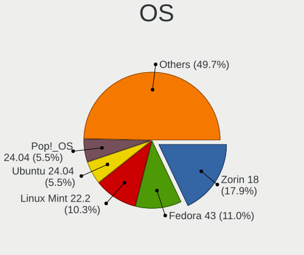

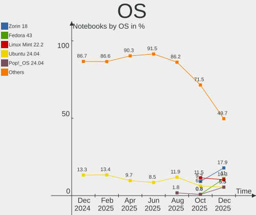

| Name               | Notebooks | Percent |
|--------------------|-----------|---------|
| Zorin 18           | 26        | 17.93%  |
| Fedora 43          | 16        | 11.03%  |
| Linux Mint 22.2    | 15        | 10.34%  |
| Ubuntu 24.04       | 8         | 5.52%   |
| Pop!_OS 24.04      | 8         | 5.52%   |
| Arch Rolling       | 8         | 5.52%   |
| OpenMandriva 6.0   | 5         | 3.45%   |
| Ubuntu 25.10       | 4         | 2.76%   |
| Debian 13          | 4         | 2.76%   |
| ROSA 13.1          | 3         | 2.07%   |
| OpenMandriva 25.90 | 3         | 2.07%   |
| OpenMandriva 25.06 | 3         | 2.07%   |
| Debian 12          | 3         | 2.07%   |
| Ubuntu 25.04       | 2         | 1.38%   |
| Pop!_OS 22.04      | 2         | 1.38%   |
| OpenMandriva 25.11 | 2         | 1.38%   |
| Kubuntu 25.10      | 2         | 1.38%   |
| Endless 6.0.8      | 2         | 1.38%   |
| CachyOS Rolling    | 2         | 1.38%   |
| CachyOS            | 2         | 1.38%   |
| Bazzite 43         | 2         | 1.38%   |
| Zorin 17           | 1         | 0.69%   |
| Ultramarine 43     | 1         | 0.69%   |
| Ubuntu MATE 22.04  | 1         | 0.69%   |
| Ubuntu MATE 20.04  | 1         | 0.69%   |
| Ubuntu 21.04       | 1         | 0.69%   |
| Parrot 6.4         | 1         | 0.69%   |
| openSUSE Leap-15.6 | 1         | 0.69%   |
| OpenMandriva 5.0   | 1         | 0.69%   |
| OpenMandriva 24.12 | 1         | 0.69%   |
| Nobara 43          | 1         | 0.69%   |
| NixOS 26.05        | 1         | 0.69%   |
| Manjaro 25.1.0     | 1         | 0.69%   |
| LMDE 7             | 1         | 0.69%   |
| Linux Mint 22.1    | 1         | 0.69%   |
| Linux Mint 21.3    | 1         | 0.69%   |
| KDE neon 24.04     | 1         | 0.69%   |
| Kali 2025.4        | 1         | 0.69%   |
| Fly                | 1         | 0.69%   |
| Fedora 41          | 1         | 0.69%   |

OS Family
---------

OS without a version

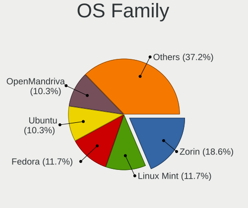

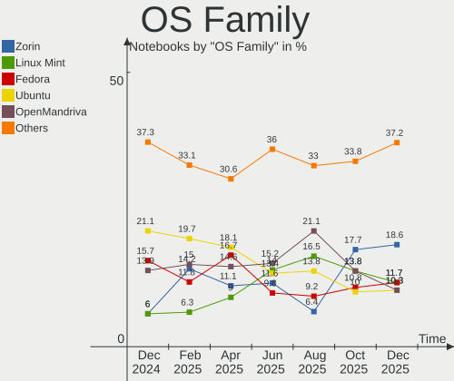

| Name         | Notebooks | Percent |
|--------------|-----------|---------|
| Zorin        | 27        | 18.62%  |
| Linux Mint   | 17        | 11.72%  |
| Fedora       | 17        | 11.72%  |
| Ubuntu       | 15        | 10.34%  |
| OpenMandriva | 15        | 10.34%  |
| Pop!_OS      | 10        | 6.9%    |
| Debian       | 8         | 5.52%   |
| Arch         | 8         | 5.52%   |
| CachyOS      | 4         | 2.76%   |
| ROSA         | 3         | 2.07%   |
| Bazzite      | 3         | 2.07%   |
| Ubuntu MATE  | 2         | 1.38%   |
| Kubuntu      | 2         | 1.38%   |
| Endless      | 2         | 1.38%   |
| Ultramarine  | 1         | 0.69%   |
| Parrot       | 1         | 0.69%   |
| openSUSE     | 1         | 0.69%   |
| Nobara       | 1         | 0.69%   |
| NixOS        | 1         | 0.69%   |
| Manjaro      | 1         | 0.69%   |
| LMDE         | 1         | 0.69%   |
| KDE neon     | 1         | 0.69%   |
| Kali         | 1         | 0.69%   |
| Fly          | 1         | 0.69%   |
| EndeavourOS  | 1         | 0.69%   |
| antiX        | 1         | 0.69%   |

Kernel
------

Version of the Linux kernel

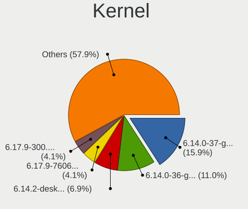

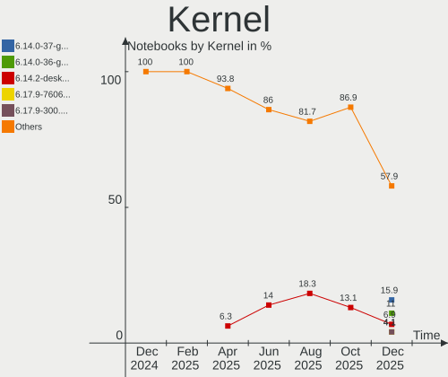

| Version                        | Notebooks | Percent |
|--------------------------------|-----------|---------|
| 6.14.0-37-generic              | 23        | 15.86%  |
| 6.14.0-36-generic              | 16        | 11.03%  |
| 6.14.2-desktop-3omv2590        | 10        | 6.9%    |
| 6.17.9-76061709-generic        | 6         | 4.14%   |
| 6.17.9-300.fc43.x86_64         | 6         | 4.14%   |
| 6.8.0-90-generic               | 4         | 2.76%   |
| 6.17.12-300.fc43.x86_64        | 4         | 2.76%   |
| 6.12.57+deb13-amd64            | 4         | 2.76%   |
| 6.17.9-arch1-1                 | 3         | 2.07%   |
| 6.17.10-300.fc43.x86_64        | 3         | 2.07%   |
| 6.17.1-300.fc43.x86_64         | 3         | 2.07%   |
| 6.12.47-generic-5rosa13-x86_64 | 3         | 2.07%   |
| 6.18.2-arch2-1                 | 2         | 1.38%   |
| 6.18.0-desktop-1omv2590        | 2         | 1.38%   |
| 6.17.9-zen1-1-zen              | 2         | 1.38%   |
| 6.17.9-2-cachyos               | 2         | 1.38%   |
| 6.17.4-76061704-generic        | 2         | 1.38%   |
| 6.17.0-8-generic               | 2         | 1.38%   |
| 6.17.0-7-generic               | 2         | 1.38%   |
| 6.14.0-33-generic              | 2         | 1.38%   |
| 6.14.0-29-generic              | 2         | 1.38%   |
| 6.14.0-17-generic              | 2         | 1.38%   |
| 6.8.4-060804-generic           | 1         | 0.69%   |
| 6.8.0-87-generic               | 1         | 0.69%   |
| 6.8.0-52-generic               | 1         | 0.69%   |
| 6.6.2-desktop-1omv2390         | 1         | 0.69%   |
| 6.5.0-41-generic               | 1         | 0.69%   |
| 6.4.0-150600.23.78-default     | 1         | 0.69%   |
| 6.18.2-zen2-1-zen              | 1         | 0.69%   |
| 6.18.2-200.nobara.fc43.x86_64  | 1         | 0.69%   |
| 6.18.0-3-cachyos               | 1         | 0.69%   |
| 6.18.0                         | 1         | 0.69%   |
| 6.17.8-300.fc43.x86_64         | 1         | 0.69%   |
| 6.17.8-2-liquorix-amd64        | 1         | 0.69%   |
| 6.17.8-2-cachyos               | 1         | 0.69%   |
| 6.17.7-ba20.fc43.x86_64        | 1         | 0.69%   |
| 6.17.7-ba19.fc43.x86_64        | 1         | 0.69%   |
| 6.17.4-arch2-1                 | 1         | 0.69%   |
| 6.17.13-1-liquorix-amd64       | 1         | 0.69%   |
| 6.17.12-1-liquorix-amd64       | 1         | 0.69%   |

Kernel Family
-------------

Linux kernel without a distro release

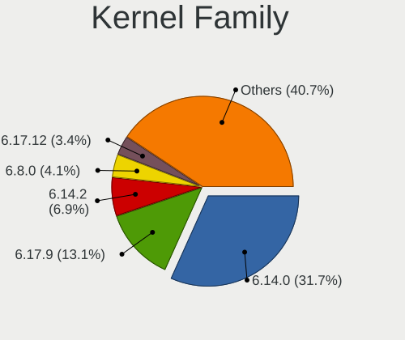

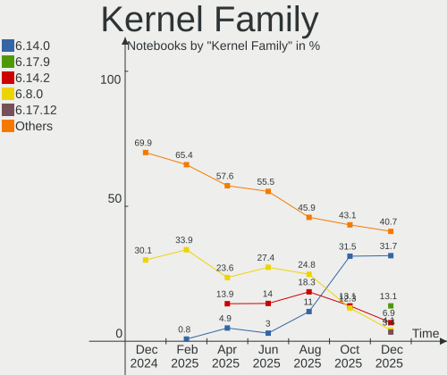

| Version  | Notebooks | Percent |
|----------|-----------|---------|
| 6.14.0   | 46        | 31.72%  |
| 6.17.9   | 19        | 13.1%   |
| 6.14.2   | 10        | 6.9%    |
| 6.8.0    | 6         | 4.14%   |
| 6.17.12  | 5         | 3.45%   |
| 6.17.10  | 5         | 3.45%   |
| 6.17.0   | 5         | 3.45%   |
| 6.18.2   | 4         | 2.76%   |
| 6.18.0   | 4         | 2.76%   |
| 6.12.57  | 4         | 2.76%   |
| 6.17.8   | 3         | 2.07%   |
| 6.17.4   | 3         | 2.07%   |
| 6.17.1   | 3         | 2.07%   |
| 6.12.47  | 3         | 2.07%   |
| 6.17.7   | 2         | 1.38%   |
| 6.17.11  | 2         | 1.38%   |
| 6.1.0    | 2         | 1.38%   |
| 5.15.0   | 2         | 1.38%   |
| 6.8.4    | 1         | 0.69%   |
| 6.6.2    | 1         | 0.69%   |
| 6.5.0    | 1         | 0.69%   |
| 6.4.0    | 1         | 0.69%   |
| 6.17.13  | 1         | 0.69%   |
| 6.16.4   | 1         | 0.69%   |
| 6.15.0   | 1         | 0.69%   |
| 6.12.63  | 1         | 0.69%   |
| 6.12.48  | 1         | 0.69%   |
| 6.12.38  | 1         | 0.69%   |
| 6.12.32  | 1         | 0.69%   |
| 6.12.10  | 1         | 0.69%   |
| 6.12.1   | 1         | 0.69%   |
| 6.11.0   | 1         | 0.69%   |
| 6.10.8   | 1         | 0.69%   |
| 5.11.0   | 1         | 0.69%   |
| 5.10.240 | 1         | 0.69%   |

Kernel Major Ver.
-----------------

Linux kernel major version

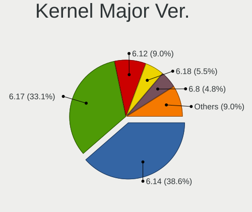

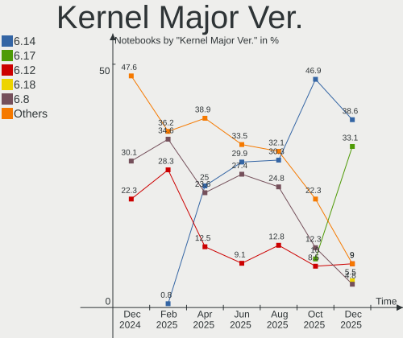

| Version | Notebooks | Percent |
|---------|-----------|---------|
| 6.14    | 56        | 38.62%  |
| 6.17    | 48        | 33.1%   |
| 6.12    | 13        | 8.97%   |
| 6.18    | 8         | 5.52%   |
| 6.8     | 7         | 4.83%   |
| 6.1     | 2         | 1.38%   |
| 5.15    | 2         | 1.38%   |
| 6.6     | 1         | 0.69%   |
| 6.5     | 1         | 0.69%   |
| 6.4     | 1         | 0.69%   |
| 6.16    | 1         | 0.69%   |
| 6.15    | 1         | 0.69%   |
| 6.11    | 1         | 0.69%   |
| 6.10    | 1         | 0.69%   |
| 5.11    | 1         | 0.69%   |
| 5.10    | 1         | 0.69%   |

Arch
----

OS architecture (x86_64, i586, etc.)

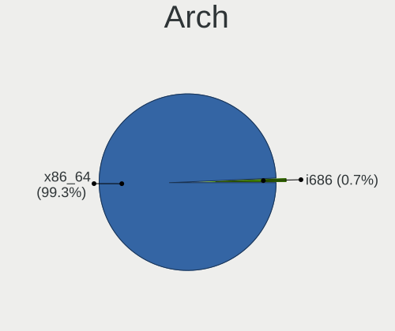

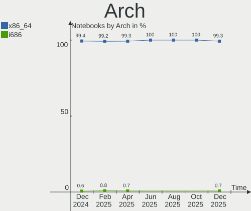

| Name   | Notebooks | Percent |
|--------|-----------|---------|
| x86_64 | 144       | 99.31%  |
| i686   | 1         | 0.69%   |

DE
--

Desktop Environment

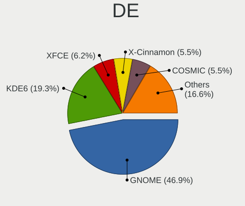

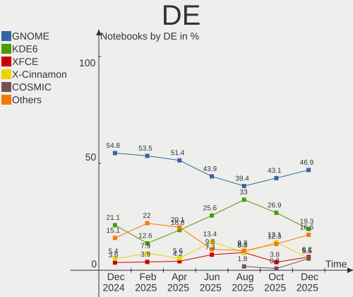

| Name            | Notebooks | Percent |
|-----------------|-----------|---------|
| GNOME           | 68        | 46.9%   |
| KDE6            | 28        | 19.31%  |
| XFCE            | 9         | 6.21%   |
| X-Cinnamon      | 8         | 5.52%   |
| COSMIC          | 8         | 5.52%   |
| MATE            | 6         | 4.14%   |
| KDE5            | 2         | 1.38%   |
| KDE             | 2         | 1.38%   |
| i3              | 2         | 1.38%   |
| Hyprland        | 2         | 1.38%   |
| Endless:GNOME   | 2         | 1.38%   |
| Unknown         | 2         | 1.38%   |
| Trinity         | 1         | 0.69%   |
| sway            | 1         | 0.69%   |
| niri            | 1         | 0.69%   |
| LXQt            | 1         | 0.69%   |
| icewm           | 1         | 0.69%   |
| GNOME Flashback | 1         | 0.69%   |

Display Server
--------------

X11 or Wayland

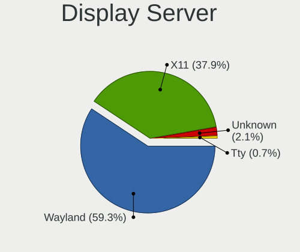

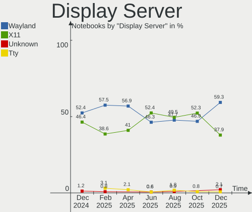

| Name    | Notebooks | Percent |
|---------|-----------|---------|
| Wayland | 86        | 59.31%  |
| X11     | 55        | 37.93%  |
| Unknown | 3         | 2.07%   |
| Tty     | 1         | 0.69%   |

Display Manager
---------------

SDDM, LightDM, etc.

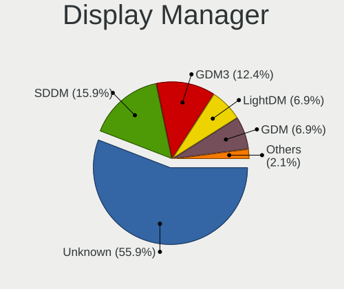

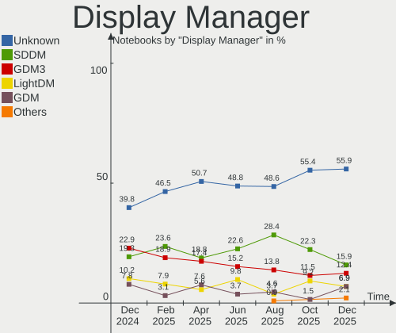

| Name           | Notebooks | Percent |
|----------------|-----------|---------|
| Unknown        | 81        | 55.86%  |
| SDDM           | 23        | 15.86%  |
| GDM3           | 18        | 12.41%  |
| LightDM        | 10        | 6.9%    |
| GDM            | 10        | 6.9%    |
| TDM            | 1         | 0.69%   |
| GREETD         | 1         | 0.69%   |
| COSMIC-GREETER | 1         | 0.69%   |

OS Lang
-------

Language

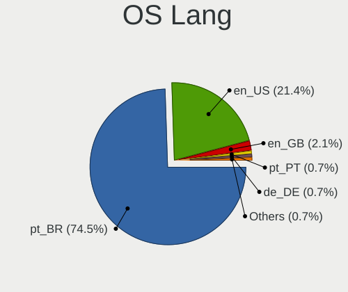

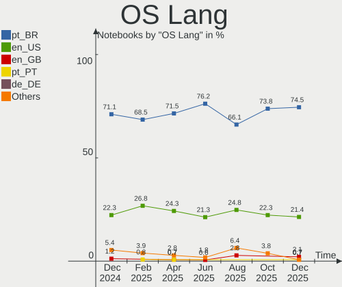

| Lang  | Notebooks | Percent |
|-------|-----------|---------|
| pt_BR | 108       | 74.48%  |
| en_US | 31        | 21.38%  |
| en_GB | 3         | 2.07%   |
| pt_PT | 1         | 0.69%   |
| de_DE | 1         | 0.69%   |
| C     | 1         | 0.69%   |

Boot Mode
---------

EFI or BIOS

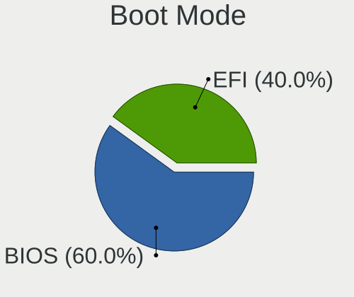

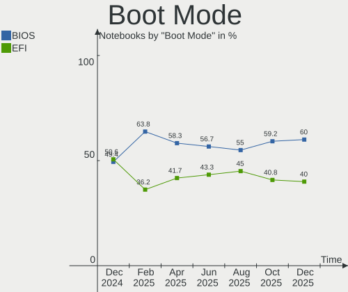

| Mode | Notebooks | Percent |
|------|-----------|---------|
| BIOS | 87        | 60%     |
| EFI  | 58        | 40%     |

Filesystem
----------

Type of filesystem

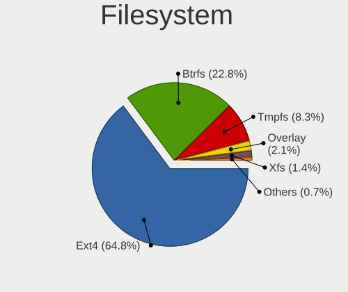

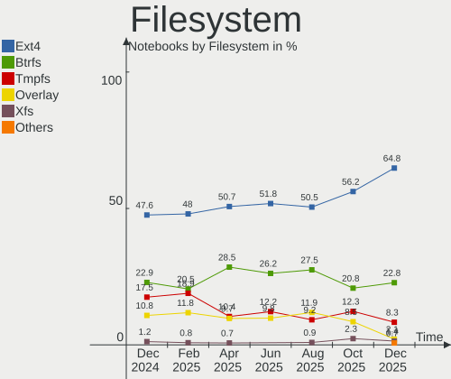

| Type    | Notebooks | Percent |
|---------|-----------|---------|
| Ext4    | 94        | 64.83%  |
| Btrfs   | 33        | 22.76%  |
| Tmpfs   | 12        | 8.28%   |
| Overlay | 3         | 2.07%   |
| Xfs     | 2         | 1.38%   |
| F2fs    | 1         | 0.69%   |

Part. scheme
------------

Scheme of partitioning

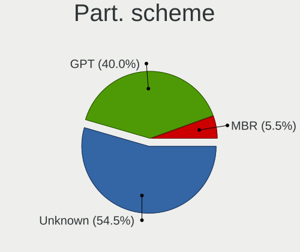

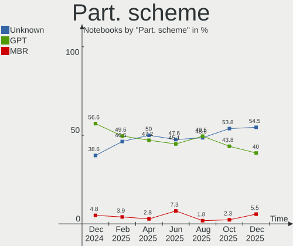

| Type    | Notebooks | Percent |
|---------|-----------|---------|
| Unknown | 79        | 54.48%  |
| GPT     | 58        | 40%     |
| MBR     | 8         | 5.52%   |

Dual Boot with Linux/BSD
------------------------

Hosting more than one Linux/BSD

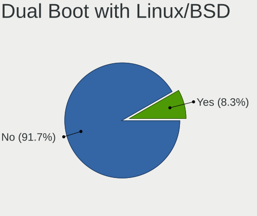

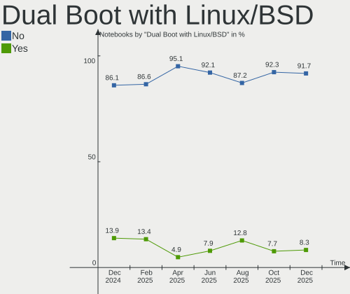

| Dual boot | Notebooks | Percent |
|-----------|-----------|---------|
| No        | 133       | 91.72%  |
| Yes       | 12        | 8.28%   |

Dual Boot (Win)
---------------

Hosting Linux and Windows

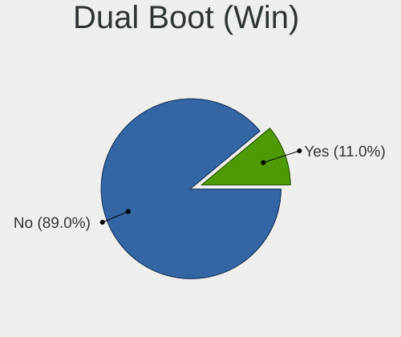

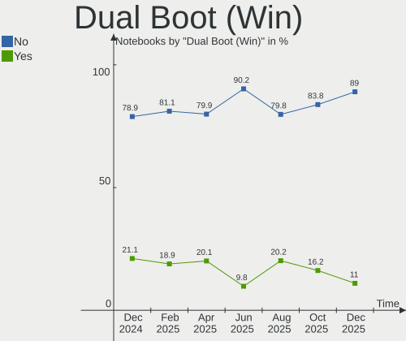

| Dual boot | Notebooks | Percent |
|-----------|-----------|---------|
| No        | 129       | 88.97%  |
| Yes       | 16        | 11.03%  |

Board
-----

Vendor
------

Motherboard manufacturer

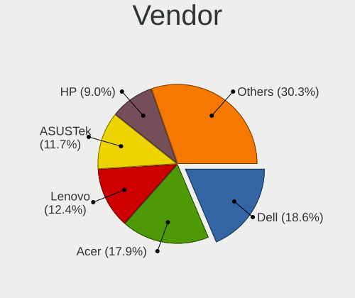

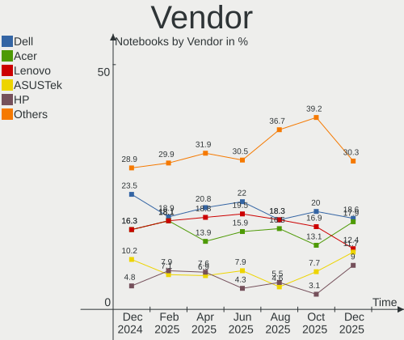

| Name                   | Notebooks | Percent |
|------------------------|-----------|---------|
| Dell                   | 27        | 18.62%  |
| Acer                   | 26        | 17.93%  |
| Lenovo                 | 18        | 12.41%  |
| ASUSTek Computer       | 17        | 11.72%  |
| Hewlett-Packard        | 13        | 8.97%   |
| Samsung Electronics    | 10        | 6.9%    |
| Positivo               | 5         | 3.45%   |
| Sony                   | 4         | 2.76%   |
| Avell                  | 4         | 2.76%   |
| Apple                  | 3         | 2.07%   |
| Semp Toshiba           | 2         | 1.38%   |
| Positivo Bahia - VAIO  | 2         | 1.38%   |
| Multilaser             | 2         | 1.38%   |
| Itautec                | 2         | 1.38%   |
| Alienware              | 2         | 1.38%   |
| VSAP                   | 1         | 0.69%   |
| Standard               | 1         | 0.69%   |
| MACHINIST              | 1         | 0.69%   |
| Intel                  | 1         | 0.69%   |
| Google                 | 1         | 0.69%   |
| Gateway                | 1         | 0.69%   |
| Digibras               | 1         | 0.69%   |
| Avell High Performance | 1         | 0.69%   |

Model
-----

Motherboard model

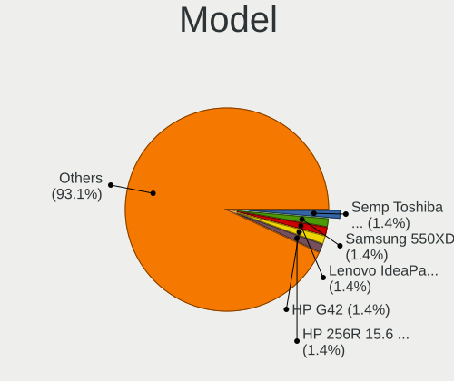

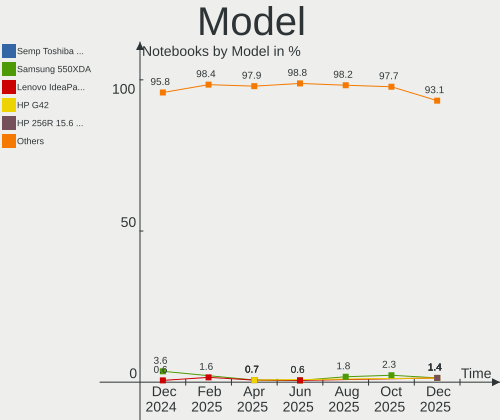

| Name                                              | Notebooks | Percent |
|---------------------------------------------------|-----------|---------|
| Semp Toshiba IS 1442                              | 2         | 1.38%   |
| Samsung 550XDA                                    | 2         | 1.38%   |
| Lenovo IdeaPad 1 15AMN7 82X5                      | 2         | 1.38%   |
| HP G42                                            | 2         | 1.38%   |
| HP 256R 15.6 inch G9 Notebook PC                  | 2         | 1.38%   |
| Dell Latitude 3540                                | 2         | 1.38%   |
| Dell Inspiron 7460                                | 2         | 1.38%   |
| Dell G15 5530                                     | 2         | 1.38%   |
| Avell 560                                         | 2         | 1.38%   |
| ASUS VivoBook_ASUSLaptop X515EA_X515EA            | 2         | 1.38%   |
| ASUS VivoBook_ASUSLaptop K3605ZF_K3605ZF          | 2         | 1.38%   |
| Apple MacBookPro8,1                               | 2         | 1.38%   |
| Alienware 16 Aurora AC16250                       | 2         | 1.38%   |
| Acer Aspire AG15-51P                              | 2         | 1.38%   |
| Acer Aspire A515-45                               | 2         | 1.38%   |
| Acer Aspire A514-54                               | 2         | 1.38%   |
| Acer Aspire A315-53                               | 2         | 1.38%   |
| Acer Aspire A315-23G                              | 2         | 1.38%   |
| VSAP VNJH-1402                                    | 1         | 0.69%   |
| Standard MB40II                                   | 1         | 0.69%   |
| Sony VGN-NR22M_S                                  | 1         | 0.69%   |
| Sony VGN-FW390J                                   | 1         | 0.69%   |
| Sony SVF15A1BCXB                                  | 1         | 0.69%   |
| Sony SVF15213CBW                                  | 1         | 0.69%   |
| Samsung RF511/RF411/RF711                         | 1         | 0.69%   |
| Samsung 800G5M/800G5W                             | 1         | 0.69%   |
| Samsung 550XED                                    | 1         | 0.69%   |
| Samsung 550XCJ/550XCR                             | 1         | 0.69%   |
| Samsung 530XBB                                    | 1         | 0.69%   |
| Samsung 500R4K/500R5H/5400RK/501R5H/5500RH/500R5S | 1         | 0.69%   |
| Samsung 340XAA/350XAA/550XAA                      | 1         | 0.69%   |
| Samsung 300E5K/300E5Q                             | 1         | 0.69%   |
| Positivo S15SL                                    | 1         | 0.69%   |
| Positivo R732512AI-15                             | 1         | 0.69%   |
| Positivo Q4128C-S                                 | 1         | 0.69%   |
| Positivo I38256CI-15                              | 1         | 0.69%   |
| Positivo CHT14B                                   | 1         | 0.69%   |
| Positivo Bahia - VAIO VJFE62F11X-B1111H           | 1         | 0.69%   |
| Positivo Bahia - VAIO VJFE59F11X-B0521H           | 1         | 0.69%   |
| Multilaser PC224                                  | 1         | 0.69%   |

Model Family
------------

Motherboard model prefix

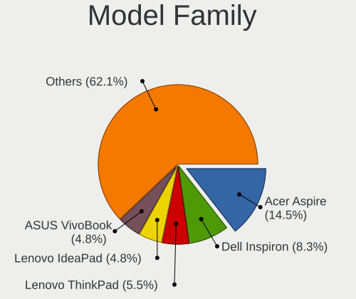

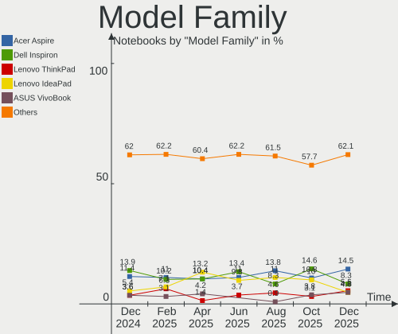

| Name                  | Notebooks | Percent |
|-----------------------|-----------|---------|
| Acer Aspire           | 21        | 14.48%  |
| Dell Inspiron         | 12        | 8.28%   |
| Lenovo ThinkPad       | 8         | 5.52%   |
| Lenovo IdeaPad        | 7         | 4.83%   |
| ASUS VivoBook         | 7         | 4.83%   |
| HP ProBook            | 4         | 2.76%   |
| Dell Latitude         | 4         | 2.76%   |
| Dell G15              | 4         | 2.76%   |
| Dell Vostro           | 3         | 2.07%   |
| ASUS ASUS             | 3         | 2.07%   |
| Semp Toshiba IS       | 2         | 1.38%   |
| Samsung 550XDA        | 2         | 1.38%   |
| HP Pavilion           | 2         | 1.38%   |
| HP G42                | 2         | 1.38%   |
| HP 256R               | 2         | 1.38%   |
| HP 240                | 2         | 1.38%   |
| Avell 560             | 2         | 1.38%   |
| ASUS TUF              | 2         | 1.38%   |
| Apple MacBookPro8     | 2         | 1.38%   |
| Alienware 16          | 2         | 1.38%   |
| Acer Predator         | 2         | 1.38%   |
| Acer Nitro            | 2         | 1.38%   |
| VSAP VNJH-1402        | 1         | 0.69%   |
| Standard MB40II       | 1         | 0.69%   |
| Sony VGN-NR22M        | 1         | 0.69%   |
| Sony VGN-FW390J       | 1         | 0.69%   |
| Sony SVF15A1BCXB      | 1         | 0.69%   |
| Sony SVF15213CBW      | 1         | 0.69%   |
| Samsung RF511         | 1         | 0.69%   |
| Samsung 800G5M        | 1         | 0.69%   |
| Samsung 550XED        | 1         | 0.69%   |
| Samsung 550XCJ        | 1         | 0.69%   |
| Samsung 530XBB        | 1         | 0.69%   |
| Samsung 500R4K        | 1         | 0.69%   |
| Samsung 340XAA        | 1         | 0.69%   |
| Samsung 300E5K        | 1         | 0.69%   |
| Positivo S15SL        | 1         | 0.69%   |
| Positivo R732512AI-15 | 1         | 0.69%   |
| Positivo Q4128C-S     | 1         | 0.69%   |
| Positivo I38256CI-15  | 1         | 0.69%   |

MFG Year
--------

Motherboard manufacture year

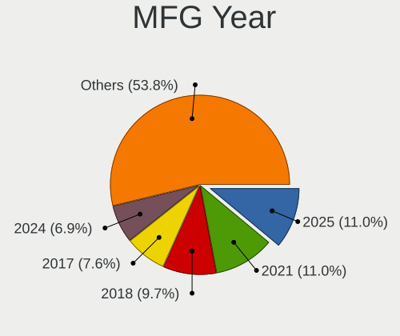

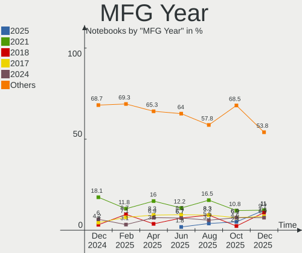

| Year | Notebooks | Percent |
|------|-----------|---------|
| 2025 | 16        | 11.03%  |
| 2021 | 16        | 11.03%  |
| 2018 | 14        | 9.66%   |
| 2017 | 11        | 7.59%   |
| 2024 | 10        | 6.9%    |
| 2011 | 9         | 6.21%   |
| 2022 | 8         | 5.52%   |
| 2013 | 8         | 5.52%   |
| 2020 | 7         | 4.83%   |
| 2019 | 7         | 4.83%   |
| 2016 | 7         | 4.83%   |
| 2012 | 7         | 4.83%   |
| 2023 | 6         | 4.14%   |
| 2015 | 5         | 3.45%   |
| 2010 | 4         | 2.76%   |
| 2014 | 3         | 2.07%   |
| 2007 | 3         | 2.07%   |
| 2009 | 2         | 1.38%   |
| 2008 | 1         | 0.69%   |
| 2006 | 1         | 0.69%   |

Form Factor
-----------

Physical design of the computer

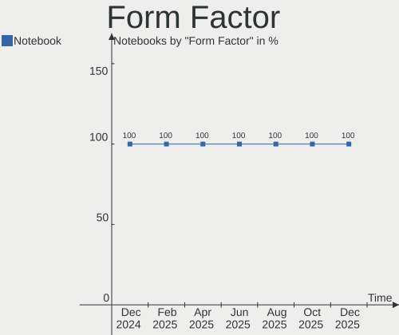

| Name     | Notebooks | Percent |
|----------|-----------|---------|
| Notebook | 145       | 100%    |

Secure Boot
-----------

Enabled or disabled

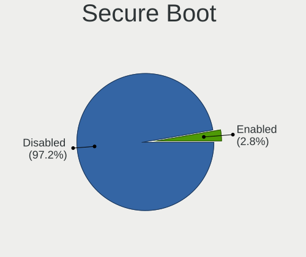

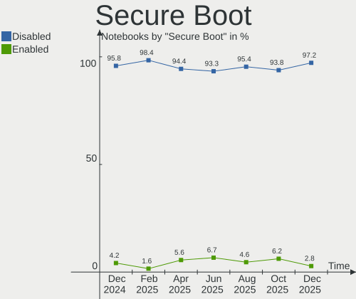

| State    | Notebooks | Percent |
|----------|-----------|---------|
| Disabled | 141       | 97.24%  |
| Enabled  | 4         | 2.76%   |

Coreboot
--------

Have coreboot on board

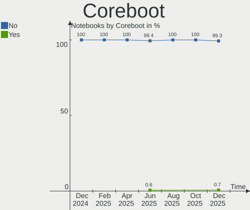

| Used | Notebooks | Percent |
|------|-----------|---------|
| No   | 144       | 99.31%  |
| Yes  | 1         | 0.69%   |

RAM Size
--------

Total RAM memory

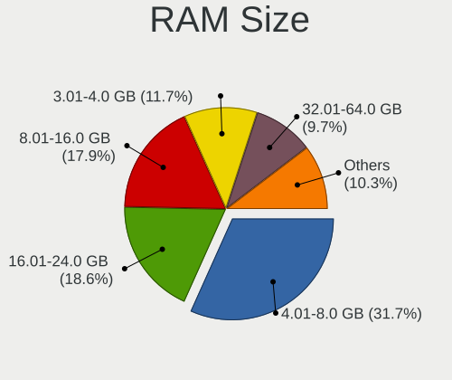

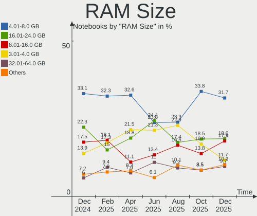

| Size in GB  | Notebooks | Percent |
|-------------|-----------|---------|
| 4.01-8.0    | 46        | 31.72%  |
| 16.01-24.0  | 27        | 18.62%  |
| 8.01-16.0   | 26        | 17.93%  |
| 3.01-4.0    | 17        | 11.72%  |
| 32.01-64.0  | 14        | 9.66%   |
| 24.01-32.0  | 7         | 4.83%   |
| 1.01-2.0    | 4         | 2.76%   |
| 2.01-3.0    | 2         | 1.38%   |
| 64.01-256.0 | 2         | 1.38%   |

RAM Used
--------

Used RAM memory

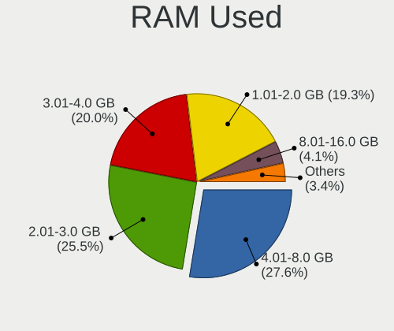

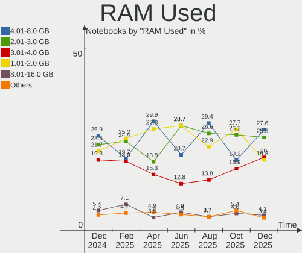

| Used GB    | Notebooks | Percent |
|------------|-----------|---------|
| 4.01-8.0   | 40        | 27.59%  |
| 2.01-3.0   | 37        | 25.52%  |
| 3.01-4.0   | 29        | 20%     |
| 1.01-2.0   | 28        | 19.31%  |
| 8.01-16.0  | 6         | 4.14%   |
| 0.51-1.0   | 4         | 2.76%   |
| 16.01-24.0 | 1         | 0.69%   |

Total Drives
------------

Number of drives on board

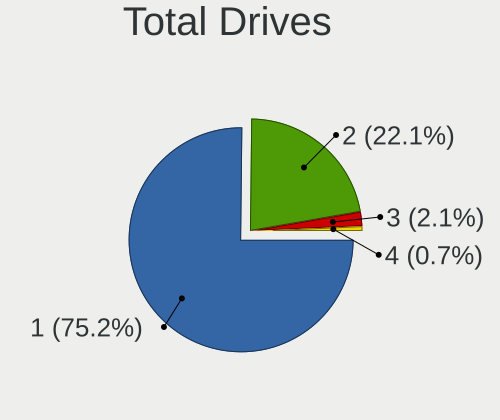

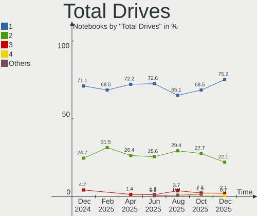

| Drives | Notebooks | Percent |
|--------|-----------|---------|
| 1      | 109       | 75.17%  |
| 2      | 32        | 22.07%  |
| 3      | 3         | 2.07%   |
| 4      | 1         | 0.69%   |

Has CD-ROM
----------

Has CD-ROM on board

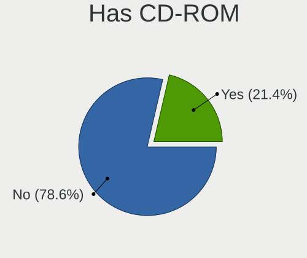

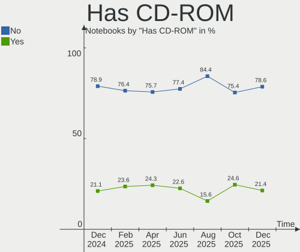

| Presented | Notebooks | Percent |
|-----------|-----------|---------|
| No        | 114       | 78.62%  |
| Yes       | 31        | 21.38%  |

Has Ethernet
------------

Has Ethernet on board

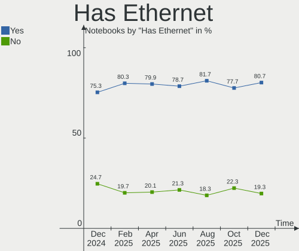

| Presented | Notebooks | Percent |
|-----------|-----------|---------|
| Yes       | 117       | 80.69%  |
| No        | 28        | 19.31%  |

Has WiFi
--------

Has WiFi module

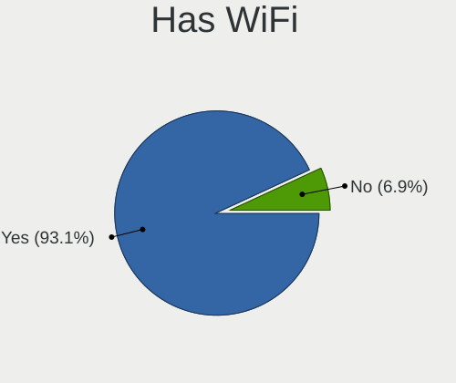

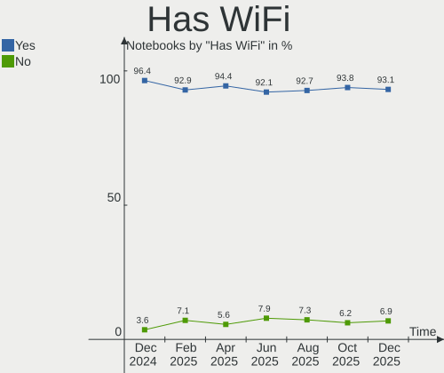

| Presented | Notebooks | Percent |
|-----------|-----------|---------|
| Yes       | 135       | 93.1%   |
| No        | 10        | 6.9%    |

Has Bluetooth
-------------

Has Bluetooth module

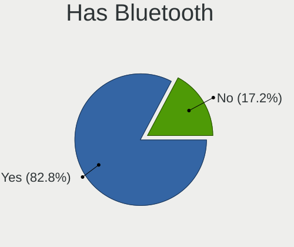

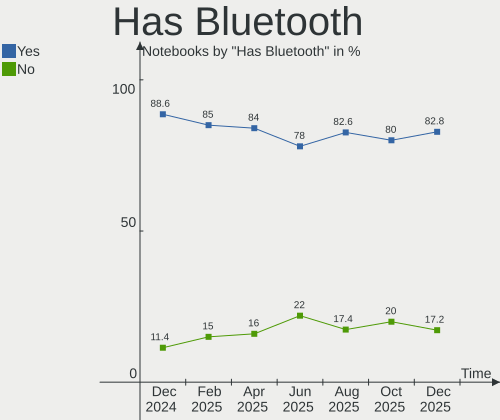

| Presented | Notebooks | Percent |
|-----------|-----------|---------|
| Yes       | 120       | 82.76%  |
| No        | 25        | 17.24%  |

Location
--------

Country
-------

Geographic location (country)

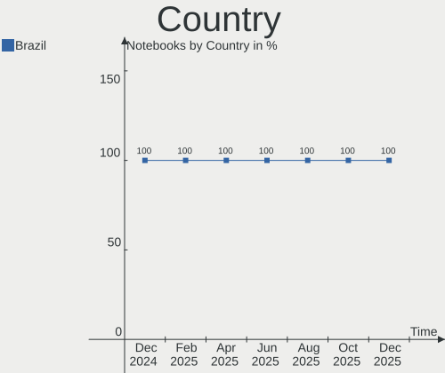

| Country | Notebooks | Percent |
|---------|-----------|---------|
| Brazil  | 145       | 100%    |

City
----

Geographic location (city)

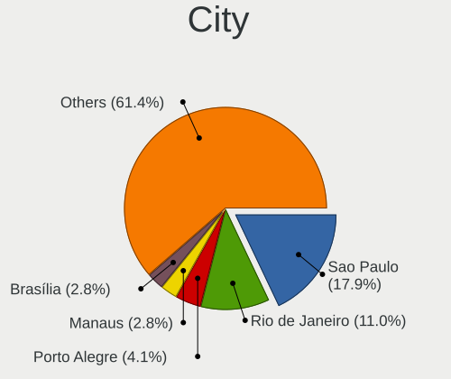

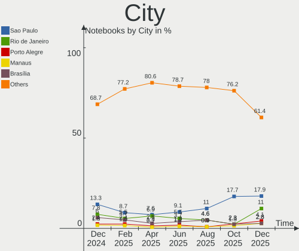

| City                   | Notebooks | Percent |
|------------------------|-----------|---------|
| Sao Paulo              | 26        | 17.93%  |
| Rio de Janeiro         | 16        | 11.03%  |
| Porto Alegre           | 6         | 4.14%   |
| Manaus                 | 4         | 2.76%   |
| Brasília              | 4         | 2.76%   |
| Vila Velha             | 3         | 2.07%   |
| Campinas               | 3         | 2.07%   |
| Sao Goncalo            | 2         | 1.38%   |
| Osasco                 | 2         | 1.38%   |
| Maua                   | 2         | 1.38%   |
| Lages                  | 2         | 1.38%   |
| Juazeiro do Norte      | 2         | 1.38%   |
| Itatiba                | 2         | 1.38%   |
| Guarapuava             | 2         | 1.38%   |
| Franca                 | 2         | 1.38%   |
| Curitiba               | 2         | 1.38%   |
| Caxias do Sul          | 2         | 1.38%   |
| Canoas                 | 2         | 1.38%   |
| Vitoria de Santo Antao | 1         | 0.69%   |
| Várzea Grande         | 1         | 0.69%   |
| Uberlândia            | 1         | 0.69%   |
| Ubatuba                | 1         | 0.69%   |
| Tiangua                | 1         | 0.69%   |
| Teresina               | 1         | 0.69%   |
| Sorocaba               | 1         | 0.69%   |
| Sobral                 | 1         | 0.69%   |
| Senhora de Oliveira    | 1         | 0.69%   |
| Sao Mateus do Sul      | 1         | 0.69%   |
| Sao Jose do Rio Preto  | 1         | 0.69%   |
| Sao José              | 1         | 0.69%   |
| Sao Caetano do Sul     | 1         | 0.69%   |
| Sao Bernardo do Campo  | 1         | 0.69%   |
| Santana de Parnaíba   | 1         | 0.69%   |
| Santa Isabel do Ivai   | 1         | 0.69%   |
| Salvador               | 1         | 0.69%   |
| Rio do Sul             | 1         | 0.69%   |
| Rio Claro              | 1         | 0.69%   |
| Porto Velho            | 1         | 0.69%   |
| Porto Nacional         | 1         | 0.69%   |
| Planalto               | 1         | 0.69%   |

Drives
------

Drive Vendor
------------

Hard drive vendors

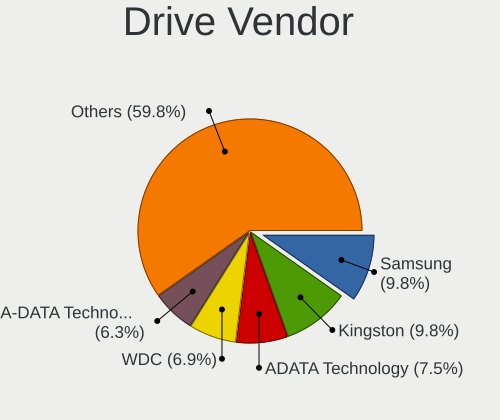

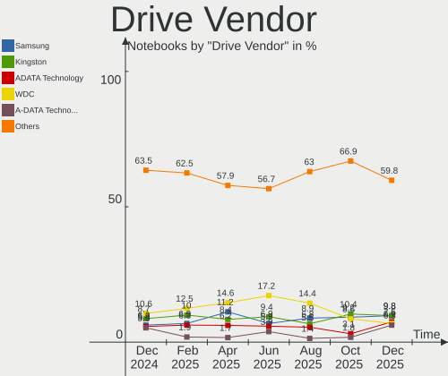

| Vendor                         | Notebooks | Drives | Percent |
|--------------------------------|-----------|--------|---------|
| Samsung Electronics            | 17        | 17     | 9.77%   |
| Kingston                       | 17        | 17     | 9.77%   |
| ADATA Technology               | 13        | 13     | 7.47%   |
| WDC                            | 12        | 13     | 6.9%    |
| A-DATA Technology              | 11        | 11     | 6.32%   |
| Sandisk                        | 10        | 10     | 5.75%   |
| Unknown                        | 7         | 9      | 4.02%   |
| Seagate                        | 7         | 10     | 4.02%   |
| Micron Technology              | 7         | 7      | 4.02%   |
| SK hynix                       | 5         | 5      | 2.87%   |
| Kingston Technology Company    | 5         | 5      | 2.87%   |
| China                          | 5         | 5      | 2.87%   |
| Toshiba                        | 4         | 4      | 2.3%    |
| KIOXIA                         | 4         | 4      | 2.3%    |
| Crucial                        | 4         | 4      | 2.3%    |
| Solid State Storage Technology | 3         | 3      | 1.72%   |
| Shenzhen Longsys Electronics   | 3         | 3      | 1.72%   |
| Patriot                        | 3         | 3      | 1.72%   |
| MAXIO Technology (Hangzhou)    | 3         | 3      | 1.72%   |
| JMicron Technology             | 3         | 3      | 1.72%   |
| XrayDisk                       | 2         | 2      | 1.15%   |
| Silicon Motion                 | 2         | 2      | 1.15%   |
| Lite-On Technology             | 2         | 2      | 1.15%   |
| KingSpec                       | 2         | 2      | 1.15%   |
| Intel                          | 2         | 2      | 1.15%   |
| Unknown                        | 2         | 2      | 1.15%   |
| WALRAM                         | 1         | 1      | 0.57%   |
| UP                             | 1         | 1      | 0.57%   |
| Union Memory (Shenzhen)        | 1         | 1      | 0.57%   |
| T-FORCE                        | 1         | 1      | 0.57%   |
| SSSTC                          | 1         | 1      | 0.57%   |
| Phison Electronics             | 1         | 1      | 0.57%   |
| Phison                         | 1         | 1      | 0.57%   |
| Micron/Crucial Technology      | 1         | 1      | 0.57%   |
| Lexar                          | 1         | 1      | 0.57%   |
| KingFast                       | 1         | 1      | 0.57%   |
| HS-SSD-WAVE(S)                 | 1         | 1      | 0.57%   |
| Hitachi                        | 1         | 1      | 0.57%   |
| HGST                           | 1         | 1      | 0.57%   |
| GAMER                          | 1         | 1      | 0.57%   |

Drive Model
-----------

Hard drive models

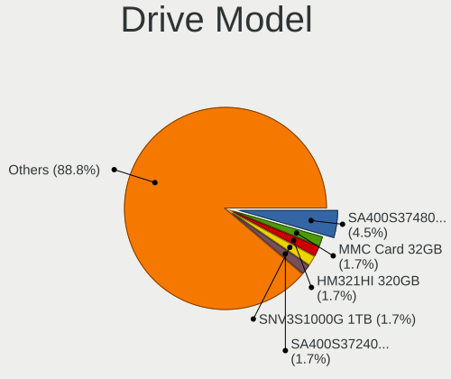

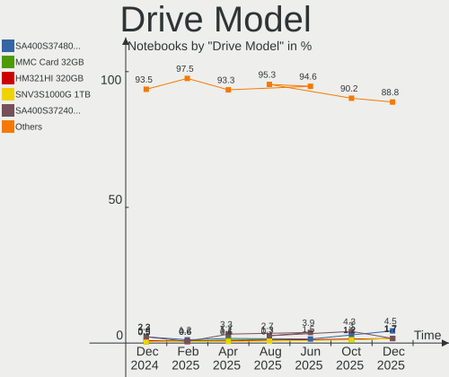

| Model                                                 | Notebooks | Percent |
|-------------------------------------------------------|-----------|---------|
| Kingston SA400S37480G 480GB SSD                       | 8         | 4.47%   |
| Unknown MMC Card  32GB                                | 3         | 1.68%   |
| Samsung HM321HI 320GB                                 | 3         | 1.68%   |
| Kingston Company SNV3S1000G 1TB                       | 3         | 1.68%   |
| Kingston SA400S37240G 240GB SSD                       | 3         | 1.68%   |
| WDC WDS240G2G0B-00EPW0 240GB SSD                      | 2         | 1.12%   |
| WDC WD10SPZX-35Z10T0 1TB                              | 2         | 1.12%   |
| Unknown MMC Card  7GB                                 | 2         | 1.12%   |
| Unknown MMC Card  64GB                                | 2         | 1.12%   |
| Toshiba MQ01ABF050 500GB                              | 2         | 1.12%   |
| Silicon Motion SM2263EN/SM2263XT SSD Controller 512GB | 2         | 1.12%   |
| Seagate ST500LM012 HN-M500MBB 500GB                   | 2         | 1.12%   |
| Sandisk WD Blue SN550 NVMe SSD 1024GB                 | 2         | 1.12%   |
| SanDisk SSD PLUS 1000GB                               | 2         | 1.12%   |
| Patriot Burst Elite 120GB SSD                         | 2         | 1.12%   |
| Micron 2650 1024GB                                    | 2         | 1.12%   |
| Lite-On CA3-8D256, CA3-8D512 NVMe SSD 256GB           | 2         | 1.12%   |
| KIOXIA KBG50ZNT256G LS 256GB                          | 2         | 1.12%   |
| Kingston Company SNV2S1000G 1TB                       | 2         | 1.12%   |
| JMicron Generic 320GB                                 | 2         | 1.12%   |
| Intel SSDPEKNU512GZ 512GB                             | 2         | 1.12%   |
| Crucial CT1000BX500SSD1 1TB                           | 2         | 1.12%   |
| ADATA SM2P41C8-512GC5 512GB                           | 2         | 1.12%   |
| A-DATA IM2P33F8ABR2-256GB                             | 2         | 1.12%   |
| A-DATA IM2P33F3A NVMe 512GB                           | 2         | 1.12%   |
| Unknown                                               | 2         | 1.12%   |
| XrayDisk 480GB                                        | 1         | 0.56%   |
| XrayDisk 240GB SSD                                    | 1         | 0.56%   |
| WDC WDS500G2B0B-00YS70 500GB SSD                      | 1         | 0.56%   |
| WDC WDS120G1G0B-00RC30 120GB SSD                      | 1         | 0.56%   |
| WDC WD5000LUCT-63RC2Y0 500GB                          | 1         | 0.56%   |
| WDC WD5000LPVX-80V0TT0 500GB                          | 1         | 0.56%   |
| WDC WD10SPZX-75Z10T1 1TB                              | 1         | 0.56%   |
| WDC WD10SPZX-24Z10 1TB                                | 1         | 0.56%   |
| WDC WD10SPZX-21Z10T0 1TB                              | 1         | 0.56%   |
| WDC WD10JPVX-22JC3T0 1TB                              | 1         | 0.56%   |
| WDC WD Green 2.5 480GB                                | 1         | 0.56%   |
| WALRAM SSD 240G                                       | 1         | 0.56%   |
| UP GAMER UP500 120GB SSD                              | 1         | 0.56%   |
| Unknown MMC Card  128GB                               | 1         | 0.56%   |

HDD Vendor
----------

Hard disk drive vendors

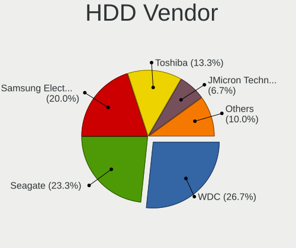

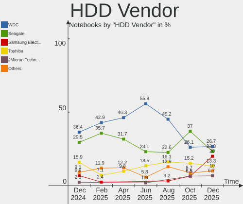

| Vendor              | Notebooks | Drives | Percent |
|---------------------|-----------|--------|---------|
| WDC                 | 8         | 8      | 26.67%  |
| Seagate             | 7         | 10     | 23.33%  |
| Samsung Electronics | 6         | 6      | 20%     |
| Toshiba             | 4         | 4      | 13.33%  |
| JMicron Technology  | 2         | 2      | 6.67%   |
| T-FORCE             | 1         | 1      | 3.33%   |
| Hitachi             | 1         | 1      | 3.33%   |
| HGST                | 1         | 1      | 3.33%   |

SSD Vendor
----------

Solid state drive vendors

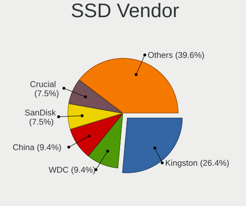

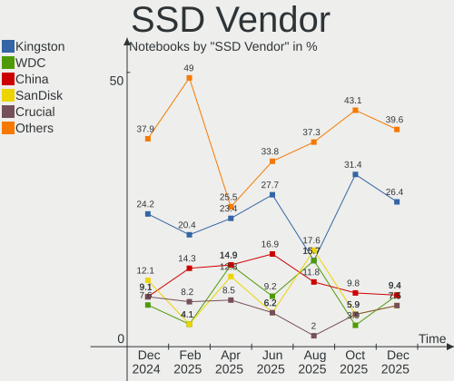

| Vendor              | Notebooks | Drives | Percent |
|---------------------|-----------|--------|---------|
| Kingston            | 14        | 14     | 26.42%  |
| WDC                 | 5         | 5      | 9.43%   |
| China               | 5         | 5      | 9.43%   |
| SanDisk             | 4         | 4      | 7.55%   |
| Crucial             | 4         | 4      | 7.55%   |
| A-DATA Technology   | 4         | 4      | 7.55%   |
| Samsung Electronics | 3         | 3      | 5.66%   |
| Patriot             | 3         | 3      | 5.66%   |
| Unknown             | 2         | 2      | 3.77%   |
| XrayDisk            | 1         | 1      | 1.89%   |
| WALRAM              | 1         | 1      | 1.89%   |
| UP                  | 1         | 1      | 1.89%   |
| Micron Technology   | 1         | 1      | 1.89%   |
| Lexar               | 1         | 1      | 1.89%   |
| KingSpec            | 1         | 1      | 1.89%   |
| HS-SSD-WAVE(S)      | 1         | 1      | 1.89%   |
| Apple               | 1         | 1      | 1.89%   |
| Apacer              | 1         | 1      | 1.89%   |

Drive Kind
----------

HDD or SSD

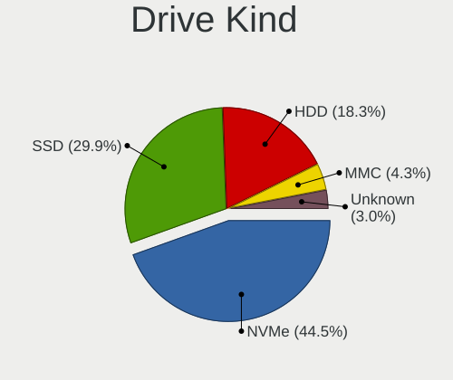

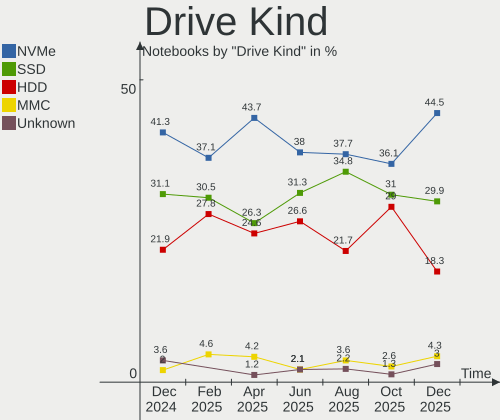

| Kind    | Notebooks | Drives | Percent |
|---------|-----------|--------|---------|
| NVMe    | 73        | 79     | 44.51%  |
| SSD     | 49        | 53     | 29.88%  |
| HDD     | 30        | 33     | 18.29%  |
| MMC     | 7         | 9      | 4.27%   |
| Unknown | 5         | 6      | 3.05%   |

Drive Connector
---------------

SATA, SAS, NVMe, etc.

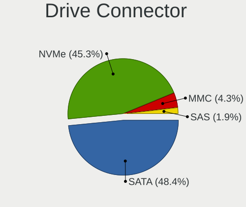

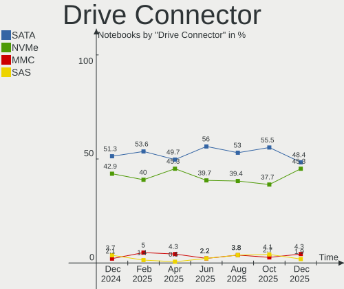

| Type | Notebooks | Drives | Percent |
|------|-----------|--------|---------|
| SATA | 78        | 89     | 48.45%  |
| NVMe | 73        | 79     | 45.34%  |
| MMC  | 7         | 9      | 4.35%   |
| SAS  | 3         | 3      | 1.86%   |

Drive Size
----------

Size of hard drive

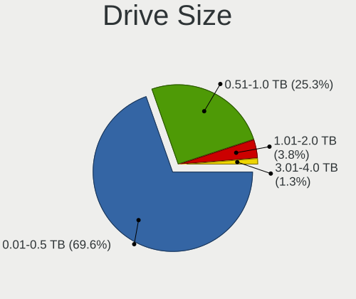

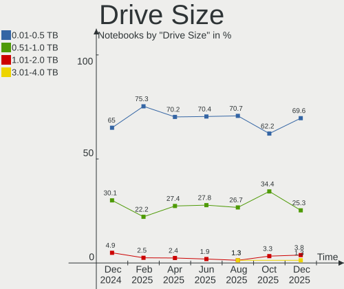

| Size in TB | Notebooks | Drives | Percent |
|------------|-----------|--------|---------|
| 0.01-0.5   | 55        | 61     | 69.62%  |
| 0.51-1.0   | 20        | 21     | 25.32%  |
| 1.01-2.0   | 3         | 3      | 3.8%    |
| 3.01-4.0   | 1         | 1      | 1.27%   |

Space Total
-----------

Amount of disk space available on the file system

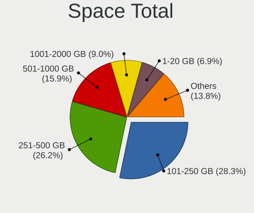

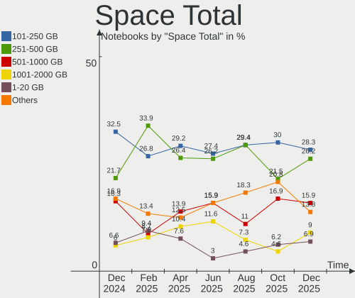

| Size in GB     | Notebooks | Percent |
|----------------|-----------|---------|
| 101-250        | 41        | 28.28%  |
| 251-500        | 38        | 26.21%  |
| 501-1000       | 23        | 15.86%  |
| 1001-2000      | 13        | 8.97%   |
| 1-20           | 10        | 6.9%    |
| 21-50          | 7         | 4.83%   |
| 51-100         | 6         | 4.14%   |
| 2001-3000      | 5         | 3.45%   |
| More than 3000 | 1         | 0.69%   |
| Unknown        | 1         | 0.69%   |

Space Used
----------

Amount of used disk space

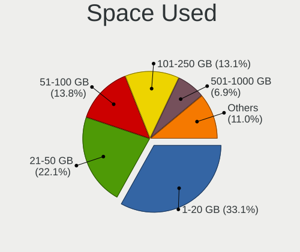

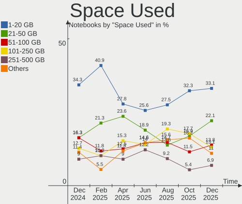

| Used GB        | Notebooks | Percent |
|----------------|-----------|---------|
| 1-20           | 48        | 33.1%   |
| 21-50          | 32        | 22.07%  |
| 51-100         | 20        | 13.79%  |
| 101-250        | 19        | 13.1%   |
| 251-500        | 10        | 6.9%    |
| 501-1000       | 10        | 6.9%    |
| 1001-2000      | 3         | 2.07%   |
| More than 3000 | 1         | 0.69%   |
| 0              | 1         | 0.69%   |
| Unknown        | 1         | 0.69%   |

Malfunc. Drives
---------------

Drive models with a malfunction

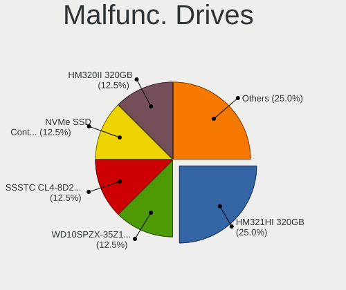

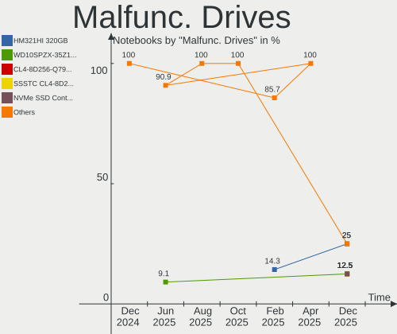

| Model                                                         | Notebooks | Drives | Percent |
|---------------------------------------------------------------|-----------|--------|---------|
| Samsung Electronics HM321HI 320GB                             | 2         | 2      | 25%     |
| WDC WD10SPZX-35Z10T0 1TB                                      | 1         | 1      | 12.5%   |
| SSSTC CL4-8D256-Q79 256GB                                     | 1         | 1      | 12.5%   |
| Solid State Storage Technology SSSTC CL4-8D256-Q79 256GB      | 1         | 1      | 12.5%   |
| Samsung Electronics NVMe SSD Controller SM981/PM981/PM983 1TB | 1         | 1      | 12.5%   |
| Samsung Electronics HM320II 320GB                             | 1         | 1      | 12.5%   |
| Micron Technology MTFDDAK512MAY-1AE1ZABHA 512GB SSD           | 1         | 1      | 12.5%   |

Malfunc. Drive Vendor
---------------------

Vendors of faulty drives

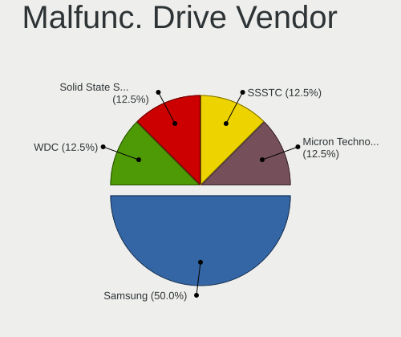

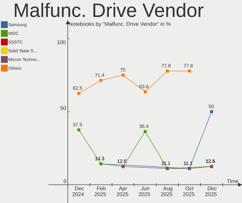

| Vendor                         | Notebooks | Drives | Percent |
|--------------------------------|-----------|--------|---------|
| Samsung Electronics            | 4         | 4      | 50%     |
| WDC                            | 1         | 1      | 12.5%   |
| SSSTC                          | 1         | 1      | 12.5%   |
| Solid State Storage Technology | 1         | 1      | 12.5%   |
| Micron Technology              | 1         | 1      | 12.5%   |

Malfunc. HDD Vendor
-------------------

Vendors of faulty HDD drives

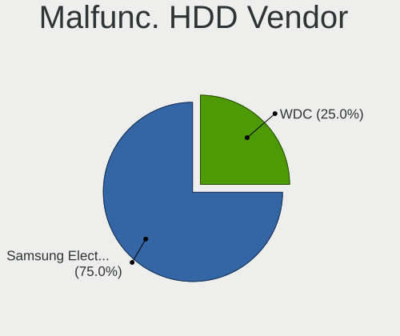

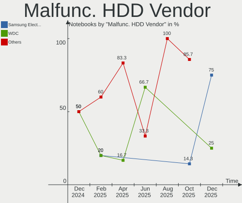

| Vendor              | Notebooks | Drives | Percent |
|---------------------|-----------|--------|---------|
| Samsung Electronics | 3         | 3      | 75%     |
| WDC                 | 1         | 1      | 25%     |

Malfunc. Drive Kind
-------------------

Kinds of faulty drives

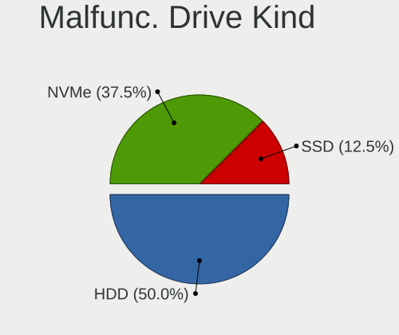

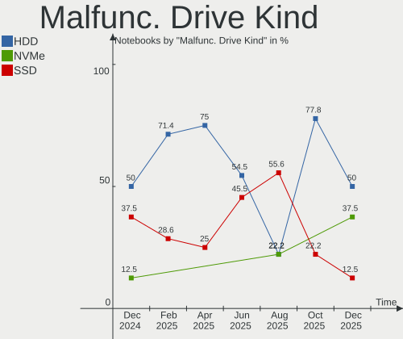

| Kind | Notebooks | Drives | Percent |
|------|-----------|--------|---------|
| HDD  | 4         | 4      | 50%     |
| NVMe | 3         | 3      | 37.5%   |
| SSD  | 1         | 1      | 12.5%   |

Failed Drives
-------------

Failed drive models

Zero info for selected period =(

Failed Drive Vendor
-------------------

Failed drive vendors

Zero info for selected period =(

Drive Status
------------

Number of failed and malfunc. drives

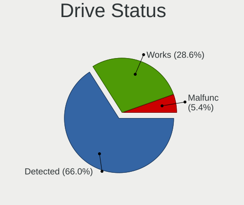

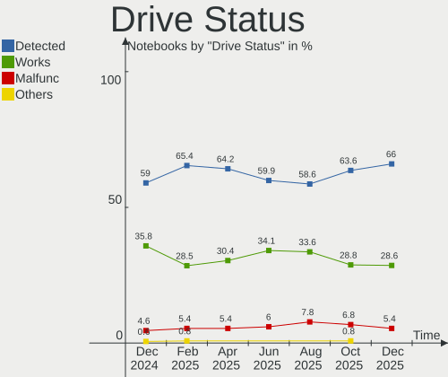

| Status   | Notebooks | Drives | Percent |
|----------|-----------|--------|---------|
| Detected | 97        | 124    | 65.99%  |
| Works    | 42        | 48     | 28.57%  |
| Malfunc  | 8         | 8      | 5.44%   |

Storage controller
------------------

Storage Vendor
--------------

Storage controller vendors

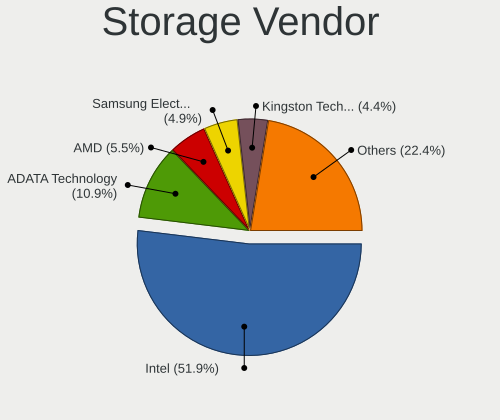

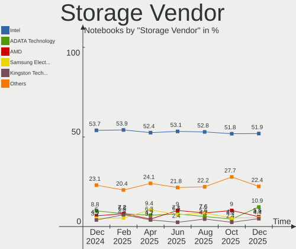

| Vendor                                  | Notebooks | Percent |
|-----------------------------------------|-----------|---------|
| Intel                                   | 95        | 51.91%  |
| ADATA Technology                        | 20        | 10.93%  |
| AMD                                     | 10        | 5.46%   |
| Samsung Electronics                     | 9         | 4.92%   |
| Kingston Technology Company             | 8         | 4.37%   |
| SanDisk                                 | 6         | 3.28%   |
| Micron Technology                       | 6         | 3.28%   |
| SK hynix                                | 5         | 2.73%   |
| Solid State Storage Technology          | 4         | 2.19%   |
| Shenzhen Longsys Electronics            | 4         | 2.19%   |
| KIOXIA                                  | 4         | 2.19%   |
| MAXIO Technology (Hangzhou)             | 3         | 1.64%   |
| Silicon Motion                          | 2         | 1.09%   |
| Phison Electronics                      | 2         | 1.09%   |
| Lite-On Technology                      | 2         | 1.09%   |
| Shenzhen Unionmemory Information System | 1         | 0.55%   |
| Micron/Crucial Technology               | 1         | 0.55%   |
| JMicron Technology                      | 1         | 0.55%   |

Storage Model
-------------

Storage controller models

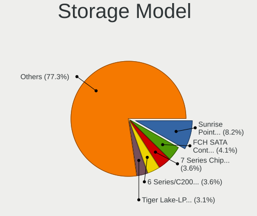

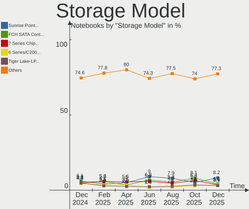

| Model                                                                            | Notebooks | Percent |
|----------------------------------------------------------------------------------|-----------|---------|
| Intel Sunrise Point-LP SATA Controller [AHCI mode]                               | 16        | 8.25%   |
| AMD FCH SATA Controller [AHCI mode]                                              | 8         | 4.12%   |
| Intel 7 Series Chipset Family 6-port SATA Controller [AHCI mode]                 | 7         | 3.61%   |
| Intel 6 Series/C200 Series Chipset Family 6 port Mobile SATA AHCI Controller     | 7         | 3.61%   |
| Intel Tiger Lake-LP SATA Controller                                              | 6         | 3.09%   |
| Intel Volume Management Device NVMe RAID Controller                              | 5         | 2.58%   |
| Intel RST Volume Management Device Controller                                    | 5         | 2.58%   |
| ADATA SM2P41C8 NVMe SSD (DRAM-less)                                              | 5         | 2.58%   |
| Solid State Storage CL4-8D512 NVMe SSD M.2 (DRAM-less)                           | 4         | 2.06%   |
| Intel Celeron/Pentium Silver Processor SATA Controller                           | 4         | 2.06%   |
| Intel 82801IBM/IEM (ICH9M/ICH9M-E) 4 port SATA Controller [AHCI mode]            | 4         | 2.06%   |
| Intel 82801 Mobile SATA Controller [RAID mode]                                   | 4         | 2.06%   |
| Intel 5 Series/3400 Series Chipset 4 port SATA AHCI Controller                   | 4         | 2.06%   |
| ADATA IM2P33F8 series NVMe SSD (DRAM-less)                                       | 4         | 2.06%   |
| Shenzhen Longsys FORESEE XP2000, Lexar NM760 NVME SSD (DRAM-less)                | 3         | 1.55%   |
| SanDisk WD Green SN350 240GB (DRAM-less) / SN560E NVMe SSD                       | 3         | 1.55%   |
| Samsung NVMe SSD Controller 980 (DRAM-less)                                      | 3         | 1.55%   |
| Micron 2650 NVMe SSD (DRAM-less)                                                 | 3         | 1.55%   |
| KIOXIA NVMe SSD Controller BG5 (DRAM-less)                                       | 3         | 1.55%   |
| Kingston Company NV2 NVMe SSD [SM2267XT] (DRAM-less)                             | 3         | 1.55%   |
| Intel Wildcat Point-LP SATA Controller [AHCI Mode]                               | 3         | 1.55%   |
| Intel HM170/QM170 Chipset SATA Controller [AHCI Mode]                            | 3         | 1.55%   |
| Intel Cannon Point-LP SATA Controller [AHCI Mode]                                | 3         | 1.55%   |
| Intel 8 Series SATA Controller 1 [AHCI mode]                                     | 3         | 1.55%   |
| Intel 7 Series Chipset Family 4-port SATA Controller [IDE mode]                  | 3         | 1.55%   |
| Intel 7 Series Chipset Family 2-port SATA Controller [IDE mode]                  | 3         | 1.55%   |
| SK hynix BC901 NVMe Solid State Drive (DRAM-less)                                | 2         | 1.03%   |
| Silicon Motion SM2263EN/SM2263XT (DRAM-less) NVMe SSD Controllers                | 2         | 1.03%   |
| SanDisk Ultra 3D / WD PC SN530, IX SN530, Blue SN550 NVMe SSD (DRAM-less)        | 2         | 1.03%   |
| Samsung NVMe SSD Controller PM9C1a (DRAM-less)                                   | 2         | 1.03%   |
| MAXIO (Hangzhou) NVMe SSD Controller MAP1202 (DRAM-less)                         | 2         | 1.03%   |
| Lite-On CA3-8D256, CA3-8D512 NVMe SSD                                            | 2         | 1.03%   |
| Kingston Company NV3 NVMe SSD [TC2201] (DRAM-less)                               | 2         | 1.03%   |
| Intel SSD 670p Series [Keystone Harbor]                                          | 2         | 1.03%   |
| Intel Cannon Lake Mobile PCH SATA AHCI Controller                                | 2         | 1.03%   |
| Intel Atom/Celeron/Pentium Processor x5-E8000/J3xxx/N3xxx Series SATA Controller | 2         | 1.03%   |
| Intel Alder Lake-P SATA AHCI Controller                                          | 2         | 1.03%   |
| Intel 82801HM/HEM (ICH8M/ICH8M-E) SATA Controller [AHCI mode]                    | 2         | 1.03%   |
| Intel 82801HM/HEM (ICH8M/ICH8M-E) IDE Controller                                 | 2         | 1.03%   |
| Intel 8 Series/C220 Series Chipset Family 6-port SATA Controller 1 [AHCI mode]   | 2         | 1.03%   |

Storage Kind
------------

Kind of storage controller (IDE, SATA, NVMe, SAS, ...)

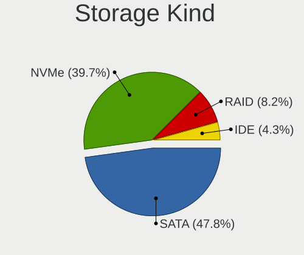

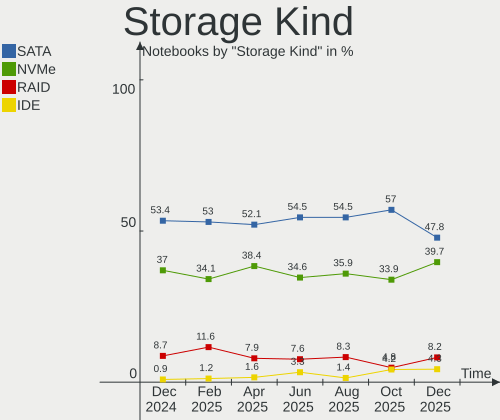

| Kind | Notebooks | Percent |
|------|-----------|---------|
| SATA | 88        | 47.83%  |
| NVMe | 73        | 39.67%  |
| RAID | 15        | 8.15%   |
| IDE  | 8         | 4.35%   |

Processor
---------

CPU Vendor
----------

Processor vendors

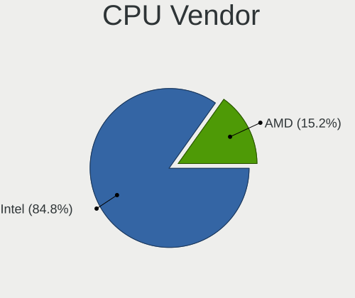

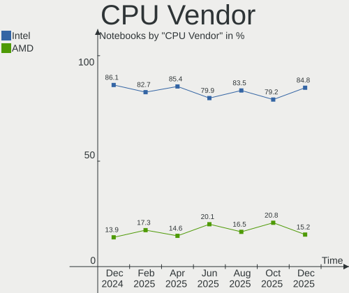

| Vendor | Notebooks | Percent |
|--------|-----------|---------|
| Intel  | 123       | 84.83%  |
| AMD    | 22        | 15.17%  |

CPU Model
---------

Processor models

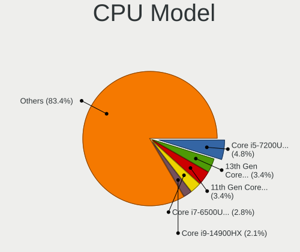

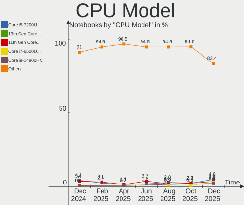

| Model                                         | Notebooks | Percent |
|-----------------------------------------------|-----------|---------|
| Intel Core i5-7200U CPU @ 2.50GHz             | 7         | 4.83%   |
| Intel 13th Gen Core i5-1334U                  | 5         | 3.45%   |
| Intel 11th Gen Core i5-1135G7 @ 2.40GHz       | 5         | 3.45%   |
| Intel Core i7-6500U CPU @ 2.50GHz             | 4         | 2.76%   |
| Intel Core i9-14900HX                         | 3         | 2.07%   |
| AMD Ryzen 7 5700U with Radeon Graphics        | 3         | 2.07%   |
| AMD Ryzen 7 3700U with Radeon Vega Mobile Gfx | 3         | 2.07%   |
| Intel Core i7-7500U CPU @ 2.70GHz             | 2         | 1.38%   |
| Intel Core i5-8365U CPU @ 1.60GHz             | 2         | 1.38%   |
| Intel Core i5-8350U CPU @ 1.70GHz             | 2         | 1.38%   |
| Intel Core i5-3337U CPU @ 1.80GHz             | 2         | 1.38%   |
| Intel Core i5-2410M CPU @ 2.30GHz             | 2         | 1.38%   |
| Intel Core i3-2310M CPU @ 2.10GHz             | 2         | 1.38%   |
| Intel Core i3 CPU M 370 @ 2.40GHz             | 2         | 1.38%   |
| Intel Core 7 240H                             | 2         | 1.38%   |
| Intel Celeron N4020 CPU @ 1.10GHz             | 2         | 1.38%   |
| Intel Celeron N4000 CPU @ 1.10GHz             | 2         | 1.38%   |
| Intel Atom x5-Z8350 CPU @ 1.44GHz             | 2         | 1.38%   |
| Intel 13th Gen Core i7-13620H                 | 2         | 1.38%   |
| Intel 13th Gen Core i5-13420H                 | 2         | 1.38%   |
| Intel 12th Gen Core i5-12500H                 | 2         | 1.38%   |
| Intel 12th Gen Core i5-1235U                  | 2         | 1.38%   |
| Intel 11th Gen Core i3-1115G4 @ 3.00GHz       | 2         | 1.38%   |
| AMD Ryzen 7 7735HS with Radeon Graphics       | 2         | 1.38%   |
| AMD Ryzen 5 7520U with Radeon Graphics        | 2         | 1.38%   |
| AMD Ryzen 5 5500U with Radeon Graphics        | 2         | 1.38%   |
| AMD Ryzen 3 7320U with Radeon Graphics        | 2         | 1.38%   |
| Intel Xeon CPU E5-2667 v4 @ 3.20GHz           | 1         | 0.69%   |
| Intel Xeon CPU E3-1505M v6 @ 3.00GHz          | 1         | 0.69%   |
| Intel Pentium Gold 7505 @ 2.00GHz             | 1         | 0.69%   |
| Intel Pentium Dual-Core CPU T4500 @ 2.30GHz   | 1         | 0.69%   |
| Intel Pentium Dual-Core CPU T4400 @ 2.20GHz   | 1         | 0.69%   |
| Intel Pentium Dual-Core CPU T4300 @ 2.10GHz   | 1         | 0.69%   |
| Intel Pentium CPU P6200 @ 2.13GHz             | 1         | 0.69%   |
| Intel Pentium CPU N3710 @ 1.60GHz             | 1         | 0.69%   |
| Intel Core Ultra 9 185H                       | 1         | 0.69%   |
| Intel Core Ultra 7 268V                       | 1         | 0.69%   |
| Intel Core Ultra 7 155H                       | 1         | 0.69%   |
| Intel Core i9-8950HK CPU @ 2.90GHz            | 1         | 0.69%   |
| Intel Core i7-8665U CPU @ 1.90GHz             | 1         | 0.69%   |

CPU Model Family
----------------

Processor model prefix

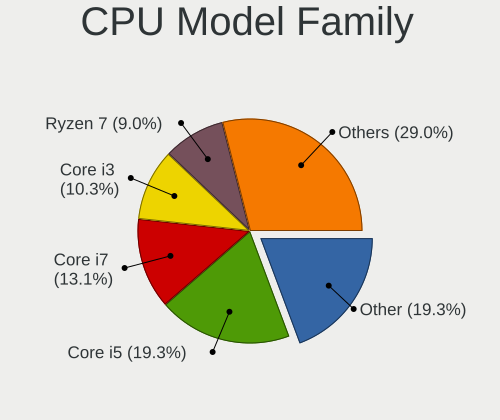

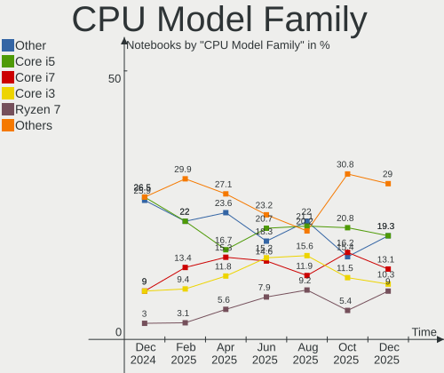

| Model                   | Notebooks | Percent |
|-------------------------|-----------|---------|
| Other                   | 28        | 19.31%  |
| Intel Core i5           | 28        | 19.31%  |
| Intel Core i7           | 19        | 13.1%   |
| Intel Core i3           | 15        | 10.34%  |
| AMD Ryzen 7             | 13        | 8.97%   |
| Intel Celeron           | 8         | 5.52%   |
| Intel Core              | 5         | 3.45%   |
| AMD Ryzen 5             | 5         | 3.45%   |
| Intel Core i9           | 4         | 2.76%   |
| Intel Pentium Dual-Core | 3         | 2.07%   |
| Intel Core 2 Duo        | 3         | 2.07%   |
| Intel Atom              | 3         | 2.07%   |
| Intel Xeon              | 2         | 1.38%   |
| Intel Pentium           | 2         | 1.38%   |
| Intel Core 2            | 2         | 1.38%   |
| AMD Ryzen 3             | 2         | 1.38%   |
| Intel Pentium Gold      | 1         | 0.69%   |
| AMD Ryzen 9             | 1         | 0.69%   |
| AMD PRO A10             | 1         | 0.69%   |

CPU Cores
---------

Number of processor cores

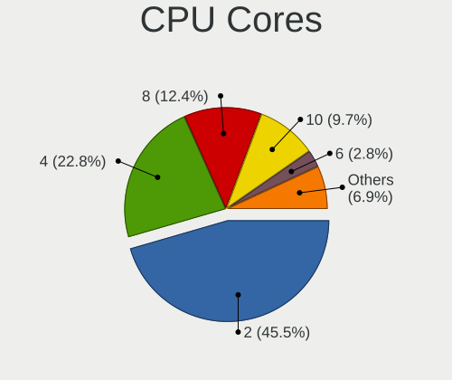

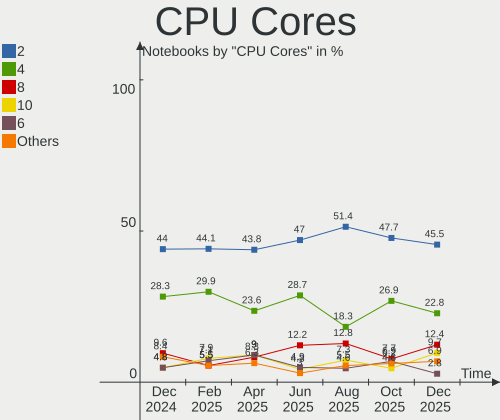

| Number | Notebooks | Percent |
|--------|-----------|---------|
| 2      | 66        | 45.52%  |
| 4      | 33        | 22.76%  |
| 8      | 18        | 12.41%  |
| 10     | 14        | 9.66%   |
| 6      | 4         | 2.76%   |
| 24     | 3         | 2.07%   |
| 16     | 2         | 1.38%   |
| 14     | 2         | 1.38%   |
| 12     | 2         | 1.38%   |
| 1      | 1         | 0.69%   |

CPU Sockets
-----------

Number of sockets

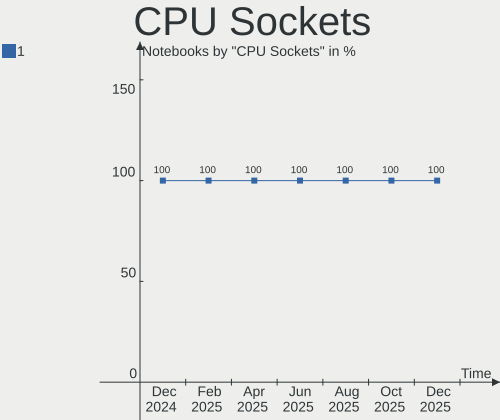

| Number | Notebooks | Percent |
|--------|-----------|---------|
| 1      | 145       | 100%    |

CPU Threads
-----------

Threads per core (Hyper-Threading)

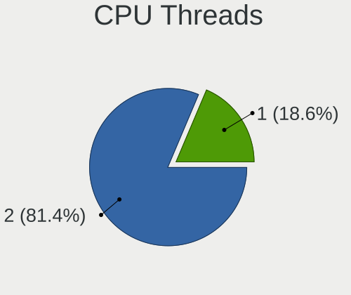

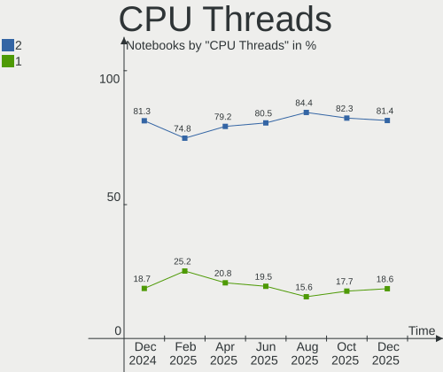

| Number | Notebooks | Percent |
|--------|-----------|---------|
| 2      | 118       | 81.38%  |
| 1      | 27        | 18.62%  |

CPU Op-Modes
------------

CPU Operation Modes (32-bit, 64-bit)

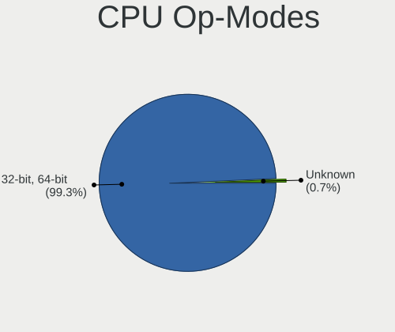

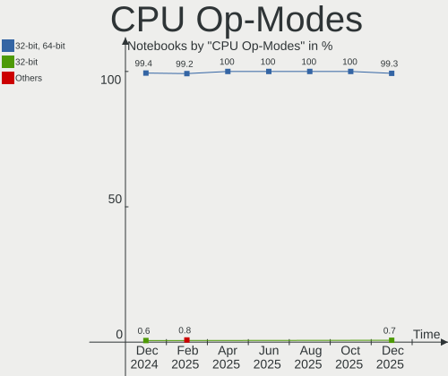

| Op mode        | Notebooks | Percent |
|----------------|-----------|---------|
| 32-bit, 64-bit | 144       | 99.31%  |
| 32-bit         | 1         | 0.69%   |

CPU Microcode
-------------

Microcode number

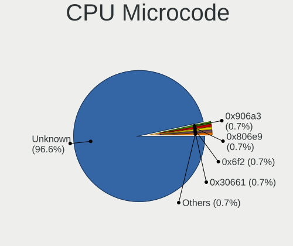

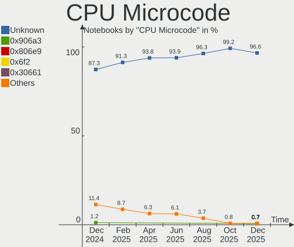

| Number  | Notebooks | Percent |
|---------|-----------|---------|
| Unknown | 140       | 96.55%  |
| 0x906a3 | 1         | 0.69%   |
| 0x806e9 | 1         | 0.69%   |
| 0x6f2   | 1         | 0.69%   |
| 0x30661 | 1         | 0.69%   |
| 0x1067a | 1         | 0.69%   |

CPU Microarch
-------------

Microarchitecture

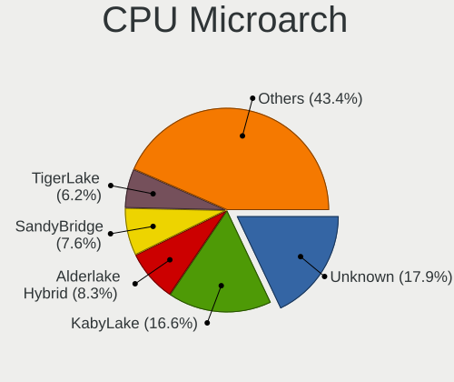

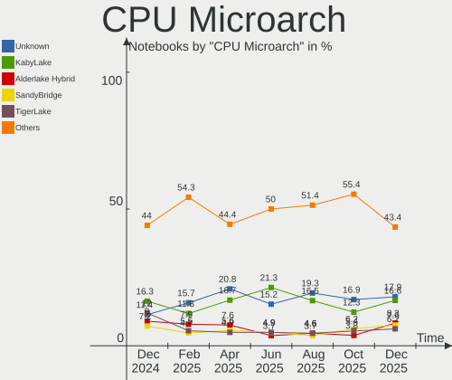

| Name              | Notebooks | Percent |
|-------------------|-----------|---------|
| Unknown           | 26        | 17.93%  |
| KabyLake          | 24        | 16.55%  |
| Alderlake Hybrid  | 12        | 8.28%   |
| SandyBridge       | 11        | 7.59%   |
| TigerLake         | 9         | 6.21%   |
| IvyBridge         | 7         | 4.83%   |
| Skylake           | 6         | 4.14%   |
| Silvermont        | 5         | 3.45%   |
| Penryn            | 5         | 3.45%   |
| Haswell           | 5         | 3.45%   |
| Goldmont plus     | 5         | 3.45%   |
| Zen+              | 4         | 2.76%   |
| Zen 3             | 4         | 2.76%   |
| Westmere          | 4         | 2.76%   |
| Broadwell         | 4         | 2.76%   |
| Core              | 3         | 2.07%   |
| Meteorlake Hybrid | 2         | 1.38%   |
| IceLake           | 2         | 1.38%   |
| CometLake         | 2         | 1.38%   |
| Lunarlake Hybrid  | 1         | 0.69%   |
| Gracemont         | 1         | 0.69%   |
| Goldmont          | 1         | 0.69%   |
| Excavator         | 1         | 0.69%   |
| Bonnell           | 1         | 0.69%   |

Graphics
--------

GPU Vendor
----------

Vendors of graphics cards

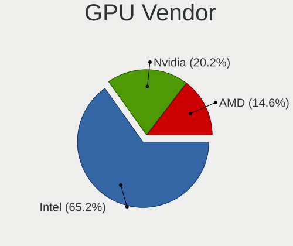

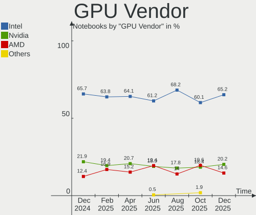

| Vendor | Notebooks | Percent |
|--------|-----------|---------|
| Intel  | 116       | 65.17%  |
| Nvidia | 36        | 20.22%  |
| AMD    | 26        | 14.61%  |

GPU Model
---------

Graphics card models

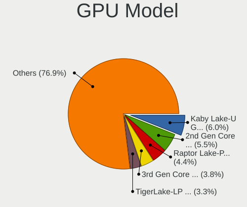

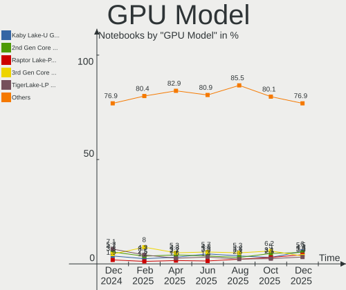

| Model                                                                                    | Notebooks | Percent |
|------------------------------------------------------------------------------------------|-----------|---------|
| Intel Kaby Lake-U GT2 [HD Graphics 620]                                                  | 11        | 6.04%   |
| Intel 2nd Generation Core Processor Family Integrated Graphics Controller                | 10        | 5.49%   |
| Intel Raptor Lake-P [UHD Graphics]                                                       | 8         | 4.4%    |
| Intel 3rd Gen Core processor Graphics Controller                                         | 7         | 3.85%   |
| Intel TigerLake-LP GT2 [Iris Xe Graphics]                                                | 6         | 3.3%    |
| Intel WhiskeyLake-U GT2 [UHD Graphics 620]                                               | 5         | 2.75%   |
| Intel Skylake-U GT2 [HD Graphics 520]                                                    | 5         | 2.75%   |
| Intel GeminiLake [UHD Graphics 600]                                                      | 5         | 2.75%   |
| AMD Lucienne                                                                             | 5         | 2.75%   |
| Nvidia GA107BM / GN20-P0-R-K2 [GeForce RTX 3050 6GB Laptop GPU]                          | 4         | 2.2%    |
| Intel Raptor Lake-S UHD Graphics                                                         | 4         | 2.2%    |
| Intel Haswell-ULT Integrated Graphics Controller                                         | 4         | 2.2%    |
| Intel Core Processor Integrated Graphics Controller                                      | 4         | 2.2%    |
| Intel Atom/Celeron/Pentium Processor x5-E8000/J3xxx/N3xxx Integrated Graphics Controller | 4         | 2.2%    |
| AMD Picasso/Raven 2 [Radeon Vega Series / Radeon Vega Mobile Series]                     | 4         | 2.2%    |
| AMD Mendocino [Radeon 610M]                                                              | 4         | 2.2%    |
| Nvidia GM108M [GeForce 940MX]                                                            | 3         | 1.65%   |
| Intel Tiger Lake-LP GT2 [UHD Graphics G4]                                                | 3         | 1.65%   |
| Intel Mobile 4 Series Chipset Integrated Graphics Controller                             | 3         | 1.65%   |
| Intel Kaby Lake-R GT2 [UHD Graphics 620]                                                 | 3         | 1.65%   |
| Intel Broadwell-U GT2 [HD Graphics 5500]                                                 | 3         | 1.65%   |
| Intel Alder Lake-UP3 GT2 [Iris Xe Graphics]                                              | 3         | 1.65%   |
| AMD Topaz XT [Radeon R7 M260/M265 / M340/M360 / M440/M445 / 530/535 / 620/625 Mobile]    | 3         | 1.65%   |
| Nvidia GP106M [GeForce GTX 1060 Mobile]                                                  | 2         | 1.1%    |
| Nvidia GB207M [GeForce RTX 5050 Max-Q / Mobile]                                          | 2         | 1.1%    |
| Nvidia GB206M [GeForce RTX 5060 Max-Q / Mobile]                                          | 2         | 1.1%    |
| Nvidia GA107M [GeForce RTX 3050 Mobile]                                                  | 2         | 1.1%    |
| Nvidia GA107M [GeForce RTX 2050]                                                         | 2         | 1.1%    |
| Intel Raptor Lake-P [Iris Xe Graphics]                                                   | 2         | 1.1%    |
| Intel Raptor Lake-P [Intel Graphics]                                                     | 2         | 1.1%    |
| Intel Meteor Lake-P [Intel Arc Graphics]                                                 | 2         | 1.1%    |
| Intel Kaby Lake-H GT2 [HD Graphics 630]                                                  | 2         | 1.1%    |
| Intel Iris Plus Graphics G1 (Ice Lake)                                                   | 2         | 1.1%    |
| Intel CoffeeLake-H GT2 [UHD Graphics 630]                                                | 2         | 1.1%    |
| Intel Alder Lake-P GT2 [Iris Xe Graphics]                                                | 2         | 1.1%    |
| AMD Rembrandt [Radeon 680M]                                                              | 2         | 1.1%    |
| AMD Cezanne [Radeon Vega Series / Radeon Vega Mobile Series]                             | 2         | 1.1%    |
| AMD Barcelo                                                                              | 2         | 1.1%    |
| Nvidia TU106M [GeForce RTX 2060 Mobile]                                                  | 1         | 0.55%   |
| Nvidia GP108M [GeForce MX150]                                                            | 1         | 0.55%   |

GPU Combo
---------

Combinations of graphics cards

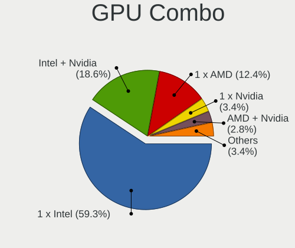

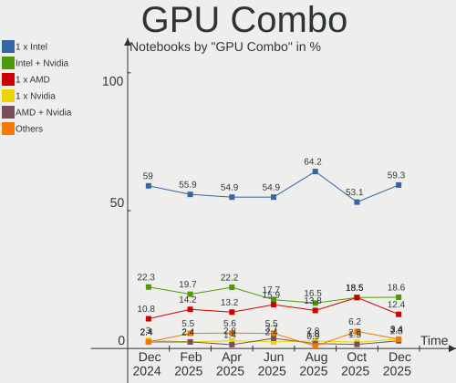

| Name           | Notebooks | Percent |
|----------------|-----------|---------|
| 1 x Intel      | 86        | 59.31%  |
| Intel + Nvidia | 27        | 18.62%  |
| 1 x AMD        | 18        | 12.41%  |
| 1 x Nvidia     | 5         | 3.45%   |
| AMD + Nvidia   | 4         | 2.76%   |
| 2 x AMD        | 2         | 1.38%   |
| Intel + AMD    | 2         | 1.38%   |
| 2 x Intel      | 1         | 0.69%   |

GPU Driver
----------

Free vs proprietary

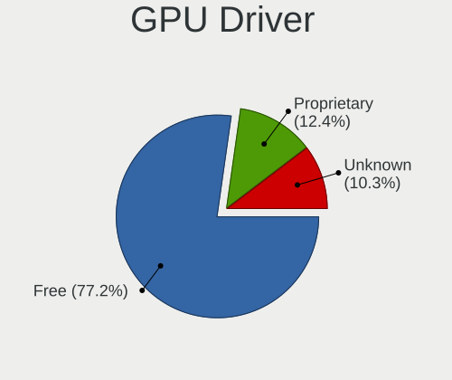

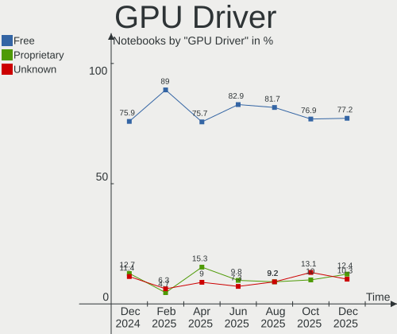

| Driver      | Notebooks | Percent |
|-------------|-----------|---------|
| Free        | 112       | 77.24%  |
| Proprietary | 18        | 12.41%  |
| Unknown     | 15        | 10.34%  |

GPU Memory
----------

Total video memory

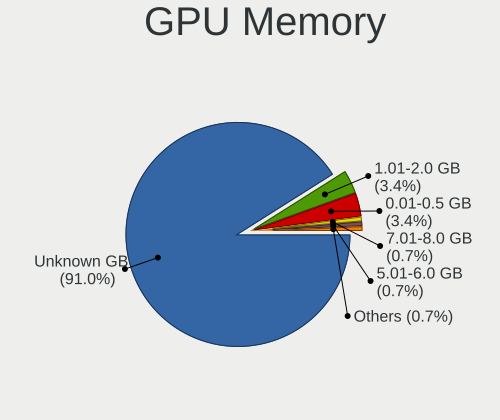

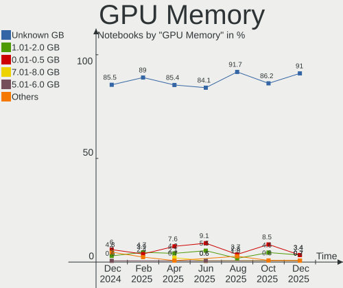

| Size in GB | Notebooks | Percent |
|------------|-----------|---------|
| Unknown    | 132       | 91.03%  |
| 1.01-2.0   | 5         | 3.45%   |
| 0.01-0.5   | 5         | 3.45%   |
| 7.01-8.0   | 1         | 0.69%   |
| 5.01-6.0   | 1         | 0.69%   |
| 3.01-4.0   | 1         | 0.69%   |

Monitor
-------

Monitor Vendor
--------------

Monitor vendors

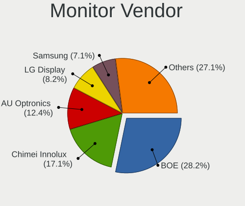

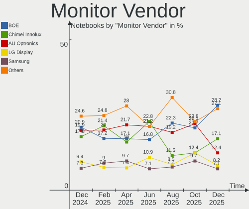

| Vendor              | Notebooks | Percent |
|---------------------|-----------|---------|
| BOE                 | 48        | 28.24%  |
| Chimei Innolux      | 29        | 17.06%  |
| AU Optronics        | 21        | 12.35%  |
| LG Display          | 14        | 8.24%   |
| Samsung Electronics | 12        | 7.06%   |
| Goldstar            | 11        | 6.47%   |
| AOC                 | 5         | 2.94%   |
| PANDA               | 4         | 2.35%   |
| Dell                | 4         | 2.35%   |
| Lenovo              | 3         | 1.76%   |
| InfoVision          | 3         | 1.76%   |
| Sharp               | 2         | 1.18%   |
| Apple               | 2         | 1.18%   |
| Acer                | 2         | 1.18%   |
| ZTR                 | 1         | 0.59%   |
| VIZTA               | 1         | 0.59%   |
| VIE                 | 1         | 0.59%   |
| Unknown (XXX)       | 1         | 0.59%   |
| SLD                 | 1         | 0.59%   |
| SGT                 | 1         | 0.59%   |
| KDB                 | 1         | 0.59%   |
| Denver              | 1         | 0.59%   |
| CSOT                | 1         | 0.59%   |
| CPT                 | 1         | 0.59%   |

Monitor Model
-------------

Monitor models

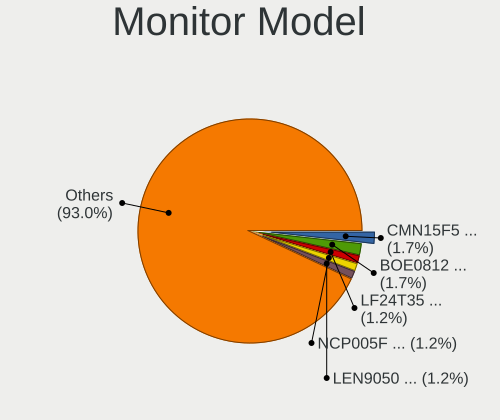

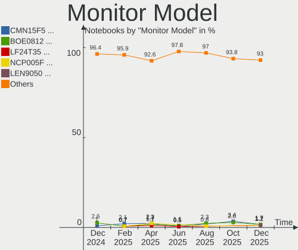

| Model                                                                 | Notebooks | Percent |
|-----------------------------------------------------------------------|-----------|---------|
| Chimei Innolux LCD Monitor CMN15F5 1920x1080 344x193mm 15.5-inch      | 3         | 1.74%   |
| BOE LCD Monitor BOE0812 1920x1080 344x194mm 15.5-inch                 | 3         | 1.74%   |
| Samsung Electronics LF24T35 SAM707D 1920x1080 528x297mm 23.9-inch     | 2         | 1.16%   |
| PANDA LCD Monitor NCP005F 1920x1080 344x194mm 15.5-inch               | 2         | 1.16%   |
| Lenovo LCD Monitor LEN9050 1366x768 344x193mm 15.5-inch               | 2         | 1.16%   |
| Goldstar ULTRAWIDE GSM76F9 2560x1080 531x298mm 24.0-inch              | 2         | 1.16%   |
| Chimei Innolux LCD Monitor CMN15E6 1366x768 344x193mm 15.5-inch       | 2         | 1.16%   |
| Chimei Innolux LCD Monitor CMN1541 1366x768 344x193mm 15.5-inch       | 2         | 1.16%   |
| Chimei Innolux LCD Monitor CMN14C3 1366x768 309x173mm 13.9-inch       | 2         | 1.16%   |
| Chimei Innolux LCD Monitor CMN1470 1366x768 309x174mm 14.0-inch       | 2         | 1.16%   |
| BOE NV153WUM-N41 BOE0CEA 1920x1200 329x206mm 15.3-inch                | 2         | 1.16%   |
| BOE NE160QDM-NYL BOE0D5E 2560x1600 345x215mm 16.0-inch                | 2         | 1.16%   |
| BOE LCD Monitor BOE0D39 1920x1080 344x194mm 15.5-inch                 | 2         | 1.16%   |
| BOE LCD Monitor BOE0AF7 1920x1080 344x194mm 15.5-inch                 | 2         | 1.16%   |
| BOE LCD Monitor BOE08C7 1920x1080 309x174mm 14.0-inch                 | 2         | 1.16%   |
| BOE LCD Monitor BOE0868 1920x1080 309x174mm 14.0-inch                 | 2         | 1.16%   |
| BOE LCD Monitor BOE06A5 1366x768 344x194mm 15.5-inch                  | 2         | 1.16%   |
| BOE LCD Monitor BOE0697 1366x768 309x173mm 13.9-inch                  | 2         | 1.16%   |
| AU Optronics LCD Monitor AUO81EC 1366x768 344x193mm 15.5-inch         | 2         | 1.16%   |
| AU Optronics LCD Monitor AUO38ED 1920x1080 344x193mm 15.5-inch        | 2         | 1.16%   |
| AOC 24G2W1G3 AOC2402 1920x1080 527x296mm 23.8-inch                    | 2         | 1.16%   |
| ZTR 156XX5419T02 ZTR0015 1920x1080 344x193mm 15.5-inch                | 1         | 0.58%   |
| VIZTA 27HQ CURVO JRY2700 1920x1080 698x393mm 31.5-inch                | 1         | 0.58%   |
| VIE ATHEN U2L 21 VIE2150 1920x1080 476x268mm 21.5-inch                | 1         | 0.58%   |
| Unknown (XXX) Smart TV Pro XXX8000 3840x2160 598x336mm 27.0-inch      | 1         | 0.58%   |
| SLD LCD Monitor SLD003C 1366x768 309x173mm 13.9-inch                  | 1         | 0.58%   |
| Sharp LQ140M1JW49 SHP1523 1920x1080 309x174mm 14.0-inch               | 1         | 0.58%   |
| Sharp LCD Monitor SHP1476 3840x2160 346x194mm 15.6-inch               | 1         | 0.58%   |
| SGT HDMI SGT2380 1920x1080 531x299mm 24.0-inch                        | 1         | 0.58%   |
| Samsung Electronics SyncMaster SAM0598 1360x768 410x230mm 18.5-inch   | 1         | 0.58%   |
| Samsung Electronics LF27T35 SAM707F 1920x1080 598x337mm 27.0-inch     | 1         | 0.58%   |
| Samsung Electronics LCD Monitor SEC5742 1366x768 309x174mm 14.0-inch  | 1         | 0.58%   |
| Samsung Electronics LCD Monitor SEC4D42 1280x800 303x190mm 14.1-inch  | 1         | 0.58%   |
| Samsung Electronics LCD Monitor SEC364A 1366x768 344x194mm 15.5-inch  | 1         | 0.58%   |
| Samsung Electronics LCD Monitor SEC314C 1920x1080 344x194mm 15.5-inch | 1         | 0.58%   |
| Samsung Electronics LCD Monitor SDC5441 1366x768 344x193mm 15.5-inch  | 1         | 0.58%   |
| Samsung Electronics LCD Monitor SDC419D 2880x1800 302x189mm 14.0-inch | 1         | 0.58%   |
| Samsung Electronics LCD Monitor SAM0C3C 1366x768 609x347mm 27.6-inch  | 1         | 0.58%   |
| Samsung Electronics LCD Monitor SAM0B7C 1920x1080 886x498mm 40.0-inch | 1         | 0.58%   |
| PANDA LCD Monitor NCP004D 1920x1080 344x194mm 15.5-inch               | 1         | 0.58%   |

Monitor Resolution
------------------

Monitor screen resolution

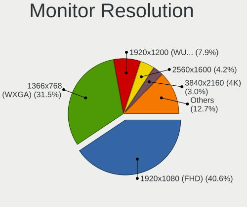

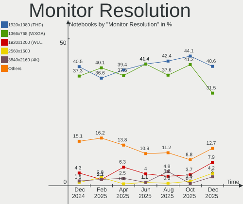

| Resolution         | Notebooks | Percent |
|--------------------|-----------|---------|
| 1920x1080 (FHD)    | 67        | 40.61%  |
| 1366x768 (WXGA)    | 52        | 31.52%  |
| 1920x1200 (WUXGA)  | 13        | 7.88%   |
| 2560x1600          | 7         | 4.24%   |
| 3840x2160 (4K)     | 5         | 3.03%   |
| 2560x1440 (QHD)    | 5         | 3.03%   |
| 2560x1080          | 4         | 2.42%   |
| 1440x900 (WXGA+)   | 3         | 1.82%   |
| 1280x800 (WXGA)    | 3         | 1.82%   |
| 1600x900 (HD+)     | 2         | 1.21%   |
| 2880x1800          | 1         | 0.61%   |
| 1680x1050 (WSXGA+) | 1         | 0.61%   |
| 1360x768           | 1         | 0.61%   |
| 1024x768 (XGA)     | 1         | 0.61%   |

Monitor Diagonal
----------------

Diagonal size in inches

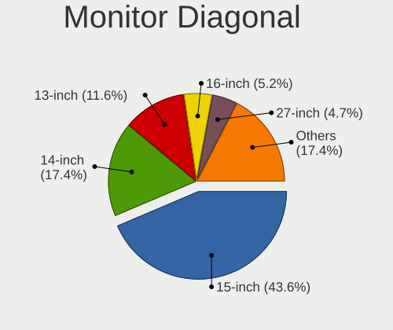

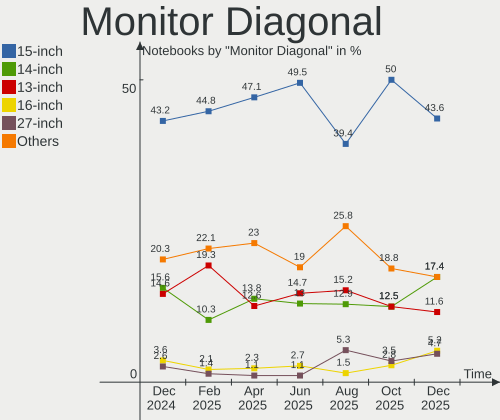

| Inches | Notebooks | Percent |
|--------|-----------|---------|
| 15     | 75        | 43.6%   |
| 14     | 30        | 17.44%  |
| 13     | 20        | 11.63%  |
| 16     | 9         | 5.23%   |
| 27     | 8         | 4.65%   |
| 24     | 6         | 3.49%   |
| 34     | 3         | 1.74%   |
| 23     | 3         | 1.74%   |
| 21     | 3         | 1.74%   |
| 31     | 2         | 1.16%   |
| 20     | 2         | 1.16%   |
| 19     | 2         | 1.16%   |
| 18     | 2         | 1.16%   |
| 11     | 2         | 1.16%   |
| 63     | 1         | 0.58%   |
| 58     | 1         | 0.58%   |
| 26     | 1         | 0.58%   |
| 22     | 1         | 0.58%   |
| 17     | 1         | 0.58%   |

Monitor Width
-------------

Physical width

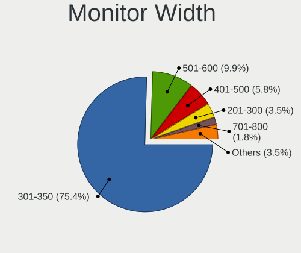

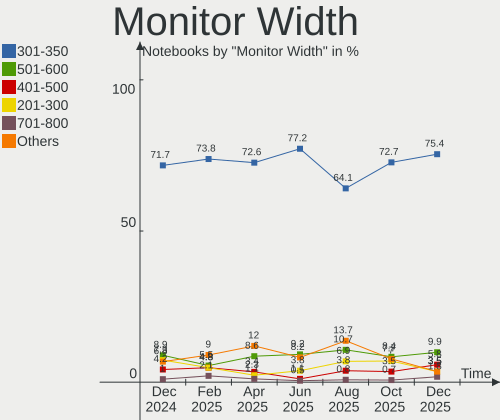

| Width in mm | Notebooks | Percent |
|-------------|-----------|---------|
| 301-350     | 129       | 75.44%  |
| 501-600     | 17        | 9.94%   |
| 401-500     | 10        | 5.85%   |
| 201-300     | 6         | 3.51%   |
| 701-800     | 3         | 1.75%   |
| 601-700     | 2         | 1.17%   |
| 351-400     | 2         | 1.17%   |
| 1001-1500   | 2         | 1.17%   |

Aspect Ratio
------------

Proportional relationship between the width and the height

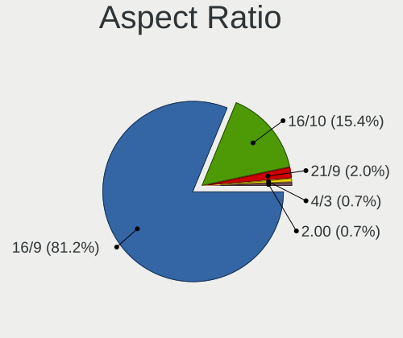

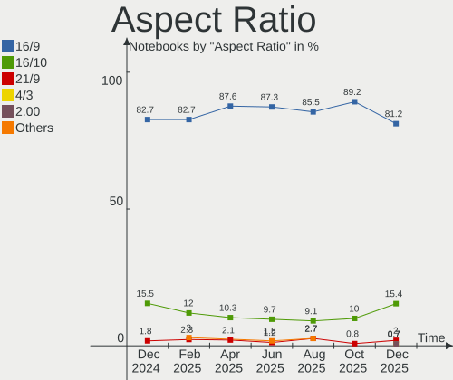

| Ratio | Notebooks | Percent |
|-------|-----------|---------|
| 16/9  | 121       | 81.21%  |
| 16/10 | 23        | 15.44%  |
| 21/9  | 3         | 2.01%   |
| 4/3   | 1         | 0.67%   |
| 2.00  | 1         | 0.67%   |

Monitor Area
------------

Area in inch²

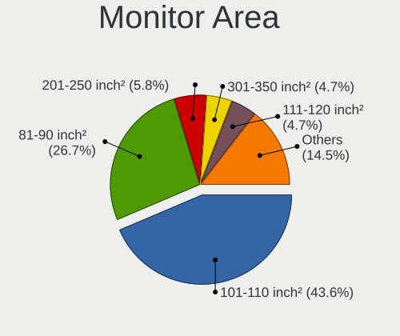

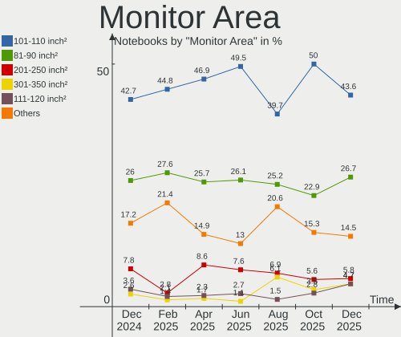

| Area in inch² | Notebooks | Percent |
|----------------|-----------|---------|
| 101-110        | 75        | 43.6%   |
| 81-90          | 46        | 26.74%  |
| 201-250        | 10        | 5.81%   |
| 301-350        | 8         | 4.65%   |
| 111-120        | 8         | 4.65%   |
| 151-200        | 6         | 3.49%   |
| 351-500        | 5         | 2.91%   |
| 71-80          | 3         | 1.74%   |
| 251-300        | 3         | 1.74%   |
| More than 1000 | 2         | 1.16%   |
| 51-60          | 2         | 1.16%   |
| 121-130        | 2         | 1.16%   |
| 141-150        | 1         | 0.58%   |
| 91-100         | 1         | 0.58%   |

Pixel Density
-------------

Pixels per inch

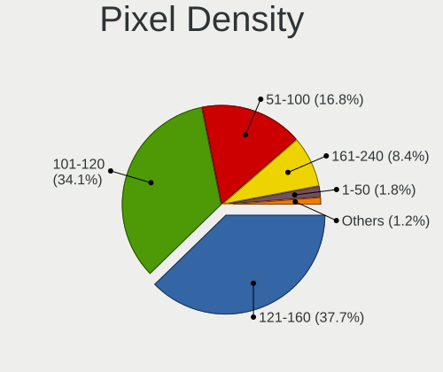

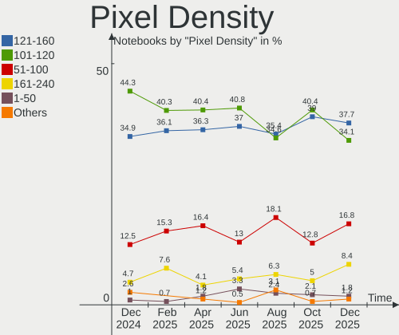

| Density       | Notebooks | Percent |
|---------------|-----------|---------|
| 121-160       | 63        | 37.72%  |
| 101-120       | 57        | 34.13%  |
| 51-100        | 28        | 16.77%  |
| 161-240       | 14        | 8.38%   |
| 1-50          | 3         | 1.8%    |
| More than 240 | 2         | 1.2%    |

Multiple Monitors
-----------------

Total monitors connected

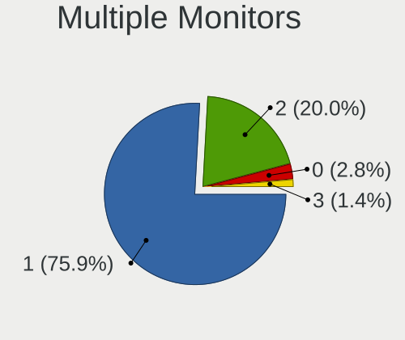

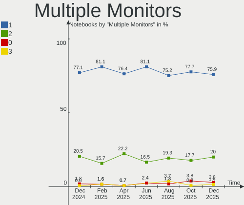

| Total | Notebooks | Percent |
|-------|-----------|---------|
| 1     | 110       | 75.86%  |
| 2     | 29        | 20%     |
| 0     | 4         | 2.76%   |
| 3     | 2         | 1.38%   |

Network
-------

Net Controller Vendor
---------------------

Controller vendors

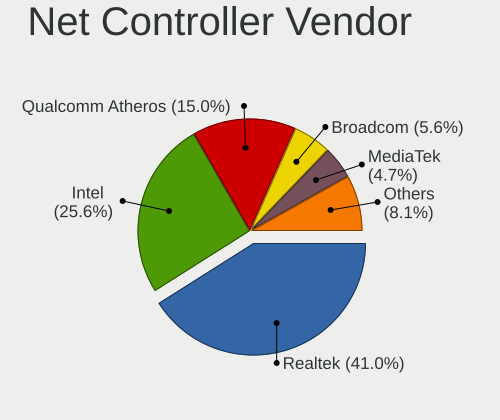

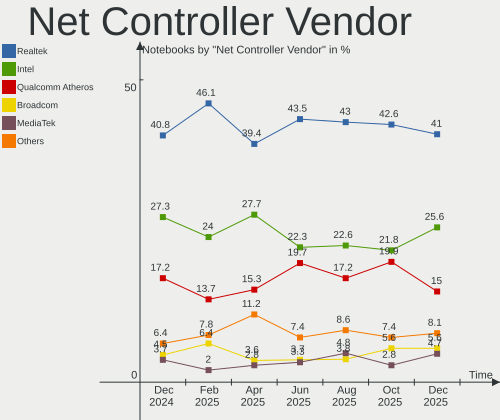

| Vendor                      | Notebooks | Percent |
|-----------------------------|-----------|---------|
| Realtek Semiconductor       | 96        | 41.03%  |
| Intel                       | 60        | 25.64%  |
| Qualcomm Atheros            | 35        | 14.96%  |
| Broadcom                    | 13        | 5.56%   |
| MediaTek                    | 11        | 4.7%    |
| Motorcomm Microelectronics. | 3         | 1.28%   |
| Marvell Technology Group    | 3         | 1.28%   |
| TP-Link                     | 2         | 0.85%   |
| Ralink Technology           | 2         | 0.85%   |
| Ralink                      | 2         | 0.85%   |
| Broadcom Limited            | 2         | 0.85%   |
| U-Blox                      | 1         | 0.43%   |
| Samsung Electronics         | 1         | 0.43%   |
| OCZ Technology              | 1         | 0.43%   |
| Motorola PCS                | 1         | 0.43%   |
| ASIX Electronics            | 1         | 0.43%   |

Net Controller Model
--------------------

Controller models

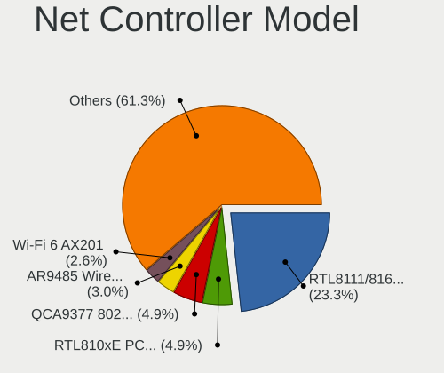

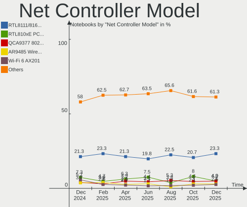

| Model                                                                           | Notebooks | Percent |
|---------------------------------------------------------------------------------|-----------|---------|
| Realtek RTL8111/8168/8211/8411 PCI Express Gigabit Ethernet Controller          | 62        | 23.31%  |
| Realtek RTL810xE PCI Express Fast Ethernet controller                           | 13        | 4.89%   |
| Qualcomm Atheros QCA9377 802.11ac Wireless Network Adapter                      | 13        | 4.89%   |
| Qualcomm Atheros AR9485 Wireless Network Adapter                                | 8         | 3.01%   |
| Intel Wi-Fi 6 AX201                                                             | 7         | 2.63%   |
| Realtek RTL8821CE 802.11ac PCIe Wireless Network Adapter                        | 6         | 2.26%   |
| Qualcomm Atheros QCA9565 / AR9565 Wireless Network Adapter                      | 6         | 2.26%   |
| Intel Alder Lake-P PCH CNVi WiFi                                                | 6         | 2.26%   |
| Realtek RTL8852BE PCIe 802.11ax Wireless Network Controller                     | 5         | 1.88%   |
| Realtek RTL8153 Gigabit Ethernet Adapter                                        | 5         | 1.88%   |
| Qualcomm Atheros QCA6174 802.11ac Wireless Network Adapter                      | 5         | 1.88%   |
| MediaTek MT7902 802.11ax PCIe Wireless Network Adapter [Filogic 310]            | 5         | 1.88%   |
| Intel Raptor Lake PCH CNVi WiFi                                                 | 5         | 1.88%   |
| Intel Cannon Point-LP CNVi [Wireless-AC]                                        | 5         | 1.88%   |
| Intel 700 Series Chipset CNVi WiFi                                              | 5         | 1.88%   |
| Intel Wireless 8265 / 8275                                                      | 4         | 1.5%    |
| Intel Wireless 7265                                                             | 4         | 1.5%    |
| Intel Wi-Fi 6 AX200                                                             | 4         | 1.5%    |
| Realtek RTL8125 2.5GbE Controller                                               | 3         | 1.13%   |
| Realtek 802.11ac NIC                                                            | 3         | 1.13%   |
| Motorcomm Microelectronics. YT6801 Gigabit Ethernet Controller                  | 3         | 1.13%   |
| Intel PRO/Wireless 3945ABG [Golan] Network Connection                           | 3         | 1.13%   |
| Intel Gemini Lake PCH CNVi WiFi                                                 | 3         | 1.13%   |
| Intel Ethernet Connection (6) I219-LM                                           | 3         | 1.13%   |
| Intel Ethernet Connection (4) I219-LM                                           | 3         | 1.13%   |
| Broadcom NetLink BCM57785 Gigabit Ethernet PCIe                                 | 3         | 1.13%   |
| Broadcom BCM4313 802.11bgn Wireless Network Adapter                             | 3         | 1.13%   |
| Realtek RTL8191SEvA Wireless LAN Controller                                     | 2         | 0.75%   |
| Realtek RTL8188CE 802.11b/g/n WiFi Adapter                                      | 2         | 0.75%   |
| MediaTek MT7925 802.11be 160MHz 2x2 PCIe Wireless Network Adapter [Filogic 360] | 2         | 0.75%   |
| MediaTek MT7921 802.11ax PCIe Wireless Network Adapter [Filogic 330]            | 2         | 0.75%   |
| Marvell Group 88E8039 PCI-E Fast Ethernet Controller                            | 2         | 0.75%   |
| Intel Wireless 3165                                                             | 2         | 0.75%   |
| Intel Meteor Lake PCH CNVi WiFi                                                 | 2         | 0.75%   |
| Broadcom NetXtreme BCM57765 Gigabit Ethernet PCIe                               | 2         | 0.75%   |
| Broadcom BCM4331 802.11a/b/g/n                                                  | 2         | 0.75%   |
| Broadcom BCM43142 802.11b/g/n                                                   | 2         | 0.75%   |
| U-Blox [u-blox 7]                                                               | 1         | 0.38%   |
| TP-Link UE300 10/100/1000 LAN (ethernet mode) [Realtek RTL8153]                 | 1         | 0.38%   |
| TP-Link Archer T2U PLUS [RTL8821AU]                                             | 1         | 0.38%   |

Wireless Vendor
---------------

Wireless vendors

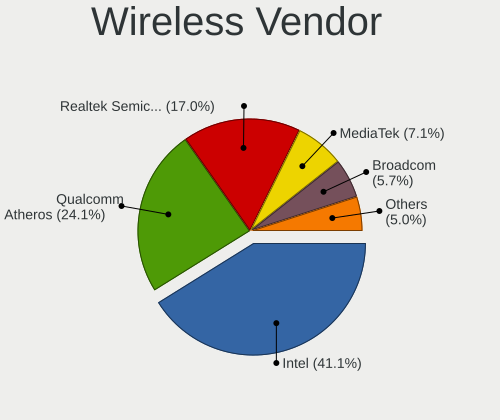

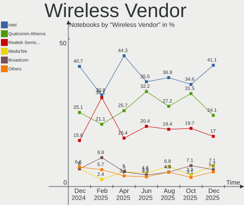

| Vendor                | Notebooks | Percent |
|-----------------------|-----------|---------|
| Intel                 | 58        | 41.13%  |
| Qualcomm Atheros      | 34        | 24.11%  |
| Realtek Semiconductor | 24        | 17.02%  |
| MediaTek              | 10        | 7.09%   |
| Broadcom              | 8         | 5.67%   |
| Ralink Technology     | 2         | 1.42%   |
| Ralink                | 2         | 1.42%   |
| Broadcom Limited      | 2         | 1.42%   |
| TP-Link               | 1         | 0.71%   |

Wireless Model
--------------

Wireless models

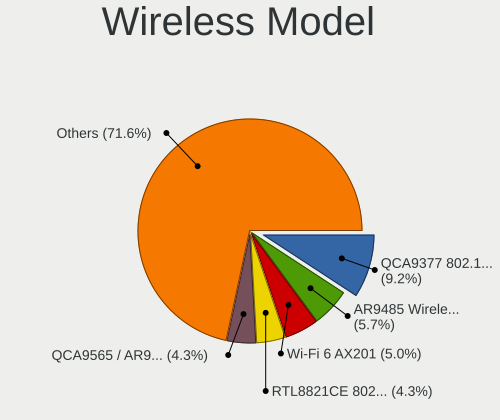

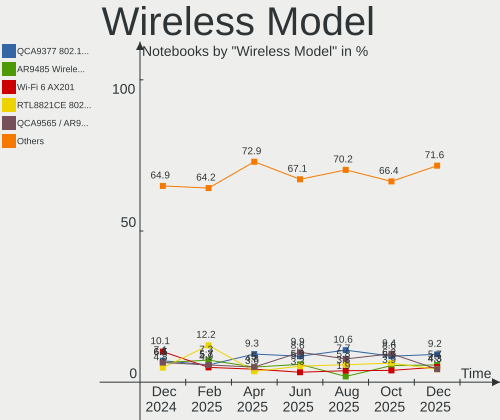

| Model                                                                           | Notebooks | Percent |
|---------------------------------------------------------------------------------|-----------|---------|
| Qualcomm Atheros QCA9377 802.11ac Wireless Network Adapter                      | 13        | 9.22%   |
| Qualcomm Atheros AR9485 Wireless Network Adapter                                | 8         | 5.67%   |
| Intel Wi-Fi 6 AX201                                                             | 7         | 4.96%   |
| Realtek RTL8821CE 802.11ac PCIe Wireless Network Adapter                        | 6         | 4.26%   |
| Qualcomm Atheros QCA9565 / AR9565 Wireless Network Adapter                      | 6         | 4.26%   |
| Qualcomm Atheros QCA6174 802.11ac Wireless Network Adapter                      | 5         | 3.55%   |
| MediaTek MT7902 802.11ax PCIe Wireless Network Adapter [Filogic 310]            | 5         | 3.55%   |
| Intel Raptor Lake PCH CNVi WiFi                                                 | 5         | 3.55%   |
| Intel Cannon Point-LP CNVi [Wireless-AC]                                        | 5         | 3.55%   |
| Intel 700 Series Chipset CNVi WiFi                                              | 5         | 3.55%   |
| Intel Wireless 8265 / 8275                                                      | 4         | 2.84%   |
| Intel Wireless 7265                                                             | 4         | 2.84%   |
| Intel Wi-Fi 6 AX200                                                             | 4         | 2.84%   |
| Intel Alder Lake-P PCH CNVi WiFi                                                | 4         | 2.84%   |
| Realtek RTL8852BE PCIe 802.11ax Wireless Network Controller                     | 3         | 2.13%   |
| Realtek 802.11ac NIC                                                            | 3         | 2.13%   |
| Intel PRO/Wireless 3945ABG [Golan] Network Connection                           | 3         | 2.13%   |
| Intel Gemini Lake PCH CNVi WiFi                                                 | 3         | 2.13%   |
| Broadcom BCM4313 802.11bgn Wireless Network Adapter                             | 3         | 2.13%   |
| Realtek RTL8191SEvA Wireless LAN Controller                                     | 2         | 1.42%   |
| Realtek RTL8188CE 802.11b/g/n WiFi Adapter                                      | 2         | 1.42%   |
| MediaTek MT7925 802.11be 160MHz 2x2 PCIe Wireless Network Adapter [Filogic 360] | 2         | 1.42%   |
| MediaTek MT7921 802.11ax PCIe Wireless Network Adapter [Filogic 330]            | 2         | 1.42%   |
| Intel Wireless 3165                                                             | 2         | 1.42%   |
| Intel Meteor Lake PCH CNVi WiFi                                                 | 2         | 1.42%   |
| Broadcom BCM4331 802.11a/b/g/n                                                  | 2         | 1.42%   |
| Broadcom BCM43142 802.11b/g/n                                                   | 2         | 1.42%   |
| TP-Link Archer T2U PLUS [RTL8821AU]                                             | 1         | 0.71%   |
| Realtek RTL8852BE PCIe 802.11ax Wireless Network Controller [1T1R]              | 1         | 0.71%   |
| Realtek RTL8852AE 802.11ax PCIe Wireless Network Adapter                        | 1         | 0.71%   |
| Realtek RTL8822CE 802.11ac PCIe Wireless Network Adapter                        | 1         | 0.71%   |
| Realtek RTL8723BE PCIe Wireless Network Adapter                                 | 1         | 0.71%   |
| Realtek RTL8192CU 802.11n WLAN Adapter                                          | 1         | 0.71%   |
| Realtek RTL8192CE PCIe Wireless Network Adapter                                 | 1         | 0.71%   |
| Realtek RTL8191SEvB Wireless LAN Controller                                     | 1         | 0.71%   |
| Realtek RTL8188EUS 802.11n Wireless Network Adapter                             | 1         | 0.71%   |
| Ralink RT5370 Wireless Adapter                                                  | 1         | 0.71%   |
| Ralink RT2870/RT3070 Wireless Adapter                                           | 1         | 0.71%   |
| Ralink RT3290 Wireless 802.11n 1T/1R PCIe                                       | 1         | 0.71%   |
| Ralink RT3090 Wireless 802.11n 1T/1R PCIe                                       | 1         | 0.71%   |

Ethernet Vendor
---------------

Ethernet vendors

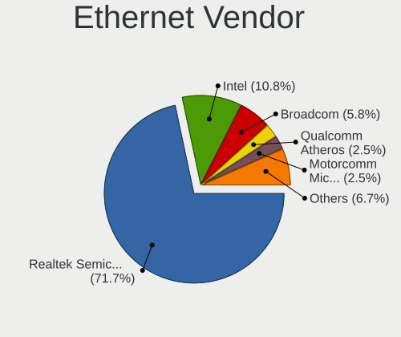

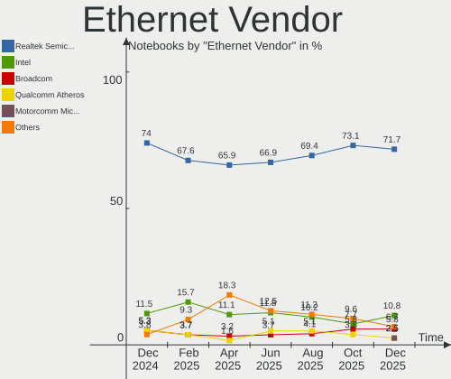

| Vendor                      | Notebooks | Percent |
|-----------------------------|-----------|---------|
| Realtek Semiconductor       | 86        | 71.67%  |
| Intel                       | 13        | 10.83%  |
| Broadcom                    | 7         | 5.83%   |
| Qualcomm Atheros            | 3         | 2.5%    |
| Motorcomm Microelectronics. | 3         | 2.5%    |
| Marvell Technology Group    | 3         | 2.5%    |
| TP-Link                     | 1         | 0.83%   |
| Samsung Electronics         | 1         | 0.83%   |
| Motorola PCS                | 1         | 0.83%   |
| MediaTek                    | 1         | 0.83%   |
| ASIX Electronics            | 1         | 0.83%   |

Ethernet Model
--------------

Ethernet models

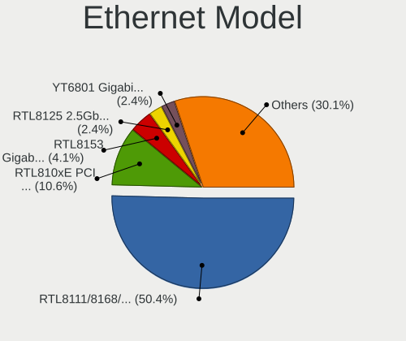

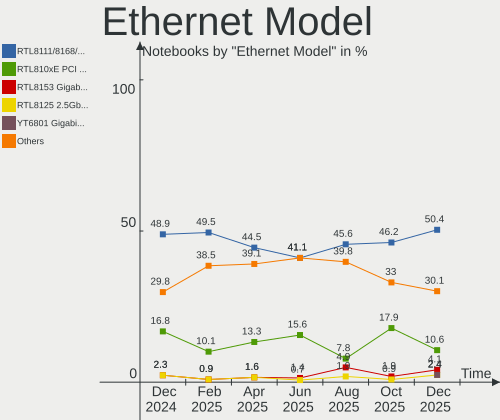

| Model                                                                  | Notebooks | Percent |
|------------------------------------------------------------------------|-----------|---------|
| Realtek RTL8111/8168/8211/8411 PCI Express Gigabit Ethernet Controller | 62        | 50.41%  |
| Realtek RTL810xE PCI Express Fast Ethernet controller                  | 13        | 10.57%  |
| Realtek RTL8153 Gigabit Ethernet Adapter                               | 5         | 4.07%   |
| Realtek RTL8125 2.5GbE Controller                                      | 3         | 2.44%   |
| Motorcomm Microelectronics. YT6801 Gigabit Ethernet Controller         | 3         | 2.44%   |
| Intel Ethernet Connection (6) I219-LM                                  | 3         | 2.44%   |
| Intel Ethernet Connection (4) I219-LM                                  | 3         | 2.44%   |
| Broadcom NetLink BCM57785 Gigabit Ethernet PCIe                        | 3         | 2.44%   |
| Realtek RTL8852BE PCIe 802.11ax Wireless Network Controller            | 2         | 1.63%   |
| Marvell Group 88E8039 PCI-E Fast Ethernet Controller                   | 2         | 1.63%   |
| Intel Alder Lake-P PCH CNVi WiFi                                       | 2         | 1.63%   |
| Broadcom NetXtreme BCM57765 Gigabit Ethernet PCIe                      | 2         | 1.63%   |
| TP-Link UE300 10/100/1000 LAN (ethernet mode) [Realtek RTL8153]        | 1         | 0.81%   |
| Samsung GT-I9070 (network tethering, USB debugging enabled)            | 1         | 0.81%   |
| Realtek RTL-8110SC/8169SC Gigabit Ethernet                             | 1         | 0.81%   |
| Realtek Killer E3000 2.5GbE Controller                                 | 1         | 0.81%   |
| Realtek Killer E2500 Gigabit Ethernet Controller                       | 1         | 0.81%   |
| Qualcomm Atheros Killer E2400 Gigabit Ethernet Controller              | 1         | 0.81%   |
| Qualcomm Atheros AR8152 v2.0 Fast Ethernet                             | 1         | 0.81%   |
| Qualcomm Atheros AR8151 v1.0 Gigabit Ethernet                          | 1         | 0.81%   |
| Motorola PCS motorola one 5G ace                                       | 1         | 0.81%   |
| MediaTek MT7922 802.11ax PCI Express Wireless Network Adapter          | 1         | 0.81%   |
| Marvell Group 88E8055 PCI-E Gigabit Ethernet Controller                | 1         | 0.81%   |
| Intel Ethernet Connection I217-V                                       | 1         | 0.81%   |
| Intel Ethernet Connection (23) I219-V                                  | 1         | 0.81%   |
| Intel Ethernet Connection (16) I219-V                                  | 1         | 0.81%   |
| Intel Ethernet Connection (13) I219-V                                  | 1         | 0.81%   |
| Intel Ethernet Connection (13) I219-LM                                 | 1         | 0.81%   |
| Intel 82573L Gigabit Ethernet Controller                               | 1         | 0.81%   |
| Broadcom NetXtreme BCM57786 Gigabit Ethernet PCIe                      | 1         | 0.81%   |
| Broadcom NetLink BCM57780 Gigabit Ethernet PCIe                        | 1         | 0.81%   |
| ASIX AX88179 Gigabit Ethernet                                          | 1         | 0.81%   |

Net Controller Kind
-------------------

Ethernet, WiFi or modem

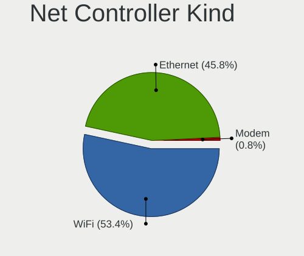

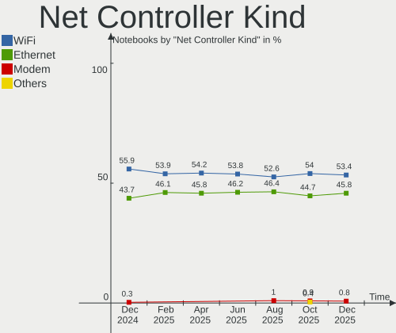

| Kind     | Notebooks | Percent |
|----------|-----------|---------|
| WiFi     | 135       | 53.36%  |
| Ethernet | 116       | 45.85%  |
| Modem    | 2         | 0.79%   |

Used Controller
---------------

Currently used network controller

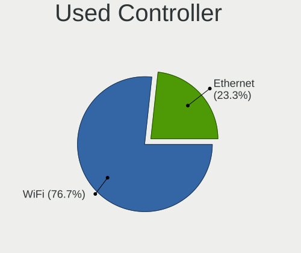

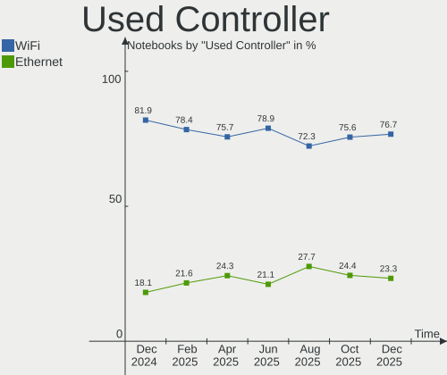

| Kind     | Notebooks | Percent |
|----------|-----------|---------|
| WiFi     | 112       | 76.71%  |
| Ethernet | 34        | 23.29%  |

NICs
----

Total network controllers on board

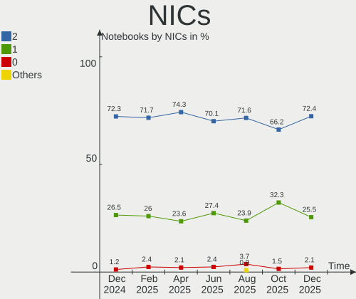

| Total | Notebooks | Percent |
|-------|-----------|---------|
| 2     | 105       | 72.41%  |
| 1     | 37        | 25.52%  |
| 0     | 3         | 2.07%   |

IPv6
----

IPv6 vs IPv4

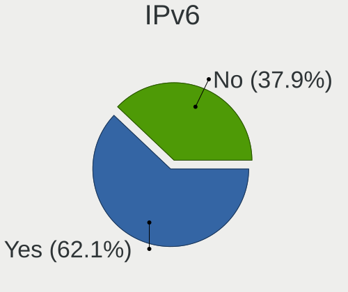

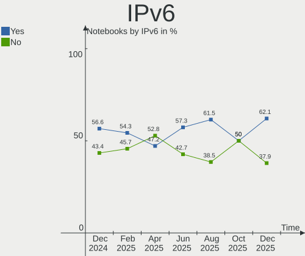

| Used | Notebooks | Percent |
|------|-----------|---------|
| Yes  | 90        | 62.07%  |
| No   | 55        | 37.93%  |

Bluetooth
---------

Bluetooth Vendor
----------------

Controller vendors

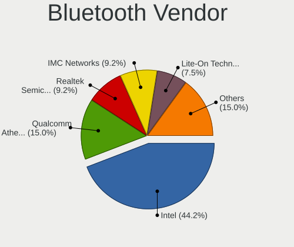

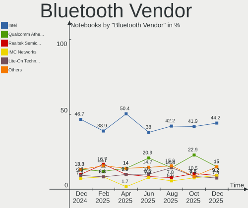

| Vendor                          | Notebooks | Percent |
|---------------------------------|-----------|---------|
| Intel                           | 53        | 44.17%  |
| Qualcomm Atheros Communications | 18        | 15%     |
| Realtek Semiconductor           | 11        | 9.17%   |
| IMC Networks                    | 11        | 9.17%   |
| Lite-On Technology              | 9         | 7.5%    |
| Foxconn / Hon Hai               | 5         | 4.17%   |
| Broadcom                        | 3         | 2.5%    |
| Apple                           | 3         | 2.5%    |
| Smart Modular Technologies      | 2         | 1.67%   |
| Cambridge Silicon Radio         | 2         | 1.67%   |
| Ralink                          | 1         | 0.83%   |
| ASUSTek Computer                | 1         | 0.83%   |
| Askey Computer                  | 1         | 0.83%   |

Bluetooth Model
---------------

Controller models

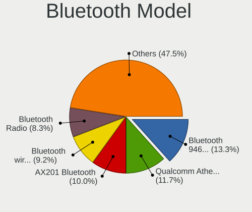

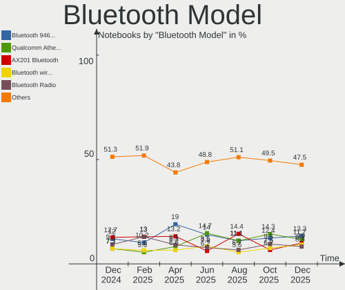

| Model                                               | Notebooks | Percent |
|-----------------------------------------------------|-----------|---------|
| Intel Bluetooth 9460/9560 Jefferson Peak (JfP)      | 16        | 13.33%  |
| Qualcomm Atheros  Bluetooth Device                  | 14        | 11.67%  |
| Intel AX201 Bluetooth                               | 12        | 10%     |
| Intel Bluetooth wireless interface                  | 11        | 9.17%   |
| Realtek Bluetooth Radio                             | 10        | 8.33%   |
| Intel Bluetooth Device                              | 8         | 6.67%   |
| IMC Networks Wireless_Device                        | 7         | 5.83%   |
| Lite-On Qualcomm Atheros QCA9377 Bluetooth          | 5         | 4.17%   |
| IMC Networks Bluetooth Radio                        | 3         | 2.5%    |
| Apple Bluetooth Host Controller                     | 3         | 2.5%    |
| Smart Modular Bluetooth Device                      | 2         | 1.67%   |
| Qualcomm Atheros Bluetooth USB Host Controller      | 2         | 1.67%   |
| Lite-On Bluetooth Device                            | 2         | 1.67%   |
| Intel AX200 Bluetooth                               | 2         | 1.67%   |
| Foxconn / Hon Hai BCM43142A0                        | 2         | 1.67%   |
| Cambridge Silicon Radio Bluetooth Dongle (HCI mode) | 2         | 1.67%   |
| Realtek  Bluetooth 4.2 Adapter                      | 1         | 0.83%   |
| Ralink RT3290 Bluetooth                             | 1         | 0.83%   |
| Qualcomm Atheros AR3012 Bluetooth 4.0               | 1         | 0.83%   |
| Qualcomm Atheros AR3011 Bluetooth                   | 1         | 0.83%   |
| Lite-On Wireless_Device                             | 1         | 0.83%   |
| Lite-On Qualcomm Atheros Bluetooth                  | 1         | 0.83%   |
| Intel Wireless-AC 9260 Bluetooth Adapter            | 1         | 0.83%   |
| Intel Wireless-AC 3168 Bluetooth                    | 1         | 0.83%   |
| Intel Bluetooth                                     | 1         | 0.83%   |
| Intel AX210 Bluetooth                               | 1         | 0.83%   |
| IMC Networks Atheros AR3012 Bluetooth 4.0 Adapter   | 1         | 0.83%   |
| Foxconn / Hon Hai Wireless_Device                   | 1         | 0.83%   |
| Foxconn / Hon Hai MediaTek MT7921 Bluetooth         | 1         | 0.83%   |
| Foxconn / Hon Hai Bluetooth Radio                   | 1         | 0.83%   |
| Broadcom BCM2070 Bluetooth Device                   | 1         | 0.83%   |
| Broadcom BCM2070 Bluetooth 2.1 + EDR                | 1         | 0.83%   |
| Broadcom BCM2045B (BDC-2) [Bluetooth Controller]    | 1         | 0.83%   |
| ASUS BT-183 Bluetooth 2.0+EDR adapter               | 1         | 0.83%   |
| Askey Bluetooth Device                              | 1         | 0.83%   |

Sound
-----

Sound Vendor
------------

Sound card vendors

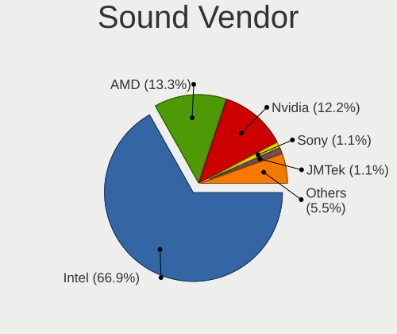

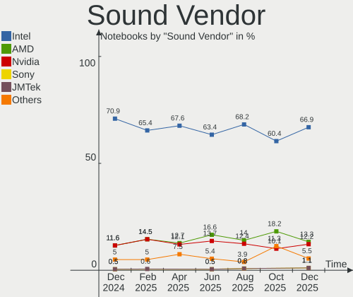

| Vendor                 | Notebooks | Percent |
|------------------------|-----------|---------|
| Intel                  | 121       | 66.85%  |
| AMD                    | 24        | 13.26%  |
| Nvidia                 | 22        | 12.15%  |
| Sony                   | 2         | 1.1%    |
| JMTek                  | 2         | 1.1%    |
| Weltrend Semiconductor | 1         | 0.55%   |
| Soundprese             | 1         | 0.55%   |
| Realtek Semiconductor  | 1         | 0.55%   |
| Plantronics            | 1         | 0.55%   |
| Logitech               | 1         | 0.55%   |
| liyuany                | 1         | 0.55%   |
| GN Netcom              | 1         | 0.55%   |
| Compx                  | 1         | 0.55%   |
| C-Media Electronics    | 1         | 0.55%   |
| Audient                | 1         | 0.55%   |

Sound Model
-----------

Sound card models

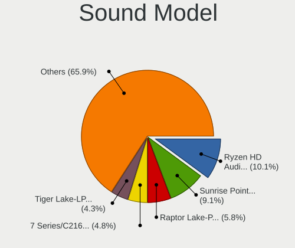

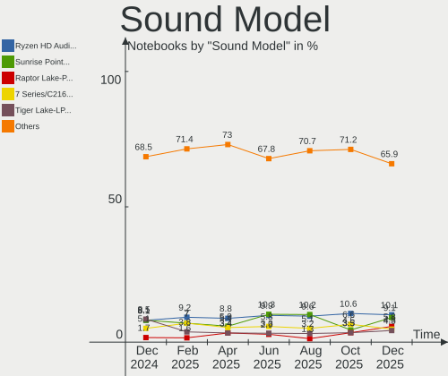

| Model                                                                                             | Notebooks | Percent |
|---------------------------------------------------------------------------------------------------|-----------|---------|
| AMD Ryzen HD Audio Controller                                                                     | 21        | 10.1%   |
| Intel Sunrise Point-LP HD Audio                                                                   | 19        | 9.13%   |
| Intel Raptor Lake-P/U/H cAVS                                                                      | 12        | 5.77%   |
| Intel 7 Series/C216 Chipset Family High Definition Audio Controller                               | 10        | 4.81%   |
| Intel Tiger Lake-LP Smart Sound Technology Audio Controller                                       | 9         | 4.33%   |
| Intel 6 Series/C200 Series Chipset Family High Definition Audio Controller                        | 8         | 3.85%   |
| AMD Renoir/Cezanne HDMI/DP Audio Controller                                                       | 8         | 3.85%   |
| Nvidia GA107 High Definition Audio Controller                                                     | 7         | 3.37%   |
| Intel Alder Lake PCH-P High Definition Audio Controller                                           | 7         | 3.37%   |
| AMD Radeon High Definition Audio Controller                                                       | 6         | 2.88%   |
| Intel Raptor Lake High Definition Audio Controller                                                | 5         | 2.4%    |
| Intel Celeron/Pentium Silver Processor High Definition Audio                                      | 5         | 2.4%    |
| Intel Cannon Point-LP High Definition Audio Controller                                            | 5         | 2.4%    |
| Intel Haswell-ULT HD Audio Controller                                                             | 4         | 1.92%   |
| Intel 82801I (ICH9 Family) HD Audio Controller                                                    | 4         | 1.92%   |
| Intel 8 Series HD Audio Controller                                                                | 4         | 1.92%   |
| Intel 5 Series/3400 Series Chipset High Definition Audio                                          | 4         | 1.92%   |
| AMD Raven/Raven2/Fenghuang HDMI/DP Audio Controller                                               | 4         | 1.92%   |
| Intel Wildcat Point-LP High Definition Audio Controller                                           | 3         | 1.44%   |
| Intel NM10/ICH7 Family High Definition Audio Controller                                           | 3         | 1.44%   |
| Intel CM238 HD Audio Controller                                                                   | 3         | 1.44%   |
| Intel Broadwell-U Audio Controller                                                                | 3         | 1.44%   |
| Nvidia GP106 High Definition Audio Controller                                                     | 2         | 0.96%   |
| Nvidia GB207 High Definition Audio Controller                                                     | 2         | 0.96%   |
| Nvidia GB206 High Definition Audio Controller                                                     | 2         | 0.96%   |
| Nvidia AD107 High Definition Audio Controller                                                     | 2         | 0.96%   |
| Intel Meteor Lake-P HD Audio Controller                                                           | 2         | 0.96%   |
| Intel Ice Lake-LP Smart Sound Technology Audio Controller                                         | 2         | 0.96%   |
| Intel Cannon Lake PCH cAVS                                                                        | 2         | 0.96%   |
| Intel Atom/Celeron/Pentium Processor x5-E8000/J3xxx/N3xxx Series High Definition Audio Controller | 2         | 0.96%   |
| Intel 82801H (ICH8 Family) HD Audio Controller                                                    | 2         | 0.96%   |
| Intel 8 Series/C220 Series Chipset High Definition Audio Controller                               | 2         | 0.96%   |
| Weltrend Semiconductor H848 Wireless headset                                                      | 1         | 0.48%   |
| Soundprese HD-II                                                                                  | 1         | 0.48%   |
| Sony DualShock 4 [CUH-ZCT2x]                                                                      | 1         | 0.48%   |
| Sony DualSense wireless controller (PS5)                                                          | 1         | 0.48%   |
| Realtek Semiconductor USB Audio                                                                   | 1         | 0.48%   |
| Plantronics Blackwire 3210 Series                                                                 | 1         | 0.48%   |
| Nvidia TU106 High Definition Audio Controller                                                     | 1         | 0.48%   |
| Nvidia GF116 High Definition Audio Controller                                                     | 1         | 0.48%   |

Memory
------

Memory Vendor
-------------

Memory module vendors

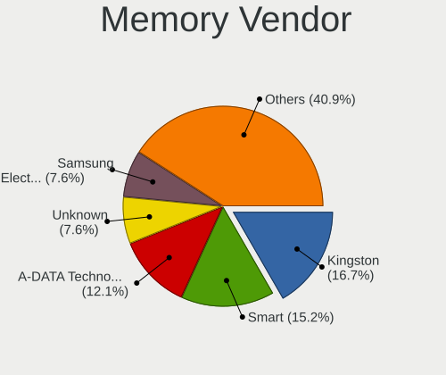

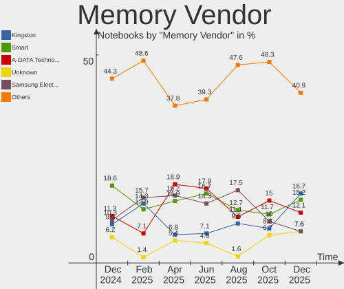

| Vendor                 | Notebooks | Percent |
|------------------------|-----------|---------|
| Kingston               | 11        | 16.67%  |
| Smart                  | 10        | 15.15%  |
| A-DATA Technology      | 8         | 12.12%  |
| Unknown                | 5         | 7.58%   |
| Samsung Electronics    | 5         | 7.58%   |
| Unknown (0x0B5E)       | 4         | 6.06%   |
| Micron Technology      | 4         | 6.06%   |
| Crucial                | 4         | 6.06%   |
| SK hynix               | 3         | 4.55%   |
| Unknown                | 3         | 4.55%   |
| Unknown (ABCD)         | 2         | 3.03%   |
| Unknown (0x0F94)       | 1         | 1.52%   |
| Unknown (0000000080CE) | 1         | 1.52%   |
| Smart Brazil           | 1         | 1.52%   |
| High Bridge            | 1         | 1.52%   |
| Corsair                | 1         | 1.52%   |
| Apacer                 | 1         | 1.52%   |
| 4ea5                   | 1         | 1.52%   |

Memory Model
------------

Memory module models

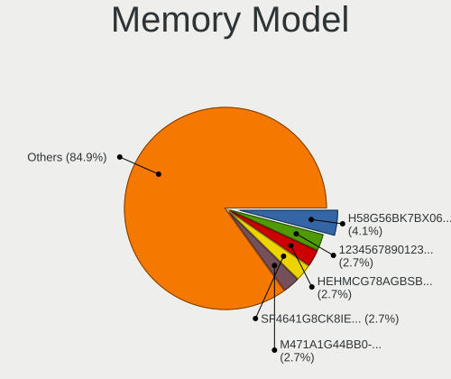

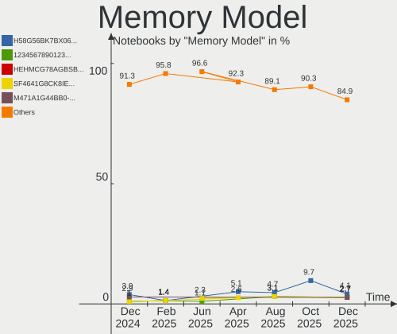

| Model                                                                 | Notebooks | Percent |
|-----------------------------------------------------------------------|-----------|---------|
| Unknown                                                               | 3         | 4.11%   |
| Unknown (ABCD) RAM 123456789012345678 2GB SODIMM LPDDR4 2400MT/s      | 2         | 2.74%   |
| Unknown (0x0B5E) RAM HEHMCG78AGBSBA0BN 16GB SODIMM DDR5 5600MT/s      | 2         | 2.74%   |
| Smart RAM SF4641G8CK8IEHLSBG 8GB SODIMM DDR4 2667MT/s                 | 2         | 2.74%   |
| Samsung RAM M471A1G44BB0-CWE 8GB SODIMM DDR4 3200MT/s                 | 2         | 2.74%   |
| Kingston RAM Module 8GB SODIMM DDR3 1600MT/s                          | 2         | 2.74%   |
| A-DATA RAM Module 16GB SODIMM DDR4 3200MT/s                           | 2         | 2.74%   |
| Unknown RAM Module 8GB SODIMM DDR4 2667MT/s                           | 1         | 1.37%   |
| Unknown RAM Module 8GB SODIMM DDR3                                    | 1         | 1.37%   |
| Unknown RAM Module 4GB SODIMM DDR4 2133MT/s                           | 1         | 1.37%   |
| Unknown RAM Module 4GB SODIMM DDR3                                    | 1         | 1.37%   |
| Unknown RAM Module 2GB SODIMM DDR2 667MT/s                            | 1         | 1.37%   |
| Unknown RAM Module 2GB SODIMM DDR2                                    | 1         | 1.37%   |
| Unknown (0x0F94) RAM ZMS5WMC8C2J0B46SPG 16GB SODIMM DDR5 5600MT/s     | 1         | 1.37%   |
| Unknown (0x0B5E) RAM HEMA82GS6DJR8N-XN 16GB SODIMM DDR4 3200MT/s      | 1         | 1.37%   |
| Unknown (0x0B5E) RAM HEMA81GS6DJR8N-XN 8GB SODIMM DDR4 3200MT/s       | 1         | 1.37%   |
| Unknown (0000000080CE) RAM K4UBE3D4AA-MGCR 8GB SODIMM LPDDR4 4266MT/s | 1         | 1.37%   |
| Smart RAM SMS4TDC8C1K0446FCG 8GB DDR4 2667MT/s                        | 1         | 1.37%   |
| Smart RAM SH564568FJ8NZRNSDR 2GB SODIMM DDR3 1600MT/s                 | 1         | 1.37%   |
| Smart RAM SH564568FH8NWPHSFG 2GB SODIMM DDR3 1333MT/s                 | 1         | 1.37%   |
| Smart RAM SH5641G8FJ8NWRNSQR 8GB SODIMM DDR3 1600MT/s                 | 1         | 1.37%   |
| Smart RAM SH564128FH8NZQNSCG 4GB SODIMM DDR3 1600MT/s                 | 1         | 1.37%   |
| Smart RAM SH564128FH8NZPHSCR 4GB SODIMM DDR3 1334MT/s                 | 1         | 1.37%   |
| Smart RAM SF564128CJ8NWMNSEG 4GB SODIMM DDR3 1600MT/s                 | 1         | 1.37%   |
| Smart RAM SF4641G8CK8IWGKSEG 8GB SODIMM DDR4 2400MT/s                 | 1         | 1.37%   |
| Smart RAM SF464128CKHIWDFSEG 4GB SODIMM DDR4 2133MT/s                 | 1         | 1.37%   |
| Smart Brazil RAM SMS4TDC3C0K0446SCG 4GB SODIMM DDR4 2667MT/s          | 1         | 1.37%   |
| Smart Brazil RAM SF4641G8CK8IEHLSBG 8GB SODIMM DDR4 2667MT/s          | 1         | 1.37%   |
| SK hynix RAM Module 4GB SODIMM DDR3 1066MT/s                          | 1         | 1.37%   |
| SK hynix RAM HMCG78AGBSA095N 16GB SODIMM DDR5 5600MT/s                | 1         | 1.37%   |
| SK hynix RAM HMCG66AGBSA092N 8GB SODIMM DDR5 5600MT/s                 | 1         | 1.37%   |
| SK hynix RAM HMA82GS6AFR8N-UH 16GB SODIMM DDR4 2667MT/s               | 1         | 1.37%   |
| Samsung RAM Module 4GB SODIMM DDR3 1600MT/s                           | 1         | 1.37%   |
| Samsung RAM M471A1G44AB0-CWE 8GiB SODIMM DDR4 3200MT/s                | 1         | 1.37%   |
| Samsung RAM K4F6E3S4HM-MGCJ 2GB LPDDR4 2400MT/s                       | 1         | 1.37%   |
| Micron RAM MTC4C10163S1SC56BD1 8GB SODIMM DDR5 5600MT/s               | 1         | 1.37%   |
| Micron RAM MT62F2G32D4DS-026 4GB Row Of Chips LPDDR5 7500MT/s         | 1         | 1.37%   |
| Micron RAM 4ATF51264HZ-2G3B1 4GB SODIMM DDR4 3200MT/s                 | 1         | 1.37%   |
| Micron RAM 16ATF2G64HZ-2G3E1 16GB SODIMM DDR4 2667MT/s                | 1         | 1.37%   |
| Micron RAM 16ATF2G64HZ-2G3B1 16GB SODIMM DDR4 2400MT/s                | 1         | 1.37%   |

Memory Kind
-----------

Memory module kinds

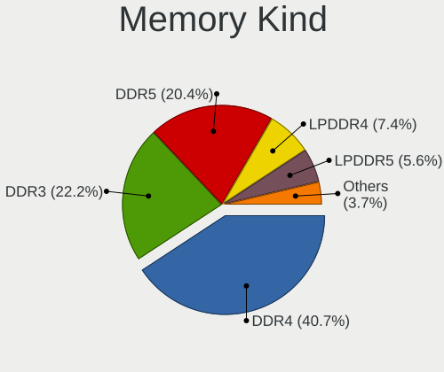

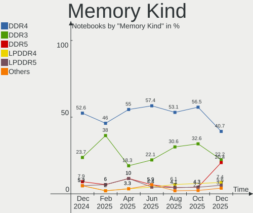

| Kind   | Notebooks | Percent |
|--------|-----------|---------|
| DDR4   | 22        | 40.74%  |
| DDR3   | 12        | 22.22%  |
| DDR5   | 11        | 20.37%  |
| LPDDR4 | 4         | 7.41%   |
| LPDDR5 | 3         | 5.56%   |
| DDR2   | 2         | 3.7%    |

Memory Form Factor
------------------

Physical design of the memory module

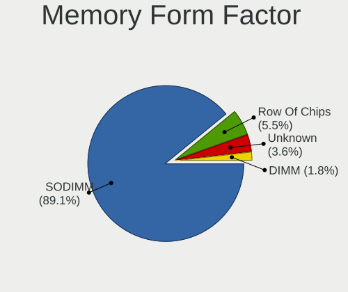

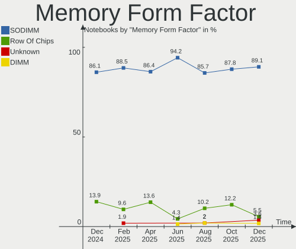

| Name         | Notebooks | Percent |
|--------------|-----------|---------|
| SODIMM       | 49        | 89.09%  |
| Row Of Chips | 3         | 5.45%   |
| Unknown      | 2         | 3.64%   |
| DIMM         | 1         | 1.82%   |

Memory Size
-----------

Memory module size

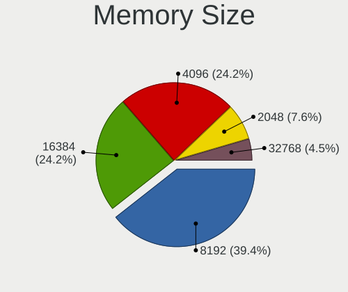

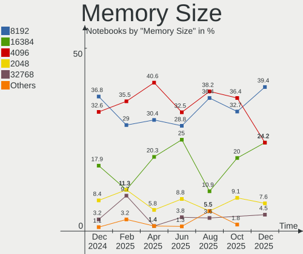

| Size  | Notebooks | Percent |
|-------|-----------|---------|
| 8192  | 26        | 39.39%  |
| 16384 | 16        | 24.24%  |
| 4096  | 16        | 24.24%  |
| 2048  | 5         | 7.58%   |
| 32768 | 3         | 4.55%   |

Memory Speed
------------

Memory module speed

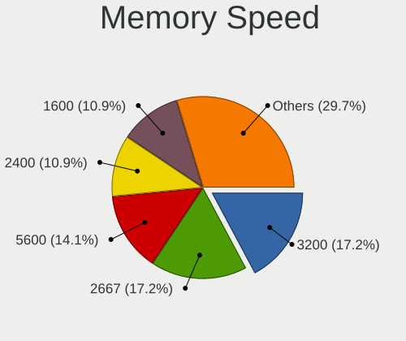

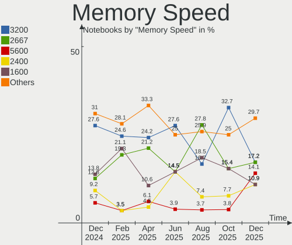

| Speed   | Notebooks | Percent |
|---------|-----------|---------|
| 3200    | 11        | 17.19%  |
| 2667    | 11        | 17.19%  |
| 5600    | 9         | 14.06%  |
| 2400    | 7         | 10.94%  |
| 1600    | 7         | 10.94%  |
| 1333    | 3         | 4.69%   |
| 4800    | 2         | 3.13%   |
| 2133    | 2         | 3.13%   |
| 1334    | 2         | 3.13%   |
| Unknown | 2         | 3.13%   |
| 8533    | 1         | 1.56%   |
| 7500    | 1         | 1.56%   |
| 6400    | 1         | 1.56%   |
| 6000    | 1         | 1.56%   |
| 4266    | 1         | 1.56%   |
| 1067    | 1         | 1.56%   |
| 1066    | 1         | 1.56%   |
| 667     | 1         | 1.56%   |

Printers & scanners
-------------------

Printer Vendor
--------------

Printer device vendors

Zero info for selected period =(

Printer Model
-------------

Printer device models

Zero info for selected period =(

Scanner Vendor
--------------

Scanner device vendors

Zero info for selected period =(

Scanner Model
-------------

Scanner device models

Zero info for selected period =(

Camera
------

Camera Vendor
-------------

Camera device vendors

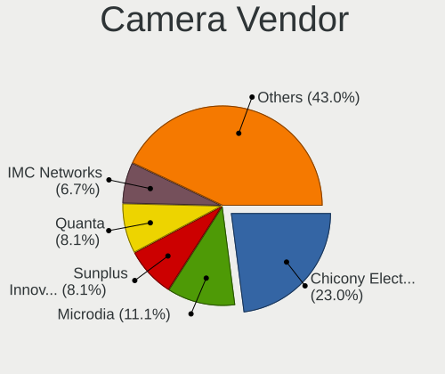

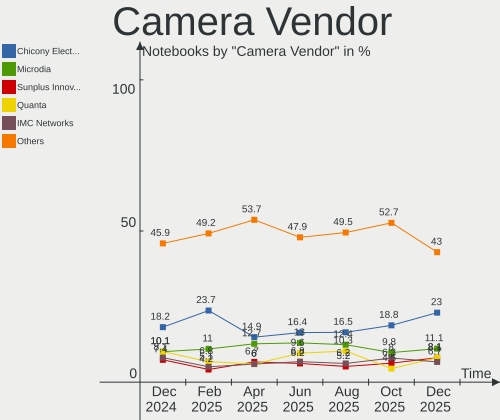

| Vendor                                 | Notebooks | Percent |
|----------------------------------------|-----------|---------|
| Chicony Electronics                    | 31        | 22.96%  |
| Microdia                               | 15        | 11.11%  |
| Sunplus Innovation Technology          | 11        | 8.15%   |
| Quanta                                 | 11        | 8.15%   |
| IMC Networks                           | 9         | 6.67%   |
| Realtek Semiconductor                  | 7         | 5.19%   |
| Silicon Motion                         | 6         | 4.44%   |
| Bison Electronics                      | 5         | 3.7%    |
| Unknown                                | 5         | 3.7%    |
| Syntek                                 | 3         | 2.22%   |
| Sonix Technology                       | 3         | 2.22%   |
| Cheng Uei Precision Industry (Foxlink) | 3         | 2.22%   |
| Apple                                  | 3         | 2.22%   |
| Alcor Micro                            | 3         | 2.22%   |
| SunplusIT                              | 2         | 1.48%   |
| Shinetech                              | 2         | 1.48%   |
| Luxvisions Innotech Limited            | 2         | 1.48%   |
| Lite-On Technology                     | 2         | 1.48%   |
| ALi                                    | 2         | 1.48%   |
| Suyin                                  | 1         | 0.74%   |
| Sunplus Technology                     | 1         | 0.74%   |
| Shine-optics                           | 1         | 0.74%   |
| Samsung Electronics                    | 1         | 0.74%   |
| Ricoh                                  | 1         | 0.74%   |
| Pixart Imaging                         | 1         | 0.74%   |
| Logitech                               | 1         | 0.74%   |
| kingcome                               | 1         | 0.74%   |
| Generalplus Technology                 | 1         | 0.74%   |
| eMeet                                  | 1         | 0.74%   |

Camera Model
------------

Camera device models

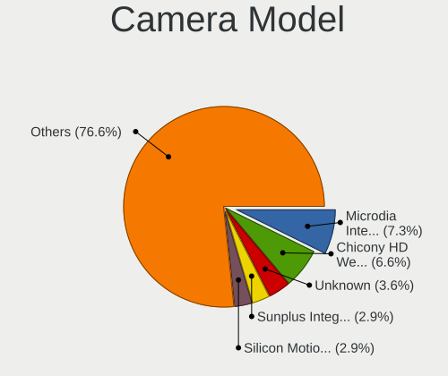

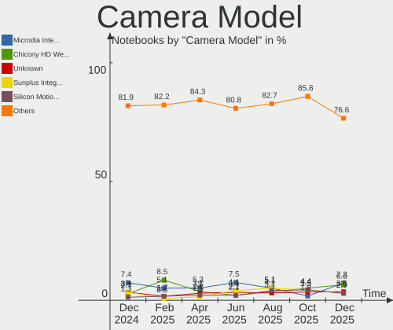

| Model                                         | Notebooks | Percent |
|-----------------------------------------------|-----------|---------|
| Microdia Integrated_Webcam_HD                 | 10        | 7.3%    |
| Chicony HD WebCam                             | 9         | 6.57%   |
| Unknown                                       | 5         | 3.65%   |
| Sunplus Integrated_Webcam_HD                  | 4         | 2.92%   |
| Silicon Motion Web Camera                     | 4         | 2.92%   |
| Realtek Integrated_Webcam_HD                  | 4         | 2.92%   |
| Quanta VGA WebCam                             | 4         | 2.92%   |
| IMC Networks USB2.0 HD UVC WebCam             | 4         | 2.92%   |
| Chicony ACER HD User Facing                   | 3         | 2.19%   |
| Bison Integrated Camera                       | 3         | 2.19%   |
| Syntek Integrated Camera                      | 2         | 1.46%   |
| Sunplus Integrated_Webcam_FHD                 | 2         | 1.46%   |
| Sonix USB2.0 HD UVC WebCam                    | 2         | 1.46%   |
| Realtek Integrated Webcam                     | 2         | 1.46%   |
| Quanta HP TrueVision HD Camera                | 2         | 1.46%   |
| Quanta HD User Facing                         | 2         | 1.46%   |
| Quanta ACER HD User Facing                    | 2         | 1.46%   |
| Luxvisions Innotech Limited Integrated Camera | 2         | 1.46%   |
| Lite-On HP HD Camera                          | 2         | 1.46%   |
| IMC Networks Integrated Camera                | 2         | 1.46%   |
| Chicony USB2.0 HD UVC WebCam                  | 2         | 1.46%   |
| Chicony Integrated Camera (1280x720@30)       | 2         | 1.46%   |
| Chicony Integrated Camera                     | 2         | 1.46%   |
| Chicony HP HD Camera                          | 2         | 1.46%   |
| Chicony HD User Facing                        | 2         | 1.46%   |
| Chicony ACER FHD User Facing                  | 2         | 1.46%   |
| Bison EasyCamera                              | 2         | 1.46%   |
| Apple iPhone 5/5C/5S/6/SE/7/8/X               | 2         | 1.46%   |
| Apple FaceTime HD Camera                      | 2         | 1.46%   |
| Syntek EasyCamera                             | 1         | 0.73%   |
| Suyin HP Webcam-101                           | 1         | 0.73%   |
| SunplusIT FHD Webcam                          | 1         | 0.73%   |
| SunplusIT 720p HD Camera                      | 1         | 0.73%   |
| Sunplus 1.3M HD WebCam                        | 1         | 0.73%   |
| Sunplus USB 2.0 Camera                        | 1         | 0.73%   |
| Sunplus SPCA2281 Web Camera                   | 1         | 0.73%   |
| Sunplus MTD Camera                            | 1         | 0.73%   |
| Sunplus ASUS Webcam                           | 1         | 0.73%   |
| Sunplus 720p HD Camera                        | 1         | 0.73%   |
| Sonix USB2.0 FHD UVC WebCam                   | 1         | 0.73%   |

Security
--------

Fingerprint Vendor
------------------

Fingerprint sensor vendors

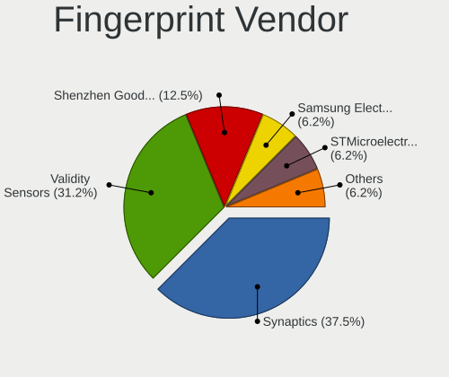

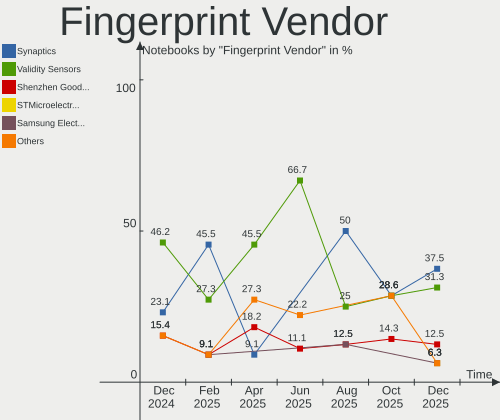

| Vendor                     | Notebooks | Percent |
|----------------------------|-----------|---------|
| Synaptics                  | 6         | 37.5%   |
| Validity Sensors           | 5         | 31.25%  |
| Shenzhen Goodix Technology | 2         | 12.5%   |
| STMicroelectronics         | 1         | 6.25%   |
| Samsung Electronics        | 1         | 6.25%   |
| AuthenTec                  | 1         | 6.25%   |

Fingerprint Model
-----------------

Fingerprint sensor models

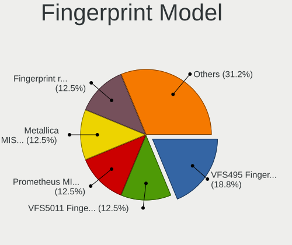

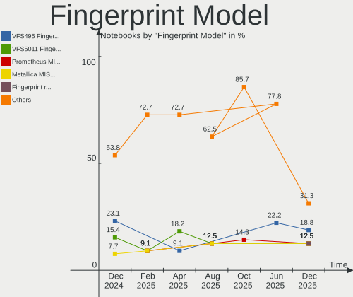

| Model                                             | Notebooks | Percent |
|---------------------------------------------------|-----------|---------|
| Validity Sensors VFS495 Fingerprint Reader        | 3         | 18.75%  |
| Validity Sensors VFS5011 Fingerprint Reader       | 2         | 12.5%   |
| Synaptics Prometheus MIS Touch Fingerprint Reader | 2         | 12.5%   |
| Synaptics Metallica MIS Touch Fingerprint Reader  | 2         | 12.5%   |
| Synaptics Fingerprint reader [HP G6]              | 2         | 12.5%   |
| STMicroelectronics Fingerprint Reader             | 1         | 6.25%   |
| Shenzhen Goodix  FingerPrint Device               | 1         | 6.25%   |
| Shenzhen Goodix Fingerprint Reader                | 1         | 6.25%   |
| Samsung Fingerprint Device                        | 1         | 6.25%   |
| AuthenTec AES2501 Fingerprint Sensor              | 1         | 6.25%   |

Chipcard Vendor
---------------

Chipcard module vendors

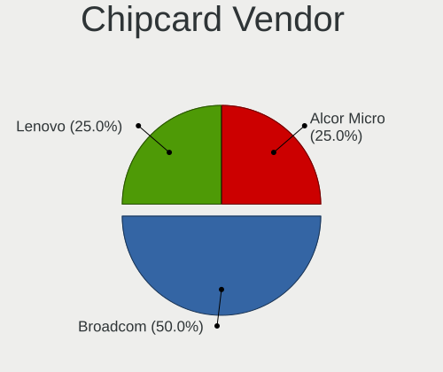

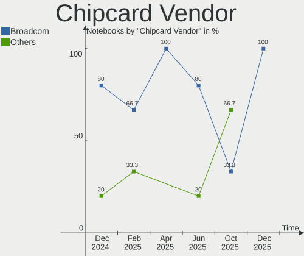

| Vendor   | Notebooks | Percent |
|----------|-----------|---------|
| Broadcom | 2         | 100%    |

Chipcard Model
--------------

Chipcard module models

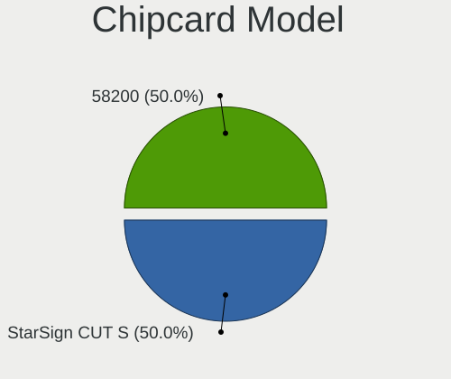

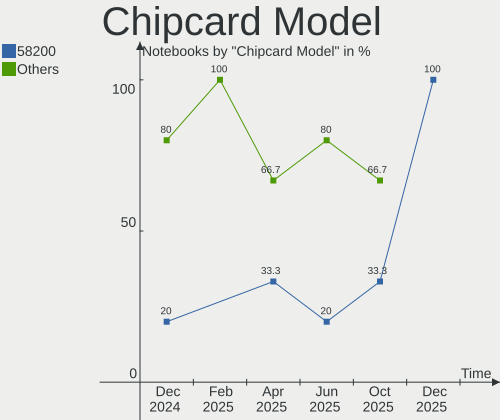

| Model          | Notebooks | Percent |
|----------------|-----------|---------|
| Broadcom 58200 | 2         | 100%    |

Unsupported
-----------

Unsupported Devices
-------------------

Total unsupported devices on board

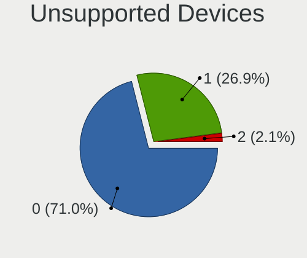

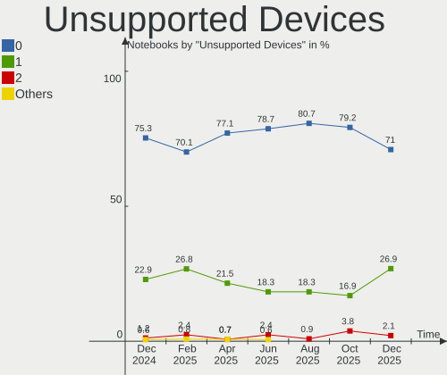

| Total | Notebooks | Percent |
|-------|-----------|---------|
| 0     | 103       | 71.03%  |
| 1     | 39        | 26.9%   |
| 2     | 3         | 2.07%   |

Unsupported Device Types
------------------------

Types of unsupported devices

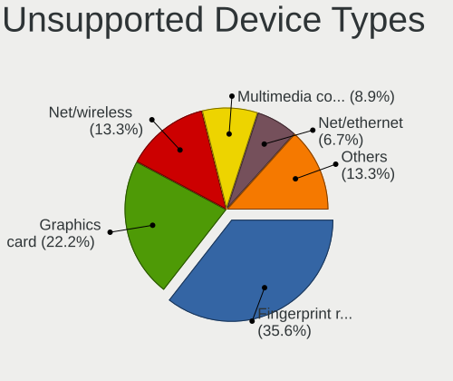

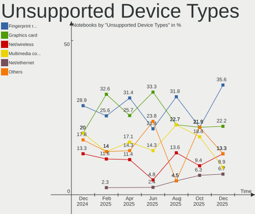

| Type                     | Notebooks | Percent |
|--------------------------|-----------|---------|
| Fingerprint reader       | 16        | 35.56%  |
| Graphics card            | 10        | 22.22%  |
| Net/wireless             | 6         | 13.33%  |
| Multimedia controller    | 4         | 8.89%   |
| Net/ethernet             | 3         | 6.67%   |
| Chipcard                 | 2         | 4.44%   |
| Storage                  | 1         | 2.22%   |
| Communication controller | 1         | 2.22%   |
| Camera                   | 1         | 2.22%   |
| Bluetooth                | 1         | 2.22%   |

