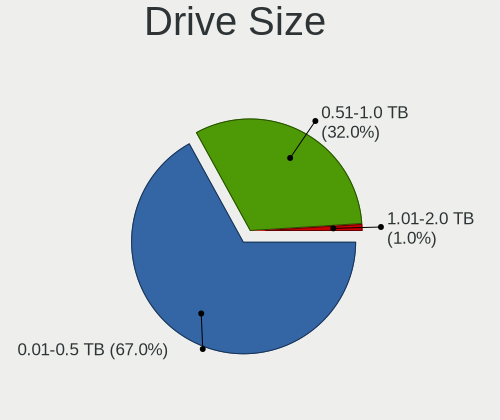
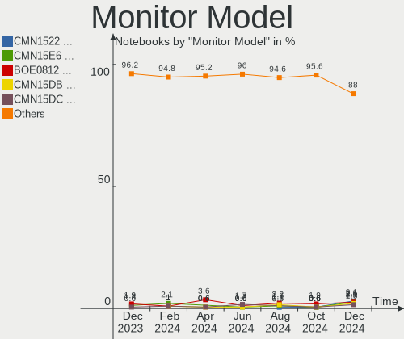
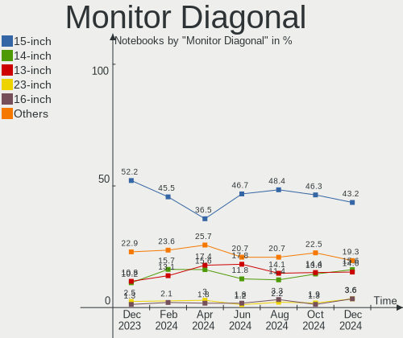
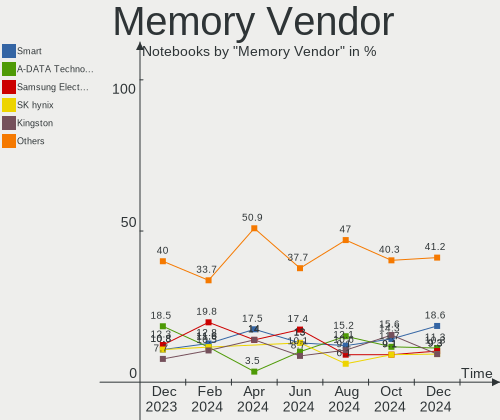
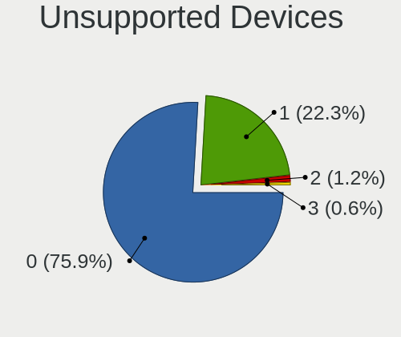

Linux in Brazil - Hardware Trends (Notebooks)
---------------------------------------------

A project to identify most popular hardware characteristics and track their change
over time based on data collected by Linux users at https://Linux-Hardware.org.

Anyone can contribute to this report by the [hw-probe](https://github.com/linuxhw/hw-probe) tool:

    sudo -E hw-probe -all -upload

Period: Oct, 2023.

Contents
--------

* [ System ](#system)
  - [ OS                       ](#os)
  - [ OS Family                ](#os-family)
  - [ Kernel                   ](#kernel)
  - [ Kernel Family            ](#kernel-family)
  - [ Kernel Major Ver.        ](#kernel-major-ver)
  - [ Arch                     ](#arch)
  - [ DE                       ](#de)
  - [ Display Server           ](#display-server)
  - [ Display Manager          ](#display-manager)
  - [ OS Lang                  ](#os-lang)
  - [ Boot Mode                ](#boot-mode)
  - [ Filesystem               ](#filesystem)
  - [ Part. scheme             ](#part-scheme)
  - [ Dual Boot with Linux/BSD ](#dual-boot-with-linuxbsd)
  - [ Dual Boot (Win)          ](#dual-boot-win)

* [ Board ](#board)
  - [ Vendor                   ](#vendor)
  - [ Model                    ](#model)
  - [ Model Family             ](#model-family)
  - [ MFG Year                 ](#mfg-year)
  - [ Form Factor              ](#form-factor)
  - [ Secure Boot              ](#secure-boot)
  - [ Coreboot                 ](#coreboot)
  - [ RAM Size                 ](#ram-size)
  - [ RAM Used                 ](#ram-used)
  - [ Total Drives             ](#total-drives)
  - [ Has CD-ROM               ](#has-cd-rom)
  - [ Has Ethernet             ](#has-ethernet)
  - [ Has WiFi                 ](#has-wifi)
  - [ Has Bluetooth            ](#has-bluetooth)

* [ Location ](#location)
  - [ Country                  ](#country)
  - [ City                     ](#city)

* [ Drives ](#drives)
  - [ Drive Vendor             ](#drive-vendor)
  - [ Drive Model              ](#drive-model)
  - [ HDD Vendor               ](#hdd-vendor)
  - [ SSD Vendor               ](#ssd-vendor)
  - [ Drive Kind               ](#drive-kind)
  - [ Drive Connector          ](#drive-connector)
  - [ Drive Size               ](#drive-size)
  - [ Space Total              ](#space-total)
  - [ Space Used               ](#space-used)
  - [ Malfunc. Drives          ](#malfunc-drives)
  - [ Malfunc. Drive Vendor    ](#malfunc-drive-vendor)
  - [ Malfunc. HDD Vendor      ](#malfunc-hdd-vendor)
  - [ Malfunc. Drive Kind      ](#malfunc-drive-kind)
  - [ Failed Drives            ](#failed-drives)
  - [ Failed Drive Vendor      ](#failed-drive-vendor)
  - [ Drive Status             ](#drive-status)

* [ Storage controller ](#storage-controller)
  - [ Storage Vendor           ](#storage-vendor)
  - [ Storage Model            ](#storage-model)
  - [ Storage Kind             ](#storage-kind)

* [ Processor ](#processor)
  - [ CPU Vendor               ](#cpu-vendor)
  - [ CPU Model                ](#cpu-model)
  - [ CPU Model Family         ](#cpu-model-family)
  - [ CPU Cores                ](#cpu-cores)
  - [ CPU Sockets              ](#cpu-sockets)
  - [ CPU Threads              ](#cpu-threads)
  - [ CPU Op-Modes             ](#cpu-op-modes)
  - [ CPU Microcode            ](#cpu-microcode)
  - [ CPU Microarch            ](#cpu-microarch)

* [ Graphics ](#graphics)
  - [ GPU Vendor               ](#gpu-vendor)
  - [ GPU Model                ](#gpu-model)
  - [ GPU Combo                ](#gpu-combo)
  - [ GPU Driver               ](#gpu-driver)
  - [ GPU Memory               ](#gpu-memory)

* [ Monitor ](#monitor)
  - [ Monitor Vendor           ](#monitor-vendor)
  - [ Monitor Model            ](#monitor-model)
  - [ Monitor Resolution       ](#monitor-resolution)
  - [ Monitor Diagonal         ](#monitor-diagonal)
  - [ Monitor Width            ](#monitor-width)
  - [ Aspect Ratio             ](#aspect-ratio)
  - [ Monitor Area             ](#monitor-area)
  - [ Pixel Density            ](#pixel-density)
  - [ Multiple Monitors        ](#multiple-monitors)

* [ Network ](#network)
  - [ Net Controller Vendor    ](#net-controller-vendor)
  - [ Net Controller Model     ](#net-controller-model)
  - [ Wireless Vendor          ](#wireless-vendor)
  - [ Wireless Model           ](#wireless-model)
  - [ Ethernet Vendor          ](#ethernet-vendor)
  - [ Ethernet Model           ](#ethernet-model)
  - [ Net Controller Kind      ](#net-controller-kind)
  - [ Used Controller          ](#used-controller)
  - [ NICs                     ](#nics)
  - [ IPv6                     ](#ipv6)

* [ Bluetooth ](#bluetooth)
  - [ Bluetooth Vendor         ](#bluetooth-vendor)
  - [ Bluetooth Model          ](#bluetooth-model)

* [ Sound ](#sound)
  - [ Sound Vendor             ](#sound-vendor)
  - [ Sound Model              ](#sound-model)

* [ Memory ](#memory)
  - [ Memory Vendor            ](#memory-vendor)
  - [ Memory Model             ](#memory-model)
  - [ Memory Kind              ](#memory-kind)
  - [ Memory Form Factor       ](#memory-form-factor)
  - [ Memory Size              ](#memory-size)
  - [ Memory Speed             ](#memory-speed)

* [ Printers & scanners ](#printers--scanners)
  - [ Printer Vendor           ](#printer-vendor)
  - [ Printer Model            ](#printer-model)
  - [ Scanner Vendor           ](#scanner-vendor)
  - [ Scanner Model            ](#scanner-model)

* [ Camera ](#camera)
  - [ Camera Vendor            ](#camera-vendor)
  - [ Camera Model             ](#camera-model)

* [ Security ](#security)
  - [ Fingerprint Vendor       ](#fingerprint-vendor)
  - [ Fingerprint Model        ](#fingerprint-model)
  - [ Chipcard Vendor          ](#chipcard-vendor)
  - [ Chipcard Model           ](#chipcard-model)

* [ Unsupported ](#unsupported)
  - [ Unsupported Devices      ](#unsupported-devices)
  - [ Unsupported Device Types ](#unsupported-device-types)

System
------

OS
--

Installed operating systems

| Name                         | Notebooks | Percent |
|------------------------------|-----------|---------|
| Ubuntu 22.04                 | 29        | 17.9%   |
| Fedora 38                    | 14        | 8.64%   |
| Linux Mint 21.2              | 13        | 8.02%   |
| Arch Rolling                 | 12        | 7.41%   |
| Pop!_OS 22.04                | 10        | 6.17%   |
| OpenMandriva 23.08           | 9         | 5.56%   |
| Debian 12                    | 5         | 3.09%   |
| Ubuntu 20.04                 | 4         | 2.47%   |
| Linux Mint 21.1              | 4         | 2.47%   |
| Linux Mint 20.3              | 4         | 2.47%   |
| ArcoLinux Rolling            | 4         | 2.47%   |
| Ubuntu MATE 22.04            | 3         | 1.85%   |
| Ubuntu 23.04                 | 3         | 1.85%   |
| openSUSE Tumbleweed-XXXXXXXX | 3         | 1.85%   |
| Endless 5.0.6                | 3         | 1.85%   |
| Elementary 7.1               | 3         | 1.85%   |
| Zorin 16                     | 2         | 1.23%   |
| Xubuntu 22.04                | 2         | 1.23%   |
| OpenMandriva 4.2             | 2         | 1.23%   |
| LMDE 6                       | 2         | 1.23%   |
| Kubuntu 22.04                | 2         | 1.23%   |
| BigLinux                     | 2         | 1.23%   |
| Xero Rolling                 | 1         | 0.62%   |
| Ubuntu Unity 22.04           | 1         | 0.62%   |
| Ubuntu Budgie 20.04          | 1         | 0.62%   |
| Ubuntu 23.10                 | 1         | 0.62%   |
| SteamOS 4                    | 1         | 0.62%   |
| SteamOS 3.5.1                | 1         | 0.62%   |
| openSUSE Leap-15.5           | 1         | 0.62%   |
| OpenMandriva 23.10           | 1         | 0.62%   |
| OpenMandriva 23.01           | 1         | 0.62%   |
| MX 23                        | 1         | 0.62%   |
| MX 19                        | 1         | 0.62%   |
| Mauna 23.9.1                 | 1         | 0.62%   |
| Manjaro 23.0.3               | 1         | 0.62%   |
| LMDE 5                       | 1         | 0.62%   |
| Linux Lite 5.8               | 1         | 0.62%   |
| Kubuntu 23.10                | 1         | 0.62%   |
| Kubuntu 23.04                | 1         | 0.62%   |
| Kali 2023.3                  | 1         | 0.62%   |

OS Family
---------

OS without a version

| Name          | Notebooks | Percent |
|---------------|-----------|---------|
| Ubuntu        | 37        | 22.84%  |
| Linux Mint    | 21        | 12.96%  |
| Fedora        | 15        | 9.26%   |
| OpenMandriva  | 13        | 8.02%   |
| Arch          | 12        | 7.41%   |
| Pop!_OS       | 10        | 6.17%   |
| Debian        | 7         | 4.32%   |
| Endless       | 5         | 3.09%   |
| openSUSE      | 4         | 2.47%   |
| Kubuntu       | 4         | 2.47%   |
| BigLinux      | 4         | 2.47%   |
| ArcoLinux     | 4         | 2.47%   |
| Ubuntu MATE   | 3         | 1.85%   |
| LMDE          | 3         | 1.85%   |
| Elementary    | 3         | 1.85%   |
| Zorin         | 2         | 1.23%   |
| Xubuntu       | 2         | 1.23%   |
| SteamOS       | 2         | 1.23%   |
| MX            | 2         | 1.23%   |
| Xero          | 1         | 0.62%   |
| Ubuntu Unity  | 1         | 0.62%   |
| Ubuntu Budgie | 1         | 0.62%   |
| Mauna         | 1         | 0.62%   |
| Manjaro       | 1         | 0.62%   |
| Linux Lite    | 1         | 0.62%   |
| Kali          | 1         | 0.62%   |
| Clear Linux   | 1         | 0.62%   |
| ChimeraOS     | 1         | 0.62%   |

Kernel
------

Version of the Linux kernel

| Version                  | Notebooks | Percent |
|--------------------------|-----------|---------|
| 6.2.0-34-generic         | 22        | 13.58%  |
| 5.15.0-86-generic        | 9         | 5.56%   |
| 6.4.11-desktop-1omv2390  | 8         | 4.94%   |
| 6.2.0-35-generic         | 8         | 4.94%   |
| 5.15.0-87-generic        | 8         | 4.94%   |
| 6.1.0-13-amd64           | 7         | 4.32%   |
| 6.5.5-200.fc38.x86_64    | 6         | 3.7%    |
| 6.5.7-arch1-1            | 5         | 3.09%   |
| 6.5.4-76060504-generic   | 4         | 2.47%   |
| 6.2.0-33-generic         | 4         | 2.47%   |
| 6.5.6-200.fc38.x86_64    | 3         | 1.85%   |
| 6.4.6-76060406-generic   | 3         | 1.85%   |
| 5.15.0-84-generic        | 3         | 1.85%   |
| 5.15.0-47-generic        | 3         | 1.85%   |
| 6.5.9-arch2-1            | 2         | 1.23%   |
| 6.5.8-arch1-1            | 2         | 1.23%   |
| 6.5.7-zen2-1-zen         | 2         | 1.23%   |
| 6.5.6-76060506-generic   | 2         | 1.23%   |
| 6.5.5-arch1-1            | 2         | 1.23%   |
| 6.5.5-1-MANJARO          | 2         | 1.23%   |
| 6.2.9-300.fc38.x86_64    | 2         | 1.23%   |
| 6.2.0-36-generic         | 2         | 1.23%   |
| 6.2.0-26-generic         | 2         | 1.23%   |
| 5.4.0-164-generic        | 2         | 1.23%   |
| 5.15.0-83-generic        | 2         | 1.23%   |
| 5.15.0-56-generic        | 2         | 1.23%   |
| 5.10.14-desktop-1omv4002 | 2         | 1.23%   |
| 6.5.8-zen1-1-zen         | 1         | 0.62%   |
| 6.5.8-200.fc38.x86_64    | 1         | 0.62%   |
| 6.5.8-1-default          | 1         | 0.62%   |
| 6.5.7-1371.native        | 1         | 0.62%   |
| 6.5.6-arch2-1            | 1         | 0.62%   |
| 6.5.6-300.fc39.x86_64    | 1         | 0.62%   |
| 6.5.6-1-default          | 1         | 0.62%   |
| 6.5.5-zen1-1-zen         | 1         | 0.62%   |
| 6.5.5-x64v3-xanmod1      | 1         | 0.62%   |
| 6.5.5-desktop-1omv2390   | 1         | 0.62%   |
| 6.5.4-1-default          | 1         | 0.62%   |
| 6.5.3-chos1-chimeraos-1  | 1         | 0.62%   |
| 6.5.0-9-generic          | 1         | 0.62%   |

Kernel Family
-------------

Linux kernel without a distro release

| Version  | Notebooks | Percent |
|----------|-----------|---------|
| 6.2.0    | 41        | 25.31%  |
| 5.15.0   | 30        | 18.52%  |
| 6.5.5    | 13        | 8.02%   |
| 6.5.7    | 8         | 4.94%   |
| 6.5.6    | 8         | 4.94%   |
| 6.4.11   | 8         | 4.94%   |
| 6.1.0    | 8         | 4.94%   |
| 6.5.8    | 5         | 3.09%   |
| 6.5.4    | 5         | 3.09%   |
| 6.5.0    | 4         | 2.47%   |
| 6.4.6    | 3         | 1.85%   |
| 5.4.0    | 3         | 1.85%   |
| 5.10.0   | 3         | 1.85%   |
| 6.5.9    | 2         | 1.23%   |
| 6.4.12   | 2         | 1.23%   |
| 6.2.9    | 2         | 1.23%   |
| 5.10.14  | 2         | 1.23%   |
| 6.5.3    | 1         | 0.62%   |
| 6.4.8    | 1         | 0.62%   |
| 6.4.15   | 1         | 0.62%   |
| 6.4.0    | 1         | 0.62%   |
| 6.2.6    | 1         | 0.62%   |
| 6.2.2    | 1         | 0.62%   |
| 6.1.55   | 1         | 0.62%   |
| 6.1.53   | 1         | 0.62%   |
| 6.1.52   | 1         | 0.62%   |
| 6.1.1    | 1         | 0.62%   |
| 5.6.0    | 1         | 0.62%   |
| 5.19.0   | 1         | 0.62%   |
| 5.14.21  | 1         | 0.62%   |
| 5.11.0   | 1         | 0.62%   |
| 5.10.194 | 1         | 0.62%   |

Kernel Major Ver.
-----------------

Linux kernel major version

| Version | Notebooks | Percent |
|---------|-----------|---------|
| 6.5     | 46        | 28.4%   |
| 6.2     | 45        | 27.78%  |
| 5.15    | 30        | 18.52%  |
| 6.4     | 16        | 9.88%   |
| 6.1     | 12        | 7.41%   |
| 5.10    | 6         | 3.7%    |
| 5.4     | 3         | 1.85%   |
| 5.6     | 1         | 0.62%   |
| 5.19    | 1         | 0.62%   |
| 5.14    | 1         | 0.62%   |
| 5.11    | 1         | 0.62%   |

Arch
----

OS architecture (x86_64, i586, etc.)

| Name   | Notebooks | Percent |
|--------|-----------|---------|
| x86_64 | 162       | 100%    |

DE
--

Desktop Environment

| Name          | Notebooks | Percent |
|---------------|-----------|---------|
| GNOME         | 81        | 50%     |
| KDE5          | 31        | 19.14%  |
| X-Cinnamon    | 23        | 14.2%   |
| XFCE          | 7         | 4.32%   |
| MATE          | 4         | 2.47%   |
| Pantheon      | 3         | 1.85%   |
| Endless:GNOME | 3         | 1.85%   |
| Budgie        | 2         | 1.23%   |
| Unity         | 1         | 0.62%   |
| LXQt          | 1         | 0.62%   |
| LXDE          | 1         | 0.62%   |
| i3            | 1         | 0.62%   |
| Hyprland      | 1         | 0.62%   |
| Hypr          | 1         | 0.62%   |
| Cinnamon      | 1         | 0.62%   |
| Unknown       | 1         | 0.62%   |

Display Server
--------------

X11 or Wayland

| Name    | Notebooks | Percent |
|---------|-----------|---------|
| X11     | 96        | 59.26%  |
| Wayland | 64        | 39.51%  |
| Tty     | 1         | 0.62%   |
| Unknown | 1         | 0.62%   |

Display Manager
---------------

SDDM, LightDM, etc.

| Name    | Notebooks | Percent |
|---------|-----------|---------|
| Unknown | 70        | 43.21%  |
| GDM3    | 39        | 24.07%  |
| SDDM    | 25        | 15.43%  |
| LightDM | 21        | 12.96%  |
| GDM     | 7         | 4.32%   |

OS Lang
-------

Language

| Lang    | Notebooks | Percent |
|---------|-----------|---------|
| pt_BR   | 107       | 66.05%  |
| en_US   | 46        | 28.4%   |
| C       | 3         | 1.85%   |
| es_VE   | 1         | 0.62%   |
| es_CL   | 1         | 0.62%   |
| en_DK   | 1         | 0.62%   |
| en_CA   | 1         | 0.62%   |
| de_DE   | 1         | 0.62%   |
| Unknown | 1         | 0.62%   |

Boot Mode
---------

EFI or BIOS

| Mode | Notebooks | Percent |
|------|-----------|---------|
| EFI  | 82        | 50.62%  |
| BIOS | 80        | 49.38%  |

Filesystem
----------

Type of filesystem

| Type    | Notebooks | Percent |
|---------|-----------|---------|
| Ext4    | 93        | 57.41%  |
| Btrfs   | 35        | 21.6%   |
| Tmpfs   | 26        | 16.05%  |
| Overlay | 7         | 4.32%   |
| Zfs     | 1         | 0.62%   |

Part. scheme
------------

Scheme of partitioning

| Type    | Notebooks | Percent |
|---------|-----------|---------|
| GPT     | 77        | 47.53%  |
| Unknown | 69        | 42.59%  |
| MBR     | 16        | 9.88%   |

Dual Boot with Linux/BSD
------------------------

Hosting more than one Linux/BSD

| Dual boot | Notebooks | Percent |
|-----------|-----------|---------|
| No        | 146       | 90.12%  |
| Yes       | 16        | 9.88%   |

Dual Boot (Win)
---------------

Hosting Linux and Windows

| Dual boot | Notebooks | Percent |
|-----------|-----------|---------|
| No        | 121       | 74.69%  |
| Yes       | 41        | 25.31%  |

Board
-----

Vendor
------

Motherboard manufacturer

| Name                   | Notebooks | Percent |
|------------------------|-----------|---------|
| Dell                   | 41        | 25.31%  |
| Lenovo                 | 27        | 16.67%  |
| Acer                   | 25        | 15.43%  |
| Samsung Electronics    | 11        | 6.79%   |
| Hewlett-Packard        | 11        | 6.79%   |
| ASUSTek Computer       | 10        | 6.17%   |
| Apple                  | 6         | 3.7%    |
| Sony                   | 4         | 2.47%   |
| Positivo               | 4         | 2.47%   |
| Avell High Performance | 4         | 2.47%   |
| Compaq                 | 3         | 1.85%   |
| Positivo Bahia - VAIO  | 2         | 1.23%   |
| LG Electronics         | 2         | 1.23%   |
| Gateway                | 2         | 1.23%   |
| Alienware              | 2         | 1.23%   |
| Valve                  | 1         | 0.62%   |
| Philco Informatica     | 1         | 0.62%   |
| Notebook               | 1         | 0.62%   |
| Multilaser             | 1         | 0.62%   |
| MSI                    | 1         | 0.62%   |
| HUAWEI                 | 1         | 0.62%   |
| Digibras               | 1         | 0.62%   |
| Clevo                  | 1         | 0.62%   |

Model
-----

Motherboard model

| Name                                    | Notebooks | Percent |
|-----------------------------------------|-----------|---------|
| Lenovo IdeaPad S145-15API 81V7          | 4         | 2.47%   |
| Acer Aspire A315-42G                    | 3         | 1.85%   |
| Samsung 670Z5E                          | 2         | 1.23%   |
| Samsung 550XCJ/550XCR                   | 2         | 1.23%   |
| Samsung 340XAA/350XAA/550XAA            | 2         | 1.23%   |
| Lenovo IdeaPad S145-15IWL 81S9          | 2         | 1.23%   |
| Lenovo IdeaPad Gaming 3 15ACH6 82MJ     | 2         | 1.23%   |
| Lenovo IdeaPad 3 15ALC6 82MF            | 2         | 1.23%   |
| Dell Vostro 3550                        | 2         | 1.23%   |
| Dell Latitude 3490                      | 2         | 1.23%   |
| Dell Inspiron 7559                      | 2         | 1.23%   |
| Dell Inspiron 5547                      | 2         | 1.23%   |
| Dell Inspiron 3437                      | 2         | 1.23%   |
| Dell Inspiron 3421                      | 2         | 1.23%   |
| Dell Inspiron 15-3567                   | 2         | 1.23%   |
| Dell G15 5515                           | 2         | 1.23%   |
| Avell High Performance B.ON             | 2         | 1.23%   |
| ASUS VivoBook_ASUSLaptop X515EA_X515EA  | 2         | 1.23%   |
| ASUS VivoBook_ASUSLaptop X515DA_X515DA  | 2         | 1.23%   |
| Apple MacBookPro8,1                     | 2         | 1.23%   |
| Apple MacBookPro11,1                    | 2         | 1.23%   |
| Acer Nitro AN515-47                     | 2         | 1.23%   |
| Acer Nitro AN515-44                     | 2         | 1.23%   |
| Acer Aspire ES1-572                     | 2         | 1.23%   |
| Valve Jupiter                           | 1         | 0.62%   |
| Sony VPCEA23FB                          | 1         | 0.62%   |
| Sony VPCCW13FB                          | 1         | 0.62%   |
| Sony VGN-SR150A                         | 1         | 0.62%   |
| Sony SVS13A25PBS                        | 1         | 0.62%   |
| Samsung RF511/RF411/RF711               | 1         | 0.62%   |
| Samsung 960XFH                          | 1         | 0.62%   |
| Samsung 550XBE/350XBE                   | 1         | 0.62%   |
| Samsung 370E4K                          | 1         | 0.62%   |
| Samsung 270E5J/2570EJ                   | 1         | 0.62%   |
| Positivo S14BW01                        | 1         | 0.62%   |
| Positivo Q4128C-S                       | 1         | 0.62%   |
| Positivo Mobile                         | 1         | 0.62%   |
| Positivo C4128G-15                      | 1         | 0.62%   |
| Positivo Bahia - VAIO VJFE55F11X-B0211H | 1         | 0.62%   |
| Positivo Bahia - VAIO VJFE42F11X-XXXXXX | 1         | 0.62%   |

Model Family
------------

Motherboard model prefix

| Name                                    | Notebooks | Percent |
|-----------------------------------------|-----------|---------|
| Dell Inspiron                           | 26        | 16.05%  |
| Lenovo IdeaPad                          | 16        | 9.88%   |
| Acer Aspire                             | 15        | 9.26%   |
| Acer Nitro                              | 9         | 5.56%   |
| Dell Vostro                             | 8         | 4.94%   |
| Lenovo ThinkPad                         | 7         | 4.32%   |
| ASUS VivoBook                           | 7         | 4.32%   |
| HP Pavilion                             | 4         | 2.47%   |
| Dell Latitude                           | 4         | 2.47%   |
| Samsung 670Z5E                          | 2         | 1.23%   |
| Samsung 550XCJ                          | 2         | 1.23%   |
| Samsung 340XAA                          | 2         | 1.23%   |
| HP ProBook                              | 2         | 1.23%   |
| HP Folio                                | 2         | 1.23%   |
| Dell G15                                | 2         | 1.23%   |
| Avell High Performance B.ON             | 2         | 1.23%   |
| Apple MacBookPro8                       | 2         | 1.23%   |
| Apple MacBookPro11                      | 2         | 1.23%   |
| Alienware m15                           | 2         | 1.23%   |
| Valve Jupiter                           | 1         | 0.62%   |
| Sony VPCEA23FB                          | 1         | 0.62%   |
| Sony VPCCW13FB                          | 1         | 0.62%   |
| Sony VGN-SR150A                         | 1         | 0.62%   |
| Sony SVS13A25PBS                        | 1         | 0.62%   |
| Samsung RF511                           | 1         | 0.62%   |
| Samsung 960XFH                          | 1         | 0.62%   |
| Samsung 550XBE                          | 1         | 0.62%   |
| Samsung 370E4K                          | 1         | 0.62%   |
| Samsung 270E5J                          | 1         | 0.62%   |
| Positivo S14BW01                        | 1         | 0.62%   |
| Positivo Q4128C-S                       | 1         | 0.62%   |
| Positivo Mobile                         | 1         | 0.62%   |
| Positivo C4128G-15                      | 1         | 0.62%   |
| Positivo Bahia - VAIO VJFE55F11X-B0211H | 1         | 0.62%   |
| Positivo Bahia - VAIO VJFE42F11X-XXXXXX | 1         | 0.62%   |
| Philco Informatica EC10IS2              | 1         | 0.62%   |
| Notebook NJx0MU                         | 1         | 0.62%   |
| Multilaser MLSH1H                       | 1         | 0.62%   |
| MSI CR620                               | 1         | 0.62%   |
| LG R410-G.BP21P1                        | 1         | 0.62%   |

MFG Year
--------

Motherboard manufacture year

| Year | Notebooks | Percent |
|------|-----------|---------|
| 2019 | 23        | 14.2%   |
| 2021 | 22        | 13.58%  |
| 2020 | 13        | 8.02%   |
| 2018 | 12        | 7.41%   |
| 2013 | 11        | 6.79%   |
| 2012 | 11        | 6.79%   |
| 2011 | 11        | 6.79%   |
| 2014 | 8         | 4.94%   |
| 2017 | 7         | 4.32%   |
| 2016 | 7         | 4.32%   |
| 2015 | 7         | 4.32%   |
| 2023 | 6         | 3.7%    |
| 2022 | 6         | 3.7%    |
| 2010 | 6         | 3.7%    |
| 2008 | 6         | 3.7%    |
| 2009 | 4         | 2.47%   |
| 2007 | 1         | 0.62%   |
| 2006 | 1         | 0.62%   |

Form Factor
-----------

Physical design of the computer

| Name     | Notebooks | Percent |
|----------|-----------|---------|
| Notebook | 162       | 100%    |

Secure Boot
-----------

Enabled or disabled

| State    | Notebooks | Percent |
|----------|-----------|---------|
| Disabled | 151       | 93.21%  |
| Enabled  | 11        | 6.79%   |

Coreboot
--------

Have coreboot on board

| Used | Notebooks | Percent |
|------|-----------|---------|
| No   | 162       | 100%    |

RAM Size
--------

Total RAM memory

| Size in GB  | Notebooks | Percent |
|-------------|-----------|---------|
| 4.01-8.0    | 49        | 30.25%  |
| 16.01-24.0  | 46        | 28.4%   |
| 3.01-4.0    | 29        | 17.9%   |
| 8.01-16.0   | 21        | 12.96%  |
| 32.01-64.0  | 8         | 4.94%   |
| 24.01-32.0  | 5         | 3.09%   |
| 1.01-2.0    | 2         | 1.23%   |
| 2.01-3.0    | 1         | 0.62%   |
| 64.01-256.0 | 1         | 0.62%   |

RAM Used
--------

Used RAM memory

| Used GB    | Notebooks | Percent |
|------------|-----------|---------|
| 2.01-3.0   | 52        | 32.1%   |
| 1.01-2.0   | 40        | 24.69%  |
| 4.01-8.0   | 35        | 21.6%   |
| 3.01-4.0   | 18        | 11.11%  |
| 8.01-16.0  | 11        | 6.79%   |
| 0.51-1.0   | 4         | 2.47%   |
| 24.01-32.0 | 1         | 0.62%   |
| 16.01-24.0 | 1         | 0.62%   |

Total Drives
------------

Number of drives on board

| Drives | Notebooks | Percent |
|--------|-----------|---------|
| 1      | 98        | 60.49%  |
| 2      | 59        | 36.42%  |
| 3      | 4         | 2.47%   |
| 4      | 1         | 0.62%   |

Has CD-ROM
----------

Has CD-ROM on board

| Presented | Notebooks | Percent |
|-----------|-----------|---------|
| No        | 119       | 73.46%  |
| Yes       | 43        | 26.54%  |

Has Ethernet
------------

Has Ethernet on board

| Presented | Notebooks | Percent |
|-----------|-----------|---------|
| Yes       | 134       | 82.72%  |
| No        | 28        | 17.28%  |

Has WiFi
--------

Has WiFi module

| Presented | Notebooks | Percent |
|-----------|-----------|---------|
| Yes       | 158       | 97.53%  |
| No        | 4         | 2.47%   |

Has Bluetooth
-------------

Has Bluetooth module

| Presented | Notebooks | Percent |
|-----------|-----------|---------|
| Yes       | 134       | 82.72%  |
| No        | 28        | 17.28%  |

Location
--------

Country
-------

Geographic location (country)

| Country | Notebooks | Percent |
|---------|-----------|---------|
| Brazil  | 162       | 100%    |

City
----

Geographic location (city)

| City                  | Notebooks | Percent |
|-----------------------|-----------|---------|
| Rio de Janeiro        | 18        | 11.11%  |
| Sao Paulo             | 14        | 8.64%   |
| Belo Horizonte        | 7         | 4.32%   |
| Salvador              | 6         | 3.7%    |
| Recife                | 4         | 2.47%   |
| Porto Alegre          | 4         | 2.47%   |
| Fortaleza             | 4         | 2.47%   |
| Brasília             | 4         | 2.47%   |
| Belém                | 4         | 2.47%   |
| Sao Bernardo do Campo | 3         | 1.85%   |
| Santo André          | 3         | 1.85%   |
| Maringá              | 3         | 1.85%   |
| Curitiba              | 3         | 1.85%   |
| Uberlândia           | 2         | 1.23%   |
| Sorocaba              | 2         | 1.23%   |
| Santos                | 2         | 1.23%   |
| Niterói              | 2         | 1.23%   |
| Mogi das Cruzes       | 2         | 1.23%   |
| Juiz de Fora          | 2         | 1.23%   |
| Foz do Iguaçu        | 2         | 1.23%   |
| Florianópolis        | 2         | 1.23%   |
| Aracaju               | 2         | 1.23%   |
| Volta Redonda         | 1         | 0.62%   |
| Vitória da Conquista | 1         | 0.62%   |
| Vitória              | 1         | 0.62%   |
| Vila Velha            | 1         | 0.62%   |
| Ubatuba               | 1         | 0.62%   |
| Terra Roxa            | 1         | 0.62%   |
| Suzano                | 1         | 0.62%   |
| Sete Lagoas           | 1         | 0.62%   |
| Sao Vicente           | 1         | 0.62%   |
| Sao Pedro da Aldeia   | 1         | 0.62%   |
| Sao José dos Campos  | 1         | 0.62%   |
| Sao Jose do Rio Preto | 1         | 0.62%   |
| Santo Ângelo         | 1         | 0.62%   |
| Santarém             | 1         | 0.62%   |
| Santa Maria           | 1         | 0.62%   |
| Rio Largo             | 1         | 0.62%   |
| Rio do Sul            | 1         | 0.62%   |
| Ribeirao Preto        | 1         | 0.62%   |

Drives
------

Drive Vendor
------------

Hard drive vendors

| Vendor                         | Notebooks | Drives | Percent |
|--------------------------------|-----------|--------|---------|
| WDC                            | 32        | 33     | 14.41%  |
| Seagate                        | 23        | 23     | 10.36%  |
| Samsung Electronics            | 18        | 18     | 8.11%   |
| Kingston                       | 17        | 17     | 7.66%   |
| A-DATA Technology              | 16        | 16     | 7.21%   |
| SanDisk                        | 10        | 11     | 4.5%    |
| ADATA Technology               | 9         | 9      | 4.05%   |
| Toshiba                        | 8         | 8      | 3.6%    |
| Crucial                        | 8         | 8      | 3.6%    |
| SK hynix                       | 7         | 7      | 3.15%   |
| China                          | 7         | 7      | 3.15%   |
| Unknown                        | 6         | 6      | 2.7%    |
| Solid State Storage            | 5         | 5      | 2.25%   |
| Micron Technology              | 5         | 5      | 2.25%   |
| Intel                          | 5         | 5      | 2.25%   |
| Silicon Motion                 | 3         | 3      | 1.35%   |
| MAXIO Technology (Hangzhou)    | 3         | 3      | 1.35%   |
| Kingston Technology Company    | 3         | 3      | 1.35%   |
| KingSpec                       | 3         | 3      | 1.35%   |
| WALRAM                         | 2         | 2      | 0.9%    |
| SSSTC                          | 2         | 2      | 0.9%    |
| Solid State Storage Technology | 2         | 2      | 0.9%    |
| Realtek Semiconductor          | 2         | 2      | 0.9%    |
| PNY                            | 2         | 2      | 0.9%    |
| KIOXIA                         | 2         | 2      | 0.9%    |
| Corsair                        | 2         | 2      | 0.9%    |
| XrayDisk                       | 1         | 1      | 0.45%   |
| XPG                            | 1         | 1      | 0.45%   |
| Phison Electronics             | 1         | 1      | 0.45%   |
| Patriot                        | 1         | 1      | 0.45%   |
| NGFF                           | 1         | 1      | 0.45%   |
| MOVESPEED                      | 1         | 1      | 0.45%   |
| Micron/Crucial Technology      | 1         | 1      | 0.45%   |
| Lite-On Technology             | 1         | 1      | 0.45%   |
| JMicron Technology             | 1         | 1      | 0.45%   |
| Hjwdz                          | 1         | 1      | 0.45%   |
| Hitachi                        | 1         | 1      | 0.45%   |
| HGST                           | 1         | 1      | 0.45%   |
| Hewlett-Packard                | 1         | 1      | 0.45%   |
| Gigabyte Technology            | 1         | 1      | 0.45%   |

Drive Model
-----------

Hard drive models

| Model                                                 | Notebooks | Percent |
|-------------------------------------------------------|-----------|---------|
| Kingston SA400S37480G 480GB SSD                       | 6         | 2.68%   |
| Seagate ST1000LM035-1RK172 1TB                        | 5         | 2.23%   |
| Seagate ST1000LM024 HN-M101MBB 1TB                    | 5         | 2.23%   |
| SanDisk SSD PLUS 480GB                                | 5         | 2.23%   |
| WDC WD10SPZX-21Z10T0 1TB                              | 4         | 1.79%   |
| Toshiba MQ04ABF100 1TB                                | 4         | 1.79%   |
| ADATA SM2P32A8-256GC1 256GB                           | 4         | 1.79%   |
| WDC WD10SPZX-24Z10 1TB                                | 3         | 1.34%   |
| WDC WD10JPVX-22JC3T0 1TB                              | 3         | 1.34%   |
| Solid State Storage SSSTC CL1-4D256 256GB             | 3         | 1.34%   |
| SK hynix BC501 NVMe Solid State Drive 512GB           | 3         | 1.34%   |
| Samsung NVMe SSD Controller SM981/PM981/PM983 1TB     | 3         | 1.34%   |
| Crucial CT240BX500SSD1 240GB                          | 3         | 1.34%   |
| A-DATA IM2P33F8A-512GD 512GB                          | 3         | 1.34%   |
| WDC WDS240G2G0B-00EPW0 240GB SSD                      | 2         | 0.89%   |
| WDC WD5000LPVX-22V0TT0 500GB                          | 2         | 0.89%   |
| WDC WD10SPZX-75Z10T2 1TB                              | 2         | 0.89%   |
| Unknown NVMe SSD Drive 1TB                            | 2         | 0.89%   |
| Unknown MMC Card  128GB                               | 2         | 0.89%   |
| SK hynix HFS512GEJ9X125N 512GB                        | 2         | 0.89%   |
| Silicon Motion SM2263EN/SM2263XT SSD Controller 256GB | 2         | 0.89%   |
| Seagate ST500LM012 HN-M500MBB 500GB                   | 2         | 0.89%   |
| Sandisk WD Blue SN550 NVMe SSD 1TB                    | 2         | 0.89%   |
| Samsung NVMe SSD Controller PM9A1/PM9A3/980PRO 1TB    | 2         | 0.89%   |
| Samsung MZMPC128HBFU-000H1 128GB SSD                  | 2         | 0.89%   |
| Samsung MZMPC032HBCD-000H1 32GB SSD                   | 2         | 0.89%   |
| Realtek RTS5763DL NVMe SSD Controller 1TB             | 2         | 0.89%   |
| Kingston Company SNV2S1000G 1TB                       | 2         | 0.89%   |
| Kingston SV300S37A120G 120GB SSD                      | 2         | 0.89%   |
| Kingston SA400S37240G 240GB SSD                       | 2         | 0.89%   |
| Kingston SA400S37120G 120GB SSD                       | 2         | 0.89%   |
| Intel SSDPEKNW512GZL 512GB                            | 2         | 0.89%   |
| China SSD 128GB                                       | 2         | 0.89%   |
| ADATA NVMe IM2P33F4 256GB                             | 2         | 0.89%   |
| A-DATA SU810NS38 SATA 128 GB SSD                      | 2         | 0.89%   |
| A-DATA IM2P33F8ABR2-256GB                             | 2         | 0.89%   |
| A-DATA IM2P33F3A NVMe 256GB                           | 2         | 0.89%   |
| A-DATA IM2P33F3 NVMe 256GB                            | 2         | 0.89%   |
| XrayDisk 1TB SSD                                      | 1         | 0.45%   |
| XPG GAMMIX S70 BLADE 2TB                              | 1         | 0.45%   |

HDD Vendor
----------

Hard disk drive vendors

| Vendor              | Notebooks | Drives | Percent |
|---------------------|-----------|--------|---------|
| WDC                 | 26        | 26     | 41.94%  |
| Seagate             | 22        | 22     | 35.48%  |
| Toshiba             | 7         | 7      | 11.29%  |
| Samsung Electronics | 2         | 2      | 3.23%   |
| Unknown             | 1         | 1      | 1.61%   |
| Hitachi             | 1         | 1      | 1.61%   |
| HGST                | 1         | 1      | 1.61%   |
| Fujitsu             | 1         | 1      | 1.61%   |
| External            | 1         | 1      | 1.61%   |

SSD Vendor
----------

Solid state drive vendors

| Vendor              | Notebooks | Drives | Percent |
|---------------------|-----------|--------|---------|
| Kingston            | 14        | 14     | 19.72%  |
| SanDisk             | 8         | 8      | 11.27%  |
| Crucial             | 8         | 8      | 11.27%  |
| WDC                 | 7         | 7      | 9.86%   |
| China               | 7         | 7      | 9.86%   |
| A-DATA Technology   | 7         | 7      | 9.86%   |
| Samsung Electronics | 6         | 6      | 8.45%   |
| KingSpec            | 3         | 3      | 4.23%   |
| PNY                 | 2         | 2      | 2.82%   |
| XrayDisk            | 1         | 1      | 1.41%   |
| WALRAM              | 1         | 1      | 1.41%   |
| Patriot             | 1         | 1      | 1.41%   |
| NGFF                | 1         | 1      | 1.41%   |
| MOVESPEED           | 1         | 1      | 1.41%   |
| Micron Technology   | 1         | 1      | 1.41%   |
| Hewlett-Packard     | 1         | 1      | 1.41%   |
| Gigabyte Technology | 1         | 1      | 1.41%   |
| Apple               | 1         | 1      | 1.41%   |

Drive Kind
----------

HDD or SSD

| Kind    | Notebooks | Drives | Percent |
|---------|-----------|--------|---------|
| NVMe    | 70        | 82     | 33.98%  |
| SSD     | 66        | 71     | 32.04%  |
| HDD     | 61        | 62     | 29.61%  |
| Unknown | 6         | 6      | 2.91%   |
| MMC     | 3         | 3      | 1.46%   |

Drive Connector
---------------

SATA, SAS, NVMe, etc.

| Type | Notebooks | Drives | Percent |
|------|-----------|--------|---------|
| SATA | 116       | 130    | 58.88%  |
| NVMe | 70        | 82     | 35.53%  |
| SAS  | 8         | 9      | 4.06%   |
| MMC  | 3         | 3      | 1.52%   |

Drive Size
----------

Size of hard drive

| Size in TB | Notebooks | Drives | Percent |
|------------|-----------|--------|---------|
| 0.01-0.5   | 75        | 80     | 59.06%  |
| 0.51-1.0   | 47        | 48     | 37.01%  |
| 1.01-2.0   | 3         | 3      | 2.36%   |
| 3.01-4.0   | 1         | 1      | 0.79%   |
| 4.01-10.0  | 1         | 1      | 0.79%   |

Space Total
-----------

Amount of disk space available on the file system

| Size in GB     | Notebooks | Percent |
|----------------|-----------|---------|
| 101-250        | 47        | 29.01%  |
| 251-500        | 46        | 28.4%   |
| 501-1000       | 22        | 13.58%  |
| 1001-2000      | 16        | 9.88%   |
| 51-100         | 9         | 5.56%   |
| 1-20           | 8         | 4.94%   |
| 2001-3000      | 6         | 3.7%    |
| More than 3000 | 5         | 3.09%   |
| 21-50          | 2         | 1.23%   |
| Unknown        | 1         | 0.62%   |

Space Used
----------

Amount of used disk space

| Used GB        | Notebooks | Percent |
|----------------|-----------|---------|
| 1-20           | 47        | 29.01%  |
| 21-50          | 33        | 20.37%  |
| 101-250        | 31        | 19.14%  |
| 51-100         | 21        | 12.96%  |
| 251-500        | 13        | 8.02%   |
| 501-1000       | 11        | 6.79%   |
| 1001-2000      | 3         | 1.85%   |
| More than 3000 | 1         | 0.62%   |
| 2001-3000      | 1         | 0.62%   |
| Unknown        | 1         | 0.62%   |

Malfunc. Drives
---------------

Drive models with a malfunction

| Model                                                   | Notebooks | Drives | Percent |
|---------------------------------------------------------|-----------|--------|---------|
| SanDisk SSD PLUS 480GB                                  | 2         | 2      | 16.67%  |
| WDC WD Green M.2 2280 480GB SSD                         | 1         | 1      | 8.33%   |
| Toshiba MK5065GSXF 500GB                                | 1         | 1      | 8.33%   |
| Seagate ST500LM012 HN-M500MBB 500GB                     | 1         | 1      | 8.33%   |
| Seagate ST1000LM035-1RK172 1TB                          | 1         | 1      | 8.33%   |
| Seagate ST1000LM024 HN-M101MBB 1TB                      | 1         | 1      | 8.33%   |
| Samsung Electronics HM160HI 160GB                       | 1         | 1      | 8.33%   |
| Realtek Semiconductor RTS5763DL NVMe SSD Controller 1TB | 1         | 1      | 8.33%   |
| Micron Technology MTFDDAT128MAM-1J2 128GB SSD           | 1         | 1      | 8.33%   |
| Kingston SUV400S37240G 240GB SSD                        | 1         | 1      | 8.33%   |
| Crucial CT512MX100SSD1 512GB                            | 1         | 1      | 8.33%   |

Malfunc. Drive Vendor
---------------------

Vendors of faulty drives

| Vendor                | Notebooks | Drives | Percent |
|-----------------------|-----------|--------|---------|
| Seagate               | 3         | 3      | 25%     |
| SanDisk               | 2         | 2      | 16.67%  |
| WDC                   | 1         | 1      | 8.33%   |
| Toshiba               | 1         | 1      | 8.33%   |
| Samsung Electronics   | 1         | 1      | 8.33%   |
| Realtek Semiconductor | 1         | 1      | 8.33%   |
| Micron Technology     | 1         | 1      | 8.33%   |
| Kingston              | 1         | 1      | 8.33%   |
| Crucial               | 1         | 1      | 8.33%   |

Malfunc. HDD Vendor
-------------------

Vendors of faulty HDD drives

| Vendor              | Notebooks | Drives | Percent |
|---------------------|-----------|--------|---------|
| Seagate             | 3         | 3      | 60%     |
| Toshiba             | 1         | 1      | 20%     |
| Samsung Electronics | 1         | 1      | 20%     |

Malfunc. Drive Kind
-------------------

Kinds of faulty drives

| Kind | Notebooks | Drives | Percent |
|------|-----------|--------|---------|
| SSD  | 6         | 6      | 50%     |
| HDD  | 5         | 5      | 41.67%  |
| NVMe | 1         | 1      | 8.33%   |

Failed Drives
-------------

Failed drive models

Zero info for selected period =(

Failed Drive Vendor
-------------------

Failed drive vendors

Zero info for selected period =(

Drive Status
------------

Number of failed and malfunc. drives

| Status   | Notebooks | Drives | Percent |
|----------|-----------|--------|---------|
| Detected | 104       | 140    | 59.77%  |
| Works    | 58        | 72     | 33.33%  |
| Malfunc  | 12        | 12     | 6.9%    |

Storage controller
------------------

Storage Vendor
--------------

Storage controller vendors

| Vendor                         | Notebooks | Percent |
|--------------------------------|-----------|---------|
| Intel                          | 119       | 54.09%  |
| AMD                            | 23        | 10.45%  |
| ADATA Technology               | 19        | 8.64%   |
| Samsung Electronics            | 11        | 5%      |
| Solid State Storage Technology | 8         | 3.64%   |
| SK hynix                       | 7         | 3.18%   |
| Kingston Technology Company    | 6         | 2.73%   |
| MAXIO Technology (Hangzhou)    | 5         | 2.27%   |
| Micron Technology              | 4         | 1.82%   |
| Silicon Motion                 | 3         | 1.36%   |
| SanDisk                        | 3         | 1.36%   |
| Phison Electronics             | 3         | 1.36%   |
| Realtek Semiconductor          | 2         | 0.91%   |
| KIOXIA                         | 2         | 0.91%   |
| VIA Technologies               | 1         | 0.45%   |
| Toshiba America Info Systems   | 1         | 0.45%   |
| Nvidia                         | 1         | 0.45%   |
| Micron/Crucial Technology      | 1         | 0.45%   |
| Lite-On Technology             | 1         | 0.45%   |

Storage Model
-------------

Storage controller models

| Model                                                                            | Notebooks | Percent |
|----------------------------------------------------------------------------------|-----------|---------|
| AMD FCH SATA Controller [AHCI mode]                                              | 22        | 9.32%   |
| Intel Sunrise Point-LP SATA Controller [AHCI mode]                               | 15        | 6.36%   |
| Intel 7 Series Chipset Family 6-port SATA Controller [AHCI mode]                 | 12        | 5.08%   |
| Intel 6 Series/C200 Series Chipset Family 6 port Mobile SATA AHCI Controller     | 10        | 4.24%   |
| Intel 82801 Mobile SATA Controller [RAID mode]                                   | 9         | 3.81%   |
| Intel Volume Management Device NVMe RAID Controller                              | 8         | 3.39%   |
| Intel Tiger Lake-LP SATA Controller                                              | 8         | 3.39%   |
| Intel 8 Series SATA Controller 1 [AHCI mode]                                     | 8         | 3.39%   |
| Intel HM170/QM170 Chipset SATA Controller [AHCI Mode]                            | 6         | 2.54%   |
| Intel Comet Lake SATA AHCI Controller                                            | 6         | 2.54%   |
| Intel 5 Series/3400 Series Chipset 4 port SATA AHCI Controller                   | 6         | 2.54%   |
| ADATA IM2P33F8 series NVMe SSD (DRAM-less)                                       | 6         | 2.54%   |
| Solid State Storage CL1-3D256-Q11 NVMe SSD M.2                                   | 5         | 2.12%   |
| Intel Wildcat Point-LP SATA Controller [AHCI Mode]                               | 5         | 2.12%   |
| Intel Cannon Point-LP SATA Controller [AHCI Mode]                                | 5         | 2.12%   |
| Samsung NVMe SSD Controller PM9A1/PM9A3/980PRO                                   | 4         | 1.69%   |
| Intel 82801IBM/IEM (ICH9M/ICH9M-E) 4 port SATA Controller [AHCI mode]            | 4         | 1.69%   |
| ADATA SM2P32A8 NVMe SSD (DRAM-less)                                              | 4         | 1.69%   |
| ADATA IM2P33F3 NVMe SSD (DRAM-less)                                              | 4         | 1.69%   |
| SK hynix Platinum P41/PC801 NVMe Solid State Drive                               | 3         | 1.27%   |
| SK hynix BC501 NVMe Solid State Drive                                            | 3         | 1.27%   |
| Silicon Motion SM2263EN/SM2263XT (DRAM-less) NVMe SSD Controllers                | 3         | 1.27%   |
| Samsung NVMe SSD Controller SM981/PM981/PM983                                    | 3         | 1.27%   |
| MAXIO (Hangzhou) NVMe SSD Controller MAP1202                                     | 3         | 1.27%   |
| Intel Tiger Lake SATA AHCI Controller                                            | 3         | 1.27%   |
| Solid State Storage CL4-8D512 NVMe SSD M.2 (DRAM-less)                           | 2         | 0.85%   |
| SanDisk Ultra 3D / WD Blue SN550 NVMe SSD                                        | 2         | 0.85%   |
| Realtek RTS5762 NVMe SSD Controller                                              | 2         | 0.85%   |
| Phison E12 NVMe Controller                                                       | 2         | 0.85%   |
| Micron 2210 NVMe SSD [Cobain]                                                    | 2         | 0.85%   |
| MAXIO (Hangzhou) NVMe SSD Controller MAP1602                                     | 2         | 0.85%   |
| KIOXIA NVMe SSD Controller BG4 (DRAM-less)                                       | 2         | 0.85%   |
| Kingston Company NV2 NVMe SSD SM2267XT                                           | 2         | 0.85%   |
| Kingston Company NV2 NVMe SSD E21T                                               | 2         | 0.85%   |
| Intel SSD 670p Series [Keystone Harbor]                                          | 2         | 0.85%   |
| Intel Celeron/Pentium Silver Processor SATA Controller                           | 2         | 0.85%   |
| Intel Cannon Lake Mobile PCH SATA AHCI Controller                                | 2         | 0.85%   |
| Intel Atom/Celeron/Pentium Processor x5-E8000/J3xxx/N3xxx Series SATA Controller | 2         | 0.85%   |
| Intel 82801HM/HEM (ICH8M/ICH8M-E) SATA Controller [AHCI mode]                    | 2         | 0.85%   |
| Intel 82801HM/HEM (ICH8M/ICH8M-E) IDE Controller                                 | 2         | 0.85%   |

Storage Kind
------------

Kind of storage controller (IDE, SATA, NVMe, SAS, ...)

| Kind | Notebooks | Percent |
|------|-----------|---------|
| SATA | 129       | 58.37%  |
| NVMe | 69        | 31.22%  |
| RAID | 16        | 7.24%   |
| IDE  | 7         | 3.17%   |

Processor
---------

CPU Vendor
----------

Processor vendors

| Vendor | Notebooks | Percent |
|--------|-----------|---------|
| Intel  | 130       | 80.25%  |
| AMD    | 32        | 19.75%  |

CPU Model
---------

Processor models

| Model                                         | Notebooks | Percent |
|-----------------------------------------------|-----------|---------|
| AMD Ryzen 5 3500U with Radeon Vega Mobile Gfx | 10        | 6.17%   |
| Intel Core i5-8250U CPU @ 1.60GHz             | 6         | 3.7%    |
| Intel 11th Gen Core i7-1165G7 @ 2.80GHz       | 5         | 3.09%   |
| Intel Core i7-8565U CPU @ 1.80GHz             | 4         | 2.47%   |
| Intel Core i7-4510U CPU @ 2.00GHz             | 4         | 2.47%   |
| Intel 11th Gen Core i5-1135G7 @ 2.40GHz       | 4         | 2.47%   |
| Intel Core i7-7700HQ CPU @ 2.80GHz            | 3         | 1.85%   |
| Intel Core i5-4200U CPU @ 1.60GHz             | 3         | 1.85%   |
| Intel Core i5-3337U CPU @ 1.80GHz             | 3         | 1.85%   |
| Intel Core i5-3230M CPU @ 2.60GHz             | 3         | 1.85%   |
| Intel Core i5-10210U CPU @ 1.60GHz            | 3         | 1.85%   |
| Intel 11th Gen Core i7-11800H @ 2.30GHz       | 3         | 1.85%   |
| AMD Ryzen 7 5800H with Radeon Graphics        | 3         | 1.85%   |
| AMD Ryzen 7 3700U with Radeon Vega Mobile Gfx | 3         | 1.85%   |
| Intel Core i7-9750H CPU @ 2.60GHz             | 2         | 1.23%   |
| Intel Core i7-8665U CPU @ 1.90GHz             | 2         | 1.23%   |
| Intel Core i7-6700HQ CPU @ 2.60GHz            | 2         | 1.23%   |
| Intel Core i7-3632QM CPU @ 2.20GHz            | 2         | 1.23%   |
| Intel Core i7-10510U CPU @ 1.80GHz            | 2         | 1.23%   |
| Intel Core i5-8265U CPU @ 1.60GHz             | 2         | 1.23%   |
| Intel Core i5-7300HQ CPU @ 2.50GHz            | 2         | 1.23%   |
| Intel Core i5-7200U CPU @ 2.50GHz             | 2         | 1.23%   |
| Intel Core i5-5200U CPU @ 2.20GHz             | 2         | 1.23%   |
| Intel Core i5-4258U CPU @ 2.40GHz             | 2         | 1.23%   |
| Intel Core i5-2467M CPU @ 1.60GHz             | 2         | 1.23%   |
| Intel Core i5-2430M CPU @ 2.40GHz             | 2         | 1.23%   |
| Intel Core i3-7020U CPU @ 2.30GHz             | 2         | 1.23%   |
| Intel Core i3-6100U CPU @ 2.30GHz             | 2         | 1.23%   |
| Intel Core i3-2310M CPU @ 2.10GHz             | 2         | 1.23%   |
| AMD Ryzen 7 5700U with Radeon Graphics        | 2         | 1.23%   |
| AMD Ryzen 7 4800H with Radeon Graphics        | 2         | 1.23%   |
| Intel Pentium Dual-Core CPU T4300 @ 2.10GHz   | 1         | 0.62%   |
| Intel Pentium CPU P6200 @ 2.13GHz             | 1         | 0.62%   |
| Intel Pentium CPU N3700 @ 1.60GHz             | 1         | 0.62%   |
| Intel Core i7-8550U CPU @ 1.80GHz             | 1         | 0.62%   |
| Intel Core i7-7500U CPU @ 2.70GHz             | 1         | 0.62%   |
| Intel Core i7-5500U CPU @ 2.40GHz             | 1         | 0.62%   |
| Intel Core i7-4600M CPU @ 2.90GHz             | 1         | 0.62%   |
| Intel Core i7-3630QM CPU @ 2.40GHz            | 1         | 0.62%   |
| Intel Core i7-3610QM CPU @ 2.30GHz            | 1         | 0.62%   |

CPU Model Family
----------------

Processor model prefix

| Model                   | Notebooks | Percent |
|-------------------------|-----------|---------|
| Intel Core i5           | 45        | 27.78%  |
| Intel Core i7           | 32        | 19.75%  |
| Other                   | 19        | 11.73%  |
| Intel Core i3           | 17        | 10.49%  |
| AMD Ryzen 5             | 14        | 8.64%   |
| AMD Ryzen 7             | 12        | 7.41%   |
| Intel Core 2 Duo        | 7         | 4.32%   |
| Intel Celeron           | 6         | 3.7%    |
| Intel Pentium           | 2         | 1.23%   |
| Intel Atom              | 2         | 1.23%   |
| AMD A6                  | 2         | 1.23%   |
| Intel Pentium Dual-Core | 1         | 0.62%   |
| AMD Turion 64 Mobile    | 1         | 0.62%   |
| AMD Ryzen 7 PRO         | 1         | 0.62%   |
| AMD Ryzen 3             | 1         | 0.62%   |

CPU Cores
---------

Number of processor cores

| Number | Notebooks | Percent |
|--------|-----------|---------|
| 2      | 71        | 43.83%  |
| 4      | 65        | 40.12%  |
| 8      | 14        | 8.64%   |
| 6      | 6         | 3.7%    |
| 14     | 2         | 1.23%   |
| 1      | 2         | 1.23%   |
| 12     | 1         | 0.62%   |
| 10     | 1         | 0.62%   |

CPU Sockets
-----------

Number of sockets

| Number | Notebooks | Percent |
|--------|-----------|---------|
| 1      | 162       | 100%    |

CPU Threads
-----------

Threads per core (Hyper-Threading)

| Number | Notebooks | Percent |
|--------|-----------|---------|
| 2      | 140       | 86.42%  |
| 1      | 22        | 13.58%  |

CPU Op-Modes
------------

CPU Operation Modes (32-bit, 64-bit)

| Op mode        | Notebooks | Percent |
|----------------|-----------|---------|
| 32-bit, 64-bit | 162       | 100%    |

CPU Microcode
-------------

Microcode number

| Number     | Notebooks | Percent |
|------------|-----------|---------|
| Unknown    | 101       | 62.35%  |
| 0x08108109 | 6         | 3.7%    |
| 0x40651    | 4         | 2.47%   |
| 0x306a9    | 4         | 2.47%   |
| 0x806c1    | 3         | 1.85%   |
| 0x306d4    | 3         | 1.85%   |
| 0x206a7    | 3         | 1.85%   |
| 0x20655    | 3         | 1.85%   |
| 0x906ea    | 2         | 1.23%   |
| 0x806ea    | 2         | 1.23%   |
| 0x406e3    | 2         | 1.23%   |
| 0x1067a    | 2         | 1.23%   |
| 0x10676    | 2         | 1.23%   |
| 0x0a50000d | 2         | 1.23%   |
| 0x0a404102 | 2         | 1.23%   |
| 0x08608103 | 2         | 1.23%   |
| 0x08108102 | 2         | 1.23%   |
| 0xa0652    | 1         | 0.62%   |
| 0x906e9    | 1         | 0.62%   |
| 0x806ec    | 1         | 0.62%   |
| 0x806eb    | 1         | 0.62%   |
| 0x806e9    | 1         | 0.62%   |
| 0x706e5    | 1         | 0.62%   |
| 0x6fd      | 1         | 0.62%   |
| 0x306c3    | 1         | 0.62%   |
| 0x30678    | 1         | 0.62%   |
| 0x30661    | 1         | 0.62%   |
| 0x20652    | 1         | 0.62%   |
| 0x106e5    | 1         | 0.62%   |
| 0x0a50000c | 1         | 0.62%   |
| 0x08608102 | 1         | 0.62%   |
| 0x08600103 | 1         | 0.62%   |
| 0x0810100b | 1         | 0.62%   |
| 0x0600111f | 1         | 0.62%   |

CPU Microarch
-------------

Microarchitecture

| Name             | Notebooks | Percent |
|------------------|-----------|---------|
| KabyLake         | 33        | 20.37%  |
| IvyBridge        | 14        | 8.64%   |
| Zen+             | 13        | 8.02%   |
| SandyBridge      | 12        | 7.41%   |
| Haswell          | 11        | 6.79%   |
| TigerLake        | 10        | 6.17%   |
| Unknown          | 10        | 6.17%   |
| Westmere         | 8         | 4.94%   |
| Skylake          | 7         | 4.32%   |
| Penryn           | 7         | 4.32%   |
| Broadwell        | 5         | 3.09%   |
| Alderlake Hybrid | 5         | 3.09%   |
| Zen 3            | 4         | 2.47%   |
| Silvermont       | 4         | 2.47%   |
| CometLake        | 4         | 2.47%   |
| Zen 2            | 3         | 1.85%   |
| IceLake          | 3         | 1.85%   |
| Goldmont plus    | 2         | 1.23%   |
| Zen              | 1         | 0.62%   |
| Piledriver       | 1         | 0.62%   |
| Nehalem          | 1         | 0.62%   |
| K8 Hammer        | 1         | 0.62%   |
| K10 Llano        | 1         | 0.62%   |
| Core             | 1         | 0.62%   |
| Bonnell          | 1         | 0.62%   |

Graphics
--------

GPU Vendor
----------

Vendors of graphics cards

| Vendor           | Notebooks | Percent |
|------------------|-----------|---------|
| Intel            | 124       | 55.61%  |
| Nvidia           | 53        | 23.77%  |
| AMD              | 45        | 20.18%  |
| VIA Technologies | 1         | 0.45%   |

GPU Model
---------

Graphics card models

| Model                                                                                    | Notebooks | Percent |
|------------------------------------------------------------------------------------------|-----------|---------|
| Intel 3rd Gen Core processor Graphics Controller                                         | 14        | 6.14%   |
| AMD Picasso/Raven 2 [Radeon Vega Series / Radeon Vega Mobile Series]                     | 13        | 5.7%    |
| Intel 2nd Generation Core Processor Family Integrated Graphics Controller                | 12        | 5.26%   |
| Intel TigerLake-LP GT2 [Iris Xe Graphics]                                                | 10        | 4.39%   |
| Intel Haswell-ULT Integrated Graphics Controller                                         | 10        | 4.39%   |
| Intel UHD Graphics 620                                                                   | 8         | 3.51%   |
| Intel Core Processor Integrated Graphics Controller                                      | 8         | 3.51%   |
| Nvidia TU117M [GeForce GTX 1650 Mobile / Max-Q]                                          | 7         | 3.07%   |
| Intel WhiskeyLake-U GT2 [UHD Graphics 620]                                               | 7         | 3.07%   |
| Nvidia GM108M [GeForce MX110]                                                            | 6         | 2.63%   |
| Nvidia GA107M [GeForce RTX 3050 Mobile]                                                  | 6         | 2.63%   |
| Nvidia GF117M [GeForce 610M/710M/810M/820M / GT 620M/625M/630M/720M]                     | 5         | 2.19%   |
| Intel HD Graphics 620                                                                    | 5         | 2.19%   |
| AMD Topaz XT [Radeon R7 M260/M265 / M340/M360 / M440/M445 / 530/535 / 620/625 Mobile]    | 5         | 2.19%   |
| Intel HD Graphics 630                                                                    | 4         | 1.75%   |
| Intel HD Graphics 5500                                                                   | 4         | 1.75%   |
| Intel CometLake-U GT2 [UHD Graphics]                                                     | 4         | 1.75%   |
| AMD Lucienne                                                                             | 4         | 1.75%   |
| AMD Cezanne [Radeon Vega Series / Radeon Vega Mobile Series]                             | 4         | 1.75%   |
| Nvidia GP107M [GeForce GTX 1050 Mobile]                                                  | 3         | 1.32%   |
| Intel TigerLake-H GT1 [UHD Graphics]                                                     | 3         | 1.32%   |
| Intel Skylake GT2 [HD Graphics 520]                                                      | 3         | 1.32%   |
| Intel Mobile 4 Series Chipset Integrated Graphics Controller                             | 3         | 1.32%   |
| Intel CoffeeLake-H GT2 [UHD Graphics 630]                                                | 3         | 1.32%   |
| Intel Atom/Celeron/Pentium Processor x5-E8000/J3xxx/N3xxx Integrated Graphics Controller | 3         | 1.32%   |
| AMD Renoir [Radeon RX Vega 6 (Ryzen 4000/5000 Mobile Series)]                            | 3         | 1.32%   |
| AMD Lexa [Radeon 540X/550X/630 / RX 640 / E9171 MCM]                                     | 3         | 1.32%   |
| Nvidia GP108M [GeForce MX230]                                                            | 2         | 0.88%   |
| Nvidia GP108M [GeForce MX150]                                                            | 2         | 0.88%   |
| Nvidia GM107M [GeForce GTX 960M]                                                         | 2         | 0.88%   |
| Nvidia AD106M [GeForce RTX 4070 Max-Q / Mobile]                                          | 2         | 0.88%   |
| Intel HD Graphics 530                                                                    | 2         | 0.88%   |
| Intel GeminiLake [UHD Graphics 600]                                                      | 2         | 0.88%   |
| Intel CometLake-H GT2 [UHD Graphics]                                                     | 2         | 0.88%   |
| Intel Comet Lake UHD Graphics                                                            | 2         | 0.88%   |
| Intel Alder Lake-P GT2 [Iris Xe Graphics]                                                | 2         | 0.88%   |
| AMD Whistler [Radeon HD 6630M/6650M/6750M/7670M/7690M]                                   | 2         | 0.88%   |
| AMD Venus XT [Radeon HD 8870M / R9 M270X/M370X]                                          | 2         | 0.88%   |
| AMD Rembrandt [Radeon 680M]                                                              | 2         | 0.88%   |
| AMD Jet PRO [Radeon R5 M230 / R7 M260DX / Radeon 520/610 Mobile]                         | 2         | 0.88%   |

GPU Combo
---------

Combinations of graphics cards

| Name           | Notebooks | Percent |
|----------------|-----------|---------|
| 1 x Intel      | 72        | 44.44%  |
| Intel + Nvidia | 40        | 24.69%  |
| 1 x AMD        | 20        | 12.35%  |
| Intel + AMD    | 12        | 7.41%   |
| AMD + Nvidia   | 9         | 5.56%   |
| 2 x AMD        | 4         | 2.47%   |
| 1 x Nvidia     | 4         | 2.47%   |
| 1 x VIA        | 1         | 0.62%   |

GPU Driver
----------

Free vs proprietary

| Driver      | Notebooks | Percent |
|-------------|-----------|---------|
| Free        | 132       | 81.48%  |
| Proprietary | 28        | 17.28%  |
| Unknown     | 2         | 1.23%   |

GPU Memory
----------

Total video memory

| Size in GB | Notebooks | Percent |
|------------|-----------|---------|
| Unknown    | 118       | 72.84%  |
| 1.01-2.0   | 18        | 11.11%  |
| 0.51-1.0   | 11        | 6.79%   |
| 0.01-0.5   | 9         | 5.56%   |
| 3.01-4.0   | 6         | 3.7%    |

Monitor
-------

Monitor Vendor
--------------

Monitor vendors

| Vendor                  | Notebooks | Percent |
|-------------------------|-----------|---------|
| AU Optronics            | 39        | 19.12%  |
| BOE                     | 34        | 16.67%  |
| LG Display              | 28        | 13.73%  |
| Chimei Innolux          | 27        | 13.24%  |
| Samsung Electronics     | 22        | 10.78%  |
| Goldstar                | 19        | 9.31%   |
| Dell                    | 6         | 2.94%   |
| Apple                   | 6         | 2.94%   |
| AOC                     | 3         | 1.47%   |
| Philips                 | 2         | 0.98%   |
| PANDA                   | 2         | 0.98%   |
| InfoVision              | 2         | 0.98%   |
| Chi Mei Optoelectronics | 2         | 0.98%   |
| ASUSTek Computer        | 2         | 0.98%   |
| Acer                    | 2         | 0.98%   |
| Valve                   | 1         | 0.49%   |
| Sony                    | 1         | 0.49%   |
| SLD                     | 1         | 0.49%   |
| Sharp                   | 1         | 0.49%   |
| Hewlett-Packard         | 1         | 0.49%   |
| HannStar                | 1         | 0.49%   |
| BenQ                    | 1         | 0.49%   |
| Beko                    | 1         | 0.49%   |

Monitor Model
-------------

Monitor models

| Model                                                                | Notebooks | Percent |
|----------------------------------------------------------------------|-----------|---------|
| Chimei Innolux LCD Monitor CMN15E6 1366x768 344x193mm 15.5-inch      | 6         | 2.93%   |
| Chimei Innolux LCD Monitor CMN15DB 1366x768 344x193mm 15.5-inch      | 4         | 1.95%   |
| AU Optronics LCD Monitor AUO81EC 1366x768 344x193mm 15.5-inch        | 4         | 1.95%   |
| Samsung Electronics LCD Monitor SEC5441 1366x768 309x174mm 14.0-inch | 3         | 1.46%   |
| Samsung Electronics LCD Monitor SDC5441 1366x768 344x194mm 15.5-inch | 3         | 1.46%   |
| Goldstar HDR WFHD GSM7714 2560x1080 798x334mm 34.1-inch              | 3         | 1.46%   |
| Goldstar FULL HD GSM5B55 1920x1080 480x270mm 21.7-inch               | 3         | 1.46%   |
| Chimei Innolux LCD Monitor CMN15F5 1920x1080 344x193mm 15.5-inch     | 3         | 1.46%   |
| BOE LCD Monitor BOE0B02 1920x1080 344x194mm 15.5-inch                | 3         | 1.46%   |
| BOE LCD Monitor BOE07AA 1366x768 344x194mm 15.5-inch                 | 3         | 1.46%   |
| AU Optronics LCD Monitor AUO71EC 1366x768 344x193mm 15.5-inch        | 3         | 1.46%   |
| AU Optronics LCD Monitor AUO61ED 1920x1080 344x194mm 15.5-inch       | 3         | 1.46%   |
| AU Optronics LCD Monitor AUO46EC 1366x768 344x193mm 15.5-inch        | 3         | 1.46%   |
| PANDA LCD Monitor NCP004D 1920x1080 344x194mm 15.5-inch              | 2         | 0.98%   |
| LG Display LCD Monitor LGD067E 1920x1080 344x194mm 15.5-inch         | 2         | 0.98%   |
| LG Display LCD Monitor LGD0505 1366x768 344x194mm 15.5-inch          | 2         | 0.98%   |
| LG Display LCD Monitor LGD03B7 1366x768 309x174mm 14.0-inch          | 2         | 0.98%   |
| LG Display LCD Monitor LGD033F 1366x768 310x174mm 14.0-inch          | 2         | 0.98%   |
| LG Display LCD Monitor LGD0312 1366x768 294x166mm 13.3-inch          | 2         | 0.98%   |
| LG Display LCD Monitor LGD02E9 1366x768 309x174mm 14.0-inch          | 2         | 0.98%   |
| LG Display LCD Monitor LGD02DC 1366x768 344x194mm 15.5-inch          | 2         | 0.98%   |
| Goldstar FULL HD GSM5BFB 1920x1080 480x270mm 21.7-inch               | 2         | 0.98%   |
| Goldstar 25UM58G GSM5B98 2560x1080 673x284mm 28.8-inch               | 2         | 0.98%   |
| Dell S2421HN DEL41F1 1920x1080 527x296mm 23.8-inch                   | 2         | 0.98%   |
| Chimei Innolux LCD Monitor CMN14E5 1920x1080 309x173mm 13.9-inch     | 2         | 0.98%   |
| BOE LCD Monitor BOE08F5 1920x1080 344x194mm 15.5-inch                | 2         | 0.98%   |
| BOE LCD Monitor BOE08EF 1366x768 344x194mm 15.5-inch                 | 2         | 0.98%   |
| BOE LCD Monitor BOE08D5 1920x1080 344x194mm 15.5-inch                | 2         | 0.98%   |
| BOE LCD Monitor BOE0757 1366x768 344x194mm 15.5-inch                 | 2         | 0.98%   |
| AU Optronics LCD Monitor AUO4A99 1920x1080 344x194mm 15.5-inch       | 2         | 0.98%   |
| AU Optronics LCD Monitor AUO38ED 1920x1080 344x193mm 15.5-inch       | 2         | 0.98%   |
| AU Optronics LCD Monitor AUO10ED 1920x1080 344x193mm 15.5-inch       | 2         | 0.98%   |
| Apple Color LCD APPA020 2560x1600 286x179mm 13.3-inch                | 2         | 0.98%   |
| Valve ANX7530 U VLV3001 800x1280 100x150mm 7.1-inch                  | 1         | 0.49%   |
| Sony Nvidia Defaul t Flat Panel SNY05FA 1366x768 309x174mm 14.0-inch | 1         | 0.49%   |
| SLD LCD Monitor SLD003C 1366x768 309x173mm 13.9-inch                 | 1         | 0.49%   |
| Sharp LCD Monitor SHP14CC 3840x2400 288x180mm 13.4-inch              | 1         | 0.49%   |
| Samsung Electronics U28E590 SAM0C4D 3840x2160 610x350mm 27.7-inch    | 1         | 0.49%   |
| Samsung Electronics U28E590 SAM0C4C 3840x2160 608x345mm 27.5-inch    | 1         | 0.49%   |
| Samsung Electronics T24B301 SAM098E 1920x1080 521x293mm 23.5-inch    | 1         | 0.49%   |

Monitor Resolution
------------------

Monitor screen resolution

| Resolution         | Notebooks | Percent |
|--------------------|-----------|---------|
| 1366x768 (WXGA)    | 80        | 41.45%  |
| 1920x1080 (FHD)    | 70        | 36.27%  |
| 3840x2160 (4K)     | 8         | 4.15%   |
| 2560x1080          | 7         | 3.63%   |
| 1600x900 (HD+)     | 5         | 2.59%   |
| 1440x900 (WXGA+)   | 4         | 2.07%   |
| 1280x800 (WXGA)    | 4         | 2.07%   |
| 2560x1440 (QHD)    | 3         | 1.55%   |
| 1920x1200 (WUXGA)  | 3         | 1.55%   |
| 2560x1600          | 2         | 1.04%   |
| 800x1280           | 1         | 0.52%   |
| 3840x2400          | 1         | 0.52%   |
| 3440x1440          | 1         | 0.52%   |
| 2880x1800          | 1         | 0.52%   |
| 1680x1050 (WSXGA+) | 1         | 0.52%   |
| 1360x768           | 1         | 0.52%   |
| 1280x1024 (SXGA)   | 1         | 0.52%   |

Monitor Diagonal
----------------

Diagonal size in inches

| Inches  | Notebooks | Percent |
|---------|-----------|---------|
| 15      | 97        | 47.32%  |
| 13      | 32        | 15.61%  |
| 14      | 17        | 8.29%   |
| 21      | 11        | 5.37%   |
| 24      | 7         | 3.41%   |
| 17      | 7         | 3.41%   |
| 34      | 5         | 2.44%   |
| 27      | 5         | 2.44%   |
| 23      | 5         | 2.44%   |
| 28      | 3         | 1.46%   |
| 20      | 3         | 1.46%   |
| 18      | 2         | 0.98%   |
| 16      | 2         | 0.98%   |
| 84      | 1         | 0.49%   |
| 72      | 1         | 0.49%   |
| 32      | 1         | 0.49%   |
| 31      | 1         | 0.49%   |
| 26      | 1         | 0.49%   |
| 25      | 1         | 0.49%   |
| 19      | 1         | 0.49%   |
| 7       | 1         | 0.49%   |
| Unknown | 1         | 0.49%   |

Monitor Width
-------------

Physical width

| Width in mm | Notebooks | Percent |
|-------------|-----------|---------|
| 301-350     | 135       | 66.18%  |
| 401-500     | 17        | 8.33%   |
| 501-600     | 16        | 7.84%   |
| 351-400     | 10        | 4.9%    |
| 201-300     | 9         | 4.41%   |
| 601-700     | 7         | 3.43%   |
| 701-800     | 6         | 2.94%   |
| 1501-2000   | 2         | 0.98%   |
| 1-100       | 1         | 0.49%   |
| Unknown     | 1         | 0.49%   |

Aspect Ratio
------------

Proportional relationship between the width and the height

| Ratio | Notebooks | Percent |
|-------|-----------|---------|
| 16/9  | 146       | 85.38%  |
| 16/10 | 15        | 8.77%   |
| 21/9  | 8         | 4.68%   |
| 5/4   | 1         | 0.58%   |
| 0.67  | 1         | 0.58%   |

Monitor Area
------------

Area in inch²

| Area in inch² | Notebooks | Percent |
|----------------|-----------|---------|
| 101-110        | 97        | 47.32%  |
| 81-90          | 40        | 19.51%  |
| 201-250        | 22        | 10.73%  |
| 71-80          | 9         | 4.39%   |
| 351-500        | 8         | 3.9%    |
| 301-350        | 6         | 2.93%   |
| 151-200        | 5         | 2.44%   |
| 121-130        | 5         | 2.44%   |
| 251-300        | 3         | 1.46%   |
| 141-150        | 3         | 1.46%   |
| More than 1000 | 2         | 0.98%   |
| 1-40           | 1         | 0.49%   |
| 131-140        | 1         | 0.49%   |
| 111-120        | 1         | 0.49%   |
| 91-100         | 1         | 0.49%   |
| Unknown        | 1         | 0.49%   |

Pixel Density
-------------

Pixels per inch

| Density       | Notebooks | Percent |
|---------------|-----------|---------|
| 101-120       | 92        | 47.42%  |
| 121-160       | 60        | 30.93%  |
| 51-100        | 33        | 17.01%  |
| 161-240       | 6         | 3.09%   |
| More than 240 | 1         | 0.52%   |
| 1-50          | 1         | 0.52%   |
| Unknown       | 1         | 0.52%   |

Multiple Monitors
-----------------

Total monitors connected

| Total | Notebooks | Percent |
|-------|-----------|---------|
| 1     | 112       | 69.14%  |
| 2     | 45        | 27.78%  |
| 0     | 3         | 1.85%   |
| 3     | 2         | 1.23%   |

Network
-------

Net Controller Vendor
---------------------

Controller vendors

| Vendor                   | Notebooks | Percent |
|--------------------------|-----------|---------|
| Realtek Semiconductor    | 120       | 43.64%  |
| Intel                    | 65        | 23.64%  |
| Qualcomm Atheros         | 50        | 18.18%  |
| Broadcom                 | 17        | 6.18%   |
| MediaTek                 | 7         | 2.55%   |
| Marvell Technology Group | 4         | 1.45%   |
| Broadcom Limited         | 3         | 1.09%   |
| ASIX Electronics         | 3         | 1.09%   |
| Ralink                   | 2         | 0.73%   |
| Xiaomi                   | 1         | 0.36%   |
| VIA Technologies         | 1         | 0.36%   |
| Ralink Technology        | 1         | 0.36%   |
| Nvidia                   | 1         | 0.36%   |

Net Controller Model
--------------------

Controller models

| Model                                                                | Notebooks | Percent |
|----------------------------------------------------------------------|-----------|---------|
| Realtek RTL8111/8168/8411 PCI Express Gigabit Ethernet Controller    | 64        | 21.33%  |
| Realtek RTL810xE PCI Express Fast Ethernet controller                | 29        | 9.67%   |
| Qualcomm Atheros QCA9565 / AR9565 Wireless Network Adapter           | 16        | 5.33%   |
| Qualcomm Atheros QCA9377 802.11ac Wireless Network Adapter           | 13        | 4.33%   |
| Intel Wi-Fi 6 AX201                                                  | 9         | 3%      |
| Qualcomm Atheros AR9485 Wireless Network Adapter                     | 8         | 2.67%   |
| Realtek Killer E2600 Gigabit Ethernet Controller                     | 7         | 2.33%   |
| Intel Wi-Fi 6 AX200                                                  | 7         | 2.33%   |
| Qualcomm Atheros AR9285 Wireless Network Adapter (PCI-Express)       | 6         | 2%      |
| Intel Comet Lake PCH-LP CNVi WiFi                                    | 6         | 2%      |
| Realtek RTL8821CE 802.11ac PCIe Wireless Network Adapter             | 5         | 1.67%   |
| Realtek RTL8153 Gigabit Ethernet Adapter                             | 5         | 1.67%   |
| Qualcomm Atheros QCA6174 802.11ac Wireless Network Adapter           | 5         | 1.67%   |
| MediaTek MT7921 802.11ax PCI Express Wireless Network Adapter        | 5         | 1.67%   |
| Intel Wireless 7265                                                  | 5         | 1.67%   |
| Realtek RTL8822CE 802.11ac PCIe Wireless Network Adapter             | 4         | 1.33%   |
| Intel Cannon Point-LP CNVi [Wireless-AC]                             | 4         | 1.33%   |
| Intel Alder Lake-P PCH CNVi WiFi                                     | 4         | 1.33%   |
| Broadcom BCM4313 802.11bgn Wireless Network Adapter                  | 4         | 1.33%   |
| Realtek RTL8188CE 802.11b/g/n WiFi Adapter                           | 3         | 1%      |
| Realtek RTL8125 2.5GbE Controller                                    | 3         | 1%      |
| Intel Wireless 8265 / 8275                                           | 3         | 1%      |
| Intel Tiger Lake PCH CNVi WiFi                                       | 3         | 1%      |
| Intel Dual Band Wireless-AC 3168NGW [Stone Peak]                     | 3         | 1%      |
| Intel Dual Band Wireless-AC 3165 Plus Bluetooth                      | 3         | 1%      |
| Realtek RTL8852AE 802.11ax PCIe Wireless Network Adapter             | 2         | 0.67%   |
| Realtek 802.11n WLAN Adapter                                         | 2         | 0.67%   |
| Realtek 802.11ac NIC                                                 | 2         | 0.67%   |
| MediaTek MT7922 802.11ax PCI Express Wireless Network Adapter        | 2         | 0.67%   |
| Intel Wireless 7260                                                  | 2         | 0.67%   |
| Intel WiFi Link 5100                                                 | 2         | 0.67%   |
| Intel Ethernet Connection (6) I219-LM                                | 2         | 0.67%   |
| Intel Centrino Wireless-N 1030 [Rainbow Peak]                        | 2         | 0.67%   |
| Intel Centrino Advanced-N 6235                                       | 2         | 0.67%   |
| Intel Cannon Lake PCH CNVi WiFi                                      | 2         | 0.67%   |
| Broadcom NetXtreme BCM57765 Gigabit Ethernet PCIe                    | 2         | 0.67%   |
| Broadcom NetLink BCM57785 Gigabit Ethernet PCIe                      | 2         | 0.67%   |
| Broadcom Limited BCM4360 802.11ac Dual Band Wireless Network Adapter | 2         | 0.67%   |
| Broadcom BCM4331 802.11a/b/g/n                                       | 2         | 0.67%   |
| Broadcom BCM43228 802.11a/b/g/n                                      | 2         | 0.67%   |

Wireless Vendor
---------------

Wireless vendors

| Vendor                | Notebooks | Percent |
|-----------------------|-----------|---------|
| Intel                 | 63        | 39.13%  |
| Qualcomm Atheros      | 50        | 31.06%  |
| Realtek Semiconductor | 23        | 14.29%  |
| Broadcom              | 13        | 8.07%   |
| MediaTek              | 7         | 4.35%   |
| Ralink                | 2         | 1.24%   |
| Broadcom Limited      | 2         | 1.24%   |
| Ralink Technology     | 1         | 0.62%   |

Wireless Model
--------------

Wireless models

| Model                                                                | Notebooks | Percent |
|----------------------------------------------------------------------|-----------|---------|
| Qualcomm Atheros QCA9565 / AR9565 Wireless Network Adapter           | 16        | 9.94%   |
| Qualcomm Atheros QCA9377 802.11ac Wireless Network Adapter           | 13        | 8.07%   |
| Intel Wi-Fi 6 AX201                                                  | 9         | 5.59%   |
| Qualcomm Atheros AR9485 Wireless Network Adapter                     | 8         | 4.97%   |
| Intel Wi-Fi 6 AX200                                                  | 7         | 4.35%   |
| Qualcomm Atheros AR9285 Wireless Network Adapter (PCI-Express)       | 6         | 3.73%   |
| Intel Comet Lake PCH-LP CNVi WiFi                                    | 6         | 3.73%   |
| Realtek RTL8821CE 802.11ac PCIe Wireless Network Adapter             | 5         | 3.11%   |
| Qualcomm Atheros QCA6174 802.11ac Wireless Network Adapter           | 5         | 3.11%   |
| MediaTek MT7921 802.11ax PCI Express Wireless Network Adapter        | 5         | 3.11%   |
| Intel Wireless 7265                                                  | 5         | 3.11%   |
| Realtek RTL8822CE 802.11ac PCIe Wireless Network Adapter             | 4         | 2.48%   |
| Intel Cannon Point-LP CNVi [Wireless-AC]                             | 4         | 2.48%   |
| Intel Alder Lake-P PCH CNVi WiFi                                     | 4         | 2.48%   |
| Broadcom BCM4313 802.11bgn Wireless Network Adapter                  | 4         | 2.48%   |
| Realtek RTL8188CE 802.11b/g/n WiFi Adapter                           | 3         | 1.86%   |
| Intel Wireless 8265 / 8275                                           | 3         | 1.86%   |
| Intel Tiger Lake PCH CNVi WiFi                                       | 3         | 1.86%   |
| Intel Dual Band Wireless-AC 3168NGW [Stone Peak]                     | 3         | 1.86%   |
| Intel Dual Band Wireless-AC 3165 Plus Bluetooth                      | 3         | 1.86%   |
| Realtek RTL8852AE 802.11ax PCIe Wireless Network Adapter             | 2         | 1.24%   |
| Realtek 802.11n WLAN Adapter                                         | 2         | 1.24%   |
| Realtek 802.11ac NIC                                                 | 2         | 1.24%   |
| MediaTek MT7922 802.11ax PCI Express Wireless Network Adapter        | 2         | 1.24%   |
| Intel Wireless 7260                                                  | 2         | 1.24%   |
| Intel WiFi Link 5100                                                 | 2         | 1.24%   |
| Intel Centrino Wireless-N 1030 [Rainbow Peak]                        | 2         | 1.24%   |
| Intel Centrino Advanced-N 6235                                       | 2         | 1.24%   |
| Intel Cannon Lake PCH CNVi WiFi                                      | 2         | 1.24%   |
| Broadcom Limited BCM4360 802.11ac Dual Band Wireless Network Adapter | 2         | 1.24%   |
| Broadcom BCM4331 802.11a/b/g/n                                       | 2         | 1.24%   |
| Broadcom BCM43228 802.11a/b/g/n                                      | 2         | 1.24%   |
| Broadcom BCM4312 802.11b/g LP-PHY                                    | 2         | 1.24%   |
| Realtek RTL8723BU 802.11b/g/n WLAN Adapter                           | 1         | 0.62%   |
| Realtek RTL8723BE PCIe Wireless Network Adapter                      | 1         | 0.62%   |
| Realtek RTL8188EUS 802.11n Wireless Network Adapter                  | 1         | 0.62%   |
| Realtek RTL8188EE Wireless Network Adapter                           | 1         | 0.62%   |
| Realtek RTL8187 Wireless Adapter                                     | 1         | 0.62%   |
| Ralink RT2870/RT3070 Wireless Adapter                                | 1         | 0.62%   |
| Ralink RT3290 Wireless 802.11n 1T/1R PCIe                            | 1         | 0.62%   |

Ethernet Vendor
---------------

Ethernet vendors

| Vendor                   | Notebooks | Percent |
|--------------------------|-----------|---------|
| Realtek Semiconductor    | 108       | 79.41%  |
| Intel                    | 8         | 5.88%   |
| Broadcom                 | 7         | 5.15%   |
| Marvell Technology Group | 4         | 2.94%   |
| ASIX Electronics         | 3         | 2.21%   |
| Qualcomm Atheros         | 2         | 1.47%   |
| Xiaomi                   | 1         | 0.74%   |
| VIA Technologies         | 1         | 0.74%   |
| Nvidia                   | 1         | 0.74%   |
| Broadcom Limited         | 1         | 0.74%   |

Ethernet Model
--------------

Ethernet models

| Model                                                                          | Notebooks | Percent |
|--------------------------------------------------------------------------------|-----------|---------|
| Realtek RTL8111/8168/8411 PCI Express Gigabit Ethernet Controller              | 64        | 46.04%  |
| Realtek RTL810xE PCI Express Fast Ethernet controller                          | 29        | 20.86%  |
| Realtek Killer E2600 Gigabit Ethernet Controller                               | 7         | 5.04%   |
| Realtek RTL8153 Gigabit Ethernet Adapter                                       | 5         | 3.6%    |
| Realtek RTL8125 2.5GbE Controller                                              | 3         | 2.16%   |
| Intel Ethernet Connection (6) I219-LM                                          | 2         | 1.44%   |
| Broadcom NetXtreme BCM57765 Gigabit Ethernet PCIe                              | 2         | 1.44%   |
| Broadcom NetLink BCM57785 Gigabit Ethernet PCIe                                | 2         | 1.44%   |
| ASIX AX88179 Gigabit Ethernet                                                  | 2         | 1.44%   |
| Xiaomi Mi/Redmi series (RNDIS + ADB)                                           | 1         | 0.72%   |
| VIA VT6102/VT6103 [Rhine-II]                                                   | 1         | 0.72%   |
| Realtek RTL8152 Fast Ethernet Adapter                                          | 1         | 0.72%   |
| Realtek RTL-8100/8101L/8139 PCI Fast Ethernet Adapter                          | 1         | 0.72%   |
| Realtek Killer E3000 2.5GbE Controller                                         | 1         | 0.72%   |
| Qualcomm Atheros AR8162 Fast Ethernet                                          | 1         | 0.72%   |
| Qualcomm Atheros AR8131 Gigabit Ethernet                                       | 1         | 0.72%   |
| Nvidia MCP79 Ethernet                                                          | 1         | 0.72%   |
| Marvell Group Yukon Optima 88E8059 [PCIe Gigabit Ethernet Controller with AVB] | 1         | 0.72%   |
| Marvell Group 88E8058 PCI-E Gigabit Ethernet Controller                        | 1         | 0.72%   |
| Marvell Group 88E8057 PCI-E Gigabit Ethernet Controller                        | 1         | 0.72%   |
| Marvell Group 88E8040 PCI-E Fast Ethernet Controller                           | 1         | 0.72%   |
| Intel Ethernet Connection I219-V                                               | 1         | 0.72%   |
| Intel Ethernet Connection I219-LM                                              | 1         | 0.72%   |
| Intel Ethernet Connection I217-V                                               | 1         | 0.72%   |
| Intel Ethernet Connection (4) I219-LM                                          | 1         | 0.72%   |
| Intel Ethernet Connection (13) I219-V                                          | 1         | 0.72%   |
| Intel 82579LM Gigabit Network Connection (Lewisville)                          | 1         | 0.72%   |
| Broadcom NetXtreme BCM57786 Gigabit Ethernet PCIe                              | 1         | 0.72%   |
| Broadcom NetLink BCM5906M Fast Ethernet PCI Express                            | 1         | 0.72%   |
| Broadcom NetLink BCM57780 Gigabit Ethernet PCIe                                | 1         | 0.72%   |
| Broadcom Limited NetLink BCM57780 Gigabit Ethernet PCIe                        | 1         | 0.72%   |
| ASIX AX88772B                                                                  | 1         | 0.72%   |

Net Controller Kind
-------------------

Ethernet, WiFi or modem

| Kind     | Notebooks | Percent |
|----------|-----------|---------|
| WiFi     | 158       | 54.11%  |
| Ethernet | 134       | 45.89%  |

Used Controller
---------------

Currently used network controller

| Kind     | Notebooks | Percent |
|----------|-----------|---------|
| WiFi     | 139       | 81.76%  |
| Ethernet | 31        | 18.24%  |

NICs
----

Total network controllers on board

| Total | Notebooks | Percent |
|-------|-----------|---------|
| 2     | 122       | 75.31%  |
| 1     | 38        | 23.46%  |
| 0     | 2         | 1.23%   |

IPv6
----

IPv6 vs IPv4

| Used | Notebooks | Percent |
|------|-----------|---------|
| Yes  | 85        | 52.47%  |
| No   | 77        | 47.53%  |

Bluetooth
---------

Bluetooth Vendor
----------------

Controller vendors

| Vendor                          | Notebooks | Percent |
|---------------------------------|-----------|---------|
| Intel                           | 58        | 42.65%  |
| Qualcomm Atheros Communications | 33        | 24.26%  |
| Realtek Semiconductor           | 7         | 5.15%   |
| Lite-On Technology              | 7         | 5.15%   |
| Apple                           | 6         | 4.41%   |
| IMC Networks                    | 5         | 3.68%   |
| Broadcom                        | 5         | 3.68%   |
| Foxconn / Hon Hai               | 4         | 2.94%   |
| Dell                            | 2         | 1.47%   |
| Cambridge Silicon Radio         | 2         | 1.47%   |
| Alps Electric                   | 2         | 1.47%   |
| Realtek                         | 1         | 0.74%   |
| Ralink                          | 1         | 0.74%   |
| Qcom                            | 1         | 0.74%   |
| Micro Star International        | 1         | 0.74%   |
| ASUSTek Computer                | 1         | 0.74%   |

Bluetooth Model
---------------

Controller models

| Model                                                      | Notebooks | Percent |
|------------------------------------------------------------|-----------|---------|
| Qualcomm Atheros  Bluetooth Device                         | 21        | 15.44%  |
| Intel Bluetooth 9460/9560 Jefferson Peak (JfP)             | 17        | 12.5%   |
| Intel Bluetooth wireless interface                         | 15        | 11.03%  |
| Intel AX201 Bluetooth                                      | 8         | 5.88%   |
| Realtek Bluetooth Radio                                    | 7         | 5.15%   |
| Intel AX200 Bluetooth                                      | 7         | 5.15%   |
| Intel Bluetooth Device                                     | 5         | 3.68%   |
| Apple Bluetooth Host Controller                            | 5         | 3.68%   |
| Foxconn / Hon Hai Wireless_Device                          | 4         | 2.94%   |
| Qualcomm Atheros Bluetooth USB Host Controller             | 3         | 2.21%   |
| Qualcomm Atheros AR9462 Bluetooth                          | 3         | 2.21%   |
| Qualcomm Atheros AR3011 Bluetooth                          | 3         | 2.21%   |
| Intel Wireless-AC 3168 Bluetooth                           | 3         | 2.21%   |
| IMC Networks Bluetooth Radio                               | 3         | 2.21%   |
| Qualcomm Atheros AR3012 Bluetooth 4.0                      | 2         | 1.47%   |
| Lite-On Bluetooth Device                                   | 2         | 1.47%   |
| Lite-On Atheros AR3012 Bluetooth                           | 2         | 1.47%   |
| Intel Centrino Bluetooth Wireless Transceiver              | 2         | 1.47%   |
| IMC Networks Wireless_Device                               | 2         | 1.47%   |
| Cambridge Silicon Radio Bluetooth Dongle (HCI mode)        | 2         | 1.47%   |
| Broadcom BCM2070 Bluetooth 2.1 + EDR                       | 2         | 1.47%   |
| Alps Electric BCM2046 Bluetooth Device                     | 2         | 1.47%   |
| Realtek Bluetooth Radio                                    | 1         | 0.74%   |
| Ralink RT3290 Bluetooth                                    | 1         | 0.74%   |
| Qualcomm Atheros QCA61x4 Bluetooth 4.0                     | 1         | 0.74%   |
| Qcom Broadcom Bluetooth USB                                | 1         | 0.74%   |
| Micro Star International Motorola Bluetooth 2.1+EDR Device | 1         | 0.74%   |
| Lite-On Wireless_Device                                    | 1         | 0.74%   |
| Lite-On Qualcomm Atheros QCA9377 Bluetooth                 | 1         | 0.74%   |
| Lite-On Qualcomm Atheros Bluetooth                         | 1         | 0.74%   |
| Intel Wireless-AC 9260 Bluetooth Adapter                   | 1         | 0.74%   |
| Dell Wireless 365 Bluetooth                                | 1         | 0.74%   |
| Dell DW375 Bluetooth Module                                | 1         | 0.74%   |
| Broadcom HP Portable Bumble Bee                            | 1         | 0.74%   |
| Broadcom BCM2070 Bluetooth Device                          | 1         | 0.74%   |
| Broadcom BCM2046 Bluetooth Device                          | 1         | 0.74%   |
| ASUS BT-253 Bluetooth Adapter                              | 1         | 0.74%   |
| Apple Bluetooth HCI                                        | 1         | 0.74%   |

Sound
-----

Sound Vendor
------------

Sound card vendors

| Vendor                   | Notebooks | Percent |
|--------------------------|-----------|---------|
| Intel                    | 127       | 63.5%   |
| AMD                      | 34        | 17%     |
| Nvidia                   | 25        | 12.5%   |
| C-Media Electronics      | 4         | 2%      |
| VIA Technologies         | 1         | 0.5%    |
| Texas Instruments        | 1         | 0.5%    |
| Plantronics              | 1         | 0.5%    |
| Meizu                    | 1         | 0.5%    |
| Logitech                 | 1         | 0.5%    |
| Kingston Technology      | 1         | 0.5%    |
| JBL                      | 1         | 0.5%    |
| Generalplus Technology   | 1         | 0.5%    |
| Corsair                  | 1         | 0.5%    |
| Asahi Kasei Microsystems | 1         | 0.5%    |

Sound Model
-----------

Sound card models

| Model                                                                                             | Notebooks | Percent |
|---------------------------------------------------------------------------------------------------|-----------|---------|
| AMD Family 17h/19h HD Audio Controller                                                            | 28        | 11.52%  |
| Intel Sunrise Point-LP HD Audio                                                                   | 18        | 7.41%   |
| Intel 7 Series/C216 Chipset Family High Definition Audio Controller                               | 16        | 6.58%   |
| AMD Raven/Raven2/Fenghuang HDMI/DP Audio Controller                                               | 14        | 5.76%   |
| Intel Tiger Lake-LP Smart Sound Technology Audio Controller                                       | 10        | 4.12%   |
| Intel Haswell-ULT HD Audio Controller                                                             | 10        | 4.12%   |
| Intel 8 Series HD Audio Controller                                                                | 10        | 4.12%   |
| Intel 6 Series/C200 Series Chipset Family High Definition Audio Controller                        | 10        | 4.12%   |
| Intel 5 Series/3400 Series Chipset High Definition Audio                                          | 9         | 3.7%    |
| Intel Cannon Point-LP High Definition Audio Controller                                            | 8         | 3.29%   |
| AMD Renoir Radeon High Definition Audio Controller                                                | 8         | 3.29%   |
| Nvidia TU107 GeForce GTX 1650 High Definition Audio Controller                                    | 6         | 2.47%   |
| Nvidia Audio device                                                                               | 6         | 2.47%   |
| Intel Comet Lake PCH-LP cAVS                                                                      | 6         | 2.47%   |
| Intel Wildcat Point-LP High Definition Audio Controller                                           | 5         | 2.06%   |
| Intel CM238 HD Audio Controller                                                                   | 5         | 2.06%   |
| Intel Broadwell-U Audio Controller                                                                | 5         | 2.06%   |
| Intel Alder Lake PCH-P High Definition Audio Controller                                           | 4         | 1.65%   |
| Intel 82801I (ICH9 Family) HD Audio Controller                                                    | 4         | 1.65%   |
| AMD Rembrandt Radeon High Definition Audio Controller                                             | 4         | 1.65%   |
| Nvidia High Definition Audio Controller                                                           | 3         | 1.23%   |
| Nvidia GP107GL High Definition Audio Controller                                                   | 3         | 1.23%   |
| Intel Tiger Lake-H HD Audio Controller                                                            | 3         | 1.23%   |
| Intel Cannon Lake PCH cAVS                                                                        | 3         | 1.23%   |
| Nvidia GF108 High Definition Audio Controller                                                     | 2         | 0.82%   |
| Nvidia GA104 High Definition Audio Controller                                                     | 2         | 0.82%   |
| Intel Ice Lake-LP Smart Sound Technology Audio Controller                                         | 2         | 0.82%   |
| Intel Comet Lake PCH cAVS                                                                         | 2         | 0.82%   |
| Intel Celeron/Pentium Silver Processor High Definition Audio                                      | 2         | 0.82%   |
| Intel Atom/Celeron/Pentium Processor x5-E8000/J3xxx/N3xxx Series High Definition Audio Controller | 2         | 0.82%   |
| Intel 82801H (ICH8 Family) HD Audio Controller                                                    | 2         | 0.82%   |
| Intel 100 Series/C230 Series Chipset Family HD Audio Controller                                   | 2         | 0.82%   |
| AMD FCH Azalia Controller                                                                         | 2         | 0.82%   |
| VIA Technologies VX900/VT8xxx High Definition Audio Controller                                    | 1         | 0.41%   |
| Texas Instruments PCM2902 Audio Codec                                                             | 1         | 0.41%   |
| Plantronics Blackwire 3220 Series                                                                 | 1         | 0.41%   |
| Nvidia MCP79 High Definition Audio                                                                | 1         | 0.41%   |
| Nvidia GP106 High Definition Audio Controller                                                     | 1         | 0.41%   |
| Nvidia GA106 High Definition Audio Controller                                                     | 1         | 0.41%   |
| Meizu HiFi DAC Headphone Amplifier                                                                | 1         | 0.41%   |

Memory
------

Memory Vendor
-------------

Memory module vendors

| Vendor              | Notebooks | Percent |
|---------------------|-----------|---------|
| Smart               | 16        | 21.62%  |
| Samsung Electronics | 12        | 16.22%  |
| Kingston            | 9         | 12.16%  |
| SK hynix            | 7         | 9.46%   |
| Micron Technology   | 6         | 8.11%   |
| A-DATA Technology   | 5         | 6.76%   |
| Crucial             | 4         | 5.41%   |
| Corsair             | 3         | 4.05%   |
| Unknown             | 3         | 4.05%   |
| Unknown             | 2         | 2.7%    |
| Teikon              | 2         | 2.7%    |
| Unknown (08C8)      | 1         | 1.35%   |
| Smart Brazil        | 1         | 1.35%   |
| Nanya Technology    | 1         | 1.35%   |
| Kllisre             | 1         | 1.35%   |
| High Bridge         | 1         | 1.35%   |

Memory Model
------------

Memory module models

| Model                                                        | Notebooks | Percent |
|--------------------------------------------------------------|-----------|---------|
| Smart RAM SF4641G8CK8IEHLSBG 8GB SODIMM DDR4 2667MT/s        | 3         | 3.75%   |
| Unknown                                                      | 3         | 3.75%   |
| Smart RAM SMS4TDC8C1K0446FCG 8GB DDR4 2667MT/s               | 2         | 2.5%    |
| Smart RAM SH5641G8FJ8NWRNSQG 8GB SODIMM DDR3 1600MT/s        | 2         | 2.5%    |
| Unknown RAM Module 4096MB SODIMM DDR3                        | 1         | 1.25%   |
| Unknown RAM Module 2GB SODIMM DDR3                           | 1         | 1.25%   |
| Unknown RAM Module 2048MB SODIMM DDR3                        | 1         | 1.25%   |
| Unknown (08C8) RAM Module 16GB SODIMM DDR4 2933MT/s          | 1         | 1.25%   |
| Teikon RAM TMT451S6BFR8A-PBHJ 4GB SODIMM DDR3 1600MT/s       | 1         | 1.25%   |
| Teikon RAM TMT251S6CFR8C-PBHC 4GB SODIMM DDR3 1600MT/s       | 1         | 1.25%   |
| Teikon RAM TMT225S6CFR8C-PBHC 2GB SODIMM DDR3 1600MT/s       | 1         | 1.25%   |
| Smart RAM SMS4WEC8C1K0446FCG 8GB SODIMM DDR4 3200MT/s        | 1         | 1.25%   |
| Smart RAM SMS4TDC3C0K0446SCG 4GB DDR4 2667MT/s               | 1         | 1.25%   |
| Smart RAM SH564568FH8NZQNSCG 2GB SODIMM DDR3 1600MT/s        | 1         | 1.25%   |
| Smart RAM SH5641G8FJ8NWRNSQR 8GB SODIMM DDR3 1600MT/s        | 1         | 1.25%   |
| Smart RAM SH564128FJ8NZRNSDG 4GB SODIMM DDR3 1600MT/s        | 1         | 1.25%   |
| Smart RAM SH564128FJ8NWRNSQR 4GB SODIMM DDR3 1600MT/s        | 1         | 1.25%   |
| Smart RAM SH564128FJ8NWRNSQG 4GB SODIMM DDR3 1600MT/s        | 1         | 1.25%   |
| Smart RAM SH564128FH8NZQNSCR 4GB SODIMM DDR3 1600MT/s        | 1         | 1.25%   |
| Smart RAM SF564128CJ8NWMNSEG 4096MB SODIMM DDR3 1600MT/s     | 1         | 1.25%   |
| Smart RAM SF4642G8CK8IEHLSBG 16GB SODIMM DDR4 2667MT/s       | 1         | 1.25%   |
| Smart RAM SF464128CKHIWDFSEG 4GB SODIMM DDR4 2133MT/s        | 1         | 1.25%   |
| Smart Brazil RAM SMS4WEC8C1K0446FCG 8GB SODIMM DDR4 3200MT/s | 1         | 1.25%   |
| SK hynix RAM Module 8GB SODIMM DDR3 1600MT/s                 | 1         | 1.25%   |
| SK hynix RAM HMT41GS6BFR8A-PB 8192MB SODIMM DDR3 1600MT/s    | 1         | 1.25%   |
| SK hynix RAM HMT351S6CFR8C-PB 4GB SODIMM DDR3 1600MT/s       | 1         | 1.25%   |
| SK hynix RAM HMA851S6CJR6N-VK 4GB Row Of Chips DDR4 2667MT/s | 1         | 1.25%   |
| SK hynix RAM HMA851S6AFR6N-UH 4GB SODIMM DDR4 2667MT/s       | 1         | 1.25%   |
| SK hynix RAM HMA82GS6JJR8N-VK 16GB SODIMM DDR4 2667MT/s      | 1         | 1.25%   |
| SK hynix RAM HMA81GS6AFR8N-UH 8GB SODIMM DDR4 2667MT/s       | 1         | 1.25%   |
| Samsung RAM Module 8GB SODIMM DDR3 1600MT/s                  | 1         | 1.25%   |
| Samsung RAM Module 2GB SODIMM DDR3 1333MT/s                  | 1         | 1.25%   |
| Samsung RAM M471B5273CH0-CF8 4GB SODIMM DDR3 1067MT/s        | 1         | 1.25%   |
| Samsung RAM M471B1G73DB0-YK0 8GB SODIMM DDR3 1600MT/s        | 1         | 1.25%   |
| Samsung RAM M471B1G73BH0-CK0 8GB SODIMM DDR3 1600MT/s        | 1         | 1.25%   |
| Samsung RAM M471A1K43EB1-CWE 8GB SODIMM DDR4 3200MT/s        | 1         | 1.25%   |
| Samsung RAM M471A1K43CB1-CTD 8GB SODIMM DDR4 2667MT/s        | 1         | 1.25%   |
| Samsung RAM M471A1K43BB1-CTD 8GB SODIMM DDR4 2667MT/s        | 1         | 1.25%   |
| Samsung RAM M425R2GA3BB0-CQKOL 16GB SODIMM DDR5 4800MT/s     | 1         | 1.25%   |
| Samsung RAM M425R2GA3BB0-CQKOD 16GB SODIMM DDR5 4800MT/s     | 1         | 1.25%   |

Memory Kind
-----------

Memory module kinds

| Kind   | Notebooks | Percent |
|--------|-----------|---------|
| DDR3   | 30        | 45.45%  |
| DDR4   | 29        | 43.94%  |
| DDR5   | 3         | 4.55%   |
| LPDDR5 | 2         | 3.03%   |
| LPDDR4 | 2         | 3.03%   |

Memory Form Factor
------------------

Physical design of the memory module

| Name         | Notebooks | Percent |
|--------------|-----------|---------|
| SODIMM       | 60        | 90.91%  |
| Row Of Chips | 4         | 6.06%   |
| Unknown      | 2         | 3.03%   |

Memory Size
-----------

Memory module size

| Size  | Notebooks | Percent |
|-------|-----------|---------|
| 8192  | 32        | 42.67%  |
| 4096  | 22        | 29.33%  |
| 16384 | 15        | 20%     |
| 2048  | 6         | 8%      |

Memory Speed
------------

Memory module speed

| Speed   | Notebooks | Percent |
|---------|-----------|---------|
| 1600    | 25        | 36.76%  |
| 2667    | 16        | 23.53%  |
| 3200    | 9         | 13.24%  |
| 4800    | 3         | 4.41%   |
| 2400    | 3         | 4.41%   |
| 2133    | 2         | 2.94%   |
| 1067    | 2         | 2.94%   |
| Unknown | 2         | 2.94%   |
| 7467    | 1         | 1.47%   |
| 6400    | 1         | 1.47%   |
| 5600    | 1         | 1.47%   |
| 4267    | 1         | 1.47%   |
| 2933    | 1         | 1.47%   |
| 1333    | 1         | 1.47%   |

Printers & scanners
-------------------

Printer Vendor
--------------

Printer device vendors

| Vendor             | Notebooks | Percent |
|--------------------|-----------|---------|
| Seiko Epson        | 1         | 50%     |
| Brother Industries | 1         | 50%     |

Printer Model
-------------

Printer device models

| Model                      | Notebooks | Percent |
|----------------------------|-----------|---------|
| Seiko Epson USB2.0 Printer | 1         | 50%     |
| Brother HL-5340 series     | 1         | 50%     |

Scanner Vendor
--------------

Scanner device vendors

Zero info for selected period =(

Scanner Model
-------------

Scanner device models

Zero info for selected period =(

Camera
------

Camera Vendor
-------------

Camera device vendors

| Vendor                                 | Notebooks | Percent |
|----------------------------------------|-----------|---------|
| Microdia                               | 24        | 15.38%  |
| Chicony Electronics                    | 21        | 13.46%  |
| Realtek Semiconductor                  | 17        | 10.9%   |
| Sunplus Innovation Technology          | 16        | 10.26%  |
| Quanta                                 | 13        | 8.33%   |
| Bison Electronics                      | 12        | 7.69%   |
| IMC Networks                           | 11        | 7.05%   |
| Silicon Motion                         | 9         | 5.77%   |
| Syntek                                 | 5         | 3.21%   |
| Apple                                  | 5         | 3.21%   |
| Suyin                                  | 4         | 2.56%   |
| Sonix Technology                       | 3         | 1.92%   |
| Ricoh                                  | 3         | 1.92%   |
| Samsung Electronics                    | 2         | 1.28%   |
| Cheng Uei Precision Industry (Foxlink) | 2         | 1.28%   |
| Acer                                   | 2         | 1.28%   |
| Y Media                                | 1         | 0.64%   |
| ShineTech                              | 1         | 0.64%   |
| Luxvisions Innotech Limited            | 1         | 0.64%   |
| Genesys Logic                          | 1         | 0.64%   |
| ALi                                    | 1         | 0.64%   |
| Alcor Micro                            | 1         | 0.64%   |
| Unknown                                | 1         | 0.64%   |

Camera Model
------------

Camera device models

| Model                                     | Notebooks | Percent |
|-------------------------------------------|-----------|---------|
| Microdia Integrated_Webcam_HD             | 13        | 8.28%   |
| Sunplus Integrated_Webcam_HD              | 7         | 4.46%   |
| Realtek Integrated_Webcam_HD              | 6         | 3.82%   |
| Quanta HD User Facing                     | 6         | 3.82%   |
| Chicony Integrated Camera                 | 6         | 3.82%   |
| IMC Networks Integrated Camera            | 5         | 3.18%   |
| Syntek Integrated Camera                  | 4         | 2.55%   |
| Silicon Motion Web Camera                 | 4         | 2.55%   |
| Bison Integrated Camera                   | 4         | 2.55%   |
| Sonix USB2.0 HD UVC WebCam                | 3         | 1.91%   |
| Quanta VGA WebCam                         | 3         | 1.91%   |
| Microdia Dell Laptop Integrated Webcam HD | 3         | 1.91%   |
| Bison EasyCamera                          | 3         | 1.91%   |
| Suyin Integrated_Webcam_HD                | 2         | 1.27%   |
| Sunplus Laptop_Integrated_Webcam_FHD      | 2         | 1.27%   |
| Sunplus HP TrueVision HD                  | 2         | 1.27%   |
| Sunplus HD WebCam                         | 2         | 1.27%   |
| Sunplus Camera                            | 2         | 1.27%   |
| Silicon Motion WebCam SC-10HDP12631N      | 2         | 1.27%   |
| Samsung Galaxy series, misc. (MTP mode)   | 2         | 1.27%   |
| Realtek USB2.0 camera                     | 2         | 1.27%   |
| Realtek Integrated Webcam HD              | 2         | 1.27%   |
| Realtek Integrated Webcam                 | 2         | 1.27%   |
| Realtek Acer 640 x 480 laptop camera      | 2         | 1.27%   |
| Microdia USB 2.0 Camera                   | 2         | 1.27%   |
| IMC Networks USB2.0 VGA UVC WebCam        | 2         | 1.27%   |
| IMC Networks USB2.0 HD UVC WebCam         | 2         | 1.27%   |
| Chicony VGA WebCam                        | 2         | 1.27%   |
| Chicony HD WebCam                         | 2         | 1.27%   |
| Chicony ACER HD User Facing               | 2         | 1.27%   |
| Bison HD Webcam                           | 2         | 1.27%   |
| Apple FaceTime HD Camera                  | 2         | 1.27%   |
| Apple Built-in iSight                     | 2         | 1.27%   |
| Y Media USB Camera                        | 1         | 0.64%   |
| Syntek USB2.0 Camera                      | 1         | 0.64%   |
| Suyin WebCam                              | 1         | 0.64%   |
| Suyin Integrated Webcam                   | 1         | 0.64%   |
| Sunplus Asus Webcam                       | 1         | 0.64%   |
| Silicon Motion WebCam SCB-1100N           | 1         | 0.64%   |
| Silicon Motion Lenovo EasyCamera          | 1         | 0.64%   |

Security
--------

Fingerprint Vendor
------------------

Fingerprint sensor vendors

| Vendor                     | Notebooks | Percent |
|----------------------------|-----------|---------|
| Validity Sensors           | 10        | 55.56%  |
| Shenzhen Goodix Technology | 4         | 22.22%  |
| Synaptics                  | 2         | 11.11%  |
| Upek                       | 1         | 5.56%   |
| AuthenTec                  | 1         | 5.56%   |

Fingerprint Model
-----------------

Fingerprint sensor models

| Model                                                  | Notebooks | Percent |
|--------------------------------------------------------|-----------|---------|
| Validity Sensors VFS5011 Fingerprint Reader            | 4         | 22.22%  |
| Validity Sensors VFS495 Fingerprint Reader             | 2         | 11.11%  |
| Validity Sensors Fingerprint scanner                   | 2         | 11.11%  |
| Shenzhen Goodix  FingerPrint Device                    | 2         | 11.11%  |
| Validity Sensors VFS301 Fingerprint Reader             | 1         | 5.56%   |
| Validity Sensors VFS300 Fingerprint Reader             | 1         | 5.56%   |
| Upek Biometric Touchchip/Touchstrip Fingerprint Sensor | 1         | 5.56%   |
| Synaptics Prometheus MIS Touch Fingerprint Reader      | 1         | 5.56%   |
| Synaptics Metallica MIS Touch Fingerprint Reader       | 1         | 5.56%   |
| Shenzhen Goodix Fingerprint Reader                     | 1         | 5.56%   |
| Shenzhen Goodix FingerPrint                            | 1         | 5.56%   |
| AuthenTec AES1660 Fingerprint Sensor                   | 1         | 5.56%   |

Chipcard Vendor
---------------

Chipcard module vendors

| Vendor                    | Notebooks | Percent |
|---------------------------|-----------|---------|
| Broadcom                  | 2         | 50%     |
| Aladdin Knowledge Systems | 2         | 50%     |

Chipcard Model
--------------

Chipcard module models

| Model                                          | Notebooks | Percent |
|------------------------------------------------|-----------|---------|
| Aladdin Knowledge Systems Token JC             | 2         | 50%     |
| Broadcom BCM5880 Secure Applications Processor | 1         | 25%     |
| Broadcom 58200                                 | 1         | 25%     |

Unsupported
-----------

Unsupported Devices
-------------------

Total unsupported devices on board

| Total | Notebooks | Percent |
|-------|-----------|---------|
| 0     | 114       | 70.37%  |
| 1     | 38        | 23.46%  |
| 2     | 9         | 5.56%   |
| 3     | 1         | 0.62%   |

Unsupported Device Types
------------------------

Types of unsupported devices

| Type                     | Notebooks | Percent |
|--------------------------|-----------|---------|
| Fingerprint reader       | 18        | 31.58%  |
| Graphics card            | 16        | 28.07%  |
| Multimedia controller    | 10        | 17.54%  |
| Chipcard                 | 4         | 7.02%   |
| Storage                  | 2         | 3.51%   |
| Net/wireless             | 2         | 3.51%   |
| Flash memory             | 2         | 3.51%   |
| Sound                    | 1         | 1.75%   |
| Communication controller | 1         | 1.75%   |
| Bluetooth                | 1         | 1.75%   |

