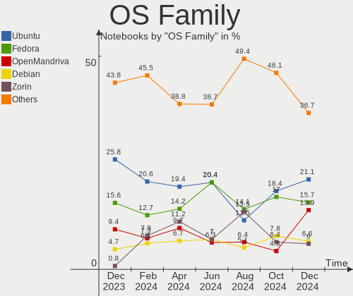
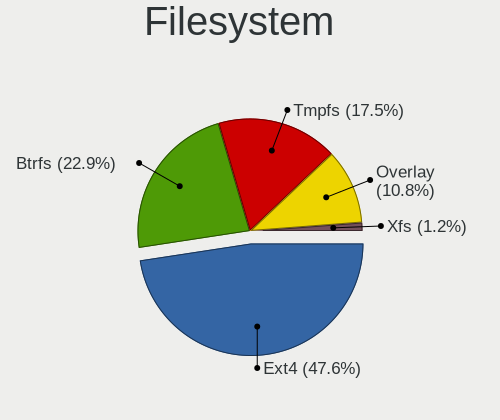
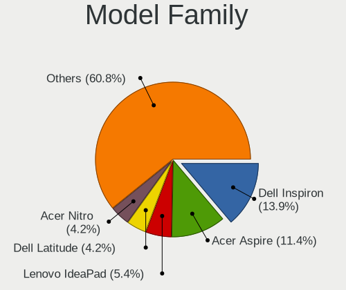
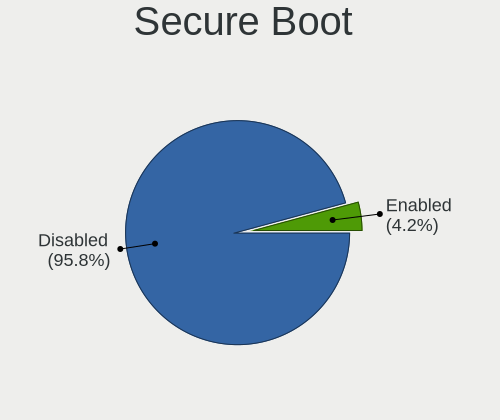
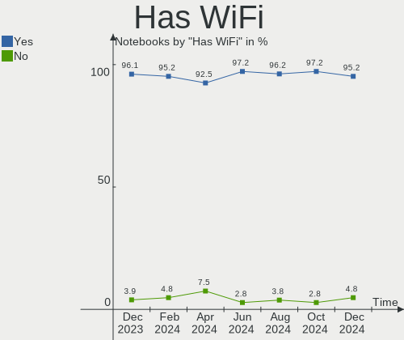
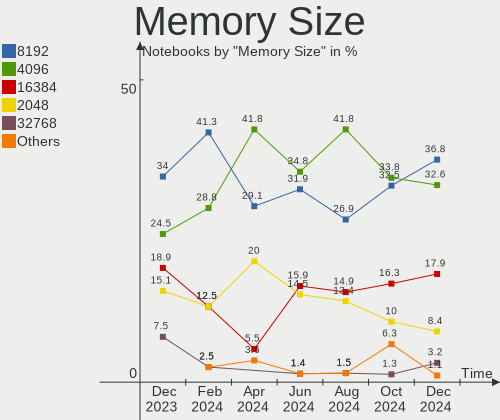

Linux in Brazil - Hardware Trends (Notebooks)
---------------------------------------------

A project to identify most popular hardware characteristics and track their change
over time based on data collected by Linux users at https://Linux-Hardware.org.

Anyone can contribute to this report by the [hw-probe](https://github.com/linuxhw/hw-probe) tool:

    sudo -E hw-probe -all -upload

Period: Dec, 2024.

Contents
--------

* [ System ](#system)
  - [ OS                       ](#os)
  - [ OS Family                ](#os-family)
  - [ Kernel                   ](#kernel)
  - [ Kernel Family            ](#kernel-family)
  - [ Kernel Major Ver.        ](#kernel-major-ver)
  - [ Arch                     ](#arch)
  - [ DE                       ](#de)
  - [ Display Server           ](#display-server)
  - [ Display Manager          ](#display-manager)
  - [ OS Lang                  ](#os-lang)
  - [ Boot Mode                ](#boot-mode)
  - [ Filesystem               ](#filesystem)
  - [ Part. scheme             ](#part-scheme)
  - [ Dual Boot with Linux/BSD ](#dual-boot-with-linuxbsd)
  - [ Dual Boot (Win)          ](#dual-boot-win)

* [ Board ](#board)
  - [ Vendor                   ](#vendor)
  - [ Model                    ](#model)
  - [ Model Family             ](#model-family)
  - [ MFG Year                 ](#mfg-year)
  - [ Form Factor              ](#form-factor)
  - [ Secure Boot              ](#secure-boot)
  - [ Coreboot                 ](#coreboot)
  - [ RAM Size                 ](#ram-size)
  - [ RAM Used                 ](#ram-used)
  - [ Total Drives             ](#total-drives)
  - [ Has CD-ROM               ](#has-cd-rom)
  - [ Has Ethernet             ](#has-ethernet)
  - [ Has WiFi                 ](#has-wifi)
  - [ Has Bluetooth            ](#has-bluetooth)

* [ Location ](#location)
  - [ Country                  ](#country)
  - [ City                     ](#city)

* [ Drives ](#drives)
  - [ Drive Vendor             ](#drive-vendor)
  - [ Drive Model              ](#drive-model)
  - [ HDD Vendor               ](#hdd-vendor)
  - [ SSD Vendor               ](#ssd-vendor)
  - [ Drive Kind               ](#drive-kind)
  - [ Drive Connector          ](#drive-connector)
  - [ Drive Size               ](#drive-size)
  - [ Space Total              ](#space-total)
  - [ Space Used               ](#space-used)
  - [ Malfunc. Drives          ](#malfunc-drives)
  - [ Malfunc. Drive Vendor    ](#malfunc-drive-vendor)
  - [ Malfunc. HDD Vendor      ](#malfunc-hdd-vendor)
  - [ Malfunc. Drive Kind      ](#malfunc-drive-kind)
  - [ Failed Drives            ](#failed-drives)
  - [ Failed Drive Vendor      ](#failed-drive-vendor)
  - [ Drive Status             ](#drive-status)

* [ Storage controller ](#storage-controller)
  - [ Storage Vendor           ](#storage-vendor)
  - [ Storage Model            ](#storage-model)
  - [ Storage Kind             ](#storage-kind)

* [ Processor ](#processor)
  - [ CPU Vendor               ](#cpu-vendor)
  - [ CPU Model                ](#cpu-model)
  - [ CPU Model Family         ](#cpu-model-family)
  - [ CPU Cores                ](#cpu-cores)
  - [ CPU Sockets              ](#cpu-sockets)
  - [ CPU Threads              ](#cpu-threads)
  - [ CPU Op-Modes             ](#cpu-op-modes)
  - [ CPU Microcode            ](#cpu-microcode)
  - [ CPU Microarch            ](#cpu-microarch)

* [ Graphics ](#graphics)
  - [ GPU Vendor               ](#gpu-vendor)
  - [ GPU Model                ](#gpu-model)
  - [ GPU Combo                ](#gpu-combo)
  - [ GPU Driver               ](#gpu-driver)
  - [ GPU Memory               ](#gpu-memory)

* [ Monitor ](#monitor)
  - [ Monitor Vendor           ](#monitor-vendor)
  - [ Monitor Model            ](#monitor-model)
  - [ Monitor Resolution       ](#monitor-resolution)
  - [ Monitor Diagonal         ](#monitor-diagonal)
  - [ Monitor Width            ](#monitor-width)
  - [ Aspect Ratio             ](#aspect-ratio)
  - [ Monitor Area             ](#monitor-area)
  - [ Pixel Density            ](#pixel-density)
  - [ Multiple Monitors        ](#multiple-monitors)

* [ Network ](#network)
  - [ Net Controller Vendor    ](#net-controller-vendor)
  - [ Net Controller Model     ](#net-controller-model)
  - [ Wireless Vendor          ](#wireless-vendor)
  - [ Wireless Model           ](#wireless-model)
  - [ Ethernet Vendor          ](#ethernet-vendor)
  - [ Ethernet Model           ](#ethernet-model)
  - [ Net Controller Kind      ](#net-controller-kind)
  - [ Used Controller          ](#used-controller)
  - [ NICs                     ](#nics)
  - [ IPv6                     ](#ipv6)

* [ Bluetooth ](#bluetooth)
  - [ Bluetooth Vendor         ](#bluetooth-vendor)
  - [ Bluetooth Model          ](#bluetooth-model)

* [ Sound ](#sound)
  - [ Sound Vendor             ](#sound-vendor)
  - [ Sound Model              ](#sound-model)

* [ Memory ](#memory)
  - [ Memory Vendor            ](#memory-vendor)
  - [ Memory Model             ](#memory-model)
  - [ Memory Kind              ](#memory-kind)
  - [ Memory Form Factor       ](#memory-form-factor)
  - [ Memory Size              ](#memory-size)
  - [ Memory Speed             ](#memory-speed)

* [ Printers & scanners ](#printers--scanners)
  - [ Printer Vendor           ](#printer-vendor)
  - [ Printer Model            ](#printer-model)
  - [ Scanner Vendor           ](#scanner-vendor)
  - [ Scanner Model            ](#scanner-model)

* [ Camera ](#camera)
  - [ Camera Vendor            ](#camera-vendor)
  - [ Camera Model             ](#camera-model)

* [ Security ](#security)
  - [ Fingerprint Vendor       ](#fingerprint-vendor)
  - [ Fingerprint Model        ](#fingerprint-model)
  - [ Chipcard Vendor          ](#chipcard-vendor)
  - [ Chipcard Model           ](#chipcard-model)

* [ Unsupported ](#unsupported)
  - [ Unsupported Devices      ](#unsupported-devices)
  - [ Unsupported Device Types ](#unsupported-device-types)

System
------

OS
--

Installed operating systems

| Name                         | Notebooks | Percent |
|------------------------------|-----------|---------|
| Fedora 41                    | 26        | 15.66%  |
| Ubuntu 24.04                 | 22        | 13.25%  |
| OpenMandriva 24.12           | 16        | 9.64%   |
| Zorin 17                     | 10        | 6.02%   |
| Pop!_OS 22.04                | 9         | 5.42%   |
| Debian 12                    | 8         | 4.82%   |
| Ubuntu 22.04                 | 7         | 4.22%   |
| Linux Mint 22                | 5         | 3.01%   |
| Arch Rolling                 | 5         | 3.01%   |
| Ubuntu 24.10                 | 4         | 2.41%   |
| openSUSE Tumbleweed-XXXXXXXX | 4         | 2.41%   |
| OpenMandriva 5.0             | 4         | 2.41%   |
| OpenMandriva 24.07           | 3         | 1.81%   |
| Linux Mint 21.3              | 3         | 1.81%   |
| Debian                       | 3         | 1.81%   |
| BigLinux                     | 3         | 1.81%   |
| Ubuntu MATE 24.04            | 2         | 1.2%    |
| Kubuntu 24.10                | 2         | 1.2%    |
| KDE neon 24.04               | 2         | 1.2%    |
| Endless 6.0.4                | 2         | 1.2%    |
| BigLinux 24.2.0              | 2         | 1.2%    |
| Bazzite 41                   | 2         | 1.2%    |
| Xubuntu 24.04                | 1         | 0.6%    |
| Xubuntu 20.04                | 1         | 0.6%    |
| Xubuntu 18.04                | 1         | 0.6%    |
| Ubuntu Budgie 24.10          | 1         | 0.6%    |
| Ubuntu Budgie 24.04          | 1         | 0.6%    |
| Ubuntu 20.04                 | 1         | 0.6%    |
| Ubuntu 18.04                 | 1         | 0.6%    |
| ROSA 12.5.1                  | 1         | 0.6%    |
| RHEL 9                       | 1         | 0.6%    |
| Parrot 6.2                   | 1         | 0.6%    |
| org.kde.Platform 5.15-21.08  | 1         | 0.6%    |
| NixOS 25.05                  | 1         | 0.6%    |
| Manjaro                      | 1         | 0.6%    |
| Lubuntu 24.04                | 1         | 0.6%    |
| Linux Mint 21.2              | 1         | 0.6%    |
| Linux Mint 21                | 1         | 0.6%    |
| Kubuntu 24.04                | 1         | 0.6%    |
| Kali 2024.4                  | 1         | 0.6%    |

OS Family
---------

OS without a version

| Name             | Notebooks | Percent |
|------------------|-----------|---------|
| Ubuntu           | 35        | 21.08%  |
| Fedora           | 26        | 15.66%  |
| OpenMandriva     | 23        | 13.86%  |
| Debian           | 11        | 6.63%   |
| Zorin            | 10        | 6.02%   |
| Linux Mint       | 10        | 6.02%   |
| Pop!_OS          | 9         | 5.42%   |
| BigLinux         | 5         | 3.01%   |
| Arch             | 5         | 3.01%   |
| openSUSE         | 4         | 2.41%   |
| Xubuntu          | 3         | 1.81%   |
| Kubuntu          | 3         | 1.81%   |
| Endless          | 3         | 1.81%   |
| Ubuntu MATE      | 2         | 1.2%    |
| Ubuntu Budgie    | 2         | 1.2%    |
| KDE neon         | 2         | 1.2%    |
| Bazzite          | 2         | 1.2%    |
| ROSA             | 1         | 0.6%    |
| RHEL             | 1         | 0.6%    |
| Parrot           | 1         | 0.6%    |
| org.kde.Platform | 1         | 0.6%    |
| NixOS            | 1         | 0.6%    |
| Manjaro          | 1         | 0.6%    |
| Lubuntu          | 1         | 0.6%    |
| Kali             | 1         | 0.6%    |
| Elementary       | 1         | 0.6%    |
| ArcoLinux        | 1         | 0.6%    |
| AlmaLinux        | 1         | 0.6%    |

Kernel
------

Version of the Linux kernel

| Version                           | Notebooks | Percent |
|-----------------------------------|-----------|---------|
| 6.8.0-49-generic                  | 22        | 13.25%  |
| 6.12.1-desktop-1omv2490           | 13        | 7.83%   |
| 6.8.0-50-generic                  | 12        | 7.23%   |
| 6.8.0-51-generic                  | 11        | 6.63%   |
| 6.9.3-76060903-generic            | 9         | 5.42%   |
| 6.11.11-300.fc41.x86_64           | 6         | 3.61%   |
| 6.12.6-200.fc41.x86_64            | 5         | 3.01%   |
| 6.11.10-300.fc41.x86_64           | 5         | 3.01%   |
| 6.1.0-28-amd64                    | 5         | 3.01%   |
| 6.6.2-desktop-1omv2390            | 4         | 2.41%   |
| 6.11.4-301.fc41.x86_64            | 4         | 2.41%   |
| 6.12.6-desktop-1omv2490           | 3         | 1.81%   |
| 6.11.8-1-default                  | 3         | 1.81%   |
| 6.11.0-9-generic                  | 3         | 1.81%   |
| 6.10.0-desktop-1omv2490           | 3         | 1.81%   |
| 6.8.0-41-generic                  | 2         | 1.2%    |
| 6.6.63-1-MANJARO                  | 2         | 1.2%    |
| 6.6.63                            | 2         | 1.2%    |
| 6.5.0-10-generic                  | 2         | 1.2%    |
| 6.12.5-200.fc41.x86_64            | 2         | 1.2%    |
| 6.12.4-arch1-1                    | 2         | 1.2%    |
| 6.12.4-200.fc41.x86_64            | 2         | 1.2%    |
| 6.12.4-1-MANJARO                  | 2         | 1.2%    |
| 6.11.8-300.fc41.x86_64            | 2         | 1.2%    |
| 6.11.0-13-generic                 | 2         | 1.2%    |
| 5.15.0-130-generic                | 2         | 1.2%    |
| 6.8.0-50-lowlatency               | 1         | 0.6%    |
| 6.8.0-45-generic                  | 1         | 0.6%    |
| 6.8.0-38-generic                  | 1         | 0.6%    |
| 6.6.65-1-MANJARO                  | 1         | 0.6%    |
| 6.6.47-generic-1rosa2021.1-x86_64 | 1         | 0.6%    |
| 6.6.28-policorp-amd64             | 1         | 0.6%    |
| 6.2.0-26-generic                  | 1         | 0.6%    |
| 6.2.0-20-generic                  | 1         | 0.6%    |
| 6.12.6-amd64                      | 1         | 0.6%    |
| 6.12.6-1-default                  | 1         | 0.6%    |
| 6.12.5-x64v3-xanmod1              | 1         | 0.6%    |
| 6.12.5-amd64                      | 1         | 0.6%    |
| 6.12.4-zen1-1-zen                 | 1         | 0.6%    |
| 6.12.1-zen1-1-zen                 | 1         | 0.6%    |

Kernel Family
-------------

Linux kernel without a distro release

| Version | Notebooks | Percent |
|---------|-----------|---------|
| 6.8.0   | 50        | 30.12%  |
| 6.12.1  | 16        | 9.64%   |
| 6.12.6  | 10        | 6.02%   |
| 6.9.3   | 9         | 5.42%   |
| 6.1.0   | 8         | 4.82%   |
| 6.12.4  | 7         | 4.22%   |
| 6.11.10 | 7         | 4.22%   |
| 6.11.11 | 6         | 3.61%   |
| 6.11.0  | 6         | 3.61%   |
| 5.15.0  | 6         | 3.61%   |
| 6.11.8  | 5         | 3.01%   |
| 6.6.63  | 4         | 2.41%   |
| 6.6.2   | 4         | 2.41%   |
| 6.12.5  | 4         | 2.41%   |
| 6.11.4  | 4         | 2.41%   |
| 6.10.0  | 3         | 1.81%   |
| 6.5.0   | 2         | 1.2%    |
| 6.2.0   | 2         | 1.2%    |
| 5.14.0  | 2         | 1.2%    |
| 6.6.65  | 1         | 0.6%    |
| 6.6.47  | 1         | 0.6%    |
| 6.6.28  | 1         | 0.6%    |
| 6.11.9  | 1         | 0.6%    |
| 6.11.2  | 1         | 0.6%    |
| 6.10.6  | 1         | 0.6%    |
| 6.10.11 | 1         | 0.6%    |
| 5.4.0   | 1         | 0.6%    |
| 5.17.0  | 1         | 0.6%    |
| 5.11.0  | 1         | 0.6%    |
| 4.15.0  | 1         | 0.6%    |

Kernel Major Ver.
-----------------

Linux kernel major version

| Version | Notebooks | Percent |
|---------|-----------|---------|
| 6.8     | 50        | 30.12%  |
| 6.12    | 37        | 22.29%  |
| 6.11    | 30        | 18.07%  |
| 6.6     | 11        | 6.63%   |
| 6.9     | 9         | 5.42%   |
| 6.1     | 8         | 4.82%   |
| 5.15    | 6         | 3.61%   |
| 6.10    | 5         | 3.01%   |
| 6.5     | 2         | 1.2%    |
| 6.2     | 2         | 1.2%    |
| 5.14    | 2         | 1.2%    |
| 5.4     | 1         | 0.6%    |
| 5.17    | 1         | 0.6%    |
| 5.11    | 1         | 0.6%    |
| 4.15    | 1         | 0.6%    |

Arch
----

OS architecture (x86_64, i586, etc.)

| Name   | Notebooks | Percent |
|--------|-----------|---------|
| x86_64 | 165       | 99.4%   |
| i686   | 1         | 0.6%    |

DE
--

Desktop Environment

| Name          | Notebooks | Percent |
|---------------|-----------|---------|
| GNOME         | 91        | 54.82%  |
| Unknown       | 20        | 12.05%  |
| KDE6          | 19        | 11.45%  |
| X-Cinnamon    | 9         | 5.42%   |
| XFCE          | 6         | 3.61%   |
| MATE          | 4         | 2.41%   |
| LXQt          | 4         | 2.41%   |
| KDE5          | 4         | 2.41%   |
| i3            | 2         | 1.2%    |
| Endless:GNOME | 2         | 1.2%    |
| Budgie        | 2         | 1.2%    |
| qtile         | 1         | 0.6%    |
| Pantheon      | 1         | 0.6%    |
| KDE           | 1         | 0.6%    |

Display Server
--------------

X11 or Wayland

| Name    | Notebooks | Percent |
|---------|-----------|---------|
| Wayland | 87        | 52.41%  |
| X11     | 77        | 46.39%  |
| Unknown | 2         | 1.2%    |

Display Manager
---------------

SDDM, LightDM, etc.

| Name    | Notebooks | Percent |
|---------|-----------|---------|
| Unknown | 66        | 39.76%  |
| GDM3    | 38        | 22.89%  |
| SDDM    | 32        | 19.28%  |
| LightDM | 17        | 10.24%  |
| GDM     | 13        | 7.83%   |

OS Lang
-------

Language

| Lang    | Notebooks | Percent |
|---------|-----------|---------|
| pt_BR   | 118       | 71.08%  |
| en_US   | 37        | 22.29%  |
| C       | 6         | 3.61%   |
| en_GB   | 2         | 1.2%    |
| POSIX   | 1         | 0.6%    |
| es_ES   | 1         | 0.6%    |
| Unknown | 1         | 0.6%    |

Boot Mode
---------

EFI or BIOS

| Mode | Notebooks | Percent |
|------|-----------|---------|
| EFI  | 84        | 50.6%   |
| BIOS | 82        | 49.4%   |

Filesystem
----------

Type of filesystem

| Type    | Notebooks | Percent |
|---------|-----------|---------|
| Ext4    | 79        | 47.59%  |
| Btrfs   | 38        | 22.89%  |
| Tmpfs   | 29        | 17.47%  |
| Overlay | 18        | 10.84%  |
| Xfs     | 2         | 1.2%    |

Part. scheme
------------

Scheme of partitioning

| Type    | Notebooks | Percent |
|---------|-----------|---------|
| GPT     | 94        | 56.63%  |
| Unknown | 64        | 38.55%  |
| MBR     | 8         | 4.82%   |

Dual Boot with Linux/BSD
------------------------

Hosting more than one Linux/BSD

| Dual boot | Notebooks | Percent |
|-----------|-----------|---------|
| No        | 143       | 86.14%  |
| Yes       | 23        | 13.86%  |

Dual Boot (Win)
---------------

Hosting Linux and Windows

| Dual boot | Notebooks | Percent |
|-----------|-----------|---------|
| No        | 131       | 78.92%  |
| Yes       | 35        | 21.08%  |

Board
-----

Vendor
------

Motherboard manufacturer

| Name                   | Notebooks | Percent |
|------------------------|-----------|---------|
| Dell                   | 39        | 23.49%  |
| Lenovo                 | 27        | 16.27%  |
| Acer                   | 27        | 16.27%  |
| ASUSTek Computer       | 17        | 10.24%  |
| Samsung Electronics    | 15        | 9.04%   |
| Hewlett-Packard        | 8         | 4.82%   |
| Apple                  | 7         | 4.22%   |
| Positivo               | 6         | 3.61%   |
| Positivo Bahia - VAIO  | 4         | 2.41%   |
| Notebook               | 3         | 1.81%   |
| LG Electronics         | 2         | 1.2%    |
| Avell High Performance | 2         | 1.2%    |
| Avell                  | 2         | 1.2%    |
| Timi                   | 1         | 0.6%    |
| MSI                    | 1         | 0.6%    |
| Intel                  | 1         | 0.6%    |
| Gateway                | 1         | 0.6%    |
| Digibras               | 1         | 0.6%    |
| Compaq                 | 1         | 0.6%    |
| Unknown                | 1         | 0.6%    |

Model
-----

Motherboard model

| Name                                        | Notebooks | Percent |
|---------------------------------------------|-----------|---------|
| Samsung 550XDA                              | 6         | 3.61%   |
| Dell Inspiron 15 3520                       | 4         | 2.41%   |
| Dell Inspiron 15 5510                       | 3         | 1.81%   |
| ASUS VivoBook_ASUSLaptop K3605ZF_K3605ZF    | 3         | 1.81%   |
| Apple MacBookPro8,1                         | 3         | 1.81%   |
| Positivo R516256AI-15                       | 2         | 1.2%    |
| Lenovo IdeaPad 3 15ALC6 82MF                | 2         | 1.2%    |
| Lenovo G400s VILG1                          | 2         | 1.2%    |
| Dell Vostro 3550                            | 2         | 1.2%    |
| Dell Inspiron N4050                         | 2         | 1.2%    |
| Dell Inspiron 3583                          | 2         | 1.2%    |
| Dell Inspiron 15-3567                       | 2         | 1.2%    |
| Dell G15 5530                               | 2         | 1.2%    |
| Avell B.ON                                  | 2         | 1.2%    |
| Acer Nitro ANV15-51                         | 2         | 1.2%    |
| Acer Nitro AN517-54                         | 2         | 1.2%    |
| Acer Aspire A515-51                         | 2         | 1.2%    |
| Acer Aspire A315-510P                       | 2         | 1.2%    |
| Timi RedmiBook Pro 14                       | 1         | 0.6%    |
| Samsung RV411/RV511/E3511/S3511/RV711/E3411 | 1         | 0.6%    |
| Samsung 960XGL                              | 1         | 0.6%    |
| Samsung 950XDB/951XDB/950XDY                | 1         | 0.6%    |
| Samsung 940XGK                              | 1         | 0.6%    |
| Samsung 800G5M/800G5W                       | 1         | 0.6%    |
| Samsung 550XCJ/550XCR                       | 1         | 0.6%    |
| Samsung 530U3BI/530U4BI/530U4BH             | 1         | 0.6%    |
| Samsung 370E4K                              | 1         | 0.6%    |
| Samsung 300E4C/300E5C/300E7C                | 1         | 0.6%    |
| Positivo W940TU                             | 1         | 0.6%    |
| Positivo Q4128C                             | 1         | 0.6%    |
| Positivo Mobile                             | 1         | 0.6%    |
| Positivo C464F                              | 1         | 0.6%    |
| Positivo Bahia - VAIO VJFE59F11X-B1811H     | 1         | 0.6%    |
| Positivo Bahia - VAIO VJFE52F11X-XXXXXX     | 1         | 0.6%    |
| Positivo Bahia - VAIO VJFE52F11X-B2511H     | 1         | 0.6%    |
| Positivo Bahia - VAIO VJFE52F11X-B2291H     | 1         | 0.6%    |
| Notebook NJx0MU                             | 1         | 0.6%    |
| Notebook N85_N87,HJ,HJ1,HK1                 | 1         | 0.6%    |
| Notebook 14M2                               | 1         | 0.6%    |
| MSI Raider GE68 HX 14VGG                    | 1         | 0.6%    |

Model Family
------------

Motherboard model prefix

| Name                                    | Notebooks | Percent |
|-----------------------------------------|-----------|---------|
| Dell Inspiron                           | 23        | 13.86%  |
| Acer Aspire                             | 19        | 11.45%  |
| Lenovo IdeaPad                          | 9         | 5.42%   |
| Dell Latitude                           | 7         | 4.22%   |
| Acer Nitro                              | 7         | 4.22%   |
| Samsung 550XDA                          | 6         | 3.61%   |
| Lenovo ThinkPad                         | 6         | 3.61%   |
| ASUS VivoBook                           | 6         | 3.61%   |
| HP ProBook                              | 3         | 1.81%   |
| Dell XPS                                | 3         | 1.81%   |
| Dell Vostro                             | 3         | 1.81%   |
| Dell G15                                | 3         | 1.81%   |
| Apple MacBookPro8                       | 3         | 1.81%   |
| Positivo R516256AI-15                   | 2         | 1.2%    |
| Lenovo Yoga                             | 2         | 1.2%    |
| Lenovo Legion                           | 2         | 1.2%    |
| Lenovo G400s                            | 2         | 1.2%    |
| HP Pavilion                             | 2         | 1.2%    |
| Avell High Performance A70              | 2         | 1.2%    |
| Avell B.ON                              | 2         | 1.2%    |
| ASUS ASUS                               | 2         | 1.2%    |
| Apple MacBookAir6                       | 2         | 1.2%    |
| Timi RedmiBook                          | 1         | 0.6%    |
| Samsung RV411                           | 1         | 0.6%    |
| Samsung 960XGL                          | 1         | 0.6%    |
| Samsung 950XDB                          | 1         | 0.6%    |
| Samsung 940XGK                          | 1         | 0.6%    |
| Samsung 800G5M                          | 1         | 0.6%    |
| Samsung 550XCJ                          | 1         | 0.6%    |
| Samsung 530U3BI                         | 1         | 0.6%    |
| Samsung 370E4K                          | 1         | 0.6%    |
| Samsung 300E4C                          | 1         | 0.6%    |
| Positivo W940TU                         | 1         | 0.6%    |
| Positivo Q4128C                         | 1         | 0.6%    |
| Positivo Mobile                         | 1         | 0.6%    |
| Positivo C464F                          | 1         | 0.6%    |
| Positivo Bahia - VAIO VJFE59F11X-B1811H | 1         | 0.6%    |
| Positivo Bahia - VAIO VJFE52F11X-XXXXXX | 1         | 0.6%    |
| Positivo Bahia - VAIO VJFE52F11X-B2511H | 1         | 0.6%    |
| Positivo Bahia - VAIO VJFE52F11X-B2291H | 1         | 0.6%    |

MFG Year
--------

Motherboard manufacture year

| Year | Notebooks | Percent |
|------|-----------|---------|
| 2021 | 30        | 18.07%  |
| 2023 | 13        | 7.83%   |
| 2020 | 13        | 7.83%   |
| 2019 | 12        | 7.23%   |
| 2012 | 12        | 7.23%   |
| 2024 | 11        | 6.63%   |
| 2011 | 11        | 6.63%   |
| 2015 | 9         | 5.42%   |
| 2014 | 9         | 5.42%   |
| 2013 | 9         | 5.42%   |
| 2016 | 8         | 4.82%   |
| 2022 | 7         | 4.22%   |
| 2017 | 7         | 4.22%   |
| 2010 | 7         | 4.22%   |
| 2018 | 5         | 3.01%   |
| 2009 | 2         | 1.2%    |
| 2007 | 1         | 0.6%    |

Form Factor
-----------

Physical design of the computer

| Name     | Notebooks | Percent |
|----------|-----------|---------|
| Notebook | 166       | 100%    |

Secure Boot
-----------

Enabled or disabled

| State    | Notebooks | Percent |
|----------|-----------|---------|
| Disabled | 159       | 95.78%  |
| Enabled  | 7         | 4.22%   |

Coreboot
--------

Have coreboot on board

| Used | Notebooks | Percent |
|------|-----------|---------|
| No   | 166       | 100%    |

RAM Size
--------

Total RAM memory

| Size in GB | Notebooks | Percent |
|------------|-----------|---------|
| 4.01-8.0   | 55        | 33.13%  |
| 16.01-24.0 | 37        | 22.29%  |
| 8.01-16.0  | 29        | 17.47%  |
| 3.01-4.0   | 23        | 13.86%  |
| 32.01-64.0 | 10        | 6.02%   |
| 24.01-32.0 | 7         | 4.22%   |
| 1.01-2.0   | 3         | 1.81%   |
| 2.01-3.0   | 1         | 0.6%    |
| 0.51-1.0   | 1         | 0.6%    |

RAM Used
--------

Used RAM memory

| Used GB   | Notebooks | Percent |
|-----------|-----------|---------|
| 4.01-8.0  | 43        | 25.9%   |
| 2.01-3.0  | 39        | 23.49%  |
| 1.01-2.0  | 36        | 21.69%  |
| 3.01-4.0  | 32        | 19.28%  |
| 8.01-16.0 | 9         | 5.42%   |
| 0.51-1.0  | 5         | 3.01%   |
| 0.01-0.5  | 2         | 1.2%    |

Total Drives
------------

Number of drives on board

| Drives | Notebooks | Percent |
|--------|-----------|---------|
| 1      | 118       | 71.08%  |
| 2      | 41        | 24.7%   |
| 3      | 7         | 4.22%   |

Has CD-ROM
----------

Has CD-ROM on board

| Presented | Notebooks | Percent |
|-----------|-----------|---------|
| No        | 131       | 78.92%  |
| Yes       | 35        | 21.08%  |

Has Ethernet
------------

Has Ethernet on board

| Presented | Notebooks | Percent |
|-----------|-----------|---------|
| Yes       | 127       | 76.51%  |
| No        | 39        | 23.49%  |

Has WiFi
--------

Has WiFi module

| Presented | Notebooks | Percent |
|-----------|-----------|---------|
| Yes       | 158       | 95.18%  |
| No        | 8         | 4.82%   |

Has Bluetooth
-------------

Has Bluetooth module

| Presented | Notebooks | Percent |
|-----------|-----------|---------|
| Yes       | 147       | 88.55%  |
| No        | 19        | 11.45%  |

Location
--------

Country
-------

Geographic location (country)

| Country | Notebooks | Percent |
|---------|-----------|---------|
| Brazil  | 166       | 100%    |

City
----

Geographic location (city)

| City                  | Notebooks | Percent |
|-----------------------|-----------|---------|
| Sao Paulo             | 22        | 13.25%  |
| Rio de Janeiro        | 13        | 7.83%   |
| Brasília             | 10        | 6.02%   |
| Campinas              | 7         | 4.22%   |
| Curitiba              | 6         | 3.61%   |
| Recife                | 5         | 3.01%   |
| Fortaleza             | 5         | 3.01%   |
| Belo Horizonte        | 5         | 3.01%   |
| Salvador              | 4         | 2.41%   |
| Porto Alegre          | 4         | 2.41%   |
| Florianópolis        | 4         | 2.41%   |
| Manaus                | 3         | 1.81%   |
| Londrina              | 3         | 1.81%   |
| Simoes Filho          | 2         | 1.2%    |
| Sao Luís             | 2         | 1.2%    |
| Sao José dos Campos  | 2         | 1.2%    |
| Sao Jose do Rio Preto | 2         | 1.2%    |
| Maringá              | 2         | 1.2%    |
| Juazeiro do Norte     | 2         | 1.2%    |
| Indaiatuba            | 2         | 1.2%    |
| Caxias do Sul         | 2         | 1.2%    |
| Blumenau              | 2         | 1.2%    |
| Belém                | 2         | 1.2%    |
| Vitória da Conquista | 1         | 0.6%    |
| Vila Velha            | 1         | 0.6%    |
| Varzelandia           | 1         | 0.6%    |
| Vargem Grande do Sul  | 1         | 0.6%    |
| Urania                | 1         | 0.6%    |
| Tibau do Sul          | 1         | 0.6%    |
| Tatuí                | 1         | 0.6%    |
| Sorocaba              | 1         | 0.6%    |
| Sinop                 | 1         | 0.6%    |
| Senador Canedo        | 1         | 0.6%    |
| Sao Carlos            | 1         | 0.6%    |
| Santos                | 1         | 0.6%    |
| Santaluz              | 1         | 0.6%    |
| Salinopolis           | 1         | 0.6%    |
| Rio Claro             | 1         | 0.6%    |
| Ribeirao Preto        | 1         | 0.6%    |
| Registro              | 1         | 0.6%    |

Drives
------

Drive Vendor
------------

Hard drive vendors

| Vendor                         | Notebooks | Drives | Percent |
|--------------------------------|-----------|--------|---------|
| WDC                            | 22        | 23     | 10.58%  |
| SanDisk                        | 18        | 20     | 8.65%   |
| Kingston                       | 18        | 19     | 8.65%   |
| Seagate                        | 13        | 13     | 6.25%   |
| Samsung Electronics            | 13        | 14     | 6.25%   |
| ADATA Technology               | 12        | 12     | 5.77%   |
| A-DATA Technology              | 11        | 11     | 5.29%   |
| SK hynix                       | 9         | 9      | 4.33%   |
| Toshiba                        | 7         | 7      | 3.37%   |
| Unknown                        | 6         | 6      | 2.88%   |
| Crucial                        | 6         | 6      | 2.88%   |
| China                          | 6         | 7      | 2.88%   |
| Solid State Storage Technology | 5         | 5      | 2.4%    |
| KIOXIA                         | 5         | 5      | 2.4%    |
| Kingston Technology Company    | 5         | 5      | 2.4%    |
| Intel                          | 5         | 6      | 2.4%    |
| Solid State Storage            | 3         | 3      | 1.44%   |
| Silicon Motion                 | 3         | 3      | 1.44%   |
| Micron Technology              | 3         | 3      | 1.44%   |
| KingSpec                       | 3         | 3      | 1.44%   |
| Apple                          | 3         | 3      | 1.44%   |
| XrayDisk                       | 2         | 2      | 0.96%   |
| Micron/Crucial Technology      | 2         | 2      | 0.96%   |
| MAXIO Technology (Hangzhou)    | 2         | 2      | 0.96%   |
| MACROVIP                       | 2         | 2      | 0.96%   |
| LITEON                         | 2         | 2      | 0.96%   |
| Lexar                          | 2         | 2      | 0.96%   |
| JMicron Technology             | 2         | 2      | 0.96%   |
| HGST                           | 2         | 2      | 0.96%   |
| Unknown                        | 2         | 3      | 0.96%   |
| Win Memory                     | 1         | 1      | 0.48%   |
| SSSTC                          | 1         | 1      | 0.48%   |
| Shenzhen Longsys Electronics   | 1         | 1      | 0.48%   |
| Realtek Semiconductor          | 1         | 1      | 0.48%   |
| PNY                            | 1         | 1      | 0.48%   |
| Phison Electronics             | 1         | 1      | 0.48%   |
| OXYBR                          | 1         | 1      | 0.48%   |
| Netac                          | 1         | 1      | 0.48%   |
| KingFast                       | 1         | 1      | 0.48%   |
| HS-SSD-C100                    | 1         | 1      | 0.48%   |

Drive Model
-----------

Hard drive models

| Model                                                | Notebooks | Percent |
|------------------------------------------------------|-----------|---------|
| Kingston SA400S37480G 480GB SSD                      | 5         | 2.34%   |
| Kingston SA400S37240G 240GB SSD                      | 5         | 2.34%   |
| SanDisk SSD PLUS 240GB                               | 4         | 1.87%   |
| WDC WD10SPZX-21Z10T0 1TB                             | 3         | 1.4%    |
| SK hynix BC711 NVMe 512GB                            | 3         | 1.4%    |
| Sandisk WD Blue SN550 NVMe SSD 256GB                 | 3         | 1.4%    |
| SanDisk SSD PLUS 1000GB                              | 3         | 1.4%    |
| Kingston SA400S37120G 120GB SSD                      | 3         | 1.4%    |
| Intel SSDPEKNU512GZ 512GB                            | 3         | 1.4%    |
| A-DATA IM2P33F3A NVMe 512GB                          | 3         | 1.4%    |
| Toshiba MQ04ABF100 1TB                               | 2         | 0.93%   |
| Toshiba MQ01ABF050 500GB                             | 2         | 0.93%   |
| Solid State Storage SSSTC CL1-8D256 256GB            | 2         | 0.93%   |
| Solid State Storage SSSTC CL1-4D256 256GB            | 2         | 0.93%   |
| SK hynix HFS256GEJ9X108N 256GB                       | 2         | 0.93%   |
| Seagate ST1000LM035-1RK172 1TB                       | 2         | 0.93%   |
| Seagate Expansion 1TB                                | 2         | 0.93%   |
| SanDisk NVMe SSD Drive 1TB                           | 2         | 0.93%   |
| Samsung NVMe SSD Controller PM9A1/PM9A3/980PRO 512GB | 2         | 0.93%   |
| Samsung HM321HI 320GB                                | 2         | 0.93%   |
| MAXIO (Hangzhou) NVMe SSD Controller MAP1202 512GB   | 2         | 0.93%   |
| MACROVIP MV240GB SSD                                 | 2         | 0.93%   |
| LITEON CV1-8B256-HP 256GB SSD                        | 2         | 0.93%   |
| Kingston Company SNV2S2000G 2TB                      | 2         | 0.93%   |
| Kingston Company SNV2S1000G 1TB                      | 2         | 0.93%   |
| Kingston SA400S37960G 960GB SSD                      | 2         | 0.93%   |
| Crucial CT480BX500SSD1 480GB                         | 2         | 0.93%   |
| China SSD 512GB                                      | 2         | 0.93%   |
| ADATA SM2P41C8-256GC1 256GB                          | 2         | 0.93%   |
| ADATA NVMe IM2P33F4 256GB                            | 2         | 0.93%   |
| ADATA IM2P33F8ABR2-512GB                             | 2         | 0.93%   |
| A-DATA SU650 240GB SSD                               | 2         | 0.93%   |
| Unknown                                              | 2         | 0.93%   |
| XrayDisk 240GB                                       | 1         | 0.47%   |
| XrayDisk 1TB SSD                                     | 1         | 0.47%   |
| Win Memory SWR256G-301II 256GB                       | 1         | 0.47%   |
| WDC WDS480G2G0C-00AJM0 480GB                         | 1         | 0.47%   |
| WDC WDS480G2G0A-00JH30 480GB SSD                     | 1         | 0.47%   |
| WDC WDS240G2G0B-00EPW0 240GB SSD                     | 1         | 0.47%   |
| WDC WDS240G2G0A-00JH30 240GB SSD                     | 1         | 0.47%   |

HDD Vendor
----------

Hard disk drive vendors

| Vendor              | Notebooks | Drives | Percent |
|---------------------|-----------|--------|---------|
| WDC                 | 16        | 16     | 36.36%  |
| Seagate             | 13        | 13     | 29.55%  |
| Toshiba             | 7         | 7      | 15.91%  |
| Samsung Electronics | 3         | 3      | 6.82%   |
| HGST                | 2         | 2      | 4.55%   |
| JMicron Technology  | 1         | 1      | 2.27%   |
| Hitachi             | 1         | 1      | 2.27%   |
| Apple               | 1         | 1      | 2.27%   |

SSD Vendor
----------

Solid state drive vendors

| Vendor              | Notebooks | Drives | Percent |
|---------------------|-----------|--------|---------|
| Kingston            | 16        | 16     | 24.24%  |
| SanDisk             | 8         | 9      | 12.12%  |
| Crucial             | 6         | 6      | 9.09%   |
| China               | 6         | 7      | 9.09%   |
| WDC                 | 5         | 5      | 7.58%   |
| A-DATA Technology   | 5         | 5      | 7.58%   |
| KingSpec            | 3         | 3      | 4.55%   |
| MACROVIP            | 2         | 2      | 3.03%   |
| LITEON              | 2         | 2      | 3.03%   |
| Lexar               | 2         | 2      | 3.03%   |
| Apple               | 2         | 2      | 3.03%   |
| XrayDisk            | 1         | 1      | 1.52%   |
| Win Memory          | 1         | 1      | 1.52%   |
| Samsung Electronics | 1         | 1      | 1.52%   |
| PNY                 | 1         | 1      | 1.52%   |
| OXYBR               | 1         | 1      | 1.52%   |
| Netac               | 1         | 1      | 1.52%   |
| Micron Technology   | 1         | 1      | 1.52%   |
| Fanxiang            | 1         | 1      | 1.52%   |
| Unknown             | 1         | 1      | 1.52%   |

Drive Kind
----------

HDD or SSD

| Kind    | Notebooks | Drives | Percent |
|---------|-----------|--------|---------|
| NVMe    | 81        | 92     | 41.33%  |
| SSD     | 61        | 68     | 31.12%  |
| HDD     | 43        | 44     | 21.94%  |
| Unknown | 7         | 8      | 3.57%   |
| MMC     | 4         | 4      | 2.04%   |

Drive Connector
---------------

SATA, SAS, NVMe, etc.

| Type | Notebooks | Drives | Percent |
|------|-----------|--------|---------|
| SATA | 97        | 112    | 51.32%  |
| NVMe | 81        | 92     | 42.86%  |
| SAS  | 7         | 8      | 3.7%    |
| MMC  | 4         | 4      | 2.12%   |

Drive Size
----------

Size of hard drive

| Size in TB | Notebooks | Drives | Percent |
|------------|-----------|--------|---------|
| 0.01-0.5   | 67        | 75     | 67%     |
| 0.51-1.0   | 32        | 36     | 32%     |
| 1.01-2.0   | 1         | 1      | 1%      |

Space Total
-----------

Amount of disk space available on the file system

| Size in GB     | Notebooks | Percent |
|----------------|-----------|---------|
| 101-250        | 54        | 32.53%  |
| 251-500        | 36        | 21.69%  |
| 501-1000       | 27        | 16.27%  |
| 1-20           | 11        | 6.63%   |
| 1001-2000      | 10        | 6.02%   |
| 51-100         | 9         | 5.42%   |
| More than 3000 | 7         | 4.22%   |
| 21-50          | 6         | 3.61%   |
| Unknown        | 4         | 2.41%   |
| 2001-3000      | 2         | 1.2%    |

Space Used
----------

Amount of used disk space

| Used GB        | Notebooks | Percent |
|----------------|-----------|---------|
| 1-20           | 57        | 34.34%  |
| 21-50          | 27        | 16.27%  |
| 51-100         | 27        | 16.27%  |
| 101-250        | 21        | 12.65%  |
| 251-500        | 15        | 9.04%   |
| 501-1000       | 9         | 5.42%   |
| Unknown        | 4         | 2.41%   |
| 1001-2000      | 2         | 1.2%    |
| 0              | 2         | 1.2%    |
| More than 3000 | 1         | 0.6%    |
| 2001-3000      | 1         | 0.6%    |

Malfunc. Drives
---------------

Drive models with a malfunction

| Model                                     | Notebooks | Drives | Percent |
|-------------------------------------------|-----------|--------|---------|
| WDC WDS120G2G0B-00EPW0 120GB SSD          | 1         | 1      | 12.5%   |
| WDC WD5000LPCX-00VHAT0 500GB              | 1         | 1      | 12.5%   |
| WDC WD10JPVX-22JC3T0 1TB                  | 1         | 1      | 12.5%   |
| Silicon Motion Asgard AN1TNVMe-M.2-80 1TB | 1         | 1      | 12.5%   |
| Seagate ST1000LM048-2E7172 1TB            | 1         | 1      | 12.5%   |
| SanDisk iSSD P4 16GB                      | 1         | 1      | 12.5%   |
| PNY 1TB SATA SSD                          | 1         | 1      | 12.5%   |
| HGST HTS545050A7E680 500GB                | 1         | 1      | 12.5%   |

Malfunc. Drive Vendor
---------------------

Vendors of faulty drives

| Vendor         | Notebooks | Drives | Percent |
|----------------|-----------|--------|---------|
| WDC            | 3         | 3      | 37.5%   |
| Silicon Motion | 1         | 1      | 12.5%   |
| Seagate        | 1         | 1      | 12.5%   |
| SanDisk        | 1         | 1      | 12.5%   |
| PNY            | 1         | 1      | 12.5%   |
| HGST           | 1         | 1      | 12.5%   |

Malfunc. HDD Vendor
-------------------

Vendors of faulty HDD drives

| Vendor  | Notebooks | Drives | Percent |
|---------|-----------|--------|---------|
| WDC     | 2         | 2      | 50%     |
| Seagate | 1         | 1      | 25%     |
| HGST    | 1         | 1      | 25%     |

Malfunc. Drive Kind
-------------------

Kinds of faulty drives

| Kind | Notebooks | Drives | Percent |
|------|-----------|--------|---------|
| HDD  | 4         | 4      | 50%     |
| SSD  | 3         | 3      | 37.5%   |
| NVMe | 1         | 1      | 12.5%   |

Failed Drives
-------------

Failed drive models

| Model                        | Notebooks | Drives | Percent |
|------------------------------|-----------|--------|---------|
| WDC WD5000BPVT-22HXZT1 500GB | 1         | 1      | 100%    |

Failed Drive Vendor
-------------------

Failed drive vendors

| Vendor | Notebooks | Drives | Percent |
|--------|-----------|--------|---------|
| WDC    | 1         | 1      | 100%    |

Drive Status
------------

Number of failed and malfunc. drives

| Status   | Notebooks | Drives | Percent |
|----------|-----------|--------|---------|
| Detected | 102       | 132    | 58.96%  |
| Works    | 62        | 75     | 35.84%  |
| Malfunc  | 8         | 8      | 4.62%   |
| Failed   | 1         | 1      | 0.58%   |

Storage controller
------------------

Storage Vendor
--------------

Storage controller vendors

| Vendor                         | Notebooks | Percent |
|--------------------------------|-----------|---------|
| Intel                          | 116       | 53.7%   |
| ADATA Technology               | 19        | 8.8%    |
| AMD                            | 13        | 6.02%   |
| SanDisk                        | 12        | 5.56%   |
| Samsung Electronics            | 10        | 4.63%   |
| Solid State Storage Technology | 9         | 4.17%   |
| SK hynix                       | 9         | 4.17%   |
| Kingston Technology Company    | 8         | 3.7%    |
| KIOXIA                         | 4         | 1.85%   |
| Silicon Motion                 | 3         | 1.39%   |
| Micron/Crucial Technology      | 2         | 0.93%   |
| Micron Technology              | 2         | 0.93%   |
| MAXIO Technology (Hangzhou)    | 2         | 0.93%   |
| Toshiba America Info Systems   | 1         | 0.46%   |
| Shenzhen Longsys Electronics   | 1         | 0.46%   |
| Realtek Semiconductor          | 1         | 0.46%   |
| Phison Electronics             | 1         | 0.46%   |
| Nvidia                         | 1         | 0.46%   |
| Marvell Technology Group       | 1         | 0.46%   |
| INNOGRIT                       | 1         | 0.46%   |

Storage Model
-------------

Storage controller models

| Model                                                                          | Notebooks | Percent |
|--------------------------------------------------------------------------------|-----------|---------|
| Intel Sunrise Point-LP SATA Controller [AHCI mode]                             | 14        | 6.14%   |
| AMD FCH SATA Controller [AHCI mode]                                            | 12        | 5.26%   |
| Intel Volume Management Device NVMe RAID Controller                            | 11        | 4.82%   |
| Intel Tiger Lake-LP SATA Controller                                            | 11        | 4.82%   |
| Intel 7 Series Chipset Family 6-port SATA Controller [AHCI mode]               | 11        | 4.82%   |
| Intel 6 Series/C200 Series Chipset Family 6 port Mobile SATA AHCI Controller   | 10        | 4.39%   |
| Intel Alder Lake-P SATA AHCI Controller                                        | 8         | 3.51%   |
| Intel Comet Lake SATA AHCI Controller                                          | 6         | 2.63%   |
| Intel 82801 Mobile SATA Controller [RAID mode]                                 | 6         | 2.63%   |
| Intel 8 Series SATA Controller 1 [AHCI mode]                                   | 6         | 2.63%   |
| ADATA SM2P41C8 NVMe SSD (DRAM-less)                                            | 6         | 2.63%   |
| Solid State Storage CL1-3D256-Q11 NVMe SSD M.2                                 | 5         | 2.19%   |
| Intel 5 Series/3400 Series Chipset 4 port SATA AHCI Controller                 | 5         | 2.19%   |
| SK hynix BC901 NVMe Solid State Drive (DRAM-less)                              | 4         | 1.75%   |
| SanDisk Ultra 3D / WD PC SN530, IX SN530, Blue SN550 NVMe SSD (DRAM-less)      | 4         | 1.75%   |
| Samsung NVMe SSD Controller PM9A1/PM9A3/980PRO                                 | 4         | 1.75%   |
| Intel SSD 670p Series [Keystone Harbor]                                        | 4         | 1.75%   |
| Intel HM170/QM170 Chipset SATA Controller [AHCI Mode]                          | 4         | 1.75%   |
| ADATA IM2P33F8 series NVMe SSD (DRAM-less)                                     | 4         | 1.75%   |
| ADATA IM2P33F3 NVMe SSD (DRAM-less)                                            | 4         | 1.75%   |
| Solid State Storage CL4-8D512 NVMe SSD M.2 (DRAM-less)                         | 3         | 1.32%   |
| SK hynix Gold P31/BC711/PC711 NVMe Solid State Drive                           | 3         | 1.32%   |
| Silicon Motion SM2263EN/SM2263XT (DRAM-less) NVMe SSD Controllers              | 3         | 1.32%   |
| Samsung NVMe SSD Controller 980 (DRAM-less)                                    | 3         | 1.32%   |
| Intel Wildcat Point-LP SATA Controller [AHCI Mode]                             | 3         | 1.32%   |
| Intel Tiger Lake SATA AHCI Controller                                          | 3         | 1.32%   |
| Intel Celeron/Pentium Silver Processor SATA Controller                         | 3         | 1.32%   |
| Intel Cannon Point-LP SATA Controller [AHCI Mode]                              | 3         | 1.32%   |
| Intel 8 Series/C220 Series Chipset Family 6-port SATA Controller 1 [AHCI mode] | 3         | 1.32%   |
| SanDisk WD Green SN350 240GB (DRAM-less) / SN560E NVMe SSD                     | 2         | 0.88%   |
| SanDisk WD Black SN770 / PC SN740 256GB / PC SN560 (DRAM-less) NVMe SSD        | 2         | 0.88%   |
| SanDisk Extreme Pro / WD Black SN750 / PC SN730 / Red SN700 NVMe SSD           | 2         | 0.88%   |
| MAXIO (Hangzhou) NVMe SSD Controller MAP1202 (DRAM-less)                       | 2         | 0.88%   |
| KIOXIA NVMe SSD Controller BG5 (DRAM-less)                                     | 2         | 0.88%   |
| Kingston Company NV2 NVMe SSD [SM2267XT] (DRAM-less)                           | 2         | 0.88%   |
| Intel Volume Management Device NVMe RAID Controller Intel Corporation          | 2         | 0.88%   |
| Intel Ice Lake-LP SATA Controller [AHCI mode]                                  | 2         | 0.88%   |
| Intel Atom Processor E3800 Series SATA AHCI Controller                         | 2         | 0.88%   |
| ADATA IM2P33F4 NVMe SSD (DRAM-less)                                            | 2         | 0.88%   |
| Toshiba America Info Systems XG6 NVMe SSD Controller                           | 1         | 0.44%   |

Storage Kind
------------

Kind of storage controller (IDE, SATA, NVMe, SAS, ...)

| Kind | Notebooks | Percent |
|------|-----------|---------|
| SATA | 117       | 53.42%  |
| NVMe | 81        | 36.99%  |
| RAID | 19        | 8.68%   |
| IDE  | 2         | 0.91%   |

Processor
---------

CPU Vendor
----------

Processor vendors

| Vendor | Notebooks | Percent |
|--------|-----------|---------|
| Intel  | 143       | 86.14%  |
| AMD    | 23        | 13.86%  |

CPU Model
---------

Processor models

| Model                                         | Notebooks | Percent |
|-----------------------------------------------|-----------|---------|
| Intel Core i5-7200U CPU @ 2.50GHz             | 7         | 4.22%   |
| Intel 11th Gen Core i5-1135G7 @ 2.40GHz       | 6         | 3.61%   |
| Intel 11th Gen Core i7-1165G7 @ 2.80GHz       | 5         | 3.01%   |
| Intel Core i5-8265U CPU @ 1.60GHz             | 4         | 2.41%   |
| Intel 12th Gen Core i5-1235U                  | 4         | 2.41%   |
| Intel 11th Gen Core i3-1115G4 @ 3.00GHz       | 4         | 2.41%   |
| Intel Core Ultra 7 155H                       | 3         | 1.81%   |
| Intel Core i5-10210U CPU @ 1.60GHz            | 3         | 1.81%   |
| Intel Celeron N4020 CPU @ 1.10GHz             | 3         | 1.81%   |
| Intel 12th Gen Core i7-12700H                 | 3         | 1.81%   |
| Intel 12th Gen Core i5-12450H                 | 3         | 1.81%   |
| Intel 11th Gen Core i7-11800H @ 2.30GHz       | 3         | 1.81%   |
| AMD Ryzen 7 5700U with Radeon Graphics        | 3         | 1.81%   |
| AMD Ryzen 5 5500U with Radeon Graphics        | 3         | 1.81%   |
| Intel Pentium CPU P6200 @ 2.13GHz             | 2         | 1.2%    |
| Intel Core i7-7700HQ CPU @ 2.80GHz            | 2         | 1.2%    |
| Intel Core i7-4700HQ CPU @ 2.40GHz            | 2         | 1.2%    |
| Intel Core i5-8350U CPU @ 1.70GHz             | 2         | 1.2%    |
| Intel Core i5-8250U CPU @ 1.60GHz             | 2         | 1.2%    |
| Intel Core i5-4250U CPU @ 1.30GHz             | 2         | 1.2%    |
| Intel Core i5-4210U CPU @ 1.70GHz             | 2         | 1.2%    |
| Intel Core i5-2415M CPU @ 2.30GHz             | 2         | 1.2%    |
| Intel Core i5-2410M CPU @ 2.30GHz             | 2         | 1.2%    |
| Intel Core i3-N305                            | 2         | 1.2%    |
| Intel Core i3-7020U CPU @ 2.30GHz             | 2         | 1.2%    |
| Intel Core i3-3110M CPU @ 2.40GHz             | 2         | 1.2%    |
| Intel Core i3-10110U CPU @ 2.10GHz            | 2         | 1.2%    |
| Intel 13th Gen Core i5-13420H                 | 2         | 1.2%    |
| Intel 11th Gen Core i7-11390H @ 3.40GHz       | 2         | 1.2%    |
| AMD Ryzen 7 7840HS w/ Radeon 780M Graphics    | 2         | 1.2%    |
| AMD Ryzen 5 7520U with Radeon Graphics        | 2         | 1.2%    |
| AMD Ryzen 5 5600H with Radeon Graphics        | 2         | 1.2%    |
| AMD Ryzen 5 3500U with Radeon Vega Mobile Gfx | 2         | 1.2%    |
| AMD Ryzen 5 2500U with Radeon Vega Mobile Gfx | 2         | 1.2%    |
| Intel Xeon CPU E5-2680 v3 @ 2.50GHz           | 1         | 0.6%    |
| Intel Pentium CPU B980 @ 2.40GHz              | 1         | 0.6%    |
| Intel Core Ultra 7 258V                       | 1         | 0.6%    |
| Intel Core m3-6Y30 CPU @ 0.90GHz              | 1         | 0.6%    |
| Intel Core i9-14900HX                         | 1         | 0.6%    |
| Intel Core i7-9750H CPU @ 2.60GHz             | 1         | 0.6%    |

CPU Model Family
----------------

Processor model prefix

| Model            | Notebooks | Percent |
|------------------|-----------|---------|
| Intel Core i5    | 44        | 26.51%  |
| Other            | 43        | 25.9%   |
| Intel Core i7    | 15        | 9.04%   |
| Intel Core i3    | 15        | 9.04%   |
| AMD Ryzen 5      | 12        | 7.23%   |
| Intel Celeron    | 10        | 6.02%   |
| AMD Ryzen 7      | 5         | 3.01%   |
| Intel Core       | 4         | 2.41%   |
| Intel Pentium    | 3         | 1.81%   |
| Intel Core 2 Duo | 3         | 1.81%   |
| Intel Atom       | 3         | 1.81%   |
| Intel Xeon       | 1         | 0.6%    |
| Intel Core m3    | 1         | 0.6%    |
| Intel Core i9    | 1         | 0.6%    |
| AMD Ryzen 5 PRO  | 1         | 0.6%    |
| AMD Ryzen 3 PRO  | 1         | 0.6%    |
| AMD PRO A8       | 1         | 0.6%    |
| AMD PRO A10      | 1         | 0.6%    |
| AMD E1           | 1         | 0.6%    |
| AMD E            | 1         | 0.6%    |

CPU Cores
---------

Number of processor cores

| Number | Notebooks | Percent |
|--------|-----------|---------|
| 2      | 73        | 43.98%  |
| 4      | 47        | 28.31%  |
| 8      | 16        | 9.64%   |
| 10     | 8         | 4.82%   |
| 6      | 8         | 4.82%   |
| 14     | 5         | 3.01%   |
| 16     | 3         | 1.81%   |
| 12     | 3         | 1.81%   |
| 1      | 2         | 1.2%    |
| 24     | 1         | 0.6%    |

CPU Sockets
-----------

Number of sockets

| Number | Notebooks | Percent |
|--------|-----------|---------|
| 1      | 166       | 100%    |

CPU Threads
-----------

Threads per core (Hyper-Threading)

| Number | Notebooks | Percent |
|--------|-----------|---------|
| 2      | 135       | 81.33%  |
| 1      | 31        | 18.67%  |

CPU Op-Modes
------------

CPU Operation Modes (32-bit, 64-bit)

| Op mode        | Notebooks | Percent |
|----------------|-----------|---------|
| 32-bit, 64-bit | 165       | 99.4%   |
| 32-bit         | 1         | 0.6%    |

CPU Microcode
-------------

Microcode number

| Number     | Notebooks | Percent |
|------------|-----------|---------|
| Unknown    | 145       | 87.35%  |
| 0x906a4    | 2         | 1.2%    |
| 0x906a3    | 2         | 1.2%    |
| 0x806c1    | 2         | 1.2%    |
| 0x20655    | 2         | 1.2%    |
| 0xb0671    | 1         | 0.6%    |
| 0x406c4    | 1         | 0.6%    |
| 0x40651    | 1         | 0.6%    |
| 0x306c3    | 1         | 0.6%    |
| 0x306a9    | 1         | 0.6%    |
| 0x206a7    | 1         | 0.6%    |
| 0x106c2    | 1         | 0.6%    |
| 0x08a00008 | 1         | 0.6%    |
| 0x08608104 | 1         | 0.6%    |
| 0x08608103 | 1         | 0.6%    |
| 0x0810810d | 1         | 0.6%    |
| 0x0600611a | 1         | 0.6%    |
| 0x06006110 | 1         | 0.6%    |

CPU Microarch
-------------

Microarchitecture

| Name              | Notebooks | Percent |
|-------------------|-----------|---------|
| KabyLake          | 27        | 16.27%  |
| TigerLake         | 20        | 12.05%  |
| Unknown           | 19        | 11.45%  |
| Alderlake Hybrid  | 15        | 9.04%   |
| SandyBridge       | 12        | 7.23%   |
| Haswell           | 12        | 7.23%   |
| IvyBridge         | 10        | 6.02%   |
| Skylake           | 7         | 4.22%   |
| Westmere          | 6         | 3.61%   |
| IceLake           | 5         | 3.01%   |
| Zen+              | 3         | 1.81%   |
| Silvermont        | 3         | 1.81%   |
| Goldmont plus     | 3         | 1.81%   |
| Broadwell         | 3         | 1.81%   |
| Zen 3             | 2         | 1.2%    |
| Zen 2             | 2         | 1.2%    |
| Zen               | 2         | 1.2%    |
| Penryn            | 2         | 1.2%    |
| Meteorlake Hybrid | 2         | 1.2%    |
| Excavator         | 2         | 1.2%    |
| CometLake         | 2         | 1.2%    |
| Bonnell           | 2         | 1.2%    |
| Lunarlake Hybrid  | 1         | 0.6%    |
| Jaguar            | 1         | 0.6%    |
| Gracemont         | 1         | 0.6%    |
| Core              | 1         | 0.6%    |
| Bobcat            | 1         | 0.6%    |

Graphics
--------

GPU Vendor
----------

Vendors of graphics cards

| Vendor | Notebooks | Percent |
|--------|-----------|---------|
| Intel  | 138       | 65.71%  |
| Nvidia | 46        | 21.9%   |
| AMD    | 26        | 12.38%  |

GPU Model
---------

Graphics card models

| Model                                                                                 | Notebooks | Percent |
|---------------------------------------------------------------------------------------|-----------|---------|
| Intel TigerLake-LP GT2 [Iris Xe Graphics]                                             | 15        | 7.08%   |
| Intel 2nd Generation Core Processor Family Integrated Graphics Controller             | 12        | 5.66%   |
| Intel 3rd Gen Core processor Graphics Controller                                      | 10        | 4.72%   |
| Intel HD Graphics 620                                                                 | 9         | 4.25%   |
| Intel Haswell-ULT Integrated Graphics Controller                                      | 8         | 3.77%   |
| Intel Core Processor Integrated Graphics Controller                                   | 6         | 2.83%   |
| AMD Lucienne                                                                          | 6         | 2.83%   |
| Intel WhiskeyLake-U GT2 [UHD Graphics 620]                                            | 5         | 2.36%   |
| Intel Tiger Lake-LP GT2 [UHD Graphics G4]                                             | 5         | 2.36%   |
| Intel Skylake GT2 [HD Graphics 520]                                                   | 5         | 2.36%   |
| Intel CometLake-U GT2 [UHD Graphics]                                                  | 5         | 2.36%   |
| Intel Alder Lake-UP3 GT2 [Iris Xe Graphics]                                           | 5         | 2.36%   |
| Nvidia TU117M [GeForce MX450]                                                         | 4         | 1.89%   |
| Nvidia TU117M [GeForce GTX 1650 Mobile / Max-Q]                                       | 4         | 1.89%   |
| Nvidia GA107BM / GN20-P0-R-K2 [GeForce RTX 3050 6GB Laptop GPU]                       | 4         | 1.89%   |
| Intel UHD Graphics 620                                                                | 4         | 1.89%   |
| Intel Raptor Lake-P [UHD Graphics]                                                    | 4         | 1.89%   |
| Nvidia GF117M [GeForce 610M/710M/810M/820M / GT 620M/625M/630M/720M]                  | 3         | 1.42%   |
| Nvidia GA107M [GeForce RTX 3050 Mobile]                                               | 3         | 1.42%   |
| Nvidia GA107M [GeForce RTX 2050]                                                      | 3         | 1.42%   |
| Nvidia GA106M [GeForce RTX 3060 Mobile / Max-Q]                                       | 3         | 1.42%   |
| Intel Raptor Lake-S UHD Graphics                                                      | 3         | 1.42%   |
| Intel Meteor Lake-P [Intel Arc Graphics]                                              | 3         | 1.42%   |
| Intel HD Graphics 630                                                                 | 3         | 1.42%   |
| Intel GeminiLake [UHD Graphics 600]                                                   | 3         | 1.42%   |
| Intel Alder Lake-P GT2 [Iris Xe Graphics]                                             | 3         | 1.42%   |
| Intel Alder Lake-P GT1 [UHD Graphics]                                                 | 3         | 1.42%   |
| Intel 4th Gen Core Processor Integrated Graphics Controller                           | 3         | 1.42%   |
| AMD Picasso/Raven 2 [Radeon Vega Series / Radeon Vega Mobile Series]                  | 3         | 1.42%   |
| Nvidia GP107M [GeForce MX350]                                                         | 2         | 0.94%   |
| Nvidia GP107M [GeForce GTX 1050 Ti Mobile]                                            | 2         | 0.94%   |
| Nvidia AD107M [GeForce RTX 4050 Max-Q / Mobile]                                       | 2         | 0.94%   |
| Nvidia AD106M [GeForce RTX 4070 Max-Q / Mobile]                                       | 2         | 0.94%   |
| Intel TigerLake-H GT1 [UHD Graphics]                                                  | 2         | 0.94%   |
| Intel Iris Plus Graphics G1 (Ice Lake)                                                | 2         | 0.94%   |
| Intel HD Graphics 5500                                                                | 2         | 0.94%   |
| Intel Atom Processor Z36xxx/Z37xxx Series Graphics & Display                          | 2         | 0.94%   |
| Intel Alder Lake-N [UHD Graphics]                                                     | 2         | 0.94%   |
| AMD Wani [Radeon R5/R6/R7 Graphics]                                                   | 2         | 0.94%   |
| AMD Topaz XT [Radeon R7 M260/M265 / M340/M360 / M440/M445 / 530/535 / 620/625 Mobile] | 2         | 0.94%   |

GPU Combo
---------

Combinations of graphics cards

| Name           | Notebooks | Percent |
|----------------|-----------|---------|
| 1 x Intel      | 98        | 59.04%  |
| Intel + Nvidia | 37        | 22.29%  |
| 1 x AMD        | 18        | 10.84%  |
| 1 x Nvidia     | 5         | 3.01%   |
| AMD + Nvidia   | 4         | 2.41%   |
| Intel + AMD    | 3         | 1.81%   |
| 2 x AMD        | 1         | 0.6%    |

GPU Driver
----------

Free vs proprietary

| Driver      | Notebooks | Percent |
|-------------|-----------|---------|
| Free        | 123       | 74.1%   |
| Proprietary | 24        | 14.46%  |
| Unknown     | 19        | 11.45%  |

GPU Memory
----------

Total video memory

| Size in GB | Notebooks | Percent |
|------------|-----------|---------|
| Unknown    | 142       | 85.54%  |
| 0.01-0.5   | 10        | 6.02%   |
| 1.01-2.0   | 5         | 3.01%   |
| 3.01-4.0   | 4         | 2.41%   |
| 0.51-1.0   | 4         | 2.41%   |
| 5.01-6.0   | 1         | 0.6%    |

Monitor
-------

Monitor Vendor
--------------

Monitor vendors

| Vendor                  | Notebooks | Percent |
|-------------------------|-----------|---------|
| BOE                     | 40        | 20.94%  |
| AU Optronics            | 38        | 19.9%   |
| Chimei Innolux          | 34        | 17.8%   |
| LG Display              | 18        | 9.42%   |
| Goldstar                | 15        | 7.85%   |
| Samsung Electronics     | 14        | 7.33%   |
| Apple                   | 7         | 3.66%   |
| AOC                     | 4         | 2.09%   |
| PANDA                   | 3         | 1.57%   |
| Chi Mei Optoelectronics | 3         | 1.57%   |
| Pixio                   | 2         | 1.05%   |
| Philips                 | 2         | 1.05%   |
| Acer                    | 2         | 1.05%   |
| VIE                     | 1         | 0.52%   |
| SLD                     | 1         | 0.52%   |
| Sharp                   | 1         | 0.52%   |
| Quanta Display          | 1         | 0.52%   |
| Hewlett-Packard         | 1         | 0.52%   |
| HannStar                | 1         | 0.52%   |
| GDH                     | 1         | 0.52%   |
| Dell                    | 1         | 0.52%   |
| CSO                     | 1         | 0.52%   |

Monitor Model
-------------

Monitor models

| Model                                                                  | Notebooks | Percent |
|------------------------------------------------------------------------|-----------|---------|
| Chimei Innolux LCD Monitor CMN1522 1920x1080 344x193mm 15.5-inch       | 6         | 3.13%   |
| Chimei Innolux LCD Monitor CMN15E6 1366x768 344x193mm 15.5-inch        | 5         | 2.6%    |
| BOE LCD Monitor BOE0812 1920x1080 344x194mm 15.5-inch                  | 5         | 2.6%    |
| Chimei Innolux LCD Monitor CMN15DB 1366x768 344x193mm 15.5-inch        | 4         | 2.08%   |
| Chimei Innolux LCD Monitor CMN15DC 1366x768 344x193mm 15.5-inch        | 3         | 1.56%   |
| BOE LCD Monitor BOE0B2B 1920x1200 345x215mm 16.0-inch                  | 3         | 1.56%   |
| BOE LCD Monitor BOE08D5 1920x1080 344x194mm 15.5-inch                  | 3         | 1.56%   |
| BOE LCD Monitor BOE07CB 1920x1080 344x193mm 15.5-inch                  | 3         | 1.56%   |
| AU Optronics LCD Monitor AUO81EC 1366x768 344x193mm 15.5-inch          | 3         | 1.56%   |
| AU Optronics LCD Monitor AUO183C 1366x768 309x173mm 13.9-inch          | 3         | 1.56%   |
| LG Display LCD Monitor LGD06FF 1920x1080 344x194mm 15.5-inch           | 2         | 1.04%   |
| Goldstar ULTRAWIDE GSM59F1 2560x1080 677x290mm 29.0-inch               | 2         | 1.04%   |
| Chimei Innolux LCD Monitor CMN15F5 1920x1080 344x193mm 15.5-inch       | 2         | 1.04%   |
| Chimei Innolux LCD Monitor CMN14D6 1366x768 309x173mm 13.9-inch        | 2         | 1.04%   |
| Chimei Innolux LCD Monitor CMN1496 1366x768 309x173mm 13.9-inch        | 2         | 1.04%   |
| BOE LCD Monitor BOE0AF7 1920x1080 344x194mm 15.5-inch                  | 2         | 1.04%   |
| BOE LCD Monitor BOE0903 1920x1080 344x194mm 15.5-inch                  | 2         | 1.04%   |
| BOE LCD Monitor BOE0672 1366x768 344x194mm 15.5-inch                   | 2         | 1.04%   |
| AU Optronics LCD Monitor AUO45EC 1366x768 344x193mm 15.5-inch          | 2         | 1.04%   |
| AU Optronics LCD Monitor AUO323C 1366x768 309x173mm 13.9-inch          | 2         | 1.04%   |
| Apple LCD Monitor APP9CC3 1280x800 286x179mm 13.3-inch                 | 2         | 1.04%   |
| AOC 24B1W1 AOC2401 1920x1080 527x296mm 23.8-inch                       | 2         | 1.04%   |
| VIE R200s VIE2022 1920x1080 527x336mm 24.6-inch                        | 1         | 0.52%   |
| SLD LCD Monitor SLD003C 1366x768 309x173mm 13.9-inch                   | 1         | 0.52%   |
| Sharp LCD Monitor SHP14FA 3840x2400 288x180mm 13.4-inch                | 1         | 0.52%   |
| Samsung Electronics SyncMaster SAM03BA 1680x1050                       | 1         | 0.52%   |
| Samsung Electronics S22B300 SAM08AB 1920x1080 477x268mm 21.5-inch      | 1         | 0.52%   |
| Samsung Electronics LF27T35 SAM707F 1920x1080 598x337mm 27.0-inch      | 1         | 0.52%   |
| Samsung Electronics LCD Monitor SEC4542 1366x768 309x174mm 14.0-inch   | 1         | 0.52%   |
| Samsung Electronics LCD Monitor SEC4345 1366x768 309x174mm 14.0-inch   | 1         | 0.52%   |
| Samsung Electronics LCD Monitor SEC3842 1366x768 309x174mm 14.0-inch   | 1         | 0.52%   |
| Samsung Electronics LCD Monitor SEC3050 1366x768 309x174mm 14.0-inch   | 1         | 0.52%   |
| Samsung Electronics LCD Monitor SDC4D42 1366x768 309x174mm 14.0-inch   | 1         | 0.52%   |
| Samsung Electronics LCD Monitor SDC4C48 1920x1080 239x134mm 10.8-inch  | 1         | 0.52%   |
| Samsung Electronics LCD Monitor SDC419D 2880x1800 302x189mm 14.0-inch  | 1         | 0.52%   |
| Samsung Electronics LCD Monitor SDC4189 2880x1800 302x189mm 14.0-inch  | 1         | 0.52%   |
| Samsung Electronics LCD Monitor SDC4188 2880x1800 312x195mm 14.5-inch  | 1         | 0.52%   |
| Samsung Electronics LCD Monitor SDC4159 1920x1080 344x194mm 15.5-inch  | 1         | 0.52%   |
| Samsung Electronics LCD Monitor SAM0A7A 1920x1080 1060x626mm 48.5-inch | 1         | 0.52%   |
| Samsung Electronics C27F390 SAM0D32 1920x1080 600x340mm 27.2-inch      | 1         | 0.52%   |

Monitor Resolution
------------------

Monitor screen resolution

| Resolution         | Notebooks | Percent |
|--------------------|-----------|---------|
| 1920x1080 (FHD)    | 75        | 40.54%  |
| 1366x768 (WXGA)    | 69        | 37.3%   |
| 1920x1200 (WUXGA)  | 8         | 4.32%   |
| 1280x800 (WXGA)    | 6         | 3.24%   |
| 2560x1440 (QHD)    | 5         | 2.7%    |
| 3840x2160 (4K)     | 3         | 1.62%   |
| 2880x1800          | 3         | 1.62%   |
| 2560x1080          | 3         | 1.62%   |
| 1600x900 (HD+)     | 3         | 1.62%   |
| 2560x1600          | 2         | 1.08%   |
| 1024x600           | 2         | 1.08%   |
| 3840x2400          | 1         | 0.54%   |
| 2944x1840          | 1         | 0.54%   |
| 2240x1400          | 1         | 0.54%   |
| 1680x1050 (WSXGA+) | 1         | 0.54%   |
| 1440x900 (WXGA+)   | 1         | 0.54%   |
| 1360x768           | 1         | 0.54%   |

Monitor Diagonal
----------------

Diagonal size in inches

| Inches  | Notebooks | Percent |
|---------|-----------|---------|
| 15      | 83        | 43.23%  |
| 14      | 30        | 15.63%  |
| 13      | 28        | 14.58%  |
| 23      | 7         | 3.65%   |
| 16      | 7         | 3.65%   |
| 21      | 6         | 3.13%   |
| 17      | 6         | 3.13%   |
| 27      | 5         | 2.6%    |
| 24      | 5         | 2.6%    |
| 34      | 2         | 1.04%   |
| 18      | 2         | 1.04%   |
| 10      | 2         | 1.04%   |
| Unknown | 2         | 1.04%   |
| 52      | 1         | 0.52%   |
| 48      | 1         | 0.52%   |
| 40      | 1         | 0.52%   |
| 31      | 1         | 0.52%   |
| 25      | 1         | 0.52%   |
| 20      | 1         | 0.52%   |
| 11      | 1         | 0.52%   |

Monitor Width
-------------

Physical width

| Width in mm | Notebooks | Percent |
|-------------|-----------|---------|
| 301-350     | 137       | 71.73%  |
| 501-600     | 17        | 8.9%    |
| 201-300     | 14        | 7.33%   |
| 401-500     | 8         | 4.19%   |
| 351-400     | 6         | 3.14%   |
| 701-800     | 2         | 1.05%   |
| 601-700     | 2         | 1.05%   |
| 1001-1500   | 2         | 1.05%   |
| Unknown     | 2         | 1.05%   |
| 801-900     | 1         | 0.52%   |

Aspect Ratio
------------

Proportional relationship between the width and the height

| Ratio | Notebooks | Percent |
|-------|-----------|---------|
| 16/9  | 139       | 82.74%  |
| 16/10 | 26        | 15.48%  |
| 21/9  | 3         | 1.79%   |

Monitor Area
------------

Area in inch²

| Area in inch² | Notebooks | Percent |
|----------------|-----------|---------|
| 101-110        | 82        | 42.71%  |
| 81-90          | 50        | 26.04%  |
| 201-250        | 15        | 7.81%   |
| 111-120        | 7         | 3.65%   |
| 71-80          | 6         | 3.13%   |
| 121-130        | 6         | 3.13%   |
| 301-350        | 5         | 2.6%    |
| 251-300        | 4         | 2.08%   |
| 351-500        | 3         | 1.56%   |
| 91-100         | 3         | 1.56%   |
| More than 1000 | 2         | 1.04%   |
| 41-50          | 2         | 1.04%   |
| 141-150        | 2         | 1.04%   |
| Unknown        | 2         | 1.04%   |
| 51-60          | 1         | 0.52%   |
| 151-200        | 1         | 0.52%   |
| 501-1000       | 1         | 0.52%   |

Pixel Density
-------------

Pixels per inch

| Density       | Notebooks | Percent |
|---------------|-----------|---------|
| 101-120       | 85        | 44.27%  |
| 121-160       | 67        | 34.9%   |
| 51-100        | 24        | 12.5%   |
| 161-240       | 9         | 4.69%   |
| More than 240 | 3         | 1.56%   |
| 1-50          | 2         | 1.04%   |
| Unknown       | 2         | 1.04%   |

Multiple Monitors
-----------------

Total monitors connected

| Total | Notebooks | Percent |
|-------|-----------|---------|
| 1     | 128       | 77.11%  |
| 2     | 34        | 20.48%  |
| 0     | 3         | 1.81%   |
| 3     | 1         | 0.6%    |

Network
-------

Net Controller Vendor
---------------------

Controller vendors

| Vendor                | Notebooks | Percent |
|-----------------------|-----------|---------|
| Realtek Semiconductor | 109       | 40.98%  |
| Intel                 | 73        | 27.44%  |
| Qualcomm Atheros      | 46        | 17.29%  |
| Broadcom              | 12        | 4.51%   |
| MediaTek              | 10        | 3.76%   |
| TP-Link               | 5         | 1.88%   |
| Broadcom Limited      | 5         | 1.88%   |
| Xiaomi                | 2         | 0.75%   |
| Samsung Electronics   | 1         | 0.38%   |
| Ralink Technology     | 1         | 0.38%   |
| Ralink                | 1         | 0.38%   |
| JMicron Technology    | 1         | 0.38%   |

Net Controller Model
--------------------

Controller models

| Model                                                                  | Notebooks | Percent |
|------------------------------------------------------------------------|-----------|---------|
| Realtek RTL8111/8168/8211/8411 PCI Express Gigabit Ethernet Controller | 64        | 21.4%   |
| Realtek RTL810xE PCI Express Fast Ethernet controller                  | 22        | 7.36%   |
| Intel Wi-Fi 6 AX201                                                    | 17        | 5.69%   |
| Qualcomm Atheros QCA9377 802.11ac Wireless Network Adapter             | 12        | 4.01%   |
| Qualcomm Atheros QCA9565 / AR9565 Wireless Network Adapter             | 11        | 3.68%   |
| Qualcomm Atheros AR9485 Wireless Network Adapter                       | 11        | 3.68%   |
| Realtek RTL8821CE 802.11ac PCIe Wireless Network Adapter               | 8         | 2.68%   |
| Intel Alder Lake-P PCH CNVi WiFi                                       | 8         | 2.68%   |
| Qualcomm Atheros AR9285 Wireless Network Adapter (PCI-Express)         | 6         | 2.01%   |
| MediaTek MT7921 802.11ax PCI Express Wireless Network Adapter          | 5         | 1.67%   |
| Intel Comet Lake PCH-LP CNVi WiFi                                      | 5         | 1.67%   |
| Realtek RTL8822CE 802.11ac PCIe Wireless Network Adapter               | 4         | 1.34%   |
| Realtek RTL8188CE 802.11b/g/n WiFi Adapter                             | 4         | 1.34%   |
| Realtek Killer E2600 GbE Controller                                    | 4         | 1.34%   |
| MediaTek Wi-Fi 6E MT7902 Wireless Network Adapter                      | 4         | 1.34%   |
| Broadcom NetXtreme BCM57765 Gigabit Ethernet PCIe                      | 4         | 1.34%   |
| Broadcom BCM4331 802.11a/b/g/n                                         | 4         | 1.34%   |
| TP-Link AC600 wireless Realtek RTL8811AU [Archer T2U Nano]             | 3         | 1%      |
| Realtek RTL8723BE PCIe Wireless Network Adapter                        | 3         | 1%      |
| Realtek RTL8153 Gigabit Ethernet Adapter                               | 3         | 1%      |
| Realtek RTL8125 2.5GbE Controller                                      | 3         | 1%      |
| Intel Wireless 8265 / 8275                                             | 3         | 1%      |
| Intel Wireless 7265                                                    | 3         | 1%      |
| Intel Wi-Fi 7(802.11be) AX1775*/AX1790*/BE20*/BE401/BE1750* 2x2        | 3         | 1%      |
| Intel Wi-Fi 6 AX200                                                    | 3         | 1%      |
| Intel Tiger Lake PCH CNVi WiFi                                         | 3         | 1%      |
| Intel Dual Band Wireless-AC 3168NGW [Stone Peak]                       | 3         | 1%      |
| Broadcom BCM4313 802.11bgn Wireless Network Adapter                    | 3         | 1%      |
| Xiaomi Mi/Redmi series (RNDIS)                                         | 2         | 0.67%   |
| Realtek RTL8852AE 802.11ax PCIe Wireless Network Adapter               | 2         | 0.67%   |
| Realtek 802.11ac NIC                                                   | 2         | 0.67%   |
| Qualcomm Atheros QCA8172 Fast Ethernet                                 | 2         | 0.67%   |
| Qualcomm Atheros QCA8171 Gigabit Ethernet                              | 2         | 0.67%   |
| Qualcomm Atheros AR8151 v2.0 Gigabit Ethernet                          | 2         | 0.67%   |
| Intel Wireless 8260                                                    | 2         | 0.67%   |
| Intel Raptor Lake-S PCH CNVi WiFi                                      | 2         | 0.67%   |
| Intel Raptor Lake PCH CNVi WiFi                                        | 2         | 0.67%   |
| Intel Meteor Lake PCH CNVi WiFi                                        | 2         | 0.67%   |
| Intel Ethernet Connection (4) I219-LM                                  | 2         | 0.67%   |
| Intel Ethernet Connection (13) I219-V                                  | 2         | 0.67%   |

Wireless Vendor
---------------

Wireless vendors

| Vendor                | Notebooks | Percent |
|-----------------------|-----------|---------|
| Intel                 | 67        | 40.61%  |
| Qualcomm Atheros      | 42        | 25.45%  |
| Realtek Semiconductor | 26        | 15.76%  |
| Broadcom              | 10        | 6.06%   |
| MediaTek              | 9         | 5.45%   |
| TP-Link               | 5         | 3.03%   |
| Broadcom Limited      | 4         | 2.42%   |
| Ralink Technology     | 1         | 0.61%   |
| Ralink                | 1         | 0.61%   |

Wireless Model
--------------

Wireless models

| Model                                                                | Notebooks | Percent |
|----------------------------------------------------------------------|-----------|---------|
| Intel Wi-Fi 6 AX201                                                  | 17        | 10.24%  |
| Qualcomm Atheros QCA9377 802.11ac Wireless Network Adapter           | 12        | 7.23%   |
| Qualcomm Atheros QCA9565 / AR9565 Wireless Network Adapter           | 11        | 6.63%   |
| Qualcomm Atheros AR9485 Wireless Network Adapter                     | 11        | 6.63%   |
| Realtek RTL8821CE 802.11ac PCIe Wireless Network Adapter             | 8         | 4.82%   |
| Qualcomm Atheros AR9285 Wireless Network Adapter (PCI-Express)       | 6         | 3.61%   |
| Intel Alder Lake-P PCH CNVi WiFi                                     | 6         | 3.61%   |
| MediaTek MT7921 802.11ax PCI Express Wireless Network Adapter        | 5         | 3.01%   |
| Intel Comet Lake PCH-LP CNVi WiFi                                    | 5         | 3.01%   |
| Realtek RTL8822CE 802.11ac PCIe Wireless Network Adapter             | 4         | 2.41%   |
| Realtek RTL8188CE 802.11b/g/n WiFi Adapter                           | 4         | 2.41%   |
| MediaTek Wi-Fi 6E MT7902 Wireless Network Adapter                    | 4         | 2.41%   |
| Broadcom BCM4331 802.11a/b/g/n                                       | 4         | 2.41%   |
| TP-Link AC600 wireless Realtek RTL8811AU [Archer T2U Nano]           | 3         | 1.81%   |
| Realtek RTL8723BE PCIe Wireless Network Adapter                      | 3         | 1.81%   |
| Intel Wireless 8265 / 8275                                           | 3         | 1.81%   |
| Intel Wireless 7265                                                  | 3         | 1.81%   |
| Intel Wi-Fi 6 AX200                                                  | 3         | 1.81%   |
| Intel Tiger Lake PCH CNVi WiFi                                       | 3         | 1.81%   |
| Intel Dual Band Wireless-AC 3168NGW [Stone Peak]                     | 3         | 1.81%   |
| Broadcom BCM4313 802.11bgn Wireless Network Adapter                  | 3         | 1.81%   |
| Realtek RTL8852AE 802.11ax PCIe Wireless Network Adapter             | 2         | 1.2%    |
| Realtek 802.11ac NIC                                                 | 2         | 1.2%    |
| Intel Wireless 8260                                                  | 2         | 1.2%    |
| Intel Wi-Fi 7(802.11be) AX1775*/AX1790*/BE20*/BE401/BE1750* 2x2      | 2         | 1.2%    |
| Intel Raptor Lake-S PCH CNVi WiFi                                    | 2         | 1.2%    |
| Intel Raptor Lake PCH CNVi WiFi                                      | 2         | 1.2%    |
| Intel Meteor Lake PCH CNVi WiFi                                      | 2         | 1.2%    |
| Intel Dual Band Wireless-AC 3165 Plus Bluetooth                      | 2         | 1.2%    |
| Intel Cannon Point-LP CNVi [Wireless-AC]                             | 2         | 1.2%    |
| Broadcom Limited BCM4360 802.11ac Dual Band Wireless Network Adapter | 2         | 1.2%    |
| Broadcom BCM4352 802.11ac Dual Band Wireless Network Adapter         | 2         | 1.2%    |
| TP-Link Archer T3U [Realtek RTL8812BU]                               | 1         | 0.6%    |
| TP-Link Archer T2U PLUS [RTL8821AU]                                  | 1         | 0.6%    |
| Realtek RTL8852BE PCIe 802.11ax Wireless Network Controller          | 1         | 0.6%    |
| Realtek RTL8822BE 802.11a/b/g/n/ac WiFi adapter                      | 1         | 0.6%    |
| Realtek RTL8723BU 802.11b/g/n WLAN Adapter                           | 1         | 0.6%    |
| Realtek RTL8723AE PCIe Wireless Network Adapter                      | 1         | 0.6%    |
| Ralink RT5572 Wireless Adapter                                       | 1         | 0.6%    |
| Ralink RT3090 Wireless 802.11n 1T/1R PCIe                            | 1         | 0.6%    |

Ethernet Vendor
---------------

Ethernet vendors

| Vendor                | Notebooks | Percent |
|-----------------------|-----------|---------|
| Realtek Semiconductor | 97        | 72.93%  |
| Intel                 | 16        | 12.03%  |
| Qualcomm Atheros      | 7         | 5.26%   |
| Broadcom              | 7         | 5.26%   |
| Xiaomi                | 2         | 1.5%    |
| Samsung Electronics   | 1         | 0.75%   |
| MediaTek              | 1         | 0.75%   |
| JMicron Technology    | 1         | 0.75%   |
| Broadcom Limited      | 1         | 0.75%   |

Ethernet Model
--------------

Ethernet models

| Model                                                                  | Notebooks | Percent |
|------------------------------------------------------------------------|-----------|---------|
| Realtek RTL8111/8168/8211/8411 PCI Express Gigabit Ethernet Controller | 64        | 48.12%  |
| Realtek RTL810xE PCI Express Fast Ethernet controller                  | 22        | 16.54%  |
| Realtek Killer E2600 GbE Controller                                    | 4         | 3.01%   |
| Broadcom NetXtreme BCM57765 Gigabit Ethernet PCIe                      | 4         | 3.01%   |
| Realtek RTL8153 Gigabit Ethernet Adapter                               | 3         | 2.26%   |
| Realtek RTL8125 2.5GbE Controller                                      | 3         | 2.26%   |
| Xiaomi Mi/Redmi series (RNDIS)                                         | 2         | 1.5%    |
| Qualcomm Atheros QCA8172 Fast Ethernet                                 | 2         | 1.5%    |
| Qualcomm Atheros QCA8171 Gigabit Ethernet                              | 2         | 1.5%    |
| Qualcomm Atheros AR8151 v2.0 Gigabit Ethernet                          | 2         | 1.5%    |
| Intel Ethernet Connection (4) I219-LM                                  | 2         | 1.5%    |
| Intel Ethernet Connection (13) I219-V                                  | 2         | 1.5%    |
| Intel Alder Lake-P PCH CNVi WiFi                                       | 2         | 1.5%    |
| Intel 82579LM Gigabit Network Connection (Lewisville)                  | 2         | 1.5%    |
| Samsung Galaxy series, misc. (tethering mode)                          | 1         | 0.75%   |
| Realtek Killer E3000 2.5GbE Controller                                 | 1         | 0.75%   |
| Qualcomm Atheros AR8132 Fast Ethernet                                  | 1         | 0.75%   |
| MediaTek MT7922 802.11ax PCI Express Wireless Network Adapter          | 1         | 0.75%   |
| JMicron JMC250 PCI Express Gigabit Ethernet Controller                 | 1         | 0.75%   |
| Intel Wi-Fi 7(802.11be) AX1775*/AX1790*/BE20*/BE401/BE1750* 2x2        | 1         | 0.75%   |
| Intel Wi-Fi 6E AX231 160MHz                                            | 1         | 0.75%   |
| Intel Ethernet Connection I219-LM                                      | 1         | 0.75%   |
| Intel Ethernet Connection I217-V                                       | 1         | 0.75%   |
| Intel Ethernet Connection (3) I218-LM                                  | 1         | 0.75%   |
| Intel Ethernet Connection (23) I219-V                                  | 1         | 0.75%   |
| Intel Ethernet Connection (16) I219-LM                                 | 1         | 0.75%   |
| Intel CNVi: Wi-Fi                                                      | 1         | 0.75%   |
| Broadcom NetXtreme BCM5764M Gigabit Ethernet PCIe                      | 1         | 0.75%   |
| Broadcom NetXtreme BCM5762 Gigabit Ethernet PCIe                       | 1         | 0.75%   |
| Broadcom NetLink BCM57785 Gigabit Ethernet PCIe                        | 1         | 0.75%   |
| Broadcom Limited NetLink BCM57780 Gigabit Ethernet PCIe                | 1         | 0.75%   |

Net Controller Kind
-------------------

Ethernet, WiFi or modem

| Kind     | Notebooks | Percent |
|----------|-----------|---------|
| WiFi     | 158       | 55.44%  |
| Ethernet | 127       | 44.56%  |

Used Controller
---------------

Currently used network controller

| Kind     | Notebooks | Percent |
|----------|-----------|---------|
| WiFi     | 135       | 78.95%  |
| Ethernet | 36        | 21.05%  |

NICs
----

Total network controllers on board

| Total | Notebooks | Percent |
|-------|-----------|---------|
| 2     | 120       | 72.29%  |
| 1     | 44        | 26.51%  |
| 0     | 2         | 1.2%    |

IPv6
----

IPv6 vs IPv4

| Used | Notebooks | Percent |
|------|-----------|---------|
| Yes  | 94        | 56.63%  |
| No   | 72        | 43.37%  |

Bluetooth
---------

Bluetooth Vendor
----------------

Controller vendors

| Vendor                          | Notebooks | Percent |
|---------------------------------|-----------|---------|
| Intel                           | 70        | 46.67%  |
| Qualcomm Atheros Communications | 20        | 13.33%  |
| Realtek Semiconductor           | 15        | 10%     |
| Lite-On Technology              | 14        | 9.33%   |
| IMC Networks                    | 11        | 7.33%   |
| Apple                           | 7         | 4.67%   |
| Foxconn / Hon Hai               | 3         | 2%      |
| Cambridge Silicon Radio         | 3         | 2%      |
| Broadcom                        | 3         | 2%      |
| TP-Link                         | 1         | 0.67%   |
| MediaTek                        | 1         | 0.67%   |
| Hewlett-Packard                 | 1         | 0.67%   |
| Dell                            | 1         | 0.67%   |

Bluetooth Model
---------------

Controller models

| Model                                               | Notebooks | Percent |
|-----------------------------------------------------|-----------|---------|
| Intel AX201 Bluetooth                               | 19        | 12.67%  |
| Intel Bluetooth 9460/9560 Jefferson Peak (JfP)      | 18        | 12%     |
| Qualcomm Atheros  Bluetooth Device                  | 11        | 7.33%   |
| Intel Bluetooth wireless interface                  | 11        | 7.33%   |
| Realtek Bluetooth Radio                             | 10        | 6.67%   |
| Intel AX211 Bluetooth                               | 7         | 4.67%   |
| Lite-On Wireless_Device                             | 5         | 3.33%   |
| Lite-On Qualcomm Atheros QCA9377 Bluetooth          | 5         | 3.33%   |
| Realtek 802.11ac WLAN Adapter                       | 4         | 2.67%   |
| Intel Bluetooth Device                              | 4         | 2.67%   |
| IMC Networks Wireless_Device                        | 4         | 2.67%   |
| Apple Bluetooth Host Controller                     | 4         | 2.67%   |
| Qualcomm Atheros AR9462 Bluetooth                   | 3         | 2%      |
| Qualcomm Atheros AR3012 Bluetooth 4.0               | 3         | 2%      |
| Qualcomm Atheros AR3011 Bluetooth                   | 3         | 2%      |
| Intel Wireless-AC 3168 Bluetooth                    | 3         | 2%      |
| Intel AX200 Bluetooth                               | 3         | 2%      |
| Cambridge Silicon Radio Bluetooth Dongle (HCI mode) | 3         | 2%      |
| Apple Bluetooth USB Host Controller                 | 3         | 2%      |
| Lite-On Bluetooth Device                            | 2         | 1.33%   |
| Intel Centrino Advanced-N 6230 Bluetooth adapter    | 2         | 1.33%   |
| IMC Networks Bluetooth Radio                        | 2         | 1.33%   |
| IMC Networks BCM20702A0                             | 2         | 1.33%   |
| Foxconn / Hon Hai Broadcom Bluetooth 2.1 Device     | 2         | 1.33%   |
| TP-Link TP-Link Bluetooth USB Adapter               | 1         | 0.67%   |
| Realtek RTL8822BE Bluetooth 4.2 Adapter             | 1         | 0.67%   |
| MediaTek Wireless_Device                            | 1         | 0.67%   |
| Lite-On Qualcomm Atheros Bluetooth                  | 1         | 0.67%   |
| Lite-On Atheros Bluetooth                           | 1         | 0.67%   |
| Intel Wireless-AC 9260 Bluetooth Adapter            | 1         | 0.67%   |
| Intel Centrino Bluetooth Wireless Transceiver       | 1         | 0.67%   |
| Intel AX210 Bluetooth                               | 1         | 0.67%   |
| IMC Networks Bluetooth USB Host Controller          | 1         | 0.67%   |
| IMC Networks Bluetooth Device                       | 1         | 0.67%   |
| IMC Networks Atheros AR3012 Bluetooth 4.0 Adapter   | 1         | 0.67%   |
| HP Broadcom 2070 Bluetooth Combo                    | 1         | 0.67%   |
| Foxconn / Hon Hai Wireless_Device                   | 1         | 0.67%   |
| Dell BCM20702A0 Bluetooth Module                    | 1         | 0.67%   |
| Broadcom BCM20702A0                                 | 1         | 0.67%   |
| Broadcom BCM20702 Bluetooth 4.0 [ThinkPad]          | 1         | 0.67%   |

Sound
-----

Sound Vendor
------------

Sound card vendors

| Vendor                 | Notebooks | Percent |
|------------------------|-----------|---------|
| Intel                  | 141       | 70.85%  |
| Nvidia                 | 23        | 11.56%  |
| AMD                    | 23        | 11.56%  |
| C-Media Electronics    | 5         | 2.51%   |
| VirTouch               | 1         | 0.5%    |
| Sony                   | 1         | 0.5%    |
| Plantronics            | 1         | 0.5%    |
| Logitech               | 1         | 0.5%    |
| JMTek                  | 1         | 0.5%    |
| Jieli Technology       | 1         | 0.5%    |
| Generalplus Technology | 1         | 0.5%    |

Sound Model
-----------

Sound card models

| Model                                                                      | Notebooks | Percent |
|----------------------------------------------------------------------------|-----------|---------|
| Intel Tiger Lake-LP Smart Sound Technology Audio Controller                | 20        | 8.51%   |
| Intel Sunrise Point-LP HD Audio                                            | 19        | 8.09%   |
| AMD Family 17h/19h/1ah HD Audio Controller                                 | 19        | 8.09%   |
| Intel Alder Lake PCH-P High Definition Audio Controller                    | 15        | 6.38%   |
| Intel 7 Series/C216 Chipset Family High Definition Audio Controller        | 12        | 5.11%   |
| Intel 6 Series/C200 Series Chipset Family High Definition Audio Controller | 10        | 4.26%   |
| AMD Renoir Radeon High Definition Audio Controller                         | 9         | 3.83%   |
| Intel Haswell-ULT HD Audio Controller                                      | 8         | 3.4%    |
| Intel 8 Series HD Audio Controller                                         | 8         | 3.4%    |
| Nvidia GA107 High Definition Audio Controller                              | 7         | 2.98%   |
| Intel Comet Lake PCH-LP cAVS                                               | 6         | 2.55%   |
| Intel 5 Series/3400 Series Chipset High Definition Audio                   | 6         | 2.55%   |
| Intel Cannon Point-LP High Definition Audio Controller                     | 5         | 2.13%   |
| AMD Raven/Raven2/Fenghuang HDMI/DP Audio Controller                        | 5         | 2.13%   |
| Nvidia TU107 GeForce GTX 1650 High Definition Audio Controller             | 4         | 1.7%    |
| Intel Raptor Lake-P/U/H cAVS                                               | 4         | 1.7%    |
| Nvidia GA106 High Definition Audio Controller                              | 3         | 1.28%   |
| Intel Xeon E3-1200 v3/4th Gen Core Processor HD Audio Controller           | 3         | 1.28%   |
| Intel Wildcat Point-LP High Definition Audio Controller                    | 3         | 1.28%   |
| Intel Tiger Lake-H HD Audio Controller                                     | 3         | 1.28%   |
| Intel Raptor Lake High Definition Audio Controller                         | 3         | 1.28%   |
| Intel Meteor Lake-P HD Audio Controller                                    | 3         | 1.28%   |
| Intel CM238 HD Audio Controller                                            | 3         | 1.28%   |
| Intel Celeron/Pentium Silver Processor High Definition Audio               | 3         | 1.28%   |
| Intel Broadwell-U Audio Controller                                         | 3         | 1.28%   |
| Intel 8 Series/C220 Series Chipset High Definition Audio Controller        | 3         | 1.28%   |
| AMD Rembrandt Radeon High Definition Audio Controller                      | 3         | 1.28%   |
| AMD Kabini HDMI/DP Audio                                                   | 3         | 1.28%   |
| Nvidia GP107GL High Definition Audio Controller                            | 2         | 0.85%   |
| Nvidia AD106M High Definition Audio Controller                             | 2         | 0.85%   |
| Intel NM10/ICH7 Family High Definition Audio Controller                    | 2         | 0.85%   |
| Intel Ice Lake-LP Smart Sound Technology Audio Controller                  | 2         | 0.85%   |
| Intel Atom Processor Z36xxx/Z37xxx Series High Definition Audio Controller | 2         | 0.85%   |
| Intel Alder Lake-N PCH High Definition Audio Controller                    | 2         | 0.85%   |
| C-Media Electronics USB Advanced Audio Device                              | 2         | 0.85%   |
| AMD Family 15h (Models 60h-6fh) Audio Controller                           | 2         | 0.85%   |
| VirTouch HORCRUX Audio                                                     | 1         | 0.43%   |
| Sony DualShock 4 [CUH-ZCT2x]                                               | 1         | 0.43%   |
| Plantronics Poly BT700                                                     | 1         | 0.43%   |
| Nvidia MCP89 High Definition Audio                                         | 1         | 0.43%   |

Memory
------

Memory Vendor
-------------

Memory module vendors

| Vendor                 | Notebooks | Percent |
|------------------------|-----------|---------|
| Smart                  | 18        | 18.56%  |
| A-DATA Technology      | 11        | 11.34%  |
| Samsung Electronics    | 10        | 10.31%  |
| SK hynix               | 9         | 9.28%   |
| Kingston               | 9         | 9.28%   |
| Crucial                | 7         | 7.22%   |
| Unknown                | 6         | 6.19%   |
| Micron Technology      | 6         | 6.19%   |
| Unknown                | 4         | 4.12%   |
| Elpida                 | 3         | 3.09%   |
| Teikon                 | 2         | 2.06%   |
| Smart Brazil           | 2         | 2.06%   |
| 8F9400008F94           | 2         | 2.06%   |
| Unknown (ABCD)         | 1         | 1.03%   |
| Unknown (0x0F94)       | 1         | 1.03%   |
| Unknown (00000000802C) | 1         | 1.03%   |
| Standard               | 1         | 1.03%   |
| Quadratica             | 1         | 1.03%   |
| Netac                  | 1         | 1.03%   |
| Lenovo                 | 1         | 1.03%   |
| Corsair                | 1         | 1.03%   |

Memory Model
------------

Memory module models

| Model                                                                  | Notebooks | Percent |
|------------------------------------------------------------------------|-----------|---------|
| Unknown                                                                | 4         | 3.88%   |
| Smart RAM SMS4WEC8C1K0446FCG 8GB SODIMM DDR4 3200MT/s                  | 3         | 2.91%   |
| Smart RAM SF564128CJ8NWMNSEG 4GB SODIMM DDR3 1600MT/s                  | 3         | 2.91%   |
| Samsung RAM M471A1G44BB0-CWE 8GB SODIMM DDR4 3200MT/s                  | 3         | 2.91%   |
| Smart RAM SMS4TDC3C0K0446SCG 4GB SODIMM DDR4 2667MT/s                  | 2         | 1.94%   |
| Smart RAM SH564568FH8NZPHSCR 2GB SODIMM DDR3 1334MT/s                  | 2         | 1.94%   |
| Smart Brazil RAM SMS4TDC3C0K0446SCG 4GB SODIMM DDR4 2667MT/s           | 2         | 1.94%   |
| Kingston RAM KF3200C20S4/8G 8GB SODIMM DDR4 3200MT/s                   | 2         | 1.94%   |
| Crucial RAM CT16G4SFRA32A 16GB SODIMM DDR4 3200MT/s                    | 2         | 1.94%   |
| 8F9400008F94 RAM SMS4WEC3C1J0446SAG 8GB SODIMM DDR4 3200MT/s           | 2         | 1.94%   |
| Unknown RAM Module 8GB SODIMM DDR4 3200MT/s                            | 1         | 0.97%   |
| Unknown RAM Module 8GB SODIMM DDR4 2667MT/s                            | 1         | 0.97%   |
| Unknown RAM Module 4GB SODIMM DDR3 1333MT/s                            | 1         | 0.97%   |
| Unknown RAM Module 2GB SODIMM DDR3 1333MT/s                            | 1         | 0.97%   |
| Unknown RAM Module 2GB SODIMM DDR2 667MT/s                             | 1         | 0.97%   |
| Unknown RAM Module 2GB Row Of Chips LPDDR4 4267MT/s                    | 1         | 0.97%   |
| Unknown RAM Module 1GB SODIMM DDR2 667MT/s                             | 1         | 0.97%   |
| Unknown RAM Module 16GB SODIMM DDR4 2667MT/s                           | 1         | 0.97%   |
| Unknown (ABCD) RAM 123456789012345678 2GB SODIMM LPDDR3 2400MT/s       | 1         | 0.97%   |
| Unknown (0x0F94) RAM SMS4WEC3C1J0446SAG 8GB SODIMM DDR4 3200MT/s       | 1         | 0.97%   |
| Unknown (00000000802C) RAM 4ATF51264HZ-2G3B1 32GB SODIMM DDR4 3200MT/s | 1         | 0.97%   |
| Teikon RAM TMT451S6AFR8A-PBHJ 4GB SODIMM DDR3 1600MT/s                 | 1         | 0.97%   |
| Teikon RAM TMT251S6FR8C-H9HC 4GB SODIMM DDR3 1333MT/s                  | 1         | 0.97%   |
| Standard RAM EMB2GO481CL4-13HA 2GB SODIMM DDR3 667MT/s                 | 1         | 0.97%   |
| Standard RAM DDR3 1600 4G 4GB SODIMM DDR3 800MT/s                      | 1         | 0.97%   |
| Smart RAM SMS4WEC3C1J0446SAG 8GB SODIMM DDR4 3200MT/s                  | 1         | 0.97%   |
| Smart RAM SH564568FH8NZQNSCR 2GB SODIMM DDR3 1600MT/s                  | 1         | 0.97%   |
| Smart RAM SH564568FH8NZPHSCG 2GB SODIMM DDR3 1333MT/s                  | 1         | 0.97%   |
| Smart RAM SH5641G8FJ8NWRNSQG 8GB SODIMM DDR3 1600MT/s                  | 1         | 0.97%   |
| Smart RAM SH564128FJ8NWRNSQR 4GB SODIMM DDR3 1600MT/s                  | 1         | 0.97%   |
| Smart RAM SH564128FJ8NWRNSQG 4GB SODIMM DDR3 1600MT/s                  | 1         | 0.97%   |
| Smart RAM SH564128FH8NZQNSCG 4GB SODIMM DDR3 1600MT/s                  | 1         | 0.97%   |
| Smart RAM SH564128FH8NZPHSCG 4GB SODIMM DDR3 1334MT/s                  | 1         | 0.97%   |
| Smart RAM SF4642G8CK8IEHLSBG 16GB SODIMM DDR4 2667MT/s                 | 1         | 0.97%   |
| Smart RAM SF4641G8CK8IEHLSBG 8GB SODIMM DDR4 2667MT/s                  | 1         | 0.97%   |
| Smart RAM SF464128CKHIWDFSDS 4GB SODIMM DDR4 2133MT/s                  | 1         | 0.97%   |
| SK hynix RAM HMT451S6AFR8A-PB 4GB SODIMM DDR3 1600MT/s                 | 1         | 0.97%   |
| SK hynix RAM HMCG78AGBSA092N 16GB SODIMM DDR5 5600MT/s                 | 1         | 0.97%   |
| SK hynix RAM HMCG66AGBSA095N 8GB SODIMM DDR5 5600MT/s                  | 1         | 0.97%   |
| SK hynix RAM HMCG66AGBSA092N 8GB SODIMM DDR5 5600MT/s                  | 1         | 0.97%   |

Memory Kind
-----------

Memory module kinds

| Kind    | Notebooks | Percent |
|---------|-----------|---------|
| DDR4    | 40        | 52.63%  |
| DDR3    | 18        | 23.68%  |
| DDR5    | 6         | 7.89%   |
| LPDDR5  | 4         | 5.26%   |
| LPDDR4  | 4         | 5.26%   |
| LPDDR3  | 2         | 2.63%   |
| DDR2    | 1         | 1.32%   |
| Unknown | 1         | 1.32%   |

Memory Form Factor
------------------

Physical design of the memory module

| Name         | Notebooks | Percent |
|--------------|-----------|---------|
| SODIMM       | 68        | 86.08%  |
| Row Of Chips | 11        | 13.92%  |

Memory Size
-----------

Memory module size

| Size  | Notebooks | Percent |
|-------|-----------|---------|
| 8192  | 35        | 36.84%  |
| 4096  | 31        | 32.63%  |
| 16384 | 17        | 17.89%  |
| 2048  | 8         | 8.42%   |
| 32768 | 3         | 3.16%   |
| 1024  | 1         | 1.05%   |

Memory Speed
------------

Memory module speed

| Speed | Notebooks | Percent |
|-------|-----------|---------|
| 3200  | 24        | 27.59%  |
| 1600  | 12        | 13.79%  |
| 2667  | 11        | 12.64%  |
| 2400  | 8         | 9.2%    |
| 5600  | 5         | 5.75%   |
| 2133  | 5         | 5.75%   |
| 1333  | 5         | 5.75%   |
| 1334  | 4         | 4.6%    |
| 4267  | 3         | 3.45%   |
| 667   | 2         | 2.3%    |
| 8533  | 1         | 1.15%   |
| 7500  | 1         | 1.15%   |
| 7467  | 1         | 1.15%   |
| 6400  | 1         | 1.15%   |
| 5500  | 1         | 1.15%   |
| 4800  | 1         | 1.15%   |
| 1066  | 1         | 1.15%   |
| 800   | 1         | 1.15%   |

Printers & scanners
-------------------

Printer Vendor
--------------

Printer device vendors

| Vendor | Notebooks | Percent |
|--------|-----------|---------|
| Xerox  | 1         | 100%    |

Printer Model
-------------

Printer device models

| Model             | Notebooks | Percent |
|-------------------|-----------|---------|
| Xerox Phaser 3020 | 1         | 100%    |

Scanner Vendor
--------------

Scanner device vendors

Zero info for selected period =(

Scanner Model
-------------

Scanner device models

Zero info for selected period =(

Camera
------

Camera Vendor
-------------

Camera device vendors

| Vendor                                 | Notebooks | Percent |
|----------------------------------------|-----------|---------|
| Chicony Electronics                    | 27        | 18.24%  |
| Realtek Semiconductor                  | 15        | 10.14%  |
| Quanta                                 | 15        | 10.14%  |
| Microdia                               | 15        | 10.14%  |
| IMC Networks                           | 12        | 8.11%   |
| Sunplus Innovation Technology          | 11        | 7.43%   |
| Bison Electronics                      | 7         | 4.73%   |
| Silicon Motion                         | 6         | 4.05%   |
| Apple                                  | 6         | 4.05%   |
| Unknown                                | 5         | 3.38%   |
| Syntek                                 | 3         | 2.03%   |
| Acer                                   | 3         | 2.03%   |
| Suyin                                  | 2         | 1.35%   |
| Sonix Technology                       | 2         | 1.35%   |
| Shinetech                              | 2         | 1.35%   |
| Ricoh                                  | 2         | 1.35%   |
| Luxvisions Innotech Limited            | 2         | 1.35%   |
| Lite-On Technology                     | 2         | 1.35%   |
| Cheng Uei Precision Industry (Foxlink) | 2         | 1.35%   |
| Alcor Micro                            | 2         | 1.35%   |
| Z-Star Microelectronics                | 1         | 0.68%   |
| SunplusIT                              | 1         | 0.68%   |
| Shenzhen Kingcome Optoelectronic       | 1         | 0.68%   |
| Samsung Electronics                    | 1         | 0.68%   |
| Primax Electronics                     | 1         | 0.68%   |
| Microsoft                              | 1         | 0.68%   |
| kingcome                               | 1         | 0.68%   |

Camera Model
------------

Camera device models

| Model                                   | Notebooks | Percent |
|-----------------------------------------|-----------|---------|
| Microdia Integrated_Webcam_HD           | 11        | 7.38%   |
| Realtek Integrated_Webcam_HD            | 6         | 4.03%   |
| Chicony Integrated Camera               | 6         | 4.03%   |
| Sunplus Integrated_Webcam_HD            | 5         | 3.36%   |
| Quanta VGA WebCam                       | 5         | 3.36%   |
| Quanta HD User Facing                   | 5         | 3.36%   |
| Unknown                                 | 5         | 3.36%   |
| IMC Networks VGA camera                 | 4         | 2.68%   |
| Chicony HD WebCam                       | 4         | 2.68%   |
| Bison Integrated Camera                 | 4         | 2.68%   |
| Quanta ACER HD User Facing              | 3         | 2.01%   |
| IMC Networks USB2.0 HD UVC WebCam       | 3         | 2.01%   |
| Chicony HD User Facing                  | 3         | 2.01%   |
| Apple iPhone 5/5C/5S/6/SE/7/8/X/XR      | 3         | 2.01%   |
| Apple FaceTime HD Camera                | 3         | 2.01%   |
| Syntek Integrated Camera                | 2         | 1.34%   |
| Sonix USB2.0 HD UVC WebCam              | 2         | 1.34%   |
| Silicon Motion Web Camera               | 2         | 1.34%   |
| Ricoh Laptop_Integrated_Webcam_FHD      | 2         | 1.34%   |
| Realtek USB Camera                      | 2         | 1.34%   |
| Quanta HD Webcam                        | 2         | 1.34%   |
| Chicony USB 2.0 Camera                  | 2         | 1.34%   |
| Chicony Integrated Camera (1280x720@30) | 2         | 1.34%   |
| Chicony ACER HD User Facing             | 2         | 1.34%   |
| Alcor Micro Acer Integrated Webcam      | 2         | 1.34%   |
| Acer BisonCam,NB Pro                    | 2         | 1.34%   |
| Z-Star WebCam SC-03FFL11739P            | 1         | 0.67%   |
| Syntek Lenovo EasyCamera                | 1         | 0.67%   |
| Suyin Integrated_Webcam_HD              | 1         | 0.67%   |
| Suyin Integrated Webcam                 | 1         | 0.67%   |
| SunplusIT MTD camera                    | 1         | 0.67%   |
| Sunplus XiaoMi USB 2.0 Webcam           | 1         | 0.67%   |
| Sunplus MTD Camera                      | 1         | 0.67%   |
| Sunplus Integrated_Webcam_FHD           | 1         | 0.67%   |
| Sunplus HD WebCam                       | 1         | 0.67%   |
| Sunplus DICOTA 4K                       | 1         | 0.67%   |
| Sunplus Asus Webcam                     | 1         | 0.67%   |
| Silicon Motion WebCam SCB-0385N         | 1         | 0.67%   |
| Silicon Motion WebCam SC-13HDL11431N    | 1         | 0.67%   |
| Silicon Motion Lenovo EasyCamera        | 1         | 0.67%   |

Security
--------

Fingerprint Vendor
------------------

Fingerprint sensor vendors

| Vendor                     | Notebooks | Percent |
|----------------------------|-----------|---------|
| Validity Sensors           | 6         | 46.15%  |
| Synaptics                  | 3         | 23.08%  |
| Shenzhen Goodix Technology | 2         | 15.38%  |
| LighTuning Technology      | 1         | 7.69%   |
| AuthenTec                  | 1         | 7.69%   |

Fingerprint Model
-----------------

Fingerprint sensor models

| Model                                            | Notebooks | Percent |
|--------------------------------------------------|-----------|---------|
| Validity Sensors VFS495 Fingerprint Reader       | 3         | 23.08%  |
| Validity Sensors VFS5011 Fingerprint Reader      | 2         | 15.38%  |
| Validity Sensors VFS 5011 fingerprint sensor     | 1         | 7.69%   |
| Synaptics WBDI                                   | 1         | 7.69%   |
| Synaptics Metallica MOH Touch Fingerprint Reader | 1         | 7.69%   |
| Synaptics Metallica MIS Touch Fingerprint Reader | 1         | 7.69%   |
| Shenzhen Goodix Fingerprint Reader               | 1         | 7.69%   |
| Shenzhen Goodix FingerPrint                      | 1         | 7.69%   |
| LighTuning ES603 Swipe Fingerprint Sensor        | 1         | 7.69%   |
| AuthenTec AES2501 Fingerprint Sensor             | 1         | 7.69%   |

Chipcard Vendor
---------------

Chipcard module vendors

| Vendor   | Notebooks | Percent |
|----------|-----------|---------|
| Broadcom | 4         | 80%     |
| Upek     | 1         | 20%     |

Chipcard Model
--------------

Chipcard module models

| Model                                                      | Notebooks | Percent |
|------------------------------------------------------------|-----------|---------|
| Broadcom 5880                                              | 2         | 40%     |
| Broadcom 58200                                             | 2         | 40%     |
| Upek TouchChip Fingerprint Coprocessor (WBF advanced mode) | 1         | 20%     |

Unsupported
-----------

Unsupported Devices
-------------------

Total unsupported devices on board

| Total | Notebooks | Percent |
|-------|-----------|---------|
| 0     | 126       | 75.9%   |
| 1     | 37        | 22.29%  |
| 2     | 2         | 1.2%    |
| 3     | 1         | 0.6%    |

Unsupported Device Types
------------------------

Types of unsupported devices

| Type                     | Notebooks | Percent |
|--------------------------|-----------|---------|
| Fingerprint reader       | 13        | 29.55%  |
| Multimedia controller    | 9         | 20.45%  |
| Graphics card            | 8         | 18.18%  |
| Net/wireless             | 6         | 13.64%  |
| Chipcard                 | 4         | 9.09%   |
| Unassigned class         | 1         | 2.27%   |
| Storage                  | 1         | 2.27%   |
| Communication controller | 1         | 2.27%   |
| Camera                   | 1         | 2.27%   |

