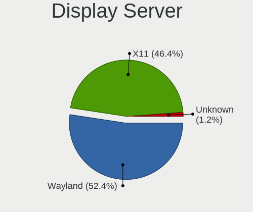
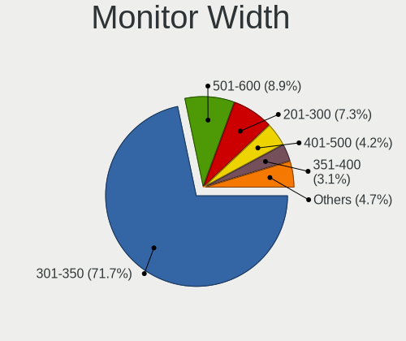

Linux in Brazil - Hardware Trends (Notebooks)
---------------------------------------------

A project to identify most popular hardware characteristics and track their change
over time based on data collected by Linux users at https://Linux-Hardware.org.

Anyone can contribute to this report by the [hw-probe](https://github.com/linuxhw/hw-probe) tool:

    sudo -E hw-probe -all -upload

Period: Apr, 2024.

Contents
--------

* [ System ](#system)
  - [ OS                       ](#os)
  - [ OS Family                ](#os-family)
  - [ Kernel                   ](#kernel)
  - [ Kernel Family            ](#kernel-family)
  - [ Kernel Major Ver.        ](#kernel-major-ver)
  - [ Arch                     ](#arch)
  - [ DE                       ](#de)
  - [ Display Server           ](#display-server)
  - [ Display Manager          ](#display-manager)
  - [ OS Lang                  ](#os-lang)
  - [ Boot Mode                ](#boot-mode)
  - [ Filesystem               ](#filesystem)
  - [ Part. scheme             ](#part-scheme)
  - [ Dual Boot with Linux/BSD ](#dual-boot-with-linuxbsd)
  - [ Dual Boot (Win)          ](#dual-boot-win)

* [ Board ](#board)
  - [ Vendor                   ](#vendor)
  - [ Model                    ](#model)
  - [ Model Family             ](#model-family)
  - [ MFG Year                 ](#mfg-year)
  - [ Form Factor              ](#form-factor)
  - [ Secure Boot              ](#secure-boot)
  - [ Coreboot                 ](#coreboot)
  - [ RAM Size                 ](#ram-size)
  - [ RAM Used                 ](#ram-used)
  - [ Total Drives             ](#total-drives)
  - [ Has CD-ROM               ](#has-cd-rom)
  - [ Has Ethernet             ](#has-ethernet)
  - [ Has WiFi                 ](#has-wifi)
  - [ Has Bluetooth            ](#has-bluetooth)

* [ Location ](#location)
  - [ Country                  ](#country)
  - [ City                     ](#city)

* [ Drives ](#drives)
  - [ Drive Vendor             ](#drive-vendor)
  - [ Drive Model              ](#drive-model)
  - [ HDD Vendor               ](#hdd-vendor)
  - [ SSD Vendor               ](#ssd-vendor)
  - [ Drive Kind               ](#drive-kind)
  - [ Drive Connector          ](#drive-connector)
  - [ Drive Size               ](#drive-size)
  - [ Space Total              ](#space-total)
  - [ Space Used               ](#space-used)
  - [ Malfunc. Drives          ](#malfunc-drives)
  - [ Malfunc. Drive Vendor    ](#malfunc-drive-vendor)
  - [ Malfunc. HDD Vendor      ](#malfunc-hdd-vendor)
  - [ Malfunc. Drive Kind      ](#malfunc-drive-kind)
  - [ Failed Drives            ](#failed-drives)
  - [ Failed Drive Vendor      ](#failed-drive-vendor)
  - [ Drive Status             ](#drive-status)

* [ Storage controller ](#storage-controller)
  - [ Storage Vendor           ](#storage-vendor)
  - [ Storage Model            ](#storage-model)
  - [ Storage Kind             ](#storage-kind)

* [ Processor ](#processor)
  - [ CPU Vendor               ](#cpu-vendor)
  - [ CPU Model                ](#cpu-model)
  - [ CPU Model Family         ](#cpu-model-family)
  - [ CPU Cores                ](#cpu-cores)
  - [ CPU Sockets              ](#cpu-sockets)
  - [ CPU Threads              ](#cpu-threads)
  - [ CPU Op-Modes             ](#cpu-op-modes)
  - [ CPU Microcode            ](#cpu-microcode)
  - [ CPU Microarch            ](#cpu-microarch)

* [ Graphics ](#graphics)
  - [ GPU Vendor               ](#gpu-vendor)
  - [ GPU Model                ](#gpu-model)
  - [ GPU Combo                ](#gpu-combo)
  - [ GPU Driver               ](#gpu-driver)
  - [ GPU Memory               ](#gpu-memory)

* [ Monitor ](#monitor)
  - [ Monitor Vendor           ](#monitor-vendor)
  - [ Monitor Model            ](#monitor-model)
  - [ Monitor Resolution       ](#monitor-resolution)
  - [ Monitor Diagonal         ](#monitor-diagonal)
  - [ Monitor Width            ](#monitor-width)
  - [ Aspect Ratio             ](#aspect-ratio)
  - [ Monitor Area             ](#monitor-area)
  - [ Pixel Density            ](#pixel-density)
  - [ Multiple Monitors        ](#multiple-monitors)

* [ Network ](#network)
  - [ Net Controller Vendor    ](#net-controller-vendor)
  - [ Net Controller Model     ](#net-controller-model)
  - [ Wireless Vendor          ](#wireless-vendor)
  - [ Wireless Model           ](#wireless-model)
  - [ Ethernet Vendor          ](#ethernet-vendor)
  - [ Ethernet Model           ](#ethernet-model)
  - [ Net Controller Kind      ](#net-controller-kind)
  - [ Used Controller          ](#used-controller)
  - [ NICs                     ](#nics)
  - [ IPv6                     ](#ipv6)

* [ Bluetooth ](#bluetooth)
  - [ Bluetooth Vendor         ](#bluetooth-vendor)
  - [ Bluetooth Model          ](#bluetooth-model)

* [ Sound ](#sound)
  - [ Sound Vendor             ](#sound-vendor)
  - [ Sound Model              ](#sound-model)

* [ Memory ](#memory)
  - [ Memory Vendor            ](#memory-vendor)
  - [ Memory Model             ](#memory-model)
  - [ Memory Kind              ](#memory-kind)
  - [ Memory Form Factor       ](#memory-form-factor)
  - [ Memory Size              ](#memory-size)
  - [ Memory Speed             ](#memory-speed)

* [ Printers & scanners ](#printers--scanners)
  - [ Printer Vendor           ](#printer-vendor)
  - [ Printer Model            ](#printer-model)
  - [ Scanner Vendor           ](#scanner-vendor)
  - [ Scanner Model            ](#scanner-model)

* [ Camera ](#camera)
  - [ Camera Vendor            ](#camera-vendor)
  - [ Camera Model             ](#camera-model)

* [ Security ](#security)
  - [ Fingerprint Vendor       ](#fingerprint-vendor)
  - [ Fingerprint Model        ](#fingerprint-model)
  - [ Chipcard Vendor          ](#chipcard-vendor)
  - [ Chipcard Model           ](#chipcard-model)

* [ Unsupported ](#unsupported)
  - [ Unsupported Devices      ](#unsupported-devices)
  - [ Unsupported Device Types ](#unsupported-device-types)

System
------

OS
--

Installed operating systems

| Name                         | Notebooks | Percent |
|------------------------------|-----------|---------|
| Ubuntu 22.04                 | 16        | 11.94%  |
| Zorin 17                     | 14        | 10.45%  |
| Fedora 39                    | 11        | 8.21%   |
| Debian 12                    | 8         | 5.97%   |
| OpenMandriva 23.08           | 7         | 5.22%   |
| Linux Mint 21.3              | 7         | 5.22%   |
| Fedora 40                    | 7         | 5.22%   |
| Pop!_OS 22.04                | 5         | 3.73%   |
| Ubuntu 23.10                 | 4         | 2.99%   |
| OpenMandriva 5.0             | 4         | 2.99%   |
| Kubuntu 22.04                | 4         | 2.99%   |
| openSUSE Tumbleweed-XXXXXXXX | 3         | 2.24%   |
| Manjaro                      | 3         | 2.24%   |
| Ubuntu 24.04                 | 2         | 1.49%   |
| Ubuntu 20.04                 | 2         | 1.49%   |
| SteamOS 3.5.17               | 2         | 1.49%   |
| Linux Mint 20.3              | 2         | 1.49%   |
| KDE neon 22.04               | 2         | 1.49%   |
| ArcoLinux                    | 2         | 1.49%   |
| Arch Rolling                 | 2         | 1.49%   |
| Zorin 16                     | 1         | 0.75%   |
| Xubuntu 22.04                | 1         | 0.75%   |
| Vanilla 2.0                  | 1         | 0.75%   |
| Ultimate                     | 1         | 0.75%   |
| Ubuntu MATE 22.04            | 1         | 0.75%   |
| Ubuntu 22.10                 | 1         | 0.75%   |
| Ubuntu 20.10                 | 1         | 0.75%   |
| SteamOS 3.5.19               | 1         | 0.75%   |
| ROSA 12.5                    | 1         | 0.75%   |
| org.kde.Platform 5.15-21.08  | 1         | 0.75%   |
| OpenMandriva 4.50            | 1         | 0.75%   |
| OpenMandriva 4.2             | 1         | 0.75%   |
| Nobara 39                    | 1         | 0.75%   |
| NixOS 24.05                  | 1         | 0.75%   |
| MX 23                        | 1         | 0.75%   |
| Manjaro 23.1.3               | 1         | 0.75%   |
| Makulu Beta-1                | 1         | 0.75%   |
| Lubuntu 22.04                | 1         | 0.75%   |
| Linux Mint 21.1              | 1         | 0.75%   |
| Kubuntu 23.10                | 1         | 0.75%   |

OS Family
---------

OS without a version

| Name             | Notebooks | Percent |
|------------------|-----------|---------|
| Ubuntu           | 26        | 19.4%   |
| Fedora           | 19        | 14.18%  |
| Zorin            | 15        | 11.19%  |
| OpenMandriva     | 13        | 9.7%    |
| Linux Mint       | 10        | 7.46%   |
| Debian           | 9         | 6.72%   |
| Pop!_OS          | 5         | 3.73%   |
| Kubuntu          | 5         | 3.73%   |
| Manjaro          | 4         | 2.99%   |
| SteamOS          | 3         | 2.24%   |
| openSUSE         | 3         | 2.24%   |
| ArcoLinux        | 3         | 2.24%   |
| KDE neon         | 2         | 1.49%   |
| Endless          | 2         | 1.49%   |
| Arch             | 2         | 1.49%   |
| Xubuntu          | 1         | 0.75%   |
| Vanilla          | 1         | 0.75%   |
| Ultimate         | 1         | 0.75%   |
| Ubuntu MATE      | 1         | 0.75%   |
| ROSA             | 1         | 0.75%   |
| org.kde.Platform | 1         | 0.75%   |
| Nobara           | 1         | 0.75%   |
| NixOS            | 1         | 0.75%   |
| MX               | 1         | 0.75%   |
| Makulu           | 1         | 0.75%   |
| Lubuntu          | 1         | 0.75%   |
| Elementary       | 1         | 0.75%   |
| Alpine           | 1         | 0.75%   |

Kernel
------

Version of the Linux kernel

| Version                             | Notebooks | Percent |
|-------------------------------------|-----------|---------|
| 6.5.0-27-generic                    | 14        | 10.45%  |
| 6.5.0-28-generic                    | 13        | 9.7%    |
| 6.5.0-26-generic                    | 12        | 8.96%   |
| 6.4.11-desktop-1omv2390             | 5         | 3.73%   |
| 6.8.0-76060800daily20240311-generic | 4         | 2.99%   |
| 6.6.2-desktop-1omv2390              | 4         | 2.99%   |
| 6.1.0-20-amd64                      | 4         | 2.99%   |
| 5.15.0-91-generic                   | 4         | 2.99%   |
| 6.8.7-300.fc40.x86_64               | 3         | 2.24%   |
| 6.1.52-valve16-1-neptune-61         | 3         | 2.24%   |
| 5.15.0-102-generic                  | 3         | 2.24%   |
| 6.8.6-200.fc39.x86_64               | 2         | 1.49%   |
| 6.8.5-301.fc40.x86_64               | 2         | 1.49%   |
| 6.8.5-1-default                     | 2         | 1.49%   |
| 6.8.0-31-generic                    | 2         | 1.49%   |
| 6.7.10-200.fc39.x86_64              | 2         | 1.49%   |
| 6.5.6-300.fc39.x86_64               | 2         | 1.49%   |
| 6.5.5-1-MANJARO                     | 2         | 1.49%   |
| 6.5.0-25-generic                    | 2         | 1.49%   |
| 6.4.8-desktop-2omv2390              | 2         | 1.49%   |
| 6.1.0-18-amd64                      | 2         | 1.49%   |
| 5.4.0-174-generic                   | 2         | 1.49%   |
| 5.15.0-101-generic                  | 2         | 1.49%   |
| 6.8.7-arch1-1                       | 1         | 0.75%   |
| 6.8.7-302.fsync.fc40.x86_64         | 1         | 0.75%   |
| 6.8.7-200.fc39.x86_64               | 1         | 0.75%   |
| 6.8.5-zen1-1-zen                    | 1         | 0.75%   |
| 6.8.5-arch1-1                       | 1         | 0.75%   |
| 6.8.5-201.fc39.x86_64               | 1         | 0.75%   |
| 6.8.4-arch1-1                       | 1         | 0.75%   |
| 6.8.4-200.fc39.x86_64               | 1         | 0.75%   |
| 6.8.2-300.fc40.x86_64               | 1         | 0.75%   |
| 6.8.2-1-default                     | 1         | 0.75%   |
| 6.7.9-200.fc39.x86_64               | 1         | 0.75%   |
| 6.7.3-zen1-2-zen                    | 1         | 0.75%   |
| 6.7.11-200.fc39.x86_64              | 1         | 0.75%   |
| 6.7.10-100.fc38.x86_64              | 1         | 0.75%   |
| 6.7.0-204.fsync.fc39.x86_64         | 1         | 0.75%   |
| 6.6.28-1-lts                        | 1         | 0.75%   |
| 6.6.26-1-MANJARO                    | 1         | 0.75%   |

Kernel Family
-------------

Linux kernel without a distro release

| Version | Notebooks | Percent |
|---------|-----------|---------|
| 6.5.0   | 46        | 34.33%  |
| 5.15.0  | 11        | 8.21%   |
| 6.1.0   | 8         | 5.97%   |
| 6.8.5   | 7         | 5.22%   |
| 6.8.7   | 6         | 4.48%   |
| 6.8.0   | 6         | 4.48%   |
| 6.4.11  | 5         | 3.73%   |
| 6.6.2   | 4         | 2.99%   |
| 6.7.10  | 3         | 2.24%   |
| 6.1.52  | 3         | 2.24%   |
| 6.8.6   | 2         | 1.49%   |
| 6.8.4   | 2         | 1.49%   |
| 6.8.2   | 2         | 1.49%   |
| 6.5.6   | 2         | 1.49%   |
| 6.5.5   | 2         | 1.49%   |
| 6.4.8   | 2         | 1.49%   |
| 5.4.0   | 2         | 1.49%   |
| 5.19.0  | 2         | 1.49%   |
| 6.7.9   | 1         | 0.75%   |
| 6.7.3   | 1         | 0.75%   |
| 6.7.11  | 1         | 0.75%   |
| 6.7.0   | 1         | 0.75%   |
| 6.6.28  | 1         | 0.75%   |
| 6.6.26  | 1         | 0.75%   |
| 6.6.24  | 1         | 0.75%   |
| 6.6.23  | 1         | 0.75%   |
| 6.6.20  | 1         | 0.75%   |
| 6.6.13  | 1         | 0.75%   |
| 6.6.12  | 1         | 0.75%   |
| 6.6.10  | 1         | 0.75%   |
| 6.1.81  | 1         | 0.75%   |
| 5.8.0   | 1         | 0.75%   |
| 5.19.12 | 1         | 0.75%   |
| 5.18.17 | 1         | 0.75%   |
| 5.11.0  | 1         | 0.75%   |
| 5.10.14 | 1         | 0.75%   |
| 5.10.0  | 1         | 0.75%   |

Kernel Major Ver.
-----------------

Linux kernel major version

| Version | Notebooks | Percent |
|---------|-----------|---------|
| 6.5     | 50        | 37.31%  |
| 6.8     | 25        | 18.66%  |
| 6.6     | 12        | 8.96%   |
| 6.1     | 12        | 8.96%   |
| 5.15    | 11        | 8.21%   |
| 6.7     | 7         | 5.22%   |
| 6.4     | 7         | 5.22%   |
| 5.19    | 3         | 2.24%   |
| 5.4     | 2         | 1.49%   |
| 5.10    | 2         | 1.49%   |
| 5.8     | 1         | 0.75%   |
| 5.18    | 1         | 0.75%   |
| 5.11    | 1         | 0.75%   |

Arch
----

OS architecture (x86_64, i586, etc.)

| Name   | Notebooks | Percent |
|--------|-----------|---------|
| x86_64 | 133       | 99.25%  |
| i686   | 1         | 0.75%   |

DE
--

Desktop Environment

| Name          | Notebooks | Percent |
|---------------|-----------|---------|
| GNOME         | 74        | 55.22%  |
| KDE5          | 27        | 20.15%  |
| XFCE          | 8         | 5.97%   |
| X-Cinnamon    | 7         | 5.22%   |
| MATE          | 5         | 3.73%   |
| KDE6          | 4         | 2.99%   |
| sway          | 2         | 1.49%   |
| Unknown       | 2         | 1.49%   |
| Pantheon      | 1         | 0.75%   |
| LXQt          | 1         | 0.75%   |
| KDE4          | 1         | 0.75%   |
| Endless:GNOME | 1         | 0.75%   |
| Deepin        | 1         | 0.75%   |

Display Server
--------------

X11 or Wayland

| Name    | Notebooks | Percent |
|---------|-----------|---------|
| Wayland | 73        | 54.48%  |
| X11     | 60        | 44.78%  |
| Unknown | 1         | 0.75%   |

Display Manager
---------------

SDDM, LightDM, etc.

| Name    | Notebooks | Percent |
|---------|-----------|---------|
| Unknown | 75        | 55.97%  |
| GDM3    | 27        | 20.15%  |
| SDDM    | 19        | 14.18%  |
| LightDM | 10        | 7.46%   |
| GDM     | 3         | 2.24%   |

OS Lang
-------

Language

| Lang    | Notebooks | Percent |
|---------|-----------|---------|
| pt_BR   | 85        | 63.43%  |
| en_US   | 39        | 29.1%   |
| C       | 5         | 3.73%   |
| en_DK   | 2         | 1.49%   |
| it_IT   | 1         | 0.75%   |
| en_CA   | 1         | 0.75%   |
| Unknown | 1         | 0.75%   |

Boot Mode
---------

EFI or BIOS

| Mode | Notebooks | Percent |
|------|-----------|---------|
| BIOS | 97        | 72.39%  |
| EFI  | 37        | 27.61%  |

Filesystem
----------

Type of filesystem

| Type    | Notebooks | Percent |
|---------|-----------|---------|
| Ext4    | 78        | 58.21%  |
| Btrfs   | 25        | 18.66%  |
| Tmpfs   | 20        | 14.93%  |
| Overlay | 9         | 6.72%   |
| Zfs     | 2         | 1.49%   |

Part. scheme
------------

Scheme of partitioning

| Type    | Notebooks | Percent |
|---------|-----------|---------|
| Unknown | 73        | 54.48%  |
| GPT     | 52        | 38.81%  |
| MBR     | 9         | 6.72%   |

Dual Boot with Linux/BSD
------------------------

Hosting more than one Linux/BSD

| Dual boot | Notebooks | Percent |
|-----------|-----------|---------|
| No        | 122       | 91.04%  |
| Yes       | 12        | 8.96%   |

Dual Boot (Win)
---------------

Hosting Linux and Windows

| Dual boot | Notebooks | Percent |
|-----------|-----------|---------|
| No        | 116       | 86.57%  |
| Yes       | 18        | 13.43%  |

Board
-----

Vendor
------

Motherboard manufacturer

| Name                   | Notebooks | Percent |
|------------------------|-----------|---------|
| Dell                   | 32        | 23.88%  |
| Lenovo                 | 22        | 16.42%  |
| Acer                   | 14        | 10.45%  |
| ASUSTek Computer       | 10        | 7.46%   |
| Samsung Electronics    | 9         | 6.72%   |
| Positivo               | 8         | 5.97%   |
| Hewlett-Packard        | 8         | 5.97%   |
| Sony                   | 5         | 3.73%   |
| Avell High Performance | 4         | 2.99%   |
| Valve                  | 3         | 2.24%   |
| Apple                  | 3         | 2.24%   |
| Semp Toshiba           | 2         | 1.49%   |
| Philco                 | 2         | 1.49%   |
| Alienware              | 2         | 1.49%   |
| Unknown                | 2         | 1.49%   |
| Timi                   | 1         | 0.75%   |
| Quanta                 | 1         | 0.75%   |
| Notebook               | 1         | 0.75%   |
| MSI                    | 1         | 0.75%   |
| Login Informatica      | 1         | 0.75%   |
| Itautec                | 1         | 0.75%   |
| Intel                  | 1         | 0.75%   |
| Digibras               | 1         | 0.75%   |

Model
-----

Motherboard model

| Name                                           | Notebooks | Percent |
|------------------------------------------------|-----------|---------|
| Samsung 550XDA                                 | 4         | 2.99%   |
| Valve Jupiter                                  | 3         | 2.24%   |
| Lenovo IdeaPad 3 15ALC6 82MF                   | 2         | 1.49%   |
| Lenovo G470 20078                              | 2         | 1.49%   |
| Dell Inspiron N4050                            | 2         | 1.49%   |
| Dell Inspiron 5566                             | 2         | 1.49%   |
| Dell Inspiron 5448                             | 2         | 1.49%   |
| Dell Inspiron 15-3567                          | 2         | 1.49%   |
| Dell G15 5530                                  | 2         | 1.49%   |
| Avell High Performance B.ON                    | 2         | 1.49%   |
| ASUS VivoBook_ASUSLaptop X515EA_X515EA         | 2         | 1.49%   |
| Unknown                                        | 2         | 1.49%   |
| Timi RedmiBook Pro 14S                         | 1         | 0.75%   |
| Sony VPCS131FM                                 | 1         | 0.75%   |
| Sony VPCEH30EB                                 | 1         | 0.75%   |
| Sony VPCEA3UFX                                 | 1         | 0.75%   |
| Sony SVF14A15CLB                               | 1         | 0.75%   |
| Sony SVE14A16FBW                               | 1         | 0.75%   |
| Semp Toshiba STI NI 1401                       | 1         | 0.75%   |
| Semp Toshiba IS 1414                           | 1         | 0.75%   |
| Samsung RV411/RV511/E3511/S3511/RV711          | 1         | 0.75%   |
| Samsung 960XFH                                 | 1         | 0.75%   |
| Samsung 530U3C/530U4C/532U3C                   | 1         | 0.75%   |
| Samsung 370E4K                                 | 1         | 0.75%   |
| Samsung 300E5EV/300E4EV/270E5EV/270E4EV/2470EV | 1         | 0.75%   |
| Quanta R480-L.BA31P1                           | 1         | 0.75%   |
| Positivo S15SL                                 | 1         | 0.75%   |
| Positivo S14SL01                               | 1         | 0.75%   |
| Positivo S14CT01                               | 1         | 0.75%   |
| Positivo S14BW01                               | 1         | 0.75%   |
| Positivo Mobile                                | 1         | 0.75%   |
| Positivo Master N8340                          | 1         | 0.75%   |
| Positivo J14KR11                               | 1         | 0.75%   |
| Positivo C14CR01                               | 1         | 0.75%   |
| Philco 14I                                     | 1         | 0.75%   |
| Philco 14H                                     | 1         | 0.75%   |
| Notebook NJx0MU                                | 1         | 0.75%   |
| MSI PR600                                      | 1         | 0.75%   |
| Login Informatica LOG-M301H                    | 1         | 0.75%   |
| Lenovo ThinkPad X61 76754KU                    | 1         | 0.75%   |

Model Family
------------

Motherboard model prefix

| Name                        | Notebooks | Percent |
|-----------------------------|-----------|---------|
| Dell Inspiron               | 16        | 11.94%  |
| Lenovo IdeaPad              | 11        | 8.21%   |
| Acer Aspire                 | 9         | 6.72%   |
| Dell Latitude               | 7         | 5.22%   |
| Lenovo ThinkPad             | 5         | 3.73%   |
| ASUS VivoBook               | 5         | 3.73%   |
| Samsung 550XDA              | 4         | 2.99%   |
| Dell Vostro                 | 4         | 2.99%   |
| Dell G15                    | 4         | 2.99%   |
| Valve Jupiter               | 3         | 2.24%   |
| Acer Nitro                  | 3         | 2.24%   |
| Lenovo G470                 | 2         | 1.49%   |
| HP ProBook                  | 2         | 1.49%   |
| Avell High Performance B.ON | 2         | 1.49%   |
| Unknown                     | 2         | 1.49%   |
| Timi RedmiBook              | 1         | 0.75%   |
| Sony VPCS131FM              | 1         | 0.75%   |
| Sony VPCEH30EB              | 1         | 0.75%   |
| Sony VPCEA3UFX              | 1         | 0.75%   |
| Sony SVF14A15CLB            | 1         | 0.75%   |
| Sony SVE14A16FBW            | 1         | 0.75%   |
| Semp Toshiba STI            | 1         | 0.75%   |
| Semp Toshiba IS             | 1         | 0.75%   |
| Samsung RV411               | 1         | 0.75%   |
| Samsung 960XFH              | 1         | 0.75%   |
| Samsung 530U3C              | 1         | 0.75%   |
| Samsung 370E4K              | 1         | 0.75%   |
| Samsung 300E5EV             | 1         | 0.75%   |
| Quanta R480-L.BA31P1        | 1         | 0.75%   |
| Positivo S15SL              | 1         | 0.75%   |
| Positivo S14SL01            | 1         | 0.75%   |
| Positivo S14CT01            | 1         | 0.75%   |
| Positivo S14BW01            | 1         | 0.75%   |
| Positivo Mobile             | 1         | 0.75%   |
| Positivo Master             | 1         | 0.75%   |
| Positivo J14KR11            | 1         | 0.75%   |
| Positivo C14CR01            | 1         | 0.75%   |
| Philco 14I                  | 1         | 0.75%   |
| Philco 14H                  | 1         | 0.75%   |
| Notebook NJx0MU             | 1         | 0.75%   |

MFG Year
--------

Motherboard manufacture year

| Year    | Notebooks | Percent |
|---------|-----------|---------|
| 2021    | 18        | 13.43%  |
| 2012    | 17        | 12.69%  |
| 2023    | 10        | 7.46%   |
| 2018    | 10        | 7.46%   |
| 2011    | 10        | 7.46%   |
| 2013    | 9         | 6.72%   |
| 2010    | 9         | 6.72%   |
| 2016    | 8         | 5.97%   |
| 2017    | 7         | 5.22%   |
| 2015    | 7         | 5.22%   |
| 2020    | 6         | 4.48%   |
| 2014    | 6         | 4.48%   |
| 2022    | 5         | 3.73%   |
| 2019    | 5         | 3.73%   |
| 2009    | 2         | 1.49%   |
| 2007    | 2         | 1.49%   |
| 2008    | 1         | 0.75%   |
| 2006    | 1         | 0.75%   |
| Unknown | 1         | 0.75%   |

Form Factor
-----------

Physical design of the computer

| Name     | Notebooks | Percent |
|----------|-----------|---------|
| Notebook | 134       | 100%    |

Secure Boot
-----------

Enabled or disabled

| State    | Notebooks | Percent |
|----------|-----------|---------|
| Disabled | 131       | 97.76%  |
| Enabled  | 3         | 2.24%   |

Coreboot
--------

Have coreboot on board

| Used | Notebooks | Percent |
|------|-----------|---------|
| No   | 134       | 100%    |

RAM Size
--------

Total RAM memory

| Size in GB | Notebooks | Percent |
|------------|-----------|---------|
| 4.01-8.0   | 37        | 27.61%  |
| 3.01-4.0   | 34        | 25.37%  |
| 8.01-16.0  | 25        | 18.66%  |
| 16.01-24.0 | 23        | 17.16%  |
| 32.01-64.0 | 10        | 7.46%   |
| 1.01-2.0   | 3         | 2.24%   |
| 2.01-3.0   | 2         | 1.49%   |

RAM Used
--------

Used RAM memory

| Used GB   | Notebooks | Percent |
|-----------|-----------|---------|
| 2.01-3.0  | 46        | 34.33%  |
| 1.01-2.0  | 29        | 21.64%  |
| 4.01-8.0  | 28        | 20.9%   |
| 3.01-4.0  | 18        | 13.43%  |
| 0.51-1.0  | 7         | 5.22%   |
| 8.01-16.0 | 6         | 4.48%   |

Total Drives
------------

Number of drives on board

| Drives | Notebooks | Percent |
|--------|-----------|---------|
| 1      | 100       | 74.63%  |
| 2      | 26        | 19.4%   |
| 3      | 8         | 5.97%   |

Has CD-ROM
----------

Has CD-ROM on board

| Presented | Notebooks | Percent |
|-----------|-----------|---------|
| No        | 91        | 67.91%  |
| Yes       | 43        | 32.09%  |

Has Ethernet
------------

Has Ethernet on board

| Presented | Notebooks | Percent |
|-----------|-----------|---------|
| Yes       | 117       | 87.31%  |
| No        | 17        | 12.69%  |

Has WiFi
--------

Has WiFi module

| Presented | Notebooks | Percent |
|-----------|-----------|---------|
| Yes       | 126       | 94.03%  |
| No        | 8         | 5.97%   |

Has Bluetooth
-------------

Has Bluetooth module

| Presented | Notebooks | Percent |
|-----------|-----------|---------|
| Yes       | 100       | 74.63%  |
| No        | 34        | 25.37%  |

Location
--------

Country
-------

Geographic location (country)

| Country | Notebooks | Percent |
|---------|-----------|---------|
| Brazil  | 134       | 100%    |

City
----

Geographic location (city)

| City                  | Notebooks | Percent |
|-----------------------|-----------|---------|
| Rio de Janeiro        | 14        | 10.45%  |
| Sao Paulo             | 12        | 8.96%   |
| Belo Horizonte        | 6         | 4.48%   |
| Fortaleza             | 5         | 3.73%   |
| Florianópolis        | 4         | 2.99%   |
| Uberlândia           | 3         | 2.24%   |
| Sumaré               | 3         | 2.24%   |
| Recife                | 3         | 2.24%   |
| Porto Alegre          | 3         | 2.24%   |
| Curitiba              | 3         | 2.24%   |
| Brasília             | 3         | 2.24%   |
| Sao Joao de Meriti    | 2         | 1.49%   |
| Salvador              | 2         | 1.49%   |
| Rio Grande            | 2         | 1.49%   |
| Joao Pessoa           | 2         | 1.49%   |
| Catalao               | 2         | 1.49%   |
| Xique-Xique           | 1         | 0.75%   |
| Urai                  | 1         | 0.75%   |
| Umuarama              | 1         | 0.75%   |
| Taboao da Serra       | 1         | 0.75%   |
| Suzano                | 1         | 0.75%   |
| Sorocaba              | 1         | 0.75%   |
| Senhor do Bonfim      | 1         | 0.75%   |
| Sao Miguel do Oeste   | 1         | 0.75%   |
| Sao Jose do Rio Preto | 1         | 0.75%   |
| Sao Goncalo           | 1         | 0.75%   |
| Sao Carlos            | 1         | 0.75%   |
| Santo André          | 1         | 0.75%   |
| Santa Maria           | 1         | 0.75%   |
| Russas                | 1         | 0.75%   |
| Rio Claro             | 1         | 0.75%   |
| Ribeirao das Neves    | 1         | 0.75%   |
| Quitandinha           | 1         | 0.75%   |
| Presidente Prudente   | 1         | 0.75%   |
| Portao                | 1         | 0.75%   |
| Peruibe               | 1         | 0.75%   |
| Paulista              | 1         | 0.75%   |
| Pau dos Ferros        | 1         | 0.75%   |
| Patos de Minas        | 1         | 0.75%   |
| Palmas                | 1         | 0.75%   |

Drives
------

Drive Vendor
------------

Hard drive vendors

| Vendor                         | Notebooks | Drives | Percent |
|--------------------------------|-----------|--------|---------|
| WDC                            | 24        | 24     | 14.37%  |
| Kingston                       | 19        | 19     | 11.38%  |
| Toshiba                        | 12        | 12     | 7.19%   |
| Samsung Electronics            | 12        | 13     | 7.19%   |
| SanDisk                        | 11        | 11     | 6.59%   |
| China                          | 9         | 9      | 5.39%   |
| Seagate                        | 8         | 8      | 4.79%   |
| A-DATA Technology              | 7         | 8      | 4.19%   |
| SK hynix                       | 6         | 6      | 3.59%   |
| ADATA Technology               | 6         | 6      | 3.59%   |
| Hitachi                        | 5         | 5      | 2.99%   |
| Unknown                        | 4         | 4      | 2.4%    |
| Realtek Semiconductor          | 4         | 4      | 2.4%    |
| Silicon Motion                 | 3         | 3      | 1.8%    |
| Kingston Technology Company    | 3         | 3      | 1.8%    |
| JMicron Technology             | 3         | 3      | 1.8%    |
| HGST                           | 3         | 3      | 1.8%    |
| SSSTC                          | 2         | 2      | 1.2%    |
| Micron/Crucial Technology      | 2         | 2      | 1.2%    |
| KIOXIA                         | 2         | 2      | 1.2%    |
| Intel                          | 2         | 2      | 1.2%    |
| Apple                          | 2         | 3      | 1.2%    |
| Unknown                        | 2         | 2      | 1.2%    |
| Zheino                         | 1         | 1      | 0.6%    |
| WALRAM                         | 1         | 1      | 0.6%    |
| Union Memory (Shenzhen)        | 1         | 1      | 0.6%    |
| Solid State Storage Technology | 1         | 1      | 0.6%    |
| Solid State Storage            | 1         | 1      | 0.6%    |
| Shenzhen Longsys Electronics   | 1         | 1      | 0.6%    |
| S3+                            | 1         | 1      | 0.6%    |
| Phison Electronics             | 1         | 1      | 0.6%    |
| OCZ                            | 1         | 1      | 0.6%    |
| Netac                          | 1         | 1      | 0.6%    |
| Micron Technology              | 1         | 1      | 0.6%    |
| LITEONIT                       | 1         | 1      | 0.6%    |
| Lite-On Technology             | 1         | 1      | 0.6%    |
| KingSpec                       | 1         | 1      | 0.6%    |
| KBM                            | 1         | 1      | 0.6%    |
| Crucial                        | 1         | 1      | 0.6%    |

Drive Model
-----------

Hard drive models

| Model                                                 | Notebooks | Percent |
|-------------------------------------------------------|-----------|---------|
| WDC WD10SPZX-21Z10T0 1TB                              | 5         | 2.99%   |
| SanDisk SSD PLUS 480GB                                | 5         | 2.99%   |
| Kingston SA400S37480G 480GB SSD                       | 5         | 2.99%   |
| Kingston SA400S37240G 240GB SSD                       | 5         | 2.99%   |
| Toshiba MQ01ABF050 500GB                              | 3         | 1.8%    |
| Toshiba MQ01ABD050 500GB                              | 3         | 1.8%    |
| China SSD 128GB                                       | 3         | 1.8%    |
| A-DATA IM2P33F3A NVMe 512GB                           | 3         | 1.8%    |
| WDC WDS240G2G0A-00JH30 240GB SSD                      | 2         | 1.2%    |
| WDC WD1600BEVS-00VAT0 160GB                           | 2         | 1.2%    |
| WDC WD10SPZX-35Z10T0 1TB                              | 2         | 1.2%    |
| SK hynix HFS256GEJ9X108N 256GB                        | 2         | 1.2%    |
| Silicon Motion SM2263EN/SM2263XT SSD Controller 256GB | 2         | 1.2%    |
| Seagate ST500LT012-1DG142 500GB                       | 2         | 1.2%    |
| Seagate ST500LM012 HN-M500MBB 500GB                   | 2         | 1.2%    |
| Seagate ST2000LM007-1R8174 2TB                        | 2         | 1.2%    |
| Seagate Expansion 2TB                                 | 2         | 1.2%    |
| Samsung MZVLQ256HAJD-000 256GB                        | 2         | 1.2%    |
| Samsung HM160HI 160GB                                 | 2         | 1.2%    |
| Realtek ADATA SX6000LNP 128GB                         | 2         | 1.2%    |
| Micron/Crucial P2 NVMe PCIe SSD 4TB                   | 2         | 1.2%    |
| Kingston SNV2S500G 500GB                              | 2         | 1.2%    |
| Kingston SA400S37120G 120GB SSD                       | 2         | 1.2%    |
| JMicron Generic 320GB                                 | 2         | 1.2%    |
| China SSD 240GB                                       | 2         | 1.2%    |
| A-DATA IM2P33F8A-512GD 512GB                          | 2         | 1.2%    |
| Unknown                                               | 2         | 1.2%    |
| Zheino CHN-25SATAC3-480 480GB                         | 1         | 0.6%    |
| WDC WDS480G2G0B-00EPW0 480GB SSD                      | 1         | 0.6%    |
| WDC WDS100T2G0A-00JH30 1TB SSD                        | 1         | 0.6%    |
| WDC WDS100T2B0A-00SM50 1TB SSD                        | 1         | 0.6%    |
| WDC WD5000LPVX-80V0TT0 500GB                          | 1         | 0.6%    |
| WDC WD5000LPCX-24VHAT0 500GB                          | 1         | 0.6%    |
| WDC WD5000LPCX-21VHAT0 500GB                          | 1         | 0.6%    |
| WDC WD3200BPVT-22JJ5T0 320GB                          | 1         | 0.6%    |
| WDC WD20SPZX-21UA7T0 2TB                              | 1         | 0.6%    |
| WDC WD10SPZX-80Z10T2 1TB                              | 1         | 0.6%    |
| WDC WD10SPZX-24Z10 1TB                                | 1         | 0.6%    |
| WDC WD10SPZX-08Z10 1TB                                | 1         | 0.6%    |
| WDC WD10JPVX-75JC3T0 1TB                              | 1         | 0.6%    |

HDD Vendor
----------

Hard disk drive vendors

| Vendor              | Notebooks | Drives | Percent |
|---------------------|-----------|--------|---------|
| WDC                 | 19        | 19     | 37.25%  |
| Toshiba             | 12        | 12     | 23.53%  |
| Seagate             | 8         | 8      | 15.69%  |
| Hitachi             | 5         | 5      | 9.8%    |
| HGST                | 3         | 3      | 5.88%   |
| Samsung Electronics | 2         | 2      | 3.92%   |
| JMicron Technology  | 2         | 2      | 3.92%   |

SSD Vendor
----------

Solid state drive vendors

| Vendor              | Notebooks | Drives | Percent |
|---------------------|-----------|--------|---------|
| Kingston            | 15        | 15     | 30.61%  |
| China               | 9         | 9      | 18.37%  |
| SanDisk             | 8         | 8      | 16.33%  |
| WDC                 | 5         | 5      | 10.2%   |
| Samsung Electronics | 3         | 3      | 6.12%   |
| S3+                 | 1         | 1      | 2.04%   |
| OCZ                 | 1         | 1      | 2.04%   |
| Netac               | 1         | 1      | 2.04%   |
| LITEONIT            | 1         | 1      | 2.04%   |
| KingSpec            | 1         | 1      | 2.04%   |
| KBM                 | 1         | 1      | 2.04%   |
| Crucial             | 1         | 1      | 2.04%   |
| Apple               | 1         | 1      | 2.04%   |
| Unknown             | 1         | 1      | 2.04%   |

Drive Kind
----------

HDD or SSD

| Kind    | Notebooks | Drives | Percent |
|---------|-----------|--------|---------|
| NVMe    | 52        | 61     | 32.91%  |
| HDD     | 50        | 51     | 31.65%  |
| SSD     | 47        | 49     | 29.75%  |
| Unknown | 5         | 5      | 3.16%   |
| MMC     | 4         | 4      | 2.53%   |

Drive Connector
---------------

SATA, SAS, NVMe, etc.

| Type | Notebooks | Drives | Percent |
|------|-----------|--------|---------|
| SATA | 90        | 97     | 58.44%  |
| NVMe | 52        | 61     | 33.77%  |
| SAS  | 8         | 8      | 5.19%   |
| MMC  | 4         | 4      | 2.6%    |

Drive Size
----------

Size of hard drive

| Size in TB | Notebooks | Drives | Percent |
|------------|-----------|--------|---------|
| 0.01-0.5   | 67        | 73     | 72.04%  |
| 0.51-1.0   | 20        | 21     | 21.51%  |
| 1.01-2.0   | 6         | 6      | 6.45%   |

Space Total
-----------

Amount of disk space available on the file system

| Size in GB     | Notebooks | Percent |
|----------------|-----------|---------|
| 101-250        | 40        | 29.85%  |
| 251-500        | 35        | 26.12%  |
| 501-1000       | 25        | 18.66%  |
| 1-20           | 14        | 10.45%  |
| 21-50          | 5         | 3.73%   |
| 1001-2000      | 5         | 3.73%   |
| 2001-3000      | 4         | 2.99%   |
| 51-100         | 3         | 2.24%   |
| Unknown        | 2         | 1.49%   |
| More than 3000 | 1         | 0.75%   |

Space Used
----------

Amount of used disk space

| Used GB        | Notebooks | Percent |
|----------------|-----------|---------|
| 1-20           | 45        | 33.58%  |
| 21-50          | 35        | 26.12%  |
| 101-250        | 19        | 14.18%  |
| 51-100         | 18        | 13.43%  |
| 251-500        | 6         | 4.48%   |
| 501-1000       | 5         | 3.73%   |
| 1001-2000      | 3         | 2.24%   |
| Unknown        | 2         | 1.49%   |
| More than 3000 | 1         | 0.75%   |

Malfunc. Drives
---------------

Drive models with a malfunction

| Model                             | Notebooks | Drives | Percent |
|-----------------------------------|-----------|--------|---------|
| WDC WD1600BEVS-00VAT0 160GB       | 2         | 2      | 13.33%  |
| WDC WDS240G2G0A-00JH30 240GB SSD  | 1         | 1      | 6.67%   |
| WDC WD10JPVX-75JC3T0 1TB          | 1         | 1      | 6.67%   |
| Toshiba MQ01ABD100H 1TB           | 1         | 1      | 6.67%   |
| Toshiba MQ01ABD050 500GB          | 1         | 1      | 6.67%   |
| Toshiba MK3265GSX 320GB           | 1         | 1      | 6.67%   |
| Toshiba MK2565GSXN 250GB          | 1         | 1      | 6.67%   |
| Toshiba MK2565GSX 250GB           | 1         | 1      | 6.67%   |
| Seagate ST500LT012-1DG142 500GB   | 1         | 1      | 6.67%   |
| Samsung Electronics HM160HI 160GB | 1         | 1      | 6.67%   |
| Kingston SA400S37120G 120GB SSD   | 1         | 1      | 6.67%   |
| Hitachi HTS545032B9A300 320GB     | 1         | 1      | 6.67%   |
| Hitachi HTS541612J9SA00 120GB     | 1         | 1      | 6.67%   |
| China SSD 128GB                   | 1         | 1      | 6.67%   |

Malfunc. Drive Vendor
---------------------

Vendors of faulty drives

| Vendor              | Notebooks | Drives | Percent |
|---------------------|-----------|--------|---------|
| Toshiba             | 5         | 5      | 33.33%  |
| WDC                 | 4         | 4      | 26.67%  |
| Hitachi             | 2         | 2      | 13.33%  |
| Seagate             | 1         | 1      | 6.67%   |
| Samsung Electronics | 1         | 1      | 6.67%   |
| Kingston            | 1         | 1      | 6.67%   |
| China               | 1         | 1      | 6.67%   |

Malfunc. HDD Vendor
-------------------

Vendors of faulty HDD drives

| Vendor              | Notebooks | Drives | Percent |
|---------------------|-----------|--------|---------|
| Toshiba             | 5         | 5      | 41.67%  |
| WDC                 | 3         | 3      | 25%     |
| Hitachi             | 2         | 2      | 16.67%  |
| Seagate             | 1         | 1      | 8.33%   |
| Samsung Electronics | 1         | 1      | 8.33%   |

Malfunc. Drive Kind
-------------------

Kinds of faulty drives

| Kind | Notebooks | Drives | Percent |
|------|-----------|--------|---------|
| HDD  | 12        | 12     | 80%     |
| SSD  | 3         | 3      | 20%     |

Failed Drives
-------------

Failed drive models

Zero info for selected period =(

Failed Drive Vendor
-------------------

Failed drive vendors

Zero info for selected period =(

Drive Status
------------

Number of failed and malfunc. drives

| Status   | Notebooks | Drives | Percent |
|----------|-----------|--------|---------|
| Detected | 96        | 127    | 70.07%  |
| Works    | 26        | 28     | 18.98%  |
| Malfunc  | 15        | 15     | 10.95%  |

Storage controller
------------------

Storage Vendor
--------------

Storage controller vendors

| Vendor                           | Notebooks | Percent |
|----------------------------------|-----------|---------|
| Intel                            | 98        | 59.39%  |
| ADATA Technology                 | 13        | 7.88%   |
| AMD                              | 9         | 5.45%   |
| Samsung Electronics              | 8         | 4.85%   |
| Kingston Technology Company      | 6         | 3.64%   |
| SK hynix                         | 5         | 3.03%   |
| Solid State Storage Technology   | 4         | 2.42%   |
| Silicon Motion                   | 4         | 2.42%   |
| Realtek Semiconductor            | 4         | 2.42%   |
| Sandisk                          | 3         | 1.82%   |
| Micron/Crucial Technology        | 2         | 1.21%   |
| KIOXIA                           | 2         | 1.21%   |
| Union Memory (Shenzhen)          | 1         | 0.61%   |
| Silicon Integrated Systems [SiS] | 1         | 0.61%   |
| Shenzhen Longsys Electronics     | 1         | 0.61%   |
| Phison Electronics               | 1         | 0.61%   |
| Micron Technology                | 1         | 0.61%   |
| Lite-On Technology               | 1         | 0.61%   |
| Apple                            | 1         | 0.61%   |

Storage Model
-------------

Storage controller models

| Model                                                                            | Notebooks | Percent |
|----------------------------------------------------------------------------------|-----------|---------|
| Intel 7 Series Chipset Family 6-port SATA Controller [AHCI mode]                 | 18        | 10.4%   |
| Intel Sunrise Point-LP SATA Controller [AHCI mode]                               | 11        | 6.36%   |
| Intel 6 Series/C200 Series Chipset Family 6 port Mobile SATA AHCI Controller     | 8         | 4.62%   |
| Intel 5 Series/3400 Series Chipset 4 port SATA AHCI Controller                   | 8         | 4.62%   |
| AMD FCH SATA Controller [AHCI mode]                                              | 8         | 4.62%   |
| Intel Tiger Lake-LP SATA Controller                                              | 7         | 4.05%   |
| Intel Wildcat Point-LP SATA Controller [AHCI Mode]                               | 6         | 3.47%   |
| Intel 82801 Mobile SATA Controller [RAID mode]                                   | 6         | 3.47%   |
| Kingston Company NV2 NVMe SSD E21T (DRAM-less)                                   | 4         | 2.31%   |
| Intel Volume Management Device NVMe RAID Controller                              | 4         | 2.31%   |
| ADATA IM2P33F3 NVMe SSD (DRAM-less)                                              | 4         | 2.31%   |
| Solid State Storage CL1-3D256-Q11 NVMe SSD M.2                                   | 3         | 1.73%   |
| SK hynix Platinum P41/PC801 NVMe Solid State Drive                               | 3         | 1.73%   |
| Silicon Motion SM2263EN/SM2263XT (DRAM-less) NVMe SSD Controllers                | 3         | 1.73%   |
| Realtek RTS5763DL NVMe SSD Controller (DRAM-less)                                | 3         | 1.73%   |
| Intel Volume Management Device NVMe RAID Controller Intel Corporation            | 3         | 1.73%   |
| Intel Cannon Lake Mobile PCH SATA AHCI Controller                                | 3         | 1.73%   |
| Intel Atom/Celeron/Pentium Processor x5-E8000/J3xxx/N3xxx Series SATA Controller | 3         | 1.73%   |
| Intel 82801HM/HEM (ICH8M/ICH8M-E) SATA Controller [AHCI mode]                    | 3         | 1.73%   |
| Intel 82801HM/HEM (ICH8M/ICH8M-E) IDE Controller                                 | 3         | 1.73%   |
| Intel 8 Series SATA Controller 1 [AHCI mode]                                     | 3         | 1.73%   |
| Intel 400 Series Chipset Family SATA AHCI Controller                             | 3         | 1.73%   |
| ADATA IM2P33F8 series NVMe SSD (DRAM-less)                                       | 3         | 1.73%   |
| SK hynix BC901 NVMe Solid State Drive (DRAM-less)                                | 2         | 1.16%   |
| Samsung NVMe SSD Controller SM981/PM981/PM983                                    | 2         | 1.16%   |
| Samsung NVMe SSD Controller PM9A1/PM9A3/980PRO                                   | 2         | 1.16%   |
| Samsung NVMe SSD Controller 980 (DRAM-less)                                      | 2         | 1.16%   |
| Micron/Crucial P2 [Nick P2] / P3 / P3 Plus NVMe PCIe SSD (DRAM-less)             | 2         | 1.16%   |
| KIOXIA NVMe SSD Controller BG5 (DRAM-less)                                       | 2         | 1.16%   |
| Intel NM10/ICH7 Family SATA Controller [AHCI mode]                               | 2         | 1.16%   |
| Intel Atom Processor E3800 Series SATA AHCI Controller                           | 2         | 1.16%   |
| Intel 82801IBM/IEM (ICH9M/ICH9M-E) 4 port SATA Controller [AHCI mode]            | 2         | 1.16%   |
| ADATA SM2P41C8 NVMe SSD (DRAM-less)                                              | 2         | 1.16%   |
| ADATA SM2P41C3 NVMe SSD (DRAM-less)                                              | 2         | 1.16%   |
| Union Memory (Shenzhen) AM630 PCIe 4.0 x4 NVMe SSD Controller                    | 1         | 0.58%   |
| Solid State Storage CL4-8D512 NVMe SSD M.2 (DRAM-less)                           | 1         | 0.58%   |
| Silicon Motion SM2262/SM2262EN SSD Controller                                    | 1         | 0.58%   |
| Silicon Integrated Systems [SiS] AHCI IDE Controller (0106)                      | 1         | 0.58%   |
| Silicon Integrated Systems [SiS] 5513 IDE Controller                             | 1         | 0.58%   |
| Shenzhen Longsys SM2263EN/SM2263XT-based OEM NVME SSD (DRAM-less)                | 1         | 0.58%   |

Storage Kind
------------

Kind of storage controller (IDE, SATA, NVMe, SAS, ...)

| Kind | Notebooks | Percent |
|------|-----------|---------|
| SATA | 96        | 57.49%  |
| NVMe | 52        | 31.14%  |
| RAID | 13        | 7.78%   |
| IDE  | 6         | 3.59%   |

Processor
---------

CPU Vendor
----------

Processor vendors

| Vendor | Notebooks | Percent |
|--------|-----------|---------|
| Intel  | 114       | 85.07%  |
| AMD    | 20        | 14.93%  |

CPU Model
---------

Processor models

| Model                                       | Notebooks | Percent |
|---------------------------------------------|-----------|---------|
| Intel Core i3-6006U CPU @ 2.00GHz           | 4         | 2.99%   |
| Intel Pentium Dual-Core CPU T4400 @ 2.20GHz | 3         | 2.24%   |
| Intel Core i7-5500U CPU @ 2.40GHz           | 3         | 2.24%   |
| Intel Core i7-10750H CPU @ 2.60GHz          | 3         | 2.24%   |
| Intel Core i5-3210M CPU @ 2.50GHz           | 3         | 2.24%   |
| Intel Core i5 CPU M 460 @ 2.53GHz           | 3         | 2.24%   |
| Intel Core i3-3110M CPU @ 2.40GHz           | 3         | 2.24%   |
| Intel Core i3-2350M CPU @ 2.30GHz           | 3         | 2.24%   |
| Intel Celeron CPU N3060 @ 1.60GHz           | 3         | 2.24%   |
| Intel 11th Gen Core i7-1165G7 @ 2.80GHz     | 3         | 2.24%   |
| Intel 11th Gen Core i5-1135G7 @ 2.40GHz     | 3         | 2.24%   |
| Intel 11th Gen Core i3-1115G4 @ 3.00GHz     | 3         | 2.24%   |
| AMD Custom APU 0405                         | 3         | 2.24%   |
| Intel Core i7-7500U CPU @ 2.70GHz           | 2         | 1.49%   |
| Intel Core i5-8265U CPU @ 1.60GHz           | 2         | 1.49%   |
| Intel Core i5-7200U CPU @ 2.50GHz           | 2         | 1.49%   |
| Intel Core i5-2450M CPU @ 2.50GHz           | 2         | 1.49%   |
| Intel Core i5-10310U CPU @ 1.70GHz          | 2         | 1.49%   |
| Intel Core i5 CPU M 480 @ 2.67GHz           | 2         | 1.49%   |
| Intel Core i3-7020U CPU @ 2.30GHz           | 2         | 1.49%   |
| Intel Core i3-3217U CPU @ 1.80GHz           | 2         | 1.49%   |
| Intel 13th Gen Core i5-13450HX              | 2         | 1.49%   |
| AMD Ryzen 7 5700U with Radeon Graphics      | 2         | 1.49%   |
| Intel Pentium CPU B950 @ 2.10GHz            | 1         | 0.75%   |
| Intel Genuine CPU U7300 @ 1.30GHz           | 1         | 0.75%   |
| Intel Core i7-9750H CPU @ 2.60GHz           | 1         | 0.75%   |
| Intel Core i7-8850H CPU @ 2.60GHz           | 1         | 0.75%   |
| Intel Core i7-8750H CPU @ 2.20GHz           | 1         | 0.75%   |
| Intel Core i7-8650U CPU @ 1.90GHz           | 1         | 0.75%   |
| Intel Core i7-8550U CPU @ 1.80GHz           | 1         | 0.75%   |
| Intel Core i7-7700HQ CPU @ 2.80GHz          | 1         | 0.75%   |
| Intel Core i7-4510U CPU @ 2.00GHz           | 1         | 0.75%   |
| Intel Core i7-3632QM CPU @ 2.20GHz          | 1         | 0.75%   |
| Intel Core i7-3537U CPU @ 2.00GHz           | 1         | 0.75%   |
| Intel Core i7-2670QM CPU @ 2.20GHz          | 1         | 0.75%   |
| Intel Core i7-2640M CPU @ 2.80GHz           | 1         | 0.75%   |
| Intel Core i7-1065G7 CPU @ 1.30GHz          | 1         | 0.75%   |
| Intel Core i5-9300H CPU @ 2.40GHz           | 1         | 0.75%   |
| Intel Core i5-8250U CPU @ 1.60GHz           | 1         | 0.75%   |
| Intel Core i5-7360U CPU @ 2.30GHz           | 1         | 0.75%   |

CPU Model Family
----------------

Processor model prefix

| Model                   | Notebooks | Percent |
|-------------------------|-----------|---------|
| Intel Core i5           | 29        | 21.64%  |
| Intel Core i3           | 23        | 17.16%  |
| Other                   | 22        | 16.42%  |
| Intel Core i7           | 20        | 14.93%  |
| Intel Celeron           | 11        | 8.21%   |
| AMD Ryzen 7             | 6         | 4.48%   |
| AMD Ryzen 5             | 5         | 3.73%   |
| Intel Pentium Dual-Core | 3         | 2.24%   |
| Intel Core 2 Duo        | 3         | 2.24%   |
| Intel Atom              | 3         | 2.24%   |
| AMD Ryzen 7 PRO         | 2         | 1.49%   |
| Intel Pentium           | 1         | 0.75%   |
| Intel Genuine           | 1         | 0.75%   |
| Intel Celeron M         | 1         | 0.75%   |
| AMD Ryzen 3             | 1         | 0.75%   |
| AMD C-70                | 1         | 0.75%   |
| AMD C-60                | 1         | 0.75%   |
| AMD A8                  | 1         | 0.75%   |

CPU Cores
---------

Number of processor cores

| Number | Notebooks | Percent |
|--------|-----------|---------|
| 2      | 75        | 55.97%  |
| 4      | 31        | 23.13%  |
| 6      | 9         | 6.72%   |
| 8      | 8         | 5.97%   |
| 10     | 5         | 3.73%   |
| 14     | 3         | 2.24%   |
| 1      | 3         | 2.24%   |

CPU Sockets
-----------

Number of sockets

| Number | Notebooks | Percent |
|--------|-----------|---------|
| 1      | 134       | 100%    |

CPU Threads
-----------

Threads per core (Hyper-Threading)

| Number | Notebooks | Percent |
|--------|-----------|---------|
| 2      | 107       | 79.85%  |
| 1      | 27        | 20.15%  |

CPU Op-Modes
------------

CPU Operation Modes (32-bit, 64-bit)

| Op mode        | Notebooks | Percent |
|----------------|-----------|---------|
| 32-bit, 64-bit | 132       | 98.51%  |
| 32-bit         | 1         | 0.75%   |
| Unknown        | 1         | 0.75%   |

CPU Microcode
-------------

Microcode number

| Number     | Notebooks | Percent |
|------------|-----------|---------|
| Unknown    | 111       | 82.84%  |
| 0x806c1    | 2         | 1.49%   |
| 0x306a9    | 2         | 1.49%   |
| 0x206a7    | 2         | 1.49%   |
| 0x20655    | 2         | 1.49%   |
| 0x08608103 | 2         | 1.49%   |
| 0xb06a3    | 1         | 0.75%   |
| 0x906ea    | 1         | 0.75%   |
| 0x906a4    | 1         | 0.75%   |
| 0x806ea    | 1         | 0.75%   |
| 0x806e9    | 1         | 0.75%   |
| 0x6ec      | 1         | 0.75%   |
| 0x406c4    | 1         | 0.75%   |
| 0x40651    | 1         | 0.75%   |
| 0x30678    | 1         | 0.75%   |
| 0x30661    | 1         | 0.75%   |
| 0x0a50000c | 1         | 0.75%   |
| 0x08108109 | 1         | 0.75%   |
| 0x0500010d | 1         | 0.75%   |

CPU Microarch
-------------

Microarchitecture

| Name             | Notebooks | Percent |
|------------------|-----------|---------|
| KabyLake         | 18        | 13.43%  |
| Unknown          | 17        | 12.69%  |
| SandyBridge      | 15        | 11.19%  |
| IvyBridge        | 13        | 9.7%    |
| TigerLake        | 10        | 7.46%   |
| Westmere         | 9         | 6.72%   |
| Silvermont       | 7         | 5.22%   |
| Broadwell        | 7         | 5.22%   |
| Penryn           | 5         | 3.73%   |
| CometLake        | 5         | 3.73%   |
| Skylake          | 4         | 2.99%   |
| Haswell          | 4         | 2.99%   |
| Zen+             | 3         | 2.24%   |
| Zen 3            | 2         | 1.49%   |
| Core             | 2         | 1.49%   |
| Bonnell          | 2         | 1.49%   |
| Bobcat           | 2         | 1.49%   |
| Alderlake Hybrid | 2         | 1.49%   |
| Zen 2            | 1         | 0.75%   |
| Zen              | 1         | 0.75%   |
| Puma             | 1         | 0.75%   |
| P6               | 1         | 0.75%   |
| IceLake          | 1         | 0.75%   |
| Gracemont        | 1         | 0.75%   |
| Goldmont plus    | 1         | 0.75%   |

Graphics
--------

GPU Vendor
----------

Vendors of graphics cards

| Vendor                           | Notebooks | Percent |
|----------------------------------|-----------|---------|
| Intel                            | 112       | 67.07%  |
| AMD                              | 28        | 16.77%  |
| Nvidia                           | 26        | 15.57%  |
| Silicon Integrated Systems [SiS] | 1         | 0.6%    |

GPU Model
---------

Graphics card models

| Model                                                                                    | Notebooks | Percent |
|------------------------------------------------------------------------------------------|-----------|---------|
| Intel 2nd Generation Core Processor Family Integrated Graphics Controller                | 15        | 8.77%   |
| Intel 3rd Gen Core processor Graphics Controller                                         | 13        | 7.6%    |
| Intel Core Processor Integrated Graphics Controller                                      | 9         | 5.26%   |
| Intel TigerLake-LP GT2 [Iris Xe Graphics]                                                | 7         | 4.09%   |
| Intel HD Graphics 620                                                                    | 6         | 3.51%   |
| Intel Atom/Celeron/Pentium Processor x5-E8000/J3xxx/N3xxx Integrated Graphics Controller | 5         | 2.92%   |
| Nvidia TU117M [GeForce GTX 1650 Mobile / Max-Q]                                          | 4         | 2.34%   |
| Intel HD Graphics 5500                                                                   | 4         | 2.34%   |
| Intel Haswell-ULT Integrated Graphics Controller                                         | 4         | 2.34%   |
| Intel CoffeeLake-H GT2 [UHD Graphics 630]                                                | 4         | 2.34%   |
| AMD Topaz XT [Radeon R7 M260/M265 / M340/M360 / M440/M445 / 530/535 / 620/625 Mobile]    | 4         | 2.34%   |
| AMD Lucienne                                                                             | 4         | 2.34%   |
| Nvidia GF117M [GeForce 610M/710M/810M/820M / GT 620M/625M/630M/720M]                     | 3         | 1.75%   |
| Intel UHD Graphics 620                                                                   | 3         | 1.75%   |
| Intel Tiger Lake-LP GT2 [UHD Graphics G4]                                                | 3         | 1.75%   |
| Intel Skylake GT2 [HD Graphics 520]                                                      | 3         | 1.75%   |
| Intel Raptor Lake-P [Iris Xe Graphics]                                                   | 3         | 1.75%   |
| Intel Mobile GM965/GL960 Integrated Graphics Controller (secondary)                      | 3         | 1.75%   |
| Intel Mobile GM965/GL960 Integrated Graphics Controller (primary)                        | 3         | 1.75%   |
| Intel Mobile 4 Series Chipset Integrated Graphics Controller                             | 3         | 1.75%   |
| Intel CometLake-H GT2 [UHD Graphics]                                                     | 3         | 1.75%   |
| AMD VanGogh [AMD Custom GPU 0405]                                                        | 3         | 1.75%   |
| AMD Picasso/Raven 2 [Radeon Vega Series / Radeon Vega Mobile Series]                     | 3         | 1.75%   |
| Nvidia TU106M [GeForce RTX 2060 Mobile]                                                  | 2         | 1.17%   |
| Nvidia GP107M [GeForce GTX 1050 Ti Mobile]                                               | 2         | 1.17%   |
| Nvidia GN20-P0-R-K2 [GeForce RTX 3050 6GB Laptop GPU]                                    | 2         | 1.17%   |
| Nvidia AD107M [GeForce RTX 4050 Max-Q / Mobile]                                          | 2         | 1.17%   |
| Intel WhiskeyLake-U GT2 [UHD Graphics 620]                                               | 2         | 1.17%   |
| Intel Raptor Lake-S UHD Graphics                                                         | 2         | 1.17%   |
| Intel HD Graphics                                                                        | 2         | 1.17%   |
| Intel Atom Processor Z36xxx/Z37xxx Series Graphics & Display                             | 2         | 1.17%   |
| Silicon Integrated Systems [SiS] 771/671 PCIE VGA Display Adapter                        | 1         | 0.58%   |
| Nvidia TU117M [GeForce MX550]                                                            | 1         | 0.58%   |
| Nvidia TU117M [GeForce MX450]                                                            | 1         | 0.58%   |
| Nvidia TU117M [GeForce GTX 1650 Ti Mobile]                                               | 1         | 0.58%   |
| Nvidia GT215M [GeForce GT 335M]                                                          | 1         | 0.58%   |
| Nvidia GP107M [GeForce GTX 1050 3 GB Max-Q]                                              | 1         | 0.58%   |
| Nvidia GP107GLM [Quadro P2000 Mobile]                                                    | 1         | 0.58%   |
| Nvidia GM108M [GeForce MX110]                                                            | 1         | 0.58%   |
| Nvidia GK208M [GeForce GT 735M]                                                          | 1         | 0.58%   |

GPU Combo
---------

Combinations of graphics cards

| Name           | Notebooks | Percent |
|----------------|-----------|---------|
| 1 x Intel      | 79        | 58.96%  |
| Intel + Nvidia | 22        | 16.42%  |
| 1 x AMD        | 17        | 12.69%  |
| Intel + AMD    | 8         | 5.97%   |
| 2 x Intel      | 3         | 2.24%   |
| AMD + Nvidia   | 3         | 2.24%   |
| 1 x SiS        | 1         | 0.75%   |
| 1 x Nvidia     | 1         | 0.75%   |

GPU Driver
----------

Free vs proprietary

| Driver      | Notebooks | Percent |
|-------------|-----------|---------|
| Free        | 118       | 88.06%  |
| Proprietary | 12        | 8.96%   |
| Unknown     | 4         | 2.99%   |

GPU Memory
----------

Total video memory

| Size in GB | Notebooks | Percent |
|------------|-----------|---------|
| Unknown    | 120       | 89.55%  |
| 1.01-2.0   | 8         | 5.97%   |
| 0.51-1.0   | 2         | 1.49%   |
| 0.01-0.5   | 2         | 1.49%   |
| 5.01-6.0   | 1         | 0.75%   |
| 3.01-4.0   | 1         | 0.75%   |

Monitor
-------

Monitor Vendor
--------------

Monitor vendors

| Vendor                  | Notebooks | Percent |
|-------------------------|-----------|---------|
| BOE                     | 42        | 25.3%   |
| Samsung Electronics     | 27        | 16.27%  |
| AU Optronics            | 24        | 14.46%  |
| Chimei Innolux          | 18        | 10.84%  |
| LG Display              | 15        | 9.04%   |
| Goldstar                | 7         | 4.22%   |
| InfoVision              | 4         | 2.41%   |
| Valve                   | 3         | 1.81%   |
| PANDA                   | 3         | 1.81%   |
| Lenovo                  | 3         | 1.81%   |
| Chi Mei Optoelectronics | 3         | 1.81%   |
| Philips                 | 2         | 1.2%    |
| InnoLux Display         | 2         | 1.2%    |
| Dell                    | 2         | 1.2%    |
| Apple                   | 2         | 1.2%    |
| Acer                    | 2         | 1.2%    |
| Panasonic               | 1         | 0.6%    |
| Multilaser              | 1         | 0.6%    |
| Hewlett-Packard         | 1         | 0.6%    |
| CSO                     | 1         | 0.6%    |
| Beko                    | 1         | 0.6%    |
| AOC                     | 1         | 0.6%    |
| AGO                     | 1         | 0.6%    |

Monitor Model
-------------

Monitor models

| Model                                                                 | Notebooks | Percent |
|-----------------------------------------------------------------------|-----------|---------|
| BOE LCD Monitor BOE0812 1920x1080 344x194mm 15.5-inch                 | 6         | 3.57%   |
| Chimei Innolux LCD Monitor CMN15F5 1920x1080 344x193mm 15.5-inch      | 5         | 2.98%   |
| Valve ANX7530 U VLV3001 800x1280 100x150mm 7.1-inch                   | 3         | 1.79%   |
| AU Optronics LCD Monitor AUOED8F 1920x1080 344x193mm 15.5-inch        | 3         | 1.79%   |
| Samsung Electronics LCD Monitor SEC5441 1366x768 344x194mm 15.5-inch  | 2         | 1.19%   |
| Samsung Electronics LCD Monitor SEC454C 1366x768 309x174mm 14.0-inch  | 2         | 1.19%   |
| Samsung Electronics LCD Monitor SAM0C3C 1366x768 609x347mm 27.6-inch  | 2         | 1.19%   |
| Philips PHL 243V5 PHLC0D1 1920x1080 521x293mm 23.5-inch               | 2         | 1.19%   |
| LG Display LCD Monitor LGD0458 1366x768 310x174mm 14.0-inch           | 2         | 1.19%   |
| LG Display LCD Monitor LGD02E9 1366x768 309x174mm 14.0-inch           | 2         | 1.19%   |
| LG Display LCD Monitor LGD02DC 1366x768 344x194mm 15.5-inch           | 2         | 1.19%   |
| InfoVision M140NWR2 R1 IVO057A 1366x768 309x174mm 14.0-inch           | 2         | 1.19%   |
| Goldstar 25UM58G GSM5B98 2560x1080 673x284mm 28.8-inch                | 2         | 1.19%   |
| BOE LCD Monitor BOE08F5 1920x1080 344x194mm 15.5-inch                 | 2         | 1.19%   |
| BOE LCD Monitor BOE08D5 1920x1080 344x194mm 15.5-inch                 | 2         | 1.19%   |
| BOE LCD Monitor BOE0808 1366x768 344x194mm 15.5-inch                  | 2         | 1.19%   |
| BOE LCD Monitor BOE0747 1920x1080 344x194mm 15.5-inch                 | 2         | 1.19%   |
| BOE LCD Monitor BOE0696 1366x768 309x173mm 13.9-inch                  | 2         | 1.19%   |
| BOE LCD Monitor BOE0672 1366x768 344x194mm 15.5-inch                  | 2         | 1.19%   |
| BOE LCD Monitor BOE05EF 1366x768 309x173mm 13.9-inch                  | 2         | 1.19%   |
| AU Optronics LCD Monitor AUO303C 1366x768 309x173mm 13.9-inch         | 2         | 1.19%   |
| AU Optronics LCD Monitor AUO1B3C 1366x768 309x173mm 13.9-inch         | 2         | 1.19%   |
| AU Optronics LCD Monitor AUO183C 1366x768 309x173mm 13.9-inch         | 2         | 1.19%   |
| Samsung Electronics U32J59x SAM0F33 3840x2160 697x392mm 31.5-inch     | 1         | 0.6%    |
| Samsung Electronics T27B350 SAM0943 1920x1080 598x336mm 27.0-inch     | 1         | 0.6%    |
| Samsung Electronics T27B350 SAM0941 1920x1080 598x336mm 27.0-inch     | 1         | 0.6%    |
| Samsung Electronics SyncMaster SAM060C 1920x1080 510x290mm 23.1-inch  | 1         | 0.6%    |
| Samsung Electronics SyncMaster SAM0497 1600x900 443x249mm 20.0-inch   | 1         | 0.6%    |
| Samsung Electronics SyncMaster SAM0367 1280x1024 338x270mm 17.0-inch  | 1         | 0.6%    |
| Samsung Electronics SMT22A300 SAM087B 1920x1080 477x268mm 21.5-inch   | 1         | 0.6%    |
| Samsung Electronics S19E310 SAM0C2B 1366x768 410x230mm 18.5-inch      | 1         | 0.6%    |
| Samsung Electronics LS34A650U SAM7144 3440x1440 798x334mm 34.1-inch   | 1         | 0.6%    |
| Samsung Electronics LS24C36x SAM7314 1920x1080 598x336mm 27.0-inch    | 1         | 0.6%    |
| Samsung Electronics LCD Monitor SEC5742 1366x768 309x174mm 14.0-inch  | 1         | 0.6%    |
| Samsung Electronics LCD Monitor SEC5448 1920x1080 344x194mm 15.5-inch | 1         | 0.6%    |
| Samsung Electronics LCD Monitor SEC3845 1280x800 331x207mm 15.4-inch  | 1         | 0.6%    |
| Samsung Electronics LCD Monitor SEC345A 1366x768 309x174mm 14.0-inch  | 1         | 0.6%    |
| Samsung Electronics LCD Monitor SEC3358 1280x800 331x207mm 15.4-inch  | 1         | 0.6%    |
| Samsung Electronics LCD Monitor SDC4185 2880x1800 344x215mm 16.0-inch | 1         | 0.6%    |
| Samsung Electronics LCD Monitor SDC4165 3840x2400 344x215mm 16.0-inch | 1         | 0.6%    |

Monitor Resolution
------------------

Monitor screen resolution

| Resolution         | Notebooks | Percent |
|--------------------|-----------|---------|
| 1366x768 (WXGA)    | 71        | 46.1%   |
| 1920x1080 (FHD)    | 50        | 32.47%  |
| 2560x1080          | 5         | 3.25%   |
| 1600x900 (HD+)     | 5         | 3.25%   |
| 800x1280           | 3         | 1.95%   |
| 1280x800 (WXGA)    | 3         | 1.95%   |
| 3440x1440          | 2         | 1.3%    |
| 2880x1800          | 2         | 1.3%    |
| 2560x1600          | 2         | 1.3%    |
| 1920x1200 (WUXGA)  | 2         | 1.3%    |
| 1680x1050 (WSXGA+) | 2         | 1.3%    |
| 3840x2400          | 1         | 0.65%   |
| 3840x2160 (4K)     | 1         | 0.65%   |
| 3840x1080          | 1         | 0.65%   |
| 3072x1920          | 1         | 0.65%   |
| 2560x1440 (QHD)    | 1         | 0.65%   |
| 1280x1024 (SXGA)   | 1         | 0.65%   |
| 1024x600           | 1         | 0.65%   |

Monitor Diagonal
----------------

Diagonal size in inches

| Inches | Notebooks | Percent |
|--------|-----------|---------|
| 15     | 61        | 36.53%  |
| 13     | 29        | 17.37%  |
| 14     | 26        | 15.57%  |
| 31     | 6         | 3.59%   |
| 34     | 5         | 2.99%   |
| 23     | 5         | 2.99%   |
| 27     | 4         | 2.4%    |
| 21     | 4         | 2.4%    |
| 17     | 4         | 2.4%    |
| 18     | 3         | 1.8%    |
| 16     | 3         | 1.8%    |
| 7      | 3         | 1.8%    |
| 28     | 2         | 1.2%    |
| 24     | 2         | 1.2%    |
| 11     | 2         | 1.2%    |
| 48     | 1         | 0.6%    |
| 46     | 1         | 0.6%    |
| 40     | 1         | 0.6%    |
| 32     | 1         | 0.6%    |
| 20     | 1         | 0.6%    |
| 19     | 1         | 0.6%    |
| 12     | 1         | 0.6%    |
| 10     | 1         | 0.6%    |

Monitor Width
-------------

Physical width

| Width in mm | Notebooks | Percent |
|-------------|-----------|---------|
| 301-350     | 110       | 67.48%  |
| 501-600     | 10        | 6.13%   |
| 401-500     | 9         | 5.52%   |
| 201-300     | 9         | 5.52%   |
| 601-700     | 8         | 4.91%   |
| 701-800     | 6         | 3.68%   |
| 351-400     | 5         | 3.07%   |
| 1-100       | 3         | 1.84%   |
| 1001-1500   | 2         | 1.23%   |
| 801-900     | 1         | 0.61%   |

Aspect Ratio
------------

Proportional relationship between the width and the height

| Ratio | Notebooks | Percent |
|-------|-----------|---------|
| 16/9  | 116       | 82.27%  |
| 16/10 | 11        | 7.8%    |
| 21/9  | 7         | 4.96%   |
| 0.67  | 3         | 2.13%   |
| 5/4   | 1         | 0.71%   |
| 4/3   | 1         | 0.71%   |
| 32/9  | 1         | 0.71%   |
| 3/2   | 1         | 0.71%   |

Monitor Area
------------

Area in inch²

| Area in inch² | Notebooks | Percent |
|----------------|-----------|---------|
| 101-110        | 61        | 36.53%  |
| 81-90          | 50        | 29.94%  |
| 351-500        | 12        | 7.19%   |
| 201-250        | 9         | 5.39%   |
| 71-80          | 4         | 2.4%    |
| 301-350        | 4         | 2.4%    |
| 141-150        | 4         | 2.4%    |
| 1-40           | 3         | 1.8%    |
| 251-300        | 3         | 1.8%    |
| 151-200        | 3         | 1.8%    |
| 121-130        | 3         | 1.8%    |
| 111-120        | 3         | 1.8%    |
| 501-1000       | 3         | 1.8%    |
| 51-60          | 2         | 1.2%    |
| 91-100         | 2         | 1.2%    |
| 41-50          | 1         | 0.6%    |

Pixel Density
-------------

Pixels per inch

| Density       | Notebooks | Percent |
|---------------|-----------|---------|
| 101-120       | 73        | 44.51%  |
| 121-160       | 44        | 26.83%  |
| 51-100        | 30        | 18.29%  |
| 161-240       | 8         | 4.88%   |
| 1-50          | 6         | 3.66%   |
| More than 240 | 3         | 1.83%   |

Multiple Monitors
-----------------

Total monitors connected

| Total | Notebooks | Percent |
|-------|-----------|---------|
| 1     | 97        | 72.39%  |
| 2     | 32        | 23.88%  |
| 3     | 3         | 2.24%   |
| 0     | 2         | 1.49%   |

Network
-------

Net Controller Vendor
---------------------

Controller vendors

| Vendor                           | Notebooks | Percent |
|----------------------------------|-----------|---------|
| Realtek Semiconductor            | 95        | 41.48%  |
| Intel                            | 49        | 21.4%   |
| Qualcomm Atheros                 | 43        | 18.78%  |
| Broadcom                         | 12        | 5.24%   |
| MediaTek                         | 5         | 2.18%   |
| JMicron Technology               | 5         | 2.18%   |
| ASIX Electronics                 | 4         | 1.75%   |
| Samsung Electronics              | 3         | 1.31%   |
| Ralink                           | 3         | 1.31%   |
| Marvell Technology Group         | 2         | 0.87%   |
| Broadcom Limited                 | 2         | 0.87%   |
| TP-Link                          | 1         | 0.44%   |
| Silicon Integrated Systems [SiS] | 1         | 0.44%   |
| Ralink Technology                | 1         | 0.44%   |
| Qualcomm                         | 1         | 0.44%   |
| OPPO Electronics                 | 1         | 0.44%   |
| Motorola PCS                     | 1         | 0.44%   |

Net Controller Model
--------------------

Controller models

| Model                                                                  | Notebooks | Percent |
|------------------------------------------------------------------------|-----------|---------|
| Realtek RTL8111/8168/8211/8411 PCI Express Gigabit Ethernet Controller | 50        | 19.61%  |
| Realtek RTL810xE PCI Express Fast Ethernet controller                  | 29        | 11.37%  |
| Qualcomm Atheros QCA9565 / AR9565 Wireless Network Adapter             | 10        | 3.92%   |
| Qualcomm Atheros QCA9377 802.11ac Wireless Network Adapter             | 10        | 3.92%   |
| Qualcomm Atheros AR9485 Wireless Network Adapter                       | 10        | 3.92%   |
| Intel Wi-Fi 6 AX201                                                    | 9         | 3.53%   |
| Qualcomm Atheros AR9285 Wireless Network Adapter (PCI-Express)         | 7         | 2.75%   |
| Realtek RTL8188CE 802.11b/g/n WiFi Adapter                             | 6         | 2.35%   |
| Realtek RTL8822CE 802.11ac PCIe Wireless Network Adapter               | 5         | 1.96%   |
| JMicron JMC250 PCI Express Gigabit Ethernet Controller                 | 5         | 1.96%   |
| Intel Wireless 3165                                                    | 4         | 1.57%   |
| Intel Raptor Lake PCH CNVi WiFi                                        | 4         | 1.57%   |
| Intel Comet Lake PCH CNVi WiFi                                         | 4         | 1.57%   |
| ASIX AX88179 Gigabit Ethernet                                          | 4         | 1.57%   |
| Samsung Galaxy series, misc. (tethering mode)                          | 3         | 1.18%   |
| Realtek RTL8153 Gigabit Ethernet Adapter                               | 3         | 1.18%   |
| Intel Wireless 7265                                                    | 3         | 1.18%   |
| Intel Cannon Lake PCH CNVi WiFi                                        | 3         | 1.18%   |
| Realtek RTL8821CE 802.11ac PCIe Wireless Network Adapter               | 2         | 0.78%   |
| Realtek RTL8723BE PCIe Wireless Network Adapter                        | 2         | 0.78%   |
| Realtek 802.11ac NIC                                                   | 2         | 0.78%   |
| Qualcomm Atheros AR8152 v2.0 Fast Ethernet                             | 2         | 0.78%   |
| MediaTek Wi-Fi 6E MT7902 Wireless Network Adapter                      | 2         | 0.78%   |
| MediaTek MT7921 802.11ax PCI Express Wireless Network Adapter          | 2         | 0.78%   |
| Intel Raptor Lake-S PCH CNVi WiFi                                      | 2         | 0.78%   |
| Intel PRO/Wireless 4965 AG or AGN [Kedron] Network Connection          | 2         | 0.78%   |
| Intel Ethernet Connection (10) I219-LM                                 | 2         | 0.78%   |
| Intel Comet Lake PCH-LP CNVi WiFi                                      | 2         | 0.78%   |
| Intel Centrino Advanced-N 6235                                         | 2         | 0.78%   |
| Intel Alder Lake-P PCH CNVi WiFi                                       | 2         | 0.78%   |
| Broadcom BCM43142 802.11b/g/n                                          | 2         | 0.78%   |
| Broadcom BCM4312 802.11b/g LP-PHY                                      | 2         | 0.78%   |
| TP-Link Archer T3U [Realtek RTL8812BU]                                 | 1         | 0.39%   |
| Silicon Integrated Systems [SiS] 191 Gigabit Ethernet Adapter          | 1         | 0.39%   |
| Realtek RTL88x2bu [AC1200 Techkey]                                     | 1         | 0.39%   |
| Realtek RTL8852BE PCIe 802.11ax Wireless Network Controller            | 1         | 0.39%   |
| Realtek RTL8852AE 802.11ax PCIe Wireless Network Adapter               | 1         | 0.39%   |
| Realtek RTL8723AE PCIe Wireless Network Adapter                        | 1         | 0.39%   |
| Realtek RTL8191SEvA Wireless LAN Controller                            | 1         | 0.39%   |
| Realtek RTL8188FTV 802.11b/g/n 1T1R 2.4G WLAN Adapter                  | 1         | 0.39%   |

Wireless Vendor
---------------

Wireless vendors

| Vendor                | Notebooks | Percent |
|-----------------------|-----------|---------|
| Intel                 | 46        | 35.38%  |
| Qualcomm Atheros      | 39        | 30%     |
| Realtek Semiconductor | 23        | 17.69%  |
| Broadcom              | 9         | 6.92%   |
| MediaTek              | 5         | 3.85%   |
| Ralink                | 3         | 2.31%   |
| Broadcom Limited      | 2         | 1.54%   |
| TP-Link               | 1         | 0.77%   |
| Ralink Technology     | 1         | 0.77%   |
| Qualcomm              | 1         | 0.77%   |

Wireless Model
--------------

Wireless models

| Model                                                                   | Notebooks | Percent |
|-------------------------------------------------------------------------|-----------|---------|
| Qualcomm Atheros QCA9565 / AR9565 Wireless Network Adapter              | 10        | 7.58%   |
| Qualcomm Atheros QCA9377 802.11ac Wireless Network Adapter              | 10        | 7.58%   |
| Qualcomm Atheros AR9485 Wireless Network Adapter                        | 10        | 7.58%   |
| Intel Wi-Fi 6 AX201                                                     | 9         | 6.82%   |
| Qualcomm Atheros AR9285 Wireless Network Adapter (PCI-Express)          | 7         | 5.3%    |
| Realtek RTL8188CE 802.11b/g/n WiFi Adapter                              | 6         | 4.55%   |
| Realtek RTL8822CE 802.11ac PCIe Wireless Network Adapter                | 5         | 3.79%   |
| Intel Wireless 3165                                                     | 4         | 3.03%   |
| Intel Raptor Lake PCH CNVi WiFi                                         | 4         | 3.03%   |
| Intel Comet Lake PCH CNVi WiFi                                          | 4         | 3.03%   |
| Intel Wireless 7265                                                     | 3         | 2.27%   |
| Intel Cannon Lake PCH CNVi WiFi                                         | 3         | 2.27%   |
| Realtek RTL8821CE 802.11ac PCIe Wireless Network Adapter                | 2         | 1.52%   |
| Realtek RTL8723BE PCIe Wireless Network Adapter                         | 2         | 1.52%   |
| Realtek 802.11ac NIC                                                    | 2         | 1.52%   |
| MediaTek Wi-Fi 6E MT7902 Wireless Network Adapter                       | 2         | 1.52%   |
| MediaTek MT7921 802.11ax PCI Express Wireless Network Adapter           | 2         | 1.52%   |
| Intel Raptor Lake-S PCH CNVi WiFi                                       | 2         | 1.52%   |
| Intel PRO/Wireless 4965 AG or AGN [Kedron] Network Connection           | 2         | 1.52%   |
| Intel Comet Lake PCH-LP CNVi WiFi                                       | 2         | 1.52%   |
| Intel Centrino Advanced-N 6235                                          | 2         | 1.52%   |
| Intel Alder Lake-P PCH CNVi WiFi                                        | 2         | 1.52%   |
| Broadcom BCM43142 802.11b/g/n                                           | 2         | 1.52%   |
| Broadcom BCM4312 802.11b/g LP-PHY                                       | 2         | 1.52%   |
| TP-Link Archer T3U [Realtek RTL8812BU]                                  | 1         | 0.76%   |
| Realtek RTL88x2bu [AC1200 Techkey]                                      | 1         | 0.76%   |
| Realtek RTL8852BE PCIe 802.11ax Wireless Network Controller             | 1         | 0.76%   |
| Realtek RTL8852AE 802.11ax PCIe Wireless Network Adapter                | 1         | 0.76%   |
| Realtek RTL8723AE PCIe Wireless Network Adapter                         | 1         | 0.76%   |
| Realtek RTL8191SEvA Wireless LAN Controller                             | 1         | 0.76%   |
| Realtek RTL8188FTV 802.11b/g/n 1T1R 2.4G WLAN Adapter                   | 1         | 0.76%   |
| Realtek RTL8188EE Wireless Network Adapter                              | 1         | 0.76%   |
| Realtek RTL8187SE Wireless LAN Controller                               | 1         | 0.76%   |
| Ralink RT2501/RT2573 Wireless Adapter                                   | 1         | 0.76%   |
| Ralink RT5390R 802.11bgn PCIe Wireless Network Adapter                  | 1         | 0.76%   |
| Ralink RT3290 Wireless 802.11n 1T/1R PCIe                               | 1         | 0.76%   |
| Ralink RT2790 Wireless 802.11n 1T/2R PCIe                               | 1         | 0.76%   |
| Qualcomm QCNFA765 Wireless Network Adapter                              | 1         | 0.76%   |
| Qualcomm Atheros QCA6174 802.11ac Wireless Network Adapter              | 1         | 0.76%   |
| Qualcomm Atheros AR242x / AR542x Wireless Network Adapter (PCI-Express) | 1         | 0.76%   |

Ethernet Vendor
---------------

Ethernet vendors

| Vendor                           | Notebooks | Percent |
|----------------------------------|-----------|---------|
| Realtek Semiconductor            | 83        | 68.6%   |
| Intel                            | 11        | 9.09%   |
| Qualcomm Atheros                 | 6         | 4.96%   |
| JMicron Technology               | 5         | 4.13%   |
| Broadcom                         | 4         | 3.31%   |
| ASIX Electronics                 | 4         | 3.31%   |
| Samsung Electronics              | 3         | 2.48%   |
| Marvell Technology Group         | 2         | 1.65%   |
| Silicon Integrated Systems [SiS] | 1         | 0.83%   |
| OPPO Electronics                 | 1         | 0.83%   |
| Motorola PCS                     | 1         | 0.83%   |

Ethernet Model
--------------

Ethernet models

| Model                                                                          | Notebooks | Percent |
|--------------------------------------------------------------------------------|-----------|---------|
| Realtek RTL8111/8168/8211/8411 PCI Express Gigabit Ethernet Controller         | 50        | 40.65%  |
| Realtek RTL810xE PCI Express Fast Ethernet controller                          | 29        | 23.58%  |
| JMicron JMC250 PCI Express Gigabit Ethernet Controller                         | 5         | 4.07%   |
| ASIX AX88179 Gigabit Ethernet                                                  | 4         | 3.25%   |
| Samsung Galaxy series, misc. (tethering mode)                                  | 3         | 2.44%   |
| Realtek RTL8153 Gigabit Ethernet Adapter                                       | 3         | 2.44%   |
| Qualcomm Atheros AR8152 v2.0 Fast Ethernet                                     | 2         | 1.63%   |
| Intel Ethernet Connection (10) I219-LM                                         | 2         | 1.63%   |
| Silicon Integrated Systems [SiS] 191 Gigabit Ethernet Adapter                  | 1         | 0.81%   |
| Realtek RTL8125 2.5GbE Controller                                              | 1         | 0.81%   |
| Realtek Killer E3000 2.5GbE Controller                                         | 1         | 0.81%   |
| Realtek Killer E2600 GbE Controller                                            | 1         | 0.81%   |
| Qualcomm Atheros Killer E2500 Gigabit Ethernet Controller                      | 1         | 0.81%   |
| Qualcomm Atheros AR8162 Fast Ethernet                                          | 1         | 0.81%   |
| Qualcomm Atheros AR8132 Fast Ethernet                                          | 1         | 0.81%   |
| Qualcomm Atheros AR8131 Gigabit Ethernet                                       | 1         | 0.81%   |
| OPPO CPH2591                                                                   | 1         | 0.81%   |
| Motorola PCS moto g(7) power                                                   | 1         | 0.81%   |
| Marvell Group Yukon Optima 88E8059 [PCIe Gigabit Ethernet Controller with AVB] | 1         | 0.81%   |
| Marvell Group 88E8040 PCI-E Fast Ethernet Controller                           | 1         | 0.81%   |
| Intel WiMAX Connection 2400m                                                   | 1         | 0.81%   |
| Intel Ethernet Connection I218-LM                                              | 1         | 0.81%   |
| Intel Ethernet Connection (7) I219-LM                                          | 1         | 0.81%   |
| Intel Ethernet Connection (4) I219-LM                                          | 1         | 0.81%   |
| Intel Ethernet Connection (13) I219-V                                          | 1         | 0.81%   |
| Intel 82579V Gigabit Network Connection                                        | 1         | 0.81%   |
| Intel 82579LM Gigabit Network Connection (Lewisville)                          | 1         | 0.81%   |
| Intel 82577LM Gigabit Network Connection                                       | 1         | 0.81%   |
| Intel 82566MM Gigabit Network Connection                                       | 1         | 0.81%   |
| Broadcom NetXtreme BCM57765 Gigabit Ethernet PCIe                              | 1         | 0.81%   |
| Broadcom NetLink BCM57785 Gigabit Ethernet PCIe                                | 1         | 0.81%   |
| Broadcom NetLink BCM57780 Gigabit Ethernet PCIe                                | 1         | 0.81%   |
| Broadcom BCM4401-B0 100Base-TX                                                 | 1         | 0.81%   |

Net Controller Kind
-------------------

Ethernet, WiFi or modem

| Kind     | Notebooks | Percent |
|----------|-----------|---------|
| WiFi     | 126       | 51.85%  |
| Ethernet | 117       | 48.15%  |

Used Controller
---------------

Currently used network controller

| Kind     | Notebooks | Percent |
|----------|-----------|---------|
| WiFi     | 105       | 78.36%  |
| Ethernet | 29        | 21.64%  |

NICs
----

Total network controllers on board

| Total | Notebooks | Percent |
|-------|-----------|---------|
| 2     | 104       | 77.61%  |
| 1     | 28        | 20.9%   |
| 0     | 2         | 1.49%   |

IPv6
----

IPv6 vs IPv4

| Used | Notebooks | Percent |
|------|-----------|---------|
| Yes  | 77        | 57.46%  |
| No   | 57        | 42.54%  |

Bluetooth
---------

Bluetooth Vendor
----------------

Controller vendors

| Vendor                          | Notebooks | Percent |
|---------------------------------|-----------|---------|
| Intel                           | 41        | 41%     |
| Qualcomm Atheros Communications | 18        | 18%     |
| Lite-On Technology              | 8         | 8%      |
| IMC Networks                    | 7         | 7%      |
| Foxconn / Hon Hai               | 7         | 7%      |
| Realtek Semiconductor           | 6         | 6%      |
| Cambridge Silicon Radio         | 3         | 3%      |
| Broadcom                        | 2         | 2%      |
| Apple                           | 2         | 2%      |
| USI                             | 1         | 1%      |
| Ralink                          | 1         | 1%      |
| Qcom                            | 1         | 1%      |
| Opticis                         | 1         | 1%      |
| Hewlett-Packard                 | 1         | 1%      |
| Dell                            | 1         | 1%      |

Bluetooth Model
---------------

Controller models

| Model                                                                               | Notebooks | Percent |
|-------------------------------------------------------------------------------------|-----------|---------|
| Intel AX201 Bluetooth                                                               | 12        | 12%     |
| Intel Bluetooth 9460/9560 Jefferson Peak (JfP)                                      | 11        | 11%     |
| Qualcomm Atheros  Bluetooth Device                                                  | 10        | 10%     |
| Intel Bluetooth wireless interface                                                  | 8         | 8%      |
| Realtek Bluetooth Radio                                                             | 5         | 5%      |
| Intel AX211 Bluetooth                                                               | 5         | 5%      |
| Lite-On Qualcomm Atheros QCA9377 Bluetooth                                          | 4         | 4%      |
| IMC Networks Bluetooth Radio                                                        | 4         | 4%      |
| Qualcomm Atheros AR3011 Bluetooth                                                   | 3         | 3%      |
| Cambridge Silicon Radio Bluetooth Dongle (HCI mode)                                 | 3         | 3%      |
| Qualcomm Atheros AR9462 Bluetooth                                                   | 2         | 2%      |
| Lite-On Bluetooth Device                                                            | 2         | 2%      |
| Intel Centrino Bluetooth Wireless Transceiver                                       | 2         | 2%      |
| IMC Networks Wireless_Device                                                        | 2         | 2%      |
| Foxconn / Hon Hai Foxconn T77H114 BCM2070 [Single-Chip Bluetooth 2.1 + EDR Adapter] | 2         | 2%      |
| USI Bluetooth Device                                                                | 1         | 1%      |
| Realtek RTL8723A Bluetooth                                                          | 1         | 1%      |
| Ralink RT3290 Bluetooth                                                             | 1         | 1%      |
| Qualcomm Atheros Bluetooth USB Host Controller                                      | 1         | 1%      |
| Qualcomm Atheros Bluetooth                                                          | 1         | 1%      |
| Qualcomm Atheros AR3012 Bluetooth 4.0                                               | 1         | 1%      |
| Qcom Broadcom Bluetooth USB                                                         | 1         | 1%      |
| Opticis Bluetooth Radio                                                             | 1         | 1%      |
| Lite-On Wireless_Device                                                             | 1         | 1%      |
| Lite-On Atheros AR3012 Bluetooth                                                    | 1         | 1%      |
| Intel Centrino Advanced-N 6230 Bluetooth adapter                                    | 1         | 1%      |
| Intel Bluetooth Device                                                              | 1         | 1%      |
| Intel AX200 Bluetooth                                                               | 1         | 1%      |
| IMC Networks Bluetooth Device                                                       | 1         | 1%      |
| HP Broadcom 2070 Bluetooth Combo                                                    | 1         | 1%      |
| Foxconn / Hon Hai Wireless_Device                                                   | 1         | 1%      |
| Foxconn / Hon Hai MediaTek MT7921 Bluetooth                                         | 1         | 1%      |
| Foxconn / Hon Hai Broadcom Bluetooth 2.1 Device                                     | 1         | 1%      |
| Foxconn / Hon Hai Bluetooth USB Host Controller                                     | 1         | 1%      |
| Foxconn / Hon Hai BCM43142A0                                                        | 1         | 1%      |
| Dell Wireless 355 Bluetooth                                                         | 1         | 1%      |
| Broadcom BCM43142 Bluetooth 4.0                                                     | 1         | 1%      |
| Broadcom BCM2070 Bluetooth Device                                                   | 1         | 1%      |
| Apple Bluetooth USB Host Controller                                                 | 1         | 1%      |
| Apple Bluetooth Host Controller                                                     | 1         | 1%      |

Sound
-----

Sound Vendor
------------

Sound card vendors

| Vendor                           | Notebooks | Percent |
|----------------------------------|-----------|---------|
| Intel                            | 112       | 71.34%  |
| AMD                              | 21        | 13.38%  |
| Nvidia                           | 16        | 10.19%  |
| Logitech                         | 2         | 1.27%   |
| Silicon Integrated Systems [SiS] | 1         | 0.64%   |
| Meizu                            | 1         | 0.64%   |
| Kingston Technology              | 1         | 0.64%   |
| Generalplus Technology           | 1         | 0.64%   |
| Dell                             | 1         | 0.64%   |
| C-Media Electronics              | 1         | 0.64%   |

Sound Model
-----------

Sound card models

| Model                                                                                             | Notebooks | Percent |
|---------------------------------------------------------------------------------------------------|-----------|---------|
| Intel 7 Series/C216 Chipset Family High Definition Audio Controller                               | 19        | 10.33%  |
| Intel Sunrise Point-LP HD Audio                                                                   | 14        | 7.61%   |
| AMD Family 17h/19h HD Audio Controller                                                            | 14        | 7.61%   |
| Intel Tiger Lake-LP Smart Sound Technology Audio Controller                                       | 10        | 5.43%   |
| Intel 6 Series/C200 Series Chipset Family High Definition Audio Controller                        | 9         | 4.89%   |
| Intel 5 Series/3400 Series Chipset High Definition Audio                                          | 9         | 4.89%   |
| Intel Wildcat Point-LP High Definition Audio Controller                                           | 7         | 3.8%    |
| Intel Broadwell-U Audio Controller                                                                | 7         | 3.8%    |
| AMD Renoir Radeon High Definition Audio Controller                                                | 6         | 3.26%   |
| AMD Rembrandt Radeon High Definition Audio Controller                                             | 6         | 3.26%   |
| Nvidia TU107 GeForce GTX 1650 High Definition Audio Controller                                    | 4         | 2.17%   |
| Nvidia GP107GL High Definition Audio Controller                                                   | 4         | 2.17%   |
| Intel Haswell-ULT HD Audio Controller                                                             | 4         | 2.17%   |
| Intel Comet Lake PCH cAVS                                                                         | 4         | 2.17%   |
| Intel Cannon Lake PCH cAVS                                                                        | 4         | 2.17%   |
| Intel Atom/Celeron/Pentium Processor x5-E8000/J3xxx/N3xxx Series High Definition Audio Controller | 4         | 2.17%   |
| Intel 8 Series HD Audio Controller                                                                | 4         | 2.17%   |
| AMD Raven/Raven2/Fenghuang HDMI/DP Audio Controller                                               | 4         | 2.17%   |
| Nvidia Audio device                                                                               | 3         | 1.63%   |
| Intel Raptor Lake-P/U/H cAVS                                                                      | 3         | 1.63%   |
| Intel NM10/ICH7 Family High Definition Audio Controller                                           | 3         | 1.63%   |
| Intel Alder Lake PCH-P High Definition Audio Controller                                           | 3         | 1.63%   |
| Intel 82801I (ICH9 Family) HD Audio Controller                                                    | 3         | 1.63%   |
| Intel 82801H (ICH8 Family) HD Audio Controller                                                    | 3         | 1.63%   |
| Nvidia TU106 High Definition Audio Controller                                                     | 2         | 1.09%   |
| Intel Raptor Lake High Definition Audio Controller                                                | 2         | 1.09%   |
| Intel Comet Lake PCH-LP cAVS                                                                      | 2         | 1.09%   |
| Intel Cannon Point-LP High Definition Audio Controller                                            | 2         | 1.09%   |
| Intel Atom Processor Z36xxx/Z37xxx Series High Definition Audio Controller                        | 2         | 1.09%   |
| AMD Wrestler HDMI Audio                                                                           | 2         | 1.09%   |
| AMD FCH Azalia Controller                                                                         | 2         | 1.09%   |
| Silicon Integrated Systems [SiS] Azalia Audio Controller                                          | 1         | 0.54%   |
| Nvidia High Definition Audio Controller                                                           | 1         | 0.54%   |
| Nvidia GA106 High Definition Audio Controller                                                     | 1         | 0.54%   |
| Nvidia GA104 High Definition Audio Controller                                                     | 1         | 0.54%   |
| Meizu HiFi DAC Headphone Amplifier                                                                | 1         | 0.54%   |
| Logitech G935 Gaming Headset                                                                      | 1         | 0.54%   |
| Logitech G535 Wireless Gaming Headset                                                             | 1         | 0.54%   |
| Kingston Technology HyperX QuadCast S                                                             | 1         | 0.54%   |
| Intel Ice Lake-LP Smart Sound Technology Audio Controller                                         | 1         | 0.54%   |

Memory
------

Memory Vendor
-------------

Memory module vendors

| Vendor              | Notebooks | Percent |
|---------------------|-----------|---------|
| Smart               | 10        | 17.54%  |
| Unknown             | 8         | 14.04%  |
| Samsung Electronics | 8         | 14.04%  |
| Kingston            | 8         | 14.04%  |
| Micron Technology   | 4         | 7.02%   |
| Unknown             | 4         | 7.02%   |
| Teikon              | 2         | 3.51%   |
| Smart Brazil        | 2         | 3.51%   |
| Multilaser          | 2         | 3.51%   |
| Elpida              | 2         | 3.51%   |
| A-DATA Technology   | 2         | 3.51%   |
| Unknown (8AF1)      | 1         | 1.75%   |
| PUSKILL             | 1         | 1.75%   |
| Nanya Technology    | 1         | 1.75%   |
| HT Micron           | 1         | 1.75%   |
| Goldkey             | 1         | 1.75%   |

Memory Model
------------

Memory module models

| Model                                                                  | Notebooks | Percent |
|------------------------------------------------------------------------|-----------|---------|
| Unknown                                                                | 4         | 6.45%   |
| Unknown RAM Module 4GB SODIMM DDR3                                     | 3         | 4.84%   |
| Smart RAM SH564128FH8NZPHSCG 4GB SODIMM DDR3 1334MT/s                  | 3         | 4.84%   |
| Smart RAM SF564128CJ8NWMNSEG 4GB SODIMM DDR3 1600MT/s                  | 2         | 3.23%   |
| Kingston RAM Module 8GB SODIMM DDR3 1600MT/s                           | 2         | 3.23%   |
| Unknown RAM Module 8GB SODIMM DDR4 3200MT/s                            | 1         | 1.61%   |
| Unknown RAM Module 8GB SODIMM DDR4 2667MT/s                            | 1         | 1.61%   |
| Unknown RAM Module 4GB SODIMM DDR4 2667MT/s                            | 1         | 1.61%   |
| Unknown RAM Module 2GB SODIMM DDR3                                     | 1         | 1.61%   |
| Unknown RAM Module 2GB SODIMM DDR2 667MT/s                             | 1         | 1.61%   |
| Unknown RAM Module 1GB SODIMM DDR3                                     | 1         | 1.61%   |
| Unknown RAM Module 1GB SODIMM DDR2                                     | 1         | 1.61%   |
| Unknown (8AF1) RAM TSD4/16GB 16GB SODIMM DDR4 2667MT/s                 | 1         | 1.61%   |
| Teikon RAM TMT251S6CFR8C-PBHC 4096MB SODIMM DDR3 1600MT/s              | 1         | 1.61%   |
| Teikon RAM TMA851S6CJR6N-VKSC 4GB SODIMM DDR4 2667MT/s                 | 1         | 1.61%   |
| Smart RAM SH564568FH8NZPHSCR 2GB SODIMM DDR3 1334MT/s                  | 1         | 1.61%   |
| Smart RAM SH564568FH8NZPHSCG 2GB SODIMM DDR3 1333MT/s                  | 1         | 1.61%   |
| Smart RAM SH564568FH8NWPHSFG 2GB SODIMM DDR3 1333MT/s                  | 1         | 1.61%   |
| Smart RAM SH564128FJ8NWRNSQR 4GB SODIMM DDR3 1600MT/s                  | 1         | 1.61%   |
| Smart RAM SH564128FJ8NWRNSQG 4GB SODIMM DDR3 1600MT/s                  | 1         | 1.61%   |
| Smart RAM 949494949494949494949494949494949494 2GB SODIMM DDR2 800MT/s | 1         | 1.61%   |
| Smart Brazil RAM SMS4TDC3C0K0446SCG 4GB Row Of Chips DDR4 2667MT/s     | 1         | 1.61%   |
| Smart Brazil RAM Module 4GB Row Of Chips DDR4 3200MT/s                 | 1         | 1.61%   |
| Samsung RAM Module 8GB SODIMM DDR3 1333MT/s                            | 1         | 1.61%   |
| Samsung RAM Module 2GB SODIMM DDR3 1333MT/s                            | 1         | 1.61%   |
| Samsung RAM Module 2GB SODIMM DDR2 800MT/s                             | 1         | 1.61%   |
| Samsung RAM M471B2873FHS-CH9 1GB SODIMM DDR3 1334MT/s                  | 1         | 1.61%   |
| Samsung RAM M471A5244CB0-CRC 4GB SODIMM DDR4 2667MT/s                  | 1         | 1.61%   |
| Samsung RAM M471A1G44BB0-CWE 8GB SODIMM DDR4 3200MT/s                  | 1         | 1.61%   |
| Samsung RAM M471A1G44AB0-CWE 8GB Row Of Chips DDR4 3200MT/s            | 1         | 1.61%   |
| Samsung RAM M471A1G44AB0-CWE 8192MB SODIMM DDR4 3200MT/s               | 1         | 1.61%   |
| Samsung RAM 16G3200CL22 16GB SODIMM DDR4 3200MT/s                      | 1         | 1.61%   |
| PUSKILL RAM PJ8TFK1GM8 8GB SODIMM DDR4 3200MT/s                        | 1         | 1.61%   |
| Nanya RAM NT2GC64B88B0NS-DI 2GB SODIMM DDR3 1066MT/s                   | 1         | 1.61%   |
| Multilaser RAM MS3512NSZ-HA3G1 4GB SODIMM DDR3 1600MT/s                | 1         | 1.61%   |
| Multilaser RAM MS3512NSZ-CA3G1 4GB SODIMM DDR3 1600MT/s                | 1         | 1.61%   |
| Micron RAM MT62F2G32D4DS-026 WT 8GB Row Of Chips LPDDR5 6400MT/s       | 1         | 1.61%   |
| Micron RAM MT62F1G32D4DR-031 2GB Row Of Chips LPDDR5 6400MT/s          | 1         | 1.61%   |
| Micron RAM 53E1G32D4NQ-046 2GB Row Of Chips LPDDR4 4267MT/s            | 1         | 1.61%   |
| Micron RAM 16ATF2G64HZ-2G6E1 16GB SODIMM DDR4 2667MT/s                 | 1         | 1.61%   |

Memory Kind
-----------

Memory module kinds

| Kind   | Notebooks | Percent |
|--------|-----------|---------|
| DDR3   | 25        | 53.19%  |
| DDR4   | 15        | 31.91%  |
| DDR2   | 4         | 8.51%   |
| LPDDR5 | 2         | 4.26%   |
| LPDDR4 | 1         | 2.13%   |

Memory Form Factor
------------------

Physical design of the memory module

| Name         | Notebooks | Percent |
|--------------|-----------|---------|
| SODIMM       | 43        | 86%     |
| Row Of Chips | 7         | 14%     |

Memory Size
-----------

Memory module size

| Size  | Notebooks | Percent |
|-------|-----------|---------|
| 4096  | 23        | 41.82%  |
| 8192  | 16        | 29.09%  |
| 2048  | 11        | 20%     |
| 16384 | 3         | 5.45%   |
| 1024  | 2         | 3.64%   |

Memory Speed
------------

Memory module speed

| Speed   | Notebooks | Percent |
|---------|-----------|---------|
| 1600    | 12        | 22.64%  |
| 3200    | 9         | 16.98%  |
| 2667    | 7         | 13.21%  |
| 1333    | 5         | 9.43%   |
| Unknown | 5         | 9.43%   |
| 1334    | 4         | 7.55%   |
| 667     | 3         | 5.66%   |
| 6400    | 2         | 3.77%   |
| 1066    | 2         | 3.77%   |
| 4267    | 1         | 1.89%   |
| 2400    | 1         | 1.89%   |
| 1867    | 1         | 1.89%   |
| 800     | 1         | 1.89%   |

Printers & scanners
-------------------

Printer Vendor
--------------

Printer device vendors

| Vendor              | Notebooks | Percent |
|---------------------|-----------|---------|
| Seiko Epson         | 1         | 33.33%  |
| Samsung Electronics | 1         | 33.33%  |
| Hewlett-Packard     | 1         | 33.33%  |

Printer Model
-------------

Printer device models

| Model                                | Notebooks | Percent |
|--------------------------------------|-----------|---------|
| Seiko Epson L395 Series              | 1         | 33.33%  |
| Samsung ML-216x Series Laser Printer | 1         | 33.33%  |
| HP Smart Tank 580-590 series         | 1         | 33.33%  |

Scanner Vendor
--------------

Scanner device vendors

| Vendor          | Notebooks | Percent |
|-----------------|-----------|---------|
| Hewlett-Packard | 1         | 100%    |

Scanner Model
-------------

Scanner device models

| Model                                       | Notebooks | Percent |
|---------------------------------------------|-----------|---------|
| HP Scanjet Professional 1000 Mobile Scanner | 1         | 100%    |

Camera
------

Camera Vendor
-------------

Camera device vendors

| Vendor                                 | Notebooks | Percent |
|----------------------------------------|-----------|---------|
| Chicony Electronics                    | 23        | 19.33%  |
| Microdia                               | 17        | 14.29%  |
| Realtek Semiconductor                  | 10        | 8.4%    |
| Sunplus Innovation Technology          | 8         | 6.72%   |
| Syntek                                 | 7         | 5.88%   |
| Quanta                                 | 7         | 5.88%   |
| IMC Networks                           | 7         | 5.88%   |
| Bison Electronics                      | 7         | 5.88%   |
| Suyin                                  | 6         | 5.04%   |
| Silicon Motion                         | 6         | 5.04%   |
| Logitech                               | 2         | 1.68%   |
| Cheng Uei Precision Industry (Foxlink) | 2         | 1.68%   |
| Acer                                   | 2         | 1.68%   |
| Sonix Technology                       | 1         | 0.84%   |
| Shine-optics                           | 1         | 0.84%   |
| Ricoh                                  | 1         | 0.84%   |
| Primax Electronics                     | 1         | 0.84%   |
| OYT Tech                               | 1         | 0.84%   |
| OmniVision Technologies                | 1         | 0.84%   |
| Luxvisions Innotech Limited            | 1         | 0.84%   |
| LG Electronics                         | 1         | 0.84%   |
| kingcome                               | 1         | 0.84%   |
| Importek                               | 1         | 0.84%   |
| Image Processor                        | 1         | 0.84%   |
| Generalplus Technology                 | 1         | 0.84%   |
| Arkmicro Technologies                  | 1         | 0.84%   |
| ALi                                    | 1         | 0.84%   |
| Alcor Micro                            | 1         | 0.84%   |

Camera Model
------------

Camera device models

| Model                                             | Notebooks | Percent |
|---------------------------------------------------|-----------|---------|
| Microdia Integrated_Webcam_HD                     | 9         | 7.5%    |
| Syntek Integrated Camera                          | 6         | 5%      |
| Realtek Integrated_Webcam_HD                      | 6         | 5%      |
| Chicony VGA WebCam                                | 4         | 3.33%   |
| Sunplus Integrated_Webcam_HD                      | 3         | 2.5%    |
| Realtek Integrated Webcam                         | 3         | 2.5%    |
| Quanta VGA WebCam                                 | 3         | 2.5%    |
| IMC Networks USB2.0 HD UVC WebCam                 | 3         | 2.5%    |
| Chicony HD WebCam                                 | 3         | 2.5%    |
| Chicony EasyCamera                                | 3         | 2.5%    |
| Suyin Integrated Webcam                           | 2         | 1.67%   |
| Quanta HD User Facing                             | 2         | 1.67%   |
| Microdia Dell Laptop Integrated Webcam HD         | 2         | 1.67%   |
| Chicony USB2.0 HD UVC WebCam                      | 2         | 1.67%   |
| Cheng Uei Precision Industry (Foxlink) VGA Camera | 2         | 1.67%   |
| Bison HD Webcam                                   | 2         | 1.67%   |
| Syntek Lenovo EasyCamera                          | 1         | 0.83%   |
| Suyin USB 2.0 Camera                              | 1         | 0.83%   |
| Suyin Lenovo EasyCamera                           | 1         | 0.83%   |
| Suyin HP Webcam-101                               | 1         | 0.83%   |
| Suyin HP Truevision HD                            | 1         | 0.83%   |
| Sunplus XiaoMi USB 2.0 Webcam                     | 1         | 0.83%   |
| Sunplus USB2.0 Camera                             | 1         | 0.83%   |
| Sunplus Laptop_Integrated_Webcam_HD               | 1         | 0.83%   |
| Sunplus Integrated_Webcam_FHD                     | 1         | 0.83%   |
| Sunplus HP TrueVision HD                          | 1         | 0.83%   |
| Sonix USB2.0 HD UVC WebCam                        | 1         | 0.83%   |
| Silicon Motion WebCam SCB-0385N                   | 1         | 0.83%   |
| Silicon Motion WebCam SC-13HDL12131N              | 1         | 0.83%   |
| Silicon Motion WebCam SC-10HDD12636N              | 1         | 0.83%   |
| Silicon Motion Silicon Motion Camera              | 1         | 0.83%   |
| Silicon Motion HP Webcam-50                       | 1         | 0.83%   |
| Silicon Motion ATIV VGA Camera                    | 1         | 0.83%   |
| Shine-optics USB2.0 HD UVC WebCam                 | 1         | 0.83%   |
| Ricoh Sony Visual Communication Camera            | 1         | 0.83%   |
| Realtek USB2.0 HD UVC WebCam                      | 1         | 0.83%   |
| Quanta HD Webcam                                  | 1         | 0.83%   |
| Quanta ACER HD User Facing                        | 1         | 0.83%   |
| Primax HP HD Webcam [Fixed]                       | 1         | 0.83%   |
| OYT Tech OYV1RDFF4                                | 1         | 0.83%   |

Security
--------

Fingerprint Vendor
------------------

Fingerprint sensor vendors

| Vendor             | Notebooks | Percent |
|--------------------|-----------|---------|
| Validity Sensors   | 3         | 42.86%  |
| Synaptics          | 2         | 28.57%  |
| STMicroelectronics | 1         | 14.29%  |
| Focal-systems.Corp | 1         | 14.29%  |

Fingerprint Model
-----------------

Fingerprint sensor models

| Model                                            | Notebooks | Percent |
|--------------------------------------------------|-----------|---------|
| Validity Sensors VFS491                          | 1         | 14.29%  |
| Validity Sensors VFS471 Fingerprint Reader       | 1         | 14.29%  |
| Validity Sensors VFS301 Fingerprint Reader       | 1         | 14.29%  |
| Synaptics UWP WBDI Device                        | 1         | 14.29%  |
| Synaptics Metallica MIS Touch Fingerprint Reader | 1         | 14.29%  |
| STMicroelectronics Fingerprint Reader            | 1         | 14.29%  |
| Focal-systems.Corp FT9201Fingerprint.            | 1         | 14.29%  |

Chipcard Vendor
---------------

Chipcard module vendors

| Vendor                    | Notebooks | Percent |
|---------------------------|-----------|---------|
| Broadcom                  | 4         | 66.67%  |
| Alcor Micro               | 1         | 16.67%  |
| Aladdin Knowledge Systems | 1         | 16.67%  |

Chipcard Model
--------------

Chipcard module models

| Model                                                                        | Notebooks | Percent |
|------------------------------------------------------------------------------|-----------|---------|
| Broadcom BCM5880 Secure Applications Processor with fingerprint swipe sensor | 1         | 16.67%  |
| Broadcom BCM5880 Secure Applications Processor                               | 1         | 16.67%  |
| Broadcom 5880                                                                | 1         | 16.67%  |
| Broadcom 58200                                                               | 1         | 16.67%  |
| Alcor Micro AU9540 Smartcard Reader                                          | 1         | 16.67%  |
| Aladdin Knowledge Systems Token JC                                           | 1         | 16.67%  |

Unsupported
-----------

Unsupported Devices
-------------------

Total unsupported devices on board

| Total | Notebooks | Percent |
|-------|-----------|---------|
| 0     | 94        | 70.15%  |
| 1     | 32        | 23.88%  |
| 2     | 6         | 4.48%   |
| 3     | 2         | 1.49%   |

Unsupported Device Types
------------------------

Types of unsupported devices

| Type                  | Notebooks | Percent |
|-----------------------|-----------|---------|
| Graphics card         | 19        | 38.78%  |
| Multimedia controller | 8         | 16.33%  |
| Fingerprint reader    | 7         | 14.29%  |
| Chipcard              | 5         | 10.2%   |
| Camera                | 3         | 6.12%   |
| Storage               | 2         | 4.08%   |
| Net/wireless          | 2         | 4.08%   |
| Wireless              | 1         | 2.04%   |
| Flash memory          | 1         | 2.04%   |
| Bluetooth             | 1         | 2.04%   |

