Linux in Brazil - Hardware Trends (Notebooks)
---------------------------------------------

A project to identify most popular hardware characteristics and track their change
over time based on data collected by Linux users at https://Linux-Hardware.org.

Anyone can contribute to this report by the [hw-probe](https://github.com/linuxhw/hw-probe) tool:

    sudo -E hw-probe -all -upload

Period: Jan, 2023.

Contents
--------

* [ System ](#system)
  - [ OS                       ](#os)
  - [ OS Family                ](#os-family)
  - [ Kernel                   ](#kernel)
  - [ Kernel Family            ](#kernel-family)
  - [ Kernel Major Ver.        ](#kernel-major-ver)
  - [ Arch                     ](#arch)
  - [ DE                       ](#de)
  - [ Display Server           ](#display-server)
  - [ Display Manager          ](#display-manager)
  - [ OS Lang                  ](#os-lang)
  - [ Boot Mode                ](#boot-mode)
  - [ Filesystem               ](#filesystem)
  - [ Part. scheme             ](#part-scheme)
  - [ Dual Boot with Linux/BSD ](#dual-boot-with-linuxbsd)
  - [ Dual Boot (Win)          ](#dual-boot-win)

* [ Board ](#board)
  - [ Vendor                   ](#vendor)
  - [ Model                    ](#model)
  - [ Model Family             ](#model-family)
  - [ MFG Year                 ](#mfg-year)
  - [ Form Factor              ](#form-factor)
  - [ Secure Boot              ](#secure-boot)
  - [ Coreboot                 ](#coreboot)
  - [ RAM Size                 ](#ram-size)
  - [ RAM Used                 ](#ram-used)
  - [ Total Drives             ](#total-drives)
  - [ Has CD-ROM               ](#has-cd-rom)
  - [ Has Ethernet             ](#has-ethernet)
  - [ Has WiFi                 ](#has-wifi)
  - [ Has Bluetooth            ](#has-bluetooth)

* [ Location ](#location)
  - [ Country                  ](#country)
  - [ City                     ](#city)

* [ Drives ](#drives)
  - [ Drive Vendor             ](#drive-vendor)
  - [ Drive Model              ](#drive-model)
  - [ HDD Vendor               ](#hdd-vendor)
  - [ SSD Vendor               ](#ssd-vendor)
  - [ Drive Kind               ](#drive-kind)
  - [ Drive Connector          ](#drive-connector)
  - [ Drive Size               ](#drive-size)
  - [ Space Total              ](#space-total)
  - [ Space Used               ](#space-used)
  - [ Malfunc. Drives          ](#malfunc-drives)
  - [ Malfunc. Drive Vendor    ](#malfunc-drive-vendor)
  - [ Malfunc. HDD Vendor      ](#malfunc-hdd-vendor)
  - [ Malfunc. Drive Kind      ](#malfunc-drive-kind)
  - [ Failed Drives            ](#failed-drives)
  - [ Failed Drive Vendor      ](#failed-drive-vendor)
  - [ Drive Status             ](#drive-status)

* [ Storage controller ](#storage-controller)
  - [ Storage Vendor           ](#storage-vendor)
  - [ Storage Model            ](#storage-model)
  - [ Storage Kind             ](#storage-kind)

* [ Processor ](#processor)
  - [ CPU Vendor               ](#cpu-vendor)
  - [ CPU Model                ](#cpu-model)
  - [ CPU Model Family         ](#cpu-model-family)
  - [ CPU Cores                ](#cpu-cores)
  - [ CPU Sockets              ](#cpu-sockets)
  - [ CPU Threads              ](#cpu-threads)
  - [ CPU Op-Modes             ](#cpu-op-modes)
  - [ CPU Microcode            ](#cpu-microcode)
  - [ CPU Microarch            ](#cpu-microarch)

* [ Graphics ](#graphics)
  - [ GPU Vendor               ](#gpu-vendor)
  - [ GPU Model                ](#gpu-model)
  - [ GPU Combo                ](#gpu-combo)
  - [ GPU Driver               ](#gpu-driver)
  - [ GPU Memory               ](#gpu-memory)

* [ Monitor ](#monitor)
  - [ Monitor Vendor           ](#monitor-vendor)
  - [ Monitor Model            ](#monitor-model)
  - [ Monitor Resolution       ](#monitor-resolution)
  - [ Monitor Diagonal         ](#monitor-diagonal)
  - [ Monitor Width            ](#monitor-width)
  - [ Aspect Ratio             ](#aspect-ratio)
  - [ Monitor Area             ](#monitor-area)
  - [ Pixel Density            ](#pixel-density)
  - [ Multiple Monitors        ](#multiple-monitors)

* [ Network ](#network)
  - [ Net Controller Vendor    ](#net-controller-vendor)
  - [ Net Controller Model     ](#net-controller-model)
  - [ Wireless Vendor          ](#wireless-vendor)
  - [ Wireless Model           ](#wireless-model)
  - [ Ethernet Vendor          ](#ethernet-vendor)
  - [ Ethernet Model           ](#ethernet-model)
  - [ Net Controller Kind      ](#net-controller-kind)
  - [ Used Controller          ](#used-controller)
  - [ NICs                     ](#nics)
  - [ IPv6                     ](#ipv6)

* [ Bluetooth ](#bluetooth)
  - [ Bluetooth Vendor         ](#bluetooth-vendor)
  - [ Bluetooth Model          ](#bluetooth-model)

* [ Sound ](#sound)
  - [ Sound Vendor             ](#sound-vendor)
  - [ Sound Model              ](#sound-model)

* [ Memory ](#memory)
  - [ Memory Vendor            ](#memory-vendor)
  - [ Memory Model             ](#memory-model)
  - [ Memory Kind              ](#memory-kind)
  - [ Memory Form Factor       ](#memory-form-factor)
  - [ Memory Size              ](#memory-size)
  - [ Memory Speed             ](#memory-speed)

* [ Printers & scanners ](#printers--scanners)
  - [ Printer Vendor           ](#printer-vendor)
  - [ Printer Model            ](#printer-model)
  - [ Scanner Vendor           ](#scanner-vendor)
  - [ Scanner Model            ](#scanner-model)

* [ Camera ](#camera)
  - [ Camera Vendor            ](#camera-vendor)
  - [ Camera Model             ](#camera-model)

* [ Security ](#security)
  - [ Fingerprint Vendor       ](#fingerprint-vendor)
  - [ Fingerprint Model        ](#fingerprint-model)
  - [ Chipcard Vendor          ](#chipcard-vendor)
  - [ Chipcard Model           ](#chipcard-model)

* [ Unsupported ](#unsupported)
  - [ Unsupported Devices      ](#unsupported-devices)
  - [ Unsupported Device Types ](#unsupported-device-types)

System
------

OS
--

Installed operating systems

| Name                         | Notebooks | Percent |
|------------------------------|-----------|---------|
| OpenMandriva 23.01           | 40        | 21.74%  |
| Ubuntu 22.04                 | 19        | 10.33%  |
| Fedora 37                    | 13        | 7.07%   |
| Linux Mint 21.1              | 12        | 6.52%   |
| Debian 11                    | 9         | 4.89%   |
| Ubuntu 22.10                 | 8         | 4.35%   |
| Arch Rolling                 | 8         | 4.35%   |
| Pop!_OS 22.04                | 7         | 3.8%    |
| Endless 4.0.13               | 5         | 2.72%   |
| Endless 3.9.7                | 5         | 2.72%   |
| Linux Mint 21                | 4         | 2.17%   |
| Zorin 16                     | 3         | 1.63%   |
| ROSA 12.3                    | 3         | 1.63%   |
| Manjaro                      | 3         | 1.63%   |
| Ubuntu 18.04                 | 2         | 1.09%   |
| openSUSE Tumbleweed-XXXXXXXX | 2         | 1.09%   |
| openSUSE Leap-15.4           | 2         | 1.09%   |
| OpenMandriva 4.3             | 2         | 1.09%   |
| Nobara 37                    | 2         | 1.09%   |
| LMDE 5                       | 2         | 1.09%   |
| Linux Mint 20.3              | 2         | 1.09%   |
| KDE neon 22.04               | 2         | 1.09%   |
| Fedora 36                    | 2         | 1.09%   |
| Fedora 35                    | 2         | 1.09%   |
| Elementary 6.1               | 2         | 1.09%   |
| Xubuntu 22.04                | 1         | 0.54%   |
| Xubuntu 20.04                | 1         | 0.54%   |
| Xubuntu 18.04                | 1         | 0.54%   |
| Ubuntu Unity 18.04           | 1         | 0.54%   |
| Ubuntu MATE 22.04            | 1         | 0.54%   |
| RHEL 9                       | 1         | 0.54%   |
| Parrot 5.1                   | 1         | 0.54%   |
| OpenMandriva 4.90            | 1         | 0.54%   |
| OpenMandriva 4.2             | 1         | 0.54%   |
| Lux-alpha                    | 1         | 0.54%   |
| Linux Mint 20.2              | 1         | 0.54%   |
| Kubuntu 22.10                | 1         | 0.54%   |
| Kali 2022.4                  | 1         | 0.54%   |
| Garuda Linux Soaring         | 1         | 0.54%   |
| Fedora 34                    | 1         | 0.54%   |

OS Family
---------

OS without a version

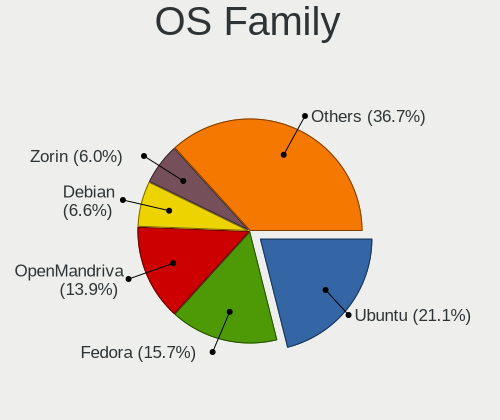

| Name         | Notebooks | Percent |
|--------------|-----------|---------|
| OpenMandriva | 44        | 23.91%  |
| Ubuntu       | 29        | 15.76%  |
| Linux Mint   | 19        | 10.33%  |
| Fedora       | 18        | 9.78%   |
| Endless      | 12        | 6.52%   |
| Debian       | 10        | 5.43%   |
| Arch         | 8         | 4.35%   |
| Pop!_OS      | 7         | 3.8%    |
| openSUSE     | 4         | 2.17%   |
| Zorin        | 3         | 1.63%   |
| Xubuntu      | 3         | 1.63%   |
| ROSA         | 3         | 1.63%   |
| Manjaro      | 3         | 1.63%   |
| Nobara       | 2         | 1.09%   |
| LMDE         | 2         | 1.09%   |
| KDE neon     | 2         | 1.09%   |
| Elementary   | 2         | 1.09%   |
| BigLinux     | 2         | 1.09%   |
| ArcoLinux    | 2         | 1.09%   |
| Ubuntu Unity | 1         | 0.54%   |
| Ubuntu MATE  | 1         | 0.54%   |
| RHEL         | 1         | 0.54%   |
| Parrot       | 1         | 0.54%   |
| Lux-alpha    | 1         | 0.54%   |
| Kubuntu      | 1         | 0.54%   |
| Kali         | 1         | 0.54%   |
| Garuda Linux | 1         | 0.54%   |
| EndeavourOS  | 1         | 0.54%   |

Kernel
------

Version of the Linux kernel

| Version                                            | Notebooks | Percent |
|----------------------------------------------------|-----------|---------|
| 6.1.1-desktop-1omv2290                             | 40        | 21.74%  |
| 5.15.0-58-generic                                  | 23        | 12.5%   |
| 5.15.0-57-generic                                  | 9         | 4.89%   |
| 5.15.0-56-generic                                  | 8         | 4.35%   |
| 6.0.12-76060006-generic                            | 7         | 3.8%    |
| 5.8.0-14-generic                                   | 6         | 3.26%   |
| 5.10.0-20-amd64                                    | 6         | 3.26%   |
| 5.11.0-35-generic                                  | 5         | 2.72%   |
| 5.19.0-29-generic                                  | 4         | 2.17%   |
| 6.1.7-arch1-1                                      | 3         | 1.63%   |
| 6.1.8-arch1-1                                      | 2         | 1.09%   |
| 6.1.7-zen1-1-zen                                   | 2         | 1.09%   |
| 6.1.7-200.fc37.x86_64                              | 2         | 1.09%   |
| 6.1.6-200.fc37.x86_64                              | 2         | 1.09%   |
| 6.0.18-300.fc37.x86_64                             | 2         | 1.09%   |
| 6.0.16-300.fc37.x86_64                             | 2         | 1.09%   |
| 5.4.0-137-generic                                  | 2         | 1.09%   |
| 5.19.0-30-generic                                  | 2         | 1.09%   |
| 5.19.0-28-generic                                  | 2         | 1.09%   |
| 5.16.7-desktop-1omv4003                            | 2         | 1.09%   |
| 5.15.85-1-MANJARO                                  | 2         | 1.09%   |
| 5.15.0-52-generic                                  | 2         | 1.09%   |
| 5.10.0-21-amd64                                    | 2         | 1.09%   |
| 6.2.0-0.rc2.20230103git69b41ac87e4a.19.fc38.x86_64 | 1         | 0.54%   |
| 6.1.8-200.fc37.x86_64                              | 1         | 0.54%   |
| 6.1.7-100.fc36.x86_64                              | 1         | 0.54%   |
| 6.1.7-060107-generic                               | 1         | 0.54%   |
| 6.1.6-zen1-1-zen                                   | 1         | 0.54%   |
| 6.1.6-arch1-1                                      | 1         | 0.54%   |
| 6.1.6-100.fc36.x86_64                              | 1         | 0.54%   |
| 6.1.4-zen2-1.1-zen                                 | 1         | 0.54%   |
| 6.1.4-203.fsync.fc37.x86_64                        | 1         | 0.54%   |
| 6.1.4-1-default                                    | 1         | 0.54%   |
| 6.1.3-1-default                                    | 1         | 0.54%   |
| 6.1.1-zen1-1-zen                                   | 1         | 0.54%   |
| 6.1.1-1-MANJARO                                    | 1         | 0.54%   |
| 6.1.0-1-amd64                                      | 1         | 0.54%   |
| 6.0.7-301.fc37.x86_64                              | 1         | 0.54%   |
| 6.0.17-300.fc37.x86_64                             | 1         | 0.54%   |
| 6.0.16-301.fsync.fc37.x86_64                       | 1         | 0.54%   |

Kernel Family
-------------

Linux kernel without a distro release

| Version  | Notebooks | Percent |
|----------|-----------|---------|
| 5.15.0   | 44        | 23.91%  |
| 6.1.1    | 42        | 22.83%  |
| 5.10.0   | 10        | 5.43%   |
| 6.1.7    | 9         | 4.89%   |
| 5.19.0   | 9         | 4.89%   |
| 6.0.12   | 8         | 4.35%   |
| 5.8.0    | 6         | 3.26%   |
| 5.11.0   | 6         | 3.26%   |
| 6.1.6    | 5         | 2.72%   |
| 5.4.0    | 5         | 2.72%   |
| 6.1.8    | 3         | 1.63%   |
| 6.1.4    | 3         | 1.63%   |
| 6.0.16   | 3         | 1.63%   |
| 6.0.0    | 3         | 1.63%   |
| 6.0.18   | 2         | 1.09%   |
| 5.16.7   | 2         | 1.09%   |
| 5.15.85  | 2         | 1.09%   |
| 5.14.21  | 2         | 1.09%   |
| 5.14.0   | 2         | 1.09%   |
| 6.2.0    | 1         | 0.54%   |
| 6.1.3    | 1         | 0.54%   |
| 6.1.0    | 1         | 0.54%   |
| 6.0.7    | 1         | 0.54%   |
| 6.0.17   | 1         | 0.54%   |
| 6.0.14   | 1         | 0.54%   |
| 5.4.217  | 1         | 0.54%   |
| 5.18.12  | 1         | 0.54%   |
| 5.17.12  | 1         | 0.54%   |
| 5.16.19  | 1         | 0.54%   |
| 5.16.0   | 1         | 0.54%   |
| 5.15.90  | 1         | 0.54%   |
| 5.15.89  | 1         | 0.54%   |
| 5.15.79  | 1         | 0.54%   |
| 5.10.74  | 1         | 0.54%   |
| 5.10.164 | 1         | 0.54%   |
| 5.10.155 | 1         | 0.54%   |
| 5.10.14  | 1         | 0.54%   |

Kernel Major Ver.
-----------------

Linux kernel major version

| Version | Notebooks | Percent |
|---------|-----------|---------|
| 6.1     | 64        | 34.78%  |
| 5.15    | 49        | 26.63%  |
| 6.0     | 19        | 10.33%  |
| 5.10    | 14        | 7.61%   |
| 5.19    | 9         | 4.89%   |
| 5.8     | 6         | 3.26%   |
| 5.4     | 6         | 3.26%   |
| 5.11    | 6         | 3.26%   |
| 5.16    | 4         | 2.17%   |
| 5.14    | 4         | 2.17%   |
| 6.2     | 1         | 0.54%   |
| 5.18    | 1         | 0.54%   |
| 5.17    | 1         | 0.54%   |

Arch
----

OS architecture (x86_64, i586, etc.)

| Name   | Notebooks | Percent |
|--------|-----------|---------|
| x86_64 | 183       | 99.46%  |
| i686   | 1         | 0.54%   |

DE
--

Desktop Environment

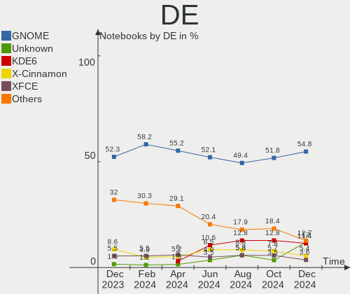

| Name       | Notebooks | Percent |
|------------|-----------|---------|
| GNOME      | 83        | 45.11%  |
| KDE5       | 56        | 30.43%  |
| X-Cinnamon | 20        | 10.87%  |
| XFCE       | 10        | 5.43%   |
| MATE       | 5         | 2.72%   |
| Cinnamon   | 3         | 1.63%   |
| Pantheon   | 2         | 1.09%   |
| LXDE       | 2         | 1.09%   |
| Unity      | 1         | 0.54%   |
| sway       | 1         | 0.54%   |
| GNUstep    | 1         | 0.54%   |

Display Server
--------------

X11 or Wayland

| Name    | Notebooks | Percent |
|---------|-----------|---------|
| X11     | 135       | 73.37%  |
| Wayland | 46        | 25%     |
| Unknown | 3         | 1.63%   |

Display Manager
---------------

SDDM, LightDM, etc.

| Name    | Notebooks | Percent |
|---------|-----------|---------|
| Unknown | 59        | 32.07%  |
| SDDM    | 47        | 25.54%  |
| GDM3    | 33        | 17.93%  |
| LightDM | 24        | 13.04%  |
| GDM     | 21        | 11.41%  |

OS Lang
-------

Language

| Lang      | Notebooks | Percent |
|-----------|-----------|---------|
| pt_BR     | 125       | 67.93%  |
| en_US     | 52        | 28.26%  |
| C         | 3         | 1.63%   |
| pt_PT     | 1         | 0.54%   |
| pt_BRutf8 | 1         | 0.54%   |
| fr_FR     | 1         | 0.54%   |
| es_ES     | 1         | 0.54%   |

Boot Mode
---------

EFI or BIOS

| Mode | Notebooks | Percent |
|------|-----------|---------|
| EFI  | 102       | 55.43%  |
| BIOS | 82        | 44.57%  |

Filesystem
----------

Type of filesystem

| Type    | Notebooks | Percent |
|---------|-----------|---------|
| Ext4    | 105       | 57.07%  |
| Overlay | 39        | 21.2%   |
| Btrfs   | 37        | 20.11%  |
| F2fs    | 2         | 1.09%   |
| Xfs     | 1         | 0.54%   |

Part. scheme
------------

Scheme of partitioning

| Type    | Notebooks | Percent |
|---------|-----------|---------|
| GPT     | 95        | 51.63%  |
| Unknown | 59        | 32.07%  |
| MBR     | 30        | 16.3%   |

Dual Boot with Linux/BSD
------------------------

Hosting more than one Linux/BSD

| Dual boot | Notebooks | Percent |
|-----------|-----------|---------|
| No        | 152       | 82.61%  |
| Yes       | 32        | 17.39%  |

Dual Boot (Win)
---------------

Hosting Linux and Windows

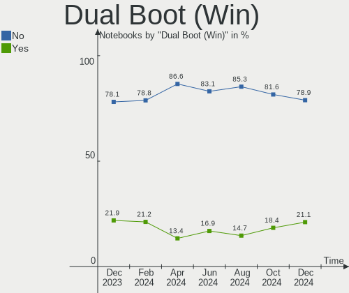

| Dual boot | Notebooks | Percent |
|-----------|-----------|---------|
| No        | 138       | 75%     |
| Yes       | 46        | 25%     |

Board
-----

Vendor
------

Motherboard manufacturer

| Name                   | Notebooks | Percent |
|------------------------|-----------|---------|
| Dell                   | 40        | 21.74%  |
| Lenovo                 | 34        | 18.48%  |
| Acer                   | 29        | 15.76%  |
| ASUSTek Computer       | 17        | 9.24%   |
| Hewlett-Packard        | 11        | 5.98%   |
| Samsung Electronics    | 8         | 4.35%   |
| Positivo               | 7         | 3.8%    |
| Sony                   | 5         | 2.72%   |
| Multilaser             | 3         | 1.63%   |
| LG Electronics         | 3         | 1.63%   |
| Itautec                | 3         | 1.63%   |
| Compaq                 | 3         | 1.63%   |
| Avell High Performance | 3         | 1.63%   |
| Positivo Bahia - VAIO  | 2         | 1.09%   |
| Philco                 | 2         | 1.09%   |
| Notebook               | 2         | 1.09%   |
| Digibras               | 2         | 1.09%   |
| Apple                  | 2         | 1.09%   |
| Standard               | 1         | 0.54%   |
| Semp Toshiba           | 1         | 0.54%   |
| Insyde                 | 1         | 0.54%   |
| Gateway                | 1         | 0.54%   |
| Compal                 | 1         | 0.54%   |
| Clevo                  | 1         | 0.54%   |
| Alienware              | 1         | 0.54%   |
| Unknown                | 1         | 0.54%   |

Model
-----

Motherboard model

| Name                                   | Notebooks | Percent |
|----------------------------------------|-----------|---------|
| Lenovo IdeaPad 3 15ALC6 82MF           | 7         | 3.8%    |
| Dell Inspiron N4050                    | 4         | 2.17%   |
| Lenovo IdeaPad S145-15IWL 81S9         | 3         | 1.63%   |
| Lenovo IdeaPad S145-15IIL 82DJ         | 3         | 1.63%   |
| Lenovo IdeaPad S145-15API 81V7         | 3         | 1.63%   |
| Lenovo IdeaPad 320-15IKB 80YH          | 3         | 1.63%   |
| Dell Inspiron 15-3567                  | 3         | 1.63%   |
| ASUS VivoBook_ASUSLaptop X515JA_X515JA | 3         | 1.63%   |
| ASUS VivoBook_ASUSLaptop X515DA_X515DA | 3         | 1.63%   |
| Acer Nitro AN515-44                    | 3         | 1.63%   |
| Lenovo IdeaPad Gaming 3 15IHU6 82MG    | 2         | 1.09%   |
| Lenovo IdeaPad 330-15IKB 81FE          | 2         | 1.09%   |
| Itautec Infoway w7535                  | 2         | 1.09%   |
| HP Compaq 6530b                        | 2         | 1.09%   |
| Digibras NH4CU03                       | 2         | 1.09%   |
| Dell Inspiron 5468                     | 2         | 1.09%   |
| Dell Inspiron 3421                     | 2         | 1.09%   |
| Dell G15 5520                          | 2         | 1.09%   |
| Dell G15 5510                          | 2         | 1.09%   |
| Compaq 420                             | 2         | 1.09%   |
| Avell High Performance B.ON            | 2         | 1.09%   |
| ASUS X45C                              | 2         | 1.09%   |
| Acer Aspire A515-51                    | 2         | 1.09%   |
| Acer Aspire A515-45                    | 2         | 1.09%   |
| Acer Aspire A515-41G                   | 2         | 1.09%   |
| Acer Aspire A315-56                    | 2         | 1.09%   |
| Unknown                                | 2         | 1.09%   |
| Standard MB40II                        | 1         | 0.54%   |
| Sony VPCF236FM                         | 1         | 0.54%   |
| Sony VPCEH10EB                         | 1         | 0.54%   |
| Sony VPCEA23FB                         | 1         | 0.54%   |
| Sony VPCCA15FX                         | 1         | 0.54%   |
| Sony VJF153                            | 1         | 0.54%   |
| Semp Toshiba STI NA 1401               | 1         | 0.54%   |
| Samsung RV415/RV515                    | 1         | 0.54%   |
| Samsung 550XCJ/550XCR                  | 1         | 0.54%   |
| Samsung 550XBE/350XBE                  | 1         | 0.54%   |
| Samsung 530XBB                         | 1         | 0.54%   |
| Samsung 340XAA/350XAA/550XAA           | 1         | 0.54%   |
| Samsung 300E4C/300E5C/300E7C           | 1         | 0.54%   |

Model Family
------------

Motherboard model prefix

| Name                        | Notebooks | Percent |
|-----------------------------|-----------|---------|
| Lenovo IdeaPad              | 26        | 14.13%  |
| Acer Aspire                 | 24        | 13.04%  |
| Dell Inspiron               | 22        | 11.96%  |
| ASUS VivoBook               | 9         | 4.89%   |
| Lenovo ThinkPad             | 6         | 3.26%   |
| Dell Vostro                 | 5         | 2.72%   |
| Dell G15                    | 5         | 2.72%   |
| Acer Nitro                  | 5         | 2.72%   |
| Dell Latitude               | 4         | 2.17%   |
| Itautec Infoway             | 3         | 1.63%   |
| Dell G3                     | 3         | 1.63%   |
| HP Pavilion                 | 2         | 1.09%   |
| HP Compaq                   | 2         | 1.09%   |
| Digibras NH4CU03            | 2         | 1.09%   |
| Compaq 420                  | 2         | 1.09%   |
| Avell High Performance B.ON | 2         | 1.09%   |
| ASUS X45C                   | 2         | 1.09%   |
| Unknown                     | 2         | 1.09%   |
| Standard MB40II             | 1         | 0.54%   |
| Sony VPCF236FM              | 1         | 0.54%   |
| Sony VPCEH10EB              | 1         | 0.54%   |
| Sony VPCEA23FB              | 1         | 0.54%   |
| Sony VPCCA15FX              | 1         | 0.54%   |
| Sony VJF153                 | 1         | 0.54%   |
| Semp Toshiba STI            | 1         | 0.54%   |
| Samsung RV415               | 1         | 0.54%   |
| Samsung 550XCJ              | 1         | 0.54%   |
| Samsung 550XBE              | 1         | 0.54%   |
| Samsung 530XBB              | 1         | 0.54%   |
| Samsung 340XAA              | 1         | 0.54%   |
| Samsung 300E4C              | 1         | 0.54%   |
| Samsung 270E5J              | 1         | 0.54%   |
| Samsung 270E5G              | 1         | 0.54%   |
| Positivo Smash2             | 1         | 0.54%   |
| Positivo S14BW01            | 1         | 0.54%   |
| Positivo Q464C-O            | 1         | 0.54%   |
| Positivo N1240              | 1         | 0.54%   |
| Positivo N1103              | 1         | 0.54%   |
| Positivo H14CU01            | 1         | 0.54%   |
| Positivo CHT14B             | 1         | 0.54%   |

MFG Year
--------

Motherboard manufacture year

| Year    | Notebooks | Percent |
|---------|-----------|---------|
| 2021    | 33        | 17.93%  |
| 2020    | 21        | 11.41%  |
| 2011    | 19        | 10.33%  |
| 2019    | 18        | 9.78%   |
| 2016    | 16        | 8.7%    |
| 2012    | 12        | 6.52%   |
| 2013    | 11        | 5.98%   |
| 2017    | 10        | 5.43%   |
| 2018    | 9         | 4.89%   |
| 2014    | 8         | 4.35%   |
| 2022    | 6         | 3.26%   |
| 2010    | 6         | 3.26%   |
| 2015    | 4         | 2.17%   |
| 2009    | 4         | 2.17%   |
| 2008    | 4         | 2.17%   |
| Unknown | 2         | 1.09%   |
| 2007    | 1         | 0.54%   |

Form Factor
-----------

Physical design of the computer

| Name     | Notebooks | Percent |
|----------|-----------|---------|
| Notebook | 184       | 100%    |

Secure Boot
-----------

Enabled or disabled

| State    | Notebooks | Percent |
|----------|-----------|---------|
| Disabled | 165       | 89.67%  |
| Enabled  | 19        | 10.33%  |

Coreboot
--------

Have coreboot on board

| Used | Notebooks | Percent |
|------|-----------|---------|
| No   | 183       | 99.46%  |
| Yes  | 1         | 0.54%   |

RAM Size
--------

Total RAM memory

| Size in GB  | Notebooks | Percent |
|-------------|-----------|---------|
| 4.01-8.0    | 62        | 33.7%   |
| 3.01-4.0    | 41        | 22.28%  |
| 8.01-16.0   | 41        | 22.28%  |
| 16.01-24.0  | 25        | 13.59%  |
| 1.01-2.0    | 6         | 3.26%   |
| 32.01-64.0  | 4         | 2.17%   |
| 2.01-3.0    | 3         | 1.63%   |
| 24.01-32.0  | 1         | 0.54%   |
| 64.01-256.0 | 1         | 0.54%   |

RAM Used
--------

Used RAM memory

| Used GB    | Notebooks | Percent |
|------------|-----------|---------|
| 1.01-2.0   | 79        | 42.93%  |
| 2.01-3.0   | 48        | 26.09%  |
| 4.01-8.0   | 25        | 13.59%  |
| 3.01-4.0   | 19        | 10.33%  |
| 8.01-16.0  | 6         | 3.26%   |
| 0.51-1.0   | 6         | 3.26%   |
| 32.01-64.0 | 1         | 0.54%   |

Total Drives
------------

Number of drives on board

| Drives | Notebooks | Percent |
|--------|-----------|---------|
| 1      | 123       | 66.85%  |
| 2      | 56        | 30.43%  |
| 3      | 3         | 1.63%   |
| 0      | 2         | 1.09%   |

Has CD-ROM
----------

Has CD-ROM on board

| Presented | Notebooks | Percent |
|-----------|-----------|---------|
| No        | 134       | 72.83%  |
| Yes       | 50        | 27.17%  |

Has Ethernet
------------

Has Ethernet on board

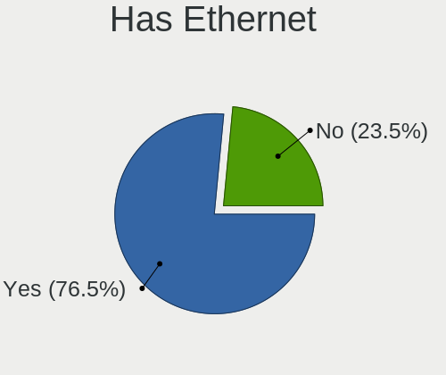

| Presented | Notebooks | Percent |
|-----------|-----------|---------|
| Yes       | 143       | 77.72%  |
| No        | 41        | 22.28%  |

Has WiFi
--------

Has WiFi module

| Presented | Notebooks | Percent |
|-----------|-----------|---------|
| Yes       | 177       | 96.2%   |
| No        | 7         | 3.8%    |

Has Bluetooth
-------------

Has Bluetooth module

| Presented | Notebooks | Percent |
|-----------|-----------|---------|
| Yes       | 140       | 76.09%  |
| No        | 44        | 23.91%  |

Location
--------

Country
-------

Geographic location (country)

| Country | Notebooks | Percent |
|---------|-----------|---------|
| Brazil  | 184       | 100%    |

City
----

Geographic location (city)

| City                  | Notebooks | Percent |
|-----------------------|-----------|---------|
| Sao Paulo             | 24        | 13.04%  |
| Fortaleza             | 7         | 3.8%    |
| Curitiba              | 7         | 3.8%    |
| Brasília             | 7         | 3.8%    |
| Rio de Janeiro        | 6         | 3.26%   |
| Porto Alegre          | 6         | 3.26%   |
| Campinas              | 5         | 2.72%   |
| Niterói              | 4         | 2.17%   |
| Natal                 | 4         | 2.17%   |
| Belo Horizonte        | 4         | 2.17%   |
| Sao Bernardo do Campo | 3         | 1.63%   |
| Goiânia              | 3         | 1.63%   |
| Campina Grande        | 3         | 1.63%   |
| Varzea Paulista       | 2         | 1.09%   |
| Uberaba               | 2         | 1.09%   |
| Sao Luís             | 2         | 1.09%   |
| Praia Grande          | 2         | 1.09%   |
| Parnamirim            | 2         | 1.09%   |
| Osasco                | 2         | 1.09%   |
| Maringá              | 2         | 1.09%   |
| Maceió               | 2         | 1.09%   |
| Londrina              | 2         | 1.09%   |
| Juiz de Fora          | 2         | 1.09%   |
| Joinville             | 2         | 1.09%   |
| Hortolândia          | 2         | 1.09%   |
| Florianópolis        | 2         | 1.09%   |
| Cuiabá               | 2         | 1.09%   |
| Contagem              | 2         | 1.09%   |
| Campo Grande          | 2         | 1.09%   |
| Brusque               | 2         | 1.09%   |
| Vitória              | 1         | 0.54%   |
| Videira               | 1         | 0.54%   |
| Vicosa                | 1         | 0.54%   |
| Unai                  | 1         | 0.54%   |
| Uberlândia           | 1         | 0.54%   |
| Tubarao               | 1         | 0.54%   |
| Toledo                | 1         | 0.54%   |
| Timbo                 | 1         | 0.54%   |
| Teófilo Otoni        | 1         | 0.54%   |
| Tenente Portela       | 1         | 0.54%   |

Drives
------

Drive Vendor
------------

Hard drive vendors

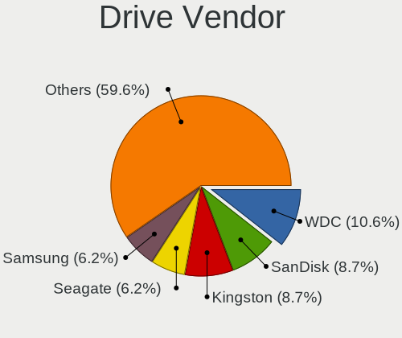

| Vendor                         | Notebooks | Drives | Percent |
|--------------------------------|-----------|--------|---------|
| WDC                            | 44        | 45     | 19.21%  |
| Kingston                       | 22        | 22     | 9.61%   |
| Seagate                        | 20        | 20     | 8.73%   |
| A-DATA Technology              | 17        | 17     | 7.42%   |
| Samsung Electronics            | 16        | 16     | 6.99%   |
| Unknown                        | 14        | 16     | 6.11%   |
| Sandisk                        | 13        | 13     | 5.68%   |
| Crucial                        | 7         | 7      | 3.06%   |
| China                          | 7         | 7      | 3.06%   |
| ADATA Technology               | 6         | 6      | 2.62%   |
| Toshiba                        | 5         | 5      | 2.18%   |
| SSSTC                          | 5         | 5      | 2.18%   |
| Intel                          | 5         | 5      | 2.18%   |
| Solid State Storage            | 4         | 4      | 1.75%   |
| Netac                          | 4         | 4      | 1.75%   |
| KIOXIA                         | 3         | 3      | 1.31%   |
| Hitachi                        | 3         | 3      | 1.31%   |
| XrayDisk                       | 2         | 2      | 0.87%   |
| WALRAM                         | 2         | 2      | 0.87%   |
| Solid State Storage Technology | 2         | 2      | 0.87%   |
| SK hynix                       | 2         | 3      | 0.87%   |
| Silicon Motion                 | 2         | 2      | 0.87%   |
| Phison                         | 2         | 2      | 0.87%   |
| Patriot                        | 2         | 2      | 0.87%   |
| XPG                            | 1         | 1      | 0.44%   |
| Vaseky                         | 1         | 1      | 0.44%   |
| SAGE                           | 1         | 1      | 0.44%   |
| Realtek Semiconductor          | 1         | 1      | 0.44%   |
| Phison Electronics             | 1         | 1      | 0.44%   |
| Micron Technology              | 1         | 1      | 0.44%   |
| MAXSUN                         | 1         | 1      | 0.44%   |
| Lexar                          | 1         | 1      | 0.44%   |
| Lenovo                         | 1         | 1      | 0.44%   |
| Kingston Technology Company    | 1         | 1      | 0.44%   |
| KingSpec                       | 1         | 1      | 0.44%   |
| KeepData                       | 1         | 1      | 0.44%   |
| HGST                           | 1         | 1      | 0.44%   |
| Gigabyte Technology            | 1         | 1      | 0.44%   |
| Fanxiang                       | 1         | 1      | 0.44%   |
| Corsair                        | 1         | 1      | 0.44%   |

Drive Model
-----------

Hard drive models

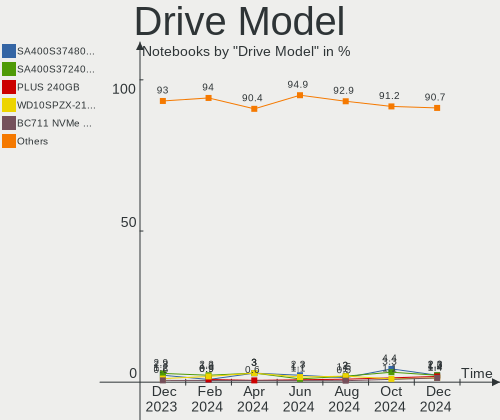

| Model                                     | Notebooks | Percent |
|-------------------------------------------|-----------|---------|
| Kingston SA400S37480G 480GB SSD           | 10        | 4.31%   |
| Seagate ST500LM012 HN-M500MBB 500GB       | 6         | 2.59%   |
| WDC WD10SPZX-24Z10 1TB                    | 5         | 2.16%   |
| WDC WD10SPZX-21Z10T0 1TB                  | 5         | 2.16%   |
| SSSTC CL1-4D256 256GB                     | 5         | 2.16%   |
| Seagate ST1000LM024 HN-M101MBB 1TB        | 5         | 2.16%   |
| Kingston SA400S37240G 240GB SSD           | 5         | 2.16%   |
| ADATA SM2P32A8-256GC1 256GB               | 5         | 2.16%   |
| A-DATA IM2P33F3A NVMe 256GB               | 5         | 2.16%   |
| Solid State Storage SSSTC CL1-4D256 256GB | 4         | 1.72%   |
| WDC WDS240G2G0B-00EPW0 240GB SSD          | 3         | 1.29%   |
| WDC WD5000LPCX-00VHAT0 500GB              | 3         | 1.29%   |
| WDC WD10JPVX-22JC3T0 1TB                  | 3         | 1.29%   |
| Unknown SD/MMC/MS PRO 2GB                 | 3         | 1.29%   |
| Unknown MMC Card  32GB                    | 3         | 1.29%   |
| Sandisk WD Blue SN550 NVMe SSD 1TB        | 3         | 1.29%   |
| Crucial CT240BX500SSD1 240GB              | 3         | 1.29%   |
| A-DATA SU650 240GB SSD                    | 3         | 1.29%   |
| A-DATA IM2P33F8ABR2-256GB                 | 3         | 1.29%   |
| A-DATA IM2P33F8A-512GD 512GB              | 3         | 1.29%   |
| WDC WDS120G2G0B-00EPW0 120GB SSD          | 2         | 0.86%   |
| WDC WD3200BPVT-22JJ5T0 320GB              | 2         | 0.86%   |
| WDC WD10SPZX-75Z10T1 1TB                  | 2         | 0.86%   |
| WDC WD10JPCX-24UE4T0 1TB                  | 2         | 0.86%   |
| WDC PC SN530 SDBPNPZ-512G-1114 512GB      | 2         | 0.86%   |
| Toshiba MQ04ABF100 1TB                    | 2         | 0.86%   |
| Seagate ST500LT012-9WS142 500GB           | 2         | 0.86%   |
| Seagate ST500LM021-1KJ152 500GB           | 2         | 0.86%   |
| Samsung MZMPC032HBCD-00000 32GB SSD       | 2         | 0.86%   |
| Samsung MZALQ256HAJD-000L2 256GB          | 2         | 0.86%   |
| Samsung HM160HI 160GB                     | 2         | 0.86%   |
| KIOXIA KBG40ZNS256G NVMe 256GB            | 2         | 0.86%   |
| Kingston SA400S37120G 120GB SSD           | 2         | 0.86%   |
| Intel SSD 660P Series 512GB               | 2         | 0.86%   |
| Hitachi HTS545050B9A300 500GB             | 2         | 0.86%   |
| China SSD 256GB                           | 2         | 0.86%   |
| XrayDisk SSD 240GB                        | 1         | 0.43%   |
| XrayDisk 480GB SSD                        | 1         | 0.43%   |
| XPG NVMe SSD Drive 1024GB                 | 1         | 0.43%   |
| WDC WDS500G2B0C-00PXH0 500GB              | 1         | 0.43%   |

HDD Vendor
----------

Hard disk drive vendors

| Vendor              | Notebooks | Drives | Percent |
|---------------------|-----------|--------|---------|
| WDC                 | 34        | 34     | 46.58%  |
| Seagate             | 19        | 19     | 26.03%  |
| Toshiba             | 5         | 5      | 6.85%   |
| Samsung Electronics | 5         | 5      | 6.85%   |
| Unknown             | 3         | 3      | 4.11%   |
| Hitachi             | 3         | 3      | 4.11%   |
| SAGE                | 1         | 1      | 1.37%   |
| Phison              | 1         | 1      | 1.37%   |
| HGST                | 1         | 1      | 1.37%   |
| Apple               | 1         | 1      | 1.37%   |

SSD Vendor
----------

Solid state drive vendors

| Vendor              | Notebooks | Drives | Percent |
|---------------------|-----------|--------|---------|
| Kingston            | 22        | 22     | 29.73%  |
| Crucial             | 7         | 7      | 9.46%   |
| China               | 7         | 7      | 9.46%   |
| WDC                 | 6         | 6      | 8.11%   |
| SanDisk             | 5         | 5      | 6.76%   |
| Samsung Electronics | 5         | 5      | 6.76%   |
| A-DATA Technology   | 4         | 4      | 5.41%   |
| XrayDisk            | 2         | 2      | 2.7%    |
| walram              | 2         | 2      | 2.7%    |
| Patriot             | 2         | 2      | 2.7%    |
| Vaseky              | 1         | 1      | 1.35%   |
| Seagate             | 1         | 1      | 1.35%   |
| Netac               | 1         | 1      | 1.35%   |
| Lexar               | 1         | 1      | 1.35%   |
| Lenovo              | 1         | 1      | 1.35%   |
| KingSpec            | 1         | 1      | 1.35%   |
| KeepData            | 1         | 1      | 1.35%   |
| Fanxiang            | 1         | 1      | 1.35%   |
| Corsair             | 1         | 1      | 1.35%   |
| Colorful            | 1         | 1      | 1.35%   |
| BHT                 | 1         | 1      | 1.35%   |
| Unknown             | 1         | 1      | 1.35%   |

Drive Kind
----------

HDD or SSD

| Kind    | Notebooks | Drives | Percent |
|---------|-----------|--------|---------|
| HDD     | 72        | 73     | 32.58%  |
| SSD     | 70        | 74     | 31.67%  |
| NVMe    | 67        | 72     | 30.32%  |
| MMC     | 11        | 13     | 4.98%   |
| Unknown | 1         | 1      | 0.45%   |

Drive Connector
---------------

SATA, SAS, NVMe, etc.

| Type | Notebooks | Drives | Percent |
|------|-----------|--------|---------|
| SATA | 126       | 143    | 60.29%  |
| NVMe | 67        | 72     | 32.06%  |
| MMC  | 11        | 13     | 5.26%   |
| SAS  | 5         | 5      | 2.39%   |

Drive Size
----------

Size of hard drive

| Size in TB | Notebooks | Drives | Percent |
|------------|-----------|--------|---------|
| 0.01-0.5   | 94        | 101    | 67.63%  |
| 0.51-1.0   | 43        | 44     | 30.94%  |
| 1.01-2.0   | 1         | 1      | 0.72%   |
| 0          | 1         | 1      | 0.72%   |

Space Total
-----------

Amount of disk space available on the file system

| Size in GB     | Notebooks | Percent |
|----------------|-----------|---------|
| 101-250        | 47        | 25.54%  |
| 251-500        | 39        | 21.2%   |
| 1-20           | 33        | 17.93%  |
| 501-1000       | 28        | 15.22%  |
| 1001-2000      | 13        | 7.07%   |
| 51-100         | 9         | 4.89%   |
| 21-50          | 8         | 4.35%   |
| Unknown        | 3         | 1.63%   |
| More than 3000 | 2         | 1.09%   |
| 2001-3000      | 2         | 1.09%   |

Space Used
----------

Amount of used disk space

| Used GB   | Notebooks | Percent |
|-----------|-----------|---------|
| 1-20      | 80        | 43.48%  |
| 21-50     | 39        | 21.2%   |
| 101-250   | 27        | 14.67%  |
| 51-100    | 17        | 9.24%   |
| 251-500   | 12        | 6.52%   |
| 1001-2000 | 3         | 1.63%   |
| 501-1000  | 3         | 1.63%   |
| Unknown   | 3         | 1.63%   |

Malfunc. Drives
---------------

Drive models with a malfunction

| Model                                  | Notebooks | Drives | Percent |
|----------------------------------------|-----------|--------|---------|
| Seagate ST500LM012 HN-M500MBB 500GB    | 2         | 2      | 18.18%  |
| XrayDisk SSD 240GB                     | 1         | 1      | 9.09%   |
| WDC WD3200BPVT-22JJ5T0 320GB           | 1         | 1      | 9.09%   |
| WDC WD10JPVX-60JC3T0 1TB               | 1         | 1      | 9.09%   |
| WDC WD10JPVX-22JC3T0 1TB               | 1         | 1      | 9.09%   |
| Toshiba MQ01ABD100 1TB                 | 1         | 1      | 9.09%   |
| Seagate ST500LM021-1KJ152 500GB        | 1         | 1      | 9.09%   |
| Seagate ST1000LM024 HN-M101MBB 1TB     | 1         | 1      | 9.09%   |
| HGST HCC545050A7E380 500GB             | 1         | 1      | 9.09%   |
| ADATA Technology SM2P32A8-512GC1 512GB | 1         | 1      | 9.09%   |

Malfunc. Drive Vendor
---------------------

Vendors of faulty drives

| Vendor           | Notebooks | Drives | Percent |
|------------------|-----------|--------|---------|
| Seagate          | 4         | 4      | 36.36%  |
| WDC              | 3         | 3      | 27.27%  |
| XrayDisk         | 1         | 1      | 9.09%   |
| Toshiba          | 1         | 1      | 9.09%   |
| HGST             | 1         | 1      | 9.09%   |
| ADATA Technology | 1         | 1      | 9.09%   |

Malfunc. HDD Vendor
-------------------

Vendors of faulty HDD drives

| Vendor  | Notebooks | Drives | Percent |
|---------|-----------|--------|---------|
| Seagate | 4         | 4      | 44.44%  |
| WDC     | 3         | 3      | 33.33%  |
| Toshiba | 1         | 1      | 11.11%  |
| HGST    | 1         | 1      | 11.11%  |

Malfunc. Drive Kind
-------------------

Kinds of faulty drives

| Kind | Notebooks | Drives | Percent |
|------|-----------|--------|---------|
| HDD  | 9         | 9      | 81.82%  |
| NVMe | 1         | 1      | 9.09%   |
| SSD  | 1         | 1      | 9.09%   |

Failed Drives
-------------

Failed drive models

Zero info for selected period =(

Failed Drive Vendor
-------------------

Failed drive vendors

Zero info for selected period =(

Drive Status
------------

Number of failed and malfunc. drives

| Status   | Notebooks | Drives | Percent |
|----------|-----------|--------|---------|
| Detected | 103       | 124    | 53.93%  |
| Works    | 78        | 98     | 40.84%  |
| Malfunc  | 10        | 11     | 5.24%   |

Storage controller
------------------

Storage Vendor
--------------

Storage controller vendors

| Vendor                         | Notebooks | Percent |
|--------------------------------|-----------|---------|
| Intel                          | 136       | 58.37%  |
| AMD                            | 29        | 12.45%  |
| ADATA Technology               | 19        | 8.15%   |
| SanDisk                        | 13        | 5.58%   |
| Solid State Storage Technology | 11        | 4.72%   |
| Samsung Electronics            | 6         | 2.58%   |
| Silicon Motion                 | 3         | 1.29%   |
| Phison Electronics             | 3         | 1.29%   |
| KIOXIA                         | 3         | 1.29%   |
| SK hynix                       | 2         | 0.86%   |
| Nvidia                         | 2         | 0.86%   |
| Netac Technology               | 2         | 0.86%   |
| Realtek Semiconductor          | 1         | 0.43%   |
| Micron Technology              | 1         | 0.43%   |
| Kingston Technology Company    | 1         | 0.43%   |
| INNOGRIT                       | 1         | 0.43%   |

Storage Model
-------------

Storage controller models

| Model                                                                            | Notebooks | Percent |
|----------------------------------------------------------------------------------|-----------|---------|
| AMD FCH SATA Controller [AHCI mode]                                              | 26        | 10.4%   |
| Intel Sunrise Point-LP SATA Controller [AHCI mode]                               | 22        | 8.8%    |
| Intel 6 Series/C200 Series Chipset Family 6 port Mobile SATA AHCI Controller     | 18        | 7.2%    |
| Intel 7 Series Chipset Family 6-port SATA Controller [AHCI mode]                 | 17        | 6.8%    |
| Solid State Storage Non-Volatile memory controller                               | 11        | 4.4%    |
| Intel Volume Management Device NVMe RAID Controller                              | 11        | 4.4%    |
| Intel Tiger Lake-LP SATA Controller                                              | 10        | 4%      |
| Intel 82801 Mobile SATA Controller [RAID mode]                                   | 9         | 3.6%    |
| Intel 8 Series SATA Controller 1 [AHCI mode]                                     | 8         | 3.2%    |
| SanDisk WD Blue SN550 NVMe SSD                                                   | 6         | 2.4%    |
| Intel Cannon Point-LP SATA Controller [AHCI Mode]                                | 6         | 2.4%    |
| ADATA Non-Volatile memory controller                                             | 6         | 2.4%    |
| ADATA IM2P33F8ABR1 NVMe SSD                                                      | 6         | 2.4%    |
| ADATA A Non-Volatile memory controller                                           | 6         | 2.4%    |
| SanDisk Non-Volatile memory controller                                           | 5         | 2%      |
| Intel Wildcat Point-LP SATA Controller [AHCI Mode]                               | 5         | 2%      |
| Intel Ice Lake-LP SATA Controller [AHCI mode]                                    | 5         | 2%      |
| Intel Celeron/Pentium Silver Processor SATA Controller                           | 5         | 2%      |
| Samsung NVMe SSD Controller 980                                                  | 4         | 1.6%    |
| Intel Comet Lake SATA AHCI Controller                                            | 4         | 1.6%    |
| Intel Atom/Celeron/Pentium Processor x5-E8000/J3xxx/N3xxx Series SATA Controller | 4         | 1.6%    |
| Intel 5 Series/3400 Series Chipset 4 port SATA AHCI Controller                   | 4         | 1.6%    |
| Intel SSD 660P Series                                                            | 3         | 1.2%    |
| AMD SB7x0/SB8x0/SB9x0 SATA Controller [AHCI mode]                                | 3         | 1.2%    |
| Silicon Motion SM2263EN/SM2263XT SSD Controller                                  | 2         | 0.8%    |
| Phison PS5013 E13 NVMe Controller                                                | 2         | 0.8%    |
| Netac Non-Volatile memory controller                                             | 2         | 0.8%    |
| KIOXIA NVMe SSD Controller BG4                                                   | 2         | 0.8%    |
| Intel PROSet/Wireless WiFi Software extension                                    | 2         | 0.8%    |
| Intel Cannon Lake Mobile PCH SATA AHCI Controller                                | 2         | 0.8%    |
| Intel 82801IBM/IEM (ICH9M/ICH9M-E) 4 port SATA Controller [AHCI mode]            | 2         | 0.8%    |
| Intel 400 Series Chipset Family SATA AHCI Controller                             | 2         | 0.8%    |
| SK hynix Gold P31/PC711 NVMe Solid State Drive                                   | 1         | 0.4%    |
| SK hynix BC511                                                                   | 1         | 0.4%    |
| Silicon Motion SM2262/SM2262EN SSD Controller                                    | 1         | 0.4%    |
| SanDisk WD Blue SN570 NVMe SSD                                                   | 1         | 0.4%    |
| SanDisk WD Black SN750 / PC SN730 NVMe SSD                                       | 1         | 0.4%    |
| Samsung NVMe SSD Controller SM981/PM981/PM983                                    | 1         | 0.4%    |
| Samsung NVMe SSD Controller PM9A1/PM9A3/980PRO                                   | 1         | 0.4%    |
| Realtek Realtek Non-Volatile memory controller                                   | 1         | 0.4%    |

Storage Kind
------------

Kind of storage controller (IDE, SATA, NVMe, SAS, ...)

| Kind | Notebooks | Percent |
|------|-----------|---------|
| SATA | 151       | 62.14%  |
| NVMe | 67        | 27.57%  |
| RAID | 18        | 7.41%   |
| IDE  | 7         | 2.88%   |

Processor
---------

CPU Vendor
----------

Processor vendors

| Vendor | Notebooks | Percent |
|--------|-----------|---------|
| Intel  | 153       | 83.15%  |
| AMD    | 31        | 16.85%  |

CPU Model
---------

Processor models

| Model                                           | Notebooks | Percent |
|-------------------------------------------------|-----------|---------|
| Intel Core i5-7200U CPU @ 2.50GHz               | 9         | 4.89%   |
| Intel Core i5-1035G1 CPU @ 1.00GHz              | 7         | 3.8%    |
| Intel Core i7-8565U CPU @ 1.80GHz               | 5         | 2.72%   |
| Intel Core i5-10210U CPU @ 1.60GHz              | 5         | 2.72%   |
| Intel Core i3-3217U CPU @ 1.80GHz               | 5         | 2.72%   |
| Intel 11th Gen Core i7-1165G7 @ 2.80GHz         | 5         | 2.72%   |
| Intel 11th Gen Core i5-1135G7 @ 2.40GHz         | 5         | 2.72%   |
| AMD Ryzen 5 5500U with Radeon Graphics          | 5         | 2.72%   |
| AMD Ryzen 5 3500U with Radeon Vega Mobile Gfx   | 5         | 2.72%   |
| Intel Core i5-8250U CPU @ 1.60GHz               | 4         | 2.17%   |
| Intel Core i3-2328M CPU @ 2.20GHz               | 4         | 2.17%   |
| Intel Atom x5-Z8350 CPU @ 1.44GHz               | 4         | 2.17%   |
| Intel Core i5-4200U CPU @ 1.60GHz               | 3         | 1.63%   |
| Intel Core i5-2450M CPU @ 2.50GHz               | 3         | 1.63%   |
| Intel Core i5-2410M CPU @ 2.30GHz               | 3         | 1.63%   |
| Intel Core i3-6006U CPU @ 2.00GHz               | 3         | 1.63%   |
| Intel Core i3-2310M CPU @ 2.10GHz               | 3         | 1.63%   |
| AMD Ryzen 7 5700U with Radeon Graphics          | 3         | 1.63%   |
| Intel Pentium CPU N3700 @ 1.60GHz               | 2         | 1.09%   |
| Intel Core i7-8550U CPU @ 1.80GHz               | 2         | 1.09%   |
| Intel Core i7-5500U CPU @ 2.40GHz               | 2         | 1.09%   |
| Intel Core i5-8265U CPU @ 1.60GHz               | 2         | 1.09%   |
| Intel Core i5-5200U CPU @ 2.20GHz               | 2         | 1.09%   |
| Intel Core i5-2430M CPU @ 2.40GHz               | 2         | 1.09%   |
| Intel Core i5-10500H CPU @ 2.50GHz              | 2         | 1.09%   |
| Intel Core i3-4005U CPU @ 1.70GHz               | 2         | 1.09%   |
| Intel Core i3 CPU M 370 @ 2.40GHz               | 2         | 1.09%   |
| Intel Core 2 Duo CPU T5670 @ 1.80GHz            | 2         | 1.09%   |
| Intel Celeron N4020 CPU @ 1.10GHz               | 2         | 1.09%   |
| Intel Celeron N4000 CPU @ 1.10GHz               | 2         | 1.09%   |
| Intel 12th Gen Core i5-12500H                   | 2         | 1.09%   |
| Intel 11th Gen Core i7-11370H @ 3.30GHz         | 2         | 1.09%   |
| Intel 11th Gen Core i3-1115G4 @ 3.00GHz         | 2         | 1.09%   |
| AMD Ryzen 5 4600H with Radeon Graphics          | 2         | 1.09%   |
| AMD A12-9720P RADEON R7, 12 COMPUTE CORES 4C+8G | 2         | 1.09%   |
| AMD A10-9600P RADEON R5, 10 COMPUTE CORES 4C+6G | 2         | 1.09%   |
| Intel Pentium Dual CPU T2390 @ 1.86GHz          | 1         | 0.54%   |
| Intel Pentium CPU N3710 @ 1.60GHz               | 1         | 0.54%   |
| Intel Pentium CPU B960 @ 2.20GHz                | 1         | 0.54%   |
| Intel Core i7-9750H CPU @ 2.60GHz               | 1         | 0.54%   |

CPU Model Family
----------------

Processor model prefix

| Model                   | Notebooks | Percent |
|-------------------------|-----------|---------|
| Intel Core i5           | 55        | 29.89%  |
| Intel Core i3           | 29        | 15.76%  |
| Intel Core i7           | 24        | 13.04%  |
| Other                   | 19        | 10.33%  |
| AMD Ryzen 5             | 12        | 6.52%   |
| Intel Celeron           | 9         | 4.89%   |
| Intel Atom              | 7         | 3.8%    |
| AMD Ryzen 7             | 6         | 3.26%   |
| Intel Core 2 Duo        | 5         | 2.72%   |
| Intel Pentium           | 4         | 2.17%   |
| AMD A4                  | 2         | 1.09%   |
| AMD A12                 | 2         | 1.09%   |
| AMD A10                 | 2         | 1.09%   |
| Intel Pentium Dual      | 1         | 0.54%   |
| AMD Turion II Dual-Core | 1         | 0.54%   |
| AMD Turion Dual-Core    | 1         | 0.54%   |
| AMD Ryzen 9             | 1         | 0.54%   |
| AMD Ryzen 3             | 1         | 0.54%   |
| AMD E1                  | 1         | 0.54%   |
| AMD E                   | 1         | 0.54%   |
| AMD C-70                | 1         | 0.54%   |

CPU Cores
---------

Number of processor cores

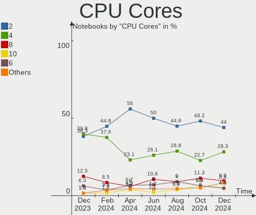

| Number | Notebooks | Percent |
|--------|-----------|---------|
| 2      | 97        | 52.72%  |
| 4      | 62        | 33.7%   |
| 6      | 14        | 7.61%   |
| 8      | 6         | 3.26%   |
| 12     | 2         | 1.09%   |
| 1      | 2         | 1.09%   |
| 14     | 1         | 0.54%   |

CPU Sockets
-----------

Number of sockets

| Number | Notebooks | Percent |
|--------|-----------|---------|
| 1      | 184       | 100%    |

CPU Threads
-----------

Threads per core (Hyper-Threading)

| Number | Notebooks | Percent |
|--------|-----------|---------|
| 2      | 152       | 82.61%  |
| 1      | 32        | 17.39%  |

CPU Op-Modes
------------

CPU Operation Modes (32-bit, 64-bit)

| Op mode        | Notebooks | Percent |
|----------------|-----------|---------|
| 32-bit, 64-bit | 183       | 99.46%  |
| 32-bit         | 1         | 0.54%   |

CPU Microcode
-------------

Microcode number

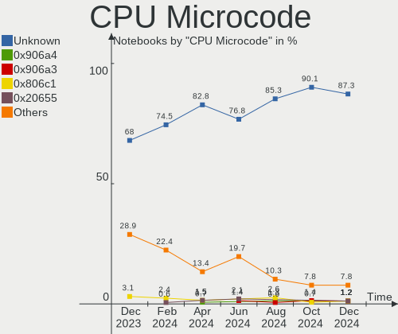

| Number     | Notebooks | Percent |
|------------|-----------|---------|
| Unknown    | 47        | 25.54%  |
| 0x206a7    | 15        | 8.15%   |
| 0x806c1    | 12        | 6.52%   |
| 0x306a9    | 10        | 5.43%   |
| 0x806e9    | 8         | 4.35%   |
| 0x406c4    | 7         | 3.8%    |
| 0x40651    | 7         | 3.8%    |
| 0x08608103 | 7         | 3.8%    |
| 0x806ec    | 6         | 3.26%   |
| 0x806ea    | 5         | 2.72%   |
| 0x706e5    | 5         | 2.72%   |
| 0xa0652    | 4         | 2.17%   |
| 0x6fd      | 4         | 2.17%   |
| 0x306d4    | 4         | 2.17%   |
| 0x20655    | 4         | 2.17%   |
| 0x406e3    | 3         | 1.63%   |
| 0x406c3    | 3         | 1.63%   |
| 0x08600103 | 3         | 1.63%   |
| 0x08108109 | 3         | 1.63%   |
| 0x0600611a | 3         | 1.63%   |
| 0x906ea    | 2         | 1.09%   |
| 0x906a3    | 2         | 1.09%   |
| 0x706a8    | 2         | 1.09%   |
| 0x1067a    | 2         | 1.09%   |
| 0x05000119 | 2         | 1.09%   |
| 0xa0660    | 1         | 0.54%   |
| 0x806d1    | 1         | 0.54%   |
| 0x706a1    | 1         | 0.54%   |
| 0x306c3    | 1         | 0.54%   |
| 0x30673    | 1         | 0.54%   |
| 0x106ca    | 1         | 0.54%   |
| 0x106c2    | 1         | 0.54%   |
| 0x0a50000c | 1         | 0.54%   |
| 0x08608102 | 1         | 0.54%   |
| 0x08108102 | 1         | 0.54%   |
| 0x06006705 | 1         | 0.54%   |
| 0x06006118 | 1         | 0.54%   |
| 0x0500010d | 1         | 0.54%   |
| 0x03000014 | 1         | 0.54%   |

CPU Microarch
-------------

Microarchitecture

| Name             | Notebooks | Percent |
|------------------|-----------|---------|
| KabyLake         | 33        | 17.93%  |
| SandyBridge      | 23        | 12.5%   |
| TigerLake        | 15        | 8.15%   |
| IvyBridge        | 14        | 7.61%   |
| Silvermont       | 11        | 5.98%   |
| IceLake          | 10        | 5.43%   |
| Haswell          | 9         | 4.89%   |
| Unknown          | 9         | 4.89%   |
| Zen+             | 6         | 3.26%   |
| Skylake          | 6         | 3.26%   |
| CometLake        | 6         | 3.26%   |
| Westmere         | 5         | 2.72%   |
| Goldmont plus    | 5         | 2.72%   |
| Excavator        | 5         | 2.72%   |
| Broadwell        | 5         | 2.72%   |
| Core             | 4         | 2.17%   |
| Zen 2            | 3         | 1.63%   |
| Bobcat           | 3         | 1.63%   |
| Alderlake Hybrid | 3         | 1.63%   |
| Zen 3            | 2         | 1.09%   |
| Penryn           | 2         | 1.09%   |
| Bonnell          | 2         | 1.09%   |
| K8 & K10 hybrid  | 1         | 0.54%   |
| K10 Llano        | 1         | 0.54%   |
| K10              | 1         | 0.54%   |

Graphics
--------

GPU Vendor
----------

Vendors of graphics cards

| Vendor | Notebooks | Percent |
|--------|-----------|---------|
| Intel  | 150       | 65.79%  |
| Nvidia | 42        | 18.42%  |
| AMD    | 36        | 15.79%  |

GPU Model
---------

Graphics card models

| Model                                                                                    | Notebooks | Percent |
|------------------------------------------------------------------------------------------|-----------|---------|
| Intel 2nd Generation Core Processor Family Integrated Graphics Controller                | 22        | 9.4%    |
| Intel 3rd Gen Core processor Graphics Controller                                         | 14        | 5.98%   |
| Intel TigerLake-LP GT2 [Iris Xe Graphics]                                                | 13        | 5.56%   |
| Intel HD Graphics 620                                                                    | 12        | 5.13%   |
| Intel Atom/Celeron/Pentium Processor x5-E8000/J3xxx/N3xxx Integrated Graphics Controller | 10        | 4.27%   |
| AMD Lucienne                                                                             | 9         | 3.85%   |
| Intel Iris Plus Graphics G1 (Ice Lake)                                                   | 8         | 3.42%   |
| Intel Haswell-ULT Integrated Graphics Controller                                         | 8         | 3.42%   |
| Intel WhiskeyLake-U GT2 [UHD Graphics 620]                                               | 7         | 2.99%   |
| Intel UHD Graphics 620                                                                   | 7         | 2.99%   |
| Nvidia GM108M [GeForce MX110]                                                            | 6         | 2.56%   |
| AMD Picasso/Raven 2 [Radeon Vega Series / Radeon Vega Mobile Series]                     | 6         | 2.56%   |
| Nvidia TU117M [GeForce GTX 1650 Mobile / Max-Q]                                          | 5         | 2.14%   |
| Intel HD Graphics 5500                                                                   | 5         | 2.14%   |
| Intel GeminiLake [UHD Graphics 600]                                                      | 5         | 2.14%   |
| Intel Core Processor Integrated Graphics Controller                                      | 5         | 2.14%   |
| Intel CometLake-H GT2 [UHD Graphics]                                                     | 5         | 2.14%   |
| Nvidia TU117M                                                                            | 4         | 1.71%   |
| Nvidia GP108M [GeForce MX150]                                                            | 4         | 1.71%   |
| Intel Skylake GT2 [HD Graphics 520]                                                      | 4         | 1.71%   |
| Intel CometLake-U GT2 [UHD Graphics]                                                     | 4         | 1.71%   |
| AMD Wani [Radeon R5/R6/R7 Graphics]                                                      | 4         | 1.71%   |
| Intel CoffeeLake-H GT2 [UHD Graphics 630]                                                | 3         | 1.28%   |
| Intel Alder Lake-P Integrated Graphics Controller                                        | 3         | 1.28%   |
| AMD Topaz XT [Radeon R7 M260/M265 / M340/M360 / M440/M445 / 530/535 / 620/625 Mobile]    | 3         | 1.28%   |
| AMD Renoir                                                                               | 3         | 1.28%   |
| Nvidia GA107BM [GeForce RTX 3050 Mobile]                                                 | 2         | 0.85%   |
| Intel Tiger Lake-LP GT2 [UHD Graphics G4]                                                | 2         | 0.85%   |
| Intel Mobile 4 Series Chipset Integrated Graphics Controller                             | 2         | 0.85%   |
| AMD Whistler [Radeon HD 6630M/6650M/6750M/7670M/7690M]                                   | 2         | 0.85%   |
| AMD Lexa PRO [Radeon 540/540X/550/550X / RX 540X/550/550X]                               | 2         | 0.85%   |
| AMD Cezanne [Radeon Vega Series / Radeon Vega Mobile Series]                             | 2         | 0.85%   |
| Nvidia TU117M [GeForce GTX 1650 Ti Mobile]                                               | 1         | 0.43%   |
| Nvidia TU117GLM [Quadro T2000 Mobile / Max-Q]                                            | 1         | 0.43%   |
| Nvidia TU116M [GeForce GTX 1660 Ti Mobile]                                               | 1         | 0.43%   |
| Nvidia GP108M [GeForce MX230]                                                            | 1         | 0.43%   |
| Nvidia GP107M [GeForce MX350]                                                            | 1         | 0.43%   |
| Nvidia GP107M [GeForce GTX 1050 Ti Mobile]                                               | 1         | 0.43%   |
| Nvidia GM108M [GeForce MX130]                                                            | 1         | 0.43%   |
| Nvidia GM108M [GeForce 940MX]                                                            | 1         | 0.43%   |

GPU Combo
---------

Combinations of graphics cards

| Name           | Notebooks | Percent |
|----------------|-----------|---------|
| 1 x Intel      | 108       | 58.7%   |
| Intel + Nvidia | 33        | 17.93%  |
| 1 x AMD        | 21        | 11.41%  |
| Intel + AMD    | 6         | 3.26%   |
| AMD + Nvidia   | 5         | 2.72%   |
| 2 x AMD        | 4         | 2.17%   |
| 1 x Nvidia     | 4         | 2.17%   |
| 2 x Intel      | 3         | 1.63%   |

GPU Driver
----------

Free vs proprietary

| Driver      | Notebooks | Percent |
|-------------|-----------|---------|
| Free        | 158       | 85.87%  |
| Proprietary | 24        | 13.04%  |
| Unknown     | 2         | 1.09%   |

GPU Memory
----------

Total video memory

| Size in GB | Notebooks | Percent |
|------------|-----------|---------|
| Unknown    | 138       | 75%     |
| 1.01-2.0   | 20        | 10.87%  |
| 0.01-0.5   | 17        | 9.24%   |
| 3.01-4.0   | 5         | 2.72%   |
| 0.51-1.0   | 4         | 2.17%   |

Monitor
-------

Monitor Vendor
--------------

Monitor vendors

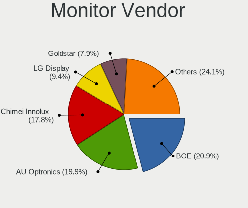

| Vendor                  | Notebooks | Percent |
|-------------------------|-----------|---------|
| Chimei Innolux          | 46        | 21.9%   |
| BOE                     | 44        | 20.95%  |
| AU Optronics            | 36        | 17.14%  |
| LG Display              | 23        | 10.95%  |
| Samsung Electronics     | 11        | 5.24%   |
| Goldstar                | 11        | 5.24%   |
| Chi Mei Optoelectronics | 8         | 3.81%   |
| PANDA                   | 6         | 2.86%   |
| SLD                     | 3         | 1.43%   |
| InfoVision              | 3         | 1.43%   |
| Dell                    | 3         | 1.43%   |
| AOC                     | 3         | 1.43%   |
| Apple                   | 2         | 0.95%   |
| STA                     | 1         | 0.48%   |
| Sony                    | 1         | 0.48%   |
| Sharp                   | 1         | 0.48%   |
| LG Philips              | 1         | 0.48%   |
| Lenovo                  | 1         | 0.48%   |
| KDC                     | 1         | 0.48%   |
| ITE                     | 1         | 0.48%   |
| CSO                     | 1         | 0.48%   |
| CPT                     | 1         | 0.48%   |
| BenQ                    | 1         | 0.48%   |
| Acer                    | 1         | 0.48%   |

Monitor Model
-------------

Monitor models

| Model                                                                | Notebooks | Percent |
|----------------------------------------------------------------------|-----------|---------|
| Chimei Innolux LCD Monitor CMN15F5 1920x1080 344x193mm 15.5-inch     | 8         | 3.81%   |
| Chimei Innolux LCD Monitor CMN15E6 1366x768 344x193mm 15.5-inch      | 8         | 3.81%   |
| BOE LCD Monitor BOE08D5 1920x1080 344x194mm 15.5-inch                | 5         | 2.38%   |
| AU Optronics LCD Monitor AUO183C 1366x768 309x173mm 13.9-inch        | 5         | 2.38%   |
| Chimei Innolux LCD Monitor CMN15DB 1366x768 344x193mm 15.5-inch      | 4         | 1.9%    |
| SLD LCD Monitor SLD003C 1366x768 309x173mm 13.9-inch                 | 3         | 1.43%   |
| InfoVision M140NWR2 R1 IVO057A 1366x768 309x174mm 14.0-inch          | 3         | 1.43%   |
| Goldstar 25UM58G GSM5B98 2560x1080 670x280mm 28.6-inch               | 3         | 1.43%   |
| Chimei Innolux LCD Monitor CMN1470 1366x768 309x174mm 14.0-inch      | 3         | 1.43%   |
| BOE LCD Monitor BOE0812 1920x1080 344x194mm 15.5-inch                | 3         | 1.43%   |
| BOE LCD Monitor BOE07AA 1366x768 344x194mm 15.5-inch                 | 3         | 1.43%   |
| AU Optronics LCD Monitor AUO71EC 1366x768 344x193mm 15.5-inch        | 3         | 1.43%   |
| AU Optronics LCD Monitor AUO2E3C 1366x768 309x173mm 13.9-inch        | 3         | 1.43%   |
| Samsung Electronics SMT24A550 SAM07B5 1920x1080 531x299mm 24.0-inch  | 2         | 0.95%   |
| Samsung Electronics LCD Monitor SEC4C42 1280x800 303x190mm 14.1-inch | 2         | 0.95%   |
| PANDA LCD Monitor NCP005F 1920x1080 344x194mm 15.5-inch              | 2         | 0.95%   |
| PANDA LCD Monitor NCP004D 1920x1080 344x194mm 15.5-inch              | 2         | 0.95%   |
| LG Display LCD Monitor LGD0456 1366x768 344x194mm 15.5-inch          | 2         | 0.95%   |
| LG Display LCD Monitor LGD02DC 1366x768 344x194mm 15.5-inch          | 2         | 0.95%   |
| Goldstar W2043 GSM4E9D 1600x900 443x249mm 20.0-inch                  | 2         | 0.95%   |
| Dell P2719H DEL4185 1920x1080 598x336mm 27.0-inch                    | 2         | 0.95%   |
| Chimei Innolux LCD Monitor CMN15DC 1366x768 344x193mm 15.5-inch      | 2         | 0.95%   |
| Chimei Innolux LCD Monitor CMN15C6 1366x768 344x193mm 15.5-inch      | 2         | 0.95%   |
| Chimei Innolux LCD Monitor CMN14D6 1366x768 309x173mm 13.9-inch      | 2         | 0.95%   |
| Chimei Innolux LCD Monitor CMN14C3 1366x768 309x173mm 13.9-inch      | 2         | 0.95%   |
| Chimei Innolux LCD Monitor CMN1490 1366x768 309x173mm 13.9-inch      | 2         | 0.95%   |
| Chimei Innolux LCD Monitor CMN1476 1366x768 309x174mm 14.0-inch      | 2         | 0.95%   |
| BOE LCD Monitor BOE08F5 1920x1080 344x194mm 15.5-inch                | 2         | 0.95%   |
| BOE LCD Monitor BOE07C6 1366x768 309x173mm 13.9-inch                 | 2         | 0.95%   |
| BOE LCD Monitor BOE0674 1366x768 344x194mm 15.5-inch                 | 2         | 0.95%   |
| AU Optronics LCD Monitor AUOED8F 1920x1080 344x193mm 15.5-inch       | 2         | 0.95%   |
| AU Optronics LCD Monitor AUO21ED 1920x1080 344x194mm 15.5-inch       | 2         | 0.95%   |
| AU Optronics LCD Monitor AUO1B3C 1366x768 309x173mm 13.9-inch        | 2         | 0.95%   |
| STA SEMP LEDTV STA0030 1920x540 708x398mm 32.0-inch                  | 1         | 0.48%   |
| Sony TV SNYE903 1920x1080                                            | 1         | 0.48%   |
| Sharp LQ134N1JW52 SHP151E 1920x1200 288x180mm 13.4-inch              | 1         | 0.48%   |
| Samsung Electronics SyncMaster SAM04F3 1360x768 410x230mm 18.5-inch  | 1         | 0.48%   |
| Samsung Electronics SyncMaster SAM04D5 1920x1080                     | 1         | 0.48%   |
| Samsung Electronics S24D332 SAM0F5E 1920x1080 531x299mm 24.0-inch    | 1         | 0.48%   |
| Samsung Electronics LCD Monitor SDC5441 1366x768 293x165mm 13.2-inch | 1         | 0.48%   |

Monitor Resolution
------------------

Monitor screen resolution

| Resolution        | Notebooks | Percent |
|-------------------|-----------|---------|
| 1366x768 (WXGA)   | 109       | 53.96%  |
| 1920x1080 (FHD)   | 65        | 32.18%  |
| 1280x800 (WXGA)   | 7         | 3.47%   |
| 2560x1080         | 4         | 1.98%   |
| 1600x900 (HD+)    | 4         | 1.98%   |
| 3840x2160 (4K)    | 2         | 0.99%   |
| 2560x1440 (QHD)   | 2         | 0.99%   |
| 1920x540          | 2         | 0.99%   |
| 1280x1024 (SXGA)  | 2         | 0.99%   |
| 2880x1800         | 1         | 0.5%    |
| 1920x1200 (WUXGA) | 1         | 0.5%    |
| 1360x768          | 1         | 0.5%    |
| 1024x600          | 1         | 0.5%    |
| 1024x576          | 1         | 0.5%    |

Monitor Diagonal
----------------

Diagonal size in inches

| Inches  | Notebooks | Percent |
|---------|-----------|---------|
| 15      | 104       | 49.52%  |
| 13      | 37        | 17.62%  |
| 14      | 29        | 13.81%  |
| 23      | 6         | 2.86%   |
| 24      | 5         | 2.38%   |
| 17      | 5         | 2.38%   |
| 28      | 3         | 1.43%   |
| 27      | 3         | 1.43%   |
| 20      | 3         | 1.43%   |
| 18      | 2         | 0.95%   |
| 11      | 2         | 0.95%   |
| Unknown | 2         | 0.95%   |
| 84      | 1         | 0.48%   |
| 72      | 1         | 0.48%   |
| 37      | 1         | 0.48%   |
| 34      | 1         | 0.48%   |
| 31      | 1         | 0.48%   |
| 21      | 1         | 0.48%   |
| 16      | 1         | 0.48%   |
| 12      | 1         | 0.48%   |
| 10      | 1         | 0.48%   |

Monitor Width
-------------

Physical width

| Width in mm | Notebooks | Percent |
|-------------|-----------|---------|
| 301-350     | 166       | 79.81%  |
| 501-600     | 14        | 6.73%   |
| 201-300     | 8         | 3.85%   |
| 401-500     | 6         | 2.88%   |
| 601-700     | 4         | 1.92%   |
| 351-400     | 4         | 1.92%   |
| 1501-2000   | 2         | 0.96%   |
| Unknown     | 2         | 0.96%   |
| 801-900     | 1         | 0.48%   |
| 701-800     | 1         | 0.48%   |

Aspect Ratio
------------

Proportional relationship between the width and the height

| Ratio   | Notebooks | Percent |
|---------|-----------|---------|
| 16/9    | 172       | 91.01%  |
| 16/10   | 9         | 4.76%   |
| 21/9    | 4         | 2.12%   |
| 5/4     | 2         | 1.06%   |
| 32/9    | 1         | 0.53%   |
| Unknown | 1         | 0.53%   |

Monitor Area
------------

Area in inch²

| Area in inch² | Notebooks | Percent |
|----------------|-----------|---------|
| 101-110        | 104       | 49.52%  |
| 81-90          | 63        | 30%     |
| 201-250        | 10        | 4.76%   |
| 251-300        | 5         | 2.38%   |
| 141-150        | 4         | 1.9%    |
| 71-80          | 3         | 1.43%   |
| 301-350        | 3         | 1.43%   |
| 151-200        | 3         | 1.43%   |
| 121-130        | 3         | 1.43%   |
| More than 1000 | 2         | 0.95%   |
| 51-60          | 2         | 0.95%   |
| 351-500        | 2         | 0.95%   |
| Unknown        | 2         | 0.95%   |
| 61-70          | 1         | 0.48%   |
| 41-50          | 1         | 0.48%   |
| 111-120        | 1         | 0.48%   |
| 501-1000       | 1         | 0.48%   |

Pixel Density
-------------

Pixels per inch

| Density       | Notebooks | Percent |
|---------------|-----------|---------|
| 101-120       | 113       | 53.81%  |
| 121-160       | 59        | 28.1%   |
| 51-100        | 30        | 14.29%  |
| 161-240       | 3         | 1.43%   |
| 1-50          | 2         | 0.95%   |
| Unknown       | 2         | 0.95%   |
| More than 240 | 1         | 0.48%   |

Multiple Monitors
-----------------

Total monitors connected

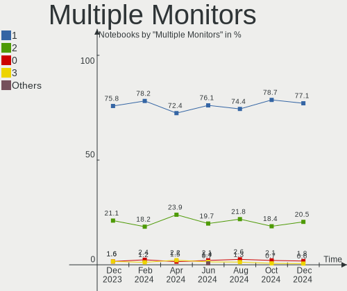

| Total | Notebooks | Percent |
|-------|-----------|---------|
| 1     | 152       | 82.61%  |
| 2     | 31        | 16.85%  |
| 0     | 1         | 0.54%   |

Network
-------

Net Controller Vendor
---------------------

Controller vendors

| Vendor                    | Notebooks | Percent |
|---------------------------|-----------|---------|
| Realtek Semiconductor     | 130       | 42.07%  |
| Qualcomm Atheros          | 73        | 23.62%  |
| Intel                     | 62        | 20.06%  |
| Broadcom                  | 15        | 4.85%   |
| JMicron Technology        | 6         | 1.94%   |
| Ralink                    | 4         | 1.29%   |
| Broadcom Limited          | 4         | 1.29%   |
| Samsung Electronics       | 2         | 0.65%   |
| Nvidia                    | 2         | 0.65%   |
| MediaTek                  | 2         | 0.65%   |
| D-Link System             | 2         | 0.65%   |
| TP-Link                   | 1         | 0.32%   |
| Spreadtrum Communications | 1         | 0.32%   |
| Ralink Technology         | 1         | 0.32%   |
| Qualcomm                  | 1         | 0.32%   |
| Marvell Technology Group  | 1         | 0.32%   |
| Huawei Technologies       | 1         | 0.32%   |
| D-Link                    | 1         | 0.32%   |

Net Controller Model
--------------------

Controller models

| Model                                                                   | Notebooks | Percent |
|-------------------------------------------------------------------------|-----------|---------|
| Realtek RTL8111/8168/8411 PCI Express Gigabit Ethernet Controller       | 67        | 20.06%  |
| Realtek RTL810xE PCI Express Fast Ethernet controller                   | 26        | 7.78%   |
| Qualcomm Atheros QCA9565 / AR9565 Wireless Network Adapter              | 22        | 6.59%   |
| Qualcomm Atheros QCA9377 802.11ac Wireless Network Adapter              | 20        | 5.99%   |
| Intel Wi-Fi 6 AX201                                                     | 13        | 3.89%   |
| Qualcomm Atheros AR9285 Wireless Network Adapter (PCI-Express)          | 10        | 2.99%   |
| Realtek RTL8822CE 802.11ac PCIe Wireless Network Adapter                | 8         | 2.4%    |
| Qualcomm Atheros AR9485 Wireless Network Adapter                        | 8         | 2.4%    |
| Intel Wi-Fi 6 AX200                                                     | 8         | 2.4%    |
| Realtek RTL8723BU 802.11b/g/n WLAN Adapter                              | 6         | 1.8%    |
| Realtek RTL8821CE 802.11ac PCIe Wireless Network Adapter                | 5         | 1.5%    |
| Realtek RTL8188CE 802.11b/g/n WiFi Adapter                              | 5         | 1.5%    |
| JMicron JMC250 PCI Express Gigabit Ethernet Controller                  | 5         | 1.5%    |
| Intel Ice Lake-LP PCH CNVi WiFi                                         | 5         | 1.5%    |
| Intel Dual Band Wireless-AC 3165 Plus Bluetooth                         | 5         | 1.5%    |
| Intel Comet Lake PCH CNVi WiFi                                          | 5         | 1.5%    |
| Broadcom BCM4313 802.11bgn Wireless Network Adapter                     | 5         | 1.5%    |
| Realtek Killer E2600 Gigabit Ethernet Controller                        | 4         | 1.2%    |
| Realtek 802.11ac NIC                                                    | 4         | 1.2%    |
| Qualcomm Atheros AR8151 v2.0 Gigabit Ethernet                           | 4         | 1.2%    |
| Intel Comet Lake PCH-LP CNVi WiFi                                       | 4         | 1.2%    |
| Realtek RTL8153 Gigabit Ethernet Adapter                                | 3         | 0.9%    |
| Intel Alder Lake-P PCH CNVi WiFi                                        | 3         | 0.9%    |
| Broadcom NetXtreme BCM57786 Gigabit Ethernet PCIe                       | 3         | 0.9%    |
| Samsung Galaxy series, misc. (tethering mode)                           | 2         | 0.6%    |
| Realtek RTL8723BE PCIe Wireless Network Adapter                         | 2         | 0.6%    |
| Realtek RTL8188EUS 802.11n Wireless Network Adapter                     | 2         | 0.6%    |
| Realtek 802.11n WLAN Adapter                                            | 2         | 0.6%    |
| Ralink RT5390 Wireless 802.11n 1T/1R PCIe                               | 2         | 0.6%    |
| Ralink RT3090 Wireless 802.11n 1T/1R PCIe                               | 2         | 0.6%    |
| Qualcomm Atheros QCA6174 802.11ac Wireless Network Adapter              | 2         | 0.6%    |
| Qualcomm Atheros AR8162 Fast Ethernet                                   | 2         | 0.6%    |
| Qualcomm Atheros AR242x / AR542x Wireless Network Adapter (PCI-Express) | 2         | 0.6%    |
| MediaTek MT7921 802.11ax PCI Express Wireless Network Adapter           | 2         | 0.6%    |
| Intel Wireless 7265                                                     | 2         | 0.6%    |
| Intel Wireless 7260                                                     | 2         | 0.6%    |
| Intel Wireless 3160                                                     | 2         | 0.6%    |
| Intel Cannon Point-LP CNVi [Wireless-AC]                                | 2         | 0.6%    |
| Broadcom NetLink BCM57785 Gigabit Ethernet PCIe                         | 2         | 0.6%    |
| Broadcom Limited NetLink BCM5787M Gigabit Ethernet PCI Express          | 2         | 0.6%    |

Wireless Vendor
---------------

Wireless vendors

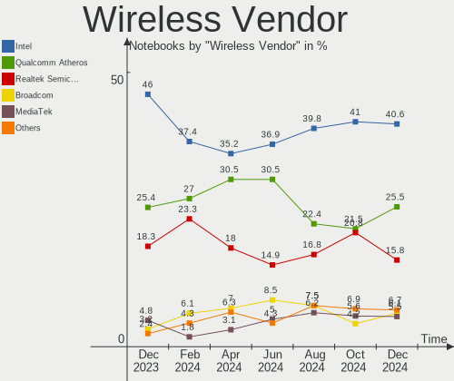

| Vendor                | Notebooks | Percent |
|-----------------------|-----------|---------|
| Qualcomm Atheros      | 67        | 35.83%  |
| Intel                 | 61        | 32.62%  |
| Realtek Semiconductor | 39        | 20.86%  |
| Broadcom              | 9         | 4.81%   |
| Ralink                | 4         | 2.14%   |
| MediaTek              | 2         | 1.07%   |
| D-Link System         | 2         | 1.07%   |
| Ralink Technology     | 1         | 0.53%   |
| D-Link                | 1         | 0.53%   |
| Broadcom Limited      | 1         | 0.53%   |

Wireless Model
--------------

Wireless models

| Model                                                                   | Notebooks | Percent |
|-------------------------------------------------------------------------|-----------|---------|
| Qualcomm Atheros QCA9565 / AR9565 Wireless Network Adapter              | 22        | 11.64%  |
| Qualcomm Atheros QCA9377 802.11ac Wireless Network Adapter              | 20        | 10.58%  |
| Intel Wi-Fi 6 AX201                                                     | 13        | 6.88%   |
| Qualcomm Atheros AR9285 Wireless Network Adapter (PCI-Express)          | 10        | 5.29%   |
| Realtek RTL8822CE 802.11ac PCIe Wireless Network Adapter                | 8         | 4.23%   |
| Qualcomm Atheros AR9485 Wireless Network Adapter                        | 8         | 4.23%   |
| Intel Wi-Fi 6 AX200                                                     | 8         | 4.23%   |
| Realtek RTL8723BU 802.11b/g/n WLAN Adapter                              | 6         | 3.17%   |
| Realtek RTL8821CE 802.11ac PCIe Wireless Network Adapter                | 5         | 2.65%   |
| Realtek RTL8188CE 802.11b/g/n WiFi Adapter                              | 5         | 2.65%   |
| Intel Ice Lake-LP PCH CNVi WiFi                                         | 5         | 2.65%   |
| Intel Dual Band Wireless-AC 3165 Plus Bluetooth                         | 5         | 2.65%   |
| Intel Comet Lake PCH CNVi WiFi                                          | 5         | 2.65%   |
| Broadcom BCM4313 802.11bgn Wireless Network Adapter                     | 5         | 2.65%   |
| Realtek 802.11ac NIC                                                    | 4         | 2.12%   |
| Intel Comet Lake PCH-LP CNVi WiFi                                       | 4         | 2.12%   |
| Intel Alder Lake-P PCH CNVi WiFi                                        | 3         | 1.59%   |
| Realtek RTL8723BE PCIe Wireless Network Adapter                         | 2         | 1.06%   |
| Realtek RTL8188EUS 802.11n Wireless Network Adapter                     | 2         | 1.06%   |
| Realtek 802.11n WLAN Adapter                                            | 2         | 1.06%   |
| Ralink RT5390 Wireless 802.11n 1T/1R PCIe                               | 2         | 1.06%   |
| Ralink RT3090 Wireless 802.11n 1T/1R PCIe                               | 2         | 1.06%   |
| Qualcomm Atheros QCA6174 802.11ac Wireless Network Adapter              | 2         | 1.06%   |
| Qualcomm Atheros AR242x / AR542x Wireless Network Adapter (PCI-Express) | 2         | 1.06%   |
| MediaTek MT7921 802.11ax PCI Express Wireless Network Adapter           | 2         | 1.06%   |
| Intel Wireless 7265                                                     | 2         | 1.06%   |
| Intel Wireless 7260                                                     | 2         | 1.06%   |
| Intel Wireless 3160                                                     | 2         | 1.06%   |
| Intel Cannon Point-LP CNVi [Wireless-AC]                                | 2         | 1.06%   |
| Broadcom BCM43224 802.11a/b/g/n                                         | 2         | 1.06%   |
| Realtek RTL88x2bu [AC1200 Techkey]                                      | 1         | 0.53%   |
| Realtek RTL8723AE PCIe Wireless Network Adapter                         | 1         | 0.53%   |
| Realtek RTL8191SEvB Wireless LAN Controller                             | 1         | 0.53%   |
| Realtek RTL8188EE Wireless Network Adapter                              | 1         | 0.53%   |
| Realtek RTL8187SE Wireless LAN Controller                               | 1         | 0.53%   |
| Realtek 802.11ax WLAN Adapter                                           | 1         | 0.53%   |
| Ralink MT7601U Wireless Adapter                                         | 1         | 0.53%   |
| Qualcomm Atheros AR93xx Wireless Network Adapter                        | 1         | 0.53%   |
| Qualcomm Atheros AR928X Wireless Network Adapter (PCI-Express)          | 1         | 0.53%   |
| Qualcomm Atheros AR9287 Wireless Network Adapter (PCI-Express)          | 1         | 0.53%   |

Ethernet Vendor
---------------

Ethernet vendors

| Vendor                    | Notebooks | Percent |
|---------------------------|-----------|---------|
| Realtek Semiconductor     | 101       | 71.13%  |
| Qualcomm Atheros          | 9         | 6.34%   |
| Intel                     | 8         | 5.63%   |
| JMicron Technology        | 6         | 4.23%   |
| Broadcom                  | 6         | 4.23%   |
| Broadcom Limited          | 3         | 2.11%   |
| Samsung Electronics       | 2         | 1.41%   |
| Nvidia                    | 2         | 1.41%   |
| TP-Link                   | 1         | 0.7%    |
| Spreadtrum Communications | 1         | 0.7%    |
| Qualcomm                  | 1         | 0.7%    |
| Marvell Technology Group  | 1         | 0.7%    |
| Huawei Technologies       | 1         | 0.7%    |

Ethernet Model
--------------

Ethernet models

| Model                                                                          | Notebooks | Percent |
|--------------------------------------------------------------------------------|-----------|---------|
| Realtek RTL8111/8168/8411 PCI Express Gigabit Ethernet Controller              | 67        | 46.21%  |
| Realtek RTL810xE PCI Express Fast Ethernet controller                          | 26        | 17.93%  |
| JMicron JMC250 PCI Express Gigabit Ethernet Controller                         | 5         | 3.45%   |
| Realtek Killer E2600 Gigabit Ethernet Controller                               | 4         | 2.76%   |
| Qualcomm Atheros AR8151 v2.0 Gigabit Ethernet                                  | 4         | 2.76%   |
| Realtek RTL8153 Gigabit Ethernet Adapter                                       | 3         | 2.07%   |
| Broadcom NetXtreme BCM57786 Gigabit Ethernet PCIe                              | 3         | 2.07%   |
| Samsung Galaxy series, misc. (tethering mode)                                  | 2         | 1.38%   |
| Qualcomm Atheros AR8162 Fast Ethernet                                          | 2         | 1.38%   |
| Broadcom NetLink BCM57785 Gigabit Ethernet PCIe                                | 2         | 1.38%   |
| Broadcom Limited NetLink BCM5787M Gigabit Ethernet PCI Express                 | 2         | 1.38%   |
| TP-Link UE300 10/100/1000 LAN (ethernet mode) [Realtek RTL8153]                | 1         | 0.69%   |
| Spreadtrum Unisoc Phone                                                        | 1         | 0.69%   |
| Realtek RTL8152 Fast Ethernet Adapter                                          | 1         | 0.69%   |
| Realtek RTL8125 2.5GbE Controller                                              | 1         | 0.69%   |
| Realtek RTL-8100/8101L/8139 PCI Fast Ethernet Adapter                          | 1         | 0.69%   |
| Realtek Killer E3000 2.5GbE Controller                                         | 1         | 0.69%   |
| Qualcomm FP3                                                                   | 1         | 0.69%   |
| Qualcomm Atheros QCA8171 Gigabit Ethernet                                      | 1         | 0.69%   |
| Qualcomm Atheros AR8132 Fast Ethernet                                          | 1         | 0.69%   |
| Qualcomm Atheros AR8131 Gigabit Ethernet                                       | 1         | 0.69%   |
| Nvidia MCP79 Ethernet                                                          | 1         | 0.69%   |
| Nvidia MCP77 Ethernet                                                          | 1         | 0.69%   |
| Marvell Group Yukon Optima 88E8059 [PCIe Gigabit Ethernet Controller with AVB] | 1         | 0.69%   |
| JMicron JMC260 PCI Express Fast Ethernet Controller                            | 1         | 0.69%   |
| Intel Ethernet Connection I219-V                                               | 1         | 0.69%   |
| Intel Ethernet Connection I219-LM                                              | 1         | 0.69%   |
| Intel Ethernet Connection (4) I219-LM                                          | 1         | 0.69%   |
| Intel Ethernet Connection (3) I218-V                                           | 1         | 0.69%   |
| Intel Ethernet Connection (13) I219-V                                          | 1         | 0.69%   |
| Intel Ethernet Connection (11) I219-LM                                         | 1         | 0.69%   |
| Intel 82579LM Gigabit Network Connection (Lewisville)                          | 1         | 0.69%   |
| Intel 82562GT 10/100 Network Connection                                        | 1         | 0.69%   |
| Huawei ELS-NX9                                                                 | 1         | 0.69%   |
| Broadcom NetLink BCM57780 Gigabit Ethernet PCIe                                | 1         | 0.69%   |
| Broadcom Limited NetLink BCM57780 Gigabit Ethernet PCIe                        | 1         | 0.69%   |

Net Controller Kind
-------------------

Ethernet, WiFi or modem

| Kind     | Notebooks | Percent |
|----------|-----------|---------|
| WiFi     | 177       | 55.66%  |
| Ethernet | 141       | 44.34%  |

Used Controller
---------------

Currently used network controller

| Kind     | Notebooks | Percent |
|----------|-----------|---------|
| WiFi     | 146       | 79.78%  |
| Ethernet | 37        | 20.22%  |

NICs
----

Total network controllers on board

| Total | Notebooks | Percent |
|-------|-----------|---------|
| 2     | 132       | 71.74%  |
| 1     | 39        | 21.2%   |
| 0     | 13        | 7.07%   |

IPv6
----

IPv6 vs IPv4

| Used | Notebooks | Percent |
|------|-----------|---------|
| Yes  | 93        | 50.54%  |
| No   | 91        | 49.46%  |

Bluetooth
---------

Bluetooth Vendor
----------------

Controller vendors

| Vendor                          | Notebooks | Percent |
|---------------------------------|-----------|---------|
| Intel                           | 55        | 39.29%  |
| Qualcomm Atheros Communications | 37        | 26.43%  |
| Lite-On Technology              | 20        | 14.29%  |
| Realtek Semiconductor           | 11        | 7.86%   |
| IMC Networks                    | 7         | 5%      |
| Hewlett-Packard                 | 3         | 2.14%   |
| Broadcom                        | 3         | 2.14%   |
| Foxconn / Hon Hai               | 2         | 1.43%   |
| Apple                           | 2         | 1.43%   |

Bluetooth Model
---------------

Controller models

| Model                                                                               | Notebooks | Percent |
|-------------------------------------------------------------------------------------|-----------|---------|
| Qualcomm Atheros  Bluetooth Device                                                  | 21        | 15%     |
| Intel Bluetooth 9460/9560 Jefferson Peak (JfP)                                      | 18        | 12.86%  |
| Intel Bluetooth Device                                                              | 16        | 11.43%  |
| Intel Bluetooth wireless interface                                                  | 12        | 8.57%   |
| Realtek Bluetooth Radio                                                             | 11        | 7.86%   |
| Lite-On Bluetooth Device                                                            | 9         | 6.43%   |
| Qualcomm Atheros AR3011 Bluetooth                                                   | 7         | 5%      |
| Intel AX200 Bluetooth                                                               | 7         | 5%      |
| Lite-On Atheros AR3012 Bluetooth                                                    | 5         | 3.57%   |
| Qualcomm Atheros AR9462 Bluetooth                                                   | 4         | 2.86%   |
| Qualcomm Atheros AR3012 Bluetooth 4.0                                               | 4         | 2.86%   |
| IMC Networks Bluetooth Radio                                                        | 4         | 2.86%   |
| Lite-On Wireless_Device                                                             | 2         | 1.43%   |
| Lite-On Qualcomm Atheros Bluetooth                                                  | 2         | 1.43%   |
| Lite-On Atheros Bluetooth                                                           | 2         | 1.43%   |
| IMC Networks Bluetooth Device                                                       | 2         | 1.43%   |
| HP Bluetooth 2.0 Interface [Broadcom BCM2045]                                       | 2         | 1.43%   |
| Foxconn / Hon Hai Foxconn T77H114 BCM2070 [Single-Chip Bluetooth 2.1 + EDR Adapter] | 2         | 1.43%   |
| Qualcomm Atheros Bluetooth USB Host Controller                                      | 1         | 0.71%   |
| Intel Wireless-AC 9260 Bluetooth Adapter                                            | 1         | 0.71%   |
| Intel Wireless-AC 3168 Bluetooth                                                    | 1         | 0.71%   |
| IMC Networks Bluetooth                                                              | 1         | 0.71%   |
| HP Integrated Module with Bluetooth 2.1 Wireless technology                         | 1         | 0.71%   |
| Broadcom Bluetooth                                                                  | 1         | 0.71%   |
| Broadcom BCM2070 Bluetooth Device                                                   | 1         | 0.71%   |
| Broadcom BCM2070 Bluetooth 2.1 + EDR                                                | 1         | 0.71%   |
| Apple Built-in Bluetooth 2.0+EDR HCI                                                | 1         | 0.71%   |
| Apple Bluetooth Host Controller                                                     | 1         | 0.71%   |

Sound
-----

Sound Vendor
------------

Sound card vendors

| Vendor                 | Notebooks | Percent |
|------------------------|-----------|---------|
| Intel                  | 147       | 70%     |
| AMD                    | 30        | 14.29%  |
| Nvidia                 | 20        | 9.52%   |
| C-Media Electronics    | 3         | 1.43%   |
| Logitech               | 2         | 0.95%   |
| Generalplus Technology | 2         | 0.95%   |
| Microsoft              | 1         | 0.48%   |
| Meizu                  | 1         | 0.48%   |
| JMTek                  | 1         | 0.48%   |
| JBL                    | 1         | 0.48%   |
| Goldvish               | 1         | 0.48%   |
| Dell                   | 1         | 0.48%   |

Sound Model
-----------

Sound card models

| Model                                                                                             | Notebooks | Percent |
|---------------------------------------------------------------------------------------------------|-----------|---------|
| Intel Sunrise Point-LP HD Audio                                                                   | 25        | 10%     |
| AMD Family 17h/19h HD Audio Controller                                                            | 20        | 8%      |
| Intel 6 Series/C200 Series Chipset Family High Definition Audio Controller                        | 19        | 7.6%    |
| Intel 7 Series/C216 Chipset Family High Definition Audio Controller                               | 18        | 7.2%    |
| Intel Tiger Lake-LP Smart Sound Technology Audio Controller                                       | 15        | 6%      |
| AMD Renoir Radeon High Definition Audio Controller                                                | 10        | 4%      |
| Nvidia TU107 GeForce GTX 1650 High Definition Audio Controller                                    | 9         | 3.6%    |
| Intel Ice Lake-LP Smart Sound Technology Audio Controller                                         | 9         | 3.6%    |
| Intel Haswell-ULT HD Audio Controller                                                             | 8         | 3.2%    |
| Intel 8 Series HD Audio Controller                                                                | 8         | 3.2%    |
| Intel Cannon Point-LP High Definition Audio Controller                                            | 7         | 2.8%    |
| Intel Atom/Celeron/Pentium Processor x5-E8000/J3xxx/N3xxx Series High Definition Audio Controller | 6         | 2.4%    |
| AMD Raven/Raven2/Fenghuang HDMI/DP Audio Controller                                               | 6         | 2.4%    |
| Intel Wildcat Point-LP High Definition Audio Controller                                           | 5         | 2%      |
| Intel Comet Lake PCH-LP cAVS                                                                      | 5         | 2%      |
| Intel Comet Lake PCH cAVS                                                                         | 5         | 2%      |
| Intel Celeron/Pentium Silver Processor High Definition Audio                                      | 5         | 2%      |
| Intel Broadwell-U Audio Controller                                                                | 5         | 2%      |
| Intel 5 Series/3400 Series Chipset High Definition Audio                                          | 5         | 2%      |
| AMD Family 15h (Models 60h-6fh) Audio Controller                                                  | 5         | 2%      |
| AMD Kabini HDMI/DP Audio                                                                          | 4         | 1.6%    |
| Intel Cannon Lake PCH cAVS                                                                        | 3         | 1.2%    |
| Intel Alder Lake PCH-P High Definition Audio Controller                                           | 3         | 1.2%    |
| Intel 82801I (ICH9 Family) HD Audio Controller                                                    | 3         | 1.2%    |
| AMD Wrestler HDMI Audio                                                                           | 3         | 1.2%    |
| AMD SBx00 Azalia (Intel HDA)                                                                      | 3         | 1.2%    |
| Nvidia Audio device                                                                               | 2         | 0.8%    |
| Logitech H390 headset with microphone                                                             | 2         | 0.8%    |
| Intel NM10/ICH7 Family High Definition Audio Controller                                           | 2         | 0.8%    |
| Intel 82801H (ICH8 Family) HD Audio Controller                                                    | 2         | 0.8%    |
| Generalplus Technology USB Audio Device                                                           | 2         | 0.8%    |
| AMD FCH Azalia Controller                                                                         | 2         | 0.8%    |
| Nvidia TU116 High Definition Audio Controller                                                     | 1         | 0.4%    |
| Nvidia MCP79 High Definition Audio                                                                | 1         | 0.4%    |
| Nvidia MCP72XE/MCP72P/MCP78U/MCP78S High Definition Audio                                         | 1         | 0.4%    |
| Nvidia GP107GL High Definition Audio Controller                                                   | 1         | 0.4%    |
| Nvidia GK107 HDMI Audio Controller                                                                | 1         | 0.4%    |
| Nvidia GF116 High Definition Audio Controller                                                     | 1         | 0.4%    |
| Nvidia GF108 High Definition Audio Controller                                                     | 1         | 0.4%    |
| Nvidia GA106 High Definition Audio Controller                                                     | 1         | 0.4%    |

Memory
------

Memory Vendor
-------------

Memory module vendors

| Vendor              | Notebooks | Percent |
|---------------------|-----------|---------|
| Smart               | 25        | 20.16%  |
| Unknown             | 15        | 12.1%   |
| Samsung Electronics | 13        | 10.48%  |
| A-DATA Technology   | 13        | 10.48%  |
| Kingston            | 11        | 8.87%   |
| SK hynix            | 8         | 6.45%   |
| Smart Brazil        | 7         | 5.65%   |
| Micron Technology   | 7         | 5.65%   |
| Teikon              | 5         | 4.03%   |
| Crucial             | 4         | 3.23%   |
| Unknown (ABCD)      | 3         | 2.42%   |
| Corsair             | 3         | 2.42%   |
| Unknown (0x0B5E)    | 2         | 1.61%   |
| Unknown (82B5)      | 1         | 0.81%   |
| Unknown (0xAD0A)    | 1         | 0.81%   |
| Team                | 1         | 0.81%   |
| PUSKILL             | 1         | 0.81%   |
| Kllisre             | 1         | 0.81%   |
| Elpida              | 1         | 0.81%   |
| Atermiter           | 1         | 0.81%   |
| Unknown             | 1         | 0.81%   |

Memory Model
------------

Memory module models

| Model                                                            | Notebooks | Percent |
|------------------------------------------------------------------|-----------|---------|
| Smart RAM SH564128FJ8NWRNSQR 4GB SODIMM DDR3 1600MT/s            | 5         | 3.65%   |
| Samsung RAM M471A5244CB0-CWE 4GB Row Of Chips DDR4 3200MT/s      | 4         | 2.92%   |
| Unknown (ABCD) RAM 123456789012345678 2GB SODIMM LPDDR4 2400MT/s | 3         | 2.19%   |
| Smart RAM SH564568FJ8NZRNSDR 2GB SODIMM DDR3 1600MT/s            | 3         | 2.19%   |
| Smart Brazil RAM SMS4WEC8C1K0446FCG 8GB SODIMM DDR4 3200MT/s     | 3         | 2.19%   |
| Smart Brazil RAM Module 4GB Row Of Chips DDR4 3200MT/s           | 3         | 2.19%   |
| A-DATA RAM AL1P32NC8T1-B8DS 8GB SODIMM DDR4 3200MT/s             | 3         | 2.19%   |
| Unknown RAM Module 4GB SODIMM DDR3 1333MT/s                      | 2         | 1.46%   |
| Unknown RAM Module 4GB SODIMM DDR3                               | 2         | 1.46%   |
| Unknown RAM Module 2GB SODIMM DDR3 1066MT/s                      | 2         | 1.46%   |
| Unknown (0x0B5E) RAM HEMA81GS6DJR8N-XN 8GB SODIMM DDR4 3200MT/s  | 2         | 1.46%   |
| Teikon RAM TMA81GS6AFR8N-UHSC 8GB SODIMM DDR4 2400MT/s           | 2         | 1.46%   |
| Smart RAM SH564568FH8NZPHSCR 2GB SODIMM DDR3 1333MT/s            | 2         | 1.46%   |
| Smart RAM SH564568FH8NWPHSFG 2GB SODIMM DDR3 1333MT/s            | 2         | 1.46%   |
| Smart RAM SH564128FJ8NZRNSDR 4GB SODIMM DDR3 1600MT/s            | 2         | 1.46%   |
| Smart RAM SH564128FH8NZPHSCG 4GB SODIMM DDR3 1334MT/s            | 2         | 1.46%   |
| Smart RAM SG564568FG8NWKF-Z1 2GB SODIMM DDR2 800MT/s             | 2         | 1.46%   |
| Smart Brazil RAM SMS4TDC3C0K0446SCG 4GB SODIMM DDR4 2667MT/s     | 2         | 1.46%   |
| SK hynix RAM Module 4GB SODIMM DDR3 1066MT/s                     | 2         | 1.46%   |
| SK hynix RAM HMCG66MEBSA092N 8GB SODIMM DDR5 4800MT/s            | 2         | 1.46%   |
| Kingston RAM 9905428-155.A00LF 8GB SODIMM DDR3 1600MT/s          | 2         | 1.46%   |
| A-DATA RAM AD73I1C1674EV 4GB SODIMM DDR3 1334MT/s                | 2         | 1.46%   |
| A-DATA RAM AD4S3200J4G22-B 4GB SODIMM DDR4 3200MT/s              | 2         | 1.46%   |
| A-DATA RAM 4JQA-0622AC 4GB SODIMM DDR4 3200MT/s                  | 2         | 1.46%   |
| Unknown RAM Module 8GB SODIMM DDR3 1600MT/s                      | 1         | 0.73%   |
| Unknown RAM Module 8GB SODIMM DDR3                               | 1         | 0.73%   |
| Unknown RAM Module 4GB SODIMM DDR4 2667MT/s                      | 1         | 0.73%   |
| Unknown RAM Module 4GB SODIMM DDR4 2400MT/s                      | 1         | 0.73%   |
| Unknown RAM Module 4GB SODIMM DDR4 2133MT/s                      | 1         | 0.73%   |
| Unknown RAM Module 4GB SODIMM DDR3 800MT/s                       | 1         | 0.73%   |
| Unknown RAM Module 2GB SODIMM SDRAM                              | 1         | 0.73%   |
| Unknown RAM Module 2GB SODIMM DDR3 1600MT/s                      | 1         | 0.73%   |
| Unknown RAM Module 2GB SODIMM DDR3                               | 1         | 0.73%   |
| Unknown RAM Module 2GB SODIMM DDR2 667MT/s                       | 1         | 0.73%   |
| Unknown (82B5) RAM OP:65700 01/13 2M 4GB SODIMM DDR3 1333MT/s    | 1         | 0.73%   |
| Unknown (0xAD0A) RAM PJ16TFK1GM8 16GB SODIMM DDR4 2400MT/s       | 1         | 0.73%   |
| Teikon RAM TMT451S6BFR8A-PBHC 4GB SODIMM DDR3 1600MT/s           | 1         | 0.73%   |
| Teikon RAM TMT41GS6BFR8A-PBHC 8GB SODIMM DDR3 1600MT/s           | 1         | 0.73%   |
| Teikon RAM TMA851S6AFR6N-UHHC 4GB SODIMM DDR4 2400MT/s           | 1         | 0.73%   |
| Team RAM TEAMGROUP-SD4-2666 16GB SODIMM DDR4 2667MT/s            | 1         | 0.73%   |

Memory Kind
-----------

Memory module kinds

| Kind   | Notebooks | Percent |
|--------|-----------|---------|
| DDR4   | 45        | 45.45%  |
| DDR3   | 42        | 42.42%  |
| LPDDR4 | 4         | 4.04%   |
| DDR2   | 4         | 4.04%   |
| DDR5   | 3         | 3.03%   |
| SDRAM  | 1         | 1.01%   |

Memory Form Factor
------------------

Physical design of the memory module

| Name         | Notebooks | Percent |
|--------------|-----------|---------|
| SODIMM       | 97        | 89.81%  |
| Row Of Chips | 10        | 9.26%   |
| Unknown      | 1         | 0.93%   |

Memory Size
-----------

Memory module size

| Size  | Notebooks | Percent |
|-------|-----------|---------|
| 4096  | 47        | 39.83%  |
| 8192  | 40        | 33.9%   |
| 2048  | 17        | 14.41%  |
| 16384 | 11        | 9.32%   |
| 32768 | 2         | 1.69%   |
| 1024  | 1         | 0.85%   |

Memory Speed
------------

Memory module speed

| Speed   | Notebooks | Percent |
|---------|-----------|---------|
| 1600    | 24        | 22.02%  |
| 3200    | 18        | 16.51%  |
| 2667    | 15        | 13.76%  |
| 2400    | 15        | 13.76%  |
| 1334    | 7         | 6.42%   |
| 1333    | 7         | 6.42%   |
| 1066    | 4         | 3.67%   |
| Unknown | 4         | 3.67%   |
| 4800    | 3         | 2.75%   |
| 2133    | 3         | 2.75%   |
| 800     | 3         | 2.75%   |
| 1067    | 2         | 1.83%   |
| 4267    | 1         | 0.92%   |
| 1200    | 1         | 0.92%   |
| 667     | 1         | 0.92%   |
| 533     | 1         | 0.92%   |

Printers & scanners
-------------------

Printer Vendor
--------------

Printer device vendors

| Vendor              | Notebooks | Percent |
|---------------------|-----------|---------|
| Samsung Electronics | 1         | 50%     |
| Hewlett-Packard     | 1         | 50%     |

Printer Model
-------------

Printer device models

| Model                | Notebooks | Percent |
|----------------------|-----------|---------|
| Samsung M2020 Series | 1         | 50%     |
| HP LaserJet 1020     | 1         | 50%     |

Scanner Vendor
--------------

Scanner device vendors

Zero info for selected period =(

Scanner Model
-------------

Scanner device models

Zero info for selected period =(

Camera
------

Camera Vendor
-------------

Camera device vendors

| Vendor                        | Notebooks | Percent |
|-------------------------------|-----------|---------|
| Chicony Electronics           | 33        | 19.19%  |
| Microdia                      | 24        | 13.95%  |
| Realtek Semiconductor         | 16        | 9.3%    |
| Quanta                        | 14        | 8.14%   |
| Syntek                        | 12        | 6.98%   |
| Sunplus Innovation Technology | 12        | 6.98%   |
| IMC Networks                  | 12        | 6.98%   |
| Silicon Motion                | 10        | 5.81%   |
| Acer                          | 9         | 5.23%   |
| Suyin                         | 8         | 4.65%   |
| Sonix Technology              | 5         | 2.91%   |
| Apple                         | 4         | 2.33%   |
| Alcor Micro                   | 3         | 1.74%   |
| Ricoh                         | 2         | 1.16%   |
| Logitech                      | 2         | 1.16%   |
| icSpring                      | 2         | 1.16%   |
| Y Media                       | 1         | 0.58%   |
| Luxvisions Innotech Limited   | 1         | 0.58%   |
| Importek                      | 1         | 0.58%   |
| Camera                        | 1         | 0.58%   |

Camera Model
------------

Camera device models

| Model                                  | Notebooks | Percent |
|----------------------------------------|-----------|---------|
| Microdia Integrated_Webcam_HD          | 13        | 7.56%   |
| Syntek Integrated Camera               | 10        | 5.81%   |
| Realtek Integrated_Webcam_HD           | 8         | 4.65%   |
| Chicony Integrated Camera              | 8         | 4.65%   |
| Quanta HD User Facing                  | 6         | 3.49%   |
| Sonix USB2.0 HD UVC WebCam             | 5         | 2.91%   |
| Sunplus Integrated_Webcam_HD           | 4         | 2.33%   |
| Sunplus HD WebCam                      | 4         | 2.33%   |
| Silicon Motion Web Camera              | 4         | 2.33%   |
| IMC Networks Integrated Camera         | 4         | 2.33%   |
| Chicony VGA Webcam                     | 4         | 2.33%   |
| Chicony HD Webcam                      | 4         | 2.33%   |
| Chicony HD User Facing                 | 4         | 2.33%   |
| Suyin USB 2.0 Camera                   | 3         | 1.74%   |
| Realtek MTD camera                     | 3         | 1.74%   |
| Quanta VGA WebCam                      | 3         | 1.74%   |
| Quanta HD Webcam                       | 3         | 1.74%   |
| Syntek EasyCamera                      | 2         | 1.16%   |
| Silicon Motion 300k Pixel Camera       | 2         | 1.16%   |
| Realtek USB Camera                     | 2         | 1.16%   |
| Realtek Integrated Webcam              | 2         | 1.16%   |
| Microdia Laptop_Integrated_Webcam_HD   | 2         | 1.16%   |
| Microdia Laptop_Integrated_Webcam_1.3M | 2         | 1.16%   |
| IMC Networks USB2.0 VGA UVC WebCam     | 2         | 1.16%   |
| IMC Networks USB2.0 HD UVC WebCam      | 2         | 1.16%   |
| icSpring camera                        | 2         | 1.16%   |
| Chicony HD WebCam (Acer)               | 2         | 1.16%   |
| Apple iPhone 5/5C/5S/6/SE              | 2         | 1.16%   |
| Alcor Micro USB Camera                 | 2         | 1.16%   |
| Acer Integrated Camera                 | 2         | 1.16%   |
| Acer EasyCamera                        | 2         | 1.16%   |
| Acer BisonCam, NB Pro                  | 2         | 1.16%   |
| Y Media USB Camera                     | 1         | 0.58%   |
| Suyin WebCam                           | 1         | 0.58%   |
| Suyin Sony Visual Communication Camera | 1         | 0.58%   |
| Suyin LG Webcam                        | 1         | 0.58%   |
| Suyin Integrated Webcam                | 1         | 0.58%   |
| Suyin HD WebCam                        | 1         | 0.58%   |
| Sunplus Integrated Webcam              | 1         | 0.58%   |
| Sunplus HP TrueVision HD               | 1         | 0.58%   |

Security
--------

Fingerprint Vendor
------------------

Fingerprint sensor vendors

| Vendor                     | Notebooks | Percent |
|----------------------------|-----------|---------|
| Validity Sensors           | 6         | 42.86%  |
| AuthenTec                  | 3         | 21.43%  |
| Shenzhen Goodix Technology | 2         | 14.29%  |
| Upek                       | 1         | 7.14%   |
| Synaptics                  | 1         | 7.14%   |
| Samsung Electronics        | 1         | 7.14%   |

Fingerprint Model
-----------------

Fingerprint sensor models

| Model                                                  | Notebooks | Percent |
|--------------------------------------------------------|-----------|---------|
| Validity Sensors VFS5011 Fingerprint Reader            | 3         | 21.43%  |
| AuthenTec AES2810                                      | 2         | 14.29%  |
| Validity Sensors VFS471 Fingerprint Reader             | 1         | 7.14%   |
| Validity Sensors VFS301 Fingerprint Reader             | 1         | 7.14%   |
| Validity Sensors VFS 5011 fingerprint sensor           | 1         | 7.14%   |
| Upek Biometric Touchchip/Touchstrip Fingerprint Sensor | 1         | 7.14%   |
| Synaptics Prometheus MIS Touch Fingerprint Reader      | 1         | 7.14%   |
| Shenzhen Goodix  FingerPrint Device                    | 1         | 7.14%   |
| Shenzhen Goodix Fingerprint Reader                     | 1         | 7.14%   |
| Samsung Fingerprint Device                             | 1         | 7.14%   |
| AuthenTec Fingerprint Sensor                           | 1         | 7.14%   |

Chipcard Vendor
---------------

Chipcard module vendors

| Vendor   | Notebooks | Percent |
|----------|-----------|---------|
| Broadcom | 1         | 100%    |

Chipcard Model
--------------

Chipcard module models

| Model         | Notebooks | Percent |
|---------------|-----------|---------|
| Broadcom 5880 | 1         | 100%    |

Unsupported
-----------

Unsupported Devices
-------------------

Total unsupported devices on board

| Total | Notebooks | Percent |
|-------|-----------|---------|
| 0     | 141       | 76.63%  |
| 1     | 36        | 19.57%  |
| 2     | 6         | 3.26%   |
| 4     | 1         | 0.54%   |

Unsupported Device Types
------------------------

Types of unsupported devices

| Type                     | Notebooks | Percent |
|--------------------------|-----------|---------|
| Fingerprint reader       | 14        | 27.45%  |
| Graphics card            | 12        | 23.53%  |
| Net/wireless             | 9         | 17.65%  |
| Multimedia controller    | 8         | 15.69%  |
| Camera                   | 2         | 3.92%   |
| Bluetooth                | 2         | 3.92%   |
| Sound                    | 1         | 1.96%   |
| Net/ethernet             | 1         | 1.96%   |
| Communication controller | 1         | 1.96%   |
| Chipcard                 | 1         | 1.96%   |

