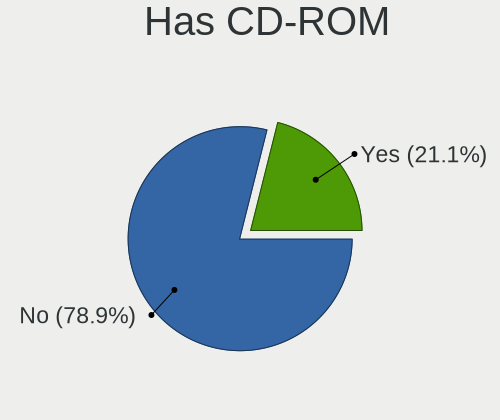
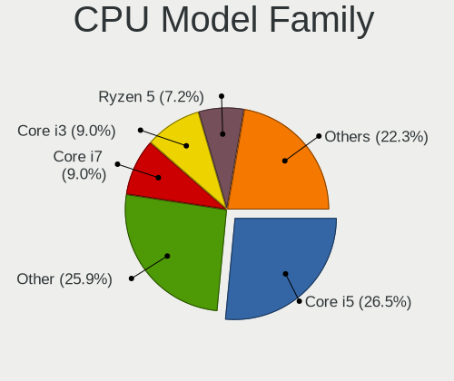
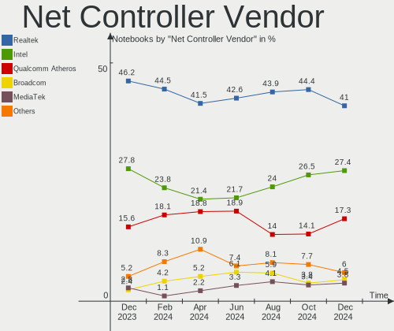
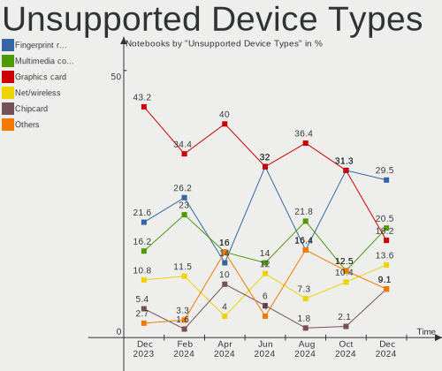

Linux in Brazil - Hardware Trends (Notebooks)
---------------------------------------------

A project to identify most popular hardware characteristics and track their change
over time based on data collected by Linux users at https://Linux-Hardware.org.

Anyone can contribute to this report by the [hw-probe](https://github.com/linuxhw/hw-probe) tool:

    sudo -E hw-probe -all -upload

Period: Sep, 2022.

Contents
--------

* [ System ](#system)
  - [ OS                       ](#os)
  - [ OS Family                ](#os-family)
  - [ Kernel                   ](#kernel)
  - [ Kernel Family            ](#kernel-family)
  - [ Kernel Major Ver.        ](#kernel-major-ver)
  - [ Arch                     ](#arch)
  - [ DE                       ](#de)
  - [ Display Server           ](#display-server)
  - [ Display Manager          ](#display-manager)
  - [ OS Lang                  ](#os-lang)
  - [ Boot Mode                ](#boot-mode)
  - [ Filesystem               ](#filesystem)
  - [ Part. scheme             ](#part-scheme)
  - [ Dual Boot with Linux/BSD ](#dual-boot-with-linuxbsd)
  - [ Dual Boot (Win)          ](#dual-boot-win)

* [ Board ](#board)
  - [ Vendor                   ](#vendor)
  - [ Model                    ](#model)
  - [ Model Family             ](#model-family)
  - [ MFG Year                 ](#mfg-year)
  - [ Form Factor              ](#form-factor)
  - [ Secure Boot              ](#secure-boot)
  - [ Coreboot                 ](#coreboot)
  - [ RAM Size                 ](#ram-size)
  - [ RAM Used                 ](#ram-used)
  - [ Total Drives             ](#total-drives)
  - [ Has CD-ROM               ](#has-cd-rom)
  - [ Has Ethernet             ](#has-ethernet)
  - [ Has WiFi                 ](#has-wifi)
  - [ Has Bluetooth            ](#has-bluetooth)

* [ Location ](#location)
  - [ Country                  ](#country)
  - [ City                     ](#city)

* [ Drives ](#drives)
  - [ Drive Vendor             ](#drive-vendor)
  - [ Drive Model              ](#drive-model)
  - [ HDD Vendor               ](#hdd-vendor)
  - [ SSD Vendor               ](#ssd-vendor)
  - [ Drive Kind               ](#drive-kind)
  - [ Drive Connector          ](#drive-connector)
  - [ Drive Size               ](#drive-size)
  - [ Space Total              ](#space-total)
  - [ Space Used               ](#space-used)
  - [ Malfunc. Drives          ](#malfunc-drives)
  - [ Malfunc. Drive Vendor    ](#malfunc-drive-vendor)
  - [ Malfunc. HDD Vendor      ](#malfunc-hdd-vendor)
  - [ Malfunc. Drive Kind      ](#malfunc-drive-kind)
  - [ Failed Drives            ](#failed-drives)
  - [ Failed Drive Vendor      ](#failed-drive-vendor)
  - [ Drive Status             ](#drive-status)

* [ Storage controller ](#storage-controller)
  - [ Storage Vendor           ](#storage-vendor)
  - [ Storage Model            ](#storage-model)
  - [ Storage Kind             ](#storage-kind)

* [ Processor ](#processor)
  - [ CPU Vendor               ](#cpu-vendor)
  - [ CPU Model                ](#cpu-model)
  - [ CPU Model Family         ](#cpu-model-family)
  - [ CPU Cores                ](#cpu-cores)
  - [ CPU Sockets              ](#cpu-sockets)
  - [ CPU Threads              ](#cpu-threads)
  - [ CPU Op-Modes             ](#cpu-op-modes)
  - [ CPU Microcode            ](#cpu-microcode)
  - [ CPU Microarch            ](#cpu-microarch)

* [ Graphics ](#graphics)
  - [ GPU Vendor               ](#gpu-vendor)
  - [ GPU Model                ](#gpu-model)
  - [ GPU Combo                ](#gpu-combo)
  - [ GPU Driver               ](#gpu-driver)
  - [ GPU Memory               ](#gpu-memory)

* [ Monitor ](#monitor)
  - [ Monitor Vendor           ](#monitor-vendor)
  - [ Monitor Model            ](#monitor-model)
  - [ Monitor Resolution       ](#monitor-resolution)
  - [ Monitor Diagonal         ](#monitor-diagonal)
  - [ Monitor Width            ](#monitor-width)
  - [ Aspect Ratio             ](#aspect-ratio)
  - [ Monitor Area             ](#monitor-area)
  - [ Pixel Density            ](#pixel-density)
  - [ Multiple Monitors        ](#multiple-monitors)

* [ Network ](#network)
  - [ Net Controller Vendor    ](#net-controller-vendor)
  - [ Net Controller Model     ](#net-controller-model)
  - [ Wireless Vendor          ](#wireless-vendor)
  - [ Wireless Model           ](#wireless-model)
  - [ Ethernet Vendor          ](#ethernet-vendor)
  - [ Ethernet Model           ](#ethernet-model)
  - [ Net Controller Kind      ](#net-controller-kind)
  - [ Used Controller          ](#used-controller)
  - [ NICs                     ](#nics)
  - [ IPv6                     ](#ipv6)

* [ Bluetooth ](#bluetooth)
  - [ Bluetooth Vendor         ](#bluetooth-vendor)
  - [ Bluetooth Model          ](#bluetooth-model)

* [ Sound ](#sound)
  - [ Sound Vendor             ](#sound-vendor)
  - [ Sound Model              ](#sound-model)

* [ Memory ](#memory)
  - [ Memory Vendor            ](#memory-vendor)
  - [ Memory Model             ](#memory-model)
  - [ Memory Kind              ](#memory-kind)
  - [ Memory Form Factor       ](#memory-form-factor)
  - [ Memory Size              ](#memory-size)
  - [ Memory Speed             ](#memory-speed)

* [ Printers & scanners ](#printers--scanners)
  - [ Printer Vendor           ](#printer-vendor)
  - [ Printer Model            ](#printer-model)
  - [ Scanner Vendor           ](#scanner-vendor)
  - [ Scanner Model            ](#scanner-model)

* [ Camera ](#camera)
  - [ Camera Vendor            ](#camera-vendor)
  - [ Camera Model             ](#camera-model)

* [ Security ](#security)
  - [ Fingerprint Vendor       ](#fingerprint-vendor)
  - [ Fingerprint Model        ](#fingerprint-model)
  - [ Chipcard Vendor          ](#chipcard-vendor)
  - [ Chipcard Model           ](#chipcard-model)

* [ Unsupported ](#unsupported)
  - [ Unsupported Devices      ](#unsupported-devices)
  - [ Unsupported Device Types ](#unsupported-device-types)

System
------

OS
--

Installed operating systems

| Name                         | Notebooks | Percent |
|------------------------------|-----------|---------|
| Ubuntu 22.04                 | 33        | 22.15%  |
| OpenMandriva 4.3             | 15        | 10.07%  |
| Pop!_OS 22.04                | 13        | 8.72%   |
| Linux Mint 20.3              | 8         | 5.37%   |
| Fedora 36                    | 8         | 5.37%   |
| Linux Mint 21                | 7         | 4.7%    |
| Debian 11                    | 7         | 4.7%    |
| Zorin 16                     | 4         | 2.68%   |
| Arch                         | 4         | 2.68%   |
| OpenMandriva 4.50            | 3         | 2.01%   |
| Linux Mint 20.2              | 3         | 2.01%   |
| Kubuntu 22.04                | 3         | 2.01%   |
| Endless 4.0.9                | 3         | 2.01%   |
| Elementary 6.1               | 3         | 2.01%   |
| Ubuntu MATE 22.04            | 2         | 1.34%   |
| Ubuntu 20.04                 | 2         | 1.34%   |
| ROSA 12.2                    | 2         | 1.34%   |
| Kaisen 2.1                   | 2         | 1.34%   |
| Fedora 37                    | 2         | 1.34%   |
| Xubuntu 20.04                | 1         | 0.67%   |
| Ubuntu Unity 22.04           | 1         | 0.67%   |
| Ubuntu Unity 16.04           | 1         | 0.67%   |
| Ubuntu 18.04                 | 1         | 0.67%   |
| openSUSE Tumbleweed-XXXXXXXX | 1         | 0.67%   |
| OpenMandriva 4.90            | 1         | 0.67%   |
| OpenMandriva 4.2             | 1         | 0.67%   |
| Manjaro 21.3.7               | 1         | 0.67%   |
| Lubuntu 22.04                | 1         | 0.67%   |
| Lubuntu 20.04                | 1         | 0.67%   |
| Kubuntu 20.04                | 1         | 0.67%   |
| Kubuntu 16.04                | 1         | 0.67%   |
| KDE neon 22.04               | 1         | 0.67%   |
| Gentoo 2.8                   | 1         | 0.67%   |
| Garuda Linux Soaring         | 1         | 0.67%   |
| Garuda Linux                 | 1         | 0.67%   |
| Endless 4.0.4                | 1         | 0.67%   |
| Endless 3.9.7                | 1         | 0.67%   |
| Endless 3.9.3-nexthw1        | 1         | 0.67%   |
| Endless 3.8.0                | 1         | 0.67%   |
| EndeavourOS                  | 1         | 0.67%   |

OS Family
---------

OS without a version

| Name         | Notebooks | Percent |
|--------------|-----------|---------|
| Ubuntu       | 36        | 24.16%  |
| OpenMandriva | 20        | 13.42%  |
| Linux Mint   | 18        | 12.08%  |
| Pop!_OS      | 13        | 8.72%   |
| Fedora       | 10        | 6.71%   |
| Debian       | 9         | 6.04%   |
| Endless      | 7         | 4.7%    |
| Kubuntu      | 5         | 3.36%   |
| Zorin        | 4         | 2.68%   |
| Arch         | 4         | 2.68%   |
| Elementary   | 3         | 2.01%   |
| Ubuntu Unity | 2         | 1.34%   |
| Ubuntu MATE  | 2         | 1.34%   |
| ROSA         | 2         | 1.34%   |
| Lubuntu      | 2         | 1.34%   |
| Kaisen       | 2         | 1.34%   |
| Garuda Linux | 2         | 1.34%   |
| Xubuntu      | 1         | 0.67%   |
| openSUSE     | 1         | 0.67%   |
| Manjaro      | 1         | 0.67%   |
| KDE neon     | 1         | 0.67%   |
| Gentoo       | 1         | 0.67%   |
| EndeavourOS  | 1         | 0.67%   |
| ArcoLinux    | 1         | 0.67%   |
| Amarok Linux | 1         | 0.67%   |

Kernel
------

Version of the Linux kernel

| Version                    | Notebooks | Percent |
|----------------------------|-----------|---------|
| 5.15.0-47-generic          | 21        | 14.09%  |
| 5.15.0-48-generic          | 16        | 10.74%  |
| 5.16.7-desktop-1omv4003    | 15        | 10.07%  |
| 5.19.0-76051900-generic    | 13        | 8.72%   |
| 5.15.0-46-generic          | 8         | 5.37%   |
| 5.4.0-125-generic          | 7         | 4.7%    |
| 5.4.0-126-generic          | 4         | 2.68%   |
| 5.19.11-200.fc36.x86_64    | 4         | 2.68%   |
| 5.11.0-35-generic          | 4         | 2.68%   |
| 5.19.5-desktop-1omv4090    | 3         | 2.01%   |
| 5.15.0-43-generic          | 3         | 2.01%   |
| 5.10.0-18-amd64            | 3         | 2.01%   |
| 5.10.0-17-amd64            | 3         | 2.01%   |
| 5.19.9-arch1-1             | 2         | 1.34%   |
| 5.19.0-1-amd64             | 2         | 1.34%   |
| 5.17.0-kaisen1-amd64       | 2         | 1.34%   |
| 5.15.0-50-generic          | 2         | 1.34%   |
| 6.0.0-0.rc6.41.fc38.x86_64 | 1         | 0.67%   |
| 5.8.0-14-generic           | 1         | 0.67%   |
| 5.4.0-90-generic           | 1         | 0.67%   |
| 5.4.0-74-generic           | 1         | 0.67%   |
| 5.4.0-19-generic           | 1         | 0.67%   |
| 5.19.8-zen1-1-zen          | 1         | 0.67%   |
| 5.19.8-xanmod1             | 1         | 0.67%   |
| 5.19.8-200.fc36.x86_64     | 1         | 0.67%   |
| 5.19.7-zen2-1-zen          | 1         | 0.67%   |
| 5.19.7-arch1-g14-1         | 1         | 0.67%   |
| 5.19.7-200.fc36.x86_64     | 1         | 0.67%   |
| 5.19.6-200.fc36.x86_64     | 1         | 0.67%   |
| 5.19.2-1-default           | 1         | 0.67%   |
| 5.19.11-arch1-1            | 1         | 0.67%   |
| 5.19.10-300.fc37.x86_64    | 1         | 0.67%   |
| 5.18.17-200.fc36.x86_64    | 1         | 0.67%   |
| 5.18.17-1-MANJARO          | 1         | 0.67%   |
| 5.18.12-desktop-3omv4090   | 1         | 0.67%   |
| 5.18.0-051800-generic      | 1         | 0.67%   |
| 5.18.0-0.bpo.1-amd64       | 1         | 0.67%   |
| 5.17.0-1016-oem            | 1         | 0.67%   |
| 5.15.70-1-lts              | 1         | 0.67%   |
| 5.15.68-1-lts              | 1         | 0.67%   |

Kernel Family
-------------

Linux kernel without a distro release

| Version  | Notebooks | Percent |
|----------|-----------|---------|
| 5.15.0   | 52        | 34.9%   |
| 5.19.0   | 15        | 10.07%  |
| 5.16.7   | 15        | 10.07%  |
| 5.4.0    | 14        | 9.4%    |
| 5.10.0   | 7         | 4.7%    |
| 5.19.11  | 5         | 3.36%   |
| 5.11.0   | 5         | 3.36%   |
| 5.19.8   | 3         | 2.01%   |
| 5.19.7   | 3         | 2.01%   |
| 5.19.5   | 3         | 2.01%   |
| 5.17.0   | 3         | 2.01%   |
| 4.15.0   | 3         | 2.01%   |
| 5.19.9   | 2         | 1.34%   |
| 5.18.17  | 2         | 1.34%   |
| 5.18.0   | 2         | 1.34%   |
| 5.14.0   | 2         | 1.34%   |
| 6.0.0    | 1         | 0.67%   |
| 5.8.0    | 1         | 0.67%   |
| 5.19.6   | 1         | 0.67%   |
| 5.19.2   | 1         | 0.67%   |
| 5.19.10  | 1         | 0.67%   |
| 5.18.12  | 1         | 0.67%   |
| 5.15.70  | 1         | 0.67%   |
| 5.15.68  | 1         | 0.67%   |
| 5.15.67  | 1         | 0.67%   |
| 5.15.59  | 1         | 0.67%   |
| 5.10.74  | 1         | 0.67%   |
| 5.10.14  | 1         | 0.67%   |
| 5.10.118 | 1         | 0.67%   |

Kernel Major Ver.
-----------------

Linux kernel major version

| Version | Notebooks | Percent |
|---------|-----------|---------|
| 5.15    | 56        | 37.58%  |
| 5.19    | 34        | 22.82%  |
| 5.16    | 15        | 10.07%  |
| 5.4     | 14        | 9.4%    |
| 5.10    | 10        | 6.71%   |
| 5.18    | 5         | 3.36%   |
| 5.11    | 5         | 3.36%   |
| 5.17    | 3         | 2.01%   |
| 4.15    | 3         | 2.01%   |
| 5.14    | 2         | 1.34%   |
| 6.0     | 1         | 0.67%   |
| 5.8     | 1         | 0.67%   |

Arch
----

OS architecture (x86_64, i586, etc.)

| Name   | Notebooks | Percent |
|--------|-----------|---------|
| x86_64 | 148       | 99.33%  |
| i686   | 1         | 0.67%   |

DE
--

Desktop Environment

| Name       | Notebooks | Percent |
|------------|-----------|---------|
| GNOME      | 78        | 52.35%  |
| KDE5       | 31        | 20.81%  |
| X-Cinnamon | 13        | 8.72%   |
| MATE       | 8         | 5.37%   |
| XFCE       | 7         | 4.7%    |
| Pantheon   | 3         | 2.01%   |
| Unity      | 2         | 1.34%   |
| LXQt       | 2         | 1.34%   |
| Cinnamon   | 2         | 1.34%   |
| Unknown    | 2         | 1.34%   |
| jwm        | 1         | 0.67%   |

Display Server
--------------

X11 or Wayland

| Name    | Notebooks | Percent |
|---------|-----------|---------|
| X11     | 109       | 73.15%  |
| Wayland | 38        | 25.5%   |
| Tty     | 1         | 0.67%   |
| Unknown | 1         | 0.67%   |

Display Manager
---------------

SDDM, LightDM, etc.

| Name    | Notebooks | Percent |
|---------|-----------|---------|
| Unknown | 56        | 37.58%  |
| GDM3    | 37        | 24.83%  |
| SDDM    | 27        | 18.12%  |
| LightDM | 18        | 12.08%  |
| GDM     | 10        | 6.71%   |
| XDM     | 1         | 0.67%   |

OS Lang
-------

Language

| Lang    | Notebooks | Percent |
|---------|-----------|---------|
| pt_BR   | 110       | 73.83%  |
| en_US   | 37        | 24.83%  |
| en_GB   | 1         | 0.67%   |
| Unknown | 1         | 0.67%   |

Boot Mode
---------

EFI or BIOS

| Mode | Notebooks | Percent |
|------|-----------|---------|
| BIOS | 81        | 54.36%  |
| EFI  | 68        | 45.64%  |

Filesystem
----------

Type of filesystem

| Type    | Notebooks | Percent |
|---------|-----------|---------|
| Ext4    | 110       | 73.83%  |
| Btrfs   | 21        | 14.09%  |
| Overlay | 17        | 11.41%  |
| Ext3    | 1         | 0.67%   |

Part. scheme
------------

Scheme of partitioning

| Type    | Notebooks | Percent |
|---------|-----------|---------|
| Unknown | 85        | 57.05%  |
| GPT     | 48        | 32.21%  |
| MBR     | 16        | 10.74%  |

Dual Boot with Linux/BSD
------------------------

Hosting more than one Linux/BSD

| Dual boot | Notebooks | Percent |
|-----------|-----------|---------|
| No        | 133       | 89.26%  |
| Yes       | 16        | 10.74%  |

Dual Boot (Win)
---------------

Hosting Linux and Windows

| Dual boot | Notebooks | Percent |
|-----------|-----------|---------|
| No        | 106       | 71.14%  |
| Yes       | 43        | 28.86%  |

Board
-----

Vendor
------

Motherboard manufacturer

| Name                   | Notebooks | Percent |
|------------------------|-----------|---------|
| Dell                   | 32        | 21.48%  |
| Lenovo                 | 27        | 18.12%  |
| Acer                   | 19        | 12.75%  |
| Samsung Electronics    | 14        | 9.4%    |
| Positivo               | 10        | 6.71%   |
| Hewlett-Packard        | 9         | 6.04%   |
| ASUSTek Computer       | 9         | 6.04%   |
| Avell High Performance | 5         | 3.36%   |
| LG Electronics         | 4         | 2.68%   |
| Positivo Bahia - VAIO  | 2         | 1.34%   |
| Daten Tecnologia       | 2         | 1.34%   |
| Unknown                | 2         | 1.34%   |
| Timi                   | 1         | 0.67%   |
| Standard               | 1         | 0.67%   |
| Sony                   | 1         | 0.67%   |
| Semp Toshiba           | 1         | 0.67%   |
| Philco                 | 1         | 0.67%   |
| Notebook               | 1         | 0.67%   |
| Itautec                | 1         | 0.67%   |
| Gateway                | 1         | 0.67%   |
| Digibras               | 1         | 0.67%   |
| Compal                 | 1         | 0.67%   |
| Chuwi                  | 1         | 0.67%   |
| CCE                    | 1         | 0.67%   |
| Apple                  | 1         | 0.67%   |
| Alienware              | 1         | 0.67%   |

Model
-----

Motherboard model

| Name                                        | Notebooks | Percent |
|---------------------------------------------|-----------|---------|
| Lenovo IdeaPad 3 15ALC6 82MF                | 4         | 2.68%   |
| Dell Inspiron 5566                          | 4         | 2.68%   |
| Positivo Mobile                             | 3         | 2.01%   |
| Acer Nitro AN515-44                         | 3         | 2.01%   |
| Samsung RV411/RV511/E3511/S3511/RV711/E3411 | 2         | 1.34%   |
| Samsung 550XBE/350XBE                       | 2         | 1.34%   |
| Samsung 300E5M/300E5L                       | 2         | 1.34%   |
| Positivo S14CT01                            | 2         | 1.34%   |
| Lenovo IdeaPad S145-15IWL 81S9              | 2         | 1.34%   |
| Lenovo G40-80 80JE                          | 2         | 1.34%   |
| Dell Vostro 3500                            | 2         | 1.34%   |
| Dell Vostro 15 5510                         | 2         | 1.34%   |
| Dell Inspiron 3442                          | 2         | 1.34%   |
| Dell Inspiron 15 7000 Gaming                | 2         | 1.34%   |
| Daten Tecnologia DT02-M4                    | 2         | 1.34%   |
| Avell High Performance B.ON                 | 2         | 1.34%   |
| ASUS K46CB                                  | 2         | 1.34%   |
| Acer Aspire A515-54                         | 2         | 1.34%   |
| Unknown                                     | 2         | 1.34%   |
| Timi TM1701                                 | 1         | 0.67%   |
| Standard AHV                                | 1         | 0.67%   |
| Sony SVE15125CBW                            | 1         | 0.67%   |
| Semp Toshiba IS 1413G                       | 1         | 0.67%   |
| Samsung RV415/RV515                         | 1         | 0.67%   |
| Samsung 670Z5E                              | 1         | 0.67%   |
| Samsung 550P5C/550P7C                       | 1         | 0.67%   |
| Samsung 370E4K                              | 1         | 0.67%   |
| Samsung 340XAA/350XAA/550XAA                | 1         | 0.67%   |
| Samsung 300E5K/300E5Q                       | 1         | 0.67%   |
| Samsung 275E4E/275E5E                       | 1         | 0.67%   |
| Samsung 270E5G/270E5U                       | 1         | 0.67%   |
| Positivo Smash                              | 1         | 0.67%   |
| Positivo S14SL01                            | 1         | 0.67%   |
| Positivo H14BT58                            | 1         | 0.67%   |
| Positivo C14CR21                            | 1         | 0.67%   |
| Positivo C14CR01                            | 1         | 0.67%   |
| Positivo Bahia - VAIO VJFE52F11X-B0611H     | 1         | 0.67%   |
| Positivo Bahia - VAIO VJFE42F11X-XXXXXX     | 1         | 0.67%   |
| Philco PNB14.1AC14S128W10                   | 1         | 0.67%   |
| Notebook NJx0MU                             | 1         | 0.67%   |

Model Family
------------

Motherboard model prefix

| Name                                    | Notebooks | Percent |
|-----------------------------------------|-----------|---------|
| Dell Inspiron                           | 15        | 10.07%  |
| Acer Aspire                             | 14        | 9.4%    |
| Lenovo IdeaPad                          | 11        | 7.38%   |
| Lenovo ThinkPad                         | 9         | 6.04%   |
| Dell Vostro                             | 9         | 6.04%   |
| Dell Latitude                           | 4         | 2.68%   |
| Acer Nitro                              | 4         | 2.68%   |
| Positivo Mobile                         | 3         | 2.01%   |
| HP ProBook                              | 3         | 2.01%   |
| Samsung RV411                           | 2         | 1.34%   |
| Samsung 550XBE                          | 2         | 1.34%   |
| Samsung 300E5M                          | 2         | 1.34%   |
| Positivo S14CT01                        | 2         | 1.34%   |
| Lenovo G40-80                           | 2         | 1.34%   |
| Dell G15                                | 2         | 1.34%   |
| Daten Tecnologia DT02-M4                | 2         | 1.34%   |
| Avell High Performance B.ON             | 2         | 1.34%   |
| ASUS VivoBook                           | 2         | 1.34%   |
| ASUS K46CB                              | 2         | 1.34%   |
| Unknown                                 | 2         | 1.34%   |
| Timi TM1701                             | 1         | 0.67%   |
| Standard AHV                            | 1         | 0.67%   |
| Sony SVE15125CBW                        | 1         | 0.67%   |
| Semp Toshiba IS                         | 1         | 0.67%   |
| Samsung RV415                           | 1         | 0.67%   |
| Samsung 670Z5E                          | 1         | 0.67%   |
| Samsung 550P5C                          | 1         | 0.67%   |
| Samsung 370E4K                          | 1         | 0.67%   |
| Samsung 340XAA                          | 1         | 0.67%   |
| Samsung 300E5K                          | 1         | 0.67%   |
| Samsung 275E4E                          | 1         | 0.67%   |
| Samsung 270E5G                          | 1         | 0.67%   |
| Positivo Smash                          | 1         | 0.67%   |
| Positivo S14SL01                        | 1         | 0.67%   |
| Positivo H14BT58                        | 1         | 0.67%   |
| Positivo C14CR21                        | 1         | 0.67%   |
| Positivo C14CR01                        | 1         | 0.67%   |
| Positivo Bahia - VAIO VJFE52F11X-B0611H | 1         | 0.67%   |
| Positivo Bahia - VAIO VJFE42F11X-XXXXXX | 1         | 0.67%   |
| Philco PNB14.1AC14S128W10               | 1         | 0.67%   |

MFG Year
--------

Motherboard manufacture year

| Year | Notebooks | Percent |
|------|-----------|---------|
| 2021 | 26        | 17.45%  |
| 2012 | 15        | 10.07%  |
| 2019 | 12        | 8.05%   |
| 2011 | 12        | 8.05%   |
| 2013 | 11        | 7.38%   |
| 2020 | 10        | 6.71%   |
| 2016 | 10        | 6.71%   |
| 2014 | 10        | 6.71%   |
| 2017 | 9         | 6.04%   |
| 2015 | 8         | 5.37%   |
| 2010 | 7         | 4.7%    |
| 2018 | 6         | 4.03%   |
| 2009 | 4         | 2.68%   |
| 2008 | 4         | 2.68%   |
| 2022 | 3         | 2.01%   |
| 2006 | 2         | 1.34%   |

Form Factor
-----------

Physical design of the computer

| Name     | Notebooks | Percent |
|----------|-----------|---------|
| Notebook | 149       | 100%    |

Secure Boot
-----------

Enabled or disabled

| State    | Notebooks | Percent |
|----------|-----------|---------|
| Disabled | 136       | 91.28%  |
| Enabled  | 13        | 8.72%   |

Coreboot
--------

Have coreboot on board

| Used | Notebooks | Percent |
|------|-----------|---------|
| No   | 149       | 100%    |

RAM Size
--------

Total RAM memory

| Size in GB  | Notebooks | Percent |
|-------------|-----------|---------|
| 4.01-8.0    | 48        | 32.21%  |
| 3.01-4.0    | 38        | 25.5%   |
| 16.01-24.0  | 24        | 16.11%  |
| 8.01-16.0   | 22        | 14.77%  |
| 1.01-2.0    | 5         | 3.36%   |
| 32.01-64.0  | 4         | 2.68%   |
| 24.01-32.0  | 2         | 1.34%   |
| 2.01-3.0    | 2         | 1.34%   |
| 64.01-256.0 | 2         | 1.34%   |
| 0.51-1.0    | 2         | 1.34%   |

RAM Used
--------

Used RAM memory

| Used GB   | Notebooks | Percent |
|-----------|-----------|---------|
| 1.01-2.0  | 51        | 34.23%  |
| 2.01-3.0  | 35        | 23.49%  |
| 4.01-8.0  | 25        | 16.78%  |
| 3.01-4.0  | 24        | 16.11%  |
| 8.01-16.0 | 9         | 6.04%   |
| 0.51-1.0  | 5         | 3.36%   |

Total Drives
------------

Number of drives on board

| Drives | Notebooks | Percent |
|--------|-----------|---------|
| 1      | 107       | 71.81%  |
| 2      | 40        | 26.85%  |
| 3      | 1         | 0.67%   |
| 0      | 1         | 0.67%   |

Has CD-ROM
----------

Has CD-ROM on board

| Presented | Notebooks | Percent |
|-----------|-----------|---------|
| No        | 100       | 67.11%  |
| Yes       | 49        | 32.89%  |

Has Ethernet
------------

Has Ethernet on board

| Presented | Notebooks | Percent |
|-----------|-----------|---------|
| Yes       | 126       | 84.56%  |
| No        | 23        | 15.44%  |

Has WiFi
--------

Has WiFi module

| Presented | Notebooks | Percent |
|-----------|-----------|---------|
| Yes       | 145       | 97.32%  |
| No        | 4         | 2.68%   |

Has Bluetooth
-------------

Has Bluetooth module

| Presented | Notebooks | Percent |
|-----------|-----------|---------|
| Yes       | 112       | 75.17%  |
| No        | 37        | 24.83%  |

Location
--------

Country
-------

Geographic location (country)

| Country | Notebooks | Percent |
|---------|-----------|---------|
| Brazil  | 149       | 100%    |

City
----

Geographic location (city)

| City                  | Notebooks | Percent |
|-----------------------|-----------|---------|
| Sao Paulo             | 17        | 11.41%  |
| Rio de Janeiro        | 11        | 7.38%   |
| Fortaleza             | 8         | 5.37%   |
| Belo Horizonte        | 5         | 3.36%   |
| Curitiba              | 4         | 2.68%   |
| Brasília             | 4         | 2.68%   |
| Vitória              | 3         | 2.01%   |
| Campo Grande          | 3         | 2.01%   |
| Sao Luís             | 2         | 1.34%   |
| Sao Jose              | 2         | 1.34%   |
| Sao Joaquim da Barra  | 2         | 1.34%   |
| Ribeirao Preto        | 2         | 1.34%   |
| Porto Alegre          | 2         | 1.34%   |
| Pelotas               | 2         | 1.34%   |
| Natal                 | 2         | 1.34%   |
| Manaus                | 2         | 1.34%   |
| Londrina              | 2         | 1.34%   |
| Itajuba               | 2         | 1.34%   |
| Goiânia              | 2         | 1.34%   |
| Florianópolis        | 2         | 1.34%   |
| Unknown               | 2         | 1.34%   |
| Vitória da Conquista | 1         | 0.67%   |
| Virgem da Lapa        | 1         | 0.67%   |
| Valparaiso de Goias   | 1         | 0.67%   |
| Umuarama              | 1         | 0.67%   |
| Uberlândia           | 1         | 0.67%   |
| Três Lagoas          | 1         | 0.67%   |
| Taubate               | 1         | 0.67%   |
| Taquaritinga          | 1         | 0.67%   |
| Tambau                | 1         | 0.67%   |
| Suzano                | 1         | 0.67%   |
| Sumaré               | 1         | 0.67%   |
| Sidrolandia           | 1         | 0.67%   |
| Sao Pedro do Sul      | 1         | 0.67%   |
| Sao José dos Campos  | 1         | 0.67%   |
| Sao Jose da Lapa      | 1         | 0.67%   |
| Sao Joao da Boa Vista | 1         | 0.67%   |
| Sao Goncalo           | 1         | 0.67%   |
| Santo André          | 1         | 0.67%   |
| Santa Rosa            | 1         | 0.67%   |

Drives
------

Drive Vendor
------------

Hard drive vendors

| Vendor                         | Notebooks | Drives | Percent |
|--------------------------------|-----------|--------|---------|
| WDC                            | 30        | 30     | 16.57%  |
| Kingston                       | 22        | 23     | 12.15%  |
| A-DATA Technology              | 16        | 17     | 8.84%   |
| Toshiba                        | 13        | 13     | 7.18%   |
| Seagate                        | 11        | 11     | 6.08%   |
| SanDisk                        | 11        | 11     | 6.08%   |
| Samsung Electronics            | 9         | 9      | 4.97%   |
| Unknown                        | 7         | 7      | 3.87%   |
| China                          | 5         | 5      | 2.76%   |
| ADATA Technology               | 5         | 6      | 2.76%   |
| Solid State Storage Technology | 4         | 4      | 2.21%   |
| Crucial                        | 4         | 5      | 2.21%   |
| SSSTC                          | 3         | 3      | 1.66%   |
| SK hynix                       | 3         | 3      | 1.66%   |
| KingSpec                       | 3         | 3      | 1.66%   |
| Hitachi                        | 3         | 3      | 1.66%   |
| WALRAM                         | 2         | 2      | 1.1%    |
| Silicon Motion                 | 2         | 2      | 1.1%    |
| Phison                         | 2         | 2      | 1.1%    |
| Patriot                        | 2         | 2      | 1.1%    |
| Netac                          | 2         | 2      | 1.1%    |
| LITEON                         | 2         | 2      | 1.1%    |
| Lexar                          | 2         | 2      | 1.1%    |
| Intel                          | 2         | 2      | 1.1%    |
| Unknown                        | 2         | 2      | 1.1%    |
| Solid State Storage            | 1         | 1      | 0.55%   |
| PNY                            | 1         | 1      | 0.55%   |
| Phison Electronics             | 1         | 1      | 0.55%   |
| Micron/Crucial Technology      | 1         | 1      | 0.55%   |
| Micron Technology              | 1         | 1      | 0.55%   |
| MAXSUN                         | 1         | 1      | 0.55%   |
| KIOXIA                         | 1         | 1      | 0.55%   |
| KINGBANK                       | 1         | 1      | 0.55%   |
| HGST                           | 1         | 1      | 0.55%   |
| Hewlett-Packard                | 1         | 1      | 0.55%   |
| GLOWAY                         | 1         | 1      | 0.55%   |
| DERLER                         | 1         | 1      | 0.55%   |
| Colorful                       | 1         | 1      | 0.55%   |
| BHT                            | 1         | 1      | 0.55%   |

Drive Model
-----------

Hard drive models

| Model                                    | Notebooks | Percent |
|------------------------------------------|-----------|---------|
| Kingston SA400S37240G 240GB SSD          | 7         | 3.87%   |
| Kingston SA400S37480G 480GB SSD          | 5         | 2.76%   |
| Kingston SA400S37120G 120GB SSD          | 5         | 2.76%   |
| A-DATA IM2P33F3A NVMe 256GB              | 5         | 2.76%   |
| Solid State Storage NVMe SSD Drive 256GB | 4         | 2.21%   |
| Toshiba MQ04ABF100 1TB                   | 3         | 1.66%   |
| Toshiba MQ01ABD100 1TB                   | 3         | 1.66%   |
| Seagate ST500LM012 HN-M500MBB 500GB      | 3         | 1.66%   |
| A-DATA IM2P33F8A-512GD 512GB             | 3         | 1.66%   |
| WDC WDS240G2G0A-00JH30 240GB SSD         | 2         | 1.1%    |
| WDC WD5000LPVX-22V0TT0 500GB             | 2         | 1.1%    |
| WDC WD5000LPCX-24VHAT0 500GB             | 2         | 1.1%    |
| WDC WD10SPZX-75Z10T1 1TB                 | 2         | 1.1%    |
| WDC WD10SPZX-24Z10 1TB                   | 2         | 1.1%    |
| WDC WD10SPZX-21Z10T0 1TB                 | 2         | 1.1%    |
| Unknown MMC Card  64GB                   | 2         | 1.1%    |
| Unknown MMC Card  32GB                   | 2         | 1.1%    |
| Toshiba MQ02ABD100H 1TB                  | 2         | 1.1%    |
| Toshiba MQ01ABD050 500GB                 | 2         | 1.1%    |
| Sandisk WD Blue SN550 NVMe SSD 1024GB    | 2         | 1.1%    |
| SanDisk SSD PLUS 240GB                   | 2         | 1.1%    |
| Samsung SSD 850 EVO 500GB                | 2         | 1.1%    |
| Patriot Burst Elite 120GB SSD            | 2         | 1.1%    |
| Kingston SUV400S37120G 120GB SSD         | 2         | 1.1%    |
| ADATA NVMe SSD Drive 512GB               | 2         | 1.1%    |
| Unknown                                  | 2         | 1.1%    |
| WDC WDS240G2G0B-00EPW0 240GB SSD         | 1         | 0.55%   |
| WDC WD5000LUCT-63RC2Y0 500GB             | 1         | 0.55%   |
| WDC WD5000LPZX-08Z10 500GB               | 1         | 0.55%   |
| WDC WD5000LPVX-80V0TT0 500GB             | 1         | 0.55%   |
| WDC WD5000LPVT-08G33T1 500GB             | 1         | 0.55%   |
| WDC WD5000LPCX-24C6HT0 500GB             | 1         | 0.55%   |
| WDC WD5000LPCX-00VHAT0 500GB             | 1         | 0.55%   |
| WDC WD5000BPVT-22HXZT3 500GB             | 1         | 0.55%   |
| WDC WD5000BEVT-75A0RT0 500GB             | 1         | 0.55%   |
| WDC WD10SPZX-75Z10T2 1TB                 | 1         | 0.55%   |
| WDC WD10SPZX-35Z10T0 1TB                 | 1         | 0.55%   |
| WDC WD10SPZX-24Z10T0 1TB                 | 1         | 0.55%   |
| WDC WD10JPVX-75JC3T0 1TB                 | 1         | 0.55%   |
| WDC WD10JPVX-22JC3T0 1TB                 | 1         | 0.55%   |

HDD Vendor
----------

Hard disk drive vendors

| Vendor  | Notebooks | Drives | Percent |
|---------|-----------|--------|---------|
| WDC     | 25        | 25     | 47.17%  |
| Toshiba | 13        | 13     | 24.53%  |
| Seagate | 11        | 11     | 20.75%  |
| Hitachi | 3         | 3      | 5.66%   |
| HGST    | 1         | 1      | 1.89%   |

SSD Vendor
----------

Solid state drive vendors

| Vendor              | Notebooks | Drives | Percent |
|---------------------|-----------|--------|---------|
| Kingston            | 22        | 23     | 34.38%  |
| Samsung Electronics | 5         | 5      | 7.81%   |
| China               | 5         | 5      | 7.81%   |
| SanDisk             | 4         | 4      | 6.25%   |
| Crucial             | 4         | 5      | 6.25%   |
| WDC                 | 3         | 3      | 4.69%   |
| KingSpec            | 3         | 3      | 4.69%   |
| Patriot             | 2         | 2      | 3.13%   |
| Netac               | 2         | 2      | 3.13%   |
| LITEON              | 2         | 2      | 3.13%   |
| Lexar               | 2         | 2      | 3.13%   |
| A-DATA Technology   | 2         | 2      | 3.13%   |
| PNY                 | 1         | 1      | 1.56%   |
| KINGBANK            | 1         | 1      | 1.56%   |
| Hewlett-Packard     | 1         | 1      | 1.56%   |
| GLOWAY              | 1         | 1      | 1.56%   |
| DERLER              | 1         | 1      | 1.56%   |
| Colorful            | 1         | 1      | 1.56%   |
| BHT                 | 1         | 1      | 1.56%   |
| Unknown             | 1         | 1      | 1.56%   |

Drive Kind
----------

HDD or SSD

| Kind    | Notebooks | Drives | Percent |
|---------|-----------|--------|---------|
| SSD     | 64        | 66     | 36.57%  |
| HDD     | 52        | 53     | 29.71%  |
| NVMe    | 47        | 54     | 26.86%  |
| MMC     | 8         | 8      | 4.57%   |
| Unknown | 4         | 4      | 2.29%   |

Drive Connector
---------------

SATA, SAS, NVMe, etc.

| Type | Notebooks | Drives | Percent |
|------|-----------|--------|---------|
| SATA | 106       | 122    | 65.43%  |
| NVMe | 47        | 54     | 29.01%  |
| MMC  | 8         | 8      | 4.94%   |
| SAS  | 1         | 1      | 0.62%   |

Drive Size
----------

Size of hard drive

| Size in TB | Notebooks | Drives | Percent |
|------------|-----------|--------|---------|
| 0.01-0.5   | 80        | 87     | 71.43%  |
| 0.51-1.0   | 32        | 32     | 28.57%  |

Space Total
-----------

Amount of disk space available on the file system

| Size in GB     | Notebooks | Percent |
|----------------|-----------|---------|
| 101-250        | 45        | 30.2%   |
| 251-500        | 32        | 21.48%  |
| 501-1000       | 23        | 15.44%  |
| 1001-2000      | 15        | 10.07%  |
| 1-20           | 14        | 9.4%    |
| 21-50          | 7         | 4.7%    |
| 51-100         | 6         | 4.03%   |
| Unknown        | 4         | 2.68%   |
| More than 3000 | 2         | 1.34%   |
| 2001-3000      | 1         | 0.67%   |

Space Used
----------

Amount of used disk space

| Used GB   | Notebooks | Percent |
|-----------|-----------|---------|
| 1-20      | 52        | 34.9%   |
| 21-50     | 31        | 20.81%  |
| 101-250   | 22        | 14.77%  |
| 51-100    | 18        | 12.08%  |
| 251-500   | 11        | 7.38%   |
| 501-1000  | 8         | 5.37%   |
| Unknown   | 4         | 2.68%   |
| 1001-2000 | 3         | 2.01%   |

Malfunc. Drives
---------------

Drive models with a malfunction

| Model                                         | Notebooks | Drives | Percent |
|-----------------------------------------------|-----------|--------|---------|
| Toshiba MQ01ABD050 500GB                      | 2         | 2      | 12.5%   |
| WDC WD5000LPVX-22V0TT0 500GB                  | 1         | 1      | 6.25%   |
| WDC WD10SPZX-75Z10T1 1TB                      | 1         | 1      | 6.25%   |
| Toshiba MQ01ABD100 1TB                        | 1         | 1      | 6.25%   |
| Toshiba MK5061GSYN 500GB                      | 1         | 1      | 6.25%   |
| Toshiba MK2529GSG 250GB                       | 1         | 1      | 6.25%   |
| Seagate ST320LT007-9ZV142 320GB               | 1         | 1      | 6.25%   |
| Seagate ST320LM001 HN-M320MBB 320GB           | 1         | 1      | 6.25%   |
| Seagate ST1000LM048-2E7172 1TB                | 1         | 1      | 6.25%   |
| SanDisk SSD U100 24GB                         | 1         | 1      | 6.25%   |
| Samsung Electronics SG9MSM6D024GPM00 24GB SSD | 1         | 1      | 6.25%   |
| PNY SSD2SC120G3LC709B121-460I 120GB           | 1         | 1      | 6.25%   |
| Kingston SA400S37120G 120GB SSD               | 1         | 1      | 6.25%   |
| Hitachi HTS723232A7A364 320GB                 | 1         | 1      | 6.25%   |
| China SSD 120GB                               | 1         | 1      | 6.25%   |

Malfunc. Drive Vendor
---------------------

Vendors of faulty drives

| Vendor              | Notebooks | Drives | Percent |
|---------------------|-----------|--------|---------|
| Toshiba             | 5         | 5      | 31.25%  |
| Seagate             | 3         | 3      | 18.75%  |
| WDC                 | 2         | 2      | 12.5%   |
| SanDisk             | 1         | 1      | 6.25%   |
| Samsung Electronics | 1         | 1      | 6.25%   |
| PNY                 | 1         | 1      | 6.25%   |
| Kingston            | 1         | 1      | 6.25%   |
| Hitachi             | 1         | 1      | 6.25%   |
| China               | 1         | 1      | 6.25%   |

Malfunc. HDD Vendor
-------------------

Vendors of faulty HDD drives

| Vendor  | Notebooks | Drives | Percent |
|---------|-----------|--------|---------|
| Toshiba | 5         | 5      | 45.45%  |
| Seagate | 3         | 3      | 27.27%  |
| WDC     | 2         | 2      | 18.18%  |
| Hitachi | 1         | 1      | 9.09%   |

Malfunc. Drive Kind
-------------------

Kinds of faulty drives

| Kind | Notebooks | Drives | Percent |
|------|-----------|--------|---------|
| HDD  | 11        | 11     | 68.75%  |
| SSD  | 5         | 5      | 31.25%  |

Failed Drives
-------------

Failed drive models

Zero info for selected period =(

Failed Drive Vendor
-------------------

Failed drive vendors

Zero info for selected period =(

Drive Status
------------

Number of failed and malfunc. drives

| Status   | Notebooks | Drives | Percent |
|----------|-----------|--------|---------|
| Detected | 90        | 109    | 58.06%  |
| Works    | 50        | 60     | 32.26%  |
| Malfunc  | 15        | 16     | 9.68%   |

Storage controller
------------------

Storage Vendor
--------------

Storage controller vendors

| Vendor                           | Notebooks | Percent |
|----------------------------------|-----------|---------|
| Intel                            | 116       | 64.09%  |
| ADATA Technology                 | 18        | 9.94%   |
| AMD                              | 17        | 9.39%   |
| Solid State Storage Technology   | 7         | 3.87%   |
| SanDisk                          | 7         | 3.87%   |
| Samsung Electronics              | 4         | 2.21%   |
| SK hynix                         | 3         | 1.66%   |
| Phison Electronics               | 3         | 1.66%   |
| Silicon Motion                   | 2         | 1.1%    |
| Silicon Integrated Systems [SiS] | 1         | 0.55%   |
| Micron/Crucial Technology        | 1         | 0.55%   |
| Micron Technology                | 1         | 0.55%   |
| KIOXIA                           | 1         | 0.55%   |

Storage Model
-------------

Storage controller models

| Model                                                                        | Notebooks | Percent |
|------------------------------------------------------------------------------|-----------|---------|
| Intel 7 Series Chipset Family 6-port SATA Controller [AHCI mode]             | 19        | 9.84%   |
| ADATA Non-Volatile memory controller                                         | 16        | 8.29%   |
| AMD FCH SATA Controller [AHCI mode]                                          | 15        | 7.77%   |
| Intel Sunrise Point-LP SATA Controller [AHCI mode]                           | 14        | 7.25%   |
| Intel Wildcat Point-LP SATA Controller [AHCI Mode]                           | 11        | 5.7%    |
| Solid State Storage Non-Volatile memory controller                           | 7         | 3.63%   |
| Intel 5 Series/3400 Series Chipset 4 port SATA AHCI Controller               | 7         | 3.63%   |
| Intel Volume Management Device NVMe RAID Controller                          | 6         | 3.11%   |
| Intel 82801IBM/IEM (ICH9M/ICH9M-E) 4 port SATA Controller [AHCI mode]        | 6         | 3.11%   |
| Intel 8 Series SATA Controller 1 [AHCI mode]                                 | 6         | 3.11%   |
| Intel Tiger Lake-LP SATA Controller                                          | 5         | 2.59%   |
| Intel 6 Series/C200 Series Chipset Family 6 port Mobile SATA AHCI Controller | 5         | 2.59%   |
| Intel Comet Lake SATA AHCI Controller                                        | 4         | 2.07%   |
| Intel Cannon Point-LP SATA Controller [AHCI Mode]                            | 4         | 2.07%   |
| SanDisk WD Blue SN550 NVMe SSD                                               | 3         | 1.55%   |
| SanDisk Non-Volatile memory controller                                       | 3         | 1.55%   |
| Intel Celeron/Pentium Silver Processor SATA Controller                       | 3         | 1.55%   |
| Intel Cannon Lake Mobile PCH SATA AHCI Controller                            | 3         | 1.55%   |
| Intel 82801 Mobile SATA Controller [RAID mode]                               | 3         | 1.55%   |
| Intel 500 Series Chipset Family SATA AHCI Controller                         | 3         | 1.55%   |
| Intel 5 Series/3400 Series Chipset 6 port SATA AHCI Controller               | 3         | 1.55%   |
| SK hynix Gold P31 SSD                                                        | 2         | 1.04%   |
| Silicon Motion SM2263EN/SM2263XT SSD Controller                              | 2         | 1.04%   |
| Samsung NVMe SSD Controller 980                                              | 2         | 1.04%   |
| Intel Ice Lake-LP SATA Controller [AHCI mode]                                | 2         | 1.04%   |
| Intel HM170/QM170 Chipset SATA Controller [AHCI Mode]                        | 2         | 1.04%   |
| Intel Atom Processor E3800 Series SATA AHCI Controller                       | 2         | 1.04%   |
| Intel 7 Series Chipset Family 4-port SATA Controller [IDE mode]              | 2         | 1.04%   |
| Intel 7 Series Chipset Family 2-port SATA Controller [IDE mode]              | 2         | 1.04%   |
| SK hynix Non-Volatile memory controller                                      | 1         | 0.52%   |
| Silicon Integrated Systems [SiS] SATA Controller / IDE mode                  | 1         | 0.52%   |
| Silicon Integrated Systems [SiS] 5513 IDE Controller                         | 1         | 0.52%   |
| SanDisk WD Blue SN570 NVMe SSD                                               | 1         | 0.52%   |
| SanDisk PC SN520 NVMe SSD                                                    | 1         | 0.52%   |
| Samsung NVMe SSD Controller SM961/PM961/SM963                                | 1         | 0.52%   |
| Samsung NVMe SSD Controller PM9A1/PM9A3/980PRO                               | 1         | 0.52%   |
| Phison PS5013 E13 NVMe Controller                                            | 1         | 0.52%   |
| Phison E16 PCIe4 NVMe Controller                                             | 1         | 0.52%   |
| Phison E12 NVMe Controller                                                   | 1         | 0.52%   |
| Micron/Crucial P2 NVMe PCIe SSD                                              | 1         | 0.52%   |

Storage Kind
------------

Kind of storage controller (IDE, SATA, NVMe, SAS, ...)

| Kind | Notebooks | Percent |
|------|-----------|---------|
| SATA | 119       | 64.67%  |
| NVMe | 47        | 25.54%  |
| RAID | 10        | 5.43%   |
| IDE  | 8         | 4.35%   |

Processor
---------

CPU Vendor
----------

Processor vendors

| Vendor | Notebooks | Percent |
|--------|-----------|---------|
| Intel  | 128       | 85.91%  |
| AMD    | 21        | 14.09%  |

CPU Model
---------

Processor models

| Model                                         | Notebooks | Percent |
|-----------------------------------------------|-----------|---------|
| Intel Core i5-7200U CPU @ 2.50GHz             | 6         | 4.03%   |
| Intel Core i5-5200U CPU @ 2.20GHz             | 5         | 3.36%   |
| Intel Core i5-10210U CPU @ 1.60GHz            | 5         | 3.36%   |
| Intel 11th Gen Core i7-1165G7 @ 2.80GHz       | 5         | 3.36%   |
| Intel Core i7-8565U CPU @ 1.80GHz             | 3         | 2.01%   |
| Intel Core i7-5500U CPU @ 2.40GHz             | 3         | 2.01%   |
| Intel Core i3-5005U CPU @ 2.00GHz             | 3         | 2.01%   |
| Intel Core i3-2310M CPU @ 2.10GHz             | 3         | 2.01%   |
| Intel Core i3 CPU M 380 @ 2.53GHz             | 3         | 2.01%   |
| Intel Celeron N4020 CPU @ 1.10GHz             | 3         | 2.01%   |
| Intel 11th Gen Core i7-11800H @ 2.30GHz       | 3         | 2.01%   |
| Intel 11th Gen Core i5-1135G7 @ 2.40GHz       | 3         | 2.01%   |
| AMD Ryzen 7 5700U with Radeon Graphics        | 3         | 2.01%   |
| AMD Ryzen 7 4800H with Radeon Graphics        | 3         | 2.01%   |
| AMD Ryzen 5 3500U with Radeon Vega Mobile Gfx | 3         | 2.01%   |
| Intel Core i7-8550U CPU @ 1.80GHz             | 2         | 1.34%   |
| Intel Core i7-7700HQ CPU @ 2.80GHz            | 2         | 1.34%   |
| Intel Core i7-4510U CPU @ 2.00GHz             | 2         | 1.34%   |
| Intel Core i7-3537U CPU @ 2.00GHz             | 2         | 1.34%   |
| Intel Core i5-8250U CPU @ 1.60GHz             | 2         | 1.34%   |
| Intel Core i5-3230M CPU @ 2.60GHz             | 2         | 1.34%   |
| Intel Core i5-1035G1 CPU @ 1.00GHz            | 2         | 1.34%   |
| Intel Core i3-6006U CPU @ 2.00GHz             | 2         | 1.34%   |
| Intel Core i3-4005U CPU @ 1.70GHz             | 2         | 1.34%   |
| Intel Core i3-3110M CPU @ 2.40GHz             | 2         | 1.34%   |
| Intel Core i3-2348M CPU @ 2.30GHz             | 2         | 1.34%   |
| Intel Core i3-2328M CPU @ 2.20GHz             | 2         | 1.34%   |
| Intel Atom x5-Z8300 CPU @ 1.44GHz             | 2         | 1.34%   |
| Intel 11th Gen Core i7-11390H @ 3.40GHz       | 2         | 1.34%   |
| AMD Ryzen 7 5800H with Radeon Graphics        | 2         | 1.34%   |
| AMD Ryzen 5 5500U with Radeon Graphics        | 2         | 1.34%   |
| Intel Pentium Dual CPU T3400 @ 2.16GHz        | 1         | 0.67%   |
| Intel Pentium CPU P6200 @ 2.13GHz             | 1         | 0.67%   |
| Intel Pentium CPU P6100 @ 2.00GHz             | 1         | 0.67%   |
| Intel Pentium CPU N3710 @ 1.60GHz             | 1         | 0.67%   |
| Intel Core i7-9750H CPU @ 2.60GHz             | 1         | 0.67%   |
| Intel Core i7-8750H CPU @ 2.20GHz             | 1         | 0.67%   |
| Intel Core i7-8650U CPU @ 1.90GHz             | 1         | 0.67%   |
| Intel Core i7-7500U CPU @ 2.70GHz             | 1         | 0.67%   |
| Intel Core i7-6500U CPU @ 2.50GHz             | 1         | 0.67%   |

CPU Model Family
----------------

Processor model prefix

| Model                   | Notebooks | Percent |
|-------------------------|-----------|---------|
| Intel Core i5           | 35        | 23.49%  |
| Intel Core i3           | 27        | 18.12%  |
| Intel Core i7           | 26        | 17.45%  |
| Other                   | 15        | 10.07%  |
| Intel Celeron           | 9         | 6.04%   |
| AMD Ryzen 7             | 8         | 5.37%   |
| AMD Ryzen 5             | 7         | 4.7%    |
| Intel Core 2 Duo        | 5         | 3.36%   |
| Intel Atom              | 5         | 3.36%   |
| Intel Pentium           | 3         | 2.01%   |
| AMD Ryzen 9             | 2         | 1.34%   |
| Intel Pentium Dual      | 1         | 0.67%   |
| Intel Core 2            | 1         | 0.67%   |
| Intel Celeron Dual-Core | 1         | 0.67%   |
| AMD Turion 64 Mobile    | 1         | 0.67%   |
| AMD Ryzen 7 PRO         | 1         | 0.67%   |
| AMD E1                  | 1         | 0.67%   |
| AMD E                   | 1         | 0.67%   |

CPU Cores
---------

Number of processor cores

| Number | Notebooks | Percent |
|--------|-----------|---------|
| 2      | 83        | 55.7%   |
| 4      | 43        | 28.86%  |
| 8      | 14        | 9.4%    |
| 6      | 5         | 3.36%   |
| 1      | 3         | 2.01%   |
| 14     | 1         | 0.67%   |

CPU Sockets
-----------

Number of sockets

| Number | Notebooks | Percent |
|--------|-----------|---------|
| 1      | 149       | 100%    |

CPU Threads
-----------

Threads per core (Hyper-Threading)

| Number | Notebooks | Percent |
|--------|-----------|---------|
| 2      | 123       | 82.55%  |
| 1      | 26        | 17.45%  |

CPU Op-Modes
------------

CPU Operation Modes (32-bit, 64-bit)

| Op mode        | Notebooks | Percent |
|----------------|-----------|---------|
| 32-bit, 64-bit | 149       | 100%    |

CPU Microcode
-------------

Microcode number

| Number     | Notebooks | Percent |
|------------|-----------|---------|
| Unknown    | 46        | 30.87%  |
| 0x206a7    | 13        | 8.72%   |
| 0x306a9    | 10        | 6.71%   |
| 0x806c1    | 7         | 4.7%    |
| 0x306d4    | 7         | 4.7%    |
| 0x806ec    | 6         | 4.03%   |
| 0x20655    | 6         | 4.03%   |
| 0x406e3    | 4         | 2.68%   |
| 0x40651    | 4         | 2.68%   |
| 0x806e9    | 3         | 2.01%   |
| 0x706a8    | 3         | 2.01%   |
| 0x1067a    | 3         | 2.01%   |
| 0x0a50000c | 3         | 2.01%   |
| 0x08600103 | 3         | 2.01%   |
| 0x906ea    | 2         | 1.34%   |
| 0x906e9    | 2         | 1.34%   |
| 0x806d1    | 2         | 1.34%   |
| 0x806c2    | 2         | 1.34%   |
| 0x706e5    | 2         | 1.34%   |
| 0x406c4    | 2         | 1.34%   |
| 0x30678    | 2         | 1.34%   |
| 0x106ca    | 2         | 1.34%   |
| 0x08108109 | 2         | 1.34%   |
| 0xa0652    | 1         | 0.67%   |
| 0x806eb    | 1         | 0.67%   |
| 0x806ea    | 1         | 0.67%   |
| 0x6fd      | 1         | 0.67%   |
| 0x6f2      | 1         | 0.67%   |
| 0x306c3    | 1         | 0.67%   |
| 0x20652    | 1         | 0.67%   |
| 0x10676    | 1         | 0.67%   |
| 0x08608103 | 1         | 0.67%   |
| 0x08608102 | 1         | 0.67%   |
| 0x08600106 | 1         | 0.67%   |
| 0x08101016 | 1         | 0.67%   |
| 0x05000119 | 1         | 0.67%   |

CPU Microarch
-------------

Microarchitecture

| Name          | Notebooks | Percent |
|---------------|-----------|---------|
| KabyLake      | 27        | 18.12%  |
| SandyBridge   | 14        | 9.4%    |
| IvyBridge     | 13        | 8.72%   |
| Westmere      | 11        | 7.38%   |
| TigerLake     | 11        | 7.38%   |
| Broadwell     | 11        | 7.38%   |
| Silvermont    | 7         | 4.7%    |
| Haswell       | 7         | 4.7%    |
| Unknown       | 7         | 4.7%    |
| Penryn        | 6         | 4.03%   |
| Skylake       | 5         | 3.36%   |
| Icelake       | 5         | 3.36%   |
| Zen+          | 4         | 2.68%   |
| Zen 3         | 4         | 2.68%   |
| Zen 2         | 4         | 2.68%   |
| Goldmont plus | 3         | 2.01%   |
| Core          | 2         | 1.34%   |
| Bonnell       | 2         | 1.34%   |
| Bobcat        | 2         | 1.34%   |
| Zen           | 1         | 0.67%   |
| K8 Hammer     | 1         | 0.67%   |
| Goldmont      | 1         | 0.67%   |
| CometLake     | 1         | 0.67%   |

Graphics
--------

GPU Vendor
----------

Vendors of graphics cards

| Vendor                           | Notebooks | Percent |
|----------------------------------|-----------|---------|
| Intel                            | 125       | 66.49%  |
| Nvidia                           | 32        | 17.02%  |
| AMD                              | 30        | 15.96%  |
| Silicon Integrated Systems [SiS] | 1         | 0.53%   |

GPU Model
---------

Graphics card models

| Model                                                                                    | Notebooks | Percent |
|------------------------------------------------------------------------------------------|-----------|---------|
| Intel 2nd Generation Core Processor Family Integrated Graphics Controller                | 14        | 7.33%   |
| Intel 3rd Gen Core processor Graphics Controller                                         | 13        | 6.81%   |
| Intel TigerLake-LP GT2 [Iris Xe Graphics]                                                | 11        | 5.76%   |
| Intel HD Graphics 5500                                                                   | 11        | 5.76%   |
| Intel Core Processor Integrated Graphics Controller                                      | 10        | 5.24%   |
| Intel HD Graphics 620                                                                    | 7         | 3.66%   |
| Intel Mobile 4 Series Chipset Integrated Graphics Controller                             | 6         | 3.14%   |
| Intel Haswell-ULT Integrated Graphics Controller                                         | 6         | 3.14%   |
| Intel CometLake-U GT2 [UHD Graphics]                                                     | 6         | 3.14%   |
| AMD Topaz XT [Radeon R7 M260/M265 / M340/M360 / M440/M445 / 530/535 / 620/625 Mobile]    | 6         | 3.14%   |
| Intel UHD Graphics 620                                                                   | 5         | 2.62%   |
| Intel Skylake GT2 [HD Graphics 520]                                                      | 5         | 2.62%   |
| Intel Atom/Celeron/Pentium Processor x5-E8000/J3xxx/N3xxx Integrated Graphics Controller | 5         | 2.62%   |
| AMD Lucienne                                                                             | 5         | 2.62%   |
| Intel WhiskeyLake-U GT2 [UHD Graphics 620]                                               | 4         | 2.09%   |
| AMD Renoir                                                                               | 4         | 2.09%   |
| AMD Picasso/Raven 2 [Radeon Vega Series / Radeon Vega Mobile Series]                     | 4         | 2.09%   |
| Nvidia TU117M [GeForce GTX 1650 Mobile / Max-Q]                                          | 3         | 1.57%   |
| Nvidia TU117M                                                                            | 3         | 1.57%   |
| Nvidia GA106M [GeForce RTX 3060 Mobile / Max-Q]                                          | 3         | 1.57%   |
| Intel Iris Plus Graphics G1 (Ice Lake)                                                   | 3         | 1.57%   |
| Intel GeminiLake [UHD Graphics 600]                                                      | 3         | 1.57%   |
| Intel CoffeeLake-H GT2 [UHD Graphics 630]                                                | 3         | 1.57%   |
| AMD Cezanne                                                                              | 3         | 1.57%   |
| Nvidia TU117M [GeForce MX450]                                                            | 2         | 1.05%   |
| Nvidia GP107M [GeForce GTX 1050 Ti Mobile]                                               | 2         | 1.05%   |
| Nvidia GM108M [GeForce MX110]                                                            | 2         | 1.05%   |
| Nvidia GK107M [GeForce GT 740M]                                                          | 2         | 1.05%   |
| Intel TigerLake-H GT1 [UHD Graphics]                                                     | 2         | 1.05%   |
| Intel HD Graphics 630                                                                    | 2         | 1.05%   |
| Intel Atom Processor Z36xxx/Z37xxx Series Graphics & Display                             | 2         | 1.05%   |
| Intel Atom Processor D4xx/D5xx/N4xx/N5xx Integrated Graphics Controller                  | 2         | 1.05%   |
| AMD Sun LE [Radeon HD 8550M / R5 M230]                                                   | 2         | 1.05%   |
| Silicon Integrated Systems [SiS] 771/671 PCIE VGA Display Adapter                        | 1         | 0.52%   |
| Nvidia TU116M [GeForce GTX 1660 Ti Mobile]                                               | 1         | 0.52%   |
| Nvidia GT218M [GeForce 310M]                                                             | 1         | 0.52%   |
| Nvidia GP108M [GeForce MX330]                                                            | 1         | 0.52%   |
| Nvidia GP108M [GeForce MX250]                                                            | 1         | 0.52%   |
| Nvidia GP108M [GeForce MX150]                                                            | 1         | 0.52%   |
| Nvidia GM108M [GeForce 930M]                                                             | 1         | 0.52%   |

GPU Combo
---------

Combinations of graphics cards

| Name           | Notebooks | Percent |
|----------------|-----------|---------|
| 1 x Intel      | 91        | 61.07%  |
| Intel + Nvidia | 24        | 16.11%  |
| 1 x AMD        | 13        | 8.72%   |
| Intel + AMD    | 9         | 6.04%   |
| AMD + Nvidia   | 5         | 3.36%   |
| 1 x Nvidia     | 3         | 2.01%   |
| 2 x AMD        | 2         | 1.34%   |
| 2 x Intel      | 1         | 0.67%   |
| 1 x SiS        | 1         | 0.67%   |

GPU Driver
----------

Free vs proprietary

| Driver      | Notebooks | Percent |
|-------------|-----------|---------|
| Free        | 128       | 85.91%  |
| Proprietary | 19        | 12.75%  |
| Unknown     | 2         | 1.34%   |

GPU Memory
----------

Total video memory

| Size in GB | Notebooks | Percent |
|------------|-----------|---------|
| Unknown    | 120       | 80.54%  |
| 1.01-2.0   | 13        | 8.72%   |
| 0.01-0.5   | 9         | 6.04%   |
| 3.01-4.0   | 4         | 2.68%   |
| 7.01-8.0   | 2         | 1.34%   |
| 0.51-1.0   | 1         | 0.67%   |

Monitor
-------

Monitor Vendor
--------------

Monitor vendors

| Vendor                  | Notebooks | Percent |
|-------------------------|-----------|---------|
| BOE                     | 36        | 20.22%  |
| AU Optronics            | 31        | 17.42%  |
| Chimei Innolux          | 29        | 16.29%  |
| LG Display              | 27        | 15.17%  |
| Goldstar                | 9         | 5.06%   |
| Samsung Electronics     | 8         | 4.49%   |
| Dell                    | 8         | 4.49%   |
| Chi Mei Optoelectronics | 5         | 2.81%   |
| AOC                     | 4         | 2.25%   |
| InfoVision              | 3         | 1.69%   |
| Acer                    | 3         | 1.69%   |
| PANDA                   | 2         | 1.12%   |
| Lenovo                  | 2         | 1.12%   |
| VIE                     | 1         | 0.56%   |
| TCL                     | 1         | 0.56%   |
| STA                     | 1         | 0.56%   |
| SLD                     | 1         | 0.56%   |
| SGT                     | 1         | 0.56%   |
| Semp Toshiba            | 1         | 0.56%   |
| Philips                 | 1         | 0.56%   |
| InnoLux Display         | 1         | 0.56%   |
| HannStar                | 1         | 0.56%   |
| Apple                   | 1         | 0.56%   |
| AGO                     | 1         | 0.56%   |

Monitor Model
-------------

Monitor models

| Model                                                                | Notebooks | Percent |
|----------------------------------------------------------------------|-----------|---------|
| Chimei Innolux LCD Monitor CMN15F5 1920x1080 344x193mm 15.5-inch     | 6         | 3.37%   |
| LG Display LCD Monitor LGD0455 1366x768 310x174mm 14.0-inch          | 3         | 1.69%   |
| InfoVision LCD Monitor IVO057A 1366x768 309x174mm 14.0-inch          | 3         | 1.69%   |
| Goldstar LG ULTRAWIDE GSM76F9 2560x1080 800x340mm 34.2-inch          | 3         | 1.69%   |
| Dell P2719H DEL4185 1920x1080 598x336mm 27.0-inch                    | 3         | 1.69%   |
| Chimei Innolux LCD Monitor CMN15E6 1366x768 344x193mm 15.5-inch      | 3         | 1.69%   |
| Samsung Electronics LCD Monitor SEC5441 1366x768 353x198mm 15.9-inch | 2         | 1.12%   |
| LG Display LCD Monitor LGD0458 1366x768 310x174mm 14.0-inch          | 2         | 1.12%   |
| LG Display LCD Monitor LGD02E9 1366x768 309x174mm 14.0-inch          | 2         | 1.12%   |
| LG Display LCD Monitor LGD02DC 1366x768 344x194mm 15.5-inch          | 2         | 1.12%   |
| Chimei Innolux LCD Monitor CMN15C6 1366x768 344x193mm 15.5-inch      | 2         | 1.12%   |
| Chimei Innolux LCD Monitor CMN1470 1366x768 309x174mm 14.0-inch      | 2         | 1.12%   |
| BOE LCD Monitor BOE0A23 1366x768 344x194mm 15.5-inch                 | 2         | 1.12%   |
| BOE LCD Monitor BOE0928 1920x1080 344x194mm 15.5-inch                | 2         | 1.12%   |
| BOE LCD Monitor BOE08F5 1920x1080 344x194mm 15.5-inch                | 2         | 1.12%   |
| BOE LCD Monitor BOE082E 1920x1080 309x174mm 14.0-inch                | 2         | 1.12%   |
| BOE LCD Monitor BOE0671 1366x768 344x194mm 15.5-inch                 | 2         | 1.12%   |
| BOE LCD Monitor BOE05C7 1366x768 309x173mm 13.9-inch                 | 2         | 1.12%   |
| AU Optronics LCD Monitor AUOAF90 1920x1080 344x193mm 15.5-inch       | 2         | 1.12%   |
| AU Optronics LCD Monitor AUO61ED 1920x1080 344x194mm 15.5-inch       | 2         | 1.12%   |
| AU Optronics LCD Monitor AUO40EC 1366x768 344x193mm 15.5-inch        | 2         | 1.12%   |
| AU Optronics LCD Monitor AUO38ED 1920x1080 344x193mm 15.5-inch       | 2         | 1.12%   |
| AU Optronics LCD Monitor AUO303C 1366x768 309x173mm 13.9-inch        | 2         | 1.12%   |
| AU Optronics LCD Monitor AUO10ED 1920x1080 344x193mm 15.5-inch       | 2         | 1.12%   |
| VIE R270Q144 VIE2700 2560x1440 598x336mm 27.0-inch                   | 1         | 0.56%   |
| TCL SMART TV TCL5655 1920x1080 1209x680mm 54.6-inch                  | 1         | 0.56%   |
| STA SEMP LEDTV STA0030 1920x1080 708x398mm 32.0-inch                 | 1         | 0.56%   |
| SLD LCD Monitor SLD003C 1366x768 309x173mm 13.9-inch                 | 1         | 0.56%   |
| SGT HS156PX SGT0056 1920x1080 477x268mm 21.5-inch                    | 1         | 0.56%   |
| Semp Toshiba MLE1951 STI1951 1360x765                                | 1         | 0.56%   |
| Samsung Electronics T27B350 SAM0943 1920x1080 598x336mm 27.0-inch    | 1         | 0.56%   |
| Samsung Electronics SMB1630N SAM0630 1366x768 344x194mm 15.5-inch    | 1         | 0.56%   |
| Samsung Electronics S22F350 SAM0D1A 1920x1080 477x268mm 21.5-inch    | 1         | 0.56%   |
| Samsung Electronics LCD Monitor SEC364A 1366x768 344x194mm 15.5-inch | 1         | 0.56%   |
| Samsung Electronics LCD Monitor SEC324A 1366x768 344x194mm 15.5-inch | 1         | 0.56%   |
| Samsung Electronics LCD Monitor SAM0678 1360x768                     | 1         | 0.56%   |
| Philips 196VL PHLC07F 1366x768 409x230mm 18.5-inch                   | 1         | 0.56%   |
| PANDA LCD Monitor NCP004F 1920x1080 309x174mm 14.0-inch              | 1         | 0.56%   |
| PANDA LCD Monitor NCP004D 1920x1080 344x194mm 15.5-inch              | 1         | 0.56%   |
| LG Display LCD Monitor LGD06FF 1920x1080 344x194mm 15.5-inch         | 1         | 0.56%   |

Monitor Resolution
------------------

Monitor screen resolution

| Resolution       | Notebooks | Percent |
|------------------|-----------|---------|
| 1366x768 (WXGA)  | 81        | 47.93%  |
| 1920x1080 (FHD)  | 60        | 35.5%   |
| 2560x1440 (QHD)  | 7         | 4.14%   |
| 1600x900 (HD+)   | 5         | 2.96%   |
| 1280x800 (WXGA)  | 5         | 2.96%   |
| 2560x1080        | 4         | 2.37%   |
| 1440x900 (WXGA+) | 3         | 1.78%   |
| 1360x768         | 2         | 1.18%   |
| 1920x540         | 1         | 0.59%   |
| 1024x600         | 1         | 0.59%   |

Monitor Diagonal
----------------

Diagonal size in inches

| Inches  | Notebooks | Percent |
|---------|-----------|---------|
| 15      | 79        | 44.38%  |
| 14      | 37        | 20.79%  |
| 13      | 20        | 11.24%  |
| 27      | 7         | 3.93%   |
| 21      | 6         | 3.37%   |
| 18      | 5         | 2.81%   |
| 34      | 4         | 2.25%   |
| 23      | 3         | 1.69%   |
| 17      | 3         | 1.69%   |
| 24      | 2         | 1.12%   |
| 20      | 2         | 1.12%   |
| 12      | 2         | 1.12%   |
| 11      | 2         | 1.12%   |
| 54      | 1         | 0.56%   |
| 37      | 1         | 0.56%   |
| 31      | 1         | 0.56%   |
| 19      | 1         | 0.56%   |
| 10      | 1         | 0.56%   |
| Unknown | 1         | 0.56%   |

Monitor Width
-------------

Physical width

| Width in mm | Notebooks | Percent |
|-------------|-----------|---------|
| 301-350     | 133       | 75.14%  |
| 401-500     | 14        | 7.91%   |
| 501-600     | 11        | 6.21%   |
| 201-300     | 6         | 3.39%   |
| 351-400     | 5         | 2.82%   |
| 701-800     | 4         | 2.26%   |
| 801-900     | 1         | 0.56%   |
| 601-700     | 1         | 0.56%   |
| 1001-1500   | 1         | 0.56%   |
| Unknown     | 1         | 0.56%   |

Aspect Ratio
------------

Proportional relationship between the width and the height

| Ratio | Notebooks | Percent |
|-------|-----------|---------|
| 16/9  | 140       | 91.5%   |
| 16/10 | 7         | 4.58%   |
| 21/9  | 4         | 2.61%   |
| 4/3   | 1         | 0.65%   |
| 3/2   | 1         | 0.65%   |

Monitor Area
------------

Area in inch²

| Area in inch² | Notebooks | Percent |
|----------------|-----------|---------|
| 101-110        | 78        | 44.07%  |
| 81-90          | 57        | 32.2%   |
| 301-350        | 7         | 3.95%   |
| 201-250        | 7         | 3.95%   |
| 151-200        | 7         | 3.95%   |
| 351-500        | 5         | 2.82%   |
| 141-150        | 4         | 2.26%   |
| 51-60          | 2         | 1.13%   |
| 121-130        | 2         | 1.13%   |
| More than 1000 | 1         | 0.56%   |
| 71-80          | 1         | 0.56%   |
| 61-70          | 1         | 0.56%   |
| 41-50          | 1         | 0.56%   |
| 131-140        | 1         | 0.56%   |
| 501-1000       | 1         | 0.56%   |
| 91-100         | 1         | 0.56%   |
| Unknown        | 1         | 0.56%   |

Pixel Density
-------------

Pixels per inch

| Density | Notebooks | Percent |
|---------|-----------|---------|
| 101-120 | 82        | 47.13%  |
| 121-160 | 57        | 32.76%  |
| 51-100  | 28        | 16.09%  |
| 161-240 | 5         | 2.87%   |
| 1-50    | 1         | 0.57%   |
| Unknown | 1         | 0.57%   |

Multiple Monitors
-----------------

Total monitors connected

| Total | Notebooks | Percent |
|-------|-----------|---------|
| 1     | 113       | 75.84%  |
| 2     | 32        | 21.48%  |
| 3     | 2         | 1.34%   |
| 0     | 2         | 1.34%   |

Network
-------

Net Controller Vendor
---------------------

Controller vendors

| Vendor                           | Notebooks | Percent |
|----------------------------------|-----------|---------|
| Realtek Semiconductor            | 114       | 44.36%  |
| Qualcomm Atheros                 | 62        | 24.12%  |
| Intel                            | 49        | 19.07%  |
| Broadcom                         | 7         | 2.72%   |
| Samsung Electronics              | 4         | 1.56%   |
| JMicron Technology               | 4         | 1.56%   |
| TP-Link                          | 2         | 0.78%   |
| Ralink Technology                | 2         | 0.78%   |
| Ralink                           | 2         | 0.78%   |
| MediaTek                         | 2         | 0.78%   |
| ASIX Electronics                 | 2         | 0.78%   |
| Xiaomi                           | 1         | 0.39%   |
| Silicon Integrated Systems [SiS] | 1         | 0.39%   |
| Qualcomm Atheros Communications  | 1         | 0.39%   |
| Microsoft                        | 1         | 0.39%   |
| ICS Advent                       | 1         | 0.39%   |
| D-Link System                    | 1         | 0.39%   |
| Broadcom Limited                 | 1         | 0.39%   |

Net Controller Model
--------------------

Controller models

| Model                                                                   | Notebooks | Percent |
|-------------------------------------------------------------------------|-----------|---------|
| Realtek RTL8111/8168/8411 PCI Express Gigabit Ethernet Controller       | 60        | 20.98%  |
| Realtek RTL810xE PCI Express Fast Ethernet controller                   | 27        | 9.44%   |
| Qualcomm Atheros QCA9565 / AR9565 Wireless Network Adapter              | 20        | 6.99%   |
| Qualcomm Atheros QCA9377 802.11ac Wireless Network Adapter              | 13        | 4.55%   |
| Intel Wi-Fi 6 AX201                                                     | 10        | 3.5%    |
| Qualcomm Atheros AR9485 Wireless Network Adapter                        | 9         | 3.15%   |
| Qualcomm Atheros AR9285 Wireless Network Adapter (PCI-Express)          | 9         | 3.15%   |
| Realtek RTL8188CE 802.11b/g/n WiFi Adapter                              | 6         | 2.1%    |
| Intel Wi-Fi 6 AX200                                                     | 6         | 2.1%    |
| Realtek Killer E2600 Gigabit Ethernet Controller                        | 5         | 1.75%   |
| Qualcomm Atheros QCA6174 802.11ac Wireless Network Adapter              | 5         | 1.75%   |
| Realtek RTL8822CE 802.11ac PCIe Wireless Network Adapter                | 4         | 1.4%    |
| Intel Comet Lake PCH-LP CNVi WiFi                                       | 4         | 1.4%    |
| Samsung Galaxy series, misc. (tethering mode)                           | 3         | 1.05%   |
| Realtek RTL8125 2.5GbE Controller                                       | 3         | 1.05%   |
| Realtek 802.11n WLAN Adapter                                            | 3         | 1.05%   |
| JMicron JMC250 PCI Express Gigabit Ethernet Controller                  | 3         | 1.05%   |
| Intel Wireless 7265                                                     | 3         | 1.05%   |
| Intel Tiger Lake PCH CNVi WiFi                                          | 3         | 1.05%   |
| Intel Centrino Advanced-N 6205 [Taylor Peak]                            | 3         | 1.05%   |
| Intel 82579LM Gigabit Network Connection (Lewisville)                   | 3         | 1.05%   |
| Realtek RTL8852AE 802.11ax PCIe Wireless Network Adapter                | 2         | 0.7%    |
| Realtek RTL8821CE 802.11ac PCIe Wireless Network Adapter                | 2         | 0.7%    |
| Realtek RTL8723AE PCIe Wireless Network Adapter                         | 2         | 0.7%    |
| Realtek RTL8191SEvA Wireless LAN Controller                             | 2         | 0.7%    |
| Realtek RTL-8100/8101L/8139 PCI Fast Ethernet Adapter                   | 2         | 0.7%    |
| Qualcomm Atheros AR9287 Wireless Network Adapter (PCI-Express)          | 2         | 0.7%    |
| Qualcomm Atheros AR8162 Fast Ethernet                                   | 2         | 0.7%    |
| Qualcomm Atheros AR8151 v2.0 Gigabit Ethernet                           | 2         | 0.7%    |
| Qualcomm Atheros AR242x / AR542x Wireless Network Adapter (PCI-Express) | 2         | 0.7%    |
| MediaTek MT7921 802.11ax PCI Express Wireless Network Adapter           | 2         | 0.7%    |
| Intel Wireless 8265 / 8275                                              | 2         | 0.7%    |
| Intel Wireless 7260                                                     | 2         | 0.7%    |
| Intel PRO/Wireless 5100 AGN [Shiloh] Network Connection                 | 2         | 0.7%    |
| Intel Ice Lake-LP PCH CNVi WiFi                                         | 2         | 0.7%    |
| Intel Dual Band Wireless-AC 3165 Plus Bluetooth                         | 2         | 0.7%    |
| Intel Centrino Advanced-N 6235                                          | 2         | 0.7%    |
| Intel 82567LM Gigabit Network Connection                                | 2         | 0.7%    |
| Broadcom BCM4313 802.11bgn Wireless Network Adapter                     | 2         | 0.7%    |
| ASIX AX88179 Gigabit Ethernet                                           | 2         | 0.7%    |

Wireless Vendor
---------------

Wireless vendors

| Vendor                          | Notebooks | Percent |
|---------------------------------|-----------|---------|
| Qualcomm Atheros                | 60        | 40%     |
| Intel                           | 48        | 32%     |
| Realtek Semiconductor           | 28        | 18.67%  |
| Broadcom                        | 3         | 2%      |
| Ralink Technology               | 2         | 1.33%   |
| Ralink                          | 2         | 1.33%   |
| MediaTek                        | 2         | 1.33%   |
| TP-Link                         | 1         | 0.67%   |
| Qualcomm Atheros Communications | 1         | 0.67%   |
| Microsoft                       | 1         | 0.67%   |
| D-Link System                   | 1         | 0.67%   |
| Broadcom Limited                | 1         | 0.67%   |

Wireless Model
--------------

Wireless models

| Model                                                                   | Notebooks | Percent |
|-------------------------------------------------------------------------|-----------|---------|
| Qualcomm Atheros QCA9565 / AR9565 Wireless Network Adapter              | 20        | 13.25%  |
| Qualcomm Atheros QCA9377 802.11ac Wireless Network Adapter              | 13        | 8.61%   |
| Intel Wi-Fi 6 AX201                                                     | 10        | 6.62%   |
| Qualcomm Atheros AR9485 Wireless Network Adapter                        | 9         | 5.96%   |
| Qualcomm Atheros AR9285 Wireless Network Adapter (PCI-Express)          | 9         | 5.96%   |
| Realtek RTL8188CE 802.11b/g/n WiFi Adapter                              | 6         | 3.97%   |
| Intel Wi-Fi 6 AX200                                                     | 6         | 3.97%   |
| Qualcomm Atheros QCA6174 802.11ac Wireless Network Adapter              | 5         | 3.31%   |
| Realtek RTL8822CE 802.11ac PCIe Wireless Network Adapter                | 4         | 2.65%   |
| Intel Comet Lake PCH-LP CNVi WiFi                                       | 4         | 2.65%   |
| Realtek 802.11n WLAN Adapter                                            | 3         | 1.99%   |
| Intel Wireless 7265                                                     | 3         | 1.99%   |
| Intel Tiger Lake PCH CNVi WiFi                                          | 3         | 1.99%   |
| Intel Centrino Advanced-N 6205 [Taylor Peak]                            | 3         | 1.99%   |
| Realtek RTL8852AE 802.11ax PCIe Wireless Network Adapter                | 2         | 1.32%   |
| Realtek RTL8821CE 802.11ac PCIe Wireless Network Adapter                | 2         | 1.32%   |
| Realtek RTL8723AE PCIe Wireless Network Adapter                         | 2         | 1.32%   |
| Realtek RTL8191SEvA Wireless LAN Controller                             | 2         | 1.32%   |
| Qualcomm Atheros AR9287 Wireless Network Adapter (PCI-Express)          | 2         | 1.32%   |
| Qualcomm Atheros AR242x / AR542x Wireless Network Adapter (PCI-Express) | 2         | 1.32%   |
| MediaTek MT7921 802.11ax PCI Express Wireless Network Adapter           | 2         | 1.32%   |
| Intel Wireless 8265 / 8275                                              | 2         | 1.32%   |
| Intel Wireless 7260                                                     | 2         | 1.32%   |
| Intel PRO/Wireless 5100 AGN [Shiloh] Network Connection                 | 2         | 1.32%   |
| Intel Ice Lake-LP PCH CNVi WiFi                                         | 2         | 1.32%   |
| Intel Dual Band Wireless-AC 3165 Plus Bluetooth                         | 2         | 1.32%   |
| Intel Centrino Advanced-N 6235                                          | 2         | 1.32%   |
| Broadcom BCM4313 802.11bgn Wireless Network Adapter                     | 2         | 1.32%   |
| TP-Link AC600 wireless Realtek RTL8811AU [Archer T2U Nano]              | 1         | 0.66%   |
| Realtek RTL8822BE 802.11a/b/g/n/ac WiFi adapter                         | 1         | 0.66%   |
| Realtek RTL8723BU 802.11b/g/n WLAN Adapter                              | 1         | 0.66%   |
| Realtek RTL8723BE PCIe Wireless Network Adapter                         | 1         | 0.66%   |
| Realtek RTL8188EUS 802.11n Wireless Network Adapter                     | 1         | 0.66%   |
| Realtek RTL8188EE Wireless Network Adapter                              | 1         | 0.66%   |
| Realtek RTL8187SE Wireless LAN Controller                               | 1         | 0.66%   |
| Realtek RTL8187B Wireless 802.11g 54Mbps Network Adapter                | 1         | 0.66%   |
| Realtek 802.11ac NIC                                                    | 1         | 0.66%   |
| Ralink RT5370 Wireless Adapter                                          | 1         | 0.66%   |
| Ralink MT7601U Wireless Adapter                                         | 1         | 0.66%   |
| Ralink RT5390 Wireless 802.11n 1T/1R PCIe                               | 1         | 0.66%   |

Ethernet Vendor
---------------

Ethernet vendors

| Vendor                           | Notebooks | Percent |
|----------------------------------|-----------|---------|
| Realtek Semiconductor            | 97        | 72.93%  |
| Intel                            | 11        | 8.27%   |
| Qualcomm Atheros                 | 6         | 4.51%   |
| Broadcom                         | 5         | 3.76%   |
| Samsung Electronics              | 4         | 3.01%   |
| JMicron Technology               | 4         | 3.01%   |
| ASIX Electronics                 | 2         | 1.5%    |
| Xiaomi                           | 1         | 0.75%   |
| TP-Link                          | 1         | 0.75%   |
| Silicon Integrated Systems [SiS] | 1         | 0.75%   |
| ICS Advent                       | 1         | 0.75%   |

Ethernet Model
--------------

Ethernet models

| Model                                                             | Notebooks | Percent |
|-------------------------------------------------------------------|-----------|---------|
| Realtek RTL8111/8168/8411 PCI Express Gigabit Ethernet Controller | 60        | 44.44%  |
| Realtek RTL810xE PCI Express Fast Ethernet controller             | 27        | 20%     |
| Realtek Killer E2600 Gigabit Ethernet Controller                  | 5         | 3.7%    |
| Samsung Galaxy series, misc. (tethering mode)                     | 3         | 2.22%   |
| Realtek RTL8125 2.5GbE Controller                                 | 3         | 2.22%   |
| JMicron JMC250 PCI Express Gigabit Ethernet Controller            | 3         | 2.22%   |
| Intel 82579LM Gigabit Network Connection (Lewisville)             | 3         | 2.22%   |
| Realtek RTL-8100/8101L/8139 PCI Fast Ethernet Adapter             | 2         | 1.48%   |
| Qualcomm Atheros AR8162 Fast Ethernet                             | 2         | 1.48%   |
| Qualcomm Atheros AR8151 v2.0 Gigabit Ethernet                     | 2         | 1.48%   |
| Intel 82567LM Gigabit Network Connection                          | 2         | 1.48%   |
| ASIX AX88179 Gigabit Ethernet                                     | 2         | 1.48%   |
| Xiaomi Mi/Redmi series (RNDIS)                                    | 1         | 0.74%   |
| TP-Link UE300 10/100/1000 LAN (ethernet mode) [Realtek RTL8153]   | 1         | 0.74%   |
| Silicon Integrated Systems [SiS] 191 Gigabit Ethernet Adapter     | 1         | 0.74%   |
| Samsung GT-I9070 (network tethering, USB debugging enabled)       | 1         | 0.74%   |
| Realtek RTL8153 Gigabit Ethernet Adapter                          | 1         | 0.74%   |
| Realtek Killer E3000 2.5GbE Controller                            | 1         | 0.74%   |
| Qualcomm Atheros Killer E2400 Gigabit Ethernet Controller         | 1         | 0.74%   |
| Qualcomm Atheros AR8132 Fast Ethernet                             | 1         | 0.74%   |
| JMicron JMC260 PCI Express Fast Ethernet Controller               | 1         | 0.74%   |
| Intel Ethernet Connection I219-LM                                 | 1         | 0.74%   |
| Intel Ethernet Connection I217-V                                  | 1         | 0.74%   |
| Intel Ethernet Connection (4) I219-LM                             | 1         | 0.74%   |
| Intel Ethernet Connection (13) I219-V                             | 1         | 0.74%   |
| Intel Ethernet Connection (13) I219-LM                            | 1         | 0.74%   |
| Intel 82577LM Gigabit Network Connection                          | 1         | 0.74%   |
| ICS Advent DM9601 Fast Ethernet Adapter                           | 1         | 0.74%   |
| Broadcom NetXtreme BCM57786 Gigabit Ethernet PCIe                 | 1         | 0.74%   |
| Broadcom NetXtreme BCM57765 Gigabit Ethernet PCIe                 | 1         | 0.74%   |
| Broadcom NetXtreme BCM5761e Gigabit Ethernet PCIe                 | 1         | 0.74%   |
| Broadcom NetLink BCM57785 Gigabit Ethernet PCIe                   | 1         | 0.74%   |
| Broadcom NetLink BCM57780 Gigabit Ethernet PCIe                   | 1         | 0.74%   |

Net Controller Kind
-------------------

Ethernet, WiFi or modem

| Kind     | Notebooks | Percent |
|----------|-----------|---------|
| WiFi     | 145       | 53.51%  |
| Ethernet | 126       | 46.49%  |

Used Controller
---------------

Currently used network controller

| Kind     | Notebooks | Percent |
|----------|-----------|---------|
| WiFi     | 127       | 84.11%  |
| Ethernet | 24        | 15.89%  |

NICs
----

Total network controllers on board

| Total | Notebooks | Percent |
|-------|-----------|---------|
| 2     | 120       | 80.54%  |
| 1     | 22        | 14.77%  |
| 0     | 7         | 4.7%    |

IPv6
----

IPv6 vs IPv4

| Used | Notebooks | Percent |
|------|-----------|---------|
| No   | 80        | 53.69%  |
| Yes  | 69        | 46.31%  |

Bluetooth
---------

Bluetooth Vendor
----------------

Controller vendors

| Vendor                          | Notebooks | Percent |
|---------------------------------|-----------|---------|
| Intel                           | 44        | 39.29%  |
| Qualcomm Atheros Communications | 30        | 26.79%  |
| Realtek Semiconductor           | 12        | 10.71%  |
| Lite-On Technology              | 11        | 9.82%   |
| IMC Networks                    | 3         | 2.68%   |
| Cambridge Silicon Radio         | 3         | 2.68%   |
| Broadcom                        | 3         | 2.68%   |
| Dell                            | 2         | 1.79%   |
| Hewlett-Packard                 | 1         | 0.89%   |
| Foxconn / Hon Hai               | 1         | 0.89%   |
| ASUSTek Computer                | 1         | 0.89%   |
| Apple                           | 1         | 0.89%   |

Bluetooth Model
---------------

Controller models

| Model                                               | Notebooks | Percent |
|-----------------------------------------------------|-----------|---------|
| Qualcomm Atheros  Bluetooth Device                  | 19        | 16.96%  |
| Intel Bluetooth wireless interface                  | 13        | 11.61%  |
| Intel AX201 Bluetooth                               | 13        | 11.61%  |
| Realtek Bluetooth Radio                             | 8         | 7.14%   |
| Qualcomm Atheros AR3012 Bluetooth 4.0               | 7         | 6.25%   |
| Intel Bluetooth 9460/9560 Jefferson Peak (JfP)      | 7         | 6.25%   |
| Intel AX200 Bluetooth                               | 6         | 5.36%   |
| Lite-On Qualcomm Atheros QCA9377 Bluetooth          | 4         | 3.57%   |
| Lite-On Atheros AR3012 Bluetooth                    | 4         | 3.57%   |
| Cambridge Silicon Radio Bluetooth Dongle (HCI mode) | 3         | 2.68%   |
| Realtek  Bluetooth 4.2 Adapter                      | 2         | 1.79%   |
| Qualcomm Atheros AR9462 Bluetooth                   | 2         | 1.79%   |
| Qualcomm Atheros AR3011 Bluetooth                   | 2         | 1.79%   |
| Lite-On Wireless_Device                             | 2         | 1.79%   |
| Intel Centrino Bluetooth Wireless Transceiver       | 2         | 1.79%   |
| Dell Wireless 365 Bluetooth                         | 2         | 1.79%   |
| Realtek RTL8723B Bluetooth                          | 1         | 0.89%   |
| Realtek RTL8723A Bluetooth                          | 1         | 0.89%   |
| Lite-On Atheros Bluetooth                           | 1         | 0.89%   |
| Intel Wireless-AC 9260 Bluetooth Adapter            | 1         | 0.89%   |
| Intel Bluetooth Device                              | 1         | 0.89%   |
| Intel AX210 Bluetooth                               | 1         | 0.89%   |
| IMC Networks Bluetooth Device                       | 1         | 0.89%   |
| IMC Networks Bluetooth                              | 1         | 0.89%   |
| IMC Networks Atheros AR3012 Bluetooth 4.0 Adapter   | 1         | 0.89%   |
| HP Bluetooth 2.0 Interface [Broadcom BCM2045]       | 1         | 0.89%   |
| Foxconn / Hon Hai Bluetooth USB Host Controller     | 1         | 0.89%   |
| Broadcom HP Portable SoftSailing                    | 1         | 0.89%   |
| Broadcom BCM20702 Bluetooth 4.0 [ThinkPad]          | 1         | 0.89%   |
| Broadcom BCM2045B (BDC-2.1)                         | 1         | 0.89%   |
| ASUS BT-183 Bluetooth 2.0+EDR adapter               | 1         | 0.89%   |
| Apple Bluetooth USB Host Controller                 | 1         | 0.89%   |

Sound
-----

Sound Vendor
------------

Sound card vendors

| Vendor                           | Notebooks | Percent |
|----------------------------------|-----------|---------|
| Intel                            | 124       | 68.89%  |
| Nvidia                           | 21        | 11.67%  |
| AMD                              | 21        | 11.67%  |
| Logitech                         | 4         | 2.22%   |
| C-Media Electronics              | 3         | 1.67%   |
| Texas Instruments                | 1         | 0.56%   |
| Silicon Integrated Systems [SiS] | 1         | 0.56%   |
| Meizu                            | 1         | 0.56%   |
| Kingston Technology              | 1         | 0.56%   |
| Generalplus Technology           | 1         | 0.56%   |
| Corsair                          | 1         | 0.56%   |
| Conexant Systems                 | 1         | 0.56%   |

Sound Model
-----------

Sound card models

| Model                                                                                             | Notebooks | Percent |
|---------------------------------------------------------------------------------------------------|-----------|---------|
| Intel 7 Series/C216 Chipset Family High Definition Audio Controller                               | 21        | 9.86%   |
| AMD Family 17h/19h HD Audio Controller                                                            | 18        | 8.45%   |
| Intel Sunrise Point-LP HD Audio                                                                   | 17        | 7.98%   |
| Intel Wildcat Point-LP High Definition Audio Controller                                           | 11        | 5.16%   |
| Intel Tiger Lake-LP Smart Sound Technology Audio Controller                                       | 11        | 5.16%   |
| Intel Broadwell-U Audio Controller                                                                | 11        | 5.16%   |
| Intel 5 Series/3400 Series Chipset High Definition Audio                                          | 11        | 5.16%   |
| AMD Renoir Radeon High Definition Audio Controller                                                | 8         | 3.76%   |
| Nvidia TU107 GeForce GTX 1650 High Definition Audio Controller                                    | 6         | 2.82%   |
| Intel Haswell-ULT HD Audio Controller                                                             | 6         | 2.82%   |
| Intel Comet Lake PCH-LP cAVS                                                                      | 6         | 2.82%   |
| Intel 82801I (ICH9 Family) HD Audio Controller                                                    | 6         | 2.82%   |
| Intel 8 Series HD Audio Controller                                                                | 6         | 2.82%   |
| Intel 6 Series/C200 Series Chipset Family High Definition Audio Controller                        | 6         | 2.82%   |
| AMD Raven/Raven2/Fenghuang HDMI/DP Audio Controller                                               | 5         | 2.35%   |
| Intel Cannon Point-LP High Definition Audio Controller                                            | 4         | 1.88%   |
| Nvidia GA106 High Definition Audio Controller                                                     | 3         | 1.41%   |
| Intel Tiger Lake-H HD Audio Controller                                                            | 3         | 1.41%   |
| Intel NM10/ICH7 Family High Definition Audio Controller                                           | 3         | 1.41%   |
| Intel Ice Lake-LP Smart Sound Technology Audio Controller                                         | 3         | 1.41%   |
| Intel Celeron/Pentium Silver Processor High Definition Audio                                      | 3         | 1.41%   |
| Intel Cannon Lake PCH cAVS                                                                        | 3         | 1.41%   |
| Nvidia GP107GL High Definition Audio Controller                                                   | 2         | 0.94%   |
| Nvidia GK107 HDMI Audio Controller                                                                | 2         | 0.94%   |
| Nvidia GA104 High Definition Audio Controller                                                     | 2         | 0.94%   |
| Intel CM238 HD Audio Controller                                                                   | 2         | 0.94%   |
| Intel Atom/Celeron/Pentium Processor x5-E8000/J3xxx/N3xxx Series High Definition Audio Controller | 2         | 0.94%   |
| Intel Atom Processor Z36xxx/Z37xxx Series High Definition Audio Controller                        | 2         | 0.94%   |
| AMD Wrestler HDMI Audio                                                                           | 2         | 0.94%   |
| Texas Instruments PCM2902 Audio Codec                                                             | 1         | 0.47%   |
| Silicon Integrated Systems [SiS] Azalia Audio Controller                                          | 1         | 0.47%   |
| Nvidia TU116 High Definition Audio Controller                                                     | 1         | 0.47%   |
| Nvidia High Definition Audio Controller                                                           | 1         | 0.47%   |
| Nvidia GF119 HDMI Audio Controller                                                                | 1         | 0.47%   |
| Nvidia GF116 High Definition Audio Controller                                                     | 1         | 0.47%   |
| Nvidia GF108 High Definition Audio Controller                                                     | 1         | 0.47%   |
| Nvidia Audio device                                                                               | 1         | 0.47%   |
| Meizu HiFi DAC Headphone Amplifier                                                                | 1         | 0.47%   |
| Logitech [G533 Wireless Headset Dongle]                                                           | 1         | 0.47%   |
| Logitech Headset H390                                                                             | 1         | 0.47%   |

Memory
------

Memory Vendor
-------------

Memory module vendors

| Vendor              | Notebooks | Percent |
|---------------------|-----------|---------|
| Smart               | 15        | 19.74%  |
| Samsung Electronics | 12        | 15.79%  |
| A-DATA Technology   | 11        | 14.47%  |
| Kingston            | 5         | 6.58%   |
| SK hynix            | 4         | 5.26%   |
| Unknown             | 3         | 3.95%   |
| Teikon              | 3         | 3.95%   |
| Micron Technology   | 3         | 3.95%   |
| High Bridge         | 3         | 3.95%   |
| Corsair             | 3         | 3.95%   |
| Unknown             | 3         | 3.95%   |
| Smart Brazil        | 2         | 2.63%   |
| Apacer              | 2         | 2.63%   |
| Unknown (ABCD)      | 1         | 1.32%   |
| Qimonda             | 1         | 1.32%   |
| DATEN               | 1         | 1.32%   |
| Crucial             | 1         | 1.32%   |
| Atermiter           | 1         | 1.32%   |
| 8A020000802C        | 1         | 1.32%   |
| 48spaces            | 1         | 1.32%   |

Memory Model
------------

Memory module models

| Model                                                            | Notebooks | Percent |
|------------------------------------------------------------------|-----------|---------|
| Smart RAM SH564128FH8NZQNSCG 4096MB SODIMM DDR3 1600MT/s         | 3         | 3.61%   |
| Unknown                                                          | 3         | 3.61%   |
| Smart RAM SH564128FH8NZPHSCG 4096MB SODIMM DDR3 1334MT/s         | 2         | 2.41%   |
| Smart RAM SF4641G8CK8IEHLSBG 8GB SODIMM DDR4 2667MT/s            | 2         | 2.41%   |
| SK hynix RAM HMT351S6CFR8C-PB 4GB SODIMM DDR3 1600MT/s           | 2         | 2.41%   |
| Samsung RAM M471B5773CHS-CH9 2GB SODIMM DDR3 4199MT/s            | 2         | 2.41%   |
| Samsung RAM M471A1K43BB1-CRC 8GB SODIMM DDR4 2667MT/s            | 2         | 2.41%   |
| Micron RAM 53E1G32D4NQ-046 2GB Row Of Chips LPDDR4 4267MT/s      | 2         | 2.41%   |
| High Bridge RAM HB3SU004GFM8MML16 4GB SODIMM DDR3 1600MT/s       | 2         | 2.41%   |
| Apacer RAM 76.B346G.C280C 4GB SODIMM DDR3 1334MT/s               | 2         | 2.41%   |
| A-DATA RAM AL1P32NC8T1-B91S 8GB SODIMM DDR4 3200MT/s             | 2         | 2.41%   |
| Unknown RAM V3D4SF16GB1G81G82400 16GB SODIMM DDR4 2400MT/s       | 1         | 1.2%    |
| Unknown RAM Module 32GB SODIMM DDR4 2667MT/s                     | 1         | 1.2%    |
| Unknown RAM Module 2GB SODIMM DDR3 667MT/s                       | 1         | 1.2%    |
| Unknown (ABCD) RAM 123456789012345678 1GB SODIMM LPDDR4 2400MT/s | 1         | 1.2%    |
| Teikon RAM TMT451S6BFR8A-PBHC 4GB SODIMM DDR3 1600MT/s           | 1         | 1.2%    |
| Teikon RAM TMT451S6BFR8A-PBAJ 4GB SODIMM DDR3 1333MT/s           | 1         | 1.2%    |
| Teikon RAM TMT425S6CFR6A-PBNJ 2GB SODIMM DDR3 1333MT/s           | 1         | 1.2%    |
| Smart RAM SMS4WEC8C1K0446FCG 8GB SODIMM DDR4 3200MT/s            | 1         | 1.2%    |
| Smart RAM SH564568FJ8NZRNSDR 2GB SODIMM DDR3 1600MT/s            | 1         | 1.2%    |
| Smart RAM SH564568FH8NZQNSCR 2GB SODIMM DDR3 1600MT/s            | 1         | 1.2%    |
| Smart RAM SH564568FH8NZPHSCR 2GB SODIMM DDR3 1333MT/s            | 1         | 1.2%    |
| Smart RAM SH564568FH8NZPHSCG 2GB SODIMM DDR3 1333MT/s            | 1         | 1.2%    |
| Smart RAM SH564568FH8NWPHSFG 2GB SODIMM DDR3 1333MT/s            | 1         | 1.2%    |
| Smart RAM SH5641G8FJ8NWRNSQG 8GB SODIMM DDR3 1600MT/s            | 1         | 1.2%    |
| Smart RAM SH564128FJ8NWRNSQR 4GB SODIMM DDR3 1600MT/s            | 1         | 1.2%    |
| Smart RAM SH564128FJ8NWRNSQG 4GB SODIMM DDR3 1600MT/s            | 1         | 1.2%    |
| Smart RAM SH564128FH8NZQNSCR 4GB SODIMM DDR3 1600MT/s            | 1         | 1.2%    |
| Smart RAM SH564128FH8NZPHSCR 4GB SODIMM DDR3 1333MT/s            | 1         | 1.2%    |
| Smart RAM SF4641G8CKHIWDFSEG 8GB SODIMM DDR4 2133MT/s            | 1         | 1.2%    |
| Smart RAM SF464128CKHIWDFSEG 4GB SODIMM DDR4 2133MT/s            | 1         | 1.2%    |
| Smart Brazil RAM SMS4WEC3C0K0446SCG 4GB SODIMM DDR4 3200MT/s     | 1         | 1.2%    |
| Smart Brazil RAM SMS4TDC3C0K0446SCG 4GB SODIMM DDR4 2667MT/s     | 1         | 1.2%    |
| SK hynix RAM HMT325S6CFR8C-PB 2048MB SODIMM DDR3 1600MT/s        | 1         | 1.2%    |
| SK hynix RAM HMCG78MEBSA095N 16GB SODIMM DDR5 4800MT/s           | 1         | 1.2%    |
| Samsung RAM M471B5673EH1-CF8 2GB SODIMM 4199MT/s                 | 1         | 1.2%    |
| Samsung RAM M471B1G73DB0-YK0 8GB SODIMM DDR3 1600MT/s            | 1         | 1.2%    |
| Samsung RAM M471A5244BB0-CRC 4GB SODIMM DDR4 2667MT/s            | 1         | 1.2%    |
| Samsung RAM M471A5244BB0-CPB 4GB SODIMM DDR4 2400MT/s            | 1         | 1.2%    |
| Samsung RAM M471A2K43EB1-CWE 16GB SODIMM DDR4 3200MT/s           | 1         | 1.2%    |

Memory Kind
-----------

Memory module kinds

| Kind   | Notebooks | Percent |
|--------|-----------|---------|
| DDR3   | 30        | 46.15%  |
| DDR4   | 26        | 40%     |
| SDRAM  | 5         | 7.69%   |
| LPDDR4 | 3         | 4.62%   |
| DDR5   | 1         | 1.54%   |

Memory Form Factor
------------------

Physical design of the memory module

| Name         | Notebooks | Percent |
|--------------|-----------|---------|
| SODIMM       | 62        | 95.38%  |
| Row Of Chips | 3         | 4.62%   |

Memory Size
-----------

Memory module size

| Size  | Notebooks | Percent |
|-------|-----------|---------|
| 4096  | 23        | 31.94%  |
| 8192  | 22        | 30.56%  |
| 2048  | 15        | 20.83%  |
| 16384 | 10        | 13.89%  |
| 32768 | 2         | 2.78%   |

Memory Speed
------------

Memory module speed

| Speed | Notebooks | Percent |
|-------|-----------|---------|
| 1600  | 22        | 30.14%  |
| 3200  | 13        | 17.81%  |
| 2667  | 9         | 12.33%  |
| 1334  | 7         | 9.59%   |
| 2400  | 5         | 6.85%   |
| 4199  | 3         | 4.11%   |
| 2133  | 3         | 4.11%   |
| 1333  | 3         | 4.11%   |
| 4267  | 2         | 2.74%   |
| 2048  | 2         | 2.74%   |
| 667   | 2         | 2.74%   |
| 4800  | 1         | 1.37%   |
| 1067  | 1         | 1.37%   |

Printers & scanners
-------------------

Printer Vendor
--------------

Printer device vendors

| Vendor          | Notebooks | Percent |
|-----------------|-----------|---------|
| Hewlett-Packard | 1         | 100%    |

Printer Model
-------------

Printer device models

| Model                  | Notebooks | Percent |
|------------------------|-----------|---------|
| HP DeskJet 2700 series | 1         | 100%    |

Scanner Vendor
--------------

Scanner device vendors

Zero info for selected period =(

Scanner Model
-------------

Scanner device models

Zero info for selected period =(

Camera
------

Camera Vendor
-------------

Camera device vendors

| Vendor                                 | Notebooks | Percent |
|----------------------------------------|-----------|---------|
| Chicony Electronics                    | 29        | 21.17%  |
| Microdia                               | 17        | 12.41%  |
| Silicon Motion                         | 15        | 10.95%  |
| Realtek Semiconductor                  | 15        | 10.95%  |
| Sunplus Innovation Technology          | 11        | 8.03%   |
| Quanta                                 | 10        | 7.3%    |
| IMC Networks                           | 10        | 7.3%    |
| Acer                                   | 8         | 5.84%   |
| Syntek                                 | 4         | 2.92%   |
| Suyin                                  | 4         | 2.92%   |
| Y Media                                | 2         | 1.46%   |
| Lenovo                                 | 2         | 1.46%   |
| icSpring                               | 2         | 1.46%   |
| Cheng Uei Precision Industry (Foxlink) | 2         | 1.46%   |
| Alcor Micro                            | 2         | 1.46%   |
| Xiaomi                                 | 1         | 0.73%   |
| Primax Electronics                     | 1         | 0.73%   |
| Logitech                               | 1         | 0.73%   |
| Apple                                  | 1         | 0.73%   |

Camera Model
------------

Camera device models

| Model                                    | Notebooks | Percent |
|------------------------------------------|-----------|---------|
| Realtek Integrated_Webcam_HD             | 10        | 7.25%   |
| Microdia Integrated_Webcam_HD            | 10        | 7.25%   |
| Chicony Integrated Camera                | 8         | 5.8%    |
| Silicon Motion Web Camera                | 6         | 4.35%   |
| Quanta HD User Facing                    | 6         | 4.35%   |
| Sunplus Integrated_Webcam_HD             | 5         | 3.62%   |
| Chicony HD Webcam                        | 5         | 3.62%   |
| Syntek Integrated Camera                 | 3         | 2.17%   |
| Silicon Motion WebCam SC-0311139N        | 3         | 2.17%   |
| Realtek Lenovo EasyCamera                | 3         | 2.17%   |
| IMC Networks USB Camera                  | 3         | 2.17%   |
| Chicony VGA WebCam                       | 3         | 2.17%   |
| Chicony USB 2.0 Camera                   | 3         | 2.17%   |
| Y Media USB Camera                       | 2         | 1.45%   |
| Sunplus Integrated Webcam                | 2         | 1.45%   |
| Sunplus HD WebCam                        | 2         | 1.45%   |
| Silicon Motion WebCam SC-10HDD12636N     | 2         | 1.45%   |
| IMC Networks Integrated Camera           | 2         | 1.45%   |
| icSpring camera                          | 2         | 1.45%   |
| Chicony HD User Facing                   | 2         | 1.45%   |
| Acer VGA WebCam                          | 2         | 1.45%   |
| Acer Lenovo EasyCamera                   | 2         | 1.45%   |
| Xiaomi POCO X3 Pro                       | 1         | 0.72%   |
| Syntek EasyCamera                        | 1         | 0.72%   |
| Suyin Integrated_Webcam_HD               | 1         | 0.72%   |
| Suyin HP TrueVision HD Integrated Webcam | 1         | 0.72%   |
| Suyin Acer/Lenovo Webcam [CN0316]        | 1         | 0.72%   |
| Suyin 1.3M HD WebCam                     | 1         | 0.72%   |
| Sunplus Laptop_Integrated_Webcam_FHD     | 1         | 0.72%   |
| Sunplus ASUS USB2.0 Webcam               | 1         | 0.72%   |
| Silicon Motion WebCam SC-13HDL11939N     | 1         | 0.72%   |
| Silicon Motion WebCam SC-10HDP12631N     | 1         | 0.72%   |
| Silicon Motion LG HD WebCam              | 1         | 0.72%   |
| Silicon Motion ATIV VGA Camera           | 1         | 0.72%   |
| Realtek USB2.0 HD UVC WebCam             | 1         | 0.72%   |
| Realtek LG Webcam                        | 1         | 0.72%   |
| Quanta VGA WebCam                        | 1         | 0.72%   |
| Quanta USB2.0 HD UVC WebCam              | 1         | 0.72%   |
| Quanta HP TrueVision HD Camera           | 1         | 0.72%   |
| Quanta HD Webcam                         | 1         | 0.72%   |

Security
--------

Fingerprint Vendor
------------------

Fingerprint sensor vendors

| Vendor                     | Notebooks | Percent |
|----------------------------|-----------|---------|
| Validity Sensors           | 7         | 46.67%  |
| AuthenTec                  | 3         | 20%     |
| Shenzhen Goodix Technology | 2         | 13.33%  |
| Upek                       | 1         | 6.67%   |
| Synaptics                  | 1         | 6.67%   |
| Elan Microelectronics      | 1         | 6.67%   |

Fingerprint Model
-----------------

Fingerprint sensor models

| Model                                                  | Notebooks | Percent |
|--------------------------------------------------------|-----------|---------|
| Validity Sensors VFS5011 Fingerprint Reader            | 3         | 20%     |
| AuthenTec AES2810                                      | 2         | 13.33%  |
| Validity Sensors VFS495 Fingerprint Reader             | 1         | 6.67%   |
| Validity Sensors VFS491                                | 1         | 6.67%   |
| Validity Sensors VFS471 Fingerprint Reader             | 1         | 6.67%   |
| Validity Sensors VFS 5011 fingerprint sensor           | 1         | 6.67%   |
| Upek Biometric Touchchip/Touchstrip Fingerprint Sensor | 1         | 6.67%   |
| Synaptics Metallica MOH Touch Fingerprint Reader       | 1         | 6.67%   |
| Shenzhen Goodix  FingerPrint Device                    | 1         | 6.67%   |
| Shenzhen Goodix Fingerprint Reader                     | 1         | 6.67%   |
| Elan ELAN:Fingerprint                                  | 1         | 6.67%   |
| AuthenTec Fingerprint Sensor                           | 1         | 6.67%   |

Chipcard Vendor
---------------

Chipcard module vendors

| Vendor                    | Notebooks | Percent |
|---------------------------|-----------|---------|
| Lenovo                    | 2         | 40%     |
| Watchdata                 | 1         | 20%     |
| Broadcom                  | 1         | 20%     |
| Aladdin Knowledge Systems | 1         | 20%     |

Chipcard Model
--------------

Chipcard module models

| Model                               | Notebooks | Percent |
|-------------------------------------|-----------|---------|
| Lenovo Integrated Smart Card Reader | 2         | 40%     |
| Watchdata USB Key                   | 1         | 20%     |
| Broadcom 58200                      | 1         | 20%     |
| Aladdin Knowledge Systems Token JC  | 1         | 20%     |

Unsupported
-----------

Unsupported Devices
-------------------

Total unsupported devices on board

| Total | Notebooks | Percent |
|-------|-----------|---------|
| 0     | 109       | 73.15%  |
| 1     | 33        | 22.15%  |
| 2     | 6         | 4.03%   |
| 3     | 1         | 0.67%   |

Unsupported Device Types
------------------------

Types of unsupported devices

| Type                     | Notebooks | Percent |
|--------------------------|-----------|---------|
| Fingerprint reader       | 15        | 32.61%  |
| Multimedia controller    | 8         | 17.39%  |
| Net/wireless             | 6         | 13.04%  |
| Graphics card            | 6         | 13.04%  |
| Chipcard                 | 3         | 6.52%   |
| Camera                   | 3         | 6.52%   |
| Communication controller | 2         | 4.35%   |
| Sound                    | 1         | 2.17%   |
| Network                  | 1         | 2.17%   |
| Flash memory             | 1         | 2.17%   |

