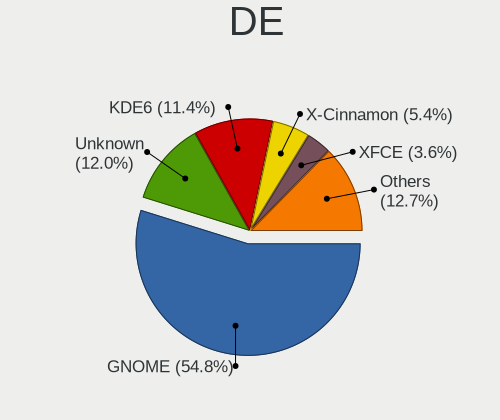
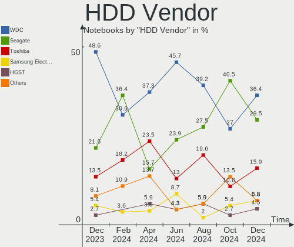
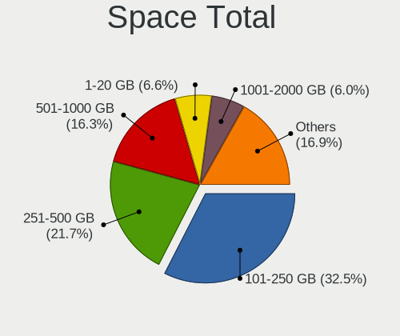
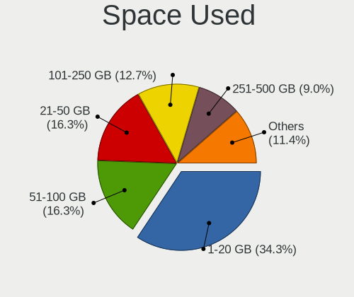
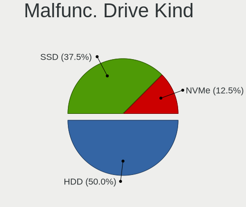
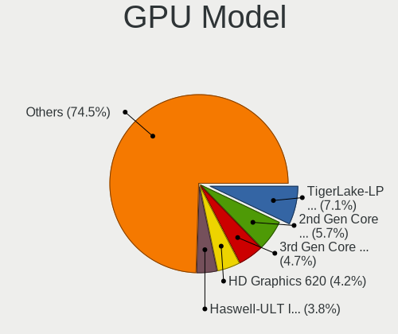
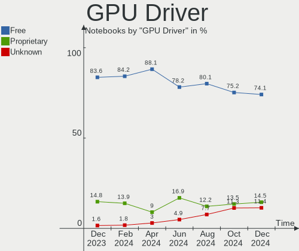
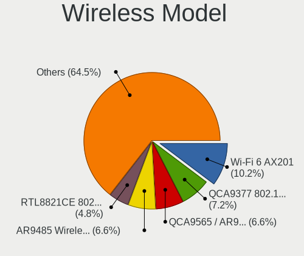
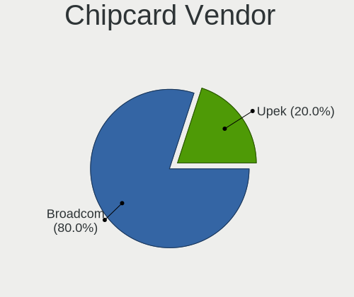

Linux in Brazil - Hardware Trends (Notebooks)
---------------------------------------------

A project to identify most popular hardware characteristics and track their change
over time based on data collected by Linux users at https://Linux-Hardware.org.

Anyone can contribute to this report by the [hw-probe](https://github.com/linuxhw/hw-probe) tool:

    sudo -E hw-probe -all -upload

Period: Aug, 2023.

Contents
--------

* [ System ](#system)
  - [ OS                       ](#os)
  - [ OS Family                ](#os-family)
  - [ Kernel                   ](#kernel)
  - [ Kernel Family            ](#kernel-family)
  - [ Kernel Major Ver.        ](#kernel-major-ver)
  - [ Arch                     ](#arch)
  - [ DE                       ](#de)
  - [ Display Server           ](#display-server)
  - [ Display Manager          ](#display-manager)
  - [ OS Lang                  ](#os-lang)
  - [ Boot Mode                ](#boot-mode)
  - [ Filesystem               ](#filesystem)
  - [ Part. scheme             ](#part-scheme)
  - [ Dual Boot with Linux/BSD ](#dual-boot-with-linuxbsd)
  - [ Dual Boot (Win)          ](#dual-boot-win)

* [ Board ](#board)
  - [ Vendor                   ](#vendor)
  - [ Model                    ](#model)
  - [ Model Family             ](#model-family)
  - [ MFG Year                 ](#mfg-year)
  - [ Form Factor              ](#form-factor)
  - [ Secure Boot              ](#secure-boot)
  - [ Coreboot                 ](#coreboot)
  - [ RAM Size                 ](#ram-size)
  - [ RAM Used                 ](#ram-used)
  - [ Total Drives             ](#total-drives)
  - [ Has CD-ROM               ](#has-cd-rom)
  - [ Has Ethernet             ](#has-ethernet)
  - [ Has WiFi                 ](#has-wifi)
  - [ Has Bluetooth            ](#has-bluetooth)

* [ Location ](#location)
  - [ Country                  ](#country)
  - [ City                     ](#city)

* [ Drives ](#drives)
  - [ Drive Vendor             ](#drive-vendor)
  - [ Drive Model              ](#drive-model)
  - [ HDD Vendor               ](#hdd-vendor)
  - [ SSD Vendor               ](#ssd-vendor)
  - [ Drive Kind               ](#drive-kind)
  - [ Drive Connector          ](#drive-connector)
  - [ Drive Size               ](#drive-size)
  - [ Space Total              ](#space-total)
  - [ Space Used               ](#space-used)
  - [ Malfunc. Drives          ](#malfunc-drives)
  - [ Malfunc. Drive Vendor    ](#malfunc-drive-vendor)
  - [ Malfunc. HDD Vendor      ](#malfunc-hdd-vendor)
  - [ Malfunc. Drive Kind      ](#malfunc-drive-kind)
  - [ Failed Drives            ](#failed-drives)
  - [ Failed Drive Vendor      ](#failed-drive-vendor)
  - [ Drive Status             ](#drive-status)

* [ Storage controller ](#storage-controller)
  - [ Storage Vendor           ](#storage-vendor)
  - [ Storage Model            ](#storage-model)
  - [ Storage Kind             ](#storage-kind)

* [ Processor ](#processor)
  - [ CPU Vendor               ](#cpu-vendor)
  - [ CPU Model                ](#cpu-model)
  - [ CPU Model Family         ](#cpu-model-family)
  - [ CPU Cores                ](#cpu-cores)
  - [ CPU Sockets              ](#cpu-sockets)
  - [ CPU Threads              ](#cpu-threads)
  - [ CPU Op-Modes             ](#cpu-op-modes)
  - [ CPU Microcode            ](#cpu-microcode)
  - [ CPU Microarch            ](#cpu-microarch)

* [ Graphics ](#graphics)
  - [ GPU Vendor               ](#gpu-vendor)
  - [ GPU Model                ](#gpu-model)
  - [ GPU Combo                ](#gpu-combo)
  - [ GPU Driver               ](#gpu-driver)
  - [ GPU Memory               ](#gpu-memory)

* [ Monitor ](#monitor)
  - [ Monitor Vendor           ](#monitor-vendor)
  - [ Monitor Model            ](#monitor-model)
  - [ Monitor Resolution       ](#monitor-resolution)
  - [ Monitor Diagonal         ](#monitor-diagonal)
  - [ Monitor Width            ](#monitor-width)
  - [ Aspect Ratio             ](#aspect-ratio)
  - [ Monitor Area             ](#monitor-area)
  - [ Pixel Density            ](#pixel-density)
  - [ Multiple Monitors        ](#multiple-monitors)

* [ Network ](#network)
  - [ Net Controller Vendor    ](#net-controller-vendor)
  - [ Net Controller Model     ](#net-controller-model)
  - [ Wireless Vendor          ](#wireless-vendor)
  - [ Wireless Model           ](#wireless-model)
  - [ Ethernet Vendor          ](#ethernet-vendor)
  - [ Ethernet Model           ](#ethernet-model)
  - [ Net Controller Kind      ](#net-controller-kind)
  - [ Used Controller          ](#used-controller)
  - [ NICs                     ](#nics)
  - [ IPv6                     ](#ipv6)

* [ Bluetooth ](#bluetooth)
  - [ Bluetooth Vendor         ](#bluetooth-vendor)
  - [ Bluetooth Model          ](#bluetooth-model)

* [ Sound ](#sound)
  - [ Sound Vendor             ](#sound-vendor)
  - [ Sound Model              ](#sound-model)

* [ Memory ](#memory)
  - [ Memory Vendor            ](#memory-vendor)
  - [ Memory Model             ](#memory-model)
  - [ Memory Kind              ](#memory-kind)
  - [ Memory Form Factor       ](#memory-form-factor)
  - [ Memory Size              ](#memory-size)
  - [ Memory Speed             ](#memory-speed)

* [ Printers & scanners ](#printers--scanners)
  - [ Printer Vendor           ](#printer-vendor)
  - [ Printer Model            ](#printer-model)
  - [ Scanner Vendor           ](#scanner-vendor)
  - [ Scanner Model            ](#scanner-model)

* [ Camera ](#camera)
  - [ Camera Vendor            ](#camera-vendor)
  - [ Camera Model             ](#camera-model)

* [ Security ](#security)
  - [ Fingerprint Vendor       ](#fingerprint-vendor)
  - [ Fingerprint Model        ](#fingerprint-model)
  - [ Chipcard Vendor          ](#chipcard-vendor)
  - [ Chipcard Model           ](#chipcard-model)

* [ Unsupported ](#unsupported)
  - [ Unsupported Devices      ](#unsupported-devices)
  - [ Unsupported Device Types ](#unsupported-device-types)

System
------

OS
--

Installed operating systems

| Name                         | Notebooks | Percent |
|------------------------------|-----------|---------|
| OpenMandriva 23.08           | 27        | 14.59%  |
| Ubuntu 22.04                 | 19        | 10.27%  |
| Fedora 38                    | 17        | 9.19%   |
| Linux Mint 21.2              | 11        | 5.95%   |
| Pop!_OS 22.04                | 9         | 4.86%   |
| Debian 12                    | 8         | 4.32%   |
| Ubuntu 23.04                 | 7         | 3.78%   |
| Endless 3.9.3-nexthw1        | 7         | 3.78%   |
| Zorin 16                     | 6         | 3.24%   |
| Linux Mint 21.1              | 6         | 3.24%   |
| OpenMandriva 23.03           | 4         | 2.16%   |
| Manjaro                      | 4         | 2.16%   |
| Arch Rolling                 | 4         | 2.16%   |
| Xero Rolling                 | 3         | 1.62%   |
| LMDE 5                       | 3         | 1.62%   |
| Debian                       | 3         | 1.62%   |
| ArcoLinux Rolling            | 3         | 1.62%   |
| Ubuntu 23.10                 | 2         | 1.08%   |
| Ubuntu 22.10                 | 2         | 1.08%   |
| Ubuntu 18.04                 | 2         | 1.08%   |
| openSUSE Tumbleweed-XXXXXXXX | 2         | 1.08%   |
| Manjaro 23.0.0               | 2         | 1.08%   |
| Linux Mint 21                | 2         | 1.08%   |
| Kubuntu 23.04                | 2         | 1.08%   |
| Endless 5.0.5                | 2         | 1.08%   |
| Xubuntu 23.04                | 1         | 0.54%   |
| Xubuntu 22.04                | 1         | 0.54%   |
| Ubuntu MATE 22.04            | 1         | 0.54%   |
| Ubuntu 20.04                 | 1         | 0.54%   |
| ROSA 12.4                    | 1         | 0.54%   |
| Pop!_OS 20.04                | 1         | 0.54%   |
| Peppermint 12                | 1         | 0.54%   |
| openSUSE Leap-15.5           | 1         | 0.54%   |
| OpenMandriva 4.3             | 1         | 0.54%   |
| OpenMandriva 4.2             | 1         | 0.54%   |
| OpenMandriva 23.07           | 1         | 0.54%   |
| OpenMandriva 23.01           | 1         | 0.54%   |
| Nobara 38                    | 1         | 0.54%   |
| Lubuntu 23.04                | 1         | 0.54%   |
| Linux Mint 20.3              | 1         | 0.54%   |

OS Family
---------

OS without a version

| Name         | Notebooks | Percent |
|--------------|-----------|---------|
| OpenMandriva | 35        | 18.92%  |
| Ubuntu       | 33        | 17.84%  |
| Linux Mint   | 21        | 11.35%  |
| Fedora       | 18        | 9.73%   |
| Debian       | 11        | 5.95%   |
| Pop!_OS      | 10        | 5.41%   |
| Endless      | 9         | 4.86%   |
| Zorin        | 6         | 3.24%   |
| Manjaro      | 6         | 3.24%   |
| ArcoLinux    | 4         | 2.16%   |
| Arch         | 4         | 2.16%   |
| Xero         | 3         | 1.62%   |
| openSUSE     | 3         | 1.62%   |
| LMDE         | 3         | 1.62%   |
| Kubuntu      | 3         | 1.62%   |
| Xubuntu      | 2         | 1.08%   |
| Kali         | 2         | 1.08%   |
| Garuda Linux | 2         | 1.08%   |
| Ubuntu MATE  | 1         | 0.54%   |
| ROSA         | 1         | 0.54%   |
| Peppermint   | 1         | 0.54%   |
| Nobara       | 1         | 0.54%   |
| Lubuntu      | 1         | 0.54%   |
| KDE neon     | 1         | 0.54%   |
| Gentoo       | 1         | 0.54%   |
| Elementary   | 1         | 0.54%   |
| Clear Linux  | 1         | 0.54%   |
| Artix        | 1         | 0.54%   |

Kernel
------

Version of the Linux kernel

| Version                 | Notebooks | Percent |
|-------------------------|-----------|---------|
| 6.2.0-26-generic        | 21        | 11.35%  |
| 6.4.11-desktop-1omv2390 | 16        | 8.65%   |
| 5.15.0-78-generic       | 12        | 6.49%   |
| 6.4.8-desktop-2omv2390  | 11        | 5.95%   |
| 5.15.0-79-generic       | 11        | 5.95%   |
| 6.4.6-76060406-generic  | 8         | 4.32%   |
| 5.11.0-12-generic       | 7         | 3.78%   |
| 6.2.0-27-generic        | 5         | 2.7%    |
| 6.4.7-200.fc38.x86_64   | 4         | 2.16%   |
| 6.4.10-200.fc38.x86_64  | 4         | 2.16%   |
| 6.1.0-10-amd64          | 4         | 2.16%   |
| 6.4.9-arch1-1           | 3         | 1.62%   |
| 6.4.11-200.fc38.x86_64  | 3         | 1.62%   |
| 6.2.6-desktop-1omv2390  | 3         | 1.62%   |
| 6.1.41-1-MANJARO        | 3         | 1.62%   |
| 6.1.0-11-amd64          | 3         | 1.62%   |
| 6.4.9-zen1-1-zen        | 2         | 1.08%   |
| 6.4.6-200.fc38.x86_64   | 2         | 1.08%   |
| 6.4.12-200.fc38.x86_64  | 2         | 1.08%   |
| 6.4.0-1-amd64           | 2         | 1.08%   |
| 6.3.0-7-generic         | 2         | 1.08%   |
| 5.19.0-50-generic       | 2         | 1.08%   |
| 5.19.0-46-generic       | 2         | 1.08%   |
| 5.15.0-47-generic       | 2         | 1.08%   |
| 5.10.0-24-amd64         | 2         | 1.08%   |
| 6.4.9-100.fc37.x86_64   | 1         | 0.54%   |
| 6.4.8-lqx1-1-lqx        | 1         | 0.54%   |
| 6.4.8-arch1-1           | 1         | 0.54%   |
| 6.4.8-1-default         | 1         | 0.54%   |
| 6.4.7-arch1-3           | 1         | 0.54%   |
| 6.4.7-arch1-2           | 1         | 0.54%   |
| 6.4.6-1-MANJARO         | 1         | 0.54%   |
| 6.4.4-zen1-1-zen        | 1         | 0.54%   |
| 6.4.4-200.fc38.x86_64   | 1         | 0.54%   |
| 6.4.12-zen1-1-zen       | 1         | 0.54%   |
| 6.4.12-arch1-1          | 1         | 0.54%   |
| 6.4.12-1350.native      | 1         | 0.54%   |
| 6.4.11-arch2-1          | 1         | 0.54%   |
| 6.4.11-2-liquorix-amd64 | 1         | 0.54%   |
| 6.4.11-1-default        | 1         | 0.54%   |

Kernel Family
-------------

Linux kernel without a distro release

| Version | Notebooks | Percent |
|---------|-----------|---------|
| 6.2.0   | 29        | 15.68%  |
| 5.15.0  | 28        | 15.14%  |
| 6.4.11  | 22        | 11.89%  |
| 6.4.8   | 14        | 7.57%   |
| 6.4.6   | 11        | 5.95%   |
| 6.1.0   | 10        | 5.41%   |
| 5.11.0  | 7         | 3.78%   |
| 6.4.9   | 6         | 3.24%   |
| 6.4.7   | 6         | 3.24%   |
| 6.4.12  | 5         | 2.7%    |
| 5.19.0  | 5         | 2.7%    |
| 6.4.10  | 4         | 2.16%   |
| 6.2.6   | 4         | 2.16%   |
| 6.1.41  | 4         | 2.16%   |
| 6.4.0   | 3         | 1.62%   |
| 6.3.0   | 3         | 1.62%   |
| 5.4.0   | 3         | 1.62%   |
| 5.10.0  | 3         | 1.62%   |
| 6.4.4   | 2         | 1.08%   |
| 6.1.38  | 2         | 1.08%   |
| 6.3.5   | 1         | 0.54%   |
| 6.3.12  | 1         | 0.54%   |
| 6.2.9   | 1         | 0.54%   |
| 6.2.1   | 1         | 0.54%   |
| 6.1.46  | 1         | 0.54%   |
| 6.1.45  | 1         | 0.54%   |
| 6.1.1   | 1         | 0.54%   |
| 6.0.12  | 1         | 0.54%   |
| 5.16.7  | 1         | 0.54%   |
| 5.16.0  | 1         | 0.54%   |
| 5.15.75 | 1         | 0.54%   |
| 5.14.21 | 1         | 0.54%   |
| 5.10.14 | 1         | 0.54%   |
| 4.15.0  | 1         | 0.54%   |

Kernel Major Ver.
-----------------

Linux kernel major version

| Version | Notebooks | Percent |
|---------|-----------|---------|
| 6.4     | 73        | 39.46%  |
| 6.2     | 35        | 18.92%  |
| 5.15    | 29        | 15.68%  |
| 6.1     | 19        | 10.27%  |
| 5.11    | 7         | 3.78%   |
| 6.3     | 5         | 2.7%    |
| 5.19    | 5         | 2.7%    |
| 5.10    | 4         | 2.16%   |
| 5.4     | 3         | 1.62%   |
| 5.16    | 2         | 1.08%   |
| 6.0     | 1         | 0.54%   |
| 5.14    | 1         | 0.54%   |
| 4.15    | 1         | 0.54%   |

Arch
----

OS architecture (x86_64, i586, etc.)

| Name   | Notebooks | Percent |
|--------|-----------|---------|
| x86_64 | 184       | 99.46%  |
| i686   | 1         | 0.54%   |

DE
--

Desktop Environment

| Name       | Notebooks | Percent |
|------------|-----------|---------|
| GNOME      | 89        | 48.11%  |
| KDE5       | 49        | 26.49%  |
| X-Cinnamon | 17        | 9.19%   |
| XFCE       | 13        | 7.03%   |
| MATE       | 5         | 2.7%    |
| LXQt       | 2         | 1.08%   |
| i3         | 2         | 1.08%   |
| Unknown    | 2         | 1.08%   |
| Pantheon   | 1         | 0.54%   |
| Lubuntu    | 1         | 0.54%   |
| Hyprland   | 1         | 0.54%   |
| Deepin     | 1         | 0.54%   |
| Cinnamon   | 1         | 0.54%   |
| Budgie     | 1         | 0.54%   |

Display Server
--------------

X11 or Wayland

| Name    | Notebooks | Percent |
|---------|-----------|---------|
| X11     | 107       | 57.84%  |
| Wayland | 76        | 41.08%  |
| Unknown | 2         | 1.08%   |

Display Manager
---------------

SDDM, LightDM, etc.

| Name    | Notebooks | Percent |
|---------|-----------|---------|
| Unknown | 84        | 45.41%  |
| SDDM    | 44        | 23.78%  |
| GDM3    | 29        | 15.68%  |
| LightDM | 17        | 9.19%   |
| GDM     | 10        | 5.41%   |
| XDM     | 1         | 0.54%   |

OS Lang
-------

Language

| Lang    | Notebooks | Percent |
|---------|-----------|---------|
| pt_BR   | 140       | 75.68%  |
| en_US   | 36        | 19.46%  |
| en_GB   | 3         | 1.62%   |
| pt_PT   | 2         | 1.08%   |
| Unknown | 2         | 1.08%   |
| es_PY   | 1         | 0.54%   |
| en_CA   | 1         | 0.54%   |

Boot Mode
---------

EFI or BIOS

| Mode | Notebooks | Percent |
|------|-----------|---------|
| EFI  | 99        | 53.51%  |
| BIOS | 86        | 46.49%  |

Filesystem
----------

Type of filesystem

| Type    | Notebooks | Percent |
|---------|-----------|---------|
| Ext4    | 113       | 61.08%  |
| Btrfs   | 29        | 15.68%  |
| Overlay | 21        | 11.35%  |
| Tmpfs   | 18        | 9.73%   |
| Xfs     | 2         | 1.08%   |
| F2fs    | 1         | 0.54%   |
| Ext2    | 1         | 0.54%   |

Part. scheme
------------

Scheme of partitioning

| Type    | Notebooks | Percent |
|---------|-----------|---------|
| GPT     | 82        | 44.32%  |
| Unknown | 82        | 44.32%  |
| MBR     | 21        | 11.35%  |

Dual Boot with Linux/BSD
------------------------

Hosting more than one Linux/BSD

| Dual boot | Notebooks | Percent |
|-----------|-----------|---------|
| No        | 160       | 86.49%  |
| Yes       | 25        | 13.51%  |

Dual Boot (Win)
---------------

Hosting Linux and Windows

| Dual boot | Notebooks | Percent |
|-----------|-----------|---------|
| No        | 147       | 79.46%  |
| Yes       | 38        | 20.54%  |

Board
-----

Vendor
------

Motherboard manufacturer

| Name                   | Notebooks | Percent |
|------------------------|-----------|---------|
| Dell                   | 34        | 18.38%  |
| Acer                   | 33        | 17.84%  |
| Lenovo                 | 30        | 16.22%  |
| Samsung Electronics    | 18        | 9.73%   |
| ASUSTek Computer       | 15        | 8.11%   |
| Positivo               | 10        | 5.41%   |
| Hewlett-Packard        | 9         | 4.86%   |
| Apple                  | 5         | 2.7%    |
| Sony                   | 3         | 1.62%   |
| Positivo Bahia - VAIO  | 3         | 1.62%   |
| Avell High Performance | 3         | 1.62%   |
| Notebook               | 2         | 1.08%   |
| Multilaser             | 2         | 1.08%   |
| Itautec                | 2         | 1.08%   |
| Daten Tecnologia       | 2         | 1.08%   |
| Alienware              | 2         | 1.08%   |
| Topstar                | 1         | 0.54%   |
| Timi                   | 1         | 0.54%   |
| Semp Toshiba           | 1         | 0.54%   |
| Packard Bell           | 1         | 0.54%   |
| LG Electronics         | 1         | 0.54%   |
| Intel                  | 1         | 0.54%   |
| Google                 | 1         | 0.54%   |
| EUROCOM                | 1         | 0.54%   |
| Clevo                  | 1         | 0.54%   |
| Avell                  | 1         | 0.54%   |
| ASRock                 | 1         | 0.54%   |
| Unknown                | 1         | 0.54%   |

Model
-----

Motherboard model

| Name                                        | Notebooks | Percent |
|---------------------------------------------|-----------|---------|
| ASUS VivoBook_ASUSLaptop X515EA_X515EA      | 6         | 3.24%   |
| Dell Inspiron 15-3567                       | 5         | 2.7%    |
| Samsung 300E5M/300E5L                       | 4         | 2.16%   |
| Samsung 340XAA/350XAA/550XAA                | 3         | 1.62%   |
| Lenovo IdeaPad S145-15IWL 81S9              | 3         | 1.62%   |
| Lenovo IdeaPad S145-15IIL 82DJ              | 3         | 1.62%   |
| Positivo Mobile                             | 2         | 1.08%   |
| Positivo CHT14B                             | 2         | 1.08%   |
| Positivo C14CU51                            | 2         | 1.08%   |
| Lenovo IdeaPad Gaming 3 15IMH05 82CG        | 2         | 1.08%   |
| Lenovo IdeaPad 3 15IGL05 82BU               | 2         | 1.08%   |
| Lenovo IdeaPad 3 15ALC6 82MF                | 2         | 1.08%   |
| Dell Inspiron N4050                         | 2         | 1.08%   |
| Dell Inspiron 5566                          | 2         | 1.08%   |
| Dell Inspiron 5558                          | 2         | 1.08%   |
| Dell Inspiron 15 3515                       | 2         | 1.08%   |
| Dell Inspiron 15 3511                       | 2         | 1.08%   |
| Dell G3 3579                                | 2         | 1.08%   |
| Dell G15 5520                               | 2         | 1.08%   |
| Apple MacBookPro8,1                         | 2         | 1.08%   |
| Acer Nitro AN517-54                         | 2         | 1.08%   |
| Acer Aspire E5-553G                         | 2         | 1.08%   |
| Acer Aspire A515-51                         | 2         | 1.08%   |
| Acer Aspire 5750                            | 2         | 1.08%   |
| Topstar Cantiga & ICH9M Chipset             | 1         | 0.54%   |
| Timi TM1701                                 | 1         | 0.54%   |
| Sony VPCEG15FB                              | 1         | 0.54%   |
| Sony VPCEA36FX                              | 1         | 0.54%   |
| Sony SVE14123CBW                            | 1         | 0.54%   |
| Semp Toshiba IS 1422                        | 1         | 0.54%   |
| Samsung RV419/RV420                         | 1         | 0.54%   |
| Samsung RV411/RV511/E3511/S3511/RV711/E3411 | 1         | 0.54%   |
| Samsung 550XDA                              | 1         | 0.54%   |
| Samsung 550XBE/350XBE                       | 1         | 0.54%   |
| Samsung 370E4K                              | 1         | 0.54%   |
| Samsung 305E4A/305E5A/305E7A                | 1         | 0.54%   |
| Samsung 300E5K/300E5Q                       | 1         | 0.54%   |
| Samsung 300E4M/300E4S/300E4L                | 1         | 0.54%   |
| Samsung 300E4C/300E5C/300E7C                | 1         | 0.54%   |
| Samsung 270E5J/2570EJ                       | 1         | 0.54%   |

Model Family
------------

Motherboard model prefix

| Name              | Notebooks | Percent |
|-------------------|-----------|---------|
| Acer Aspire       | 25        | 13.51%  |
| Dell Inspiron     | 22        | 11.89%  |
| Lenovo IdeaPad    | 19        | 10.27%  |
| ASUS VivoBook     | 9         | 4.86%   |
| Lenovo ThinkPad   | 7         | 3.78%   |
| Acer Nitro        | 7         | 3.78%   |
| Samsung 300E5M    | 4         | 2.16%   |
| HP Pavilion       | 4         | 2.16%   |
| Dell Latitude     | 4         | 2.16%   |
| Samsung 340XAA    | 3         | 1.62%   |
| Dell G15          | 3         | 1.62%   |
| Positivo Mobile   | 2         | 1.08%   |
| Positivo CHT14B   | 2         | 1.08%   |
| Positivo C14CU51  | 2         | 1.08%   |
| Itautec Infoway   | 2         | 1.08%   |
| HP 250            | 2         | 1.08%   |
| Dell Vostro       | 2         | 1.08%   |
| Dell G3           | 2         | 1.08%   |
| Apple MacBookPro8 | 2         | 1.08%   |
| Alienware m15     | 2         | 1.08%   |
| Topstar Cantiga   | 1         | 0.54%   |
| Timi TM1701       | 1         | 0.54%   |
| Sony VPCEG15FB    | 1         | 0.54%   |
| Sony VPCEA36FX    | 1         | 0.54%   |
| Sony SVE14123CBW  | 1         | 0.54%   |
| Semp Toshiba IS   | 1         | 0.54%   |
| Samsung RV419     | 1         | 0.54%   |
| Samsung RV411     | 1         | 0.54%   |
| Samsung 550XDA    | 1         | 0.54%   |
| Samsung 550XBE    | 1         | 0.54%   |
| Samsung 370E4K    | 1         | 0.54%   |
| Samsung 305E4A    | 1         | 0.54%   |
| Samsung 300E5K    | 1         | 0.54%   |
| Samsung 300E4M    | 1         | 0.54%   |
| Samsung 300E4C    | 1         | 0.54%   |
| Samsung 270E5J    | 1         | 0.54%   |
| Samsung 270E5G    | 1         | 0.54%   |
| Positivo S14CT01  | 1         | 0.54%   |
| Positivo Q232B    | 1         | 0.54%   |
| Positivo Presley  | 1         | 0.54%   |

MFG Year
--------

Motherboard manufacture year

| Year | Notebooks | Percent |
|------|-----------|---------|
| 2021 | 25        | 13.51%  |
| 2020 | 22        | 11.89%  |
| 2011 | 20        | 10.81%  |
| 2017 | 17        | 9.19%   |
| 2018 | 16        | 8.65%   |
| 2016 | 15        | 8.11%   |
| 2019 | 12        | 6.49%   |
| 2013 | 12        | 6.49%   |
| 2012 | 10        | 5.41%   |
| 2014 | 8         | 4.32%   |
| 2010 | 8         | 4.32%   |
| 2022 | 7         | 3.78%   |
| 2023 | 4         | 2.16%   |
| 2015 | 3         | 1.62%   |
| 2008 | 2         | 1.08%   |
| 2006 | 2         | 1.08%   |
| 2009 | 1         | 0.54%   |
| 2007 | 1         | 0.54%   |

Form Factor
-----------

Physical design of the computer

| Name     | Notebooks | Percent |
|----------|-----------|---------|
| Notebook | 185       | 100%    |

Secure Boot
-----------

Enabled or disabled

| State    | Notebooks | Percent |
|----------|-----------|---------|
| Disabled | 163       | 88.11%  |
| Enabled  | 22        | 11.89%  |

Coreboot
--------

Have coreboot on board

| Used | Notebooks | Percent |
|------|-----------|---------|
| No   | 184       | 99.46%  |
| Yes  | 1         | 0.54%   |

RAM Size
--------

Total RAM memory

| Size in GB | Notebooks | Percent |
|------------|-----------|---------|
| 4.01-8.0   | 67        | 36.22%  |
| 3.01-4.0   | 40        | 21.62%  |
| 16.01-24.0 | 36        | 19.46%  |
| 8.01-16.0  | 16        | 8.65%   |
| 32.01-64.0 | 13        | 7.03%   |
| 1.01-2.0   | 9         | 4.86%   |
| 2.01-3.0   | 3         | 1.62%   |
| 24.01-32.0 | 1         | 0.54%   |

RAM Used
--------

Used RAM memory

| Used GB    | Notebooks | Percent |
|------------|-----------|---------|
| 1.01-2.0   | 58        | 31.35%  |
| 2.01-3.0   | 53        | 28.65%  |
| 4.01-8.0   | 32        | 17.3%   |
| 3.01-4.0   | 30        | 16.22%  |
| 0.51-1.0   | 5         | 2.7%    |
| 8.01-16.0  | 4         | 2.16%   |
| 16.01-24.0 | 3         | 1.62%   |

Total Drives
------------

Number of drives on board

| Drives | Notebooks | Percent |
|--------|-----------|---------|
| 1      | 121       | 65.41%  |
| 2      | 57        | 30.81%  |
| 3      | 3         | 1.62%   |
| 0      | 3         | 1.62%   |
| 4      | 1         | 0.54%   |

Has CD-ROM
----------

Has CD-ROM on board

| Presented | Notebooks | Percent |
|-----------|-----------|---------|
| No        | 138       | 74.59%  |
| Yes       | 47        | 25.41%  |

Has Ethernet
------------

Has Ethernet on board

| Presented | Notebooks | Percent |
|-----------|-----------|---------|
| Yes       | 145       | 78.38%  |
| No        | 40        | 21.62%  |

Has WiFi
--------

Has WiFi module

| Presented | Notebooks | Percent |
|-----------|-----------|---------|
| Yes       | 175       | 94.59%  |
| No        | 10        | 5.41%   |

Has Bluetooth
-------------

Has Bluetooth module

| Presented | Notebooks | Percent |
|-----------|-----------|---------|
| Yes       | 140       | 75.68%  |
| No        | 45        | 24.32%  |

Location
--------

Country
-------

Geographic location (country)

| Country | Notebooks | Percent |
|---------|-----------|---------|
| Brazil  | 185       | 100%    |

City
----

Geographic location (city)

| City                   | Notebooks | Percent |
|------------------------|-----------|---------|
| Sao Paulo              | 18        | 9.73%   |
| Rio de Janeiro         | 11        | 5.95%   |
| Brasília              | 8         | 4.32%   |
| Curitiba               | 7         | 3.78%   |
| Belo Horizonte         | 6         | 3.24%   |
| Porto Alegre           | 4         | 2.16%   |
| Fortaleza              | 4         | 2.16%   |
| Natal                  | 3         | 1.62%   |
| Campinas               | 3         | 1.62%   |
| Aracaju                | 3         | 1.62%   |
| Serra                  | 2         | 1.08%   |
| Sao Vicente            | 2         | 1.08%   |
| Sao José dos Campos   | 2         | 1.08%   |
| Recife                 | 2         | 1.08%   |
| Maringá               | 2         | 1.08%   |
| Manaus                 | 2         | 1.08%   |
| Goiânia               | 2         | 1.08%   |
| Florianópolis         | 2         | 1.08%   |
| Caxias do Sul          | 2         | 1.08%   |
| Canoas                 | 2         | 1.08%   |
| Anápolis              | 2         | 1.08%   |
| Volta Redonda          | 1         | 0.54%   |
| Vitoria de Santo Antao | 1         | 0.54%   |
| Valença               | 1         | 0.54%   |
| Umbauba                | 1         | 0.54%   |
| Uberlândia            | 1         | 0.54%   |
| Ubatuba                | 1         | 0.54%   |
| Teresopolis            | 1         | 0.54%   |
| Teresina               | 1         | 0.54%   |
| Teófilo Otoni         | 1         | 0.54%   |
| Tatuí                 | 1         | 0.54%   |
| Taguatinga             | 1         | 0.54%   |
| Sorocaba               | 1         | 0.54%   |
| Sombrio                | 1         | 0.54%   |
| Sao Luís              | 1         | 0.54%   |
| Sao José dos Pinhais  | 1         | 0.54%   |
| Sao Jose do Rio Preto  | 1         | 0.54%   |
| Sao Joao de Meriti     | 1         | 0.54%   |
| Sao Goncalo            | 1         | 0.54%   |
| Sao Bernardo do Campo  | 1         | 0.54%   |

Drives
------

Drive Vendor
------------

Hard drive vendors

| Vendor                         | Notebooks | Drives | Percent |
|--------------------------------|-----------|--------|---------|
| WDC                            | 35        | 38     | 15.02%  |
| Kingston                       | 32        | 33     | 13.73%  |
| Seagate                        | 20        | 22     | 8.58%   |
| Samsung Electronics            | 17        | 18     | 7.3%    |
| ADATA Technology               | 14        | 14     | 6.01%   |
| Toshiba                        | 12        | 12     | 5.15%   |
| SanDisk                        | 11        | 12     | 4.72%   |
| Unknown                        | 10        | 11     | 4.29%   |
| China                          | 10        | 10     | 4.29%   |
| A-DATA Technology              | 8         | 8      | 3.43%   |
| SK hynix                       | 5         | 5      | 2.15%   |
| Silicon Motion                 | 5         | 5      | 2.15%   |
| Crucial                        | 5         | 5      | 2.15%   |
| Intel                          | 4         | 4      | 1.72%   |
| Solid State Storage Technology | 3         | 3      | 1.29%   |
| Unknown                        | 3         | 3      | 1.29%   |
| XrayDisk                       | 2         | 2      | 0.86%   |
| WALRAM                         | 2         | 2      | 0.86%   |
| SSSTC                          | 2         | 2      | 0.86%   |
| Patriot                        | 2         | 2      | 0.86%   |
| Netac                          | 2         | 2      | 0.86%   |
| LITEON                         | 2         | 2      | 0.86%   |
| KIOXIA                         | 2         | 2      | 0.86%   |
| Hitachi                        | 2         | 2      | 0.86%   |
| Apple                          | 2         | 2      | 0.86%   |
| USB3.0                         | 1         | 1      | 0.43%   |
| TO Exter                       | 1         | 1      | 0.43%   |
| Team                           | 1         | 1      | 0.43%   |
| Solid State Storage            | 1         | 2      | 0.43%   |
| ShiJi                          | 1         | 1      | 0.43%   |
| SAGE                           | 1         | 1      | 0.43%   |
| Netac SS                       | 1         | 1      | 0.43%   |
| Micron/Crucial Technology      | 1         | 1      | 0.43%   |
| Micron Technology              | 1         | 1      | 0.43%   |
| MAXIO Technology (Hangzhou)    | 1         | 1      | 0.43%   |
| Kllisre                        | 1         | 1      | 0.43%   |
| Kingston Technology Company    | 1         | 1      | 0.43%   |
| KingSpec                       | 1         | 1      | 0.43%   |
| JMicron Technology             | 1         | 1      | 0.43%   |
| HS-SSD-E100N                   | 1         | 1      | 0.43%   |

Drive Model
-----------

Hard drive models

| Model                                                 | Notebooks | Percent |
|-------------------------------------------------------|-----------|---------|
| Kingston SA400S37240G 240GB SSD                       | 12        | 5%      |
| ADATA SM2P32A8-256GC1 256GB                           | 7         | 2.92%   |
| Kingston SA400S37480G 480GB SSD                       | 5         | 2.08%   |
| Unknown MMC Card  32GB                                | 4         | 1.67%   |
| Seagate ST500LM012 HN-M500MBB 500GB                   | 4         | 1.67%   |
| Kingston SA400S37120G 120GB SSD                       | 4         | 1.67%   |
| WDC WD10SPZX-24Z10 1TB                                | 3         | 1.25%   |
| WDC WD10SPZX-21Z10T0 1TB                              | 3         | 1.25%   |
| Silicon Motion SM2263EN/SM2263XT SSD Controller 256GB | 3         | 1.25%   |
| Samsung NVMe SSD Controller SM981/PM981/PM983 500GB   | 3         | 1.25%   |
| Samsung HM321HI 320GB                                 | 3         | 1.25%   |
| Unknown                                               | 3         | 1.25%   |
| WDC WD10SPZX-75Z10T1 1TB                              | 2         | 0.83%   |
| WDC WD10SPZX-35Z10T0 1TB                              | 2         | 0.83%   |
| WDC WD10JPVX-22JC3T0 1TB                              | 2         | 0.83%   |
| WDC PC SN530 SDBPNPZ-512G-1114 512GB                  | 2         | 0.83%   |
| Unknown MMC Card  128GB                               | 2         | 0.83%   |
| Toshiba MQ01ABF050 500GB                              | 2         | 0.83%   |
| Toshiba MQ01ABD100 1TB                                | 2         | 0.83%   |
| Solid State Storage SSSTC CL1-4D128 128GB             | 2         | 0.83%   |
| Seagate ST9500325AS 500GB                             | 2         | 0.83%   |
| Seagate ST500LM000-1EJ162 500GB                       | 2         | 0.83%   |
| Seagate ST1000LM024 HN-M101MBB 1TB                    | 2         | 0.83%   |
| Sandisk WD Blue SN500 / PC SN520 NVMe SSD 512GB       | 2         | 0.83%   |
| Kingston SA400M8240G 240GB SSD                        | 2         | 0.83%   |
| Intel SSD 660P Series 512GB                           | 2         | 0.83%   |
| China SSD 256GB                                       | 2         | 0.83%   |
| ADATA SM2P41C3 NVMe 256GB                             | 2         | 0.83%   |
| A-DATA IM2P33F8BR2-256GB                              | 2         | 0.83%   |
| A-DATA IM2P33F3A NVMe 256GB                           | 2         | 0.83%   |
| XrayDisk 512GB SSD                                    | 1         | 0.42%   |
| XrayDisk 240GB                                        | 1         | 0.42%   |
| WDC WDS500G2B0C-00PXH0 500GB                          | 1         | 0.42%   |
| WDC WDS480G2G0A-00JH30 480GB SSD                      | 1         | 0.42%   |
| WDC WDS250G2B0A-00SM50 250GB SSD                      | 1         | 0.42%   |
| WDC WDS240G2G0B-00EPW0 240GB SSD                      | 1         | 0.42%   |
| WDC WDS120G2G0A-00JH30 120GB SSD                      | 1         | 0.42%   |
| WDC WD7500BPKX-00HPJT0 752GB                          | 1         | 0.42%   |
| WDC WD5000LPVX-75V0TT0 500GB                          | 1         | 0.42%   |
| WDC WD5000LPVX-22V0TT0 500GB                          | 1         | 0.42%   |

HDD Vendor
----------

Hard disk drive vendors

| Vendor              | Notebooks | Drives | Percent |
|---------------------|-----------|--------|---------|
| WDC                 | 27        | 27     | 38.03%  |
| Seagate             | 20        | 22     | 28.17%  |
| Toshiba             | 11        | 11     | 15.49%  |
| Samsung Electronics | 6         | 6      | 8.45%   |
| Hitachi             | 2         | 2      | 2.82%   |
| WALRAM              | 1         | 1      | 1.41%   |
| USB3.0              | 1         | 1      | 1.41%   |
| SAGE                | 1         | 1      | 1.41%   |
| HGST                | 1         | 1      | 1.41%   |
| Fujitsu             | 1         | 1      | 1.41%   |

SSD Vendor
----------

Solid state drive vendors

| Vendor              | Notebooks | Drives | Percent |
|---------------------|-----------|--------|---------|
| Kingston            | 29        | 30     | 38.16%  |
| China               | 10        | 10     | 13.16%  |
| WDC                 | 5         | 5      | 6.58%   |
| Crucial             | 5         | 5      | 6.58%   |
| Samsung Electronics | 4         | 4      | 5.26%   |
| SanDisk             | 3         | 3      | 3.95%   |
| Patriot             | 2         | 2      | 2.63%   |
| Netac               | 2         | 2      | 2.63%   |
| LITEON              | 2         | 2      | 2.63%   |
| A-DATA Technology   | 2         | 2      | 2.63%   |
| Unknown             | 2         | 2      | 2.63%   |
| XrayDisk            | 1         | 1      | 1.32%   |
| Toshiba             | 1         | 1      | 1.32%   |
| TO Exter            | 1         | 1      | 1.32%   |
| Team                | 1         | 1      | 1.32%   |
| KingSpec            | 1         | 1      | 1.32%   |
| JMicron Technology  | 1         | 1      | 1.32%   |
| Intel               | 1         | 1      | 1.32%   |
| Apple               | 1         | 1      | 1.32%   |
| AFOX                | 1         | 1      | 1.32%   |
| Advantech           | 1         | 1      | 1.32%   |

Drive Kind
----------

HDD or SSD

| Kind    | Notebooks | Drives | Percent |
|---------|-----------|--------|---------|
| SSD     | 74        | 77     | 32.46%  |
| HDD     | 70        | 73     | 30.7%   |
| NVMe    | 69        | 76     | 30.26%  |
| MMC     | 9         | 11     | 3.95%   |
| Unknown | 6         | 6      | 2.63%   |

Drive Connector
---------------

SATA, SAS, NVMe, etc.

| Type | Notebooks | Drives | Percent |
|------|-----------|--------|---------|
| SATA | 127       | 146    | 59.07%  |
| NVMe | 69        | 76     | 32.09%  |
| SAS  | 10        | 10     | 4.65%   |
| MMC  | 9         | 11     | 4.19%   |

Drive Size
----------

Size of hard drive

| Size in TB | Notebooks | Drives | Percent |
|------------|-----------|--------|---------|
| 0.01-0.5   | 92        | 101    | 66.67%  |
| 0.51-1.0   | 41        | 44     | 29.71%  |
| 1.01-2.0   | 5         | 5      | 3.62%   |

Space Total
-----------

Amount of disk space available on the file system

| Size in GB     | Notebooks | Percent |
|----------------|-----------|---------|
| 101-250        | 54        | 29.19%  |
| 251-500        | 40        | 21.62%  |
| 501-1000       | 32        | 17.3%   |
| 1-20           | 21        | 11.35%  |
| 1001-2000      | 11        | 5.95%   |
| 51-100         | 10        | 5.41%   |
| 21-50          | 8         | 4.32%   |
| More than 3000 | 4         | 2.16%   |
| Unknown        | 3         | 1.62%   |
| 2001-3000      | 2         | 1.08%   |

Space Used
----------

Amount of used disk space

| Used GB   | Notebooks | Percent |
|-----------|-----------|---------|
| 1-20      | 73        | 39.46%  |
| 21-50     | 35        | 18.92%  |
| 51-100    | 25        | 13.51%  |
| 101-250   | 22        | 11.89%  |
| 251-500   | 16        | 8.65%   |
| 1001-2000 | 5         | 2.7%    |
| 501-1000  | 5         | 2.7%    |
| Unknown   | 3         | 1.62%   |
| 2001-3000 | 1         | 0.54%   |

Malfunc. Drives
---------------

Drive models with a malfunction

| Model                                  | Notebooks | Drives | Percent |
|----------------------------------------|-----------|--------|---------|
| WDC WD5000BEVT-00A0RT0 500GB           | 1         | 1      | 5.88%   |
| WDC WD2500BEVT-22A23T0 208GB           | 1         | 1      | 5.88%   |
| WDC WD10SPZX-24Z10T0 1TB               | 1         | 1      | 5.88%   |
| WDC WD10JPVX-00JC3T0 1TB               | 1         | 1      | 5.88%   |
| ShiJi 1TB                              | 1         | 1      | 5.88%   |
| Seagate ST9120822AS 120GB              | 1         | 1      | 5.88%   |
| Seagate ST500VT000-1DK142 500GB        | 1         | 1      | 5.88%   |
| Seagate ST500LM012 HN-M500MBB 500GB    | 1         | 1      | 5.88%   |
| Seagate ST500LM000-1EJ162 500GB        | 1         | 1      | 5.88%   |
| Seagate ST1000LM048-2E7172 1TB         | 1         | 1      | 5.88%   |
| Seagate ST1000LM024 HN-M101MBB 1TB     | 1         | 1      | 5.88%   |
| Samsung Electronics HM160HI 160GB      | 1         | 1      | 5.88%   |
| SAGE 3639S 500GB                       | 1         | 1      | 5.88%   |
| Netac SSD 512GB                        | 1         | 1      | 5.88%   |
| LITEON CV8-8E128-HP 128GB SSD          | 1         | 1      | 5.88%   |
| China SATA SSD 120GB                   | 1         | 1      | 5.88%   |
| A-DATA Technology IM2P33F3A NVMe 256GB | 1         | 1      | 5.88%   |

Malfunc. Drive Vendor
---------------------

Vendors of faulty drives

| Vendor              | Notebooks | Drives | Percent |
|---------------------|-----------|--------|---------|
| Seagate             | 6         | 6      | 35.29%  |
| WDC                 | 4         | 4      | 23.53%  |
| ShiJi               | 1         | 1      | 5.88%   |
| Samsung Electronics | 1         | 1      | 5.88%   |
| SAGE                | 1         | 1      | 5.88%   |
| Netac               | 1         | 1      | 5.88%   |
| LITEON              | 1         | 1      | 5.88%   |
| China               | 1         | 1      | 5.88%   |
| A-DATA Technology   | 1         | 1      | 5.88%   |

Malfunc. HDD Vendor
-------------------

Vendors of faulty HDD drives

| Vendor              | Notebooks | Drives | Percent |
|---------------------|-----------|--------|---------|
| Seagate             | 6         | 6      | 50%     |
| WDC                 | 4         | 4      | 33.33%  |
| Samsung Electronics | 1         | 1      | 8.33%   |
| SAGE                | 1         | 1      | 8.33%   |

Malfunc. Drive Kind
-------------------

Kinds of faulty drives

| Kind | Notebooks | Drives | Percent |
|------|-----------|--------|---------|
| HDD  | 12        | 12     | 70.59%  |
| SSD  | 3         | 3      | 17.65%  |
| NVMe | 2         | 2      | 11.76%  |

Failed Drives
-------------

Failed drive models

| Model                                           | Notebooks | Drives | Percent |
|-------------------------------------------------|-----------|--------|---------|
| Samsung Electronics MZMPC032HBCD-000H1 32GB SSD | 1         | 1      | 50%     |
| Hitachi HTS545032B9A300 320GB                   | 1         | 1      | 50%     |

Failed Drive Vendor
-------------------

Failed drive vendors

| Vendor              | Notebooks | Drives | Percent |
|---------------------|-----------|--------|---------|
| Samsung Electronics | 1         | 1      | 50%     |
| Hitachi             | 1         | 1      | 50%     |

Drive Status
------------

Number of failed and malfunc. drives

| Status   | Notebooks | Drives | Percent |
|----------|-----------|--------|---------|
| Detected | 117       | 152    | 60.62%  |
| Works    | 57        | 72     | 29.53%  |
| Malfunc  | 17        | 17     | 8.81%   |
| Failed   | 2         | 2      | 1.04%   |

Storage controller
------------------

Storage Vendor
--------------

Storage controller vendors

| Vendor                           | Notebooks | Percent |
|----------------------------------|-----------|---------|
| Intel                            | 145       | 62.23%  |
| ADATA Technology                 | 20        | 8.58%   |
| AMD                              | 16        | 6.87%   |
| SanDisk                          | 13        | 5.58%   |
| Samsung Electronics              | 9         | 3.86%   |
| Silicon Motion                   | 7         | 3%      |
| Solid State Storage Technology   | 6         | 2.58%   |
| SK hynix                         | 5         | 2.15%   |
| Kingston Technology Company      | 4         | 1.72%   |
| KIOXIA                           | 2         | 0.86%   |
| TenaFe                           | 1         | 0.43%   |
| Silicon Integrated Systems [SiS] | 1         | 0.43%   |
| Micron/Crucial Technology        | 1         | 0.43%   |
| Micron Technology                | 1         | 0.43%   |
| MAXIO Technology (Hangzhou)      | 1         | 0.43%   |
| Apple                            | 1         | 0.43%   |

Storage Model
-------------

Storage controller models

| Model                                                                          | Notebooks | Percent |
|--------------------------------------------------------------------------------|-----------|---------|
| Intel Sunrise Point-LP SATA Controller [AHCI mode]                             | 31        | 12.2%   |
| Intel 6 Series/C200 Series Chipset Family 6 port Mobile SATA AHCI Controller   | 15        | 5.91%   |
| Intel Tiger Lake-LP SATA Controller                                            | 14        | 5.51%   |
| ADATA A Non-Volatile memory controller                                         | 14        | 5.51%   |
| Intel Volume Management Device NVMe RAID Controller                            | 12        | 4.72%   |
| AMD FCH SATA Controller [AHCI mode]                                            | 11        | 4.33%   |
| Intel 8 Series SATA Controller 1 [AHCI mode]                                   | 10        | 3.94%   |
| Intel 7 Series Chipset Family 6-port SATA Controller [AHCI mode]               | 10        | 3.94%   |
| Intel 5 Series/3400 Series Chipset 4 port SATA AHCI Controller                 | 8         | 3.15%   |
| Silicon Motion SM2263EN/SM2263XT (DRAM-less) NVMe SSD Controllers              | 7         | 2.76%   |
| Intel 82801 Mobile SATA Controller [RAID mode]                                 | 7         | 2.76%   |
| Solid State Storage CL1-3D256-Q11 NVMe SSD M.2                                 | 6         | 2.36%   |
| Intel Ice Lake-LP SATA Controller [AHCI mode]                                  | 6         | 2.36%   |
| Intel 400 Series Chipset Family SATA AHCI Controller                           | 5         | 1.97%   |
| SanDisk WD Blue SN550 NVMe SSD                                                 | 4         | 1.57%   |
| Intel Wildcat Point-LP SATA Controller [AHCI Mode]                             | 4         | 1.57%   |
| Intel Comet Lake SATA AHCI Controller                                          | 4         | 1.57%   |
| Intel Celeron/Pentium Silver Processor SATA Controller                         | 4         | 1.57%   |
| Intel Cannon Point-LP SATA Controller [AHCI Mode]                              | 4         | 1.57%   |
| Intel Cannon Lake Mobile PCH SATA AHCI Controller                              | 4         | 1.57%   |
| SanDisk WD Blue SN500 / PC SN520 NVMe SSD                                      | 3         | 1.18%   |
| Samsung NVMe SSD Controller SM981/PM981/PM983                                  | 3         | 1.18%   |
| Intel Tiger Lake SATA AHCI Controller                                          | 3         | 1.18%   |
| ADATA IM2P33F8ABR1 NVMe SSD                                                    | 3         | 1.18%   |
| ADATA IM2P33F3 NVMe SSD (DRAM-less)                                            | 3         | 1.18%   |
| SK hynix BC511 NVMe SSD                                                        | 2         | 0.79%   |
| SanDisk WD Green SN350 NVMe SSD 240GB (DRAM-less)                              | 2         | 0.79%   |
| SanDisk WD Black SN750 / PC SN730 NVMe SSD                                     | 2         | 0.79%   |
| Samsung NVMe SSD Controller 980                                                | 2         | 0.79%   |
| Kingston Company Company Non-Volatile memory controller                        | 2         | 0.79%   |
| Intel SSD 660P Series                                                          | 2         | 0.79%   |
| Intel Celeron N3350/Pentium N4200/Atom E3900 Series SATA AHCI Controller       | 2         | 0.79%   |
| Intel 8 Series/C220 Series Chipset Family 6-port SATA Controller 1 [AHCI mode] | 2         | 0.79%   |
| AMD SB7x0/SB8x0/SB9x0 SATA Controller [AHCI mode]                              | 2         | 0.79%   |
| AMD IXP SB4x0 Serial ATA Controller                                            | 2         | 0.79%   |
| AMD IXP SB4x0 IDE Controller                                                   | 2         | 0.79%   |
| TenaFe TC2200/TC2201 NVMe Controller (DRAM-less)                               | 1         | 0.39%   |
| SK hynix Gold P31/BC711/PC711 NVMe Solid State Drive                           | 1         | 0.39%   |
| SK hynix BC901 NVMe Solid State Drive (DRAM-less)                              | 1         | 0.39%   |
| SK hynix BC501 NVMe Solid State Drive                                          | 1         | 0.39%   |

Storage Kind
------------

Kind of storage controller (IDE, SATA, NVMe, SAS, ...)

| Kind | Notebooks | Percent |
|------|-----------|---------|
| SATA | 148       | 60.41%  |
| NVMe | 69        | 28.16%  |
| RAID | 20        | 8.16%   |
| IDE  | 8         | 3.27%   |

Processor
---------

CPU Vendor
----------

Processor vendors

| Vendor | Notebooks | Percent |
|--------|-----------|---------|
| Intel  | 164       | 88.65%  |
| AMD    | 21        | 11.35%  |

CPU Model
---------

Processor models

| Model                                   | Notebooks | Percent |
|-----------------------------------------|-----------|---------|
| Intel Core i5-7200U CPU @ 2.50GHz       | 11        | 5.95%   |
| Intel 11th Gen Core i5-1135G7 @ 2.40GHz | 7         | 3.78%   |
| Intel Core i5-8250U CPU @ 1.60GHz       | 6         | 3.24%   |
| Intel Core i7-8750H CPU @ 2.20GHz       | 4         | 2.16%   |
| Intel Core i7-8550U CPU @ 1.80GHz       | 4         | 2.16%   |
| Intel Core i5-1035G1 CPU @ 1.00GHz      | 4         | 2.16%   |
| Intel Atom x5-Z8350 CPU @ 1.44GHz       | 4         | 2.16%   |
| Intel 11th Gen Core i7-1165G7 @ 2.80GHz | 4         | 2.16%   |
| Intel Core i5-8265U CPU @ 1.60GHz       | 3         | 1.62%   |
| Intel Core i5-4210U CPU @ 1.70GHz       | 3         | 1.62%   |
| Intel Core i5-2450M CPU @ 2.50GHz       | 3         | 1.62%   |
| Intel Core i5-10300H CPU @ 2.50GHz      | 3         | 1.62%   |
| Intel Core i3-7020U CPU @ 2.30GHz       | 3         | 1.62%   |
| Intel Core i3-6006U CPU @ 2.00GHz       | 3         | 1.62%   |
| Intel Core i3-2310M CPU @ 2.10GHz       | 3         | 1.62%   |
| Intel Celeron N4020 CPU @ 1.10GHz       | 3         | 1.62%   |
| Intel 11th Gen Core i7-11800H @ 2.30GHz | 3         | 1.62%   |
| Intel 11th Gen Core i3-1115G4 @ 3.00GHz | 3         | 1.62%   |
| AMD Ryzen 5 5500U with Radeon Graphics  | 3         | 1.62%   |
| Intel Pentium CPU P6200 @ 2.13GHz       | 2         | 1.08%   |
| Intel Core i7-9750H CPU @ 2.60GHz       | 2         | 1.08%   |
| Intel Core i7-7500U CPU @ 2.70GHz       | 2         | 1.08%   |
| Intel Core i7-4510U CPU @ 2.00GHz       | 2         | 1.08%   |
| Intel Core i7-3632QM CPU @ 2.20GHz      | 2         | 1.08%   |
| Intel Core i7-2670QM CPU @ 2.20GHz      | 2         | 1.08%   |
| Intel Core i7-10750H CPU @ 2.60GHz      | 2         | 1.08%   |
| Intel Core i7-10610U CPU @ 1.80GHz      | 2         | 1.08%   |
| Intel Core i7-10510U CPU @ 1.80GHz      | 2         | 1.08%   |
| Intel Core i5-5200U CPU @ 2.20GHz       | 2         | 1.08%   |
| Intel Core i5-2435M CPU @ 2.40GHz       | 2         | 1.08%   |
| Intel Core i5-2410M CPU @ 2.30GHz       | 2         | 1.08%   |
| Intel Core i5 CPU M 480 @ 2.67GHz       | 2         | 1.08%   |
| Intel Core i3-4005U CPU @ 1.70GHz       | 2         | 1.08%   |
| Intel Core i3-2328M CPU @ 2.20GHz       | 2         | 1.08%   |
| Intel Celeron CPU N3350 @ 1.10GHz       | 2         | 1.08%   |
| Intel Celeron CPU 3865U @ 1.80GHz       | 2         | 1.08%   |
| Intel Celeron CPU 1007U @ 1.50GHz       | 2         | 1.08%   |
| Intel Atom x5-Z8300 CPU @ 1.44GHz       | 2         | 1.08%   |
| Intel 12th Gen Core i7-12700H           | 2         | 1.08%   |
| Intel 12th Gen Core i5-12500H           | 2         | 1.08%   |

CPU Model Family
----------------

Processor model prefix

| Model                   | Notebooks | Percent |
|-------------------------|-----------|---------|
| Intel Core i5           | 55        | 29.73%  |
| Intel Core i7           | 33        | 17.84%  |
| Other                   | 24        | 12.97%  |
| Intel Core i3           | 20        | 10.81%  |
| Intel Celeron           | 14        | 7.57%   |
| AMD Ryzen 5             | 8         | 4.32%   |
| Intel Atom              | 7         | 3.78%   |
| Intel Pentium           | 5         | 2.7%    |
| AMD Ryzen 7             | 3         | 1.62%   |
| Intel Pentium Dual-Core | 2         | 1.08%   |
| Intel Core 2 Duo        | 2         | 1.08%   |
| Intel Core 2            | 2         | 1.08%   |
| AMD E                   | 2         | 1.08%   |
| AMD A4                  | 2         | 1.08%   |
| AMD A10                 | 2         | 1.08%   |
| AMD Turion 64 Mobile    | 1         | 0.54%   |
| AMD Ryzen 9             | 1         | 0.54%   |
| AMD E1                  | 1         | 0.54%   |
| AMD C-60                | 1         | 0.54%   |

CPU Cores
---------

Number of processor cores

| Number | Notebooks | Percent |
|--------|-----------|---------|
| 2      | 101       | 54.59%  |
| 4      | 60        | 32.43%  |
| 6      | 11        | 5.95%   |
| 8      | 6         | 3.24%   |
| 14     | 3         | 1.62%   |
| 12     | 2         | 1.08%   |
| 10     | 1         | 0.54%   |
| 1      | 1         | 0.54%   |

CPU Sockets
-----------

Number of sockets

| Number | Notebooks | Percent |
|--------|-----------|---------|
| 1      | 185       | 100%    |

CPU Threads
-----------

Threads per core (Hyper-Threading)

| Number | Notebooks | Percent |
|--------|-----------|---------|
| 2      | 143       | 77.3%   |
| 1      | 42        | 22.7%   |

CPU Op-Modes
------------

CPU Operation Modes (32-bit, 64-bit)

| Op mode        | Notebooks | Percent |
|----------------|-----------|---------|
| 32-bit, 64-bit | 185       | 100%    |

CPU Microcode
-------------

Microcode number

| Number     | Notebooks | Percent |
|------------|-----------|---------|
| Unknown    | 117       | 63.24%  |
| 0x206a7    | 8         | 4.32%   |
| 0x806c1    | 7         | 3.78%   |
| 0x806e9    | 4         | 2.16%   |
| 0x406c4    | 4         | 2.16%   |
| 0x20655    | 4         | 2.16%   |
| 0x08108109 | 4         | 2.16%   |
| 0x40651    | 3         | 1.62%   |
| 0x906ea    | 2         | 1.08%   |
| 0x406e3    | 2         | 1.08%   |
| 0x406c3    | 2         | 1.08%   |
| 0x306d4    | 2         | 1.08%   |
| 0x306a9    | 2         | 1.08%   |
| 0x08608103 | 2         | 1.08%   |
| 0x0600611a | 2         | 1.08%   |
| 0x05000119 | 2         | 1.08%   |
| 0x906c0    | 1         | 0.54%   |
| 0x806ec    | 1         | 0.54%   |
| 0x706e5    | 1         | 0.54%   |
| 0x706a1    | 1         | 0.54%   |
| 0x6f2      | 1         | 0.54%   |
| 0x506c9    | 1         | 0.54%   |
| 0x306c3    | 1         | 0.54%   |
| 0x106ca    | 1         | 0.54%   |
| 0x1067a    | 1         | 0.54%   |
| 0x10676    | 1         | 0.54%   |
| 0x0a50000c | 1         | 0.54%   |
| 0x08a00006 | 1         | 0.54%   |
| 0x08608104 | 1         | 0.54%   |
| 0x08600103 | 1         | 0.54%   |
| 0x08108102 | 1         | 0.54%   |
| 0x0500010d | 1         | 0.54%   |
| 0x05000028 | 1         | 0.54%   |
| 0x03000027 | 1         | 0.54%   |

CPU Microarch
-------------

Microarchitecture

| Name             | Notebooks | Percent |
|------------------|-----------|---------|
| KabyLake         | 45        | 24.32%  |
| SandyBridge      | 19        | 10.27%  |
| TigerLake        | 15        | 8.11%   |
| Haswell          | 14        | 7.57%   |
| Unknown          | 10        | 5.41%   |
| Westmere         | 9         | 4.86%   |
| IvyBridge        | 9         | 4.86%   |
| Silvermont       | 8         | 4.32%   |
| IceLake          | 8         | 4.32%   |
| Zen+             | 6         | 3.24%   |
| CometLake        | 6         | 3.24%   |
| Skylake          | 5         | 2.7%    |
| Penryn           | 4         | 2.16%   |
| Goldmont plus    | 4         | 2.16%   |
| Broadwell        | 4         | 2.16%   |
| Bobcat           | 4         | 2.16%   |
| Excavator        | 3         | 1.62%   |
| Alderlake Hybrid | 3         | 1.62%   |
| Goldmont         | 2         | 1.08%   |
| Core             | 2         | 1.08%   |
| Zen 3            | 1         | 0.54%   |
| Zen 2            | 1         | 0.54%   |
| K8 Hammer        | 1         | 0.54%   |
| K10 Llano        | 1         | 0.54%   |
| Bonnell          | 1         | 0.54%   |

Graphics
--------

GPU Vendor
----------

Vendors of graphics cards

| Vendor                           | Notebooks | Percent |
|----------------------------------|-----------|---------|
| Intel                            | 157       | 66.53%  |
| Nvidia                           | 48        | 20.34%  |
| AMD                              | 30        | 12.71%  |
| Silicon Integrated Systems [SiS] | 1         | 0.42%   |

GPU Model
---------

Graphics card models

| Model                                                                                    | Notebooks | Percent |
|------------------------------------------------------------------------------------------|-----------|---------|
| Intel 2nd Generation Core Processor Family Integrated Graphics Controller                | 19        | 7.98%   |
| Intel HD Graphics 620                                                                    | 16        | 6.72%   |
| Intel TigerLake-LP GT2 [Iris Xe Graphics]                                                | 12        | 5.04%   |
| Intel Haswell-ULT Integrated Graphics Controller                                         | 12        | 5.04%   |
| Intel UHD Graphics 620                                                                   | 11        | 4.62%   |
| Intel 3rd Gen Core processor Graphics Controller                                         | 9         | 3.78%   |
| Intel Core Processor Integrated Graphics Controller                                      | 8         | 3.36%   |
| Intel Atom/Celeron/Pentium Processor x5-E8000/J3xxx/N3xxx Integrated Graphics Controller | 7         | 2.94%   |
| Intel CoffeeLake-H GT2 [UHD Graphics 630]                                                | 6         | 2.52%   |
| AMD Picasso/Raven 2 [Radeon Vega Series / Radeon Vega Mobile Series]                     | 6         | 2.52%   |
| Intel Skylake GT2 [HD Graphics 520]                                                      | 5         | 2.1%    |
| Intel Iris Plus Graphics G1 (Ice Lake)                                                   | 5         | 2.1%    |
| Intel CometLake-U GT2 [UHD Graphics]                                                     | 5         | 2.1%    |
| Intel CometLake-H GT2 [UHD Graphics]                                                     | 5         | 2.1%    |
| Nvidia TU117M [GeForce GTX 1650 Mobile / Max-Q]                                          | 4         | 1.68%   |
| Intel WhiskeyLake-U GT2 [UHD Graphics 620]                                               | 4         | 1.68%   |
| Intel GeminiLake [UHD Graphics 600]                                                      | 4         | 1.68%   |
| Intel Alder Lake-P Integrated Graphics Controller                                        | 4         | 1.68%   |
| Nvidia TU117M                                                                            | 3         | 1.26%   |
| Nvidia GP108M [GeForce MX250]                                                            | 3         | 1.26%   |
| Nvidia GP108M [GeForce MX150]                                                            | 3         | 1.26%   |
| Nvidia GP107M [GeForce GTX 1050 Ti Mobile]                                               | 3         | 1.26%   |
| Nvidia GM108M [GeForce MX110]                                                            | 3         | 1.26%   |
| Nvidia GF117M [GeForce 610M/710M/810M/820M / GT 620M/625M/630M/720M]                     | 3         | 1.26%   |
| Nvidia GA107M [GeForce RTX 3050 Mobile]                                                  | 3         | 1.26%   |
| Intel TigerLake-H GT1 [UHD Graphics]                                                     | 3         | 1.26%   |
| Intel Tiger Lake-LP GT2 [UHD Graphics G4]                                                | 3         | 1.26%   |
| Intel HD Graphics 5500                                                                   | 3         | 1.26%   |
| AMD Topaz XT [Radeon R7 M260/M265 / M340/M360 / M440/M445 / 530/535 / 620/625 Mobile]    | 3         | 1.26%   |
| AMD Lucienne                                                                             | 3         | 1.26%   |
| Nvidia TU106M [GeForce RTX 2060 Mobile]                                                  | 2         | 0.84%   |
| Nvidia GA107BM [GeForce RTX 3050 Mobile]                                                 | 2         | 0.84%   |
| Intel Mobile 4 Series Chipset Integrated Graphics Controller                             | 2         | 0.84%   |
| Intel Iris Plus Graphics G7                                                              | 2         | 0.84%   |
| Intel HD Graphics 610                                                                    | 2         | 0.84%   |
| Intel HD Graphics 500                                                                    | 2         | 0.84%   |
| AMD Wrestler [Radeon HD 6310]                                                            | 2         | 0.84%   |
| AMD Wani [Radeon R5/R6/R7 Graphics]                                                      | 2         | 0.84%   |
| Silicon Integrated Systems [SiS] 771/671 PCIE VGA Display Adapter                        | 1         | 0.42%   |
| Nvidia TU116 [GeForce GTX 1660]                                                          | 1         | 0.42%   |

GPU Combo
---------

Combinations of graphics cards

| Name           | Notebooks | Percent |
|----------------|-----------|---------|
| 1 x Intel      | 109       | 58.92%  |
| Intel + Nvidia | 42        | 22.7%   |
| 1 x AMD        | 19        | 10.27%  |
| Intel + AMD    | 6         | 3.24%   |
| 1 x Nvidia     | 3         | 1.62%   |
| AMD + Nvidia   | 3         | 1.62%   |
| 2 x AMD        | 2         | 1.08%   |
| 1 x SiS        | 1         | 0.54%   |

GPU Driver
----------

Free vs proprietary

| Driver      | Notebooks | Percent |
|-------------|-----------|---------|
| Free        | 151       | 81.62%  |
| Proprietary | 30        | 16.22%  |
| Unknown     | 4         | 2.16%   |

GPU Memory
----------

Total video memory

| Size in GB | Notebooks | Percent |
|------------|-----------|---------|
| Unknown    | 146       | 78.92%  |
| 1.01-2.0   | 18        | 9.73%   |
| 0.01-0.5   | 12        | 6.49%   |
| 3.01-4.0   | 5         | 2.7%    |
| 0.51-1.0   | 3         | 1.62%   |
| 5.01-6.0   | 1         | 0.54%   |

Monitor
-------

Monitor Vendor
--------------

Monitor vendors

| Vendor              | Notebooks | Percent |
|---------------------|-----------|---------|
| BOE                 | 48        | 21.92%  |
| AU Optronics        | 47        | 21.46%  |
| Chimei Innolux      | 39        | 17.81%  |
| LG Display          | 16        | 7.31%   |
| Samsung Electronics | 14        | 6.39%   |
| Goldstar            | 14        | 6.39%   |
| Dell                | 10        | 4.57%   |
| Apple               | 5         | 2.28%   |
| InfoVision          | 4         | 1.83%   |
| PANDA               | 3         | 1.37%   |
| LG Philips          | 3         | 1.37%   |
| AOC                 | 3         | 1.37%   |
| Lenovo              | 2         | 0.91%   |
| JRY                 | 2         | 0.91%   |
| SLD                 | 1         | 0.46%   |
| RGT                 | 1         | 0.46%   |
| Quanta Display      | 1         | 0.46%   |
| Plain Tree Systems  | 1         | 0.46%   |
| Philips             | 1         | 0.46%   |
| Panasonic           | 1         | 0.46%   |
| Hewlett-Packard     | 1         | 0.46%   |
| H-Buster            | 1         | 0.46%   |
| GDH                 | 1         | 0.46%   |

Monitor Model
-------------

Monitor models

| Model                                                                | Notebooks | Percent |
|----------------------------------------------------------------------|-----------|---------|
| Chimei Innolux LCD Monitor CMN15F5 1920x1080 344x193mm 15.5-inch     | 7         | 3.2%    |
| AU Optronics LCD Monitor AUO71EC 1366x768 344x193mm 15.5-inch        | 6         | 2.74%   |
| Goldstar HDR WFHD GSM7714 2560x1080 798x334mm 34.1-inch              | 5         | 2.28%   |
| Chimei Innolux LCD Monitor CMN15DB 1366x768 344x193mm 15.5-inch      | 5         | 2.28%   |
| InfoVision M140NWR2 R1 IVO057A 1366x768 309x174mm 14.0-inch          | 4         | 1.83%   |
| BOE LCD Monitor BOE0757 1366x768 344x194mm 15.5-inch                 | 4         | 1.83%   |
| AU Optronics LCD Monitor AUO183C 1366x768 309x173mm 13.9-inch        | 4         | 1.83%   |
| Chimei Innolux LCD Monitor CMN15E6 1366x768 344x193mm 15.5-inch      | 3         | 1.37%   |
| Chimei Innolux LCD Monitor CMN15DC 1366x768 344x193mm 15.5-inch      | 3         | 1.37%   |
| BOE LCD Monitor BOE0674 1366x768 344x194mm 15.5-inch                 | 3         | 1.37%   |
| AU Optronics LCD Monitor AUO81EC 1366x768 344x193mm 15.5-inch        | 3         | 1.37%   |
| AU Optronics LCD Monitor AUO22EC 1366x768 344x193mm 15.5-inch        | 3         | 1.37%   |
| Samsung Electronics S22F350 SAM0D1A 1920x1080 477x268mm 21.5-inch    | 2         | 0.91%   |
| Samsung Electronics C24F390 SAM0D2C 1920x1080 521x293mm 23.5-inch    | 2         | 0.91%   |
| PANDA LCD Monitor NCP005F 1920x1080 344x194mm 15.5-inch              | 2         | 0.91%   |
| LG Display LCD Monitor LGD053F 1920x1080 344x194mm 15.5-inch         | 2         | 0.91%   |
| LG Display LCD Monitor LGD0385 1366x768 309x174mm 14.0-inch          | 2         | 0.91%   |
| Lenovo LCD Monitor LEN40A0 1366x768 309x174mm 14.0-inch              | 2         | 0.91%   |
| Goldstar ULTRAWIDE GSM59F1 2560x1080 673x284mm 28.8-inch             | 2         | 0.91%   |
| Dell P2319H DELD0D7 1920x1080 509x286mm 23.0-inch                    | 2         | 0.91%   |
| Dell P2317H DEL40F4 1920x1080 509x286mm 23.0-inch                    | 2         | 0.91%   |
| Chimei Innolux LCD Monitor CMN15E7 1920x1080 344x193mm 15.5-inch     | 2         | 0.91%   |
| Chimei Innolux LCD Monitor CMN1482 1600x900 309x174mm 14.0-inch      | 2         | 0.91%   |
| BOE LCD Monitor BOE097D 1920x1080 344x194mm 15.5-inch                | 2         | 0.91%   |
| BOE LCD Monitor BOE0812 1920x1080 344x194mm 15.5-inch                | 2         | 0.91%   |
| BOE LCD Monitor BOE07F6 1920x1080 309x174mm 14.0-inch                | 2         | 0.91%   |
| BOE LCD Monitor BOE0672 1366x768 344x194mm 15.5-inch                 | 2         | 0.91%   |
| BOE LCD Monitor BOE0671 1366x768 344x194mm 15.5-inch                 | 2         | 0.91%   |
| BOE LCD Monitor BOE062B 1920x1080 344x193mm 15.5-inch                | 2         | 0.91%   |
| AU Optronics LCD Monitor AUO978F 1920x1080 382x215mm 17.3-inch       | 2         | 0.91%   |
| AU Optronics LCD Monitor AUO61ED 1920x1080 344x194mm 15.5-inch       | 2         | 0.91%   |
| AU Optronics LCD Monitor AUO38ED 1920x1080 344x193mm 15.5-inch       | 2         | 0.91%   |
| AU Optronics LCD Monitor AUO26EC 1366x768 344x193mm 15.5-inch        | 2         | 0.91%   |
| SLD LCD Monitor SLD003C 1366x768 309x173mm 13.9-inch                 | 1         | 0.46%   |
| Samsung Electronics SyncMaster SAM01CE 1024x768 300x230mm 14.9-inch  | 1         | 0.46%   |
| Samsung Electronics SA300/SA350 SAM0788 1366x768 410x230mm 18.5-inch | 1         | 0.46%   |
| Samsung Electronics LF24T35 SAM707D 1920x1080 528x297mm 23.9-inch    | 1         | 0.46%   |
| Samsung Electronics LCD Monitor SEC4449 1366x768 309x174mm 14.0-inch | 1         | 0.46%   |
| Samsung Electronics LCD Monitor SEC4249 1366x768 309x174mm 14.0-inch | 1         | 0.46%   |
| Samsung Electronics LCD Monitor SEC384A 1366x768 344x194mm 15.5-inch | 1         | 0.46%   |

Monitor Resolution
------------------

Monitor screen resolution

| Resolution         | Notebooks | Percent |
|--------------------|-----------|---------|
| 1366x768 (WXGA)    | 95        | 47.03%  |
| 1920x1080 (FHD)    | 73        | 36.14%  |
| 2560x1080          | 8         | 3.96%   |
| 1280x800 (WXGA)    | 5         | 2.48%   |
| 2560x1600          | 3         | 1.49%   |
| 2560x1440 (QHD)    | 3         | 1.49%   |
| 1600x900 (HD+)     | 3         | 1.49%   |
| 1440x900 (WXGA+)   | 3         | 1.49%   |
| 3840x2160 (4K)     | 2         | 0.99%   |
| 1680x1050 (WSXGA+) | 2         | 0.99%   |
| 3200x1800 (QHD+)   | 1         | 0.5%    |
| 1920x540           | 1         | 0.5%    |
| 1920x1200 (WUXGA)  | 1         | 0.5%    |
| 1280x720 (HD)      | 1         | 0.5%    |
| 1024x768 (XGA)     | 1         | 0.5%    |

Monitor Diagonal
----------------

Diagonal size in inches

| Inches | Notebooks | Percent |
|--------|-----------|---------|
| 15     | 104       | 47.71%  |
| 13     | 31        | 14.22%  |
| 14     | 29        | 13.3%   |
| 23     | 10        | 4.59%   |
| 17     | 10        | 4.59%   |
| 34     | 8         | 3.67%   |
| 21     | 8         | 3.67%   |
| 27     | 3         | 1.38%   |
| 24     | 3         | 1.38%   |
| 26     | 2         | 0.92%   |
| 54     | 1         | 0.46%   |
| 52     | 1         | 0.46%   |
| 32     | 1         | 0.46%   |
| 31     | 1         | 0.46%   |
| 22     | 1         | 0.46%   |
| 20     | 1         | 0.46%   |
| 19     | 1         | 0.46%   |
| 18     | 1         | 0.46%   |
| 16     | 1         | 0.46%   |
| 11     | 1         | 0.46%   |

Monitor Width
-------------

Physical width

| Width in mm | Notebooks | Percent |
|-------------|-----------|---------|
| 301-350     | 159       | 72.94%  |
| 501-600     | 18        | 8.26%   |
| 401-500     | 12        | 5.5%    |
| 351-400     | 10        | 4.59%   |
| 701-800     | 9         | 4.13%   |
| 201-300     | 7         | 3.21%   |
| 1001-1500   | 2         | 0.92%   |
| 601-700     | 1         | 0.46%   |

Aspect Ratio
------------

Proportional relationship between the width and the height

| Ratio | Notebooks | Percent |
|-------|-----------|---------|
| 16/9  | 170       | 88.08%  |
| 16/10 | 14        | 7.25%   |
| 21/9  | 8         | 4.15%   |
| 4/3   | 1         | 0.52%   |

Monitor Area
------------

Area in inch²

| Area in inch² | Notebooks | Percent |
|----------------|-----------|---------|
| 101-110        | 104       | 47.71%  |
| 81-90          | 55        | 25.23%  |
| 201-250        | 19        | 8.72%   |
| 351-500        | 10        | 4.59%   |
| 121-130        | 8         | 3.67%   |
| 71-80          | 4         | 1.83%   |
| 301-350        | 4         | 1.83%   |
| 151-200        | 4         | 1.83%   |
| More than 1000 | 2         | 0.92%   |
| 251-300        | 2         | 0.92%   |
| 131-140        | 2         | 0.92%   |
| 51-60          | 1         | 0.46%   |
| 141-150        | 1         | 0.46%   |
| 111-120        | 1         | 0.46%   |
| 91-100         | 1         | 0.46%   |

Pixel Density
-------------

Pixels per inch

| Density       | Notebooks | Percent |
|---------------|-----------|---------|
| 101-120       | 108       | 49.77%  |
| 121-160       | 66        | 30.41%  |
| 51-100        | 34        | 15.67%  |
| 161-240       | 5         | 2.3%    |
| 1-50          | 3         | 1.38%   |
| More than 240 | 1         | 0.46%   |

Multiple Monitors
-----------------

Total monitors connected

| Total | Notebooks | Percent |
|-------|-----------|---------|
| 1     | 138       | 74.59%  |
| 2     | 42        | 22.7%   |
| 0     | 4         | 2.16%   |
| 3     | 1         | 0.54%   |

Network
-------

Net Controller Vendor
---------------------

Controller vendors

| Vendor                           | Notebooks | Percent |
|----------------------------------|-----------|---------|
| Realtek Semiconductor            | 124       | 41.2%   |
| Intel                            | 75        | 24.92%  |
| Qualcomm Atheros                 | 62        | 20.6%   |
| Broadcom                         | 17        | 5.65%   |
| Ralink                           | 4         | 1.33%   |
| JMicron Technology               | 4         | 1.33%   |
| TP-Link                          | 3         | 1%      |
| Samsung Electronics              | 2         | 0.66%   |
| Marvell Technology Group         | 2         | 0.66%   |
| Broadcom Limited                 | 2         | 0.66%   |
| Silicon Integrated Systems [SiS] | 1         | 0.33%   |
| Ralink Technology                | 1         | 0.33%   |
| Motorola PCS                     | 1         | 0.33%   |
| Dell                             | 1         | 0.33%   |
| D-Link                           | 1         | 0.33%   |
| ASIX Electronics                 | 1         | 0.33%   |

Net Controller Model
--------------------

Controller models

| Model                                                             | Notebooks | Percent |
|-------------------------------------------------------------------|-----------|---------|
| Realtek RTL8111/8168/8411 PCI Express Gigabit Ethernet Controller | 61        | 18.43%  |
| Realtek RTL810xE PCI Express Fast Ethernet controller             | 37        | 11.18%  |
| Qualcomm Atheros QCA9377 802.11ac Wireless Network Adapter        | 20        | 6.04%   |
| Qualcomm Atheros QCA9565 / AR9565 Wireless Network Adapter        | 18        | 5.44%   |
| Intel Wi-Fi 6 AX201                                               | 13        | 3.93%   |
| Qualcomm Atheros AR9485 Wireless Network Adapter                  | 9         | 2.72%   |
| Realtek RTL8821CE 802.11ac PCIe Wireless Network Adapter          | 5         | 1.51%   |
| Realtek Killer E2600 Gigabit Ethernet Controller                  | 5         | 1.51%   |
| Intel Wireless 7260                                               | 5         | 1.51%   |
| Intel Wi-Fi 6 AX200                                               | 5         | 1.51%   |
| Intel Ice Lake-LP PCH CNVi WiFi                                   | 5         | 1.51%   |
| Intel Dual Band Wireless-AC 3165 Plus Bluetooth                   | 5         | 1.51%   |
| Intel Comet Lake PCH CNVi WiFi                                    | 5         | 1.51%   |
| Realtek RTL8822CE 802.11ac PCIe Wireless Network Adapter          | 4         | 1.21%   |
| Realtek RTL8188CE 802.11b/g/n WiFi Adapter                        | 4         | 1.21%   |
| Qualcomm Atheros AR9287 Wireless Network Adapter (PCI-Express)    | 4         | 1.21%   |
| Qualcomm Atheros AR9285 Wireless Network Adapter (PCI-Express)    | 4         | 1.21%   |
| Intel Wireless 8265 / 8275                                        | 4         | 1.21%   |
| Intel Comet Lake PCH-LP CNVi WiFi                                 | 4         | 1.21%   |
| Intel Alder Lake-P PCH CNVi WiFi                                  | 4         | 1.21%   |
| Broadcom NetLink BCM57785 Gigabit Ethernet PCIe                   | 4         | 1.21%   |
| Realtek RTL8723BU 802.11b/g/n WLAN Adapter                        | 3         | 0.91%   |
| Realtek RTL8153 Gigabit Ethernet Adapter                          | 3         | 0.91%   |
| Realtek RTL8125 2.5GbE Controller                                 | 3         | 0.91%   |
| Qualcomm Atheros AR8151 v2.0 Gigabit Ethernet                     | 3         | 0.91%   |
| Intel Tiger Lake PCH CNVi WiFi                                    | 3         | 0.91%   |
| Intel Cannon Lake PCH CNVi WiFi                                   | 3         | 0.91%   |
| Broadcom NetLink BCM57780 Gigabit Ethernet PCIe                   | 3         | 0.91%   |
| Samsung Galaxy series, misc. (tethering mode)                     | 2         | 0.6%    |
| Realtek RTL88x2bu [AC1200 Techkey]                                | 2         | 0.6%    |
| Realtek RTL8188EE Wireless Network Adapter                        | 2         | 0.6%    |
| Realtek RTL-8100/8101L/8139 PCI Fast Ethernet Adapter             | 2         | 0.6%    |
| Qualcomm Atheros QCA6174 802.11ac Wireless Network Adapter        | 2         | 0.6%    |
| JMicron JMC260 PCI Express Fast Ethernet Controller               | 2         | 0.6%    |
| JMicron JMC250 PCI Express Gigabit Ethernet Controller            | 2         | 0.6%    |
| Intel Wireless 7265                                               | 2         | 0.6%    |
| Intel Gemini Lake PCH CNVi WiFi                                   | 2         | 0.6%    |
| Intel Ethernet Connection I218-LM                                 | 2         | 0.6%    |
| Intel Ethernet Connection (10) I219-LM                            | 2         | 0.6%    |
| Intel Dual Band Wireless-AC 3168NGW [Stone Peak]                  | 2         | 0.6%    |

Wireless Vendor
---------------

Wireless vendors

| Vendor                | Notebooks | Percent |
|-----------------------|-----------|---------|
| Intel                 | 75        | 41.44%  |
| Qualcomm Atheros      | 59        | 32.6%   |
| Realtek Semiconductor | 27        | 14.92%  |
| Broadcom              | 9         | 4.97%   |
| Ralink                | 4         | 2.21%   |
| TP-Link               | 3         | 1.66%   |
| Ralink Technology     | 1         | 0.55%   |
| Dell                  | 1         | 0.55%   |
| D-Link                | 1         | 0.55%   |
| Broadcom Limited      | 1         | 0.55%   |

Wireless Model
--------------

Wireless models

| Model                                                          | Notebooks | Percent |
|----------------------------------------------------------------|-----------|---------|
| Qualcomm Atheros QCA9377 802.11ac Wireless Network Adapter     | 20        | 10.99%  |
| Qualcomm Atheros QCA9565 / AR9565 Wireless Network Adapter     | 18        | 9.89%   |
| Intel Wi-Fi 6 AX201                                            | 13        | 7.14%   |
| Qualcomm Atheros AR9485 Wireless Network Adapter               | 9         | 4.95%   |
| Realtek RTL8821CE 802.11ac PCIe Wireless Network Adapter       | 5         | 2.75%   |
| Intel Wireless 7260                                            | 5         | 2.75%   |
| Intel Wi-Fi 6 AX200                                            | 5         | 2.75%   |
| Intel Ice Lake-LP PCH CNVi WiFi                                | 5         | 2.75%   |
| Intel Dual Band Wireless-AC 3165 Plus Bluetooth                | 5         | 2.75%   |
| Intel Comet Lake PCH CNVi WiFi                                 | 5         | 2.75%   |
| Realtek RTL8822CE 802.11ac PCIe Wireless Network Adapter       | 4         | 2.2%    |
| Realtek RTL8188CE 802.11b/g/n WiFi Adapter                     | 4         | 2.2%    |
| Qualcomm Atheros AR9287 Wireless Network Adapter (PCI-Express) | 4         | 2.2%    |
| Qualcomm Atheros AR9285 Wireless Network Adapter (PCI-Express) | 4         | 2.2%    |
| Intel Wireless 8265 / 8275                                     | 4         | 2.2%    |
| Intel Comet Lake PCH-LP CNVi WiFi                              | 4         | 2.2%    |
| Intel Alder Lake-P PCH CNVi WiFi                               | 4         | 2.2%    |
| Realtek RTL8723BU 802.11b/g/n WLAN Adapter                     | 3         | 1.65%   |
| Intel Tiger Lake PCH CNVi WiFi                                 | 3         | 1.65%   |
| Intel Cannon Lake PCH CNVi WiFi                                | 3         | 1.65%   |
| Realtek RTL88x2bu [AC1200 Techkey]                             | 2         | 1.1%    |
| Realtek RTL8188EE Wireless Network Adapter                     | 2         | 1.1%    |
| Qualcomm Atheros QCA6174 802.11ac Wireless Network Adapter     | 2         | 1.1%    |
| Intel Wireless 7265                                            | 2         | 1.1%    |
| Intel Gemini Lake PCH CNVi WiFi                                | 2         | 1.1%    |
| Intel Dual Band Wireless-AC 3168NGW [Stone Peak]               | 2         | 1.1%    |
| Intel Centrino Wireless-N 1000 [Condor Peak]                   | 2         | 1.1%    |
| Intel Centrino Advanced-N 6235                                 | 2         | 1.1%    |
| Broadcom BCM4331 802.11a/b/g/n                                 | 2         | 1.1%    |
| TP-Link TL-WN722N v2/v3 [Realtek RTL8188EUS]                   | 1         | 0.55%   |
| TP-Link Archer T4U ver.3                                       | 1         | 0.55%   |
| TP-Link AC600 wireless Realtek RTL8811AU [Archer T2U Nano]     | 1         | 0.55%   |
| Realtek RTL8822BE 802.11a/b/g/n/ac WiFi adapter                | 1         | 0.55%   |
| Realtek RTL8723DE Wireless Network Adapter                     | 1         | 0.55%   |
| Realtek RTL8723BE PCIe Wireless Network Adapter                | 1         | 0.55%   |
| Realtek RTL8723AE PCIe Wireless Network Adapter                | 1         | 0.55%   |
| Realtek RTL8187SE Wireless LAN Controller                      | 1         | 0.55%   |
| Realtek RTL8187 Wireless Adapter                               | 1         | 0.55%   |
| Realtek 802.11n WLAN Adapter                                   | 1         | 0.55%   |
| Realtek 802.11ac NIC                                           | 1         | 0.55%   |

Ethernet Vendor
---------------

Ethernet vendors

| Vendor                           | Notebooks | Percent |
|----------------------------------|-----------|---------|
| Realtek Semiconductor            | 110       | 75.34%  |
| Broadcom                         | 11        | 7.53%   |
| Intel                            | 9         | 6.16%   |
| Qualcomm Atheros                 | 5         | 3.42%   |
| JMicron Technology               | 4         | 2.74%   |
| Samsung Electronics              | 2         | 1.37%   |
| Marvell Technology Group         | 2         | 1.37%   |
| Silicon Integrated Systems [SiS] | 1         | 0.68%   |
| Broadcom Limited                 | 1         | 0.68%   |
| ASIX Electronics                 | 1         | 0.68%   |

Ethernet Model
--------------

Ethernet models

| Model                                                                          | Notebooks | Percent |
|--------------------------------------------------------------------------------|-----------|---------|
| Realtek RTL8111/8168/8411 PCI Express Gigabit Ethernet Controller              | 61        | 41.22%  |
| Realtek RTL810xE PCI Express Fast Ethernet controller                          | 37        | 25%     |
| Realtek Killer E2600 Gigabit Ethernet Controller                               | 5         | 3.38%   |
| Broadcom NetLink BCM57785 Gigabit Ethernet PCIe                                | 4         | 2.7%    |
| Realtek RTL8153 Gigabit Ethernet Adapter                                       | 3         | 2.03%   |
| Realtek RTL8125 2.5GbE Controller                                              | 3         | 2.03%   |
| Qualcomm Atheros AR8151 v2.0 Gigabit Ethernet                                  | 3         | 2.03%   |
| Broadcom NetLink BCM57780 Gigabit Ethernet PCIe                                | 3         | 2.03%   |
| Samsung Galaxy series, misc. (tethering mode)                                  | 2         | 1.35%   |
| Realtek RTL-8100/8101L/8139 PCI Fast Ethernet Adapter                          | 2         | 1.35%   |
| JMicron JMC260 PCI Express Fast Ethernet Controller                            | 2         | 1.35%   |
| JMicron JMC250 PCI Express Gigabit Ethernet Controller                         | 2         | 1.35%   |
| Intel Ethernet Connection I218-LM                                              | 2         | 1.35%   |
| Intel Ethernet Connection (10) I219-LM                                         | 2         | 1.35%   |
| Broadcom NetXtreme BCM57765 Gigabit Ethernet PCIe                              | 2         | 1.35%   |
| Silicon Integrated Systems [SiS] 191 Gigabit Ethernet Adapter                  | 1         | 0.68%   |
| Realtek Killer E3000 2.5GbE Controller                                         | 1         | 0.68%   |
| Qualcomm Atheros Killer E2500 Gigabit Ethernet Controller                      | 1         | 0.68%   |
| Qualcomm Atheros AR8152 v2.0 Fast Ethernet                                     | 1         | 0.68%   |
| Marvell Group Yukon Optima 88E8059 [PCIe Gigabit Ethernet Controller with AVB] | 1         | 0.68%   |
| Marvell Group 88E8058 PCI-E Gigabit Ethernet Controller                        | 1         | 0.68%   |
| Intel Killer E3100X 2.5 Gigabit Ethernet Controller                            | 1         | 0.68%   |
| Intel Ethernet Connection I219-LM                                              | 1         | 0.68%   |
| Intel Ethernet Connection I217-LM                                              | 1         | 0.68%   |
| Intel Ethernet Connection (13) I219-V                                          | 1         | 0.68%   |
| Intel 82579LM Gigabit Network Connection (Lewisville)                          | 1         | 0.68%   |
| Broadcom NetXtreme BCM57786 Gigabit Ethernet PCIe                              | 1         | 0.68%   |
| Broadcom NetXtreme BCM57762 Gigabit Ethernet PCIe                              | 1         | 0.68%   |
| Broadcom Limited NetXtreme BCM5753M Gigabit Ethernet PCI Express               | 1         | 0.68%   |
| ASIX AX88179 Gigabit Ethernet                                                  | 1         | 0.68%   |

Net Controller Kind
-------------------

Ethernet, WiFi or modem

| Kind     | Notebooks | Percent |
|----------|-----------|---------|
| WiFi     | 174       | 54.38%  |
| Ethernet | 145       | 45.31%  |
| Unknown  | 1         | 0.31%   |

Used Controller
---------------

Currently used network controller

| Kind     | Notebooks | Percent |
|----------|-----------|---------|
| WiFi     | 150       | 79.37%  |
| Ethernet | 39        | 20.63%  |

NICs
----

Total network controllers on board

| Total | Notebooks | Percent |
|-------|-----------|---------|
| 2     | 135       | 72.97%  |
| 1     | 40        | 21.62%  |
| 0     | 10        | 5.41%   |

IPv6
----

IPv6 vs IPv4

| Used | Notebooks | Percent |
|------|-----------|---------|
| Yes  | 95        | 51.35%  |
| No   | 90        | 48.65%  |

Bluetooth
---------

Bluetooth Vendor
----------------

Controller vendors

| Vendor                          | Notebooks | Percent |
|---------------------------------|-----------|---------|
| Intel                           | 68        | 48.57%  |
| Qualcomm Atheros Communications | 34        | 24.29%  |
| Lite-On Technology              | 13        | 9.29%   |
| Realtek Semiconductor           | 11        | 7.86%   |
| Apple                           | 4         | 2.86%   |
| Foxconn / Hon Hai               | 3         | 2.14%   |
| IMC Networks                    | 2         | 1.43%   |
| Hewlett-Packard                 | 2         | 1.43%   |
| Syntek                          | 1         | 0.71%   |
| Ralink                          | 1         | 0.71%   |
| Cambridge Silicon Radio         | 1         | 0.71%   |

Bluetooth Model
---------------

Controller models

| Model                                                                               | Notebooks | Percent |
|-------------------------------------------------------------------------------------|-----------|---------|
| Intel Bluetooth 9460/9560 Jefferson Peak (JfP)                                      | 25        | 17.86%  |
| Qualcomm Atheros  Bluetooth Device                                                  | 23        | 16.43%  |
| Intel Bluetooth wireless interface                                                  | 18        | 12.86%  |
| Intel AX201 Bluetooth                                                               | 14        | 10%     |
| Qualcomm Atheros AR3012 Bluetooth 4.0                                               | 8         | 5.71%   |
| Lite-On Qualcomm Atheros QCA9377 Bluetooth                                          | 8         | 5.71%   |
| Realtek Bluetooth Radio                                                             | 7         | 5%      |
| Intel AX200 Bluetooth                                                               | 5         | 3.57%   |
| Lite-On Atheros AR3012 Bluetooth                                                    | 3         | 2.14%   |
| Intel Bluetooth Device                                                              | 3         | 2.14%   |
| Apple Bluetooth Host Controller                                                     | 3         | 2.14%   |
| Realtek  Bluetooth 4.2 Adapter                                                      | 2         | 1.43%   |
| Qualcomm Atheros AR3011 Bluetooth                                                   | 2         | 1.43%   |
| Intel Centrino Bluetooth Wireless Transceiver                                       | 2         | 1.43%   |
| Syntek 802.11g + Bluetooth Wireless Adapter                                         | 1         | 0.71%   |
| Realtek RTL8822BE Bluetooth 4.2 Adapter                                             | 1         | 0.71%   |
| Realtek RTL8723A Bluetooth                                                          | 1         | 0.71%   |
| Ralink RT3290 Bluetooth                                                             | 1         | 0.71%   |
| Qualcomm Atheros Bluetooth USB Host Controller                                      | 1         | 0.71%   |
| Lite-On Qualcomm Atheros Bluetooth                                                  | 1         | 0.71%   |
| Lite-On Bluetooth Device                                                            | 1         | 0.71%   |
| Intel Centrino Advanced-N 6230 Bluetooth adapter                                    | 1         | 0.71%   |
| IMC Networks Bluetooth Radio                                                        | 1         | 0.71%   |
| IMC Networks Bluetooth Device                                                       | 1         | 0.71%   |
| HP Broadcom 2070 Bluetooth Combo                                                    | 1         | 0.71%   |
| HP Bluetooth 2.0 Interface [Broadcom BCM2045]                                       | 1         | 0.71%   |
| Foxconn / Hon Hai Foxconn T77H114 BCM2070 [Single-Chip Bluetooth 2.1 + EDR Adapter] | 1         | 0.71%   |
| Foxconn / Hon Hai Broadcom Bluetooth 2.1 Device                                     | 1         | 0.71%   |
| Foxconn / Hon Hai Bluetooth USB Host Controller                                     | 1         | 0.71%   |
| Cambridge Silicon Radio Bluetooth Dongle (HCI mode)                                 | 1         | 0.71%   |
| Apple Bluetooth HCI                                                                 | 1         | 0.71%   |

Sound
-----

Sound Vendor
------------

Sound card vendors

| Vendor                           | Notebooks | Percent |
|----------------------------------|-----------|---------|
| Intel                            | 155       | 69.82%  |
| Nvidia                           | 28        | 12.61%  |
| AMD                              | 24        | 10.81%  |
| C-Media Electronics              | 4         | 1.8%    |
| Kingston Technology              | 2         | 0.9%    |
| Sony                             | 1         | 0.45%   |
| Silicon Integrated Systems [SiS] | 1         | 0.45%   |
| Plantronics                      | 1         | 0.45%   |
| Microsoft                        | 1         | 0.45%   |
| Meizu                            | 1         | 0.45%   |
| Logitech                         | 1         | 0.45%   |
| Creative Labs                    | 1         | 0.45%   |
| Corsair                          | 1         | 0.45%   |
| Apple                            | 1         | 0.45%   |

Sound Model
-----------

Sound card models

| Model                                                                      | Notebooks | Percent |
|----------------------------------------------------------------------------|-----------|---------|
| Intel Sunrise Point-LP HD Audio                                            | 34        | 13.33%  |
| Intel Tiger Lake-LP Smart Sound Technology Audio Controller                | 15        | 5.88%   |
| Intel 6 Series/C200 Series Chipset Family High Definition Audio Controller | 15        | 5.88%   |
| Intel 7 Series/C216 Chipset Family High Definition Audio Controller        | 13        | 5.1%    |
| Intel Haswell-ULT HD Audio Controller                                      | 12        | 4.71%   |
| Intel 8 Series HD Audio Controller                                         | 12        | 4.71%   |
| AMD Family 17h/19h HD Audio Controller                                     | 12        | 4.71%   |
| Intel 5 Series/3400 Series Chipset High Definition Audio                   | 9         | 3.53%   |
| Nvidia TU107 GeForce GTX 1650 High Definition Audio Controller             | 7         | 2.75%   |
| Nvidia Audio device                                                        | 6         | 2.35%   |
| Intel Ice Lake-LP Smart Sound Technology Audio Controller                  | 6         | 2.35%   |
| Intel Comet Lake PCH cAVS                                                  | 6         | 2.35%   |
| Intel Cannon Lake PCH cAVS                                                 | 6         | 2.35%   |
| Intel Comet Lake PCH-LP cAVS                                               | 5         | 1.96%   |
| Intel Cannon Point-LP High Definition Audio Controller                     | 5         | 1.96%   |
| AMD Raven/Raven2/Fenghuang HDMI/DP Audio Controller                        | 5         | 1.96%   |
| Nvidia GP107GL High Definition Audio Controller                            | 4         | 1.57%   |
| Intel Wildcat Point-LP High Definition Audio Controller                    | 4         | 1.57%   |
| Intel Celeron/Pentium Silver Processor High Definition Audio               | 4         | 1.57%   |
| Intel Broadwell-U Audio Controller                                         | 4         | 1.57%   |
| Intel Alder Lake PCH-P High Definition Audio Controller                    | 4         | 1.57%   |
| AMD Renoir Radeon High Definition Audio Controller                         | 4         | 1.57%   |
| Intel Tiger Lake-H HD Audio Controller                                     | 3         | 1.18%   |
| AMD Wrestler HDMI Audio                                                    | 3         | 1.18%   |
| AMD SBx00 Azalia (Intel HDA)                                               | 3         | 1.18%   |
| Nvidia TU106 High Definition Audio Controller                              | 2         | 0.78%   |
| Nvidia GF108 High Definition Audio Controller                              | 2         | 0.78%   |
| Nvidia GA104 High Definition Audio Controller                              | 2         | 0.78%   |
| Intel NM10/ICH7 Family High Definition Audio Controller                    | 2         | 0.78%   |
| Intel Celeron N3350/Pentium N4200/Atom E3900 Series Audio Cluster          | 2         | 0.78%   |
| Intel 82801I (ICH9 Family) HD Audio Controller                             | 2         | 0.78%   |
| AMD Kabini HDMI/DP Audio                                                   | 2         | 0.78%   |
| AMD IXP SB4x0 High Definition Audio Controller                             | 2         | 0.78%   |
| AMD FCH Azalia Controller                                                  | 2         | 0.78%   |
| AMD Family 15h (Models 60h-6fh) Audio Controller                           | 2         | 0.78%   |
| Sony DualShock 4 [CUH-ZCT2x]                                               | 1         | 0.39%   |
| Silicon Integrated Systems [SiS] Azalia Audio Controller                   | 1         | 0.39%   |
| Plantronics Blackwire 5220 Series                                          | 1         | 0.39%   |
| Nvidia TU116 High Definition Audio Controller                              | 1         | 0.39%   |
| Nvidia GP106 High Definition Audio Controller                              | 1         | 0.39%   |

Memory
------

Memory Vendor
-------------

Memory module vendors

| Vendor              | Notebooks | Percent |
|---------------------|-----------|---------|
| Smart               | 26        | 24.3%   |
| Samsung Electronics | 15        | 14.02%  |
| A-DATA Technology   | 9         | 8.41%   |
| SK hynix            | 8         | 7.48%   |
| Kingston            | 8         | 7.48%   |
| Unknown             | 6         | 5.61%   |
| Smart Brazil        | 4         | 3.74%   |
| Micron Technology   | 4         | 3.74%   |
| Crucial             | 4         | 3.74%   |
| Unknown (ABCD)      | 3         | 2.8%    |
| Teikon              | 3         | 2.8%    |
| Corsair             | 3         | 2.8%    |
| Multilaser          | 2         | 1.87%   |
| High Bridge         | 2         | 1.87%   |
| Unknown (0x0B5E)    | 1         | 0.93%   |
| Transcend           | 1         | 0.93%   |
| PUSKILL             | 1         | 0.93%   |
| pqi                 | 1         | 0.93%   |
| Patriot             | 1         | 0.93%   |
| Nanya Technology    | 1         | 0.93%   |
| Kllisre             | 1         | 0.93%   |
| Kingmax             | 1         | 0.93%   |
| Atermiter           | 1         | 0.93%   |
| Unknown             | 1         | 0.93%   |

Memory Model
------------

Memory module models

| Model                                                              | Notebooks | Percent |
|--------------------------------------------------------------------|-----------|---------|
| Unknown (ABCD) RAM 123456789012345678 4GB SODIMM LPDDR4 2400MT/s   | 3         | 2.63%   |
| Smart RAM SMS4WEC8C1K0446FCG 8GB SODIMM DDR4 3200MT/s              | 3         | 2.63%   |
| Smart RAM SH564128FH8NZPHSCR 4GB SODIMM DDR3 1333MT/s              | 3         | 2.63%   |
| Smart RAM SF464128CKHIWDFSEG 4GB SODIMM DDR4 2133MT/s              | 3         | 2.63%   |
| Smart RAM SH564568FH8NZPHSCR 2048MB SODIMM DDR3 1333MT/s           | 2         | 1.75%   |
| Smart RAM SH564568FH8NWPHSFR 2GB SODIMM DDR3 1334MT/s              | 2         | 1.75%   |
| Smart RAM SH564128FJ8NZRNSDR 4GB SODIMM DDR3 1600MT/s              | 2         | 1.75%   |
| Smart RAM SF4641G8CKHIWDFSEG 8GB SODIMM DDR4 2133MT/s              | 2         | 1.75%   |
| Smart Brazil RAM SMS4TDC3C0K0446SCG 4GB Row Of Chips DDR4 2667MT/s | 2         | 1.75%   |
| High Bridge RAM HB3SU004GFM8MMD33 4GB SODIMM DDR3 1333MT/s         | 2         | 1.75%   |
| Corsair RAM CMSX32GX4M2A2666C18 16GB SODIMM DDR4 2667MT/s          | 2         | 1.75%   |
| A-DATA RAM AD4S320038G22-BHYD 8GB SODIMM DDR4 3200MT/s             | 2         | 1.75%   |
| Unknown RAM WHS84S8AZAS 8192MB SODIMM DDR4 2667MT/s                | 1         | 0.88%   |
| Unknown RAM Module 4GB SODIMM DDR4 2667MT/s                        | 1         | 0.88%   |
| Unknown RAM Module 4GB SODIMM DDR3                                 | 1         | 0.88%   |
| Unknown RAM Module 2GB SODIMM DRAM                                 | 1         | 0.88%   |
| Unknown RAM Module 2GB SODIMM DDR3 1066MT/s                        | 1         | 0.88%   |
| Unknown RAM Module 2GB DIMM DRAM                                   | 1         | 0.88%   |
| Unknown (0x0B5E) RAM HEMA81GS6DJR8N-XN 8GB SODIMM DDR4 3200MT/s    | 1         | 0.88%   |
| Transcend RAM JM1333KSU-2G 2GB SODIMM DDR3 1334MT/s                | 1         | 0.88%   |
| Teikon RAM TMT451S6BFR8A-PBHC 4GB SODIMM DDR3 1600MT/s             | 1         | 0.88%   |
| Teikon RAM TMT251S6FR8C-H9HC 4GB SODIMM DDR3 1333MT/s              | 1         | 0.88%   |
| Teikon RAM TMA851S6AFR6N-UHHC 4GB SODIMM DDR4 2400MT/s             | 1         | 0.88%   |
| Smart RAM SH564568FH8NZQNSCR 2GB SODIMM DDR3 1600MT/s              | 1         | 0.88%   |
| Smart RAM SH564568FH8NZQNSCG 2GB SODIMM DDR3 1600MT/s              | 1         | 0.88%   |
| Smart RAM SH564568FH8NZPHSCG 2GB SODIMM DDR3 1333MT/s              | 1         | 0.88%   |
| Smart RAM SH564568FH8NWPHSFG 2GB SODIMM DDR3 1333MT/s              | 1         | 0.88%   |
| Smart RAM SH564288FH8NWPHSFG 1GB SODIMM DDR3 1333MT/s              | 1         | 0.88%   |
| Smart RAM SH5641G8FJ8NWRNSQR 8GB SODIMM DDR3 1600MT/s              | 1         | 0.88%   |
| Smart RAM SH564128FJ8NZRNSDG 4GB SODIMM DDR3 1600MT/s              | 1         | 0.88%   |
| Smart RAM SH564128FJ8NWRNSQR 4GB SODIMM DDR3 1600MT/s              | 1         | 0.88%   |
| Smart RAM SH564128FJ8NWRNSQG 4GB SODIMM DDR3 1600MT/s              | 1         | 0.88%   |
| Smart RAM SG564283FG8NWKFSQR 1024MB SODIMM DDR2 800MT/s            | 1         | 0.88%   |
| Smart RAM SF564128CJ8NWMNSEG 4GB SODIMM DDR3 1600MT/s              | 1         | 0.88%   |
| Smart RAM SF4642G8CK8IEHLSBG 16GB SODIMM DDR4 2667MT/s             | 1         | 0.88%   |
| Smart RAM SF4641G8CK8IEHLSBG 8GB SODIMM DDR4 2667MT/s              | 1         | 0.88%   |
| Smart RAM SF4641G8CK8IEGKSBG 8GB SODIMM DDR4 2400MT/s              | 1         | 0.88%   |
| Smart Brazil RAM SMS4WEC8C1K0446FCG 8GB SODIMM DDR4 3200MT/s       | 1         | 0.88%   |
| Smart Brazil RAM SMS4TDC3C0K0446SCG 4GB SODIMM DDR4 2667MT/s       | 1         | 0.88%   |
| Smart Brazil RAM Module 4GB Row Of Chips DDR4 3200MT/s             | 1         | 0.88%   |

Memory Kind
-----------

Memory module kinds

| Kind   | Notebooks | Percent |
|--------|-----------|---------|
| DDR4   | 42        | 50%     |
| DDR3   | 30        | 35.71%  |
| LPDDR4 | 4         | 4.76%   |
| DDR5   | 3         | 3.57%   |
| DRAM   | 2         | 2.38%   |
| DDR2   | 2         | 2.38%   |
| LPDDR5 | 1         | 1.19%   |

Memory Form Factor
------------------

Physical design of the memory module

| Name         | Notebooks | Percent |
|--------------|-----------|---------|
| SODIMM       | 81        | 92.05%  |
| Row Of Chips | 6         | 6.82%   |
| DIMM         | 1         | 1.14%   |

Memory Size
-----------

Memory module size

| Size  | Notebooks | Percent |
|-------|-----------|---------|
| 4096  | 35        | 35%     |
| 8192  | 34        | 34%     |
| 2048  | 15        | 15%     |
| 16384 | 13        | 13%     |
| 1024  | 2         | 2%      |
| 32768 | 1         | 1%      |

Memory Speed
------------

Memory module speed

| Speed   | Notebooks | Percent |
|---------|-----------|---------|
| 1600    | 17        | 17%     |
| 3200    | 15        | 15%     |
| 2667    | 15        | 15%     |
| 2400    | 14        | 14%     |
| 1334    | 11        | 11%     |
| 1333    | 9         | 9%      |
| 2133    | 5         | 5%      |
| Unknown | 3         | 3%      |
| 4800    | 2         | 2%      |
| 1066    | 2         | 2%      |
| 8400    | 1         | 1%      |
| 6400    | 1         | 1%      |
| 5600    | 1         | 1%      |
| 4267    | 1         | 1%      |
| 1200    | 1         | 1%      |
| 800     | 1         | 1%      |
| 667     | 1         | 1%      |

Printers & scanners
-------------------

Printer Vendor
--------------

Printer device vendors

Zero info for selected period =(

Printer Model
-------------

Printer device models

Zero info for selected period =(

Scanner Vendor
--------------

Scanner device vendors

Zero info for selected period =(

Scanner Model
-------------

Scanner device models

Zero info for selected period =(

Camera
------

Camera Vendor
-------------

Camera device vendors

| Vendor                                 | Notebooks | Percent |
|----------------------------------------|-----------|---------|
| Chicony Electronics                    | 33        | 19.3%   |
| Microdia                               | 22        | 12.87%  |
| Silicon Motion                         | 17        | 9.94%   |
| Realtek Semiconductor                  | 14        | 8.19%   |
| Bison Electronics                      | 12        | 7.02%   |
| Quanta                                 | 11        | 6.43%   |
| IMC Networks                           | 11        | 6.43%   |
| Syntek                                 | 9         | 5.26%   |
| Sunplus Innovation Technology          | 6         | 3.51%   |
| Suyin                                  | 5         | 2.92%   |
| Alcor Micro                            | 5         | 2.92%   |
| Logitech                               | 4         | 2.34%   |
| Sonix Technology                       | 3         | 1.75%   |
| Apple                                  | 3         | 1.75%   |
| ALi                                    | 3         | 1.75%   |
| SunplusIT                              | 2         | 1.17%   |
| Lite-On Technology                     | 2         | 1.17%   |
| Cheng Uei Precision Industry (Foxlink) | 2         | 1.17%   |
| Y Media                                | 1         | 0.58%   |
| Sunplus Technology                     | 1         | 0.58%   |
| Samsung Electronics                    | 1         | 0.58%   |
| Importek                               | 1         | 0.58%   |
| Camera                                 | 1         | 0.58%   |
| Acer                                   | 1         | 0.58%   |
| Unknown                                | 1         | 0.58%   |

Camera Model
------------

Camera device models

| Model                                                       | Notebooks | Percent |
|-------------------------------------------------------------|-----------|---------|
| Microdia Integrated_Webcam_HD                               | 13        | 7.56%   |
| Silicon Motion Web Camera                                   | 10        | 5.81%   |
| Syntek Integrated Camera                                    | 8         | 4.65%   |
| Chicony HD WebCam                                           | 8         | 4.65%   |
| Realtek Integrated_Webcam_HD                                | 7         | 4.07%   |
| Quanta HD User Facing                                       | 7         | 4.07%   |
| IMC Networks USB2.0 HD UVC WebCam                           | 5         | 2.91%   |
| Sunplus Integrated_Webcam_HD                                | 4         | 2.33%   |
| Chicony VGA Webcam                                          | 4         | 2.33%   |
| Chicony Integrated Camera                                   | 4         | 2.33%   |
| Bison Integrated Camera                                     | 4         | 2.33%   |
| Sonix USB2.0 HD UVC WebCam                                  | 3         | 1.74%   |
| IMC Networks Integrated Camera                              | 3         | 1.74%   |
| Alcor Micro USB 2.0 PC cam                                  | 3         | 1.74%   |
| Suyin Integrated Webcam                                     | 2         | 1.16%   |
| Silicon Motion WebCam SC-0311139N                           | 2         | 1.16%   |
| Realtek EasyCamera                                          | 2         | 1.16%   |
| Quanta HD WebCam                                            | 2         | 1.16%   |
| Microdia USB 2.0 Camera                                     | 2         | 1.16%   |
| Microdia Integrated Webcam                                  | 2         | 1.16%   |
| Lite-On Integrated Camera                                   | 2         | 1.16%   |
| IMC Networks VGA UVC WebCam                                 | 2         | 1.16%   |
| Chicony USB2.0 Camera                                       | 2         | 1.16%   |
| Chicony USB 2.0 Camera                                      | 2         | 1.16%   |
| Chicony Integrated HD WebCam                                | 2         | 1.16%   |
| Chicony HP Truevision HD                                    | 2         | 1.16%   |
| Chicony HD User Facing                                      | 2         | 1.16%   |
| Bison Lenovo Integrated Webcam                              | 2         | 1.16%   |
| Bison BisonCam, NB Pro                                      | 2         | 1.16%   |
| ALi Gateway Webcam                                          | 2         | 1.16%   |
| Alcor Micro Acer Integrated Webcam                          | 2         | 1.16%   |
| Y Media USB Camera                                          | 1         | 0.58%   |
| Syntek EasyCamera                                           | 1         | 0.58%   |
| Suyin USB 2.0 Camera                                        | 1         | 0.58%   |
| Suyin Integrated_Webcam_HD                                  | 1         | 0.58%   |
| Suyin 1.3M WebCam (notebook emachines E730, Acer sub-brand) | 1         | 0.58%   |
| SunplusIT MTD camera                                        | 1         | 0.58%   |
| SunplusIT FHD Webcam                                        | 1         | 0.58%   |
| Sunplus 1.3M HD WebCam                                      | 1         | 0.58%   |
| Sunplus HP TrueVision HD                                    | 1         | 0.58%   |

Security
--------

Fingerprint Vendor
------------------

Fingerprint sensor vendors

| Vendor                | Notebooks | Percent |
|-----------------------|-----------|---------|
| Validity Sensors      | 4         | 30.77%  |
| Synaptics             | 4         | 30.77%  |
| Upek                  | 2         | 15.38%  |
| Elan Microelectronics | 2         | 15.38%  |
| AuthenTec             | 1         | 7.69%   |

Fingerprint Model
-----------------

Fingerprint sensor models

| Model                                                  | Notebooks | Percent |
|--------------------------------------------------------|-----------|---------|
| Validity Sensors VFS5011 Fingerprint Reader            | 2         | 15.38%  |
| Elan ELAN:Fingerprint                                  | 2         | 15.38%  |
| Validity Sensors VFS101 Fingerprint Reader             | 1         | 7.69%   |
| Validity Sensors VFS 5011 fingerprint sensor           | 1         | 7.69%   |
| Upek TCS5B Fingerprint sensor                          | 1         | 7.69%   |
| Upek Biometric Touchchip/Touchstrip Fingerprint Sensor | 1         | 7.69%   |
| Synaptics WBDI Device                                  | 1         | 7.69%   |
| Synaptics  WBDI                                        | 1         | 7.69%   |
| Synaptics Prometheus MIS Touch Fingerprint Reader      | 1         | 7.69%   |
| Synaptics Metallica MOH Touch Fingerprint Reader       | 1         | 7.69%   |
| AuthenTec Fingerprint Sensor                           | 1         | 7.69%   |

Chipcard Vendor
---------------

Chipcard module vendors

| Vendor      | Notebooks | Percent |
|-------------|-----------|---------|
| Broadcom    | 1         | 50%     |
| Alcor Micro | 1         | 50%     |

Chipcard Model
--------------

Chipcard module models

| Model                               | Notebooks | Percent |
|-------------------------------------|-----------|---------|
| Broadcom 58200                      | 1         | 50%     |
| Alcor Micro AU9540 Smartcard Reader | 1         | 50%     |

Unsupported
-----------

Unsupported Devices
-------------------

Total unsupported devices on board

| Total | Notebooks | Percent |
|-------|-----------|---------|
| 0     | 144       | 77.84%  |
| 1     | 32        | 17.3%   |
| 2     | 9         | 4.86%   |

Unsupported Device Types
------------------------

Types of unsupported devices

| Type                     | Notebooks | Percent |
|--------------------------|-----------|---------|
| Graphics card            | 17        | 34.69%  |
| Fingerprint reader       | 13        | 26.53%  |
| Multimedia controller    | 5         | 10.2%   |
| Communication controller | 4         | 8.16%   |
| Bluetooth                | 3         | 6.12%   |
| Net/wireless             | 2         | 4.08%   |
| Chipcard                 | 2         | 4.08%   |
| Sound                    | 1         | 2.04%   |
| Flash memory             | 1         | 2.04%   |
| Camera                   | 1         | 2.04%   |

