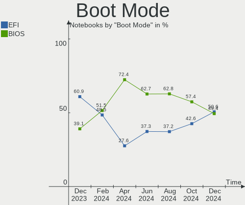
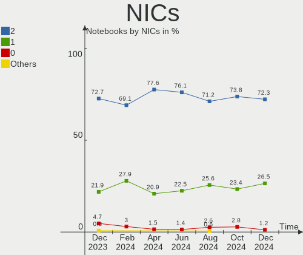
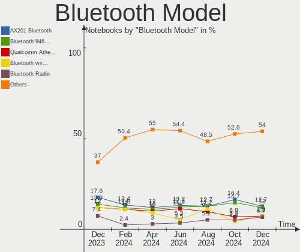

Linux in Brazil - Hardware Trends (Notebooks)
---------------------------------------------

A project to identify most popular hardware characteristics and track their change
over time based on data collected by Linux users at https://Linux-Hardware.org.

Anyone can contribute to this report by the [hw-probe](https://github.com/linuxhw/hw-probe) tool:

    sudo -E hw-probe -all -upload

Period: May, 2023.

Contents
--------

* [ System ](#system)
  - [ OS                       ](#os)
  - [ OS Family                ](#os-family)
  - [ Kernel                   ](#kernel)
  - [ Kernel Family            ](#kernel-family)
  - [ Kernel Major Ver.        ](#kernel-major-ver)
  - [ Arch                     ](#arch)
  - [ DE                       ](#de)
  - [ Display Server           ](#display-server)
  - [ Display Manager          ](#display-manager)
  - [ OS Lang                  ](#os-lang)
  - [ Boot Mode                ](#boot-mode)
  - [ Filesystem               ](#filesystem)
  - [ Part. scheme             ](#part-scheme)
  - [ Dual Boot with Linux/BSD ](#dual-boot-with-linuxbsd)
  - [ Dual Boot (Win)          ](#dual-boot-win)

* [ Board ](#board)
  - [ Vendor                   ](#vendor)
  - [ Model                    ](#model)
  - [ Model Family             ](#model-family)
  - [ MFG Year                 ](#mfg-year)
  - [ Form Factor              ](#form-factor)
  - [ Secure Boot              ](#secure-boot)
  - [ Coreboot                 ](#coreboot)
  - [ RAM Size                 ](#ram-size)
  - [ RAM Used                 ](#ram-used)
  - [ Total Drives             ](#total-drives)
  - [ Has CD-ROM               ](#has-cd-rom)
  - [ Has Ethernet             ](#has-ethernet)
  - [ Has WiFi                 ](#has-wifi)
  - [ Has Bluetooth            ](#has-bluetooth)

* [ Location ](#location)
  - [ Country                  ](#country)
  - [ City                     ](#city)

* [ Drives ](#drives)
  - [ Drive Vendor             ](#drive-vendor)
  - [ Drive Model              ](#drive-model)
  - [ HDD Vendor               ](#hdd-vendor)
  - [ SSD Vendor               ](#ssd-vendor)
  - [ Drive Kind               ](#drive-kind)
  - [ Drive Connector          ](#drive-connector)
  - [ Drive Size               ](#drive-size)
  - [ Space Total              ](#space-total)
  - [ Space Used               ](#space-used)
  - [ Malfunc. Drives          ](#malfunc-drives)
  - [ Malfunc. Drive Vendor    ](#malfunc-drive-vendor)
  - [ Malfunc. HDD Vendor      ](#malfunc-hdd-vendor)
  - [ Malfunc. Drive Kind      ](#malfunc-drive-kind)
  - [ Failed Drives            ](#failed-drives)
  - [ Failed Drive Vendor      ](#failed-drive-vendor)
  - [ Drive Status             ](#drive-status)

* [ Storage controller ](#storage-controller)
  - [ Storage Vendor           ](#storage-vendor)
  - [ Storage Model            ](#storage-model)
  - [ Storage Kind             ](#storage-kind)

* [ Processor ](#processor)
  - [ CPU Vendor               ](#cpu-vendor)
  - [ CPU Model                ](#cpu-model)
  - [ CPU Model Family         ](#cpu-model-family)
  - [ CPU Cores                ](#cpu-cores)
  - [ CPU Sockets              ](#cpu-sockets)
  - [ CPU Threads              ](#cpu-threads)
  - [ CPU Op-Modes             ](#cpu-op-modes)
  - [ CPU Microcode            ](#cpu-microcode)
  - [ CPU Microarch            ](#cpu-microarch)

* [ Graphics ](#graphics)
  - [ GPU Vendor               ](#gpu-vendor)
  - [ GPU Model                ](#gpu-model)
  - [ GPU Combo                ](#gpu-combo)
  - [ GPU Driver               ](#gpu-driver)
  - [ GPU Memory               ](#gpu-memory)

* [ Monitor ](#monitor)
  - [ Monitor Vendor           ](#monitor-vendor)
  - [ Monitor Model            ](#monitor-model)
  - [ Monitor Resolution       ](#monitor-resolution)
  - [ Monitor Diagonal         ](#monitor-diagonal)
  - [ Monitor Width            ](#monitor-width)
  - [ Aspect Ratio             ](#aspect-ratio)
  - [ Monitor Area             ](#monitor-area)
  - [ Pixel Density            ](#pixel-density)
  - [ Multiple Monitors        ](#multiple-monitors)

* [ Network ](#network)
  - [ Net Controller Vendor    ](#net-controller-vendor)
  - [ Net Controller Model     ](#net-controller-model)
  - [ Wireless Vendor          ](#wireless-vendor)
  - [ Wireless Model           ](#wireless-model)
  - [ Ethernet Vendor          ](#ethernet-vendor)
  - [ Ethernet Model           ](#ethernet-model)
  - [ Net Controller Kind      ](#net-controller-kind)
  - [ Used Controller          ](#used-controller)
  - [ NICs                     ](#nics)
  - [ IPv6                     ](#ipv6)

* [ Bluetooth ](#bluetooth)
  - [ Bluetooth Vendor         ](#bluetooth-vendor)
  - [ Bluetooth Model          ](#bluetooth-model)

* [ Sound ](#sound)
  - [ Sound Vendor             ](#sound-vendor)
  - [ Sound Model              ](#sound-model)

* [ Memory ](#memory)
  - [ Memory Vendor            ](#memory-vendor)
  - [ Memory Model             ](#memory-model)
  - [ Memory Kind              ](#memory-kind)
  - [ Memory Form Factor       ](#memory-form-factor)
  - [ Memory Size              ](#memory-size)
  - [ Memory Speed             ](#memory-speed)

* [ Printers & scanners ](#printers--scanners)
  - [ Printer Vendor           ](#printer-vendor)
  - [ Printer Model            ](#printer-model)
  - [ Scanner Vendor           ](#scanner-vendor)
  - [ Scanner Model            ](#scanner-model)

* [ Camera ](#camera)
  - [ Camera Vendor            ](#camera-vendor)
  - [ Camera Model             ](#camera-model)

* [ Security ](#security)
  - [ Fingerprint Vendor       ](#fingerprint-vendor)
  - [ Fingerprint Model        ](#fingerprint-model)
  - [ Chipcard Vendor          ](#chipcard-vendor)
  - [ Chipcard Model           ](#chipcard-model)

* [ Unsupported ](#unsupported)
  - [ Unsupported Devices      ](#unsupported-devices)
  - [ Unsupported Device Types ](#unsupported-device-types)

System
------

OS
--

Installed operating systems

| Name                         | Notebooks | Percent |
|------------------------------|-----------|---------|
| Fedora 38                    | 30        | 18.18%  |
| Ubuntu 22.04                 | 24        | 14.55%  |
| Linux Mint 21.1              | 17        | 10.3%   |
| Pop!_OS 22.04                | 9         | 5.45%   |
| Manjaro                      | 8         | 4.85%   |
| Ubuntu 23.04                 | 7         | 4.24%   |
| Arch Rolling                 | 7         | 4.24%   |
| Debian 11                    | 5         | 3.03%   |
| Ubuntu 20.04                 | 4         | 2.42%   |
| OpenMandriva 23.03           | 4         | 2.42%   |
| KDE neon 22.04               | 3         | 1.82%   |
| Kali 2023.1                  | 3         | 1.82%   |
| EndeavourOS Rolling          | 3         | 1.82%   |
| Elementary 6.1               | 3         | 1.82%   |
| Debian 12                    | 3         | 1.82%   |
| ArcoLinux Rolling            | 3         | 1.82%   |
| Zorin 16                     | 2         | 1.21%   |
| Ubuntu MATE 22.04            | 2         | 1.21%   |
| Ubuntu 22.10                 | 2         | 1.21%   |
| Linux Mint 20.3              | 2         | 1.21%   |
| Xubuntu 22.04                | 1         | 0.61%   |
| Ubuntu MATE 20.04            | 1         | 0.61%   |
| SteamOS 3.4.6                | 1         | 0.61%   |
| SteamOS 3.4                  | 1         | 0.61%   |
| ROSA 12.4                    | 1         | 0.61%   |
| openSUSE Tumbleweed-XXXXXXXX | 1         | 0.61%   |
| OpenMandriva 23.90           | 1         | 0.61%   |
| OpenMandriva 23.06           | 1         | 0.61%   |
| OpenMandriva 23.01           | 1         | 0.61%   |
| Manjaro 22.1.1               | 1         | 0.61%   |
| Lubuntu 22.10                | 1         | 0.61%   |
| Lubuntu 22.04                | 1         | 0.61%   |
| Linux Mint 21                | 1         | 0.61%   |
| Kubuntu 23.04                | 1         | 0.61%   |
| Kubuntu 22.04                | 1         | 0.61%   |
| KDE neon 20.04               | 1         | 0.61%   |
| Fedora 37                    | 1         | 0.61%   |
| Endless 5.0.4                | 1         | 0.61%   |
| Endless 5.0.3                | 1         | 0.61%   |
| Endless 4.0.14               | 1         | 0.61%   |

OS Family
---------

OS without a version

| Name         | Notebooks | Percent |
|--------------|-----------|---------|
| Ubuntu       | 37        | 22.42%  |
| Fedora       | 31        | 18.79%  |
| Linux Mint   | 20        | 12.12%  |
| Pop!_OS      | 9         | 5.45%   |
| Manjaro      | 9         | 5.45%   |
| Debian       | 8         | 4.85%   |
| OpenMandriva | 7         | 4.24%   |
| Arch         | 7         | 4.24%   |
| Endless      | 5         | 3.03%   |
| KDE neon     | 4         | 2.42%   |
| Ubuntu MATE  | 3         | 1.82%   |
| Kali         | 3         | 1.82%   |
| EndeavourOS  | 3         | 1.82%   |
| Elementary   | 3         | 1.82%   |
| ArcoLinux    | 3         | 1.82%   |
| Zorin        | 2         | 1.21%   |
| SteamOS      | 2         | 1.21%   |
| Lubuntu      | 2         | 1.21%   |
| Kubuntu      | 2         | 1.21%   |
| BigLinux     | 2         | 1.21%   |
| Xubuntu      | 1         | 0.61%   |
| ROSA         | 1         | 0.61%   |
| openSUSE     | 1         | 0.61%   |

Kernel
------

Version of the Linux kernel

| Version                           | Notebooks | Percent |
|-----------------------------------|-----------|---------|
| 5.19.0-41-generic                 | 19        | 11.52%  |
| 6.2.15-300.fc38.x86_64            | 15        | 9.09%   |
| 5.15.0-71-generic                 | 14        | 8.48%   |
| 6.2.14-300.fc38.x86_64            | 11        | 6.67%   |
| 5.19.0-42-generic                 | 8         | 4.85%   |
| 6.2.6-76060206-generic            | 7         | 4.24%   |
| 6.2.0-20-generic                  | 7         | 4.24%   |
| 5.15.0-72-generic                 | 7         | 4.24%   |
| 6.2.6-desktop-1omv2390            | 5         | 3.03%   |
| 6.1.26-1-MANJARO                  | 4         | 2.42%   |
| 6.3.4-arch1-1                     | 3         | 1.82%   |
| 6.3.1-arch1-1                     | 3         | 1.82%   |
| 6.1.0-kali7-amd64                 | 3         | 1.82%   |
| 5.15.0-69-generic                 | 3         | 1.82%   |
| 5.15.0-56-generic                 | 3         | 1.82%   |
| 6.2.13-300.fc38.x86_64            | 2         | 1.21%   |
| 6.1.30-1-MANJARO                  | 2         | 1.21%   |
| 5.8.0-14-generic                  | 2         | 1.21%   |
| 5.15.0-70-generic                 | 2         | 1.21%   |
| 5.15.0-47-generic                 | 2         | 1.21%   |
| 5.10.0-23-amd64                   | 2         | 1.21%   |
| 6.3.4-zen1-1-zen                  | 1         | 0.61%   |
| 6.3.4-060304-generic              | 1         | 0.61%   |
| 6.3.2-zen1-1-zen                  | 1         | 0.61%   |
| 6.3.2-desktop-1omv2390            | 1         | 0.61%   |
| 6.3.1-zen1-1-zen                  | 1         | 0.61%   |
| 6.3.1-1-default                   | 1         | 0.61%   |
| 6.3.1-060301-generic              | 1         | 0.61%   |
| 6.2.9-300.fc38.x86_64             | 1         | 0.61%   |
| 6.2.16-060216-generic             | 1         | 0.61%   |
| 6.2.13-arch1-1                    | 1         | 0.61%   |
| 6.2.12-arch1-1                    | 1         | 0.61%   |
| 6.2.12-1-MANJARO                  | 1         | 0.61%   |
| 6.2.12-060212-generic             | 1         | 0.61%   |
| 6.2.11-300.fc38.x86_64            | 1         | 0.61%   |
| 6.1.29-1-lts                      | 1         | 0.61%   |
| 6.1.25-1-MANJARO                  | 1         | 0.61%   |
| 6.1.23-1-MANJARO                  | 1         | 0.61%   |
| 6.1.20-generic-2rosa2021.1-x86_64 | 1         | 0.61%   |
| 6.1.1-desktop-1omv2290            | 1         | 0.61%   |

Kernel Family
-------------

Linux kernel without a distro release

| Version  | Notebooks | Percent |
|----------|-----------|---------|
| 5.15.0   | 33        | 20%     |
| 5.19.0   | 31        | 18.79%  |
| 6.2.15   | 15        | 9.09%   |
| 6.2.6    | 12        | 7.27%   |
| 6.2.14   | 11        | 6.67%   |
| 6.2.0    | 7         | 4.24%   |
| 6.3.1    | 6         | 3.64%   |
| 6.3.4    | 5         | 3.03%   |
| 6.1.0    | 5         | 3.03%   |
| 5.10.0   | 5         | 3.03%   |
| 6.1.26   | 4         | 2.42%   |
| 6.2.13   | 3         | 1.82%   |
| 6.2.12   | 3         | 1.82%   |
| 6.3.2    | 2         | 1.21%   |
| 6.1.30   | 2         | 1.21%   |
| 5.8.0    | 2         | 1.21%   |
| 5.13.0   | 2         | 1.21%   |
| 5.11.0   | 2         | 1.21%   |
| 6.2.9    | 1         | 0.61%   |
| 6.2.16   | 1         | 0.61%   |
| 6.2.11   | 1         | 0.61%   |
| 6.1.29   | 1         | 0.61%   |
| 6.1.25   | 1         | 0.61%   |
| 6.1.23   | 1         | 0.61%   |
| 6.1.20   | 1         | 0.61%   |
| 6.1.1    | 1         | 0.61%   |
| 6.0.9    | 1         | 0.61%   |
| 6.0.7    | 1         | 0.61%   |
| 5.4.0    | 1         | 0.61%   |
| 5.18.10  | 1         | 0.61%   |
| 5.16.0   | 1         | 0.61%   |
| 5.15.109 | 1         | 0.61%   |
| 5.15.108 | 1         | 0.61%   |

Kernel Major Ver.
-----------------

Linux kernel major version

| Version | Notebooks | Percent |
|---------|-----------|---------|
| 6.2     | 54        | 32.73%  |
| 5.15    | 35        | 21.21%  |
| 5.19    | 31        | 18.79%  |
| 6.1     | 16        | 9.7%    |
| 6.3     | 13        | 7.88%   |
| 5.10    | 5         | 3.03%   |
| 6.0     | 2         | 1.21%   |
| 5.8     | 2         | 1.21%   |
| 5.13    | 2         | 1.21%   |
| 5.11    | 2         | 1.21%   |
| 5.4     | 1         | 0.61%   |
| 5.18    | 1         | 0.61%   |
| 5.16    | 1         | 0.61%   |

Arch
----

OS architecture (x86_64, i586, etc.)

| Name   | Notebooks | Percent |
|--------|-----------|---------|
| x86_64 | 164       | 99.39%  |
| i686   | 1         | 0.61%   |

DE
--

Desktop Environment

| Name       | Notebooks | Percent |
|------------|-----------|---------|
| GNOME      | 87        | 52.73%  |
| KDE5       | 31        | 18.79%  |
| X-Cinnamon | 15        | 9.09%   |
| XFCE       | 9         | 5.45%   |
| MATE       | 8         | 4.85%   |
| Unknown    | 4         | 2.42%   |
| Pantheon   | 3         | 1.82%   |
| LXQt       | 3         | 1.82%   |
| Cinnamon   | 3         | 1.82%   |
| Hyprland   | 2         | 1.21%   |

Display Server
--------------

X11 or Wayland

| Name    | Notebooks | Percent |
|---------|-----------|---------|
| X11     | 105       | 63.64%  |
| Wayland | 55        | 33.33%  |
| Unknown | 5         | 3.03%   |

Display Manager
---------------

SDDM, LightDM, etc.

| Name    | Notebooks | Percent |
|---------|-----------|---------|
| Unknown | 86        | 52.12%  |
| GDM3    | 33        | 20%     |
| SDDM    | 19        | 11.52%  |
| LightDM | 19        | 11.52%  |
| GDM     | 8         | 4.85%   |

OS Lang
-------

Language

| Lang    | Notebooks | Percent |
|---------|-----------|---------|
| pt_BR   | 109       | 66.06%  |
| en_US   | 42        | 25.45%  |
| C       | 5         | 3.03%   |
| en_GB   | 3         | 1.82%   |
| Unknown | 2         | 1.21%   |
| pt_PT   | 1         | 0.61%   |
| es_ES   | 1         | 0.61%   |
| en_CA   | 1         | 0.61%   |
| en-US   | 1         | 0.61%   |

Boot Mode
---------

EFI or BIOS

| Mode | Notebooks | Percent |
|------|-----------|---------|
| EFI  | 90        | 54.55%  |
| BIOS | 75        | 45.45%  |

Filesystem
----------

Type of filesystem

| Type    | Notebooks | Percent |
|---------|-----------|---------|
| Ext4    | 96        | 58.18%  |
| Btrfs   | 41        | 24.85%  |
| Tmpfs   | 16        | 9.7%    |
| Overlay | 9         | 5.45%   |
| Xfs     | 2         | 1.21%   |
| Ext2    | 1         | 0.61%   |

Part. scheme
------------

Scheme of partitioning

| Type    | Notebooks | Percent |
|---------|-----------|---------|
| Unknown | 82        | 49.7%   |
| GPT     | 69        | 41.82%  |
| MBR     | 14        | 8.48%   |

Dual Boot with Linux/BSD
------------------------

Hosting more than one Linux/BSD

| Dual boot | Notebooks | Percent |
|-----------|-----------|---------|
| No        | 151       | 91.52%  |
| Yes       | 14        | 8.48%   |

Dual Boot (Win)
---------------

Hosting Linux and Windows

| Dual boot | Notebooks | Percent |
|-----------|-----------|---------|
| No        | 134       | 81.21%  |
| Yes       | 31        | 18.79%  |

Board
-----

Vendor
------

Motherboard manufacturer

| Name                   | Notebooks | Percent |
|------------------------|-----------|---------|
| Dell                   | 44        | 26.67%  |
| Lenovo                 | 26        | 15.76%  |
| Acer                   | 23        | 13.94%  |
| ASUSTek Computer       | 11        | 6.67%   |
| Samsung Electronics    | 10        | 6.06%   |
| Hewlett-Packard        | 8         | 4.85%   |
| Avell High Performance | 7         | 4.24%   |
| Positivo               | 6         | 3.64%   |
| Unknown                | 4         | 2.42%   |
| Itautec                | 3         | 1.82%   |
| Apple                  | 3         | 1.82%   |
| Semp Toshiba           | 2         | 1.21%   |
| PHILCO ELETRONICOS S/A | 2         | 1.21%   |
| Notebook               | 2         | 1.21%   |
| Alienware              | 2         | 1.21%   |
| Valve                  | 1         | 0.61%   |
| Timi                   | 1         | 0.61%   |
| Sony                   | 1         | 0.61%   |
| Philco                 | 1         | 0.61%   |
| Multilaser             | 1         | 0.61%   |
| Intel                  | 1         | 0.61%   |
| Fujitsu                | 1         | 0.61%   |
| Clevo                  | 1         | 0.61%   |
| Chuwi                  | 1         | 0.61%   |
| Biostar                | 1         | 0.61%   |
| Adreamer               | 1         | 0.61%   |
| A14CR                  | 1         | 0.61%   |

Model
-----

Motherboard model

| Name                                                  | Notebooks | Percent |
|-------------------------------------------------------|-----------|---------|
| Acer Nitro AN517-54                                   | 5         | 3.03%   |
| Unknown                                               | 5         | 3.03%   |
| Lenovo IdeaPad 320-15IKB 80YH                         | 4         | 2.42%   |
| Samsung 550XDA                                        | 3         | 1.82%   |
| Lenovo IdeaPad Gaming 3 15IMH05 82CG                  | 3         | 1.82%   |
| Dell Inspiron 15-3567                                 | 3         | 1.82%   |
| ASUS VivoBook_ASUSLaptop X515DA_X515DA                | 3         | 1.82%   |
| Acer Aspire A515-45                                   | 3         | 1.82%   |
| PHILCO ELETRONICOS S/A PNB15.6AP34H1W10               | 2         | 1.21%   |
| Lenovo IdeaPad 3 15ALC6 82MF                          | 2         | 1.21%   |
| HP Pavilion dm4                                       | 2         | 1.21%   |
| Dell Vostro 5402                                      | 2         | 1.21%   |
| Dell Latitude 7490                                    | 2         | 1.21%   |
| Dell Inspiron 7520                                    | 2         | 1.21%   |
| Dell Inspiron 3583                                    | 2         | 1.21%   |
| Dell Inspiron 3442                                    | 2         | 1.21%   |
| Dell Inspiron 1525                                    | 2         | 1.21%   |
| ASUS VivoBook_ASUSLaptop X515JA_X515JA                | 2         | 1.21%   |
| Valve Jupiter                                         | 1         | 0.61%   |
| Timi Redmi Book Pro 14 2022                           | 1         | 0.61%   |
| Sony VPCSA25GB                                        | 1         | 0.61%   |
| Semp Toshiba STI NA 1401                              | 1         | 0.61%   |
| Semp Toshiba IS 1413G                                 | 1         | 0.61%   |
| Samsung RV419/RV420                                   | 1         | 0.61%   |
| Samsung 550XBE/350XBE                                 | 1         | 0.61%   |
| Samsung 530XBB                                        | 1         | 0.61%   |
| Samsung 300E5M/300E5L                                 | 1         | 0.61%   |
| Samsung 300E5K/300E5Q                                 | 1         | 0.61%   |
| Samsung 300E5EV/300E4EV/270E5EV/270E4EV/2470EV/2470EE | 1         | 0.61%   |
| Samsung 270E5J/2570EJ                                 | 1         | 0.61%   |
| Positivo S14CT01                                      | 1         | 0.61%   |
| Positivo Q4128C-S                                     | 1         | 0.61%   |
| Positivo N4350                                        | 1         | 0.61%   |
| Positivo N1250                                        | 1         | 0.61%   |
| Positivo J14GL11                                      | 1         | 0.61%   |
| Positivo C14CR21TV                                    | 1         | 0.61%   |
| Philco 14H                                            | 1         | 0.61%   |
| Notebook P15SM-A/SM1-A                                | 1         | 0.61%   |
| Notebook NJx0MU                                       | 1         | 0.61%   |
| Multilaser PC150                                      | 1         | 0.61%   |

Model Family
------------

Motherboard model prefix

| Name                                    | Notebooks | Percent |
|-----------------------------------------|-----------|---------|
| Dell Inspiron                           | 27        | 16.36%  |
| Lenovo IdeaPad                          | 18        | 10.91%  |
| Acer Aspire                             | 12        | 7.27%   |
| ASUS VivoBook                           | 7         | 4.24%   |
| Acer Nitro                              | 7         | 4.24%   |
| Lenovo ThinkPad                         | 6         | 3.64%   |
| Dell Vostro                             | 6         | 3.64%   |
| Dell Latitude                           | 6         | 3.64%   |
| Unknown                                 | 5         | 3.03%   |
| HP Pavilion                             | 4         | 2.42%   |
| Samsung 550XDA                          | 3         | 1.82%   |
| Itautec Infoway                         | 3         | 1.82%   |
| PHILCO ELETRONICOS S/A PNB15.6AP34H1W10 | 2         | 1.21%   |
| Dell XPS                                | 2         | 1.21%   |
| Avell High Performance A70              | 2         | 1.21%   |
| Alienware m15                           | 2         | 1.21%   |
| Valve Jupiter                           | 1         | 0.61%   |
| Timi Redmi                              | 1         | 0.61%   |
| Sony VPCSA25GB                          | 1         | 0.61%   |
| Semp Toshiba STI                        | 1         | 0.61%   |
| Semp Toshiba IS                         | 1         | 0.61%   |
| Samsung RV419                           | 1         | 0.61%   |
| Samsung 550XBE                          | 1         | 0.61%   |
| Samsung 530XBB                          | 1         | 0.61%   |
| Samsung 300E5M                          | 1         | 0.61%   |
| Samsung 300E5K                          | 1         | 0.61%   |
| Samsung 300E5EV                         | 1         | 0.61%   |
| Samsung 270E5J                          | 1         | 0.61%   |
| Positivo S14CT01                        | 1         | 0.61%   |
| Positivo Q4128C-S                       | 1         | 0.61%   |
| Positivo N4350                          | 1         | 0.61%   |
| Positivo N1250                          | 1         | 0.61%   |
| Positivo J14GL11                        | 1         | 0.61%   |
| Positivo C14CR21TV                      | 1         | 0.61%   |
| Philco 14H                              | 1         | 0.61%   |
| Notebook P15SM-A                        | 1         | 0.61%   |
| Notebook NJx0MU                         | 1         | 0.61%   |
| Multilaser PC150                        | 1         | 0.61%   |
| Lenovo Legion                           | 1         | 0.61%   |
| Lenovo B490                             | 1         | 0.61%   |

MFG Year
--------

Motherboard manufacture year

| Year | Notebooks | Percent |
|------|-----------|---------|
| 2021 | 32        | 19.39%  |
| 2020 | 21        | 12.73%  |
| 2019 | 15        | 9.09%   |
| 2022 | 14        | 8.48%   |
| 2017 | 12        | 7.27%   |
| 2012 | 12        | 7.27%   |
| 2014 | 11        | 6.67%   |
| 2018 | 9         | 5.45%   |
| 2016 | 9         | 5.45%   |
| 2011 | 8         | 4.85%   |
| 2010 | 7         | 4.24%   |
| 2008 | 6         | 3.64%   |
| 2015 | 3         | 1.82%   |
| 2013 | 3         | 1.82%   |
| 2009 | 2         | 1.21%   |
| 2006 | 1         | 0.61%   |

Form Factor
-----------

Physical design of the computer

| Name     | Notebooks | Percent |
|----------|-----------|---------|
| Notebook | 165       | 100%    |

Secure Boot
-----------

Enabled or disabled

| State    | Notebooks | Percent |
|----------|-----------|---------|
| Disabled | 147       | 89.09%  |
| Enabled  | 18        | 10.91%  |

Coreboot
--------

Have coreboot on board

| Used | Notebooks | Percent |
|------|-----------|---------|
| No   | 165       | 100%    |

RAM Size
--------

Total RAM memory

| Size in GB  | Notebooks | Percent |
|-------------|-----------|---------|
| 4.01-8.0    | 52        | 31.52%  |
| 16.01-24.0  | 36        | 21.82%  |
| 3.01-4.0    | 28        | 16.97%  |
| 8.01-16.0   | 20        | 12.12%  |
| 32.01-64.0  | 14        | 8.48%   |
| 1.01-2.0    | 5         | 3.03%   |
| 64.01-256.0 | 4         | 2.42%   |
| 24.01-32.0  | 3         | 1.82%   |
| 2.01-3.0    | 3         | 1.82%   |

RAM Used
--------

Used RAM memory

| Used GB   | Notebooks | Percent |
|-----------|-----------|---------|
| 4.01-8.0  | 41        | 24.85%  |
| 1.01-2.0  | 41        | 24.85%  |
| 2.01-3.0  | 40        | 24.24%  |
| 3.01-4.0  | 29        | 17.58%  |
| 8.01-16.0 | 13        | 7.88%   |
| 0.51-1.0  | 1         | 0.61%   |

Total Drives
------------

Number of drives on board

| Drives | Notebooks | Percent |
|--------|-----------|---------|
| 1      | 113       | 68.48%  |
| 2      | 43        | 26.06%  |
| 3      | 5         | 3.03%   |
| 4      | 3         | 1.82%   |
| 0      | 1         | 0.61%   |

Has CD-ROM
----------

Has CD-ROM on board

| Presented | Notebooks | Percent |
|-----------|-----------|---------|
| No        | 131       | 79.39%  |
| Yes       | 34        | 20.61%  |

Has Ethernet
------------

Has Ethernet on board

| Presented | Notebooks | Percent |
|-----------|-----------|---------|
| Yes       | 133       | 80.61%  |
| No        | 32        | 19.39%  |

Has WiFi
--------

Has WiFi module

| Presented | Notebooks | Percent |
|-----------|-----------|---------|
| Yes       | 156       | 94.55%  |
| No        | 9         | 5.45%   |

Has Bluetooth
-------------

Has Bluetooth module

| Presented | Notebooks | Percent |
|-----------|-----------|---------|
| Yes       | 136       | 82.42%  |
| No        | 29        | 17.58%  |

Location
--------

Country
-------

Geographic location (country)

| Country | Notebooks | Percent |
|---------|-----------|---------|
| Brazil  | 165       | 100%    |

City
----

Geographic location (city)

| City                 | Notebooks | Percent |
|----------------------|-----------|---------|
| Sao Paulo            | 21        | 12.73%  |
| Rio de Janeiro       | 12        | 7.27%   |
| Curitiba             | 8         | 4.85%   |
| Fortaleza            | 5         | 3.03%   |
| Campinas             | 5         | 3.03%   |
| Belo Horizonte       | 5         | 3.03%   |
| Goiânia             | 4         | 2.42%   |
| Brasília            | 4         | 2.42%   |
| Uberlândia          | 3         | 1.82%   |
| Porto Alegre         | 3         | 1.82%   |
| Natal                | 3         | 1.82%   |
| Florianópolis       | 3         | 1.82%   |
| Santos               | 2         | 1.21%   |
| Santa Maria          | 2         | 1.21%   |
| Ribeirao Preto       | 2         | 1.21%   |
| Osasco               | 2         | 1.21%   |
| Manaus               | 2         | 1.21%   |
| Juiz de Fora         | 2         | 1.21%   |
| Joao Pessoa          | 2         | 1.21%   |
| Itumbiara            | 2         | 1.21%   |
| Itabira              | 2         | 1.21%   |
| Belém               | 2         | 1.21%   |
| Vilhena              | 1         | 0.61%   |
| Viamao               | 1         | 0.61%   |
| Varginha             | 1         | 0.61%   |
| Valparaiso de Goias  | 1         | 0.61%   |
| Trindade             | 1         | 0.61%   |
| Toledo               | 1         | 0.61%   |
| Teresina             | 1         | 0.61%   |
| Sumaré              | 1         | 0.61%   |
| Serra                | 1         | 0.61%   |
| Seropedica           | 1         | 0.61%   |
| Sao Luís            | 1         | 0.61%   |
| Sao Lourenço        | 1         | 0.61%   |
| Sao José dos Campos | 1         | 0.61%   |
| Sao Carlos           | 1         | 0.61%   |
| Santo André         | 1         | 0.61%   |
| Salvador             | 1         | 0.61%   |
| Rolandia             | 1         | 0.61%   |
| Resende              | 1         | 0.61%   |

Drives
------

Drive Vendor
------------

Hard drive vendors

| Vendor                         | Notebooks | Drives | Percent |
|--------------------------------|-----------|--------|---------|
| Kingston                       | 26        | 26     | 11.98%  |
| WDC                            | 23        | 23     | 10.6%   |
| Seagate                        | 17        | 20     | 7.83%   |
| SanDisk                        | 16        | 17     | 7.37%   |
| A-DATA Technology              | 16        | 16     | 7.37%   |
| Samsung Electronics            | 10        | 10     | 4.61%   |
| ADATA Technology               | 10        | 10     | 4.61%   |
| Toshiba                        | 9         | 9      | 4.15%   |
| Crucial                        | 8         | 8      | 3.69%   |
| Unknown                        | 7         | 8      | 3.23%   |
| SK hynix                       | 6         | 6      | 2.76%   |
| China                          | 6         | 6      | 2.76%   |
| Solid State Storage            | 4         | 4      | 1.84%   |
| Silicon Motion                 | 4         | 4      | 1.84%   |
| Micron Technology              | 4         | 4      | 1.84%   |
| SAGE                           | 3         | 3      | 1.38%   |
| Kingston Technology Company    | 3         | 3      | 1.38%   |
| Intel                          | 3         | 3      | 1.38%   |
| Apple                          | 3         | 3      | 1.38%   |
| XrayDisk                       | 2         | 2      | 0.92%   |
| Solid State Storage Technology | 2         | 2      | 0.92%   |
| ShiJi                          | 2         | 3      | 0.92%   |
| Phison                         | 2         | 2      | 0.92%   |
| Netac                          | 2         | 2      | 0.92%   |
| LITEON                         | 2         | 2      | 0.92%   |
| Lexar                          | 2         | 2      | 0.92%   |
| KingSpec                       | 2         | 2      | 0.92%   |
| Hitachi                        | 2         | 2      | 0.92%   |
| Hewlett-Packard                | 2         | 2      | 0.92%   |
| Win Memory                     | 1         | 1      | 0.46%   |
| SSSTC                          | 1         | 1      | 0.46%   |
| Smart                          | 1         | 1      | 0.46%   |
| Realtek Semiconductor          | 1         | 1      | 0.46%   |
| Ramsta                         | 1         | 1      | 0.46%   |
| PNY                            | 1         | 1      | 0.46%   |
| Pichau                         | 1         | 1      | 0.46%   |
| O2 Micro                       | 1         | 1      | 0.46%   |
| Micron/Crucial Technology      | 1         | 1      | 0.46%   |
| Lenovo                         | 1         | 1      | 0.46%   |
| KIOXIA                         | 1         | 1      | 0.46%   |

Drive Model
-----------

Hard drive models

| Model                                               | Notebooks | Percent |
|-----------------------------------------------------|-----------|---------|
| Kingston SA400S37240G 240GB SSD                     | 10        | 4.5%    |
| Kingston SA400S37480G 480GB SSD                     | 7         | 3.15%   |
| ADATA SM2P32A8-256GC1 256GB                         | 5         | 2.25%   |
| Sandisk WD Blue SN550 NVMe SSD 512GB                | 4         | 1.8%    |
| Kingston SA400S37120G 120GB SSD                     | 4         | 1.8%    |
| Solid State Storage SSSTC CL1-4D256 256GB           | 3         | 1.35%   |
| Silicon Motion SM2263EN/SM2263XT SSD Controller 1TB | 3         | 1.35%   |
| Seagate ST500LM012 HN-M500MBB 500GB                 | 3         | 1.35%   |
| Seagate ST1000LM048-2E7172 1TB                      | 3         | 1.35%   |
| SAGE 3639S 1TB                                      | 3         | 1.35%   |
| Crucial CT240BX500SSD1 240GB                        | 3         | 1.35%   |
| A-DATA IM2P33F3A NVMe 256GB                         | 3         | 1.35%   |
| WDC WDS120G2G0A-00JH30 120GB SSD                    | 2         | 0.9%    |
| WDC WD10SPZX-75Z10T2 1TB                            | 2         | 0.9%    |
| WDC WD10SPZX-24Z10 1TB                              | 2         | 0.9%    |
| WDC WD10SPZX-21Z10T0 1TB                            | 2         | 0.9%    |
| WDC WD10JPVX-75JC3T0 1TB                            | 2         | 0.9%    |
| Toshiba XG6 NVMe SSD Controller 256GB               | 2         | 0.9%    |
| Toshiba MQ01ABD100 1TB                              | 2         | 0.9%    |
| SK hynix BC711 NVMe 512GB                           | 2         | 0.9%    |
| Seagate ST1000LM035-1RK172 1TB                      | 2         | 0.9%    |
| Seagate ST1000LM024 HN-M101MBB 1TB                  | 2         | 0.9%    |
| Seagate Expansion 1TB                               | 2         | 0.9%    |
| SanDisk SSD PLUS 480GB                              | 2         | 0.9%    |
| SanDisk NVMe SSD Drive 1TB                          | 2         | 0.9%    |
| Samsung HM121HI 120GB                               | 2         | 0.9%    |
| Lexar 128GB SSD                                     | 2         | 0.9%    |
| Kingston Company SNV2S1000G 1TB                     | 2         | 0.9%    |
| Crucial CT500BX500SSD1 500GB                        | 2         | 0.9%    |
| ADATA NVMe IM2P33F4 256GB                           | 2         | 0.9%    |
| A-DATA IM2P33F8BR2-256GB                            | 2         | 0.9%    |
| A-DATA IM2P33F8ABR2-256GB                           | 2         | 0.9%    |
| A-DATA IM2P33F8ABR1-1TB                             | 2         | 0.9%    |
| A-DATA IM2P33F3A NVMe 512GB                         | 2         | 0.9%    |
| XrayDisk 512GB SSD                                  | 1         | 0.45%   |
| XrayDisk 128GB                                      | 1         | 0.45%   |
| Win Memory SWR256G-301II 256GB SSD                  | 1         | 0.45%   |
| WDC WDS240G2G0A-00JH30 240GB SSD                    | 1         | 0.45%   |
| WDC WDS100T2B0C-00PXH0 1TB                          | 1         | 0.45%   |
| WDC WD5000LPVX-22V0TT0 500GB                        | 1         | 0.45%   |

HDD Vendor
----------

Hard disk drive vendors

| Vendor              | Notebooks | Drives | Percent |
|---------------------|-----------|--------|---------|
| WDC                 | 17        | 17     | 34%     |
| Seagate             | 17        | 20     | 34%     |
| Toshiba             | 6         | 6      | 12%     |
| Samsung Electronics | 3         | 3      | 6%      |
| SAGE                | 3         | 3      | 6%      |
| Hitachi             | 2         | 2      | 4%      |
| HGST                | 1         | 1      | 2%      |
| Apple               | 1         | 1      | 2%      |

SSD Vendor
----------

Solid state drive vendors

| Vendor              | Notebooks | Drives | Percent |
|---------------------|-----------|--------|---------|
| Kingston            | 23        | 23     | 30.26%  |
| Crucial             | 7         | 7      | 9.21%   |
| China               | 6         | 6      | 7.89%   |
| SanDisk             | 5         | 5      | 6.58%   |
| Samsung Electronics | 5         | 5      | 6.58%   |
| WDC                 | 4         | 4      | 5.26%   |
| Netac               | 2         | 2      | 2.63%   |
| LITEON              | 2         | 2      | 2.63%   |
| Lexar               | 2         | 2      | 2.63%   |
| Hewlett-Packard     | 2         | 2      | 2.63%   |
| Apple               | 2         | 2      | 2.63%   |
| A-DATA Technology   | 2         | 2      | 2.63%   |
| XrayDisk            | 1         | 1      | 1.32%   |
| Win Memory          | 1         | 1      | 1.32%   |
| Toshiba             | 1         | 1      | 1.32%   |
| Smart               | 1         | 1      | 1.32%   |
| SK hynix            | 1         | 1      | 1.32%   |
| ShiJi               | 1         | 1      | 1.32%   |
| Ramsta              | 1         | 1      | 1.32%   |
| PNY                 | 1         | 1      | 1.32%   |
| Pichau              | 1         | 1      | 1.32%   |
| Lenovo              | 1         | 1      | 1.32%   |
| KingSpec            | 1         | 1      | 1.32%   |
| KEEPDATA            | 1         | 1      | 1.32%   |
| Hised               | 1         | 1      | 1.32%   |
| Advantech           | 1         | 1      | 1.32%   |

Drive Kind
----------

HDD or SSD

| Kind    | Notebooks | Drives | Percent |
|---------|-----------|--------|---------|
| SSD     | 71        | 76     | 34.63%  |
| NVMe    | 70        | 79     | 34.15%  |
| HDD     | 50        | 53     | 24.39%  |
| MMC     | 7         | 8      | 3.41%   |
| Unknown | 7         | 8      | 3.41%   |

Drive Connector
---------------

SATA, SAS, NVMe, etc.

| Type | Notebooks | Drives | Percent |
|------|-----------|--------|---------|
| SATA | 106       | 126    | 54.92%  |
| NVMe | 70        | 79     | 36.27%  |
| SAS  | 10        | 11     | 5.18%   |
| MMC  | 7         | 8      | 3.63%   |

Drive Size
----------

Size of hard drive

| Size in TB | Notebooks | Drives | Percent |
|------------|-----------|--------|---------|
| 0.01-0.5   | 81        | 90     | 68.07%  |
| 0.51-1.0   | 35        | 36     | 29.41%  |
| 1.01-2.0   | 3         | 3      | 2.52%   |

Space Total
-----------

Amount of disk space available on the file system

| Size in GB     | Notebooks | Percent |
|----------------|-----------|---------|
| 101-250        | 48        | 29.09%  |
| 251-500        | 32        | 19.39%  |
| 501-1000       | 30        | 18.18%  |
| 1001-2000      | 15        | 9.09%   |
| 51-100         | 14        | 8.48%   |
| 1-20           | 8         | 4.85%   |
| 21-50          | 7         | 4.24%   |
| Unknown        | 6         | 3.64%   |
| More than 3000 | 3         | 1.82%   |
| 2001-3000      | 2         | 1.21%   |

Space Used
----------

Amount of used disk space

| Used GB   | Notebooks | Percent |
|-----------|-----------|---------|
| 1-20      | 47        | 28.48%  |
| 21-50     | 36        | 21.82%  |
| 101-250   | 31        | 18.79%  |
| 51-100    | 20        | 12.12%  |
| 251-500   | 12        | 7.27%   |
| 501-1000  | 8         | 4.85%   |
| Unknown   | 6         | 3.64%   |
| 1001-2000 | 4         | 2.42%   |
| 0         | 1         | 0.61%   |

Malfunc. Drives
---------------

Drive models with a malfunction

| Model                                  | Notebooks | Drives | Percent |
|----------------------------------------|-----------|--------|---------|
| WDC WD1600BEVT-24A23T0 160GB           | 1         | 1      | 9.09%   |
| ShiJi 1TB                              | 1         | 1      | 9.09%   |
| Seagate ST95005620AS 500GB             | 1         | 2      | 9.09%   |
| Seagate ST9320325AS 320GB              | 1         | 1      | 9.09%   |
| Seagate ST1000LM035-1RK172 1TB         | 1         | 1      | 9.09%   |
| Seagate ST1000LM024 HN-M101MBB 1TB     | 1         | 1      | 9.09%   |
| Samsung Electronics HM121HI 120GB      | 1         | 1      | 9.09%   |
| Netac SSD 128GB                        | 1         | 1      | 9.09%   |
| Kingston SA400S37240G 240GB SSD        | 1         | 1      | 9.09%   |
| China SATA SSD 240GB                   | 1         | 1      | 9.09%   |
| A-DATA Technology IM2P33F3A NVMe 256GB | 1         | 1      | 9.09%   |

Malfunc. Drive Vendor
---------------------

Vendors of faulty drives

| Vendor              | Notebooks | Drives | Percent |
|---------------------|-----------|--------|---------|
| Seagate             | 4         | 5      | 36.36%  |
| WDC                 | 1         | 1      | 9.09%   |
| ShiJi               | 1         | 1      | 9.09%   |
| Samsung Electronics | 1         | 1      | 9.09%   |
| Netac               | 1         | 1      | 9.09%   |
| Kingston            | 1         | 1      | 9.09%   |
| China               | 1         | 1      | 9.09%   |
| A-DATA Technology   | 1         | 1      | 9.09%   |

Malfunc. HDD Vendor
-------------------

Vendors of faulty HDD drives

| Vendor              | Notebooks | Drives | Percent |
|---------------------|-----------|--------|---------|
| Seagate             | 4         | 5      | 66.67%  |
| WDC                 | 1         | 1      | 16.67%  |
| Samsung Electronics | 1         | 1      | 16.67%  |

Malfunc. Drive Kind
-------------------

Kinds of faulty drives

| Kind | Notebooks | Drives | Percent |
|------|-----------|--------|---------|
| HDD  | 6         | 7      | 54.55%  |
| SSD  | 3         | 3      | 27.27%  |
| NVMe | 2         | 2      | 18.18%  |

Failed Drives
-------------

Failed drive models

Zero info for selected period =(

Failed Drive Vendor
-------------------

Failed drive vendors

Zero info for selected period =(

Drive Status
------------

Number of failed and malfunc. drives

| Status   | Notebooks | Drives | Percent |
|----------|-----------|--------|---------|
| Detected | 115       | 149    | 65.34%  |
| Works    | 50        | 63     | 28.41%  |
| Malfunc  | 11        | 12     | 6.25%   |

Storage controller
------------------

Storage Vendor
--------------

Storage controller vendors

| Vendor                         | Notebooks | Percent |
|--------------------------------|-----------|---------|
| Intel                          | 127       | 56.7%   |
| ADATA Technology               | 24        | 10.71%  |
| AMD                            | 21        | 9.38%   |
| SanDisk                        | 13        | 5.8%    |
| Solid State Storage Technology | 7         | 3.13%   |
| SK hynix                       | 5         | 2.23%   |
| Silicon Motion                 | 5         | 2.23%   |
| Kingston Technology Company    | 5         | 2.23%   |
| Micron Technology              | 4         | 1.79%   |
| Toshiba America Info Systems   | 2         | 0.89%   |
| Samsung Electronics            | 2         | 0.89%   |
| Phison Electronics             | 2         | 0.89%   |
| Micron/Crucial Technology      | 2         | 0.89%   |
| Realtek Semiconductor          | 1         | 0.45%   |
| O2 Micro                       | 1         | 0.45%   |
| Nvidia                         | 1         | 0.45%   |
| Marvell Technology Group       | 1         | 0.45%   |
| KIOXIA                         | 1         | 0.45%   |

Storage Model
-------------

Storage controller models

| Model                                                                        | Notebooks | Percent |
|------------------------------------------------------------------------------|-----------|---------|
| AMD FCH SATA Controller [AHCI mode]                                          | 18        | 7.5%    |
| Intel Sunrise Point-LP SATA Controller [AHCI mode]                           | 17        | 7.08%   |
| Intel Volume Management Device NVMe RAID Controller                          | 13        | 5.42%   |
| Intel 82801 Mobile SATA Controller [RAID mode]                               | 13        | 5.42%   |
| ADATA IM2P33F8ABR1 NVMe SSD                                                  | 10        | 4.17%   |
| Intel Tiger Lake-LP SATA Controller                                          | 9         | 3.75%   |
| Intel Celeron/Pentium Silver Processor SATA Controller                       | 9         | 3.75%   |
| Intel 7 Series Chipset Family 6-port SATA Controller [AHCI mode]             | 9         | 3.75%   |
| Intel 500 Series Chipset Family SATA AHCI Controller                         | 8         | 3.33%   |
| ADATA A Non-Volatile memory controller                                       | 8         | 3.33%   |
| Solid State Storage Non-Volatile memory controller                           | 7         | 2.92%   |
| SanDisk WD Blue SN550 NVMe SSD                                               | 7         | 2.92%   |
| Intel 8 Series SATA Controller 1 [AHCI mode]                                 | 7         | 2.92%   |
| Intel Wildcat Point-LP SATA Controller [AHCI Mode]                           | 6         | 2.5%    |
| Intel 6 Series/C200 Series Chipset Family 6 port Mobile SATA AHCI Controller | 6         | 2.5%    |
| Intel Cannon Point-LP SATA Controller [AHCI Mode]                            | 5         | 2.08%   |
| ADATA Non-Volatile memory controller                                         | 5         | 2.08%   |
| SK hynix Gold P31/PC711 NVMe Solid State Drive                               | 4         | 1.67%   |
| Silicon Motion SM2263EN/SM2263XT SSD Controller                              | 4         | 1.67%   |
| SanDisk Non-Volatile memory controller                                       | 4         | 1.67%   |
| Micron NVMe Storage Controller                                               | 4         | 1.67%   |
| Intel Cannon Lake Mobile PCH SATA AHCI Controller                            | 4         | 1.67%   |
| Intel 82801IBM/IEM (ICH9M/ICH9M-E) 4 port SATA Controller [AHCI mode]        | 4         | 1.67%   |
| Intel 400 Series Chipset Family SATA AHCI Controller                         | 4         | 1.67%   |
| Kingston Company Company Non-Volatile memory controller                      | 3         | 1.25%   |
| Intel 82801HM/HEM (ICH8M/ICH8M-E) SATA Controller [AHCI mode]                | 3         | 1.25%   |
| Intel 82801HM/HEM (ICH8M/ICH8M-E) IDE Controller                             | 3         | 1.25%   |
| Intel 5 Series/3400 Series Chipset 4 port SATA AHCI Controller               | 3         | 1.25%   |
| Toshiba America Info Systems XG6 NVMe SSD Controller                         | 2         | 0.83%   |
| SanDisk WD PC SN810 / Black SN850 NVMe SSD                                   | 2         | 0.83%   |
| Micron/Crucial P2 NVMe PCIe SSD                                              | 2         | 0.83%   |
| Intel SSD Pro 7600p/760p/E 6100p Series                                      | 2         | 0.83%   |
| Intel NM10/ICH7 Family SATA Controller [AHCI mode]                           | 2         | 0.83%   |
| Intel Ice Lake-LP SATA Controller [AHCI mode]                                | 2         | 0.83%   |
| Intel HM170/QM170 Chipset SATA Controller [AHCI Mode]                        | 2         | 0.83%   |
| Intel Comet Lake SATA AHCI Controller                                        | 2         | 0.83%   |
| SK hynix Non-Volatile memory controller                                      | 1         | 0.42%   |
| Silicon Motion SM2262/SM2262EN SSD Controller                                | 1         | 0.42%   |
| SanDisk WD Blue SN570 NVMe SSD 1TB                                           | 1         | 0.42%   |
| Samsung NVMe SSD Controller PM9A1/PM9A3/980PRO                               | 1         | 0.42%   |

Storage Kind
------------

Kind of storage controller (IDE, SATA, NVMe, SAS, ...)

| Kind | Notebooks | Percent |
|------|-----------|---------|
| SATA | 127       | 55.46%  |
| NVMe | 70        | 30.57%  |
| RAID | 26        | 11.35%  |
| IDE  | 6         | 2.62%   |

Processor
---------

CPU Vendor
----------

Processor vendors

| Vendor | Notebooks | Percent |
|--------|-----------|---------|
| Intel  | 140       | 84.85%  |
| AMD    | 25        | 15.15%  |

CPU Model
---------

Processor models

| Model                                         | Notebooks | Percent |
|-----------------------------------------------|-----------|---------|
| Intel Core i5-7200U CPU @ 2.50GHz             | 7         | 4.24%   |
| Intel 11th Gen Core i7-11800H @ 2.30GHz       | 5         | 3.03%   |
| Intel 11th Gen Core i5-1135G7 @ 2.40GHz       | 5         | 3.03%   |
| AMD Ryzen 5 3500U with Radeon Vega Mobile Gfx | 5         | 3.03%   |
| Intel Core i7-8565U CPU @ 1.80GHz             | 4         | 2.42%   |
| Intel Core i5-5200U CPU @ 2.20GHz             | 4         | 2.42%   |
| Intel Celeron N4020 CPU @ 1.10GHz             | 4         | 2.42%   |
| Intel 12th Gen Core i7-12700H                 | 4         | 2.42%   |
| Intel 11th Gen Core i7-1165G7 @ 2.80GHz       | 4         | 2.42%   |
| Intel Core i7-6500U CPU @ 2.50GHz             | 3         | 1.82%   |
| Intel Core i5-4210U CPU @ 1.70GHz             | 3         | 1.82%   |
| Intel Core i5-1035G1 CPU @ 1.00GHz            | 3         | 1.82%   |
| Intel Celeron N4000 CPU @ 1.10GHz             | 3         | 1.82%   |
| Intel 11th Gen Core i7-1185G7 @ 3.00GHz       | 3         | 1.82%   |
| Intel 11th Gen Core i5-11400H @ 2.70GHz       | 3         | 1.82%   |
| AMD Ryzen 7 5700U with Radeon Graphics        | 3         | 1.82%   |
| Intel Core i7-8650U CPU @ 1.90GHz             | 2         | 1.21%   |
| Intel Core i7-7700HQ CPU @ 2.80GHz            | 2         | 1.21%   |
| Intel Core i7-7500U CPU @ 2.70GHz             | 2         | 1.21%   |
| Intel Core i7-10750H CPU @ 2.60GHz            | 2         | 1.21%   |
| Intel Core i7-1065G7 CPU @ 1.30GHz            | 2         | 1.21%   |
| Intel Core i5-9300H CPU @ 2.40GHz             | 2         | 1.21%   |
| Intel Core i5-8265U CPU @ 1.60GHz             | 2         | 1.21%   |
| Intel Core i5-8250U CPU @ 1.60GHz             | 2         | 1.21%   |
| Intel Core i5-10300H CPU @ 2.50GHz            | 2         | 1.21%   |
| Intel Core i3-7020U CPU @ 2.30GHz             | 2         | 1.21%   |
| Intel Core i3-6006U CPU @ 2.00GHz             | 2         | 1.21%   |
| Intel Core i3-5005U CPU @ 2.00GHz             | 2         | 1.21%   |
| Intel Core i3-4005U CPU @ 1.70GHz             | 2         | 1.21%   |
| Intel Core i3-3110M CPU @ 2.40GHz             | 2         | 1.21%   |
| Intel Core i3-1005G1 CPU @ 1.20GHz            | 2         | 1.21%   |
| Intel Core 2 Duo CPU P8600 @ 2.40GHz          | 2         | 1.21%   |
| Intel Celeron J4105 CPU @ 1.50GHz             | 2         | 1.21%   |
| Intel Celeron CPU B800 @ 1.50GHz              | 2         | 1.21%   |
| AMD Ryzen 7 3700U with Radeon Vega Mobile Gfx | 2         | 1.21%   |
| AMD Ryzen 5 5500U with Radeon Graphics        | 2         | 1.21%   |
| Intel Pentium Dual-Core CPU T4500 @ 2.30GHz   | 1         | 0.61%   |
| Intel Pentium Dual-Core CPU T4300 @ 2.10GHz   | 1         | 0.61%   |
| Intel Core i7-9750H CPU @ 2.60GHz             | 1         | 0.61%   |
| Intel Core i7-8750H CPU @ 2.20GHz             | 1         | 0.61%   |

CPU Model Family
----------------

Processor model prefix

| Model                   | Notebooks | Percent |
|-------------------------|-----------|---------|
| Intel Core i5           | 36        | 21.82%  |
| Intel Core i7           | 31        | 18.79%  |
| Other                   | 30        | 18.18%  |
| Intel Core i3           | 17        | 10.3%   |
| Intel Celeron           | 14        | 8.48%   |
| AMD Ryzen 5             | 8         | 4.85%   |
| Intel Core 2 Duo        | 7         | 4.24%   |
| AMD Ryzen 7             | 6         | 3.64%   |
| Intel Atom              | 4         | 2.42%   |
| Intel Pentium Dual-Core | 2         | 1.21%   |
| AMD A6                  | 2         | 1.21%   |
| AMD Turion 64 Mobile    | 1         | 0.61%   |
| AMD Ryzen 9             | 1         | 0.61%   |
| AMD Ryzen 5 PRO         | 1         | 0.61%   |
| AMD E1                  | 1         | 0.61%   |
| AMD C-70                | 1         | 0.61%   |
| AMD C-50                | 1         | 0.61%   |
| AMD A4                  | 1         | 0.61%   |
| AMD A10                 | 1         | 0.61%   |

CPU Cores
---------

Number of processor cores

| Number | Notebooks | Percent |
|--------|-----------|---------|
| 2      | 77        | 46.67%  |
| 4      | 58        | 35.15%  |
| 6      | 11        | 6.67%   |
| 8      | 10        | 6.06%   |
| 14     | 4         | 2.42%   |
| 1      | 3         | 1.82%   |
| 12     | 1         | 0.61%   |
| 10     | 1         | 0.61%   |

CPU Sockets
-----------

Number of sockets

| Number | Notebooks | Percent |
|--------|-----------|---------|
| 1      | 165       | 100%    |

CPU Threads
-----------

Threads per core (Hyper-Threading)

| Number | Notebooks | Percent |
|--------|-----------|---------|
| 2      | 130       | 78.79%  |
| 1      | 35        | 21.21%  |

CPU Op-Modes
------------

CPU Operation Modes (32-bit, 64-bit)

| Op mode        | Notebooks | Percent |
|----------------|-----------|---------|
| 32-bit, 64-bit | 165       | 100%    |

CPU Microcode
-------------

Microcode number

| Number     | Notebooks | Percent |
|------------|-----------|---------|
| Unknown    | 97        | 58.79%  |
| 0x806c1    | 7         | 4.24%   |
| 0x806e9    | 5         | 3.03%   |
| 0x206a7    | 5         | 3.03%   |
| 0x08108109 | 5         | 3.03%   |
| 0x806ec    | 3         | 1.82%   |
| 0x706e5    | 3         | 1.82%   |
| 0x306d4    | 3         | 1.82%   |
| 0x08608102 | 3         | 1.82%   |
| 0xa0652    | 2         | 1.21%   |
| 0x906ea    | 2         | 1.21%   |
| 0x906a3    | 2         | 1.21%   |
| 0x806eb    | 2         | 1.21%   |
| 0x806ea    | 2         | 1.21%   |
| 0x706a8    | 2         | 1.21%   |
| 0x706a1    | 2         | 1.21%   |
| 0x20655    | 2         | 1.21%   |
| 0x1067a    | 2         | 1.21%   |
| 0x05000119 | 2         | 1.21%   |
| 0x906a4    | 1         | 0.61%   |
| 0x806d1    | 1         | 0.61%   |
| 0x406c4    | 1         | 0.61%   |
| 0x406c3    | 1         | 0.61%   |
| 0x40651    | 1         | 0.61%   |
| 0x306c3    | 1         | 0.61%   |
| 0x306a9    | 1         | 0.61%   |
| 0x106ca    | 1         | 0.61%   |
| 0x0a50000c | 1         | 0.61%   |
| 0x08608103 | 1         | 0.61%   |
| 0x06006705 | 1         | 0.61%   |
| 0x0600111f | 1         | 0.61%   |
| 0x06001116 | 1         | 0.61%   |
| 0x05000029 | 1         | 0.61%   |

CPU Microarch
-------------

Microarchitecture

| Name             | Notebooks | Percent |
|------------------|-----------|---------|
| KabyLake         | 32        | 19.39%  |
| TigerLake        | 16        | 9.7%    |
| Unknown          | 14        | 8.48%   |
| SandyBridge      | 10        | 6.06%   |
| Haswell          | 10        | 6.06%   |
| IvyBridge        | 9         | 5.45%   |
| Icelake          | 9         | 5.45%   |
| Goldmont plus    | 9         | 5.45%   |
| Zen+             | 8         | 4.85%   |
| Penryn           | 6         | 3.64%   |
| Broadwell        | 6         | 3.64%   |
| Skylake          | 5         | 3.03%   |
| CometLake        | 5         | 3.03%   |
| Alderlake Hybrid | 5         | 3.03%   |
| Westmere         | 4         | 2.42%   |
| Core             | 3         | 1.82%   |
| Bobcat           | 3         | 1.82%   |
| Silvermont       | 2         | 1.21%   |
| Piledriver       | 2         | 1.21%   |
| Excavator        | 2         | 1.21%   |
| Bonnell          | 2         | 1.21%   |
| Zen 3            | 1         | 0.61%   |
| Zen 2            | 1         | 0.61%   |
| K8 Hammer        | 1         | 0.61%   |

Graphics
--------

GPU Vendor
----------

Vendors of graphics cards

| Vendor | Notebooks | Percent |
|--------|-----------|---------|
| Intel  | 136       | 62.67%  |
| Nvidia | 48        | 22.12%  |
| AMD    | 33        | 15.21%  |

GPU Model
---------

Graphics card models

| Model                                                                                    | Notebooks | Percent |
|------------------------------------------------------------------------------------------|-----------|---------|
| Intel TigerLake-LP GT2 [Iris Xe Graphics]                                                | 15        | 6.79%   |
| Intel HD Graphics 620                                                                    | 12        | 5.43%   |
| Intel GeminiLake [UHD Graphics 600]                                                      | 9         | 4.07%   |
| Intel 3rd Gen Core processor Graphics Controller                                         | 9         | 4.07%   |
| Intel 2nd Generation Core Processor Family Integrated Graphics Controller                | 9         | 4.07%   |
| Intel TigerLake-H GT1 [UHD Graphics]                                                     | 8         | 3.62%   |
| Intel Haswell-ULT Integrated Graphics Controller                                         | 8         | 3.62%   |
| AMD Picasso/Raven 2 [Radeon Vega Series / Radeon Vega Mobile Series]                     | 8         | 3.62%   |
| Nvidia TU117M [GeForce GTX 1650 Mobile / Max-Q]                                          | 6         | 2.71%   |
| Intel WhiskeyLake-U GT2 [UHD Graphics 620]                                               | 6         | 2.71%   |
| Intel HD Graphics 5500                                                                   | 6         | 2.71%   |
| Intel UHD Graphics 620                                                                   | 5         | 2.26%   |
| Intel Mobile 4 Series Chipset Integrated Graphics Controller                             | 5         | 2.26%   |
| Intel Iris Plus Graphics G1 (Ice Lake)                                                   | 5         | 2.26%   |
| Intel Alder Lake-P Integrated Graphics Controller                                        | 5         | 2.26%   |
| AMD Lucienne                                                                             | 5         | 2.26%   |
| Nvidia GA106M [GeForce RTX 3060 Mobile / Max-Q]                                          | 4         | 1.81%   |
| Intel Skylake GT2 [HD Graphics 520]                                                      | 4         | 1.81%   |
| Intel Core Processor Integrated Graphics Controller                                      | 4         | 1.81%   |
| Intel CometLake-H GT2 [UHD Graphics]                                                     | 4         | 1.81%   |
| Nvidia TU117M                                                                            | 3         | 1.36%   |
| Nvidia GP107M [GeForce GTX 1050 Ti Mobile]                                               | 3         | 1.36%   |
| Nvidia GM108M [GeForce 940MX]                                                            | 3         | 1.36%   |
| Intel Mobile GM965/GL960 Integrated Graphics Controller (secondary)                      | 3         | 1.36%   |
| Intel Mobile GM965/GL960 Integrated Graphics Controller (primary)                        | 3         | 1.36%   |
| Intel CoffeeLake-H GT2 [UHD Graphics 630]                                                | 3         | 1.36%   |
| Nvidia TU106M [GeForce RTX 2060 Mobile]                                                  | 2         | 0.9%    |
| Nvidia GP108M [GeForce MX330]                                                            | 2         | 0.9%    |
| Nvidia GP108M [GeForce MX250]                                                            | 2         | 0.9%    |
| Nvidia GM108M [GeForce MX130]                                                            | 2         | 0.9%    |
| Nvidia GM108M [GeForce 920MX]                                                            | 2         | 0.9%    |
| Nvidia GK208BM [GeForce 920M]                                                            | 2         | 0.9%    |
| Nvidia GA107M [GeForce RTX 3050 Mobile]                                                  | 2         | 0.9%    |
| Intel Iris Plus Graphics G7                                                              | 2         | 0.9%    |
| Intel HD Graphics 630                                                                    | 2         | 0.9%    |
| Intel CometLake-U GT2 [UHD Graphics]                                                     | 2         | 0.9%    |
| Intel Atom/Celeron/Pentium Processor x5-E8000/J3xxx/N3xxx Integrated Graphics Controller | 2         | 0.9%    |
| Intel 4th Gen Core Processor Integrated Graphics Controller                              | 2         | 0.9%    |
| AMD Whistler [Radeon HD 6630M/6650M/6750M/7670M/7690M]                                   | 2         | 0.9%    |
| AMD Topaz XT [Radeon R7 M260/M265 / M340/M360 / M440/M445 / 530/535 / 620/625 Mobile]    | 2         | 0.9%    |

GPU Combo
---------

Combinations of graphics cards

| Name           | Notebooks | Percent |
|----------------|-----------|---------|
| 1 x Intel      | 85        | 51.52%  |
| Intel + Nvidia | 42        | 25.45%  |
| 1 x AMD        | 22        | 13.33%  |
| Intel + AMD    | 9         | 5.45%   |
| 1 x Nvidia     | 5         | 3.03%   |
| 2 x AMD        | 1         | 0.61%   |
| AMD + Nvidia   | 1         | 0.61%   |

GPU Driver
----------

Free vs proprietary

| Driver      | Notebooks | Percent |
|-------------|-----------|---------|
| Free        | 133       | 80.61%  |
| Proprietary | 32        | 19.39%  |

GPU Memory
----------

Total video memory

| Size in GB | Notebooks | Percent |
|------------|-----------|---------|
| Unknown    | 131       | 79.39%  |
| 1.01-2.0   | 11        | 6.67%   |
| 0.01-0.5   | 10        | 6.06%   |
| 3.01-4.0   | 5         | 3.03%   |
| 5.01-6.0   | 4         | 2.42%   |
| 0.51-1.0   | 3         | 1.82%   |
| 7.01-8.0   | 1         | 0.61%   |

Monitor
-------

Monitor Vendor
--------------

Monitor vendors

| Vendor                  | Notebooks | Percent |
|-------------------------|-----------|---------|
| BOE                     | 39        | 19.4%   |
| AU Optronics            | 38        | 18.91%  |
| Chimei Innolux          | 33        | 16.42%  |
| LG Display              | 21        | 10.45%  |
| Samsung Electronics     | 17        | 8.46%   |
| Goldstar                | 12        | 5.97%   |
| Dell                    | 11        | 5.47%   |
| AOC                     | 4         | 1.99%   |
| Sharp                   | 3         | 1.49%   |
| Apple                   | 3         | 1.49%   |
| Philips                 | 2         | 1%      |
| PANDA                   | 2         | 1%      |
| InfoVision              | 2         | 1%      |
| Chi Mei Optoelectronics | 2         | 1%      |
| Valve                   | 1         | 0.5%    |
| Unknown (XXX)           | 1         | 0.5%    |
| Sony                    | 1         | 0.5%    |
| SLD                     | 1         | 0.5%    |
| SKY                     | 1         | 0.5%    |
| Quanta Display          | 1         | 0.5%    |
| LG Philips              | 1         | 0.5%    |
| Lenovo                  | 1         | 0.5%    |
| InnoLux Display         | 1         | 0.5%    |
| Hewlett-Packard         | 1         | 0.5%    |
| CSO                     | 1         | 0.5%    |
| CPT                     | 1         | 0.5%    |

Monitor Model
-------------

Monitor models

| Model                                                                | Notebooks | Percent |
|----------------------------------------------------------------------|-----------|---------|
| Goldstar FULL HD GSM5B55 1920x1080 480x270mm 21.7-inch               | 4         | 1.98%   |
| BOE LCD Monitor BOE0812 1920x1080 344x194mm 15.5-inch                | 4         | 1.98%   |
| AU Optronics LCD Monitor AUO71EC 1366x768 344x193mm 15.5-inch        | 4         | 1.98%   |
| Goldstar 25UM58G GSM5B98 2560x1080 673x284mm 28.8-inch               | 3         | 1.49%   |
| Chimei Innolux LCD Monitor CMN15E7 1920x1080 344x193mm 15.5-inch     | 3         | 1.49%   |
| Chimei Innolux LCD Monitor CMN15E6 1366x768 344x193mm 15.5-inch      | 3         | 1.49%   |
| Chimei Innolux LCD Monitor CMN14D4 1920x1080 309x173mm 13.9-inch     | 3         | 1.49%   |
| BOE LCD Monitor BOE0974 2560x1440 344x194mm 15.5-inch                | 3         | 1.49%   |
| AU Optronics LCD Monitor AUO4999 1920x1080 344x193mm 15.5-inch       | 3         | 1.49%   |
| AU Optronics LCD Monitor AUO40EC 1366x768 344x193mm 15.5-inch        | 3         | 1.49%   |
| Samsung Electronics LF24T35 SAM707D 1920x1080 528x297mm 23.9-inch    | 2         | 0.99%   |
| Samsung Electronics LCD Monitor SEC5441 1280x800 331x207mm 15.4-inch | 2         | 0.99%   |
| Samsung Electronics LCD Monitor SEC3358 1280x800 331x207mm 15.4-inch | 2         | 0.99%   |
| LG Display LCD Monitor LGD06FF 1920x1080 344x194mm 15.5-inch         | 2         | 0.99%   |
| LG Display LCD Monitor LGD0458 1366x768 310x174mm 14.0-inch          | 2         | 0.99%   |
| LG Display LCD Monitor LGD0385 1366x768 309x174mm 14.0-inch          | 2         | 0.99%   |
| LG Display LCD Monitor LGD02E9 1366x768 309x174mm 14.0-inch          | 2         | 0.99%   |
| Dell P2419H DELD0DA 1920x1080 527x296mm 23.8-inch                    | 2         | 0.99%   |
| Dell P2317H DEL40F4 1920x1080 509x286mm 23.0-inch                    | 2         | 0.99%   |
| Chimei Innolux LCD Monitor CMN15F5 1920x1080 344x193mm 15.5-inch     | 2         | 0.99%   |
| Chimei Innolux LCD Monitor CMN15DB 1366x768 344x193mm 15.5-inch      | 2         | 0.99%   |
| Chimei Innolux LCD Monitor CMN1490 1366x768 309x173mm 13.9-inch      | 2         | 0.99%   |
| Chimei Innolux LCD Monitor CMN1470 1366x768 309x174mm 14.0-inch      | 2         | 0.99%   |
| BOE LCD Monitor BOE0747 1920x1080 344x194mm 15.5-inch                | 2         | 0.99%   |
| BOE LCD Monitor BOE0697 1366x768 309x173mm 13.9-inch                 | 2         | 0.99%   |
| BOE LCD Monitor BOE0671 1366x768 344x194mm 15.5-inch                 | 2         | 0.99%   |
| AU Optronics LCD Monitor AUOB39E 1920x1080 382x215mm 17.3-inch       | 2         | 0.99%   |
| AU Optronics LCD Monitor AUO978F 1920x1080 382x215mm 17.3-inch       | 2         | 0.99%   |
| AU Optronics LCD Monitor AUO61ED 1920x1080 344x193mm 15.5-inch       | 2         | 0.99%   |
| AU Optronics LCD Monitor AUO38ED 1920x1080 344x193mm 15.5-inch       | 2         | 0.99%   |
| Valve ANX7530 U VLV3001 800x1280 100x150mm 7.1-inch                  | 1         | 0.5%    |
| Unknown (XXX) Union TV XXX2841 1920x1080 1209x680mm 54.6-inch        | 1         | 0.5%    |
| Sony TV SNY4201 1360x768 710x400mm 32.1-inch                         | 1         | 0.5%    |
| SLD LCD Monitor SLD003C 1366x768 309x173mm 13.9-inch                 | 1         | 0.5%    |
| SKY LED TV SKY0104 1920x1080 885x498mm 40.0-inch                     | 1         | 0.5%    |
| Sharp LCD Monitor SHP151C 1920x1080 344x194mm 15.5-inch              | 1         | 0.5%    |
| Sharp LCD Monitor SHP14F9 1920x1200 288x180mm 13.4-inch              | 1         | 0.5%    |
| Sharp LCD Monitor SHP14CC 3840x2400 288x180mm 13.4-inch              | 1         | 0.5%    |
| Samsung Electronics T22B300 SAM092D 1920x1080 477x268mm 21.5-inch    | 1         | 0.5%    |
| Samsung Electronics SyncMaster SAM0471 1360x768 344x194mm 15.5-inch  | 1         | 0.5%    |

Monitor Resolution
------------------

Monitor screen resolution

| Resolution        | Notebooks | Percent |
|-------------------|-----------|---------|
| 1920x1080 (FHD)   | 74        | 39.36%  |
| 1366x768 (WXGA)   | 69        | 36.7%   |
| 3840x2160 (4K)    | 9         | 4.79%   |
| 1280x800 (WXGA)   | 8         | 4.26%   |
| 2560x1440 (QHD)   | 6         | 3.19%   |
| 2560x1080         | 5         | 2.66%   |
| 2560x1600         | 4         | 2.13%   |
| 1920x1200 (WUXGA) | 3         | 1.6%    |
| 1600x900 (HD+)    | 3         | 1.6%    |
| 1360x768          | 3         | 1.6%    |
| 800x1280          | 1         | 0.53%   |
| 3840x2400         | 1         | 0.53%   |
| 1440x900 (WXGA+)  | 1         | 0.53%   |
| 1024x600          | 1         | 0.53%   |

Monitor Diagonal
----------------

Diagonal size in inches

| Inches  | Notebooks | Percent |
|---------|-----------|---------|
| 15      | 79        | 39.7%   |
| 14      | 39        | 19.6%   |
| 13      | 26        | 13.07%  |
| 21      | 10        | 5.03%   |
| 17      | 8         | 4.02%   |
| 24      | 6         | 3.02%   |
| 27      | 5         | 2.51%   |
| 28      | 4         | 2.01%   |
| 23      | 3         | 1.51%   |
| 18      | 3         | 1.51%   |
| 40      | 2         | 1.01%   |
| 34      | 2         | 1.01%   |
| 11      | 2         | 1.01%   |
| Unknown | 2         | 1.01%   |
| 54      | 1         | 0.5%    |
| 43      | 1         | 0.5%    |
| 32      | 1         | 0.5%    |
| 20      | 1         | 0.5%    |
| 16      | 1         | 0.5%    |
| 12      | 1         | 0.5%    |
| 10      | 1         | 0.5%    |
| 7       | 1         | 0.5%    |

Monitor Width
-------------

Physical width

| Width in mm | Notebooks | Percent |
|-------------|-----------|---------|
| 301-350     | 135       | 68.18%  |
| 501-600     | 14        | 7.07%   |
| 401-500     | 14        | 7.07%   |
| 201-300     | 11        | 5.56%   |
| 351-400     | 10        | 5.05%   |
| 601-700     | 4         | 2.02%   |
| 701-800     | 3         | 1.52%   |
| 801-900     | 2         | 1.01%   |
| Unknown     | 2         | 1.01%   |
| 1001-1500   | 1         | 0.51%   |
| 901-1000    | 1         | 0.51%   |
| 1-100       | 1         | 0.51%   |

Aspect Ratio
------------

Proportional relationship between the width and the height

| Ratio   | Notebooks | Percent |
|---------|-----------|---------|
| 16/9    | 145       | 86.31%  |
| 16/10   | 16        | 9.52%   |
| 21/9    | 5         | 2.98%   |
| 0.67    | 1         | 0.6%    |
| Unknown | 1         | 0.6%    |

Monitor Area
------------

Area in inch²

| Area in inch² | Notebooks | Percent |
|----------------|-----------|---------|
| 101-110        | 79        | 39.5%   |
| 81-90          | 59        | 29.5%   |
| 201-250        | 18        | 9%      |
| 121-130        | 7         | 3.5%    |
| 71-80          | 6         | 3%      |
| 301-350        | 5         | 2.5%    |
| 351-500        | 4         | 2%      |
| 251-300        | 3         | 1.5%    |
| 151-200        | 3         | 1.5%    |
| 141-150        | 3         | 1.5%    |
| 501-1000       | 3         | 1.5%    |
| 51-60          | 2         | 1%      |
| Unknown        | 2         | 1%      |
| More than 1000 | 1         | 0.5%    |
| 61-70          | 1         | 0.5%    |
| 41-50          | 1         | 0.5%    |
| 1-40           | 1         | 0.5%    |
| 131-140        | 1         | 0.5%    |
| 111-120        | 1         | 0.5%    |

Pixel Density
-------------

Pixels per inch

| Density       | Notebooks | Percent |
|---------------|-----------|---------|
| 101-120       | 79        | 40.51%  |
| 121-160       | 69        | 35.38%  |
| 51-100        | 26        | 13.33%  |
| 161-240       | 16        | 8.21%   |
| 1-50          | 2         | 1.03%   |
| Unknown       | 2         | 1.03%   |
| More than 240 | 1         | 0.51%   |

Multiple Monitors
-----------------

Total monitors connected

| Total | Notebooks | Percent |
|-------|-----------|---------|
| 1     | 123       | 74.55%  |
| 2     | 38        | 23.03%  |
| 3     | 3         | 1.82%   |
| 0     | 1         | 0.61%   |

Network
-------

Net Controller Vendor
---------------------

Controller vendors

| Vendor                          | Notebooks | Percent |
|---------------------------------|-----------|---------|
| Realtek Semiconductor           | 128       | 45.55%  |
| Intel                           | 72        | 25.62%  |
| Qualcomm Atheros                | 45        | 16.01%  |
| Broadcom                        | 12        | 4.27%   |
| JMicron Technology              | 6         | 2.14%   |
| Samsung Electronics             | 3         | 1.07%   |
| MediaTek                        | 3         | 1.07%   |
| Marvell Technology Group        | 3         | 1.07%   |
| TP-Link                         | 2         | 0.71%   |
| Xiaomi                          | 1         | 0.36%   |
| Ralink Technology               | 1         | 0.36%   |
| Ralink                          | 1         | 0.36%   |
| Qualcomm Atheros Communications | 1         | 0.36%   |
| LG Electronics                  | 1         | 0.36%   |
| DisplayLink                     | 1         | 0.36%   |
| Broadcom Limited                | 1         | 0.36%   |

Net Controller Model
--------------------

Controller models

| Model                                                             | Notebooks | Percent |
|-------------------------------------------------------------------|-----------|---------|
| Realtek RTL8111/8168/8411 PCI Express Gigabit Ethernet Controller | 59        | 19.34%  |
| Realtek RTL810xE PCI Express Fast Ethernet controller             | 28        | 9.18%   |
| Qualcomm Atheros QCA9377 802.11ac Wireless Network Adapter        | 14        | 4.59%   |
| Intel Wi-Fi 6 AX201                                               | 14        | 4.59%   |
| Qualcomm Atheros QCA9565 / AR9565 Wireless Network Adapter        | 12        | 3.93%   |
| Realtek RTL8821CE 802.11ac PCIe Wireless Network Adapter          | 9         | 2.95%   |
| Intel Tiger Lake PCH CNVi WiFi                                    | 8         | 2.62%   |
| Realtek Killer E2600 Gigabit Ethernet Controller                  | 7         | 2.3%    |
| Qualcomm Atheros AR9485 Wireless Network Adapter                  | 7         | 2.3%    |
| Realtek RTL8153 Gigabit Ethernet Adapter                          | 5         | 1.64%   |
| Realtek RTL8125 2.5GbE Controller                                 | 5         | 1.64%   |
| Intel Ice Lake-LP PCH CNVi WiFi                                   | 5         | 1.64%   |
| Intel Comet Lake PCH CNVi WiFi                                    | 5         | 1.64%   |
| Intel Alder Lake-P PCH CNVi WiFi                                  | 5         | 1.64%   |
| Qualcomm Atheros AR9285 Wireless Network Adapter (PCI-Express)    | 4         | 1.31%   |
| JMicron JMC250 PCI Express Gigabit Ethernet Controller            | 4         | 1.31%   |
| Intel Wireless 7265                                               | 4         | 1.31%   |
| Broadcom BCM4312 802.11b/g LP-PHY                                 | 4         | 1.31%   |
| Realtek RTL88x2bu [AC1200 Techkey]                                | 3         | 0.98%   |
| Realtek RTL8822CE 802.11ac PCIe Wireless Network Adapter          | 3         | 0.98%   |
| Realtek RTL8723BU 802.11b/g/n WLAN Adapter                        | 3         | 0.98%   |
| Realtek RTL8188CE 802.11b/g/n WiFi Adapter                        | 3         | 0.98%   |
| Qualcomm Atheros QCA6174 802.11ac Wireless Network Adapter        | 3         | 0.98%   |
| MediaTek MT7921 802.11ax PCI Express Wireless Network Adapter     | 3         | 0.98%   |
| Intel Wireless 8265 / 8275                                        | 3         | 0.98%   |
| Intel Wi-Fi 6 AX200                                               | 3         | 0.98%   |
| Intel Cannon Point-LP CNVi [Wireless-AC]                          | 3         | 0.98%   |
| Broadcom BCM4313 802.11bgn Wireless Network Adapter               | 3         | 0.98%   |
| TP-Link UE300 10/100/1000 LAN (ethernet mode) [Realtek RTL8153]   | 2         | 0.66%   |
| Samsung Galaxy series, misc. (tethering mode)                     | 2         | 0.66%   |
| Realtek RTL8814AU 802.11a/b/g/n/ac Wireless Adapter               | 2         | 0.66%   |
| Realtek 802.11ac NIC                                              | 2         | 0.66%   |
| Qualcomm Atheros AR9462 Wireless Network Adapter                  | 2         | 0.66%   |
| Qualcomm Atheros AR8151 v2.0 Gigabit Ethernet                     | 2         | 0.66%   |
| Marvell Group 88E8040 PCI-E Fast Ethernet Controller              | 2         | 0.66%   |
| JMicron JMC260 PCI Express Fast Ethernet Controller               | 2         | 0.66%   |
| Intel Wireless-AC 9260                                            | 2         | 0.66%   |
| Intel Gemini Lake PCH CNVi WiFi                                   | 2         | 0.66%   |
| Intel Ethernet Controller I225-V                                  | 2         | 0.66%   |
| Intel Ethernet Connection (4) I219-LM                             | 2         | 0.66%   |

Wireless Vendor
---------------

Wireless vendors

| Vendor                          | Notebooks | Percent |
|---------------------------------|-----------|---------|
| Intel                           | 70        | 42.94%  |
| Qualcomm Atheros                | 43        | 26.38%  |
| Realtek Semiconductor           | 31        | 19.02%  |
| Broadcom                        | 12        | 7.36%   |
| MediaTek                        | 3         | 1.84%   |
| Ralink Technology               | 1         | 0.61%   |
| Ralink                          | 1         | 0.61%   |
| Qualcomm Atheros Communications | 1         | 0.61%   |
| Broadcom Limited                | 1         | 0.61%   |

Wireless Model
--------------

Wireless models

| Model                                                          | Notebooks | Percent |
|----------------------------------------------------------------|-----------|---------|
| Qualcomm Atheros QCA9377 802.11ac Wireless Network Adapter     | 14        | 8.48%   |
| Intel Wi-Fi 6 AX201                                            | 14        | 8.48%   |
| Qualcomm Atheros QCA9565 / AR9565 Wireless Network Adapter     | 12        | 7.27%   |
| Realtek RTL8821CE 802.11ac PCIe Wireless Network Adapter       | 9         | 5.45%   |
| Intel Tiger Lake PCH CNVi WiFi                                 | 8         | 4.85%   |
| Qualcomm Atheros AR9485 Wireless Network Adapter               | 7         | 4.24%   |
| Intel Ice Lake-LP PCH CNVi WiFi                                | 5         | 3.03%   |
| Intel Comet Lake PCH CNVi WiFi                                 | 5         | 3.03%   |
| Intel Alder Lake-P PCH CNVi WiFi                               | 5         | 3.03%   |
| Qualcomm Atheros AR9285 Wireless Network Adapter (PCI-Express) | 4         | 2.42%   |
| Intel Wireless 7265                                            | 4         | 2.42%   |
| Broadcom BCM4312 802.11b/g LP-PHY                              | 4         | 2.42%   |
| Realtek RTL88x2bu [AC1200 Techkey]                             | 3         | 1.82%   |
| Realtek RTL8822CE 802.11ac PCIe Wireless Network Adapter       | 3         | 1.82%   |
| Realtek RTL8723BU 802.11b/g/n WLAN Adapter                     | 3         | 1.82%   |
| Realtek RTL8188CE 802.11b/g/n WiFi Adapter                     | 3         | 1.82%   |
| Qualcomm Atheros QCA6174 802.11ac Wireless Network Adapter     | 3         | 1.82%   |
| MediaTek MT7921 802.11ax PCI Express Wireless Network Adapter  | 3         | 1.82%   |
| Intel Wireless 8265 / 8275                                     | 3         | 1.82%   |
| Intel Wi-Fi 6 AX200                                            | 3         | 1.82%   |
| Intel Cannon Point-LP CNVi [Wireless-AC]                       | 3         | 1.82%   |
| Broadcom BCM4313 802.11bgn Wireless Network Adapter            | 3         | 1.82%   |
| Realtek RTL8814AU 802.11a/b/g/n/ac Wireless Adapter            | 2         | 1.21%   |
| Realtek 802.11ac NIC                                           | 2         | 1.21%   |
| Qualcomm Atheros AR9462 Wireless Network Adapter               | 2         | 1.21%   |
| Intel Wireless-AC 9260                                         | 2         | 1.21%   |
| Intel Gemini Lake PCH CNVi WiFi                                | 2         | 1.21%   |
| Intel Dual Band Wireless-AC 3168NGW [Stone Peak]               | 2         | 1.21%   |
| Intel Dual Band Wireless-AC 3165 Plus Bluetooth                | 2         | 1.21%   |
| Intel Comet Lake PCH-LP CNVi WiFi                              | 2         | 1.21%   |
| Intel Centrino Advanced-N 6205 [Taylor Peak]                   | 2         | 1.21%   |
| Intel Cannon Lake PCH CNVi WiFi                                | 2         | 1.21%   |
| Broadcom BCM43228 802.11a/b/g/n                                | 2         | 1.21%   |
| Realtek RTL8852BE PCIe 802.11ax Wireless Network Controller    | 1         | 0.61%   |
| Realtek RTL8723BE PCIe Wireless Network Adapter                | 1         | 0.61%   |
| Realtek RTL8191SEvB Wireless LAN Controller                    | 1         | 0.61%   |
| Realtek RTL8191SEvA Wireless LAN Controller                    | 1         | 0.61%   |
| Realtek RTL8188EUS 802.11n Wireless Network Adapter            | 1         | 0.61%   |
| Realtek RTL8188EE Wireless Network Adapter                     | 1         | 0.61%   |
| Realtek RTL8187B Wireless 802.11g 54Mbps Network Adapter       | 1         | 0.61%   |

Ethernet Vendor
---------------

Ethernet vendors

| Vendor                   | Notebooks | Percent |
|--------------------------|-----------|---------|
| Realtek Semiconductor    | 104       | 75.91%  |
| Intel                    | 13        | 9.49%   |
| JMicron Technology       | 6         | 4.38%   |
| Qualcomm Atheros         | 3         | 2.19%   |
| Marvell Technology Group | 3         | 2.19%   |
| TP-Link                  | 2         | 1.46%   |
| Samsung Electronics      | 2         | 1.46%   |
| Xiaomi                   | 1         | 0.73%   |
| LG Electronics           | 1         | 0.73%   |
| DisplayLink              | 1         | 0.73%   |
| Broadcom                 | 1         | 0.73%   |

Ethernet Model
--------------

Ethernet models

| Model                                                             | Notebooks | Percent |
|-------------------------------------------------------------------|-----------|---------|
| Realtek RTL8111/8168/8411 PCI Express Gigabit Ethernet Controller | 59        | 42.45%  |
| Realtek RTL810xE PCI Express Fast Ethernet controller             | 28        | 20.14%  |
| Realtek Killer E2600 Gigabit Ethernet Controller                  | 7         | 5.04%   |
| Realtek RTL8153 Gigabit Ethernet Adapter                          | 5         | 3.6%    |
| Realtek RTL8125 2.5GbE Controller                                 | 5         | 3.6%    |
| JMicron JMC250 PCI Express Gigabit Ethernet Controller            | 4         | 2.88%   |
| TP-Link UE300 10/100/1000 LAN (ethernet mode) [Realtek RTL8153]   | 2         | 1.44%   |
| Samsung Galaxy series, misc. (tethering mode)                     | 2         | 1.44%   |
| Qualcomm Atheros AR8151 v2.0 Gigabit Ethernet                     | 2         | 1.44%   |
| Marvell Group 88E8040 PCI-E Fast Ethernet Controller              | 2         | 1.44%   |
| JMicron JMC260 PCI Express Fast Ethernet Controller               | 2         | 1.44%   |
| Intel Ethernet Controller I225-V                                  | 2         | 1.44%   |
| Intel Ethernet Connection (4) I219-LM                             | 2         | 1.44%   |
| Intel Ethernet Connection (13) I219-V                             | 2         | 1.44%   |
| Xiaomi Mi/Redmi series (RNDIS)                                    | 1         | 0.72%   |
| Realtek RTL-8100/8101L/8139 PCI Fast Ethernet Adapter             | 1         | 0.72%   |
| Realtek Killer E3000 2.5GbE Controller                            | 1         | 0.72%   |
| Qualcomm Atheros AR8132 Fast Ethernet                             | 1         | 0.72%   |
| Marvell Group 88E8055 PCI-E Gigabit Ethernet Controller           | 1         | 0.72%   |
| LG LM-X420xxx/G2 Android Phone (USB tethering mode)               | 1         | 0.72%   |
| Intel Ethernet Connection I219-LM                                 | 1         | 0.72%   |
| Intel Ethernet Connection I218-LM                                 | 1         | 0.72%   |
| Intel Ethernet Connection (6) I219-V                              | 1         | 0.72%   |
| Intel Ethernet Connection (4) I219-V                              | 1         | 0.72%   |
| Intel Ethernet Connection (13) I219-LM                            | 1         | 0.72%   |
| Intel 82579LM Gigabit Network Connection (Lewisville)             | 1         | 0.72%   |
| Intel 82567LM Gigabit Network Connection                          | 1         | 0.72%   |
| DisplayLink Dell Universal Dock D6000                             | 1         | 0.72%   |
| Broadcom NetXtreme BCM5764M Gigabit Ethernet PCIe                 | 1         | 0.72%   |

Net Controller Kind
-------------------

Ethernet, WiFi or modem

| Kind     | Notebooks | Percent |
|----------|-----------|---------|
| WiFi     | 156       | 53.79%  |
| Ethernet | 133       | 45.86%  |
| Modem    | 1         | 0.34%   |

Used Controller
---------------

Currently used network controller

| Kind     | Notebooks | Percent |
|----------|-----------|---------|
| WiFi     | 134       | 79.29%  |
| Ethernet | 35        | 20.71%  |

NICs
----

Total network controllers on board

| Total | Notebooks | Percent |
|-------|-----------|---------|
| 2     | 117       | 70.91%  |
| 1     | 41        | 24.85%  |
| 0     | 6         | 3.64%   |
| 3     | 1         | 0.61%   |

IPv6
----

IPv6 vs IPv4

| Used | Notebooks | Percent |
|------|-----------|---------|
| No   | 87        | 52.73%  |
| Yes  | 78        | 47.27%  |

Bluetooth
---------

Bluetooth Vendor
----------------

Controller vendors

| Vendor                          | Notebooks | Percent |
|---------------------------------|-----------|---------|
| Intel                           | 66        | 47.83%  |
| Qualcomm Atheros Communications | 29        | 21.01%  |
| Lite-On Technology              | 8         | 5.8%    |
| Realtek Semiconductor           | 7         | 5.07%   |
| IMC Networks                    | 6         | 4.35%   |
| Cambridge Silicon Radio         | 4         | 2.9%    |
| Broadcom                        | 4         | 2.9%    |
| Smart Modular Technologies      | 3         | 2.17%   |
| Apple                           | 3         | 2.17%   |
| Hewlett-Packard                 | 2         | 1.45%   |
| Foxconn / Hon Hai               | 2         | 1.45%   |
| Opticis                         | 1         | 0.72%   |
| Fujitsu                         | 1         | 0.72%   |
| Foxconn International           | 1         | 0.72%   |
| Askey Computer                  | 1         | 0.72%   |

Bluetooth Model
---------------

Controller models

| Model                                                                               | Notebooks | Percent |
|-------------------------------------------------------------------------------------|-----------|---------|
| Intel Bluetooth 9460/9560 Jefferson Peak (JfP)                                      | 22        | 15.94%  |
| Intel AX201 Bluetooth                                                               | 20        | 14.49%  |
| Qualcomm Atheros  Bluetooth Device                                                  | 18        | 13.04%  |
| Intel Bluetooth wireless interface                                                  | 13        | 9.42%   |
| Realtek Bluetooth Radio                                                             | 7         | 5.07%   |
| IMC Networks Bluetooth Radio                                                        | 6         | 4.35%   |
| Qualcomm Atheros AR3012 Bluetooth 4.0                                               | 4         | 2.9%    |
| Lite-On Wireless_Device                                                             | 4         | 2.9%    |
| Intel Bluetooth Device                                                              | 4         | 2.9%    |
| Cambridge Silicon Radio Bluetooth Dongle (HCI mode)                                 | 4         | 2.9%    |
| Smart Modular Bluetooth Device                                                      | 3         | 2.17%   |
| Qualcomm Atheros Bluetooth USB Host Controller                                      | 3         | 2.17%   |
| Qualcomm Atheros AR9462 Bluetooth                                                   | 3         | 2.17%   |
| Intel AX200 Bluetooth                                                               | 3         | 2.17%   |
| Lite-On Qualcomm Atheros QCA9377 Bluetooth                                          | 2         | 1.45%   |
| Intel Wireless-AC 9260 Bluetooth Adapter                                            | 2         | 1.45%   |
| Intel Wireless-AC 3168 Bluetooth                                                    | 2         | 1.45%   |
| HP Broadcom 2070 Bluetooth Combo                                                    | 2         | 1.45%   |
| Broadcom HP Portable Bumble Bee                                                     | 2         | 1.45%   |
| Apple Bluetooth Host Controller                                                     | 2         | 1.45%   |
| Qualcomm Atheros AR3011 Bluetooth                                                   | 1         | 0.72%   |
| Opticis Bluetooth Radio                                                             | 1         | 0.72%   |
| Lite-On Bluetooth Device                                                            | 1         | 0.72%   |
| Lite-On Atheros AR3012 Bluetooth                                                    | 1         | 0.72%   |
| Fujitsu Bluetooth Device                                                            | 1         | 0.72%   |
| Foxconn International BCM43142A0 Bluetooth module                                   | 1         | 0.72%   |
| Foxconn / Hon Hai Foxconn T77H114 BCM2070 [Single-Chip Bluetooth 2.1 + EDR Adapter] | 1         | 0.72%   |
| Foxconn / Hon Hai Broadcom Bluetooth 2.1 Device                                     | 1         | 0.72%   |
| Broadcom BCM20702A0                                                                 | 1         | 0.72%   |
| Broadcom BCM2070 Bluetooth 2.1 + EDR                                                | 1         | 0.72%   |
| Askey Bluetooth Device                                                              | 1         | 0.72%   |
| Apple Built-in Bluetooth 2.0+EDR HCI                                                | 1         | 0.72%   |

Sound
-----

Sound Vendor
------------

Sound card vendors

| Vendor                  | Notebooks | Percent |
|-------------------------|-----------|---------|
| Intel                   | 137       | 64.62%  |
| Nvidia                  | 28        | 13.21%  |
| AMD                     | 26        | 12.26%  |
| Logitech                | 6         | 2.83%   |
| C-Media Electronics     | 5         | 2.36%   |
| Kingston Technology     | 2         | 0.94%   |
| Trust                   | 1         | 0.47%   |
| Sony                    | 1         | 0.47%   |
| Silicon Motion          | 1         | 0.47%   |
| Realtek Semiconductor   | 1         | 0.47%   |
| Meizu                   | 1         | 0.47%   |
| Generalplus Technology  | 1         | 0.47%   |
| BR23                    | 1         | 0.47%   |
| BEHRINGER International | 1         | 0.47%   |

Sound Model
-----------

Sound card models

| Model                                                                      | Notebooks | Percent |
|----------------------------------------------------------------------------|-----------|---------|
| Intel Sunrise Point-LP HD Audio                                            | 22        | 8.8%    |
| Intel Tiger Lake-LP Smart Sound Technology Audio Controller                | 16        | 6.4%    |
| AMD Family 17h/19h HD Audio Controller                                     | 16        | 6.4%    |
| Intel 7 Series/C216 Chipset Family High Definition Audio Controller        | 11        | 4.4%    |
| Nvidia TU107 GeForce GTX 1650 High Definition Audio Controller             | 9         | 3.6%    |
| Intel Celeron/Pentium Silver Processor High Definition Audio               | 9         | 3.6%    |
| Intel Tiger Lake-H HD Audio Controller                                     | 8         | 3.2%    |
| Intel Haswell-ULT HD Audio Controller                                      | 8         | 3.2%    |
| Intel 8 Series HD Audio Controller                                         | 8         | 3.2%    |
| Intel 6 Series/C200 Series Chipset Family High Definition Audio Controller | 8         | 3.2%    |
| AMD Raven/Raven2/Fenghuang HDMI/DP Audio Controller                        | 8         | 3.2%    |
| Intel Ice Lake-LP Smart Sound Technology Audio Controller                  | 7         | 2.8%    |
| Intel Cannon Point-LP High Definition Audio Controller                     | 7         | 2.8%    |
| AMD Renoir Radeon High Definition Audio Controller                         | 7         | 2.8%    |
| Intel Broadwell-U Audio Controller                                         | 6         | 2.4%    |
| Intel Alder Lake PCH-P High Definition Audio Controller                    | 6         | 2.4%    |
| Intel Comet Lake PCH cAVS                                                  | 5         | 2%      |
| Intel 82801I (ICH9 Family) HD Audio Controller                             | 5         | 2%      |
| Nvidia GA106 High Definition Audio Controller                              | 4         | 1.6%    |
| Intel Wildcat Point-LP High Definition Audio Controller                    | 4         | 1.6%    |
| Intel Cannon Lake PCH cAVS                                                 | 4         | 1.6%    |
| Intel 5 Series/3400 Series Chipset High Definition Audio                   | 4         | 1.6%    |
| Nvidia GP107GL High Definition Audio Controller                            | 3         | 1.2%    |
| Nvidia GA104 High Definition Audio Controller                              | 3         | 1.2%    |
| Intel 82801H (ICH8 Family) HD Audio Controller                             | 3         | 1.2%    |
| AMD Wrestler HDMI Audio                                                    | 3         | 1.2%    |
| AMD FCH Azalia Controller                                                  | 3         | 1.2%    |
| Nvidia TU106 High Definition Audio Controller                              | 2         | 0.8%    |
| Nvidia GK208 HDMI/DP Audio Controller                                      | 2         | 0.8%    |
| Logitech H390 headset with microphone                                      | 2         | 0.8%    |
| Intel Xeon E3-1200 v3/4th Gen Core Processor HD Audio Controller           | 2         | 0.8%    |
| Intel NM10/ICH7 Family High Definition Audio Controller                    | 2         | 0.8%    |
| Intel Comet Lake PCH-LP cAVS                                               | 2         | 0.8%    |
| Intel CM238 HD Audio Controller                                            | 2         | 0.8%    |
| Intel 8 Series/C220 Series Chipset High Definition Audio Controller        | 2         | 0.8%    |
| C-Media Electronics USB Advanced Audio Device                              | 2         | 0.8%    |
| AMD Trinity HDMI Audio Controller                                          | 2         | 0.8%    |
| AMD SBx00 Azalia (Intel HDA)                                               | 2         | 0.8%    |
| AMD Rembrandt Radeon High Definition Audio Controller                      | 2         | 0.8%    |
| AMD High Definition Audio Controller                                       | 2         | 0.8%    |

Memory
------

Memory Vendor
-------------

Memory module vendors

| Vendor              | Notebooks | Percent |
|---------------------|-----------|---------|
| Smart               | 12        | 17.39%  |
| Samsung Electronics | 12        | 17.39%  |
| SK hynix            | 6         | 8.7%    |
| A-DATA Technology   | 5         | 7.25%   |
| Unknown             | 4         | 5.8%    |
| Teikon              | 4         | 5.8%    |
| Micron Technology   | 4         | 5.8%    |
| Kingston            | 4         | 5.8%    |
| Crucial             | 4         | 5.8%    |
| Unknown             | 4         | 5.8%    |
| Unknown (ABCD)      | 3         | 4.35%   |
| Corsair             | 2         | 2.9%    |
| Unknown (0x0B5E)    | 1         | 1.45%   |
| Smart Brazil        | 1         | 1.45%   |
| Kllisre             | 1         | 1.45%   |
| High Bridge         | 1         | 1.45%   |
| G.Skill             | 1         | 1.45%   |

Memory Model
------------

Memory module models

| Model                                                            | Notebooks | Percent |
|------------------------------------------------------------------|-----------|---------|
| Unknown                                                          | 4         | 5.26%   |
| Unknown (ABCD) RAM 123456789012345678 2GB SODIMM LPDDR4 2400MT/s | 3         | 3.95%   |
| Teikon RAM TMA81GS6AFR8N-UHSC 8GB SODIMM DDR4 2400MT/s           | 3         | 3.95%   |
| Smart RAM SH564128FH8NZPHSCG 4GB SODIMM DDR3 1334MT/s            | 3         | 3.95%   |
| Samsung RAM M471A5244BB0-CPB 4GB SODIMM DDR4 2400MT/s            | 2         | 2.63%   |
| Samsung RAM M471A1K43BB1-CRC 8GB SODIMM DDR4 2667MT/s            | 2         | 2.63%   |
| Micron RAM 4ATS1G64HZ-2G6E1 8GB SODIMM DDR4 2667MT/s             | 2         | 2.63%   |
| A-DATA RAM 4JQA-0622AC 4GB SODIMM DDR4 3200MT/s                  | 2         | 2.63%   |
| Unknown RAM Module 8GB SODIMM DDR4 3200MT/s                      | 1         | 1.32%   |
| Unknown RAM Module 4GB SODIMM DDR3 1333MT/s                      | 1         | 1.32%   |
| Unknown RAM Module 4GB SODIMM DDR3                               | 1         | 1.32%   |
| Unknown RAM Module 2GB SODIMM DDR3                               | 1         | 1.32%   |
| Unknown RAM Module 2GB SODIMM DDR2 667MT/s                       | 1         | 1.32%   |
| Unknown RAM Module 1GB SODIMM DDR2 667MT/s                       | 1         | 1.32%   |
| Unknown (0x0B5E) RAM HEMA81GS6DJR8N-XN 8GB SODIMM DDR4 3200MT/s  | 1         | 1.32%   |
| Teikon RAM TMA851S6AFR6N-UHHC 4GB SODIMM DDR4 2400MT/s           | 1         | 1.32%   |
| Smart RAM SMS4WEC8C1K0446FCG 8GB SODIMM DDR4 3200MT/s            | 1         | 1.32%   |
| Smart RAM SH564568FH8NZPHSCR 2GB SODIMM DDR3 1333MT/s            | 1         | 1.32%   |
| Smart RAM SH5641G8FJ8NWRNSQR 8GB SODIMM DDR3 1600MT/s            | 1         | 1.32%   |
| Smart RAM SH5641G8FJ8NWRNSQG 8GB SODIMM DDR3 1600MT/s            | 1         | 1.32%   |
| Smart RAM SH564128FJ8NWRNSQR 4GB SODIMM DDR3 1600MT/s            | 1         | 1.32%   |
| Smart RAM SH564128FH8NZQNSCG 4GB SODIMM DDR3 1600MT/s            | 1         | 1.32%   |
| Smart RAM SF564128CJ8NWMNSEG 4GB SODIMM DDR3 1600MT/s            | 1         | 1.32%   |
| Smart RAM SF4641G8CKHIWDFSEG 8GB SODIMM DDR4 2133MT/s            | 1         | 1.32%   |
| Smart RAM SF4641G8CK8IEHLSBG 8GB SODIMM DDR4 2667MT/s            | 1         | 1.32%   |
| Smart RAM SF464128CK8IWGKFEG 4GB SODIMM DDR4 2400MT/s            | 1         | 1.32%   |
| Smart Brazil RAM Module 4GB Row Of Chips DDR4 2400MT/s           | 1         | 1.32%   |
| SK hynix RAM Module 2048MB SODIMM DDR3 1600MT/s                  | 1         | 1.32%   |
| SK hynix RAM HMT451S6BFR8A-PB 4GB SODIMM DDR3 1600MT/s           | 1         | 1.32%   |
| SK hynix RAM HMP351S6AFR8C-S6 4GB SODIMM DDR2 800MT/s            | 1         | 1.32%   |
| SK hynix RAM HMCG78MEBSA095N 16GB SODIMM DDR5 4800MT/s           | 1         | 1.32%   |
| SK hynix RAM HMAA1GS6CJR6N-XN 8192MB SODIMM DDR4 3200MT/s        | 1         | 1.32%   |
| SK hynix RAM HMA82GS6JJR8N-VK 16GB SODIMM DDR4 2667MT/s          | 1         | 1.32%   |
| Samsung RAM M471B5773DH0-CH9 2GB SODIMM DDR3 1600MT/s            | 1         | 1.32%   |
| Samsung RAM M471B5673FH0-CH9 2GB SODIMM DDR3 1334MT/s            | 1         | 1.32%   |
| Samsung RAM M471B5273DH0-CH9 4GB SODIMM DDR3 1334MT/s            | 1         | 1.32%   |
| Samsung RAM M471B5173EB0-YK0 4GB SODIMM DDR3 1600MT/s            | 1         | 1.32%   |
| Samsung RAM M471A5244CB0-CRC 4GB SODIMM DDR4 2667MT/s            | 1         | 1.32%   |
| Samsung RAM M471A5143EB0-CPB 4GB SODIMM DDR4 2133MT/s            | 1         | 1.32%   |
| Samsung RAM M471A2K43CB1-CTD 16GB SODIMM DDR4 8400MT/s           | 1         | 1.32%   |

Memory Kind
-----------

Memory module kinds

| Kind   | Notebooks | Percent |
|--------|-----------|---------|
| DDR4   | 37        | 59.68%  |
| DDR3   | 15        | 24.19%  |
| LPDDR4 | 4         | 6.45%   |
| DDR2   | 3         | 4.84%   |
| DDR5   | 2         | 3.23%   |
| LPDDR5 | 1         | 1.61%   |

Memory Form Factor
------------------

Physical design of the memory module

| Name         | Notebooks | Percent |
|--------------|-----------|---------|
| SODIMM       | 59        | 95.16%  |
| Row Of Chips | 3         | 4.84%   |

Memory Size
-----------

Memory module size

| Size  | Notebooks | Percent |
|-------|-----------|---------|
| 8192  | 23        | 32.86%  |
| 4096  | 20        | 28.57%  |
| 16384 | 16        | 22.86%  |
| 2048  | 7         | 10%     |
| 32768 | 3         | 4.29%   |
| 1024  | 1         | 1.43%   |

Memory Speed
------------

Memory module speed

| Speed   | Notebooks | Percent |
|---------|-----------|---------|
| 3200    | 13        | 18.84%  |
| 2667    | 13        | 18.84%  |
| 2400    | 13        | 18.84%  |
| 1600    | 10        | 14.49%  |
| 1334    | 6         | 8.7%    |
| 2133    | 3         | 4.35%   |
| 4800    | 2         | 2.9%    |
| 667     | 2         | 2.9%    |
| 8400    | 1         | 1.45%   |
| 6400    | 1         | 1.45%   |
| 4267    | 1         | 1.45%   |
| 2933    | 1         | 1.45%   |
| 1333    | 1         | 1.45%   |
| 800     | 1         | 1.45%   |
| Unknown | 1         | 1.45%   |

Printers & scanners
-------------------

Printer Vendor
--------------

Printer device vendors

Zero info for selected period =(

Printer Model
-------------

Printer device models

Zero info for selected period =(

Scanner Vendor
--------------

Scanner device vendors

Zero info for selected period =(

Scanner Model
-------------

Scanner device models

Zero info for selected period =(

Camera
------

Camera Vendor
-------------

Camera device vendors

| Vendor                                 | Notebooks | Percent |
|----------------------------------------|-----------|---------|
| Chicony Electronics                    | 23        | 14.56%  |
| Microdia                               | 22        | 13.92%  |
| Realtek Semiconductor                  | 21        | 13.29%  |
| Quanta                                 | 13        | 8.23%   |
| IMC Networks                           | 11        | 6.96%   |
| Bison Electronics                      | 10        | 6.33%   |
| Logitech                               | 7         | 4.43%   |
| Sunplus Innovation Technology          | 6         | 3.8%    |
| Silicon Motion                         | 6         | 3.8%    |
| Syntek                                 | 5         | 3.16%   |
| Sonix Technology                       | 5         | 3.16%   |
| icSpring                               | 3         | 1.9%    |
| Apple                                  | 3         | 1.9%    |
| Suyin                                  | 2         | 1.27%   |
| Ricoh                                  | 2         | 1.27%   |
| Importek                               | 2         | 1.27%   |
| Generalplus Technology                 | 2         | 1.27%   |
| Cheng Uei Precision Industry (Foxlink) | 2         | 1.27%   |
| Alcor Micro                            | 2         | 1.27%   |
| Acer                                   | 2         | 1.27%   |
| Z-Star Microelectronics                | 1         | 0.63%   |
| SunplusIT                              | 1         | 0.63%   |
| Samsung Electronics                    | 1         | 0.63%   |
| Razer USA                              | 1         | 0.63%   |
| OmniVision Technologies                | 1         | 0.63%   |
| Luxvisions Innotech Limited            | 1         | 0.63%   |
| Lenovo                                 | 1         | 0.63%   |
| BRS 2Mp Camera                         | 1         | 0.63%   |
| Unknown                                | 1         | 0.63%   |

Camera Model
------------

Camera device models

| Model                                    | Notebooks | Percent |
|------------------------------------------|-----------|---------|
| Realtek Integrated_Webcam_HD             | 14        | 8.86%   |
| Microdia Integrated_Webcam_HD            | 13        | 8.23%   |
| Quanta HD User Facing                    | 9         | 5.7%    |
| Chicony HD WebCam                        | 8         | 5.06%   |
| Sonix USB2.0 HD UVC WebCam               | 5         | 3.16%   |
| Sunplus Integrated_Webcam_HD             | 4         | 2.53%   |
| Silicon Motion Web Camera                | 4         | 2.53%   |
| IMC Networks USB2.0 VGA UVC WebCam       | 3         | 1.9%    |
| IMC Networks Integrated Camera           | 3         | 1.9%    |
| icSpring camera                          | 3         | 1.9%    |
| Syntek Integrated Camera                 | 2         | 1.27%   |
| Syntek EasyCamera                        | 2         | 1.27%   |
| Realtek EasyCamera                       | 2         | 1.27%   |
| Quanta VGA WebCam                        | 2         | 1.27%   |
| Microdia USB 2.0 Camera                  | 2         | 1.27%   |
| Microdia Laptop_Integrated_Webcam_HD     | 2         | 1.27%   |
| Microdia Integrated Webcam               | 2         | 1.27%   |
| IMC Networks VGA camera                  | 2         | 1.27%   |
| IMC Networks EasyCamera                  | 2         | 1.27%   |
| Generalplus 808 Camera #9 (web-cam mode) | 2         | 1.27%   |
| Chicony USB2.0 Camera                    | 2         | 1.27%   |
| Chicony Integrated IR Camera             | 2         | 1.27%   |
| Chicony integrated camera                | 2         | 1.27%   |
| Chicony HD User Facing                   | 2         | 1.27%   |
| Bison VGA WebCam                         | 2         | 1.27%   |
| Bison SunplusIT Integrated Camera        | 2         | 1.27%   |
| Bison BisonCam, NB Pro                   | 2         | 1.27%   |
| Z-Star Venus USB2.0 Camera               | 1         | 0.63%   |
| Syntek USB Camera Device                 | 1         | 0.63%   |
| Suyin HP Truevision HD                   | 1         | 0.63%   |
| Suyin Acer/Lenovo Webcam [CN0316]        | 1         | 0.63%   |
| SunplusIT MTD camera                     | 1         | 0.63%   |
| Sunplus HD WebCam                        | 1         | 0.63%   |
| Sunplus Asus Webcam                      | 1         | 0.63%   |
| Silicon Motion WebCam SC-10HDD12636N     | 1         | 0.63%   |
| Silicon Motion WebCam SC-0311139N        | 1         | 0.63%   |
| Samsung Galaxy series, misc. (MTP mode)  | 1         | 0.63%   |
| Ricoh USB2.0 Camera                      | 1         | 0.63%   |
| Ricoh Laptop_Integrated_Webcam_FHD       | 1         | 0.63%   |
| Realtek USB Camera                       | 1         | 0.63%   |

Security
--------

Fingerprint Vendor
------------------

Fingerprint sensor vendors

| Vendor                     | Notebooks | Percent |
|----------------------------|-----------|---------|
| Validity Sensors           | 6         | 33.33%  |
| Upek                       | 3         | 16.67%  |
| Synaptics                  | 2         | 11.11%  |
| Shenzhen Goodix Technology | 2         | 11.11%  |
| LighTuning Technology      | 2         | 11.11%  |
| AuthenTec                  | 2         | 11.11%  |
| Samsung Electronics        | 1         | 5.56%   |

Fingerprint Model
-----------------

Fingerprint sensor models

| Model                                                  | Notebooks | Percent |
|--------------------------------------------------------|-----------|---------|
| Validity Sensors VFS301 Fingerprint Reader             | 2         | 11.11%  |
| Upek Biometric Touchchip/Touchstrip Fingerprint Sensor | 2         | 11.11%  |
| Synaptics Prometheus MIS Touch Fingerprint Reader      | 2         | 11.11%  |
| Shenzhen Goodix FingerPrint                            | 2         | 11.11%  |
| Validity Sensors VFS495 Fingerprint Reader             | 1         | 5.56%   |
| Validity Sensors VFS101 Fingerprint Reader             | 1         | 5.56%   |
| Validity Sensors Swipe Fingerprint Sensor              | 1         | 5.56%   |
| Validity Sensors Fingerprint scanner                   | 1         | 5.56%   |
| Upek TCS5B Fingerprint sensor                          | 1         | 5.56%   |
| Samsung Fingerprint Device                             | 1         | 5.56%   |
| LighTuning ES603 Swipe Fingerprint Sensor              | 1         | 5.56%   |
| LighTuning EgisTec Touch Fingerprint Sensor            | 1         | 5.56%   |
| AuthenTec AES2810                                      | 1         | 5.56%   |
| AuthenTec AES1660 Fingerprint Sensor                   | 1         | 5.56%   |

Chipcard Vendor
---------------

Chipcard module vendors

| Vendor      | Notebooks | Percent |
|-------------|-----------|---------|
| Broadcom    | 2         | 50%     |
| Lenovo      | 1         | 25%     |
| Alcor Micro | 1         | 25%     |

Chipcard Model
--------------

Chipcard module models

| Model                               | Notebooks | Percent |
|-------------------------------------|-----------|---------|
| Lenovo Integrated Smart Card Reader | 1         | 25%     |
| Broadcom 5880                       | 1         | 25%     |
| Broadcom 58200                      | 1         | 25%     |
| Alcor Micro AU9540 Smartcard Reader | 1         | 25%     |

Unsupported
-----------

Unsupported Devices
-------------------

Total unsupported devices on board

| Total | Notebooks | Percent |
|-------|-----------|---------|
| 0     | 122       | 73.94%  |
| 1     | 36        | 21.82%  |
| 2     | 7         | 4.24%   |

Unsupported Device Types
------------------------

Types of unsupported devices

| Type                  | Notebooks | Percent |
|-----------------------|-----------|---------|
| Fingerprint reader    | 18        | 37.5%   |
| Graphics card         | 10        | 20.83%  |
| Multimedia controller | 8         | 16.67%  |
| Net/wireless          | 6         | 12.5%   |
| Chipcard              | 3         | 6.25%   |
| Net/ethernet          | 1         | 2.08%   |
| Flash memory          | 1         | 2.08%   |
| Bluetooth             | 1         | 2.08%   |

