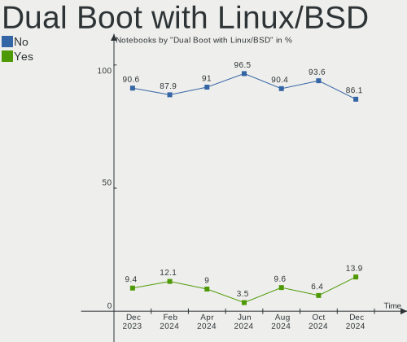
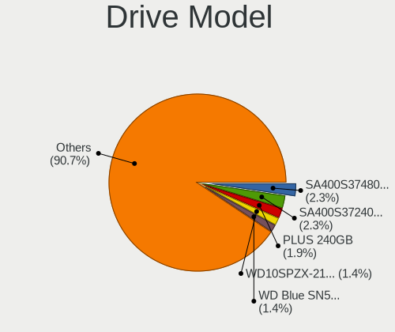
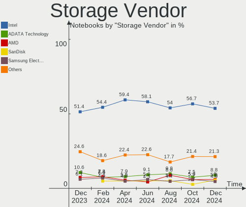
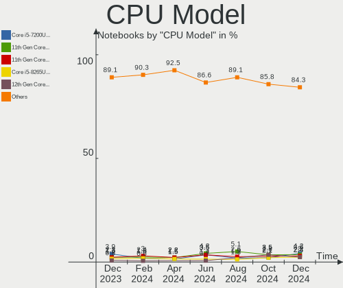
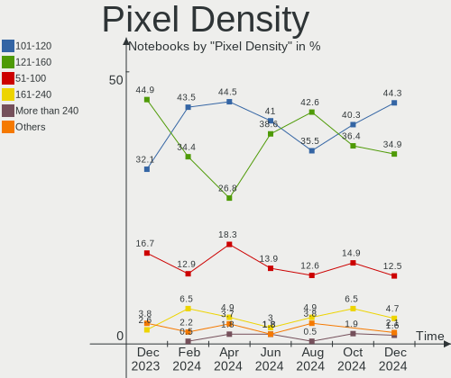
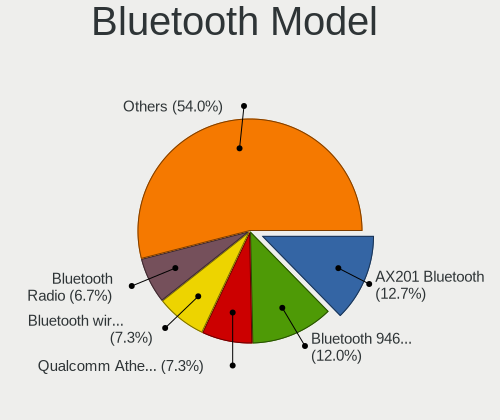
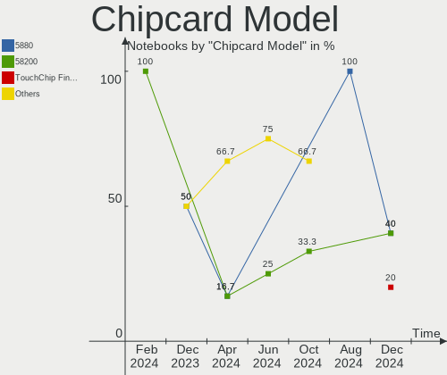

Linux in Brazil - Hardware Trends (Notebooks)
---------------------------------------------

A project to identify most popular hardware characteristics and track their change
over time based on data collected by Linux users at https://Linux-Hardware.org.

Anyone can contribute to this report by the [hw-probe](https://github.com/linuxhw/hw-probe) tool:

    sudo -E hw-probe -all -upload

Period: Nov, 2022.

Contents
--------

* [ System ](#system)
  - [ OS                       ](#os)
  - [ OS Family                ](#os-family)
  - [ Kernel                   ](#kernel)
  - [ Kernel Family            ](#kernel-family)
  - [ Kernel Major Ver.        ](#kernel-major-ver)
  - [ Arch                     ](#arch)
  - [ DE                       ](#de)
  - [ Display Server           ](#display-server)
  - [ Display Manager          ](#display-manager)
  - [ OS Lang                  ](#os-lang)
  - [ Boot Mode                ](#boot-mode)
  - [ Filesystem               ](#filesystem)
  - [ Part. scheme             ](#part-scheme)
  - [ Dual Boot with Linux/BSD ](#dual-boot-with-linuxbsd)
  - [ Dual Boot (Win)          ](#dual-boot-win)

* [ Board ](#board)
  - [ Vendor                   ](#vendor)
  - [ Model                    ](#model)
  - [ Model Family             ](#model-family)
  - [ MFG Year                 ](#mfg-year)
  - [ Form Factor              ](#form-factor)
  - [ Secure Boot              ](#secure-boot)
  - [ Coreboot                 ](#coreboot)
  - [ RAM Size                 ](#ram-size)
  - [ RAM Used                 ](#ram-used)
  - [ Total Drives             ](#total-drives)
  - [ Has CD-ROM               ](#has-cd-rom)
  - [ Has Ethernet             ](#has-ethernet)
  - [ Has WiFi                 ](#has-wifi)
  - [ Has Bluetooth            ](#has-bluetooth)

* [ Location ](#location)
  - [ Country                  ](#country)
  - [ City                     ](#city)

* [ Drives ](#drives)
  - [ Drive Vendor             ](#drive-vendor)
  - [ Drive Model              ](#drive-model)
  - [ HDD Vendor               ](#hdd-vendor)
  - [ SSD Vendor               ](#ssd-vendor)
  - [ Drive Kind               ](#drive-kind)
  - [ Drive Connector          ](#drive-connector)
  - [ Drive Size               ](#drive-size)
  - [ Space Total              ](#space-total)
  - [ Space Used               ](#space-used)
  - [ Malfunc. Drives          ](#malfunc-drives)
  - [ Malfunc. Drive Vendor    ](#malfunc-drive-vendor)
  - [ Malfunc. HDD Vendor      ](#malfunc-hdd-vendor)
  - [ Malfunc. Drive Kind      ](#malfunc-drive-kind)
  - [ Failed Drives            ](#failed-drives)
  - [ Failed Drive Vendor      ](#failed-drive-vendor)
  - [ Drive Status             ](#drive-status)

* [ Storage controller ](#storage-controller)
  - [ Storage Vendor           ](#storage-vendor)
  - [ Storage Model            ](#storage-model)
  - [ Storage Kind             ](#storage-kind)

* [ Processor ](#processor)
  - [ CPU Vendor               ](#cpu-vendor)
  - [ CPU Model                ](#cpu-model)
  - [ CPU Model Family         ](#cpu-model-family)
  - [ CPU Cores                ](#cpu-cores)
  - [ CPU Sockets              ](#cpu-sockets)
  - [ CPU Threads              ](#cpu-threads)
  - [ CPU Op-Modes             ](#cpu-op-modes)
  - [ CPU Microcode            ](#cpu-microcode)
  - [ CPU Microarch            ](#cpu-microarch)

* [ Graphics ](#graphics)
  - [ GPU Vendor               ](#gpu-vendor)
  - [ GPU Model                ](#gpu-model)
  - [ GPU Combo                ](#gpu-combo)
  - [ GPU Driver               ](#gpu-driver)
  - [ GPU Memory               ](#gpu-memory)

* [ Monitor ](#monitor)
  - [ Monitor Vendor           ](#monitor-vendor)
  - [ Monitor Model            ](#monitor-model)
  - [ Monitor Resolution       ](#monitor-resolution)
  - [ Monitor Diagonal         ](#monitor-diagonal)
  - [ Monitor Width            ](#monitor-width)
  - [ Aspect Ratio             ](#aspect-ratio)
  - [ Monitor Area             ](#monitor-area)
  - [ Pixel Density            ](#pixel-density)
  - [ Multiple Monitors        ](#multiple-monitors)

* [ Network ](#network)
  - [ Net Controller Vendor    ](#net-controller-vendor)
  - [ Net Controller Model     ](#net-controller-model)
  - [ Wireless Vendor          ](#wireless-vendor)
  - [ Wireless Model           ](#wireless-model)
  - [ Ethernet Vendor          ](#ethernet-vendor)
  - [ Ethernet Model           ](#ethernet-model)
  - [ Net Controller Kind      ](#net-controller-kind)
  - [ Used Controller          ](#used-controller)
  - [ NICs                     ](#nics)
  - [ IPv6                     ](#ipv6)

* [ Bluetooth ](#bluetooth)
  - [ Bluetooth Vendor         ](#bluetooth-vendor)
  - [ Bluetooth Model          ](#bluetooth-model)

* [ Sound ](#sound)
  - [ Sound Vendor             ](#sound-vendor)
  - [ Sound Model              ](#sound-model)

* [ Memory ](#memory)
  - [ Memory Vendor            ](#memory-vendor)
  - [ Memory Model             ](#memory-model)
  - [ Memory Kind              ](#memory-kind)
  - [ Memory Form Factor       ](#memory-form-factor)
  - [ Memory Size              ](#memory-size)
  - [ Memory Speed             ](#memory-speed)

* [ Printers & scanners ](#printers--scanners)
  - [ Printer Vendor           ](#printer-vendor)
  - [ Printer Model            ](#printer-model)
  - [ Scanner Vendor           ](#scanner-vendor)
  - [ Scanner Model            ](#scanner-model)

* [ Camera ](#camera)
  - [ Camera Vendor            ](#camera-vendor)
  - [ Camera Model             ](#camera-model)

* [ Security ](#security)
  - [ Fingerprint Vendor       ](#fingerprint-vendor)
  - [ Fingerprint Model        ](#fingerprint-model)
  - [ Chipcard Vendor          ](#chipcard-vendor)
  - [ Chipcard Model           ](#chipcard-model)

* [ Unsupported ](#unsupported)
  - [ Unsupported Devices      ](#unsupported-devices)
  - [ Unsupported Device Types ](#unsupported-device-types)

System
------

OS
--

Installed operating systems

| Name                         | Notebooks | Percent |
|------------------------------|-----------|---------|
| Ubuntu 22.04                 | 21        | 15.79%  |
| Linux Mint 21                | 15        | 11.28%  |
| Pop!_OS 22.04                | 11        | 8.27%   |
| OpenMandriva 4.3             | 9         | 6.77%   |
| Ubuntu 22.10                 | 7         | 5.26%   |
| Fedora 36                    | 6         | 4.51%   |
| Ubuntu 20.04                 | 5         | 3.76%   |
| Fedora 37                    | 5         | 3.76%   |
| Arch Rolling                 | 4         | 3.01%   |
| Zorin 16                     | 3         | 2.26%   |
| Linux Mint 20.3              | 3         | 2.26%   |
| KDE neon 22.04               | 3         | 2.26%   |
| Endless 4.0.11               | 3         | 2.26%   |
| Elementary 6.1               | 3         | 2.26%   |
| Debian 11                    | 3         | 2.26%   |
| Xubuntu 18.04                | 2         | 1.5%    |
| Ubuntu MATE 20.04            | 2         | 1.5%    |
| openSUSE Tumbleweed-XXXXXXXX | 2         | 1.5%    |
| OpenMandriva 4.50            | 2         | 1.5%    |
| Linux Mint 20.2              | 2         | 1.5%    |
| Kubuntu 22.04                | 2         | 1.5%    |
| Endless 3.9.7                | 2         | 1.5%    |
| Zorin 15                     | 1         | 0.75%   |
| Ubuntu MATE 22.04            | 1         | 0.75%   |
| Ubuntu Budgie 22.04          | 1         | 0.75%   |
| Ubuntu 18.04                 | 1         | 0.75%   |
| Trisquel 10.0.1              | 1         | 0.75%   |
| PureOS 10.0                  | 1         | 0.75%   |
| openSUSE Leap-15.4           | 1         | 0.75%   |
| Manjaro                      | 1         | 0.75%   |
| LMDE 5                       | 1         | 0.75%   |
| Linux Mint 19.3              | 1         | 0.75%   |
| Kubuntu 11                   | 1         | 0.75%   |
| KDE neon 20.04               | 1         | 0.75%   |
| Kali 2022.4                  | 1         | 0.75%   |
| Fedora 38                    | 1         | 0.75%   |
| Endless 3.8.7-nexthw2        | 1         | 0.75%   |
| Debian                       | 1         | 0.75%   |
| CentOS 9                     | 1         | 0.75%   |
| BigLinux 22.0.0              | 1         | 0.75%   |

OS Family
---------

OS without a version

| Name          | Notebooks | Percent |
|---------------|-----------|---------|
| Ubuntu        | 34        | 25.56%  |
| Linux Mint    | 21        | 15.79%  |
| Fedora        | 12        | 9.02%   |
| Pop!_OS       | 11        | 8.27%   |
| OpenMandriva  | 11        | 8.27%   |
| Endless       | 6         | 4.51%   |
| Zorin         | 4         | 3.01%   |
| KDE neon      | 4         | 3.01%   |
| Debian        | 4         | 3.01%   |
| Arch          | 4         | 3.01%   |
| Ubuntu MATE   | 3         | 2.26%   |
| openSUSE      | 3         | 2.26%   |
| Kubuntu       | 3         | 2.26%   |
| Elementary    | 3         | 2.26%   |
| Xubuntu       | 2         | 1.5%    |
| Ubuntu Budgie | 1         | 0.75%   |
| Trisquel      | 1         | 0.75%   |
| PureOS        | 1         | 0.75%   |
| Manjaro       | 1         | 0.75%   |
| LMDE          | 1         | 0.75%   |
| Kali          | 1         | 0.75%   |
| CentOS        | 1         | 0.75%   |
| BigLinux      | 1         | 0.75%   |

Kernel
------

Version of the Linux kernel

| Version                    | Notebooks | Percent |
|----------------------------|-----------|---------|
| 5.15.0-52-generic          | 27        | 20.3%   |
| 5.15.0-53-generic          | 16        | 12.03%  |
| 5.16.7-desktop-1omv4003    | 8         | 6.02%   |
| 5.4.0-131-generic          | 6         | 4.51%   |
| 5.19.0-23-generic          | 6         | 4.51%   |
| 5.15.0-41-generic          | 5         | 3.76%   |
| 6.0.6-76060006-generic     | 4         | 3.01%   |
| 5.10.0-19-amd64            | 4         | 3.01%   |
| 5.8.0-14-generic           | 3         | 2.26%   |
| 5.11.0-35-generic          | 3         | 2.26%   |
| 6.0.9-300.fc37.x86_64      | 2         | 1.5%    |
| 6.0.9-200.fc36.x86_64      | 2         | 1.5%    |
| 6.0.9-060009-generic       | 2         | 1.5%    |
| 6.0.5-200.fc36.x86_64      | 2         | 1.5%    |
| 6.0.3-76060003-generic     | 2         | 1.5%    |
| 5.4.0-132-generic          | 2         | 1.5%    |
| 5.19.12-desktop-2omv4090   | 2         | 1.5%    |
| 5.19.0-76051900-generic    | 2         | 1.5%    |
| 5.15.0-52-lowlatency       | 2         | 1.5%    |
| 5.15.0-46-generic          | 2         | 1.5%    |
| 4.15.0-196-generic         | 2         | 1.5%    |
| 6.1.0-0.rc5.39.fc38.x86_64 | 1         | 0.75%   |
| 6.0.9-arch1-1              | 1         | 0.75%   |
| 6.0.8-300.fc37.x86_64      | 1         | 0.75%   |
| 6.0.8-1-default            | 1         | 0.75%   |
| 6.0.5-300.fc37.x86_64      | 1         | 0.75%   |
| 6.0.2-xm1.0.fc37.x86_64    | 1         | 0.75%   |
| 6.0.2-76060002-generic     | 1         | 0.75%   |
| 6.0.10-zen2-1-zen          | 1         | 0.75%   |
| 6.0.10-arch2-1             | 1         | 0.75%   |
| 6.0.0-kali3-amd64          | 1         | 0.75%   |
| 6.0.0-4-amd64              | 1         | 0.75%   |
| 5.4.0-74-generic           | 1         | 0.75%   |
| 5.19.15-201.fc36.x86_64    | 1         | 0.75%   |
| 5.19.0-24-generic          | 1         | 0.75%   |
| 5.18.6-1-default           | 1         | 0.75%   |
| 5.18.19-051819-generic     | 1         | 0.75%   |
| 5.17.5-76051705-generic    | 1         | 0.75%   |
| 5.17.5-300.fc36.x86_64     | 1         | 0.75%   |
| 5.16.13-desktop-1omv4003   | 1         | 0.75%   |

Kernel Family
-------------

Linux kernel without a distro release

| Version | Notebooks | Percent |
|---------|-----------|---------|
| 5.15.0  | 54        | 40.6%   |
| 5.4.0   | 9         | 6.77%   |
| 5.19.0  | 9         | 6.77%   |
| 5.16.7  | 8         | 6.02%   |
| 6.0.9   | 7         | 5.26%   |
| 5.10.0  | 5         | 3.76%   |
| 6.0.6   | 4         | 3.01%   |
| 5.11.0  | 4         | 3.01%   |
| 6.0.5   | 3         | 2.26%   |
| 5.8.0   | 3         | 2.26%   |
| 6.0.8   | 2         | 1.5%    |
| 6.0.3   | 2         | 1.5%    |
| 6.0.2   | 2         | 1.5%    |
| 6.0.10  | 2         | 1.5%    |
| 6.0.0   | 2         | 1.5%    |
| 5.19.12 | 2         | 1.5%    |
| 5.17.5  | 2         | 1.5%    |
| 5.14.0  | 2         | 1.5%    |
| 4.15.0  | 2         | 1.5%    |
| 6.1.0   | 1         | 0.75%   |
| 5.19.15 | 1         | 0.75%   |
| 5.18.6  | 1         | 0.75%   |
| 5.18.19 | 1         | 0.75%   |
| 5.16.13 | 1         | 0.75%   |
| 5.15.78 | 1         | 0.75%   |
| 5.15.76 | 1         | 0.75%   |
| 5.15.74 | 1         | 0.75%   |
| 5.14.21 | 1         | 0.75%   |

Kernel Major Ver.
-----------------

Linux kernel major version

| Version | Notebooks | Percent |
|---------|-----------|---------|
| 5.15    | 57        | 42.86%  |
| 6.0     | 24        | 18.05%  |
| 5.19    | 12        | 9.02%   |
| 5.4     | 9         | 6.77%   |
| 5.16    | 9         | 6.77%   |
| 5.10    | 5         | 3.76%   |
| 5.11    | 4         | 3.01%   |
| 5.8     | 3         | 2.26%   |
| 5.14    | 3         | 2.26%   |
| 5.18    | 2         | 1.5%    |
| 5.17    | 2         | 1.5%    |
| 4.15    | 2         | 1.5%    |
| 6.1     | 1         | 0.75%   |

Arch
----

OS architecture (x86_64, i586, etc.)

| Name   | Notebooks | Percent |
|--------|-----------|---------|
| x86_64 | 132       | 99.25%  |
| i686   | 1         | 0.75%   |

DE
--

Desktop Environment

| Name       | Notebooks | Percent |
|------------|-----------|---------|
| GNOME      | 69        | 51.88%  |
| KDE5       | 25        | 18.8%   |
| X-Cinnamon | 15        | 11.28%  |
| MATE       | 8         | 6.02%   |
| XFCE       | 7         | 5.26%   |
| Pantheon   | 3         | 2.26%   |
| Cinnamon   | 2         | 1.5%    |
| Unknown    | 2         | 1.5%    |
| LXQt       | 1         | 0.75%   |
| Budgie     | 1         | 0.75%   |

Display Server
--------------

X11 or Wayland

| Name    | Notebooks | Percent |
|---------|-----------|---------|
| X11     | 101       | 75.94%  |
| Wayland | 30        | 22.56%  |
| Unknown | 2         | 1.5%    |

Display Manager
---------------

SDDM, LightDM, etc.

| Name    | Notebooks | Percent |
|---------|-----------|---------|
| Unknown | 54        | 40.6%   |
| GDM3    | 36        | 27.07%  |
| LightDM | 19        | 14.29%  |
| SDDM    | 15        | 11.28%  |
| GDM     | 9         | 6.77%   |

OS Lang
-------

Language

| Lang    | Notebooks | Percent |
|---------|-----------|---------|
| pt_BR   | 87        | 65.41%  |
| en_US   | 38        | 28.57%  |
| C       | 3         | 2.26%   |
| en_GB   | 2         | 1.5%    |
| Unknown | 2         | 1.5%    |
| ja_JP   | 1         | 0.75%   |

Boot Mode
---------

EFI or BIOS

| Mode | Notebooks | Percent |
|------|-----------|---------|
| BIOS | 75        | 56.39%  |
| EFI  | 58        | 43.61%  |

Filesystem
----------

Type of filesystem

| Type    | Notebooks | Percent |
|---------|-----------|---------|
| Ext4    | 96        | 72.18%  |
| Btrfs   | 21        | 15.79%  |
| Overlay | 13        | 9.77%   |
| Zfs     | 1         | 0.75%   |
| Xfs     | 1         | 0.75%   |
| Ext2    | 1         | 0.75%   |

Part. scheme
------------

Scheme of partitioning

| Type    | Notebooks | Percent |
|---------|-----------|---------|
| GPT     | 63        | 47.37%  |
| Unknown | 55        | 41.35%  |
| MBR     | 15        | 11.28%  |

Dual Boot with Linux/BSD
------------------------

Hosting more than one Linux/BSD

| Dual boot | Notebooks | Percent |
|-----------|-----------|---------|
| No        | 120       | 90.23%  |
| Yes       | 13        | 9.77%   |

Dual Boot (Win)
---------------

Hosting Linux and Windows

| Dual boot | Notebooks | Percent |
|-----------|-----------|---------|
| No        | 105       | 78.95%  |
| Yes       | 28        | 21.05%  |

Board
-----

Vendor
------

Motherboard manufacturer

| Name                   | Notebooks | Percent |
|------------------------|-----------|---------|
| Dell                   | 29        | 21.8%   |
| Lenovo                 | 20        | 15.04%  |
| Acer                   | 18        | 13.53%  |
| Samsung Electronics    | 17        | 12.78%  |
| Hewlett-Packard        | 8         | 6.02%   |
| ASUSTek Computer       | 8         | 6.02%   |
| Sony                   | 4         | 3.01%   |
| Semp Toshiba           | 4         | 3.01%   |
| Positivo Bahia - VAIO  | 3         | 2.26%   |
| Positivo               | 3         | 2.26%   |
| Apple                  | 3         | 2.26%   |
| Avell High Performance | 2         | 1.5%    |
| Timi                   | 1         | 0.75%   |
| Standard               | 1         | 0.75%   |
| Quanta                 | 1         | 0.75%   |
| Philco                 | 1         | 0.75%   |
| Notebook               | 1         | 0.75%   |
| Multilaser             | 1         | 0.75%   |
| LG Electronics         | 1         | 0.75%   |
| Intel                  | 1         | 0.75%   |
| H-BUSTER               | 1         | 0.75%   |
| Google                 | 1         | 0.75%   |
| Gateway                | 1         | 0.75%   |
| Daten Tecnologia       | 1         | 0.75%   |
| Compaq                 | 1         | 0.75%   |
| Alienware              | 1         | 0.75%   |

Model
-----

Motherboard model

| Name                                              | Notebooks | Percent |
|---------------------------------------------------|-----------|---------|
| Lenovo IdeaPad 3 15ALC6 82MF                      | 4         | 3.01%   |
| Acer Nitro AN515-44                               | 3         | 2.26%   |
| Samsung RV411/RV511/E3511/S3511/RV711/E3411       | 2         | 1.5%    |
| Samsung 550XDA                                    | 2         | 1.5%    |
| Samsung 530U3C/530U4C/532U3C                      | 2         | 1.5%    |
| Positivo Mobile                                   | 2         | 1.5%    |
| Lenovo IdeaPad S145-15IWL 81S9                    | 2         | 1.5%    |
| Lenovo IdeaPad S145-15API 81V7                    | 2         | 1.5%    |
| Dell Vostro 5470                                  | 2         | 1.5%    |
| Dell Inspiron 5566                                | 2         | 1.5%    |
| Dell Inspiron 3442                                | 2         | 1.5%    |
| Dell Inspiron 15-3567                             | 2         | 1.5%    |
| ASUS VivoBook_ASUSLaptop X513EAN_X513EAN          | 2         | 1.5%    |
| Acer Aspire A515-45                               | 2         | 1.5%    |
| Timi RedmiBook Pro 14S                            | 1         | 0.75%   |
| Standard MB40II                                   | 1         | 0.75%   |
| Sony VPCEB4L1E                                    | 1         | 0.75%   |
| Sony VPCEA23FB                                    | 1         | 0.75%   |
| Sony VGN-CR120E                                   | 1         | 0.75%   |
| Sony SVE14A15FBB                                  | 1         | 0.75%   |
| Semp Toshiba IS 1442                              | 1         | 0.75%   |
| Semp Toshiba IS 1422+                             | 1         | 0.75%   |
| Semp Toshiba IS 1422                              | 1         | 0.75%   |
| Semp Toshiba IS 1413G                             | 1         | 0.75%   |
| Samsung RV411/RV511/E3511/S3511/RV711             | 1         | 0.75%   |
| Samsung RV411                                     | 1         | 0.75%   |
| Samsung RV410/RV510/S3510/E3510                   | 1         | 0.75%   |
| Samsung 767XCL                                    | 1         | 0.75%   |
| Samsung 550P5C/550P7C                             | 1         | 0.75%   |
| Samsung 500R4K/500R5H/5400RK/501R5H/5500RH/500R5S | 1         | 0.75%   |
| Samsung 3570R/370R/470R/450R/510R/4450RV          | 1         | 0.75%   |
| Samsung 300E5K/300E5Q                             | 1         | 0.75%   |
| Samsung 270E5K/270E5Q/271E5K/2570EK               | 1         | 0.75%   |
| Samsung 270E5K                                    | 1         | 0.75%   |
| Samsung 270E5J/2570EJ                             | 1         | 0.75%   |
| Quanta TWS                                        | 1         | 0.75%   |
| Positivo W940TU                                   | 1         | 0.75%   |
| Positivo Bahia - VAIO VJFE53F11X-XXXXXX           | 1         | 0.75%   |
| Positivo Bahia - VAIO VJFE44F11X-B2111H           | 1         | 0.75%   |
| Positivo Bahia - VAIO S14SL03                     | 1         | 0.75%   |

Model Family
------------

Motherboard model prefix

| Name                                    | Notebooks | Percent |
|-----------------------------------------|-----------|---------|
| Dell Inspiron                           | 18        | 13.53%  |
| Lenovo IdeaPad                          | 15        | 11.28%  |
| Acer Aspire                             | 10        | 7.52%   |
| Acer Nitro                              | 7         | 5.26%   |
| Dell Vostro                             | 5         | 3.76%   |
| Semp Toshiba IS                         | 4         | 3.01%   |
| Samsung RV411                           | 4         | 3.01%   |
| ASUS VivoBook                           | 4         | 3.01%   |
| HP Pavilion                             | 3         | 2.26%   |
| Dell G15                                | 3         | 2.26%   |
| Samsung 550XDA                          | 2         | 1.5%    |
| Samsung 530U3C                          | 2         | 1.5%    |
| Samsung 270E5K                          | 2         | 1.5%    |
| Positivo Mobile                         | 2         | 1.5%    |
| Lenovo Legion                           | 2         | 1.5%    |
| Dell Latitude                           | 2         | 1.5%    |
| Timi RedmiBook                          | 1         | 0.75%   |
| Standard MB40II                         | 1         | 0.75%   |
| Sony VPCEB4L1E                          | 1         | 0.75%   |
| Sony VPCEA23FB                          | 1         | 0.75%   |
| Sony VGN-CR120E                         | 1         | 0.75%   |
| Sony SVE14A15FBB                        | 1         | 0.75%   |
| Samsung RV410                           | 1         | 0.75%   |
| Samsung 767XCL                          | 1         | 0.75%   |
| Samsung 550P5C                          | 1         | 0.75%   |
| Samsung 500R4K                          | 1         | 0.75%   |
| Samsung 3570R                           | 1         | 0.75%   |
| Samsung 300E5K                          | 1         | 0.75%   |
| Samsung 270E5J                          | 1         | 0.75%   |
| Quanta TWS                              | 1         | 0.75%   |
| Positivo W940TU                         | 1         | 0.75%   |
| Positivo Bahia - VAIO VJFE53F11X-XXXXXX | 1         | 0.75%   |
| Positivo Bahia - VAIO VJFE44F11X-B2111H | 1         | 0.75%   |
| Positivo Bahia - VAIO S14SL03           | 1         | 0.75%   |
| Philco 14H                              | 1         | 0.75%   |
| Notebook NJx0MU                         | 1         | 0.75%   |
| Multilaser PC121                        | 1         | 0.75%   |
| LG 15Z970-E.BH91P1                      | 1         | 0.75%   |
| Lenovo G50-80                           | 1         | 0.75%   |
| Lenovo G475                             | 1         | 0.75%   |

MFG Year
--------

Motherboard manufacture year

| Year | Notebooks | Percent |
|------|-----------|---------|
| 2021 | 26        | 19.55%  |
| 2012 | 14        | 10.53%  |
| 2020 | 11        | 8.27%   |
| 2016 | 11        | 8.27%   |
| 2015 | 10        | 7.52%   |
| 2011 | 9         | 6.77%   |
| 2010 | 9         | 6.77%   |
| 2013 | 8         | 6.02%   |
| 2022 | 7         | 5.26%   |
| 2019 | 7         | 5.26%   |
| 2014 | 6         | 4.51%   |
| 2017 | 5         | 3.76%   |
| 2009 | 4         | 3.01%   |
| 2018 | 3         | 2.26%   |
| 2007 | 2         | 1.5%    |
| 2008 | 1         | 0.75%   |

Form Factor
-----------

Physical design of the computer

| Name     | Notebooks | Percent |
|----------|-----------|---------|
| Notebook | 133       | 100%    |

Secure Boot
-----------

Enabled or disabled

| State    | Notebooks | Percent |
|----------|-----------|---------|
| Disabled | 119       | 89.47%  |
| Enabled  | 14        | 10.53%  |

Coreboot
--------

Have coreboot on board

| Used | Notebooks | Percent |
|------|-----------|---------|
| No   | 132       | 99.25%  |
| Yes  | 1         | 0.75%   |

RAM Size
--------

Total RAM memory

| Size in GB  | Notebooks | Percent |
|-------------|-----------|---------|
| 4.01-8.0    | 51        | 38.35%  |
| 3.01-4.0    | 32        | 24.06%  |
| 8.01-16.0   | 24        | 18.05%  |
| 16.01-24.0  | 14        | 10.53%  |
| 1.01-2.0    | 6         | 4.51%   |
| 32.01-64.0  | 5         | 3.76%   |
| 64.01-256.0 | 1         | 0.75%   |

RAM Used
--------

Used RAM memory

| Used GB   | Notebooks | Percent |
|-----------|-----------|---------|
| 1.01-2.0  | 45        | 33.83%  |
| 2.01-3.0  | 33        | 24.81%  |
| 4.01-8.0  | 26        | 19.55%  |
| 3.01-4.0  | 21        | 15.79%  |
| 8.01-16.0 | 4         | 3.01%   |
| 0.51-1.0  | 4         | 3.01%   |

Total Drives
------------

Number of drives on board

| Drives | Notebooks | Percent |
|--------|-----------|---------|
| 1      | 95        | 71.43%  |
| 2      | 32        | 24.06%  |
| 3      | 4         | 3.01%   |
| 4      | 1         | 0.75%   |
| 0      | 1         | 0.75%   |

Has CD-ROM
----------

Has CD-ROM on board

| Presented | Notebooks | Percent |
|-----------|-----------|---------|
| No        | 91        | 68.42%  |
| Yes       | 42        | 31.58%  |

Has Ethernet
------------

Has Ethernet on board

| Presented | Notebooks | Percent |
|-----------|-----------|---------|
| Yes       | 105       | 78.95%  |
| No        | 28        | 21.05%  |

Has WiFi
--------

Has WiFi module

| Presented | Notebooks | Percent |
|-----------|-----------|---------|
| Yes       | 132       | 99.25%  |
| No        | 1         | 0.75%   |

Has Bluetooth
-------------

Has Bluetooth module

| Presented | Notebooks | Percent |
|-----------|-----------|---------|
| Yes       | 104       | 78.2%   |
| No        | 29        | 21.8%   |

Location
--------

Country
-------

Geographic location (country)

| Country | Notebooks | Percent |
|---------|-----------|---------|
| Brazil  | 133       | 100%    |

City
----

Geographic location (city)

| City                    | Notebooks | Percent |
|-------------------------|-----------|---------|
| Sao Paulo               | 18        | 13.53%  |
| Rio de Janeiro          | 13        | 9.77%   |
| Curitiba                | 5         | 3.76%   |
| Belo Horizonte          | 5         | 3.76%   |
| Porto Alegre            | 4         | 3.01%   |
| Fortaleza               | 4         | 3.01%   |
| Sao Jose do Rio Preto   | 3         | 2.26%   |
| Maringá                | 3         | 2.26%   |
| Maceió                 | 3         | 2.26%   |
| Brasília               | 3         | 2.26%   |
| Blumenau                | 3         | 2.26%   |
| Sorocaba                | 2         | 1.5%    |
| Sao Luís               | 2         | 1.5%    |
| Santo André            | 2         | 1.5%    |
| Recife                  | 2         | 1.5%    |
| Ourinhos                | 2         | 1.5%    |
| Olinda                  | 2         | 1.5%    |
| Natal                   | 2         | 1.5%    |
| Joao Pessoa             | 2         | 1.5%    |
| Duque de Caxias         | 2         | 1.5%    |
| Canoas                  | 2         | 1.5%    |
| Volta Redonda           | 1         | 0.75%   |
| Vilhena                 | 1         | 0.75%   |
| Varzea Paulista         | 1         | 0.75%   |
| Valparaiso de Goias     | 1         | 0.75%   |
| Uberlândia             | 1         | 0.75%   |
| Teresina                | 1         | 0.75%   |
| Sumaré                 | 1         | 0.75%   |
| Serrana                 | 1         | 0.75%   |
| Sao Roque               | 1         | 0.75%   |
| Sao Jose                | 1         | 0.75%   |
| Sao Goncalo do Amarante | 1         | 0.75%   |
| Sao Carlos              | 1         | 0.75%   |
| Santana do Ipanema      | 1         | 0.75%   |
| Santa Rosa              | 1         | 0.75%   |
| Salvador                | 1         | 0.75%   |
| Rondonópolis           | 1         | 0.75%   |
| Ribeirao Preto          | 1         | 0.75%   |
| Pelotas                 | 1         | 0.75%   |
| Pedro Leopoldo          | 1         | 0.75%   |

Drives
------

Drive Vendor
------------

Hard drive vendors

| Vendor                         | Notebooks | Drives | Percent |
|--------------------------------|-----------|--------|---------|
| WDC                            | 34        | 34     | 20.73%  |
| Seagate                        | 15        | 15     | 9.15%   |
| Sandisk                        | 15        | 18     | 9.15%   |
| Kingston                       | 14        | 14     | 8.54%   |
| Toshiba                        | 9         | 9      | 5.49%   |
| China                          | 9         | 9      | 5.49%   |
| A-DATA Technology              | 9         | 9      | 5.49%   |
| Unknown                        | 6         | 7      | 3.66%   |
| Solid State Storage            | 6         | 6      | 3.66%   |
| SK hynix                       | 6         | 6      | 3.66%   |
| Samsung Electronics            | 6         | 6      | 3.66%   |
| KIOXIA                         | 3         | 3      | 1.83%   |
| ADATA Technology               | 3         | 3      | 1.83%   |
| SAGE                           | 2         | 2      | 1.22%   |
| Realtek Semiconductor          | 2         | 2      | 1.22%   |
| PNY                            | 2         | 2      | 1.22%   |
| Intel                          | 2         | 2      | 1.22%   |
| Hitachi                        | 2         | 2      | 1.22%   |
| Unknown                        | 2         | 2      | 1.22%   |
| WALRAM                         | 1         | 1      | 0.61%   |
| SSSTC                          | 1         | 1      | 0.61%   |
| Solid State Storage Technology | 1         | 1      | 0.61%   |
| Silicon Motion                 | 1         | 1      | 0.61%   |
| Netac                          | 1         | 1      | 0.61%   |
| Micron/Crucial Technology      | 1         | 1      | 0.61%   |
| Micron Technology              | 1         | 1      | 0.61%   |
| LITEONIT                       | 1         | 1      | 0.61%   |
| LITEON                         | 1         | 1      | 0.61%   |
| Kingston Technology Company    | 1         | 1      | 0.61%   |
| KingSpec                       | 1         | 1      | 0.61%   |
| KEEPDATA                       | 1         | 1      | 0.61%   |
| JMicron Technology             | 1         | 1      | 0.61%   |
| HGST                           | 1         | 1      | 0.61%   |
| Crucial                        | 1         | 1      | 0.61%   |
| BIWIN                          | 1         | 1      | 0.61%   |
| Apple                          | 1         | 1      | 0.61%   |

Drive Model
-----------

Hard drive models

| Model                                        | Notebooks | Percent |
|----------------------------------------------|-----------|---------|
| Kingston SA400S37240G 240GB SSD              | 8         | 4.76%   |
| Solid State Storage SSSTC CL1-4D256 256GB    | 6         | 3.57%   |
| Toshiba MQ01ABD100 1TB                       | 5         | 2.98%   |
| WDC WD10JPVX-22JC3T0 1TB                     | 4         | 2.38%   |
| Seagate ST1000LM024 HN-M101MBB 1TB           | 4         | 2.38%   |
| Seagate ST500LM012 HN-M500MBB 500GB          | 3         | 1.79%   |
| Sandisk WD Blue SN550 NVMe SSD 1TB           | 3         | 1.79%   |
| WDC WDS240G2G0A-00JH30 240GB SSD             | 2         | 1.19%   |
| WDC WD5000LPCX-75VHAT0 500GB                 | 2         | 1.19%   |
| WDC WD10SPZX-75Z10T1 1TB                     | 2         | 1.19%   |
| WDC WD10SPZX-21Z10T0 1TB                     | 2         | 1.19%   |
| WDC WD10JPCX-24UE4T0 1TB                     | 2         | 1.19%   |
| WDC PC SN730 SDBPNTY-512G-1101 512GB         | 2         | 1.19%   |
| Unknown MMC Card  32GB                       | 2         | 1.19%   |
| Toshiba MQ01ABF050 500GB                     | 2         | 1.19%   |
| SK hynix BC711 NVMe 256GB                    | 2         | 1.19%   |
| Seagate ST500LT012-9WS142 500GB              | 2         | 1.19%   |
| Seagate ST1000LM035-1RK172 1TB               | 2         | 1.19%   |
| SanDisk SSD PLUS 480GB                       | 2         | 1.19%   |
| SanDisk SSD PLUS 240GB                       | 2         | 1.19%   |
| SanDisk SSD PLUS 120GB                       | 2         | 1.19%   |
| SanDisk SSD i100 24GB                        | 2         | 1.19%   |
| SAGE 3639S 128GB                             | 2         | 1.19%   |
| Realtek RTS5763DL NVMe SSD Controller 1024GB | 2         | 1.19%   |
| KIOXIA KBG40ZNS512G NVMe 512GB               | 2         | 1.19%   |
| Kingston SA400S37480G 480GB SSD              | 2         | 1.19%   |
| China SSD 720GB                              | 2         | 1.19%   |
| China SSD 500GB                              | 2         | 1.19%   |
| China SATA SSD 120GB                         | 2         | 1.19%   |
| ADATA SM2P32A8-256GC1 256GB                  | 2         | 1.19%   |
| A-DATA IM2P33F8ABR2-256GB                    | 2         | 1.19%   |
| Unknown                                      | 2         | 1.19%   |
| WDC WDS500G2B0A-00SM50 500GB SSD             | 1         | 0.6%    |
| WDC WDS100T2B0C-00PXH0 1TB                   | 1         | 0.6%    |
| WDC WDS100T1X0E-00AFY0 1TB                   | 1         | 0.6%    |
| WDC WD6400BPVT-75HXZT3 640GB                 | 1         | 0.6%    |
| WDC WD5000LPVX-75V0TT0 500GB                 | 1         | 0.6%    |
| WDC WD5000LPVX-60V0TT0 500GB                 | 1         | 0.6%    |
| WDC WD5000LPCX-80VHAT0 500GB                 | 1         | 0.6%    |
| WDC WD5000BEVT-22A0RT0 500GB                 | 1         | 0.6%    |

HDD Vendor
----------

Hard disk drive vendors

| Vendor              | Notebooks | Drives | Percent |
|---------------------|-----------|--------|---------|
| WDC                 | 26        | 26     | 45.61%  |
| Seagate             | 15        | 15     | 26.32%  |
| Toshiba             | 9         | 9      | 15.79%  |
| SAGE                | 2         | 2      | 3.51%   |
| Hitachi             | 2         | 2      | 3.51%   |
| Unknown             | 1         | 1      | 1.75%   |
| Samsung Electronics | 1         | 1      | 1.75%   |
| HGST                | 1         | 1      | 1.75%   |

SSD Vendor
----------

Solid state drive vendors

| Vendor              | Notebooks | Drives | Percent |
|---------------------|-----------|--------|---------|
| Kingston            | 14        | 14     | 27.45%  |
| SanDisk             | 9         | 9      | 17.65%  |
| China               | 9         | 9      | 17.65%  |
| WDC                 | 3         | 3      | 5.88%   |
| Samsung Electronics | 2         | 2      | 3.92%   |
| PNY                 | 2         | 2      | 3.92%   |
| A-DATA Technology   | 2         | 2      | 3.92%   |
| Unknown             | 2         | 2      | 3.92%   |
| WALRAM              | 1         | 1      | 1.96%   |
| LITEONIT            | 1         | 1      | 1.96%   |
| LITEON              | 1         | 1      | 1.96%   |
| KingSpec            | 1         | 1      | 1.96%   |
| KEEPDATA            | 1         | 1      | 1.96%   |
| JMicron Technology  | 1         | 1      | 1.96%   |
| Crucial             | 1         | 1      | 1.96%   |
| Apple               | 1         | 1      | 1.96%   |

Drive Kind
----------

HDD or SSD

| Kind    | Notebooks | Drives | Percent |
|---------|-----------|--------|---------|
| HDD     | 56        | 57     | 35.9%   |
| SSD     | 47        | 51     | 30.13%  |
| NVMe    | 45        | 51     | 28.85%  |
| MMC     | 6         | 7      | 3.85%   |
| Unknown | 2         | 2      | 1.28%   |

Drive Connector
---------------

SATA, SAS, NVMe, etc.

| Type | Notebooks | Drives | Percent |
|------|-----------|--------|---------|
| SATA | 89        | 104    | 60.96%  |
| NVMe | 45        | 51     | 30.82%  |
| SAS  | 6         | 6      | 4.11%   |
| MMC  | 6         | 7      | 4.11%   |

Drive Size
----------

Size of hard drive

| Size in TB | Notebooks | Drives | Percent |
|------------|-----------|--------|---------|
| 0.01-0.5   | 68        | 75     | 67.33%  |
| 0.51-1.0   | 33        | 33     | 32.67%  |

Space Total
-----------

Amount of disk space available on the file system

| Size in GB     | Notebooks | Percent |
|----------------|-----------|---------|
| 101-250        | 38        | 28.57%  |
| 251-500        | 30        | 22.56%  |
| 501-1000       | 27        | 20.3%   |
| 1-20           | 13        | 9.77%   |
| 21-50          | 9         | 6.77%   |
| 1001-2000      | 9         | 6.77%   |
| 51-100         | 3         | 2.26%   |
| More than 3000 | 2         | 1.5%    |
| Unknown        | 2         | 1.5%    |

Space Used
----------

Amount of used disk space

| Used GB   | Notebooks | Percent |
|-----------|-----------|---------|
| 1-20      | 44        | 33.08%  |
| 21-50     | 26        | 19.55%  |
| 101-250   | 22        | 16.54%  |
| 51-100    | 21        | 15.79%  |
| 251-500   | 10        | 7.52%   |
| 501-1000  | 7         | 5.26%   |
| Unknown   | 2         | 1.5%    |
| 1001-2000 | 1         | 0.75%   |

Malfunc. Drives
---------------

Drive models with a malfunction

| Model                               | Notebooks | Drives | Percent |
|-------------------------------------|-----------|--------|---------|
| Seagate ST500LT012-9WS142 500GB     | 2         | 2      | 11.76%  |
| WDC WD6400BPVT-75HXZT3 640GB        | 1         | 1      | 5.88%   |
| WDC WD3200BPVT-24ZEST0 320GB        | 1         | 1      | 5.88%   |
| WDC WD3200BEVT-75ZCT2 320GB         | 1         | 1      | 5.88%   |
| WDC WD3200BEVT-75A23T0 320GB        | 1         | 1      | 5.88%   |
| WDC WD1200BEVS-60UST0 120GB         | 1         | 1      | 5.88%   |
| WALRAM SSD 256GB                    | 1         | 1      | 5.88%   |
| Toshiba MQ01ABF050 500GB            | 1         | 1      | 5.88%   |
| Seagate ST9640320AS 640GB           | 1         | 1      | 5.88%   |
| Seagate ST640LM001 HN-M640MBB 640GB | 1         | 1      | 5.88%   |
| Seagate ST1000LM024 HN-M101MBB 1TB  | 1         | 1      | 5.88%   |
| PNY SSD2SC120G3LC726B104-370P 120GB | 1         | 1      | 5.88%   |
| Kingston SUV400S37240G 240GB SSD    | 1         | 1      | 5.88%   |
| Hitachi HTS541616J9SA00 160GB       | 1         | 1      | 5.88%   |
| China SSD 120GB                     | 1         | 1      | 5.88%   |
| A-DATA Technology IM2P33F8ABR1-1TB  | 1         | 1      | 5.88%   |

Malfunc. Drive Vendor
---------------------

Vendors of faulty drives

| Vendor            | Notebooks | Drives | Percent |
|-------------------|-----------|--------|---------|
| WDC               | 5         | 5      | 29.41%  |
| Seagate           | 5         | 5      | 29.41%  |
| WALRAM            | 1         | 1      | 5.88%   |
| Toshiba           | 1         | 1      | 5.88%   |
| PNY               | 1         | 1      | 5.88%   |
| Kingston          | 1         | 1      | 5.88%   |
| Hitachi           | 1         | 1      | 5.88%   |
| China             | 1         | 1      | 5.88%   |
| A-DATA Technology | 1         | 1      | 5.88%   |

Malfunc. HDD Vendor
-------------------

Vendors of faulty HDD drives

| Vendor  | Notebooks | Drives | Percent |
|---------|-----------|--------|---------|
| WDC     | 5         | 5      | 41.67%  |
| Seagate | 5         | 5      | 41.67%  |
| Toshiba | 1         | 1      | 8.33%   |
| Hitachi | 1         | 1      | 8.33%   |

Malfunc. Drive Kind
-------------------

Kinds of faulty drives

| Kind | Notebooks | Drives | Percent |
|------|-----------|--------|---------|
| HDD  | 11        | 12     | 68.75%  |
| SSD  | 4         | 4      | 25%     |
| NVMe | 1         | 1      | 6.25%   |

Failed Drives
-------------

Failed drive models

Zero info for selected period =(

Failed Drive Vendor
-------------------

Failed drive vendors

Zero info for selected period =(

Drive Status
------------

Number of failed and malfunc. drives

| Status   | Notebooks | Drives | Percent |
|----------|-----------|--------|---------|
| Detected | 88        | 111    | 64.23%  |
| Works    | 34        | 40     | 24.82%  |
| Malfunc  | 15        | 17     | 10.95%  |

Storage controller
------------------

Storage Vendor
--------------

Storage controller vendors

| Vendor                           | Notebooks | Percent |
|----------------------------------|-----------|---------|
| Intel                            | 104       | 62.28%  |
| AMD                              | 14        | 8.38%   |
| SanDisk                          | 9         | 5.39%   |
| ADATA Technology                 | 9         | 5.39%   |
| Solid State Storage Technology   | 8         | 4.79%   |
| SK hynix                         | 6         | 3.59%   |
| Realtek Semiconductor            | 3         | 1.8%    |
| KIOXIA                           | 3         | 1.8%    |
| Silicon Motion                   | 2         | 1.2%    |
| Silicon Integrated Systems [SiS] | 2         | 1.2%    |
| Samsung Electronics              | 2         | 1.2%    |
| Netac Technology                 | 1         | 0.6%    |
| Micron/Crucial Technology        | 1         | 0.6%    |
| Micron Technology                | 1         | 0.6%    |
| Marvell Technology Group         | 1         | 0.6%    |
| Kingston Technology Company      | 1         | 0.6%    |

Storage Model
-------------

Storage controller models

| Model                                                                            | Notebooks | Percent |
|----------------------------------------------------------------------------------|-----------|---------|
| AMD FCH SATA Controller [AHCI mode]                                              | 13        | 7.14%   |
| Intel 7 Series Chipset Family 6-port SATA Controller [AHCI mode]                 | 12        | 6.59%   |
| Intel 5 Series/3400 Series Chipset 4 port SATA AHCI Controller                   | 12        | 6.59%   |
| Intel Sunrise Point-LP SATA Controller [AHCI mode]                               | 11        | 6.04%   |
| Intel Volume Management Device NVMe RAID Controller                              | 10        | 5.49%   |
| Intel 8 Series SATA Controller 1 [AHCI mode]                                     | 10        | 5.49%   |
| Intel Tiger Lake-LP SATA Controller                                              | 9         | 4.95%   |
| Solid State Storage Non-Volatile memory controller                               | 8         | 4.4%    |
| Intel Wildcat Point-LP SATA Controller [AHCI Mode]                               | 7         | 3.85%   |
| SK hynix Gold P31/PC711 NVMe Solid State Drive                                   | 5         | 2.75%   |
| SanDisk WD Blue SN550 NVMe SSD                                                   | 5         | 2.75%   |
| ADATA IM2P33F8ABR1 NVMe SSD                                                      | 5         | 2.75%   |
| Intel 500 Series Chipset Family SATA AHCI Controller                             | 4         | 2.2%    |
| KIOXIA NVMe SSD Controller BG4                                                   | 3         | 1.65%   |
| Intel Cannon Point-LP SATA Controller [AHCI Mode]                                | 3         | 1.65%   |
| Intel Atom/Celeron/Pentium Processor x5-E8000/J3xxx/N3xxx Series SATA Controller | 3         | 1.65%   |
| Intel 82801IBM/IEM (ICH9M/ICH9M-E) 4 port SATA Controller [AHCI mode]            | 3         | 1.65%   |
| Intel 82801 Mobile SATA Controller [RAID mode]                                   | 3         | 1.65%   |
| Intel 6 Series/C200 Series Chipset Family 6 port Mobile SATA AHCI Controller     | 3         | 1.65%   |
| ADATA A Non-Volatile memory controller                                           | 3         | 1.65%   |
| Silicon Motion SM2263EN/SM2263XT SSD Controller                                  | 2         | 1.1%    |
| Silicon Integrated Systems [SiS] 5513 IDE Controller                             | 2         | 1.1%    |
| SanDisk WD Black SN750 / PC SN730 NVMe SSD                                       | 2         | 1.1%    |
| Realtek RTS5763DL NVMe SSD Controller                                            | 2         | 1.1%    |
| Intel Ice Lake-LP SATA Controller [AHCI mode]                                    | 2         | 1.1%    |
| Intel Comet Lake SATA AHCI Controller                                            | 2         | 1.1%    |
| Intel Atom Processor E3800 Series SATA AHCI Controller                           | 2         | 1.1%    |
| Intel Alder Lake-P SATA AHCI Controller                                          | 2         | 1.1%    |
| Intel 5 Series/3400 Series Chipset 4 port SATA IDE Controller                    | 2         | 1.1%    |
| Intel 400 Series Chipset Family SATA AHCI Controller                             | 2         | 1.1%    |
| SK hynix BC511                                                                   | 1         | 0.55%   |
| Silicon Integrated Systems [SiS] SATA Controller / IDE mode                      | 1         | 0.55%   |
| Silicon Integrated Systems [SiS] AHCI IDE Controller (0106)                      | 1         | 0.55%   |
| SanDisk WD PC SN810 / Black SN850 NVMe SSD                                       | 1         | 0.55%   |
| SanDisk WD Blue SN570 NVMe SSD                                                   | 1         | 0.55%   |
| SanDisk Non-Volatile memory controller                                           | 1         | 0.55%   |
| Samsung NVMe SSD Controller PM9A1/PM9A3/980PRO                                   | 1         | 0.55%   |
| Samsung NVMe SSD Controller 980                                                  | 1         | 0.55%   |
| Realtek Realtek Non-Volatile memory controller                                   | 1         | 0.55%   |
| Netac Non-Volatile memory controller                                             | 1         | 0.55%   |

Storage Kind
------------

Kind of storage controller (IDE, SATA, NVMe, SAS, ...)

| Kind | Notebooks | Percent |
|------|-----------|---------|
| SATA | 111       | 63.07%  |
| NVMe | 45        | 25.57%  |
| RAID | 13        | 7.39%   |
| IDE  | 7         | 3.98%   |

Processor
---------

CPU Vendor
----------

Processor vendors

| Vendor | Notebooks | Percent |
|--------|-----------|---------|
| Intel  | 117       | 87.97%  |
| AMD    | 16        | 12.03%  |

CPU Model
---------

Processor models

| Model                                         | Notebooks | Percent |
|-----------------------------------------------|-----------|---------|
| Intel 11th Gen Core i7-1165G7 @ 2.80GHz       | 6         | 4.51%   |
| Intel Core i3-4005U CPU @ 1.70GHz             | 5         | 3.76%   |
| Intel Pentium CPU P6200 @ 2.13GHz             | 4         | 3.01%   |
| Intel Core i3 CPU M 380 @ 2.53GHz             | 4         | 3.01%   |
| Intel 11th Gen Core i7-11800H @ 2.30GHz       | 4         | 3.01%   |
| AMD Ryzen 5 5500U with Radeon Graphics        | 4         | 3.01%   |
| Intel Core i7-5500U CPU @ 2.40GHz             | 3         | 2.26%   |
| Intel Core i7-3632QM CPU @ 2.20GHz            | 3         | 2.26%   |
| Intel Core i5-7200U CPU @ 2.50GHz             | 3         | 2.26%   |
| Intel Core i5-5200U CPU @ 2.20GHz             | 3         | 2.26%   |
| Intel Core i5-4210U CPU @ 1.70GHz             | 3         | 2.26%   |
| Intel Core i5-1035G1 CPU @ 1.00GHz            | 3         | 2.26%   |
| Intel Core i3-6006U CPU @ 2.00GHz             | 3         | 2.26%   |
| AMD Ryzen 7 5700U with Radeon Graphics        | 3         | 2.26%   |
| AMD Ryzen 7 4800H with Radeon Graphics        | 3         | 2.26%   |
| AMD Ryzen 5 3500U with Radeon Vega Mobile Gfx | 3         | 2.26%   |
| Intel Pentium CPU N3700 @ 1.60GHz             | 2         | 1.5%    |
| Intel Core i7-8565U CPU @ 1.80GHz             | 2         | 1.5%    |
| Intel Core i7-6500U CPU @ 2.50GHz             | 2         | 1.5%    |
| Intel Core i7-4510U CPU @ 2.00GHz             | 2         | 1.5%    |
| Intel Core i7-10750H CPU @ 2.60GHz            | 2         | 1.5%    |
| Intel Core i5-3317U CPU @ 1.70GHz             | 2         | 1.5%    |
| Intel Core i5-3210M CPU @ 2.50GHz             | 2         | 1.5%    |
| Intel Core i5-2450M CPU @ 2.50GHz             | 2         | 1.5%    |
| Intel Core i5 CPU M 480 @ 2.67GHz             | 2         | 1.5%    |
| Intel Core i3 CPU M 350 @ 2.27GHz             | 2         | 1.5%    |
| Intel Core 2 Duo CPU T6600 @ 2.20GHz          | 2         | 1.5%    |
| Intel Celeron CPU N3060 @ 1.60GHz             | 2         | 1.5%    |
| Intel 12th Gen Core i5-1235U                  | 2         | 1.5%    |
| Intel 11th Gen Core i3-1115G4 @ 3.00GHz       | 2         | 1.5%    |
| Intel Pentium Dual-Core CPU T4500 @ 2.30GHz   | 1         | 0.75%   |
| Intel Pentium Dual CPU T3400 @ 2.16GHz        | 1         | 0.75%   |
| Intel Pentium Dual CPU T2370 @ 1.73GHz        | 1         | 0.75%   |
| Intel Pentium CPU N3710 @ 1.60GHz             | 1         | 0.75%   |
| Intel Pentium CPU 967 @ 1.30GHz               | 1         | 0.75%   |
| Intel Core i7-7500U CPU @ 2.70GHz             | 1         | 0.75%   |
| Intel Core i7-6600U CPU @ 2.60GHz             | 1         | 0.75%   |
| Intel Core i7-3517U CPU @ 1.90GHz             | 1         | 0.75%   |
| Intel Core i7-2630QM CPU @ 2.00GHz            | 1         | 0.75%   |
| Intel Core i7 CPU M 620 @ 2.67GHz             | 1         | 0.75%   |

CPU Model Family
----------------

Processor model prefix

| Model                   | Notebooks | Percent |
|-------------------------|-----------|---------|
| Intel Core i5           | 32        | 24.06%  |
| Intel Core i3           | 22        | 16.54%  |
| Other                   | 19        | 14.29%  |
| Intel Core i7           | 19        | 14.29%  |
| Intel Pentium           | 8         | 6.02%   |
| Intel Celeron           | 7         | 5.26%   |
| AMD Ryzen 7             | 7         | 5.26%   |
| AMD Ryzen 5             | 7         | 5.26%   |
| Intel Core 2 Duo        | 4         | 3.01%   |
| Intel Atom              | 3         | 2.26%   |
| Intel Pentium Dual      | 2         | 1.5%    |
| Intel Pentium Dual-Core | 1         | 0.75%   |
| AMD Ryzen 9             | 1         | 0.75%   |
| AMD C-50                | 1         | 0.75%   |

CPU Cores
---------

Number of processor cores

| Number | Notebooks | Percent |
|--------|-----------|---------|
| 2      | 78        | 58.65%  |
| 4      | 32        | 24.06%  |
| 8      | 11        | 8.27%   |
| 6      | 7         | 5.26%   |
| 10     | 2         | 1.5%    |
| 14     | 1         | 0.75%   |
| 12     | 1         | 0.75%   |
| 5      | 1         | 0.75%   |

CPU Sockets
-----------

Number of sockets

| Number | Notebooks | Percent |
|--------|-----------|---------|
| 1      | 133       | 100%    |

CPU Threads
-----------

Threads per core (Hyper-Threading)

| Number | Notebooks | Percent |
|--------|-----------|---------|
| 2      | 105       | 78.95%  |
| 1      | 28        | 21.05%  |

CPU Op-Modes
------------

CPU Operation Modes (32-bit, 64-bit)

| Op mode        | Notebooks | Percent |
|----------------|-----------|---------|
| 32-bit, 64-bit | 133       | 100%    |

CPU Microcode
-------------

Microcode number

| Number     | Notebooks | Percent |
|------------|-----------|---------|
| Unknown    | 41        | 30.83%  |
| 0x806c1    | 9         | 6.77%   |
| 0x306a9    | 9         | 6.77%   |
| 0x20655    | 9         | 6.77%   |
| 0x306d4    | 7         | 5.26%   |
| 0x40651    | 5         | 3.76%   |
| 0x806ec    | 4         | 3.01%   |
| 0x406e3    | 4         | 3.01%   |
| 0xa0652    | 3         | 2.26%   |
| 0x806d1    | 3         | 2.26%   |
| 0x706e5    | 3         | 2.26%   |
| 0x6fd      | 3         | 2.26%   |
| 0x406c4    | 3         | 2.26%   |
| 0x206a7    | 3         | 2.26%   |
| 0x1067a    | 3         | 2.26%   |
| 0x806e9    | 2         | 1.5%    |
| 0x406c3    | 2         | 1.5%    |
| 0x30661    | 2         | 1.5%    |
| 0x08608102 | 2         | 1.5%    |
| 0x08600103 | 2         | 1.5%    |
| 0x08108109 | 2         | 1.5%    |
| 0x906e9    | 1         | 0.75%   |
| 0x906a4    | 1         | 0.75%   |
| 0x906a3    | 1         | 0.75%   |
| 0x806c2    | 1         | 0.75%   |
| 0x706a8    | 1         | 0.75%   |
| 0x506c9    | 1         | 0.75%   |
| 0x306c3    | 1         | 0.75%   |
| 0x30678    | 1         | 0.75%   |
| 0x20652    | 1         | 0.75%   |
| 0x08608103 | 1         | 0.75%   |
| 0x08108102 | 1         | 0.75%   |
| 0x05000029 | 1         | 0.75%   |

CPU Microarch
-------------

Microarchitecture

| Name             | Notebooks | Percent |
|------------------|-----------|---------|
| Westmere         | 15        | 11.28%  |
| TigerLake        | 12        | 9.02%   |
| KabyLake         | 12        | 9.02%   |
| Haswell          | 12        | 9.02%   |
| IvyBridge        | 11        | 8.27%   |
| Unknown          | 11        | 8.27%   |
| Silvermont       | 8         | 6.02%   |
| Broadwell        | 8         | 6.02%   |
| Skylake          | 7         | 5.26%   |
| SandyBridge      | 6         | 4.51%   |
| IceLake          | 6         | 4.51%   |
| Zen+             | 4         | 3.01%   |
| Penryn           | 4         | 3.01%   |
| Zen 2            | 3         | 2.26%   |
| Core             | 3         | 2.26%   |
| CometLake        | 3         | 2.26%   |
| Bonnell          | 2         | 1.5%    |
| Alderlake Hybrid | 2         | 1.5%    |
| Zen 3            | 1         | 0.75%   |
| Goldmont plus    | 1         | 0.75%   |
| Goldmont         | 1         | 0.75%   |
| Bobcat           | 1         | 0.75%   |

Graphics
--------

GPU Vendor
----------

Vendors of graphics cards

| Vendor                           | Notebooks | Percent |
|----------------------------------|-----------|---------|
| Intel                            | 112       | 65.12%  |
| Nvidia                           | 33        | 19.19%  |
| AMD                              | 25        | 14.53%  |
| Silicon Integrated Systems [SiS] | 2         | 1.16%   |

GPU Model
---------

Graphics card models

| Model                                                                                    | Notebooks | Percent |
|------------------------------------------------------------------------------------------|-----------|---------|
| Intel Core Processor Integrated Graphics Controller                                      | 13        | 7.43%   |
| Intel Haswell-ULT Integrated Graphics Controller                                         | 11        | 6.29%   |
| Intel 3rd Gen Core processor Graphics Controller                                         | 11        | 6.29%   |
| Intel TigerLake-LP GT2 [Iris Xe Graphics]                                                | 9         | 5.14%   |
| Intel HD Graphics 5500                                                                   | 8         | 4.57%   |
| Intel Skylake GT2 [HD Graphics 520]                                                      | 7         | 4%      |
| AMD Lucienne                                                                             | 7         | 4%      |
| Intel Atom/Celeron/Pentium Processor x5-E8000/J3xxx/N3xxx Integrated Graphics Controller | 6         | 3.43%   |
| Intel 2nd Generation Core Processor Family Integrated Graphics Controller                | 6         | 3.43%   |
| Nvidia TU117M [GeForce GTX 1650 Mobile / Max-Q]                                          | 4         | 2.29%   |
| Nvidia TU117M                                                                            | 4         | 2.29%   |
| Intel TigerLake-H GT1 [UHD Graphics]                                                     | 4         | 2.29%   |
| Intel HD Graphics 620                                                                    | 4         | 2.29%   |
| AMD Picasso/Raven 2 [Radeon Vega Series / Radeon Vega Mobile Series]                     | 4         | 2.29%   |
| Intel Tiger Lake-LP GT2 [UHD Graphics G4]                                                | 3         | 1.71%   |
| Intel Mobile 4 Series Chipset Integrated Graphics Controller                             | 3         | 1.71%   |
| Intel Iris Plus Graphics G1 (Ice Lake)                                                   | 3         | 1.71%   |
| AMD Renoir                                                                               | 3         | 1.71%   |
| Silicon Integrated Systems [SiS] 771/671 PCIE VGA Display Adapter                        | 2         | 1.14%   |
| Nvidia GP107M [GeForce GTX 1050 Mobile]                                                  | 2         | 1.14%   |
| Nvidia GM108M [GeForce MX110]                                                            | 2         | 1.14%   |
| Nvidia GM108M [GeForce 940M]                                                             | 2         | 1.14%   |
| Nvidia GK208M [GeForce GT 740M]                                                          | 2         | 1.14%   |
| Nvidia GA107BM [GeForce RTX 3050 Mobile]                                                 | 2         | 1.14%   |
| Nvidia GA106M [GeForce RTX 3060 Mobile / Max-Q]                                          | 2         | 1.14%   |
| Intel WhiskeyLake-U GT2 [UHD Graphics 620]                                               | 2         | 1.14%   |
| Intel Mobile GM965/GL960 Integrated Graphics Controller (secondary)                      | 2         | 1.14%   |
| Intel Mobile GM965/GL960 Integrated Graphics Controller (primary)                        | 2         | 1.14%   |
| Intel CometLake-U GT2 [UHD Graphics]                                                     | 2         | 1.14%   |
| Intel CometLake-H GT2 [UHD Graphics]                                                     | 2         | 1.14%   |
| Intel Atom Processor Z36xxx/Z37xxx Series Graphics & Display                             | 2         | 1.14%   |
| Intel Atom Processor D2xxx/N2xxx Integrated Graphics Controller                          | 2         | 1.14%   |
| Intel Alder Lake-UP3 GT2 [Iris Xe Graphics]                                              | 2         | 1.14%   |
| Intel Alder Lake-P Integrated Graphics Controller                                        | 2         | 1.14%   |
| AMD Topaz XT [Radeon R7 M260/M265 / M340/M360 / M440/M445 / 530/535 / 620/625 Mobile]    | 2         | 1.14%   |
| AMD Sun LE [Radeon HD 8550M / R5 M230]                                                   | 2         | 1.14%   |
| Nvidia TU106M [GeForce RTX 2060 Mobile]                                                  | 1         | 0.57%   |
| Nvidia GT216M [GeForce GT 330M]                                                          | 1         | 0.57%   |
| Nvidia GP108M [GeForce MX330]                                                            | 1         | 0.57%   |
| Nvidia GP107M [GeForce MX350]                                                            | 1         | 0.57%   |

GPU Combo
---------

Combinations of graphics cards

| Name           | Notebooks | Percent |
|----------------|-----------|---------|
| 1 x Intel      | 78        | 58.65%  |
| Intel + Nvidia | 26        | 19.55%  |
| 1 x AMD        | 11        | 8.27%   |
| Intel + AMD    | 8         | 6.02%   |
| AMD + Nvidia   | 5         | 3.76%   |
| 1 x SiS        | 2         | 1.5%    |
| 1 x Nvidia     | 2         | 1.5%    |
| 2 x AMD        | 1         | 0.75%   |

GPU Driver
----------

Free vs proprietary

| Driver      | Notebooks | Percent |
|-------------|-----------|---------|
| Free        | 111       | 83.46%  |
| Proprietary | 19        | 14.29%  |
| Unknown     | 3         | 2.26%   |

GPU Memory
----------

Total video memory

| Size in GB | Notebooks | Percent |
|------------|-----------|---------|
| Unknown    | 106       | 79.7%   |
| 1.01-2.0   | 13        | 9.77%   |
| 3.01-4.0   | 6         | 4.51%   |
| 0.01-0.5   | 6         | 4.51%   |
| 0.51-1.0   | 2         | 1.5%    |

Monitor
-------

Monitor Vendor
--------------

Monitor vendors

| Vendor                  | Notebooks | Percent |
|-------------------------|-----------|---------|
| BOE                     | 34        | 22.08%  |
| AU Optronics            | 28        | 18.18%  |
| Chimei Innolux          | 22        | 14.29%  |
| LG Display              | 16        | 10.39%  |
| Samsung Electronics     | 13        | 8.44%   |
| Goldstar                | 5         | 3.25%   |
| InfoVision              | 4         | 2.6%    |
| Dell                    | 4         | 2.6%    |
| AOC                     | 4         | 2.6%    |
| Philips                 | 3         | 1.95%   |
| PANDA                   | 3         | 1.95%   |
| Hewlett-Packard         | 3         | 1.95%   |
| Apple                   | 3         | 1.95%   |
| Sharp                   | 2         | 1.3%    |
| Chi Mei Optoelectronics | 2         | 1.3%    |
| STA                     | 1         | 0.65%   |
| Sony                    | 1         | 0.65%   |
| SKY                     | 1         | 0.65%   |
| SGT                     | 1         | 0.65%   |
| MTD                     | 1         | 0.65%   |
| LG Electronics          | 1         | 0.65%   |
| KDC                     | 1         | 0.65%   |
| CSO                     | 1         | 0.65%   |

Monitor Model
-------------

Monitor models

| Model                                                                  | Notebooks | Percent |
|------------------------------------------------------------------------|-----------|---------|
| Chimei Innolux LCD Monitor CMN15F5 1920x1080 344x193mm 15.5-inch       | 7         | 4.52%   |
| AU Optronics LCD Monitor AUO44EC 1366x768 344x193mm 15.5-inch          | 4         | 2.58%   |
| Chimei Innolux LCD Monitor CMN14D6 1366x768 309x173mm 13.9-inch        | 3         | 1.94%   |
| BOE LCD Monitor BOE0812 1920x1080 344x194mm 15.5-inch                  | 3         | 1.94%   |
| BOE LCD Monitor BOE0757 1366x768 344x194mm 15.5-inch                   | 3         | 1.94%   |
| PANDA LCD Monitor NCP004D 1920x1080 344x194mm 15.5-inch                | 2         | 1.29%   |
| LG Display LCD Monitor LGD0458 1366x768 310x174mm 14.0-inch            | 2         | 1.29%   |
| InfoVision M140NWR2 R1 IVO057A 1366x768 309x174mm 14.0-inch            | 2         | 1.29%   |
| InfoVision LCD Monitor IVO03F4 1920x1080 344x193mm 15.5-inch           | 2         | 1.29%   |
| Goldstar HDR WFHD GSM7714 2560x1080 798x334mm 34.1-inch                | 2         | 1.29%   |
| Chimei Innolux LCD Monitor CMN14C4 1366x768 309x173mm 13.9-inch        | 2         | 1.29%   |
| Chimei Innolux LCD Monitor CMN1472 1366x768 309x174mm 14.0-inch        | 2         | 1.29%   |
| BOE LCD Monitor BOE0671 1366x768 344x194mm 15.5-inch                   | 2         | 1.29%   |
| BOE LCD Monitor BOE0602 1366x768 344x193mm 15.5-inch                   | 2         | 1.29%   |
| AU Optronics LCD Monitor AUODF87 1920x1080 344x193mm 15.5-inch         | 2         | 1.29%   |
| AU Optronics LCD Monitor AUO369F 1920x1080 344x194mm 15.5-inch         | 2         | 1.29%   |
| AU Optronics LCD Monitor AUO233C 1366x768 309x173mm 13.9-inch          | 2         | 1.29%   |
| AU Optronics LCD Monitor AUO21ED 1920x1080 344x193mm 15.5-inch         | 2         | 1.29%   |
| STA SEMP LEDTV STA0030 1920x540                                        | 1         | 0.65%   |
| Sony TV SNY4201 1360x768 710x400mm 32.1-inch                           | 1         | 0.65%   |
| SKY TV-monitor SKY0001 1920x1080 890x500mm 40.2-inch                   | 1         | 0.65%   |
| Sharp LQ134N1JW52 SHP151E 1920x1200 288x180mm 13.4-inch                | 1         | 0.65%   |
| Sharp LCD Monitor SHP151C 1920x1080 344x194mm 15.5-inch                | 1         | 0.65%   |
| SGT HDMI SGT2281 1920x1080 520x310mm 23.8-inch                         | 1         | 0.65%   |
| Samsung Electronics T22C310 SAM0AE9 1920x1080 480x270mm 21.7-inch      | 1         | 0.65%   |
| Samsung Electronics SyncMaster SAM0601 1600x900                        | 1         | 0.65%   |
| Samsung Electronics SyncMaster SAM01BA 1280x1024 380x300mm 19.1-inch   | 1         | 0.65%   |
| Samsung Electronics LCD Monitor SEC5742 1366x768 309x174mm 14.0-inch   | 1         | 0.65%   |
| Samsung Electronics LCD Monitor SEC5441 1366x768 344x194mm 15.5-inch   | 1         | 0.65%   |
| Samsung Electronics LCD Monitor SEC4542 1366x768 309x174mm 14.0-inch   | 1         | 0.65%   |
| Samsung Electronics LCD Monitor SEC324A 1366x768 344x194mm 15.5-inch   | 1         | 0.65%   |
| Samsung Electronics LCD Monitor SDC4852 1366x768 344x194mm 15.5-inch   | 1         | 0.65%   |
| Samsung Electronics LCD Monitor SDC4742 1366x768 309x174mm 14.0-inch   | 1         | 0.65%   |
| Samsung Electronics LCD Monitor SAM0D3A 3840x2160 890x500mm 40.2-inch  | 1         | 0.65%   |
| Samsung Electronics LCD Monitor SAM0B7C 1920x1080 890x500mm 40.2-inch  | 1         | 0.65%   |
| Samsung Electronics LCD Monitor SAM0A7A 1920x1080 1060x626mm 48.5-inch | 1         | 0.65%   |
| Samsung Electronics LCD Monitor SAM0658 1920x1080 886x498mm 40.0-inch  | 1         | 0.65%   |
| Samsung Electronics C24F390 SAM0D2C 1920x1080 520x290mm 23.4-inch      | 1         | 0.65%   |
| Philips PHL 193V5 PHLC0CD 1366x768 410x230mm 18.5-inch                 | 1         | 0.65%   |
| Philips 190CW PHL084A 1440x900 408x255mm 18.9-inch                     | 1         | 0.65%   |

Monitor Resolution
------------------

Monitor screen resolution

| Resolution        | Notebooks | Percent |
|-------------------|-----------|---------|
| 1366x768 (WXGA)   | 73        | 48.67%  |
| 1920x1080 (FHD)   | 49        | 32.67%  |
| 1920x1200 (WUXGA) | 4         | 2.67%   |
| 2560x1440 (QHD)   | 3         | 2%      |
| 1440x900 (WXGA+)  | 3         | 2%      |
| 1280x800 (WXGA)   | 3         | 2%      |
| 3840x2160 (4K)    | 2         | 1.33%   |
| 2560x1600         | 2         | 1.33%   |
| 2560x1080         | 2         | 1.33%   |
| 1600x900 (HD+)    | 2         | 1.33%   |
| 1360x768          | 2         | 1.33%   |
| 1280x1024 (SXGA)  | 2         | 1.33%   |
| 4240x1080         | 1         | 0.67%   |
| 1920x540          | 1         | 0.67%   |
| Unknown           | 1         | 0.67%   |

Monitor Diagonal
----------------

Diagonal size in inches

| Inches  | Notebooks | Percent |
|---------|-----------|---------|
| 15      | 72        | 46.75%  |
| 14      | 24        | 15.58%  |
| 13      | 21        | 13.64%  |
| 18      | 6         | 3.9%    |
| 23      | 5         | 3.25%   |
| 17      | 5         | 3.25%   |
| 21      | 4         | 2.6%    |
| 40      | 2         | 1.3%    |
| 34      | 2         | 1.3%    |
| 11      | 2         | 1.3%    |
| Unknown | 2         | 1.3%    |
| 84      | 1         | 0.65%   |
| 58      | 1         | 0.65%   |
| 48      | 1         | 0.65%   |
| 37      | 1         | 0.65%   |
| 32      | 1         | 0.65%   |
| 26      | 1         | 0.65%   |
| 24      | 1         | 0.65%   |
| 19      | 1         | 0.65%   |
| 16      | 1         | 0.65%   |

Monitor Width
-------------

Physical width

| Width in mm | Notebooks | Percent |
|-------------|-----------|---------|
| 301-350     | 112       | 73.68%  |
| 401-500     | 10        | 6.58%   |
| 501-600     | 7         | 4.61%   |
| 201-300     | 7         | 4.61%   |
| 351-400     | 5         | 3.29%   |
| 801-900     | 3         | 1.97%   |
| 701-800     | 3         | 1.97%   |
| 1001-1500   | 2         | 1.32%   |
| Unknown     | 2         | 1.32%   |
| 1501-2000   | 1         | 0.66%   |

Aspect Ratio
------------

Proportional relationship between the width and the height

| Ratio   | Notebooks | Percent |
|---------|-----------|---------|
| 16/9    | 116       | 87.88%  |
| 16/10   | 11        | 8.33%   |
| 5/4     | 2         | 1.52%   |
| 21/9    | 2         | 1.52%   |
| Unknown | 1         | 0.76%   |

Monitor Area
------------

Area in inch²

| Area in inch² | Notebooks | Percent |
|----------------|-----------|---------|
| 101-110        | 72        | 46.75%  |
| 81-90          | 42        | 27.27%  |
| 201-250        | 10        | 6.49%   |
| 141-150        | 6         | 3.9%    |
| More than 1000 | 3         | 1.95%   |
| 71-80          | 3         | 1.95%   |
| 351-500        | 3         | 1.95%   |
| 151-200        | 3         | 1.95%   |
| 121-130        | 3         | 1.95%   |
| 501-1000       | 3         | 1.95%   |
| 51-60          | 2         | 1.3%    |
| Unknown        | 2         | 1.3%    |
| 251-300        | 1         | 0.65%   |
| 111-120        | 1         | 0.65%   |

Pixel Density
-------------

Pixels per inch

| Density | Notebooks | Percent |
|---------|-----------|---------|
| 101-120 | 73        | 48.99%  |
| 121-160 | 44        | 29.53%  |
| 51-100  | 22        | 14.77%  |
| 161-240 | 5         | 3.36%   |
| 1-50    | 3         | 2.01%   |
| Unknown | 2         | 1.34%   |

Multiple Monitors
-----------------

Total monitors connected

| Total | Notebooks | Percent |
|-------|-----------|---------|
| 1     | 100       | 75.19%  |
| 2     | 27        | 20.3%   |
| 0     | 4         | 3.01%   |
| 4     | 1         | 0.75%   |
| 3     | 1         | 0.75%   |

Network
-------

Net Controller Vendor
---------------------

Controller vendors

| Vendor                           | Notebooks | Percent |
|----------------------------------|-----------|---------|
| Realtek Semiconductor            | 92        | 40.71%  |
| Intel                            | 57        | 25.22%  |
| Qualcomm Atheros                 | 43        | 19.03%  |
| Broadcom                         | 9         | 3.98%   |
| Marvell Technology Group         | 5         | 2.21%   |
| JMicron Technology               | 3         | 1.33%   |
| Broadcom Limited                 | 3         | 1.33%   |
| Silicon Integrated Systems [SiS] | 2         | 0.88%   |
| MediaTek                         | 2         | 0.88%   |
| ASIX Electronics                 | 2         | 0.88%   |
| Xiaomi                           | 1         | 0.44%   |
| TP-Link                          | 1         | 0.44%   |
| Samsung Electronics              | 1         | 0.44%   |
| Ralink Technology                | 1         | 0.44%   |
| Ralink                           | 1         | 0.44%   |
| Qualcomm Atheros Communications  | 1         | 0.44%   |
| Motorola PCS                     | 1         | 0.44%   |
| DisplayLink                      | 1         | 0.44%   |

Net Controller Model
--------------------

Controller models

| Model                                                                          | Notebooks | Percent |
|--------------------------------------------------------------------------------|-----------|---------|
| Realtek RTL8111/8168/8411 PCI Express Gigabit Ethernet Controller              | 45        | 18.37%  |
| Realtek RTL810xE PCI Express Fast Ethernet controller                          | 24        | 9.8%    |
| Qualcomm Atheros QCA9565 / AR9565 Wireless Network Adapter                     | 19        | 7.76%   |
| Intel Wi-Fi 6 AX201                                                            | 11        | 4.49%   |
| Qualcomm Atheros AR9485 Wireless Network Adapter                               | 9         | 3.67%   |
| Realtek Killer E2600 Gigabit Ethernet Controller                               | 6         | 2.45%   |
| Qualcomm Atheros QCA9377 802.11ac Wireless Network Adapter                     | 6         | 2.45%   |
| Qualcomm Atheros AR9285 Wireless Network Adapter (PCI-Express)                 | 6         | 2.45%   |
| Intel Wi-Fi 6 AX200                                                            | 6         | 2.45%   |
| Realtek RTL8188CE 802.11b/g/n WiFi Adapter                                     | 5         | 2.04%   |
| Intel Wireless 7265                                                            | 5         | 2.04%   |
| Realtek RTL8822CE 802.11ac PCIe Wireless Network Adapter                       | 4         | 1.63%   |
| Realtek 802.11ac NIC                                                           | 4         | 1.63%   |
| Intel Tiger Lake PCH CNVi WiFi                                                 | 4         | 1.63%   |
| Intel Centrino Advanced-N 6235                                                 | 4         | 1.63%   |
| Intel Alder Lake-P PCH CNVi WiFi                                               | 4         | 1.63%   |
| Broadcom BCM4313 802.11bgn Wireless Network Adapter                            | 4         | 1.63%   |
| Realtek RTL8723BE PCIe Wireless Network Adapter                                | 3         | 1.22%   |
| Intel Comet Lake PCH CNVi WiFi                                                 | 3         | 1.22%   |
| Silicon Integrated Systems [SiS] 191 Gigabit Ethernet Adapter                  | 2         | 0.82%   |
| Realtek RTL8191SEvA Wireless LAN Controller                                    | 2         | 0.82%   |
| Realtek RTL8187B Wireless 802.11g 54Mbps Network Adapter                       | 2         | 0.82%   |
| Qualcomm Atheros QCA6174 802.11ac Wireless Network Adapter                     | 2         | 0.82%   |
| MediaTek MT7921 802.11ax PCI Express Wireless Network Adapter                  | 2         | 0.82%   |
| Marvell Group Yukon Optima 88E8059 [PCIe Gigabit Ethernet Controller with AVB] | 2         | 0.82%   |
| Marvell Group 88E8040 PCI-E Fast Ethernet Controller                           | 2         | 0.82%   |
| JMicron JMC250 PCI Express Gigabit Ethernet Controller                         | 2         | 0.82%   |
| Intel Wireless 7260                                                            | 2         | 0.82%   |
| Intel Ice Lake-LP PCH CNVi WiFi                                                | 2         | 0.82%   |
| Intel Dual Band Wireless-AC 3165 Plus Bluetooth                                | 2         | 0.82%   |
| Intel Comet Lake PCH-LP CNVi WiFi                                              | 2         | 0.82%   |
| Intel Centrino Advanced-N 6200                                                 | 2         | 0.82%   |
| Broadcom NetLink BCM57785 Gigabit Ethernet PCIe                                | 2         | 0.82%   |
| Broadcom Limited NetLink BCM57780 Gigabit Ethernet PCIe                        | 2         | 0.82%   |
| ASIX AX88179 Gigabit Ethernet                                                  | 2         | 0.82%   |
| Xiaomi Mi/Redmi series (RNDIS)                                                 | 1         | 0.41%   |
| TP-Link 802.11ac WLAN Adapter                                                  | 1         | 0.41%   |
| Samsung Galaxy series, misc. (tethering mode)                                  | 1         | 0.41%   |
| Realtek RTL88x2bu [AC1200 Techkey]                                             | 1         | 0.41%   |
| Realtek RTL8822BE 802.11a/b/g/n/ac WiFi adapter                                | 1         | 0.41%   |

Wireless Vendor
---------------

Wireless vendors

| Vendor                          | Notebooks | Percent |
|---------------------------------|-----------|---------|
| Intel                           | 56        | 40.58%  |
| Qualcomm Atheros                | 43        | 31.16%  |
| Realtek Semiconductor           | 25        | 18.12%  |
| Broadcom                        | 7         | 5.07%   |
| MediaTek                        | 2         | 1.45%   |
| TP-Link                         | 1         | 0.72%   |
| Ralink Technology               | 1         | 0.72%   |
| Ralink                          | 1         | 0.72%   |
| Qualcomm Atheros Communications | 1         | 0.72%   |
| Broadcom Limited                | 1         | 0.72%   |

Wireless Model
--------------

Wireless models

| Model                                                          | Notebooks | Percent |
|----------------------------------------------------------------|-----------|---------|
| Qualcomm Atheros QCA9565 / AR9565 Wireless Network Adapter     | 19        | 13.67%  |
| Intel Wi-Fi 6 AX201                                            | 11        | 7.91%   |
| Qualcomm Atheros AR9485 Wireless Network Adapter               | 9         | 6.47%   |
| Qualcomm Atheros QCA9377 802.11ac Wireless Network Adapter     | 6         | 4.32%   |
| Qualcomm Atheros AR9285 Wireless Network Adapter (PCI-Express) | 6         | 4.32%   |
| Intel Wi-Fi 6 AX200                                            | 6         | 4.32%   |
| Realtek RTL8188CE 802.11b/g/n WiFi Adapter                     | 5         | 3.6%    |
| Intel Wireless 7265                                            | 5         | 3.6%    |
| Realtek RTL8822CE 802.11ac PCIe Wireless Network Adapter       | 4         | 2.88%   |
| Realtek 802.11ac NIC                                           | 4         | 2.88%   |
| Intel Tiger Lake PCH CNVi WiFi                                 | 4         | 2.88%   |
| Intel Centrino Advanced-N 6235                                 | 4         | 2.88%   |
| Intel Alder Lake-P PCH CNVi WiFi                               | 4         | 2.88%   |
| Broadcom BCM4313 802.11bgn Wireless Network Adapter            | 4         | 2.88%   |
| Realtek RTL8723BE PCIe Wireless Network Adapter                | 3         | 2.16%   |
| Intel Comet Lake PCH CNVi WiFi                                 | 3         | 2.16%   |
| Realtek RTL8191SEvA Wireless LAN Controller                    | 2         | 1.44%   |
| Realtek RTL8187B Wireless 802.11g 54Mbps Network Adapter       | 2         | 1.44%   |
| Qualcomm Atheros QCA6174 802.11ac Wireless Network Adapter     | 2         | 1.44%   |
| MediaTek MT7921 802.11ax PCI Express Wireless Network Adapter  | 2         | 1.44%   |
| Intel Wireless 7260                                            | 2         | 1.44%   |
| Intel Ice Lake-LP PCH CNVi WiFi                                | 2         | 1.44%   |
| Intel Dual Band Wireless-AC 3165 Plus Bluetooth                | 2         | 1.44%   |
| Intel Comet Lake PCH-LP CNVi WiFi                              | 2         | 1.44%   |
| Intel Centrino Advanced-N 6200                                 | 2         | 1.44%   |
| TP-Link 802.11ac WLAN Adapter                                  | 1         | 0.72%   |
| Realtek RTL88x2bu [AC1200 Techkey]                             | 1         | 0.72%   |
| Realtek RTL8822BE 802.11a/b/g/n/ac WiFi adapter                | 1         | 0.72%   |
| Realtek RTL8821CE 802.11ac PCIe Wireless Network Adapter       | 1         | 0.72%   |
| Realtek RTL8723BU 802.11b/g/n WLAN Adapter                     | 1         | 0.72%   |
| Realtek Realtek Network controller                             | 1         | 0.72%   |
| Realtek 802.11n WLAN Adapter                                   | 1         | 0.72%   |
| Ralink MT7601U Wireless Adapter                                | 1         | 0.72%   |
| Ralink RT3290 Wireless 802.11n 1T/1R PCIe                      | 1         | 0.72%   |
| Qualcomm Atheros AR9271 802.11n                                | 1         | 0.72%   |
| Qualcomm Atheros AR9287 Wireless Network Adapter (PCI-Express) | 1         | 0.72%   |
| Intel Wireless 8265 / 8275                                     | 1         | 0.72%   |
| Intel Wireless 3165                                            | 1         | 0.72%   |
| Intel Wireless 3160                                            | 1         | 0.72%   |
| Intel WiFi Link 5100                                           | 1         | 0.72%   |

Ethernet Vendor
---------------

Ethernet vendors

| Vendor                           | Notebooks | Percent |
|----------------------------------|-----------|---------|
| Realtek Semiconductor            | 77        | 72.64%  |
| Marvell Technology Group         | 5         | 4.72%   |
| Intel                            | 4         | 3.77%   |
| Broadcom                         | 4         | 3.77%   |
| Qualcomm Atheros                 | 3         | 2.83%   |
| JMicron Technology               | 3         | 2.83%   |
| Silicon Integrated Systems [SiS] | 2         | 1.89%   |
| Broadcom Limited                 | 2         | 1.89%   |
| ASIX Electronics                 | 2         | 1.89%   |
| Xiaomi                           | 1         | 0.94%   |
| Samsung Electronics              | 1         | 0.94%   |
| Motorola PCS                     | 1         | 0.94%   |
| DisplayLink                      | 1         | 0.94%   |

Ethernet Model
--------------

Ethernet models

| Model                                                                          | Notebooks | Percent |
|--------------------------------------------------------------------------------|-----------|---------|
| Realtek RTL8111/8168/8411 PCI Express Gigabit Ethernet Controller              | 45        | 42.45%  |
| Realtek RTL810xE PCI Express Fast Ethernet controller                          | 24        | 22.64%  |
| Realtek Killer E2600 Gigabit Ethernet Controller                               | 6         | 5.66%   |
| Silicon Integrated Systems [SiS] 191 Gigabit Ethernet Adapter                  | 2         | 1.89%   |
| Marvell Group Yukon Optima 88E8059 [PCIe Gigabit Ethernet Controller with AVB] | 2         | 1.89%   |
| Marvell Group 88E8040 PCI-E Fast Ethernet Controller                           | 2         | 1.89%   |
| JMicron JMC250 PCI Express Gigabit Ethernet Controller                         | 2         | 1.89%   |
| Broadcom NetLink BCM57785 Gigabit Ethernet PCIe                                | 2         | 1.89%   |
| Broadcom Limited NetLink BCM57780 Gigabit Ethernet PCIe                        | 2         | 1.89%   |
| ASIX AX88179 Gigabit Ethernet                                                  | 2         | 1.89%   |
| Xiaomi Mi/Redmi series (RNDIS)                                                 | 1         | 0.94%   |
| Samsung Galaxy series, misc. (tethering mode)                                  | 1         | 0.94%   |
| Realtek RTL8153 Gigabit Ethernet Adapter                                       | 1         | 0.94%   |
| Realtek RTL8125 2.5GbE Controller                                              | 1         | 0.94%   |
| Qualcomm Atheros AR8162 Fast Ethernet                                          | 1         | 0.94%   |
| Qualcomm Atheros AR8161 Gigabit Ethernet                                       | 1         | 0.94%   |
| Qualcomm Atheros AR8152 v2.0 Fast Ethernet                                     | 1         | 0.94%   |
| Motorola PCS motorola one                                                      | 1         | 0.94%   |
| Marvell Group 88E8039 PCI-E Fast Ethernet Controller                           | 1         | 0.94%   |
| JMicron JMC260 PCI Express Fast Ethernet Controller                            | 1         | 0.94%   |
| Intel Ethernet Connection (4) I219-LM                                          | 1         | 0.94%   |
| Intel Ethernet Connection (13) I219-V                                          | 1         | 0.94%   |
| Intel 82579LM Gigabit Network Connection (Lewisville)                          | 1         | 0.94%   |
| Intel 82577LC Gigabit Network Connection                                       | 1         | 0.94%   |
| DisplayLink HP USB Dock                                                        | 1         | 0.94%   |
| Broadcom NetXtreme BCM57765 Gigabit Ethernet PCIe                              | 1         | 0.94%   |
| Broadcom NetXtreme BCM5764M Gigabit Ethernet PCIe                              | 1         | 0.94%   |

Net Controller Kind
-------------------

Ethernet, WiFi or modem

| Kind     | Notebooks | Percent |
|----------|-----------|---------|
| WiFi     | 132       | 55.93%  |
| Ethernet | 104       | 44.07%  |

Used Controller
---------------

Currently used network controller

| Kind     | Notebooks | Percent |
|----------|-----------|---------|
| WiFi     | 110       | 82.09%  |
| Ethernet | 24        | 17.91%  |

NICs
----

Total network controllers on board

| Total | Notebooks | Percent |
|-------|-----------|---------|
| 2     | 96        | 72.18%  |
| 1     | 34        | 25.56%  |
| 0     | 3         | 2.26%   |

IPv6
----

IPv6 vs IPv4

| Used | Notebooks | Percent |
|------|-----------|---------|
| Yes  | 77        | 57.89%  |
| No   | 56        | 42.11%  |

Bluetooth
---------

Bluetooth Vendor
----------------

Controller vendors

| Vendor                          | Notebooks | Percent |
|---------------------------------|-----------|---------|
| Intel                           | 49        | 47.12%  |
| Qualcomm Atheros Communications | 27        | 25.96%  |
| Realtek Semiconductor           | 7         | 6.73%   |
| Lite-On Technology              | 6         | 5.77%   |
| Foxconn / Hon Hai               | 3         | 2.88%   |
| Broadcom                        | 3         | 2.88%   |
| Apple                           | 3         | 2.88%   |
| IMC Networks                    | 2         | 1.92%   |
| Hewlett-Packard                 | 2         | 1.92%   |
| Ralink                          | 1         | 0.96%   |
| Opticis                         | 1         | 0.96%   |

Bluetooth Model
---------------

Controller models

| Model                                                                               | Notebooks | Percent |
|-------------------------------------------------------------------------------------|-----------|---------|
| Qualcomm Atheros  Bluetooth Device                                                  | 15        | 14.42%  |
| Intel Bluetooth 9460/9560 Jefferson Peak (JfP)                                      | 15        | 14.42%  |
| Intel Bluetooth wireless interface                                                  | 12        | 11.54%  |
| Intel AX201 Bluetooth                                                               | 12        | 11.54%  |
| Qualcomm Atheros AR3012 Bluetooth 4.0                                               | 7         | 6.73%   |
| Realtek Bluetooth Radio                                                             | 6         | 5.77%   |
| Intel Centrino Bluetooth Wireless Transceiver                                       | 5         | 4.81%   |
| Intel AX200 Bluetooth                                                               | 5         | 4.81%   |
| Qualcomm Atheros Bluetooth USB Host Controller                                      | 3         | 2.88%   |
| Broadcom BCM2070 Bluetooth Device                                                   | 3         | 2.88%   |
| Qualcomm Atheros AR9462 Bluetooth                                                   | 2         | 1.92%   |
| Lite-On Wireless_Device                                                             | 2         | 1.92%   |
| Lite-On Qualcomm Atheros Bluetooth                                                  | 2         | 1.92%   |
| IMC Networks Bluetooth Radio                                                        | 2         | 1.92%   |
| Apple Bluetooth USB Host Controller                                                 | 2         | 1.92%   |
| Realtek  Bluetooth 4.2 Adapter                                                      | 1         | 0.96%   |
| Ralink RT3290 Bluetooth                                                             | 1         | 0.96%   |
| Opticis Bluetooth Radio                                                             | 1         | 0.96%   |
| Lite-On Qualcomm Atheros QCA9377 Bluetooth                                          | 1         | 0.96%   |
| Lite-On Atheros AR3012 Bluetooth                                                    | 1         | 0.96%   |
| HP Broadcom 2070 Bluetooth Combo                                                    | 1         | 0.96%   |
| HP Bluetooth 2.0 Interface [Broadcom BCM2045]                                       | 1         | 0.96%   |
| Foxconn / Hon Hai Foxconn T77H114 BCM2070 [Single-Chip Bluetooth 2.1 + EDR Adapter] | 1         | 0.96%   |
| Foxconn / Hon Hai Broadcom Bluetooth 2.1 Device                                     | 1         | 0.96%   |
| Foxconn / Hon Hai Bluetooth USB Host Controller                                     | 1         | 0.96%   |
| Apple Bluetooth Host Controller                                                     | 1         | 0.96%   |

Sound
-----

Sound Vendor
------------

Sound card vendors

| Vendor                           | Notebooks | Percent |
|----------------------------------|-----------|---------|
| Intel                            | 115       | 71.88%  |
| Nvidia                           | 18        | 11.25%  |
| AMD                              | 17        | 10.63%  |
| Silicon Integrated Systems [SiS] | 2         | 1.25%   |
| C-Media Electronics              | 2         | 1.25%   |
| Texas Instruments                | 1         | 0.63%   |
| Samson Technologies              | 1         | 0.63%   |
| Meizu                            | 1         | 0.63%   |
| Logitech                         | 1         | 0.63%   |
| GN Netcom                        | 1         | 0.63%   |
| Generalplus Technology           | 1         | 0.63%   |

Sound Model
-----------

Sound card models

| Model                                                                                             | Notebooks | Percent |
|---------------------------------------------------------------------------------------------------|-----------|---------|
| Intel 5 Series/3400 Series Chipset High Definition Audio                                          | 15        | 7.81%   |
| AMD Family 17h/19h HD Audio Controller                                                            | 15        | 7.81%   |
| Intel 7 Series/C216 Chipset Family High Definition Audio Controller                               | 14        | 7.29%   |
| Intel Tiger Lake-LP Smart Sound Technology Audio Controller                                       | 12        | 6.25%   |
| Intel Sunrise Point-LP HD Audio                                                                   | 12        | 6.25%   |
| Intel Haswell-ULT HD Audio Controller                                                             | 11        | 5.73%   |
| Intel 8 Series HD Audio Controller                                                                | 11        | 5.73%   |
| Intel Wildcat Point-LP High Definition Audio Controller                                           | 8         | 4.17%   |
| Intel Broadwell-U Audio Controller                                                                | 8         | 4.17%   |
| AMD Renoir Radeon High Definition Audio Controller                                                | 8         | 4.17%   |
| Nvidia TU107 GeForce GTX 1650 High Definition Audio Controller                                    | 6         | 3.13%   |
| Intel Atom/Celeron/Pentium Processor x5-E8000/J3xxx/N3xxx Series High Definition Audio Controller | 5         | 2.6%    |
| Intel Tiger Lake-H HD Audio Controller                                                            | 4         | 2.08%   |
| Intel Alder Lake PCH-P High Definition Audio Controller                                           | 4         | 2.08%   |
| AMD Raven/Raven2/Fenghuang HDMI/DP Audio Controller                                               | 4         | 2.08%   |
| Intel Ice Lake-LP Smart Sound Technology Audio Controller                                         | 3         | 1.56%   |
| Intel Comet Lake PCH cAVS                                                                         | 3         | 1.56%   |
| Intel Cannon Point-LP High Definition Audio Controller                                            | 3         | 1.56%   |
| Intel 82801I (ICH9 Family) HD Audio Controller                                                    | 3         | 1.56%   |
| Intel 6 Series/C200 Series Chipset Family High Definition Audio Controller                        | 3         | 1.56%   |
| Silicon Integrated Systems [SiS] Azalia Audio Controller                                          | 2         | 1.04%   |
| Nvidia GP107GL High Definition Audio Controller                                                   | 2         | 1.04%   |
| Nvidia GK208 HDMI/DP Audio Controller                                                             | 2         | 1.04%   |
| Nvidia GA106 High Definition Audio Controller                                                     | 2         | 1.04%   |
| Nvidia Audio device                                                                               | 2         | 1.04%   |
| Intel NM10/ICH7 Family High Definition Audio Controller                                           | 2         | 1.04%   |
| Intel Comet Lake PCH-LP cAVS                                                                      | 2         | 1.04%   |
| Intel Atom Processor Z36xxx/Z37xxx Series High Definition Audio Controller                        | 2         | 1.04%   |
| Intel 82801H (ICH8 Family) HD Audio Controller                                                    | 2         | 1.04%   |
| Texas Instruments PCM2706 stereo audio DAC                                                        | 1         | 0.52%   |
| Samson Technologies Q2U handheld mic with XLR                                                     | 1         | 0.52%   |
| Nvidia TU106 High Definition Audio Controller                                                     | 1         | 0.52%   |
| Nvidia GT216 HDMI Audio Controller                                                                | 1         | 0.52%   |
| Nvidia GF108 High Definition Audio Controller                                                     | 1         | 0.52%   |
| Nvidia GA104 High Definition Audio Controller                                                     | 1         | 0.52%   |
| Meizu HiFi DAC Headphone Amplifier                                                                | 1         | 0.52%   |
| Logitech H390 headset with microphone                                                             | 1         | 0.52%   |
| Intel Xeon E3-1200 v3/4th Gen Core Processor HD Audio Controller                                  | 1         | 0.52%   |
| Intel HD Graphics SGPC                                                                            | 1         | 0.52%   |
| Intel CM238 HD Audio Controller                                                                   | 1         | 0.52%   |

Memory
------

Memory Vendor
-------------

Memory module vendors

| Vendor              | Notebooks | Percent |
|---------------------|-----------|---------|
| Samsung Electronics | 13        | 18.06%  |
| Smart               | 9         | 12.5%   |
| A-DATA Technology   | 8         | 11.11%  |
| Unknown             | 6         | 8.33%   |
| Smart Brazil        | 5         | 6.94%   |
| SK hynix            | 5         | 6.94%   |
| Kingston            | 5         | 6.94%   |
| Micron Technology   | 3         | 4.17%   |
| Crucial             | 3         | 4.17%   |
| Unknown             | 3         | 4.17%   |
| High Bridge         | 2         | 2.78%   |
| Elpida              | 2         | 2.78%   |
| Corsair             | 2         | 2.78%   |
| Unknown (ABCD)      | 1         | 1.39%   |
| Teikon              | 1         | 1.39%   |
| Ramaxel Technology  | 1         | 1.39%   |
| Qimonda             | 1         | 1.39%   |
| G.Skill             | 1         | 1.39%   |
| 8945000080AD        | 1         | 1.39%   |

Memory Model
------------

Memory module models

| Model                                                            | Notebooks | Percent |
|------------------------------------------------------------------|-----------|---------|
| Smart Brazil RAM SMS4TDC3C0K0446SCG 4GB SODIMM DDR4 2667MT/s     | 3         | 4%      |
| Samsung RAM M471B5173EB0-YK0 4GB SODIMM DDR3 1600MT/s            | 3         | 4%      |
| Unknown                                                          | 3         | 4%      |
| Smart RAM SF564128CJ8NWMNSEG 4GB SODIMM DDR3 1600MT/s            | 2         | 2.67%   |
| Unknown RAM Module 8GB SODIMM DDR4 2667MT/s                      | 1         | 1.33%   |
| Unknown RAM Module 8GB Row Of Chips LPDDR4 4267MT/s              | 1         | 1.33%   |
| Unknown RAM Module 4096MB SODIMM DDR3                            | 1         | 1.33%   |
| Unknown RAM Module 2GB SODIMM DRAM                               | 1         | 1.33%   |
| Unknown RAM Module 2GB SODIMM DDR2 533MT/s                       | 1         | 1.33%   |
| Unknown RAM Module 2048MB SODIMM DDR3                            | 1         | 1.33%   |
| Unknown RAM Module 1024MB SODIMM DDR2                            | 1         | 1.33%   |
| Unknown (ABCD) RAM 123456789012345678 2GB SODIMM LPDDR4 2400MT/s | 1         | 1.33%   |
| Teikon RAM TMT41GS6BFR8A-PBHC 8GB SODIMM DDR3 1600MT/s           | 1         | 1.33%   |
| Smart RAM SMS4WEC8C1K0446FCG 8192MB SODIMM DDR4 3200MT/s         | 1         | 1.33%   |
| Smart RAM SH564568FH8NZPHSCG 2GB SODIMM DDR3 1333MT/s            | 1         | 1.33%   |
| Smart RAM SH5641G8FJ8NWRNSQR 8GB SODIMM DDR3 1600MT/s            | 1         | 1.33%   |
| Smart RAM SH564128FJ8NZRNSDR 4GB SODIMM DDR3 1600MT/s            | 1         | 1.33%   |
| Smart RAM SH564128FJ8NWRNSQG 4GB SODIMM DDR3 1600MT/s            | 1         | 1.33%   |
| Smart RAM SH564128FH8NZQNSCG 4GB SODIMM DDR3 1600MT/s            | 1         | 1.33%   |
| Smart RAM SG564568FG8NWKFSQR 2GB SODIMM DDR2 800MT/s             | 1         | 1.33%   |
| Smart Brazil RAM SMS4WEC8C1K0446FCG 8GB SODIMM DDR4 2933MT/s     | 1         | 1.33%   |
| Smart Brazil RAM SMS4WEC3C0K0446SCG 4GB SODIMM DDR4 3200MT/s     | 1         | 1.33%   |
| Smart Brazil RAM SF4641G8CK8IEHLSBG 8GB SODIMM DDR4 2400MT/s     | 1         | 1.33%   |
| SK hynix RAM Module 2GB SODIMM DDR3 1066MT/s                     | 1         | 1.33%   |
| SK hynix RAM HYMP125S64CP8-S6 2048MB SODIMM DDR 800MT/s          | 1         | 1.33%   |
| SK hynix RAM HMT451S6DFR8A-PB 4GB SODIMM DDR3 1600MT/s           | 1         | 1.33%   |
| SK hynix RAM HMT41GS6AFR8A-PB 8GB SODIMM DDR3 1600MT/s           | 1         | 1.33%   |
| SK hynix RAM HMAA1GS6CJR6N-XN 8GB SODIMM DDR4 3200MT/s           | 1         | 1.33%   |
| Samsung RAM Module 2GB SODIMM LPDDR3 1600MT/s                    | 1         | 1.33%   |
| Samsung RAM M471A1K43DB1-CWE 8192MB SODIMM DDR4 3200MT/s         | 1         | 1.33%   |
| Samsung RAM M471A1K43BB1-CRC 8GB SODIMM DDR4 2667MT/s            | 1         | 1.33%   |
| Samsung RAM M471A1G44AB0-CWE 8GB SODIMM DDR4 3200MT/s            | 1         | 1.33%   |
| Samsung RAM M471A1G44AB0-CWE 8GB Row Of Chips DDR4 3200MT/s      | 1         | 1.33%   |
| Samsung RAM M4 70T5663QZ3-CF7 2GB SODIMM DDR 2048MT/s            | 1         | 1.33%   |
| Samsung RAM K4E6E304EB-EGCG 4GB SODIMM DDR3 1600MT/s             | 1         | 1.33%   |
| Samsung RAM K4A8G165WB-BCRC 4GB SODIMM DDR4 2400MT/s             | 1         | 1.33%   |
| Samsung RAM INSPIRON 5566 8GB SODIMM DDR4 2400MT/s               | 1         | 1.33%   |
| Samsung RAM BA92-11242A 4GB SODIMM DDR3 1600MT/s                 | 1         | 1.33%   |
| Ramaxel RAM RMT3160ED58E9W1600 4GB SODIMM DDR3 1600MT/s          | 1         | 1.33%   |
| Qimonda RAM 64T512022EDL2.5A 4096MB SODIMM DDR 800MT/s           | 1         | 1.33%   |

Memory Kind
-----------

Memory module kinds

| Kind   | Notebooks | Percent |
|--------|-----------|---------|
| DDR3   | 23        | 40.35%  |
| DDR4   | 21        | 36.84%  |
| DDR2   | 4         | 7.02%   |
| LPDDR4 | 3         | 5.26%   |
| LPDDR3 | 2         | 3.51%   |
| SDRAM  | 1         | 1.75%   |
| DRAM   | 1         | 1.75%   |
| DDR5   | 1         | 1.75%   |
| DDR    | 1         | 1.75%   |

Memory Form Factor
------------------

Physical design of the memory module

| Name         | Notebooks | Percent |
|--------------|-----------|---------|
| SODIMM       | 52        | 91.23%  |
| Row Of Chips | 5         | 8.77%   |

Memory Size
-----------

Memory module size

| Size  | Notebooks | Percent |
|-------|-----------|---------|
| 4096  | 28        | 43.75%  |
| 8192  | 19        | 29.69%  |
| 2048  | 10        | 15.63%  |
| 16384 | 5         | 7.81%   |
| 32768 | 1         | 1.56%   |
| 1024  | 1         | 1.56%   |

Memory Speed
------------

Memory module speed

| Speed   | Notebooks | Percent |
|---------|-----------|---------|
| 1600    | 22        | 33.33%  |
| 3200    | 12        | 18.18%  |
| 2667    | 9         | 13.64%  |
| 2400    | 5         | 7.58%   |
| Unknown | 3         | 4.55%   |
| 4267    | 2         | 3.03%   |
| 1334    | 2         | 3.03%   |
| 1333    | 2         | 3.03%   |
| 1066    | 2         | 3.03%   |
| 800     | 2         | 3.03%   |
| 4800    | 1         | 1.52%   |
| 2933    | 1         | 1.52%   |
| 2048    | 1         | 1.52%   |
| 975     | 1         | 1.52%   |
| 533     | 1         | 1.52%   |

Printers & scanners
-------------------

Printer Vendor
--------------

Printer device vendors

| Vendor      | Notebooks | Percent |
|-------------|-----------|---------|
| Seiko Epson | 1         | 100%    |

Printer Model
-------------

Printer device models

| Model                      | Notebooks | Percent |
|----------------------------|-----------|---------|
| Seiko Epson ET-2600 Series | 1         | 100%    |

Scanner Vendor
--------------

Scanner device vendors

Zero info for selected period =(

Scanner Model
-------------

Scanner device models

Zero info for selected period =(

Camera
------

Camera Vendor
-------------

Camera device vendors

| Vendor                                 | Notebooks | Percent |
|----------------------------------------|-----------|---------|
| Chicony Electronics                    | 19        | 15.32%  |
| Microdia                               | 17        | 13.71%  |
| Silicon Motion                         | 11        | 8.87%   |
| Realtek Semiconductor                  | 10        | 8.06%   |
| Quanta                                 | 10        | 8.06%   |
| Acer                                   | 9         | 7.26%   |
| IMC Networks                           | 8         | 6.45%   |
| Suyin                                  | 7         | 5.65%   |
| Sunplus Innovation Technology          | 7         | 5.65%   |
| Syntek                                 | 5         | 4.03%   |
| Apple                                  | 3         | 2.42%   |
| Z-Star Microelectronics                | 2         | 1.61%   |
| Unknown                                | 2         | 1.61%   |
| Sonix Technology                       | 2         | 1.61%   |
| Samsung Electronics                    | 2         | 1.61%   |
| Cheng Uei Precision Industry (Foxlink) | 2         | 1.61%   |
| Alcor Micro                            | 2         | 1.61%   |
| Y Media                                | 1         | 0.81%   |
| Ricoh                                  | 1         | 0.81%   |
| Primax Electronics                     | 1         | 0.81%   |
| kingcome                               | 1         | 0.81%   |
| Foxconn / Hon Hai                      | 1         | 0.81%   |
| Unknown                                | 1         | 0.81%   |

Camera Model
------------

Camera device models

| Model                                               | Notebooks | Percent |
|-----------------------------------------------------|-----------|---------|
| Microdia Integrated_Webcam_HD                       | 9         | 7.26%   |
| Realtek Integrated_Webcam_HD                        | 6         | 4.84%   |
| Quanta HD User Facing                               | 6         | 4.84%   |
| Syntek Integrated Camera                            | 5         | 4.03%   |
| Sunplus Integrated_Webcam_HD                        | 5         | 4.03%   |
| Microdia Laptop_Integrated_Webcam_HD                | 4         | 3.23%   |
| IMC Networks Integrated Camera                      | 4         | 3.23%   |
| Suyin Integrated_Webcam_HD                          | 3         | 2.42%   |
| Silicon Motion WebCam SC-0311139N                   | 3         | 2.42%   |
| Realtek USB Camera                                  | 3         | 2.42%   |
| Chicony Integrated Camera                           | 3         | 2.42%   |
| Chicony HD WebCam                                   | 3         | 2.42%   |
| Chicony HD User Facing                              | 3         | 2.42%   |
| Acer Lenovo EasyCamera                              | 3         | 2.42%   |
| Unknown ATIV VGA CAMERA                             | 2         | 1.61%   |
| Suyin HP Truevision HD                              | 2         | 1.61%   |
| Sonix USB2.0 HD UVC WebCam                          | 2         | 1.61%   |
| Silicon Motion WebCam SC-13HDL12131N                | 2         | 1.61%   |
| Samsung Galaxy series, misc. (MTP mode)             | 2         | 1.61%   |
| Quanta USB2.0 HD UVC WebCam                         | 2         | 1.61%   |
| Chicony USB 2.0 Camera                              | 2         | 1.61%   |
| Acer Integrated Camera                              | 2         | 1.61%   |
| Z-Star Webcam                                       | 1         | 0.81%   |
| Z-Star Venus USB2.0 Camera                          | 1         | 0.81%   |
| Y Media USB Camera                                  | 1         | 0.81%   |
| Suyin USB 2.0 Camera                                | 1         | 0.81%   |
| Suyin 1.3M HD WebCam                                | 1         | 0.81%   |
| Sunplus XiaoMi USB 2.0 Webcam                       | 1         | 0.81%   |
| Sunplus HD WebCam                                   | 1         | 0.81%   |
| Silicon Motion WebCam SCB-0385N                     | 1         | 0.81%   |
| Silicon Motion WebCam SC-13HDL11939N                | 1         | 0.81%   |
| Silicon Motion WebCam SC-10HDD12636N                | 1         | 0.81%   |
| Silicon Motion Web Camera                           | 1         | 0.81%   |
| Silicon Motion LG HD WebCam                         | 1         | 0.81%   |
| Silicon Motion ATIV VGA Camera                      | 1         | 0.81%   |
| Ricoh Visual Communication Camera VGP-VCC6 [R5U870] | 1         | 0.81%   |
| Realtek Acer 640 x 480 laptop camera                | 1         | 0.81%   |
| Quanta VGA WebCam                                   | 1         | 0.81%   |
| Quanta ACER HD User Facing                          | 1         | 0.81%   |
| Primax HP HD Webcam [Fixed]                         | 1         | 0.81%   |

Security
--------

Fingerprint Vendor
------------------

Fingerprint sensor vendors

| Vendor           | Notebooks | Percent |
|------------------|-----------|---------|
| Validity Sensors | 5         | 83.33%  |
| AuthenTec        | 1         | 16.67%  |

Fingerprint Model
-----------------

Fingerprint sensor models

| Model                                       | Notebooks | Percent |
|---------------------------------------------|-----------|---------|
| Validity Sensors VFS5011 Fingerprint Reader | 3         | 50%     |
| Validity Sensors VFS471 Fingerprint Reader  | 1         | 16.67%  |
| Validity Sensors VFS451 Fingerprint Reader  | 1         | 16.67%  |
| AuthenTec AES2501 Fingerprint Sensor        | 1         | 16.67%  |

Chipcard Vendor
---------------

Chipcard module vendors

| Vendor   | Notebooks | Percent |
|----------|-----------|---------|
| Broadcom | 1         | 100%    |

Chipcard Model
--------------

Chipcard module models

| Model         | Notebooks | Percent |
|---------------|-----------|---------|
| Broadcom 5880 | 1         | 100%    |

Unsupported
-----------

Unsupported Devices
-------------------

Total unsupported devices on board

| Total | Notebooks | Percent |
|-------|-----------|---------|
| 0     | 104       | 78.2%   |
| 1     | 25        | 18.8%   |
| 2     | 3         | 2.26%   |
| 4     | 1         | 0.75%   |

Unsupported Device Types
------------------------

Types of unsupported devices

| Type                     | Notebooks | Percent |
|--------------------------|-----------|---------|
| Graphics card            | 11        | 31.43%  |
| Multimedia controller    | 8         | 22.86%  |
| Fingerprint reader       | 6         | 17.14%  |
| Net/wireless             | 4         | 11.43%  |
| Sound                    | 2         | 5.71%   |
| Bluetooth                | 2         | 5.71%   |
| Communication controller | 1         | 2.86%   |
| Chipcard                 | 1         | 2.86%   |

