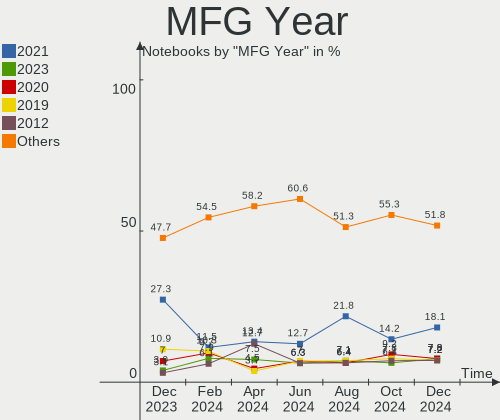
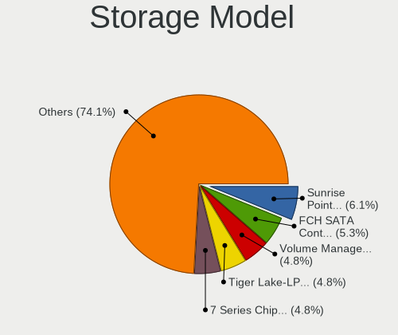
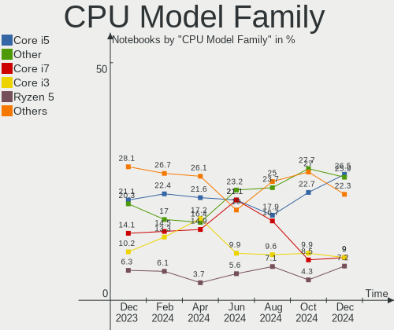
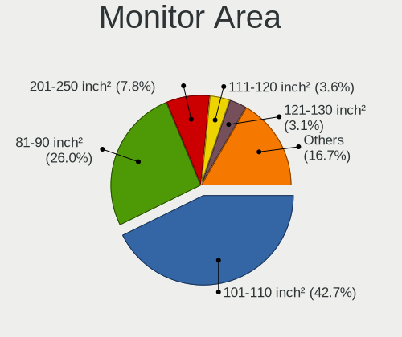
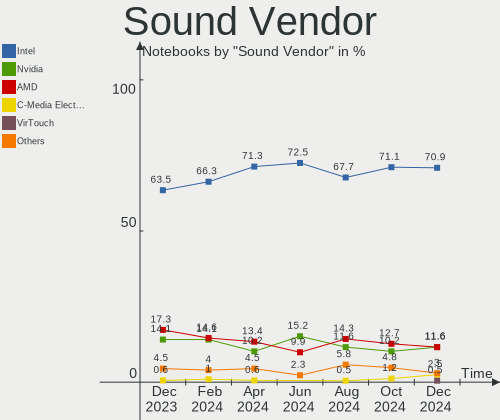
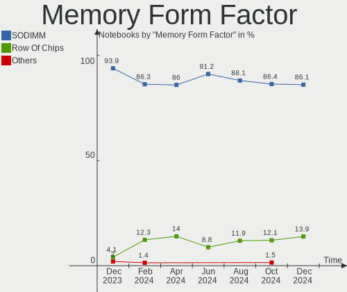

Linux in Brazil - Hardware Trends (Notebooks)
---------------------------------------------

A project to identify most popular hardware characteristics and track their change
over time based on data collected by Linux users at https://Linux-Hardware.org.

Anyone can contribute to this report by the [hw-probe](https://github.com/linuxhw/hw-probe) tool:

    sudo -E hw-probe -all -upload

Period: Oct, 2022.

Contents
--------

* [ System ](#system)
  - [ OS                       ](#os)
  - [ OS Family                ](#os-family)
  - [ Kernel                   ](#kernel)
  - [ Kernel Family            ](#kernel-family)
  - [ Kernel Major Ver.        ](#kernel-major-ver)
  - [ Arch                     ](#arch)
  - [ DE                       ](#de)
  - [ Display Server           ](#display-server)
  - [ Display Manager          ](#display-manager)
  - [ OS Lang                  ](#os-lang)
  - [ Boot Mode                ](#boot-mode)
  - [ Filesystem               ](#filesystem)
  - [ Part. scheme             ](#part-scheme)
  - [ Dual Boot with Linux/BSD ](#dual-boot-with-linuxbsd)
  - [ Dual Boot (Win)          ](#dual-boot-win)

* [ Board ](#board)
  - [ Vendor                   ](#vendor)
  - [ Model                    ](#model)
  - [ Model Family             ](#model-family)
  - [ MFG Year                 ](#mfg-year)
  - [ Form Factor              ](#form-factor)
  - [ Secure Boot              ](#secure-boot)
  - [ Coreboot                 ](#coreboot)
  - [ RAM Size                 ](#ram-size)
  - [ RAM Used                 ](#ram-used)
  - [ Total Drives             ](#total-drives)
  - [ Has CD-ROM               ](#has-cd-rom)
  - [ Has Ethernet             ](#has-ethernet)
  - [ Has WiFi                 ](#has-wifi)
  - [ Has Bluetooth            ](#has-bluetooth)

* [ Location ](#location)
  - [ Country                  ](#country)
  - [ City                     ](#city)

* [ Drives ](#drives)
  - [ Drive Vendor             ](#drive-vendor)
  - [ Drive Model              ](#drive-model)
  - [ HDD Vendor               ](#hdd-vendor)
  - [ SSD Vendor               ](#ssd-vendor)
  - [ Drive Kind               ](#drive-kind)
  - [ Drive Connector          ](#drive-connector)
  - [ Drive Size               ](#drive-size)
  - [ Space Total              ](#space-total)
  - [ Space Used               ](#space-used)
  - [ Malfunc. Drives          ](#malfunc-drives)
  - [ Malfunc. Drive Vendor    ](#malfunc-drive-vendor)
  - [ Malfunc. HDD Vendor      ](#malfunc-hdd-vendor)
  - [ Malfunc. Drive Kind      ](#malfunc-drive-kind)
  - [ Failed Drives            ](#failed-drives)
  - [ Failed Drive Vendor      ](#failed-drive-vendor)
  - [ Drive Status             ](#drive-status)

* [ Storage controller ](#storage-controller)
  - [ Storage Vendor           ](#storage-vendor)
  - [ Storage Model            ](#storage-model)
  - [ Storage Kind             ](#storage-kind)

* [ Processor ](#processor)
  - [ CPU Vendor               ](#cpu-vendor)
  - [ CPU Model                ](#cpu-model)
  - [ CPU Model Family         ](#cpu-model-family)
  - [ CPU Cores                ](#cpu-cores)
  - [ CPU Sockets              ](#cpu-sockets)
  - [ CPU Threads              ](#cpu-threads)
  - [ CPU Op-Modes             ](#cpu-op-modes)
  - [ CPU Microcode            ](#cpu-microcode)
  - [ CPU Microarch            ](#cpu-microarch)

* [ Graphics ](#graphics)
  - [ GPU Vendor               ](#gpu-vendor)
  - [ GPU Model                ](#gpu-model)
  - [ GPU Combo                ](#gpu-combo)
  - [ GPU Driver               ](#gpu-driver)
  - [ GPU Memory               ](#gpu-memory)

* [ Monitor ](#monitor)
  - [ Monitor Vendor           ](#monitor-vendor)
  - [ Monitor Model            ](#monitor-model)
  - [ Monitor Resolution       ](#monitor-resolution)
  - [ Monitor Diagonal         ](#monitor-diagonal)
  - [ Monitor Width            ](#monitor-width)
  - [ Aspect Ratio             ](#aspect-ratio)
  - [ Monitor Area             ](#monitor-area)
  - [ Pixel Density            ](#pixel-density)
  - [ Multiple Monitors        ](#multiple-monitors)

* [ Network ](#network)
  - [ Net Controller Vendor    ](#net-controller-vendor)
  - [ Net Controller Model     ](#net-controller-model)
  - [ Wireless Vendor          ](#wireless-vendor)
  - [ Wireless Model           ](#wireless-model)
  - [ Ethernet Vendor          ](#ethernet-vendor)
  - [ Ethernet Model           ](#ethernet-model)
  - [ Net Controller Kind      ](#net-controller-kind)
  - [ Used Controller          ](#used-controller)
  - [ NICs                     ](#nics)
  - [ IPv6                     ](#ipv6)

* [ Bluetooth ](#bluetooth)
  - [ Bluetooth Vendor         ](#bluetooth-vendor)
  - [ Bluetooth Model          ](#bluetooth-model)

* [ Sound ](#sound)
  - [ Sound Vendor             ](#sound-vendor)
  - [ Sound Model              ](#sound-model)

* [ Memory ](#memory)
  - [ Memory Vendor            ](#memory-vendor)
  - [ Memory Model             ](#memory-model)
  - [ Memory Kind              ](#memory-kind)
  - [ Memory Form Factor       ](#memory-form-factor)
  - [ Memory Size              ](#memory-size)
  - [ Memory Speed             ](#memory-speed)

* [ Printers & scanners ](#printers--scanners)
  - [ Printer Vendor           ](#printer-vendor)
  - [ Printer Model            ](#printer-model)
  - [ Scanner Vendor           ](#scanner-vendor)
  - [ Scanner Model            ](#scanner-model)

* [ Camera ](#camera)
  - [ Camera Vendor            ](#camera-vendor)
  - [ Camera Model             ](#camera-model)

* [ Security ](#security)
  - [ Fingerprint Vendor       ](#fingerprint-vendor)
  - [ Fingerprint Model        ](#fingerprint-model)
  - [ Chipcard Vendor          ](#chipcard-vendor)
  - [ Chipcard Model           ](#chipcard-model)

* [ Unsupported ](#unsupported)
  - [ Unsupported Devices      ](#unsupported-devices)
  - [ Unsupported Device Types ](#unsupported-device-types)

System
------

OS
--

Installed operating systems

| Name                         | Notebooks | Percent |
|------------------------------|-----------|---------|
| Ubuntu 22.04                 | 28        | 19.58%  |
| Pop!_OS 22.04                | 13        | 9.09%   |
| OpenMandriva 4.3             | 12        | 8.39%   |
| Linux Mint 21                | 12        | 8.39%   |
| Arch Rolling                 | 8         | 5.59%   |
| Manjaro                      | 7         | 4.9%    |
| Fedora 36                    | 6         | 4.2%    |
| Debian 11                    | 6         | 4.2%    |
| OpenMandriva 4.50            | 4         | 2.8%    |
| KDE neon 22.04               | 4         | 2.8%    |
| KDE neon 20.04               | 4         | 2.8%    |
| Ubuntu 20.04                 | 3         | 2.1%    |
| Endless 4.0.9                | 3         | 2.1%    |
| Endless 4.0.10               | 3         | 2.1%    |
| Nobara 36                    | 2         | 1.4%    |
| Linux Mint 20.3              | 2         | 1.4%    |
| Fedora 37                    | 2         | 1.4%    |
| Zorin 16                     | 1         | 0.7%    |
| Xubuntu 20.10                | 1         | 0.7%    |
| Xubuntu 20.04                | 1         | 0.7%    |
| Ubuntu Unity 22.04           | 1         | 0.7%    |
| Ubuntu MATE 22.04            | 1         | 0.7%    |
| Ubuntu MATE 20.04            | 1         | 0.7%    |
| Ubuntu Budgie 22.04          | 1         | 0.7%    |
| Ubuntu 22.10                 | 1         | 0.7%    |
| RHEL 9                       | 1         | 0.7%    |
| openSUSE Tumbleweed-XXXXXXXX | 1         | 0.7%    |
| OpenMandriva 4.90            | 1         | 0.7%    |
| Lubuntu 22.04                | 1         | 0.7%    |
| LMDE 5                       | 1         | 0.7%    |
| Linux Mint 19.3              | 1         | 0.7%    |
| Linux Mint 19.2              | 1         | 0.7%    |
| Kubuntu 22.04                | 1         | 0.7%    |
| Kubuntu 11                   | 1         | 0.7%    |
| Kali 2022.3                  | 1         | 0.7%    |
| Kaisen 2.1                   | 1         | 0.7%    |
| Endless 3.7.7-nexthw1        | 1         | 0.7%    |
| EndeavourOS Rolling          | 1         | 0.7%    |
| Debian Testing               | 1         | 0.7%    |
| Amarok Linux 22.08.1         | 1         | 0.7%    |

OS Family
---------

OS without a version

| Name          | Notebooks | Percent |
|---------------|-----------|---------|
| Ubuntu        | 32        | 22.38%  |
| OpenMandriva  | 17        | 11.89%  |
| Linux Mint    | 16        | 11.19%  |
| Pop!_OS       | 13        | 9.09%   |
| KDE neon      | 8         | 5.59%   |
| Fedora        | 8         | 5.59%   |
| Arch          | 8         | 5.59%   |
| Manjaro       | 7         | 4.9%    |
| Endless       | 7         | 4.9%    |
| Debian        | 7         | 4.9%    |
| Xubuntu       | 2         | 1.4%    |
| Ubuntu MATE   | 2         | 1.4%    |
| Nobara        | 2         | 1.4%    |
| Kubuntu       | 2         | 1.4%    |
| Zorin         | 1         | 0.7%    |
| Ubuntu Unity  | 1         | 0.7%    |
| Ubuntu Budgie | 1         | 0.7%    |
| RHEL          | 1         | 0.7%    |
| openSUSE      | 1         | 0.7%    |
| Lubuntu       | 1         | 0.7%    |
| LMDE          | 1         | 0.7%    |
| Kali          | 1         | 0.7%    |
| Kaisen        | 1         | 0.7%    |
| EndeavourOS   | 1         | 0.7%    |
| Amarok Linux  | 1         | 0.7%    |
| Alpine        | 1         | 0.7%    |

Kernel
------

Version of the Linux kernel

| Version                                                      | Notebooks | Percent |
|--------------------------------------------------------------|-----------|---------|
| 5.15.0-48-generic                                            | 18        | 12.59%  |
| 5.16.7-desktop-1omv4003                                      | 12        | 8.39%   |
| 5.15.0-52-generic                                            | 11        | 7.69%   |
| 5.15.0-50-generic                                            | 11        | 7.69%   |
| 5.19.0-76051900-generic                                      | 6         | 4.2%    |
| 5.11.0-35-generic                                            | 6         | 4.2%    |
| 5.15.0-25-generic                                            | 5         | 3.5%    |
| 5.10.0-18-amd64                                              | 5         | 3.5%    |
| 6.0.2-76060002-generic                                       | 4         | 2.8%    |
| 5.19.5-desktop-1omv4090                                      | 4         | 2.8%    |
| 5.15.0-43-generic                                            | 4         | 2.8%    |
| 5.15.74-3-MANJARO                                            | 3         | 2.1%    |
| 5.4.0-131-generic                                            | 2         | 1.4%    |
| 5.19.16-76051916-generic                                     | 2         | 1.4%    |
| 5.19.13-arch1-1                                              | 2         | 1.4%    |
| 5.19.13-300.fc37.x86_64                                      | 2         | 1.4%    |
| 5.15.65-1-MANJARO                                            | 2         | 1.4%    |
| 6.0.6-arch1-1                                                | 1         | 0.7%    |
| 6.0.5-200.fc36.x86_64                                        | 1         | 0.7%    |
| 6.0.3-1-default                                              | 1         | 0.7%    |
| 6.0.2-x64v2-xanmod1                                          | 1         | 0.7%    |
| 6.0.0-desktop-1omv4090                                       | 1         | 0.7%    |
| 6.0.0-arch1-1                                                | 1         | 0.7%    |
| 6.0.0-1-MANJARO                                              | 1         | 0.7%    |
| 6.0.0-0.rc2.20220826git4c612826bec1.22.vanilla.1.fc36.x86_64 | 1         | 0.7%    |
| 6.0-060000-generic                                           | 1         | 0.7%    |
| 5.8.0-63-generic                                             | 1         | 0.7%    |
| 5.4.0-7-generic                                              | 1         | 0.7%    |
| 5.4.0-42-generic                                             | 1         | 0.7%    |
| 5.4.0-122-generic                                            | 1         | 0.7%    |
| 5.19.16-200.fc36.x86_64                                      | 1         | 0.7%    |
| 5.19.15-201.fc36.x86_64                                      | 1         | 0.7%    |
| 5.19.14-201.fsync.fc36.x86_64                                | 1         | 0.7%    |
| 5.19.13-zen1-1-zen                                           | 1         | 0.7%    |
| 5.19.13-200.fc36.x86_64                                      | 1         | 0.7%    |
| 5.19.12-arch1-1                                              | 1         | 0.7%    |
| 5.19.12-201.fsync.fc36.x86_64                                | 1         | 0.7%    |
| 5.19.12-200.fc36.x86_64                                      | 1         | 0.7%    |
| 5.19.0-kaisen1-amd64                                         | 1         | 0.7%    |
| 5.19.0-21-generic                                            | 1         | 0.7%    |

Kernel Family
-------------

Linux kernel without a distro release

| Version  | Notebooks | Percent |
|----------|-----------|---------|
| 5.15.0   | 53        | 37.06%  |
| 5.16.7   | 12        | 8.39%   |
| 5.19.0   | 10        | 6.99%   |
| 5.10.0   | 7         | 4.9%    |
| 5.19.13  | 6         | 4.2%    |
| 5.11.0   | 6         | 4.2%    |
| 6.0.2    | 5         | 3.5%    |
| 5.4.0    | 5         | 3.5%    |
| 6.0.0    | 4         | 2.8%    |
| 5.19.5   | 4         | 2.8%    |
| 5.15.74  | 4         | 2.8%    |
| 5.19.16  | 3         | 2.1%    |
| 5.19.12  | 3         | 2.1%    |
| 5.14.0   | 3         | 2.1%    |
| 5.15.73  | 2         | 1.4%    |
| 5.15.65  | 2         | 1.4%    |
| 5.13.0   | 2         | 1.4%    |
| 6.0.6    | 1         | 0.7%    |
| 6.0.5    | 1         | 0.7%    |
| 6.0.3    | 1         | 0.7%    |
| 6.0      | 1         | 0.7%    |
| 5.8.0    | 1         | 0.7%    |
| 5.19.15  | 1         | 0.7%    |
| 5.19.14  | 1         | 0.7%    |
| 5.18.16  | 1         | 0.7%    |
| 5.18.0   | 1         | 0.7%    |
| 5.17.0   | 1         | 0.7%    |
| 5.10.141 | 1         | 0.7%    |
| 4.15.0   | 1         | 0.7%    |

Kernel Major Ver.
-----------------

Linux kernel major version

| Version | Notebooks | Percent |
|---------|-----------|---------|
| 5.15    | 61        | 42.66%  |
| 5.19    | 28        | 19.58%  |
| 6.0     | 12        | 8.39%   |
| 5.16    | 12        | 8.39%   |
| 5.10    | 8         | 5.59%   |
| 5.11    | 6         | 4.2%    |
| 5.4     | 5         | 3.5%    |
| 5.14    | 3         | 2.1%    |
| 5.18    | 2         | 1.4%    |
| 5.13    | 2         | 1.4%    |
| 6       | 1         | 0.7%    |
| 5.8     | 1         | 0.7%    |
| 5.17    | 1         | 0.7%    |
| 4.15    | 1         | 0.7%    |

Arch
----

OS architecture (x86_64, i586, etc.)

| Name   | Notebooks | Percent |
|--------|-----------|---------|
| x86_64 | 142       | 99.3%   |
| i686   | 1         | 0.7%    |

DE
--

Desktop Environment

| Name       | Notebooks | Percent |
|------------|-----------|---------|
| GNOME      | 73        | 51.05%  |
| KDE5       | 33        | 23.08%  |
| X-Cinnamon | 13        | 9.09%   |
| XFCE       | 9         | 6.29%   |
| Unknown    | 6         | 4.2%    |
| MATE       | 4         | 2.8%    |
| LXQt       | 2         | 1.4%    |
| Unity      | 1         | 0.7%    |
| Cinnamon   | 1         | 0.7%    |
| Budgie     | 1         | 0.7%    |

Display Server
--------------

X11 or Wayland

| Name    | Notebooks | Percent |
|---------|-----------|---------|
| X11     | 107       | 74.83%  |
| Wayland | 32        | 22.38%  |
| Unknown | 3         | 2.1%    |
| Tty     | 1         | 0.7%    |

Display Manager
---------------

SDDM, LightDM, etc.

| Name    | Notebooks | Percent |
|---------|-----------|---------|
| Unknown | 68        | 47.55%  |
| GDM3    | 32        | 22.38%  |
| SDDM    | 22        | 15.38%  |
| LightDM | 12        | 8.39%   |
| GDM     | 9         | 6.29%   |

OS Lang
-------

Language

| Lang    | Notebooks | Percent |
|---------|-----------|---------|
| pt_BR   | 100       | 69.93%  |
| en_US   | 36        | 25.17%  |
| en_GB   | 2         | 1.4%    |
| C       | 2         | 1.4%    |
| pt_PT   | 1         | 0.7%    |
| it_IT   | 1         | 0.7%    |
| Unknown | 1         | 0.7%    |

Boot Mode
---------

EFI or BIOS

| Mode | Notebooks | Percent |
|------|-----------|---------|
| EFI  | 72        | 50.35%  |
| BIOS | 71        | 49.65%  |

Filesystem
----------

Type of filesystem

| Type    | Notebooks | Percent |
|---------|-----------|---------|
| Ext4    | 104       | 72.73%  |
| Overlay | 21        | 14.69%  |
| Btrfs   | 17        | 11.89%  |
| Xfs     | 1         | 0.7%    |

Part. scheme
------------

Scheme of partitioning

| Type    | Notebooks | Percent |
|---------|-----------|---------|
| GPT     | 73        | 51.05%  |
| Unknown | 63        | 44.06%  |
| MBR     | 7         | 4.9%    |

Dual Boot with Linux/BSD
------------------------

Hosting more than one Linux/BSD

| Dual boot | Notebooks | Percent |
|-----------|-----------|---------|
| No        | 130       | 90.91%  |
| Yes       | 13        | 9.09%   |

Dual Boot (Win)
---------------

Hosting Linux and Windows

| Dual boot | Notebooks | Percent |
|-----------|-----------|---------|
| No        | 108       | 75.52%  |
| Yes       | 35        | 24.48%  |

Board
-----

Vendor
------

Motherboard manufacturer

| Name                   | Notebooks | Percent |
|------------------------|-----------|---------|
| Dell                   | 32        | 22.38%  |
| Lenovo                 | 26        | 18.18%  |
| Acer                   | 26        | 18.18%  |
| Samsung Electronics    | 13        | 9.09%   |
| Positivo               | 8         | 5.59%   |
| Avell High Performance | 6         | 4.2%    |
| ASUSTek Computer       | 5         | 3.5%    |
| Hewlett-Packard        | 3         | 2.1%    |
| Unknown                | 3         | 2.1%    |
| Sony                   | 2         | 1.4%    |
| LG Electronics         | 2         | 1.4%    |
| Itautec                | 2         | 1.4%    |
| Compaq                 | 2         | 1.4%    |
| Teclast                | 1         | 0.7%    |
| Standard               | 1         | 0.7%    |
| Semp Toshiba           | 1         | 0.7%    |
| Quanta                 | 1         | 0.7%    |
| Positivo Bahia - VAIO  | 1         | 0.7%    |
| Notebook               | 1         | 0.7%    |
| Multilaser             | 1         | 0.7%    |
| Microboard             | 1         | 0.7%    |
| Intel                  | 1         | 0.7%    |
| Digibras               | 1         | 0.7%    |
| Daten Tecnologia       | 1         | 0.7%    |
| Apple                  | 1         | 0.7%    |
| Alienware              | 1         | 0.7%    |

Model
-----

Motherboard model

| Name                                    | Notebooks | Percent |
|-----------------------------------------|-----------|---------|
| Acer Nitro AN515-44                     | 5         | 3.5%    |
| Unknown                                 | 4         | 2.8%    |
| Lenovo IdeaPad S145-15IWL 81S9          | 3         | 2.1%    |
| Avell High Performance B.ON             | 3         | 2.1%    |
| Samsung 800G5M/800G5W                   | 2         | 1.4%    |
| Samsung 550XDA                          | 2         | 1.4%    |
| Samsung 340XAA/350XAA/550XAA            | 2         | 1.4%    |
| Positivo Mobile                         | 2         | 1.4%    |
| Lenovo IdeaPad 330-15IKB 81FE           | 2         | 1.4%    |
| Lenovo G400s VILG1                      | 2         | 1.4%    |
| Lenovo B40-70 80F3                      | 2         | 1.4%    |
| Dell Inspiron 7520                      | 2         | 1.4%    |
| Dell Inspiron 5590                      | 2         | 1.4%    |
| Dell Inspiron 3542                      | 2         | 1.4%    |
| ASUS VivoBook 15_ASUS Laptop X540UAR    | 2         | 1.4%    |
| Acer Aspire A315-53                     | 2         | 1.4%    |
| Acer Aspire 5750                        | 2         | 1.4%    |
| Teclast F7 Plus                         | 1         | 0.7%    |
| Standard MB40II                         | 1         | 0.7%    |
| Sony VPCEA23FB                          | 1         | 0.7%    |
| Sony VPCCA15FX                          | 1         | 0.7%    |
| Semp Toshiba K201                       | 1         | 0.7%    |
| Samsung 760XBE                          | 1         | 0.7%    |
| Samsung 670Z5E                          | 1         | 0.7%    |
| Samsung 550XBE/350XBE                   | 1         | 0.7%    |
| Samsung 300E5M/300E5L                   | 1         | 0.7%    |
| Samsung 275E4E/275E5E                   | 1         | 0.7%    |
| Samsung 270E5K/270E5Q/271E5K/2570EK     | 1         | 0.7%    |
| Samsung 270E5J/2570EJ                   | 1         | 0.7%    |
| Quanta TWS                              | 1         | 0.7%    |
| Positivo W940SU2                        | 1         | 0.7%    |
| Positivo S14CT01                        | 1         | 0.7%    |
| Positivo Q232A                          | 1         | 0.7%    |
| Positivo N1250                          | 1         | 0.7%    |
| Positivo C4120F                         | 1         | 0.7%    |
| Positivo C14CR01                        | 1         | 0.7%    |
| Positivo Bahia - VAIO VJC141F11X-B0111L | 1         | 0.7%    |
| Notebook NJx0MU                         | 1         | 0.7%    |
| Multilaser PC024                        | 1         | 0.7%    |
| Microboard Cantiga & ICH9M Chipset      | 1         | 0.7%    |

Model Family
------------

Motherboard model prefix

| Name                                    | Notebooks | Percent |
|-----------------------------------------|-----------|---------|
| Dell Inspiron                           | 18        | 12.59%  |
| Acer Aspire                             | 18        | 12.59%  |
| Lenovo IdeaPad                          | 13        | 9.09%   |
| Acer Nitro                              | 7         | 4.9%    |
| Dell Vostro                             | 5         | 3.5%    |
| Dell Latitude                           | 5         | 3.5%    |
| Unknown                                 | 4         | 2.8%    |
| Avell High Performance B.ON             | 3         | 2.1%    |
| ASUS VivoBook                           | 3         | 2.1%    |
| Samsung 800G5M                          | 2         | 1.4%    |
| Samsung 550XDA                          | 2         | 1.4%    |
| Samsung 340XAA                          | 2         | 1.4%    |
| Positivo Mobile                         | 2         | 1.4%    |
| Lenovo ThinkPad                         | 2         | 1.4%    |
| Lenovo Legion                           | 2         | 1.4%    |
| Lenovo G480                             | 2         | 1.4%    |
| Lenovo G400s                            | 2         | 1.4%    |
| Lenovo B40-70                           | 2         | 1.4%    |
| Itautec Infoway                         | 2         | 1.4%    |
| Dell XPS                                | 2         | 1.4%    |
| Teclast F7                              | 1         | 0.7%    |
| Standard MB40II                         | 1         | 0.7%    |
| Sony VPCEA23FB                          | 1         | 0.7%    |
| Sony VPCCA15FX                          | 1         | 0.7%    |
| Semp Toshiba K201                       | 1         | 0.7%    |
| Samsung 760XBE                          | 1         | 0.7%    |
| Samsung 670Z5E                          | 1         | 0.7%    |
| Samsung 550XBE                          | 1         | 0.7%    |
| Samsung 300E5M                          | 1         | 0.7%    |
| Samsung 275E4E                          | 1         | 0.7%    |
| Samsung 270E5K                          | 1         | 0.7%    |
| Samsung 270E5J                          | 1         | 0.7%    |
| Quanta TWS                              | 1         | 0.7%    |
| Positivo W940SU2                        | 1         | 0.7%    |
| Positivo S14CT01                        | 1         | 0.7%    |
| Positivo Q232A                          | 1         | 0.7%    |
| Positivo N1250                          | 1         | 0.7%    |
| Positivo C4120F                         | 1         | 0.7%    |
| Positivo C14CR01                        | 1         | 0.7%    |
| Positivo Bahia - VAIO VJC141F11X-B0111L | 1         | 0.7%    |

MFG Year
--------

Motherboard manufacture year

| Year | Notebooks | Percent |
|------|-----------|---------|
| 2021 | 20        | 13.99%  |
| 2019 | 18        | 12.59%  |
| 2020 | 17        | 11.89%  |
| 2012 | 14        | 9.79%   |
| 2018 | 12        | 8.39%   |
| 2013 | 12        | 8.39%   |
| 2017 | 11        | 7.69%   |
| 2014 | 8         | 5.59%   |
| 2016 | 7         | 4.9%    |
| 2015 | 7         | 4.9%    |
| 2011 | 6         | 4.2%    |
| 2010 | 4         | 2.8%    |
| 2009 | 3         | 2.1%    |
| 2022 | 2         | 1.4%    |
| 2008 | 2         | 1.4%    |

Form Factor
-----------

Physical design of the computer

| Name     | Notebooks | Percent |
|----------|-----------|---------|
| Notebook | 143       | 100%    |

Secure Boot
-----------

Enabled or disabled

| State    | Notebooks | Percent |
|----------|-----------|---------|
| Disabled | 129       | 90.21%  |
| Enabled  | 14        | 9.79%   |

Coreboot
--------

Have coreboot on board

| Used | Notebooks | Percent |
|------|-----------|---------|
| No   | 143       | 100%    |

RAM Size
--------

Total RAM memory

| Size in GB  | Notebooks | Percent |
|-------------|-----------|---------|
| 4.01-8.0    | 46        | 32.17%  |
| 3.01-4.0    | 34        | 23.78%  |
| 8.01-16.0   | 26        | 18.18%  |
| 16.01-24.0  | 21        | 14.69%  |
| 32.01-64.0  | 7         | 4.9%    |
| 1.01-2.0    | 5         | 3.5%    |
| 2.01-3.0    | 2         | 1.4%    |
| 24.01-32.0  | 1         | 0.7%    |
| 64.01-256.0 | 1         | 0.7%    |

RAM Used
--------

Used RAM memory

| Used GB   | Notebooks | Percent |
|-----------|-----------|---------|
| 1.01-2.0  | 57        | 39.86%  |
| 2.01-3.0  | 37        | 25.87%  |
| 4.01-8.0  | 22        | 15.38%  |
| 3.01-4.0  | 17        | 11.89%  |
| 0.51-1.0  | 6         | 4.2%    |
| 8.01-16.0 | 4         | 2.8%    |

Total Drives
------------

Number of drives on board

| Drives | Notebooks | Percent |
|--------|-----------|---------|
| 1      | 98        | 68.53%  |
| 2      | 37        | 25.87%  |
| 3      | 5         | 3.5%    |
| 0      | 2         | 1.4%    |
| 4      | 1         | 0.7%    |

Has CD-ROM
----------

Has CD-ROM on board

| Presented | Notebooks | Percent |
|-----------|-----------|---------|
| No        | 105       | 73.43%  |
| Yes       | 38        | 26.57%  |

Has Ethernet
------------

Has Ethernet on board

| Presented | Notebooks | Percent |
|-----------|-----------|---------|
| Yes       | 117       | 81.82%  |
| No        | 26        | 18.18%  |

Has WiFi
--------

Has WiFi module

| Presented | Notebooks | Percent |
|-----------|-----------|---------|
| Yes       | 140       | 97.9%   |
| No        | 3         | 2.1%    |

Has Bluetooth
-------------

Has Bluetooth module

| Presented | Notebooks | Percent |
|-----------|-----------|---------|
| Yes       | 115       | 80.42%  |
| No        | 28        | 19.58%  |

Location
--------

Country
-------

Geographic location (country)

| Country | Notebooks | Percent |
|---------|-----------|---------|
| Brazil  | 143       | 100%    |

City
----

Geographic location (city)

| City                     | Notebooks | Percent |
|--------------------------|-----------|---------|
| Sao Paulo                | 22        | 15.38%  |
| Rio de Janeiro           | 8         | 5.59%   |
| Belo Horizonte           | 8         | 5.59%   |
| Porto Alegre             | 5         | 3.5%    |
| Curitiba                 | 5         | 3.5%    |
| Uberlândia              | 4         | 2.8%    |
| Goiânia                 | 4         | 2.8%    |
| Fortaleza                | 4         | 2.8%    |
| Campinas                 | 4         | 2.8%    |
| Maracanau                | 3         | 2.1%    |
| Joao Pessoa              | 3         | 2.1%    |
| Salvador                 | 2         | 1.4%    |
| Recife                   | 2         | 1.4%    |
| Natal                    | 2         | 1.4%    |
| Maceió                  | 2         | 1.4%    |
| Campo Grande             | 2         | 1.4%    |
| Brasília                | 2         | 1.4%    |
| Boa Viagem               | 2         | 1.4%    |
| Betim                    | 2         | 1.4%    |
| Viamao                   | 1         | 0.7%    |
| Varzelandia              | 1         | 0.7%    |
| Tubarao                  | 1         | 0.7%    |
| Sorriso                  | 1         | 0.7%    |
| Sorocaba                 | 1         | 0.7%    |
| Sao Roque                | 1         | 0.7%    |
| Sao Luís                | 1         | 0.7%    |
| Sao José dos Pinhais    | 1         | 0.7%    |
| Sao José dos Campos     | 1         | 0.7%    |
| Sao Jose                 | 1         | 0.7%    |
| Sao Caetano do Sul       | 1         | 0.7%    |
| Sao Bernardo do Campo    | 1         | 0.7%    |
| Santo André             | 1         | 0.7%    |
| Ribeirao Preto           | 1         | 0.7%    |
| Ourinhos                 | 1         | 0.7%    |
| Osasco                   | 1         | 0.7%    |
| Nova Petropolis          | 1         | 0.7%    |
| Nova Mutum               | 1         | 0.7%    |
| Nossa Senhora do Socorro | 1         | 0.7%    |
| Niterói                 | 1         | 0.7%    |
| Mogi Guacu               | 1         | 0.7%    |

Drives
------

Drive Vendor
------------

Hard drive vendors

| Vendor                         | Notebooks | Drives | Percent |
|--------------------------------|-----------|--------|---------|
| WDC                            | 34        | 35     | 18.48%  |
| Seagate                        | 22        | 22     | 11.96%  |
| A-DATA Technology              | 18        | 18     | 9.78%   |
| Kingston                       | 16        | 17     | 8.7%    |
| SanDisk                        | 14        | 15     | 7.61%   |
| China                          | 11        | 11     | 5.98%   |
| Samsung Electronics            | 9         | 9      | 4.89%   |
| Unknown                        | 6         | 6      | 3.26%   |
| Toshiba                        | 6         | 8      | 3.26%   |
| LITEON                         | 4         | 4      | 2.17%   |
| Realtek Semiconductor          | 3         | 3      | 1.63%   |
| Crucial                        | 3         | 3      | 1.63%   |
| walram                         | 2         | 2      | 1.09%   |
| Solid State Storage            | 2         | 2      | 1.09%   |
| SK hynix                       | 2         | 2      | 1.09%   |
| Silicon Motion                 | 2         | 2      | 1.09%   |
| Micron Technology              | 2         | 2      | 1.09%   |
| KIOXIA                         | 2         | 2      | 1.09%   |
| Kingston Technology Company    | 2         | 2      | 1.09%   |
| KingSpec                       | 2         | 2      | 1.09%   |
| Apple                          | 2         | 2      | 1.09%   |
| XrayDisk                       | 1         | 1      | 0.54%   |
| Win Memory                     | 1         | 1      | 0.54%   |
| Solid State Storage Technology | 1         | 1      | 0.54%   |
| Smart                          | 1         | 1      | 0.54%   |
| ShiJi                          | 1         | 1      | 0.54%   |
| SAGE                           | 1         | 1      | 0.54%   |
| PNY                            | 1         | 1      | 0.54%   |
| Patriot                        | 1         | 1      | 0.54%   |
| Micron/Crucial Technology      | 1         | 1      | 0.54%   |
| Maxtor                         | 1         | 1      | 0.54%   |
| Lite-On Technology             | 1         | 1      | 0.54%   |
| JMicron Technology             | 1         | 1      | 0.54%   |
| Intel                          | 1         | 1      | 0.54%   |
| HUAWEI                         | 1         | 1      | 0.54%   |
| HS-SSD-E100N                   | 1         | 1      | 0.54%   |
| Hitachi                        | 1         | 1      | 0.54%   |
| HGST                           | 1         | 1      | 0.54%   |
| Gigabyte Technology            | 1         | 1      | 0.54%   |
| EXBOM                          | 1         | 1      | 0.54%   |

Drive Model
-----------

Hard drive models

| Model                                               | Notebooks | Percent |
|-----------------------------------------------------|-----------|---------|
| WDC WD10SPZX-21Z10T0 1TB                            | 6         | 3.19%   |
| Seagate ST1000LM035-1RK172 1TB                      | 6         | 3.19%   |
| Kingston SA400S37240G 240GB SSD                     | 6         | 3.19%   |
| WDC WD10SPZX-24Z10 1TB                              | 5         | 2.66%   |
| Sandisk WD Blue SN550 NVMe SSD 1TB                  | 5         | 2.66%   |
| Seagate ST9500325AS 500GB                           | 4         | 2.13%   |
| Seagate ST500LM012 HN-M500MBB 500GB                 | 4         | 2.13%   |
| Kingston SV300S37A120G 120GB SSD                    | 4         | 2.13%   |
| A-DATA IM2P33F8A-512GD 512GB                        | 4         | 2.13%   |
| WDC WD10JPVX-22JC3T0 1TB                            | 3         | 1.6%    |
| SanDisk SSD PLUS 480GB                              | 3         | 1.6%    |
| China SSD 240GB                                     | 3         | 1.6%    |
| China SSD 128GB                                     | 3         | 1.6%    |
| A-DATA IM2P33F3A NVMe 256GB                         | 3         | 1.6%    |
| WDC WDS240G2G0B-00EPW0 240GB SSD                    | 2         | 1.06%   |
| WDC WDS240G2G0A-00JH30 240GB SSD                    | 2         | 1.06%   |
| WDC WD10SPZX-80Z10T2 1TB                            | 2         | 1.06%   |
| WDC WD10SPZX-35Z10T0 1TB                            | 2         | 1.06%   |
| WDC WD10JPVX-75JC3T0 1TB                            | 2         | 1.06%   |
| WDC WD10JPCX-24UE4T0 1TB                            | 2         | 1.06%   |
| Unknown SD/MMC/MS PRO 1TB                           | 2         | 1.06%   |
| Unknown MMC Card  32GB                              | 2         | 1.06%   |
| Toshiba MQ01ABD100 1TB                              | 2         | 1.06%   |
| Solid State Storage SSSTC CL1-4D256 256GB           | 2         | 1.06%   |
| Samsung NVMe SSD Controller SM981/PM981/PM983 500GB | 2         | 1.06%   |
| Realtek RTS5763DL NVMe SSD Controller 256GB         | 2         | 1.06%   |
| KIOXIA KBG40ZNS512G NVMe 512GB                      | 2         | 1.06%   |
| Kingston SA400S37480G 480GB SSD                     | 2         | 1.06%   |
| Crucial CT240BX500SSD1 240GB                        | 2         | 1.06%   |
| A-DATA IM2P33F8BR2-512GB                            | 2         | 1.06%   |
| A-DATA IM2P33F8BR1-128GB                            | 2         | 1.06%   |
| A-DATA IM2P33F8ABR1-256GB                           | 2         | 1.06%   |
| A-DATA IM2P33F3 NVMe 256GB                          | 2         | 1.06%   |
| XrayDisk SSD 128GB                                  | 1         | 0.53%   |
| Win Memory SWR256G-301II 256GB                      | 1         | 0.53%   |
| WDC WDS500G1X0E-00AFY0 500GB                        | 1         | 0.53%   |
| WDC WD6400BPVT-75HXZT3 640GB                        | 1         | 0.53%   |
| WDC WD5000LUCT-63RC2Y0 500GB                        | 1         | 0.53%   |
| WDC WD5000LPCX-24VHAT0 500GB                        | 1         | 0.53%   |
| WDC WD3200BEKT-75PVMT1 320GB                        | 1         | 0.53%   |

HDD Vendor
----------

Hard disk drive vendors

| Vendor              | Notebooks | Drives | Percent |
|---------------------|-----------|--------|---------|
| WDC                 | 29        | 29     | 46.77%  |
| Seagate             | 21        | 21     | 33.87%  |
| Toshiba             | 5         | 5      | 8.06%   |
| Unknown             | 2         | 2      | 3.23%   |
| Samsung Electronics | 1         | 1      | 1.61%   |
| SAGE                | 1         | 1      | 1.61%   |
| Hitachi             | 1         | 1      | 1.61%   |
| HGST                | 1         | 1      | 1.61%   |
| Apple               | 1         | 1      | 1.61%   |

SSD Vendor
----------

Solid state drive vendors

| Vendor              | Notebooks | Drives | Percent |
|---------------------|-----------|--------|---------|
| Kingston            | 15        | 15     | 23.44%  |
| China               | 11        | 11     | 17.19%  |
| SanDisk             | 7         | 7      | 10.94%  |
| WDC                 | 5         | 5      | 7.81%   |
| LITEON              | 4         | 4      | 6.25%   |
| Samsung Electronics | 3         | 3      | 4.69%   |
| Crucial             | 3         | 3      | 4.69%   |
| A-DATA Technology   | 3         | 3      | 4.69%   |
| KingSpec            | 2         | 2      | 3.13%   |
| XrayDisk            | 1         | 1      | 1.56%   |
| Win Memory          | 1         | 1      | 1.56%   |
| walram              | 1         | 1      | 1.56%   |
| Smart               | 1         | 1      | 1.56%   |
| PNY                 | 1         | 1      | 1.56%   |
| Patriot             | 1         | 1      | 1.56%   |
| Maxtor              | 1         | 1      | 1.56%   |
| HS-SSD-E100N        | 1         | 1      | 1.56%   |
| Gigabyte Technology | 1         | 1      | 1.56%   |
| EXBOM               | 1         | 1      | 1.56%   |
| Apple               | 1         | 1      | 1.56%   |

Drive Kind
----------

HDD or SSD

| Kind    | Notebooks | Drives | Percent |
|---------|-----------|--------|---------|
| HDD     | 62        | 62     | 35.03%  |
| SSD     | 60        | 64     | 33.9%   |
| NVMe    | 46        | 54     | 25.99%  |
| MMC     | 5         | 5      | 2.82%   |
| Unknown | 4         | 4      | 2.26%   |

Drive Connector
---------------

SATA, SAS, NVMe, etc.

| Type | Notebooks | Drives | Percent |
|------|-----------|--------|---------|
| SATA | 108       | 124    | 65.06%  |
| NVMe | 46        | 53     | 27.71%  |
| SAS  | 7         | 7      | 4.22%   |
| MMC  | 5         | 5      | 3.01%   |

Drive Size
----------

Size of hard drive

| Size in TB | Notebooks | Drives | Percent |
|------------|-----------|--------|---------|
| 0.01-0.5   | 74        | 81     | 62.18%  |
| 0.51-1.0   | 42        | 42     | 35.29%  |
| 1.01-2.0   | 3         | 3      | 2.52%   |

Space Total
-----------

Amount of disk space available on the file system

| Size in GB     | Notebooks | Percent |
|----------------|-----------|---------|
| 101-250        | 46        | 32.17%  |
| 501-1000       | 25        | 17.48%  |
| 251-500        | 24        | 16.78%  |
| 1-20           | 17        | 11.89%  |
| 1001-2000      | 11        | 7.69%   |
| 51-100         | 9         | 6.29%   |
| 21-50          | 5         | 3.5%    |
| 2001-3000      | 4         | 2.8%    |
| More than 3000 | 1         | 0.7%    |
| Unknown        | 1         | 0.7%    |

Space Used
----------

Amount of used disk space

| Used GB   | Notebooks | Percent |
|-----------|-----------|---------|
| 1-20      | 57        | 39.86%  |
| 21-50     | 29        | 20.28%  |
| 101-250   | 21        | 14.69%  |
| 51-100    | 19        | 13.29%  |
| 251-500   | 9         | 6.29%   |
| 1001-2000 | 4         | 2.8%    |
| 501-1000  | 3         | 2.1%    |
| Unknown   | 1         | 0.7%    |

Malfunc. Drives
---------------

Drive models with a malfunction

| Model                                  | Notebooks | Drives | Percent |
|----------------------------------------|-----------|--------|---------|
| WDC WDS240G2G0B-00EPW0 240GB SSD       | 1         | 1      | 8.33%   |
| WDC WD6400BPVT-75HXZT3 640GB           | 1         | 1      | 8.33%   |
| WDC WD10SPZX-24Z10 1TB                 | 1         | 1      | 8.33%   |
| walram SSD 120G                        | 1         | 1      | 8.33%   |
| Toshiba MK3275GSX 320GB                | 1         | 1      | 8.33%   |
| Seagate ST9500325AS 500GB              | 1         | 1      | 8.33%   |
| Seagate ST500LM012 HN-M500MBB 500GB    | 1         | 1      | 8.33%   |
| Seagate ST1000LM035-1RK172 1TB         | 1         | 1      | 8.33%   |
| Seagate ST1000LM024 HN-M101MBB 1TB     | 1         | 1      | 8.33%   |
| PNY SSD2SC120G3LC726B104-370P 120GB    | 1         | 1      | 8.33%   |
| HGST HCC545050A7E380 500GB             | 1         | 1      | 8.33%   |
| A-DATA Technology IM2P33F3A NVMe 256GB | 1         | 1      | 8.33%   |

Malfunc. Drive Vendor
---------------------

Vendors of faulty drives

| Vendor            | Notebooks | Drives | Percent |
|-------------------|-----------|--------|---------|
| Seagate           | 4         | 4      | 33.33%  |
| WDC               | 3         | 3      | 25%     |
| walram            | 1         | 1      | 8.33%   |
| Toshiba           | 1         | 1      | 8.33%   |
| PNY               | 1         | 1      | 8.33%   |
| HGST              | 1         | 1      | 8.33%   |
| A-DATA Technology | 1         | 1      | 8.33%   |

Malfunc. HDD Vendor
-------------------

Vendors of faulty HDD drives

| Vendor  | Notebooks | Drives | Percent |
|---------|-----------|--------|---------|
| Seagate | 4         | 4      | 50%     |
| WDC     | 2         | 2      | 25%     |
| Toshiba | 1         | 1      | 12.5%   |
| HGST    | 1         | 1      | 12.5%   |

Malfunc. Drive Kind
-------------------

Kinds of faulty drives

| Kind | Notebooks | Drives | Percent |
|------|-----------|--------|---------|
| HDD  | 8         | 8      | 66.67%  |
| SSD  | 3         | 3      | 25%     |
| NVMe | 1         | 1      | 8.33%   |

Failed Drives
-------------

Failed drive models

Zero info for selected period =(

Failed Drive Vendor
-------------------

Failed drive vendors

Zero info for selected period =(

Drive Status
------------

Number of failed and malfunc. drives

| Status   | Notebooks | Drives | Percent |
|----------|-----------|--------|---------|
| Detected | 96        | 128    | 65.75%  |
| Works    | 39        | 49     | 26.71%  |
| Malfunc  | 11        | 12     | 7.53%   |

Storage controller
------------------

Storage Vendor
--------------

Storage controller vendors

| Vendor                           | Notebooks | Percent |
|----------------------------------|-----------|---------|
| Intel                            | 115       | 62.5%   |
| AMD                              | 16        | 8.7%    |
| ADATA Technology                 | 15        | 8.15%   |
| SanDisk                          | 8         | 4.35%   |
| Samsung Electronics              | 6         | 3.26%   |
| Kingston Technology Company      | 4         | 2.17%   |
| Solid State Storage Technology   | 3         | 1.63%   |
| Silicon Motion                   | 3         | 1.63%   |
| Realtek Semiconductor            | 3         | 1.63%   |
| SK hynix                         | 2         | 1.09%   |
| Micron Technology                | 2         | 1.09%   |
| KIOXIA                           | 2         | 1.09%   |
| VIA Technologies                 | 1         | 0.54%   |
| Toshiba America Info Systems     | 1         | 0.54%   |
| Silicon Integrated Systems [SiS] | 1         | 0.54%   |
| Micron/Crucial Technology        | 1         | 0.54%   |
| Lite-On Technology               | 1         | 0.54%   |

Storage Model
-------------

Storage controller models

| Model                                                                            | Notebooks | Percent |
|----------------------------------------------------------------------------------|-----------|---------|
| Intel Sunrise Point-LP SATA Controller [AHCI mode]                               | 17        | 8.9%    |
| AMD FCH SATA Controller [AHCI mode]                                              | 15        | 7.85%   |
| ADATA Non-Volatile memory controller                                             | 15        | 7.85%   |
| Intel 7 Series Chipset Family 6-port SATA Controller [AHCI mode]                 | 14        | 7.33%   |
| Intel 8 Series SATA Controller 1 [AHCI mode]                                     | 11        | 5.76%   |
| Intel 82801 Mobile SATA Controller [RAID mode]                                   | 10        | 5.24%   |
| Intel Celeron/Pentium Silver Processor SATA Controller                           | 8         | 4.19%   |
| Intel Cannon Point-LP SATA Controller [AHCI Mode]                                | 7         | 3.66%   |
| SanDisk WD Blue SN550 NVMe SSD                                                   | 6         | 3.14%   |
| Intel Wildcat Point-LP SATA Controller [AHCI Mode]                               | 6         | 3.14%   |
| Intel 6 Series/C200 Series Chipset Family 6 port Mobile SATA AHCI Controller     | 5         | 2.62%   |
| Intel Tiger Lake-LP SATA Controller                                              | 4         | 2.09%   |
| Intel Comet Lake SATA AHCI Controller                                            | 4         | 2.09%   |
| Intel Cannon Lake Mobile PCH SATA AHCI Controller                                | 4         | 2.09%   |
| Intel 5 Series/3400 Series Chipset 4 port SATA AHCI Controller                   | 4         | 2.09%   |
| Intel 400 Series Chipset Family SATA AHCI Controller                             | 4         | 2.09%   |
| Solid State Storage Non-Volatile memory controller                               | 3         | 1.57%   |
| Samsung NVMe SSD Controller SM981/PM981/PM983                                    | 3         | 1.57%   |
| Intel Volume Management Device NVMe RAID Controller                              | 3         | 1.57%   |
| Intel HM170/QM170 Chipset SATA Controller [AHCI Mode]                            | 3         | 1.57%   |
| SK hynix Gold P31 SSD                                                            | 2         | 1.05%   |
| Silicon Motion SM2263EN/SM2263XT SSD Controller                                  | 2         | 1.05%   |
| Realtek RTS5763DL NVMe SSD Controller                                            | 2         | 1.05%   |
| Micron Non-Volatile memory controller                                            | 2         | 1.05%   |
| KIOXIA NVMe SSD Controller BG4                                                   | 2         | 1.05%   |
| Kingston Company Company Non-Volatile memory controller                          | 2         | 1.05%   |
| Intel Ice Lake-LP SATA Controller [AHCI mode]                                    | 2         | 1.05%   |
| Intel 500 Series Chipset Family SATA AHCI Controller                             | 2         | 1.05%   |
| VIA VT82C586A/B/VT82C686/A/B/VT823x/A/C PIPC Bus Master IDE                      | 1         | 0.52%   |
| VIA VT8237A SATA 2-Port Controller                                               | 1         | 0.52%   |
| Toshiba America Info Systems XG6 NVMe SSD Controller                             | 1         | 0.52%   |
| Toshiba America Info Systems Toshiba America Info Non-Volatile memory controller | 1         | 0.52%   |
| Silicon Motion SM2262/SM2262EN SSD Controller                                    | 1         | 0.52%   |
| Silicon Integrated Systems [SiS] SATA Controller / IDE mode                      | 1         | 0.52%   |
| Silicon Integrated Systems [SiS] 5513 IDE Controller                             | 1         | 0.52%   |
| SanDisk WD PC SN810 / Black SN850 NVMe SSD                                       | 1         | 0.52%   |
| SanDisk Non-Volatile memory controller                                           | 1         | 0.52%   |
| Samsung NVMe SSD Controller PM9A1/PM9A3/980PRO                                   | 1         | 0.52%   |
| Samsung NVMe SSD Controller 980                                                  | 1         | 0.52%   |
| Samsung Electronics SATA controller                                              | 1         | 0.52%   |

Storage Kind
------------

Kind of storage controller (IDE, SATA, NVMe, SAS, ...)

| Kind | Notebooks | Percent |
|------|-----------|---------|
| SATA | 116       | 63.74%  |
| NVMe | 46        | 25.27%  |
| RAID | 14        | 7.69%   |
| IDE  | 6         | 3.3%    |

Processor
---------

CPU Vendor
----------

Processor vendors

| Vendor | Notebooks | Percent |
|--------|-----------|---------|
| Intel  | 127       | 88.81%  |
| AMD    | 16        | 11.19%  |

CPU Model
---------

Processor models

| Model                                         | Notebooks | Percent |
|-----------------------------------------------|-----------|---------|
| Intel Core i7-8565U CPU @ 1.80GHz             | 6         | 4.2%    |
| Intel 11th Gen Core i7-1165G7 @ 2.80GHz       | 6         | 4.2%    |
| Intel Core i5-7200U CPU @ 2.50GHz             | 4         | 2.8%    |
| Intel Core i5-5200U CPU @ 2.20GHz             | 4         | 2.8%    |
| Intel Core i3-6006U CPU @ 2.00GHz             | 4         | 2.8%    |
| Intel Core i3-4005U CPU @ 1.70GHz             | 4         | 2.8%    |
| Intel Celeron N4020 CPU @ 1.10GHz             | 4         | 2.8%    |
| AMD Ryzen 7 4800H with Radeon Graphics        | 4         | 2.8%    |
| Intel Core i7-8550U CPU @ 1.80GHz             | 3         | 2.1%    |
| Intel Core i7-4510U CPU @ 2.00GHz             | 3         | 2.1%    |
| Intel Core i7-3632QM CPU @ 2.20GHz            | 3         | 2.1%    |
| Intel Core i7-10750H CPU @ 2.60GHz            | 3         | 2.1%    |
| Intel Core i7-10510U CPU @ 1.80GHz            | 3         | 2.1%    |
| Intel Core i3-7020U CPU @ 2.30GHz             | 3         | 2.1%    |
| Intel Pentium Dual CPU T3400 @ 2.16GHz        | 2         | 1.4%    |
| Intel Core i7-9750H CPU @ 2.60GHz             | 2         | 1.4%    |
| Intel Core i7-7700HQ CPU @ 2.80GHz            | 2         | 1.4%    |
| Intel Core i7-7500U CPU @ 2.70GHz             | 2         | 1.4%    |
| Intel Core i7-3537U CPU @ 2.00GHz             | 2         | 1.4%    |
| Intel Core i5-8265U CPU @ 1.60GHz             | 2         | 1.4%    |
| Intel Core i5-4210U CPU @ 1.70GHz             | 2         | 1.4%    |
| Intel Core i5-3320M CPU @ 2.60GHz             | 2         | 1.4%    |
| Intel Core i5-3230M CPU @ 2.60GHz             | 2         | 1.4%    |
| Intel Core i5-3210M CPU @ 2.50GHz             | 2         | 1.4%    |
| Intel Core i5-2410M CPU @ 2.30GHz             | 2         | 1.4%    |
| Intel Core i3-5005U CPU @ 2.00GHz             | 2         | 1.4%    |
| Intel Core i3-2348M CPU @ 2.30GHz             | 2         | 1.4%    |
| Intel Core i3 CPU M 380 @ 2.53GHz             | 2         | 1.4%    |
| Intel Celeron N4000 CPU @ 1.10GHz             | 2         | 1.4%    |
| Intel Atom x5-Z8350 CPU @ 1.44GHz             | 2         | 1.4%    |
| Intel 11th Gen Core i7-11800H @ 2.30GHz       | 2         | 1.4%    |
| Intel 11th Gen Core i5-1135G7 @ 2.40GHz       | 2         | 1.4%    |
| AMD Ryzen 7 5700U with Radeon Graphics        | 2         | 1.4%    |
| AMD Ryzen 5 3500U with Radeon Vega Mobile Gfx | 2         | 1.4%    |
| Intel Pentium CPU N3700 @ 1.60GHz             | 1         | 0.7%    |
| Intel Core i7-9850H CPU @ 2.60GHz             | 1         | 0.7%    |
| Intel Core i7-4500U CPU @ 1.80GHz             | 1         | 0.7%    |
| Intel Core i7-3630QM CPU @ 2.40GHz            | 1         | 0.7%    |
| Intel Core i7-3612QM CPU @ 2.10GHz            | 1         | 0.7%    |
| Intel Core i7-10875H CPU @ 2.30GHz            | 1         | 0.7%    |

CPU Model Family
----------------

Processor model prefix

| Model              | Notebooks | Percent |
|--------------------|-----------|---------|
| Intel Core i7      | 36        | 25.17%  |
| Intel Core i5      | 33        | 23.08%  |
| Intel Core i3      | 27        | 18.88%  |
| Other              | 12        | 8.39%   |
| Intel Celeron      | 12        | 8.39%   |
| AMD Ryzen 7        | 7         | 4.9%    |
| AMD Ryzen 5        | 5         | 3.5%    |
| Intel Atom         | 3         | 2.1%    |
| Intel Pentium Dual | 2         | 1.4%    |
| Intel Pentium      | 1         | 0.7%    |
| Intel Core 2 Duo   | 1         | 0.7%    |
| AMD Ryzen 9        | 1         | 0.7%    |
| AMD E1             | 1         | 0.7%    |
| AMD C-60           | 1         | 0.7%    |
| AMD A10            | 1         | 0.7%    |

CPU Cores
---------

Number of processor cores

| Number | Notebooks | Percent |
|--------|-----------|---------|
| 2      | 75        | 52.45%  |
| 4      | 49        | 34.27%  |
| 8      | 10        | 6.99%   |
| 6      | 8         | 5.59%   |
| 1      | 1         | 0.7%    |

CPU Sockets
-----------

Number of sockets

| Number | Notebooks | Percent |
|--------|-----------|---------|
| 1      | 143       | 100%    |

CPU Threads
-----------

Threads per core (Hyper-Threading)

| Number | Notebooks | Percent |
|--------|-----------|---------|
| 2      | 120       | 83.92%  |
| 1      | 23        | 16.08%  |

CPU Op-Modes
------------

CPU Operation Modes (32-bit, 64-bit)

| Op mode        | Notebooks | Percent |
|----------------|-----------|---------|
| 32-bit, 64-bit | 142       | 99.3%   |
| Unknown        | 1         | 0.7%    |

CPU Microcode
-------------

Microcode number

| Number     | Notebooks | Percent |
|------------|-----------|---------|
| Unknown    | 54        | 37.76%  |
| 0x306a9    | 12        | 8.39%   |
| 0x806ec    | 7         | 4.9%    |
| 0x40651    | 7         | 4.9%    |
| 0x206a7    | 6         | 4.2%    |
| 0x806e9    | 5         | 3.5%    |
| 0x806c1    | 5         | 3.5%    |
| 0x306d4    | 4         | 2.8%    |
| 0x08600103 | 4         | 2.8%    |
| 0xa0652    | 3         | 2.1%    |
| 0x906e9    | 3         | 2.1%    |
| 0x806ea    | 3         | 2.1%    |
| 0x706a1    | 3         | 2.1%    |
| 0x806eb    | 2         | 1.4%    |
| 0x706a8    | 2         | 1.4%    |
| 0x6fd      | 2         | 1.4%    |
| 0x406c4    | 2         | 1.4%    |
| 0x406c3    | 2         | 1.4%    |
| 0x0a50000c | 2         | 1.4%    |
| 0x906ed    | 1         | 0.7%    |
| 0x906ea    | 1         | 0.7%    |
| 0x806c2    | 1         | 0.7%    |
| 0x706e5    | 1         | 0.7%    |
| 0x406e3    | 1         | 0.7%    |
| 0x306c3    | 1         | 0.7%    |
| 0x20655    | 1         | 0.7%    |
| 0x1067a    | 1         | 0.7%    |
| 0x08608103 | 1         | 0.7%    |
| 0x08608102 | 1         | 0.7%    |
| 0x08108109 | 1         | 0.7%    |
| 0x0810100b | 1         | 0.7%    |
| 0x0600611a | 1         | 0.7%    |
| 0x05000119 | 1         | 0.7%    |
| 0x0500010d | 1         | 0.7%    |

CPU Microarch
-------------

Microarchitecture

| Name          | Notebooks | Percent |
|---------------|-----------|---------|
| KabyLake      | 35        | 24.48%  |
| IvyBridge     | 17        | 11.89%  |
| Haswell       | 12        | 8.39%   |
| TigerLake     | 11        | 7.69%   |
| SandyBridge   | 9         | 6.29%   |
| Goldmont plus | 8         | 5.59%   |
| Broadwell     | 7         | 4.9%    |
| Zen 2         | 5         | 3.5%    |
| Skylake       | 5         | 3.5%    |
| CometLake     | 5         | 3.5%    |
| Westmere      | 4         | 2.8%    |
| Silvermont    | 4         | 2.8%    |
| Unknown       | 4         | 2.8%    |
| Zen+          | 3         | 2.1%    |
| IceLake       | 3         | 2.1%    |
| Core          | 3         | 2.1%    |
| Zen 3         | 2         | 1.4%    |
| Bobcat        | 2         | 1.4%    |
| Zen           | 1         | 0.7%    |
| Penryn        | 1         | 0.7%    |
| Goldmont      | 1         | 0.7%    |
| Excavator     | 1         | 0.7%    |

Graphics
--------

GPU Vendor
----------

Vendors of graphics cards

| Vendor                           | Notebooks | Percent |
|----------------------------------|-----------|---------|
| Intel                            | 124       | 63.59%  |
| Nvidia                           | 42        | 21.54%  |
| AMD                              | 27        | 13.85%  |
| VIA Technologies                 | 1         | 0.51%   |
| Silicon Integrated Systems [SiS] | 1         | 0.51%   |

GPU Model
---------

Graphics card models

| Model                                                                                    | Notebooks | Percent |
|------------------------------------------------------------------------------------------|-----------|---------|
| Intel 3rd Gen Core processor Graphics Controller                                         | 17        | 8.59%   |
| Intel Haswell-ULT Integrated Graphics Controller                                         | 11        | 5.56%   |
| Intel TigerLake-LP GT2 [Iris Xe Graphics]                                                | 9         | 4.55%   |
| Intel 2nd Generation Core Processor Family Integrated Graphics Controller                | 9         | 4.55%   |
| Intel HD Graphics 620                                                                    | 8         | 4.04%   |
| Intel GeminiLake [UHD Graphics 600]                                                      | 8         | 4.04%   |
| Nvidia TU117M                                                                            | 7         | 3.54%   |
| Intel WhiskeyLake-U GT2 [UHD Graphics 620]                                               | 7         | 3.54%   |
| Intel UHD Graphics 620                                                                   | 6         | 3.03%   |
| Intel HD Graphics 5500                                                                   | 6         | 3.03%   |
| Intel CometLake-U GT2 [UHD Graphics]                                                     | 5         | 2.53%   |
| Intel CometLake-H GT2 [UHD Graphics]                                                     | 5         | 2.53%   |
| AMD Renoir                                                                               | 5         | 2.53%   |
| Nvidia GM108M [GeForce MX110]                                                            | 4         | 2.02%   |
| Intel Skylake GT2 [HD Graphics 520]                                                      | 4         | 2.02%   |
| Intel Core Processor Integrated Graphics Controller                                      | 4         | 2.02%   |
| Intel Atom/Celeron/Pentium Processor x5-E8000/J3xxx/N3xxx Integrated Graphics Controller | 4         | 2.02%   |
| AMD Topaz XT [Radeon R7 M260/M265 / M340/M360 / M440/M445 / 530/535 / 620/625 Mobile]    | 4         | 2.02%   |
| Nvidia GP107M [GeForce GTX 1050 Mobile]                                                  | 3         | 1.52%   |
| Nvidia GM108M [GeForce 940MX]                                                            | 3         | 1.52%   |
| Nvidia GF117M [GeForce 610M/710M/810M/820M / GT 620M/625M/630M/720M]                     | 3         | 1.52%   |
| Intel HD Graphics 630                                                                    | 3         | 1.52%   |
| Intel CoffeeLake-H GT2 [UHD Graphics 630]                                                | 3         | 1.52%   |
| AMD Picasso/Raven 2 [Radeon Vega Series / Radeon Vega Mobile Series]                     | 3         | 1.52%   |
| Nvidia TU117M [GeForce GTX 1650 Mobile / Max-Q]                                          | 2         | 1.01%   |
| Nvidia TU106M [GeForce RTX 2060 Mobile]                                                  | 2         | 1.01%   |
| Nvidia GP108M [GeForce MX330]                                                            | 2         | 1.01%   |
| Nvidia GP108M [GeForce MX250]                                                            | 2         | 1.01%   |
| Nvidia GP108M [GeForce MX150]                                                            | 2         | 1.01%   |
| Intel TigerLake-H GT1 [UHD Graphics]                                                     | 2         | 1.01%   |
| Intel Tiger Lake UHD Graphics                                                            | 2         | 1.01%   |
| Intel Iris Plus Graphics G1 (Ice Lake)                                                   | 2         | 1.01%   |
| AMD Lucienne                                                                             | 2         | 1.01%   |
| AMD Jet PRO [Radeon R5 M230 / R7 M260DX / Radeon 520 Mobile]                             | 2         | 1.01%   |
| AMD Chelsea LP [Radeon HD 7730M]                                                         | 2         | 1.01%   |
| AMD Cezanne                                                                              | 2         | 1.01%   |
| VIA Technologies CN896/VN896/P4M900 [Chrome 9 HC]                                        | 1         | 0.51%   |
| Silicon Integrated Systems [SiS] 771/671 PCIE VGA Display Adapter                        | 1         | 0.51%   |
| Nvidia TU117M [GeForce MX450]                                                            | 1         | 0.51%   |
| Nvidia TU116M [GeForce GTX 1660 Ti Mobile]                                               | 1         | 0.51%   |

GPU Combo
---------

Combinations of graphics cards

| Name           | Notebooks | Percent |
|----------------|-----------|---------|
| 1 x Intel      | 78        | 54.55%  |
| Intel + Nvidia | 34        | 23.78%  |
| Intel + AMD    | 11        | 7.69%   |
| AMD + Nvidia   | 7         | 4.9%    |
| 1 x AMD        | 7         | 4.9%    |
| 2 x AMD        | 2         | 1.4%    |
| 2 x Intel      | 1         | 0.7%    |
| 1 x VIA        | 1         | 0.7%    |
| 1 x SiS        | 1         | 0.7%    |
| 1 x Nvidia     | 1         | 0.7%    |

GPU Driver
----------

Free vs proprietary

| Driver      | Notebooks | Percent |
|-------------|-----------|---------|
| Free        | 119       | 83.22%  |
| Proprietary | 22        | 15.38%  |
| Unknown     | 2         | 1.4%    |

GPU Memory
----------

Total video memory

| Size in GB | Notebooks | Percent |
|------------|-----------|---------|
| Unknown    | 112       | 78.32%  |
| 1.01-2.0   | 12        | 8.39%   |
| 0.01-0.5   | 8         | 5.59%   |
| 0.51-1.0   | 5         | 3.5%    |
| 3.01-4.0   | 3         | 2.1%    |
| 5.01-6.0   | 2         | 1.4%    |
| 7.01-8.0   | 1         | 0.7%    |

Monitor
-------

Monitor Vendor
--------------

Monitor vendors

| Vendor               | Notebooks | Percent |
|----------------------|-----------|---------|
| BOE                  | 33        | 19.08%  |
| AU Optronics         | 30        | 17.34%  |
| Chimei Innolux       | 24        | 13.87%  |
| LG Display           | 23        | 13.29%  |
| Goldstar             | 14        | 8.09%   |
| Samsung Electronics  | 11        | 6.36%   |
| PANDA                | 10        | 5.78%   |
| Dell                 | 4         | 2.31%   |
| Philips              | 3         | 1.73%   |
| AOC                  | 3         | 1.73%   |
| Sony                 | 2         | 1.16%   |
| Sharp                | 2         | 1.16%   |
| InfoVision           | 2         | 1.16%   |
| CPT                  | 2         | 1.16%   |
| ___                  | 1         | 0.58%   |
| Unknown              | 1         | 0.58%   |
| SLD                  | 1         | 0.58%   |
| MStar                | 1         | 0.58%   |
| MSI                  | 1         | 0.58%   |
| MLT                  | 1         | 0.58%   |
| Lenovo               | 1         | 0.58%   |
| Gigabyte Technology  | 1         | 0.58%   |
| BOE Technology Group | 1         | 0.58%   |
| Apple                | 1         | 0.58%   |

Monitor Model
-------------

Monitor models

| Model                                                                 | Notebooks | Percent |
|-----------------------------------------------------------------------|-----------|---------|
| PANDA LCD Monitor NCP004D 1920x1080 344x194mm 15.5-inch               | 4         | 2.31%   |
| Chimei Innolux LCD Monitor CMN15E6 1366x768 344x193mm 15.5-inch       | 4         | 2.31%   |
| LG Display LCD Monitor LGD02DC 1366x768 344x194mm 15.5-inch           | 3         | 1.73%   |
| Chimei Innolux LCD Monitor CMN15DB 1366x768 344x193mm 15.5-inch       | 3         | 1.73%   |
| BOE LCD Monitor BOE08F5 1920x1080 344x194mm 15.5-inch                 | 3         | 1.73%   |
| BOE LCD Monitor BOE0697 1366x768 309x173mm 13.9-inch                  | 3         | 1.73%   |
| AU Optronics LCD Monitor AUO71EC 1366x768 344x193mm 15.5-inch         | 3         | 1.73%   |
| Samsung Electronics LCD Monitor SEC5448 1920x1080 344x194mm 15.5-inch | 2         | 1.16%   |
| LG Display LCD Monitor LGD033C 1366x768 309x174mm 14.0-inch           | 2         | 1.16%   |
| Goldstar HDR WFHD GSM7714 2560x1080 798x334mm 34.1-inch               | 2         | 1.16%   |
| Goldstar 25UM58G GSM5B98 2560x1080 673x284mm 28.8-inch                | 2         | 1.16%   |
| Chimei Innolux LCD Monitor CMN15DC 1366x768 344x193mm 15.5-inch       | 2         | 1.16%   |
| Chimei Innolux LCD Monitor CMN14D4 1920x1080 309x173mm 13.9-inch      | 2         | 1.16%   |
| Chimei Innolux LCD Monitor CMN1490 1366x768 309x173mm 13.9-inch       | 2         | 1.16%   |
| BOE LCD Monitor BOE0812 1920x1080 344x194mm 15.5-inch                 | 2         | 1.16%   |
| AU Optronics LCD Monitor AUO81EC 1366x768 344x193mm 15.5-inch         | 2         | 1.16%   |
| AU Optronics LCD Monitor AUO61ED 1920x1080 344x194mm 15.5-inch        | 2         | 1.16%   |
| AU Optronics LCD Monitor AUO38ED 1920x1080 344x193mm 15.5-inch        | 2         | 1.16%   |
| AU Optronics LCD Monitor AUO303C 1366x768 309x173mm 13.9-inch         | 2         | 1.16%   |
| ___ LCD TV ___9000 1360x768                                           | 1         | 0.58%   |
| Unknown PHILCO 9000 1360x768 1600x900mm 72.3-inch                     | 1         | 0.58%   |
| Sony TV SNYEF03 1600x900                                              | 1         | 0.58%   |
| Sony TV SNYE903 1920x1080                                             | 1         | 0.58%   |
| SLD LCD Monitor SLD003C 1366x768 309x173mm 13.9-inch                  | 1         | 0.58%   |
| Sharp LCD Monitor SHP14D6 3840x2400 366x229mm 17.0-inch               | 1         | 0.58%   |
| Sharp LCD Monitor SHP14CB 1920x1200 288x180mm 13.4-inch               | 1         | 0.58%   |
| Samsung Electronics U28E590 SAM0C4C 3840x2160 608x345mm 27.5-inch     | 1         | 0.58%   |
| Samsung Electronics T27C310 SAM0AEB 1920x1080 598x336mm 27.0-inch     | 1         | 0.58%   |
| Samsung Electronics SA300/SA350 SAM078E 1920x1080 477x268mm 21.5-inch | 1         | 0.58%   |
| Samsung Electronics S22F350 SAM0D1A 1920x1080 480x270mm 21.7-inch     | 1         | 0.58%   |
| Samsung Electronics LF24T35 SAM707D 1920x1080 528x297mm 23.9-inch     | 1         | 0.58%   |
| Samsung Electronics LCD Monitor SEC5441 1366x768 344x194mm 15.5-inch  | 1         | 0.58%   |
| Samsung Electronics LCD Monitor SEC4D42 1280x800 303x190mm 14.1-inch  | 1         | 0.58%   |
| Samsung Electronics LCD Monitor SDC4742 1366x768 309x174mm 14.0-inch  | 1         | 0.58%   |
| Samsung Electronics LCD Monitor SAM0C3C 1360x768 609x347mm 27.6-inch  | 1         | 0.58%   |
| Philips PHL 242V8 PHLC219 1920x1080 527x296mm 23.8-inch               | 1         | 0.58%   |
| Philips PHL 223V5LH PHLC114 1920x1080 477x268mm 21.5-inch             | 1         | 0.58%   |
| Philips LCD Monitor PHL0001 1920x1080 708x398mm 32.0-inch             | 1         | 0.58%   |
| PANDA LCD Monitor NCP0064 1920x1080 344x194mm 15.5-inch               | 1         | 0.58%   |
| PANDA LCD Monitor NCP005F 1920x1080 344x194mm 15.5-inch               | 1         | 0.58%   |

Monitor Resolution
------------------

Monitor screen resolution

| Resolution        | Notebooks | Percent |
|-------------------|-----------|---------|
| 1366x768 (WXGA)   | 74        | 46.25%  |
| 1920x1080 (FHD)   | 64        | 40%     |
| 2560x1080         | 5         | 3.13%   |
| 3840x2160 (4K)    | 3         | 1.88%   |
| 1600x900 (HD+)    | 3         | 1.88%   |
| 1440x900 (WXGA+)  | 3         | 1.88%   |
| 1920x1200 (WUXGA) | 2         | 1.25%   |
| 1280x800 (WXGA)   | 2         | 1.25%   |
| 3840x2400         | 1         | 0.63%   |
| 3440x1440         | 1         | 0.63%   |
| 2560x1440 (QHD)   | 1         | 0.63%   |
| 1360x768          | 1         | 0.63%   |

Monitor Diagonal
----------------

Diagonal size in inches

| Inches  | Notebooks | Percent |
|---------|-----------|---------|
| 15      | 81        | 47.37%  |
| 13      | 26        | 15.2%   |
| 14      | 21        | 12.28%  |
| 21      | 8         | 4.68%   |
| 23      | 5         | 2.92%   |
| 34      | 4         | 2.34%   |
| 24      | 4         | 2.34%   |
| 17      | 4         | 2.34%   |
| 72      | 3         | 1.75%   |
| 27      | 3         | 1.75%   |
| 31      | 2         | 1.17%   |
| 28      | 2         | 1.17%   |
| 18      | 2         | 1.17%   |
| Unknown | 2         | 1.17%   |
| 52      | 1         | 0.58%   |
| 40      | 1         | 0.58%   |
| 19      | 1         | 0.58%   |
| 11      | 1         | 0.58%   |

Monitor Width
-------------

Physical width

| Width in mm | Notebooks | Percent |
|-------------|-----------|---------|
| 301-350     | 125       | 73.96%  |
| 501-600     | 10        | 5.92%   |
| 401-500     | 10        | 5.92%   |
| 601-700     | 5         | 2.96%   |
| 351-400     | 5         | 2.96%   |
| 701-800     | 4         | 2.37%   |
| 201-300     | 3         | 1.78%   |
| 1501-2000   | 3         | 1.78%   |
| Unknown     | 2         | 1.18%   |
| 801-900     | 1         | 0.59%   |
| 1001-1500   | 1         | 0.59%   |

Aspect Ratio
------------

Proportional relationship between the width and the height

| Ratio   | Notebooks | Percent |
|---------|-----------|---------|
| 16/9    | 134       | 91.16%  |
| 21/9    | 6         | 4.08%   |
| 16/10   | 6         | 4.08%   |
| Unknown | 1         | 0.68%   |

Monitor Area
------------

Area in inch²

| Area in inch² | Notebooks | Percent |
|----------------|-----------|---------|
| 101-110        | 80        | 46.78%  |
| 81-90          | 46        | 26.9%   |
| 201-250        | 15        | 8.77%   |
| 351-500        | 6         | 3.51%   |
| More than 1000 | 4         | 2.34%   |
| 301-350        | 3         | 1.75%   |
| 121-130        | 3         | 1.75%   |
| 251-300        | 2         | 1.17%   |
| 151-200        | 2         | 1.17%   |
| 141-150        | 2         | 1.17%   |
| 91-100         | 2         | 1.17%   |
| Unknown        | 2         | 1.17%   |
| 71-80          | 1         | 0.58%   |
| 51-60          | 1         | 0.58%   |
| 131-140        | 1         | 0.58%   |
| 501-1000       | 1         | 0.58%   |

Pixel Density
-------------

Pixels per inch

| Density       | Notebooks | Percent |
|---------------|-----------|---------|
| 101-120       | 84        | 50.3%   |
| 121-160       | 53        | 31.74%  |
| 51-100        | 21        | 12.57%  |
| 1-50          | 5         | 2.99%   |
| Unknown       | 2         | 1.2%    |
| More than 240 | 1         | 0.6%    |
| 161-240       | 1         | 0.6%    |

Multiple Monitors
-----------------

Total monitors connected

| Total | Notebooks | Percent |
|-------|-----------|---------|
| 1     | 111       | 77.62%  |
| 2     | 26        | 18.18%  |
| 3     | 3         | 2.1%    |
| 0     | 2         | 1.4%    |
| 4     | 1         | 0.7%    |

Network
-------

Net Controller Vendor
---------------------

Controller vendors

| Vendor                           | Notebooks | Percent |
|----------------------------------|-----------|---------|
| Realtek Semiconductor            | 101       | 41.91%  |
| Qualcomm Atheros                 | 56        | 23.24%  |
| Intel                            | 55        | 22.82%  |
| Broadcom                         | 8         | 3.32%   |
| JMicron Technology               | 3         | 1.24%   |
| Samsung Electronics              | 2         | 0.83%   |
| Ralink Technology                | 2         | 0.83%   |
| Ralink                           | 2         | 0.83%   |
| Marvell Technology Group         | 2         | 0.83%   |
| VIA Technologies                 | 1         | 0.41%   |
| Silicon Integrated Systems [SiS] | 1         | 0.41%   |
| Motorola PCS                     | 1         | 0.41%   |
| MediaTek                         | 1         | 0.41%   |
| ICS Advent                       | 1         | 0.41%   |
| Huawei Technologies              | 1         | 0.41%   |
| DisplayLink                      | 1         | 0.41%   |
| D-Link                           | 1         | 0.41%   |
| Broadcom Limited                 | 1         | 0.41%   |
| ASIX Electronics                 | 1         | 0.41%   |

Net Controller Model
--------------------

Controller models

| Model                                                             | Notebooks | Percent |
|-------------------------------------------------------------------|-----------|---------|
| Realtek RTL8111/8168/8411 PCI Express Gigabit Ethernet Controller | 51        | 19.1%   |
| Realtek RTL810xE PCI Express Fast Ethernet controller             | 22        | 8.24%   |
| Qualcomm Atheros QCA9377 802.11ac Wireless Network Adapter        | 19        | 7.12%   |
| Qualcomm Atheros QCA9565 / AR9565 Wireless Network Adapter        | 16        | 5.99%   |
| Intel Wi-Fi 6 AX201                                               | 9         | 3.37%   |
| Realtek RTL8188CE 802.11b/g/n WiFi Adapter                        | 8         | 3%      |
| Qualcomm Atheros AR9485 Wireless Network Adapter                  | 8         | 3%      |
| Intel Wi-Fi 6 AX200                                               | 8         | 3%      |
| Realtek Killer E2600 Gigabit Ethernet Controller                  | 7         | 2.62%   |
| Intel Dual Band Wireless-AC 3165 Plus Bluetooth                   | 6         | 2.25%   |
| Intel Comet Lake PCH CNVi WiFi                                    | 5         | 1.87%   |
| Realtek RTL8723BE PCIe Wireless Network Adapter                   | 4         | 1.5%    |
| Realtek RTL8153 Gigabit Ethernet Adapter                          | 4         | 1.5%    |
| Qualcomm Atheros AR8162 Fast Ethernet                             | 4         | 1.5%    |
| Realtek RTL8723BU 802.11b/g/n WLAN Adapter                        | 3         | 1.12%   |
| Qualcomm Atheros QCA6174 802.11ac Wireless Network Adapter        | 3         | 1.12%   |
| Qualcomm Atheros AR9285 Wireless Network Adapter (PCI-Express)    | 3         | 1.12%   |
| Qualcomm Atheros AR8161 Gigabit Ethernet                          | 3         | 1.12%   |
| Intel Wireless 3165                                               | 3         | 1.12%   |
| Intel Comet Lake PCH-LP CNVi WiFi                                 | 3         | 1.12%   |
| Intel Cannon Lake PCH CNVi WiFi                                   | 3         | 1.12%   |
| Broadcom NetLink BCM57785 Gigabit Ethernet PCIe                   | 3         | 1.12%   |
| Realtek RTL8821CE 802.11ac PCIe Wireless Network Adapter          | 2         | 0.75%   |
| Realtek RTL8187B Wireless 802.11g 54Mbps Network Adapter          | 2         | 0.75%   |
| Realtek RTL8152 Fast Ethernet Adapter                             | 2         | 0.75%   |
| Realtek RTL8125 2.5GbE Controller                                 | 2         | 0.75%   |
| Ralink MT7601U Wireless Adapter                                   | 2         | 0.75%   |
| Qualcomm Atheros AR9287 Wireless Network Adapter (PCI-Express)    | 2         | 0.75%   |
| JMicron JMC250 PCI Express Gigabit Ethernet Controller            | 2         | 0.75%   |
| Intel Wireless-AC 9260                                            | 2         | 0.75%   |
| Intel Wireless 8265 / 8275                                        | 2         | 0.75%   |
| Intel Tiger Lake PCH CNVi WiFi                                    | 2         | 0.75%   |
| Intel Ice Lake-LP PCH CNVi WiFi                                   | 2         | 0.75%   |
| Intel Cannon Point-LP CNVi [Wireless-AC]                          | 2         | 0.75%   |
| Intel 82579LM Gigabit Network Connection (Lewisville)             | 2         | 0.75%   |
| Broadcom BCM4313 802.11bgn Wireless Network Adapter               | 2         | 0.75%   |
| VIA VT6102/VT6103 [Rhine-II]                                      | 1         | 0.37%   |
| Silicon Integrated Systems [SiS] 191 Gigabit Ethernet Adapter     | 1         | 0.37%   |
| Samsung GT-I9070 (network tethering, USB debugging enabled)       | 1         | 0.37%   |
| Samsung Galaxy series, misc. (tethering mode)                     | 1         | 0.37%   |

Wireless Vendor
---------------

Wireless vendors

| Vendor                | Notebooks | Percent |
|-----------------------|-----------|---------|
| Intel                 | 54        | 37.76%  |
| Qualcomm Atheros      | 52        | 36.36%  |
| Realtek Semiconductor | 26        | 18.18%  |
| Broadcom              | 4         | 2.8%    |
| Ralink Technology     | 2         | 1.4%    |
| Ralink                | 2         | 1.4%    |
| MediaTek              | 1         | 0.7%    |
| D-Link                | 1         | 0.7%    |
| Broadcom Limited      | 1         | 0.7%    |

Wireless Model
--------------

Wireless models

| Model                                                          | Notebooks | Percent |
|----------------------------------------------------------------|-----------|---------|
| Qualcomm Atheros QCA9377 802.11ac Wireless Network Adapter     | 19        | 13.29%  |
| Qualcomm Atheros QCA9565 / AR9565 Wireless Network Adapter     | 16        | 11.19%  |
| Intel Wi-Fi 6 AX201                                            | 9         | 6.29%   |
| Realtek RTL8188CE 802.11b/g/n WiFi Adapter                     | 8         | 5.59%   |
| Qualcomm Atheros AR9485 Wireless Network Adapter               | 8         | 5.59%   |
| Intel Wi-Fi 6 AX200                                            | 8         | 5.59%   |
| Intel Dual Band Wireless-AC 3165 Plus Bluetooth                | 6         | 4.2%    |
| Intel Comet Lake PCH CNVi WiFi                                 | 5         | 3.5%    |
| Realtek RTL8723BE PCIe Wireless Network Adapter                | 4         | 2.8%    |
| Realtek RTL8723BU 802.11b/g/n WLAN Adapter                     | 3         | 2.1%    |
| Qualcomm Atheros QCA6174 802.11ac Wireless Network Adapter     | 3         | 2.1%    |
| Qualcomm Atheros AR9285 Wireless Network Adapter (PCI-Express) | 3         | 2.1%    |
| Intel Wireless 3165                                            | 3         | 2.1%    |
| Intel Comet Lake PCH-LP CNVi WiFi                              | 3         | 2.1%    |
| Intel Cannon Lake PCH CNVi WiFi                                | 3         | 2.1%    |
| Realtek RTL8821CE 802.11ac PCIe Wireless Network Adapter       | 2         | 1.4%    |
| Realtek RTL8187B Wireless 802.11g 54Mbps Network Adapter       | 2         | 1.4%    |
| Ralink MT7601U Wireless Adapter                                | 2         | 1.4%    |
| Qualcomm Atheros AR9287 Wireless Network Adapter (PCI-Express) | 2         | 1.4%    |
| Intel Wireless-AC 9260                                         | 2         | 1.4%    |
| Intel Wireless 8265 / 8275                                     | 2         | 1.4%    |
| Intel Tiger Lake PCH CNVi WiFi                                 | 2         | 1.4%    |
| Intel Ice Lake-LP PCH CNVi WiFi                                | 2         | 1.4%    |
| Intel Cannon Point-LP CNVi [Wireless-AC]                       | 2         | 1.4%    |
| Broadcom BCM4313 802.11bgn Wireless Network Adapter            | 2         | 1.4%    |
| Realtek RTL88x2bu [AC1200 Techkey]                             | 1         | 0.7%    |
| Realtek RTL8852AE 802.11ax PCIe Wireless Network Adapter       | 1         | 0.7%    |
| Realtek RTL8822CE 802.11ac PCIe Wireless Network Adapter       | 1         | 0.7%    |
| Realtek RTL8821AE 802.11ac PCIe Wireless Network Adapter       | 1         | 0.7%    |
| Realtek RTL8191SEvA Wireless LAN Controller                    | 1         | 0.7%    |
| Realtek RTL8188EUS 802.11n Wireless Network Adapter            | 1         | 0.7%    |
| Realtek 802.11n WLAN Adapter                                   | 1         | 0.7%    |
| Ralink RT3290 Wireless 802.11n 1T/1R PCIe                      | 1         | 0.7%    |
| Ralink RT3090 Wireless 802.11n 1T/1R PCIe                      | 1         | 0.7%    |
| Qualcomm Atheros AR9462 Wireless Network Adapter               | 1         | 0.7%    |
| MediaTek MT7921 802.11ax PCI Express Wireless Network Adapter  | 1         | 0.7%    |
| Intel Wireless 8260                                            | 1         | 0.7%    |
| Intel Gemini Lake PCH CNVi WiFi                                | 1         | 0.7%    |
| Intel Centrino Wireless-N 2230                                 | 1         | 0.7%    |
| Intel Centrino Wireless-N 1000 [Condor Peak]                   | 1         | 0.7%    |

Ethernet Vendor
---------------

Ethernet vendors

| Vendor                           | Notebooks | Percent |
|----------------------------------|-----------|---------|
| Realtek Semiconductor            | 86        | 71.07%  |
| Qualcomm Atheros                 | 10        | 8.26%   |
| Intel                            | 6         | 4.96%   |
| Broadcom                         | 6         | 4.96%   |
| JMicron Technology               | 3         | 2.48%   |
| Samsung Electronics              | 2         | 1.65%   |
| Marvell Technology Group         | 2         | 1.65%   |
| VIA Technologies                 | 1         | 0.83%   |
| Silicon Integrated Systems [SiS] | 1         | 0.83%   |
| Motorola PCS                     | 1         | 0.83%   |
| ICS Advent                       | 1         | 0.83%   |
| DisplayLink                      | 1         | 0.83%   |
| ASIX Electronics                 | 1         | 0.83%   |

Ethernet Model
--------------

Ethernet models

| Model                                                                          | Notebooks | Percent |
|--------------------------------------------------------------------------------|-----------|---------|
| Realtek RTL8111/8168/8411 PCI Express Gigabit Ethernet Controller              | 51        | 41.46%  |
| Realtek RTL810xE PCI Express Fast Ethernet controller                          | 22        | 17.89%  |
| Realtek Killer E2600 Gigabit Ethernet Controller                               | 7         | 5.69%   |
| Realtek RTL8153 Gigabit Ethernet Adapter                                       | 4         | 3.25%   |
| Qualcomm Atheros AR8162 Fast Ethernet                                          | 4         | 3.25%   |
| Qualcomm Atheros AR8161 Gigabit Ethernet                                       | 3         | 2.44%   |
| Broadcom NetLink BCM57785 Gigabit Ethernet PCIe                                | 3         | 2.44%   |
| Realtek RTL8152 Fast Ethernet Adapter                                          | 2         | 1.63%   |
| Realtek RTL8125 2.5GbE Controller                                              | 2         | 1.63%   |
| JMicron JMC250 PCI Express Gigabit Ethernet Controller                         | 2         | 1.63%   |
| Intel 82579LM Gigabit Network Connection (Lewisville)                          | 2         | 1.63%   |
| VIA VT6102/VT6103 [Rhine-II]                                                   | 1         | 0.81%   |
| Silicon Integrated Systems [SiS] 191 Gigabit Ethernet Adapter                  | 1         | 0.81%   |
| Samsung GT-I9070 (network tethering, USB debugging enabled)                    | 1         | 0.81%   |
| Samsung Galaxy series, misc. (tethering mode)                                  | 1         | 0.81%   |
| Qualcomm Atheros QCA8172 Fast Ethernet                                         | 1         | 0.81%   |
| Qualcomm Atheros AR8151 v2.0 Gigabit Ethernet                                  | 1         | 0.81%   |
| Qualcomm Atheros AR8151 v1.0 Gigabit Ethernet                                  | 1         | 0.81%   |
| Motorola PCS moto g(6) plus                                                    | 1         | 0.81%   |
| Marvell Group Yukon Optima 88E8059 [PCIe Gigabit Ethernet Controller with AVB] | 1         | 0.81%   |
| Marvell Group 88E8055 PCI-E Gigabit Ethernet Controller                        | 1         | 0.81%   |
| JMicron JMC260 PCI Express Fast Ethernet Controller                            | 1         | 0.81%   |
| Intel Ethernet Connection (7) I219-LM                                          | 1         | 0.81%   |
| Intel Ethernet Connection (4) I219-LM                                          | 1         | 0.81%   |
| Intel Ethernet Connection (13) I219-V                                          | 1         | 0.81%   |
| Intel Ethernet Connection (10) I219-LM                                         | 1         | 0.81%   |
| ICS Advent DM9601 Fast Ethernet Adapter                                        | 1         | 0.81%   |
| DisplayLink Dell Universal Dock D6000                                          | 1         | 0.81%   |
| Broadcom NetXtreme BCM57786 Gigabit Ethernet PCIe                              | 1         | 0.81%   |
| Broadcom NetXtreme BCM5761e Gigabit Ethernet PCIe                              | 1         | 0.81%   |
| Broadcom NetXtreme BCM5761 Gigabit Ethernet PCIe                               | 1         | 0.81%   |
| ASIX AX88179 Gigabit Ethernet                                                  | 1         | 0.81%   |

Net Controller Kind
-------------------

Ethernet, WiFi or modem

| Kind     | Notebooks | Percent |
|----------|-----------|---------|
| WiFi     | 140       | 54.26%  |
| Ethernet | 117       | 45.35%  |
| Modem    | 1         | 0.39%   |

Used Controller
---------------

Currently used network controller

| Kind     | Notebooks | Percent |
|----------|-----------|---------|
| WiFi     | 115       | 77.7%   |
| Ethernet | 33        | 22.3%   |

NICs
----

Total network controllers on board

| Total | Notebooks | Percent |
|-------|-----------|---------|
| 2     | 107       | 74.83%  |
| 1     | 29        | 20.28%  |
| 0     | 7         | 4.9%    |

IPv6
----

IPv6 vs IPv4

| Used | Notebooks | Percent |
|------|-----------|---------|
| No   | 74        | 51.75%  |
| Yes  | 69        | 48.25%  |

Bluetooth
---------

Bluetooth Vendor
----------------

Controller vendors

| Vendor                          | Notebooks | Percent |
|---------------------------------|-----------|---------|
| Intel                           | 52        | 44.83%  |
| Qualcomm Atheros Communications | 27        | 23.28%  |
| Lite-On Technology              | 14        | 12.07%  |
| Realtek Semiconductor           | 7         | 6.03%   |
| Cambridge Silicon Radio         | 4         | 3.45%   |
| IMC Networks                    | 3         | 2.59%   |
| Dell                            | 2         | 1.72%   |
| Unknown                         | 1         | 0.86%   |
| Ralink                          | 1         | 0.86%   |
| Hewlett-Packard                 | 1         | 0.86%   |
| Foxconn / Hon Hai               | 1         | 0.86%   |
| Broadcom                        | 1         | 0.86%   |
| Askey Computer                  | 1         | 0.86%   |
| Apple                           | 1         | 0.86%   |

Bluetooth Model
---------------

Controller models

| Model                                                                               | Notebooks | Percent |
|-------------------------------------------------------------------------------------|-----------|---------|
| Intel Bluetooth 9460/9560 Jefferson Peak (JfP)                                      | 14        | 12.07%  |
| Qualcomm Atheros  Bluetooth Device                                                  | 13        | 11.21%  |
| Intel Bluetooth wireless interface                                                  | 13        | 11.21%  |
| Intel AX201 Bluetooth                                                               | 12        | 10.34%  |
| Lite-On Qualcomm Atheros QCA9377 Bluetooth                                          | 8         | 6.9%    |
| Intel AX200 Bluetooth                                                               | 8         | 6.9%    |
| Qualcomm Atheros AR3012 Bluetooth 4.0                                               | 7         | 6.03%   |
| Realtek Bluetooth Radio                                                             | 5         | 4.31%   |
| Qualcomm Atheros AR9462 Bluetooth                                                   | 4         | 3.45%   |
| Cambridge Silicon Radio Bluetooth Dongle (HCI mode)                                 | 4         | 3.45%   |
| Qualcomm Atheros Bluetooth USB Host Controller                                      | 3         | 2.59%   |
| Lite-On Bluetooth Device                                                            | 3         | 2.59%   |
| Lite-On Qualcomm Atheros Bluetooth                                                  | 2         | 1.72%   |
| Intel Wireless-AC 9260 Bluetooth Adapter                                            | 2         | 1.72%   |
| Intel Centrino Bluetooth Wireless Transceiver                                       | 2         | 1.72%   |
| IMC Networks Bluetooth Radio                                                        | 2         | 1.72%   |
| Unknown Bluetooth Device                                                            | 1         | 0.86%   |
| Realtek RTL8821A Bluetooth                                                          | 1         | 0.86%   |
| Realtek RTL8723B Bluetooth                                                          | 1         | 0.86%   |
| Ralink RT3290 Bluetooth                                                             | 1         | 0.86%   |
| Lite-On Wireless_Device                                                             | 1         | 0.86%   |
| Intel Centrino Advanced-N 6230 Bluetooth adapter                                    | 1         | 0.86%   |
| IMC Networks Bluetooth USB Host Controller                                          | 1         | 0.86%   |
| HP Broadcom 2070 Bluetooth Combo                                                    | 1         | 0.86%   |
| Foxconn / Hon Hai Foxconn T77H114 BCM2070 [Single-Chip Bluetooth 2.1 + EDR Adapter] | 1         | 0.86%   |
| Dell DW375 Bluetooth Module                                                         | 1         | 0.86%   |
| Dell BCM20702A0 Bluetooth Module                                                    | 1         | 0.86%   |
| Broadcom BCM2070 Bluetooth Device                                                   | 1         | 0.86%   |
| Askey Bluetooth Device                                                              | 1         | 0.86%   |
| Apple Bluetooth USB Host Controller                                                 | 1         | 0.86%   |

Sound
-----

Sound Vendor
------------

Sound card vendors

| Vendor                           | Notebooks | Percent |
|----------------------------------|-----------|---------|
| Intel                            | 122       | 72.62%  |
| Nvidia                           | 20        | 11.9%   |
| AMD                              | 16        | 9.52%   |
| JMTek                            | 2         | 1.19%   |
| C-Media Electronics              | 2         | 1.19%   |
| VIA Technologies                 | 1         | 0.6%    |
| Silicon Integrated Systems [SiS] | 1         | 0.6%    |
| Samson Technologies              | 1         | 0.6%    |
| Meizu                            | 1         | 0.6%    |
| Kingston Technology              | 1         | 0.6%    |
| Corsair                          | 1         | 0.6%    |

Sound Model
-----------

Sound card models

| Model                                                                                             | Notebooks | Percent |
|---------------------------------------------------------------------------------------------------|-----------|---------|
| Intel Sunrise Point-LP HD Audio                                                                   | 20        | 10.15%  |
| Intel 7 Series/C216 Chipset Family High Definition Audio Controller                               | 20        | 10.15%  |
| AMD Family 17h/19h HD Audio Controller                                                            | 13        | 6.6%    |
| Intel Tiger Lake-LP Smart Sound Technology Audio Controller                                       | 11        | 5.58%   |
| Intel Haswell-ULT HD Audio Controller                                                             | 11        | 5.58%   |
| Intel 8 Series HD Audio Controller                                                                | 11        | 5.58%   |
| Nvidia TU107 GeForce GTX 1650 High Definition Audio Controller                                    | 8         | 4.06%   |
| Intel Celeron/Pentium Silver Processor High Definition Audio                                      | 8         | 4.06%   |
| Intel Cannon Point-LP High Definition Audio Controller                                            | 8         | 4.06%   |
| Intel Wildcat Point-LP High Definition Audio Controller                                           | 7         | 3.55%   |
| Intel Broadwell-U Audio Controller                                                                | 7         | 3.55%   |
| Intel 6 Series/C200 Series Chipset Family High Definition Audio Controller                        | 6         | 3.05%   |
| Intel Comet Lake PCH-LP cAVS                                                                      | 5         | 2.54%   |
| Intel Comet Lake PCH cAVS                                                                         | 5         | 2.54%   |
| Nvidia TU106 High Definition Audio Controller                                                     | 4         | 2.03%   |
| Intel Cannon Lake PCH cAVS                                                                        | 4         | 2.03%   |
| Intel 5 Series/3400 Series Chipset High Definition Audio                                          | 4         | 2.03%   |
| AMD Raven/Raven2/Fenghuang HDMI/DP Audio Controller                                               | 4         | 2.03%   |
| Intel Ice Lake-LP Smart Sound Technology Audio Controller                                         | 3         | 1.52%   |
| Intel CM238 HD Audio Controller                                                                   | 3         | 1.52%   |
| AMD Renoir Radeon High Definition Audio Controller                                                | 3         | 1.52%   |
| JMTek USB PnP Audio Device                                                                        | 2         | 1.02%   |
| Intel Tiger Lake-H HD Audio Controller                                                            | 2         | 1.02%   |
| AMD Wrestler HDMI Audio                                                                           | 2         | 1.02%   |
| VIA Technologies VX900/VT8xxx High Definition Audio Controller                                    | 1         | 0.51%   |
| Silicon Integrated Systems [SiS] Azalia Audio Controller                                          | 1         | 0.51%   |
| Samson Technologies C01U condenser microphone                                                     | 1         | 0.51%   |
| Nvidia TU116 High Definition Audio Controller                                                     | 1         | 0.51%   |
| Nvidia GP107GL High Definition Audio Controller                                                   | 1         | 0.51%   |
| Nvidia GM107 High Definition Audio Controller [GeForce 940MX]                                     | 1         | 0.51%   |
| Nvidia GK208 HDMI/DP Audio Controller                                                             | 1         | 0.51%   |
| Nvidia GF108 High Definition Audio Controller                                                     | 1         | 0.51%   |
| Nvidia GA106 High Definition Audio Controller                                                     | 1         | 0.51%   |
| Nvidia GA104 High Definition Audio Controller                                                     | 1         | 0.51%   |
| Nvidia Audio device                                                                               | 1         | 0.51%   |
| Meizu HiFi DAC Headphone Amplifier                                                                | 1         | 0.51%   |
| Kingston Technology HyperX Cloud Stinger Core + 7.1                                               | 1         | 0.51%   |
| Intel Xeon E3-1200 v3/4th Gen Core Processor HD Audio Controller                                  | 1         | 0.51%   |
| Intel Celeron N3350/Pentium N4200/Atom E3900 Series Audio Cluster                                 | 1         | 0.51%   |
| Intel Atom/Celeron/Pentium Processor x5-E8000/J3xxx/N3xxx Series High Definition Audio Controller | 1         | 0.51%   |

Memory
------

Memory Vendor
-------------

Memory module vendors

| Vendor              | Notebooks | Percent |
|---------------------|-----------|---------|
| Smart               | 18        | 24.66%  |
| Micron Technology   | 7         | 9.59%   |
| Samsung Electronics | 6         | 8.22%   |
| Kingston            | 6         | 8.22%   |
| A-DATA Technology   | 6         | 8.22%   |
| SK hynix            | 5         | 6.85%   |
| Unknown (ABCD)      | 4         | 5.48%   |
| Unknown             | 4         | 5.48%   |
| Teikon              | 3         | 4.11%   |
| Smart Brazil        | 3         | 4.11%   |
| Corsair             | 3         | 4.11%   |
| High Bridge         | 2         | 2.74%   |
| Elpida              | 2         | 2.74%   |
| Crucial             | 2         | 2.74%   |
| HT Micron           | 1         | 1.37%   |
| Unknown             | 1         | 1.37%   |

Memory Model
------------

Memory module models

| Model                                                            | Notebooks | Percent |
|------------------------------------------------------------------|-----------|---------|
| Unknown (ABCD) RAM 123456789012345678 2GB SODIMM LPDDR4 2400MT/s | 4         | 5.26%   |
| Micron RAM 53E1G32D4NQ-046 2GB Row Of Chips LPDDR4 4267MT/s      | 3         | 3.95%   |
| Smart RAM SMS4WEC8C1K0446FCG 8GB SODIMM DDR4 3200MT/s            | 2         | 2.63%   |
| Smart RAM SH564568FH8NZPHSCR 2GB SODIMM DDR3 1333MT/s            | 2         | 2.63%   |
| Smart RAM SH564128FH8NZQNSCG 4GB SODIMM DDR3 1600MT/s            | 2         | 2.63%   |
| Smart RAM SF4642G8CK8IEHLSBG 16GB SODIMM DDR4 2667MT/s           | 2         | 2.63%   |
| Smart Brazil RAM SMS4TDC3C0K0446SCG 4GB SODIMM DDR4 2667MT/s     | 2         | 2.63%   |
| Unknown RAM Module 4GB SODIMM DDR3 1600MT/s                      | 1         | 1.32%   |
| Unknown RAM Module 2GB SODIMM DDR3 667MT/s                       | 1         | 1.32%   |
| Unknown RAM Module 2GB SODIMM DDR3                               | 1         | 1.32%   |
| Unknown RAM Module 2GB SODIMM DDR2 667MT/s                       | 1         | 1.32%   |
| Teikon RAM TMT451S6BFR8A-PBHJ 4GB SODIMM DDR3 1600MT/s           | 1         | 1.32%   |
| Teikon RAM TML251S6EFR8A-PBHC 4GB SODIMM DDR3 1600MT/s           | 1         | 1.32%   |
| Teikon RAM TMA81GS6AFR8N-UHHC 8192MB SODIMM DDR4 2400MT/s        | 1         | 1.32%   |
| Smart RAM SMS4TDC3C0K0446SCG 4GB SODIMM DDR4 2667MT/s            | 1         | 1.32%   |
| Smart RAM SH564568FH8NWPHSFG 2GB SODIMM DDR3 1333MT/s            | 1         | 1.32%   |
| Smart RAM SH5641G8FJ8NWRNSQG 8GB SODIMM DDR3 1600MT/s            | 1         | 1.32%   |
| Smart RAM SH564128FJ8NZRNSDR 4GB SODIMM DDR3 1600MT/s            | 1         | 1.32%   |
| Smart RAM SH564128FJ8NZRNSDG 4GB SODIMM DDR3 1600MT/s            | 1         | 1.32%   |
| Smart RAM SH564128FJ8NWRNSQR 4GB SODIMM DDR3 1600MT/s            | 1         | 1.32%   |
| Smart RAM SH564128FJ8NWRNSQG 4GB SODIMM DDR3 1600MT/s            | 1         | 1.32%   |
| Smart RAM SH564128FH8NZQNSCR 4GB SODIMM DDR3 1600MT/s            | 1         | 1.32%   |
| Smart RAM SH564128FH8NZPHSCR 4GB SODIMM DDR3 1333MT/s            | 1         | 1.32%   |
| Smart RAM SF564128CJ8NWMNSEG 4GB SODIMM DDR3 1600MT/s            | 1         | 1.32%   |
| Smart RAM SF4641G8CK8IEHLSBG 8192MB SODIMM DDR4 2667MT/s         | 1         | 1.32%   |
| Smart Brazil RAM SMS4WEC3C0K0446SCG 4GB SODIMM DDR4 3200MT/s     | 1         | 1.32%   |
| Smart Brazil RAM Module 4GB Row Of Chips DDR4 3200MT/s           | 1         | 1.32%   |
| SK hynix RAM Module 2GB SODIMM DDR3 1066MT/s                     | 1         | 1.32%   |
| SK hynix RAM HMT451S6BFR8A-PB 4GB SODIMM DDR3 1600MT/s           | 1         | 1.32%   |
| SK hynix RAM HMA851S6CJR6N-UH 4096MB SODIMM DDR4 2400MT/s        | 1         | 1.32%   |
| SK hynix RAM HMA81GS6AFR8N-UH 8GB SODIMM DDR4 2667MT/s           | 1         | 1.32%   |
| SK hynix RAM HMA451S6AFR8N-TF 4GB SODIMM DDR4 2133MT/s           | 1         | 1.32%   |
| Samsung RAM Module 4GB SODIMM DDR3 1600MT/s                      | 1         | 1.32%   |
| Samsung RAM M471B5773CHS-CH9 2GB SODIMM DDR3 4199MT/s            | 1         | 1.32%   |
| Samsung RAM M471B5673EH1-CH9 2GB SODIMM DDR3 1334MT/s            | 1         | 1.32%   |
| Samsung RAM M471B5673EH1-CF8 2GB SODIMM DDR3 4199MT/s            | 1         | 1.32%   |
| Samsung RAM M471A5244CB0-CRC 4GB SODIMM DDR4 2667MT/s            | 1         | 1.32%   |
| Samsung RAM M471A2K43DB1-CTD 16GB SODIMM DDR4 2667MT/s           | 1         | 1.32%   |
| Micron RAM BRA6G2622164S-075 16GB SODIMM DDR4 2667MT/s           | 1         | 1.32%   |
| Micron RAM 4ATF51264HZ-2G3B1 4GB SODIMM DDR4 2400MT/s            | 1         | 1.32%   |

Memory Kind
-----------

Memory module kinds

| Kind   | Notebooks | Percent |
|--------|-----------|---------|
| DDR4   | 27        | 44.26%  |
| DDR3   | 24        | 39.34%  |
| LPDDR4 | 7         | 11.48%  |
| SDRAM  | 2         | 3.28%   |
| DDR2   | 1         | 1.64%   |

Memory Form Factor
------------------

Physical design of the memory module

| Name         | Notebooks | Percent |
|--------------|-----------|---------|
| SODIMM       | 57        | 93.44%  |
| Row Of Chips | 4         | 6.56%   |

Memory Size
-----------

Memory module size

| Size  | Notebooks | Percent |
|-------|-----------|---------|
| 4096  | 32        | 45.71%  |
| 8192  | 16        | 22.86%  |
| 2048  | 12        | 17.14%  |
| 16384 | 10        | 14.29%  |

Memory Speed
------------

Memory module speed

| Speed   | Notebooks | Percent |
|---------|-----------|---------|
| 1600    | 18        | 26.09%  |
| 2667    | 12        | 17.39%  |
| 3200    | 10        | 14.49%  |
| 2400    | 10        | 14.49%  |
| 1334    | 5         | 7.25%   |
| 4267    | 3         | 4.35%   |
| 4199    | 2         | 2.9%    |
| 2133    | 2         | 2.9%    |
| 1333    | 2         | 2.9%    |
| 667     | 2         | 2.9%    |
| 1200    | 1         | 1.45%   |
| 1066    | 1         | 1.45%   |
| Unknown | 1         | 1.45%   |

Printers & scanners
-------------------

Printer Vendor
--------------

Printer device vendors

| Vendor      | Notebooks | Percent |
|-------------|-----------|---------|
| Canon       | 2         | 66.67%  |
| Seiko Epson | 1         | 33.33%  |

Printer Model
-------------

Printer device models

| Model                   | Notebooks | Percent |
|-------------------------|-----------|---------|
| Seiko Epson L355 Series | 1         | 33.33%  |
| Canon G4010 series      | 1         | 33.33%  |
| Canon G3010 series      | 1         | 33.33%  |

Scanner Vendor
--------------

Scanner device vendors

Zero info for selected period =(

Scanner Model
-------------

Scanner device models

Zero info for selected period =(

Camera
------

Camera Vendor
-------------

Camera device vendors

| Vendor                                 | Notebooks | Percent |
|----------------------------------------|-----------|---------|
| Chicony Electronics                    | 21        | 16.8%   |
| Microdia                               | 15        | 12%     |
| Quanta                                 | 14        | 11.2%   |
| Realtek Semiconductor                  | 12        | 9.6%    |
| Acer                                   | 12        | 9.6%    |
| IMC Networks                           | 11        | 8.8%    |
| Silicon Motion                         | 9         | 7.2%    |
| Sunplus Innovation Technology          | 7         | 5.6%    |
| Syntek                                 | 4         | 3.2%    |
| Suyin                                  | 3         | 2.4%    |
| Alcor Micro                            | 3         | 2.4%    |
| Unknown                                | 2         | 1.6%    |
| SunplusIT                              | 2         | 1.6%    |
| Y Media                                | 1         | 0.8%    |
| Samsung Electronics                    | 1         | 0.8%    |
| Microsoft                              | 1         | 0.8%    |
| Logitech                               | 1         | 0.8%    |
| LG Electronics                         | 1         | 0.8%    |
| icSpring                               | 1         | 0.8%    |
| GEMBIRD                                | 1         | 0.8%    |
| Cheng Uei Precision Industry (Foxlink) | 1         | 0.8%    |
| Camera                                 | 1         | 0.8%    |
| ALi                                    | 1         | 0.8%    |

Camera Model
------------

Camera device models

| Model                                   | Notebooks | Percent |
|-----------------------------------------|-----------|---------|
| Realtek Integrated_Webcam_HD            | 9         | 7.2%    |
| Quanta HD User Facing                   | 9         | 7.2%    |
| Microdia Integrated_Webcam_HD           | 7         | 5.6%    |
| Silicon Motion Web Camera               | 6         | 4.8%    |
| Chicony Integrated Camera               | 5         | 4%      |
| Chicony HD Webcam                       | 5         | 4%      |
| Sunplus Integrated Webcam               | 3         | 2.4%    |
| Quanta VGA WebCam                       | 3         | 2.4%    |
| IMC Networks Integrated Camera          | 3         | 2.4%    |
| Chicony VGA WebCam                      | 3         | 2.4%    |
| Acer Lenovo EasyCamera                  | 3         | 2.4%    |
| Syntek Integrated Camera                | 2         | 1.6%    |
| Suyin Integrated_Webcam_HD              | 2         | 1.6%    |
| SunplusIT MTD camera                    | 2         | 1.6%    |
| Sunplus Integrated_Webcam_HD            | 2         | 1.6%    |
| Quanta HD Webcam                        | 2         | 1.6%    |
| Microdia Laptop_Integrated_Webcam_HD    | 2         | 1.6%    |
| Microdia Integrated Webcam              | 2         | 1.6%    |
| IMC Networks VGA camera                 | 2         | 1.6%    |
| IMC Networks USB2.0 VGA UVC WebCam      | 2         | 1.6%    |
| IMC Networks EasyCamera                 | 2         | 1.6%    |
| Chicony USB 2.0 Camera                  | 2         | 1.6%    |
| Alcor Micro USB 2.0 WebCamera           | 2         | 1.6%    |
| Acer HD Webcam                          | 2         | 1.6%    |
| Y Media USB Camera                      | 1         | 0.8%    |
| Unknown ATIV VGA CAMERA                 | 1         | 0.8%    |
| Unknown 720p HD Camera                  | 1         | 0.8%    |
| Syntek USB Video Device                 | 1         | 0.8%    |
| Syntek EasyCamera                       | 1         | 0.8%    |
| Suyin USB 2.0 Camera                    | 1         | 0.8%    |
| Sunplus Laptop_Integrated_Webcam_FHD    | 1         | 0.8%    |
| Sunplus HD WebCam                       | 1         | 0.8%    |
| Silicon Motion WebCam SC-10HDP12631N    | 1         | 0.8%    |
| Silicon Motion WebCam SC-10HDD12636N    | 1         | 0.8%    |
| Silicon Motion Silicon Motion Camera    | 1         | 0.8%    |
| Samsung Galaxy series, misc. (MTP mode) | 1         | 0.8%    |
| Realtek MTD camera                      | 1         | 0.8%    |
| Realtek HD Webcam - Realtek             | 1         | 0.8%    |
| Realtek EasyCamera                      | 1         | 0.8%    |
| Microsoft LifeCam HD-5000               | 1         | 0.8%    |

Security
--------

Fingerprint Vendor
------------------

Fingerprint sensor vendors

| Vendor                     | Notebooks | Percent |
|----------------------------|-----------|---------|
| Shenzhen Goodix Technology | 4         | 36.36%  |
| Validity Sensors           | 2         | 18.18%  |
| AuthenTec                  | 2         | 18.18%  |
| Synaptics                  | 1         | 9.09%   |
| Samsung Electronics        | 1         | 9.09%   |
| LighTuning Technology      | 1         | 9.09%   |

Fingerprint Model
-----------------

Fingerprint sensor models

| Model                                            | Notebooks | Percent |
|--------------------------------------------------|-----------|---------|
| Validity Sensors VFS5011 Fingerprint Reader      | 2         | 18.18%  |
| Shenzhen Goodix FingerPrint                      | 2         | 18.18%  |
| Synaptics Metallica MIS Touch Fingerprint Reader | 1         | 9.09%   |
| Shenzhen Goodix  FingerPrint Device              | 1         | 9.09%   |
| Shenzhen Goodix Fingerprint Reader               | 1         | 9.09%   |
| Samsung Fingerprint Device                       | 1         | 9.09%   |
| LighTuning EgisTec_ES603                         | 1         | 9.09%   |
| AuthenTec AES2810                                | 1         | 9.09%   |
| AuthenTec AES1660 Fingerprint Sensor             | 1         | 9.09%   |

Chipcard Vendor
---------------

Chipcard module vendors

| Vendor                    | Notebooks | Percent |
|---------------------------|-----------|---------|
| Broadcom                  | 3         | 60%     |
| Alcor Micro               | 1         | 20%     |
| Aladdin Knowledge Systems | 1         | 20%     |

Chipcard Model
--------------

Chipcard module models

| Model                                          | Notebooks | Percent |
|------------------------------------------------|-----------|---------|
| Broadcom 58200                                 | 2         | 40%     |
| Broadcom BCM5880 Secure Applications Processor | 1         | 20%     |
| Alcor Micro AU9540 Smartcard Reader            | 1         | 20%     |
| Aladdin Knowledge Systems Token JC             | 1         | 20%     |

Unsupported
-----------

Unsupported Devices
-------------------

Total unsupported devices on board

| Total | Notebooks | Percent |
|-------|-----------|---------|
| 0     | 102       | 71.33%  |
| 1     | 35        | 24.48%  |
| 2     | 5         | 3.5%    |
| 7     | 1         | 0.7%    |

Unsupported Device Types
------------------------

Types of unsupported devices

| Type                     | Notebooks | Percent |
|--------------------------|-----------|---------|
| Graphics card            | 13        | 26.53%  |
| Fingerprint reader       | 11        | 22.45%  |
| Multimedia controller    | 9         | 18.37%  |
| Net/wireless             | 4         | 8.16%   |
| Communication controller | 3         | 6.12%   |
| Camera                   | 3         | 6.12%   |
| Chipcard                 | 2         | 4.08%   |
| Bluetooth                | 2         | 4.08%   |
| Storage                  | 1         | 2.04%   |
| Sound                    | 1         | 2.04%   |

