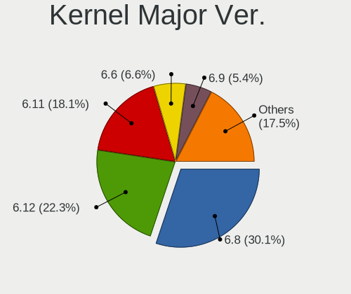
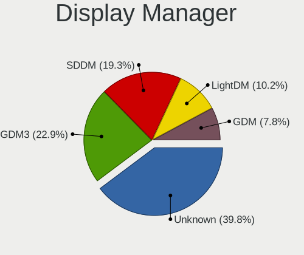
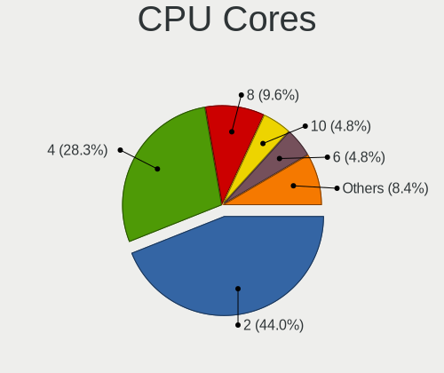
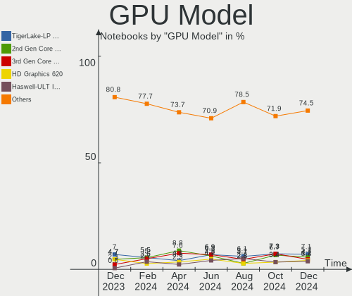
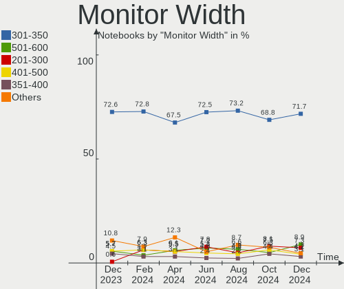
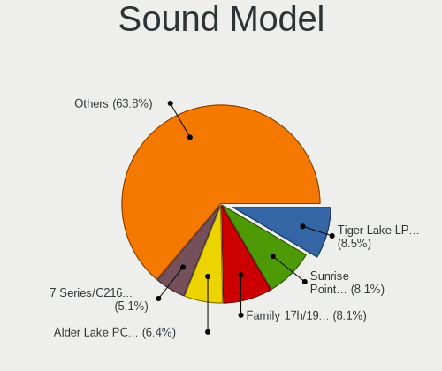
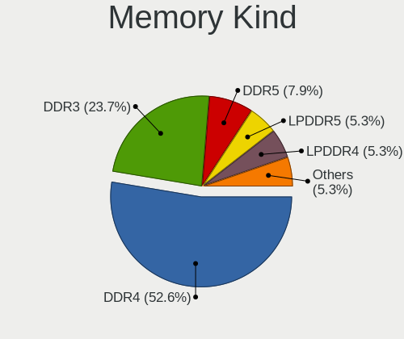
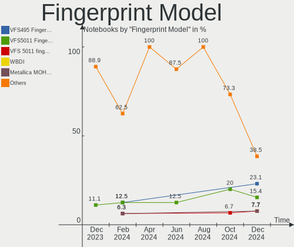

Linux in Brazil - Hardware Trends (Notebooks)
---------------------------------------------

A project to identify most popular hardware characteristics and track their change
over time based on data collected by Linux users at https://Linux-Hardware.org.

Anyone can contribute to this report by the [hw-probe](https://github.com/linuxhw/hw-probe) tool:

    sudo -E hw-probe -all -upload

Period: Dec, 2022.

Contents
--------

* [ System ](#system)
  - [ OS                       ](#os)
  - [ OS Family                ](#os-family)
  - [ Kernel                   ](#kernel)
  - [ Kernel Family            ](#kernel-family)
  - [ Kernel Major Ver.        ](#kernel-major-ver)
  - [ Arch                     ](#arch)
  - [ DE                       ](#de)
  - [ Display Server           ](#display-server)
  - [ Display Manager          ](#display-manager)
  - [ OS Lang                  ](#os-lang)
  - [ Boot Mode                ](#boot-mode)
  - [ Filesystem               ](#filesystem)
  - [ Part. scheme             ](#part-scheme)
  - [ Dual Boot with Linux/BSD ](#dual-boot-with-linuxbsd)
  - [ Dual Boot (Win)          ](#dual-boot-win)

* [ Board ](#board)
  - [ Vendor                   ](#vendor)
  - [ Model                    ](#model)
  - [ Model Family             ](#model-family)
  - [ MFG Year                 ](#mfg-year)
  - [ Form Factor              ](#form-factor)
  - [ Secure Boot              ](#secure-boot)
  - [ Coreboot                 ](#coreboot)
  - [ RAM Size                 ](#ram-size)
  - [ RAM Used                 ](#ram-used)
  - [ Total Drives             ](#total-drives)
  - [ Has CD-ROM               ](#has-cd-rom)
  - [ Has Ethernet             ](#has-ethernet)
  - [ Has WiFi                 ](#has-wifi)
  - [ Has Bluetooth            ](#has-bluetooth)

* [ Location ](#location)
  - [ Country                  ](#country)
  - [ City                     ](#city)

* [ Drives ](#drives)
  - [ Drive Vendor             ](#drive-vendor)
  - [ Drive Model              ](#drive-model)
  - [ HDD Vendor               ](#hdd-vendor)
  - [ SSD Vendor               ](#ssd-vendor)
  - [ Drive Kind               ](#drive-kind)
  - [ Drive Connector          ](#drive-connector)
  - [ Drive Size               ](#drive-size)
  - [ Space Total              ](#space-total)
  - [ Space Used               ](#space-used)
  - [ Malfunc. Drives          ](#malfunc-drives)
  - [ Malfunc. Drive Vendor    ](#malfunc-drive-vendor)
  - [ Malfunc. HDD Vendor      ](#malfunc-hdd-vendor)
  - [ Malfunc. Drive Kind      ](#malfunc-drive-kind)
  - [ Failed Drives            ](#failed-drives)
  - [ Failed Drive Vendor      ](#failed-drive-vendor)
  - [ Drive Status             ](#drive-status)

* [ Storage controller ](#storage-controller)
  - [ Storage Vendor           ](#storage-vendor)
  - [ Storage Model            ](#storage-model)
  - [ Storage Kind             ](#storage-kind)

* [ Processor ](#processor)
  - [ CPU Vendor               ](#cpu-vendor)
  - [ CPU Model                ](#cpu-model)
  - [ CPU Model Family         ](#cpu-model-family)
  - [ CPU Cores                ](#cpu-cores)
  - [ CPU Sockets              ](#cpu-sockets)
  - [ CPU Threads              ](#cpu-threads)
  - [ CPU Op-Modes             ](#cpu-op-modes)
  - [ CPU Microcode            ](#cpu-microcode)
  - [ CPU Microarch            ](#cpu-microarch)

* [ Graphics ](#graphics)
  - [ GPU Vendor               ](#gpu-vendor)
  - [ GPU Model                ](#gpu-model)
  - [ GPU Combo                ](#gpu-combo)
  - [ GPU Driver               ](#gpu-driver)
  - [ GPU Memory               ](#gpu-memory)

* [ Monitor ](#monitor)
  - [ Monitor Vendor           ](#monitor-vendor)
  - [ Monitor Model            ](#monitor-model)
  - [ Monitor Resolution       ](#monitor-resolution)
  - [ Monitor Diagonal         ](#monitor-diagonal)
  - [ Monitor Width            ](#monitor-width)
  - [ Aspect Ratio             ](#aspect-ratio)
  - [ Monitor Area             ](#monitor-area)
  - [ Pixel Density            ](#pixel-density)
  - [ Multiple Monitors        ](#multiple-monitors)

* [ Network ](#network)
  - [ Net Controller Vendor    ](#net-controller-vendor)
  - [ Net Controller Model     ](#net-controller-model)
  - [ Wireless Vendor          ](#wireless-vendor)
  - [ Wireless Model           ](#wireless-model)
  - [ Ethernet Vendor          ](#ethernet-vendor)
  - [ Ethernet Model           ](#ethernet-model)
  - [ Net Controller Kind      ](#net-controller-kind)
  - [ Used Controller          ](#used-controller)
  - [ NICs                     ](#nics)
  - [ IPv6                     ](#ipv6)

* [ Bluetooth ](#bluetooth)
  - [ Bluetooth Vendor         ](#bluetooth-vendor)
  - [ Bluetooth Model          ](#bluetooth-model)

* [ Sound ](#sound)
  - [ Sound Vendor             ](#sound-vendor)
  - [ Sound Model              ](#sound-model)

* [ Memory ](#memory)
  - [ Memory Vendor            ](#memory-vendor)
  - [ Memory Model             ](#memory-model)
  - [ Memory Kind              ](#memory-kind)
  - [ Memory Form Factor       ](#memory-form-factor)
  - [ Memory Size              ](#memory-size)
  - [ Memory Speed             ](#memory-speed)

* [ Printers & scanners ](#printers--scanners)
  - [ Printer Vendor           ](#printer-vendor)
  - [ Printer Model            ](#printer-model)
  - [ Scanner Vendor           ](#scanner-vendor)
  - [ Scanner Model            ](#scanner-model)

* [ Camera ](#camera)
  - [ Camera Vendor            ](#camera-vendor)
  - [ Camera Model             ](#camera-model)

* [ Security ](#security)
  - [ Fingerprint Vendor       ](#fingerprint-vendor)
  - [ Fingerprint Model        ](#fingerprint-model)
  - [ Chipcard Vendor          ](#chipcard-vendor)
  - [ Chipcard Model           ](#chipcard-model)

* [ Unsupported ](#unsupported)
  - [ Unsupported Devices      ](#unsupported-devices)
  - [ Unsupported Device Types ](#unsupported-device-types)

System
------

OS
--

Installed operating systems

| Name                         | Notebooks | Percent |
|------------------------------|-----------|---------|
| Ubuntu 22.04                 | 27        | 16.67%  |
| Fedora 37                    | 22        | 13.58%  |
| Linux Mint 21                | 14        | 8.64%   |
| Pop!_OS 22.04                | 12        | 7.41%   |
| OpenMandriva 4.3             | 8         | 4.94%   |
| Debian 11                    | 6         | 3.7%    |
| Zorin 16                     | 5         | 3.09%   |
| Ubuntu 22.10                 | 5         | 3.09%   |
| Ubuntu 20.04                 | 4         | 2.47%   |
| Endless 3.9.7                | 4         | 2.47%   |
| Arch Rolling                 | 4         | 2.47%   |
| openSUSE Tumbleweed-XXXXXXXX | 3         | 1.85%   |
| Manjaro                      | 3         | 1.85%   |
| Linux Mint 21.1              | 3         | 1.85%   |
| Linux Mint 20.3              | 3         | 1.85%   |
| KDE neon 22.04               | 3         | 1.85%   |
| Endless 4.0.13               | 3         | 1.85%   |
| Kali 2022.4                  | 2         | 1.23%   |
| Fedora 36                    | 2         | 1.23%   |
| Endless 3.9.3-nexthw1        | 2         | 1.23%   |
| Zorin 15                     | 1         | 0.62%   |
| Ubuntu Unity 20.04           | 1         | 0.62%   |
| Ubuntu MATE 22.04            | 1         | 0.62%   |
| Ubuntu Budgie 22.10          | 1         | 0.62%   |
| Ubuntu 18.04                 | 1         | 0.62%   |
| SteamOS 3.4.4                | 1         | 0.62%   |
| SteamOS 3.4.2                | 1         | 0.62%   |
| Slackware 15.0               | 1         | 0.62%   |
| ROSA 12.3                    | 1         | 0.62%   |
| ROSA 12.2                    | 1         | 0.62%   |
| Pop!_OS 20.04                | 1         | 0.62%   |
| openSUSE Leap-15.4           | 1         | 0.62%   |
| OpenMandriva 4.50            | 1         | 0.62%   |
| Manjaro 22.0                 | 1         | 0.62%   |
| Lubuntu 22.10                | 1         | 0.62%   |
| LMDE 5                       | 1         | 0.62%   |
| Linux Mint 20.1              | 1         | 0.62%   |
| Kubuntu 22.04                | 1         | 0.62%   |
| Gutta OS 1.0                 | 1         | 0.62%   |
| Garuda Linux Soaring         | 1         | 0.62%   |

OS Family
---------

OS without a version

| Name          | Notebooks | Percent |
|---------------|-----------|---------|
| Ubuntu        | 37        | 22.84%  |
| Fedora        | 24        | 14.81%  |
| Linux Mint    | 21        | 12.96%  |
| Pop!_OS       | 13        | 8.02%   |
| Endless       | 12        | 7.41%   |
| OpenMandriva  | 9         | 5.56%   |
| Debian        | 7         | 4.32%   |
| Zorin         | 6         | 3.7%    |
| openSUSE      | 4         | 2.47%   |
| Manjaro       | 4         | 2.47%   |
| Arch          | 4         | 2.47%   |
| KDE neon      | 3         | 1.85%   |
| SteamOS       | 2         | 1.23%   |
| ROSA          | 2         | 1.23%   |
| Kali          | 2         | 1.23%   |
| Elementary    | 2         | 1.23%   |
| Ubuntu Unity  | 1         | 0.62%   |
| Ubuntu MATE   | 1         | 0.62%   |
| Ubuntu Budgie | 1         | 0.62%   |
| Slackware     | 1         | 0.62%   |
| Lubuntu       | 1         | 0.62%   |
| LMDE          | 1         | 0.62%   |
| Kubuntu       | 1         | 0.62%   |
| Gutta OS      | 1         | 0.62%   |
| Garuda Linux  | 1         | 0.62%   |
| ArcoLinux     | 1         | 0.62%   |

Kernel
------

Version of the Linux kernel

| Version                         | Notebooks | Percent |
|---------------------------------|-----------|---------|
| 5.15.0-56-generic               | 51        | 31.48%  |
| 5.16.7-desktop-1omv4003         | 8         | 4.94%   |
| 6.0.6-76060006-generic          | 7         | 4.32%   |
| 6.0.12-300.fc37.x86_64          | 5         | 3.09%   |
| 5.4.0-135-generic               | 5         | 3.09%   |
| 5.19.0-26-generic               | 5         | 3.09%   |
| 5.11.0-35-generic               | 5         | 3.09%   |
| 6.0.12-76060006-generic         | 4         | 2.47%   |
| 6.0.11-300.fc37.x86_64          | 4         | 2.47%   |
| 5.8.0-14-generic                | 4         | 2.47%   |
| 6.0.13-300.fc37.x86_64          | 3         | 1.85%   |
| 6.0.12-1-default                | 3         | 1.85%   |
| 6.0.10-300.fc37.x86_64          | 3         | 1.85%   |
| 5.10.0-20-amd64                 | 3         | 1.85%   |
| 6.0.15-300.fc37.x86_64          | 2         | 1.23%   |
| 6.0.0-kali5-amd64               | 2         | 1.23%   |
| 5.15.0-57-generic               | 2         | 1.23%   |
| 5.15.0-53-generic               | 2         | 1.23%   |
| 5.13.0-valve36-1-neptune        | 2         | 1.23%   |
| 5.11.0-12-generic               | 2         | 1.23%   |
| 5.10.0-19-amd64                 | 2         | 1.23%   |
| 6.1.1-zen1-1-zen                | 1         | 0.62%   |
| 6.1.1-225.vanilla.1.fc37.x86_64 | 1         | 0.62%   |
| 6.1.1-1-MANJARO                 | 1         | 0.62%   |
| 6.1.1                           | 1         | 0.62%   |
| 6.1.0-zen1-1-zen                | 1         | 0.62%   |
| 6.0.9-300.fc37.x86_64           | 1         | 0.62%   |
| 6.0.7-301.fc37.x86_64           | 1         | 0.62%   |
| 6.0.14-300.fc37.x86_64          | 1         | 0.62%   |
| 6.0.14-200.fc36.x86_64          | 1         | 0.62%   |
| 6.0.11-zen1-1-zen               | 1         | 0.62%   |
| 6.0.11-arch1-1                  | 1         | 0.62%   |
| 6.0.10-arch2-1                  | 1         | 0.62%   |
| 6.0.0-5-amd64                   | 1         | 0.62%   |
| 6.0.0-0.deb11.2-amd64           | 1         | 0.62%   |
| 5.4.0-42-generic                | 1         | 0.62%   |
| 5.3.0-28-generic                | 1         | 0.62%   |
| 5.19.12-desktop-2omv4090        | 1         | 0.62%   |
| 5.19.0-28-generic               | 1         | 0.62%   |
| 5.19.0-21-generic               | 1         | 0.62%   |

Kernel Family
-------------

Linux kernel without a distro release

| Version  | Notebooks | Percent |
|----------|-----------|---------|
| 5.15.0   | 59        | 36.42%  |
| 6.0.12   | 12        | 7.41%   |
| 5.16.7   | 8         | 4.94%   |
| 6.0.6    | 7         | 4.32%   |
| 5.19.0   | 7         | 4.32%   |
| 5.11.0   | 7         | 4.32%   |
| 5.10.0   | 7         | 4.32%   |
| 6.0.11   | 6         | 3.7%    |
| 5.4.0    | 6         | 3.7%    |
| 6.1.1    | 4         | 2.47%   |
| 6.0.10   | 4         | 2.47%   |
| 6.0.0    | 4         | 2.47%   |
| 5.8.0    | 4         | 2.47%   |
| 6.0.13   | 3         | 1.85%   |
| 6.0.15   | 2         | 1.23%   |
| 6.0.14   | 2         | 1.23%   |
| 5.15.81  | 2         | 1.23%   |
| 5.13.0   | 2         | 1.23%   |
| 6.1.0    | 1         | 0.62%   |
| 6.0.9    | 1         | 0.62%   |
| 6.0.7    | 1         | 0.62%   |
| 5.3.0    | 1         | 0.62%   |
| 5.19.12  | 1         | 0.62%   |
| 5.18.7   | 1         | 0.62%   |
| 5.17.5   | 1         | 0.62%   |
| 5.17.15  | 1         | 0.62%   |
| 5.17.0   | 1         | 0.62%   |
| 5.15.85  | 1         | 0.62%   |
| 5.15.78  | 1         | 0.62%   |
| 5.15.75  | 1         | 0.62%   |
| 5.15.55  | 1         | 0.62%   |
| 5.14.21  | 1         | 0.62%   |
| 5.14.0   | 1         | 0.62%   |
| 5.10.118 | 1         | 0.62%   |

Kernel Major Ver.
-----------------

Linux kernel major version

| Version | Notebooks | Percent |
|---------|-----------|---------|
| 5.15    | 65        | 40.12%  |
| 6.0     | 42        | 25.93%  |
| 5.19    | 8         | 4.94%   |
| 5.16    | 8         | 4.94%   |
| 5.10    | 8         | 4.94%   |
| 5.11    | 7         | 4.32%   |
| 5.4     | 6         | 3.7%    |
| 6.1     | 5         | 3.09%   |
| 5.8     | 4         | 2.47%   |
| 5.17    | 3         | 1.85%   |
| 5.14    | 2         | 1.23%   |
| 5.13    | 2         | 1.23%   |
| 5.3     | 1         | 0.62%   |
| 5.18    | 1         | 0.62%   |

Arch
----

OS architecture (x86_64, i586, etc.)

| Name   | Notebooks | Percent |
|--------|-----------|---------|
| x86_64 | 162       | 100%    |

DE
--

Desktop Environment

| Name       | Notebooks | Percent |
|------------|-----------|---------|
| GNOME      | 96        | 59.26%  |
| KDE5       | 29        | 17.9%   |
| X-Cinnamon | 19        | 11.73%  |
| Unknown    | 5         | 3.09%   |
| XFCE       | 4         | 2.47%   |
| LXQt       | 2         | 1.23%   |
| Budgie     | 2         | 1.23%   |
| Unity      | 1         | 0.62%   |
| Pantheon   | 1         | 0.62%   |
| MATE       | 1         | 0.62%   |
| i3         | 1         | 0.62%   |
| Deepin     | 1         | 0.62%   |

Display Server
--------------

X11 or Wayland

| Name    | Notebooks | Percent |
|---------|-----------|---------|
| X11     | 114       | 70.37%  |
| Wayland | 45        | 27.78%  |
| Unknown | 3         | 1.85%   |

Display Manager
---------------

SDDM, LightDM, etc.

| Name    | Notebooks | Percent |
|---------|-----------|---------|
| Unknown | 75        | 46.3%   |
| GDM3    | 39        | 24.07%  |
| LightDM | 18        | 11.11%  |
| SDDM    | 15        | 9.26%   |
| GDM     | 14        | 8.64%   |
| XDM     | 1         | 0.62%   |

OS Lang
-------

Language

| Lang      | Notebooks | Percent |
|-----------|-----------|---------|
| pt_BR     | 123       | 75.93%  |
| en_US     | 35        | 21.6%   |
| pt_BRutf8 | 1         | 0.62%   |
| en_GB     | 1         | 0.62%   |
| C         | 1         | 0.62%   |
| Unknown   | 1         | 0.62%   |

Boot Mode
---------

EFI or BIOS

| Mode | Notebooks | Percent |
|------|-----------|---------|
| EFI  | 93        | 57.41%  |
| BIOS | 69        | 42.59%  |

Filesystem
----------

Type of filesystem

| Type    | Notebooks | Percent |
|---------|-----------|---------|
| Ext4    | 115       | 70.99%  |
| Btrfs   | 34        | 20.99%  |
| Overlay | 9         | 5.56%   |
| Zfs     | 2         | 1.23%   |
| Xfs     | 1         | 0.62%   |
| Tmpfs   | 1         | 0.62%   |

Part. scheme
------------

Scheme of partitioning

| Type    | Notebooks | Percent |
|---------|-----------|---------|
| GPT     | 78        | 48.15%  |
| Unknown | 70        | 43.21%  |
| MBR     | 14        | 8.64%   |

Dual Boot with Linux/BSD
------------------------

Hosting more than one Linux/BSD

| Dual boot | Notebooks | Percent |
|-----------|-----------|---------|
| No        | 151       | 93.21%  |
| Yes       | 11        | 6.79%   |

Dual Boot (Win)
---------------

Hosting Linux and Windows

| Dual boot | Notebooks | Percent |
|-----------|-----------|---------|
| No        | 130       | 80.25%  |
| Yes       | 32        | 19.75%  |

Board
-----

Vendor
------

Motherboard manufacturer

| Name                   | Notebooks | Percent |
|------------------------|-----------|---------|
| Dell                   | 41        | 25.31%  |
| Acer                   | 25        | 15.43%  |
| Lenovo                 | 20        | 12.35%  |
| Samsung Electronics    | 15        | 9.26%   |
| ASUSTek Computer       | 14        | 8.64%   |
| Positivo               | 9         | 5.56%   |
| Hewlett-Packard        | 8         | 4.94%   |
| Avell High Performance | 5         | 3.09%   |
| Sony                   | 4         | 2.47%   |
| Positivo Bahia - VAIO  | 4         | 2.47%   |
| Apple                  | 3         | 1.85%   |
| Valve                  | 2         | 1.23%   |
| Multilaser             | 2         | 1.23%   |
| Chuwi                  | 2         | 1.23%   |
| Toshiba                | 1         | 0.62%   |
| Semp Toshiba           | 1         | 0.62%   |
| Notebook               | 1         | 0.62%   |
| Gateway                | 1         | 0.62%   |
| Digibras               | 1         | 0.62%   |
| Compaq                 | 1         | 0.62%   |
| Alienware              | 1         | 0.62%   |
| Unknown                | 1         | 0.62%   |

Model
-----

Motherboard model

| Name                                       | Notebooks | Percent |
|--------------------------------------------|-----------|---------|
| ASUS VivoBook_ASUSLaptop X515DA_X515DA     | 5         | 3.09%   |
| Dell Inspiron 5566                         | 4         | 2.47%   |
| Lenovo IdeaPad 3 15ALC6 82MF               | 3         | 1.85%   |
| Dell Vostro 5490                           | 3         | 1.85%   |
| Dell Inspiron 3583                         | 3         | 1.85%   |
| Valve Jupiter                              | 2         | 1.23%   |
| Samsung 550XBE/350XBE                      | 2         | 1.23%   |
| Samsung 530U3C/530U4C/532U3C               | 2         | 1.23%   |
| Samsung 300E5M/300E5L                      | 2         | 1.23%   |
| Samsung 270E5J/2570EJ                      | 2         | 1.23%   |
| Positivo Mobile                            | 2         | 1.23%   |
| Positivo H14BT58                           | 2         | 1.23%   |
| Lenovo IdeaPad S145-15API 81V7             | 2         | 1.23%   |
| Lenovo IdeaPad 320-15IKB 80YH              | 2         | 1.23%   |
| Dell Inspiron N4050                        | 2         | 1.23%   |
| Dell Inspiron 5458                         | 2         | 1.23%   |
| Dell G5 5590                               | 2         | 1.23%   |
| Chuwi HeroBook Air                         | 2         | 1.23%   |
| Avell High Performance B.ON                | 2         | 1.23%   |
| ASUS VivoBook_ASUSLaptop X515EA_X515EA     | 2         | 1.23%   |
| Acer Nitro AN515-54                        | 2         | 1.23%   |
| Acer Aspire A515-45                        | 2         | 1.23%   |
| Acer Aspire A514-54                        | 2         | 1.23%   |
| Acer Aspire A315-23G                       | 2         | 1.23%   |
| Toshiba PORTEGE Z930                       | 1         | 0.62%   |
| Sony VPCEA23FB                             | 1         | 0.62%   |
| Sony VPCCW21FX                             | 1         | 0.62%   |
| Sony SVF15213CBB                           | 1         | 0.62%   |
| Sony SVE14A18ECH                           | 1         | 0.62%   |
| Semp Toshiba IS 1442                       | 1         | 0.62%   |
| Samsung RV415/RV515                        | 1         | 0.62%   |
| Samsung RF511/RF411/RF711                  | 1         | 0.62%   |
| Samsung 550XDA                             | 1         | 0.62%   |
| Samsung 550P5C/550P7C                      | 1         | 0.62%   |
| Samsung 340XAA/350XAA/550XAA               | 1         | 0.62%   |
| Samsung 300E4A/300E5A/300E7A/3430EA/3530EA | 1         | 0.62%   |
| Samsung 270E5K                             | 1         | 0.62%   |
| Positivo S14SL01                           | 1         | 0.62%   |
| Positivo Master N8340                      | 1         | 0.62%   |
| Positivo Hendrix                           | 1         | 0.62%   |

Model Family
------------

Motherboard model prefix

| Name                        | Notebooks | Percent |
|-----------------------------|-----------|---------|
| Dell Inspiron               | 22        | 13.58%  |
| Acer Aspire                 | 15        | 9.26%   |
| Lenovo IdeaPad              | 12        | 7.41%   |
| ASUS VivoBook               | 11        | 6.79%   |
| Dell Vostro                 | 7         | 4.32%   |
| Dell Latitude               | 6         | 3.7%    |
| Lenovo ThinkPad             | 5         | 3.09%   |
| Acer Nitro                  | 5         | 3.09%   |
| HP Pavilion                 | 3         | 1.85%   |
| Acer Predator               | 3         | 1.85%   |
| Valve Jupiter               | 2         | 1.23%   |
| Samsung 550XBE              | 2         | 1.23%   |
| Samsung 530U3C              | 2         | 1.23%   |
| Samsung 300E5M              | 2         | 1.23%   |
| Samsung 270E5J              | 2         | 1.23%   |
| Positivo Mobile             | 2         | 1.23%   |
| Positivo H14BT58            | 2         | 1.23%   |
| HP ProBook                  | 2         | 1.23%   |
| Dell G5                     | 2         | 1.23%   |
| Chuwi HeroBook              | 2         | 1.23%   |
| Avell High Performance B.ON | 2         | 1.23%   |
| Apple MacBookPro8           | 2         | 1.23%   |
| Toshiba PORTEGE             | 1         | 0.62%   |
| Sony VPCEA23FB              | 1         | 0.62%   |
| Sony VPCCW21FX              | 1         | 0.62%   |
| Sony SVF15213CBB            | 1         | 0.62%   |
| Sony SVE14A18ECH            | 1         | 0.62%   |
| Semp Toshiba IS             | 1         | 0.62%   |
| Samsung RV415               | 1         | 0.62%   |
| Samsung RF511               | 1         | 0.62%   |
| Samsung 550XDA              | 1         | 0.62%   |
| Samsung 550P5C              | 1         | 0.62%   |
| Samsung 340XAA              | 1         | 0.62%   |
| Samsung 300E4A              | 1         | 0.62%   |
| Samsung 270E5K              | 1         | 0.62%   |
| Positivo S14SL01            | 1         | 0.62%   |
| Positivo Master             | 1         | 0.62%   |
| Positivo Hendrix            | 1         | 0.62%   |
| Positivo C4128E-S           | 1         | 0.62%   |
| Positivo C14CR21            | 1         | 0.62%   |

MFG Year
--------

Motherboard manufacture year

| Year | Notebooks | Percent |
|------|-----------|---------|
| 2021 | 29        | 17.9%   |
| 2019 | 26        | 16.05%  |
| 2020 | 23        | 14.2%   |
| 2011 | 15        | 9.26%   |
| 2012 | 13        | 8.02%   |
| 2016 | 9         | 5.56%   |
| 2017 | 8         | 4.94%   |
| 2018 | 6         | 3.7%    |
| 2014 | 6         | 3.7%    |
| 2010 | 6         | 3.7%    |
| 2022 | 5         | 3.09%   |
| 2015 | 5         | 3.09%   |
| 2013 | 5         | 3.09%   |
| 2008 | 4         | 2.47%   |
| 2009 | 2         | 1.23%   |

Form Factor
-----------

Physical design of the computer

| Name     | Notebooks | Percent |
|----------|-----------|---------|
| Notebook | 162       | 100%    |

Secure Boot
-----------

Enabled or disabled

| State    | Notebooks | Percent |
|----------|-----------|---------|
| Disabled | 136       | 83.95%  |
| Enabled  | 26        | 16.05%  |

Coreboot
--------

Have coreboot on board

| Used | Notebooks | Percent |
|------|-----------|---------|
| No   | 162       | 100%    |

RAM Size
--------

Total RAM memory

| Size in GB | Notebooks | Percent |
|------------|-----------|---------|
| 4.01-8.0   | 67        | 41.36%  |
| 3.01-4.0   | 33        | 20.37%  |
| 16.01-24.0 | 29        | 17.9%   |
| 8.01-16.0  | 17        | 10.49%  |
| 32.01-64.0 | 10        | 6.17%   |
| 24.01-32.0 | 3         | 1.85%   |
| 2.01-3.0   | 1         | 0.62%   |
| 1.01-2.0   | 1         | 0.62%   |
| 0.51-1.0   | 1         | 0.62%   |

RAM Used
--------

Used RAM memory

| Used GB    | Notebooks | Percent |
|------------|-----------|---------|
| 2.01-3.0   | 43        | 26.54%  |
| 1.01-2.0   | 43        | 26.54%  |
| 4.01-8.0   | 33        | 20.37%  |
| 3.01-4.0   | 28        | 17.28%  |
| 8.01-16.0  | 13        | 8.02%   |
| 16.01-24.0 | 1         | 0.62%   |
| 0.51-1.0   | 1         | 0.62%   |

Total Drives
------------

Number of drives on board

| Drives | Notebooks | Percent |
|--------|-----------|---------|
| 1      | 119       | 73.46%  |
| 2      | 41        | 25.31%  |
| 3      | 2         | 1.23%   |

Has CD-ROM
----------

Has CD-ROM on board

| Presented | Notebooks | Percent |
|-----------|-----------|---------|
| No        | 129       | 79.63%  |
| Yes       | 33        | 20.37%  |

Has Ethernet
------------

Has Ethernet on board

| Presented | Notebooks | Percent |
|-----------|-----------|---------|
| Yes       | 127       | 78.4%   |
| No        | 35        | 21.6%   |

Has WiFi
--------

Has WiFi module

| Presented | Notebooks | Percent |
|-----------|-----------|---------|
| Yes       | 159       | 98.15%  |
| No        | 3         | 1.85%   |

Has Bluetooth
-------------

Has Bluetooth module

| Presented | Notebooks | Percent |
|-----------|-----------|---------|
| Yes       | 132       | 81.48%  |
| No        | 30        | 18.52%  |

Location
--------

Country
-------

Geographic location (country)

| Country | Notebooks | Percent |
|---------|-----------|---------|
| Brazil  | 162       | 100%    |

City
----

Geographic location (city)

| City                  | Notebooks | Percent |
|-----------------------|-----------|---------|
| Sao Paulo             | 13        | 8.02%   |
| Rio de Janeiro        | 7         | 4.32%   |
| Porto Alegre          | 6         | 3.7%    |
| Fortaleza             | 6         | 3.7%    |
| Sao Luís             | 5         | 3.09%   |
| Sao José dos Campos  | 5         | 3.09%   |
| Curitiba              | 5         | 3.09%   |
| Belo Horizonte        | 5         | 3.09%   |
| Sorocaba              | 3         | 1.85%   |
| Salvador              | 3         | 1.85%   |
| Uberlândia           | 2         | 1.23%   |
| Sumaré               | 2         | 1.23%   |
| Sao Bernardo do Campo | 2         | 1.23%   |
| Santos                | 2         | 1.23%   |
| Recife                | 2         | 1.23%   |
| Manaus                | 2         | 1.23%   |
| Maceió               | 2         | 1.23%   |
| Limeira               | 2         | 1.23%   |
| Jundiaí              | 2         | 1.23%   |
| Goncalves             | 2         | 1.23%   |
| Goiânia              | 2         | 1.23%   |
| Cuiabá               | 2         | 1.23%   |
| Canoas                | 2         | 1.23%   |
| Volta Redonda         | 1         | 0.62%   |
| Vila Velha            | 1         | 0.62%   |
| Viamao                | 1         | 0.62%   |
| Valparaiso de Goias   | 1         | 0.62%   |
| Uruacu                | 1         | 0.62%   |
| Tubarao               | 1         | 0.62%   |
| Teresina              | 1         | 0.62%   |
| Sousa                 | 1         | 0.62%   |
| Severinia             | 1         | 0.62%   |
| Sao José dos Pinhais | 1         | 0.62%   |
| Sao Jose do Rio Preto | 1         | 0.62%   |
| Sao Jose do Rio Pardo | 1         | 0.62%   |
| Sao Jose              | 1         | 0.62%   |
| Sao Goncalo           | 1         | 0.62%   |
| Santo André          | 1         | 0.62%   |
| Salto                 | 1         | 0.62%   |
| Rio Claro             | 1         | 0.62%   |

Drives
------

Drive Vendor
------------

Hard drive vendors

| Vendor                         | Notebooks | Drives | Percent |
|--------------------------------|-----------|--------|---------|
| WDC                            | 35        | 36     | 17.59%  |
| Kingston                       | 23        | 24     | 11.56%  |
| A-DATA Technology              | 21        | 21     | 10.55%  |
| Seagate                        | 19        | 19     | 9.55%   |
| Samsung Electronics            | 16        | 17     | 8.04%   |
| SanDisk                        | 12        | 12     | 6.03%   |
| Toshiba                        | 11        | 11     | 5.53%   |
| ADATA Technology               | 9         | 9      | 4.52%   |
| Crucial                        | 6         | 6      | 3.02%   |
| Unknown                        | 5         | 5      | 2.51%   |
| Intel                          | 5         | 5      | 2.51%   |
| SK hynix                       | 4         | 4      | 2.01%   |
| China                          | 4         | 4      | 2.01%   |
| Solid State Storage            | 2         | 2      | 1.01%   |
| Silicon Motion                 | 2         | 2      | 1.01%   |
| Phison Electronics             | 2         | 2      | 1.01%   |
| Netac                          | 2         | 2      | 1.01%   |
| Micron Technology              | 2         | 2      | 1.01%   |
| LITEON                         | 2         | 2      | 1.01%   |
| Lexar                          | 2         | 2      | 1.01%   |
| Kingston Technology Company    | 2         | 2      | 1.01%   |
| Hitachi                        | 2         | 2      | 1.01%   |
| HGST                           | 2         | 2      | 1.01%   |
| WDC WDS2                       | 1         | 1      | 0.5%    |
| STAR                           | 1         | 1      | 0.5%    |
| Solid State Storage Technology | 1         | 1      | 0.5%    |
| Realtek Semiconductor          | 1         | 1      | 0.5%    |
| Micron/Crucial Technology      | 1         | 1      | 0.5%    |
| MAXSUN                         | 1         | 1      | 0.5%    |
| KIOXIA                         | 1         | 1      | 0.5%    |
| KingSpec                       | 1         | 1      | 0.5%    |
| Fujitsu                        | 1         | 1      | 0.5%    |

Drive Model
-----------

Hard drive models

| Model                                                  | Notebooks | Percent |
|--------------------------------------------------------|-----------|---------|
| Kingston SA400S37240G 240GB SSD                        | 10        | 4.95%   |
| Kingston SA400S37480G 480GB SSD                        | 8         | 3.96%   |
| ADATA SM2P32A8-256GC1 256GB                            | 5         | 2.48%   |
| WDC WD10SPZX-21Z10T0 1TB                               | 4         | 1.98%   |
| Toshiba MQ01ABF050 500GB                               | 3         | 1.49%   |
| Toshiba MQ01ABD100 1TB                                 | 3         | 1.49%   |
| Seagate ST9500325AS 500GB                              | 3         | 1.49%   |
| Seagate ST500LM012 HN-M500MBB 500GB                    | 3         | 1.49%   |
| Samsung NVMe SSD Controller SM981/PM981/PM983 500GB    | 3         | 1.49%   |
| Samsung MZALQ256HAJD-000L2 256GB                       | 3         | 1.49%   |
| Crucial CT240BX500SSD1 240GB                           | 3         | 1.49%   |
| China SATA SSD 120GB                                   | 3         | 1.49%   |
| ADATA NVMe IM2P33F4 256GB                              | 3         | 1.49%   |
| A-DATA IM2P33F8ABR2-256GB                              | 3         | 1.49%   |
| A-DATA IM2P33F3 NVMe 256GB                             | 3         | 1.49%   |
| WDC WDS240G2G0A-00JH30 240GB SSD                       | 2         | 0.99%   |
| WDC WDS100T2B0A-00SM50 1TB SSD                         | 2         | 0.99%   |
| WDC WD5000LPCX-35VHAT0 500GB                           | 2         | 0.99%   |
| WDC WD10JPVX-75JC3T0 1TB                               | 2         | 0.99%   |
| WDC WD10JPVX-35JC3T0 1TB                               | 2         | 0.99%   |
| Unknown NVMe SSD Drive 512GB                           | 2         | 0.99%   |
| Toshiba MQ04ABF100 1TB                                 | 2         | 0.99%   |
| Solid State Storage SSSTC CL1-4D256 256GB              | 2         | 0.99%   |
| Silicon Motion SM2263EN/SM2263XT SSD Controller 1024GB | 2         | 0.99%   |
| Seagate ST500LT012-9WS142 500GB                        | 2         | 0.99%   |
| Seagate ST2000LM007-1R8174 2TB                         | 2         | 0.99%   |
| Seagate ST1000LM024 HN-M101MBB 1TB                     | 2         | 0.99%   |
| Seagate Expansion 4TB                                  | 2         | 0.99%   |
| Sandisk WD Blue SN550 NVMe SSD 500GB                   | 2         | 0.99%   |
| SanDisk SSD PLUS 1000GB                                | 2         | 0.99%   |
| Samsung M3 Portable 1TB                                | 2         | 0.99%   |
| Phison PS5013 E13 NVMe Controller 512GB                | 2         | 0.99%   |
| Netac SSD 128GB                                        | 2         | 0.99%   |
| Kingston SNVS500G 500GB                                | 2         | 0.99%   |
| Kingston SA400S37120G 120GB SSD                        | 2         | 0.99%   |
| Intel KINGSTON RBUSNS8154P3512GJ1 512GB                | 2         | 0.99%   |
| HGST HTS545050A7E380 500GB                             | 2         | 0.99%   |
| A-DATA IM2P33F8BR2-512GB                               | 2         | 0.99%   |
| A-DATA IM2P33F8A-512GD 512GB                           | 2         | 0.99%   |
| A-DATA IM2P33F3A NVMe 256GB                            | 2         | 0.99%   |

HDD Vendor
----------

Hard disk drive vendors

| Vendor              | Notebooks | Drives | Percent |
|---------------------|-----------|--------|---------|
| WDC                 | 27        | 27     | 42.19%  |
| Seagate             | 19        | 19     | 29.69%  |
| Toshiba             | 11        | 11     | 17.19%  |
| Samsung Electronics | 2         | 2      | 3.13%   |
| Hitachi             | 2         | 2      | 3.13%   |
| HGST                | 2         | 2      | 3.13%   |
| Fujitsu             | 1         | 1      | 1.56%   |

SSD Vendor
----------

Solid state drive vendors

| Vendor              | Notebooks | Drives | Percent |
|---------------------|-----------|--------|---------|
| Kingston            | 21        | 21     | 35%     |
| SanDisk             | 8         | 8      | 13.33%  |
| WDC                 | 6         | 7      | 10%     |
| Crucial             | 5         | 5      | 8.33%   |
| Samsung Electronics | 4         | 4      | 6.67%   |
| China               | 4         | 4      | 6.67%   |
| Netac               | 2         | 2      | 3.33%   |
| LITEON              | 2         | 2      | 3.33%   |
| Lexar               | 2         | 2      | 3.33%   |
| A-DATA Technology   | 2         | 2      | 3.33%   |
| WDC WDS2            | 1         | 1      | 1.67%   |
| STAR                | 1         | 1      | 1.67%   |
| SK hynix            | 1         | 1      | 1.67%   |
| KingSpec            | 1         | 1      | 1.67%   |

Drive Kind
----------

HDD or SSD

| Kind    | Notebooks | Drives | Percent |
|---------|-----------|--------|---------|
| NVMe    | 70        | 73     | 36.27%  |
| HDD     | 61        | 64     | 31.61%  |
| SSD     | 58        | 61     | 30.05%  |
| MMC     | 3         | 3      | 1.55%   |
| Unknown | 1         | 1      | 0.52%   |

Drive Connector
---------------

SATA, SAS, NVMe, etc.

| Type | Notebooks | Drives | Percent |
|------|-----------|--------|---------|
| SATA | 107       | 121    | 57.84%  |
| NVMe | 70        | 73     | 37.84%  |
| SAS  | 5         | 5      | 2.7%    |
| MMC  | 3         | 3      | 1.62%   |

Drive Size
----------

Size of hard drive

| Size in TB | Notebooks | Drives | Percent |
|------------|-----------|--------|---------|
| 0.01-0.5   | 80        | 87     | 68.38%  |
| 0.51-1.0   | 31        | 32     | 26.5%   |
| 1.01-2.0   | 4         | 4      | 3.42%   |
| 3.01-4.0   | 2         | 2      | 1.71%   |

Space Total
-----------

Amount of disk space available on the file system

| Size in GB     | Notebooks | Percent |
|----------------|-----------|---------|
| 101-250        | 49        | 30.25%  |
| 251-500        | 46        | 28.4%   |
| 501-1000       | 31        | 19.14%  |
| 1001-2000      | 10        | 6.17%   |
| 1-20           | 10        | 6.17%   |
| 51-100         | 5         | 3.09%   |
| More than 3000 | 3         | 1.85%   |
| 21-50          | 3         | 1.85%   |
| Unknown        | 3         | 1.85%   |
| 2001-3000      | 2         | 1.23%   |

Space Used
----------

Amount of used disk space

| Used GB   | Notebooks | Percent |
|-----------|-----------|---------|
| 1-20      | 46        | 28.4%   |
| 21-50     | 34        | 20.99%  |
| 101-250   | 31        | 19.14%  |
| 51-100    | 25        | 15.43%  |
| 251-500   | 14        | 8.64%   |
| 501-1000  | 5         | 3.09%   |
| 1001-2000 | 4         | 2.47%   |
| Unknown   | 3         | 1.85%   |

Malfunc. Drives
---------------

Drive models with a malfunction

| Model                                 | Notebooks | Drives | Percent |
|---------------------------------------|-----------|--------|---------|
| Seagate ST9500325AS 500GB             | 2         | 2      | 20%     |
| Seagate ST2000LM007-1R8174 2TB        | 2         | 2      | 20%     |
| WDC WDS240G2G0A-00JH30 240GB SSD      | 1         | 1      | 10%     |
| Seagate ST1000LM035-1RK172 1TB        | 1         | 1      | 10%     |
| Kingston SA400S37480G 480GB SSD       | 1         | 1      | 10%     |
| KingSpec ACSC2M256mSA 256GB SSD       | 1         | 1      | 10%     |
| HGST HTS545050A7E380 500GB            | 1         | 1      | 10%     |
| A-DATA Technology IM2P33F3 NVMe 512GB | 1         | 1      | 10%     |

Malfunc. Drive Vendor
---------------------

Vendors of faulty drives

| Vendor            | Notebooks | Drives | Percent |
|-------------------|-----------|--------|---------|
| Seagate           | 5         | 5      | 50%     |
| WDC               | 1         | 1      | 10%     |
| Kingston          | 1         | 1      | 10%     |
| KingSpec          | 1         | 1      | 10%     |
| HGST              | 1         | 1      | 10%     |
| A-DATA Technology | 1         | 1      | 10%     |

Malfunc. HDD Vendor
-------------------

Vendors of faulty HDD drives

| Vendor  | Notebooks | Drives | Percent |
|---------|-----------|--------|---------|
| Seagate | 5         | 5      | 83.33%  |
| HGST    | 1         | 1      | 16.67%  |

Malfunc. Drive Kind
-------------------

Kinds of faulty drives

| Kind | Notebooks | Drives | Percent |
|------|-----------|--------|---------|
| HDD  | 6         | 6      | 60%     |
| SSD  | 3         | 3      | 30%     |
| NVMe | 1         | 1      | 10%     |

Failed Drives
-------------

Failed drive models

Zero info for selected period =(

Failed Drive Vendor
-------------------

Failed drive vendors

Zero info for selected period =(

Drive Status
------------

Number of failed and malfunc. drives

| Status   | Notebooks | Drives | Percent |
|----------|-----------|--------|---------|
| Detected | 106       | 129    | 63.86%  |
| Works    | 51        | 63     | 30.72%  |
| Malfunc  | 9         | 10     | 5.42%   |

Storage controller
------------------

Storage Vendor
--------------

Storage controller vendors

| Vendor                         | Notebooks | Percent |
|--------------------------------|-----------|---------|
| Intel                          | 133       | 60.73%  |
| ADATA Technology               | 28        | 12.79%  |
| AMD                            | 17        | 7.76%   |
| Samsung Electronics            | 11        | 5.02%   |
| SanDisk                        | 6         | 2.74%   |
| Solid State Storage Technology | 5         | 2.28%   |
| Kingston Technology Company    | 5         | 2.28%   |
| SK hynix                       | 3         | 1.37%   |
| Silicon Motion                 | 2         | 0.91%   |
| Phison Electronics             | 2         | 0.91%   |
| Micron/Crucial Technology      | 2         | 0.91%   |
| Micron Technology              | 2         | 0.91%   |
| Realtek Semiconductor          | 1         | 0.46%   |
| Nvidia                         | 1         | 0.46%   |
| KIOXIA                         | 1         | 0.46%   |

Storage Model
-------------

Storage controller models

| Model                                                                        | Notebooks | Percent |
|------------------------------------------------------------------------------|-----------|---------|
| Intel Sunrise Point-LP SATA Controller [AHCI mode]                           | 18        | 7.63%   |
| AMD FCH SATA Controller [AHCI mode]                                          | 16        | 6.78%   |
| Intel 7 Series Chipset Family 6-port SATA Controller [AHCI mode]             | 15        | 6.36%   |
| Intel Tiger Lake-LP SATA Controller                                          | 14        | 5.93%   |
| Intel 82801 Mobile SATA Controller [RAID mode]                               | 14        | 5.93%   |
| Intel Volume Management Device NVMe RAID Controller                          | 13        | 5.51%   |
| Intel 6 Series/C200 Series Chipset Family 6 port Mobile SATA AHCI Controller | 11        | 4.66%   |
| ADATA IM2P33F8ABR1 NVMe SSD                                                  | 11        | 4.66%   |
| ADATA A Non-Volatile memory controller                                       | 9         | 3.81%   |
| Intel Cannon Point-LP SATA Controller [AHCI Mode]                            | 8         | 3.39%   |
| ADATA Non-Volatile memory controller                                         | 8         | 3.39%   |
| Samsung NVMe SSD Controller 980                                              | 6         | 2.54%   |
| Intel Celeron/Pentium Silver Processor SATA Controller                       | 6         | 2.54%   |
| Solid State Storage Non-Volatile memory controller                           | 5         | 2.12%   |
| Intel Comet Lake SATA AHCI Controller                                        | 5         | 2.12%   |
| Intel Cannon Lake Mobile PCH SATA AHCI Controller                            | 5         | 2.12%   |
| Samsung NVMe SSD Controller SM981/PM981/PM983                                | 4         | 1.69%   |
| Kingston Company Company Non-Volatile memory controller                      | 4         | 1.69%   |
| Intel Ice Lake-LP SATA Controller [AHCI mode]                                | 4         | 1.69%   |
| Intel 82801IBM/IEM (ICH9M/ICH9M-E) 4 port SATA Controller [AHCI mode]        | 4         | 1.69%   |
| SanDisk WD Blue SN550 NVMe SSD                                               | 3         | 1.27%   |
| Intel Wildcat Point-LP SATA Controller [AHCI Mode]                           | 3         | 1.27%   |
| Intel PROSet/Wireless WiFi Software extension                                | 3         | 1.27%   |
| Intel Atom Processor E3800 Series SATA AHCI Controller                       | 3         | 1.27%   |
| Intel 8 Series SATA Controller 1 [AHCI mode]                                 | 3         | 1.27%   |
| Intel 500 Series Chipset Family SATA AHCI Controller                         | 3         | 1.27%   |
| Intel 5 Series/3400 Series Chipset 4 port SATA AHCI Controller               | 3         | 1.27%   |
| Silicon Motion SM2263EN/SM2263XT SSD Controller                              | 2         | 0.85%   |
| SanDisk Non-Volatile memory controller                                       | 2         | 0.85%   |
| Phison PS5013 E13 NVMe Controller                                            | 2         | 0.85%   |
| Micron/Crucial P2 NVMe PCIe SSD                                              | 2         | 0.85%   |
| Micron Non-Volatile memory controller                                        | 2         | 0.85%   |
| Intel HM170/QM170 Chipset SATA Controller [AHCI Mode]                        | 2         | 0.85%   |
| Intel 400 Series Chipset Family SATA AHCI Controller                         | 2         | 0.85%   |
| SK hynix Non-Volatile memory controller                                      | 1         | 0.42%   |
| SK hynix BC511                                                               | 1         | 0.42%   |
| SK hynix BC501 NVMe Solid State Drive                                        | 1         | 0.42%   |
| SanDisk WD PC SN810 / Black SN850 NVMe SSD                                   | 1         | 0.42%   |
| Samsung NVMe SSD Controller PM9A1/PM9A3/980PRO                               | 1         | 0.42%   |
| Realtek Realtek Non-Volatile memory controller                               | 1         | 0.42%   |

Storage Kind
------------

Kind of storage controller (IDE, SATA, NVMe, SAS, ...)

| Kind | Notebooks | Percent |
|------|-----------|---------|
| SATA | 133       | 57.33%  |
| NVMe | 70        | 30.17%  |
| RAID | 26        | 11.21%  |
| IDE  | 3         | 1.29%   |

Processor
---------

CPU Vendor
----------

Processor vendors

| Vendor | Notebooks | Percent |
|--------|-----------|---------|
| Intel  | 141       | 87.04%  |
| AMD    | 21        | 12.96%  |

CPU Model
---------

Processor models

| Model                                         | Notebooks | Percent |
|-----------------------------------------------|-----------|---------|
| Intel 11th Gen Core i7-1165G7 @ 2.80GHz       | 9         | 5.56%   |
| Intel Core i5-7200U CPU @ 2.50GHz             | 8         | 4.94%   |
| Intel Core i7-9750H CPU @ 2.60GHz             | 7         | 4.32%   |
| AMD Ryzen 5 3500U with Radeon Vega Mobile Gfx | 7         | 4.32%   |
| Intel Core i7-8565U CPU @ 1.80GHz             | 5         | 3.09%   |
| Intel Core i7-10510U CPU @ 1.80GHz            | 5         | 3.09%   |
| Intel Core i5-1035G1 CPU @ 1.00GHz            | 5         | 3.09%   |
| Intel Celeron N4020 CPU @ 1.10GHz             | 5         | 3.09%   |
| Intel Core i5-8265U CPU @ 1.60GHz             | 4         | 2.47%   |
| Intel 11th Gen Core i5-1135G7 @ 2.40GHz       | 4         | 2.47%   |
| Intel 11th Gen Core i3-1115G4 @ 3.00GHz       | 4         | 2.47%   |
| Intel Core i5-8250U CPU @ 1.60GHz             | 3         | 1.85%   |
| Intel Core i5-3337U CPU @ 1.80GHz             | 3         | 1.85%   |
| AMD Ryzen 7 5700U with Radeon Graphics        | 3         | 1.85%   |
| Intel Core i7-7500U CPU @ 2.70GHz             | 2         | 1.23%   |
| Intel Core i7-10750H CPU @ 2.60GHz            | 2         | 1.23%   |
| Intel Core i5-6200U CPU @ 2.30GHz             | 2         | 1.23%   |
| Intel Core i5-4210U CPU @ 1.70GHz             | 2         | 1.23%   |
| Intel Core i5-3320M CPU @ 2.60GHz             | 2         | 1.23%   |
| Intel Core i5-2430M CPU @ 2.40GHz             | 2         | 1.23%   |
| Intel Core i3-7020U CPU @ 2.30GHz             | 2         | 1.23%   |
| Intel Core i3-6006U CPU @ 2.00GHz             | 2         | 1.23%   |
| Intel Core i3-5005U CPU @ 2.00GHz             | 2         | 1.23%   |
| Intel Core i3-3217U CPU @ 1.80GHz             | 2         | 1.23%   |
| Intel Core i3-2310M CPU @ 2.10GHz             | 2         | 1.23%   |
| Intel Core i3 CPU M 380 @ 2.53GHz             | 2         | 1.23%   |
| Intel Core i3 CPU M 330 @ 2.13GHz             | 2         | 1.23%   |
| Intel Celeron CPU N2808 @ 1.58GHz             | 2         | 1.23%   |
| Intel 11th Gen Core i7-11800H @ 2.30GHz       | 2         | 1.23%   |
| AMD Ryzen 7 5800H with Radeon Graphics        | 2         | 1.23%   |
| AMD Ryzen 7 3700U with Radeon Vega Mobile Gfx | 2         | 1.23%   |
| AMD Ryzen 5 5500U with Radeon Graphics        | 2         | 1.23%   |
| AMD Custom APU 0405                           | 2         | 1.23%   |
| Intel Pentium Dual-Core CPU T4500 @ 2.30GHz   | 1         | 0.62%   |
| Intel Pentium Dual-Core CPU T4300 @ 2.10GHz   | 1         | 0.62%   |
| Intel Pentium CPU P6200 @ 2.13GHz             | 1         | 0.62%   |
| Intel Core i7-8550U CPU @ 1.80GHz             | 1         | 0.62%   |
| Intel Core i7-7700HQ CPU @ 2.80GHz            | 1         | 0.62%   |
| Intel Core i7-6600U CPU @ 2.60GHz             | 1         | 0.62%   |
| Intel Core i7-4510U CPU @ 2.00GHz             | 1         | 0.62%   |

CPU Model Family
----------------

Processor model prefix

| Model                   | Notebooks | Percent |
|-------------------------|-----------|---------|
| Intel Core i5           | 43        | 26.54%  |
| Intel Core i7           | 30        | 18.52%  |
| Other                   | 27        | 16.67%  |
| Intel Core i3           | 21        | 12.96%  |
| Intel Celeron           | 13        | 8.02%   |
| AMD Ryzen 5             | 9         | 5.56%   |
| AMD Ryzen 7             | 7         | 4.32%   |
| Intel Core 2 Duo        | 3         | 1.85%   |
| Intel Atom              | 3         | 1.85%   |
| Intel Pentium Dual-Core | 2         | 1.23%   |
| Intel Pentium           | 1         | 0.62%   |
| AMD E                   | 1         | 0.62%   |
| AMD A6                  | 1         | 0.62%   |
| AMD A4                  | 1         | 0.62%   |

CPU Cores
---------

Number of processor cores

| Number | Notebooks | Percent |
|--------|-----------|---------|
| 2      | 78        | 48.15%  |
| 4      | 61        | 37.65%  |
| 6      | 12        | 7.41%   |
| 8      | 7         | 4.32%   |
| 14     | 1         | 0.62%   |
| 12     | 1         | 0.62%   |
| 10     | 1         | 0.62%   |
| 1      | 1         | 0.62%   |

CPU Sockets
-----------

Number of sockets

| Number | Notebooks | Percent |
|--------|-----------|---------|
| 1      | 162       | 100%    |

CPU Threads
-----------

Threads per core (Hyper-Threading)

| Number | Notebooks | Percent |
|--------|-----------|---------|
| 2      | 134       | 82.72%  |
| 1      | 28        | 17.28%  |

CPU Op-Modes
------------

CPU Operation Modes (32-bit, 64-bit)

| Op mode        | Notebooks | Percent |
|----------------|-----------|---------|
| 32-bit, 64-bit | 162       | 100%    |

CPU Microcode
-------------

Microcode number

| Number     | Notebooks | Percent |
|------------|-----------|---------|
| Unknown    | 53        | 32.72%  |
| 0x806c1    | 15        | 9.26%   |
| 0x206a7    | 12        | 7.41%   |
| 0x806ec    | 8         | 4.94%   |
| 0x806e9    | 7         | 4.32%   |
| 0x08108109 | 6         | 3.7%    |
| 0x906ea    | 5         | 3.09%   |
| 0x706a8    | 5         | 3.09%   |
| 0x306a9    | 5         | 3.09%   |
| 0x406e3    | 4         | 2.47%   |
| 0x1067a    | 4         | 2.47%   |
| 0x706e5    | 3         | 1.85%   |
| 0x30678    | 3         | 1.85%   |
| 0x906ed    | 2         | 1.23%   |
| 0x906e9    | 2         | 1.23%   |
| 0x906a3    | 2         | 1.23%   |
| 0x806eb    | 2         | 1.23%   |
| 0x806ea    | 2         | 1.23%   |
| 0x806d1    | 2         | 1.23%   |
| 0x40651    | 2         | 1.23%   |
| 0x20655    | 2         | 1.23%   |
| 0x08608102 | 2         | 1.23%   |
| 0xa0661    | 1         | 0.62%   |
| 0xa0652    | 1         | 0.62%   |
| 0x806c2    | 1         | 0.62%   |
| 0x706a1    | 1         | 0.62%   |
| 0x6fd      | 1         | 0.62%   |
| 0x406c4    | 1         | 0.62%   |
| 0x306d4    | 1         | 0.62%   |
| 0x20652    | 1         | 0.62%   |
| 0x106ca    | 1         | 0.62%   |
| 0x0a50000c | 1         | 0.62%   |
| 0x08108102 | 1         | 0.62%   |
| 0x05000119 | 1         | 0.62%   |
| 0x03000027 | 1         | 0.62%   |
| 0x03000014 | 1         | 0.62%   |

CPU Microarch
-------------

Microarchitecture

| Name             | Notebooks | Percent |
|------------------|-----------|---------|
| KabyLake         | 45        | 27.78%  |
| TigerLake        | 19        | 11.73%  |
| SandyBridge      | 16        | 9.88%   |
| IvyBridge        | 12        | 7.41%   |
| Zen+             | 9         | 5.56%   |
| Unknown          | 9         | 5.56%   |
| IceLake          | 7         | 4.32%   |
| Skylake          | 6         | 3.7%    |
| Goldmont plus    | 6         | 3.7%    |
| Westmere         | 5         | 3.09%   |
| Silvermont       | 5         | 3.09%   |
| Penryn           | 5         | 3.09%   |
| Haswell          | 3         | 1.85%   |
| CometLake        | 3         | 1.85%   |
| Broadwell        | 3         | 1.85%   |
| Zen 3            | 2         | 1.23%   |
| K10 Llano        | 2         | 1.23%   |
| Alderlake Hybrid | 2         | 1.23%   |
| Core             | 1         | 0.62%   |
| Bonnell          | 1         | 0.62%   |
| Bobcat           | 1         | 0.62%   |

Graphics
--------

GPU Vendor
----------

Vendors of graphics cards

| Vendor | Notebooks | Percent |
|--------|-----------|---------|
| Intel  | 139       | 68.81%  |
| Nvidia | 37        | 18.32%  |
| AMD    | 26        | 12.87%  |

GPU Model
---------

Graphics card models

| Model                                                                                 | Notebooks | Percent |
|---------------------------------------------------------------------------------------|-----------|---------|
| Intel 2nd Generation Core Processor Family Integrated Graphics Controller             | 16        | 7.8%    |
| Intel TigerLake-LP GT2 [Iris Xe Graphics]                                             | 15        | 7.32%   |
| Intel HD Graphics 620                                                                 | 12        | 5.85%   |
| Intel 3rd Gen Core processor Graphics Controller                                      | 12        | 5.85%   |
| Intel WhiskeyLake-U GT2 [UHD Graphics 620]                                            | 10        | 4.88%   |
| AMD Picasso/Raven 2 [Radeon Vega Series / Radeon Vega Mobile Series]                  | 9         | 4.39%   |
| Intel CoffeeLake-H GT2 [UHD Graphics 630]                                             | 8         | 3.9%    |
| Intel GeminiLake [UHD Graphics 600]                                                   | 6         | 2.93%   |
| Intel CometLake-U GT2 [UHD Graphics]                                                  | 6         | 2.93%   |
| AMD Topaz XT [Radeon R7 M260/M265 / M340/M360 / M440/M445 / 530/535 / 620/625 Mobile] | 6         | 2.93%   |
| Nvidia TU117M [GeForce GTX 1650 Mobile / Max-Q]                                       | 5         | 2.44%   |
| Intel UHD Graphics 620                                                                | 5         | 2.44%   |
| Intel Skylake GT2 [HD Graphics 520]                                                   | 5         | 2.44%   |
| Intel Iris Plus Graphics G1 (Ice Lake)                                                | 5         | 2.44%   |
| AMD Lucienne                                                                          | 5         | 2.44%   |
| Intel Tiger Lake-LP GT2 [UHD Graphics G4]                                             | 4         | 1.95%   |
| Intel Mobile 4 Series Chipset Integrated Graphics Controller                          | 4         | 1.95%   |
| Intel Core Processor Integrated Graphics Controller                                   | 4         | 1.95%   |
| Intel Atom Processor Z36xxx/Z37xxx Series Graphics & Display                          | 4         | 1.95%   |
| Nvidia TU116M [GeForce GTX 1660 Ti Mobile]                                            | 3         | 1.46%   |
| Nvidia TU106M [GeForce RTX 2060 Mobile]                                               | 3         | 1.46%   |
| Intel TigerLake-H GT1 [UHD Graphics]                                                  | 3         | 1.46%   |
| Intel HD Graphics 5500                                                                | 3         | 1.46%   |
| Intel Haswell-ULT Integrated Graphics Controller                                      | 3         | 1.46%   |
| Nvidia GP108M [GeForce MX330]                                                         | 2         | 0.98%   |
| Nvidia GP108M [GeForce MX250]                                                         | 2         | 0.98%   |
| Nvidia GP108M [GeForce MX230]                                                         | 2         | 0.98%   |
| Nvidia GM108M [GeForce MX110]                                                         | 2         | 0.98%   |
| Nvidia GF108M [GeForce GT 540M]                                                       | 2         | 0.98%   |
| Nvidia GA107M [GeForce RTX 3050 Mobile]                                               | 2         | 0.98%   |
| Intel HD Graphics 630                                                                 | 2         | 0.98%   |
| Intel CometLake-H GT2 [UHD Graphics]                                                  | 2         | 0.98%   |
| Intel Alder Lake-P Integrated Graphics Controller                                     | 2         | 0.98%   |
| AMD VanGogh [AMD Custom GPU 0405]                                                     | 2         | 0.98%   |
| AMD Cezanne [Radeon Vega Series / Radeon Vega Mobile Series]                          | 2         | 0.98%   |
| Nvidia TU117M [GeForce MX450]                                                         | 1         | 0.49%   |
| Nvidia TU106M [GeForce RTX 2070 Mobile / Max-Q Refresh]                               | 1         | 0.49%   |
| Nvidia MCP89 [GeForce 320M]                                                           | 1         | 0.49%   |
| Nvidia GT218M [GeForce 310M]                                                          | 1         | 0.49%   |
| Nvidia GP108M [GeForce MX150]                                                         | 1         | 0.49%   |

GPU Combo
---------

Combinations of graphics cards

| Name           | Notebooks | Percent |
|----------------|-----------|---------|
| 1 x Intel      | 100       | 61.73%  |
| Intel + Nvidia | 34        | 20.99%  |
| 1 x AMD        | 18        | 11.11%  |
| Intel + AMD    | 5         | 3.09%   |
| 2 x AMD        | 2         | 1.23%   |
| 1 x Nvidia     | 2         | 1.23%   |
| AMD + Nvidia   | 1         | 0.62%   |

GPU Driver
----------

Free vs proprietary

| Driver      | Notebooks | Percent |
|-------------|-----------|---------|
| Free        | 136       | 83.95%  |
| Proprietary | 24        | 14.81%  |
| Unknown     | 2         | 1.23%   |

GPU Memory
----------

Total video memory

| Size in GB | Notebooks | Percent |
|------------|-----------|---------|
| Unknown    | 127       | 78.4%   |
| 1.01-2.0   | 18        | 11.11%  |
| 0.01-0.5   | 9         | 5.56%   |
| 5.01-6.0   | 3         | 1.85%   |
| 7.01-8.0   | 2         | 1.23%   |
| 3.01-4.0   | 2         | 1.23%   |
| 0.51-1.0   | 1         | 0.62%   |

Monitor
-------

Monitor Vendor
--------------

Monitor vendors

| Vendor                  | Notebooks | Percent |
|-------------------------|-----------|---------|
| BOE                     | 47        | 23.86%  |
| AU Optronics            | 39        | 19.8%   |
| Chimei Innolux          | 28        | 14.21%  |
| LG Display              | 18        | 9.14%   |
| Goldstar                | 15        | 7.61%   |
| Samsung Electronics     | 12        | 6.09%   |
| Dell                    | 8         | 4.06%   |
| Philips                 | 4         | 2.03%   |
| Apple                   | 3         | 1.52%   |
| Acer                    | 3         | 1.52%   |
| Valve                   | 2         | 1.02%   |
| SLD                     | 2         | 1.02%   |
| PANDA                   | 2         | 1.02%   |
| InfoVision              | 2         | 1.02%   |
| Chi Mei Optoelectronics | 2         | 1.02%   |
| AOC                     | 2         | 1.02%   |
| XKX                     | 1         | 0.51%   |
| STA                     | 1         | 0.51%   |
| Sony                    | 1         | 0.51%   |
| PZG                     | 1         | 0.51%   |
| NCS                     | 1         | 0.51%   |
| LNV                     | 1         | 0.51%   |
| LG Philips              | 1         | 0.51%   |
| GDH                     | 1         | 0.51%   |

Monitor Model
-------------

Monitor models

| Model                                                                    | Notebooks | Percent |
|--------------------------------------------------------------------------|-----------|---------|
| BOE LCD Monitor BOE07AA 1366x768 344x194mm 15.5-inch                     | 7         | 3.55%   |
| Chimei Innolux LCD Monitor CMN15F5 1920x1080 344x193mm 15.5-inch         | 6         | 3.05%   |
| Chimei Innolux LCD Monitor CMN15E6 1366x768 344x193mm 15.5-inch          | 4         | 2.03%   |
| AU Optronics LCD Monitor AUO71EC 1366x768 344x193mm 15.5-inch            | 4         | 2.03%   |
| Goldstar HDR WFHD GSM7714 2560x1080 798x334mm 34.1-inch                  | 3         | 1.52%   |
| Chimei Innolux LCD Monitor CMN15DB 1366x768 344x193mm 15.5-inch          | 3         | 1.52%   |
| BOE LCD Monitor BOE0671 1366x768 344x194mm 15.5-inch                     | 3         | 1.52%   |
| Valve ANX7530 U VLV3001 800x1280 100x150mm 7.1-inch                      | 2         | 1.02%   |
| SLD LCD Monitor SLD003C 1366x768 309x173mm 13.9-inch                     | 2         | 1.02%   |
| Samsung Electronics LCD Monitor SEC3649 1366x768 309x174mm 14.0-inch     | 2         | 1.02%   |
| Philips PHL 223V5LH PHLC114 1920x1080 477x268mm 21.5-inch                | 2         | 1.02%   |
| LG Display LCD Monitor LGD03E3 1366x768 310x174mm 14.0-inch              | 2         | 1.02%   |
| LG Display LCD Monitor LGD033F 1366x768 310x174mm 14.0-inch              | 2         | 1.02%   |
| Goldstar ULTRAWIDE GSM59F1 2560x1080 798x334mm 34.1-inch                 | 2         | 1.02%   |
| Dell SE2216H DELF071 1920x1080 476x268mm 21.5-inch                       | 2         | 1.02%   |
| Chimei Innolux LCD Monitor CMN15DC 1366x768 344x193mm 15.5-inch          | 2         | 1.02%   |
| Chimei Innolux LCD Monitor CMN15C6 1366x768 344x193mm 15.5-inch          | 2         | 1.02%   |
| Chimei Innolux LCD Monitor CMN1469 1366x768 309x174mm 14.0-inch          | 2         | 1.02%   |
| Chi Mei Optoelectronics LCD Monitor CMO15A3 1366x768 344x193mm 15.5-inch | 2         | 1.02%   |
| BOE LCD Monitor BOE08F5 1920x1080 344x194mm 15.5-inch                    | 2         | 1.02%   |
| BOE LCD Monitor BOE082E 1920x1080 309x174mm 14.0-inch                    | 2         | 1.02%   |
| BOE LCD Monitor BOE0819 1920x1080 344x194mm 15.5-inch                    | 2         | 1.02%   |
| BOE LCD Monitor BOE0808 1366x768 344x194mm 15.5-inch                     | 2         | 1.02%   |
| BOE LCD Monitor BOE07F6 1920x1080 309x174mm 14.0-inch                    | 2         | 1.02%   |
| BOE LCD Monitor BOE0025 1366x768 309x173mm 13.9-inch                     | 2         | 1.02%   |
| AU Optronics LCD Monitor AUODF87 1920x1080 344x193mm 15.5-inch           | 2         | 1.02%   |
| AU Optronics LCD Monitor AUO61ED 1920x1080 344x194mm 15.5-inch           | 2         | 1.02%   |
| AU Optronics LCD Monitor AUO369F 1920x1080 344x194mm 15.5-inch           | 2         | 1.02%   |
| AU Optronics LCD Monitor AUO22EC 1366x768 344x193mm 15.5-inch            | 2         | 1.02%   |
| AU Optronics LCD Monitor AUO183C 1366x768 309x173mm 13.9-inch            | 2         | 1.02%   |
| XKX HDMI XKX0190 1440x900 368x207mm 16.6-inch                            | 1         | 0.51%   |
| STA SEMP LEDTV STA0030 1920x540                                          | 1         | 0.51%   |
| Sony NvidiaDefault SNY05FA 1366x768 290x170mm 13.2-inch                  | 1         | 0.51%   |
| Samsung Electronics T24B350 SAM093E 1920x1080 531x299mm 24.0-inch        | 1         | 0.51%   |
| Samsung Electronics S22E310 SAM0C2D 1920x1080 477x268mm 21.5-inch        | 1         | 0.51%   |
| Samsung Electronics S19C301 SAM0B08 1366x768 410x230mm 18.5-inch         | 1         | 0.51%   |
| Samsung Electronics LU28R55 SAM1017 3840x2160 630x360mm 28.6-inch        | 1         | 0.51%   |
| Samsung Electronics LCD Monitor SEC5441 1366x768 344x194mm 15.5-inch     | 1         | 0.51%   |
| Samsung Electronics LCD Monitor SEC364A 1366x768 344x194mm 15.5-inch     | 1         | 0.51%   |
| Samsung Electronics LCD Monitor SEC335A 1366x768 309x174mm 14.0-inch     | 1         | 0.51%   |

Monitor Resolution
------------------

Monitor screen resolution

| Resolution        | Notebooks | Percent |
|-------------------|-----------|---------|
| 1366x768 (WXGA)   | 84        | 45.9%   |
| 1920x1080 (FHD)   | 71        | 38.8%   |
| 2560x1080         | 5         | 2.73%   |
| 3840x2160 (4K)    | 4         | 2.19%   |
| 1440x900 (WXGA+)  | 4         | 2.19%   |
| 1280x800 (WXGA)   | 4         | 2.19%   |
| 800x1280          | 2         | 1.09%   |
| 2560x1440 (QHD)   | 2         | 1.09%   |
| 1600x900 (HD+)    | 2         | 1.09%   |
| 3440x1440         | 1         | 0.55%   |
| 2160x1350         | 1         | 0.55%   |
| 1920x540          | 1         | 0.55%   |
| 1920x1200 (WUXGA) | 1         | 0.55%   |
| 1360x768          | 1         | 0.55%   |

Monitor Diagonal
----------------

Diagonal size in inches

| Inches | Notebooks | Percent |
|--------|-----------|---------|
| 15     | 90        | 45.69%  |
| 14     | 29        | 14.72%  |
| 13     | 25        | 12.69%  |
| 21     | 10        | 5.08%   |
| 34     | 6         | 3.05%   |
| 27     | 5         | 2.54%   |
| 18     | 5         | 2.54%   |
| 17     | 5         | 2.54%   |
| 23     | 4         | 2.03%   |
| 24     | 3         | 1.52%   |
| 12     | 3         | 1.52%   |
| 20     | 2         | 1.02%   |
| 11     | 2         | 1.02%   |
| 7      | 2         | 1.02%   |
| 52     | 1         | 0.51%   |
| 46     | 1         | 0.51%   |
| 37     | 1         | 0.51%   |
| 28     | 1         | 0.51%   |
| 19     | 1         | 0.51%   |
| 16     | 1         | 0.51%   |

Monitor Width
-------------

Physical width

| Width in mm | Notebooks | Percent |
|-------------|-----------|---------|
| 301-350     | 135       | 68.53%  |
| 401-500     | 18        | 9.14%   |
| 201-300     | 13        | 6.6%    |
| 501-600     | 12        | 6.09%   |
| 351-400     | 7         | 3.55%   |
| 701-800     | 6         | 3.05%   |
| 1001-1500   | 2         | 1.02%   |
| 1-100       | 2         | 1.02%   |
| 801-900     | 1         | 0.51%   |
| 601-700     | 1         | 0.51%   |

Aspect Ratio
------------

Proportional relationship between the width and the height

| Ratio | Notebooks | Percent |
|-------|-----------|---------|
| 16/9  | 148       | 89.16%  |
| 16/10 | 9         | 5.42%   |
| 21/9  | 6         | 3.61%   |
| 0.67  | 2         | 1.2%    |
| 4/3   | 1         | 0.6%    |

Monitor Area
------------

Area in inch²

| Area in inch² | Notebooks | Percent |
|----------------|-----------|---------|
| 101-110        | 89        | 45.18%  |
| 81-90          | 48        | 24.37%  |
| 201-250        | 17        | 8.63%   |
| 71-80          | 7         | 3.55%   |
| 351-500        | 7         | 3.55%   |
| 301-350        | 5         | 2.54%   |
| 141-150        | 5         | 2.54%   |
| 121-130        | 4         | 2.03%   |
| 151-200        | 3         | 1.52%   |
| 61-70          | 2         | 1.02%   |
| 51-60          | 2         | 1.02%   |
| 1-40           | 2         | 1.02%   |
| 501-1000       | 2         | 1.02%   |
| More than 1000 | 1         | 0.51%   |
| 131-140        | 1         | 0.51%   |
| 111-120        | 1         | 0.51%   |
| 91-100         | 1         | 0.51%   |

Pixel Density
-------------

Pixels per inch

| Density | Notebooks | Percent |
|---------|-----------|---------|
| 101-120 | 92        | 47.18%  |
| 121-160 | 63        | 32.31%  |
| 51-100  | 29        | 14.87%  |
| 161-240 | 9         | 4.62%   |
| 1-50    | 2         | 1.03%   |

Multiple Monitors
-----------------

Total monitors connected

| Total | Notebooks | Percent |
|-------|-----------|---------|
| 1     | 118       | 72.84%  |
| 2     | 42        | 25.93%  |
| 0     | 2         | 1.23%   |

Network
-------

Net Controller Vendor
---------------------

Controller vendors

| Vendor                          | Notebooks | Percent |
|---------------------------------|-----------|---------|
| Realtek Semiconductor           | 118       | 44.03%  |
| Intel                           | 65        | 24.25%  |
| Qualcomm Atheros                | 55        | 20.52%  |
| Broadcom                        | 13        | 4.85%   |
| Marvell Technology Group        | 3         | 1.12%   |
| JMicron Technology              | 3         | 1.12%   |
| Broadcom Limited                | 3         | 1.12%   |
| Ralink Technology               | 2         | 0.75%   |
| MediaTek                        | 2         | 0.75%   |
| Samsung Electronics             | 1         | 0.37%   |
| Ralink                          | 1         | 0.37%   |
| Qualcomm Atheros Communications | 1         | 0.37%   |
| Lenovo                          | 1         | 0.37%   |

Net Controller Model
--------------------

Controller models

| Model                                                             | Notebooks | Percent |
|-------------------------------------------------------------------|-----------|---------|
| Realtek RTL8111/8168/8411 PCI Express Gigabit Ethernet Controller | 65        | 22.03%  |
| Realtek RTL810xE PCI Express Fast Ethernet controller             | 29        | 9.83%   |
| Intel Wi-Fi 6 AX201                                               | 18        | 6.1%    |
| Qualcomm Atheros QCA9377 802.11ac Wireless Network Adapter        | 16        | 5.42%   |
| Qualcomm Atheros QCA9565 / AR9565 Wireless Network Adapter        | 15        | 5.08%   |
| Realtek RTL8821CE 802.11ac PCIe Wireless Network Adapter          | 7         | 2.37%   |
| Qualcomm Atheros QCA6174 802.11ac Wireless Network Adapter        | 7         | 2.37%   |
| Qualcomm Atheros AR9285 Wireless Network Adapter (PCI-Express)    | 7         | 2.37%   |
| Realtek 802.11n WLAN Adapter                                      | 6         | 2.03%   |
| Intel Comet Lake PCH-LP CNVi WiFi                                 | 6         | 2.03%   |
| Realtek RTL8822CE 802.11ac PCIe Wireless Network Adapter          | 5         | 1.69%   |
| Realtek RTL8188CE 802.11b/g/n WiFi Adapter                        | 5         | 1.69%   |
| Qualcomm Atheros AR9485 Wireless Network Adapter                  | 5         | 1.69%   |
| Intel Wi-Fi 6 AX200                                               | 5         | 1.69%   |
| Intel Cannon Point-LP CNVi [Wireless-AC]                          | 5         | 1.69%   |
| Broadcom BCM4313 802.11bgn Wireless Network Adapter               | 5         | 1.69%   |
| Intel Centrino Advanced-N 6235                                    | 4         | 1.36%   |
| Intel Tiger Lake PCH CNVi WiFi                                    | 3         | 1.02%   |
| Intel Ice Lake-LP PCH CNVi WiFi                                   | 3         | 1.02%   |
| Intel Alder Lake-P PCH CNVi WiFi                                  | 3         | 1.02%   |
| Intel 82579LM Gigabit Network Connection (Lewisville)             | 3         | 1.02%   |
| Realtek RTL8153 Gigabit Ethernet Adapter                          | 2         | 0.68%   |
| Realtek RTL8125 2.5GbE Controller                                 | 2         | 0.68%   |
| Realtek Killer E2600 Gigabit Ethernet Controller                  | 2         | 0.68%   |
| Realtek Killer E2500 Gigabit Ethernet Controller                  | 2         | 0.68%   |
| Qualcomm Atheros AR928X Wireless Network Adapter (PCI-Express)    | 2         | 0.68%   |
| MediaTek MT7921 802.11ax PCI Express Wireless Network Adapter     | 2         | 0.68%   |
| JMicron JMC260 PCI Express Fast Ethernet Controller               | 2         | 0.68%   |
| Intel Wireless 8265 / 8275                                        | 2         | 0.68%   |
| Intel Wireless 7265                                               | 2         | 0.68%   |
| Intel Ethernet Connection (4) I219-LM                             | 2         | 0.68%   |
| Intel Dual Band Wireless-AC 3168NGW [Stone Peak]                  | 2         | 0.68%   |
| Intel Comet Lake PCH CNVi WiFi                                    | 2         | 0.68%   |
| Intel Centrino Wireless-N 1030 [Rainbow Peak]                     | 2         | 0.68%   |
| Intel Centrino Advanced-N 6205 [Taylor Peak]                      | 2         | 0.68%   |
| Broadcom NetXtreme BCM57765 Gigabit Ethernet PCIe                 | 2         | 0.68%   |
| Broadcom NetXtreme BCM5764M Gigabit Ethernet PCIe                 | 2         | 0.68%   |
| Broadcom Limited NetLink BCM57780 Gigabit Ethernet PCIe           | 2         | 0.68%   |
| Broadcom BCM4331 802.11a/b/g/n                                    | 2         | 0.68%   |
| Samsung Galaxy series, misc. (tethering mode)                     | 1         | 0.34%   |

Wireless Vendor
---------------

Wireless vendors

| Vendor                          | Notebooks | Percent |
|---------------------------------|-----------|---------|
| Intel                           | 64        | 39.51%  |
| Qualcomm Atheros                | 54        | 33.33%  |
| Realtek Semiconductor           | 26        | 16.05%  |
| Broadcom                        | 11        | 6.79%   |
| Ralink Technology               | 2         | 1.23%   |
| MediaTek                        | 2         | 1.23%   |
| Ralink                          | 1         | 0.62%   |
| Qualcomm Atheros Communications | 1         | 0.62%   |
| Broadcom Limited                | 1         | 0.62%   |

Wireless Model
--------------

Wireless models

| Model                                                          | Notebooks | Percent |
|----------------------------------------------------------------|-----------|---------|
| Intel Wi-Fi 6 AX201                                            | 18        | 10.91%  |
| Qualcomm Atheros QCA9377 802.11ac Wireless Network Adapter     | 16        | 9.7%    |
| Qualcomm Atheros QCA9565 / AR9565 Wireless Network Adapter     | 15        | 9.09%   |
| Realtek RTL8821CE 802.11ac PCIe Wireless Network Adapter       | 7         | 4.24%   |
| Qualcomm Atheros QCA6174 802.11ac Wireless Network Adapter     | 7         | 4.24%   |
| Qualcomm Atheros AR9285 Wireless Network Adapter (PCI-Express) | 7         | 4.24%   |
| Realtek 802.11n WLAN Adapter                                   | 6         | 3.64%   |
| Intel Comet Lake PCH-LP CNVi WiFi                              | 6         | 3.64%   |
| Realtek RTL8822CE 802.11ac PCIe Wireless Network Adapter       | 5         | 3.03%   |
| Realtek RTL8188CE 802.11b/g/n WiFi Adapter                     | 5         | 3.03%   |
| Qualcomm Atheros AR9485 Wireless Network Adapter               | 5         | 3.03%   |
| Intel Wi-Fi 6 AX200                                            | 5         | 3.03%   |
| Intel Cannon Point-LP CNVi [Wireless-AC]                       | 5         | 3.03%   |
| Broadcom BCM4313 802.11bgn Wireless Network Adapter            | 5         | 3.03%   |
| Intel Centrino Advanced-N 6235                                 | 4         | 2.42%   |
| Intel Tiger Lake PCH CNVi WiFi                                 | 3         | 1.82%   |
| Intel Ice Lake-LP PCH CNVi WiFi                                | 3         | 1.82%   |
| Intel Alder Lake-P PCH CNVi WiFi                               | 3         | 1.82%   |
| Qualcomm Atheros AR928X Wireless Network Adapter (PCI-Express) | 2         | 1.21%   |
| MediaTek MT7921 802.11ax PCI Express Wireless Network Adapter  | 2         | 1.21%   |
| Intel Wireless 8265 / 8275                                     | 2         | 1.21%   |
| Intel Wireless 7265                                            | 2         | 1.21%   |
| Intel Dual Band Wireless-AC 3168NGW [Stone Peak]               | 2         | 1.21%   |
| Intel Comet Lake PCH CNVi WiFi                                 | 2         | 1.21%   |
| Intel Centrino Wireless-N 1030 [Rainbow Peak]                  | 2         | 1.21%   |
| Intel Centrino Advanced-N 6205 [Taylor Peak]                   | 2         | 1.21%   |
| Broadcom BCM4331 802.11a/b/g/n                                 | 2         | 1.21%   |
| Realtek RTL88x2bu [AC1200 Techkey]                             | 1         | 0.61%   |
| Realtek RTL8852AE 802.11ax PCIe Wireless Network Adapter       | 1         | 0.61%   |
| Realtek RTL8723BE PCIe Wireless Network Adapter                | 1         | 0.61%   |
| Realtek RTL8188FTV 802.11b/g/n 1T1R 2.4G WLAN Adapter          | 1         | 0.61%   |
| Realtek RTL8188EUS 802.11n Wireless Network Adapter            | 1         | 0.61%   |
| Realtek RTL8187B Wireless 802.11g 54Mbps Network Adapter       | 1         | 0.61%   |
| Ralink RT2870/RT3070 Wireless Adapter                          | 1         | 0.61%   |
| Ralink MT7601U Wireless Adapter                                | 1         | 0.61%   |
| Ralink RT3290 Wireless 802.11n 1T/1R PCIe                      | 1         | 0.61%   |
| Qualcomm Atheros AR9271 802.11n                                | 1         | 0.61%   |
| Qualcomm Atheros AR9462 Wireless Network Adapter               | 1         | 0.61%   |
| Qualcomm Atheros AR9287 Wireless Network Adapter (PCI-Express) | 1         | 0.61%   |
| Intel Wireless-AC 9260                                         | 1         | 0.61%   |

Ethernet Vendor
---------------

Ethernet vendors

| Vendor                   | Notebooks | Percent |
|--------------------------|-----------|---------|
| Realtek Semiconductor    | 101       | 78.91%  |
| Intel                    | 9         | 7.03%   |
| Broadcom                 | 6         | 4.69%   |
| Marvell Technology Group | 3         | 2.34%   |
| JMicron Technology       | 3         | 2.34%   |
| Qualcomm Atheros         | 2         | 1.56%   |
| Broadcom Limited         | 2         | 1.56%   |
| Samsung Electronics      | 1         | 0.78%   |
| Lenovo                   | 1         | 0.78%   |

Ethernet Model
--------------

Ethernet models

| Model                                                                          | Notebooks | Percent |
|--------------------------------------------------------------------------------|-----------|---------|
| Realtek RTL8111/8168/8411 PCI Express Gigabit Ethernet Controller              | 65        | 50%     |
| Realtek RTL810xE PCI Express Fast Ethernet controller                          | 29        | 22.31%  |
| Intel 82579LM Gigabit Network Connection (Lewisville)                          | 3         | 2.31%   |
| Realtek RTL8153 Gigabit Ethernet Adapter                                       | 2         | 1.54%   |
| Realtek RTL8125 2.5GbE Controller                                              | 2         | 1.54%   |
| Realtek Killer E2600 Gigabit Ethernet Controller                               | 2         | 1.54%   |
| Realtek Killer E2500 Gigabit Ethernet Controller                               | 2         | 1.54%   |
| JMicron JMC260 PCI Express Fast Ethernet Controller                            | 2         | 1.54%   |
| Intel Ethernet Connection (4) I219-LM                                          | 2         | 1.54%   |
| Broadcom NetXtreme BCM57765 Gigabit Ethernet PCIe                              | 2         | 1.54%   |
| Broadcom NetXtreme BCM5764M Gigabit Ethernet PCIe                              | 2         | 1.54%   |
| Broadcom Limited NetLink BCM57780 Gigabit Ethernet PCIe                        | 2         | 1.54%   |
| Samsung Galaxy series, misc. (tethering mode)                                  | 1         | 0.77%   |
| Realtek Killer E3000 2.5GbE Controller                                         | 1         | 0.77%   |
| Qualcomm Atheros Killer E2500 Gigabit Ethernet Controller                      | 1         | 0.77%   |
| Qualcomm Atheros AR8131 Gigabit Ethernet                                       | 1         | 0.77%   |
| Marvell Group Yukon Optima 88E8059 [PCIe Gigabit Ethernet Controller with AVB] | 1         | 0.77%   |
| Marvell Group 88E8057 PCI-E Gigabit Ethernet Controller                        | 1         | 0.77%   |
| Marvell Group 88E8040 PCI-E Fast Ethernet Controller                           | 1         | 0.77%   |
| Lenovo Powered Hub                                                             | 1         | 0.77%   |
| JMicron JMC250 PCI Express Gigabit Ethernet Controller                         | 1         | 0.77%   |
| Intel Ethernet Connection (4) I219-V                                           | 1         | 0.77%   |
| Intel Ethernet Connection (13) I219-V                                          | 1         | 0.77%   |
| Intel Ethernet Connection (13) I219-LM                                         | 1         | 0.77%   |
| Intel Ethernet Connection (10) I219-LM                                         | 1         | 0.77%   |
| Broadcom NetLink BCM57785 Gigabit Ethernet PCIe                                | 1         | 0.77%   |
| Broadcom NetLink BCM57780 Gigabit Ethernet PCIe                                | 1         | 0.77%   |

Net Controller Kind
-------------------

Ethernet, WiFi or modem

| Kind     | Notebooks | Percent |
|----------|-----------|---------|
| WiFi     | 159       | 55.59%  |
| Ethernet | 127       | 44.41%  |

Used Controller
---------------

Currently used network controller

| Kind     | Notebooks | Percent |
|----------|-----------|---------|
| WiFi     | 143       | 84.12%  |
| Ethernet | 27        | 15.88%  |

NICs
----

Total network controllers on board

| Total | Notebooks | Percent |
|-------|-----------|---------|
| 2     | 120       | 74.07%  |
| 1     | 35        | 21.6%   |
| 0     | 6         | 3.7%    |
| 3     | 1         | 0.62%   |

IPv6
----

IPv6 vs IPv4

| Used | Notebooks | Percent |
|------|-----------|---------|
| Yes  | 92        | 56.79%  |
| No   | 70        | 43.21%  |

Bluetooth
---------

Bluetooth Vendor
----------------

Controller vendors

| Vendor                          | Notebooks | Percent |
|---------------------------------|-----------|---------|
| Intel                           | 60        | 45.45%  |
| Qualcomm Atheros Communications | 31        | 23.48%  |
| Lite-On Technology              | 10        | 7.58%   |
| IMC Networks                    | 7         | 5.3%    |
| Realtek Semiconductor           | 6         | 4.55%   |
| Broadcom                        | 4         | 3.03%   |
| Foxconn / Hon Hai               | 3         | 2.27%   |
| Dell                            | 3         | 2.27%   |
| Cambridge Silicon Radio         | 3         | 2.27%   |
| Apple                           | 3         | 2.27%   |
| Unknown                         | 1         | 0.76%   |
| Ralink                          | 1         | 0.76%   |

Bluetooth Model
---------------

Controller models

| Model                                                                               | Notebooks | Percent |
|-------------------------------------------------------------------------------------|-----------|---------|
| Qualcomm Atheros  Bluetooth Device                                                  | 25        | 18.94%  |
| Intel Bluetooth 9460/9560 Jefferson Peak (JfP)                                      | 24        | 18.18%  |
| Intel AX201 Bluetooth                                                               | 15        | 11.36%  |
| IMC Networks Bluetooth Radio                                                        | 7         | 5.3%    |
| Intel Bluetooth wireless interface                                                  | 6         | 4.55%   |
| Realtek Bluetooth Radio                                                             | 5         | 3.79%   |
| Intel AX200 Bluetooth                                                               | 5         | 3.79%   |
| Qualcomm Atheros AR3012 Bluetooth 4.0                                               | 3         | 2.27%   |
| Qualcomm Atheros AR3011 Bluetooth                                                   | 3         | 2.27%   |
| Lite-On Bluetooth Device                                                            | 3         | 2.27%   |
| Intel Centrino Bluetooth Wireless Transceiver                                       | 3         | 2.27%   |
| Cambridge Silicon Radio Bluetooth Dongle (HCI mode)                                 | 3         | 2.27%   |
| Apple Bluetooth Host Controller                                                     | 3         | 2.27%   |
| Lite-On Wireless_Device                                                             | 2         | 1.52%   |
| Lite-On Qualcomm Atheros QCA9377 Bluetooth                                          | 2         | 1.52%   |
| Lite-On Qualcomm Atheros Bluetooth                                                  | 2         | 1.52%   |
| Intel Wireless-AC 3168 Bluetooth                                                    | 2         | 1.52%   |
| Intel Bluetooth Device                                                              | 2         | 1.52%   |
| Unknown Bluetooth Device                                                            | 1         | 0.76%   |
| Realtek  Bluetooth 4.2 Adapter                                                      | 1         | 0.76%   |
| Ralink RT3290 Bluetooth                                                             | 1         | 0.76%   |
| Lite-On Atheros AR3012 Bluetooth                                                    | 1         | 0.76%   |
| Intel Wireless-AC 9260 Bluetooth Adapter                                            | 1         | 0.76%   |
| Intel Centrino Advanced-N 6230 Bluetooth adapter                                    | 1         | 0.76%   |
| Intel AX210 Bluetooth                                                               | 1         | 0.76%   |
| Foxconn / Hon Hai Foxconn T77H114 BCM2070 [Single-Chip Bluetooth 2.1 + EDR Adapter] | 1         | 0.76%   |
| Foxconn / Hon Hai Broadcom Bluetooth 2.1 Device                                     | 1         | 0.76%   |
| Foxconn / Hon Hai Bluetooth USB Host Controller                                     | 1         | 0.76%   |
| Dell Wireless 365 Bluetooth                                                         | 1         | 0.76%   |
| Dell Wireless 360 Bluetooth                                                         | 1         | 0.76%   |
| Dell DW375 Bluetooth Module                                                         | 1         | 0.76%   |
| Broadcom BCM20702A0                                                                 | 1         | 0.76%   |
| Broadcom BCM20702 Bluetooth 4.0 [ThinkPad]                                          | 1         | 0.76%   |
| Broadcom BCM2070 Bluetooth Device                                                   | 1         | 0.76%   |
| Broadcom BCM2070 Bluetooth 2.1 + EDR                                                | 1         | 0.76%   |

Sound
-----

Sound Vendor
------------

Sound card vendors

| Vendor                 | Notebooks | Percent |
|------------------------|-----------|---------|
| Intel                  | 138       | 69%     |
| Nvidia                 | 22        | 11%     |
| AMD                    | 21        | 10.5%   |
| C-Media Electronics    | 6         | 3%      |
| Logitech               | 3         | 1.5%    |
| Generalplus Technology | 2         | 1%      |
| Samsung Electronics    | 1         | 0.5%    |
| Samson Technologies    | 1         | 0.5%    |
| Realtek Semiconductor  | 1         | 0.5%    |
| Plantronics            | 1         | 0.5%    |
| Microsoft              | 1         | 0.5%    |
| Meizu                  | 1         | 0.5%    |
| Kingston Technology    | 1         | 0.5%    |
| GN Netcom              | 1         | 0.5%    |

Sound Model
-----------

Sound card models

| Model                                                                      | Notebooks | Percent |
|----------------------------------------------------------------------------|-----------|---------|
| Intel Sunrise Point-LP HD Audio                                            | 24        | 10.67%  |
| Intel Tiger Lake-LP Smart Sound Technology Audio Controller                | 19        | 8.44%   |
| Intel 7 Series/C216 Chipset Family High Definition Audio Controller        | 16        | 7.11%   |
| AMD Family 17h/19h HD Audio Controller                                     | 16        | 7.11%   |
| Intel 6 Series/C200 Series Chipset Family High Definition Audio Controller | 12        | 5.33%   |
| Intel Cannon Point-LP High Definition Audio Controller                     | 11        | 4.89%   |
| AMD Raven/Raven2/Fenghuang HDMI/DP Audio Controller                        | 9         | 4%      |
| Intel Cannon Lake PCH cAVS                                                 | 8         | 3.56%   |
| Intel Comet Lake PCH-LP cAVS                                               | 7         | 3.11%   |
| AMD Renoir Radeon High Definition Audio Controller                         | 7         | 3.11%   |
| Intel Celeron/Pentium Silver Processor High Definition Audio               | 6         | 2.67%   |
| Intel Ice Lake-LP Smart Sound Technology Audio Controller                  | 5         | 2.22%   |
| Intel 5 Series/3400 Series Chipset High Definition Audio                   | 5         | 2.22%   |
| Nvidia TU107 GeForce GTX 1650 High Definition Audio Controller             | 4         | 1.78%   |
| Nvidia TU106 High Definition Audio Controller                              | 4         | 1.78%   |
| Intel 82801I (ICH9 Family) HD Audio Controller                             | 4         | 1.78%   |
| Nvidia TU116 High Definition Audio Controller                              | 3         | 1.33%   |
| Nvidia GF108 High Definition Audio Controller                              | 3         | 1.33%   |
| Logitech H390 headset with microphone                                      | 3         | 1.33%   |
| Intel Wildcat Point-LP High Definition Audio Controller                    | 3         | 1.33%   |
| Intel Tiger Lake-H HD Audio Controller                                     | 3         | 1.33%   |
| Intel Haswell-ULT HD Audio Controller                                      | 3         | 1.33%   |
| Intel Broadwell-U Audio Controller                                         | 3         | 1.33%   |
| Intel Atom Processor Z36xxx/Z37xxx Series High Definition Audio Controller | 3         | 1.33%   |
| Intel Alder Lake PCH-P High Definition Audio Controller                    | 3         | 1.33%   |
| Intel 8 Series HD Audio Controller                                         | 3         | 1.33%   |
| Nvidia Audio device                                                        | 2         | 0.89%   |
| Intel Comet Lake PCH cAVS                                                  | 2         | 0.89%   |
| Intel CM238 HD Audio Controller                                            | 2         | 0.89%   |
| Generalplus Technology USB Audio Device                                    | 2         | 0.89%   |
| C-Media Electronics Audio Adapter (Unitek Y-247A)                          | 2         | 0.89%   |
| AMD Rembrandt Radeon High Definition Audio Controller                      | 2         | 0.89%   |
| AMD FCH Azalia Controller                                                  | 2         | 0.89%   |
| AMD BeaverCreek HDMI Audio [Radeon HD 6500D and 6400G-6600G series]        | 2         | 0.89%   |
| Samsung Electronics USB C Earphones                                        | 1         | 0.44%   |
| Samson Technologies GoMic compact condenser mic                            | 1         | 0.44%   |
| Realtek Semiconductor Alienware 510H                                       | 1         | 0.44%   |
| Plantronics Blackwire 3210 Series                                          | 1         | 0.44%   |
| Nvidia MCP89 High Definition Audio                                         | 1         | 0.44%   |
| Nvidia High Definition Audio Controller                                    | 1         | 0.44%   |

Memory
------

Memory Vendor
-------------

Memory module vendors

| Vendor              | Notebooks | Percent |
|---------------------|-----------|---------|
| Smart               | 13        | 15.85%  |
| A-DATA Technology   | 12        | 14.63%  |
| SK hynix            | 8         | 9.76%   |
| Samsung Electronics | 8         | 9.76%   |
| Kingston            | 8         | 9.76%   |
| Unknown             | 4         | 4.88%   |
| Teikon              | 4         | 4.88%   |
| Unknown (ABCD)      | 3         | 3.66%   |
| Micron Technology   | 3         | 3.66%   |
| Crucial             | 3         | 3.66%   |
| Smart Brazil        | 2         | 2.44%   |
| PUSKILL             | 2         | 2.44%   |
| Corsair             | 2         | 2.44%   |
| Unknown             | 2         | 2.44%   |
| Unknown (0x0080)    | 1         | 1.22%   |
| Transcend           | 1         | 1.22%   |
| Super Talent        | 1         | 1.22%   |
| Patriot             | 1         | 1.22%   |
| Neo Forza           | 1         | 1.22%   |
| Multilaser          | 1         | 1.22%   |
| High Bridge         | 1         | 1.22%   |
| Elpida              | 1         | 1.22%   |

Memory Model
------------

Memory module models

| Model                                                            | Notebooks | Percent |
|------------------------------------------------------------------|-----------|---------|
| Unknown (ABCD) RAM 123456789012345678 2GB SODIMM LPDDR4 2400MT/s | 3         | 3.49%   |
| Kingston RAM KF2666C15S4/16G 16GB SODIMM DDR4 2667MT/s           | 3         | 3.49%   |
| Smart RAM SH5641G8FJ8NWRNSQR 8GB SODIMM DDR3 1600MT/s            | 2         | 2.33%   |
| Smart RAM SH564128FH8NZPHSCR 4GB SODIMM DDR3 1333MT/s            | 2         | 2.33%   |
| Smart RAM SF4642G8CK8IEHLSBG 16384MB SODIMM DDR4 2667MT/s        | 2         | 2.33%   |
| Smart Brazil RAM SMS4TDC3C0K0446SCG 4096MB SODIMM DDR4 2667MT/s  | 2         | 2.33%   |
| PUSKILL RAM PJ16TFK1GM8 16GB SODIMM DDR4 2667MT/s                | 2         | 2.33%   |
| A-DATA RAM AM1P26KC4U1-BACS 4GB SODIMM DDR4 2667MT/s             | 2         | 2.33%   |
| A-DATA RAM 4JQA-0622AC 4GB SODIMM DDR4 3200MT/s                  | 2         | 2.33%   |
| Unknown                                                          | 2         | 2.33%   |
| Unknown RAM Module 8GB SODIMM DDR4 2667MT/s                      | 1         | 1.16%   |
| Unknown RAM Module 4GB SODIMM DDR4 2400MT/s                      | 1         | 1.16%   |
| Unknown RAM Module 4GB SODIMM DDR2 800MT/s                       | 1         | 1.16%   |
| Unknown RAM Module 16GB SODIMM DDR4 2400MT/s                     | 1         | 1.16%   |
| Unknown (0x0080) RAM Module 8GB SODIMM DDR3 1333MT/s             | 1         | 1.16%   |
| Transcend RAM Module 2GB SODIMM DDR3 1067MT/s                    | 1         | 1.16%   |
| Teikon RAM TMT451S6FFR8A-PBEJ 4GB SODIMM DDR3 1600MT/s           | 1         | 1.16%   |
| Teikon RAM TMT451S6BFR8A-PBHJ 4GB SODIMM DDR3 1600MT/s           | 1         | 1.16%   |
| Teikon RAM TMA851S6AFR6N-UHSC 4GB SODIMM DDR4 2400MT/s           | 1         | 1.16%   |
| Teikon RAM TMA81GS6CJR8N-VKSC 8192MB SODIMM DDR4 2667MT/s        | 1         | 1.16%   |
| Super Talent RAM SUPERTALENT02 2GB SODIMM DDR 1600MT/s           | 1         | 1.16%   |
| Smart RAM SMS4TDC3C0K0446SCG 4GB SODIMM DDR4 2667MT/s            | 1         | 1.16%   |
| Smart RAM SH564568FH8NZPHSCR 2GB SODIMM DDR3 1333MT/s            | 1         | 1.16%   |
| Smart RAM SH564568FH8NZPHSCG 2GB SODIMM DDR3 1333MT/s            | 1         | 1.16%   |
| Smart RAM SH564568FH8NWPHSFR 2GB SODIMM DDR3 1334MT/s            | 1         | 1.16%   |
| Smart RAM SH564568FH8NWPHSFG 2GB SODIMM DDR3 1333MT/s            | 1         | 1.16%   |
| Smart RAM SH564128FJ8NWRNSQG 4GB SODIMM DDR3 1600MT/s            | 1         | 1.16%   |
| Smart RAM SF4641G8CKHIWDFSEG 8GB SODIMM DDR4 2133MT/s            | 1         | 1.16%   |
| Smart RAM SF4641G8CK8IEHLSBG 8192MB SODIMM DDR4 2667MT/s         | 1         | 1.16%   |
| SK hynix RAM Module 4GB SODIMM DDR3 1066MT/s                     | 1         | 1.16%   |
| SK hynix RAM HYMP125S64CP8-S6 2GB SODIMM DDR2 800MT/s            | 1         | 1.16%   |
| SK hynix RAM HT5SMRAP 2GB SODIMM DDR3 1600MT/s                   | 1         | 1.16%   |
| SK hynix RAM HMT451S6BFR8A-PB 4GB SODIMM DDR3 1600MT/s           | 1         | 1.16%   |
| SK hynix RAM HMT351S6CFR8C-PB 4GB SODIMM DDR3 1600MT/s           | 1         | 1.16%   |
| SK hynix RAM HMT325S6EFR8C-PB 2GB SODIMM DDR3 1600MT/s           | 1         | 1.16%   |
| SK hynix RAM HMCG78MEBSA095N 16GB SODIMM DDR5 4800MT/s           | 1         | 1.16%   |
| SK hynix RAM HMA81GS6AFR8N-UH 8GB SODIMM DDR4 2667MT/s           | 1         | 1.16%   |
| Samsung RAM Module 2GB SODIMM DDR3 1067MT/s                      | 1         | 1.16%   |
| Samsung RAM M471B5273DH0-CH9 4096MB SODIMM DDR3 1334MT/s         | 1         | 1.16%   |
| Samsung RAM M471B5273CH0-CH9 4GB SODIMM DDR3 1334MT/s            | 1         | 1.16%   |

Memory Kind
-----------

Memory module kinds

| Kind   | Notebooks | Percent |
|--------|-----------|---------|
| DDR4   | 37        | 55.22%  |
| DDR3   | 22        | 32.84%  |
| LPDDR4 | 3         | 4.48%   |
| DDR2   | 3         | 4.48%   |
| LPDDR5 | 1         | 1.49%   |
| DDR5   | 1         | 1.49%   |

Memory Form Factor
------------------

Physical design of the memory module

| Name         | Notebooks | Percent |
|--------------|-----------|---------|
| SODIMM       | 65        | 98.48%  |
| Row Of Chips | 1         | 1.52%   |

Memory Size
-----------

Memory module size

| Size  | Notebooks | Percent |
|-------|-----------|---------|
| 4096  | 28        | 35.9%   |
| 8192  | 22        | 28.21%  |
| 16384 | 19        | 24.36%  |
| 2048  | 8         | 10.26%  |
| 1024  | 1         | 1.28%   |

Memory Speed
------------

Memory module speed

| Speed | Notebooks | Percent |
|-------|-----------|---------|
| 2667  | 22        | 27.85%  |
| 2400  | 13        | 16.46%  |
| 1600  | 13        | 16.46%  |
| 3200  | 9         | 11.39%  |
| 1334  | 7         | 8.86%   |
| 1333  | 6         | 7.59%   |
| 2133  | 2         | 2.53%   |
| 800   | 2         | 2.53%   |
| 6400  | 1         | 1.27%   |
| 4800  | 1         | 1.27%   |
| 1067  | 1         | 1.27%   |
| 1066  | 1         | 1.27%   |
| 975   | 1         | 1.27%   |

Printers & scanners
-------------------

Printer Vendor
--------------

Printer device vendors

| Vendor      | Notebooks | Percent |
|-------------|-----------|---------|
| Seiko Epson | 1         | 100%    |

Printer Model
-------------

Printer device models

| Model                   | Notebooks | Percent |
|-------------------------|-----------|---------|
| Seiko Epson L355 Series | 1         | 100%    |

Scanner Vendor
--------------

Scanner device vendors

Zero info for selected period =(

Scanner Model
-------------

Scanner device models

Zero info for selected period =(

Camera
------

Camera Vendor
-------------

Camera device vendors

| Vendor                        | Notebooks | Percent |
|-------------------------------|-----------|---------|
| Chicony Electronics           | 26        | 16.99%  |
| Realtek Semiconductor         | 21        | 13.73%  |
| Microdia                      | 18        | 11.76%  |
| Sunplus Innovation Technology | 12        | 7.84%   |
| Silicon Motion                | 11        | 7.19%   |
| Quanta                        | 11        | 7.19%   |
| IMC Networks                  | 10        | 6.54%   |
| Acer                          | 8         | 5.23%   |
| Sonix Technology              | 6         | 3.92%   |
| Syntek                        | 4         | 2.61%   |
| Suyin                         | 4         | 2.61%   |
| Apple                         | 4         | 2.61%   |
| Y Media                       | 2         | 1.31%   |
| USB Camera                    | 2         | 1.31%   |
| Logitech                      | 2         | 1.31%   |
| Alcor Micro                   | 2         | 1.31%   |
| YGTek                         | 1         | 0.65%   |
| Unknown                       | 1         | 0.65%   |
| SunplusIT                     | 1         | 0.65%   |
| Ricoh                         | 1         | 0.65%   |
| Primax Electronics            | 1         | 0.65%   |
| OYT Tech                      | 1         | 0.65%   |
| Microsoft                     | 1         | 0.65%   |
| GEMBIRD                       | 1         | 0.65%   |
| ALi                           | 1         | 0.65%   |
| Unknown                       | 1         | 0.65%   |

Camera Model
------------

Camera device models

| Model                                    | Notebooks | Percent |
|------------------------------------------|-----------|---------|
| Realtek Integrated_Webcam_HD             | 15        | 9.8%    |
| Quanta HD User Facing                    | 7         | 4.58%   |
| Microdia Integrated_Webcam_HD            | 7         | 4.58%   |
| Sonix USB2.0 HD UVC WebCam               | 6         | 3.92%   |
| Chicony HD User Facing                   | 6         | 3.92%   |
| Sunplus Integrated_Webcam_HD             | 5         | 3.27%   |
| Silicon Motion Web Camera                | 5         | 3.27%   |
| Chicony USB 2.0 Camera                   | 4         | 2.61%   |
| Chicony Integrated Camera                | 4         | 2.61%   |
| Syntek Integrated Camera                 | 3         | 1.96%   |
| Microdia Laptop_Integrated_Webcam_1.3M   | 3         | 1.96%   |
| IMC Networks USB2.0 HD UVC WebCam        | 3         | 1.96%   |
| IMC Networks Integrated Camera           | 3         | 1.96%   |
| Acer Integrated Camera                   | 3         | 1.96%   |
| Y Media USB Camera                       | 2         | 1.31%   |
| USB Camera USB Camera                    | 2         | 1.31%   |
| Suyin Integrated_Webcam_HD               | 2         | 1.31%   |
| Sunplus Integrated Webcam                | 2         | 1.31%   |
| Sunplus HD WebCam                        | 2         | 1.31%   |
| Silicon Motion WebCam SCB-1100N          | 2         | 1.31%   |
| Silicon Motion WebCam SC-13HDL12131N     | 2         | 1.31%   |
| Realtek USB Camera                       | 2         | 1.31%   |
| Quanta VGA WebCam                        | 2         | 1.31%   |
| Microdia Webcam SC-10HDD12636P           | 2         | 1.31%   |
| Microdia USB 2.0 Camera                  | 2         | 1.31%   |
| Microdia Integrated Webcam HD            | 2         | 1.31%   |
| IMC Networks EasyCamera                  | 2         | 1.31%   |
| Apple FaceTime HD Camera                 | 2         | 1.31%   |
| Alcor Micro Acer Integrated Webcam       | 2         | 1.31%   |
| Acer HD Webcam                           | 2         | 1.31%   |
| YGTek webcam                             | 1         | 0.65%   |
| Unknown ATIV VGA CAMERA                  | 1         | 0.65%   |
| Syntek Lenovo EasyCamera                 | 1         | 0.65%   |
| Suyin HP TrueVision HD Integrated Webcam | 1         | 0.65%   |
| Suyin Acer/HP Integrated Webcam [CN0314] | 1         | 0.65%   |
| SunplusIT MTD camera                     | 1         | 0.65%   |
| Sunplus TOSHIBA Web Camera - HD          | 1         | 0.65%   |
| Sunplus Laptop_Integrated_Webcam_FHD     | 1         | 0.65%   |
| Sunplus HP TrueVision HD                 | 1         | 0.65%   |
| Silicon Motion WebCam SC-13HDL11939N     | 1         | 0.65%   |

Security
--------

Fingerprint Vendor
------------------

Fingerprint sensor vendors

| Vendor                     | Notebooks | Percent |
|----------------------------|-----------|---------|
| Validity Sensors           | 4         | 44.44%  |
| Upek                       | 1         | 11.11%  |
| Synaptics                  | 1         | 11.11%  |
| Shenzhen Goodix Technology | 1         | 11.11%  |
| Focal-systems.Corp         | 1         | 11.11%  |
| AuthenTec                  | 1         | 11.11%  |

Fingerprint Model
-----------------

Fingerprint sensor models

| Model                                                                      | Notebooks | Percent |
|----------------------------------------------------------------------------|-----------|---------|
| Validity Sensors VFS471 Fingerprint Reader                                 | 2         | 22.22%  |
| Validity Sensors VFS5011 Fingerprint Reader                                | 1         | 11.11%  |
| Validity Sensors Synaptics VFS7552 Touch Fingerprint Sensor with PurePrint | 1         | 11.11%  |
| Upek Biometric Touchchip/Touchstrip Fingerprint Sensor                     | 1         | 11.11%  |
| Synaptics Metallica MIS Touch Fingerprint Reader                           | 1         | 11.11%  |
| Shenzhen Goodix  FingerPrint Device                                        | 1         | 11.11%  |
| Focal-systems.Corp FT9201Fingerprint.                                      | 1         | 11.11%  |
| AuthenTec Fingerprint Sensor                                               | 1         | 11.11%  |

Chipcard Vendor
---------------

Chipcard module vendors

| Vendor   | Notebooks | Percent |
|----------|-----------|---------|
| Broadcom | 3         | 60%     |
| Upek     | 1         | 20%     |
| O2 Micro | 1         | 20%     |

Chipcard Model
--------------

Chipcard module models

| Model                                                                        | Notebooks | Percent |
|------------------------------------------------------------------------------|-----------|---------|
| Upek TouchChip Fingerprint Coprocessor (WBF advanced mode)                   | 1         | 20%     |
| O2 Micro OZ776 CCID Smartcard Reader                                         | 1         | 20%     |
| Broadcom BCM5880 Secure Applications Processor with fingerprint swipe sensor | 1         | 20%     |
| Broadcom 5880                                                                | 1         | 20%     |
| Broadcom 58200                                                               | 1         | 20%     |

Unsupported
-----------

Unsupported Devices
-------------------

Total unsupported devices on board

| Total | Notebooks | Percent |
|-------|-----------|---------|
| 0     | 125       | 77.16%  |
| 1     | 33        | 20.37%  |
| 2     | 3         | 1.85%   |
| 3     | 1         | 0.62%   |

Unsupported Device Types
------------------------

Types of unsupported devices

| Type                     | Notebooks | Percent |
|--------------------------|-----------|---------|
| Multimedia controller    | 11        | 27.5%   |
| Fingerprint reader       | 9         | 22.5%   |
| Graphics card            | 8         | 20%     |
| Chipcard                 | 3         | 7.5%    |
| Storage                  | 2         | 5%      |
| Net/wireless             | 2         | 5%      |
| Net/ethernet             | 2         | 5%      |
| Sound                    | 1         | 2.5%    |
| Communication controller | 1         | 2.5%    |
| Bluetooth                | 1         | 2.5%    |

