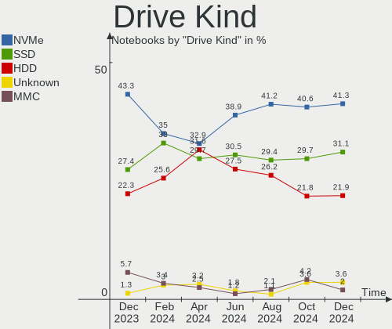
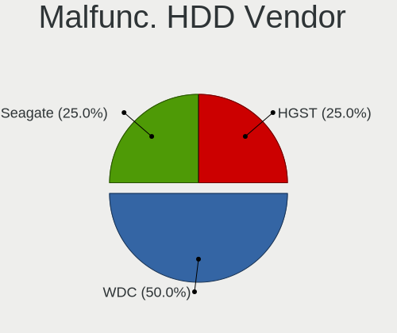
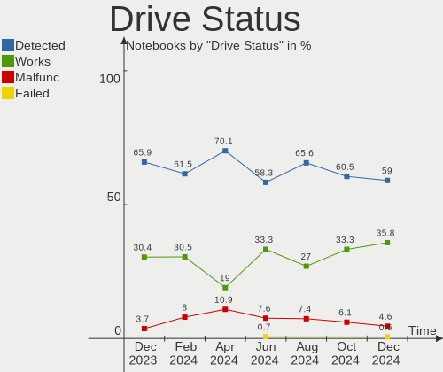
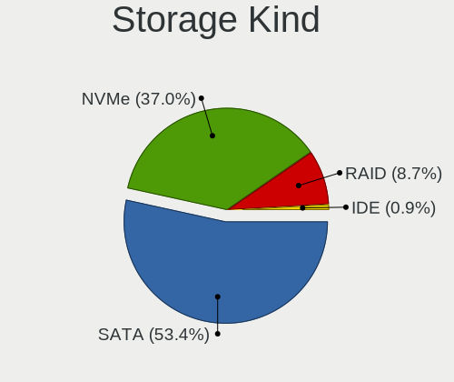
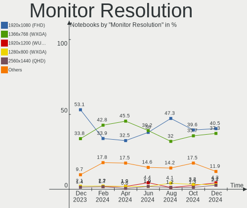
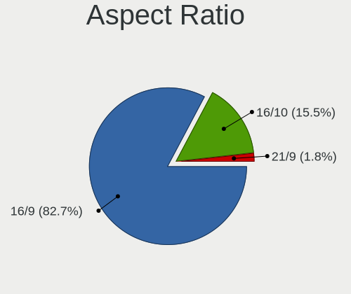

Linux in Brazil - Hardware Trends (Notebooks)
---------------------------------------------

A project to identify most popular hardware characteristics and track their change
over time based on data collected by Linux users at https://Linux-Hardware.org.

Anyone can contribute to this report by the [hw-probe](https://github.com/linuxhw/hw-probe) tool:

    sudo -E hw-probe -all -upload

Period: Apr, 2023.

Contents
--------

* [ System ](#system)
  - [ OS                       ](#os)
  - [ OS Family                ](#os-family)
  - [ Kernel                   ](#kernel)
  - [ Kernel Family            ](#kernel-family)
  - [ Kernel Major Ver.        ](#kernel-major-ver)
  - [ Arch                     ](#arch)
  - [ DE                       ](#de)
  - [ Display Server           ](#display-server)
  - [ Display Manager          ](#display-manager)
  - [ OS Lang                  ](#os-lang)
  - [ Boot Mode                ](#boot-mode)
  - [ Filesystem               ](#filesystem)
  - [ Part. scheme             ](#part-scheme)
  - [ Dual Boot with Linux/BSD ](#dual-boot-with-linuxbsd)
  - [ Dual Boot (Win)          ](#dual-boot-win)

* [ Board ](#board)
  - [ Vendor                   ](#vendor)
  - [ Model                    ](#model)
  - [ Model Family             ](#model-family)
  - [ MFG Year                 ](#mfg-year)
  - [ Form Factor              ](#form-factor)
  - [ Secure Boot              ](#secure-boot)
  - [ Coreboot                 ](#coreboot)
  - [ RAM Size                 ](#ram-size)
  - [ RAM Used                 ](#ram-used)
  - [ Total Drives             ](#total-drives)
  - [ Has CD-ROM               ](#has-cd-rom)
  - [ Has Ethernet             ](#has-ethernet)
  - [ Has WiFi                 ](#has-wifi)
  - [ Has Bluetooth            ](#has-bluetooth)

* [ Location ](#location)
  - [ Country                  ](#country)
  - [ City                     ](#city)

* [ Drives ](#drives)
  - [ Drive Vendor             ](#drive-vendor)
  - [ Drive Model              ](#drive-model)
  - [ HDD Vendor               ](#hdd-vendor)
  - [ SSD Vendor               ](#ssd-vendor)
  - [ Drive Kind               ](#drive-kind)
  - [ Drive Connector          ](#drive-connector)
  - [ Drive Size               ](#drive-size)
  - [ Space Total              ](#space-total)
  - [ Space Used               ](#space-used)
  - [ Malfunc. Drives          ](#malfunc-drives)
  - [ Malfunc. Drive Vendor    ](#malfunc-drive-vendor)
  - [ Malfunc. HDD Vendor      ](#malfunc-hdd-vendor)
  - [ Malfunc. Drive Kind      ](#malfunc-drive-kind)
  - [ Failed Drives            ](#failed-drives)
  - [ Failed Drive Vendor      ](#failed-drive-vendor)
  - [ Drive Status             ](#drive-status)

* [ Storage controller ](#storage-controller)
  - [ Storage Vendor           ](#storage-vendor)
  - [ Storage Model            ](#storage-model)
  - [ Storage Kind             ](#storage-kind)

* [ Processor ](#processor)
  - [ CPU Vendor               ](#cpu-vendor)
  - [ CPU Model                ](#cpu-model)
  - [ CPU Model Family         ](#cpu-model-family)
  - [ CPU Cores                ](#cpu-cores)
  - [ CPU Sockets              ](#cpu-sockets)
  - [ CPU Threads              ](#cpu-threads)
  - [ CPU Op-Modes             ](#cpu-op-modes)
  - [ CPU Microcode            ](#cpu-microcode)
  - [ CPU Microarch            ](#cpu-microarch)

* [ Graphics ](#graphics)
  - [ GPU Vendor               ](#gpu-vendor)
  - [ GPU Model                ](#gpu-model)
  - [ GPU Combo                ](#gpu-combo)
  - [ GPU Driver               ](#gpu-driver)
  - [ GPU Memory               ](#gpu-memory)

* [ Monitor ](#monitor)
  - [ Monitor Vendor           ](#monitor-vendor)
  - [ Monitor Model            ](#monitor-model)
  - [ Monitor Resolution       ](#monitor-resolution)
  - [ Monitor Diagonal         ](#monitor-diagonal)
  - [ Monitor Width            ](#monitor-width)
  - [ Aspect Ratio             ](#aspect-ratio)
  - [ Monitor Area             ](#monitor-area)
  - [ Pixel Density            ](#pixel-density)
  - [ Multiple Monitors        ](#multiple-monitors)

* [ Network ](#network)
  - [ Net Controller Vendor    ](#net-controller-vendor)
  - [ Net Controller Model     ](#net-controller-model)
  - [ Wireless Vendor          ](#wireless-vendor)
  - [ Wireless Model           ](#wireless-model)
  - [ Ethernet Vendor          ](#ethernet-vendor)
  - [ Ethernet Model           ](#ethernet-model)
  - [ Net Controller Kind      ](#net-controller-kind)
  - [ Used Controller          ](#used-controller)
  - [ NICs                     ](#nics)
  - [ IPv6                     ](#ipv6)

* [ Bluetooth ](#bluetooth)
  - [ Bluetooth Vendor         ](#bluetooth-vendor)
  - [ Bluetooth Model          ](#bluetooth-model)

* [ Sound ](#sound)
  - [ Sound Vendor             ](#sound-vendor)
  - [ Sound Model              ](#sound-model)

* [ Memory ](#memory)
  - [ Memory Vendor            ](#memory-vendor)
  - [ Memory Model             ](#memory-model)
  - [ Memory Kind              ](#memory-kind)
  - [ Memory Form Factor       ](#memory-form-factor)
  - [ Memory Size              ](#memory-size)
  - [ Memory Speed             ](#memory-speed)

* [ Printers & scanners ](#printers--scanners)
  - [ Printer Vendor           ](#printer-vendor)
  - [ Printer Model            ](#printer-model)
  - [ Scanner Vendor           ](#scanner-vendor)
  - [ Scanner Model            ](#scanner-model)

* [ Camera ](#camera)
  - [ Camera Vendor            ](#camera-vendor)
  - [ Camera Model             ](#camera-model)

* [ Security ](#security)
  - [ Fingerprint Vendor       ](#fingerprint-vendor)
  - [ Fingerprint Model        ](#fingerprint-model)
  - [ Chipcard Vendor          ](#chipcard-vendor)
  - [ Chipcard Model           ](#chipcard-model)

* [ Unsupported ](#unsupported)
  - [ Unsupported Devices      ](#unsupported-devices)
  - [ Unsupported Device Types ](#unsupported-device-types)

System
------

OS
--

Installed operating systems

| Name                         | Notebooks | Percent |
|------------------------------|-----------|---------|
| OpenMandriva 23.03           | 20        | 13.89%  |
| Ubuntu 22.04                 | 16        | 11.11%  |
| Fedora 38                    | 13        | 9.03%   |
| Ubuntu 23.04                 | 9         | 6.25%   |
| Pop!_OS 22.04                | 7         | 4.86%   |
| Linux Mint 21.1              | 7         | 4.86%   |
| Arch Rolling                 | 7         | 4.86%   |
| Ubuntu 22.10                 | 5         | 3.47%   |
| Fedora 37                    | 5         | 3.47%   |
| KDE neon 22.04               | 4         | 2.78%   |
| Ubuntu 20.04                 | 3         | 2.08%   |
| openSUSE Tumbleweed-XXXXXXXX | 3         | 2.08%   |
| Manjaro                      | 3         | 2.08%   |
| Debian 12                    | 3         | 2.08%   |
| Debian 11                    | 3         | 2.08%   |
| Zorin 16                     | 2         | 1.39%   |
| OpenMandriva 4.3             | 2         | 1.39%   |
| LMDE 5                       | 2         | 1.39%   |
| Linux Mint 20.3              | 2         | 1.39%   |
| antiX 22                     | 2         | 1.39%   |
| Ubuntu Unity 16.04           | 1         | 0.69%   |
| Ubuntu MATE 22.04            | 1         | 0.69%   |
| Ubuntu 18.04                 | 1         | 0.69%   |
| Trisquel 11.0                | 1         | 0.69%   |
| SteamOS 3.4.6                | 1         | 0.69%   |
| ROSA R11.1                   | 1         | 0.69%   |
| PureOS 10.0                  | 1         | 0.69%   |
| openSUSE Leap-15.4           | 1         | 0.69%   |
| OpenMandriva 4.2             | 1         | 0.69%   |
| OpenMandriva 23.01           | 1         | 0.69%   |
| Nobara 37                    | 1         | 0.69%   |
| NixOS 23.05                  | 1         | 0.69%   |
| Manjaro 22.0.5               | 1         | 0.69%   |
| Lubuntu 23.04                | 1         | 0.69%   |
| Linux Mint 20.1              | 1         | 0.69%   |
| Linux Mint 18.3              | 1         | 0.69%   |
| Kali 2023.1                  | 1         | 0.69%   |
| Endless 5.0.1                | 1         | 0.69%   |
| Endless 4.0.4                | 1         | 0.69%   |
| Endless 3.9.3-nexthw1        | 1         | 0.69%   |

OS Family
---------

OS without a version

| Name         | Notebooks | Percent |
|--------------|-----------|---------|
| Ubuntu       | 34        | 23.61%  |
| OpenMandriva | 24        | 16.67%  |
| Fedora       | 18        | 12.5%   |
| Linux Mint   | 11        | 7.64%   |
| Pop!_OS      | 7         | 4.86%   |
| Debian       | 7         | 4.86%   |
| Arch         | 7         | 4.86%   |
| openSUSE     | 4         | 2.78%   |
| Manjaro      | 4         | 2.78%   |
| KDE neon     | 4         | 2.78%   |
| Endless      | 3         | 2.08%   |
| Zorin        | 2         | 1.39%   |
| LMDE         | 2         | 1.39%   |
| antiX        | 2         | 1.39%   |
| Ubuntu Unity | 1         | 0.69%   |
| Ubuntu MATE  | 1         | 0.69%   |
| Trisquel     | 1         | 0.69%   |
| SteamOS      | 1         | 0.69%   |
| ROSA         | 1         | 0.69%   |
| PureOS       | 1         | 0.69%   |
| Nobara       | 1         | 0.69%   |
| NixOS        | 1         | 0.69%   |
| Lubuntu      | 1         | 0.69%   |
| Kali         | 1         | 0.69%   |
| EndeavourOS  | 1         | 0.69%   |
| Elementary   | 1         | 0.69%   |
| ChimeraOS    | 1         | 0.69%   |
| BigLinux     | 1         | 0.69%   |
| ArcoLinux    | 1         | 0.69%   |

Kernel
------

Version of the Linux kernel

| Version                      | Notebooks | Percent |
|------------------------------|-----------|---------|
| 6.2.6-desktop-1omv2390       | 20        | 13.89%  |
| 5.19.0-38-generic            | 16        | 11.11%  |
| 6.2.11-300.fc38.x86_64       | 9         | 6.25%   |
| 6.2.6-76060206-generic       | 7         | 4.86%   |
| 5.15.0-69-generic            | 7         | 4.86%   |
| 6.2.0-20-generic             | 5         | 3.47%   |
| 6.1.0-7-amd64                | 4         | 2.78%   |
| 5.19.0-41-generic            | 4         | 2.78%   |
| 5.10.0-21-amd64              | 4         | 2.78%   |
| 6.2.12-300.fc38.x86_64       | 3         | 2.08%   |
| 5.19.0-40-generic            | 3         | 2.08%   |
| 6.2.9-arch1-1                | 2         | 1.39%   |
| 6.2.12-1-default             | 2         | 1.39%   |
| 6.2.11-200.fc37.x86_64       | 2         | 1.39%   |
| 6.2.0-19-generic             | 2         | 1.39%   |
| 6.2.0-18-generic             | 2         | 1.39%   |
| 6.1.23-1-MANJARO             | 2         | 1.39%   |
| 5.16.7-desktop-1omv4003      | 2         | 1.39%   |
| 5.15.0-71-generic            | 2         | 1.39%   |
| 6.2.9-zen1-1-zen             | 1         | 0.69%   |
| 6.2.9-lqx1                   | 1         | 0.69%   |
| 6.2.9-200.fc37.x86_64        | 1         | 0.69%   |
| 6.2.9-060209-generic         | 1         | 0.69%   |
| 6.2.8-200.fc37.x86_64        | 1         | 0.69%   |
| 6.2.8-1-MANJARO              | 1         | 0.69%   |
| 6.2.13-zen-1-zen             | 1         | 0.69%   |
| 6.2.13-arch1-1               | 1         | 0.69%   |
| 6.2.13-300.fc38.x86_64       | 1         | 0.69%   |
| 6.2.12-arch1-1               | 1         | 0.69%   |
| 6.2.11-arch1-1               | 1         | 0.69%   |
| 6.2.10-zen1-1-zen            | 1         | 0.69%   |
| 6.2.10-arch1-1               | 1         | 0.69%   |
| 6.2.10-200.fsync.fc37.x86_64 | 1         | 0.69%   |
| 6.2.10-200.fc37.x86_64       | 1         | 0.69%   |
| 6.2.10-1-default             | 1         | 0.69%   |
| 6.1.25-1-MANJARO             | 1         | 0.69%   |
| 6.1.20-x64v2-xanmod1-1-lts   | 1         | 0.69%   |
| 6.1.11-arch1-1               | 1         | 0.69%   |
| 6.1.1-desktop-1omv2290       | 1         | 0.69%   |
| 6.1.0-kali5-amd64            | 1         | 0.69%   |

Kernel Family
-------------

Linux kernel without a distro release

| Version  | Notebooks | Percent |
|----------|-----------|---------|
| 6.2.6    | 27        | 18.75%  |
| 5.19.0   | 26        | 18.06%  |
| 5.15.0   | 13        | 9.03%   |
| 6.2.11   | 12        | 8.33%   |
| 6.2.0    | 9         | 6.25%   |
| 6.2.9    | 6         | 4.17%   |
| 6.2.12   | 6         | 4.17%   |
| 5.10.0   | 6         | 4.17%   |
| 6.2.10   | 5         | 3.47%   |
| 6.1.0    | 5         | 3.47%   |
| 6.2.13   | 3         | 2.08%   |
| 5.4.0    | 3         | 2.08%   |
| 5.11.0   | 3         | 2.08%   |
| 6.2.8    | 2         | 1.39%   |
| 6.1.23   | 2         | 1.39%   |
| 5.16.7   | 2         | 1.39%   |
| 4.15.0   | 2         | 1.39%   |
| 6.1.25   | 1         | 0.69%   |
| 6.1.20   | 1         | 0.69%   |
| 6.1.11   | 1         | 0.69%   |
| 6.1.1    | 1         | 0.69%   |
| 5.4.32   | 1         | 0.69%   |
| 5.14.21  | 1         | 0.69%   |
| 5.14.0   | 1         | 0.69%   |
| 5.13.0   | 1         | 0.69%   |
| 5.10.142 | 1         | 0.69%   |
| 5.10.14  | 1         | 0.69%   |
| 4.9.0    | 1         | 0.69%   |
| 4.4.0    | 1         | 0.69%   |

Kernel Major Ver.
-----------------

Linux kernel major version

| Version | Notebooks | Percent |
|---------|-----------|---------|
| 6.2     | 70        | 48.61%  |
| 5.19    | 26        | 18.06%  |
| 5.15    | 13        | 9.03%   |
| 6.1     | 11        | 7.64%   |
| 5.10    | 8         | 5.56%   |
| 5.4     | 4         | 2.78%   |
| 5.11    | 3         | 2.08%   |
| 5.16    | 2         | 1.39%   |
| 5.14    | 2         | 1.39%   |
| 4.15    | 2         | 1.39%   |
| 5.13    | 1         | 0.69%   |
| 4.9     | 1         | 0.69%   |
| 4.4     | 1         | 0.69%   |

Arch
----

OS architecture (x86_64, i586, etc.)

| Name   | Notebooks | Percent |
|--------|-----------|---------|
| x86_64 | 144       | 100%    |

DE
--

Desktop Environment

| Name          | Notebooks | Percent |
|---------------|-----------|---------|
| GNOME         | 76        | 52.78%  |
| KDE5          | 36        | 25%     |
| XFCE          | 8         | 5.56%   |
| X-Cinnamon    | 7         | 4.86%   |
| MATE          | 3         | 2.08%   |
| LXQt          | 3         | 2.08%   |
| Unknown       | 3         | 2.08%   |
| sway          | 2         | 1.39%   |
| Unity         | 1         | 0.69%   |
| Pantheon      | 1         | 0.69%   |
| icewm         | 1         | 0.69%   |
| GNOME Classic | 1         | 0.69%   |
| fluxbox       | 1         | 0.69%   |
| Cinnamon      | 1         | 0.69%   |

Display Server
--------------

X11 or Wayland

| Name    | Notebooks | Percent |
|---------|-----------|---------|
| X11     | 84        | 58.33%  |
| Wayland | 57        | 39.58%  |
| Unknown | 3         | 2.08%   |

Display Manager
---------------

SDDM, LightDM, etc.

| Name    | Notebooks | Percent |
|---------|-----------|---------|
| Unknown | 55        | 38.19%  |
| GDM3    | 34        | 23.61%  |
| SDDM    | 28        | 19.44%  |
| GDM     | 16        | 11.11%  |
| LightDM | 10        | 6.94%   |
| XDM     | 1         | 0.69%   |

OS Lang
-------

Language

| Lang    | Notebooks | Percent |
|---------|-----------|---------|
| pt_BR   | 95        | 65.97%  |
| en_US   | 33        | 22.92%  |
| C       | 5         | 3.47%   |
| en_GB   | 3         | 2.08%   |
| en_CA   | 3         | 2.08%   |
| Unknown | 3         | 2.08%   |
| pt_PT   | 1         | 0.69%   |
| de_CH   | 1         | 0.69%   |

Boot Mode
---------

EFI or BIOS

| Mode | Notebooks | Percent |
|------|-----------|---------|
| EFI  | 83        | 57.64%  |
| BIOS | 61        | 42.36%  |

Filesystem
----------

Type of filesystem

| Type    | Notebooks | Percent |
|---------|-----------|---------|
| Ext4    | 92        | 63.89%  |
| Btrfs   | 25        | 17.36%  |
| Overlay | 18        | 12.5%   |
| Tmpfs   | 6         | 4.17%   |
| Zfs     | 1         | 0.69%   |
| Xfs     | 1         | 0.69%   |
| F2fs    | 1         | 0.69%   |

Part. scheme
------------

Scheme of partitioning

| Type    | Notebooks | Percent |
|---------|-----------|---------|
| GPT     | 81        | 56.25%  |
| Unknown | 48        | 33.33%  |
| MBR     | 15        | 10.42%  |

Dual Boot with Linux/BSD
------------------------

Hosting more than one Linux/BSD

| Dual boot | Notebooks | Percent |
|-----------|-----------|---------|
| No        | 124       | 86.11%  |
| Yes       | 20        | 13.89%  |

Dual Boot (Win)
---------------

Hosting Linux and Windows

| Dual boot | Notebooks | Percent |
|-----------|-----------|---------|
| No        | 112       | 77.78%  |
| Yes       | 32        | 22.22%  |

Board
-----

Vendor
------

Motherboard manufacturer

| Name                   | Notebooks | Percent |
|------------------------|-----------|---------|
| Dell                   | 32        | 22.22%  |
| Lenovo                 | 21        | 14.58%  |
| Acer                   | 21        | 14.58%  |
| Samsung Electronics    | 12        | 8.33%   |
| Hewlett-Packard        | 12        | 8.33%   |
| Positivo               | 8         | 5.56%   |
| ASUSTek Computer       | 8         | 5.56%   |
| Avell High Performance | 5         | 3.47%   |
| Apple                  | 3         | 2.08%   |
| Valve                  | 2         | 1.39%   |
| Notebook               | 2         | 1.39%   |
| Multilaser             | 2         | 1.39%   |
| Itautec                | 2         | 1.39%   |
| Intel                  | 2         | 1.39%   |
| Timi                   | 1         | 0.69%   |
| Sony                   | 1         | 0.69%   |
| Semp Toshiba           | 1         | 0.69%   |
| Purism                 | 1         | 0.69%   |
| MSI                    | 1         | 0.69%   |
| Login Informatica      | 1         | 0.69%   |
| LG Electronics         | 1         | 0.69%   |
| Gateway                | 1         | 0.69%   |
| Evolute                | 1         | 0.69%   |
| Digibras               | 1         | 0.69%   |
| Alienware              | 1         | 0.69%   |
| Unknown                | 1         | 0.69%   |

Model
-----

Motherboard model

| Name                                                  | Notebooks | Percent |
|-------------------------------------------------------|-----------|---------|
| Lenovo IdeaPad 3 15ALC6 82MF                          | 5         | 3.47%   |
| ASUS VivoBook_ASUSLaptop X515DA_X515DA                | 3         | 2.08%   |
| Valve Jupiter                                         | 2         | 1.39%   |
| Samsung 550P5C/550P7C                                 | 2         | 1.39%   |
| Positivo Q4128C-S                                     | 2         | 1.39%   |
| Lenovo V14 G2 ITL 82NM                                | 2         | 1.39%   |
| Lenovo IdeaPad S145-15API 81V7                        | 2         | 1.39%   |
| Lenovo IdeaPad 330-15IKB 81FE                         | 2         | 1.39%   |
| Lenovo IdeaPad 320-15IKB 80YH                         | 2         | 1.39%   |
| HP Pavilion g4                                        | 2         | 1.39%   |
| Dell Inspiron 5566                                    | 2         | 1.39%   |
| Dell Inspiron 15-3567                                 | 2         | 1.39%   |
| Dell G15 5520                                         | 2         | 1.39%   |
| Avell High Performance A52 HYB                        | 2         | 1.39%   |
| Acer Nitro AN515-54                                   | 2         | 1.39%   |
| Acer Nitro AN515-45                                   | 2         | 1.39%   |
| Acer Aspire E5-471                                    | 2         | 1.39%   |
| Unknown                                               | 2         | 1.39%   |
| Timi RedmiBook Pro 14S                                | 1         | 0.69%   |
| Sony VJF155F11X-B0811B                                | 1         | 0.69%   |
| Semp Toshiba IS 1413G                                 | 1         | 0.69%   |
| Samsung RV419                                         | 1         | 0.69%   |
| Samsung RV411/RV511/E3511/S3511/RV711                 | 1         | 0.69%   |
| Samsung 767XCL                                        | 1         | 0.69%   |
| Samsung 700Z3A/700Z4A/700Z5A/700Z5B                   | 1         | 0.69%   |
| Samsung 670Z5E                                        | 1         | 0.69%   |
| Samsung 550XDA                                        | 1         | 0.69%   |
| Samsung 550XCJ/550XCR                                 | 1         | 0.69%   |
| Samsung 340XAA/350XAA/550XAA                          | 1         | 0.69%   |
| Samsung 300E5EV/300E4EV/270E5EV/270E4EV/2470EV/2470EE | 1         | 0.69%   |
| Samsung 270E5G/270E5U                                 | 1         | 0.69%   |
| Purism Librem 14                                      | 1         | 0.69%   |
| Positivo S14CT01                                      | 1         | 0.69%   |
| Positivo Q464C                                        | 1         | 0.69%   |
| Positivo N6440                                        | 1         | 0.69%   |
| Positivo H14SU08                                      | 1         | 0.69%   |
| Positivo H14BT58                                      | 1         | 0.69%   |
| Positivo C14CR01                                      | 1         | 0.69%   |
| Notebook NJx0MU                                       | 1         | 0.69%   |
| Notebook N85_N87HCHNHZ                                | 1         | 0.69%   |

Model Family
------------

Motherboard model prefix

| Name                       | Notebooks | Percent |
|----------------------------|-----------|---------|
| Dell Inspiron              | 17        | 11.81%  |
| Lenovo IdeaPad             | 13        | 9.03%   |
| Acer Aspire                | 13        | 9.03%   |
| Acer Nitro                 | 7         | 4.86%   |
| Lenovo ThinkPad            | 5         | 3.47%   |
| Dell Vostro                | 4         | 2.78%   |
| Dell G15                   | 4         | 2.78%   |
| ASUS VivoBook              | 4         | 2.78%   |
| HP Pavilion                | 3         | 2.08%   |
| Dell Latitude              | 3         | 2.08%   |
| Valve Jupiter              | 2         | 1.39%   |
| Samsung 550P5C             | 2         | 1.39%   |
| Positivo Q4128C-S          | 2         | 1.39%   |
| Lenovo V14                 | 2         | 1.39%   |
| Itautec Infoway            | 2         | 1.39%   |
| HP 240                     | 2         | 1.39%   |
| Dell G3                    | 2         | 1.39%   |
| Avell High Performance A70 | 2         | 1.39%   |
| Avell High Performance A52 | 2         | 1.39%   |
| Unknown                    | 2         | 1.39%   |
| Timi RedmiBook             | 1         | 0.69%   |
| Sony VJF155F11X-B0811B     | 1         | 0.69%   |
| Semp Toshiba IS            | 1         | 0.69%   |
| Samsung RV419              | 1         | 0.69%   |
| Samsung RV411              | 1         | 0.69%   |
| Samsung 767XCL             | 1         | 0.69%   |
| Samsung 700Z3A             | 1         | 0.69%   |
| Samsung 670Z5E             | 1         | 0.69%   |
| Samsung 550XDA             | 1         | 0.69%   |
| Samsung 550XCJ             | 1         | 0.69%   |
| Samsung 340XAA             | 1         | 0.69%   |
| Samsung 300E5EV            | 1         | 0.69%   |
| Samsung 270E5G             | 1         | 0.69%   |
| Purism Librem              | 1         | 0.69%   |
| Positivo S14CT01           | 1         | 0.69%   |
| Positivo Q464C             | 1         | 0.69%   |
| Positivo N6440             | 1         | 0.69%   |
| Positivo H14SU08           | 1         | 0.69%   |
| Positivo H14BT58           | 1         | 0.69%   |
| Positivo C14CR01           | 1         | 0.69%   |

MFG Year
--------

Motherboard manufacture year

| Year    | Notebooks | Percent |
|---------|-----------|---------|
| 2021    | 25        | 17.36%  |
| 2020    | 17        | 11.81%  |
| 2011    | 12        | 8.33%   |
| 2022    | 11        | 7.64%   |
| 2019    | 11        | 7.64%   |
| 2012    | 9         | 6.25%   |
| 2018    | 8         | 5.56%   |
| 2017    | 8         | 5.56%   |
| 2016    | 7         | 4.86%   |
| 2015    | 7         | 4.86%   |
| 2014    | 7         | 4.86%   |
| 2008    | 6         | 4.17%   |
| 2013    | 5         | 3.47%   |
| 2010    | 4         | 2.78%   |
| 2009    | 3         | 2.08%   |
| 2006    | 2         | 1.39%   |
| Unknown | 2         | 1.39%   |

Form Factor
-----------

Physical design of the computer

| Name     | Notebooks | Percent |
|----------|-----------|---------|
| Notebook | 144       | 100%    |

Secure Boot
-----------

Enabled or disabled

| State    | Notebooks | Percent |
|----------|-----------|---------|
| Disabled | 128       | 88.89%  |
| Enabled  | 16        | 11.11%  |

Coreboot
--------

Have coreboot on board

| Used | Notebooks | Percent |
|------|-----------|---------|
| No   | 143       | 99.31%  |
| Yes  | 1         | 0.69%   |

RAM Size
--------

Total RAM memory

| Size in GB  | Notebooks | Percent |
|-------------|-----------|---------|
| 4.01-8.0    | 52        | 36.11%  |
| 16.01-24.0  | 29        | 20.14%  |
| 3.01-4.0    | 27        | 18.75%  |
| 8.01-16.0   | 16        | 11.11%  |
| 1.01-2.0    | 11        | 7.64%   |
| 32.01-64.0  | 7         | 4.86%   |
| 2.01-3.0    | 1         | 0.69%   |
| 64.01-256.0 | 1         | 0.69%   |

RAM Used
--------

Used RAM memory

| Used GB    | Notebooks | Percent |
|------------|-----------|---------|
| 2.01-3.0   | 49        | 34.03%  |
| 1.01-2.0   | 31        | 21.53%  |
| 4.01-8.0   | 26        | 18.06%  |
| 3.01-4.0   | 22        | 15.28%  |
| 0.51-1.0   | 8         | 5.56%   |
| 8.01-16.0  | 7         | 4.86%   |
| 16.01-24.0 | 1         | 0.69%   |

Total Drives
------------

Number of drives on board

| Drives | Notebooks | Percent |
|--------|-----------|---------|
| 1      | 97        | 67.36%  |
| 2      | 41        | 28.47%  |
| 3      | 6         | 4.17%   |

Has CD-ROM
----------

Has CD-ROM on board

| Presented | Notebooks | Percent |
|-----------|-----------|---------|
| No        | 104       | 72.22%  |
| Yes       | 40        | 27.78%  |

Has Ethernet
------------

Has Ethernet on board

| Presented | Notebooks | Percent |
|-----------|-----------|---------|
| Yes       | 116       | 80.56%  |
| No        | 28        | 19.44%  |

Has WiFi
--------

Has WiFi module

| Presented | Notebooks | Percent |
|-----------|-----------|---------|
| Yes       | 138       | 95.83%  |
| No        | 6         | 4.17%   |

Has Bluetooth
-------------

Has Bluetooth module

| Presented | Notebooks | Percent |
|-----------|-----------|---------|
| Yes       | 108       | 75%     |
| No        | 36        | 25%     |

Location
--------

Country
-------

Geographic location (country)

| Country | Notebooks | Percent |
|---------|-----------|---------|
| Brazil  | 144       | 100%    |

City
----

Geographic location (city)

| City                     | Notebooks | Percent |
|--------------------------|-----------|---------|
| Sao Paulo                | 15        | 10.42%  |
| Rio de Janeiro           | 11        | 7.64%   |
| Porto Alegre             | 6         | 4.17%   |
| Joao Pessoa              | 3         | 2.08%   |
| Fortaleza                | 3         | 2.08%   |
| Curitiba                 | 3         | 2.08%   |
| Campo Grande             | 3         | 2.08%   |
| Brasília                | 3         | 2.08%   |
| Uberlândia              | 2         | 1.39%   |
| Teresopolis              | 2         | 1.39%   |
| Teresina                 | 2         | 1.39%   |
| Sorocaba                 | 2         | 1.39%   |
| Sao Vicente              | 2         | 1.39%   |
| Sao Luís                | 2         | 1.39%   |
| Sao José dos Campos     | 2         | 1.39%   |
| Sao Goncalo              | 2         | 1.39%   |
| Santo André             | 2         | 1.39%   |
| Maringá                 | 2         | 1.39%   |
| Londrina                 | 2         | 1.39%   |
| Hortolândia             | 2         | 1.39%   |
| Duque de Caxias          | 2         | 1.39%   |
| Campina Grande           | 2         | 1.39%   |
| Aracaju                  | 2         | 1.39%   |
| Ananindeua               | 2         | 1.39%   |
| Vila Velha               | 1         | 0.69%   |
| Vassouras                | 1         | 0.69%   |
| Umuarama                 | 1         | 0.69%   |
| Timbauba                 | 1         | 0.69%   |
| Taiobeiras               | 1         | 0.69%   |
| Senador Canedo           | 1         | 0.69%   |
| Sao Jose do Rio Preto    | 1         | 0.69%   |
| Sao Bernardo do Campo    | 1         | 0.69%   |
| Santo Antonio de Padua   | 1         | 0.69%   |
| Santa Cruz do Capibaribe | 1         | 0.69%   |
| Santa Cruz das Palmeiras | 1         | 0.69%   |
| Salvador                 | 1         | 0.69%   |
| Praia Grande             | 1         | 0.69%   |
| Ponte Alta do Norte      | 1         | 0.69%   |
| Pereira Barreto          | 1         | 0.69%   |
| Parnamirim               | 1         | 0.69%   |

Drives
------

Drive Vendor
------------

Hard drive vendors

| Vendor                         | Notebooks | Drives | Percent |
|--------------------------------|-----------|--------|---------|
| WDC                            | 26        | 27     | 13.98%  |
| Kingston                       | 25        | 25     | 13.44%  |
| Seagate                        | 13        | 13     | 6.99%   |
| A-DATA Technology              | 12        | 13     | 6.45%   |
| Unknown                        | 11        | 12     | 5.91%   |
| Sandisk                        | 11        | 12     | 5.91%   |
| Samsung Electronics            | 11        | 13     | 5.91%   |
| Toshiba                        | 10        | 10     | 5.38%   |
| ADATA Technology               | 9         | 9      | 4.84%   |
| China                          | 8         | 8      | 4.3%    |
| SSSTC                          | 7         | 7      | 3.76%   |
| Crucial                        | 6         | 6      | 3.23%   |
| SK hynix                       | 4         | 4      | 2.15%   |
| Hitachi                        | 3         | 3      | 1.61%   |
| XrayDisk                       | 2         | 2      | 1.08%   |
| Solid State Storage            | 2         | 2      | 1.08%   |
| Silicon Motion                 | 2         | 2      | 1.08%   |
| KingSpec                       | 2         | 2      | 1.08%   |
| HGST                           | 2         | 2      | 1.08%   |
| Unknown                        | 2         | 2      | 1.08%   |
| Win Memory                     | 1         | 1      | 0.54%   |
| WALRAM 1                       | 1         | 1      | 0.54%   |
| walram                         | 1         | 1      | 0.54%   |
| Solid State Storage Technology | 1         | 1      | 0.54%   |
| Shenzhen Longsys Electronics   | 1         | 1      | 0.54%   |
| PNY                            | 1         | 1      | 0.54%   |
| Micron Technology              | 1         | 1      | 0.54%   |
| MAXIO Technology (Hangzhou)    | 1         | 1      | 0.54%   |
| Lexar                          | 1         | 1      | 0.54%   |
| KIOXIA                         | 1         | 1      | 0.54%   |
| KingDian                       | 1         | 1      | 0.54%   |
| JMicron Technology             | 1         | 1      | 0.54%   |
| Intel                          | 1         | 1      | 0.54%   |
| HUSKY                          | 1         | 1      | 0.54%   |
| Hised                          | 1         | 1      | 0.54%   |
| Hewlett-Packard                | 1         | 1      | 0.54%   |
| Gigabyte Technology            | 1         | 1      | 0.54%   |
| Apple                          | 1         | 1      | 0.54%   |

Drive Model
-----------

Hard drive models

| Model                                   | Notebooks | Percent |
|-----------------------------------------|-----------|---------|
| Kingston SA400S37480G 480GB SSD         | 9         | 4.71%   |
| Kingston SA400S37240G 240GB SSD         | 7         | 3.66%   |
| SSSTC CL1-4D256 256GB                   | 5         | 2.62%   |
| Crucial CT240BX500SSD1 240GB            | 4         | 2.09%   |
| ADATA SM2P32A8-256GC1 256GB             | 4         | 2.09%   |
| WDC WD3200BPVT-22JJ5T0 320GB            | 3         | 1.57%   |
| WDC WD10SPZX-21Z10T0 1TB                | 3         | 1.57%   |
| Unknown MMC Card  32GB                  | 3         | 1.57%   |
| Sandisk WD Blue SN550 NVMe SSD 1024GB   | 3         | 1.57%   |
| Kingston SA400S37120G 120GB SSD         | 3         | 1.57%   |
| A-DATA IM2P33F3A NVMe 256GB             | 3         | 1.57%   |
| Unknown SD/MMC/MS PRO 249GB             | 2         | 1.05%   |
| Unknown MMC Card  128GB                 | 2         | 1.05%   |
| Toshiba MQ04ABF100 1TB                  | 2         | 1.05%   |
| Toshiba MQ01ABD050 500GB                | 2         | 1.05%   |
| Seagate ST9500325AS 500GB               | 2         | 1.05%   |
| Seagate ST1000LM048-2E7172 1TB          | 2         | 1.05%   |
| Seagate ST1000LM035-1RK172 970GB        | 2         | 1.05%   |
| Seagate Expansion 4TB                   | 2         | 1.05%   |
| Sandisk WD PC SN740 SDDPTQD-1T00 1024GB | 2         | 1.05%   |
| Samsung MZALQ256HAJD-000L2 256GB        | 2         | 1.05%   |
| Kingston SV300S37A120G 120GB SSD        | 2         | 1.05%   |
| China SSD 128GB                         | 2         | 1.05%   |
| A-DATA IM2S3338-128GD2 128GB SSD        | 2         | 1.05%   |
| A-DATA IM2P33F8ABR1-512GB               | 2         | 1.05%   |
| Unknown                                 | 2         | 1.05%   |
| XrayDisk 512GB SSD                      | 1         | 0.52%   |
| XrayDisk 1TB SSD                        | 1         | 0.52%   |
| Win Memory SWR256G-301II 256GB          | 1         | 0.52%   |
| WDC WDS240G2G0B-00EPW0 240GB SSD        | 1         | 0.52%   |
| WDC WDS240G2G0A-00JH30 240GB SSD        | 1         | 0.52%   |
| WDC WDBA3V0010BNC-WRSN 1TB              | 1         | 0.52%   |
| WDC WD5000LPVX-22V0TT0 500GB            | 1         | 0.52%   |
| WDC WD5000LPVX-00V0TT0 500GB            | 1         | 0.52%   |
| WDC WD5000LPLX-75ZNTT0 500GB            | 1         | 0.52%   |
| WDC WD5000LPCX-80VHAT0 500GB            | 1         | 0.52%   |
| WDC WD5000LPCX-75VHAT0 500GB            | 1         | 0.52%   |
| WDC WD5000LPCX-60VHAT0 500GB            | 1         | 0.52%   |
| WDC WD3200BEVT-22ZCT0 320GB             | 1         | 0.52%   |
| WDC WD20SPZX-75UA7T1 2TB                | 1         | 0.52%   |

HDD Vendor
----------

Hard disk drive vendors

| Vendor              | Notebooks | Drives | Percent |
|---------------------|-----------|--------|---------|
| WDC                 | 22        | 22     | 40%     |
| Seagate             | 11        | 11     | 20%     |
| Toshiba             | 10        | 10     | 18.18%  |
| Samsung Electronics | 4         | 4      | 7.27%   |
| Hitachi             | 3         | 3      | 5.45%   |
| Unknown             | 2         | 2      | 3.64%   |
| HGST                | 2         | 2      | 3.64%   |
| JMicron Technology  | 1         | 1      | 1.82%   |

SSD Vendor
----------

Solid state drive vendors

| Vendor              | Notebooks | Drives | Percent |
|---------------------|-----------|--------|---------|
| Kingston            | 23        | 23     | 38.33%  |
| China               | 8         | 8      | 13.33%  |
| Crucial             | 6         | 6      | 10%     |
| SanDisk             | 3         | 3      | 5%      |
| XrayDisk            | 2         | 2      | 3.33%   |
| WDC                 | 2         | 2      | 3.33%   |
| A-DATA Technology   | 2         | 2      | 3.33%   |
| Win Memory          | 1         | 1      | 1.67%   |
| walram              | 1         | 1      | 1.67%   |
| SK hynix            | 1         | 1      | 1.67%   |
| Seagate             | 1         | 1      | 1.67%   |
| Samsung Electronics | 1         | 1      | 1.67%   |
| PNY                 | 1         | 1      | 1.67%   |
| Lexar               | 1         | 1      | 1.67%   |
| KingSpec            | 1         | 1      | 1.67%   |
| KingDian            | 1         | 1      | 1.67%   |
| HUSKY               | 1         | 1      | 1.67%   |
| Hised               | 1         | 1      | 1.67%   |
| Hewlett-Packard     | 1         | 1      | 1.67%   |
| Gigabyte Technology | 1         | 1      | 1.67%   |
| Apple               | 1         | 1      | 1.67%   |

Drive Kind
----------

HDD or SSD

| Kind    | Notebooks | Drives | Percent |
|---------|-----------|--------|---------|
| SSD     | 56        | 60     | 31.64%  |
| NVMe    | 54        | 60     | 30.51%  |
| HDD     | 53        | 55     | 29.94%  |
| MMC     | 9         | 11     | 5.08%   |
| Unknown | 5         | 6      | 2.82%   |

Drive Connector
---------------

SATA, SAS, NVMe, etc.

| Type | Notebooks | Drives | Percent |
|------|-----------|--------|---------|
| SATA | 95        | 107    | 56.21%  |
| NVMe | 54        | 60     | 31.95%  |
| SAS  | 11        | 14     | 6.51%   |
| MMC  | 9         | 11     | 5.33%   |

Drive Size
----------

Size of hard drive

| Size in TB | Notebooks | Drives | Percent |
|------------|-----------|--------|---------|
| 0.01-0.5   | 80        | 83     | 71.43%  |
| 0.51-1.0   | 27        | 27     | 24.11%  |
| 1.01-2.0   | 3         | 3      | 2.68%   |
| 3.01-4.0   | 2         | 2      | 1.79%   |

Space Total
-----------

Amount of disk space available on the file system

| Size in GB     | Notebooks | Percent |
|----------------|-----------|---------|
| 101-250        | 39        | 27.08%  |
| 251-500        | 33        | 22.92%  |
| 1-20           | 18        | 12.5%   |
| 1001-2000      | 14        | 9.72%   |
| 501-1000       | 13        | 9.03%   |
| 21-50          | 8         | 5.56%   |
| 51-100         | 8         | 5.56%   |
| Unknown        | 5         | 3.47%   |
| 2001-3000      | 4         | 2.78%   |
| More than 3000 | 2         | 1.39%   |

Space Used
----------

Amount of used disk space

| Used GB        | Notebooks | Percent |
|----------------|-----------|---------|
| 1-20           | 53        | 36.81%  |
| 21-50          | 29        | 20.14%  |
| 51-100         | 17        | 11.81%  |
| 101-250        | 15        | 10.42%  |
| 251-500        | 12        | 8.33%   |
| 501-1000       | 8         | 5.56%   |
| Unknown        | 5         | 3.47%   |
| 1001-2000      | 4         | 2.78%   |
| More than 3000 | 1         | 0.69%   |

Malfunc. Drives
---------------

Drive models with a malfunction

| Model                             | Notebooks | Drives | Percent |
|-----------------------------------|-----------|--------|---------|
| WDC WD3200BPVT-22JJ5T0 320GB      | 2         | 2      | 11.76%  |
| WDC WD5000LPVX-22V0TT0 500GB      | 1         | 1      | 5.88%   |
| WDC WD5000LPVX-00V0TT0 500GB      | 1         | 1      | 5.88%   |
| WDC WD5000LPCX-60VHAT0 500GB      | 1         | 1      | 5.88%   |
| WDC WD20SPZX-75UA7T0 2TB          | 1         | 1      | 5.88%   |
| Toshiba MK5061GSYN 500GB          | 1         | 1      | 5.88%   |
| Toshiba MK2546GSX 250GB           | 1         | 1      | 5.88%   |
| Toshiba MK2529GSG 250GB           | 1         | 1      | 5.88%   |
| Seagate ST1000LM048-2E7172 1TB    | 1         | 1      | 5.88%   |
| SanDisk SD6SP1M256G1012 256GB SSD | 1         | 1      | 5.88%   |
| Samsung Electronics HM501II 500GB | 1         | 1      | 5.88%   |
| Samsung Electronics HM160HI 160GB | 1         | 1      | 5.88%   |
| Samsung Electronics HM121HI 120GB | 1         | 1      | 5.88%   |
| Hitachi HTS542525K9SA00 250GB     | 1         | 1      | 5.88%   |
| Hitachi HTS542516K9A300 160GB     | 1         | 1      | 5.88%   |
| HGST HTS545050B7E660 500GB        | 1         | 1      | 5.88%   |

Malfunc. Drive Vendor
---------------------

Vendors of faulty drives

| Vendor              | Notebooks | Drives | Percent |
|---------------------|-----------|--------|---------|
| WDC                 | 6         | 6      | 35.29%  |
| Toshiba             | 3         | 3      | 17.65%  |
| Samsung Electronics | 3         | 3      | 17.65%  |
| Hitachi             | 2         | 2      | 11.76%  |
| Seagate             | 1         | 1      | 5.88%   |
| SanDisk             | 1         | 1      | 5.88%   |
| HGST                | 1         | 1      | 5.88%   |

Malfunc. HDD Vendor
-------------------

Vendors of faulty HDD drives

| Vendor              | Notebooks | Drives | Percent |
|---------------------|-----------|--------|---------|
| WDC                 | 6         | 6      | 37.5%   |
| Toshiba             | 3         | 3      | 18.75%  |
| Samsung Electronics | 3         | 3      | 18.75%  |
| Hitachi             | 2         | 2      | 12.5%   |
| Seagate             | 1         | 1      | 6.25%   |
| HGST                | 1         | 1      | 6.25%   |

Malfunc. Drive Kind
-------------------

Kinds of faulty drives

| Kind | Notebooks | Drives | Percent |
|------|-----------|--------|---------|
| HDD  | 16        | 16     | 94.12%  |
| SSD  | 1         | 1      | 5.88%   |

Failed Drives
-------------

Failed drive models

Zero info for selected period =(

Failed Drive Vendor
-------------------

Failed drive vendors

Zero info for selected period =(

Drive Status
------------

Number of failed and malfunc. drives

| Status   | Notebooks | Drives | Percent |
|----------|-----------|--------|---------|
| Detected | 75        | 97     | 48.7%   |
| Works    | 62        | 78     | 40.26%  |
| Malfunc  | 17        | 17     | 11.04%  |

Storage controller
------------------

Storage Vendor
--------------

Storage controller vendors

| Vendor                         | Notebooks | Percent |
|--------------------------------|-----------|---------|
| Intel                          | 99        | 55.93%  |
| AMD                            | 21        | 11.86%  |
| ADATA Technology               | 19        | 10.73%  |
| Solid State Storage Technology | 10        | 5.65%   |
| SanDisk                        | 10        | 5.65%   |
| Samsung Electronics            | 7         | 3.95%   |
| SK hynix                       | 3         | 1.69%   |
| Silicon Motion                 | 2         | 1.13%   |
| Kingston Technology Company    | 2         | 1.13%   |
| Shenzhen Longsys Electronics   | 1         | 0.56%   |
| Micron Technology              | 1         | 0.56%   |
| MAXIO Technology (Hangzhou)    | 1         | 0.56%   |
| KIOXIA                         | 1         | 0.56%   |

Storage Model
-------------

Storage controller models

| Model                                                                            | Notebooks | Percent |
|----------------------------------------------------------------------------------|-----------|---------|
| AMD FCH SATA Controller [AHCI mode]                                              | 18        | 9.23%   |
| Intel Sunrise Point-LP SATA Controller [AHCI mode]                               | 13        | 6.67%   |
| Intel 7 Series Chipset Family 6-port SATA Controller [AHCI mode]                 | 11        | 5.64%   |
| Intel 6 Series/C200 Series Chipset Family 6 port Mobile SATA AHCI Controller     | 11        | 5.64%   |
| Solid State Storage Non-Volatile memory controller                               | 10        | 5.13%   |
| ADATA A Non-Volatile memory controller                                           | 9         | 4.62%   |
| Intel 82801 Mobile SATA Controller [RAID mode]                                   | 8         | 4.1%    |
| Intel Volume Management Device NVMe RAID Controller                              | 6         | 3.08%   |
| Intel Tiger Lake-LP SATA Controller                                              | 6         | 3.08%   |
| ADATA IM2P33F8ABR1 NVMe SSD                                                      | 6         | 3.08%   |
| Intel 5 Series/3400 Series Chipset 4 port SATA AHCI Controller                   | 5         | 2.56%   |
| SanDisk WD Blue SN550 NVMe SSD                                                   | 4         | 2.05%   |
| Sandisk Non-Volatile memory controller                                           | 4         | 2.05%   |
| Intel Wildcat Point-LP SATA Controller [AHCI Mode]                               | 4         | 2.05%   |
| Intel Alder Lake-P SATA AHCI Controller                                          | 4         | 2.05%   |
| Intel 82801HM/HEM (ICH8M/ICH8M-E) SATA Controller [AHCI mode]                    | 4         | 2.05%   |
| Intel 82801HM/HEM (ICH8M/ICH8M-E) IDE Controller                                 | 4         | 2.05%   |
| Intel 8 Series SATA Controller 1 [AHCI mode]                                     | 4         | 2.05%   |
| ADATA Non-Volatile memory controller                                             | 4         | 2.05%   |
| Samsung NVMe SSD Controller 980                                                  | 3         | 1.54%   |
| Intel Cannon Point-LP SATA Controller [AHCI Mode]                                | 3         | 1.54%   |
| Intel 82801IBM/IEM (ICH9M/ICH9M-E) 4 port SATA Controller [AHCI mode]            | 3         | 1.54%   |
| Intel 500 Series Chipset Family SATA AHCI Controller                             | 3         | 1.54%   |
| AMD SB7x0/SB8x0/SB9x0 SATA Controller [AHCI mode]                                | 3         | 1.54%   |
| SK hynix Gold P31/PC711 NVMe Solid State Drive                                   | 2         | 1.03%   |
| Silicon Motion SM2263EN/SM2263XT SSD Controller                                  | 2         | 1.03%   |
| Samsung NVMe SSD Controller SM981/PM981/PM983                                    | 2         | 1.03%   |
| Intel HM170/QM170 Chipset SATA Controller [AHCI Mode]                            | 2         | 1.03%   |
| Intel Comet Lake SATA AHCI Controller                                            | 2         | 1.03%   |
| Intel Cannon Lake Mobile PCH SATA AHCI Controller                                | 2         | 1.03%   |
| Intel Atom/Celeron/Pentium Processor x5-E8000/J3xxx/N3xxx Series SATA Controller | 2         | 1.03%   |
| Intel Atom Processor E3800 Series SATA AHCI Controller                           | 2         | 1.03%   |
| Intel 7 Series Chipset Family 4-port SATA Controller [IDE mode]                  | 2         | 1.03%   |
| Intel 7 Series Chipset Family 2-port SATA Controller [IDE mode]                  | 2         | 1.03%   |
| Intel 400 Series Chipset Family SATA AHCI Controller                             | 2         | 1.03%   |
| SK hynix Non-Volatile memory controller                                          | 1         | 0.51%   |
| Shenzhen Longsys SM2263EN/SM2263XT-based OEM SSD                                 | 1         | 0.51%   |
| SanDisk WD PC SN810 / Black SN850 NVMe SSD                                       | 1         | 0.51%   |
| SanDisk WD Blue SN570 NVMe SSD 1TB                                               | 1         | 0.51%   |
| SanDisk WD Blue SN500 / PC SN520 NVMe SSD                                        | 1         | 0.51%   |

Storage Kind
------------

Kind of storage controller (IDE, SATA, NVMe, SAS, ...)

| Kind | Notebooks | Percent |
|------|-----------|---------|
| SATA | 109       | 57.98%  |
| NVMe | 54        | 28.72%  |
| RAID | 14        | 7.45%   |
| IDE  | 11        | 5.85%   |

Processor
---------

CPU Vendor
----------

Processor vendors

| Vendor | Notebooks | Percent |
|--------|-----------|---------|
| Intel  | 119       | 82.64%  |
| AMD    | 25        | 17.36%  |

CPU Model
---------

Processor models

| Model                                         | Notebooks | Percent |
|-----------------------------------------------|-----------|---------|
| Intel Core i5-7200U CPU @ 2.50GHz             | 6         | 4.17%   |
| Intel 11th Gen Core i7-1165G7 @ 2.80GHz       | 5         | 3.47%   |
| Intel 11th Gen Core i5-1135G7 @ 2.40GHz       | 5         | 3.47%   |
| AMD Ryzen 5 5500U with Radeon Graphics        | 5         | 3.47%   |
| AMD Ryzen 5 3500U with Radeon Vega Mobile Gfx | 5         | 3.47%   |
| Intel Core i7-8565U CPU @ 1.80GHz             | 4         | 2.78%   |
| Intel Core i3-3110M CPU @ 2.40GHz             | 4         | 2.78%   |
| Intel Atom x5-Z8350 CPU @ 1.44GHz             | 4         | 2.78%   |
| Intel Core i7-7500U CPU @ 2.70GHz             | 3         | 2.08%   |
| Intel Core i5-2450M CPU @ 2.50GHz             | 3         | 2.08%   |
| Intel Core i3-7020U CPU @ 2.30GHz             | 3         | 2.08%   |
| Intel 11th Gen Core i7-11800H @ 2.30GHz       | 3         | 2.08%   |
| AMD Ryzen 7 5700U with Radeon Graphics        | 3         | 2.08%   |
| Intel Core i5-8265U CPU @ 1.60GHz             | 2         | 1.39%   |
| Intel Core i5-3230M CPU @ 2.60GHz             | 2         | 1.39%   |
| Intel Core i5-3210M CPU @ 2.50GHz             | 2         | 1.39%   |
| Intel Core i5-10300H CPU @ 2.50GHz            | 2         | 1.39%   |
| Intel Core i5 CPU M 430 @ 2.27GHz             | 2         | 1.39%   |
| Intel Core i3-5005U CPU @ 2.00GHz             | 2         | 1.39%   |
| Intel Core i3-4005U CPU @ 1.70GHz             | 2         | 1.39%   |
| Intel 12th Gen Core i7-12700H                 | 2         | 1.39%   |
| Intel 12th Gen Core i7-1255U                  | 2         | 1.39%   |
| Intel 12th Gen Core i5-12500H                 | 2         | 1.39%   |
| Intel 12th Gen Core i5-12450H                 | 2         | 1.39%   |
| AMD Ryzen 7 5800H with Radeon Graphics        | 2         | 1.39%   |
| AMD Custom APU 0405                           | 2         | 1.39%   |
| Intel Pentium Dual CPU T3400 @ 2.16GHz        | 1         | 0.69%   |
| Intel Pentium CPU N3710 @ 1.60GHz             | 1         | 0.69%   |
| Intel Pentium CPU B980 @ 2.40GHz              | 1         | 0.69%   |
| Intel Pentium CPU B960 @ 2.20GHz              | 1         | 0.69%   |
| Intel Core i7-9750H CPU @ 2.60GHz             | 1         | 0.69%   |
| Intel Core i7-8750H CPU @ 2.20GHz             | 1         | 0.69%   |
| Intel Core i7-8550U CPU @ 1.80GHz             | 1         | 0.69%   |
| Intel Core i7-7700HQ CPU @ 2.80GHz            | 1         | 0.69%   |
| Intel Core i7-5500U CPU @ 2.40GHz             | 1         | 0.69%   |
| Intel Core i7-3720QM CPU @ 2.60GHz            | 1         | 0.69%   |
| Intel Core i7-3630QM CPU @ 2.40GHz            | 1         | 0.69%   |
| Intel Core i7-3540M CPU @ 3.00GHz             | 1         | 0.69%   |
| Intel Core i7-2670QM CPU @ 2.20GHz            | 1         | 0.69%   |
| Intel Core i7-10710U CPU @ 1.10GHz            | 1         | 0.69%   |

CPU Model Family
----------------

Processor model prefix

| Model              | Notebooks | Percent |
|--------------------|-----------|---------|
| Intel Core i5      | 33        | 22.92%  |
| Other              | 25        | 17.36%  |
| Intel Core i3      | 20        | 13.89%  |
| Intel Core i7      | 18        | 12.5%   |
| AMD Ryzen 5        | 12        | 8.33%   |
| Intel Celeron      | 8         | 5.56%   |
| Intel Atom         | 6         | 4.17%   |
| AMD Ryzen 7        | 6         | 4.17%   |
| Intel Core 2 Duo   | 5         | 3.47%   |
| Intel Pentium      | 3         | 2.08%   |
| Intel Core 2       | 2         | 1.39%   |
| Intel Pentium Dual | 1         | 0.69%   |
| AMD Ryzen 9        | 1         | 0.69%   |
| AMD C-50           | 1         | 0.69%   |
| AMD Athlon X2      | 1         | 0.69%   |
| AMD Athlon         | 1         | 0.69%   |
| AMD A4             | 1         | 0.69%   |

CPU Cores
---------

Number of processor cores

| Number | Notebooks | Percent |
|--------|-----------|---------|
| 2      | 65        | 45.14%  |
| 4      | 48        | 33.33%  |
| 8      | 12        | 8.33%   |
| 6      | 10        | 6.94%   |
| 14     | 2         | 1.39%   |
| 12     | 2         | 1.39%   |
| 10     | 2         | 1.39%   |
| 1      | 2         | 1.39%   |
| 5      | 1         | 0.69%   |

CPU Sockets
-----------

Number of sockets

| Number | Notebooks | Percent |
|--------|-----------|---------|
| 1      | 144       | 100%    |

CPU Threads
-----------

Threads per core (Hyper-Threading)

| Number | Notebooks | Percent |
|--------|-----------|---------|
| 2      | 114       | 79.17%  |
| 1      | 30        | 20.83%  |

CPU Op-Modes
------------

CPU Operation Modes (32-bit, 64-bit)

| Op mode        | Notebooks | Percent |
|----------------|-----------|---------|
| 32-bit, 64-bit | 144       | 100%    |

CPU Microcode
-------------

Microcode number

| Number     | Notebooks | Percent |
|------------|-----------|---------|
| Unknown    | 76        | 52.78%  |
| 0x806c1    | 7         | 4.86%   |
| 0x206a7    | 7         | 4.86%   |
| 0x406c4    | 6         | 4.17%   |
| 0x08608103 | 6         | 4.17%   |
| 0x306a9    | 5         | 3.47%   |
| 0x906a3    | 4         | 2.78%   |
| 0x08108109 | 4         | 2.78%   |
| 0x40651    | 3         | 2.08%   |
| 0x306d4    | 3         | 2.08%   |
| 0x0a50000c | 3         | 2.08%   |
| 0x806ec    | 2         | 1.39%   |
| 0x20655    | 2         | 1.39%   |
| 0x08108102 | 2         | 1.39%   |
| 0xa0660    | 1         | 0.69%   |
| 0xa0652    | 1         | 0.69%   |
| 0x906a4    | 1         | 0.69%   |
| 0x806e9    | 1         | 0.69%   |
| 0x806d1    | 1         | 0.69%   |
| 0x706a1    | 1         | 0.69%   |
| 0x6fd      | 1         | 0.69%   |
| 0x30678    | 1         | 0.69%   |
| 0x30661    | 1         | 0.69%   |
| 0x08900201 | 1         | 0.69%   |
| 0x08608102 | 1         | 0.69%   |
| 0x08600103 | 1         | 0.69%   |
| 0x06006705 | 1         | 0.69%   |
| 0x05000028 | 1         | 0.69%   |

CPU Microarch
-------------

Microarchitecture

| Name             | Notebooks | Percent |
|------------------|-----------|---------|
| KabyLake         | 27        | 18.75%  |
| IvyBridge        | 13        | 9.03%   |
| TigerLake        | 12        | 8.33%   |
| SandyBridge      | 12        | 8.33%   |
| Unknown          | 12        | 8.33%   |
| Silvermont       | 10        | 6.94%   |
| Alderlake Hybrid | 8         | 5.56%   |
| Core             | 7         | 4.86%   |
| Zen+             | 6         | 4.17%   |
| Westmere         | 6         | 4.17%   |
| CometLake        | 5         | 3.47%   |
| Broadwell        | 5         | 3.47%   |
| Zen 3            | 4         | 2.78%   |
| Haswell          | 4         | 2.78%   |
| IceLake          | 3         | 2.08%   |
| Penryn           | 2         | 1.39%   |
| K8 Hammer        | 2         | 1.39%   |
| Zen 2            | 1         | 0.69%   |
| Skylake          | 1         | 0.69%   |
| Goldmont plus    | 1         | 0.69%   |
| Excavator        | 1         | 0.69%   |
| Bonnell          | 1         | 0.69%   |
| Bobcat           | 1         | 0.69%   |

Graphics
--------

GPU Vendor
----------

Vendors of graphics cards

| Vendor | Notebooks | Percent |
|--------|-----------|---------|
| Intel  | 118       | 65.92%  |
| Nvidia | 31        | 17.32%  |
| AMD    | 30        | 16.76%  |

GPU Model
---------

Graphics card models

| Model                                                                                    | Notebooks | Percent |
|------------------------------------------------------------------------------------------|-----------|---------|
| Intel 3rd Gen Core processor Graphics Controller                                         | 13        | 7.07%   |
| Intel TigerLake-LP GT2 [Iris Xe Graphics]                                                | 12        | 6.52%   |
| Intel HD Graphics 620                                                                    | 12        | 6.52%   |
| Intel 2nd Generation Core Processor Family Integrated Graphics Controller                | 12        | 6.52%   |
| Intel Atom/Celeron/Pentium Processor x5-E8000/J3xxx/N3xxx Integrated Graphics Controller | 8         | 4.35%   |
| AMD Lucienne                                                                             | 8         | 4.35%   |
| Nvidia TU117M [GeForce GTX 1650 Mobile / Max-Q]                                          | 6         | 3.26%   |
| Intel WhiskeyLake-U GT2 [UHD Graphics 620]                                               | 6         | 3.26%   |
| Intel Core Processor Integrated Graphics Controller                                      | 6         | 3.26%   |
| AMD Picasso/Raven 2 [Radeon Vega Series / Radeon Vega Mobile Series]                     | 6         | 3.26%   |
| Nvidia GA107M [GeForce RTX 3050 Mobile]                                                  | 4         | 2.17%   |
| Intel HD Graphics 5500                                                                   | 4         | 2.17%   |
| Intel Alder Lake-P Integrated Graphics Controller                                        | 4         | 2.17%   |
| AMD Cezanne [Radeon Vega Series / Radeon Vega Mobile Series]                             | 4         | 2.17%   |
| Intel TigerLake-H GT1 [UHD Graphics]                                                     | 3         | 1.63%   |
| Intel Mobile GM965/GL960 Integrated Graphics Controller (secondary)                      | 3         | 1.63%   |
| Intel Mobile GM965/GL960 Integrated Graphics Controller (primary)                        | 3         | 1.63%   |
| Intel Mobile 4 Series Chipset Integrated Graphics Controller                             | 3         | 1.63%   |
| Intel Haswell-ULT Integrated Graphics Controller                                         | 3         | 1.63%   |
| Intel CometLake-H GT2 [UHD Graphics]                                                     | 3         | 1.63%   |
| Intel CoffeeLake-H GT2 [UHD Graphics 630]                                                | 3         | 1.63%   |
| Nvidia TU117M                                                                            | 2         | 1.09%   |
| Nvidia GP108M [GeForce MX330]                                                            | 2         | 1.09%   |
| Nvidia GM108M [GeForce 940MX]                                                            | 2         | 1.09%   |
| Nvidia GF108M [GeForce GT 620M/630M/635M/640M LE]                                        | 2         | 1.09%   |
| Nvidia GA107BM [GeForce RTX 3050 Mobile]                                                 | 2         | 1.09%   |
| Intel UHD Graphics 620                                                                   | 2         | 1.09%   |
| Intel HD Graphics 630                                                                    | 2         | 1.09%   |
| Intel CometLake-U GT2 [UHD Graphics]                                                     | 2         | 1.09%   |
| Intel Comet Lake UHD Graphics                                                            | 2         | 1.09%   |
| Intel Atom Processor Z36xxx/Z37xxx Series Graphics & Display                             | 2         | 1.09%   |
| Intel Alder Lake-P GT1 [UHD Graphics]                                                    | 2         | 1.09%   |
| AMD VanGogh [AMD Custom GPU 0405]                                                        | 2         | 1.09%   |
| AMD RS780M [Mobility Radeon HD 3200]                                                     | 2         | 1.09%   |
| Nvidia TU117M [GeForce GTX 1650 Ti Mobile]                                               | 1         | 0.54%   |
| Nvidia GP108M [GeForce MX250]                                                            | 1         | 0.54%   |
| Nvidia GP108M [GeForce MX150]                                                            | 1         | 0.54%   |
| Nvidia GP107M [GeForce GTX 1050 Ti Mobile]                                               | 1         | 0.54%   |
| Nvidia GP107M [GeForce GTX 1050 Mobile]                                                  | 1         | 0.54%   |
| Nvidia GM108M [GeForce MX110]                                                            | 1         | 0.54%   |

GPU Combo
---------

Combinations of graphics cards

| Name           | Notebooks | Percent |
|----------------|-----------|---------|
| 1 x Intel      | 84        | 58.33%  |
| Intel + Nvidia | 27        | 18.75%  |
| 1 x AMD        | 21        | 14.58%  |
| Intel + AMD    | 4         | 2.78%   |
| AMD + Nvidia   | 4         | 2.78%   |
| 2 x Intel      | 3         | 2.08%   |
| 2 x AMD        | 1         | 0.69%   |

GPU Driver
----------

Free vs proprietary

| Driver      | Notebooks | Percent |
|-------------|-----------|---------|
| Free        | 129       | 89.58%  |
| Proprietary | 14        | 9.72%   |
| Unknown     | 1         | 0.69%   |

GPU Memory
----------

Total video memory

| Size in GB | Notebooks | Percent |
|------------|-----------|---------|
| Unknown    | 101       | 70.14%  |
| 1.01-2.0   | 19        | 13.19%  |
| 0.01-0.5   | 11        | 7.64%   |
| 3.01-4.0   | 9         | 6.25%   |
| 0.51-1.0   | 3         | 2.08%   |
| 8.01-16.0  | 1         | 0.69%   |

Monitor
-------

Monitor Vendor
--------------

Monitor vendors

| Vendor                  | Notebooks | Percent |
|-------------------------|-----------|---------|
| BOE                     | 38        | 23.17%  |
| AU Optronics            | 30        | 18.29%  |
| Chimei Innolux          | 25        | 15.24%  |
| Samsung Electronics     | 16        | 9.76%   |
| LG Display              | 14        | 8.54%   |
| PANDA                   | 6         | 3.66%   |
| Goldstar                | 6         | 3.66%   |
| AOC                     | 5         | 3.05%   |
| Apple                   | 3         | 1.83%   |
| Valve                   | 2         | 1.22%   |
| SLD                     | 2         | 1.22%   |
| GDH                     | 2         | 1.22%   |
| CPT                     | 2         | 1.22%   |
| Chi Mei Optoelectronics | 2         | 1.22%   |
| Unknown (XXX)           | 1         | 0.61%   |
| Toppoly                 | 1         | 0.61%   |
| Sony                    | 1         | 0.61%   |
| Sharp                   | 1         | 0.61%   |
| Positivo                | 1         | 0.61%   |
| LG Philips              | 1         | 0.61%   |
| Lenovo                  | 1         | 0.61%   |
| InfoVision              | 1         | 0.61%   |
| HannStar                | 1         | 0.61%   |
| Dell                    | 1         | 0.61%   |
| Cbox                    | 1         | 0.61%   |

Monitor Model
-------------

Monitor models

| Model                                                                 | Notebooks | Percent |
|-----------------------------------------------------------------------|-----------|---------|
| Samsung Electronics LCD Monitor SEC5441 1366x768 344x194mm 15.5-inch  | 3         | 1.82%   |
| Chimei Innolux LCD Monitor CMN15F5 1920x1080 344x193mm 15.5-inch      | 3         | 1.82%   |
| Chimei Innolux LCD Monitor CMN15DB 1366x768 344x193mm 15.5-inch       | 3         | 1.82%   |
| AU Optronics LCD Monitor AUOED8F 1920x1080 344x193mm 15.5-inch        | 3         | 1.82%   |
| Valve ANX7530 U VLV3001 800x1280 100x150mm 7.1-inch                   | 2         | 1.21%   |
| SLD LCD Monitor SLD003C 1366x768 309x173mm 13.9-inch                  | 2         | 1.21%   |
| LG Display LCD Monitor LGD02E9 1366x768 309x174mm 14.0-inch           | 2         | 1.21%   |
| LG Display LCD Monitor LGD02DC 1366x768 344x194mm 15.5-inch           | 2         | 1.21%   |
| GDH PHILCO GDH0030 1920x540 708x398mm 32.0-inch                       | 2         | 1.21%   |
| Chimei Innolux LCD Monitor CMN15E6 1366x768 344x193mm 15.5-inch       | 2         | 1.21%   |
| Chimei Innolux LCD Monitor CMN15D5 1920x1080 344x193mm 15.5-inch      | 2         | 1.21%   |
| Chimei Innolux LCD Monitor CMN1493 1366x768 309x173mm 13.9-inch       | 2         | 1.21%   |
| BOE LCD Monitor BOE090F 1920x1080 344x194mm 15.5-inch                 | 2         | 1.21%   |
| BOE LCD Monitor BOE08D5 1920x1080 344x194mm 15.5-inch                 | 2         | 1.21%   |
| BOE LCD Monitor BOE0812 1920x1080 344x194mm 15.5-inch                 | 2         | 1.21%   |
| BOE LCD Monitor BOE07AA 1366x768 344x194mm 15.5-inch                  | 2         | 1.21%   |
| BOE LCD Monitor BOE0757 1366x768 344x194mm 15.5-inch                  | 2         | 1.21%   |
| BOE LCD Monitor BOE0674 1366x768 344x194mm 15.5-inch                  | 2         | 1.21%   |
| BOE LCD Monitor BOE0671 1366x768 344x194mm 15.5-inch                  | 2         | 1.21%   |
| AU Optronics LCD Monitor AUOAF90 1920x1080 344x193mm 15.5-inch        | 2         | 1.21%   |
| AU Optronics LCD Monitor AUO978F 1920x1080 382x215mm 17.3-inch        | 2         | 1.21%   |
| AU Optronics LCD Monitor AUO713C 1366x768 309x173mm 13.9-inch         | 2         | 1.21%   |
| AU Optronics LCD Monitor AUO61ED 1920x1080 344x193mm 15.5-inch        | 2         | 1.21%   |
| AU Optronics LCD Monitor AUO40EC 1366x768 344x193mm 15.5-inch         | 2         | 1.21%   |
| Unknown (XXX) Union TV XXX2841 1920x1080 1209x680mm 54.6-inch         | 1         | 0.61%   |
| Toppoly LCD Monitor TNJ0260 1280x800 303x190mm 14.1-inch              | 1         | 0.61%   |
| Sony TV SNY2A03 1920x1080                                             | 1         | 0.61%   |
| Sharp LCD Monitor SHP14F9 1920x1200 288x180mm 13.4-inch               | 1         | 0.61%   |
| Samsung Electronics SyncMaster SAM0471 1360x768 344x194mm 15.5-inch   | 1         | 0.61%   |
| Samsung Electronics S22B300 SAM08AC 1920x1080 477x268mm 21.5-inch     | 1         | 0.61%   |
| Samsung Electronics LU28R55 SAM1017 3840x2160 632x360mm 28.6-inch     | 1         | 0.61%   |
| Samsung Electronics LCD Monitor SEC4449 1366x768 309x174mm 14.0-inch  | 1         | 0.61%   |
| Samsung Electronics LCD Monitor SEC384A 1366x768 344x194mm 15.5-inch  | 1         | 0.61%   |
| Samsung Electronics LCD Monitor SEC3542 2160x1440 254x169mm 12.0-inch | 1         | 0.61%   |
| Samsung Electronics LCD Monitor SEC3358 1280x800 331x207mm 15.4-inch  | 1         | 0.61%   |
| Samsung Electronics LCD Monitor SEC324A 1366x768 344x194mm 15.5-inch  | 1         | 0.61%   |
| Samsung Electronics LCD Monitor SEC3147 1600x900 332x187mm 15.0-inch  | 1         | 0.61%   |
| Samsung Electronics LCD Monitor SDC5441 1366x768 344x193mm 15.5-inch  | 1         | 0.61%   |
| Samsung Electronics LCD Monitor SDC4C48 1920x1080 344x194mm 15.5-inch | 1         | 0.61%   |
| Samsung Electronics LCD Monitor SAM03D3 1360x768 410x256mm 19.0-inch  | 1         | 0.61%   |

Monitor Resolution
------------------

Monitor screen resolution

| Resolution         | Notebooks | Percent |
|--------------------|-----------|---------|
| 1366x768 (WXGA)    | 70        | 44.03%  |
| 1920x1080 (FHD)    | 56        | 35.22%  |
| 1280x800 (WXGA)    | 8         | 5.03%   |
| 3840x2160 (4K)     | 5         | 3.14%   |
| 1600x900 (HD+)     | 3         | 1.89%   |
| 1360x768           | 3         | 1.89%   |
| 800x1280           | 2         | 1.26%   |
| 2560x1440 (QHD)    | 2         | 1.26%   |
| 2560x1080          | 2         | 1.26%   |
| 1920x1200 (WUXGA)  | 2         | 1.26%   |
| 3440x1440          | 1         | 0.63%   |
| 2560x1600          | 1         | 0.63%   |
| 2160x1440          | 1         | 0.63%   |
| 1680x1050 (WSXGA+) | 1         | 0.63%   |
| 1440x900 (WXGA+)   | 1         | 0.63%   |
| 1024x600           | 1         | 0.63%   |

Monitor Diagonal
----------------

Diagonal size in inches

| Inches | Notebooks | Percent |
|--------|-----------|---------|
| 15     | 80        | 48.78%  |
| 13     | 26        | 15.85%  |
| 14     | 25        | 15.24%  |
| 18     | 4         | 2.44%   |
| 17     | 4         | 2.44%   |
| 34     | 3         | 1.83%   |
| 21     | 3         | 1.83%   |
| 52     | 2         | 1.22%   |
| 27     | 2         | 1.22%   |
| 23     | 2         | 1.22%   |
| 20     | 2         | 1.22%   |
| 11     | 2         | 1.22%   |
| 7      | 2         | 1.22%   |
| 72     | 1         | 0.61%   |
| 54     | 1         | 0.61%   |
| 28     | 1         | 0.61%   |
| 24     | 1         | 0.61%   |
| 22     | 1         | 0.61%   |
| 19     | 1         | 0.61%   |
| 12     | 1         | 0.61%   |

Monitor Width
-------------

Physical width

| Width in mm | Notebooks | Percent |
|-------------|-----------|---------|
| 301-350     | 124       | 75.61%  |
| 401-500     | 11        | 6.71%   |
| 351-400     | 7         | 4.27%   |
| 201-300     | 7         | 4.27%   |
| 501-600     | 5         | 3.05%   |
| 701-800     | 3         | 1.83%   |
| 1001-1500   | 3         | 1.83%   |
| 1-100       | 2         | 1.22%   |
| 601-700     | 1         | 0.61%   |
| 1501-2000   | 1         | 0.61%   |

Aspect Ratio
------------

Proportional relationship between the width and the height

| Ratio | Notebooks | Percent |
|-------|-----------|---------|
| 16/9  | 127       | 86.99%  |
| 16/10 | 13        | 8.9%    |
| 21/9  | 3         | 2.05%   |
| 0.67  | 2         | 1.37%   |
| 3/2   | 1         | 0.68%   |

Monitor Area
------------

Area in inch²

| Area in inch² | Notebooks | Percent |
|----------------|-----------|---------|
| 101-110        | 79        | 48.17%  |
| 81-90          | 50        | 30.49%  |
| 201-250        | 6         | 3.66%   |
| More than 1000 | 4         | 2.44%   |
| 351-500        | 4         | 2.44%   |
| 151-200        | 4         | 2.44%   |
| 141-150        | 4         | 2.44%   |
| 121-130        | 3         | 1.83%   |
| 51-60          | 2         | 1.22%   |
| 1-40           | 2         | 1.22%   |
| 301-350        | 2         | 1.22%   |
| 71-80          | 1         | 0.61%   |
| 61-70          | 1         | 0.61%   |
| 131-140        | 1         | 0.61%   |
| 91-100         | 1         | 0.61%   |

Pixel Density
-------------

Pixels per inch

| Density | Notebooks | Percent |
|---------|-----------|---------|
| 101-120 | 77        | 48.43%  |
| 121-160 | 54        | 33.96%  |
| 51-100  | 17        | 10.69%  |
| 161-240 | 7         | 4.4%    |
| 1-50    | 4         | 2.52%   |

Multiple Monitors
-----------------

Total monitors connected

| Total | Notebooks | Percent |
|-------|-----------|---------|
| 1     | 118       | 81.94%  |
| 2     | 23        | 15.97%  |
| 0     | 2         | 1.39%   |
| 3     | 1         | 0.69%   |

Network
-------

Net Controller Vendor
---------------------

Controller vendors

| Vendor                   | Notebooks | Percent |
|--------------------------|-----------|---------|
| Realtek Semiconductor    | 106       | 44.35%  |
| Intel                    | 56        | 23.43%  |
| Qualcomm Atheros         | 39        | 16.32%  |
| Broadcom                 | 10        | 4.18%   |
| MediaTek                 | 5         | 2.09%   |
| Broadcom Limited         | 4         | 1.67%   |
| TP-Link                  | 3         | 1.26%   |
| Ralink                   | 3         | 1.26%   |
| Marvell Technology Group | 3         | 1.26%   |
| JMicron Technology       | 3         | 1.26%   |
| Samsung Electronics      | 2         | 0.84%   |
| Xiaomi                   | 1         | 0.42%   |
| DisplayLink              | 1         | 0.42%   |
| Dell                     | 1         | 0.42%   |
| D-Link System            | 1         | 0.42%   |
| ASIX Electronics         | 1         | 0.42%   |

Net Controller Model
--------------------

Controller models

| Model                                                             | Notebooks | Percent |
|-------------------------------------------------------------------|-----------|---------|
| Realtek RTL8111/8168/8411 PCI Express Gigabit Ethernet Controller | 57        | 21.43%  |
| Realtek RTL810xE PCI Express Fast Ethernet controller             | 21        | 7.89%   |
| Qualcomm Atheros QCA9565 / AR9565 Wireless Network Adapter        | 11        | 4.14%   |
| Qualcomm Atheros QCA9377 802.11ac Wireless Network Adapter        | 11        | 4.14%   |
| Intel Wi-Fi 6 AX201                                               | 11        | 4.14%   |
| Intel Wi-Fi 6 AX200                                               | 8         | 3.01%   |
| Realtek RTL8822CE 802.11ac PCIe Wireless Network Adapter          | 7         | 2.63%   |
| Intel Alder Lake-P PCH CNVi WiFi                                  | 7         | 2.63%   |
| Qualcomm Atheros AR9485 Wireless Network Adapter                  | 6         | 2.26%   |
| Realtek RTL8821CE 802.11ac PCIe Wireless Network Adapter          | 5         | 1.88%   |
| Realtek RTL8125 2.5GbE Controller                                 | 5         | 1.88%   |
| MediaTek MT7921 802.11ax PCI Express Wireless Network Adapter     | 5         | 1.88%   |
| Realtek Killer E2600 Gigabit Ethernet Controller                  | 4         | 1.5%    |
| Qualcomm Atheros AR9285 Wireless Network Adapter (PCI-Express)    | 4         | 1.5%    |
| Realtek RTL8188CE 802.11b/g/n WiFi Adapter                        | 3         | 1.13%   |
| Realtek 802.11ac NIC                                              | 3         | 1.13%   |
| Qualcomm Atheros AR8152 v2.0 Fast Ethernet                        | 3         | 1.13%   |
| JMicron JMC250 PCI Express Gigabit Ethernet Controller            | 3         | 1.13%   |
| Intel Tiger Lake PCH CNVi WiFi                                    | 3         | 1.13%   |
| Intel Comet Lake PCH CNVi WiFi                                    | 3         | 1.13%   |
| Intel Centrino Advanced-N 6235                                    | 3         | 1.13%   |
| Broadcom BCM4313 802.11bgn Wireless Network Adapter               | 3         | 1.13%   |
| TP-Link UE300 10/100/1000 LAN (ethernet mode) [Realtek RTL8153]   | 2         | 0.75%   |
| Realtek RTL8723BE PCIe Wireless Network Adapter                   | 2         | 0.75%   |
| Realtek RTL8191SEvA Wireless LAN Controller                       | 2         | 0.75%   |
| Realtek RTL8188EE Wireless Network Adapter                        | 2         | 0.75%   |
| Realtek RTL8187B Wireless 802.11g 54Mbps Network Adapter          | 2         | 0.75%   |
| Ralink RT3090 Wireless 802.11n 1T/1R PCIe                         | 2         | 0.75%   |
| Marvell Group 88E8055 PCI-E Gigabit Ethernet Controller           | 2         | 0.75%   |
| Intel Wireless-AC 9260                                            | 2         | 0.75%   |
| Intel Wireless 7265                                               | 2         | 0.75%   |
| Intel Wireless 7260                                               | 2         | 0.75%   |
| Intel PRO/Wireless 3945ABG [Golan] Network Connection             | 2         | 0.75%   |
| Intel Dual Band Wireless-AC 3165 Plus Bluetooth                   | 2         | 0.75%   |
| Intel Cannon Point-LP CNVi [Wireless-AC]                          | 2         | 0.75%   |
| Broadcom NetXtreme BCM57765 Gigabit Ethernet PCIe                 | 2         | 0.75%   |
| Broadcom BCM4331 802.11a/b/g/n                                    | 2         | 0.75%   |
| Xiaomi Mi/Redmi series (RNDIS + ADB)                              | 1         | 0.38%   |
| TP-Link 802.11ac WLAN Adapter                                     | 1         | 0.38%   |
| Samsung GT-I9070 (network tethering, USB debugging enabled)       | 1         | 0.38%   |

Wireless Vendor
---------------

Wireless vendors

| Vendor                | Notebooks | Percent |
|-----------------------|-----------|---------|
| Intel                 | 56        | 39.16%  |
| Qualcomm Atheros      | 36        | 25.17%  |
| Realtek Semiconductor | 30        | 20.98%  |
| Broadcom              | 8         | 5.59%   |
| MediaTek              | 5         | 3.5%    |
| Ralink                | 3         | 2.1%    |
| Broadcom Limited      | 2         | 1.4%    |
| TP-Link               | 1         | 0.7%    |
| Dell                  | 1         | 0.7%    |
| D-Link System         | 1         | 0.7%    |

Wireless Model
--------------

Wireless models

| Model                                                                   | Notebooks | Percent |
|-------------------------------------------------------------------------|-----------|---------|
| Qualcomm Atheros QCA9565 / AR9565 Wireless Network Adapter              | 11        | 7.59%   |
| Qualcomm Atheros QCA9377 802.11ac Wireless Network Adapter              | 11        | 7.59%   |
| Intel Wi-Fi 6 AX201                                                     | 11        | 7.59%   |
| Intel Wi-Fi 6 AX200                                                     | 8         | 5.52%   |
| Realtek RTL8822CE 802.11ac PCIe Wireless Network Adapter                | 7         | 4.83%   |
| Intel Alder Lake-P PCH CNVi WiFi                                        | 7         | 4.83%   |
| Qualcomm Atheros AR9485 Wireless Network Adapter                        | 6         | 4.14%   |
| Realtek RTL8821CE 802.11ac PCIe Wireless Network Adapter                | 5         | 3.45%   |
| MediaTek MT7921 802.11ax PCI Express Wireless Network Adapter           | 5         | 3.45%   |
| Qualcomm Atheros AR9285 Wireless Network Adapter (PCI-Express)          | 4         | 2.76%   |
| Realtek RTL8188CE 802.11b/g/n WiFi Adapter                              | 3         | 2.07%   |
| Realtek 802.11ac NIC                                                    | 3         | 2.07%   |
| Intel Tiger Lake PCH CNVi WiFi                                          | 3         | 2.07%   |
| Intel Comet Lake PCH CNVi WiFi                                          | 3         | 2.07%   |
| Intel Centrino Advanced-N 6235                                          | 3         | 2.07%   |
| Broadcom BCM4313 802.11bgn Wireless Network Adapter                     | 3         | 2.07%   |
| Realtek RTL8723BE PCIe Wireless Network Adapter                         | 2         | 1.38%   |
| Realtek RTL8191SEvA Wireless LAN Controller                             | 2         | 1.38%   |
| Realtek RTL8188EE Wireless Network Adapter                              | 2         | 1.38%   |
| Realtek RTL8187B Wireless 802.11g 54Mbps Network Adapter                | 2         | 1.38%   |
| Ralink RT3090 Wireless 802.11n 1T/1R PCIe                               | 2         | 1.38%   |
| Intel Wireless-AC 9260                                                  | 2         | 1.38%   |
| Intel Wireless 7265                                                     | 2         | 1.38%   |
| Intel Wireless 7260                                                     | 2         | 1.38%   |
| Intel PRO/Wireless 3945ABG [Golan] Network Connection                   | 2         | 1.38%   |
| Intel Dual Band Wireless-AC 3165 Plus Bluetooth                         | 2         | 1.38%   |
| Intel Cannon Point-LP CNVi [Wireless-AC]                                | 2         | 1.38%   |
| Broadcom BCM4331 802.11a/b/g/n                                          | 2         | 1.38%   |
| TP-Link 802.11ac WLAN Adapter                                           | 1         | 0.69%   |
| Realtek RTL88x2bu [AC1200 Techkey]                                      | 1         | 0.69%   |
| Realtek RTL8852BE PCIe 802.11ax Wireless Network Controller             | 1         | 0.69%   |
| Realtek RTL8822BE 802.11a/b/g/n/ac WiFi adapter                         | 1         | 0.69%   |
| Realtek RTL8814AU 802.11a/b/g/n/ac Wireless Adapter                     | 1         | 0.69%   |
| Realtek RTL8723BU 802.11b/g/n WLAN Adapter                              | 1         | 0.69%   |
| Realtek RTL8192CE PCIe Wireless Network Adapter                         | 1         | 0.69%   |
| Ralink RT3290 Wireless 802.11n 1T/1R PCIe                               | 1         | 0.69%   |
| Qualcomm Atheros QCA6174 802.11ac Wireless Network Adapter              | 1         | 0.69%   |
| Qualcomm Atheros AR9462 Wireless Network Adapter                        | 1         | 0.69%   |
| Qualcomm Atheros AR928X Wireless Network Adapter (PCI-Express)          | 1         | 0.69%   |
| Qualcomm Atheros AR242x / AR542x Wireless Network Adapter (PCI-Express) | 1         | 0.69%   |

Ethernet Vendor
---------------

Ethernet vendors

| Vendor                   | Notebooks | Percent |
|--------------------------|-----------|---------|
| Realtek Semiconductor    | 90        | 75%     |
| Intel                    | 6         | 5%      |
| Qualcomm Atheros         | 5         | 4.17%   |
| Broadcom                 | 5         | 4.17%   |
| Marvell Technology Group | 3         | 2.5%    |
| JMicron Technology       | 3         | 2.5%    |
| TP-Link                  | 2         | 1.67%   |
| Broadcom Limited         | 2         | 1.67%   |
| Xiaomi                   | 1         | 0.83%   |
| Samsung Electronics      | 1         | 0.83%   |
| DisplayLink              | 1         | 0.83%   |
| ASIX Electronics         | 1         | 0.83%   |

Ethernet Model
--------------

Ethernet models

| Model                                                             | Notebooks | Percent |
|-------------------------------------------------------------------|-----------|---------|
| Realtek RTL8111/8168/8411 PCI Express Gigabit Ethernet Controller | 57        | 47.5%   |
| Realtek RTL810xE PCI Express Fast Ethernet controller             | 21        | 17.5%   |
| Realtek RTL8125 2.5GbE Controller                                 | 5         | 4.17%   |
| Realtek Killer E2600 Gigabit Ethernet Controller                  | 4         | 3.33%   |
| Qualcomm Atheros AR8152 v2.0 Fast Ethernet                        | 3         | 2.5%    |
| JMicron JMC250 PCI Express Gigabit Ethernet Controller            | 3         | 2.5%    |
| TP-Link UE300 10/100/1000 LAN (ethernet mode) [Realtek RTL8153]   | 2         | 1.67%   |
| Marvell Group 88E8055 PCI-E Gigabit Ethernet Controller           | 2         | 1.67%   |
| Broadcom NetXtreme BCM57765 Gigabit Ethernet PCIe                 | 2         | 1.67%   |
| Xiaomi Mi/Redmi series (RNDIS + ADB)                              | 1         | 0.83%   |
| Samsung Galaxy series, misc. (tethering mode)                     | 1         | 0.83%   |
| Realtek RTL8153 Gigabit Ethernet Adapter                          | 1         | 0.83%   |
| Realtek RTL8152 Fast Ethernet Adapter                             | 1         | 0.83%   |
| Realtek Killer E3000 2.5GbE Controller                            | 1         | 0.83%   |
| Qualcomm Atheros AR8151 v2.0 Gigabit Ethernet                     | 1         | 0.83%   |
| Qualcomm Atheros AR8132 Fast Ethernet                             | 1         | 0.83%   |
| Marvell Group 88E8040 PCI-E Fast Ethernet Controller              | 1         | 0.83%   |
| Intel Ethernet Connection (16) I219-V                             | 1         | 0.83%   |
| Intel Ethernet Connection (13) I219-V                             | 1         | 0.83%   |
| Intel Ethernet Connection (13) I219-LM                            | 1         | 0.83%   |
| Intel 82579LM Gigabit Network Connection (Lewisville)             | 1         | 0.83%   |
| Intel 82567LM Gigabit Network Connection                          | 1         | 0.83%   |
| Intel 82562GT 10/100 Network Connection                           | 1         | 0.83%   |
| DisplayLink Dell Universal Dock D6000                             | 1         | 0.83%   |
| Broadcom NetXtreme BCM5761 Gigabit Ethernet PCIe                  | 1         | 0.83%   |
| Broadcom NetXtreme BCM5756ME Gigabit Ethernet PCI Express         | 1         | 0.83%   |
| Broadcom Limited NetXtreme BCM5753M Gigabit Ethernet PCI Express  | 1         | 0.83%   |
| Broadcom Limited NetLink BCM57780 Gigabit Ethernet PCIe           | 1         | 0.83%   |
| Broadcom BCM4401-B0 100Base-TX                                    | 1         | 0.83%   |
| ASIX AX88179 Gigabit Ethernet                                     | 1         | 0.83%   |

Net Controller Kind
-------------------

Ethernet, WiFi or modem

| Kind     | Notebooks | Percent |
|----------|-----------|---------|
| WiFi     | 138       | 54.12%  |
| Ethernet | 116       | 45.49%  |
| Modem    | 1         | 0.39%   |

Used Controller
---------------

Currently used network controller

| Kind     | Notebooks | Percent |
|----------|-----------|---------|
| WiFi     | 111       | 79.86%  |
| Ethernet | 28        | 20.14%  |

NICs
----

Total network controllers on board

| Total | Notebooks | Percent |
|-------|-----------|---------|
| 2     | 108       | 75%     |
| 1     | 30        | 20.83%  |
| 0     | 6         | 4.17%   |

IPv6
----

IPv6 vs IPv4

| Used | Notebooks | Percent |
|------|-----------|---------|
| No   | 76        | 52.78%  |
| Yes  | 68        | 47.22%  |

Bluetooth
---------

Bluetooth Vendor
----------------

Controller vendors

| Vendor                          | Notebooks | Percent |
|---------------------------------|-----------|---------|
| Intel                           | 49        | 45.37%  |
| Qualcomm Atheros Communications | 18        | 16.67%  |
| Lite-On Technology              | 11        | 10.19%  |
| Realtek Semiconductor           | 10        | 9.26%   |
| IMC Networks                    | 6         | 5.56%   |
| Hewlett-Packard                 | 3         | 2.78%   |
| Apple                           | 3         | 2.78%   |
| Cambridge Silicon Radio         | 2         | 1.85%   |
| Broadcom                        | 2         | 1.85%   |
| Ralink Technology               | 1         | 0.93%   |
| Ralink                          | 1         | 0.93%   |
| Opticis                         | 1         | 0.93%   |
| Askey Computer                  | 1         | 0.93%   |

Bluetooth Model
---------------

Controller models

| Model                                                | Notebooks | Percent |
|------------------------------------------------------|-----------|---------|
| Intel AX201 Bluetooth                                | 14        | 12.96%  |
| Qualcomm Atheros  Bluetooth Device                   | 13        | 12.04%  |
| Intel Bluetooth 9460/9560 Jefferson Peak (JfP)       | 12        | 11.11%  |
| Intel Bluetooth wireless interface                   | 9         | 8.33%   |
| Realtek Bluetooth Radio                              | 8         | 7.41%   |
| Intel AX200 Bluetooth                                | 7         | 6.48%   |
| IMC Networks Bluetooth Radio                         | 5         | 4.63%   |
| Lite-On Wireless_Device                              | 4         | 3.7%    |
| Lite-On Qualcomm Atheros QCA9377 Bluetooth           | 4         | 3.7%    |
| Lite-On Atheros AR3012 Bluetooth                     | 3         | 2.78%   |
| Intel Centrino Bluetooth Wireless Transceiver        | 3         | 2.78%   |
| Qualcomm Atheros AR3012 Bluetooth 4.0                | 2         | 1.85%   |
| Qualcomm Atheros AR3011 Bluetooth                    | 2         | 1.85%   |
| Intel Wireless-AC 9260 Bluetooth Adapter             | 2         | 1.85%   |
| HP Bluetooth 2.0 Interface [Broadcom BCM2045]        | 2         | 1.85%   |
| Cambridge Silicon Radio Bluetooth Dongle (HCI mode)  | 2         | 1.85%   |
| Apple Bluetooth USB Host Controller                  | 2         | 1.85%   |
| Realtek RTL8822BE Bluetooth 4.2 Adapter              | 1         | 0.93%   |
| Realtek  Bluetooth 4.2 Adapter                       | 1         | 0.93%   |
| Ralink Motorola BC4 Bluetooth 3.0+HS Adapter         | 1         | 0.93%   |
| Ralink RT3290 Bluetooth                              | 1         | 0.93%   |
| Qualcomm Atheros Dell Wireless 1802 Bluetooth 4.0 LE | 1         | 0.93%   |
| Opticis Bluetooth Radio                              | 1         | 0.93%   |
| Intel Bluetooth Device                               | 1         | 0.93%   |
| Intel AX210 Bluetooth                                | 1         | 0.93%   |
| IMC Networks Wireless_Device                         | 1         | 0.93%   |
| HP Broadcom 2070 Bluetooth Combo                     | 1         | 0.93%   |
| Broadcom BCM2070 Bluetooth Device                    | 1         | 0.93%   |
| Broadcom BCM2070 Bluetooth 2.1 + EDR                 | 1         | 0.93%   |
| Askey Bluetooth Device                               | 1         | 0.93%   |
| Apple Bluetooth Host Controller                      | 1         | 0.93%   |

Sound
-----

Sound Vendor
------------

Sound card vendors

| Vendor                 | Notebooks | Percent |
|------------------------|-----------|---------|
| Intel                  | 114       | 66.28%  |
| AMD                    | 26        | 15.12%  |
| Nvidia                 | 22        | 12.79%  |
| Kingston Technology    | 2         | 1.16%   |
| Microsoft              | 1         | 0.58%   |
| Meizu                  | 1         | 0.58%   |
| Logitech               | 1         | 0.58%   |
| JMTek                  | 1         | 0.58%   |
| Hewlett-Packard        | 1         | 0.58%   |
| Generalplus Technology | 1         | 0.58%   |
| EDFIER                 | 1         | 0.58%   |
| C-Media Electronics    | 1         | 0.58%   |

Sound Model
-----------

Sound card models

| Model                                                                                             | Notebooks | Percent |
|---------------------------------------------------------------------------------------------------|-----------|---------|
| AMD Family 17h/19h HD Audio Controller                                                            | 19        | 9.45%   |
| Intel Sunrise Point-LP HD Audio                                                                   | 15        | 7.46%   |
| Intel 7 Series/C216 Chipset Family High Definition Audio Controller                               | 14        | 6.97%   |
| Intel Tiger Lake-LP Smart Sound Technology Audio Controller                                       | 12        | 5.97%   |
| Intel 6 Series/C200 Series Chipset Family High Definition Audio Controller                        | 11        | 5.47%   |
| AMD Renoir Radeon High Definition Audio Controller                                                | 10        | 4.98%   |
| Nvidia TU107 GeForce GTX 1650 High Definition Audio Controller                                    | 9         | 4.48%   |
| Intel Alder Lake PCH-P High Definition Audio Controller                                           | 8         | 3.98%   |
| Nvidia Audio device                                                                               | 6         | 2.99%   |
| Intel Cannon Point-LP High Definition Audio Controller                                            | 6         | 2.99%   |
| Intel 5 Series/3400 Series Chipset High Definition Audio                                          | 6         | 2.99%   |
| AMD Raven/Raven2/Fenghuang HDMI/DP Audio Controller                                               | 6         | 2.99%   |
| Intel Wildcat Point-LP High Definition Audio Controller                                           | 5         | 2.49%   |
| Intel Broadwell-U Audio Controller                                                                | 5         | 2.49%   |
| Intel Haswell-ULT HD Audio Controller                                                             | 4         | 1.99%   |
| Intel Comet Lake PCH-LP cAVS                                                                      | 4         | 1.99%   |
| Intel 82801H (ICH8 Family) HD Audio Controller                                                    | 4         | 1.99%   |
| Intel 8 Series HD Audio Controller                                                                | 4         | 1.99%   |
| Intel Tiger Lake-H HD Audio Controller                                                            | 3         | 1.49%   |
| Intel NM10/ICH7 Family High Definition Audio Controller                                           | 3         | 1.49%   |
| Intel Comet Lake PCH cAVS                                                                         | 3         | 1.49%   |
| Intel Cannon Lake PCH cAVS                                                                        | 3         | 1.49%   |
| Intel Atom/Celeron/Pentium Processor x5-E8000/J3xxx/N3xxx Series High Definition Audio Controller | 3         | 1.49%   |
| Intel 82801I (ICH9 Family) HD Audio Controller                                                    | 3         | 1.49%   |
| AMD SBx00 Azalia (Intel HDA)                                                                      | 3         | 1.49%   |
| Nvidia GP107GL High Definition Audio Controller                                                   | 2         | 1%      |
| Nvidia GF108 High Definition Audio Controller                                                     | 2         | 1%      |
| Intel CM238 HD Audio Controller                                                                   | 2         | 1%      |
| Intel Atom Processor Z36xxx/Z37xxx Series High Definition Audio Controller                        | 2         | 1%      |
| AMD Rembrandt Radeon High Definition Audio Controller                                             | 2         | 1%      |
| Nvidia GK208 HDMI/DP Audio Controller                                                             | 1         | 0.5%    |
| Nvidia GF116 High Definition Audio Controller                                                     | 1         | 0.5%    |
| Nvidia GA104 High Definition Audio Controller                                                     | 1         | 0.5%    |
| Microsoft LifeChat LX-3000 Headset                                                                | 1         | 0.5%    |
| Meizu HiFi DAC Headphone Amplifier                                                                | 1         | 0.5%    |
| Logitech H390 headset with microphone                                                             | 1         | 0.5%    |
| Kingston Technology HyperX SoloCast                                                               | 1         | 0.5%    |
| Kingston Technology HyperX 7.1 Audio                                                              | 1         | 0.5%    |
| JMTek BOMGE AUDIO                                                                                 | 1         | 0.5%    |
| Intel Ice Lake-LP Smart Sound Technology Audio Controller                                         | 1         | 0.5%    |

Memory
------

Memory Vendor
-------------

Memory module vendors

| Vendor              | Notebooks | Percent |
|---------------------|-----------|---------|
| Smart               | 16        | 15.38%  |
| A-DATA Technology   | 16        | 15.38%  |
| Samsung Electronics | 14        | 13.46%  |
| SK hynix            | 11        | 10.58%  |
| Unknown             | 9         | 8.65%   |
| Kingston            | 9         | 8.65%   |
| Teikon              | 5         | 4.81%   |
| Micron Technology   | 5         | 4.81%   |
| Smart Brazil        | 3         | 2.88%   |
| Crucial             | 3         | 2.88%   |
| Walton Chaintech    | 1         | 0.96%   |
| Unknown (ABCD)      | 1         | 0.96%   |
| Smart Modular       | 1         | 0.96%   |
| Qimonda             | 1         | 0.96%   |
| PUSKILL             | 1         | 0.96%   |
| Nanya Technology    | 1         | 0.96%   |
| Multilaser          | 1         | 0.96%   |
| Lenovo              | 1         | 0.96%   |
| Kllisre             | 1         | 0.96%   |
| KingSpec            | 1         | 0.96%   |
| Elpida              | 1         | 0.96%   |
| Avant               | 1         | 0.96%   |
| Unknown             | 1         | 0.96%   |

Memory Model
------------

Memory module models

| Model                                                            | Notebooks | Percent |
|------------------------------------------------------------------|-----------|---------|
| Samsung RAM M471A5244CB0-CWE 4GB Row Of Chips DDR4 3200MT/s      | 3         | 2.7%    |
| Samsung RAM M471A1G44AB0-CWE 8GB Row Of Chips DDR4 3200MT/s      | 3         | 2.7%    |
| A-DATA RAM AL1P32NC4U1-B8BS 4GB SODIMM DDR4 3200MT/s             | 3         | 2.7%    |
| Unknown RAM Module 8GB SODIMM DDR4 2667MT/s                      | 2         | 1.8%    |
| Smart RAM SH564568FH8NZPHSCG 2GB SODIMM DDR3 1333MT/s            | 2         | 1.8%    |
| Smart RAM SH564128FJ8NZRNSDR 4GB SODIMM DDR3 1600MT/s            | 2         | 1.8%    |
| Smart RAM SF564128CJ8NWMNSEG 4GB SODIMM DDR3 1600MT/s            | 2         | 1.8%    |
| Smart RAM SF4641G8CK8IEHLSBG 8GB SODIMM DDR4 2667MT/s            | 2         | 1.8%    |
| Smart Brazil RAM SMS4WEC8C1K0446FCG 8GB SODIMM DDR4 3200MT/s     | 2         | 1.8%    |
| SK hynix RAM Module 4GB SODIMM DDR3 1066MT/s                     | 2         | 1.8%    |
| Samsung RAM M471A5244CB0-CRC 4GB SODIMM DDR4 2667MT/s            | 2         | 1.8%    |
| Samsung RAM M4 70T5663QZ3-CF7 2GB SODIMM DDR 2048MT/s            | 2         | 1.8%    |
| A-DATA RAM AD4S320038G22-BHYD 8GB SODIMM DDR4 3200MT/s           | 2         | 1.8%    |
| Walton Chaintech RAM AU2G732-800P005 2GB SODIMM DDR2 800MT/s     | 1         | 0.9%    |
| Unknown RAM Module 8GB SODIMM DDR3 1600MT/s                      | 1         | 0.9%    |
| Unknown RAM Module 4GB SODIMM DDR4 2667MT/s                      | 1         | 0.9%    |
| Unknown RAM Module 4GB SODIMM DDR3 1333MT/s                      | 1         | 0.9%    |
| Unknown RAM Module 4GB SODIMM DDR3 1067MT/s                      | 1         | 0.9%    |
| Unknown RAM Module 2GB SODIMM DDR3 800MT/s                       | 1         | 0.9%    |
| Unknown RAM Module 2GB SODIMM DDR3 1066MT/s                      | 1         | 0.9%    |
| Unknown RAM Module 2GB SODIMM DDR2 667MT/s                       | 1         | 0.9%    |
| Unknown RAM Module 1GB SODIMM DDR2 667MT/s                       | 1         | 0.9%    |
| Unknown (ABCD) RAM 123456789012345678 3GB SODIMM LPDDR4 2400MT/s | 1         | 0.9%    |
| Teikon RAM TMT451S6BFR8A-PBHJ 4GB SODIMM DDR3 1600MT/s           | 1         | 0.9%    |
| Teikon RAM TMT451S6AFR8A-PBHJ 4GB SODIMM DDR3 1600MT/s           | 1         | 0.9%    |
| Teikon RAM TMA851S6AFR6N-UHHC 4GB SODIMM DDR4 2400MT/s           | 1         | 0.9%    |
| Teikon RAM TMA81GS6AFR8N-UHSC 8GB SODIMM DDR4 2400MT/s           | 1         | 0.9%    |
| Teikon RAM TMA451S6AFR8N-TFSC 4GB SODIMM DDR4 2133MT/s           | 1         | 0.9%    |
| Smart RAM SMS4TDC3C0K0446SCG 4GB DDR4 2667MT/s                   | 1         | 0.9%    |
| Smart RAM SH564568FJ8NZRNSDR 2GB SODIMM DDR3 1600MT/s            | 1         | 0.9%    |
| Smart RAM SH564568FH8NZPHSCR 2GB SODIMM DDR3 1333MT/s            | 1         | 0.9%    |
| Smart RAM SH564128FJ8NWRNSQR 4GB SODIMM DDR3 1600MT/s            | 1         | 0.9%    |
| Smart RAM SH564128FJ8NWRNSQG 4GB SODIMM DDR3 1600MT/s            | 1         | 0.9%    |
| Smart RAM SH564128FH8NZQNSCG 4GB SODIMM DDR3 1600MT/s            | 1         | 0.9%    |
| Smart RAM SH564128FH8NZPHSCG 4GB SODIMM DDR3 1334MT/s            | 1         | 0.9%    |
| Smart RAM SG564568FG8NWKFSQR 2GB SODIMM DDR2 800MT/s             | 1         | 0.9%    |
| Smart RAM SF4642G8CK8IEHLSBG 16GB SODIMM DDR4 2667MT/s           | 1         | 0.9%    |
| Smart RAM SF4641G8CK8IWGKSEG 8GB SODIMM DDR4 2400MT/s            | 1         | 0.9%    |
| Smart Modular RAM SMS4WEC8C1K0446FCG 8GB SODIMM DDR4 3200MT/s    | 1         | 0.9%    |
| Smart Brazil RAM SMS4TDC3C0K0446SCG 4GB SODIMM DDR4 2667MT/s     | 1         | 0.9%    |

Memory Kind
-----------

Memory module kinds

| Kind   | Notebooks | Percent |
|--------|-----------|---------|
| DDR4   | 42        | 50%     |
| DDR3   | 27        | 32.14%  |
| DDR2   | 6         | 7.14%   |
| SDRAM  | 3         | 3.57%   |
| LPDDR4 | 3         | 3.57%   |
| DDR5   | 3         | 3.57%   |

Memory Form Factor
------------------

Physical design of the memory module

| Name         | Notebooks | Percent |
|--------------|-----------|---------|
| SODIMM       | 79        | 87.78%  |
| Row Of Chips | 10        | 11.11%  |
| Unknown      | 1         | 1.11%   |

Memory Size
-----------

Memory module size

| Size  | Notebooks | Percent |
|-------|-----------|---------|
| 8192  | 33        | 36.67%  |
| 4096  | 33        | 36.67%  |
| 2048  | 14        | 15.56%  |
| 16384 | 7         | 7.78%   |
| 1024  | 2         | 2.22%   |
| 32768 | 1         | 1.11%   |

Memory Speed
------------

Memory module speed

| Speed | Notebooks | Percent |
|-------|-----------|---------|
| 3200  | 26        | 27.96%  |
| 1600  | 17        | 18.28%  |
| 2667  | 14        | 15.05%  |
| 2400  | 7         | 7.53%   |
| 1066  | 5         | 5.38%   |
| 1333  | 4         | 4.3%    |
| 4800  | 3         | 3.23%   |
| 2048  | 3         | 3.23%   |
| 800   | 3         | 3.23%   |
| 667   | 3         | 3.23%   |
| 4267  | 2         | 2.15%   |
| 2133  | 2         | 2.15%   |
| 1334  | 2         | 2.15%   |
| 1067  | 1         | 1.08%   |
| 975   | 1         | 1.08%   |

Printers & scanners
-------------------

Printer Vendor
--------------

Printer device vendors

Zero info for selected period =(

Printer Model
-------------

Printer device models

Zero info for selected period =(

Scanner Vendor
--------------

Scanner device vendors

Zero info for selected period =(

Scanner Model
-------------

Scanner device models

Zero info for selected period =(

Camera
------

Camera Vendor
-------------

Camera device vendors

| Vendor                                 | Notebooks | Percent |
|----------------------------------------|-----------|---------|
| Chicony Electronics                    | 35        | 26.12%  |
| Microdia                               | 14        | 10.45%  |
| Sunplus Innovation Technology          | 12        | 8.96%   |
| Realtek Semiconductor                  | 11        | 8.21%   |
| Silicon Motion                         | 10        | 7.46%   |
| Quanta                                 | 8         | 5.97%   |
| Suyin                                  | 5         | 3.73%   |
| Bison Electronics                      | 5         | 3.73%   |
| Syntek                                 | 4         | 2.99%   |
| Samsung Electronics                    | 4         | 2.99%   |
| Sonix Technology                       | 3         | 2.24%   |
| IMC Networks                           | 3         | 2.24%   |
| Cheng Uei Precision Industry (Foxlink) | 3         | 2.24%   |
| Apple                                  | 3         | 2.24%   |
| Alcor Micro                            | 3         | 2.24%   |
| Acer                                   | 3         | 2.24%   |
| OmniVision Technologies                | 1         | 0.75%   |
| Importek                               | 1         | 0.75%   |
| icSpring                               | 1         | 0.75%   |
| Huawei Technologies                    | 1         | 0.75%   |
| Genesys Logic                          | 1         | 0.75%   |
| BRS 2Mp Camera                         | 1         | 0.75%   |
| Alpha Imaging Technology               | 1         | 0.75%   |
| Unknown                                | 1         | 0.75%   |

Camera Model
------------

Camera device models

| Model                                                       | Notebooks | Percent |
|-------------------------------------------------------------|-----------|---------|
| Microdia Integrated_Webcam_HD                               | 11        | 8.15%   |
| Chicony Integrated Camera                                   | 8         | 5.93%   |
| Chicony HD WebCam                                           | 7         | 5.19%   |
| Chicony HD User Facing                                      | 6         | 4.44%   |
| Sunplus Integrated_Webcam_HD                                | 5         | 3.7%    |
| Realtek Integrated_Webcam_HD                                | 5         | 3.7%    |
| Syntek Integrated Camera                                    | 4         | 2.96%   |
| Samsung Galaxy series, misc. (MTP mode)                     | 4         | 2.96%   |
| Sonix USB2.0 HD UVC WebCam                                  | 3         | 2.22%   |
| Realtek Integrated Webcam                                   | 3         | 2.22%   |
| Quanta HD User Facing                                       | 3         | 2.22%   |
| Sunplus MTD Camera                                          | 2         | 1.48%   |
| Silicon Motion WebCam SC-13HDL11939N                        | 2         | 1.48%   |
| Silicon Motion WebCam SC-10HDD12636N                        | 2         | 1.48%   |
| Silicon Motion Web Camera                                   | 2         | 1.48%   |
| Chicony VGA WebCam                                          | 2         | 1.48%   |
| Chicony USB2.0 Camera                                       | 2         | 1.48%   |
| Chicony USB 2.0 Camera                                      | 2         | 1.48%   |
| Cheng Uei Precision Industry (Foxlink) HP Webcam-101        | 2         | 1.48%   |
| Bison SunplusIT Integrated Camera                           | 2         | 1.48%   |
| Bison HD Webcam                                             | 2         | 1.48%   |
| Apple FaceTime HD Camera                                    | 2         | 1.48%   |
| Alcor Micro SHUNCCM2MP                                      | 2         | 1.48%   |
| Acer Integrated Camera                                      | 2         | 1.48%   |
| Suyin USB 2.0 Camera                                        | 1         | 0.74%   |
| Suyin Integrated_Webcam_HD                                  | 1         | 0.74%   |
| Suyin HP Webcam-101                                         | 1         | 0.74%   |
| Suyin HP Truevision HD                                      | 1         | 0.74%   |
| Suyin 1.3M WebCam (notebook emachines E730, Acer sub-brand) | 1         | 0.74%   |
| Sunplus XiaoMi USB 2.0 Webcam                               | 1         | 0.74%   |
| Sunplus Laptop_Integrated_Webcam_FHD                        | 1         | 0.74%   |
| Sunplus Laptop Integrated WebCam HD                         | 1         | 0.74%   |
| Sunplus Dell HD Webcam                                      | 1         | 0.74%   |
| Sunplus Asus Webcam                                         | 1         | 0.74%   |
| Silicon Motion WebCam SCB-0385N                             | 1         | 0.74%   |
| Silicon Motion WebCam SC-13HDL11431N                        | 1         | 0.74%   |
| Silicon Motion WebCam SC-10HDP12631N                        | 1         | 0.74%   |
| Silicon Motion WebCam SC-0311139N                           | 1         | 0.74%   |
| Realtek USB2.0 HD UVC WebCam                                | 1         | 0.74%   |
| Realtek USB2.0 camera                                       | 1         | 0.74%   |

Security
--------

Fingerprint Vendor
------------------

Fingerprint sensor vendors

| Vendor                     | Notebooks | Percent |
|----------------------------|-----------|---------|
| Validity Sensors           | 3         | 23.08%  |
| Synaptics                  | 3         | 23.08%  |
| Shenzhen Goodix Technology | 3         | 23.08%  |
| AuthenTec                  | 3         | 23.08%  |
| Elan Microelectronics      | 1         | 7.69%   |

Fingerprint Model
-----------------

Fingerprint sensor models

| Model                                             | Notebooks | Percent |
|---------------------------------------------------|-----------|---------|
| Synaptics Metallica MOH Touch Fingerprint Reader  | 2         | 15.38%  |
| AuthenTec AES2810                                 | 2         | 15.38%  |
| Validity Sensors VFS5011 Fingerprint Reader       | 1         | 7.69%   |
| Validity Sensors VFS491                           | 1         | 7.69%   |
| Validity Sensors VFS301 Fingerprint Reader        | 1         | 7.69%   |
| Synaptics Prometheus MIS Touch Fingerprint Reader | 1         | 7.69%   |
| Shenzhen Goodix  FingerPrint Device               | 1         | 7.69%   |
| Shenzhen Goodix Fingerprint Reader                | 1         | 7.69%   |
| Shenzhen Goodix FingerPrint                       | 1         | 7.69%   |
| Elan ELAN:Fingerprint                             | 1         | 7.69%   |
| AuthenTec Fingerprint Sensor                      | 1         | 7.69%   |

Chipcard Vendor
---------------

Chipcard module vendors

| Vendor              | Notebooks | Percent |
|---------------------|-----------|---------|
| Giesecke & Devrient | 1         | 100%    |

Chipcard Model
--------------

Chipcard module models

| Model                            | Notebooks | Percent |
|----------------------------------|-----------|---------|
| Giesecke & Devrient StarSign CUT | 1         | 100%    |

Unsupported
-----------

Unsupported Devices
-------------------

Total unsupported devices on board

| Total | Notebooks | Percent |
|-------|-----------|---------|
| 0     | 101       | 70.14%  |
| 1     | 38        | 26.39%  |
| 2     | 3         | 2.08%   |
| 4     | 1         | 0.69%   |
| 3     | 1         | 0.69%   |

Unsupported Device Types
------------------------

Types of unsupported devices

| Type                     | Notebooks | Percent |
|--------------------------|-----------|---------|
| Fingerprint reader       | 13        | 26%     |
| Graphics card            | 12        | 24%     |
| Multimedia controller    | 9         | 18%     |
| Net/wireless             | 6         | 12%     |
| Camera                   | 5         | 10%     |
| Communication controller | 2         | 4%      |
| Bluetooth                | 2         | 4%      |
| Sound                    | 1         | 2%      |

