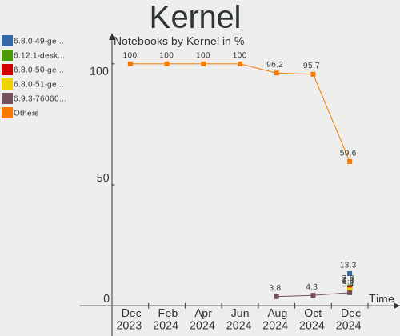
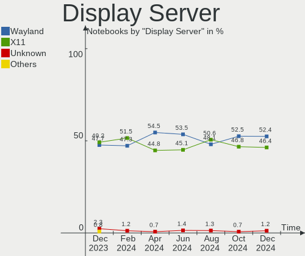
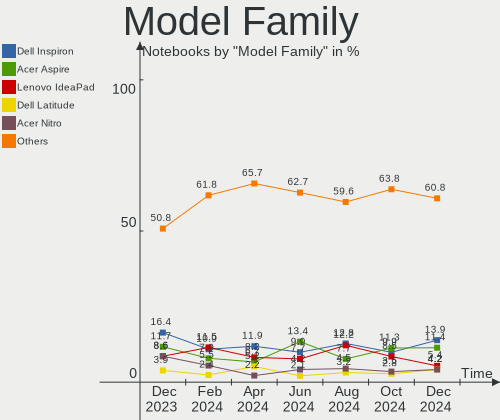
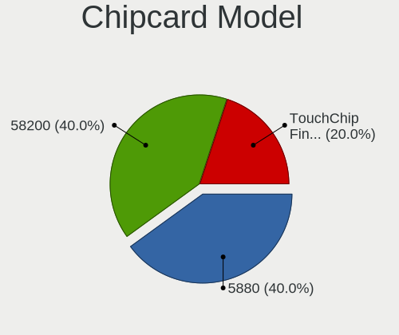
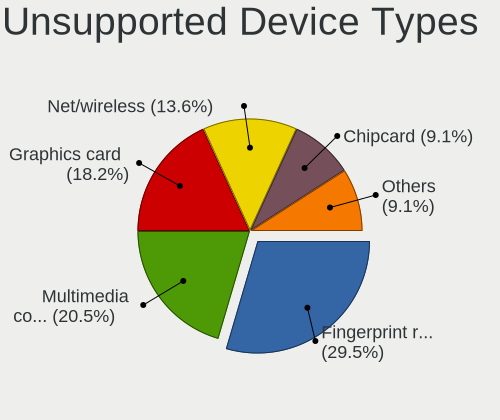

Linux in Brazil - Hardware Trends (Notebooks)
---------------------------------------------

A project to identify most popular hardware characteristics and track their change
over time based on data collected by Linux users at https://Linux-Hardware.org.

Anyone can contribute to this report by the [hw-probe](https://github.com/linuxhw/hw-probe) tool:

    sudo -E hw-probe -all -upload

Period: Mar, 2023.

Contents
--------

* [ System ](#system)
  - [ OS                       ](#os)
  - [ OS Family                ](#os-family)
  - [ Kernel                   ](#kernel)
  - [ Kernel Family            ](#kernel-family)
  - [ Kernel Major Ver.        ](#kernel-major-ver)
  - [ Arch                     ](#arch)
  - [ DE                       ](#de)
  - [ Display Server           ](#display-server)
  - [ Display Manager          ](#display-manager)
  - [ OS Lang                  ](#os-lang)
  - [ Boot Mode                ](#boot-mode)
  - [ Filesystem               ](#filesystem)
  - [ Part. scheme             ](#part-scheme)
  - [ Dual Boot with Linux/BSD ](#dual-boot-with-linuxbsd)
  - [ Dual Boot (Win)          ](#dual-boot-win)

* [ Board ](#board)
  - [ Vendor                   ](#vendor)
  - [ Model                    ](#model)
  - [ Model Family             ](#model-family)
  - [ MFG Year                 ](#mfg-year)
  - [ Form Factor              ](#form-factor)
  - [ Secure Boot              ](#secure-boot)
  - [ Coreboot                 ](#coreboot)
  - [ RAM Size                 ](#ram-size)
  - [ RAM Used                 ](#ram-used)
  - [ Total Drives             ](#total-drives)
  - [ Has CD-ROM               ](#has-cd-rom)
  - [ Has Ethernet             ](#has-ethernet)
  - [ Has WiFi                 ](#has-wifi)
  - [ Has Bluetooth            ](#has-bluetooth)

* [ Location ](#location)
  - [ Country                  ](#country)
  - [ City                     ](#city)

* [ Drives ](#drives)
  - [ Drive Vendor             ](#drive-vendor)
  - [ Drive Model              ](#drive-model)
  - [ HDD Vendor               ](#hdd-vendor)
  - [ SSD Vendor               ](#ssd-vendor)
  - [ Drive Kind               ](#drive-kind)
  - [ Drive Connector          ](#drive-connector)
  - [ Drive Size               ](#drive-size)
  - [ Space Total              ](#space-total)
  - [ Space Used               ](#space-used)
  - [ Malfunc. Drives          ](#malfunc-drives)
  - [ Malfunc. Drive Vendor    ](#malfunc-drive-vendor)
  - [ Malfunc. HDD Vendor      ](#malfunc-hdd-vendor)
  - [ Malfunc. Drive Kind      ](#malfunc-drive-kind)
  - [ Failed Drives            ](#failed-drives)
  - [ Failed Drive Vendor      ](#failed-drive-vendor)
  - [ Drive Status             ](#drive-status)

* [ Storage controller ](#storage-controller)
  - [ Storage Vendor           ](#storage-vendor)
  - [ Storage Model            ](#storage-model)
  - [ Storage Kind             ](#storage-kind)

* [ Processor ](#processor)
  - [ CPU Vendor               ](#cpu-vendor)
  - [ CPU Model                ](#cpu-model)
  - [ CPU Model Family         ](#cpu-model-family)
  - [ CPU Cores                ](#cpu-cores)
  - [ CPU Sockets              ](#cpu-sockets)
  - [ CPU Threads              ](#cpu-threads)
  - [ CPU Op-Modes             ](#cpu-op-modes)
  - [ CPU Microcode            ](#cpu-microcode)
  - [ CPU Microarch            ](#cpu-microarch)

* [ Graphics ](#graphics)
  - [ GPU Vendor               ](#gpu-vendor)
  - [ GPU Model                ](#gpu-model)
  - [ GPU Combo                ](#gpu-combo)
  - [ GPU Driver               ](#gpu-driver)
  - [ GPU Memory               ](#gpu-memory)

* [ Monitor ](#monitor)
  - [ Monitor Vendor           ](#monitor-vendor)
  - [ Monitor Model            ](#monitor-model)
  - [ Monitor Resolution       ](#monitor-resolution)
  - [ Monitor Diagonal         ](#monitor-diagonal)
  - [ Monitor Width            ](#monitor-width)
  - [ Aspect Ratio             ](#aspect-ratio)
  - [ Monitor Area             ](#monitor-area)
  - [ Pixel Density            ](#pixel-density)
  - [ Multiple Monitors        ](#multiple-monitors)

* [ Network ](#network)
  - [ Net Controller Vendor    ](#net-controller-vendor)
  - [ Net Controller Model     ](#net-controller-model)
  - [ Wireless Vendor          ](#wireless-vendor)
  - [ Wireless Model           ](#wireless-model)
  - [ Ethernet Vendor          ](#ethernet-vendor)
  - [ Ethernet Model           ](#ethernet-model)
  - [ Net Controller Kind      ](#net-controller-kind)
  - [ Used Controller          ](#used-controller)
  - [ NICs                     ](#nics)
  - [ IPv6                     ](#ipv6)

* [ Bluetooth ](#bluetooth)
  - [ Bluetooth Vendor         ](#bluetooth-vendor)
  - [ Bluetooth Model          ](#bluetooth-model)

* [ Sound ](#sound)
  - [ Sound Vendor             ](#sound-vendor)
  - [ Sound Model              ](#sound-model)

* [ Memory ](#memory)
  - [ Memory Vendor            ](#memory-vendor)
  - [ Memory Model             ](#memory-model)
  - [ Memory Kind              ](#memory-kind)
  - [ Memory Form Factor       ](#memory-form-factor)
  - [ Memory Size              ](#memory-size)
  - [ Memory Speed             ](#memory-speed)

* [ Printers & scanners ](#printers--scanners)
  - [ Printer Vendor           ](#printer-vendor)
  - [ Printer Model            ](#printer-model)
  - [ Scanner Vendor           ](#scanner-vendor)
  - [ Scanner Model            ](#scanner-model)

* [ Camera ](#camera)
  - [ Camera Vendor            ](#camera-vendor)
  - [ Camera Model             ](#camera-model)

* [ Security ](#security)
  - [ Fingerprint Vendor       ](#fingerprint-vendor)
  - [ Fingerprint Model        ](#fingerprint-model)
  - [ Chipcard Vendor          ](#chipcard-vendor)
  - [ Chipcard Model           ](#chipcard-model)

* [ Unsupported ](#unsupported)
  - [ Unsupported Devices      ](#unsupported-devices)
  - [ Unsupported Device Types ](#unsupported-device-types)

System
------

OS
--

Installed operating systems

| Name                         | Notebooks | Percent |
|------------------------------|-----------|---------|
| Ubuntu 22.04                 | 30        | 17.34%  |
| Fedora 37                    | 14        | 8.09%   |
| Pop!_OS 22.04                | 12        | 6.94%   |
| OpenMandriva 23.03           | 9         | 5.2%    |
| OpenMandriva 23.01           | 9         | 5.2%    |
| Linux Mint 21.1              | 9         | 5.2%    |
| Ubuntu 22.10                 | 6         | 3.47%   |
| Manjaro                      | 6         | 3.47%   |
| Zorin 16                     | 5         | 2.89%   |
| Endless 5.0.1                | 5         | 2.89%   |
| Arch Rolling                 | 5         | 2.89%   |
| OpenMandriva 4.3             | 4         | 2.31%   |
| Kubuntu 22.04                | 4         | 2.31%   |
| Endless 4.0.14               | 4         | 2.31%   |
| Debian 11                    | 4         | 2.31%   |
| Ubuntu 18.04                 | 3         | 1.73%   |
| org.kde.Platform 5.15-21.08  | 3         | 1.73%   |
| KDE neon 22.04               | 3         | 1.73%   |
| Ubuntu 20.04                 | 2         | 1.16%   |
| Lubuntu 22.04                | 2         | 1.16%   |
| Kali 2023.1                  | 2         | 1.16%   |
| Endless 3.9.3-nexthw1        | 2         | 1.16%   |
| EndeavourOS Rolling          | 2         | 1.16%   |
| ArcoLinux Rolling            | 2         | 1.16%   |
| Ubuntu MATE 22.04            | 1         | 0.58%   |
| Ubuntu 20.10                 | 1         | 0.58%   |
| SteamOS 3.4.4                | 1         | 0.58%   |
| Reborn OS                    | 1         | 0.58%   |
| Pear OS                      | 1         | 0.58%   |
| openSUSE Tumbleweed-XXXXXXXX | 1         | 0.58%   |
| Nobara 37                    | 1         | 0.58%   |
| Nobara 36                    | 1         | 0.58%   |
| Manjaro 22.0.4               | 1         | 0.58%   |
| Lubuntu 22.10                | 1         | 0.58%   |
| Linux Mint 20.3              | 1         | 0.58%   |
| Linux Mint 20.1              | 1         | 0.58%   |
| Linux Mint 19.3              | 1         | 0.58%   |
| Lenovo Lux Alpha             | 1         | 0.58%   |
| Kubuntu 22.10                | 1         | 0.58%   |
| Gentoo 2.13                  | 1         | 0.58%   |

OS Family
---------

OS without a version

| Name             | Notebooks | Percent |
|------------------|-----------|---------|
| Ubuntu           | 42        | 24.28%  |
| OpenMandriva     | 22        | 12.72%  |
| Endless          | 15        | 8.67%   |
| Fedora           | 14        | 8.09%   |
| Pop!_OS          | 12        | 6.94%   |
| Linux Mint       | 12        | 6.94%   |
| Manjaro          | 7         | 4.05%   |
| Zorin            | 5         | 2.89%   |
| Kubuntu          | 5         | 2.89%   |
| Debian           | 5         | 2.89%   |
| Arch             | 5         | 2.89%   |
| org.kde.Platform | 3         | 1.73%   |
| Lubuntu          | 3         | 1.73%   |
| KDE neon         | 3         | 1.73%   |
| BigLinux         | 3         | 1.73%   |
| ArcoLinux        | 3         | 1.73%   |
| Nobara           | 2         | 1.16%   |
| Kali             | 2         | 1.16%   |
| EndeavourOS      | 2         | 1.16%   |
| Ubuntu MATE      | 1         | 0.58%   |
| SteamOS          | 1         | 0.58%   |
| Reborn OS        | 1         | 0.58%   |
| Pear OS          | 1         | 0.58%   |
| openSUSE         | 1         | 0.58%   |
| Lenovo Lux       | 1         | 0.58%   |
| Gentoo           | 1         | 0.58%   |
| Deepin           | 1         | 0.58%   |

Kernel
------

Version of the Linux kernel

| Version                  | Notebooks | Percent |
|--------------------------|-----------|---------|
| 5.19.0-35-generic        | 24        | 13.87%  |
| 6.2.6-desktop-1omv2390   | 9         | 5.2%    |
| 6.1.1-desktop-1omv2290   | 9         | 5.2%    |
| 5.15.0-67-generic        | 6         | 3.47%   |
| 5.19.0-38-generic        | 5         | 2.89%   |
| 5.15.0-69-generic        | 5         | 2.89%   |
| 5.15.0-47-generic        | 5         | 2.89%   |
| 5.11.0-35-generic        | 5         | 2.89%   |
| 6.2.0-76060200-generic   | 4         | 2.31%   |
| 6.1.18-200.fc37.x86_64   | 4         | 2.31%   |
| 6.0.12-76060006-generic  | 4         | 2.31%   |
| 5.19.0-32-generic        | 4         | 2.31%   |
| 5.15.94-1-MANJARO        | 4         | 2.31%   |
| 5.15.0-60-generic        | 4         | 2.31%   |
| 6.2.7-200.fc37.x86_64    | 3         | 1.73%   |
| 6.2.6-76060206-generic   | 3         | 1.73%   |
| 6.1.15-200.fc37.x86_64   | 3         | 1.73%   |
| 6.1.12-1-MANJARO         | 3         | 1.73%   |
| 5.4.0-144-generic        | 3         | 1.73%   |
| 5.10.0-21-amd64          | 3         | 1.73%   |
| 6.2.8-200.fc37.x86_64    | 2         | 1.16%   |
| 6.2.6-arch1-1            | 2         | 1.16%   |
| 6.2.2-arch1-1            | 2         | 1.16%   |
| 6.1.0-kali5-amd64        | 2         | 1.16%   |
| 5.8.0-14-generic         | 2         | 1.16%   |
| 5.19.0-1018-lowlatency   | 2         | 1.16%   |
| 5.16.7-desktop-1omv4003  | 2         | 1.16%   |
| 5.16.13-desktop-1omv4003 | 2         | 1.16%   |
| 5.15.102-1-MANJARO       | 2         | 1.16%   |
| 5.15.0-56-generic        | 2         | 1.16%   |
| 5.15.0-52-generic        | 2         | 1.16%   |
| 5.15.0-43-generic        | 2         | 1.16%   |
| 5.11.0-12-generic        | 2         | 1.16%   |
| 6.2.8-arch1-1            | 1         | 0.58%   |
| 6.2.8-060208-generic     | 1         | 0.58%   |
| 6.2.7-gentoo-dist        | 1         | 0.58%   |
| 6.2.7-arch1-1            | 1         | 0.58%   |
| 6.2.5-arch1-1            | 1         | 0.58%   |
| 6.2.2-zen1-1-zen         | 1         | 0.58%   |
| 6.2.2-t2-jammy           | 1         | 0.58%   |

Kernel Family
-------------

Linux kernel without a distro release

| Version  | Notebooks | Percent |
|----------|-----------|---------|
| 5.19.0   | 36        | 20.81%  |
| 5.15.0   | 28        | 16.18%  |
| 6.2.6    | 14        | 8.09%   |
| 6.1.1    | 9         | 5.2%    |
| 5.11.0   | 8         | 4.62%   |
| 5.4.0    | 6         | 3.47%   |
| 6.2.7    | 5         | 2.89%   |
| 6.2.2    | 5         | 2.89%   |
| 6.2.8    | 4         | 2.31%   |
| 6.2.0    | 4         | 2.31%   |
| 6.1.18   | 4         | 2.31%   |
| 6.0.12   | 4         | 2.31%   |
| 5.8.0    | 4         | 2.31%   |
| 5.15.94  | 4         | 2.31%   |
| 5.10.0   | 4         | 2.31%   |
| 6.1.15   | 3         | 1.73%   |
| 6.1.12   | 3         | 1.73%   |
| 6.1.0    | 3         | 1.73%   |
| 6.2.1    | 2         | 1.16%   |
| 6.1.14   | 2         | 1.16%   |
| 6.1.11   | 2         | 1.16%   |
| 5.16.7   | 2         | 1.16%   |
| 5.16.13  | 2         | 1.16%   |
| 5.15.102 | 2         | 1.16%   |
| 4.9.0    | 2         | 1.16%   |
| 6.2.5    | 1         | 0.58%   |
| 6.1.20   | 1         | 0.58%   |
| 6.1.19   | 1         | 0.58%   |
| 6.0.7    | 1         | 0.58%   |
| 6.0.14   | 1         | 0.58%   |
| 6.0.0    | 1         | 0.58%   |
| 5.18.17  | 1         | 0.58%   |
| 5.15.77  | 1         | 0.58%   |
| 5.14.0   | 1         | 0.58%   |
| 5.13.0   | 1         | 0.58%   |
| 4.15.0   | 1         | 0.58%   |

Kernel Major Ver.
-----------------

Linux kernel major version

| Version | Notebooks | Percent |
|---------|-----------|---------|
| 5.19    | 36        | 20.81%  |
| 6.2     | 35        | 20.23%  |
| 5.15    | 35        | 20.23%  |
| 6.1     | 28        | 16.18%  |
| 5.11    | 8         | 4.62%   |
| 6.0     | 7         | 4.05%   |
| 5.4     | 6         | 3.47%   |
| 5.8     | 4         | 2.31%   |
| 5.16    | 4         | 2.31%   |
| 5.10    | 4         | 2.31%   |
| 4.9     | 2         | 1.16%   |
| 5.18    | 1         | 0.58%   |
| 5.14    | 1         | 0.58%   |
| 5.13    | 1         | 0.58%   |
| 4.15    | 1         | 0.58%   |

Arch
----

OS architecture (x86_64, i586, etc.)

| Name   | Notebooks | Percent |
|--------|-----------|---------|
| x86_64 | 172       | 99.42%  |
| i686   | 1         | 0.58%   |

DE
--

Desktop Environment

| Name       | Notebooks | Percent |
|------------|-----------|---------|
| GNOME      | 97        | 56.07%  |
| KDE5       | 40        | 23.12%  |
| X-Cinnamon | 11        | 6.36%   |
| XFCE       | 7         | 4.05%   |
| LXQt       | 5         | 2.89%   |
| MATE       | 4         | 2.31%   |
| Unknown    | 3         | 1.73%   |
| Deepin     | 2         | 1.16%   |
| Unity      | 1         | 0.58%   |
| sway       | 1         | 0.58%   |
| LXDE       | 1         | 0.58%   |
| Hyprland   | 1         | 0.58%   |

Display Server
--------------

X11 or Wayland

| Name    | Notebooks | Percent |
|---------|-----------|---------|
| X11     | 116       | 67.05%  |
| Wayland | 53        | 30.64%  |
| Unknown | 3         | 1.73%   |
| Tty     | 1         | 0.58%   |

Display Manager
---------------

SDDM, LightDM, etc.

| Name    | Notebooks | Percent |
|---------|-----------|---------|
| Unknown | 79        | 45.66%  |
| GDM3    | 44        | 25.43%  |
| SDDM    | 28        | 16.18%  |
| GDM     | 11        | 6.36%   |
| LightDM | 10        | 5.78%   |
| Ly      | 1         | 0.58%   |

OS Lang
-------

Language

| Lang    | Notebooks | Percent |
|---------|-----------|---------|
| pt_BR   | 124       | 71.68%  |
| en_US   | 41        | 23.7%   |
| C       | 3         | 1.73%   |
| Unknown | 2         | 1.16%   |
| es_ES   | 1         | 0.58%   |
| en_CA   | 1         | 0.58%   |
| C.UTF8  | 1         | 0.58%   |

Boot Mode
---------

EFI or BIOS

| Mode | Notebooks | Percent |
|------|-----------|---------|
| EFI  | 94        | 54.34%  |
| BIOS | 79        | 45.66%  |

Filesystem
----------

Type of filesystem

| Type    | Notebooks | Percent |
|---------|-----------|---------|
| Ext4    | 119       | 68.79%  |
| Btrfs   | 31        | 17.92%  |
| Overlay | 18        | 10.4%   |
| Unknown | 2         | 1.16%   |
| Zfs     | 1         | 0.58%   |
| Xfs     | 1         | 0.58%   |
| F2fs    | 1         | 0.58%   |

Part. scheme
------------

Scheme of partitioning

| Type    | Notebooks | Percent |
|---------|-----------|---------|
| Unknown | 77        | 44.51%  |
| GPT     | 75        | 43.35%  |
| MBR     | 21        | 12.14%  |

Dual Boot with Linux/BSD
------------------------

Hosting more than one Linux/BSD

| Dual boot | Notebooks | Percent |
|-----------|-----------|---------|
| No        | 151       | 87.28%  |
| Yes       | 22        | 12.72%  |

Dual Boot (Win)
---------------

Hosting Linux and Windows

| Dual boot | Notebooks | Percent |
|-----------|-----------|---------|
| No        | 130       | 75.14%  |
| Yes       | 43        | 24.86%  |

Board
-----

Vendor
------

Motherboard manufacturer

| Name                   | Notebooks | Percent |
|------------------------|-----------|---------|
| Dell                   | 42        | 24.28%  |
| Acer                   | 29        | 16.76%  |
| Lenovo                 | 18        | 10.4%   |
| Samsung Electronics    | 16        | 9.25%   |
| Hewlett-Packard        | 13        | 7.51%   |
| Positivo               | 12        | 6.94%   |
| ASUSTek Computer       | 12        | 6.94%   |
| Avell High Performance | 6         | 3.47%   |
| Sony                   | 3         | 1.73%   |
| Digibras               | 3         | 1.73%   |
| Multilaser             | 2         | 1.16%   |
| LG Electronics         | 2         | 1.16%   |
| Intel                  | 2         | 1.16%   |
| Google                 | 2         | 1.16%   |
| Apple                  | 2         | 1.16%   |
| Valve                  | 1         | 0.58%   |
| Toshiba                | 1         | 0.58%   |
| Semp Toshiba           | 1         | 0.58%   |
| Quanta                 | 1         | 0.58%   |
| Positivo Bahia - VAIO  | 1         | 0.58%   |
| Notebook               | 1         | 0.58%   |
| MSI                    | 1         | 0.58%   |
| Itautec                | 1         | 0.58%   |
| Clevo                  | 1         | 0.58%   |

Model
-----

Motherboard model

| Name                                        | Notebooks | Percent |
|---------------------------------------------|-----------|---------|
| Samsung 550XDA                              | 6         | 3.47%   |
| Digibras NH4CU03                            | 3         | 1.73%   |
| Dell Latitude 5420                          | 3         | 1.73%   |
| Acer Nitro AN515-44                         | 3         | 1.73%   |
| Samsung 530U3C/530U4C/532U3C                | 2         | 1.16%   |
| Samsung 300E5M/300E5L                       | 2         | 1.16%   |
| Positivo S14CT01                            | 2         | 1.16%   |
| Positivo Q464B                              | 2         | 1.16%   |
| Positivo C14CU51                            | 2         | 1.16%   |
| Dell Vostro 3550                            | 2         | 1.16%   |
| Dell Vostro 14-5480                         | 2         | 1.16%   |
| Dell Inspiron 5566                          | 2         | 1.16%   |
| Dell Inspiron 3442                          | 2         | 1.16%   |
| Avell High Performance B.ON                 | 2         | 1.16%   |
| ASUS VivoBook_ASUSLaptop X515EA_X515EA      | 2         | 1.16%   |
| ASUS VivoBook_ASUSLaptop X515DA_X515DA      | 2         | 1.16%   |
| ASUS VivoBook_ASUSLaptop X513EAN_X513EAN    | 2         | 1.16%   |
| ASUS VivoBook 15_ASUS Laptop X540UAR        | 2         | 1.16%   |
| Acer Nitro AN515-54                         | 2         | 1.16%   |
| Acer Aspire A515-51                         | 2         | 1.16%   |
| Valve Jupiter                               | 1         | 0.58%   |
| Toshiba Satellite A305                      | 1         | 0.58%   |
| Sony VPCEH10EB                              | 1         | 0.58%   |
| Sony VPCEA23FB                              | 1         | 0.58%   |
| Sony SVF14215CXB                            | 1         | 0.58%   |
| Semp Toshiba IS 1413G                       | 1         | 0.58%   |
| Samsung RV411/RV511/E3511/S3511/RV711/E3411 | 1         | 0.58%   |
| Samsung 670Z5E                              | 1         | 0.58%   |
| Samsung 550XBE/350XBE                       | 1         | 0.58%   |
| Samsung 530XBB                              | 1         | 0.58%   |
| Samsung 370E4K                              | 1         | 0.58%   |
| Samsung 270E5G/270E5U                       | 1         | 0.58%   |
| Quanta R480-L.BA34P1                        | 1         | 0.58%   |
| Positivo Smash2                             | 1         | 0.58%   |
| Positivo S14SL01                            | 1         | 0.58%   |
| Positivo Q232A                              | 1         | 0.58%   |
| Positivo N1250                              | 1         | 0.58%   |
| Positivo Mobile                             | 1         | 0.58%   |
| Positivo C14CR21                            | 1         | 0.58%   |
| Positivo Bahia - VAIO VJFE41F11X-XXXXXX     | 1         | 0.58%   |

Model Family
------------

Motherboard model prefix

| Name                        | Notebooks | Percent |
|-----------------------------|-----------|---------|
| Acer Aspire                 | 19        | 10.98%  |
| Dell Inspiron               | 17        | 9.83%   |
| Dell Vostro                 | 11        | 6.36%   |
| ASUS VivoBook               | 9         | 5.2%    |
| Acer Nitro                  | 9         | 5.2%    |
| Lenovo IdeaPad              | 8         | 4.62%   |
| Samsung 550XDA              | 6         | 3.47%   |
| Lenovo ThinkPad             | 6         | 3.47%   |
| HP Pavilion                 | 5         | 2.89%   |
| Dell Latitude               | 5         | 2.89%   |
| Digibras NH4CU03            | 3         | 1.73%   |
| Dell G15                    | 3         | 1.73%   |
| Samsung 530U3C              | 2         | 1.16%   |
| Samsung 300E5M              | 2         | 1.16%   |
| Positivo S14CT01            | 2         | 1.16%   |
| Positivo Q464B              | 2         | 1.16%   |
| Positivo C14CU51            | 2         | 1.16%   |
| Lenovo Yoga                 | 2         | 1.16%   |
| HP ProBook                  | 2         | 1.16%   |
| HP Compaq                   | 2         | 1.16%   |
| Dell XPS                    | 2         | 1.16%   |
| Dell G3                     | 2         | 1.16%   |
| Avell High Performance B.ON | 2         | 1.16%   |
| Valve Jupiter               | 1         | 0.58%   |
| Toshiba Satellite           | 1         | 0.58%   |
| Sony VPCEH10EB              | 1         | 0.58%   |
| Sony VPCEA23FB              | 1         | 0.58%   |
| Sony SVF14215CXB            | 1         | 0.58%   |
| Semp Toshiba IS             | 1         | 0.58%   |
| Samsung RV411               | 1         | 0.58%   |
| Samsung 670Z5E              | 1         | 0.58%   |
| Samsung 550XBE              | 1         | 0.58%   |
| Samsung 530XBB              | 1         | 0.58%   |
| Samsung 370E4K              | 1         | 0.58%   |
| Samsung 270E5G              | 1         | 0.58%   |
| Quanta R480-L.BA34P1        | 1         | 0.58%   |
| Positivo Smash2             | 1         | 0.58%   |
| Positivo S14SL01            | 1         | 0.58%   |
| Positivo Q232A              | 1         | 0.58%   |
| Positivo N1250              | 1         | 0.58%   |

MFG Year
--------

Motherboard manufacture year

| Year | Notebooks | Percent |
|------|-----------|---------|
| 2021 | 28        | 16.18%  |
| 2020 | 19        | 10.98%  |
| 2019 | 17        | 9.83%   |
| 2011 | 15        | 8.67%   |
| 2018 | 12        | 6.94%   |
| 2012 | 12        | 6.94%   |
| 2016 | 11        | 6.36%   |
| 2017 | 10        | 5.78%   |
| 2015 | 10        | 5.78%   |
| 2013 | 8         | 4.62%   |
| 2014 | 7         | 4.05%   |
| 2008 | 7         | 4.05%   |
| 2022 | 5         | 2.89%   |
| 2010 | 5         | 2.89%   |
| 2009 | 4         | 2.31%   |
| 2007 | 2         | 1.16%   |
| 2023 | 1         | 0.58%   |

Form Factor
-----------

Physical design of the computer

| Name     | Notebooks | Percent |
|----------|-----------|---------|
| Notebook | 173       | 100%    |

Secure Boot
-----------

Enabled or disabled

| State    | Notebooks | Percent |
|----------|-----------|---------|
| Disabled | 150       | 86.71%  |
| Enabled  | 23        | 13.29%  |

Coreboot
--------

Have coreboot on board

| Used | Notebooks | Percent |
|------|-----------|---------|
| No   | 171       | 98.84%  |
| Yes  | 2         | 1.16%   |

RAM Size
--------

Total RAM memory

| Size in GB  | Notebooks | Percent |
|-------------|-----------|---------|
| 4.01-8.0    | 56        | 32.37%  |
| 3.01-4.0    | 47        | 27.17%  |
| 8.01-16.0   | 29        | 16.76%  |
| 16.01-24.0  | 24        | 13.87%  |
| 32.01-64.0  | 6         | 3.47%   |
| 1.01-2.0    | 6         | 3.47%   |
| 2.01-3.0    | 4         | 2.31%   |
| 64.01-256.0 | 1         | 0.58%   |

RAM Used
--------

Used RAM memory

| Used GB   | Notebooks | Percent |
|-----------|-----------|---------|
| 1.01-2.0  | 59        | 34.1%   |
| 2.01-3.0  | 47        | 27.17%  |
| 4.01-8.0  | 35        | 20.23%  |
| 3.01-4.0  | 22        | 12.72%  |
| 0.51-1.0  | 7         | 4.05%   |
| 8.01-16.0 | 3         | 1.73%   |

Total Drives
------------

Number of drives on board

| Drives | Notebooks | Percent |
|--------|-----------|---------|
| 1      | 111       | 64.16%  |
| 2      | 53        | 30.64%  |
| 3      | 7         | 4.05%   |
| 0      | 2         | 1.16%   |

Has CD-ROM
----------

Has CD-ROM on board

| Presented | Notebooks | Percent |
|-----------|-----------|---------|
| No        | 134       | 77.46%  |
| Yes       | 39        | 22.54%  |

Has Ethernet
------------

Has Ethernet on board

| Presented | Notebooks | Percent |
|-----------|-----------|---------|
| Yes       | 139       | 80.35%  |
| No        | 34        | 19.65%  |

Has WiFi
--------

Has WiFi module

| Presented | Notebooks | Percent |
|-----------|-----------|---------|
| Yes       | 166       | 95.95%  |
| No        | 7         | 4.05%   |

Has Bluetooth
-------------

Has Bluetooth module

| Presented | Notebooks | Percent |
|-----------|-----------|---------|
| Yes       | 132       | 76.3%   |
| No        | 41        | 23.7%   |

Location
--------

Country
-------

Geographic location (country)

| Country | Notebooks | Percent |
|---------|-----------|---------|
| Brazil  | 173       | 100%    |

City
----

Geographic location (city)

| City                     | Notebooks | Percent |
|--------------------------|-----------|---------|
| Sao Paulo                | 22        | 12.72%  |
| Brasília                | 11        | 6.36%   |
| Porto Alegre             | 9         | 5.2%    |
| Rio de Janeiro           | 8         | 4.62%   |
| Curitiba                 | 5         | 2.89%   |
| Campinas                 | 5         | 2.89%   |
| Fortaleza                | 4         | 2.31%   |
| Belo Horizonte           | 4         | 2.31%   |
| Uberlândia              | 3         | 1.73%   |
| Sorocaba                 | 3         | 1.73%   |
| Sao José dos Campos     | 3         | 1.73%   |
| Salvador                 | 3         | 1.73%   |
| Recife                   | 3         | 1.73%   |
| Sao Bernardo do Campo    | 2         | 1.16%   |
| Santos                   | 2         | 1.16%   |
| Niterói                 | 2         | 1.16%   |
| Joao Pessoa              | 2         | 1.16%   |
| Goiânia                 | 2         | 1.16%   |
| Carapicuiba              | 2         | 1.16%   |
| Vila Velha               | 1         | 0.58%   |
| Uruguaiana               | 1         | 0.58%   |
| Umuarama                 | 1         | 0.58%   |
| Tibau do Sul             | 1         | 0.58%   |
| Taubate                  | 1         | 0.58%   |
| Serra                    | 1         | 0.58%   |
| Sao Pedro da Aldeia      | 1         | 0.58%   |
| Sao Luís                | 1         | 0.58%   |
| Sao Joaquim da Barra     | 1         | 0.58%   |
| Sao Joao das Missoes     | 1         | 0.58%   |
| Santa Cruz do Capibaribe | 1         | 0.58%   |
| Rio Grande               | 1         | 0.58%   |
| Rio das Ostras           | 1         | 0.58%   |
| Rio Claro                | 1         | 0.58%   |
| Ribeirao Preto           | 1         | 0.58%   |
| Ribeirao das Neves       | 1         | 0.58%   |
| Penapolis                | 1         | 0.58%   |
| Pedro Leopoldo           | 1         | 0.58%   |
| Patrocinio               | 1         | 0.58%   |
| Palmas                   | 1         | 0.58%   |
| Ourinhos                 | 1         | 0.58%   |

Drives
------

Drive Vendor
------------

Hard drive vendors

| Vendor                      | Notebooks | Drives | Percent |
|-----------------------------|-----------|--------|---------|
| WDC                         | 41        | 42     | 18.22%  |
| Seagate                     | 30        | 30     | 13.33%  |
| Sandisk                     | 21        | 21     | 9.33%   |
| Samsung Electronics         | 18        | 18     | 8%      |
| Unknown                     | 15        | 16     | 6.67%   |
| Kingston                    | 14        | 14     | 6.22%   |
| A-DATA Technology           | 12        | 13     | 5.33%   |
| China                       | 11        | 11     | 4.89%   |
| ADATA Technology            | 10        | 10     | 4.44%   |
| Toshiba                     | 7         | 7      | 3.11%   |
| Netac                       | 4         | 5      | 1.78%   |
| SSSTC                       | 3         | 3      | 1.33%   |
| SK hynix                    | 3         | 3      | 1.33%   |
| Intel                       | 3         | 3      | 1.33%   |
| Crucial                     | 3         | 3      | 1.33%   |
| PNY                         | 2         | 2      | 0.89%   |
| KingSpec                    | 2         | 2      | 0.89%   |
| Hitachi                     | 2         | 2      | 0.89%   |
| Unknown                     | 2         | 2      | 0.89%   |
| XrayDisk                    | 1         | 1      | 0.44%   |
| Win Memory                  | 1         | 1      | 0.44%   |
| WALRAM                      | 1         | 1      | 0.44%   |
| Union Memory (Shenzhen)     | 1         | 1      | 0.44%   |
| UMIS                        | 1         | 1      | 0.44%   |
| Transcend                   | 1         | 1      | 0.44%   |
| Solid State Storage         | 1         | 1      | 0.44%   |
| Silicon Motion              | 1         | 2      | 0.44%   |
| Realtek Semiconductor       | 1         | 1      | 0.44%   |
| Micron Technology           | 1         | 1      | 0.44%   |
| MAGIX                       | 1         | 1      | 0.44%   |
| LITEON                      | 1         | 1      | 0.44%   |
| Kross Elegance              | 1         | 1      | 0.44%   |
| KIOXIA                      | 1         | 1      | 0.44%   |
| Kingston Technology Company | 1         | 1      | 0.44%   |
| JMicron Technology          | 1         | 1      | 0.44%   |
| HUSKY                       | 1         | 1      | 0.44%   |
| HGST                        | 1         | 1      | 0.44%   |
| GT                          | 1         | 1      | 0.44%   |
| Gigabyte Technology         | 1         | 1      | 0.44%   |
| Apple                       | 1         | 1      | 0.44%   |

Drive Model
-----------

Hard drive models

| Model                                | Notebooks | Percent |
|--------------------------------------|-----------|---------|
| WDC WD10SPZX-21Z10T0 1TB             | 8         | 3.51%   |
| Seagate ST1000LM024 HN-M101MBB 1TB   | 6         | 2.63%   |
| Sandisk WD Blue SN550 NVMe SSD 256GB | 6         | 2.63%   |
| Kingston SA400S37480G 480GB SSD      | 6         | 2.63%   |
| Unknown MMC Card  32GB               | 5         | 2.19%   |
| Seagate ST500LM012 HN-M500MBB 500GB  | 5         | 2.19%   |
| ADATA SM2P32A8-256GC1 256GB          | 5         | 2.19%   |
| WDC WD10SPZX-35Z10T0 1TB             | 3         | 1.32%   |
| WDC WD10SPZX-24Z10 1TB               | 3         | 1.32%   |
| WDC WD10JPCX-24UE4T0 1TB             | 3         | 1.32%   |
| Unknown MMC Card  64GB               | 3         | 1.32%   |
| Seagate ST1000LM035-1RK172 1TB       | 3         | 1.32%   |
| Samsung MZVLQ256HAJD-000 256GB       | 3         | 1.32%   |
| Kingston SA400S37240G 240GB SSD      | 3         | 1.32%   |
| China SSD 128GB                      | 3         | 1.32%   |
| A-DATA IM2P33F8A-512GD 512GB         | 3         | 1.32%   |
| WDC WDS240G2G0A-00JH30 240GB SSD     | 2         | 0.88%   |
| WDC WD3200BPVT-22JJ5T0 320GB         | 2         | 0.88%   |
| WDC WD10JPVX-22JC3T0 1TB             | 2         | 0.88%   |
| Unknown MMC Card  128GB              | 2         | 0.88%   |
| Toshiba MQ01ABD100 1TB               | 2         | 0.88%   |
| Seagate ST320LM001 HN-M320MBB 320GB  | 2         | 0.88%   |
| SanDisk SSD PLUS 120GB               | 2         | 0.88%   |
| SanDisk SSD i100 24GB                | 2         | 0.88%   |
| Samsung SSD 840 EVO 250GB            | 2         | 0.88%   |
| China SATA3 256GB SSD                | 2         | 0.88%   |
| China SATA SSD 120GB                 | 2         | 0.88%   |
| ADATA SM2P41C3 NVMe 512GB            | 2         | 0.88%   |
| A-DATA IM2S3338-128GD2 128GB SSD     | 2         | 0.88%   |
| A-DATA IM2P33F3A NVMe 256GB          | 2         | 0.88%   |
| Unknown                              | 2         | 0.88%   |
| XrayDisk SSD 128GB                   | 1         | 0.44%   |
| Win Memory SWR256G-301II 256GB       | 1         | 0.44%   |
| WDC WDS500G3X0C-00SJG0 500GB         | 1         | 0.44%   |
| WDC WDS500G2B0A-00SM50 500GB SSD     | 1         | 0.44%   |
| WDC WDS480G2G0A-00JH30 480GB SSD     | 1         | 0.44%   |
| WDC WDS240G2G0B-00EPW0 240GB SSD     | 1         | 0.44%   |
| WDC WDS120G2G0B-00EPW0 120GB SSD     | 1         | 0.44%   |
| WDC WDS120G2G0A-00JH30 120GB SSD     | 1         | 0.44%   |
| WDC WD7500BPVT-55HXZT4 752GB         | 1         | 0.44%   |

HDD Vendor
----------

Hard disk drive vendors

| Vendor              | Notebooks | Drives | Percent |
|---------------------|-----------|--------|---------|
| WDC                 | 34        | 34     | 44.16%  |
| Seagate             | 29        | 29     | 37.66%  |
| Toshiba             | 7         | 7      | 9.09%   |
| Samsung Electronics | 4         | 4      | 5.19%   |
| Hitachi             | 2         | 2      | 2.6%    |
| HGST                | 1         | 1      | 1.3%    |

SSD Vendor
----------

Solid state drive vendors

| Vendor              | Notebooks | Drives | Percent |
|---------------------|-----------|--------|---------|
| Kingston            | 13        | 13     | 18.57%  |
| China               | 11        | 11     | 15.71%  |
| SanDisk             | 9         | 9      | 12.86%  |
| WDC                 | 7         | 7      | 10%     |
| Samsung Electronics | 7         | 7      | 10%     |
| Crucial             | 3         | 3      | 4.29%   |
| A-DATA Technology   | 3         | 3      | 4.29%   |
| PNY                 | 2         | 2      | 2.86%   |
| Netac               | 2         | 2      | 2.86%   |
| KingSpec            | 2         | 2      | 2.86%   |
| XrayDisk            | 1         | 1      | 1.43%   |
| Win Memory          | 1         | 1      | 1.43%   |
| Transcend           | 1         | 1      | 1.43%   |
| Seagate             | 1         | 1      | 1.43%   |
| LITEON              | 1         | 1      | 1.43%   |
| Kross Elegance      | 1         | 1      | 1.43%   |
| JMicron Technology  | 1         | 1      | 1.43%   |
| HUSKY               | 1         | 1      | 1.43%   |
| GT                  | 1         | 1      | 1.43%   |
| Gigabyte Technology | 1         | 1      | 1.43%   |
| Advantech           | 1         | 1      | 1.43%   |

Drive Kind
----------

HDD or SSD

| Kind    | Notebooks | Drives | Percent |
|---------|-----------|--------|---------|
| HDD     | 77        | 77     | 35.65%  |
| SSD     | 63        | 70     | 29.17%  |
| NVMe    | 56        | 62     | 25.93%  |
| MMC     | 17        | 18     | 7.87%   |
| Unknown | 3         | 3      | 1.39%   |

Drive Connector
---------------

SATA, SAS, NVMe, etc.

| Type | Notebooks | Drives | Percent |
|------|-----------|--------|---------|
| SATA | 120       | 147    | 61.22%  |
| NVMe | 56        | 62     | 28.57%  |
| MMC  | 17        | 18     | 8.67%   |
| SAS  | 3         | 3      | 1.53%   |

Drive Size
----------

Size of hard drive

| Size in TB | Notebooks | Drives | Percent |
|------------|-----------|--------|---------|
| 0.01-0.5   | 86        | 95     | 63.7%   |
| 0.51-1.0   | 48        | 51     | 35.56%  |
| 1.01-2.0   | 1         | 1      | 0.74%   |

Space Total
-----------

Amount of disk space available on the file system

| Size in GB     | Notebooks | Percent |
|----------------|-----------|---------|
| 101-250        | 46        | 26.59%  |
| 251-500        | 37        | 21.39%  |
| 501-1000       | 30        | 17.34%  |
| 1-20           | 20        | 11.56%  |
| 1001-2000      | 12        | 6.94%   |
| 21-50          | 9         | 5.2%    |
| 51-100         | 9         | 5.2%    |
| Unknown        | 6         | 3.47%   |
| More than 3000 | 3         | 1.73%   |
| 2001-3000      | 1         | 0.58%   |

Space Used
----------

Amount of used disk space

| Used GB   | Notebooks | Percent |
|-----------|-----------|---------|
| 1-20      | 50        | 28.9%   |
| 21-50     | 47        | 27.17%  |
| 101-250   | 22        | 12.72%  |
| 51-100    | 22        | 12.72%  |
| 251-500   | 13        | 7.51%   |
| 501-1000  | 9         | 5.2%    |
| Unknown   | 6         | 3.47%   |
| 1001-2000 | 3         | 1.73%   |
| 2001-3000 | 1         | 0.58%   |

Malfunc. Drives
---------------

Drive models with a malfunction

| Model                               | Notebooks | Drives | Percent |
|-------------------------------------|-----------|--------|---------|
| Seagate ST1000LM024 HN-M101MBB 1TB  | 4         | 4      | 20%     |
| WDC WD5000LPVX-22V0TT0 500GB        | 1         | 1      | 5%      |
| WDC WD3200BPVT-22JJ5T0 320GB        | 1         | 1      | 5%      |
| WDC WD10JPCX-24UE4T0 1TB            | 1         | 1      | 5%      |
| Toshiba MK5065GSX 500GB             | 1         | 1      | 5%      |
| SSSTC CL1-4D256 256GB               | 1         | 1      | 5%      |
| Seagate ST9500423AS 500GB           | 1         | 1      | 5%      |
| Seagate ST9320325AS 320GB           | 1         | 1      | 5%      |
| Seagate ST320LM001 HN-M320MBB 320GB | 1         | 1      | 5%      |
| Seagate ST2000LX001-1RG174 2TB      | 1         | 1      | 5%      |
| Seagate ST1000LM014-1EJ164 1TB      | 1         | 1      | 5%      |
| SanDisk SSD PLUS 120GB              | 1         | 1      | 5%      |
| SanDisk SD6SP1M256G1012 256GB SSD   | 1         | 1      | 5%      |
| Samsung Electronics HM121HI 120GB   | 1         | 1      | 5%      |
| Kross Elegance KE-SSDIS12G 120GB    | 1         | 1      | 5%      |
| Hitachi HTS723232A7A364 320GB       | 1         | 1      | 5%      |
| Hitachi HTS541612J9SA00 120GB       | 1         | 1      | 5%      |

Malfunc. Drive Vendor
---------------------

Vendors of faulty drives

| Vendor              | Notebooks | Drives | Percent |
|---------------------|-----------|--------|---------|
| Seagate             | 9         | 9      | 45%     |
| WDC                 | 3         | 3      | 15%     |
| SanDisk             | 2         | 2      | 10%     |
| Hitachi             | 2         | 2      | 10%     |
| Toshiba             | 1         | 1      | 5%      |
| SSSTC               | 1         | 1      | 5%      |
| Samsung Electronics | 1         | 1      | 5%      |
| Kross Elegance      | 1         | 1      | 5%      |

Malfunc. HDD Vendor
-------------------

Vendors of faulty HDD drives

| Vendor              | Notebooks | Drives | Percent |
|---------------------|-----------|--------|---------|
| Seagate             | 9         | 9      | 56.25%  |
| WDC                 | 3         | 3      | 18.75%  |
| Hitachi             | 2         | 2      | 12.5%   |
| Toshiba             | 1         | 1      | 6.25%   |
| Samsung Electronics | 1         | 1      | 6.25%   |

Malfunc. Drive Kind
-------------------

Kinds of faulty drives

| Kind | Notebooks | Drives | Percent |
|------|-----------|--------|---------|
| HDD  | 16        | 16     | 80%     |
| SSD  | 3         | 3      | 15%     |
| NVMe | 1         | 1      | 5%      |

Failed Drives
-------------

Failed drive models

Zero info for selected period =(

Failed Drive Vendor
-------------------

Failed drive vendors

Zero info for selected period =(

Drive Status
------------

Number of failed and malfunc. drives

| Status   | Notebooks | Drives | Percent |
|----------|-----------|--------|---------|
| Detected | 110       | 149    | 60.77%  |
| Works    | 52        | 61     | 28.73%  |
| Malfunc  | 19        | 20     | 10.5%   |

Storage controller
------------------

Storage Vendor
--------------

Storage controller vendors

| Vendor                         | Notebooks | Percent |
|--------------------------------|-----------|---------|
| Intel                          | 133       | 65.52%  |
| ADATA Technology               | 19        | 9.36%   |
| AMD                            | 14        | 6.9%    |
| SanDisk                        | 12        | 5.91%   |
| Samsung Electronics            | 7         | 3.45%   |
| Solid State Storage Technology | 4         | 1.97%   |
| SK hynix                       | 3         | 1.48%   |
| Union Memory (Shenzhen)        | 2         | 0.99%   |
| Netac Technology               | 2         | 0.99%   |
| Kingston Technology Company    | 2         | 0.99%   |
| Toshiba America Info Systems   | 1         | 0.49%   |
| Silicon Motion                 | 1         | 0.49%   |
| Realtek Semiconductor          | 1         | 0.49%   |
| Micron Technology              | 1         | 0.49%   |
| Apple                          | 1         | 0.49%   |

Storage Model
-------------

Storage controller models

| Model                                                                        | Notebooks | Percent |
|------------------------------------------------------------------------------|-----------|---------|
| Intel Sunrise Point-LP SATA Controller [AHCI mode]                           | 23        | 10.55%  |
| Intel 7 Series Chipset Family 6-port SATA Controller [AHCI mode]             | 15        | 6.88%   |
| Intel Tiger Lake-LP SATA Controller                                          | 14        | 6.42%   |
| Intel 6 Series/C200 Series Chipset Family 6 port Mobile SATA AHCI Controller | 13        | 5.96%   |
| AMD FCH SATA Controller [AHCI mode]                                          | 12        | 5.5%    |
| Intel 82801 Mobile SATA Controller [RAID mode]                               | 11        | 5.05%   |
| Intel Wildcat Point-LP SATA Controller [AHCI Mode]                           | 9         | 4.13%   |
| Intel Volume Management Device NVMe RAID Controller                          | 9         | 4.13%   |
| ADATA A Non-Volatile memory controller                                       | 9         | 4.13%   |
| ADATA IM2P33F8ABR1 NVMe SSD                                                  | 8         | 3.67%   |
| SanDisk WD Blue SN550 NVMe SSD                                               | 6         | 2.75%   |
| Intel 5 Series/3400 Series Chipset 4 port SATA AHCI Controller               | 6         | 2.75%   |
| Samsung NVMe SSD Controller 980                                              | 5         | 2.29%   |
| Intel Celeron/Pentium Silver Processor SATA Controller                       | 5         | 2.29%   |
| Intel 82801IBM/IEM (ICH9M/ICH9M-E) 4 port SATA Controller [AHCI mode]        | 5         | 2.29%   |
| Solid State Storage Non-Volatile memory controller                           | 4         | 1.83%   |
| Intel 82801HM/HEM (ICH8M/ICH8M-E) SATA Controller [AHCI mode]                | 4         | 1.83%   |
| Intel 82801HM/HEM (ICH8M/ICH8M-E) IDE Controller                             | 4         | 1.83%   |
| Intel 8 Series SATA Controller 1 [AHCI mode]                                 | 4         | 1.83%   |
| Intel 500 Series Chipset Family SATA AHCI Controller                         | 4         | 1.83%   |
| Intel Cannon Lake Mobile PCH SATA AHCI Controller                            | 3         | 1.38%   |
| SanDisk Non-Volatile memory controller                                       | 2         | 0.92%   |
| Netac Non-Volatile memory controller                                         | 2         | 0.92%   |
| Intel PROSet/Wireless WiFi Software extension                                | 2         | 0.92%   |
| Intel HM170/QM170 Chipset SATA Controller [AHCI Mode]                        | 2         | 0.92%   |
| Intel Cannon Point-LP SATA Controller [AHCI Mode]                            | 2         | 0.92%   |
| Intel 400 Series Chipset Family SATA AHCI Controller                         | 2         | 0.92%   |
| ADATA Non-Volatile memory controller                                         | 2         | 0.92%   |
| Union Memory (Shenzhen) Non-Volatile memory controller                       | 1         | 0.46%   |
| Union Memory (Shenzhen) AM630 PCIe 4.0 x4 NVMe SSD Controller                | 1         | 0.46%   |
| Toshiba America Info Systems XG6 NVMe SSD Controller                         | 1         | 0.46%   |
| SK hynix PC401 NVMe Solid State Drive 256GB                                  | 1         | 0.46%   |
| SK hynix Gold P31/PC711 NVMe Solid State Drive                               | 1         | 0.46%   |
| SK hynix BC511                                                               | 1         | 0.46%   |
| Silicon Motion SM2263EN/SM2263XT SSD Controller                              | 1         | 0.46%   |
| SanDisk WD PC SN810 / Black SN850 NVMe SSD                                   | 1         | 0.46%   |
| SanDisk WD Blue SN570 NVMe SSD 1TB                                           | 1         | 0.46%   |
| SanDisk WD Blue SN500 / PC SN520 NVMe SSD                                    | 1         | 0.46%   |
| SanDisk WD Black SN750 / PC SN730 NVMe SSD                                   | 1         | 0.46%   |
| Samsung NVMe SSD Controller SM981/PM981/PM983                                | 1         | 0.46%   |

Storage Kind
------------

Kind of storage controller (IDE, SATA, NVMe, SAS, ...)

| Kind | Notebooks | Percent |
|------|-----------|---------|
| SATA | 130       | 61.03%  |
| NVMe | 56        | 26.29%  |
| RAID | 20        | 9.39%   |
| IDE  | 7         | 3.29%   |

Processor
---------

CPU Vendor
----------

Processor vendors

| Vendor | Notebooks | Percent |
|--------|-----------|---------|
| Intel  | 156       | 90.17%  |
| AMD    | 17        | 9.83%   |

CPU Model
---------

Processor models

| Model                                         | Notebooks | Percent |
|-----------------------------------------------|-----------|---------|
| Intel 11th Gen Core i7-1165G7 @ 2.80GHz       | 8         | 4.62%   |
| Intel Core i5-7200U CPU @ 2.50GHz             | 6         | 3.47%   |
| Intel 11th Gen Core i3-1115G4 @ 3.00GHz       | 6         | 3.47%   |
| Intel Atom x5-Z8350 CPU @ 1.44GHz             | 5         | 2.89%   |
| Intel Core i3-3217U CPU @ 1.80GHz             | 4         | 2.31%   |
| Intel 11th Gen Core i7-1185G7 @ 3.00GHz       | 4         | 2.31%   |
| Intel 11th Gen Core i5-1135G7 @ 2.40GHz       | 4         | 2.31%   |
| Intel Core i7-5500U CPU @ 2.40GHz             | 3         | 1.73%   |
| Intel Core i5-8250U CPU @ 1.60GHz             | 3         | 1.73%   |
| Intel Core i5-5200U CPU @ 2.20GHz             | 3         | 1.73%   |
| Intel Core i3-6100U CPU @ 2.30GHz             | 3         | 1.73%   |
| Intel Core i3-6006U CPU @ 2.00GHz             | 3         | 1.73%   |
| Intel Core i3-2310M CPU @ 2.10GHz             | 3         | 1.73%   |
| Intel Celeron N4020 CPU @ 1.10GHz             | 3         | 1.73%   |
| AMD Ryzen 7 4800H with Radeon Graphics        | 3         | 1.73%   |
| AMD Ryzen 5 3500U with Radeon Vega Mobile Gfx | 3         | 1.73%   |
| Intel Pentium Dual-Core CPU T4500 @ 2.30GHz   | 2         | 1.16%   |
| Intel Core i7-9750H CPU @ 2.60GHz             | 2         | 1.16%   |
| Intel Core i7-8565U CPU @ 1.80GHz             | 2         | 1.16%   |
| Intel Core i7-8550U CPU @ 1.80GHz             | 2         | 1.16%   |
| Intel Core i7-7700HQ CPU @ 2.80GHz            | 2         | 1.16%   |
| Intel Core i7-3612QM CPU @ 2.10GHz            | 2         | 1.16%   |
| Intel Core i5-8265U CPU @ 1.60GHz             | 2         | 1.16%   |
| Intel Core i5-6200U CPU @ 2.30GHz             | 2         | 1.16%   |
| Intel Core i5-3337U CPU @ 1.80GHz             | 2         | 1.16%   |
| Intel Core i5-3317U CPU @ 1.70GHz             | 2         | 1.16%   |
| Intel Core i5-2520M CPU @ 2.50GHz             | 2         | 1.16%   |
| Intel Core i5-2430M CPU @ 2.40GHz             | 2         | 1.16%   |
| Intel Core i5-10210U CPU @ 1.60GHz            | 2         | 1.16%   |
| Intel Core i3-8130U CPU @ 2.20GHz             | 2         | 1.16%   |
| Intel Core i3-7020U CPU @ 2.30GHz             | 2         | 1.16%   |
| Intel Core i3-5005U CPU @ 2.00GHz             | 2         | 1.16%   |
| Intel Core i3 CPU M 330 @ 2.13GHz             | 2         | 1.16%   |
| Intel Celeron N4000 CPU @ 1.10GHz             | 2         | 1.16%   |
| Intel Celeron CPU N3060 @ 1.60GHz             | 2         | 1.16%   |
| Intel Celeron CPU 1007U @ 1.50GHz             | 2         | 1.16%   |
| Intel Atom x5-Z8300 CPU @ 1.44GHz             | 2         | 1.16%   |
| Intel 11th Gen Core i7-11800H @ 2.30GHz       | 2         | 1.16%   |
| Intel 11th Gen Core i5-1145G7 @ 2.60GHz       | 2         | 1.16%   |
| Intel 11th Gen Core i5-11400H @ 2.70GHz       | 2         | 1.16%   |

CPU Model Family
----------------

Processor model prefix

| Model                   | Notebooks | Percent |
|-------------------------|-----------|---------|
| Intel Core i5           | 37        | 21.39%  |
| Other                   | 32        | 18.5%   |
| Intel Core i7           | 27        | 15.61%  |
| Intel Core i3           | 27        | 15.61%  |
| Intel Celeron           | 14        | 8.09%   |
| AMD Ryzen 7             | 8         | 4.62%   |
| Intel Atom              | 7         | 4.05%   |
| Intel Core 2 Duo        | 6         | 3.47%   |
| Intel Pentium           | 4         | 2.31%   |
| AMD Ryzen 5             | 4         | 2.31%   |
| Intel Pentium Dual-Core | 3         | 1.73%   |
| AMD E                   | 2         | 1.16%   |
| AMD Turion 64 Mobile    | 1         | 0.58%   |
| AMD A12                 | 1         | 0.58%   |

CPU Cores
---------

Number of processor cores

| Number | Notebooks | Percent |
|--------|-----------|---------|
| 2      | 96        | 55.49%  |
| 4      | 58        | 33.53%  |
| 8      | 8         | 4.62%   |
| 6      | 7         | 4.05%   |
| 12     | 2         | 1.16%   |
| 14     | 1         | 0.58%   |
| 1      | 1         | 0.58%   |

CPU Sockets
-----------

Number of sockets

| Number | Notebooks | Percent |
|--------|-----------|---------|
| 1      | 173       | 100%    |

CPU Threads
-----------

Threads per core (Hyper-Threading)

| Number | Notebooks | Percent |
|--------|-----------|---------|
| 2      | 134       | 77.46%  |
| 1      | 39        | 22.54%  |

CPU Op-Modes
------------

CPU Operation Modes (32-bit, 64-bit)

| Op mode        | Notebooks | Percent |
|----------------|-----------|---------|
| 32-bit, 64-bit | 173       | 100%    |

CPU Microcode
-------------

Microcode number

| Number     | Notebooks | Percent |
|------------|-----------|---------|
| Unknown    | 74        | 42.77%  |
| 0x806c1    | 17        | 9.83%   |
| 0x806e9    | 7         | 4.05%   |
| 0x406e3    | 7         | 4.05%   |
| 0x306a9    | 7         | 4.05%   |
| 0x306d4    | 6         | 3.47%   |
| 0x206a7    | 5         | 2.89%   |
| 0x1067a    | 5         | 2.89%   |
| 0x406c4    | 4         | 2.31%   |
| 0x08108109 | 4         | 2.31%   |
| 0x906a3    | 3         | 1.73%   |
| 0x806ea    | 3         | 1.73%   |
| 0x406c3    | 3         | 1.73%   |
| 0x40651    | 3         | 1.73%   |
| 0x08600103 | 3         | 1.73%   |
| 0x906ea    | 2         | 1.16%   |
| 0x806ec    | 2         | 1.16%   |
| 0x706a8    | 2         | 1.16%   |
| 0x20655    | 2         | 1.16%   |
| 0x10676    | 2         | 1.16%   |
| 0xa0652    | 1         | 0.58%   |
| 0x906e9    | 1         | 0.58%   |
| 0x806d1    | 1         | 0.58%   |
| 0x806c2    | 1         | 0.58%   |
| 0x706e5    | 1         | 0.58%   |
| 0x706a1    | 1         | 0.58%   |
| 0x6fa      | 1         | 0.58%   |
| 0x30678    | 1         | 0.58%   |
| 0x20652    | 1         | 0.58%   |
| 0x0a404102 | 1         | 0.58%   |
| 0x0600611a | 1         | 0.58%   |
| 0x0500010d | 1         | 0.58%   |

CPU Microarch
-------------

Microarchitecture

| Name             | Notebooks | Percent |
|------------------|-----------|---------|
| KabyLake         | 30        | 17.34%  |
| TigerLake        | 25        | 14.45%  |
| SandyBridge      | 16        | 9.25%   |
| IvyBridge        | 16        | 9.25%   |
| Silvermont       | 12        | 6.94%   |
| Skylake          | 10        | 5.78%   |
| Penryn           | 9         | 5.2%    |
| Broadwell        | 9         | 5.2%    |
| Westmere         | 7         | 4.05%   |
| Unknown          | 7         | 4.05%   |
| Zen+             | 5         | 2.89%   |
| Haswell          | 5         | 2.89%   |
| Goldmont plus    | 5         | 2.89%   |
| Zen 2            | 3         | 1.73%   |
| Alderlake Hybrid | 3         | 1.73%   |
| Zen 3            | 2         | 1.16%   |
| IceLake          | 2         | 1.16%   |
| CometLake        | 2         | 1.16%   |
| Bobcat           | 2         | 1.16%   |
| K8 Hammer        | 1         | 0.58%   |
| Excavator        | 1         | 0.58%   |
| Core             | 1         | 0.58%   |

Graphics
--------

GPU Vendor
----------

Vendors of graphics cards

| Vendor | Notebooks | Percent |
|--------|-----------|---------|
| Intel  | 152       | 70.37%  |
| Nvidia | 39        | 18.06%  |
| AMD    | 25        | 11.57%  |

GPU Model
---------

Graphics card models

| Model                                                                                    | Notebooks | Percent |
|------------------------------------------------------------------------------------------|-----------|---------|
| Intel TigerLake-LP GT2 [Iris Xe Graphics]                                                | 18        | 8.14%   |
| Intel 3rd Gen Core processor Graphics Controller                                         | 16        | 7.24%   |
| Intel 2nd Generation Core Processor Family Integrated Graphics Controller                | 15        | 6.79%   |
| Intel Atom/Celeron/Pentium Processor x5-E8000/J3xxx/N3xxx Integrated Graphics Controller | 11        | 4.98%   |
| Intel Skylake GT2 [HD Graphics 520]                                                      | 10        | 4.52%   |
| Intel HD Graphics 5500                                                                   | 9         | 4.07%   |
| Intel HD Graphics 620                                                                    | 8         | 3.62%   |
| Intel UHD Graphics 620                                                                   | 7         | 3.17%   |
| Intel Tiger Lake-LP GT2 [UHD Graphics G4]                                                | 7         | 3.17%   |
| Intel Core Processor Integrated Graphics Controller                                      | 7         | 3.17%   |
| Intel Mobile 4 Series Chipset Integrated Graphics Controller                             | 5         | 2.26%   |
| Intel GeminiLake [UHD Graphics 600]                                                      | 5         | 2.26%   |
| AMD Picasso/Raven 2 [Radeon Vega Series / Radeon Vega Mobile Series]                     | 5         | 2.26%   |
| Nvidia TU117M [GeForce GTX 1650 Mobile / Max-Q]                                          | 4         | 1.81%   |
| Nvidia GA107M [GeForce RTX 3050 Mobile]                                                  | 4         | 1.81%   |
| Intel WhiskeyLake-U GT2 [UHD Graphics 620]                                               | 4         | 1.81%   |
| Intel TigerLake-H GT1 [UHD Graphics]                                                     | 4         | 1.81%   |
| Intel CoffeeLake-H GT2 [UHD Graphics 630]                                                | 4         | 1.81%   |
| Nvidia TU117M                                                                            | 3         | 1.36%   |
| Nvidia GP107M [GeForce GTX 1050 Ti Mobile]                                               | 3         | 1.36%   |
| Intel Mobile GM965/GL960 Integrated Graphics Controller (secondary)                      | 3         | 1.36%   |
| Intel Mobile GM965/GL960 Integrated Graphics Controller (primary)                        | 3         | 1.36%   |
| Intel Haswell-ULT Integrated Graphics Controller                                         | 3         | 1.36%   |
| Intel CometLake-U GT2 [UHD Graphics]                                                     | 3         | 1.36%   |
| Intel Alder Lake-P Integrated Graphics Controller                                        | 3         | 1.36%   |
| AMD Topaz XT [Radeon R7 M260/M265 / M340/M360 / M440/M445 / 530/535 / 620/625 Mobile]    | 3         | 1.36%   |
| AMD Renoir                                                                               | 3         | 1.36%   |
| Nvidia TU117M [GeForce GTX 1650 Ti Mobile]                                               | 2         | 0.9%    |
| Nvidia GM108M [GeForce MX110]                                                            | 2         | 0.9%    |
| Nvidia GM108M [GeForce 830M]                                                             | 2         | 0.9%    |
| Nvidia GF117M [GeForce 610M/710M/810M/820M / GT 620M/625M/630M/720M]                     | 2         | 0.9%    |
| Intel HD Graphics 630                                                                    | 2         | 0.9%    |
| Intel CometLake-H GT2 [UHD Graphics]                                                     | 2         | 0.9%    |
| AMD Cezanne [Radeon Vega Series / Radeon Vega Mobile Series]                             | 2         | 0.9%    |
| Nvidia TU116M [GeForce GTX 1660 Ti Mobile]                                               | 1         | 0.45%   |
| Nvidia GP108M [GeForce MX330]                                                            | 1         | 0.45%   |
| Nvidia GP108M [GeForce MX230]                                                            | 1         | 0.45%   |
| Nvidia GP107M [GeForce GTX 1050 3 GB Max-Q]                                              | 1         | 0.45%   |
| Nvidia GM108M [GeForce MX130]                                                            | 1         | 0.45%   |
| Nvidia GM108M [GeForce 930M]                                                             | 1         | 0.45%   |

GPU Combo
---------

Combinations of graphics cards

| Name           | Notebooks | Percent |
|----------------|-----------|---------|
| 1 x Intel      | 112       | 64.74%  |
| Intel + Nvidia | 31        | 17.92%  |
| 1 x AMD        | 11        | 6.36%   |
| Intel + AMD    | 6         | 3.47%   |
| AMD + Nvidia   | 6         | 3.47%   |
| 2 x Intel      | 3         | 1.73%   |
| 2 x AMD        | 2         | 1.16%   |
| 1 x Nvidia     | 2         | 1.16%   |

GPU Driver
----------

Free vs proprietary

| Driver      | Notebooks | Percent |
|-------------|-----------|---------|
| Free        | 147       | 84.97%  |
| Proprietary | 23        | 13.29%  |
| Unknown     | 3         | 1.73%   |

GPU Memory
----------

Total video memory

| Size in GB | Notebooks | Percent |
|------------|-----------|---------|
| Unknown    | 141       | 81.5%   |
| 1.01-2.0   | 15        | 8.67%   |
| 0.01-0.5   | 9         | 5.2%    |
| 3.01-4.0   | 6         | 3.47%   |
| 0.51-1.0   | 2         | 1.16%   |

Monitor
-------

Monitor Vendor
--------------

Monitor vendors

| Vendor                  | Notebooks | Percent |
|-------------------------|-----------|---------|
| BOE                     | 44        | 23.16%  |
| AU Optronics            | 38        | 20%     |
| Chimei Innolux          | 30        | 15.79%  |
| LG Display              | 22        | 11.58%  |
| Samsung Electronics     | 17        | 8.95%   |
| Goldstar                | 8         | 4.21%   |
| Chi Mei Optoelectronics | 4         | 2.11%   |
| PANDA                   | 3         | 1.58%   |
| Acer                    | 3         | 1.58%   |
| Philips                 | 2         | 1.05%   |
| CPT                     | 2         | 1.05%   |
| Apple                   | 2         | 1.05%   |
| AOC                     | 2         | 1.05%   |
| Valve                   | 1         | 0.53%   |
| Unknown                 | 1         | 0.53%   |
| Toppoly                 | 1         | 0.53%   |
| STA                     | 1         | 0.53%   |
| SLD                     | 1         | 0.53%   |
| Sharp                   | 1         | 0.53%   |
| LG Philips              | 1         | 0.53%   |
| Lenovo                  | 1         | 0.53%   |
| Konka                   | 1         | 0.53%   |
| InnoLux Display         | 1         | 0.53%   |
| InfoVision              | 1         | 0.53%   |
| Hewlett-Packard         | 1         | 0.53%   |
| ASUSTek Computer        | 1         | 0.53%   |

Monitor Model
-------------

Monitor models

| Model                                                                    | Notebooks | Percent |
|--------------------------------------------------------------------------|-----------|---------|
| Chimei Innolux LCD Monitor CMN15F5 1920x1080 344x193mm 15.5-inch         | 6         | 3.16%   |
| BOE LCD Monitor BOE0812 1920x1080 344x194mm 15.5-inch                    | 4         | 2.11%   |
| BOE LCD Monitor BOE0696 1366x768 309x173mm 13.9-inch                     | 4         | 2.11%   |
| AU Optronics LCD Monitor AUO81EC 1366x768 344x193mm 15.5-inch            | 3         | 1.58%   |
| AU Optronics LCD Monitor AUO71EC 1366x768 344x193mm 15.5-inch            | 3         | 1.58%   |
| AU Optronics LCD Monitor AUO2E3C 1366x768 309x173mm 13.9-inch            | 3         | 1.58%   |
| Samsung Electronics LCD Monitor SEC5441 1366x768 344x194mm 15.5-inch     | 2         | 1.05%   |
| PANDA LCD Monitor NCP004D 1920x1080 344x194mm 15.5-inch                  | 2         | 1.05%   |
| LG Display LCD Monitor LGD02E3 1366x768 344x194mm 15.5-inch              | 2         | 1.05%   |
| CPT LCD Monitor CPT1415 1280x800 331x207mm 15.4-inch                     | 2         | 1.05%   |
| Chimei Innolux LCD Monitor CMN15E6 1366x768 344x193mm 15.5-inch          | 2         | 1.05%   |
| Chimei Innolux LCD Monitor CMN15C6 1366x768 344x193mm 15.5-inch          | 2         | 1.05%   |
| Chimei Innolux LCD Monitor CMN1521 1920x1080 344x193mm 15.5-inch         | 2         | 1.05%   |
| Chimei Innolux LCD Monitor CMN1493 1366x768 309x173mm 13.9-inch          | 2         | 1.05%   |
| Chimei Innolux LCD Monitor CMN1470 1366x768 309x174mm 14.0-inch          | 2         | 1.05%   |
| Chi Mei Optoelectronics LCD Monitor CMO1465 1366x768 309x174mm 14.0-inch | 2         | 1.05%   |
| BOE LCD Monitor BOE09DE 1920x1080 309x174mm 14.0-inch                    | 2         | 1.05%   |
| BOE LCD Monitor BOE08F5 1920x1080 344x194mm 15.5-inch                    | 2         | 1.05%   |
| BOE LCD Monitor BOE07CE 1366x768 344x193mm 15.5-inch                     | 2         | 1.05%   |
| BOE LCD Monitor BOE07AA 1366x768 344x194mm 15.5-inch                     | 2         | 1.05%   |
| BOE LCD Monitor BOE0672 1366x768 344x194mm 15.5-inch                     | 2         | 1.05%   |
| AU Optronics LCD Monitor AUOED8F 1920x1080 344x193mm 15.5-inch           | 2         | 1.05%   |
| AU Optronics LCD Monitor AUOAF90 1920x1080 344x193mm 15.5-inch           | 2         | 1.05%   |
| AU Optronics LCD Monitor AUO21ED 1920x1080 344x194mm 15.5-inch           | 2         | 1.05%   |
| AU Optronics LCD Monitor AUO193C 1366x768 309x173mm 13.9-inch            | 2         | 1.05%   |
| AU Optronics LCD Monitor AUO183C 1366x768 309x173mm 13.9-inch            | 2         | 1.05%   |
| Valve ANX7530 U VLV3001 800x1280 100x150mm 7.1-inch                      | 1         | 0.53%   |
| Unknown SMART TV 0563 1920x1080 1209x680mm 54.6-inch                     | 1         | 0.53%   |
| Toppoly LCD Monitor TNJ0260 1280x800 303x190mm 14.1-inch                 | 1         | 0.53%   |
| STA XR140EA1T STA0450 1366x768 310x174mm 14.0-inch                       | 1         | 0.53%   |
| SLD LCD Monitor SLD003C 1366x768 309x173mm 13.9-inch                     | 1         | 0.53%   |
| Sharp LCD Monitor SHP14FA 3840x2400 288x180mm 13.4-inch                  | 1         | 0.53%   |
| Samsung Electronics SyncMaster SAM0598 1360x768 410x230mm 18.5-inch      | 1         | 0.53%   |
| Samsung Electronics SA300/SA350 SAM0788 1366x768 410x230mm 18.5-inch     | 1         | 0.53%   |
| Samsung Electronics S22E310 SAM0C2D 1920x1080 477x268mm 21.5-inch        | 1         | 0.53%   |
| Samsung Electronics S19C301 SAM0B07 1366x768 410x230mm 18.5-inch         | 1         | 0.53%   |
| Samsung Electronics Q80A SAM7142 1920x1080 1872x1053mm 84.6-inch         | 1         | 0.53%   |
| Samsung Electronics LF24T35 SAM707D 1920x1080 528x297mm 23.9-inch        | 1         | 0.53%   |
| Samsung Electronics LCD Monitor SEC384A 1366x768 344x194mm 15.5-inch     | 1         | 0.53%   |
| Samsung Electronics LCD Monitor SEC3741 1280x800 331x207mm 15.4-inch     | 1         | 0.53%   |

Monitor Resolution
------------------

Monitor screen resolution

| Resolution        | Notebooks | Percent |
|-------------------|-----------|---------|
| 1366x768 (WXGA)   | 88        | 48.35%  |
| 1920x1080 (FHD)   | 69        | 37.91%  |
| 1280x800 (WXGA)   | 8         | 4.4%    |
| 1600x900 (HD+)    | 5         | 2.75%   |
| 2560x1080         | 3         | 1.65%   |
| 3840x2400         | 2         | 1.1%    |
| 3840x2160 (4K)    | 2         | 1.1%    |
| 800x1280          | 1         | 0.55%   |
| 2560x1600         | 1         | 0.55%   |
| 2560x1440 (QHD)   | 1         | 0.55%   |
| 1920x1200 (WUXGA) | 1         | 0.55%   |
| 1360x768          | 1         | 0.55%   |

Monitor Diagonal
----------------

Diagonal size in inches

| Inches | Notebooks | Percent |
|--------|-----------|---------|
| 15     | 81        | 42.63%  |
| 13     | 36        | 18.95%  |
| 14     | 33        | 17.37%  |
| 17     | 8         | 4.21%   |
| 21     | 6         | 3.16%   |
| 18     | 6         | 3.16%   |
| 24     | 3         | 1.58%   |
| 11     | 3         | 1.58%   |
| 28     | 2         | 1.05%   |
| 27     | 2         | 1.05%   |
| 23     | 2         | 1.05%   |
| 84     | 1         | 0.53%   |
| 54     | 1         | 0.53%   |
| 52     | 1         | 0.53%   |
| 40     | 1         | 0.53%   |
| 34     | 1         | 0.53%   |
| 16     | 1         | 0.53%   |
| 12     | 1         | 0.53%   |
| 7      | 1         | 0.53%   |

Monitor Width
-------------

Physical width

| Width in mm | Notebooks | Percent |
|-------------|-----------|---------|
| 301-350     | 140       | 73.68%  |
| 201-300     | 13        | 6.84%   |
| 401-500     | 12        | 6.32%   |
| 351-400     | 10        | 5.26%   |
| 501-600     | 7         | 3.68%   |
| 601-700     | 2         | 1.05%   |
| 1001-1500   | 2         | 1.05%   |
| 801-900     | 1         | 0.53%   |
| 701-800     | 1         | 0.53%   |
| 1501-2000   | 1         | 0.53%   |
| 1-100       | 1         | 0.53%   |

Aspect Ratio
------------

Proportional relationship between the width and the height

| Ratio | Notebooks | Percent |
|-------|-----------|---------|
| 16/9  | 154       | 90.06%  |
| 16/10 | 13        | 7.6%    |
| 21/9  | 3         | 1.75%   |
| 0.67  | 1         | 0.58%   |

Monitor Area
------------

Area in inch²

| Area in inch² | Notebooks | Percent |
|----------------|-----------|---------|
| 101-110        | 81        | 42.63%  |
| 81-90          | 61        | 32.11%  |
| 201-250        | 11        | 5.79%   |
| 71-80          | 8         | 4.21%   |
| 121-130        | 7         | 3.68%   |
| 141-150        | 6         | 3.16%   |
| More than 1000 | 3         | 1.58%   |
| 51-60          | 3         | 1.58%   |
| 301-350        | 2         | 1.05%   |
| 251-300        | 2         | 1.05%   |
| 61-70          | 1         | 0.53%   |
| 351-500        | 1         | 0.53%   |
| 1-40           | 1         | 0.53%   |
| 131-140        | 1         | 0.53%   |
| 111-120        | 1         | 0.53%   |
| 501-1000       | 1         | 0.53%   |

Pixel Density
-------------

Pixels per inch

| Density       | Notebooks | Percent |
|---------------|-----------|---------|
| 101-120       | 94        | 50.27%  |
| 121-160       | 61        | 32.62%  |
| 51-100        | 19        | 10.16%  |
| 161-240       | 8         | 4.28%   |
| 1-50          | 3         | 1.6%    |
| More than 240 | 2         | 1.07%   |

Multiple Monitors
-----------------

Total monitors connected

| Total | Notebooks | Percent |
|-------|-----------|---------|
| 1     | 146       | 84.39%  |
| 2     | 24        | 13.87%  |
| 0     | 2         | 1.16%   |
| 3     | 1         | 0.58%   |

Network
-------

Net Controller Vendor
---------------------

Controller vendors

| Vendor                   | Notebooks | Percent |
|--------------------------|-----------|---------|
| Realtek Semiconductor    | 123       | 42.56%  |
| Intel                    | 82        | 28.37%  |
| Qualcomm Atheros         | 54        | 18.69%  |
| Broadcom                 | 8         | 2.77%   |
| Marvell Technology Group | 3         | 1.04%   |
| TP-Link                  | 2         | 0.69%   |
| Samsung Electronics      | 2         | 0.69%   |
| Ralink                   | 2         | 0.69%   |
| MediaTek                 | 2         | 0.69%   |
| JMicron Technology       | 2         | 0.69%   |
| D-Link                   | 2         | 0.69%   |
| ASIX Electronics         | 2         | 0.69%   |
| Ralink Technology        | 1         | 0.35%   |
| Motorola PCS             | 1         | 0.35%   |
| Dell                     | 1         | 0.35%   |
| Broadcom Limited         | 1         | 0.35%   |
| Apple                    | 1         | 0.35%   |

Net Controller Model
--------------------

Controller models

| Model                                                             | Notebooks | Percent |
|-------------------------------------------------------------------|-----------|---------|
| Realtek RTL8111/8168/8411 PCI Express Gigabit Ethernet Controller | 76        | 23.68%  |
| Intel Wi-Fi 6 AX201                                               | 23        | 7.17%   |
| Realtek RTL810xE PCI Express Fast Ethernet controller             | 21        | 6.54%   |
| Qualcomm Atheros QCA9377 802.11ac Wireless Network Adapter        | 19        | 5.92%   |
| Qualcomm Atheros QCA9565 / AR9565 Wireless Network Adapter        | 12        | 3.74%   |
| Intel Wireless 7265                                               | 8         | 2.49%   |
| Intel Wi-Fi 6 AX200                                               | 7         | 2.18%   |
| Realtek Killer E2600 Gigabit Ethernet Controller                  | 6         | 1.87%   |
| Qualcomm Atheros AR9485 Wireless Network Adapter                  | 6         | 1.87%   |
| Qualcomm Atheros AR9285 Wireless Network Adapter (PCI-Express)    | 6         | 1.87%   |
| Realtek 802.11ac NIC                                              | 5         | 1.56%   |
| Qualcomm Atheros QCA6174 802.11ac Wireless Network Adapter        | 5         | 1.56%   |
| Intel Ethernet Connection (13) I219-LM                            | 5         | 1.56%   |
| Realtek RTL8125 2.5GbE Controller                                 | 4         | 1.25%   |
| Intel Tiger Lake PCH CNVi WiFi                                    | 4         | 1.25%   |
| Intel Centrino Advanced-N 6235                                    | 4         | 1.25%   |
| Intel 82579LM Gigabit Network Connection (Lewisville)             | 4         | 1.25%   |
| Realtek RTL8822CE 802.11ac PCIe Wireless Network Adapter          | 3         | 0.93%   |
| Realtek RTL8821CE 802.11ac PCIe Wireless Network Adapter          | 3         | 0.93%   |
| Realtek RTL8188EE Wireless Network Adapter                        | 3         | 0.93%   |
| Realtek RTL8188CE 802.11b/g/n WiFi Adapter                        | 3         | 0.93%   |
| Intel Wireless 7260                                               | 3         | 0.93%   |
| Intel Wireless 3160                                               | 3         | 0.93%   |
| Intel Dual Band Wireless-AC 3165 Plus Bluetooth                   | 3         | 0.93%   |
| Intel Centrino Wireless-N 1030 [Rainbow Peak]                     | 3         | 0.93%   |
| Intel Centrino Advanced-N 6205 [Taylor Peak]                      | 3         | 0.93%   |
| Intel Alder Lake-P PCH CNVi WiFi                                  | 3         | 0.93%   |
| Broadcom BCM4313 802.11bgn Wireless Network Adapter               | 3         | 0.93%   |
| TP-Link Archer T3U [Realtek RTL8812BU]                            | 2         | 0.62%   |
| Samsung Galaxy series, misc. (tethering mode)                     | 2         | 0.62%   |
| Realtek RTL8191SEvA Wireless LAN Controller                       | 2         | 0.62%   |
| Realtek RTL8153 Gigabit Ethernet Adapter                          | 2         | 0.62%   |
| Qualcomm Atheros AR928X Wireless Network Adapter (PCI-Express)    | 2         | 0.62%   |
| Qualcomm Atheros AR8162 Fast Ethernet                             | 2         | 0.62%   |
| Qualcomm Atheros AR8151 v2.0 Gigabit Ethernet                     | 2         | 0.62%   |
| Marvell Group 88E8055 PCI-E Gigabit Ethernet Controller           | 2         | 0.62%   |
| JMicron JMC250 PCI Express Gigabit Ethernet Controller            | 2         | 0.62%   |
| Intel Gemini Lake PCH CNVi WiFi                                   | 2         | 0.62%   |
| Intel Dual Band Wireless-AC 3168NGW [Stone Peak]                  | 2         | 0.62%   |
| Intel Comet Lake PCH CNVi WiFi                                    | 2         | 0.62%   |

Wireless Vendor
---------------

Wireless vendors

| Vendor                | Notebooks | Percent |
|-----------------------|-----------|---------|
| Intel                 | 80        | 45.45%  |
| Qualcomm Atheros      | 53        | 30.11%  |
| Realtek Semiconductor | 26        | 14.77%  |
| Broadcom              | 7         | 3.98%   |
| TP-Link               | 2         | 1.14%   |
| Ralink                | 2         | 1.14%   |
| MediaTek              | 2         | 1.14%   |
| D-Link                | 2         | 1.14%   |
| Ralink Technology     | 1         | 0.57%   |
| Dell                  | 1         | 0.57%   |

Wireless Model
--------------

Wireless models

| Model                                                          | Notebooks | Percent |
|----------------------------------------------------------------|-----------|---------|
| Intel Wi-Fi 6 AX201                                            | 23        | 12.92%  |
| Qualcomm Atheros QCA9377 802.11ac Wireless Network Adapter     | 19        | 10.67%  |
| Qualcomm Atheros QCA9565 / AR9565 Wireless Network Adapter     | 12        | 6.74%   |
| Intel Wireless 7265                                            | 8         | 4.49%   |
| Intel Wi-Fi 6 AX200                                            | 7         | 3.93%   |
| Qualcomm Atheros AR9485 Wireless Network Adapter               | 6         | 3.37%   |
| Qualcomm Atheros AR9285 Wireless Network Adapter (PCI-Express) | 6         | 3.37%   |
| Realtek 802.11ac NIC                                           | 5         | 2.81%   |
| Qualcomm Atheros QCA6174 802.11ac Wireless Network Adapter     | 5         | 2.81%   |
| Intel Tiger Lake PCH CNVi WiFi                                 | 4         | 2.25%   |
| Intel Centrino Advanced-N 6235                                 | 4         | 2.25%   |
| Realtek RTL8822CE 802.11ac PCIe Wireless Network Adapter       | 3         | 1.69%   |
| Realtek RTL8821CE 802.11ac PCIe Wireless Network Adapter       | 3         | 1.69%   |
| Realtek RTL8188EE Wireless Network Adapter                     | 3         | 1.69%   |
| Realtek RTL8188CE 802.11b/g/n WiFi Adapter                     | 3         | 1.69%   |
| Intel Wireless 7260                                            | 3         | 1.69%   |
| Intel Wireless 3160                                            | 3         | 1.69%   |
| Intel Dual Band Wireless-AC 3165 Plus Bluetooth                | 3         | 1.69%   |
| Intel Centrino Wireless-N 1030 [Rainbow Peak]                  | 3         | 1.69%   |
| Intel Centrino Advanced-N 6205 [Taylor Peak]                   | 3         | 1.69%   |
| Intel Alder Lake-P PCH CNVi WiFi                               | 3         | 1.69%   |
| Broadcom BCM4313 802.11bgn Wireless Network Adapter            | 3         | 1.69%   |
| TP-Link Archer T3U [Realtek RTL8812BU]                         | 2         | 1.12%   |
| Realtek RTL8191SEvA Wireless LAN Controller                    | 2         | 1.12%   |
| Qualcomm Atheros AR928X Wireless Network Adapter (PCI-Express) | 2         | 1.12%   |
| Intel Gemini Lake PCH CNVi WiFi                                | 2         | 1.12%   |
| Intel Dual Band Wireless-AC 3168NGW [Stone Peak]               | 2         | 1.12%   |
| Intel Comet Lake PCH CNVi WiFi                                 | 2         | 1.12%   |
| Realtek RTL8822BE 802.11a/b/g/n/ac WiFi adapter                | 1         | 0.56%   |
| Realtek RTL8821AE 802.11ac PCIe Wireless Network Adapter       | 1         | 0.56%   |
| Realtek RTL8723BU 802.11b/g/n WLAN Adapter                     | 1         | 0.56%   |
| Realtek RTL8192CE PCIe Wireless Network Adapter                | 1         | 0.56%   |
| Realtek RTL8191SEvB Wireless LAN Controller                    | 1         | 0.56%   |
| Realtek RTL8188EUS 802.11n Wireless Network Adapter            | 1         | 0.56%   |
| Realtek RTL8187B Wireless 802.11g 54Mbps Network Adapter       | 1         | 0.56%   |
| Realtek 802.11n WLAN Adapter                                   | 1         | 0.56%   |
| Realtek 802.11ax WLAN Adapter                                  | 1         | 0.56%   |
| Ralink MT7601U Wireless Adapter                                | 1         | 0.56%   |
| Ralink RT3290 Wireless 802.11n 1T/1R PCIe                      | 1         | 0.56%   |
| Ralink RT2790 Wireless 802.11n 1T/2R PCIe                      | 1         | 0.56%   |

Ethernet Vendor
---------------

Ethernet vendors

| Vendor                   | Notebooks | Percent |
|--------------------------|-----------|---------|
| Realtek Semiconductor    | 110       | 78.01%  |
| Intel                    | 13        | 9.22%   |
| Qualcomm Atheros         | 4         | 2.84%   |
| Marvell Technology Group | 3         | 2.13%   |
| Samsung Electronics      | 2         | 1.42%   |
| JMicron Technology       | 2         | 1.42%   |
| Broadcom                 | 2         | 1.42%   |
| ASIX Electronics         | 2         | 1.42%   |
| Motorola PCS             | 1         | 0.71%   |
| Broadcom Limited         | 1         | 0.71%   |
| Apple                    | 1         | 0.71%   |

Ethernet Model
--------------

Ethernet models

| Model                                                                          | Notebooks | Percent |
|--------------------------------------------------------------------------------|-----------|---------|
| Realtek RTL8111/8168/8411 PCI Express Gigabit Ethernet Controller              | 76        | 53.52%  |
| Realtek RTL810xE PCI Express Fast Ethernet controller                          | 21        | 14.79%  |
| Realtek Killer E2600 Gigabit Ethernet Controller                               | 6         | 4.23%   |
| Intel Ethernet Connection (13) I219-LM                                         | 5         | 3.52%   |
| Realtek RTL8125 2.5GbE Controller                                              | 4         | 2.82%   |
| Intel 82579LM Gigabit Network Connection (Lewisville)                          | 4         | 2.82%   |
| Samsung Galaxy series, misc. (tethering mode)                                  | 2         | 1.41%   |
| Realtek RTL8153 Gigabit Ethernet Adapter                                       | 2         | 1.41%   |
| Qualcomm Atheros AR8162 Fast Ethernet                                          | 2         | 1.41%   |
| Qualcomm Atheros AR8151 v2.0 Gigabit Ethernet                                  | 2         | 1.41%   |
| Marvell Group 88E8055 PCI-E Gigabit Ethernet Controller                        | 2         | 1.41%   |
| JMicron JMC250 PCI Express Gigabit Ethernet Controller                         | 2         | 1.41%   |
| Realtek RTL8152 Fast Ethernet Adapter                                          | 1         | 0.7%    |
| Realtek RTL-8100/8101L/8139 PCI Fast Ethernet Adapter                          | 1         | 0.7%    |
| Motorola PCS moto g pure                                                       | 1         | 0.7%    |
| Marvell Group Yukon Optima 88E8059 [PCIe Gigabit Ethernet Controller with AVB] | 1         | 0.7%    |
| Intel Ethernet Connection I219-LM                                              | 1         | 0.7%    |
| Intel Ethernet Connection (3) I218-LM                                          | 1         | 0.7%    |
| Intel Ethernet Connection (13) I219-V                                          | 1         | 0.7%    |
| Intel 82567LM Gigabit Network Connection                                       | 1         | 0.7%    |
| Broadcom NetXtreme BCM57765 Gigabit Ethernet PCIe                              | 1         | 0.7%    |
| Broadcom NetLink BCM57785 Gigabit Ethernet PCIe                                | 1         | 0.7%    |
| Broadcom Limited NetLink BCM57780 Gigabit Ethernet PCIe                        | 1         | 0.7%    |
| ASIX AX88772B                                                                  | 1         | 0.7%    |
| ASIX AX88179 Gigabit Ethernet                                                  | 1         | 0.7%    |
| Apple iBridge                                                                  | 1         | 0.7%    |

Net Controller Kind
-------------------

Ethernet, WiFi or modem

| Kind     | Notebooks | Percent |
|----------|-----------|---------|
| WiFi     | 166       | 54.25%  |
| Ethernet | 139       | 45.42%  |
| Unknown  | 1         | 0.33%   |

Used Controller
---------------

Currently used network controller

| Kind     | Notebooks | Percent |
|----------|-----------|---------|
| WiFi     | 141       | 80.11%  |
| Ethernet | 35        | 19.89%  |

NICs
----

Total network controllers on board

| Total | Notebooks | Percent |
|-------|-----------|---------|
| 2     | 131       | 75.72%  |
| 1     | 34        | 19.65%  |
| 0     | 8         | 4.62%   |

IPv6
----

IPv6 vs IPv4

| Used | Notebooks | Percent |
|------|-----------|---------|
| Yes  | 88        | 50.87%  |
| No   | 85        | 49.13%  |

Bluetooth
---------

Bluetooth Vendor
----------------

Controller vendors

| Vendor                          | Notebooks | Percent |
|---------------------------------|-----------|---------|
| Intel                           | 69        | 51.88%  |
| Qualcomm Atheros Communications | 31        | 23.31%  |
| Lite-On Technology              | 13        | 9.77%   |
| Realtek Semiconductor           | 5         | 3.76%   |
| IMC Networks                    | 3         | 2.26%   |
| Foxconn / Hon Hai               | 3         | 2.26%   |
| Cambridge Silicon Radio         | 2         | 1.5%    |
| Ralink                          | 1         | 0.75%   |
| Qcom                            | 1         | 0.75%   |
| Micro Star International        | 1         | 0.75%   |
| Hewlett-Packard                 | 1         | 0.75%   |
| Dell                            | 1         | 0.75%   |
| Broadcom                        | 1         | 0.75%   |
| Apple                           | 1         | 0.75%   |

Bluetooth Model
---------------

Controller models

| Model                                                      | Notebooks | Percent |
|------------------------------------------------------------|-----------|---------|
| Intel Bluetooth wireless interface                         | 18        | 13.53%  |
| Intel Bluetooth 9460/9560 Jefferson Peak (JfP)             | 18        | 13.53%  |
| Qualcomm Atheros  Bluetooth Device                         | 17        | 12.78%  |
| Intel AX201 Bluetooth                                      | 16        | 12.03%  |
| Lite-On Qualcomm Atheros QCA9377 Bluetooth                 | 9         | 6.77%   |
| Intel AX200 Bluetooth                                      | 7         | 5.26%   |
| Qualcomm Atheros AR3012 Bluetooth 4.0                      | 5         | 3.76%   |
| Qualcomm Atheros Bluetooth USB Host Controller             | 4         | 3.01%   |
| Intel Centrino Bluetooth Wireless Transceiver              | 4         | 3.01%   |
| Realtek Bluetooth Radio                                    | 3         | 2.26%   |
| Qualcomm Atheros AR3011 Bluetooth                          | 3         | 2.26%   |
| Lite-On Bluetooth Device                                   | 3         | 2.26%   |
| Intel Centrino Advanced-N 6230 Bluetooth adapter           | 3         | 2.26%   |
| IMC Networks Bluetooth Radio                               | 3         | 2.26%   |
| Qualcomm Atheros AR9462 Bluetooth                          | 2         | 1.5%    |
| Intel Wireless-AC 3168 Bluetooth                           | 2         | 1.5%    |
| Cambridge Silicon Radio Bluetooth Dongle (HCI mode)        | 2         | 1.5%    |
| Realtek RTL8821A Bluetooth                                 | 1         | 0.75%   |
| Realtek  Bluetooth 4.2 Adapter                             | 1         | 0.75%   |
| Ralink RT3290 Bluetooth                                    | 1         | 0.75%   |
| Qcom Broadcom Bluetooth USB                                | 1         | 0.75%   |
| Micro Star International Motorola Bluetooth 2.1+EDR Device | 1         | 0.75%   |
| Lite-On Wireless_Device                                    | 1         | 0.75%   |
| Intel Bluetooth Device                                     | 1         | 0.75%   |
| HP Broadcom 2070 Bluetooth Combo                           | 1         | 0.75%   |
| Foxconn / Hon Hai Wireless_Device                          | 1         | 0.75%   |
| Foxconn / Hon Hai Bluetooth Device                         | 1         | 0.75%   |
| Foxconn / Hon Hai BCM43142A0                               | 1         | 0.75%   |
| Dell Wireless 365 Bluetooth                                | 1         | 0.75%   |
| Broadcom BCM2070 Bluetooth 2.1 + EDR                       | 1         | 0.75%   |
| Apple Bluetooth Host Controller                            | 1         | 0.75%   |

Sound
-----

Sound Vendor
------------

Sound card vendors

| Vendor                 | Notebooks | Percent |
|------------------------|-----------|---------|
| Intel                  | 150       | 75%     |
| Nvidia                 | 23        | 11.5%   |
| AMD                    | 19        | 9.5%    |
| Generalplus Technology | 2         | 1%      |
| C-Media Electronics    | 2         | 1%      |
| Razer USA              | 1         | 0.5%    |
| Meizu                  | 1         | 0.5%    |
| BR36                   | 1         | 0.5%    |
| Apple                  | 1         | 0.5%    |

Sound Model
-----------

Sound card models

| Model                                                                                             | Notebooks | Percent |
|---------------------------------------------------------------------------------------------------|-----------|---------|
| Intel Sunrise Point-LP HD Audio                                                                   | 26        | 11.5%   |
| Intel Tiger Lake-LP Smart Sound Technology Audio Controller                                       | 25        | 11.06%  |
| Intel 7 Series/C216 Chipset Family High Definition Audio Controller                               | 18        | 7.96%   |
| Intel 6 Series/C200 Series Chipset Family High Definition Audio Controller                        | 14        | 6.19%   |
| AMD Family 17h/19h HD Audio Controller                                                            | 12        | 5.31%   |
| Intel Wildcat Point-LP High Definition Audio Controller                                           | 9         | 3.98%   |
| Intel Broadwell-U Audio Controller                                                                | 9         | 3.98%   |
| Nvidia TU107 GeForce GTX 1650 High Definition Audio Controller                                    | 8         | 3.54%   |
| Intel 5 Series/3400 Series Chipset High Definition Audio                                          | 7         | 3.1%    |
| Nvidia Audio device                                                                               | 6         | 2.65%   |
| Intel 82801I (ICH9 Family) HD Audio Controller                                                    | 6         | 2.65%   |
| Intel Celeron/Pentium Silver Processor High Definition Audio                                      | 5         | 2.21%   |
| Intel Cannon Lake PCH cAVS                                                                        | 5         | 2.21%   |
| AMD Raven/Raven2/Fenghuang HDMI/DP Audio Controller                                               | 5         | 2.21%   |
| Intel Tiger Lake-H HD Audio Controller                                                            | 4         | 1.77%   |
| Intel Haswell-ULT HD Audio Controller                                                             | 4         | 1.77%   |
| Intel Cannon Point-LP High Definition Audio Controller                                            | 4         | 1.77%   |
| Intel Atom/Celeron/Pentium Processor x5-E8000/J3xxx/N3xxx Series High Definition Audio Controller | 4         | 1.77%   |
| Intel 82801H (ICH8 Family) HD Audio Controller                                                    | 4         | 1.77%   |
| Intel 8 Series HD Audio Controller                                                                | 4         | 1.77%   |
| Nvidia GP107GL High Definition Audio Controller                                                   | 3         | 1.33%   |
| Intel Comet Lake PCH-LP cAVS                                                                      | 3         | 1.33%   |
| Intel Alder Lake PCH-P High Definition Audio Controller                                           | 3         | 1.33%   |
| Nvidia GF116 High Definition Audio Controller                                                     | 2         | 0.88%   |
| Nvidia GF108 High Definition Audio Controller                                                     | 2         | 0.88%   |
| Intel Comet Lake PCH cAVS                                                                         | 2         | 0.88%   |
| Intel CM238 HD Audio Controller                                                                   | 2         | 0.88%   |
| Generalplus Technology USB Audio Device                                                           | 2         | 0.88%   |
| AMD Wrestler HDMI Audio                                                                           | 2         | 0.88%   |
| AMD RV710/730 HDMI Audio [Radeon HD 4000 series]                                                  | 2         | 0.88%   |
| AMD Renoir Radeon High Definition Audio Controller                                                | 2         | 0.88%   |
| AMD Rembrandt Radeon High Definition Audio Controller                                             | 2         | 0.88%   |
| Razer USA Kraken 7.1 Chroma                                                                       | 1         | 0.44%   |
| Nvidia TU116 High Definition Audio Controller                                                     | 1         | 0.44%   |
| Nvidia GA104 High Definition Audio Controller                                                     | 1         | 0.44%   |
| Meizu HiFi DAC Headphone Amplifier                                                                | 1         | 0.44%   |
| Intel Xeon E3-1200 v3/4th Gen Core Processor HD Audio Controller                                  | 1         | 0.44%   |
| Intel USB2.0 Device                                                                               | 1         | 0.44%   |
| Intel Smart Sound Technology Audio Controller                                                     | 1         | 0.44%   |
| Intel Ice Lake-LP Smart Sound Technology Audio Controller                                         | 1         | 0.44%   |

Memory
------

Memory Vendor
-------------

Memory module vendors

| Vendor              | Notebooks | Percent |
|---------------------|-----------|---------|
| Samsung Electronics | 16        | 17.78%  |
| Smart               | 15        | 16.67%  |
| SK hynix            | 11        | 12.22%  |
| A-DATA Technology   | 11        | 12.22%  |
| Unknown             | 7         | 7.78%   |
| Kingston            | 6         | 6.67%   |
| Teikon              | 5         | 5.56%   |
| Micron Technology   | 3         | 3.33%   |
| Unknown (ABCD)      | 2         | 2.22%   |
| Smart Brazil        | 2         | 2.22%   |
| Crucial             | 2         | 2.22%   |
| Unknown             | 2         | 2.22%   |
| Unknown (0xAD0A)    | 1         | 1.11%   |
| Unknown (0x0B5E)    | 1         | 1.11%   |
| Smart Modular       | 1         | 1.11%   |
| Patriot             | 1         | 1.11%   |
| High Bridge         | 1         | 1.11%   |
| Elpida              | 1         | 1.11%   |
| Corsair             | 1         | 1.11%   |
| Atermiter           | 1         | 1.11%   |

Memory Model
------------

Memory module models

| Model                                                            | Notebooks | Percent |
|------------------------------------------------------------------|-----------|---------|
| Unknown RAM Module 2GB SODIMM DDR2 667MT/s                       | 2         | 2.04%   |
| Unknown (ABCD) RAM 123456789012345678 2GB SODIMM LPDDR4 2400MT/s | 2         | 2.04%   |
| Teikon RAM TMA851S6AFR6N-UHHC 4GB SODIMM DDR4 2400MT/s           | 2         | 2.04%   |
| Smart RAM SH564568FH8NZPHSCR 2GB SODIMM DDR3 1333MT/s            | 2         | 2.04%   |
| Smart RAM SH564128FJ8NWRNSQR 4GB SODIMM DDR3 1600MT/s            | 2         | 2.04%   |
| Smart RAM SH564128FH8NZPHSCG 4GB SODIMM DDR3 1334MT/s            | 2         | 2.04%   |
| Smart Brazil RAM SMS4TDC3C0K0446SCG 4GB SODIMM DDR4 2667MT/s     | 2         | 2.04%   |
| Samsung RAM M471A1G44AB0-CWE 8GB SODIMM DDR4 3200MT/s            | 2         | 2.04%   |
| Kingston RAM Module 8GB SODIMM DDR3 1600MT/s                     | 2         | 2.04%   |
| A-DATA RAM AD4S320038G22-BHYD 8GB SODIMM DDR4 3200MT/s           | 2         | 2.04%   |
| Unknown                                                          | 2         | 2.04%   |
| Unknown RAM Module 4GB SODIMM DDR4 2400MT/s                      | 1         | 1.02%   |
| Unknown RAM Module 2GB SODIMM DDR3 1333MT/s                      | 1         | 1.02%   |
| Unknown RAM Module 2GB Row Of Chips LPDDR4 4267MT/s              | 1         | 1.02%   |
| Unknown RAM Module 1GB SODIMM DDR2 667MT/s                       | 1         | 1.02%   |
| Unknown RAM Module 1GB DIMM DDR2                                 | 1         | 1.02%   |
| Unknown RAM Module 16GB SODIMM DDR4 2667MT/s                     | 1         | 1.02%   |
| Unknown (0xAD0A) RAM PJ16TFK1GM8 16GB SODIMM DDR4 2400MT/s       | 1         | 1.02%   |
| Unknown (0x0B5E) RAM HEMA81GS6DJR8N-XN 8GB SODIMM DDR4 3200MT/s  | 1         | 1.02%   |
| Teikon RAM TMT41GS6BFR8A-PBSC 8GB SODIMM DDR3 1600MT/s           | 1         | 1.02%   |
| Teikon RAM TMT41GS6BFR8A-PBHC 8GB SODIMM DDR3 1600MT/s           | 1         | 1.02%   |
| Teikon RAM TMT251S6CFR8C-PBHC 4GB SODIMM DDR3 1600MT/s           | 1         | 1.02%   |
| Smart RAM SMS4TDC3C0K0446SCG 4GB SODIMM DDR4 2667MT/s            | 1         | 1.02%   |
| Smart RAM SH5641G8FJ8NWRNSQR 8GB SODIMM DDR3 1600MT/s            | 1         | 1.02%   |
| Smart RAM SH5641G8FJ8NWRNSQG 8GB SODIMM DDR3 1600MT/s            | 1         | 1.02%   |
| Smart RAM SH564128FJ8NZRNSDR 4GB SODIMM DDR3 1600MT/s            | 1         | 1.02%   |
| Smart RAM SH564128FJ8NWRNSQG 4GB SODIMM DDR3 1600MT/s            | 1         | 1.02%   |
| Smart RAM SG564568FG8NWKFSQR 2GB SODIMM DDR2 800MT/s             | 1         | 1.02%   |
| Smart RAM SF4642G8CK8IEHLSBG 16GB SODIMM DDR4 2667MT/s           | 1         | 1.02%   |
| Smart RAM SF4641G8CKHIWDFSEG 8GB SODIMM DDR4 2133MT/s            | 1         | 1.02%   |
| Smart RAM SF464128CKHIWDFSEG 4GB SODIMM DDR4 2133MT/s            | 1         | 1.02%   |
| Smart RAM SF464128CK8IWGKFEG 4GB SODIMM DDR4 2400MT/s            | 1         | 1.02%   |
| Smart Modular RAM SMS4WEC8C1K0446FCG 8GB SODIMM DDR4 3200MT/s    | 1         | 1.02%   |
| SK hynix RAM Module 4GB SODIMM DDR3 1600MT/s                     | 1         | 1.02%   |
| SK hynix RAM Module 4GB SODIMM DDR3 1066MT/s                     | 1         | 1.02%   |
| SK hynix RAM Module 2GB SODIMM DDR2 667MT/s                      | 1         | 1.02%   |
| SK hynix RAM HYMP125S64CP8-S6 2GB SODIMM DDR 800MT/s             | 1         | 1.02%   |
| SK hynix RAM HMT451S6MFR6A-PB 4GB SODIMM DDR3 1600MT/s           | 1         | 1.02%   |
| SK hynix RAM HMT425S6AFR6A-PB 2GB SODIMM DDR3 3200MT/s           | 1         | 1.02%   |
| SK hynix RAM HMT125S6BFR8C-G7 2GB SODIMM DDR3 1067MT/s           | 1         | 1.02%   |

Memory Kind
-----------

Memory module kinds

| Kind   | Notebooks | Percent |
|--------|-----------|---------|
| DDR3   | 29        | 38.16%  |
| DDR4   | 27        | 35.53%  |
| DDR2   | 7         | 9.21%   |
| LPDDR4 | 5         | 6.58%   |
| SDRAM  | 2         | 2.63%   |
| LPDDR5 | 2         | 2.63%   |
| LPDDR3 | 2         | 2.63%   |
| DDR5   | 2         | 2.63%   |

Memory Form Factor
------------------

Physical design of the memory module

| Name         | Notebooks | Percent |
|--------------|-----------|---------|
| SODIMM       | 66        | 88%     |
| Row Of Chips | 7         | 9.33%   |
| DIMM         | 1         | 1.33%   |
| Unknown      | 1         | 1.33%   |

Memory Size
-----------

Memory module size

| Size  | Notebooks | Percent |
|-------|-----------|---------|
| 4096  | 28        | 33.33%  |
| 8192  | 27        | 32.14%  |
| 2048  | 16        | 19.05%  |
| 16384 | 7         | 8.33%   |
| 1024  | 4         | 4.76%   |
| 32768 | 2         | 2.38%   |

Memory Speed
------------

Memory module speed

| Speed   | Notebooks | Percent |
|---------|-----------|---------|
| 1600    | 20        | 24.39%  |
| 2667    | 12        | 14.63%  |
| 3200    | 10        | 12.2%   |
| 2400    | 10        | 12.2%   |
| 1334    | 5         | 6.1%    |
| 667     | 4         | 4.88%   |
| 2133    | 3         | 3.66%   |
| 6400    | 2         | 2.44%   |
| 4800    | 2         | 2.44%   |
| 3733    | 2         | 2.44%   |
| 1067    | 2         | 2.44%   |
| 800     | 2         | 2.44%   |
| 4267    | 1         | 1.22%   |
| 4199    | 1         | 1.22%   |
| 2048    | 1         | 1.22%   |
| 1867    | 1         | 1.22%   |
| 1333    | 1         | 1.22%   |
| 1066    | 1         | 1.22%   |
| 975     | 1         | 1.22%   |
| Unknown | 1         | 1.22%   |

Printers & scanners
-------------------

Printer Vendor
--------------

Printer device vendors

| Vendor      | Notebooks | Percent |
|-------------|-----------|---------|
| Seiko Epson | 1         | 100%    |

Printer Model
-------------

Printer device models

| Model                                         | Notebooks | Percent |
|-----------------------------------------------|-----------|---------|
| Seiko Epson ME 340 Series/Stylus NX130 Series | 1         | 100%    |

Scanner Vendor
--------------

Scanner device vendors

Zero info for selected period =(

Scanner Model
-------------

Scanner device models

Zero info for selected period =(

Camera
------

Camera Vendor
-------------

Camera device vendors

| Vendor                                 | Notebooks | Percent |
|----------------------------------------|-----------|---------|
| Chicony Electronics                    | 28        | 17.18%  |
| Microdia                               | 24        | 14.72%  |
| Quanta                                 | 17        | 10.43%  |
| Realtek Semiconductor                  | 14        | 8.59%   |
| Sunplus Innovation Technology          | 12        | 7.36%   |
| Silicon Motion                         | 12        | 7.36%   |
| Acer                                   | 9         | 5.52%   |
| IMC Networks                           | 8         | 4.91%   |
| Cheng Uei Precision Industry (Foxlink) | 8         | 4.91%   |
| Bison Electronics                      | 5         | 3.07%   |
| Alcor Micro                            | 5         | 3.07%   |
| Suyin                                  | 4         | 2.45%   |
| Syntek                                 | 3         | 1.84%   |
| Sonix Technology                       | 2         | 1.23%   |
| Samsung Electronics                    | 2         | 1.23%   |
| Ricoh                                  | 2         | 1.23%   |
| Y Media                                | 1         | 0.61%   |
| USB Camera                             | 1         | 0.61%   |
| SunplusIT                              | 1         | 0.61%   |
| Primax Electronics                     | 1         | 0.61%   |
| Lite-On Technology                     | 1         | 0.61%   |
| kingcome                               | 1         | 0.61%   |
| Apple                                  | 1         | 0.61%   |
| Alpha Imaging Technology               | 1         | 0.61%   |

Camera Model
------------

Camera device models

| Model                                             | Notebooks | Percent |
|---------------------------------------------------|-----------|---------|
| Microdia Integrated_Webcam_HD                     | 9         | 5.52%   |
| Quanta HD User Facing                             | 7         | 4.29%   |
| Sunplus Integrated_Webcam_HD                      | 5         | 3.07%   |
| Realtek Integrated_Webcam_HD                      | 5         | 3.07%   |
| Realtek Integrated Webcam                         | 5         | 3.07%   |
| Microdia Laptop_Integrated_Webcam_HD              | 5         | 3.07%   |
| Silicon Motion Web Camera                         | 4         | 2.45%   |
| Quanta VGA WebCam                                 | 4         | 2.45%   |
| Chicony VGA WebCam                                | 4         | 2.45%   |
| Chicony Integrated Camera                         | 4         | 2.45%   |
| Chicony HD WebCam                                 | 4         | 2.45%   |
| Chicony HD User Facing                            | 4         | 2.45%   |
| Cheng Uei Precision Industry (Foxlink) VGA Camera | 4         | 2.45%   |
| Quanta HD Webcam                                  | 3         | 1.84%   |
| IMC Networks USB2.0 VGA UVC WebCam                | 3         | 1.84%   |
| Chicony USB 2.0 Camera                            | 3         | 1.84%   |
| Acer Lenovo EasyCamera                            | 3         | 1.84%   |
| Syntek Integrated Camera                          | 2         | 1.23%   |
| Sunplus HD WebCam                                 | 2         | 1.23%   |
| Sonix USB2.0 HD UVC WebCam                        | 2         | 1.23%   |
| Silicon Motion WebCam SC-13HDL12131N              | 2         | 1.23%   |
| Samsung Galaxy A5 (MTP)                           | 2         | 1.23%   |
| Ricoh Laptop_Integrated_Webcam_FHD                | 2         | 1.23%   |
| Microdia USB 2.0 Camera                           | 2         | 1.23%   |
| Microdia Integrated Webcam HD                     | 2         | 1.23%   |
| IMC Networks USB2.0 HD UVC WebCam                 | 2         | 1.23%   |
| Bison Integrated Camera                           | 2         | 1.23%   |
| Bison HD Webcam                                   | 2         | 1.23%   |
| Alcor Micro USB 2.0 Camera                        | 2         | 1.23%   |
| Acer HD Webcam                                    | 2         | 1.23%   |
| Y Media USB Camera                                | 1         | 0.61%   |
| USB Camera USB Camera                             | 1         | 0.61%   |
| Syntek USB Camera Device                          | 1         | 0.61%   |
| Suyin LG Webcam                                   | 1         | 0.61%   |
| Suyin HP Webcam 101                               | 1         | 0.61%   |
| Suyin HP TrueVision HD                            | 1         | 0.61%   |
| Suyin HP Integrated Webcam                        | 1         | 0.61%   |
| SunplusIT MTD camera                              | 1         | 0.61%   |
| Sunplus WEMISS CM-A1                              | 1         | 0.61%   |
| Sunplus Laptop_Integrated_Webcam_FHD              | 1         | 0.61%   |

Security
--------

Fingerprint Vendor
------------------

Fingerprint sensor vendors

| Vendor                     | Notebooks | Percent |
|----------------------------|-----------|---------|
| Validity Sensors           | 11        | 64.71%  |
| Synaptics                  | 2         | 11.76%  |
| Shenzhen Goodix Technology | 1         | 5.88%   |
| Samsung Electronics        | 1         | 5.88%   |
| LighTuning Technology      | 1         | 5.88%   |
| AuthenTec                  | 1         | 5.88%   |

Fingerprint Model
-----------------

Fingerprint sensor models

| Model                                             | Notebooks | Percent |
|---------------------------------------------------|-----------|---------|
| Validity Sensors VFS5011 Fingerprint Reader       | 6         | 35.29%  |
| Validity Sensors VFS301 Fingerprint Reader        | 2         | 11.76%  |
| Synaptics Prometheus MIS Touch Fingerprint Reader | 2         | 11.76%  |
| Validity Sensors VFS471 Fingerprint Reader        | 1         | 5.88%   |
| Validity Sensors VFS 5011 fingerprint sensor      | 1         | 5.88%   |
| Validity Sensors Swipe Fingerprint Sensor         | 1         | 5.88%   |
| Shenzhen Goodix FingerPrint                       | 1         | 5.88%   |
| Samsung Fingerprint Device                        | 1         | 5.88%   |
| LighTuning ES603 Swipe Fingerprint Sensor         | 1         | 5.88%   |
| AuthenTec Fingerprint Sensor                      | 1         | 5.88%   |

Chipcard Vendor
---------------

Chipcard module vendors

| Vendor   | Notebooks | Percent |
|----------|-----------|---------|
| Broadcom | 3         | 75%     |
| Upek     | 1         | 25%     |

Chipcard Model
--------------

Chipcard module models

| Model                                                                        | Notebooks | Percent |
|------------------------------------------------------------------------------|-----------|---------|
| Broadcom 58200                                                               | 2         | 50%     |
| Upek TouchChip Fingerprint Coprocessor (WBF advanced mode)                   | 1         | 25%     |
| Broadcom BCM5880 Secure Applications Processor with fingerprint swipe sensor | 1         | 25%     |

Unsupported
-----------

Unsupported Devices
-------------------

Total unsupported devices on board

| Total | Notebooks | Percent |
|-------|-----------|---------|
| 0     | 119       | 68.79%  |
| 1     | 45        | 26.01%  |
| 2     | 8         | 4.62%   |
| 3     | 1         | 0.58%   |

Unsupported Device Types
------------------------

Types of unsupported devices

| Type                  | Notebooks | Percent |
|-----------------------|-----------|---------|
| Fingerprint reader    | 17        | 26.98%  |
| Graphics card         | 16        | 25.4%   |
| Multimedia controller | 12        | 19.05%  |
| Net/wireless          | 8         | 12.7%   |
| Chipcard              | 4         | 6.35%   |
| Storage               | 2         | 3.17%   |
| Sound                 | 1         | 1.59%   |
| Flash memory          | 1         | 1.59%   |
| Camera                | 1         | 1.59%   |
| Bluetooth             | 1         | 1.59%   |

