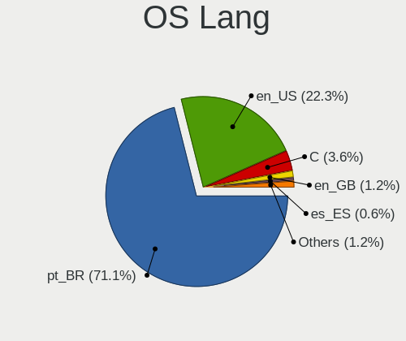
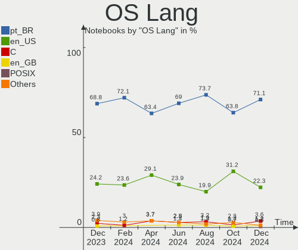
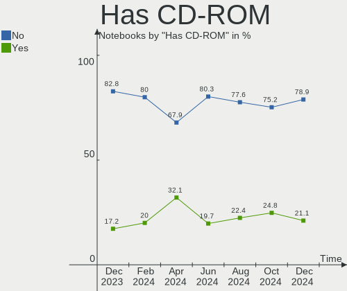
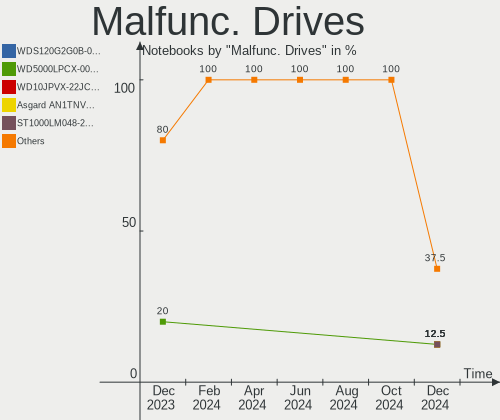
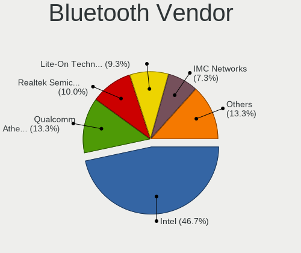
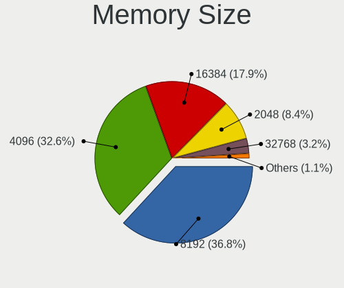
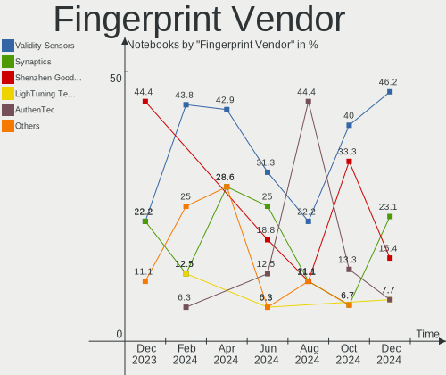

Linux in Brazil - Hardware Trends (Notebooks)
---------------------------------------------

A project to identify most popular hardware characteristics and track their change
over time based on data collected by Linux users at https://Linux-Hardware.org.

Anyone can contribute to this report by the [hw-probe](https://github.com/linuxhw/hw-probe) tool:

    sudo -E hw-probe -all -upload

Contents
--------

* [ System ](#system)
  - [ OS                       ](#os)
  - [ OS Family                ](#os-family)
  - [ Kernel                   ](#kernel)
  - [ Kernel Family            ](#kernel-family)
  - [ Kernel Major Ver.        ](#kernel-major-ver)
  - [ Arch                     ](#arch)
  - [ DE                       ](#de)
  - [ Display Server           ](#display-server)
  - [ Display Manager          ](#display-manager)
  - [ OS Lang                  ](#os-lang)
  - [ Boot Mode                ](#boot-mode)
  - [ Filesystem               ](#filesystem)
  - [ Part. scheme             ](#part-scheme)
  - [ Dual Boot with Linux/BSD ](#dual-boot-with-linuxbsd)
  - [ Dual Boot (Win)          ](#dual-boot-win)

* [ Board ](#board)
  - [ Vendor                   ](#vendor)
  - [ Model                    ](#model)
  - [ Model Family             ](#model-family)
  - [ MFG Year                 ](#mfg-year)
  - [ Form Factor              ](#form-factor)
  - [ Secure Boot              ](#secure-boot)
  - [ Coreboot                 ](#coreboot)
  - [ RAM Size                 ](#ram-size)
  - [ RAM Used                 ](#ram-used)
  - [ Total Drives             ](#total-drives)
  - [ Has CD-ROM               ](#has-cd-rom)
  - [ Has Ethernet             ](#has-ethernet)
  - [ Has WiFi                 ](#has-wifi)
  - [ Has Bluetooth            ](#has-bluetooth)

* [ Location ](#location)
  - [ Country                  ](#country)
  - [ City                     ](#city)

* [ Drives ](#drives)
  - [ Drive Vendor             ](#drive-vendor)
  - [ Drive Model              ](#drive-model)
  - [ HDD Vendor               ](#hdd-vendor)
  - [ SSD Vendor               ](#ssd-vendor)
  - [ Drive Kind               ](#drive-kind)
  - [ Drive Connector          ](#drive-connector)
  - [ Drive Size               ](#drive-size)
  - [ Space Total              ](#space-total)
  - [ Space Used               ](#space-used)
  - [ Malfunc. Drives          ](#malfunc-drives)
  - [ Malfunc. Drive Vendor    ](#malfunc-drive-vendor)
  - [ Malfunc. HDD Vendor      ](#malfunc-hdd-vendor)
  - [ Malfunc. Drive Kind      ](#malfunc-drive-kind)
  - [ Failed Drives            ](#failed-drives)
  - [ Failed Drive Vendor      ](#failed-drive-vendor)
  - [ Drive Status             ](#drive-status)

* [ Storage controller ](#storage-controller)
  - [ Storage Vendor           ](#storage-vendor)
  - [ Storage Model            ](#storage-model)
  - [ Storage Kind             ](#storage-kind)

* [ Processor ](#processor)
  - [ CPU Vendor               ](#cpu-vendor)
  - [ CPU Model                ](#cpu-model)
  - [ CPU Model Family         ](#cpu-model-family)
  - [ CPU Cores                ](#cpu-cores)
  - [ CPU Sockets              ](#cpu-sockets)
  - [ CPU Threads              ](#cpu-threads)
  - [ CPU Op-Modes             ](#cpu-op-modes)
  - [ CPU Microcode            ](#cpu-microcode)
  - [ CPU Microarch            ](#cpu-microarch)

* [ Graphics ](#graphics)
  - [ GPU Vendor               ](#gpu-vendor)
  - [ GPU Model                ](#gpu-model)
  - [ GPU Combo                ](#gpu-combo)
  - [ GPU Driver               ](#gpu-driver)
  - [ GPU Memory               ](#gpu-memory)

* [ Monitor ](#monitor)
  - [ Monitor Vendor           ](#monitor-vendor)
  - [ Monitor Model            ](#monitor-model)
  - [ Monitor Resolution       ](#monitor-resolution)
  - [ Monitor Diagonal         ](#monitor-diagonal)
  - [ Monitor Width            ](#monitor-width)
  - [ Aspect Ratio             ](#aspect-ratio)
  - [ Monitor Area             ](#monitor-area)
  - [ Pixel Density            ](#pixel-density)
  - [ Multiple Monitors        ](#multiple-monitors)

* [ Network ](#network)
  - [ Net Controller Vendor    ](#net-controller-vendor)
  - [ Net Controller Model     ](#net-controller-model)
  - [ Wireless Vendor          ](#wireless-vendor)
  - [ Wireless Model           ](#wireless-model)
  - [ Ethernet Vendor          ](#ethernet-vendor)
  - [ Ethernet Model           ](#ethernet-model)
  - [ Net Controller Kind      ](#net-controller-kind)
  - [ Used Controller          ](#used-controller)
  - [ NICs                     ](#nics)
  - [ IPv6                     ](#ipv6)

* [ Bluetooth ](#bluetooth)
  - [ Bluetooth Vendor         ](#bluetooth-vendor)
  - [ Bluetooth Model          ](#bluetooth-model)

* [ Sound ](#sound)
  - [ Sound Vendor             ](#sound-vendor)
  - [ Sound Model              ](#sound-model)

* [ Memory ](#memory)
  - [ Memory Vendor            ](#memory-vendor)
  - [ Memory Model             ](#memory-model)
  - [ Memory Kind              ](#memory-kind)
  - [ Memory Form Factor       ](#memory-form-factor)
  - [ Memory Size              ](#memory-size)
  - [ Memory Speed             ](#memory-speed)

* [ Printers & scanners ](#printers--scanners)
  - [ Printer Vendor           ](#printer-vendor)
  - [ Printer Model            ](#printer-model)
  - [ Scanner Vendor           ](#scanner-vendor)
  - [ Scanner Model            ](#scanner-model)

* [ Camera ](#camera)
  - [ Camera Vendor            ](#camera-vendor)
  - [ Camera Model             ](#camera-model)

* [ Security ](#security)
  - [ Fingerprint Vendor       ](#fingerprint-vendor)
  - [ Fingerprint Model        ](#fingerprint-model)
  - [ Chipcard Vendor          ](#chipcard-vendor)
  - [ Chipcard Model           ](#chipcard-model)

* [ Unsupported ](#unsupported)
  - [ Unsupported Devices      ](#unsupported-devices)
  - [ Unsupported Device Types ](#unsupported-device-types)

System
------

OS
--

Installed operating systems

| Name                | Notebooks | Percent |
|---------------------|-----------|---------|
| Ubuntu 20.04        | 23        | 12.23%  |
| Fedora 35           | 19        | 10.11%  |
| Ubuntu 22.04        | 15        | 7.98%   |
| OpenMandriva 4.3    | 15        | 7.98%   |
| Linux Mint 20.3     | 14        | 7.45%   |
| Pop!_OS 21.10       | 9         | 4.79%   |
| Zorin 16            | 8         | 4.26%   |
| Pop!_OS 22.04       | 7         | 3.72%   |
| Pop!_OS 20.04       | 7         | 3.72%   |
| Endless 3.9.7       | 6         | 3.19%   |
| Arch                | 6         | 3.19%   |
| Ubuntu 21.10        | 5         | 2.66%   |
| KDE neon 20.04      | 5         | 2.66%   |
| Endless 4.0.4       | 4         | 2.13%   |
| Debian 11           | 3         | 1.6%    |
| Manjaro             | 2         | 1.06%   |
| Linux Mint 20.2     | 2         | 1.06%   |
| Kubuntu 20.04       | 2         | 1.06%   |
| Fedora 36           | 2         | 1.06%   |
| Endless 4.0.3       | 2         | 1.06%   |
| Debian 10           | 2         | 1.06%   |
| Arch Rolling        | 2         | 1.06%   |
| Xubuntu 21.10       | 1         | 0.53%   |
| Ubuntu MATE 22.04   | 1         | 0.53%   |
| Ubuntu MATE 20.04   | 1         | 0.53%   |
| Ubuntu Budgie 22.04 | 1         | 0.53%   |
| Ubuntu Budgie 21.10 | 1         | 0.53%   |
| Ubuntu Budgie 20.04 | 1         | 0.53%   |
| Peppermint 10       | 1         | 0.53%   |
| openSUSE Leap-15.4  | 1         | 0.53%   |
| openSUSE 20220425   | 1         | 0.53%   |
| OpenMandriva 4.2    | 1         | 0.53%   |
| Manjaro 21.2.5      | 1         | 0.53%   |
| LMDE 5              | 1         | 0.53%   |
| LinuxFX 10          | 1         | 0.53%   |
| Linux Mint 20       | 1         | 0.53%   |
| Linux Lite 5.8      | 1         | 0.53%   |
| Kubuntu 21.10       | 1         | 0.53%   |
| Kubuntu 11          | 1         | 0.53%   |
| Kali 2022.1         | 1         | 0.53%   |
| Funtoo              | 1         | 0.53%   |
| Endless 4.0.6       | 1         | 0.53%   |
| Endless 4.0.2       | 1         | 0.53%   |
| Endless 3.9.5       | 1         | 0.53%   |
| Endless 3.9.1       | 1         | 0.53%   |
| Elementary 6.1      | 1         | 0.53%   |
| Clear Linux 36250   | 1         | 0.53%   |
| Clear Linux 36220   | 1         | 0.53%   |
| Clear Linux 36140   | 1         | 0.53%   |
| ArcoLinux Rolling   | 1         | 0.53%   |

OS Family
---------

OS without a version

| Name          | Notebooks | Percent |
|---------------|-----------|---------|
| Ubuntu        | 43        | 22.87%  |
| Pop!_OS       | 23        | 12.23%  |
| Fedora        | 21        | 11.17%  |
| Linux Mint    | 17        | 9.04%   |
| OpenMandriva  | 16        | 8.51%   |
| Endless       | 16        | 8.51%   |
| Zorin         | 8         | 4.26%   |
| Arch          | 8         | 4.26%   |
| KDE neon      | 5         | 2.66%   |
| Debian        | 5         | 2.66%   |
| Kubuntu       | 4         | 2.13%   |
| Ubuntu Budgie | 3         | 1.6%    |
| Manjaro       | 3         | 1.6%    |
| Clear Linux   | 3         | 1.6%    |
| Ubuntu MATE   | 2         | 1.06%   |
| openSUSE      | 2         | 1.06%   |
| Xubuntu       | 1         | 0.53%   |
| Peppermint    | 1         | 0.53%   |
| LMDE          | 1         | 0.53%   |
| LinuxFX       | 1         | 0.53%   |
| Linux Lite    | 1         | 0.53%   |
| Kali          | 1         | 0.53%   |
| Funtoo        | 1         | 0.53%   |
| Elementary    | 1         | 0.53%   |
| ArcoLinux     | 1         | 0.53%   |

Kernel
------

Version of the Linux kernel

| Version                        | Notebooks | Percent |
|--------------------------------|-----------|---------|
| 5.13.0-39-generic              | 26        | 13.83%  |
| 5.16.7-desktop-1omv4003        | 15        | 7.98%   |
| 5.13.0-40-generic              | 15        | 7.98%   |
| 5.16.15-76051615-generic       | 10        | 5.32%   |
| 5.16.19-76051619-generic       | 9         | 4.79%   |
| 5.15.0-25-generic              | 9         | 4.79%   |
| 5.8.0-14-generic               | 8         | 4.26%   |
| 5.11.0-35-generic              | 8         | 4.26%   |
| 5.4.0-109-generic              | 6         | 3.19%   |
| 5.4.0-107-generic              | 6         | 3.19%   |
| 5.15.0-27-generic              | 6         | 3.19%   |
| 5.16.18-200.fc35.x86_64        | 5         | 2.66%   |
| 5.14.10-300.fc35.x86_64        | 4         | 2.13%   |
| 5.4.0-91-generic               | 3         | 1.6%    |
| 5.17.4-200.fc35.x86_64         | 3         | 1.6%    |
| 5.17.1-arch1-1                 | 3         | 1.6%    |
| 5.16.11-76051611-generic       | 3         | 1.6%    |
| 5.13.0-30-generic              | 3         | 1.6%    |
| 5.10.0-13-amd64                | 3         | 1.6%    |
| 5.4.0-100-generic              | 2         | 1.06%   |
| 5.17.1-zen1-1-zen              | 2         | 1.06%   |
| 5.16.20-200.fc35.x86_64        | 2         | 1.06%   |
| 5.16.19-200.fc35.x86_64        | 2         | 1.06%   |
| 5.16.13-1132.native            | 2         | 1.06%   |
| 5.15.0-23-generic              | 2         | 1.06%   |
| 5.4.21                         | 1         | 0.53%   |
| 5.4.0-72-generic               | 1         | 0.53%   |
| 5.4.0-26-generic               | 1         | 0.53%   |
| 5.17.4-1-default               | 1         | 0.53%   |
| 5.17.3-arch1-1                 | 1         | 0.53%   |
| 5.17.2-arch3-1                 | 1         | 0.53%   |
| 5.17.2                         | 1         | 0.53%   |
| 5.17.1-300.fc36.x86_64         | 1         | 0.53%   |
| 5.17.0-0.rc7.116.fc36.x86_64   | 1         | 0.53%   |
| 5.16.17-1136.native            | 1         | 0.53%   |
| 5.16.16-200.fc35.x86_64        | 1         | 0.53%   |
| 5.16.15-201.fc35.x86_64        | 1         | 0.53%   |
| 5.16.14-1-MANJARO              | 1         | 0.53%   |
| 5.16.10-xanmod1                | 1         | 0.53%   |
| 5.16.0-kali6-amd64             | 1         | 0.53%   |
| 5.15.36-xanmod1                | 1         | 0.53%   |
| 5.15.33-1-lts                  | 1         | 0.53%   |
| 5.15.32-1-MANJARO              | 1         | 0.53%   |
| 5.15.28-1-MANJARO              | 1         | 0.53%   |
| 5.15.15-76051515-generic       | 1         | 0.53%   |
| 5.14.21-150400.15-default      | 1         | 0.53%   |
| 5.14.0-1032-oem                | 1         | 0.53%   |
| 5.14.0-1027-oem                | 1         | 0.53%   |
| 5.13.0-35-generic              | 1         | 0.53%   |
| 5.11.12-desktop-1omv4002       | 1         | 0.53%   |
| 5.11.0-43-generic              | 1         | 0.53%   |
| 5.11.0-41-generic              | 1         | 0.53%   |
| 5.10.111-200.fc35.x86_64       | 1         | 0.53%   |
| 5.10.0-13-686-pae              | 1         | 0.53%   |
| 4.19.194_p3-debian-sources-lts | 1         | 0.53%   |
| 4.19.0-20-amd64                | 1         | 0.53%   |

Kernel Family
-------------

Linux kernel without a distro release

| Version  | Notebooks | Percent |
|----------|-----------|---------|
| 5.13.0   | 45        | 23.94%  |
| 5.4.0    | 19        | 10.11%  |
| 5.15.0   | 17        | 9.04%   |
| 5.16.7   | 15        | 7.98%   |
| 5.16.19  | 11        | 5.85%   |
| 5.16.15  | 11        | 5.85%   |
| 5.11.0   | 10        | 5.32%   |
| 5.8.0    | 8         | 4.26%   |
| 5.17.1   | 6         | 3.19%   |
| 5.16.18  | 5         | 2.66%   |
| 5.17.4   | 4         | 2.13%   |
| 5.14.10  | 4         | 2.13%   |
| 5.10.0   | 4         | 2.13%   |
| 5.16.11  | 3         | 1.6%    |
| 5.17.2   | 2         | 1.06%   |
| 5.16.20  | 2         | 1.06%   |
| 5.16.13  | 2         | 1.06%   |
| 5.14.0   | 2         | 1.06%   |
| 5.4.21   | 1         | 0.53%   |
| 5.17.3   | 1         | 0.53%   |
| 5.17.0   | 1         | 0.53%   |
| 5.16.17  | 1         | 0.53%   |
| 5.16.16  | 1         | 0.53%   |
| 5.16.14  | 1         | 0.53%   |
| 5.16.10  | 1         | 0.53%   |
| 5.16.0   | 1         | 0.53%   |
| 5.15.36  | 1         | 0.53%   |
| 5.15.33  | 1         | 0.53%   |
| 5.15.32  | 1         | 0.53%   |
| 5.15.28  | 1         | 0.53%   |
| 5.15.15  | 1         | 0.53%   |
| 5.14.21  | 1         | 0.53%   |
| 5.11.12  | 1         | 0.53%   |
| 5.10.111 | 1         | 0.53%   |
| 4.19.194 | 1         | 0.53%   |
| 4.19.0   | 1         | 0.53%   |

Kernel Major Ver.
-----------------

Linux kernel major version

| Version | Notebooks | Percent |
|---------|-----------|---------|
| 5.16    | 54        | 28.72%  |
| 5.13    | 45        | 23.94%  |
| 5.15    | 22        | 11.7%   |
| 5.4     | 20        | 10.64%  |
| 5.17    | 14        | 7.45%   |
| 5.11    | 11        | 5.85%   |
| 5.8     | 8         | 4.26%   |
| 5.14    | 7         | 3.72%   |
| 5.10    | 5         | 2.66%   |
| 4.19    | 2         | 1.06%   |

Arch
----

OS architecture (x86_64, i586, etc.)

| Name   | Notebooks | Percent |
|--------|-----------|---------|
| x86_64 | 187       | 99.47%  |
| i686   | 1         | 0.53%   |

DE
--

Desktop Environment

| Name            | Notebooks | Percent |
|-----------------|-----------|---------|
| GNOME           | 115       | 61.17%  |
| KDE5            | 30        | 15.96%  |
| X-Cinnamon      | 15        | 7.98%   |
| XFCE            | 10        | 5.32%   |
| MATE            | 4         | 2.13%   |
| Unknown         | 4         | 2.13%   |
| Cinnamon        | 3         | 1.6%    |
| Budgie          | 3         | 1.6%    |
| LXDE            | 2         | 1.06%   |
| Unity           | 1         | 0.53%   |
| GNOME Flashback | 1         | 0.53%   |

Display Server
--------------

X11 or Wayland

| Name    | Notebooks | Percent |
|---------|-----------|---------|
| X11     | 153       | 81.38%  |
| Wayland | 33        | 17.55%  |
| Tty     | 1         | 0.53%   |
| Unknown | 1         | 0.53%   |

Display Manager
---------------

SDDM, LightDM, etc.

| Name    | Notebooks | Percent |
|---------|-----------|---------|
| Unknown | 93        | 49.47%  |
| GDM     | 28        | 14.89%  |
| GDM3    | 26        | 13.83%  |
| SDDM    | 24        | 12.77%  |
| LightDM | 17        | 9.04%   |

OS Lang
-------

Language

| Lang    | Notebooks | Percent |
|---------|-----------|---------|
| pt_BR   | 131       | 69.68%  |
| en_US   | 50        | 26.6%   |
| C       | 2         | 1.06%   |
| Unknown | 2         | 1.06%   |
| es_ES   | 1         | 0.53%   |
| en_GB   | 1         | 0.53%   |
| en_CA   | 1         | 0.53%   |

Boot Mode
---------

EFI or BIOS

| Mode | Notebooks | Percent |
|------|-----------|---------|
| EFI  | 101       | 53.72%  |
| BIOS | 87        | 46.28%  |

Filesystem
----------

Type of filesystem

| Type    | Notebooks | Percent |
|---------|-----------|---------|
| Ext4    | 147       | 78.19%  |
| Btrfs   | 23        | 12.23%  |
| Overlay | 16        | 8.51%   |
| Zfs     | 1         | 0.53%   |
| Xfs     | 1         | 0.53%   |

Part. scheme
------------

Scheme of partitioning

| Type    | Notebooks | Percent |
|---------|-----------|---------|
| Unknown | 114       | 60.64%  |
| GPT     | 62        | 32.98%  |
| MBR     | 12        | 6.38%   |

Dual Boot with Linux/BSD
------------------------

Hosting more than one Linux/BSD

| Dual boot | Notebooks | Percent |
|-----------|-----------|---------|
| No        | 172       | 91.49%  |
| Yes       | 16        | 8.51%   |

Dual Boot (Win)
---------------

Hosting Linux and Windows

| Dual boot | Notebooks | Percent |
|-----------|-----------|---------|
| No        | 155       | 82.45%  |
| Yes       | 33        | 17.55%  |

Board
-----

Vendor
------

Motherboard manufacturer

| Name                   | Notebooks | Percent |
|------------------------|-----------|---------|
| Dell                   | 47        | 25%     |
| Acer                   | 29        | 15.43%  |
| Lenovo                 | 28        | 14.89%  |
| Samsung Electronics    | 17        | 9.04%   |
| Positivo               | 15        | 7.98%   |
| Hewlett-Packard        | 11        | 5.85%   |
| ASUSTek Computer       | 7         | 3.72%   |
| Avell High Performance | 6         | 3.19%   |
| Philco                 | 3         | 1.6%    |
| Multilaser             | 3         | 1.6%    |
| LG Electronics         | 3         | 1.6%    |
| Apple                  | 3         | 1.6%    |
| Toshiba                | 2         | 1.06%   |
| Sony                   | 2         | 1.06%   |
| Positivo Bahia - VAIO  | 2         | 1.06%   |
| Intel                  | 2         | 1.06%   |
| Google                 | 2         | 1.06%   |
| Unknown                | 2         | 1.06%   |
| Semp Toshiba           | 1         | 0.53%   |
| Itautec                | 1         | 0.53%   |
| Gateway                | 1         | 0.53%   |
| Compaq                 | 1         | 0.53%   |

Model
-----

Motherboard model

| Name                                           | Notebooks | Percent |
|------------------------------------------------|-----------|---------|
| Acer Nitro AN515-44                            | 8         | 4.26%   |
| Lenovo IdeaPad S145-15API 81V7                 | 4         | 2.13%   |
| Samsung 340XAA/350XAA/550XAA                   | 3         | 1.6%    |
| Samsung 270E5J/2570EJ                          | 3         | 1.6%    |
| Positivo S14CT01                               | 3         | 1.6%    |
| Positivo Mobile                                | 3         | 1.6%    |
| Lenovo IdeaPad 330-15IKB 81FE                  | 3         | 1.6%    |
| Lenovo IdeaPad 320-15IKB 80YH                  | 3         | 1.6%    |
| Dell Latitude 5420                             | 3         | 1.6%    |
| Dell Inspiron 5458                             | 3         | 1.6%    |
| Dell Inspiron 15-3567                          | 3         | 1.6%    |
| Avell High Performance B.ON                    | 3         | 1.6%    |
| Unknown                                        | 3         | 1.6%    |
| Samsung 550XDA                                 | 2         | 1.06%   |
| Positivo S14SL01                               | 2         | 1.06%   |
| Positivo N1250                                 | 2         | 1.06%   |
| Lenovo IdeaPad S145-15IWL 81S9                 | 2         | 1.06%   |
| Lenovo IdeaPad L340-15IRH Gaming 81TR          | 2         | 1.06%   |
| HP Pavilion dv6                                | 2         | 1.06%   |
| Dell XPS 13 9310                               | 2         | 1.06%   |
| Dell Vostro 3560                               | 2         | 1.06%   |
| Dell Inspiron N4010                            | 2         | 1.06%   |
| Dell Inspiron 7559                             | 2         | 1.06%   |
| Dell Inspiron 5566                             | 2         | 1.06%   |
| Dell Inspiron 3583                             | 2         | 1.06%   |
| Dell Inspiron 1525                             | 2         | 1.06%   |
| Dell Inspiron 15 7000 Gaming                   | 2         | 1.06%   |
| Acer Aspire A514-54                            | 2         | 1.06%   |
| Toshiba Satellite U845W                        | 1         | 0.53%   |
| Toshiba Satellite S55-C                        | 1         | 0.53%   |
| Sony VPCEH25FM                                 | 1         | 0.53%   |
| Sony SVS13A25PBS                               | 1         | 0.53%   |
| Semp Toshiba IS 1413G                          | 1         | 0.53%   |
| Samsung RV415/RV515                            | 1         | 0.53%   |
| Samsung RV411/RV511/E3511/S3511/RV711/E3411    | 1         | 0.53%   |
| Samsung 670Z5E                                 | 1         | 0.53%   |
| Samsung 550XCJ/550XCR                          | 1         | 0.53%   |
| Samsung 530U3C/530U4C/532U3C                   | 1         | 0.53%   |
| Samsung 370E4K                                 | 1         | 0.53%   |
| Samsung 300V3A/300V4A/300V5A/200A4B/200A5B     | 1         | 0.53%   |
| Samsung 300E5EV/300E4EV/270E5EV/270E4EV/2470EV | 1         | 0.53%   |
| Samsung 300E4C/300E5C/300E7C                   | 1         | 0.53%   |
| Positivo W942SW_SW1                            | 1         | 0.53%   |
| Positivo W940TU                                | 1         | 0.53%   |
| Positivo Q464C                                 | 1         | 0.53%   |
| Positivo NB50TH                                | 1         | 0.53%   |
| Positivo H14BU08                               | 1         | 0.53%   |
| Positivo Bahia - VAIO VJFE41F11X-XXXXXX        | 1         | 0.53%   |
| Positivo Bahia - VAIO VJC141F11X-B0111L        | 1         | 0.53%   |
| Philco 14I                                     | 1         | 0.53%   |
| Philco 14H                                     | 1         | 0.53%   |
| Multilaser PC13X                               | 1         | 0.53%   |
| Multilaser PC121                               | 1         | 0.53%   |
| Multilaser M11W                                | 1         | 0.53%   |
| LG U460-G.BG51P1                               | 1         | 0.53%   |
| LG S430-G.BC33P1                               | 1         | 0.53%   |
| LG C400-G.BC22P1                               | 1         | 0.53%   |
| Lenovo ThinkPad T480s 20L8S2N70H               | 1         | 0.53%   |
| Lenovo ThinkPad T480 20L6SJN400                | 1         | 0.53%   |
| Lenovo ThinkPad P50 20EQS64N1N                 | 1         | 0.53%   |

Model Family
------------

Motherboard model prefix

| Name                                    | Notebooks | Percent |
|-----------------------------------------|-----------|---------|
| Dell Inspiron                           | 31        | 16.49%  |
| Lenovo IdeaPad                          | 18        | 9.57%   |
| Acer Aspire                             | 17        | 9.04%   |
| Acer Nitro                              | 11        | 5.85%   |
| Lenovo ThinkPad                         | 6         | 3.19%   |
| Dell Vostro                             | 6         | 3.19%   |
| Dell Latitude                           | 6         | 3.19%   |
| HP Pavilion                             | 4         | 2.13%   |
| Samsung 340XAA                          | 3         | 1.6%    |
| Samsung 270E5J                          | 3         | 1.6%    |
| Positivo S14CT01                        | 3         | 1.6%    |
| Positivo Mobile                         | 3         | 1.6%    |
| HP ProBook                              | 3         | 1.6%    |
| Dell XPS                                | 3         | 1.6%    |
| Avell High Performance B.ON             | 3         | 1.6%    |
| Unknown                                 | 3         | 1.6%    |
| Toshiba Satellite                       | 2         | 1.06%   |
| Samsung 550XDA                          | 2         | 1.06%   |
| Positivo S14SL01                        | 2         | 1.06%   |
| Positivo N1250                          | 2         | 1.06%   |
| ASUS VivoBook                           | 2         | 1.06%   |
| Sony VPCEH25FM                          | 1         | 0.53%   |
| Sony SVS13A25PBS                        | 1         | 0.53%   |
| Semp Toshiba IS                         | 1         | 0.53%   |
| Samsung RV415                           | 1         | 0.53%   |
| Samsung RV411                           | 1         | 0.53%   |
| Samsung 670Z5E                          | 1         | 0.53%   |
| Samsung 550XCJ                          | 1         | 0.53%   |
| Samsung 530U3C                          | 1         | 0.53%   |
| Samsung 370E4K                          | 1         | 0.53%   |
| Samsung 300V3A                          | 1         | 0.53%   |
| Samsung 300E5EV                         | 1         | 0.53%   |
| Samsung 300E4C                          | 1         | 0.53%   |
| Positivo W942SW                         | 1         | 0.53%   |
| Positivo W940TU                         | 1         | 0.53%   |
| Positivo Q464C                          | 1         | 0.53%   |
| Positivo NB50TH                         | 1         | 0.53%   |
| Positivo H14BU08                        | 1         | 0.53%   |
| Positivo Bahia - VAIO VJFE41F11X-XXXXXX | 1         | 0.53%   |
| Positivo Bahia - VAIO VJC141F11X-B0111L | 1         | 0.53%   |
| Philco 14I                              | 1         | 0.53%   |
| Philco 14H                              | 1         | 0.53%   |
| Multilaser PC13X                        | 1         | 0.53%   |
| Multilaser PC121                        | 1         | 0.53%   |
| Multilaser M11W                         | 1         | 0.53%   |
| LG U460-G.BG51P1                        | 1         | 0.53%   |
| LG S430-G.BC33P1                        | 1         | 0.53%   |
| LG C400-G.BC22P1                        | 1         | 0.53%   |
| Lenovo G400s                            | 1         | 0.53%   |
| Lenovo G40-80                           | 1         | 0.53%   |
| Lenovo G40-70                           | 1         | 0.53%   |
| Lenovo BS145-15IIL                      | 1         | 0.53%   |
| Itautec Infoway                         | 1         | 0.53%   |
| Intel Shark                             | 1         | 0.53%   |
| Intel Infoway                           | 1         | 0.53%   |
| HP ZBook                                | 1         | 0.53%   |
| HP G42                                  | 1         | 0.53%   |
| HP ElitePad                             | 1         | 0.53%   |
| HP EliteBook                            | 1         | 0.53%   |
| Google Relm                             | 1         | 0.53%   |

MFG Year
--------

Motherboard manufacture year

| Year    | Notebooks | Percent |
|---------|-----------|---------|
| 2020    | 24        | 12.77%  |
| 2021    | 21        | 11.17%  |
| 2019    | 21        | 11.17%  |
| 2017    | 16        | 8.51%   |
| 2018    | 14        | 7.45%   |
| 2016    | 14        | 7.45%   |
| 2015    | 13        | 6.91%   |
| 2013    | 13        | 6.91%   |
| 2012    | 10        | 5.32%   |
| 2011    | 10        | 5.32%   |
| 2014    | 9         | 4.79%   |
| 2010    | 9         | 4.79%   |
| 2008    | 6         | 3.19%   |
| Unknown | 4         | 2.13%   |
| 2009    | 2         | 1.06%   |
| 2022    | 1         | 0.53%   |
| 2004    | 1         | 0.53%   |

Form Factor
-----------

Physical design of the computer

| Name     | Notebooks | Percent |
|----------|-----------|---------|
| Notebook | 188       | 100%    |

Secure Boot
-----------

Enabled or disabled

| State    | Notebooks | Percent |
|----------|-----------|---------|
| Disabled | 167       | 88.83%  |
| Enabled  | 21        | 11.17%  |

Coreboot
--------

Have coreboot on board

| Used | Notebooks | Percent |
|------|-----------|---------|
| No   | 186       | 98.94%  |
| Yes  | 2         | 1.06%   |

RAM Size
--------

Total RAM memory

| Size in GB  | Notebooks | Percent |
|-------------|-----------|---------|
| 4.01-8.0    | 62        | 32.98%  |
| 8.01-16.0   | 42        | 22.34%  |
| 3.01-4.0    | 36        | 19.15%  |
| 16.01-24.0  | 28        | 14.89%  |
| 1.01-2.0    | 12        | 6.38%   |
| 2.01-3.0    | 4         | 2.13%   |
| 64.01-256.0 | 3         | 1.6%    |
| 32.01-64.0  | 1         | 0.53%   |

RAM Used
--------

Used RAM memory

| Used GB    | Notebooks | Percent |
|------------|-----------|---------|
| 1.01-2.0   | 64        | 34.04%  |
| 2.01-3.0   | 58        | 30.85%  |
| 3.01-4.0   | 28        | 14.89%  |
| 4.01-8.0   | 26        | 13.83%  |
| 8.01-16.0  | 8         | 4.26%   |
| 0.51-1.0   | 3         | 1.6%    |
| 32.01-64.0 | 1         | 0.53%   |

Total Drives
------------

Number of drives on board

| Drives | Notebooks | Percent |
|--------|-----------|---------|
| 1      | 135       | 71.81%  |
| 2      | 52        | 27.66%  |
| 3      | 1         | 0.53%   |

Has CD-ROM
----------

Has CD-ROM on board

| Presented | Notebooks | Percent |
|-----------|-----------|---------|
| No        | 147       | 78.19%  |
| Yes       | 41        | 21.81%  |

Has Ethernet
------------

Has Ethernet on board

| Presented | Notebooks | Percent |
|-----------|-----------|---------|
| Yes       | 160       | 85.11%  |
| No        | 28        | 14.89%  |

Has WiFi
--------

Has WiFi module

| Presented | Notebooks | Percent |
|-----------|-----------|---------|
| Yes       | 179       | 95.21%  |
| No        | 9         | 4.79%   |

Has Bluetooth
-------------

Has Bluetooth module

| Presented | Notebooks | Percent |
|-----------|-----------|---------|
| Yes       | 143       | 76.06%  |
| No        | 45        | 23.94%  |

Location
--------

Country
-------

Geographic location (country)

| Country | Notebooks | Percent |
|---------|-----------|---------|
| Brazil  | 188       | 100%    |

City
----

Geographic location (city)

| City                     | Notebooks | Percent |
|--------------------------|-----------|---------|
| Sao Paulo                | 28        | 14.89%  |
| Rio de Janeiro           | 11        | 5.85%   |
| Salvador                 | 4         | 2.13%   |
| Fortaleza                | 4         | 2.13%   |
| Brasília                | 4         | 2.13%   |
| Porto Alegre             | 3         | 1.6%    |
| Curitiba                 | 3         | 1.6%    |
| Belo Horizonte           | 3         | 1.6%    |
| Vila Velha               | 2         | 1.06%   |
| Uberlândia              | 2         | 1.06%   |
| Santo André             | 2         | 1.06%   |
| Santa Rita do Sapucai    | 2         | 1.06%   |
| Ribeirao Preto           | 2         | 1.06%   |
| Recife                   | 2         | 1.06%   |
| Porto Velho              | 2         | 1.06%   |
| Porto Seguro             | 2         | 1.06%   |
| Ourinhos                 | 2         | 1.06%   |
| Osasco                   | 2         | 1.06%   |
| Niterói                 | 2         | 1.06%   |
| Itatiba                  | 2         | 1.06%   |
| Guarulhos                | 2         | 1.06%   |
| Governador Valadares     | 2         | 1.06%   |
| Goiânia                 | 2         | 1.06%   |
| Chapecó                 | 2         | 1.06%   |
| Caxias do Sul            | 2         | 1.06%   |
| Campinas                 | 2         | 1.06%   |
| Cabo Frio                | 2         | 1.06%   |
| Almirante Tamandare      | 2         | 1.06%   |
| Volta Redonda            | 1         | 0.53%   |
| Vitória da Conquista    | 1         | 0.53%   |
| Varzea Paulista          | 1         | 0.53%   |
| Varginha                 | 1         | 0.53%   |
| Uniao                    | 1         | 0.53%   |
| Ubatuba                  | 1         | 0.53%   |
| Uaua                     | 1         | 0.53%   |
| Tubarao                  | 1         | 0.53%   |
| Timon                    | 1         | 0.53%   |
| Teresina                 | 1         | 0.53%   |
| Teófilo Otoni           | 1         | 0.53%   |
| Teixeira de Freitas      | 1         | 0.53%   |
| Sobral                   | 1         | 0.53%   |
| Sertaozinho              | 1         | 0.53%   |
| Sarandi                  | 1         | 0.53%   |
| Sao Sebastiao do Paraiso | 1         | 0.53%   |
| Sao Luís                | 1         | 0.53%   |
| Sao Lourenco da Mata     | 1         | 0.53%   |
| Sao José dos Campos     | 1         | 0.53%   |
| Sao Jose do Rio Preto    | 1         | 0.53%   |
| Sao Jose da Vitoria      | 1         | 0.53%   |
| Sao Jose da Tapera       | 1         | 0.53%   |
| Sao Joao del Rei         | 1         | 0.53%   |
| Sao Bernardo do Campo    | 1         | 0.53%   |
| Resende                  | 1         | 0.53%   |
| Quissama                 | 1         | 0.53%   |
| Primavera do Leste       | 1         | 0.53%   |
| Praia Grande             | 1         | 0.53%   |
| Pouso Alegre             | 1         | 0.53%   |
| Picos                    | 1         | 0.53%   |
| Pelotas                  | 1         | 0.53%   |
| Parnamirim               | 1         | 0.53%   |

Drives
------

Drive Vendor
------------

Hard drive vendors

| Vendor                         | Notebooks | Drives | Percent |
|--------------------------------|-----------|--------|---------|
| WDC                            | 43        | 45     | 19.63%  |
| Seagate                        | 29        | 31     | 13.24%  |
| Kingston                       | 23        | 25     | 10.5%   |
| SanDisk                        | 18        | 19     | 8.22%   |
| Samsung Electronics            | 15        | 15     | 6.85%   |
| A-DATA Technology              | 12        | 12     | 5.48%   |
| Unknown                        | 11        | 17     | 5.02%   |
| Toshiba                        | 11        | 11     | 5.02%   |
| Crucial                        | 8         | 9      | 3.65%   |
| ADATA Technology               | 8         | 10     | 3.65%   |
| SK Hynix                       | 4         | 4      | 1.83%   |
| Hitachi                        | 4         | 4      | 1.83%   |
| SSSTC                          | 3         | 3      | 1.37%   |
| Phison                         | 3         | 4      | 1.37%   |
| KIOXIA                         | 3         | 3      | 1.37%   |
| Intel                          | 3         | 3      | 1.37%   |
| China                          | 3         | 3      | 1.37%   |
| Unknown                        | 3         | 3      | 1.37%   |
| XPG                            | 2         | 2      | 0.91%   |
| LITEON                         | 2         | 2      | 0.91%   |
| Lexar                          | 2         | 2      | 0.91%   |
| WANGCHU                        | 1         | 1      | 0.46%   |
| Solid State Storage Technology | 1         | 1      | 0.46%   |
| Silicon Motion                 | 1         | 1      | 0.46%   |
| PNY                            | 1         | 1      | 0.46%   |
| Netac                          | 1         | 1      | 0.46%   |
| KingSpec                       | 1         | 1      | 0.46%   |
| KINGBANK                       | 1         | 1      | 0.46%   |
| HUSKY                          | 1         | 1      | 0.46%   |
| HS-SSD-C100                    | 1         | 1      | 0.46%   |

Drive Model
-----------

Hard drive models

| Model                                | Notebooks | Percent |
|--------------------------------------|-----------|---------|
| Kingston SA400S37240G 240GB SSD      | 10        | 4.33%   |
| Seagate ST1000LM024 HN-M101MBB 1TB   | 8         | 3.46%   |
| Sandisk NVMe SSD Drive 512GB         | 8         | 3.46%   |
| WDC WD10SPZX-24Z10 1TB               | 7         | 3.03%   |
| WDC WD10SPZX-21Z10T0 1TB             | 7         | 3.03%   |
| Kingston SA400S37480G 480GB SSD      | 6         | 2.6%    |
| Unknown MMC Card  32GB               | 5         | 2.16%   |
| ADATA NVMe SSD Drive 256GB           | 5         | 2.16%   |
| Crucial CT240BX500SSD1 240GB         | 4         | 1.73%   |
| WDC WDS240G2G0B-00EPW0 240GB SSD     | 3         | 1.3%    |
| WDC WD10JPVX-75JC3T0 1TB             | 3         | 1.3%    |
| Seagate ST1000LM035-1RK172 1TB       | 3         | 1.3%    |
| SanDisk SSD PLUS 480GB               | 3         | 1.3%    |
| SanDisk SSD PLUS 120GB               | 3         | 1.3%    |
| Unknown                              | 3         | 1.3%    |
| WDC WD10SPZX-22Z10T0 1TB             | 2         | 0.87%   |
| WDC WD10JPVX-22JC3T0 1TB             | 2         | 0.87%   |
| WDC PC SN530 SDBPNPZ-512G-1114 512GB | 2         | 0.87%   |
| Unknown MMC Card  64GB               | 2         | 0.87%   |
| Toshiba NVMe SSD Drive 1024GB        | 2         | 0.87%   |
| Toshiba MQ02ABD100H 1TB              | 2         | 0.87%   |
| SSSTC CL1-4D256 256GB                | 2         | 0.87%   |
| SK Hynix NVMe SSD Drive 256GB        | 2         | 0.87%   |
| Seagate ST9500325AS 500GB            | 2         | 0.87%   |
| Seagate ST9160314AS 160GB            | 2         | 0.87%   |
| Seagate ST500LM012 HN-M500MBB 500GB  | 2         | 0.87%   |
| Seagate ST1000LM048-2E7172 1TB       | 2         | 0.87%   |
| Seagate Expansion+ 2TB               | 2         | 0.87%   |
| Samsung NVMe SSD Drive 512GB         | 2         | 0.87%   |
| Samsung NVMe SSD Drive 256GB         | 2         | 0.87%   |
| Phison NVMe SSD Drive 256GB          | 2         | 0.87%   |
| Kingston SA400S37120G 120GB SSD      | 2         | 0.87%   |
| ADATA NVMe SSD Drive 512GB           | 2         | 0.87%   |
| A-DATA SU630 480GB SSD               | 2         | 0.87%   |
| A-DATA IM2P33F8A-512GD 512GB         | 2         | 0.87%   |
| A-DATA IM2P33F3A NVMe 256GB          | 2         | 0.87%   |
| XPG NVMe SSD Drive 1024GB            | 1         | 0.43%   |
| XPG GAMMIX S11 Pro 512GB             | 1         | 0.43%   |
| WDC WDS960G2G0C-00AJM0 960GB         | 1         | 0.43%   |
| WDC WDS250G2B0B-00YS70 250GB SSD     | 1         | 0.43%   |
| WDC WDS120G2G0B-00EPW0 120GB SSD     | 1         | 0.43%   |
| WDC WDS120G2G0A-00JH30 120GB SSD     | 1         | 0.43%   |
| WDC WD7500BPKT-75PK4T0 752GB         | 1         | 0.43%   |
| WDC WD5000LPZX-08Z10 500GB           | 1         | 0.43%   |
| WDC WD5000LPVX-80V0TT0 500GB         | 1         | 0.43%   |
| WDC WD5000LPVX-00V0TT0 500GB         | 1         | 0.43%   |
| WDC WD5000LPCX-24VHAT0 500GB         | 1         | 0.43%   |
| WDC WD5000BPVT-00HXZT3 500GB         | 1         | 0.43%   |
| WDC WD3200BEVT-00A0RT0 320GB         | 1         | 0.43%   |
| WDC WD2500BEVT-22A23T0 250GB         | 1         | 0.43%   |
| WDC WD1600BEVS-22UST0 160GB          | 1         | 0.43%   |
| WDC WD10SPZX-75Z10T3 1TB             | 1         | 0.43%   |
| WDC WD10SPZX-75Z10T2 1TB             | 1         | 0.43%   |
| WDC WD10SPZX-35Z10T0 1TB             | 1         | 0.43%   |
| WDC WD10SPZX-24Z10T0 1TB             | 1         | 0.43%   |
| WDC PC SN520 SDAPNUW-512G-1014 512GB | 1         | 0.43%   |
| WDC PC SN520 SDAPNUW-256G-1006 256GB | 1         | 0.43%   |
| WANGCHU SSD 120GB                    | 1         | 0.43%   |
| Unknown T52732  32GB                 | 1         | 0.43%   |
| Unknown SLD32G  32GB                 | 1         | 0.43%   |

HDD Vendor
----------

Hard disk drive vendors

| Vendor              | Notebooks | Drives | Percent |
|---------------------|-----------|--------|---------|
| WDC                 | 34        | 34     | 43.59%  |
| Seagate             | 28        | 30     | 35.9%   |
| Toshiba             | 8         | 8      | 10.26%  |
| Samsung Electronics | 4         | 4      | 5.13%   |
| Hitachi             | 4         | 4      | 5.13%   |

SSD Vendor
----------

Solid state drive vendors

| Vendor              | Notebooks | Drives | Percent |
|---------------------|-----------|--------|---------|
| Kingston            | 22        | 23     | 30.14%  |
| SanDisk             | 8         | 9      | 10.96%  |
| Crucial             | 8         | 9      | 10.96%  |
| WDC                 | 6         | 6      | 8.22%   |
| Samsung Electronics | 6         | 6      | 8.22%   |
| A-DATA Technology   | 5         | 5      | 6.85%   |
| China               | 3         | 3      | 4.11%   |
| Unknown             | 3         | 3      | 4.11%   |
| Lexar               | 2         | 2      | 2.74%   |
| Intel               | 2         | 2      | 2.74%   |
| WANGCHU             | 1         | 1      | 1.37%   |
| Seagate             | 1         | 1      | 1.37%   |
| PNY                 | 1         | 1      | 1.37%   |
| Netac               | 1         | 1      | 1.37%   |
| LITEON              | 1         | 1      | 1.37%   |
| KingSpec            | 1         | 1      | 1.37%   |
| KINGBANK            | 1         | 1      | 1.37%   |
| HUSKY               | 1         | 1      | 1.37%   |

Drive Kind
----------

HDD or SSD

| Kind    | Notebooks | Drives | Percent |
|---------|-----------|--------|---------|
| HDD     | 78        | 80     | 35.29%  |
| SSD     | 73        | 76     | 33.03%  |
| NVMe    | 57        | 60     | 25.79%  |
| MMC     | 12        | 19     | 5.43%   |
| Unknown | 1         | 1      | 0.45%   |

Drive Connector
---------------

SATA, SAS, NVMe, etc.

| Type | Notebooks | Drives | Percent |
|------|-----------|--------|---------|
| SATA | 134       | 154    | 65.37%  |
| NVMe | 57        | 60     | 27.8%   |
| MMC  | 12        | 19     | 5.85%   |
| SAS  | 2         | 3      | 0.98%   |

Drive Size
----------

Size of hard drive

| Size in TB | Notebooks | Drives | Percent |
|------------|-----------|--------|---------|
| 0.01-0.5   | 96        | 102    | 64.43%  |
| 0.51-1.0   | 51        | 51     | 34.23%  |
| 1.01-2.0   | 2         | 3      | 1.34%   |

Space Total
-----------

Amount of disk space available on the file system

| Size in GB     | Notebooks | Percent |
|----------------|-----------|---------|
| 101-250        | 66        | 35.11%  |
| 251-500        | 44        | 23.4%   |
| 501-1000       | 27        | 14.36%  |
| 1-20           | 14        | 7.45%   |
| 1001-2000      | 9         | 4.79%   |
| 51-100         | 9         | 4.79%   |
| 21-50          | 8         | 4.26%   |
| Unknown        | 5         | 2.66%   |
| More than 3000 | 4         | 2.13%   |
| 2001-3000      | 2         | 1.06%   |

Space Used
----------

Amount of used disk space

| Used GB        | Notebooks | Percent |
|----------------|-----------|---------|
| 1-20           | 65        | 34.57%  |
| 21-50          | 43        | 22.87%  |
| 51-100         | 30        | 15.96%  |
| 101-250        | 25        | 13.3%   |
| 251-500        | 10        | 5.32%   |
| 501-1000       | 5         | 2.66%   |
| Unknown        | 5         | 2.66%   |
| 2001-3000      | 3         | 1.6%    |
| More than 3000 | 1         | 0.53%   |
| 1001-2000      | 1         | 0.53%   |

Malfunc. Drives
---------------

Drive models with a malfunction

| Model                               | Notebooks | Drives | Percent |
|-------------------------------------|-----------|--------|---------|
| Seagate ST1000LM035-1RK172 1TB      | 2         | 2      | 14.29%  |
| XPG GAMMIX S11 Pro 512GB            | 1         | 1      | 7.14%   |
| Toshiba MQ02ABD100H 1TB             | 1         | 1      | 7.14%   |
| Toshiba MQ01ABF032 320GB            | 1         | 1      | 7.14%   |
| Toshiba MK1246GSX 120GB             | 1         | 1      | 7.14%   |
| Seagate ST9500325AS 500GB           | 1         | 1      | 7.14%   |
| Seagate ST9160314AS 160GB           | 1         | 1      | 7.14%   |
| Seagate ST500LM012 HN-M500MBB 500GB | 1         | 1      | 7.14%   |
| Samsung Electronics HM121HI 120GB   | 1         | 1      | 7.14%   |
| Kingston SUV300S37A240G 240GB SSD   | 1         | 1      | 7.14%   |
| Kingston SA400S37480G 480GB SSD     | 1         | 1      | 7.14%   |
| Hitachi HTS547575A9E384 752GB       | 1         | 1      | 7.14%   |
| A-DATA Technology SSD 32GB          | 1         | 1      | 7.14%   |

Malfunc. Drive Vendor
---------------------

Vendors of faulty drives

| Vendor              | Notebooks | Drives | Percent |
|---------------------|-----------|--------|---------|
| Seagate             | 5         | 5      | 35.71%  |
| Toshiba             | 3         | 3      | 21.43%  |
| Kingston            | 2         | 2      | 14.29%  |
| XPG                 | 1         | 1      | 7.14%   |
| Samsung Electronics | 1         | 1      | 7.14%   |
| Hitachi             | 1         | 1      | 7.14%   |
| A-DATA Technology   | 1         | 1      | 7.14%   |

Malfunc. HDD Vendor
-------------------

Vendors of faulty HDD drives

| Vendor              | Notebooks | Drives | Percent |
|---------------------|-----------|--------|---------|
| Seagate             | 5         | 5      | 50%     |
| Toshiba             | 3         | 3      | 30%     |
| Samsung Electronics | 1         | 1      | 10%     |
| Hitachi             | 1         | 1      | 10%     |

Malfunc. Drive Kind
-------------------

Kinds of faulty drives

| Kind | Notebooks | Drives | Percent |
|------|-----------|--------|---------|
| HDD  | 10        | 10     | 71.43%  |
| SSD  | 3         | 3      | 21.43%  |
| NVMe | 1         | 1      | 7.14%   |

Failed Drives
-------------

Failed drive models

Zero info for selected period =(

Failed Drive Vendor
-------------------

Failed drive vendors

Zero info for selected period =(

Drive Status
------------

Number of failed and malfunc. drives

| Status   | Notebooks | Drives | Percent |
|----------|-----------|--------|---------|
| Detected | 119       | 157    | 62.3%   |
| Works    | 58        | 65     | 30.37%  |
| Malfunc  | 14        | 14     | 7.33%   |

Storage controller
------------------

Storage Vendor
--------------

Storage controller vendors

| Vendor                           | Notebooks | Percent |
|----------------------------------|-----------|---------|
| Intel                            | 136       | 61.82%  |
| AMD                              | 25        | 11.36%  |
| ADATA Technology                 | 17        | 7.73%   |
| Sandisk                          | 14        | 6.36%   |
| Samsung Electronics              | 5         | 2.27%   |
| Solid State Storage Technology   | 4         | 1.82%   |
| Toshiba America Info Systems     | 3         | 1.36%   |
| SK Hynix                         | 3         | 1.36%   |
| Phison Electronics               | 3         | 1.36%   |
| KIOXIA                           | 3         | 1.36%   |
| Silicon Integrated Systems [SiS] | 2         | 0.91%   |
| Kingston Technology Company      | 2         | 0.91%   |
| Silicon Motion                   | 1         | 0.45%   |
| Nvidia                           | 1         | 0.45%   |
| Lite-On Technology               | 1         | 0.45%   |

Storage Model
-------------

Storage controller models

| Model                                                                                  | Notebooks | Percent |
|----------------------------------------------------------------------------------------|-----------|---------|
| Intel Sunrise Point-LP SATA Controller [AHCI mode]                                     | 30        | 12.93%  |
| AMD FCH SATA Controller [AHCI mode]                                                    | 22        | 9.48%   |
| Intel 7 Series Chipset Family 6-port SATA Controller [AHCI mode]                       | 18        | 7.76%   |
| ADATA Non-Volatile memory controller                                                   | 14        | 6.03%   |
| Intel 8 Series SATA Controller 1 [AHCI mode]                                           | 11        | 4.74%   |
| Sandisk WD Blue SN550 NVMe SSD                                                         | 10        | 4.31%   |
| Intel Wildcat Point-LP SATA Controller [AHCI Mode]                                     | 8         | 3.45%   |
| Intel 6 Series/C200 Series Chipset Family 6 port Mobile SATA AHCI Controller           | 8         | 3.45%   |
| Intel Comet Lake SATA AHCI Controller                                                  | 7         | 3.02%   |
| Intel Tiger Lake-LP SATA Controller [AHCI mode]                                        | 6         | 2.59%   |
| Intel HM170/QM170 Chipset SATA Controller [AHCI Mode]                                  | 6         | 2.59%   |
| Intel Cannon Point-LP SATA Controller [AHCI Mode]                                      | 5         | 2.16%   |
| Intel 82801IBM/IEM (ICH9M/ICH9M-E) 4 port SATA Controller [AHCI mode]                  | 5         | 2.16%   |
| Solid State Storage Non-Volatile memory controller                                     | 4         | 1.72%   |
| Intel 82801 Mobile SATA Controller [RAID mode]                                         | 4         | 1.72%   |
| Toshiba America Info Systems XG6 NVMe SSD Controller                                   | 3         | 1.29%   |
| SK Hynix BC511                                                                         | 3         | 1.29%   |
| Samsung NVMe SSD Controller 980                                                        | 3         | 1.29%   |
| KIOXIA Non-Volatile memory controller                                                  | 3         | 1.29%   |
| Intel Celeron/Pentium Silver Processor SATA Controller                                 | 3         | 1.29%   |
| Intel Cannon Lake Mobile PCH SATA AHCI Controller                                      | 3         | 1.29%   |
| Intel 82801HM/HEM (ICH8M/ICH8M-E) SATA Controller [AHCI mode]                          | 3         | 1.29%   |
| Intel 82801HM/HEM (ICH8M/ICH8M-E) IDE Controller                                       | 3         | 1.29%   |
| Intel 500 Series Chipset Family SATA AHCI Controller                                   | 3         | 1.29%   |
| Intel 5 Series/3400 Series Chipset 6 port SATA AHCI Controller                         | 3         | 1.29%   |
| Intel 5 Series/3400 Series Chipset 4 port SATA AHCI Controller                         | 3         | 1.29%   |
| AMD SB7x0/SB8x0/SB9x0 SATA Controller [AHCI mode]                                      | 3         | 1.29%   |
| ADATA XPG SX8200 Pro PCIe Gen3x4 M.2 2280 Solid State Drive                            | 3         | 1.29%   |
| Silicon Integrated Systems [SiS] SATA Controller / IDE mode                            | 2         | 0.86%   |
| Silicon Integrated Systems [SiS] 5513 IDE Controller                                   | 2         | 0.86%   |
| Sandisk WD Blue SN500 / PC SN520 NVMe SSD                                              | 2         | 0.86%   |
| Phison PS5013 E13 NVMe Controller                                                      | 2         | 0.86%   |
| Intel Volume Management Device NVMe RAID Controller                                    | 2         | 0.86%   |
| Intel NM10/ICH7 Family SATA Controller [AHCI mode]                                     | 2         | 0.86%   |
| Silicon Motion SM2263EN/SM2263XT SSD Controller                                        | 1         | 0.43%   |
| Sandisk WD Black NVMe SSD                                                              | 1         | 0.43%   |
| Sandisk Non-Volatile memory controller                                                 | 1         | 0.43%   |
| Samsung NVMe SSD Controller SM981/PM981/PM983                                          | 1         | 0.43%   |
| Samsung NVMe SSD Controller SM961/PM961/SM963                                          | 1         | 0.43%   |
| Phison E12 NVMe Controller                                                             | 1         | 0.43%   |
| Nvidia MCP89 SATA Controller (AHCI mode)                                               | 1         | 0.43%   |
| Lite-On NVMe Controller                                                                | 1         | 0.43%   |
| Kingston Company SNVS2000G [NV1 NVMe PCIe SSD 2TB]                                     | 1         | 0.43%   |
| Kingston Company A2000 NVMe SSD                                                        | 1         | 0.43%   |
| Intel SSD 660P Series                                                                  | 1         | 0.43%   |
| Intel Q170/Q150/B150/H170/H110/Z170/CM236 Chipset SATA Controller [AHCI Mode]          | 1         | 0.43%   |
| Intel Ice Lake-LP SATA Controller [AHCI mode]                                          | 1         | 0.43%   |
| Intel Celeron N3350/Pentium N4200/Atom E3900 Series SATA AHCI Controller               | 1         | 0.43%   |
| Intel Cannon Lake PCH SATA AHCI Controller                                             | 1         | 0.43%   |
| Intel Atom Processor E3800 Series SATA AHCI Controller                                 | 1         | 0.43%   |
| Intel 82801IBM/IEM (ICH9M/ICH9M-E) 2 port SATA Controller [IDE mode]                   | 1         | 0.43%   |
| Intel 8 Series/C220 Series Chipset Family 6-port SATA Controller 1 [AHCI mode]         | 1         | 0.43%   |
| Intel 6 Series/C200 Series Chipset Family Mobile SATA Controller (IDE mode, ports 4-5) | 1         | 0.43%   |
| Intel 6 Series/C200 Series Chipset Family Mobile SATA Controller (IDE mode, ports 0-3) | 1         | 0.43%   |
| Intel 400 Series Chipset Family SATA AHCI Controller                                   | 1         | 0.43%   |
| AMD FCH IDE Controller                                                                 | 1         | 0.43%   |
| AMD 400 Series Chipset SATA Controller                                                 | 1         | 0.43%   |

Storage Kind
------------

Kind of storage controller (IDE, SATA, NVMe, SAS, ...)

| Kind | Notebooks | Percent |
|------|-----------|---------|
| SATA | 157       | 68.86%  |
| NVMe | 57        | 25%     |
| IDE  | 8         | 3.51%   |
| RAID | 6         | 2.63%   |

Processor
---------

CPU Vendor
----------

Processor vendors

| Vendor | Notebooks | Percent |
|--------|-----------|---------|
| Intel  | 161       | 85.64%  |
| AMD    | 27        | 14.36%  |

CPU Model
---------

Processor models

| Model                                         | Notebooks | Percent |
|-----------------------------------------------|-----------|---------|
| Intel Core i5-7200U CPU @ 2.50GHz             | 10        | 5.32%   |
| Intel Core i3-6006U CPU @ 2.00GHz             | 6         | 3.19%   |
| AMD Ryzen 7 4800H with Radeon Graphics        | 6         | 3.19%   |
| AMD Ryzen 5 3500U with Radeon Vega Mobile Gfx | 6         | 3.19%   |
| Intel Core i5-8250U CPU @ 1.60GHz             | 5         | 2.66%   |
| Intel Atom x5-Z8350 CPU @ 1.44GHz             | 5         | 2.66%   |
| Intel 11th Gen Core i7-1165G7 @ 2.80GHz       | 5         | 2.66%   |
| Intel 11th Gen Core i5-1135G7 @ 2.40GHz       | 5         | 2.66%   |
| Intel Core i7-8565U CPU @ 1.80GHz             | 4         | 2.13%   |
| Intel Core i7-8550U CPU @ 1.80GHz             | 4         | 2.13%   |
| Intel Core i5-10210U CPU @ 1.60GHz            | 4         | 2.13%   |
| Intel Core i3-2330M CPU @ 2.20GHz             | 4         | 2.13%   |
| Intel Core i7-4510U CPU @ 2.00GHz             | 3         | 1.6%    |
| Intel Core i5-6200U CPU @ 2.30GHz             | 3         | 1.6%    |
| Intel Core i5-4210U CPU @ 1.70GHz             | 3         | 1.6%    |
| Intel Core i5-3337U CPU @ 1.80GHz             | 3         | 1.6%    |
| Intel Core i5-3230M CPU @ 2.60GHz             | 3         | 1.6%    |
| Intel Core i3-5005U CPU @ 2.00GHz             | 3         | 1.6%    |
| Intel Celeron N4020 CPU @ 1.10GHz             | 3         | 1.6%    |
| Intel 11th Gen Core i7-1185G7 @ 3.00GHz       | 3         | 1.6%    |
| Intel 11th Gen Core i7-11800H @ 2.30GHz       | 3         | 1.6%    |
| Intel Core i7-6700HQ CPU @ 2.60GHz            | 2         | 1.06%   |
| Intel Core i7-5500U CPU @ 2.40GHz             | 2         | 1.06%   |
| Intel Core i7-3517U CPU @ 1.90GHz             | 2         | 1.06%   |
| Intel Core i5-7300HQ CPU @ 2.50GHz            | 2         | 1.06%   |
| Intel Core i5-5200U CPU @ 2.20GHz             | 2         | 1.06%   |
| Intel Core i5-4200U CPU @ 1.60GHz             | 2         | 1.06%   |
| Intel Core i5 CPU M 460 @ 2.53GHz             | 2         | 1.06%   |
| Intel Core i3-7020U CPU @ 2.30GHz             | 2         | 1.06%   |
| Intel Core i3-4005U CPU @ 1.70GHz             | 2         | 1.06%   |
| Intel Core 2 Duo CPU T7500 @ 2.20GHz          | 2         | 1.06%   |
| Intel Core 2 Duo CPU T7250 @ 2.00GHz          | 2         | 1.06%   |
| Intel Atom x5-Z8300 CPU @ 1.44GHz             | 2         | 1.06%   |
| Intel 11th Gen Core i5-1145G7 @ 2.60GHz       | 2         | 1.06%   |
| AMD Ryzen 5 4600H with Radeon Graphics        | 2         | 1.06%   |
| Intel Pentium Dual CPU T3200 @ 2.00GHz        | 1         | 0.53%   |
| Intel Pentium CPU P6200 @ 2.13GHz             | 1         | 0.53%   |
| Intel Genuine CPU U4100 @ 1.30GHz             | 1         | 0.53%   |
| Intel Core i7-9850H CPU @ 2.60GHz             | 1         | 0.53%   |
| Intel Core i7-9700 CPU @ 3.00GHz              | 1         | 0.53%   |
| Intel Core i7-8750H CPU @ 2.20GHz             | 1         | 0.53%   |
| Intel Core i7-8650U CPU @ 1.90GHz             | 1         | 0.53%   |
| Intel Core i7-7700HQ CPU @ 2.80GHz            | 1         | 0.53%   |
| Intel Core i7-7500U CPU @ 2.70GHz             | 1         | 0.53%   |
| Intel Core i7-6820HQ CPU @ 2.70GHz            | 1         | 0.53%   |
| Intel Core i7-3720QM CPU @ 2.60GHz            | 1         | 0.53%   |
| Intel Core i7-3632QM CPU @ 2.20GHz            | 1         | 0.53%   |
| Intel Core i7-3520M CPU @ 2.90GHz             | 1         | 0.53%   |
| Intel Core i7-2670QM CPU @ 2.20GHz            | 1         | 0.53%   |
| Intel Core i7-2640M CPU @ 2.80GHz             | 1         | 0.53%   |
| Intel Core i7-2630QM CPU @ 2.00GHz            | 1         | 0.53%   |
| Intel Core i7-10610U CPU @ 1.80GHz            | 1         | 0.53%   |
| Intel Core i7-10510U CPU @ 1.80GHz            | 1         | 0.53%   |
| Intel Core i5-9300HF CPU @ 2.40GHz            | 1         | 0.53%   |
| Intel Core i5-9300H CPU @ 2.40GHz             | 1         | 0.53%   |
| Intel Core i5-8350U CPU @ 1.70GHz             | 1         | 0.53%   |
| Intel Core i5-8265U CPU @ 1.60GHz             | 1         | 0.53%   |
| Intel Core i5-6300HQ CPU @ 2.30GHz            | 1         | 0.53%   |
| Intel Core i5-5257U CPU @ 2.70GHz             | 1         | 0.53%   |
| Intel Core i5-4350U CPU @ 1.40GHz             | 1         | 0.53%   |

CPU Model Family
----------------

Processor model prefix

| Model              | Notebooks | Percent |
|--------------------|-----------|---------|
| Intel Core i5      | 54        | 28.72%  |
| Intel Core i7      | 32        | 17.02%  |
| Intel Core i3      | 24        | 12.77%  |
| Other              | 18        | 9.57%   |
| Intel Celeron      | 13        | 6.91%   |
| AMD Ryzen 5        | 12        | 6.38%   |
| Intel Atom         | 10        | 5.32%   |
| Intel Core 2 Duo   | 7         | 3.72%   |
| AMD Ryzen 7        | 6         | 3.19%   |
| AMD Ryzen 3        | 3         | 1.6%    |
| AMD E              | 2         | 1.06%   |
| AMD A4             | 2         | 1.06%   |
| Intel Pentium Dual | 1         | 0.53%   |
| Intel Pentium      | 1         | 0.53%   |
| Intel Genuine      | 1         | 0.53%   |
| AMD C-60           | 1         | 0.53%   |
| AMD A10            | 1         | 0.53%   |

CPU Cores
---------

Number of processor cores

| Number | Notebooks | Percent |
|--------|-----------|---------|
| 2      | 97        | 51.6%   |
| 4      | 72        | 38.3%   |
| 8      | 10        | 5.32%   |
| 6      | 6         | 3.19%   |
| 1      | 3         | 1.6%    |

CPU Sockets
-----------

Number of sockets

| Number | Notebooks | Percent |
|--------|-----------|---------|
| 1      | 188       | 100%    |

CPU Threads
-----------

Threads per core (Hyper-Threading)

| Number | Notebooks | Percent |
|--------|-----------|---------|
| 2      | 146       | 77.66%  |
| 1      | 42        | 22.34%  |

CPU Op-Modes
------------

CPU Operation Modes (32-bit, 64-bit)

| Op mode        | Notebooks | Percent |
|----------------|-----------|---------|
| 32-bit, 64-bit | 187       | 99.47%  |
| Unknown        | 1         | 0.53%   |

CPU Microcode
-------------

Microcode number

| Number     | Notebooks | Percent |
|------------|-----------|---------|
| Unknown    | 48        | 25.53%  |
| 0x306a9    | 12        | 6.38%   |
| 0x806ea    | 10        | 5.32%   |
| 0x806e9    | 9         | 4.79%   |
| 0x806c1    | 9         | 4.79%   |
| 0x40651    | 8         | 4.26%   |
| 0x206a7    | 8         | 4.26%   |
| 0x08600103 | 8         | 4.26%   |
| 0x406e3    | 7         | 3.72%   |
| 0x806ec    | 6         | 3.19%   |
| 0x306d4    | 6         | 3.19%   |
| 0x406c4    | 5         | 2.66%   |
| 0x6fd      | 4         | 2.13%   |
| 0x20655    | 4         | 2.13%   |
| 0x1067a    | 4         | 2.13%   |
| 0x906e9    | 3         | 1.6%    |
| 0x08108102 | 3         | 1.6%    |
| 0x906ed    | 2         | 1.06%   |
| 0x706e5    | 2         | 1.06%   |
| 0x706a8    | 2         | 1.06%   |
| 0x506e3    | 2         | 1.06%   |
| 0x406c3    | 2         | 1.06%   |
| 0x30678    | 2         | 1.06%   |
| 0xa0660    | 1         | 0.53%   |
| 0xa0652    | 1         | 0.53%   |
| 0x906ea    | 1         | 0.53%   |
| 0x806d1    | 1         | 0.53%   |
| 0x706a1    | 1         | 0.53%   |
| 0x6fb      | 1         | 0.53%   |
| 0x6fa      | 1         | 0.53%   |
| 0x306c3    | 1         | 0.53%   |
| 0x30661    | 1         | 0.53%   |
| 0x106ca    | 1         | 0.53%   |
| 0x0a50000c | 1         | 0.53%   |
| 0x08701013 | 1         | 0.53%   |
| 0x08608103 | 1         | 0.53%   |
| 0x08608102 | 1         | 0.53%   |
| 0x08600106 | 1         | 0.53%   |
| 0x08108109 | 1         | 0.53%   |
| 0x0700010f | 1         | 0.53%   |
| 0x0600611a | 1         | 0.53%   |
| 0x05000119 | 1         | 0.53%   |
| 0x0500010d | 1         | 0.53%   |
| 0x05000029 | 1         | 0.53%   |
| 0x03000027 | 1         | 0.53%   |

CPU Microarch
-------------

Microarchitecture

| Name          | Notebooks | Percent |
|---------------|-----------|---------|
| KabyLake      | 44        | 23.4%   |
| TigerLake     | 16        | 8.51%   |
| IvyBridge     | 15        | 7.98%   |
| Skylake       | 13        | 6.91%   |
| SandyBridge   | 12        | 6.38%   |
| Haswell       | 12        | 6.38%   |
| Zen 2         | 10        | 5.32%   |
| Silvermont    | 10        | 5.32%   |
| Broadwell     | 8         | 4.26%   |
| Zen+          | 7         | 3.72%   |
| Westmere      | 6         | 3.19%   |
| Core          | 6         | 3.19%   |
| Penryn        | 5         | 2.66%   |
| Goldmont plus | 4         | 2.13%   |
| Unknown       | 4         | 2.13%   |
| IceLake       | 3         | 1.6%    |
| Bobcat        | 3         | 1.6%    |
| CometLake     | 2         | 1.06%   |
| Bonnell       | 2         | 1.06%   |
| Zen 3         | 1         | 0.53%   |
| Zen           | 1         | 0.53%   |
| K10 Llano     | 1         | 0.53%   |
| Jaguar        | 1         | 0.53%   |
| Goldmont      | 1         | 0.53%   |
| Excavator     | 1         | 0.53%   |

Graphics
--------

GPU Vendor
----------

Vendors of graphics cards

| Vendor                           | Notebooks | Percent |
|----------------------------------|-----------|---------|
| Intel                            | 157       | 65.97%  |
| Nvidia                           | 47        | 19.75%  |
| AMD                              | 32        | 13.45%  |
| Silicon Integrated Systems [SiS] | 2         | 0.84%   |

GPU Model
---------

Graphics card models

| Model                                                                                    | Notebooks | Percent |
|------------------------------------------------------------------------------------------|-----------|---------|
| Intel TigerLake-LP GT2 [Iris Xe Graphics]                                                | 15        | 6.17%   |
| Intel 3rd Gen Core processor Graphics Controller                                         | 15        | 6.17%   |
| Intel UHD Graphics 620                                                                   | 12        | 4.94%   |
| Intel HD Graphics 620                                                                    | 12        | 4.94%   |
| Intel 2nd Generation Core Processor Family Integrated Graphics Controller                | 12        | 4.94%   |
| Intel Haswell-ULT Integrated Graphics Controller                                         | 11        | 4.53%   |
| AMD Renoir                                                                               | 9         | 3.7%    |
| Nvidia TU117M                                                                            | 8         | 3.29%   |
| Intel Atom/Celeron/Pentium Processor x5-E8000/J3xxx/N3xxx Integrated Graphics Controller | 8         | 3.29%   |
| Intel Skylake GT2 [HD Graphics 520]                                                      | 7         | 2.88%   |
| Intel HD Graphics 5500                                                                   | 7         | 2.88%   |
| AMD Picasso/Raven 2 [Radeon Vega Series / Radeon Vega Mobile Series]                     | 7         | 2.88%   |
| Intel Core Processor Integrated Graphics Controller                                      | 6         | 2.47%   |
| Intel CometLake-U GT2 [UHD Graphics]                                                     | 6         | 2.47%   |
| Intel WhiskeyLake-U GT2 [UHD Graphics 620]                                               | 5         | 2.06%   |
| Intel Mobile 4 Series Chipset Integrated Graphics Controller                             | 5         | 2.06%   |
| AMD Topaz XT [Radeon R7 M260/M265 / M340/M360 / M440/M445 / 530/535 / 620/625 Mobile]    | 5         | 2.06%   |
| Nvidia GM108M [GeForce MX110]                                                            | 4         | 1.65%   |
| Intel HD Graphics 530                                                                    | 4         | 1.65%   |
| Intel GeminiLake [UHD Graphics 600]                                                      | 4         | 1.65%   |
| Nvidia GP107M [GeForce GTX 1050 3 GB Max-Q]                                              | 3         | 1.23%   |
| Nvidia GM108M [GeForce 940MX]                                                            | 3         | 1.23%   |
| Nvidia GF117M [GeForce 610M/710M/810M/820M / GT 620M/625M/630M/720M]                     | 3         | 1.23%   |
| Intel TigerLake-H GT1 [UHD Graphics]                                                     | 3         | 1.23%   |
| Intel Mobile GM965/GL960 Integrated Graphics Controller (secondary)                      | 3         | 1.23%   |
| Intel Mobile GM965/GL960 Integrated Graphics Controller (primary)                        | 3         | 1.23%   |
| Intel HD Graphics 630                                                                    | 3         | 1.23%   |
| Intel CoffeeLake-H GT2 [UHD Graphics 630]                                                | 3         | 1.23%   |
| Silicon Integrated Systems [SiS] 771/671 PCIE VGA Display Adapter                        | 2         | 0.82%   |
| Nvidia GP108M [GeForce MX150]                                                            | 2         | 0.82%   |
| Nvidia GP107M [GeForce GTX 1050 Mobile]                                                  | 2         | 0.82%   |
| Nvidia GM107M [GeForce GTX 960M]                                                         | 2         | 0.82%   |
| Intel Iris Plus Graphics G1 (Ice Lake)                                                   | 2         | 0.82%   |
| Intel HD Graphics 520                                                                    | 2         | 0.82%   |
| Intel Atom Processor Z36xxx/Z37xxx Series Graphics & Display                             | 2         | 0.82%   |
| AMD Wrestler [Radeon HD 6310]                                                            | 2         | 0.82%   |
| AMD Lucienne                                                                             | 2         | 0.82%   |
| Nvidia TU117M [GeForce GTX 1650 Ti Mobile]                                               | 1         | 0.41%   |
| Nvidia TU117GLM [Quadro T2000 Mobile / Max-Q]                                            | 1         | 0.41%   |
| Nvidia TU116 [GeForce GTX 1660]                                                          | 1         | 0.41%   |
| Nvidia MCP89 [GeForce 320M]                                                              | 1         | 0.41%   |
| Nvidia GP108M [GeForce MX330]                                                            | 1         | 0.41%   |
| Nvidia GP108M [GeForce MX250]                                                            | 1         | 0.41%   |
| Nvidia GP108M [GeForce MX230]                                                            | 1         | 0.41%   |
| Nvidia GP107M [GeForce MX350]                                                            | 1         | 0.41%   |
| Nvidia GP107M [GeForce GTX 1050 Ti Mobile]                                               | 1         | 0.41%   |
| Nvidia GM204M [GeForce GTX 970M]                                                         | 1         | 0.41%   |
| Nvidia GM107GLM [Quadro M1000M]                                                          | 1         | 0.41%   |
| Nvidia GM107 [GeForce 940MX]                                                             | 1         | 0.41%   |
| Nvidia GK208M [GeForce GT 740M]                                                          | 1         | 0.41%   |
| Nvidia GK208BM [GeForce 920M]                                                            | 1         | 0.41%   |
| Nvidia GK107M [GeForce GT 650M Mac Edition]                                              | 1         | 0.41%   |
| Nvidia GK107M [GeForce GT 640M LE]                                                       | 1         | 0.41%   |
| Nvidia GF108M [GeForce GT 525M]                                                          | 1         | 0.41%   |
| Nvidia GA107M [GeForce RTX 3050 Mobile]                                                  | 1         | 0.41%   |
| Nvidia GA106M [GeForce RTX 3060 Mobile / Max-Q]                                          | 1         | 0.41%   |
| Nvidia GA104M [GeForce RTX 3070 Mobile / Max-Q]                                          | 1         | 0.41%   |
| Intel Tiger Lake UHD Graphics                                                            | 1         | 0.41%   |
| Intel Kaby Lake-U GT2f HD 620 Graphics Controller                                        | 1         | 0.41%   |
| Intel Iris Graphics 6100                                                                 | 1         | 0.41%   |

GPU Combo
---------

Combinations of graphics cards

| Name           | Notebooks | Percent |
|----------------|-----------|---------|
| 1 x Intel      | 113       | 60.11%  |
| Intel + Nvidia | 36        | 19.15%  |
| 1 x AMD        | 16        | 8.51%   |
| AMD + Nvidia   | 8         | 4.26%   |
| Intel + AMD    | 6         | 3.19%   |
| 1 x Nvidia     | 3         | 1.6%    |
| Other          | 2         | 1.06%   |
| 2 x AMD        | 2         | 1.06%   |
| 1 x SiS        | 2         | 1.06%   |

GPU Driver
----------

Free vs proprietary

| Driver      | Notebooks | Percent |
|-------------|-----------|---------|
| Free        | 151       | 80.32%  |
| Proprietary | 29        | 15.43%  |
| Unknown     | 8         | 4.26%   |

GPU Memory
----------

Total video memory

| Size in GB | Notebooks | Percent |
|------------|-----------|---------|
| Unknown    | 147       | 78.19%  |
| 1.01-2.0   | 15        | 7.98%   |
| 0.01-0.5   | 15        | 7.98%   |
| 3.01-4.0   | 7         | 3.72%   |
| 0.51-1.0   | 3         | 1.6%    |
| 2.01-3.0   | 1         | 0.53%   |

Monitor
-------

Monitor Vendor
--------------

Monitor vendors

| Vendor                  | Notebooks | Percent |
|-------------------------|-----------|---------|
| BOE                     | 44        | 19.47%  |
| Chimei Innolux          | 43        | 19.03%  |
| AU Optronics            | 40        | 17.7%   |
| LG Display              | 24        | 10.62%  |
| Samsung Electronics     | 19        | 8.41%   |
| Goldstar                | 16        | 7.08%   |
| Dell                    | 10        | 4.42%   |
| PANDA                   | 5         | 2.21%   |
| Apple                   | 4         | 1.77%   |
| AOC                     | 3         | 1.33%   |
| SLD                     | 2         | 0.88%   |
| Sharp                   | 2         | 0.88%   |
| Philips                 | 2         | 0.88%   |
| CPT                     | 2         | 0.88%   |
| Chi Mei Optoelectronics | 2         | 0.88%   |
| Acer                    | 2         | 0.88%   |
| InnoLux Display         | 1         | 0.44%   |
| InfoVision              | 1         | 0.44%   |
| Hewlett-Packard         | 1         | 0.44%   |
| HannStar                | 1         | 0.44%   |
| Envision                | 1         | 0.44%   |
| AGO                     | 1         | 0.44%   |

Monitor Model
-------------

Monitor models

| Model                                                                 | Notebooks | Percent |
|-----------------------------------------------------------------------|-----------|---------|
| Chimei Innolux LCD Monitor CMN15DB 1366x768 344x193mm 15.5-inch       | 5         | 2.21%   |
| AU Optronics LCD Monitor AUOAF90 1920x1080 344x193mm 15.5-inch        | 5         | 2.21%   |
| Chimei Innolux LCD Monitor CMN14C3 1366x768 309x173mm 13.9-inch       | 4         | 1.77%   |
| BOE LCD Monitor BOE0757 1366x768 344x194mm 15.5-inch                  | 4         | 1.77%   |
| AU Optronics LCD Monitor AUO71EC 1366x768 344x193mm 15.5-inch         | 4         | 1.77%   |
| PANDA LCD Monitor NCP004D 1920x1080 344x194mm 15.5-inch               | 3         | 1.33%   |
| Chimei Innolux LCD Monitor CMN14D4 1920x1080 309x173mm 13.9-inch      | 3         | 1.33%   |
| BOE LCD Monitor BOE08F5 1920x1080 344x194mm 15.5-inch                 | 3         | 1.33%   |
| BOE LCD Monitor BOE0812 1920x1080 344x194mm 15.5-inch                 | 3         | 1.33%   |
| BOE LCD Monitor BOE0696 1366x768 309x173mm 13.9-inch                  | 3         | 1.33%   |
| AU Optronics LCD Monitor AUO61ED 1920x1080 344x194mm 15.5-inch        | 3         | 1.33%   |
| AU Optronics LCD Monitor AUO48EC 1366x768 344x193mm 15.5-inch         | 3         | 1.33%   |
| SLD LCD Monitor SLD003C 1366x768 309x173mm 13.9-inch                  | 2         | 0.88%   |
| Samsung Electronics LCD Monitor SEC5441 1366x768 309x174mm 14.0-inch  | 2         | 0.88%   |
| Samsung Electronics LCD Monitor SEC4449 1366x768 309x174mm 14.0-inch  | 2         | 0.88%   |
| Samsung Electronics LCD Monitor SAM07C0 1920x1080 480x270mm 21.7-inch | 2         | 0.88%   |
| LG Display LCD Monitor LGD05E5 1920x1080 344x194mm 15.5-inch          | 2         | 0.88%   |
| LG Display LCD Monitor LGD0458 1366x768 310x174mm 14.0-inch           | 2         | 0.88%   |
| LG Display LCD Monitor LGD03E3 1366x768 310x174mm 14.0-inch           | 2         | 0.88%   |
| LG Display LCD Monitor LGD038E 1366x768 344x194mm 15.5-inch           | 2         | 0.88%   |
| LG Display LCD Monitor LGD033B 1366x768 344x194mm 15.5-inch           | 2         | 0.88%   |
| LG Display LCD Monitor LGD02E9 1366x768 309x174mm 14.0-inch           | 2         | 0.88%   |
| Goldstar W1642C GSM3E89 1366x768 344x194mm 15.5-inch                  | 2         | 0.88%   |
| Goldstar HDR WFHD GSM7714 2560x1080 798x334mm 34.1-inch               | 2         | 0.88%   |
| Goldstar FULL HD GSM5B55 1920x1080 480x270mm 21.7-inch                | 2         | 0.88%   |
| Goldstar 25UM58G GSM5B98 2560x1080 673x284mm 28.8-inch                | 2         | 0.88%   |
| Dell P2317H DEL40F4 1920x1080 509x286mm 23.0-inch                     | 2         | 0.88%   |
| CPT LCD Monitor CPT1415 1280x800 331x207mm 15.4-inch                  | 2         | 0.88%   |
| Chimei Innolux LCD Monitor CMN15F5 1920x1080 344x193mm 15.5-inch      | 2         | 0.88%   |
| Chimei Innolux LCD Monitor CMN15E6 1366x768 344x193mm 15.5-inch       | 2         | 0.88%   |
| Chimei Innolux LCD Monitor CMN15DC 1366x768 344x193mm 15.5-inch       | 2         | 0.88%   |
| Chimei Innolux LCD Monitor CMN15D5 1920x1080 344x193mm 15.5-inch      | 2         | 0.88%   |
| Chimei Innolux LCD Monitor CMN15C6 1366x768 344x193mm 15.5-inch       | 2         | 0.88%   |
| Chimei Innolux LCD Monitor CMN14C4 1366x768 309x173mm 13.9-inch       | 2         | 0.88%   |
| BOE LCD Monitor BOE06BD 1366x768 309x173mm 13.9-inch                  | 2         | 0.88%   |
| BOE LCD Monitor BOE0697 1366x768 309x173mm 13.9-inch                  | 2         | 0.88%   |
| BOE LCD Monitor BOE0674 1366x768 344x194mm 15.5-inch                  | 2         | 0.88%   |
| AU Optronics LCD Monitor AUO38ED 1920x1080 344x193mm 15.5-inch        | 2         | 0.88%   |
| AU Optronics LCD Monitor AUO183C 1366x768 309x173mm 13.9-inch         | 2         | 0.88%   |
| Sharp LCD Monitor SHP14FA 3840x2400 288x180mm 13.4-inch               | 1         | 0.44%   |
| Sharp LCD Monitor SHP14F9 1920x1200 288x180mm 13.4-inch               | 1         | 0.44%   |
| Samsung Electronics U28E590 SAM0C4C 3840x2160 608x345mm 27.5-inch     | 1         | 0.44%   |
| Samsung Electronics T24B350 SAM093E 1920x1080 531x299mm 24.0-inch     | 1         | 0.44%   |
| Samsung Electronics S24E310 SAM0C2F 1920x1080 521x293mm 23.5-inch     | 1         | 0.44%   |
| Samsung Electronics S23C550 SAM0A42 1920x1080 510x287mm 23.0-inch     | 1         | 0.44%   |
| Samsung Electronics S16B110 SAM097E 1366x768 360x210mm 16.4-inch      | 1         | 0.44%   |
| Samsung Electronics LCD Monitor SEC4542 1366x768 309x174mm 14.0-inch  | 1         | 0.44%   |
| Samsung Electronics LCD Monitor SEC4251 1366x768 344x194mm 15.5-inch  | 1         | 0.44%   |
| Samsung Electronics LCD Monitor SEC384A 1366x768 344x194mm 15.5-inch  | 1         | 0.44%   |
| Samsung Electronics LCD Monitor SEC3649 1366x768 309x174mm 14.0-inch  | 1         | 0.44%   |
| Samsung Electronics LCD Monitor SEC3157 1440x900 303x190mm 14.1-inch  | 1         | 0.44%   |
| Samsung Electronics LCD Monitor SDC5441 1366x768 309x174mm 14.0-inch  | 1         | 0.44%   |
| Samsung Electronics LCD Monitor SAM0B54 1366x768 609x347mm 27.6-inch  | 1         | 0.44%   |
| Samsung Electronics C24F390 SAM0D2C 1920x1080 521x293mm 23.5-inch     | 1         | 0.44%   |
| Philips PHL 242V8 PHLC219 1920x1080 530x300mm 24.0-inch               | 1         | 0.44%   |
| Philips 298P4 PHLC0BE 2560x1080 673x284mm 28.8-inch                   | 1         | 0.44%   |
| PANDA LM156LF1L03 NCP001C 1920x1080 344x194mm 15.5-inch               | 1         | 0.44%   |
| PANDA LCD Monitor NCP0056 1920x1080 309x174mm 14.0-inch               | 1         | 0.44%   |
| LG Display LCD Monitor LGD068B 1920x1080 309x174mm 14.0-inch          | 1         | 0.44%   |
| LG Display LCD Monitor LGD060F 1920x1080 309x174mm 14.0-inch          | 1         | 0.44%   |

Monitor Resolution
------------------

Monitor screen resolution

| Resolution         | Notebooks | Percent |
|--------------------|-----------|---------|
| 1366x768 (WXGA)    | 104       | 49.29%  |
| 1920x1080 (FHD)    | 72        | 34.12%  |
| 1280x800 (WXGA)    | 6         | 2.84%   |
| 2560x1080          | 5         | 2.37%   |
| 2560x1440 (QHD)    | 4         | 1.9%    |
| 1440x900 (WXGA+)   | 4         | 1.9%    |
| 3840x2160 (4K)     | 3         | 1.42%   |
| 1680x1050 (WSXGA+) | 3         | 1.42%   |
| 1600x900 (HD+)     | 3         | 1.42%   |
| 1920x1200 (WUXGA)  | 2         | 0.95%   |
| 1360x768           | 2         | 0.95%   |
| 3840x2400          | 1         | 0.47%   |
| 1792x768           | 1         | 0.47%   |
| 1024x600           | 1         | 0.47%   |

Monitor Diagonal
----------------

Diagonal size in inches

| Inches | Notebooks | Percent |
|--------|-----------|---------|
| 15     | 95        | 42.22%  |
| 13     | 40        | 17.78%  |
| 14     | 34        | 15.11%  |
| 23     | 9         | 4%      |
| 24     | 7         | 3.11%   |
| 11     | 7         | 3.11%   |
| 21     | 6         | 2.67%   |
| 28     | 3         | 1.33%   |
| 27     | 3         | 1.33%   |
| 22     | 3         | 1.33%   |
| 10     | 3         | 1.33%   |
| 40     | 2         | 0.89%   |
| 34     | 2         | 0.89%   |
| 20     | 2         | 0.89%   |
| 19     | 2         | 0.89%   |
| 18     | 2         | 0.89%   |
| 17     | 2         | 0.89%   |
| 32     | 1         | 0.44%   |
| 16     | 1         | 0.44%   |
| 12     | 1         | 0.44%   |

Monitor Width
-------------

Physical width

| Width in mm | Notebooks | Percent |
|-------------|-----------|---------|
| 301-350     | 156       | 70.27%  |
| 201-300     | 20        | 9.01%   |
| 501-600     | 17        | 7.66%   |
| 401-500     | 14        | 6.31%   |
| 601-700     | 5         | 2.25%   |
| 351-400     | 5         | 2.25%   |
| 701-800     | 3         | 1.35%   |
| 801-900     | 2         | 0.9%    |

Aspect Ratio
------------

Proportional relationship between the width and the height

| Ratio | Notebooks | Percent |
|-------|-----------|---------|
| 16/9  | 168       | 87.05%  |
| 16/10 | 18        | 9.33%   |
| 21/9  | 6         | 3.11%   |
| 4/3   | 1         | 0.52%   |

Monitor Area
------------

Area in inch²

| Area in inch² | Notebooks | Percent |
|----------------|-----------|---------|
| 101-110        | 95        | 42.22%  |
| 81-90          | 66        | 29.33%  |
| 201-250        | 23        | 10.22%  |
| 71-80          | 9         | 4%      |
| 51-60          | 7         | 3.11%   |
| 151-200        | 5         | 2.22%   |
| 251-300        | 4         | 1.78%   |
| 351-500        | 3         | 1.33%   |
| 41-50          | 3         | 1.33%   |
| 301-350        | 3         | 1.33%   |
| 141-150        | 2         | 0.89%   |
| 121-130        | 2         | 0.89%   |
| 501-1000       | 2         | 0.89%   |
| 111-120        | 1         | 0.44%   |

Pixel Density
-------------

Pixels per inch

| Density       | Notebooks | Percent |
|---------------|-----------|---------|
| 101-120       | 102       | 47%     |
| 121-160       | 69        | 31.8%   |
| 51-100        | 38        | 17.51%  |
| 161-240       | 6         | 2.76%   |
| More than 240 | 1         | 0.46%   |
| 1-50          | 1         | 0.46%   |

Multiple Monitors
-----------------

Total monitors connected

| Total | Notebooks | Percent |
|-------|-----------|---------|
| 1     | 139       | 73.94%  |
| 2     | 40        | 21.28%  |
| 0     | 6         | 3.19%   |
| 3     | 3         | 1.6%    |

Network
-------

Net Controller Vendor
---------------------

Controller vendors

| Vendor                           | Notebooks | Percent |
|----------------------------------|-----------|---------|
| Realtek Semiconductor            | 136       | 42.77%  |
| Intel                            | 80        | 25.16%  |
| Qualcomm Atheros                 | 70        | 22.01%  |
| Broadcom                         | 12        | 3.77%   |
| JMicron Technology               | 4         | 1.26%   |
| Ralink Technology                | 3         | 0.94%   |
| Marvell Technology Group         | 3         | 0.94%   |
| Silicon Integrated Systems [SiS] | 2         | 0.63%   |
| Ralink                           | 2         | 0.63%   |
| Xiaomi                           | 1         | 0.31%   |
| TP-Link                          | 1         | 0.31%   |
| MEDIATEK                         | 1         | 0.31%   |
| Huawei Technologies              | 1         | 0.31%   |
| Broadcom Limited                 | 1         | 0.31%   |
| ASIX Electronics                 | 1         | 0.31%   |

Net Controller Model
--------------------

Controller models

| Model                                                             | Notebooks | Percent |
|-------------------------------------------------------------------|-----------|---------|
| Realtek RTL8111/8168/8411 PCI Express Gigabit Ethernet Controller | 76        | 21.59%  |
| Realtek RTL810xE PCI Express Fast Ethernet controller             | 35        | 9.94%   |
| Qualcomm Atheros QCA9377 802.11ac Wireless Network Adapter        | 22        | 6.25%   |
| Qualcomm Atheros QCA9565 / AR9565 Wireless Network Adapter        | 20        | 5.68%   |
| Intel Wi-Fi 6 AX201                                               | 14        | 3.98%   |
| Qualcomm Atheros AR9485 Wireless Network Adapter                  | 11        | 3.13%   |
| Intel Wi-Fi 6 AX200                                               | 11        | 3.13%   |
| Realtek Killer E2600 Gigabit Ethernet Controller                  | 9         | 2.56%   |
| Qualcomm Atheros QCA6174 802.11ac Wireless Network Adapter        | 8         | 2.27%   |
| Qualcomm Atheros AR9285 Wireless Network Adapter (PCI-Express)    | 5         | 1.42%   |
| Intel Dual Band Wireless-AC 3165 Plus Bluetooth                   | 5         | 1.42%   |
| Intel Comet Lake PCH-LP CNVi WiFi                                 | 5         | 1.42%   |
| Realtek RTL8153 Gigabit Ethernet Adapter                          | 4         | 1.14%   |
| Intel Wireless 7265                                               | 4         | 1.14%   |
| Intel Dual Band Wireless-AC 3168NGW [Stone Peak]                  | 4         | 1.14%   |
| Realtek RTL88x2bu [AC1200 Techkey]                                | 3         | 0.85%   |
| Realtek RTL8723BU 802.11b/g/n WLAN Adapter                        | 3         | 0.85%   |
| Realtek RTL8191SEvA Wireless LAN Controller                       | 3         | 0.85%   |
| Realtek RTL8188CE 802.11b/g/n WiFi Adapter                        | 3         | 0.85%   |
| Realtek RTL8187B Wireless 802.11g 54Mbps Network Adapter          | 3         | 0.85%   |
| Realtek RTL8125 2.5GbE Controller                                 | 3         | 0.85%   |
| Ralink MT7601U Wireless Adapter                                   | 3         | 0.85%   |
| Intel Wireless 8265 / 8275                                        | 3         | 0.85%   |
| Intel Wireless 3165                                               | 3         | 0.85%   |
| Intel Wireless 3160                                               | 3         | 0.85%   |
| Intel Tiger Lake PCH CNVi WiFi                                    | 3         | 0.85%   |
| Intel Ethernet Connection (13) I219-LM                            | 3         | 0.85%   |
| Intel Centrino Advanced-N 6235                                    | 3         | 0.85%   |
| Intel Centrino Advanced-N 6200                                    | 3         | 0.85%   |
| Broadcom BCM4313 802.11bgn Wireless Network Adapter               | 3         | 0.85%   |
| Silicon Integrated Systems [SiS] 191 Gigabit Ethernet Adapter     | 2         | 0.57%   |
| Realtek RTL8723BE PCIe Wireless Network Adapter                   | 2         | 0.57%   |
| Qualcomm Atheros AR928X Wireless Network Adapter (PCI-Express)    | 2         | 0.57%   |
| Qualcomm Atheros AR8131 Gigabit Ethernet                          | 2         | 0.57%   |
| Marvell Group 88E8040 PCI-E Fast Ethernet Controller              | 2         | 0.57%   |
| JMicron JMC260 PCI Express Fast Ethernet Controller               | 2         | 0.57%   |
| JMicron JMC250 PCI Express Gigabit Ethernet Controller            | 2         | 0.57%   |
| Intel Wireless 8260                                               | 2         | 0.57%   |
| Intel Wireless 7260                                               | 2         | 0.57%   |
| Intel Ice Lake-LP PCH CNVi WiFi                                   | 2         | 0.57%   |
| Intel Gemini Lake PCH CNVi WiFi                                   | 2         | 0.57%   |
| Intel Ethernet Connection (4) I219-LM                             | 2         | 0.57%   |
| Intel Centrino Wireless-N 1030 [Rainbow Peak]                     | 2         | 0.57%   |
| Intel Cannon Point-LP CNVi [Wireless-AC]                          | 2         | 0.57%   |
| Intel Cannon Lake PCH CNVi WiFi                                   | 2         | 0.57%   |
| Broadcom NetXtreme BCM57786 Gigabit Ethernet PCIe                 | 2         | 0.57%   |
| Broadcom NetXtreme BCM57765 Gigabit Ethernet PCIe                 | 2         | 0.57%   |
| Broadcom NetLink BCM57785 Gigabit Ethernet PCIe                   | 2         | 0.57%   |
| Broadcom BCM4331 802.11a/b/g/n                                    | 2         | 0.57%   |
| Broadcom BCM4312 802.11b/g LP-PHY                                 | 2         | 0.57%   |
| Xiaomi Mi/Redmi series (RNDIS)                                    | 1         | 0.28%   |
| TP-Link AC600 wireless Realtek RTL8811AU [Archer T2U Nano]        | 1         | 0.28%   |
| Realtek RTL8822CE 802.11ac PCIe Wireless Network Adapter          | 1         | 0.28%   |
| Realtek RTL8822BE 802.11a/b/g/n/ac WiFi adapter                   | 1         | 0.28%   |
| Realtek RTL8821CE 802.11ac PCIe Wireless Network Adapter          | 1         | 0.28%   |
| Realtek RTL8723DE Wireless Network Adapter                        | 1         | 0.28%   |
| Realtek RTL8723AE PCIe Wireless Network Adapter                   | 1         | 0.28%   |
| Realtek RTL8188FTV 802.11b/g/n 1T1R 2.4G WLAN Adapter             | 1         | 0.28%   |
| Realtek RTL8188EE Wireless Network Adapter                        | 1         | 0.28%   |
| Realtek 802.11ac NIC                                              | 1         | 0.28%   |

Wireless Vendor
---------------

Wireless vendors

| Vendor                | Notebooks | Percent |
|-----------------------|-----------|---------|
| Intel                 | 79        | 42.25%  |
| Qualcomm Atheros      | 68        | 36.36%  |
| Realtek Semiconductor | 24        | 12.83%  |
| Broadcom              | 8         | 4.28%   |
| Ralink Technology     | 3         | 1.6%    |
| Ralink                | 2         | 1.07%   |
| TP-Link               | 1         | 0.53%   |
| MEDIATEK              | 1         | 0.53%   |
| Broadcom Limited      | 1         | 0.53%   |

Wireless Model
--------------

Wireless models

| Model                                                          | Notebooks | Percent |
|----------------------------------------------------------------|-----------|---------|
| Qualcomm Atheros QCA9377 802.11ac Wireless Network Adapter     | 22        | 11.7%   |
| Qualcomm Atheros QCA9565 / AR9565 Wireless Network Adapter     | 20        | 10.64%  |
| Intel Wi-Fi 6 AX201                                            | 14        | 7.45%   |
| Qualcomm Atheros AR9485 Wireless Network Adapter               | 11        | 5.85%   |
| Intel Wi-Fi 6 AX200                                            | 11        | 5.85%   |
| Qualcomm Atheros QCA6174 802.11ac Wireless Network Adapter     | 8         | 4.26%   |
| Qualcomm Atheros AR9285 Wireless Network Adapter (PCI-Express) | 5         | 2.66%   |
| Intel Dual Band Wireless-AC 3165 Plus Bluetooth                | 5         | 2.66%   |
| Intel Comet Lake PCH-LP CNVi WiFi                              | 5         | 2.66%   |
| Intel Wireless 7265                                            | 4         | 2.13%   |
| Intel Dual Band Wireless-AC 3168NGW [Stone Peak]               | 4         | 2.13%   |
| Realtek RTL88x2bu [AC1200 Techkey]                             | 3         | 1.6%    |
| Realtek RTL8723BU 802.11b/g/n WLAN Adapter                     | 3         | 1.6%    |
| Realtek RTL8191SEvA Wireless LAN Controller                    | 3         | 1.6%    |
| Realtek RTL8188CE 802.11b/g/n WiFi Adapter                     | 3         | 1.6%    |
| Realtek RTL8187B Wireless 802.11g 54Mbps Network Adapter       | 3         | 1.6%    |
| Ralink MT7601U Wireless Adapter                                | 3         | 1.6%    |
| Intel Wireless 8265 / 8275                                     | 3         | 1.6%    |
| Intel Wireless 3165                                            | 3         | 1.6%    |
| Intel Wireless 3160                                            | 3         | 1.6%    |
| Intel Tiger Lake PCH CNVi WiFi                                 | 3         | 1.6%    |
| Intel Centrino Advanced-N 6235                                 | 3         | 1.6%    |
| Intel Centrino Advanced-N 6200                                 | 3         | 1.6%    |
| Broadcom BCM4313 802.11bgn Wireless Network Adapter            | 3         | 1.6%    |
| Realtek RTL8723BE PCIe Wireless Network Adapter                | 2         | 1.06%   |
| Qualcomm Atheros AR928X Wireless Network Adapter (PCI-Express) | 2         | 1.06%   |
| Intel Wireless 8260                                            | 2         | 1.06%   |
| Intel Wireless 7260                                            | 2         | 1.06%   |
| Intel Ice Lake-LP PCH CNVi WiFi                                | 2         | 1.06%   |
| Intel Gemini Lake PCH CNVi WiFi                                | 2         | 1.06%   |
| Intel Centrino Wireless-N 1030 [Rainbow Peak]                  | 2         | 1.06%   |
| Intel Cannon Point-LP CNVi [Wireless-AC]                       | 2         | 1.06%   |
| Intel Cannon Lake PCH CNVi WiFi                                | 2         | 1.06%   |
| Broadcom BCM4331 802.11a/b/g/n                                 | 2         | 1.06%   |
| Broadcom BCM4312 802.11b/g LP-PHY                              | 2         | 1.06%   |
| TP-Link AC600 wireless Realtek RTL8811AU [Archer T2U Nano]     | 1         | 0.53%   |
| Realtek RTL8822CE 802.11ac PCIe Wireless Network Adapter       | 1         | 0.53%   |
| Realtek RTL8822BE 802.11a/b/g/n/ac WiFi adapter                | 1         | 0.53%   |
| Realtek RTL8821CE 802.11ac PCIe Wireless Network Adapter       | 1         | 0.53%   |
| Realtek RTL8723DE Wireless Network Adapter                     | 1         | 0.53%   |
| Realtek RTL8723AE PCIe Wireless Network Adapter                | 1         | 0.53%   |
| Realtek RTL8188FTV 802.11b/g/n 1T1R 2.4G WLAN Adapter          | 1         | 0.53%   |
| Realtek RTL8188EE Wireless Network Adapter                     | 1         | 0.53%   |
| Realtek 802.11ac NIC                                           | 1         | 0.53%   |
| Ralink RT3290 Wireless 802.11n 1T/1R PCIe                      | 1         | 0.53%   |
| Ralink RT3090 Wireless 802.11n 1T/1R PCIe                      | 1         | 0.53%   |
| MEDIATEK MT7921 802.11ax PCI Express Wireless Network Adapter  | 1         | 0.53%   |
| Intel PRO/Wireless 4965 AG or AGN [Kedron] Network Connection  | 1         | 0.53%   |
| Intel Comet Lake PCH CNVi WiFi                                 | 1         | 0.53%   |
| Intel Centrino Wireless-N 2230                                 | 1         | 0.53%   |
| Intel Centrino Wireless-N 130                                  | 1         | 0.53%   |
| Broadcom Limited BCM4312 802.11b/g LP-PHY                      | 1         | 0.53%   |
| Broadcom BCM4322 802.11a/b/g/n Wireless LAN Controller         | 1         | 0.53%   |

Ethernet Vendor
---------------

Ethernet vendors

| Vendor                           | Notebooks | Percent |
|----------------------------------|-----------|---------|
| Realtek Semiconductor            | 125       | 77.64%  |
| Intel                            | 10        | 6.21%   |
| Qualcomm Atheros                 | 7         | 4.35%   |
| Broadcom                         | 7         | 4.35%   |
| JMicron Technology               | 4         | 2.48%   |
| Marvell Technology Group         | 3         | 1.86%   |
| Silicon Integrated Systems [SiS] | 2         | 1.24%   |
| Xiaomi                           | 1         | 0.62%   |
| Broadcom Limited                 | 1         | 0.62%   |
| ASIX Electronics                 | 1         | 0.62%   |

Ethernet Model
--------------

Ethernet models

| Model                                                             | Notebooks | Percent |
|-------------------------------------------------------------------|-----------|---------|
| Realtek RTL8111/8168/8411 PCI Express Gigabit Ethernet Controller | 76        | 46.63%  |
| Realtek RTL810xE PCI Express Fast Ethernet controller             | 35        | 21.47%  |
| Realtek Killer E2600 Gigabit Ethernet Controller                  | 9         | 5.52%   |
| Realtek RTL8153 Gigabit Ethernet Adapter                          | 4         | 2.45%   |
| Realtek RTL8125 2.5GbE Controller                                 | 3         | 1.84%   |
| Intel Ethernet Connection (13) I219-LM                            | 3         | 1.84%   |
| Silicon Integrated Systems [SiS] 191 Gigabit Ethernet Adapter     | 2         | 1.23%   |
| Qualcomm Atheros AR8131 Gigabit Ethernet                          | 2         | 1.23%   |
| Marvell Group 88E8040 PCI-E Fast Ethernet Controller              | 2         | 1.23%   |
| JMicron JMC260 PCI Express Fast Ethernet Controller               | 2         | 1.23%   |
| JMicron JMC250 PCI Express Gigabit Ethernet Controller            | 2         | 1.23%   |
| Intel Ethernet Connection (4) I219-LM                             | 2         | 1.23%   |
| Broadcom NetXtreme BCM57786 Gigabit Ethernet PCIe                 | 2         | 1.23%   |
| Broadcom NetXtreme BCM57765 Gigabit Ethernet PCIe                 | 2         | 1.23%   |
| Broadcom NetLink BCM57785 Gigabit Ethernet PCIe                   | 2         | 1.23%   |
| Xiaomi Mi/Redmi series (RNDIS)                                    | 1         | 0.61%   |
| Qualcomm Atheros AR8162 Fast Ethernet                             | 1         | 0.61%   |
| Qualcomm Atheros AR8152 v2.0 Fast Ethernet                        | 1         | 0.61%   |
| Qualcomm Atheros AR8152 v1.1 Fast Ethernet                        | 1         | 0.61%   |
| Qualcomm Atheros AR8151 v2.0 Gigabit Ethernet                     | 1         | 0.61%   |
| Qualcomm Atheros AR8132 Fast Ethernet                             | 1         | 0.61%   |
| Marvell Group 88E8055 PCI-E Gigabit Ethernet Controller           | 1         | 0.61%   |
| Intel Ethernet Connection I217-V                                  | 1         | 0.61%   |
| Intel Ethernet Connection (7) I219-LM                             | 1         | 0.61%   |
| Intel Ethernet Connection (2) I219-LM                             | 1         | 0.61%   |
| Intel Ethernet Connection (10) I219-LM                            | 1         | 0.61%   |
| Intel 82577LM Gigabit Network Connection                          | 1         | 0.61%   |
| Broadcom NetXtreme BCM5764M Gigabit Ethernet PCIe                 | 1         | 0.61%   |
| Broadcom Limited NetXtreme BCM5761e Gigabit Ethernet PCIe         | 1         | 0.61%   |
| ASIX AX88179 Gigabit Ethernet                                     | 1         | 0.61%   |

Net Controller Kind
-------------------

Ethernet, WiFi or modem

| Kind     | Notebooks | Percent |
|----------|-----------|---------|
| WiFi     | 179       | 52.65%  |
| Ethernet | 160       | 47.06%  |
| Modem    | 1         | 0.29%   |

Used Controller
---------------

Currently used network controller

| Kind     | Notebooks | Percent |
|----------|-----------|---------|
| WiFi     | 158       | 80.2%   |
| Ethernet | 39        | 19.8%   |

NICs
----

Total network controllers on board

| Total | Notebooks | Percent |
|-------|-----------|---------|
| 2     | 151       | 80.32%  |
| 1     | 25        | 13.3%   |
| 0     | 11        | 5.85%   |
| 3     | 1         | 0.53%   |

IPv6
----

IPv6 vs IPv4

| Used | Notebooks | Percent |
|------|-----------|---------|
| No   | 117       | 62.23%  |
| Yes  | 71        | 37.77%  |

Bluetooth
---------

Bluetooth Vendor
----------------

Controller vendors

| Vendor                          | Notebooks | Percent |
|---------------------------------|-----------|---------|
| Intel                           | 70        | 48.95%  |
| Qualcomm Atheros Communications | 41        | 28.67%  |
| Lite-On Technology              | 11        | 7.69%   |
| Realtek Semiconductor           | 4         | 2.8%    |
| Broadcom                        | 4         | 2.8%    |
| Unknown                         | 3         | 2.1%    |
| IMC Networks                    | 3         | 2.1%    |
| Apple                           | 3         | 2.1%    |
| Ralink                          | 1         | 0.7%    |
| Hewlett-Packard                 | 1         | 0.7%    |
| Dell                            | 1         | 0.7%    |
| Cambridge Silicon Radio         | 1         | 0.7%    |

Bluetooth Model
---------------

Controller models

| Model                                               | Notebooks | Percent |
|-----------------------------------------------------|-----------|---------|
| Qualcomm Atheros  Bluetooth Device                  | 28        | 19.58%  |
| Intel Bluetooth wireless interface                  | 20        | 13.99%  |
| Intel AX201 Bluetooth                               | 15        | 10.49%  |
| Intel Bluetooth 9460/9560 Jefferson Peak (JfP)      | 14        | 9.79%   |
| Intel AX200 Bluetooth                               | 11        | 7.69%   |
| Qualcomm Atheros AR3012 Bluetooth 4.0               | 8         | 5.59%   |
| Lite-On Qualcomm Atheros QCA9377 Bluetooth          | 5         | 3.5%    |
| Intel Centrino Bluetooth Wireless Transceiver       | 4         | 2.8%    |
| Unknown Bluetooth Device                            | 3         | 2.1%    |
| Realtek Bluetooth Radio                             | 3         | 2.1%    |
| Lite-On Bluetooth Device                            | 3         | 2.1%    |
| Intel Wireless-AC 3168 Bluetooth                    | 3         | 2.1%    |
| Intel Bluetooth Device                              | 3         | 2.1%    |
| Qualcomm Atheros Bluetooth USB Host Controller      | 2         | 1.4%    |
| Qualcomm Atheros AR3011 Bluetooth                   | 2         | 1.4%    |
| Lite-On Atheros AR3012 Bluetooth                    | 2         | 1.4%    |
| Broadcom BCM2070 Bluetooth 2.1 + EDR                | 2         | 1.4%    |
| Apple Bluetooth Host Controller                     | 2         | 1.4%    |
| Realtek 802.11n WLAN Adapter                        | 1         | 0.7%    |
| Ralink RT3290 Bluetooth                             | 1         | 0.7%    |
| Qualcomm Atheros AR9462 Bluetooth                   | 1         | 0.7%    |
| Lite-On Wireless_Device                             | 1         | 0.7%    |
| IMC Networks Bluetooth Radio                        | 1         | 0.7%    |
| IMC Networks Bluetooth Device                       | 1         | 0.7%    |
| IMC Networks Bluetooth                              | 1         | 0.7%    |
| HP Broadcom 2070 Bluetooth Combo                    | 1         | 0.7%    |
| Dell Wireless 365 Bluetooth                         | 1         | 0.7%    |
| Cambridge Silicon Radio Bluetooth Dongle (HCI mode) | 1         | 0.7%    |
| Broadcom Bluetooth                                  | 1         | 0.7%    |
| Broadcom BCM2070 Bluetooth Device                   | 1         | 0.7%    |
| Apple Bluetooth USB Host Controller                 | 1         | 0.7%    |

Sound
-----

Sound Vendor
------------

Sound card vendors

| Vendor                           | Notebooks | Percent |
|----------------------------------|-----------|---------|
| Intel                            | 152       | 67.86%  |
| AMD                              | 27        | 12.05%  |
| Nvidia                           | 26        | 11.61%  |
| Silicon Integrated Systems [SiS] | 2         | 0.89%   |
| Kingston Technology              | 2         | 0.89%   |
| JMTek                            | 2         | 0.89%   |
| Generalplus Technology           | 2         | 0.89%   |
| C-Media Electronics              | 2         | 0.89%   |
| Texas Instruments                | 1         | 0.45%   |
| SteelSeries ApS                  | 1         | 0.45%   |
| Sony                             | 1         | 0.45%   |
| Samsung Electronics              | 1         | 0.45%   |
| JBL                              | 1         | 0.45%   |
| Focusrite-Novation               | 1         | 0.45%   |
| FIFINE Microphones               | 1         | 0.45%   |
| eMPIA Technology                 | 1         | 0.45%   |
| Elite Silicon                    | 1         | 0.45%   |

Sound Model
-----------

Sound card models

| Model                                                                                             | Notebooks | Percent |
|---------------------------------------------------------------------------------------------------|-----------|---------|
| Intel Sunrise Point-LP HD Audio                                                                   | 34        | 12.98%  |
| AMD Family 17h/19h HD Audio Controller                                                            | 20        | 7.63%   |
| Intel 7 Series/C216 Chipset Family High Definition Audio Controller                               | 18        | 6.87%   |
| Intel Tiger Lake-LP Smart Sound Technology Audio Controller                                       | 16        | 6.11%   |
| Intel Haswell-ULT HD Audio Controller                                                             | 11        | 4.2%    |
| Intel 8 Series HD Audio Controller                                                                | 11        | 4.2%    |
| Nvidia TU107 GeForce GTX 1650 High Definition Audio Controller                                    | 10        | 3.82%   |
| Intel 6 Series/C200 Series Chipset Family High Definition Audio Controller                        | 9         | 3.44%   |
| Intel Wildcat Point-LP High Definition Audio Controller                                           | 8         | 3.05%   |
| Intel Broadwell-U Audio Controller                                                                | 8         | 3.05%   |
| AMD Raven/Raven2/Fenghuang HDMI/DP Audio Controller                                               | 8         | 3.05%   |
| Intel Comet Lake PCH-LP cAVS                                                                      | 7         | 2.67%   |
| Nvidia GP107GL High Definition Audio Controller                                                   | 6         | 2.29%   |
| Intel 5 Series/3400 Series Chipset High Definition Audio                                          | 6         | 2.29%   |
| Intel Cannon Point-LP High Definition Audio Controller                                            | 5         | 1.91%   |
| Intel Cannon Lake PCH cAVS                                                                        | 5         | 1.91%   |
| Intel 82801I (ICH9 Family) HD Audio Controller                                                    | 5         | 1.91%   |
| Intel Celeron/Pentium Silver Processor High Definition Audio                                      | 4         | 1.53%   |
| Intel 100 Series/C230 Series Chipset Family HD Audio Controller                                   | 4         | 1.53%   |
| AMD Renoir Radeon High Definition Audio Controller                                                | 4         | 1.53%   |
| Intel Tiger Lake-H HD Audio Controller                                                            | 3         | 1.15%   |
| Intel CM238 HD Audio Controller                                                                   | 3         | 1.15%   |
| Intel 82801H (ICH8 Family) HD Audio Controller                                                    | 3         | 1.15%   |
| AMD Wrestler HDMI Audio                                                                           | 3         | 1.15%   |
| AMD SBx00 Azalia (Intel HDA)                                                                      | 3         | 1.15%   |
| Silicon Integrated Systems [SiS] Azalia Audio Controller                                          | 2         | 0.76%   |
| Nvidia GM107 High Definition Audio Controller [GeForce 940MX]                                     | 2         | 0.76%   |
| Nvidia Audio device                                                                               | 2         | 0.76%   |
| Intel NM10/ICH7 Family High Definition Audio Controller                                           | 2         | 0.76%   |
| Intel Ice Lake-LP Smart Sound Technology Audio Controller                                         | 2         | 0.76%   |
| Intel Atom/Celeron/Pentium Processor x5-E8000/J3xxx/N3xxx Series Low Power Engine Audio           | 2         | 0.76%   |
| Generalplus Technology Usb Audio Device                                                           | 2         | 0.76%   |
| AMD Kabini HDMI/DP Audio                                                                          | 2         | 0.76%   |
| AMD FCH Azalia Controller                                                                         | 2         | 0.76%   |
| Texas Instruments PCM2902 Audio Codec                                                             | 1         | 0.38%   |
| SteelSeries ApS Siberia V2 Illuminated                                                            | 1         | 0.38%   |
| Sony Wireless Controller                                                                          | 1         | 0.38%   |
| Samsung Electronics USBC Headset                                                                  | 1         | 0.38%   |
| Nvidia TU116 High Definition Audio Controller                                                     | 1         | 0.38%   |
| Nvidia MCP89 High Definition Audio                                                                | 1         | 0.38%   |
| Nvidia GK208 HDMI/DP Audio Controller                                                             | 1         | 0.38%   |
| Nvidia GK107 HDMI Audio Controller                                                                | 1         | 0.38%   |
| Nvidia GF108 High Definition Audio Controller                                                     | 1         | 0.38%   |
| Nvidia GA104 High Definition Audio Controller                                                     | 1         | 0.38%   |
| Kingston Technology HyperX Cloud Stinger Core + 7.1                                               | 1         | 0.38%   |
| Kingston Technology HyperX Cloud Revolver S                                                       | 1         | 0.38%   |
| JMTek USB PnP Audio Device(EEPROM)                                                                | 1         | 0.38%   |
| JMTek USB PnP Audio Device                                                                        | 1         | 0.38%   |
| JBL Quantum 600                                                                                   | 1         | 0.38%   |
| Intel Xeon E3-1200 v3/4th Gen Core Processor HD Audio Controller                                  | 1         | 0.38%   |
| Intel Comet Lake PCH cAVS                                                                         | 1         | 0.38%   |
| Intel Celeron N3350/Pentium N4200/Atom E3900 Series Audio Cluster                                 | 1         | 0.38%   |
| Intel Atom/Celeron/Pentium Processor x5-E8000/J3xxx/N3xxx Series High Definition Audio Controller | 1         | 0.38%   |
| Intel Atom Processor Z36xxx/Z37xxx Series High Definition Audio Controller                        | 1         | 0.38%   |
| Intel 8 Series/C220 Series Chipset High Definition Audio Controller                               | 1         | 0.38%   |
| Focusrite-Novation LaunchKey Mini MK3                                                             | 1         | 0.38%   |
| FIFINE Microphones FIFINE K670 Microphone                                                         | 1         | 0.38%   |
| eMPIA Technology ezcap USB audio                                                                  | 1         | 0.38%   |
| Elite Silicon USB Audio Device                                                                    | 1         | 0.38%   |
| C-Media Electronics Redragon Gaming Headset                                                       | 1         | 0.38%   |

Memory
------

Memory Vendor
-------------

Memory module vendors

| Vendor              | Notebooks | Percent |
|---------------------|-----------|---------|
| Smart               | 13        | 13.98%  |
| Samsung Electronics | 13        | 13.98%  |
| A-DATA Technology   | 12        | 12.9%   |
| SK Hynix            | 9         | 9.68%   |
| Kingston            | 9         | 9.68%   |
| Unknown             | 7         | 7.53%   |
| Teikon              | 5         | 5.38%   |
| SMART Brazil        | 5         | 5.38%   |
| Micron Technology   | 3         | 3.23%   |
| Crucial             | 3         | 3.23%   |
| Corsair             | 3         | 3.23%   |
| Multilaser          | 2         | 2.15%   |
| Elpida              | 2         | 2.15%   |
| Unknown (ABCD)      | 1         | 1.08%   |
| Smart Modular       | 1         | 1.08%   |
| RZX                 | 1         | 1.08%   |
| Nanya Technology    | 1         | 1.08%   |
| HT Micron           | 1         | 1.08%   |
| G.Skill             | 1         | 1.08%   |
| Unknown             | 1         | 1.08%   |

Memory Model
------------

Memory module models

| Model                                                                 | Notebooks | Percent |
|-----------------------------------------------------------------------|-----------|---------|
| Samsung RAM M471A5244CB0-CRC 4096MB SODIMM DDR4 2667MT/s              | 4         | 4%      |
| SMART Brazil RAM SMS4TDC3C0K0446SCG 4GB SODIMM DDR4 2667MT/s          | 3         | 3%      |
| Micron RAM 53E1G32D4NQ-046 2GB Row Of Chips LPDDR4 4267MT/s           | 3         | 3%      |
| Teikon RAM TMA81GS6AFR8N-UHSC 8192MB SODIMM DDR4 2400MT/s             | 2         | 2%      |
| SK Hynix RAM HMA81GS6AFR8N-UH 8GB SODIMM DDR4 2667MT/s                | 2         | 2%      |
| Samsung RAM M4 70T5663QZ3-CF7 2GB SODIMM DDR2 2048MT/s                | 2         | 2%      |
| Kingston RAM Module 8192MB SODIMM DDR4 2400MT/s                       | 2         | 2%      |
| Crucial RAM CB16GS2666.C8ET 16384MB SODIMM DDR4 2667MT/s              | 2         | 2%      |
| A-DATA RAM AM1P26KC8T1-BAAS 8GB SODIMM DDR4 2667MT/s                  | 2         | 2%      |
| A-DATA RAM AD4S3200J4G22-B 4GB SODIMM DDR4 3200MT/s                   | 2         | 2%      |
| A-DATA RAM 4JQA-0622AC 4GB SODIMM DDR4 3200MT/s                       | 2         | 2%      |
| Unknown RAM Module 4GB SODIMM DDR4 2667MT/s                           | 1         | 1%      |
| Unknown RAM Module 4096MB SODIMM DDR4 2400MT/s                        | 1         | 1%      |
| Unknown RAM Module 4096MB SODIMM DDR3                                 | 1         | 1%      |
| Unknown RAM Module 2GB SODIMM DDR2 667MT/s                            | 1         | 1%      |
| Unknown RAM Module 2048MB SODIMM DDR3                                 | 1         | 1%      |
| Unknown RAM Module 2048MB SODIMM DDR2                                 | 1         | 1%      |
| Unknown RAM Module 1GB SODIMM DRAM                                    | 1         | 1%      |
| Unknown RAM Module 1GB SODIMM DDR2 667MT/s                            | 1         | 1%      |
| Unknown RAM Module 16GB SODIMM DDR4 2133MT/s                          | 1         | 1%      |
| Unknown (ABCD) RAM 123456789012345678 2048MB SODIMM LPDDR4 2400MT/s   | 1         | 1%      |
| Teikon RAM TMT451S6BFR8A-PBHC 4GB SODIMM DDR3 1600MT/s                | 1         | 1%      |
| Teikon RAM TMT41GS6BFR8A-PBHJ 8192MB SODIMM DDR3 1600MT/s             | 1         | 1%      |
| Teikon RAM TMT41GS6BFR8A-PBHC 8GB SODIMM DDR3 1600MT/s                | 1         | 1%      |
| Smart RAM SH564568FH8NWPHSFG 2048MB SODIMM DDR3 1333MT/s              | 1         | 1%      |
| Smart RAM SH564288FH8NWPHSFR 1024MB SODIMM DDR3 1067MT/s              | 1         | 1%      |
| Smart RAM SH5641G8FJ8NWRNSQR 8192MB SODIMM DDR3 1600MT/s              | 1         | 1%      |
| Smart RAM SH5641G8FJ8NWRNSQG 8GB SODIMM DDR3 1600MT/s                 | 1         | 1%      |
| Smart RAM SH564128FJ8NWRNSQG 4GB SODIMM DDR3 1600MT/s                 | 1         | 1%      |
| Smart RAM SH564128FJ8NWRNFBS 4GB SODIMM DDR3 1333MT/s                 | 1         | 1%      |
| Smart RAM SH564128FH8NZQNSCG 4GB SODIMM DDR3 1600MT/s                 | 1         | 1%      |
| Smart RAM SH564128FH8NZPHSCR 4GB SODIMM DDR3 1333MT/s                 | 1         | 1%      |
| Smart RAM SH564128FH8NZPHSCG 4096MB SODIMM DDR3 1334MT/s              | 1         | 1%      |
| Smart RAM SG564568FG8NWKFSQR 2GB SODIMM DDR2 800MT/s                  | 1         | 1%      |
| Smart RAM SF564128CJ8NWMNSEG 4GB SODIMM DDR3 1600MT/s                 | 1         | 1%      |
| Smart RAM SF464128CKHIWDFSEG 4GB SODIMM DDR4 2133MT/s                 | 1         | 1%      |
| SMART RAM Module 8192MB SODIMM DDR4 3200MT/s                          | 1         | 1%      |
| SMART RAM Module 16GB SODIMM DDR4 2400MT/s                            | 1         | 1%      |
| Smart Modular RAM SDQC8G8W16XCWE9N1T 4GB SODIMM DDR4 3200MT/s         | 1         | 1%      |
| SMART Brazil RAM SMS4WEC3C0K0446SCG 4GB SODIMM DDR4 3200MT/s          | 1         | 1%      |
| Smart Brazil RAM SMS4TDC3C0K0446SCG 4096MB Row Of Chips DDR4 2667MT/s | 1         | 1%      |
| SMART Brazil RAM SF464128CK8IWGKFEG 4GB SODIMM DDR4 2400MT/s          | 1         | 1%      |
| SMART Brazil RAM Module 4GB Row Of Chips DDR4 3200MT/s                | 1         | 1%      |
| SK Hynix RAM Module 8GB SODIMM DDR4 3200MT/s                          | 1         | 1%      |
| SK Hynix RAM Module 8GB SODIMM DDR4 2400MT/s                          | 1         | 1%      |
| SK Hynix RAM Module 2GB SODIMM DDR3 1066MT/s                          | 1         | 1%      |
| SK Hynix RAM Module 2048MB SODIMM DDR3 1600MT/s                       | 1         | 1%      |
| SK Hynix RAM Module 2048MB SODIMM DDR3 1066MT/s                       | 1         | 1%      |
| SK Hynix RAM HT5SMRAP 4GB SODIMM DDR3 1600MT/s                        | 1         | 1%      |
| SK Hynix RAM HMAA2GS6AJR8N-XN 16384MB SODIMM DDR4 3200MT/s            | 1         | 1%      |
| Samsung RAM M471B5773CHS-CH9 2GB SODIMM DDR3 4199MT/s                 | 1         | 1%      |
| Samsung RAM M471B5273DH0-CK0 4GB SODIMM DDR3 1600MT/s                 | 1         | 1%      |
| Samsung RAM M471A5244CB0-CTD 4GB SODIMM DDR4 3266MT/s                 | 1         | 1%      |
| Samsung RAM M471A1K43DB1-CTD 8GB SODIMM DDR4 2667MT/s                 | 1         | 1%      |
| Samsung RAM M471A1K43CB1-CTD 8GB SODIMM DDR4 2667MT/s                 | 1         | 1%      |
| Samsung RAM K4A8G165WB-BCRC 4GB SODIMM DDR4 2400MT/s                  | 1         | 1%      |
| Samsung RAM ASPIRE E5-574 8192MB SODIMM DDR3 1600MT/s                 | 1         | 1%      |
| RZX RAM D3D11M1600BL-8 8GB SODIMM DDR3 1600MT/s                       | 1         | 1%      |
| Nanya RAM NT2GT64U8HD0BN-AD 2GB SODIMM DDR2 2048MT/s                  | 1         | 1%      |
| Multilaser RAM MS3512NSZ-CA3G1 4GB SODIMM DDR3 1600MT/s               | 1         | 1%      |

Memory Kind
-----------

Memory module kinds

| Kind   | Notebooks | Percent |
|--------|-----------|---------|
| DDR4   | 34        | 45.95%  |
| DDR3   | 29        | 39.19%  |
| LPDDR4 | 4         | 5.41%   |
| SDRAM  | 3         | 4.05%   |
| DDR2   | 3         | 4.05%   |
| DRAM   | 1         | 1.35%   |

Memory Form Factor
------------------

Physical design of the memory module

| Name         | Notebooks | Percent |
|--------------|-----------|---------|
| SODIMM       | 68        | 93.15%  |
| Row Of Chips | 5         | 6.85%   |

Memory Size
-----------

Memory module size

| Size  | Notebooks | Percent |
|-------|-----------|---------|
| 4096  | 34        | 39.08%  |
| 8192  | 26        | 29.89%  |
| 2048  | 16        | 18.39%  |
| 16384 | 7         | 8.05%   |
| 1024  | 3         | 3.45%   |
| 32768 | 1         | 1.15%   |

Memory Speed
------------

Memory module speed

| Speed   | Notebooks | Percent |
|---------|-----------|---------|
| 2667    | 19        | 23.46%  |
| 1600    | 17        | 20.99%  |
| 3200    | 9         | 11.11%  |
| 2400    | 9         | 11.11%  |
| 1334    | 4         | 4.94%   |
| 1333    | 4         | 4.94%   |
| 4267    | 3         | 3.7%    |
| Unknown | 3         | 3.7%    |
| 2133    | 2         | 2.47%   |
| 2048    | 2         | 2.47%   |
| 1066    | 2         | 2.47%   |
| 4199    | 1         | 1.23%   |
| 3266    | 1         | 1.23%   |
| 1867    | 1         | 1.23%   |
| 1200    | 1         | 1.23%   |
| 1067    | 1         | 1.23%   |
| 800     | 1         | 1.23%   |
| 667     | 1         | 1.23%   |

Printers & scanners
-------------------

Printer Vendor
--------------

Printer device vendors

Zero info for selected period =(

Printer Model
-------------

Printer device models

Zero info for selected period =(

Scanner Vendor
--------------

Scanner device vendors

Zero info for selected period =(

Scanner Model
-------------

Scanner device models

Zero info for selected period =(

Camera
------

Camera Vendor
-------------

Camera device vendors

| Vendor                                 | Notebooks | Percent |
|----------------------------------------|-----------|---------|
| Chicony Electronics                    | 45        | 25.14%  |
| Microdia                               | 20        | 11.17%  |
| Sunplus Innovation Technology          | 16        | 8.94%   |
| Realtek Semiconductor                  | 15        | 8.38%   |
| Quanta                                 | 15        | 8.38%   |
| Silicon Motion                         | 13        | 7.26%   |
| Acer                                   | 12        | 6.7%    |
| IMC Networks                           | 9         | 5.03%   |
| Syntek                                 | 6         | 3.35%   |
| Suyin                                  | 4         | 2.23%   |
| Logitech                               | 3         | 1.68%   |
| Lite-On Technology                     | 3         | 1.68%   |
| Cheng Uei Precision Industry (Foxlink) | 3         | 1.68%   |
| Apple                                  | 3         | 1.68%   |
| ALi                                    | 3         | 1.68%   |
| Alcor Micro                            | 3         | 1.68%   |
| SunplusIT                              | 2         | 1.12%   |
| Samsung Electronics                    | 1         | 0.56%   |
| OmniVision Technologies                | 1         | 0.56%   |
| Luxvisions Innotech Limited            | 1         | 0.56%   |
| Jieli Technology                       | 1         | 0.56%   |

Camera Model
------------

Camera device models

| Model                                   | Notebooks | Percent |
|-----------------------------------------|-----------|---------|
| Sunplus Integrated_Webcam_HD            | 12        | 6.7%    |
| Quanta HD User Facing                   | 8         | 4.47%   |
| Microdia Integrated_Webcam_HD           | 8         | 4.47%   |
| Chicony HD Webcam                       | 8         | 4.47%   |
| Chicony HD User Facing                  | 8         | 4.47%   |
| Realtek Integrated_Webcam_HD            | 7         | 3.91%   |
| Chicony Integrated Camera               | 7         | 3.91%   |
| Syntek Integrated Camera                | 4         | 2.23%   |
| Silicon Motion Web Camera               | 4         | 2.23%   |
| Chicony VGA WebCam                      | 4         | 2.23%   |
| Quanta VGA WebCam                       | 3         | 1.68%   |
| Microdia Webcam SC-10HDD12636P          | 3         | 1.68%   |
| Acer EasyCamera                         | 3         | 1.68%   |
| Suyin Integrated_Webcam_HD              | 2         | 1.12%   |
| SunplusIT MTD camera                    | 2         | 1.12%   |
| Silicon Motion WebCam SC-0311139N       | 2         | 1.12%   |
| Realtek Integrated Webcam               | 2         | 1.12%   |
| Realtek EasyCamera                      | 2         | 1.12%   |
| Quanta HD Webcam                        | 2         | 1.12%   |
| Microdia Integrated Webcam HD           | 2         | 1.12%   |
| Microdia Integrated Webcam              | 2         | 1.12%   |
| Microdia 1.3 MPixel Integrated Webcam   | 2         | 1.12%   |
| Logitech Webcam C270                    | 2         | 1.12%   |
| IMC Networks Integrated Camera          | 2         | 1.12%   |
| IMC Networks EasyCamera                 | 2         | 1.12%   |
| Chicony USB2.0 HD UVC WebCam            | 2         | 1.12%   |
| Chicony USB2.0 Camera                   | 2         | 1.12%   |
| Chicony USB 2.0 Camera                  | 2         | 1.12%   |
| Chicony Integrated Camera (1280x720@30) | 2         | 1.12%   |
| Chicony HD WebCam (Acer)                | 2         | 1.12%   |
| Apple FaceTime HD Camera                | 2         | 1.12%   |
| ALi M5606 Video Camera Controller [UVC] | 2         | 1.12%   |
| Alcor Micro USB 2.0 Camera              | 2         | 1.12%   |
| Acer VGA WebCam                         | 2         | 1.12%   |
| Acer Lenovo EasyCamera                  | 2         | 1.12%   |
| Acer HP TrueVision HD Webcam            | 2         | 1.12%   |
| Acer BisonCam, NB Pro                   | 2         | 1.12%   |
| Syntek USB2.0 Camera                    | 1         | 0.56%   |
| Syntek EasyCamera                       | 1         | 0.56%   |
| Suyin HD WebCam                         | 1         | 0.56%   |
| Suyin Acer/Lenovo Webcam [CN0316]       | 1         | 0.56%   |
| Sunplus Laptop_Integrated_Webcam_1.3M   | 1         | 0.56%   |
| Sunplus Integrated Webcam               | 1         | 0.56%   |
| Sunplus HP TrueVision HD Camera         | 1         | 0.56%   |
| Sunplus Dell HD Webcam                  | 1         | 0.56%   |
| Silicon Motion WebCam SCB-1100N         | 1         | 0.56%   |
| Silicon Motion WebCam SC-13HDL12131N    | 1         | 0.56%   |
| Silicon Motion WebCam SC-13HDL11939N    | 1         | 0.56%   |
| Silicon Motion WebCam SC-10HDP12631N    | 1         | 0.56%   |
| Silicon Motion WebCam SC-10HDD12636N    | 1         | 0.56%   |
| Silicon Motion LG HD WebCam             | 1         | 0.56%   |
| Silicon Motion ATIV VGA Camera          | 1         | 0.56%   |
| Samsung Galaxy A5 (MTP)                 | 1         | 0.56%   |
| Realtek USB Camera                      | 1         | 0.56%   |
| Realtek Lenovo EasyCamera               | 1         | 0.56%   |
| Realtek HP Wide Vision HD Camera        | 1         | 0.56%   |
| Realtek HD WebCam                       | 1         | 0.56%   |
| Quanta Laptop_Integrated_Webcam_2HDM    | 1         | 0.56%   |
| Quanta Chromebook HD Camera             | 1         | 0.56%   |
| OmniVision OV2640 Webcam                | 1         | 0.56%   |

Security
--------

Fingerprint Vendor
------------------

Fingerprint sensor vendors

| Vendor                     | Notebooks | Percent |
|----------------------------|-----------|---------|
| Shenzhen Goodix Technology | 4         | 36.36%  |
| Validity Sensors           | 3         | 27.27%  |
| Synaptics                  | 2         | 18.18%  |
| LighTuning Technology      | 1         | 9.09%   |
| AuthenTec                  | 1         | 9.09%   |

Fingerprint Model
-----------------

Fingerprint sensor models

| Model                                                      | Notebooks | Percent |
|------------------------------------------------------------|-----------|---------|
| Shenzhen Goodix  FingerPrint Device                        | 2         | 18.18%  |
| Shenzhen Goodix FingerPrint                                | 2         | 18.18%  |
| Validity Sensors VFS7500 Touch Fingerprint Sensor          | 1         | 9.09%   |
| Validity Sensors VFS451 Fingerprint Reader                 | 1         | 9.09%   |
| Validity Sensors Fingerprint scanner                       | 1         | 9.09%   |
| Synaptics  VFS7552 Touch Fingerprint Sensor with PurePrint | 1         | 9.09%   |
| Synaptics Metallica MOH Touch Fingerprint Reader           | 1         | 9.09%   |
| LighTuning ES603 Swipe Fingerprint Sensor                  | 1         | 9.09%   |
| AuthenTec AES1660 Fingerprint Sensor                       | 1         | 9.09%   |

Chipcard Vendor
---------------

Chipcard module vendors

| Vendor      | Notebooks | Percent |
|-------------|-----------|---------|
| Broadcom    | 4         | 80%     |
| Alcor Micro | 1         | 20%     |

Chipcard Model
--------------

Chipcard module models

| Model                               | Notebooks | Percent |
|-------------------------------------|-----------|---------|
| Broadcom 58200                      | 4         | 80%     |
| Alcor Micro AU9540 Smartcard Reader | 1         | 20%     |

Unsupported
-----------

Unsupported Devices
-------------------

Total unsupported devices on board

| Total | Notebooks | Percent |
|-------|-----------|---------|
| 0     | 134       | 71.28%  |
| 1     | 45        | 23.94%  |
| 2     | 8         | 4.26%   |
| 7     | 1         | 0.53%   |

Unsupported Device Types
------------------------

Types of unsupported devices

| Type                     | Notebooks | Percent |
|--------------------------|-----------|---------|
| Graphics card            | 16        | 23.53%  |
| Multimedia controller    | 15        | 22.06%  |
| Fingerprint reader       | 11        | 16.18%  |
| Net/wireless             | 6         | 8.82%   |
| Chipcard                 | 5         | 7.35%   |
| Bluetooth                | 4         | 5.88%   |
| Sound                    | 3         | 4.41%   |
| Card reader              | 2         | 2.94%   |
| Camera                   | 2         | 2.94%   |
| Storage/ata              | 1         | 1.47%   |
| Net/ethernet             | 1         | 1.47%   |
| Firewire controller      | 1         | 1.47%   |
| Communication controller | 1         | 1.47%   |

