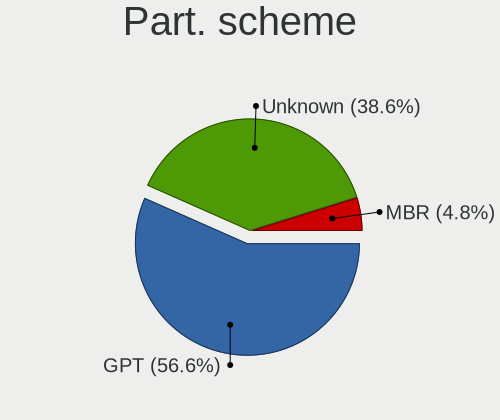
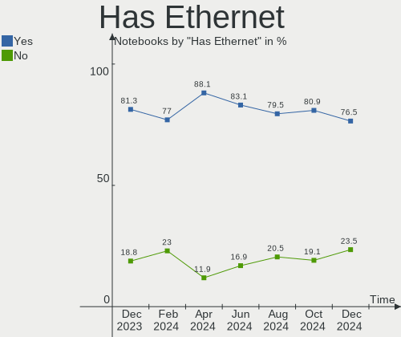
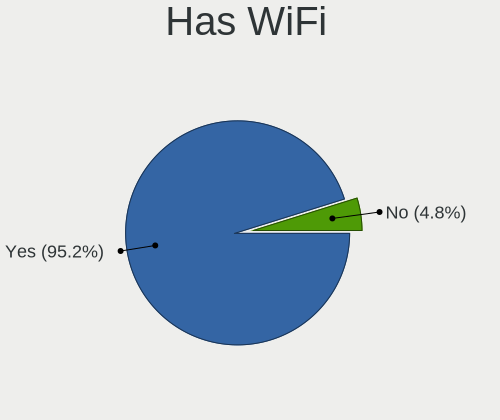
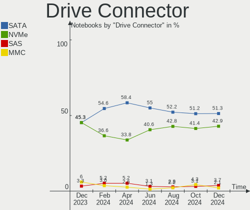
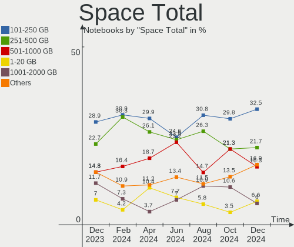
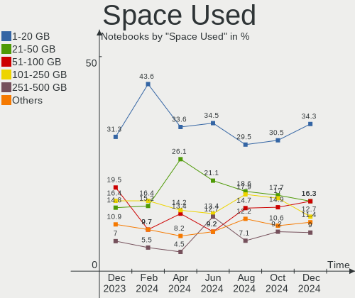
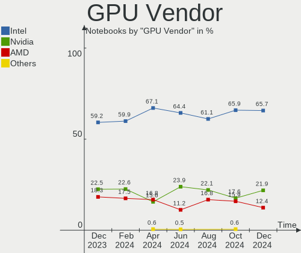
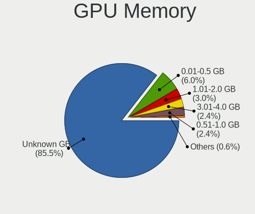
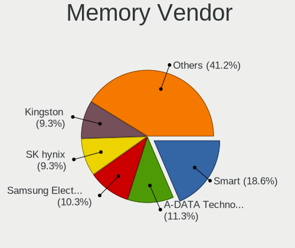
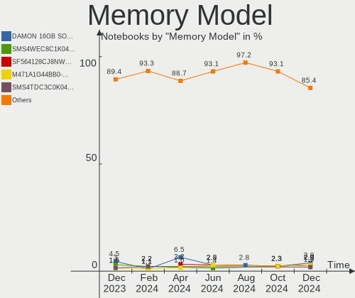

Linux in Brazil - Hardware Trends (Notebooks)
---------------------------------------------

A project to identify most popular hardware characteristics and track their change
over time based on data collected by Linux users at https://Linux-Hardware.org.

Anyone can contribute to this report by the [hw-probe](https://github.com/linuxhw/hw-probe) tool:

    sudo -E hw-probe -all -upload

Period: Dec, 2023.

Contents
--------

* [ System ](#system)
  - [ OS                       ](#os)
  - [ OS Family                ](#os-family)
  - [ Kernel                   ](#kernel)
  - [ Kernel Family            ](#kernel-family)
  - [ Kernel Major Ver.        ](#kernel-major-ver)
  - [ Arch                     ](#arch)
  - [ DE                       ](#de)
  - [ Display Server           ](#display-server)
  - [ Display Manager          ](#display-manager)
  - [ OS Lang                  ](#os-lang)
  - [ Boot Mode                ](#boot-mode)
  - [ Filesystem               ](#filesystem)
  - [ Part. scheme             ](#part-scheme)
  - [ Dual Boot with Linux/BSD ](#dual-boot-with-linuxbsd)
  - [ Dual Boot (Win)          ](#dual-boot-win)

* [ Board ](#board)
  - [ Vendor                   ](#vendor)
  - [ Model                    ](#model)
  - [ Model Family             ](#model-family)
  - [ MFG Year                 ](#mfg-year)
  - [ Form Factor              ](#form-factor)
  - [ Secure Boot              ](#secure-boot)
  - [ Coreboot                 ](#coreboot)
  - [ RAM Size                 ](#ram-size)
  - [ RAM Used                 ](#ram-used)
  - [ Total Drives             ](#total-drives)
  - [ Has CD-ROM               ](#has-cd-rom)
  - [ Has Ethernet             ](#has-ethernet)
  - [ Has WiFi                 ](#has-wifi)
  - [ Has Bluetooth            ](#has-bluetooth)

* [ Location ](#location)
  - [ Country                  ](#country)
  - [ City                     ](#city)

* [ Drives ](#drives)
  - [ Drive Vendor             ](#drive-vendor)
  - [ Drive Model              ](#drive-model)
  - [ HDD Vendor               ](#hdd-vendor)
  - [ SSD Vendor               ](#ssd-vendor)
  - [ Drive Kind               ](#drive-kind)
  - [ Drive Connector          ](#drive-connector)
  - [ Drive Size               ](#drive-size)
  - [ Space Total              ](#space-total)
  - [ Space Used               ](#space-used)
  - [ Malfunc. Drives          ](#malfunc-drives)
  - [ Malfunc. Drive Vendor    ](#malfunc-drive-vendor)
  - [ Malfunc. HDD Vendor      ](#malfunc-hdd-vendor)
  - [ Malfunc. Drive Kind      ](#malfunc-drive-kind)
  - [ Failed Drives            ](#failed-drives)
  - [ Failed Drive Vendor      ](#failed-drive-vendor)
  - [ Drive Status             ](#drive-status)

* [ Storage controller ](#storage-controller)
  - [ Storage Vendor           ](#storage-vendor)
  - [ Storage Model            ](#storage-model)
  - [ Storage Kind             ](#storage-kind)

* [ Processor ](#processor)
  - [ CPU Vendor               ](#cpu-vendor)
  - [ CPU Model                ](#cpu-model)
  - [ CPU Model Family         ](#cpu-model-family)
  - [ CPU Cores                ](#cpu-cores)
  - [ CPU Sockets              ](#cpu-sockets)
  - [ CPU Threads              ](#cpu-threads)
  - [ CPU Op-Modes             ](#cpu-op-modes)
  - [ CPU Microcode            ](#cpu-microcode)
  - [ CPU Microarch            ](#cpu-microarch)

* [ Graphics ](#graphics)
  - [ GPU Vendor               ](#gpu-vendor)
  - [ GPU Model                ](#gpu-model)
  - [ GPU Combo                ](#gpu-combo)
  - [ GPU Driver               ](#gpu-driver)
  - [ GPU Memory               ](#gpu-memory)

* [ Monitor ](#monitor)
  - [ Monitor Vendor           ](#monitor-vendor)
  - [ Monitor Model            ](#monitor-model)
  - [ Monitor Resolution       ](#monitor-resolution)
  - [ Monitor Diagonal         ](#monitor-diagonal)
  - [ Monitor Width            ](#monitor-width)
  - [ Aspect Ratio             ](#aspect-ratio)
  - [ Monitor Area             ](#monitor-area)
  - [ Pixel Density            ](#pixel-density)
  - [ Multiple Monitors        ](#multiple-monitors)

* [ Network ](#network)
  - [ Net Controller Vendor    ](#net-controller-vendor)
  - [ Net Controller Model     ](#net-controller-model)
  - [ Wireless Vendor          ](#wireless-vendor)
  - [ Wireless Model           ](#wireless-model)
  - [ Ethernet Vendor          ](#ethernet-vendor)
  - [ Ethernet Model           ](#ethernet-model)
  - [ Net Controller Kind      ](#net-controller-kind)
  - [ Used Controller          ](#used-controller)
  - [ NICs                     ](#nics)
  - [ IPv6                     ](#ipv6)

* [ Bluetooth ](#bluetooth)
  - [ Bluetooth Vendor         ](#bluetooth-vendor)
  - [ Bluetooth Model          ](#bluetooth-model)

* [ Sound ](#sound)
  - [ Sound Vendor             ](#sound-vendor)
  - [ Sound Model              ](#sound-model)

* [ Memory ](#memory)
  - [ Memory Vendor            ](#memory-vendor)
  - [ Memory Model             ](#memory-model)
  - [ Memory Kind              ](#memory-kind)
  - [ Memory Form Factor       ](#memory-form-factor)
  - [ Memory Size              ](#memory-size)
  - [ Memory Speed             ](#memory-speed)

* [ Printers & scanners ](#printers--scanners)
  - [ Printer Vendor           ](#printer-vendor)
  - [ Printer Model            ](#printer-model)
  - [ Scanner Vendor           ](#scanner-vendor)
  - [ Scanner Model            ](#scanner-model)

* [ Camera ](#camera)
  - [ Camera Vendor            ](#camera-vendor)
  - [ Camera Model             ](#camera-model)

* [ Security ](#security)
  - [ Fingerprint Vendor       ](#fingerprint-vendor)
  - [ Fingerprint Model        ](#fingerprint-model)
  - [ Chipcard Vendor          ](#chipcard-vendor)
  - [ Chipcard Model           ](#chipcard-model)

* [ Unsupported ](#unsupported)
  - [ Unsupported Devices      ](#unsupported-devices)
  - [ Unsupported Device Types ](#unsupported-device-types)

System
------

OS
--

Installed operating systems

| Name                         | Notebooks | Percent |
|------------------------------|-----------|---------|
| Ubuntu 22.04                 | 23        | 17.97%  |
| Fedora 39                    | 17        | 13.28%  |
| Linux Mint 21.2              | 11        | 8.59%   |
| OpenMandriva 5.0             | 6         | 4.69%   |
| Ubuntu 23.10                 | 5         | 3.91%   |
| openSUSE Tumbleweed-XXXXXXXX | 5         | 3.91%   |
| Debian 12                    | 5         | 3.91%   |
| OpenMandriva 23.08           | 4         | 3.13%   |
| Manjaro                      | 4         | 3.13%   |
| Ubuntu 20.04                 | 3         | 2.34%   |
| Fedora 38                    | 3         | 2.34%   |
| Arch Rolling                 | 3         | 2.34%   |
| SteamOS 3.5.7                | 2         | 1.56%   |
| Pop!_OS 22.04                | 2         | 1.56%   |
| Linux Mint 21.1              | 2         | 1.56%   |
| Linux Mint 21                | 2         | 1.56%   |
| Endless 5.1.0                | 2         | 1.56%   |
| Endless 3.9.1-nexthw2        | 2         | 1.56%   |
| ArcoLinux Rolling            | 2         | 1.56%   |
| Zorin 16                     | 1         | 0.78%   |
| Ubuntu MATE 22.04            | 1         | 0.78%   |
| Ubuntu 23.04                 | 1         | 0.78%   |
| Ubuntu 22.10                 | 1         | 0.78%   |
| Rocky Linux 9.3              | 1         | 0.78%   |
| PureOS 10                    | 1         | 0.78%   |
| openSUSE Leap-15.5           | 1         | 0.78%   |
| OpenMandriva 23.11           | 1         | 0.78%   |
| OpenMandriva 23.01           | 1         | 0.78%   |
| Nobara 37                    | 1         | 0.78%   |
| NixOS 24.05                  | 1         | 0.78%   |
| MX 23                        | 1         | 0.78%   |
| Mauna 24                     | 1         | 0.78%   |
| Lubuntu 20.04                | 1         | 0.78%   |
| Linux Mint 20.3              | 1         | 0.78%   |
| Lenovo Lux 1                 | 1         | 0.78%   |
| Kubuntu 23.10                | 1         | 0.78%   |
| Kali 2022.4                  | 1         | 0.78%   |
| Endless 3.9.3-nexthw1        | 1         | 0.78%   |
| EndeavourOS Rolling          | 1         | 0.78%   |
| Elementary 7.1               | 1         | 0.78%   |

OS Family
---------

OS without a version

| Name         | Notebooks | Percent |
|--------------|-----------|---------|
| Ubuntu       | 33        | 25.78%  |
| Fedora       | 20        | 15.63%  |
| Linux Mint   | 16        | 12.5%   |
| OpenMandriva | 12        | 9.38%   |
| openSUSE     | 6         | 4.69%   |
| Debian       | 6         | 4.69%   |
| Endless      | 5         | 3.91%   |
| Manjaro      | 4         | 3.13%   |
| Arch         | 3         | 2.34%   |
| SteamOS      | 2         | 1.56%   |
| Pop!_OS      | 2         | 1.56%   |
| BigLinux     | 2         | 1.56%   |
| ArcoLinux    | 2         | 1.56%   |
| Zorin        | 1         | 0.78%   |
| Ubuntu MATE  | 1         | 0.78%   |
| Rocky Linux  | 1         | 0.78%   |
| PureOS       | 1         | 0.78%   |
| Nobara       | 1         | 0.78%   |
| NixOS        | 1         | 0.78%   |
| MX           | 1         | 0.78%   |
| Mauna        | 1         | 0.78%   |
| Lubuntu      | 1         | 0.78%   |
| Lenovo Lux   | 1         | 0.78%   |
| Kubuntu      | 1         | 0.78%   |
| Kali         | 1         | 0.78%   |
| EndeavourOS  | 1         | 0.78%   |
| Elementary   | 1         | 0.78%   |
| Alpine       | 1         | 0.78%   |

Kernel
------

Version of the Linux kernel

| Version                    | Notebooks | Percent |
|----------------------------|-----------|---------|
| 6.2.0-39-generic           | 12        | 9.38%   |
| 6.2.0-37-generic           | 8         | 6.25%   |
| 6.6.2-desktop-1omv2390     | 7         | 5.47%   |
| 5.15.0-91-generic          | 7         | 5.47%   |
| 5.15.0-89-generic          | 7         | 5.47%   |
| 6.5.0-14-generic           | 5         | 3.91%   |
| 6.6.4-200.fc39.x86_64      | 4         | 3.13%   |
| 6.6.6-200.fc39.x86_64      | 3         | 2.34%   |
| 6.6.2-201.fc39.x86_64      | 3         | 2.34%   |
| 6.4.11-desktop-1omv2390    | 3         | 2.34%   |
| 6.1.0-15-amd64             | 3         | 2.34%   |
| 6.6.8-arch1-1              | 2         | 1.56%   |
| 6.6.8-200.fc39.x86_64      | 2         | 1.56%   |
| 6.6.7-4-MANJARO            | 2         | 1.56%   |
| 6.6.6-1-default            | 2         | 1.56%   |
| 6.6.3-200.fc39.x86_64      | 2         | 1.56%   |
| 6.5.6-300.fc39.x86_64      | 2         | 1.56%   |
| 6.5.0-10-generic           | 2         | 1.56%   |
| 6.2.0-26-generic           | 2         | 1.56%   |
| 6.1.52-valve9-1-neptune-61 | 2         | 1.56%   |
| 5.15.0-76-generic          | 2         | 1.56%   |
| 5.15.0-46-generic          | 2         | 1.56%   |
| 5.10.0-10-generic          | 2         | 1.56%   |
| 6.6.8-2-MANJARO            | 1         | 0.78%   |
| 6.6.8                      | 1         | 0.78%   |
| 6.6.7-zen1-1-zen           | 1         | 0.78%   |
| 6.6.7-arch1-1              | 1         | 0.78%   |
| 6.6.7-200.fc39.x86_64      | 1         | 0.78%   |
| 6.6.7-100.fc38.x86_64      | 1         | 0.78%   |
| 6.6.7-1-default            | 1         | 0.78%   |
| 6.6.6-76060606-generic     | 1         | 0.78%   |
| 6.6.3-1-MANJARO            | 1         | 0.78%   |
| 6.6.3-1-default            | 1         | 0.78%   |
| 6.6.1-arch1-1              | 1         | 0.78%   |
| 6.5.9-200.fc38.x86_64      | 1         | 0.78%   |
| 6.5.9-1-default            | 1         | 0.78%   |
| 6.5.6-76060506-generic     | 1         | 0.78%   |
| 6.5.13-1-MANJARO           | 1         | 0.78%   |
| 6.5.0-kali3-amd64          | 1         | 0.78%   |
| 6.5.0-9-generic            | 1         | 0.78%   |

Kernel Family
-------------

Linux kernel without a distro release

| Version | Notebooks | Percent |
|---------|-----------|---------|
| 6.2.0   | 25        | 19.53%  |
| 5.15.0  | 19        | 14.84%  |
| 6.5.0   | 11        | 8.59%   |
| 6.6.2   | 10        | 7.81%   |
| 6.6.7   | 7         | 5.47%   |
| 6.6.8   | 6         | 4.69%   |
| 6.6.6   | 6         | 4.69%   |
| 6.1.0   | 5         | 3.91%   |
| 6.6.4   | 4         | 3.13%   |
| 6.6.3   | 4         | 3.13%   |
| 6.5.6   | 3         | 2.34%   |
| 6.4.11  | 3         | 2.34%   |
| 6.1.52  | 3         | 2.34%   |
| 5.10.0  | 3         | 2.34%   |
| 6.5.9   | 2         | 1.56%   |
| 5.4.0   | 2         | 1.56%   |
| 5.19.0  | 2         | 1.56%   |
| 5.14.0  | 2         | 1.56%   |
| 6.6.1   | 1         | 0.78%   |
| 6.5.13  | 1         | 0.78%   |
| 6.4.8   | 1         | 0.78%   |
| 6.2.9   | 1         | 0.78%   |
| 6.2.15  | 1         | 0.78%   |
| 6.2.14  | 1         | 0.78%   |
| 6.1.66  | 1         | 0.78%   |
| 6.1.64  | 1         | 0.78%   |
| 6.1.1   | 1         | 0.78%   |
| 5.14.21 | 1         | 0.78%   |
| 5.11.0  | 1         | 0.78%   |

Kernel Major Ver.
-----------------

Linux kernel major version

| Version | Notebooks | Percent |
|---------|-----------|---------|
| 6.6     | 38        | 29.69%  |
| 6.2     | 28        | 21.88%  |
| 5.15    | 19        | 14.84%  |
| 6.5     | 17        | 13.28%  |
| 6.1     | 11        | 8.59%   |
| 6.4     | 4         | 3.13%   |
| 5.14    | 3         | 2.34%   |
| 5.10    | 3         | 2.34%   |
| 5.4     | 2         | 1.56%   |
| 5.19    | 2         | 1.56%   |
| 5.11    | 1         | 0.78%   |

Arch
----

OS architecture (x86_64, i586, etc.)

| Name   | Notebooks | Percent |
|--------|-----------|---------|
| x86_64 | 128       | 100%    |

DE
--

Desktop Environment

| Name          | Notebooks | Percent |
|---------------|-----------|---------|
| GNOME         | 67        | 52.34%  |
| KDE5          | 25        | 19.53%  |
| X-Cinnamon    | 11        | 8.59%   |
| XFCE          | 7         | 5.47%   |
| MATE          | 4         | 3.13%   |
| LXQt          | 3         | 2.34%   |
| Endless:GNOME | 2         | 1.56%   |
| Unknown       | 2         | 1.56%   |
| sway          | 1         | 0.78%   |
| Pantheon      | 1         | 0.78%   |
| KDE           | 1         | 0.78%   |
| i3            | 1         | 0.78%   |
| Hyprland      | 1         | 0.78%   |
| GNOME Classic | 1         | 0.78%   |
| Cinnamon      | 1         | 0.78%   |

Display Server
--------------

X11 or Wayland

| Name    | Notebooks | Percent |
|---------|-----------|---------|
| X11     | 63        | 49.22%  |
| Wayland | 61        | 47.66%  |
| Unknown | 3         | 2.34%   |
| Tty     | 1         | 0.78%   |

Display Manager
---------------

SDDM, LightDM, etc.

| Name    | Notebooks | Percent |
|---------|-----------|---------|
| Unknown | 61        | 47.66%  |
| GDM3    | 31        | 24.22%  |
| SDDM    | 18        | 14.06%  |
| LightDM | 14        | 10.94%  |
| GDM     | 4         | 3.13%   |

OS Lang
-------

Language

| Lang    | Notebooks | Percent |
|---------|-----------|---------|
| pt_BR   | 88        | 68.75%  |
| en_US   | 31        | 24.22%  |
| C       | 3         | 2.34%   |
| Unknown | 2         | 1.56%   |
| es_ES   | 1         | 0.78%   |
| en_ZA   | 1         | 0.78%   |
| en_GB   | 1         | 0.78%   |
| en_CA   | 1         | 0.78%   |

Boot Mode
---------

EFI or BIOS

| Mode | Notebooks | Percent |
|------|-----------|---------|
| EFI  | 78        | 60.94%  |
| BIOS | 50        | 39.06%  |

Filesystem
----------

Type of filesystem

| Type    | Notebooks | Percent |
|---------|-----------|---------|
| Ext4    | 64        | 50%     |
| Btrfs   | 32        | 25%     |
| Tmpfs   | 20        | 15.63%  |
| Overlay | 8         | 6.25%   |
| Xfs     | 3         | 2.34%   |
| Zfs     | 1         | 0.78%   |

Part. scheme
------------

Scheme of partitioning

| Type    | Notebooks | Percent |
|---------|-----------|---------|
| GPT     | 63        | 49.22%  |
| Unknown | 59        | 46.09%  |
| MBR     | 6         | 4.69%   |

Dual Boot with Linux/BSD
------------------------

Hosting more than one Linux/BSD

| Dual boot | Notebooks | Percent |
|-----------|-----------|---------|
| No        | 116       | 90.63%  |
| Yes       | 12        | 9.38%   |

Dual Boot (Win)
---------------

Hosting Linux and Windows

| Dual boot | Notebooks | Percent |
|-----------|-----------|---------|
| No        | 100       | 78.13%  |
| Yes       | 28        | 21.88%  |

Board
-----

Vendor
------

Motherboard manufacturer

| Name                  | Notebooks | Percent |
|-----------------------|-----------|---------|
| Dell                  | 39        | 30.47%  |
| Acer                  | 27        | 21.09%  |
| Lenovo                | 17        | 13.28%  |
| ASUSTek Computer      | 10        | 7.81%   |
| Samsung Electronics   | 8         | 6.25%   |
| Positivo              | 7         | 5.47%   |
| Hewlett-Packard       | 5         | 3.91%   |
| Valve                 | 2         | 1.56%   |
| Semp Toshiba          | 2         | 1.56%   |
| win element           | 1         | 0.78%   |
| Purism                | 1         | 0.78%   |
| Positivo Bahia - VAIO | 1         | 0.78%   |
| Notebook              | 1         | 0.78%   |
| Multilaser            | 1         | 0.78%   |
| MSI                   | 1         | 0.78%   |
| GPD                   | 1         | 0.78%   |
| Google                | 1         | 0.78%   |
| Daten Tecnologia      | 1         | 0.78%   |
| Compal                | 1         | 0.78%   |
| Alienware             | 1         | 0.78%   |

Model
-----

Motherboard model

| Name                                    | Notebooks | Percent |
|-----------------------------------------|-----------|---------|
| Dell Inspiron 15-3567                   | 3         | 2.34%   |
| ASUS VivoBook_ASUSLaptop X515EA_X515EA  | 3         | 2.34%   |
| Acer Nitro AN515-57                     | 3         | 2.34%   |
| Valve Jupiter                           | 2         | 1.56%   |
| Samsung 550XDA                          | 2         | 1.56%   |
| Lenovo IdeaPad Gaming 3 15IHU6 82MG     | 2         | 1.56%   |
| Lenovo IdeaPad 3 15IML05 82BS           | 2         | 1.56%   |
| Lenovo IdeaPad 3 15ALC6 82MF            | 2         | 1.56%   |
| Dell System XPS L502X                   | 2         | 1.56%   |
| Dell Latitude 3420                      | 2         | 1.56%   |
| Dell Inspiron 7572                      | 2         | 1.56%   |
| Dell Inspiron 3583                      | 2         | 1.56%   |
| Dell G3 3590                            | 2         | 1.56%   |
| Acer Nitro AN517-54                     | 2         | 1.56%   |
| Acer Nitro AN515-51                     | 2         | 1.56%   |
| Acer Nitro AN515-44                     | 2         | 1.56%   |
| Acer Aspire A515-51G                    | 2         | 1.56%   |
| Acer Aspire A315-41                     | 2         | 1.56%   |
| Acer Aspire A315-24P                    | 2         | 1.56%   |
| win element MoreFine S500+              | 1         | 0.78%   |
| Semp Toshiba IS 1413G                   | 1         | 0.78%   |
| Semp Toshiba IS 1412                    | 1         | 0.78%   |
| Samsung RV419/RV420                     | 1         | 0.78%   |
| Samsung RV415/RV515                     | 1         | 0.78%   |
| Samsung RV410/RV510/S3510/E3510         | 1         | 0.78%   |
| Samsung Q470C/500P4C                    | 1         | 0.78%   |
| Samsung 550XCJ/550XCR                   | 1         | 0.78%   |
| Samsung 550P5C/550P7C                   | 1         | 0.78%   |
| Purism Librem 14                        | 1         | 0.78%   |
| Positivo W940TU                         | 1         | 0.78%   |
| Positivo Q464C                          | 1         | 0.78%   |
| Positivo Q4128C-S                       | 1         | 0.78%   |
| Positivo Harrison                       | 1         | 0.78%   |
| Positivo H14BT58                        | 1         | 0.78%   |
| Positivo CHT12CP                        | 1         | 0.78%   |
| Positivo C4128A-15                      | 1         | 0.78%   |
| Positivo Bahia - VAIO VJFE59F11X-B1011H | 1         | 0.78%   |
| Notebook NJx0MU                         | 1         | 0.78%   |
| Multilaser PC31X                        | 1         | 0.78%   |
| MSI Modern 15 B7M                       | 1         | 0.78%   |

Model Family
------------

Motherboard model prefix

| Name                                    | Notebooks | Percent |
|-----------------------------------------|-----------|---------|
| Dell Inspiron                           | 21        | 16.41%  |
| Acer Aspire                             | 15        | 11.72%  |
| Lenovo IdeaPad                          | 11        | 8.59%   |
| Acer Nitro                              | 11        | 8.59%   |
| ASUS VivoBook                           | 8         | 6.25%   |
| Lenovo ThinkPad                         | 5         | 3.91%   |
| Dell Latitude                           | 5         | 3.91%   |
| Dell Vostro                             | 4         | 3.13%   |
| Dell G3                                 | 3         | 2.34%   |
| Valve Jupiter                           | 2         | 1.56%   |
| Semp Toshiba IS                         | 2         | 1.56%   |
| Samsung 550XDA                          | 2         | 1.56%   |
| Dell System                             | 2         | 1.56%   |
| Dell G15                                | 2         | 1.56%   |
| win element MoreFine                    | 1         | 0.78%   |
| Samsung RV419                           | 1         | 0.78%   |
| Samsung RV415                           | 1         | 0.78%   |
| Samsung RV410                           | 1         | 0.78%   |
| Samsung Q470C                           | 1         | 0.78%   |
| Samsung 550XCJ                          | 1         | 0.78%   |
| Samsung 550P5C                          | 1         | 0.78%   |
| Purism Librem                           | 1         | 0.78%   |
| Positivo W940TU                         | 1         | 0.78%   |
| Positivo Q464C                          | 1         | 0.78%   |
| Positivo Q4128C-S                       | 1         | 0.78%   |
| Positivo Harrison                       | 1         | 0.78%   |
| Positivo H14BT58                        | 1         | 0.78%   |
| Positivo CHT12CP                        | 1         | 0.78%   |
| Positivo C4128A-15                      | 1         | 0.78%   |
| Positivo Bahia - VAIO VJFE59F11X-B1011H | 1         | 0.78%   |
| Notebook NJx0MU                         | 1         | 0.78%   |
| Multilaser PC31X                        | 1         | 0.78%   |
| MSI Modern                              | 1         | 0.78%   |
| Lenovo B490                             | 1         | 0.78%   |
| HP Presario                             | 1         | 0.78%   |
| HP Pavilion                             | 1         | 0.78%   |
| HP OMEN                                 | 1         | 0.78%   |
| HP EliteBook                            | 1         | 0.78%   |
| HP 250                                  | 1         | 0.78%   |
| GPD G1619-04                            | 1         | 0.78%   |

MFG Year
--------

Motherboard manufacture year

| Year    | Notebooks | Percent |
|---------|-----------|---------|
| 2021    | 34        | 26.56%  |
| 2019    | 14        | 10.94%  |
| 2022    | 12        | 9.38%   |
| 2017    | 11        | 8.59%   |
| 2020    | 9         | 7.03%   |
| 2011    | 8         | 6.25%   |
| 2016    | 7         | 5.47%   |
| 2023    | 5         | 3.91%   |
| 2018    | 5         | 3.91%   |
| 2014    | 5         | 3.91%   |
| 2012    | 4         | 3.13%   |
| 2013    | 3         | 2.34%   |
| 2010    | 3         | 2.34%   |
| 2009    | 3         | 2.34%   |
| 2008    | 3         | 2.34%   |
| 2015    | 1         | 0.78%   |
| Unknown | 1         | 0.78%   |

Form Factor
-----------

Physical design of the computer

| Name     | Notebooks | Percent |
|----------|-----------|---------|
| Notebook | 128       | 100%    |

Secure Boot
-----------

Enabled or disabled

| State    | Notebooks | Percent |
|----------|-----------|---------|
| Disabled | 108       | 84.38%  |
| Enabled  | 20        | 15.63%  |

Coreboot
--------

Have coreboot on board

| Used | Notebooks | Percent |
|------|-----------|---------|
| No   | 126       | 98.44%  |
| Yes  | 2         | 1.56%   |

RAM Size
--------

Total RAM memory

| Size in GB  | Notebooks | Percent |
|-------------|-----------|---------|
| 4.01-8.0    | 34        | 26.56%  |
| 16.01-24.0  | 31        | 24.22%  |
| 3.01-4.0    | 30        | 23.44%  |
| 8.01-16.0   | 20        | 15.63%  |
| 32.01-64.0  | 7         | 5.47%   |
| 1.01-2.0    | 3         | 2.34%   |
| 24.01-32.0  | 2         | 1.56%   |
| 64.01-256.0 | 1         | 0.78%   |

RAM Used
--------

Used RAM memory

| Used GB    | Notebooks | Percent |
|------------|-----------|---------|
| 4.01-8.0   | 31        | 24.22%  |
| 2.01-3.0   | 31        | 24.22%  |
| 1.01-2.0   | 31        | 24.22%  |
| 3.01-4.0   | 26        | 20.31%  |
| 8.01-16.0  | 6         | 4.69%   |
| 0.51-1.0   | 2         | 1.56%   |
| 16.01-24.0 | 1         | 0.78%   |

Total Drives
------------

Number of drives on board

| Drives | Notebooks | Percent |
|--------|-----------|---------|
| 1      | 85        | 66.41%  |
| 2      | 39        | 30.47%  |
| 3      | 4         | 3.13%   |

Has CD-ROM
----------

Has CD-ROM on board

| Presented | Notebooks | Percent |
|-----------|-----------|---------|
| No        | 105       | 82.03%  |
| Yes       | 23        | 17.97%  |

Has Ethernet
------------

Has Ethernet on board

| Presented | Notebooks | Percent |
|-----------|-----------|---------|
| Yes       | 103       | 80.47%  |
| No        | 25        | 19.53%  |

Has WiFi
--------

Has WiFi module

| Presented | Notebooks | Percent |
|-----------|-----------|---------|
| Yes       | 124       | 96.88%  |
| No        | 4         | 3.13%   |

Has Bluetooth
-------------

Has Bluetooth module

| Presented | Notebooks | Percent |
|-----------|-----------|---------|
| Yes       | 108       | 84.38%  |
| No        | 20        | 15.63%  |

Location
--------

Country
-------

Geographic location (country)

| Country | Notebooks | Percent |
|---------|-----------|---------|
| Brazil  | 128       | 100%    |

City
----

Geographic location (city)

| City                  | Notebooks | Percent |
|-----------------------|-----------|---------|
| Sao Paulo             | 23        | 17.97%  |
| Rio de Janeiro        | 6         | 4.69%   |
| Porto Alegre          | 4         | 3.13%   |
| Sao Goncalo           | 3         | 2.34%   |
| Santo André          | 3         | 2.34%   |
| Montes Claros         | 3         | 2.34%   |
| Fortaleza             | 3         | 2.34%   |
| Brasília             | 3         | 2.34%   |
| Uberlândia           | 2         | 1.56%   |
| Ubatuba               | 2         | 1.56%   |
| Sao José dos Campos  | 2         | 1.56%   |
| Salvador              | 2         | 1.56%   |
| Recife                | 2         | 1.56%   |
| Osasco                | 2         | 1.56%   |
| Curitiba              | 2         | 1.56%   |
| Cabo Frio             | 2         | 1.56%   |
| Braganca Paulista     | 2         | 1.56%   |
| Vitória              | 1         | 0.78%   |
| Vilhena               | 1         | 0.78%   |
| Vicosa                | 1         | 0.78%   |
| Tubarao               | 1         | 0.78%   |
| Teresina              | 1         | 0.78%   |
| Sumaré               | 1         | 0.78%   |
| Sorriso               | 1         | 0.78%   |
| Sidrolandia           | 1         | 0.78%   |
| Sapiranga             | 1         | 0.78%   |
| Sapezal               | 1         | 0.78%   |
| Sao Vicente           | 1         | 0.78%   |
| Sao Carlos            | 1         | 0.78%   |
| Sao Bernardo do Campo | 1         | 0.78%   |
| Santa Maria           | 1         | 0.78%   |
| Rio do Sul            | 1         | 0.78%   |
| Resende               | 1         | 0.78%   |
| Quitandinha           | 1         | 0.78%   |
| Picos                 | 1         | 0.78%   |
| Paulo Afonso          | 1         | 0.78%   |
| Passo Fundo           | 1         | 0.78%   |
| Oliveira              | 1         | 0.78%   |
| Nova Serrana          | 1         | 0.78%   |
| Nilopolis             | 1         | 0.78%   |

Drives
------

Drive Vendor
------------

Hard drive vendors

| Vendor                         | Notebooks | Drives | Percent |
|--------------------------------|-----------|--------|---------|
| WDC                            | 20        | 22     | 12.2%   |
| Samsung Electronics            | 15        | 15     | 9.15%   |
| Sandisk                        | 14        | 16     | 8.54%   |
| Kingston                       | 13        | 13     | 7.93%   |
| ADATA Technology               | 13        | 13     | 7.93%   |
| Unknown                        | 11        | 12     | 6.71%   |
| Seagate                        | 8         | 8      | 4.88%   |
| SK hynix                       | 7         | 7      | 4.27%   |
| Crucial                        | 6         | 6      | 3.66%   |
| A-DATA Technology              | 6         | 6      | 3.66%   |
| Toshiba                        | 5         | 5      | 3.05%   |
| China                          | 5         | 6      | 3.05%   |
| LITEON                         | 4         | 4      | 2.44%   |
| SSSTC                          | 3         | 3      | 1.83%   |
| Solid State Storage Technology | 3         | 3      | 1.83%   |
| Silicon Motion                 | 3         | 3      | 1.83%   |
| MAXIO Technology (Hangzhou)    | 3         | 3      | 1.83%   |
| KIOXIA                         | 3         | 3      | 1.83%   |
| KingSpec                       | 3         | 3      | 1.83%   |
| Solid State Storage            | 2         | 2      | 1.22%   |
| Lexar                          | 2         | 2      | 1.22%   |
| XrayDisk                       | 1         | 1      | 0.61%   |
| WALRAM                         | 1         | 1      | 0.61%   |
| Verbatim                       | 1         | 1      | 0.61%   |
| Phison Electronics             | 1         | 1      | 0.61%   |
| NGFF                           | 1         | 1      | 0.61%   |
| Netac                          | 1         | 2      | 0.61%   |
| Micron Technology              | 1         | 1      | 0.61%   |
| Kingston Technology Company    | 1         | 1      | 0.61%   |
| JMicron Technology             | 1         | 1      | 0.61%   |
| Hitachi                        | 1         | 1      | 0.61%   |
| HGST                           | 1         | 1      | 0.61%   |
| Gigabyte Technology            | 1         | 1      | 0.61%   |
| Fujitsu                        | 1         | 1      | 0.61%   |
| BIWIN                          | 1         | 1      | 0.61%   |
| Unknown                        | 1         | 1      | 0.61%   |

Drive Model
-----------

Hard drive models

| Model                                              | Notebooks | Percent |
|----------------------------------------------------|-----------|---------|
| Sandisk WD Blue SN550 NVMe SSD 1TB                 | 5         | 2.92%   |
| Kingston SA400S37240G 240GB SSD                    | 5         | 2.92%   |
| Kingston SA400S37480G 480GB SSD                    | 4         | 2.34%   |
| ADATA IM2P33F8ABR2-512GB                           | 4         | 2.34%   |
| WDC WD10SPZX-75Z10T2 1TB                           | 3         | 1.75%   |
| MAXIO (Hangzhou) NVMe SSD Controller MAP1202 256GB | 3         | 1.75%   |
| LITEON CV3-8D128-11 SATA 128GB SSD                 | 3         | 1.75%   |
| A-DATA IM2P33F3A NVMe 256GB                        | 3         | 1.75%   |
| WDC WD10SPZX-75Z10T3 1TB                           | 2         | 1.17%   |
| WDC WD10SPZX-21Z10T0 1TB                           | 2         | 1.17%   |
| Unknown MMC Card  64GB                             | 2         | 1.17%   |
| Unknown MMC Card  32GB                             | 2         | 1.17%   |
| Unknown MMC Card  128GB                            | 2         | 1.17%   |
| SSSTC CL1-4D256 256GB                              | 2         | 1.17%   |
| SK hynix HFS256GEJ9X108N 256GB                     | 2         | 1.17%   |
| Seagate ST500LM012 HN-M500MBB 500GB                | 2         | 1.17%   |
| Seagate ST1000LM035-1RK172 1TB                     | 2         | 1.17%   |
| SanDisk SSD PLUS 480GB                             | 2         | 1.17%   |
| SanDisk SDSSDA240G 240GB                           | 2         | 1.17%   |
| Samsung MZALQ512HBLU-00BL2 512GB                   | 2         | 1.17%   |
| KingSpec P3-1TB SSD                                | 2         | 1.17%   |
| ADATA SM2P41C8-256GC1 256GB                        | 2         | 1.17%   |
| ADATA SM2P41C3 NVMe 256GB                          | 2         | 1.17%   |
| ADATA SM2P32A8-256GC1 256GB                        | 2         | 1.17%   |
| XrayDisk 256GB SSD                                 | 1         | 0.58%   |
| WDC WDS500G2B0A-00SM50 500GB SSD                   | 1         | 0.58%   |
| WDC WDS480G2G0C-00AJM0 480GB                       | 1         | 0.58%   |
| WDC WD6400BPVT-22HXZT1 640GB                       | 1         | 0.58%   |
| WDC WD5000LPVX-22V0TT0 500GB                       | 1         | 0.58%   |
| WDC WD5000LPVX-00V0TT0 500GB                       | 1         | 0.58%   |
| WDC WD5000LPCX-24VHAT0 500GB                       | 1         | 0.58%   |
| WDC WD5000LPCX-00VHAT0 500GB                       | 1         | 0.58%   |
| WDC WD3200BEKT-75PVMT0 320GB                       | 1         | 0.58%   |
| WDC WD2500BEVT-22ZCT0 250GB                        | 1         | 0.58%   |
| WDC WD1200BEVT-75ZCT2 120GB                        | 1         | 0.58%   |
| WDC WD10SPZX-75Z10T1 1TB                           | 1         | 0.58%   |
| WDC WD10JPVX-75JC3T0 1TB                           | 1         | 0.58%   |
| WDC WD10JPVX-22JC3T0 1TB                           | 1         | 0.58%   |
| WDC WD Green 2.5 240GB SSD                         | 1         | 0.58%   |
| WDC PC SN520 NVMe 128GB                            | 1         | 0.58%   |

HDD Vendor
----------

Hard disk drive vendors

| Vendor              | Notebooks | Drives | Percent |
|---------------------|-----------|--------|---------|
| WDC                 | 18        | 18     | 50%     |
| Seagate             | 8         | 8      | 22.22%  |
| Toshiba             | 5         | 5      | 13.89%  |
| Samsung Electronics | 2         | 2      | 5.56%   |
| Hitachi             | 1         | 1      | 2.78%   |
| HGST                | 1         | 1      | 2.78%   |
| Fujitsu             | 1         | 1      | 2.78%   |

SSD Vendor
----------

Solid state drive vendors

| Vendor              | Notebooks | Drives | Percent |
|---------------------|-----------|--------|---------|
| Kingston            | 12        | 12     | 25.53%  |
| Crucial             | 6         | 6      | 12.77%  |
| SanDisk             | 5         | 5      | 10.64%  |
| China               | 5         | 6      | 10.64%  |
| LITEON              | 4         | 4      | 8.51%   |
| KingSpec            | 3         | 3      | 6.38%   |
| WDC                 | 2         | 2      | 4.26%   |
| SK hynix            | 2         | 2      | 4.26%   |
| Samsung Electronics | 2         | 2      | 4.26%   |
| XrayDisk            | 1         | 1      | 2.13%   |
| Verbatim            | 1         | 1      | 2.13%   |
| NGFF                | 1         | 1      | 2.13%   |
| Netac               | 1         | 1      | 2.13%   |
| JMicron Technology  | 1         | 1      | 2.13%   |
| BIWIN               | 1         | 1      | 2.13%   |

Drive Kind
----------

HDD or SSD

| Kind    | Notebooks | Drives | Percent |
|---------|-----------|--------|---------|
| NVMe    | 68        | 75     | 43.04%  |
| SSD     | 44        | 48     | 27.85%  |
| HDD     | 35        | 36     | 22.15%  |
| MMC     | 9         | 10     | 5.7%    |
| Unknown | 2         | 2      | 1.27%   |

Drive Connector
---------------

SATA, SAS, NVMe, etc.

| Type | Notebooks | Drives | Percent |
|------|-----------|--------|---------|
| NVMe | 68        | 75     | 45.33%  |
| SATA | 68        | 80     | 45.33%  |
| MMC  | 9         | 10     | 6%      |
| SAS  | 5         | 6      | 3.33%   |

Drive Size
----------

Size of hard drive

| Size in TB | Notebooks | Drives | Percent |
|------------|-----------|--------|---------|
| 0.01-0.5   | 54        | 56     | 65.85%  |
| 0.51-1.0   | 23        | 23     | 28.05%  |
| 1.01-2.0   | 5         | 5      | 6.1%    |

Space Total
-----------

Amount of disk space available on the file system

| Size in GB     | Notebooks | Percent |
|----------------|-----------|---------|
| 101-250        | 37        | 28.91%  |
| 251-500        | 29        | 22.66%  |
| 501-1000       | 19        | 14.84%  |
| 1001-2000      | 15        | 11.72%  |
| 1-20           | 9         | 7.03%   |
| 51-100         | 5         | 3.91%   |
| More than 3000 | 4         | 3.13%   |
| 21-50          | 4         | 3.13%   |
| Unknown        | 4         | 3.13%   |
| 2001-3000      | 2         | 1.56%   |

Space Used
----------

Amount of used disk space

| Used GB   | Notebooks | Percent |
|-----------|-----------|---------|
| 1-20      | 40        | 31.25%  |
| 51-100    | 25        | 19.53%  |
| 101-250   | 21        | 16.41%  |
| 21-50     | 19        | 14.84%  |
| 251-500   | 9         | 7.03%   |
| 501-1000  | 7         | 5.47%   |
| Unknown   | 4         | 3.13%   |
| 1001-2000 | 3         | 2.34%   |

Malfunc. Drives
---------------

Drive models with a malfunction

| Model                            | Notebooks | Drives | Percent |
|----------------------------------|-----------|--------|---------|
| WDC WD5000LPCX-00VHAT0 500GB     | 1         | 1      | 20%     |
| WDC WD10SPZX-75Z10T2 1TB         | 1         | 1      | 20%     |
| Hitachi HTS723232A7A364 320GB    | 1         | 1      | 20%     |
| China SSD 128GB                  | 1         | 1      | 20%     |
| A-DATA Technology LEGEND 710 1TB | 1         | 1      | 20%     |

Malfunc. Drive Vendor
---------------------

Vendors of faulty drives

| Vendor            | Notebooks | Drives | Percent |
|-------------------|-----------|--------|---------|
| WDC               | 2         | 2      | 40%     |
| Hitachi           | 1         | 1      | 20%     |
| China             | 1         | 1      | 20%     |
| A-DATA Technology | 1         | 1      | 20%     |

Malfunc. HDD Vendor
-------------------

Vendors of faulty HDD drives

| Vendor  | Notebooks | Drives | Percent |
|---------|-----------|--------|---------|
| WDC     | 2         | 2      | 66.67%  |
| Hitachi | 1         | 1      | 33.33%  |

Malfunc. Drive Kind
-------------------

Kinds of faulty drives

| Kind | Notebooks | Drives | Percent |
|------|-----------|--------|---------|
| HDD  | 3         | 3      | 60%     |
| NVMe | 1         | 1      | 20%     |
| SSD  | 1         | 1      | 20%     |

Failed Drives
-------------

Failed drive models

Zero info for selected period =(

Failed Drive Vendor
-------------------

Failed drive vendors

Zero info for selected period =(

Drive Status
------------

Number of failed and malfunc. drives

| Status   | Notebooks | Drives | Percent |
|----------|-----------|--------|---------|
| Detected | 89        | 114    | 65.93%  |
| Works    | 41        | 52     | 30.37%  |
| Malfunc  | 5         | 5      | 3.7%    |

Storage controller
------------------

Storage Vendor
--------------

Storage controller vendors

| Vendor                         | Notebooks | Percent |
|--------------------------------|-----------|---------|
| Intel                          | 92        | 51.4%   |
| ADATA Technology               | 19        | 10.61%  |
| AMD                            | 13        | 7.26%   |
| SanDisk                        | 12        | 6.7%    |
| Samsung Electronics            | 11        | 6.15%   |
| Solid State Storage Technology | 8         | 4.47%   |
| MAXIO Technology (Hangzhou)    | 6         | 3.35%   |
| SK hynix                       | 5         | 2.79%   |
| Silicon Motion                 | 3         | 1.68%   |
| KIOXIA                         | 3         | 1.68%   |
| Phison Electronics             | 2         | 1.12%   |
| Kingston Technology Company    | 2         | 1.12%   |
| Shenzhen Longsys Electronics   | 1         | 0.56%   |
| Netac Technology               | 1         | 0.56%   |
| Micron Technology              | 1         | 0.56%   |

Storage Model
-------------

Storage controller models

| Model                                                                        | Notebooks | Percent |
|------------------------------------------------------------------------------|-----------|---------|
| Intel Tiger Lake-LP SATA Controller                                          | 15        | 7.73%   |
| Intel Sunrise Point-LP SATA Controller [AHCI mode]                           | 13        | 6.7%    |
| AMD FCH SATA Controller [AHCI mode]                                          | 12        | 6.19%   |
| Intel Volume Management Device NVMe RAID Controller                          | 10        | 5.15%   |
| Intel Comet Lake SATA AHCI Controller                                        | 7         | 3.61%   |
| Intel 82801 Mobile SATA Controller [RAID mode]                               | 7         | 3.61%   |
| Intel 6 Series/C200 Series Chipset Family 6 port Mobile SATA AHCI Controller | 7         | 3.61%   |
| Samsung NVMe SSD Controller 980 (DRAM-less)                                  | 6         | 3.09%   |
| MAXIO (Hangzhou) NVMe SSD Controller MAP1202                                 | 6         | 3.09%   |
| ADATA IM2P33F8 series NVMe SSD (DRAM-less)                                   | 6         | 3.09%   |
| Solid State Storage CL1-3D256-Q11 NVMe SSD M.2                               | 5         | 2.58%   |
| SanDisk Ultra 3D / WD Blue SN550 NVMe SSD                                    | 5         | 2.58%   |
| Intel Tiger Lake SATA AHCI Controller                                        | 5         | 2.58%   |
| Intel Celeron/Pentium Silver Processor SATA Controller                       | 4         | 2.06%   |
| ADATA SM2P32A8 NVMe SSD (DRAM-less)                                          | 4         | 2.06%   |
| Solid State Storage CL4-8D512 NVMe SSD M.2 (DRAM-less)                       | 3         | 1.55%   |
| Silicon Motion SM2263EN/SM2263XT (DRAM-less) NVMe SSD Controllers            | 3         | 1.55%   |
| Intel Wildcat Point-LP SATA Controller [AHCI Mode]                           | 3         | 1.55%   |
| Intel HM170/QM170 Chipset SATA Controller [AHCI Mode]                        | 3         | 1.55%   |
| Intel Cannon Point-LP SATA Controller [AHCI Mode]                            | 3         | 1.55%   |
| Intel Cannon Lake Mobile PCH SATA AHCI Controller                            | 3         | 1.55%   |
| Intel 82801IBM/IEM (ICH9M/ICH9M-E) 2 port SATA Controller [IDE mode]         | 3         | 1.55%   |
| Intel 7 Series Chipset Family 6-port SATA Controller [AHCI mode]             | 3         | 1.55%   |
| ADATA IM2P33F3 NVMe SSD (DRAM-less)                                          | 3         | 1.55%   |
| SK hynix Gold P31/BC711/PC711 NVMe Solid State Drive                         | 2         | 1.03%   |
| SK hynix BC901 NVMe Solid State Drive (DRAM-less)                            | 2         | 1.03%   |
| SanDisk WD Green SN350 240GB (DRAM-less) / SN560E NVMe SSD                   | 2         | 1.03%   |
| SanDisk WD Black SN770 / PC SN740 256GB / PC SN560 (DRAM-less) NVMe SSD      | 2         | 1.03%   |
| Samsung NVMe SSD Controller PM9A1/PM9A3/980PRO                               | 2         | 1.03%   |
| KIOXIA NVMe SSD Controller BG4 (DRAM-less)                                   | 2         | 1.03%   |
| Intel Atom Processor E3800 Series SATA AHCI Controller                       | 2         | 1.03%   |
| Intel 82801HM/HEM (ICH8M/ICH8M-E) SATA Controller [AHCI mode]                | 2         | 1.03%   |
| Intel 82801HM/HEM (ICH8M/ICH8M-E) IDE Controller                             | 2         | 1.03%   |
| Intel 7 Series Chipset Family 4-port SATA Controller [IDE mode]              | 2         | 1.03%   |
| Intel 7 Series Chipset Family 2-port SATA Controller [IDE mode]              | 2         | 1.03%   |
| Intel 5 Series/3400 Series Chipset 4 port SATA AHCI Controller               | 2         | 1.03%   |
| ADATA SM2P41C3 NVMe SSD (DRAM-less)                                          | 2         | 1.03%   |
| ADATA A Non-Volatile memory controller                                       | 2         | 1.03%   |
| SK hynix BC501 NVMe Solid State Drive                                        | 1         | 0.52%   |
| Shenzhen Longsys Non-Volatile memory controller                              | 1         | 0.52%   |

Storage Kind
------------

Kind of storage controller (IDE, SATA, NVMe, SAS, ...)

| Kind | Notebooks | Percent |
|------|-----------|---------|
| SATA | 90        | 48.65%  |
| NVMe | 68        | 36.76%  |
| RAID | 19        | 10.27%  |
| IDE  | 8         | 4.32%   |

Processor
---------

CPU Vendor
----------

Processor vendors

| Vendor | Notebooks | Percent |
|--------|-----------|---------|
| Intel  | 102       | 79.69%  |
| AMD    | 26        | 20.31%  |

CPU Model
---------

Processor models

| Model                                         | Notebooks | Percent |
|-----------------------------------------------|-----------|---------|
| Intel Core i5-7200U CPU @ 2.50GHz             | 5         | 3.91%   |
| Intel 11th Gen Core i7-11800H @ 2.30GHz       | 5         | 3.91%   |
| Intel Core i7-8550U CPU @ 1.80GHz             | 4         | 3.13%   |
| Intel 11th Gen Core i3-1115G4 @ 3.00GHz       | 4         | 3.13%   |
| AMD Ryzen 7 5700U with Radeon Graphics        | 4         | 3.13%   |
| Intel Core i5-10210U CPU @ 1.60GHz            | 3         | 2.34%   |
| Intel 11th Gen Core i7-1165G7 @ 2.80GHz       | 3         | 2.34%   |
| Intel 11th Gen Core i5-1135G7 @ 2.40GHz       | 3         | 2.34%   |
| Intel 11th Gen Core i5-11300H @ 3.10GHz       | 3         | 2.34%   |
| Intel Core i7-7700HQ CPU @ 2.80GHz            | 2         | 1.56%   |
| Intel Core i7-7500U CPU @ 2.70GHz             | 2         | 1.56%   |
| Intel Core i7-10510U CPU @ 1.80GHz            | 2         | 1.56%   |
| Intel Core i5-9300H CPU @ 2.40GHz             | 2         | 1.56%   |
| Intel Core i5-8265U CPU @ 1.60GHz             | 2         | 1.56%   |
| Intel Core i5-5200U CPU @ 2.20GHz             | 2         | 1.56%   |
| Intel Core i5-3210M CPU @ 2.50GHz             | 2         | 1.56%   |
| Intel Core i3-10110U CPU @ 2.10GHz            | 2         | 1.56%   |
| Intel Core i3 CPU M 380 @ 2.53GHz             | 2         | 1.56%   |
| Intel Celeron N4020 CPU @ 1.10GHz             | 2         | 1.56%   |
| Intel Atom x5-Z8350 CPU @ 1.44GHz             | 2         | 1.56%   |
| AMD Ryzen 7 5800H with Radeon Graphics        | 2         | 1.56%   |
| AMD Ryzen 7 4800H with Radeon Graphics        | 2         | 1.56%   |
| AMD Ryzen 5 2500U with Radeon Vega Mobile Gfx | 2         | 1.56%   |
| AMD Custom APU 0405                           | 2         | 1.56%   |
| Intel Xeon CPU E3-1505M v6 @ 3.00GHz          | 1         | 0.78%   |
| Intel Pentium Dual-Core CPU T4500 @ 2.30GHz   | 1         | 0.78%   |
| Intel Pentium Dual-Core CPU T4400 @ 2.20GHz   | 1         | 0.78%   |
| Intel Pentium CPU J3710 @ 1.60GHz             | 1         | 0.78%   |
| Intel Pentium CPU 5405U @ 2.30GHz             | 1         | 0.78%   |
| Intel Core i7-9750H CPU @ 2.60GHz             | 1         | 0.78%   |
| Intel Core i7-8750H CPU @ 2.20GHz             | 1         | 0.78%   |
| Intel Core i7-5500U CPU @ 2.40GHz             | 1         | 0.78%   |
| Intel Core i7-3630QM CPU @ 2.40GHz            | 1         | 0.78%   |
| Intel Core i7-2860QM CPU @ 2.50GHz            | 1         | 0.78%   |
| Intel Core i7-2670QM CPU @ 2.20GHz            | 1         | 0.78%   |
| Intel Core i7-10750H CPU @ 2.60GHz            | 1         | 0.78%   |
| Intel Core i7-10710U CPU @ 1.10GHz            | 1         | 0.78%   |
| Intel Core i5-9300HF CPU @ 2.40GHz            | 1         | 0.78%   |
| Intel Core i5-8350U CPU @ 1.70GHz             | 1         | 0.78%   |
| Intel Core i5-8250U CPU @ 1.60GHz             | 1         | 0.78%   |

CPU Model Family
----------------

Processor model prefix

| Model                   | Notebooks | Percent |
|-------------------------|-----------|---------|
| Intel Core i5           | 27        | 21.09%  |
| Other                   | 26        | 20.31%  |
| Intel Core i7           | 18        | 14.06%  |
| Intel Core i3           | 13        | 10.16%  |
| AMD Ryzen 7             | 10        | 7.81%   |
| Intel Celeron           | 8         | 6.25%   |
| AMD Ryzen 5             | 8         | 6.25%   |
| Intel Core 2 Duo        | 3         | 2.34%   |
| Intel Atom              | 3         | 2.34%   |
| Intel Pentium Dual-Core | 2         | 1.56%   |
| Intel Pentium           | 2         | 1.56%   |
| AMD Ryzen 9             | 2         | 1.56%   |
| AMD Ryzen 3             | 2         | 1.56%   |
| Intel Xeon              | 1         | 0.78%   |
| Intel Celeron Dual-Core | 1         | 0.78%   |
| AMD E                   | 1         | 0.78%   |
| AMD A4                  | 1         | 0.78%   |

CPU Cores
---------

Number of processor cores

| Number | Notebooks | Percent |
|--------|-----------|---------|
| 4      | 51        | 39.84%  |
| 2      | 49        | 38.28%  |
| 8      | 16        | 12.5%   |
| 6      | 8         | 6.25%   |
| 12     | 2         | 1.56%   |
| 10     | 2         | 1.56%   |

CPU Sockets
-----------

Number of sockets

| Number | Notebooks | Percent |
|--------|-----------|---------|
| 1      | 128       | 100%    |

CPU Threads
-----------

Threads per core (Hyper-Threading)

| Number | Notebooks | Percent |
|--------|-----------|---------|
| 2      | 106       | 82.81%  |
| 1      | 22        | 17.19%  |

CPU Op-Modes
------------

CPU Operation Modes (32-bit, 64-bit)

| Op mode        | Notebooks | Percent |
|----------------|-----------|---------|
| 32-bit, 64-bit | 128       | 100%    |

CPU Microcode
-------------

Microcode number

| Number     | Notebooks | Percent |
|------------|-----------|---------|
| Unknown    | 87        | 67.97%  |
| 0x806c1    | 4         | 3.13%   |
| 0x0a50000c | 3         | 2.34%   |
| 0xa0652    | 2         | 1.56%   |
| 0x806ec    | 2         | 1.56%   |
| 0x806e9    | 2         | 1.56%   |
| 0x806c2    | 2         | 1.56%   |
| 0x306a9    | 2         | 1.56%   |
| 0x206a7    | 2         | 1.56%   |
| 0x08608103 | 2         | 1.56%   |
| 0x08108109 | 2         | 1.56%   |
| 0x806ea    | 1         | 0.78%   |
| 0x806d1    | 1         | 0.78%   |
| 0x706a8    | 1         | 0.78%   |
| 0x706a1    | 1         | 0.78%   |
| 0x6fd      | 1         | 0.78%   |
| 0x406e3    | 1         | 0.78%   |
| 0x30678    | 1         | 0.78%   |
| 0x20652    | 1         | 0.78%   |
| 0x1067a    | 1         | 0.78%   |
| 0x0a50000d | 1         | 0.78%   |
| 0x0a404102 | 1         | 0.78%   |
| 0x08a00006 | 1         | 0.78%   |
| 0x08608104 | 1         | 0.78%   |
| 0x08608102 | 1         | 0.78%   |
| 0x08600106 | 1         | 0.78%   |
| 0x08600103 | 1         | 0.78%   |
| 0x0810100b | 1         | 0.78%   |
| 0x05000119 | 1         | 0.78%   |

CPU Microarch
-------------

Microarchitecture

| Name             | Notebooks | Percent |
|------------------|-----------|---------|
| KabyLake         | 32        | 25%     |
| TigerLake        | 17        | 13.28%  |
| Unknown          | 13        | 10.16%  |
| SandyBridge      | 9         | 7.03%   |
| Icelake          | 7         | 5.47%   |
| Silvermont       | 6         | 4.69%   |
| Penryn           | 5         | 3.91%   |
| Zen 3            | 4         | 3.13%   |
| IvyBridge        | 4         | 3.13%   |
| Goldmont plus    | 4         | 3.13%   |
| CometLake        | 4         | 3.13%   |
| Zen+             | 3         | 2.34%   |
| Zen 2            | 3         | 2.34%   |
| Westmere         | 3         | 2.34%   |
| Broadwell        | 3         | 2.34%   |
| Zen              | 2         | 1.56%   |
| Skylake          | 2         | 1.56%   |
| Alderlake Hybrid | 2         | 1.56%   |
| Haswell          | 1         | 0.78%   |
| Gracemont        | 1         | 0.78%   |
| Excavator        | 1         | 0.78%   |
| Core             | 1         | 0.78%   |
| Bobcat           | 1         | 0.78%   |

Graphics
--------

GPU Vendor
----------

Vendors of graphics cards

| Vendor | Notebooks | Percent |
|--------|-----------|---------|
| Intel  | 100       | 59.17%  |
| Nvidia | 38        | 22.49%  |
| AMD    | 31        | 18.34%  |

GPU Model
---------

Graphics card models

| Model                                                                                    | Notebooks | Percent |
|------------------------------------------------------------------------------------------|-----------|---------|
| Intel TigerLake-LP GT2 [Iris Xe Graphics]                                                | 12        | 6.98%   |
| Nvidia TU117M [GeForce GTX 1650 Mobile / Max-Q]                                          | 11        | 6.4%    |
| Intel HD Graphics 620                                                                    | 8         | 4.65%   |
| Intel 2nd Generation Core Processor Family Integrated Graphics Controller                | 8         | 4.65%   |
| Intel UHD Graphics 620                                                                   | 6         | 3.49%   |
| Intel CometLake-U GT2 [UHD Graphics]                                                     | 6         | 3.49%   |
| AMD Lucienne                                                                             | 6         | 3.49%   |
| Intel TigerLake-H GT1 [UHD Graphics]                                                     | 5         | 2.91%   |
| Intel Tiger Lake-LP GT2 [UHD Graphics G4]                                                | 5         | 2.91%   |
| Intel Mobile 4 Series Chipset Integrated Graphics Controller                             | 4         | 2.33%   |
| Intel GeminiLake [UHD Graphics 600]                                                      | 4         | 2.33%   |
| Intel CoffeeLake-H GT2 [UHD Graphics 630]                                                | 4         | 2.33%   |
| Intel Atom/Celeron/Pentium Processor x5-E8000/J3xxx/N3xxx Integrated Graphics Controller | 4         | 2.33%   |
| Intel 3rd Gen Core processor Graphics Controller                                         | 4         | 2.33%   |
| Nvidia GP108M [GeForce MX150]                                                            | 3         | 1.74%   |
| Nvidia GM108M [GeForce 940MX]                                                            | 3         | 1.74%   |
| Intel HD Graphics 630                                                                    | 3         | 1.74%   |
| Intel HD Graphics 5500                                                                   | 3         | 1.74%   |
| Intel Core Processor Integrated Graphics Controller                                      | 3         | 1.74%   |
| AMD Topaz XT [Radeon R7 M260/M265 / M340/M360 / M440/M445 / 530/535 / 620/625 Mobile]    | 3         | 1.74%   |
| AMD Renoir [Radeon RX Vega 6 (Ryzen 4000/5000 Mobile Series)]                            | 3         | 1.74%   |
| AMD Picasso/Raven 2 [Radeon Vega Series / Radeon Vega Mobile Series]                     | 3         | 1.74%   |
| AMD Cezanne [Radeon Vega Series / Radeon Vega Mobile Series]                             | 3         | 1.74%   |
| Nvidia GP107M [GeForce GTX 1050 Mobile]                                                  | 2         | 1.16%   |
| Nvidia GP107M [GeForce GTX 1050 3 GB Max-Q]                                              | 2         | 1.16%   |
| Nvidia GA107M [GeForce RTX 3050 Mobile]                                                  | 2         | 1.16%   |
| Intel WhiskeyLake-U GT2 [UHD Graphics 620]                                               | 2         | 1.16%   |
| Intel Skylake GT2 [HD Graphics 520]                                                      | 2         | 1.16%   |
| Intel Mobile GM965/GL960 Integrated Graphics Controller (secondary)                      | 2         | 1.16%   |
| Intel Mobile GM965/GL960 Integrated Graphics Controller (primary)                        | 2         | 1.16%   |
| Intel Iris Plus Graphics G1 (Ice Lake)                                                   | 2         | 1.16%   |
| Intel CometLake-H GT2 [UHD Graphics]                                                     | 2         | 1.16%   |
| Intel Comet Lake UHD Graphics                                                            | 2         | 1.16%   |
| Intel Atom Processor Z36xxx/Z37xxx Series Graphics & Display                             | 2         | 1.16%   |
| AMD VanGogh [AMD Custom GPU 0405]                                                        | 2         | 1.16%   |
| AMD Raven Ridge [Radeon Vega Series / Radeon Vega Mobile Series]                         | 2         | 1.16%   |
| AMD Mendocino                                                                            | 2         | 1.16%   |
| Nvidia TU117M [GeForce MX450]                                                            | 1         | 0.58%   |
| Nvidia TU117M [GeForce GTX 1650 Ti Mobile]                                               | 1         | 0.58%   |
| Nvidia TU116M [GeForce GTX 1660 Ti Mobile]                                               | 1         | 0.58%   |

GPU Combo
---------

Combinations of graphics cards

| Name           | Notebooks | Percent |
|----------------|-----------|---------|
| 1 x Intel      | 61        | 47.66%  |
| Intel + Nvidia | 32        | 25%     |
| 1 x AMD        | 21        | 16.41%  |
| Intel + AMD    | 5         | 3.91%   |
| AMD + Nvidia   | 4         | 3.13%   |
| 2 x Intel      | 2         | 1.56%   |
| 1 x Nvidia     | 2         | 1.56%   |
| 2 x AMD        | 1         | 0.78%   |

GPU Driver
----------

Free vs proprietary

| Driver      | Notebooks | Percent |
|-------------|-----------|---------|
| Free        | 107       | 83.59%  |
| Proprietary | 19        | 14.84%  |
| Unknown     | 2         | 1.56%   |

GPU Memory
----------

Total video memory

| Size in GB | Notebooks | Percent |
|------------|-----------|---------|
| Unknown    | 99        | 77.34%  |
| 3.01-4.0   | 8         | 6.25%   |
| 1.01-2.0   | 8         | 6.25%   |
| 0.01-0.5   | 8         | 6.25%   |
| 2.01-3.0   | 2         | 1.56%   |
| 0.51-1.0   | 2         | 1.56%   |
| 7.01-8.0   | 1         | 0.78%   |

Monitor
-------

Monitor Vendor
--------------

Monitor vendors

| Vendor                  | Notebooks | Percent |
|-------------------------|-----------|---------|
| BOE                     | 38        | 24.36%  |
| AU Optronics            | 31        | 19.87%  |
| Chimei Innolux          | 22        | 14.1%   |
| Samsung Electronics     | 20        | 12.82%  |
| LG Display              | 13        | 8.33%   |
| Goldstar                | 7         | 4.49%   |
| PANDA                   | 4         | 2.56%   |
| Sony                    | 3         | 1.92%   |
| Dell                    | 3         | 1.92%   |
| Valve                   | 2         | 1.28%   |
| Chi Mei Optoelectronics | 2         | 1.28%   |
| AOC                     | 2         | 1.28%   |
| VIE                     | 1         | 0.64%   |
| Unknown (XXX)           | 1         | 0.64%   |
| SLD                     | 1         | 0.64%   |
| Philips                 | 1         | 0.64%   |
| MTD                     | 1         | 0.64%   |
| JDI                     | 1         | 0.64%   |
| Hewlett-Packard         | 1         | 0.64%   |
| CHD                     | 1         | 0.64%   |
| Acer                    | 1         | 0.64%   |

Monitor Model
-------------

Monitor models

| Model                                                                    | Notebooks | Percent |
|--------------------------------------------------------------------------|-----------|---------|
| Chimei Innolux LCD Monitor CMN15F5 1920x1080 344x193mm 15.5-inch         | 5         | 3.18%   |
| Goldstar ULTRAWIDE GSM59F1 2560x1080 673x284mm 28.8-inch                 | 3         | 1.91%   |
| Goldstar FULL HD GSM5B55 1920x1080 480x270mm 21.7-inch                   | 3         | 1.91%   |
| BOE LCD Monitor BOE0812 1920x1080 344x194mm 15.5-inch                    | 3         | 1.91%   |
| BOE LCD Monitor BOE06B4 1920x1080 344x194mm 15.5-inch                    | 3         | 1.91%   |
| BOE LCD Monitor BOE0674 1366x768 344x194mm 15.5-inch                     | 3         | 1.91%   |
| AU Optronics LCD Monitor AUOED8F 1920x1080 344x193mm 15.5-inch           | 3         | 1.91%   |
| Valve ANX7530 U VLV3001 800x1280 100x150mm 7.1-inch                      | 2         | 1.27%   |
| Sony LCD Monitor MS_003C 1366x768 309x173mm 13.9-inch                    | 2         | 1.27%   |
| Samsung Electronics LF24T35 SAM707D 1920x1080 528x297mm 23.9-inch        | 2         | 1.27%   |
| Samsung Electronics LCD Monitor SEC5441 1366x768 344x194mm 15.5-inch     | 2         | 1.27%   |
| Samsung Electronics LCD Monitor SEC4542 1366x768 309x174mm 14.0-inch     | 2         | 1.27%   |
| PANDA LCD Monitor NCP004D 1920x1080 344x194mm 15.5-inch                  | 2         | 1.27%   |
| LG Display LCD Monitor LGD0458 1366x768 310x174mm 14.0-inch              | 2         | 1.27%   |
| LG Display LCD Monitor LGD02F8 1366x768 309x174mm 14.0-inch              | 2         | 1.27%   |
| Chimei Innolux LCD Monitor CMN15E6 1366x768 344x193mm 15.5-inch          | 2         | 1.27%   |
| Chimei Innolux LCD Monitor CMN1541 1366x768 344x193mm 15.5-inch          | 2         | 1.27%   |
| Chimei Innolux LCD Monitor CMN1521 1920x1080 344x193mm 15.5-inch         | 2         | 1.27%   |
| Chimei Innolux LCD Monitor CMN14E5 1920x1080 309x173mm 13.9-inch         | 2         | 1.27%   |
| Chimei Innolux LCD Monitor CMN14C8 1920x1080 309x173mm 13.9-inch         | 2         | 1.27%   |
| Chi Mei Optoelectronics LCD Monitor CMO1465 1366x768 309x174mm 14.0-inch | 2         | 1.27%   |
| BOE LCD Monitor BOE0903 1920x1080 344x194mm 15.5-inch                    | 2         | 1.27%   |
| BOE LCD Monitor BOE08D5 1920x1080 344x194mm 15.5-inch                    | 2         | 1.27%   |
| BOE LCD Monitor BOE0819 1920x1080 344x194mm 15.5-inch                    | 2         | 1.27%   |
| BOE LCD Monitor BOE0808 1366x768 344x194mm 15.5-inch                     | 2         | 1.27%   |
| BOE LCD Monitor BOE07CB 1920x1080 344x193mm 15.5-inch                    | 2         | 1.27%   |
| BOE LCD Monitor BOE0757 1366x768 344x194mm 15.5-inch                     | 2         | 1.27%   |
| AU Optronics LCD Monitor AUOAF90 1920x1080 344x193mm 15.5-inch           | 2         | 1.27%   |
| AU Optronics LCD Monitor AUO81EC 1366x768 344x193mm 15.5-inch            | 2         | 1.27%   |
| AU Optronics LCD Monitor AUO61ED 1920x1080 344x194mm 15.5-inch           | 2         | 1.27%   |
| AU Optronics LCD Monitor AUO17ED 1920x1080 344x193mm 15.5-inch           | 2         | 1.27%   |
| VIE HORIZON Z21 VIE2150 1920x1080 476x268mm 21.5-inch                    | 1         | 0.64%   |
| Unknown (XXX) Beyond TV XXX2851 1920x1080 1209x680mm 54.6-inch           | 1         | 0.64%   |
| Sony TV SNY1503 1360x768                                                 | 1         | 0.64%   |
| SLD LCD Monitor SLD003C 1366x768 309x173mm 13.9-inch                     | 1         | 0.64%   |
| Samsung Electronics SyncMaster SAM03E1 1440x900 410x257mm 19.1-inch      | 1         | 0.64%   |
| Samsung Electronics SA300/SA350 SAM0788 1366x768 410x230mm 18.5-inch     | 1         | 0.64%   |
| Samsung Electronics S19E310 SAM0C2B 1366x768 410x230mm 18.5-inch         | 1         | 0.64%   |
| Samsung Electronics S19B300 SAM08A5 1366x768 410x230mm 18.5-inch         | 1         | 0.64%   |
| Samsung Electronics LS24C36x SAM7314 1920x1080 598x336mm 27.0-inch       | 1         | 0.64%   |

Monitor Resolution
------------------

Monitor screen resolution

| Resolution       | Notebooks | Percent |
|------------------|-----------|---------|
| 1920x1080 (FHD)  | 77        | 53.1%   |
| 1366x768 (WXGA)  | 50        | 34.48%  |
| 3840x2160 (4K)   | 4         | 2.76%   |
| 2560x1080        | 3         | 2.07%   |
| 1280x800 (WXGA)  | 3         | 2.07%   |
| 800x1280         | 2         | 1.38%   |
| 2560x1600        | 2         | 1.38%   |
| 2560x1440 (QHD)  | 2         | 1.38%   |
| 1440x900 (WXGA+) | 1         | 0.69%   |
| 1360x768         | 1         | 0.69%   |

Monitor Diagonal
----------------

Diagonal size in inches

| Inches  | Notebooks | Percent |
|---------|-----------|---------|
| 15      | 82        | 52.56%  |
| 13      | 17        | 10.9%   |
| 14      | 16        | 10.26%  |
| 21      | 6         | 3.85%   |
| 23      | 4         | 2.56%   |
| 18      | 4         | 2.56%   |
| 17      | 4         | 2.56%   |
| 54      | 3         | 1.92%   |
| 34      | 3         | 1.92%   |
| 27      | 3         | 1.92%   |
| 40      | 2         | 1.28%   |
| 31      | 2         | 1.28%   |
| 24      | 2         | 1.28%   |
| 16      | 2         | 1.28%   |
| 7       | 2         | 1.28%   |
| 72      | 1         | 0.64%   |
| 19      | 1         | 0.64%   |
| 11      | 1         | 0.64%   |
| Unknown | 1         | 0.64%   |

Monitor Width
-------------

Physical width

| Width in mm | Notebooks | Percent |
|-------------|-----------|---------|
| 301-350     | 114       | 73.08%  |
| 401-500     | 11        | 7.05%   |
| 501-600     | 9         | 5.77%   |
| 351-400     | 7         | 4.49%   |
| 701-800     | 3         | 1.92%   |
| 1001-1500   | 3         | 1.92%   |
| 801-900     | 2         | 1.28%   |
| 601-700     | 2         | 1.28%   |
| 1-100       | 2         | 1.28%   |
| 201-300     | 1         | 0.64%   |
| 1501-2000   | 1         | 0.64%   |
| Unknown     | 1         | 0.64%   |

Aspect Ratio
------------

Proportional relationship between the width and the height

| Ratio | Notebooks | Percent |
|-------|-----------|---------|
| 16/9  | 118       | 90.77%  |
| 16/10 | 7         | 5.38%   |
| 21/9  | 3         | 2.31%   |
| 0.67  | 2         | 1.54%   |

Monitor Area
------------

Area in inch²

| Area in inch² | Notebooks | Percent |
|----------------|-----------|---------|
| 101-110        | 83        | 52.87%  |
| 81-90          | 33        | 21.02%  |
| 201-250        | 12        | 7.64%   |
| 351-500        | 5         | 3.18%   |
| More than 1000 | 4         | 2.55%   |
| 141-150        | 4         | 2.55%   |
| 121-130        | 4         | 2.55%   |
| 301-350        | 3         | 1.91%   |
| 1-40           | 2         | 1.27%   |
| 151-200        | 2         | 1.27%   |
| 501-1000       | 2         | 1.27%   |
| 51-60          | 1         | 0.64%   |
| 111-120        | 1         | 0.64%   |
| Unknown        | 1         | 0.64%   |

Pixel Density
-------------

Pixels per inch

| Density | Notebooks | Percent |
|---------|-----------|---------|
| 121-160 | 70        | 45.45%  |
| 101-120 | 51        | 33.12%  |
| 51-100  | 24        | 15.58%  |
| 1-50    | 4         | 2.6%    |
| 161-240 | 4         | 2.6%    |
| Unknown | 1         | 0.65%   |

Multiple Monitors
-----------------

Total monitors connected

| Total | Notebooks | Percent |
|-------|-----------|---------|
| 1     | 97        | 75.78%  |
| 2     | 27        | 21.09%  |
| 3     | 2         | 1.56%   |
| 0     | 2         | 1.56%   |

Network
-------

Net Controller Vendor
---------------------

Controller vendors

| Vendor                   | Notebooks | Percent |
|--------------------------|-----------|---------|
| Realtek Semiconductor    | 98        | 46.23%  |
| Intel                    | 59        | 27.83%  |
| Qualcomm Atheros         | 33        | 15.57%  |
| MediaTek                 | 6         | 2.83%   |
| Broadcom                 | 5         | 2.36%   |
| TP-Link                  | 2         | 0.94%   |
| Samsung Electronics      | 2         | 0.94%   |
| Marvell Technology Group | 2         | 0.94%   |
| Qualcomm Technologies    | 1         | 0.47%   |
| Motorola PCS             | 1         | 0.47%   |
| Hewlett-Packard          | 1         | 0.47%   |
| DisplayLink              | 1         | 0.47%   |
| ASIX Electronics         | 1         | 0.47%   |

Net Controller Model
--------------------

Controller models

| Model                                                             | Notebooks | Percent |
|-------------------------------------------------------------------|-----------|---------|
| Realtek RTL8111/8168/8411 PCI Express Gigabit Ethernet Controller | 57        | 24.05%  |
| Realtek RTL810xE PCI Express Fast Ethernet controller             | 16        | 6.75%   |
| Intel Wi-Fi 6 AX201                                               | 14        | 5.91%   |
| Realtek Killer E2600 Gigabit Ethernet Controller                  | 8         | 3.38%   |
| Qualcomm Atheros QCA9565 / AR9565 Wireless Network Adapter        | 8         | 3.38%   |
| Qualcomm Atheros QCA9377 802.11ac Wireless Network Adapter        | 8         | 3.38%   |
| Qualcomm Atheros QCA6174 802.11ac Wireless Network Adapter        | 8         | 3.38%   |
| Realtek RTL8821CE 802.11ac PCIe Wireless Network Adapter          | 7         | 2.95%   |
| Realtek RTL8153 Gigabit Ethernet Adapter                          | 6         | 2.53%   |
| Intel Comet Lake PCH-LP CNVi WiFi                                 | 6         | 2.53%   |
| Intel Tiger Lake PCH CNVi WiFi                                    | 5         | 2.11%   |
| Qualcomm Atheros AR9285 Wireless Network Adapter (PCI-Express)    | 4         | 1.69%   |
| Intel Wireless 7265                                               | 4         | 1.69%   |
| Realtek RTL8852AE 802.11ax PCIe Wireless Network Adapter          | 3         | 1.27%   |
| Realtek RTL8822CE 802.11ac PCIe Wireless Network Adapter          | 3         | 1.27%   |
| MediaTek MT7921 802.11ax PCI Express Wireless Network Adapter     | 3         | 1.27%   |
| Intel Wi-Fi 6 AX200                                               | 3         | 1.27%   |
| Intel Dual Band Wireless-AC 3165 Plus Bluetooth                   | 3         | 1.27%   |
| Samsung Galaxy series, misc. (tethering mode)                     | 2         | 0.84%   |
| Realtek RTL8191SEvA Wireless LAN Controller                       | 2         | 0.84%   |
| Realtek RTL8125 2.5GbE Controller                                 | 2         | 0.84%   |
| Realtek 802.11n WLAN Adapter                                      | 2         | 0.84%   |
| MediaTek Wi-Fi 6E MT7902 Wireless Network Adapter                 | 2         | 0.84%   |
| Marvell Group 88E8040 PCI-E Fast Ethernet Controller              | 2         | 0.84%   |
| Intel Wireless 8265 / 8275                                        | 2         | 0.84%   |
| Intel Wireless 7260                                               | 2         | 0.84%   |
| Intel Wireless 3165                                               | 2         | 0.84%   |
| Intel Wi-Fi 6 AX210/AX211/AX411 160MHz                            | 2         | 0.84%   |
| Intel Comet Lake PCH CNVi WiFi                                    | 2         | 0.84%   |
| Intel Centrino Wireless-N 1030 [Rainbow Peak]                     | 2         | 0.84%   |
| Intel Cannon Point-LP CNVi [Wireless-AC]                          | 2         | 0.84%   |
| Intel Alder Lake-P PCH CNVi WiFi                                  | 2         | 0.84%   |
| Broadcom BCM4312 802.11b/g LP-PHY                                 | 2         | 0.84%   |
| TP-Link TL-WN821N Version 5 RTL8192EU                             | 1         | 0.42%   |
| TP-Link 802.11ac WLAN Adapter                                     | 1         | 0.42%   |
| Realtek RTL8723BU 802.11b/g/n WLAN Adapter                        | 1         | 0.42%   |
| Realtek RTL8723BE PCIe Wireless Network Adapter                   | 1         | 0.42%   |
| Realtek RTL8188FTV 802.11b/g/n 1T1R 2.4G WLAN Adapter             | 1         | 0.42%   |
| Realtek RTL8188EE Wireless Network Adapter                        | 1         | 0.42%   |
| Realtek RTL8188CE 802.11b/g/n WiFi Adapter                        | 1         | 0.42%   |

Wireless Vendor
---------------

Wireless vendors

| Vendor                | Notebooks | Percent |
|-----------------------|-----------|---------|
| Intel                 | 59        | 46.46%  |
| Qualcomm Atheros      | 32        | 25.2%   |
| Realtek Semiconductor | 23        | 18.11%  |
| MediaTek              | 6         | 4.72%   |
| Broadcom              | 4         | 3.15%   |
| TP-Link               | 2         | 1.57%   |
| Qualcomm Technologies | 1         | 0.79%   |

Wireless Model
--------------

Wireless models

| Model                                                          | Notebooks | Percent |
|----------------------------------------------------------------|-----------|---------|
| Intel Wi-Fi 6 AX201                                            | 14        | 10.94%  |
| Qualcomm Atheros QCA9565 / AR9565 Wireless Network Adapter     | 8         | 6.25%   |
| Qualcomm Atheros QCA9377 802.11ac Wireless Network Adapter     | 8         | 6.25%   |
| Qualcomm Atheros QCA6174 802.11ac Wireless Network Adapter     | 8         | 6.25%   |
| Realtek RTL8821CE 802.11ac PCIe Wireless Network Adapter       | 7         | 5.47%   |
| Intel Comet Lake PCH-LP CNVi WiFi                              | 6         | 4.69%   |
| Intel Tiger Lake PCH CNVi WiFi                                 | 5         | 3.91%   |
| Qualcomm Atheros AR9285 Wireless Network Adapter (PCI-Express) | 4         | 3.13%   |
| Intel Wireless 7265                                            | 4         | 3.13%   |
| Realtek RTL8852AE 802.11ax PCIe Wireless Network Adapter       | 3         | 2.34%   |
| Realtek RTL8822CE 802.11ac PCIe Wireless Network Adapter       | 3         | 2.34%   |
| MediaTek MT7921 802.11ax PCI Express Wireless Network Adapter  | 3         | 2.34%   |
| Intel Wi-Fi 6 AX200                                            | 3         | 2.34%   |
| Intel Dual Band Wireless-AC 3165 Plus Bluetooth                | 3         | 2.34%   |
| Realtek RTL8191SEvA Wireless LAN Controller                    | 2         | 1.56%   |
| Realtek 802.11n WLAN Adapter                                   | 2         | 1.56%   |
| MediaTek Wi-Fi 6E MT7902 Wireless Network Adapter              | 2         | 1.56%   |
| Intel Wireless 8265 / 8275                                     | 2         | 1.56%   |
| Intel Wireless 7260                                            | 2         | 1.56%   |
| Intel Wireless 3165                                            | 2         | 1.56%   |
| Intel Wi-Fi 6 AX210/AX211/AX411 160MHz                         | 2         | 1.56%   |
| Intel Comet Lake PCH CNVi WiFi                                 | 2         | 1.56%   |
| Intel Centrino Wireless-N 1030 [Rainbow Peak]                  | 2         | 1.56%   |
| Intel Cannon Point-LP CNVi [Wireless-AC]                       | 2         | 1.56%   |
| Intel Alder Lake-P PCH CNVi WiFi                               | 2         | 1.56%   |
| Broadcom BCM4312 802.11b/g LP-PHY                              | 2         | 1.56%   |
| TP-Link TL-WN821N Version 5 RTL8192EU                          | 1         | 0.78%   |
| TP-Link 802.11ac WLAN Adapter                                  | 1         | 0.78%   |
| Realtek RTL8723BU 802.11b/g/n WLAN Adapter                     | 1         | 0.78%   |
| Realtek RTL8723BE PCIe Wireless Network Adapter                | 1         | 0.78%   |
| Realtek RTL8188FTV 802.11b/g/n 1T1R 2.4G WLAN Adapter          | 1         | 0.78%   |
| Realtek RTL8188EE Wireless Network Adapter                     | 1         | 0.78%   |
| Realtek RTL8188CE 802.11b/g/n WiFi Adapter                     | 1         | 0.78%   |
| Realtek RTL8187B Wireless 802.11g 54Mbps Network Adapter       | 1         | 0.78%   |
| Realtek 802.11ac NIC                                           | 1         | 0.78%   |
| Qualcomm QCNFA765 Wireless Network Adapter                     | 1         | 0.78%   |
| Qualcomm Atheros AR9485 Wireless Network Adapter               | 1         | 0.78%   |
| Qualcomm Atheros AR9462 Wireless Network Adapter               | 1         | 0.78%   |
| Qualcomm Atheros AR928X Wireless Network Adapter (PCI-Express) | 1         | 0.78%   |
| Qualcomm Atheros AR9287 Wireless Network Adapter (PCI-Express) | 1         | 0.78%   |

Ethernet Vendor
---------------

Ethernet vendors

| Vendor                   | Notebooks | Percent |
|--------------------------|-----------|---------|
| Realtek Semiconductor    | 87        | 82.86%  |
| Intel                    | 6         | 5.71%   |
| Qualcomm Atheros         | 3         | 2.86%   |
| Samsung Electronics      | 2         | 1.9%    |
| Marvell Technology Group | 2         | 1.9%    |
| Broadcom                 | 2         | 1.9%    |
| Motorola PCS             | 1         | 0.95%   |
| DisplayLink              | 1         | 0.95%   |
| ASIX Electronics         | 1         | 0.95%   |

Ethernet Model
--------------

Ethernet models

| Model                                                             | Notebooks | Percent |
|-------------------------------------------------------------------|-----------|---------|
| Realtek RTL8111/8168/8411 PCI Express Gigabit Ethernet Controller | 57        | 52.78%  |
| Realtek RTL810xE PCI Express Fast Ethernet controller             | 16        | 14.81%  |
| Realtek Killer E2600 Gigabit Ethernet Controller                  | 8         | 7.41%   |
| Realtek RTL8153 Gigabit Ethernet Adapter                          | 6         | 5.56%   |
| Samsung Galaxy series, misc. (tethering mode)                     | 2         | 1.85%   |
| Realtek RTL8125 2.5GbE Controller                                 | 2         | 1.85%   |
| Marvell Group 88E8040 PCI-E Fast Ethernet Controller              | 2         | 1.85%   |
| Realtek Killer E2500 Gigabit Ethernet Controller                  | 1         | 0.93%   |
| Qualcomm Atheros Killer E2400 Gigabit Ethernet Controller         | 1         | 0.93%   |
| Qualcomm Atheros AR8152 v2.0 Fast Ethernet                        | 1         | 0.93%   |
| Qualcomm Atheros AR8131 Gigabit Ethernet                          | 1         | 0.93%   |
| Motorola PCS motorola edge 40                                     | 1         | 0.93%   |
| Intel Ethernet Connection I219-LM                                 | 1         | 0.93%   |
| Intel Ethernet Connection (5) I219-LM                             | 1         | 0.93%   |
| Intel Ethernet Connection (4) I219-LM                             | 1         | 0.93%   |
| Intel Ethernet Connection (13) I219-V                             | 1         | 0.93%   |
| Intel Ethernet Connection (13) I219-LM                            | 1         | 0.93%   |
| Intel 82579LM Gigabit Network Connection (Lewisville)             | 1         | 0.93%   |
| DisplayLink Dell Universal Dock D6000                             | 1         | 0.93%   |
| Broadcom NetXtreme BCM5761e Gigabit Ethernet PCIe                 | 1         | 0.93%   |
| Broadcom NetLink BCM57785 Gigabit Ethernet PCIe                   | 1         | 0.93%   |
| ASIX AX88179 Gigabit Ethernet                                     | 1         | 0.93%   |

Net Controller Kind
-------------------

Ethernet, WiFi or modem

| Kind     | Notebooks | Percent |
|----------|-----------|---------|
| WiFi     | 124       | 54.39%  |
| Ethernet | 103       | 45.18%  |
| Modem    | 1         | 0.44%   |

Used Controller
---------------

Currently used network controller

| Kind     | Notebooks | Percent |
|----------|-----------|---------|
| WiFi     | 104       | 82.54%  |
| Ethernet | 22        | 17.46%  |

NICs
----

Total network controllers on board

| Total | Notebooks | Percent |
|-------|-----------|---------|
| 2     | 93        | 72.66%  |
| 1     | 28        | 21.88%  |
| 0     | 6         | 4.69%   |
| 3     | 1         | 0.78%   |

IPv6
----

IPv6 vs IPv4

| Used | Notebooks | Percent |
|------|-----------|---------|
| No   | 65        | 50.78%  |
| Yes  | 63        | 49.22%  |

Bluetooth
---------

Bluetooth Vendor
----------------

Controller vendors

| Vendor                          | Notebooks | Percent |
|---------------------------------|-----------|---------|
| Intel                           | 56        | 51.85%  |
| Qualcomm Atheros Communications | 17        | 15.74%  |
| Lite-On Technology              | 12        | 11.11%  |
| Realtek Semiconductor           | 10        | 9.26%   |
| IMC Networks                    | 6         | 5.56%   |
| Cambridge Silicon Radio         | 2         | 1.85%   |
| MediaTek                        | 1         | 0.93%   |
| Hewlett-Packard                 | 1         | 0.93%   |
| Foxconn International           | 1         | 0.93%   |
| Foxconn / Hon Hai               | 1         | 0.93%   |
| Dell                            | 1         | 0.93%   |

Bluetooth Model
---------------

Controller models

| Model                                                | Notebooks | Percent |
|------------------------------------------------------|-----------|---------|
| Intel Bluetooth Device                               | 20        | 18.52%  |
| Intel Bluetooth 9460/9560 Jefferson Peak (JfP)       | 15        | 13.89%  |
| Qualcomm Atheros  Bluetooth Device                   | 13        | 12.04%  |
| Intel Bluetooth wireless interface                   | 13        | 12.04%  |
| Realtek Bluetooth Radio                              | 9         | 8.33%   |
| Lite-On Qualcomm Atheros QCA9377 Bluetooth           | 5         | 4.63%   |
| Lite-On Wireless_Device                              | 3         | 2.78%   |
| Lite-On Bluetooth Device                             | 3         | 2.78%   |
| Intel AX200 Bluetooth                                | 3         | 2.78%   |
| Qualcomm Atheros AR9462 Bluetooth                    | 2         | 1.85%   |
| Intel Centrino Advanced-N 6230 Bluetooth adapter     | 2         | 1.85%   |
| Intel AX210 Bluetooth                                | 2         | 1.85%   |
| IMC Networks Wireless_Device                         | 2         | 1.85%   |
| IMC Networks Bluetooth Radio                         | 2         | 1.85%   |
| IMC Networks 802.11ac WLAN Adapter                   | 2         | 1.85%   |
| Cambridge Silicon Radio Bluetooth Dongle (HCI mode)  | 2         | 1.85%   |
| Realtek  Bluetooth 4.2 Adapter                       | 1         | 0.93%   |
| Qualcomm Atheros Dell Wireless 1802 Bluetooth 4.0 LE | 1         | 0.93%   |
| Qualcomm Atheros AR3011 Bluetooth                    | 1         | 0.93%   |
| MediaTek Wireless_Device                             | 1         | 0.93%   |
| Lite-On Atheros AR3012 Bluetooth                     | 1         | 0.93%   |
| Intel Centrino Bluetooth Wireless Transceiver        | 1         | 0.93%   |
| HP Broadcom 2070 Bluetooth Combo                     | 1         | 0.93%   |
| Foxconn International BCM43142A0 Bluetooth module    | 1         | 0.93%   |
| Foxconn / Hon Hai Bluetooth Device                   | 1         | 0.93%   |
| Dell DW375 Bluetooth Module                          | 1         | 0.93%   |

Sound
-----

Sound Vendor
------------

Sound card vendors

| Vendor                 | Notebooks | Percent |
|------------------------|-----------|---------|
| Intel                  | 99        | 63.46%  |
| AMD                    | 27        | 17.31%  |
| Nvidia                 | 22        | 14.1%   |
| Logitech               | 3         | 1.92%   |
| Meizu                  | 1         | 0.64%   |
| JMTek                  | 1         | 0.64%   |
| GN Netcom              | 1         | 0.64%   |
| Generalplus Technology | 1         | 0.64%   |
| C-Media Electronics    | 1         | 0.64%   |

Sound Model
-----------

Sound card models

| Model                                                                                             | Notebooks | Percent |
|---------------------------------------------------------------------------------------------------|-----------|---------|
| AMD Family 17h/19h HD Audio Controller                                                            | 22        | 12.15%  |
| Intel Tiger Lake-LP Smart Sound Technology Audio Controller                                       | 17        | 9.39%   |
| Intel Sunrise Point-LP HD Audio                                                                   | 16        | 8.84%   |
| AMD Renoir Radeon High Definition Audio Controller                                                | 10        | 5.52%   |
| Intel Comet Lake PCH-LP cAVS                                                                      | 8         | 4.42%   |
| Intel 6 Series/C200 Series Chipset Family High Definition Audio Controller                        | 8         | 4.42%   |
| Nvidia TU107 GeForce GTX 1650 High Definition Audio Controller                                    | 7         | 3.87%   |
| Nvidia GP107GL High Definition Audio Controller                                                   | 5         | 2.76%   |
| Intel Tiger Lake-H HD Audio Controller                                                            | 5         | 2.76%   |
| Intel Cannon Lake PCH cAVS                                                                        | 5         | 2.76%   |
| Intel 7 Series/C216 Chipset Family High Definition Audio Controller                               | 5         | 2.76%   |
| AMD Rembrandt Radeon High Definition Audio Controller                                             | 5         | 2.76%   |
| AMD Raven/Raven2/Fenghuang HDMI/DP Audio Controller                                               | 5         | 2.76%   |
| Nvidia GF108 High Definition Audio Controller                                                     | 4         | 2.21%   |
| Intel CM238 HD Audio Controller                                                                   | 4         | 2.21%   |
| Intel Celeron/Pentium Silver Processor High Definition Audio                                      | 4         | 2.21%   |
| Intel 82801I (ICH9 Family) HD Audio Controller                                                    | 4         | 2.21%   |
| Nvidia Audio device                                                                               | 3         | 1.66%   |
| Intel Wildcat Point-LP High Definition Audio Controller                                           | 3         | 1.66%   |
| Intel Cannon Point-LP High Definition Audio Controller                                            | 3         | 1.66%   |
| Intel Broadwell-U Audio Controller                                                                | 3         | 1.66%   |
| Intel 5 Series/3400 Series Chipset High Definition Audio                                          | 3         | 1.66%   |
| Intel Ice Lake-LP Smart Sound Technology Audio Controller                                         | 2         | 1.1%    |
| Intel Comet Lake PCH cAVS                                                                         | 2         | 1.1%    |
| Intel Atom Processor Z36xxx/Z37xxx Series High Definition Audio Controller                        | 2         | 1.1%    |
| Intel Alder Lake PCH-P High Definition Audio Controller                                           | 2         | 1.1%    |
| Intel 82801H (ICH8 Family) HD Audio Controller                                                    | 2         | 1.1%    |
| Nvidia TU116 High Definition Audio Controller                                                     | 1         | 0.55%   |
| Nvidia TU106 High Definition Audio Controller                                                     | 1         | 0.55%   |
| Nvidia GP106 High Definition Audio Controller                                                     | 1         | 0.55%   |
| Meizu HiFi DAC Headphone Amplifier                                                                | 1         | 0.55%   |
| Logitech Logi USB Headset                                                                         | 1         | 0.55%   |
| Logitech G733 Gaming Headset                                                                      | 1         | 0.55%   |
| Logitech G435 Wireless Gaming Headset                                                             | 1         | 0.55%   |
| JMTek DRELANMIC                                                                                   | 1         | 0.55%   |
| Intel Raptor Lake-P/U/H cAVS                                                                      | 1         | 0.55%   |
| Intel Haswell-ULT HD Audio Controller                                                             | 1         | 0.55%   |
| Intel Atom/Celeron/Pentium Processor x5-E8000/J3xxx/N3xxx Series High Definition Audio Controller | 1         | 0.55%   |
| Intel Alder Lake-N HD Graphics SGPC                                                               | 1         | 0.55%   |
| Intel 8 Series HD Audio Controller                                                                | 1         | 0.55%   |

Memory
------

Memory Vendor
-------------

Memory module vendors

| Vendor              | Notebooks | Percent |
|---------------------|-----------|---------|
| A-DATA Technology   | 12        | 18.46%  |
| Samsung Electronics | 8         | 12.31%  |
| Smart               | 7         | 10.77%  |
| SK hynix            | 7         | 10.77%  |
| Micron Technology   | 5         | 7.69%   |
| Kingston            | 5         | 7.69%   |
| Unknown             | 4         | 6.15%   |
| Teikon              | 3         | 4.62%   |
| Crucial             | 3         | 4.62%   |
| Unknown             | 3         | 4.62%   |
| Unknown (0x0B5E)    | 2         | 3.08%   |
| Corsair             | 2         | 3.08%   |
| Walton Chaintech    | 1         | 1.54%   |
| Unknown (ABCD)      | 1         | 1.54%   |
| Juhor               | 1         | 1.54%   |
| High Bridge         | 1         | 1.54%   |

Memory Model
------------

Memory module models

| Model                                                            | Notebooks | Percent |
|------------------------------------------------------------------|-----------|---------|
| Unknown                                                          | 3         | 4.55%   |
| Unknown (0x0B5E) RAM HEMA81GS6DJR8N-XN 8GB SODIMM DDR4 3200MT/s  | 2         | 3.03%   |
| Smart RAM SMS4WEC8C1K0446FCG 8GB SODIMM DDR4 3200MT/s            | 2         | 3.03%   |
| Smart RAM SH564568FH8NWPHSFG 2GB SODIMM DDR3 1333MT/s            | 2         | 3.03%   |
| SK hynix RAM HYMP125S64CP8-S6 2GB SODIMM DDR2 975MT/s            | 2         | 3.03%   |
| A-DATA RAM AD4S320038G22-BHYD 8GB SODIMM DDR4 3200MT/s           | 2         | 3.03%   |
| A-DATA RAM AD4S3200316G22-BHYD 16GB SODIMM DDR4 3200MT/s         | 2         | 3.03%   |
| Walton Chaintech RAM AS2G732-800P005 2GB SODIMM DDR2 800MT/s     | 1         | 1.52%   |
| Unknown RAM Module 8GB SODIMM DDR4 2667MT/s                      | 1         | 1.52%   |
| Unknown RAM Module 8192MB SODIMM DDR3 1600MT/s                   | 1         | 1.52%   |
| Unknown RAM Module 4GB SODIMM DDR4 2667MT/s                      | 1         | 1.52%   |
| Unknown RAM Module 2GB SODIMM DDR3 1600MT/s                      | 1         | 1.52%   |
| Unknown (ABCD) RAM 123456789012345678 2GB SODIMM LPDDR4 2400MT/s | 1         | 1.52%   |
| Teikon RAM TMT451S6BFR8A-PBHJ 4GB SODIMM DDR3 1600MT/s           | 1         | 1.52%   |
| Teikon RAM TMA81GS6AFR8N-UHHC 8GB SODIMM DDR4 2400MT/s           | 1         | 1.52%   |
| Teikon RAM TMA451S6AFR8N-TFSC 4096MB SODIMM DDR4 2133MT/s        | 1         | 1.52%   |
| Smart RAM SMS4TDC3C0K0446SCG 4096MB SODIMM DDR4 2667MT/s         | 1         | 1.52%   |
| Smart RAM SH564568FH8NZPHSCR 2GB SODIMM DDR3 1333MT/s            | 1         | 1.52%   |
| Smart RAM SH564128FH8NZPHSCG 4GB SODIMM DDR3 1334MT/s            | 1         | 1.52%   |
| Smart RAM SG564568FG8NWKFSQR 2GB SODIMM DDR2 800MT/s             | 1         | 1.52%   |
| SK hynix RAM Module 4GB SODIMM DDR3 1066MT/s                     | 1         | 1.52%   |
| SK hynix RAM HMAA1GS6CJR6N-XN 8GB SODIMM DDR4 3200MT/s           | 1         | 1.52%   |
| SK hynix RAM HMA81GS6AFR8N-UH 8GB SODIMM DDR4 2667MT/s           | 1         | 1.52%   |
| SK hynix RAM HMA41GS6AFR8N-TF 8GB SODIMM DDR4 2667MT/s           | 1         | 1.52%   |
| SK hynix RAM H9JCNNNCP3MLYR-N6E 4GB DIMM LPDDR5 6400MT/s         | 1         | 1.52%   |
| Samsung RAM Module 8192MB SODIMM DDR3 1600MT/s                   | 1         | 1.52%   |
| Samsung RAM M471B5773CHS-CH9 2GB SODIMM DDR3 4199MT/s            | 1         | 1.52%   |
| Samsung RAM M471B1G73BH0-YK0 8GB SODIMM DDR3 1600MT/s            | 1         | 1.52%   |
| Samsung RAM M471A5244CB0-CWE 4GB SODIMM DDR4 3200MT/s            | 1         | 1.52%   |
| Samsung RAM M471A2K43DB1-CTD 16GB SODIMM DDR4 2667MT/s           | 1         | 1.52%   |
| Samsung RAM M471A1G44BB0-CWE 8GB SODIMM DDR4 3200MT/s            | 1         | 1.52%   |
| Samsung RAM M471A1G44AB0-CWE 8GB SODIMM DDR4 3200MT/s            | 1         | 1.52%   |
| Samsung RAM M4 70T5663QZ3-CF7 2GB SODIMM DDR2 2048MT/s           | 1         | 1.52%   |
| Micron RAM MT62F512M32D2DR-031 2GB SODIMM LPDDR5 5500MT/s        | 1         | 1.52%   |
| Micron RAM 8ATF1G64HZ-3G2R1 8GB SODIMM DDR4 3200MT/s             | 1         | 1.52%   |
| Micron RAM 4ATF51264HZ-2G3B1 4GB SODIMM DDR4 3200MT/s            | 1         | 1.52%   |
| Micron RAM 16JSF25664HZ-1G4F1 2GB SODIMM DDR3 1334MT/s           | 1         | 1.52%   |
| Micron RAM 16ATF1G64HZ-2G1B1 8GB SODIMM DDR4 2133MT/s            | 1         | 1.52%   |
| Kingston RAM KF3200C20S4/16G 16GB SODIMM DDR4 3200MT/s           | 1         | 1.52%   |
| Kingston RAM KF2666C16S4/32G 32GB SODIMM DDR4 2667MT/s           | 1         | 1.52%   |

Memory Kind
-----------

Memory module kinds

| Kind   | Notebooks | Percent |
|--------|-----------|---------|
| DDR4   | 33        | 64.71%  |
| DDR3   | 10        | 19.61%  |
| DDR2   | 3         | 5.88%   |
| SDRAM  | 2         | 3.92%   |
| LPDDR5 | 2         | 3.92%   |
| LPDDR4 | 1         | 1.96%   |

Memory Form Factor
------------------

Physical design of the memory module

| Name         | Notebooks | Percent |
|--------------|-----------|---------|
| SODIMM       | 46        | 93.88%  |
| Row Of Chips | 2         | 4.08%   |
| DIMM         | 1         | 2.04%   |

Memory Size
-----------

Memory module size

| Size  | Notebooks | Percent |
|-------|-----------|---------|
| 8192  | 18        | 33.96%  |
| 4096  | 13        | 24.53%  |
| 16384 | 10        | 18.87%  |
| 2048  | 8         | 15.09%  |
| 32768 | 4         | 7.55%   |

Memory Speed
------------

Memory module speed

| Speed | Notebooks | Percent |
|-------|-----------|---------|
| 3200  | 21        | 35.59%  |
| 2667  | 13        | 22.03%  |
| 1600  | 4         | 6.78%   |
| 1333  | 4         | 6.78%   |
| 2133  | 3         | 5.08%   |
| 1334  | 3         | 5.08%   |
| 2400  | 2         | 3.39%   |
| 975   | 2         | 3.39%   |
| 800   | 2         | 3.39%   |
| 6400  | 1         | 1.69%   |
| 5500  | 1         | 1.69%   |
| 4199  | 1         | 1.69%   |
| 2048  | 1         | 1.69%   |
| 1066  | 1         | 1.69%   |

Printers & scanners
-------------------

Printer Vendor
--------------

Printer device vendors

| Vendor          | Notebooks | Percent |
|-----------------|-----------|---------|
| Hewlett-Packard | 1         | 100%    |

Printer Model
-------------

Printer device models

| Model                  | Notebooks | Percent |
|------------------------|-----------|---------|
| HP DeskJet 3700 series | 1         | 100%    |

Scanner Vendor
--------------

Scanner device vendors

Zero info for selected period =(

Scanner Model
-------------

Scanner device models

Zero info for selected period =(

Camera
------

Camera Vendor
-------------

Camera device vendors

| Vendor                                 | Notebooks | Percent |
|----------------------------------------|-----------|---------|
| Quanta                                 | 20        | 16.95%  |
| Chicony Electronics                    | 19        | 16.1%   |
| Realtek Semiconductor                  | 15        | 12.71%  |
| Microdia                               | 13        | 11.02%  |
| IMC Networks                           | 11        | 9.32%   |
| Bison Electronics                      | 6         | 5.08%   |
| Silicon Motion                         | 5         | 4.24%   |
| Sunplus Innovation Technology          | 4         | 3.39%   |
| Alcor Micro                            | 4         | 3.39%   |
| Luxvisions Innotech Limited            | 3         | 2.54%   |
| Y Media                                | 2         | 1.69%   |
| Syntek                                 | 2         | 1.69%   |
| Sonix Technology                       | 2         | 1.69%   |
| Unknown                                | 2         | 1.69%   |
| Z-Star Microelectronics                | 1         | 0.85%   |
| Tripath Technology                     | 1         | 0.85%   |
| Suyin                                  | 1         | 0.85%   |
| SunplusIT                              | 1         | 0.85%   |
| Shine-optics                           | 1         | 0.85%   |
| Ricoh                                  | 1         | 0.85%   |
| Primax Electronics                     | 1         | 0.85%   |
| Logitech                               | 1         | 0.85%   |
| icSpring                               | 1         | 0.85%   |
| Cheng Uei Precision Industry (Foxlink) | 1         | 0.85%   |

Camera Model
------------

Camera device models

| Model                                         | Notebooks | Percent |
|-----------------------------------------------|-----------|---------|
| Realtek Integrated_Webcam_HD                  | 9         | 7.63%   |
| Microdia Integrated_Webcam_HD                 | 9         | 7.63%   |
| Quanta HD User Facing                         | 8         | 6.78%   |
| IMC Networks Integrated Camera                | 5         | 4.24%   |
| Sunplus Integrated_Webcam_HD                  | 4         | 3.39%   |
| Realtek Integrated Webcam                     | 4         | 3.39%   |
| Chicony HD WebCam                             | 4         | 3.39%   |
| Chicony HD User Facing                        | 4         | 3.39%   |
| Bison Integrated Camera                       | 4         | 3.39%   |
| Quanta HD Webcam                              | 3         | 2.54%   |
| IMC Networks USB2.0 HD UVC WebCam             | 3         | 2.54%   |
| Y Media USB Camera                            | 2         | 1.69%   |
| Syntek Integrated Camera                      | 2         | 1.69%   |
| Sonix USB2.0 HD UVC WebCam                    | 2         | 1.69%   |
| Silicon Motion WebCam SC-13HDL11939N          | 2         | 1.69%   |
| Silicon Motion WebCam SC-0311139N             | 2         | 1.69%   |
| Quanta VGA WebCam                             | 2         | 1.69%   |
| Quanta Laptop_Integrated_Webcam_2HDM          | 2         | 1.69%   |
| Quanta ACER HD User Facing                    | 2         | 1.69%   |
| Luxvisions Innotech Limited Integrated Camera | 2         | 1.69%   |
| IMC Networks USB2.0 VGA UVC WebCam            | 2         | 1.69%   |
| Chicony USB2.0 Camera                         | 2         | 1.69%   |
| Chicony Integrated Camera                     | 2         | 1.69%   |
| Chicony ACER HD User Facing                   | 2         | 1.69%   |
| Alcor Micro USB 2.0 PC Camera                 | 2         | 1.69%   |
| Unknown                                       | 2         | 1.69%   |
| Z-Star Webcam                                 | 1         | 0.85%   |
| Tripath USB Camera                            | 1         | 0.85%   |
| Suyin USB 2.0 Camera                          | 1         | 0.85%   |
| SunplusIT MTD camera                          | 1         | 0.85%   |
| Silicon Motion Web Camera                     | 1         | 0.85%   |
| Shine-optics USB2.0 HD UVC WebCam             | 1         | 0.85%   |
| Ricoh Laptop_Integrated_Webcam_FHD            | 1         | 0.85%   |
| Realtek Integrated_Webcam_FHD                 | 1         | 0.85%   |
| Realtek Integrated Webcam_HD                  | 1         | 0.85%   |
| Quanta USB2.0 HD UVC WebCam                   | 1         | 0.85%   |
| Quanta HP Wide Vision HD Camera               | 1         | 0.85%   |
| Quanta HP Webcam                              | 1         | 0.85%   |
| Primax HP Webcam-101                          | 1         | 0.85%   |
| Microdia Sonix Integrated Webcam              | 1         | 0.85%   |

Security
--------

Fingerprint Vendor
------------------

Fingerprint sensor vendors

| Vendor                     | Notebooks | Percent |
|----------------------------|-----------|---------|
| Shenzhen Goodix Technology | 4         | 44.44%  |
| Validity Sensors           | 2         | 22.22%  |
| Synaptics                  | 2         | 22.22%  |
| Upek                       | 1         | 11.11%  |

Fingerprint Model
-----------------

Fingerprint sensor models

| Model                                                  | Notebooks | Percent |
|--------------------------------------------------------|-----------|---------|
| Shenzhen Goodix  FingerPrint Device                    | 3         | 33.33%  |
| Validity Sensors VFS5011 Fingerprint Reader            | 1         | 11.11%  |
| Validity Sensors VFS471 Fingerprint Reader             | 1         | 11.11%  |
| Upek Biometric Touchchip/Touchstrip Fingerprint Sensor | 1         | 11.11%  |
| Synaptics Prometheus MIS Touch Fingerprint Reader      | 1         | 11.11%  |
| Synaptics Metallica MIS Touch Fingerprint Reader       | 1         | 11.11%  |
| Shenzhen Goodix Fingerprint Reader                     | 1         | 11.11%  |

Chipcard Vendor
---------------

Chipcard module vendors

| Vendor              | Notebooks | Percent |
|---------------------|-----------|---------|
| Giesecke & Devrient | 2         | 50%     |
| Broadcom            | 2         | 50%     |

Chipcard Model
--------------

Chipcard module models

| Model                            | Notebooks | Percent |
|----------------------------------|-----------|---------|
| Giesecke & Devrient StarSign CUT | 2         | 50%     |
| Broadcom 5880                    | 2         | 50%     |

Unsupported
-----------

Unsupported Devices
-------------------

Total unsupported devices on board

| Total | Notebooks | Percent |
|-------|-----------|---------|
| 0     | 94        | 73.44%  |
| 1     | 32        | 25%     |
| 2     | 2         | 1.56%   |

Unsupported Device Types
------------------------

Types of unsupported devices

| Type                  | Notebooks | Percent |
|-----------------------|-----------|---------|
| Graphics card         | 15        | 41.67%  |
| Fingerprint reader    | 8         | 22.22%  |
| Multimedia controller | 6         | 16.67%  |
| Net/wireless          | 4         | 11.11%  |
| Chipcard              | 2         | 5.56%   |
| Storage               | 1         | 2.78%   |

